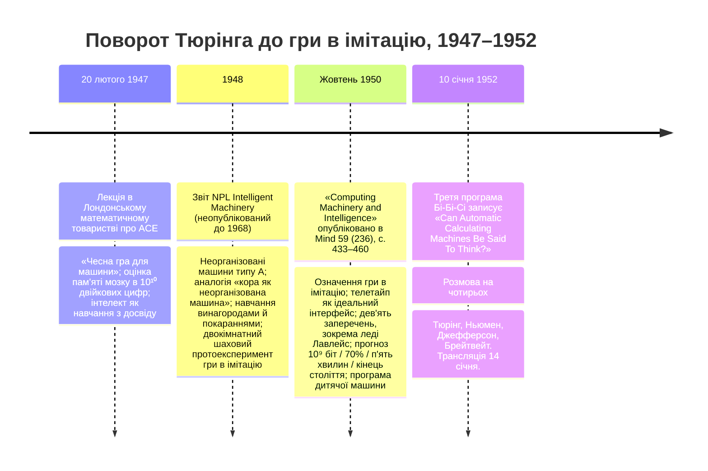

:::tip[В одному абзаці]
Між 1947 та 1952 роками Алан Тюрінг перетворив машинний інтелект із полювання на означення на контрольоване порівняння продуктивностей. Тюрінг не заснував ШІ як дослідницьку галузь — це сталося 1956 року. Він дав придатний до перевірки устрій, спосіб винести за дужки тілесні підказки та провокацію, яку пізніші читачі спростять під назвою «тест Тюрінга».
:::

<strong>Дійові особи</strong>

| Ім'я | Роки життя | Роль |
|---|---|---|
| Алан Тюрінг | 1912–1954 | Автор лекції в ЛМТ 1947 року, звіту NPL *Intelligent Machinery* (1948) та статті 1950 року в *Mind* «Computing Machinery and Intelligence». Рідер з математики в Манчестерському університеті від 1948 року. |
| Макс Г. А. Ньюмен | 1897–1984 | Філденівський професор математики в Манчестері; завідувач кафедри Тюрінга; після війни збудував манчестерську Лабораторію обчислювальних машин Королівського товариства. Учасник трансляції Бі-Бі-Сі в січні 1952 року. |
| сер Джеффрі Джефферсон | 1886–1961 | Професор нейрохірургії в Манчестері. Його Лістерівська промова 1949 року «The Mind of Mechanical Man» атакувала претензії на машинний інтелект на біологічних підставах; у трансляції 1952 року він проніс те саме заперечення проти Тюрінга. |
| Р. Б. Брейтвейт | 1900–1990 | Найтбриджський професор моральної філософії в Кембриджі; голос філософії свідомості в трансляції 1952 року. |
| Ада Лавлейс | 1815–1852 | Авторка *Sketch of the Analytical Engine* (1842). Названа поіменно в *Mind* §6.6 («Заперечення леді Лавлейс»): Аналітична машина «не претендує на те, щоб щось започатковувати». |
| Гелен Келлер | 1880–1968 | Згадана Тюрінгом у *Mind* §7 на доказ того, що освіта не вимагає звичних сенсорних каналів — достатньо спілкування в обидва боки. Використана, щоб обстояти програму дитячої машини. |

<strong>Хронологія (1947–1952)</strong>

<strong>Словник простими словами</strong>

- **Гра в імітацію** — протокол Тюрінга 1950 року для перевірки машинного інтелекту: надрукований обмін, у якому опитувач, прихований від інших сторін, намагається визначити, хто з двох невидимих відповідачів людина, а хто машина. Термін Тюрінга; перейменування на «тест Тюрінга» прийшло пізніше.
- **Телетайп** — електромеханічний пристрій, що передавав надрукований текст по дроту. У грі Тюрінга він робив обмін суто текстовим, тож опитувач судив про мовну поведінку, а не про тілесні підказки.
- **Машина з дискретними станами** — у формулюванні Тюрінга 1950 року це система, чия майбутня поведінка визначається її поточним станом і входом і яка рухається скінченним (хай і величезним) простором конфігурацій. Клас, до якого, доводить Тюрінг, належить цифровий комп'ютер.
- **Аргумент універсальності** — твердження Тюрінга, що одна машина з дискретними станами, маючи достатню пам'ять, швидкість і правильну програму, може імітувати будь-яку іншу машину з дискретними станами. Аргументаційний міст від салонної гри до реального цифрового апаратного забезпечення.
- **Неорганізована машина** — термін Тюрінга 1948 року на позначення випадкової мережі з дискретними станами з простих логічних елементів (машини типу A використовували елементи на кшталт NAND). Її початковий стан навмисно несформований; як біологічний аналог він запропонував кору головного мозку людського немовляти.
- **Паперове втручання проти викруткового втручання** — розрізнення Тюрінга 1948 року між зміною машини шляхом її фізичного перез'єднання (викрутка) та шляхом передавання їй інструкцій (папір). Освіта, доводив він, — це здебільшого паперове втручання.
- **Дитяча машина** — пропозиція Тюрінга 1950 року щодо того, як збудувати гравця в імітацію без шістдесяти працівників, що п'ятдесят років кодували б його вручну: програмувати радше дитячий розум, ніж дорослий, і виховувати його винагородами й покараннями.

Історична важливість статті Алана Тюрінга 1950 року в *Mind* — не в її прогнозі про машину, що ошукає опитувача до 2000 року. Це епістемічний хід. Між 1947 та 1952 роками Тюрінг розібрав означувальну суперечку про слово «інтелект» і замінив її поведінковим протоколом. Спрямувавши взаємодію через телетайп і прибравши фізичне тіло, Тюрінг установив емпіричну базову лінію, за якою можна перевіряти машинний інтелект.

Це вужче твердження, ніж те, що пізніша міфологія часто приписує цій статті. Тюрінг не заснував 1950 року дослідницьку галузь під назвою «штучний інтелект» і не запропонував робочої демонстрації. Він дав протокол, набір обмежень і спосіб відмовитися від суперечки про сутності. Назва галузі, її інституції, канали фінансування й публічні програми прийдуть пізніше. Тут несівний хід — це заміна питання «Чи можуть машини мислити?» ситуацією, у якій опитувач мусить вирішувати.

## Передвісники

Поворот Тюрінга до емпіричного тесту машинного інтелекту не був раптовою появою 1950 року. Філософське підґрунтя й операційну форму тесту було закладено впродовж попередніх трьох років, коли він розмірковував про машини, що існували здебільшого як проєкти, звіти й паперові симуляції, а не як придатні до спілкування співрозмовники.

20 лютого 1947 року Тюрінг виступив перед Лондонським математичним товариством. Говорячи про конструкцію Automatic Computing Engine (ACE) у Національній фізичній лабораторії (NPL), Тюрінг кинув виклик припущенню, що машина має бути бездоганною, аби вважатися інтелектуальною. На його думку, «якщо від машини очікують безпомильності, вона не може бути ще й інтелектуальною». Вимога абсолютної точності була пасткою, що тримала машину на стандарті, якому не відповідав і людський інтелект. Він дійшов висновку, що «машині треба дати чесну гру», стверджуючи, що справжній інтелект криється в циклі навчання і що «нам потрібна машина, здатна вчитися з досвіду».

Вислів «чесна гра» виконував справжню аргументаційну роботу. Обчислювальну машину можна було відкинути за одну помилку, тоді як людський інтелект часто впізнавали саме за здатністю переглядати, узагальнювати, здогадуватися й учитися на невдачах. Тюрінг не просив читачів пробачати погану арифметику. Він зміщував стандарт від механічної безпомильності до адаптивної продуктивності. Якщо навчання з досвіду було частиною інтелекту в людей, то машину, збудовану, щоб змінювати свою поведінку після досвіду, треба було оцінювати за порівнянним правилом.

Під час тієї самої лекції Тюрінг оцінив обсяг пам'яті людського мозку «приблизно в десять тисяч мільйонів двійкових цифр» — близько $10^{10}$ бітів. Натомість сукупна місткість ртутних ліній затримки ACE становила «близько 200 000 двійкових цифр», що, як іронічно зауважив Тюрінг, «імовірно, можна порівняти з обсягом пам'яті гольяна». Кожна п'ятифутова ртутна трубка зберігала 1024 двійкові цифри. Тож машина, яку він описував, не була прихованим мислячим пристроєм, що чекає на викриття. Це був амбітний проєкт зі збереженою програмою, чия пам'ять була крихітною поряд із людським порівнянням, яке запровадив сам Тюрінг. Та все ж він доводив, що скромніша пам'ять на «кілька мільйонів цифр» могла б вистачити для обмежених демонстрацій інтелекту, як-от гри в шахи.

1948 року Тюрінг склав неопублікований звіт NPL під назвою *Intelligent Machinery*. На перших сторінках систематично перелічено п'ять поширених заперечень проти машинного інтелекту — людську гордість, прометеївське релігійне почуття, обмеження новітніх машин, теореми ґеделівського типу та ідею, що інтелект є лише «відображенням» творця, — і для кожного подано «Спростування деяких заперечень». Структура звіту важлива, бо показує, що Тюрінг уже трактував машинний інтелект як суперечку про стандарти доказів. Скептичні позиції не ігнорувалися; їх перетворювали на умови випробування.

Один із прикладів Тюрінга у звіті походив із відомої шкільної історії про Гаусса, який додав арифметичну прогресію, порушивши очікувану процедуру. Річ була не в тім, чи був цей анекдот доброю біографією. Тюрінг скористався ним, щоб відокремити інтелект від послуху. Дитина, яка просто виконує кожну інструкцію, може отримати очікувані оцінки, але інтелект інколи проявляється тоді, коли суб'єкт бачить загальнішу закономірність, ніж просив екзаменатор. Цей приклад готував ґрунт для пізнішого заперечення, що машина ніколи не може зробити більше, ніж їй сказано. Відповідь Тюрінга вже набувала форми: доречне питання не в тім, чи лишилася машина в межах видимих людині інструкцій, а в тім, чи змушує її продуктивність переглянути те, що ці інструкції уможливили.

Що важливіше, звіт 1948 року запровадив поняття «неорганізованих машин». Це були випадкові мережі з дискретними станами, побудовані з простих логічних елементів, причому машини типу A складалися з випадково з'єднаних елементів на кшталт NAND. Їх не програмували в пізнішому сенсі акуратно написаної символьної процедури. Їхній початковий стан був навмисно несформованим. Тюрінг запропонував кору головного мозку людського немовляти як біологічний аналог такої неорганізованої мережі: не завершений дорослий розум, а субстрат, здатний бути організованим через навчання.

Виклик полягав у тому, як її організувати. Тюрінг сформулював навчання машин через систему винагород і покарань: «події, що сталися незадовго до появи сигналу покарання, навряд чи повторяться, тоді як сигнал винагороди підвищував імовірність повторення подій, які до нього привели». Він розрізняв «викруткове втручання» — фізичне перез'єднання машини — і «паперове втручання», тобто передавання інструкцій. Навчання, зауважував він, було здебільшого справою паперового втручання. Це розрізнення — один із технічних мостів від звіту 1948 року до статті 1950 року. Машину можна було змінити, перебудувавши її матеріальну проводку, але її можна було й сформувати символьним рухом наказів, позначок і зворотного зв'язку. Майбутня гра в імітацію залежатиме саме від цього другого типу руху.

У самому кінці звіту *Intelligent Machinery*, у розділі під назвою «Intelligence as an Emotional Concept», Тюрінг окреслив двокімнатний шаховий експеримент, що слугував протогрою в імітацію. Він уявив трьох учасників: слабкого шахіста (A), математика, який керує паперовою машиною (B), та ще одного слабкого шахіста в ролі спостерігача (C). Спостерігач грає одну партію проти A й одну проти паперової машини, причому ходи передають між двома окремими кімнатами. «C може виявитися доволі важко сказати, проти кого він грає», — писав Тюрінг. Він додав промовисту примітку про цей устрій: «Це доволі ідеалізована форма експерименту, який я насправді проводив».

Це твердження не варто роздувати до гасла про пріоритет. Уривок 1948 року не подає ні кількості партій, ні тривалості гри, ні формального критерію успіху. Він вужчий і кориснішим за це. Він показує, що операційна форма пізнішого тесту вже присутня: розділені кімнати, канал зв'язку, прихована машинна процедура та людина-суддя, що намагається вивести, яке джерело породило поведінку. Середовищем досі є шахи, а не вільна розмова, і «машиною» може бути паперова процедура, яку виконує математик, але епістемічний хід упізнаваний. До інтелекту підходять через сліпе порівняння продуктивностей.

## Салонна гра

У жовтні 1950 року Тюрінг опублікував «Computing Machinery and Intelligence» у філософському журналі *Mind*, том 59. Стаття починається з навмисної підважної фрази: «Я пропоную розглянути питання: „Чи можуть машини мислити?“».

Поставивши питання, Тюрінг одразу відкидає метод пошуку відповіді через огляд загальновживаних значень слів «машина» та «мислити». Він відкидає означувальну суперечку як «абсурдну» вправу, подібну до опитування Геллапа. Натомість, пише він, «замість такого означення я заміню питання іншим, тісно з ним пов'язаним і висловленим відносно недвозначними словами».

Це нове питання — гра в імітацію. У своїй первісній формі ця гра є вікторіанською салонною розвагою на трьох осіб: чоловіка (A), жінки (B) та опитувача (C), що може бути будь-якої статі. Опитувач перебуває в окремій від A та B кімнаті, знаючи їх лише за позначками X та Y. Завдання опитувача — визначити, хто з них чоловік, а хто жінка. Гра асиметрична: мета A — змусити опитувача помилитися в розпізнаванні, тоді як мета B — допомогти опитувачеві вирішити правильно.

Цей первісний устрій легко загубити, бо пізніший вислів «тест Тюрінга» підказує простішу картину: людина з одного боку, машина з іншого та суддя, що намагається їх розрізнити. Текст Тюрінга починається з чогось конкретнішого. Людська базова лінія вже є грою в імітацію, обман і соціальне виведення ще до того, як до неї входить машина. Машину спершу порівнюють не з абстрактною людською сутністю. Її вставляють у гру, де одна людська сторона вже намагається ввести опитувача в оману за контрольованих комунікативних умов.

Щоб гра перевіряла лише інтелектуальну спроможність, інтерфейс має бути жорстко обмежений. «Щоб тон голосу не допомагав опитувачеві, — уточнює Тюрінг, — відповіді слід давати письмово, а ще краще — на друкарській машинці. Ідеальний устрій — мати телетайп для зв'язку між двома кімнатами». Як варіант, посередник може передавати запитання й відповіді.

Телетайп — це не декоративна машинерія тієї доби. Це апарат, що уможливлює протокол. Ні голос, ні обличчя, ні хода, ні шкіра, ні нервовий жест, ні видиме тіло не можуть вирішити вердикт. Опитувач отримує лише надруковану мовну поведінку під позначками, що приховують джерело. Заявлена причина Тюрінга операційна: тон голосу не повинен допомагати опитувачеві. Ширший ефект — провести межу навколо того, що рахується доказом. Гра не питає, чи може машина виростити людське тіло чи мати людську горлянку. Вона питає, чи змінюють її відповіді, всередині надрукованого обміну, шанс опитувача зробити правильне розпізнавання.

Установивши цю гру на розрізнення статі як базову лінію людського обману й виявлення, Тюрінг робить свій вирішальний поворот: «Тепер ми ставимо питання: „Що станеться, коли роль A в цій грі візьме машина?“ Чи помилятиметься опитувач так само часто, коли гру грають отак, як тоді, коли її грають між чоловіком і жінкою? Ці питання заміняють наше первісне: „Чи можуть машини мислити?“».

Гендерна структура устрою 1950 року встановлює контрольну групу. Машині не треба досягати абсолютного обману. Їй лише треба ошукувати опитувача так само часто, як ошукував би його чоловік, що грає в ту саму гру. Людська базова лінія обману — це міра, проти якої підставляють і оцінюють продуктивність машини.

Ось чому відкривальний хід радикальніший за дотепний анекдот. Тюрінг не означує мислення, щоб потім перевірити, чи задовольняє машина це означення. Він задає ситуацію, у якій людина-суддя може помилитися, задає канал, яким можуть проходити докази, і питає, чи змінює заміна одного учасника машиною патерн хибних суджень. Задача стала емпіричною, не ставши простою.

## Аргументаційний хребет

Середні розділи статті в *Mind* утворюють аргументаційний хребет, покликаний захистити гру в імітацію від теоретичних нападів. У розділі 2 Тюрінг подає «Критику нової задачі», обстоюючи рішення відокремити інтелект від фізичного втілення. «Жоден інженер чи хімік не претендує на те, що здатний виготовити матеріал, нерозрізнюваний від людської шкіри», — зауважує він. І навіть якби таку синтетичну шкіру вдалося винайти, «ми відчували б, що мало сенсу намагатися зробити „мислячу машину“ людянішою, вбравши її в таку штучну плоть». Обмеження телетайпом операціоналізує це відокремлення: воно не дає опитувачеві бачити, торкатися чи чути учасників, забезпечуючи, що тест вимірює символьну й мовну поведінку, а не анатомічне наслідування.

Річ не в тім, що тіла неважливі для людського життя. Твердження Тюрінга обмеженіше й процедурніше. Якщо питання в тім, чи може машина діяти інтелектуально, то тест, який можна виграти штучною шкірою, переконливим голосом чи візуальним удаванням, спроєктовано погано. Нова задача проводить «доволі чітку межу» між фізичними та інтелектуальними здатностями. Ця межа не метафізична; вона експериментальна. Вона каже, що опитувачеві дозволено використовувати як доказ.

Розділи з 3 по 5 переформульовують задачу навколо цифрових комп'ютерів. Тюрінг звужує «машину» до цифрового комп'ютера, а потім трактує відповідний клас як машини з дискретними станами: системи, чия майбутня поведінка визначається їхнім поточним станом та входом і які рухаються скінченним, хай і величезним, простором можливих конфігурацій. Звідси він висуває аргумент універсальності. Одна машина з дискретними станами, оснащена достатньою пам'яттю та швидкістю, може імітувати поведінку будь-якої іншої машини з дискретними станами, якщо їй дати правильну програму.

Саме це переформулювання пов'язує салонну гру з реальним повоєнним апаратним забезпеченням. Тюрінг не стверджував, що кожну фізичну деталь нервової системи можна відтворити в машинній залі. Він доводив, що поведінку, доречну для тесту, може породити цифровий комп'ютер, якщо пам'яті, швидкості й програмування буде достатньо. Щоб закріпити теоретичну тезу в сучасній йому реальності, він посилається на параметри пам'яті манчестерської машини, зазначаючи її 64 магнітні доріжки місткістю по 2560 кожна та вісім електронних ламп місткістю по 1280. Манчестерський приклад не доводить, що машина 1950 року могла грати в цю гру. Він показує, що аргумент уже не ширяє цілком над апаратурою. Пам'ять рахується, таблиці команд рахуються, а реальні машини достатньо близькі до обговорення, щоб правити за орієнтири.

Розділ 6, «Протилежні погляди на головне питання», каталогізує дев'ять окремих заперечень проти ідеї мислячих машин: теологічний спротив, відмову «голови в пісок», математичне обмеження, свідомість, переліки нібито нездатностей, заперечення леді Лавлейс, неперервність у нервовій системі, неформальність поведінки та екстрасенсорне сприйняття. Цей перелік навмисно дивний. Він збирає високу теологію, фахову математику, поширене упередження, неврологію, філософію свідомості й навіть екстрасенсорику в один аргументаційний простір. Мета Тюрінга — не довести, що кожне заперечення безглузде. Вона в тім, щоб показати, що гру в імітацію збудовано так, аби їх пережити.

Одне із заперечень, з яким Тюрінг розбирається найповніше, — це заперечення, приписуване леді Аді Лавлейс, яка писала, що Аналітична машина «не претендує на те, щоб щось започатковувати». Суть заперечення Лавлейс, як його застосовує Тюрінг, у тім, що машини можуть робити лише те, що ми вміємо наказати їм виконувати; вони не можуть нас здивувати. Тюрінг заперечує це, зауважуючи, що машини часто його дивують. Сам по собі подив не є доказом інтелекту, адже програміста може здивувати помилка, непомічений наслідок чи погано зрозумілий механізм. Але це проколює надто просту версію заперечення. Знати правила, що керують системою, — не те саме, що передбачати кожен наслідок цих правил.

Далі Тюрінг переводить питання від подиву до породжувальності. Він питає, чи може розум бути «надкритичним» у сенсі атомного реактора: «Ідея, подана такому розуму, може породити цілу „теорію“ з вторинних, третинних і дальших ідей». Аналогію дібрано ретельно. Підкритична система поглинає вхід, не породжуючи ланцюгової реакції. Надкритична система може перетворити одну ініціювальну подію на каскад. У контексті машин, що навчаються, питання стає таким: чи можна організувати навчену машину так, щоб вхід не просто запускав збережену відповідь, а провокував дальші структури відгуку. Відповідь лишають відкритою, але заперечення Лавлейс ослаблено. Уже не досить сказати, що машина почалася як людський задум.

Тюрінг також розглядає «Аргумент від свідомості», який стверджує, що машина мусить відчувати емоції й усвідомлювати власні думки, аби вважатися інтелектуальною. Біологічну форму цього заперечення пов'язували з Лістерівською промовою Джеффрі Джефферсона 1949 року «The Mind of Mechanical Man», хоча для розуміння того, як Тюрінг дає раду цій вимозі, цьому розділу не потрібен повний текст Джефферсона. Відповідь Тюрінга в §6.4 обертає вимогу проти неї самої: суворе наполягання на верифікації від першої особи відкинуло б ті самі докази, які ми звично приймаємо щодо інших людей, кому приписують мислення на основі зовнішньої поведінки, а не прямого огляду. За тією самою логікою машину, що задовольняє тест на імітацію, не варто відкидати за стандартом, якому не міг би відповідати й жоден людський співрозмовник.

Суміжне заперечення про «різні нездатності» дає Тюрінгові змогу атакувати буденнішу версію тієї самої помилки. Скептик пропонує перелік нібито меж — доброти, оригінальності, здатності помилятися, чуттєвої насолоди, емоційного відгуку, користування мовою — і трактує кожну як остаточну неможливість. Перелік виглядає переконливо, бо він конкретний. Відповідь Тюрінга — відмовитися сприймати цей перелік як усталений реєстр неможливостей. Деякі пункти плутають відсутність нинішньої інженерії з неможливістю в принципі; інші протягують свідомість назад у тест; ще інші — це саме ті поведінкові здатності, які гра в імітацію може промацати. Патерн той самий, що й 1947 року. Машину не можна судити за правилом, вигаданим, щоб зробити її поразку автоматичною.

## Прогноз і дитяча машина

Найчастіше цитований уривок статті в *Mind* трапляється на початку розділу 6, де Тюрінг пропонує конкретний кількісний прогноз.

«Я вважаю, що приблизно за п'ятдесят років стане можливим програмувати комп'ютери з обсягом пам'яті близько $10^9$ так, щоб вони грали в гру в імітацію настільки добре, що пересічний опитувач матиме не більш ніж 70-відсотковий шанс зробити правильне розпізнавання після п'яти хвилин опитування».

Це не бінарна фінішна межа для штучного інтелекту. Це твердження про частоту в популяції пересічних опитувачів, обмежене п'ятихвилинним лімітом часу та зіставлене з оцінюваним обсягом пам'яті. Число $10^9$ означає один мільярд двійкових цифр, близько 125 мегабайтів, якщо арифметично перевести в сучасні байтові одиниці, але цьому переведенню не варто надавати більше значення, ніж надавав Тюрінг. Він не передбачав інтернету чи споживчого комп'ютера. Він оцінював пам'ять, потрібну машині, щоб діяти достатньо добре в певній надрукованій грі-опитуванні.

Одразу після цього Тюрінг робить супутнє твердження радше про культурне сприйняття, ніж про інженерію: «Я вважаю, що наприкінці століття слововжиток і загальна освічена думка зміняться настільки, що можна буде говорити про мислення машин, не очікуючи заперечень». Ці два прогнози пов'язані, але не тотожні. Один стосується продуктивності машини за визначеним протоколом; інший — того, як освічені мовці вживатимуть слово «мислення» після десятиліть контакту з такими машинами. Епістемічна ставка Тюрінга в тім, що слововжиток іде за практикою. Якщо машини зможуть діяти всередині протоколу досить добре, мовне табу навколо «мислення» ослабне.

Тюрінг добре усвідомлював, що жодна машина зразка 1950 року не змогла б грати в цю гру. У розділі 7 він оцінює пам'ять людського мозку десь від $10^{10}$ до $10^{15}$ двійкових цифр, додаючи, що схиляється до нижчих значень і що значну частину сховища, ймовірно, використовують для зорових вражень. Він також зазначає, що обсяг пам'яті $10^7$ був би здійсненним за сучасними йому техніками і що *Encyclopaedia Britannica*, одинадцяте видання, зайняла б близько $2 \times 10^9$ двійкових цифр. Ці порівняння задають масштаб прогнозу. Гравця в імітацію уявляють не як магію; його уявляють як складну задачу зберігання й програмування.

Він підрахував, що людина-програміст може писати близько тисячі цифр коду на день, а отже, щоб запрограмувати гравця в імітацію вручну, знадобилося б шістдесят працівників і п'ятдесят років бездоганної роботи, якби нічого не йшло в кошик для сміття. «Бажаним видається якийсь швидший метод», — зауважив він. Це сухе речення — стрижень статті. Якщо програмувати дорослий розум вручну абсурдно марудно, то рішення не в тім, щоб облишити тест. Воно в тім, щоб змінити спосіб виробництва машини.

Це підводить до розділу 7, «Машини, що навчаються», який переорієнтовує всю інженерну задачу. Замість того щоб намагатися запрограмувати дорослий розум з нуля, Тюрінг пропонує запрограмувати дитячий розум і піддати його «належному курсу освіти». Ця ідея сягає звіту про неорганізовані машини 1948 року. Почни з чогось ближчого до кори немовляти, ніж до дорослого фахівця; потім організуй це через навчання.

:::note
> «Замість того щоб намагатися створити програму, яка імітує дорослий розум, чому б радше не спробувати створити таку, що імітує дитячий?»

Стрижень статті в *Mind*. Тюрінг перетворює інтелект із виробу, закодованого вручну, на поетапну інженерну задачу, у якій освіта робить те, чого не може пряме інструктування.
:::

Метафора зошита в Тюрінга робить пропозицію конкретною. Дитячий мозок, припускає він, схожий на зошит, куплений у канцелярській крамниці: мало механізму й багато чистих аркушів. Ця метафора може ввести в оману, якщо прочитати її надто м'яко. Він не каже, що дитячий розум порожній у філософському сенсі. Він відокремлює початкову структуру від освіти й пізнішого досвіду, щоб кожне з них могло стати інженерною змінною. Конструктор машини може змінювати початкову конфігурацію, метод навчання чи неосвітній досвід, якому машину піддають.

Тюрінг ділить розум на три складники: «(a) початковий стан розуму, скажімо, при народженні; (b) освіта, якій його піддали; (c) інший досвід, який не можна описати як освіту, якому його піддали». Він повертається до системи винагород і покарань, яку окреслив 1948 року, скромно зауважуючи, що провів «деякі експерименти з однією такою дитячою машиною й зумів навчити її кільком речам, але метод навчання був надто неортодоксальним, щоб експеримент можна було вважати справді успішним». Ця скромність важлива. Тюрінг не звітує про тріумфальний прототип. Він позначає напрям атаки, який досі грубий, експериментальний і потребує кращих методів навчання.

Щоб показати, що освіта не вимагає неодмінно звичного чуттєвого втілення, він наводить приклад Гелен Келлер, зауважуючи, що достатньо спілкування в обидва боки. Цей аргумент важливий, бо не дає програмі дитячої машини скотитися назад до вимоги людиноподібних тіл. Машині можуть бути потрібні канали для інструкцій і відгуку; їй не конче починати з усіма органами чуття, через які зазвичай навчаються люди.

Тюрінг проводить явну аналогію між цим освітнім циклом проєктування та біологічною еволюцією. Структура дитячої машини відповідає спадковому матеріалу; зміни, внесені в дитячу машину, — це мутації; а судження експериментатора бере на себе роль природного добору. Ця аналогія перетворює інженерну задачу на ітеративний пошук. Збудуй дитячу машину, навчи її, виміряй її поведінку, зміни конструкцію — і повтори. 1950 року це ще не було промисловою дослідницькою програмою, але це був упізнавано сучасний спосіб думати про машинний інтелект: не як про єдиний закодований вручну дорослий інтелект, а як про систему, чия продуктивність постає через повторюване коригування.

Завершуючи статтю, Тюрінг визначає два можливі шляхи вперед. Один підхід зосередився б на вкрай абстрактних діяльностях, як-от шахах. Цей шлях пов'язаний з лекцією 1947 року та експериментом із паперовою машиною 1948 року: шахи давали обмежену царину, де ходи можна було подати символьно й оцінити грою. Альтернатива — забезпечити машину «найкращими органами чуття, які можна купити за гроші», і навчити її розуміти й говорити англійською. Цей шлях націлений на багатшу розмовну поведінку, якої вимагає гра в імітацію. Відмовляючись оголосити переможця між символьним і втіленим підходами, Тюрінг пише: «Знову ж таки, я не знаю, яка відповідь правильна, але гадаю, що варто спробувати обидва підходи».

Останнє речення статті в *Mind* звучить так: «Ми бачимо лише на коротку відстань уперед, але й там бачимо чимало того, що треба зробити».

## Наслідки: Бі-Бі-Сі та переосмислення

Після виходу статті Тюрінг повернувся до цього питання публічно. 14 січня 1952 року Третя програма Бі-Бі-Сі транслювала розмову на чотирьох під назвою «Can Automatic Calculating Machines Be Said To Think?». До панелі входили Тюрінг, його манчестерський колега Макс Ньюмен, кембриджський філософ Р. Б. Брейтвейт і Джеффрі Джефферсон.

Трансляція винесла теоретичні дискусії статті в *Mind* у публічне розмовне середовище. Джерельний запис, доступний для цього розділу, підтримує обережну версію сцени: роль Джефферсона належить до лінії біологічного заперечення, уже помітної в Лістерівській промові 1949 року та в обговоренні Тюрінгом «Аргументу від свідомості», тоді як позиція Тюрінга лишається рамкою поведінкового тесту зі статті в *Mind*. Не цитуючи стенограму трансляції, важливо вказати на склад учасників і середовище. За два роки питання стало розмовою між математикою, нейрохірургією, філософією та автором тесту.

Упродовж наступних п'ятдесяти років сприйняття статті Тюрінга змінювалося в різних дисциплінах, як це оглянули Айше Пінар Сайгин, Ільяс Чічеклі та Варол Акман 2000 року. Їхній огляд простежує філософські відгуки в 1960-х і 1970-х, обчислювальні відгуки в 1980-х, а пізніше — суперечки про антропоморфізм, гендер і механіку гри в 1990-х. Цю дугу не варто плутати зі стабільним прояснюванням. Вона фіксує й дрейф.

Упродовж цього півстоліття «гра в імітацію» зазнала поступового перейменування. Термін «тест Тюрінга» став панівним ярликом. Разом зі зміною назви прийшов і тонкий структурний зсув. Первісний устрій 1950 року — де машина бере на себе роль A у грі в імітацію між чоловіком і жінкою — часто спрощували до прямолінійного тесту «людина проти машини».

Чи була ця абстракція вірною задумові Тюрінга, лишається спірним. Даян Праудфут доводила, що подальші коментарі вилучили структуру розрізнення статі, на якій Тюрінг збудував тест. За таким прочитанням «абстрагований» тест Тюрінга, де опитувач лише намагається відрізнити людину від машини, — це інший тест, ніж той, що його запропонував Тюрінг. Інші коментатори трактували гендерну вісь як рудиментарну рису, яку й мали абстрагувати. Відповідальна історична теза — не залагодити тут цю незгоду, а втримати первісну структуру на видноті.

Незалежно від того, чи була гендерна структура несівною, ключовий епістемічний хід Тюрінга вцілів. Замінивши непосильне питання про те, чи можуть машини мислити, на емпіричну, прив'язану до телетайпа гру в імітацію, Тюрінг задав операційну базову лінію. Решта галузі раз у раз сперечатиметься про те, чи була ця базова лінія достатньою, чесною, надто поведінковою, надто мовною, надто антропоморфною чи надто легкою для обходу. Але ці суперечки точилися на ґрунті, який розчистив Тюрінг: не починай з означення мислення; починай із тесту на те, у що машина здатна змусити повірити компетентного опитувача.

:::note[Чому це досі важливо сьогодні]
Кожен бенчмарк, що питає, чи може модель вести розмову, нерозрізнювану від людської, походить від ходу Тюрінга. Як і кожна панель «оцінювання ШІ», що порівнює надрукований вивід моделі з людським, кожна стенограма чат-бота, яку оцінює тестувальник, кожна змагальна проба, покликана впіймати машину на викритті. Ця рамка настільки натуралізувалася, що легко забути: її довелося винайти — і що цей винахід був актом відмови. Адекватність цього устрою лишається спірною; його тривкість — у тому, що він заганяє суперечку в спостережувану поведінку.
:::
