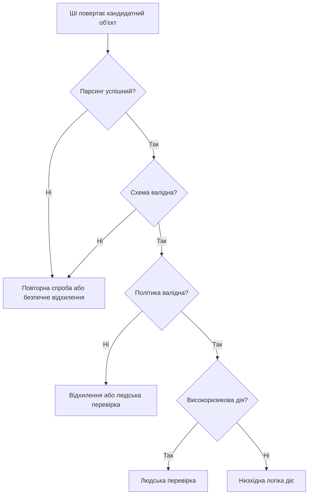

> **Побудова ШІ** | Складність: `[MEDIUM]` | Час: 55-70 хв | Передумови: Модуль 1.1, базова грамотність в API та вміння читати JSON

## Результати навчання

Після завершення цього модуля ви зможете:

- **Обирати** модель ШІ для продуктового робочого процесу, враховуючи затримку, вартість, глибину міркування, підтримку інструментів та обмеження ризику.
- **Проєктувати** контекстний пакет, який надає моделі завдання, дані, обмеження та приклади, необхідні для отримання корисного результату.
- **Порівнювати** довільну прозу, структуровані вихідні дані та виклики інструментів для різної поведінки застосунку.
- **Будувати** стратегію валідації, яка розташована між виводом моделі та низхідною логікою застосунку.
- **Оцінювати** інтеграцію ШІ API на предмет режимів відмови до того, як вона вплине на користувачів, бази даних або автоматизовані робочі процеси.

## Чому цей модуль важливий

Продакт-менеджер відкриває панель у понеділок вранці та бачить, що сотні тікетів підтримки були спрямовані в неправильну чергу. Функція ШІ не була очевидно зламаною: вона повертала впевнені підсумки та в більшості випадків створювала валідний JSON. Вона навіть виглядала вражаюче на демо. А відмова сталася тому, що команда розглядала модель як продуктову межу. Застосунок надсилав розпливчастий промпт, а модель здогадувалася на основі неповного контексту.

Відповідь була розібрана так, ніби форматування означало коректність, а потім низхідний робочий процес довірився розібраним полям і перемістив реальні запити клієнтів у неправильні черги. Це типова форма слабких ШІ-продуктів, і вони ламаються на стиках між поведінкою моделі та поведінкою програмного забезпечення. Модель є ймовірнісною, застосунок — детермінованим, а виклик API з'єднує їх, але не робить їх однаковим типом системи.

Сильний ШІ-продукт проєктується навколо цієї невідповідності: розробник обирає модель для роботи, а не для галасу. Розробник подає контекст свідомо, а не як запізнілу думку, і запитує вивід у формі, яку застосунок може перевірити. Розробник валідує цей вивід перед будь-якою незворотною дією. Цей модуль навчає цієї форми системи: він починається з вибору моделі, оскільки поведінка моделі змінює поведінку продукту. Потім переходить до контексту, оскільки модель може використовувати лише те, що отримує.

Далі він вводить структуровані вихідні дані, оскільки програмне забезпечення потребує контрактів, і завершується рівнем валідації, оскільки структуровані вихідні дані без валідації — це лише краще оформлена відмова.

> **Поглиблене вивчення:** Для наскрізної контекстної інженерії (бюджети, межі пошуку та оркестрація) див. [Основи контекстної інженерії](../ai-engineering-foundations/module-2.1-context-fundamentals/).

## Вибір моделі — це дизайн продукту

Вибір моделі — це не лише інфраструктурне рішення: він змінює користувацький досвід і змінює вартість. Він змінює затримку, змінює те, як часто застосунок потребує резервної поведінки, і змінює те, які завдання слід автоматизувати, а які — ставити на паузу для перевірки. Модель, яка чудово підходить для повільного аналізу з високими ставками, може бути поганим вибором для вбудованого автодоповнення, а модель, яка чудово підходить для дешевої класифікації, може бути поганим вибором для налагодження багатокрокового звіту про інцидент.

Модель, яка підтримує інструменти, може бути необхідною для робочого процесу, що потребує пошуку, перегляду файлів або виконання коду, а модель із великим контекстним вікном може дозволити застосунку включити повні документи, тоді як менша модель може потребувати пошуку та підсумовування перед викликом. Модель із сильнішим міркуванням може зменшити навантаження на перевірку у складних випадках, а швидша модель може зробити інтерфейс миттєвим. Тому важливе продуктове питання не «яка модель найкраща?», а «яка модель найкраща для цього робочого процесу за цих обмежень?». Ці обмеження зазвичай видимі до реалізації, і ви можете перелічити їх, ранжувати, тестувати та переглядати, коли використання зростає.

### Базова карта компромісів

| Потреба продукту | Важливий атрибут моделі | Чому це важливо |
|---|---|---|
| Вбудовані пропозиції в UI | низька затримка | користувач чекає в інтерфейсі |
| Пакетна перевірка документів | вартість і пропускна здатність | багато викликів можуть виконуватися без очікування людини |
| Аналіз безпеки | глибина міркування та консервативна поведінка | хибна впевненість може створити ризик |
| Маршрутизація підтримки клієнтів | структуровані вихідні дані та узгодженість | низхідні системи потребують стабільних полів |
| Актуальні відповіді щодо ринку або політик | підтримка пошуку або витягування | статичні знання моделі можуть бути застарілими |
| Перевірка довгих контрактів | розмір контексту та стратегія прив'язки до джерел | модель потребує достатньо вихідного матеріалу |
| Автоматизація робочих процесів | підтримка інструментів і валідація | модель може ініціювати реальні дії |

Ця таблиця є відправною точкою, а не системою оцінювання, і та сама функція може мати кілька режимів. Продукт підтримки може використовувати швидку модель для класифікації кожного тікета, сильнішу модель — лише коли перша модель повідомляє про низьку впевненість, і надсилати випадки з високоризиковими платежами людині, навіть коли модель упевнена. Такий багаторівневий дизайн зазвичай кращий, ніж вибір однієї дорогої моделі для всього, і також зазвичай кращий, ніж вибір однієї дешевої моделі для всього.

### Опрацьований приклад рішення: сортування тікетів підтримки

Команда створює функцію сортування тікетів підтримки, і ця функція отримує нові тікети з електронної пошти та чату. Вона має класифікувати кожен тікет в одну з таких черг:

- `billing`
- `login_access`
- `bug_report`
- `feature_request`
- `security_risk`
- `other`

Кожен тікет також має отримати одне з таких значень серйозності:

- `low`
- `medium`
- `high`
- `critical`

Команда обирає між двома конкретними моделями у своєму каталозі API. Перший варіант — `gpt-5 mini`: він швидший і дешевший, добре підходить для чітко визначених завдань. Другий варіант — `gpt-5.2`, який [сильніший для складного міркування та агентної роботи](https://openai.com/index/introducing-gpt-5-2/). Він коштує дорожче і може не бути потрібним для простої класифікації. Перша вимога продукту: тікети мають з'являтися в правильній черзі протягом кількох секунд.

Друга вимога: тікети з ризиком безпеки не можна пропускати. Третя вимога: команда щодня обробляє багато рутинних тікетів. Четверта вимога: керівник підтримки вже перевіряє критичні ескалації. Слабке рішення сказало б: «Використовуйте найсильнішу модель, бо вона найкраща». Це ігнорує вартість і форму робочого процесу. Інше слабке рішення сказало б: «Використовуйте найдешевшу модель, бо це лише класифікація». Це ігнорує високоризиковий клас.

Сильніше рішення розділяє робочий процес: використовуйте `gpt-5 mini` для класифікації першого проходу, оскільки більшість тікетів рутинні, а вихідна схема вузька. Додайте правила валідації, які відхиляють неможливі комбінації, і додайте другий прохід із `gpt-5.2` лише для неоднозначних тікетів, тікетів, пов'язаних із безпекою, або з високою серйозністю. Надсилайте будь-який тікет, що залишається невизначеним, до людської черги. Це і є дизайн продукту: вибір моделі пов'язаний із користувацьким досвідом, моделлю ризику та операційною вартістю. Реалізація не вдає, що одна модель вирішує всі випадки, а створює шлях для звичайних випадків і окремий шлях для ризикованих випадків.

### Точка рішення: оберіть шлях моделі

Ваша команда додає функцію ШІ до інструменту підтримки в живому чаті. Агент вводить коротке запитання клієнта та очікує запропонованої відповіді, поки клієнт чекає. Деякі розмови згадують блокування облікових записів, деякі — можливе шахрайство, і у вас є два варіанти реалізації. Варіант A використовує швидку модель для кожної пропозиції та блокує повідомлення, що відповідають політиці високого ризику. Варіант B використовує сильнішу модель для кожної пропозиції та змушує агента чекати довше.

Перш ніж читати відповідь, вирішіть, з якого варіанту ви б почали та який захисний бар'єр додали б. Розумний перший дизайн — Варіант A з чіткою поведінкою ескалації. Швидка модель підтримує швидку реакцію інтерфейсу, а перевірка політики запобігає тому, щоб застосунок невимушено пропонував небезпечні дії у високоризикових випадках. Сильнішу модель все ще можна використовувати як другий прохід, коли випадок складний, чутливий або неясний. Ключ не в тому, що швидке завжди краще, а в тому, що користувацький досвід вимагає швидкості для звичайних випадків та обережності для ризикованих випадків, і це штовхає вас до багаторівневого дизайну.

### Простий контрольний список вибору моделі

Починайте із завдання, а не з каталогу моделей. Запитайте, чого користувач намагається досягти. Запитайте, що застосунок робитиме з результатом, і чи впливає вивід моделі на гроші, безпеку, здоров'я, доступ, юридичний статус, продакшен-системи або довіру клієнтів. Запитайте, як швидко користувач очікує відповіді, чи потребує завдання актуальної інформації та чи потребує завдання інструментів. Запитайте, чи потребує завдання довгого контексту, чи можна результат перевірити механічно, що станеться, коли модель невпевнена, і що станеться, коли модель помиляється. Лише після цих запитань слід обирати модель. Практичний запис вибору може бути коротким, але має бути достатньо явним, щоб колега міг його оскаржити.

```text
Функція: маршрутизація тікетів підтримки

Основна модель:
gpt-5 mini

Чому:
Структурована класифікація з низькою затримкою — це звичайний шлях.
Дозволені мітки вузькі.
Більшість тікетів рутинні.
Рівень валідації може відхиляти недійсні мітки.

Модель ескалації:
gpt-5.2

Коли:
Тікет згадує безпеку, шахрайство, захоплення облікового запису, юридичні погрози або самоушкодження.
Перший прохід повідомляє про низьку впевненість.
Вивід не проходить валідацію двічі.
Підсумок суперечить обраній черзі.

Людська перевірка:
Завжди обов'язкова для критичної серйозності.
Завжди обов'язкова для закриття облікового запису або автоматизації повернення коштів.
```

Цей запис — не бюрократія: він документує продуктову логіку та також полегшує тестування. Якщо затримка стає неприйнятною, ви знаєте, де вимірювати. Якщо тікети безпеки спрямовуються неправильно, ви знаєте, яке правило ескалації перевірити. Якщо витрати зростають, ви знаєте, які виклики є частими, а які — винятковими.

### Антипатерн вибору моделі: архітектура на основі галасу

Архітектура на основі галасу починається з анонсу моделі, а потім команда шукає місце для її застосування. Такий підхід часто створює крихкі системи. Модель може бути потужною, але невідповідною до робочого процесу, а вивід може бути вражаючим, але непридатним для перевірки. Функція може добре виглядати на демо, але відмовляти при повторному використанні. Кращий підхід починається з дизайну робочого процесу, а модель є одним компонентом у цьому робочому процесі. Запит API — це одна межа в цьому робочому процесі, контекстний пакет — один вхід у цьому робочому процесі, рівень валідації — один контроль безпеки в цьому робочому процесі, а шлях людської перевірки — один операційний контроль у цьому робочому процесі. Досвідчений розробник може пояснити всі ці частини, тоді як початківець часто зосереджується лише на промпті. Цей модуль переводить вас від погляду початківця до системного погляду.

## Контекст — це справжній інтерфейс

Модель бачить лише те, що ви надаєте. Це звучить очевидно, і саме тому багато ШІ-функцій зазнають невдачі. Людина-агент підтримки бачить обліковий запис клієнта, продуктову область, рівень обслуговування, попередню розмову та політики компанії, тоді як модель бачить лише тіло запиту. Якщо тіло запиту не містить політики, модель не може надійно її дотримуватися. Якщо тіло запиту не містить тарифного плану клієнта, модель може припустити неправильні права. Якщо тіло запиту не містить прикладів очікуваної класифікації, модель може вигадати власні мітки. Якщо тіло запиту містить забагато нерелевантного матеріалу, модель може зосередитися на неправильних доказах. Отже, контекст — це справжній інтерфейс між вашим застосунком і моделлю, а промпт — лише одна частина цього контексту.

### Що входить до контексту

Корисний контекстний пакет зазвичай містить кілька частин: системну або розробницьку інструкцію, запит користувача, витягнуті документи або записи, приклади, коли завдання виграє від прикладів, обмеження, вимоги до виводу, результати інструментів, якщо інструменти викликалися раніше в робочому процесі, попередні повідомлення, а також метадані, такі як роль користувача, тарифний план, локаль, регіон або версія продукту.

Кожна частина має заслужити своє місце: не включайте дані лише тому, що вони доступні, і не пропускайте дані лише тому, що промпт виглядає чистішим без них. Сильний контекстний пакет схожий на хорошу передачу інциденту: він дає наступному оператору факти, необхідні для дії, залишає осторонь шум, робить обмеження видимими та називає очікуване рішення.

### Анатомія контексту

```text
+------------------------------------------------------------+
|                   Контекст запиту ШІ                       |
+----------------------+-------------------------------------+
| Інструкція завдання  | Що модель має зробити              |
| Ввід користувача     | Сирий запит або розмова            |
| Витягнуті факти      | Політики, документи, записи,       |
|                      | приклади                            |
| Обмеження            | Дозволені та заборонені дії         |
| Контракт виводу      | Обов'язкові поля та формати значень |
| Керівництво з ризику | Коли ескалювати або відмовляти     |
+----------------------+-------------------------------------+
```

Це перша ментальна модель, яку слід запам'ятати: модель не читає вашу базу даних, не читає ваші продуктові вимоги, не читає політику вашої компанії. Вона читає контекст, який ви надсилаєте. Якщо важливий факт відсутній, модель може здогадуватися. Якщо важливе обмеження відсутнє, модель може його порушити. Якщо контракт виводу відсутній, модель може відповісти у формі, яку ваше програмне забезпечення не може використати.

### Слабкий промпт проти спроєктованого контексту

Слабкий підхід просить хороший промпт, як у цьому прикладі:

```text
Прочитайте цей тікет підтримки та скажіть, про що він.
```

Це може створити корисний абзац, але також може створити абзац, який важко маршрутизувати, може використовувати мітки, які низхідна система не розпізнає, може не відрізнити терміновість від емоцій і може пропустити критерії ескалації. Спроєктований контекстний пакет є більш явним:

```text
Ви класифікуєте вхідні тікети підтримки для маршрутизації.

Використовуйте лише ці значення issue_type:
- billing
- login_access
- bug_report
- feature_request
- security_risk
- other

Використовуйте лише ці значення severity:
- low
- medium
- high
- critical

Ескалюйте на людську перевірку, коли:
- клієнт повідомляє про підозрюване шахрайство
- клієнт не може отримати доступ до облікового запису з правами адміністратора
- тікет згадує юридичні дії
- тікет запитує повернення коштів понад автоматизований ліміт
- вміст занадто неоднозначний для безпечної класифікації

Тікет:
{{ticket_text}}

Поверніть об'єкт JSON, що відповідає схемі, наданій застосунком.
```

Друга версія не краща тому, що вона довша, а тому, що вона містить межі рішення. Вона каже моделі, які мітки дозволені, коли автоматизація має зупинитися, і пов'язує форму виводу з поведінкою застосунку.

### Прогностична перевірка: відсутній контекст

Уявіть, що тікет говорить таке:

```text
Не можу увійти. Це терміново. У нас сьогодні зарплата.
```

Застосунок надсилає моделі лише це речення, не надсилає тарифний план клієнта, не надсилає, чи є користувач адміністратором, не надсилає політику підтримки та правила ескалації. Спрогнозуйте, що модель може зробити неправильно. Модель може класифікувати тікет як `login_access`, що, ймовірно, правильно, і може призначити `critical`, оскільки з'являється слово «терміново». Вона може не ескалювати, навіть якщо клієнт є адміністратором системи нарахування зарплати.

Вона може переескалювати, навіть якщо клієнт на пробному плані без доступу до продакшену. Відсутні факти створюють неоднозначність. Модель не може вивести бізнес-політику лише з тікета. Виправлення — не в хитрішому формулюванні, а в кращому контексті: включіть роль облікового запису, включіть рівень обслуговування, включіть, чи є нарахування зарплати підтримуваним критичним робочим процесом, включіть критерії ескалації, а потім перевірте, що вивід відповідає дозволеним значенням.

### Якість контексту як продуктовий важіль

Якість контексту змінює якість виводу надійніше, ніж прикрашання промпту. Якщо модель отримує неправильну політику, вона слідуватиме неправильній політиці. Якщо вона отримує застарілу документацію, вона може генерувати застарілі поради. Якщо вона отримує нерелевантні документи, вона може змішувати непов'язані факти. Якщо вона отримує суперечливі інструкції, вона може непередбачувано обрати одну. Якщо вона отримує приклади з прихованим упередженням, вона може повторити це упередження. Продакшен-система має розглядати контекст як дані.

Це означає, що він має бути версіонованим, тестованим і рецензованим. Він має бути спостережуваним і достатньо малим для перевірки, коли щось іде не так. Наприклад, класифікатор підтримки має логувати версію політики, використану для класифікації, ідентифікатори витягнутих документів, назву моделі, чи пройдено валідацію, чи відбулася ескалація до людини, і не має логувати чутливий вміст користувача, якщо організація не має чіткої політики конфіденційності та зберігання.

Саме тут ШІ-інженерія стає звичайною програмною інженерією: виклик моделі — це не магія, а запит із входами, виходами, метаданими та режимами відмови.

### Бюджет контексту та стиснення

Кожна модель має обмеження контексту, і навіть великі контекстні вікна не є приводом скидати все. Більше контексту може допомогти, коли додатковий матеріал релевантний. Більше контексту може зашкодити, коли додатковий матеріал відволікає від завдання. Практичне питання не «скільки я можу вмістити», а «які докази потрібні моделі для цього рішення». Для класифікації модель може потребувати лише тікет, політику, мітки та кілька прикладів.

Для перевірки контрактів може знадобитися повне положення, пов'язані визначення та playbook. Для аналізу інцидентів можуть знадобитися логи, хронологія, диф розгортання та дані про володіння сервісом. Для генерації коду можуть знадобитися інтерфейси, тести, обмеження та навколишні файли. Хороший контекстний пакет формується завданням. Якщо контекст занадто великий, розгляньте витягування. Якщо витягування повертає забагато, ранжуйте або підсумовуйте. Якщо підсумовування втрачає важливі деталі, спочатку використовуйте структуроване вилучення. Якщо завдання високоризикове, надавайте перевагу збереженню вихідних уривків над стислими підсумками з втратами.

### Проєктування контексту рівнями

Контекст можна проєктувати рівнями. Перший рівень — стабільна інструкція, яка змінюється рідко: вона визначає роль, дозволену поведінку та контракт виводу. Другий рівень — політика робочого процесу, яка змінюється, коли змінюється бізнес: вона містить правила ескалації, дозволені мітки та пороги. Третій рівень — дані випадку, які змінюються з кожним запитом: тікет, документ, розмова або ввід користувача. Четвертий рівень — витягнуті докази, які змінюються залежно від результатів пошуку, файлів або викликів інструментів. П'ятий рівень — приклади, які змінюються, коли оцінювання показує, що модель потребує калібрування.

Шарування важливе, оскільки кожен рівень має різного власника: власники продукту та політик можуть перевіряти політику робочого процесу, інженери — контракт виводу та валідацію, керівники підтримки — приклади, а команди безпеки — правила високого ризику. Коли все це сховано в одному гігантському рядку промпту, володіння стає неясним. Коли контекст структуровано свідомо, систему стає легше підтримувати.

## Вільна форма, структуровані вихідні дані та контракти

Вивід у вільній формі корисний і часто є правильним вибором. Якщо людина має прочитати відповідь, проза може бути прийнятною. Помічник із написання може повернути абзац, репетитор може пояснити концепцію, інструмент для мозкового штурму може запропонувати кілька варіантів, а помічник із рецензування коду може написати наративний відгук. Проблема з'являється, коли програмне забезпечення має діяти на основі цього виводу. Низхідна логіка потребує стабільних полів, маршрутизатор потребує міток, рендерер UI потребує передбачуваних властивостей, вставка в базу даних потребує типів, а правило оповіщення потребує порогів. Тому рушій автоматизації потребує явних команд, і вільна проза робить ці системи крихкими, тоді як структуровані вихідні дані дають застосунку контракт. Контракт не робить відповідь істинною, але робить її придатною для перевірки, дає застосунку спосіб відхилити недійсний вивід і дає тестам щось конкретне для перевірки.

### Вільна форма проти структурованих вихідних даних

Вивід у вільній формі добрий для завдань, орієнтованих на людину:

- пояснення
- складання чернеток
- переписування
- мозковий штурм
- наставництво
- підсумовування для читача-людини

Структуровані вихідні дані кращі для завдань, орієнтованих на автоматизацію:

- вилучення полів
- класифікація
- маршрутизація робочих процесів
- рендеринг UI
- об'єкти, готові для бази даних
- призначення черг
- рішення на основі політики
- входи для автоматизації

Якщо система потребує низхідної логіки, структуровані вихідні дані зазвичай є безпечнішим вибором. Практичне правило просте: якщо людина має прочитати відповідь, проза може бути прийнятною; якщо система має діяти на основі відповіді, спочатку надавайте перевагу структурі. Структура все ще може містити короткий зрозумілий людині підсумок, і цей підсумок не має бути полем, що керує автоматизацією.

### Приклад: слабка версія

```text
Прочитайте цей тікет підтримки та скажіть, про що він.
```

Цей промпт просить зміст, а не контракт, і модель може відповісти прозою, як-от:

```text
Клієнт розчарований, бо не може отримати доступ до свого облікового запису та потребує термінової допомоги.
```

Це може бути правдою, але цього недостатньо для автоматизації: маршрутизатору все ще потрібна черга, політиці ескалації все ще потрібна серйозність, UI підтримки все ще потребує короткого підсумку, а аудиторський слід все ще має знати, чи була потрібна людська перевірка.

### Приклад: безпечніша версія

```text
Прочитайте цей тікет підтримки.
Поверніть JSON із:
- issue_type
- severity
- likely_product_area
- requires_human_escalation
- short_summary
```

Тепер застосунок має щось, що можна валідувати та маршрутизувати, і вивід більше не є просто мовою — це кандидатний об'єкт рішення. Слово «кандидатний» важливе: застосунок усе ще має його перевірити.

### Кращий контракт

Безпечніша версія вище краща за прозу, але все ще неповна для продакшену: вона називає поля, але не дозволені значення. Вона не визначає серйозність, не визначає критерії ескалації, не каже, що робити, коли модель невпевнена, не визначає максимальну довжину підсумку та не вимагає доказів. Сильніший контракт є більш явним:

```json
{
  "issue_type": "login_access",
  "severity": "high",
  "likely_product_area": "authentication",
  "requires_human_escalation": true,
  "confidence": 0.72,
  "evidence": [
    "customer cannot log in",
    "payroll deadline today"
  ],
  "short_summary": "Customer cannot access payroll system before deadline."
}
```

Цей об'єкт корисний, оскільки кожне поле має роботу: `issue_type` керує маршрутизацією черг, `severity` впливає на пріоритезацію, `likely_product_area` допомагає з призначенням, `requires_human_escalation` запобігає ризикованій автоматизації, `confidence` допомагає вирішити, чи перевіряти, `evidence` підтримує інспекцію, а `short_summary` допомагає людині зрозуміти випадок. Об'єкт усе ще не є автоматично безпечним: це кандидатний вивід, і рівень валідації вирішує, чи можна його використовувати.

### Схемне мислення

Схема — це контракт щодо форми: вона каже, які поля існують, які типи очікуються, які значення дозволені, які поля обов'язкові, якої довжини може бути рядок і чи дозволені додаткові поля. Вона не може довести, що класифікація моделі правильна, не може довести, що докази моделі достатні, і не може довести, що модель зрозуміла бізнес-контекст клієнта.

Це розрізнення є центральним: схема ловить помилки форми, бізнес-валідація ловить помилки політики, людська перевірка ловить випадки, де потрібне судження, і часто потрібні всі три.

### Виконуваний приклад валідації

Наступний скрипт Python валідує кандидатну класифікацію тікета підтримки, використовує лише стандартну бібліотеку Python і не викликає ШІ API. Це зроблено навмисно: ви тестуєте межу після виклику моделі.

```python
#!/usr/bin/env python3
import json
from typing import Any

ALLOWED_ISSUE_TYPES = {
    "billing",
    "login_access",
    "bug_report",
    "feature_request",
    "security_risk",
    "other",
}

ALLOWED_SEVERITIES = {"low", "medium", "high", "critical"}

REQUIRED_FIELDS = {
    "issue_type",
    "severity",
    "likely_product_area",
    "requires_human_escalation",
    "confidence",
    "evidence",
    "short_summary",
}


def validate_classification(candidate: dict[str, Any]) -> list[str]:
    errors: list[str] = []

    missing = REQUIRED_FIELDS - set(candidate)
    if missing:
        errors.append(f"missing required fields: {sorted(missing)}")

    if candidate.get("issue_type") not in ALLOWED_ISSUE_TYPES:
        errors.append("issue_type is not an allowed value")

    if candidate.get("severity") not in ALLOWED_SEVERITIES:
        errors.append("severity is not an allowed value")

    if not isinstance(candidate.get("requires_human_escalation"), bool):
        errors.append("requires_human_escalation must be a boolean")

    confidence = candidate.get("confidence")
    if not isinstance(confidence, int | float) or not 0 <= confidence <= 1:
        errors.append("confidence must be a number from 0 to 1")

    evidence = candidate.get("evidence")
    if not isinstance(evidence, list) or not evidence:
        errors.append("evidence must be a non-empty list")

    summary = candidate.get("short_summary")
    if not isinstance(summary, str) or len(summary) > 140:
        errors.append("short_summary must be a string with at most 140 characters")

    if candidate.get("severity") == "critical" and not candidate.get("requires_human_escalation"):
        errors.append("critical severity must require human escalation")

    if candidate.get("issue_type") == "security_risk" and not candidate.get("requires_human_escalation"):
        errors.append("security_risk must require human escalation")

    return errors


def main() -> None:
    candidate = json.loads(
        """
        {
          "issue_type": "login_access",
          "severity": "high",
          "likely_product_area": "authentication",
          "requires_human_escalation": true,
          "confidence": 0.72,
          "evidence": [
            "customer cannot log in",
            "payroll deadline today"
          ],
          "short_summary": "Customer cannot access payroll system before deadline."
        }
        """
    )

    errors = validate_classification(candidate)

    if errors:
        print("REJECT")
        for error in errors:
            print(f"- {error}")
        return

    print("ACCEPT")


if __name__ == "__main__":
    main()
```

Запустіть із кореня репозиторію або з будь-якої директорії з доступним Python.

```bash
.venv/bin/python validate_ticket.py
```

Очікуваний вивід — `ACCEPT`:

```text
ACCEPT
```

Тепер змініть об'єкт так, щоб `severity` було `critical`, а `requires_human_escalation` — `false`, і запустіть скрипт знову. Очікуваний вивід — `REJECT` із помилкою політики:

```text
REJECT
- critical severity must require human escalation
```

У цьому суть структурованих вихідних даних: вони дозволяють звичайному програмному забезпеченню відхиляти небезпечні комбінації. Модель може пропонувати, а застосунок вирішує, що дозволено.

### Активна перевірка: проза чи об'єкт?

Ви хочете маршрутизувати вхідні запити підтримки. Чи має модель повертати абзац-пояснення чи структурований об'єкт класифікації? Краща відповідь — об'єкт, оскільки система потребує стабільної низхідної логіки. Абзац усе ще можна включити для людини, але він не має бути єдиним виводом, який використовує маршрутизатор. Маршрутизатор має читати поля з дозволеними значеннями, валідатор — відхиляти недійсні поля, а робочий процес — ескалювати ризиковані випадки.

### Точка рішення: яка форма виводу підходить?

Дизайн-команда створює три функції. Перша функція складає дружню відповідь для редагування агентом підтримки. Друга функція маршрутизує тікети в черги. Третя функція показує компактну картку сортування на внутрішній панелі. Оберіть форму виводу для кожної, перш ніж читати відповідь. Чернетка відповіді може бути вільною прозою, оскільки її редагує людина. Маршрутизатор має використовувати структуровані вихідні дані, оскільки програмне забезпечення діє на основі полів. Панель має використовувати структуровані вихідні дані з коротким підсумком, оскільки рендеринг UI потребує передбачуваних властивостей. Один продукт може використовувати всі три патерни, і помилка — використовувати той самий стиль виводу всюди. Форма виводу має відповідати споживачеві: люди споживають прозу, програми споживають контракти, а панелі споживають передбачувані поля плюс читабельні підсумки.

## Рівень валідації

Структуровані вихідні дані не гарантують істини — вони лише роблять результат легшим для валідації, а також легшим для відхилення. Це корисно. Ідеально відформатована відповідь усе ще може бути неправильною. Валідний об'єкт JSON може містити неправильну мітку. Валідне поле серйозності може перебільшувати ризик. Валідний підсумок може пропускати найважливіший факт. Валідне значення впевненості може бути погано відкаліброваним. Валідний виклик інструмента все ще може запитувати небезпечну дію.

Застосунок потребує рівня валідації між виводом ШІ та низхідною логікою. Цей рівень — місце, де звичайна програмна інженерія повертається в центр. Це межа, яка каже: «Модель запропонувала це, але система має вирішити, чи використовувати це».

### Архітектура: валідація між ШІ та дією

```text
+------------------+     +------------------+     +----------------------+
|  Запит продукту  | --> |  Побудовник       | --> |       ШІ API         |
|  користувач +    |     |  контексту        |     | модель + форма       |
|  робочий процес  |     | завдання + докази |     | виводу               |
+------------------+     +------------------+     +----------+-----------+
                                                              |
                                                              v
+------------------+     +------------------+     +----------------------+
| Низхідна логіка  | <-- | Рівень валідації  | <-- |  Структуровані       |
| маршрутизація,   |     | схема + політика  |     |  вихідні дані        |
| збереження, дія  |     |                  |     | кандидатне рішення   |
+------------------+     +------------------+     +----------------------+
                                  |
                                  v
                         +------------------+
                         | Людська перевірка|
                         | або безпечне     |
                         | відхилення       |
                         +------------------+
```

Рівень валідації розташований після ШІ API і перед низхідною логікою, і він не належить усередині промпту. Промпт може просити валідний вивід, а рівень валідації перевіряє, чи вивід валідний, — це різні обов'язки. Модель не є авторитетом щодо того, чи варто довіряти її власній відповіді; застосунок володіє цим рішенням.

### Що перевіряє рівень валідації

Рівень валідації може перевіряти кілька категорій. Перша категорія — синтаксис: чи є вивід валідним JSON, чи може застосунок його розібрати, чи є зайві поля, чи присутні обов'язкові поля. Друга категорія — тип: чи є `requires_human_escalation` булевим значенням, чи є `confidence` числом, чи є `evidence` списком, чи є `short_summary` рядком. Третя категорія — значення: чи є `issue_type` однією з дозволених міток, чи є `severity` одним із дозволених значень.

Чи достатньо короткий підсумок для UI, чи дозволена назва моделі для цього робочого процесу? Четверта категорія — бізнес-політика: чи вимагає критична серйозність людської ескалації, чи вимагає тікет із ризиком безпеки людської ескалації, чи вимагає повернення коштів понад поріг людської перевірки, чи вимагає видалення облікового запису другого підтвердження. П'ята категорія — докази: чи цитує або вказує поле доказів на фактичний ввід, чи підтримують докази обрану мітку, чи посилається вивід на витягнутий документ, який справді був наданий, чи стверджує модель факти, яких не було в контексті. Шоста категорія — ризик: чи є це незворотною дією, чи може вивід вплинути на гроші, доступ, безпеку, юридичний статус або продакшен-системи, чи має система зупинитися й запитати людське рішення. Хороший рівень валідації не намагається зробити модель ідеальною — він обмежує шкоду, коли модель недосконала.

### Валідація — це не одне

Валідація часто відбувається етапами: парсер перевіряє, чи можна прочитати об'єкт, валідатор схеми перевіряє форму, валідатор політики перевіряє правила робочого процесу, перевірник доказів порівнює твердження з наданим контекстом, ризик-гейт вирішує, чи дозволена автоматизація, рівень спостережуваності записує рішення, а резервний шлях дає користувачеві безпечний результат. Кожен етап може відмовити по-різному. Помилка розбору може призвести до повторної спроби з чіткішою інструкцією.

Помилка схеми може попросити модель виправити об'єкт. Помилка політики не має просити модель перевизначити політику. Високоризиковий вивід може піти прямо на людську перевірку. Повторна помилка валідації може вимкнути автоматизацію для цього запиту. Важлива ідея в тому, що не кожна відмова заслуговує однакової відповіді.

### Потік Mermaid: від кандидатного виводу до дії



Цей потік малий, але потужний: він відокремлює машинозчитувану коректність від бізнес-коректності, а також робить шлях перевірки явним. Низхідна логіка отримує лише ті виводи, які проходять перевірки, необхідні для цього робочого процесу.

### Варіанти дизайну рівня валідації

Рівень валідації має бути суворим там, де застосунок потребує стабільності, і гнучким лише там, де гнучкість безпечна. Дозволені мітки мають бути суворими, булеві прапорці мають бути суворими, дати мають бути суворими, валюта має бути суворою, ідентифікатори мають бути суворими, а підсумки для людини можуть бути гнучкішими. Вимоги до доказів мають бути суворими для високоризикових рішень, пороги впевненості мають бути консервативними, доки не виміряні, повторні спроби мають бути обмежені, а резервна поведінка має бути визначена.

Коли валідація зазнає невдачі, застосунок не має мовчки продовжувати: він має відхилити, повторити, виправити або ескалювати, і обрана поведінка має відповідати ризику. Для пропозиції мітки з низьким ризиком повторної спроби може бути достатньо. Для тікета з ризиком безпеки людська перевірка краща. Для оновлення бази даних відхилення краще, ніж здогадка. Для картки UI показати «Потребує перевірки» краще, ніж показувати хибну впевненість.

### Чого структуровані вихідні дані не вирішують

Структуровані вихідні дані не гарантують істини, не гарантують повноти, не гарантують безпеки, не гарантують відповідності політикам, не гарантують, що модель використала правильні докази, не гарантують, що модель зрозуміла бізнес. Вони не усувають потреби в тестах, не усувають потреби в моніторингу, не усувають потреби в людській перевірці у високоризикових випадках. Але вони роблять усе це легшим для побудови, і це достатня причина їх використовувати.

### Приклад відмови: валідна форма, неправильне рішення

Розгляньте цей кандидатний вивід:

```json
{
  "issue_type": "billing",
  "severity": "medium",
  "likely_product_area": "payments",
  "requires_human_escalation": false,
  "confidence": 0.88,
  "evidence": [
    "customer asks for refund",
    "customer mentions charge"
  ],
  "short_summary": "Customer requests help with a charge."
}
```

Схема може його прийняти: типи правильні, мітки дозволені, підсумок короткий. Але оригінальний тікет говорить таке:

```text
Я фінансовий директор. З нас двічі списали кошти за наше корпоративне продовження.
Дубльований платіж перевищує автоматизований ліміт повернення.
Нашій юридичній команді потрібне підтвердження сьогодні.
```

Тепер бізнес-політика має відхилити кандидата: тікет згадує високовартісне повернення коштів і юридичну терміновість, і рівень валідації має вимагати людської ескалації. Валідатор, що перевіряє лише схему, пропустив би це. Валідатор, обізнаний із політикою, може це зловити, і саме тому валідація має відображати робочий процес.

### Прогностична перевірка: що має зробити валідатор?

Модель повертає цей об'єкт для тікета:

```json
{
  "issue_type": "security_risk",
  "severity": "medium",
  "likely_product_area": "authentication",
  "requires_human_escalation": false,
  "confidence": 0.91,
  "evidence": [
    "customer reports suspicious login attempts"
  ],
  "short_summary": "Customer reports suspicious login attempts."
}
```

Спрогнозуйте, чи має валідатор його прийняти. Він має відхилити його або надіслати на людську перевірку. Об'єкт синтаксично валідний, поля виглядають розумними, впевненість висока, але бізнес-правило каже, що `security_risk` має вимагати людської ескалації. Валідатор не має довіряти впевненості моделі більше, ніж політиці застосунку. Це звичка старшого рівня: ви поважаєте здатності моделі, але не передаєте їй продуктовий авторитет.

## API є продуктовими межами

Виклик ШІ API — це не просто виклик функції, а межа між вашим застосунком і зовнішньою системою. Ця межа має затримку, вартість, обмеження швидкості, поведінку моделі, формати запитів і відповідей, наслідки для конфіденційності, режими відмови, можливі виклики інструментів, можливість потокового виводу, можливість повертати часткові результати та можливість змінювати поведінку при зміні моделі. Тому інтеграція API має проєктуватися як будь-яка інша продакшен-залежність.

### Що логувати

Логуйте назву моделі, версію моделі або знімок, коли доступно, назву функції, результат валідації, версію схеми, версію політики, затримку, використання токенів або вартість запиту, якщо доступно, кількість повторних спроб, резервний шлях і чи була потрібна людська перевірка. Будьте обережні з вмістом користувача: не логуйте недбало чутливі промпти, документи або персональні дані. Якщо організація потребує логування промптів для налагодження, визначте політику зберігання та контролю доступу. Корисна лог-подія може виглядати так:

```json
{
  "feature": "support_ticket_triage",
  "model": "gpt-5 mini",
  "schema_version": "ticket_triage_v1",
  "policy_version": "support_policy_2026_04",
  "validation_result": "rejected",
  "rejection_reason": "security_risk_requires_human_escalation",
  "latency_ms": 820,
  "retry_count": 0,
  "fallback": "human_review"
}
```

Ця подія уникає зберігання повного тікета, але все одно повідомляє операторам, що сталося, і підтримує налагодження, аналіз витрат, оцінювання та перевірку інцидентів.

### Що тестувати

Тестуйте щасливий шлях, відсутні поля, недійсні значення переліків, пошкоджений JSON, високоризикові мітки, виводи з низькою впевненістю, суперечливі докази, повторні помилки валідації, тайм-аут моделі, обробку обмежень швидкості, резервну поведінку, маршрутизацію людської перевірки, рендеринг UI з відхиленим виводом і запис у базу даних лише після валідації. Інтеграція моделі без тестів — це не функція продукту, а демо. Протестована інтеграція все ще може відмовляти, але відмови стають видимими та обмеженими.

### Оцінювання перед випуском

Перед випуском створіть невеликий набір для оцінювання: використовуйте реальні приклади, коли політика дозволяє, і синтетичні приклади, коли конфіденційність забороняє реальні дані. Включайте легкі випадки, неоднозначні випадки, високоризикові випадки, ворожі формулювання, випадки, які мають бути відхилені, і випадки, які мають ескалюватися. Вимірюйте не лише точність, а й частоту недійсного виводу, коректність ескалації, затримку, вартість, частоту виправлень користувача, як часто модель цитує докази, що не підтримують її рішення, і як часто валідація ловить проблему. Мета не в тому, щоб довести досконалість функції, а в тому, щоб зрозуміти, як вона поводиться, перш ніж користувачі на неї покладуться.

### Резервні шляхи виконання

Кожна продакшен-функція ШІ потребує резервного шляху. Резервний шлях — не ознака невдачі, а частина дизайну. Резервним шляхом може бути черга людської перевірки, простіший класифікатор на основі правил, безпечна мітка за замовчуванням, повідомлення із запитом додаткової інформації або вимкнена автоматизація з доступною ручною дією. Резервний шлях має бути нудним, передбачуваним і безпечним. Не робіть резервний шлях ще одним невалідованим виводом моделі, не приховуйте відмови від користувача, коли користувачеві потрібно знати, і не записуйте часткові дані в низхідні системи, якщо робочий процес не може цього толерувати. Хороший резервний шлях захищає довіру.

### Потоковий вивід і частковий результат

Деякі ШІ API підтримують потоковий вивід. Потоковий вивід корисний для чату та довгих текстів і може зробити продукт швидшим на відчуття. Він менш корисний, коли застосунок потребує повного структурованого об'єкта перед дією. Якщо модель передає прозу користувачеві, UI може показувати частковий текст. Якщо модель передає JSON для маршрутизації, застосунок не має діяти, доки об'єкт не стане повним і валідованим. Це розрізнення має значення.

Часткове речення може бути корисним, але частковий об'єкт рішення зазвичай небезпечний. Якщо ви передаєте структуровані вихідні дані потоком, буферизуйте їх, доки валідація не буде успішною, а потім оновлюйте низхідну логіку.

### Інструменти та структуровані вихідні дані

Виклики інструментів і структуровані вихідні дані пов'язані, але не ідентичні. Виклик інструмента просить застосунок або API виконати визначену операцію. Структуровані вихідні дані повертають визначений об'єкт. Модель може повернути структуровані вихідні дані, які кажуть, що тікет потребує ескалації. Модель може викликати інструмент для створення тікета ескалації — другий варіант має вищий ризик. Коли модель може ініціювати інструменти, валідація стає ще важливішою. Валідуйте аргументи перед виконанням інструмента.

Перевіряйте дозволи, ідемпотентність, чи є дія оборотною, чи потрібне людське схвалення. Логуйте запропоновану дію та фінальне рішення. Ніколи не дозволяйте виклику інструмента моделі обходити політику застосунку.

### Точка рішення: діяти зараз чи запитати перевірку?

Модель класифікує тікет підтримки як `billing`, встановлює серйозність `critical` і встановлює `requires_human_escalation` у `true`. Вона включає докази, що клієнт каже про дублювання платежу за продовження. Низхідна система має автоматизацію, яка може видавати повернення коштів нижче визначеного ліміту. Тікет не містить суми платежу. Чи має система видати повернення автоматично? Краща відповідь — ні, оскільки виводу моделі недостатньо: необхідна сума відсутня, серйозність критична, і модель запросила людську ескалацію. Рівень валідації має спрямувати на перевірку та запитати відсутній білінговий контекст. Це різниця між розумним асистентом і безпечним робочим процесом: асистент може визначити ймовірну проблему, а система все ще контролює дію.

## Збираючи частини разом

Продакшен-функція ШІ — це конвеєр: він починається з події користувача або системи, будує контекст, обирає модель, викликає API, отримує кандидатний вивід, валідує вивід і або діє, відхиляє, повторює або ескалює, а також записує достатньо метаданих для налагодження рішення. Цей конвеєр — урок цього модуля. Погляд початківця бачить лише промпт, проміжний погляд бачить промпт плюс модель, а погляд старшого бачить усю межу та запитує, що станеться, коли кожна частина відмовить.

### Наскрізний приклад: конвеєр маршрутизації тікетів

Тікет підтримки надходить. Застосунок завантажує тарифний рівень облікового запису клієнта та політику маршрутизації. Застосунок обирає модель першого проходу та будує контекст із тікетом, мітками, політикою та схемою. Модель повертає кандидатний об'єкт JSON. Парсер читає об'єкт, валідатор схеми перевіряє обов'язкові поля та типи, валідатор політики перевіряє правила ескалації, перевірник доказів переконується, що обрана мітка має підтримку в тікеті.

Ризик-гейт вирішує, чи може автоматизація продовжити, і робочий процес маршрутизує тікет або надсилає його на людську перевірку. Система логує назву моделі, версію схеми, версію політики, результат валідації та резервний шлях. У жодний момент застосунок не припускає, що відформатований вивід автоматично коректний, і модель безпосередньо не володіє бізнес-рішенням. Це основний патерн, і ви повторно використовуватимете його в системах пошуку, агентах, що використовують інструменти, кодових асистентах, вилученні даних та автоматизації робочих процесів.

### Питання для перевірки дизайну

Перед випуском інтеграції ШІ API запитайте: який саме користувацький робочий процес вона підтримує? Яка модель використовується для звичайного шляху? Яка модель використовується для ескалації, якщо така є? Який контекст включено і хто володіє кожним рівнем контексту? Яка форма виводу запитується і яка версія схеми активна? Які правила валідації виконуються перед низхідною логікою? Що станеться, коли парсинг зазнає невдачі, коли валідація схеми зазнає невдачі, коли валідація бізнес-політики зазнає невдачі?

Що станеться, коли вивід є високоризиковим? Що логується і які чутливі дані виключено з логів? Який резервний шлях захищає користувача? Які метрики покажуть, чи працює функція? Які приклади є в наборі для оцінювання? Яка людська команда перевіряє відмови? Ці питання практичні: вони не дають функції стати промптом, захованим усередині застосунку, і перетворюють її на систему, якою можна керувати.

## Патерни й антипатерни

Найсильніший патерн у цьому модулі — багаторівнева маршрутизація моделей: використовуйте швидку, дешевшу модель для звичайного шляху, резервуйте сильнішу модель для неоднозначних або високоризикових випадків і зробіть людську перевірку резервним шляхом для рішень, що впливають на гроші, доступ, безпеку, юридичний статус або продакшен-системи. Цей патерн працює, тому що він розглядає затримку, вартість і ризик як окремі інженерні обмеження, замість того щоб зводити їх до єдиного вибору «найкращої моделі». Він масштабується, коли правило ескалації є спостережуваним, оскільки оператори можуть виміряти, скільки випадків іде дорогим шляхом і чи не дрейфує дешевший шлях.

Другий корисний патерн — шарувате володіння контекстом: тримайте стабільні інструкції, політику робочого процесу, дані випадку, витягнуті докази, приклади та контракти виводу як окремі частини, які можуть перевірятися правильними людьми. Власники продукту можуть інспектувати політику, інженери — схеми та валідацію, керівники підтримки — приклади, а команди безпеки — правила ескалації. Антипатерн — один гігантський рядок промпту, який ховає кожне рішення в прозі, оскільки ніхто не може сказати, яка частина змінилася, коли модель починає видавати слабші результати.

Третій патерн — валідація кандидатного виводу: розглядайте кожну відповідь моделі як пропозицію, доки не пройдено парсинг, перевірки схеми, перевірки значень, перевірки бізнес-політики, перевірки доказів і ризик-гейти. Відповідний антипатерн — автоматизація «розібрати й діяти», де валідний JSON розглядається як дозвіл на оновлення черг, запис записів або виклик інструментів. Структуровані вихідні дані цінні саме тому, що вони дають звичайному програмному забезпеченню щось для інспекції, відхилення, повторної спроби або ескалації, перш ніж низхідна логіка змінить світ.

## Фреймворк прийняття рішень

Почніть зі споживача виводу. Якщо людина читатиме, редагуватиме та схвалюватиме відповідь, вільна проза часто є найпростішим вибором. Але якщо система маршрутизуватиме, рендеритиме, зберігатиме, сповіщатиме або запускатиме робочий процес, оберіть структуровані вихідні дані з явною схемою. Якщо моделі потрібно витягти дані або запросити дію застосунку, використовуйте виклик інструмента, але валідуйте аргументи та дозволи перед виконанням. Це перше рішення запобігає поширеній помилці — просити прозу виконувати роботу контракту.

Далі класифікуйте ризик неправильної відповіді. Пропозиції з низьким ризиком зазвичай можуть повторювати спробу, виправлятися або використати безпечне значення за замовчуванням, тоді як високоризикові рішення мають вимагати суворішого контексту, сильнішої валідації та чіткого шляху людської перевірки. Коли вивід впливає на гроші, доступ, безпеку, юридичний статус, продакшен-системи або довіру клієнтів, модель не має бути фінальним авторитетом. Застосунок має володіти політикою, а модель може лише пропонувати кандидатне рішення в межах цієї політики.

Нарешті, оберіть шлях моделі після того, як робочий процес і план валідації стануть зрозумілими. Виберіть найшвидшу модель, яка може надійно виконувати звичайне завдання, додайте сильнішу модель лише там, де складність або неоднозначність виправдовує вартість, і залиште аварійний вихід для випадків, які жодна модель не має автоматизувати. Зупиніться та спрогнозуйте: якщо кількість відмов валідації подвоїться після оновлення політики, що б ви змінили спочатку — модель, контекстний пакет, схему чи правила політики? Сильний фреймворк прийняття рішень робить це дослідження конкретним, оскільки кожен рівень має названого власника та спостережувану поведінку.

## Чи знали ви?

- **Структуровані вихідні дані — це контракт, а не гарантія**: вони дають програмному забезпеченню передбачувану форму для перевірки, але вміст усе ще потребує перевірок схеми, перевірок політики та іноді людської перевірки.
- **Вибір моделі може бути багаторівневим**: багато продакшен-робочих процесів використовують швидку модель для звичайних випадків і сильнішу модель лише для неоднозначних або високоризикових випадків.
- **Контекст часто є входом із найбільшим важелем**: посередній промпт із правильною політикою та доказами часто перевершує відшліфований промпт, який пропускає факти, потрібні моделі.
- **Відмови валідації є продуктовими сигналами**: зростання частоти відхилень може виявити застарілі політики, заплутаний ввід користувача, слабку схему або невідповідність моделі.

## Типові помилки

| Помилка | Чому це стається | Як виправити |
|---|---|---|
| вибір моделі через галас | ігнорує потреби робочого процесу | обирайте за затримкою, вартістю, завданням і надійністю |
| надсилання замало контексту | слабкі відповіді та здогадки | проєктуйте контекст свідомо |
| використання прози там, де ПЗ потребує структури | крихка низхідна обробка | запитуйте структуровані вихідні дані |
| автоматична довіра до розібраного виводу | відформатоване все ще може бути неправильним | валідуйте та ставте гейти |
| ставлення до впевненості як до дозволу | висока впевненість усе ще може порушувати політику | поєднуйте впевненість із бізнес-правилами |
| валідація лише синтаксису JSON | валідна форма може містити небезпечні рішення | додавайте перевірки схеми, політики, доказів і ризику |
| приховування відмов від операторів | команди не можуть налагодити маршрутизацію, вартість або проблеми безпеки | логуйте модель, схему, політику, результат валідації та резервний шлях |

## Тест

1. **Ваша команда створила маршрутизатор тікетів, який повертає валідний JSON, але тікети безпеки іноді потрапляють до звичайної черги підтримки. Що слід перевірити спочатку?**

<details>
<summary>Відповідь</summary>

Перевірте рівень валідації та політику маршрутизації, перш ніж звинувачувати форматування JSON. Валідний JSON лише доводить, що відповідь можна розібрати. Ймовірна відмова в тому, що `security_risk` не було примусово застосовано як умову ескалації, дозволені мітки були недостатньо суворими або низхідна логіка довірилася мітці моделі без контролю політики. Сильне виправлення додає правило, що класифікації з ризиком безпеки вимагають людської ескалації та не можуть автоматично потрапляти до звичайної черги.

</details>

2. **Продуктова команда хоче використовувати одну сильну модель для кожної взаємодії підтримки, включно з пропозиціями відповідей у чаті. Користувачі скаржаться, що інтерфейс повільний. Як би ви перепроєктували шлях моделі?**

<details>
<summary>Відповідь</summary>

Розділіть робочий процес за ризиком і затримкою. Використовуйте швидшу модель для звичайних пропозицій у чаті, де агент-людина залишається під контролем. Використовуйте сильнішу модель для складних, неоднозначних або високоризикових випадків. Додайте перевірки політики, які блокують або ескалюють чутливі теми, такі як шахрайство, доступ до облікового запису, юридичні погрози або інциденти безпеки. Це зберігає швидкість реакції інтерфейсу, не вдаючи, що кожен випадок має однаковий ризик.

</details>

3. **Модель отримує тікет: «Не можу увійти, і сьогодні зарплата». Вона класифікує тікет як критичний. Застосунок не надав роль облікового запису, рівень обслуговування або політику ескалації. У чому проблема дизайну?**

<details>
<summary>Відповідь</summary>

Проблема дизайну — відсутній контекст. Модель може реагувати на слово «зарплата», не знаючи, чи має клієнт підтримуваний робочий процес нарахування зарплати, чи є запитувач адміністратором і що говорить політика ескалації. Виправлення — включити відповідні метадані облікового запису та політику в контекстний пакет, а потім валідувати серйозність і правила ескалації після того, як модель поверне кандидатний об'єкт.

</details>

4. **Ваша модель повертає структурований об'єкт із `severity: "critical"` і `requires_human_escalation: false`. Схема приймає обидва поля. Що має статися далі?**

<details>
<summary>Відповідь</summary>

Валідатор політики має відхилити об'єкт або спрямувати його на людську перевірку. Схема лише перевіряє, що `severity` є валідним рядковим значенням, а `requires_human_escalation` — булевим. Бізнес-політика має примусово вимагати, щоб критична серйозність потребувала людської ескалації, і низхідний робочий процес не має діяти на основі об'єкта лише тому, що він добре сформований.

</details>

5. **Функція панелі має показувати компактну картку сортування з чергою, серйозністю, підсумком і доказами. Команда просить абзац-підсумок і розбирає його регулярними виразами. Що б ви порадили?**

<details>
<summary>Відповідь</summary>

Порадьте структуровані вихідні дані з явними полями для черги, серйозності, підсумку та доказів. Рендерер панелі потребує передбачуваних властивостей. Регулярні вирази поверх прози крихкі, оскільки невеликі зміни формулювань можуть зламати парсинг. Короткий зрозумілий людині підсумок може залишатися одним полем, але маршрутизація та рендеринг мають використовувати валідовані структуровані поля.

</details>

6. **Модель пропонує виклик інструмента, який повернув би кошти клієнту. Вивід валідний, але тікет не містить суми повернення. Що має зробити застосунок?**

<details>
<summary>Відповідь</summary>

Застосунок не має виконувати повернення коштів. Він має відхилити виклик інструмента або спрямувати випадок на людську перевірку, оскільки необхідний бізнес-контекст відсутній. Валідація має перевіряти аргументи інструмента, пороги політики, дозволи та чи потрібне людське схвалення. Пропозиція моделі не є дозволом на виконання фінансової дії.

</details>

7. **Після запуску кількість відмов валідації різко зростає для одного робочого процесу. Модель, схема та код застосунку не змінювалися. Що команді слід дослідити?**

<details>
<summary>Відповідь</summary>

Дослідіть контекст і входи політики. Політика маршрутизації могла змінитися, витягнуті документи могли застаріти, приклади могли перестати відповідати реальним тікетам, або поведінка користувачів могла змінитися. Команда має перевірити версію схеми, версію політики, ідентифікатори витягнутих доказів, причини відхилення валідації та нещодавні зміни продукту. Відмови валідації — це сигнали, а не просто помилки для придушення.

</details>

## Практична вправа

**Завдання**: Спроєктуйте план структурованих вихідних даних і валідації для ШІ-маршрутизатора тікетів підтримки. Ви створите короткий запис архітектурного рішення, контекстний пакет, схему кандидатного виводу та правила валідації. Вам не потрібно викликати живу модель — мета полягає в тому, щоб спроєктувати межу навколо моделі.

### Сценарій

Ваша компанія отримує тікети підтримки електронною поштою. Перша ШІ-функція класифікуватиме кожен тікет для маршрутизації. Функція має обрати `issue_type`, обрати `severity`, написати короткий підсумок, вирішити, чи потрібна людська ескалація, та включити докази з тікета. Застосунок може маршрутизувати тікети з низьким ризиком автоматично, але не має автоматизувати високоризикові випадки.

### Крок 1: Визначте робочий процес

Напишіть короткий запис рішення, що охоплює назву функції, користувацький робочий процес, низхідну дію, ризик неправильного рішення та резервний шлях. Використовуйте цей приклад формату:

```text
Функція:
support_ticket_triage

Робочий процес:
Класифікувати вхідні тікети електронною поштою перед тим, як вони потраплять до черги підтримки.

Низхідна дія:
Маршрутизувати тікет до правильної черги та показати картку сортування керівнику підтримки.

Ризик:
Неправильне призначення черги може затримати термінову допомогу клієнту.
Неправильна класифікація безпеки може приховати звіт про захоплення облікового запису.

Резервний шлях:
Надсилати відхилені або високоризикові виводи на людську перевірку.
```

### Крок 2: Оберіть шлях моделі

Оберіть основну модель для звичайного шляху та вирішіть, чи потрібна друга модель для ескалації. Потім обґрунтуйте рішення, використовуючи обмеження:

- яку затримку вимагає користувацький досвід?
- скільки тікетів є рутинними?
- які тікети є високоризиковими?
- чи можна вивід механічно валідувати?
- коли людина має перебрати керування?

Ваша відповідь має назвати компроміс. Хороша відповідь — не «використовуйте найкращу модель», а така, що пов'язує шлях моделі з робочим процесом.

### Крок 3: Спроєктуйте контекстний пакет

Напишіть частини контексту, які ваш застосунок має надсилати, зокрема:

- інструкцію завдання
- дозволені мітки
- політику ескалації
- текст тікета
- вимоги до виводу
- метадані облікового запису, що мають значення (використовуйте заповнювачі там, де будуть вставлені реальні дані)

```text
Завдання:
Класифікувати тікет підтримки для маршрутизації.

Дозволені значення issue_type:
billing
login_access
bug_report
feature_request
security_risk
other

Дозволені значення severity:
low
medium
high
critical

Політика ескалації:
Ескалювати підозрюване шахрайство, захоплення облікового запису, юридичні погрози, високовартісні повернення коштів і неоднозначні критичні випадки.

Метадані облікового запису:
plan={{plan}}
requester_role={{requester_role}}
region={{region}}

Тікет:
{{ticket_text}}

Вивід:
Поверніть об'єкт JSON, що відповідає схемі застосунку.
```

### Крок 4: Визначте кандидатний вивід

Створіть приклад об'єкта, використовуючи цю форму, або покращте її:

```json
{
  "issue_type": "login_access",
  "severity": "high",
  "likely_product_area": "authentication",
  "requires_human_escalation": true,
  "confidence": 0.74,
  "evidence": [
    "customer cannot log in",
    "requester is an admin"
  ],
  "short_summary": "Admin user cannot access the account."
}
```

Перевірте, чи кожне поле має низхідне призначення. Видаліть поля без призначення. Додайте поля, якщо низхідна логіка їх потребує.

### Крок 5: Напишіть правила валідації

Напишіть щонайменше вісім правил валідації. Охопіть правила синтаксису, правила схеми, правила дозволених значень, правила бізнес-політики та правила ризику. Приклади правил:

- [ ] Вивід має розбиратися як JSON.
- [ ] Обов'язкові поля мають бути присутні.
- [ ] `issue_type` має бути одним із дозволених значень.
- [ ] `severity` має бути одним із дозволених значень.
- [ ] `requires_human_escalation` має бути булевим значенням.
- [ ] `confidence` має бути між 0 і 1.
- [ ] `security_risk` має вимагати людської ескалації.
- [ ] Серйозність `critical` має вимагати людської ескалації.
- [ ] Докази мають бути непорожнім списком.
- [ ] Підсумок має вміщатися в обмеження довжини панелі.

### Крок 6: Протестуйте відмовний випадок

Створіть один кандидатний вивід, який виглядає валідним, але має бути відхилений. Наприклад, використовуйте `issue_type: "security_risk"` із `requires_human_escalation: false`. Поясніть, яке правило валідації його ловить. Потім поясніть, що застосунок має зробити далі. Прийнятні наступні дії включають безпечне відхилення, обмежену повторну спробу або людську перевірку. Правильна дія залежить від ризику: для тікетів із ризиком безпеки людська перевірка зазвичай є безпечнішим резервним шляхом.

### Крок 7: Визначте спостережуваність

Напишіть метадані, які ваша система має логувати. Не логуйте чутливий текст тікетів, якщо ваша організація не має явного дозволу.

- [ ] назва функції
- [ ] назва моделі
- [ ] версія схеми
- [ ] версія політики
- [ ] результат валідації
- [ ] причина відхилення
- [ ] затримка
- [ ] кількість повторних спроб
- [ ] резервний шлях
- [ ] прапорець людської перевірки

Поясніть, як ці поля допомагають операторам налагоджувати функцію без логування чутливого тексту тікетів.

### Критерії успіху

- [ ] Ваші результати навчання відображені у вашому дизайні, а не лише описані прозою.
- [ ] Ваш вибір моделі включає сценарний компроміс, а не заяву про популярність.
- [ ] Ваш контекстний пакет містить завдання, докази, обмеження та вимоги до виводу.
- [ ] Ваш об'єкт виводу має поля, які низхідна логіка може використовувати.
- [ ] Ваш рівень валідації розташований між виводом ШІ та низхідною логікою.
- [ ] Ваші правила валідації включають перевірки схеми, значень, бізнес-політики та ризику.
- [ ] Ваш відмовний випадок відхилено з чіткої причини.
- [ ] Ваша резервна поведінка є безпечною для сценарію.
- [ ] Ваш план спостережуваності підтримує налагодження без недбалого розкриття чутливого вмісту.

### Розширене завдання

Додайте шлях перевірки другим проходом. Визначте, коли вивід першої моделі слід надсилати сильнішій моделі, коли вивід сильнішої моделі все ще має йти до людини, і як застосунок запобігає перевизначенню жорстких правил політики другою моделлю. Сильна відповідь тримає політику поза моделлю: модель може рекомендувати, а застосунок вирішує.

## Джерела

- [openai.com: introducing gpt 5 2](https://openai.com/index/introducing-gpt-5-2/) — Сторінка запуску GPT-5.2 від OpenAI явно описує GPT-5.2 як створену для професійної роботи, довготривалих агентів, використання інструментів і складних багатокрокових завдань.
- [GPT-5 Is Here](https://openai.com/gpt-5/) — Корисно для поточного позиціонування модельного сімейства OpenAI, знімків цін і високорівневого контексту вибору моделі.
- [NIST AI Risk Management Framework](https://www.nist.gov/itl/ai-risk-management-framework) — Корисне тло для валідації, ризик-гейтингу та настанов із дизайну людської перевірки в цьому модулі.
- [OpenAI structured outputs guide](https://developers.openai.com/api/docs/guides/structured-outputs)
- [OpenAI function calling guide](https://developers.openai.com/api/docs/guides/function-calling)
- [OpenAI latest model guide](https://developers.openai.com/api/docs/guides/latest-model)
- [OpenAI rate limits guide](https://developers.openai.com/api/docs/guides/rate-limits)
- [OpenAI data controls guide](https://developers.openai.com/api/docs/guides/your-data)
- [OpenAI Responses API tool orchestration cookbook](https://developers.openai.com/cookbook/examples/responses_api/responses_api_tool_orchestration)
- [OpenAI context engineering session memory cookbook](https://developers.openai.com/cookbook/examples/agents_sdk/session_memory)
- [OpenAI GPT-5 troubleshooting guide](https://developers.openai.com/cookbook/examples/gpt-5/gpt-5_troubleshooting_guide)

## Наступний модуль

Продовжуйте до [Інструменти, витягування та межі](../module-1.3-tools-retrieval-and-boundaries/).
