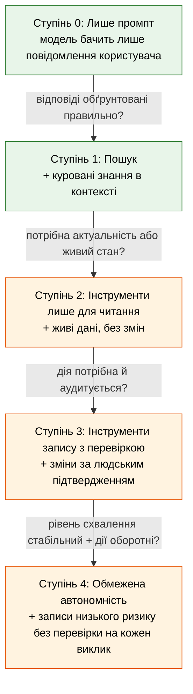

> **Складність**: `[MEDIUM]`
>
> **Час на виконання**: 60-75 хв
>
> **Передумови**: Модулі 1.1 та 1.2

---

## Що ви зможете робити

Після завершення цього модуля ви зможете:

1. **Розрізняти** проблеми пошуку та проблеми використання інструментів на основі реального продуктового брифу й обґрунтовувати свою класифікацію за допомогою критеріїв радіуса ураження та оборотності.
2. **Проєктувати** чотириступеневий шлях ескалації для нової функції асистента, що рухається від лише-промпту через пошук до обмежених інструментів запису, з явними критеріями просування між ступенями.
3. **Оцінювати** запропоновану інтеграцію інструменту за контрольним списком із шести питань щодо меж і вирішувати, чи готовий він до показу користувачам.
4. **Налагоджувати** асистента з надмірними повноваженнями, визначаючи, який рівень можливостей — знання, інструмент читання, інструмент запису чи автономність — відповідальний за конкретну відмову.
5. **Порівнювати** операційну вартість пошуку та використання інструментів для заданого навантаження й рекомендувати найменшу можливість, яка розв'язує задачу.

Ці результати націлені на [рівень 3 (Застосування), рівень 4 (Аналіз) та рівень 5 (Оцінювання) таксономії Блума](https://en.wikipedia.org/wiki/Bloom%27s_taxonomy). Тест і вправа перевіряють ті самі навички в незнайомих сценаріях, тож ставтеся до модуля як до репетиції дизайну, а не уроку словникового запасу.

## Чому цей модуль важливий

Гіпотетичний сценарій: команда інженерів підтримки випускає асистента, який може відповідати на запитання з внутрішніх runbook'ів, створювати тікети, закривати тікети та публікувати коментарі до інцидентів. Демо виглядає переконливо, оскільки асистент може переходити від «що означає це сповіщення?» до «відкрий подальше завдання», не змушуючи користувача перемикати інструменти. За тиждень команда має дублікати тікетів, закриті інциденти, які мали б залишатися відкритими, та кілька впевнених відповідей, що посилаються на неправильну версію runbook'у. Ніхто не може чітко пояснити ланцюжок, тому що кожен репліка в чаті змішував пошук документів, живі API-читання, дії запису та судження моделі в межах однієї поверхні управління.

Цей сценарій не є аргументом проти інструментів. Це аргумент проти додавання можливостей до того, як межі стануть достатньо міцними, щоб ці можливості стримувати. Щойно ви можете створити корисний промпт і структуровані вихідні дані, наступним спокусливим кроком є дати моделі більше контексту, більше API, більше файлів і більше автономності. Кожен крок може виглядати як маленький функціональний запит, але кожен змінює радіус ураження системи — тобто набір речей, які можуть піти не так, коли модель помиляється, плутається, працює із застарілими даними або маніпулюється текстом, який вона читає.

Справжні практики розділяють два питання, які початківці часто зливають: що модель знає і що модель може робити? Пошук розширює те, що система знає, додаючи документи, результати пошуку, фрагменти бази даних або інший обґрунтований контекст. Інструменти розширюють те, що система може робити, дозволяючи моделі запитувати виконання операцій у зовнішніх системах. Засоби контролю для цих двох можливостей різні. Помилка пошуку може ввести користувача в оману; помилка інструменту запису може змінити живий робочий процес, надіслати повідомлення, списати гроші або видалити дані.

Цей модуль вчить вас тримати ці питання окремо. Ви класифікуватимете продуктові брифи, поступово підніматиметеся драбиною можливостей, оцінюватимете межі інструментів перед показом і налагоджуватимете відмови, знаходячи рівень, який їх спричинив. Мета не в тому, щоб уникати потужних систем; мета в тому, щоб заробляти потужність по одній межі за раз, із достатніми доказами, що кожне просування виправдане.

> **Поглиблений матеріал:** Канонічний розгляд меж пошуку, інструментів і пам'яті в продакшен-агентах див. у [Пошук, інструменти та межі пам'яті](/ai/ai-engineering-foundations/module-2.3-retrieval-tools-and-memory-boundaries/).

## Справжня відмінність: знання проти можливості

Перше, що слід засвоїти: «дати моделі більше потужності» — це не одне дизайнерське рішення. Це щонайменше два рішення, накладені одне на одне, і вони мають дуже різні профілі ризику. Знання розширює те, що модель має у своєму робочому контексті, коли відповідає: документи, фрагменти, результати пошуку, embeddings внутрішніх даних або явні факти, повернуті довіреним пошуковиком. Можливість розширює те, що відбувається поза чатом як побічний ефект відповіді моделі: викликана функція, записаний рядок, закритий тікет, надісланий лист або змінений об'єкт Kubernetes. Ставитися до них як до одного важеля — це архітектурна помилка, яка перетворює перспективного асистента на інцидент, що чекає на промпт.

Уявіть дві архітектури поруч. Система пошуку має користувача та оркестратор з одного боку й індекс знань з іншого; індекс можна запитувати, але він не може діяти, і єдиним виходом моделі є текст або структуровані дані, які повертаються через ваш код. Система з використанням інструментів замінює це одностороннє додавання контексту на цикл зворотного зв'язку. Модель видає виклик інструменту, виконавець запускає виклик у реальній системі, результат повертається до моделі, і модель може створити ланцюжок наступних викликів, якщо ваша оркестрація це дозволяє. Щойно цей цикл існує, модель уже не лише описує світ; вона бере участь у світі через ваше середовище виконання.

```ascii
                  АРХІТЕКТУРА ПОШУКУ
   ┌──────────┐      запит        ┌────────────────┐
   │Користувач│ ───────────────▶  │  Оркестратор   │
   └──────────┘                   │  (ваш код)     │
        ▲                         └───────┬────────┘
        │                                 │ search(text)
        │ відповідь + джерела             ▼
        │                         ┌────────────────┐
        │                         │  Векторне сховище│
        │                         │  + індекс док.  │
        │                         └───────┬────────┘
        │                                 │ top-k фрагменти
        │                                 ▼
        │                         ┌────────────────┐
        └────── текст ─────────── │  ВММ (лише      │
                                  │  читання конт.) │
                                  └────────────────┘

                  АРХІТЕКТУРА З ВИКОРИСТАННЯМ ІНСТРУМЕНТІВ
   ┌──────────┐                   ┌────────────────┐
   │Користувач│ ────────────────▶ │  Оркестратор   │
   └──────────┘                   └───────┬────────┘
        ▲                                 │ повідомл. кор.
        │                                 ▼
        │ фінальна відповідь       ┌────────────────┐
        │                          │      ВММ       │◀──┐
        │                          └───────┬────────┘   │
        │                                  │ tool_call  │ tool_result
        │                                  ▼            │
        │                          ┌────────────────┐   │
        │                          │ Середовище вик. │───┘
        │                          │ інструменту     │
        │                          │ (РЕАЛЬНИЙ світ: │
        │                          │  API, БД,       │
        │                          │  файли, пошта)  │
        │                          └────────────────┘
```

Зверніть увагу, що на діаграмі пошуку немає стрілки від моделі до реальної системи. Кожен вплив на світ відбувається через оркестратор, і модель ізольована всередині контекстного вікна. На діаграмі з інструментами модель перебуває в циклі з середовищем виконання, яке може торкатися живої інфраструктури. Та сама модель і промпт можуть бути присутніми в обох дизайнах, але другий дизайн має принципово іншу поверхню для відмов. Коли ви додаєте інструмент, ви не просто додаєте функцію; ви розширюєте судження моделі в місце, де помилки можуть зберігатися.

Профіль ризику випливає безпосередньо з цієї картини. Система пошуку може помилитися щодо факту, але не може видалити запис клієнта. Система з інструментами лише для читання може повернути застарілі або оманливі дані, але не може змінити стан. Система з інструментами запису може змінювати стан, і щойно вона це може — галюцинації, промпт-ін'єкція, застарілий контекст і дрейф авторизації стають операційними ризиками, а не лише проблемами якості відповідей. Кожен крок угору драбиною вимагає відповідного кроку вгору в спостережуваності, авторизації, валідації вхідних даних і механізмах відкату.

Зупиніться і спрогнозуйте: колега пропонує дати асистенту інструмент `create_calendar_event`, інструмент `read_calendar` і базу знань про корпоративні свята. Який із них ви випустили б першим, який останнім і який конкретний інцидент ви уявляєте, впорядковуючи їх у такий спосіб? Сильна відповідь відокремлює потребу в знаннях від потреби в живому стані та від дії запису. Корпоративні свята, ймовірно, належать до пошуку, читання календаря може бути обмеженим інструментом читання, а створення подій календаря має зачекати, поки у вас буде прив'язка ідентичності, попередній перегляд, підтвердження та шлях скасування.

Ця відмінність також змінює те, як ви налагоджуєте. Якщо асистент відповідає «політика каже, що підрядники можуть компенсувати витрати на ноутбуки», а політика ніколи цього не казала, відмова є або проблемою вибору пошуку, або проблемою генерації поверх знайденого тексту. Якщо асистент відповідає «ваш баланс відпустки — нуль» після того, як живий HR-інструмент повернув значення null, відмова є проблемою контракту інструменту та інтерпретації. Якщо асистент подає запит на відпустку, коли користувач лише запитав про політику, відмова є проблемою межі запису. Модель може бути залучена в усіх трьох випадках, але виправлення потрапляє в різні рівні коду та управління.

## Драбина можливостей

Досвідчені практики рідко переходять від «лише промпт» до «повністю автономний агент» за один рух. Вони піднімаються драбиною і на кожній сходинці зупиняються, доки шлях контролю не стане щонайменше таким самим сильним, як шлях можливостей. Той самий інстинкт проявляється в хорошій платформній інженерії: новий сервіс не отримує доступ на запис у продакшені з першого дня; він отримує доступ для розробки, потім доступ для стейджингу, потім доступ на читання в продакшені, потім вузько обмежені записи в продакшені за фіче-флагом. ШІ-системи заслуговують на таку саму дисципліну, оскільки їхня варіативність відмов вища, вхідні дані більш відкриті, а дії часто вибираються під час виконання, а не фіксованим контролером.



Читайте діаграму як послідовність запитань, а не як припис досягти вершини. Кожна стрілка — це ворота, які ви проходите, лише демонструючи доказами з попередньої сходинки, що вам справді потрібна наступна можливість. Багато команд пропускають Ступінь 1 і переходять від Ступеня 0 до Ступеня 3, тому що пошук здається звичайним, а інструменти — вражаючими. Зазвичай це навпаки. Пошук — це місце, де ви виявляєте, що багато «інструментальних» потреб насправді були потребами в знаннях під маскою, і пропуск цього ступеня означає сплату операційного податку інструментів, щоб отримати цінність пошукової системи.

Критерії просування — це те, що початківці найчастіше пропускають. «Ми просунулися, бо демо спрацювало» — не критерій. Корисний критерій є конкретним, вимірюваним і прив'язаним до режиму відмови, який вводить наступний ступінь. Перехід від пошуку до інструментів лише для читання вимагає доказів, що версія лише з пошуком правильно обґрунтована на основних задачах; інакше живі дані не врятують дизайн, вони лише дадуть моделі свіжіший матеріал для неправильного використання. Перехід від інструментів лише для читання до інструментів запису вимагає доказів, що модель правильно інтерпретує результати інструментів у крайових випадках і за ворожих формулювань, оскільки той самий інтерпретатор незабаром вирішуватиме, що змінювати.

| Ступінь | Що модель може робити | Радіус ураження | Необхідні засоби контролю перед просуванням |
|---|---|---|---|
| 0. Лише промпт | Читати ввід користувача, видавати текст | Нічого, крім відповіді | Робочий шаблон промпту, базові оцінювання |
| 1. Пошук | Читати ввід користувача + куровані документи | Неправильні, але з посиланням на джерела відповіді | Атрибуція джерел, політика актуальності, набір оцінювання на обґрунтованих відповідях |
| 2. Інструменти лише для читання | Запитувати живі системи | Витік інформації, застарілі, але впевнені читання | Обмеження AuthZ, ліміти швидкості, аудиторські логи, валідовані за схемою виходи |
| 3. Інструменти запису з перевіркою | Пропонувати зміни, людина підтверджує | Усе, що людина пропускає | Попередній перегляд змін на кожну дію, черга підтвердження, ідентичність, за якою можна встановити відповідального, шлях скасування |
| 4. Обмежена автономність | Виконувати записи низького ризику безпосередньо | Обмежено списком дозволених дій і бюджетом | Список дозволених дій, обмеження вартості на виклик, автоматизація відкату, аварійний вимикач |

Стовпчик радіуса ураження — це те, де драбина виправдовує своє існування. На Ступені 1 найгірший випадок — це впевнена неправильна відповідь, яка може бути незручною або шкідливою, але все ще міститься всередині відповіді. На Ступені 3 найгірший випадок — це все, що людський рецензент підтверджує під тиском дедлайну, що може бути значно більше, ніж рецензент мав намір, якщо поверхня перевірки розмита. На Ступені 4 найгірший випадок обмежений лише списком дозволених дій, бюджетним лімітом, обсягом ідентичності та шляхом відкату. Ці засоби контролю мають бути спроєктовані до ввімкнення ступеня, оскільки додавання їх після інциденту означає, що ви вже дозволили моделі діяти поза межами вашої здатності її стримувати.

Драбина також захищає продуктові команди від надмірної розробки. Ступінь 3 може бути постійною робочою точкою, а не незручним проміжним етапом. Якщо асистент підтримки створює чернетки на повернення коштів, а агенти їх затверджують, система може бути цінною роками, жодного разу не видаючи гроші автономно. Якщо помічник для чергового інженера пропонує діагностику `kubectl`, але ніколи її не виконує, він усе одно може економити час, зберігаючи продакшен-повноваження за людиною-оператором. Автономність — це інструмент для підмножини дій із низьким ризиком, оборотних і вимірюваних; це не пункт призначення кожного асистента.

Перш ніж прокручувати цей дизайн у голові, який результат ви очікуєте від драбини для цих чотирьох брифів? «Допоможи інженерам знайти правильний runbook для сповіщення» має приземлитися на пошук. «Скажи черговому, які поди зараз у стані crashlooping у кластері Kubernetes 1.35» вимагає інструменту лише для читання живого стану. «Створи чернетку відповіді клієнту з посиланням на нашу політику повернення» — це пошук плюс генерація. «Поверни кошти клієнту, коли він про це просить» — це інструмент запису з сильними засобами контролю перевірки та оборотності. Дієслова визначають радіус ураження надійніше, ніж іменники.

## Коли пошук є правильною відповіддю

Більшість продуктових ідей, що подаються як «агенти», є проблемами пошуку в костюмі. Перш ніж тягнутися до інструментів, запитайте, чи запитання користувача фундаментально стосується інформації, яка вже існує десь під вашим контролем. Якщо відповідь — так, пошук зазвичай є правильним першим кроком, оскільки його режими відмов добре вивчені й дешеві для налагодження порівняно з використанням інструментів. Асистент для нових працівників, що пояснює батьківську відпустку, асистент для релізних нотаток, що підсумовує зміни, і помічник для пошуку коду, що вказує на конфігурацію тайм-ауту, — усі потребують обґрунтованого читання більше, ніж зовнішньої дії.

Пошук є правильною відповіддю, коли у роботі переважає розуміння документів, пошуком політик, підсумовуванням внутрішнього тексту, актуальністю щодо курованого корпусу або обґрунтуванням тверджень цитованим матеріалом. Система має знаходити релевантні фрагменти, показувати моделі ці фрагменти, наказувати моделі відповідати лише з них і цитувати використане. Якщо докази відсутні, правильною поведінкою є відмова або вузька відповідь «не знайдено в доступних джерелах», а не здогадка. Ця відмова не є продуктовою невдачею; це межа, що виконує свою роботу.

Переваги накопичуються. Пошук зазвичай дешевший на одне користувацьке завдання, ніж насичена інструментами оркестрація, оскільки немає багатокрокового циклу виклику функцій. Його легше оцінювати, оскільки відповіді можна оцінювати за документами-джерелами. Його легше налагоджувати, оскільки відмови локалізуються або в пошуковику, який витягнув неправильні фрагменти, або в генераторі, який неправильно прочитав правильні фрагменти. Його легше регулювати, оскільки корпус є контрольованим артефактом: ви можете вирішувати, що входить, хто може редагувати, які документи застарілі та як часто індекс оновлюється.

Є обмеження. Пошук не може відповісти на питання, відповіді на які не містяться в корпусі, і не може виконувати дії. Якщо користувач запитує «чи приймає продакшен-база даних записи прямо зараз», runbook про те, як перевірити статус запису, може бути релевантним, але це не відповідь, яку запитував користувач. Система пошуку, яка вдає, що runbook є живим станом, слабша за систему з інструментами, яка отримує стан через API лише для читання. Навичка полягає в тому, щоб чесно розпізнавати цей розрив і маршрутизувати запит, а не прикривати його розумним промптом.

Деталі реалізації мають значення, але вони не змінюють межі. Щільний векторний пошук може знаходити семантично пов'язані уривки, лексичний пошук може знаходити точні ідентифікатори та акроніми, а гібридний пошук поєднує обидва. Корпоративні корпуси часто потребують гібридного пошуку, оскільки внутрішні документи містять назви сервісів, ідентифікатори інцидентів, імена ресурсів Kubernetes, ключі тікетів, коди продуктів і короткі абревіатури, які embeddings можуть розмити. Якщо продукт лише з пошуком здається слабшим, ніж очікувалося, додавання BM25 або фільтрів метаданих часто є кращим першим виправленням, ніж додавання загального веб- або консольного інструменту.

Одна корисна звичка для налагодження — запитати: «Чи міг би ідеальний бібліотекар відповісти на це з документів?» Якщо так — починайте з пошуку. Якщо ідеальному бібліотекарю потрібно було б увійти в іншу систему, запитати сторінку поточного статусу або виконати дію, тоді самого пошуку недостатньо. Аналогія навмисно проста: пошук перетворює модель на швидкого бібліотекаря з контрольованою полицею, тоді як використання інструментів перетворює її на оператора з ключами до інших кімнат. Не роздавайте ключі, коли проблема в тому, що полиця неорганізована.

## Коли інструмент справді виправданий

Інструмент виправданий, коли відповідь або результат, якого потребує користувач, не можна отримати з жодного документа, хоч би як добре його знайшли. Найчіткіші сигнали — це живість, унікальність і дія. Живість означає, що відповідь змінюється щохвилини, наприклад стан кластера, здоров'я сервісу, рівень запасів або баланс рахунку. Унікальність означає, що відповідь залежить від конкретного користувача, орендаря, транзакції або середовища. Дія означає, що користувач хоче, щоб щось сталося у світі, а не просто щоб йому щось сказали. Якщо жоден із цих сигналів не застосовується, ви, ймовірно, дивитеся на проблему пошуку під маскою.

Навіть коли інструмент виправданий, правильним кроком зазвичай є найменший інструмент, який розв'язує задачу. Якщо користувач хоче знати, чи здоровий стейджинг-кластер, йому потрібен інструмент `get_cluster_health`, а не загальний інструмент `run_kubectl`. Загальні інструменти спокусливі, бо вони гнучкі, але гнучкість — ворог чіткості меж. Інструмент `run_kubectl` може робити все, що може його kubeconfig, тому його радіус ураження — це кожен ресурс Kubernetes 1.35, якого можуть торкнутися облікові дані. Конкретний інструмент здоров'я може бути авторизований вузько, оскільки його можливості вузькі за побудовою.

Поділ на інструменти лише для читання та для запису — це найважливіша властивість інструменту. Інструменти лише для читання мають обмежений режим відмови: у найгіршому випадку вони повертають неправильні дані, і модель будує на них неправильну відповідь. Це погано, але це нагадує відмову пошуку і може бути пом'якшене валідацією схеми, перевірками актуальності, атрибуцією джерел і межами здорового глузду. Інструменти запису вводять інший клас відмов: модель може зберегти неправильну дію. Інструмент запису без перевірки, прив'язки ідентичності та відкату заслуговує на таку саму перевірку, яку ви дали б будь-якій кінцевій точці, що змінює продакшен-систему.

Перехід від читання до запису ніколи не має відбуватися непомітно всередині одного загального інструменту. Багато SDK роблять легким визначення інструменту, як-от `manage_ticket`, що може отримувати, коментувати, призначати та закривати залежно від параметрів. Уникайте такого дизайну. Розділіть інструмент за дієсловами: `get_ticket`, `comment_on_ticket`, `assign_ticket` і `close_ticket` мають окремі дозволи, логи, ліміти швидкості та шляхи відкату. Вони також дають моделі менш неоднозначне меню, що зменшує ненавмисні записи, коли формулювання користувача нечітке або знайдений контекст містить ворожі інструкції.

Інструменти також накладають операційні витрати, які команди недооцінюють. Кожен інструмент потребує облікових даних, контрактів схеми, спостережуваності, лімітів швидкості, тестів, документації, власника, плану реагування на інциденти та правил виведення з експлуатації. Корпус пошуку може застаріти; інтеграція інструменту може бути застарілою, надмірно привілейованою, непрацюючою, повільною, дорогою або несумісною зі згенерованими моделлю аргументами. Жодна з цих витрат не означає, що інструменти — це погано. Вони означають, що інструмент має розв'язувати проблему, яку пошук не може розв'язати, і має бути достатньо цінним, щоб виправдати операційне навантаження.

## Межі перед можливостями

Перш ніж будь-який інструмент буде показано реальному користувачеві, шість запитань повинні мати чіткі письмові відповіді. Ставтеся до них як до інженерного контрольного списку, а не ритуалу відповідності. Якщо будь-яка відповідь розмита, інструмент не готовий, оскільки модель зрештою знайде розмиту частину через звичайні запити користувачів, заплутаний знайдений текст або зловмисна промпт-ін'єкція. Це ті самі запитання, які ставить SRE перед виходом нового сервісу в продакшен, перекладені мовою дій, керованих моделлю.

Перше запитання — до чого інструмент може отримати доступ. Інструмент, що викликає внутрішнє API, успадковує будь-які дозволи, які мають його облікові дані, і команди часто виявляють запізно, що сервісний акаунт мав доступ на читання до значно більшого, ніж асистент мав би показувати. Обмежте облікові дані точними ресурсами, яких потребує інструмент, надавайте перевагу ідентичностям на рівень інструменту над спільними ідентичностями та прив'язуйте фільтри орендарів або користувачів поза контролем моделі. Якщо модель може вибирати ідентифікатор орендаря, ідентифікатор облікового запису, простір імен або SQL-предикат, межа є дорадчою, а не примусовою.

Друге запитання — що інструмент може змінювати. Для інструментів лише для читання відповідь має бути «нічого», забезпечена цільовим API, а не коментарем у вашому коді інструменту. Для інструментів запису відповідь має бути достатньо конкретною для перевірки: цей інструмент може оновлювати поле `status` тікету, що належить користувачу-запитувачу, або може створювати запит на відпустку в таблиці стейджингу, або може додавати мітку до об'єкта Kubernetes у просторі імен. Розмиті відповіді, як-от «поля тікету», стають «будь-яке поле тікету», коли приходить продакшен-тиск.

Третє запитання — хто відповідальний за результат. Кожен виклик інструменту відбувається від чийогось імені, і ця ідентичність має бути видимою в авторизації, логуванні та реагуванні на інциденти. Виконання всіх викликів інструментів через один сервісний акаунт асистента зручне, доки вам не знадобиться відповісти, який користувач спричинив поганий запис, відкликати доступ одного користувача або пояснити, чому інструмент запитав іншого орендаря. Початкова ідентичність користувача має подорожувати від чат-сесії через оркестратор до середовища виконання інструменту та цільового аудиторського логу.

Четверте запитання — як логується використання. Логи мають фіксувати ідентичність користувача, назву інструменту, вхідні параметри, вихід або нормалізований результат, часову мітку, ідентифікатор кореляції та стан підтвердження для дій запису. Вікно зберігання логів має бути щонайменше таким самим довгим, як вікно бізнес-оборотності дії, оскільки повернення коштів, лист або зміна доступу можуть оскаржуватися значно пізніше після відповідної репліки в чаті. Приватність має значення, тому свідомо вилучайте або токенізуйте чутливі поля, але не видаляйте поля, які роблять реконструкцію інциденту можливою.

П'яте запитання — який резервний шлях існує, коли інструмент відмовляє. Жорсткі відмови прямолінійні, оскільки виклик повертає помилку, і модель може повторити, ескалувати або пояснити, що дія не завершилася. М'які відмови небезпечніші, оскільки інструмент повертає синтаксично коректний результат, який модель неправильно інтерпретує. Нульовий баланс відпустки, порожня відповідь моніторингу або влучання в застарілий кеш можуть виглядати як коректна відповідь, якщо контракт інструменту не розрізняє «нуль», «недоступно», «не авторизовано» та «не знайдено». Хороший дизайн інструменту робить небезпечну неоднозначність неможливою або принаймні видимою.

Шосте запитання — який шлях відкату або скасування існує. Кожен інструмент запису потребує задокументованого скасування, і скасування має бути таким самим доступним для оператора, як початкова дія для асистента. Якщо ваш асистент може закрити тікет, ваш процес опрацювання інцидентів потребує шляху повторного відкриття. Якщо він може створити подію календаря, йому потрібен шлях видалення або скасування. Інструменти, чиї дії практично незворотні, як-от зовнішній лист або рух грошей, вимагають додаткового тертя, зазвичай кроку підтвердження, вікна затримки або черги людського підтвердження.

```ascii
        КОНТРОЛЬНИЙ СПИСОК МЕЖ (на інструмент, перед показом)
        ┌──────────────────────────────────────────────┐
        │  1. ДОСТУП     — точні ресурси, обмежені обл.│
        │  2. ЗМІНА      — поверхня мутації, на поле   │
        │  3. ВЛАСНИК    — ідентичність кор. у виклику │
        │  4. ЛОГУВАННЯ  — хто, що, коли, де, чому     │
        │  5. РЕЗЕРВ     — шлях помилки + перевірка    │
        │                 м'якої відмови               │
        │  6. ВІДКАТ     — скасування принаймні так    │
        │                 само доступне                │
        └──────────────────────────────────────────────┘
                             │
                             ▼
              ┌────────────────────────────┐
              │ Усі шість отримали         │
              │ конкретну письмову         │
              │ відповідь?                 │
              └─────┬───────────────┬──────┘
                    │ так           │ ні
                    ▼               ▼
              ┌──────────┐    ┌─────────────────┐
              │ випустити│    │ НЕ готовий —     │
              │ одному   │    │ виправте прогалини│
              │ орендарю │    │ перед показом    │
              └──────────┘    │ інструменту      │
                              └─────────────────┘
```

Контрольний список є живим документом, оскільки межі інструментів дрейфують. Низхідне API додає поле, сервісний акаунт отримує ширшу роль, команда розширює схему параметрів інструменту, щоб задовольнити одного термінового користувача, або новий робочий процес починає викликати той самий інструмент у контексті, для якого він не проєктувався. Повторно запускайте контрольний список, коли змінюється цільовий контракт, коли інструмент отримує новий параметр, коли вмикається новий орендар або середовище, і після кожного значущого інциденту. Межа, яка була правильною при запуску, може стати надто широкою через звичайне обслуговування.

## Опрацьований приклад: створення PolicyPal для компанії з 200 осіб

Сценарій вправи: PolicyPal — це внутрішній HR-асистент для компанії з 200 осіб. Працівники запитують про батьківську відпустку, політику витрат, відшкодування за обладнання та відгули. Перший інстинкт продуктової команди — дати йому все: читати документи політик, запитувати HR-систему, подавати заявки на витрати та бронювати відпустки. Ми проведемо продукт через драбину, щоб показати, чому цей інстинкт занадто широкий і як виглядає дисциплінований шлях ескалації.

Прототип «лише промпт» — це вікно чату з системною інструкцією, яка каже, що асистент має відповідати на HR-запитання для компанії. Працівник запитує, скільки тижнів батьківської відпустки він отримує, і модель дає загальну відповідь на основі поширених публічних шаблонів політик. Інший працівник запитує, чи покривається конкретне лікування безпліддя, і модель вгадує з галузевих норм. Версія 0 не є марною; вона показує, що відсутнім інгредієнтом є специфічні для компанії знання, а не зовнішня дія. Цей діагноз вказує на пошук, а не на інструменти, оскільки джерело істини живе в контрольованих документах політик.

Версія з пошуком розбиває HR-політики на фрагменти, створює embeddings цих фрагментів, зберігає їх в індексі та знаходить найкращі уривки для кожного запитання користувача. Моделі наказано відповідати лише зі знайденого матеріалу та цитувати назву політики, розділ і дату набуття чинності, коли це можливо. Тепер асистент може відповідати на запитання про батьківську відпустку та відшкодування, використовуючи фактичну політику замість широких публічних припущень. Він також може відмовити, коли пільга не описана в корпусі, що краще, ніж вигадувати правдоподібну відповідь. Версія 1 створює вимірювану проблему обґрунтованості: для заданого запитання та набору джерел — чи відповів асистент те, що підтримують джерела?

Версія 1 також виявляє наступну межу. Коли працівник запитує, скільки днів відпустки в нього особисто залишилося, пошук має відмовити або маршрутизувати, оскільки цей факт не міститься в документах політик. Він живе в HR-системі та змінюється з бронюванням часу. Це сигнал живості та унікальності, тому команда додає один інструмент лише для читання: `get_my_pto_balance(employee_id)`. Інструмент навмисно вузький. Він не виконує SQL, не переглядає HR-систему і не приймає довільні ідентифікатори працівників від моделі. Оркестратор прив'язує `employee_id` до автентифікованого користувача до того, як виклик інструменту досягне HR API.

Інструмент лише для читання обмежений на трьох рівнях. На рівні облікових даних сервісний акаунт може читати лише подання, що містить ідентифікатор працівника, використані дні, залишок днів і статус. На рівні авторизації під час виклику модель не може запитати баланс іншого працівника, оскільки оркестратор перезаписує або відхиляє контрольовані користувачем ідентифікатори. На рівні логування кожен виклик записує ідентичність запитувача, назву інструменту, нормалізовані параметри, нормалізований результат та ідентифікатор кореляції, що пов'язує його з повідомленням чату. Ці деталі здаються звичайними, доки не станеться інцидент; тоді вони є різницею між чіткою відповіддю та тижнем здогадок.

Перша важлива відмова у Версії 2 — це м'яка відмова. Працівник у відпустці має баланс відпустки, представлений як null у HR-системі, і інструмент чесно повертає null. Модель інтерпретує null як нуль і каже працівнику, що в нього не залишилося відпустки, що є неправильним. Виправлення не в тому, щоб просити модель бути обережнішою. Виправлення в тому, щоб посилити контракт інструменту, щоб він повертав структурований результат, як-от `{"status": "unavailable", "reason": "leave_of_absence", "next_step": "contact_hr"}`. Межа має усувати небезпечну неоднозначність до того, як модель її побачить.

Після того як версія лише для читання працює чисто, команда розглядає можливість запису: `request_pto(start_date, end_date, reason)`. Це Ступінь 3, тому інструмент створює проміжний запис та створює елемент підтвердження, а не записує безпосередньо в HR-систему. Користувач бачить картку підтвердження, яка пояснює запропоновані дати та причину. Лише після підтвердження окремий робочий процес подає запит. Модель має доступ до пропозиції, а не остаточні повноваження на запис, а черга підтвердження стає розміченими даними для майбутнього оцінювання.

Команда може ніколи не просунути цей потік запитів на відпустку до Ступеня 4. Це коректний результат. Якщо користувачі часто редагують запити, якщо затримка підтвердження свідчить про автоматичне штампування або якщо скасування створюють HR-навантаження, ворота перевірки мають залишитися. Драбина — це не модель зрілості, де вершина завжди краща. Це модель ризику, де правильна робоча точка залежить від доказів, оборотності, очікувань користувачів та операційних витрат.

Який підхід ви обрали б тут і чому: чи має PolicyPal додати загальний інструмент `update_hris(record_type, id, fields)` чи три конкретні інструменти для запиту на відпустку, зміни адреси та оновлення екстреного контакту? Сильна відповідь надає перевагу конкретним інструментам, оскільки вони дають окремі схеми, обсяги авторизації, правила перевірки та шляхи відкату. Загальний інструмент виглядає дешевшим лише до першого інциденту, який вимагає пояснити, яке поле було дозволено, який користувач авторизував це і чому модель обрала саме цю мутацію.

## Патерни й антипатерни

Хороші системи інструментів і пошуку зазвичай мають кілька спільних патернів. Перший — це мінімалізм можливостей: додавайте найменшу можливість, яка вирішує спостережувану відмову. Якщо пошук не може відповісти на живий стан, додайте інструмент лише для читання живого стану перед додаванням інструменту запису. Якщо одному орендарю потрібна функція, випустіть її для одного орендаря або однієї внутрішньої групи, перш ніж показувати широко. Цей патерн масштабується, оскільки кожен інструмент має чітку причину існування та вимірюваний режим відмови, який він вирішує.

Другий патерн — це декомпозиція на рівні дієслів. Інструменти мають відображати дієслова, які мають значення операційно: читати, пропонувати, підтверджувати, коментувати, закривати, створювати, видаляти або повертати кошти. Розділення за дієсловами створює більше визначень, але також створює чисті аудиторські сліди та поверхні авторизації. Модель, яка вибирає серед чотирьох точних інструментів, легше оцінювати, ніж модель, яка заповнює параметри для одного широкого інструменту «execute». Декомпозиція також дозволяє просувати окремі можливості незалежно; `get_ticket` може бути безпечним сьогодні, тоді як `close_ticket` залишається за перевіркою.

Третій патерн — це дизайн інструменту на основі контракту. Визначте схему входу, схему виходу, випадки помилок і стани м'яких відмов до підключення моделі. Інструмент, який повертає звичайний текст, змушує модель виводити сенс із прози. Інструмент, який повертає структурований результат зі статусом, значенням, часовою міткою джерела та способом виправлення, дає моделі менше можливостей для здогадок. Цей патерн важливий як для інструментів читання, так і для запису, оскільки неоднозначність на межі стає впевненою природною мовою на користувацькому інтерфейсі.

Антипатерни так само поширені. Загальний інструмент виконання, як-от `run_query`, `run_shell`, `execute_action` або `manage_ticket`, переміщує складність зі схеми в судження моделі. Він здається гнучким під час демо і стає таким, що не піддається перевірці, в продакшені. Спільна сервісна ідентичність робить інтеграцію легкою, а аудит — важким. Межа лише в промпті, як-от «ніколи не повертай більше, ніж дозволяє політика», є інструкцією, а не примусом, якщо середовище виконання інструменту не валідує суму, обліковий запис, політику та стан підтвердження.

Ще один антипатерн — ставлення до актуальності пошуку як до проблеми «відчуттів». «Ми періодично переіндексовуємо» — це не політика актуальності. Якщо документи політик визначають відповіді, видимі клієнтам, вам потрібні власник джерела, каденція оновлення, виявлення застарілих документів і видимий спосіб для асистента сказати, що джерело старіше за необхідне вікно актуальності. Проблеми актуальності часто маскуються під проблеми моделі, оскільки модель звучить впевнено, навіть коли знайдений матеріал застарів.

Останній антипатерн — пропуск Ступеня 3, бо перевірка здається тертям. Етап перевірки — це місце, де ви виявляєте режими відмов, які обмежена автономність інакше виявила б у продакшені. Якщо рецензенти часто редагують запропоновані дії, модель вчить вас, що автономність є передчасною. Якщо рецензенти підтверджують занадто швидко, інтерфейс перевірки може бути невдалим, оскільки він не робить зміни читабельними. Ставтеся до даних перевірки як до інструментарію, а не бюрократії.

## Фреймворк рішень

Використовуйте цей фреймворк, коли зацікавлена сторона просить «агента», але фактична можливість незрозуміла. Почніть із дієслова користувача. Якщо дієслово — знайти, пояснити, підсумувати, порівняти, цитувати або створити чернетку з відомих матеріалів, починайте з пошуку. Якщо дієслово — перевірити, отримати, обчислити для цього користувача, інспектувати поточний стан або перелічити живі ресурси, розгляньте інструмент лише для читання. Якщо дієслово — створити, оновити, видалити, надіслати, підтвердити, повернути кошти, розгорнути, масштабувати або закрити, ви на території інструментів запису і потребуєте перевірки, прив'язки ідентичності, відкату та плану просування.

Наступне питання — оборотність. Неправильну чернетку можна відредагувати, неправильну процитовану відповідь можна виправити, а неправильне читання можна перевірити ще раз. Неправильний лист, повернення коштів, надання доступу, видалення даних або продакшен-мутація мають довший хвіст. Оборотність має впливати як на вибраний вами ступінь, так і на тертя, яке ви накладаєте. Записи низького ризику можуть потребувати лише картки підтвердження; записи високого ризику можуть потребувати підтвердження людиною, яка не є запитувачем, вікна затримки або явної зовнішньої системи обліку.

Третє питання — оцінювання. Якщо ви не можете оцінити попередній ступінь, ви не готові до наступного. Пошук має мати оцінювання обґрунтованих відповідей, перевірки цитувань і тести на застарілі джерела. Інструменти лише для читання мають мати тести схеми, тести авторизації, фікстури м'яких відмов і логи, які показують, як інтерпретуються виходи. Інструменти запису мають мати дані про прийняття пропозицій, дані про виправлення, тренування відкату та вправи з реагування на інциденти. Просування без оцінювання — це оптимізм, замаскований під продуктовий імпульс.

Фреймворк навмисно штовхає багато ідей униз. Асистент підтримки клієнтів, який створює чернетки відповідей із політики, має починати з пошуку, навіть якщо майбутня дорожня карта включає надсилання повідомлень. Помічник для чергового інженера, який ідентифікує поточні поди CrashLoopBackOff, може потребувати інструменту Kubernetes лише для читання, але не інструменту запису. Білінговий асистент, який видає повернення коштів, імовірно, має починати з пошуку плюс черги перевірки запропонованих дій, оскільки рух грошей має високий вплив і є специфічним для клієнта. Менша можливість не є менш амбітною; їй легше довіряти, вимірювати та вдосконалювати.

## Чи знали ви?

1. Стаття 2020 року про retrieval-augmented generation авторства Lewis і співавторів представила пошук як спосіб [поєднання параметричної пам'яті моделі з непараметричною зовнішньою пам'яттю](https://arxiv.org/abs/2005.11401), що є тим самим архітектурним розділенням, яке використовує цей модуль: модель міркує, тоді як індекс постачає обґрунтовані докази.
2. Керівництво Anthropic «Building Effective Agents» [розрізняє робочі процеси та агентів і стверджує, що фіксовані патерни оркестрації часто надійніші за широкі автономні цикли для бізнес-задач](https://www.anthropic.com/research/building-effective-agents), що підсилює схильність драбини до поетапного контролю.
3. Поточне керівництво OpenAI щодо інструментів розглядає пошук файлів, веб-пошук, виконання коду та кастомні інструменти-функції як різні хостингові або визначені розробником можливості, тому описи інструментів мають включати побічні ефекти, безпеку повторних спроб і режими помилок, а не лише назви щасливого шляху.
4. [Рольовий контроль доступу Kubernetes є адитивним: дозволи надходять від відповідних RoleBinding і ClusterRoleBinding](https://kubernetes.io/docs/reference/access-authn-authz/rbac/), тому загальний кластерний інструмент успадковує повну сукупну владу своїх облікових даних, якщо облікові дані не обмежені свідомо до того, як модель зможе їх викликати.

## Типові помилки

| Помилка | Чому це трапляється | Як виправити |
|---|---|---|
| Тягнутися до інструментів, бо вони здаються просунутішими за пошук | Команди ототожнюють видиму дію з продуктовою цінністю і пропускають дешевший рівень знань | Використовуйте найменшу можливість, яка відповідає брифу, і просувайтеся лише тоді, коли докази показують, що пошуку недостатньо |
| Визначати один загальний інструмент, як-от `run_query` або `manage_ticket` | Широка обгортка зменшує зусилля реалізації під час демо | Розділіть за дієсловами на інструменти для кожної дії, кожен зі своєю схемою, обсягом, логом, лімітом швидкості та власником |
| Поєднувати семантику читання та запису в одному інструменті | Приклади SDK часто роблять багатоцільові функції зручними на вигляд | Розділіть інструменти `get_*`, `propose_*` та `update_*`, щоб вибір читання та запису був однозначним у логах |
| Виконувати всі виклики інструментів під однією спільною сервісною ідентичністю | Спільні облікові дані спрощують інтеграцію та уникають роботи з авторизацією на користувача | Прив'язуйте кожен виклик інструменту до початкової ідентичності користувача та забезпечуйте авторизацію поза моделлю |
| Ставитися до актуальності пошуку як до необов'язкової задачі обслуговування | Застарілі документи невидимі, коли відповідь моделі звучить плавно | Визначте політику актуальності для кожного корпусу, відстежуйте відставання індексу та зробіть поведінку із застарілими джерелами явною |
| Пропускати людську перевірку та переходити прямо до автономних записів | Перевірка здається тертям після успішного демо | Ставтеся до Ступеня 3 як до типової робочої точки запису, доки дані про виправлення, скасування та підтвердження не виправдають вужчу автономну підмножину |
| Логувати виклики інструментів без достатньої кількості входів або виходів | Команди вдаються до надмірних пересторог для приватності та видаляють контекст інциденту | Свідомо вилучайте чутливі поля, зберігаючи ідентифікатори кореляції, нормалізовані параметри, виходи, стан підтвердження та вікна зберігання |
| Покладатися на системний промпт моделі для забезпечення меж | Правила промпту легше писати, ніж захисні бар'єри середовища виконання | Забезпечуйте доступ, ліміти мутацій, бюджети та правила відкату в коді та цільових API до того, як виникнуть побічні ефекти |

## Тест

<details>
<summary>Питання 1: Ваша команда створює асистента, який відповідає на запитання «що змінилося в останніх трьох релізах нашого API?», викликаючи живий сервіс релізних нотаток. Внутрішній зворотний зв'язок каже, що він вигадує номери версій. Ви інспектуєте систему й виявляєте, що вона використовує загальний інструмент веб-пошуку, який повертає SEO-блогові пости. Яка найімовірніша першопричина і яке найменше виправлення?</summary>

Першопричина — це невідповідність інструменту та пошуку. Команда потягнулася до широкого зовнішнього інструменту, тоді як фактична потреба — це пошук у внутрішньому корпусі релізних нотаток. Найменше виправлення — прибрати загальний шлях веб-пошуку для цієї задачі та замінити його курованим пошуком у джерелі істини релізних нотаток, включно з цитуваннями та метаданими версій. Це зниження з широкої можливості Ступеня 2 до вужчої можливості Ступеня 1, що є саме правильним кроком, коли проблема в знаннях, а не в живій дії.
</details>

<details>
<summary>Питання 2: Інструмент `close_incident_ticket` працює два тижні. Логи показують сотні викликів і жодних помилок середовища виконання. Ваш керівник безпеки запитує: «Під чиєю владою закриваються ці тікети?» Ви перевіряєте й виявляєте, що кожен виклик виконується під сервісним акаунтом асистента. Який конкретний ризик і що ви зміните в першу чергу?</summary>

Конкретний ризик полягає в тому, що аудиторський слід приписує кожне закриття нелюдській ідентичності, тому перевірка інциденту не може відповісти, який користувач спричинив закриття, і відкликання доступу стає «все або нічого». Успіх середовища виконання не означає, що межа безпечна; це лише означає, що API прийняло виклики. Перша зміна — зробити так, щоб оркестратор передавав початкову ідентичність користувача в рівень інструменту, і зробити так, щоб API інструменту вимагало цю ідентичність як для авторизації, так і для логування. Після цього перегляньте, чи можна звузити сам сервісний акаунт, щоб він більше не маскував політику на рівні користувача.
</details>

<details>
<summary>Питання 3: Асистент документації лише з пошуком отримує запитання: «Чи приймає продакшен-база даних записи прямо зараз?» Корпус містить runbook під назвою «Як перевірити, чи приймає продакшен-база даних записи». Асистент повертає runbook. Чи відмовила система і що змінити?</summary>

Система пошуку не відмовила в знаходженні релевантного документа, але дизайн продукту не зміг класифікувати намір користувача. Користувач хотів поточний стан, що є проблемою живості, а не проблемою розуміння документа. Правильна зміна — маршрутизувати цей намір до малого інструменту статусу лише для читання, як-от `get_db_write_status`, або відмовити з чітким твердженням, що асистент може надати лише runbook. Навчання пошуку вдавати, що він знає живий стан, зробило б систему більш корисною на слух, водночас знижуючи коректність.
</details>

<details>
<summary>Питання 4: Ви перевіряєте PR, який додає інструмент `send_email` до асистента підтримки клієнтів. PR каже: «Виклики інструменту йдуть на адресу клієнта; ми логуємо отримувача та тему». Визначте два питання контрольного списку меж, на які ще немає відповіді, і поясніть, чому кожне важливе.</summary>

На питання про відкат немає відповіді, оскільки лист практично незворотний після надсилання, тому пом'якшенням має бути крок перевірки, картка попереднього перегляду, вікно затримки або шлях скасування до доставки. Логування також неповне, оскільки отримувач і тема не фіксують тіло, вкладення, цитування джерел або стан підтвердження — частини, які з найбільшою ймовірністю матимуть значення під час клієнтського інциденту. Обсяг доступу також може бути слабким, якщо модель може вибирати довільних отримувачів замість верифікованої адреси клієнта. PR, отже, не готовий до прямого показу користувачам.
</details>

<details>
<summary>Питання 5: Колега пропонує просунути асистента зі Ступеня 3 до Ступеня 4, оскільки користувачі підтверджують 98 відсотків запропонованих дій. Які докази ви попросили б перед тим, як погодитися, і які докази змусили б вас відмовити?</summary>

Сам лише рівень підтвердження є слабким доказом, оскільки він може відображати звичку, довіру або автоматичне штампування, а не коректність. Запитайте рівень пізніших виправлень або скасувань, розподіл затримки підтвердження, розподіл серйозності неправильних дій і приклади відхилених пропозицій, згруповані за причиною. Ви маєте відмовити в просуванні, якщо скасування значущі, якщо підтвердження кластеризуються настільки швидко, що користувачі не читають, або якщо найгіршу неправильну автономну дію важко скасувати. Ступінь 4 потребує доказів, що підмножина є низькоризиковою, оборотною та надійно розпізнається системою.
</details>

<details>
<summary>Питання 6: Асистент має `read_calendar` і `create_calendar_event`. Користувач вводить: «Скасуй мою 15:00 і постав туди фокус-блок». Асистент створює фокус-блок, але залишає зустріч на місці. Яка можливість відсутня і який урок щодо декомпозиції інструментів?</summary>

Відсутня можливість скасування або видалення події календаря, тому асистент зміг виконати лише половину природного запиту користувача. Відмова не лише у відсутності інструменту; це також відсутність межі, яка змушує модель сказати, коли запитане дієслово не підтримується. Декомпозиція інструментів має покривати дієслова, які користувачі можуть обґрунтовано запитувати, і оркестратор має вимагати явного розкриття часткового виконання. Інакше відсутні інструменти створюють тихі часткові дії, а не видимі відмови.
</details>

<details>
<summary>Питання 7: Ви успадковуєте систему з одним інструментом під назвою `execute_action(name, params)`, де `name` — це рядок у вільній формі. Команда каже, що це працює, бо модель була натренована на списку коректних назв дій. Як ви опишете ризик нетехнічному керівнику і яку зміну запропонуєте?</summary>

Для нетехнічного керівника ризик полягає в тому, що асистенту дозволено вигадувати назви команд, і система намагатиметься їх виконати, якщо інший код випадково їх не відхилить. Тренування та промптування роблять хорошу поведінку більш імовірною, але вони не закривають простір дій. Конкретна зміна — замінити виконавця з вільною формою на типізований реєстр інструментів, де кожна дія має фіксовану назву, валідовані за схемою параметри, явну авторизацію та окреме логування. Межа має забезпечуватися контрактом API, а не пам'яттю моделі.
</details>

## Практична вправа

Виберіть один із продуктових брифів нижче або використайте реального кандидата з вашого робочого місця, якщо можете описати його без чутливих даних. Створіть письмовий дизайн-документ, використовуючи наведений нижче контрольний список. Вправа має зайняти близько години вперше, оскільки ви не намагаєтеся накидати швидку архітектурну діаграму; ви намагаєтеся зробити кожне рішення щодо меж достатньо явним, щоб інший інженер міг його оскаржити.

### Варіанти брифів

- **Асистент DevSurvey.** Допомагає інженерам відповідати на запитання «який у нас стандартний інструментарій для X?» у внутрішньому інженерному довіднику.
- **Асистент повернення коштів.** Допомагає агентам підтримки клієнтів обробляти запити на повернення коштів у білінговій системі.
- **Помічник чергового.** Допомагає черговому інженеру опрацьовувати сповіщення з використанням корпусу runbook'ів і живим моніторингом, опціонально включаючи статус кластера Kubernetes 1.35 лише для читання.

### Результати

- [ ] **Користувач і запити.** Напишіть один абзац із 50-100 слів, що описує користувача та три основні запити, які ви очікуєте, використовуючи конкретні приклади, а не розмиті категорії.
- [ ] **Класифікація ступеня.** Вкажіть, який ступінь драбини, від 0 до 4, ви збираєтеся випустити і який ступінь розглядали б наступним. Обґрунтуйте вибір двома реченнями, використовуючи мову радіуса ураження та оборотності.
- [ ] **Дизайн пошуку.** Опишіть корпус, підхід до розбиття на фрагменти, каденцію оновлення, метод пошуку, фільтри метаданих і політику цитування. Вкажіть, як асистент поводиться, коли вихідний матеріал не підтримує відповідь.
- [ ] **Список інструментів.** Перелічіть кожен інструмент у невеликій таблиці зі стовпчиками: назва інструменту, статус читання/запису, обсяг, початкова ідентичність, поля логу, поведінка резервного шляху та шлях відкату. Якщо будь-який рядок має межу без відповіді, позначте інструмент як неготовий.
- [ ] **Перевірка меж.** Для кожного інструменту пройдіться письмово за доступом, поверхнею змін, власником, логуванням, резервним шляхом і відкатом. Не об'єднуйте два інструменти лише тому, що вони використовують одне цільове API.
- [ ] **Сценарії відмов.** Напишіть три конкретні відмови: одна відмова пошуку, одна м'яка відмова інструменту читання й одна неправильна дія інструменту запису. Для кожної опишіть виявлення, стримування, комунікацію з користувачем та операційну відповідь.
- [ ] **Критерії просування.** Вкажіть вимірювані докази, необхідні перед просуванням до наступного ступеня, як-от точність обґрунтованих відповідей, відмови авторизації, рівень м'яких відмов, рівень виправлень, рівень скасувань або затримка підтвердження.

<details>
<summary>План рішення для асистента DevSurvey</summary>

Сильний дизайн DevSurvey зазвичай випускається як пошук Ступеня 1. Корпус — це інженерний довідник, ADR, каталог платформних сервісів і посібники з вибору інструментів, що оновлюються щодня або при злитті в репозиторій документації. Інструментів спочатку може не бути, оскільки асистент відповідає «що ми використовуємо?», а не «зміни мій проєкт». Просування до інструменту каталогу сервісів лише для читання може бути виправданим, якщо інженери запитують про поточного власника, стан виведення з експлуатації або метрики прийняття під час виконання, яких немає в документах.
</details>

<details>
<summary>План рішення для асистента повернення коштів</summary>

Сильний асистент повернення коштів зазвичай починається з пошуку плюс запропонованих записів Ступеня 3. Пошук пояснює політику та створює чернетку обґрунтування; інструменти лише для читання отримують статус замовлення та попередні повернення; дії запису створюють пропозицію повернення для підтвердження агентом, а не видають гроші безпосередньо. Контрольний список меж має бути суворим щодо початкової ідентичності, максимальної суми, цитування політики, виявлення дублікатів повернень і відкату або скасування. Ступінь 4 має бути обмежений вузькою підмножиною, лише якщо дані про скасування та дані про виправлення доведуть, що це безпечно.
</details>

<details>
<summary>План рішення для помічника чергового</summary>

Сильний помічник чергового часто поєднує пошук Ступеня 1 для runbook'ів з інструментами лише для читання Ступеня 2 для моніторингу та статусу Kubernetes. Асистент може отримувати поточні сповіщення, статус подів, події та метадані нещодавніх розгортань, але не має перезапускати поди або застосовувати маніфести, доки межі запису не будуть перевірені окремо. Для Kubernetes 1.35 обмежте облікові дані просторами імен і дієсловами читання, де це можливо, і тримайте живий діагностичний вивід окремо від цитувань runbook'ів, щоб користувачі могли бачити, що прийшло з поточного стану, а не з документації.
</details>

### Критерії успіху

- [ ] Випущений ступінь обґрунтований дієсловом користувача, радіусом ураження та оборотністю.
- [ ] Кожне джерело пошуку має власника, політику актуальності та поведінку цитування.
- [ ] Кожен інструмент має письмовий обсяг доступу, поверхню мутації, початкову ідентичність, форму логу, поведінку резервного шляху та шлях відкату.
- [ ] Принаймні одну запропоновану можливість свідомо відкладено, оскільки її межа недостатньо сильна.
- [ ] Критерії просування є вимірюваними та прив'язаними до нового режиму відмови наступного ступеня.

Коли закінчите, віддайте документ колезі й попросіть його знайти найслабшу межу. Якщо він може знайти її швидко, виправте дизайн до того, як писати код інтеграції. Вправа відкалібрована так, що перша чернетка зазвичай має принаймні одну слабку межу; виявити її на папері дешевше, ніж виявити після того, як асистент отримає облікові дані.

## Джерела

- [en.wikipedia.org: Bloom%27s taxonomy](https://en.wikipedia.org/wiki/Bloom%27s_taxonomy) — Процитована сторінка безпосередньо перелічує переглянуті рівні когнітивного порядку як Застосування, Аналіз та Оцінювання.
- [arxiv.org: 2005.11401](https://arxiv.org/abs/2005.11401) — Анотація статті arXiv явно описує RAG у термінах параметричної та непараметричної пам'яті.
- [anthropic.com: building effective agents](https://www.anthropic.com/research/building-effective-agents) — Стаття Anthropic безпосередньо визначає робочі процеси проти агентів і каже, що робочі процеси є кращими для багатьох чітко визначених задач.
- [kubernetes.io: rbac](https://kubernetes.io/docs/reference/access-authn-authz/rbac/) — Документація Kubernetes RBAC явно стверджує, що дозволи є суто адитивними, і пояснює обсяг RoleBinding проти ClusterRoleBinding.
- [New tools for building agents](https://openai.com/index/new-tools-for-building-agents/) — Огляд вбудованих інструментів, примітивів побудови агентів і прикладів кастомних інструментів на основному домені OpenAI.
- [Role Based Access Control Good Practices](https://kubernetes.io/docs/concepts/security/rbac-good-practices/) — Конкретні офіційні настанови щодо обмеження найменшими привілеями та чому широкі загальні кластерні інструменти є ризикованими.
