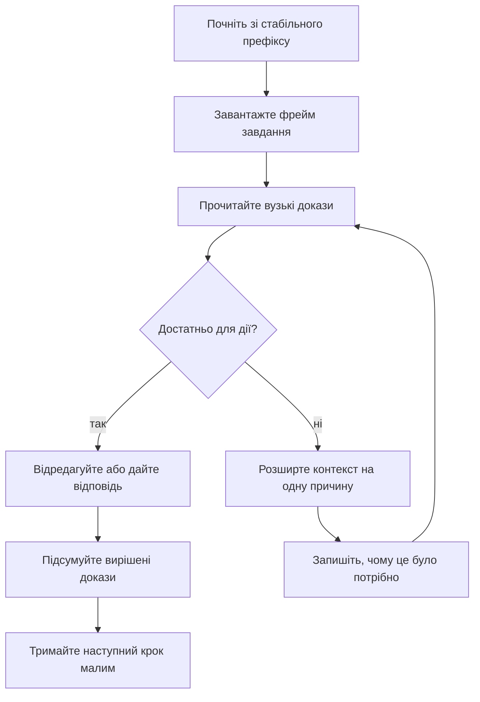
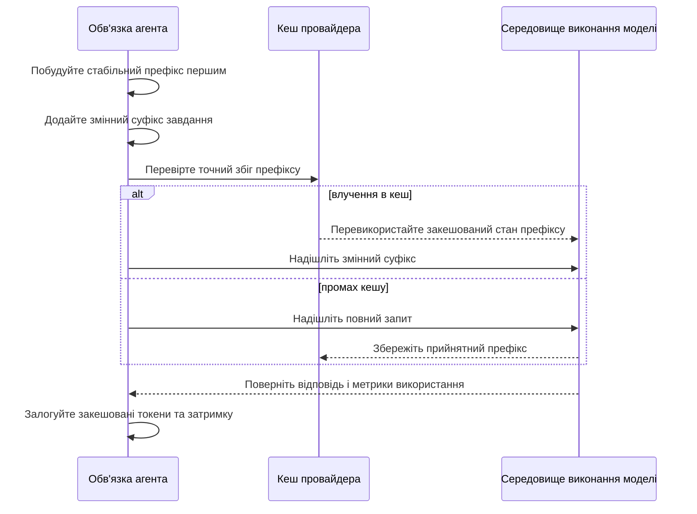

> **Складність**: [COMPLEX]
>
> **Час на виконання**: 75-90 хв
>
> **Передумови**: Модуль 1.1 Основи промптів або еквівалент; знайомство з контекстними вікнами ВММ; базовий CLI + git.

---

## Що ви зможете зробити

Після цього модуля ви зможете мислити про контекст як про спроєктований робочий набір, а не як про довший промпт. Наведені нижче результати зосереджені на виборах, які роблять роботу агента відтворюваною між сесіями, рецензентами та репозиторіями:

- **Розрізняти** контекстну інженерію, промптну інженерію та RAG, називаючи одиницю оптимізації для кожної дисципліни.
- **Діагностувати**, чому агент, який працював в одній сесії, зазнає невдачі у свіжій сесії, визначаючи відсутні контекстні входи.
- **Проєктувати** макет контексту, який покращує частку закешованих токенів, залишаючись у межах ефективного бюджету уваги.
- **Оцінювати** компроміси між висококонтекстними та низькоконтекстними запусками агентів за вартістю, затримкою, ризиком і можливістю рев'ю.
- **Порівнювати** контекст рівня сесії з контекстом рівня репозиторію та спрямовувати інформацію на ту поверхню, яка залишатиметься авторитетною.

## Чому цей модуль важливий

**Гіпотетичний сценарій:** Міра — senior-інженер, до якої звертаються всі, коли робочий процес ШІ-кодування стає нестабільним. Вона випустила перший корисний внутрішній плейбук агента для великого платформного репозиторію. У її руках агент читає правильний runbook, відкриває правильні файли, оминає директорію згенерованого стану, запускає правильні тести та створює невеликий pull request. Модель має велике контекстне вікно, і Міра користується ним добре.

Кілька тижнів робочий процес виглядає відтворюваним. Потім до того самого робочого потоку приєднується колега. Колега отримує промпт Міри, ту саму назву моделі та ту саму задачу. Результат не той самий. Нова сесія пропускає приховане правило гілок, знову відкриває вирішене проєктне питання, забуває обмеження рецензента та редагує згенерований файл, якого запуски Міри ніколи не торкалися.

Ніхто не змінював модель. Ніхто не змінював завдання. Відсутній елемент полягає в тому, що Міра несла корисний стан усередині сесії: попередні результати інструментів, запам'ятовані рішення, закешовані файли, порядок, у якому вона завантажувала інструкції, та ментальну карту того, які документи репозиторію мали значення. Її «навичка промптування» не була просто написанням промптів. Це була контекстна інженерія, яку вона ніколи не називала.

Контекстна інженерія — це дисципліна управління тим, що бачить ВММ-агент на кожному кроці. Це не синонім промптної інженерії. Це не те саме, що RAG. Це рівень управління оперативною пам'яттю в роботі на основі ВММ: рішення про те, що належить до вікна, де це має розташовуватися, як воно має змінюватися, як його кешувати та коли застарілий стан слід оновлювати.

Цей модуль надає цьому рівню практичної форми. Ви навчитеся мислити про вікно моделі як про дефіцитну операційну поверхню, як розміщувати постійні знання репозиторію інакше, ніж тимчасові знання сесії, як префіксне кешування змінює макет промпту та як виявляти деградацію контексту до того, як корисна сесія перетвориться на цикл. Мета не в тому, щоб робити кожен промпт величезним; мета в тому, щоб кожен крок ніс найменший повний робочий набір для рішення, що стоїть перед агентом.

Це розрізнення має значення в продакшен-командах, оскільки контекстні відмови дорого рецензувати. Погана інструкція зазвичай залишає видимий слід у промпті. Погане збирання контексту може виглядати як слабкість моделі, помилка оператора, нестабільний інструментарій або відсутня документація — залежно від того, хто розслідує. Коли робочий набір явний, команда може ставити конкретні питання: чи було правило присутнє, чи були докази актуальними, чи був критерій прийняття близько до поточного запиту, і чи могла б свіжа сесія відтворити той самий стан, не покладаючись на пам'ять Міри?

## Почніть з одиниці оптимізації

Промптну інженерію, контекстну інженерію та RAG часто згортають в одну фразу, оскільки всі три впливають на вхід моделі. Це згортання є дорогим. Коли команди не називають рівень, вони налагоджують не те. Вони переписують інструкції, коли відсутня карта репозиторію. Вони додають векторний пошук, коли справжня проблема — роздутість результатів інструментів. Вони збільшують розмір контексту, коли справжня проблема — погане впорядкування. Перша звичка рівня senior — назвати одиницю оптимізації.

| Дисципліна | Одиниця оптимізації | Типовий артефакт | Симптом відмови |
|---|---|---|---|
| Промптна інженерія | Інтерфейс інструкцій для завдання | системний промпт, користувацький промпт, приклади, вихідний контракт | модель неправильно розуміє, що робити |
| Контекстна інженерія | Зібраний вхідний стан для кроку | уривки файлів, історія чату, результати інструментів, документи репозиторію, отримані фрагменти | моделі бракує або вона неправильно зважує інформацію, необхідну для дії |
| RAG | Один патерн отримання всередині збирання контексту | отримувач, корпус, фрагменти, ранжування, цитування | модель отримує неправильні зовнішні знання або не може обґрунтувати твердження |

Промптна інженерія запитує: «Якої інструкції має дотримуватися модель?» Контекстна інженерія запитує: «Що модель має могти бачити прямо зараз?» RAG запитує: «Які зовнішні записи слід отримати та вставити?» Ці питання перетинаються, але вони не є взаємозамінними. Сильний промпт не може компенсувати відсутній критерій прийняття. Великий результат отримання не може виправити суперечливий стан сесії.

Ідеальний путівник репозиторієм не допоможе, якщо його завантажено після кількох екранів шумних логів, які домінують в увазі. Контекстний інженер володіє відбором, стисненням, порядком, свіжістю та спостережуваністю. Це володіння найважливіше в агентній роботі, оскільки вхід — це не один статичний промпт. Вхід постійно перебудовується з інструкцій, історії розмови, результатів інструментів, читань файлів, попередніх рішень, а іноді й отриманих документів. Кожен крок — це нова операційна поверхня.

Саме тому таблиця одиниць оптимізації є інструментом налагодження, а не лише термінологією. Якщо агент неправильно розуміє вихідний контракт, вам, імовірно, потрібна робота над промптом. Якщо йому бракує карти шляхів, застарілі докази все ще помітні або правило присутнє, але поховане — вам потрібна робота над контекстом. Якщо агенту потрібен зовнішній факт, якого немає в репозиторії чи сесії, отримання може бути доречним, але отримання має входити як одне навмисно розміщене джерело доказів, а не як магічний шар пам'яті.

### Робочий приклад: відмова свіжої сесії

Успішний запуск Міри мав багатошаровий робочий набір, навіть попри те, що ніхто не записав його як формальний артефакт. Промпт завдання знаходився поверх стабільної політики репозиторію, живих доказів сесії та результатів інструментів, які накопичилися під час запуску:

```text
+------------------------------------------------------------+
| Стабільний контекст репозиторію                            |
| AGENTS.md, політика гілок, виключення згенерованих файлів  |
+------------------------------------------------------------+
| Контекст сесії                                             |
| Попередні відмови команд, вибрана тестова команда,         |
| обсяг задачі                                               |
+------------------------------------------------------------+
| Промпт завдання                                            |
| "Виправ модуль і відкрий PR"                               |
+------------------------------------------------------------+
| Результати інструментів                                    |
| Список змінених файлів, вивід збірки, нотатки рецензента   |
+------------------------------------------------------------+
```

Її колега отримав лише видимий запит завдання, тому модель не могла відрізнити довговічні правила від невисловлених припущень. Новий запуск виглядав як той самий промпт, але це була інша операційна поверхня:

```text
+------------------------------------------------------------+
| Промпт завдання                                            |
| "Виправ модуль і відкрий PR"                               |
+------------------------------------------------------------+
```

Промпт сам по собі не був проблемою. Проблемою був відсутній стан. Колега не знав, які файли згенеровані, які перевірки обов'язкові, який обсяг задачі активний або який попередній проєктний вибір уже відхилено. Промптний інженер міг би спробувати зробити промпт завдання довшим. Контекстний інженер запитує, де має жити кожен відсутній вхід.

| Відсутній вхід | Найкращий дім | Чому |
|---|---|---|
| виключення згенерованих файлів | контекст репозиторію | стабільне правило, має застосовуватися до кожної сесії |
| вибрана тестова команда | контекст репозиторію, якщо універсальна; контекст сесії, якщо специфічна для задачі | деякі перевірки глобальні, деякі локальні для зміни |
| попередній відхилений дизайн | контекст репозиторію, якщо довговічний; контекст сесії, якщо лише для цієї задачі | уникайте забруднення стабільних документів одноразовою дискусією |
| останній невдалий вивід збірки | контекст сесії | тимчасові докази, корисні до виправлення |
| вимога рецензента | контекст репозиторію, якщо політика; контекст сесії, якщо специфічна для PR | спрямовуйте на основі очікуваного перевикористання |

Отже, ключове діагностичне питання — не «як сформулювати промпт більш наполегливо?», а «який стан мав успішний запуск, якого бракує свіжому запуску, і де цей стан має жити?»

> **Промпт для активного навчання:** Пригадайте запуск ШІ-агента, який запрацював лише після довгого обміну репліками. Які три елементи стану містив останній успішний крок, яких не мала б свіжа сесія?

Якщо відповідь включає політику, карти шляхів або командні конвенції — вони належать до контексту репозиторію. Якщо відповідь включає вивід команд, часткове міркування або поточні сліди відмов — вони належать до контексту сесії. Якщо відповідь включає зовнішні знання, отримання може допомогти, але лише після того, як ви знаєте, що має підтримувати результат отримання.

Зверніть увагу на рішення про спрямування за кожним рядком. Виключення згенерованих файлів має пережити кожну майбутню сесію, тому ховати його в транскрипті розмови — це проєктна помилка. Остання відмова збірки не повинна ставати постійною політикою, тому копіювання її в путівник агента було б іншою проєктною помилкою. Контекстна інженерія — це звичка свідомо робити ці вибори розміщення, а потім перевіряти, що наступний запуск агента справді отримує вибрані входи в потрібний час.

## Ментальна модель «ВММ як ОС»

Формулювання «ВММ як ОС» — це скорочення зі спільноти практиків, а не формальний архітектурний стандарт. Корисна частина не в тому, щоб стверджувати, що модель буквально є ядром; корисна частина в тому, щоб бачити, що надійність агента походить від моделі плюс інструменти, довговічні файли, історія сесії, правила обв'язки та спостережуваність навколо виклику. Рекомендації вендорів щодо агентів, контекстних вікон і кешування неодноразово вказують у цьому напрямку: кращі системи збирають робочий набір навколо моделі та керують ним, а не покладаються на один розумний рядок інструкції.

В аналогії контекстне вікно діє як оперативна пам'ять, інструменти поводяться як системні виклики, файли репозиторію є довговічним сховищем, а обв'язка є супервізором процесу, шаром політики та поверхнею спостережуваності. Промпт ближчий до точки входу процесу, ніж до всієї програми, оскільки реальна поведінка походить від точки входу плюс доступний робочий набір плюс правила, що забезпечуються навколо виконання.

| Операційна проблема | Аналог ВММ-агента | Контекстне питання |
|---|---|---|
| ОП | контекстне вікно | що поміщається зараз? |
| локальність кешу | префіксний кеш | що повторюється першим? |
| диск | документи та код репозиторію | що зберігається? |
| журнал процесу | історія сесії | що щойно сталося? |
| системний виклик | виклик інструменту | що можна отримати? |
| супервізор | правила та перевірки обв'язки | що забезпечується? |

Ця модель запобігає двом поширеним помилкам. Перша помилка — ставитися до контекстного вікна як до пасивного відра. Це не відро. Це активний робочий набір, який формує наступне обчислення моделі. Друга помилка — ставитися до більшого вікна як до ліків від слабкого проєктування контексту. Більший адресний простір не усуває потреби в управлінні пам'яттю. Він часто робить управління пам'яттю важливішим, оскільки агент тепер може нести більший обсяг застарілого або малоцінного стану.

### Номінальна межа проти ефективного бюджету уваги

Вендори рекламують номінальні ліміти токенів. Інженери працюють у межах ефективних бюджетів уваги. Номінальна межа відповідає на питання: «Скільки вхідних даних може прийняти запит до обрізання чи відмови?» Ефективний бюджет уваги відповідає на питання: «Яку частину цих вхідних даних модель може надійно використовувати для цього завдання?» Це різні числа. Модель може приймати величезний вхід, водночас надмірно зважуючи початок, кінець, нещодавні результати інструментів, повторювані фрази або дуже помітні інструкції.

Дослідження довгого контексту показують, що вмістити токени та надійно їх використовувати — це різні проблеми (наприклад, Liu et al., arXiv:2307.03172). Архітектури, такі як Infini-attention від Google DeepMind, «Leave No Context Behind: Efficient Infinite Context Transformers with Infini-attention» (arXiv:2404.07143), вирішують проблему масштабування самої уваги. Практичний урок — не «ніколи не використовуйте довгий контекст». Урок — «тестуйте, де продуктивність погіршується для форми вашого завдання». Довгі вікна надзвичайно корисні для читання кодової бази, рев'ю кількох документів і планування міграції. Вони менш корисні, коли агент має помітити один маленький критерій прийняття, захований у шумному транскрипті.

Ефективний бюджет особливо важливий, коли промпт змішує різні види інформації. Документація провайдера може сказати вам номінальний розмір вікна, але ваш робочий процес має власний профіль уваги: рев'ю коду з одним критичним безпековим обмеженням поводиться інакше, ніж широке архітектурне обстеження, навіть якщо обидва поміщаються в той самий ліміт токенів. Корисний бенчмарк просить агента виконати саме те рішення, яке вас цікавить, розміщує контрольний факт у різних регіонах промпту та фіксує, чи модель усе ще діє на основі цього факту, коли присутні логи, уривки файлів і старі обговорення.

Ефекти позиції мають значення. Багато моделей найсильніше реагують на початок і кінець промпту. Саме тому команди часто розміщують довговічні інструкції та карти на початку, тримають поточне завдання та критерії прийняття ближче до кінця й агресивно стискають результати інструментів, які більше не мають значення.

| Регіон промпту | Хороші кандидати | Ризик | Проєктний хід |
|---|---|---|---|
| На самому початку | стабільні правила | застарілі, якщо змішані з фактами, специфічними для запуску | тримайте статичними та придатними для рев'ю |
| Початок-середина | карта репозиторію | забагато прози | використовуйте індекси та цільові посилання |
| Середина | фрагменти доказів | ефекти втрати в середині | підсумовуйте та позначайте свіжість |
| Кінець-середина | нещодавні знахідки | роздутість результатів інструментів | обрізайте вирішені докази |
| У самому кінці | завдання та запит | нестабільний, якщо величезний | тримайте поточну дію чіткою |

Ефективний бюджет також формується складністю завдання. Просте завдання на підсумовування часто може витримувати більше фону. Багатофайлове редагування коду зі строгими критеріями прийняття потребує чистішого вікна, оскільки модель має зберігати обмеження під час планування, редагування та пояснення. Не запитуйте «Чи поміщається файл?» Запитуйте «Чи зверне модель увагу на ту частину, яка контролює рішення?»

### Практичний бюджет ОП

Для інженерної роботи рівня senior почніть із бюджету, який класифікує контекст за очікуваним перевикористанням, а не за порядком, у якому інформація випадково надходила під час дослідження.

```yaml
context_budget:
  stable_prefix:
    purpose: довговічні правила та карти
    examples:
      - інструкції агента
      - макет репозиторію
      - рубрика прийняття
  task_frame:
    purpose: поточна проблема та критерії успіху
    examples:
      - підсумок задачі
      - не-цілі
      - обов'язкові перевірки
  evidence:
    purpose: факти, зібрані під час цього запуску
    examples:
      - уривки файлів
      - вивід невдалих команд
      - відповіді API
  scratch:
    purpose: короткоживучі нотатки для вибору наступної дії
    examples:
      - тимчасові гіпотези
      - альтернативні плани
      - вирішені помилки
```

Лише перший блок має бути стабільним між багатьма запитами. Фрейм завдання має змінюватися для кожної задачі, але не для кожного виклику інструменту. Докази слід зберігати лише поки вони впливають на наступне рішення. Scratch слід швидко підсумовувати або відкидати. Аналогія з ОП стає корисною, коли сесія починає деградувати. Якщо агент зациклюється, область scratch могла перетворитися на оманливу скінченну машину станів.

Якщо агент забуває критерії прийняття, фрейм завдання може бути похований. Якщо агент порушує стабільну політику, стабільний префікс може бути відсутнім, суперечливим або завантаженим занадто пізно.

Бюджет також дає рецензентам словник для зворотного зв'язку. Замість того, щоб казати «модель пропустила правило», рецензент може сказати «правило було стабільною політикою, але з'явилося лише в scratch після трьох логів» або «вивід невдалої команди був корисним доказом, але він залишився у вікні після того, як пізніший запуск замінив його». Ці твердження є дієвими, оскільки вони вказують на зміну в збиранні, а не на розпливчасту надію, що наступний виклик моделі міркуватиме краще.

## Контекст є дефіцитним навіть у великих вікнах

Великі контекстні вікна змінюють те, що можливо. Вони не усувають дефіцитності. Дефіцитність переміщується з «чи поміститься цей вхід?» до «які токени заслуговують на увагу, вартість, затримку та рев'ю?» Кожен доданий токен конкурує з іншими токенами. Кожен доданий файл збільшує ймовірність того, що модель перенавчиться на нерелевантні деталі. Кожен доданий результат інструменту може стати застарілим доказом після того, як проблему виправлено.

Найкорисніша дисципліна — ставитися до контексту так, як SRE ставиться до дашбордів під час інциденту. Більше панелей не завжди краще. Правильна панель, у правильний момент, із чітким сигналом свіжості — краще.

Дефіцитність також має вартість рев'ю. Якщо агент створює патч після читання сорока файлів, рецензент має вирішити, чи мали ці файли значення, чи проігнорував агент щось важливе та чи сформували застарілі докази фінальне редагування. Вужчий запуск може бути легшим для аудиту, але він також може бути хибно впевненим, якщо приховане обмеження було поза вікном. Інженерна проблема — вибрати розмір контексту, достатньо великий, щоб покрити рішення, і достатньо малий, щоб і модель, і рецензент усе ще могли бачити контрольні факти.

### Висококонтекстні та низькоконтекстні запуски

Ні висококонтекстний, ні низькоконтекстний не є апріорі правильним, оскільки кожен купує інший режим відмови. Правильний вибір залежить від радіусу ураження, неоднозначності та вартості відновлення: міграція платформи потребує широкої неперервності, тоді як виправлення друкарської помилки не повинно тягнути весь архів архітектури в промпт.

| Підхід | Сильна сторона | Вартість | Режим відмови | Використовуйте, коли |
|---|---|---|---|---|
| Висококонтекстний | широка обізнаність, менше пропущених файлів, краща архітектурна неперервність | повільніше, дорожче, важче для рев'ю | модель звертає увагу на застарілі або нерелевантні деталі | архітектурне рев'ю, планування міграції, реконструкція інциденту |
| Низькоконтекстний | швидко, дешево, вузько, легше для аудиту | пропускає приховані обмеження, може перевідкривати відомі факти | агент вигадує значення за замовчуванням для відсутнього контексту | малі редагування, виправлення в одному файлі, відомі командні цикли |
| Поетапно-контекстний | починає вузько, розширюється на основі доказів | вимагає дисципліни оркестрації | правила розширення розпливчасті | більшість продакшен-робочих процесів агентів |

Поетапно-контекстний часто є найкращим типовим вибором. Почніть зі стабільних правил, фрейму завдання та найменшого релевантного набору файлів. Розширюйте лише тоді, коли докази показують відсутню залежність. Підсумовуйте або відкидайте вирішені докази перед наступним розширенням. Цей цикл не дає сесії перетворитися на випадковий архів і залишає слід того, чому кожне додане джерело було варте свого бюджету токенів.



Фраза «на одну причину» важлива, оскільки сама лише невизначеність є занадто розпливчастою, щоб керувати зростанням контексту. Не розширюйте контекст, тому що агент почувається невпевнено. Розширюйте, тому що конкретне рішення потребує конкретного відсутнього входу, наприклад, реалізації згаданого допоміжного елемента, політики, яка контролює згенеровані артефакти, або поточного виводу невдалої перевірки.

### Зсув позиції на практиці

Проблема «втрати в середині» (Liu et al., arXiv:2307.03172) — це не лише академічна цікавинка. В агентних сесіях вона проявляється як практичне забування. Критерій прийняття, розміщений у середині довгого транскрипту, може бути проігнорований, тоді як модель слідує за найновішим виводом команди. Правило репозиторію, завантажене після кількох довгих логів, може розглядатися як менш центральне, ніж логи.

Безпекова примітка, захована в отриманому документі, може програти впевненому, але загальному пріору. Виправлення не в тому, щоб голосніше вигукувати правило в кожному реченні. Виправлення — у проєктуванні макета контексту. Розміщуйте довговічні правила на початку. Розміщуйте поточне завдання та критерії успіху в кінці. Тримайте середину для стиснутих доказів, які безпосередньо підтримують наступне рішення. Коли елемент у середині стає критичним для рішення, підвищте його до фрейму завдання або стабільного префіксу перед наступним кроком.

```text
Поганий макет:

+------------+------------+------------+------------+------------+
| змінна     | величезні  | ключове    | стара      | поточний   |
|            | логи       | правило    | дискусія   | запит      |
+------------+------------+------------+------------+------------+

Кращий макет:

+------------+------------+------------+------------+------------+
| стабільний | карта      | докази     | відкриті   | поточний   |
|            | репо       |            | ризики     | запит      |
+------------+------------+------------+------------+------------+
```

### Робочий приклад: зменшення без втрати сигналу

Припустімо, агент виправляє невдалу збірку після довгої сесії налагодження. Сирий транскрипт містить кілька категорій інформації, але лише деякі з них усе ще впливають на наступну дію:

- повні інструкції репозиторію
- тіло задачі
- три логи невдалих збірок
- два читання файлів
- один коментар рецензента
- одна застаріла гіпотеза про версії пакетів
- фінальна помилка компілятора

Слабкий низькоконтекстний підхід відкидає занадто багато, залишаючи агента без правил і доказів, які відрізняють цю відмову від будь-якої загальної помилки компілятора:

```text
Виправ збірку. Компілятор видав помилку.
```

Слабкий висококонтекстний підхід включає все, що зберігає докази, але також змушує застарілі гіпотези конкурувати з поточною причинною помилкою:

```text
Ось кожна інструкція, кожен лог, кожна команда, кожна стара гіпотеза,
кожен файл і кожен коментар за останні дві години. Продовжуй.
```

Контекстно-інженерна версія зберігає стан рішення, називаючи стабільні правила, поточний обсяг, свіжі докази та точну наступну дію:

```text
Стабільні правила:
- Не редагуйте згенерований стан.
- Запустіть збірку сайту перед відкриттям PR.

Завдання:
- Виправте відмову збірки, спричинену новим модулем.
- Обмежте зміни новими файлами вмісту.

Свіжі докази:
- Поточна помилка компілятора вказує, що блок Mermaid має неправильний синтаксис.
- Постраждалий файл — module-2.1-context-fundamentals.md.
- Попередні гіпотези про версії пакетів були спростовані чистим встановленням залежностей.

Наступна дія:
- Перевірте блок Mermaid, виправте синтаксис, перезапустіть збірку та повідомте лише про поточні помилки.
```

Інженерна версія менша за сиру сесію, але багатша за розпливчастий промпт. Вона прибирає вирішений шум, зберігаючи причинний шлях. На практиці це різниця між «підсумуй чат досі» та «перебудуй робочий набір для наступного рішення». Перше може нести кожен емоційний контур сесії налагодження; друге несе факти, які все ще мають значення.

> **Промпт для активного навчання:** Візьміть нещодавній транскрипт ШІ-сесії та позначте кожен абзац як стабільне правило, фрейм завдання, докази або scratch. Які абзаци ви б видалили перед наступним кроком моделі?

## Економіка префіксного кешування

Макет контексту — це не лише про якість. Це також про вартість і затримку. Кешування промптів винагороджує стабільні префікси. Якщо початок запиту точно повторюється між викликами, провайдери можуть перевикористовувати закешовану роботу замість того, щоб обробляти весь префікс з нуля. І Anthropic, і OpenAI документують одне й те саме ключове правило проєктування: розміщуйте стабільний або повторюваний вміст першим, а змінний, специфічний для користувача вміст — пізніше.

Точна реалізація відрізняється залежно від провайдера. Anthropic надає автоматичне кешування та явні точки розриву кешу, такі як `cache_control`. OpenAI описує автоматичне кешування промптів для прийнятних довгих промптів із полями використання, такими як `cached_tokens`, та опціями, такими як `prompt_cache_key` і політика утримання. Інженерний принцип є нейтральним щодо провайдера: максимізуйте стабільний префікс, не ховаючи дані поточного завдання.

Gim et al. (arXiv:2311.04934) також цитуються для формулювання економіки перевикористання стабільного префіксу в повторюваних запусках висновування.

Це точка, де якість та економіка вказують в одному напрямку. Стабільний префікс — це зазвичай місце, де належать довговічна політика, вихідні контракти, схеми інструментів і компактні карти репозиторію, тому розміщення його першим допомагає і увазі, і перевикористанню кешу. Суфікс — це місце, де належать поточні докази, тому розміщення його в кінці захищає актуальність, не руйнуючи закешований префікс. Макет контексту, який починається з мітки часу, заголовка задачі або сирого виводу команди, коштує дорожче й часто вчить модель зосереджуватися на найшумнішій частині запуску.

### Дружній до кешу макет контексту

```text
+--------------------------------------------------------------------------+
| Стабільний префікс                                                       |
| Інструкції провайдера, роль агента, політика репо, вихідний контракт     |
+--------------------------------------------------------------------------+
| Напівстабільна середина                                                  |
| Схеми інструментів, карта репозиторію, рубрика, приклади                 |
+--------------------------------------------------------------------------+
| Змінний суфікс                                                           |
| Тіло задачі, поточні уривки файлів, вивід команд, питання користувача    |
+--------------------------------------------------------------------------+
```

Якщо ви розміщуєте змінний вміст на початку, кеш розривається рано. Якщо ви розміщуєте мітку часу, випадковий ідентифікатор запуску або поточний лог помилок перед стабільною політикою, кожен запит виглядає новим. Це змушує провайдера обробляти дорогий спільний матеріал знову.

### Потік кешування


Важлива метрика — не «чи існувало кешування?» Важлива метрика — частка закешованих токенів для дорогої частини промпту. Ви можете спостерігати це за допомогою полів використання провайдера та локального вимірювання часу, а потім порівнювати ці метрики з якістю виводу, щоб покращення кешу не приховувало гіршого результату рев'ю.

### Робочий приклад: перевпорядкування для кешу

Припустімо, обв'язка агента надсилає таку форму запиту для кожного рев'ю файлу, і команда дивується, чому повторні рев'ю все ще здаються повільними та дорогими:

```text
ПОГАНИЙ ПОРЯДОК

1. Поточна мітка часу та ідентифікатор запуску
2. Текст задачі користувача
3. Вивід невдалої команди
4. Стабільна політика репозиторію
5. Стабільна рубрика рев'ю
6. Схема інструменту
7. Необхідна форма виводу
```

Верх змінюється з кожним запитом. Навіть якщо політика та рубрика ідентичні, вони надходять після змінного вмісту. Стабільний префікс крихітний. Дружній до кешу макет:

```text
КРАЩИЙ ПОРЯДОК

1. Стабільна політика репозиторію
2. Стабільна рубрика рев'ю
3. Схема інструменту
4. Необхідна форма виводу
5. Поточний текст задачі
6. Вивід невдалої команди
7. Мітка часу та ідентифікатор запуску, лише якщо потрібно
```

Тепер дорога стабільна частина є префіксом. Змінні деталі все ще досягають моделі, але вони не отруюють ключ кешу на початку. Для агента, який виконує повторні рев'ю, це може зменшити як затримку, так і вартість вхідних даних, водночас роблячи рубрику рев'ю більш помітною. Якщо якість падає після перевпорядкування, проблема не в самому кешуванні; проблема в тому, що обмеження поточного завдання було переміщено занадто далеко від запиту або стиснуто занадто агресивно.

### Приклад інструментування

Не вгадуйте, чи покращив макет кешування. Логуйте використання та обчислюйте частку вхідних токенів, поданих із кешу. Наведений нижче скрипт читає рядки JSON із локального логу агента. Кожен рядок має містити `prompt_tokens`, `cached_tokens` і `latency_ms`.

```python
import json
from pathlib import Path

def load_runs(path: Path) -> list[dict]:
    runs = []
    for line in path.read_text().splitlines():
        if line.strip():
            runs.append(json.loads(line))
    return runs

def summarize(runs: list[dict]) -> dict:
    prompt_tokens = sum(run["prompt_tokens"] for run in runs)
    cached_tokens = sum(run["cached_tokens"] for run in runs)
    latency_ms = sum(run["latency_ms"] for run in runs)
    count = len(runs)
    cached_token_share = cached_tokens / prompt_tokens if prompt_tokens else 0
    return {
        "runs": count,
        "prompt_tokens": prompt_tokens,
        "cached_tokens": cached_tokens,
        "cached_token_share": round(cached_token_share, 3),
        "avg_latency_ms": round(latency_ms / count, 1) if count else 0,
    }

if __name__ == "__main__":
    log_path = Path("agent-cache-runs.jsonl")
    print(json.dumps(summarize(load_runs(log_path)), indent=2))
```

Створіть невеликий тестовий лог, щоб вимірювання мало достатньо повторюваної структури для показу влучення в кеш після першого незакешованого запиту:

```bash
cat > agent-cache-runs.jsonl <<'EOF'
{"prompt_tokens": 18000, "cached_tokens": 0, "latency_ms": 9200}
{"prompt_tokens": 18100, "cached_tokens": 15600, "latency_ms": 4100}
{"prompt_tokens": 17950, "cached_tokens": 15480, "latency_ms": 3980}
EOF
```

Збережіть попередній блок Python як `cache_summary.py`, а потім запустіть:

```bash
.venv/bin/python cache_summary.py
```

Очікувана форма виводу має показувати як загальний обсяг промпту, так і закешовану частку, оскільки нижча середня затримка без видимості закешованих токенів є занадто неоднозначною, щоб їй довіряти:

```json
{
  "runs": 3,
  "prompt_tokens": 54050,
  "cached_tokens": 31080,
  "cached_token_share": 0.575,
  "avg_latency_ms": 5760.0
}
```

Це іграшкове вимірювання, але операційна звичка справжня. Макет контексту не завершений, доки ви не зможете побачити, чи покращує він повторювану роботу. Для продакшен-обв'язок додавайте також мітки результатів, такі як «прийнятий патч», «пропущене правило» або «потрібна корекція людиною». Вартість і затримка корисні лише в парі з успіхом завдання.

### Компроміси кешування

Кешування не означає, що кожен запит має починатися з гігантського статичного префіксу. Статичний вміст має заслужити своє місце. Стабільний префікс, який включає застарілі правила, буде сумлінно кешувати застарілі правила. Стабільний префікс, який включає кожну можливу політику, може покращити частку кешу, погіршуючи увагу. Оптимізація кешу має залишатися підпорядкованою якості завдання.

| Проєктний вибір | Ефект на кеш | Ефект на увагу | Рішення |
|---|---|---|---|
| стабільна політика першою | покращує перевикористання префіксу | робить правила помітними | зазвичай добре |
| змінна задача першою | руйнує перевикористання | робить поточне завдання помітним | використовуйте лише коли запит одноразовий |
| усі документи репо в префіксі | може покращити перевикористання | перевантажує увагу | зазвичай погано |
| компактна карта репо в префіксі | покращує перевикористання | зберігає сигнал маршрутизації | зазвичай добре |
| поточний лог на початку | руйнує перевикористання | може надмірно фокусувати на тимчасових доказах | уникайте, крім надзвичайних ситуацій |
| запит завдання в кінці | не допомагає префіксному кешу | покращує актуальність | зазвичай добре |

Найкращий макет часто має стабільний префікс і чіткий суфікс. Префікс дає моделі операційний контракт. Суфікс каже їй, що робити зараз.

## Контекст сесії та контекст репозиторію

Зрештою, весь контекст потрапляє в те саме вікно моделі. Це не означає, що всім контекстом слід керувати однаково. Контекст сесії є ефемерним. Контекст репозиторію є постійним. Контекст сесії відповідає на питання: «Що сталося в цьому запуску?» Контекст репозиторію відповідає на питання: «Що має знати кожен запуск?»

Обидва необхідні. Плутання їх створює деградацію. Якщо довговічна політика живе лише в історії чату, наступна сесія її забуває. Якщо одноразовий лог відмови скопійовано в постійний путівник агента, майбутні сесії успадковують застарілий шум.

Межа не про формат файлу; вона про час життя та володіння. Путівник Markdown, коментар до задачі, локальна нотатка scratch і JSON-трейс — усе може стати контекстом, але вони несуть різні шляхи рев'ю та очікування щодо закінчення терміну дії. Контекст репозиторію має бути достатньо довговічним, щоб супроводжувачі були готові його рецензувати, а контекст сесії має бути достатньо disposable, щоб майбутні агенти не були змушені успадковувати вчорашню тимчасову плутанину.

### Матриця порівняння

| Поверхня контексту | Приклади | Час життя | Власник | Добре для | Погано для |
|---|---|---|---|---|---|
| Історія чату | рішення, уточнення, нещодавні відмови | одна сесія | поточний оператор | неперервність усередині завдання | довговічна політика |
| Результати інструментів | результати команд, читання файлів, відповіді API | хвилини-години | обв'язка або агент | свіжі докази | довготривала пам'ять |
| AGENTS.md | правила робочого процесу, політика гілок, карти | тижні-місяці | супроводжувачі репозиторію | стабільні інструкції агента | довгі дискусії |
| Структуровані документи | архітектура, runbook'и, рубрики | тижні-квартали | власники домену | пояснювана політика та дизайн | тимчасові логи |
| Код як контекст | тести, типи, скрипти, конфігурація | історія версій | власники коду | виконувана істина | невиражений намір |
| Корпус отримання | тікети, документи, база знань | змінний | платформна команда | зовнішнє обґрунтування | приховане забезпечення |

Правило маршрутизації просте: розміщуйте інформацію там, де її очікуваний час життя та володіння збігаються. Якщо вона має пережити свіжу сесію, розміщуйте її в контексті репозиторію. Якщо вона має зникнути після поточного завдання, тримайте її в контексті сесії. Якщо вона має бути переобчислена з коду, не дублюйте її в прозі, хіба що проза пояснює намір.

Це правило також захищає репозиторій від перетворення на звалище пам'яті. Команди часто реагують на відмови агента додаванням ще одного абзацу до файлу інструкцій верхнього рівня, але кожне додавання підвищує вартість майбутнього збирання контексту. Краще виправлення — часто невеликий маршрут у файлі верхнього рівня плюс сфокусований документ в іншому місці, щоб агент навчився, куди йти, не несучи кожну деталь на кожному кроці.

### Проєктування контексту репозиторію

Репозиторій має давати агентам карту, а не повний посібник на початку кожного запиту. Карта має вказувати на стабільні джерела. Стабільні джерела мають бути достатньо малими, щоб завантажувати їх цілеспрямовано.

```text
repo-root/
  AGENTS.md
  docs/
    architecture/
      context-boundaries.md
    runbooks/
      build-and-test.md
    harness/
      checks.md
  scripts/
    check_context_layout.py
  src/
    ...
```

`AGENTS.md` не повинен ставати звалищем для кожного засвоєного уроку. Він має маршрутизувати агента. Наприклад:

```text
Для відмов збірки читайте docs/runbooks/build-and-test.md.
Для згенерованих артефактів читайте docs/harness/checks.md.
Для архітектурних змін читайте docs/architecture/context-boundaries.md.
```

Це контекст рівня репозиторію. Він зберігається між сесіями. Його можна рецензувати в pull request'ах. Його можна тестувати перевірками посилань. Його можна скорочувати, коли він розростається.

Хороший контекст репозиторію має чітку думку щодо маршрутизації та консервативний щодо деталей. Він має називати файли, які є авторитетними, пояснювати правила, які не можна вивести з коду, та спрямовувати агентів до виконуваних перевірок. Він не повинен зберігати кожну минулу дискусію, оскільки стара дискусія стає неоднозначним доказом, коли майбутня модель намагається вивести поточну політику.

### Проєктування контексту сесії

Контекст сесії потребує іншої дисципліни. Мета — не збереження; мета — неперервність без роздутості. На кожному кроці сесія має нести кілька живих фактів, які дозволяють наступній дії випливати з попередньої:

- поточна ціль
- останній прийнятий план
- поточні відкриті питання
- свіжі докази, що змінюють наступну дію
- рішення, які ще не записані в репозиторій

Вона не повинна нести застарілий або вирішений матеріал лише тому, що цей матеріал з'явився раніше в розмові:

- вирішений вивід команд
- спростовані гіпотези
- цілі файли після того, як малого уривку було достатньо
- повторювана політика, вже доступна в контексті репозиторію
- довгі пояснення асистента, які більше не впливають на завдання

Обв'язки агентів можуть реалізувати це за допомогою ковзних підсумків. Люди можуть реалізувати це вручну, записуючи коротку нотатку «поточний стан» перед тим, як поставити наступне питання. Нотатка має бути фактологічною, а не автобіографічною, оскільки модель потребує операційного стану більше, ніж оповіді про те, як відчувалася сесія.

```text
Поточний стан:
- Ціль: зробити так, щоб новий модуль контексту коректно рендерився.
- Файли в обсязі: новий індекс розділу та модуль.
- Виправлено: frontmatter парситься.
- Відкрито: синтаксис Mermaid та лічильник рядків.
- Наступна перевірка: npm run build.
```

Це межа стиснення. Вона зберігає стан рішення, не зберігаючи кожен токен, який його створив. Стиснення безпечне лише тоді, коли воно тримає відкриті ризики та замінені докази окремо; інакше підсумок може мовчки перетворити стару гіпотезу на прийнятий факт.

### Рішення про маршрутизацію

Використовуйте цю таблицю рішень, коли вирішуєте, де має знаходитися контекст, особливо коли фрагмент інформації здається корисним, але не заслуговує очевидно на постійний дім.

| Питання | Якщо так | Якщо ні |
|---|---|---|
| Чи має свіжий агент знати це наступного тижня? | контекст репозиторію | контекст сесії |
| Чи це виконувана істина? | код, тести або скрипти | документи або нотатка сесії |
| Чи це політика, а не докази? | AGENTS.md або структуровані документи | вивід інструменту |
| Чи змінюється це з кожним запитом? | суфікс або стан сесії | стабільний префікс |
| Чи це чутливе або специфічне для користувача? | мінімізуйте та ізолюйте | розгляньте стабільні документи |
| Чи потрібне це лише для одного рішення? | докази сесії | карта репозиторію |

Основний ризик — надмірне документування тимчасових фактів. Контекст репозиторію має залишатися достатньо чистим, щоб кожен новий агент міг дозволити собі його прочитати. Контекст сесії має залишатися достатньо свіжим, щоб кожен наступний крок міг йому довіряти.

Коли є сумніви, вибирайте меншу довговічну поверхню та робіть розширення дешевим. Файл агента верхнього рівня може сказати «для процесу релізу читайте runbook релізу» замість того, щоб вбудовувати весь процес релізу. Нотатка сесії може сказати «поточна відмова — валідатор схеми, старі відмови лінтера вирішено» замість того, щоб зберігати три повні логи. Ці два ходи зберігають репозиторій читабельним, а сесію — актуальною.

## Спостережуваність деградації контексту

Деградація контексту — це погіршення, спричинене застарілим, роздутим, суперечливим або неправильно впорядкованим контекстом. Часто здається, що модель «погіршала». Іноді модель у порядку. Робочий набір поганий. Ви можете спостерігати деградацію контексту до того, як вона змарнує цілу сесію.

### Симптоми

Поширені ознаки включають поведінковий дрейф, який було б важко пояснити, якби агент мав чистий, актуальний робочий набір:

- агент зациклюється на вже вирішеній проблемі
- він суперечить раніше прийнятому рішенню
- він забуває критерії прийняття після читання довгих логів
- він галюцинує назви файлів, яких не існує
- він редагує файли поза заявленим обсягом
- він повторює виклик інструменту, не використовуючи результат
- він трактує старі помилки як поточні помилки
- він запитує контекст, який уже присутній, але похований

Кожен симптом відображається на клас контекстної відмови, тому виправлення має бути спрямоване на робочий набір, а не на сліпе повторення того самого промпту.

| Симптом | Ймовірна контекстна відмова | Перше виправлення |
|---|---|---|
| зациклюється на вирішеній проблемі | застарілі докази залишаються помітними | підсумуйте вирішений стан і видаліть старі логи |
| суперечить прийнятому рішенню | рішення не підвищене | перемістіть рішення у фрейм завдання або документ репо |
| забуває критерії прийняття | критерії поховані в середині | переформулюйте критерії ближче до поточного запиту |
| галюцинує назви файлів | відсутня карта репозиторію | завантажте дерево файлів або точний список шляхів |
| редагує поза обсягом | обсяг відсутній або суперечливий | помістіть обсяг у стабільне правило та поточний запит |
| повторює виклики інструментів | результати інструментів занадто шумні | витягніть корисний результат і відкиньте решту |
| трактує стару помилку як поточну | свіжість не позначена | позначте результати часом і статусом |
| запитує присутній контекст | перевантаження або погане впорядкування | зменшіть і перевпорядкуйте контекст |

### Що інструментувати

Інструментуйте контекст так, як ви б інструментували сервісну межу. Вам потрібні розмір, свіжість, склад і результат. Щонайменше логуйте:

- загальну кількість вхідних токенів
- кількість закешованих вхідних токенів
- включені секції контексту
- завантажені верхні файли
- частку токенів результатів інструментів
- вік останніх критичних доказів
- кількість невирішених відкритих питань
- фінальний результат для кроку

Мета не в тому, щоб збирати красиві дашборди. Мета в тому, щоб зробити рев'ю відмов фактологічним. Коли агент пропускає правило, ви повинні мати змогу відповісти: Чи було правило присутнє? Де воно знаходилося? Чи було воно суперечливим? Чи було воно оточене шумним виводом? Чи зберіг його підсумок сесії?

Ці питання перетворюють рев'ю агента на операційну практику. Якщо правило було відсутнє, виправлення — маршрутизація або отримання. Якщо воно було присутнє, але поховане, виправлення — впорядкування або стиснення. Якщо воно було присутнє й суперечливе, виправлення — очищення джерела істини. Якщо воно було присутнє, помітне й усе одно проігнороване — можливо, у вас проблема зі здатністю моделі, але цей висновок набагато сильніший, коли контекстні докази видимі.

### Мінімальний журнал контексту

Журнал контексту — це невеликий структурований запис того, що бачив агент, що було актуальним і який результат виплив із цього робочого набору.

```yaml
turn_id: review-006
stable_prefix:
  - AGENTS.md
  - docs/harness/checks.md
task_frame:
  - підсумок задачі
  - критерії прийняття
evidence:
  - src/content/docs/ai/ai-engineering-foundations/index.md
  - уривок помилки збірки
tool_output:
  token_share_estimate: 0.18
freshness:
  build_error: current
  branch_policy: stable
outcome:
  status: needs_rerun
  reason: синтаксис mermaid виправлено
```

Цей журнал може жити в трейсі агента, локальному JSONL-файлі або примітці до pull request. Він не повинен бути довгим. Він повинен показувати рецензентам, чи мав агент правильний робочий набір.

Журнал найкорисніший, коли його записують перед наступною повторною спробою, а не після того, як усі вже здогадалися про причину. Короткий журнал може показати, що агент ніколи не завантажував критерії прийняття, що поточна відмова була змішана зі старими відмовами або що постійна політика стала невидимою за стіною результатів інструментів. Це робить наступний запуск контрольованим експериментом, а не ще одним дорогим перезапуском.

### Цикл оновлення

Коли з'являється деградація, не додавайте контекст. Оновіть робочий набір, класифікувавши симптом, вирішивши, чи обрізати, підвищити, перевпорядкувати або отримати, а потім перебудувавши вікно від стабільних правил до поточних доказів.

```text
+-------------------+     +-------------------+     +-------------------+
| виявіть симптом    | --> | класифікуйте       | --> | обріжте або        |
| цикл, пропуск,     |     | контекст:          |     | підвищіть:         |
| дрейф або          |     | застарілий,        |     | видаліть,          |
| суперечність       |     | відсутній,         |     | підсумуйте або     |
|                    |     | похований, шумний  |     | перемістіть у репо |
+-------------------+     +-------------------+     +-------------------+
          ^                                                   |
          |                                                   v
+-------------------+     +-------------------+     +-------------------+
| спостерігайте      | <-- | перезапустіть із   | <-- | перебудуйте вікно  |
| наступний крок:    |     | журналом: розмір   |     | стабільне, потім   |
| результат і вартість|    | і результат        |     | свіже              |
+-------------------+     +-------------------+     +-------------------+
```

Це той самий операційний цикл, що й налагодження нестабільного сервісу: спостерігайте, класифікуйте, виправте одну причину, перезапустіть і запишіть результат. Дисципліна полягає в тому, щоб змінювати одну змінну контексту за раз, коли це можливо, оскільки повторна спроба, яка змінює модель, промпт, файли, отримані документи та впорядкування — усе одночасно, дуже мало навчає команду.

### Вибір виправлення

Використовуйте одне з чотирьох виправлень. Обрізайте, коли контекст занадто великий або застарілий. Підвищуйте, коли рішення має стати довговічним. Перевпорядковуйте, коли важливий вміст присутній, але погано розміщений. Отримуйте, коли відсутній факт існує поза поточною сесією та контекстом репозиторію.

| Виправлення | Використовуйте, коли | Приклад |
|---|---|---|
| обрізати | вирішені докази домінують | замініть повний лог збірки поточною помилкою |
| підвищити | правило має переживати сесії | перемістіть «ніколи не редагуйте згенерований стан» до AGENTS.md |
| перевпорядкувати | вміст присутній, але ігнорується | розмістіть критерії прийняття ближче до поточного запиту |
| отримати | потрібний факт є зовнішнім | отримайте документацію провайдера або історію задач |

Не використовуйте отримання як рефлекс. Отримання потужне, коли відсутній факт є в корпусі. Воно не виправляє перевантажений стан сесії чи суперечливі інструкції. Якщо модель ігнорує правило, уже присутнє в промпті, додавання ще десяти отриманих фрагментів зазвичай погіршує проблему уваги.

## Проєктування макета контексту

Корисний макет контексту — це відтворюваний порядок збирання. Він має бути достатньо явним, щоб інший інженер або обв'язка могли його перебудувати, і достатньо компактним, щоб важливі частини залишалися видимими після надходження реальних результатів інструментів. Почніть із цього базового варіанту:

```text
+----------------------+
| 1. Стабільний префікс|
| Правила, роль, карти |
+----------------------+
| 2. Напівстабільні    |
| інструменти          |
| Схеми, рубрики       |
+----------------------+
| 3. Фрейм завдання    |
| Задача, цілі, межі   |
+----------------------+
| 4. Свіжі докази      |
| Файли, логи, виводи  |
+----------------------+
| 5. Поточний запит    |
| Точна наступна дія   |
+----------------------+
```

Потім застосуйте три перевірки. Перша, перевірка кешу: чи з'являється повторювана частина перед змінною? Друга, перевірка уваги: чи знаходяться правила з найвищим ризиком і критерії успіху на сильних позиціях? Третя, перевірка свіжості: чи може модель визначити, які докази є актуальними?

Ці перевірки мають відбуватися до виклику моделі, а не лише під час постмортему. Якщо стабільний префікс містить дані, специфічні для запуску, кешування буде слабким. Якщо критерії прийняття поховані в середині, увага буде слабкою. Якщо докази не позначені, свіжість буде слабкою. Макет, який не проходить жодної з цих перевірок, може все ще поміщатися в номінальне вікно, але поміщатися — не те саме, що бути придатним для використання.

### Приклад макета для агента кодування

```yaml
stable_prefix:
  role: senior-агент кодування репозиторію
  rules:
    - дотримуйтеся AGENTS.md
    - не редагуйте згенеровані артефакти
    - тримайте обсяг обмеженим задачею
  output_contract:
    - підсумуйте змінені файли
    - повідомте про запущені тести
semi_stable:
  repo_map:
    - src/content/docs
    - scripts
    - docs
  tool_contracts:
    - використовуйте ripgrep для пошуку
    - використовуйте явний шлях python з virtualenv
task_frame:
  issue: напишіть Основи контекстної інженерії
  success:
    - модуль має необхідні розділи
    - лічильник рядків проходить
    - збірка проходить
fresh_evidence:
  files_read:
    - module-quality.md
    - наявний модуль обв'язки
current_ask:
  action: створіть чернетку, перевірте, закомітьте та відкрийте PR
```

Цей макет не є універсальним. Це відправна точка. Безпекове рев'ю помістило б модель загроз і межі довіри у фрейм завдання. Аналіз інциденту помістив би поточну хронологію та підтверджені факти у свіжі докази. План міграції помістив би обмеження сумісності в стабільну або напівстабільну область.

### Рубрика оцінювання

Перш ніж використовувати макет, оцініть його за цими питаннями та зробіть відповіді достатньо видимими, щоб інший інженер міг їх оскаржити.

| Вимір | Хороша відповідь | Слабка відповідь |
|---|---|---|
| відбір | кожен включений елемент має причину рішення | включено, бо може допомогти |
| впорядкування | стабільний префікс і поточний запит є навмисними | порядок слідує за випадковістю відкриття |
| свіжість | застарілі та актуальні докази позначені | усі логи виглядають однаково актуальними |
| кешованість | повторюваний префікс стабільний | змінні дані з'являються першими |
| можливість рев'ю | рецензент може бачити, що було завантажено | контекст невидимий у чаті |
| портативність | свіжа сесія може його відтворити | залежить від пам'яті однієї людини |

Макет не повинен оптимізуватися лише для моделі. Він також має оптимізуватися для людського рев'ю. Якщо рецензент не може сказати, який контекст використовував агент, він не може сказати, чи була відмова спричинена міркуванням моделі, відсутнім входом чи поганими інструкціями.

## Чи знали ви?

1. Посібник OpenAI з кешування промптів каже, що влучення в кеш вимагають точного збігу префіксів, тому статичні інструкції та приклади слід розміщувати перед змінним, специфічним для користувача вмістом. Джерело: [OpenAI Prompt Caching](https://developers.openai.com/api/docs/guides/prompt-caching).
2. Документація Anthropic з кешування промптів описує автоматичне кешування, явні точки розриву кешу, типовий п'ятихвилинний час життя кешу та довші опції кешу для підтримуваних випадків використання. Джерело: [Anthropic Prompt Caching](https://docs.anthropic.com/en/docs/build-with-claude/prompt-caching).
3. «Leave No Context Behind: Efficient Infinite Context Transformers with Infini-attention» від DeepMind описує архітектуру з обмеженою пам'яттю для масштабування уваги на довгих входах без квадратичних обчислень. Джерело: [arXiv:2404.07143](https://arxiv.org/abs/2404.07143).
4. Документація Google Gemini щодо довгого контексту рекомендує використовувати довгі входи для завдань, таких як підсумовування, запитування та міркування над великими документами, тоді як кешування контексту документовано окремо для повторюваного вмісту. Джерело: [Gemini Long Context](https://ai.google.dev/gemini-api/docs/long-context).

## Поширені помилки

| Помилка | Чому це шкодить | Кращий хід |
|---|---|---|
| Розміщення міток часу або специфічних для користувача даних на початку кожного запиту | руйнує перевикористання стабільного префіксу та послаблює переваги кешу | розміщуйте статичну політику та схеми першими, змінні деталі — пізніше |
| Завантаження всього репозиторію в контекст | збільшує вартість, затримку та нерелевантну конкуренцію за увагу | спочатку завантажте карту репозиторію, потім розширюйте за причиною |
| Називання контекстної інженерії «просунутою промптною інженерією» | приховує різницю між проєктуванням інструкцій та проєктуванням робочого набору | називайте рівень та оптимізуйте зібраний стан кроку |
| Ставлення до RAG як до всієї стратегії контексту | отримання не керує історією сесії, політикою репозиторію, впорядкуванням або макетом кешу | використовуйте RAG як одне джерело входу в межах ширшого плану контексту |
| Ігнорування роздутості результатів інструментів | застарілі логи стають помітнішими за поточні факти | підсумовуйте вирішені результати та зберігайте лише свіжі докази |
| Зберігання довговічної політики лише в чаті | свіжі сесії пропускають правило | підвищіть довговічну політику до AGENTS.md або структурованих документів |
| Копіювання тимчасових відмов у постійні документи | майбутні сесії успадковують застарілий стан інциденту | зберігайте тимчасові докази в логах сесії або трейсах |
| Вимірювання кількості токенів, але не результату | менше вікно може все одно пропускати критичні факти | вимірюйте частку закешованих токенів, затримку, помилки та успіх завдання разом |

## Тест

### Питання 1

Ваша команда має промпт, який каже: «Дотримуйтеся наших правил репозиторію», але свіжий агент усе одно редагує згенеровані файли. Попередня успішна сесія не робила цієї помилки. Яку контекстну відмову слід дослідити першою?

<details>
<summary>Відповідь</summary>

Дослідіть, чи існує правило про згенеровані файли в контексті рівня репозиторію та чи свіжа сесія завантажила його достатньо рано. Це не є насамперед проблемою формулювання промпту. Відсутній або погано розміщений вхід — це, ймовірно, довговічне правило репозиторію, яке жило в пам'яті попередньої сесії. Підвищіть правило до AGENTS.md або пов'язаного документа обв'язки, а потім зробіть так, щоб карта агента завантажувала це джерело перед редагуванням.

</details>

### Питання 2

Агент читає величезний лог відмови, потім ігнорує короткий критерій прийняття, який з'явився раніше в розмові. Фінальна відповідь моделі правдоподібна, але поза обсягом. Як слід виправити наступний крок?

<details>
<summary>Відповідь</summary>

Не вставляйте більше виводу логу. Стисніть лог до поточної причинної помилки та переформулюйте критерій прийняття ближче до поточного запиту. Це проблема позиції та свіжості: застарілі або громіздкі докази переважили контрольну вимогу.

</details>

### Питання 3

Платформна команда хоче покращити вартість і затримку для повторюваних рев'ю коду. Їхній поточний промпт починається з тіла задачі, поточної мітки часу та сирого виводу команди, потім додає стабільну рубрику рев'ю. Яку зміну макета їм слід протестувати?

<details>
<summary>Відповідь</summary>

Перемістіть стабільну політику, рубрику, вихідний контракт і схеми інструментів у префікс. Розмістіть тіло задачі та вивід команди після цього стабільного префіксу. Потім логуйте закешовані токени, загальні вхідні токени та затримку між повторними запитами, щоб перевірити, що префіксний кеш покращує дорогу спільну частину.

</details>

### Питання 4

Інженер пропонує вирішити всі проблеми контексту, додавши векторний пошук над кожним внутрішнім документом. Фактична відмова агента полягає в тому, що він продовжує трактувати стару помилку команди як поточну після того, як команда пройшла успішно. Чи є RAG правильним першим виправленням?

<details>
<summary>Відповідь</summary>

Ні. Відмова — це застарілі докази сесії, а не відсутні зовнішні знання. Перше виправлення — позначити свіжість виводу команд, видалити або підсумувати вирішені помилки та перебудувати стан сесії. Отримання може допомогти пізніше, якщо потрібний документ відсутній, але воно не вирішує проблему застарілого стану робочого набору.

</details>

### Питання 5

Агент безпекового рев'ю працює краще, коли йому надають повний документ політики репозиторію, але запуск стає повільним і дорогим. Команда хоче зберегти якість, не платячи цю вартість за кожне мале рев'ю. Яка стратегія контексту підходить?

<details>
<summary>Відповідь</summary>

Використовуйте поетапний контекст. Почніть із компактної стабільної безпекової карти та поточного фрейму завдання. Розширюйте до повної політики лише тоді, коли рішення потребує конкретного правила. Якщо повторні рев'ю потребують того самого уривку політики, розмістіть цей стабільний уривок у префіксі та вимірюйте частку закешованих токенів.

</details>

### Питання 6

Агент забуває, що команда вже відхилила варіант дизайну раніше в завданні. Відхилення має значення лише для цього pull request, а не для майбутньої роботи. Де має жити цей контекст?

<details>
<summary>Відповідь</summary>

Тримайте його в контексті сесії, бажано в короткому підсумку поточного стану або нотатці відкритих рішень. Не підвищуйте його до AGENTS.md, якщо воно не стає довговічною політикою. Правильний дім слідує за часом життя та володінням.

</details>

### Питання 7

Рецензент запитує, чому згенерований ШІ патч пропустив обов'язковий тест. Агент стверджує, що інструкція з тесту була присутня, але ніхто не може сказати, де її було завантажено або чи була вона похована у виводі інструментів. Що команді слід додати?

<details>
<summary>Відповідь</summary>

Додайте журнал контексту або трейс, який фіксує, який стабільний префікс, фрейм завдання, докази та результати інструментів були включені для цього кроку. Журнал має містити достатньо інформації про розмір і свіжість, щоб відрізнити відсутній контекст від проігнорованого. Це робить рев'ю фактологічним, а не спекулятивним.

</details>

## Практична вправа

Ви рефакторите наявний промпт агента та пакет контексту для використання кешу, якості уваги та відтворюваності у свіжих сесіях. Використовуйте реальний робочий процес, якщо він у вас є. Якщо ні, створіть невеликий макет робочого процесу з файлом інструкцій агента, промптом завдання, картою репозиторію та двома виводами команд.

### Частина A: Зафіксуйте поточний макет

- [ ] Виберіть один робочий процес агента, який запускається частіше ніж раз на тиждень.
- [ ] Збережіть поточний промпт або пакет інструкцій у scratch-файлі.
- [ ] Перелічіть кожен контекстний вхід, який агент отримує перед своїм першим викликом інструменту.
- [ ] Позначте кожен вхід як стабільний префікс, напівстабільний, фрейм завдання, свіжі докази або scratch.
- [ ] Визначте, які входи змінюються з кожним запитом.
- [ ] Визначте, які входи мають пережити свіжу сесію.

### Частина Б: Додайте вимірювання

- [ ] Додайте логування загальної кількості вхідних токенів, якщо ваш провайдер надає її.
- [ ] Додайте логування закешованих вхідних токенів або специфічних для провайдера полів читання кешу.
- [ ] Додайте вимірювання затримки навколо виклику моделі.
- [ ] Додайте список включених секцій контексту до кожного запису трейсу.
- [ ] Запустіть робочий процес щонайменше тричі з подібним стабільним контекстом.
- [ ] Запишіть базову частку закешованих токенів і середню затримку.

### Частина В: Рефакторинг макета

- [ ] Перемістіть стабільну політику, роль, вихідний контракт і схеми інструментів перед змінними даними завдання.
- [ ] Замініть великі стабільні документи компактною картою плюс цільовими уривками.
- [ ] Перемістіть поточні критерії прийняття ближче до фінального запиту.
- [ ] Видаліть або підсумуйте вирішені результати інструментів.
- [ ] Позначте свіжі докази як актуальні, застарілі або замінені.
- [ ] Тримайте одну явну нотатку для відкритих питань і прийнятих рішень.

### Частина Г: Повторне вимірювання

- [ ] Запустіть той самий робочий процес знову з подібною формою завдання.
- [ ] Порівняйте частку закешованих токенів до та після рефакторингу.
- [ ] Порівняйте затримку до та після рефакторингу.
- [ ] Перевірте вивід на пропущені правила або згалюциновані файли.
- [ ] Попросіть колегу відтворити робочий набір агента з вашого трейсу.
- [ ] Напишіть одне речення, пояснюючи, який елемент контексту перемістився на кращу поверхню.

### Критерії успіху

- [ ] Стабільний префікс більше не починається зі змінних даних користувача.
- [ ] Свіжа сесія може знайти довговічну політику, не покладаючись на історію чату.
- [ ] Поточне завдання та критерії прийняття легко знайти.
- [ ] Роздутість результатів інструментів зменшена або підсумована.
- [ ] Метрики кешу видимі для повторних запусків.
- [ ] Виміряний результат включає як спостереження якості, так і вартості або затримки.

## Джерела

- OpenAI, «Prompt caching»: [https://developers.openai.com/api/docs/guides/prompt-caching](https://developers.openai.com/api/docs/guides/prompt-caching)
- OpenAI Cookbook, «Prompt Caching 101»: [https://cookbook.openai.com/examples/prompt_caching101](https://cookbook.openai.com/examples/prompt_caching101)
- Anthropic, «Prompt caching»: [https://docs.anthropic.com/en/docs/build-with-claude/prompt-caching](https://docs.anthropic.com/en/docs/build-with-claude/prompt-caching)
- Anthropic, «Context windows»: [https://docs.anthropic.com/en/docs/build-with-claude/context-windows](https://docs.anthropic.com/en/docs/build-with-claude/context-windows)
- Anthropic, «Effective context engineering for AI agents»: [https://www.anthropic.com/engineering/effective-context-engineering-for-ai-agents](https://www.anthropic.com/engineering/effective-context-engineering-for-ai-agents)
- Anthropic, «Building effective agents»: [https://www.anthropic.com/engineering/building-effective-agents](https://www.anthropic.com/engineering/building-effective-agents)
- Google, «Gemini API long context»: [https://ai.google.dev/gemini-api/docs/long-context](https://ai.google.dev/gemini-api/docs/long-context)
- Google, «Gemini API context caching»: [https://ai.google.dev/gemini-api/docs/caching](https://ai.google.dev/gemini-api/docs/caching)
- Google DeepMind, «Leave No Context Behind: Efficient Infinite Context Transformers with Infini-attention»: [https://arxiv.org/abs/2404.07143](https://arxiv.org/abs/2404.07143)
- Nelson F. Liu et al., «Lost in the Middle: How Language Models Use Long Contexts»: [https://arxiv.org/abs/2307.03172](https://arxiv.org/abs/2307.03172)
- Chroma Research, «Context Rot»: [https://www.trychroma.com/research/context-rot](https://www.trychroma.com/research/context-rot)
- Gim et al., «Prompt Cache: Modular Attention Reuse for Low-Latency Inference»: [https://arxiv.org/abs/2311.04934](https://arxiv.org/abs/2311.04934)
- Lewis et al., «Retrieval-Augmented Generation for Knowledge-Intensive NLP Tasks»: [https://arxiv.org/abs/2005.11401](https://arxiv.org/abs/2005.11401)

## Наступний модуль

Продовжуйте з [Модуля 2.2: Репозиторна інженерія для агентів](../module-2.2-repository-engineering-for-agents/). Цей модуль зосереджується на тому, щоб зробити структуру репозиторію, індекси, документи, скрипти та тести довговічними поверхнями контексту для ШІ-агентів кодування.
