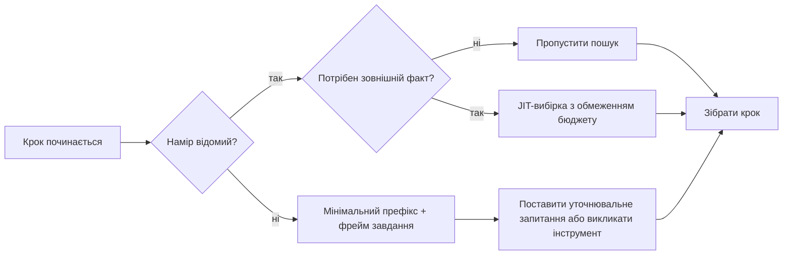
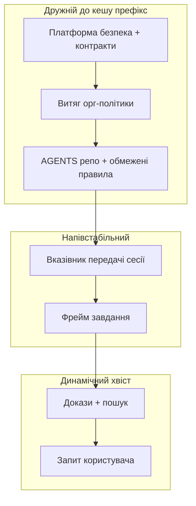
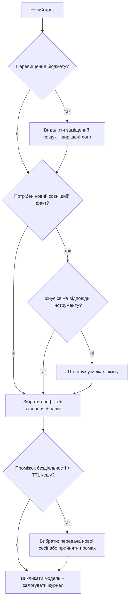

> **Складність**: [COMPLEX]
>
> **Час на виконання**: ~50 хвилин
>
> **Передумови**: [Основи контекстної інженерії](module-2.1-context-fundamentals/), [Репо-інженерія для агентів](module-2.2-repository-engineering-for-agents/) та [Пошук, інструменти та межі пам'яті](module-2.3-retrieval-tools-and-memory-boundaries/); впевнене читання трейсів Python і базового shell.

---

## Що ви зможете зробити

Після цього модуля ви зможете застосовувати наведені нижче навички в проєктуванні та рев'ю продакшен-харнесів:

- **Проєктувати** політику контекстної оркестрації на кожен крок, яка вирішує, що завантажити, зберегти, підсумувати, видалити або оновити в межах фіксованого бюджету токенів.
- **Оцінювати** економіку кеш-влучань за допомогою правил TTL провайдерів, особливо стандартного п'ятихвилинного часу життя ефемерного кешу промптів Anthropic та поведінки префіксного кешу OpenAI.
- **Реалізовувати** потоки ущільнення та передачі, які зберігають критично важливі рішення, відкидаючи застарілі результати інструментів і надлишкові знайдені фрагменти.
- **Порівнювати** завантаження контексту точно вчасно та про всяк випадок і діагностувати, коли лінивий пошук перевершує активне фронтальне завантаження.
- **Налагоджувати** роздутість контексту за допомогою журналів атрибуції, які відповідають, чому кожен блок потрапив у вікно моделі на певному кроці.

## Чому цей модуль важливий

Агентний харнес Міри нарешті має статичну основу на місці. Репозиторій надає `AGENTS.md`, обмежені правила, пошукові індекси та межі пам'яті, тоді як модель має велике вікно, інструменти MCP і векторне сховище, що повертає ранжовані фрагменти. На папері арка Контексту з модулів 2.1–2.3 завершена, але в продакшені дорогі відмови перемістилися на один рівень вище — у політику середовища виконання, а не в статичне авторство.

**Гіпотетичний сценарій:** Міра починає довгу сесію налагодження нестабільного контролера розгортання. Крок 12 усе ще містить повний стек-трейс із кроку 3, хоча вона виправила цю помилку шість кроків тому. Крок 18 впроваджує свіжий результат пошуку про стару редакцію runbook, тоді як новіший файл політики лежить непрочитаним у карті репозиторію. Крок 22 втрачає кеш-влучання, бо хтось додав часову мітку до стабільного системного префікса. Крок 28 відкриває підагента для рефакторингу кількох файлів, де дочірня сесія успадковує весь журнал чату батьківської замість вузького контракту завдання.

Жодна з цих відмов не виправляється написанням кращого окремого промпта, оскільки це відмови оркестрації середовища виконання, де харнес не керував контекстом як динамічним ресурсом із бюджетом, політикою свіжості та спостережуваними рішеннями. Статичний контекст повідомляє агенту, як виглядає світ на початку сесії, тоді як динамічна контекстна оркестрація вирішує, що агент бачить на кроці *N* після того, як інструменти, пошук, пам'ять, ущільнення, оновлення кешу та віялове розгалуження підзадач уже переформували робочий набір. Команди, які пропускають цей рівень, часто звинувачують модель, тоді як справжня проблема — неявна політика, еквівалентна «пересилати весь транскрипт чату назавжди», що не є ні вимірюваним, ні безпечним під тиском вартості.

Цей модуль закриває триплет Контексту, надаючи вам явний рівень політики, який ви можете рецензувати в коді, у дифах конфігурацій та на панелях телеметрії. Ви розглядатимете кожен виклик моделі як скомпільований крок, що складається зі стабільного префікса, впроваджених правил, знайдених доказів, результатів інструментів, підсумків і поточного запиту. Ви навчитеся, коли витрачати токени на завантаження про всяк випадок, а коли — на вибірку точно вчасно, як п'ятихвилинний TTL кешу Anthropic змінює математику пауз і відновлення, і як передачі переносять довговічний стан без перетягування шуму транскрипту. Ви також навчитеся вимірювати, чи покращила оркестрація частку кеш-влучань, а не лише зменшила розмір промптів. Документація LangChain щодо контексту описує ту саму ідею як управління короткостроковим і довгостроковим станом протягом запуску; цей модуль зосереджується на компіляторі, яким володіє харнес і який вирішує, яка з цих поверхонь потрапляє в кожен крок. Метою проєктування є не максимальний контекст, а **правильний контекст у межах бюджету**, з достатнім логуванням, щоб черговий інженер міг пояснити кожен впроваджений блок, не завантажуючи повний промпт дослівно.

## Цикл контексту середовища виконання

Кожен агентний крок — це невелике пакетне завдання, де харнес збирає входи, застосовує політику, компілює промпт, викликає модель, записує виходи й оновлює внутрішній стан для наступного кроку. Модуль 2.1 назвав шари робочого набору (стабільний префікс, фрейм завдання, докази та чернетку), модуль 2.2 розмістив довговічну політику в репозиторії, а модуль 2.3 розподілив факти середовища виконання між пошуком, інструментами та пам'яттю; модуль 2.4 володіє циклом, який з'єднує ці частини в часі, замість того щоб розглядати кожен виклик API як ізольоване доповнення чату. LlamaIndex описує запитування як крок композиції, що перетворює індекси та ретривери на фінальний вхід моделі; в агентних харнесах ця композиція має бути **відтворюваною та тестованою**, а не повністю делегованою апетиту моделі до більшого контексту.

```text
+------------------------------------------------------------------+
|           Цикл контексту середовища виконання (один крок)         |
+------------------------------------------------------------------+
| 1. Прочитати стан сесії (бюджет, годинник кешу, відкриті рішення)|
| 2. Класифікувати намір (налагодження, редагування, рев'ю,        |
|    планування, передача)                                          |
| 3. Вибрати статичний префікс (правила репо, схеми інструментів,   |
|    навички)                                                       |
| 4. Вирішити щодо динамічних вставок (пошук? інструмент?          |
|    пам'ять? пропустити?)                                          |
| 5. Застосувати видалення / ущільнення до наявного робочого набору |
| 6. Зібрати впорядкований промпт + записати журнал атрибуції       |
| 7. Викликати модель -> розібрати вихід -> оновити стан для       |
|    кроку N+1                                                      |
+------------------------------------------------------------------+
```

Цей цикл не є опціональною інфраструктурою: якщо ваш продукт лише пересилає історію чату до API, у вас усе одно є політика, але вона неявна, невимірювана і зазвичай означає «зберігати все назавжди, поки вікно не зламається». Явна оркестрація робить цю політику доступною для рецензування в pull request так само, як ви рецензуєте middleware автентифікації, оскільки альтернативою є налагодження стрибків витрат у продакшені шляхом редагування текстових промптів. Практична драбина зрілості допомагає командам розставляти пріоритети: **Рівень 0** пересилає сирий чат; **Рівень 1** додає статичні файли репозиторію на старті сесії; **Рівень 2** додає покроковий пошук і вивід інструментів з обмеженнями; **Рівень 3** додає видалення, ущільнення та журнали; **Рівень 4** додає кеш-орієнтований макет префікса та TTL-орієнтоване планування сесій. Більшість продакшен-інцидентів у цій арці перебувають між Рівнем 1 і Рівнем 2, де пошук та інструменти існують, але жодне видалення, кероване харнесом, не виконується.

### Статичний і динамічний контекст

Статичний контекст змінюється повільно відносно завдання й охоплює стеки інструкцій репозиторію, визначення інструментів, рубрики та файли навичок зі стабільною схемою. Динамічний контекст змінюється на кожному кроці або за тригерами наміру й охоплює останнє повідомлення користувача, свіжий вивід інструментів, нові знайдені фрагменти, умовні впровадження правил і підсумки ущільнення, згенеровані всередині сесії. Завдання оркестратора — тримати статичні байти стабільними для кешування, водночас розглядаючи динамічні байти як **орендовані**: вони входять із метаданими, заробляють своє місце релевантністю до поточного наміру та виходять, коли заміщені або вирішені.

| Клас | Приклади | Типовий тригер завантаження | Ризик при неправильному обробленні |
|---|---|---|---|
| Статичний | `AGENTS.md`, схеми інструментів MCP, вихідні контракти | старт сесії, дружній до кешу префікс | застаріла політика репо, якщо не оновлена після злиття |
| Напівстатичний | тіло issues, назва гілки, фіч-флаги | старт завдання | неправильний контекст issues, перенесений між завданнями |
| Динамічний | вивід команд, читання файлів, результати пошуку | на кожен крок або за подією інструменту | роздутість, застарілі докази, розрив кешу |
| Похідний | підсумки ущільнення, нотатки передачі | після ущільнення або `/handoff` | втрата критично важливих рішень |

**Пауза і передбачення:** Ви на кроці 15 рефакторингу, де агенту більше не потрібен повний вивід `kubectl describe` з кроку 4, оскільки под тепер здоровий. Чи має цей вивід залишатися у вікні для стабільності кешу, чи харнес має його підсумувати та видалити? Запишіть свій вибір перед тим, як читати розділ про ущільнення, оскільки відповідь залежить від того, чи є ці байти все ще критичними для рішення, чи лише історичним шумом; збереження вирішених логів «для стабільності» часто **руйнує** стабільність, зсуваючи точку розриву кешу або витісняючи все ще потрібні байти фрейму завдання під тиском.

### Точно вчасно та про всяк випадок

Завантаження про всяк випадок фронтально завантажує контекст, бо він може стати корисним: це здається безпечним і зменшує затримку пошуку всередині завдання, але витрачає бюджет рано й виштовхує змінні байти на позиції префікса, що може зламати кеші провайдерів. Завантаження точно вчасно чекає, поки конкретне рішення потребуватиме факту, потім вибирає або читає вузько, що добре поєднується з поетапним контекстом із модуля 2.1, але вимагає надійного виявлення наміру та бюджету пошуку на крок. Режим відмови чистого «про всяк випадок» — це роздутість префікса та суперечливі докази; режим відмови чистого «точно вчасно» — це стрибки затримки та цикли інструментів, коли модель не знає про існування корпусу. Тому продакшен-агенти для кодування використовують **гібридне поетапне завантаження** з явним логуванням того, яка гілка спрацювала.



Практичним типовим рішенням для продакшен-агентів кодування є гібридне поетапне завантаження: завантажувати карту репозиторію та фрейм завдання про всяк випадок, оскільки вони потрібні майже на кожному кроці, але завантажувати тіла файлів, логи та векторні фрагменти точно вчасно з обмеженням на крок. Логуйте код причини для кожної вставки (`intent:debug`, `tool:read_file`, `retrieve:policy`), щоб рецензенти могли відновити політику пізніше під час розбору інциденту. Коли два механізми можуть надати той самий факт (файл репозиторію проти векторного фрагмента проти виводу інструменту), оркестратор має обрати **найсвіжіше авторитетне джерело** й пропустити інші, логуючи причину пропуску замість мовчазного накопичення дублікатів.

### Завантаження за тригером наміру

Тригери наміру — це захисні бар'єри, а не магія: вони зіставляють спостережувані сигнали з діями над контекстом, як-от глоби шляхів до файлів, що впроваджують правила безпеки, мітки завдань, що приєднують рубрики оцінювання, та класи відмов, що дозволяють більші фрагменти логів. Тригери мають бути версіонованою конфігурацією, закоміченою в репо, а не ad-hoc абзацами промптів, щоб зміни отримували рев'ю коду й тести. Тригер, який спрацьовує на `**/deploy/**`, але ігнорує перевизначення, специфічні для середовища, є поширеним джерелом помилок типу «агент знав runbook, але не знав політику кластера».

```yaml
orchestration_triggers:
  - when:
      paths_match: "**/deploy/**"
    inject:
      - docs/runbooks/deployment-checklist.md
    budget_tokens: 1200
    freshness: require_repo_head
  - when:
      intent: debug
    allow:
      tool_output_max_tokens: 3500
      retrieve: true
    evict:
      resolved_errors: true
  - when:
      intent: handoff
    action:
      compact_transcript: aggressive
      write_session_note: docs/session-state/
```

Тригери мають бути ідемпотентними та логованими, і якщо два тригери спрацьовують на одному кроці, оркестратору потрібен детермінований пріоритет (наприклад, правила безпеки перед зручними фрагментами), а не той, чий ранжувальник пошуку голосніший. Таблиці пріоритетів належать до конфігурації поруч із бюджетами, оскільки «спрацювали обидва» — це нормально під час рефакторингів, які одночасно зачіпають шляхи деплою та тести. Без пріоритету ви отримуєте осциляцію: крок 19 завантажує рубрику безпеки, крок 20 завантажує фрагмент налаштування продуктивності, а крок 21 суперечить обом, бо модель звернула увагу на той блок, який з'явився останнім.

### Лінивий пошук і шлюзування інструментів

Лінивий пошук означає, що модель не отримує уривки корпусу, доки харнес не вирішить, що вони варті своєї ціни в токенах, і це має поєднуватися зі шлюзуванням інструментів, щоб модель не могла обійти бюджет, спамлячи пошуковими інструментами. Простим шлюзом є ліміт пошуку на крок, що застосовується перед додаванням будь-яких байтів фрагментів до промпта. Стиснення в стилі RECOMP (Retrieve, Compress, Prepend) є дослідницьким аналогом: стиснути кілька знайдених документів у короткий підсумок перед вставкою і видати порожній підсумок, коли пошук нерелевантний, щоб модель не була змушена звертати увагу на шум. Ваш харнес може реалізувати легшу версію без навчання компресора — дедуплікуйте за хешем джерела, обмежте токени та вимагайте однорядкове обґрунтування «чому знайдено» в журналі — але економічна інтуїція та сама: **пошук не є безкоштовним лише тому, що векторна база даних повернула збіг**.

```python
# Ілюстративний фрагмент політики — не продакшен-харнес
MAX_RETRIEVAL_TOKENS_PER_TURN = 1800

def allow_retrieval(state, query, estimated_tokens):
    if state.retrieval_tokens_this_turn + estimated_tokens > MAX_RETRIEVAL_TOKENS_PER_TURN:
        state.log("retrieval_skipped", reason="turn_budget")
        return False
    if state.has_fresh_tool_answer(query):
        state.log("retrieval_skipped", reason="fresh_tool_cache")
        return False
    return True
```

Шлюз перетворює пошук з імпульсу моделі на рішення харнеса, що є ядром динамічної оркестрації. Визначення інструментів MCP належать до стабільного префікса, коли це можливо, але *результати* інструментів є динамічними доказами; специфікація інструментів MCP описує структуровані результати інструментів, щоб харнеси могли валідувати та редагувати перед впровадженням, а не вставляти сирий JSON. Цей крок валідації є частиною шлюзування: інструмент, що повертає десять тисяч токенів логів, не має автоматично ставати десятьма тисячами токенів контексту моделі.

> **Підказка для активного навчання:** Відкрийте нещодавній трейс агента з вашого середовища і для трьох впроваджених блоків дайте відповідь, чи є кожен статичним або динамічним, точно вчасно або про всяк випадок, і яке правило видалення мало б його прибрати. Якщо ви не можете відповісти з трейсу, перелічіть поля телеметрії, які б ви додали (тип блоку, хеш джерела, часова мітка свіжості, прапор критичної важливості, клас кеш-влучання). Трейси, які показують лише «messages[]» без метаданих впровадження, є системами Рівня 0; ваша мета в цьому модулі — Рівень 3 або вище.

## Економіка контекстного вікна під тиском

Бюджети токенів — це не лише обмеження моделі, це контракти вартості, затримки та кешу. Модуль 2.1 представив префіксне кешування та ефективні бюджети уваги; цей розділ додає економіку на рівні кроку, яка охоплює, що ви платите, коли кеш влучає, що платите, коли промахується, і як п'ятихвилинний ефемерний TTL Anthropic змінює поведінку пауз. Документація Google Gemini щодо довгого контексту підкреслює, що дуже великі вікна все ще винагороджують вибіркове розміщення критичних фактів; оркестрація залишається необхідною, оскільки «вміщується у вікні» — це не те саме, що «надійно використовується моделлю».

### Покроковий облік бюджету

Розглядайте кожен крок як дебетування робочого бюджету, де кожен блок має власника й політику оновлення, а не як єдиний показник «залишку токенів» у клієнті API.

| Категорія | Що її споживає | Важіль оркестрації |
|---|---|---|
| Стабільний префікс | інструкції, схеми, карти | тримати байт-стабільним між кроками |
| Фрейм завдання | issue, критерії прийняття | оновлювати лише при зміні завдання |
| Докази | вивід інструментів, читання файлів | обмежити розмір, підсумовувати при вирішенні |
| Пошук | векторні фрагменти | ранжувати + дедуплікувати + TTL |
| Резерв виходу | завершення моделі | ніколи не красти з входу мовчки |

Крок, який витрачає 90% бюджету на історичні логи, може технічно вміщуватися у вікно, але все одно провалювати завдання, оскільки критерій прийняття більше не поміщається в ефективній зоні уваги, описаній у висновках Liu et al. про втрату в середині. Завжди резервуйте токени завершення явно й розглядайте перевищення як помилку харнеса, а не як ваду характеру моделі. Коли бюджети звужуються, скорочуйте в такому порядку, якщо реєстр критично важливих рішень не вказує інше: заміщений пошук, вирішені логи інструментів, опціональні приклади, наративні повтори, і лише тоді напівстатичний матеріал сесії.

```yaml
turn_budget:
  model_limit_tokens: 200000
  target_input_tokens: 52000
  output_reserve_tokens: 6000
  allocations:
    stable_prefix: 14000
    task_frame: 2500
    evidence: 18000
    retrieval: 3500
    scratch_summaries: 4000
    headroom: 10000
```

Запас — це не марнотратство: він поглинає неочікуваний вивід інструментів і запобігає тому, щоб екстрене ущільнення видалило неправильний блок під тиском, коли одна команда `kubectl` або тест викидає більший за очікуваний обсяг даних. Команди, які працюють на 98% використання на кожному кроці, оптимізують для демо, а не для тижневого рефакторингу, де одна шумна команда не має обвалювати сесію.

### П'ятихвилинний TTL Anthropic як змінна управління

Anthropic документує ефемерне кешування промптів із типовим часом життя **п'ять хвилин**, який оновлюється при використанні кешу, з опціональним довшим TTL за вищою вартістю. OpenAI документує автоматичне префіксне кешування з утриманням у пам'яті часто близько **п'яти-десяти хвилин** неактивності для багатьох моделей, із подовженим утриманням на новіших родинах моделей. Ці цифри — не дрібниці, це обмеження планування для агентних сесій, де цикли людського рев'ю рутинно перевищують п'ять хвилин. Інженерний посібник Anthropic для Claude Code явно розглядає заповнення контекстного вікна як основний ресурс для управління, що узгоджується з розглядом TTL як частини дизайну сесії, а не як дрібниці вендора.

```text
Часова шкала (ефемерний кеш Anthropic)
|-- запис кешу (крок 1) --|
|.......... 5 хв TTL ..........|
|        оновлення при влучанні |
|.......... 5 хв TTL ..........|
| закінчення -> повне переоброблення префікса (кеш-промах) |
```

**Робочий приклад:** Припустімо, стабільний префікс коштує 18 000 токенів для обробки без кешу і 1 800 токенів при читанні з кешу з множником 0,1× (згідно з опублікованою таблицею цін кешування Anthropic). Кеш-промах на кроці 20 коштує приблизно різницю, тому три випадкові промахи за годину можуть перевищити вартість ретельної, написаної людиною політики підсумовування. Якщо ваш харнес ставить сесію на паузу на вісім хвилин, поки людина рецензує диф, кеш може закінчитися, і наступний крок заплатить за промах, якщо ви навмисно не підтримуєте сесію теплою за допомогою дешевих підтримувальних кроків (heartbeat) (що має власний профіль етики та вартості) або не перебудовуєте префікс так, щоб повторна обробка була достатньо дешевою для толерантності. Підтримувальні кроки (heartbeat) не є безкоштовними з точки зору етики: вони споживають потужності моделі й можуть створювати ілюзію прогресу, поки людина відсутня, тому документуйте їх як явну політику з обмеженнями частоти.

Порівняйте два варіанти оркестрації під час кавової перерви, де людина відсутня вісім хвилин, а стабільний префікс достатньо великий, щоб кеш-промахи були суттєвими:

| Стратегія | Що відбувається після 8-хвилинної паузи | Компроміс |
|---|---|---|
| Нічого не робити | кеш, імовірно, закінчився; наступний крок переобробляє префікс | простий, передбачуваний стрибок вартості |
| Легкий ping | може оновити TTL, якщо провайдер зараховує влучання | витрачає токени; може дратувати ліміти частоти |
| Розділити стабільний префікс зовнішньо | перезавантажити меншу скомпільовану карту | інженерна робота; менший штраф за промах |

Жодна стратегія не є універсально правильною: правильний вибір залежить від того, як часто паузи перевищують TTL і наскільки великим є стабільний префікс. Якщо паузи довгі, а префікси величезні, оркестрація з пріоритетом передачі зазвичай перевершує оркестрацію з пріоритетом heartbeat, оскільки вона скидає динамічний хвостовий шум, зберігаючи підвищені рішення в напівстатичному артефакті. Якщо паузи короткі, а префікси скромні, прийняття випадкових промахів може бути дешевшим, ніж інженерія складної механіки пінгування.

**Пауза і передбачення:** Ваш стабільний префікс становить 22 000 токенів, а медіанний проміжок між кроками — шість хвилин під час рев'ю коду. Чи очікуєте ви кеш-влучання на більшості кроків, чи часті промахи? Яка зміна оркестрації зменшує вартість промаху без вставлення часових міток у префікс? Правильна відповідь зазвичай передбачає перенесення годинників та ідентифікаторів запитів у зовнішні логи, розділення схем інструментів на версіоноване прикріплення, яке завантажується лише при зміні інструментів, і підвищення критеріїв прийняття до компактного фрейму завдання, який переживає ущільнення.

### Таксономія кеш-промахів

Не кожен дорогий крок є «кеш-промахом» у розумінні провайдера, тому класифікуйте промахи, щоб телеметрія залишалася дієвою, замість того щоб звалювати всі дорогі кроки в одну категорію.

| Тип промаху | Симптом | Типове виправлення оркестрації |
|---|---|---|
| Дрейф префікса | `cache_read_input_tokens` падає до 0 після невинного редагування | прибрати покрокові часові мітки зі стабільного префікса |
| Нижче мінімальної довжини | немає полів кешу, попри `cache_control` | збільшити стабільний префікс або прийняти відсутність кешу |
| Закінчення TTL | промах після проміжку бездіяльності | скоротити паузи, зменшити префікс або толерантно ставитися до промаху |
| Запізніла точка розриву | зростаючий чат виштовхує точку розриву за 20-блокове вікно пошуку | додати явну точку розриву на напівстатичній межі |
| Зміна схеми інструментів | інструменти змінилися між кроками | версіонувати визначення інструментів окремо |

Логуйте поля використання провайдера на кожному кроці: для Anthropic перевіряйте `cache_creation_input_tokens` і `cache_read_input_tokens`; для OpenAI перевіряйте `usage.prompt_tokens_details.cached_tokens`. Без цих лічильників команди оптимізують прозу замість економіки й випускатимуть «коротші промпти», які все одно промахуються повз кеш, бо динамічний заголовок змістився на один байт. Поєднуйте лічильники провайдера з хешами стабільного префікса в журналі харнеса, щоб можна було відрізнити дрейф від закінчення TTL одним поглядом.

### Коли спати дешевше, ніж перезаправляти

**Гіпотетичний сценарій:** Тривала агентна сесія агресивно ущільнюється кожні 30 кроків, що зменшує транскрипт, але залишає недоторканим стабільний префікс на 25 000 токенів; людина робить паузу на обід, і після обіду кеш холодний. Перезаправлення вимагає повторного надсилання префікса плюс повторного завантаження двох знайдених фрагментів політики, які оркестратор вважав усе ще «достатньо свіжими» в пам'яті. Іноді найдешевший операційний крок — це почати **нову сесію** зі структурованою нотаткою передачі, а не воскрешати роздуту внутрішню машину станів, і це не є невдачею — це оркестрація обирає чистий робочий набір замість ностальгічної прив'язаності до історії чату. Матеріали OpenAI з інженерії харнесів описує багатосесійні робочі процеси, де довговічний стан живе поза транскриптом чату; динамічна оркестрація узагальнює цей патерн для будь-якого агентного продукту з довгим горизонтом.

## Ущільнення, підсумовування та передача

Ущільнення — це стиснення з втратами та зобов'язаннями: вам дозволено відкидати байти лише тоді, коли ви можете показати, що інформація більше не є критичною для рішення, або що її довговічна форма вже живе на кращій поверхні (документ репо, сховище пам'яті, файл передачі). Розглядайте ущільнення як **заплановане пакетне завдання**, прив'язане до кількості кроків, тиску бюджету або явних команд `/compact`, — а не як кнопку екстреної паніки, — оскільки екстрене ущільнення під тиском — це коли команди видаляють критерії прийняття. Дослідження RECOMP показує, що стиснення знайдених доказів у короткий точний підсумок перед вставкою може зберегти якість завдання за частку вартості токенів; ущільнення сесії застосовує ту саму ідею до логів інструментів і доказів чату всередині довгого агентного запуску.

### Що відкидати, підсумовувати або мігрувати

| Тип вмісту | Типова дія при вирішенні | Міграція до |
|---|---|---|
| Детальні логи інструментів | підсумувати до причинного ланцюга | чернетковий підсумок у сесії |
| Знайдені фрагменти | видалити при заміщенні | посилання + хеш у журналі |
| Відкриті питання | зберігати до отримання відповіді | фрейм завдання |
| Прийняті рішення | підвищити підсумок | нотатка передачі + коментар до issue |
| Відхилені варіанти | зберегти короткий рядок вето | підсумок сесії |
| Довговічна політика, виявлена посеред завдання | підвищити | документ репо через людський PR |

Ущільнення ніколи не має видаляти єдину копію критично важливого обмеження: якщо критерій прийняття існував лише в прозі кроку 2, ущільнення мусить підняти його у фрейм завдання або явний блок `open_decisions` перед тим, як оригінальний текст зникне. Чекліст підвищення перед запуском ущільнення запобігає найпоширенішій регресії: «агент забув, що не можна комітити згенеровані артефакти» після проходу підсумовування, який звучав гладко, але втратив заперечення. Виконайте підвищення спочатку, ущільнення другим і залогуйте обидва кроки в журналі, щоб рецензенти могли бачити причинність.

```text
До ущільнення (крок 19)
+------------------------------------------------+
| стабільний префікс                             |
| фрейм завдання (issue + AC)                    |
| лог інструменту A (вирішено)                   |
| лог інструменту B (вирішено)                   |
| пошуковий фрагмент X (заміщено)                |
| свіжий лог інструменту C (активний)            |
| запит користувача                              |
+------------------------------------------------+

Після ущільнення (крок 20)
+------------------------------------------------+
| стабільний префікс                             |
| фрейм завдання (issue + AC + підвищені рішення)|
| підсумок: логи A+B об'єднано у 12 рядків       |
| пошуковий вказівник: X заархівовано в журналі  |
| свіжий лог інструменту C (активний)            |
| запит користувача                              |
+------------------------------------------------+
```

### Збереження критично важливих рішень

Критично важливі рішення — це обмеження, які змінюють авторизацію інструментів, обсяг редагування файлів або вимоги до злиття, наприклад, «не чіпати згенеровані артефакти», «обов'язково запускати `.venv/bin/python scripts/test_pipeline.py`» і «розділити PR, якщо диф перевищує 200 LOC». Зберігайте їх у машиночитному списку, а не ховайте в прозі наративного підсумку, оскільки підсумки оптимізовані для плавності, тоді як реєстри оптимізовані для примусового виконання. Оркестратор має відмовлятися ущільнювати будь-який елемент реєстру, якщо його не підвищено до фрейму завдання або не записано в артефакт передачі зі зворотним посиланням, дзеркально відображаючи те, як продакшен-машини політик відмовляються видаляти правила без явної події депрекації.

```yaml
load_bearing_decisions:
  - id: ac-3
    text: "Do not commit .pipeline/state.yaml"
    source_turn: 2
    expires: task_end
  - id: review-1
    text: "Cross-family review required before merge"
    source_turn: 11
    expires: task_end
```

Оркестратор відмовляється ущільнювати будь-який елемент цього списку, якщо його не підвищено до фрейму завдання або не записано в артефакт передачі зі зворотним посиланням.

### Патерн `/handoff` між сесіями

Передачі — це те, як динамічна оркестрація переживає межі сесій без вивантаження всього транскрипту в наступний промпт. Хороша передача — це HTML або markdown зі стабільними розділами: мета, поточний стан, рішення, блокувальники, наступні дії та посилання на докази. Власний робочий процес сесій KubeDojo використовує `docs/session-state/` плюс індекс `STATUS.md`, і цей патерн є навмисним: індекс залишається малим, тоді як наратив живе в окремому артефакті, що зберігає дружні до кешу префікси в наступних сесіях. Урок оркестрації узагальнюється на будь-який продукт, де сесія B має холодно стартувати з вказівників, а не з відтворення всієї історії виводу інструментів сесії A.

```text
Сесія A закінчується
   |
   v
запис /handoff -> docs/session-state/2026-05-25-topic.html
   |
   v
Оновлено індекс STATUS.md (лише вказівники)
   |
   v
Сесія B починається
   |
   v
cold-start API -> briefing/orient -> завантажити вказівник передачі
   |
   v
JIT-читання репо лише для файлів, згаданих у передачі
```

Динамічна оркестрація для сесії B має розглядати передачу як напівстатичний контекст для перших кроків, а потім повертатися до розширення точно вчасно для тіл файлів і пошуку. Не вставляйте передачу плюс увесь попередній журнал чату, якщо ви не проводите криміналістичне рев'ю, оскільки це дублює рішення й ламає локальність кешу, створюючи ілюзію «більшого контексту». Документований робочий процес Claude Code явно рекомендує `/clear` між незв'язаними завданнями та структуровані передачі для більших функцій; ваш харнес має кодувати таке саме розділення між дослідницькими сесіями та сесіями реалізації.

### Шлюзи якості підсумовування

Підсумки виходять з ладу передбачуваними способами: вони згладжують заперечення, втрачають номери версій або об'єднують несумісні рішення. Додайте шлюз якості перед прийняттям підсумку ущільнення та зберігайте сирі докази ще один крок, коли шлюз не пройдено, навіть якщо тиск токенів високий.

| Перевірка | Питання |
|---|---|
| Покриття | Чи присутній кожен запис `load_bearing_decisions`? |
| Свіжість | Чи часові мітки та версії все ще присутні там, де потрібно? |
| Походження | Чи може рецензент відкрити крок або артефакт-джерело? |
| Конфлікт | Чи об'єднали ми несумісні інструкції? |

Якщо шлюз не пройдено, збережіть блок сирих доказів ще на один крок і посиліть промпт підсумовувача, оскільки витратити додаткові токени на один крок дешевше, ніж випустити неправильний патч. Шлюзи можна автоматизувати дешево: вимагайте, щоб кожен ідентифікатор критично важливого реєстру з'являвся дослівно в підсумку, вимагайте відповідності рядків версій регулярному виразу та вимагайте явних рядків «відхилений варіант», коли сесія обговорювала альтернативи.

## Динамічне збирання промптів і впровадження політик

Динамічне збирання промптів — це прохід компілятора, який перетворює політику на байти: статичні файли репо надають значення за замовчуванням, а оркестратор вибирає, які правила, навички та схеми входять у **цей** крок. Розглядайте збирання як компонувальник: нерозв'язані символи (відсутні навички, застарілі схеми інструментів) мають закриватися з помилкою або відкочуватися до відомого безпечного мінімального префікса, а не мовчки під'єднувати випадкові документи, бо пошук високо їх ранжував.

### Багатошарові системні промпти

Думайте шарами, а не одним гігантським рядком, оскільки монолітні системні промпти знищують кешування, рев'ю та межі володіння команд.

| Шар | Власник | Змінюється коли | Вплив на кеш |
|---|---|---|---|
| Платформа | вендор / харнес | рідко | найвища стабільність |
| Організація | політика компанії | щотижня | високий |
| Репозиторій | `AGENTS.md`, правила | на кожне злиття | середній |
| Сесія | передача, уподобання | на кожну сесію | середньо-низький |
| Крок | запит користувача, результати інструментів | на кожен крок | динамічний хвіст |

Порядок збирання має слідувати ієрархії кешу провайдера: інструменти, система, потім повідомлення (Anthropic документує цей порядок). Розміщуйте стабільні шари першими й додавайте волатильні шари останніми, щоб точки розриву кешу вирівнювалися з напівстатичними межами, а не з останнім реченням користувача. Коли списки інструментів змінюються між кроками, версіонуйте їх явно; сервери MCP можуть надсилати сповіщення `tools/list_changed`, і харнеси, які гаряче замінюють схеми без коригування точок розриву, є поширеним джерелом мовчазної інвалідації кешу.



### Впровадження правил за глобом і класом завдання

Обмежені правила — це політики, а не прикраси прози: модуль 2.2 показав поверхні репозиторію, а модуль 2.4 показує селектор середовища виконання, який вирішує, які поверхні компілюються в сьогоднішній крок. Селектори мають бути консервативними — впроваджуйте найменший набір правил, який покриває редаговані шляхи, — оскільки надмірне впровадження навчає модель ігнорувати правила як шум.

```yaml
rule_injection:
  - match:
      globs: ["src/content/docs/**"]
    rules: [".claude/rules/new-content-checklist.md"]
  - match:
      task_class: review
    rules: ["docs/quality-rubric.md"]
  - match:
      task_class: security
    rules: ["docs/security/agent-threat-model.md"]
```

Селектор мусить логувати `{rule_id, matched_glob, injected_tokens}`, оскільки без логів налагодження роздутості контексту стає ворожінням під час інцидентів. Посібник Anthropic для Claude Code рекомендує тримати `CLAUDE.md` стислим і переносити епізодичні робочі процеси в навички, що завантажуються на вимогу; оркестрація має дзеркально відображати цей поділ, щоб постійно увімкнений префікс залишався кеш-стабільним, тоді як процедурна глибина завантажується лише при спрацюванні тригерів.

### Умовне завантаження навичок

Навички — це процедурний контекст, і завантаження кожної навички на старті сесії є надмірністю «про всяк випадок». Завантажуйте навички, коли тригери збігаються, вивантажуйте тіла навичок із префікса при зміні класу завдання та тримайте компактний індекс у стабільному префіксі, щоб модель знала, що можна завантажити, не сплачуючи повну вартість токенів навички наперед.

| Підхід | Коли використовувати | Режим відмови |
|---|---|---|
| Активне завантаження навичок | крихітна бібліотека навичок | роздутість префікса |
| Ліниве завантаження навичок | велике дерево навичок | модель не знає про існування навички |
| Завантаження за тригером | чітка таксономія завдань | неправильно класифікований намір |

Робочим патерном є блок індексу в префіксі, який перелічує доступні навички з однорядковими описами, тоді як повні тіла навичок завантажуються за тригером, що зберігає можливість виявлення без сплати тисяч токенів наперед. Підагенти, описані в найкращих практиках Claude Code, є ще однією формою умовного завантаження: вони отримують вузький пакет замість батьківського транскрипту, що є тією самою межею оркестрації, вираженою для сесій, керованих людиною.

### Правило-як-політика та правило-як-проза

Правила, написані як розмита проза («будьте обережні з секретами»), не є машино-застосовною політикою, тоді як правила, написані як політика («ніколи не виводьте значення, що відповідають `AKIA*`; використовуйте заповнювачі `<TOKEN>`»), підтримують лінтування, тести й оркестрацію до того, як байти досягнуть моделі.

| Стиль | Приклад | Оркестратор може |
|---|---|---|
| Проза | «Відповідально поводьтеся з даними клієнтів» | сподіватися |
| Політика | «Маскуйте адреси електронної пошти в логах інструментів перед впровадженням у модель» | regex + блокування |
| Політика + тест | те саме, з CI-фікстурою | закритися з помилкою |

Перетворюйте повторювані прозові правила на таблиці політик, які харнес застосовує до того, як байти досягнуть моделі, оскільки модель тоді отримує вже очищений контекст, що дешевше, ніж сперечатися з нею постфактум. Таблиці політик також уможливлюють міжродинне рев'ю: рецензенти можуть переглядати диф конфігурації оркестрації, не читаючи десять тисяч токенів чату.

## Видалення, свіжість і межі мультиагентності

Видалення — це те, як оркестрація повертає бюджет, не чекаючи катастрофічного переповнення вікна, свіжість — це те, як оркестрація вирішує, чи довіряти запам'ятованому факту, а мультиагентні межі — це те, як оркестрація запобігає забрудненню батьківського стану дочірніми завданнями. Дослідження StreamingLLM щодо attention sinks показує, що утримання невеликого набору початкових токенів може стабілізувати дуже довгі запуски при використанні ковзних вікон; урок для дизайну харнесів полягає не в тому, щоб буквально копіювати KV-кеші, а в тому, щоб визнати, що **деякі ранні якорі сесії** (фрейм завдання, критично важливий реєстр) мають пережити агресивне видалення серединних доказів, на які моделі інакше звертають недостатньо уваги.

### Аналогія потокової сесії

Довгі агентні сесії нагадують потокове виведення: серединні кроки накопичуються, увага псується, а наївні ковзні вікна відкидають критичні ранні обмеження. Оркестрація компенсує це, підвищуючи ранні обмеження до довговічного фрейму завдання та реєстру, аналогічно до утримання токенів-стоків (sink tokens) при видаленні серединних логів інструментів. Дослідження в стилі Infini-attention (доповнювальне до «втрати в середині») досліджує архітектури, що утримують довготривалий стан; доки ваш провайдер не надасть цього прозоро, політика харнеса є тим шаром утримання, який ви контролюєте сьогодні.

### Політики видалення для знайдених фрагментів

Знайдені фрагменти мають нести метадані в момент впровадження, щоб політики видалення могли міркувати про застарілість, заміщення та тиск бюджету без повторного аналізу прози.

```yaml
snippet_record:
  id: ret-9f2a
  source: vector://runbooks/deploy.md#restart
  injected_turn: 14
  tokens: 420
  freshness: 2026-05-20
  relevance_score: 0.82
```

Кандидати на видалення оцінюються на кожному кроці за політиками з таблиці нижче, і оркестратор має логувати, яка політика спрацювала, коли кілька кандидатів конкурують за ті самі байти.

| Політика | Видалити коли | Зберегти коли |
|---|---|---|
| Застарілість | `freshness` старіша за SLA завдання | все ще збігається з живою верифікацією інструменту |
| Заміщення | новіший фрагмент на ту саму тему | новіший фрагмент нижчої якості |
| Низька значущість | релевантність нижче порогу протягом 3 кроків | пов'язаний у `load_bearing_decisions` |
| Тиск бюджету | перевищення алокації | підвищується до фрейму завдання цього кроку |

Під тиском бюджету видаляйте в такому порядку: заміщений пошук, вирішені логи інструментів, старі чернеткові підсумки, опціональні приклади, і лише тоді торкайтеся напівстатичного матеріалу сесії; видаляйте стабільний префікс лише в крайньому разі й очікуйте податок кеш-промаху, коли це робите. Видалення без записів у журналі є невидимим у постмортемах, тому логуйте `{block_id, policy, tokens_freed}` щоразу.

### Виявлення застарілості в пам'яті

Пам'ять — це не істина, це кешоване твердження з власником. Вимагайте `source`, `scope`, `captured_at` і `verification_method` при записах у пам'ять, а при читанні оркестрація має запитати, чи область дії все ще дійсна (користувач, репо, орендар), чи існує свіжіше джерело інструменту або репо, і чи подія видалення інвалідувала пам'ять. Якщо існує свіжіше джерело, надавайте перевагу повторній верифікації перед довірою до пам'яті, оскільки сценарій міжкористувацького витоку з модуля 2.3 — це те, що стається, коли цю перевірку пропускають. Пам'ять має входити в промпт як цитоване твердження з метаданими свіжості, а не як всезнаючий наративний авторитет.

### Повторна верифікація проти довіри

| Сигнал | Дія |
|---|---|
| Живий інструмент суперечить пам'яті | відкинути пам'ять на цей крок, залогувати конфлікт |
| Файл репо змінився відтоді, як запам'ятали | JIT-перечитати цільовий файл |
| Пам'ять старіша за SLA | пошук або верифікація інструментом |
| Пам'ять збігається з інструментом + репо | дозволити з цитуванням |

Оркестрація має показувати конфлікти моделі як структуровані дельти, а не мовчазні перезаписи, оскільки мовчазний перезапис вчить харнес впевнено брехати, виглядаючи ефективним на графіках токенів. Структурована дельта може бути: «пам'ять каже, що замороження деплою активне; інструмент `deploy_status` повідомляє, що розгортання завершено о 10:05Z; використовуємо інструмент, архівуємо пам'ять із прапором конфлікту.»

### Межі контексту батьківського та дочірнього

Багатокрокові завдання запрошують підагентів, але без меж дочірні успадковують батьківську роздутість і повертають есе, які неможливо злити. Дочірні пакети мають містити вузький фрейм завдання, список дозволених файлів, стелю токенів і явну схему виходу, виключаючи батьківські логи чату та батьківські результати пошуку, якщо їх не перетворено на короткі картки доказів із походженням.

```text
Батьківська сесія
  |
  +-- створити дочірню сесію з пакетом:
  |     task_frame (вузький)
  |     список дозволених файлів
  |     стеля токенів
  |     без батьківського логу чату
  |
  +-- дочірня сесія повертає:
        підсумок патчу
        результати тестів
        відкриті питання
  |
  v
Батьківська сесія об'єднує контракт дочірньої сесії у кошик доказів
```

Створюйте свіжу дочірню сесію, коли підзадача є незалежно рецензованою або потребує чистого префікса кешу, і продовжуйте в процесі, коли підзадача — це робота на один виклик інструменту. Крок злиття батьківської сесії має валідувати вихід дочірньої сесії на відповідність схемі перед додаванням до доказів, відхиляючи есе, які ігнорують контракт.

| Використовувати свіжу дочірню сесію | Продовжити батьківську сесію |
|---|---|
| паралельні рефакторинги файлів | виправлення друкарської помилки в одному файлі |
| міжродинне рев'ю | прохід форматування |
| довга дослідницька гілка | перечитати одну константу |

Дочірні промпти не мають містити батьківські результати пошуку, якщо їх не перетворено на коротку картку доказів із походженням, інакше ви дублюєте фрагменти під різними ідентифікаторами повідомлень і заплутуєте логіку видалення. Розглядайте дочірні сесії як мікросервіси: контракти, тайм-аути та ідемпотентні злиття, а не як потоки, які за замовчуванням поділяють усю пам'ять.

## Спостережуваність: налагодження того, що було завантажено

Якщо ви не можете пояснити, чому байт був присутній, ви не можете експлуатувати динамічну оркестрацію в продакшені, оскільки спостережуваність перетворює контекст із непрозорого промпта-«чорної скриньки» на аудитований артефакт компіляції. Мінімально життєздатний стек спостережуваності — це: покроковий журнал JSON, лічильники кешу провайдера та диф хешу стабільного префікса між кроками. Усе, що менше, залишає вас налаштовувати промпти під час інцидентів.

### Журнал атрибуції токенів

Додавайте покроковий журнал поруч із викликом моделі, щоб чергові інженери могли відповісти «чому це було в контексті?» без завантаження повних промптів, що містять дані клієнтів.

```json
{
  "turn": 18,
  "intent": "debug",
  "budget": {"target_input": 52000, "actual_input": 49812, "output_reserve": 6000},
  "blocks": [
    {"kind": "stable_prefix", "tokens": 13840, "cache": "hit"},
    {"kind": "task_frame", "tokens": 2100, "cache": "n/a"},
    {"kind": "tool_output", "id": "kubectl_describe_pod", "tokens": 6200, "fresh": true},
    {"kind": "retrieval", "id": "ret-9f2a", "tokens": 420, "evicted_next_turn": false}
  ],
  "decisions": ["skipped_retrieval: fresh_tool_cache"]
}
```

Журнал відповідає «чому це в моєму контексті?» без читання всього промпта, а класи маскування даних дозволяють зберігати хеші та URI джерел у централізованих логах, тримаючи сирий текст лише в середовищі клієнта. Поєднуйте журнали з ідентифікаторами трейсів, спільними для підагентів, щоб батьківські злиття могли посилатися на зрізи дочірніх журналів.

### Панелі телеметрії кешу

Відстежуйте ці ряди для кожного робочого процесу й переглядайте їх щотижня, а не лише під час інцидентів, оскільки повільний дрейф токенів пошуку на крок легше виправити до того, як він стане обов'язковою спіраллю ущільнення.

| Метрика | Формула / джерело | Здоровий сигнал |
|---|---|---|
| Частка кеш-влучань | `cache_read / (cache_read + cache_create)` | стабільна при повторюваному префіксі |
| Промах після бездіяльності | промахи, де `idle_gap_sec > TTL` | близько нуля, якщо сесії безперервні |
| Токени пошуку / крок | сума категорії пошуку | пласка або спадна з JIT |
| Кількість видалень | видалені блоки на крок | зростає під тиском, не завжди нуль |
| Економія ущільнення | токени до - після | позитивна, коли логи детальні |

Сповіщайте про дрейф префікса: раптове падіння кеш-влучань при незмінній формі завдання, що часто означає, що хтось впровадив динамічний заголовок над стабільним префіксом. Панелі мають сегментувати за класом завдання (налагодження, рев'ю, реалізація), оскільки оптимальні бюджети пошуку відрізняються: налагодження може короткочасно толерувати великі логи, тоді як рев'ю має обмежувати логи й наголошувати на впровадженні рубрик.

### Пошук роздутості контексту

Полювання на роздутість слідує послідовному порядку. Відсортуйте блоки журналу за токенами за спаданням. Позначте блоки без зв'язку `load_bearing` або активної залежності від інструменту. Перевірте наявність дубльованого пошуку за тим самим `source`. Перевірте логи інструментів, старіші за останню успішну команду. Перевірте навички або правила, завантажені, але не згадані в останніх трьох кроках.

**Гіпотетичний сценарій:** Крок 25 повільний і дорогий. Журнал показує 19 000 токенів виводу інструменту з позначкою `fresh: true`, але команди успішно виконалися десять кроків тому. Виправлення — не краща модель, а помилка свіжості оркестрації, яка ніколи не перемикала `resolved_errors: true`. Додайте модульний тест, який симулює вирішену відмову й перевіряє, що прапор свіжості очищається на наступному кроці.

## Патерни й антипатерни

Наведені нижче патерни є продакшен-типовими, що пережили багатотижневі агентні сесії, тоді як антипатерни — це скорочення, які виглядають добре в демо й ламаються під час тижневих сесій зі справжнім виводом інструментів і людськими паузами.

### Патерни

| Патерн | Коли використовувати | Чому працює | Примітка щодо масштабування |
|---|---|---|---|
| Покроковий компілятор із журналом | будь-який продакшен-харнес | робить політику явною та вимірюваною | зберігати журнали в об'єктному сховищі з утриманням |
| Гібридне JIT/JIC поетапне завантаження | агенти кодування | балансує затримку та бюджет | налаштовувати за класом завдання |
| Реєстр критично важливих рішень | довгі сесії | запобігає амнезії ущільнення | синхронізувати з трекером issues при передачі |
| TTL-орієнтоване планування сесій | команди, чутливі до вартості | вирівнює людські паузи з економікою кешу | документувати етичну політику ping |
| Вузькі дочірні пакети | паралельні підзадачі | контролює роздутість віялового розгалуження | обмежувати одночасні дочірні |

### Антипатерни

| Антипатерн | Чому команди його обирають | Що ламається | Кращий хід |
|---|---|---|---|
| Нескінченна історія чату | найпростіший транспорт | кеш-промах + псування уваги | ущільнення + передача |
| Стабільний префікс із часовими мітками | звичка спостережуваності | кеш ніколи не влучає | логувати час поза префіксом |
| Пошук як типовий наповнювач | здається безпечнішим за порожній контекст | шум заглушує фрейм завдання | лінивий пошук із бюджетом |
| Успадкування батьківських логів для дочірніх | легший код створення | недоступні для рев'ю дочірні промпти | лише контракт дочірнього завдання |
| Пам'ять без верифікації | швидкість | застарілі або міжорендарні факти | повторна верифікація за інструментом/репо |
| Ущільнення без підвищення | токенна паніка | втрачає критерії прийняття | спочатку підвищити критично важливі елементи |

## Фреймворк прийняття рішень

Використовуйте цей потік при проєктуванні або рецензуванні політики оркестрації та розглядайте кожен ромб як ручку конфігурації, яку ви можете протестувати в симуляції перед випуском для користувачів.



| Питання | Якщо так | Якщо ні |
|---|---|---|
| Чи буде цей блок потрібен на наступному кроці? | зберегти в доказах | підсумувати або видалити |
| Чи є він довговічним поза завданням? | мігрувати до репо/пам'яті | зберегти локальним для сесії |
| Чи змінює він дозволи інструментів/файлів? | підвищити до критично важливого списку | розглядати як наратив |
| Чи є він уже в стабільному префіксі? | не дублювати в пошуку | впровадити або оновити |
| Чи потребуватиме дочірня батьківський чат? | експортувати картку доказів | створити вузький пакет |

## Чи знали ви?

1. Документація Anthropic щодо кешування промптів зазначає, що типовий ефемерний кеш має час життя **п'ять хвилин**, який оновлюється при повторному використанні кешованого вмісту, з опціональним довшим TTL за додаткову вартість. Джерело: [Anthropic Prompt Caching](https://docs.anthropic.com/en/docs/build-with-claude/prompt-caching).

2. Посібник OpenAI щодо кешування промптів зазначає, що кеш-влучання вимагають **точних збігів префіксів**, рекомендує статичний вміст перед змінним вмістом користувача та повідомляє, що кешування може зменшити затримку до **80%** і вартість вхідних токенів до **90%** для відповідних навантажень. Джерело: [OpenAI Prompt Caching](https://platform.openai.com/docs/guides/prompt-caching).

3. Anthropic документує **20-блокове вікно пошуку** при зіставленні точок розриву кешу в зростаючих розмовах — якщо ваша точка розриву дрейфує надто далеко, раніші записи кешу випадають із діапазону, і ви платите за свіжу обробку. Джерело: [Anthropic Prompt Caching — Structuring your prompt](https://docs.anthropic.com/en/docs/build-with-claude/prompt-caching).

4. Робота Liu et al. «Lost in the Middle» показує, що моделі часто недостатньо використовують інформацію, розміщену в середині довгих контекстів, тому оркестрація має тримати критично важливі обмеження на краях фрейму завдання, а не ховати їх у детальних логах інструментів; RECOMP додає, що підсумки пошуку можуть зберегти якість завдання за частку вартості токенів, коли стиснення контролюється харнесом. Джерела: [arXiv:2307.03172](https://arxiv.org/abs/2307.03172), [arXiv:2310.04408](https://arxiv.org/abs/2310.04408).

## Типові помилки

Команди, нові в оркестрації, часто копіюють поведінку UI чату в бекенд-харнеси, що гарантує кеш-промах і псування уваги в масштабі. Таблиця перелічує часті відмови; абзаци після неї пояснюють, як інституціоналізувати виправлення, щоб вони пережили наступного найнятого.

| Помилка | Чому це стається | Як виправити |
|---|---|---|
| Розгляд історії чату як політики оркестрації | типова поведінка UI | реалізувати покроковий компілятор + журнал |
| Додавання динамічних заголовків над стабільним префіксом | зручність налагодження | логувати часові мітки поза префіксом |
| Ніколи не видаляти знайдені фрагменти | страх втрати контексту | правила застарілості + заміщення |
| Ущільнення без підвищення критеріїв прийняття | токенна паніка | реєстр `load_bearing_decisions` |
| Створення підагентів із повними батьківськими транскриптами | швидке копіювання-вставляння | контракт дочірнього завдання + список дозволених |
| Ігнорування TTL кешу під час пауз людського рев'ю | фокус на коді, а не на економіці | передача або явне прийняття промаху |
| Довіра до пам'яті без повторної верифікації | пам'ять здається авторитетною | перевірки свіжості інструменту/репо |
| Відсутність телеметрії впроваджених блоків | конфіденційність або зусилля | журнал атрибуції токенів на кожен крок |

**Розгляд історії чату як політики** є найдорожчою помилкою, оскільки вона ховається за «модель забула». Замініть неявну історію на явний покроковий компілятор, журнал і реєстр підвищення. Додайте CI-фікстури, які перевіряють, що видалення виконується після вирішених відмов.

**Стабільні префікси з часовими мітками** виглядають як перемога спостережуваності, але руйнують економіку. Логуйте час поза префіксом і корелюйте з ідентифікаторами трейсів.

**Ущільнення без підвищення** є подією ризику злиття. Розглядайте відсутні критично важливі рядки в підсумках як відмову збірки, а не як прийнятне стиснення з втратами.

**Успадкування батьківських логів для дочірніх** перетворює паралельні прискорення на шум, який неможливо злити. Використовуйте дочірні контракти та валідовані за схемою виходи.

**Ігнорування TTL під час людського рев'ю** має викликати свідомий вибір: передача, прийняття промаху або зменшення префікса. Не розглядайте перший крок після обіду як сюрпризний рахунок.

## Тест

### Питання 1

Частка кеш-влучань вашого агента обвалюється на кроці 30, хоча правила репозиторію не змінювалися, оскільки єдина зміна коду додавала часову мітку ISO до системного повідомлення на кожному кроці. Що слід змінити першочергово?

<details>
<summary>Відповідь</summary>

Перенести покрокові часові мітки зі стабільного префікса в динамічний хвіст або зовнішні логи.

Anthropic та OpenAI обоє наголошують на точному збігу префіксів для кеш-влучань.

Часова мітка в системному блоці змінює хеш префікса на кожному кроці, що змушує до створення кешу або некешованої обробки.

Зберігайте спостережуваність без мутування кеш-стабільних байтів.

</details>

### Питання 2

**Гіпотетичний сценарій:** Крок 40 все ще містить стек-трейс на 6 000 токенів від виправленої тестової відмови, і агент продовжує цитувати стару помилку, хоча останній тестовий запуск пройшов успішно. Яке правило оркестрації відмовило?

<details>
<summary>Відповідь</summary>

Відмовило видалення вирішених помилок.

Вивід інструментів від виправлених відмов слід підсумовувати в коротку нотатку «раніше падало, тепер проходить» або видаляти.

Модель звертає увагу на застарілі докази, оскільки харнес ніколи не позначив лог як заміщений.

Метадані свіжості та тригери `resolved_errors: true` запобігають цьому.

</details>

### Питання 3

Команда ставить сесії на паузу для зустрічей із рев'ю коду, які тривають 25 хвилин, тоді як ефемерний TTL кешу Anthropic становить п'ять хвилин. Які дві легітимні відповіді оркестрації?

<details>
<summary>Відповідь</summary>

По-перше, почати нову сесію після рев'ю зі структурованою передачею, яка підвищує критично важливі рішення без відтворення всього транскрипту.

По-друге, прийняти вартість кеш-промаху, але зменшити стабільний префікс, щоб повторна обробка була дешевшою.

Опціональні heartbeat-ping можуть оновлювати TTL, але мають бути явною політикою з рев'ю вартості та лімітів частоти, а не випадковим циклом.

</details>

### Питання 4

Ви створюєте трьох підагентів для рефакторингу окремих пакетів, кожна дочірня повертає есе на 4 000 токенів, і батьківська сесія перевищує бюджет при злитті. Яка зміна меж допомагає найбільше?

<details>
<summary>Відповідь</summary>

Звузити вихідний контракт дочірньої сесії до підсумку патчу, запущених тестових команд і відкритих питань — не наративних есе.

Дочірні не мають успадковувати батьківські пошукові фрагменти; вони мають отримувати дозволені шляхи та стелю токенів.

Батьківська зливає структуровані картки доказів, які логіка видалення може ранжувати й безпечно відкидати.

</details>

### Питання 5

Пошук продовжує впроваджувати той самий фрагмент runbook розгортання на кожному кроці, хоча агент уже прочитав живий статус розгортання через інструмент. Як оркестрація має шлюзувати пошук?

<details>
<summary>Відповідь</summary>

Пропускати пошук, коли свіжа відповідь інструменту покриває той самий намір, логуючи `retrieval_skipped: fresh_tool_cache`.

Це лінивий пошук плюс шлюзування інструментів.

Це економить бюджет і зменшує суперечливі докази.

Відновлювати пошук лише якщо відповідь інструменту застаріла або суперечлива.

</details>

### Питання 6

Після ущільнення агент забуває, що не можна комітити `.pipeline/state.yaml`, хоча правило згадувалося лише в прозі розмови на кроці 3. Який крок підвищення було пропущено?

<details>
<summary>Відповідь</summary>

Харнес ущільнив без підвищення критично важливого рішення до фрейму завдання або реєстру.

Ущільнення мусить піднімати обмеження, які впливають на дозволи або вимоги до злиття, у довговічні структури сесії перед видаленням сирої прози.

</details>

### Питання 7

**Гіпотетичний сценарій:** Крок 22 повільний, логи показують 0 токенів читання кешу та 24 000 токенів створення кешу, а проміжок бездіяльності становив лише 2 хвилини. Що ще слід перевірити, крім закінчення TTL?

<details>
<summary>Відповідь</summary>

Перевірити дрейф префікса, розміщення точки розриву та мінімальну кешовану довжину.

TTL — не єдина причина промаху.

Змінена схема інструменту, модифікований системний блок або точка розриву за межами 20-блокового вікна пошуку можуть спричинити дорогі кроки навіть із короткими проміжками бездіяльності.

Використовуйте журнал, щоб побачити, який блок змінився першим.

</details>

### Питання 8

Ваша організація хоче спостережуваності без розкриття вмісту клієнтів у логах. Які поля журналу балансують можливість налагодження та конфіденційність?

<details>
<summary>Відповідь</summary>

Логуйте тип блоку, кількість токенів, кеш-влучання/промах, ідентифікатори правил, хеші джерел пошуку та клас редагування — не сирий текст клієнта.

Приєднуйте вказівники походження, щоб рецензенти могли відкривати авторизовані джерела в безпечному середовищі.

Це відповідає «чому це було в контексті?» без копіювання PII у телеметрію.

</details>

## Практична вправа: Побудуйте бюджетувальник контексту

Ви реалізуєте невеликий симулятор кроків, який застосовує політику оркестрації до фіксованого бюджету токенів, логує кеш-влучання та промахи з використанням п'ятихвилинного TTL і демонструє покращену частку кеш-влучань після видалення за застарілістю. Використовуйте `.venv/bin/python` з кореня репозиторію (ніколи не голий `python3`), щоб результати відповідали віртуальному середовищу репозиторію, яке використовується в CI-шлюзах.

### Налаштування

Створіть робочу директорію та збережіть наведений нижче харнес як `context_budgeter.py`, потім запустіть усі фази з цієї директорії, щоб шляхи SQLite залишалися відносними та відтворюваними.

```python
#!/usr/bin/env python3
"""Лабораторна робота з бюджетувальником контексту — симулює політику покрокової оркестрації."""

from __future__ import annotations

import json
import sqlite3
import time
from dataclasses import dataclass, field
from pathlib import Path

DB_PATH = Path("context_budgeter.sqlite")
TURN_BUDGET = 8000
STABLE_PREFIX_TOKENS = 3200
CACHE_TTL_SEC = 300  # Ефемерний типовий Anthropic: 5 хвилин
RETRIEVAL_COST = 900
TOOL_LOG_COST = 1100
SUMMARY_COST = 350


@dataclass
class Snippet:
    snippet_id: str
    topic: str
    tokens: int
    captured_at: float
    stale_after_sec: int = 120


@dataclass
class SessionState:
    turn: int = 0
    tokens_used: int = 0
    cache_written_at: float | None = None
    cache_hit: bool = False
    snippets: list[Snippet] = field(default_factory=list)
    tool_log_tokens: int = 0
    summaries: list[str] = field(default_factory=list)


def init_db() -> sqlite3.Connection:
    conn = sqlite3.connect(DB_PATH)
    conn.execute(
        """
        CREATE TABLE IF NOT EXISTS turn_log (
            turn INTEGER,
            action TEXT,
            tokens INTEGER,
            cache_hit INTEGER,
            total_tokens INTEGER,
            note TEXT
        )
        """
    )
    conn.commit()
    return conn


def cache_valid(state: SessionState, now: float) -> bool:
    if state.cache_written_at is None:
        return False
    return (now - state.cache_written_at) <= CACHE_TTL_SEC


def evict_stale_snippets(state: SessionState, now: float) -> int:
    kept: list[Snippet] = []
    freed = 0
    for snip in state.snippets:
        age = now - snip.captured_at
        if age > snip.stale_after_sec:
            freed += snip.tokens
            continue
        kept.append(snip)
    state.snippets = kept
    return freed


def simulate_turn(
    conn: sqlite3.Connection,
    state: SessionState,
    *,
    now: float,
    action: str,
    inject_snippet: Snippet | None = None,
    add_tool_log: bool = False,
    compact: bool = False,
    idle_gap_sec: float = 0,
    evict: bool = True,
) -> None:
    state.turn += 1
    state.tokens_used = 0
    state.cache_hit = False
    note_parts: list[str] = []

    if idle_gap_sec:
        now += idle_gap_sec
        note_parts.append(f"idle_gap={idle_gap_sec}s")

    if cache_valid(state, now):
        state.tokens_used += int(STABLE_PREFIX_TOKENS * 0.1)
        state.cache_hit = True
        note_parts.append("cache_hit")
    else:
        state.tokens_used += STABLE_PREFIX_TOKENS
        state.cache_written_at = now
        note_parts.append("cache_miss")

    if evict:
        freed = evict_stale_snippets(state, now)
        if freed:
            note_parts.append(f"evicted_stale={freed}")

    if compact and state.tool_log_tokens:
        state.tokens_used += SUMMARY_COST
        state.tool_log_tokens = 0
        state.summaries.append(f"summary@turn{state.turn}")
        note_parts.append("compacted_tool_log")

    if add_tool_log:
        state.tool_log_tokens = TOOL_LOG_COST
        state.tokens_used += TOOL_LOG_COST
        note_parts.append("tool_log")

    if inject_snippet:
        state.snippets.append(inject_snippet)
        note_parts.append(f"inject:{inject_snippet.snippet_id}")

    for snip in state.snippets:
        state.tokens_used += snip.tokens

    over_budget = state.tokens_used > TURN_BUDGET
    if over_budget:
        note_parts.append("OVER_BUDGET")

    conn.execute(
        "INSERT INTO turn_log (turn, action, tokens, cache_hit, total_tokens, note) "
        "VALUES (?, ?, ?, ?, ?, ?)",
        (
            state.turn,
            action,
            state.tokens_used,
            int(state.cache_hit),
            state.tokens_used,
            ";".join(note_parts),
        ),
    )
    conn.commit()


def report(conn: sqlite3.Connection) -> None:
    rows = conn.execute(
        "SELECT turn, action, tokens, cache_hit, note FROM turn_log ORDER BY turn"
    ).fetchall()
    hits = sum(1 for row in rows if row[3])
    print("turn | action | tokens | cache_hit | note")
    for turn, action, tokens, cache_hit, note in rows:
        print(f"{turn:4} | {action:16} | {tokens:6} | {cache_hit:9} | {note}")
    rate = hits / len(rows) if rows else 0.0
    print(f"cache_hit_rate={rate:.2f} ({hits}/{len(rows)})")


def main() -> None:
    if DB_PATH.exists():
        DB_PATH.unlink()
    conn = init_db()
    state = SessionState()
    t0 = time.time()

    # Фаза A — базовий рівень без дисципліни видалення застарілого
    simulate_turn(conn, state, now=t0, action="prime", add_tool_log=True, evict=False)
    simulate_turn(
        conn,
        state,
        now=t0 + 30,
        action="retrieve_old",
        inject_snippet=Snippet("r1", "deploy", 900, captured_at=t0 - 200),
        add_tool_log=True,
        evict=False,
    )
    simulate_turn(conn, state, now=t0 + 60, action="followup", add_tool_log=True, evict=False)

    # Фаза B — та сама форма, але з увімкненим видаленням за застарілістю
    simulate_turn(conn, state, now=t0 + 90, action="compact", compact=True)
    simulate_turn(
        conn,
        state,
        now=t0 + 120,
        action="retrieve_fresh",
        inject_snippet=Snippet("r2", "deploy", 900, captured_at=t0 + 120),
    )
    simulate_turn(conn, state, now=t0 + 150, action="steady", idle_gap_sec=0)

    # Фаза C — TTL-промах після проміжку бездіяльності > 5 хвилин
    simulate_turn(conn, state, now=t0 + 180, action="pre_idle", idle_gap_sec=0)
    simulate_turn(conn, state, now=t0 + 200, action="post_idle", idle_gap_sec=400)

    report(conn)
    print(json.dumps({"db": str(DB_PATH), "ttl_sec": CACHE_TTL_SEC}, indent=2))


if __name__ == "__main__":
    main()
```

### Частина A: Базовий трейс

- [ ] Запустіть `.venv/bin/python context_budgeter.py` з вашої лабораторної директорії.
- [ ] Зафіксуйте виведену таблицю та `cache_hit_rate` для кроків фази A.
- [ ] Визначте, які кроки є кеш-промахами та які нотатки їх пояснюють.
- [ ] Запишіть загальну кількість токенів на крок у чернетковий файл.

### Частина B: Вимірювання видалення за застарілістю

- [ ] Повторно запустіть скрипт, прочитавши, як `evict_stale_snippets` використовує `stale_after_sec`.
- [ ] Підтвердьте кроки, де `evicted_stale` з'являється в колонці note.
- [ ] Порівняйте загальні токени до та після кроків видалення.
- [ ] Напишіть одне речення про те, як видалення запобігло `OVER_BUDGET`, якщо це застосовно.

### Частина C: Експеримент із TTL

- [ ] Змініть лише `idle_gap_sec` останнього кроку на 120 і перезапустіть.
- [ ] Змініть його знову на 400 і перезапустіть.
- [ ] Зведіть у таблицю частку кеш-влучань для обох проміжків бездіяльності.
- [ ] Співвіднесіть результати з документацією Anthropic щодо п'ятихвилинного ефемерного TTL.

### Частина D: Коригування політики

- [ ] Додайте прапор `skip_retrieval_if_tool_log` до `simulate_turn` і переривайте впровадження, коли він має значення true.
- [ ] Запустіть сценарій із трьох кроків, де крок 2 встановлює прапор, а пошук продублював би знання інструменту.
- [ ] Логуйте `retrieval_skipped` у полі note.
- [ ] Порівняйте витрати токенів із запуском із дубльованим пошуком.

### Частина E: Результат — Трейс покращення з трьох кроків

- [ ] Створіть трейс із трьох кроків (кроки на ваш вибір), де видалення за застарілістю дає вищу частку кеш-влучань або менше токенів, ніж базовий рівень без видалення.
- [ ] Вставте рядки `turn_log` і обчислену `cache_hit_rate`.
- [ ] Додайте п'ятирядковий «policy README», що описує JIT-пошук, порядок видалення та обробку TTL.

<details>
<summary>Ескіз рішення (policy README + зразок інтерпретації)</summary>

Policy README (приклад):

1. Тримайте `STABLE_PREFIX_TOKENS` байт-стабільним; ніколи не додавайте покрокові годинники до префікса.
2. Видаляйте пошукові фрагменти, коли `now - captured_at > stale_after_sec`, перед додаванням нових фрагментів.
3. Ущільнюйте вирішені логи інструментів у підсумки після виправлення відмов.
4. Пропускайте пошук, коли свіжий лог інструменту вже відповідає на тему.
5. Після проміжків бездіяльності, більших за 300 секунд, очікуйте кеш-промахів і опціонально починайте сесію передачі.

У наданому скрипті кроки фази B мають показувати нотатки `evicted_stale` і покращену стабільність токенів.

Фінальний крок `post_idle` має промахнутися повз кеш, оскільки `idle_gap_sec=400` перевищує `CACHE_TTL_SEC=300`.

Якщо ваш трейс покращення з трьох кроків не перевершує базовий рівень, посиліть `stale_after_sec` або зменшіть `RETRIEVAL_COST`, доки видалення не звільнить достатньо бюджету для стабільних кеш-влучань на кроках 2–4.

</details>

### Критерії успіху

- [ ] Лог SQLite містить щонайменше шість кроків із полями action, tokens, cache_hit і note.
- [ ] Ви зафіксували частку кеш-влучань для базового та покращеного трейсів із трьох кроків.
- [ ] Ви продемонстрували видалення застарілих фрагментів у нотатках (`evicted_stale=...`).
- [ ] Ви пояснили один TTL-промах, використовуючи п'ятихвилинний орієнтир.
- [ ] Ви реалізували або задокументували поведінку `skip_retrieval_if_tool_log`.
- [ ] Ваш policy README перелічує порядок видалення під тиском бюджету.

## Джерела

- Anthropic, "Prompt caching": [https://docs.anthropic.com/en/docs/build-with-claude/prompt-caching](https://docs.anthropic.com/en/docs/build-with-claude/prompt-caching)
- OpenAI, "Prompt caching": [https://platform.openai.com/docs/guides/prompt-caching](https://platform.openai.com/docs/guides/prompt-caching)
- Model Context Protocol, "Specification 2025-11-25": [https://modelcontextprotocol.io/specification/2025-11-25](https://modelcontextprotocol.io/specification/2025-11-25)
- Model Context Protocol, "Tools (server)": [https://modelcontextprotocol.io/specification/2025-11-25/server/tools](https://modelcontextprotocol.io/specification/2025-11-25/server/tools)
- Nelson F. Liu et al., "Lost in the Middle: How Language Models Use Long Contexts": [https://arxiv.org/abs/2307.03172](https://arxiv.org/abs/2307.03172)
- M. Ainslie et al., "Leave No Context Behind: Efficient Infinite Context Transformers with Infini-attention": [https://arxiv.org/abs/2404.07143](https://arxiv.org/abs/2404.07143)
- OpenAI, "Harness Engineering": [https://openai.com/index/harness-engineering/](https://openai.com/index/harness-engineering/)
- LangChain, "Context": [https://python.langchain.com/docs/concepts/context/](https://python.langchain.com/docs/concepts/context/)
- LlamaIndex, "Querying": [https://docs.llamaindex.ai/en/stable/module_guides/querying/](https://docs.llamaindex.ai/en/stable/module_guides/querying/)
- Anthropic, "Claude Code — best practices": [https://www.anthropic.com/engineering/claude-code-best-practices](https://www.anthropic.com/engineering/claude-code-best-practices)
- Fang et al., "RECOMP: Improving Retrieval-Augmented LMs with Compression and Selective Augmentation": [https://arxiv.org/abs/2310.04408](https://arxiv.org/abs/2310.04408)
- Xiao et al., "Efficient Streaming Language Models with Attention Sinks": [https://arxiv.org/abs/2309.17453](https://arxiv.org/abs/2309.17453)
- Google, "Gemini API — Long context": [https://ai.google.dev/gemini-api/docs/long-context](https://ai.google.dev/gemini-api/docs/long-context)

## Наступний модуль

Арка Контексту завершується тут.

Переходьте до **Основи харнесів — шари та система записів** (Модуль 3.1 в [індексі основ ШІ-інженерії](../#planned-modules)), де політики промптів і контексту стають довговічними шлюзами, контрактами спостережуваності та загальнокомандними механіками харнесів замість імпровізації на кожну сесію.
