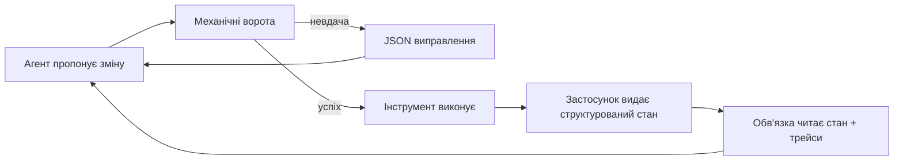
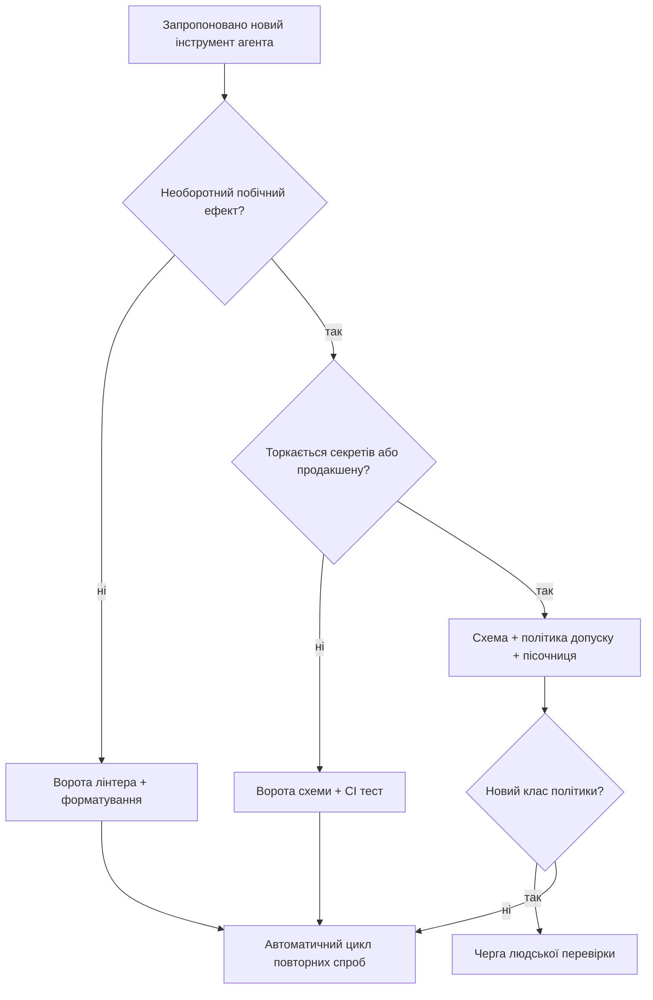

> **Складність**: [COMPLEX]
>
> **Час на виконання**: ~55 хвилин
>
> **Передумови**: [Основи обв'язки — рівні та система записів](module-3.1-harness-fundamentals-layers-and-system-of-record/); впевнене читання YAML-маніфестів, словника JSON Schema та базових кодів виходу оболонки.

---

## Що ви зможете зробити

Після цього модуля ви зможете:

- **Реалізувати** механічні захисні бар'єри — валідатори схем, лінтери, політики допуску та межі пісочниць — які відхиляють небезпечні виходи агента, не покладаючись лише на відповідність промпту.
- **Спроєктувати** агентно-зчитувані поверхні застосунків, які видають структурований стан, трейси та помилки, що обв'язка може розібрати на кожному циклі виправлення.
- **Діагностувати** неконтрольовані цикли виконання агента, читаючи детерміновані корисні навантаження виправлення замість неструктурованого шуму журналів.
- **Порівняти** механічні та семантичні захисні бар'єри та вирішити, який клас належить за межі вікна моделі для заданого радіуса ураження.
- **Оцінити** плани виконання з найменшими привілеями для запуску інструментів, включно з межами змінних середовища та зворотним зв'язком перед комітом, вбудованим у цикл відновлення агента.

## Чому цей модуль важливий

Модуль 3.1 дав вам мапу обв'язки: стандартні значення платформи, дорадчі документи проєкту та примусові рівні, заякорені в репозиторії як системі записів. Ця мапа показує агенту, де живе політика, але не гарантує, що наступна дія агента буде безпечною, коректною або оборотною. У продакшен-флотах дорогі відмови переходять від «модель неправильно зрозуміла документ» до «середовище все одно прийняло поганий артефакт».

**Гіпотетичний сценарій:** Платформна команда запускає дванадцять кодуючих агентів на ніч у тому самому сервісному репозиторії. Кожен агент отримує чіткий системний промпт, який забороняє розгортання без блоку `securityContext`, вимагає лише JSON-відповідей від інструментів і наполягає, щоб секрети ніколи не з'являлися в маніфестах. До ранку три агенти відкрили pull requests, які виглядають відповідними в прозових резюме, однак два маніфести пропускають `runAsNonRoot`, один патч «тимчасово» вимикає мережеву політику, а четвертий агент закомітив API-токен у ConfigMap, тому що промпт казав «ніколи не використовуйте секрети», тоді як валідатор перевіряв лише наявність слова `password`. Промпти були нормальні; рейки виконання — ні.

Цей модуль є середньою частиною триптиху про обв'язку. Модуль 3.1 встановив, *де* живе контроль; Модуль 3.3 навчить, *як експлуатувати* обв'язку з часом. Тут ви зосереджуєтеся на механічних рейках виконання та зчитуваності: воротах, які спрацьовують незалежно від того, чи співпрацює модель, і застосунках, які відповідають на відмови структурованим виправленням замість стектрейсів, орієнтованих на людину. Формулювання LLM01 від OWASP прямо стверджує, що ненадійний контент може впливати на поведінку моделі; ваше завдання — забезпечити, щоб цей вплив не міг стати необоротною дією без проходження перевірок, які живуть поза вікном промпту. Документація Anthropic щодо використання інструментів розглядає схеми як контракти; цей модуль розширює цю ідею на кожну межу, де вихід агента торкається Git, Kubernetes або CI.

Мета проєктування — не максимальне обмеження. Це **коректне відхилення з можливістю відновлення**: коли ворота не проходять, агент отримує машино-зчитувану причину, вказівник на поле та обмежений наступний крок, щоб обв'язка могла зациклитися без створення нового інцидент-тікета для кожної друкарської помилки. Досвідчені команди ставляться до цих відмов як до першокласних API-відповідей, а не як до ганебного stderr. Цей зсув — те, що відділяє демо-агентів від флотних агентів.

Якщо ви прийшли з арки Контексту (модулі 2.1–2.4), ви вже керуєте тим, що входить у кожен крок. Захисні бар'єри керують тим, що може **покинути** крок як побічні ефекти файлової системи або API. Якщо ви прийшли з модулів Промптів (1.1–1.4), ви вже версіонуєте контракти інструкцій. Захисні бар'єри версіонують контракти **артефактів** із тією ж строгістю. Триптих обв'язки навмисно послідовний: мапа (3.1), механічні рейки (цей модуль), операції (3.3). Пропуск цього середнього кроку створює репозиторії, які добре читаються людьми, але все одно приймають небезпечний вихід агента, тому що ніщо виконуване не сказало «ні».

Вартість швидко проявляється у флотах, яким бракує механічних воріт. Один невдалий apply може перевершити місячні витрати токенів: інцидент-мости, інженери відкату, комунікація з клієнтами та збір аудиторських доказів — усе масштабується з радіусом ураження, а не з тим, наскільки ввічливо модель відмовила в чаті. Механічні ворота коштують хвилин CI та уваги рецензента наперед; вони купують передбачувану відмову локально до того, як відмова стане регіональною. Ставтеся до обслуговування захисних бар'єрів як до планування потужності, а не як до полірування, яке ви додаєте після випуску демо-відео.

## Коли безпека лише на промптах перестає масштабуватися

Інструкції безпеки на рівні промпту необхідні, але недостатні. Вони чудово кодують намір: тон, обсяг, форму виходу та межі відмови для однієї сесії. Вони зазнають невдачі як довговічне примусове виконання, тому що моделі дрейфують між версіями, тому що отриманий ненадійний текст сидить у тому ж вікні, що й довірені інструкції, і тому що паралельні агенти не поділяють приватного розуміння «будь обережним». Промпт не може відкликати доступ на запис до файлової системи, не може відкотити злитий pull request і не може довести, що поле YAML пережило рецензування.

**Пауза та передбачення:** Ваш флотний промпт каже «ніколи не застосовуйте маніфести, в яких відсутній `securityContext`». Агент пропонує маніфест із `securityContext: {}` — порожнім, але присутнім. Чи вловить відповідність промпту різницю між синтаксичною присутністю та семантичною безпекою? Запишіть своє очікування перед читанням секції про ворота схем; більшість команд виявляють, що їм потрібні валідатори, які розуміють поля, а не ключові слова.

Продакшен-безпека тому вибудовує три площини, які повинні залишатися роздільними в архітектурних рев'ю. **Інструкційна площина** (промпти, навички, рубрики) формує поведінку. **Механічна площина** (схеми, лінтери, контролери допуску, пісочниці) вирішує, чи може артефакт існувати. **Площина зчитуваності** (структуровані помилки, кінцеві точки стану, ідентифікатори трейсів) каже обв'язці, що виправляти, коли механічна площина каже «ні». Згортання цих площин в один абзац системного промпту — це те, як флоти накопичують тихий ризик: модель звучить обережно, тоді як платформа все одно застосовує зміну.

| Площина | Володіє | Типовий артефакт-власник | Відмова за відсутності |
|---|---|---|---|
| Інструкційна | Намір, тон, постановка завдання | системний промпт, вказівники `AGENTS.md` | неоднозначність політики, а не несанкціоновані записи |
| Механічна | Дозвіл/заборона артефактів | ворота JSON Schema, OPA, завдання CI | небезпечний YAML потрапляє в кластер |
| Зчитуваності | Сигнали відновлення | JSON виправлення, схема `/healthz` | агент зациклюється на прозі stderr |

Арка обв'язки Хвилі 4 припускає, що ви вже вірите у важливість обв'язок (застарілий модуль 2.1 охопив сім принципів на високому рівні). Цей модуль не виводить цей аргумент заново і не перебудовує тікетні гаки в стилі Symphony (застарілий модуль 2.2). Він поглиблює те, **як** примусове виконання та спостережуваність повинні поводитися, щоб агенти могли замикати цикли без дублювання осиротілого контенту про оркестрацію флоту або вступні інваріантні однорядкові команди bash.

Ін'єкція інструкцій — не єдиний вектор витоку. Агенти також успадковують застарілу конфігурацію CI, неправильно злиті файли середовища та схеми інструментів, які дрейфують від сервісів, які вони викликають. Безпека лише на промптах не може виявити, що схема інструменту `deploy` досі вимагає поле, яке сервіс видалив три релізи тому; ворота схеми можуть. Безпека лише на промптах не може побачити, що Shellcheck відхилив би згенерований скрипт до його запуску на спільному раннері; ворота лінтера можуть. Системний режим відмови — це довіра до ймовірнісної відповідності для детермінованої інфраструктури.

Оператори флоту повинні документувати в примусовому рівні, які дії є **оборотними**, а які — **необоротними** для їхнього домену. Оборотні дії (форматування, редагування документів, чернеткові гілки) толерують легші ворота зі швидким зворотним зв'язком. Необоротні дії (apply у продакшені, експорт клієнтських даних, зміни білінгу) вимагають накопичених механічних контролів і часто людського дозволу на злиття. Ця класифікація належить до політики обв'язки поруч із мапою з модуля 3.1, а не похованою всередині довшого системного промпту, який агенти частково читають під тиском часу.

## Механічні захисні бар'єри проти семантичних

**Механічні захисні бар'єри** — це детерміновані функції від байтів: чи парситься цей JSON, чи містить цей маніфест `runAsNonRoot: true`, чи повідомляє Shellcheck про нуль помилок, чи відхиляє політика допуску томи `hostPath`. Вони повинні бути нудними, швидкими та версіонованими поруч із кодом, який вони захищають. **Семантичні захисні бар'єри** використовують моделі або ембединги для оцінки значення: чи є ця відповідь брендовою, чи є цей диф правдоподібно виправленням безпеки, чи звучить цей коментар як джейлбрейк. Вони корисні для тріажу та ранжування, але їх самих недостатньо для зупинки необоротних дій, тому що інша модель може не погодитися завтра.

Порівняння не в тому, що «механічне — добре, семантичне — погано». Семантичні ворота допомагають пріоритизувати людську перевірку та ловити класи, які опираються схемам (нюансована інтерпретація політики, нові формулювання атак). Механічні ворота зупиняють коміт, apply або мережевий виклик. Зрілий флот використовує семантику для **маршрутизації** роботи, а механіку — для **дозволу** роботи.

```text
+------------------------------------------------------------------+
|           Потік рішень захисного бар'єра (один запропонований артефакт) |
+------------------------------------------------------------------+
| 1. Розібрати байти -> схема / лінтер / політика (механічне)        |
| 2. Якщо невдача -> видати JSON виправлення -> повернути в цикл агента |
| 3. Якщо успіх -> опціональний семантичний суддя (оцінка ризику, рубрика) |
| 4. Якщо високий ризик -> черга людей; якщо низький -> виконати інструмент |
+------------------------------------------------------------------+
```

Команди екосистеми Kubernetes уже живуть із цим розділенням. `ValidatingAdmissionPolicy` виражає механічні перевірки під час допуску за допомогою виразів CEL, які можна тестувати в CI. Gatekeeper розширює цей шаблон політиками OPA Rego, закоміченими в Git. Жоден із них не замінює модель, налаштовану на безпеку, для пояснення, *чому* політика існує, але обидва зупиняють погані об'єкти від досягнення etcd, навіть коли агент «справді хотів» допомогти. Ваша обв'язка агента повинна віддзеркалювати той самий порядок: спочатку механічне, потім семантичне, потім людська ескалація.

Суто семантичні захисні бар'єри демонструють передбачувані режими відмови під флотним навантаженням. Оцінки дрейфують, коли оновлюється модель судді. Зловмисники оптимізують під формулювання рубрики. Безпечні виходи блокуються, тому що суддя плутає форматування з наміром. Суто механічні захисні бар'єри демонструють інші відмови: вони пропускають нові форми зловживання, поки хтось не закодує нове правило. Інженерна відповідь — парне покриття: кожна необоротна дія отримує механічні ворота; вибрані класи високого ризику також отримують семантичну оцінку із залогованими порогами.

Практичний приклад для агента pull request: семантичний суддя оцінює резюме дифів на «тон» і маршрутизує ризиковані зміни до людей. Механічні ворота запускають `opa test`, валідацію JSON Schema для значень Helm та юніт-тести до того, як агент може викликати `gh pr create`. Кошмарний сценарій, якщо поміняти порядок: агент відкриває PR, CI падає через двадцять хвилин, і модель спалює шість кроків, читаючи неструктуровані логи CI. Правильний порядок: механічна відмова за секунди з JSON-виправленням, семантична маршрутизація лише після механічного проходження.

Ще один практичний приклад: пайплайни модерації. Семантичні класифікатори чудово виявляють порушення політики у вільному тексті. Механічні ворота чудово забезпечують, що JSON відповіді API містить поля `decision`, `category` та `confidence`, необхідні для аудиту. Якщо модель видає переконливу прозу без схеми, низхідні системи білінгу та апеляцій ламаються, навіть коли проза звучить правильно. Поєднайте їх: спочатку схема, потім семантика.

**Пауза та передбачення:** Колега пропонує замінити ваші ворота схеми YAML на LLM-як-суддю, який «розуміє безпеку K8s». Яка відмова повертається о 3-й ночі під час випуску моделі — хибні спрацювання, хибні пропуски чи недетерміновані збої? Звичайна відповідь — недетерміновані збої плюс хибні спрацювання на граничних маніфестах; майте це на увазі, коли читатимете рамку прийняття рішень.

Регуляторні рецензенти та рецензенти безпеки дедалі частіше запитують, **де** забезпечується політика, а не що моделі було сказано. Механічні артефакти відповідають на це питання шляхами файлів та ідентифікаторами завдань CI. Семантичні промпти відповідають намірами. Коли ви презентуєте архітектурні діаграми аудиторам, малюйте механічні ворота на шляху виконання, а семантичних суддів — на бічних шляхах, які не можуть безпосередньо мутувати продакшен без проходження механічних перевірок.

## Ворота схем та примусове виконання структурованих вихідних даних

Основними воротами виконання для виходів агента, які живлять інструменти або Git, є **валідація схем**. API використання інструментів від основних провайдерів уже вимагають JSON-схем для аргументів; Anthropic документує вхідні схеми як частину визначень інструментів, а режими структурованих вихідних даних обмежують генерації моделі валідним JSON, що відповідає схемі. Обв'язка повинна ставитися до цих схем як до закону: якщо валідація не проходить, виклик інструменту ніколи не запускається, і модель отримує помилку валідатора як наступний видимий користувачеві факт.

JSON Schema є форматом обміну, на якому команди стандартизуються між мовами. Pydantic і Zod генерують JSON Schema з типів, що дозволяє сервісам на Python і TypeScript-CLI використовувати один файл контракту в `docs/contracts/`. Ворота належать до CI та локальних хуків перед комітом, а не всередину абзацу промпту, який каже «відповідайте у JSON».

`docs/contracts/agent-deploy-manifest.schema.json` (уривок):

```json
{
  "$schema": "https://json-schema.org/draft/2020-12/schema",
  "type": "object",
  "required": ["apiVersion", "kind", "metadata", "spec"],
  "properties": {
    "spec": {
      "type": "object",
      "required": ["template"],
      "properties": {
        "template": {
          "type": "object",
          "required": ["spec"],
          "properties": {
            "spec": {
              "type": "object",
              "required": ["securityContext"],
              "properties": {
                "securityContext": {
                  "type": "object",
                  "required": ["runAsNonRoot", "seccompProfile"],
                  "properties": {
                    "runAsNonRoot": { "const": true },
                    "seccompProfile": {
                      "type": "object",
                      "required": ["type"],
                      "properties": { "type": { "enum": ["RuntimeDefault", "Localhost"] } }
                    }
                  },
                  "additionalProperties": true
                }
              },
              "additionalProperties": true
            }
          },
          "additionalProperties": true
        }
      },
      "additionalProperties": true
    }
  },
  "additionalProperties": true
}
```

Посібник зі структурованих вихідних даних Gemini та документація Anthropic щодо структурованих вихідних даних наголошують на одному операційному правилі: обмежуйте простір генерації замість того, щоб парсити прозу регулярними виразами постфактум. сумісні з OpenAI стеки часто надають подібні обмеження `response_format`; коли документація вендора недоступна з вашої мережі, зберігайте вендорно-нейтральний файл схеми як джерело істини та генеруйте з нього валідатори для кожного SDK.

Структуровані вихідні дані також зменшують неоднозначні аргументи інструментів у багатокрокових планах. Коли крок два потребує імені розгортання, створеного на кроці один, схема з `deploymentName` як обов'язковим рядком не дає моделі дрейфувати до неформальних псевдонімів, які kubectl не може розв'язати. Специфікації інструментів MCP описують інструменти як типізовані можливості; ваша обв'язка повинна розглядати невідповідні виклики інструментів як клієнтські помилки, видимі моделі до того, як сервер виконає щось небезпечне.

Моделі Pydantic і схеми Zod сяють, коли агенти генерують конфігурацію через проміжні Python- або TypeScript-CLI. Один файл схеми може одночасно керувати валідаторами HTML-форм, прикладами CLI `--help` та воротами CI. Виграш в обслуговуванні реальний: коли вимоги `seccompProfile` змінюються, ви підвищуєте версію схеми один раз замість редагування трьох абзаців промпту, які агенти частково ігнорують.

Під'єднайте ворота близько до циклу агента. Шаблон, який масштабується — це **спершу перевір, потім дій**: обв'язка отримує запропонований вхід інструменту, валідує за схемою, запускає лінтери на вбудованих шляхах файлів і лише потім виконує `kubectl apply`, `git commit` або `gh pr create`. Специфікації інструментів MCP описують ту саму межу на рівні протоколу: інструменти оголошують форми входу; клієнти повинні відхиляти неправильні виклики до побічних ефектів. Коли валідація не проходить, повертайте компактне корисне навантаження:

```json
{
  "ok": false,
  "code": "SCHEMA_VIOLATION",
  "path": "/spec/template/spec/securityContext/runAsNonRoot",
  "message": "must be true",
  "remediation": "Set spec.template.spec.securityContext.runAsNonRoot to true and re-run validate_manifest.sh"
}
```

Ворота схем також належать до файлів, **написаних людьми**, які агенти редагують. Ruff, ESLint і Shellcheck є механічними захисними бар'єрами для Python, JavaScript та оболонки відповідно: вони не розуміють продуктового наміру, але надійно ловлять синтаксичні помилки, підозрілі конструкції та помилки лапок, які змусили б агентів метатися. Фреймворки передкомітних хуків компонують ці перевірки в єдину локальну командну поверхню, яку агенти можуть викликати після кожного редагування, що перетворює інструменти розробника на розширення обв'язки, а не на звичку лише для людей.

Для кластерно-орієнтованих агентів дзеркально відобразіть ворота репозиторію політикою часу допуску. Ресурси Kubernetes `ValidatingAdmissionPolicy` оцінюють CEL щодо об'єктів під час створення/оновлення. Gatekeeper встановлює обмеження OPA як кластерні політики з режимами аудиту, які дозволяють вам запускати в режимі dry-run згенеровані агентами маніфести за тими ж правилами перед apply. Політики Rego чудові, коли обмеження охоплюють кілька полів («якщо `hostNetwork`, то також вимагати X»). Зберігайте політики в Git, тестуйте їх за допомогою `opa test` і вказуйте `AGENTS.md` на шлях пакета, щоб агенти завантажували авторитетні правила, а не перефразовували їх.

Контрактне тестування схем повинно бути таким же рутинним, як юніт-тести. Зберігайте еталонні **невалідні** фікстури поруч із валідними: маніфести без профілів seccomp, JSON інструментів із неправильними значеннями enum, патчі, які намагаються використати заборонені групи API. CI повинен стверджувати, що валідатор повертає очікуваний `code` та `field` для кожної фікстури. Коли ворота змінюються, оновлюйте фікстури в тому ж коміті, щоб агенти ніколи не вивчали застарілий текст виправлення зі старих прикладів.

Схеми інструментів повинні залишатися вузькими. Занадто широка JSON Schema (кожне поле опціональне, `additionalProperties` всюди) запрошує модель галюцинувати ключі, які тихо зникають під час виконання. Надавайте перевагу меншим інструментам із явними обов'язковими полями над мега-інструментами, які приймають довільні вкладені об'єкти. Посібник Anthropic з використання інструментів розглядає схеми як частину UX; тісні схеми зменшують цикли відновлення, оскільки відмови локалізовані.

Версіонуйте схеми з semver або позначками дати в імені файлу (`agent-deploy-manifest.v2.schema.json`) і навчіть обв'язку відхиляти пропозиції, націлені на застарілі версії. Агенти, оновлені протягом тижнів, можуть досі цитувати старі приклади, якщо мапа не вказує на актуальні контракти. Коли випускаються критичні зміни схеми, надайте машино-зчитувану нотатку міграції (`migration_from_v1.md`), на яку посилається JSON виправлення, щоб шлях відновлення був явним.

## Агентно-зчитувані застосунки та структурований стан

Застосунок є **агентно-зчитуваним**, коли його стан під час виконання видається у передбачуваних, машино-парсованих формах, які обв'язка може запитувати без комп'ютерного зору на дашбордах. Людино-зчитувані системи друкують кольорові логи, неоднозначні рядки `OK` і стектрейси, призначені для очей. Агентно-зчитувані системи додають паралельні канали: JSON-рядки зі стабільними ключами, кінцеві точки стану з документованими схемами, ідентифікатори трейсів, які переживають повторні спроби, та мітки метрик, які не перейменовуються щорелізу.

Зчитуваність починається з контракту для `/healthz` або еквівалентних поверхонь готовності. Повертайте JSON, а не прозу:

```json
{
  "status": "degraded",
  "checks": {
    "database": { "ok": true, "latency_ms": 12 },
    "queue": { "ok": false, "error_code": "QUEUE_DEPTH_HIGH", "depth": 1200 }
  },
  "build": { "version": "2026.05.24-abc123", "git_sha": "deadbeef" }
}
```

Документація Cloudflare Workers bindings та Vercel Edge runtime наголошує на доступі з найменшими привілеями до ресурсів через явні об'єкти прив'язок, а не через повсюдну потужність середовища. Це зчитуваність для інфраструктури: агент читає, які простори імен KV, секрети та дозволи fetch існують, як структуровані метадані, замість того щоб виводити з файлів `.env`, розкиданих по документації. Коли ви проєктуєте внутрішні сервіси, демонструйте ту саму дисципліну: `capabilities.json` поруч із маніфестом розгортання з переліком дозволених хостів вихідного трафіку кращий за вікі-сторінку, яка каже «будьте обережні з вихідними викликами».

Обмежені логи мають таке ж значення, як і JSON стану. Обмежуйте довжину рядків, включайте поля `trace_id`, `span_id`, `component` та `event` і ніколи не покладайтеся на багаторядкову прозу там, де достатньо одного JSON-об'єкта. Документація Firecracker і gVisor показує, як межі пісочниці зменшують поверхню атаки ядра; ваш рівень зчитуваності застосунку повинен робити ці межі видимими для агентів як явні прапори можливостей, а не приховані вибори середовища виконання.



Макет репозиторію з модуля 2.2 досі застосовний: прогресивне розкриття через мапи, а не мегабайтні промпти. Агентно-зчитувані застосунки розширюють цю ідею на середовище виконання: сервіс повинен «відповідати» тією ж структурованою лексикою, яку використовують контракти репозиторію, щоб агенту не потрібен був скриншот, аби дізнатися, що черга насичена.

Кореляція трейсів є частиною зчитуваності. Коли агент ініціює розгортання, обв'язка повинна генерувати `trace_id` під час пропозиції та вимагати від низхідних сервісів відлунювати його в логах і JSON стану. Під час розбору інциденту люди й агенти використовують один і той самий ідентифікатор між системами. Без цієї дисципліни агенти неправильно приписують помилки не тому кроку та повторно застосовують виправлення, які ніколи не торкалися компонента, що відмовив.

Маніфести можливостей доповнюють JSON стану. Публікуйте невеликий файл із переліком дозволених доменів вихідного трафіку, шляхів для запису, імен секретів (не значень) і кінцевих точок інструментів, які сервіс очікує від агентів. Vercel Edge та Cloudflare Workers явно документують поверхні середовища виконання; внутрішні мікросервіси повинні імітувати цю прозорість замість того, щоб ховати потужність усередині неоголошених змінних середовища.

**Гіпотетичний сценарій:** Черговий інженер бачить зелені дашборди, тоді як агенти читають глибину черги `degraded` з іншого шляху метрик. Розділення відбувається тому, що люди споживають агреговані графіки, а агенти викликають недокументований текстовий формат `/metrics`. Уніфікуйте на одному JSON-контракті стану, який споживають обидві сторони, або документуйте два контракти з явними таблицями відповідності, закоміченими в Git.

Вендори спостережуваності не є обов'язковими для зчитуваності першого кроку. Структурований рядок логу та тіло JSON зі станом перевершують дороге розгортання APM, яке все одно друкує `"OK"` агентам. Додавайте експортери вендорів пізніше, але ніколи не робіть інтерфейс вендора єдиною читабельною поверхнею для автономних циклів відновлення.

### Телеметрія та сигнали стану

Захисні бар'єри реальні лише тоді, коли ви вимірюєте їх після розгортання. Відстежуйте **частоту відхилень воріт** за `code`, **медіанну кількість кроків до зеленого** на клас завдань, **частоту хибних проходжень** від канаркових невалідних фікстур і **час до виправлення** від першого JSON відмови до успішної ревалідації. Дашборди, націлені виключно на людей, приховуватимуть біль агента; експортуйте ті самі метрики в API брифінгу або структуровані логи, які ваша обв'язка вже споживає.

Канаркові невалідні фікстури — це негативні тести для примусового виконання. Щотижня або щодня CI повинен намагатися застосувати маніфести, які мусять відмовити, і стверджувати, що контролер допуску або локальний скрипт відхилив їх. Якщо канарка раптово проходить, у вас дрейф примусового виконання, а не щаслива модель. Поради OWASP щодо ін'єкцій стосуються ненадійного контенту; канарки доводять, що ваш механічний рівень досі ставиться до цього контенту як до ненадійного, навіть коли формулювання змінюються.

**Гіпотетичний сценарій:** Частота відхилень падає до нуля після нешкідливого налаштування схеми. Команда святкує, поки аудит не виявляє, що агенти перестали викликати валідатор, щоб зекономити токени. Моніторте **виклики валідатора на виклик інструменту**, а не лише відхилення. Ворота, які ніколи не викликаються, є декоративними.

Огляди радіуса ураження повинні включати шляхи обходу захисних бар'єрів. Екстрені ролі break-glass існують у зрілих організаціях; документуйте, як події break-glass видають аудитований JSON, відмінний від виправлення агента, щоб післяінцидентні огляди могли відділити людське перевизначення від відмови моделі. Break-glass без логування відтворює безпеку лише на промптах із додатковими кроками.

Крос-сімейні агенти (різні вендори моделей в одному флоті) повинні використовувати ідентичні механічні ворота. Промпти можуть відрізнятися; схеми — ні. Коли режим структурованих вихідних даних одного вендора суворіший за інший, зберігайте найсуворішу схему як канонічну і дозвольте адаптерам транслювати, замість підтримки паралельних правил, які тихо розходяться.

Навчання супроводжувачів має таке ж значення, як і навчання моделей. Нові працівники повинні редагувати невдалу еталонну фікстуру до того, як вони редагують абзац промпту. Ця звичка тримає борг примусового виконання видимим. Модуль 3.3 охопить очищення застарілих правил; цей модуль встановлює, що ці правила спершу повинні існувати як тестовані артефакти.

Інтеграція з отриманням та інструментами з модуля 2.3 є навмисною: отримання повертає ненадійні байти, інструменти виконують побічні ефекти. Захисні бар'єри розташовані між запропонованим входом інструменту та виконанням, і знову між виходом інструменту та наступним кроком моделі, якщо вихід повинен мати форму схеми. Ніколи не ланцюжте високоризиковий інструмент після кроку отримання без повторної валідації комбінованих корисних навантажень, оскільки ін'єкція може проїхати всередині отриманих фрагментів у позірно безпечний JSON.

Довготривалі сесії напружують зчитуваність більше, ніж короткі демо. Коли TTL кешу спливають (Anthropic документує короткий стандартний час життя ефемерного кешу для прийнятних префіксів), агенти можуть перезавантажити політику, тоді як старий JSON виправлення досі сидить у робочому контексті. Обв'язки повинні протерміновувати повідомлення виправлення після успіху або позначати їх `superseded_by_turn`, щоб моделі не виправляли повторно поля, які вже пройшли валідацію.

Нарешті, документуйте явні не-цілі. Механічні захисні бар'єри не зупинять зловмисну людину з правами на злиття. Вони не замінять перевірку шахрайства для фінансових продуктів. Вони не виправлять поганих продуктових вимог. Вони **зупинять** добронамірених агентів від застосування структурно небезпечних маніфестів на машинній швидкості, що є домінантним режимом відмови у ШІ-асистованих інженерних флотах сьогодні.

SRE-команди можуть запозичити мислення бюджету помилок для захисних бар'єрів: якщо частота відхилень різко зростає, потужність може бути неправильно налаштована, але якщо частота відхилень зникає, тоді як серйозність інцидентів зростає, примусове виконання, ймовірно, атрофувалося. Поєднуйте метрики захисних бар'єрів із частотою розгортання, щоб ви могли визначити, чи агенти насправді намагаються виконувати apply, чи лише пишуть текст. Агенти, які лише пишуть, потребують воріт при створенні PR; агенти з автоматичним apply потребують воріт при кожному виклику інструменту без винятку.

Воркшопи з безпекового рев'ю повинні включати живу демонстрацію, де учасники навмисно подають ін'єктований отриманий абзац у тестову обв'язку та спостерігають, як механічні ворота відхиляють результуючий маніфест. Демо влучає сильніше, ніж слайди про LLM01, тому що присутні бачать свої власні шляхи репозиторію у виводі виправлення. Після демо — PR, який додає одну еталонну невалідну фікстуру: малий диф, постійний урок.

Платформні інженери повинні публікувати **каталог захисних бар'єрів** поруч із мапою обв'язки з модуля 3.1: кожен запис містить назву воріт, команду-власника, `code` відмови, середню кількість кроків виправлення та останній інцидент, де ворота запобігли шкоді. Каталоги перетворюють неформальний героїзм на підтримувану інфраструктуру. Нові агенти завантажують шлях каталогу з `AGENTS.md` замість виведення перевірок із племінної пам'яті.

Коли моделі пропонують багатофайлові зміни, запускайте ворота для кожного артефакту перед оцінкою пакетного наративного резюме. Резюме семантичні; файли механічні. Блискуче резюме з небезпечним маніфестом гірше за чесний JSON відмови, тому що рецензенти розслабляються зарано. Паралелізм CI допомагає: завдання лінтера та схеми можуть розгалужуватися за шляхами, зберігаючи єдиний потік виправлення, впорядкований за серйозністю.

Освітні модулі часто зупиняються на теорії; ваш продакшен-обов'язок — випустити принаймні одні ворота, які ваші флотні агенти пройдуть цього тижня. Якщо воріт не існує, цей модуль не реалізований, незалежно від балів тесту. Почніть із валідатора маніфестів із практичної лабораторної, підвищіть його до `scripts/`, під'єднайте pre-commit і лише потім розширюйте до політик допуску та раннерів пісочниць.

Рецензенти, які оцінюють pull requests агентів, повинні запитувати артефакт логу валідатора так само, як вони запитують вивід тестів. Без цього артефакту затвердження є здогадкою, чи запускалися механічні ворота. Однорядкового посилання CI або вставленого JSON-об'єкта успіху достатньо як доказу, коли він містить шлях маніфесту та версію схеми.

Ставтеся до спроб обходу захисних бар'єрів як до інцидентів безпеки, навіть коли дійовою особою є внутрішня автоматизація. Неінструментовані шляхи автоматичного злиття привабливі під час дедлайнів; опирайтеся їхньому злиттю без тих самих JSON-доказів, які повинні створювати продакшен-агенти. Малі звички доказовості запобігають великим флотним сюрпризам.

## Помилки як детерміновані шляхи виправлення

Повідомлення про помилку для людини може бути наративним; повідомлення про помилку для агента повинно бути **дієвим і стабільним**. Ставтеся до корисних навантажень виправлення як до внутрішнього API: версіонуйте схему, документуйте поля та тестуйте еталонні випадки відмови так само, як ви тестуєте успішні шляхи. Коли `validate_manifest.sh` відхиляє файл, він не повинен друкувати `Error: invalid manifest` у stderr. Він повинен друкувати один JSON-об'єкт на відмову з `code`, `field`, `remediation` та опціональним `doc_href`, що вказує на мапу репозиторію.

Детерміновані помилки уможливлюють відновлення в замкненому циклі без нових людських тікетів. Шаблон обв'язки: запропонувати → валідувати → якщо невдача, додати JSON виправлення до результату інструменту → модель редагує → ревалідувати. Шпаргалка OWASP із запобігання ін'єкціям у промпти рекомендує відділяти довірені інструкції від ненадійних даних; детерміновані помилки — це те, як ви зберігаєте це розділення на межі інструменту: модель бачить валідатор як істину, а не як ще один абзац думки.

| Властивість | Помилка, орієнтована на людину | Виправлення, орієнтоване на агента |
|---|---|---|
| Стабільність | формулювання змінюються щорелізу | перелік `code` стабільний між версіями |
| Вказівник | розмите «виправте конфігурацію» | `field` JSONPath або рядок/стовпець |
| Наступний крок | племінне знання | `remediation` — імперативне речення |
| Тестованість | суб'єктивна | еталонні фікстури відмов у CI |

Антипатерн: скидання 400 KiB виводу лінтера у вікно моделі. Виправлення антипатерну: підсумовуйте механічно — перша відмова на файл, обмежені рядки, з `more_in_log` URL або шляхом. Агенту потрібна перша доміношка, а не весь ліс.

Вправи червоної команди для агентних флотів повинні включати спроби механічного обходу: патч хуків до no-ops, пропуск pre-commit прапорами середовища або створення YAML, який задовольняє регулярний вираз, але порушує схему. Якщо обхід успішний, обв'язка декоративна. Записуйте результати обходу як баги з тим самим пріоритетом, що й недоліки автентифікації, тому що це недоліки авторизації для автономних дійових осіб.

**Пауза та передбачення:** Ваші ворота повертають дванадцять JSON-об'єктів для одного маніфесту з каскадними помилками. Чи модель виправляє проблеми швидше, ніж при поверненні лише відмови з найвищим пріоритетом? Більшість обв'язок сповільнюються з повними дампами; проєктуйте впорядковане виправлення (security context до міток) і тестуйте, яка стратегія зменшує кількість кроків у вашому оцінювальному наборі.

Пріоритизуйте відмови так, як це роблять компілятори: безпека та authn/z спочатку, форма схеми другою, стиль третьою. Документуйте порядок у `scripts/README-gate.md`, щоб промпти агентів не сперечалися з обв'язкою про те, яку помилку виправляти першою. Стабільний порядок також робить регресійні тести детермінованими: той самий невалідний маніфест завжди повинен давати той самий перший `code`.

Інтернаціоналізація та доступність рідко є турботою агентів, але **коди** помилок повинні залишатися незалежними від локалі. Розміщуйте людські переклади в опціональних полях (`message_human`), тоді як агенти споживають `code` та `remediation`. Ніколи не вбудовуйте лише локалізовану прозу без стабільного ідентифікатора; моделі плутають зміни формулювань зі змінами логіки.

Коли виправлення вимагає читання політики, включайте `doc_href` як шлях відносно репозиторію, а не URL вікі, який переміщується. Модуль 3.1 наголошував на мапах; корисні навантаження помилок повинні вказувати на цю мапу, щоб наступний крок завантажував авторитетний текст замість перефразування з пам'яті.

## Інструменти розробника, pre-commit та виконання з найменшими привілеями

Механічні захисні бар'єри операційно відмовляють, коли вони не під'єднані до щохвилинного циклу агента. Люди запускають `git commit` і довіряють хукам; агенти потребують того самого шляху, задокументованого в `AGENTS.md` із явними командами. Фреймворки pre-commit запускають налаштовані хуки в узгодженому порядку; скерування агентів на `.venv/bin/python -m pre_commit run --files` після редагувань ловить дрейф до CI і створює вивід хука, який можна нормалізувати в JSON виправлення.

Лінтери — це не педантизм для агентів: вони звужують простір пошуку. Ruff швидко забезпечує дотримання стилю Python і виявляє багато класів помилок. ESLint ловить проблеми JavaScript до бандлінгу. Shellcheck блокує пастки в bash, які агенти генерують часто (`cd` без перевірки помилок, незаквотовані змінні). Під'єднайте кожен інструмент із документованим контрактом кодів виходу в обв'язці: вихід `0` — продовжити, вихід `1` — структурована відмова, вихід `2` — інфраструктурна відмова (повторити пізніше).

Найменші привілеї є доповненням до валідації. Документація пісочниць gVisor і Firecracker описує звуження поверхонь системних викликів для виконання ненадійного коду. Для запусків інструментів агента застосовуйте той самий принцип без вимоги мікро-VM з першого дня: окремі шляхи клонів лише для читання, заборона вихідної мережі, крім дозволених хостів, монтування секретів через обмежені файли замість оптового імпорту середовища та видалення `AWS_*`, `GITHUB_TOKEN` і URL баз даних із середовищ підпроцесів, якщо клас завдань їх не вимагає. Cloudflare Workers bindings є прикладом вузького оголошення можливостей; Vercel Edge runtimes документують обмежені API — використовуйте їх як еталонні проєкти для внутрішніх пісочниць раннерів, навіть коли ви розгортаєте на Kubernetes.

Змінні середовища — це прихований канал можливостей. Два агенти, які спільно використовують батьківську оболонку, успадковують те саме середовище; витік токена в env стає доступним для кожного виклику інструменту. Надавайте перевагу ін'єкції секретів з областю дії завдання з явними іменами файлів (`/run/secrets/deploy-token`) і політиці, за якою агенти повинні вказувати, який файл секрету вони використали в блоці метаданих `securityContext` маніфесту для аудиту. Ніколи не виводьте значення секретів у повідомленнях виправлення; посилайтеся лише на імена.

```bash
# Шаблон: запуск інструменту в очищеному середовищі (ілюстративний)
env -i \
  HOME="$HOME" \
  PATH="/usr/bin:/bin" \
  KUBECONFIG="$TASK_KUBECONFIG" \
  .venv/bin/python scripts/agent_tool_runner.py --task "$TASK_ID"
```

Документація Docker rootless mode підкріплює те, що привілеї належать до конфігурації середовища виконання, а не в оптимістичних формулюваннях у промптах. Поєднуйте безкореневі або пісочничні раннери з воротами маніфестів, щоб навіть успішна ін'єкція в промпт не могла ескалюватися без проходження механічних перевірок.

CI та локальні хуки повинні використовувати спільну конфігурацію. Якщо правила Ruff відрізняються між ноутбуком і пайплайном, агенти вивчають неправильний шлях відновлення. Зафіксуйте версії в `pyproject.toml`, `package-lock.json` або файлах rev хуків у `.pre-commit-config.yaml` і посилайтеся на ці фіксації з `AGENTS.md`. Список команд агента повинен бути копійованим: жодного «запустіть лінтер» без точного вектора argv.

Мережева політика для раннерів інструментів може бути простішою за політику service mesh, але повинна бути явною. Дозволяйте DNS до внутрішнього резолвера, HTTPS до провайдера Git та реєстру артефактів, забороняйте латеральні сканування RFC1918, якщо клас завдань не є мережевим налагодженням. Логуйте заборони з `trace_id`, щоб агенти не інтерпретували тайм-аути як помилки застосунку.

Firecracker і gVisor не є обов'язковими для кожної команди, але їхня документація прояснює модель загроз: ненадійний код повинен отримувати менше системних викликів і менші інтерфейси ядра. Відобразіть цю ідею на агентів, які виконують довільні скрипти репозиторію: використовуйте ефемерні робочі простори, базові дерева лише для читання та записуваний overlay лише в `work/` для завдання.

Оцінюйте вартість обв'язки чесно. Pre-commit на дванадцяти файлах дешевший за невдале продакшен-розгортання. Семантичні судді коштують токенів і затримки; плануйте їх поза гарячим шляхом. Практичне нічне завдання може запускати глибокі семантичні рев'ю, тоді як цикли на PR залишаються механічними.

## Патерни та антипатерни

### Патерни

| Патерн | Коли використовувати | Чому працює | Нотатка щодо масштабування |
|---|---|---|---|
| Ворота «спершу перевір, потім дій» | Будь-який інструмент, що мутує Git, кластер або тікети | Побічні ефекти виникають лише після детермінованого проходження | Додавайте схеми на інструмент; тримайте спільне дерево `contracts/` |
| JSON виправлення при відмові | Кожне механічне відхилення | Агенти відновлюються без людського тріажу | Версіонуйте схему; еталонно тестуйте повідомлення відмов |
| Подвійний стан: людський + машинний | Сервіси, якими оперують агенти | Оператори зберігають дашборди; агенти читають JSON | Тримайте ключі стабільними між релізами |
| Pre-commit як команда агента | Локальні цикли редагування | Ті самі перевірки, що їх використовують люди, швидший зворотний зв'язок | Фіксуйте версії хуків у репозиторії |
| Дзеркало політики допуску | Кластерний apply від агентів | Остання лінія захисту на API-сервері | Режим аудиту перед режимом примусу |

### Антипатерни

| Антипатерн | Чому команди його приймають | Що ламається | Кращий підхід |
|---|---|---|---|
| Промпт як єдиний контроль безпеки | Швидко випустити | Тихі небезпечні злиття | Схема + політика + пісочниця |
| Регулярні вирази на прозі моделі | Уникає роботи зі схемами | Крихке, обхідне | Структуровані вихідні дані + валідатор |
| Скидання повних логів лінтера | «Більше контексту допомагає» | Роздуття контексту, зациклення | JSON підсумку першої відмови |
| Семантичний суддя як єдині ворота | Звучить розумніше | Недетерміновані блокування | Механічна попередня перевірка |
| Спільне середовище для всіх агентів | Зручна оболонка | Витік облікових даних | Очищення середовища з областю дії завдання |

Наративний огляд допомагає командам засвоїти таблицю. Контроль лише на промптах здається швидким, тому що перша демо слухається інструкцій; флоти зазнають невдачі, коли приходять паралельність і ненадійне отримання. Регулярні вирази на прозі зазнають невдачі, коли моделі загортають YAML у огорожі markdown або перекладають ключі в camelCase; схеми закриваються при відмові на цих трансформаціях. Повні дампи лінтерів здаються корисними, але спалюють контекст, який повинен нести стан завдання; JSON першої відмови зберігає бюджет. Суто семантичні ворота здаються витонченими, поки оновлення моделі не переверне оцінки за ніч. Спільні середовища здаються зручними, поки форк одного агента не ексфільтрує токен іншого — найменші привілеї нудні до дня аудиту.

## Рамка прийняття рішень

Використовуйте цю матрицю при виборі класів захисних бар'єрів для нової можливості агента. Оцінюйте радіус ураження (оборотність), експозицію (мережа/секрети) та частоту (як часто запускається інструмент). Високий радіус ураження плюс висока експозиція вимагають механічних воріт і пісочниці; суто семантичне рев'ю зарезервоване для дослідницьких завдань із низьким радіусом ураження.

| Радіус ураження | Експозиція | Механічні ворота | Семантичний суддя | Людське затвердження |
|---|---|---|---|---|
| Високий (apply у продакшені) | Висока | Обов'язкові | Опціональна оцінка ризику | Обов'язкове для нових типів |
| Високий | Низька | Обов'язкові | Опціональний | Вибіркова перевірка |
| Низький (лише документи) | Низька | Лінтер/форматування | Опціональний | Рідко |
| Середній | Висока | Обов'язкові + пісочниця | Рекомендований | Пороговий |



Коли маєте сумнів, додайте механічні ворота першими та вимірюйте кількість кроків агента для виправлення відмов. Якщо кроки зменшуються, а небезпечні apply падають до нуля, ворота заробили своє місце. Якщо кроки вибухають, тому що повідомлення розмиті, виправте зчитуваність перед послабленням безпеки.

Шляхи ескалації належать до матриці, а не до ad-hoc терміновості в Slack. Визначте числові пороги: три ідентичні коди `SCHEMA_VIOLATION` на одному полі ескалуються до людини; одна інфраструктурна відмова `MISSING_PYYAML` ініціює платформний тікет замість того, щоб просити модель виконати pip install. Агенти повинні читати ці пороги з `docs/harness/escalation.yaml`, щоб поведінка залишалася узгодженою між сімействами моделей.

## Чи знали ви?

- **OWASP GenAI Top 10 (перелік 2025 року)** класифікує ін'єкцію в промпти як **LLM01** і документує, що ненадійний вхід може маніпулювати поведінкою моделі, навіть коли оператори вважають, що інструкції «заблоковані» в системному повідомленні — механічне розділення даних та інструкцій є вказаним шляхом пом'якшення, а не лише сильніші формулювання.
- Документація **Anthropic prompt caching** зазначає стандартний TTL ефемерного кешу близько **п'яти хвилин** для прийнятних блоків префіксів; проєктування захисних бар'єрів повинно враховувати сесії, які відновлюються після спливу кешу та перезавантажують стабільні префікси політики без змішування застарілого виводу інструментів.
- **Kubernetes ValidatingAdmissionPolicy** став стабільним механізмом допуску в сімействі релізів **1.30**, дозволяючи командам виражати вбудовану валідацію за допомогою CEL замість лише ланцюжків вебхуків — корисно як останні механічні ворота для API-об'єктів, поданих агентами.
- **gVisor** запускає контейнери з межею ядра в просторі користувача; посібник з архітектури Google явно описує компроміси накладних витрат на перехоплення системних викликів, що має значення, коли агенти запускають високочастотні тестові команди всередині пісочниць.

## Типові помилки

| Помилка | Чому трапляється | Як виправити |
|---|---|---|
| Розгляд порожнього `securityContext: {}` як відповідного | Перевірки промпту за ключовими словами | JSON Schema `required` + `const` на полях |
| Повернення прозових помилок із валідаторів | Звички stderr | Видавайте версіонований JSON виправлення |
| Запуск семантичних суддів перед лінтерами | Наратив «ВММ розуміє код» | Забезпечте механічний порядок |
| Дозвіл агентам викликати `kubectl apply` напряму | Швидкість демо | Валідуйте маніфести в CI + допуск |
| Спільне середовище батьківської оболонки між агентами | Зручність терміналу | `env -i` з областю дії завдання або ізоляція раннера |
| Логування всього виводу інструменту в контекст | Зручність налагодження | Підсумуйте з trace ID + обмежте байти |
| Пропуск pre-commit у документації агента | Припущення про людський робочий процес | Документуйте точну команду хука в `AGENTS.md` |
| Одна глобальна схема для всіх класів завдань | Одержимість повторним використанням | Розділіть контракти за інструментом і рівнем ризику |

## Тест

<details>
<summary>Сценарій: Маніфест агента проходить регулярний вираз, який шукає рядок `runAsNonRoot`, але продакшен все одно працює від root. Що відмовило?</summary>

Захисний бар'єр був лексичним, а не структурним. Регулярний вираз на відрендереному YAML може збігатися з коментарями, рядками або порожніми об'єктами. Замініть його на JSON Schema або типізований парсер, який вимагає `runAsNonRoot: true` на правильному шляху, плюс політику допуску як підстраховку. Текст промпту повинен вказувати на файл схеми, а не перефразовувати поля.

</details>

<details>
<summary>Сценарій: Після оновлення моделі ваші ворота LLM-як-судді блокують 30% раніше дозволених дифів без змін коду. Що ви перевіряєте першим?</summary>

Ставтеся до цього як до регресії в семантичній, недетермінованій інфраструктурі. Порівняйте версію моделі судді, текст рубрики та налаштування температури. Відновіть сервіс, маршрутизуючи необоротні дії через незмінені механічні ворота, одночасно перекалібровуючи суддю за еталонним набором. Не вимикайте механічні ворота для компенсації.

</details>

<details>
<summary>Сценарій: Агенти зациклюються на десять кроків на попередженнях Shellcheck, які є стилістичними, а не безпековими. Як скоротити цикли, не відкидаючи лінтер?</summary>

Відобразіть коди Shellcheck на серйозності в конфігурації обв'язки; зазнавайте невдачі лише на узгоджених класах помилок для завдань агента або автоматично виправляйте відомі коди в проході `--fix` перед валідацією. Повертайте JSON виправлення, який називає код і рядок файлу, а не весь потік лінтера.

</details>

<details>
<summary>Сценарій: Отримана вікі-сторінка в контексті каже агенту ігнорувати ворота схем. Маніфест невалідний, але звучить упевнено. Який захисний бар'єр мусить спрацювати?</summary>

Механічна валідація поза вікном моделі. OWASP LLM01 класифікує ін'єкцію інструкцій через ненадійний контент; схема та політики допуску не читають переконливу прозу. Забезпечте порядок «спершу перевір, потім дій», щоб виконання інструменту ніколи не бачило поганих байтів маніфесту.

</details>

<details>
<summary>Сценарій: Два агенти спільно використовують раннер з однаковим `GITHUB_TOKEN`. Одне завдання ексфільтрує тіло issue у форк. Яка межа відмовила?</summary>

Ізоляція середовища з найменшими привілеями. Токени повинні мати область дії на завдання або на іш'ю, зі стандартними правами лише на читання та без спільного батьківського середовища. Аудиторські логи повинні записувати, який ідентифікатор завдання використав токен, без виведення секрету у виводі виправлення.

</details>

<details>
<summary>Сценарій: Кінцева точка стану вашого сервісу повертає `200 OK` із тілом `all good`. Агенти не можуть визначити погіршену глибину черги. Що ви змінюєте?</summary>

Публікуйте агентно-зчитуваний JSON з об'єктами на кожну перевірку, стабільними ключами та явними полями `error_code` при деградації. Зберігайте людські дашборди за потреби, але додайте документований контракт схеми в мапі репозиторію, щоб інструменти парсили стан без NLP на прозі.

</details>

<details>
<summary>Сценарій: Pre-commit проходить локально, але агенти пропускають хуки, і CI ловить відмови пізно. Яка зміна обв'язки виправляє пропускну здатність?</summary>

Документуйте обов'язковий `pre_commit run` (або еквівалент) у контрольному списку команд агента після редагувань і під'єднайте відмови хуків до JSON виправлення, який модель бачить на наступному кроці. Ставтеся до пропусків хуків як до порушень політики в примусовому рівні, а не як до нагадувань у прозі.

</details>

<details>
<summary>Сценарій: Режим аудиту Gatekeeper вимкнено; агент застосовує заборонений том `hostPath`. Промпт це забороняв. Яких двох воріт не вистачало?</summary>

Тест схеми/політики на стороні репозиторію перед apply та примусове виконання допуску на кластері. Увімкніть аудит для вимірювання порушень, потім примусово забезпечте. Промпти є дорадчими; політики Rego або CEL є механічними.

</details>

## Практична вправа: Інваріантні ворота маніфесту з циклом виправлення

Ви побудуєте локальну точку входу на bash, яка валідує запропонований агентом YAML маніфесту розгортання, детерміновано зазнає невдачі, коли необхідний блок security context відсутній або неповний, і друкує JSON виправлення, який обв'язка може подати назад у наступний крок агента. Ця вправа навмисно не перевчає хуки Symphony або сім принципів обв'язки; вона практикує механічну ногу триптиху.

Лабораторна віддзеркалює продакшен-порядок: байти входять у валідатор до будь-якого гіпотетичного кроку apply, відмови стають структурованими результатами інструменту, а успіх також є машино-верифікованим JSON, а не людським кивком. Ставтеся до stdout як до API-контракту, який ви б опублікували для іншої команди. Якщо поле відсутнє у виводі відмови, додайте його зараз, а не під час інциденту.

### Налаштування

```bash
mkdir -p ~/agent-guardrails-lab/{manifests,scripts}
cd ~/agent-guardrails-lab
```

Створіть `manifests/good.yaml` з мінімальним Deployment, чий шаблон поду включає `spec.template.spec.securityContext` із `runAsNonRoot: true` та `seccompProfile.type: RuntimeDefault`. Створіть `manifests/bad-missing-context.yaml`, ідентичний, але опустіть блок `securityContext` на рівні поду.

Пауза перед кодуванням: передбачте, чи повинен ваш валідатор приймати `runAsNonRoot: "true"` як рядок. JSON Schema та завантажувачі YAML часто розходяться щодо приведення булевих значень; вирішіть явно та закодуйте правило в Python, щоб агенти вивчали точні типи замість неоднозначної істинності.

### Завдання 1 — Напишіть скелет валідатора

- [ ] Створіть `scripts/validate_agent_manifest.sh` із `set -euo pipefail` та константою `REMEDIATION_CODE=MISSING_SECURITY_CONTEXT`.
- [ ] Приймайте рівно один аргумент: шлях до YAML маніфесту.
- [ ] При неправильному використанні (немає аргументу) друкуйте JSON виправлення у stdout та виходьте з `1`.

<details>
<summary>Ескіз рішення (перевірка аргументу)</summary>

```bash
#!/usr/bin/env bash
set -euo pipefail
REMEDIATION_CODE="MISSING_SECURITY_CONTEXT"
MANIFEST="${1:-}"
if [[ -z "${MANIFEST}" || ! -f "${MANIFEST}" ]]; then
  printf '{"ok":false,"code":"%s","field":"$","remediation":"Pass one existing manifest path as argv[1]."}\n' "${REMEDIATION_CODE}"
  exit 1
fi
```

</details>

### Завдання 2 — Розберіть YAML і забезпечте security context

- [ ] Викличте вбудований Python (stdlib плюс PyYAML за наявності) для завантаження YAML і перевірки, що `spec.template.spec.securityContext.runAsNonRoot` є булевим `true`.
- [ ] Перевірте, що `spec.template.spec.securityContext.seccompProfile.type` є `RuntimeDefault` або `Localhost`.
- [ ] При відмові друкуйте однорядковий JSON-об'єкт із ключами `ok`, `code`, `field`, `remediation` та `manifest`.

<details>
<summary>Ескіз рішення (ядро валідації)</summary>

```bash
validate_agent_manifest.sh() {
  python3 - "$MANIFEST" <<'PY'
import json, sys
from pathlib import Path
manifest = Path(sys.argv[1])
try:
    import yaml
except ImportError:
    print(json.dumps({"ok": False, "code": "MISSING_PYYAML",
                      "field": "$", "remediation": "pip install pyyaml or use repo .venv"}))
    sys.exit(1)
data = yaml.safe_load(manifest.read_text()) or {}
spec = data.get("spec") or {}
template = spec.get("template") or {}
pod_spec = template.get("spec") or {}
sec = pod_spec.get("securityContext")
if not isinstance(sec, dict):
    print(json.dumps({"ok": False, "code": "MISSING_SECURITY_CONTEXT",
                      "field": "/spec/template/spec/securityContext",
                      "remediation": "Add spec.template.spec.securityContext with runAsNonRoot true and seccompProfile.type RuntimeDefault",
                      "manifest": str(manifest)}))
    sys.exit(1)
if sec.get("runAsNonRoot") is not True:
    print(json.dumps({"ok": False, "code": "MISSING_SECURITY_CONTEXT",
                      "field": "/spec/template/spec/securityContext/runAsNonRoot",
                      "remediation": "Set spec.template.spec.securityContext.runAsNonRoot to true",
                      "manifest": str(manifest)}))
    sys.exit(1)
profile = sec.get("seccompProfile") or {}
if profile.get("type") not in ("RuntimeDefault", "Localhost"):
    print(json.dumps({"ok": False, "code": "MISSING_SECURITY_CONTEXT",
                      "field": "/spec/template/spec/securityContext/seccompProfile/type",
                      "remediation": "Set seccompProfile.type to RuntimeDefault",
                      "manifest": str(manifest)}))
    sys.exit(1)
print(json.dumps({"ok": True, "manifest": str(manifest)}))
PY
}
validate_agent_manifest.sh
```

</details>

### Завдання 3 — Симуляція відновлення в замкненому циклі

- [ ] Запустіть скрипт на `manifests/bad-missing-context.yaml` і збережіть stdout.
- [ ] Вставте речення виправлення в робочу «транскрипцію агента» як єдиний результат інструменту.
- [ ] Відредагуйте маніфест, щоб додати необхідний блок, перезапустіть і підтвердьте код виходу `0`.

<details>
<summary>Ескіз рішення (команди)</summary>

```bash
bash scripts/validate_agent_manifest.sh manifests/bad-missing-context.yaml || true
# агент редагує файл
bash scripts/validate_agent_manifest.sh manifests/bad-missing-context.yaml
echo "exit=$?"
```

</details>

### Завдання 4 — Під'єднайте локальні ворота в стилі pre-commit

- [ ] Додайте однорядкову ціль `Makefile` `validate-manifests`, яка запускає скрипт на кожному `manifests/*.yaml`.
- [ ] Примусово зазнайте невдачі на першому поганому файлі з ненульовим виходом.

<details>
<summary>Ескіз рішення (Makefile)</summary>

```makefile
validate-manifests:
	@for f in manifests/*.yaml; do \
	  bash scripts/validate_agent_manifest.sh "$$f" || exit 1; \
	done
```

</details>

### Завдання 5 — Агентно-зчитувані рядки успіху та відмови

- [ ] Додайте поле `note` до JSON успіху: `"note": "gate_passed"`.
- [ ] Додайте `doc_href` до відмов, що вказує на шлях політики вашого репозиторію (використовуйте заповнювач, якщо ця лабораторна окрема).
- [ ] Документуйте схему JSON для обох форм у `scripts/README-gate.md` (мінімум п'ять рядків).

### Завдання 6 — Рефлексія щодо бюджету кроків і дзеркало політики допуску

- [ ] **(a)** Запишіть, скільки симульованих кроків агента знадобилося від першої відмови до проходження.
- [ ] **(a)** Напишіть три речення про те, чи повернення лише першої відмови перевершило повернення всіх відмов одразу.
- [ ] **(b)** Перегляньте документацію Kubernetes `ValidatingAdmissionPolicy` і перелічіть один вираз CEL, який ви б додали як кластерну підстраховку для `runAsNonRoot`.
- [ ] **(b)** Поясніть двома реченнями, чому кластерні ворота все ще мають значення, якщо локальна валідація на bash проходить.
- [ ] **(b)** Занотуйте, як би ви логували відмови допуску так, щоб агенти бачили той самий словник `code`, що й у локальних скриптах.

<details>
<summary>Ескіз рішення (обґрунтування кластерної підстраховки)</summary>

Локальна валідація захищає Git і CI до того, як зміни досягнуть API-сервера. Політики допуску захищають від агентів або людей, які пропускають локальні хуки. Вирівнюйте рядки `code`, де це можливо (`MISSING_SECURITY_CONTEXT`), щоб цикли виправлення не розгалужувалися за рівнями.

</details>

### Критерії успіху

- [ ] `validate_agent_manifest.sh` виходить ненульовим на `bad-missing-context.yaml` із кодом `MISSING_SECURITY_CONTEXT`.
- [ ] Шлях успіху друкує `{"ok": true, ...}` для `good.yaml`.
- [ ] Вихід виправлення є однорядковим JSON, придатним для ін'єкції результату інструменту.
- [ ] `make validate-manifests` швидко зазнає невдачі на будь-якому поганому маніфесті.
- [ ] Ви записали кількість кроків і коротку рефлексію щодо впорядкування відмов.
- [ ] Ви перелічили кластерну підстраховку допуску та вирівняли логування відмов з локальним словником `code`.

## Джерела

- OWASP GenAI Security Project, "LLM01:2025 Prompt Injection": [https://genai.owasp.org/llmrisk/llm01-prompt-injection/](https://genai.owasp.org/llmrisk/llm01-prompt-injection/)
- OWASP Cheat Sheet Series, "LLM Prompt Injection Prevention": [https://cheatsheetseries.owasp.org/cheatsheets/LLM_Prompt_Injection_Prevention_Cheat_Sheet.html](https://cheatsheetseries.owasp.org/cheatsheets/LLM_Prompt_Injection_Prevention_Cheat_Sheet.html)
- Anthropic, "Tool use": [https://docs.anthropic.com/en/docs/build-with-claude/tool-use](https://docs.anthropic.com/en/docs/build-with-claude/tool-use)
- Anthropic, "Structured outputs": [https://docs.anthropic.com/en/docs/build-with-claude/structured-outputs](https://docs.anthropic.com/en/docs/build-with-claude/structured-outputs)
- Google Gemini API, "Structured output": [https://ai.google.dev/gemini-api/docs/structured-output](https://ai.google.dev/gemini-api/docs/structured-output)
- JSON Schema, "JSON Schema Validation": [https://json-schema.org/draft/2020-12/json-schema-validation](https://json-schema.org/draft/2020-12/json-schema-validation)
- Pydantic, "JSON Schema": [https://docs.pydantic.dev/latest/concepts/json_schema/](https://docs.pydantic.dev/latest/concepts/json_schema/)
- Zod, "JSON schema": [https://zod.dev/?id=json-schema](https://zod.dev/?id=json-schema)
- Astral, "Ruff": [https://docs.astral.sh/ruff/](https://docs.astral.sh/ruff/)
- ESLint, "Getting Started": [https://eslint.org/docs/latest/use/getting-started](https://eslint.org/docs/latest/use/getting-started)
- ShellCheck wiki: [https://www.shellcheck.net/](https://www.shellcheck.net/)
- Kubernetes, "Validating Admission Policies": [https://kubernetes.io/docs/reference/access-authn-authz/validating-admission-policy/](https://kubernetes.io/docs/reference/access-authn-authz/validating-admission-policy/)
- Open Policy Agent, "Policy Language": [https://www.openpolicyagent.org/docs/latest/policy-language/](https://www.openpolicyagent.org/docs/latest/policy-language/)
- Gatekeeper, "Documentation": [https://open-policy-agent.github.io/gatekeeper/website/docs/](https://open-policy-agent.github.io/gatekeeper/website/docs/)
- gVisor, "Architecture Guide": [https://gvisor.dev/docs/architecture_guide/](https://gvisor.dev/docs/architecture_guide/)
- pre-commit, "Introduction": [https://pre-commit.com/](https://pre-commit.com/)
- Cloudflare Workers, "Bindings": [https://developers.cloudflare.com/workers/runtime-apis/bindings/](https://developers.cloudflare.com/workers/runtime-apis/bindings/)
- Vercel, "Edge Runtime": [https://vercel.com/docs/functions/runtimes/edge-runtime](https://vercel.com/docs/functions/runtimes/edge-runtime)
- Model Context Protocol, "Tools (server)": [https://modelcontextprotocol.io/specification/2025-11-25/server/tools](https://modelcontextprotocol.io/specification/2025-11-25/server/tools)

## Наступний модуль

Переходьте до [Експлуатація обв'язки](../module-3.3-operating-the-harness/), де статичні захисні бар'єри зустрічаються з операціями другого дня: дрейф винятків, догляд за документацією, збирання сміття обв'язки та пороги ескалації, коли агенти випереджають свіжість політики.
