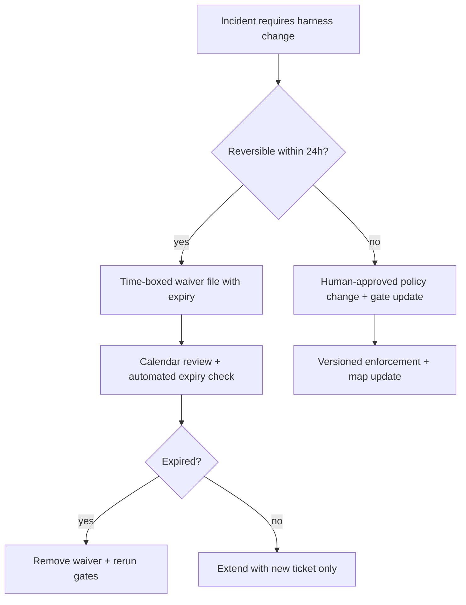
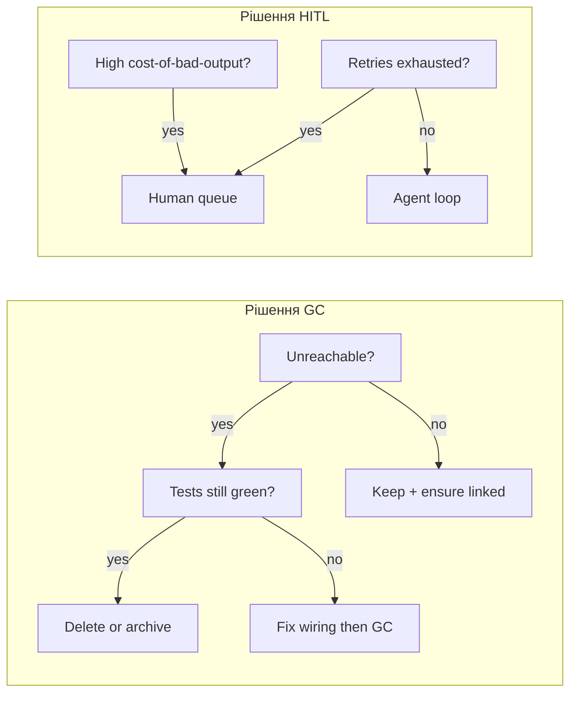

> **Складність**: [COMPLEX]
>
> **Час на виконання**: ~50 хвилин
>
> **Передумови**: [Захисні бар'єри, ворота та агентно-зчитувані застосунки](module-3.2-guardrails-gates-and-agent-legible-apps/); [Основи обв'язки — рівні та система записів](module-3.1-harness-fundamentals-layers-and-system-of-record/) для словника рівнів; впевнене володіння Git, мітками CI та запланованими завданнями обслуговування.

---

## Що ви зможете зробити

Після цього модуля ви зможете:

- **Діагностувати** занепад обв'язки, розділяючи інструкційний борг і борг примусового виконання, та відстежуючи, який рівень відмовив, коли агенти «дотримуються правил», але все одно випускають небезпечні артефакти.
- **Реалізувати** безперервний ритм збирання сміття для мап, шаблонів промптів і скриптів валідації, щоб застаріла політика не могла маскуватися під авторитет.
- **Спроєктувати** матрицю ескалації «людина-в-циклі», прив'язану до лімітів повторних спроб, оборотності та вартості поганого виводу, а не до ad hoc втоми від пейджера.
- **Порівняти** філософії злиття для пропускної здатності масштабу ШІ, спрямовуючи детерміновані низькоризикові зміни через автоматизацію та резервуючи високоризикові шляхи для явного людського підтвердження.
- **Оцінити**, чи синхронізовані годинники свіжості політики, свіжості примусового виконання та свіжості відновлення — або який дрейф годинника спричиняє тихі регресії.

## Чому цей модуль важливий

**Гіпотетичний сценарій:** Через шість місяців після впровадження агентно-допоміжної розробки платформна команда святкує швидкість злиття: медіанний час до злиття знизився з двох днів до чотирьох годин, і агенти тепер відкривають тридцять pull requests на тиждень. Потім продакшен-інцидент приводить до маніфесту, який порушує правило безпеки, що, як усі вважали, було примусовим. Постмортем знаходить три кореневі причини, які не виправляються жодним окремим багфіксом: мапа `AGENTS.md` досі вказує на застарілий шлях політики, файл винятку, створений до інциденту, надає постійну відмову від правила для «тимчасового» простою, а скрипт валідації було вимкнено, бо він конфліктував із новим лінтером — і після цього ніколи не вмикали знову. Агенти не збунтувалися; обв'язка згнила, поки команда оптимізувала швидкість.

Цей модуль закриває триптих про обв'язку. [Основи обв'язки — рівні та система записів](module-3.1-harness-fundamentals-layers-and-system-of-record/) навчили вас, де живе політика і як побудувати систему записів. [Захисні бар'єри, ворота та агентно-зчитувані застосунки](module-3.2-guardrails-gates-and-agent-legible-apps/) навчили вас, як механічні рейки відхиляють погані артефакти та повертають структуроване виправлення. Експлуатація обв'язки — це дисципліна другого дня: очищення застарілих інструкцій, вилучення винятків, планування документного догляду, налаштування шляхів злиття та підтримка трьох годинників свіжості вирівняними, щоб вчорашня надзвичайна ситуація не стала завтрашньою поведінкою за замовчуванням.

Якщо ви прийшли з [Динамічної оркестрації контексту](../module-2.4-dynamic-context-orchestration/) з арки Контексту, ви вже керуєте доказами на кожен крок і циклами сесій. Операції обв'язки розширюють це мислення на **довговічні** контрольні артефакти: файли та хуки, які переживають межі сесій. Хвиля 4 передбачає, що ви приймаєте обв'язки як необхідність, і зосереджується на **управлінні життєвим циклом** — наприклад, операціях другого дня: документний догляд, дрейф винятків і філософія злиття в робочому просторі, нативному для ШІ.

Економічний аргумент прямий. Інструкційний борг роздуває витрати токенів — агенти перечитують суперечливу прозу на кожному кроці. Борг примусового виконання роздуває витрати на інциденти — погані артефакти прослизають, бо ворота були обійдені, заглушені або ніколи не під'єднані. Документний догляд коштує календарного часу, але це дешевше, ніж повторно обговорювати той самий аргумент про політику в кожній агентній сесії. Команди, які пропускають операційну дисципліну, часто виявляють рахунок лише тоді, коли реєстр винятків переживає інженерів, які його написали, і ніхто не пам'ятає, яка відмова від правила досі дійсна.

Експлуатація обв'язки — це також спосіб зберегти інвестиції з модулів 3.1 та 3.2. Гарна трирівнева мапа та суворі ворота схеми — обидва занепадають без власників. Мапа гниє, коли посилання ламаються; ворота гниють, коли винятки їх обходять. Жоден із цих занепадів не проявляється в юніт-тестах, якщо ви не напишете тести обслуговування — перевірки посилань, перевірки закінчення терміну дії, перевірки виклику хуків — які ставляться до самої обв'язки як до продакшен-коду. Цей зсув мислення є ядром операцій другого дня: **обв'язка — це сервіс, який ви запускаєте**, а не документ, який ви опублікували одного разу.

Крос-функціональне вирівнювання важливе, бо інструкційний борг відчувається як «документація», а борг примусового виконання — як «платформа», проте обидва проявляються як «агент зазнав невдачі». Один щотижневий огляд обв'язки за участю документації, безпеки та продуктивності розробників запобігає метушні. Документація хоче чіткішої прози; безпека хоче суворіших воріт; продуктивність хоче швидших злиттів. Три годинники дають вам порядок денний, який перетворює дебати на вимірювання замість аргументів про смак.

**Гіпотетичний сценарій:** Ваша організація впроваджує центральний агентний шлюз, який вводить стандартні значення платформи на кожній сесії. Проєктні репозиторії досі підтримують локальні мапи. Через три місяці локальні мапи посилаються на функції шлюзу, які були перейменовані, а нотатки про випуск шлюзу посилаються на хуки репозиторію, які були переміщені. Жодна команда не відчуває відповідальності, бо кожна вважала, що система записів — це інша команда. Операційна дисципліна призначає **одну письмову таблицю SoR на точку інтеграції** — шлюз володіє стандартними значеннями середовища виконання, репозиторій володіє примусовим виконанням проєкту, спільний реєстр перелічує перехресні посилання з версійними прив'язками.

## Операційний занепад: інструкційний борг проти боргу примусового виконання

Занепад обв'язки — це не випадкова ентропія; це передбачуваний результат високопропускної автономної роботи на статичній площині управління. Два класи боргу домінують у постмортемах, і їх змішування спрямовує виправлення до неправильного власника. **Інструкційний борг** накопичується, коли прозові політики множаться швидше, ніж хтось їх консолідує: дубльовані вказівники `AGENTS.md`, розгалужені шаблони промптів, онбордингові документи, що суперечать скриптам примусового виконання, та «корисні» коментарі, які агенти сприймають як закон. **Борг примусового виконання** накопичується, коли механічні засоби контролю відстають від реальності: хуки, вимкнені під час пожежі, завдання CI, пропущені для бот-акаунтів, ворота схем, які більше не відповідають API сервісу, або інструкції з відновлення, що посилаються на видалені скрипти.

Інструкційний борг б'є першим у спостережуваності. Агенти виглядають відповідними, бо цитують правильні імена файлів, дотримуючись неправильного абзацу. Борг примусового виконання б'є першим у радіусі ураження. Агенти виглядають необачними, хоча насправді задовольняють застарілий файл винятку, про який мапа ніколи не згадувала. Корисне діагностичне питання після будь-якої відмови агента: **чи неправильні байти покинули машину, чи правильні байти покинули її, поки політика була неправильною?** Перший випадок — це відмова примусового виконання; другий — інструкційна відмова. Змішані випадки поширені — застарілий файл винятку є інструкційним боргом, який маскується під примусове виконання, бо лежить поруч із хуками.

```text
+------------------------------------------------------------------+
|         Діагностика занепаду обв'язки (два класи боргу)           |
+---------------------------+--------------------------------------+
| Симптом                   | Ймовірний клас боргу                 |
+---------------------------+--------------------------------------+
| Агент цитує текст політики| Інструкційний (застарілий / дубль)   |
| Ворота ніколи не запускалися| Борг примусового виконання (прогалина хука / CI) |
| Ворота запустилися, застосовано виняток | Дрейф винятків (інструкції + операції) |
| Посилання мапи — 404       | Інструкційний (зламана маршрутизація) |
| Схема пройдена, застосування небезпечне | Борг примусового виконання (слабкий інваріант) |
+---------------------------+--------------------------------------+
```

Формулювання **рутинної праці** (toil) від Google SRE — ручна, повторювана, автоматизовна робота, яка не має довговічної цінності — добре накладається на операції обв'язки. Написання нового абзацу в `AGENTS.md` після кожного інциденту є рутинною працею, коли урок мав би стати версіонованими воротами. Вимкнення воріт для розблокування агентів є рутинною працею, коли ніхто не створює тікет для їх відновлення. Принцип **паритету dev/prod** з Twelve-Factor просуває ту саму ідею для середовищ: якщо агенти валідують проти форми обв'язки, яку продакшен-CI не забезпечує, ви створили борг паритету, який проявиться як «працює в пісочниці агента, не працює в організаційній політиці». Експлуатація обв'язки означає перетворення повторюваних людських нагадувань на довговічну автоматизацію, а потім **збирання сміття** з нагадувань, які програли гонку.

**Пауза та передбачення:** Ваш репозиторій має дванадцять файлів markdown, які згадують «ніколи не робіть force-push до main», але лише захист гілок забезпечує це правило. Оцініть, скільки кроків агента на тиждень перечитують ці дванадцять файлів. Перш ніж продовжити, вирішіть, який єдиний канонічний шлях має залишитися, і що ви б видалили в першому проході GC.

Інструкційний борг також проявляється як **конкуруючі годинники**. Автори політики оновлюють документ у понеділок; інженери примусового виконання оновлюють схему в четвер; ніхто не оновлює мапу, яка їх з'єднує. Агенти успадковують той файл, який відкривають першим. Борг примусового виконання проявляється як **конкуруючі власники**: платформні хуки забезпечують сканування секретів, тоді як скрипт рівня пакета вимикає хук для швидкості.

Обидва борги погіршуються, коли команди вимірюють успіх лише кількістю злиттів. Метрики пропускної здатності без метрик свіжості винагороджують пропуск обслуговування. Практичний щотижневий огляд запитує два числа: скільки нових речень політики потрапило в репозиторій і скільки нових примусових перевірок потрапило поруч із ними. Коли перше число зростає швидше три тижні поспіль, інструкційний борг перемагає. Коли друге число зупиняється, а інциденти цитують «дрейф процесу», борг примусового виконання перемагає. Публікація цих чисел поруч зі швидкістю злиття запобігає оптимізації керівництвом неправильної кривої.

Інструкційний борг також накопичується між **поколіннями моделей**. Промпт, написаний для моделі з бідним інструментарієм, стає небезпечним шумом для моделі з багатим інструментарієм, яка більше не потребує покрокового переконання, але все одно підкоряється жирним імперативним реченням. Догляд тому включає **перевірку придатності моделі**: видаляйте інструкції, які дублюють схеми інструментів, і переміщуйте обмеження безпеки у ворота, які модель не може обговорювати. Огляд prompt-engineering від Anthropic наголошує на оцінюванні виводів за критеріями; операції обв'язки розширюють цю ідею до оцінювання **артефактів** за критеріями репозиторію на кожному злитті, а не лише на демонстраційних промптах.

Метафора **програмної ентропії** від Pragmatic Programmer — це не ностальгія; це операційна модель. Малі невідповідності у файлах обв'язки сигналізують, що більші невідповідності толеруються, що заохочує більше винятків і більше тихих вимкнень. Динаміка розбитих вікон особливо небезпечна в репозиторіях із високою присутністю агентів, бо моделі зіставляють шаблони з тим, що присутнє, а не з тим, що передбачалося. Один коментар `TEMPORARY: skip manifest gate` тренує флот на шляху винятку, поки хтось не підвищить його до поведінки за замовчуванням, не помітивши цього.

Команди іноді проводять **інструкційні аудити** окремо від **аудитів примусового виконання**, бо навички різні. Інструкційні аудити запитують: для кожного класу завдань, які файли агент може завантажити в першу хвилину, і чи узгоджуються вони? Аудити примусового виконання запитують: для кожного шляху злиття, які перевірки виконалися, і чи могло щось їх пропустити? Проведення лише одного типу аудиту дає хибну впевненість. Комбіновані аудити часто виявляють, що примусове виконання є здоровим, тоді як інструкції хаотичні — саме той шаблон, який породжує «CI пройшов, але агент зробив неправильну річ соціально». Кількісно оцінюйте інструкційний борг, підраховуючи авторитетні речення про той самий інваріант. Кількісно оцінюйте борг примусового виконання, підраховуючи механізми обходу: `--no-verify`, аварійні мітки, бот-акаунти без перевірок, опціональні завдання CI. Операційна мета — не нуль обходів; це **обліковані обходи з терміном дії** і з власниками.

| Тип боргу | Основний артефакт | Типовий власник | Перше виправлення |
|---|---|---|---|
| Інструкційний | мапи, промпти, винятки | документування/платформа | консолідація + GC |
| Примусового виконання | хуки, CI, допуск | безпека/платформа | відновлення + тест |
| Змішаний | реєстр винятків | командир інциденту | закінчення терміну + зв'язок |

## Дрейф винятків і пастка тимчасово-постійного

Реагування на інциденти для агентних флотів створює режим відмови, який традиційне програмне забезпечення рідко документує: **дрейф винятків**. Під час простою хтось додає файл винятку, послаблює ворота або патчить `AGENTS.md` жирною приміткою «до понеділка». Інцидент закривається; виняток залишається. Через шість тижнів агент читає виняток як чинну політику і зливає зміну, яку оригінальні респондери відхилили б. Пастка є психологічною так само, як і технічною — тимчасові виправлення відчуваються доброчесними в моменті, бо відновлюють сервіс, проте вони створюють невидимий технічний борг, якщо обв'язка не має **контракту закінчення терміну дії**.

Ставтеся до кожного винятку обв'язки як до сертифіката: він повинен називати власника, область дії, дату перегляду та умову видалення. Обмежені винятки кращі за глобальні. Відмову від правила, яка застосовується лише до `deploy/overlays/staging/`, легше аудитувати, ніж речення в кореневому `AGENTS.md`, яке агенти інтерпретують як загальноорганізаційний дозвіл. Винятки повинні посилатися на тікет або ідентифікатор інциденту у вашій системі записів, а не на гілку чату. Чат — це доказ; репозиторій — це авторитет.



**Гіпотетичний сценарій:** Агенту міграції бази даних потрібно обійти ворота схеми маніфесту на дванадцять годин, поки перейменовується поле в апстрімі. Черговий інженер додає `exceptions/INC-2041-waiver.yaml`, але забуває дату закінчення. Нові агенти пізніше читають файл, застосовують обхід до непов'язаних сервісів, і флот засвоює, що «INC-2041» означає опціональний контекст безпеки. Виправлення — це не суворіший промпт; це операційна гігієна: автоматизовані перевірки закінчення терміну в CI, запис мапи, що вказує на реєстр винятків, і постмортем-дія, яка або підвищує зміну до реальної політики, або видаляє виняток.

Культура постмортемів від зрілих SRE-організацій наголошує на безвинному навчанні **та** відстежуваних подальших діях. Посібник Atlassian з постмортемів інцидентів і розділи Google SRE про постмортеми — обидва підкреслюють, що дії без власників стають фольклором. Для операцій обв'язки безальтернативною дією є: **або влийте виняток у примусову політику, або видаліть його до кінця наступного спринту.** Якщо жодне не відбувається, виняток не був тимчасовим — це був альтернативний канал політики.

Дрейф винятків взаємодіє з інструкційним боргом, коли відмови від правил живуть у прозі. «Ігноруйте ворота покриття для гілок hotfix» у README — це виняток без метаданих. Агенти не можуть оцінити закінчення терміну; люди забувають контекст. Переміщуйте винятки у структуровані файли, які ваші скрипти GC можуть розібрати: `expires_on`, `applies_to`, `owner`, `incident_ref`. Потім під'єднайте CI так, щоб він падав, коли `expires_on` у минулому. Це перетворює соціальну обіцянку на падаючу збірку — ту саму мову, яку агенти вже розуміють із JSON виправлення модуля 3.2.

Інциденти масштабу флоту примножують дрейф винятків, бо паралельні агенти читають ту саму відмову одночасно. Один агент розширює виняток «лише для цього PR», тоді як інший інтерпретує розширення як організаційну політику. Послідовний людський перегляд винятків не масштабується; **машино-зчитувана область дії** масштабується. Вимагайте, щоб глоби `applies_to` були достатньо вузькими, щоб виняток не міг охопити весь репозиторій. Поєднуйте з CODEOWNERS або захистом шляхів, щоб файли винятків потребували схвалення власника обв'язки. Ця комбінація зберігає швидкість реагування на інциденти, не здаючи мапу.

Реєстри кращі за розкидані файли. Єдиний індекс `exceptions/README.md`, який перелічує активні відмови, відсортовані за датою закінчення, дає садівникам одну точку контролю. Коли індекс розходиться з реальністю файлової системи, CI повинен падати — та сама дисципліна, що й цілісність lockfile. Культура постмортемів Google SRE очікує, що дії закриваються; операції обв'язки очікують, що **пункти винятків** закриваються з такою ж строгістю.

**Активне навчання:** Відкрийте останні три документи інцидентів вашої команди. Виділіть кожне речення, яке змінило поведінку агента або CI. Для кожного позначте, чи воно досі актуальне, чи закінчилося, чи підвищене до примусового виконання. Скільки б не пройшли автоматизовану перевірку закінчення терміну сьогодні?

## Безперервне збирання сміття для артефактів обв'язки

Збирання сміття в керованих середовищах виконання вивільняє недосяжні об'єкти. **GC обв'язки** вивільняє недосяжні **об'єкти політики**: мертві посилання в `AGENTS.md`, шаблони промптів, замінені навичками, скрипти валідації для виведених з експлуатації API, дубльовані хуки, які забезпечують той самий інваріант двічі з різними повідомленнями про помилки, та записи мапи, що вказують на видалені шляхи. Без GC обв'язка стає музеєм, де агенти оглядають застарілі експонати й обирають ту інтерпретацію, яка підходить до завдання.

GC — це не одноразове весняне прибирання. Це безперервний процес із явною **моделлю досяжності**. Почніть із системи записів, визначеної в модулі 3.1: файл мапи, точки входу примусового виконання та активні завдання CI. Позначте кожен інший артефакт політики як підозрілий, поки він не буде прив'язаний до цих коренів. Якщо шаблон промпту не згадується мапою, навичкою або воротами — він недосяжний. Якщо скрипт не викликається pre-commit, CI або задокументованою ціллю Makefile — він недосяжний. Недосяжний не завжди означає видалити — іноді це означає архівувати — але це завжди означає **вилучити з обходу агента за замовчуванням**.

```text
Досяжність GC обв'язки (спрощено)
====================================
КОРЕНІ: AGENTS.md / CLAUDE.md  -->  хуки примусового виконання / завдання CI
          |                              |
          v                              v
    дорадчі документи (зв'язані)    скрипти валідації (викликані)
          |                              |
          X  незв'язаний markdown        X  осиротілий .sh / застаріла схема
```

Інструментарій прискорює GC, не замінюючи судження. Виявлення мертвого коду та невикористовуваних експортів у стилі **Knip** для JavaScript/TypeScript монорепозиторіїв знаходить скрипти та конфігурації, на які не посилається жоден імпортер. Визначення хуків **pre-commit** гниють, коли репозиторії перейменовують директорії, а `.pre-commit-config.yaml` досі перелічує старі шляхи; фреймворк документує потоки autoupdate, щоб версії хуків та URL-адреси репозиторіїв залишалися актуальними. **Renovate** та **Dependabot** застосовують ту саму метафору гігієни до залежностей: автоматизовані пропозиції з людськими воротами злиття. GC обв'язки розширює цю метафору на **залежності політики** — файли, існування яких передбачають інші файли.

Практичний pull request GC має чотири секції в описі: що було недосяжним, що було видалено, що було перезв'язано та які інтеграційні тести доводять, що примусове виконання досі працює. Агенти можуть допомагати, генеруючи інвентаризації, але люди (або крос-сімейні рецензенти) повинні схвалювати видалення, бо модель не може знати, яка проза є юридично обов'язковою. Ніколи не видаляйте артефакт лише тому, що агент сказав, що він виглядає невикористовуваним; видаляйте, коли аналіз досяжності та тести узгоджуються.

| Мета GC | Сигнал застарілості | Безпечна дія |
|---|---|---|
| Посилання мапи | шлях 404 / переміщено | оновити або видалити посилання |
| Шаблон промпту | без посилань + стара дата | архівувати поза стандартним шляхом |
| Скрипт валідації | CI не викликає | під'єднати або видалити |
| Дубльоване правило | двоє воріт, один інваріант | об'єднати повідомлення |
| Файл винятку | `expires_on` у минулому | видалити + відновити ворота |

GC також включає **дедуплікацію вмісту**. Коли те саме правило з'являється у шести файлах, агенти можуть слідувати найкоротшому файлу, а не найсуворішому. Консолідуйте до одного канонічного шляху примусового виконання та замініть дублікати однорядковим вказівником: «Див. `policy/manifest-security.md`». Відкритий формат AGENTS.md прямо заохочує ставитися до мапи як до живої документації, яка повинна еволюціонувати разом із репозиторієм; великі організації підтримують багато файлів `AGENTS.md`, що робить **подиректорний GC** обов'язковим, а не опціональним.

Каденція GC повинна відповідати швидкості змін, а не календарній ностальгії. Репозиторій із п'ятьма агентно-злитими PR щодня потребує щотижневих сканувань досяжності; щоквартальний релізний потяг може доглядати щомісяця. Помилка — копіювати графік іншої команди без вимірювання **плинності політики**: комітів, що зачіпають `AGENTS.md`, `CLAUDE.md`, `.claude/rules/`, `scripts/*validate*` або `exceptions/`. Коли плинність стрибає після оновлення платформи, запустіть позачерговий GC перед підвищенням паралелізму. Knip та подібні інструменти відповідають на питання «що не використовується в коді»; GC обв'язки відповідає на питання «що не використовується в **авторитеті**». Поєднуйте обидва в одній ротації догляду, щоб мертві скрипти не продовжували забезпечувати застарілі API.

Агенти прискорюють інвентаризацію, але не повинні володіти правом на видалення. Здоровий робочий процес: агент генерує `harness-gc-report.json` із кандидатами, людина або власник обв'язки схвалює, CI доводить інтеграційні тести, потім злиття. Формат звіту дзеркалить JSON виправлення модуля 3.2 — стабільні ключі, один запис на рядок — щоб наступний крок агента міг споживати результати без розбору прозових маркованих списків. Зберігайте звіти в артефактах CI, а не в стандартному шляху мапи, інакше ви відтворюєте інструкційний борг усередині каналу доказів.

**Пауза та передбачення:** Ви знаходите два хуки pre-commit, які обидва забороняють секрети з різними регулярними виразами та різним текстом помилок. Чи збільшить, чи зменшить видалення одного хука плутанину агента? Запишіть свій прогноз, потім перевірте, чи обидва хуки згадуються в коренях мапи.

## Документний догляд як планове інженерне обслуговування

Документний догляд — це плановий аналог реактивного GC. Замість того, щоб чекати, поки зламане посилання спливе в трейсі агента, команда календарить обслуговування так само, як вона календарить оновлення залежностей і ротацію сертифікатів. Спринт документного догляду — це не «написати більше документації»; це **очистити, узгодити та перезв'язати** в межах часового вікна з вимірюваними результатами: N виправлених зламаних посилань мапи, M закінчених винятків, K об'єднаних дубльованих політик, зелений набір інтеграційних тестів.

завдання Cron та **systemd timers** — це нудна технологія, яка робить розклади реальними. Щотижневий таймер, який запускає `scripts/harness-audit.sh` і відкриває тікет, коли інваріанти порушуються, є надійнішим, ніж нагадування в Slack. Завдання повинно видавати машино-зчитуваний вивід — JSON-рядки з `path`, `issue`, `severity` — щоб агенти могли поглинати результати в наступному циклі виправлення. Люди-садівники переглядають тікет; агенти можуть пропонувати diffs, але злиття слідують маршрутизації ризиків, яку ви визначите пізніше в цьому модулі.

Завдання документного догляду належать до тієї ж системи відстеження роботи, що й функціональна робота. Linear, GitHub Issues або ваш оркестраційний капстоун у модулі 4.1 — усі працюють; критична властивість — **видимість**. Прихований борг обв'язки — це те, як команди випадково випускають зміну політики та суперечливий виняток в одному спринті. Завдання догляду повинні використовувати узгоджену мітку (`harness-gc`, `doc-garden`), щоб дашборди пропускної здатності не ховали навантаження обслуговування за функціональною роботою.

Настанови Anthropic щодо довготривалих робочих процесів агентів і збірники рецептів OpenAI з prompting — обидва наголошують на ітерації: системні інструкції змінюються зі зміною інструментів. Документний догляд — це те, як ви запобігаєте зіткненню вчорашньої ітерації з сьогоднішнім інструментальним ланцюгом. Коли прибуває новий MCP-сервер, мапа повинна отримати вказівник; коли старий сервер йде, вказівник повинен зникнути. Бібліотеки промптів без догляду стають **звалищами промптів** — моделі бачать кожен історичний експеримент на кожному завданні.

**Пауза та передбачення:** Якби ви перенесли документний догляд із «коли є час» на щотижневу 90-хвилинну ротацію з двома інженерами, яка метрика зрушила б першою: медіанна кількість кроків агента на завдання, частота відмов CI чи кількість постмортемів? Обґрунтуйте відповідь тим, який клас боргу, на вашу думку, домінує сьогодні.

Хороші чеклісти догляду є скінченними. Сильний чекліст для п'ятдесятихвилинної ротації: (1) запустити перевірку посилань по коренях мапи, (2) вивести список файлів винятків із закінченим терміном дії, (3) порівняти скрипти примусового виконання з маніфестами завдань CI, (4) взяти вибірку з трьох недавніх відмов агента для визначення класу боргу, (5) створити тікети для всього, що не можна виправити в межах ротації. Чеклісти кращі за ad hoc завзяття, бо вони роблять роботу такою, якої можна навчити — нові члени команди можуть доглядати без усної традиції.

Догляд також включає **гігієну тону та розміру** для прози, орієнтованої на агентів. Мапи, які виростають за межі кількох екранів, стають власною формою інструкційного боргу — агенти пробігають верхівку, пропускають низ і винаходять скорочення. Надавайте перевагу посиланням на сфокусовані файли політики замість вставлення цілих інструкцій у `AGENTS.md`. Коли секція не змінювалася шість місяців, а примусове виконання змінилося двічі, секція, ймовірно, бреше. Замініть її вказівником, і нехай канонічний файл політики несе деталі.

Настанови SRE щодо усунення рутинної праці стосуються самих садівників: якщо ви вручну проклікуєте сорок зламаних посилань щотижня, автоматизуйте сканування і витрачайте людський час лише на неоднозначні видалення. systemd timers і розклади CI є взаємозамінними для багатьох команд; обирайте те, що ваша платформна команда вже оперує. Операційний результат важливіший за бренд планувальника — пропущені запуски є боргом примусового виконання для обслуговування.

## Філософія злиття в масштабі ШІ: швидкість без сліпоти

Висока пропускна здатність агентів ламає філософії злиття, розроблені для команд, що складаються лише з людей. Людська команда може толерувати «кожен PR рецензується двома людьми», бо обсяг низький. Флот, що відкриває десятки PR щодня, потребує **шляхів злиття з поділом за ризиком**: детерміновані низькоризикові зміни проходять через автоматизацію; високоризикові зміни вимагають людського підтвердження; неоднозначні зміни ескалуються з пакетами доказів (зведення diffs, логи воріт, перевірки об'єктивної завершеності — попередньо показані в модулі 4.1).

Низькоризикові шляхи — це не «нерецензовані». Вони рецензуються **машинами спочатку** з вузькою областю дії: форматування, згенеровані lockfile в межах дозволених списків, diffs лише з документацією, які не зачіпають коренів примусового виконання, або оновлення залежностей, де CI доводить інваріанти. Наголос Twelve-Factor на паритеті тут важливий — якщо низькоризиковий шлях пропускає ворота, яких вимагає main, ви створили канал обходу, який агенти виявлять. Високоризикові шляхи включають зміни продакшен-маніфестів, політику authz, правила зберігання даних і все, що зачіпає реєстри винятків.

| Клас змін | Типові сигнали | Пропонований шлях |
|---|---|---|
| Лише документація, без мапи | корені примусового виконання не зачеплені | бот-злиття після CI посилань |
| Оновлення інструментарію | lockfile + зелені тести | бот-злиття + аудиторський журнал |
| Мапа обв'язки | `AGENTS.md` / хуки | людина + докази агента |
| Політика безпеки | схема / OPA / секрети | обов'язково людина |
| Постінцидентний виняток | `exceptions/` | людина + примусовий термін дії |

Документація Dependabot від GitHub описує автоматизовані пропозиції версій із контролем супроводжувача; філософія злиття обв'язки дзеркалить цей поділ — автоматизація пропонує, політика вирішує. Опції конфігурації Renovate показують, як розклади, групування та automerge можуть бути обмежені для кожної екосистеми пакетів. Застосовуйте той самий шаблон до файлів обв'язки: automerge виправлень документації; ніколи не automerge створення винятків.

> **Знімок ландшафту — станом на 2026-06. Поведінка інструментів нижче змінюється; перевіряйте за поточною документацією вендорів, перш ніж покладатися на конкретику.** Dependabot і Renovate обидва *пропонують* PR оновлення залежностей, які супроводжувач — людина або ворота політики — рецензує та зливає; жоден не зливає примусово за замовчуванням, а Renovate додає правила automerge за розкладом, групуванням і для кожної екосистеми, які ви вмикаєте опціонально. `pre-commit autoupdate` оновлює ревізії хуків, а Knip звітує про невикористовувані залежності, експорти та файли для ротації догляду. `AGENTS.md` супроводжується як відкрита, крос-інструментальна конвенція під Linux Foundation. Ставтеся до кожного з них як до поточного *прикладу* довговічного правила, а не як до самого правила: хребет — це **автоматизація пропонує, політика вирішує** — який інструмент забезпечує цей поділ і з якими прапорцями, це мінлива шкіра, яку ви перевіряєте щорелізно.

**Гіпотетичний сценарій:** Бот-акаунт може зливати PR лише з документацією менш ніж за п'ять хвилин, але агенти починають позначати редагування маніфестів як «docs», бо ця мітка відкриває швидкість. Виправлення — це не відкликання ботів; це **цілісність міток**: CI перевіряє класи шляхів, відхиляє оманливі мітки та спрямовує порушення до високоризикової черги. Агенти навчаються швидше від детермінованого відхилення мітки, ніж від прозового докору.

Пропускна здатність без вимірювання свіжості — це марнославство. Відстежуйте **затримку злиття** разом із **віком політики** (дата останнього коміту для кожного канонічного файлу політики), **віком примусового виконання** (останній зелений запуск для кожних воріт) і **віком відновлення** (останнє успішне навчання з відновлення). Коли затримка покращується, а вік застоюється, ви позичаєте швидкість під майбутні інциденти.

Правила захисту гілок — це філософія злиття, втілена в конкретику. Вимагайте перевірок статусу, які включають завдання harness-audit, а не лише юніт-тести. Бот-акаунтам потрібні ідентичності, відмінні від людей, щоб рецензенти могли фільтрувати «агент запропонував, машина перевірила, людина схвалила» в журналі подій. Коли боти й люди поділяють ту саму ідентичність, постмортеми не можуть відповісти, хто прийняв ризик. Настанови OpenAI cookbook щодо ітеративного prompting не є заміною захисту гілок — ітерація належить до гілок розробки, а не до обходу перевірок на main.

PR залежностей у стилі Dependabot навчають іншого шаблону: **групуйте низькоризикові зміни**, щоб зменшити навантаження на рецензента, тримаючи високоризикові зміни ізольованими. PR GC обв'язки виграють від того самого групування — один PR, який лише видаляє закінчені винятки, легше рецензувати, ніж PR, який також рефакторить скрипти примусового виконання. PR зі змішаною метою тренують рецензентів пробігати, а це саме той момент, коли дрейф винятків повертається.

**Гіпотетичний сценарій:** Керівництво вимагає «нуль людського рецензування документації», щоб відповідати швидкості конкурентів. Протягом місяця агенти редагують `AGENTS.md` разом із виправленням друкарських помилок у тому ж PR, і мапи примусового виконання дрейфують, бо перевірка класу шляху ніколи не була обов'язковою. Операційне виправлення — це розділені політики: automerge лише документації з верифікацією шляху, зміни мапи завжди з людським рецензуванням, і дашборд, який доводить, що поділ дотримується.

## Ескалація «людина-в-циклі» та три операційні годинники

Людина-в-циклі (HITL) — це не «люди рецензують усе». Це **система ескалації з урахуванням потужності**, яка витрачає людську увагу там, де гранична цінність найвища. Модуль 3.2 розмістив механічні ворота перед семантичними суддями; операції розміщують **людей після** того, як агенти вичерпують обмежені механічні повторні спроби. Матриця ескалації визначає, коли агент повинен зупинитися, які докази він додає і яка роль може відновити роботу.

Проєктуйте пороги ескалації з трьома вхідними даними: **бюджет повторних спроб**, **оборотність** і **вартість поганого виводу**. Бюджет повторних спроб запобігає нескінченним циклам виправлення, які спалюють токени й ховають кореневі причини. Оборотність показує, чи можна відкотити невдалі ворота без впливу на клієнта. Вартість поганого виводу включає регуляторний вплив, втрату доходу та час відновлення — а не лише те, чи хтось роздратований у Slack.

```text
Матриця ескалації (приклад порогів)
======================================
Повторні спроби   Оборотність   Вартість     Дія
-------------------------------------------------
0-2                висока        низька       цикл агента
3-5                висока        середня      старший агент + рубрика
будь-яка           низька        будь-яка     обов'язково людина
будь-яка           будь-яка      висока       людина + заморозити automerge
```

Матеріали PagerDuty з реагування на інциденти та практика постмортемів Atlassian — обидва передбачають серйозності та ролі. Перекладіть це на мову обв'язки: **дрейф обв'язки серйозності-1** може означати, що свіжість примусового виконання перевищила сім днів на скануванні секретів; **серйозність-2** може означати, що посилання мапи зламалися, але ворота досі працюють. Ескалація спрямовується до чергового **власника обв'язки**, а не до того інженера, який зливав останнім — володіння повинно бути у файлі мапи.

**Три операційні годинники** синхронізують здоров'я обв'язки:

1. **Свіжість політики** — канонічна проза та мапи відображають поточний намір. Вимірюється датами перегляду, комітами догляду та відсутністю суперечливих дублікатів.
2. **Свіжість примусового виконання** — хуки та завдання CI відповідають політиці та виконуються на кожному релевантному шляху. Вимірюється телеметрією успішності воріт, а не наявністю файлу.
3. **Свіжість відновлення** — відкати, відновлення та інструкції з інцидентів були відпрацьовані нещодавно. Вимірюється результатами навчань, а не кількістю слів у документі.

Коли годинники розходяться, з'являються передбачувані відмови. Свіжа політика з застарілим примусовим виконанням дає «усі погодилися, але CI ніколи не перевіряв.» Свіже примусове виконання з застарілим відновленням дає «ми заблокували погане злиття, але витратили години на відновлення сервісу.» Застаріла політика зі свіжим примусовим виконанням дає «CI проходить, порушуючи дух правила.» Експлуатація обв'язки означає публікацію єдиного дашборду або щотижневої нотатки, яка вказує всі три віки; модуль 4.1 прикріпить оркестрацію рівня тікетів до цих годинників.

Свіжість відновлення — це годинник, який команди пропускають, поки не стане боляче. Навчання з відновлення доводить, що бекапи, скрипти відкату та інструкції з інцидентів досі відповідають продакшену — а не те, що документи обв'язки їх згадують. Результати навчань повинні живити догляд: якщо відкат зайняв дев'яносто хвилин, бо посилання мапи вказувало на видалений скрипт, це борг обв'язки з вимірюваною вартістю. Настанови PagerDuty з реагування на інциденти наголошують на визначених ролях; ескалація обв'язки повинна називати **власника обв'язки** так само, як командування інцидентом називає керівника комунікацій.

Пороги ескалації повинні версіонуватися, як API. Коли ліміти повторних спроб змінюються з п'яти до трьох, оголосіть про це у файлі мапи з датою, щоб агенти й люди не сперечалися з пам'яті. Супроводжуйте зміни порогів короткою таблицею в `policy/merge-routing.md` або еквіваленті, щоб оркестрація модуля 4.1 могла читати стабільні ідентифікатори. Пороги без документації стають фольклором протягом двох спринтів.

Вартість поганого виводу — це не лише вплив на клієнта. Вона включає аудиторську працю, регуляторне повідомлення та альтернативну вартість заморожування іншої агентної роботи, поки одне погане злиття відкочується. OWASP LLM09 (надмірна довіра) застерігає, що люди довіряють плавним відповідям моделі; операції обв'язки застерігають, що люди довіряють **зеленому CI**, коли CI більше не вимірює правильні загрози. Перевирівнюйте перевірки перед перевирівнюванням промптів.

Оркестрація флоту в стилі Symphony (модуль 4.1) додасть стани тікетів і робочі панелі; експлуатація обв'язки готує вас, спочатку роблячи годинники репозиторію чесними. Інакше оркестрація лише переміщує застарілу політику швидше. Критерій передачі простий: вік політики, примусового виконання та відновлення — усі в межах узгоджених SLA, а реєстри винятків мають нуль закінчених записів.

Ризик надмірної довіри OWASP для застосунків ВММ релевантний: команди припускають, що модель прочитала правильний документ. Операції припускають, що **репозиторій** досі вказує на правильний документ. Найкращі практики Claude Code та документи Anthropic з prompt-engineering описують ітеративне уточнення; ваше завдання — забезпечити, щоб ітерація не розгалужувалася на дванадцять неофіційних джерел. Один контрольований канал ітерації кращий за дванадцять героїчних промптів.

**Активне навчання:** Для вашого поточного проєкту оцініть вік у днях кожного годинника. Який дрейф зашкодив би вам першим, якби агентний флот подвоївся в розмірі наступного місяця? Напишіть одну дію з догляду та одну дію з примусового виконання, щоб закрити цей розрив.

### З'єднання триптиху обв'язки для роботи другого дня

Модуль 3.1 дав вам стабільні **адреси** для політики — де шукати. Модуль 3.2 дав вам **рейки** — що може виконуватися. Модуль 3.3 дає вам **опіку** — хто тримає адреси та рейки чесними з часом. Опіка — це не назва ролі; це набір повторюваних дій: закінчувати термін винятків, видаляти недосяжні промпти, вирівнювати CI з мапами, маршрутизувати злиття за ризиком і ескалувати, коли повторні спроби вичерпані. Команди, які наймають «промпт-інженера», але не «власника обв'язки», часто дивуються, чому якість регресує після першого успішного пілота; пілот мав тимчасову людську опіку, а не інституційну опіку.

Робота другого дня також включає **навчання агентів підтримувати обв'язку без розширення радіуса ураження**. Агенти можуть пропонувати diffs GC, але злиття до коренів мапи та скриптів примусового виконання повинні залишатися за людським рецензуванням або рецензуванням власника обв'язки. Агенти можуть запускати `harness-audit.sh`, але правила аудиту повинні бути примусовими в CI, щоб агенти не могли їх заглушити. Шаблон той самий, що й у модулі 3.2: агенти діють у механічних межах; люди пересувають межі свідомо.

Нарешті, операційна дисципліна готує капстоун Symphony. Оркестрація, орієнтована на тікети, примножує кількість одночасних станів обв'язки — один на клон робочого простору — тож дрейф, який був дратівливим у масштабі одного репозиторію, стає катастрофічним у масштабі флоту. Якщо ви не можете тримати три годинники одного репозиторію синхронізованими, додавання планувальника запланує хаос швидше. Виправте опіку локально, потім експортуйте ті самі ідеї закінчення терміну, GC та маршрутизації злиття в хуки `WORKFLOW.md` у модулі 4.1.

Корисна драбина зрілості допомагає командам дозувати інвестиції. Прогрес вимірюється годинниками та аудитами, а не закупівлями інструментів чи назвами брендів агентів. Команди **рівня 1** мають мапу та хуки, але не мають розкладу догляду. Команди **рівня 2** запускають планові аудити та відстежують вік годинників. Команди **рівня 3** прив'язують маршрутизацію злиття, закінчення терміну винятків і пороги ескалації до CI з JSON-доказами, які агенти можуть споживати. Команди **рівня 4** під'єднують ці сигнали до оркестрації флоту в модулі 4.1. Пропуск рівнів звучить ефективно; зазвичай це означає купівлю інструментарію для флоту до того, як репозиторій зможе сказати правду про власний стан політики. Використовуйте драбину в планувальних розмовах, щоб зацікавлені сторони бачили, чому час догляду — це не опціональні накладні витрати для безпеки агентів.

## Патерни та антипатерни

| Патерн | Коли використовувати | Чому працює | Примітка щодо масштабування |
|---|---|---|---|
| Файли винятків з обмеженим часом | Інциденти потребують тимчасового обходу | Закінчення терміну перевіряється машиною | Поєднуйте з CI-лінтом `expires_on` |
| Щотижневе завдання аудиту обв'язки | Будь-який репозиторій із високою присутністю агентів | Знаходить дрейф до злиттів | Вивід JSON для споживання агентами |
| Один корінь мапи на репозиторій | Багатоагентні шлюзи | Усуває неоднозначний обхід | Підпроєкти отримують вкладені `AGENTS.md` |
| Automerge з поділом за ризиком | Високий обсяг PR від ботів | Захищає людей для справжнього ризику | Вимагає CI класу шляху |
| Безвинний постмортем → тікет GC | Після інцидентів, пов'язаних з обв'язкою | Закриває дрейф винятків | Тікет повинен цитувати досяжні шляхи |

| Антипатерн | Чому команди його приймають | Шкода | Краща альтернатива |
|---|---|---|---|
| Цикли вибачень промпту | Швидше, ніж лагодити ворота | Витрати токенів, хибна впевненість | JSON механічного виправлення |
| Глобальні примітки «TEMPORARY» | Терміновість інциденту | Стає постійною політикою | Файли винятків з обмеженою областю + термін дії |
| Вимкнути хук, злити, забути | Тиск випуску | Борг примусового виконання | Тікет вимкнення з обмеженим часом |
| Все в мапі в кореневому `AGENTS.md` | Страх, що агенти не знайдуть правила | Роздуття контексту, застарілі посилання | Прогресивне розкриття за директоріями |
| Люди рецензують кожен бот-PR | Театр безпеки | Вигорання рецензентів | Поділені шляхи + пакети доказів |

| Антипатерн | Чому команди його приймають | Шкода | Краща альтернатива |
|---|---|---|---|
| Метрика: лише злиття на день | Керівництву подобається пропускна здатність | Ховає занепад | Додайте свіжість + частоту інцидентів |
| Копіювати прозу постмортему в мапу | Швидке документування | Інструкційний борг | Посилання на інцидент; підвищити або видалити |
| Політика, згенерована агентом, без рецензування | Ентузіазм автоматизації | Неправильний авторитет | Людське злиття змін мапи |

Сталі операції обв'язки ставляться до **PR обслуговування** як до першокласної швидкості, а не як до сорому прибирання. Команда, яка зливає п'ятнадцять агентних функціональних PR і нуль PR догляду на місяць, позичає час. Обмежте паралелізм агентів, поки щонайменше один PR догляду не приземлиться за спринт, або автоматизуйте виводи догляду так, щоб вони їхали разом зі змінами примусового виконання. Обмеження звучить суворо; це дешевше, ніж пояснювати клієнтам, чому шестимісячний виняток досі регулює продакшен.

## Рамка прийняття рішень

Використовуйте цю матрицю, коли вирішуєте **зібрати сміття зараз**, **зберегти, але зв'язати** або **ескалувати до людини**:

| Питання | Якщо так | Дія |
|---|---|---|
| Чи артефакт недосяжний із коренів мапи/примусового виконання? | | Кандидат на GC після тестового доказу |
| Чи видалення ламає CI або інтеграційні тести? | | Зберегти; спочатку виправити тести |
| Чи це виняток із закінченим терміном? | | Видалити виняток; відновити ворота |
| Чи дублює він примусовий інваріант? | | Об'єднати текст; залишити одні ворота |
| Чи automerge зачепив би корені примусового виконання? | | Обов'язковий людський шлях |
| Чи агенти зазнали невдачі 3+ разів на тих самих воротах? | | Ескалувати з логами + diff |
| Чи політика новіша за примусове виконання? | | Заморозити функції; виправити ворота |
| Чи відновлення не тестувалося > 90 днів? | | Запланувати навчання перед масштабуванням |



Коли годинники не узгоджуються, пріоритезуйте **свіжість примусового виконання** перед розширенням паралелізму агентів. Запуск більшої кількості агентів проти застарілих воріт масштабує інциденти, а не навчання. Коли примусове виконання та політика свіжі, але відновлення застаріле, пріоритезуйте навчання перед наступним релізом із високою кількістю винятків.

Документуйте SLA годинників так само, як ви документуєте доступність API. Приклад стартових цілей: файли політики переглянуті протягом тридцяти днів після останньої зміни примусового виконання; завдання примусового виконання зелені на кожному пуші гілки за замовчуванням; навчання з відновлення успішне протягом останнього кварталу. SLA можуть бути жорсткішими для регульованих сервісів. Сенс не в точних числах — а в тому, що порушення стають видимими до того, як агентний флот масштабується. Керівництво тоді може фінансувати час догляду замість інтерпретації сплесків інцидентів як «регресій якості моделі».

Пакети доказів для людської ескалації повинні бути нудними й малими: уривок логу воріт, статистика diff, зачеплений шлях мапи, зачеплені файли винятків, кількість повторних спроб, оцінена оборотність. Модуль 4.1 прикріпить ці пакети до тікетів; модуль 3.3 наполягає, що репозиторій уже виробляє інгредієнти. Без інгредієнтів люди повторно запускають агента подумки — дорого й непослідовно.

## Чи знали ви?

- Книга Google SRE визначає **рутинну працю** (toil) як ручну, повторювану, автоматизовну роботу, яка не має довговічної цінності — і рекомендує вимірювати відсоток рутинної праці, щоб команди могли обмежити операційний тягар до того, як він поглине інженерну потужність.
- Відкритий формат AGENTS.md супроводжується Agentic AI Foundation під Linux Foundation; основні продукти кодуючих агентів прийняли цю конвенцію, щоб репозиторії могли постачати настанови для агентів без пропрієтарних допоміжних форматів.
- Задокументований робочий процес autoupdate для pre-commit існує тому, що репозиторії хуків переміщуються й тегують нові версії; команди, які ніколи не роблять autoupdate, накопичують тихий дрейф хуків, подібний до незакріплених залежностей.
- Dependabot і Renovate обидва підтримують **заплановані** пропозиції оновлень — команди обв'язки запозичили цю модель для щотижневих вікон документного догляду, щоб обслуговування конкурувало на рівних із функціональною роботою в плануванні спринтів.

## Типові помилки

| Помилка | Чому трапляється | Як виправити |
|---|---|---|
| Ставитися до промптів як до примусового виконання | Швидко редагувати в чаті | Перемістити інваріант у ворота; скоротити промпт до вказівника |
| Винятки без терміну дії | Адреналін інциденту | Додати `expires_on` + падіння CI, коли в минулому |
| GC без запуску тестів | Тиск дедлайну | Вимагати зелений інтеграційний набір на PR GC |
| Один глобальний роман `AGENTS.md` | Страх невидимих правил | Розділити за пакетами; зв'язати з коренів мапи |
| Вимкнення хуків «тимчасово» | Розблокувати злиття | Тікет + автонагадування + дата відновлення |
| Вимірювання лише швидкості злиття | Видима метрика для керівництва | Публікувати три віки годинників щотижня |
| Люди рецензують усі бот-PR | Недовіра після одного інциденту | Поділити шляхи; ескалувати з доказами |
| Застарілі посилання мапи після переміщень | Рефакторинги пропускають документацію | Перевірка посилань у завданні догляду |

## Тест

<details>
<summary>Сценарій: Агенти цитують застарілий CONTRIBUTING.md, тоді як CI забезпечує новіший файл політики. Постзлиттєві інциденти згадують «агент знав правило». Який клас боргу домінує і яке перше виправлення?</summary>

Домінує інструкційний борг: численні прозові джерела не узгоджуються, тоді як примусове виконання слідує новішому файлу. Агенти зіставляють шаблони із застарілим текстом, який вони виявляють через пошук. Перше виправлення: видалити або перенаправити застарілий CONTRIBUTING.md з усіх мап, зв'язати лише канонічний шлях політики та запустити PR догляду, який доводить досяжність посилань. Не додавайте довший промпт — звужте обхід до одного авторитету.
</details>

<details>
<summary>Сценарій: Файл винятку INC-1988 закінчився три тижні тому, але агенти досі обходять ворота маніфесту. CI зелений. Що відмовило — годинник примусового виконання, політики чи відновлення?</summary>

Свіжість примусового виконання відмовила: або CI не оцінює `expires_on`, ворота були вимкнені й не відновлені, або агенти читають виняток без того, щоб CI його бачив. Політика може бути свіжою, тоді як примусове виконання застаріле. Додайте CI-лінт для закінчених винятків, видаліть файл і перезапустіть інтеграційні тести. Годинник відновлення також може бути застарілим, якщо ніхто не практикував відновлення після інциденту.
</details>

<details>
<summary>Сценарій: Ваш флот зливає PR лише з документацією за хвилини, але PR з міткою маніфесту чекають днями. Нещодавно зміна маніфесту вийшла з міткою «docs». Спроєктуйте один механічний контроль.</summary>

Додайте завдання верифікації класу шляху, яке відхиляє мітку automerge, коли diffs зачіпають `deploy/`, `policy/` або `exceptions/`. Видавайте JSON виправлення, що перелічує дозволені мітки для кожного класу шляху. Це цілісність філософії злиття — машини забезпечують маршрутизацію, а не промпти.
</details>

<details>
<summary>Сценарій: Після подвоєння паралелізму агентів витрати токенів зросли на 40%, але інциденти зросли на 80%. Файли політики оновлювалися минулого тижня; хуки — минулого кварталу. Який дрейф годинника пояснює розрив?</summary>

Дрейф свіжості примусового виконання: політика випередила ворота, тому агенти споживали більше токенів, повторно намагаючись виконати дії, які мали б бути заблоковані раніше — або перечитували суперечливі інструкції, поки ворота залишалися застарілими. Синхронізуйте годинники, оновивши хуки та схеми перед підвищенням паралелізму.
</details>

<details>
<summary>Сценарій: Садівник видаляє шаблон промпту без посилань; інтеграційні тести падають, бо приховане завдання CI досі його використовувало. Якого процесного захисного бар'єру не вистачало?</summary>

GC без аналізу досяжності, який включає маніфести завдань CI. Вимагайте, щоб PR GC перелічували тестові докази та запускали `git grep` плюс сканування конфігурації CI для імені файлу перед видаленням. Ставтеся до конфігурацій CI як до коренів мапи нарівні з `AGENTS.md`.
</details>

<details>
<summary>Сценарій: Черговий вимикає Shellcheck для агентів під час простою. Два місяці потому повертається небезпечний shell. Яка практика винятків запобігла б тихому дрейфу?</summary>

Тікет вимкнення з обмеженим часом, із терміном дії, власником і автоматизованим відновленням. Ніколи не залишайте хуки вимкненими без падаючого завдання CI, яке нагадує команді щодня. Поєднуйте з постмортем-дією: або відновити Shellcheck, або замінити еквівалентними воротами.
</details>

<details>
<summary>Сценарій: Три операційні годинники показують вік політики 5 днів, вік примусового виконання 60 днів, вік відновлення 200 днів. Керівництво хоче швидшого automerge. Що ви рекомендуєте?</summary>

Відхилити швидше automerge, поки годинники примусового виконання та відновлення не покращаться. Свіжа політика з застарілим примусовим виконанням збільшує радіус ураження; застаріле відновлення означає, що інциденти триватимуть довше, коли automerge випустить погану зміну. Спочатку проведіть навчання та оновіть ворота.
</details>

<details>
<summary>Сценарій: Агент відкриває PR, який лише оновлює посилання мапи `AGENTS.md` після догляду. Рецензент просить людського рецензування попри зелений CI. Застосуйте матрицю ескалації — чи повинно це бути низькоризиковим automerge?</summary>

Зміни мапи — це зміни політики обв'язки: вони впливають на кожен майбутній обхід агента. Спрямуйте на людське рецензування з коротким пакетом доказів (вивід перевірки посилань, diff видалених шляхів). Не класифікуйте як низькоризикове лише для документації, якщо ваша політика явно не визначає редагування мапи як суто дорадчі — що є рідкістю.
</details>

## Практична вправа: Лабораторія аудиту документного догляду обв'язки

Ви проведете аудит синтетичного репозиторію з конфліктними політиками, застарілими інцидентними винятками та зламаними цілями мапи — потім очистите застарілі артефакти та відновите мапу обв'язки, не зламавши інтеграційні тести. Лабораторія дзеркалить дрейф винятків та інструкційний борг, описані в брифінгу Стадії-0. Ставтеся до лабораторії як до продакшен-ротації догляду: вимірюйте перед видаленням, запускайте інтеграційні тести після кожної деструктивної зміни та документуйте маршрутизацію злиття, коли закінчите. Навички переносяться безпосередньо на реальні репозиторії, де `AGENTS.md` ріс швидше за примусове виконання і де інцидентні винятки пережили своїх власників.

### Налаштування

Створіть ізольовану робочу копію (не запускайте всередині репозиторію KubeDojo):

```bash
LAB_ROOT="${TMPDIR:-/tmp}/harness-gc-lab-$$"
mkdir -p "$LAB_ROOT"
cd "$LAB_ROOT" || exit 1

# Scaffold synthetic repo
mkdir -p policy exceptions scripts docs prompts .github/workflows deploy/overlays/staging

cat > AGENTS.md <<'EOF'
# Agent map (synthetic lab)

## Authority roots
- Enforcement entry: `scripts/validate_manifests.sh`
- Policy canon: `policy/manifest-security.md`
- Exceptions registry: `exceptions/README.md`

## Stale / conflicting pointers (intentional bugs)
- Also see `docs/RETIRED-contributing.md` for branch rules
- Incident bypass: `exceptions/INC-2099-waiver.yaml` (still linked)
- Old template: `prompts/legacy-deploy.txt`
EOF

cat > policy/manifest-security.md <<'EOF'
# Manifest security (canonical)

Required: `securityContext.runAsNonRoot: true` on all Deployments.
EOF

cat > docs/RETIRED-contributing.md <<'EOF'
# RETIRED — do not use

Agents may skip securityContext on hotfix branches.
EOF

cat > exceptions/INC-2099-waiver.yaml <<'EOF'
incident_ref: INC-2099
owner: oncall@example.com
expires_on: 2024-06-01
applies_to: deploy/overlays/staging/
action: skip securityContext check in validate_manifests.sh
EOF

cat > exceptions/README.md <<'EOF'
# Exceptions registry

All waivers must include expires_on. CI should reject past dates.
EOF

cat > prompts/legacy-deploy.txt <<'EOF'
Deploy without securityContext when rushing.
EOF

cat > scripts/validate_manifests.sh <<'EOF'
#!/usr/bin/env bash
set -euo pipefail
WAIVER="exceptions/INC-2099-waiver.yaml"
if [[ -f "$WAIVER" ]]; then
  exp=$(grep expires_on "$WAIVER" | awk '{print $2}')
  today=$(date +%F)
  if [[ "$today" > "$exp" ]]; then
    echo '{"ok":false,"code":"WAIVER_EXPIRED","path":"'"$WAIVER"'"}'
    exit 1
  fi
  echo '{"ok":true,"skipped":"securityContext","reason":"active waiver"}'
  exit 0
fi
grep -q runAsNonRoot deploy/overlays/staging/deployment.yaml || {
  echo '{"ok":false,"code":"MISSING_RUN_AS_NON_ROOT"}'
  exit 1
}
echo '{"ok":true}'
EOF
chmod +x scripts/validate_manifests.sh

cat > deploy/overlays/staging/deployment.yaml <<'EOF'
apiVersion: apps/v1
kind: Deployment
metadata:
  name: demo
spec:
  template:
    spec:
      containers:
        - name: app
          image: demo:1.0
EOF

cat > Makefile <<'EOF'
.PHONY: test-integration validate-manifests
test-integration: validate-manifests
validate-manifests:
	./scripts/validate_manifests.sh
EOF

cat > .github/workflows/integration.yml <<'EOF'
name: integration
on: [push]
jobs:
  test:
    runs-on: ubuntu-latest
    steps:
      - uses: actions/checkout@v4
      - run: make test-integration
EOF

echo "Lab created at $LAB_ROOT"
```

### Завдання 1 — Класифікувати борг

Інвентаризуйте `AGENTS.md`, `docs/RETIRED-contributing.md`, `exceptions/INC-2099-waiver.yaml` і `prompts/legacy-deploy.txt`. Позначте кожен артефакт як інструкційний борг, борг примусового виконання або змішаний. Запишіть, на який годинник (політики, примусового виконання, відновлення) впливає кожен елемент.

<details>
<summary>Розв'язок</summary>

`docs/RETIRED-contributing.md` і `prompts/legacy-deploy.txt` є інструкційним боргом — вони суперечать канонічній політиці без механічного ефекту. `INC-2099-waiver.yaml` є змішаним: інструкційна поверхня плюс поведінка примусового виконання, бо скрипт його читає. Застарілі посилання `AGENTS.md` є інструкційним боргом, що порушує свіжість політики. Борг примусового виконання з'являється, якщо CI ніколи не падає на закінчених винятках (скрипт реалізує закінчення терміну, але мапа досі рекламує виняток як активну настанову).
</details>

### Завдання 2 — Аудит досяжності мапи

Перелічіть файли, досяжні з коренів (`AGENTS.md`, `Makefile`, workflow). Позначте недосяжні артефакти. Запропонуйте видалення або перезв'язування перед редагуванням.

<details>
<summary>Розв'язок</summary>

Досяжні: `policy/manifest-security.md`, `scripts/validate_manifests.sh`, `exceptions/README.md`, маніфест staging. Недосяжні за замовчуванням: `prompts/legacy-deploy.txt`, `docs/RETIRED-contributing.md` (зв'язані лише як застарілі вказівники). `INC-2099-waiver.yaml` досяжний через скрипт, але не повинен залишатися зв'язаним у `AGENTS.md` після закінчення терміну.
</details>

### Завдання 3 — Закінчити термін винятку та відновити примусове виконання

Видаліть або заархівуйте `exceptions/INC-2099-waiver.yaml`, оновіть `AGENTS.md`, щоб припинити його рекламувати, і виправте `deploy/overlays/staging/deployment.yaml`, щоб задовольнити `runAsNonRoot: true`. Запускайте `make test-integration`, доки JSON-вивід не покаже `{"ok":true}` без skip.

<details>
<summary>Розв'язок</summary>

Видаліть файл винятку, додайте в специфікацію контейнера: `securityContext: { runAsNonRoot: true }`, видаліть застарілі посилання з `AGENTS.md`, перезапустіть `make test-integration`. Очікуйте `{"ok":true}` без `"skipped":"securityContext"`.
</details>

### Завдання 4 — Зібрати сміття інструкційного боргу

Видаліть `docs/RETIRED-contributing.md` і `prompts/legacy-deploy.txt`. Замініть застарілі вказівники в `AGENTS.md` одним канонічним посиланням на `policy/manifest-security.md`. Запустіть `grep -R "RETIRED-contributing\|legacy-deploy" .` і підтвердьте нуль збігів.

<details>
<summary>Розв'язок</summary>

Після видалення `AGENTS.md` повинен перелічувати лише канонічні шляхи. Опціонально: додайте `scripts/harness-audit.sh`, який падає на `RETIRED` в іменах файлів. grep не повинен повертати збігів.
</details>

### Завдання 5 — Додати заготовку автоматизації догляду

Створіть `scripts/harness-audit.sh`, який видає JSON-рядки для зламаних посилань мапи та закінчених винятків. Під'єднайте ціль `make harness-audit`. Запустіть один раз і збережіть вивід.

<details>
<summary>Розв'язок</summary>

Приклад перевірок заготовки: якщо `grep -q RETIRED AGENTS.md`; якщо виняток існує і `date` > `expires_on`; якщо `legacy-deploy` згадується. Видавайте `{"path":"AGENTS.md","issue":"stale_link"}` на кожну знахідку. `make harness-audit` повинен виходити з ненульовим кодом, коли проблеми залишаються.
</details>

### Завдання 6 — Задокументувати маршрутизацію злиття

Додайте `policy/merge-routing.md`, що описує низькоризикові (лише документація поза мапою), середні (прозова політика) та високоризикові (винятки, скрипти примусового виконання, маніфести розгортання). Прив'яжіть кожен клас до людського чи бот-злиття у двох абзацах.

<details>
<summary>Розв'язок</summary>

Лише документація поза коренями примусового виконання може використовувати automerge після CI посилань. Мапа, винятки та `scripts/*` вимагають людського рецензування з прикріпленим виводом harness-audit. Зміни маніфестів завжди високоризикові з обов'язковим зеленим інтеграційним набором.
</details>

### Чекліст успіху

- [ ] Класифікацію боргу написано для чотирьох навмисно застарілих артефактів
- [ ] Аудит досяжності перелічує недосяжні файли перед видаленням
- [ ] Закінчений виняток видалено, і `make test-integration` проходить без skip
- [ ] `grep` не показує посилань на `RETIRED-contributing` або `legacy-deploy`
- [ ] `scripts/harness-audit.sh` існує, і `make harness-audit` запускається
- [ ] `policy/merge-routing.md` визначає три рівні ризику з правилами людина/бот

## Джерела

- Twelve-Factor App, "Dev/prod parity": [https://12factor.net/dev-prod-parity](https://12factor.net/dev-prod-parity)
- Google SRE Book, "Eliminating toil": [https://sre.google/sre-book/eliminating-toil/](https://sre.google/sre-book/eliminating-toil/)
- Google SRE Book, "Postmortem culture": [https://sre.google/sre-book/postmortem-culture/](https://sre.google/sre-book/postmortem-culture/)
- AGENTS.md open format: [https://agents.md/](https://agents.md/)
- pre-commit, "Introduction": [https://pre-commit.com/](https://pre-commit.com/)
- Renovate docs, "Configuration options": [https://docs.renovatebot.com/configuration-options/](https://docs.renovatebot.com/configuration-options/)
- GitHub Docs, "About Dependabot version updates": [https://docs.github.com/en/code-security/dependabot/dependabot-version-updates/about-dependabot-version-updates](https://docs.github.com/en/code-security/dependabot/dependabot-version-updates/about-dependabot-version-updates)
- Knip, "Unused files, dependencies, and exports": [https://knip.dev/](https://knip.dev/)
- systemd, "systemd.timer": [https://www.freedesktop.org/software/systemd/man/latest/systemd.timer.html](https://www.freedesktop.org/software/systemd/man/latest/systemd.timer.html)
- Atlassian, "Incident postmortems": [https://www.atlassian.com/incident-management/postmortem](https://www.atlassian.com/incident-management/postmortem)
- Pragmatic Programmer, 20th Anniversary Edition: [https://pragprog.com/titles/tpp20/the-pragmatic-programmer-20th-anniversary-edition/](https://pragprog.com/titles/tpp20/the-pragmatic-programmer-20th-anniversary-edition/)
- Anthropic, "Claude Code best practices": [https://www.anthropic.com/engineering/claude-code-best-practices](https://www.anthropic.com/engineering/claude-code-best-practices)
- Anthropic, "Prompt engineering overview": [https://docs.anthropic.com/en/docs/build-with-claude/prompt-engineering/overview](https://docs.anthropic.com/en/docs/build-with-claude/prompt-engineering/overview)
- OpenAI Cookbook, "GPT-4.1 prompting guide": [https://developers.openai.com/cookbook/examples/gpt4-1_prompting_guide](https://developers.openai.com/cookbook/examples/gpt4-1_prompting_guide)
- PagerDuty, "Incident response": [https://www.pagerduty.com/resources/learn/incident-response/](https://www.pagerduty.com/resources/learn/incident-response/)
- OWASP GenAI, "LLM09 Overreliance": [https://genai.owasp.org/llmrisk/llm09-overreliance/](https://genai.owasp.org/llmrisk/llm09-overreliance/)

## Наступний модуль

Продовжуйте до [Symphony — оркестрація роботи як прикладна обв'язка](../module-4.1-symphony-work-orchestration-as-applied-harness/), де площини управління, орієнтовані на тікети, хуки життєвого циклу та пакети Proof-of-Work перетворюють операції обв'язки на оркестрацію масштабу флоту без втрати потужності людського рецензування.
