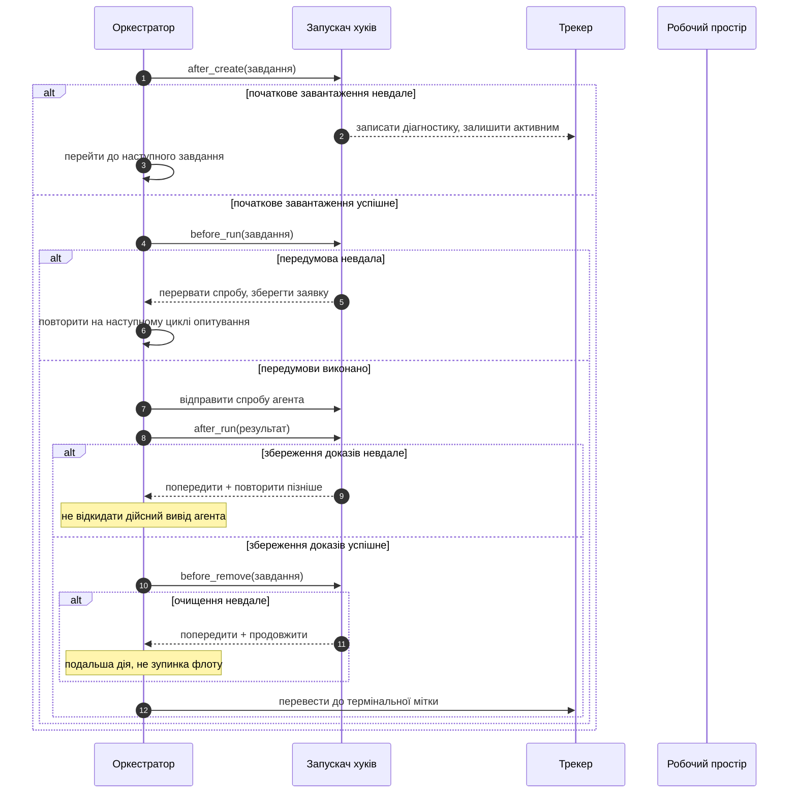
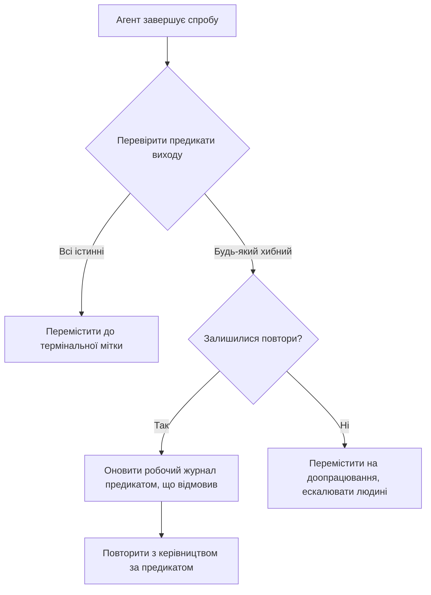

> **Складність**: [COMPLEX]
>
> **Час на виконання**: ~60 хвилин
>
> **Передумови**: [Експлуатація обв'язки](../module-3.3-operating-the-harness/) щодо дрейфу винятків, збирання сміття обв'язки та матриць ескалації; [Захисні бар'єри, ворота та агентно-зчитувані застосунки](../module-3.2-guardrails-gates-and-agent-legible-apps/) щодо шаблонів механічного примусу; [Основи обв'язки — рівні та система записів](../module-3.1-harness-fundamentals-layers-and-system-of-record/) щодо трирівневої моделі та архітектури вказівників AGENTS.md. Робоче знайомство з мітками GitHub Issues, семантикою REST API, базовим написанням скриптів оболонки та конфігураційними файлами YAML.

---

## Що ви зможете зробити

Після цього модуля ви зможете:

- **Спроєктувати** тікетно-оркестрований цикл опитування, який делегує контрольні повноваження трекеру управління проєктами, а не ефемерній термінальній сесії, та обґрунтувати кожне проєктне рішення порівняно з альтернативами, орієнтованими на сесію.
- **Реалізувати** чотири хуки життєвого циклу з коректними контрактами відмови — розрізняючи семантику жорсткого переривання, повтору з доказами та деградації з продовженням для кожного класу хуків.
- **Побудувати** стійкий артефакт робочого журналу, який переживає цикли повторів, запобігає захаращенню хронології та надає рецензенту достатньо контексту для прийняття рішення про злиття менш ніж за дві хвилини читання.
- **Оцінити** навантаження флоту за тривимірною моделлю ризиків і вибрати правильну стратегію оркестрації: строгий скінченний автомат для оборотних механічних завдань, пороги, керовані цілями, для неоднозначної роботи та сесії з людиною-в-циклі для змін із високою вартістю або необоротних.
- **Зібрати** пакет підтвердження роботи з виводу автономного агента — результати CI, резюме дифів, предикати об'єктивного завершення — що дозволяє приймати впевнені людські рішення про злиття без повторного запуску чи повторного аудиту повної сесії агента.

## Чому цей модуль важливий

**Гіпотетичний сценарій:** Платформна інженерна команда запускає двадцять два автономні кодуючі агенти в шести репозиторіях, кожен з яких керується окремим контрактом `WORKFLOW.md`. Швидкість злиття команди настільки висока, що жоден людський рецензент не читає нічого, окрім значка проходження/відмови CI, перед тим як натиснути «злити». Через три тижні продакшен-розгортання зазнає невдачі, бо агент злив конфігураційну зміну, чий результат CI був застарілим — перевірка виконалася на закешованому середовищі, а не на реальній цілі розгортання. Агент ідеально дотримувався контракту, створивши коментар, що містив «CI пройдено», а контракт не мав механізму, щоб відрізнити свіжість доказів від наявності доказів. Жодне правило не було порушено; жодне перевірене правило не було достатнім.

Ця відмова повчальна тим, що кожен компонент у пайплайні працював точно так, як було зазначено. Агент відкрив PR, CI видав зелений результат, оркестратор оновив робочий журнал, і рецензент натиснув «злити». Відмова була не відмовою компонента, а відмовою проєктування: система вимірювала кількість доказів, тоді як операція вимагала якості доказів. Свіжість — чи був результат CI отриманий для поточного стану коду — є виміром якості доказів, який простий значок проходження/відмови не виражає. Це той розрив, для закриття якого існує прикладна інженерія обв'язки.

Цей завершальний модуль закриває розділ «Основи ШІ-інженерії», застосовуючи весь каркас обв'язки, який ви побудували в модулях 3.1, 3.2 і 3.3, до рівня управління проєктами. Трирівнева модель обв'язки навчила вас, де живуть правила та хто їх забезпечує. Модуль про захисні бар'єри навчив вас, як механічні ворота відхиляють поганий вивід і повертають структуроване виправлення. Операційний модуль навчив вас запобігати дрейфу винятків, очищати застарілу політику та маршрутизувати роботу за рівнем ризику. Цей модуль застосовує всі три дисципліни до питання, з яким щодня стикаються команди масштабу флоту: коли автономний агент оголошує завдання завершеним, чи можете ви довіряти цьому оголошенню без повторного аудиту повної сесії агента?

Відповідь вимагає більшого, ніж значок статусу CI. Вона вимагає площини керування, яка розглядає трекер управління проєктами як джерело істини для володіння роботою, хуків життєвого циклу, які забезпечують збір доказів на кожному переході стану, артефактів робочого журналу, які переживають цикли повторів без накопичення шуму, і рамки прийняття рішень, яка спрямовує просту оборотну роботу через автоматизацію, залишаючи складну неоднозначну роботу для людського судження. Коли ці рівні коректно поєднуються, pull request, що надходить від агента, несе достатньо структурованих доказів, щоб рецензент міг прийняти рішення менш ніж за дві хвилини — не довіряючи агенту й не недовіряючи йому, а читаючи підтвердження роботи, яке він зібрав.

Цей модуль припускає, що ви прочитали вступний матеріал про Symphony у розділі ai-native-work і що ви приймаєте передумову «тікет первинний». Ви вже знаєте, що `WORKFLOW.md` визначає контракт, що існують чотири базові хуки життєвого циклу і що стани заявки відокремлені від станів тікета. Цей модуль не перевикладає ці визначення. Він поглиблює їх до операційного шаблону прикладної обв'язки: коли спрацьовує кожен хук, які точні докази він повинен створити, як оркестратор відновлюється при відмові хука та як завершений пакет доказів дозволяє людському рецензенту прийняти впевнене рішення про злиття без пошуку контексту в чотирьох різних гілках коментарів і трьох пайплайнах CI.

## Тікет як площина керування: архітектура за межами сесій

Центральним архітектурним вибором в оркестрації флоту є не те, чи використовувати скінченні автомати чи черги пайплайнів. Це те, яку абстракцію система розглядає як канонічну одиницю володіння роботою. У проєктах, орієнтованих на сесію, канонічною одиницею є термінальний процес — коли процес помирає, метадані володіння помирають разом із ним, і наступний оператор повинен відновлювати контекст із журналів, повідомлень комітів і чат-гілок. У проєктах, орієнтованих на тікет, канонічною одиницею є запис завдання в трекері управління проєктами, і кожен інший артефакт — робочі простори, гілки, коментарі, мітки — є похідним від цього запису. Тікет переживає термінал, запуск CI і агента, який його створив.

Цей поворот не є косметичним. Він змінює те, що оптимізує оркестратор. Оркестратор, орієнтований на сесію, оптимізує підтримання оболонок живими та зменшення плинності процесів; він запитує «який термінал ще працює» і «який агент має потужність». Оркестратор, орієнтований на тікет, оптимізує переміщення завдань з активної черги до термінального стану, створюючи при цьому перевірені докази на кожному переході. Він запитує «яке завдання задовольнило свої предикати завершення» і «які прогалини в доказах все ще блокують злиття».

Перехід від пропускної здатності терміналів до пропускної здатності тікетів — це різниця між системою, яка здається швидкою в малому масштабі, і системою, яка залишається зрозумілою зі зростанням паралельності. Флот із трьох агентів, оркестрований за сесіями, є керованим через операторську пильність. Флот із тридцяти агентів, оркестрований за сесіями, є ненадійним, оскільки пильність не масштабується лінійно. Флот, оркестрований за тікетами, масштабується, оскільки трекер уже спроєктований для одночасного доступу розподілених акторів, а мітки й коментарі, що кодують володіння, достатньо довговічні, щоб пережити життєвий цикл будь-якого окремого агента.

Практичним механізмом, який робить PM-трекер площиною керування, а не пасивною дошкою відстеження, є модель стану, керована мітками. У найпростішій формі мітки кодують, над якими завданнями оркестратор повинен працювати, які ігнорувати та які вважати термінальними. Оркестратор опитує API трекера — GitHub Issues, Linear, Jira — фільтрує за активними мітками, заявляє завдання в межах ліміту паралельності та відправляє агентів на заявлений набір. Трекер стає довговічним джерелом істини для володіння роботою, оскільки кожна заявка, перехід і звільнення записуються як мутація мітки або коментаря, а не як змінна в пам'яті.

```
+------------------------------------------------------------------+
|                     Трекер-як-площина-керування                   |
+----------------------------+--------------------------------------+
| Роль оркестратора           | Роль трекера                        |
+-----------------------------+-------------------------------------+
| Читати набір активних міток | Зберігати канонічне володіння      |
| Заявляти завдання в межах   | Записувати переходи як мітки/стан   |
| ліміту                      |                                     |
| Відправляти агента на спробу | Зберігати робочий журнал на спробу  |
| Виконувати хуки життєвого   | Показувати докази для людського     |
| циклу                       | рецензування                        |
| Звільняти при завершенні/   | Слугувати аудиторським слідом       |
| відмові                     |                                     |
+-----------------------------+--------------------------------------+
```

Робочий процес заявки заслуговує на точну увагу, оскільки саме тут з'являються помилки паралельності. Коли оркестратор опитує трекер і знаходить п'ять завдань з міткою `agent:active`, він повинен заявити кожне, щоб два працівники не могли заявити одне й те саме завдання. Операція заявки — це мутація API — додати мітку, наприклад `agent:claimed`, або встановити відповідального — з наступним кроком зворотної верифікації, а не присвоєнням локальної змінної. Надійним шаблоном є оптимістичне заявлення: POST мітки заявки, GET міток завдання, і якщо мітка заявки іншого працівника вже присутня (або ваша заявка не закріпилася), відступити та пропустити це завдання. Якщо зворотне читання підтверджує вашу заявку, записати часову мітку заявки в коментар робочого журналу, щоб подальший аналіз відмови міг визначити, чи зависле завдання дійсно виконувалося, чи було покинуте на середині заявки.

Цей шаблон використовує спостережуваний стан API трекера, а не будує розподілений рівень блокування поверх нього. REST API GitHub не підтримує умовні запити (ETag/`If-Match`) на кінцевих точках мутації міток, що не є безпечними, тому флоти GitHub покладаються на зворотне читання міток і узгодження після POST. GraphQL API Linear підтримує оптимістичний контроль паралельності через ідентифікатори мутацій і повертає авторитетний стан завдання при читанні. Оркестратору не потрібно координуватися з іншими працівниками через окремий сервіс — він дозволяє трекеру вирішувати конфлікти так само, як він вирішує конфлікти, коли двоє людей намагаються призначити одне й те саме завдання одночасно. Це зберігає архітектуру нудною, а це саме та властивість, яку ви хочете мати в компоненті, що контролює, чи можуть автономні агенти змінювати продакшен-код.

Трекер також вирішує проблему передачі контексту, з якою борються архітектури, орієнтовані на сесію. Коли завдання переходить до `agent:rework`, наступний цикл опитування читає коментар робочого журналу, перевіряє, що змінилося з моменту останньої спроби, і запускає нову спробу з повним контекстом — відновлення оператором не потрібне. Коли людському рецензенту потрібно зрозуміти, чому певна зміна була злита, він відкриває завдання, читає робочий журнал, перевіряє зв'язані результати CI з PR і закриває завдання. Ланцюг доказів починається і закінчується на трекері, а не розкиданий по журналах термінальних сесій на машині, яку перезапустили минулого вівторка.

**Пауза та передбачення:** Ваша команда запускає дванадцять агентів на спільній дошці Linear. Кожен агент заявляє завдання, читаючи мітку `agent:active`, чекаючи 200 мілісекунд і потім записуючи `agent:claimed`. Скільки завдань буде подвійно заявлено в наступних ста циклах опитування і який один шаблон виклику API усунув би стан гонитви без додавання розподіленого блокування?

Шаблон «трекер-як-площина-керування» також чисто масштабується з реагуванням на інциденти, оскільки канал керування не залежить від робочого каналу. Коли відбувається продакшен-інцидент і команді потрібно зупинити всю автоматизацію, зміна однієї політики міток — видалення `agent:active` з набору активних міток або додавання мітки `blocked:incident`, яку фільтр оркестратора розглядає як умову призупинення — призупиняє флот протягом одного циклу опитування. Жодних SSH-сесій для завершення, жодних дерев процесів для пошуку, жодних осиротілих робочих дерев для очищення. Поверхня керування — це зміна мітки, яку людина може зробити з телефону під час чергування, і оркестратор поважає її при наступному читанні.

## Хуки життєвого циклу як точки примусового виконання

Архітектура Symphony визначає чотири хуки життєвого циклу: `after_create`, `before_run`, `after_run` і `before_remove`. Вступний модуль-сирота назвав їх і описав їхнє базове призначення. Цей розділ поглиблює їхню семантику відмови — що відбувається, коли кожен хук зазнає невдачі, як оркестратор повинен відновлюватися та які докази кожен хук повинен створити, щоб решта пайплайну функціонувала.

Хуки — це не опціональні прикраси у файлі YAML. Це точки примусового виконання, які повинні видавати детермінований, машино-зчитуваний вивід. Хук, який успішно виконується мовчки, є лише частково корисним. Хук, який зазнає невдачі з людино-зчитуваним абзацом, — це інцидент, який цикл опитування пропустить. Кожен хук у продакшен-якісному контракті Symphony повинен видавати щонайменше структурований рядок статусу — один рядок JSON, пару ключ-значення або конвенційний код виходу з конкретним повідомленням у stderr — який оркестратор може розібрати без мовної моделі, що інтерпретує вільну прозу.

### after_create — Ворота початкового завантаження

`after_create` виконується один раз, коли народжується робочий простір для завдання. Якщо цей хук зазнає невдачі, оркестратор не повинен викликати жодних пізніших хуків для цієї спроби, оскільки робочий простір не існує або не перебуває в придатному стані. Типові операції початкового завантаження включають клонування репозиторію в робоче дерево для завдання, перевірку відсутності застарілих файлів блокування від попередньої часткової спроби та ініціалізацію специфічних для мови інструментальних ланцюгів або змінних середовища.

Контракт відмови для `after_create` — **жорстке переривання з повтором**. Якщо клонування зазнає невдачі через недоступність мережі, оркестратор повинен залишити завдання в наборі активних міток, записати діагностику в робочий журнал із поясненням відмови та дозволити наступному циклу опитування повторити початкове завантаження. Якщо клонування зазнає невдачі через неправильну URL-адресу репозиторію в контракті, оркестратор повинен залишити завдання активним і записати діагностику, яка не вирішиться без людського втручання — людина повинна виправити контракт, а не чекати успіху повтору. Різниця між «тимчасова відмова, повторити» та «постійна відмова, ескалювати» повинна бути явною в коді виходу хука або схемі виводу. Код виходу 2 може означати «тимчасова — повторити на наступному опитуванні», тоді як код виходу 3 може означати «постійна — перемістити на доопрацювання».

Цей хук також є правильним місцем для забезпечення політики робочого простору, специфічної для репозиторію. Якщо ваші репозиторії вимагають специфічних Git LFS-завантажень, ініціалізацій підмодулів або встановлення мовних пакетів перед початком будь-якої агентної роботи, `after_create` — це місце, де ці операції повинні жити, а не в `before_run`, який виконується при кожній спробі та надлишково перевиконував би операції початкового завантаження, які потрібно виконати лише один раз. Команди, які розміщують дороге початкове завантаження в `before_run`, часто виявляють, що їхні цикли опитування споживають значний час на операції, результати яких відкидаються при очищенні робочого простору між спробами. Завантажуйте один раз; перевіряйте кожного разу.

```bash
#!/usr/bin/env bash
# after_create.sh — початкове завантаження робочого простору для завдання
set -euo pipefail
WORKTREE="worktrees/issue-${ISSUE_NUMBER}"

if [ -d "$WORKTREE" ]; then
    echo '{"status":"warn","reason":"worktree_exists","action":"reuse"}' >&2
    exit 0
fi

if ! git worktree add "$WORKTREE" main 2>/tmp/clone-err; then
    if grep -q "already exists" /tmp/clone-err; then
        echo '{"status":"fail","reason":"stale_lock","retry":true}' >&2
        exit 2
    fi
    echo '{"status":"fail","reason":"clone_failed","retry":false}' >&2
    exit 3
fi

echo '{"status":"ok","worktree":"'"$WORKTREE"'"}'
```

### before_run — Вартовий передумов

`before_run` перевіряє середовище перед кожною спробою: свіжість міток завдання, дозволи робочого простору, доступність облікових даних і наявність інструментального ланцюга. Якщо завдання було перемічене на `agent:blocked` після заявки, `before_run` повинен перервати спробу без витрачання повтору. Якщо необхідні облікові дані відсутні — токен API закінчився, сесія хмарного провайдера вичерпала час — хук повинен перервати виконання з діагностикою, яка повідомляє оркестратору, чи повинен наступний цикл опитування повторити, чи ескалювати.

Контракт відмови для `before_run` — **перервати цю спробу, зберегти стан заявки**. Завдання залишається в наборі активних міток, стан заявки внутрішньо переходить до `RetryQueued`, і робочий журнал отримує діагностичний запис. Оркестратор не повинен розглядати відмову `before_run` як завершення або постійну відмову — це тимчасова прогалина готовності. Поширеним антишаблоном є відмова `before_run` і переміщення завдання до `agent:rework`, що змушує людину перечитувати та перевстановлювати контекст, хоча нічого суттєвого не відмовило. Резервуйте `rework` для випадків, коли агент створив вивід, що потребує людського судження, а не для випадків, коли облікові дані змінилися.

```bash
#!/usr/bin/env bash
# before_run.sh — перевірка передумов
set -euo pipefail

ISSUE_LABELS=$(gh issue view "$ISSUE_NUMBER" --json labels -q '.labels[].name')

if echo "$ISSUE_LABELS" | grep -q "agent:blocked"; then
    echo '{"status":"abort","reason":"issue_blocked","retry":false}' >&2
    exit 10
fi

if [ ! -d "worktrees/issue-${ISSUE_NUMBER}" ]; then
    echo '{"status":"fail","reason":"workspace_missing","retry":true}' >&2
    exit 2
fi

echo '{"status":"ok","issue":'"$ISSUE_NUMBER"'}'
```

### after_run — Ворота збереження доказів

`after_run` є найбільш архітектурно значущим хуком, оскільки саме тут докази переходять від ефемерного виводу сесії до довговічного артефакту, придатного для рецензування. Цей хук повинен записати або оновити стійкий коментар робочого журналу в завданні, прикріпити або зв'язати будь-які структуровані артефакти виводу (URL-адреси запусків CI, резюме дифів, звіти лінтерів) і записати номер спроби, статус завершення та будь-які відомі ризики, про які повинна знати наступна спроба або людський рецензент.

Контракт відмови для `after_run` — **деградувати до попередження, не блокувати**. Якщо виклик API коментаря тимчасово зазнає невдачі, докази вже записані в локальні файли — `after_run` повинен зареєструвати попередження, а оркестратор повинен повторити запис коментаря на наступному циклі опитування. Якщо виклик API коментаря зазнає постійної невдачі (закінчився термін дії автентифікації), оркестратор повинен ескалювати завдання на доопрацювання з чіткою діагностикою. Критичним інваріантом є те, що успішний запуск агента не повинен бути відкинутий через те, що виклик API коментаря вичерпав час. Докази існують локально; коментар є зручністю для людського рецензування, а не основним механізмом зберігання.

Оновлення робочого журналу повинно бути ідемпотентним — запис тих самих доказів двічі не повинен створювати дубльовані записи або заплутувати наступного читача. Найпростішим ідемпотентним шаблоном є оновлення на місці: коментар робочого журналу має стабільний заголовок і маркери секцій, і `after_run` замінює вміст між певними маркерами, а не додає до постійно зростаючого коментаря. Це запобігає захаращенню хронології, зберігає подання завдання чистим для людських читачів і уникає фрустрації «прокручування через сорок сім коментарів, щоб знайти активний», яка переслідує робочі процеси, керовані чатом.

```bash
#!/usr/bin/env bash
# after_run.sh — збереження доказів як оновлення робочого журналу
set -euo pipefail
WORKPAD_HEADER="## Codex Workpad"
COMMENT_BODY="${WORKPAD_HEADER}\n\n- **Attempt**: ${ATTEMPT_NUMBER}\n- **Status**: ${ATTEMPT_STATUS}\n- **Changed files**: $(git diff --name-only HEAD~1 2>/dev/null | tr '\n' ' ')\n- **CI**: ${CI_RESULT:-pending}\n- **Risks**: ${KNOWN_RISKS:-none}\n\n---\n_Last updated: $(date -u +%Y-%m-%dT%H:%M:%SZ)_"

EXISTING_ID=$(gh api "repos/${OWNER}/${REPO}/issues/${ISSUE_NUMBER}/comments" -q '.[] | select(.body | startswith("'"${WORKPAD_HEADER}"'")) | .id' 2>/dev/null | head -1)

if [ -n "$EXISTING_ID" ]; then
    gh api "repos/${OWNER}/${REPO}/issues/comments/${EXISTING_ID}" -X PATCH -f body="$COMMENT_BODY" 2>/tmp/patch-err || {
        echo '{"status":"warn","reason":"patch_failed","retry":true}' >&2
        exit 0
    }
else
    gh api "repos/${OWNER}/${REPO}/issues/${ISSUE_NUMBER}/comments" -f body="$COMMENT_BODY" 2>/tmp/create-err || {
        echo '{"status":"warn","reason":"create_failed","retry":true}' >&2
        exit 0
    }
fi

echo '{"status":"ok","attempt":'"$ATTEMPT_NUMBER"',"comment_updated":true}'
```

### before_remove — Контракт очищення

`before_remove` обробляє демонтаж робочого простору: видалення директорій робочого дерева, очищення тимчасових файлів і звільнення будь-яких обчислювальних ресурсів, спожитих спробою. Критичною операційною властивістю `before_remove` є те, що йому не можна дозволяти блокувати глобальну чергу оркестрації. Якщо очищення зазнає невдачі на одному завданні, оркестратор повинен зареєструвати відмову, показати її як діагностику та продовжити обробку інших завдань. Зависле очищення є подальшим завданням для дій, а не подією зупинки всього флоту.

Контракт відмови — **попереджати та продовжувати безумовно**. Код виходу `before_remove` не повинен впливати на те, чи переводить оркестратор завдання в термінальний стан. Якщо вивід агента був дійсним, а докази були збережені, відмова очищення є проблемою операційної гігієни, а не проблемою коректності. Тим не менш, відмови очищення слід підраховувати та відстежувати — якщо `before_remove` зазнає невдачі більш ніж на п'яти відсотках спроб, команда, ймовірно, має проблему з дозволами файлової системи, умову переповнення диска або шаблон застарілих блокувань, що потребує розслідування першопричини.



**Пауза та передбачення:** Ваш хук `after_run` зазнає невдачі, оскільки API коментарів GitHub повертає 403 — токен закінчився. Агент успішно завершив свою роботу і записав локальний файл результатів. Ваш хук `before_remove` збирається видалити директорію робочого простору. Якщо `before_remove` виконається до того, як докази будуть дубльовані в безпечне місце, що станеться з доказом того, що агент виконав коректну роботу? Перш ніж читати далі, спроєктуйте мінімальну зміну послідовності, яка запобігає цій втраті даних.

## Стійкі робочі журнали та ланцюги доказів

Коментар робочого журналу є найціннішим артефактом у тікетно-оркестрованому флоті, оскільки це єдина довговічна нитка, яка з'єднує спробу нуль зі злиттям. Без робочого журналу кожен повтор починається з нуля — наступний агент не знає ні що було спробувано, ні які припущення були спростовані, а людський рецензент бачить N розрізнених бот-коментарів, які описують схожі, але дещо різні підходи до того самого завдання. З добре структурованим робочим журналом рецензент читає один коментар, розуміє дугу спроб і вирішує, чи є прийнятним остаточний результат.

Робочий журнал обслуговує дві різні аудиторії з різними шаблонами читання. Наступний агент при повторі повинен знати, що відмовило на попередній спробі та які обмеження встановила попередня спроба — він читає робочий журнал як чекліст запуску. Людський рецензент, який вирішує, чи зливати, повинен знати, чи задовольняє остаточний вивід вимоги завдання та чи залишаються невирішеними відомі ризики — він читає робочий журнал як резюме аудиту. Робочий журнал, структурований навколо цих двох шаблонів читання, одночасно обслуговує обидві аудиторії без надлишковості.

Ефективний робочий журнал має стабільну структуру з маркерами секцій, які `after_run` може оновлювати на місці. Рекомендована модель стабільних секцій — План, Критерії прийняття, Валідація, Нотатки, Непорозуміння — надає достатньо структури як для безперервності агента, так і для людського рецензування, не стаючи бюрократичним чеклістом. «План» записує, що агент мав намір зробити в цій спробі. «Критерії прийняття» записують предикати завершення, на які він націлений. «Валідація» записує, які кроки верифікації виконалися та їхні результати. «Нотатки» фіксують спостереження, які повинна побачити наступна спроба. «Непорозуміння» записують неоднозначності, які агент не зміг вирішити, що часто є найціннішою секцією для людського рецензента, який намагається зрозуміти, чому агент прийняв конкретне рішення.

```
## Codex Workpad
- **Issue**: #1523 — Додати відступ повтору до циклу опитування
- **Attempt**: 2 з 4
- **Status**: retry_queued (тимчасова відмова API при валідації)

### Plan
Додати експоненційний відступ до опитувача з джиттером. Замінити фіксований 30-секундний сон
на конфігурований базовий + максимальний відступ із секції опитування WORKFLOW.md.

### Acceptance Criteria
- Опитувач спить між 1с і 64с залежно від смуги відмов
- Джиттер запобігає лавинному ефекту на API трекера
- Максимальний відступ обмежений `polling.max_backoff_seconds`

### Validation
- Модульний тест: відступ подвоюється при кожній відмові до обмеження (PASS)
- Інтеграційний тест: API трекера повертає 429, опитувач робить відступ (FAIL — 429 не
  повернуто в заглушці; заглушку потрібно оновити перед наступною спробою)

### Notes
Заглушка GitHub API в тестовому наборі не повертає заголовки обмеження швидкості. Наступна спроба
повинна виправити заглушку перед повторенням повної інтеграції.

### Confusions
- Чи повинен відступ скидатися, коли один цикл опитування успішний, чи поступово зменшуватися?
- З WORKFLOW.md незрозуміло, чи `agent.max_concurrent_agents` взаємодіє з
  відступом (наприклад, чи повинна паралельність знижуватися, коли відступ активний?)

---
Last updated: 2026-05-25T14:32:00Z
```

Ключовою властивістю, яка дозволяє цьому робочому журналу переживати повтори, є те, що це один коментар, оновлюваний на місці, зі стабільними маркерами секцій. Цикл опитування, який додає новий коментар на кожну спробу, створює захаращення хронології — сторінка завдання накопичує бот-коментарі, людські гілки обговорень ховаються, і рецензенти взагалі перестають читати коментарі, оскільки видобування сигналу з шуму коштує більше, ніж повторний аудит дифу. Цикл опитування, який оновлює один коментар, зберігає завдання як читабельний канал комунікації.

Найпоширенішим режимом відмови в проєктуванні робочого журналу є ставлення до нього як до журналу, а не як до звіту. Журнал записує кожну подію в хронологічному порядку, що корисно для налагодження, але жахливо для швидкого людського рецензування. Звіт резюмує те, що рецензенту потрібно знати, і опускає те, чого не потрібно. Робочий журнал повинен бути звітом із часовою міткою, а не журналом зі смугою прокрутки.

Ланцюг доказів виходить за межі робочого журналу. Робочий журнал заякорює наратив, але пакет підтвердження роботи — колекція артефактів, яку людський рецензент використовує для прийняття рішення про злиття — також включає результати запусків CI, резюме дифів, об'єктивні перевірки завершення та будь-який структурований вивід валідації, створений хуками. Робочий журнал посилається на ці артефакти, а не вбудовує їх; робочий журнал, який вбудовує тисячорядковий журнал CI, є таким же нечитабельним, як робочий журнал, який не містить нічого. Дисципліна така: робочий журнал розповідає рецензенту, що сталося і чому; зв'язані артефакти це доводять.

## Динамічний WORKFLOW.md: гаряче перезавантаження як операційне керування

Однією з найбільш операційно значущих властивостей добре спроєктованого циклу опитування Symphony є те, що він перечитує контракт `WORKFLOW.md` на кожному циклі опитування, а не один раз при запуску процесу. Ця поведінка гарячого перезавантаження перетворює контракт з одноразової конфігурації початкового завантаження на живу операційну поверхню керування. Команда, якій потрібно зменшити паралельність під час інциденту, змінює одне значення YAML, комітить, і цикл опитування підхоплює зміну протягом секунд — без перезапуску, без деплою, без SSH-сесії.

Вимога до реалізації проста: цикл опитування повинен читати та розбирати `WORKFLOW.md` на початку кожного циклу, застосовувати будь-які зміни до своєї конфігурації середовища виконання в пам'яті та використовувати оновлені значення для рішень про відправлення в поточному циклі. Контракт слід читати з поточного стану репозиторію — файл на диску станом на останнє опитування — а не з кешованої копії в пам'яті з моменту запуску процесу. Це робить репозиторій операційною панеллю для флоту: редагування файлу змінює поведінку флоту, і зміна є версіонованою, рецензованою та відкотною, як будь-яка інша зміна коду.

Властивість гарячого перезавантаження найбільш цінна під час інцидентів. Коли відкривається вікно розгортання і команда хоче зменшити радіус ураження флоту, зниження `agent.max_concurrent_agents` з 20 до 2 обмежує паралельність без повної зупинки роботи. Коли інцидент обмеження швидкості вражає API трекера, збільшення `polling.interval_ms` з 30000 до 120000 зменшує тиск на API у всьому флоті. Коли виявляється вразливість у залежності й команда хоче призупинити всі зміни в уражених репозиторіях, додавання мітки `blocked:security` до набору `rework_labels` зупиняє флот від заявлення нових завдань, поки триває розслідування безпеки. Кожна з цих змін — це одне редагування YAML, один коміт і один цикл опитування — без SSH, без управління процесами, без координації між двадцятьма терміналами агентів.

```
+------------------------------------------------------------------+
|     Гаряче перезавантаження: Пайплайн від редагування контракту   |
|                       до поведінки флоту                          |
+-----------------+-----------------+---------------+---------------+
| Інженер редагує | Коміт у репо    | Опитувач читає | Флот виконує |
| WORKFLOW.md     | (версіоновано,  | свіжий контракт| нову політику|
| (зміна YAML)    |  рецензовано)   | (наст. цикл)   | (без рестарту)|
+-----------------+-----------------+---------------+---------------+
```

Гаряче перезавантаження створює гострий край: погане редагування контракту набуває чинності в усьому флоті протягом одного циклу опитування. Якщо інженер випадково встановлює `agent.max_concurrent_agents` у 0, флот припиняє заявляти роботу, але продовжує працювати — мовчки не створюючи жодного виводу, поки хтось не помітить. Якщо інженер повністю видаляє запис `active_labels`, опитувач може інтерпретувати відсутній ключ як «без фільтра» і спробувати заявити кожне завдання в репозиторії.

Цей гострий край не є аргументом проти гарячого перезавантаження. Це аргумент за те, щоб ставитися до файлу контракту з тією ж операційною обережністю, що й до продакшен-міграції бази даних. Ви б не застосовували міграцію без пробного запуску; ви не повинні комітити зміну контракту без попередньої валідації на репрезентативному екземплярі опитувача. Команди, які додають перевірку CI, що розбирає контракт і виводить ефективну конфігурацію — активні мітки, ліміт паралельності, шляхи хуків — можуть перевірити очікуваний ефект до того, як коміт досягне флоту. Один рядок виводу CI, який каже «Active labels: agent:active, agent:priority», дає рецензенту більше впевненості, ніж сам сирий YAML.

Ці режими відмови аргументують на користь валідації: перш ніж опитувач застосує свіжопрочитаний контракт, він повинен перевірити, що необхідні ключі існують, що числові значення перебувають у розумних межах і що списки міток не порожні там, де семантика цього вимагає. Відмова валідації контракту повинна призупинити цикл без його аварійного завершення — видати структуровану помилку, зберегти попередній дійсний контракт у пам'яті та повторити читання на наступному циклі.

```bash
# Всередині циклу опитування, фрагмент валідації контракту
validate_contract() {
    local errors=0
    local max_agents
    max_agents=$(yq '.agent.max_concurrent_agents' WORKFLOW.md 2>/dev/null)
    if [ -z "$max_agents" ] || [ "$max_agents" -le 0 ] 2>/dev/null; then
        echo '{"severity":"fatal","field":"agent.max_concurrent_agents","reason":"missing_or_invalid"}' >&2
        errors=$((errors + 1))
    fi
    if [ "$max_agents" -gt 100 ] 2>/dev/null; then
        echo '{"severity":"warn","field":"agent.max_concurrent_agents","reason":"unusually_high"}' >&2
    fi
    return "$errors"
}
```

Шаблон гарячого перезавантаження також створює природний аудиторський слід для операційних рішень. Кожна зміна поведінки флоту — коригування паралельності, зміни політики міток, оновлення шляхів хуків — є комітом із повідомленням, автором і часовою міткою. Коли постмортем запитує «чому флот припинив обробку завдань на сім годин у вівторок», відповідь — у журналі git, а не в чат-гілці чи усній історії, переказаній інженером, який був на чергуванні.

Цей аудиторський слід є однією з менш очевидних, але більш цінних властивостей архітектури «контракт-як-файл»: поведінка автоматизованого флоту є такою ж рецензованою, як поведінка будь-якого іншого кодового шляху. Новий член команди може прочитати історію файлу контракту і зрозуміти, чому флот поводиться так, як він поводиться, так само як він може прочитати історію комітів конфігураційного файлу, щоб зрозуміти, чому сервіс використовує певні параметри.

## Від скінченних автоматів до оркестрації, керованої цілями

Модуль-сирота про Symphony представив пізню архітектурну корекцію: строгої хореографії скінченних автоматів недостатньо, коли моделі покращуються, а складність завдань зростає. Модуль описав це як перехід від «жорстких вузлів у скінченному автоматі» до «надання агентам цілей замість строгих переходів». Цей розділ застосовує цей урок операційно — будуючи конкретні механізми, які дозволяють оркестратору використовувати пороги, керовані цілями, поряд з або замість жорстко закодованих переходів станів.

Строгий скінченний автомат каже: агент переходить від InProgress до Merging лише тоді, коли завершено конкретну послідовність позначених переходів. Оркестратор, керований цілями, каже: агент може запропонувати перехід, коли задоволено конкретний набір предикатів доказів, незалежно від того, скільки внутрішніх фаз спроб було витрачено для їх досягнення. Різниця не в усуненні контролю — вона в тому, що вимірює поверхня керування. Скінченний автомат вимірює відповідність попередньо визначеному шляху. Оркестратор, керований цілями, вимірює відповідність набору предикатів завершення, а шлях між предикатами — це проблема агента, яку він має вирішити.

Ця відмінність має операційне значення, оскільки два режими відмовляють по-різному. Скінченний автомат відмовляє, коли агент обирає неочікуваний шлях — навіть якщо шлях створив коректний вивід. Оркестратор, керований цілями, відмовляє, коли предикати не виконано — навіть якщо агент виконав кожен крок в очікуваній послідовності. Вибір неправильного режиму для класу завдань означає, що оркестратор або відхиляє коректну роботу з процедурних причин, або приймає некоректну роботу, оскільки процедура була задоволена.

Парадигма KubeDojo `/goal` є повчальним робочим прикладом оркестрації, керованої цілями. Сесія `/goal` встановлює умову завершення — «довести готовність треку k8s/cka до 82 відсотків» або «спорожнити чергу верифікатора, поки actions.next не стане порожньою» — і агент продовжує працювати, поки умова не буде виконана або не спрацює умова переривання. Оцінювач перевіряє транскрипт на наявність буквальних сигналів статусу (`GOAL_DONE`, `GOAL_ABORT`) і цілочисельних лічильників для порогів блокування та відсутності прогресу. Оркестратору не важливо, які файли агент редагував між кроком 4 і кроком 7; йому важливо, чи є предикат цілі істинним у кінці запуску.

Цей підхід переноситься на тікетну оркестрацію наступним чином. Замість визначення життєвого циклу агента як жорсткої послідовності з восьми станів, які потрібно пройти за порядком, визначте його як набір предикатів виходу, які робочий журнал повинен задовольнити, перш ніж оркестратор перемістить завдання до термінальної мітки. Типовий набір предикатів виходу для завдання зміни коду може бути таким:

1. Агент написав щонайменше один коміт у гілку.
2. Коментар робочого журналу містить непорожню секцію Validation з конкретними назвами тестів і результатами.
3. CI запустився на гілці та повернув проходження або задокументовану відмову зі шляхом виправлення.
4. Диф обмежений заявленим обсягом завдання — жодні файли поза очікуваним шляхом не були змінені.

Якщо всі чотири предикати істинні, оркестратор переміщує завдання до `agent:done`, незалежно від того, скільки спроб було витрачено або які внутрішні фази спрацювали. Якщо будь-який предикат хибний, оркестратор залишає завдання активним і записує, який предикат відмовив, у робочий журнал. Агент повторює спробу з предикатом, що відмовив, як явним керівництвом.



Ця модель не є відкиданням скінченних автоматів. Це визнання того, що скінченні автомати чудово впорядковують кроки, де самі кроки добре визначені — «клонувати репозиторій, потім встановити залежності, потім запустити тести» — і слабші в оцінюванні результатів, де якість результату залежить від контексту, який скінченний автомат не може перерахувати. Зрілий флот використовує обидва: хореографію скінченного автомата для налаштування та очищення робочого простору (хуки життєвого циклу) і пороги, керовані цілями, для оцінки завершення (предикати виходу). Хуки забезпечують детермінованість середовища; предикати забезпечують оцінюваність виводу.

**Пауза та передбачення:** Ваша команда запускає тікетно-оркестрований цикл, який валідує pull requests на воротах контексту безпеки. Скінченний автомат каже, що завдання переходить від InProgress до Merging лише тоді, коли CI проходить. Ворота CI запускають валідацію `kubectl --dry-run`. Агент пропонує маніфест, який проходить валідацію пробного запуску, але посилається на простір імен, якого не існує в цільовому кластері. Чи виявляє скінченний автомат цю відмову і який предикат виходу ви б додали, щоб її виявити?

## Підтвердження роботи: збір доказів для рішень про злиття

Останньою концепцією прикладної обв'язки в цьому завершальному модулі є пакет підтвердження роботи — структурована колекція доказів, яку оркестратор прикріплює до завершеного завдання, щоб людський рецензент міг прийняти впевнене рішення про злиття без повторного запуску сесії агента. Підтвердження роботи не є заміною рецензування коду і не є твердженням, що вивід агента коректний. Це твердження, що агент дотримувався свого контракту, пройшов свої ворота та створив докази, які людина може оцінити за хвилини, а не години.

Мінімальний пакет підтвердження роботи для завдання зміни коду включає п'ять компонентів. По-перше, коментар робочого журналу — наративний артефакт, який пояснює, що агент намагався зробити і що він спостерігав. По-друге, результати CI — статус проходження/відмови кожного завдання пайплайну, яке виконалося на гілці агента, з URL-адресами, на які рецензент може натиснути, щоб перевірити невдалі тести. По-третє, резюме дифу — опис в один абзац, які файли змінилися, чому і чи вийшли якісь зміни за межі заявленого обсягу завдання. По-четверте, докази об'єктивного завершення — предикати виходу, які оцінив оркестратор, зі значеннями, які задовольнили або не задовольнили кожен предикат. По-п'яте, відомі ризики — будь-які невирішені непорозуміння, непротестовані шляхи або припущення, зроблені агентом, які людина повинна перевірити перед злиттям.

Оркестратор збирає цей пакет під час хука `after_run` і записує його в структуру, яку система відстеження може показувати поруч із pull request. На GitHub це зазвичай оновлення тіла PR або зв'язаний коментар до завдання. На Linear це коментар із посиланнями на зовнішні артефакти CI. Форматування повинно бути достатньо передбачуваним, щоб рецензент, який читає десять пакетів підтвердження роботи на день, міг просканувати п'ять компонентів менш ніж за тридцять секунд.

```
## Proof of Work — Issue #1523

### Workpad Summary
[Посилання на коментар робочого журналу](#issuecomment-...) — 3 спроби, вирішено на
спробі 3. Основною проблемою була сумісність заглушки із заголовками обмеження швидкості.

### CI Results
- Модульні тести: PASS (https://github.com/org/repo/actions/runs/987654321)
- Інтеграційні тести: PASS (https://github.com/org/repo/actions/runs/987654322)
- Лінт: PASS (ruff, shellcheck)

### Diff Summary
- `scripts/poller.sh`: +34 рядки — додано експоненційний відступ із джиттером
- `scripts/poller_test.sh`: +52 рядки — модульне та інтеграційне тестове покриття
- Перевірка обсягу: всі зміни в межах директорії `scripts/`, відповідає #1523

### Objective Completion
- Коміт створено: true
- Секція Validation робочого журналу заповнена: true
- CI пройдено: true
- Обсяг дифу обмежений: true

### Known Risks
- Відступ взаємодіє з наявною обробкою обмеження швидкості; крайовий випадок, коли трекер
  повертає 429 під час активного періоду відступу, не протестований.
- Початкове значення джиттера залежить від системного часу; для відтворюваного тесту
  може знадобитися фіксоване початкове значення.
```

Мета цього пакета — не усунути людське судження з рішення про злиття. Вона — зменшити час, необхідний для здійснення цього судження. Рецензент, який читає цей пакет, знає, що зробив агент, чи пройшли ворота, що може бути ризикованим і де шукати більше деталей. Він може вирішити злити, запитати зміни або ескалювати до доменного експерта менш ніж за дві хвилини. Альтернатива — відкрити журнал сесії агента, шукати повідомлення про помилки, перехресно посилатися на пайплайни CI та реконструювати ланцюг рішень агента з сирого виводу — займає двадцять хвилин і дає менш впевнений результат, оскільки рецензент ніколи не може бути впевнений, що знайшов усі релевантні докази.

Принцип проєктування хорошого пакета підтвердження роботи полягає в тому, що він відповідає на питання, які рецензент насправді ставить, у тому порядку, в якому він їх ставить, не вимагаючи від рецензента відкривати окремий інструмент. Рецензент зазвичай запитує: «Що це зробило?» (резюме робочого журналу), «Чи пройшло це?» (результати CI), «Що це зачепило?» (резюме дифу), «Чи відповідає це специфікації?» (предикати об'єктивного завершення) і «Про що мені варто хвилюватися?» (відомі ризики). Якщо підтвердження роботи відповідає на ці питання в одному прокручуваному поданні, рецензент витрачає свій когнітивний бюджет на саме рішення, а не на збір доказів.

Пакет підтвердження роботи також створює довговічний аудиторський артефакт, який зберігається після злиття. Коли аудитор безпеки через шість місяців запитує «чи була ця зміна належно рецензована», пакет підтвердження роботи відповідає на питання, не вимагаючи доступності оригінального рецензента. Рішення рецензента про злиття записане; докази, на яких воно базувалося, зв'язані; відомі ризики, які він прийняв, задокументовані. Це те, що перетворює оркестрацію з «агент рухався швидко» на «система створила рецензований, аудитований результат».

Щоб добре побудувати цей пакет, оркестратор повинен збирати докази під час запуску, а не після його завершення. Робочий журнал оновлюється поступово — спроба за спробою — так що коли предикати виходу задоволені й оркестратор збирає підтвердження роботи, він резюмує докази, які вже існують, а не генерує їх з нуля. Цей поступовий збір — це те, що робить складання підтвердження роботи достатньо швидким для автоматичного включення в кожен PR: документи вже написані, результати CI вже зв'язані, і єдина робота, що залишилася, — це форматування їх у шаблон.

## Шаблони та антишаблони

### Шаблони

1. **Єдиний робочий журнал, оновлюваний на місці.** Використовуйте один стійкий коментар на завдання зі стабільними маркерами секцій, які `after_run` замінює при кожній спробі. Це зберігає завдання як читабельний канал комунікації для людей і запобігає тому, щоб бот-коментарі ховали людські гілки обговорень. Коли рецензент відкриває завдання, яке пройшло шість спроб, він читає один коментар із секцією Validation на шість записів, а не шість окремих коментарів, які потребують хронологічної реконструкції.

2. **Заявити-потім-перевірити з умовними мутаціями API.** Оркестратор читає набір активних міток, заявляє завдання, атомарно додаючи мітку `agent:claimed` або відповідального через умовний запит API, і відправляє агента лише якщо заявка успішна. Якщо умовний запит зазнає невдачі, оскільки інший працівник випередив це саме завдання, оркестратор пропускає це завдання та переходить до наступного кандидата. Жодного розподіленого блокування, жодного протоколу консенсусу, жодної бази даних — нативного умовного запису API трекера достатньо.

3. **Предикати виходу замість послідовностей станів.** Визначайте, як виглядає завершення, як набір спостережуваних, машино-перевірюваних предикатів, а не як послідовність станів, які агент повинен відвідати. Скінченний автомат хореографує хуки життєвого циклу, оскільки порядок хуків має значення. Предикати виходу оцінюють вивід агента, оскільки якість виводу має значення. Тримайте ці два механізми контролю окремо та використовуйте кожен там, де він найсильніший.

4. **Закінчення терміну оренди заявки на трекері.** Записуйте часову мітку заявки в робочий журнал і надайте оркестратору максимальну тривалість заявки. Якщо завдання перебуває в стані `agent:claimed` довше, ніж `max_claim_seconds`, оркестратор розглядає заявку як прострочену, повертає завдання до активного пулу та записує закінчення терміну як діагностику. Це запобігає тому, щоб осиротілі заявки назавжди блокували роботу, коли процес агента було вбито на середині спроби.

5. **Структурована валідація контракту на кожному циклі опитування.** Перш ніж оркестратор застосує свіжопрочитаний `WORKFLOW.md`, перевірте, що необхідні ключі існують, числові поля перебувають у розумних межах, а списки міток не порожні там, де семантика цього вимагає. Відмова валідації контракту не повинна аварійно завершувати цикл опитування — зареєструйте помилку, збережіть попередній дійсний контракт у пам'яті та повторіть читання на наступному циклі.

### Антишаблони

1. **Додавання нового коментаря на кожну спробу.** Кожен повтор додає коментар до хронології завдання, ховаючи людську розмову під бот-згенерованими оновленнями та змушуючи рецензентів прокручувати потенційно десятки майже ідентичних повідомлень статусу, щоб знайти потрібний їм людський зворотний зв'язок. Виправте оновленнями робочого журналу на місці з використанням стабільних маркерів секцій.

2. **Дозвіл відмовам очищення зупиняти флот.** Якщо `before_remove` виходить з ненульовим кодом, а оркестратор розглядає цей код виходу як глобальний сигнал зупинки, одна застаріла директорія робочого дерева заблокувала весь флот. Одна умова переповнення диска на одному працівнику може завадити всім іншим працівникам обробляти свої завдання. Виправте, розглядаючи відмови очищення як попередження, що наповнюють чергу діагностики, а не як помилки оркестрації, що призупиняють відправлення.

3. **Використання ідентичності сесії як ідентичності заявки.** Якщо оркестратор заявляє завдання, записуючи ідентифікатор процесу або ідентифікатор термінальної сесії як маркер заявки, заявка помирає разом із процесом. Рецензент, який відкриває завдання через день, не може визначити, чи було завдання коли-небудь заявлене, чи заявка все ще активна. Виправте, записуючи часові мітки та ідентифікатори працівників у робочий журнал у машино-зчитуваному форматі, який зберігається між перезапусками процесів.

4. **Гаряче перезавантаження без валідації контракту.** Погане редагування YAML — пропущена лапка, від'ємне ціле число, порожній список міток — набуває чинності в усьому флоті протягом одного циклу опитування без жодного захисту. Флот або мовчки припиняє роботу, або поводиться неправильно так, що діагностика займає години. Виправте, валідуючи контракт після читання та відмовляючись застосовувати недійсний контракт.

5. **Злиття без пакета підтвердження роботи.** Рецензент бачить PR від агента із зеленим значком CI та зливає. Немає доказів того, що агент намагався зробити, які ворота пройшли, які ризики агент виявив або в чому агент був невпевнений. Злиття швидке, але аудиторський слід порожній. Виправте, вимагаючи секцію підтвердження роботи в тілі PR або зв'язаному коментарі до завдання, перш ніж оркестратор перемістить завдання до термінальної мітки.

6. **Кодування бізнес-логіки в скриптах хуків замість WORKFLOW.md.** Файл контракту визначає, що оркестратор повинен робити; хуки є виконуваними реалізаціями цих визначень. Коли бізнес-логіка — які мітки є активними, яка політика повторів, як обмежується паралельність — мігрує з YAML контракту в скрипти хуків, флот втрачає аудитованість, оскільки зміни поведінки більше не є одним дифом файлу. Виправте, зберігаючи політику в контракті, а хуки — як виконавців політики без стану.

## Рамка прийняття рішень

Вибір правильної стратегії оркестрації для заданого класу завдань вимагає оцінки трьох вимірів: оборотність поганого виводу, вартість поганого виводу та тягар аудиту. Оборотність вимірює, наскільки швидко та повністю поганий артефакт можна скасувати — зміна форматування є високооборотною, міграція бази даних — ні. Вартість поганого виводу вимірює операційні, фінансові та репутаційні збитки від неправильного злиття — друкарська помилка у внутрішній документації коштує хвилини, регресія безпеки в публічному сервісі коштує години або дні. Тягар аудиту вимірює, скільки структурованих доказів потрібно рецензенту для впевненого схвалення виводу — механічна зміна мітки потребує значка проходження CI, зміна політики контенту потребує кількох раундів рецензування та схвалення.

```
+------------------------------------------------------------------+
|            Матриця рішень щодо стратегії оркестрації              |
+-------------+----------------+----------------+-------------------+
| Вимір       | Скінченний     | Керована       | Людина-в-циклі    |
|             | автомат        | цілями (/goal) | Сесія             |
|             | (Строгий)      |                |                   |
+-------------+----------------+----------------+-------------------+
| Найкраще    | Механічні,     | Неоднозначні,  | Високовартісні,   |
| для         | оборотні,      | еволюційні,    | необоротні,       |
|             | добре специф.  | керовані якістю| регульовані       |
+-------------+----------------+----------------+-------------------+
| Оборотність | Висока         | Помірна        | Низька            |
| Вартість    | Низька         | Помірна        | Висока            |
| поганого    |                |                |                   |
| виводу      |                |                |                   |
| Тягар       | Легкий (CI +   | Помірний       | Важкий (повний    |
| аудиту      | межі дифу)     | (CI + предикати| перегляд сесії)   |
|             |                | виходу)        |                   |
| Паралель-   | Висока (безп.  | Помірна        | Низька (послідовна|
| ність       | паралельно)    |                | або одне завдання)|
+-------------+----------------+----------------+-------------------+
```

Використовуйте строгу оркестрацію скінченним автоматом, коли всі три виміри ризику мають низькі оцінки: робота механічна (виправлення документів, форматування, оновлення міток), вивід тривіально оборотний (один `git revert` відновлює попередній стан), а тягар аудиту задовольняється проходженням CI та обмеженим дифом. Ця стратегія підтримує найвищу паралельність і найнижчу вартість людської уваги, оскільки режими відмови є дешевими та швидкими для виправлення.

Використовуйте оркестрацію, керовану цілями, коли вартість поганого виводу помірна, а критерії якості достатньо складні, щоб жорстка послідовність станів пропускала важливі відмови. Додавання контенту, рефакторинги реструктуризації та оновлення залежностей потрапляють до цієї категорії — робота здебільшого оборотна, але оцінка якості вимагає оцінювання предикатів (чи всі посилання дійсні, чи компілюються приклади, чи змінилося тестове покриття), які послідовність із трьох станів не може виразити. Предикати виходу стають поверхнею керування, а оркестратор направляє на людське рецензування, коли предикати відмовляють.

Використовуйте сесії з людиною-в-циклі, коли необоротність або вартість поганого виводу є високою. Зміни продакшен-конфігурації, оновлення політики безпеки, міграції баз даних і контент, орієнтований на учнів, живуть тут. Оркестратор може все ще обробляти налаштування робочого простору та передзапускову валідацію через хуки життєвого циклу, але рішення про завершення залишається за людським рецензентом, який читає повний контекст сесії, а не лише резюме підтвердження роботи. У цій стратегії тікет є механізмом координації — він відстежує, де перебуває робота і хто нею володіє — але не є механізмом авторизації автоматизації.

Рамка прийняття рішень не є статичною. Клас завдань, який сьогодні має низький ризик, може мати помірний ризик через шість місяців, якщо радіус ураження репозиторію зросте або якщо регуляторні вимоги домену посиляться. Переоцінюйте кожен клас завдань щоквартально або після будь-якого інциденту, що включав оркестровану зміну. Оцінка повинна бути п'ятихвилинною вправою: призначте оцінку оборотності від 0 до 5, оцінку вартості поганого виводу від 0 до 5 та оцінку тягаря аудиту від 0 до 5. Якщо сума нижча за 6, доречна строга оркестрація скінченним автоматом. Якщо між 6 і 10 — керована цілями з предикатами виходу. Якщо вище 10 — людина-в-циклі з тікетом лише для координації.

## Чи знали ви?

1. Symphony зберігає свою політику оркестрації в закоміченому контракті `WORKFLOW.md`, а сам протокол визначається відкритим `SPEC.md` — тому правила, яких дотримується флот агентів, є рецензованими, форкованими та аудитованими в тому самому робочому процесі Git, який команди вже використовують для коду. Планувальник зберігає свій стан у пам'яті та відновлюється з трекера та файлової системи, а не з постійної бази даних. Він все ще потребує виконуваного файлу кодуючого агента (Codex у режимі app-server) для виконання реальної роботи — легкою, нативною для Git частиною є *контракт і протокол*, а не середовище виконання без бінарних файлів.

2. Шаблон «єдиний коментар робочого журналу, оновлюваний на місці» виник з операційного досвіду роботи з агентними циклами масштабу флоту, які спочатку додавали коментар на кожну спробу. Команди спостерігали, що завдання з більш ніж дванадцятьма спробами ставали нечитабельними для людей, а співвідношення сигнал/шум хронології завдань деградувало до точки, коли рецензенти взагалі пропускали читання коментарів і покладалися лише на значки CI.

3. У задокументованому дизайні Symphony оркестратор розрізняє дві категорії відмови: умови «жорсткої зупинки», які повинні призупинити весь флот (помилка розбору контракту, поломка автентифікації, пошкодження необхідного набору міток), та умови «призупинення», які повинні призупинити одне завдання, поки решта продовжують (тимчасовий таймаут хука, відступ обмеження швидкості, дрейф очищення). Розгляд кожної відмови як зупинки всього флоту є найпоширенішою причиною крихкості флоту в масштабі.

4. Поле `agent.max_concurrent_agents` у `WORKFLOW.md` виконує подвійну операційну функцію, яка не є очевидною лише зі специфікації YAML. Воно контролює паралельність під час нормальних операцій, але також є обмежувачем радіуса ураження під час аномальних операцій. Встановлення паралельності на значення, яке насичує здатність команди до рецензування в усталеному режимі, означає, що одне погане редагування контракту може створити більше виводу агента, ніж команда може аудитувати до наступного вікна злиття. Поле слід встановлювати на значення, яке команда може переглянути за один робочий день, а не на максимум, який дозволяє обмеження швидкості API трекера.

## Типові помилки

| Помилка | Чому це відбувається | Як виправити |
|---|---|---|
| Використання `after_run` як блокуючих воріт для оркестрації | Команди розглядають усі відмови хуків однаково, застосовуючи ту саму логіку «перервати та повторити» до збереження доказів, яку вони застосовують до створення робочого простору | Розрізняйте контракти відмови хуків: `after_create` і `before_run` можуть блокувати спробу; `after_run` повинен деградувати до попередження та повторювати збереження доказів на наступному циклі опитування |
| Читання WORKFLOW.md один раз при запуску процесу | Розробники ставляться до файлу контракту як до конфігурації, що вимагає перезапуску процесу для застосування, втрачаючи властивість гарячого перезавантаження, яка є важливою для реагування на інциденти | Перечитуйте та валідуйте контракт на початку кожного циклу опитування; застосовуйте зміни негайно |
| Запис стану заявки в змінну в пам'яті замість трекера | Сесії здаються довговічними, поки вони працюють, тому інженери використовують локальне відстеження заявок, яке зникає при виході процесу | Записуйте часові мітки заявок та ідентифікатори працівників у трекер як метадані коментарів або поля завдань |
| Дозвіл відмовам `before_remove` блокувати чергу | Відмови очищення виглядають як «щось пішло не так у кінці», і команди розглядають їх як помилки, які потрібно вирішити перед продовженням | Розглядайте відмови `before_remove` як попередження; підраховуйте та відстежуйте їх, але ніколи не дозволяйте відмові очищення блокувати обробку інших завдань |
| Запуск оркестрації, керованої цілями, лише зі значком CI як предикатом завершення | Значки CI є найпростішим сигналом для підключення до предикатів виходу, але вони не виявляють порушень обсягу, помилок припущень або неповної валідації | Визначте щонайменше три предикати виходу: проходження CI, заповнена секція Validation робочого журналу та обсяг дифу, обмежений формулюванням завдання |
| Пропуск валідації контракту, оскільки «ми рецензуємо PR» | Команди припускають, що людське рецензування файлу YAML виявляє всі помилки, не помічаючи розриву між «рецензія виглядає правильно» та «цикл опитування може це розібрати» | Додайте крок валідації контракту до циклу опитування, який перевіряє необхідні ключі, числові межі та непорожні списки міток перед застосуванням свіжопрочитаного контракту |

## Тест

<details>
<summary>Опитувач Symphony вашої команди обробляє двадцять завдань за цикл. У вівторок вранці, в день релізу, ви зменшуєте `agent.max_concurrent_agents` з 20 до 3. Протягом одного циклу опитувач читає нове значення та обмежує паралельність. Молодший інженер запитує, чому вам не потрібно було перезапускати процес опитувача. Поясніть архітектурну властивість, яка зробила зміну ефективною без перезапуску, та визначте один ризик, який ця властивість створює.</summary>

Опитувач перечитує контракт `WORKFLOW.md` на початку кожного циклу опитування, а не кешує його з моменту запуску процесу. Ця властивість гарячого перезавантаження є архітектурною особливістю, яка застосовує нове значення `agent.max_concurrent_agents` протягом одного циклу. Ризик, який вона створює, полягає в тому, що некоректне редагування контракту — синтаксична помилка YAML, відсутній обов'язковий ключ, від'ємне ціле число — набуває чинності в усьому флоті в тому самому одноцикловому вікні без жодного захисту. Саме тому необхідна валідація контракту перед застосуванням: опитувач повинен перевірити, що необхідні ключі існують, числові поля перебувають у розумних межах, а списки міток не порожні, перш ніж прийняти свіжопрочитаний контракт.

</details>

<details>
<summary>Агент завершує зміну коду та успішно виходить. Хук `after_run` намагається оновити коментар робочого журналу, але API GitHub повертає 503 — сервіс тимчасово недоступний. Скрипт хука реєструє помилку та виходить із кодом 0 (успіх). Потім ваш хук `before_remove` виконується, видаляє директорію робочого дерева, що містить локальний файл доказів агента, і виходить із кодом 0. Наступний цикл опитування знаходить завдання все ще з міткою `agent:active` і запускає нову спробу, яка починається з нуля. Які два проєктні рішення спричинили цей результат і що б ви змінили першим?</summary>

Два проєктні рішення у поєднанні спричинили цю втрату даних. По-перше, `after_run` вийшов із кодом 0, незважаючи на невдачу збереження доказів, що сигналізувало оркестратору, що збереження було успішним, хоча це було не так. Хук повинен був вийти з окремим кодом або записати структуроване попередження, яке оркестратор інтерпретує як «докази ще не збережено — не очищати». По-друге, `before_remove` видалив робочий простір безумовно, не перевіривши, чи підтвердив `after_run` збереження доказів. Найпростіше виправлення — зробити так, щоб `after_run` записував сторожовий файл у робочий простір при успішному збереженні, а `before_remove` відмовлявся видаляти, якщо сторожовий файл відсутній. Оркестратор повинен потім повторити збереження доказів на наступному циклі опитування перед очищенням.

</details>

<details>
<summary>Ваша команда налаштовує цикл оркестрації, керованої цілями, для завдань написання контенту. Предикат виходу: «CI проходить і секція Validation робочого журналу містить щонайменше одне спостереження». Агент пише новий модуль, CI проходить, а секція Validation робочого журналу містить «Проблем не виявлено». Оркестратор позначає завдання як виконане. Рецензент пізніше виявляє, що модуль містить три зламані URL-адреси та посилання на застарілий API, який повертає помилки. Чи був предикат виходу неправильним, чи механізм перевірки предиката був неправильним, і як би ви це виправили?</summary>

Предикат виходу був неправильним, оскільки він перевіряв наявність заповненої секції Validation, а не наявність верифікації, яка має значення. «Містить щонайменше одне спостереження» — це структурна перевірка, а не перевірка якості. Коректний предикат виходу перевіряв би конкретні виміри якості: «всі URL-адреси в секції Sources повертають HTTP 200 на момент генерації», «всі приклади YAML проходять `yamllint`» і «обсяг дифу відповідає заявленій тематичній області завдання». Виправлення полягає в заміні одного слабкого структурного предиката на кілька конкретних предикатів якості, кожен з яких перевіряє верифіковану властивість виводу. Оркестратор також повинен запускати ці перевірки самостійно — перевірку посилань, лінтер, аудит обсягу — а не довіряти самостійно задекларованим спостереженням Validation агента.

</details>

<details>
<summary>Ви проєктуєте тікетно-оркестрований цикл для репозиторію, який містить як сторінки документації, так і маніфести інфраструктури-як-коду. Зміни документації мають низький ризик і високу оборотність; зміни маніфестів стосуються конфігурації продакшен-кластера. Як би ви налаштували робочий простір, хуки та предикати виходу по-різному для цих двох класів завдань в одному репозиторії?</summary>

Для завдань документації налаштуйте `workspace.clone_template` на легковажне отримання (поверхневе клонування, без підмодулів), використовуйте стандартні хуки, які валідують структуру прози та цілісність посилань, і встановіть предикати виходу: «CI проходить + диф обмежений директорією docs/ + перевірка посилань повідомляє про нуль зламаних». Дозвольте `max_retries: 3`, оскільки виправлення документації є швидкими та дешевими для повтору.

Для завдань маніфестів налаштуйте повне клонування з усіма залежностями, додайте хук `before_run`, який перевіряє, що контекст цільового кластера встановлено, а облікові дані дійсні, встановіть предикати виходу: «CI проходить + валідація `kubectl --dry-run` проходить + перевірка політики допуску проходить + диф обмежений директорією manifests/ + відсутні порожні блоки `securityContext: {}`». Встановіть `max_retries: 1` та примусове злиття з людиною-в-циклі — оркестратор повинен переміщувати завдання до `agent:review`, а не `agent:done`, щоб людина повинна була схвалити перед злиттям. Два класи завдань можуть співіснувати в одному репозиторії, використовуючи мітки завдань для вибору, яка конфігурація хуків застосовується.

</details>

<details>
<summary>Ваш флот обробляє сто завдань на годину. Основний шаблон коментаря робочого журналу використовує стабільні маркери секцій, але `after_run` замінює все тіло коментаря при кожному оновленні. За день виклики API оновлення коментарів споживають тридцять тисяч запитів — майже сорок відсотків вашого бюджету обмеження швидкості GitHub API. Запропонуйте дві зміни, які зменшують споживання API без зниження якості доказів.</summary>

По-перше, перейдіть від замін усього тіла до патчів на рівні секцій: замість надсилання всього тіла робочого журналу при кожному оновленні, обчисліть диф того, яка секція змінилася, і надішліть лише змінену секцію. Якщо між спробами змінилася лише секція Validation, надішліть лише новий блок Validation. По-друге, групуйте оновлення в межах часового вікна: якщо агент завершує три швидкі спроби протягом п'яти хвилин, запишіть повне вирішення в робочий журнал лише після останньої спроби, а проміжний стан спроб буферизуйте в локальному файлі, який оркестратор читає, якщо йому потрібно перезапуститися посеред пакета. Ці зміни зменшують кількість викликів API з N на спробу (N оновлень усього тіла) до 1–2 на вирішене завдання, не видаляючи жодних доказів з остаточного робочого журналу.

</details>

<details>
<summary>Ваша команда використовує дошку Linear для відстеження тікетів. Опитувач Symphony читає завдання з міткою `agent:active`, заявляє їх, додаючи `agent:claimed`, і відправляє агентів. Розрив мережі спричиняє втрату зв'язку опитувача з Linear на одинадцять хвилин. Стан заявок у пам'яті опитувача все ще показує шість заявлених завдань, але стан міток Linear не було оновлено, щоб показати заявки. Коли зв'язок відновлюється, яка існує невідповідність стану і як опитувач повинен її вирішити без подвійного заявлення жодного завдання?</summary>

Невідповідність полягає в тому, що опитувач вважає, що володіє шістьма завданнями (стан заявок у пам'яті), але Linear не має запису про ці заявки (розрив мережі завадив мутаціям міток досягти API). Коли зв'язок відновлюється, опитувач має два варіанти: повторити мутації заявок і ризикувати подвійним заявленням, якщо інший працівник заявив їх під час розриву, або відмовитися від стану в пам'яті та перечитати дошку з нуля. Безпечнішим варіантом є другий: відкинути весь стан заявок у пам'яті, перечитати дошку та розглядати кожне завдання, яким явно не володіє цей працівник (за міткою або відповідальним), як незаявлене. Це може спричинити повторну обробку тих самих завдань, якщо попередні спроби агента були перервані, але повторна обробка завжди безпечніша за подвійне заявлення, а робочий журнал зафіксує перервану спробу, щоб наступний агент підхопив контекст, а не починав наосліп.

</details>

<details>
<summary>Хук `after_run` агента записує коментар робочого журналу, що містить посилання CI. Запуск CI для гілки агента було ініційовано, але не завершено на момент написання коментаря — посилання CI показує «pending» на момент генерації. Людський рецензент відкриває завдання через сім годин, читає робочий журнал, натискає посилання CI і бачить «CI passed». Рецензент зливає. Чи правильно рецензент довірився значку CI без перевірки часової мітки? Які метадані повинен був містити робочий журнал, щоб запобігти цій неоднозначності?</summary>

Рецензент не був правий, довірившись значку CI без часового контексту, оскільки посилання CI могло бути застарілим — запуск міг завершитися з результатом, відмінним від «passed», за сім годин, що минули, або інший запуск CI на тій самій гілці міг перезаписати результат. Коментар робочого журналу повинен був містити часову мітку генерації CI та ідентифікатор запуску CI поруч із посиланням: `CI: PASS (run 987654321, completed 2026-05-25T14:30:00Z)`. Хук `after_run` оркестратора також повинен перевіряти перед встановленням термінальної мітки завдання, що запуск CI, на який він посилається, завершився і результат не змінився з моменту запису робочого журналу. Це перевірка «свіжості доказів» — докази повинні бути одночасно присутніми та актуальними, щоб бути надійними.

</details>

<details>
<summary>Ви імпортуєте наявний проєкт із десяти репозиторіїв у тікетно-оркестровану автоматизацію. П'ять репозиторіїв не мають `WORKFLOW.md`, три мають часткові контракти з прототипних експериментів, а два мають контракти, що посилаються на мітки Linear, які було перейменовано під час загальноорганізаційного очищення минулого місяця. Опишіть мінімально життєздатний аудит, який ви б провели перед увімкненням оркестрації, і який один режим відмови змусив би вас зупинити розгортання.</summary>

Мінімально життєздатний аудит має три перевірки на репозиторій. По-перше, чи існує файл контракту за очікуваним шляхом і чи коректно він розбирається? По-друге, чи кожне значення `active_label`, `rework_label` і `terminal_label` у контракті відповідає мітці, яка наразі існує на трекері? По-третє, чи кожен шлях хука, зазначений у контракті, веде до виконуваного файлу в репозиторії? Запустіть ці перевірки в усіх десяти репозиторіях і створіть таблицю проходження/відмови для кожної перевірки на репозиторій. Єдиним режимом відмови, який повинен зупинити розгортання, є контракт, що посилається на мітки, яких не існує на трекері. Опитувач, який читає такий контракт, може або мовчки не обробляти нічого (якщо фільтр дає нуль збігів), або обробляти все (якщо фільтр обходиться), і жоден результат не є коректним. Виправте невідповідності міток перед увімкненням оркестрації, навіть якщо всі інші перевірки проходять.

</details>

## Практична вправа

У цій вправі ви налаштуєте мінімальний контракт `WORKFLOW.md`, реалізуєте скрипт опитування на bash, який читає завдання з макетного репозиторію GitHub, та симулюєте відмову хука `after_run`, щоб спостерігати, як оркестратор зберігає стан тікетів і докази робочого журналу між повторами.

### Налаштування

Створіть локальну структуру директорій для симуляції середовища флоту:

```bash
mkdir -p symphony-lab/worktrees
mkdir -p symphony-lab/workpads
mkdir -p symphony-lab/hooks
mkdir -p symphony-lab/mock-api
cd symphony-lab
```

Створіть макетне корисне навантаження завдань — файл JSON, який симулює те, що GitHub Issues API повернув би, коли опитувач запитує завдання з міткою `agent:active`:

```bash
cat > mock-api/active-issues.json <<'EOF'
{"issues": [{"number": 1}, {"number": 2}, {"number": 3}]}
EOF
```

Макет використовується замість реальних викликів API, щоб вправа була автономною та відтворюваною без доступу до мережі або облікових даних API.

### Завдання 1 — Написати мінімальний контракт WORKFLOW.md

Створіть `WORKFLOW.md` із шістьма обов'язковими секціями верхнього рівня: `tracker`, `polling`, `workspace`, `hooks`, `agent` і `codex`. Використовуйте `kind: linear` відповідно до вищестоящої SPEC (адаптер `mock-api/` лабораторної роботи замінює реальний Linear API). Встановіть `agent.max_concurrent_agents: 3`, щоб усі три макетні завдання можна було заявити за один цикл, `polling.interval_ms: 10000` та `agent.max_retries: 3`. Вкажіть `workspace.root` на локальну директорію `worktrees/` і використовуйте `worktrees/issue-{{ number }}/` як шаблон клонування. Вкажіть кожен хук на скрипт у `hooks/`.

<details><summary>Розв'язання</summary>

```yaml
tracker:
  kind: linear
  owner: lab
  repo: test-repo
  active_labels:
    - agent:active
  rework_labels:
    - agent:rework
  terminal_labels:
    - agent:done
polling:
  interval_ms: 10000
workspace:
  root: worktrees
  clone_template: "worktrees/issue-{{ number }}/"
hooks:
  after_create: hooks/after_create.sh
  before_run: hooks/before_run.sh
  after_run: hooks/after_run.sh
  before_remove: hooks/before_remove.sh
agent:
  max_turns: 30
  max_retries: 3
  max_concurrent_agents: 3
codex:
  command: echo "agent simulated"
  approval_policy: never
```

</details>

### Завдання 2 — Реалізувати чотири заглушки хуків життєвого циклу

Створіть кожен скрипт хука в `hooks/` з контрактами відмови, описаними в цьому модулі. `after_create` створює директорію для завдання в `worktrees/`. `before_run` перевіряє, що директорія завдання існує та доступна для запису. `after_run` додає рядок статусу з часовою міткою до локального файлу робочого журналу. `before_remove` видаляє директорію завдання. Зробіть так, щоб кожен хук видавав структурований JSON у stdout, щоб цикл опитування міг розібрати успіх і відмову.

<details><summary>Розв'язання</summary>

```bash
#!/usr/bin/env bash
# hooks/after_create.sh
set -euo pipefail
ISSUE_DIR="worktrees/issue-${ISSUE_NUMBER:-0}"
mkdir -p "$ISSUE_DIR"
[ -d "$ISSUE_DIR" ] && echo "{\"status\":\"ok\",\"dir\":\"$ISSUE_DIR\"}" || echo "{\"status\":\"fail\",\"reason\":\"mkdir_failed\"}"
```

```bash
#!/usr/bin/env bash
# hooks/before_run.sh
set -euo pipefail
ISSUE_DIR="worktrees/issue-${ISSUE_NUMBER:-0}"
if [ ! -d "$ISSUE_DIR" ] || [ ! -w "$ISSUE_DIR" ]; then
    echo "{\"status\":\"fail\",\"reason\":\"workspace_unavailable\"}"
    exit 2
fi
echo "{\"status\":\"ok\"}"
```

```bash
#!/usr/bin/env bash
# hooks/after_run.sh
set -euo pipefail
ISSUE_DIR="worktrees/issue-${ISSUE_NUMBER:-0}"
WORKPAD="workpads/issue-${ISSUE_NUMBER:-0}.md"
ATTEMPT="${ATTEMPT_NUMBER:-0}"
STATUS="${ATTEMPT_STATUS:-unknown}"
cat >> "$WORKPAD" <<EOF
---
Attempt: $ATTEMPT
Status: $STATUS
Timestamp: $(date -u +%Y-%m-%dT%H:%M:%SZ)
Changed: $(echo "${CHANGED_FILES:-none}")
EOF
echo "{\"status\":\"ok\",\"attempt\":$ATTEMPT,\"workpad\":\"$WORKPAD\"}"
```

```bash
#!/usr/bin/env bash
# hooks/before_remove.sh
set -euo pipefail
ISSUE_DIR="worktrees/issue-${ISSUE_NUMBER:-0}"
if [ -d "$ISSUE_DIR" ]; then
    rm -rf "$ISSUE_DIR" && echo "{\"status\":\"ok\",\"cleaned\":\"$ISSUE_DIR\"}" || echo "{\"status\":\"warn\",\"reason\":\"rm_failed\"}"
else
    echo "{\"status\":\"ok\",\"cleaned\":\"none\"}"
fi
```

</details>

### Завдання 3 — Написати цикл опитування

Створіть `poller.sh`, який читає макетний список завдань, застосовує контракт `WORKFLOW.md`, заявляє активні завдання, запускає хуки життєвого циклу, симулює виконання агента та дотримується обмежень паралельності. Опитувач повинен перечитувати `WORKFLOW.md` на кожному циклі та виводити активну конфігурацію в stdout, щоб ви могли перевірити поведінку гарячого перезавантаження.

<details><summary>Розв'язання</summary>

```bash
#!/usr/bin/env bash
# poller.sh
set -euo pipefail

CONTRACT="WORKFLOW.md"
CYCLE=0

while true; do
    CYCLE=$((CYCLE + 1))
    echo "=== Cycle $CYCLE ==="

    # Гаряче перезавантаження: перечитати контракт
    MAX_AGENTS=$(yq '.agent.max_concurrent_agents' "$CONTRACT" 2>/dev/null || echo "1")
    INTERVAL_MS=$(yq '.polling.interval_ms' "$CONTRACT" 2>/dev/null || echo "10000")
    INTERVAL=$((INTERVAL_MS / 1000))
    echo "max_concurrent_agents: $MAX_AGENTS"
    echo "polling_interval_sec: $INTERVAL"

    # Читати макетні активні завдання
    ACTIVE_ISSUES=$(cat mock-api/active-issues.json 2>/dev/null | python3 -c "
import json, sys
data = json.load(sys.stdin)
print('\n'.join(str(i['number']) for i in data.get('issues', [])))
" 2>/dev/null || echo "")

    COUNT=0
    for ISSUE in $ACTIVE_ISSUES; do
        if [ "$COUNT" -ge "$MAX_AGENTS" ]; then
            echo "Concurrency cap reached ($MAX_AGENTS)"
            break
        fi
        export ISSUE_NUMBER="$ISSUE"
        export ATTEMPT_NUMBER="$CYCLE"
        export ATTEMPT_STATUS="completed"

        echo "Processing issue #$ISSUE"
        bash hooks/after_create.sh || echo "after_create failed, skipping issue #$ISSUE"
        bash hooks/before_run.sh || { echo "before_run failed for #$ISSUE"; continue; }
        echo "Simulating agent execution..."
        sleep 1
        bash hooks/after_run.sh
        bash hooks/before_remove.sh
        COUNT=$((COUNT + 1))
    done

    echo "Cycle $CYCLE complete. Processed $COUNT issues."
    sleep "$INTERVAL"
done
```

</details>

### Завдання 4 — Симулювати відмову хука `after_run` і спостерігати поведінку повтору

Модифікуйте `after_run.sh`, щоб симулювати тимчасову відмову на першій спробі для завдання номер 3. Конкретно: якщо `ISSUE_NUMBER` дорівнює 3, а `ATTEMPT_NUMBER` дорівнює 1, хук повинен вийти з кодом 0, але записати попередження в stderr про те, що виклик API зазнав невдачі, а локальний файл робочого журналу повинен містити лише частковий запис. Запустіть опитувач на три цикли та спостерігайте, чи робочий журнал для завдання 3 переживає невдалу спробу і чи наступний повтор додає докази до того самого файлу робочого журналу, а не перезаписує його.

<details><summary>Розв'язання</summary>

```bash
# Вставити в after_run.sh перед командою cat:
if [ "$ISSUE_NUMBER" = "3" ] && [ "$ATTEMPT_NUMBER" = "1" ]; then
    echo "{\"status\":\"warn\",\"reason\":\"transient_api_failure\",\"retry\":true}" >&2
    cat >> "$WORKPAD" <<EOF
---
Attempt: $ATTEMPT (API FAILED — retry queued)
Status: retry_queued
Timestamp: $(date -u +%Y-%m-%dT%H:%M:%SZ)
EOF
    exit 0
fi
```

Після трьох циклів перевірте `workpads/issue-3.md`. Він повинен містити запис невдалої спроби та наступний запис успішної спроби в тому самому файлі, демонструючи, що робочий журнал переживає невдалий хук і зберігає контекст між повторами.

</details>

### Завдання 5 — Протестувати гаряче перезавантаження, змінивши max_concurrent_agents під час опитування

Поки опитувач працює, відредагуйте `WORKFLOW.md`, змінивши `agent.max_concurrent_agents` з 3 на 1. Зачекайте наступного циклу. Підтвердьте, що опитувач виводить нове значення та обробляє щонайбільше одне завдання. Потім змініть його на 5 і підтвердьте, що опитувач приймає нове обмеження без перезапуску. Задокументуйте, який рядок коду опитувача забезпечує цю поведінку.

<details><summary>Розв'язання</summary>

Рядок, який забезпечує гаряче перезавантаження, — це виклик `yq` на початку кожного циклу: `MAX_AGENTS=$(yq '.agent.max_concurrent_agents' "$CONTRACT")`. Оскільки опитувач повторно виконує цей рядок на кожному циклі, він читає поточний вміст файлу, а не кешоване значення з моменту запуску процесу. Після зменшення до 1 опитувач повинен вивести "max_concurrent_agents: 1" і обробити щонайбільше одне завдання за цикл. Після збільшення до 5 він повинен вивести "max_concurrent_agents: 5" і обробити до п'яти.

</details>

### Завдання 6 — Побудувати мінімальне резюме підтвердження роботи

Розширте цикл опитування, щоб створювати резюме підтвердження роботи для кожного завершеного завдання. Резюме повинно включати: номер останньої спроби, шлях до файлу робочого журналу, чи пройшов CI (симульовано — завжди проходить у цій вправі) та список змінених файлів (симульовано — використовуйте заповнювач). Запишіть резюме у `proof-of-work/issue-{{ number }}.md`.

<details><summary>Розв'язання</summary>

```bash
# Додати після виклику хука after_run у poller.sh:
POW_DIR="proof-of-work"
mkdir -p "$POW_DIR"
cat > "$POW_DIR/issue-${ISSUE}.md" <<EOF
## Proof of Work — Issue #${ISSUE}

### Workpad
$(cat "workpads/issue-${ISSUE}.md" 2>/dev/null || echo "No workpad found")

### CI Results
- Simulated CI: PASS

### Diff Summary
- Changed files: placeholder (exercise simulation)

### Known Risks
- None identified (exercise simulation)

---
Generated: $(date -u +%Y-%m-%dT%H:%M:%SZ)
EOF
echo "Proof of Work written to $POW_DIR/issue-${ISSUE}.md"
```

</details>

### Критерії успіху

- [ ] `WORKFLOW.md` визначає всі шість обов'язкових секцій верхнього рівня та коректно розбирається через `yq`.
- [ ] Усі чотири скрипти хуків існують, є виконуваними та видають структурований вивід JSON.
- [ ] Цикл опитування перечитує `WORKFLOW.md` на кожному циклі та виводить активне значення `agent.max_concurrent_agents`.
- [ ] Робочий журнал завдання 3 переживає симульовану відмову `after_run` і містить записи з кількох спроб.
- [ ] Зміна `agent.max_concurrent_agents` у `WORKFLOW.md` набуває чинності протягом одного циклу опитування без перезапуску опитувача.
- [ ] Кожне завершене завдання створює файл підтвердження роботи в `proof-of-work/` із вмістом робочого журналу, статусом CI та резюме дифу.

## Джерела

- [Symphony SPEC.md](https://github.com/openai/symphony/blob/main/SPEC.md) — канонічна специфікація, що визначає хуки життєвого циклу, семантику скінченних автоматів та структуру контракту WORKFLOW.md
- [Symphony README.md](https://github.com/openai/symphony/blob/main/README.md) — архітектурний огляд, що описує артефакти підтвердження роботи та парадигму «трекер-як-площина-керування»
- [OpenAI Harness Engineering](https://openai.com/index/harness-engineering/) — основоположний пост про рівні обв'язки, дисципліну системи записів та трирівневу модель управління
- [Anthropic Claude Code Hooks](https://docs.anthropic.com/en/docs/claude-code/hooks) — документація хуків життєвого циклу для Claude Code, що описує події, такі як `PreToolUse`, `PostToolUse`, `UserPromptSubmit`, `SessionStart` і `Stop`, а також семантику умовного виконання
- [Anthropic Tool Use](https://docs.anthropic.com/en/docs/build-with-claude/tool-use) — визначення інструментів з обмеженням схеми та шаблони структурованого виводу, що лежать в основі агентно-зчитуваних контрактів хуків
- [OpenAI Model Spec](https://model-spec.openai.com/2025-09-12.html) — ієрархія інструкцій на рівні платформи, що визначає межі повноважень між інструкціями платформи, розробника та користувача
- [GitHub Issues REST API](https://docs.github.com/en/rest/issues/issues) — довідник API для програмного створення завдань, мутації міток та управління коментарями
- [GitHub Actions Workflow Syntax](https://docs.github.com/en/actions/writing-workflows/workflow-syntax-for-github-actions) — події життєвого циклу робочого процесу та шаблони умовного виконання, що відображаються на семантику хуків Symphony
- [Linear GraphQL API](https://developers.linear.app/docs/graphql/) — довідник API для управління станом завдань, операцій з мітками та мутацій коментарів
- [AGENTS.md Specification](https://agents.md/) — спільнотна специфікація для агентно-орієнтованих контрактів репозиторіїв, шаблон контрольних артефактів, який розширює WORKFLOW.md
- [XState Documentation](https://stately.ai/docs/xstate) — діаграми станів та шаблони скінченних автоматів як контрастна точка для оркестрації, керованої цілями
- [Temporal Documentation](https://docs.temporal.io/) — довговічне виконання та оркестрація робочих процесів як важковагове порівняння для легковагових циклів, керованих тікетами
- [OpenHands (колишній OpenDevin)](https://github.com/All-Hands-AI/OpenHands) — відкрита платформа кодуючих ШІ-агентів, що демонструє довготривалі автономні робочі процеси та шаблони збереження доказів

## Наступний модуль

Ви завершили навчальну програму «Основи ШІ-інженерії». Каркас обв'язки, який ви побудували в модулях 3.1, 3.2, 3.3 та 4.1, є композованим: трирівнева модель регулює, де живе політика, захисні бар'єри контролюють, які артефакти можуть бути створені, операційна дисципліна запобігає занепаду, а завершальний модуль тікетної оркестрації масштабує ці засоби контролю на флоти. Для шляхів продовження досліджуйте [розділ AI-Native Work](../../ai-native-work/) для бібліотек шаблонів на рівні сесій або [розділ AI for Kubernetes Platform Work](../../ai-for-kubernetes-platform-work/), щоб застосувати інструментарій обв'язки до автоматизації інфраструктури.
