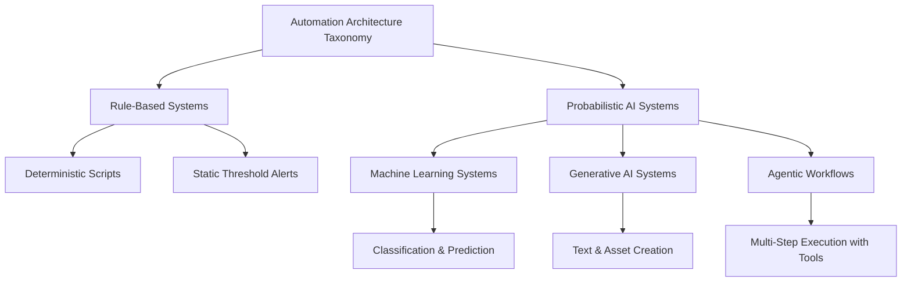

> **Складність**: `[ШВИДКИЙ]`
>
> **Час на виконання**: 60-75 хв
>
> **Передумови**: Базова грамотність у написанні скриптів, базова термінологія інфраструктури та цікавість до того, як ламається автоматизація

---

## Що ви зможете зробити

Після цього модуля ви зможете:

- Класифікувати задану систему автоматизації в одну з чотирьох категорій архітектури ШІ, визначивши її операційний механізм і межі.
- Порівняти профілі ризиків систем на основі правил, систем машинного навчання, генеративного ШІ та агентних робочих процесів у застосуванні до завдань автоматизації інфраструктури.
- Спроєктувати межу довіри для агентного робочого процесу, зіставивши його деструктивні дозволи з обов'язковими етапами людського затвердження.
- Оцінити надійність згенерованої ШІ операційної відповіді, розрізняючи вільне мовленнєве породження та фактологічно обґрунтоване системне міркування.

## Чому цей модуль важливий

Гіпотетичний сценарій: інженер з інфраструктури прокидається під час нічного інциденту та бачить, що основна база даних повідомляє про серйозну затримку запитів. Інженер вставляє кілька сторінок логів у генеративного помічника та просить негайний скрипт для усунення проблеми. Відповідь, яку видає помічник, чисто відформатована, називає знайомі концепції баз даних і демонструє точну впевненість, як операційна інструкція, написана старшим оператором із багаторічним досвідом. Під тиском обставин інженер запускає її та надто пізно виявляє, що скрипт завершив здорові сеанси та запустив дороге перебудовування індексу під час пікового навантаження.

Ця невдача — не історія про нерозумного інженера; це історія про відсутню таксономію. Інженер поставився до вільного мовлення як до операційного доказу, хоча якість мови та розуміння системи — це дві різні, незалежні властивості. Детермінований скрипт, статистичний класифікатор, генеративна мовна модель і автономний агент — усі ці чотири типи систем можуть продаватися під одним і тим самим ярликом «на основі ШІ», але вони виходять з ладу по-різному й тому заслуговують на різні межі. Цей модуль дає вам необхідний словник, щоб відокремити маркетингову обгортку від механізму, який насправді ухвалює рішення.

Сучасні платформні команди не вирішують, чи існує ШІ в їхньому робочому процесі, тому що він уже з'являється в сортуванні сповіщень, рев'ю коду, пошуку, виявленні аномалій, документації, маршрутизації тікетів та експериментальних інструментах усунення проблем. Практичне питання є вужчим і значно кориснішим: який саме тип системи перед нами, які докази вона використовує, що саме вона може змінити та хто залишається відповідальним, коли вона помиляється? Якщо ви можете відповісти на ці чотири питання, ви можете використовувати ШІ як інженерний компонент, а не ставитися до нього як до магії, новинки чи абсолютної заборони.

Модуль свідомо ґрунтується на інфраструктурній роботі, а не на абстрактній філософії. Ви дізнаєтеся, чим звичайне програмне забезпечення відрізняється від імовірнісних систем, як поводяться чотири поширені архітектури, суміжні зі ШІ, чому агентні робочі процеси потребують особливої перевірки та як розміщувати межі довіри навколо інструментів до того, як вони отримають доступ до production-середовища. Пізніші модулі заглибляться у великі мовні моделі, промпти, агенти та робочі процеси Kubernetes 1.35+, тож цей перший урок формує словник безпеки, який полегшує міркування про ці глибші теми.

## ШІ проти звичайного програмного забезпечення

Традиційна програмна інженерія спирається на явні рішення, написані людьми. Розробник описує умову, програма перевіряє цю умову, і програма виконує відповідну дію. Саме тому звичайну автоматизацію інфраструктури можна тестувати знайомими та добре перевіреними методами, такими як модульні тести, тестові запуски, статичний аналіз, рев'ю коду та поетапне розгортання. Якщо той самий вхід потрапляє в ту саму детерміновану програму в тому самому стані, ви очікуєте той самий вихід, і коли це очікування порушується, ви зазвичай можете простежити шлях у коді.

Цей детермінізм не є примітивним чи застарілим; це саме та причина, чому значна частина виробничої інфраструктури взагалі працює. Контролер розгортання узгоджує фактичний стан із бажаним, лінтер відхиляє свідомо недійсний маніфест, а порогове сповіщення спрацьовує, коли метрика перетинає налаштовану межу. Ці системи все ще можуть бути складними, багнутими та погано спроєктованими, але їхню логіку рішень можна проінспектувати. Ви можете запитати, де саме визначено умову, хто її змінив, яка гілка виконалася та чому результуюча дія виплила з вхідних даних.

Найпростіша форма цього мислення виглядає як логіка, яку багато інженерів пишуть у скриптах, контролерах та операційних інструкціях. Код нижче свідомо малий, але важливою властивістю є не його розмір. Важливою властивістю є те, що людина написала умови, а результуюча поведінка очікувано є повторюваною.

```text
if (cpu_utilization_percentage > 80) {
    execute_scale_up_procedure();
} else if (cpu_utilization_percentage < 20) {
    execute_scale_down_procedure();
} else {
    maintain_current_replica_count();
}
```

Системи штучного інтелекту, як цей термін використовується в сучасній інженерній практиці, зазвичай впроваджують статистичне узагальнення. Замість того, щоб людина писала кожну гілку, систему навчають, налаштовують або скеровують промптами для виведення закономірностей із даних і застосування цих закономірностей до нових вхідних даних. Система може класифікувати тікет підтримки, прогнозувати майбутній попит, генерувати текст, підсумовувати логи, рекомендувати конфігурацію або вирішувати, який інструмент викликати наступним. Ця додаткова гнучкість корисна саме тому, що простір можливих вхідних даних є надто великим, неоднозначним або мінливим для зручного покриття звичайними написаними вручну правилами.

Компроміс полягає в тому, що статистичне узагальнення змінює форму верифікації. Ви більше не доводите коректність лише читанням гілки та перевіркою відомої умови. Ви також запитуєте, які дані сформували модель, чи схожа поточна ситуація на ці дані, як система представляє невизначеність, що вона робить, коли докази є неповними, і чи можна вихідні дані незалежно перевірити. Іншими словами, ШІ не усуває інженерної дисципліни; він переносить більше цієї дисципліни в оцінювання, моніторинг і проєктування меж.

Зупиніться та подумайте: якщо детермінований скрипт масштабування та навчена модель прогнозування обидва стикаються зі сплеском трафіку, спричиненим кампанією, якої ніколи раніше не було, — який із них виходить з ладу більш помітно, а який може вийти з ладу більш переконливо? Детермінований скрипт може бути очевидно обмеженим, оскільки він перевіряє лише поточну метрику, тоді як модель може видати впевнений прогноз на основі історичних закономірностей, які більше не діють. Ця різниця важлива, тому що очевидна крихкість часто отримує швидший скептицизм, ніж відшліфований імовірнісний результат.

Корисно думати про звичайне програмне забезпечення як про рецепт, а про багато систем ШІ — як про досвідченого, але недосконалого дегустатора. Рецепт каже, що якщо духовка має певну температуру, а таймер досягає певної позначки, ви дістаєте страву. Дегустатор може розпізнавати закономірності, які важко закодувати, такі як запах, текстура та контекст, але його також можна обдурити незнайомими інгредієнтами або оманливою подачею. Хороші кухні використовують обидва підходи: рецепти для повторюваності, судження для неоднозначності та чіткі правила для тих випадків, коли судження не повинно переважати над безпекою.

Таке саме гібридне мислення належить застосовувати в інфраструктурі. Ви можете використовувати детерміновану валідацію для блокування небезпечних маніфестів Kubernetes, машинне навчання для виявлення незвичних патернів метрик, генеративну модель для складання звіту про інцидент та агентний робочий процес для збору діагностичних доказів. Кожен інструмент може бути цінним, але кожен має бути за межею, що відповідає його режиму відмови. Помилка не в тому, щоб використовувати ШІ; помилка в тому, щоб дати неоднозначній, імовірнісній системі таку саму неконтрольовану владу, яку ви дали б малому детермінованому скрипту.

## Чотири категорії, з якими ви насправді зустрінетеся

Слово «ШІ» є надто широким, щоб самостійно керувати операційними рішеннями. Демонстрація постачальника, назва внутрішнього інструменту чи значок на панелі керування можуть приховати механізм, який найбільше важливий для інженера. Перш ніж вирішувати, чи є система безпечною, корисною чи переоціненою, класифікуйте її за тим, як вона доходить висновків і який тип дій може виконувати. Чотири категорії, наведені нижче, — не єдина можлива таксономія, але вони достатньо практичні для щоденної платформної роботи.



Системи на основі правил — це знайомий фундамент. Вони включають скрипти, статичні пороги, перевірки політик, написані вручну дерева рішень і багато звичайних контролерів. Їхня сила — у відстежуваності: рецензент може проінспектувати правило, відтворити вхідні дані та зрозуміти, чому відбулася дія. Їхня слабкість у тому, що вони не узагальнюються за межі ситуацій, які хтось передбачив. Коли з'являється новий формат логів, структура директорій, патерн трафіку чи поведінка робочого навантаження, правило або пропускає це, або обробляє неправильно, або потребує, щоб людина оновила логіку вручну.

Системи машинного навчання узагальнюють із прикладів. В інфраструктурних контекстах вони часто класифікують події, кластеризують логи, ранжують сповіщення, виявляють аномалії, прогнозують попит або оцінюють ризик. Ці системи цінні, коли релевантний сигнал розподілений між багатьма вхідними даними і його було б незручно охоплювати статичними порогами. Їхня слабкість — не містична непрозорість, як іноді кажуть; їхня слабкість — це залежність від якості та репрезентативності навчальних даних. Якщо поточна поведінка відхиляється від навчальної, колись корисна модель може стати впевнено застарілою.

Генеративні системи ШІ створюють новий вміст, а не лише вибирають із фіксованого набору міток. Велика мовна модель може скласти операційну інструкцію, пояснити стек викликів, перетворити розмитий запит на каркас конфігурації або підсумувати довгу гілку обговорення інциденту. Привабливою властивістю є вільне володіння багатьма доменами, що змушує інструмент відчуватися як універсальний співробітник. Небезпечною властивістю є те саме вільне володіння, тому що модель може генерувати правдоподібні твердження, не маючи обґрунтованих доказів того, що ці твердження істинні для вашого конкретного середовища.

Агентні робочі процеси поєднують генеративні або орієнтовані на міркування моделі з інструментами. Замість того, щоб лише відповідати на запитання, система може планувати кроки, викликати API, запитувати логи, виконувати команди, перевіряти результати та обирати наступну дію. Саме тут операційний радіус ураження швидко зростає. Агент із доступом лише для читання до логів — це не те саме, що агент, який може змінювати розгортання, ротувати облікові дані, видаляти ресурси, затверджувати pull request'и або виконувати міграції баз даних. Якість міркувань моделі важлива, але межа дозволів важлива не менше за якість міркувань.

Щоб зрозуміти механічний контраст між написаною людиною логікою та вивченою поведінкою, порівняйте попередній приклад на основі гілок зі спрощеним потоком, керованим моделлю. Модель не містить акуратного списку написаних людиною умов для кожної можливої комбінації метрик. Натомість вона застосовує вивчені ваги до поточної телеметрії та видає оцінку, яку може використати інше правило.

```text
historical_model_weights = load_trained_anomaly_model()
current_system_metrics = fetch_live_telemetry_data()
anomaly_probability_score = calculate_probability(current_system_metrics, historical_model_weights)

if (anomaly_probability_score > 0.95) {
    trigger_high_severity_incident_alert()
}
```

Зауважте, що остаточне рішення все ще може містити детермінований поріг. Багато реальних систем є гібридними, і саме тому таксономія повинна зосереджуватися на механізмі рішення, а не на продуктовому ярлику. Модель може видавати оцінку ймовірності, правило може вирішувати, чи ця оцінка викликає сповіщення, а людина може вирішувати, чи доречне усунення проблеми. Коли ви відображаєте ланцюжок у такий спосіб, ви можете тестувати детерміновані частини, моніторити ймовірнісні частини та розміщувати затвердження навколо частин, які змінюють стан.

Який підхід ви обрали б тут і чому: статичний поріг CPU для малого внутрішнього сервісу з передбачуваним навантаженням чи прогностичну модель для сервісу, орієнтованого на кінцевого споживача, чий попит змінюється залежно від публічних подій? Поріг легше перевірити, і він може бути цілком достатнім для малого сервісу. Прогностична модель може бути варта своєї додаткової складності для сервісу, орієнтованого на споживача, але лише якщо ви моніторите дрейф, порівнюєте прогнози з реальністю та тримаєте детерміновані обмеження безпеки навколо вартості та потужності масштабування.

Категорії також відрізняються за тим, які докази мають змусити вас їм довіряти. Система на основі правил заслуговує на довіру через рев'ю коду, явні тести та операційну історію. Система машинного навчання заслуговує на довіру через дані оцінювання, моніторинг дрейфу, калібрування впевненості та порівняння з базовими показниками. Генеративна система заслуговує на вузьку довіру, коли її вихід перевіряється за авторитетними джерелами або виконуваними тестами. Агентний робочий процес отримує дозвіл лише тоді, коли ідентичність, інструменти, затвердження, логи та шляхи відкату спроєктовані до того, як увімкнено автономність.

| Категорія системи | Типовий операційний випадок використання | Основна сфера відмови | Необхідна межа довіри |
|-----------------|--------------------------------------|------------------------|-------------------------|
| Системи на основі правил | Статичні порогові сповіщення та детермінована конфігурація | Крихкість при зустрічі з безпрецедентними крайовими випадками | Стандартне колегіальне рев'ю та модульне тестування |
| Машинне навчання | Прогностичне автомасштабування та виявлення аномалій | Деградація через дрейф навчальних даних та історичні упередження | Безперервний моніторинг оцінок впевненості та резервні правила |
| Генеративний ШІ | Синтез документації та складання звітів про інциденти | Правдоподібні, але повністю вигадані технічні деталі | Обов'язкова незалежна верифікація за авторитетними джерелами |
| Агентні робочі процеси | Автономне усунення проблем за сповіщеннями та підготовка інфраструктури | Необмежені цикли виконання та деструктивні зміни стану | Суворі етапи затвердження людиною-в-циклі для всіх дій |

Використовуйте таблицю як контрольний список першого проходу рев'ю, а не як жорстке академічне визначення. Реальні системи можуть перетинати межі, і найцікавіші операційні системи часто це роблять. Маршрутизатор тікетів може використовувати класифікатор машинного навчання, потім попросити мовну модель скласти відповідь, а потім дозволити агенту оновити тікет. Тож безпечне проєктне питання полягає не в тому, «Чи це ШІ?», а в тому, «Який крок використовує який механізм, які докази його підтримують і яка дія може з нього випливати?»

## Практичний приклад: Налагодження агентної відмови

Сценарій вправи: платформна команда впроваджує автономний робочий процес усунення проблем для staging-кластера. Робочий процес відстежує події розгортання, читає логи застосунків, запитує метрики та може відкотити розгортання, коли робить висновок, що новий реліз є нездоровим. Команда дає йому широкі дозволи, оскільки середовище не є production, і вони очікують, що інструмент поводитиметься як детермінований крок відкату в їхньому наявному конвеєрі доставки. Це очікування є першою проєктною помилкою.

Під час звичайного релізу розробники змінюють формат логування застосунку так, що докладні діагностичні повідомлення записуються до стандартного потоку помилок. Застосунок здоровий, затримка запитів стабільна, а показники помилок, звернених до користувача, не змінилися. Проте агент просить генеративну модель проінтерпретувати нові логи, отримує тривожний підсумок і вирішує, що реліз невдалий. Він викликає інструмент розгортання, відкочує сервіс, спостерігає, що новий патерн логів зник, і трактує зникнення як підтвердження правильності своєї дії.

Результуючий цикл легко пропустити, якщо ви налагоджуєте його з неправильною ментальною моделлю. Детерміноване правило відкату зазвичай вказувало б на видиму умову, таку як «рівень HTTP-помилок перевищує поріг після розгортання». У цьому випадку шкідлива умова існує на кількох рівнях: генеративна інтерпретація логів, цикл планування, що трактує власну дію як доказ, і межа дозволів, яка дозволяє зміни стану без другого сигналу. Помилка не лише в промпті, моделі чи порозі. Помилка — у проєктуванні робочого процесу загалом.

Перший діагностичний крок — відокремити спостереження від дії. Дослідження лише для читання часто можна делегувати раніше, ніж доступ на запис, оскільки помилковий підсумок можна виправити, коли людина перевіряє його перед зміною. Кроки, що змінюють стан, заслуговують на сильніші докази, особливо коли вони можуть скасувати роботу, видалити дані, агресивно масштабувати системи, ротувати облікові дані або змінювати мережеву політику. У цьому сценарії агенту слід було дозволити збирати логи та метрики, але відкат мав вимагати детермінованого підтвердження та етапу людського затвердження.

Другий діагностичний крок — вимагати незалежних сигналів, перш ніж автономний робочий процес зробить висновок, що усунення проблеми спрацювало. Якщо агент відкочує розгортання, а потім каже, що проблема зникла, бо змінилися логи, він може просто спостерігати наслідок власного відкату. Безпечніша конструкція запитує, чи покращилося здоров'я з точки зору користувача, чи був справжнім початковий симптом і чи вплинула дія на передбачуваний причинний шлях. Це звичайне мислення щодо інцидентів, застосоване до нової форми автоматизації.

Перш ніж запускати подібний робочий процес у власному середовищі, який результат ви очікували б від кожного етапу, якщо реліз здоровий, але шумний? Хороша конструкція показала б підсумок логів як невизначений, зберігала б перевірки затримки та рівня помилок зеленими, відмовила б у відкаті, оскільки сигнали не узгоджуються, і попросила б людину вирішити, чи потребує зміна логування очищення. Погана конструкція перетворила б страшний текст на висновок високої серйозності, а потім дозволила б доступу до інструменту перетворити цей висновок на зміну стану.

Ось корисний спосіб переглянути відмову, не відволікаючись на інтерфейс продукту. Мовна модель створила інтерпретацію, цикл планування обрав дію, дозвіл інструменту дозволив цю дію, а середовище видало зворотний зв'язок. Кожна межа — це місце, де можна додати інженерні засоби контролю. Ви можете обмежити завдання моделі, вимагати структурованих доказів, обмежити інструмент, додати затвердження, логувати рішення та впровадити обмеження відкату, які зупиняють повторювані дії.

Коли команди пропускають цей огляд меж, агентні системи можуть успадкувати широкі дозволи людей, які їх встановили. Це погане усталення, оскільки агент не має людської ситуаційної обізнаності, соціальної відповідальності та здатності зупинитися, коли висновок здається неправильним. Принцип найменших привілеїв тут не просто гасло безпеки; це засіб контролю надійності. Агент повинен мати найменший набір можливостей читання та запису, необхідний для вузького робочого процесу, а деструктивні дозволи мають бути відокремлені за явним затвердженням.

Практичний урок полягає в тому, що автономність слід заробляти пошарово. Почніть із діагностики лише для читання, порівняйте висновки агента з перевіреними операційними інструкціями, виміряйте хибні спрацювання, додайте детерміновані перехресні перевірки, а потім розгляньте дії з низьким ризиком та автоматичним відкатом. Лише після того, як ці докази існують, команді слід обговорювати ширший доступ на запис, і навіть тоді обсяг має бути вузьким. Якщо робочий процес не може пояснити, які докази обґрунтували дію, він не готовий виконувати цю дію без рев'ю.

## Оцінювання довіри та встановлення меж

Довіра — це не єдиний перемикач. Інструмент може бути надійним для складання підсумку та ненадійним для виконання міграції; корисним для пропонування маніфесту Kubernetes і небезпечним для його застосування; чудовим у пошуку пов'язаної документації та слабким у визначенні того, чи ваша production-база даних здорова. Найбезпечніші команди уникають глобальних суджень на кшталт «ми довіряємо цьому ШІ» або «ми не використовуємо ШІ». Вони визначають довіру, специфічну для завдання, довіру, специфічну для доказів, і довіру, специфічну для дозволів. Це три різні осі, і прогрес на одній не означає автоматичного прогресу на інших.

Почніть із називання завдання. «Допомога з інцидентами» — надто розмите для убезпечення чи оцінювання, тоді як «підсумувати нещодавні рядки логів з цього простору імен без зміни ресурсів» — конкретне. Конкретне завдання повідомляє вам, які вхідні дані важливі, який формат виходу очікується, які перевірки можливі та яка шкода може статися. Це особливо важливо для генеративних інструментів, оскільки їхній розмовний інтерфейс може змусити широкий запит здаватися нешкідливим, навіть коли передбачувана робота охоплює діагностику, планування та виконання.

Далі назвіть механізм. Якщо система використовує правило, ви можете проінспектувати правило. Якщо вона використовує модель, ви можете запитати, які дані сформували модель і як поточні вхідні дані моніторяться на дрейф. Якщо вона генерує текст, ви можете запитати, який пошук, цитування, тести або людське рев'ю обґрунтовують вихід. Якщо вона викликає інструменти, ви можете запитати, яку ідентичність вона використовує, які команди дозволені, де відбуваються затвердження і як кожна дія логується для аудиту та відкату.

Потім назвіть радіус ураження. Погана рекомендація в чернетці документа витрачає час рев'ю; погана рекомендація, застосована до кластера, може видалити робочі навантаження. Хибне сповіщення про аномалію може розбудити когось без потреби; автономний цикл усунення проблем може коливати сервіс протягом години. Один і той самий вихід моделі може бути низькоризиковим або високоризиковим залежно від того, що за ним слідує. Саме тому межа дозволів часто важливіша за сімейство моделей, коли ви проєктуєте production-засоби контролю.

Оцінювання також має відповідати категорії. Для систем на основі правил тестуйте репрезентативні вхідні дані та крайові випадки. Для систем машинного навчання порівнюйте прогнози з розміченими прикладами, відстежуйте дрейф і слідкуйте, чи залишається впевненість відкаліброваною з часом. Для генеративних систем перевіряйте твердження за первинними джерелами, запускайте згенерований код в ізольованих середовищах і вимагайте, щоб рецензенти розуміли домен. Для агентних робочих процесів тестуйте не лише якість відповіді, а весь цикл планування, використання інструментів, спостереження, повторних спроб, зупинки та ескалації.

Найнебезпечніший момент — коли інструмент переходить від дорадчого до авторитетного. Дорадчі інструменти можуть помилятися, все одно заощаджуючи час, оскільки людина вирішує, що прийняти. Авторитетні інструменти можуть помилятися і негайно змінювати реальність. Це не означає, що авторитетна автоматизація заборонена; контролери Kubernetes є авторитетною автоматизацією, і інфраструктура залежить від них. Різниця в тому, що зрілі контролери обмежені явним бажаним станом, чітко визначеними API, семантикою узгодження та значним операційним досвідом. Нові агенти ШІ потребують порівнянних обмежень, перш ніж заслуговуватимуть на порівнянну владу.

Для першого рев'ю напишіть просту заяву про межі. Хороша заява про межі може звучати так: «Цей помічник може читати логи та метрики для staging-простору імен, підсумовувати ймовірні причини та складати план відкату, але він не може виконувати зміни; будь-який відкат вимагає названого людського затверджувача та повинен посилатися щонайменше на два детерміновані сигнали здоров'я.» Це речення цінніше за широке політичне гасло, оскільки воно називає обсяг, дію, докази та затвердження. Воно також дає рецензентам щось, що можна перевірити.

Людське затвердження не слід розглядати як декоративний прапорець. Втомлений інженер, який натискає «затвердити» на щільному, згенерованому моделлю плані без доказів, не є змістовним засобом контролю. Корисний етап затвердження представляє запропоновану дію, докази, межі впевненості, зачеплені ресурси, шлях відкату та причину, чому альтернативи були відхилені. Мета не в тому, щоб назавжди сповільнити кожен робочий процес; мета в тому, щоб зробити небезпечні дії достатньо зрозумілими, щоб відповідальна людина могла помітити поганий висновок до того, як він стане аварією.

Нарешті, ведіть облік рішень за допомогою ШІ так само, як ви ведете облік для розгортань та інцидентів. Ви хочете знати, який промпт або вхід спричинив рекомендацію, які джерела або телеметрію використовувала система, які виклики інструментів відбулися, хто їх затвердив і що змінилося після цього. Без цього аудиторського сліду післяінцидентний огляд стає ворожінням. З ним ШІ стає ще однією спостережуваною частиною системи, підпорядкованою тим самим інженерним звичкам, що й будь-який інший компонент.

## Читання результатів ШІ як операційних доказів

Результат ШІ слід читати як твердження, що потребує ланцюжка підтверджень, а не як висновок, що надходить уже верифікованим. Це невелике ментальне зрушення з великими практичними наслідками. Коли модель каже, що сервіс нездоровий, запитайте, які сигнали підтверджують це твердження. Коли вона пропонує команду, запитайте, яку версію API, дозволи та передумови ця команда припускає. Коли вона підсумовує документ, запитайте, які рядки джерела або події стискаються і які деталі могли бути пропущені.

Ця звичка знайома з реагування на інциденти. Графік, рядок логу, сповіщення та звіт користувача — кожен може бути правдивим, але все одно неповним. Інженери вчаться співвідносити докази, тому що один сигнал рідко розповідає всю історію. Результат ШІ заслуговує на таке саме ставлення, особливо тому, що він часто надходить у гладкому наративі, який приховує невизначеність. Гладкий наратив може зробити слабкі докази повними на вигляд, тож ваше завдання — витягнути докази назад у поле зору, перш ніж дозволити результату впливати на дію.

Для генеративних систем перше питання — чи ґрунтується результат на чомусь, що можна перевірити. Обґрунтуванням може бути посилання на офіційну документацію, фрагмент із файлу репозиторію, результат запиту з системи моніторингу або тестовий запуск в ізольованому середовищі. Без обґрунтування результат все ще може бути корисним як мозковий штурм, але його не слід розглядати як операційний доказ. Що конкретніша та ризикованіша рекомендація, то конкретнішим має бути обґрунтування.

Для систем машинного навчання перше питання — чи схожий поточний випадок на випадки, використані для оцінювання. Модель, навчена на трафіку робочих днів, може погано поводитися під час одноразового публічного запуску. Модель, навчена на попередньому форматі логування, може надмірно реагувати після міграції структурованого логування. Модель, навчена на минулих тікетах підтримки, може маршрутизувати проблеми нового продукту до неправильної команди. Моделі не потрібен зловмисний вхід, щоб вийти з ладу; звичайної зміни може бути достатньо, щоб зробити її вивчену закономірність менш надійною.

Для агентних систем перше питання — чи може робочий процес зупинитися. Хороший агент має чітку мету, обмежені інструменти, обмежені повторні спроби, правила ескалації та логи, які показують, чому відбувся кожен крок. Слабкий агент продовжує намагатися, тому що кожне спостереження стає запрошенням до наступної дії. Це важливо, тому що людина-оператор може помітити, що цикл став абсурдним, тоді як автоматизованому робочому процесу може знадобитися явне правило зупинки. Умова зупинки — це функція надійності, а не деталь реалізації.

Ви також можете оцінювати результат ШІ, розділяючи синтаксис, семантику та придатність. Синтаксис запитує, чи є результат правильно сформованим, як-от валідний YAML або команда, що розбирається. Семантика запитує, чи означає результат те, що має на увазі автор, як-от вибір правильного ресурсу або застосування правильної політики. Придатність запитує, чи належить результат до цього середовища в цей час, враховуючи вашу версію кластера, толерантність до ризику, вікно обслуговування та шлях відкату. Багато згенерованих моделлю артефактів проходять синтаксис, але провалюють придатність.

Це розрізнення особливо важливе в навчанні інфраструктури. Згенерований маніфест може виглядати валідним, припускаючи поле API, недоступне у вашому кластері Kubernetes 1.35+, або він може бути технічно валідним, порушуючи політику вашої організації. Згенерований підсумок інциденту може бути читабельним, надмірно підкреслюючи найгучніший рядок логу та ігноруючи метрику, яка насправді показує вплив на користувача. Згенерована команда може бути синтаксично правильною, але націленою на неправильний простір імен. Рев'ю має виходити за межі зовнішнього вигляду.

Зупиніться та подумайте: якщо модель дає вам план усунення проблеми з трьома командами, яка частина найімовірніше обдурить поспішного рецензента: недійсний синтаксис, неправильне причинне припущення чи небезпечний радіус ураження? Недійсний синтаксис часто швидко виявляється інструментами. Неправильні причинні припущення та небезпечний радіус ураження складніші, оскільки вони можуть бути приховані за правдоподібними поясненнями. Саме тому сильне рев'ю запитує не лише «Чи це запуститься?», а й «Чому ця дія має виправити цей симптом і на що ще вона може вплинути?»

Одна практична техніка рев'ю — перетворити результат на контрольний список тверджень. Якщо помічник каже, що розгортання не вдалося через те, що проби готовності перевищують час очікування, твердженнями можуть бути: розгортання нещодавно змінилося, поди провалюють готовність, провал готовності почався після зміни, помилки, звернені до користувача, корелюють із провалом, і відкат усунув би причину. Кожне твердження можна перевірити незалежно. Якщо кілька тверджень неперевірені, план не готовий до виконання.

Інша техніка — вимагати оборотного першого кроку. Замість того, щоб дозволяти помічнику негайно змінювати production, попросіть його запропонувати запит лише для читання, тестовий запуск або відтворення в staging, яке підвищило б упевненість. Це зберігає робочий процес корисним, водночас зберігаючи людське судження щодо необоротних кроків. У зрілих системах та сама ідея стає політикою: читайте широко, пишіть вузько та вимагайте затвердження, коли запропонована зміна перетинає поріг ризику. Ця політика — спосіб, у який команди перетворюють допомогу ШІ на контрольовану автоматизацію.

Останнє питання рев'ю — це питання підзвітності. Якщо дія за допомогою ШІ завдає шкоди, організація все одно володіє результатом. Модель не відвідує післяінцидентний огляд, не пояснює, чому дозволи були широкими, і не вирішує, як слід інформувати клієнтів. Це роблять люди, тож люди повинні проєктувати засоби контролю до того, як дія відбудеться. Ставлення до результатів ШІ як до операційних доказів утримує підзвітність там, де їй і належить бути: на інженерах, які вирішують, які системи можуть діяти та за яких умов.

## Патерни й антипатерни

Найсильніший патерн — поєднувати імовірнісне судження з детермінованими запобіжниками. Модель може помітити, що патерн метрик виглядає незвичним, але правило може обмежити максимальне розширення, вимагати мінімальних доказів або блокувати зміни поза затвердженим вікном обслуговування. Це поєднання дає вам гнучкість, не дозволяючи неоднозначності ухвалювати необоротні рішення. Воно також полегшує тестування, оскільки ви можете оцінювати рекомендацію моделі окремо від політики, яка вирішує, чи дозволена дія.

Другий корисний патерн — поетапна автономність. Почніть із пропозицій, потім дослідження лише для читання, потім змін із низьким ризиком, потім вузько обмежених дій запису із затвердженнями, і лише згодом розглядайте ширшу автоматизацію. Кожен етап повинен мати виміряні докази того, що попередній етап працює достатньо добре. Цей патерн не дає ентузіазму випередити спостережуваність і дає команді час дізнатися, де система є крихкою. Він також створює природний шлях відкату для самої автоматизації.

Третій патерн — генерація з обґрунтуванням на джерелах. Якщо генеративна модель складає конфігурацію Kubernetes, підсумок інциденту або рекомендацію з безпеки, вимагайте, щоб вона вказувала на первинну документацію, живу телеметрію, файли репозиторію або результати тестів, які можна перевірити. Вільне володіння моделі корисне для синтезу, але обґрунтувальні докази — це те, що дозволяє рецензенту вирішити, чи синтез безпечний. Це особливо важливо для учнів, оскільки відшліфовані пояснення можуть приховувати відсутні припущення.

Перший антипатерн — колапс категорій: ставлення до кожного інструменту з ярликом ШІ як до одного й того самого. Команди потрапляють у це, тому що мова постачальників широка, а внутрішні розмови часто оптимізують швидкість. Кращий підхід — називати механізм в архітектурних оглядах. Кажіть «класифікатор ранжує сповіщення», «мовна модель складає підсумок» або «агент викликає API розгортання». Конкретні іменники вимагають конкретних засобів контролю.

Другий антипатерн — успадкування дозволів. Людина встановлює інструмент, автентифікує його з широкими обліковими даними та випадково дає автоматизації той самий охоплення, що й у людини. Це зручно під час демонстрації та небезпечно в операціях. Кращий підхід — створювати спеціалізовані ідентичності з вузькими обсягами читання, окремими дозволами на запис і видимими аудиторськими логами. Якщо інструменту пізніше потрібен більший доступ, запит слід розглядати як будь-яке інше розширення привілеїв.

Третій антипатерн — використання ШІ там, де правило вже просте й достатнє. Статичний поріг, правило валідації схеми або перевірка «політика як код» можуть бути нудними, але нудне — часто правильна відповідь, коли умова чітка. Додавання моделі може внести недетермінізм, проблеми навчання та нові потреби моніторингу без покращення результату. Використовуйте ШІ, коли неоднозначність, масштаб або мова роблять звичайні правила непрактичними, а не лише тому, що інтерфейс здається сучасним.

## Коли ви використовували б це проти альтернатив

Використовуйте систему на основі правил, коли умова явна, дія добре зрозуміла, а передбачуваність важливіша за гнучкість. Приклади включають відхилення маніфестів, що не мають обов'язкових міток, блокування привілейованих контейнерів політикою або сповіщення, коли відома метрика насичення перетинає визначений поріг. Правило може потребувати обслуговування, але його поведінку можна перевірити до запуску. Ця можливість перевірки цінна, коли вартість помилкової дії висока.

Використовуйте машинне навчання, коли закономірності надто великі або тонкі для зручних ручних правил і коли ви можете зібрати достатньо репрезентативних даних для оцінювання продуктивності. Прогнозування попиту, кластеризація шумних логів, ранжування пов'язаних інцидентів і виявлення незвичних комбінацій метрик можуть підходити до цієї категорії. Ключова вимога — зворотний зв'язок. Якщо ніхто не вимірює, чи залишаються прогнози корисними, модель стає дорогим джерелом застарілої впевненості.

Використовуйте генеративний ШІ, коли завдання включає мову, синтез, трансформацію або складання чернеток, і коли людина або детермінований процес може верифікувати результат. Розумно просити першу чернетку документації, підсумок довгої гілки обговорення або відправну точку для конфігурації. Нерозважливо ставитися до цієї чернетки як до авторитетної без перевірки. Генеративний результат повинен прискорювати експертне рев'ю, а не замінювати потребу в експертизі там, де наслідки мають значення.

Використовуйте агентний робочий процес, коли робота справді вимагає кількох кроків, викликів інструментів, спостереження та адаптації, і коли робочий процес було обмежено, як будь-яку іншу автоматизацію з впливом на production. Діагностичний агент лише для читання може бути розумним раннім випадком використання, оскільки він збирає контекст, не змінюючи стан. Агент усунення проблем з можливістю запису повинен з'явитися пізніше, після того як команда має докази, запобіжники, етапи затвердження та чітку умову зупинки. Автономність — це проєктний вибір, а не усталене налаштування.

Якщо ви не впевнені, яка категорія підходить, простежте шлях від входу до дії. Запитайте, які дані входять, який механізм їх перетворює, який вихід створюється, яка дія слідує і які докази можуть спростувати висновок. Система, яка не може чітко відповісти на ці питання, повинна залишатися дорадчою, доки не зможе. Інженерна зрілість часто виглядає як сповільнення саме в тому місці, де демонстрація здається легкою.

## Чи знали ви?

- [ОЕСР оновила своє визначення системи ШІ у 2023 році, щоб наголосити на машинних системах, які виводять із вхідних даних і генерують результати, такі як прогнози, вміст, рекомендації або рішення.](https://oecd.ai/en/wonk/definition-)
- [NIST AI Risk Management Framework було випущено у версії 1.0 у січні 2023 року, і він організовує роботу з ризиками ШІ навколо функцій керування, картування, вимірювання та управління.](https://www.nist.gov/itl/ai-risk-management-framework/nist-ai-rmf-playbook)
- Багато production-функцій «ШІ» є гібридними: модель може ранжувати або генерувати, тоді як звичайні правила все ще вирішують пороги, дозволи, маршрутизацію та остаточне виконання.
- Мовна модель може створити конфігурацію, що виглядає валідною, для версії, яку ваш кластер не запускає, — саме тому ці модулі припускають Kubernetes 1.35+ і все одно вимагають перевірок документації.

## Типові помилки

| Помилка | Чому вона трапляється | Як її виправити |
|---------|----------------|---------------|
| Ставлення до всіх систем ШІ як до єдиної, однорідної технологічної категорії | Продуктовий ярлик приховує, чи є система правилом, класифікатором, генератором чи агентом, тому рецензенти обговорюють її надто розмито. | Класифікуйте кожен новий інструмент за його конкретним базовим архітектурним механізмом, перш ніж схвалювати його використання. |
| Припущення, що мовна вільність гарантує технічну коректність | Відшліфована проза відчувається як експертиза, особливо під час інцидентів, коли люди хочуть швидкої чіткої відповіді. | Ретельно верифікуйте всі генеративні результати за офіційною документацією, тестами або живою телеметрією перед дією. |
| Використання «ШІ» як скороченого терміна в архітектурних проєктних обговореннях | Широка мова уникає складних питань про докази, дозволи та режими відмови. | Явно називайте фактичну використовувану здатність, наприклад «імовірнісний класифікатор» або «агент виклику інструментів». |
| Припущення, що системи машинного навчання є безпомилковими чорними скриньками | Команди можуть зосереджуватися на новизні моделі та забувати, що прогнози залежать від якості та репрезентативності даних. | Впровадьте безперервний моніторинг упевненості прогнозів, дрейфу та порівняння з базовими показниками з резервними правилами. |
| Повне відкидання всіх імовірнісних систем через маркетинговий галас | Розчарування розмитими твердженнями може змусити команди ігнорувати корисні інструменти класифікації, прогнозування та підсумовування. | Відокремлюйте маркетингові твердження постачальника від фактичних верифікованих можливостей і ризиків системи. |
| Найбільша довіра до генеративних моделей у завданнях, які ви розумієте найменше | Відповідь моделі може бути єдиним поясненням, яке бачить учень, що ускладнює виявлення помилок. | Використовуйте ШІ насамперед для прискорення завдань, які ви можете перевірити, і залучайте авторитетні джерела для незнайомих доменів. |
| Розгортання агентних робочих процесів без етапів людського затвердження | Демосередовища винагороджують швидку автономність, тоді як production-середовища карають необмежені зміни стану. | Вимагайте авторизації людини-в-циклі для деструктивних дій і вузько обмежуйте кожен дозвіл інструменту. |

## Тест

<details>
<summary>1. Ваша команда хоче розгорнути систему, яка автоматично категоризує вхідні тікети підтримки на основі історичних даних про вирішення. Яка архітектурна категорія найкраще описує цей інструмент і який ризик слід перевірити першим?</summary>

Це система машинного навчання, оскільки вона використовує історичні приклади для класифікації нових тікетів. Перший ризик для перевірки — чи історичні дані все ще відображають поточні патерни підтримки, оскільки нові продукти, нові типи інцидентів або змінена відповідальність команд можуть створити дрейф даних. Система на основі правил покладалася б на явні умови, що не є основним механізмом тут. Генеративна система могла б скласти відповідь, а агент міг би оновлювати тікети через інструменти, але крок категоризації — це класифікатор.

</details>

<details>
<summary>2. Постачальник рекламує «AI DevOps Assistant», який пише шаблони «інфраструктура як код» із промптів природною мовою. Чому це ризикованіше за детермінований лінтер конфігурації?</summary>

Помічник є генеративною системою ШІ, тому він може створювати правдоподібний новий вміст, який не було валідовано щодо ваших точних платформних правил. Детермінований лінтер перевіряє відомі умови та може пояснити, яке правило порушено, тоді як генератор може вигадати застарілі поля, пропустити обов'язкові обмеження або створити небезпечні усталення з упевненим формулюванням. Правильна відповідь — не забороняти всю генерацію, а вимагати рев'ю, тестів і перевірок первинної документації перед використанням. Лінтер і генератор вирішують різні проблеми та потребують різних меж довіри.

</details>

<details>
<summary>3. Під час інциденту інженер використовує мовну модель для генерації плану відновлення бази даних. План чіткий, детальний і повний знайомих термінів. Як інженер повинен оцінити надійність цієї згенерованої ШІ операційної відповіді?</summary>

Інженер повинен ставитися до вільного мовлення як до якості презентації, а не доказу коректності. Надійність походить від перевірки кожної команди за авторитетною документацією, поточним станом системи, резервними копіями та шляхом колегіального рев'ю, що відповідає радіусу ураження. Модель все ще може бути корисною для організації можливостей, але вона не може довести, що план відновлення відповідає живій базі даних. Найбезпечніший наступний крок — перетворити чернетку на перевірену операційну інструкцію, а не запускати її лише тому, що вона звучить упевнено.

</details>

<details>
<summary>4. Ваша організація хоче автономного агента для виявлення вразливостей та автоматичного встановлення патчів на запущені робочі навантаження. Яку межу довіри слід спроєктувати до того, як буде ввімкнено доступ на запис?</summary>

Робочий процес потребує етапу людського затвердження для дій, що змінюють стан, вузьких дозволів інструментів та вимог детермінованих доказів перед застосуванням будь-якого патчу. Виявлення вразливостей може включати імовірнісну інтерпретацію, а встановлення патчів може перезапускати робочі навантаження, порушувати сумісність або змінювати стан безпеки. Дослідження лише для читання може бути дозволене раніше, але автоматичне усунення потребує сильніших засобів контролю, оскільки дія змінює production-стан. Безпечна конструкція зіставляє кожен деструктивний дозвіл із затверджувачем, аудиторським записом і планом відкату.

</details>

<details>
<summary>5. Застаріле сповіщення спрацьовує щоразу, коли використання CPU перевищує поріг протягом кількох хвилин. Новий інженер пропонує замінити його моделлю ШІ. Яке порівняння слід зробити команді перед зміною конструкції?</summary>

Команда повинна порівняти відомі обмеження поточного правила з очікуваними перевагами моделі та новими режимами відмови. Якщо поріг простий, надійний і легкий у налаштуванні, його заміна може додати моніторинг дрейфу, проблеми пояснюваності та операційну невизначеність без покращення результатів. Якщо справжня проблема — складне прогнозування попиту, модель може бути виправданою, але її слід оцінювати за історичними та нещодавніми інцидентами. Правильне питання не в тому, чи є ШІ новішим, а в тому, чи механізм відповідає проблемі.

</details>

<details>
<summary>6. Агент неодноразово відкочує здорове розгортання, тому що неправильно читає шумний формат логів. Яку частину конструкції слід налагоджувати першою: модель, дозволи інструментів чи шлюз доказів?</summary>

Почніть зі шлюзу доказів і межі дозволів, оскільки система не повинна мати можливості перетворювати одну невизначену інтерпретацію логів на повторювані зміни стану. Модель також може потребувати покращення, але сама по собі якість моделі є слабким засобом контролю, коли дії деструктивні. Робочий процес повинен вимагати незалежних сигналів здоров'я, таких як рівень помилок, затримка та готовність, перш ніж відкат буде дозволено. Він також повинен обмежувати повторювані дії та вимагати людського затвердження, коли сигнали не узгоджуються.

</details>

<details>
<summary>7. Згенерований маніфест Kubernetes виглядає валідним, але помічник не вказує версію Kubernetes або джерело документації. Що слід зробити перед застосуванням його до кластера Kubernetes 1.35+?</summary>

Ви повинні валідувати маніфест щодо поведінки API Kubernetes 1.35+ і політик вашого кластера перед його застосуванням. Помічник міг згенерувати поле зі старішої версії, майбутньої пропозиції або схеми іншого інструменту. Тестовий запуск, валідація схеми, перевірка політики та рев'ю за офіційною документацією надають кращі докази, ніж формулювання моделі. Згенерований маніфест може бути корисною чернеткою, але застосування його без верифікації сплутало б вільне мовлення із сумісністю.

</details>

## Практична вправа

У цій вправі ви проаналізуєте операційні ризики різних архітектур автоматизації, проєктуючи відповідні межі довіри для гіпотетичного production-середовища. Ваша команда платформної інженерії керує парком сервісів без стану та оцінює три інструменти для зменшення операційної рутини. Для кожного інструменту класифікуйте архітектуру, визначте основний режим відмови та вирішіть, яке обмеження має існувати до того, як інструмент використовуватиметься поблизу production.

Сценарій вправи: перший інструмент — статичний скрипт, який видаляє тимчасові кеш-файли з нод щонеділі опівночі. Другий інструмент — віджет панелі керування, який аналізує історичні патерни трафіку та прогнозує, коли команді може знадобитися масштабувати ресурси для майбутніх подій. Третій інструмент — автономний чат-бот, який може читати сповіщення, запитувати production-базу даних для контексту та самостійно виконувати міграції схеми, коли вважає, що існує невідповідність. Розглядайте сценарій як проєктне рев'ю, а не оцінку постачальника.

### Завдання

- [ ] Класифікуйте кожну систему автоматизації в категорію: система на основі правил, система машинного навчання, генеративна система ШІ або агентний робочий процес.
- [ ] Порівняйте профілі ризиків трьох інструментів, записавши один імовірний режим відмови та одну ймовірну проблему радіусу ураження для кожного інструменту.
- [ ] Спроєктуйте межу довіри для агентного робочого процесу, зіставивши кожен деструктивний дозвіл з обов'язковим етапом людського затвердження.
- [ ] Оцініть надійність будь-якої згенерованої ШІ операційної відповіді, перерахувавши зовнішні докази, які ви вимагали б перед тим, як діяти на її основі.
- [ ] Вирішіть, який інструмент, якщо такий є, міг би безпечно почати в дорадчому режимі або режимі лише для читання, і поясніть, які докази виправдали б додаткову автономність пізніше.

<details>
<summary>Пропоноване рішення</summary>

Скрипт очищення кешу є системою на основі правил, оскільки людина явно визначає розклад і поведінку видалення. Його основний режим відмови — крихкість щодо неочікуваних структур директорій, небезпечного розширення шляхів або зміненої структури нод, тому межа повинна включати тестові запуски, дозволені списки шляхів і рев'ю перед широким запуском. Прогностик трафіку є системою машинного навчання, оскільки він прогнозує попит з історичних даних, тому його основний режим відмови — дрейф, коли майбутні події відрізняються від минулих; він повинен залишатися дорадчим, доки прогнози не порівнюватимуться з поточними планами та нещодавньою телеметрією. Чат-бот є агентним робочим процесом, оскільки він інтерпретує сповіщення, запитує інструменти, планує дії та може виконувати міграції. Він потребує найсильнішої межі: доступ лише для читання за замовчуванням, жодного виконання міграцій без названого людського затвердження, детермінованих доказів здоров'я та схеми, аудиторських логів для кожного виклику інструменту та плану відкату для будь-якої затвердженої зміни.

</details>

### Критерії успіху

- [ ] Ви класифікували статичний скрипт як систему на основі правил і зазначили, що його основний режим відмови — крихкість при зустрічі з неочікуваними структурами директорій.
- [ ] Ви класифікували прогностик трафіку як систему машинного навчання та встановили обмеження, що його прогнози повинні верифікуватися щодо поточних планів подій для врахування дрейфу даних.
- [ ] Ви точно класифікували автономного чат-бота як агентний робочий процес, визнаючи, що він несе найвищий операційний ризик.
- [ ] Ви спроєктували межу довіри, яка не дозволяє чат-боту виконувати міграцію бази даних без явної авторизації від старшого інженера.
- [ ] Ви порівняли профілі ризиків підходів на основі правил, машинного навчання, генеративного ШІ та агентних підходів, використовуючи механізм, докази та радіус ураження, а не продуктові ярлики.
- [ ] Ви пояснили, як оцінювати надійність згенерованої ШІ операційної відповіді перед її використанням в інфраструктурному робочому процесі.

## Джерела

- [oecd.ai: definition](https://oecd.ai/en/wonk/definition-) — Сторінка ОЕСР прямо зазначає, що визначення було переглянуто у 2023 році, і цитує оновлене формулювання про виведення з вхідних даних для генерування прогнозів, вмісту, рекомендацій або рішень.
- [nist.gov: nist ai rmf playbook](https://www.nist.gov/itl/ai-risk-management-framework/nist-ai-rmf-playbook) — Сторінка NIST Playbook явно зазначає, що AI RMF 1.0 було випущено 26 січня 2023 року, і називає чотири функції: Govern, Map, Measure та Manage.
- [Kubernetes Configuration Overview](https://kubernetes.io/docs/concepts/configuration/overview/) — Корисне продовження для повторюваної тези модуля про те, що згенеровані зміни інфраструктури все одно потребують верифікації за офіційною платформною документацією.
