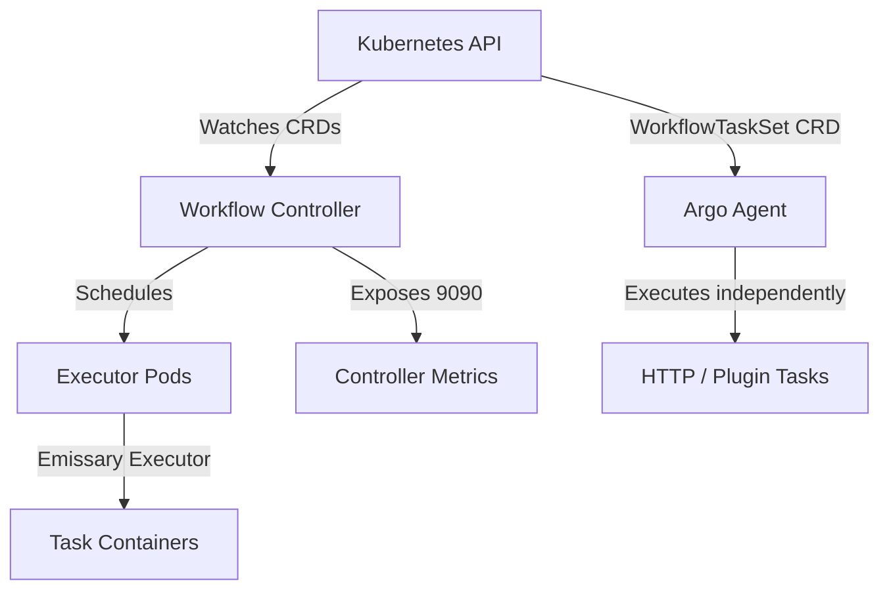
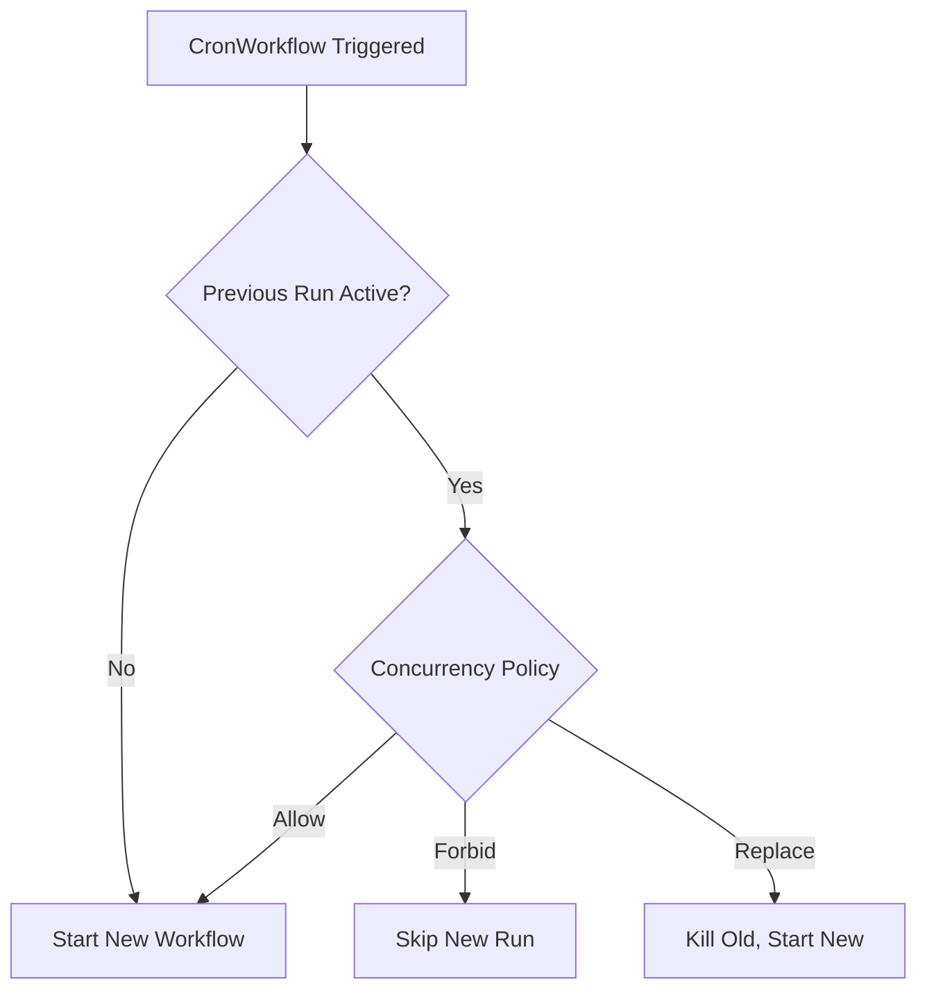
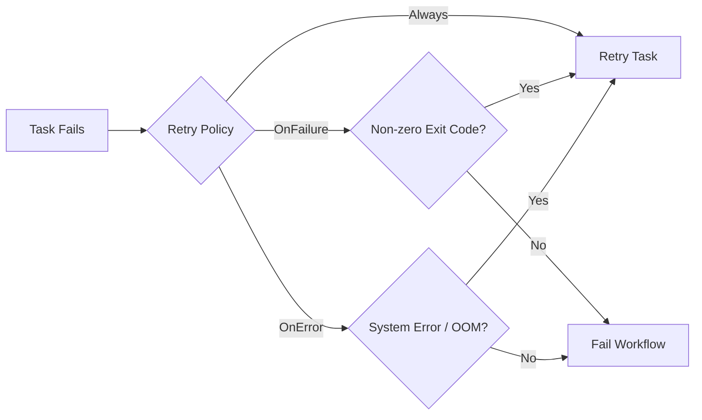

> **Напрямок CAPA -- Домен 1 (36%)** | Складність: `[СКЛАДНО]` | Час: 50-60 хв

Платформена команда у великій глобальній фінтех-компанії, що відповідала за клірингові операції на мільйони щодня, мала системну проблему. Їхній нічний робочий процес звіряння виконував 14 кроків послідовно, тривав понад 3 години і двічі на тиждень тихо зазнавав збою. Оскільки автоматизованого циклу зворотного зв'язку не було, про збої ніхто не знав до ранкового стендапу, а отже фінансові розбіжності встигали зачепити реальних кінцевих користувачів ще до того, як інженери могли втрутитися.

Після міграції застарілого конвеєра на Argo Workflows із застосуванням обробників завершення (exit handlers) для миттєвих сповіщень у Slack, `CronWorkflows` для точного планування, мемоізації для динамічного пропуску незмінних кроків та хуків життєвого циклу для суворого аудиторського логування час виконання конвеєра скоротився до якихось 40 хвилин. Збої одразу спричиняли сповіщення з вбудованими логами, а тимчасові інфраструктурні помилки повторювалися автоматично без участі людини. Команда перейшла від 12 годин на тиждень, витрачених на «няньчення» конвеєра, до нуля.

Це перетворення і є силою просунутих Argo Workflows. Щойно ви виходите за межі базових лінійних конвеєрів, Argo надає вичерпний декларативний інструментарій для побудови самовідновлюваних, безпечних щодо конкурентності та високооптимізованих рушіїв автоматизації.

## Передумови

- [Модуль 3.3: Argo Workflows](/platform/toolkits/cicd-delivery/ci-cd-pipelines/module-3.3-argo-workflows/) -- Основи: Container, Script, Steps, DAG, Artifacts.
- Базові знання Kubernetes RBAC (ServiceAccounts, Roles, RoleBindings).
- Знайомство зі стандартним синтаксисом планування Kubernetes CronJob.

## Що ви зможете робити

Після завершення цього модуля ви зможете розмірковувати про Argo Workflows як про операційну платформу, а не як про обгортку YAML навколо shell-скриптів, і матимете достатньо практики, щоб розпізнавати екзаменаційні питання, які ховають обмеження планування, повторних спроб, розв'язання шаблонів або безпеки всередині реалістичних сценаріїв робочих процесів.

1. **Проєктувати** просунуті Argo Workflows із застосуванням усіх 9 типів шаблонів, зокрема шаблонів `Resource` для прямих маніпуляцій з API та `ContainerSet` для тісно зв'язаного виконання.
2. **Реалізовувати** складну логіку залежностей у спрямованих ациклічних графах (DAG) за допомогою булевих виразів, засобів контролю fail-fast та умовних конструкцій на основі виразів.
3. **Оцінювати** та **налаштовувати** стійкість робочого процесу через цільові стратегії повторних спроб, хуки життєвого циклу та вичерпні обробники завершення.
4. **Розгортати** безпечні щодо конкурентності конвеєри за допомогою `CronWorkflows` та примітивів синхронізації з опорою на базу даних (м'ютекси та семафори).
5. **Діагностувати** типові збої робочих процесів через розуміння архітектури виконавця `emissary`, завдань Argo Agent та метрик контролера.

## Чому цей модуль важливий

Іспит Certified Argo Project Associate (CAPA) приділяє величезну вагу — цілих 36% — Домену 1, який охоплює Argo Workflows у значній глибині. Хоча Модуль 3.3 навчав основ запуску базових скриптів та контейнерів, реальний світ — і іспит — вимагають майстерного володіння складними можливостями.

Корпоративні конвеєри не працюють у вакуумі. Вони мусять давати раду обмеженням швидкості API, тимчасовим збоям мережі, обмеженням паралельних завдань та суворим вимогам безпеки. Цей модуль охоплює все потрібне, щоб піднести скрипт до рівня надійного платформного продукту: решту типів шаблонів, заплановані робочі процеси, повторно використовувані шаблони, обробники завершення, синхронізацію, мемоізацію, хуки життєвого циклу, змінні, стратегії повторних спроб та безпеку.

## Чи знали ви?

- **Hera — це офіційний Python SDK:** Старий пакунок `argo-workflows` на PyPI було офіційно вилучено у v4.0, бо він не збирався надійно. Рекомендована заміна — **Hera**, яку підтримують у межах GitHub-організації `argoproj-labs`.
- **Архівування робочих процесів НЕ зберігає логи:** Коли ви вмикаєте архівування робочих процесів, стани завершених процесів зберігаються у PostgreSQL (>=9.4) або MySQL (>=5.7.8), але логи виконання Pod'ів явно не архівуються. Для зберігання логів доводиться покладатися на стандартну агрегацію логів Kubernetes (як-от Promtail/Loki).
- **Валідація на основі CEL миттєво блокує погані маніфести:** Версія 4.0.0 (випущена 4 лютого 2026 року) запровадила правила валідації на основі CEL, вбудовані безпосередньо в CRD, що забезпечують структурну цілісність на етапі допуску до кластера.
- **Поодинокого поля `schedule` більше немає:** Станом на Argo Workflows v4.0 поодиноке поле `schedule` для `CronWorkflows` було жорстко вилучено. Потрібно використовувати поле `schedules`, яке приймає обов'язковий непорожній список cron-рядків.

## Розділ 1: Архітектура та виконавець Emissary

Argo Workflows — це рушій робочих процесів з відкритим кодом, нативний для контейнерів, реалізований як Kubernetes CRD (Custom Resource Definition). Його прийняли до CNCF у 2020 році, а статусу Graduated він набув 6 грудня 2022 року. Оскільки він працює нативно на Kubernetes, кожен крок вашого процесу відповідає Pod'у (або прямому виклику API) і використовує нативне планування Kubernetes.



### Еволюція виконавців
Щоб виконувати команди всередині контейнерів, Argo впроваджує «виконавця» (executor). Історично Argo підтримував кілька виконавців (`docker`, `pns`, `k8sapi`, `kubelet`). Однак **починаючи з Argo Workflows v3.4 `emissary` є єдиним підтримуваним виконавцем**, а решту повністю прибрали з кодової бази. Виконавець `emissary` впроваджує ініціалізаційний контейнер, який копіює бінарний файл `argoexec` у спільний том, і перевизначає точку входу (entrypoint) головного контейнера, щоб безпечно запустити команду.

> **Зупиніться і передбачте**: Якщо метрики контролера за замовчуванням доступні на порту 9090, як ви їх збираєте (scrape)?
> *Відповідь:* Метрики доступні за адресою `<host>:9090/metrics` через сервіс `workflow-controller-metrics`. Проте ServiceMonitor не встановлюється за замовчуванням; ви маєте додати його окремо, щоб Prometheus почав їх збирати.

## Розділ 2: Дев'ять типів шаблонів

Argo Workflows офіційно підтримує **дев'ять** типів шаблонів. Ви вже знаєте `container`, `script`, `steps` та `dag`; просунуті типи важливі тим, що дають змогу прибрати зайві Pod'и, безпечно призупинятися для погоджень, викликати API через шлях агента на боці контролера, розташовувати тісно зв'язані контейнери поруч і розширювати систему, не перетворюючи кожну операцію на спеціально зібраний образ.

### 1. Шаблон Resource
Шаблон Resource виконує операції CRUD над ресурсами Kubernetes безпосередньо через API-сервер, тож не потрібен ні контейнер `kubectl`, ні завантаження образу. Це особливо корисно, коли робочий процес має створити ConfigMap, накласти патч на Деплоймент, дочекатися поля статусу на кшталт Job або видалити тимчасову інфраструктуру, водночас даючи Argo змогу декларативно оцінювати умови успіху та невдачі.

```yaml
- name: create-configmap
  resource:
    action: create          # create | patch | apply | delete | get
    manifest: |
      apiVersion: v1
      kind: ConfigMap
      metadata:
        name: output-{{workflow.name}}
      data:
        result: "done"
```

Для `create` ConfigMap'а достатньо самого успішного створення — ConfigMap'и не мають поля `.status`, тож `successCondition` і `failureCondition` ніколи б не обчислилися. Залиште ці поля для ресурсів, які мають статус, як-от Job (`successCondition: "status.succeeded > 0"`) або Pod (`successCondition: "status.phase == Succeeded"`).

### 2. Шаблон Suspend
Шаблон Suspend призупиняє виконання, доки людина не відновить робочий процес або не мине вказана тривалість. Це основний механізм для шлюзів погодження, бо робочий процес залишається видимим у Kubernetes, зберігає свої параметри й граф вузлів та позбавляє від винаходження зовнішнього скінченного автомата, який операційним командам довелося б узгоджувати після кожного перезапуску.

```yaml
- name: approval-gate
  suspend: {}         # Wait indefinitely until manually resumed
- name: timed-pause
  suspend:
    duration: "30m"   # Auto-resume after 30 minutes
```

### 3. Шаблон HTTP
Шаблон HTTP робить вебзапити без запуску контейнера. Замість створення Pod'а він використовує процес **Argo Agent**, який спілкується з контролером через CRD `WorkflowTaskSet`, що створюється для кожного запущеного робочого процесу.

```yaml
- name: call-webhook
  http:
    url: "https://httpbin.org/post"
    method: POST
    headers:
      - name: Authorization
        valueFrom:
          secretKeyRef: {name: api-creds, key: token}
    body: '{"workflow": "{{workflow.name}}", "status": "{{workflow.status}}"}'
    successCondition: "response.statusCode >= 200 && response.statusCode < 300"
```

### 4. Шаблон ContainerSet
Шаблон `ContainerSet` запускає кілька контейнерів в одному Pod'і. Виконавець робочого процесу стартує кожен контейнер лише після завершення його оголошених залежностей, що ідеально, коли послідовності клонування, збирання, тестування та пакування потрібно мати один спільний локальний робочий простір — інакше час витрачався б на вивантаження артефактів між Pod'ами, які плануються окремо.

```yaml
- name: multi-container
  containerSet:
    volumeMounts:
      - name: workspace
        mountPath: /workspace
    containers:
      - name: clone
        image: alpine/git
        command: [sh, -c, "git clone https://github.com/argoproj/argo-workflows /workspace/repo"]
      - name: build
        image: golang:1.26
        command: [sh, -c, "cd /workspace/repo && go build ./..."]
        dependencies: [clone]
      - name: test
        image: golang:1.26
        command: [sh, -c, "cd /workspace/repo && go test ./..."]
        dependencies: [clone]
  volumes:
    - name: workspace
      emptyDir: {}
```
*Обмеження:* Хоча він пропонує впорядкування у стилі DAG у межах одного Pod'а, він **не може** використовувати розширену булеву логіку `depends`. Сприймайте `ContainerSet` як оптимізацію локальності для тісно пов'язаних кроків, а не як заміну повноцінного DAG, якому потрібні розгалуження, семантика часткового збою або незалежні запити ресурсів.

### 5. Шаблон Plugin
Як і шаблони HTTP, шаблони Plugin виконуються через процес Argo Agent. Вони дають змогу розширювати Argo власними виконавцями. Станом на v4.0 потокова передача артефактів для драйверів артефактів Plugin підтримується повністю, приєднуючись до S3, Azure Blob, HTTP, Artifactory та OSS.

## Розділ 3: Просунуті DAG та умовні конструкції

### Розширена логіка залежностей
Завдання DAG підтримують поле `depends` для розширеної логіки залежностей із булевими виразами. Замість того, щоб просто чекати завершення попереднього завдання, ви можете розгалужуватися залежно від конкретного статусу кількох попередників.

```yaml
depends: "task-A.Succeeded || task-B.Failed"
```

### FailFast
За замовчуванням шаблони DAG мають поле `failFast`, яке усталено дорівнює `true`. Коли одне завдання зазнає збою, нові завдання не плануються. Установлення `failFast: false` дає змогу всім незалежним гілкам доходити до завершення, навіть якщо одна гілка зазнала збою.

### Умовне виконання та цикли
Поле `when` на рівні шаблону вмикає умовне виконання кроків через умови на основі виразів, але воно має лишатися достатньо читабельним, щоб оператор міг сказати, чому гілку було пропущено. Якщо вираз несе бізнес-логіку, місце якій у коді, перенесіть цю логіку до попереднього завдання й передайте простий вихідний параметр у граф робочого процесу.

```yaml
when: "{{tasks.check-data.outputs.result}} == true"
```

Для розпаралелювання (fan-out) робочих процесів ви використовуєте цикли, і іспит часто перевіряє, чи розумієте ви, коли список відомий. Статичні списки пасують до `withItems`, тоді як списки часу виконання має видавати один крок у форматі JSON, а наступний крок — споживати їх через `withParam`.
- `withItems` приймає жорстко закодований YAML-список для циклу.
- `withParam` приймає рядок JSON, який зазвичай динамічно передає вихід попереднього кроку.

> **Зупиніться і подумайте**: Якщо `withItems` розпаралелює і завдання, і його залежності, а `withParam` розпаралелює лише поточне завдання, який із них ви б обрали для динамічно згенерованих паралельних збірок?
> *Відповідь:* Ви маєте використати `withParam`, бо масив цілей відомий лише під час виконання як JSON-вихід попереднього кроку.

## Розділ 4: Заплановані виконання з CronWorkflows

`CronWorkflows` — це окремий CRD, який створює об'єкти `Workflow` за розкладом. Вони цілком відокремлені від Kubernetes `CronJobs`, і це важливо, бо саме контролер Argo, а не контролер Kubernetes CronJob, володіє історією, специфічною для робочого процесу, політикою конкурентності, розгортанням шаблону робочого процесу, поведінкою при пропущеному розкладі та статусом життєвого циклу.

У v4.0 поодиноке поле `schedule` було вилучено. Поле-заміна `schedules` є обов'язковим непорожнім списком, що дає змогу складно визначати кілька розкладів. Крім того, поле `timezone` приймає рядок часового поясу IANA (наприклад, `America/New_York`) і за замовчуванням дорівнює місцевому часу машини, автоматично обробляючи переходи на літній/зимовий час за правилами IANA.

```yaml
apiVersion: argoproj.io/v1alpha1
kind: CronWorkflow
metadata:
  name: nightly-etl
spec:
  schedules: 
    - "0 2 * * *"                 # 2 AM daily
  timezone: "America/New_York"    # Default: local time
  startingDeadlineSeconds: 300    # Skip if missed by >5min
  concurrencyPolicy: Replace      # Kill previous if still running
  successfulJobsHistoryLimit: 3
  failedJobsHistoryLimit: 5
  workflowSpec:
    entrypoint: main
    templates:
      - name: main
        dag:
          tasks:
            - name: extract
              template: run-etl
            - name: load
              template: run-etl
              dependencies: [extract]
      - name: run-etl
        container:
          image: etl-runner:v1.35.0
          command: [python, run.py]
```

### Політики конкурентності



*Зауваження:* `CronWorkflows` не виконують зворотного заповнення (backfill) пропущених запусків, тож відстроченим відновленням контролера треба керувати через `startingDeadlineSeconds`, оповіщення та обізнані з бізнесом runbook'и. Якщо пропущений запуск критичний для бізнесу, спроєктуйте окремий узгоджувальний робочий процес, який можна запустити вручну й перевірити в межах аудиту.

## Розділ 5: Повторне використання, синхронізація та змінні

### WorkflowTemplates
Щоб досягти DRY-конвеєрів, використовуйте `WorkflowTemplate` для повторного використання в межах простору імен та `ClusterWorkflowTemplate` для патернів рівня всієї організації. Важлива ментальна модель полягає в тому, що повторно використовувані шаблони — це об'єкти API з притаманними їм питаннями RBAC, перегляду та версіонування, а не фрагменти для копіювання, які можна недбало змінювати після того, як від них залежать команди.

```yaml
apiVersion: argoproj.io/v1alpha1
kind: Workflow
metadata:
  generateName: ci-run-
spec:
  workflowTemplateRef:
    name: build-test-deploy       # References a WorkflowTemplate
  # clusterScope: true            # Required if referencing a ClusterWorkflowTemplate
  arguments:
    parameters:
      - name: image-tag
        value: ghcr.io/org/app:v1.35.0
```

Посилання на окремі шаблони всередині DAG потребує поля `templateRef`, а посилання з областю дії кластера потребують додаткової позначки `clusterScope: true`. Це маленьке поле є поширеним джерелом виробничих інцидентів, бо маніфест виглядає коректним, тоді як контролер не може розв'язати посилання на шаблон під час виконання.

```yaml
dag:
  tasks:
    - name: scan
      templateRef:
        name: org-standard-ci
        template: security-scan
        clusterScope: true
      arguments:
        parameters: [{name: image, value: "myapp:v1.35.0"}]
```

### Змінні: прості теги та теги-вирази

Глобальні параметри робочого процесу, задані в `spec.arguments.parameters`, доступні в усьому процесі через `{{workflow.parameters.<name>}}`, що робить їх придатними для таких значень, як теги образів, назви середовищ, ідентифікатори збірок та функціональні прапорці. Тримайте секрети в Kubernetes Secrets і посилайтеся на них через підтримувані джерела значень, а не вбудовуйте чутливі значення в параметри робочого процесу.

```yaml
variables:
  - "{{workflow.name}}"
  - "{{workflow.status}}"
  - "{{inputs.parameters.my-param}}"
  - "{{tasks.task-a.outputs.result}}"
```

Теги-вирази обчислюють логіку за допомогою `expr-lang`. Завжди беріть їх у лапки, щоб не зламати парсер YAML, і надавайте перевагу невеликим виразам, які перетворюють або порівнюють уже обчислені значення, а не ховають цілий рушій політик усередині поля інтерполяції рядка.

```yaml
expressions:
  - "{{=workflow.status == 'Succeeded' ? 'PASS' : 'FAIL'}}"
  - "{{=asInt(inputs.parameters.replicas) + 1}}"
  - "{{=sprig.upper(workflow.name)}}"
```

### Синхронізація та м'ютекси

Синхронізація контролює конкурентність. Починаючи з v4.0, поодинокі поля `mutex` та `semaphore` було вилучено на користь множинних `mutexes` та `semaphores`. Хоча локальні м'ютекси не потребують жодної конфігурації, локальні семафори спираються на ConfigMap. Починаючи з v4.0, також підтримуються блокування з опорою на базу даних для кількох контролерів.

**М'ютекс (ексклюзивне блокування):** використовуйте м'ютекс, коли в критичну секцію за раз може ввійти рівно один робочий процес — наприклад, вікно виробничого розгортання або шлях спільної міграції бази даних, де паралельне виконання пошкодило б стан.
```yaml
spec:
  synchronization:
    mutexes:
      - name: deploy-production
```

**Семафор (обмеження конкурентності):** використовуйте семафор, коли прийнятна обмежена конкурентність — наприклад, дозвіл на три завдання навчання GPU, п'ять середовищ інтеграційного тестування або обмежену кількість API-навантажених завдань, поки решта стоять у черзі за контролером.
```yaml
# ConfigMap: data: { gpu-jobs: "3" }
spec:
  synchronization:
    semaphores:
      - configMapKeyRef:
          name: semaphore-config
          key: gpu-jobs
```

## Розділ 6: Стійкість, повторні спроби та мемоізація

Збої трапляються, і просунутий дизайн в Argo здебільшого зводиться до того, щоб вирішити, які збої мають повторюватися автоматично, які мають негайно зупинятися, а які — спричиняти перевірку людиною. Argo надає кілька механізмів для побудови самовідновлюваних конвеєрів, але вони працюють лише тоді, коли кожне завдання достатньо ідемпотентне, щоб витримати повтор без дублювання зовнішніх побічних ефектів.

### Стратегії повторних спроб
`retryStrategy` підтримує значення `retryPolicy`, зокрема `OnFailure` для збоїв контейнера, `OnError` для помилок контролера чи інфраструктури та `OnTransientError` для розпізнаних тимчасових патернів на кшталт тайм-аутів. Контроль на основі виразів використовує змінні на кшталт `lastRetry.exitCode`, тож ви можете повторити відомий нестабільний код виходу, відмовляючись повторювати детерміновану невдачу валідації.

Затримку перед повтором (backoff) налаштовують через `duration` для початкової затримки, `factor` для експоненційного множника та `maxDuration` для верхньої межі. Добре налаштована затримка захищає залежності від штормів повторних спроб, водночас даючи короткочасним мережевим збоям чи збоям вузла достатньо часу на відновлення, перш ніж процес буде позначено як невдалий.

```yaml
- name: call-api
  retryStrategy:
    limit: 5
    retryPolicy: OnError         
    backoff:
      duration: 10s              
      factor: 2                  
      maxDuration: 5m            
    affinity:
      nodeAntiAffinity: {}       # Retry on a different node
  container:
    image: curlimages/curl
    command: [curl, -f, "https://httpbin.org/status/200"]
```



### Мемоізація
Мемоізація кешує вихідні параметри кроку в ConfigMap. Якщо вхідні дані збігаються з наявним ключем, крок пропускається й повертається кешований вихідний параметр, що чудово пасує для детермінованих обчислень метаданих і зовсім не годиться для того, щоб удавати, ніби ConfigMap може зберігати великі артефакти чи змінний бізнес-стан.

```yaml
- name: expensive-step
  memoize:
    key: "{{inputs.parameters.dataset}}-{{inputs.parameters.version}}"
    maxAge: "24h"
    cache:
      configMap:
        name: memo-cache
  inputs:
    parameters: [{name: dataset}, {name: version}]
  container:
    image: processor:v1.35.0
    command: [python, process.py]
  outputs:
    parameters:
      - name: result
        valueFrom:
          path: /tmp/result.json
```
*Критичне обмеження:* Значення ConfigMap мають жорстке обмеження **1 МБ на запис**. Мемоізація кешує лише вихідні параметри, а не артефакти, тож великі набори даних, файли моделей, скомпільовані бінарники та звіти мають зберігатися в артефактному сховищі, тоді як мемоізований параметр зберігає хеш, URI чи посилання на маніфест.

### Обробники завершення
Обробники завершення (exit handlers) оголошуються через `spec.onExit` або `onExit` на рівні шаблону. Вони виконуються в кінці виконання незалежно від успіху чи невдачі. Змінна `{{workflow.status}}` набуває значення Succeeded, Failed або Error.

```yaml
spec:
  entrypoint: main
  onExit: exit-handler
  templates:
    - name: main
      container:
        image: alpine:3.20
        command: [sh, -c, "echo 'working'"]
    - name: exit-handler
      steps:
        - - name: success-notify
            template: notify
            when: "{{workflow.status}} == Succeeded"
          - name: failure-notify
            template: alert
            when: "{{workflow.status}} != Succeeded"
```

### Хуки життєвого циклу
Лише `exit` є зарезервованою назвою хука, що спрацьовує безумовно як обробник завершення. Кожен інший хук — це хук із власною назвою, який спрацьовує, коли його `expression` обчислюється як істина — `workflow.status == "Running"` є ідіоматичним виразом для хука початку виконання. Використовуйте хуки для операційних побічних ефектів на кшталт подій аудиту чи коротких сповіщень і тримайте хук стійким, бо зламаний хук може змінити те, як оператори тлумачать кінцевий результат робочого процесу.

```yaml
- name: deploy
  hooks:
    running:
      expression: 'workflow.status == "Running"'
      template: log-start
    exit:
      template: log-completion
      expression: "steps['deploy'].status == 'Failed'"  # Conditional hook
  container:
    image: bitnami/kubectl:1.35
    command: [kubectl, apply, -f, /manifests/]
```

### Артефакти та збирання сміття
Argo Workflows підтримує зберігання артефактів у сховищах, сумісних із S3 (AWS S3, GCS, MinIO), Azure Blob, Artifactory, HTTP та OSS. Щоб запобігти роздуванню сховища, доступне збирання сміття артефактів (`artifactGC`), яке підтримує стратегії `OnWorkflowDeletion` та `OnWorkflowCompletion`.

## Розділ 7: Експлуатація та оновлення

### Режими автентифікації Argo Server
Argo Server підтримує три режими автентифікації, і іспит CAPA очікує, що ви розрізнятимете, де оцінюється ідентичність. Режим `client` передає ідентичність користувача до Kubernetes, режим `server` використовує ServiceAccount сервера, а `sso` інтегрує зовнішнього постачальника ідентичності для робочих процесів у браузері та CLI.
- `client`: Використовує bearer-токен Kubernetes клієнта (за замовчуванням з v3.0).
- `server`: Використовує сервісний акаунт сервера.
- `sso`: Використовує єдиний вхід OIDC (single sign-on).

### Контексти безпеки та RBAC
Завжди застосовуйте принцип найменших привілеїв за допомогою ServiceAccount'ів рівня робочого процесу та рівня шаблону, бо робочий процес — це виконувана інфраструктура. Крок збирання, який лише читає сирцеві артефакти, не повинен мати тих самих прав, що й крок розгортання, який накладає патчі на виробничі Деплойменти чи ротує облікові дані.

```yaml
spec:
  serviceAccountName: argo-deployer       # Workflow-level
  templates:
    - name: build-step
      serviceAccountName: argo-builder    # Template-level override
```

Заблокуйте свої контейнери суворими контекстами безпеки, щоб виконавець і контейнер завдання працювали з мінімально необхідними привілеями. Для екзаменаційних сценаріїв пов'язуйте вибір контексту безпеки з моделлю загроз: ненадійні вхідні дані збірки, спільні робочі вузли, файлові системи з можливістю запису в корінь та випадкове підвищення привілеїв.
```yaml
- name: secure-step
  securityContext:
    runAsUser: 1000
    runAsNonRoot: true
  container:
    image: my-app:v1.35.0
    securityContext:
      allowPrivilegeEscalation: false
      readOnlyRootFilesystem: true
      capabilities:
        drop: [ALL]
```

### Оновлення та версіонування
Найновіший стабільний випуск — **v4.0.5 (випущений 2026-04-23)**. Argo Workflows підтримує гілки релізів лише для двох найновіших мінорних версій, випускаючи нові мінорні версії приблизно кожні 6 місяців. Крім того, вони тестують лише дві мінорні версії Kubernetes на реліз.

Під час оновлення використовуйте команду `argo convert`. Доданий у v4.0, цей CLI-інструмент автоматично оновлює маніфести `Workflow`, `WorkflowTemplate`, `ClusterWorkflowTemplate` та `CronWorkflow` до синтаксису v4.0, виконуючи перейменування на кшталт `schedule` на `schedules`.

## Нотатки щодо дизайну іспиту для сценаріїв просунутих робочих процесів

Іспит CAPA рідко питає про просунуті Argo Workflows як про відірваний словник. Зазвичай він подає платформну історію: команда має тривалий конвеєр, зовнішня залежність час від часу збоїть, нічний запуск накладається на попередній, або спільне середовище може витримати лише кілька конкурентних завдань. Ваше завдання — зіставити операційний симптом із можливістю Argo, яка змінює поведінку контролера, замість того щоб додавати ще більше імперативного shell усередину контейнера.

Починайте кожне питання про дизайн із визначення того, який компонент володіє рішенням. Якщо питання про планування робочого процесу щобудня в певний час, центром відповіді є поведінка контролера `CronWorkflow`. Якщо питання про впорядкування завдань після часткових збоїв, центральними є DAG та його вирази залежностей. Якщо питання про виклик зовнішньої HTTP-точки без запуску Pod'а, центральними є Argo Agent та шлях шаблону HTTP.

Друге питання — чи має робочий процес створювати Pod. Шаблон `container` або `script` доречний, коли вам потрібен образ, файлова система, пакунок або середовище виконання. Шаблон `resource` доречніший, коли робочий процес створює чи накладає патч на об'єкти Kubernetes. Шаблон `http` доречніший, коли дія — це запит і відповідь до вебAPI. Уникання зайвих Pod'ів зменшує затримку на завантаження образу, шум планування в кластері та поверхню атаки.

Третє питання — чи має стан зберігатися всередині Kubernetes, чи поза ним. Статус вузла робочого процесу, параметри, ключі мемоізації, блокування синхронізації та посилання на шаблони — усе це живе в об'єктах API Kubernetes чи у сховищах із опорою на контролер. Великі артефакти, логи, набори даних, бінарники та звіти мають жити в об'єктному сховищі чи системах агрегації логів. Змішування цих меж — поширений спосіб створити крихкі робочі процеси, які проходять демо, але збоять під виробничим навантаженням.

Для питань про DAG зважайте на слова «незалежний», «має продовжуватися» та «лише якщо». Незалежні гілки зазвичай варто моделювати як окремі завдання DAG, а не кроки, бо DAG показують граф напряму й дають контролеру змогу планувати готові вузли паралельно. Якщо пізніші завдання мають продовжуватися після збою однієї гілки, доречний `failFast: false`. Якщо гілка має виконуватися лише після конкретного статусу попередника, доречні розширені вирази `depends`.

Для питань про цикли визначте, коли список існує. `withItems` працює, коли автор знає список елементів на момент подання — наприклад, три фіксовані регіони чи два статичні варіанти образу. `withParam` працює, коли попереднє завдання виявляє список під час виконання — наприклад, змінені пакунки в репозиторії чи ідентифікатори орендарів, повернуті API. Ця відмінність важлива, бо динамічне розпаралелювання залежить від передавання дійсного JSON від одного завдання до іншого.

Для питань про повторні спроби не відповідайте загальним лімітом повторів. Спершу класифікуйте збій. Процес контейнера, що повертає ненульовий код виходу, може вказувати на невдачу бізнес-правила, нестабільну команду чи проблему із залежністю. Проблема контролера, планування Pod'а, витіснення вузла чи тимчасова мережева проблема краще пасує до `OnError` або `OnTransientError`. Повторення хибного класу збою може приховати зламану логіку застосунку й спричинити дублювання записів у зовнішні системи.

Стратегія повторних спроб безпечна лише тоді, коли завдання ідемпотентне або його побічні ефекти захищені. Завдання, яке вивантажує звіт за ключем, адресованим за вмістом (content-addressed), зазвичай може безпечно повторитися. Завдання, яке списує кошти з клієнта, відкриває тікет чи змінює виробничі дані, потребує ключа дедуплікації, зовнішнього транзакційного захисту чи іншої форми робочого процесу. Іспит може не вживати слово «ідемпотентний», але часто описує ризик простою мовою.

Налаштування затримки — це частина захисту залежностей, а не лише зручність для користувача. Цикл повторів без затримки проти обмеженого за швидкістю API може перетворити один збій на відмову сервісу. Тривала затримка на розгортанні, видимому людині, може зробити так, що дрібний тимчасовий збій виглядатиме як застряглий конвеєр. Обирайте початкову затримку, множник та максимальну тривалість на основі залежності, яку захищаєте, очікуваного часу відновлення та операційної ціни очікування.

Обробники завершення корисні тим, що централізують підсумкову логіку очищення та сповіщення, але вони також небезпечні, бо виконуються, коли робочий процес уже намагається завершитися. Крихкий обробник завершення може зробити так, що успішний бізнес-процес виглядатиме зламаним, або замаскувати вихідну проблему. Тримайте обробники завершення короткими, надайте їм власну стратегію повторних спроб та уникайте розміщення суттєвих бізнес-результатів виключно всередині обробника.

Хуки життєвого циклу відрізняються від обробників завершення тим, що приєднуються до життєвого циклу шаблону, а не всього робочого процесу. Хук running може видати подію аудиту, коли стартує розгортання, тоді як хук exit може записати метадані завершення для конкретного завдання. Використовуйте хуки для операційної видимості навколо конкретних кроків, а обробники завершення рівня робочого процесу — для підсумкового звітування, очищення та сповіщень, що залежать від статусу.

Для питань про CronWorkflow уважно читайте вимогу щодо конкурентності. `Allow` доречний, коли накладання запусків нешкідливе або бажане — наприклад, незалежні знімки телеметрії. `Forbid` доречний, коли пропущений накладений запуск безпечніший за два одночасні — наприклад, резервні копії чи перевірки міграції. `Replace` доречний, коли найновіший запуск має витіснити старий — наприклад, оновлення згенерованого середовища попереднього перегляду.

Налаштування пропущеного розкладу — це не інструмент зворотного заповнення. `startingDeadlineSeconds` визначає, наскільки пізно запланований запуск може стартувати, перш ніж контролер його пропустить. Якщо бізнес-процес потребує відтворення всіх пропущених періодів, побудуйте окремий узгоджувальний робочий процес, який приймає діапазон дат, записує, що він обробив, і може бути погоджений чи перевірений у межах аудиту. Cron-планування має запускати звичайну роботу, а не тихо вигадувати поведінку історичного надолужування.

Питання про синхронізацію часто є замаскованими питаннями про керування ресурсами. М'ютекс захищає одну критичну секцію від усього паралельного виконання. Семафор дає змогу обмеженій кількості робочих процесів просуватися, ставлячи решту в чергу. Локальних блокувань достатньо для простих конфігурацій контролера, тоді як синхронізація з опорою на базу даних має значення, коли висока доступність контролера чи координація кількох контролерів є частиною сценарію.

Обирайте назви блокувань як частину контракту API. Загальний м'ютекс під назвою `deploy` може випадково серіалізувати непов'язані команди, тоді як назва на кшталт `payments-prod-rollout` повідомляє намір і область дії. Коли команди ділять кластер, примітиви синхронізації мають іменуватися, документуватися й переглядатися так само, як ServiceAccount'и чи NetworkPolicy. Приховане зв'язування блокувань — одна з найважчих проблем робочих процесів для зневадження після того, як вона потрапляє у виробництво.

Питання про мемоізацію перевіряють, чи розумієте ви, що саме кешується. Мемоізація Argo пропускає крок, коли ключ збігається, і повертає кешовані вихідні параметри. Вона не зберігає довільні дерева файлової системи, потоки логів, набори даних чи артефакти всередині ConfigMap. Безпечний патерн — зберігати великі виходи в артефактному сховищі та мемоізувати невелике посилання, контрольну суму, маніфест чи шлях до об'єкта, який пізніші завдання можуть перевірити.

Ключ мемоізації має включати кожен вхід, що змінює результат. Якщо ключ включає лише назву набору даних, але не версію перетворення, пізніший робочий процес може повторно використати застарілий вихід після зміни коду. Якщо ключ за замовчуванням включає мітку часу, кеш може ніколи не спрацювати. Добрі ключі детерміновані, повні та достатньо читабельні для людини, щоб оператор міг зрозуміти, чому завдання було пропущено.

Питання про повторне використання шаблонів вимагають відокремлювати час посилання від часу виконання. Коли робочий процес подається з `WorkflowTemplate`, отриманий `Workflow` слід сприймати як конкретний об'єкт виконання. Пізніше оновлення повторно використовуваного шаблону впливає на майбутні подання, а не на ментальну модель уже запущеного робочого процесу. Це захищає процеси в польоті від несподіваних змін під час тривалих виконань.

Область дії простору імен — це межа безпеки не меншою мірою, ніж межа зручності. `WorkflowTemplate` з областю дії простору імен доречний для патернів, що належать команді й мають використовуватися лише одним орендарем. `ClusterWorkflowTemplate` доречний для стандартів, що належать платформі, на які можуть посилатися багато просторів імен. Повторне використання з областю дії кластера має супроводжуватися суворішим переглядом, бо поганий шаблон може поширити помилки по всій організації.

Змінні потужні тим, що роблять визначення робочого процесу узагальненими, але вони також ускладнюють перегляд маніфестів. Надавайте перевагу зрозумілим назвам параметрів і тримайте теги-вирази невеликими. Маніфест, де ціль розгортання, ліміт повторів, шлях до артефакту та умова гілки — усе ховається всередині вкладених виразів, важко проаудитувати. Найкращі робочі процеси відкривають змінні частини, не затемнюючи операційної форми.

Послідовно беріть теги-вирази в лапки. Помилки парсингу YAML дратують, бо помилка часто з'являється раніше, ніж Argo встигне перевірити семантику робочого процесу. Лапки також полегшують перегляд, бо читачі можуть відрізнити рядок-вираз від YAML-об'єкта. На іспиті, якщо сценарій описує умову чи арифметичне перетворення, яке проста підстановка виконати не може, ймовірною відповіддю є теги-вирази.

Питання про безпеку мають підштовхувати вас до ServiceAccount'ів, RBAC та контекстів безпеки контейнерів раніше за хитру логіку робочого процесу. Робочий процес, який може накладати патчі на Деплойменти, читати Secret'и чи створювати Pod'и, є привілейованим діячем. Надайте всьому процесу найменші спільні права, які йому потрібні, перевизначайте ServiceAccount'и шаблонів для привілейованих кроків і тримайте кроки збирання чи тестування подалі від прав на зміну виробництва.

Модель виконавця має значення, бо усунення несправностей часто починається на межі Pod'а. З виконавцем emissary Argo впроваджує свою підтримку виконання та координує статус завдання, не покладаючись на старіші режими виконавців. Коли завдання здається застряглим, дослідіть вузли Workflow, Pod'и, поведінку init, логи головного контейнера та логи контролера, перш ніж припускати, що логіка YAML хибна. Метрики контролера допомагають відокремити проблеми дизайну робочого процесу від тиску на рівні кластера.

Шаблони HTTP та Plugin вводять Argo Agent у шлях усунення несправностей. Якщо шаблон HTTP поводиться не як звичайне завдання на основі Pod'а, це очікувано: дія не виконується в контейнері користувача. Шукайте поведінку `WorkflowTaskSet`, доступність агента, умови статусу відповіді та конфігурацію автентифікації. Ця відмінність — улюбленець іспиту, бо перевіряє архітектуру, а не завчені назви полів.

Спостережуваність не є опціональною для просунутих робочих процесів. Виробничий процес має полегшувати відповідь на питання, яке завдання виконується, який вхід дав кешований результат, чому гілку було пропущено, яке блокування заблокувало виконання та яка зовнішня система отримала сповіщення. Мітки, параметри, повідомлення вузлів, артефакти, логи та метрики — усе це робить внесок у цю історію. Робочий процес, який досягає успіху лише під ручним наглядом, не є операційно зрілим.

Зневаджуючи невдалий робочий процес, рухайтеся від стану, що належить контролеру, до стану, що належить завданню. Спершу дослідіть фазу Workflow, граф вузлів та повідомлення. Потім дослідіть Pod'и чи записи завдань, керовані агентом. Потім дослідіть зовнішні залежності — об'єктне сховище, вебхуки, реєстри та права API Kubernetes. Цей порядок не дасть вам гнатися за логами контейнера, коли контролер ніколи не планував завдання, бо вираз залежності був хибним.

Операційна зрілість також означає проєктування для очищення. Збирання сміття артефактів, ліміти історії, стратегії TTL та обробники завершення не дають кластеру накопичувати старі об'єкти робочих процесів, осиротілі артефакти й тимчасові ресурси. Очищення має бути достатньо явним, щоб пройти аудит, але достатньо автоматичним, щоб рутинні збої не лишали дорогої інфраструктури по собі. Сприймайте очищення як частину контракту робочого процесу, а не як прибирання в неробочий час.

У сертифікаційному сценарії найкращою відповіддю зазвичай є найменша нативна можливість Argo, яка прямо розв'язує вимогу. Не додавайте власний контролер, коли політика конкурентності `CronWorkflow` розв'язує накладання. Не обгортайте `kubectl` у контейнер, коли шаблон `resource` може накласти патч на об'єкт. Не додавайте зовнішню чергу, коли семафор контролює локальну для кластера конкурентність. Нативні можливості легше проаудитувати, убезпечити та пояснити.

Нарешті, практикуйтеся перекладати бізнес-мову на семантику робочого процесу. «Не запускати дві резервні копії одночасно» означає `concurrencyPolicy: Forbid` чи блокування синхронізації. «Повторювати, лише якщо вузол загинув» вказує на політику повторів, обізнану з інфраструктурою. «Пропускати роботу, коли вхідні дані не змінилися» вказує на мемоізацію з повним ключем. «Сповіщати незалежно від результату» вказує на обробник завершення. Цей навик перекладу і є справжньою ціллю домену просунутих робочих процесів.

Ще один корисний навчальний патерн — порівнювати базову реалізацію з просунутою. Базовий робочий процес запускає shell-команду, чекає на успіх і лишає людину тлумачити результат. Просунутий робочий процес оголошує клас повторів, обмежує конкурентність, записує інформацію для аудиту, очищає тимчасові ресурси та відкриває достатньо статусу, щоб інший інженер пізніше міг усунути несправності. YAML може виглядати довшим, але операційний тягар менший, бо контролер може раз за разом застосовувати правила.

Читаючи маніфести, простежуйте робочий процес від точки входу назовні. Визначте перший шаблон, потім визначте, чи це DAG, шаблон steps, чи окремий виконуваний шаблон. Звідти простежуйте аргументи, виходи, стратегії повторів, хуки, синхронізацію та посилання на шаблони. Цей дисциплінований порядок читання не дасть вам стрибнути одразу до найбільшого блоку коду й проґавити маленьке поле, яке визначає планування чи кінцевий статус.

Для виробничих переглядів запитуйте, що відбувається під час перезапуску контролера, витіснення вузла, обмеження API за швидкістю, затримки завантаження образу та відмови зовнішнього сервісу. Добрий робочий процес має явну поведінку для поширених режимів збою й не покладається на те, що оператор помітить подію в реальному часі. Сценарії CAPA часто стискають ці турботи в один абзац, тож привчіть себе підкреслювати кожен режим збою й зіставляти його з можливістю Argo.

Для платформних команд просунуті робочі процеси також стають продуктовими інтерфейсами. Інші команди подають параметри, споживають артефакти, читають статус і залежать від послідовної поведінки між релізами. Це означає, що повторно використовуваний робочий процес потребує документації, стабільних назв параметрів, версіонованих шаблонів, меж RBAC та планування міграцій. Сприймання робочих процесів як внутрішніх продуктів змінює дизайн від «зробити так, щоб ця команда запустилася» до «зробити цю автоматизацію надійною для інших команд».

Для середовищ з інтенсивним аудитом надавайте перевагу явному запису статусу над хитрим парсингом логів. Шаблон resource може створити ConfigMap аудиту чи подію Kubernetes, обробник завершення може надіслати підсумкове повідомлення про статус, а мітки можуть пов'язати робочий процес із тікетом, комітом, середовищем чи релізом. Ці записи не повинні вимагати читання кожного логу контейнера. Логи пояснюють деталі, але структуровані метадані робочого процесу пояснюють, що сталося на рівні платформи.

Для конвеєрів, чутливих до продуктивності, відокремлюйте накладні витрати оркестрації від часу обчислень. Тривале завдання навчання моделі може проводити більшу частину часу всередині одного контейнера, тоді як CI-конвеєр із десятками крихітних кроків може витрачати забагато часу на планування Pod'ів та переміщення артефактів. `ContainerSet`, мемоізація, паралелізм DAG та шаблони HTTP кожен зменшує різні форми накладних витрат. Обирайте оптимізацію, що відповідає вузькому місцю, а не найновішу можливість.

Для конвеєрів, чутливих до надійності, визначте прийнятну поведінку при дублюванні, перш ніж додавати повтори. Якщо завдання надсилає сповіщення двічі, це може бути прийнятно. Якщо воно створює хмарну базу даних двічі, це може бути дорого. Якщо воно мігрує схему двічі, це може бути руйнівно. Робочий процес має або зробити завдання ідемпотентним, або захистити побічний ефект унікальним ключем, або уникнути автоматичного повтору для цього класу дій.

Для багатоорендних кластерів зважайте на справедливість не менше, ніж на швидкість. Робочий процес, що розпаралелюється на сотні Pod'ів, може заморити інші команди, а процес, що тримає м'ютекс годину, може заблокувати непов'язану роботу, якщо назва блокування надто широка. Синхронізація, пріоритети, простори імен, квоти ресурсів та налаштування контролера — усе це формує платформний досвід. Просунуте знання Argo включає вміння розпізнати, коли робочий процес поводиться як поганий мешканець кластера.

Для практики усунення несправностей навмисне ламайте одну можливість за раз у лабораторії. Приберіть шаблон, на який є посилання, використайте хибний простір імен, зламайте тег-вираз, перевищіть значення мемоізації, відмовте в праві ServiceAccount та змусьте шаблон HTTP повернути поганий статус. Спостереження за отриманими повідомленнями Workflow вчить швидше, ніж завчання списків полів, і готує вас до екзаменаційних питань, які описують симптоми замість того, щоб називати зламане поле.

Для темпу на іспиті відкидайте відповіді, що перекладають відповідальність на хибний рівень. Якщо контролер уже має нативне поле для поведінки, власний shell-цикл, імовірно, не найкраща відповідь. Якщо доступ контролює Kubernetes RBAC, параметр робочого процесу не є межею безпеки. Якщо об'єктне сховище тримає артефакти, мемоізація не повинна тримати великі корисні навантаження. Правильний варіант зазвичай тримає відповідальність поблизу компонента, спроєктованого нею володіти.

Кінцева ментальна модель полягає в тому, що Argo Workflows дає вам нативну для Kubernetes площину управління для повторюваної роботи. Шаблони визначають одиниці роботи, DAG та steps визначають відношення, CronWorkflows визначають час, синхронізація визначає спільні ліміти, повтори визначають відновлення, мемоізація визначає повторне використання, а обробники завершення визначають фіналізацію. Щойно ви зможете помістити кожну вимогу в одну з цих категорій площини управління, просунуті сценарії стають набагато легшими для осмислення.

Коли ви пишете чи переглядаєте просунутий робочий процес, зробіть контракт явним простою мовою, перш ніж довіряти маніфесту. Зазначте, коли процес стартує, які вхідні параметри потрібні, які шаблони можуть змінювати зовнішні системи, які збої повторюються, які блокування чи семафори можуть заблокувати виконання, де зберігаються артефакти й логи та яке кінцеве сповіщення чи очищення має статися. Цей письмовий контракт допомагає вам ловити відсутні поля до виконання, і він дає операторам контрольний список для вирішення, чи робочий процес є просто дійсним YAML, чи надійним продуктом автоматизації.

Цей контракт також дає рецензентам нейтральний спосіб ставити під сумнів ризиковану автоматизацію. Замість суперечок про стиль вони можуть запитати, чи маніфест доводить заявлене правило конкурентності, правило повторів, межу безпеки та правило очищення. Це утримує перегляд зосередженим на спостережуваній поведінці, а саме так до виробничих переглядів робочих процесів та сертифікаційних сценаріїв мають підходити платформні інженери, відповідальні за спільні кластери та повторювані операції релізів.

## Типові помилки

| Помилка | Чому це шкодить | Кращий підхід |
|---|---|---|
| Повтор `Always` для логічних помилок | Поганий код повторюється вічно | `OnError` для інфраструктури, `OnFailure` для самовиправних багів |
| Мемоізовані виходи > 1 МБ | ConfigMap тихо збоїть | Тримайте мемоізовані виходи малими; артефакти для великих даних |
| CronWorkflow без `startingDeadlineSeconds` | Пропущені запуски тихо зникають | Установіть дедлайн, моніторте пропуски |
| Один SA для всіх робочих процесів | Одна компрометація = повний доступ | SA з найменшими привілеями на кожен процес |
| Відсутній `clusterScope: true` у templateRef | Посилання на ClusterWorkflowTemplate збоїть | Завжди встановлюйте при посиланні на ресурс рівня кластера |
| Обробник завершення використовує артефакти | Артефакти можуть бути недоступні | Передавайте дані через параметри чи зовнішнє сховище |
| Колізії назв м'ютексів між командами | Непов'язані процеси блокують один одного | Іменуйте м'ютекси за простором: `team-a/deploy-prod` |
| Теги-вирази без лапок | Парсер YAML ламається на `{{=...}}` | Завжди беріть у лапки: `variables: ["{{=expr}}"]` |

## Тест

### Питання 1: Вашій команді потрібен крок робочого процесу, який створює Kubernetes ConfigMap із підсумковими даними з попереднього кроку. Ви вагаєтеся між використанням стандартного шаблону `container` з образом `kubectl` та шаблону `resource`. Який підхід обрати і чому?
<details><summary>Показати відповідь</summary>
Шаблон <code>resource</code> — ефективніший вибір для цього сценарію. Шаблон <code>container</code> вимагає, щоб кластер завантажив образ, запланував Pod та виконав shell-процес, що споживає зайві обчислення й час. Натомість шаблон <code>resource</code> взаємодіє безпосередньо з API-сервером Kubernetes, виконуючи операції CRUD без запуску Pod'а чи завантаження образу. Крім того, шаблон <code>resource</code> надає нативні поля на кшталт <code>successCondition</code>, щоб явно дочекатися й перевірити стан ресурсу, роблячи ваш конвеєр швидшим та надійнішим.
</details>

### Питання 2: Ви мігруєте застарілий скрипт нічного резервного копіювання бази даних на Argo Workflows v4.0 і маєте розгорнути безпечні щодо конкурентності конвеєри з використанням CronWorkflows та обізнаного із синхронізацією планування. Резервна копія має виконуватися о 3:00 за UTC з понеділка по п'ятницю. Якщо площина управління кластера вийде з ладу і запланований час буде пропущено більш ніж на 10 хвилин, запуск слід цілком пропустити, щоб уникнути виконання в години пікового навантаження. Крім того, накладання резервних копій ніколи не має відбуватися. Як налаштувати CronWorkflow, щоб задовольнити ці вимоги?
<details><summary>Показати відповідь</summary>
Ви маєте налаштувати <code>spec</code>, використовуючи множинне поле <code>schedules</code>, оскільки поодиноке поле <code>schedule</code> було вилучено у v4.0. Установіть розклад на <code>["0 3 * * 1-5"]</code>, а <code>timezone</code> — на <code>UTC</code>. Щоб обробити сценарій пропущеного запуску, установіть <code>startingDeadlineSeconds: 600</code>, що гарантує пропуск запуску, якщо його затримано більш ніж на 10 хвилин. Нарешті, щоб запобігти штормам або накладанню резервних копій, якщо попередній запуск ще активний, вам слід установити <code>concurrencyPolicy: Forbid</code>. Якби той самий дизайн потребував ще й безпеки розгортання між робочими процесами, ви додали б примітиви синхронізації з опорою на базу даних — м'ютекси чи семафори; основна мета — розгорнути поведінку конвеєра, безпечну щодо конкурентності, замість того щоб покладатися на те, що людина помітить накладання.
</details>

### Питання 3: Команда з науки про дані має крок робочого процесу, який очищає набір даних обсягом 50 ГБ. Оскільки цей крок триває дві години, вони хочуть скористатися можливістю мемоізації Argo, щоб пропустити крок, якщо той самий сирий набір даних обробляється знову. Вони налаштовують крок на мемоізацію всього очищеного набору даних обсягом 50 ГБ безпосередньо як вихідний параметр. Чому цей підхід зазнає невдачі і як його слід перепроєктувати?
<details><summary>Показати відповідь</summary>
Цей підхід зазнає невдачі, бо мемоізація кешує вихідні параметри кроку в Kubernetes ConfigMap, який має жорстке обмеження розміру 1 МБ на запис. Її не можна використати для кешування масивних корисних навантажень даних чи артефактів напряму. Щоб це розв'язати, ви маєте перепроєктувати крок так, щоб він видавав очищений набір даних обсягом 50 ГБ як артефакт Argo, збережений у бекенді, сумісному з S3. Потім ви налаштовуєте мемоізацію на кешування лише шляху до сховища чи легкого маніфесту артефакту як вихідного параметра, даючи наступним крокам змогу отримувати дані з S3 без повторного запуску важкого обчислення.
</details>

### Питання 4: Проєктуючи робочий процес, який динамічно масштабує деплоймент на основі вхідного параметра, вам потрібно обчислити кількість реплік, додавши 1 до вхідного значення. Ви намагаєтеся використати простий тег-змінну, але математика не обчислюється. Чому теги-вирази необхідні в цьому сценарії і чим вони відрізняються від простих тегів?
<details><summary>Показати відповідь</summary>
Прості теги на кшталт <code>{{inputs.parameters.replicas}}</code> виконують лише базову підстановку рядка, замінюючи тег його буквальним рядковим значенням. Теги-вирази, позначені префіксом <code>{{=</code> (наприклад, <code>{{=asInt(inputs.parameters.replicas) + 1}}</code>), викликають рушій <code>expr-lang</code>, щоб обчислити булеву логіку, арифметику та маніпуляції з рядками безпосередньо в YAML. У цьому сценарії обчислення математичної умови потребує арифметичної логіки, тож вам слід використати тег-вираз, щоб безпечно розв'язати додавання. Завжди пам'ятайте брати теги-вирази в лапки в маніфесті, щоб парсер YAML не сприйняв фігурні дужки як визначення словника.
</details>

### Питання 5: Ваша платформа машинного навчання використовує Argo Workflows для планування завдань навчання на кластері, що має лише 4 GPU-вузли. У години пік 20 різних дослідників можуть подавати свої робочі процеси навчання одночасно. Якщо всі процеси стартують воднораз, вони нескінченно чекатимуть у стані pending, спричиняючи метушню планувальника та голодування робочих процесів. Як це запобігти за допомогою нативних можливостей синхронізації Argo?
<details><summary>Показати відповідь</summary>
Ви маєте впровадити семафор синхронізації з опорою на Kubernetes ConfigMap. Спершу створіть ConfigMap у просторі імен робочого процесу з парою ключ-значення на кшталт <code>data: { gpu-limit: "4" }</code>. Потім у специфікації вашого робочого процесу чи шаблону робочого процесу додайте блок <code>synchronization.semaphores</code>, який посилається на цей ConfigMap та ключ. Argo Workflows нативно поставить у чергу будь-які процеси понад ліміт у 4, гарантуючи, що вони чекатимуть на звільнення «блокування», перш ніж планувати свої Pod'и, повністю запобігаючи перевантаженню планувальника кластера.
</details>

### Питання 6: Ви налаштували масивний робочий процес обробки даних і маєте оцінити й налаштувати стійкість процесу через цільові стратегії повторних спроб, хуки життєвого циклу та вичерпні обробники завершення. Основні завдання процесу завершуються успішно, але крок обробника завершення збоїть через тимчасовий тайм-аут розв'язання DNS під час звернення до Slack API. Який загальний вплив на кінцевий статус робочого процесу і як можна зменшити цей ризик?
<details><summary>Показати відповідь</summary>
Якщо обробник завершення збоїть, кінцевий статус усього робочого процесу буде позначено як <code>Error</code>, що потенційно спричинить хибні тривоги й замаскує той факт, що основна бізнес-логіка спрацювала успішно. Обробники завершення мають бути спроєктовані з надзвичайною стійкістю, бо їхній збій визначає кінцевий стан конвеєра. Щоб цьому запобігти, вам слід налаштувати <code>retryStrategy</code> саме на шаблоні обробника завершення, щоб витончено обробляти тимчасові мережеві помилки (<code>OnError</code> або <code>OnTransientError</code>). Саме так ви оцінюєте стійкість робочого процесу й застосовуєте цільові стратегії повторних спроб до хуків життєвого циклу та обробників завершення замість того, щоб повторювати кожне завдання без розбору. Крім того, тримайте логіку обробника завершення якомога мінімальнішою, уникаючи важких запусків контейнерів за допомогою легких шаблонів <code>http</code>, де це доцільно.
</details>

### Питання 7: Розробник подає тривалий робочий процес, який посилається на `WorkflowTemplate` під назвою `build-pipeline` з тегом образу `v1.0.0`. Поки робочий процес виконує свій перший крок, інший інженер оновлює `WorkflowTemplate` `build-pipeline` у кластері на використання тегу образу `v1.1.0`. Коли запущений робочий процес дійде до наступного кроку, визначеного в шаблоні, яку версію образу він використає і чому?
<details><summary>Показати відповідь</summary>
Запущений робочий процес використає старіший тег образу. Коли робочий процес Argo подається, контролер розв'язує всі <code>WorkflowTemplates</code>, на які є посилання, на момент подання і вбудовує їхні точні специфікації в живий об'єкт <code>Workflow</code>. Відповідно, будь-які подальші оновлення шаблону в кластері застосовуються лише до нових робочих процесів, поданих після зміни. Цей дизайн гарантує, що процеси в польоті лишаються детермінованими й не змінюють поведінку несподівано посеред виконання.
</details>

### Питання 8: Ваш кластер час від часу зазнає раптових витіснень вузлів чи паніки ядра, через що запущені поди збоять. У вас є завдання Argo, яке ідемпотентне й може бути безпечно повторене. Як спроєктувати стратегію повторних спроб для цього завдання, яка максимізує шанс відновлення саме від цих проблем рівня вузла?
<details><summary>Показати відповідь</summary>
Ви впроваджуєте блок <code>retryStrategy</code> на шаблоні завдання. Установіть <code>limit: 3</code> і використайте <code>retryPolicy: OnError</code>, щоб цілитися саме в інфраструктурні чи тимчасові збої, а не в баги логіки застосунку. Під полем <code>backoff</code> визначте <code>duration: 30s</code>, <code>factor: 2</code> та <code>maxDuration: 5m</code>, щоб забезпечити експоненційну затримку. Нарешті, використайте блок конфігурації <code>affinity.nodeAntiAffinity</code> в межах стратегії повторів; Argo автоматично впровадить потрібні правила pod anti-affinity, щоб кожен повтор планувався на іншому вузлі, ніж попередні спроби.
</details>

## Практична вправа: готовий до виробництва запланований конвеєр

### Налаштування

```bash
kind create cluster --name capa-lab
kubectl create namespace argo
kubectl apply -n argo -f https://github.com/argoproj/argo-workflows/releases/download/v4.0.4/install.yaml
kubectl -n argo wait --for=condition=ready pod -l app=workflow-controller --timeout=120s
```

### Крок 1: Створіть допоміжні ConfigMap'и

```bash
kubectl apply -n argo -f - <<'EOF'
apiVersion: v1
kind: ConfigMap
metadata:
  name: deploy-semaphore
data:
  limit: "1"
---
apiVersion: v1
kind: ConfigMap
metadata:
  name: build-cache
data: {}
EOF
```

### Крок 2: Створіть WorkflowTemplate та CronWorkflow

Далі створіть свій `WorkflowTemplate`; цей повторно використовуваний шаблон тримає логіку збирання окремо від розкладу, щоб під час лабораторної ви могли незалежно розмірковувати про поведінку посилання на шаблон, поведінку мемоізації та аргументи часу виконання.
```yaml
# Save as build-step.yaml
apiVersion: argoproj.io/v1alpha1
kind: WorkflowTemplate
metadata:
  name: build-step
  namespace: argo
spec:
  templates:
    - name: build
      inputs:
        parameters: [{name: app-name}]
      memoize:
        key: "build-{{inputs.parameters.app-name}}"
        maxAge: "1h"
        cache:
          configMap: {name: build-cache}
      container:
        image: alpine:3.20
        command: [sh, -c]
        args: ["echo 'Building {{inputs.parameters.app-name}}' && sleep 3 && echo 'done' > /tmp/result.txt"]
      outputs:
        parameters:
          - name: build-id
            valueFrom: {path: /tmp/result.txt}
```

Створіть свій запланований конвеєр після того, як повторно використовуваний шаблон існуватиме; цей маніфест поєднує планування CronWorkflow, семафор, посилання на шаблон, шлюз suspend, стратегію повторів та обробник завершення, тож кожна просунута можливість має одне видиме місце в графі виконання.
```yaml
# Save as scheduled-pipeline.yaml
apiVersion: argoproj.io/v1alpha1
kind: CronWorkflow
metadata:
  name: scheduled-pipeline
  namespace: argo
spec:
  schedules:
    - "*/5 * * * *"
  startingDeadlineSeconds: 120
  concurrencyPolicy: Forbid
  workflowSpec:
    entrypoint: main
    onExit: cleanup
    synchronization:
      semaphores:
        - configMapKeyRef: {name: deploy-semaphore, key: limit}
    templates:
      - name: main
        dag:
          tasks:
            - name: build-app
              templateRef: {name: build-step, template: build}
              arguments:
                parameters: [{name: app-name, value: my-service}]
            - name: approval
              template: pause
              dependencies: [build-app]
            - name: deploy
              template: deploy-step
              dependencies: [approval]
      - name: pause
        suspend: {duration: "10s"}
      - name: deploy-step
        retryStrategy: {limit: 2, retryPolicy: OnError, backoff: {duration: 5s, factor: 2}}
        container:
          image: alpine:3.20
          command: [sh, -c, "echo 'Deploying...' && sleep 2 && echo 'Done'"]
      - name: cleanup
        container:
          image: alpine:3.20
          command: [sh, -c]
          args: ["echo 'Exit handler: {{workflow.name}} status={{workflow.status}}'"]
```

Застосуйте й запустіть ресурси вручну після того, як маніфести буде прийнято; подання з CronWorkflow дає вам змогу одразу протестувати специфікацію робочого процесу, якою володіє розклад, замість того щоб чекати на наступний такт годинника.
```bash
kubectl apply -n argo -f build-step.yaml
kubectl apply -n argo -f scheduled-pipeline.yaml
# Manually trigger instead of waiting 5 min
argo submit -n argo --from cronwf/scheduled-pipeline --watch
# Run again to verify memoization (build step should be cached)
argo submit -n argo --from cronwf/scheduled-pipeline --watch
```

### Критерії успіху

- [ ] CronWorkflow прийнято контролером допуску.
- [ ] WorkflowTemplate динамічно посилається через `templateRef`.
- [ ] Мемоізація успішно кешує збірку на другому запуску.
- [ ] Шаблон suspend призупиняє виконання й автоматично відновлюється за 10 с.
- [ ] Обробник завершення коректно повідомляє кінцевий статус робочого процесу.
- [ ] Семафор запобігає конкурентним запускам тієї самої фази робочого процесу.

### Прибирання

```bash
kind delete cluster --name capa-lab
```

## Джерела

- [Argo Workflows: Workflow concepts](https://argo-workflows.readthedocs.io/en/latest/workflow-concepts/)
- [Argo Workflows: Workflow templates](https://argo-workflows.readthedocs.io/en/latest/workflow-templates/)
- [Argo Workflows: CronWorkflows](https://argo-workflows.readthedocs.io/en/latest/cron-workflows/)
- [Argo Workflows: DAG walkthrough](https://argo-workflows.readthedocs.io/en/latest/walk-through/dag/)
- [Argo Workflows: Retry strategy walkthrough](https://argo-workflows.readthedocs.io/en/latest/walk-through/retrying-failed-or-errored-steps/)
- [Argo Workflows: Exit handlers](https://argo-workflows.readthedocs.io/en/latest/walk-through/exit-handlers/)
- [Argo Workflows: Synchronization](https://argo-workflows.readthedocs.io/en/latest/synchronization/)
- [Argo Workflows: Memoization](https://argo-workflows.readthedocs.io/en/latest/memoization/)
- [Argo Workflows: Workflow executors](https://argo-workflows.readthedocs.io/en/latest/workflow-executors/)
- [Argo Workflows: Variables](https://argo-workflows.readthedocs.io/en/latest/variables/)
- [Argo Workflows: Workflow controller ConfigMap](https://argo-workflows.readthedocs.io/en/latest/workflow-controller-configmap/)
- [Argo Workflows: Security](https://argo-workflows.readthedocs.io/en/latest/security/)

## Наступний модуль

Тепер, коли ви опанували оркестрацію, стійкість та синхронізацію робочих процесів, час розширити Argo за межі базового виконання. У **[Модулі 1.2: Argo Events](/k8s/capa/module-1.2-argo-events/)** ми зануримося в подієву архітектуру, навчившись запускати ці просунуті робочі процеси автоматично на основі корисних навантажень вебхуків, скидань об'єктів у S3 та повідомлень Kafka.

---

*"Просунуті робочі процеси — це не про складність заради самої складності. Вони про те, щоб зробити збій видимим, відновлення автоматичним, а операції передбачуваними, щоб контролер міг застосовувати той самий операційний контракт щоразу, коли робочий процес запускається."*


