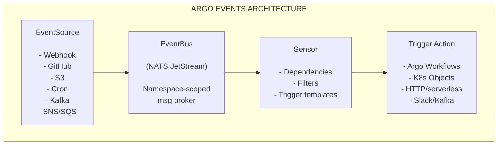

> **Складність**: `[СКЛАДНИЙ]` — кілька взаємодійних CRD, залежності RBAC та налагодження між компонентами.
>
> **Час на проходження**: 60–75 хвилин.
>
> **Передумови**: Модуль 1.1 (основи Argo Workflows), знайомство з CRD Kubernetes, базове розуміння брокерів повідомлень.
>
> **Домен CAPA**: 4 — [Argo Events (12% іспиту)](https://training.linuxfoundation.org/certification/certified-argo-project-associate-capa/)

## Що ви зможете зробити

Після завершення цього модуля ви зможете проєктувати, конфігурувати, впроваджувати, діагностувати та оцінювати конвеєри Argo Events, використовуючи ті самі примітиви, які перевіряє іспит CAPA, — а не лише впізнавати назви CRD у відриві від контексту. Наведені нижче результати безпосередньо відповідають практичним вправам, сценаріям тесту та діагностичній драбині з Частини 6.

1. **Проєктувати** подієво-керовані конвеєри автоматизації, добираючи й поєднуючи CRD EventSource, EventBus та Sensor, що відповідають конкретному сценарію інтеграції.
2. **Конфігурувати** EventSource для вебхуків, календарів та черг повідомлень, спрямовуючи події через EventBus на основі JetStream.
3. **Впроваджувати** Sensor з умовною логікою залежностей AND/OR, фільтрами даних та інʼєкцією параметрів, що запускають Argo Workflows на основі конкретних корисних навантажень подій.
4. **Діагностувати** зламані конвеєри подій, систематично простежуючи збої від статусу EventSource через транспорт EventBus до логів Sensor та аудитного виводу Trigger.
5. **Оцінювати** компроміси між Argo Events та альтернативними нативними для Kubernetes примітивами автоматизації, як-от CronJob, контролери Kubernetes та вебхуки допуску.

Argo Events виблискує, коли зовнішні системи вже надсилають сповіщення або коли вам потрібно реагувати негайно, без опитування. CronJob залишаються доречними для фіксованих розкладів, що не залежать від зовнішнього стану. Власні контролери підходять, коли вам потрібна глибока семантика спостереження Kubernetes за багатьма типами ресурсів. Вебхуки допуску застосовують політику в момент допуску до API, а не оркеструють багатокрокові конвеєри. CAPA може протиставляти ці варіанти у сценарних запитаннях; ваше завдання — зіставити форму інтеграції з інструментом, а не вважати Argo Events відповіддю на кожну задачу автоматизації.

## Чому цей модуль важливий

У великих корпоративних середовищах платформенні команди часто накопичують безліч скриптів опитування та CronJob Kubernetes, які раз за разом перевіряють зовнішні системи на наявність змін. Автоматизація на основі опитування породжує реальні операційні проблеми — марні виклики API, затримане виявлення та дублювання чи некеровані завдання, коли власна логіка опитування дає збій, — тому що кожен споживач мусить сам реалізовувати свій розклад, політику повторів і дедуплікацію проти API, які ніколи не проєктувалися для опитування з фіксованим інтервалом.

Перейшовши на Argo Events, платформенні команди замінюють тисячі рядків крихкого імперативного клейового коду чистою, декларативною, контрольованою через систему версій нервовою системою для Kubernetes. Події миттєво потрапляють до кластера, логіка прийняття рішень явно визначена в YAML і забезпечується контролерами, а дії спрацьовують одразу за виконання потрібних умов, а не на наступному такті опитування. Цей зсув важливий для CAPA, бо іспит очікує, що ви будете міркувати про те, *коли* автоматизація має реагувати, а не лише про те, які поля CRD існують.

Опанування Argo Events означає навчитися будувати стійку, масштабовану автоматизацію, що усуває збої опитування, вузькі місця API та крихкі цикли CI. Цей модуль вибудовує ці знання з нуля — EventSource, EventBus, Sensor та Trigger — а потім вчить діагностувати конвеєр шар за шаром, коли він мовчки ламається.

---

## Частина 1: Основи подієво-керованої архітектури

### 1.1 Чому події змінюють архітектуру

Існує дві фундаментальні стратегії виявлення того, що в зовнішній системі сталася зміна стану: опитування та подієво-керована реакція. Розуміння того, чому одна перевершує іншу, — це не лише академічна вправа: воно визначає, чи масштабується ваша автоматизація до тисяч подій на день, чи завалюється під навантаженням.

| Підхід | Як працює | Недолік |
|----------|-------------|----------|
| **Опитування** | Запитувати «чи щось змінилося?» за таймером | Марнує ресурси, затримане виявлення, обмеження частоти API |
| **Реактивний (події)** | Отримувати сповіщення тієї ж миті, коли щось змінюється | Потребує інфраструктури подій |

Глибша архітектурна відмінність стосується звʼязності. У моделі опитування кожен споживач мусить знати адресу та контракт API кожного виробника. Споживач володіє логікою виявлення, плануванням, повторами та дедуплікацією. Коли API виробника змінюється або запроваджує обмеження частоти, усі споживачі ламаються одночасно.

У подієво-керованій моделі виробник надсилає сповіщення, не знаючи, хто його слухає. Споживач підписується на канал сповіщень, не знаючи, хто його виробляє. Кожна сторона розвивається незалежно. Саме це розчеплення робить подієво-керовані системи компонованими — ви можете додати нового споживача, не торкаючись виробника, і вивести з експлуатації старого, нічого більше не переналаштовуючи.

Argo Events кодифікує це розчеплення як нативні обʼєкти Kubernetes. Звʼязок між зовнішніми системами та вашими внутрішніми робочими процесами повністю керується декларативним YAML, а не власними скриптами, що живуть поза вашим життєвим циклом GitOps.

### 1.2 Специфікація CloudEvents

Щоб забезпечити сумісність у різнорідній екосистемі, Argo Events спирається на специфікацію CloudEvents. [CloudEvents — це специфікація CNCF рівня graduated, що надає стандартизований конверт для будь-яких даних події, незалежно від походження.](https://www.cncf.io/announcements/2024/01/25/cloud-native-computing-foundation-announces-the-graduation-of-cloudevents/) Це важливо, бо вебхук push із GitHub виглядає геть інакше, ніж сповіщення SNS, яке виглядає геть інакше, ніж повідомлення Kafka. CloudEvents накладає спільну структуру на конверт, щоб подальші споживачі — ваші Sensor — могли міркувати про події з будь-якого джерела, використовуючи ті самі механізми фільтрації та видобування параметрів.

Щоразу, коли EventSource отримує зовнішній тригер, [він перетворює цей сирий зовнішній вхід на стандартизований CloudEvent і відправляє його через EventBus](https://argoproj.github.io/argo-events/concepts/event_source/). Ось як на практиці виглядає стандартне корисне навантаження CloudEvent:

```json
{
  "specversion": "1.0",
  "type": "com.github.push",
  "source": "https://github.com/myorg/myrepo",
  "id": "A234-1234-1234",
  "time": "2025-11-05T17:31:00Z",
  "datacontenttype": "application/json",
  "data": {
    "ref": "refs/heads/main",
    "after": "abc123def456",
    "commits": [{"message": "fix: update config"}]
  }
}
```

Поля верхнього рівня (`specversion`, `type`, `source`, `id`, `time`) діють як універсальний заголовок маршрутизації. Фільтри вашого Sensor можуть зіставлятися з цими полями за допомогою контекстних фільтрів, коли вам потрібно розрізнити репозиторії чи типи подій, не розбираючи вкладений JSON. Вкладене поле `data` містить специфічне для домену корисне навантаження, яке цікавить ваші конвеєри, — гілку Git, SHA коміту, назву S3-кошика, — а фільтри даних навігують усередині цього навантаження за допомогою шляхових виразів, як-от `body.ref` для вебхук-EventSource. На іспиті очікуйте запитань, що показують фрагмент CloudEvent і запитують, який тип фільтра чи шлях відбере підмножину подій, тож тренуйтеся читати конверт окремо від навантаження, перш ніж писати YAML для Sensor.

> **Зупиніться та передбачте**: Якщо ви хочете видобути SHA коміту Git із події вище (`data.after`) і передати його як параметр до Argo Workflow, вам потрібен шляховий вираз JSON, який навігує в обʼєкт `data`. Який рядок шляху ви написали б у параметрі Sensor `src.dataKey`? Накидайте свою відповідь, перш ніж читати Частину 4, а потім звірте її з опрацьованим прикладом.

---

## Частина 2: Архітектура Argo Events

Архітектура Argo Events побудована навколо чотирьох логічних компонентів, реалізованих як нативні Custom Resource Definitions Kubernetes. Кожен компонент відповідає за свою конкретну ділянку, і події мусять проходити кожен шар послідовно — ви не можете пропустити EventBus і зʼєднати EventSource напряму з Sensor, бо саме брокер розчеплює виробників і споживачів та поглинає сплески, коли Sensor перезапускаються. Розуміння передачі між шарами — це те, що дає вам змогу систематично діагностувати збої на іспиті CAPA та в продакшені, де симптоми на рівні Workflow часто беруть початок на два кроки раніше, на брокері.

1. **EventSource**: Шлюз. Под EventSource слухає на певний тип зовнішнього входу — виклик вебхука, такт календаря, повідомлення Kafka — і перетворює його на CloudEvent, відправлений до EventBus.
2. **EventBus**: Транспортний шар. [Ресурс Kubernetes у межах простору імен, підкріплений брокером повідомлень (JetStream, NATS або Kafka). Простір імен за конвенцією використовує EventBus із назвою `default`, але підтримується кілька EventBus на простір імен, які добираються через поле `eventBusName` на EventSource та Sensor. У поширеному випадку з одним брокером цей EventBus `default` мусить існувати й досягти стану `Running`, перш ніж виробники чи споживачі зможуть спілкуватися.](https://argoproj.github.io/argo-events/eventbus/eventbus/)
3. **Sensor**: Шар прийняття рішень. Sensor оголошує, які події його цікавлять, як іменовані залежності, визначає умови фільтрів, яким ці події мусять відповідати, і задає шаблони тригерів для виконання, коли всі умови виконуються.
4. **Trigger**: Корисне навантаження дії, вбудоване всередину шаблону Sensor. [Типи тригерів охоплюють Argo Workflows, сире створення обʼєктів Kubernetes, HTTP-запити, повідомлення NATS чи Kafka, сповіщення Slack, Azure Event Hubs та дії OpenWhisk.](https://argoproj.github.io/argo-events/concepts/trigger/)

### Діаграма архітектури

Наступна діаграма відображає повний шлях від зовнішнього джерела події через кожен шар Argo Events до фінальної дії:



### 2.1 Поглиблено про EventSource

[Каталог EventSource охоплює понад двадцять іменованих конекторів: AMQP, AWS SNS, AWS SQS, Azure Events Hub, Azure Queue Storage, Calendar, File, GCP PubSub, GitHub, GitLab, Kafka, NATS, Slack, Stripe, Webhooks та інші. Один ресурс `EventSource` може водночас конфігурувати кілька іменованих потоків подій.](https://argoproj.github.io/argo-events/eventsources/multiple-events/) Один ресурс із назвою `ci-sources` міг би визначити вебхук-слухач `github-push` і календарний запис `release-timer` у тій самій специфікації, кожен з яких незалежно виробляє події через той самий EventBus.

Коли контролер EventSource обробляє ресурс EventSource, [він створює виділений под для цього EventSource](https://argoproj.github.io/argo-events/eventsources/ha/). Цей под виконує власне логіку слухання — відкриває порт для вебхуків, опитує S3-кошик на нові обʼєкти або підписується на партицію Kafka. Цей патерн «под на кожен EventSource» ізолює збої: вебхук-слухач, що поводиться некоректно, не може дестабілізувати календарний EventSource, що працює в окремому поді. З операційного погляду це означає, що ваш перший діагностичний крок для «вебхуки перестали працювати» — це майже завжди логи пода EventSource та точки доступу Service, а не шар Sensor чи Workflow, бо EventSource — єдиний компонент, який розмовляє зовнішнім протоколом. Запитання CAPA часто описують справний Sensor і відсутні Workflow, тоді як реальний збій полягає в тому, що EventSource ніколи не опублікував у брокер.

Окрім вебхуків, той самий CRD EventSource конфігурує інші конектори через блоки полів, специфічні для типу. EventSource типу **Calendar** спрацьовує за розкладом, без зовнішнього входу:

```yaml
spec:
  calendar:
    heartbeat:
      schedule: "*/5 * * * *"   # Every 5 minutes (cron syntax)
      # interval: "10s"         # Alternative: fixed interval instead of cron
```

EventSource типу **Kafka** підписується на партицію теми:

```yaml
spec:
  kafka:
    pipeline-events:
      url: "kafka-broker:9092"
      topic: "deployments"
      partition: "0"
      consumerGroup: "argo-events-sensor"
```

Ключі назв подій (`heartbeat`, `pipeline-events`) стають значеннями `eventName`, на які Sensor посилаються в оголошеннях залежностей, — той самий контракт іменування, що й приклад вебхука `push` у Частині 4.

### 2.2 Поглиблено про EventBus

[Argo Events підтримує три реалізації EventBus: NATS JetStream, NATS Streaming (STAN) та Kafka. NATS Streaming явно визнано застарілим — не використовуйте його в нових розгортаннях.](https://argoproj.github.io/argo-events/eventbus/eventbus/) JetStream — рекомендований стандарт для нових кластерів, бо він пропонує постійне зберігання повідомлень, підтвердження від споживача та семантику відтворення, яких STAN ніколи не давав.

Ресурс EventBus із назвою `default` у певному просторі імен — це те, що більшість EventSource і Sensor шукають, якщо ви явно не сконфігуруєте іншу назву. Це припущення про назву `default` — поширене джерело плутанини, і воно розглянуте в розділі «Типові помилки». Контролер EventBus автоматично надає базову інфраструктуру брокера — коли ви створюєте ресурс EventBus, контролер створює StatefulSet і Service для кластера JetStream. Доки цей StatefulSet не готовий, EventSource можуть логувати помилки публікації, а Sensor — помилки підписки, що скидаються на застосункові баги, але насправді є питанням порядку запуску транспорту. Розглядайте готовність EventBus як жорстку умову в кожному середовищі, а не як необовʼязкову оптимізацію продуктивності.

> **Зупиніться та подумайте**: STAN визнано застарілим. Які операційні ризики реально створює його збереження — не лише в теорії, а з погляду того, що відбувається, коли ви подаєте звіт про ваду проти Argo Events, коли публікується CVE з безпеки проти брокера STAN і коли новіша версія Kubernetes змінює API, від якого залежить StatefulSet STAN? Обміркуйте всі три, перш ніж читати далі.

### 2.3 Sensor та розвʼязання залежностей

Sensor не підписується на «тему» EventBus у традиційному сенсі. Натомість він оголошує іменовані залежності — кожна залежність вказує на конкретну пару «назва EventSource — назва події». Контролер Sensor підписується на EventBus від імені Sensor і тримає отримані події в памʼяті, доки логіка розвʼязання залежностей не визначить, чи запускати тригер. Саме це проміжне зберігання в памʼяті дозволяє Sensor застосовувати фільтри для кожної залежності, перш ніж він вирішить, що конвеєр готовий: кожна залежність може нести власний блок `filters`, і лише коли сконфігурована булева логіка між залежностями виконана, контролер оцінює шаблони тригерів.

Логіка розвʼязання підтримує семантику як AND, так і OR між залежностями. [За замовчуванням усі перелічені залежності мусять розвʼязатися (AND).](https://argoproj.github.io/argo-events/sensors/trigger-conditions/) Ви можете використати `conditions` для кожного тригера з булевими виразами, як-от `A || B` та `(A || B) && C`, щоб змоделювати OR і складніші комбінації. Це дає змогу реалізувати патерни на зразок «спрацювати, якщо надходить або push із GitHub, АБО ручний вебхук», не вимагаючи двох окремих ресурсів Sensor.

---

## Частина 3: Встановлення та керування життєвим циклом

### 3.1 Послідовність встановлення

Послідовність встановлення створює простір імен `argo-events`, застосовує основні маніфести (контролери, RBAC та CRD), а потім створює EventBus на основі JetStream. Виконайте їх проти підтримуваного кластера Kubernetes:

```bash
kubectl create namespace argo-events
kubectl apply -f https://raw.githubusercontent.com/argoproj/argo-events/stable/manifests/install.yaml
kubectl apply -f eventbus.yaml   # JetStream EventBus from Part 4 Step 1 — not legacy native.yaml
```

Після застосування цих маніфестів переконайтеся, що контролери досягли стану `Running`, перш ніж створювати EventSource чи Sensor. Створення Sensor до готовності контролера залишає Sensor застряглим у стані очікування узгодження без повідомлення про помилку — поширена плутанина під час початкового налаштування. Та сама дисципліна порядку застосовується в іспитових запитаннях про встановлення з нуля: EventBus перед EventSource перед Sensor, з RBAC для створення Workflow на місці ще до того, як ви оголосите Sensor, що запускає Workflow. Пропуск цього порядку дає компоненти, які виглядають справними в ізоляції, тоді як наскрізний шлях не може функціонувати.

```bash
kubectl get deploy,po -n argo-events
# Expect: deployment/controller-manager Running (it reconciles EventSource, Sensor, and EventBus)
```

### 3.2 Обмеження за простором імен

[Для Argo Events v1.7 і вище встановлення з обмеженням за простором імен використовує прапорець `--namespaced` на обʼєднаному розгортанні контролера, з необовʼязковим прапорцем `--managed-namespace` для націлювання на конкретний простір імен орендаря. Раніші архітектури (до v1.7) вимагали розгортання трьох окремих контролерів із прапорцями простору імен для кожного контролера.](https://argoproj.github.io/argo-events/managed-namespace/) Сучасна архітектура консолідує це в єдине розгортання.

У мультиорендному кластері, де кілька команд хочуть мати ізольовані простори імен Argo Events, розгорніть по одному обмеженому за простором імен контролеру на кожен простір імен орендаря. Кожен контролер спостерігає та діє лише на ресурси в межах призначеного йому простору імен, запобігаючи перехресному втручанню між орендарями. Готуючись до CAPA, протиставте цю область спостереження контролера лише RBAC: RBAC відповідає на питання, чи може сервісний акаунт створити Workflow, тоді як прапорці обмеженого за простором імен контролера відповідають на питання, обʼєкти EventSource та Sensor якого простору імен взагалі видимі для циклів узгодження.

### 3.3 RBAC для Sensor

[Sensor, що запускає Argo Workflows, мусить мати сервісний акаунт із дозволом на створення ресурсів Workflow у цільовому просторі імен.](https://argoproj.github.io/argo-events/service-accounts/) Цю вимогу часто оминають увагою, і збої, що виникають через неї, мовчазні — логи Sensor показують спробу тригера, а далі нічого. Workflow так і не зʼявляється. Створіть RBAC перед створенням Sensor:

```yaml
apiVersion: v1
kind: ServiceAccount
metadata:
  name: operate-workflow-sa
  namespace: argo-events
---
apiVersion: rbac.authorization.k8s.io/v1
kind: Role
metadata:
  name: operate-workflow-role
  namespace: argo-events
rules:
  - apiGroups: ["argoproj.io"]
    resources: ["workflows"]
    verbs: ["create"]
---
apiVersion: rbac.authorization.k8s.io/v1
kind: RoleBinding
metadata:
  name: operate-workflow-rolebinding
  namespace: argo-events
roleRef:
  apiGroup: rbac.authorization.k8s.io
  kind: Role
  name: operate-workflow-role
subjects:
  - kind: ServiceAccount
    name: operate-workflow-sa
    namespace: argo-events
```

Посилайтеся на цей сервісний акаунт у `spec.template.serviceAccountName` вашого Sensor. Без нього Sensor не може створити ресурс Workflow, і API Kubernetes повертає відповідь `Forbidden`.

### 3.4 Версіонування та розбіжність версій

Розбіжність версій між компонентами Argo Events спричиняє непомітні збої контролерів, які важко діагностувати. [Політика релізів вимагає однакових версій образів для всіх компонентів: `eventsource-controller`, `sensor-controller`, `eventbus-controller` та `events-webhook`. Проєкт підтримує лише дві найновіші мінорні гілки — якщо ваш кластер працює на непідтримуваній версії, не очікуйте виправлень вад чи патчів безпеки.](https://argoproj.github.io/argo-events/releases/)

Використовуючи Helm, переконайтеся, що `appVersion` чарта відповідає бажаному релізу Argo Events. Розбіжності між версією чарта та `appVersion` — поширене джерело збоїв «у стейджингу працювало», коли різні команди застосовують різні версії чарта. В іспитових запитаннях розбіжність версій часто зʼявляється як непомітні симптоми — функція Sensor, задокументована в посібнику для підготовки, але відсутня у вашому кластері, — а не як явний варіант відповіді «неправильна версія», тож завжди співвідносьте неочікувану поведінку CRD з примітками до релізу версії, яку ви насправді встановили.

---

## Частина 4: Повний наскрізний опрацьований приклад

Цей розділ будує повний, робочий конвеєр подій з нуля. Прочитайте весь сценарій, перш ніж застосовувати будь-які маніфести, — послідовність рішень і причини, що стоять за кожним полем YAML, не менш важливі, ніж самі поля. Наприкінці ви переконаєтеся, що кожен шар від зовнішнього HTTP-виклику до запущеного Argo Workflow працює коректно.

### Сценарій

Вашій платформенній команді потрібно автоматично запускати інтеграційні тести щоразу, коли розробник робить push до гілки `main` репозиторію `acme/backend-service`. GitHub надсилає подію push на вебхук-точку доступу у вашому кластері. У продакшені ви зареєстрували б цю точку доступу в налаштуваннях репозиторію GitHub і захистили б її спільним секретом; для навчання та міркувань у стилі CAPA симуляція того самого JSON за допомогою `curl` через port-forward вправляє ідентичний шлях EventSource → EventBus → Sensor без зовнішніх залежностей. Конвеєр мусить:

1. Отримати подію push через вебхук-EventSource.
2. Відфільтрувати лише push до `refs/heads/main` — ігнорувати всі гілки фіч.
3. Видобути SHA коміту з корисного навантаження події.
4. Запустити Argo Workflow із цим SHA коміту як параметром виконання.

Це репрезентативний патерн автоматизації CI. Щойно ви зрозумієте кожне поле тут, ви зможете адаптувати цей патерн до завантажень у S3, повідомлень Kafka, тригерів календаря чи будь-якого іншого типу EventSource.

### Крок 1: Створіть EventBus

Перш ніж будь-який EventSource чи Sensor зможе функціонувати, EventBus мусить існувати в цільовому просторі імен. Це аналогічно до запуску брокера повідомлень перед підключенням виробників чи споживачів — порядок не є необовʼязковим. Назва `default` важлива: EventSource та Sensor шукають EventBus із назвою `default`, якщо ви явно не сконфігуруєте іншу назву в їхніх специфікаціях.

```yaml
apiVersion: argoproj.io/v1alpha1
kind: EventBus
metadata:
  name: default
  namespace: argo-events
spec:
  jetstream:
    version: "2.10.11"
    replicas: 3
```

`replicas: 3` дає вам кластер JetStream з доступністю на основі кворуму, тоді як EventBus з однією репликою втрачає всі події в дорозі, якщо його под витісняється чи переплановується. У середовищі розробки `replicas: 1` прийнятне, але розумійте цей компроміс явно, а не успадковуйте його зі скопійованого прикладу. Застосуйте маніфест нижче й дочекайтеся, доки EventBus досягне фази `Running`, перш ніж створювати будь-який EventSource чи Sensor, бо обидва компоненти припускають живу точку доступу брокера в тому самому просторі імен:

```bash
kubectl apply -f eventbus.yaml
kubectl get eventbus default -n argo-events -w
# Wait until STATUS column shows "running"
```

### Крок 2: Створіть EventSource

EventSource визначає вебхук-слухач. Коли GitHub надсилає POST на `/push`, под EventSource отримує HTTP-запит, загортає тіло в CloudEvent і публікує його в EventBus під назвою події `push`. Ця назва події — це ідентифікатор, на який ваш Sensor посилатиметься в оголошенні залежності.

```yaml
apiVersion: argoproj.io/v1alpha1
kind: EventSource
metadata:
  name: github-eventsource
  namespace: argo-events
spec:
  service:
    ports:
      - port: 12000
        targetPort: 12000
  webhook:
    push:
      port: "12000"
      endpoint: /push
      method: POST
```

Два поля тут відповідають за більшість помилок зʼєднання в новачків. По-перше, блок `service` вказує контролеру EventSource створити Service Kubernetes поряд із подом EventSource. [Без цього блоку жодного Service не створюється.](https://argoproj.github.io/argo-events/eventsources/services/) Port-forward працює добре й без нього, бо port-forward націлюється на под напряму, але бекенд Ingress або зовнішній трафік не має шляху всередину. По-друге, [назва `push` усередині блоку `webhook` стає тим `eventName`, на який Sensor посилаються в оголошеннях залежностей. Цей рядок мусить збігатися точно](https://argoproj.github.io/argo-events/eventsources/naming/) — різниця в один символ означає, що Sensor підписується на подію, яка ніколи не надходить. Після застосування маніфесту переконайтеся, що ресурс EventSource, його под-слухач і опорний Service усі існують; назва Service відповідає патерну `<eventsource-name>-eventsource-svc`, який вам знадобиться для port-forward і для будь-якого бекенду Ingress, що ви сконфігуруєте пізніше:

```bash
kubectl get eventsource github-eventsource -n argo-events
kubectl get pod -l eventsource-name=github-eventsource -n argo-events
kubectl get svc -n argo-events | grep eventsource
```

### Крок 3: Створіть Sensor

Sensor оголошує одну залежність із назвою `push-dep`, що вказує на EventSource `github-eventsource` та подію `push`. Фільтр даних перевіряє поле `body.ref`, обмежуючи конвеєр лише push до гілки `main`. Шаблон тригера визначає Argo Workflow для створення, а звʼязування параметрів копіює SHA коміту з `body.after` в аргумент `commit-sha` робочого процесу.

```yaml
apiVersion: argoproj.io/v1alpha1
kind: Sensor
metadata:
  name: github-sensor
  namespace: argo-events
spec:
  template:
    serviceAccountName: operate-workflow-sa
  dependencies:
    - name: push-dep
      eventSourceName: github-eventsource
      eventName: push
      filters:
        data:
          - path: body.ref
            type: string
            value:
              - refs/heads/main
  triggers:
    - template:
        name: trigger-ci-workflow
        argoWorkflow:
          operation: submit
          source:
            resource:
              apiVersion: argoproj.io/v1alpha1
              kind: Workflow
              metadata:
                generateName: ci-build-
                namespace: argo-events
              spec:
                entrypoint: run-tests
                arguments:
                  parameters:
                    - name: commit-sha
                      value: placeholder
                templates:
                  - name: run-tests
                    inputs:
                      parameters:
                        - name: commit-sha
                    container:
                      image: alpine:3.18
                      command: [sh, -c]
                      args:
                        - |
                          echo "Running tests for commit {{inputs.parameters.commit-sha}}"
                          sleep 5
                          echo "Tests passed"
          parameters:
            - src:
                dependencyName: push-dep
                dataKey: body.after
              dest: spec.arguments.parameters.0.value
```

Кілька структурних рішень у цьому YAML Sensor заслуговують на явну увагу, перш ніж ви рушите далі, бо неправильно сконфігуровані фільтри та призначення параметрів дають конвеєри, які виглядають справними, але ніколи не запускають Workflow, на який ви очікуєте.

**Нотація шляху `filters.data`**: Шлях `body.ref` навігує тіло HTTP-запиту вебхука, яке EventSource загортає всередину поля `data` CloudEvent. У сирій структурі CloudEvent воно зʼявилося б як `data.body.ref`, але [фільтри даних Argo Events неявно навігують усередині `data`, тож префікс — це лише `body`.](https://argoproj.github.io/argo-events/sensors/filters/data/) Працюючи з не-вебхук EventSource (Kafka, SNS), структура шляху відрізняється — завжди оглядайте сиру подію зі свого EventSource, перш ніж писати фільтри.

**Індекс нуль у `parameters`**: Звʼязування параметрів встановлює `spec.arguments.parameters.0.value`, де `0` — це індекс із нуля в масив `arguments.parameters` робочого процесу. Якщо ви інʼєктуєте кілька параметрів, додайте кілька записів до списку `parameters`, кожен з іншим індексом призначення. Інʼєкція в неправильний індекс мовчки використовує рядок `placeholder` із шаблону.

**`generateName` проти `name`**: [Використання `generateName` означає, що кожен запущений Workflow отримує унікальну назву на кшталт `ci-build-k29xr`. Фіксована `name` спричиняє збій другої спроби тригера з конфліктом `AlreadyExists`](https://kubernetes.io/docs/concepts/overview/working-with-objects/names), через що ваш конвеєр здається таким, що спрацьовує лише раз. Завжди використовуйте `generateName` для динамічно запущених Workflow.

### Крок 4: Протестуйте конвеєр наскрізно

Щоб протестувати без налаштування реального вебхука GitHub, перенаправте порт Service EventSource через port-forward, щоб ваша робоча станція могла дістатися до слухача, а потім симулюйте push до гілки `main` за допомогою `curl`, використовуючи ту саму форму JSON, яку надіслав би GitHub:

```bash
kubectl port-forward svc/github-eventsource-eventsource-svc 12000:12000 -n argo-events &

curl -X POST http://localhost:12000/push \
  -H "Content-Type: application/json" \
  -d '{
    "ref": "refs/heads/main",
    "after": "abc123def456789",
    "commits": [{"message": "fix: update config"}]
  }'

kubectl get workflows -n argo-events -w
```

Workflow з назвою на кшталт `ci-build-k29xr` має зʼявитися й досягти стану `Running` за кілька секунд. Підтвердіть, що параметр SHA коміту інʼєктувався коректно, за допомогою `kubectl get workflow -n argo-events -o jsonpath='{.items[0].spec.arguments.parameters[0].value}'` — ви маєте побачити `abc123def456789`. Якщо нічого не зʼявляється після 15 секунд, не перезапускайте компоненти навмання; перейдіть до Частини 6 та пройдіть діагностичну драбину від отримання EventSource через публікацію EventBus до оцінювання фільтра Sensor.

### Що щойно сталося: простежуємо повний потік подій

Покроковий прохід конвеєром у послідовності вибудовує ментальну модель, потрібну для подальшого налагодження, бо кожен крок відповідає окремому шару діагностичної драбини з Частини 6. Спершу `curl` надіслав POST із JSON на под EventSource на порт 12000 за точкою доступу `/push`. Под EventSource загорнув те тіло в CloudEvent і опублікував його в EventBus на основі JetStream на тему, повʼязану з назвою події `push`. Горутина-підписник Sensor отримала повідомлення, оцінила умову `filters.data` проти `body.ref`, і оскільки `refs/heads/main` збіглося, залежність `push-dep` розвʼязалася. Із усіма розвʼязаними залежностями Sensor створив екземпляр шаблону тригера, застосував інʼєкцію параметрів, щоб замінити `placeholder` на `abc123def456789` з `body.after`, і його сервісний акаунт викликав API Kubernetes для створення ресурсу Workflow, який контролер Argo Workflows потім запланував. Кожен із цих кроків незалежно спостережний у логах або виводі `kubectl`, і саме ця архітектурна властивість робить систематичне налагодження здійсненним, а не вгадуванням, який компонент дав збій.

---

## Частина 5: Логіка залежностей Sensor та фільтри

### 5.1 Розвʼязання залежностей AND проти OR

Поведінка за замовчуванням в Argo Events — це розвʼязання AND: кожна перелічена в Sensor залежність мусить розвʼязатися, перш ніж спрацює будь-який тригер. Це доречно для забезпечення передумов — «запустити робочий процес розгортання, лише коли надійшли й пройшли І подія результату тестів, І подія сканування безпеки». Семантика AND — це безпечний стандарт за замовчуванням, бо вона запобігає тому, щоб неповні конвеєри діяли на неповному сигналі, і саме тому багато іспитових сценаріїв описують Sensor, який ніколи не спрацьовує доти, доки не буде виконано другу залежність, яка насправді ніколи не надходить.

Для семантики OR напишіть булевий вираз `conditions` у шаблоні тригера, що посилається на назви залежностей напряму, — наприклад `conditions: "github-push || manual-trigger"`. Опустіть `conditions` повністю, коли всі залежності мусять розвʼязатися (AND-усіх). Кілька тригерів в одному Sensor можуть кожен нести інший вираз `conditions`, щоб маршрутизувати різні події до різних Workflow. Наступний приклад спрацьовує тригер, коли надходить або push із GitHub, або ручний вебхук:

```yaml
spec:
  dependencies:
    - name: github-push
      eventSourceName: github-eventsource
      eventName: push
    - name: manual-trigger
      eventSourceName: webhook-eventsource
      eventName: manual
  triggers:
    - template:
        conditions: "github-push || manual-trigger"
        name: deploy-trigger
        argoWorkflow:
          operation: submit
          source:
            resource:
              apiVersion: argoproj.io/v1alpha1
              kind: Workflow
              metadata:
                generateName: deploy-
              spec:
                entrypoint: main
                templates:
                  - name: main
                    container:
                      image: alpine:3.18
                      command: [echo, deployed]
```

Поле `conditions` кожного шаблону тригера визначає, який патерн розвʼязання залежностей запускає цей конкретний тригер. Це дозволяє одному Sensor містити кілька тригерів, кожен з яких спрацьовує за різною булевою логікою, — корисний патерн для маршрутизації подій до різних Workflow залежно від того, які залежності розвʼязалися. Коли ви читаєте сценарії CAPA про «ручне затвердження АБО автоматичний push», зіставте «ручне» та «push» з окремими залежностями й виразіть OR у `conditions` для кожного тригера, а не дублюйте цілі Sensor, що різняться лише тим, який шаблон Workflow вони запускають.

### 5.2 Типи фільтрів

Argo Events підтримує кілька типів фільтрів. Ті, що використовуються найчастіше на практиці, — це фільтри даних, часу, контексту та виразів:

**Фільтри даних** зіставляються з конкретними полями в корисному навантаженні події за допомогою шляхових виразів JSON. Поле `type` мусить бути `string`, `number` або `bool`, і фільтр виконує перевірку рівності проти списку `value`. Кілька значень у списку поєднуються логікою OR — подія проходить, якщо поле збігається з будь-яким переліченим значенням. Фільтри даних — найуживаніші й мають бути вашим першим вибором, коли достатньо перевірки рівності поля, бо причини їхнього проходження/непроходження чітко зʼявляються в логах Sensor разом зі спостереженим значенням. Коли пункт CAPA описує «лише розгортання з гілки main», перекладіть цю вимогу на запис `filters.data` у залежності, що володіє подією push Git, а не на другий Sensor, якщо логіка маршрутизації справді не розходиться на рівні шаблону тригера.

**Фільтри часу** обмежують обробку подій конкретними вікнами в межах 24-годинного періоду, використовуючи час початку й завершення у форматі `HH:MM:SS` з необовʼязковим часовим поясом. Це корисно для патернів «обробляти події лише в робочі години» або для обмеження високочастотних джерел подій вікнами обслуговування, коли подальшим робочим процесам дозволено виконуватися.

**Контекстні фільтри** зіставляються з полями конверта CloudEvents, як-от `source`, `type` чи `subject`, — полями поза блоком `data`. Якщо кілька репозиторіїв надсилають події на ту саму точку доступу, оглядайте специфічні для репозиторію поля в корисному навантаженні події й використовуйте фільтри даних чи виразів для їхньої маршрутизації.

**Фільтри виразів** використовують синтаксис бібліотеки `expr` для написання довільних булевих виразів проти полів події. Це найгнучкіший варіант, але також найважчий для читання й налагодження — віддавайте перевагу фільтрам даних, коли достатньо простої перевірки рівності чи збігу зі списком.

> **Зупиніться та подумайте**: Ваш Sensor отримує події з двох різних репозиторіїв GitHub, обидва роблять push до `refs/heads/main`. Ви хочете, щоб Workflow A спрацьовував для `myorg/service-alpha`, а Workflow B — для `myorg/service-beta`. Не пишучи поки YAML, накидайте комбінацію типу фільтра, назв залежностей та умов тригера, яку ви використали б. Обміркуйте, чи потрібен вам один Sensor чи два. Потім порівняйте свій підхід з архітектурою, описаною в Запитанні 8 тесту.

### 5.3 Поглиблено про інʼєкцію параметрів

Інʼєкція параметрів перетворює загальну подію на Workflow зі змістовними, специфічними для події входами. Список `parameters` у шаблоні тригера визначає зіставлення, кожне з `src` (джерело видобування) та `dest` (ціль інʼєкції). Уявляйте вбудований маніфест Workflow усередині тригера як трафарет: ви оголошуєте значення-заповнювачі в шаблоні, а Argo Events перезаписує конкретні шляхи JSON у цьому трафареті безпосередньо перед тим, як виклик створення досягне API Kubernetes. Коли інʼєкція дає збій, трафарет усе одно застосовується — і саме тому неправильно сконфігурований `dataKey` дає запущений Workflow з буквальним рядком `placeholder`, а не помилку на ранньому етапі в Sensor.

Блок `src` підтримує кілька стратегій видобування. `dataKey` бере шлях JSON у поле `data` CloudEvent — використовуйте його для полів навантаження на кшталт SHA комітів, назв файлів чи ідентифікаторів користувачів. `dataTemplate` бере вираз шаблону Go, що оцінюється проти всього CloudEvent, — використовуйте його, коли вам потрібно перетворити чи поєднати поля, а не видобути єдине значення. `contextKey` навігує конверт CloudEvent, а не корисне навантаження `data`, — використовуйте його для метаданих конверта, як-от `type` чи `source`. `value` інʼєктує статичний рядок незалежно від вмісту події — використовуйте його для констант, як-от назви середовищ чи ідентифікатори кластерів.

Поле `dest` — це шлях JSON у специфікацію ресурсу тригера. Для тригерів Argo Workflow шлях мусить починатися з `spec.` і навігувати структуру специфікації Workflow. Патерн `spec.arguments.parameters.0.value` встановлює перший запис у масиві `arguments.parameters` верхнього рівня робочого процесу. Інʼєкція параметрів шаблону (усередині `templates[].inputs.parameters`) обробляється самим Workflow через посилання `{{inputs.parameters.name}}` — туди ви не інʼєктуєте з Argo Events.

---

## Частина 6: Діагностика збоїв потоку подій

Конвеєри подій частіше ламаються мовчки, ніж гучно. EventSource може повернути HTTP 200 на вхідний вебхук, тоді як подія так і не дістанеться Sensor, бо успіх HTTP лише доводить, що слухач отримав байти, — а не те, що JetStream прийняв публікацію. Sensor може залогувати «trigger executed», тоді як Workflow так і не зʼявляється, бо той рядок логу фіксує спробу викликати API Kubernetes, а не рішення про допуск від API-сервера. Тому ефективна діагностика вимагає знання того, що спостерігає кожен компонент і що означає його мовчання, та вимагає утриматися від бажання перезапускати поди, доки ви не матимете доказів про те, який шар відкинув подію.

Порівняно з налагодженням одного CronJob чи Deployment, Argo Events додає шину повідомлень між виробником і споживачем, що є ціною розчеплення. Перевага в тому, що ви можете оглянути кожен крок незалежно: логи EventSource для вхідного трафіку, статус EventBus для стану транспорту, логи Sensor для рішень про фільтри й тригери та події простору імен для відмов RBAC. Розділи нижче перетворюють цю ментальну модель на конкретні команди.

### 6.1 Діагностична драбина

Коли події не течуть, як очікувалося, рухайтеся вниз цією драбиною від джерела до дії. Кожен шар ізолює відповідальність окремого компонента:

```
Layer 1: Did the event reach the EventSource pod?
    └── EventSource pod logs for HTTP request receipt and dispatch attempts

Layer 2: Did the EventSource publish to the EventBus?
    └── EventSource logs for "Dispatching event" or broker publish errors
    └── EventBus pod health and StatefulSet readiness

Layer 3: Did the Sensor receive the event from the EventBus?
    └── Sensor pod logs for dependency receipt traces

Layer 4: Did the filter evaluate and pass?
    └── Sensor pod logs for filter evaluation results (PASSED or FAILED with reason)

Layer 5: Did the trigger execute?
    └── Sensor pod logs for "trigger executed" and downstream API call results

Layer 6: Was the Workflow created successfully?
    └── kubectl get workflows and kubectl get events for Forbidden entries
```

Ніколи не пропускайте шари. Збій на шарі 2 виглядатиме так само, як збій фільтра на шарі 4, якщо ви перевіряєте лише фінальний вивід на шарі 6.

### 6.2 Діагностичні команди за шарами

Використовуйте наведені нижче команди на кожному шарі драбини. Почніть зі статусу EventSource та подій Kubernetes, потім огляньте логи пода EventSource на отримання HTTP та рядки публікації в брокер, далі логи Sensor на трейси залежностей і фільтрів, і нарешті обʼєкти Workflow плюс події простору імен, коли тригери начебто спрацьовують, але жодного Workflow не створено:

```bash
kubectl describe eventsource github-eventsource -n argo-events
# Look for: status.conditions with type "Ready" = True
# Look for: events section with controller reconciliation errors

kubectl logs -l eventsource-name=github-eventsource -n argo-events --tail=50
# Look for: lines showing "Dispatching event" after your HTTP call
# A missing dispatch line means the HTTP request never reached the pod

kubectl logs -l sensor-name=github-sensor -n argo-events --tail=50
# Look for: dependency resolution trace messages
# Look for: filter evaluation results with PASSED or FAILED and the reason
# Look for: trigger execution attempts and their outcomes

kubectl get workflows -n argo-events
kubectl get events -n argo-events --sort-by='.lastTimestamp' | tail -20
# RBAC failures appear as Warning events with "Forbidden" in the message
```

### 6.3 Типові сигнатури збоїв та їхнє значення

**Симптом: под EventSource у стані Running, але в логах Sensor нічого не зʼявляється** — це майже завжди означає, що EventBus недосяжний. І под EventSource, і под Sensor можуть запуститися й виглядати справними у власних умовах статусу, не маючи робочого зʼєднання з брокером повідомлень. Переконайтеся, що EventBus із назвою `default` існує в тому самому просторі імен і досяг фази `Running`: `kubectl get eventbus -n argo-events`. Відсутній чи збійний EventBus мовчить на рівні компонентів, але фатальний для конвеєра.

**Симптом: логи Sensor показують «trigger executed», але жоден Workflow не зʼявляється** — це збій виконання тригера після того, як Sensor успішно вирішив спрацювати. Найпоширеніша причина — неправильна конфігурація RBAC: сервісному акаунту Sensor бракує дозволу `create` на `argoproj.io/workflows`. API Kubernetes повертає відповідь `Forbidden`, що зʼявляється в `kubectl get events`, але не в логах Sensor. Виправте Role та RoleBinding, потім надішліть тестову подію повторно.

**Симптом: деякі події запускають Workflow, інші — ні** — умова фільтра проходить для одних подій і не проходить для інших. Це очікувана поведінка, якщо фільтр коректний. Якщо неочікувані події відкидаються, перевірте логи Sensor одразу після push, що мав би спрацювати. Трейс оцінювання фільтра показує фактичне спостережене значення поля проти очікуваного значення. Поширена помилка — написати `body.ref`, тоді як фактичний шлях JSON для конкретного типу EventSource розміщує поле в іншому місці.

**Симптом: Workflow створено, але він виконується зі значеннями-заповнювачами замість реальних SHA комітів** — шлях інʼєкції параметрів неправильний. Вираз `dataKey` не розвʼязується в заповнене поле в корисному навантаженні події. Додайте до Sensor діагностичний HTTP-тригер, що надсилає сире тіло події на точку доступу в стилі `requestbin` або на діагностичний сервіс усередині кластера. Огляньте фактичну структуру JSON, підтвердіть правильний шлях і оновіть значення `dataKey`.

> **Активне навчання**: Ви отримуєте звіт: «Робочий процес CI спрацьовує на кожен push, зокрема й на гілки фіч. Я думав, що фільтр мав обмежити його лише гілкою main». Перш ніж перевіряти YAML, назвіть три окремі місця в конвеєрі, де могла б виникнути ця неправильна конфігурація, і опишіть конкретну команду kubectl, яку ви виконали б на кожному шарі, щоб підтвердити чи виключити кожну причину. Запишіть свою відповідь, перш ніж читати таблицю «Типові помилки» нижче.

---

## Чи знали ви?

- [**Argo було прийнято до CNCF 26 березня 2020 року** і випущено зі статусом graduated 6 грудня 2022 року](https://www.cncf.io/projects/argo/), що позначило важливу віху зрілості проєкту.
- [**Argo Events підтримує понад 20 нативних джерел подій і 10 типів тригерів**](https://github.com/argoproj/argo-events), охоплюючи більшість корпоративних патернів інтеграції без потреби писати власний код конектора — від AWS SNS та GCP PubSub до Stripe та Azure Event Hubs.
- **EventBus на основі JetStream забезпечує постійність повідомлень із семантикою підтвердження**, тобто події не втрачаються, якщо под Sensor тимчасово недоступний під час послідовного перезапуску — JetStream тримає непідтверджені повідомлення, доки споживач не перезʼєднається й не підтвердить доставку.
- **Argo Events надає валідаційний вебхук допуску** для валідації ресурсів ([див. наявні маніфести встановлення](https://github.com/argoproj/argo-events/tree/stable/manifests)), тож інфраструктура вебхука має бути досяжною з API-сервера, якщо ви її встановлюєте.

---

## Типові помилки

| Помилка | Симптом | Виправлення |
|---------|---------|-------------|
| **Немає EventBus у цільовому просторі імен** | Поди EventSource та Sensor запускаються нормально, але події між ними не течуть; логи Sensor показують відмову зʼєднання з брокером | Створіть ресурс `EventBus` із назвою `default` у тому самому просторі імен, що й ваші EventSource та Sensor, перш ніж розгортати будь-який із них |
| **Розбіжність назви події EventSource та назви події залежності Sensor** | Логи Sensor не показують розвʼязання залежності; EventSource виглядає справним і публікує події | Точно порівняйте рядковий ключ усередині блоку webhook EventSource (`push:`) з полем `eventName` у залежності Sensor — різниця в один символ ламає підписку |
| **Відсутній блок `spec.service` у вебхук-EventSource** | Под EventSource працює; локальний `curl` через port-forward успішний; Ingress або зовнішній трафік дає збій зі connection refused | Додайте `spec.service.ports` до EventSource, щоб контролер створив опорний Service Kubernetes |
| **Сервісному акаунту Sensor бракує дозволу на створення Workflow** | Логи Sensor показують виконання тригера; жоден Workflow не зʼявляється; `kubectl get events` показує попередження Forbidden | Створіть Role, що надає `create` на `argoproj.io/workflows`, привʼяжіть її до сервісного акаунту Sensor і пошліться на сервісний акаунт у `spec.template.serviceAccountName` |
| **Використання фіксованої `metadata.name` замість `generateName` у вбудованому Workflow** | Конвеєр спрацьовує коректно першого разу; другий тригер дає збій з AlreadyExists; здається, що працює лише раз | Використайте `metadata.generateName` у шаблоні Workflow усередині джерела тригера, щоб кожне виконання створювало унікально названий обʼєкт Workflow |
| **Неправильний шлях `dataKey` для інʼєкції параметрів** | Workflow створюється й виконується, але використовує буквальний рядок `placeholder` для всіх параметрів | Залогуйте сире корисне навантаження події за допомогою діагностичного HTTP-тригера, підтвердіть фактичний шлях JSON та оновіть поле `dataKey` — памʼятайте, що вебхук-EventSource вкладають тіло запиту під `body` |
| **Розгортання NATS Streaming (STAN) замість JetStream** | Брокер спершу працює; патчі безпеки не застосовуються; з часом несумісність із новішими релізами Kubernetes чи Argo Events | Перенесіть специфікацію EventBus на `jetstream`, переконайтеся, що StatefulSet JetStream досягає Ready, і підтвердіть, що EventSource та Sensor перезʼєдналися, перш ніж виводити STAN з експлуатації |
| **EventSource та Sensor у різних просторах імен без явного міжпросторового зʼєднання** | Події, опубліковані EventSource, ніколи не дістаються Sensor; жоден компонент не показує помилки у власному статусі | Розмістіть обидва ресурси в тому самому просторі імен або зверніться до документації з міжпросторової маршрутизації подій Argo Events для вашої версії, якщо міжпросторовий варіант архітектурно необхідний |

---

## Тест

### Запитання 1: Ваша команда переносить застарілу систему, яка опитує GitHub кожні 60 секунд на наявність нових подій push. Ви розгортаєте вебхук-EventSource із фільтром даних на `body.ref`, що збігається лише з `refs/heads/main`. Розробник робить push до `feature/dark-mode`, чекає, потім робить push до `main`. Опишіть точно, які події запускають подальший Argo Workflow, які — ні, і поясніть, що показали б логи Sensor під час кожного оцінювання.

<details>
<summary>Відповідь</summary>

Лише push до `main` запускає Workflow. Коли надходить push до `feature/dark-mode`, Sensor оцінює фільтр даних проти `body.ref`. Значення `refs/heads/feature/dark-mode` не збігається зі значенням фільтра `refs/heads/main`, тож залежність не розвʼязується. Логи Sensor покажуть запис оцінювання фільтра з результатом, що вказує на непроходження фільтра, разом зі спостереженим значенням. Жодного тригера не виконується.

Коли надходить push до `main`, фільтр оцінює `body.ref: refs/heads/main` проти сконфігурованого значення, знаходить збіг, і залежність розвʼязується. Логи Sensor покажуть запис про проходження фільтра, потім запис про виконання тригера, а Workflow зʼявиться в `kubectl get workflows` за кілька секунд.

Система опитування, яку команда замінює, обробила б обидва push однаково — логіка фільтра жила в коді застосунку, а не в інфраструктурі. Перенесення фільтра в Sensor робить намір контрольованим через систему версій та придатним для аудиту.

</details>

---

### Запитання 2: Ви розгортаєте Argo Events у новий простір імен під назвою `team-alpha`. Ви створюєте EventSource та Sensor. Обидва поди досягають стану `Running`. Ви надсилаєте вебхук-запит, що повертає HTTP 200. Жоден Workflow не створюється. Ви перевіряєте логи Sensor і не бачите жодних записів про розвʼязання залежностей — навіть жодного провального фільтра. Яка найімовірніша причина і яка конкретна послідовність команд kubectl це підтверджує?

<details>
<summary>Відповідь</summary>

Найімовірніша причина — відсутній EventBus у просторі імен `team-alpha`. І под EventSource, і под Sensor можуть запуститися й пройти власні перевірки стану, не маючи робочого зʼєднання з брокером повідомлень. HTTP 200 від EventSource підтверджує, що под отримав запит, але не підтверджує, що подію опубліковано в EventBus. Без EventBus публікація мовчки дає збій або відкидається.

Підтвердіть командою: `kubectl get eventbus -n team-alpha`

Якщо EventBus не існує, створіть його й дочекайтеся, доки він досягне фази `Running`. Потім повторно надішліть вебхук-подію й спостерігайте логи Sensor: `kubectl logs -l sensor-name=<name> -n team-alpha -f`

Якщо EventBus існує, але показує фазу, відмінну від Running, виконайте `kubectl describe eventbus default -n team-alpha`, щоб знайти помилку контролера, потім усуньте її перед повторним тестуванням.

</details>

---

### Запитання 3: Ваша платформна команда оновлює продакшен-кластер з v1.31 до v1.35. Наявне встановлення Argo Events використовує EventBus на NATS Streaming (STAN). Колега доводить, що STAN сьогодні все ще працює, тож міграцію можна відкласти до наступного кварталу. Які саме ризики ігнорує ця позиція? Яка правильна послідовність міграції?

<details>
<summary>Відповідь</summary>

Аргумент колеги ігнорує три окремі категорії ризику. По-перше, STAN явно застарілий в Argo Events, а отже будь-які специфічні для STAN баги, заведені проти проєкту Argo Events, буде закрито без виправлення. По-друге, проєкт Argo підтримує лише дві найновіші мінорні гілки релізів, тож організація, що працює на старішій версії Argo Events, яка ще підтримувала STAN, зрештою повністю випаде з вікна підтримки, лишившись із невиправленими CVE. По-третє, сам брокер STAN має окремий життєвий цикл підтримки від Argo Events — вразливості безпеки в процесі STAN чи його залежностях не патчитимуться.

Правильна послідовність міграції: оновіть специфікацію ресурсу EventBus із `nats` або застарілої конфігурації STAN на `jetstream` із бажаною кількістю реплік. Контролер EventBus розгорне StatefulSet JetStream. Переконайтеся, що StatefulSet досягає повної готовності, командою `kubectl get statefulset -n argo-events`. Підтвердіть, що всі залежні EventSource та Sensor перезʼєдналися — перевірте їхні умови статусу й протестуйте повний конвеєр симульованою подією, перш ніж оголошувати міграцію завершеною. Лише тоді виведіть StatefulSet STAN з експлуатації.

</details>

---

### Запитання 4: Ви розгортаєте Argo Events v1.9.10 у корпоративний кластер, де політика безпеки вимагає, щоб контролери спостерігали ресурси лише в межах конкретного орендарського простору імен `tenant-a`. Колега пропонує використати типове встановлення на весь кластер і обмежити доступ через RBAC. Чому цього недостатньо і як слід налаштувати встановлення?

<details>
<summary>Відповідь</summary>

RBAC обмежує те, що може робити сервісний акаунт контролера, але не обмежує, які простори імен контролер спостерігає на наявність ресурсів CRD. Встановлення на весь кластер розгортає контролер із ClusterRole, що типово спостерігає всі простори імен. Навіть з обмеженнями RBAC на операції запису контролер усе одно спостерігає ресурси EventSource та Sensor у всіх просторах імен, що порушує вимогу ізоляції на рівні спостереження.

Правильна конфігурація для v1.7 і новіших — застосувати прапорець `--namespaced` до уніфікованого розгортання контролера й вказати `--managed-namespace tenant-a`. Це обмежує область спостереження на рівні контролера, а не лише на рівні дозволів. Контролер узгоджуватиме лише ресурси EventSource та Sensor, що існують у `tenant-a`, а будь-які ресурси в інших просторах імен для нього невидимі.

У багатоорендному кластері з кількома командами розгортайте один контролер у межах простору імен на орендарський простір імен. Кожен контролер повністю ізольований. Баг чи неправильна конфігурація в контролері однієї команди не може вплинути на конвеєр подій іншої команди.

</details>

---

### Запитання 5: Sensor має дві залежності: `test-passed` (від EventSource результатів тестів) та `scan-passed` (від EventSource сканування безпеки). Активне типове розвʼязання AND. Тести завершуються й надсилають подію. Сканування безпеки перевищує час очікування й ніколи не надсилає подію. Workflow розгортання так і не спрацьовує. Розробник просить вас змінити Sensor так, щоб Workflow спрацьовував, щойно тести проходять, а сканування було необовʼязковим. Яку архітектурну зміну ви робите і який компроміс безпеки вона привносить?

<details>
<summary>Відповідь</summary>

За типового розвʼязання AND обидві залежності мають розвʼязатися, перш ніж спрацює будь-який тригер. Оскільки `scan-passed` ніколи не надходить, конвеєр заблоковано назавжди для цього циклу подій.

Щоб зробити сканування необовʼязковим, додайте тригер із `conditions: "test-passed"`, що спрацьовує, щойно завершуються тести, не чекаючи залежності сканування. Як альтернатива, визначте два тригери в тому самому Sensor: один із `conditions: "test-passed"` для швидкого розгортання, і другий із `conditions: "test-passed && scan-passed"` для повного контрольованого шляху, коли надходять обидві події.

Компроміс: ви тепер дозволяєте розгортання без завершеного сканування безпеки. Це може бути прийнятним, якщо сканування є рекомендаційним, а не примусовим, але воно послаблює вашу позицію безпеки. Ухвалюйте це рішення свідомо разом зі своєю командою безпеки, а не як зручний типовий варіант. Розгляньте альтернативу: задайте таймаут на залежності сканування, щоб Sensor чекав обмежений період на обидві, відкочувався до розгортання без завершення сканування, але генерував подію чи метрику безпеки, щоб команда знала, що сканування було пропущено.

</details>

---

### Запитання 6: Логи вашого Sensor показують повідомлення «trigger executed» для кожної вхідної вебхук-події. Виконання `kubectl get workflows -n argo-events` показує, що жодного Workflow не створено. Молодший інженер пропонує перезапустити под Sensor. Чи допоможе це? Яка справжня першопричина і як ви її діагностуєте?

<details>
<summary>Відповідь</summary>

Перезапуск пода Sensor не допоможе. «Trigger executed» у логах Sensor підтверджує, що Sensor викликав API Kubernetes для створення ресурсу Workflow. Збій — у відповіді API-сервера на цей виклик, а не в самому Sensor: перезапуск не змінює конфігурацію RBAC, що спричинила збій виклику API.

Справжня першопричина майже напевно — відсутнє або неправильне привʼязування RBAC. Сервісний акаунт Sensor не має дозволу `create` на `argoproj.io/workflows`. API-сервер Kubernetes повертає відповідь `Forbidden`, що записується як попереджувальна подія в просторі імен, але не зʼявляється в логах Sensor.

Діагностуйте командою: `kubectl get events -n argo-events --sort-by='.lastTimestamp' | grep -i forbidden`

Повідомлення події ідентифікує сервісний акаунт і тип ресурсу, у якому було відмовлено. Виправте, створивши чи оновивши Role, що надає `create` на `argoproj.io/workflows` у цільовому просторі імен, і привʼязавши її до сервісного акаунту Sensor через RoleBinding. Потім повторно надішліть тестову подію, щоб підтвердити появу Workflows.

</details>

---

### Запитання 7: Ваш EventSource коректно працював із тестуванням через port-forward. Після того як команда налаштувала справжній Ingress, що вказує на EventSource, доставки вебхуків GitHub починають провалюватися зі «connection refused». Жодних змін до самого EventSource не вносилося. Яка найімовірніша причина і як ви її підтверджуєте?

<details>
<summary>Відповідь</summary>

Найімовірніша причина — відсутній блок `spec.service` у визначенні EventSource. Коли цей блок відсутній, контролер EventSource не створює Service Kubernetes для пода EventSource. Port-forward повністю обходить рівень Service, спрямовуючись напряму до пода, — ось чому локальне тестування працювало. Ingress, однак, потребує Service як цілі бекенду. Без Service Ingress немає куди маршрутизувати, і зʼєднанням GitHub відмовлено.

Підтвердіть командою: `kubectl get svc -n argo-events | grep eventsource`

Якщо жодного Service не зʼявляється, додайте `spec.service.ports` до маніфесту EventSource й застосуйте повторно. Контролер створить Service під час наступного узгодження. Потім оновіть посилання бекенду Ingress на нову назву та порт Service, переконайтеся, що GitHub може доставити тестове навантаження, і підтвердіть появу Workflows, як очікувалося.

</details>

---

### Запитання 8: Два репозиторії GitHub, `myorg/service-alpha` та `myorg/service-beta`, обидва роблять push до `refs/heads/main` і надсилають вебхуки на ту саму точку доступу EventSource. Вам потрібно, щоб Workflow A спрацьовував для `service-alpha`, а Workflow B — для `service-beta`. Опишіть архітектуру з одним Sensor, що обробляє цю маршрутизацію, вказавши, який тип фільтра ви використовуєте і як структуровано умови тригерів.

<details>
<summary>Відповідь</summary>

Визначте дві залежності в тому самому Sensor: `dep-alpha` та `dep-beta`. Обидві посилаються на ту саму назву EventSource та назву події. Додайте до `dep-alpha` фільтр даних, що зіставляє `body.repository.full_name` з `myorg/service-alpha`. Додайте до `dep-beta` фільтр даних, що зіставляє `body.repository.full_name` з `myorg/service-beta`. Корисне навантаження вебхука push від GitHub несе назву репозиторію в `repository.full_name`, яку EventSource вкладає під `body` у даних CloudEvent.

Визначте два шаблони тригерів у тому самому Sensor: перший із `conditions: "dep-alpha"`, що вказує на шаблон Workflow A, і другий із `conditions: "dep-beta"`, що вказує на шаблон Workflow B. Вираз `conditions` кожного тригера посилається на назву залежності напряму — коли фільтри цієї залежності проходять, спрацьовує лише відповідний тригер.

Виділений тип EventSource `github` наповнює багатший контекст CloudEvents (зокрема URL репозиторію в полі `source`), але для загального вебхук-EventSource фільтр даних на навантаженні `body.repository.full_name` є надійним ключем маршрутизації.

Це тримає всю логіку маршрутизації в одному ресурсі Sensor, а не у двох. Якщо ви згодом додасте третій репозиторій, ви додаєте одну залежність, один фільтр і один шаблон тригера — зміна локалізована. Якби ви мали два окремі Sensor, додавання спільної конфігурації, як-от спільного відображення параметрів чи спільного фільтра, потребувало б оновлення обох, привносячи дрейф супроводу.

</details>

---

## Практична вправа

### Мета

Зʼєднайте повний конвеєр Argo Events на локальному кластері. Вебхук-EventSource отримує симульовану подію push, EventBus на JetStream транспортує її, Sensor фільтрує push до гілки `main` та інʼєктує SHA коміту, а Argo Workflow виконується з цим параметром. Потім внесіть навмисну неправильну конфігурацію та потренуйтеся її діагностувати. Завдання навмисно повторно використовують маніфести з Частини 4, щоб ви закріпили назви полів та порядок під тиском часу, — саме так сценарії CAPA перевіряють, чи ви розумієте залежності, а не чи запамʼятали один файл YAML дослівно.

### Передумови

- Працюючий кластер `kind` або `minikube` з Kubernetes v1.35+
- `kubectl`, налаштований і спрямований на цей кластер
- Argo Workflows, встановлений у просторі імен `argo-events`
- `curl`, доступний локально

Тримайте свій kube-context спрямованим на навчальний кластер протягом усього практичного блоку, щоб PID port-forward та обʼєкти Workflow, які ви створюєте, лишалися в тому самому просторі імен, що ви налаштували в Частині 4.

### Налаштування

Якщо ваш кластер ще не запускає Argo Events, створіть простір імен `argo-events`, застосуйте наявний маніфест встановлення й спостерігайте за розгортанням контролера, доки воно не повідомить Ready, перш ніж створювати EventBus чи будь-який EventSource, — інакше ресурси узгоджуються в напівготовий стан із кількома очевидними помилками:

```bash
kubectl create namespace argo-events
kubectl apply -f https://raw.githubusercontent.com/argoproj/argo-events/stable/manifests/install.yaml
kubectl get deploy,po -n argo-events -w
```

- [ ] `deployment/controller-manager` показує Ready/Available.

---

### Завдання 1: Створіть RBAC та EventBus

Збережіть маніфест RBAC із Частини 3.3 у `rbac.yaml`, а маніфест EventBus із Частини 4 Кроку 1 — у `eventbus.yaml`, потім застосуйте обидва в цьому порядку, щоб сервісний акаунт існував до того, як на нього пошлеться Sensor. Спостерігайте за EventBus, доки він не досягне справної фази, перш ніж переходити до Завдання 2:

```bash
kubectl apply -f rbac.yaml
kubectl apply -f eventbus.yaml
kubectl get eventbus default -n argo-events -w
```

- [ ] EventBus `default` показує фазу `running`.
- [ ] StatefulSet JetStream показує всі репліки готовими: `kubectl get statefulset -n argo-events`.
- [ ] Сервісний акаунт `operate-workflow-sa` існує в `argo-events`: `kubectl get sa operate-workflow-sa -n argo-events`.

---

### Завдання 2: Розгорніть EventSource

Збережіть маніфест EventSource із Частини 4 Кроку 2 у `eventsource.yaml`, застосуйте його й підтвердіть, що контролер створив як под-слухач, так і опорний Service (назва Service — це те, що ви робите port-forward у пізніших завданнях):

```bash
kubectl apply -f eventsource.yaml
kubectl get eventsource github-eventsource -n argo-events
kubectl get pod -l eventsource-name=github-eventsource -n argo-events
kubectl get svc -n argo-events | grep eventsource
```

- [ ] EventSource показує фазу `running`.
- [ ] Под EventSource показує статус `Running`.
- [ ] Service, що відповідає `*-eventsource-svc`, існує в просторі імен.

---

### Завдання 3: Розгорніть Sensor

Збережіть маніфест Sensor із Частини 4 Кроку 3 у `sensor.yaml`, застосуйте його й огляньте логи пода Sensor на помилки зʼєднання з брокером, перш ніж надсилати будь-які тестові події — збої зʼєднання тут передвіщають мовчазні збої конвеєра пізніше:

```bash
kubectl apply -f sensor.yaml
kubectl get sensor github-sensor -n argo-events
kubectl logs -l sensor-name=github-sensor -n argo-events --tail=20
```

- [ ] Sensor показує фазу `running`.
- [ ] Логи Sensor не містять помилок зʼєднання з брокером.

---

### Завдання 4: Запустіть конвеєр подією гілки main

Зробіть port-forward Service EventSource, надішліть симульований push до гілки main із формою JSON із Частини 4 та спостерігайте за унікально названим Workflow, створеним через `generateName`:

```bash
kubectl port-forward svc/github-eventsource-eventsource-svc 12000:12000 -n argo-events &

curl -X POST http://localhost:12000/push \
  -H "Content-Type: application/json" \
  -d '{"ref": "refs/heads/main", "after": "abc123def456789", "commits": [{"message": "feat: add login"}]}'

kubectl get workflows -n argo-events -w
```

- [ ] `curl` повертає HTTP 200.
- [ ] Workflow у стилі `ci-build-k29xr` зʼявляється протягом 10 секунд (суфікс імені варіюється).
- [ ] Workflow досягає стану `Succeeded`.
- [ ] Параметр SHA коміту Workflow дорівнює `abc123def456789`: `kubectl get workflow -n argo-events -o jsonpath='{.items[-1].spec.arguments.parameters[0].value}'`.

---

### Завдання 5: Переконайтеся, що фільтр відхиляє події гілок фіч

Надішліть другий push, чий `ref` спрямований на гілку фічі; Sensor має оцінити фільтр, не знайти збігу й не створити Workflow, навіть попри те, що EventSource усе одно повертає HTTP 200:

```bash
curl -X POST http://localhost:12000/push \
  -H "Content-Type: application/json" \
  -d '{"ref": "refs/heads/feature/dark-mode", "after": "xyz987654321", "commits": [{"message": "wip: dark mode"}]}'
```

- [ ] Жодного нового Workflow не зʼявляється після цієї події (зачекайте 15 секунд).
- [ ] Логи Sensor показують запис оцінювання фільтра, що не призвів до тригера: `kubectl logs -l sensor-name=github-sensor -n argo-events --tail=30`.

---

### Завдання 6: Внесіть та діагностуйте неправильну конфігурацію

Скопіюйте `sensor.yaml` у `sensor-broken.yaml`, змініть `eventSourceName: github-eventsource` на `eventSourceName: github-eventsource-typo`, застосуйте зламаний маніфест і надішліть ще один валідний push до гілки main — ви маєте побачити успіх HTTP на EventSource із нульовою активністю залежності Sensor, що є сигнатурою розбіжності назв, а не збою фільтра:

```bash
kubectl apply -f sensor-broken.yaml

curl -X POST http://localhost:12000/push \
  -H "Content-Type: application/json" \
  -d '{"ref": "refs/heads/main", "after": "deadbeef12345", "commits": [{"message": "fix: urgent patch"}]}'
```

- [ ] Жодного Workflow не створено попри надсилання валідної події гілки main.
- [ ] Логи Sensor не показують активності розвʼязання залежностей після події.
- [ ] Ви ідентифікуєте неправильну конфігурацію, порівнявши `spec.dependencies[0].eventSourceName` Sensor із фактичною назвою EventSource у `kubectl get eventsource -n argo-events`.
- [ ] Відкотіть друкарську помилку, повторно застосувавши оригінальний `sensor.yaml`, надішліть ще одну подію push і підтвердіть появу Workflow.

---

### Завдання 7: Додайте логіку залежностей OR

Розширте Sensor, щоб він також приймав ручний тригер із другої точки доступу вебхука. Створіть другий EventSource з подією з іменем `manual` на точці доступу `/trigger`, потім оновіть Sensor булевим виразом `conditions` на шаблоні тригера — `conditions: "push-dep || manual-dep"` — так, щоб або `push-dep`, що розвʼязується проти `refs/heads/main`, АБО `manual-dep`, що розвʼязується з другого EventSource, спрацьовував той самий тригер Workflow. Ця вправа віддзеркалює продакшен-патерни, де автоматизовані події CI та кнопки гарячих виправлень, керовані людиною, спільно використовують один шаблон Workflow розгортання, але входять у конвеєр через різні EventSource.

- [ ] Надсилання push до `/push` з `ref: refs/heads/main` запускає Workflow.
- [ ] Надсилання POST до `/trigger` на порту другого EventSource також запускає Workflow.
- [ ] Надсилання push до `/push` з `ref: refs/heads/feature/x` не запускає нічого.
- [ ] Логи Sensor підтверджують, яка залежність розвʼязалася для кожної тестової події.

---

## Наступний модуль

Перейдіть до [Argo CD — безперервна доставка GitOps](../../../platform/toolkits/cicd-delivery/gitops-deployments/module-2.1-argocd/), щоб зʼєднати конвеєр на основі подій, який ви побудували тут, із контролером розгортання GitOps. Перевірений SHA коміту з Argo Events стає джерелом істини для продакшен-розгортання, завершуючи шлях від push коду до працюючого навантаження без ручного втручання.

## Джерела

- [Огляд Argo Events](https://argoproj.github.io/argo-events/) — головний центр наявної документації для EventBus, EventSource, Sensor, фільтрів і тригерів.
- [Концепції EventSource](https://argoproj.github.io/argo-events/concepts/event_source/) — як EventSource перетворюють зовнішній вхід на CloudEvents і публікують у EventBus.
- [EventBus](https://argoproj.github.io/argo-events/eventbus/eventbus/) — конфігурації брокерів JetStream, NATS і Kafka та область простору імен.
- [Концепції Trigger](https://argoproj.github.io/argo-events/concepts/trigger/) — типи тригерів, зокрема Argo Workflow, Kubernetes, HTTP та інтеграції обміну повідомленнями.
- [EventSource Services](https://argoproj.github.io/argo-events/eventsources/services/) — коли і як контролер створює опорні Service Kubernetes для EventSource.
- [Іменування EventSource](https://argoproj.github.io/argo-events/eventsources/naming/) — як ключі імен подій у специфікаціях EventSource відображаються на поля `eventName` залежностей Sensor.
- [Фільтри даних](https://argoproj.github.io/argo-events/sensors/filters/data/) — фільтрування за шляхом JSON на полях навантаження CloudEvent.
- [Умови тригерів](https://argoproj.github.io/argo-events/sensors/trigger-conditions/) — логіка залежностей у стилі AND/OR через вирази `conditions` для кожного тригера.
- [Service Accounts](https://argoproj.github.io/argo-events/service-accounts/) — вимоги RBAC для Sensor, що створюють Workflows чи інші ресурси кластера.
- [Managed Namespace](https://argoproj.github.io/argo-events/managed-namespace/) — встановлення контролера в межах простору імен та область спостереження для багатоорендних середовищ.
- [Посібник із параметризації](https://argoproj.github.io/argo-events/tutorials/02-parameterization/) — `dataKey`, `contextKey`, шаблони та шляхи призначення для інʼєкції параметрів.
- [Випуск Argo зі статусом graduated у CNCF](https://www.cncf.io/projects/argo/) — Argo отримав статус graduated як проєкт CNCF у грудні 2022 року.


