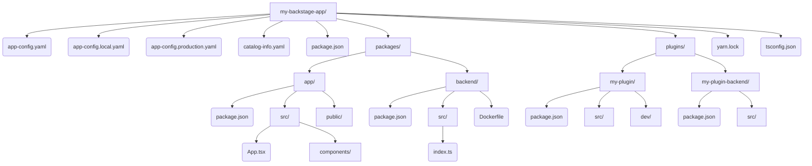

> **Complexity**: `[COMPLEX]` - Повностековий TypeScript-проєкт з інструментами монорепозиторію
>
> **Time to Complete**: 60-75 хвилин
>
> **Prerequisites**: Node.js 22+, Yarn 4.x, Docker, базові знання TypeScript
>
> **CBA Domain**: Домен 1 - Робочий процес розробника в Backstage (24% іспиту)

---

## Що ви зможете робити

Після завершення цього модуля ви зможете пояснювати та керувати робочим процесом розробника в Backstage як повним циклом платформної інженерії: створювати каркас застосунку, розуміти структуру робочого простору, запускати та налагодити локальні сервіси, збирати робочі артефакти, керувати узгодженням залежностей та безпечно застосовувати конфігурацію в різних середовищах.

1. **Проєктувати** архітектуру монорепозиторію Backstage, правильно структуруючи пакети робочого простору, плагіни та оболонку застосунку.
2. **Оцінювати** багатоетапні збірки Docker для оптимізації розміру образів контейнерів та профілів безпеки для розгортань у робочому середовищі.
3. **Реалізовувати** багаторівневе перевизначення конфігурації для безпечної підстановки змінних середовища на етапах тестування та в робочому середовищі.
4. **Діагностувати** відхилення версій залежностей за допомогою Backstage CLI та протоколів робочого простору Yarn для вирішення конфліктів пакетів.
5. **Порівнювати** нову серверну систему (New Backend System) зі старим імперативним зв'язуванням, щоб зрозуміти сучасну декларативну реєстрацію плагінів.

## Чому цей модуль важливий

Як у випадку з інцидентом Knight Capital 2012 року <!-- incident-xref: knight-capital-2012 -->, згаданим у *Infrastructure as Code*, перший висновок цього модуля полягає в тому, що застаріла або непослідовна конфігурація може непомітно відновити скасовану поведінку під час виконання, тому автоматизація та дисципліна рівнів не є необов'язковими на платформах для розробників.

Backstage є основою сертифікації Certified Backstage Associate. Перш ніж ви зможете створювати власні плагіни, проєктувати складні каталоги програмного забезпечення або безпечно інтегруватися із сучасними кластерами Kubernetes v1.35, вам необхідно зрозуміти, як працює сам проєкт Backstage. Ви повинні освоїти структуру його монорепозиторію, багатоетапний конвеєр збірки, систему управління залежностями та локальний цикл розробки. Без цієї основи спроби розширити платформу, як правило, призводять до зламаних збірок, небезпечної конфігурації та поведінки плагінів, яку важко налагодити.

Домен 1 становить майже чверть іспиту. Кандидати, які пропускають цей базовий розділ, зазвичай спотикаються на питаннях про структуру проєкту, відхилення версій залежностей та пріоритет конфігураційних файлів, які здаються оманливо простими, поки ви не помилитеся в умовах обмеженого часу. Цей модуль формує ментальну модель, необхідну для впевненої роботи в середовищах Backstage корпоративного рівня, де плагіни, код оболонки застосунку, серверні сервіси, образи Docker та конфігураційні файли працюють разом.

---

## Чи знали ви?

- Backstage є інкубаційним проєктом CNCF — переданим компанією Spotify та прийнятим до CNCF у вересні 2020 року, а потім підвищеним до статусу інкубаційного у березні 2022 року. Його було створено у Spotify та відкрито за ліцензією Apache License, версія 2.0, саме тому багато прикладів досі відображають потреби великих внутрішніх платформ для розробників, а не невеликих застосунків із єдиним сервісом.
- Згенерований застосунок Backstage — це монорепозиторій, а не окремий пакет. Оболонка застосунку, бекенд, плагіни, конфігурація, lock-файл та збірка Docker залежать від координації на рівні робочого простору.
- Конфігурація Backstage цілеспрямовано має рівневу структуру. Базова конфігурація, локальні перевизначення розробника, робоча конфігурація та підстановка середовища є окремими механізмами з різними очікуваннями щодо безпеки та перевірки.
- Нова серверна система (New Backend System) змінює реєстрацію плагінів від ручного імперативного зв'язування до декларативної реєстрації модулів, тому кандидати на CBA повинні розпізнавати обидва патерни під час читання реальних корпоративних репозиторіїв.

---

## Частина 1: Структура монорепозиторію Backstage

### 1.1 Структура верхнього рівня

Коли ви створюєте новий застосунок Backstage, ви не просто створюєте єдиний Node.js застосунок; ви генеруєте цілий монорепозиторій, призначений для розміщення десятків або сотень користувацьких внутрішніх плагінів. Ця архітектура запобігає «пеклу залежностей» і гарантує, що ваш фронтенд, бекенд та плагіни завжди мають єдині версії та збираються разом.

Ось структура монорепозиторію, візуалізована за допомогою Mermaid для кращої доступності:



### 1.2 Призначення кожної директорії

Монорепозиторій суворо розділяє відповідальності. Корінь керує інструментами, тоді як піддиректорії керують виконуваним кодом.

| Директорія | Призначення | Ключові файли |
|-----------|---------|-----------|
| `packages/app` | Фронтенд SPA, з яким взаємодіють кінцеві користувачі | `App.tsx` реєструє маршрути та плагіни |
| `packages/backend` | Сервер API, проксі-сервери, поглинання каталогу | `index.ts` зв'язує серверні плагіни між собою |
| `plugins/` | Користувацькі та форкнуті плагіни для вашої організації | Кожен плагін є окремим пакетом робочого простору |
| Root | Конфігурація робочого простору, спільні інструменти, конфігурації | `package.json` з полем `workspaces` |

Директорія `packages/app` — це по суті «оболонка», яка поєднує окремі фронтенд-плагіни в єдиний застосунок React. І навпаки, `packages/backend` слугує шлюзом API та шаром постійного зберігання, керуючи з'єднаннями з базою даних і проксіюючи запити до зовнішніх систем.

### 1.3 Робочі простори Yarn у деталях

Монорепозиторій Backstage покладається на робочі простори (workspaces) Yarn для управління залежностями. Кореневий `package.json` оголошує, які директорії беруть участь у робочому просторі:

```json
{
  "name": "root",
  "version": "1.0.0",
  "private": true,
  "workspaces": {
    "packages": [
      "packages/*",
      "plugins/*"
    ]
  }
}
```

Ця конфігурація означає, що кожен `package.json` всередині директорій `packages/` та `plugins/` розглядається як пов'язана локальна залежність. Якщо фронтенд-застосунок залежить від користувацького плагіна, Yarn резолвить його до локальної директорії, замість того, щоб завантажувати із зовнішнього реєстру. Цей процес, відомий як підняття залежностей (dependency hoisting), значно зменшує використання дискового простору та час встановлення, розміщуючи спільні модулі в єдиній кореневій папці `node_modules`.

### 1.4 Еволюція основних систем

Backstage значно еволюціонував від моменту свого створення. Нова серверна система досягла стабільного статусу 1.0 у 2024 році, запропонувавши більш модульну, декларативну архітектуру для серверних плагінів порівняно зі старим імперативним зв'язуванням. Замість ручної передачі маршрутизаторів Express, нова система покладається на декларативне впровадження залежностей.

Тим часом Нова фронтенд-система стала готовою до впровадження у Backstage v1.42.0 у 2025 році, запропонувавши спрощену та більш розширювану модель композиції UI з використанням декларативних розширень. Знання цих віх є критично важливим, оскільки ви часто стикатиметеся як зі старими, так і з сучасними патернами у старіших корпоративних розгортаннях. Під час оновлення систем розпізнавання того, чи використовує плагін старий патерн маршрутизатора чи нову декларативну систему, є першим кроком у налагодженні збоїв інтеграції.

---

## Частина 2: Основи TypeScript для Backstage

### 2.1 Типи та інтерфейси в коді плагіна

Перш ніж писати будь-який код, ви повинні зрозуміти три основні вбудовані функції Backstage, з якими ви будете взаємодіяти:
1. **Software Catalog** (Каталог програмного забезпечення): Відстежує право власності та метадані для всього програмного забезпечення в екосистемі організації (сервіси, вебсайти, бібліотеки, конвеєри даних, моделі машинного навчання тощо).
2. **Software Templates (Scaffolder)** (Програмні шаблони / Генератор): Створює нові проєкти/компоненти шляхом завантаження скелетів коду, шаблонізації змінних і публікації в таких місцях, як GitHub або GitLab.
3. **TechDocs**: Рішення Backstage «документація як код», побудоване на MkDocs, яке використовує файли Markdown, що зберігаються поруч із вашим вихідним кодом. Воно підтримує сховища-бекенди, такі як GCS, AWS S3, Azure Blob Storage та локальну файлову систему.

Плагіни Backstage сильно типізовані за допомогою TypeScript. Інтерфейси визначають точну форму API плагінів, гарантуючи передбачуваний обмін даними між компонентами:

```typescript
// Поверхня API плагіна визначається через інтерфейс
export interface CatalogApi {
  getEntityByRef(ref: string): Promise<Entity | undefined>;
  getEntities(request?: GetEntitiesRequest): Promise<GetEntitiesResponse>;
}

// Утилітарні посилання прив'язують інтерфейс до плагіна
export const catalogApiRef = createApiRef<CatalogApi>({
  id: 'plugin.catalog.service',
});
```

Псевдоніми типів (type aliases) широко використовуються для визначення структур даних, зокрема для сутностей Software Catalog:

```typescript
type EntityKind = 'Component' | 'API' | 'Resource' | 'System' | 'Domain';

type Entity = {
  apiVersion: string;
  kind: EntityKind;
  metadata: EntityMetadata;
  spec?: Record<string, unknown>;
};
```

### 2.2 Патерни Async/Await

Майже кожна серверна операція в Backstage є асинхронною. Маршрутизатори плагінів, обробники каталогу та дії генератора (Scaffolder actions) усі використовують `async/await` для запобігання блокуванню циклу подій Node.js під час важких операцій вводу/виводу.

```typescript
// Патерн маршрутизатора серверного плагіна
import { Router } from 'express';

export async function createRouter(
  options: RouterOptions,
): Promise<Router> {
  const { logger, config, database } = options;

  const router = Router();

  router.get('/health', async (_req, res) => {
    const db = await database.getClient();
    const result = await db.select().from('my_table').limit(1);
    res.json({ status: 'ok', rows: result.length });
  });

  return router;
}
```

Цей патерн гарантує, що запити до бази даних, зовнішні виклики API та читання з файлової системи обробляються одночасно. Об'єкт `RouterOptions` діє як контейнер впровадження залежностей, передаючи важливі сервіси, такі як логування та конфігурація, в маршрути плагіна.

### 2.3 Дженерики (Generics) в посиланнях API

Функція `createApiRef<T>` є загальною утилітою. Вона прив'язує певний тип TypeScript `T` до рядка посилання, дозволяючи системі впровадження залежностей точно знати, який тип об'єкта вона має повернути під час запиту компонентом.

```typescript
// Коли ви викликаєте useApi(catalogApiRef), TypeScript знає, що тип 
// повернення - CatalogApi, а не просто "any".
const catalogApiRef = createApiRef<CatalogApi>({
  id: 'plugin.catalog.service',
});
```

> **Зупиніться і спрогнозуйте**: Якби `createApiRef` не був дженериком (тобто йому б бракувало параметра типу `<CatalogApi>`), що б вивів компілятор TypeScript під час виклику `useApi(catalogApiRef)`?
> 
> *Прогноз*: Компілятор був би змушений вивести тип повернення як `any` або `unknown`. Це повністю зруйнувало б автодоповнення IDE, усунуло б безпеку типів під час компіляції та дозволило б розробникам викликати неіснуючі методи в Catalog API без жодних попереджень.

---

## Частина 3: Локальна розробка

### 3.1 Генерація нового застосунку

Офіційний спосіб створити застосунок Backstage — за допомогою CLI пакета `@backstage/create-app`. Прапорці на кшталт `--skip-install` та `--path` роблять структуру директорій та час встановлення відтворюваними у скриптах, але CLI все ще інтерактивно запитує ім'я застосунку — не існує підтримуваного прапорця чи змінної середовища для надання цього імені в неінтерактивному режимі.

```bash
# Створити новий застосунок Backstage (пропускає встановлення; все ще запитує ім'я застосунку)
npx @backstage/create-app@latest --skip-install --path my-backstage-app

# Дайте відповідь на запит app-name, коли він з'явиться
# Це згенерує повну структуру монорепозиторію
```

Після завершення генерації ви переходите в директорію та ініціюєте процеси встановлення і розробки:

```bash
cd my-backstage-app
yarn install    # Встановити всі залежності робочого простору
yarn dev        # Запустити фронтенд ТА бекенд паралельно
```

### 3.2 Що насправді робить `yarn dev`

Команда `yarn dev` — це ваш основний механізм робочого процесу. Вона запускає як сервер розробки фронтенду (зазвичай на порту 3000), так і сервер розробки бекенду (зазвичай на порту 7007) одночасно. Під капотом кореневий `package.json` визначає цю оркестрацію:

```json
{
  "scripts": {
    "dev": "concurrently \"yarn start\" \"yarn start-backend\"",
    "start": "yarn workspace app start",
    "start-backend": "yarn workspace backend start"
  }
}
```

Сервер розробки фронтенду забезпечує Hot Module Replacement (HMR). Коли ви змінюєте компонент React, Webpack непомітно впроваджує оновлений модуль у браузер, не вимагаючи повного перезавантаження сторінки. Одночасно бекенд-проксі перенаправляє запити API на сервер Node.js, щоб обійти проблеми CORS, а утиліти, такі як `nodemon`, автоматично перезапускають бекенд-процес при виявленні змін у файлах.

### 3.3 Налагодження

Складні взаємодії плагінів часто вимагають глибокої перевірки. Для налагодження фронтенду ви можете використовувати Chrome DevTools, щоб знайти код вашого плагіна у дереві `webpack://` source map і встановити точки зупину безпосередньо. Для налагодження бекенду ви повинні відкрити порт інспектора Node.js:

```bash
# Запустити бекенд з інспектором Node.js
yarn workspace backend start --inspect
```

Після запуску ви можете безпосередньо під'єднати VS Code до процесу інспектора, додавши конфігурацію `.vscode/launch.json` до вашого робочого простору:

```json
{
  "version": "0.2.0",
  "configurations": [
    {
      "type": "node",
      "request": "attach",
      "name": "Attach to Backend",
      "port": 9229,
      "restart": true,
      "skipFiles": ["<node_internals>/**"]
    }
  ]
}
```

---

## Частина 4: Збірки Docker

### 4.1 Багатоетапний Dockerfile

Ефективне розгортання Backstage вимагає багатоетапного Dockerfile. Типовий багатоетапний Dockerfile (як у `packages/backend/Dockerfile` у згенерованому застосунку) відокремлює важкі інструменти збірки від кінцевого середовища виконання, щоб тримати робочий образ максимально мінімізованим.

```dockerfile
# Етап 1 - Збірка
FROM node:22-bookworm-slim AS build

WORKDIR /app

# Копіювання файлів кореневого робочого простору
COPY package.json yarn.lock ./
COPY packages/backend/package.json packages/backend/
COPY plugins/ plugins/

# Встановлення ВСІХ залежностей (включаючи devDependencies для збірки)
RUN yarn install --immutable

# Копіювання вихідного коду та збірка
COPY packages/backend/ packages/backend/
COPY app-config*.yaml ./
RUN yarn workspace backend build

# Етап 2 - Робоче середовище
FROM node:22-bookworm-slim

WORKDIR /app

# Копіювання лише результату збірки та робочих залежностей
COPY --from=build /app/packages/backend/dist ./dist
COPY --from=build /app/node_modules ./node_modules
COPY app-config.yaml app-config.production.yaml ./

# Запуск від імені непривілейованого користувача
USER node

CMD ["node", "dist/index.cjs.js", "--config", "app-config.yaml", "--config", "app-config.production.yaml"]
```

### 4.2 Оптимізація розміру образу

Оптимізація образів контейнерів є вирішальною для швидкості розгортання та зменшення поверхні атаки.

| Метод | Вплив | Як працює |
|-----------|--------|-----|
| Багатоетапні збірки | Високий | Відокремлює етапи збірки та виконання |
| `--immutable` | Середній | Гарантує відтворюване встановлення (Yarn 4.x) |
| `.dockerignore` | Середній | Виключає `node_modules/`, `.git/`, `*.md` |
| Slim base image | Середній | Використовує `node:22-bookworm-slim`, а не `node:22` |
| Непривілейований користувач | Безпека | `USER node` на фінальному етапі |

Використання зменшеного (slim) базового образу позбавляє від непотрібних утиліт операційної системи, тоді як застосування непривілейованого (non-root) користувача запобігає атакам з підвищенням привілеїв у разі компрометації контейнера.

### 4.3 Збірка та запуск

Оскільки Backstage покладається на структуру монорепозиторію, контекстом збірки Docker повинен бути корінь репозиторію, а не папка `packages/backend`. Це гарантує, що демон Docker матиме доступ до спільного `yarn.lock` та всіх внутрішніх плагінів.

```bash
# Зібрати образ
docker build -t backstage:latest -f packages/backend/Dockerfile .

# Запустити з перевизначенням конфігурації через змінні середовища
docker run -p 7007:7007 \
  -e POSTGRES_HOST=host.docker.internal \
  -e POSTGRES_PORT=5432 \
  backstage:latest
```

---

## Частина 5: Управління залежностями NPM/Yarn

### 5.1 Lock-файли

Файл `yarn.lock`, мабуть, є найважливішим операційним файлом у репозиторії. Він фіксує кожну залежність — і її транзитні залежності — до точної криптографічної версії. Це гарантує, що ваш конвеєр CI/CD збирає точно такий самий артефакт, який ви тестували локально. Ніколи не видаляйте lock-файл для вирішення конфліктів; це знищує ваші гарантії детермінованої збірки.

### 5.2 Протокол Workspace

Коли один пакет залежить від іншого в межах одного монорепозиторію, Backstage використовує протокол `workspace:` для примусового локального вирішення (роздільної здатності):

```json
{
  "name": "@internal/plugin-my-feature",
  "dependencies": {
    "@backstage/core-plugin-api": "^1.9.0",
    "@internal/plugin-my-feature-common": "workspace:^"
  }
}
```

Синтаксис `workspace:^` інструктує Yarn створити символічне посилання на локальну директорію під час розробки. Якщо пакет згодом публікується в реєстрі, Yarn автоматично переписує цей протокол на точну семантичну версію перед публікацією.

### 5.3 Додавання залежностей

Додавання залежностей вимагає націлювання на правильний пакет робочого простору для збереження строгих меж.

```bash
# Додати залежність до конкретного пакета робочого простору
yarn workspace app add @backstage/plugin-catalog

# Додати dev-залежність
yarn workspace backend add --dev @types/express

# Додати залежність до кореня (спільні інструменти) — з кореня репозиторію
yarn add eslint prettier
```

У Yarn 4 корінь репозиторію вже є робочим простором, тому ви встановлюєте спільні інструменти розробки з кореня за допомогою звичайного `yarn add` (без `-W` / `--ignore-workspace-root-check`; ці прапорці призначені лише для Yarn 1 classic і викликають помилку в Yarn 4). Зарезервуйте залежності на рівні кореня виключно для спільних інструментів розробки, таких як лінтери та форматери.

> **Зупиніться і подумайте**: Ви створюєте серверний плагін, якому потрібен пакет `pg` (PostgreSQL). Чи повинні ви встановити його за допомогою `yarn workspace backend add pg` чи `yarn workspace my-plugin-backend add pg`?
> 
> *Відповідь*: Ви повинні встановити його в конкретний робочий простір, який цього потребує. Якщо вашому користувацькому плагіну він потрібен, використовуйте `yarn workspace my-plugin-backend add pg`. Не забруднюйте основний рівень `packages/backend` залежностями, специфічними для плагіна; підтримання суворої ізоляції є критично важливим для довгострокової підтримки монорепозиторію.

---

## Частина 6: Backstage CLI

### 6.1 Основні команди

Пакет `@backstage/cli` надає виконуваний файл `backstage-cli`, який діє як операційний швейцарський ніж для платформи.

| Команда | Призначення |
|---------|---------|
| `backstage-cli package build` | Зібрати один пакет для робочого середовища |
| `backstage-cli package lint` | Запустити ESLint на пакеті |
| `backstage-cli package test` | Запустити тести Jest для пакета |
| `backstage-cli package start` | Запустити пакет у режимі dev |
| `backstage-cli versions:bump` | Оновити всі залежності `@backstage/*` до останніх |
| `backstage-cli versions:check` | Перевірити сумісність усіх версій `@backstage/*` |
| `backstage-cli new` | Згенерувати новий плагін або пакет |

### 6.2 Створення нового плагіна

Замість того, щоб вручну створювати директорії та налаштовувати TypeScript, CLI ідеально автоматизує генерацію плагіна:

```bash
# З кореня репозиторію, згенерувати фронтенд-плагін
yarn new --select plugin

# Згенерувати серверний плагін
yarn new --select backend-plugin
```

Це генерує повний каркас усередині директорії `plugins/`, встановлюючи `package.json`, вихідні файли, ізольоване налаштування розробки та шаблонні фреймворки тестування.

### 6.3 Керування версіями

Релізи Backstage дотримуються суворого щомісячного графіка. Усі пакети `@backstage/*` у межах релізу проходять інтеграційне тестування для роботи виключно один з одним.

```bash
# Перевірити на невідповідність версій
yarn backstage-cli versions:check

# Оновити все до останнього релізу
yarn backstage-cli versions:bump
```

**War Story: Невидимі оновлення**: Корпоративна команда одного разу витратила три повних дні на налагодження таємничого збою поглинання каталогу. Базовий бекенд працював на Backstage 1.18, але молодший розробник вручну оновив `@backstage/plugin-catalog-backend` до 1.21 через npm, щоб отримати доступ до щойно випущеної функції. Міграції схем, що лежали в основі, були абсолютно несумісними, що викликало непомітні взаємоблокування (deadlocks) бази даних. Виправлення зайняло рівно п'ять хвилин після того, як вони запустили `versions:check`, що негайно вказало на відхилення. Урок абсолютний: ніколи не оновлюйте окремі пакети. Завжди оновлюйте їх як єдиний реліз.

---

## Частина 7: Конфігурація проєкту та просунуті інтеграції

### 7.1 Конфігураційні файли

Backstage використовує багаторівневу систему конфігурації, послідовно об'єднуючи YAML-файли.

```
app-config.yaml                # Базова конфігурація (зафіксована в git)
app-config.local.yaml          # Локальні перевизначення розробника (у gitignore)
app-config.production.yaml     # Перевизначення для робочого середовища (зафіксовані або впроваджені)
```

Наступні файли у послідовності завантаження агресивно перевизначають ключі з попередніх файлів. Файл `app-config.local.yaml` призначений для налаштувань конкретного розробника і повинен суворо залишатися виключеним із системи контролю версій через `.gitignore`.

### 7.2 Структура конфігурації

Схема конфігурації суворо типізована, організовуючи налаштування в окремі домени:

```yaml
# app-config.yaml
app:
  title: My Backstage Portal
  baseUrl: http://localhost:3000

backend:
  baseUrl: http://localhost:7007
  listen:
    port: 7007
  database:
    client: better-sqlite3
    connection: ':memory:'

catalog:
  locations:
    - type: file
      target: ../../catalog-info.yaml

integrations:
  github:
    - host: github.com
      token: ${GITHUB_TOKEN}  # Підстановка змінної середовища
```

### 7.3 Підстановка змінних середовища

Безпечне керування секретами є обов'язковою вимогою відповідності. Синтаксис `${VAR}` динамічно читає з середовища процесу під час запуску.

```yaml
# Ніколи не робіть так:
integrations:
  github:
    - host: github.com
      token: ghp_abc123hardcoded    # ПОГАНО: секрет у git

# Завжди робіть так:
integrations:
  github:
    - host: github.com
      token: ${GITHUB_TOKEN}        # ДОБРЕ: впроваджено під час виконання
```

### 7.4 Включення конфігурацій та перевизначення

Ви можете явно вказувати застосунку, які конфігурації завантажувати, використовуючи цільові прапорці CLI або змінні середовища:

```bash
# Завантажити базову + робочу конфігурації
yarn start-backend --config app-config.yaml --config app-config.production.yaml

# У Docker використовувати змінні середовища
APP_CONFIG_app_baseUrl=https://backstage.example.com
```

### 7.5 Конфігурація бази даних та автентифікації

Backstage використовує SQLite для легкої локальної розробки, але суворо вимагає PostgreSQL для стійких робочих розгортань. Перевизначення конфігурації бази даних гарантує, що плагіни отримають ізольовані, постійні логічні бази даних:

```yaml
backend:
  database:
    client: pg
    connection:
      host: ${POSTGRES_HOST}
      port: ${POSTGRES_PORT}
      user: ${POSTGRES_USER}
      password: ${POSTGRES_PASSWORD}
```

Конфігурації автентифікації визначають, як користувачі отримують доступ до платформи через зовнішніх провайдерів ідентифікації:

```yaml
auth:
  environment: production
  providers:
    github:
      production:
        clientId: ${GITHUB_CLIENT_ID}
        clientSecret: ${GITHUB_CLIENT_SECRET}
```

Крім базових конфігурацій, пам'ятайте про складні інтеграції платформи. Наприклад, плагін Backstage Kubernetes складається з двох абсолютно окремих пакетів: `@backstage/plugin-kubernetes` (компонент UI) та `@backstage/plugin-kubernetes-backend` (конектор API кластера). Обидва мають бути встановлені та налаштовані незалежно. Крім того, з 2025 року Backstage нативно підтримує інтеграцію сервера MCP (Model Context Protocol), що полегшує підключення інструментів ШІ. Зрештою, створюючи програмні шаблони (Software Templates), пам'ятайте, що вбудовані ідентифікатори **дій** генератора (Scaffolder action IDs) розділені двокрапкою (наприклад, `fetch:template`, `publish:github`, `catalog:register`). Користувацькі дії реєструють власний ідентифікатор дії в `createTemplateAction`. **Ідентифікатори кроків** та ідентифікатори користувацьких дій, на які посилаються в `${{ steps.<id>.output }}`, повинні уникати дефісів — Nunjucks розпізнає `-` як віднімання (→ `NaN`) — тому використовуйте ідентифікатори кроків `camelCase` або нотацію дужок, таку як `${{ steps['deploy-to-prod'].output.url }}`.

## Нотатки щодо дизайну іспиту для робочого процесу розробника Backstage

Іспит CBA розглядає робочий процес розробника як основу для кожної наступної теми Backstage. Якщо ви не можете визначити, де живуть маршрути фронтенду, де реєструються серверні модулі, де знаходиться код плагіна, як конфігурація розшаровується та як залежності залишаються узгодженими, ви матимете труднощі з питаннями щодо каталогу, генератора (Scaffolder), TechDocs та плагіна Kubernetes. Backstage — це фреймворк платформи, тому його перша навичка — розуміння форми репозиторію, яка дозволяє багатьом командам безпечно створювати розробки всередині одного порталу.

Починайте кожен сценарій з відокремлення оболонки застосунку від плагіна. Робочий простір `packages/app` — це орієнтована на браузер оболонка, яка складає маршрути, теми, API та сторінки плагінів. Фронтенд-плагін додає функції, але він не стає автоматично видимим, доки оболонка застосунку не зареєструє його. Ця відмінність пояснює багато збоїв типу "плагін встановлено, але не видно", оскільки встановлення залежностей і композиція UI є окремими кроками в розробці Backstage.

Потім відокремте серверний хост від серверних плагінів. Робочий простір `packages/backend` запускає бекенд Node.js і завантажує серверні функції, але кожен серверний плагін все ще повинен мати власні межі пакета, залежності, маршрути та сервіси. Нова серверна система робить це більш декларативним, однак архітектурне питання залишається тим самим: який пакет володіє функцією, і який хост-процес завантажує її під час виконання?

Структура монорепозиторію — це не просто зручність. Це механізм, який дозволяє оновленням Backstage, розробці плагінів, інструментам тестування та перевіркам залежностей відбуватися узгоджено на всьому порталі. Коли команда витягує один користувацький плагін в окремий репозиторій, вони можуть прискорити CI цього плагіна, але вони також створюють проблему узгодження версій, яка повертається під час кожного оновлення Backstage. На іспиті це часто подається як компроміс між локальною автономією та узгодженістю платформи.

Робочі простори Yarn є центральними, тому що проєкти Backstage містять багато пакетів, які повинні передбачувано вирішувати локальні залежності. Плагін може залежати від спільного пакета через протокол `workspace:`, і Yarn резолвить цю залежність до локального пакета під час розробки. Це локальне зв'язування означає, що зміни можна тестувати разом перед публікацією, що є саме тим, що потрібно внутрішній платформі для розробників, коли команди розвивають спільні API та UI компоненти.

Lock-файл є частиною контракту платформи. Застосунок Backstage зазвичай має велике транзитне дерево залежностей, і невелике відхилення версій може призвести до невідповідностей під час виконання, які виглядають не пов'язаними зі зміненим пакетом. Правильна відповідь полягає не в ручному редагуванні `yarn.lock` або змішуванні менеджерів пакетів. Використовуйте команди Backstage CLI та Yarn, щоб версії пакетів переміщувалися як протестований набір, а репозиторій залишався відтворюваним у CI.

Оцінюючи відхилення залежностей, шукайте дві окремі проблеми. Загальне відхилення JavaScript трапляється, коли lock-файл та маніфести пакетів не збігаються, або коли хтось використовує `npm install` і створює конкуруючий lock-файл. Відхилення, специфічне для Backstage, виникає, коли один пакет `@backstage/*` випереджає скоординований набір релізів, а інші залишаються позаду. Другий клас є особливо небезпечним, оскільки плагіни можуть скомпілюватися, але зазнати збою через API, схему або очікування часу виконання.

Питання щодо конфігурації зазвичай є питаннями безпеки, замаскованими під питання про YAML. `app-config.yaml` належить системі контролю версій і має містити безпечні параметри за замовчуванням. `app-config.local.yaml` призначений для перевизначень конкретного розробника і не повинен потрапляти до системи контролю версій. Робочі значення можуть надходити з робочих конфігураційних файлів, порядку аргументу командного рядка `--config` або змінних середовища. Секрети мають підставлятися під час виконання, а не фіксуватися у файлі, що стає частиною історії репозиторію.

Багаторівневість має значення, оскільки пізніші конфігураційні файли перевизначають попередні. Якщо робоче розгортання завантажує файли в неправильному порядку, безпечний параметр за замовчуванням може перевизначити призначене робоче значення, або локальне значення може випадково вижити в середовищі, де йому не місце. Хороший оператор Backstage може пояснити не лише який ключ встановлено, але й який файл його встановив та чому цей файл завантажується пізніше, ніж базова конфігурація.

Підстановка змінних середовища є потужною, але вона не робить кожне значення конфігурації безпечним. Сам секрет повинен надходити із безпечного механізму часу виконання, такого як платформа розгортання, Kubernetes Secret або зовнішній менеджер секретів. Конфігураційний файл має містити заповнювачі, такі як `${POSTGRES_PASSWORD}`, а не реальні облікові дані. Під час перевірки запитайте, чи зможе майбутній читач репозиторію дізнатися секрет з історії git. Якщо відповідь "так", конфігурація неправильна.

Питання локальної розробки зазвичай перевіряють межі процесів. `yarn dev` зазвичай запускає як фронтенд, так і бекенд сервіси розробки, але браузер усе ще спілкується з бекенд API, а бекенд усе ще спілкується з базами даних, інтеграціями та сервісами плагінів. Якщо щось виходить з ладу локально, спершу визначте, чи є помилка у маршрутизації браузера, компіляції фронтенду, запуску бекенду, завантаженні конфігурації, підключенні до бази даних чи в зовнішній інтеграції.

Налагоджувати Backstage легше, якщо зберігати розмежування source map, логів та права власності на сервіси. Проблеми з фронтендом зазвичай помітні у консолі браузера, дереві маршрутів React або зібраному бандлі. Проблеми з бекендом зазвичай видно в логах Node, помилках ініціалізації плагінів або невдалих запитах до зовнішніх систем. Проблеми конфігурації часто виникають на початку запуску процесу. Проблеми із залежностями зазвичай виявляються під час встановлення, збірки або реєстрації плагінів.

Питання про збірки Docker стосуються контексту збірки так само, як і синтаксису Dockerfile. Бекенд-Dockerfile часто потребує файлів із кореня репозиторію, включаючи `package.json`, `yarn.lock`, маніфести пакетів робочого простору, конфігурацію застосунку та код плагінів. Якщо контекстом збірки є `packages/backend`, Docker не може скопіювати файли, що знаходяться поза цією директорією. Правильним контекстом є корінь репозиторію з явно обраним Dockerfile через шлях.

Багатоетапні збірки Docker відокремлюють важку компіляцію за допомогою інструментів від виконання під час запуску. Етап збірки може включати dev-залежності, компіляцію TypeScript та пакування робочого простору. Етап виконання має містити лише те, що потрібно бекенд-процесу для запуску. Цей патерн зменшує розмір образу та поверхню атаки, але лише якщо останній етап уникає непотрібних інструментів, запускається від імені непривілейованого користувача та отримує секрети через конфігурацію під час виконання, а не через запечені шари образу.

Оптимізація розміру образу не повинна порушувати відтворюваність. Менший образ є корисним, але не у випадку, коли він непомітно пропускає пакет робочого простору або покладається на наявність залежності на машині, де виконується збірка. Використовуйте `.dockerignore`, щоб виключити очевидний шум, залишайте кореневий lock-файл доступним і перевіряйте контейнер за допомогою реалістичної робочої конфігурації. Іспит може описувати невдалу збірку образу, і підказкою часто є відсутній файл кореневого рівня.

Команди Backstage CLI існують для забезпечення працездатності монорепозиторію. Команди збірки пакетів, лінтингу, тестування, запуску, генерації плагінів та керування версіями кодують угоди проєкту, які було б складно і легко переплутати при ручному відтворенні. Кандидат повинен розуміти, коли правильним рішенням є використання CLI замість ручного створення директорій, редагування згенерованого зв'язування чи оновлення одного пакета за раз.

Генерація (scaffolding) плагіна є цінною, оскільки створює очікувані межі пакета. Згенерований плагін включає метадані пакета, структуру вихідного коду, ізольоване середовище розробки та конвенції тестування, що відповідають інструментам Backstage. Створення директорії плагіна вручну може спрацювати, але збільшує ймовірність того, що іменування пакетів, експорти, маршрути або реєстрація в робочому просторі будуть несумісними. У команді платформи узгодженість є ключовою функцією, адже багато інженерів повинні читати і підтримувати плагіни.

Нова серверна система змінює форму інтеграційної роботи. Застарілий код часто зв'язує маршрутизатори імперативно через фабрики сервісів, маршрутизатори Express та ручне налаштування плагінів. Новіша система надає перевагу серверним функціям і модулям, які декларують свої потреби. У питанні на іспиті головне не в тому, якому стилю ви віддаєте перевагу; головне — розпізнати, який стиль використовує репозиторій, і застосувати правильний патерн реєстрації.

Те саме порівняння застосовується під час міграцій. Змішаний репозиторій може містити старі плагіни, що використовують старий патерн створення маршрутизаторів, поряд із новішими серверними модулями. Робота з міграції повинна проводитись обачно: визначте власника плагіна, замініть імперативне зв'язування на декларативні модулі там, де це підтримується, протестуйте конфігурацію та дозволи і уникайте зміни багатьох непов'язаних плагінів в одному релізі. Найбезпечніша міграція є помітною, інкрементальною і підкріпленою перевірками залежностей.

TypeScript не є декоративним елементом у Backstage. API-посилання, типи сутностей, дії генератора, посилання на маршрути плагінів та інтерфейси сервісів використовують типи, щоб зробити межі інтеграції явними. Коли розробник обходить типи за допомогою `any`, він позбавляє компілятор можливості виявляти невідповідні виклики API між плагінами. У коді платформи безпека типів захищає багато команд від припущень одна одної.

Концепції Software Catalog з'являються на початку, оскільки вони визначають, що саме організовує портал. Компоненти, API, ресурси, системи, домени, власники та зв'язки — це не просто мітки UI. Вони є моделлю даних, яку багато плагінів використовують для зв'язування документації, шаблонів, ресурсів Kubernetes, оціночних карток і метаданих власності. Модуль робочого процесу розробника повинен чітко показати, що структура коду та метадані каталогу зрештою зустрічаються у робочому середовищі.

Software Templates впроваджують ще одну межу робочого процесу. Автори шаблонів пишуть YAML і дії, але згенеровані проєкти залежать від інтеграції репозиторію, автентифікації, валідації параметрів та правильності парсингу ідентифікаторів дій. Невелика помилка в іменуванні може призвести до незрозумілої помилки під час виконання шаблону. З метою складання CBA пам'ятайте, що поведінка генератора об'єднує фронтенд-форми, серверні дії, реєстрацію в каталозі та операції із зовнішнім контролем вихідного коду.

TechDocs демонструє той самий патерн платформи. Джерело документації може жити разом із кодом, але згенерована документація може зберігатися в локальній файловій системі, хмарному об'єктному сховищі або іншому підтримуваному бекенді залежно від середовища. Локальне файлове сховище цілком підходить для розробки, тоді як робочі розгортання зазвичай потребують надійного спільного сховища, щоб декілька екземплярів бекенду і їх перезапуски не призводили до втрати згенерованої документації.

Інтеграція Kubernetes у Backstage також перетинає межу між фронтендом та бекендом. Встановлення фронтенд-плагіна надає користувачам сторінку або вкладку сутності, але саме серверний плагін взаємодіє з API кластера та обробляє облікові дані. Якщо UI не показує даних, часто відсутньою частиною є встановлення бекенда, налаштування локатора кластера, параметри автентифікації чи дозволи. На іспиті це може бути сформульовано як симптом на стороні користувача, а не як назва пакета.

Для практики перевірки (review) читайте зміну Backstage, запитуючи, який робочий простір змінився і чому. Зміна маршруту UI належить до `packages/app` або фронтенд-плагіна. Інтеграція API на стороні сервера належить до `packages/backend` або серверного плагіна. Зміна залежності належить конкретному робочому простору, якому вона потрібна. Робочий секрет має знаходитися поза системою контролю версій. Ця мапа власності вловлює багато помилок ще до того, як ви запустите код.

Щоб правильно розподілити час на іспиті, перекладайте кожну вимогу в межу власності. «Додати віджет на головну сторінку» вказує на оболонку застосунку або реєстрацію фронтенд-плагіна. «Підключитися до кластера Kubernetes» вказує на конфігурацію серверного плагіна та облікові дані. «Виправити невідповідність версій» вказує на перевірку версій Backstage CLI та скоординоване оновлення. «Захистити пароль до робочої бази даних» вказує на підстановку змінних середовища та впровадження секретів під час розгортання.

Найважливіша звичка — уникати вирішення проблем Backstage на неправильному рівні. Не змінюйте серверний пакет, щоб виправити відсутній маршрут фронтенду. Не фіксуйте локальний конфігураційний файл, щоб виправити робочий секрет. Не видаляйте lock-файл, щоб вирішити конфлікт версій. Не розділяйте плагіни на окремі репозиторії без планування координації оновлень. Backstage винагороджує чітку власність, оскільки портал призначений для зростання багатьох команд.

Нарешті, пам'ятайте, що робочий процес розробника — це не просто «як запустити застосунок». Це набір практик, які зберігають платформу розширюваною після того, як існують десятки плагінів, сотні сутностей каталогу та багато робочих інтеграцій. Робочий процес дозволяє інженерам платформи змінювати портал без втрати відтворюваності, безпеки або власності команд. Ось чому CBA починається тут, перш ніж переходити до глибших тем каталогу та інфраструктури.

Коли ви оцінюєте новий запит на плагін, простежте повний шлях доставки, перш ніж торкатися коду. Фронтенд-сторінці може знадобитися маршрут в оболонці застосунку, посилання на API (API ref), серверний плагін, ключі конфігурації, налаштування провайдера автентифікації, анотації каталогу та документація. Записування цього шляху запобігає частковому встановленню, коли пакет існує в `package.json`, але жоден користувач не може його досягти або жоден серверний сервіс не може надати дані.

Таке саме мислення щодо шляху доставки стосується оновлень. Оновлення Backstage — це не просто зміна версії пакета; воно може зачіпати код згенерованого застосунку, стиль серверної реєстрації, API плагінів, обробники каталогу, схему конфігурації та поведінку образів Docker. Найбезпечніші команди оновлюються невеликими інкрементами, запускають перевірки версій, читають нотатки щодо міграції та уникають непов'язаної роботи над функціями в тому ж pull-запиті. Ця звичка робить оновлення платформи нудними (безпечними).

Для локальної розробки зберігайте чітке розмежування між зразковими даними та поведінкою, подібною до робочої. Каталог за замовчуванням, база даних у пам'яті та локальне файлове сховище відмінно підходять для вивчення того, як портал запускається. Але вони не є доказом того, що робочі інтеграції є правильними. Перед випуском перевірте конфігурацію PostgreSQL, автентифікацію, зовнішні інтеграції, надійне сховище TechDocs та доступ до Kubernetes за допомогою тієї ж багаторівневої конфігурації, яка буде використовуватися у робочому середовищі.

Під час роботи з Docker пам'ятайте, що образ — це лише одна частина контракту розгортання. Контейнер також потребує конфігурації під час виконання, підключення до бази даних, секретів провайдера автентифікації, базових URL-адрес, що відповідають публічному імені хоста, та мережевого доступу до інтеграцій. Контейнер, який локально запускається за допомогою SQLite, все одно може зазнати збою в робочому середовищі, якщо конфігурація `backend.baseUrl`, `app.baseUrl` або зворотного виклику автентифікації (auth callback) вказує на неправильне середовище.

Для гігієни робочого простору уникайте встановлення залежностей у корені, якщо вони насправді не є спільними інструментами розробки. Серверний плагін, який потребує драйвера бази даних, повинен оголошувати цю залежність у власному пакеті робочого простору, а не в оболонці застосунку і не випадково у корені. Правильне розміщення зберігає власність на пакети видимою, зменшує випадкове зв'язування та робить видалення або вилучення плагінів менш ризикованим у майбутньому.

При перегляді конфігурації (review), запитуйте, що має бути зафіксовано, а що має бути впроваджено. Безпечні значення за замовчуванням, публічні URL-адреси, розташування каталогів та несекретні прапорці функцій (feature flags) зазвичай можуть зберігатися у версіонованій конфігурації. Токени, паролі, приватні ключі, секрети клієнта OAuth та облікові дані, специфічні для середовища, повинні надходити з систем секретів часу виконання. Це питання просте, але воно вловлює багато серйозних помилок у розгортанні Backstage.

Для перегляду TypeScript, стежте за межами, де API плагінів перетинають межі пакетів. API-посилання повинне описувати стабільний інтерфейс, тоді як деталі реалізації повинні залишатися всередині плагіна або серверного модуля, який ними володіє. Якщо компонент імпортує глибокі внутрішні деталі з іншого плагіна, щоб уникнути визначення правильного API, це може працювати сьогодні, але зламається під час наступного рефакторингу плагіна або оновлення Backstage.

Для розробки з урахуванням каталогу, пам'ятайте, що функції Backstage часто активуються через метадані сутностей. Плагін може бути встановлений правильно, але залишатися невидимим для сутності, якщо цій сутності бракує очікуваної анотації, зв'язку, типу чи поля власника. Тому пошук несправностей повинен включати як зв'язування коду, так і дані каталогу. Саме тому модуль робочого процесу розробника знаходиться перед більш глибокими модулями каталогу у послідовності курсу.

Для шаблонів перевіряйте як досвід автора, так і згенерований результат. Software Template може виглядати гарно в інтерфейсі (UI), генеруючи при цьому репозиторії з поганими назвами пакетів, відсутніми метаданими каталогу або небезпечною конфігурацією за замовчуванням. Мислення робочого процесу розробника ставить під питання те, чи відповідає згенерований проєкт тим самим стандартам робочого простору, залежностей, Docker і конфігурації, що й власноруч написаний код Backstage.

Що стосується управління платформою (platform governance), розглядайте зміни у Backstage як зміни спільної інфраструктури. Плагін може впливати на навігацію, ідентифікацію, право власності у каталозі, CI-шаблони, видимість Kubernetes та робочі процеси документації для багатьох команд. Вимагайте чіткої власності, сфокусованих pull-запитів, повторюваної локальної перевірки та незалежного перегляду змін (review), які змінюють основну поведінку платформи. Портал є найціннішим тоді, коли команди довіряють йому як стабільному джерелу істини.

Для практики перед сертифікацією викладайте свою відповідь мовою власності. Вкажіть, який робочий простір змінюється, який рівень конфігурації змінюється, яка команда перевіряє версії, який контекст Docker є правильним і який стиль реєстрації бекенду застосовується. Такий рівень точності перетворює широке знайомство з Backstage на аргументацію, готову до іспиту, і запобігає відповідям, які звучать правдоподібно, хоча працюють на неправильному рівні.

Коли ви інспектуєте згенерований репозиторій Backstage, утримайтеся від бажання розглядати кожну директорію як взаємозамінний код TypeScript. Кореневий пакет контролює робочий простір, `packages/app` керує композицією у браузері, `packages/backend` керує запуском сервера, а `plugins` містить пакети розширень, які можуть мати фронтенд, бекенд, спільні та специфічні для node частини. Ця структура існує для того, щоб команди платформ могли міркувати про власність ще до того, як вони міркуватимуть про деталі реалізації.

Коли ви усуваєте неполадки у зламаному локальному застосунку, збирайте докази у фіксованому порядку. Спочатку перевірте встановлення та lock-файл, потім з'ясуйте, яка команда робочого простору виконується, далі дослідіть завантаження конфігурації, а потім дослідіть логи браузера або бекенда на основі симптомів. Випадкове блукання по файлах витрачає час, оскільки багато збоїв Backstage на перший погляд виглядають схожими. Фіксований порядок перетворює широку складність монорепозиторію на повторюваний робочий процес налагодження.

Коли ви перевіряєте готовність до робочого середовища (production readiness), запитайте, чи може той самий артефакт переміщуватися середовищами без редагування файлів під контролем версій. Образ має збиратися з кореня репозиторію, середовище виконання повинне отримувати специфічну для нього конфігурацію та секрети ззовні, а URL-адреси застосунку повинні відповідати імені хоста для розгортання. Цей поділ дозволяє порталу Backstage переходити від ноутбука до етапу тестування та в робоче середовище без створення прихованих форків платформи.

Коли ви порівнюєте старі та нові серверні патерни, зосередьтеся на поверхні міграції, а не на термінології. Застаріле зв'язування часто оголює явне створення маршрутизатора та ручну передачу сервісів, у той час як сучасні серверні модулі декларують функції та залежності для завантаження серверною системою. Команда може запускати обидва варіанти під час міграції, але кожен плагін повинен бути зрозумілим у своєму власному стилі, перш ніж ви зміните реєстрацію, дозволи або конфігурацію.

Ця обережна звичка читання є тією самою різницею між знанням Backstage як демонстраційного застосунку та управлінням ним як спільною інженерною платформою під реальним тиском розгортання, особливо коли багато команд покладаються на один портал для надійних щоденних робочих процесів розробки, безпечних платформових операцій та узгоджених шляхів оновлення з плином часу.

---

## Часті помилки

| Помилка | Що йде не так | Рішення |
|---------|----------------|-----|
| Запуск `npm install` замість `yarn install` | Генерує `package-lock.json`, конфліктує з `yarn.lock` | Завжди використовуйте `yarn`; видаліть `package-lock.json`, якщо його створено |
| Редагування `yarn.lock` вручну | Руйнує розв'язання залежностей | Запустіть `yarn install` для перегенерації після змін у `package.json` |
| Оновлення єдиного пакета `@backstage/*` | Невідповідність версій спричиняє помилки часу виконання | Використовуйте `backstage-cli versions:bump` для оновлення всіх пакетів разом |
| Фіксація в git `app-config.local.yaml` | Допускає витік токенів та облікових даних розробника | Переконайтеся, що `.gitignore` включає `app-config.local.yaml` |
| Контекст збірки Docker встановлено на `packages/backend/` | Збірка провалюється, оскільки `yarn.lock` та пакети робочого простору недоступні | Встановіть контекст збірки на корінь репозиторію: `docker build -f packages/backend/Dockerfile .` |
| Пропуск `--immutable` у CI | Недетерміновані збірки; CI встановлює інші версії, ніж локально | Завжди використовуйте `yarn install --immutable` у конвеєрах CI |
| Жорстке кодування (Hardcoding) секретів в `app-config.yaml` | Секрети надсилаються в git | Використовуйте підстановку `${ENV_VAR}` та впроваджуйте їх під час виконання |

---

## Тест

Перевірте своє засвоєння робочого процесу розробника Backstage.

**Питання 1: Ваша команда хоче додати новий користувацький віджет UI на головну сторінку Backstage. Яку директорію вони повинні змінити і чому?**
<details>
<summary>Відповідь</summary>

Вони повинні змінити директорію `packages/app`, оскільки вона містить фронтенд-застосунок React, де реєструються оболонка інтерфейсу (UI) та маршрути плагінів. Директорія бекенда (backend) обслуговує лише API, тоді як окремі плагіни надають різні компоненти. Пряма зміна пакета застосунку гарантує, що віджет безпечно інтегрований в основну структуру інтерфейсу користувача. Такий централізований архітектурний підхід гарантує правильне відображення віджета в усіх сесіях користувачів.
</details>

**Питання 2: Розробник пропонує перенести користувацькі плагіни в окремі Git-репозиторії, щоб прискорити їх індивідуальні CI-збірки. Який серйозний компроміс відмови від структури робочого простору Backstage вони ігнорують?**
<details>
<summary>Відповідь</summary>

Вони ігнорують серйозний ризик відхилення версій та «пекла залежностей». Монорепозиторій робочого простору Yarn фундаментально дозволяє версіонувати, тестувати та оновлювати всі плагіни разом за допомогою протоколу `workspace:^`. Перенесення плагінів у повністю відокремлені репозиторії означає, що кожен плагін повинен самостійно керувати власною версією `@backstage/core-plugin-api`, що неминуче призводить до конфліктів під час оновлення платформи. Зрештою, ця фрагментація уповільнює швидкість розробки та суттєво збільшує накладні витрати на операційне обслуговування.
</details>

**Питання 3: Молодший інженер запускає `docker build -t cba-lab:latest -f packages/backend/Dockerfile packages/backend/`, щоб зібрати серверний образ. Збірка негайно закінчується помилкою. Чому це відбувається і який підхід є правильним?**
<details>
<summary>Відповідь</summary>

Збірка миттєво закінчується помилкою, оскільки Dockerfile намагається скопіювати `yarn.lock` та пакети робочого простору з кореня репозиторію. З неправильним контекстом ці критичні файли залишаються поза доступним контекстом збірки демона Docker. Механізм Docker суворо вимагає, щоб контекст був налаштований на корінь репозиторію, щоб він міг визначити відносні шляхи для всіх пакетів робочого простору. Без кореневого контексту багатоетапна збірка просто не може дозволити необхідні залежності для компіляції серверного застосунку.
</details>

**Питання 4: Під час перевірки коду (code review) ви помічаєте, що розробник додав пароль до бази даних безпосередньо у `app-config.production.yaml`. Як ви маєте проінструктувати його виправити це для безпеки?**
<details>
<summary>Відповідь</summary>

Проінструктуйте його використовувати динамічну підстановку змінних середовища безпосередньо у YAML-файлі для підтримання відповідності вимогам безпеки. Ви повинні налаштувати файл так, щоб він використовував рядок-заповнювач, на зразок `${POSTGRES_PASSWORD}`, і впроваджував фактичний секрет під час виконання через безпечне середовище процесу. Жорстке кодування секретів у вигляді звичайного тексту у конфігураційному файлі призводить до того, що вони назавжди фіксуються у системі контролю версій, що є катастрофічною вразливістю безпеки. Впроваджуючи змінні під час виконання, ви успішно відокремлюєте конфіденційні облікові дані від незмінного вихідного коду.
</details>

**Питання 5: Після того, як розробник вручну оновив `@backstage/plugin-catalog` до `1.21.0`, тоді як решта проєкту залишилася на версії `1.18.0`, каталог перестав поглинати дані. Яку команду CLI слід запустити для вирішення цієї проблеми і чому?**
<details>
<summary>Відповідь</summary>

Запустіть команду `yarn backstage-cli versions:bump` з кореня репозиторію, щоб автоматично оновити всі пакети Backstage разом. Окремі пакети ніколи не слід оновлювати вручну, оскільки вони суворо розроблені для роботи як скоординований набір у рамках кожного щомісячного циклу релізів. Оновлення окремого пакета незалежно від інших спричиняє невідповідності схем і API, що призводить до непередбачуваних збоїв під час виконання. Команда `versions:bump` гарантує, що все дерево залежностей робочого простору залишається ідеально узгодженим із цільовою версією релізу.
</details>

**Питання 6: Розробник встановлює `@backstage/plugin-kubernetes` для перегляду стану кластера, але повідомляє, що інтерфейс (UI) не показує жодних даних. Який архітектурний компонент вони, ймовірно, забули встановити?**
<details>
<summary>Відповідь</summary>

Вони, швидше за все, забули встановити пакет `@backstage/plugin-kubernetes-backend` у робочий простір бекенда. Архітектура плагіна Backstage Kubernetes суворо вимагає наявності двох окремих пакетів для належної роботи через межу мережі. Фронтенд-пакет забезпечує UI-компоненти для браузера, тоді як серверний пакет безпечно з'єднується з API кластера Kubernetes для отримання живих метрик. Без встановленого і налаштованого серверного конектора фронтенд-інтерфейс не має базового джерела даних для відображення, що призводить до порожніх дашбордів або постійних станів помилок.

Це також питання стилю реєстрації. У старих репозиторіях ви можете побачити застаріле імперативне зв'язування для маршрутизатора бекенда, тоді як у новіших репозиторіях використовується Нова серверна система та сучасна декларативна реєстрація плагінів. Ви повинні порівняти Нову серверну систему із застарілим імперативним зв'язуванням, перш ніж вирішувати, де і як слід завантажувати серверну функцію Kubernetes.
</details>

**Питання 7: Команда пише користувацьку дію генератора (Scaffolder action) під назвою `deploy-to-prod`. Коли вони намагаються послатися на її результат за допомогою `${{ steps.deploy-to-prod.output.url }}`, рушій шаблонів видає помилку `NaN`. Чому це відбувається і як це слід виправити?**
<details>
<summary>Відповідь</summary>

Рушій шаблонів Backstage оцінює дефіси в **ідентифікаторах кроків** (та подібних ідентифікаторах всередині `${{ steps.<id>.output }}`) як математичні оператори віднімання. Оскільки він примусово намагається відняти рядкові значення, операція завершується помилкою і повертає стан помилки `Not a Number` (NaN). Вбудовані ідентифікатори дій генератора (Scaffolder action IDs) використовують простори імен, розділені двокрапкою, такі як `fetch:template`, `publish:github` і `catalog:register`. Щоб вирішити цю проблему, перейменуйте `id` кроку шаблону на `deployToProd` (у camelCase) або збережіть `deploy-to-prod` і використовуйте посилання на вихідні дані за допомогою нотації дужок: `${{ steps['deploy-to-prod'].output.url }}`.
</details>

**Питання 8: Ваша організація хоче розгорнути TechDocs у робочому середовищі, але зараз використовує локальну файлову систему як сховище-бекенд. Чому це є проблематичним і які підтримувані альтернативи існують?**
<details>
<summary>Відповідь</summary>

Використання локальної файлової системи для TechDocs категорично не рекомендується для робочого середовища, оскільки воно принципово не масштабується горизонтально. Якщо ви запускаєте кілька екземплярів бекенда Backstage за балансувальником навантаження, файли, записані на локальний диск одного екземпляра, просто не будуть доступні іншим екземплярам, що призведе до непослідовної видимості документації та неминучої втрати даних під час перезапуску подів (pods). Щоб забезпечити надійну високу доступність та постійність, ви повинні впровадити підтримуване хмарне сховище. Офіційно підтримувані, готові до використання у робочому середовищі альтернативні варіанти зберігання включають Google Cloud Storage (GCS), AWS S3 та Azure Blob Storage.
</details>

---

## Практична вправа: Створення та дослідження застосунку Backstage

**Мета**: Створити каркас застосунку Backstage, перевірити його складну структуру монорепозиторію, запустити його локально та створити багатоетапний образ Docker.

**Очікуваний час**: 30-40 хвилин

### Попередні вимоги

- Встановлений Node.js 22+ (`node -v`)
- Встановлений Yarn 4.x через corepack (`corepack enable`)
- Встановлений Docker (`docker --version`)

### Завдання 1: Генерація каркаса застосунку

Почніть з генерації свіжого репозиторію Backstage. Прапорці `--skip-install` та `--path` фіксують вихідну директорію та відкладають `yarn install`, але ви все одно відповідаєте на інтерактивний запит імені застосунку.

```bash
npx @backstage/create-app@latest --skip-install --path cba-lab
# На запит назви застосунку введіть: cba-lab
cd cba-lab
```

Далі переконайтеся, що генерація успішно створила повну структуру робочого простору:

```bash
# Переглянути директорії верхнього рівня
ls -la

# Підтвердити конфігурацію робочого простору
cat package.json | grep -A 5 '"workspaces"'

# Перевірити наявність packages/app та packages/backend
ls packages/
```

### Завдання 2: Запуск сервера розробки

Перш ніж завантажувати систему, розгляньте точку входу React, щоб зрозуміти, як фронтенд-плагіни реєструються безпосередньо у маршрутизаторі:

```bash
cat packages/app/src/App.tsx | head -40
```

Тепер запустіть подвійні сервери розробки фронтенду та бекенду одночасно:

```bash
yarn dev
```

Відкрийте браузер і перейдіть за адресою `http://localhost:3000`. Ви повинні успішно завантажити інтерфейс Backstage, що відображає сутності каталогу програмного забезпечення за замовчуванням.

### Завдання 3: Налаштування локальних перевизначень

Залиште сервер розробки запущеним у першому терміналі. Відкрийте **нове вікно термінала**, перейдіть до директорії `cba-lab` та перевірте конфігурацію за замовчуванням:

```bash
# Переглянути базову конфігурацію
cat app-config.yaml

# Перевірити, яка база даних налаштована (за замовчуванням: SQLite у пам'яті)
grep -A 3 'database:' app-config.yaml
```

Створіть файл локального перевизначення для розробника, щоб безпечно впровадити власні налаштування порталу без ризику фіксації в git:

```bash
cat > app-config.local.yaml << 'EOF'
app:
  title: CBA Lab Portal
integrations:
  github:
    - host: github.com
      token: ${GITHUB_TOKEN}
EOF
```

Перезапустіть процес `yarn dev` у вашому першому терміналі. Оновіть браузер і переконайтеся, що назва застосунку динамічно змінилася на "CBA Lab Portal".

### Завдання 4: Збірка образу Docker

Скомпілюйте бекенд TypeScript і створіть багатоетапний робочий контейнер Docker:

```bash
# Зібрати бекенд для робочого середовища
yarn workspace backend build

# Зібрати образ Docker з кореня репозиторію
docker build -t cba-lab:latest -f packages/backend/Dockerfile .

# Перевірити розмір образу
docker images cba-lab:latest
```

### Завдання 5: Запуск контейнера

Виконайте щойно зібраний образ контейнера локально, зіставивши необхідний порт бекенда. Після запуску контейнера підтвердіть працездатність бекенда за допомогою реальної кінцевої точки (endpoint) — просто `http://localhost:7007/` повертає 404, тому використовуйте `/healthcheck` на застарілих бекендах або `/.backstage/health/v1/readiness` у новій серверній системі. Як тільки curl виконається успішно, очистіть системні ресурси:

```bash
docker run -p 7007:7007 cba-lab:latest
```

У другому терміналі:

```bash
curl -s http://localhost:7007/healthcheck
# або (для нового бекенда): curl -s http://localhost:7007/.backstage/health/v1/readiness
```

```bash
# Зупинити будь-які запущені контейнери
docker rm -f $(docker ps -q --filter ancestor=cba-lab:latest) 2>/dev/null

# Видалити тестовий застосунок (необов'язково)
cd .. && rm -rf cba-lab
```

### Контрольний список успіху
- [ ] Успішно згенеровано монорепозиторій Backstage з `--skip-install` та `--path`, відповівши на запит імені застосунку.
- [ ] Перевірено наявність директорій `packages/app` та `packages/backend`.
- [ ] Запущено локальний сервер розробки та отримано доступ до каталогу за адресою `localhost:3000`.
- [ ] Застосовано локальне перевизначення конфігурації та перевірено оновлену назву застосунку.
- [ ] Зібрано багатоетапний образ Docker з контексту кореня репозиторію.
- [ ] Розгорнуто локальний контейнер і успішно досягнуто `/healthcheck` або `/.backstage/health/v1/readiness`.

---

## Резюме

| Тема | Ключовий висновок |
|-------|-------------|
| Структура монорепозиторію | `packages/app` (фронтенд), `packages/backend` (бекенд), `plugins/` (розширення) |
| Патерни TypeScript | Інтерфейси для API, `createApiRef<T>` для DI, `async/await` скрізь |
| Локальна розробка | `npx @backstage/create-app`, `yarn dev`, HMR для фронтенду |
| Збірки Docker | Багатоетапні з кореня репозиторію, зменшений (slim) базовий образ, непривілейований користувач |
| Залежності | Робочі простори Yarn, протокол `workspace:^`, `--immutable` у CI |
| Backstage CLI | `versions:bump`, `versions:check`, `package build`, `new` |
| Конфігурація | Багаторівневі YAML-файли, підстановка `${ENV_VAR}`, порядок прапорців `--config` |

---

## Джерела

- [Backstage Docs: Getting started](https://backstage.io/docs/getting-started/)
- [Backstage Docs: Create an app](https://backstage.io/docs/getting-started/create-an-app)
- [Backstage Docs: Configuration](https://backstage.io/docs/conf/)
- [Backstage Docs: Docker deployment](https://backstage.io/docs/deployment/docker/)
- [Backstage Docs: Backend system](https://backstage.io/docs/backend-system/)
- [Backstage Docs: Plugins](https://backstage.io/docs/plugins/)
- [Backstage Docs: Software Catalog](https://backstage.io/docs/features/software-catalog/)
- [Backstage Docs: Software Templates](https://backstage.io/docs/features/software-templates/)
- [Backstage Docs: TechDocs](https://backstage.io/docs/features/techdocs/)
- [Backstage Docs: CLI build system](https://backstage.io/docs/local-dev/cli-build-system/)
- [Backstage Docs: Authentication](https://backstage.io/docs/auth/)
- [Yarn Docs: Workspaces](https://yarnpkg.com/features/workspaces)

---

## Наступний модуль

[Модуль 1.2: Плагіни та розширення Backstage](../module-1.2-backstage-plugin-development/) - Створіть свій перший фронтенд- і серверний плагін, зрозумійте потужну систему API плагінів і дізнайтеся, як саме складна система впровадження залежностей (Dependency Injection) у Backstage з'єднує ізольовані компоненти під час виконання.

---

## Перевірка учня

> У Yarn 4 корінь репозиторію вже є робочим простором, тому ви встановлюєте спільні інструменти розробки з кореня за допомогою звичайного `yarn add` (без `-W` / `--ignore-workspace-root-check`; ці прапорці призначені лише для Yarn 1 classic і викликають помилку в Yarn 4).