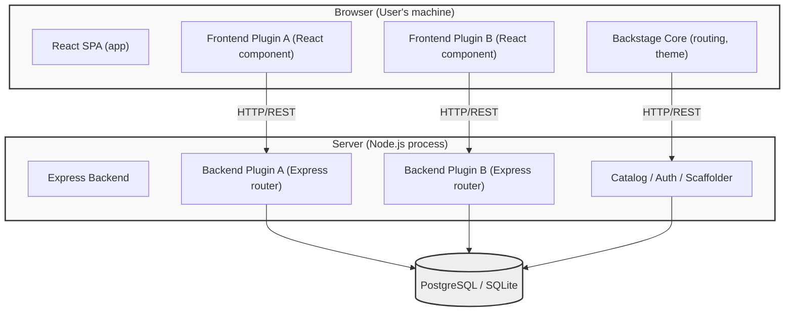

> **Складність**: `[СКЛАДНИЙ]` — найважчий домен іспиту (32%)
>
> **Час на проходження**: 90–120 хвилин
>
> **Передумови**: Модуль 1 (Робочий процес розробки Backstage), знайомство з TypeScript, основи React, npm/yarn
>
> **Домен CBA**: Домен 4 — Кастомізація Backstage (32% іспиту)

---

## Що ви зможете зробити

- **Побудувати** фронтенд-плагін Backstage із маршрутизованими розширеннями та виділеним посиланням на API.
- **Реалізувати** бекенд-плагін на новій бекенд-системі за допомогою `createBackendPlugin` та основних сервісів.
- **Спроєктувати** тематизацію Material UI, що враховує тему Backstage та темний/світлий режими.
- **Створити** шаблон програмного забезпечення (scaffolder) із параметрами та вбудованими діями.
- **Протестувати** фронтенд- та бекенд-плагіни за допомогою `@backstage/test-utils` та інтеграційних обв'язок.

---

## Чому цей модуль важливий

Це єдиний найважливіший модуль для іспиту CBA. [**Домен 4 важить 32%**](https://www.cncf.io/training/certification/cba/) — майже кожне третє питання перевірятиме ваше розуміння розробки плагінів, Material UI, шаблонів програмного забезпечення, тематизації та провайдерів автентифікації.

Backstage без плагінів — це порожня оболонка. Уся ціннісна пропозиція — каталог програмного забезпечення, TechDocs, видимість CI/CD, scaffolding — усе це постачається через плагіни. [Коли Spotify будували Backstage](https://github.com/backstage/backstage), вони спроєктували його насамперед як платформу для плагінів, а вже потім як портал. Зрозуміти, як працюють плагіни, означає зрозуміти, як працює Backstage.

Цей модуль насичений кодом за задумом. Іспит показує вам фрагменти TypeScript та React і запитує, що вони роблять. Під час іспиту ви не писатимете код, але вам безумовно потрібно вільно *читати* код.

**Гіпотетичний сценарій:** Платформена команда випускає кастомний плагін-дашборд, який звертається до API кластера безпосередньо з браузера, використовуючи облікові дані, вбудовані у фронтенд-конфігурацію. Зловмисник, який вивчить мережевий трафік або зібраний JavaScript, міг би зібрати ці облікові дані та використати їх поза периметром автентифікації Backstage. Усунення наслідків вимагало б ротації секретів, аудиту журналів доступу та перепроєктування плагіна так, щоб чутливі виклики проходили через бекенд-плагін із належною автентифікацією між сервісами. Урок є архітектурним: розробка плагінів Backstage — це не звичайна розробка на React. Ви повинні точно знати, де виконується код, як він автентифікується та які API належать до якого боку межі браузера.

> **Аналогія з рестораном**
>
> Backstage — це кухня ресторану. Базовий фреймворк — це будівля: стіни, сантехніка, електрика. Фронтенд-плагіни — це страви в меню. Бекенд-плагіни — це робочі станції кухні (гриль, заготівля, десерти). Шаблони програмного забезпечення — це рецепти, які дають змогу кухарям на лінії готувати однакові страви. Провайдери автентифікації — це охоронці біля дверей. Ви не керуєте рестораном, дивлячись на будівлю, — ви керуєте ним, готуючи.

---

## Чи знали ви?

1. **Величезна екосистема**: Спільнота Backstage підтримує публічний каталог за адресою `backstage.io/plugins` та окремий [репозиторій `backstage/community-plugins`, що суворо регулюється ліцензією Apache License 2.0](https://github.com/backstage/community-plugins). [Сертифікація Certified Backstage Associate (CBA) офіційно пропонується самою CNCF](https://www.cncf.io/training/certification/cba/).
2. **Чіткий ритм релізів**: Будучи інкубаційним проєктом CNCF (Incubating, ще не Graduated), Backstage дотримується [щомісячної основної лінії релізів (виходить у вівторок перед третьою середою кожного місяця) та щотижневої лінії релізів `next` щовівторка для раннього доступу](https://github.com/backstage/backstage/blob/master/docs/overview/versioning-policy.md). Лінія релізів `next` надає ранній доступ до майбутніх можливостей із меншими гарантіями стабільності.
3. **Вікна підтримки середовища виконання**: Backstage суворо підтримує [рівно два суміжні парнономерні LTS-релізи Node.js (наприклад, Node.js 22 та 24 станом на v1.46.0)](https://github.com/backstage/backstage/releases/tag/v1.46.0) та [три останні мажорні версії TypeScript](https://github.com/backstage/backstage/blob/master/docs/overview/versioning-policy.md) у будь-який момент часу. React 18 наразі підтримується, а React 19 перебуває на стадії оцінювання.
4. **Новий стандартний варіант**: Релізи Backstage на GitHub підтверджують v1.49.0 як стабільний реліз станом на ~18 березня 2026 року. v1.49.0 — це перевірена базова версія, на яку тут посилаються; перевіряйте сторінку релізів Backstage на наявність новіших версій, перш ніж покладатися на поведінку, специфічну для конкретного релізу. [Починаючи з v1.49.0, новостворені застосунки Backstage за замовчуванням використовують Нову фронтенд-систему (New Frontend System). Старий CLI-прапорець `--next` було видалено та замінено прапорцем `--legacy`.](https://github.com/backstage/backstage/releases/tag/v1.49.0)

---

## Частина 1: Архітектура фронтенд- та бекенд-плагінів

Перш ніж писати будь-який код, вам потрібно зрозуміти, де виконуються плагіни. Це одна з найчастіше перевірюваних концепцій на CBA. CBA не вимагає від вас запам'ятати кожен файл у каркасі плагіна; він просить вас подивитися на фрагмент і вирішити, чи належить він браузеру, чи серверу, і що ламається, коли ви розміщуєте його не на тому боці.

Вибір фронтенд-плагіна замість бекенд-плагіна — це рішення щодо безпеки та можливостей, а не уподобання щодо пакування. Якщо можливості потрібно лише відобразити дані, які користувач уже має право бачити, і вся чутлива робота відбувається через наявні API Backstage, фронтенд-плагіна зазвичай достатньо. Якщо можливості потрібен доступ до бази даних, довготривалі секрети, читання файлової системи або виклики до систем, які ніколи не повинні бути доступні браузерам, вам потрібен бекенд-плагін (часто в парі з тонким фронтенд-інтерфейсом). Багато реальних можливостей — перегляди каталогу, кастомні дашборди, майстри шаблонів — використовують обидва: React у браузері, маршрути Express та впроваджені сервіси в Node.js.

Коли ви читаєте код іспиту, спершу простежте граф імпортів. Браузерні збірки не можуть безпечно імпортувати `@backstage/backend-plugin-api`, Knex чи SDK лише для Node. І навпаки, бекенд-плагіни не рендерять JSX. Межа HTTP між ними є навмисною: фронтенд використовує `discoveryApiRef`, щоб визначити базову URL-адресу кожного плагіна, та `fetchApiRef`, щоб Backstage міг приєднувати заголовки автентифікації й тримати облікові дані поза кодом на стороні клієнта.

У новіших версіях Backstage ви також можете натрапити на згадки Нової фронтенд-системи (`createFrontendPlugin`, креслення розширень — extension blueprints). Застарілий API `createPlugin` залишається широко представленим у матеріалах іспиту та наявних застосунках. Незалежно від того, який API використовує фрагмент, поділ залишається тим самим: інтерфейс і маршрутизація — у фронтенд-пакеті, дані та секрети — у бекенд-пакеті.

Читаючи діаграму архітектури вище, прямуйте за стрілками: браузерні плагіни ніколи не звертаються до PostgreSQL безпосередньо; вони викликають HTTP-ендпоінти на бекенд-плагінах. Бекенд-плагіни у типових розгортаннях спільно використовують єдиний процес Node, і саме тому автентифікація між сервісами та централізований проміжний шар (middleware) мають значення — ви не розгортаєте по мікросервісу на плагін, ви компонуєте маршрутизатори всередині одного довіреного бекенду.



### Ключові відмінності

| Аспект | Фронтенд-плагін | Бекенд-плагін |
|--------|----------------|----------------|
| **Мова** | TypeScript + React + JSX | TypeScript + Express |
| **Виконується в** | Браузері | Сервері Node.js |
| **Доступ до** | DOM, браузерні API, сесія користувача | Файлова система, база даних, секрети, мережа |
| **Розташування пакета** | `plugins/my-plugin/` | `plugins/my-plugin-backend/` |
| **Точка входу** | `createPlugin()` / `createFrontendPlugin()` | `createBackendPlugin()` |
| **Спілкується через** | Клієнт API Backstage (`fetchApiRef`) | Маршрути Express, змонтовані на `/api/my-plugin` |
| **Тестування** | `@testing-library/react` | Supertest + бекенд-утиліти тестування |

Коли CBA показує блок коду, поставте три питання, перш ніж обрати відповідь: Чи належить цей імпорт браузерній збірці? Чи торкається він секретів або персистентного сховища? Чи інтегрується він з API Backstage (`fetchApiRef`, `coreServices`, дії шаблонів)? Фронтенд-плагіни можуть керувати UX і викликати HTTP-ендпоінти; вони не повинні вбудовувати ключі сервісних акаунтів або відкривати сирі сокети бази даних. Бекенд-плагіни можуть зберігати стан і виступати посередником довіри між Backstage та зовнішніми системами, але вони ніколи не рендерять дерева React безпосередньо користувачам.

Команди часто розподіляють роботу між двома пакетами в межах однієї можливості: `@org/plugin-feature` та `@org/plugin-feature-backend`. Спільні типи та константи інколи живуть у `@org/plugin-feature-common`, щоб обидва боки узгоджували форму DTO без імпорту коду реалізації через межу. На іспиті суфікси в назвах пакетів (`-backend`, `-common`, `-react`) є підказками щодо того, якому середовищу виконання належить фрагмент.

---
## Частина 2: Розробка фронтенд-плагінів

Фронтенд-плагіни — це те, завдяки чому Backstage відчувається як єдиний продукт, а не як набір iframe. Вони реєструють маршрути, надають сторінки React, оголошують посилання на API для типізованих клієнтів та інтегруються з оболонкою застосунку (бічна панель, теми, межі помилок). На іспиті очікуйте, що вам доведеться інтерпретувати `createPlugin`, посилання на маршрути та `createRoutableExtension` — ці три частини разом відповідають на запитання «як ця сторінка стає першокласною можливістю Backstage?».

Виділене посилання на API (наприклад, інтерфейс кастомного клієнта, зареєстрований через `createApiRef`) — це ідіоматичний спосіб для коду плагіна залишатися придатним для тестування та відокремленим від деталей fetch. Компоненти викликають `useApi(myApiRef)` замість жорсткого кодування URL-адрес. Для HTTP-викликів до бекенд-плагінів поєднуйте `discoveryApiRef` (базова URL-адреса для кожного ідентифікатора плагіна) з `fetchApiRef` (fetch з урахуванням автентифікації) — цей патерн віддзеркалює те, як основні плагіни надають клієнтів каталогу, scaffolder та дозволів, і саме на цю деталь дивляться рецензенти, відрізняючи «сторінку React, вставлену в App.tsx» від справжнього плагіна.

Динамічні імпорти в `createRoutableExtension` — це не опціональне полірування. Вони підтримують керованість початкового розміру збірки у великих монорепозиторіях із десятками плагінів. Коли користувач відкриває вашу сторінку, Backstage завантажує цей фрагмент плагіна на вимогу. Питання іспиту інколи показують статичний імпорт і запитують, чому має значення відкладене (lazy) завантаження — відповідь пов'язана з продуктивністю та моделлю платформи плагінів, а не з загальними дрібницями React.

### 2.1 Створення фронтенд-плагіна

Backstage надає CLI-команду для генерування каркаса нового плагіна, і згенерована структура плагіна виглядає так:

```bash
# From the Backstage root directory
yarn new --select plugin

# You'll be prompted for a plugin ID, e.g., "my-dashboard"
# This creates: plugins/my-dashboard/
```

> **Зупиніться та передбачте**: Якої угоди щодо найменування пакетів дотримується CLI для нових плагінів?
>
> Згенерований пакет дотримується угоди `@<scope>/plugin-<pluginId>` для основного пакета. Якщо вашому плагіну потрібні додаткові ролі, ці пакети використовують суфікси на кшталт `-react`, `-common`, `-backend`, `-node` або `-backend-module-<moduleId>`.

```
plugins/my-dashboard/
├── src/
│   ├── index.ts              # Public API exports
│   ├── plugin.ts             # Plugin definition (createPlugin)
│   ├── routes.ts             # Route references
│   ├── components/
│   │   ├── MyDashboardPage/
│   │   │   ├── MyDashboardPage.tsx
│   │   │   └── index.ts
│   │   └── ExampleFetchComponent/
│   ├── api/                  # API client definitions
│   └── setupTests.ts
├── package.json
├── README.md
└── dev/                      # Standalone dev setup
    └── index.tsx
```

### 2.2 Визначення плагіна — `createPlugin`

Кожен фронтенд-плагін починається з визначення плагіна. Хоча Нова фронтенд-система використовує `createFrontendPlugin` із `@backstage/frontend-plugin-api`, ретельно перевірюваний застарілий API спирається на `createPlugin` із `@backstage/core-plugin-api`. Це визначає ідентичність плагіна — воно реєструє плагін у Backstage та оголошує його маршрути, API й розширення. Нова фронтенд-система також надає креслення розширень, як-от `PageBlueprint` та `NavItemBlueprint` з `@backstage/frontend-plugin-api`, щоб стандартизувати визначення.

```typescript
// plugins/my-dashboard/src/plugin.ts
import {
  createPlugin,
  createRoutableExtension,
} from '@backstage/core-plugin-api';
import { rootRouteRef } from './routes';

export const myDashboardPlugin = createPlugin({
  id: 'my-dashboard',
  routes: {
    root: rootRouteRef,
  },
});

export const MyDashboardPage = myDashboardPlugin.provide(
  createRoutableExtension({
    name: 'MyDashboardPage',
    component: () =>
      import('./components/MyDashboardPage').then(m => m.MyDashboardPage),
    mountPoint: rootRouteRef,
  }),
);
```

Що робить цей код, рядок за рядком: `createPlugin({ id: 'my-dashboard' })` реєструє плагін з унікальним ідентифікатором — Backstage використовує цей ідентифікатор для маршрутизації, конфігурації та аналітики; ідентифікатори плагінів мають використовувати kebab-case (наприклад, `my-dashboard`), а змінна екземпляра плагіна використовує версію в camelCase із суфіксом `Plugin` (наприклад, `myDashboardPlugin`). `routes: { root: rootRouteRef }` пов'язує іменовані маршрути з плагіном, а `rootRouteRef` — це посилання, створене в іншому місці (див. нижче). `createRoutableExtension()` створює компонент React, який Backstage може змонтувати на URL-шляху; поле `component` використовує динамічний `import()` для розбиття коду (code splitting), тож код плагіна завантажується лише тоді, коли користувач переходить на його сторінку. `mountPoint: rootRouteRef` прив'язує цей компонент до посилання на маршрут.

Питання іспиту інколи показують плагін, який експортує компонент сторінки, але ніколи не викликає `createRoutableExtension`. Такий компонент рендериться, коли імпортований безпосередньо, проте він невидимий для каталогу розширень Backstage і не може брати участь у компонованих UI-експериментах. Виправлення завжди полягає в тому, щоб провести експорти сторінок через екземпляр плагіна, аби Backstage знав, який пакет володіє цією поверхнею. Аналогічно, якщо фрагмент реєструє API через `createApiRef`, але ніколи не надає реалізацію через `createApiFactory` у визначенні плагіна, компоненти-споживачі видаватимуть помилку під час виконання, коли `useApi` не зможе визначити посилання.

### 2.3 Посилання на маршрути

```typescript
// plugins/my-dashboard/src/routes.ts
import { createRouteRef } from '@backstage/core-plugin-api';

export const rootRouteRef = createRouteRef({
  id: 'my-dashboard',
});
```

Посилання на маршрути є абстрактними — вони не містять фактичних URL-шляхів. Шлях призначається тоді, коли плагін монтується в застосунку (див. розділ 2.5).

### 2.4 Написання сторінки фронтенд-плагіна

Ось повна сторінка фронтенд-плагіна, яка отримує дані з бекенд-API та відображає їх за допомогою вбудованих компонентів Backstage:

```tsx
// plugins/my-dashboard/src/components/MyDashboardPage/MyDashboardPage.tsx
import React from 'react';
import { useApi, discoveryApiRef, fetchApiRef } from '@backstage/core-plugin-api';
import {
  Header,
  Page,
  Content,
  ContentHeader,
  SupportButton,
  Table,
  TableColumn,
  InfoCard,
  Progress,
  ResponseErrorPanel,
} from '@backstage/core-components';
import { Grid } from '@mui/material';
import useAsync from 'react-use/lib/useAsync';

// Define the shape of data we expect from our backend
interface ServiceHealth {
  name: string;
  status: 'healthy' | 'degraded' | 'down';
  lastChecked: string;
  responseTimeMs: number;
}

// Table column definitions — Backstage's Table component uses this pattern
const columns: TableColumn<ServiceHealth>[] = [
  { title: 'Service', field: 'name' },
  {
    title: 'Status',
    field: 'status',
    render: (row: ServiceHealth) => {
      const colors: Record<string, string> = {
        healthy: '#4caf50',
        degraded: '#ff9800',
        down: '#f44336',
      };
      return (
        <span style={{ color: colors[row.status], fontWeight: 'bold' }}>
          {row.status.toUpperCase()}
        </span>
      );
    },
  },
  { title: 'Response Time (ms)', field: 'responseTimeMs', type: 'numeric' },
  { title: 'Last Checked', field: 'lastChecked' },
];

export const MyDashboardPage = () => {
  const discoveryApi = useApi(discoveryApiRef);
  const fetchApi = useApi(fetchApiRef);

  // useAsync handles loading/error states for async operations
  const {
    value: services,
    loading,
    error,
  } = useAsync(async (): Promise<ServiceHealth[]> => {
    const baseUrl = await discoveryApi.getBaseUrl('my-dashboard');
    const response = await fetchApi.fetch(`${baseUrl}/services/health`);
    if (!response.ok) {
      throw new Error(`Failed to fetch: ${response.statusText}`);
    }
    return response.json();
  }, []);

  if (loading) return <Progress />;
  if (error) return <ResponseErrorPanel error={error} />;

  return (
    <Page themeId="tool">
      <Header title="Service Health Dashboard" subtitle="Real-time status" />
      <Content>
        <ContentHeader title="Overview">
          <SupportButton>
            This dashboard shows the health of all registered services.
          </SupportButton>
        </ContentHeader>
        <Grid container spacing={3}>
          <Grid item xs={12}>
            <InfoCard title="Service Count">
              {services?.length ?? 0} services monitored
            </InfoCard>
          </Grid>
          <Grid item xs={12}>
            <Table
              title="Service Health"
              options={{ search: true, paging: true, pageSize: 10 }}
              columns={columns}
              data={services ?? []}
            />
          </Grid>
        </Grid>
      </Content>
    </Page>
  );
};
```

### Ключові компоненти Backstage, використані вище

| Компонент | Пакет | Призначення |
|-----------|---------|---------|
| `Page` | `@backstage/core-components` | Верхньорівневе компонування з підтримкою бічної панелі |
| `Header` | `@backstage/core-components` | Заголовок сторінки з назвою та підзаголовком |
| `Content` | `@backstage/core-components` | Основна область вмісту з відступами |
| `InfoCard` | `@backstage/core-components` | Картка в стилі Material Design із заголовком |
| `Table` | `@backstage/core-components` | Таблиця даних із пошуком, сортуванням, пагінацією |
| `Progress` | `@backstage/core-components` | Індикатор завантаження |
| `ResponseErrorPanel` | `@backstage/core-components` | Стилізоване відображення помилок |
| `Grid` | `@mui/material` | Адаптивна сітка-компонування MUI |

### 2.5 Монтування плагіна в застосунку

Після побудови плагіна ви під'єднуєте його до застосунку та додаєте запис у бічну панель, як показано в наступних прикладах:

```tsx
// packages/app/src/App.tsx
import { MyDashboardPage } from '@internal/plugin-my-dashboard';

// Inside the <FlatRoutes> component:
<Route path="/my-dashboard" element={<MyDashboardPage />} />
```

```tsx
// packages/app/src/components/Root/Root.tsx
import DashboardIcon from '@mui/icons-material/Dashboard';

// Inside the <Sidebar> component:
<SidebarItem icon={DashboardIcon} to="my-dashboard" text="Health" />
```

Монтування — це місце, де багато кастомних сторінок тихо помирають. Сам по собі маршрут React рендерить HTML; інтеграція з Backstage вимагає експорту маршрутизованого розширення з пакета плагіна та імпорту цього символу в `App.tsx`. Записи бічної панелі використовують посилання на маршрути або рядкові шляхи, узгоджені з вашою конфігурацією маршрутизатора. Якщо глобальний пошук або глибокі посилання між плагінами не працюють, проблема зазвичай у відсутності реєстрації `createPlugin`, а не в самому компоненті React. Тримайте ідентифікатори плагінів стабільними — зміна `id: 'my-dashboard'` ламає аналітику, ключі конфігурації та збережені в закладках URL-адреси сутностей, що посилаються на маршрути, якими володіє плагін.

Папка `dev/` у згенерованих плагінах існує для того, щоб ви могли ітерувати над інтерфейсом, не запускаючи весь монорепозиторій. Для цілей іспиту пам'ятайте, що продакшн-під'єднання завжди проходить через `packages/app` та `packages/backend`, а не лише через окрему точку входу dev.

---
## Частина 3: Розробка бекенд-плагінів

Бекенд-плагіни — це межа довіри вашого розгортання Backstage. Вони тримають з'єднання з базою даних, читають секрети з `app-config.yaml` та викликають внутрішні API від імені користувачів, що увійшли в систему. Нова бекенд-система (`createBackendPlugin`, `coreServices`, бекенд-модулі) замінила старіший патерн, де кожен плагін вручну конструював застосунки Express і боровся за порти. На CBA, якщо фрагмент створює власний слухач `express()` або прив'язується до кастомного порту, це червоний прапорець — інтегровані плагіни монтують маршрутизатори через `coreServices.httpRouter`.

Впровадження залежностей (dependency injection) через `coreServices` — це більше, ніж зручність. Воно гарантує узгоджене логування, конфігурацію, міграції бази даних та проміжний шар автентифікації між плагінами. Коли ви оголошуєте `deps: { database: coreServices.database }`, Backstage надає клієнт Knex із тим самим життєвим циклом, що й каталог та scaffolder. Саме тому `backend.add(myPlugin)` є достатньою реєстрацією: фреймворк за вас налаштовує порядок ініціалізації, перевірки стану та префікси маршрутів (`/api/<pluginId>`).

Застарілі бекенди використовували фабрику `createRouter`, передану конструктору плагіна; нова система інвертує контроль. Ваш плагін описує те, що йому потрібно; хост бекенду викликає `registerInit`, коли залежності готові. Питання іспиту часто протиставляють ці стилі — знайте, що `createBackendPlugin` + `env.registerInit` є рекомендованим патерном для нового коду, а бекенд-модулі (`createBackendModule`) розширюють наявні плагіни (наприклад, додаючи дії scaffolder) без форкання основних пакетів.

### 3.1 Створення бекенд-плагіна

```bash
yarn new --select backend-plugin

# Enter plugin ID: "my-dashboard"
# This creates: plugins/my-dashboard-backend/
```

### 3.2 Структура бекенд-плагіна (Нова бекенд-система)

Backstage мігрував на «нову бекенд-систему» (запроваджену в Backstage 1.x). [Вона досягла стабільної версії 1.0 і наполегливо рекомендована для всієї розробки нових плагінів.](https://github.com/backstage/backstage/releases/tag/v1.31.0) Іспит ретельно перевіряє новий патерн. Ось повна структура бекенд-плагіна з використанням `createBackendPlugin` із `@backstage/backend-plugin-api`:

```typescript
// plugins/my-dashboard-backend/src/plugin.ts
import {
  coreServices,
  createBackendPlugin,
} from '@backstage/backend-plugin-api';
import { createRouter } from './router';

export const myDashboardPlugin = createBackendPlugin({
  pluginId: 'my-dashboard',
  register(env) {
    env.registerInit({
      deps: {
        logger: coreServices.logger,
        http: coreServices.httpRouter,
        database: coreServices.database,
        config: coreServices.rootConfig,
      },
      async init({ logger, http, database, config }) {
        logger.info('Initializing my-dashboard backend plugin');

        const router = await createRouter({
          logger,
          database,
          config,
        });

        // Mount the Express router at /api/my-dashboard
        http.use(router);
      },
    });
  },
});
```

Ключові концепції: **`createBackendPlugin`** оголошує бекенд-плагін з унікальним `pluginId`; **`coreServices`** забезпечує впровадження залежностей — замість того, щоб конструювати залежності самостійно, ви оголошуєте те, що вам потрібно, і Backstage надає їх; **`coreServices.httpRouter`** — це маршрутизатор Express, обмежений до `/api/<pluginId>`; **`coreServices.database`** — це клієнт бази даних Knex.js, яким керує Backstage; а **`coreServices.logger`** — це **`LoggerService`** (із `@backstage/backend-plugin-api`), обмежений до плагіна, який внутрішньо підкріплений winston, але наданий як абстракція фреймворку. Крім того, точки розширення бекенду створюються за допомогою `createExtensionPoint` із `@backstage/backend-plugin-api`. Бекенд-модуль може розширювати лише один плагін і має бути встановлений у тому самому екземплярі бекенду, що й цей плагін.

Порівняйте це із застарілими бекендами, де кожен плагін експортував функцію `createRouter`, а хост викликав її вручну. Хук `registerInit` нової системи виконується після розв'язання графа залежностей, що запобігає тому, щоб плагіни торкалися бази даних до того, як виконаються міграції. Коли ви бачите код іспиту, що перелічує `deps: { logger, http, database, config }`, ставтеся до нього як до канонічного патерну — відсутність `httpAuth` або `auth` у фрагменті, що викликає інші плагіни, є натяком на те, що питання стосується прогалин в автентифікації між сервісами.

### 3.3 Написання маршрутизатора Express

```typescript
// plugins/my-dashboard-backend/src/router.ts
import { Router } from 'express';
import { DatabaseService, LoggerService } from '@backstage/backend-plugin-api';
import { Config } from '@backstage/config';

interface RouterOptions {
  logger: LoggerService;
  database: DatabaseService;
  config: Config;
}

interface ServiceHealthRecord {
  name: string;
  status: string;
  last_checked: string;
  response_time_ms: number;
}

export async function createRouter(
  options: RouterOptions,
): Promise<Router> {
  const { logger, database } = options;
  const router = Router();

  // Get a Knex database client from Backstage's database service
  const dbClient = await database.getClient();

  // Run migrations on startup (create tables if they don't exist)
  if (!await dbClient.schema.hasTable('service_health')) {
    await dbClient.schema.createTable('service_health', table => {
      table.string('name').primary();
      table.string('status').notNullable();
      table.timestamp('last_checked').defaultTo(dbClient.fn.now());
      table.integer('response_time_ms');
    });
    logger.info('Created service_health table');
  }

  // GET /api/my-dashboard/services/health
  router.get('/services/health', async (_req, res) => {
    try {
      const services = await dbClient<ServiceHealthRecord>(
        'service_health',
      ).select('*');

      res.json(
        services.map(s => ({
          name: s.name,
          status: s.status,
          lastChecked: s.last_checked,
          responseTimeMs: s.response_time_ms,
        })),
      );
    } catch (err) {
      logger.error('Failed to fetch service health', err);
      res.status(500).json({ error: 'Internal server error' });
    }
  });

  // POST /api/my-dashboard/services/health
  router.post('/services/health', async (req, res) => {
    const { name, status, responseTimeMs } = req.body;

    if (!name || !status) {
      res.status(400).json({ error: 'name and status are required' });
      return;
    }

    try {
      await dbClient('service_health')
        .insert({
          name,
          status,
          response_time_ms: responseTimeMs ?? 0,
          last_checked: new Date().toISOString(),
        })
        .onConflict('name')
        .merge(); // Upsert: update if exists

      res.status(201).json({ message: 'Service health recorded' });
    } catch (err) {
      logger.error('Failed to record service health', err);
      res.status(500).json({ error: 'Internal server error' });
    }
  });

  return router;
}
```

Маршрутизатори Express у плагінах Backstage мають залишатися тонкими: перевіряти ввід, викликати сервіси, зіставляти помилки з HTTP-кодами стану та логувати за допомогою впровадженого `LoggerService`. Важка бізнес-логіка належить до окремих модулів, щоб ви могли проводити юніт-тести без підняття HTTP. Міграції бази даних усередині обробників маршрутів (як показано вище) прийнятні для навчальних прикладів; продакшн-плагіни часто використовують спеціальні файли міграцій, які виконуються сервісом бази даних Backstage під час запуску. Іспиту важливо, щоб ви розпізнавали доступ до Knex через `database.getClient()`, а не конструювання власного пулу з'єднань із сирих паролів `app-config`.

Шляхи маршрутів є відносними щодо точки монтування плагіна. Обробник, зареєстрований як `router.get('/services/health')`, доступний за адресою `/api/my-dashboard/services/health`, коли `pluginId` дорівнює `my-dashboard`. Змішування абсолютних шляхів або дублікати ідентифікаторів плагінів між командами спричиняють непомітні помилки 404, які виглядають як збої автентифікації у вкладці мережі браузера.

---

### 3.4 Реєстрація бекенд-плагіна

```typescript
// packages/backend/src/index.ts
import { myDashboardPlugin } from '@internal/plugin-my-dashboard-backend';

// In the backend builder:
backend.add(myDashboardPlugin);
```

Цей єдиний рядок — це все, що потрібно. Нова бекенд-система автоматично обробляє впровадження залежностей, монтування маршрутизатора та керування життєвим циклом.

### 3.5 Автентифікація між сервісами

Працюючи в екосистемі бекенду Backstage, ваш кастомний плагін часто потребуватиме спілкування з *іншими* бекенд-плагінами Backstage — наприклад, для перевірки існування сутності в каталозі перед виконанням дії. Оскільки ці маршрути суворо захищені основними політиками автентифікації Backstage, ви не можете просто робити сирі неавтентифіковані HTTP-виклики, тож Backstage керує спілкуванням між сервісами через внутрішньо згенеровані токени плагінів.

Модель безпеки тут — це делегування, а не спільне використання одного універсального токена. Браузерна сесія користувача обмежена тим, що цей користувач може робити в інтерфейсі. Коли ваш бекенд-плагін викликає каталог від імені користувача, Backstage видає **токен запиту плагіна** (plugin request token), обмежений цільовим плагіном і таким, що переносить ідентичність користувача вперед. Якби зловмисному або хибному плагіну надали універсальний секрет сесії, компрометація цього плагіна відкрила б кожен API в кластері. Токени плагінів зменшують радіус ураження (blast radius): вада у вашому плагіні-дашборді не повинна автоматично надавати права адміністратора каталогу, якщо політика явно цього не дозволяє.

У Новій бекенд-системі ви використовуєте [вбудовані модулі `coreServices.auth` та `coreServices.httpAuth` для запиту авторизації](https://raw.githubusercontent.com/backstage/backstage/master/docs/auth/service-to-service-auth.md). Типовий процес видобуває облікові дані з вхідного запиту за допомогою `httpAuth.credentials(req)`, запитує токен через `auth.getPluginRequestToken({ onBehalfOf, targetPluginId })` та приєднує `Authorization: Bearer` до низхідного fetch. Фрагменти іспиту часто пропускають другий крок — якщо ви бачите бекенд-маршрут, що викликає `/api/catalog` без токена, припускайте, що в продакшні він зазнає невдачі, навіть якщо на localhost усе наче працює за послаблених налаштувань dev.

Проєктуючи бекенд-плагіни, ставтеся до кожного вихідного виклику як до двох рішень: **який плагін володіє даними** та **чию ідентичність має використовувати виклик**. Сервісні акаунти, делегування користувача та виклики між плагінами мають різні шляхи розв'язання. CBA надає перевагу питанням, де виправлення — це «використати `getPluginRequestToken`», а не «вимкнути автентифікацію в app-config», адже останнє порушує патерни корпоративного розгортання.

#### Запит токена плагіна

У Новій бекенд-системі ви використовуєте вбудовані модулі `coreServices.auth` та `coreServices.httpAuth` для запиту авторизації, як показано в прикладі нижче.

```typescript
// Example snippet demonstrating service-to-service auth
import { Router } from 'express';
import { coreServices } from '@backstage/backend-plugin-api';

// Inside your plugin's init method:
async init({ logger, http, auth, httpAuth, discovery }) {
  const router = Router();
  router.get('/dependent-data', async (req, res) => {
    try {
      // 1. Extract the credentials of the user making the request
      const credentials = await httpAuth.credentials(req);
      
      // 2. Request a service-to-service token acting on behalf of the user
      const { token } = await auth.getPluginRequestToken({
        onBehalfOf: credentials,
        targetPluginId: 'catalog',
      });

      // 3. Resolve catalog base URL via discovery — never hardcode localhost
      const catalogBaseUrl = await discovery.getBaseUrl('catalog');
      const response = await fetch(`${catalogBaseUrl}/entities`, {
        headers: {
          Authorization: `Bearer ${token}`,
        },
      });
      
      const data = await response.json();
      res.json(data);
    } catch (error) {
      logger.error('Failed to communicate securely with the catalog', error);
      res.status(500).send('Internal Error');
    }
  });
  http.use(router);
}
```

> **Зупиніться та подумайте**: Чому Backstage вимагає окремого токена плагіна для спілкування між бекендами замість прямого повторного використання початкового токена сесії користувача? (Підказка: Подумайте про радіус ураження безпеки, якщо зловмисний плагін успішно перехопить універсальний токен сесії користувача).

---
## Частина 4: Material UI (MUI) та тематизація

Візуальний шар Backstage — це Material UI під курованим контрактом теми. Плагіни мають виглядати рідними і в світлому, і в темному режимах без жорсткого кодування шістнадцяткових кольорів у кожному компоненті. Іспит перевіряє, чи розпізнаєте ви патерни MUI v5 (`sx`, `Grid`, `Typography`) і чи знаєте ви специфічні для Backstage API тематизації — змішування загального MUI `createTheme` з компонентами оболонки Backstage є поширеним джерелом помилок.

`createUnifiedTheme` розширює палітру MUI кольорами навігації, темами сторінок (`themeId` у `<Page themeId="tool">`) та перевизначеннями компонентів, на які покладаються основні плагіни. Коли ви проєктуєте кастомний брендинг, ви змінюєте не лише основний синій — ви узгоджуєте контраст бічної панелі, індикатори активної навігації та стандартні фони сторінок так, щоб сторонні плагіни успадковували той самий вигляд. Підтримка темного режиму випливає з уніфікованої палітри; одноразові вбудовані стилі часто ламаються, коли користувачі перемикають теми.

Властивість `sx` — це бажана поверхня стилізації в MUI v5 усередині Backstage. Вона читає токени теми (`bgcolor: 'background.paper'`, одиниці відступів), тож компоненти реагують на зміни теми в межах організації. Фрагменти іспиту можуть показувати імпорти `makeStyles` або `@material-ui/core` — це вказує на застарілі підручники, а не на поточні стандартні варіанти Backstage.

### 4.1 Відносини Backstage з MUI

Застарілий фронтенд-код Backstage зазвичай використовує Material UI v5 (`@mui/material`), але поточний Backstage також постачає компоненти Backstage UI та поступово відходить від деяких поверхонь, побудованих лише на примітивах MUI. Іспит перевіряє вашу здатність розпізнавати компоненти MUI та розуміти систему тематизації Backstage, зокрема найчастіше перевірювані компоненти MUI у контексті Backstage:

| Компонент MUI | Використання в Backstage |
|---------------|-----------------|
| `Grid` | Компонування сторінок, адаптивний дизайн |
| `Card` / `CardContent` | Групування вмісту (обгорнуто в `InfoCard`) |
| `Typography` | Текст із семантичним значенням (h1-h6, body, caption) |
| `Button` | Дії, надсилання форм |
| `TextField` | Поля вводу у формах шаблонів |
| `Table` / `TableBody` / `TableRow` | Відображення даних (Backstage обгортає це у власну `Table`) |
| `Tabs` / `Tab` | Навігація вкладками на сторінці сутності |
| `Chip` | Бейджі статусу, теги |
| `Dialog` | Модальні діалоги для підтверджень |

### 4.2 Кастомні теми

Backstage підтримує кастомні теми через `createUnifiedTheme`. Це дозволяє організаціям брендувати портал власними кольорами, шрифтами та стилями компонентів.

```typescript
// packages/app/src/theme.ts
import { createUnifiedTheme, palettes } from '@backstage/theme';

export const myCustomTheme = createUnifiedTheme({
  palette: {
    ...palettes.light,
    primary: {
      main: '#1565c0',       // Your brand blue
    },
    secondary: {
      main: '#f57c00',       // Your brand orange
    },
    navigation: {
      background: '#171717', // Dark sidebar
      indicator: '#1565c0',  // Active item highlight
      color: '#ffffff',      // Sidebar text
      selectedColor: '#ffffff',
    },
  },
  defaultPageTheme: 'home',
  fontFamily: '"Inter", "Helvetica", "Arial", sans-serif',
  components: {
    // Override specific MUI component styles globally
    MuiButton: {
      styleOverrides: {
        root: {
          textTransform: 'none', // No ALL CAPS buttons
          borderRadius: 8,
        },
      },
    },
    MuiCard: {
      styleOverrides: {
        root: {
          borderRadius: 12,
        },
      },
    },
  },
});
```

Зареєструйте тему в застосунку, як показано нижче, а потім застосовуйте одноразову стилізацію за допомогою властивості `sx` — MUI v5 використовує `sx` для цього патерну, і ви побачите його на іспиті:

```tsx
// packages/app/src/App.tsx
import { myCustomTheme } from './theme';
import { UnifiedThemeProvider } from '@backstage/theme';

// In the app root:
<UnifiedThemeProvider theme={myCustomTheme}>
  <AppRouter>
    {/* ... routes ... */}
  </AppRouter>
</UnifiedThemeProvider>
```

### 4.3 Використання властивості `sx`

```tsx
import { Box, Typography, Chip } from '@mui/material';

export const StatusBanner = ({ status }: { status: string }) => (
  <Box
    sx={{
      display: 'flex',
      alignItems: 'center',
      gap: 2,
      p: 2,                         // padding: theme.spacing(2)
      bgcolor: 'background.paper',  // uses theme palette
      borderRadius: 1,
    }}
  >
    <Typography variant="h6">Current Status</Typography>
    <Chip
      label={status}
      color={status === 'healthy' ? 'success' : 'error'}
      sx={{ fontWeight: 'bold' }}
    />
  </Box>
);
```

Кастомні теми слід перевіряти і в світлому, і в темному режимах перед розгортанням. Збої контрасту навігації — це найпоширеніша візуальна регресія; білий текст на блідому фоні бічної панелі виглядає нормально в Storybook, але не проходить WCAG у продакшні. Надавайте перевагу токенам теми в `sx` (`primary.main`, `text.secondary`) перед буквальним шістнадцятковим кодом у коді можливостей, щоб ребрендинг організації не вимагав редагування кожного плагіна. Сторінки сутностей використовують значення `themeId` на кшталт `home`, `tool` та `service`, щоб змінювати акцентні кольори; ваші кастомні сторінки мають обирати `themeId`, узгоджений зі схожими основними плагінами, щоб користувачі сприймали їх як рідні.

Коли фрагменти іспиту імпортують із `@material-ui/core` або використовують `makeStyles`, позначайте їх як застарілі. Поточний фронтенд-код Backstage використовує `@mui/material` та патерн властивості `sx`, показаний вище.

---
## Частина 5: Встановлення наявних плагінів

Не кожен плагін потрібно будувати з нуля. Маркетплейс плагінів Backstage за адресою [backstage.io/plugins](https://backstage.io/plugins) має понад 200 плагінів спільноти, і більшість встановлених плагінів дотримуються цього патерну. Встановлення — це триетапна проблема: npm-пакети (фронтенд та опціональний бекенд), під'єднання в `packages/app` та `packages/backend`, а також конфігурація в `app-config.yaml`. Пропуск будь-якого етапу призводить до класичного збою «маршрут рендериться, але API повертає 404».

Оцінюючи плагіни спільноти, перевіряйте, чи націлені вони на нову бекенд-систему та вашу лінію релізів Backstage. Плагін, що постачає лише застарілий бекенд-код, усе ще може працювати через шари сумісності, але питання іспиту дедалі частіше припускають `backend.add(import('...'))` та конфігурацію на основі модулів. Надавайте перевагу записам з CNCF/community-plugins, коли вони доступні, — вони дотримуються угод щодо найменування та ліцензування, яких очікують корпоративні юридичні команди.

Перевизначення компонентів без форкання — це навичка платформенної інженерії, яку CBA винагороджує. `bindRoutes` та перевизначення розширень дозволяють перенаправляти потоки «Create Component» на ваш золотий шаблон (golden-path template) замість стандартної точки входу scaffolder. Це кастомізація на рівні композиції, а не копіювання-вставлення коду постачальника.

### 5.1 Патерн встановлення

```bash
# 1. Install the frontend package
yarn --cwd packages/app add @backstage/plugin-tech-radar

# 2. Install the backend package (if the plugin has one)
yarn --cwd packages/backend add @backstage/plugin-tech-radar-backend
```

```tsx
// 3. Wire frontend into packages/app/src/App.tsx
import { TechRadarPage } from '@backstage/plugin-tech-radar';

<Route path="/tech-radar" element={<TechRadarPage />} />
```

```typescript
// 4. Wire backend into packages/backend/src/index.ts
backend.add(import('@backstage/plugin-tech-radar-backend'));
```

```yaml
# 5. Configure in app-config.yaml (if needed)
techRadar:
  url: https://your-org.com/tech-radar-data.json
```

### 5.2 Перевизначення компонентів плагіна

Ви можете замінити стандартну реалізацію будь-якого компонента плагіна. Саме так ви кастомізуєте сторонні плагіни без форкання:

```tsx
// packages/app/src/App.tsx
import { createApp } from '@backstage/app-defaults';
import { catalogPlugin } from '@backstage/plugin-catalog';

const app = createApp({
  // ...
  bindRoutes({ bind }) {
    bind(catalogPlugin.externalRoutes, {
      createComponent: scaffolderPlugin.routes.root,
    });
  },
});
```

Встановлення сторонніх плагінів — це операційний чек-лист, а не один лише `yarn add`. Після під'єднання фронтенд-маршрутів та бекенд-модулів прочитайте README плагіна щодо обов'язкових ключів `app-config.yaml` та опціональних політик дозволів. Відсутня конфігурація часто проявляється як помилки 500 під час виконання з загальними повідомленнями, тоді як оболонка інтерфейсу все ще завантажується. Розбіжність версій (version skew) між фронтенд- та бекенд-пакетами одного плагіна спричиняє особливо болісні збої — завжди оновлюйте обидва пакети до сумісних ліній релізів, перелічених у журналі змін плагіна.

Для CBA розпізнавайте послідовність встановлення: встановлення залежності → маршрут застосунку → реєстрація бекенду → конфігурація. Питання можуть показати правильне встановлення npm, але пропустити під'єднання бекенду; виправлення — це `backend.add(...)`, а не повторне встановлення фронтенд-пакета.

---

## Частина 6: Шаблони програмного забезпечення

Шаблони програмного забезпечення (Software Templates) — це одна з найпотужніших можливостей Backstage. Вони дозволяють платформеним командам визначати «золоті шляхи» (golden paths) — стандартизовані робочі процеси для створення нових сервісів, бібліотек чи інфраструктури. Шаблон програмного забезпечення — це YAML-файл, зареєстрований у каталозі з `kind: Template`, як показано нижче.

Шаблони обмінюють гнучкість на узгодженість. Параметри мають збирати лише те, що повинні вирішувати люди (назва сервісу, власник, видимість репозиторію); усе повторюване належить до `steps` як дії. Погане проєктування параметрів — розмиті переліки enum, відсутні шаблони валідації — призводить до невдалих запусків scaffolder та розлючених розробників. Поле `pattern` для рядкових параметрів та поля інтерфейсу на кшталт `OwnerPicker` існують для того, щоб некоректний ввід зазнавав невдачі швидко — у формі, а не на півдорозі через `publish:github`.

Вибір дії має значення. `fetch:template` запускає Nunjucks над файлами-скелетами; бінарні активи та Java/XML-файли із синтаксисом, схожим на `${{`, псуються. Розділіть копіювання бінарних файлів на кроки `fetch:plain`. Вбудовані дії (`publish:github`, `catalog:register`) покривають більшість золотих шляхів; кастомні дії (`createTemplateAction`) інтегрують тикетинг, секрети чи внутрішні API. Кастомні дії завжди виконуються на стороні сервера в бекенді scaffolder — ніколи в браузері — і саме тому вони можуть безпечно читати секрети з `app-config.yaml`.

Вихідні дані шаблону (`steps['publish'].output.repoContentsUrl`) — це те, як пізніші кроки посилаються на згенеровану інфраструктуру. Часта пастка іспиту — читання `${{ parameters.repoUrl }}`, коли URL-адресу було вироблено попереднім кроком; параметри користувача ніколи не містять вихідних даних кроків. Переглядаючи YAML шаблону на іспиті, підкреслюйте кожне посилання `${{` та позначайте його як контекст `parameters`, `steps` чи `user`, перш ніж обрати відповідь. Ця проста звичка маркування запобігає більшості помилок із областю видимості змінних у питаннях про шаблони scaffolder під час іспиту CBA.

### 6.1 Структура шаблону

```yaml
apiVersion: scaffolder.backstage.io/v1beta3
kind: Template
metadata:
  name: create-nodejs-service
  title: Create a Node.js Microservice
  description: Creates a new Node.js service with CI/CD, monitoring, and docs
  tags:
    - nodejs
    - recommended
spec:
  owner: platform-team
  type: service

  # Step 1: Collect user input
  parameters:
    - title: Service Details
      required:
        - name
        - owner
      properties:
        name:
          title: Service Name
          type: string
          description: Unique name for the service
          pattern: '^[a-z0-9-]+$'
          ui:autofocus: true
        owner:
          title: Owner
          type: string
          description: Team that owns this service
          ui:field: OwnerPicker
          ui:options:
            catalogFilter:
              kind: Group
        description:
          title: Description
          type: string

    - title: Infrastructure
      properties:
        database:
          title: Database
          type: string
          enum: ['none', 'postgresql', 'mongodb']
          default: 'none'
        port:
          title: Port
          type: number
          default: 3000

  # Step 2: Execute actions
  steps:
    - id: fetch-template
      name: Fetch Skeleton
      action: fetch:template
      input:
        url: ./skeleton     # Directory containing template files
        values:
          name: ${{ parameters.name }}
          owner: ${{ parameters.owner }}
          description: ${{ parameters.description }}
          database: ${{ parameters.database }}
          port: ${{ parameters.port }}

    - id: publish
      name: Publish to GitHub
      action: publish:github
      input:
        allowedHosts: ['github.com']
        repoUrl: github.com?owner=my-org&repo=${{ parameters.name }}
        description: ${{ parameters.description }}
        defaultBranch: main
        repoVisibility: internal

    - id: register
      name: Register in Catalog
      action: catalog:register
      input:
        repoContentsUrl: ${{ steps['publish'].output.repoContentsUrl }}
        catalogInfoPath: '/catalog-info.yaml'

  # What to show the user when done
  output:
    links:
      - title: Repository
        url: ${{ steps['publish'].output.remoteUrl }}
      - title: Open in Backstage
        icon: catalog
        entityRef: ${{ steps['register'].output.entityRef }}
```

### 6.2 Вбудовані дії шаблонів

| Дія | Призначення |
|--------|---------|
| `fetch:template` | Копіювання та рендеринг файлів шаблону (синтаксис Nunjucks) |
| `fetch:plain` | Копіювання файлів без шаблонізації |
| `publish:github` | Створення репозиторію GitHub |
| `publish:gitlab` | Створення проєкту GitLab |
| `publish:bitbucket` | Створення репозиторію Bitbucket |
| `catalog:register` | Реєстрація нової сутності в каталозі Backstage |
| `catalog:write` | Запис файлу `catalog-info.yaml` |
| `debug:log` | Логування повідомлення (корисно для налагодження шаблонів) |

Параметри рендеряться як багатоетапні форми, коли ви надаєте кілька записів під `spec.parameters`. Кожен елемент масиву стає кроком майстра зі своєю назвою та групою полів. Використовуйте розширення `ui:field` (як-от `OwnerPicker`), щоб підключати вводи форми до сутностей каталогу замість назв команд у вільному тексті, які відриваються від реальності. Шаблони валідації (`pattern`, `enum`, `required`) належать до схеми параметрів, щоб інтерфейс scaffolder блокував поганий ввід ще до того, як запуститься будь-яка дія, — це дешевше, ніж невдале створення репозиторію GitHub на півдорозі через шаблон.

Розділ `output` керує тим, які посилання та посилання на сутності бачать користувачі в панелі успіху. Пропуск вихідних даних не ламає виконання, але шкодить впровадженню, адже розробники не можуть одразу перейти до репозиторію чи запису каталогу, які вони щойно створили.

### 6.3 Написання кастомної дії шаблону

Коли вбудованих дій недостатньо, ви пишете кастомні дії — це ретельно перевірювана тема на CBA. Приклад нижче визначає кастомну дію; потім ви реєструєте її в бекенд-модулі та використовуєте в шаблоні.

```typescript
// plugins/scaffolder-backend-custom/src/actions/createJiraTicket.ts
import { createTemplateAction } from '@backstage/plugin-scaffolder-node';
import { Config } from '@backstage/config';

export function createJiraTicketAction(options: { config: Config }) {
  const { config } = options;

  return createTemplateAction<{
    projectKey: string;
    summary: string;
    description: string;
    issueType: string;
  }>({
    id: 'jira:create-ticket',
    description: 'Creates a Jira ticket for tracking the new service',
    schema: {
      input: {
        type: 'object',
        required: ['projectKey', 'summary'],
        properties: {
          projectKey: {
            type: 'string',
            title: 'Jira Project Key',
            description: 'e.g., PLATFORM',
          },
          summary: {
            type: 'string',
            title: 'Ticket Summary',
          },
          description: {
            type: 'string',
            title: 'Ticket Description',
          },
          issueType: {
            type: 'string',
            title: 'Issue Type',
            enum: ['Task', 'Story', 'Bug'],
            default: 'Task',
          },
        },
      },
      output: {
        type: 'object',
        properties: {
          ticketUrl: {
            type: 'string',
            title: 'URL of the created Jira ticket',
          },
          ticketKey: {
            type: 'string',
            title: 'Jira ticket key (e.g., PLATFORM-123)',
          },
        },
      },
    },
    async handler(ctx) {
      const { projectKey, summary, description, issueType } = ctx.input;
      const jiraUrl = config.getString('jira.url');
      const jiraToken = config.getString('jira.apiToken');

      ctx.logger.info(
        `Creating Jira ticket in project ${projectKey}: ${summary}`,
      );

      const response = await fetch(`${jiraUrl}/rest/api/3/issue`, {
        method: 'POST',
        headers: {
          'Content-Type': 'application/json',
          Authorization: `Basic ${jiraToken}`,
        },
        body: JSON.stringify({
          fields: {
            project: { key: projectKey },
            summary,
            description: {
              type: 'doc',
              version: 1,
              content: [
                {
                  type: 'paragraph',
                  content: [{ type: 'text', text: description || summary }],
                },
              ],
            },
            issuetype: { name: issueType || 'Task' },
          },
        }),
      });

      if (!response.ok) {
        const errorBody = await response.text();
        throw new Error(`Jira API error (${response.status}): ${errorBody}`);
      }

      const data = await response.json();

      ctx.logger.info(`Created Jira ticket: ${data.key}`);

      // Output values can be referenced by later template steps
      ctx.output('ticketKey', data.key);
      ctx.output('ticketUrl', `${jiraUrl}/browse/${data.key}`);
    },
  });
}
```

```typescript
// plugins/scaffolder-backend-custom/src/plugin.ts
import { scaffolderActionsExtensionPoint } from '@backstage/plugin-scaffolder-node/alpha';
import { coreServices, createBackendModule } from '@backstage/backend-plugin-api';
import { createJiraTicketAction } from './actions/createJiraTicket';

export const scaffolderModuleJiraAction = createBackendModule({
  pluginId: 'scaffolder',
  moduleId: 'jira-action',
  register(env) {
    env.registerInit({
      deps: {
        scaffolder: scaffolderActionsExtensionPoint,
        config: coreServices.rootConfig,
      },
      async init({ scaffolder, config }) {
        scaffolder.addActions(createJiraTicketAction({ config }));
      },
    });
  },
});
```

```yaml
steps:
  # ... other steps ...
  - id: create-jira-ticket
    name: Create Tracking Ticket
    action: jira:create-ticket
    input:
      projectKey: PLATFORM
      summary: 'New service: ${{ parameters.name }}'
      description: 'Service created via Backstage template by ${{ user.entity.metadata.name }}'
      issueType: Task
```

Кастомні дії інтегрують зовнішні системи з тими самими очікуваннями щодо безпеки, що й бекенд-маршрути: читайте секрети з конфігурації, логуйте за допомогою `ctx.logger`, перевіряйте `ctx.input` та видавайте описові помилки, коли висхідні API зазнають невдачі. Вихідні дані, які ви оголошуєте в схемі дії, стають доступними для пізніших кроків шаблону через `${{ steps['step-id'].output.field }}`. Проєктування схем з обов'язковими полями та переліками enum зменшує збої scaffolder, спричинені друкарськими помилками у параметрах вільного тексту.

Автори шаблонів мають думати про ідемпотентність. Повторний запуск шаблону після часткового збою не повинен щоразу створювати дублікати репозиторіїв чи тикетів — захищайте дії перевірками або використовуйте дружні до upsert API, де це можливо. Іспит зосереджений більше на синтаксисі та середовищі виконання, ніж на операціях другого дня, але розуміння того, що дії виконуються послідовно в бекенді, допомагає інтерпретувати фрагменти журналів.

---
## Частина 7: Провайдери автентифікації

Backstage підтримує кілька провайдерів автентифікації «з коробки». Іспит перевіряє патерни конфігурації для найпоширеніших із них. Автентифікація розподілена між YAML (`auth.providers`) та бекенд-модулями, які реєструють провайдерів і **розв'язувачі входу** (sign-in resolvers) — функції, що зіставляють зовнішню ідентичність (ім'я користувача GitHub, email Okta) із сутністю `User` у каталозі. Без відповідної сутності User вхід зазнає невдачі, навіть коли OAuth успішний, адже Backstage не може приєднати дозволи до невідомого принципала.

Вибір розв'язувача — це рішення щодо моделювання даних. `usernameMatchingUserEntityName` вимагає сутностей User, чиє `metadata.name` збігається з ім'ям користувача в IdP. `emailMatchingUserEntityProfileEmail` вимагає точного `spec.profile.email` у даних каталогу. Підприємства з автоматизованим завантаженням сутностей User із HR-систем обирають розв'язувачі, що узгоджуються з тим, як ці сутності іменуються. Кастомні розв'язувачі використовують `createOAuthProviderFactory` та `ctx.signInWithCatalogUser({ entityRef })`, коли вбудовані варіанти не підходять для федеративних розкладок ідентичності.

Продакшн-конфігурації ніколи не вшивають секрети клієнтів у git — вони посилаються на заповнювачі `${ENV_VAR}`, що розв'язуються під час розгортання. YAML-фрагменти іспиту часто виглядають мінімальними; ваше завдання — розпізнати ключі провайдерів (`github`, `okta`) та те, де `signIn.resolvers` живе в ієрархії.

### 7.1 Автентифікація через GitHub App

```yaml
# app-config.yaml
auth:
  environment: production
  providers:
    github:
      production:
        clientId: ${GITHUB_CLIENT_ID}
        clientSecret: ${GITHUB_CLIENT_SECRET}
        signIn:
          resolvers:
            - resolver: usernameMatchingUserEntityName
```

### 7.2 Okta / OIDC

```yaml
# app-config.yaml
auth:
  providers:
    okta:
      production:
        clientId: ${OKTA_CLIENT_ID}
        clientSecret: ${OKTA_CLIENT_SECRET}
        audience: ${OKTA_AUDIENCE}
        authServerId: ${OKTA_AUTH_SERVER_ID}  # 'default' for org auth server
        signIn:
          resolvers:
            - resolver: emailMatchingUserEntityProfileEmail
```

### 7.3 Розв'язувачі входу

Розв'язувачі входу зіставляють зовнішню ідентичність (користувач GitHub, користувач Okta) із сутністю користувача Backstage в каталозі. Іспит зазвичай перевіряє ці вбудовані розв'язувачі, і ви також можете реалізувати кастомний розв'язувач входу:

| Розв'язувач | Що він робить |
|----------|-------------|
| `usernameMatchingUserEntityName` | Зіставляє ім'я користувача провайдера з `metadata.name` сутності User |
| `emailMatchingUserEntityProfileEmail` | Зіставляє email провайдера зі `spec.profile.email` сутності User |
| `emailLocalPartMatchingUserEntityName` | Зіставляє частину перед `@` в email з `metadata.name` |

Збої розв'язувача проявляються як помилки автентифікації, навіть коли OAuth успішний — рукостискання з IdP завершується, але Backstage відмовляється видавати токен сесії, бо жоден User у каталозі не збігається. Операційні виправлення включають імпорт сутностей User із HR-систем, нормалізацію регістру імен користувачів або зміну стратегій розв'язувача. Дистрактори іспиту часто пропонують розширити області (scopes) OAuth; області не допоможуть, якщо в каталозі бракує відповідних сутностей. Код кастомного розв'язувача все одно має завершуватися на `ctx.signInWithCatalogUser` або еквівалентних API — ви не можете повністю обійти ідентичність каталогу, не зламавши інтеграцію дозволів.

Фрагменти GitHub та Okta відрізняються переважно ключами провайдерів та тим, які поля профілю читають розв'язувачі (`username` чи `email`). Уважно читайте відступи в YAML: `signIn.resolvers` вкладений під кожним блоком середовища всередині провайдера, а не на кореневому ключі `auth`.

```typescript
// packages/backend/src/auth.ts
import { createBackendModule } from '@backstage/backend-plugin-api';
import {
  authProvidersExtensionPoint,
  createOAuthProviderFactory,
} from '@backstage/plugin-auth-node';
import { githubAuthenticator } from '@backstage/plugin-auth-backend-module-github-provider';

export const authModuleGithubCustom = createBackendModule({
  pluginId: 'auth',
  moduleId: 'github-custom-resolver',
  register(reg) {
    reg.registerInit({
      deps: {
        providers: authProvidersExtensionPoint,
      },
      async init({ providers }) {
        providers.registerProvider({
          providerId: 'github',
          factory: createOAuthProviderFactory({
            authenticator: githubAuthenticator,
            async signInResolver(info, ctx) {
              // info.result contains the GitHub profile
              const { fullProfile } = info.result;
              const userId = fullProfile.username;

              if (!userId) {
                throw new Error('GitHub username is required');
              }

              // Issue a Backstage token for this user
              return ctx.signInWithCatalogUser({
                entityRef: { name: userId },
              });
            },
          }),
        });
      },
    });
  },
});
```

Конфігурація автентифікації охоплює специфічні для середовища блоки YAML (`production`, `development`) та якість даних каталогу. Якщо вхід у GitHub успішний, але Backstage показує «Login failed», розв'язувач, найімовірніше, не зміг знайти відповідну сутність User — виправляйте завантаження каталогу, а не ідентифікатори клієнтів OAuth. Кілька провайдерів можуть співіснувати; сторінка входу показує кожного налаштованого провайдера. Кастомні розв'язувачі належать до бекенд-модулів, зареєстрованих проти плагіна `auth`, віддзеркалюючи те, як дії scaffolder розширюють scaffolder через модулі, а не «мавпячим латанням» (monkey-patching) основного коду.

Для YAML іспиту простежуйте заповнювачі `${VAR}` до секретів, упроваджених під час розгортання. Ніколи не комітьте сирі значення `clientSecret` у репозиторії шаблонів. CBA перевіряє, чи знаєте ви, який розв'язувач відповідає якому полю ідентичності, а не чи запам'ятали ви послідовності байтів рукостискання OAuth.

---
## Частина 8: Тестування плагінів

Тестування доводить, що ваш плагін поважає межі Backstage під автоматизацією, а не лише в ручній браузерній сесії. Фронтенд-тести мають задіювати маршрутизацію, посилання на API та контекст теми — звичайний рендеринг `@testing-library/react` пропускає обгортки Backstage й дає хибну впевненість. Бекенд-тести мають звертатися до маршрутизаторів Express із реалістичними HTTP-запитами та ізольованими базами даних, адже помилки ініціалізації часто з'являються лише тоді, коли виконуються міграції Knex.

Розділіть свою стратегію: **юніт-тести** для чистих помічників та обробників дій, **інтеграційні тести** для маршрутизаторів та сторінок React із заглушеними залежностями. `@backstage/test-utils` (`renderInTestApp`) та `@backstage/frontend-test-utils` (Нова фронтенд-система) надають оболонку застосунку. MSW заглушає HTTP на рівні мережі, тож компоненти, що використовують `fetchApiRef`, поводяться так, як вони поводилися б проти справжнього бекенду. Для бекенд-плагінів Supertest проти екземпляра Knex з SQLite в пам'яті ловить регресії схеми та валідації без Docker.

Нестабільні фронтенд-тести зазвичай означають асинхронні твердження — `getByText` виконується один раз; `findByText` чекає на fetch, які розв'язує MSW. Бекенд-тести зазнають невдачі, коли плагіни припускають, що міграції виконалися глобально; ваша тестова обв'язка має створювати таблиці, на які очікує маршрутизатор, віддзеркалюючи продакшн-ініціалізацію.

Тримайте тестові файли поруч із кодом, який вони покривають (`MyDashboardPage.test.tsx` поруч із компонентом, `router.test.ts` поруч із фабрикою маршрутизатора). Конвеєри CI в монорепозиторіях Backstage зазвичай запускають `yarn test` із кореня репозиторію з посиланнями на проєкти, тож пакети плагінів виконуються ізольовано. Коли питання іспиту згадує `@backstage/test-utils`, припускайте, що правильним помічником є `renderInTestApp`, якщо фрагмент явно не націлений на пакет утиліт тестування Нової фронтенд-системи.

### 8.1 Тести фронтенд-плагіна

Backstage надає утиліти тестування, які обгортають `@testing-library/react`. `renderInTestApp` доступний із `@backstage/test-utils` (застаріла система) та з `@backstage/frontend-test-utils` (нова фронтенд-система). Крім того, `createDevApp` із `@backstage/frontend-dev-utils` спрощує налаштування локального застосунку для розробки плагінів. Jest — це основний фреймворк тестування, що використовується в усій екосистемі Backstage.

```tsx
// plugins/my-dashboard/src/components/MyDashboardPage/MyDashboardPage.test.tsx
import React from 'react';
import { screen } from '@testing-library/react';
import { renderInTestApp } from '@backstage/test-utils';
import { MyDashboardPage } from './MyDashboardPage';
import { http, HttpResponse } from 'msw';
import { setupServer } from 'msw/node';

// Mock the backend API using MSW v2 (Mock Service Worker)
const server = setupServer(
  http.get('/api/my-dashboard/services/health', () => {
    return HttpResponse.json([
      {
        name: 'auth-service',
        status: 'healthy',
        lastChecked: '2025-01-15T10:30:00Z',
        responseTimeMs: 42,
      },
      {
        name: 'payment-service',
        status: 'degraded',
        lastChecked: '2025-01-15T10:30:00Z',
        responseTimeMs: 1500,
      },
    ]);
  }),
);

beforeAll(() => server.listen());
afterEach(() => server.resetHandlers());
afterAll(() => server.close());

describe('MyDashboardPage', () => {
  it('should render the service health table', async () => {
    await renderInTestApp(<MyDashboardPage />);

    // Wait for async data to load
    expect(
      await screen.findByText('Service Health Dashboard'),
    ).toBeInTheDocument();
    expect(await screen.findByText('auth-service')).toBeInTheDocument();
    expect(await screen.findByText('DEGRADED')).toBeInTheDocument();
  });

  it('should show an error panel when the API fails', async () => {
    server.use(
      http.get('/api/my-dashboard/services/health', () => {
        return HttpResponse.json({ error: 'fail' }, { status: 500 });
      }),
    );

    await renderInTestApp(<MyDashboardPage />);

    expect(await screen.findByText(/failed to fetch/i)).toBeInTheDocument();
  });
});
```

Ключові патерни тестування: **`renderInTestApp`** обгортає ваш компонент у повний контекст застосунку Backstage (тема, провайдери API, маршрутизація), і в більшості тестів компонентів Backstage вам слід використовувати його замість звичайного `render` із `@testing-library/react`; **MSW (Mock Service Worker)** — це стандартний спосіб заглушувати виклики бекенд-API у фронтенд-тестах Backstage; а **`screen.findByText`** означає, що для асинхронного вмісту, який завантажується після fetch, слід використовувати `findBy*` (не `getBy*`).

Інтеграційні тести для бекенд-плагінів інколи використовують помічники `@backstage/backend-test-utils`, щоб підняти мінімальний екземпляр бекенду, коли Supertest на рівні маршрутизатора недостатній — наприклад, коли проміжний шар із `httpAuth` має виконатися перед вашим обробником. Для CBA надавайте пріоритет розпізнаванню `renderInTestApp`, налаштуванню/демонтажу MSW та твердженням про статус у Supertest, а не запам'ятовуванню назв конфігураційних файлів Jest.

### 8.2 Тести бекенд-плагіна

```typescript
// plugins/my-dashboard-backend/src/router.test.ts
import { createRouter } from './router';
import express from 'express';
import request from 'supertest';
import { mockServices } from '@backstage/backend-test-utils';
import Knex from 'knex';

describe('createRouter', () => {
  let app: express.Express;

  beforeAll(async () => {
    // Create an in-memory SQLite database for testing
    const knex = Knex({
      client: 'better-sqlite3',
      connection: ':memory:',
      useNullAsDefault: true,
    });

    const router = await createRouter({
      logger: mockServices.logger.mock(),
      database: {
        getClient: async () => knex,
      } as any,
      config: {} as any,
    });

    app = express();
    app.use(express.json());
    app.use(router);
  });

  it('GET /services/health returns empty array initially', async () => {
    const response = await request(app).get('/services/health');
    expect(response.status).toBe(200);
    expect(response.body).toEqual([]);
  });

  it('POST /services/health creates a record', async () => {
    const response = await request(app)
      .post('/services/health')
      .send({ name: 'test-svc', status: 'healthy', responseTimeMs: 50 });

    expect(response.status).toBe(201);
  });

  it('GET /services/health returns the created record', async () => {
    const response = await request(app).get('/services/health');
    expect(response.status).toBe(200);
    expect(response.body).toHaveLength(1);
    expect(response.body[0].name).toBe('test-svc');
  });

  it('POST /services/health rejects missing fields', async () => {
    const response = await request(app)
      .post('/services/health')
      .send({ status: 'healthy' }); // Missing 'name'

    expect(response.status).toBe(400);
  });
});
```

Тести бекенд-маршрутизатора мають покривати щасливі шляхи, помилки валідації та збої залежностей (база даних недоступна, висхідний 500). Використовуйте SQLite в пам'яті через Knex для швидкості, але пам'ятайте про діалектні відмінності, якщо продакшн використовує специфічний для PostgreSQL SQL — приклади іспиту навмисно залишаються переносними. Запити Supertest звертаються до вашого маршрутизатора, змонтованого на мінімальному застосунку Express, без запуску повного бекенду Backstage, що тримає тести швидкими, водночас задіюючи семантику HTTP.

Фронтенд-тести, які заглушають API без MSW, можуть випадково викликати реальні мережеві ендпоінти в CI — MSW перехоплює fetch на рівні воркера й тримає тести герметичними. Поєднуйте `renderInTestApp` з API `@backstage/test-utils`, коли компоненти залежать від прапорців можливостей, ідентичності чи посилань на дозволи, наданих оболонкою застосунку.

---
## Типові помилки

| Помилка | Чому це трапляється | Виправлення |
|---------|---------------|-----|
| Імпорт бекенд-коду у фронтенд-плагін | Виглядає як звичайні імпорти TypeScript | Фронтенд виконується в браузері. Він не має доступу до API Node.js, файлової системи чи бази даних. Використовуйте `fetchApiRef`, щоб викликати свій бекенд-плагін через HTTP. |
| Використання синтаксису MUI v4 (`makeStyles`, `@material-ui/core`) | Дотримання застарілих підручників | Backstage використовує MUI v5. Використовуйте властивість `sx`, `styled()` або імпорти `@mui/material`. |
| Жорстке кодування URL-адрес API (`fetch('http://localhost:7007/...')`) | Працює в локальній розробці | Використовуйте `discoveryApiRef.getBaseUrl('<pluginId>')` для базової URL-адреси та `fetchApiRef` для запитів з урахуванням автентифікації — ніколи не вшивайте хост/порт. |
| Забуття зареєструвати бекенд-плагін | Код плагіна існує, але не завантажується бекендом | Додайте `backend.add(myPlugin)` у `packages/backend/src/index.ts`. Немає реєстрації — немає змонтованих маршрутів. |
| Дії шаблону без обробки помилок | Розробка лише щасливого шляху | Якщо дія шаблону видає помилку, увесь запуск scaffolder зазнає невдачі з загадковою помилкою. Обгортайте виклики зовнішніх API у try/catch та надавайте змістовні повідомлення про помилки. |
| Використання `getBy*` у тестах для асинхронного вмісту | Незнайомство з патернами testing-library | Дані, що завантажуються з API, є асинхронними. Використовуйте `findBy*` (який повторює спроби) замість `getBy*` (який стверджує негайно). |
| Створення кастомних тем за допомогою `createTheme` | Змішування `createTheme` MUI з Backstage | Використовуйте `createUnifiedTheme` із `@backstage/theme`, а не `createTheme` із `@mui/material`. Версія Backstage додає теми сторінок, палітру навігації та інтеграцію плагінів. |
| Невстановлення `pluginId` на бекенд-плагінах | Помилки копіювання-вставлення | `pluginId` визначає префікс маршруту API (`/api/<pluginId>`). Якщо два плагіни мають спільний ідентифікатор, маршрути конфліктують. |

---

## Тест

Перевірте своє розуміння глибокої архітектури плагінів. Ці питання на основі сценаріїв сильно віддзеркалюють складність та формат справжнього іспиту CBA.

<details>
<summary>Питання 1: Ідентичність плагіна та інтеграція маршрутизації</summary>

Ви налагоджуєте розгортання нового порталу Backstage. Розробник створив кастомний компонент-дашборд і змонтував його безпосередньо всередині `App.tsx`, використавши звичайний React-`<Route>`, що обгортає їхній кастомний компонент. Хоча сторінка успішно рендериться при переході на URL-адресу, глобальний пошук Backstage не може проіндексувати вміст сторінки, а система маршрутизації не може розв'язати посилання, згенеровані іншими плагінами, що вказують на цей дашборд. Чому портал не може належно інтегрувати цей компонент і як його слід структурувати, щоб розв'язати ці проблеми?

Вони не змогли прив'язати розширення до екземпляра плагіна за допомогою `createPlugin()`. Плагін Backstage повинен мати глобальну ідентичність, зареєстровану в системі, щоб його API, маршрути та розширення можна було відстежувати та якими можна було керувати. Без цієї фундаментальної ідентичності дерево маршрутизації Backstage не може пов'язати компонент із конкретним доменом, через що глибокі посилання та індексація глобального пошуку зазнають невдачі. Обгорнувши маршрутизоване розширення в `myPlugin.provide()`, розробник явно прив'язує компонент React до контексту екосистеми плагіна.
</details>

<details>
<summary>Питання 2: Патерни автентифікованого fetch у фронтенді</summary>

Молодший розробник надсилає PR для нового фронтенд-плагіна. У своєму компоненті вони отримують дані за допомогою `const res = await window.fetch('http://localhost:7007/api/inventory/data');`. Під час код-рев'ю ви явно відхиляєте цей підхід. Як розробник має змінити свій код, щоб правильно робити автентифіковані запити до бекенд-плагіна?

Розробник має використати `useApi(discoveryApiRef)` для розв'язання базової URL-адреси плагіна та `useApi(fetchApiRef)` для fetch-клієнта з урахуванням автентифікації, наприклад: `const baseUrl = await discoveryApi.getBaseUrl('my-plugin'); await fetchApi.fetch(\`${baseUrl}/data\`)`. Стандартний `window.fetch` не розв'язує базові URL-адреси плагінів і не може додати обов'язкові заголовки авторизації для периметра безпеки Backstage. `discoveryApiRef` володіє розв'язанням базової URL-адреси; `fetchApiRef` упроваджує заголовки автентифікації та маршрутизацію через проксі. Жорстке кодування URL-адрес гарантує, що плагін зламається при розгортанні в інших середовищах, як-от staging чи production.
</details>

<details>
<summary>Питання 3: Порушення маршрутизації в Новій бекенд-системі</summary>

Ваша організація мігрує кастомні застарілі бекенд-плагіни на Нову бекенд-систему. Інженер надсилає pull request для плагіна `inventory`. Усередині логіки ініціалізації плагіна вони створюють новий застосунок Express, налаштовують його слухати на доступному порту та прив'язують свої доменно-специфічні маршрути до `/api/custom-inventory`. Чому цей архітектурний підхід порушує принципи проєктування Нової бекенд-системи та який ризик він вносить у ширше розгортання Backstage?

Нова бекенд-система суворо керує маршрутизацією, прив'язкою портів та впровадженням залежностей глобально в межах усього екземпляра Backstage. Створюючи власний застосунок Express, розробник обходить централізований HTTP-сервер Backstage, заважаючи фреймворку застосовувати важливий проміжний шар, як-от логування, обробку помилок та автентифікацію. Крім того, прив'язка до кастомного порту створює ізольований сервіс, а не інтегрований плагін, ламаючи виявлення API (API discovery). Правильний підхід — оголосити залежність від `coreServices.httpRouter`, який безпечно впроваджує маршрутизатор Express, уже обмежений простором імен плагіна.
</details>

<details>
<summary>Питання 4: Вибір дії scaffolder для бінарних шаблонів</summary>

Ваша платформена команда підтримує шаблон програмного забезпечення, який генерує каркас застосунку Java Spring Boot. Розробники повідомляють, що згенеровані файли-обгортки `.jar` та певні конфігурації Spring XML серйозно псуються під час генерації. Яка дія scaffolder, найімовірніше, це спричиняє і як вам слід скоригувати кроки шаблону, щоб це виправити?

Дія `fetch:template` обробляє файли через шаблонізатор Nunjucks, який намагається обчислити будь-який синтаксис, схожий на `${{ ... }}`. Оскільки файли Java Spring `.jar` та багато XML-конфігурацій містять синтаксис, що конфліктує з Nunjucks, шаблонізатор псує їхній вміст під час обробки. Щоб це виправити, розробник має розділити отримання скелета на два кроки. Вони мають використати `fetch:plain`, щоб безпечно скопіювати бінарні та конфліктні файли без модифікації, та зарезервувати `fetch:template` виключно для файлів сирцевого коду, які дійсно потребують підстановки змінних.
</details>

<details>
<summary>Питання 5: Вимоги до уніфікованої тематизації Backstage</summary>

Команда дизайну надає всеосяжну конфігурацію теми Material UI та доручає вам застосувати її до вашого порталу Backstage. Розробник намагається інтегрувати її за допомогою стандартної функції `createTheme` від MUI, але помічає, що стилізація навігації в бічній панелі зламана, а фони сторінок рендеряться неправильно. Яку функцію слід використати замість цього і чому?

Розробник має використати `createUnifiedTheme` із `@backstage/theme`, а не стандартні інструменти MUI. Backstage розширює базову тему Material UI кастомними властивостями, спеціально розробленими для його екосистеми плагінів, як-от теми сторінок (`themeId`), виділені палітри навігації та стандартизовані перевизначення компонентів. Використання стандартної `createTheme` від MUI відкидає ці важливі розширення, через що бічна панель та оболонка застосунку рендеряться зі стандартними нестилізованими запасними варіантами. Лише `createUnifiedTheme` правильно поєднує стандартну стилізацію MUI з внутрішньою візуальною архітектурою Backstage.
</details>

<details>
<summary>Питання 6: Середовище виконання дії scaffolder</summary>

Ви реалізуєте кастомну дію scaffolder, яка створює проєкт PagerDuty. Розробник запитує, чи може він використовувати браузерний `localStorage` усередині обробника дії, щоб кешувати API-токен PagerDuty для пришвидшення наступних запусків шаблону. Як ви поясните середовище виконання цієї дії?

Усі дії scaffolder виконуються повністю на сервері в межах бекенд-процесу Node.js, а не в браузері користувача. Фронтенд-інтерфейс лише збирає вхідні параметри та передає журнали виконання назад клієнту. Оскільки дія виконується на стороні сервера, вона не може отримати доступ до специфічних для браузера API, як-от `localStorage` чи `sessionStorage`. Однак саме це виконання на стороні сервера дозволяє дії безпечно отримувати доступ до чутливих конфігурацій, читати секрети з `app-config.yaml` та спілкуватися безпосередньо з API PagerDuty, не розкриваючи облікові дані клієнту.
</details>

<details>
<summary>Питання 7: Асинхронне тестування фронтенду з MSW</summary>

У наборі тестів вашого фронтенд-плагіна ви заглушаєте ендпоінт API за допомогою MSW. Потім ви рендерите компонент і стверджуєте `expect(screen.getByText('Service Analytics')).toBeInTheDocument();`. Тест послідовно зазнає невдачі, повідомляючи, що елемент не може бути знайдений, навіть попри те, що він правильно з'являється в екземплярі браузера. Як вам слід змінити логіку твердження?

Твердження зазнає невдачі, бо дані API отримуються асинхронно, але `getByText` виконує своє твердження негайно при початковому рендері, перш ніж заглушений API відповість. Щоб обробляти асинхронні зміни стану, розробник має використати запит `findByText` із `@testing-library/react`. Ця функція повертає проміс, який безперервно повторює твердження проти DOM, доки елемент не з'явиться або не спливе стандартний тайм-аут. Перехід до запитів `findBy*` — це стандартний патерн для тестування компонентів, що покладаються на MSW та мережеві запити.
</details>

<details>
<summary>Питання 8: Розширення scaffolder через бекенд-модулі</summary>

Платформена команда хоче розширити вбудований Scaffolder для інтеграції з пропрієтарною внутрішньою системою тикетингу. Вони пишуть кастомну дію та намагаються впровадити її, імпортувавши основний плагін Scaffolder і мутувавши його об'єкт конфігурації перед реєстрацією в конструкторі бекенду. Коли бекенд запускається, він падає з помилкою життєвого циклу ініціалізації. Чому Нова бекенд-система відхиляє цей патерн і який структурно безпечний механізм для доповнення наявних плагінів?

Нова бекенд-система явно забороняє ручну мутацію екземплярів плагінів після їх реєстрації, щоб забезпечити передбачувану ініціалізацію та розв'язання залежностей. Пряма модифікація обходить хуки життєвого циклу фреймворку та може спричинити стани гонки (race conditions) або нерозв'язні залежності під час запуску. Натомість команда має сконструювати виділений бекенд-модуль за допомогою `createBackendModule`, що націлений на ідентифікатор плагіна `scaffolder`. Цей модуль має оголосити залежність від `scaffolderActionsExtensionPoint` та безпечно впровадити кастомну дію через наданий метод `addActions`.
</details>

---

## Практична вправа: Побудова повностекового плагіна Backstage

**Мета**: Побудувати надійний плагін «Team Links», який відображає корисні навігаційні посилання для конкретних команд і керує ними. Ця всеосяжна вправа охоплює генерування каркаса фронтенду, бекенд-маршрутизацію з базою даних, під'єднання компонентів і включає бонусний виклик зі створення кастомної дії scaffolder.

- [ ] Згенеруйте каркас свіжого застосунку Backstage за допомогою `npx @backstage/create-app@latest --legacy` та переконайтеся, що `packages/app/src/` існує (Node.js 22 або 24).
- [ ] Створіть бекенд-плагін `team-links` за допомогою `yarn new --select backend-plugin` та реалізуйте маршрутизатор Express із Завдання 2 нижче.
- [ ] Скомпілюйте бекенд-плагін за допомогою `yarn --cwd plugins/team-links-backend tsc` та підтвердьте нуль помилок TypeScript.
- [ ] Створіть фронтенд-плагін `team-links` за допомогою `yarn new --select plugin` та замініть `ExampleComponent` на табличний інтерфейс, що викликає `fetchApiRef`.
- [ ] Скомпілюйте фронтенд-плагін за допомогою `yarn --cwd plugins/team-links tsc` перед під'єднанням маршрутів.
- [ ] Зареєструйте бекенд-плагін у `packages/backend/src/index.ts` за допомогою `backend.add(import('@internal/plugin-team-links-backend'))`.
- [ ] Додайте фронтенд-маршрут у `packages/app/src/App.tsx`, що вказує на `/team-links`, та запустіть застосунок за допомогою `yarn dev`.
- [ ] Відкрийте `http://127.0.0.1:3000/team-links` та підтвердьте, що посилання команди Platform рендеряться в таблиці.
- [ ] **Бонус:** Реалізуйте та зареєструйте дію scaffolder `team-links:seed` через `createBackendModule`, що націлюється на плагін scaffolder.

### Завдання 1: Генерування каркаса робочого середовища

Ви не можете будувати плагіни без хост-застосунку, тож згенеруйте каркас свіжого екземпляра Backstage, використовуючи підтримувані середовища Node.js 22/24, та відкрийте термінал, щоб завантажити центральний застосунок:

```bash
npx @backstage/create-app@latest --legacy
cd my-backstage-app
```

> **Зупиніться та передбачте**: Чому ми використали тут прапорець `--legacy`? 
>
> Станом на Backstage v1.49.0, Нова фронтенд-система є стандартним варіантом. Оскільки ця вправа зосереджена на ретельно перевірюваному основному API (`createPlugin`), ми генеруємо каркас за допомогою прапорця застарілого фронтенду.

Коли генерування каркаса завершиться, перевірте, що застосунок було успішно створено, оглянувши структуру каталогів:

```bash
ls -la packages/app/src/
```

### Завдання 2: Створення бекенд-плагіна даних

Сконструюйте бекенд-плагін, відповідальний за безпечне керування даними посилань. Використайте вбудований генератор, щоб сконструювати пакет node:

```bash
yarn new --select backend-plugin
# Name it: team-links
```

Далі відкрийте `plugins/team-links-backend/src/router.ts` та замініть його вміст на таку реалізацію маршрутизатора Express для керування нашими посиланнями:

```typescript
import { Router } from 'express';
import { LoggerService } from '@backstage/backend-plugin-api';

export interface RouterOptions {
  logger: LoggerService;
}

const links = [
  { team: 'platform', title: 'Platform Docs', url: 'https://docs.example.com' },
  { team: 'platform', title: 'ArgoCD', url: 'https://argo.example.com' },
  { team: 'frontend', title: 'Storybook', url: 'https://storybook.example.com' }
];

export async function createRouter(
  options: RouterOptions,
): Promise<Router> {
  const { logger } = options;
  const router = Router();

  router.get('/health', (_, res) => {
    res.json({ status: 'ok' });
  });

  router.get('/links/:teamName', (req, res) => {
    const teamName = req.params.teamName;
    logger.info(`Fetching links for team: ${teamName}`);
    const teamLinks = links.filter(l => l.team === teamName);
    res.json(teamLinks);
  });

  return router;
}
```

Після оновлення маршрутизатора перевірте, що бекенд-код компілюється без помилок:

```bash
yarn --cwd plugins/team-links-backend tsc
```

### Завдання 3: Створення фронтенд-плагіна для візуалізації

Згенеруйте каркас інтерфейсу React, з яким взаємодіятимуть користувачі. Знову запустіть генератор, обравши опцію фронтенду, потім перейдіть до `plugins/team-links/src/components/ExampleComponent/ExampleComponent.tsx` та замініть приклад компонента на такий код:

```bash
yarn new --select plugin
# Name it: team-links
```

```tsx
import React from 'react';
import { useApi, discoveryApiRef, fetchApiRef } from '@backstage/core-plugin-api';
import useAsync from 'react-use/lib/useAsync';
import {
  Header,
  Page,
  Content,
  ContentHeader,
  Table,
  TableColumn,
  Progress,
  ResponseErrorPanel,
} from '@backstage/core-components';

interface TeamLink {
  team: string;
  title: string;
  url: string;
}

const columns: TableColumn<TeamLink>[] = [
  { title: 'Team', field: 'team' },
  { title: 'Title', field: 'title' },
  { 
    title: 'URL', 
    field: 'url',
    render: (row) => <a href={row.url} target="_blank" rel="noopener noreferrer">{row.url}</a>
  },
];

export const ExampleComponent = () => {
  const fetchApi = useApi(fetchApiRef);

  const { value, loading, error } = useAsync(async (): Promise<TeamLink[]> => {
    const response = await fetchApi.fetch('/api/team-links/links/platform');
    if (!response.ok) {
      throw new Error(`Failed to fetch links: ${response.statusText}`);
    }
    return await response.json();
  }, []);

  if (loading) {
    return <Progress />;
  } else if (error) {
    return <ResponseErrorPanel error={error} />;
  }

  return (
    <Page themeId="tool">
      <Header title="Team Links" subtitle="Useful resources for your team" />
      <Content>
        <ContentHeader title="Platform Team Links" />
        <Table
          title="Links"
          options={{ search: false, paging: false }}
          columns={columns}
          data={value || []}
        />
      </Content>
    </Page>
  );
};
```

Переконайтеся, що фронтенд-код успішно компілюється перед реєстрацією плагінів:

```bash
yarn --cwd plugins/team-links tsc
```

### Завдання 4: Реєстрація плагінів у застосунку

Плагіни не завантажаться, доки ви не зареєструєте їх в основних точках входу фронтенду та бекенду. Для реєстрації бекенду відкрийте `packages/backend/src/index.ts` та додайте свій бекенд-плагін до конструктора, безпосередньо перед `backend.start()`:

```typescript
backend.add(import('@internal/plugin-team-links-backend'));
```

Для реєстрації фронтенду відкрийте `packages/app/src/App.tsx` та додайте маршрут для свого плагіна всередині блоку `<FlatRoutes>`:

```tsx
import { ExampleComponent } from '@internal/plugin-team-links';

// Inside <FlatRoutes>:
<Route path="/team-links" element={<ExampleComponent />} />
```

Запустіть застосунок, щоб переконатися, що все під'єднано, потім перейдіть до `http://localhost:3000/team-links` — ви маєте побачити таблицю, заповнену посиланнями «Platform Docs» та «ArgoCD»:

```bash
yarn dev
```

### Бонусний виклик: Кастомна дія scaffolder (`team-links:seed`)

Напишіть кастомну дію scaffolder, яка дозволяє шаблону програмного забезпечення автоматично додавати нове посилання до `team-links-backend`, коли генерується новий проєкт. У каталозі `packages/backend` створіть новий файл `src/actions/seedTeamLink.ts`:

```typescript
import { createTemplateAction } from '@backstage/plugin-scaffolder-node';

export const createSeedTeamLinkAction = () => {
  return createTemplateAction<{ team: string; title: string; url: string }>({
    id: 'team-links:seed',
    description: 'Seeds a new link into the team-links plugin',
    schema: {
      input: {
        type: 'object',
        required: ['team', 'title', 'url'],
        properties: {
          team: { type: 'string', title: 'Team Name' },
          title: { type: 'string', title: 'Link Title' },
          url: { type: 'string', title: 'URL' },
        },
      },
    },
    async handler(ctx) {
      ctx.logger.info(`Seeding link for ${ctx.input.team}: ${ctx.input.title} -> ${ctx.input.url}`);
      // In a real implementation, you would make an HTTP POST request to your backend plugin here.
      // e.g., await fetch('http://localhost:7007/api/team-links/links', { method: 'POST', ... });
      ctx.output('seededUrl', ctx.input.url);
    },
  });
};
```

Нарешті, зареєструйте дію, створивши бекенд-модуль для scaffolder у `packages/backend/src/index.ts`.

---

## Підсумок

Цей модуль охопив ядро CBA Домену 4 — найбільшого домену на іспиті, що становить 32%. Ставтеся до кожного фрагмента насамперед як до проблеми меж: браузер проти Node.js, делегування користувача проти токенів плагінів, параметри шаблону проти вихідних даних кроків. Щойно ви класифікуєте середовище виконання, правильний вибір API (`fetchApiRef`, `coreServices`, `createTemplateAction`, `createUnifiedTheme`) зазвичай випливає безпосередньо.

Практична вправа закріпила повний стек: генерування каркаса пакетів, реєстрація точок входу бекенду та фронтенду, перевірка через компіляцію TypeScript та ручну навігацію, а потім опційне розширення scaffolder. Ця послідовність віддзеркалює те, як платформені команди постачають внутрішні плагіни — мала площа поверхні, сувора дисципліна під'єднання, тести, що заглушають HTTP замість обходу API Backstage.

Ось що ви маєте вміти робити:

| Тема | Ключовий висновок |
|-------|-------------|
| Фронтенд-плагіни | `createPlugin` + `createRoutableExtension`, змонтовані в `App.tsx` |
| Бекенд-плагіни | `createBackendPlugin` із впровадженням залежностей через `coreServices` |
| Спілкування | Фронтенд викликає бекенд через HTTP за допомогою `fetchApiRef`, ніколи прямими імпортами |
| MUI / Тематизація | Компоненти MUI v5, властивість `sx`, `createUnifiedTheme` для кастомного брендингу |
| Шаблони програмного забезпечення | Визначені в YAML робочі процеси з `fetch:template`, `publish:github`, `catalog:register` |
| Кастомні дії | `createTemplateAction` із типізованими схемами вводу/виводу, виконується на стороні сервера |
| Провайдери автентифікації | YAML-конфігурація + розв'язувачі входу, що зіставляють зовнішню ідентичність із сутністю User каталогу |
| Тестування | `renderInTestApp` + MSW для фронтенду, supertest + БД у пам'яті для бекенду |
| Встановлення плагінів | Встановити пакет, під'єднати до застосунку/бекенду, налаштувати в `app-config.yaml` |

---

## Наступний модуль

- **Модуль 1.3**: [Глибоке занурення в каталог Backstage](../module-1.3-backstage-catalog-infrastructure/) — Процесори сутностей, провайдери, анотації та діагностика (Домен 3, 22%)
- **Модуль 1.1**: [Робочий процес розробки Backstage](../module-1.1-backstage-dev-workflow/) — Структура монорепозиторію, збірки Docker, команди CLI (Домен 1, 24%)
- Перегляньте [Офіційний посібник з розробки плагінів Backstage](https://backstage.io/docs/plugins/) для додаткової глибини

---

## Перевірка засвоєння

> Вибір фронтенд-плагіна замість бекенд-плагіна — це рішення щодо безпеки та можливостей, а не уподобання щодо пакування.

---

## Джерела

- [What is Backstage?](https://backstage.io/docs/overview/what-is-backstage/) — Огляд проєкту та ментальна модель платформи.
- [Backstage Plugins Overview](https://backstage.io/docs/plugins/) — Основні концепції плагінів та навігаційний хаб документації плагінів.
- [Create a Plugin](https://backstage.io/docs/plugins/create-a-plugin/) — Офіційний посібник із генерування каркаса фронтенд-плагінів.
- [Backend Plugin Guide](https://backstage.io/docs/plugins/backend-plugin/) — Структура бекенд-плагінів та патерни реєстрації.
- [Backstage Backend System](https://backstage.io/docs/backend-system/) — Архітектура нової бекенд-системи з `createBackendPlugin`.
- [Structure of a Plugin](https://backstage.io/docs/plugins/structure-of-a-plugin/) — Розкладка пакетів та угоди щодо найменування.
- [Software Templates](https://backstage.io/docs/features/software-templates/) — Огляд можливості scaffolder та патерни золотих шляхів.
- [Writing Templates](https://backstage.io/docs/features/software-templates/writing-templates/) — Довідник YAML шаблонів, параметрів та дій.
- [Backstage Authentication](https://backstage.io/docs/auth/) — Конфігурація провайдерів автентифікації та розв'язувачів входу.
- [Plugin Testing](https://backstage.io/docs/plugins/testing) — Утиліти та патерни тестування фронтенду й бекенду.
- [Frontend System](https://backstage.io/docs/frontend-system/) — Розширення Нової фронтенд-системи та контекст міграції.
- [CNCF Backstage Project](https://www.cncf.io/projects/backstage/) — Інкубаційний статус CNCF та управління.
- [CNCF Certified Backstage Associate (CBA)](https://www.cncf.io/training/certification/cba/) — Офіційна сторінка сертифікації, що охоплює іспит CBA та його опубліковане розподілення ваги доменів.
- [Backstage GitHub Repository](https://github.com/backstage/backstage) — Висхідний репозиторій, що показує походження проєкту Backstage та статус інкубації CNCF.
- [Backstage Community Plugins Repository](https://github.com/backstage/community-plugins) — Офіційний репозиторій community-plugins, що документує проєкт та його ліцензування Apache 2.0.
- [Backstage Release and Versioning Policy](https://github.com/backstage/backstage/blob/master/docs/overview/versioning-policy.md) — Визначає ритм релізів main та next, а також вікна підтримки Node.js та TypeScript, на які посилається модуль.
- [Backstage v1.46.0 Release Notes](https://github.com/backstage/backstage/releases/tag/v1.46.0) — Нотатки релізу, що підтверджують вікно підтримки Node.js, наведене в розділі про підтримку середовища виконання.
- [Backstage v1.49.0 Release Notes](https://github.com/backstage/backstage/releases/tag/v1.49.0) — Нотатки релізу для базової версії модуля, включно зі стандартним варіантом Нової фронтенд-системи та поведінкою прапорця `--legacy`.
- [Backstage v1.31.0 Release Notes](https://github.com/backstage/backstage/releases/tag/v1.31.0) — Нотатки релізу, що позначають нову бекенд-систему як стабільну 1.0 та рекомендований шлях розробки.
- [Backstage Service-to-Service Auth](https://raw.githubusercontent.com/backstage/backstage/master/docs/auth/service-to-service-auth.md) — Висхідна документація щодо потоків автентифікації між плагінами та токенів запиту плагінів.


