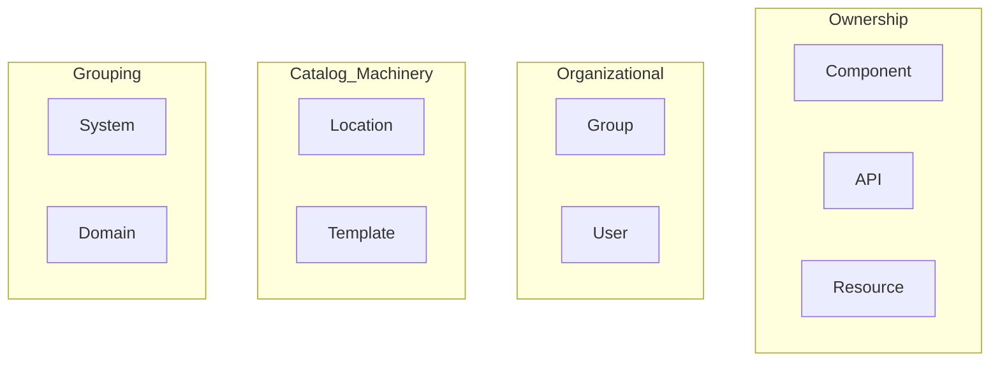
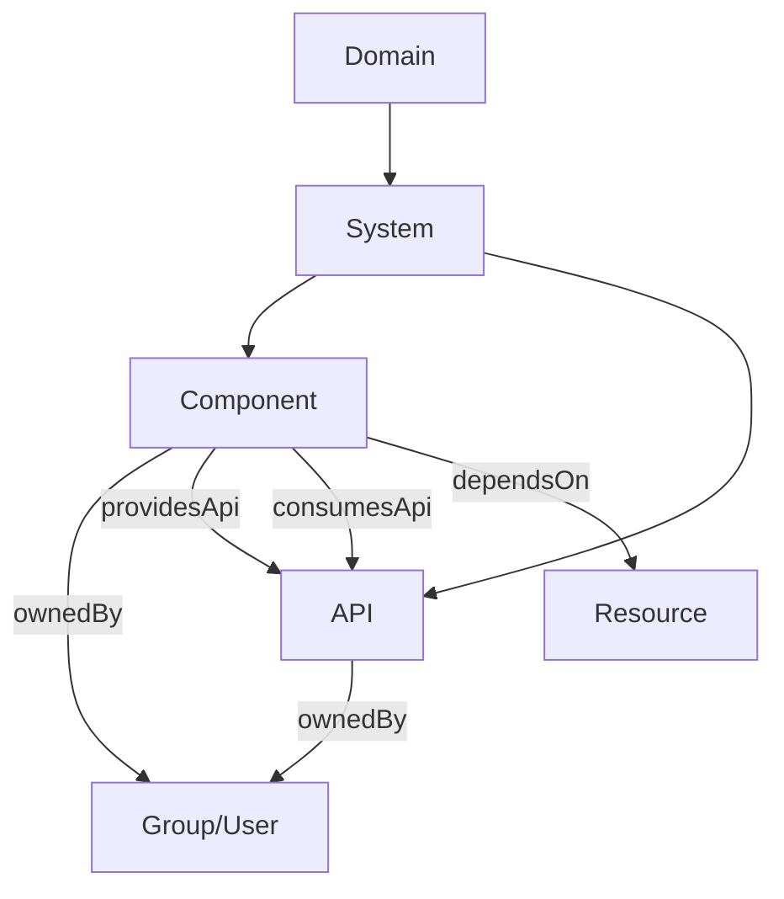
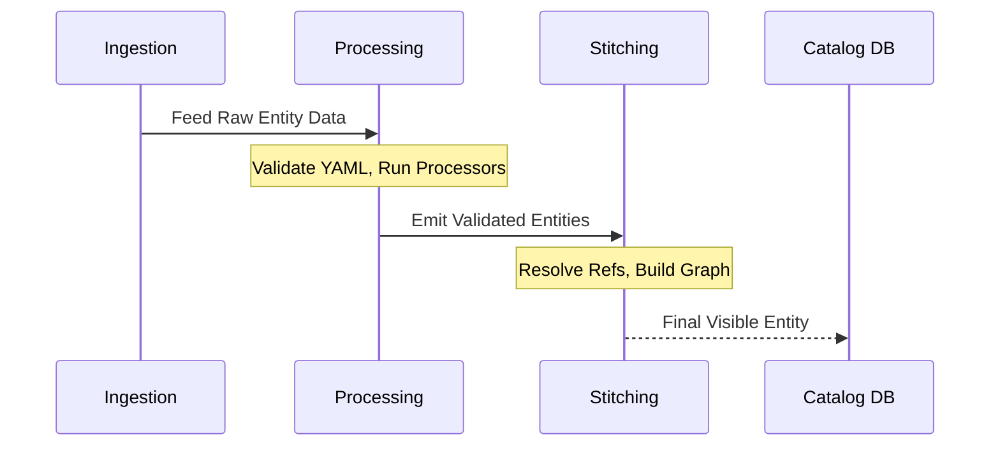
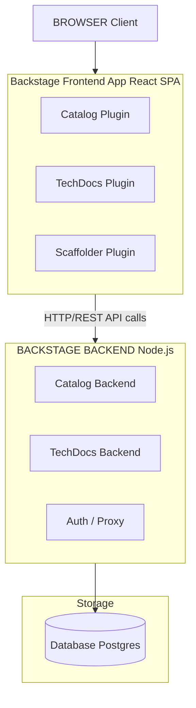
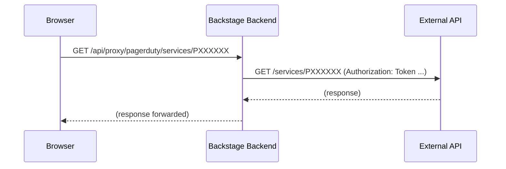

> **Складність**: `[COMPLEX]` - охоплює два домени іспиту (разом 44% CBA)
>
> **Час на виконання**: 60-75 хвилин
>
> **Передумови**: Модуль 1 (огляд Backstage), Модуль 2 (плагіни та розширюваність)

## Що ви зможете робити

Після завершення цього модуля ви зможете:

1. **Проєктувати** повну таксономію каталогу, яка точно моделює власність організації, залежності та складні API-контракти.
2. **Впроваджувати** автоматизовані постачальники виявлення й власні процесори сутностей, які безперервно завантажують сервіси із зовнішніх джерел до каталогу.
3. **Діагностувати** збої завантаження каталогу, накопичення осиротілих сутностей і невідповідності зв'язків за допомогою Backstage REST API з курсорною пагінацією.
4. **Оцінювати** архітектурні відмінності між розробницькими налаштуваннями SQLite і виробничими розгортаннями PostgreSQL, забезпечуючи оптимальне масштабування бази даних.
5. **Налагоджувати** проблеми накладання конфігурацій у `app-config.yaml`, щоб секрети й перевизначення середовища поводилися очікувано під час виконання.

## Чому цей модуль важливий

У Spotify, ще до того як Backstage було відкрито як відкритий код, інженери регулярно стикалися з когнітивною фрагментацією під час інцидентів. **Гіпотетичний сценарій:** під час збою в піковому трафіку чергові можуть втратити перший відрізок інциденту лише на з'ясування того, хто володіє сервісом, де лежать маніфести розгортання, які існують upstream-залежності, не тому що код неможливо зрозуміти, а тому що контекст розкиданий між wiki, чатами й племінними знаннями. Саме цей організаційний біль каталог Backstage покликаний лікувати.

Програмний каталог є серцем Backstage, що б'ється. Без нього Backstage є лише фреймворком плагінів із симпатичним UI. З ним ви отримуєте єдину панель огляду для кожного сервісу, API, команди й частини інфраструктури, якими володіє організація. Він з'єднує сиру інфраструктуру з людською відповідальністю, перетворюючи племінні знання на явні графові зв'язки.

Іспит Certified Backstage Associate (CBA) відводить **22% каталогу** (Domain 3) і ще **22% інфраструктурі** (Domain 2), разом це 44% вашого загального балу. Опанування цих концепцій потрібне не лише для складання іспиту; воно навчає, як усувати фундаментальний організаційний хаос, що переслідує сучасні мікросервісні архітектури. Якщо добре розібратися з цими двома доменами, ви вже майже на півдорозі до складання іспиту ще до того, як торкнетеся зовнішніх плагінів або фреймворків документації.

## Що ви вивчите

До кінця цього повного модуля ви глибоко розумітимете:

- фундаментальне походження, CNCF-статус і швидке ринкове прийняття фреймворку Backstage.
- Усі вісім основних типів сутностей і додатковий тип Template, а також коли саме використовувати кожен із них.
- Як сутності завантажуються в конвеєр каталогу через ручну конфігурацію й автоматизовані механізми виявлення.
- Як суворо структурувати й перевіряти файли-дескриптори `catalog-info.yaml` за допомогою правильного `apiVersion`.
- Клієнт-серверну архітектуру Backstage: фронтенд React SPA, бекенд Node.js Express, шар бази даних і систему проксі.
- Виробничі аспекти розгортання з акцентом на переході від локальних конфігурацій до стійких налаштувань.
- Поглиблений розгляд базових можливостей, як-от плагін Kubernetes і конвеєр генерації TechDocs.

## Чи знали ви?

1. Spotify офіційно відкрила Backstage як відкритий код 16 березня 2020 року, розв'язуючи роки внутрішньої фрагментації.
2. Backstage було підвищено з CNCF Sandbox до рівня зрілості CNCF Incubating 15 березня 2022 року.
3. New Фронтенд System став типовим для новостворених застосунків Backstage у v1.49.0, замінивши прапорець `--next` і прапорець `--legacy` для старіших застосунків.
4. Certified Backstage Associate (CBA) є суворим 90-хвилинним іспитом із прокторингом і питаннями з множинним вибором, коштує $250 і включає одну безплатну повторну спробу від Linux Foundation.

---

## Частина 1: Походження, CNCF-статус і ринковий вплив

Розуміння походження Backstage дає важливий контекст для архітектурних рішень. Backstage було відкрито як відкритий код компанією Spotify 16 березня 2020 року. Проєкт швидко набрав популярності, увійшовши до CNCF Sandbox 8 вересня 2020 року. Визнаючи його величезний вплив на продуктивність розробників, Cloud Native Computing Foundation підвищила Backstage до рівня зрілості CNCF Incubating 15 березня 2022 року.

Станом на квітень 2026 року Backstage залишається на рівні CNCF Incubating і ще не має формального статусу Graduated, хоча де-факто слугує стандартом для Internal Розробник Portals (IDP). Звіти вказують, що впровадження Backstage суттєво зросло, однак конкретні числа, як-от твердження про понад 3,000 організацій, 2 мільйони розробників або 89% частки ринку, лишаються непідтвердженими авторитетними первинними джерелами. Проте його домінантна присутність в екосистемі беззаперечна. Крім того, хоча v1.49.0 вважався нещодавнім великим релізом на початку 2026 року й запровадив масштабні системні оновлення на кшталт New Фронтенд System, точна найновіша версія в будь-який момент залежить від частих релізних циклів проєкту.

---

## Частина 2: Модель сутностей Software Каталог (Domain 3)

Програмний каталог спирається на строго типізовану графову таксономію. Усе в каталозі Backstage подано як сутність.

### Основні типи сутностей

У Backstage Software Каталог є вісім основних вбудованих типів сутностей: Component, API, Resource, System, Domain, User, Group і Location. Крім того, тип `Template` активно використовується функцією Scaffolder.

Цю архітектуру можна природно візуалізувати діаграмою Mermaid:



Розгляньмо призначення кожної сутності:

| Тип | Призначення | Приклад |
|------|---------|---------|
| **Component** | Частина програмного забезпечення (сервіс, сайт, бібліотека) | `payments-service`, `react-ui-library` |
| **API** | Межа між компонентами (REST, gRPC, GraphQL, AsyncAPI) | `payments-api` (OpenAPI spec) |
| **Resource** | Фізичний або віртуальний інфраструктурний компонент, від якого залежить програмне забезпечення | `orders-db` (PostgreSQL), `events-queue` (Kafka topic) |
| **System** | Набір компонентів і API, які формують продукт | `payments-system` (групує payments сервіс + API + DB) |
| **Domain** | Бізнес-сфера, що групує пов'язані системи | `finance` (групує payments, billing, invoicing systems) |
| **Group** | Команда або організаційний підрозділ | `platform-team`, `backend-guild` |
| **User** | Окрема людина | `jane.doe` |
| **Location** | Вказівник на інші файли визначень сутностей | URL, що посилається на `catalog-info.yaml` у репозиторій |
| **Template** | Software template для scaffolding нових проєктів | `springboot-service-template` |

Сутність Resource конкретно описує інфраструктуру, потрібну Component для роботи під час виконання, наприклад бази даних, storage buckets або CDNs. Backstage Software Templates (Scaffolder) використовують тип сутності Template, визначений у YAML, що зберігається в Git-репозиторії.

> **Зупиніться й спрогнозуйте**: якщо видалити Git-репозиторій, який містить сутність Template, що станеться із сутністю в Backstage? Чи зникне вона негайно? Спрогнозуйте поведінку каталогу, перш ніж продовжити.

**Ключові зв'язки між типами сутностей:**



### Дескриптор каталог-info.yaml

Рекомендована назва файлу дескриптора каталогу Backstage: `catalog-info.yaml`. Кожна сутність описується файлом, який зазвичай міститься в корені репозиторію з вихідним кодом. Поточний `apiVersion` дескриптора сутності каталогу - `backstage.io/v1alpha1`; схему ще не підвищено до стабільної, тобто не alpha, версії.

```yaml
# catalog-info.yaml
apiVersion: backstage.io/v1alpha1
kind: Component
metadata:
  name: payments-service
  description: Handles all payment processing
  annotations:
    github.com/project-slug: myorg/payments-service
    backstage.io/techdocs-ref: dir:.
  tags:
    - java
    - payments
  links:
    - url: https://payments.internal.myorg.com
      title: Production
      icon: dashboard
spec:
  type: service
  lifecycle: production
  owner: team-payments
  system: payments-system
  providesApis:
    - payments-api
  dependsOn:
    - resource:payments-db
```

Загальновідомі значення `spec.lifecycle` для сутностей Component і API: `experimental`, `production`, `deprecated`. Так само загальновідомі значення `spec.type` для сутності Component включають `service`, `website`, `library`.

Посилання на сутності в Backstage мають формат `[kind]:[namespace]/[name]`, де kind і namespace можуть бути необов'язковими залежно від контексту. Якщо namespace пропущено, типовим є `default`.

### Анотації та виявлення

Анотації є концептуальним клеєм між сутностями каталогу та ширшою екосистемою плагінів Backstage. Вони точно вказують плагінам, де шукати зовнішню телеметрію, документацію або операційні метрики.

| Анотація | Що вона робить |
|------------|-------------|
| `github.com/project-slug` | Пов'язує сутність із GitHub репозиторій (`org/repo`) |
| `backstage.io/techdocs-ref` | Повідомляє TechDocs, де шукати docs (`dir:.` = той самий репозиторій) |
| `backstage.io/source-location` | URL вихідного коду сутності |
| `jenkins.io/job-full-name` | Пов'язує з Jenkins job |
| `pagerduty.com/service-id` | Пов'язує з PagerDuty для on-call info |
| `backstage.io/managed-by-location` | Яка сутність Location зареєструвала сутність |
| `backstage.io/managed-by-origin-location` | Початкова Location, яка вперше ввела сутність |

---

## Частина 3: Завантаження сутностей, постачальники, процесори

Завантаження сутностей до каталогу Backstage спирається на два механізми: Сутність Providers, які читають сирі визначення з джерел, і Processors, які аналізують або трансформують дані сутностей.

### Ручна реєстрація

Можна статично визначати locations безпосередньо у файлі конфігурації, щоб вручну підключати сутності:

```yaml
# app-config.yaml
catalog:
  locations:
    - type: url
      target: https://github.com/myorg/payments-service/blob/main/catalog-info.yaml
      rules:
        - allow: [Component, API]

    - type: file
      target: ../../examples/all-components.yaml
      rules:
        - allow: [Component, System, Domain]
```

Також можна визначити чисту сутність Location безпосередньо в YAML:

```yaml
apiVersion: backstage.io/v1alpha1
kind: Location
metadata:
  name: myorg-payments
  description: Payments team components
spec:
  type: url
  targets:
    - https://github.com/myorg/payments-service/blob/main/catalog-info.yaml
    - https://github.com/myorg/payments-api/blob/main/catalog-info.yaml
```

### Автоматизоване завантаження через виявлення

Backstage постачається з вбудованими інтеграціями виявлення для GitHub, GitLab і Bitbucket Server. Ці постачальники сканують цілі організації або групи й автоматично будують топологію.

```yaml
# app-config.yaml
catalog:
  providers:
    github:
      myOrgProvider:
        organization: 'myorg'
        catalogPath: '/catalog-info.yaml'   # where to look in each repo
        schedule:
          frequency: { minutes: 30 }
          timeout: { minutes: 3 }
```

```yaml
catalog:
  providers:
    gitlab:
      myGitLab:
        host: gitlab.mycompany.com
        branch: main
        fallbackBranch: master
        catalogFile: catalog-info.yaml
        group: 'mygroup'                    # optional: limit to a group
        schedule:
          frequency: { minutes: 30 }
          timeout: { minutes: 3 }
```

```yaml
catalog:
  providers:
    githubOrg:
      myOrgProvider:
        id: production
        orgUrl: https://github.com/myorg
        schedule:
          frequency: { hours: 1 }
          timeout: { minutes: 10 }
```

> **Зупиніться й подумайте**: якщо розробник змінює параметр шляху `catalogFile` у постачальнику, щоб шукати `.backstage/catalog.yaml` замість `catalog-info.yaml`, що має статися в усіх репозиторіях організації, щоб наступний цикл завантаження був успішним?

### Процесори сутностей і зшивання конвеєр

Життєвий цикл сутності рухається від завантаження через обробку до фінального зшивання.



Власні постачальники дозволяють довільну інтеграцію:

```typescript
import { EntityProvider, EntityProviderConnection } from '@backstage/plugin-catalog-node';

class MyCustomProvider implements EntityProvider {
  getProviderName(): string {
    return 'my-custom-provider';
  }

  async connect(connection: EntityProviderConnection): Promise<void> {
    // Fetch entities from your custom source
    const entities = await fetchFromMySource();

    await connection.applyMutation({
      type: 'full',
      entities: entities.map(entity => ({
        entity,
        locationKey: 'my-custom-provider',
      })),
    });
  }
}
```

---

## Частина 4: Пагінація API та усунення несправностей

Backstage Каталог REST API надає endpoint `GET /entities/by-query` із курсорною пагінацією, що замінює старіший пагінований endpoint `GET /entities`. Курсорна пагінація дає стійкість до змін даних під час читання, повертаючи токен (cursor), який працює як безпечний вказівник на наступну сторінку.

Коли посилання на сутність розірване, ви натрапляєте на orphan-сутності.

```bash
# List orphaned entities via the Backstage catalog API
curl http://localhost:7007/api/catalog/entities?filter=metadata.annotations.backstage.io/orphan=true

# Delete a specific orphaned entity
curl -X DELETE http://localhost:7007/api/catalog/entities/by-uid/<entity-uid>
```

Можна примусово запустити обробку вручну:

```bash
# Refresh a specific entity
curl -X POST http://localhost:7007/api/catalog/refresh \
  -H 'Content-Type: application/json' \
  -d '{"entityRef": "component:default/payments-service"}'
```

| Симптом | Ймовірна причина | Виправлення |
|---------|-------------|-----|
| Сутність ніколи не з'являється | Недійсний YAML або порушення схеми | Перевірте сторінку імпорту каталогу на помилки |
| Сутність з'являється, а потім зникає | `rules` в app-config блокує тип сутності | Додайте тип до `rules: allow` |
| Застарілі дані після оновлення репозиторій | Цикл refresh ще не виконався | Оновіть вручну через API каталогу або зачекайте ~100-200s |
| Сутність позначена як orphaned | Location, яка її зареєструвала, була видалена | Зареєструйте повторно або видаліть orphan |
| Зв'язки зламані | Ім'я сутності, на яку є посилання, не збігається | Перевірте точні поля `name`; вони чутливі до регістру |

---

## Частина 5: Інфраструктурна архітектура (Domain 2)

Backstage використовує чітке розділення клієнта й сервера. New Фронтенд System став типовим у v1.49.0, модернізувавши те, як плагіни під'єднуються до application shell.



### Завантаження конфігурації

```yaml
# app-config.yaml — Top-level structure
app:
  title: My Company Backstage
  baseUrl: http://localhost:3000          # Frontend URL

backend:
  baseUrl: http://localhost:7007          # Backend URL
  listen:
    port: 7007
  database:
    client: better-sqlite3                # dev default
    connection: ':memory:'
  cors:
    origin: http://localhost:3000

organization:
  name: MyOrg

integrations:
  github:
    - host: github.com
      token: ${GITHUB_TOKEN}              # environment variable substitution

auth:
  providers:
    github:
      development:
        clientId: ${AUTH_GITHUB_CLIENT_ID}
        clientSecret: ${AUTH_GITHUB_CLIENT_SECRET}

proxy:
  endpoints:
    '/pagerduty':
      target: https://api.pagerduty.com
      headers:
        Authorization: Token token=${PAGERDUTY_TOKEN}

catalog:
  locations: []
  providers: {}
  rules:
    - allow: [Component, System, API, Resource, Location, Domain, Group, User, Template]
```

Накладання конфігурацій об'єднує значення під час запуску:

```bash
# You can pass multiple config files — later files override earlier ones
node packages/backend --config app-config.yaml --config app-config.production.yaml
```

> **Зупиніться й подумайте**: якщо фронтенд-плагін виконує прямий fetch-виклик до зовнішнього API (наприклад, GitHub) із браузера користувача, які проблеми безпеки й мережі можуть виникнути? Подумайте про CORS і розкриття токенів.

### Система проксі

Proxy-маршрути безпечно передають запити браузера клієнта через бекенд до зовнішніх джерел, приховуючи секретні токени.

```yaml
# app-config.yaml
proxy:
  endpoints:
    '/pagerduty':
      target: https://api.pagerduty.com
      headers:
        Authorization: Token token=${PAGERDUTY_TOKEN}
    '/grafana':
      target: https://grafana.internal.myorg.com
      headers:
        Authorization: Bearer ${GRAFANA_TOKEN}
      allowedHeaders: ['Content-Type']
```



У виробничому налаштуванні Backstage підтримує PostgreSQL (рекомендовано для виробниче середовище) і SQLite (використовується для середовище розробкиelopment/тестування) як бази даних бекенду каталогу.

```yaml
# app-config.production.yaml
backend:
  database:
    client: pg
    connection:
      host: ${POSTGRES_HOST}
      port: ${POSTGRES_PORT}
      user: ${POSTGRES_USER}
      password: ${POSTGRES_PASSWORD}
```

```yaml
app:
  baseUrl: https://backstage.mycompany.com

backend:
  baseUrl: https://backstage.mycompany.com
  cors:
    origin: https://backstage.mycompany.com
```

```yaml
auth:
  environment: production
  providers:
    github:
      production:
        clientId: ${AUTH_GITHUB_CLIENT_ID}
        clientSecret: ${AUTH_GITHUB_CLIENT_SECRET}
```

```text
1. User opens browser → loads React SPA from backend (static files)
2. SPA boots → calls backend APIs: /api/catalog, /api/techdocs, etc.
3. Backend plugins handle API calls → query database, call integrations
4. Backend returns JSON → SPA renders UI
5. For external data → SPA calls /api/proxy/* → backend forwards to external APIs
```

---

## Частина 6: Базові розширення: Kubernetes і TechDocs

Щоб по-справжньому зрозуміти Domain 2 CBA, потрібно опанувати базові плагіни.

**Плагін Kubernetes**: функція Kubernetes у Backstage складається з двох окремих пакетів: `@backstage/plugin-kubernetes` (фронтенд UI, який показує стан здоров'я) і `@backstage/plugin-kubernetes-backend` (логіка під'єднання до кластерів через сервіс accounts). Бекенд-плагін автентифікується в кластерах через ServiceAccounts; цільовою має бути підтримувана, не EOL-версія Kubernetes.

**TechDocs**: TechDocs використовує MkDocs під капотом, щоб перетворювати Markdown-файли на статичний HTML-сайт документації. TechDocs рекомендує генерувати docs у CI/CD і зберігати результат у зовнішньому storage provider, наприклад AWS S3 або Google Cloud Storage, а не генерувати динамічно на самому сервері Backstage. Це архітектурне рішення різко зменшує CPU-навантаження на бекенд Backstage.

---

## Сценарій: цунамі з 10,000 сутностей

**Гіпотетичний сценарій:** платформна команда у фінтех-компанії середнього розміру налаштовує GitHub виявлення, щоб автоматично реєструвати кожен репозиторій в організації. За тиждень каталог має 10,000 сутностей, але моральний стан команди жахливий. Каталог без розбору завантажує архівні репозиторії, стародавні forks і експериментальні прототипи. Пошук стає марним.

Коли в паніці прибрали конфігураційний блок, сутності лишилися. Вони стали осиротілими сутностями. Backstage коректно відстежив, що вони були зареєстровані через Location, яка більше не існувала, і позначив їх для людської перевірки. Команда провела вихідні, пишучи Python-цикл, який викликав `DELETE /api/catalog/entities/by-uid/<uid>`, щоб прибрати примарні дані.

**Урок:** завжди обмежуйте постачальники автоматизованого виявлення за допомогою topic tags репозиторіїв, правил іменування репозиторіїв і явних виключень шляхів, щоб архівні forks і experiments ніколи не затоплювали каталог. Цифрове накопичення робить пошук і ownership workflows гіршими, ніж відсутність порталу взагалі.

## Нотатки щодо дизайну іспиту для сценаріїв каталогу й інфраструктури

Іспит CBA поєднує теми каталогу й інфраструктури, бо каталог Backstage - це не просто список сервісів. Це граф, підкріплений базою даних, який оновлюється циклами обробки, розширюється постачальниками, запитується через API і відображається плагінами. Коли питання згадує власність, залежності, API, системи, домени, осиротілі сутності, поведінку бази даних або накладання конфігурацій, воно зазвичай перевіряє, чи вмієте ви поєднати моделювання каталогу з операційною інфраструктурою.

Кожен сценарій каталогу починайте з питання, що саме представляє сутність. `Component` - це програмне забезпечення, яким можна володіти і яке можна експлуатувати. `API` - контракт, який компоненти надають або споживають. `Resource` - інфраструктура, від якої залежить програмне забезпечення. `System` групує пов'язані компоненти, API і ресурси в межу продукту. `Domain` групує системи навколо бізнес-сфери. Сутності `User` і `Group` моделюють власність, а сутності `Location` повідомляють каталогу, звідки походять інші дескриптори.

Добра таксономія каталогу прискорює реагування на інциденти, бо перетворює нечіткі назви сервісів на явні шляхи власності й залежностей. Якщо сервіс оформлення замовлень залежить від бази даних, споживає pricing API, надає orders API і належить до commerce system, чергові можуть перейти від симптому до власника та залежності значно швидше. Іспит може подати це як бізнес-проблему, але технічна відповідь зазвичай полягає у правильному типі сутності та правильному зв'язку.

Якість дескриптора важливіша за кількість дескрипторів. Репозиторій, де `catalog-info.yaml` називає власника, життєвий цикл, систему, API й залежності, корисніший за багато репозиторіїв, у яких є лише назва компонента. Граф каталогу стає цінним тоді, коли дескриптори достатньо повні, щоб плагіни могли прив'язати документацію, ресурси Kubernetes, завдання CI, оповіщення й робочі процеси власності до тієї самої сутності.

Анотації - це контракти плагінів. Анотація GitHub повідомляє плагіну, де живе вихідний код, анотація TechDocs повідомляє TechDocs, де живе джерело документації, а анотації Kubernetes можуть допомогти з'єднати сутність із ресурсами кластера. Ставтеся до анотацій як до інтеграційних точок, а не як до декоративних метаданих. Якщо на сторінці сутності бракує вкладок або панелі плагінів порожні, перевірте, чи існує очікувана анотація і чи доступна відповідна зовнішня система.

Ручна реєстрація корисна для контрольованого підключення, прикладів і малих команд. Статичні записи `catalog.locations` дають платформним командам чіткий контроль над тим, що потрапляє до каталогу, а сутність Location може групувати пов'язані цілі дескрипторів. Компроміс полягає в супроводі: кожне нове місце дескриптора репозиторію може потребувати змін конфігурації каталогу, якщо не додати автоматизацію. Ручна реєстрація віддає перевагу точності над масштабом.

Автоматизовані постачальники виявлення віддають перевагу масштабу, але їх потрібно обмежувати. Постачальник, який сканує кожен репозиторій у великій організації, може завантажити архівні експерименти, особисті пісочниці, шаблони, тестові fixtures і неповні дескриптори. Використовуйте фільтри, правила, домовленості про власність і перевірку в CI, щоб виявлення створювало надійний граф, а не шумний інвентар. Правильна відповідь на іспиті часто включає управління правилами, а не лише ввімкнення постачальника.

Процесори - це місце, де сирі дані сутностей стають перевіреним станом каталогу. Постачальник або location надає дані, процесори читають і перевіряють дані, а зшивання створює зв'язки, які може обслуговувати API каталогу. Коли завантаження падає, визначайте, чи збій стався під час читання джерела, розбору YAML, перевірки схеми, застосування правил, розв'язання зв'язків або зшивання фінального графа. Кожен етап має іншого власника виправлення.

Осиротілі сутності потребують уважного міркування. Якщо вихідна Location зникає або перестає випромінювати сутність, Backstage може зберегти видимість осиротілої сутності замість мовчки видалити її. Така поведінка захищає операторів від втрати контексту без попередження, але також означає, що очищення каталогу потребує процесу. Ви маєте розуміти, чи сутність активно керована, чи осиротіла через відсутню location, чи некоректно дубльована кількома постачальниками.

Невідповідності зв'язків часто походять із синтаксису посилань. Посилання на сутності включають тип, простір імен і назву, а типові значення можуть приховувати помилки. Component, який залежить від `resource:orders-db`, не те саме, що залежність від resource в іншому просторі імен, якщо цей простір імен не вказано. Якщо UI не показує очікуваний зв'язок, перевірте нормалізовані посилання і простір імен цільової сутності, перш ніж звинувачувати плагін.

Каталог REST API є операційним інструментом інспекції для великих інсталяцій. Сторінки UI зручні для людей, але API-запити точно показують посилання на сутності, зв'язки, фільтри, поля й поведінку пагінації. Курсорна пагінація важлива, бо великі каталоги не можуть безпечно повертати всі сутності в одній відповіді. Якщо питання згадує відсутні сутності в масштабі, думайте про фільтри, поля, ліміти й курсори так само, як про конфігурацію постачальника.

Вибір бази даних - не дрібна деталь розгортання. SQLite зручна для локальної розробки й потребує мало налаштувань, але не є правильною основою для стійкого багатокористувацького виробничого Backstage. PostgreSQL дає виробничим розгортанням справжній сервіс бази даних для стану каталогу, сховища плагінів, міграцій і операційного резервного копіювання. Іспит часто формулює проблему як проблему масштабування, але відповідь починається з правильної архітектури бази даних.

Виробниче масштабування бази даних має враховувати тих, хто записує, і тих, хто читає. Обробка каталогу записує оновлення стану сутностей, тоді як користувачі й плагіни постійно читають дані каталогу. Запуск занадто багатьох реплік обробки може створити дубльовану роботу або конкуренцію за базу даних, якщо не використано вибір лідера чи спеціальну топологію обробки. Масштабування web/API частини Backstage не означає автоматично, що кожна репліка має виконувати ту саму фонову обробку.

Накладання конфігурацій контролює, як інфраструктурні налаштування переходять між середовищами. Базова конфігурація описує безпечні типові значення, а виробнича конфігурація може додати реальні імена хостів, клієнти баз даних, постачальників автентифікації та проксі-цілі. Змінні середовища можуть вводити секрети й значення, специфічні для середовища, під час виконання. Якщо розгортання поводиться інакше, ніж очікувалось, перевірте конфігураційні файли, завантажені за порядком.

Конфігурація Backstage завантажується послідовно: пізніші значення перевизначають попередні. Це означає, що правильний ключ у `app-config.production.yaml` все одно може програти, якщо процес стартує з іншим порядком конфігурації. І навпаки, локальне перевизначення може сховати виробничу проблему під час розробки. Сильна відповідь пояснює не лише, який YAML-ключ має існувати, а й як процес отримує правильний стек конфігурацій.

Proxy system існує тому, що код браузера не має тримати секрети або обходити політику бекенду. Фронтенд-плагіни можуть викликати бекенд Backstage, а бекендовий проксі може додавати облікові дані, застосовувати allowlists і маршрутизувати зовнішні API. Proxy endpoint слід розглядати як код бекендової інтеграції: перевіряйте ціль, заголовки, обробку шляхів, вимоги автентифікації та те, чи браузеру дозволено опосередковано досягати зовнішнього сервісу.

Інтеграція Kubernetes з'єднує метадані каталогу з ресурсами часу виконання. Component можна зіставити з workload через анотації, labels або налаштовані локатори, а бекендовий плагін спілкується з кластерами від імені порталу. Порожні вкладки Kubernetes часто вказують на проблеми каталогу або бекендової конфігурації, а не на проблему відображення UI. Перевіряйте метадані сутності, налаштування локаторів кластерів, облікові дані та встановлення бекендового плагіна саме в такому порядку.

TechDocs також залежить від метаданих каталогу й інфраструктури. Сутність каталогу повідомляє Backstage, де живе джерело документації, builder TechDocs генерує сайт, а конфігурація сховища визначає, звідки подаються згенеровані docs. Локальне файлове сховище може працювати для розробки, тоді як виробничі системи зазвичай потребують спільного об'єктного сховища, щоб документація переживала перезапуски й стабільно подавалася через репліки бекенду.

Коли ви моделюєте інфраструктуру як сутності `Resource`, тримайте абстракцію корисною для людей, які ухвалюють операційні рішення. База даних, топік повідомлень, бакет, кеш або кластер можуть бути resource, якщо командам потрібно розуміти власність і залежності. Не створюйте resource entities для кожного низькорівневого об'єкта, якщо це наповнює граф шумом і робить його важким для читання. Добрий каталог абстрагує інфраструктуру на тому рівні, де справді ухвалюються рішення про власність, надійність, вартість і реагування на інциденти.

Коли ви моделюєте API, включайте власність контракту, а не лише назву інтерфейсу. API сутність має описувати межу, від якої залежать інші компоненти, і показувати, хто відповідає за стабільність цього контракту. OpenAPI, AsyncAPI, GraphQL і gRPC definitions можуть зробити контракт придатним для інспекції без окремого пошуку в репозиторіях. Точні зв'язки `providesApi` і `consumesApi` допомагають командам розуміти blast radius перед зміною endpoint або оголошенням версії застарілою.

Коли ви моделюєте systems і domains, не використовуйте їх як декоративні папки. `System` має представляти продукт або технічну межу зі значущими компоненти і API. `Domain` має представляти ширшу бізнесову або платформну сферу, яка групує systems. Якщо кожна команда вигадує власні правила групування, граф каталогу стає непослідовним і менш корисним під час інцидентів. Платформні команди мають публікувати настанови з таксономії та переглядати зміни, які створюють нові високорівневі групування.

Управління правилами є частиною інженерії каталогу. CI має перевіряти синтаксис дескрипторів, обов'язкові поля, посилання на власників, значення життєвого циклу, дозволені типи сутностей і формати анотацій до того, як дескриптори потраплять до каталогу. Runtime ingestion не має бути першим місцем, де виявляються очевидні помилки дескрипторів. Іспит може запитати, як запобігти зламаним даним каталогу; найкраща відповідь часто включає і перевірку в CI, і діагностику обробки каталогу.

Великі каталоги потребують дисципліни пошуку й фільтрування. Користувачі мають знаходити сервіси за власником, життєвим циклом, системою, доменом, tags, type і relation. Якщо descriptors пропускають поля, UI все одно може перелічувати сутності, але портал не відповідатиме на операційні питання. Тому якість каталогу залежить і від платформних інструментів, і від звичок команд. Каталог, повний неназваних власників і experimental lifecycles, технічно заповнений, але операційно слабкий.

Сценарії інцидентів часто поєднують збої каталогу й інфраструктури. Відсутнє поле власника сповільнює ескалацію, зламаний постачальник зупиняє оновлення, вузьке місце бази даних затримує обробку, а файл конфігурації з неправильним порядком спрямовує плагіни на хибний endpoint. Практикуйте розкладання історії на моделювання графа, завантаження, сховище й конфігурацію виконання. Такий розбір захищає від універсальних виправлень на кшталт "restart Backstage", коли справжня проблема - погані метадані або конкуренція за базу даних.

Для темпу на іспиті перекладайте симптоми на шари каталогу. "The сутність never appears" вказує на provider, location, rules, parsing або processor errors. "The сутність appears but relationships missing" вказує на refs, namespaces або stitching. "The UI tab is empty" вказує на annotations, бекенд plugin config або external credentials. "Pagination misses records" вказує на форму API-запиту та обробку курсора. Кожен симптом має свій шар, і це допомагає не змішувати проблеми моделювання, конфігурації, зберігання та плагінів.

Найсильніша ментальна модель така: Backstage перетворює інфраструктуру й власність програмного забезпечення на граф, який можна запитувати. Descriptors визначають вузли, relations визначають ребра, providers і processors підтримують граф свіжим, PostgreSQL зберігає стан, API відкривають дані, а plugins відображають корисні операційні подання. Коли ви можете розмістити кожну проблему в цьому конвеєрі, питання про інфраструктура каталогу стають значно передбачуванішими.

Коли ви переглядаєте дескриптор каталогу, читайте його як контракт між сервісна команда і платформна команда. Сервісна команда заявляє, що це за сутність, хто нею володіє, у якому життєвому циклі вона перебуває, до якої system належить, які API вона надає і від якої інфраструктури залежить. Платформна команда обіцяє, що плагіни, пошук, подання власності, документація й операційні інтеграції послідовно використовуватимуть цю інформацію.

Коли descriptors неповні, Backstage усе ще приймає деякі сутності, але платформна цінність різко падає. Component без owner не може маршрутизувати відповідальність. Component без system не може показати контекст продукту. Component без API relations не може виявити споживачів. Component без documentation annotation не може під'єднати TechDocs. Каталог настільки сильний, наскільки команди підтримують його metadata, і саме ця підтримка перетворює список сервісів на операційний інструмент.

Коли вводиться автоматизоване виявлення, починайте з малого blast radius. Проскануйте спершу одну group, один topic, один шаблон репозиторіїв, огляньте отриманий граф і лише потім розширюйте coverage. У великих організаціях часто є роки покинутих репозиторіїв і непослідовного іменування. Discovery перетворює історію на дані каталогу, якщо ви не додасте filters. Controlled expansion - це інженерна практика, а не брак ambition.

Коли processors відхиляють сутність, виправлення за можливості має відбутися в джерелі істини. Ручне редагування рядків бази даних каталогу може прибрати симптом, але не виправляє descriptor у репозиторії, який буде оброблено знову пізніше. Стійке виправлення оновлює `catalog-info.yaml`, фільтр постачальника, посилання на сутність або правило процесора, що створило поганий стан. Каталог має сходитися до істини, контрольованої у вихідному коді.

Порівнюючи SQLite і PostgreSQL, зосереджуйтеся на операційних властивостях, а не на назвах продуктів. SQLite вбудована, проста й корисна на laptop. PostgreSQL - мережевий сервіс бази даних із довговічністю, резервним копіюванням, керуванням з'єднаннями та характеристиками конкурентності для виробниче середовище. Backstage plugins зберігають реальний стан платформи, тому виробничі розгортання потребують поведінки бази даних, яка переживає перезапуски, багатьох користувачів і безперервну фонову обробку.

Під час scaling бекенд відокремлюйте потужність обслуговування запитів від фонової роботи. Більше replicas допомагають web API-трафік, але background каталог processing може дублювати роботу, якщо кожна replica обробляє ті самі providers без coordination. Зріле deployment може використовувати leader election, спеціальну worker-style topology або явні операційні настанови, щоб масштабування покращувало availability без створення write contention.

Під час review проксі-endpoints перевіряйте, чи випадково не відкривається тунель загального призначення. Вузько обмежений проксі-endpoint із fixed target і controlled headers набагато безпечніший, ніж broad endpoint, який дозволяє довільні paths і hosts. Бекенд проксі потужний, бо може тримати credentials, тому його потрібно налаштовувати з такою самою уважністю, як іншу привілейовану бекенд integration.

Коли Kubernetes resources показуються в Backstage, сутність каталогу є мостом між людською власністю та станом кластера. Deployment, сервіс або pod у Kubernetes зазвичай не знає повного бізнес-контексту. Backstage може додати контекст, якщо metadata сутності й labels кластера збігаються. Саме тому точність каталогу важлива для platform operations, а не лише для красивих сторінок сервісів.

Коли TechDocs падає у виробниче середовище, досліджуйте режим збірки, сховище й анотації сутності разом. Сутність може вказувати на неправильний каталог docs, builder міг не згенерувати content, storage бекенд може бути не shared across replicas. Локальне demo може приховати проблеми, бо один process може генерувати й читати з локальної файлової системи. Production потребує довговічного шляху документації.

Користуючись API каталогу, не витягуйте весь світ лише для відповіді на вузьке питання. Фільтри, поля й пагінація зменшують навантаження на базу даних і роблять автоматизацію безпечнішою. Script, який проходить через every сутність без cursor handling, може пропустити дані або перевантажити бекенд. Дисципліна API є частиною операцій каталогу, бо каталог часто стає центральною точкою інтеграції для багатьох internal tools.

Під час cleanup orphan entities зберігайте auditability. Orphan може представляти справді retired сервіс, moved репозиторій, temporary provider outage або misconfigured location. Негайне видалення може прибрати корисний incident context. Кращий cleanup process визначає origin, підтверджує ownership, записує, чому source зник, а потім deliberate removes stale entities через підтримані UI або API paths.

Коли команди сперечаються про taxonomy, використовуйте операційні питання для рішення. Хто володіє сутністю? Що відмовить, якщо вона впаде? Які користувачі від неї залежать? Яку систему вона підтримує? Які API вона відкриває? Які ресурси вона споживає? Ці питання створюють кращі моделі сутностей, ніж debates про те, чи кожен репозиторій заслуговує власної сторінки. Каталог має оптимізувати ухвалення рішень.

Коли конфігурація layering ламається, виведіть або перегляньте effective config замість того, щоб вдивлятися в один YAML file. Значення, яке використовує Backstage, є результатом завантажених файлів, порядку, підстановки змінних середовища й прапорців команди розгортання. Багато інцидентів стаються тоді, коли всі переглядають правильний виробничий файл, а process насправді запущено лише з base file. Effective config - це істина час виконання.

Навчаючи моделювання каталогу, починайте з одного повного сервісу й розширюйте назовні. Визначте component, owner group, system, API, база даних resource і TechDocs annotation для одного сервісу. Потім додайте another component, який consumes API. Такий small graph навчає relations ясніше, ніж giant import сотень partial entities. Якість зв'язків важить більше, ніж кількість вузлів.

Проєктуючи CI validation, enforce fields, на які organization покладається operationally. Якщо on-call routing залежить від `spec.owner`, зробіть його обов'язковим. Якщо сервіс grouping залежить від `spec.system`, перевіряйте його. Якщо documentation очікується для виробничих сервісів, перевіряйте TechDocs annotation. CI має кодувати локальну політику платформи, а не просто перевіряти, що YAML розбирається.

Коли exam answer містить "just use Backstage", вона, ймовірно, неповна. Backstage - framework, але correct answer зазвичай називає каталог сутність kind, provider, processor, config layer, база даних choice, проксі патерн або plugin boundary, що address scenario. Точні іменники важливі, бо Backstage має багато moving parts, і кожна частина відповідає за інший режим відмови.

Коли ви експлуатуєте Backstage platform, ставтеся до каталог як до shared infrastructure data. Teams не мають робити arbitrary taxonomy changes без review, але платформна команда також не має ставати bottleneck для кожного descriptor edit. Найздоровіша модель поєднує clear standards, automated validation, self-сервіс registration і visible cleanup processes для exceptions.

Домени каталогу й інфраструктури зрештою про зменшення неоднозначності. Добре deployment Backstage відповідає, хто володіє сервісом, від чого він залежить, де живе документація, які API він відкриває, які ресурси часу виконання належать йому і як сам портал налаштований та масштабований. Саме тому ці домени мають таку велику вагу на іспиті й таку практичну цінність.

Коли каталог зростає, cost ambiguity compounds. Одне missing owner field дратує; сотні missing owner fields роблять portal unreliable during incidents. Один loose постачальник автоматизованого виявлення зручний; багато loose providers створюють stale data, яким команди stop trusting. Backstage succeeds, коли every сутність має достатньо metadata, щоб інша team могла ухвалити рішення без відкриття chat thread.

Коли ви model залежності, віддавайте перевагу relationships, які describe operational reality. Якщо сервіс не може працювати без база даних, база даних має з'явитися як resource dependency. Якщо API consumed by several компоненти, contract має бути visible before breaking change merged. Graph має допомагати команди predict blast radius, а не merely document репозиторій names after fact.

Коли ви будуєте automation around API каталогу, пишіть scripts так, ніби каталог large, навіть якщо today's instance small. Використовуйте filters, запитed fields, pagination cursors і cautious delete workflows. Scripts, що work only against small demo каталог, часто стають dangerous, коли їх copied into виробниче середовище. CBA exam очікує, що ви recognize: operational scale changes how APIs should be consumed.

Коли виробничий Backstage instance feels slow, розділяйте дані каталогу problems і infrastructure problems. Too many noisy entities, missing indexes, excessive provider scans, slow зовнішні API, underpowered PostgreSQL instances можуть усі appear as sluggish каталог. Restarting бекенд може briefly hide symptoms, але durable fixes require finding layer, що actually produces latency або write pressure.

Коли ви choose ownership conventions, make them match organization, яка respond to incidents. Component, owned by vague group `engineering`, не є actionable. Component, owned by real team with an escalation path, є actionable. Backstage can show ownership beautifully, але не може compensate for taxonomy, яка avoids real accountability.

Навчаючи команди write descriptors, дайте їм examples common патернs: сервіс API, website consuming API, база даних resource, system grouping several компоненти, domain grouping related systems. Clear examples reduce drift ефективніше, ніж abstract policy documents. Teams copy working патернs, тому платформна команда має зробити right патерн easy to copy.

Коли всі practices сходяться, Backstage стає більше, ніж portal UI. Він стає operational map, що links source репозиторії, час виконання infrastructure, documentation, ownership, dependency contracts і виробнича конфігураціяuration. Practical reason інфраструктура каталогу knowledge matters: воно допомагає платформні команди перетворити scattered engineering facts на dependable shared control plane.

Для іспиту не запам'ятовуйте topics як separate flashcards. Practice reading scenario і naming layer first: сутність model, descriptor syntax, annotation contract, provider конфігурація, processor behavior, API каталогу query, база даних architecture, config loading, проксі boundary, Kubernetes integration або TechDocs storage. Once layer clear, correct Backstage feature usually follows naturally. Ця habit також показує, як experienced platform engineers debug real portals without making broad, risky changes.

У real delivery work тримайте feedback loops close to source. Descriptor validation belongs near репозиторії, provider filters belong near platform config, база даних alarms belong near виробниче розгортання, cleanup репозиторійrts belong where сервіс owners can act. Backstage centralizes visibility, але responsibility still lives with команди, а platform controls maintain graph.

Саме тому роботу з каталогом слід розглядати як постійний супровід платформи, а не як одноразовий import project. У такого супроводу має бути власник, який відповідає за правила моделювання, еволюцію таксономії та якість графа. Має бути review loop, бо нові дескриптори й нові високорівневі групування змінюють операційну карту організації, а не лише додають ще один Markdown-файл. Має бути validation policy, яка автоматично ловить синтаксичні помилки, відсутніх власників, неправильні життєві цикли, неприпустимі типи сутностей і некоректні анотації ще до того, як ці помилки потраплять у runtime ingestion.

Так само потрібна cleanup routine, бо осиротілі сутності, архівні репозиторії та застарілі експериментальні сервіси не зникають самі. Без регулярного очищення каталог починає виглядати повним, але перестає бути надійним джерелом для інцидентів, пошуку власників і аналізу залежностей. Потрібна operational accountability: якщо сервіс має власника лише формально, але команда не реагує на інциденти й не підтримує descriptor, Backstage не зможе компенсувати цю організаційну прогалину. Потрібна measurable quality bar, щоб платформа могла вимірювати частку сутностей із власником, системою, документацією, API-зв'язками, ресурсними залежностями та актуальними анотаціями, а не покладатися на загальне враження, що "каталог заповнений".

Нарешті, потрібне service-level expectation для самого порталу: користувачі мають розуміти, як швидко оновлюється каталог, хто виправляє ingestion failures, як довго зберігаються orphaned entities, коли виконуються cleanup jobs і як ескалювати проблеми з плагінами або базою даних. Потрібні durable funding і roadmap, бо Backstage стає спільною платформною інфраструктурою, а не внутрішнім демо. Якщо організація очікує, що каталог прискорюватиме інциденти, onboarding, документацію, аудит API та розуміння blast radius, вона має фінансувати його як довготривалий продукт із планом розвитку, а не як разовий імпорт репозиторіїв.

Цей roadmap має охоплювати не лише нові плагіни, а й якість даних, стабільність обробки, масштабування PostgreSQL, політику proxy endpoints, правила Kubernetes integration, спосіб зберігання TechDocs і поступове розширення automated discovery. Durable funding означає час людей на перегляд descriptor changes, підтримку CI validation, очищення застарілих записів, навчання команд і супровід production deployment. Тоді каталог зберігає довіру: під час інциденту інженер може відкрити сторінку сервісу й побачити актуального власника, залежності, API-контракти, документацію, runtime resources і шлях до оперативних інтеграцій без окремого пошуку в чатах.

Measurable quality bar також має бути видимим для команд: скільки сутностей мають owner, скільки мають system, які production services не мають TechDocs, де бракує API relations, які resources не мають зрозумілої власності. Cleanup routine має мати cadence, відповідального й безпечний шлях видалення, бо автоматичне стирання може прибрати корисний контекст, а відсутність очищення поступово руйнує довіру до порталу.

У такому вигляді roadmap не є бюрократією. Це механізм, який утримує catalog, infrastructure, documentation і ownership в одному достовірному контурі, щоб Backstage залишався робочою операційною картою, а не красивою, але застарілою вітриною, і щоб кожна команда розуміла, які метадані вона має підтримувати постійно.

---

## Типові помилки

| Помилка | Чому це стається | Що робити натомість |
|---------|---------------|-------------------|
| Використання SQLite у виробниче середовище | Це типове значення, і воно "працює" в середовище розробки | Завжди налаштовуйте PostgreSQL для виробниче середовище |
| Необмежені постачальники автоматизованого виявлення | GitHub виявлення імпортує *кожен* репозиторій | Використовуйте фільтри за topic, шаблони шляхів або allowlists |
| Очікування миттєвих оновлень каталогу | Розробники реєструють YAML і одразу оновлюють сторінку | Поясніть цикл refresh ~100-200s; для термінових змін використовуйте manual refresh API |
| Жорстко записані секрети в app-config.yaml | Tokens копіюються під час налаштування | Використовуйте substitution `${ENV_VAR}`; ніколи не commit секрети |
| Забутий `rules: allow` для типів сутностей | Реєструється Template, але він ніколи не з'являється | Кожне Location source потребує явних `rules` для allowed kinds |
| TLS termination у Node.js | Здається простішим, ніж reverse проксі | Використовуйте ingress controller або load balancer для TLS; Node.js TLS не потрібен |
| Auth не налаштовано для виробниче середовище | Dev mode працює без нього | Кожний виробничий екземпляр повинен мати ввімкнену authentication |
| Ігнорування осиротілі сутності | Вони накопичуються непомітно | Моніторте orphan count; запровадьте cleanup process |


---

## Тест

**Q1: Який тип сутності представляє межу між компонентами?**
> **Сценарій**: У вас є два мікросервіси. Фронтенд-сервіс має отримувати дані з бекенд-сервіс. Щоб правильно задокументувати контрактні endpoints між двома компоненти у Backstage, який сутність kind слід використати?
<details>
<summary>Відповідь</summary>

Слід використати тип **API**. Тип API представляє межу контракту між компоненти і гарантує, що залежності та інтерфейси взаємодії явно визначені в каталозі. Один Component `providesApi`, а інший Component `consumesApi`. Зареєструвавши API сутність, Backstage може показувати точні специфікації, наприклад OpenAPI, gRPC, GraphQL або AsyncAPI, безпосередньо в інтерфейс. Це дає споживачам ясність, як взаємодіяти із сервісом і хто володіє контрактом.

</details>

**Q2: Як вводити секрети у app-config.yaml?**
> **Сценарій**: Ви розгортаєте Backstage у виробниче середовище і маєте налаштувати GitHub integration для читання дані репозиторію. Ваш `GITHUB_TOKEN` треба зберігати безпечно. Як надати секрет у file `app-config.yaml`, не записуючи його жорстко в конфігурацію?
<details>
<summary>Відповідь</summary>

Потрібно використовувати **середовище variable substitution** із синтаксисом `${VARIABLE_NAME}`, наприклад `token: ${GITHUB_TOKEN}`. Backstage розв'язує значення під час запуск, читаючи їх напряму зі змінних середовища процесу. Ніколи не жорстко записуйте секрети у файли конфігурації, бо вони часто потрапляють до version control і створюють серйозний ризик безпеки. Передавання через змінні середовища гарантує, що чутливі облікові дані залишаються strictly within середовище виконання і захищають infrastructure від несанкціонований доступ.

</details>

**Q3: Яке призначення Backstage проксі-плагін?**
> **Сценарій**: Backstage фронтенд має показувати real-time incident data з PagerDuty. Однак прямий query до PagerDuty API з браузер розкрив би API token вашої організації клієнту. Як Backstage безпечно обробляє цей запит?
<details>
<summary>Відповідь</summary>

Backstage безпечно робить це за допомогою **проксі-плагін** (`/api/proxy`), який передає запити із фронтенд через бекенд до зовнішні API. Коли запит проходить через бекенд, сервер безпечно додає required authorization headers, наприклад PagerDuty API token, перш ніж переслати запит до зовнішній сервіс. Браузер ніколи не бачить зовнішній сервіс tokens, тому вони не витікають і не можуть бути використані шкідливі scripts. Крім того, цей патерн ефективно обходить CORS (Cross-Origin Resource Sharing) restrictions, які інакше блокували б прямі клієнтські запити із односторінкового застосунку.

</details>

**Q4: Назвіть два способи реєстрації сутностей у каталог.**
> **Сценарій**: Ваша платформна команда хоче підключити кілька existing сервісs до Backstage: деякі вручну, а інші мають підхоплюватися автоматично. Які два primary mechanisms надає Backstage для цього?
<details>
<summary>Відповідь</summary>

Сутності можна реєструвати через **ручну реєстрацію** або **автоматизоване виявлення**. Manual registration передбачає явне додавання статичні записи Location в `app-config.yaml` під `catalog.locations` або натискання кнопки "Register Existing Component" в UI. Automated виявлення, натомість, використовує вбудовані постачальники, як-от `github`, `gitlab` або `githubOrg`, налаштовані під `catalog.providers`, щоб автоматично сканувати репозиторії або організаційні групи for `catalog-info.yaml` files. Automated виявлення дуже рекомендоване для масштабування у великих інженерних організаціях, тоді як ручну реєстрацію корисне для тестування або ізольованих компонентів.

</details>

**Q5: Яку база даних слід використовувати для виробничий Backstage deployment?**
> **Сценарій**: Ви успішно протестували Backstage локально з його типова база даних у пам'яті і тепер пишете deployment manifests для виробничий кластер Kubernetes. Щоб забезпечити high availability і data persistence, який бекенд бази даних треба налаштувати?
<details>
<summary>Відповідь</summary>

Для виробниче розгортання потрібно використовувати **PostgreSQL**. Default SQLite або `better-sqlite3` база даних призначена strictly для local середовище розробкиelopment тестування і не має конкурентність та довговічність, потрібних для реальне використання. PostgreSQL підтримує конкурентні з'єднання, забезпечує збереження даних і can efficiently handle intense навантаження обробки каталогу у виробниче середовище. Ви налаштовуєте setting `backend.database.client: pg` у file `app-config.production.yaml`, щоб каталог лишався високодоступним і стійким.

</details>

**Q6: Що стається із сутностями, коли source Location видалено?**
> **Сценарій**: Розробник випадково видаляє репозиторій, що містив `catalog-info.yaml` застарілий сервіс. Repository первинно був ingested через статичний запис Location у Backstage. Яким буде стан цієї сутність у Backstage каталог?
<details>
<summary>Відповідь</summary>

Сутність стане **осиротіла сутність**. Вона лишатиметься, доки її не очищено, або вручну через Backstage UI, або програмно через API каталогу (`DELETE /api/catalog/entities/by-uid/<uid>`), щоб запобігти каталог accumulating застарілим і заплутаним даним.

</details>

**Q7: Як працює конфігурація layering у Backstage?**
> **Сценарій**: Ви хочете запускати Backstage локально, але потребуєте базові конфігураційні налаштування і значення, специфічні для виробничого середовища під час deploying Kubernetes cluster. Як Backstage обробляє кілька файлів конфігурації, щоб цього досягти?
<details>
<summary>Відповідь</summary>

Backstage досягає цього через **конфігурація layering**: під час старту бекенд передаються кілька `--config` flags, наприклад `node packages/backend --config app-config.yaml --config app-config.production.yaml`. Фреймворк читає files у наданому порядку, використовуючи стратегію глибокого злиття, де значення in пізніших файлах override corresponding значення попередніх файлах. Цей патерн дозволяє команди підтримувати спільну базову конфігурацію, безпечно застосовуючи перевизначення, специфічні для середовища, облікові дані бази даних і налаштування автентифікації виробниче середовище. Наприклад, base config might define каталог providers, while виробнича конфігурація injects necessary OAuth client секрети. Розділення запобігає випадковому витоку виробниче середовище секрети in локальних середовищах while maintaining easily структуру застосунку, яку легко тестувати.

</details>

**Q8: У виробниче середовище Kubernetes deployment Backstage чому каталог processing має працювати на одній replica?**
> **Сценарій**: Ви scaling Backstage бекенд deployment до 3 replicas, щоб handle increased API-трафік. Однак у logs ви помічаєте unexpected база даних lock errors і duplicate processing cycles. Яке архітектурне міркування щодо каталог processing було пропущено?
<details>
<summary>Відповідь</summary>

Проблема виникає тому, що каталог processing ideally має працювати на **одній replica**, щоб avoid дубльованої роботи обробки і конфліктів бази даних. Якщо кілька replicas simultaneously execute каталог processing loop, вони redundantly fetch data from same external sources і attempt conflicting база даних writes. Щоб safely scale бекенд і запобігти issues, `@backstage/plugin-catalog-backend` supports leader election. Цей mechanism ensures only one replica actively performs каталог processing tasks, while all other replicas focus solely on serving API запити, запобігтиing станам гонитви and unnecessary load on upstream-інтеграції.

</details>

---

## Практична вправа: побудуйте multi-сутність каталог

**Мета:** створити повну структуру каталогу з кількома типів сутностей, зареєструвати їх і побудувати стійкий граф реляційних залежностей.

### Крок 1: визначте descriptors

```yaml
---
apiVersion: backstage.io/v1alpha1
kind: Domain
metadata:
  name: commerce
  description: All commerce-related systems
spec:
  owner: group:platform-team

---
apiVersion: backstage.io/v1alpha1
kind: System
metadata:
  name: orders-system
  description: Handles order lifecycle
spec:
  owner: group:backend-team
  domain: commerce

---
apiVersion: backstage.io/v1alpha1
kind: Component
metadata:
  name: orders-service
  description: REST API for order management
  annotations:
    backstage.io/techdocs-ref: dir:.
  tags:
    - java
    - springboot
spec:
  type: service
  lifecycle: production
  owner: group:backend-team
  system: orders-system
  providesApis:
    - orders-api
  dependsOn:
    - resource:orders-db

---
apiVersion: backstage.io/v1alpha1
kind: API
metadata:
  name: orders-api
  description: Orders REST API
spec:
  type: openapi
  lifecycle: production
  owner: group:backend-team
  system: orders-system
  definition: |
    openapi: "3.0.0"
    info:
      title: Orders API
      version: 1.0.0
    paths:
      /orders:
        get:
          summary: List orders
          responses:
            '200':
              description: OK

---
apiVersion: backstage.io/v1alpha1
kind: Resource
metadata:
  name: orders-db
  description: PostgreSQL database for orders
spec:
  type: database
  owner: group:backend-team
  system: orders-system

---
apiVersion: backstage.io/v1alpha1
kind: Group
metadata:
  name: backend-team
  description: Backend engineering team
spec:
  type: team
  children: []

---
apiVersion: backstage.io/v1alpha1
kind: Group
metadata:
  name: platform-team
  description: Platform engineering team
spec:
  type: team
  children: []
```

### Крок 2: зареєструйте конфігурацію сутностей

```yaml
catalog:
  rules:
    - allow: [Component, System, API, Resource, Location, Domain, Group, User, Template]
  locations:
    - type: file
      target: ./catalog-entities.yaml
      rules:
        - allow: [Domain, System, Component, API, Resource, Group]
```

### Крок 3: запустіть перевірку

```bash
# Start Backstage in development mode
yarn dev
```

### Крок 4: прив'язка проксі

```yaml
proxy:
  endpoints:
    '/jsonplaceholder':
      target: https://jsonplaceholder.typicode.com
```

```bash
# This request goes through the Backstage proxy
curl http://localhost:7007/api/proxy/jsonplaceholder/todos/1
```

### Success Checklist
<details>
<summary>Переглянути контрольний список</summary>

- [ ] Усі сутності чисто відображаються в UI.
- [ ] `orders-service` точно відображається в ієрархії `orders-system`.
- [ ] Proxy endpoint коректно пересилає запити, не розкриваючи API keys локально.

</details>


---

## Ключові висновки

| Тема | Що запам'ятати |
|-------|--------------|
| Сутність kinds | 9 built-in: Component, API, Resource, System, Domain, Group, User, Location, Template |
| каталог-info.yaml | Міститься в корені репозиторію; потрібні `apiVersion`, `kind`, `metadata`, `spec` |
| Annotations | Пов'язують сутності з плагінами; ключовий механізм виявлення |
| Registration | Manual (UI або static locations) проти automated (постачальники автоматизованого виявлення) |
| Processing | Безперервний цикл ~100-200s; ingestion → processing → stitching |
| Architecture | React SPA фронтенд + Node.js бекенд + PostgreSQL база даних |
| app-config.yaml | Layered config; секрети через `${ENV_VAR}`; прапорець `--config` перевизначає значення |
| Proxy | `/api/proxy/*` пересилає фронтенд запити через бекенд до зовнішні API |
| Production | PostgreSQL, HTTPS (via ingress), потрібна автентифікація, одна replica обробки |


## Джерела

- [Документація Backstage: Software Каталог](https://backstage.io/docs/features/software-catalog/)
- [Документація Backstage: System model](https://backstage.io/docs/features/software-catalog/system-model/)
- [Документація Backstage: Descriptor format](https://backstage.io/docs/features/software-catalog/descriptor-format/)
- [Документація Backstage: Configuration](https://backstage.io/docs/conf/)
- [Документація Backstage: Бекенд system](https://backstage.io/docs/backend-system/)
- [Документація Backstage: Proxying](https://backstage.io/docs/plugins/proxying/)
- [Документація Backstage: Kubernetes plugin](https://backstage.io/docs/features/kubernetes/)
- [Документація Backstage: TechDocs](https://backstage.io/docs/features/techdocs/)
- [Документація Backstage: TechDocs architecture](https://backstage.io/docs/features/techdocs/architecture/)
- [Документація Backstage: Discovery integration](https://backstage.io/docs/integrations/)
- [Документація Backstage: Authentication](https://backstage.io/docs/auth/)
- [Документація Backstage: Docker deployment](https://backstage.io/docs/deployment/docker/)

## Перевірка засвоєння

> Ключ виявлення `GithubEntityProvider` під `catalog.providers` - це **`github`**. Якщо потрібно, налаштовуйте сканування репозиторіїв разом із `gitlab` і `githubOrg`.

---

## Наступний модуль

**[Огляд треку CBA]()** - Domain 4: templates, documentation-as-code і майстерне виконання golden path для стійких scaffolding-розгортань. Підготуйтеся побудувати перший template у наступному занятті!
