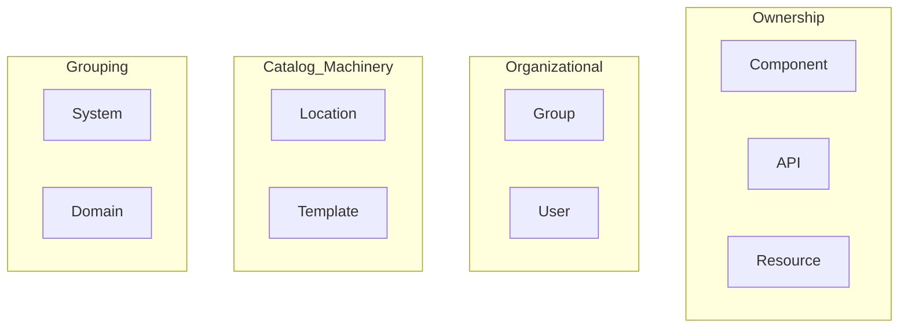
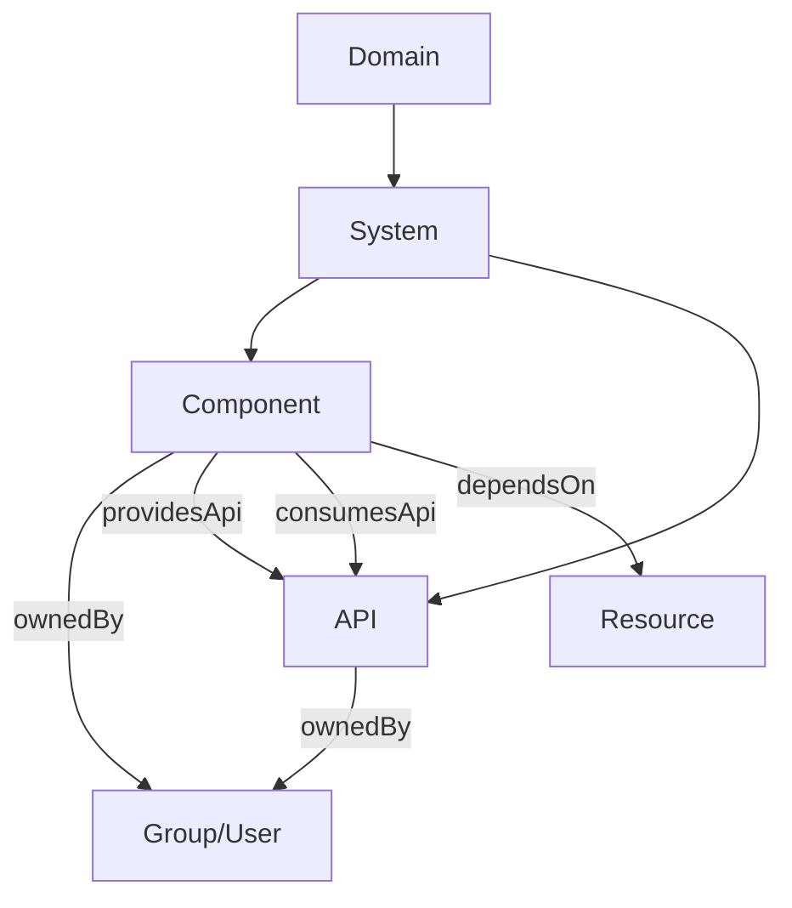
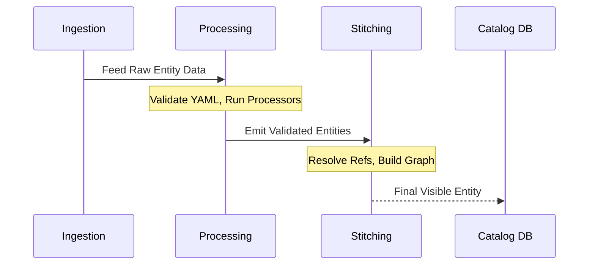
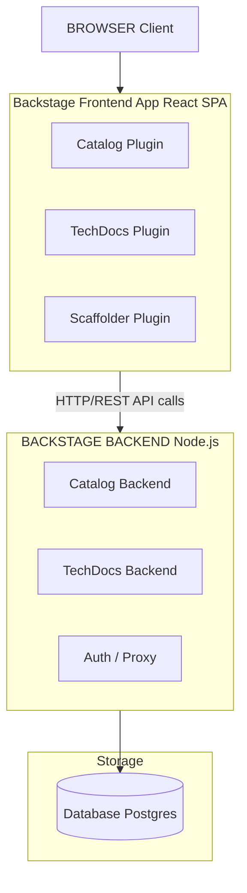
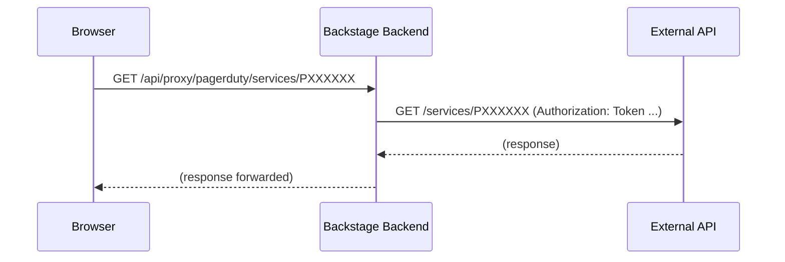

> **Складність**: `[СКЛАДНО]` — Охоплює два екзаменаційні домени (44% CBA разом)
>
> **Час на виконання**: 60-75 хвилин
>
> **Передумови**: Модуль 1 (Огляд Backstage), Модуль 2 (Плагіни та розширюваність)

## Що ви зможете робити

Після завершення цього модуля ви зможете:

1. **Проєктувати** всеосяжну таксономію каталогу, яка точно моделює структуру власності вашої організації, залежності та складні API-контракти.
2. **Реалізовувати** автоматизовані провайдери виявлення та власні процесори сутностей для безперешкодного поглинання сервісів із зовнішніх джерел у каталог.
3. **Діагностувати** збої поглинання каталогу, накопичення осиротілих сутностей та невідповідності звʼязків за допомогою REST API Backstage та курсорної посторінкової навігації.
4. **Оцінювати** архітектурні відмінності між конфігураціями розробки на SQLite та виробничими розгортаннями на PostgreSQL, забезпечуючи оптимальне масштабування бази даних.
5. **Налагоджувати** проблеми нашарування конфігурації у `app-config.yaml`, щоб переконатися, що секрети та перевизначення середовища поводяться очікувано під час виконання.

## Чому цей модуль важливий

У Spotify, до того як Backstage став відкритим, інженери регулярно стикалися з когнітивною фрагментацією під час інцидентів. **Гіпотетичний сценарій:** під час збою в піковий період трафіку реагувальники можуть втратити першу фазу інциденту, просто зʼясовуючи, хто володіє сервісом, де знаходяться маніфести розгортання та які існують залежності вищого рівня — не тому, що код неможливо пізнати, а тому, що цей контекст розкиданий по вікі, чатах і неформальному знанню. Саме цей організаційний біль Програмний каталог Backstage був створений, щоб вилікувати.

Програмний каталог є справжнім серцем Backstage. Без нього Backstage — це лише плагіновий фреймворк із гарним інтерфейсом. З ним ви отримуєте єдину панель огляду кожного сервісу, API, команди та елемента інфраструктури, якими володіє ваша організація. Він долає розрив між сирою інфраструктурою та людською підзвітністю, перетворюючи неформальне знання на явний граф звʼязків.

Іспит Certified Backstage Associate (CBA) відводить **22% на каталог** (Домен 3) та ще **22% на інфраструктуру** (Домен 2) — разом це 44% вашої загальної оцінки. Опанування цих концепцій — це не лише про складання іспиту; це насамперед про те, як вилікувати фундаментальний організаційний хаос, що переслідує сучасні мікросервісні архітектури. Опануйте ці два домени — і ви майже на півшляху до успішного складання ще до того, як торкнетеся зовнішніх плагінів чи фреймворків документації.

## Що ви вивчите

До кінця цього всеосяжного модуля ви глибоко зрозумієте:
- Фундаментальне походження, статус у CNCF та стрімке ринкове впровадження фреймворку Backstage.
- Усі вісім основних видів сутностей і додатковий вид Template, а також коли саме використовувати кожен із них.
- Як сутності поглинаються в конвеєр каталогу через ручну конфігурацію та механізми автоматизованого виявлення.
- Як суворо структурувати та перевіряти дескрипторні файли `catalog-info.yaml`, використовуючи правильний `apiVersion`.
- Клієнт-серверну архітектуру Backstage: фронтенд на React SPA, бекенд на Node.js Express, рівень бази даних та систему проксі.
- Міркування щодо виробничого розгортання, з фокусом на міграції від локальних конфігурацій до стійких налаштувань.
- Глибоке занурення в основні можливості, такі як плагін Kubernetes та конвеєри генерації TechDocs.

## Чи знали ви?

1. Backstage був офіційно відкритий компанією Spotify 16 березня 2020 року, успішно вирішивши роки накопиченої внутрішньої фрагментації.
2. Backstage був підвищений із CNCF Sandbox до рівня зрілості CNCF Incubating 15 березня 2022 року.
3. New Frontend System стала типовою для новостворених застосунків Backstage у версії 1.49.0, замінивши прапорець `--next` на прапорець `--legacy` для старіших застосунків.
4. Іспит Certified Backstage Associate (CBA) — це суворий 90-хвилинний прокторований іспит із множинним вибором вартістю $250, який включає одну безкоштовну перездачу від Linux Foundation.

---

## Частина 1: Походження, статус у CNCF та ринковий вплив

Розуміння походження Backstage дає важливий контекст для його архітектурних рішень. Backstage був відкритий компанією Spotify 16 березня 2020 року. Проєкт надзвичайно швидко набрав обертів, увійшовши до CNCF Sandbox 8 вересня 2020 року. Визнаючи його величезний вплив на продуктивність розробників, Cloud Native Computing Foundation підвищила Backstage до рівня зрілості CNCF Incubating 15 березня 2022 року.

Станом на квітень 2026 року Backstage залишається на рівні CNCF Incubating і ще не пройшов формальну градацію, хоча слугує фактичним стандартом для Internal Developer Portals (IDP). Звіти свідчать, що впровадження Backstage значно зросло, хоча конкретні цифри — такі як заяви про понад 3 000 організацій, 2 мільйони розробників або 89% ринкової частки — залишаються непідтвердженими авторитетними первинними джерелами. Тим не менш, його домінантна присутність в екосистемі є незаперечною. Крім того, хоча версія 1.49.0 визнається важливим релізом початку 2026 року, який приніс масштабні системні оновлення, такі як New Frontend System, точна остання версія в будь-який момент залежить від частих циклів випуску проєкту.

---

## Частина 2: Модель сутностей Програмного каталогу (Домен 3)

Програмний каталог спирається на суворо типізовану, графову таксономію. Усе в каталозі Backstage представлене як сутність.

### Основні види сутностей

У Програмному каталозі Backstage існує вісім основних вбудованих видів сутностей: Component, API, Resource, System, Domain, User, Group та Location. Крім того, вид `Template` активно використовується функцією Scaffolder.

Ми можемо візуалізувати цю архітектуру за допомогою діаграми Mermaid:



Розгляньмо призначення кожної сутності:

| Вид | Призначення | Приклад |
|------|---------|---------|
| **Component** | Частина програмного забезпечення (сервіс, вебсайт, бібліотека) | `payments-service`, `react-ui-library` |
| **API** | Межа між компонентами (REST, gRPC, GraphQL, AsyncAPI) | `payments-api` (специфікація OpenAPI) |
| **Resource** | Фізична або віртуальна інфраструктура, від якої залежить компонент | `orders-db` (PostgreSQL), `events-queue` (топік Kafka) |
| **System** | Сукупність компонентів та API, що утворюють продукт | `payments-system` (групує сервіс платежів + API + БД) |
| **Domain** | Бізнес-сфера, що групує повʼязані системи | `finance` (групує системи платежів, білінгу, інвойсингу) |
| **Group** | Команда або організаційна одиниця | `platform-team`, `backend-guild` |
| **User** | Окрема особа | `jane.doe` |
| **Location** | Вказівник на інші файли визначення сутностей | URL, що посилається на `catalog-info.yaml` у репозиторії |
| **Template** | Програмний шаблон для створення нових проєктів | `springboot-service-template` |

Сутність Resource конкретно описує інфраструктуру, яка потрібна компоненту для роботи під час виконання (наприклад, бази даних, сховища, CDN). Backstage Software Templates (Scaffolder) використовують вид сутності Template і визначаються у YAML, що зберігається в репозиторії Git.

> **Зупиніться та спрогнозуйте**: Якщо ви видалите репозиторій Git, що містить сутність Template, що станеться із сутністю в Backstage? Чи зникне вона негайно? Спрогнозуйте поведінку каталогу, перш ніж продовжити.

**Ключові звʼязки між видами сутностей:**



### Дескриптор catalog-info.yaml

Рекомендована назва файлу для дескриптора каталогу Backstage — `catalog-info.yaml`. Кожна сутність описується цим файлом, який зазвичай знаходиться в корені вихідного репозиторію. Поточний `apiVersion` дескриптора сутності каталогу — `backstage.io/v1alpha1`; схема ще не була підвищена до стабільної (не-альфа) версії.

```yaml
# catalog-info.yaml
apiVersion: backstage.io/v1alpha1
kind: Component
metadata:
  name: payments-service
  description: Handles all payment processing
  annotations:
    github.com/project-slug: myorg/payments-service
    backstage.io/techdocs-ref: dir:.
  tags:
    - java
    - payments
  links:
    - url: https://payments.internal.myorg.com
      title: Production
      icon: dashboard
spec:
  type: service
  lifecycle: production
  owner: team-payments
  system: payments-system
  providesApis:
    - payments-api
  dependsOn:
    - resource:payments-db
```

Загальновідомі значення `spec.lifecycle` для сутностей Component та API: `experimental`, `production` і `deprecated`. Аналогічно, загальновідомі значення `spec.type` для сутності Component включають `service`, `website` та `library`.

Посилання на сутності в Backstage використовують формат `[kind]:[namespace]/[name]`, де kind і namespace є необовʼязковими залежно від контексту. Якщо пропущено, namespace типово дорівнює `default`.

### Анотації та виявлення

Анотації є концептуальним клеєм між сутностями каталогу та ширшою екосистемою плагінів Backstage. Вони вказують плагінам, де саме шукати зовнішню телеметрію, документацію або операційні метрики.

| Анотація | Що вона робить |
|------------|-------------|
| `github.com/project-slug` | Повʼязує сутність із репозиторієм GitHub (`org/repo`) |
| `backstage.io/techdocs-ref` | Вказує TechDocs, де знайти документацію (`dir:.` = той самий репозиторій) |
| `backstage.io/source-location` | URL вихідного коду для сутності |
| `jenkins.io/job-full-name` | Повʼязує із завданням Jenkins |
| `pagerduty.com/service-id` | Повʼязує з PagerDuty для інформації про чергування |
| `backstage.io/managed-by-location` | Яка сутність Location зареєструвала цю сутність |
| `backstage.io/managed-by-origin-location` | Оригінальна Location, яка вперше ввела цю сутність |

---

## Частина 3: Поглинання сутностей, провайдери та процесори

Поглинання сутностей каталогу Backstage спирається на два механізми: Entity Providers (які читають необроблені визначення з джерел) та Processors (які аналізують/трансформують дані сутностей).

### Ручна реєстрація

Ви можете статично визначати місцезнаходження безпосередньо у файлі конфігурації для ручного введення сутностей:

```yaml
# app-config.yaml
catalog:
  locations:
    - type: url
      target: https://github.com/myorg/payments-service/blob/main/catalog-info.yaml
      rules:
        - allow: [Component, API]

    - type: file
      target: ../../examples/all-components.yaml
      rules:
        - allow: [Component, System, Domain]
```

Ви також можете визначити чисту сутність Location безпосередньо в YAML:

```yaml
apiVersion: backstage.io/v1alpha1
kind: Location
metadata:
  name: myorg-payments
  description: Payments team components
spec:
  type: url
  targets:
    - https://github.com/myorg/payments-service/blob/main/catalog-info.yaml
    - https://github.com/myorg/payments-api/blob/main/catalog-info.yaml
```

### Автоматизоване поглинання через виявлення

Backstage постачається з вбудованими інтеграціями виявлення для GitHub, GitLab та Bitbucket Server. Ці провайдери сканують цілі організації або групи для автоматичного картографування топології.

```yaml
# app-config.yaml
catalog:
  providers:
    github:
      myOrgProvider:
        organization: 'myorg'
        catalogPath: '/catalog-info.yaml'   # where to look in each repo
        schedule:
          frequency: { minutes: 30 }
          timeout: { minutes: 3 }
```

```yaml
catalog:
  providers:
    gitlab:
      myGitLab:
        host: gitlab.mycompany.com
        branch: main
        fallbackBranch: master
        catalogFile: catalog-info.yaml
        group: 'mygroup'                    # optional: limit to a group
        schedule:
          frequency: { minutes: 30 }
          timeout: { minutes: 3 }
```

```yaml
catalog:
  providers:
    githubOrg:
      myOrgProvider:
        id: production
        orgUrl: https://github.com/myorg
        schedule:
          frequency: { hours: 1 }
          timeout: { minutes: 10 }
```

> **Зупиніться та подумайте**: Якщо розробник змінить значення шляху `catalogFile` у провайдері, щоб шукати `.backstage/catalog.yaml` замість `catalog-info.yaml`, що має статися в усіх репозиторіях організації, щоб наступний цикл поглинання був успішним?

### Процесори сутностей та зшивання конвеєра

Життєвий цикл сутності рухається від поглинання до обробки і, нарешті, до зшивання.



Власні провайдери дозволяють довільну інтеграцію:

```typescript
import { EntityProvider, EntityProviderConnection } from '@backstage/plugin-catalog-node';

class MyCustomProvider implements EntityProvider {
  getProviderName(): string {
    return 'my-custom-provider';
  }

  async connect(connection: EntityProviderConnection): Promise<void> {
    // Fetch entities from your custom source
    const entities = await fetchFromMySource();

    await connection.applyMutation({
      type: 'full',
      entities: entities.map(entity => ({
        entity,
        locationKey: 'my-custom-provider',
      })),
    });
  }
}
```

---

## Частина 4: API-пагінація та усунення несправностей

REST API каталогу Backstage надає кінцеву точку `GET /entities/by-query` із курсорною посторінковою навігацією, яка замінює старішу посторінкову кінцеву точку `GET /entities`. Курсорна пагінація забезпечує надійну стабільність при змінах даних під час читання, повертаючи токен (курсор), який діє як безпечний вказівник на наступну сторінку.

Коли посилання на сутність розривається, ви отримуєте осиротілі сутності.

```bash
# List orphaned entities via the Backstage catalog API
curl http://localhost:7007/api/catalog/entities?filter=metadata.annotations.backstage.io/orphan=true

# Delete a specific orphaned entity
curl -X DELETE http://localhost:7007/api/catalog/entities/by-uid/<entity-uid>
```

Ви можете примусово запустити обробку вручну:

```bash
# Refresh a specific entity
curl -X POST http://localhost:7007/api/catalog/refresh \
  -H 'Content-Type: application/json' \
  -d '{"entityRef": "component:default/payments-service"}'
```

| Симптом | Ймовірна причина | Виправлення |
|---------|-------------|-----|
| Сутність ніколи не зʼявляється | Некоректний YAML або порушення схеми | Перевірте сторінку імпорту каталогу на наявність помилок |
| Сутність зʼявляється, потім зникає | `rules` в app-config блокують вид сутності | Додайте вид до `rules: allow` |
| Застарілі дані після оновлення репозиторію | Цикл оновлення ще не виконався | Оновіть вручну через API каталогу або зачекайте ~100-200 с |
| Сутність позначена як осиротіла | Location, яка її зареєструвала, була видалена | Перереєструйте або видаліть осиротілу сутність |
| Звʼязки порушені | Назва сутності, на яку посилаються, не збігається | Перевірте точні значення полів `name`; вони чутливі до регістру |

---

## Частина 5: Архітектура інфраструктури (Домен 2)

Backstage використовує чітке клієнт-серверне розділення. New Frontend System стала типовою у версії 1.49.0, модернізуючи спосіб привʼязки плагінів до оболонки застосунку.



### Завантаження конфігурації

```yaml
# app-config.yaml — Top-level structure
app:
  title: My Company Backstage
  baseUrl: http://localhost:3000          # Frontend URL

backend:
  baseUrl: http://localhost:7007          # Backend URL
  listen:
    port: 7007
  database:
    client: better-sqlite3                # dev default
    connection: ':memory:'
  cors:
    origin: http://localhost:3000

organization:
  name: MyOrg

integrations:
  github:
    - host: github.com
      token: ${GITHUB_TOKEN}              # environment variable substitution

auth:
  providers:
    github:
      development:
        clientId: ${AUTH_GITHUB_CLIENT_ID}
        clientSecret: ${AUTH_GITHUB_CLIENT_SECRET}

proxy:
  endpoints:
    '/pagerduty':
      target: https://api.pagerduty.com
      headers:
        Authorization: Token token=${PAGERDUTY_TOKEN}

catalog:
  locations: []
  providers: {}
  rules:
    - allow: [Component, System, API, Resource, Location, Domain, Group, User, Template]
```

Нашарування конфігурації обʼєднує значення під час запуску:

```bash
# You can pass multiple config files — later files override earlier ones
node packages/backend --config app-config.yaml --config app-config.production.yaml
```

> **Зупиніться та подумайте**: Якщо фронтенд-плагін робить прямий fetch-запит до зовнішнього API (наприклад, GitHub) із браузера користувача, які проблеми безпеки та мережі можуть виникнути? Подумайте про CORS та витік токенів.

### Система проксі

Проксі безпечно маршрутизує запити клієнтського браузера через бекенд до зовнішніх джерел, приховуючи секретні токени.

```yaml
# app-config.yaml
proxy:
  endpoints:
    '/pagerduty':
      target: https://api.pagerduty.com
      headers:
        Authorization: Token token=${PAGERDUTY_TOKEN}
    '/grafana':
      target: https://grafana.internal.myorg.com
      headers:
        Authorization: Bearer ${GRAFANA_TOKEN}
      allowedHeaders: ['Content-Type']
```



У виробничому налаштуванні Backstage підтримує PostgreSQL (рекомендовано для продакшну) та SQLite (використовується для розробки/тестування) як бекенд-бази даних каталогу.

```yaml
# app-config.production.yaml
backend:
  database:
    client: pg
    connection:
      host: ${POSTGRES_HOST}
      port: ${POSTGRES_PORT}
      user: ${POSTGRES_USER}
      password: ${POSTGRES_PASSWORD}
```

```yaml
app:
  baseUrl: https://backstage.mycompany.com

backend:
  baseUrl: https://backstage.mycompany.com
  cors:
    origin: https://backstage.mycompany.com
```

```yaml
auth:
  environment: production
  providers:
    github:
      production:
        clientId: ${AUTH_GITHUB_CLIENT_ID}
        clientSecret: ${AUTH_GITHUB_CLIENT_SECRET}
```

```text
1. User opens browser → loads React SPA from backend (static files)
2. SPA boots → calls backend APIs: /api/catalog, /api/techdocs, etc.
3. Backend plugins handle API calls → query database, call integrations
4. Backend returns JSON → SPA renders UI
5. For external data → SPA calls /api/proxy/* → backend forwards to external APIs
```

---

## Частина 6: Основні розширення: Kubernetes і TechDocs

Щоб по-справжньому зрозуміти Домен 2 CBA, ви повинні опанувати основні плагіни.

**Плагін Kubernetes**: Функціональність Kubernetes у складі Backstage складається з двох окремих пакетів: `@backstage/plugin-kubernetes` (фронтенд-інтерфейс, що відображає стан) та `@backstage/plugin-kubernetes-backend` (який обробляє логіку підключення до кластерів та сервісні акаунти). Бекенд-плагін автентифікується в кластерах через ServiceAccounts; орієнтуйтеся на підтримувану, не зняту з експлуатації версію Kubernetes.

**TechDocs**: Система документації TechDocs використовує MkDocs для перетворення файлів Markdown у статичний HTML-сайт документації. TechDocs рекомендує генерувати документацію в CI/CD та зберігати результат у зовнішньому провайдері сховища (наприклад, AWS S3 або Google Cloud Storage), замість динамічної генерації безпосередньо на сервері Backstage. Цей архітектурний вибір кардинально знижує навантаження на процесор бекенду Backstage.

---

## Сценарій: Цунамі з 10 000 сутностей

**Гіпотетичний сценарій:** Платформна команда у фінтех-компанії середнього розміру налаштовує виявлення GitHub для автоматичної реєстрації кожного репозиторію в їхній організації. Протягом тижня каталог налічує 10 000 сутностей — але моральний дух команди жахливий. Каталог поглинає архівовані репозиторії, давні форки та експериментальні прототипи абсолютно без розбору. Пошук стає марним.

Коли вони в паніці видалили блок конфігурації, сутності залишилися. Вони стали осиротілими сутностями. Backstage коректно відстежив, що вони були зареєстровані через Location, яка більше не існувала, позначивши їх для перегляду людиною. Команда провела вихідні, пишучи цикл на Python, що викликав `DELETE /api/catalog/entities/by-uid/<uid>` для очищення примарних даних.

**Урок:** Завжди обмежуйте провайдери виявлення за допомогою тегів тем репозиторіїв, конвенцій іменування репозиторіїв або явних виключень шляхів, щоб архівовані форки та експерименти ніколи не затоплювали каталог — цифрове накопичення робить пошук і робочі процеси володіння гіршими, ніж повна відсутність порталу.

## Екзаменаційні проєктні нотатки для сценаріїв каталогу та інфраструктури

Іспит CBA поєднує теми каталогу та інфраструктури, тому що каталог Backstage — це не просто список сервісів. Це граф, підкріплений базою даних, оновлюваний циклами обробки, розширюваний провайдерами, запитуваний через API та відображуваний через плагіни. Коли питання згадує володіння, залежності, API, системи, домени, осиротілі сутності, поведінку бази даних або нашарування конфігурації, воно зазвичай перевіряє, чи можете ви повʼязати моделювання каталогу з операційною інфраструктурою.

Починайте кожен сценарій каталогу саме з питання, що представляє сутність. `Component` — це програмне забезпечення, яким можна володіти та яким можна керувати. `API` — це контракт, який компоненти надають або споживають. `Resource` — це інфраструктура, від якої залежить програмне забезпечення. `System` групує повʼязані компоненти, API та ресурси в межу продукту. `Domain` групує системи навколо бізнес-сфери. Сутності `User` та `Group` моделюють володіння, тоді як сутності `Location` повідомляють каталогу, звідки походять інші дескриптори.

Якісна таксономія каталогу суттєво пришвидшує реагування на інциденти, оскільки перетворює розпливчасті назви сервісів на явні шляхи володіння та залежностей. Якщо сервіс оформлення замовлень залежить від бази даних, споживає API ціноутворення, надає API замовлень і належить до системи комерції, реагувальники можуть перейти від симптому до власника та залежності значно швидше. Іспит цілком може подати це як бізнес-проблему, але технічна відповідь зазвичай полягає в правильному виді сутності та звʼязку.

Якість дескрипторів є значно важливішою за кількість дескрипторів. Репозиторій із `catalog-info.yaml`, який називає власника, життєвий цикл, систему, API та залежності, є кориснішим, ніж багато репозиторіїв лише з назвою компонента. Граф каталогу стає цінним, коли дескриптори є достатньо повними, щоб плагіни могли прикріпити документацію, ресурси Kubernetes, завдання CI, сповіщення та робочі процеси володіння до однієї сутності.

Анотації по суті є контрактами плагінів. Анотація GitHub повідомляє плагіну, де знаходиться вихідний код, анотація TechDocs повідомляє TechDocs, де знаходиться вихідна документація, а анотації Kubernetes можуть допомогти повʼязати сутність із ресурсами кластера. Ставтеся до анотацій як до точок інтеграції, а не як до декоративних метаданих. Якщо на сторінці сутності відсутні вкладки або порожні панелі плагінів, перевірте, чи існує очікувана анотація та чи доступна зовнішня система, на яку вона посилається.

Ручна реєстрація є корисною для контрольованого введення, прикладів і невеликих команд. Статичні записи `catalog.locations` дають платформним командам чіткий контроль над тим, що потрапляє в каталог, а сутність Location може групувати повʼязані цілі дескрипторів. Компроміс полягає в обслуговуванні: кожен новий репозиторій або місцезнаходження дескриптора може вимагати змін конфігурації або каталогу, якщо не додано автоматизацію. Ручна реєстрація надає явну перевагу точності над масштабом.

Автоматизовані провайдери виявлення надають перевагу масштабу, але вони повинні бути обмежені. Провайдер, який бездумно сканує кожен репозиторій у великій організації, може поглинути архівовані експерименти, особисті пісочниці, шаблони, тестові фікстури та неповні дескриптори. Використовуйте фільтри, правила, конвенції володіння та валідацію CI, щоб виявлення створювало надійний граф, а не шумний інвентар. Правильна екзаменаційна відповідь майже завжди включає управління, а не лише ввімкнення провайдера.

Процесори — це саме те місце, де необроблені дані сутностей стають валідованим станом каталогу. Провайдер або Location постачає дані, процесори читають і перевіряють ці дані, а зшивання створює звʼязки, які може обслуговувати API каталогу. Коли поглинання зазнає невдачі, визначте, чи стався збій під час читання джерела, розбору YAML, перевірки схеми, застосування правил, розвʼязання звʼязків або зшивання остаточного графа. Кожен окремий етап має різного власника та спосіб виправлення.

Осиротілі сутності вимагають особливо обережного міркування. Якщо джерело Location зникає або припиняє видавати сутність, Backstage може зберегти осиротілу сутність для видимості замість того, щоб мовчки видалити її. Саме така поведінка захищає операторів від втрати контексту без попередження, але це також означає, що очищення каталогу потребує процесу. Ви повинні розуміти, чи сутність активно керована, осиротіла через відсутню Location або некоректно задвоєна кількома провайдерами.

Невідповідності звʼязків часто походять від синтаксису посилань. Посилання на сутності включають kind, namespace та name, зі значеннями за замовчуванням, які можуть приховувати помилки. Компонент, що залежить від `resource:orders-db`, не є тим самим, що й залежність від ресурсу в іншому просторі імен, якщо простір імен не вказано. Якщо інтерфейс не показує очікуваний звʼязок, перевірте нормалізовані посилання та простір імен цільової сутності, перш ніж звинувачувати плагін.

REST API каталогу є ключовим операційним інструментом інспекції для великих інсталяцій. Сторінки інтерфейсу чудові для людей, але API-запити точно розкривають посилання на сутності, звʼязки, фільтри, поля та поведінку пагінації. Курсорна пагінація є критично важливою, оскільки великі каталоги не можуть безпечно повернути кожну сутність в одній відповіді. Якщо питання згадує відсутні сутності при масштабі, думайте про фільтри, поля, ліміти та курсори, а також про конфігурацію провайдера.

Вибір бази даних — це аж ніяк не другорядна деталь розгортання. SQLite є зручним для локальної розробки, оскільки вимагає мінімальних налаштувань, але це не правильна основа для стійкого багатокористувацького виробничого Backstage. PostgreSQL натомість дає виробничим розгортанням справжній сервіс бази даних для стану каталогу, сховища плагінів, міграцій та операційного резервного копіювання. Іспит дуже часто формулює це як проблему масштабування, але відповідь починається з вибору правильної архітектури бази даних.

Виробниче масштабування бази даних обов'язково повинно враховува́ти записувачів і читачів. Обробка каталогу записує та оновлює стан сутностей, тоді як користувачі та плагіни безперервно читають дані каталогу. Запуск занадто великої кількості реплік обробки може спричинити дублювання роботи або конфлікти бази даних, якщо не використовуються вибори лідера або виділена топологія обробки. Масштабування веб-/API-сторони Backstage не означає автоматично, що кожна репліка повинна виконувати ту саму фонову роботу з обробки.

Нашарування конфігурації безпосередньо контролює, як налаштування інфраструктури переходять між середовищами. Базова конфігурація може описувати безпечні типові значення, тоді як виробнича конфігурація може додавати справжні імена хостів, клієнти баз даних, провайдерів автентифікації та цілі проксі. Змінні середовища можуть впроваджувати секрети та специфічні для середовища значення під час виконання. Якщо розгортання поводиться не так, як очікувалося, перевірте, які файли конфігурації були завантажені та в якому порядку.

Конфігурація Backstage завантажується саме як послідовність, і пізніші значення перевизначають раніші. Це означає, що правильний ключ у `app-config.production.yaml` все одно може програти, якщо процес запускається з іншим порядком конфігурації. І навпаки, локальне перевизначення може приховати виробничу проблему під час розробки. Сильна відповідь пояснює не лише те, який ключ YAML повинен існувати, але й те, як процес отримує правильний стек конфігурації.

Система проксі існує саме тому, що код браузера не повинен зберігати секрети або обходити політику бекенду. Фронтенд-плагіни можуть викликати бекенд Backstage, а бекенд-проксі може прикріплювати облікові дані, застосовувати списки дозволених адрес і маршрутизувати до зовнішніх API. До кінцевої точки проксі слід ставитися як до коду бекенд-інтеграції: перевіряйте ціль, заголовки, обробку шляхів, вимоги автентифікації та те, чи дозволено браузеру опосередковано досягати зовнішнього сервісу.

Інтеграція Kubernetes повʼязує метадані каталогу з ресурсами середовища виконання. Компонент може бути зіставлений із робочими навантаженнями через анотації, мітки або налаштовані локатори, а бекенд-плагін спілкується з кластерами від імені порталу. Порожні вкладки Kubernetes часто є проблемами конфігурації каталогу або бекенду, а не проблемами візуалізації інтерфейсу. Перевіряйте метадані сутності, налаштування локатора кластера, облікові дані та встановлення бекенд-плагіна саме в такому порядку.

TechDocs так само залежить від метаданих каталогу та інфраструктури. Сутність каталогу повідомляє Backstage, де знаходиться вихідна документація, генератор TechDocs створює сайт, а конфігурація сховища визначає, звідки подається згенерована документація. Локальне файлове сховище може працювати для розробки, тоді як виробничі системи зазвичай потребують спільного обʼєктного сховища, щоб документація переживала перезапуски та могла подаватися узгоджено на всіх репліках бекенду.

Коли ви моделюєте інфраструктуру як сутності `Resource`, зберігайте абстракцію корисною. Наприклад, база даних, топік повідомлень, бакет, кеш або кластер можуть бути ресурсом, якщо командам потрібно розуміти володіння та залежності. Не створюйте окремі сутності ресурсів для кожного низькорівневого обʼєкта, якщо це затоплює граф шумом. Якісний каталог абстрагує інфраструктуру на тому рівні, де відбуваються рішення щодо володіння, надійності, вартості та реагування на інциденти.

Коли ви моделюєте API, обов'язково включайте контракт і володіння. Сутність API повинна описувати межу, від якої залежать інші компоненти, а не просто розпливчасту назву інтерфейсу. Визначення OpenAPI, AsyncAPI, GraphQL та gRPC можуть зробити контракт доступним для перевірки. Точні звʼязки `providesApi` та `consumesApi` допомагають командам зрозуміти радіус ураження перед зміною кінцевої точки або вилученням версії.

Коли ви моделюєте системи та домени, наполегливо уникайте використання їх як декоративних тек. `System` повинна представляти межу продукту або технічну межу зі значущими компонентами та API. `Domain` повинен представляти ширшу бізнес- або платформну сферу, що групує системи. Якщо кожна окрема команда вигадує власні правила групування, граф каталогу стає неузгодженим. Платформні команди повинні публікувати рекомендації з таксономії та переглядати зміни, що створюють нові високорівневі групування.

Управління є невід'ємною частиною інженерії каталогу. CI повинен перевіряти синтаксис дескрипторів, обовʼязкові поля, посилання на власників, значення життєвого циклу, дозволені види сутностей та формати анотацій до того, як дескриптори потраплять до каталогу. Поглинання під час виконання не повинно бути першим місцем, де виявляються очевидні помилки дескрипторів. Іспит цілком може запитати, як запобігти пошкодженим даним каталогу, і найкраща відповідь часто включає як валідацію CI, так і діагностику обробки каталогу.

Великі каталоги вимагають суворої дисципліни пошуку та фільтрації. Користувачі повинні знаходити сервіси за власником, життєвим циклом, системою, доменом, тегами, типом і звʼязком. Якщо дескриптори просто пропускають ці поля, інтерфейс все ще може показувати сутності, але портал не відповідатиме на операційні питання. Якість каталогу, отже, залежить як від платформного інструментарію, так і від звичок команд. Каталог, повний неназваних власників та експериментальних життєвих циклів, є технічно наповненим, але операційно слабким.

Сценарії інцидентів майже завжди поєднують збої каталогу та інфраструктури. Відсутнє поле власника уповільнює ескалацію, зламаний провайдер зупиняє оновлення, вузьке місце бази даних затримує обробку, а неправильно впорядкований файл конфігурації спрямовує плагіни на хибну кінцеву точку. Практикуйте розкладання історії на моделювання графа, поглинання, зберігання та конфігурацію середовища виконання. Таке розкладання запобігає універсальним виправленням на кшталт «перезапустити Backstage», коли справжня проблема — у поганих метаданих або конфліктах бази даних.

Для правильного темпу на іспиті перекладайте симптоми на шари каталогу. «Сутність ніколи не зʼявляється» вказує на помилки провайдера, Location, правил, розбору або процесора. «Сутність зʼявляється, але звʼязки відсутні» вказує на посилання, простори імен або зшивання. «Вкладка інтерфейсу порожня» вказує на анотації, конфігурацію бекенд-плагіна або зовнішні облікові дані. «Пагінація пропускає записи» вказує на форму API-запиту та обробку курсора. Кожен симптом має свій шар.

Найсильніша ментальна модель полягає саме в тому в тому, що Backstage перетворює інфраструктуру та володіння програмним забезпеченням на запитуваний граф. Дескриптори визначають окремі вузли, звʼязки визначають ребра, провайдери та процесори безперервно підтримують граф актуальним, PostgreSQL зберігає стан, API надають дані, а плагіни відображають практично корисні операційні подання. Щойно ви зможете розмістити кожну проблему в цьому конвеєрі, питання каталогу та інфраструктури стають значно передбачуванішими.

Коли ви уважно переглядаєте дескриптор каталогу, читайте його як контракт між командою сервісу та платформною командою. Команда сервісу заявляє, чим є обʼєкт, хто ним володіє, на якому життєвому циклі він перебуває, до якої системи належить, які API надає та від якої інфраструктури залежить. Платформна команда своєю чергою обіцяє, що плагіни, пошук, подання володіння, документація та операційні інтеграції використовуватимуть цю інформацію узгоджено.

Коли дескриптори є неповними, Backstage все ще приймає деякі сутності, але цінність платформи різко падає. Компонент без явного власника не може маршрутизувати підзвітність. Компонент без зазначеної системи не може показати контекст продукту. Компонент без звʼязків API не може показати споживачів. Компонент без належної анотації документації не може прикріпити TechDocs. Каталог є настільки сильним, наскільки сильні метадані, які підтримують команди.

Коли впроваджується автоматизоване виявлення в організації, починайте з малого радіуса ураження. Скануйте одну групу, одну тему або один шаблон репозиторію спочатку, перевірте отриманий граф і лише потім розширюйте охоплення. Великі організації часто мають роки занедбаних репозиторіїв і неузгоджене іменування. Автоматичне виявлення перетворює цю історію на дані каталогу, якщо ви не додасте фільтри. Обережне контрольоване розширення — це інженерна практика, а не відсутність амбіцій.

Коли процесори відхиляють сутність під час обробки, виправлення повинно відбуватися в джерелі істини, коли це можливо. Пряме редагування рядків бази даних каталогу вручну може усунути симптом, але не виправляє дескриптор репозиторію, який буде оброблено знову пізніше. Лише по-справжньому стійке виправлення оновлює `catalog-info.yaml`, фільтр провайдера, посилання на сутність або правило процесора, які спричинили поганий стан. Каталог повинен завжди сходитися від істини, контрольованої джерелом.

Коли ви порівнюєте SQLite та PostgreSQL, зосередьтеся на операційних характеристиках, а не на назвах брендів. SQLite є вбудованим, простим і корисним для ноутбука. PostgreSQL — це мережевий сервіс бази даних із довговічністю, резервним копіюванням, керуванням зʼєднаннями та характеристиками виробничої конкурентності. Плагіни Backstage зберігають реальний стан платформи, тому виробничі розгортання потребують поведінки бази даних, яка переживає перезапуски, багатокористувацький доступ і безперервну фонову обробку.

Коли ви масштабуєте бекенд, обов'язково відокремлюйте потужність обслуговування запитів від фонової роботи. Більше реплік може допомогти з веб- та API-трафіком, але фонова обробка каталогу може дублювати роботу, якщо кожна репліка обробляє тих самих провайдерів без координації. По-справжньому зріле розгортання може використовувати вибори лідера, виділену топологію робочого типу або явні операційні настанови, щоб масштабування покращувало доступність без створення конфліктів запису.

Коли перевіряються кінцеві точки проксі проксі, перевірте, чи не відкривають вони випадково тунель загального призначення. Ретельно вузько спрямована кінцева точка проксі з фіксованою ціллю та контрольованими заголовками є значно безпечнішою, ніж широка кінцева точка, яка дозволяє довільні шляхи або хости. Бекенд-проксі є потужним саме тому, що може зберігати облікові дані, тому його потрібно налаштовувати з такою ж ретельністю, як і будь-яку іншу привілейовану бекенд-інтеграцію.

Коли ресурси Kubernetes показуються в інтерфейсі в Backstage, сутність каталогу є мостом між людським володінням і станом кластера. Конкретне розгортання, сервіс або под у Kubernetes зазвичай не знають повного бізнес-контексту. Backstage може додати цей важливий контекст, якщо метадані сутності та мітки кластера узгоджені. Ось чому точність каталогу є настільки важливою для платформних операцій, а не лише для гарних сторінок сервісів.

Коли TechDocs зазнає невдачі у виробничому середовищі, досліджуйте режим збірки, сховище та анотації сутності разом. Сутність може помилково вказувати на неправильну директорію документації, генератор міг узагалі не створити вміст, або бекенд сховища може просто не бути спільним для всіх реплік. Звичайне локальне демо може легко приховати ці проблеми, оскільки один єдиний процес може генерувати та читати з локальної файлової системи. Справжній продакшн потребує гарантовано надійного шляху документації.

Коли ви використовуєте API каталогу, завжди уникайте витягування всього світу лише для відповіді на вузьке питання. Правильні фільтри, поля та пагінація суттєво зменшують навантаження на базу даних і роблять автоматизацію безпечнішою. Скрипт, який проходиться циклом по кожній сутності без обробки курсора, може пропустити дані або перевантажити бекенд. Сувора дисципліна API є невід'ємною частиною операцій каталогу, оскільки каталог часто стає центральною точкою інтеграції для багатьох внутрішніх інструментів.

Коли ви очищаєте осиротілі сутності, обов'язково зберігайте можливість аудиту. Осиротіла сутність може представляти справді виведений з експлуатації сервіс, переміщений репозиторій, тимчасовий збій провайдера або неправильно налаштовану Location. Поспішне негайне видалення може прибрати корисний контекст інциденту. Значно кращий процес очищення визначає походження, підтверджує володіння, чітко фіксує, чому джерело зникло, а потім цілеспрямовано видаляє застарілі сутності через підтримувані шляхи інтерфейсу або API.

Коли різні команди сперечаються про таксономію, використовуйте операційні питання для прийняття рішень. Хто володіє цим обʼєктом? Що саме виходить з ладу, якщо він недоступний? Які саме користувачі від нього залежать? Яку конкретну систему він підтримує? Які саме API він надає? Які конкретні ресурси він споживає? Саме ці питання дають значно кращі моделі сутностей, ніж дебати про те, чи кожен репозиторій заслуговує на власну сторінку. Каталог повинен оптимізуватися передусім для прийняття рішень.

Коли нашарування конфігурації несподівано ламається, обов'язково виведіть або перевірте ефективну конфігурацію, а не вдивляйтеся в один файл YAML. Реальне значення, яке використовує Backstage, є результатом завантажених файлів, порядку, підстановки змінних середовища та прапорців команди розгортання. Дуже багато інцидентів трапляються саме тому, що всі перевіряють правильний виробничий файл, тоді як процес насправді запущено лише з базовим файлом. Ефективна конфігурація є єдиною істиною під час виконання.

Коли ви навчаєте моделювання каталогу, завжди починайте з одного повного сервісу та розширюйте назовні. Спочатку визначте компонент, групу-власника, систему, API, ресурс бази даних та анотацію TechDocs для одного сервісу. Потім поступово додайте інший компонент, який споживає API. Цей малий граф навчає звʼязкам чіткіше, ніж гігантський імпорт сотень часткових сутностей. Якість звʼязків важливіша за кількість вузлів.

Коли ви проєктуєте валідацію CI, обов'язково забезпечте обовʼязковість полів, на які ваша організація покладається операційно. Якщо маршрутизація чергувань критично залежить від `spec.owner`, зробіть його обовʼязковим. Якщо групування сервісів належно залежить від `spec.system`, перевіряйте його. Якщо документація обов'язково очікується для виробничих сервісів, перевіряйте анотацію TechDocs. CI повинен явно кодувати локальну платформну політику, а не лише перевіряти, що YAML розбирається.

Коли екзаменаційна відповідь включає фразу «просто використайте Backstage», вона, ймовірно, неповна. Backstage — це лише фреймворк, але правильна відповідь зазвичай називає вид сутності каталогу, провайдера, процесор, шар конфігурації, вибір бази даних, патерн проксі або межу плагіна, які вирішують сценарій. Точні іменники є критично важливими, оскільки Backstage має багато рухомих частин, і кожна з них має власний режим відмови.

Коли ви керуєте Backstage як повноцінною платформою, ставтеся до каталогу як до спільних інфраструктурних даних. Команди не повинні робити жодні довільні зміни таксономії без перегляду, але платформна команда також повинна активно уникати перетворення на вузьке місце для кожного редагування дескриптора. Найздоровіша модель органічно поєднує чіткі стандарти, автоматизовану валідацію, самообслуговувальну реєстрацію та видимі процеси очищення для винятків.

Домени каталогу та інфраструктури, в кінцевому підсумку, спрямовані передусім на зменшення неоднозначності. По-справжньому якісне розгортання Backstage відповідає, хто володіє сервісом, від чого він залежить, де знаходиться його документація, які API він надає, які ресурси середовища виконання йому належать і як сам портал налаштований і масштабований. Ось чому ці домени мають таку велику вагу на іспиті та таку велику практичну цінність.

Коли каталог суттєво зростає, вартість неоднозначності накопичується. Одне пропущене поле власника — це лише дратує; сотні пропущених полів власника роблять портал ненадійним під час інцидентів. Один необмежений провайдер виявлення — це лише зручно; багато необмежених провайдерів створюють застарілі дані, яким команди перестають довіряти. Backstage досягає справжнього успіху лише тоді, коли кожна сутність має достатньо метаданих, щоб інша команда могла прийняти рішення, не відкриваючи чат.

Коли ви моделюєте залежності, завжди надавайте перевагу звʼязкам, які описують операційну реальність. Якщо сервіс буквально не може функціонувати без бази даних, ця база даних повинна зʼявлятися як ресурсна залежність. Якщо API активно споживається кількома компонентами, цей контракт повинен бути видимим до того, як руйнівна зміна буде злита. Граф повинен активно допомагати командам передбачати радіус ураження, а не просто документувати назви репозиторіїв постфактум.

Коли ви створюєте автоматизацію навколо API каталогу, пишіть скрипти так, ніби каталог великий, навіть коли сьогоднішній екземпляр малий. Використовуйте фільтри, запитані поля, курсори пагінації та обережні робочі процеси видалення. Скрипти, які бездоганно працюють лише на малому демо-каталозі, часто стають небезпечними, коли копіюються в продакшн. Іспит CBA цілком очікує, що ви розумієте, що операційний масштаб змінює те, як слід споживати API.

Коли виробничий екземпляр Backstage раптово здається повільним, відокремлюйте проблеми даних каталогу від проблем інфраструктури. Занадто багато шумних сутностей, відсутні індекси, надмірне сканування провайдерами, повільні зовнішні API та недостатньо потужні екземпляри PostgreSQL — усе це може проявлятися як млявий каталог. Простий перезапуск бекенду може лише тимчасово приховати симптоми, але стійкі виправлення вимагають знаходження шару, який насправді створює затримку або тиск запису.

Коли ви обираєте конвенції володіння, обов'язково зробіть їх відповідними організації, яка реагуватиме на інциденти. Компонент, яким володіє розпливчаста група на кшталт `engineering`, не є по-справжньому придатним до дії. Компонент, яким володіє справжня команда зі шляхом ескалації, є цілком придатним до дії. Backstage може дуже красиво показувати володіння, але жодним чином не може компенсувати таксономію, яка уникає реальної підзвітності.

Коли ви навчаєте команди писати дескриптори, обов'язково давайте їм приклади для поширених патернів: сервіс з API, вебсайт, що споживає API, ресурс бази даних, система, що групує кілька компонентів, і домен, що групує повʼязані системи. Чіткі конкретні приклади зменшують дрейф ефективніше, ніж абстрактні політичні документи. Команди природно копіюють робочі патерни, тому платформна команда повинна зробити правильний патерн легким для копіювання.

Коли всі ці практики обʼєднуються, Backstage стає більше, ніж інтерфейс порталу. Він стає справжньою операційною картою, яка повʼязує вихідні репозиторії, інфраструктуру середовища виконання, документацію, володіння, контракти залежностей та виробничу конфігурацію. Це і є практична причина, чому знання каталогу та інфраструктури важливі: вони допомагають платформним командам перетворювати розрізнені інженерні факти на надійну спільну площину управління.

Для іспиту не запамʼятовуйте ці теми як окремі картки. Наполегливо практикуйте читання сценарію та називання шару першим: модель сутності, синтаксис дескриптора, контракт анотацій, конфігурація провайдера, поведінка процесора, запит API каталогу, архітектура бази даних, завантаження конфігурації, межа проксі, інтеграція Kubernetes або сховище TechDocs. Коли шар зрозумілий, правильна функція Backstage зазвичай випливає природно. Ця корисна звичка — це також саме те, як досвідчені платформні інженери налагоджують складні реальні портали без надто широких, ризикованих змін.

Для реальної щоденної роботи з доставлення тримайте цикли зворотного звʼязку близько до джерела. Валідація дескрипторів має бути біля репозиторіїв, фільтри провайдерів — біля платформної конфігурації, сповіщення бази даних — біля виробничого розгортання, а звіти про очищення — там, де власники сервісів можуть діяти. Backstage централізує видимість даних, але відповідальність все ще лежить на командах і платформних засобах контролю, які підтримують граф.

Ось чому роботу з каталогом обов'язково слід слід розглядати як постійне обслуговування платформи, а не як одноразовий проєкт імпорту без власника, циклу перегляду, політики валідації, рутини очищення, операційної підзвітності, вимірюваної планки якості, очікування рівня обслуговування, сталого фінансування чи дорожньої карти.

---

## Типові помилки

| Помилка | Чому вона трапляється | Що робити натомість |
|---------|---------------|-------------------|
| Використання SQLite в продакшні | Це типово і «працює» в розробці | Завжди налаштовуйте PostgreSQL для продакшну |
| Відсутність обмеження провайдерів виявлення | Виявлення GitHub імпортує *кожен* репозиторій | Використовуйте фільтри тем, шаблони шляхів або списки дозволених |
| Очікування миттєвих оновлень каталогу | Розробники реєструють YAML і негайно оновлюють сторінку | Поясніть цикл оновлення ~100-200 с; використовуйте API ручного оновлення для термінових оновлень |
| Жорстке кодування секретів в app-config.yaml | Копіювання токенів під час налаштування | Використовуйте підстановку `${ENV_VAR}`; ніколи не комітьте секрети |
| Забування `rules: allow` для видів сутностей | Реєструють Template, але він ніколи не зʼявляється | Кожне джерело Location потребує явних `rules` для дозволених видів |
| Завершення TLS у Node.js | Здається простішим, ніж зворотний проксі | Використовуйте контролер інгресу або балансувальник навантаження для TLS; TLS у Node.js не потрібен |
| Відсутність налаштування автентифікації для продакшну | Режим розробки працює без неї | Кожен виробничий екземпляр повинен мати ввімкнену автентифікацію |
| Ігнорування осиротілих сутностей | Вони накопичуються непомітно | Відстежуйте кількість осиротілих сутностей; встановіть процес очищення |

---

## Тест

**П1: Який вид сутності представляє межу між компонентами?**
> **Сценарій**: У вас є два мікросервіси. Фронтенд-сервіс повинен отримувати дані з бекенд-сервісу. Щоб належно задокументувати контракт і кінцеві точки між цими двома компонентами в Backstage, який вид сутності слід використати?
<details>
<summary>Відповідь</summary>

Слід використати вид **API**. Вид API представляє контракт або межу між компонентами, забезпечуючи, що залежності та комунікаційні інтерфейси явно визначені в каталозі. Компонент `providesApi`, а інший компонент `consumesApi`. Зареєструвавши його як сутність API, Backstage може відображати точні специфікації (такі як OpenAPI, gRPC, GraphQL або AsyncAPI) безпосередньо в інтерфейсі. Це робить зрозумілим для споживачів, як взаємодіяти із сервісом і хто володіє контрактом.

</details>

**П2: Як впровадити секрети в app-config.yaml?**
> **Сценарій**: Ви розгортаєте Backstage у виробничому середовищі та потребуєте налаштувати інтеграцію з GitHub для читання даних репозиторіїв. У вас є `GITHUB_TOKEN`, який потрібно зберігати в безпеці. Як ви повинні надати цей секрет файлу `app-config.yaml` без жорсткого кодування?
<details>
<summary>Відповідь</summary>

Ви повинні використовувати **підстановку змінних середовища** із синтаксисом `${VARIABLE_NAME}`, наприклад `token: ${GITHUB_TOKEN}`. Backstage розвʼязує ці значення під час запуску, читаючи їх безпосередньо зі змінних середовища хост-процесу. Ніколи не слід жорстко кодувати секрети у файлах конфігурації, оскільки вони часто комітяться в систему контролю версій, що становить серйозний ризик безпеці. Впровадження їх через змінні середовища гарантує, що конфіденційні облікові дані залишаються суворо в межах середовища виконання, захищаючи вашу інфраструктуру від несанкціонованого доступу.

</details>

**П3: Яке призначення плагіна проксі Backstage?**
> **Сценарій**: Ваш фронтенд Backstage повинен відображати дані про інциденти в реальному часі з PagerDuty. Однак прямий запит до API PagerDuty з браузера розкрив би API-токен вашої організації клієнту. Як Backstage безпечно обробляє цей запит?
<details>
<summary>Відповідь</summary>

Backstage безпечно обробляє це за допомогою **плагіна проксі** (`/api/proxy`), який пересилає запити з фронтенду через бекенд до зовнішніх API. Маршрутизуючи запит через бекенд, сервер може безпечно впровадити необхідні заголовки авторизації (такі як токен API PagerDuty) перед пересиланням запиту до зовнішнього сервісу. Браузер ніколи не бачить токени зовнішніх сервісів, що запобігає їх витоку або використанню зловмисними скриптами. Крім того, цей патерн ефективно обходить обмеження CORS (Cross-Origin Resource Sharing), які інакше блокували б прямі клієнтські запити з односторінкового застосунку.

</details>

**П4: Назвіть два способи реєстрації сутностей у каталозі.**
> **Сценарій**: Нова команда проходить онбординг у вашій організації та хоче, щоб їхні існуючі мікросервіси зʼявилися в каталозі Backstage. Вони можуть або додавати свої сервіси по одному, або дозволити їх автоматичне виявлення. Які два основні механізми надає Backstage для досягнення цього?
<details>
<summary>Відповідь</summary>

Сутності можна зареєструвати через **ручну реєстрацію** або **автоматизоване виявлення**. Ручна реєстрація передбачає явне додавання статичних записів Location в `app-config.yaml` під `catalog.locations` або натискання кнопки «Register Existing Component» в інтерфейсі. Автоматизоване виявлення, з іншого боку, використовує вбудовані провайдери (такі як `github`, `gitlab` або `githubOrg`), налаштовані під `catalog.providers`, для автоматичного сканування репозиторіїв та організаційних груп на наявність файлів `catalog-info.yaml`. Автоматизоване виявлення настійно рекомендується для масштабування у великих інженерних організаціях, тоді як ручна реєстрація корисна для тестування або ізольованих компонентів.

</details>

**П5: Яку базу даних слід використовувати для виробничого розгортання Backstage?**
> **Сценарій**: Ви успішно протестували Backstage локально, використовуючи його типову базу даних у памʼяті, і тепер пишете маніфести розгортання для виробничого кластера Kubernetes. Щоб забезпечити високу доступність і збереження даних, який бекенд бази даних ви повинні налаштувати?
<details>
<summary>Відповідь</summary>

Ви повинні використовувати **PostgreSQL** для виробничого розгортання. Типова база даних SQLite (або `better-sqlite3`) суворо призначена для локальної розробки та тестування, оскільки їй бракує конкурентності та довговічності, необхідних для реального використання. PostgreSQL підтримує конкурентні зʼєднання, забезпечує збереження даних і може ефективно обробляти інтенсивні робочі навантаження з обробки каталогу у виробничому середовищі. Ви налаштовуєте його, встановивши `backend.database.client: pg` у вашому файлі `app-config.production.yaml`, щоб гарантувати, що ваш каталог залишається високодоступним і стійким.

</details>

**П6: Що відбувається із сутностями, коли їхня джерельна Location видаляється?**
> **Сценарій**: Розробник випадково видаляє репозиторій, що містить `catalog-info.yaml` для виведеного з експлуатації сервісу. Репозиторій був спочатку поглинутий через статичний запис Location у Backstage. Яким буде стан цієї сутності в каталозі Backstage?
<details>
<summary>Відповідь</summary>

Сутність стане **осиротілою сутністю**. Вона залишається в базі даних каталогу, але більше не оновлюється активно зі свого джерела, оскільки оригінальна Location відсутня. Backstage позначає такі сутності, додаючи анотацію `backstage.io/orphan: 'true'`, сповіщаючи адміністраторів, що сутність відʼєднана від свого джерела істини. Ці осиротілі сутності потрібно явно очищати — або вручну через інтерфейс Backstage, або програмно через API каталогу (`DELETE /api/catalog/entities/by-uid/<uid>`) — щоб запобігти накопиченню застарілих і заплутаних даних у каталозі.

</details>

**П7: Як працює нашарування конфігурації в Backstage?**
> **Сценарій**: Ви хочете запустити Backstage локально, але потребуєте перевизначити деякі базові налаштування конфігурації специфічними для продакшну значеннями при розгортанні у вашому кластері Kubernetes. Як Backstage обробляє кілька файлів конфігурації для досягнення цього?
<details>
<summary>Відповідь</summary>

Backstage досягає цього через **нашарування конфігурації**, коли ви передаєте кілька прапорців `--config` під час запуску бекенду (наприклад, `node packages/backend --config app-config.yaml --config app-config.production.yaml`). Фреймворк читає файли в порядку їх надання, використовуючи стратегію глибокого злиття, де значення в пізніших файлах перевизначають відповідні значення з раніших файлів. Цей патерн дозволяє командам підтримувати спільну базову конфігурацію, безпечно застосовуючи специфічні для середовища перевизначення, такі як облікові дані бази даних або налаштування автентифікації для продакшну. Наприклад, ваша базова конфігурація може визначати провайдерів каталогу, тоді як ваша виробнича конфігурація впроваджує необхідні секрети клієнта OAuth. Це розділення запобігає випадковому витоку виробничих секретів у локальних середовищах, зберігаючи при цьому легко тестовану структуру застосунку.

</details>

**П8: Чому у виробничому розгортанні Backstage на Kubernetes обробка каталогу повинна виконуватися на одній репліці?**
> **Сценарій**: Ви масштабуєте розгортання бекенду Backstage до 3 реплік для обробки збільшеного API-трафіку. Однак ви помічаєте неочікувані помилки блокування бази даних та дублювання циклів обробки в логах. Яке архітектурне міркування щодо обробки каталогу було пропущене?
<details>
<summary>Відповідь</summary>

Проблема виникає тому, що обробка каталогу в ідеалі повинна виконуватися на **одній репліці**, щоб уникнути дублювання роботи з обробки та конфліктів бази даних. Якщо кілька реплік одночасно виконують цикл обробки каталогу, вони можуть надлишково отримувати дані з тих самих зовнішніх джерел і намагатися виконувати конфліктні записи в базу даних. Щоб безпечно масштабувати бекенд, уникаючи цих проблем, `@backstage/plugin-catalog-backend` підтримує вибори лідера. Цей механізм гарантує, що лише одна репліка активно виконує завдання обробки каталогу, тоді як усі інші репліки зосереджуються виключно на обслуговуванні API-запитів, запобігаючи станам гонитви та непотрібному навантаженню на інтеграції вищого рівня.

</details>

---

## Практична вправа: Побудова мультисутнісного каталогу

**Мета:** Створити повну структуру каталогу з кількома видами сутностей, зареєструвати їх і перевірити надійний граф реляційних залежностей.

### Крок 1: Визначення дескрипторів

```yaml
---
apiVersion: backstage.io/v1alpha1
kind: Domain
metadata:
  name: commerce
  description: All commerce-related systems
spec:
  owner: group:platform-team

---
apiVersion: backstage.io/v1alpha1
kind: System
metadata:
  name: orders-system
  description: Handles order lifecycle
spec:
  owner: group:backend-team
  domain: commerce

---
apiVersion: backstage.io/v1alpha1
kind: Component
metadata:
  name: orders-service
  description: REST API for order management
  annotations:
    backstage.io/techdocs-ref: dir:.
  tags:
    - java
    - springboot
spec:
  type: service
  lifecycle: production
  owner: group:backend-team
  system: orders-system
  providesApis:
    - orders-api
  dependsOn:
    - resource:orders-db

---
apiVersion: backstage.io/v1alpha1
kind: API
metadata:
  name: orders-api
  description: Orders REST API
spec:
  type: openapi
  lifecycle: production
  owner: group:backend-team
  system: orders-system
  definition: |
    openapi: "3.0.0"
    info:
      title: Orders API
      version: 1.0.0
    paths:
      /orders:
        get:
          summary: List orders
          responses:
            '200':
              description: OK

---
apiVersion: backstage.io/v1alpha1
kind: Resource
metadata:
  name: orders-db
  description: PostgreSQL database for orders
spec:
  type: database
  owner: group:backend-team
  system: orders-system

---
apiVersion: backstage.io/v1alpha1
kind: Group
metadata:
  name: backend-team
  description: Backend engineering team
spec:
  type: team
  children: []

---
apiVersion: backstage.io/v1alpha1
kind: Group
metadata:
  name: platform-team
  description: Platform engineering team
spec:
  type: team
  children: []
```

### Крок 2: Конфігурація реєстрації сутностей

```yaml
catalog:
  rules:
    - allow: [Component, System, API, Resource, Location, Domain, Group, User, Template]
  locations:
    - type: file
      target: ./catalog-entities.yaml
      rules:
        - allow: [Domain, System, Component, API, Resource, Group]
```

### Крок 3: Запуск валідації

```bash
# Start Backstage in development mode
yarn dev
```

### Крок 4: Привʼязка проксі

```yaml
proxy:
  endpoints:
    '/jsonplaceholder':
      target: https://jsonplaceholder.typicode.com
```

```bash
# This request goes through the Backstage proxy
curl http://localhost:7007/api/proxy/jsonplaceholder/todos/1
```

### Контрольний список успіху
<details>
<summary>Переглянути контрольний список</summary>

- [ ] Усі сутності чисто відображаються в інтерфейсі.
- [ ] `orders-service` точно зіставляється з ієрархією `orders-system`.
- [ ] Кінцева точка проксі коректно пересилає запити, не розкриваючи API-ключі локально.

</details>

---

## Ключові висновки

| Тема | Запамʼятайте це |
|-------|--------------|
| Види сутностей | 9 вбудованих: Component, API, Resource, System, Domain, Group, User, Location, Template |
| catalog-info.yaml | Знаходиться в корені репозиторію; `apiVersion`, `kind`, `metadata`, `spec` є обовʼязковими |
| Анотації | Повʼязують сутності з плагінами; ключовий механізм виявлення |
| Реєстрація | Ручна (інтерфейс або статичні locations) vs. автоматизована (провайдери виявлення) |
| Обробка | Безперервний цикл із періодом ~100-200 с; поглинання → обробка → зшивання |
| Архітектура | Фронтенд на React SPA + бекенд на Node.js + база даних PostgreSQL |
| app-config.yaml | Нашарована конфігурація; `${ENV_VAR}` для секретів; прапорець `--config` для перевизначень |
| Проксі | `/api/proxy/*` пересилає фронтенд-запити через бекенд до зовнішніх API |
| Продакшн | PostgreSQL, HTTPS (через інгрес), обовʼязкова автентифікація, одна репліка обробки |

## Джерела

- [Документація Backstage: Програмний каталог](https://backstage.io/docs/features/software-catalog/)
- [Документація Backstage: Системна модель](https://backstage.io/docs/features/software-catalog/system-model/)
- [Документація Backstage: Формат дескриптора](https://backstage.io/docs/features/software-catalog/descriptor-format/)
- [Документація Backstage: Конфігурація](https://backstage.io/docs/conf/)
- [Документація Backstage: Бекенд-система](https://backstage.io/docs/backend-system/)
- [Документація Backstage: Проксіювання](https://backstage.io/docs/plugins/proxying/)
- [Документація Backstage: Плагін Kubernetes](https://backstage.io/docs/features/kubernetes/)
- [Документація Backstage: TechDocs](https://backstage.io/docs/features/techdocs/)
- [Документація Backstage: Архітектура TechDocs](https://backstage.io/docs/features/techdocs/architecture/)
- [Документація Backstage: Виявлення та інтеграція](https://backstage.io/docs/integrations/)
- [Документація Backstage: Автентифікація](https://backstage.io/docs/auth/)
- [Документація Backstage: Розгортання Docker](https://backstage.io/docs/deployment/docker/)

## Перевірка здобувача

> Ключ виявлення `GithubEntityProvider` у `catalog.providers` — це **`github`**. Налаштовуйте там сканування репозиторіїв разом із `gitlab` та `githubOrg` за потреби.

---

## Наступний модуль

**[Огляд треку CBA]()** — Домен 4: Шаблони, документація як код та опанування золотого шляху для виконання стійких розгортань через шаблонізацію. Готуйтеся створити свій перший шаблон у наступній сесії!
