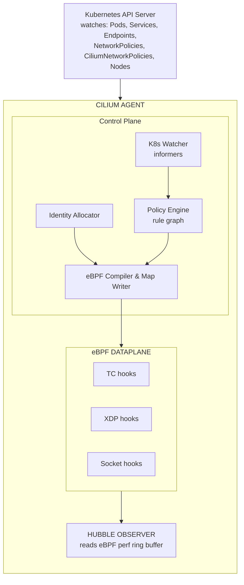
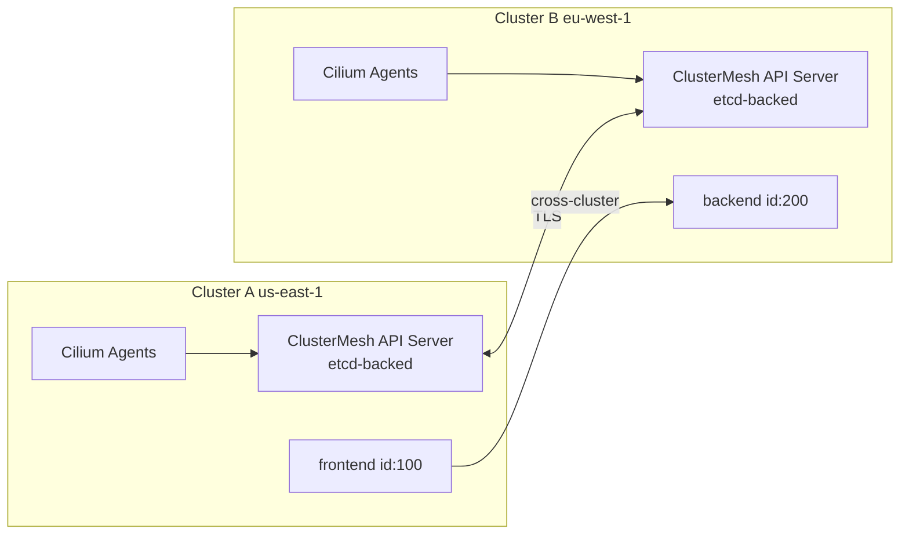
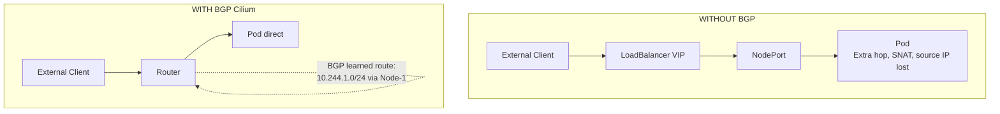
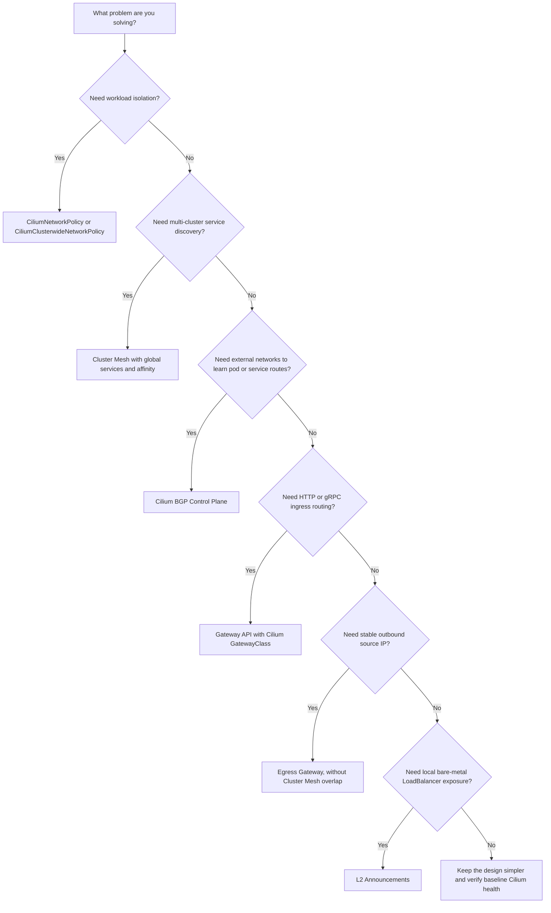

> **Напрямок CCA** | Складність: `[СКЛАДНО]` | Час: 75-90 хвилин

## Передумови

- [Модуль інструментарію Cilium](/platform/toolkits/infrastructure-networking/networking/module-5.1-cilium/) -- основи eBPF, базова архітектура Cilium, безпека на основі ідентичностей
- [Модуль інструментарію Hubble](/platform/toolkits/observability-intelligence/observability/module-1.7-hubble/) -- Hubble CLI, спостереження за потоками
- Основи мережі Kubernetes (Сервіси, Поди, DNS)
- Впевнена робота з `kubectl` та YAML для Kubernetes v1.35

---

## Результати навчання

Після завершення цього модуля ви зможете:

1. **Оцінити** архітектуру датапасу eBPF в Cilium, аналізуючи, як програми ендпоінтів, мапи та застосування політик на основі ідентичностей працюють на рівні ядра.
2. **Спроєктувати** складні маніфести `CiliumNetworkPolicy` та `CiliumClusterwideNetworkPolicy`, що використовують правила L3, L4 та L7, зокрема фільтрацію з урахуванням DNS та FQDN.
3. **Впровадити** Cluster Mesh для глобального виявлення сервісів та міжкластерного відновлення після збоїв, діагностуючи проблеми зі з'єднанням за допомогою Hubble Relay.
4. **Розгорнути** просунуті функції маршрутизації та з'єднання, зокрема BGP-пірінг із GoBGP, конфігурації Gateway API та Egress Gateway зі стабільним IP-маскуванням.
5. **Діагностувати** збої багатокластерних з'єднань та застосування політик за допомогою Cilium CLI, мап спостережуваності Hubble та інспекції стану eBPF.

---

## Чому цей модуль важливий

Гіпотетичний сценарій: ваша платформена команда переносить продакшн-API з одного кластера Kubernetes v1.35 до іншого, тримаючи обидва кластери активними для контрольованої міграції. Ім'я сервісу резолвиться, поди готові, а логи застосунку виглядають чистими — проте лише робочі навантаження в новому кластері зазнають збою, коли звертаються до ендпоінта бази даних, відкритого зі старшого середовища. Стандартна перевірка `kubectl describe service` показує здорові ендпоінти, а базова перевірка Kubernetes NetworkPolicy не пояснює відкидання пакетів, бо вирішальною точкою застосування є датапас eBPF в Cilium, що враховує ідентичності, а не kube-proxy.

Операційний ризик полягає в тому, що складні збої Cilium часто виглядають як звичайні відмови застосунку, доки ви не дослідите правильний рівень. Cluster Mesh може створити враження, що сервіс є локальним, тоді як пакети насправді перетинають межу довіри; політика L7 може дозволити TCP-з'єднання, водночас забороняючи певний HTTP-метод; а BGP може анонсувати маршрут, який решта мережі не готова використовувати. Навичка CCA — це не запам'ятовування назв функцій; це відстеження того, як мітки стають ідентичностями, як ідентичності стають пошуками в мапах, і як ці пошуки в мапах призводять до рішень про пересилання, перенаправлення, NAT або відкидання.

У цьому модулі ви працюватимете від датапасу, зверненого до ядра, назовні. Ви оціните, як агент, оператор, ідентичності, мапи та події Hubble поєднуються між собою, а потім спроєктуєте політики, що комбінують правила L3, L4, L7, DNS та правила сутностей, не блокуючи випадково площину управління. Після цього ви приєднаєте цю саму ментальну модель до Cluster Mesh, прозорого шифрування, BGP, Gateway API, Egress Gateway, L2-анонсувань та практичного усунення несправностей. Мета — залишити вас спроможними діагностувати збійний потік, ставлячи запитання, де було прийняте рішення, яка ідентичність чи маршрут його обумовили, і яка команда може підтвердити цю гіпотезу.

---

## Частина 1: Архітектура Cilium у деталях

Модуль інструментарію представив загальну картину. Тепер ми відкриваємо компоненти й досліджуємо їхню внутрішню механіку. Cilium підтримує як оверлейні режими мережі (VXLAN, Geneve), так і нативну маршрутизацію, але рушій застосування політик, що лежить в основі, залишається ідентичним.

Корисний спосіб міркувати про Cilium — відокремити площину управління від датапасу, не вдаючи, ніби вони є незалежними продуктами. Площина управління стежить за Kubernetes, виділяє ідентичності, компілює політику й записує елементи в мапи. Датапас уже приєднаний до хуків Linux, тож він може ухвалювати рішення щодо пакетів, не чекаючи процесу в просторі користувача для кожного пакета. Коли потік зазнає збою, перше діагностичне запитання — не "який контролер не працює", а "який стан агент востаннє опублікував у ядро, і який хук оцінив цей пакет".

Саме тому поведінка просунутого Cilium може відчуватися інакше, ніж у мережі на основі iptables. Ланцюг правил iptables часто інспектують як довгий упорядкований список, тоді як Cilium намагається звести повторювану роботу до числових ідентичностей і пошуків у мапах за ключем. Зміна мітки поду є дорогою на межі площини управління, оскільки стан ідентичностей і політик має узгодитися, але рішення щодо пакета в усталеному стані ухвалюється швидко, бо датапас не розбирає мітки Kubernetes для кожного з'єднання. Цей дизайн є фундаментом для масштабування політик, балансування навантаження сервісів, спостережуваності й застосування політик між кластерами.

### Агент Cilium (DaemonSet)

Агент Cilium — це основний робочий компонент, розгорнутий як DaemonSet на кожній ноді кластера. Він взаємодіє з Kubernetes API, перетворює стан на програми eBPF і записує їх у ядро Linux.



**Що робить кожен підкомпонент:**

| Компонент | Роль | Чому це важливо |
|-----------|------|----------------|
| K8s Watcher | Отримує події від API-сервера через informers | Виявляє створення подів, зміни політик, оновлення сервісів |
| Identity Allocator | Зіставляє набори міток із числовими ідентичностями | Уможливлює пошук політик за O(1) замість зіставлення міток |
| Policy Engine | Будує граф правил із усіх застосовних політик | Визначає дозволені кортежі (ідентичність джерела, ідентичність призначення, порт, L7) |
| eBPF Compiler | Генерує програми eBPF для кожного ендпоінта | Адаптовані програми = швидше застосування, без обходу узагальнених правил |
| eBPF Maps | Спільні структури даних у ядрі (хеш-мапи, LPM-trie) | Рішення щодо політик, відстеження з'єднань, NAT, пошук сервісів |
| Hubble Observer | Читає кільцевий буфер perf-подій від програм eBPF | Кожен пересланий/відкинутий пакет стає подією потоку |

Cilium повністю використовує eBPF як високоефективну площину даних усередині ядра для всієї обробки мережі L3/L4 (IP, TCP, UDP). Обробляючи сервіси NodePort, LoadBalancer та externalIPs, Cilium може повністю замінити kube-proxy за допомогою хуків eBPF.

> **Зупиніться та спрогнозуйте**: якщо компонент K8s Watcher агента Cilium втратить з'єднання з Kubernetes API Server, що станеться з наявними мережевими з'єднаннями для подів, які вже працюють на цій ноді?
> *Подумайте, де насправді живуть політики, перш ніж читати далі.*

Наявні потоки не зникають лише через те, що watcher тимчасово втратив зв'язок з API. Нода досі має завантажені програми eBPF, мапи сервісів, мапи політик та стан відстеження з'єднань, тож пакети можуть і далі пересилатися чи відкидатися відповідно до найновішого стану датапасу. Ризик полягає в узгодженні: нові поди, нові сервіси, редагування політик, видалення ендпоінтів та зміни ідентичностей можуть не відобразитися, доки watcher не відновиться, а агент знову не узгодить стан. Під час інциденту це розрізнення вберігає вас від плутання проблеми спостереження площини управління з повним збоєм датапасу.

Програми ендпоінтів є практичною одиницею застосування. Cilium приєднує програми до відповідних хуків Linux, але політика оцінюється якомога ближче до робочого навантаження, щоб рішення могло враховувати ідентичність ендпоінта, напрямок, порт та вимоги до перенаправлення на вищому рівні. Якщо політика містить лише критерії L3 та L4, датапас ядра зазвичай може ухвалити рішення безпосередньо. Якщо політика містить правила застосунку для L7 HTTP, Kafka, DNS чи пов'язані з ними, датапас перенаправляє відібраний трафік до Envoy, і Envoy стає частиною шляху застосування політики.

### Оператор Cilium (Deployment)

Тоді як агент працює на кожній ноді, оператор Cilium виконує завдання координації в межах усього кластера. Зазвичай працює одна активна репліка оператора (а інші перебувають у режимі очікування для забезпечення високої доступності).

```text
CILIUM OPERATOR RESPONSIBILITIES
================================================================

1. IPAM (IP Address Management)
   - Allocates pod CIDR ranges to nodes
   - In "cluster-pool" mode: carves /24 blocks from a larger pool
   - In AWS ENI mode: manages ENI attachment and IP allocation

2. CRD Management
   - Ensures CiliumIdentity, CiliumEndpoint, CiliumNode CRDs exist
   - Garbage-collects stale CiliumIdentity objects

3. Cluster Mesh
   - Manages the clustermesh-apiserver deployment
   - Synchronizes identities across clusters

4. Resource Cleanup
   - Removes orphaned CiliumEndpoints when pods are deleted
   - Cleans up leaked IPs from terminated nodes
```

**Ключовий екзаменаційний момент**: оператор НЕ застосовує політики й НЕ програмує eBPF. Якщо оператор виходить з ладу, наявна мережа продовжує працювати безперешкодно, бо датапас eBPF є автономним. Однак нові виділення pod CIDR зазнаватимуть невдачі, а збирання сміття для ідентичностей призупиняється (застарілі ідентичності накопичуються), доки оператор не відновиться.

Це розділення є поширеною екзаменаційною пасткою, бо і агент, і оператор є компонентами Cilium, але вони володіють різними доменами збоїв. Агент є локальним для ноди й безпосередньо відповідає за перетворення стану кластера на стан датапасу на цій ноді. Оператор володіє координацією в масштабі кластера, яку було б марнотратно або небезпечно виконувати незалежно на кожній ноді. Якщо ви бачите, що поди на наявних нодах спілкуються, а нещодавно додані ноди не отримують pod CIDR, то шлях оператора та IPAM заслуговує на увагу, перш ніж ви почнете видаляти робочі агенти Cilium.

Це саме розділення допомагає під час оновлень. Перезапуск одного агента спричиняє локальну подію узгодження й може ненадовго вплинути на ендпоінти на цій ноді, тоді як перезапуск оператора не повинен скидати мапи політик на кожній ноді. Зрілий план розгортання перевіряє обидва виміри: здоров'я датапасу ноди через `cilium status` і готовність ендпоінтів, а потім здоров'я в масштабі кластера через логи оператора, стан CiliumNode, збирання сміття для ідентичностей та готовність площини управління Cluster Mesh, якщо ввімкнено багатокластерні функції.

### Режими IPAM

Cilium підтримує кілька стратегій IPAM. Знання того, коли яку використовувати, активно перевіряється.

| Режим IPAM | Як працює | Коли використовувати |
|-----------|-------------|------------|
| `cluster-pool` (за замовчуванням) | Оператор виділяє CIDR /24 з налаштовуваного пулу кожній ноді. Агент призначає IP із пулу своєї ноди. | Більшість кластерів. Просто, працює всюди. |
| `kubernetes` | Делегує виділення `--pod-cidr` від Kubernetes (node.spec.podCIDR). | Коли ви хочете, щоб Kubernetes контролював виділення CIDR. |
| `multi-pool` | Кілька іменованих пулів із різними CIDR. Поди обирають пул через анотацію. | Багатоорендні кластери, що потребують окремих діапазонів IP. |
| `eni` (AWS) | Виділяє IP безпосередньо з вторинних адрес AWS ENI. Поди отримують IP, маршрутизовані у VPC. | AWS EKS. Оверлей не потрібен. Нативна маршрутизація VPC. |
| `azure` | Виділяє з Azure VNET. Подібно до режиму ENI для Azure. | Кластери AKS. |
| `crd` | Зовнішній контролер IPAM керує CRD CiliumNode. | Кастомні інтеграції IPAM. |

Обирайте режим IPAM перш ніж обирати модель маршрутизації, бо виділена адреса поду — це саме те, що має зрозуміти решта мережі. У режимі `cluster-pool` Cilium може зберігати адресацію подів портативною між постачальниками інфраструктури, але зовнішнім мережам усе одно потрібна або інкапсуляція, або нативна маршрутизація, або балансування навантаження, або розповсюдження маршрутів BGP, щоб дістатися цих pod CIDR напряму. У хмарно-нативних режимах ENI чи Azure поди можуть отримувати адреси, маршрутизовані постачальником, що спрощує одні шляхи й ускладнює інші, бо хмарні квоти, розмір підмереж та специфічні для постачальника обмеження стають частиною ємності планування подів.

Зупиніться та спрогнозуйте: перш ніж запускати наступну команду, що ви очікуєте побачити на двонодовому кластері `cluster-pool`, якщо кожна нода отримала свій pod CIDR? Якщо вивід показує порожнє поле `podCIDRs` для ноди, яка має планувати поди, збій не є проблемою застосунку; він вказує на виділення IPAM, реєстрацію ноди або узгодження оператора. Ця звичка прогнозувати важлива, бо усунення несправностей Cilium відбувається швидше, коли кожна команда прив'язана до конкретної гіпотези.

```bash
# Check which IPAM mode your cluster uses
cilium config view | grep ipam

# In cluster-pool mode, see the allocated ranges
kubectl get ciliumnodes -o jsonpath='{range .items[*]}{.metadata.name}: {.spec.ipam.podCIDRs}{"\n"}{end}'
```

---

## Частина 2: CiliumNetworkPolicy проти Kubernetes NetworkPolicy

Cilium застосовує мережеву політику на рівнях L3, L4 та L7, зокрема політики виходу на основі DNS/FQDN. Щоб скористатися цим, він постачає два специфічні для Cilium CRD політик: `CiliumNetworkPolicy` (у межах простору імен) та `CiliumClusterwideNetworkPolicy` (у межах кластера).

Kubernetes NetworkPolicy залишається корисною як портативна базова лінія, але вона навмисно обмежується селекторами подів і просторів імен, IP-блоками, портами та семантикою списку дозволених. Cilium зберігає сумісність із цією моделлю, додаючи примітиви, що відповідають тому, як описують реальний продакшн-трафік: шляхи HTTP, теми Kafka, імена DNS, згенеровані ідентичності безпеки, добре відомі сутності кластера та явні правила заборони. Компроміс полягає в тому, що мова політик стає потужнішою й, відповідно, її легше використати неправильно, якщо команда розглядає кожну політику як ізольований YAML-файл, а не частину спільної моделі застосування.

Найважливіша поведінкова деталь — це активація режиму заборони за замовчуванням (default-deny). У режимі застосування за замовчуванням ендпоінт, не відібраний жодною політикою, залишається відкритим; щойно політика відбирає цей ендпоінт, для відібраного напрямку допускається лише явно дозволений трафік. Це означає, що одна вузька політика входу може випадково прибрати раніше дозволений трафік DNS, перевірок справності чи однорангового зв'язку, якщо команда забуде решту графа залежностей. Просунутий дизайн політик починається з визначення потрібних потоків площини управління та площини даних, а потім звуження потоків застосунку після захисту цих базових шляхів.

### Порівняння функцій

| Функція | K8s NetworkPolicy | CiliumNetworkPolicy |
|---------|-------------------|---------------------|
| Фільтрація L3/L4 (IP + порт) | Так | Так |
| Вибір подів за мітками | Так | Так (+ на основі ідентичностей) |
| Вибір простору імен | Так | Так |
| **Фільтрація L7 HTTP** (метод, шлях, заголовки) | Ні | Так |
| **Фільтрація L7 Kafka** (тема, роль) | Ні | Так |
| **Фільтрація L7 DNS** (FQDN) | Ні | Так |
| **Правила на основі сутностей** (host, world, dns, kube-apiserver) | Ні | Так |
| **Область дії в межах кластера** | Ні | Так (CiliumClusterwideNetworkPolicy) |
| **Вихід на основі CIDR із FQDN** | Ні | Так (toFQDNs) |
| **Керування режимом застосування політик** | Ні | Так (default/always/never) |
| **Застосування з урахуванням ідентичностей** | Ні | Так (пошук ідентичності eBPF) |
| **Правила заборони** | Ні (модель лише дозволу) | Так (явна заборона) |

### Політики з урахуванням L7 HTTP

Тоді як eBPF обробляє L3/L4 у ядрі, протоколи прикладного рівня, як-от HTTP, Kafka та gRPC, використовують проксі Envoy. Сервісна сітка Cilium є безсайдкарною: Envoy працює як проксі на кожній ноді в мережевому просторі імен хоста, а не як сайдкар на кожному поді. Cilium безпечно перенаправляє вихідний трафік подів до Envoy за допомогою хуків eBPF.

Цей розподіл варто запам'ятати, бо він пояснює симптоми, які учні часто хибно тлумачать. Політика HTTP не обов'язково запобігає самому TCP-рукостисканню; з'єднання може бути прийняте, а потім перенаправлене через Envoy для інспекції запиту. Тому подія заборони може з'явитися як вердикт політики L7, а не як просте відкидання SYN. Усуваючи несправності, порівнюйте протокол, вердикт, ідентичність джерела, ідентичність призначення та метадані L7 у Hubble, перш ніж припускати, що застосунок сам повернув помилку.

```yaml
# L7 HTTP policy: allow only specific API calls
apiVersion: cilium.io/v2
kind: CiliumNetworkPolicy
metadata:
  name: api-l7-policy
  namespace: production
spec:
  endpointSelector:
    matchLabels:
      app: api-server
  ingress:
  - fromEndpoints:
    - matchLabels:
        app: frontend
    toPorts:
    - ports:
      - port: "8080"
        protocol: TCP
      rules:
        http:
        # Allow reading products
        - method: "GET"
          path: "/api/v1/products"
        # Allow reading a specific product by ID
        - method: "GET"
          path: "/api/v1/products/[0-9]+"
        # Allow creating orders with JSON
        - method: "POST"
          path: "/api/v1/orders"
          headers:
          - 'Content-Type: application/json'
        # Everything else: DENIED
```

Навіть якщо зловмисник отримає виконання командної оболонки всередині поду `frontend`, інфраструктурний рівень відкине будь-яку спробу виконати запит `DELETE` проти `api/v1` чи звернутися до неавторизованих шляхів.

Цінність безпеки тут не в тому, що YAML може замінити авторизацію застосунку. Цінність у тому, що інфраструктура може забезпечити дотримання грубих контрактів застосунку навіть тоді, коли код застосунку недосконалий, обліковий запис має надмірні права або скомпрометований под намагається використати шлях, якого команда сервісу ніколи не передбачала. Політика все одно має узгоджуватися із семантикою застосунку, а патерни шляхів слід переглядати, як код, бо надто широкий регулярний вираз може знову відкрити ту саму поверхню, яку політика мала закрити.

### Режими застосування політик

Застосування політик у Cilium диктує позицію кластера за замовчуванням.

```text
POLICY ENFORCEMENT MODES
================================================================

MODE: "default" (the default)
─────────────────────────────
- If NO policies select an endpoint: all traffic allowed
- If ANY policy selects an endpoint: only explicitly allowed traffic passes
- This is how standard K8s NetworkPolicy works
- Think: "policies are opt-in"

MODE: "always"
─────────────────────────────
- ALL traffic is denied unless explicitly allowed by policy
- Even endpoints with no policies get default-deny
- Think: "zero-trust by default"
- Use this in production for maximum security

MODE: "never"
─────────────────────────────
- Policy enforcement is completely disabled
- All traffic flows freely regardless of policies
- Think: "debugging mode"
- NEVER use in production. Useful for ruling out policy
  issues during troubleshooting.
```

```bash
# Check the current enforcement mode
cilium config view | grep policy-enforcement

# Change enforcement mode (requires Helm upgrade or config change)
# Via Helm:
cilium upgrade --set policyEnforcementMode=always

# Via cilium config (runtime, non-persistent):
cilium config PolicyEnforcement=always
```

> **Зупиніться та подумайте**: якщо ви переключите робочий кластер із режиму застосування `default` на `always` без попереднього застосування базових політик, що станеться з подами, які намагаються розв'язати доменне ім'я `api.stripe.com`?
> *Відповідь: запити CoreDNS буде негайно відкинуто, бо немає базової політики, що дозволяє вихід до сутностей DNS.*

### Правила на основі сутностей

Cilium використовує наперед визначені семантичні сутності, що усувають потребу жорстко кодувати динамічні IP-адреси для критичних сервісів кластера.

```yaml
# Allow pods to reach essential infrastructure
apiVersion: cilium.io/v2
kind: CiliumClusterwideNetworkPolicy
metadata:
  name: allow-infrastructure
spec:
  endpointSelector: {}
  egress:
  - toEntities:
    - dns             # CoreDNS / kube-dns
    - kube-apiserver  # Kubernetes API server
  ingress:
  - fromEntities:
    - health          # Kubelet health probes
```

| Сутність | Значення |
|--------|---------|
| `host` | Нода, на якій працює под |
| `remote-node` | Інші ноди кластера |
| `kube-apiserver` | Kubernetes API server (незалежно від IP) |
| `health` | Проби перевірки справності Cilium |
| `dns` | DNS-сервери (kube-dns/CoreDNS) |
| `world` | Будь-що поза кластером |
| `all` | Усе (використовуйте з обережністю) |

Правила сутностей часто є найчистішим способом виразити інфраструктурні залежності, але вони не є обхідним шляхом замість проєктування. `kube-apiserver` корисний, бо адреса API-сервера може змінюватися, особливо в керованих середовищах, а `dns` корисний, бо ендпоінти CoreDNS можуть масштабуватися чи переплановуватися. `world` та `all` заслуговують значно більшої обережності, бо вони розширюють політику від іменованої залежності до широкої категорії довіри. Якщо вам потрібен вихід в інтернет, краще комбінуйте правила з урахуванням DNS, правила CIDR та селектори робочих навантажень, щоб політика вказувала і хто може виходити, і куди він може йти.

---

## Частина 3: Cluster Mesh -- багатокластерне з'єднання

Cilium Cluster Mesh уможливлює багатокластерну мережу з глобальним виявленням сервісів, міжкластерним відновленням після збоїв та застосуванням політик на основі ідентичностей через межі кількох кластерів Kubernetes.

Cluster Mesh — це не просто зручність виявлення сервісів. Він розширює модель ідентичностей і сервісів, тож робочі навантаження в різних кластерах можуть спілкуватися так, ніби вони мають спільну ширшу мережу, водночас зберігаючи ідентичність кластера, ідентичність ендпоінта та застосування політик. Це означає, що віддалений бекенд можна виявити через звичні імена сервісів Kubernetes, але пакет усе одно несе достатньо контексту, щоб Cilium вирішив, чи дозволена ідентичність джерела. Це потужно, бо дає командам змогу мігрувати, відновлюватися після збоїв чи розділяти робочі навантаження за регіоном, не повертаючись до грубих списків дозволених IP.

Ціна цієї потужності полягає в тому, що Cluster Mesh робить старі припущення видимими. Перекривні pod CIDR, нешкідливі в ізольованих кластерах, стають неоднозначними, коли обидва кластери з'єднано. Політика, що відповідала локальному набору міток, може поводитися інакше, коли той самий застосунок існує в іншому кластері з відмінною ідентичністю кластера. Анотація сервісу може зробити трафік віддаленим, не змінюючи клієнтський код, що зручно під час міграції й небезпечно, якщо вимоги до затримки, відповідності чи місця зберігання даних не були враховані в дизайні.

### Архітектура



### Вимоги

| Вимога | Чому |
|-------------|-----|
| Спільний сертифікат CA | Агенти автентифікуються до віддалених ClusterMesh API-серверів через mTLS |
| Pod CIDR без перекривання | Пакети мають бути маршрутизованими; перекривні CIDR спричиняють неоднозначність |
| Мережеве з'єднання | Агенти мають дістатися віддаленого ClusterMesh API-сервера (порт 2379 за замовчуванням) |
| Унікальні імена кластерів | Кожен кластер потребує окремого імені та числового ID (1-255) |
| Сумісні версії Cilium | Розбіжність мінорних версій допускається; мажорна версія має збігатися |

Розглядайте ці вимоги як попередні перевірки, а не дрібниці після збою. Спільна довіра через сертифікати визначає, чи можуть агенти автентифікувати віддалений стан. Pod CIDR без перекривання визначають, чи має адреса призначення одного чіткого власника. Унікальні числові ID кластерів визначають, чи можна розрізнити ідентичності після синхронізації. Сумісність версій визначає, чи однаково обидві сторони тлумачать CRD, анотації сервісів та можливості датапасу. Коли з'єднання сітки зазнає збою, послідовний обхід цих вимог зазвичай кращий за гонитву за випадковими логами подів.

Щоб налаштувати Cluster Mesh між середовищами:

```bash
# Step 1: Enable Cluster Mesh on each cluster
# On Cluster A:
cilium clustermesh enable --context kind-cluster-a --service-type LoadBalancer

# On Cluster B:
cilium clustermesh enable --context kind-cluster-b --service-type LoadBalancer

# Step 2: Connect the clusters
cilium clustermesh connect \
  --context kind-cluster-a \
  --destination-context kind-cluster-b

# Step 3: Wait for readiness
cilium clustermesh status --context kind-cluster-a --wait

# Step 4: Verify connectivity
cilium connectivity test --context kind-cluster-a --multi-cluster
```

### Глобальні сервіси та спорідненість сервісів

Після з'єднання ви відкриваєте сервіси глобально за допомогою анотації.

```yaml
# A service in Cluster A that is discoverable from Cluster B
apiVersion: v1
kind: Service
metadata:
  name: payment-service
  namespace: production
  annotations:
    # This annotation makes the service global
    service.cilium.io/global: "true"
spec:
  selector:
    app: payment
  ports:
  - port: 443
```

Розв'язуючи `payment-service.production.svc.cluster.local`, робочі навантаження природно балансуються між бекендами в усіх кластерах сітки. Однак перетин меж дата-центрів вносить затримку. Ми керуємо цим за допомогою спорідненості сервісів (Service Affinity).

```yaml
apiVersion: v1
kind: Service
metadata:
  name: payment-service
  annotations:
    service.cilium.io/global: "true"
    # Prefer local cluster, fall back to remote
    service.cilium.io/affinity: "local"
spec:
  selector:
    app: payment
  ports:
  - port: 443
```

| Спорідненість | Поведінка |
|----------|----------|
| `local` | Надавати перевагу ендпоінтам локального кластера. Використовувати віддалені лише за відсутності локальних. |
| `remote` | Надавати перевагу ендпоінтам віддаленого кластера. Використовувати локальні лише за відсутності віддалених. |
| `none` (за замовчуванням) | Рівномірно балансувати навантаження між усіма кластерами. |

Спорідненість сервісів — це перевага маршрутизації, а не виняток із політики. Клієнт у Кластері A зі спорідненістю `local` має використовувати ендпоінти Кластера A, доки вони існують, але Cilium усе одно може відновитися після збою на віддалені ендпоінти, коли локальна готовність зникає. Така поведінка чудова для планового обслуговування, але це означає, що тест на збій має перевірити і щасливий шлях, і шлях відновлення після збою. Якщо віддалений ендпоінт досяжний, але неавторизований політикою, сервіс може коректно резолвитися, тоді як трафік усе одно відкидається на рівні застосування ідентичностей.

Сценарій вправи: припустімо, платформена команда анотує сервіс як глобальний і бачить успішні запити від Кластера A до Кластера B, але Hubble повідомляє про відкидання, коли Кластер B пробує зворотний напрямок. Не припускайте, що Cluster Mesh з'єднаний наполовину. Перевірте, чи симетричні мітки простору імен, мітки ендпоінтів та мітки кластера, що використовуються у відібраних політиках. Потім перевірте Hubble з обох кластерів, бо кожна сторона може ухвалити інше рішення щодо політики на основі локального ендпоінта призначення та віддаленої ідентичності джерела, яку вона отримує через сітку.

---

## Частина 4: Прозоре шифрування

Працюючи в недовірених мережах, захист трафіку між подами є обов'язковим. Cilium підтримує два методи:

1. **WireGuard**: Cilium підтримує прозоре шифрування WireGuard. Кожна нода автоматично генерує пару ключів і розповсюджує свій публічний ключ через анотацію CiliumNode `network.cilium.io/wg-pub-key`.
2. **IPsec**: шифрування між подами через IPsec у Cilium є дуже стабільним. Щодо IPsec на рівні хоста звіртеся з актуальною документацією Cilium із шифрування про стабільність шифрування між нодами (трафік хоста), яка змінювалася між релізами.

Критично важливо: прозоре шифрування IPsec не підтримується, коли Cilium з'єднано ланцюжком поверх іншого CNI-плагіна (наприклад, із використанням AWS VPC CNI для маршрутизації та Cilium виключно для застосування політик).

Прозоре шифрування є привабливим, бо командам застосунків не потрібно додавати TLS до кожного внутрішнього стрибка, перш ніж мережа почне захищати трафік подів. Платформений компроміс полягає в тому, що шифрування стає частиною мережі ноди, розповсюдження ключів та сумісності датапасу. WireGuard загалом простіший в експлуатації, бо керування ключами вбудоване в робочий процес між нодами, тоді як IPsec може пасувати організаціям, що вже стандартизуються на засобах контролю IPsec чи апаратних очікуваннях. В обох випадках вам усе одно потрібна безпека на рівні застосунку для автентифікації, авторизації та наскрізної семантики; мережеве шифрування захищає шлях, а не бізнес-зміст запиту.

Обмеження ланцюжкового з'єднання має значення під час міграцій, бо багато команд намагаються спершу додати політику Cilium, а замінити основний CNI пізніше. Це може бути практичною стратегією переходу для видимості й застосування політик, але це не те саме, що володіти датапасом. Якщо інший CNI контролює маршрутизацію, а Cilium з'єднано ланцюжком для політик, функції прозорого шифрування, що потребують володіння датапасом, можуть бути недоступними. Екзаменаційний кут простий: прочитайте режим встановлення, перш ніж обіцяти функцію, бо можливості Cilium залежать від способу його інтеграції в ноду.

## Частина 5: BGP із Cilium

За замовчуванням IP-адреси подів маршрутизуються лише в межах кластера. BGP (Border Gateway Protocol) змінює це. Cilium може анонсувати pod CIDR та IP-адреси сервісів зовнішнім маршрутизаторам, роблячи їх безпосередньо маршрутизованими. Площина управління BGP в Cilium використовує GoBGP як базову бібліотеку маршрутизації (раніше Cilium підтримував BGP через інтеграцію з MetalLB, але цей режим тепер застарів).

BGP — це місце, де мережа Kubernetes перестає бути лише питанням кластера й стає частиною фізичної чи віртуальної мережі. Анонсування pod CIDR повідомляє маршрутизаторам, що нода може дістатися блоку адрес подів; анонсування VIP сервісу повідомляє маршрутизаторам, куди надсилати трафік для сервісу з балансуванням навантаження. Це може прибрати зайві стрибки й зберегти адреси джерел, але це також означає, що політику маршрутів, конфігурацію маршрутизатора, правила фаєрвола та поведінку при збоях слід проєктувати разом із мережевою командою. Сесія BGP в Cilium у стані `established` необхідна, але вона не є доказом того, що ширша мережа коректно пересилатиме клієнтський трафік.

Ментальна модель схожа на надання вказівок у великій будівлі. Kubernetes знає, яку кімнату займає под, але зовнішній маршрутизатор знає лише коридори й вказівники. BGP дає Cilium змогу публікувати вказівники, які кажуть "надсилайте цей префікс на цю ноду". Якщо маршрутизатор приймає вказівник, але висхідний фаєрвол блокує коридор, клієнти все одно зазнають збою. Якщо дві ноди публікують суперечливі вказівники, трафік може піти несподіваним шляхом. Саме тому усунення несправностей BGP має включати і стан Cilium, і таблицю маршрутів маршрутизатора.



### Площина управління BGP в Cilium (BGPv2)

Застарілу площину управління BGPv1 було видалено в Cilium 1.19; поточний API — це набір ресурсів BGPv2 (`CiliumBGPClusterConfig`, `CiliumBGPPeerConfig`, `CiliumBGPAdvertisement`) під `cilium.io/v2`.

Площина управління BGPv2 розділяє пірінг у межах кластера, параметри сесії для кожного пірингу та анонсування маршрутів на окремі ресурси. Ноди, на яких має працювати BGP, потребують мітки `bgp: enabled`, щоб `CiliumBGPClusterConfig.spec.nodeSelector` їх збігав.

```yaml
# Configure BGP peering with a ToR (Top-of-Rack) router (BGPv2)
apiVersion: cilium.io/v2
kind: CiliumBGPClusterConfig
metadata:
  name: cilium-bgp
spec:
  nodeSelector:
    matchLabels:
      bgp: enabled
  bgpInstances:
  - name: "instance-65000"
    localASN: 65000
    peers:
    - name: "tor-peer"
      peerASN: 65100
      peerAddress: 192.168.1.1
      peerConfigRef:
        name: "cilium-peer-config"
---
apiVersion: cilium.io/v2
kind: CiliumBGPPeerConfig
metadata:
  name: cilium-peer-config
spec:
  families:
    - afi: ipv4
      safi: unicast
      advertisements:
        matchLabels:
          advertise: "bgp"
---
apiVersion: cilium.io/v2
kind: CiliumBGPAdvertisement
metadata:
  name: bgp-advertisements
  labels:
    advertise: bgp
spec:
  advertisements:
    - advertisementType: "PodCIDR"
    - advertisementType: "Service"
      service:
        addresses:
          - LoadBalancerIP
          - ClusterIP
      selector:
        matchLabels:
          bgp: enabled
```

| Концепція | Значення |
|---------|---------|
| ASN (Autonomous System Number) | Унікальний ідентифікатор для мережі, що говорить BGP. Приватний діапазон: 64512-65534. |
| Пірінг | Два учасники BGP, що встановлюють сесію для обміну маршрутами. |
| Анонсування маршруту | Оголошення "я можу дістатися цього діапазону IP" пірам. |
| eBGP | Зовнішній BGP -- пірінг між різними ASN (кластер до зовнішнього маршрутизатора). |
| iBGP | Внутрішній BGP -- пірінг у межах того самого ASN (рідше зустрічається в Cilium). |
| Анонсування `PodCIDR` | У `CiliumBGPAdvertisement` `advertisementType: "PodCIDR"` повідомляє пірам, як дістатися IP подів на збіганих нодах. |

> **Зупиніться та спрогнозуйте**: якщо ви анонсуєте pod CIDR через BGP, яка додаткова конфігурація зовнішнього мережевого обладнання потрібна, щоб клієнт в інтернеті міг дістатися цих подів?
> *Поміркуйте, чи внутрішні IP подів зазвичай маршрутизовані через публічний інтернет.*

Відповідь у тому, що анонсування маршруту — лише одна сторона досяжності. Клієнту поза приватною мережею потрібна висхідна маршрутизація, що несе префікс до вашого краю, політика фаєрвола, що дозволяє трафік, і зазвичай планування адрес, що уникає прямого відкриття "сирих" IP подів публічному інтернету. Багато продакшн-дизайнів анонсують маршрути подів чи сервісів лише всередині приватної мережі, а потім використовують контрольовані точки входу — інгрес, Gateway API чи балансувальники навантаження — для публічного трафіку. Cilium може публікувати маршрути, але він не перетворює приватні адреси на глобально прийняті інтернет-призначення.

```bash
# Check BGP peering status
cilium bgp peers

# Expected output:
# Node       Local AS   Peer AS   Peer Address   State        Since
# worker-1   65001      65000     10.0.0.1       established  2h15m
# worker-2   65001      65000     10.0.0.1       established  2h15m

# Check advertised routes
cilium bgp routes advertised ipv4 unicast
```

---

## Частина 6: Gateway API, Bandwidth Manager, Egress Gateway та L2-анонсування

### Cilium Gateway API

Cilium нативно реалізує Kubernetes Gateway API, усуваючи потребу в окремому контролері інгресу. Чому це важливо: Gateway API є наступником Ingress. Реалізація в Cilium означає, що не потрібно окремого розгортання NGINX чи Envoy Gateway -- той самий агент, що керує eBPF, також інтегрує функціональність Gateway.

Gateway API зміщує інгрес від єдиного перевантаженого ресурсу до набору ресурсів, орієнтованих на ролі. Платформена команда може володіти інфраструктурою GatewayClass та Gateway, тоді як команди застосунків володіють об'єктами HTTPRoute чи GRPCRoute, що приєднуються до дозволених слухачів. Реалізація в Cilium особливо цікава, бо той самий мережевий стек може поєднувати балансування навантаження сервісів, політики та керування трафіком на основі Envoy. Операційний компроміс полягає в тому, що зламаний маршрут може водночас залучати правила приєднання Gateway API, конфігурацію Envoy, бекенди сервісів та політику Cilium.

```yaml
# Gateway: the listener that accepts traffic
apiVersion: gateway.networking.k8s.io/v1
kind: Gateway
metadata:
  name: cilium-gw
  namespace: production
spec:
  gatewayClassName: cilium    # Cilium's built-in GatewayClass
  listeners:
  - name: http
    protocol: HTTP
    port: 80
    allowedRoutes:
      namespaces:
        from: Same
```

```yaml
# HTTPRoute: route HTTP traffic to backends
apiVersion: gateway.networking.k8s.io/v1
kind: HTTPRoute
metadata:
  name: app-routes
  namespace: production
spec:
  parentRefs:
  - name: cilium-gw
  rules:
  - matches:
    - path:
        type: PathPrefix
        value: /api
    backendRefs:
    - name: api-service
      port: 8080
  - matches:
    - path:
        type: PathPrefix
        value: /
    backendRefs:
    - name: frontend-service
      port: 3000
```

```yaml
# GRPCRoute: route gRPC traffic to backends
apiVersion: gateway.networking.k8s.io/v1
kind: GRPCRoute
metadata:
  name: grpc-routes
  namespace: production
spec:
  parentRefs:
  - name: cilium-gw
  rules:
  - matches:
    - method:
        service: payments.PaymentService
    backendRefs:
    - name: payment-grpc
      port: 9090
```

### Bandwidth Manager

Bandwidth Manager — це функція справедливості й обмеження радіуса ураження, а не межа безпеки. Вона допомагає утримувати відібрані робочі навантаження від споживання більшої вихідної пропускної здатності, ніж передбачає платформа, що корисно для пакетних завдань, завдань реплікації чи "галасливих" орендарів. Обмеження встановлюється для кожного Поду через стандартну анотацію на шаблоні Поду, тож воно подорожує разом із робочим навантаженням, а не через окремо відібраний об'єкт політики. Bandwidth Manager не має CRD — Cilium застосовує швидкість EDT/eBPF з анотації Поду, а формування вхідного трафіку також підтримується, коли ви встановлюєте `kubernetes.io/ingress-bandwidth`.

```yaml
# Bandwidth Manager is enabled cluster-wide via Helm:
#   cilium install --set bandwidthManager.enabled=true
# The egress cap is then set per-Pod with a standard annotation:
apiVersion: v1
kind: Pod
metadata:
  name: bandwidth-limited
  annotations:
    kubernetes.io/egress-bandwidth: "50M"   # also supports kubernetes.io/ingress-bandwidth
spec:
  containers:
  - name: app
    image: nginx:1.27
```

### Egress Gateway

CiliumEgressGatewayPolicy маршрутизує вихідний трафік від відібраних подів через виділені gateway-ноди. Зовнішні сервіси бачать передбачуваний IP джерела (IP gateway-ноди).

Навіщо це потрібно: багато зовнішніх фаєрволів, баз даних та SaaS API формують список дозволених за IP джерела. Без egress gateway трафік поду виходить із тієї ноди, на якій розташований под, що призводить до мінливих IP джерела.

Cilium Egress Gateway є GA з Cilium 1.14 (та актуальним у 1.19.x); він потребує ввімкнення BPF-маскування та заміни kube-proxy. **Критично важливо: Egress Gateway несумісний із Cluster Mesh.**

> **Зупиніться та подумайте**: чому Cilium Egress Gateway несумісний із Cluster Mesh?
> *Відповідь: egress gateway покладаються на строгий SNAT та локалізовану логіку маршрутизації, що конфліктує з міжкластерною синхронізацією ідентичностей та поведінкою датапасу, властивими Cluster Mesh.*

Проєктне питання за Egress Gateway — не лише "який IP має бачити зовнішній світ". Це також "яка нода стає відповідальною за відібраний клас трафіку, і як нам зберегти цю відповідальність спостережуваною". Якщо бекенд-под може виходити через будь-яку ноду, список дозволених на зовнішньому фаєрволі має включати багато адрес нод або миритися з випадковими збоями після переплануваннь. Якщо трафік перенаправляється через виділені gateway-ноди, формування списку дозволених стає чистішим, але ці gateway-ноди стають об'єктами планування ємності й збоїв. Вам слід моніторити їх, як інфраструктуру інгресу, а не як звичайні робочі ноди.

```yaml
apiVersion: cilium.io/v2
kind: CiliumEgressGatewayPolicy
metadata:
  name: db-egress-via-gateway
spec:
  selectors:
  - podSelector:
      matchLabels:
        app: backend
        needs-stable-ip: "true"
  destinationCIDRs:
  - "10.200.0.0/16"       # External database subnet
  egressGateway:
    nodeSelector:
      matchLabels:
        role: egress-gateway   # Dedicated gateway nodes
    egressIP: "192.168.1.50"   # Stable SNAT IP
```

### CiliumL2AnnouncementPolicy

L2-анонсування розв'язують іншу проблему відкриття, ніж BGP. Замість обміну маршрутами з маршрутизатором відібрані ноди відповідають за IP сервісів у локальній мережі другого рівня, що корисно в bare-metal-середовищах, де хмарного LoadBalancer не існує. Це може бути простіше за BGP для невеликих мереж, але воно навмисно є локальним за обсягом. Якщо трафік має перетинати маршрутизовані домени, BGP чи інший дизайн маршрутизованого балансування навантаження зазвичай є доречнішим інструментом.

```yaml
apiVersion: cilium.io/v2alpha1
kind: CiliumL2AnnouncementPolicy
metadata:
  name: l2-services
spec:
  serviceSelector:
    matchLabels:
      l2-announce: "true"
  nodeSelector:
    matchLabels:
      node.kubernetes.io/role: worker
  interfaces:
  - eth0
  externalIPs: true
  loadBalancerIPs: true
```

```yaml
# A service that uses L2 announcement
apiVersion: v1
kind: Service
metadata:
  name: web
  labels:
    l2-announce: "true"
spec:
  type: LoadBalancer
  selector:
    app: web
  ports:
  - port: 80
    targetPort: 8080
```

---

## Частина 7: CLI, спостережуваність та усунення несправностей

Hubble — це інтегрована платформа мережевої спостережуваності Cilium, що надає мапи сервісів у реальному часі та видимість потоків L3-L7. Hubble надає компонент Relay, який агрегує дані про потоки з усіх нод для спостережуваності в межах усього кластера. Зверніть увагу, що хоча Hubble Relay є стабільним, Hubble UI технічно перебуває в статусі Beta станом на Cilium 1.19.x stable.

Хороше усунення несправностей Cilium — це дисциплінований процес звуження. Почніть із запитання, чи увійшов пакет у датапас, керований Cilium, чи збігся він з очікуваними ідентичностями джерела та призначення, чи був пересланий, перенаправлений, транслований або відкинутий, і чи було відкидання на рівні L3/L4 чи L7. Hubble цінний, бо він перетворює ці приховані рішення датапасу на записи потоків із часовими мітками. Команди CLI та агента цінні, бо дають змогу порівняти ці записи зі станом ендпоінтів, станом ідентичностей, мапами сервісів, відстеженням з'єднань та поточною конфігурацією.

Перш ніж запускати це, який вивід ви очікуєте, якщо Hubble Relay увімкнено, а UI вимкнено? Кластер усе одно може надавати агреговане спостереження за потоками через Relay та CLI, а вебінтерфейс просто буде недоступний. Цей прогноз запобігає тому, щоб косметичний статус UI відвертав вас від важливішого питання: чи захоплюються дані про потоки і чи покриває спостерігач усі ноди, залучені в збійному шляху.

### Встановлення та статус

*Завжди звіряйтеся з офіційною матрицею сумісності Cilium та Kubernetes перед встановленням.*

```bash
# Install Cilium (most common invocation)
cilium install \
  --set kubeProxyReplacement=true \
  --set hubble.enabled=true \
  --set hubble.relay.enabled=true \
  --set hubble.ui.enabled=true

# Check status (the first command you run after install)
cilium status
# Shows: agent, operator, relay status + features enabled

# Wait for all components to be ready
cilium status --wait

# View full Cilium configuration
cilium config view

# View specific config value
cilium config view | grep policy-enforcement
```

### Тестування з'єднання

Тест з'єднання — це більше, ніж димова перевірка. Він розгортає відомих клієнтів і сервери, опрацьовує широкий набір шляхів датапасу та прибирає за собою, що дає вам контрольовану базову лінію перед тим, як ви інспектуєте застосунок. Коли набір зазнає невдачі, уважно читайте назву збійного тесту, бо збої `pod-to-pod`, `pod-to-service`, `pod-to-external`, DNS, політик та видимості Hubble вказують на різні підсистеми. Під час живого інциденту цільовий тест може підтвердити, чи платформа загалом справна, перш ніж ви витратите час на власну політику окремого застосунку.

```bash
# Run the full connectivity test suite
cilium connectivity test

# What it does:
# - Deploys test client and server pods
# - Tests pod-to-pod (same node and cross-node)
# - Tests pod-to-Service (ClusterIP and NodePort)
# - Tests pod-to-external
# - Tests NetworkPolicy enforcement
# - Tests DNS resolution
# - Tests Hubble flow visibility
# - Cleans up test resources when done

# Run specific tests only
cilium connectivity test --test pod-to-pod
cilium connectivity test --test pod-to-service

# Run with extra logging for debugging
cilium connectivity test --debug
```

### Керування ендпоінтами та ідентичностями

Команди ендпоінтів та ідентичностей з'єднують об'єкти Kubernetes із моделлю застосування Cilium. Ім'я поду зручне для людей, але датапас оцінює числові ідентичності та ID ендпоінтів. Коли Hubble повідомляє про ідентичність джерела, яку ви не впізнаєте, `cilium identity get` каже вам, які мітки породили цю ідентичність. Коли под відібраний політикою, але все одно дозволений, `cilium endpoint get` може показати, чи ввімкнено застосування політик для цього ендпоінта і які ревізії політик було реалізовано на ноді.

```bash
# List all Cilium-managed endpoints on this node
kubectl exec -n kube-system ds/cilium -- cilium endpoint list

# Get details on a specific endpoint
kubectl exec -n kube-system ds/cilium -- cilium endpoint get <endpoint-id>

# List all identities
cilium identity list

# Get labels for a specific identity
cilium identity get <identity-number>
```

### Усунення несправностей

Практична послідовність усунення несправностей — рухатися від загального здоров'я до конкретних доказів. Спершу перевірте `cilium status`, бо він підсумовує статус агента, оператора, Hubble та функцій. Потім інспектуйте логи на предмет збоїв узгодження, готовність ендпоінтів щодо проблем конкретного навантаження, стан мап для доказів датапасу та Hubble чи `cilium monitor` для вердиктів щодо пакетів. Уникайте видалення подів чи перезапуску Cilium до збору доказів потоків, бо перезапуск може очистити корисний стан і перетворити відтворювану проблему політики на розпливчастий нерегулярний звіт.

```bash
# Check if Cilium agent is healthy
cilium status

# View Cilium agent logs
kubectl -n kube-system logs ds/cilium -c cilium-agent --tail=100

# Check eBPF map status
kubectl exec -n kube-system ds/cilium -- cilium bpf ct list global | head

# Monitor policy verdicts in real-time
kubectl exec -n kube-system ds/cilium -- cilium monitor --type policy-verdict

# Debug a specific pod's connectivity
kubectl exec -n kube-system ds/cilium -- cilium endpoint list | grep <pod-name>
```

---

## Опрацьований приклад: діагностика відкидання за політикою в Cluster Mesh

Сценарій вправи: поверніться до міграції, представленої на початку модуля, де один кластер Kubernetes v1.35 приєднано до іншого кластера через Cluster Mesh, і потік до бази даних зазнає збою лише з нового середовища. Мета — не розповісти історію реального інциденту; це практика діагностичного порядку, який ви маєте використовувати, коли міжкластерний шлях здається справним на рівні сервісу, але зазнає збою на рівні політики. Перший крок — спостерегти відкинуті потоки від ураженого джерела, а потім порівняти повідомлені ідентичності із селекторами політик на стороні призначення.

**Етап 1**: Cluster Mesh з'єднано. Глобальні сервіси чудово працювали в staging.

**Етап 2**: Розпочато продакшн-міграцію. Cluster Mesh з'єднано. Застосовано анотацію глобального сервісу. Трафік почав надходити до обох кластерів. Моніторинг показав справні співвідношення запитів.

**Етап 3**: Спрацювали сповіщення. Збої платежів були видимі лише з робочих навантажень у новому кластері.

Інженер обійшов базовий `kubectl logs` і використав Hubble CLI для оцінки мережевого рівня:

```bash
hubble observe --from-pod new-cluster/payment-api --verdict DROPPED --protocol tcp
```

Вивід виявив негайні відкидання на порту 5432. Платіжний API всередині нового кластера принципово не міг встановити зв'язок із розгортанням PostgreSQL, що затрималося в старшому кластері.

**Першопричина**: застаріла `CiliumClusterwideNetworkPolicy` у старшому середовищі дозволяла вхід *лише* від ендпоінтів, що мали конкретні, жорстко закодовані мітки кластера.

```yaml
# The offending policy (old cluster)
spec:
  endpointSelector:
    matchLabels:
      app: postgres
  ingress:
  - fromEndpoints:
    - matchLabels:
        cluster: old-cluster  # Oops -- blocks new cluster pods
```

**Виправлення**: вони швидко оновили політику, щоб збігати ширші групи ідентичностей застосунку, позбавлені строгих міток топології кластера.

Пошук у хеш-мапі є O(1) незалежно від того, скільки існує політик чи ендпоінтів, тобто цей недогляд конфігурації було оцінено й відкинуто миттєво датапасом eBPF. Без негайних метаданих потоку від Hubble встановлення точного джерела тихого відкидання в дводокластерній сітці забрало б години замість хвилин.

Опрацьований урок полягає в тому, що Cluster Mesh не стирає межі ідентичностей. Якщо селектор політики кодує топологію надто щільно, додавання нового кластера змінює ландшафт ідентичностей, навіть коли мітки застосунку виглядають знайомими. Надійна політика зазвичай відбирає за роллю застосунку, призначенням простору імен, сервісним акаунтом чи іншим тривким атрибутом навантаження, а потім використовує ідентичність кластера лише тоді, коли намір справді специфічний для топології. Hubble доводить симптом, інспекція ідентичностей доводить розбіжність селектора, а diff політики доводить виправлення перш ніж змінювати будь-які розгортання застосунку.

Зверніть увагу також на те, що команда НЕ потребувала інспектувати першочергово. Правила kube-proxy не пояснили б відкидання за політикою eBPF в Cilium, а узагальнені логи поду могли б показати тайм-аути з'єднання, не виявляючи точки застосування. Кращий шлях — ідентифікувати пакет, спостерегти вердикт, зіставити ідентичності назад із мітками, а потім прочитати політику, що відібрала призначення. Ця послідовність повторювана для Cluster Mesh, політик L7, Egress Gateway та усунення несправностей, дотичних до BGP, бо вона тримає розслідування прив'язаним до рівня, що ухвалив рішення.

## Патерни та антипатерни

Просунуті розгортання Cilium стає легше експлуатувати, коли команди роблять кілька проєктних рішень явними. Наведені нижче патерни — не правила для кожного кластера; це налаштування за замовчуванням, що зменшують неоднозначність. Використовуйте їх, коли в організації є кілька просторів імен, кілька команд, зовнішні залежності чи більше одного кластера. Якщо ваше середовище — невеликий навчальний кластер, ті самі ідеї все одно допомагають, бо вони вчать вас з'єднувати мітки, ідентичності, політики та маршрути, перш ніж конфігурація розростеться.

| Патерн | Коли використовувати | Чому працює | Міркування щодо масштабування |
|---------|-------------|--------------|------------------------|
| Базові політики дозволу для інфраструктури | Перед увімкненням строгого чи постійного застосування | DNS, API-сервер, перевірки справності та потрібні потоки нод залишаються доступними, тоді як політика застосунку звужується | Тримайте базові політики малими, переглянутими та у власності платформеної команди |
| Сегментація застосунку за ідентичностями | Коли сервіси належать різним командам чи просторам імен | Політика слідує за тривкими мітками замість крихких IP подів чи розміщення нод | Стандартизуйте мітки та сервісні акаунти, перш ніж писати багато політик |
| Контрольний список перед з'єднанням сітки | Перед з'єднанням кластерів за допомогою Cluster Mesh | CIDR, ID кластерів, сертифікати, версії та досяжність перевіряються до зсуву трафіку | Автоматизуйте контрольний список і зберігайте результати разом із доказами міграції |
| Перегляд володіння маршрутами для BGP | Перед анонсуванням pod CIDR чи VIP сервісів | Мережеві команди підтверджують, що прийняті маршрути також пересилаються й дозволяються | Включіть таблиці маршрутів маршрутизатора, правила фаєрвола та кроки відкату в плани змін |

Найсильніший патерн — розглядати спостережуваність як частину дизайну, а не інструмент, який ви додаєте після збою. Якщо політика впроваджує застосування L7, вирішіть, як Hubble підтверджуватиме дозволені й заборонені методи. Якщо сервіс стає глобальним, вирішіть, яка команда доводить локальну спорідненість, а яка команда доводить відновлення після збою на віддалене. Якщо BGP анонсує префікс, вирішіть, який вивід маршрутизатора підтверджує, що маршрут було прийнято. Цей підхід перетворює кожну ризиковану зміну на набір очікуваних спостережень.

| Антипатерн | Що йде не так | Чому команди в нього потрапляють | Краща альтернатива |
|--------------|-----------------|------------------------|--------------------|
| Копіювання політик простору імен у Cluster Mesh без змін | Віддалені ідентичності зазнають збою, бо локальні селектори ніколи не переглядалися | Ім'я сервісу досі працює, тож про рівень політики забувають | Перевалідуйте селектори проти віддалених ідентичностей перед увімкненням глобальних сервісів |
| Ставлення до `world` як нешкідливого скорочення | Вихід стає ширшим, ніж насправді потребує залежність | Це швидше за моделювання імен DNS, CIDR та призначень | Використовуйте правила з урахуванням DNS, CIDR та сутностей, що виражають реальну залежність |
| Анонсування маршрутів до схвалення мережею | Cilium показує сесії BGP, тоді як клієнти все одно не можуть під'єднатися | Команда кластера контролює Cilium, але не висхідні маршрутизатори | Поєднуйте політику Cilium з конфігурацією маршрутизатора та валідацією фаєрвола |
| Перезапуск Cilium до збору доказів потоків | Тимчасовий стан зникає, і першопричину стає важче довести | Перезапуск здається рішучим під час збою | Захопіть потоки Hubble, стан ендпоінтів, ідентичності та логи перед руйнівними діями |

Антипатерни мають одну спільну тему: Cilium часто розглядають як магію, бо він приховує багато роботи всередині ядра. Ця прихована робота — саме те, чому екзамен CCA наголошує на архітектурі й діагностиці. Вам не потрібно запам'ятовувати кожну внутрішню назву мапи, але вам потрібно знати, чи ви налагоджуєте ідентичність, політику, анонсування маршруту, трансляцію сервісу, перенаправлення Envoy чи узгодження площини управління. Щойно ви назвете рівень, наступна команда стає очевидною.

## Рамка прийняття рішень

Використовуйте цю рамку, коли маєте обрати між просунутими функціями Cilium для продакшн-дизайну. Почніть із називання шляху трафіку, а потім вирішіть, чи вимога — це застосування політик, виявлення, анонсування маршрутів, інгрес, стабільність джерела виходу, локальне відкриття балансувальника навантаження чи шифрування. Багато невдалих дизайнів виникають через використання функції, що розв'язує сусідню проблему. Egress Gateway розв'язує стабільний вихідний IP джерела, а не міжкластерне відновлення після збоїв. Cluster Mesh розв'язує міжкластерне виявлення сервісів та з'єднання з урахуванням ідентичностей, а не маршрутизацію інтернет-краю. BGP розв'язує розповсюдження маршрутів, а не авторизацію на рівні застосунку.



| Вимога | Перевага | Уникати | Команда чи доказ валідації |
|-------------|--------|-------|--------------------------------|
| Обмежити трафік pod-to-pod чи pod-to-world | CiliumNetworkPolicy з ідентичностями, сутностями, портами та опційними правилами L7 | Широкий доступ `world` чи `all` без моделювання призначень | Вердикти Hubble плюс стан політики `cilium endpoint get` |
| Спільні сервіси між кластерами | Глобальні сервіси Cluster Mesh із явною спорідненістю | Перекривні CIDR чи селектори лише для локального | `cilium clustermesh status --wait` та багатокластерні тести з'єднання |
| Відкрити pod CIDR чи VIP сервісів маршрутизаторам | Площина управління BGP | Припущення, що `established` означає наскрізну досяжність | Стан пірингу BGP в Cilium плюс підтвердження таблиці маршрутів маршрутизатора |
| Надати інгрес-маршрутизацію HTTP чи gRPC | Gateway API | Змішування кількох контролерів інгресу для того самого хоста | Статус Gateway та маршрутів плюс перевірки бекендів сервісів |
| Тримати вихідний IP джерела стабільним | Egress Gateway | Поєднання його з Cluster Mesh в одному дизайні | Джерело потоку Hubble, вибір gateway-ноди та логи зовнішнього списку дозволених |
| Запропонувати локальні bare-metal IP LoadBalancer | L2-анонсування | Очікування, що анонсування другого рівня перетне маршрутизовані мережі | Докази таблиці сусідів та досяжність сервісу в локальному сегменті |

Який підхід ви обрали б тут і чому? Регульований внутрішній сервіс потребує відновлення після збою на віддалений кластер, стабільного вихідного IP джерела до сторонньої бази даних та строгої фільтрації методів HTTP. Правильна відповідь — не одна функція. Ви, ймовірно, розділили б турботи: використовували б Cluster Mesh для шляху внутрішнього сервісу, використовували б CiliumNetworkPolicy з правилами L7 для контролю методів, де це підтримується, і уникали б покладання вимоги Egress Gateway на шлях сітки, бо ці функції несумісні. Якщо стороння база даних потребує стабільного виходу, виділіть несітковий дизайн виходу або маршрутизуйте цю залежність через окрему контрольовану межу.

## Чи знали ви?

- **Cilium випустився з CNCF 11 жовтня 2023 року**, після прийняття як інкубаційний проєкт 13 жовтня 2021 року. Екзамен на сертифікацію CCA ретельно перевіряє 8 доменів, де Архітектура (20%), Мережева політика (18%) та Сервісна сітка (16%) складають переважну більшість ваги.
- **Поточний останній стабільний реліз Cilium — це версія 1.19.3 станом на 6 травня 2026 року.** Активні стабільні гілки також включають підтримувані лінії v1.18 та v1.17, тоді як лінія попереднього релізу v1.20 — це місце, де розробляється майбутня підтримка Kubernetes Cluster Network Policy (BANP/ANP).
- **Cilium проходить усі тести Core-сумісності Gateway API версії 1.4.1** у профілях `GATEWAY-HTTP`, `GATEWAY-TLS` та `GATEWAY-GRPC`. Однак його підтримка GAMMA (Gateway API для сітки) залишається частковою, оскільки він ще не підтримує споживацькі HTTPRoute.
- **Заміна kube-proxy в Cilium потребує ядра Linux щонайменше 4.19.57, 5.1.16 чи 5.2.0**, хоча наполегливо рекомендується ядро 5.3+. Для максимальної продуктивності прискорення XDP для заміни kube-proxy доступне з версії Cilium 1.8, потребуючи драйвера NIC із нативною підтримкою XDP, щоб повністю обійти мережевий стек ядра.

---

## Типові помилки

| Помилка | Чому це трапляється | Як це виправити |
|---------|----------------|---------------|
| **Перекривні pod CIDR із Cluster Mesh** | Кластери планувалися незалежно, тож кожен кластер працював, доки сітка не зробила адреси спільними | Виділіть pod- та сервісні діапазони без перекривання до створення кластера, потім перевірте їх перед з'єднанням сітки |
| **Забування `service.cilium.io/global: "true"`** | Kubernetes Service існує й резолвиться локально, тож відсутню міжкластерну анотацію легко проґавити | Анотуйте кожен сервіс, що потребує міжкластерного виявлення, і протестуйте з обох кластерів за наявності та відсутності локальних ендпоінтів |
| **Використання `policyEnforcementMode: always` без базових політик** | Команди вмикають позицію zero-trust до моделювання потоків DNS, API-сервера, перевірок справності та потрібної інфраструктури | Розгорніть і провалідуйте базові політики дозволу спершу, потім переключіть режим застосування під час контрольованого вікна обслуговування |
| **BGP із хибним ASN** | Конфігурація маршрутизатора й кластера належать різним командам, і одна сторона копіює приклад значення | Підтвердьте локальний ASN, ASN піра, адресу піра та політику маршрутів із мережевою командою перед застосуванням політики пірингу |
| **Припущення, що простій оператора означає збій датапасу** | Оператор є компонентом Cilium, тож інженери припускають, що він застосовує політику пакетів | Відокремте симптоми IPAM та очищення, якими володіє оператор, від симптомів датапасу, якими володіє агент, під час тріажу |
| **Змішування K8s NetworkPolicy та CiliumNetworkPolicy без володіння** | Різні команди додають політики через різні API, і обидві моделі застосування діють на ті самі ендпоінти | Визначте, який API політик володіє кожним простором імен, потім перегляньте фактичний трафік за допомогою Hubble та стану політики ендпоінта |
| **Пропуск багатокластерних тестів з'єднання** | DNS глобального сервісу працює, тож команди припускають, що відновлення після збоїв та застосування ідентичностей теж працюють | Запустіть `cilium connectivity test --multi-cluster`, потім вручну протестуйте спорідненість сервісів, відновлення після збоїв та очікувані відкидання за політикою |

---

## Тест

<details markdown="1">
<summary>Питання 1: Вам доручено мігрувати з налаштування AWS VPC CNI на суто Cilium-архітектуру. Однак під час переходу ви змушені запускати Cilium, з'єднаний ланцюжком поверх наявного CNI-плагіна. У вас є жорстка вимога до прозорого шифрування. Яку стратегію вам слід застосувати?</summary>

Ви не можете реалізувати прозоре шифрування в цьому сценарії. Офіційна документація явно зазначає, що прозоре шифрування IPsec строго не підтримується, коли Cilium з'єднано ланцюжком поверх іншого CNI-плагіна. Це обмеження існує, бо складнощі датапасу з керування тунелями IPsec конфліктують із правилами маршрутизації та механізмами інкапсуляції, які забезпечує базовий основний CNI. Ви маєте завершити міграцію до повністю нативного встановлення Cilium, повністю прибравши AWS VPC CNI, перш ніж вмикати прозоре шифрування IPsec чи WireGuard.

</details>

<details markdown="1">
<summary>Питання 2: Ви налаштовуєте Egress Gateway за допомогою `CiliumEgressGatewayPolicy`, щоб гарантувати, що зовнішні бази даних бачать стабільну адресу IP джерела від ваших подів. Щоб забезпечити високу доступність, ви водночас намагаєтеся розтягнути цей сервіс на два географічні регіони за допомогою Cilium Cluster Mesh. Однак маршрутизація трафіку починає нерегулярно зазнавати збоїв. Чому?</summary>

Cilium Egress Gateway функціонально несумісний із Cluster Mesh. Хоча обидві функції потужні, Egress Gateway покладається на строге BPF-маскування та специфічну логіку перенаправлення нод, що за своєю природою конфліктує з вимогами міжкластерної синхронізації ідентичностей та маршрутизації датапасу в Cluster Mesh. Офіційна документація явно зазначає, що ці дві функції не можуть бути активними одночасно в тому самому кластері. Ви маєте перепроєктувати архітектуру, щоб уникнути перекривання цих компонентів, можливо, виділивши конкретні окремі кластери суто для обробки виходу.

</details>

<details markdown="1">
<summary>Питання 3: Розробник розгортає `CiliumNetworkPolicy`, щоб обмежити трафік для свого вебзастосунку, дозволяючи лише `GET /api/v1/products` через правило L7 HTTP. Автоматизований скрипт пізніше намагається зробити запит `POST /api/v1/products` до того самого поду. На якому рівні з'єднання розривається і як?</summary>

L3/L4 TCP-з'єднання з подом насправді успішно встановлюється. Однак, оскільки наявна політика L7 HTTP, Cilium безпечно перенаправляє вхідний трафік через свій проксі Envoy на рівні ноди, перш ніж той досягне поду. Envoy розбирає HTTP-запит, ідентифікує несхвалений метод POST і негайно повертає HTTP-відповідь 403 Forbidden. Hubble потім логує цей конкретний потік як відкинутий вердикт політики L7, точно відображаючи, що прикладний рівень було заблоковано.

</details>

<details markdown="1">
<summary>Питання 4: Ви налаштували глобальний сервіс на два кластери, з'єднані через Cluster Mesh. Сервіс у Кластері A анотовано `service.cilium.io/affinity: "local"`. Клієнтський под у Кластері A надсилає запит до цього сервісу. За яких саме умов запит буде маршрутизовано до Кластера B?</summary>

Запит буде маршрутизовано до Кластера B лише за умови, що в Кластері A немає абсолютно жодного справного, активного ендпоінта для сервісу. Налаштування спорідненості `local` пріоритезує мінімізацію міжкластерної затримки, тримаючи трафік внутрішнім, коли це можливо. Воно використовує віддалений кластер строго як механізм відновлення після збою для випадку, коли локальне розгортання вичерпане, масштабоване до нуля чи повністю несправне. Доки хоча б один под готовий і проходить перевірки справності в Кластері A, датапас Cilium безперервно надаватиме перевагу цьому локальному призначенню перед пересиланням пакетів через сітку кластерів.

</details>

<details markdown="1">
<summary>Питання 5: Ви налаштовуєте BGPv2 з `CiliumBGPAdvertisement`, щоб спілкуватися з top-of-rack маршрутизатором. Ви хочете, щоб індивідуальні IP подів, запланованих на робочих нодах, були безпосередньо маршрутизованими із зовнішніх корпоративних мереж без покладання на трансляцію NodePort чи LoadBalancer. Яке анонсування ви маєте включити?</summary>

Ви маєте включити запис `CiliumBGPAdvertisement` з `advertisementType: "PodCIDR"`. Це повідомляє пірам BGP, як дістатися блоків адрес подів на нодах, збіганих вашим селектором `CiliumBGPClusterConfig`. Поширені дистрактори, що **не** розв'язують пряму досяжність подів: анонсування лише VIP `Service` (LoadBalancerIP чи ClusterIP), увімкнення BGP на нодах без збіжної мітки `bgp: enabled`, або припущення, що сама лише сесія BGP у стані `established` публікує маршрути подів. Без анонсування PodCIDR сесія може піднятися, тоді як зовнішні маршрутизатори все одно не матимуть шляху до індивідуальних IP подів.

</details>

<details markdown="1">
<summary>Питання 6: Під час оновлення інфраструктури кластера ви виявляєте, що ваші bare-metal-сервери використовують драйвери NIC із нативною підтримкою XDP. Ви хочете прискорити заміну kube-proxy. Чи підтримує Cilium це, і які обмеження існують?</summary>

Так, Cilium нативно підтримує це, оскільки прискорення балансування навантаження на основі XDP доступне з версії Cilium 1.8. Воно працює на рівні мережевого драйвера, щоб повністю обійти мережевий стек ядра хоста, що різко покращує продуктивність балансування навантаження для крайових сервісів, як-от NodePort. Однак ви маєте переконатися, що ваше ядро достатньо сучасне (рекомендується ядро 5.3+, з 4.19.57 як абсолютним мінімумом), щоб підтримувати потрібні хуки eBPF. Крім того, ви маєте усвідомлювати, що цей режим прискорення покладається на специфічні передумови датапасу; прискорення XDP найчастіше використовується з нативною маршрутизацією, хоча підтримка датапасу й драйвера визначає, що життєздатне у вашому середовищі.

</details>

---

## Практична вправа: основи Cluster Mesh та BGP

### Мета

Налаштувати середовище з двох кластерів за допомогою Cilium Cluster Mesh, розгорнути глобальний сервіс, перевірити міжкластерне з'єднання та застосувати ресурси BGPv2 `CiliumBGPClusterConfig` / `CiliumBGPAdvertisement` для концептуальної валідації.

Ця лабораторна робота навмисно розділена між запускною роботою з кластерами та концептуальним кроком валідації BGP. `kind` може дати вам дві площини управління Kubernetes з окремими pod CIDR, чого достатньо, щоб попрактикувати Cluster Mesh, анотації глобальних сервісів, локальну спорідненість, поведінку відновлення після збоїв та зручні для Hubble тести з'єднання. Він не може надати справжній top-of-rack маршрутизатор сам по собі, тож секція BGP зосереджена на формі CRD та очікуваному статусі, а не на вдаванні, ніби пір існує. Це розділення тримає вправу чесною, водночас усе ще нарощуючи операційну навичку, потрібну вам для реального середовища.

Працюючи, ведіть короткий журнал доказів, а не лише женіться за успішними командами. Записуйте імена кластерів, ID кластерів, pod CIDR, анотації сервісів та точну команду, що доводить, як локальний трафік відновлюється на віддалений кластер. Для ресурсів BGPv2 записуйте, що CRD прийнято і що `cilium bgp peers` повідомляє стан сесії без справжнього ToR-піра. Ці нотатки перетворюють лабораторну роботу з послідовності команд на діагностичний контрольний список, який ви можете повторно використати під час перегляду продакшн-зміни.

### Частина 1: Створення двох кластерів

```bash
# Cluster A configuration
cat > cluster-a.yaml << 'EOF'
kind: Cluster
apiVersion: kind.x-k8s.io/v1alpha4
name: cluster-a
networking:
  disableDefaultCNI: true
  podSubnet: "10.244.0.0/16"
  serviceSubnet: "10.96.0.0/16"
nodes:
- role: control-plane
- role: worker
EOF
```

```bash
# Cluster B configuration (different pod CIDR!)
cat > cluster-b.yaml << 'EOF'
kind: Cluster
apiVersion: kind.x-k8s.io/v1alpha4
name: cluster-b
networking:
  disableDefaultCNI: true
  podSubnet: "10.245.0.0/16"
  serviceSubnet: "10.97.0.0/16"
nodes:
- role: control-plane
- role: worker
EOF
```

```bash
# Create both clusters
kind create cluster --config cluster-a.yaml
kind create cluster --config cluster-b.yaml
```

### Частина 2: Встановлення Cilium на обидва кластери

```bash
# Install on Cluster A (cluster ID = 1)
cilium install \
  --context kind-cluster-a \
  --set cluster.name=cluster-a \
  --set cluster.id=1 \
  --set hubble.enabled=true \
  --set hubble.relay.enabled=true

# Install on Cluster B (cluster ID = 2)
cilium install \
  --context kind-cluster-b \
  --set cluster.name=cluster-b \
  --set cluster.id=2 \
  --set hubble.enabled=true \
  --set hubble.relay.enabled=true

# Wait for both to be ready
cilium status --context kind-cluster-a --wait
cilium status --context kind-cluster-b --wait
```

### Частина 3: Увімкнення та з'єднання Cluster Mesh

```bash
# Enable Cluster Mesh on both clusters
cilium clustermesh enable --context kind-cluster-a --service-type NodePort
cilium clustermesh enable --context kind-cluster-b --service-type NodePort

# Wait for Cluster Mesh to be ready
cilium clustermesh status --context kind-cluster-a --wait
cilium clustermesh status --context kind-cluster-b --wait

# Connect the clusters
cilium clustermesh connect \
  --context kind-cluster-a \
  --destination-context kind-cluster-b

# Verify the connection
cilium clustermesh status --context kind-cluster-a --wait
```

### Частина 4: Розгортання глобального сервісу

```bash
# Deploy a backend service in Cluster A
kubectl --context kind-cluster-a create namespace demo
kubectl --context kind-cluster-a -n demo apply -f - << 'EOF'
apiVersion: apps/v1
kind: Deployment
metadata:
  name: echo
spec:
  replicas: 2
  selector:
    matchLabels:
      app: echo
  template:
    metadata:
      labels:
        app: echo
    spec:
      containers:
      - name: echo
        image: cilium/json-mock:1.3.8
        ports:
        - containerPort: 8080
EOF
```

```bash
# Deploy the global service definition for Cluster A
kubectl --context kind-cluster-a -n demo apply -f - << 'EOF'
apiVersion: v1
kind: Service
metadata:
  name: echo
  annotations:
    service.cilium.io/global: "true"
    service.cilium.io/affinity: "local"
spec:
  selector:
    app: echo
  ports:
  - port: 8080
EOF
```

```bash
# Deploy a backend service in Cluster B
kubectl --context kind-cluster-b create namespace demo
kubectl --context kind-cluster-b -n demo apply -f - << 'EOF'
apiVersion: apps/v1
kind: Deployment
metadata:
  name: echo
spec:
  replicas: 2
  selector:
    matchLabels:
      app: echo
  template:
    metadata:
      labels:
        app: echo
    spec:
      containers:
      - name: echo
        image: cilium/json-mock:1.3.8
        ports:
        - containerPort: 8080
EOF
```

```bash
# Deploy the global service definition for Cluster B
kubectl --context kind-cluster-b -n demo apply -f - << 'EOF'
apiVersion: v1
kind: Service
metadata:
  name: echo
  annotations:
    service.cilium.io/global: "true"
    service.cilium.io/affinity: "local"
spec:
  selector:
    app: echo
  ports:
  - port: 8080
EOF
```

### Частина 5: Тестування міжкластерного з'єднання

```bash
# Deploy a test client in Cluster A
kubectl --context kind-cluster-a -n demo run client \
  --image=curlimages/curl --restart=Never --command -- sleep 3600

# Wait for client pod to be ready
kubectl --context kind-cluster-a -n demo wait --for=condition=ready pod/client --timeout=60s

# Test: traffic should go to local (Cluster A) endpoints due to affinity
kubectl --context kind-cluster-a -n demo exec client -- \
  curl -s echo:8080

# Now scale down Cluster A's echo to 0 replicas
kubectl --context kind-cluster-a -n demo scale deployment echo --replicas=0

# Wait for endpoints to drain (15-30 seconds)
sleep 15

# Test again: traffic should now fail over to Cluster B
kubectl --context kind-cluster-a -n demo exec client -- \
  curl -s echo:8080

# Restore Cluster A replicas
kubectl --context kind-cluster-a -n demo scale deployment echo --replicas=2
```

### Частина 6: Дослідження конфігурації BGP (концептуально)

BGP потребує зовнішньої інфраструктури маршрутизатора, яку кластери `kind` не можуть за своєю суттю симулювати без додаткових контейнерів пірингу. Однак ми можемо ствердити й провалідувати структури CRD BGPv2.

```bash
# Label nodes so CiliumBGPClusterConfig nodeSelector matches
kubectl --context kind-cluster-a label node --all bgp=enabled --overwrite

# Apply BGPv2 resources (no real ToR peer — validates CRD acceptance)
kubectl --context kind-cluster-a apply -f - << 'EOF'
apiVersion: cilium.io/v2
kind: CiliumBGPClusterConfig
metadata:
  name: lab-bgp
spec:
  nodeSelector:
    matchLabels:
      bgp: enabled
  bgpInstances:
  - name: "instance-65001"
    localASN: 65001
    peers:
    - name: "lab-tor"
      peerASN: 65000
      peerAddress: 172.18.0.100
      peerConfigRef:
        name: lab-peer-config
---
apiVersion: cilium.io/v2
kind: CiliumBGPPeerConfig
metadata:
  name: lab-peer-config
spec:
  families:
    - afi: ipv4
      safi: unicast
      advertisements:
        matchLabels:
          advertise: bgp
---
apiVersion: cilium.io/v2
kind: CiliumBGPAdvertisement
metadata:
  name: lab-advertisements
  labels:
    advertise: bgp
spec:
  advertisements:
    - advertisementType: "PodCIDR"
EOF

# Verify BGPv2 resources were accepted
kubectl --context kind-cluster-a get ciliumbgpclusterconfig,ciliumbgppeerconfig,ciliumbgpadvertisement

# Check BGP status (session state without a real peer)
cilium bgp peers --context kind-cluster-a
cilium bgp routes advertised ipv4 unicast --context kind-cluster-a
```

### Критерії успіху

- [ ] Обидва кластери мають встановлений Cilium з унікальними іменами та ID кластерів.
- [ ] Статус Cluster Mesh показує "connected" між кластерами.
- [ ] Анотацію глобального сервісу (`service.cilium.io/global: "true"`) успішно застосовано.
- [ ] Сервіс зі спорідненістю `local` спочатку маршрутизується до ендпоінтів локального кластера.
- [ ] Коли локальні ендпоінти масштабовано до 0, трафік миттєво й плавно відновлюється на віддалений кластер.
- [ ] Ресурси BGPv2 `CiliumBGPClusterConfig` / `CiliumBGPAdvertisement` прийнято API кластера, і `cilium bgp peers` показує сесію `established` (або очікуваний стан без піра в цій лабораторній роботі).
- [ ] `cilium clustermesh status` виконується чисто й виводить перевірену схему з'єднання.

### Прибирання

```bash
kind delete cluster --name cluster-a
kind delete cluster --name cluster-b
rm cluster-a.yaml cluster-b.yaml
```

---

## Перевірка для учня

> Застарілу площину управління BGPv1 було видалено в Cilium 1.19; поточний API — це набір ресурсів BGPv2 (`CiliumBGPClusterConfig`, `CiliumBGPPeerConfig`, `CiliumBGPAdvertisement`) під `cilium.io/v2`.

---

## Джерела

- https://docs.cilium.io/en/stable/overview/intro/
- https://docs.cilium.io/en/stable/network/ebpf/
- https://docs.cilium.io/en/stable/security/policy/
- https://docs.cilium.io/en/stable/security/policy/language/
- https://docs.cilium.io/en/stable/network/clustermesh/
- https://docs.cilium.io/en/stable/network/servicemesh/gateway-api/gateway-api/
- https://docs.cilium.io/en/stable/network/bgp-control-plane/bgp-control-plane-operation/
- https://docs.cilium.io/en/stable/network/egress-gateway/egress-gateway/
- https://docs.cilium.io/en/stable/network/l2-announcements/
- https://docs.cilium.io/en/stable/observability/hubble/
- https://github.com/cilium/cilium/releases
- https://gateway-api.sigs.k8s.io/

## Наступний модуль

Cluster Mesh та BGP дають вам багатокластерне й маршрутизоване відкриття; для глибшого огляду інструментарію датапасу, політик та операцій Cilium продовжуйте до [Модуля 5.1: Cilium](/platform/toolkits/infrastructure-networking/networking/module-5.1-cilium/) у напрямку інструментарію мережі Platform Engineering.


