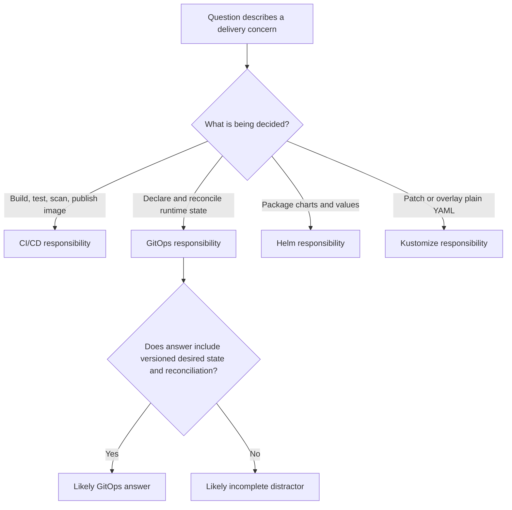

> **Напрямок CGOA** | Практичні запитання | Набір 2
> **Складність:** Від початкового до середнього рівня
> **Орієнтовний час:** 60-75 хвилин
> **Передумови:** Модулі CGOA з 1.1 до 1.4, базові об'єкти Kubernetes, pull request у Git, маніфести YAML та ідея, що контролери узгоджують бажаний стан

## Результати навчання

Після завершення цього модуля ви зможете:

1. **Порівнювати** принципи GitOps із суміжними практиками, такими як IaC, CI/CD та ручне розгортання, визначаючи роль декларативного бажаного стану й узгодження на основі витягування (pull-based).
2. **Діагностувати** сценарії дрейфу в GitOps, простежуючи, до чого належить збій: до Git, рендерингу, узгодження контролером, допуску в Kubernetes чи стану робочого навантаження.
3. **Оцінювати**, коли саме Flux, Argo CD, Helm і Kustomize відповідають за певний аспект доставки, не плутаючи рендерери, менеджери пакетів та контролери узгодження.
4. **Проєктувати** готову до іспиту стратегію відповіді на сценарні запитання, відкидаючи правдоподібні відволікачі, у яких немає версіонованого бажаного стану, автоматичного узгодження чи меж джерела істини.
5. **Впроваджувати** легкий практичний робочий процес, який використовує докази з репозиторію, докази з кластера та зіставлення відповідальності інструментів, щоб відповідати на запитання у стилі CGOA в умовах браку часу.

## Чому цей модуль важливий

Коли команда сприймає GitOps лише як гарніший спосіб упорядкувати маніфести — репозиторій, правило pull request та дашборд, що показує застосунки зеленими, — але оминає питання про те, де живе стійкий виробничий намір, святковий розпродаж може обернутися таким інцидентом. Виробничий Deployment починає не проходити перевірки готовності після поспішного оновлення образу; оператор змінює образ безпосередньо в кластері, поки на дзвінку з інциденту спостерігають, як затримка повертається до норми. За п'ятнадцять хвилин GitOps-контролер узгоджує старий образ із Git, рівень помилок знову зростає, а вартість втрачених замовлень може сягнути шестизначної суми. Помилка не в Kubernetes; вона в нечіткому володінні задекларованим станом.

Команда зазнала невдачі не тому, що в неї бракувало репозиторію YAML. Вона зазнала невдачі тому, що люди й автоматизація розійшлися в думках про те, де живе істина. Оператор бачив живий кластер як поточну істину, бо гарячий патч покращив трафік. Контролер бачив Git як задекларований бажаний стан, бо саме такий операційний контракт йому дали. Обидва погляди були зрозумілими під тиском, але стійким у системі GitOps був лише один, і стійке виправлення мало пройти рецензування, фіксацію, узгодження та спостереження тим самим шляхом, що й будь-яка інша виробнича зміна.

Практичні запитання CGOA постійно використовують напругу такого роду. Іспит рідко перевіряє, чи можете ви повторити гасло на кшталт «Git — це джерело істини». Він перевіряє, чи можете ви відрізнити GitOps від IaC, CI/CD, ручного розгортання, шаблонізації Helm, накладок Kustomize, контролерів Flux та застосунків Argo CD, коли кілька з цих ідей з'являються в одній відповіді. Цей модуль зберігає початкове покриття Набору 2, але перетворює короткі порівняльні запитання на глибше тренування міркувань, яке готує вас відкидати відповіді, що частково правдиві, але операційно неповні.

Намір полягає в тому, щоб змусити вас обирати точний рівень, а не просто найкраще звучне ключове слово: якщо у твердженні немає того, хто визначає бажаний стан, того, як і ким виконується узгодження, або того, які докази підтверджують етап збою, таке твердження операційно неповне і для іспиту, і для реальних інцидентів. Іншими словами, ключове слово може бути правильним і водночас недостатнім: відповідь, що згадує «Git» чи «контролер», але мовчить про те, хто має право змінювати живий стан і яким шляхом ця зміна повертається в репозиторій, не описує робочу систему — вона описує лише її фрагмент.

## Основний зміст

### Принципи GitOps — це контурне керування, а не формат файлу

У початковому запитанні Набору 2 про принципи GitOps була одна безпечна відповідь: принципи описують контур керування на основі витягування (pull-based) навколо декларативного бажаного стану. Ця відповідь важлива, бо включає механізм, а не лише місце зберігання. GitOps може використовувати YAML, JSON, значення Helm, накладки Kustomize чи кастомні ресурси, але жоден із цих форматів сам по собі не змушує практику працювати. Практика працює, коли версіоновану декларацію порівнюють із реальним середовищем, а автоматизований контролер рухає середовище до декларації.

OpenGitOps описує чотири ідеї, корисні для іспитових міркувань. Система має бути декларативною, щоб репозиторій описував, що має існувати, а не лише перелічував імперативні кроки. Бажаний стан має бути версіонованим та незмінним, щоб історію наміру можна було рецензувати, відкочувати й аудитувати. Програмні агенти мають автоматично витягувати й застосовувати схвалений стан, тому контролер є центральним у цій моделі. Агенти мають безперервно узгоджувати, щоб система помічала дрейф після першого розгортання, а не сприймала розгортання як одноразову операцію копіювання.

Ці ідеї також пояснюють, чому GitOps та IaC споріднені, але не синоніми. Інфраструктура як код — це широка практика керування інфраструктурою через машиночитні визначення, і її можна реалізувати багатьма робочими процесами. GitOps — це вужча операційна модель, яка додає Git-центричне джерело істини та контур узгодження для середовищ виконання. Ви можете зберігати Terraform, маніфести Kubernetes чи визначення політик у Git, не маючи при цьому контуру GitOps. Ви також можете використовувати GitOps для узгодження ресурсів Kubernetes, згенерованих інструментами, суміжними з IaC, але вирішальною частиною є поведінка контролера.

Уявіть GitOps радше як термостат, а не як планшет для записів. Планшет може зафіксувати бажану температуру, але він не перевіряє кімнату й не вмикає обігрівач. Термостат порівнює ціль із виміряним станом і діє, коли вони розходяться. Git — це стійкий запис цілі, а контролер — пристрій, який постійно порівнює й коригує. Без контролера репозиторій — це документація: гарний опис того, як усе має бути, без жодного механізму, що зробив би це правдою. Без репозиторію контролеру немає рецензованого бажаного стану, який треба забезпечувати: він коригуватиме кластер до невідомо чого. Саме поєднання цих двох частин — стійкого запису та невпинного контуру порівняння — робить GitOps практикою, а не набором файлів.

```ascii
+---------------------------+       pull desired state       +---------------------------+
| Git repository            |<------------------------------| GitOps controller         |
| versioned desired state   |                               | watches and reconciles    |
+------------+--------------+                               +-------------+-------------+
             |                                                            |
             | reviewed change becomes desired state                       | apply or report drift
             v                                                            v
+---------------------------+                               +---------------------------+
| Pull request history      |                               | Kubernetes 1.35+ cluster  |
| audit, review, rollback   |                               | actual runtime state      |
+---------------------------+                               +---------------------------+
```

Діаграма навмисно розміщує історію рецензувань поруч із узгодженням під час виконання, бо обидва є частиною ланцюга міркувань. Злитий pull request пояснює, чому змінився бажаний стан, але не доводить, що кластер прийняв зміну. Здорове робоче навантаження доводить, що кластер обслуговує трафік, але не доводить, що живий стан досі відповідає Git. Сильні міркування про GitOps тримають ці факти окремо, доки докази не з'єднають їх.

Зупиніться й спрогнозуйте: товариш по команді каже: «GitOps — це просто IaC з Kubernetes-YAML у репозиторії». Яка частина цього речення корисна, а яка втратила б бали на сценарному запитанні CGOA? Сильна відповідь зберігає корисне спостереження, що GitOps часто зберігає декларативну конфігурацію Kubernetes у Git, а потім відкидає неповний висновок, бо в ньому немає автоматичного узгодження на основі витягування та безперервного виявлення дрейфу.

Саме тому початковий варіант відповіді, де сказано, що «GitOps застосовується лише до коду застосунку», був хибним. GitOps може керувати маніфестами застосунків, платформними доповненнями, ресурсами політик, конфігурацією просторів імен та іншим бажаним станом, зверненим до кластера. Межа не в тому, чи називається щось кодом застосунку. Межа в тому, чи можна бажаний стан задекларувати, версіонувати, авторизувати, за потреби відрендерити та безпечно узгодити агентом із відповідними правами.

### Версіонований бажаний стан формує кожну безпечну відповідь

Друге початкове запитання просило вказати, який сценарій найкраще пасує GitOps, і правильним сценарієм був кластер, що витягує бажаний стан із версіонованого репозиторію та автоматично узгоджує дрейф. Це формулювання насичене, бо називає три окремі частини моделі. Репозиторій версіонований, тож намір має історію. Кластер або контролер витягує стан, тож межа довіри відрізняється від віддаленого виконавця, що проштовхує команди. Дрейф узгоджується автоматично або повідомляється згідно з політикою, тож система продовжує працювати після початкового розгортання.

Версіонування — це не лише зручність для відкату. Це аудиторський слід, який дає команді змогу пояснити, чому виробництво змінилося в конкретний час. Коли бажаний стан рухається через коміти та pull request, рецензенти можуть оглянути зміну, перш ніж вона стане цільовим станом, а оператори згодом можуть пов'язати інцидент із точною декларацією, яка його спричинила. Якщо команда вручну редагує виробництво й записує рішення у вікі заднім числом, ця вікі може бути корисним доказом, але вона не є бажаним станом, який контролер узгоджуватиме.

Бажаний стан також має обсяг. Репозиторій GitOps не повинен удавати, що володіє кожним живим полем, яке з'являється, коли ви вивантажуєте об'єкт з API Kubernetes. Контролери Kubernetes володіють полями статусу, полями за замовчуванням, згенерованими іменами, мітками часу та іншими спостереженнями під час виконання. Автоскейлери можуть володіти кількістю реплік, коли платформа делегує це рішення. Контролери допуску можуть змінювати чи відхиляти об'єкти згідно з політикою. Хороший дизайн GitOps визначає, які поля належать Git, які поля належать іншим контролерам і як слід обробляти конфлікти.

```yaml
apiVersion: apps/v1
kind: Deployment
metadata:
  name: checkout
  namespace: shop
spec:
  replicas: 3
  selector:
    matchLabels:
      app: checkout
  template:
    metadata:
      labels:
        app: checkout
    spec:
      containers:
        - name: checkout
          image: registry.example.com/checkout:v1.8
          ports:
            - containerPort: 8080
```

Цей маніфест корисний для практики, бо містить поля, які часто з'являються у сценаріях дрейфу. Якщо Git декларує `replicas: 3`, а людина масштабує Deployment до двох реплік, живий кластер тепер відрізняється від бажаного стану, доки автоскейлер чи явний процес не володіє цим полем. Якщо Git декларує `checkout:v1.8`, а людина змінює образ на `checkout:v1.9-hotfix`, розбіжність серйозніша, бо запущене програмне забезпечення більше не відповідає рецензованій декларації. Застосунок може бути на мить здоровішим, але система більше не узгоджена зі своїм операційним контрактом.

Практична послідовність команд починається з перевірки, а не зі зміни. У цьому модулі приклади команд використовують `kubectl` напряму, щоб відповідати стандарту рівня модуля й уникати залежних від оболонки псевдонімів. Важлива звичка — це послідовність доказів: оглянути задекларовану ціль, оглянути живий об'єкт, оглянути статус контролера й лише тоді вирішувати, чи фіксувати, синхронізувати, призупиняти чи ескалувати.

```bash
kubectl -n shop get deployment checkout -o yaml
kubectl -n shop describe deployment checkout
kubectl -n shop get events --sort-by=.lastTimestamp
```

Перш ніж запускати це в реальному кластері, який результат ви очікували б, якби GitOps-контролер уже спробував застосувати новий образ, але Kubernetes його відхилив? Ви очікували б, що живий Deployment залишиться на старому образі, події чи статус контролера згадуватимуть збій застосування або допуску, а бажаний репозиторій міститиме новіший образ. Ці докази вказують на проблему узгодження чи політики, а не на відсутню збірку CI.

Корисна ментальна модель — сприймати кожен інцидент GitOps як порівняння між бажаним станом, відрендереним станом, застосованим станом і здоровим станом. Бажаний стан — це те, що каже репозиторій. Відрендерений стан — це те, що інструменти на кшталт Helm чи Kustomize виробляють із цього репозиторію. Застосований стан — це те, що приймає API Kubernetes. Здоровий стан — це те, що робоче навантаження повідомляє після застосування. Кожен із цих чотирьох станів може збігатися чи розходитися з рештою незалежно: репозиторій може бути правильним, тоді як рендеринг дає не той результат; рендеринг може бути правильним, тоді як допуск відхиляє застосування; застосування може пройти, тоді як проби готовності валять робоче навантаження. Багато іспитових відволікачів злипають ці етапи в один, тому запитання може звучати просто, водночас перевіряючи кілька меж одразу. Тренована звичка — щоразу запитувати, на якому саме з цих чотирьох станів уривається ланцюг доказів.

### CI/CD, IaC та GitOps перетинаються, не стаючи однією практикою

Порівняльні запитання CGOA часто включають суміжні практики, бо реальні платформи використовують їх разом. CI/CD збирає та валідує артефакти, IaC декларує інфраструктуру через код, а GitOps узгоджує схвалений бажаний стан із середовищем. Платформа може використовувати всі три в одному шляху доставки. Іспитова навичка полягає не в тому, щоб обрати одне модне слово як універсально краще, а в тому, щоб призначити кожну відповідальність правильній частині системи.

Конвеєр CI зазвичай починається з вихідного коду застосунку. Він запускає тести, збирає образ контейнера, сканує залежності, підписує чи атестує артефакти, якщо організація цього вимагає, та публікує образ у реєстр. Далі конвеєр може оновити репозиторій маніфестів, змінивши файл значень Helm, тег образу Kustomize чи визначення Application. Щойно цю зміну бажаного стану відрецензовано та злито, GitOps-контролер спостерігає за репозиторієм і узгоджує середовище. CI виробив артефакт і запропонував ціль; GitOps зрушив середовище виконання до цієї цілі.

Інфраструктура як код стоїть дещо інакше. Terraform, Pulumi, Crossplane, Cluster API та хмароспецифічні інструменти можуть керувати деклараціями інфраструктури. Деякі працюють як конвеєри з проштовхуванням (push), деякі — як контролери, а деякі можна інтегрувати з робочими процесами GitOps. Мітка IaC не каже вам, чи є узгодження безперервним, чи є Git джерелом істини, чи витягує цільове середовище стан. Для CGOA, якщо відповідь каже «GitOps та IaC — синоніми», відкиньте її, бо вона стирає деталі контурного керування, що роблять GitOps особливим.

```ascii
+----------------------+      +----------------------+      +----------------------+
| Application source   |      | CI/CD pipeline       |      | Desired-state repo   |
| code, tests, commits |----->| build, scan, publish |----->| manifests or values  |
+----------------------+      +----------------------+      +----------+-----------+
                                                                  |
                                                                  | pull and render
                                                                  v
                                                       +----------------------+
                                                       | GitOps controller    |
                                                       | compare and apply    |
                                                       +----------+-----------+
                                                                  |
                                                                  v
                                                       +----------------------+
                                                       | Kubernetes runtime   |
                                                       | workloads and policy |
                                                       +----------------------+
```

Чітка передача в цьому потоці не дає двом системам записувати той самий стан виконання. Якщо CI оновлює Git, а потім ще й безпосередньо застосовує маніфести до виробництва, поки Argo CD або Flux спостерігають за тим самим шляхом, у команди тепер два записувачі. Пряме застосування може спрацювати, перш ніж контролер побачить коміт, або застосувати дещо інший відрендерений результат, ніж той, що контролер обчислить пізніше. У будь-якому разі історія аудиту стає складнішою, бо команда має з'ясувати, чи живу зміну спричинила поведінка проштовхування CI, чи узгодження контролером.

Є середовища, де конвеєр на основі проштовхування — навмисний вибір. Малі команди, ізольовані кластери чи тимчасові системи можуть вирішити, що застосування маніфестів через CI прийнятне для їхнього профілю ризику. GitOps — це не моральний осуд кожного розгортання з проштовхуванням. Це дизайн, який віддає перевагу рецензованому бажаному стану, обмеженим за обсягом правам контролера та безперервному узгодженню. Іспит зазвичай винагороджує відповідь, яка називає ці механізми, а не ту, що сприймає будь-яке кероване репозиторієм розгортання як GitOps.

Саме тому ручні виробничі гарячі патчі вимагають дисципліни. Під час інциденту пряма команда може бути найшвидшим способом відновити сервіс, але її слід розуміти як виняток «розбий скло». Стійкий стан треба або зафіксувати в Git, або кластер треба узгодити назад до Git після надзвичайної ситуації. Якщо команда залишає Git застарілим, наступна синхронізація може скасувати виправлення, а наступний розбір інциденту насилу відновить намір.

### Flux та Argo CD — контролери різної форми

Початкове порівняння Набору 2 просило найкращий опис Flux, і правильною відповіддю було те, що Flux — це набір інструментів зі спеціалізованих контролерів для робочих процесів GitOps. Це важливо, бо Flux — це не просто дашборд, не лише заміна Helm і не CI-система для збирання образів. Flux складається з контролерів, які узгоджують джерела, Kustomization, релізи Helm, сповіщення та робочі процеси автоматизації образів. Архітектура контролерів є частиною його сутності.

Source-controller у Flux отримує артефакти з репозиторіїв Git, репозиторіїв Helm, джерел OCI та інших підтримуваних джерел. Kustomize-controller узгоджує ресурси Kustomization, helm-controller узгоджує ресурси HelmRelease, а notification-controller обробляє маршрутизацію подій. Контролери автоматизації образів можуть оновлювати Git на основі політик образів, коли команда обирає такий патерн. Цей модульний дизайн може відчуватися радше не як єдиний дашборд застосунку, а як набір рідних для Kubernetes будівельних блоків.

Argo CD зазвичай описують як орієнтований на застосунки, бо його кастомний ресурс Application, вебінтерфейс, CLI, статус синхронізації, перегляд стану та модель проєктів організовують досвід оператора навколо застосунків. Argo CD також використовує контролери та кастомні ресурси Kubernetes, але іспитовий контраст зазвичай стосується акценту. Flux часто постає як набір інструментів зі спеціалізованих контролерів, тоді як Argo CD часто постає як контролер доставки застосунків із сильним досвідом UI та CLI. Обидва можуть реалізувати GitOps; жоден не визначається лише через Helm чи Kustomize.

| Інструмент | Основна роль у міркуваннях про GitOps | Поширена іспитова пастка | Краще ментальне скорочення |
|---|---|---|---|
| Flux | Модульні контролери GitOps для джерел, Kustomization, релізів Helm, сповіщень та автоматизації образів | Називати його лише CI-системою чи лише рендерером Helm | Flux узгоджує бажаний стан через спеціалізовані контролери |
| Argo CD | Орієнтований на застосунки контролер GitOps з UI, CLI, проєктами, синхронізацією та концепціями стану | Називати його дистрибутивом Kubernetes чи рушієм політик допуску | Argo CD керує синхронізацією та станом застосунку відносно задекларованого бажаного стану |
| Helm | Менеджер пакетів і система шаблонізації для чартів та значень | Називати його самим контуром узгодження | Helm рендерить установлювані ресурси Kubernetes |
| Kustomize | Система накладок і патчів для налаштування Kubernetes-YAML | Називати його лише інструментом тестування для Helm | Kustomize трансформує звичайні маніфести без мови шаблонів |

Цих відмінностей достатньо для більшості запитань CGOA, але реальні операції додають нюансів. Argo CD може рендерити чарти Helm та накладки Kustomize. Flux може узгоджувати ресурси HelmRelease та Kustomization. Обидва інструменти можуть виявляти дрейф і застосовувати бажаний стан, але їхні стилі конфігурації, патерни багатоорендної ізоляції, моделі сповіщень та операторські робочі процеси відрізняються. Сильна іспитова відповідь не повинна оголошувати один універсально кращим; вона має уникати призначення хибної відповідальності хибному інструменту.

Розгляньмо команду, яка хоче центральний дашборд, де власники застосунків можуть бачити статус синхронізації, порівнювати живі та бажані маніфести й запускати ручні синхронізації в межах проєктів. Argo CD може добре пасувати цій ментальній моделі. Розгляньмо платформну команду, яка хоче рідні для Kubernetes ресурси, скомпоновані між кластерами, з окремими контролерами для джерел, Kustomize, Helm, сповіщень та політик образів. Flux може добре пасувати цій архітектурі. Обидва дизайни залишаються GitOps, коли вони зберігають декларативний бажаний стан, версіоновану історію, узгодження на основі витягування та безперервну обробку дрейфу.

Який підхід ви обрали б тут і чому: регульована платформна команда хоче, щоб кожна виробнича зміна простежувалася до pull request, кожен застосунок показував свій стан у центральному UI, а права на ручну синхронізацію делегувалися за проєктами? Найсильніша відповідь може схилятися до Argo CD за його орієнтований на застосунки UI та контроль за проєктами, але вона все одно має згадати, що Flux теж міг би відповідати принципам GitOps з іншою операційною ергономікою. Вибір інструмента рідко є принципом сам по собі.

### Helm та Kustomize рендерять стан; вони не замінюють узгодження

Початкове запитання про Helm та Kustomize охопило одну з найпоширеніших пар відволікачів: Helm — це шаблонізація та пакування, а Kustomize — це патчинг та накладання. Ця відповідь навмисно проста, бо іспит часто перевіряє, чи можете ви тримати ці інструменти в їхній смузі. Чарти Helm поєднують шаблони, значення, метадані чарта, залежності та поведінку релізу. Kustomize починає зі звичайних маніфестів і застосовує накладки, патчі, трансформації імен, заміни образів та генератори без окремої мови шаблонів.

Обидва інструменти можна використовувати всередині репозиторіїв GitOps. Application в Argo CD може вказувати на чарт Helm чи каталог Kustomize. Flux може узгоджувати ресурси HelmRelease та Kustomization. Інструмент рендерингу перетворює вхідні дані репозиторію на маніфести Kubernetes; GitOps-контролер порівнює ці відрендерені маніфести з кластером і застосовує зміни. Якщо відповідь каже, що Helm «керує контуром узгодження», а Kustomize «керує контролерами», вона поміняла ролі місцями, і її слід виключити.

```yaml
apiVersion: kustomize.config.k8s.io/v1beta1
kind: Kustomization
resources:
  - deployment.yaml
images:
  - name: registry.example.com/checkout
    newTag: v1.9
patches:
  - path: production-replicas.yaml
```

Цей приклад Kustomize змінює тег образу та застосовує виробничий патч, але сам по собі він не спостерігає за кластером безперервно. Щось має запустити Kustomize, порівняти результат із живим станом і застосувати його. Це може зробити GitOps-контролер, конвеєр CI чи оператор вручну. Лише перший варіант відповідає моделі узгодження GitOps, коли контролер продовжує спостерігати й коригувати з часом.

Helm має іншу форму, бо чарти можуть пакувати значення за замовчуванням, шаблони, хелпери, залежності та метадані релізу. Це робить Helm корисним для розповсюдження конфігурованих застосунків, особливо коли платформна команда хоче, щоб один чарт підтримував кілька середовищ. Компроміс у тому, що логіку шаблонів важко читати, якщо команди надмірно вживають умови чи ховають важливі поля Kubernetes за значеннями. GitOps не усуває цю складність; він робить відрендерений результат і статус узгодження видимими, якщо контролер добре інтегрується з Helm.

Kustomize зазвичай відчувається ближчим до Kubernetes-YAML, бо базові ресурси лишаються видимими, а накладки описують зміни. Це може полегшити рецензування простих відмінностей середовищ, але стає незручним, коли командам потрібна складна параметризація чи багаторазове пакування для багатьох споживачів. І знову GitOps не вирішує компроміс автоматично. Він вимагає, щоб обраний підхід до рендерингу виробляв чіткий бажаний стан, який можна рецензувати, консистентно рендерити та безпечно узгоджувати.

| Точка рішення | Обирайте Helm, коли... | Обирайте Kustomize, коли... |
|---|---|---|
| Пакування | Вам потрібні метадані чарта, залежності та значення для багаторазового розповсюдження | У вас уже є звичайні маніфести й потрібні накладки для середовищ |
| Стиль рецензування | Рецензенти розуміють чарт і значення, які виробляють кінцеві ресурси | Рецензенти хочуть патчі, що лишаються близькими до структури об'єктів Kubernetes |
| Варіативність | Багатьом інсталяціям потрібні конфігуровані шаблони | Невеликому набору середовищ потрібні точкові накладки |
| Інтеграція з GitOps | Контролер підтримує рендеринг Helm чи узгодження HelmRelease | Контролер підтримує рендеринг Kustomize чи узгодження Kustomization |

Іспитова пастка — сплутати «може бути частиною доставки» з «є контролером доставки». Helm та Kustomize можуть бути суттєвими частинами репозиторію GitOps, але вони не надають автоматично спостереження за джерелом, виявлення дрейфу, оцінювання стану чи безперервного узгодження. Якщо запитання просить інструмент, що узгоджує стан кластера з Git, шукайте Flux або Argo CD. Якщо воно просить шаблонізацію чартів, шукайте Helm. Якщо воно просить накладки та патчі поверх YAML, шукайте Kustomize.

### Читання практичних запитань як операційних сценаріїв

Найшвидший спосіб покращити результат на цьому практичному наборі — перестати сприймати кожне запитання як картку зі словником. Більшість хибних відповідей містять правдиве слово в неправильному місці. Відволікач може згадати Git, але оминути узгодження. Він може згадати pull request, але оминути бажаний стан. Він може згадати Helm, але питати про контролери. Він може згадати ручні гарячі патчі, але ігнорувати той факт, що Git лишається задекларованим джерелом істини. Ваше завдання — визначити, яка відповідь зберігає всю операційну модель.

Почніть із пошуку об'єкта керування. Чи питання про репозиторій, контролер, відрендерені маніфести, живий об'єкт Kubernetes чи процес людського схвалення? Потім знайдіть напрямок зміни. Чи щось витягується контролером, проштовхується CI, застосовується вручну оператором чи змінюється іншим контролером Kubernetes? Нарешті, знайдіть межу володіння. Кому дозволено декларувати бажаний стан, а кому дозволено змінювати живий стан?

Наприклад, сценарій каже, що реліз запускається ланцюжком схвалень електронною поштою, а оператор копіює маніфести в кожен кластер shell-скриптом. Цей сценарій може включати схвалення та автоматизацію, але він не описує GitOps, бо кластер не витягує версіонований бажаний стан через контролер узгодження. Інший сценарій каже, що кластер витягує бажаний стан із репозиторію та автоматично узгоджує дрейф. Цей сценарій набагато ближчий, бо включає ключові сигнали, які початкове запитання Набору 2 хотіло, щоб ви запам'ятали.

Той самий метод працює із запитаннями про інструменти. Якщо запитання просить найкращий опис Flux, виключіть відповіді, що називають його лише дашбордом, лише заміною Helm чи CI-системою. Якщо запитання просить найкращий опис Argo CD, виключіть відповіді, що називають його рушієм політик, дистрибутивом Kubernetes чи інструментом баз даних. Якщо запитання про Helm проти Kustomize, виключіть відповіді, що поміщають контури узгодження всередину Helm чи контролери всередину Kustomize. Правильний вибір зазвичай зберігає основну відповідальність інструмента незмінною. Корисно тримати в голові коротку формулу для кожного: Flux — спеціалізовані контролери, Argo CD — орієнтований на застосунки контролер із UI, Helm — шаблонізує й пакує чарти, Kustomize — накладки й патчі. Щойно відповідь приписує інструменту роль, що суперечить його формулі, цю відповідь можна відкинути, не вагаючись.

Якщо образ зібрано та запушено правильно, Flux витягує репозиторій правильно, а Kustomization рендерить правильно, але застосування все одно не вдається, причина може бути радше операційною, ніж конфігураційною. Квота простору імен, що не дає Deployment створити додатковий ReplicaSet під час розгортання, — поширений винуватець; Deployment показує ProgressDeadlineExceeded, тоді як Events фіксують фактичну відмову за квотою.

Ця історія корисна для іспитів, бо показує, чому міркування про GitOps — це ланцюг. Контролер може бути сконфігурований правильно й усе одно не застосувати бажаний стан. CI може виробити хороший артефакт і все одно залишити кластер незмінним. Helm може відрендерити валідні маніфести, які допуск пізніше відхиляє. Дашборд може казати «не синхронізовано», тоді як робоче навантаження обслуговує трафік. Відповідь найсильніша, коли вона пояснює, де лежить збій і які докази його підтвердять.

## Патерни та антипатерни

Найбезпечніший патерн GitOps — тримати єдиного записувача для кожної частини бажаного стану виконання. CI може збирати образи, оновлювати декларації репозиторію та запитувати рецензування, тоді як GitOps-контролер володіє узгодженням у кластер. Цей патерн масштабується, бо інциденти, аудити та відкати — усе вказує назад на коміт репозиторію та статус контролера. Він також робить дизайн прав чистішим, бо зовнішні системи збірки не потребують широких прав на зміну виробництва.

Інший корисний патерн — визначити межі володіння для полів, які можуть змінювати інші контролери. Сам Kubernetes володіє полями статусу, значеннями за замовчуванням, згенерованими метаданими та деякими керованими полями. Автоскейлери можуть володіти кількістю реплік. Контролери керування секретами можуть володіти згенерованим вмістом Secret. GitOps стає галасливим, коли кожну живу відмінність трактують як спричинене людиною порушення, тож платформні команди мають документувати, які відмінності очікувані, а які становлять дрейф, що потребує дії.

Третій патерн — навчити команди ланцюга «відрендери, потім узгодь». Вхідні дані репозиторію стають відрендереними маніфестами через Helm, Kustomize, Jsonnet чи інший підтримуваний механізм. Контролер порівнює цей відрендерений бажаний стан із живими об'єктами Kubernetes. Допуск та політика Kubernetes вирішують, чи прийняте застосування. Стан робочого навантаження потім визначає, чи придатна запущена система до використання. Коли команди діагностують у цьому порядку, вони уникають випадкових виправлень, що лише пересувають проблему на інший етап.

| Патерн | Коли його використовувати | Чому він працює | Міркування про масштабування |
|---|---|---|---|
| CI пропонує, контролер узгоджує | Виробничі та спільні кластери, де важлива простежуваність | Відокремлює роботу з артефактами від зміни стану виконання | Потребує чітких конвенцій репозиторію та прав контролера |
| Карта володіння полями | Кластери з автоскейлерами, контролерами допуску та згенерованими ресурсами | Запобігає хибним тривогам про дрейф і пропущеному реальному дрейфу | Потребує підтримки в міру зміни контролерів та політик |
| Докази рендерингу перед зміною живого стану | Будь-який інцидент із Helm, Kustomize, Flux чи Argo CD | Локалізує етап збою перед зміною виробництва | Операторам потрібен доступ до статусу контролера та відрендереного виводу |
| «Розбий скло» з подальшим Git | Інциденти, де може знадобитися пряме втручання | Відновлює сервіс, зберігаючи дисципліну джерела істини в довгій перспективі | Потребує тайм-боксу, власника та подальшого коміту чи синхронізації |

Найшкідливіший антипатерн — трактувати Git як документацію після ручних змін. Команди потрапляють у цю пастку, бо прямі правки кластера відчуваються конкретними під час інциденту, тоді як pull request може здаватися повільнішим. Краща альтернатива — не сліпо забороняти надзвичайні дії. Краща альтернатива — визначити процес «розбий скло», який призупиняє або очікує узгодження, фіксує причину та перетворює остаточне рішення на коміт у Git, щойно надзвичайна ситуація дозволить.

Другий антипатерн — давати кожному інструменту доставки всі права. Виконавець CI з cluster-admin у виробництві, GitOps-контролер з необмеженим обсягом кластера та оператори-люди з постійним широким доступом створюють перетинні шляхи зміни. Краща альтернатива — найменші привілеї з чітким володінням. CI не повинен потребувати зміни виробництва, якщо контролер володіє узгодженням. Контролер має керувати лише ресурсами та просторами імен у межах своєї відповідальності. Людський доступ «розбий скло» має бути винятковим, фіксуватися в журналах і проходити рецензування.

Третій антипатерн — обирати інструменти лише за вподобанням дашборда. Відполірований UI корисний, а перегляд застосунків у Argo CD може бути цінним, але платформа все одно потребує структури репозиторію, RBAC, обробки секретів, перевірок стану, політик синхронізації та реагування на дрейф. Модульні контролери Flux можуть бути елегантними, але вони все одно потребують операційних конвенцій, зрозумілих людям. Вибір інструмента має починатися з робочого процесу та моделі ризику, а потім обирати інструмент, чия архітектура підтримує цю модель.

## Каркас прийняття рішень

Коли запитання CGOA змішує GitOps, CI/CD, Flux, Argo CD, Helm та Kustomize, використовуйте структурований каркас прийняття рішень замість пошуку фрази в пам'яті. По-перше, класифікуйте аспект. Якщо аспект — це збирання, тестування, сканування чи публікація артефакта, відповідь, імовірно, належить CI/CD. Якщо аспект — це декларування цільового стану виконання в Git та узгодження кластера, відповідь, імовірно, належить GitOps. Якщо аспект — це пакування чартів і значень, шукайте Helm. Якщо аспект — це накладки та патчі поверх YAML, шукайте Kustomize.

По-друге, перевірте, чи включає відповідь механізм GitOps. Відповідь у дусі GitOps має включати декларативний бажаний стан, версіоноване зберігання, автоматичне витягування чи застосування на основі агента та безперервне узгодження або виявлення дрейфу. Вона не мусить щоразу вживати саме ці слова, але не має зводити модель до «YAML у Git» чи «розгортання через pull request». Якщо варіант оминає контур контролера, він зазвичай неповний.

По-третє, запитайте, які докази довели б відповідь у реальному кластері. Якщо хтось стверджує, що збій стався в контролері, ви перевірили б статус контролера, доступ до репозиторію, відрендерені маніфести, події та умови стану. Якщо хтось стверджує, що збій стався в CI, ви перевірили б логи збірки, стан реєстру образів, результати сканування та коміти оновлення маніфестів. Якщо хтось стверджує, що відповідальні Helm чи Kustomize, ви оглянули б відрендерений вивід і вхідні дані репозиторію. Міркування на основі доказів — це міст між іспитовими запитаннями та реальними операціями.



Каркас також обробляє запитання про безпеку. Якщо запитання наголошує на зменшенні прямих виробничих облікових даних у зовнішніх системах, GitOps-контролер на основі витягування зазвичай є сильнішою відповіддю, бо агент на боці кластера може узгоджувати з обмеженими за обсягом правами Kubernetes. Це не усуває весь ризик. Репозиторій, контролер, реєстр, мережевий шлях, сховище секретів та RBAC усе одно потребують захисту. Відповідь рівня іспиту має казати «зменшує прямі шляхи зовнішньої зміни», а не «усуває проблеми безпеки».

Нарешті, агресивно використовуйте виключення. Відповіді, що кажуть, ніби GitOps застосовується лише до коду застосунку, надто вузькі. Відповіді, що кажуть, ніби GitOps та IaC — синоніми, надто широкі. Відповіді, що роблять Helm чи Kustomize відповідальними за безперервне узгодження, призначають хибний рівень. Відповіді, що рекомендують ручні зміни кластера як стійке джерело істини, суперечать операційній моделі. Коли дві відповіді виглядають близькими, обирайте ту, що зберігає повний контур від рецензованого бажаного стану до узгодженого стану виконання.

Компактний приклад показує, як каркас змінює вашу відповідь під тиском. Уявіть, що запитання каже: pull request змінив тег образу, контролер побачив коміт, відрендерений маніфест містить очікуваний тег, але живий Deployment лишається незмінним. Слабкий екзаменований може обрати відповідь про повторний запуск CI, бо в сценарії з'являється слово «образ». Сильніший екзаменований помічає, що артефакт та оновлення бажаного стану вже сталися, тож наступні докази мають надійти зі статусу застосування контролером, подій Kubernetes, RBAC, політики допуску, квот чи умов розгортання робочого навантаження.

Тепер змініть один факт у тому самому сценарії: контролер так і не помічає злитий коміт. Правильне розслідування зсувається раніше в ланцюзі. Ви оглянули б конфігурацію URL репозиторію, вибір гілки, вибір шляху, облікові дані, вебхуки, інтервал опитування, мережеву досяжність та логи контролера. Події Kubernetes для робочого навантаження можуть бути тихими, бо контролер так і не дійшов до етапу, де він спробував би щось застосувати. Саме тому запам'ятовування однієї відповіді «кластер не оновився» слабше, ніж простеження етапу, на якому докази уриваються.

Змініть інший факт: контролер помічає коміт, рендерить маніфест, успішно застосовує його, і Deployment створює новий ReplicaSet, але стан лишається погіршеним, бо проби готовності не проходять. Це вже не насамперед проблема джерела істини GitOps. Бажаний стан досяг кластера, а живе робоче навантаження повідомляє, що нова версія не може безпечно обслуговувати. Наступна відповідь має обговорювати стан розгортання, логи застосунку, проби, залежності та відкат через Git чи політику синхронізації контролера, а не облікові дані Git чи виявлення чарта Helm.

Це поетапне міркування також захищає вас від надмірної корекції під час реальних інцидентів. Якщо контролер не може дістатися репозиторію, пряма зміна образу Deployment може відновити сервіс, але вона не виправляє доступ до репозиторію. Якщо допуск відхиляє непідписаний образ, примусове пряме оновлення може порушити політику, що захищає виробництво. Якщо стан не проходить після успішного застосування, повторна синхронізація того самого бажаного стану навряд чи допоможе. Кожен випадок потребує реакції, що відповідає етапу збою, і найкращі відповіді CGOA зазвичай описують саме цю відповідність.

Коли ви переглядаєте пропущені запитання, пишіть назву етапу поруч із пропуском. Використовуйте мітки на кшталт джерело, рендеринг, узгодження, допуск, розгортання, стан, роль інструмента чи межа безпеки. Мітка тримає огляд коротким, водночас роблячи патерн видимим між запитаннями. Якщо більшість пропусків кажуть «роль інструмента», поверніться до порівняння Flux, Argo CD, Helm та Kustomize. Якщо більшість пропусків кажуть «узгодження» чи «дрейф», поверніться до розділу про принципи й попрактикуйтеся пояснювати, чому Git лишається бажаним станом навіть тоді, коли живий кластер тимчасово інший. Ця звичка перетворює помилки на точні наступні дії.

## Чи знали ви?

1. Проєкт OpenGitOps описує чотири принципи: декларативний бажаний стан, версіоноване та незмінне зберігання, автоматично застосовані агенти й безперервне узгодження.
2. Flux отримав статус Graduated у Cloud Native Computing Foundation у 2022 році, і його архітектуру навмисно розділено між спеціалізованими контролерами, а не подано лише як один центральний дашборд.
3. Проєкт Argo отримав статус Graduated у Cloud Native Computing Foundation у 2022 році; в Argo CD кастомний ресурс Application є центральною концепцією для групування синхронізації, стану та конфігурації джерела.
4. Kustomize доступний через `kubectl kustomize` від часів Kubernetes 1.14, тому багато користувачів Kubernetes стикаються з накладками раніше, ніж установлюють будь-який окремий інструмент шаблонізації.

## Типові помилки

| Помилка | Чому вона виникає | Як її виправити |
|---|---|---|
| Визначення GitOps як «YAML у Git» | Репозиторій видимий, тоді як контур узгодження легко проґавити в коротких поясненнях. | Включіть у визначення декларативний бажаний стан, версіоновану історію, застосування на основі агента та безперервне узгодження. |
| Трактування GitOps та IaC як синонімів | Обидва використовують код чи файли для опису інфраструктури, тож практики виглядають схожими здалеку. | Поясніть, що IaC ширша, тоді як GitOps додає Git-центричне джерело істини та модель узгодження. |
| Дозвіл і CI, і GitOps-контролеру застосовувати виробничі маніфести | Команди намагаються пришвидшити доставку, лишаючи старий крок проштовхування після додавання контролера. | Дозвольте CI збирати артефакти та пропонувати зміни бажаного стану, а потім дозвольте контролеру володіти узгодженням стану виконання. |
| Називання Helm чи Kustomize GitOps-контролером | Інструменти рендерингу з'являються в тому самому репозиторії, що й конфігурація GitOps, тож їхні ролі змішуються. | Опишіть Helm як шаблонізацію та пакування чартів, Kustomize як накладки та патчі, а Flux чи Argo CD як контролери узгодження. |
| Припущення, що кожна жива відмінність — це поганий дрейф | Поля статусу Kubernetes, автоскейлери та контролери допуску правомірно змінюють деякі поля. | Визначте володіння полями, перш ніж вирішувати, чи синхронізувати, ігнорувати, фіксувати чи розслідувати. |
| Зберігання ручного виправлення інциденту лише в живому кластері | Живе виправлення відчувається успішним, бо трафік покращується, але Git лишається застарілим. | Зафіксуйте стійке виправлення в Git або узгодьте назад до Git після завершення періоду «розбий скло». |
| Вибір інструмента через одну функцію замість операційної моделі | Дашборд, CLI чи назва контролера можуть відволікати від робочого процесу та моделі ризику. | Почніть із бажаного стану, володіння, прав, рендерингу, політики синхронізації та вимог аудиту, а потім обирайте інструмент. |

## Тест

### 1. Ваша команда рецензує іспитову відповідь, у якій сказано, що GitOps — це насамперед про використання YAML замість JSON. Яке твердження найкраще?

1. GitOps — це переважно про зберігання маніфестів у YAML, а не в будь-якому іншому синтаксисі.
2. GitOps — це модель на основі витягування, де декларативний, версіонований бажаний стан безперервно узгоджується з кластером.
3. GitOps найкраще розуміти як робочий процес збирання образів контейнерів, керований CI-системою.
4. GitOps еквівалентний прогону всіх виробничих змін через ручні команди `kubectl`.

<details>
<summary>Аналіз</summary>

Варіант 2 правильний, бо охоплює повну модель: декларативний бажаний стан, історію версій у Git та автоматичне узгодження. Варіант 1 хибний, бо синтаксис випадковий; GitOps не залежить від YAML як визначального механізму. Варіант 3 неправильний, бо збирання та сканування — це відповідальність CI, а не контракт узгодження GitOps. Варіант 4 хибний, бо ручна зміна на основі команд оминає стійкий шлях джерела істини й послаблює аудитований стан.
</details>

### 2. Кластер витягує бажаний стан із версіонованого репозиторію та автоматично узгоджує дрейф після того, як людина безпосередньо змінила Deployment. Який принцип GitOps цей сценарій демонструє найчіткіше?

1. Ручні операції — це стійке джерело істини, щойно інцидент розпалюється.
2. Визначений репозиторієм бажаний стан є джерелом істини, а контролер безперервно узгоджує до нього.
3. Контролер узгоджує лише тоді, коли CI проштовхує артефакт коміту.
4. Дрейф прийнятний завжди, коли робоче навантаження лишається доступним.

<details>
<summary>Аналіз</summary>

Варіант 2 правильний, бо описує узгодження версіонованих декларацій на основі витягування після живої зміни. Варіант 1 хибний, бо ручне виправлення — це саме та подія, що створює дрейф між фактичним та бажаним станом. Варіант 3 неправильний, бо узгодження на основі витягування означає, що контролер не обмежений подіями проштовхування CI. Варіант 4 хибний, бо сама лише доступність не вирішує стійку розбіжність стану; контролеру все одно потрібно повідомляти про дрейф та/або коригувати його.
</details>

### 3. Практичне запитання описує Flux як CI-систему для збирання образів контейнерів. Яке найкраще виправлення?

1. Flux — це спеціалізований набір контролерів GitOps для роботи з джерелами, координації рендерингу та робочих процесів узгодження.
2. Flux — це переважно збирач образів контейнерів, що замінює CI.
3. Flux — це лише дашборд, який не має ролі в узгодженні.
4. Flux — це вебхук допуску, що відхиляє непідписані теги образів під час звернення до API.

<details>
<summary>Аналіз</summary>

Варіант 1 правильний, бо Flux побудований з контролерів на кшталт source-controller, kustomize-controller та helm-controller, що підтримують робочі процеси узгодження. Варіант 2 хибний, бо збирання, тестування та публікація образу — це обов'язки CI, а не основна функція Flux. Варіант 3 неправильний, бо Flux включає операційні контролери поза презентаційними поверхнями. Варіант 4 хибний, бо забезпечення допуску — це механізм політики API-сервера Kubernetes, а не вбудована площина керування лише для Flux.
</details>

### 4. Платформна команда хоче орієнтований на застосунки GitOps-контролер із підтримкою UI та CLI для статусу синхронізації й стану. Який опис інструмента вони мають асоціювати з цією вимогою?

1. Flux, бо це єдиний інструмент із межами проєктів та дашбордами застосунків.
2. Argo CD, бо він зосереджений на Application, стані синхронізації та стані здоров'я в моделі, зверненій до оператора.
3. Helm, бо це орієнтований на чарти CLI та UI для доставки застосунків.
4. Kustomize, бо він рендерить накладки середовищ та перевірки стану нативно з YAML.

<details>
<summary>Аналіз</summary>

Варіант 2 правильний, бо це поширений патерн Argo CD у запитаннях CGOA. Варіант 1 хибний, бо Flux може бути сильним вибором GitOps, але його зазвичай описують як модульні контролери, а не як орієнтований на застосунки патерн, на який тут посилаються. Варіант 3 неправильний, бо Helm — це система пакування/шаблонізації, а не орієнтований на застосунки контролер для статусу синхронізації та стану. Варіант 4 хибний, бо Kustomize — це інструмент рендерера/накладок і сам по собі не надає контур контролера для синхронізації та стану.
</details>

### 5. Ваш репозиторій містить чарт Helm для сервісу та накладки Kustomize для кожного середовища. Товариш по команді каже, що Helm та Kustomize тепер замінюють GitOps-контролер. Що вам слід пояснити?

1. Helm та Kustomize можуть готувати маніфести, але контролер усе одно потрібен для спостереження, порівняння та застосування бажаного стану.
2. Сам лише Helm є GitOps-контролером, бо керує релізами та метаданими чартів.
3. Kustomize — це рушій узгодження, що безперервно коригує дрейф кластера.
4. Обидва інструменти — найкращий спосіб забезпечувати політику й допуск після часу рендерингу.

<details>
<summary>Аналіз</summary>

Варіант 1 правильний, бо рендеринг та узгодження — це окремі відповідальності в моделі доставки. Варіант 2 хибний: Helm пакує та шаблонізує маніфести, але не замінює контур контролера. Варіант 3 неправильний, бо Kustomize застосовує накладки та патчі, але не узгоджує безперервно відносно живого стану. Варіант 4 хибний, бо політика та допуск обробляються контролями рівня допуску й API, а не цими рендерерами.
</details>

### 6. Злитий pull request оновлює тег образу, але кластер досі запускає старий образ. Статус контролера каже, що бажаний маніфест відрендерився правильно, а події Kubernetes показують, що політика допуску відхилила непідписані образи. Яка найкраща наступна дія?

1. Виправити відповідність підпису/політики, а потім дозволити узгодженню продовжитися відносно задекларованого бажаного стану.
2. Перезапустити CI та перезібрати образ, бо крок рендерингу вже був успішним.
3. Змінити облікові дані Git, щоб контролер міг швидко запушити об'єкт у кластер.
4. Вручну відредагувати образ живого Deployment і продовжити звичайне тестування трафіку.

<details>
<summary>Аналіз</summary>

Варіант 1 правильний, бо збій на етапі допуску, тож оновлення вхідних даних підпису/політики — найкоротший шлях до усунення блокування. Доки образ не відповідає політиці, кожна спроба синхронізації провалюватиметься так само, а Deployment продовжуватиме обслуговувати останню допущену ревізію — саме лише виправлення виводу CI не очищає вебхук допуску, що відхиляє непідписані образи. Варіант 2 хибний, бо самé перезбирання не усуває наявну відмову допуску для непідписаних образів. Варіант 3 неправильний, бо облікові дані не є точкою збою, коли допуск блокує застосування через політику образів. Варіант 4 хибний, бо пряма правка може приховати негайний симптом, але лишає кластер відхиленим від рецензованого стану Git і ризикує повторним відхиленням після узгодження, керованого контролером.
</details>

### 7. Команда використовує CI, щоб збирати образи, оновлювати репозиторій бажаного стану й безпосередньо застосовувати маніфести, поки Argo CD спостерігає за тим самим шляхом. Який ризик дизайну ви маєте виявити?

1. У кластері тепер два незалежні записувачі для того самого шляху стану, що створює неоднозначність володіння та ризик аудиту.
2. Це найсильніший дизайн, бо прямі застосування завжди швидші за узгодження на основі контролера.
3. Патерн безпечний, бо CI та Argo CD автоматично валідують одне одного.
4. Модель еквівалентна ручним операціям і тому ніколи не потребує додаткового врядування.

<details>
<summary>Аналіз</summary>

Варіант 1 правильний, бо коли і CI, і Argo CD змінюють стан виконання, це створює неавторитетні результати та заплутані сліди доказів — під час інциденту ви можете не знати, чи живий образ надійшов від останнього проштовхування конвеєра, чи від останньої синхронізації контролера. Варіант 2 хибний, бо швидкість не дорівнює правильності, коли дві системи можуть записувати різні стани. Варіант 3 неправильний, бо перетин може створити неузгоджені версії та звіти про дрейф, а не гарантовану безпеку. Варіант 4 хибний, бо ця архітектура збільшує складність врядування та простежуваності, якщо пряме застосування не обмежене суворо.
</details>

## Практична вправа

Ця вправа — паперова лабораторна робота, яку можна виконати за допомогою текстового редактора, локального репозиторію чи реального тренувального кластера Kubernetes 1.35+. Мета — перетворити порівняльні запитання Набору 2 на повторюваний діагностичний робочий процес. Ви класифікуєте сценарій, призначите відповідальності інструментам та напишете готові до іспиту пояснення, що зберігають операційну модель GitOps.

### Сценарій

Сервіс `checkout` керується через репозиторій бажаного стану. CI збирає та сканує `registry.example.com/checkout:v1.9`, потім оновлює накладку Kustomize й відкриває pull request. Після злиття pull request GitOps-контролер повідомляє про застосунок як про несинхронізований. Живий Deployment досі запускає `registry.example.com/checkout:v1.8`, а оператор спокушається запустити пряме оновлення образу, бо реліз чутливий до часу.

### Завдання 1: класифікуйте докази

Напишіть коротку нотатку, що відокремлює докази з репозиторію, докази рендерингу, докази контролера, докази допуску Kubernetes та докази стану робочого навантаження. Використовуйте ці категорії, навіть якщо сценарій ще не надав кожну деталь. Мета — натренувати себе запитувати наступний відсутній факт замість стрибка до ручної зміни.

- [ ] Ви визначили бажаний тег образу в Git.
- [ ] Ви визначили живий тег образу в Kubernetes.
- [ ] Ви зазначили, чи контролер помітив злитий коміт.
- [ ] Ви назвали щонайменше одну причину рівня Kubernetes, чому застосування могло б не вдатися.

<details>
<summary>Орієнтир для розв'язання</summary>

Сильна відповідь каже, що Git декларує `checkout:v1.9`, тоді як живий Deployment досі запускає `checkout:v1.8`. Вона запитує, чи контролер помітив коміт, чи Kustomize відрендерив очікуваний маніфест і чи Kubernetes відхилив застосування через допуск, RBAC, квоту чи невалідну конфігурацію об'єкта. Вона не рекомендує пряму зміну образу як стійку першу реакцію, бо це оминуло б шлях бажаного стану.
</details>

### Завдання 2: зіставте відповідальності інструментів

Створіть таблицю, що призначає кожну відповідальність CI/CD, Kustomize, Flux чи Argo CD, Git або Kubernetes. Включіть щонайменше ці відповідальності: збирання образу, сканування образу, зберігання бажаного стану, застосування накладок, виявлення дрейфу, застосування бажаного стану, забезпечення політики допуску та повідомлення про стан робочого навантаження.

- [ ] Ви призначили роботу зі збирання та сканування CI/CD.
- [ ] Ви призначили історію бажаного стану Git.
- [ ] Ви призначили рендеринг накладок Kustomize.
- [ ] Ви призначили виявлення дрейфу та узгодження Flux чи Argo CD.
- [ ] Ви призначили рішення про допуск та сигнали стану робочого навантаження компонентам Kubernetes.

<details>
<summary>Орієнтир для розв'язання</summary>

Очікуване зіставлення: CI/CD для збирання та сканування, Git для рецензованої історії бажаного стану, Kustomize для рендерингу накладок, Flux чи Argo CD для узгодження та допуск чи контролери робочого навантаження Kubernetes для сигналів політики та стану. Helm був би відповіддю про рендеринг, якби репозиторій використовував чарти та значення замість накладок Kustomize. Важлива іспитова навичка — не назва бренду; це утримання рендерерів, контролерів та систем збірки окремо.
</details>

### Завдання 3: оберіть безпечну реакцію

Оберіть один шлях реакції та обґрунтуйте його в чотирьох-шести реченнях: зачекати на контролер після підтвердження, що він помітив коміт; виправити проблему рендерингу чи допуску й дозволити узгодженню продовжитися; ненадовго призупинити узгодження за процесом «розбий скло»; чи синхронізувати назад до Git, бо ручна зміна була несхваленою. Поясніть, чому ваша обрана реакція зберігає простежуваність.

- [ ] Ваша реакція включає стійку дію на основі Git або синхронізацію на основі контролера.
- [ ] Ваша реакція уникає трактування прямої правки кластера як остаточного джерела істини.
- [ ] Ваша реакція пояснює, які докази змусили б вас призупинити узгодження.
- [ ] Ваша реакція називає ризик залишити Git застарілим після інциденту.

<details>
<summary>Орієнтир для розв'язання</summary>

Сильна відповідь залежить від доказів. Якщо контролер не помітив коміт, дослідіть доступ до репозиторію, конфігурацію шляху, вибір гілки, доставку вебхуків чи опитування. Якщо контролер відрендерив бажаний маніфест, але допуск його відхилив, виправте проблему підпису, RBAC, квоти чи політики. Якщо пряма надзвичайна зміна необхідна, призупиніть або врахуйте узгодження, а потім зафіксуйте стійке рішення в Git чи синхронізуйте назад, щойно інцидент завершиться.
</details>

### Завдання 4: перепишіть початкові короткі відповіді

Візьміть п'ять початкових тем Набору 2 й напишіть по одному готовому до іспиту реченню для кожної: принципи GitOps, найкращий сценарій для GitOps, опис Flux, опис Argo CD та Helm проти Kustomize. Кожне речення має включати причину, чому правильна відповідь сильніша за поширений відволікач.

- [ ] Ваше речення про принципи GitOps включає узгодження на основі витягування навколо декларативного бажаного стану.
- [ ] Ваше речення про сценарій включає версіонований стан репозиторію та автоматичну обробку дрейфу.
- [ ] Ваше речення про Flux описує спеціалізовані контролери, а не CI-систему збірки.
- [ ] Ваше речення про Argo CD описує орієнтований на застосунки контролер із підтримкою UI та CLI.
- [ ] Ваше речення про Helm і Kustomize розрізняє шаблонізацію чартів від накладок та патчів.

<details>
<summary>Орієнтир для розв'язання</summary>

Найсильніша версія каже, що GitOps — це модель узгодження на основі витягування навколо декларативного бажаного стану, а не вподобання формату файлу. Найкращий сценарій — це кластер чи контролер, що витягує версіонований стан та узгоджує дрейф, а не документація гарячого патча чи схвалення електронною поштою. Flux — це модульний набір контролерів, Argo CD орієнтований на застосунки з робочими процесами UI та CLI, а Helm шаблонізує чарти, тоді як Kustomize накладає й патчить YAML.
</details>

### Завдання 5: обмежте іспитовий метод часом

Поставте таймер на дванадцять хвилин і дайте відповіді на сім сценарних запитань із цього модуля, не зазираючи в пояснення. Для кожної пропущеної відповіді напишіть відсутній механізм однією фразою: бажаний стан, версіонована історія, витягування контролером, дрейф, рендерер, допуск, стан чи відповідальність інструмента. Ця фраза корисніша за переписування всього запитання, бо показує точну концепцію, що дала збій.

- [ ] Ви відповіли на тест без використання тексту модуля.
- [ ] Ви написали один відсутній механізм для кожного пропущеного запитання.
- [ ] Ви переглянули будь-яке пропущене запитання про інструмент, назвавши відповідальність інструмента.
- [ ] Ви переглянули будь-яке пропущене сценарне запитання, простеживши ланцюг доказів.

<details>
<summary>Орієнтир для розв'язання</summary>

Мета — створити компактний журнал помилок. Якщо ви пропустили запитання про Flux, відсутньою фразою може бути «спеціалізовані контролери». Якщо ви пропустили запитання про Helm та Kustomize, це може бути «рендерер, а не узгоджувач». Якщо ви пропустили запитання про інцидент, це може бути «Git лишається бажаним станом». Огляд за механізмом тренує перенесення на нові запитання краще, ніж запам'ятовування точного формулювання.
</details>

## Перевірка засвоєння

> Варіант 1 правильний, бо коли і CI, і Argo CD змінюють стан виконання, це створює неавторитетні результати та заплутані сліди доказів — під час інциденту ви можете не знати, чи живий образ надійшов від останнього проштовхування конвеєра, чи від останньої синхронізації контролера.

## Джерела

- https://opengitops.dev/
- https://opengitops.dev/#principles
- https://fluxcd.io/flux/concepts/
- https://fluxcd.io/flux/components/
- https://argo-cd.readthedocs.io/en/stable/core_concepts/
- https://argo-cd.readthedocs.io/en/stable/user-guide/sync-options/
- https://helm.sh/docs/topics/charts/
- https://helm.sh/docs/chart_template_guide/values_files/
- https://kubernetes.io/docs/tasks/manage-kubernetes-objects/kustomization/
- https://kubectl.docs.kubernetes.io/references/kustomize/
- https://kubernetes.io/docs/concepts/overview/working-with-objects/
- https://kubernetes.io/docs/concepts/architecture/controller/

## Наступний модуль

Поверніться до [огляду напрямку CGOA](./), щоб обрати наступну тему для повторення або повторити практичні набори в іспитових умовах.


