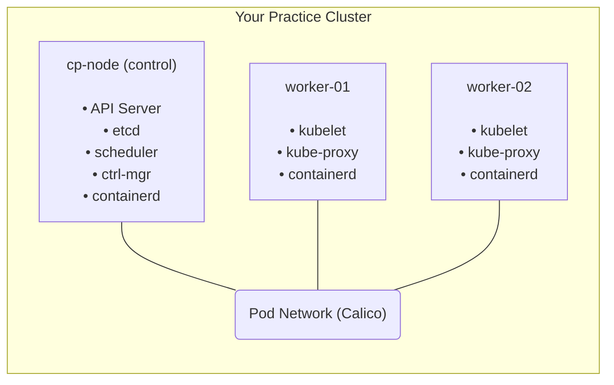

> **Складність**: `[СЕРЕДНЯ]` — потребує часу, але є прямолінійною, якщо дотримуватися кроків
>
> **Час на проходження**: 45–60 хвилин уперше, 15–20 хвилин, коли освоїтеся
>
> **Передумови**: дві або більше машини, надані як фізичні хости, локальні віртуальні машини чи хмарні інстанси

## Результати навчання

Після цього модуля ви зможете:

- **Збудувати** багатовузловий кластер kubeadm з нуля, включно з однією нодою площини управління та двома робочими нодами.
- **Діагностувати** ноду, що застрягла у стані `NotReady`, перевіривши стан kubelet, готовність CNI та справність системних подів.
- **Відновити** кластер після збоїв початкового завантаження, як-от відсутній маніфест планувальника, аварійне завершення kubelet на робочій ноді чи прострочений токен приєднання.
- **Оцінити** інфраструктурні варіанти для тренувального кластера та обрати компроміс, що відповідає підготовці до іспиту, бюджету й бажаній глибині усунення несправностей.

## Чому цей модуль важливий

Сценарій вправи: ви тренувалися з Kubernetes на керованому кластері, де хмарний провайдер володіє площиною управління, початковим завантаженням нод та більшістю мережевих налаштувань за замовчуванням. Під час завдання у стилі CKA робоча нода раптом залишається у стані `NotReady`, под застряг у `ContainerCreating`, і єдині корисні підказки розташовані на самій ноді. Якщо ваша уявна модель зупиняється на `kubectl get pods`, ви можете описати симптом, але не можете діагностувати систему, яка його породила.

Середовище CKA очікує, що ви працюватимете з кластерами, розгорнутими через kubeadm, а не з відполірованим керованим сервісом, який ховає генерацію сертифікатів, реєстрацію kubelet, статичні поди площини управління та конфігурацію Container Network Interface. kubeadm не усуває складність; він пакує послідовність початкового завантаження у передбачувані фази, щоб ви могли міркувати про те, що сталося, коли щось ламається. Саме це робить його ідеальним для підготовки до іспиту, адже кожна видима несправність зводиться до невеликого набору локальних файлів, служб systemd, портів, сертифікатів і подів.

Цей модуль навчає вас будувати тренувальний кластер, який поводиться так само, як кластери, що їх ви налагоджуєте під час адміністративної роботи. Ви підготуєте три ноди на основі Ubuntu, встановите containerd та інструменти Kubernetes, ініціалізуєте площину управління з репозиторіями пакетів Kubernetes 1.35, встановите мережу Calico, приєднаєте робочі ноди та доведете, що робочі навантаження плануються по всьому кластеру. Що важливіше, ви зрозумієте, навіщо існує кожен крок, щоб зламане налаштування не здавалося довгим переліком справ з однією невидимою друкарською помилкою.

Уявіть собі кластер Kubernetes як оркестр. Площина управління — це диригент, бо вона вирішує, що має виконуватися, веде партитуру й каже кожній секції, коли вступати. Робочі ноди — це музиканти, бо вони запускають контейнери, які створюють застосунок. Диригент без музикантів породжує тишу, музиканти без диригента породжують хаос, а кластер без надійного зв'язку між цими ролями породжує такий самий операційний безлад.

## Що ви збудуєте

Цільовий кластер має одну ноду площини управління та дві робочі ноди. Це достатньо мало, щоб будувати його повторно, але достатньо велико, щоб виявити поведінку, яку приховують однонодові інструменти: реєстрацію ноди, розміщення подів на різних машинах, розповсюдження CNI, справність kubelet та статичні поди площини управління. Однонодовий кластер корисний для тренування з API, але він не може навчити вас того, що відбувається, коли робоча нода приєднується, перестає звітувати, втрачає мережу або потребує скидання.



Ця діаграма навмисно проста, бо перший урок kubeadm — розподіл відповідальності. API-сервер, планувальник, менеджер контролерів та etcd працюють як статичні поди на ноді площини управління. kubelet та середовище виконання контейнерів працюють на кожній ноді. Calico додає мережу подів, яка дозволяє подам на різних нодах поводитися так, ніби вони спільно використовують одну маршрутизовану мережу кластера.

Та сама картина корисна й під час усунення несправностей, бо кожен симптом має своє розташування. Якщо `kubectl` не може дістатися до кластера, починайте з доступності API-сервера й kubeconfig. Якщо под так і не отримує IP-адресу, починайте з подів CNI та конфігурації CNI на рівні ноди. Якщо робоча нода зникає з планування, починайте з kubelet, умов ноди та локальних системних журналів робочої ноди.

## Оберіть свою інфраструктуру

Для повної вправи вам потрібні три машини, і слово «машина» може означати фізичний хост, віртуальну машину або хмарний інстанс. Важлива вимога — не вендор; важливо те, що кожна нода має власну операційну систему, ім'я хоста, IP-адресу, середовище виконання контейнерів, kubelet та стан служб systemd. Цей розподіл дає вам реалістичне місце для тренування діагностики через SSH замість того, щоб ставитися до кластера як до одного непрозорого процесу.

| Варіант | Переваги | Недоліки | Вартість |
|--------|------|------|------|
| **ВМ на Mac (UTM/Parallels)** | Локально, без мережевих проблем | Вимоглива до ресурсів | Безкоштовно (UTM) |
| **ВМ на Linux (KVM/libvirt)** | Нативна продуктивність | Потрібен хост на Linux | Безкоштовно |
| **Хмарні ВМ (AWS/GCP/Azure)** | Найближче до іспитового середовища | Коштує грошей | ~$0.10/год |
| **Bare metal** | Найкраща продуктивність | Потрібне обладнання | Наявне |
| **Кластер на Raspberry Pi** | Цікавий проєкт, мале енергоспоживання | Особливості ARM | ~$200 |

Локальні ВМ зазвичай є найкращим першим вибором, бо знімки стану (snapshots) роблять помилки дешевими. Якщо ви неправильно налаштуєте containerd чи випадково скинете ноду, ви зможете швидко відкотитися та повторити урок. Хмарні ВМ ближчі до багатьох робочих середовищ, але фаєрволи, образи cloud-init та правила хмарної мережі додають режими відмов, які відвертають увагу від kubeadm, доки ви не освоїтеся з базовою конфігурацією.

Коли ви оцінюєте інфраструктурні варіанти для тренувального кластера, відокремлюйте зручність від спостережуваності. Керований сервіс зручний, бо він прибирає площину управління з-під вашого робочого навантаження, але це також прибирає саме ті файли, служби та шляхи відновлення, які цей модуль намагається продемонструвати. Середовище з ВМ на ноутбуці менш ефектне, проте воно дозволяє вам зробити паузу, створити знімок, переглянути журнали, зламати робочу ноду та відбудувати ту саму несправність, аж доки послідовність дій не стане звичною. Це повторення цінніше за чистий реалізм під час першого проходження kubeadm.

| Ресурс | Площина управління | Робоча нода |
|----------|--------------|--------|
| CPU | 2 ядра | 2 ядра |
| RAM | 2 ГБ | 2 ГБ |
| Диск | 20 ГБ | 20 ГБ |
| ОС | Ubuntu 22.04 LTS | Ubuntu 22.04 LTS |

Ці мінімуми навмисно скромні, бо кластер призначений для навчання, а не для робочого трафіку. Площині управління потрібно достатньо пам'яті для etcd, API-сервера, планувальника, менеджера контролерів, CoreDNS, kube-proxy та Calico. Робочим нодам потрібен запас, щоб запускати системні поди та кілька тестових навантажень, не створюючи оманливого тиску на пам'ять, поки ви ще вивчаєте звичайний шлях початкового завантаження.

Перш ніж будь-що розгортати, вирішіть, як ви ідентифікуватимете ноди зі свого термінала. Плутанина з іменами хостів — поширена причина самостійно завданої шкоди кластеру, бо `kubeadm init`, `kubeadm join` та `kubeadm reset` є операціями, локальними для ноди. Чітке запрошення оболонки, невелика інвентарна нотатка чи три окремі вкладки термінала, названі за хостами, можуть уберегти вас від приєднання не тієї машини чи скидання площини управління.

Також вирішіть, як ви відновлюватиметеся після помилок, перш ніж їх допустите. Якщо ви використовуєте локальні ВМ, зробіть знімок після оновлення операційної системи й перед встановленням пакетів Kubernetes, а потім розгляньте ще один знімок після успішного виконання кроків підготовки ноди. Якщо ви використовуєте хмарні ВМ, запишіть імена інстансів, приватні адреси та правила груп безпеки, і встановіть нагадування про бюджет, щоб лабораторне середовище не працювало далі після тренування. Ці операційні рішення є частиною модуля, бо налаштування кластера ніколи не є лише командою Kubernetes; це невеликий системний проєкт з обмеженнями щодо вартості, доступу й відновлення.

## Підготуйте кожну ноду перед початковим завантаженням

kubeadm припускає, що операційна система вже придатна для Kubernetes. Він не виправляє магічним чином swap, завантаження модулів ядра, фільтрацію мостових пакетів, переадресацію IP, конфігурацію середовища виконання контейнерів чи налаштування репозиторію пакетів. Це передумови хоста, і ставлення до них як до частини кластера, а не «рутинних справ Linux», робить пізніші помилки значно легшими для тлумачення.

Виконайте кроки підготовки на всіх трьох нодах: `cp-node`, `worker-01` та `worker-02`. Мета — зробити машини нудно однаковими, перш ніж будь-яка нода спробує стати площиною управління чи робочою нодою. Якщо на одній робочій ноді ввімкнено swap, на іншій неправильне ім'я хоста, а площина управління має інший драйвер cgroup, kubeadm все одно може запуститися, але вашою першою вправою з усунення несправностей стане купа непов'язаних збоїв.

Почніть з імен хостів, бо Kubernetes використовує імена нод як стійкі ідентифікатори. Об'єкт ноди під назвою `worker-01` легше розпізнати у виводі `kubectl get nodes`, `kubectl describe node`, у подіях планувальника та у виводі розміщення подів, ніж типове хмарне ім'я хоста. Ім'я має описувати роль, а не тимчасову IP-адресу, бо адреси можуть змінюватися у багатьох лабораторних конфігураціях.

```bash
# On control plane node
sudo hostnamectl set-hostname cp-node

# On first worker
sudo hostnamectl set-hostname worker-01

# On second worker
sudo hostnamectl set-hostname worker-02
```

Далі додайте просте розв'язання імен. Невеликого файлу `/etc/hosts` достатньо для лабораторного кластера, і він прибирає DNS як змінну, поки ви вивчаєте kubeadm. Замініть приклади адрес фактичними адресами ваших нод і застосуйте те саме зіставлення на кожній машині, щоб усі ноди узгоджено розуміли, як дістатися до площини управління й робочих нод.

```bash
sudo tee -a /etc/hosts << EOF
192.168.1.10  cp-node
192.168.1.11  worker-01
192.168.1.12  worker-02
EOF
```

Swap слід вимкнути, якщо тільки ви навмисно не тестуєте новішу поведінку swap і не налаштували для цього kubelet. Для тренування CKA вимкніть його, бо шлях у стилі іспиту очікує, що kubelet керуватиме пам'яттю ноди без того, щоб операційна система переносила анонімні сторінки на диск у нього за спиною. Коли swap несподівано ввімкнено, симптоми тиску на пам'ять стає важче тлумачити, бо kubelet і планувальник більше не мають чіткої картини доступної пам'яті.

```bash
# Disable swap immediately
sudo swapoff -a

# Disable swap permanently (survives reboot)
sudo sed -i '/ swap / s/^/#/' /etc/fstab
```

Сценарій вправи: робоча нода успішно приєднується, але після першого перезавантаження kubelet так і не стає справним, а нода ніколи не переходить у стан `Ready`. Ви перевіряєте `journalctl -u kubelet` і бачите повідомлення, пов'язані зі swap, бо оператор виконав `swapoff -a` під час налаштування, але забув відредагувати `/etc/fstab`. Виправлення полягає не у перевстановленні Kubernetes; виправлення полягає у коригуванні конфігурації хоста, яка повертається під час завантаження.

Мостова мережа Linux також потребує явної підготовки. Поди Kubernetes часто надсилають трафік через віртуальні Ethernet-пристрої та мости Linux, і хост повинен пропускати мостові пакети через netfilter, щоб правила iptables чи nftables могли застосовувати маршрутизацію та політику сервісів. Завантаження `overlay` та `br_netfilter` зараз, а потім їхнє збереження під `/etc/modules-load.d`, забезпечує узгоджену поведінку під час виконання після перезавантаження.

```bash
# Load modules now
sudo modprobe overlay
sudo modprobe br_netfilter

# Ensure they load on boot
cat << EOF | sudo tee /etc/modules-load.d/k8s.conf
overlay
br_netfilter
EOF
```

Налаштування sysctl з'єднують цю підготовку ядра з переадресацією пакетів. `net.ipv4.ip_forward` дозволяє хосту маршрутизувати пакети між інтерфейсами, а налаштування bridge netfilter роблять мостовий трафік IPv4 та IPv6 видимим для правил фільтрації. Без цих налаштувань под може здаватися справним з погляду API, тоді як трафік тихо зазнає невдачі на межі ноди.

```bash
cat << EOF | sudo tee /etc/sysctl.d/k8s.conf
net.bridge.bridge-nf-call-iptables  = 1
net.bridge.bridge-nf-call-ip6tables = 1
net.ipv4.ip_forward                 = 1
EOF

# Apply immediately
sudo sysctl --system
```

Зробіть паузу й передбачте: перш ніж ви запустите `kubeadm init`, виконання якої команди ви очікували б невдалим, якщо переадресація пакетів чи bridge netfilter налаштовані неправильно? Несподівана відповідь полягає в тому, що початкове завантаження все одно може завершитися, бо ці налаштування мають найбільше значення тоді, коли поди й сервіси починають надсилати трафік. Саме тому кластер може виглядати справним на рівні площини управління, тоді як зв'язність застосунку зазнає невдачі під час перевірки.

Kubernetes 1.35 очікує сучасної поведінки ноди, і cgroup v2 тепер є базовою лінією для цього лабораторного завдання. cgroups — це механізм ядра, який дозволяє kubelet та середовищу виконання контейнерів встановлювати обмеження на CPU, пам'ять та облік процесів. Якщо kubelet використовує один драйвер cgroup, а середовище виконання — інший, облік ноди стає неузгодженим, тому цей модуль тримає хост, kubelet та containerd узгодженими навколо cgroups, керованих systemd.

```bash
# Check cgroup version (must show "cgroup2fs")
stat -fc %T /sys/fs/cgroup
# Expected output: cgroup2fs

# If it shows "tmpfs", you're on cgroup v1 — you need a newer OS
# Affected: CentOS 7, RHEL 7, Ubuntu 18.04
# Supported: Ubuntu 22.04+, Debian 12+, RHEL 9+, Rocky 9+
```

Якщо `stat -fc %T /sys/fs/cgroup` повертає `tmpfs` замість `cgroup2fs`, оновіть операційну систему, перш ніж продовжувати. Kubernetes 1.35 не буде привітним місцем для налагодження старих налаштувань cgroup за замовчуванням, а час, який ви витратите, змушуючи застарілий хост шкутильгати вперед, — це час, вкрадений у власне адміністративних навичок, що вам потрібні. Ubuntu 22.04 чи новіша робить цю частину передбачуваною.

containerd є середовищем виконання контейнерів у цьому модулі, бо Kubernetes спілкується із середовищами виконання через Container Runtime Interface, а не через команди Docker. Встановлення containerd напряму тримає ноду близькою до поточних налаштувань Kubernetes за замовчуванням і уникає зайвого шару сумісності. Ключова деталь конфігурації — `SystemdCgroup = true`, яка вказує containerd використовувати той самий менеджер cgroup, на який очікує kubelet у дистрибутиві на основі systemd.

```bash
# Install containerd (ensure version 2.0+)
sudo apt-get update
sudo apt-get install -y containerd

# Verify version
containerd --version
# Should be 2.0.0 or later

# Create default config
sudo mkdir -p /etc/containerd
containerd config default | sudo tee /etc/containerd/config.toml

# Enable systemd cgroup driver (IMPORTANT!)
sudo sed -i 's/SystemdCgroup = false/SystemdCgroup = true/' /etc/containerd/config.toml

# Restart containerd
sudo systemctl restart containerd
sudo systemctl enable containerd
```

Версія середовища виконання має значення як для майбутньої сумісності, так і для сьогоднішнього початкового завантаження. Kubernetes 1.35 є сучасною ціллю, і екосистема відійшла від старих форматів образів та старої поведінки середовища виконання. Якщо вам дістануться дуже старі образи контейнерів, що покладаються на Docker Schema 1, containerd 2.0 їх не врятує; перезберіть чи перепублікуйте ці образи сучасним інструментарієм замість того, щоб послаблювати середовище виконання ноди.

Тепер встановіть інструменти ноди Kubernetes з репозиторію пакетів 1.35. `kubeadm` виконує початкове завантаження кластера та приєднує ноди, `kubelet` працює на кожній ноді й звітує про локальний стан, а `kubectl` — це клієнт, який ви використовуватимете з площини управління під час цього лабораторного завдання. Закріплення пакетів — практичний лабораторний вибір, бо випадкове відхилення мінорної версії може перетворити просту вправу на сеанс усунення несправностей під час оновлення.

```bash
# Install dependencies
sudo apt-get update
sudo apt-get install -y apt-transport-https ca-certificates curl gpg

# Add Kubernetes repository key
curl -fsSL https://pkgs.k8s.io/core:/stable:/v1.35/deb/Release.key | sudo gpg --dearmor -o /etc/apt/keyrings/kubernetes-apt-keyring.gpg

# Add Kubernetes repository
echo 'deb [signed-by=/etc/apt/keyrings/kubernetes-apt-keyring.gpg] https://pkgs.k8s.io/core:/stable:/v1.35/deb/ /' | sudo tee /etc/apt/sources.list.d/kubernetes.list

# Install components
sudo apt-get update
sudo apt-get install -y kubelet kubeadm kubectl

# Prevent automatic updates (version consistency matters)
sudo apt-mark hold kubelet kubeadm kubectl
```

kubelet може відображатися як неактивний, такий, що активується, чи такий, що повторно перезапускається, доки кластер не ініціалізовано. Це очікувано, бо kubeadm ще не записав конфігурацію kubelet та облікові дані початкового завантаження під `/var/lib/kubelet`. Початківець часто сприймає цей цикл перезапусків як невдале встановлення, але на цьому етапі kubelet чекає на ідентичність кластера, а не повідомляє про помилку середовища виконання.

```bash
# Check containerd
sudo systemctl status containerd

# Check kubelet (will be inactive until cluster is initialized)
sudo systemctl status kubelet

# Check kubeadm version
kubeadm version
```

Перш ніж рухатися далі, порівняйте три ноди, а не покладайтеся на те, що повторювані команди виконалися однаково. Площина управління й робочі ноди мають узгоджуватися щодо версії cgroup, справності containerd, версій пакетів, розв'язання імен хостів та вимкненого swap. Це перша звичка, яка відрізняє надійне адміністрування кластера від механічного запам'ятовування команд: перевірте стан, який ви, на вашу думку, створили, перш ніж просити Kubernetes будувати поверх нього.

Один практичний метод порівняння — тримати чернеткову нотатку з очікуваним виводом кожної передумови й позначати кожну ноду, коли вона проходить перевірку. Це звучить буденно, але це запобігає підступному класу помилок, коли дві ноди коректні, а третя лише виглядає коректною, бо ви виконали останню команду не в тому терміналі. У реальних операціях це перетворюється на керування конфігурацією й тестування відповідності нод; у невеликій лабораторії ретельний контрольний список дає вам той самий захист у правильному масштабі.

Фаза підготовки також навчає вас, які помилки належать рівню нижче Kubernetes. Якщо `modprobe br_netfilter` зазнає невдачі — це проблема ядра чи образу хоста. Якщо `containerd --version` занадто старий — це проблема джерела пакетів чи операційної системи. Якщо `/etc/hosts` розв'язує `cp-node` по-різному на двох машинах — це проблема розв'язання імен. kubeadm зрештою виявить деякі з цих помилок, але виявить їх пізніше й з меншим контекстом, ніж прямі перевірки хоста.

## Ініціалізуйте площину управління

Тільки нода площини управління виконує `kubeadm init`. Ця команда створює першу кінцеву точку API кластера, генерує сертифікати, записує маніфести статичних подів, ініціалізує etcd, створює облікові дані початкового завантаження та виводить команду приєднання для робочих нод. Це насичена операція, тож ставтеся до її виводу як до запису про те, що було створено, а не як до стіни тексту, яку можна пропустити.

```bash
sudo kubeadm init \
  --pod-network-cidr=10.244.0.0/16 \
  --control-plane-endpoint=cp-node:6443
```

CIDR подів — це діапазон адрес, який кластер зарезервує для подів, а кінцева точка площини управління — це адреса, яку робочі ноди використовують під час приєднання. Для лабораторії `cp-node:6443` є простим і читабельним. У високодоступному робочому кластері ця кінцева точка зазвичай була б балансувальником навантаження чи стабільною віртуальною адресою, але цей модуль навмисно тримає топологію невеликою, щоб ви могли побачити кожну рухому деталь.

```text
Your Kubernetes control-plane has initialized successfully!

To start using your cluster, you need to run the following as a regular user:

  mkdir -p $HOME/.kube
  sudo cp -i /etc/kubernetes/admin.conf $HOME/.kube/config
  sudo chown $(id -u):$(id -g) $HOME/.kube/config

Then you can join any number of worker nodes by running the following on each as root:

kubeadm join cp-node:6443 --token abcdef.0123456789abcdef \
    --discovery-token-ca-cert-hash sha256:...
```

Збережіть команду приєднання, бо вона містить два важливі елементи довірчого матеріалу. Токен дозволяє новій ноді автентифікуватися під час початкового завантаження, а хеш сертифіката ЦС дозволяє ноді переконатися, що вона спілкується із запланованою площиною управління, а не з підробленою кінцевою точкою. Якщо токен спливає, ви можете згенерувати інший, але збереження першої команди робить початкове лабораторне завдання плавним.

Налаштуйте `kubectl` для вашого звичайного користувача після ініціалізації. Файл, який ви копіюєте, — це адміністративний kubeconfig, тож не розкидайте його недбало по машинах і не вставляйте у чати. Для цього тренувального кластера достатньо тримати його у вашому домашньому каталозі на ноді площини управління, щоб клієнт був придатним до використання без виконання кожної команди через `sudo`.

```bash
mkdir -p $HOME/.kube
sudo cp -i /etc/kubernetes/admin.conf $HOME/.kube/config
sudo chown $(id -u):$(id -g) $HOME/.kube/config
```

Коли ви вперше запитаєте ноди, площина управління зазвичай з'являється як `NotReady`. Цей стан не означає, що API-сервер зазнав збою; він означає, що нода ще не повністю готова запускати поди, бо мережевий плагін кластера ще не налаштував мережу подів. Це одне з найцінніших ранніх спостережень у модулі, бо воно навчає вас, що початкове завантаження площини управління й готовність мережі подів — це окремі віхи.

```bash
kubectl get nodes
```

```text
NAME      STATUS     ROLES           AGE   VERSION
cp-node   NotReady   control-plane   1m    v1.35.0
```

Зробіть паузу й передбачте: якщо API-сервер, etcd, планувальник та менеджер контролерів уже працюють, чому нода все ще `NotReady`? Відсутня частина — це плагін CNI, який записує мережеву конфігурацію на рівні ноди й запускає поди, що забезпечують маршрутизацію між подами. Доки цього не існує, kubelet не може правдиво звітувати, що нода готова до звичайного планування.

Корисно знати, де kubeadm розмістив компоненти площини управління. Це маніфести статичних подів під `/etc/kubernetes/manifests`, за якими стежить kubelet, а не розгортає контролер вищого рівня. Саме через цей дизайн переміщення одного маніфесту з каталогу може прибрати компонент площини управління, а повернення його назад може відновити компонент без окремої команди розгортання.

```bash
sudo ls /etc/kubernetes/manifests
```

```text
etcd.yaml
kube-apiserver.yaml
kube-controller-manager.yaml
kube-scheduler.yaml
```

Цей патерн статичних подів операційно корисний, бо він дає вам локальний важіль відновлення, коли кластер частково зламано. Якщо планувальник відсутній, нові поди можуть залишатися у стані pending, навіть якщо API-сервер приймає запити. Якщо API-сервер не працює, `kubectl` не зможе допомогти, доки ви не діагностуєте проблему локального маніфесту, kubelet, середовища виконання контейнерів, сертифіката чи порту на ноді площини управління.

Крок з kubeconfig заслуговує на таку саму повагу, як і крок ініціалізації кластера, бо він контролює, ким ви є, коли спілкуєтеся з API-сервером. Скопійований файл `admin.conf` містить клієнтські облікові дані з широкими повноваженнями у кластері, тож він зручний для приватного тренувального середовища, але не є патерном для розподілу доступу у спільній організації. Пізніші модулі використовуватимуть Kubernetes RBAC для створення вужчих ідентичностей; наразі важливо те, що успіх `kubectl` залежить від локального файлу, доступної кінцевої точки сервера та облікових даних, яким довіряє API-сервер.

Якщо `kubectl get nodes` повертає помилку з'єднання, розкладіть проблему на рівні. Спершу переконайтеся, що kubeconfig існує й вказує на `https://cp-node:6443`. Потім переконайтеся, що ім'я розв'язується з поточного хоста й що процес API-сервера працює як статичний под. Нарешті, перевірте, чи kubelet та containerd достатньо справні, щоб підтримувати цей статичний под живим. Цей підхід повільніший за вгадування у перший день, але він стає швидшим, бо кожна перевірка має причину.

## Встановіть мережу подів

Kubernetes визначає мережеву модель, але не постачає однієї обов'язкової реалізації. Кожен под повинен отримати IP-адресу, поди повинні досягати інших подів без NAT на рівні ноди, а сервіси повинні мати стабільні віртуальні адреси, але плагін CNI забезпечує механіку на рівні хоста. Цей розподіл дозволяє різним середовищам обирати Calico, Cilium, Flannel, хмарні плагіни чи інші реалізації, не змінюючи API Kubernetes.

Для цього лабораторного завдання використовуйте Calico, бо він добре задокументований, добре працює у лабораторіях kubeadm і демонструє зв'язок між маніфестом кластера та конфігурацією CNI на рівні ноди. Наведена нижче команда застосовує версійований маніфест Calico напряму з upstream-проєкту, закріплений на релізі, який підтримує встановлену вами версію Kubernetes. У робочому процесі внесення змін ви зазвичай закріплювали б, переглядали й зберігали маніфести замість того, щоб наосліп застосовувати віддалений YAML.

```bash
kubectl apply -f https://raw.githubusercontent.com/projectcalico/calico/v3.32.0/manifests/calico.yaml
```

Спостерігайте за простором імен `kube-system` після застосування CNI. Це не просто очікування на зелений вивід; це вивчення того, які системні поди належать базовому кластеру, а які походять від мережевого плагіна. Calico працює як DaemonSet на нодах, бо мережу потрібно налаштовувати локально на кожній машині, що запускатиме поди.

```bash
kubectl get pods -n kube-system -w
```

Після того як поди Calico усталяться, перевірте готовність ноди знову. Перехід від `NotReady` до `Ready` — це момент, коли kubelet може звітувати, що нода має умови середовища виконання, справності та мережі, придатні для планування. Якщо стан залишається `NotReady`, не перевстановлюйте kubeadm першим ділом; огляньте поди CNI, події kubelet та `/etc/cni/net.d` на ноді.

```bash
kubectl get nodes
```

```text
NAME      STATUS   ROLES           AGE   VERSION
cp-node   Ready    control-plane   5m    v1.35.0
```

Найкорисніше діагностичне запитання на цьому етапі — чи несправність є загальнокластерною, чи локальною для ноди. Якщо всім нодам бракує подів CNI, підозрюйте маніфест чи завантаження образів. Якщо вражено лише одну робочу ноду, kubelet, середовище виконання контейнерів, фаєрвол хоста, модулі ядра чи файли CNI на цій ноді є кращими відправними точками. Ця звичка вберігає вас від видалення справних системних подів лише через те, що одна нода зламана.

Мережа — це часто те місце, де початківці змішують три окремі ідеї: призначення IP подам, маршрутизацію сервісів та зовнішній доступ. Плагін CNI насамперед надає подам мережеві інтерфейси й маршрути, щоб поди могли спілкуватися згідно з мережевою моделлю Kubernetes. kube-proxy програмує правила сервісів, щоб стабільна адреса сервісу могла досягати змінних бекендів-подів. NodePort потім виставляє сервіс на портах нод, що корисно для лабораторного тесту, але це не те саме, що доведення готовності кожного зовнішнього шляху входу до робочого використання.

Це розрізнення має значення під час діагностики, бо схожі симптоми можуть походити з різних рівнів. Под, що застряг у `ContainerCreating`, часто вказує на налаштування середовища виконання чи CNI, ще до того, як контейнер запущено. Запущений под, до якого не можна дістатися через сервіс, може вказувати на мітки, кінцеві точки, kube-proxy чи поведінку фаєрволу хоста. Сервіс, який працює з однієї ноди, але не з іншої, може вказувати на правила, локальні для ноди, а не на сам Deployment.

## Приєднайте робочі ноди

Робочі ноди приєднуються до кластера, виконуючи команду приєднання, згенеровану `kubeadm init`. Команду навмисно виконують із `sudo` на робочій ноді, бо вона записує файли початкового завантаження kubelet, спілкується з API-сервером і налаштовує ноду як члена кластера. Виконайте її на `worker-01` та `worker-02`, а не на ноді площини управління, яка вже належить кластеру.

```bash
sudo kubeadm join cp-node:6443 --token abcdef.0123456789abcdef \
    --discovery-token-ca-cert-hash sha256:...
```

Токени спливають за задумом, тож не сприймайте прострочену команду приєднання як катастрофу. Короткий термін дії обмежує шкоду, якщо токен скопійовано у нотатки чи прокручений вивід термінала, де йому не місце. Коли пізніше вам потрібно буде додати ще одну робочу ноду, створіть свіжу команду приєднання на площині управління й виконайте нову команду на робочій ноді.

```bash
# On control plane, generate new token
kubeadm token create --print-join-command
```

Перевірте приєднані ноди з площини управління. Нові робочі ноди можуть на мить з'явитися, перш ніж усі поди CNI та компоненти kube-proxy усталяться, але вони мають зійтися до стану `Ready`, якщо кроки підготовки були узгодженими. Роль може відображатися як `<none>`, бо мітки ролі робочої ноди є умовними мітками, а не окремим типом ноди, створеним kubeadm.

```bash
kubectl get nodes
```

```text
NAME        STATUS   ROLES           AGE   VERSION
cp-node     Ready    control-plane   10m   v1.35.0
worker-01   Ready    <none>          2m    v1.35.0
worker-02   Ready    <none>          1m    v1.35.0
```

Гіпотетичний сценарій: ви очікуєте кластер із трьох нод, але `kubectl get nodes` показує лише дві ноди після того, як ви виконали команду приєднання. Перш ніж змінювати токени чи повторно застосовувати Calico, переконайтеся, який термінал було під'єднано до якого хоста, і перевірте журнали kubelet робочої ноди. Багато помилок початкового завантаження не є таємницями Kubernetes; це прості помилки націлювання на хост, які стають очевидними, коли ви перевіряєте ім'я хоста та стан служб, локальних для ноди.

Маркування робочих нод необов'язкове, але воно робить вивід чіткішим і допомагає пізнішим модулям, які обговорюють планування, спорідненість (affinity), taints та топологію. Наведена нижче мітка використовує поширену умову мітки ролі, тож `kubectl get nodes` відображає `worker` у стовпці ролей. Вона не надає особливих повноважень; вона просто покращує читабельність і створює корисні метадані.

```bash
kubectl label node worker-01 node-role.kubernetes.io/worker=
kubectl label node worker-02 node-role.kubernetes.io/worker=
```

```text
NAME        STATUS   ROLES           AGE   VERSION
cp-node     Ready    control-plane   10m   v1.35.0
worker-01   Ready    worker          3m    v1.35.0
worker-02   Ready    worker          2m    v1.35.0
```

Перш ніж запускати застосункові навантаження, огляньте систему з двох перспектив. З перспективи API-сервера ноди й системні поди мають бути готовими. З перспективи ноди kubelet та containerd мають бути справними службами systemd. Адміністрування Kubernetes стає легшим, коли ви можете переміщатися між цими перспективами замість того, щоб очікувати, що `kubectl` пояснить кожен збій на рівні хоста.

Процес приєднання — це також ваш перший погляд на встановлення довіри у Kubernetes (trust bootstrapping). Робоча нода стає нодою не просто тому, що може відкрити TCP-з'єднання з API-сервером; вона надає облікові дані початкового завантаження, перевіряє хеш ЦС кластера, отримує облікові дані kubelet, а потім починає звітувати про стан ноди. Саме тому команда приєднання містить і токен, і хеш виявлення. Один доводить, що робочій ноді дозволено запросити вхід, а інший допомагає робочій ноді підтвердити, до якого кластера вона приєднується.

Якщо приєднання зазнає невдачі, збережіть вивід термінала достатньо довго, щоб класифікувати збій. Збій DNS, тайм-аут до порту 6443, прострочений токен, невідповідність хешу ЦС та збій реєстрації kubelet — не взаємозамінні. Кожен вказує на інший рівень та інше виправлення, тож найшвидше відновлення зазвичай починається з називання класу збою, перш ніж щось перезапускати. Це те саме міркування, яке ви використовуватимете у пізніших модулях, коли невдале навантаження може бути проблемою образу, планування, середовища виконання, мережі чи політики.

## Перевірте кластер за допомогою робочого навантаження

Кластер не є корисним лише тому, що площина управління відповідає. Він повинен планувати поди, запускати контейнери, призначати IP-адреси подам, маршрутизувати трафік сервісів і прибирати ресурси опісля. Крихітного Deployment nginx достатньо, щоб довести базовий цикл, не заривши вас у конфігурацію, специфічну для застосунку.

```bash
kubectl create deployment nginx --image=nginx --replicas=3
kubectl expose deployment nginx --port=80 --type=NodePort
```

Перевірте, де приземлилися поди. Конкретні імена подів відрізнятимуться, але важлива деталь — що поди працюють і заплановані на робочі ноди. Якщо кожен под залишається у стані pending, думайте про планувальник, taints, запити ресурсів чи готовність ноди. Якщо поди залишаються у `ContainerCreating`, думайте про завантаження образів, середовище виконання, томи та події CNI.

```bash
kubectl get pods -o wide
```

```text
NAME                     READY   STATUS    NODE
nginx-77b4fdf86c-abc12   1/1     Running   worker-01
nginx-77b4fdf86c-def34   1/1     Running   worker-02
nginx-77b4fdf86c-ghi56   1/1     Running   worker-01
```

Виставте Deployment через NodePort і протестуйте його з ноди. NodePort — не єдиний тип сервісу, але це зручна лабораторна перевірка, бо вона задіює маршрутизацію сервісу без потреби у зовнішньому балансувальнику навантаження. Замініть `<nodeport>` фактичним портом, показаним у виводі сервісу.

```bash
# Get NodePort
kubectl get svc nginx

# Test from any node
curl http://worker-01:<nodeport>
```

Приберіть тестові ресурси після кроку перевірки. Залишати крихітні навантаження не шкідливо в одноразовій лабораторії, але прибирання навчає вас навмисно контролювати стан кластера. Пізніші вправи з усунення несправностей чіткіші, коли старі тестові поди й сервіси не змішані з тим, що ви намагаєтеся спостерігати.

```bash
kubectl delete deployment nginx
kubectl delete svc nginx
```

Тримайте невеликий довідник команд для кластера, але не плутайте довідник із розумінням. Ці команди корисні, бо кожна з них відповідає на інше запитання: чи доступний API, чи готові ноди, чи всі простори імен справні, чи працює локальний kubelet, і чи можна скинути ноду, коли потрібно почати спочатку. Тренуйтеся промовляти запитання перед виконанням команди, щоб вивід мав сенс.

```bash
# Check cluster status
kubectl cluster-info
kubectl get nodes
kubectl get pods -A

# Check component health
kubectl get componentstatuses  # deprecated but still works

# SSH to nodes for troubleshooting
ssh worker-01 "sudo systemctl status kubelet"
ssh worker-01 "sudo journalctl -u kubelet -f"

# Reset a node (start over)
sudo kubeadm reset
```

Який підхід ви обрали б тут і чому: повторно відбудовувати кластер з нуля чи робити знімок ВМ після підготовки нод і перед `kubeadm init`? Для раннього навчання знімки після підготовки ефективні, бо вони дозволяють повторювати збої початкового завантаження без повторного встановлення пакетів. Для готовності до іспиту періодичні повні відбудови все одно мають значення, бо вони перевіряють, чи пам'ятаєте ви передумови хоста так само, як і команди kubeadm.

Перевірка nginx навмисно буденна, бо буденні перевірки роблять ненормальну поведінку помітною. Якщо ви оберете складний застосунок для першої перевірки, ви додасте конфігурацію застосунку, сховище, проби та поведінку образу до того самого моменту, коли намагаєтеся валідувати кластер. Простий Deployment і сервіс тримають сигнал чистим: чи може планувальник розмістити поди, чи може середовище виконання запустити контейнери, чи може CNI забезпечити мережу, і чи може маршрутизація сервісу досягти бекенда.

Після прибирання виконайте одну фінальну загальнокластерну команду читання, як-от `kubectl get pods -A`, і пошукайте залишки. Це не заради збереження лабораторії бездоганною як самоцілі; це заради навчання завершувати зміну з доказами. Адміністратори, які залишають кожен перевірочний под, зрештою привчають себе ігнорувати безлад, а проігнорований безлад — це те місце, де можуть ховатися реальні сповіщення, невдалі завдання чи зламані системні поди.

## Патерни та антипатерни

Надійна робота з kubeadm менше стосується ідеального набору довгої послідовності й більше — створення точок зворотного зв'язку. Хороший патерн перетворює невидимі припущення на видимий стан, перш ніж наступний крок почне від них залежати. Поганий патерн стискає забагато роботи в один буфер вставки й залишає вас вгадувати, яка передумова спричинила пізніший збій.

| Патерн | Коли застосовувати | Чому це працює |
|---------|----------------|--------------|
| Підготувати всі ноди перед початковим завантаженням | Перед виконанням `kubeadm init` чи `kubeadm join` | Усуває розбіжності хостів, тож помилки початкового завантаження вказують на Kubernetes, а не на неузгоджений стан Linux. |
| Перевіряти з перспективи API та ноди | Щоразу, коли нода, под чи компонент виглядає несправним | API показує бажаний і повідомлений стан кластера, а systemd та журнали показують збої локальних процесів. |
| Тримати команди приєднання короткочасними | Коли додаєте робочі ноди після початкового завантаження | Свіжі токени зменшують ризик застарілих облікових даних і уникають плутанини помилок простроченого токена з мережевими збоями. |
| Маркувати робочі ноди після приєднання | Коли потрібен читабельний вивід нод і майбутнє тренування з планування | Мітки ролі покращують ясність, не змінюючи того, як kubeadm створив ноду. |

Найсильніший патерн у цьому модулі — однакова підготовка кожної ноди перед призначенням ролей. Ви все одно можете пізніше налаштувати ноди площини управління й робочі ноди по-різному, але базова узгодженість — це подарунок під час раннього усунення несправностей. Якщо одна нода несправна, ви захочете порівняти її з відомою справною ровесницею, а не гадати, чи кожну машину було збудовано по-різному.

| Антипатерн | Що йде не так | Краща альтернатива |
|--------------|-----------------|--------------------|
| Сприймати `NotReady` як одну загальну помилку | Ви перевстановлюєте компоненти, не перевіривши умови ноди чи події CNI | Прочитайте `kubectl describe node`, стан подів CNI та журнали kubelet, перш ніж змінювати стан. |
| Застосовувати віддалені маніфести без перегляду на проді | Ви не можете довести, що змінилося, чи впевнено відкотитися | Закріплюйте, переглядайте й зберігайте маніфести, навіть якщо лабораторії використовують пряме посилання заради швидкості. |
| Ігнорувати systemd, бо існує `kubectl` | Збої kubelet чи середовища виконання на рівні хоста залишаються невидимими | Використовуйте `systemctl` та `journalctl` як першокласні інструменти Kubernetes. |
| Залишати пакети незакріпленими у тренувальному кластері | Фонові оновлення можуть внести відхилення версій між нодами | Закріплюйте kubelet, kubeadm та kubectl, доки ви навмисно не тренуватимете оновлення. |

Найнебезпечніший антипатерн — припускати, що зелена команда означає завершену систему. `kubeadm init` може завершитися успішно, перш ніж існує мережа подів, а нода може зареєструватися, перш ніж вона справді корисна для навантажень. Виробіть звичку перевіряти наступну залежність у ланцюзі: API, kubelet, середовище виконання, CNI, системні поди, застосункові поди, досяжність сервісу та прибирання.

Ще один патерн, який варто практикувати, — оборотна зміна. Переміщення маніфесту планувальника у `/tmp/` оборотне, бо ви точно знаєте, що змінилося і як повернути його назад. Скидання робочої ноди оборотне, якщо ви також знаєте, як видалити застарілий об'єкт ноди й згенерувати свіжу команду приєднання. Випадкове видалення просторів імен, перевстановлення пакетів чи повторна ініціалізація площини управління важче оборотні, бо ці дії змінюють багато всього одночасно й знищують докази, які вам були потрібні.

Хороші нотатки з усунення несправностей мають фіксувати симптом, перевірений вами рівень, використану команду та результат. Наприклад, «kubelet робочої ноди зупинився, стан ноди змінився на NotReady, перезапуск kubelet відновив Ready» значно корисніший за «виправив ноду». Перша нотатка навчає причинного зв'язку, який можна повторно використати під тиском. Друга нотатка лише каже, що щось сталося, і вона не допоможе, коли наступний збій виглядатиме схоже, але походитиме від CNI, а не від справності kubelet.

## Рамка прийняття рішень

Обирайте найпростішу інфраструктуру, яка все ж демонструє режими відмов, що вам потрібно потренувати. Якщо ваша мета — вільне володіння об'єктами API, однонодового інструмента може бути достатньо для короткого сеансу. Якщо ваша мета — адміністрування CKA, вам потрібні окремі ноди, бо робочі процеси kubelet, приєднання, CNI та скидання — це і є навичка, яку перевіряють.

```text
+-------------------------------+
| Need node-level CKA practice?  |
+---------------+---------------+
                |
        +-------+-------+
        |               |
       Yes              No
        |               |
+-------v------+   +----v----------------+
| Use kubeadm  |   | Use kind/minikube   |
| with 3 nodes |   | for API object work |
+-------+------+   +---------------------+
        |
        v
+-------------------------------+
| Need cheap resets and repeats? |
+---------------+---------------+
                |
        +-------+-------+
        |               |
       Yes              No
        |               |
+-------v------+   +----v----------------+
| Local VMs    |   | Cloud or bare metal |
| with snapshots|  | with clear teardown |
+--------------+   +---------------------+
```

Використовуйте локальні ВМ, коли хочете швидкого повторення, передбачуваної мережі та дешевих помилок. Використовуйте хмарні ВМ, коли також хочете потренувати фаєрволи хостів, групи безпеки, віддалений доступ та зовнішню маршрутизацію, але пам'ятайте, що це додаткові уроки, накладені поверх kubeadm. Використовуйте bare metal, коли має значення продуктивність чи вивчення обладнання, і прийміть, що скидання вимагають більшої дисципліни.

Для цього модуля рекомендований шлях — три ВМ з Ubuntu 22.04 чи новішою зі статичними чи зарезервованими IP-адресами. Це дає вам достатньо реалізму для усунення несправностей нод і достатньо контролю, щоб відбудовувати без страху. Після того як ви зможете двічі збудувати й полагодити цей кластер за нотатками, хмарні варіанти стають корисною практикою, а не джерелом випадкових відволікань.

Використовуйте ту саму логіку прийняття рішень, коли адаптуєте лабораторію під власну машину. Якщо ваш ноутбук має обмежену пам'ять, використовуйте менші ВМ і тримайте навантаження крихітними замість того, щоб повністю пропускати робочі ноди. Якщо ваша мережа робить маршрутизацію локальних ВМ болісною, короткочасна хмарна лабораторія може бути вартою своєї вартості, бо вона зберігає багатонодову навчальну мету. Якщо у вас сьогодні лише одна машина, потренуйте послідовність команд подумки, але не приймайте це за досягнення діагностичного результату, бо обробка збоїв, локальних для ноди, вимагає окремих хостів.

Рішення не є остаточним. Хороший навчальний шлях часто починається з локальних ВМ, переходить до хмарних ВМ для тренування віддаленої мережі, а пізніше порівнює модель kubeadm з керованим сервісом, щоб зрозуміти, що бере на себе провайдер. Ця послідовність дає вам і співчуття до механізмів під Kubernetes, і розуміння операційних меж, які створюють керовані сервіси. Ключ — обрати середовище, яке демонструє конкретну навичку, що ви намагаєтеся вивчити цього тижня.

## Чи знали ви?

- kubeadm став загальнодоступним як частина Kubernetes 1.13 у 2018 році, після того як попередні релізи ставилися до нього як до еволюційного інструмента початкового завантаження, а не як до стабільного шляху створення кластера, який більшість адміністраторів тепер впізнають.
- Kubernetes прибрав вбудований dockershim з kubelet у версії 1.24, через що сучасні лабораторії зазвичай навчають containerd чи іншому середовищу виконання CRI напряму, замість того щоб ставитися до Docker як до середовища виконання ноди.
- Токени початкового завантаження задумані як тимчасові облікові дані; типовий термін дії становить 24 години, тож не варто очікувати, що команда приєднання, збережена в перший день лабораторії, спрацює пізніше.
- Репозиторії пакетів Kubernetes переїхали на `pkgs.k8s.io`, і цей модуль використовує шлях репозиторію `core:/stable:/v1.35`, щоб встановлення пакетів відстежувало ціль Kubernetes 1.35, а не старіший макет репозиторію.

## Типові помилки

| Помилка | Чому це стається | Як виправити |
|---------|----------------|---------------|
| `kubelet` постійно перезапускається до `kubeadm init` | Початківці очікують, що kubelet буде повністю налаштований одразу після встановлення пакетів | Розпізнайте цикл перезапусків до початкового завантаження як очікуваний, потім перевірте знову після того, як `kubeadm init` чи `kubeadm join` запише конфігурацію kubelet. |
| Ноди застрягли у `NotReady` | Плагін CNI не було встановлено, він не зміг запуститися або не записав конфігурацію CNI ноди | Перевірте `kubectl get pods -n kube-system`, огляньте події подів CNI та переконайтеся, що нода має файли CNI під `/etc/cni/net.d`. |
| `kubeadm init` зависає або робочі ноди не можуть приєднатися | Фаєрволи, розв'язання імен хостів чи помилки кінцевої точки блокують доступ до API-сервера на порту 6443 | Підтвердьте `/etc/hosts`, протестуйте зв'язність до `cp-node:6443` та відкрийте потрібні порти нод Kubernetes у лабораторній мережі. |
| Токен приєднання прострочено | Початковий токен завантаження застарів, перш ніж було додано нову робочу ноду | Виконайте `kubeadm token create --print-join-command` на площині управління й використайте свіжу команду на робочій ноді. |
| `kubectl` повертає connection refused | kubeconfig користувача відсутній, вказує на неправильну кінцеву точку чи його скопійовано з неправильним власником | Скопіюйте знову `/etc/kubernetes/admin.conf` до `$HOME/.kube/config`, виправте власника й перевірте адресу сервера. |
| Поди залишаються у `ContainerCreating` | Налаштування середовища виконання, завантаження образу, CNI чи тому зазнає невдачі після планування | Використайте `kubectl describe pod`, огляньте події, потім перевірте containerd, поди CNI та журнали ноди на предмет конкретного збою. |
| Планувальник виглядає справним, але нові поди залишаються pending | Маніфест статичного пода планувальника може бути відсутнім, планувальник у циклі аварійних завершень або ноди непридатні для планування | Перевірте поди планувальника у `kube-system`, переконайтеся у наявності `/etc/kubernetes/manifests/kube-scheduler.yaml` та огляньте події подів у стані pending. |

## Тест

<details>
<summary>Сценарій: ваша команда розгортає нові лабораторні сервери, і хтось пропонує залишити swap увімкненим, щоб операційна система мала запобіжний клапан. Що ви перевіряєте і як відповідаєте?</summary>

Ви маєте пояснити, що kubelet очікує передбачуваного обліку пам'яті і що несподіваний swap ускладнює міркування про поведінку пам'яті ноди. На цьому лабораторному шляху вимкніть swap негайно за допомогою `sudo swapoff -a` та збережіть зміну у `/etc/fstab`, щоб проблема не повернулася після перезавантаження. Якщо kubelet зазнає збою, огляньте `journalctl -u kubelet` на предмет повідомлень, пов'язаних зі swap, перш ніж перевстановлювати Kubernetes. Важливе міркування полягає в тому, що це збій передумови хоста, а не збій планувальника чи CNI.

</details>

<details>
<summary>Сценарій: ви виконуєте `kubeadm init`, налаштовуєте `kubectl` і бачите `cp-node` як `NotReady`. Який компонент ви досліджуєте першим і чому?</summary>

Досліджуйте спершу встановлення CNI, бо щойно ініціалізована площина управління може запускати API-сервер, etcd, планувальник та менеджер контролерів ще до того, як буде готова мережа подів. kubelet звітує `NotReady`, коли не може забезпечити звичайну мережу подів, і це очікувано до встановлення Calico чи іншого плагіна CNI. Перевірте `kubectl get pods -n kube-system`, застосуйте маніфест Calico за потреби, а потім спостерігайте за готовністю ноди. Повторний запуск `kubeadm init` був би неправильним першим кроком, бо площина управління вже існує.

</details>

<details>
<summary>Сценарій: через три дні після початкового завантаження вам потрібно додати `worker-03`, але збережена команда приєднання зазнає невдачі. Який найбезпечніший шлях відновлення?</summary>

Згенеруйте нову команду на площині управління за допомогою `kubeadm token create --print-join-command`, потім виконайте цю свіжу команду на підготовленій робочій ноді. Початковий токен завантаження задуманий так, щоб спливати, тож невдача не означає, що API-сервер зламано. Перш ніж приєднувати, все одно переконайтеся, що на `worker-03` вимкнено swap, працює containerd, встановлено пакети Kubernetes і налаштовано розв'язання імені для `cp-node`. Ця відповідь перевіряє відновлення, бо виправлення полягає в оновленні облікових даних завантаження, а не в послабленні терміну дії токена.

</details>

<details>
<summary>Сценарій: `worker-02` з'являється у `kubectl get nodes`, але залишається `NotReady`, тоді як площина управління та `worker-01` справні. Як ви звузите діагноз?</summary>

Ставтеся до цього як до збою, локального для ноди, доки докази не скажуть інакше. Почніть із `kubectl describe node worker-02`, щоб прочитати умови й події, потім під'єднайтеся через SSH до робочої ноди й перевірте `systemctl status kubelet`, `journalctl -u kubelet`, стан containerd та конфігурацію CNI. Оскільки інші ноди справні, загальнокластерна проблема маніфесту Calico менш імовірна, ніж проблема середовища виконання, kubelet, модуля ядра, фаєрволу чи файлу CNI, специфічна для робочої ноди. Це міркування запобігає широким руйнівним змінам справних частин кластера.

</details>

<details>
<summary>Сценарій: нові поди залишаються `Pending` після того, як хтось перемістив `/etc/kubernetes/manifests/kube-scheduler.yaml` з каталогу маніфестів. Чому це ламає планування і як його відновити?</summary>

kubeadm запускає планувальник як статичний под, керований kubelet на ноді площини управління. Коли маніфест видалено, kubelet більше не має локального бажаного стану, потрібного для запуску пода планувальника, тож API може приймати об'єкти подів, але жоден планувальник не призначає їх на ноди. Відновіть маніфест у `/etc/kubernetes/manifests/`, дочекайтеся повернення пода планувальника у `kube-system`, а потім переконайтеся, що поди у стані pending переходять у running. Це завдання з відновлення, бо виправлення відбувається у файловій системі площини управління, а не через Deployment.

</details>

<details>
<summary>Сценарій: ви можете дістатися до API-сервера, усі ноди `Ready`, але тест NodePort для nginx зазнає невдачі з робочої ноди. Що вам слід оглянути, перш ніж відбудовувати кластер?</summary>

Почніть із ланцюга сервісу та кінцевих точок, потім рухайтеся назовні до мережі ноди. Перевірте `kubectl get svc nginx`, `kubectl get endpoints nginx`, готовність подів та `kubectl get pods -o wide`, щоб підтвердити наявність справних бекенд-подів. Якщо об'єкти Kubernetes виглядають коректно, огляньте правила фаєрволу хоста, поди CNI, справність kube-proxy та чи використали ви фактичний NodePort у команді curl. Відбудова кластера відкинула б корисні докази, перш ніж ви дізнаєтеся, чи збій полягає у виборі сервісу, справності подів, kube-proxy чи мережі хоста.

</details>

<details>
<summary>Сценарій: ви маєте оцінити інфраструктурні варіанти та обрати компроміс налаштування кластера, який найкраще пасує підготовці до CKA. Ви обираєте керований хмарний кластер чи трьохнодову лабораторію kubeadm?</summary>

Обирайте трьохнодову лабораторію kubeadm, бо цілі вимагають будувати, діагностувати, відновлювати та оцінювати поведінку початкового завантаження кластера на рівні ноди. Керовані кластери чудові для багатьох застосункових завдань, але вони ховають початкове завантаження площини управління, маніфести статичних подів, реєстрацію kubelet та значну частину шляху підготовки ноди. Для цього модуля ці приховані частини є навчальним матеріалом, а не побічними деталями. Керований кластер може бути корисним пізніше для порівняння операційних моделей, після того як ви зрозумієте базову лінію kubeadm.

</details>

## Практична вправа

Сценарій вправи: збудуйте тренувальний кластер, дотримуючись модуля, потім навмисно доведіть, що ви можете спостерігати й виправляти найпоширеніші збої початкового завантаження. Працюйте з розкладкою термінала, яка чітко розділяє `cp-node`, `worker-01` та `worker-02`, бо вправа стосується націлювання на ноду не менше, ніж синтаксису команд. Записуйте команди, які ви виконуєте, та перевірки, що доводять успіх кожного етапу.

### Завдання 1: збудуйте базовий кластер

Підготуйте всі три ноди, ініціалізуйте площину управління, встановіть Calico, приєднайте дві робочі ноди та промаркуйте робочі ноди. Не пробігайте повз перевірку; зафіксуйте `kubectl get nodes`, `kubectl get pods -n kube-system` та одну перевірку стану kubelet, локальну для ноди. Ваші критерії успіху мають довести, що API, системні поди, реєстрація ноди, середовище виконання та мережевий плагін усі функціонують разом.

<details>
<summary>Нарис розв'язання</summary>

Виконайте команди підготовки на кожній ноді, виконайте `kubeadm init` лише на `cp-node`, налаштуйте `$HOME/.kube/config`, застосуйте Calico та виконайте команду приєднання на обох робочих нодах. Потім промаркуйте `worker-01` та `worker-02` міткою `node-role.kubernetes.io/worker=`. Якщо крок зазнає невдачі, зупиніться й діагностуйте поточний рівень, перш ніж переходити до наступного.

</details>

### Завдання 2: перевірте планування навантажень

Розгорніть тестове навантаження nginx, виставте його як NodePort, підтвердьте, що поди працюють на робочих нодах, протестуйте сервіс з ноди та приберіть ресурси. Це завдання доводить, що кластер може перейти від справності площини управління до реальної поведінки навантаження. Якщо поди не розподіляються точно так, як у прикладі виводу, зосередьтеся на тому, чи вони працюють і досяжні, а не на збігу імен подів.

```bash
# All nodes ready?
kubectl get nodes | grep -c "Ready"  # Should output: 3

# Calico running?
kubectl get pods -n kube-system | grep calico

# Pods scheduling to workers?
kubectl run test --image=nginx
kubectl get pod test -o wide  # Should show worker node
kubectl delete pod test
```

### Завдання 3: потренуйте швидкі перевірки справності

Засікайте час, виконуючи базову перевірку справності. Мета — не запам'ятати чарівний порядок команд; мета — рухатися через доступність API, готовність ноди, справність системних подів та планування навантажень без вагань. Швидкий адміністратор не вгадує швидше; він ставить кращі запитання у стабільному порядку.

```bash
# All nodes Ready?
kubectl get nodes
# Expected: 3 nodes, all STATUS=Ready

# All system pods running?
kubectl get pods -n kube-system | grep -v Running
# Expected: No output (all pods Running)

# Can schedule workloads?
kubectl run test --image=nginx --rm -it --restart=Never -- echo "Cluster healthy"
# Expected: "Cluster healthy" then pod deleted
```

### Завдання 4: зімітуйте та виправте робочу ноду `NotReady`

Зупиніть kubelet на `worker-01`, спостерігайте за станом ноди з площини управління, діагностуйте умову, потім перезапустіть kubelet. Ця вправа навчає різниці між об'єктом кластера та локальним агентом, який тримає цей об'єкт оновленим. Чекайте достатньо довго, щоб стан змінився, але не чекайте пасивно; читайте умови ноди, поки збій присутній.

```bash
# On worker-01, stop kubelet
sudo systemctl stop kubelet

# On control plane, watch node status
kubectl get nodes -w
# Wait until worker-01 shows NotReady

# Diagnose the issue
kubectl describe node worker-01 | grep -A5 Conditions

# Fix: Restart kubelet on worker-01
sudo systemctl start kubelet

# Verify recovery
kubectl get nodes
```

### Завдання 5: зімітуйте проблему з CNI

Створіть тестовий под і огляньте, що стається, коли мережа подів несправна або системні поди перезапущено. У справному кластері под має швидко запуститися. Якщо він залишається у `ContainerCreating`, події пода та стан подів Calico мають стати вашим першим доказом, бо збій CNI зазвичай проявляється під час створення sandbox.

```bash
# Create a test pod
kubectl run cni-test --image=nginx

# Check status (should be Running if CNI works)
kubectl get pod cni-test

# If ContainerCreating, diagnose:
kubectl describe pod cni-test | grep -A10 Events
kubectl get pods -n kube-system | grep calico

# Common fix: Restart CNI pods
kubectl delete pods -n kube-system -l k8s-app=calico-node

# Cleanup
kubectl delete pod cni-test
```

### Завдання 6: скиньте, повторно приєднайте та відновіть планування

Скиньте одну робочу ноду й повторно приєднайте її, потім зламайте й відновіть маніфест планувальника на площині управління. Ці дві вправи задіюють протилежні сторони адміністрування kubeadm: життєвий цикл робочої ноди та відновлення статичного пода площини управління. Прочитайте кожну команду перед виконанням, бо скидання належить робочій ноді, а ремонт маніфесту планувальника належить площині управління.

```bash
# On worker-01: Reset the node
sudo kubeadm reset -f
sudo rm -rf /etc/cni/net.d

# On control plane: Remove the node
kubectl delete node worker-01

# On control plane: Generate new join command
kubeadm token create --print-join-command

# On worker-01: Rejoin
sudo kubeadm join <command-from-above>

# Verify
kubectl get nodes
```

```bash
# Setup: Run this to break the cluster (on control plane)
sudo mv /etc/kubernetes/manifests/kube-scheduler.yaml /tmp/

# Problem: New pods won't schedule
kubectl run broken-test --image=nginx
kubectl get pods  # STATUS: Pending forever

# YOUR TASK: Figure out why and fix it
# Hint: Check control plane components
```

<details>
<summary>Розв'язання з відновлення планувальника</summary>

```bash
# Check what's running in kube-system
kubectl get pods -n kube-system
# Notice: No scheduler pod!

# Check manifest directory
ls /etc/kubernetes/manifests/
# Notice: kube-scheduler.yaml is missing

# Fix: Restore the scheduler
sudo mv /tmp/kube-scheduler.yaml /etc/kubernetes/manifests/

# Wait for scheduler to restart
kubectl get pods -n kube-system | grep scheduler

# Verify pod now schedules
kubectl get pods  # Should transition to Running
kubectl delete pod broken-test
```

</details>

### Додатковий виклик: додайте третю робочу ноду

Підготуйте нову ВМ з тим самим базовим налаштуванням, приєднайте її як `worker-03`, переконайтеся, що вона стає `Ready`, заплануйте на ній под, якщо дозволяє ємність, та промаркуйте її міткою ролі робочої ноди. Цей виклик навмисно менш керований, бо навичка, яку перевіряють, — чи можете ви повторно використати модель початкового завантаження на новому хості. Якщо ви застрягли, згенеруйте свіжу команду приєднання та порівняйте підготовку нової робочої ноди зі справною робочою нодою.

<details>
<summary>Підказки, якщо ви застрягли</summary>

1. Виконайте всі кроки підготовки на новій ноді.
2. Отримайте свіжу команду приєднання за допомогою `kubeadm token create --print-join-command`.
3. Промаркуйте ноду за допомогою `kubectl label node worker-03 node-role.kubernetes.io/worker=`.

</details>

### Критерії успіху

- [ ] Три ноди показують `Ready` у `kubectl get nodes`.
- [ ] Поди Calico працюють у просторі імен `kube-system`.
- [ ] Тестовий под можна розгорнути й запланувати на робочу ноду.
- [ ] Ви можете під'єднатися через SSH до робочої ноди й перевірити стан kubelet за допомогою `systemctl`.
- [ ] Ви можете згенерувати свіжу команду приєднання після того, як початковий токен спливе.
- [ ] Ви можете відновити відсутній маніфест статичного пода планувальника й спостерігати, як поди у стані pending відновлюються.
- [ ] Ви можете оцінити інфраструктурні варіанти й пояснити, чому обраний компроміс налаштування кластера пасує підготовці до CKA.

## Джерела

- [Kubernetes: Creating a cluster with kubeadm](https://kubernetes.io/docs/setup/production-environment/tools/kubeadm/create-cluster-kubeadm/)
- [Kubernetes: Installing kubeadm](https://kubernetes.io/docs/setup/production-environment/tools/kubeadm/install-kubeadm/)
- [Kubernetes: Container runtimes](https://kubernetes.io/docs/setup/production-environment/container-runtimes/)
- [Kubernetes: kubeadm init](https://kubernetes.io/docs/reference/setup-tools/kubeadm/kubeadm-init/)
- [Kubernetes: kubeadm join](https://kubernetes.io/docs/reference/setup-tools/kubeadm/kubeadm-join/)
- [Kubernetes: Bootstrap tokens](https://kubernetes.io/docs/reference/access-authn-authz/bootstrap-tokens/)
- [Kubernetes: Nodes](https://kubernetes.io/docs/concepts/architecture/nodes/)
- [Kubernetes: Network plugins](https://kubernetes.io/docs/concepts/extend-kubernetes/compute-storage-net/network-plugins/)
- [Kubernetes: Debugging nodes with crictl](https://kubernetes.io/docs/tasks/debug/debug-cluster/crictl/)
- [Kubernetes Linux package repositories for v1.35](https://pkgs.k8s.io/core:/stable:/v1.35/deb/)
- [Project Calico installation manifest used in this lab](https://raw.githubusercontent.com/projectcalico/calico/v3.32.0/manifests/calico.yaml)
- [containerd documentation](https://containerd.io/docs/)
- [Killercoda KubeDojo lab scenario](https://killercoda.com/kubedojo/scenario/cka-0.1-cluster-setup)

## Наступний модуль

[Модуль 0.2: Майстерність оболонки](../module-0.2-shell-mastery/) — виробіть звички роботи з оболонкою, налаштування автодоповнення та швидкість командного рядка, які роблять усунення несправностей Kubernetes менш схильним до помилок під тиском іспиту.
