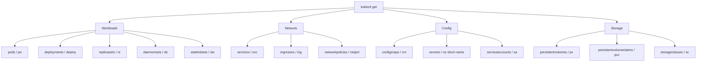
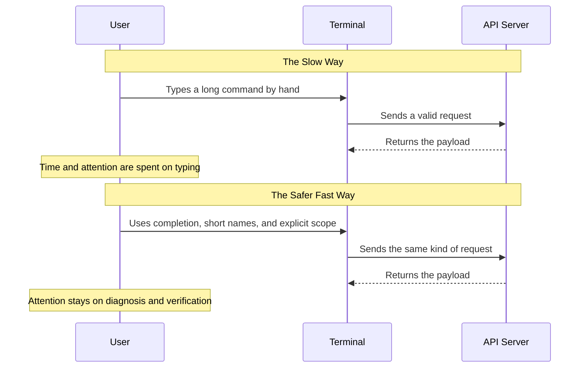

> **Складність**: `[ШВИДКО]` — налаштуйте один раз, отримуйте користь щоразу, коли працюєте з кластером
>
> **Час на проходження**: 15–20 хвилин
>
> **Передумови**: Модуль 0.1 із робочим кластером Kubernetes v1.35 або вище та налаштованою конфігурацією `kubectl`

## Чого ви навчитеся

- **Впровадити** доповнення команд в оболонці та механізм виявлення команд kubectl, щоб під тиском часу точно обирати довгі назви ресурсів, назви Подів, простори імен і підкоманди.
- **Діагностувати** дрейф контексту та простору імен до внесення змін у кластер за допомогою перевірок у запрошенні, явних команд верифікації та повторюваної рутини перед кожною командою.
- **Спроєктувати** робочі процеси імперативної генерації YAML, які використовують вивід `dry-run` на стороні клієнта як безпечну відправну точку для екзаменаційних маніфестів і перегляду виробничих змін.
- **Оцінити** компроміси переносності оболонки та мультиплексування терміналів між Bash, POSIX `sh`, Zsh, Fish, tmux та інструментами запрошення для операцій з Kubernetes.

## Чому цей модуль важливий

Гіпотетичний сценарій: ви на половині блоку з усунення несправностей у стилі CKA, коли завдання просить полагодити CoreDNS на `cluster-b`, але ваш термінал усе ще під'єднаний до `cluster-a` з попереднього завдання. Ви швидко набираєте команду, вона виконується успішно, і ніщо в поточному питанні не покращується, тому що ви змінили не ту площину управління. Помилка не є провалом у розумінні концепції Kubernetes; це провал у робочому процесі оболонки. Майстерність роботи з оболонкою — це дисципліна, яка робить правильну дію швидкою, а неправильну дію складніше виконати непомітно.

Той самий патерн виникає й поза іспитами щоразу, коли оператор тримає відкритими кілька терміналів, просторів імен і контекстів kubeconfig під час інциденту. Швидкість допомагає лише тоді, коли вона поєднана з орієнтуванням. Швидка команда не в тому просторі імен гірша за повільну команду в правильному, бо швидка команда завдає впевненої шкоди. Цей модуль розглядає оболонку як операційний інтерфейс: доповнення зменшує кількість друкарських помилок, короткі назви ресурсів зменшують тертя, перевірки контексту зменшують міжкластерні помилки, а генерація через `dry-run` перетворює імперативні команди на придатні для редагування маніфести.

Ви не запам'ятаєте кожен прапорець у Kubernetes v1.35, і вам це не потрібно. Вам потрібен робочий цикл для виявлення допустимих команд, генерації допустимого YAML, перевірки того, де ви перебуваєте, та верифікації результату. Мета не в тому, щоб створити колекцію хитромудрих dotfile; мета — побудувати нудну, відтворювану рутину в терміналі, яка продовжує працювати, коли ви втомлені, поспішаєте чи під'єднані до важливого кластера.

```text
Before: kubectl get pods --namespace kube-system --output wide
After:  kubectl get po -n kube-system -o wide

Before: kubectl describe pod nginx-deployment-abc123
After:  kubectl describe po nginx<TAB>

Before: kubectl config use-context production-cluster
After:  kubectl config use-context production<TAB>
```

Аналогія з командою механіків на піт-стопі корисна, якщо тримати її приземленою. Команда на піт-стопі швидка, бо кожен інструмент має стабільне місце, а кожен рух відпрацьовано до моменту під тиском. Ваша оболонка має працювати так само. Доповнення — це підписана стійка з інструментами, історія команд — звичний рух руки, явна верифікація контексту — оклик про безпеку, а згенерований YAML — підготовлена запасна деталь, яку ви оглядаєте перед встановленням.

## Модель виконання оболонки та переносність

Перш ніж додавати будь-що до файлу запуску, розділіть три ідеї, які часто зливають докупи: оболонку, у яку ви набираєте текст, оболонку, яку оголошує скрипт, та оболонку, яку обирає системна служба, коли оголошення відсутнє. Bash, Zsh, Fish та POSIX `sh` перетинаються в повсякденному вжитку, але вони не є взаємозамінними мовами. Команда, скопійована з інтерактивного запрошення Bash, може зазнати невдачі в cron-завданні, якщо завдання виконується під `/bin/sh`, а на багатьох системах Ubuntu `/bin/sh` указує на `dash` — невелику POSIX-орієнтовану оболонку, а не на Bash.

Ця відмінність має значення, бо багато зручних можливостей, якими користуються оператори Kubernetes, є специфічними для оболонки. Підстановка процесу, записана як `<(command)`, поширена в прикладах Bash та Zsh, але вона не є можливістю POSIX `sh`. Масиви Bash, функції доповнення та хуки запрошення також належать до шару інтерактивної оболонки. Розглядайте налаштування інтерактивної оболонки як зручність для оператора, а скрипти — як окремі артефакти, які мають оголошувати свій інтерпретатор через shebang і уникати прихованих інтерактивних припущень.

Зробіть паузу і спрогнозуйте: якщо рядок `source <(kubectl completion bash)` працює у вашому запрошенні, чого ви очікуєте, якщо той самий рядок виконає `/bin/sh`? Важлива відповідь — не просто «він зазнає невдачі». Корисний діагноз полягає в тому, що `/bin/sh` розбирає файл ще до того, як `kubectl` узагалі запуститься, бачить синтаксис, який не підтримує, і зупиняється із синтаксичною помилкою оболонки. Це підказує вам виправити межу інтерпретатора, а не ганятися за автентифікацією Kubernetes, RBAC чи зв'язністю з кластером.

```bash
# Install bash-completion if it is not already present.
sudo apt-get update
sudo apt-get install -y bash-completion
```

Наступна команда навмисно призначена для файлу запуску інтерактивного Bash. Вона просить `kubectl` вивести код доповнення для Bash і просить Bash підвантажувати цей згенерований код під час запуску нової інтерактивної оболонки. Це зручно для лабораторної робочої станції та для одноразового екзаменаційного термінала, але це не патерн для переносних виробничих скриптів. Якщо ви пишете автоматизацію, викликайте `kubectl` напряму та тримайте налаштування запуску оболонки поза тілом скрипта.

```bash
# Enable kubectl completion for future interactive Bash shells.
echo 'source <(kubectl completion bash)' >> ~/.bashrc
source ~/.bashrc
```

Ви також можете завантажити правила доповнення лише для поточної оболонки, що корисно, коли ви перевіряєте тимчасовий термінал або працюєте в обмеженому середовищі, де не хочете змінювати файли запуску. Ця версія так само залежить від підставляння процесу (process substitution) Bash, тому її місце — в інтерактивному запрошенні Bash, а не всередині POSIX-скрипта. Перевага — миттєвий зворотний зв'язок: якщо доповнення починає працювати зараз, то і згенерований скрипт доповнення, і локальний бінарний файл `kubectl` доступні.

```bash
# Load kubectl completion only in the current Bash shell.
source <(kubectl completion bash)
```

Ментальна модель проста: `kubectl` надає знання про команди, ресурси та прапорці Kubernetes, тоді як ваша оболонка забезпечує поведінку натискання клавіш, що перетворює `<TAB>` на пошук. Коли доповнення не працює, діагностуйте обидві сторони. Підтвердьте, що оболонка завантажила підтримку доповнення, підтвердьте, що `kubectl completion bash` виводить код, і підтвердьте, що поточний користувач може дістатися кластера, коли доповненню потрібні актуальні назви ресурсів.

```bash
# Confirm that kubectl can generate completion code.
kubectl completion bash | head
```

Bash є сильним вибором за замовчуванням для підготовки до CKA, бо середовище іспиту орієнтоване на Linux, і більшість прикладів припускають доповнення у стилі Bash. Zsh та Fish — чудові інтерактивні оболонки для персональних робочих станцій, але вони мають власні системи доповнення та файли запуску. Професійне налаштування може використовувати будь-яку з них, за умови, що ви можете пояснити, який шар відповідає за доповнення, який шар — за відображення запрошення, а який — за скрипти, які запускатимуть інші люди або системи CI.

```bash
# Confirm which shell is running your current interactive session.
printf '%s\n' "$SHELL"
printf '%s\n' "$0"
```

## Доповнення, короткі назви та виявлення команд

Доповнення — це не лише засіб скорочення набору тексту; це інструмент точності. Назви об'єктів Kubernetes часто містять згенеровані суфікси, і поспішний ручний набір довгої назви Пода створює `NotFound`-помилки, яких можна уникнути. Доповнення дає змогу оболонці запитати Kubernetes, які назви є допустимими в поточному контексті та просторі імен, а потім підставити точний збіг. Це перетворює проблему нечіткої пам'яті на проблему вибору, що значно простіше під тиском іспиту.

```bash
kubectl get <TAB><TAB>
```

Коли таке розгортання працює, ви маєте побачити широкий список дієслів, ресурсів або варіантів доповнення залежно від позиції курсора. Точне відображення залежить від оболонки та пакета доповнення, тож не запам'ятовуйте форму екрана. Натомість переконайтеся, що повторні натискання `<TAB>` показують корисні варіанти і що часткові назви ресурсів звужують список. Якщо нічого не відбувається, поверніться до кроків завантаження доповнення, перш ніж звинувачувати кластер.

```bash
kubectl get pods -n kube<TAB>
```

Доповнення простору імен особливо цінне, бо написання назви простору імен у практичних середовищах часто відрізняється лише на кілька символів. Завдання може розмістити несправне робоче навантаження в `kube-system`, `app-prod` або у спеціально створеному просторі імен із довгою назвою. Якщо доповнення заповнює назву, ви уникаєте тихого пошуку не в тій області. Якщо доповнення не заповнює назву, виконайте явний перелік просторів імен, перш ніж припускати, що робоче навантаження відсутнє.

```bash
kubectl describe pod cal<TAB> -n kube-system
```

Короткі назви ресурсів відрізняються від псевдонімів (aliases) оболонки. Вони визначаються інформацією про виявлення API Kubernetes і відображаються командою `kubectl api-resources`, тому працюють усюди, де працює `kubectl`. `po` для Подів, `svc` для Сервісів і `deploy` для Деплойментів — це не локальні трюки; це скорочення ресурсів Kubernetes. Саме тому їх безпечно використовувати в прикладах, скриптах і під час підготовки до іспиту, тоді як локальні псевдоніми оболонки слід розглядати як необов'язкову інтерактивну насолоду.

| Повна назва | Коротка | Приклад |
|-----------|-------|---------|
| pods | po | `kubectl get po` |
| deployments | deploy | `kubectl get deploy` |
| services | svc | `kubectl get svc` |
| namespaces | ns | `kubectl get ns` |
| nodes | no | `kubectl get no` |
| configmaps | cm | `kubectl get cm` |
| secrets | none | `kubectl get secrets` |
| persistentvolumes | pv | `kubectl get pv` |
| persistentvolumeclaims | pvc | `kubectl get pvc` |
| serviceaccounts | sa | `kubectl get sa` |
| replicasets | rs | `kubectl get rs` |
| daemonsets | ds | `kubectl get ds` |
| statefulsets | sts | `kubectl get sts` |
| ingresses | ing | `kubectl get ing` |
| networkpolicies | netpol | `kubectl get netpol` |
| storageclasses | sc | `kubectl get sc` |



Найшвидший спосіб тримати цей список чесним — запитати кластер. Ресурси API можуть змінюватися, коли встановлено CustomResourceDefinitions, а агреговані API можуть додавати види (kinds), яких немає у вашій пам'яті. `kubectl api-resources` показує назви, короткі назви, групи API, чи є ресурс просторовим (namespaced), і вид. Цей вивід перетворює виявлення на звичку, а не на вправу з пошуку.

```bash
kubectl api-resources
kubectl api-resources --namespaced=true
kubectl api-resources --namespaced=false
```

Для інтерактивного використання ви можете визначити функції, які заощаджують набір тексту, не покладаючись на однолітерний псевдонім. Функції легше читати у спільному файлі запуску, і вони можуть безпечно передавати всі аргументи через `"$@"`. Вони все одно належать до налаштування вашої інтерактивної оболонки, а не до скриптів, які інші машини запускатимуть без підвантаження ваших dotfile. У навчальних прикладах для копіювання й вставлення продовжуйте використовувати повний `kubectl`, щоб команда залишалася придатною для запуску кожним учнем.

```bash
# Optional interactive helpers for your own shell, not required by the course.
kgp() { kubectl get pods "$@"; }
kgpa() { kubectl get pods -A "$@"; }
kgs() { kubectl get svc "$@"; }
kgn() { kubectl get nodes "$@"; }
kgd() { kubectl get deploy "$@"; }
```

Який підхід ви обрали б тут і чому: локальну функцію, що заощаджує кілька натискань клавіш, чи повну команду `kubectl`, яку будь-який колега може вставити у runbook? У приватному екзаменаційному терміналі функція може бути корисною, якщо ви її відпрацювали. У документації, нотатках до інцидентів і скриптах повна команда — кращий вибір за замовчуванням, бо вона несе у собі своє значення та передумови.

```bash
# Full commands remain the portable form.
kubectl get po -A -o wide
kubectl get deploy -n default
kubectl describe po nginx -n default
```

Історія команд — це друга половина виявлення команд. GNU Readline дає користувачам Bash зворотний пошук, навігацію до початку та кінця рядка й видалення слів без потреби у зовнішніх інструментах. Ці скорочення не є специфічними для Kubernetes, але вони мають значення, бо багато команд Kubernetes відрізняються лише простором імен, селектором міток або прапорцем виводу. Редагувати правильну попередню команду швидше й безпечніше, ніж відтворювати схожу команду з пам'яті.

```text
Ctrl+R      Reverse-search command history
Ctrl+A      Move to the beginning of the line
Ctrl+E      Move to the end of the line
Ctrl+W      Delete the previous word
!!          Re-run the previous command, often as part of sudo !!
```

## Дисципліна контексту та простору імен

Контекст — це ідентичність кластера у вашому kubeconfig, тоді як простір імен — це область за замовчуванням для просторових ресурсів усередині цього контексту. Вони розв'язують різні задачі. Помилка контексту надсилає запит не на той API-сервер. Помилка простору імен надсилає запит на правильний API-сервер, але в неправильний логічний простір. Обидві можуть виглядати як «Kubernetes зламався», коли насправді ваш термінал спрямований на іншу ціль, ніж описано в завданні.

```bash
# List every configured context and show the current one.
kubectl config get-contexts
kubectl config current-context
```

Перемикання контексту має бути першим активним кроком для будь-якого екзаменаційного питання чи виробничої процедури, що називає кластер. Не починайте з переліку Подів і висновків з виводу; це привчає вас довіряти випадковому стану. Прочитайте завдання, перемкніться на названий контекст, підтвердьте поточний контекст і лише тоді оглядайте робочі навантаження. Ця рутина здається повільною на перших кількох повтореннях, а потім стає швидшою за відновлення після однієї команди не в тому кластері.

```bash
# Switch to the context named by the task, then confirm it.
kubectl config use-context <context-name>
kubectl config current-context
```

Дисципліна простору імен має два допустимі стилі. Ви можете використовувати явні прапорці `-n <namespace>` у кожній команді, що робить намір кожної команди очевидним, або ви можете встановити простір імен за замовчуванням для поточного контексту, що зменшує повторення під час зосередженого завдання. Небезпека простору імен за замовчуванням полягає в тому, що він зберігається у стані kubeconfig. Якщо ви його встановлюєте, перевірте його та скиньте, коли залишаєте завдання.

```bash
# Set the default namespace for the current context.
kubectl config set-context --current --namespace=kube-system

# Confirm the namespace attached to the current context.
kubectl config view --minify --output 'jsonpath={..namespace}'; printf '\n'

# Return to the default namespace when the focused task is done.
kubectl config set-context --current --namespace=default
```

Явні прапорці простору імен кращі, коли ви пишете нотатки, навчаєте або виконуєте послідовність, яку можуть скопіювати в інший термінал. Вони роблять ціль видимою в кожному рядку. Значення за замовчуванням кращі, коли ви багаторазово оглядаєте багато об'єктів в одному просторі імен і маєте чіткий крок очищення. Головне — обирати свідомо, а не дозволяти вчорашньому налаштуванню kubeconfig обирати за вас.

```bash
# Self-documenting commands for shared notes and runbooks.
kubectl get po -n kube-system -o wide
kubectl describe deploy coredns -n kube-system
kubectl get events -n kube-system --sort-by=.lastTimestamp
```

Гіпотетичний сценарій: оператор завершує налагодження простору імен staging, а потім приєднується до виробничого містка зв'язку (bridge call). Його запрошення показує лише робочий каталог, тож кожна команда виглядає так само, як у попередньому терміналі. Запрошення з урахуванням контексту не запобігло б кожній помилці, але воно тримало б активний контекст у полі зору оператора перед кожною командою. Саме тому дизайн запрошення — це не оздоблення; це сигнал безпеки з низьким тертям.

```bash
# A simple pre-flight function you can run before mutating commands.
kubectl_whereami() {
  printf 'context=%s\n' "$(kubectl config current-context)"
  printf 'namespace=%s\n' "$(kubectl config view --minify --output 'jsonpath={..namespace}')"
}
```

Перш ніж запускати це, якого виводу ви очікуєте після встановлення простору імен на `kube-system`? Функція має вивести активний контекст, а потім `namespace=kube-system`. Якщо рядок простору імен порожній, Kubernetes трактує простір імен за замовчуванням як `default`, що відрізняється від явно налаштованого названого простору імен у kubeconfig.

```bash
kubectl_whereami
```

## Імперативна генерація YAML та безпечне видалення

Іспити з Kubernetes і реальне реагування на інциденти однаково винагороджують цикл «згенерувати — відредагувати — перевірити». Ручне написання повного маніфесту з порожнього файлу є повільним і схильним до помилок, бо відступи, версія API, розташування полів і форма об'єкта мають бути правильними одночасно. Імперативні команди `kubectl` можуть створити допустимий вихідний об'єкт, а `--dry-run=client -o yaml` дає змогу захопити цей об'єкт, не створюючи його. Після цього ви свідомо редагуєте результат і перевіряєте його перед застосуванням.

```bash
# Optional interactive variable for a focused shell session.
export do='--dry-run=client -o yaml'
```

Ця змінна — зручність, а не вимога. Вона розгортається у два звичайні прапорці `kubectl`, тож ви маєте знати повну форму, навіть якщо інтерактивно користуєтеся короткою змінною. У спільній документації віддавайте перевагу повним прапорцям, коли важлива ясність; у персональному тренуванні на час змінна є прийнятною, якщо ви її відпрацювали і можете відновитися, коли вона не задана.

```bash
# Generate a Pod manifest without creating the Pod.
kubectl run nginx --image=nginx --dry-run=client -o yaml > pod.yaml
```

```bash
# The same idea using the optional interactive variable.
kubectl run nginx --image=nginx $do > pod.yaml
```

Деплойменти — поширене місце, де генерація заощаджує час, бо об'єкт має вкладені селектори, шаблони Подів та налаштування реплік. Згенерований YAML не завжди є остаточною відповіддю, але він дає вам допустиму структуру. Ви можете додати запити ресурсів, мітки, селектори вузлів, толерантності (tolerations) чи проби у правильному місці замість того, щоб будувати весь об'єкт з пам'яті.

```bash
kubectl create deployment web --image=nginx --replicas=3 --dry-run=client -o yaml > deploy.yaml
```

Сервіси — ще один сильний приклад використання, бо імперативна команда може швидко виразити поширену форму. Після генерації уважно перевірте селектори. Сервіс із неправильним селектором є синтаксично допустимим, але операційно марним, бо не матиме жодних відповідних кінцевих точок (endpoints). Оболонка може допомогти створити об'єкт, але ви все одно маєте міркувати про мітки та зв'язки.

```bash
kubectl create service clusterip web --tcp=80:80 --dry-run=client -o yaml > svc.yaml
```

ConfigMap і Secret також можна згенерувати, але будьте обережні зі значеннями з прикладів. Не вписуйте реалістичні облікові дані у практичні файли, історію команд, скриншоти чи Git-коміти. Використовуйте безпечні заповнювачі та видаляйте практичні артефакти після завершення вправи. Оболонка запам'ятовує більше, ніж люди очікують, тож розглядайте історію команд як частину вашої операційної поверхні.

```bash
kubectl create configmap app-config --from-literal=mode=practice --dry-run=client -o yaml > cm.yaml
kubectl create secret generic app-secret --from-literal=password=demo-password --dry-run=client -o yaml > secret.yaml
```

Крок верифікації — це те, що робить робочий процес надійним. `dry-run` на стороні клієнта вловлює багато структурних помилок до живого створення чи оновлення. Він не доводить, що робоче навантаження поводитиметься правильно, але він доводить, що `kubectl` може розібрати YAML і що базова схема об'єкта прийнятна для цього шляху команди. Після застосування ви все одно перевіряєте живий об'єкт, події та статус.

```bash
kubectl apply -f pod.yaml --dry-run=client
kubectl apply -f deploy.yaml --dry-run=client
kubectl apply -f svc.yaml --dry-run=client
```

Примусове видалення належить до іншої ментальної категорії. Прапорці `--force --grace-period=0` наказують Kubernetes видалити об'єкт API без звичної поведінки граційного очікування. Це може бути доречним в одноразовій екзаменаційній лабораторії, коли Под застряг і завдання вимагає рухатися далі, але це небезпечно для навантажень зі станом (stateful), об'єктів із finalizer і виробничого налагодження. Завжди оглядайте об'єкт і підтверджуйте контекст перед використанням негайного видалення.

```bash
# Optional interactive variable for a focused lab session.
export now='--force --grace-period=0'
```

```bash
# Inspect first, then force delete only when the risk is acceptable.
kubectl get po stuck-pod -n default -o wide
kubectl describe po stuck-pod -n default
kubectl delete po stuck-pod -n default --force --grace-period=0
```

Найшвидший безпечний робочий процес — це не «завжди примусово». Це «з'ясувати, чому звичайне видалення не завершується, вирішити, чи ресурс є одноразовим, і застосувати найменшу дію, яка розв'язує завдання». У виробництві застряглий finalizer може вказувати на зовнішній контролер чи операцію зі сховищем, що потребують уваги. В екзаменаційній лабораторії об'єкт для оцінювання може просто потребувати зникнення. Команда та сама, але операційна оцінка — ні.

```bash
# Save the interactive conveniences for future Bash sessions.
echo "export do='--dry-run=client -o yaml'" >> ~/.bashrc
echo "export now='--force --grace-period=0'" >> ~/.bashrc
source ~/.bashrc
```

## Мультиплексування терміналів та усвідомлення запрошення

Скорочення Readline допомагають усередині одного командного рядка, але інциденти часто потребують кількох живих представлень: події в одній панелі, логи в іншій, команда `watch` у третій та обережне редагування маніфесту в четвертій. Мультиплексор терміналів, такий як tmux, дає вам стійкі сесії, розбиття на панелі та відновлення після обриву мережі. Сам по собі він не робить вас кращим діагностом Kubernetes, але він не дає діагностичному робочому простору розвалитися, коли змінюються з'єднання чи розкладка вікон.

```bash
# Start a named tmux session for Kubernetes work.
tmux new-session -s cka-practice
```

Корисна розкладка tmux тримає пасивне спостереження окремо від мутаційних команд. Розмістіть `kubectl get events --sort-by=.lastTimestamp -A --watch` або спостереження в межах простору імен у панелі, де ви випадково не наберете руйнівні команди. Тримайте редагування та застосування в іншій панелі. Це термінальний еквівалент розділення панелі приладів і перемикача керування: обидва корисні, але вони не повинні запрошувати ту саму м'язову пам'ять.

```bash
# In one pane, observe cluster activity.
kubectl get events -A --sort-by=.lastTimestamp --watch
```

```bash
# In another pane, observe pods in the namespace you are actively fixing.
kubectl get po -n kube-system -o wide --watch
```

Усвідомлення запрошення — це легша версія тієї самої ідеї. Запрошення, що показує контекст і простір імен Kubernetes, дає вам постійний сигнал орієнтування, не вимагаючи додаткової команди. Starship та подібні інструменти запрошення можуть відображати це послідовно в різних оболонках, тоді як написані вручну фрагменти `PS1` часто є специфічними для Bash. Компроміс — це керування залежностями: переносний рушій запрошення — це ще один бінарний файл для встановлення, тоді як просте запрошення Bash легше перевірити, але важче поширити серед користувачів Zsh і Fish.

```toml
# Example Starship Kubernetes prompt configuration.
[kubernetes]
disabled = false
format = '[$context \($namespace\)](bold blue) '
```

Повне налаштування Bash нижче зберігає початковий задум модуля, водночас уникаючи однолітерного псевдоніма `kubectl` у придатних для запуску прикладах. Воно завантажує доповнення, визначає читабельні необов'язкові допоміжні функції, експортує змінні для `dry-run` та негайного видалення і залишає повні команди `kubectl` як канонічну форму для скриптів і спільних нотаток. Копіюйте лише те, що ви відпрацювали; файл запуску, якого ви не розумієте, стає ще одним джерелом збоїв.

```bash
# ============================================
# Kubernetes CKA Exam Shell Configuration
# ============================================

# kubectl completion for interactive Bash.
source <(kubectl completion bash)

# Optional interactive helper functions.
kgp() { kubectl get pods "$@"; }
kgpa() { kubectl get pods -A "$@"; }
kgs() { kubectl get svc "$@"; }
kgn() { kubectl get nodes "$@"; }
kgd() { kubectl get deploy "$@"; }
kgpv() { kubectl get pv "$@"; }
kgpvc() { kubectl get pvc "$@"; }
kdp() { kubectl describe pod "$@"; }
kds() { kubectl describe svc "$@"; }
kdn() { kubectl describe node "$@"; }
kdd() { kubectl describe deploy "$@"; }
kl() { kubectl logs "$@"; }
klf() { kubectl logs -f "$@"; }
ka() { kubectl apply -f "$@"; }
kdfile() { kubectl delete -f "$@"; }
kx() { kubectl config use-context "$@"; }
kns() { kubectl config set-context --current --namespace="$@"; }
krun() { kubectl run debug --image=busybox --rm -it --restart=Never -- "$@"; }

# Environment variables for focused interactive drills.
export do='--dry-run=client -o yaml'
export now='--force --grace-period=0'

# ============================================
```

Після зміни файлів запуску перевірте поведінку в новій оболонці або одноразово підвантаживши файл. Не припускайте, що файл завантажився успішно. Невідповідність однієї лапки в `.bashrc` може зламати наступні рядки, а відсутній пакет доповнення може зробити налаштування лише частково активним. Верифікація має перевірити бінарний файл, контекст, генерацію доповнення та змінні, які ви очікуєте використовувати під час тренувань.

```bash
source ~/.bashrc
command -v kubectl
kubectl config current-context
kubectl completion bash >/tmp/kubectl-completion-check
printf '%s\n' "$do"
printf '%s\n' "$now"
```

Порівняння швидкості залишається реальним навіть тоді, коли ви уникаєте однолітерних псевдонімів. Рідні для Kubernetes короткі назви, доповнення, пошук в історії та змінні `dry-run` усувають більшість тертя, не ховаючи команду за локальною магією. Суть не в тому, щоб набрати якомога менше символів; суть у тому, щоб набрати команду, яка є швидкою, точною та зрозумілою, коли ви пізніше перечитуєте свою історію термінала.

```bash
# Baseline commands.
kubectl get pods --all-namespaces --output wide
kubectl describe pod <pod-name> --namespace default
kubectl config use-context production
```

```bash
# Optimized but still portable commands.
kubectl get po -A -o wide
kubectl describe po <pod-name> -n default
kubectl config use-context prod<TAB>
```

```bash
# YAML generation with the explicit flags.
kubectl run nginx --image=nginx --dry-run=client -o yaml > nginx.yaml
```



Нарешті, пам'ятайте, що сам `kubectl` є частиною вашого набору для майстерності роботи з оболонкою. `kubectl explain` дає документацію на рівні полів зі схеми API, а `--help` показує приклади команд, не залишаючи термінала. Під час іспиту правила зовнішнього перегляду в браузері мають значення; під час виробничих інцидентів доступ до документації може бути повільним або відфільтрованим. Сильний робочий процес у терміналі спершу використовує локальне виявлення і звертається до браузерної документації, коли локального виявлення недостатньо.

```bash
kubectl explain pod.spec.containers
kubectl explain deployment.spec.strategy
```

```bash
kubectl create --help
kubectl run --help
kubectl expose --help
```

### Розбір прикладу: від плутанини до стабільного циклу в оболонці

Розгляньмо зосереджену вправу з усунення несправностей, де завдання каже, що робоче навантаження в `payments` не може дістатися свого Сервісу. Слабкий робочий процес в оболонці починається з будь-якої команди, що випадково опинилася в історії, можливо, переліку Подів по всьому кластеру, після чого йде здогад про простір імен. Сильніший робочий процес починається із закріплення термінала: підтвердити контекст, підтвердити або явно назвати простір імен, перелічити Сервіс і Поди з короткими назвами ресурсів Kubernetes, а потім порівняти селектори та мітки. Самі команди не є вражаючими; навичкою є послідовність.

Перший корисний крок — зробити невидиму ціль видимою. Якщо питання чи тікет називає контекст, перемкніться на нього й підтвердьте його. Якщо він називає простір імен, вирішіть, чи будете ви використовувати `-n payments` у кожній команді, чи встановите простір імен для поточного контексту. У навчальному модулі явні прапорці `-n` кращі, бо кожна команда несе свою ціль. У терміналі на час встановлення простору імен може бути прийнятним, якщо ви його перевіряєте та скидаєте після цього.

Коли ціль стає видимою, використовуйте команди виявлення, що відповідають на зв'язки, а не на ізольовані факти. `kubectl get svc -n payments -o wide` каже вам форму селектора Сервісу, а `kubectl get po -n payments --show-labels` каже, чи можуть якісь мітки Подів збігтися з цим селектором. Якщо мітки не збігаються, перезапуск Подів — це шум. Оболонка допомогла, бо доповнення та історія зробили команди швидкими, але діагностична цінність виникла з порівняння двох частин стану Kubernetes.

Саме тут історія команд стає чимось більшим за зручність. Після того, як ви набрали одну правильну команду в межах простору імен, `Ctrl+R` та редагування рядка дають вам повторно використати простір імен і прапорці виводу, змінюючи лише ресурс чи поле, яке ви оглядаєте. Ви уникаєте відтворення схожих команд з нуля та уникаєте випадкового пропуску прапорця простору імен у другій чи третій команді. Досвідчений користувач оболонки редагує відому-хорошу форму команди, а не багаторазово складає нові команди під тиском.

Той самий цикл застосовується, коли ви створюєте виправлення. Генеруйте маніфест лише після того, як знаєте, який зв'язок має змінитися. Якщо селектор Сервісу неправильний, ви можете виправити Сервіс, відредагувати маніфест чи перегенерувати чистий об'єкт залежно від завдання. Якщо мітка шаблону Деплоймента неправильна, вам потрібно врахувати поведінку ReplicaSet і те, чи зміна шаблону створить нові Поди. Швидкість оболонки цінна, бо вона дає вам більше часу на ці рішення Kubernetes, а не тому, що вона їх замінює.

### Розбір прикладу: перетворення виводу dry-run на перевірений маніфест

Генерацію через `dry-run` іноді хибно розуміють як ярлик для людей, які не знають YAML. Краще тлумачення таке: генерація через `dry-run` дає вам чернетку, сформовану за схемою, яку ви все одно маєте перевірити. Згенерований файл зазвичай містить правильні `apiVersion`, `kind`, `metadata` та базовий каркас `spec`. Він може не містити обмежень ресурсів, проб, міток, спорідненості (affinity), толерантностей чи точного зв'язку селектора, який вам потрібен. Ваше завдання — використати згенеровану структуру як відправну точку, а потім зробити найменше доцільне редагування.

В умовах іспиту найбезпечніший ритм — згенерувати, відкрити, відредагувати, перевірити, застосувати, верифікувати. Пропуск кроку «відкрити й відредагувати» створює об'єкти до того, як вони задовольняють завдання. Пропуск верифікації робить помилки відступів YAML дорогими. Пропуск кінцевої перевірки припускає, що успішна відповідь API означає, що робоче навантаження здорове, що рідко буває правдою для завдань з планування, мережі чи конфігурації. Оболонка може стиснути механічні частини цього циклу, але вона не повинна прибирати контрольні точки перевірки.

Наприклад, генерація Деплоймента з трьома репліками дає вам корисний об'єкт, але вона не доводить, що ці Поди стануть готовими (Ready). Після застосування ви все одно оглядаєте `kubectl get deploy`, `kubectl get rs`, `kubectl get po` та події в цільовому просторі імен. Якщо Поди в стані Pending, крок генерації YAML не був проблемою; обмеження планування, ресурси вузла, taint'и або поведінка завантаження образу можуть бути причиною. Сильний цикл в оболонці тримає вас у русі від створення об'єкта до діагностики живого стану без зміни інструментів.

Є також перевага усвідомлення версій. Клієнти та сервери Kubernetes v1.35 розкривають поточну поведінку API, а згенерований вивід `kubectl` відображає команду й версію, якими ви насправді користуєтеся. Копіювання застарілого маніфесту з пам'яті може протягнути застарілі поля чи старі припущення. Вивід `dry-run` не є замінником документації, але він прив'язаний до набору інструментів перед вами. Це робить його корисною першою чернеткою, коли час обмежений, а правильність має значення.

### Звички відновлення, коли оболонка не ваша

Середовище CKA, jump-хост і робоча станція колеги можуть не мати ваших dotfile. Це не має лякати, якщо ви відпрацювали базові команди. Послідовність відновлення коротка: визначити оболонку, завантажити доповнення, якщо підтримка Bash присутня, експортувати необов'язкові змінні, якщо ви їх хочете, і продовжити з повними командами `kubectl`. Якщо допоміжна функція відсутня, ваш робочий процес трохи сповільнюється, але не розвалюється. У цьому й полягає різниця між оптимізацією та залежністю.

Коли зручність відмовляє, опирайтеся бажанню налагоджувати все одразу. Якщо доповнення не працює, перевірте генерацію доповнення та завантаження оболонкою. Якщо команда не може знайти ресурс, перевірте контекст і простір імен, перш ніж припускати, що об'єкт зник. Якщо вивід `dry-run` відрізняється від очікуваного, перевірте точну підкоманду та прапорці `kubectl`, які ви використали. Кожен клас збоїв має поряд свій діагноз, і оболонка залишається спокійною, коли ви опрацьовуєте один шар за раз.

Це шарувате мислення особливо важливе для меж POSIX. Рядок, місце якого в `.bashrc`, не є автоматично безпечним у скрипті, а скрипт, що починається з `#!/bin/sh`, пообіцяв уникати синтаксису лише для Bash. Багато операційних збоїв, які виглядають загадковими, є просто порушеними обіцянками між вмістом файлу та інтерпретатором. Якщо вам потрібен Bash, скажіть про це через `#!/usr/bin/env bash` на початку скрипта, а потім тестуйте його як скрипт, а не лише вставляючи рядки у ваше інтерактивне запрошення.

Інструменти запрошення заслуговують на ту саму дисципліну. Запрошення, що показує контекст Kubernetes, корисне лише тоді, коли воно точне, швидке та ненав'язливе. Якщо воно запускає повільну команду перед кожним запрошенням, воно може зробити термінал дратівливим і спонукати людей його вимкнути. Якщо воно приховує помилки, воно може створити хибну впевненість. Тримайте конфігурацію запрошення простою, тестуйте її в новій оболонці та переконайтеся, що ви досі знаєте явні команди `kubectl config`, коли запрошення недоступне.

### Побудова м'язової пам'яті без приховування механіки

Практика має зробити надійний шлях природним. Це означає тренування послідовностей команд, а не ізольованих команд. Корисне тренування — це не «набрати найкоротший можливий перелік Подів»; це «перемкнути контекст, підтвердити простір імен, перелічити Поди з широким виводом, описати один Под, прочитати події та вирішити наступний діагностичний крок». Послідовність тренує увагу. Якщо ви тренуєте лише швидкість, ви можете стати швидкими в пропусканні перевірок, які захищають ваш бал і ваш кластер.

Інше корисне тренування — чергувати явні прапорці та налаштовані значення за замовчуванням. Виконайте кілька команд із `-n kube-system`, потім встановіть поточний простір імен і виконайте еквівалентні команди без прапорця, а потім скиньте до default. Це навчає вас, який стан живе в командному рядку, а який — у kubeconfig. Люди, які ніколи не тренують обидва стилі, часто пізніше хибно читають власну історію термінала, бо не можуть сказати, чи команда несла свій простір імен явно, чи успадкувала його непомітно.

Ви також маєте тренувати збій навмисно. Скиньте змінну `dry-run` і відновіться, набравши повні прапорці. Відкрийте нову оболонку без завантаженого доповнення й відновіться, підвантаживши доповнення. Встановіть простір імен на недефолтне значення, помітьте це і скиньте його. Ці малі збої дешеві в лабораторії та дорогі під час завдання на час. Тренування відновлення перетворює відсутню зручність на невеликий гачок, а не на паніку.

Останнє правило м'язової пам'яті — проговорювати ціль перед її зміною. Скажіть, навіть подумки, «контекст, простір імен, ресурс, дія» перед натисканням Enter на команді apply, delete, scale, cordon чи drain. Це звучить повільно, але після практики коштує менше за секунду. Що важливіше, це змушує команду пройти через ту частину вашого мозку, що перевіряє намір. Майстерність роботи з оболонкою — це не лише про руки; це про побудову повторюваної паузи саме в той момент, коли помилки стають реальними.

### Що зберегти в командних середовищах

Команди мають стандартизувати ті частини майстерності роботи з оболонкою, які покращують спільну надійність, і залишати персональну ергономіку персональною. Усі можуть погодитися на повні команди `kubectl` у runbook'ах, явні простори імен у нотатках до інцидентів, верифікацію через `dry-run` перед застосуванням згенерованих файлів і підтвердження контексту перед мутаційними операціями. Окремі інженери все одно можуть обирати Bash, Zsh, Fish, розкладки tmux, теми запрошення та допоміжні функції. Ця межа тримає співпрацю читабельною, водночас дозволяючи людям працювати ефективно.

Ця межа також полегшує перегляд коду. Рецензент може міркувати про `kubectl apply -f deploy.yaml --dry-run=client`, не знаючи псевдонімів автора. Він може побачити `-n payments` у команді й пов'язати його з областю інциденту. Він може відтворити `kubectl api-resources` на цільовому кластері й підтвердити, чи існує коротка назва. Спільні команди мають мінімізувати приховані припущення, бо приховані припущення — це саме те, що намагаються знайти рецензенти.

Для виробничих runbook'ів розміщуйте команди верифікації поряд із командами дії. Якщо runbook каже застосувати маніфест, він також має сказати, як перевірити розгортання, події, кінцеві точки чи логи. Якщо він каже видалити ресурс, він має назвати простір імен і описати, як підтвердити, що ресурс зник. Оптимізований щодо оболонки оператор може швидко пройти ці перевірки, але runbook має залишатися зрозумілим для наступного інженера, який не має нічого з вашого локального налаштування.

Нарешті, задокументуйте шлях відновлення для бажаного запрошення чи мультиплексора вашої команди. Якщо Starship є стандартним запрошенням, поясніть, як підтвердити сирий контекст за допомогою `kubectl config current-context`. Якщо tmux є стандартом під час інцидентів, поясніть, як називаються сесії та як розташовані панелі. Мета не в тому, щоб змусити всіх до однакових терміналів. Мета — зробити сигнали операційної безпеки стійкими, коли змінюється основний оператор, змінюється ноутбук чи інцидент переходить на новий місток зв'язку.

## Патерни та антипатерни

Найсильніші патерни оболонки є нудними, бо вони витримують стрес. Вони роблять вибір цілі видимим, тримають згенеровані файли придатними для огляду й уникають покладання на приховані локальні припущення. Антипатерни зазвичай починаються як невеликі зручності, що виростають за межі своєї безпечної області: запрошення, що приховує контекст, псевдонім, скопійований у скрипт, або простір імен за замовчуванням, залишений після завдання.

| Патерн | Коли використовувати | Чому це працює |
|---------|----------------|--------------|
| Підтвердити контекст перед зміною | Перед `apply`, `delete`, `scale`, `cordon` чи `drain` | Це вловлює стан не того кластера до того, як команда дістанеться API-сервера. |
| Використовувати короткі назви Kubernetes | В інтерактивних командах і скриптах, де `kubectl` їх підтримує | Короткі назви походять із виявлення API, а не з локального стану оболонки. |
| Згенерувати, відредагувати, перевірити | Під час створення Подів, Деплойментів, Сервісів, ConfigMap чи Secret | Це починається з допустимої структури об'єкта й полегшує огляд редагувань. |
| Тримати панелі спостереження окремо | Під час багатопанельної роботи з інцидентом у tmux | Це зменшує ймовірність набору мутаційної команди в панелі спостереження. |

| Антипатерн | Що йде не так | Краща альтернатива |
|--------------|-----------------|--------------------|
| Покладання на локальні псевдоніми у спільних скриптах | Скрипт зазнає невдачі чи поводиться інакше на іншій машині | Використовуйте повні команди `kubectl` у скриптах і runbook'ах. |
| Довіра до попереднього простору імен | Об'єкти виглядають відсутніми, або зміни потрапляють не в ту область | Використовуйте явні прапорці `-n` або перевіряйте поточний простір імен. |
| Примусове видалення як перша реакція | Очищення ресурсів зі станом, finalizer чи поведінку контролера можна обійти | Огляньте, вирішіть, чи об'єкт одноразовий, а потім видаляйте. |
| Налаштування запрошення без тестування режимів збою | Зламане запрошення може приховати корисні помилки чи сповільнити запуск оболонки | Тримайте запрошення простим і перевіряйте його в нових оболонках. |

## Коли використовувати це проти альтернатив

Використовуйте налаштування інтерактивної оболонки, коли оператор і термінал — це одне стабільне середовище. Доповнення, допоміжні функції, контекст у запрошенні та змінні `dry-run` чудові для персональної практики й одноразових екзаменаційних оболонок, бо вони зменшують повторення, поки ви тримаєте контроль над сесією. Не робіть ці зручності передумовами для runbook'а, CI-завдання чи виробничого скрипта автоматизації, якщо тільки скрипт не встановлює та не перевіряє їх явно перед використанням.

| Ситуація | Перевага | Причина |
|-----------|--------|--------|
| Персональний термінал для практики CKA | Доповнення, короткі назви, змінні `dry-run`, необов'язкові допоміжні функції | Ви контролюєте оболонку та виграєте від повторюваного приросту швидкості. |
| Спільний runbook для інцидентів | Повні команди `kubectl` з явними просторами імен | Кожен читач може вставити та проаудитувати команду, не знаючи ваших dotfile. |
| CI чи запланована автоматизація | Скрипт із shebang та повними командами | Автоматизація не повинна залежати від поведінки запуску інтерактивної оболонки. |
| Місток зв'язку для багатокластерного інциденту | Панелі tmux плюс контекст у запрошенні | Стійка розкладка та видимий контекст зменшують помилки орієнтування. |

Обирайте явні команди, коли ціна неоднозначності висока. Обирайте ярлики, коли середовище контрольоване, а ярлик відпрацьовано достатньо, щоб він зменшував помилки, а не створював нове, що треба пам'ятати. Якщо ви не впевнені, на якому боці перебуваєте, спершу напишіть повну команду, а потім оптимізуйте лише після того, як робочий процес стане правильним.

Корисне персональне правило — оптимізувати дію, яку ви повторюєте, а не факт, про який ви все ще маєте думати. Перелік Подів, генерація стартового YAML і підтвердження контексту — це повторювані механіки, тож підтримка оболонки належить туди. Рішення про те, чи видалення безпечне, чи селектор збігається з мітками, чи має зберігатися простір імен за замовчуванням, — це судження, тож не ховайте ці рішення за хитромудрою обгорткою. Найкраще налаштування оболонки залишає важливий зв'язок Kubernetes видимим, прибираючи нудні накладні витрати на натискання клавіш навколо нього. Цей баланс і робить робочий процес стійким як на іспитах, так і в реальних операціях під тиском.

## Чи знали ви?

- POSIX.1-2024, також званий The Open Group Base Specifications Issue 8, був опублікований у червні 2024 року і є базовим рівнем переносності, що стоїть за багатьма очікуваннями від `/bin/sh`.
- Документація Bash 5.3 доступна від проєкту GNU, але багато керованих машин досі постачаються зі старішими оболонками, тож скрипти мають оголошувати свій інтерпретатор, а не припускати версію вашої робочої станції.
- macOS Catalina 10.15 у 2019 році перевела нових інтерактивних користувачів на Zsh, і саме тому кросплатформні інструкції щодо оболонки мають явно називати Bash, Zsh чи Fish.
- `kubectl api-resources` повідомляє короткі назви, групи API, просторову область та види з виявлення, що робить його надійнішим за запам'ятовану шпаргалку для кластерів із CRD.

## Типові помилки

| Помилка | Чому вона трапляється | Як це виправити |
|---------|----------------|---------------|
| Початок завдання без перевірки контексту | Попереднє питання чи панель термінала залишили kubeconfig спрямованим на інший кластер | Виконайте `kubectl config use-context <name>` і підтвердьте через `kubectl config current-context` перед мутаційними командами. |
| Пошук лише в просторі імен default | Багато прикладів використовують `default`, тож оператори забувають, що системні та прикладні навантаження часто живуть деінде | Використовуйте `-n <namespace>`, коли завдання називає простір імен, і використовуйте `-A` лише для виявлення між просторами імен. |
| Сприйняття псевдонімів оболонки як переносних команд | Псевдоніми — це можливості інтерактивної оболонки, не гарантовані у скриптах, CI чи терміналі іншого користувача | Пишіть повний `kubectl` у спільних прикладах і залиште допоміжні функції для власної оболонки. |
| Ручне написання маніфестів з порожнього файлу | Автор намагається пригадати вкладені поля YAML під тиском часу | Згенеруйте маніфест через `dry-run` на стороні клієнта, відредагуйте конкретні поля, а потім перевірте перед застосуванням. |
| Примусове видалення до огляду | Оператор хоче позбутися об'єкта й пропускає розуміння finalizer, сховища чи граційного завершення | Спершу опишіть об'єкт і використовуйте негайне видалення лише тоді, коли ресурс одноразовий або лабораторія явно цього вимагає. |
| Залишений простір імен за замовчуванням | `kubectl config set-context --current --namespace=...` зберігається після завдання | Скиньте до `default` або віддавайте перевагу явним прапорцям `-n` у змішаних робочих процесах. |
| Відкриття багатьох терміналів з однаковими запрошеннями | Кожна панель виглядає безпечною, тож дрейф контексту стає невидимим | Показуйте контекст і простір імен у запрошенні або запускайте передпольотну функцію перед ризикованими командами. |

## Тест

<details><summary>Питання 1: Вам потрібно впровадити доповнення команд в оболонці та виявлення команд kubectl у свіжому терміналі Bash, але `<TAB>` нічого не робить після `kubectl get po`. Що ви перевіряєте першим і чому?</summary>

Перевірте, чи встановлено доповнення Bash і чи завантажила поточна оболонка вивід `kubectl completion bash`. Збій перебуває в шарі взаємодії з оболонкою, доки не доведено інше, бо кластер може бути здоровим, тоді як оболонка не має правил доповнення. Виконайте `kubectl completion bash | head`, щоб підтвердити, що `kubectl` може згенерувати скрипт, потім підвантажте його в Bash або додайте до `.bashrc`. Лише після завантаження правил доповнення слід досліджувати доповнення живих назв ресурсів і доступ до кластера.

</details>

<details><summary>Питання 2: Завдання називає `cluster-b` та простір імен `payments`, але `kubectl get po -n payments` показує здорові Поди, а заявленого збою немає. Діагностуйте ризик дрейфу контексту та простору імен.</summary>

Перша підозра — що термінал усе ще використовує неправильний контекст із попереднього завдання. Прапорець простору імен може бути правильним, тоді як ціль API-сервера неправильна, тож команда може перелічувати `payments` у `cluster-a`. Виконайте `kubectl config current-context`, перемкніться через `kubectl config use-context cluster-b` і підтвердьте знову, перш ніж оглядати Поди. Це захищає і поточний бал, і будь-яку попередню роботу від випадкових міжкластерних змін.

</details>

<details><summary>Питання 3: Ви маєте спроєктувати імперативну генерацію YAML для Деплоймента, якому пізніше потрібні обмеження ресурсів і селектор вузла. Який робочий процес дає вам швидкість без жертви оглядом?</summary>

Згенеруйте базовий об'єкт через `kubectl create deployment web --image=nginx --dry-run=client -o yaml > deploy.yaml`, потім відредагуйте маніфест і перевірте його через `kubectl apply -f deploy.yaml --dry-run=client`. Імперативна команда дає вам правильну структуру для Деплоймента та шаблону Пода, тоді як редагування файлу дає простір свідомо додати поля. Застосування лише після верифікації запобігає тому, щоб напівзгадана форма YAML стала живим об'єктом. Робочий процес швидший за початок з порожнього файлу й безпечніший за створення Деплоймента до того, як присутні потрібні редагування.

</details>

<details><summary>Питання 4: Под застряг у стані `Terminating` під час одноразової лабораторії, і звичайне видалення не завершується. Як ви вирішуєте, чи використовувати негайне видалення?</summary>

Спершу огляньте Под через `kubectl get` та `kubectl describe` у правильному просторі імен, потім вирішіть, чи безпечно видаляти об'єкт без граційного завершення. В одноразовій екзаменаційній лабораторії негайне видалення може бути доречним, коли завдання заблоковано і жоден стійкий стан не має значення. У виробництві ті самі прапорці можуть приховати проблеми з finalizer, сховищем чи вузлом, які заслуговують на діагностику. Команда потужна, тож рішення має базуватися на області, контексті та ризику ресурсу, а не на нетерпінні.

</details>

<details><summary>Питання 5: Колега копіює вашу інтерактивну допоміжну функцію в CI-скрипт, і завдання зазнає невдачі ще до того, як дістанеться Kubernetes. Як ви оцінюєте проблему переносності оболонки?</summary>

Спершу визначте, який інтерпретатор насправді використовує CI-скрипт. Якщо скрипт виконується під `/bin/sh`, специфічні для Bash конструкції, такі як підставляння процесу, функції Bash, написані непереносним синтаксисом, чи налаштування доповнення, можуть зазнати невдачі під час розбору. CI-скрипти мають оголошувати інтерпретатор через shebang і використовувати повні команди `kubectl`, а не покладатися на файли запуску інтерактивної оболонки. Виправлення — відокремити зручності оператора від логіки автоматизації, а потім тестувати скрипт у тій самій оболонці, яку використовуватиме CI.

</details>

<details><summary>Питання 6: Під час інциденту ви маєте логи, події та редагування маніфесту, відкриті в кількох вікнах. Як мультиплексування терміналів та усвідомлення запрошення зменшують операційний ризик?</summary>

tmux тримає пов'язані представлення в одній стійкій сесії, тож обрив мережі чи перетасування вікон не руйнує діагностичний робочий простір. Відокремлення панелей спостереження від командних панелей також зменшує ймовірність набору мутаційної команди в потік спостереження. Контекст у запрошенні додає постійне нагадування про активний кластер і простір імен, що допомагає вловити дрейф до подання команди. Жоден інструмент не замінює міркування про Kubernetes, але обидва зменшують когнітивне навантаження навколо нього.

</details>

<details><summary>Питання 7: Ви виконуєте `kubectl get po -A -o wide` і знаходите несправний Под, а потім негайно редагуєте маніфест у поточному просторі імен. Яка помилка все ще може бути присутньою?</summary>

Команда виявлення `-A` знайшла об'єкт у всіх просторах імен, але вона не змінила ваш простір імен за замовчуванням. Якщо несправний Под у `payments`, а контекст за замовчуванням усе ще `default`, пізніше create чи apply може потрапити не в той простір імен, якщо тільки маніфест чи команда його не вказують. Запишіть простір імен із виявлення, потім використовуйте явні прапорці `-n payments` або встановіть і перевірте поточний простір імен. Область виявлення та область зміни мають бути свідомо пов'язані.

</details>

## Практична вправа

**Завдання**: Налаштуйте робочий процес оболонки, що підтримує доповнення, явні перевірки контексту, генерацію YAML і безпечну верифікацію, не покладаючись на однолітерний псевдонім `kubectl`. Використовуйте одноразовий практичний кластер чи лабораторний термінал і тримайте кожну команду достатньо читабельною, щоб ви могли пізніше вставити її в runbook.

**Налаштування**:

```bash
sudo apt-get update
sudo apt-get install -y bash-completion
source <(kubectl completion bash)
export do='--dry-run=client -o yaml'
export now='--force --grace-period=0'
```

### Завдання 1: Перевірте доповнення та виявлення

Запустіть димовий тест доповнення, перелічіть ресурси API й підтвердьте, що короткі назви доступні з виявлення, а не з локальної конфігурації оболонки. Використайте вивід, щоб визначити короткі назви для Подів, Деплойментів, Сервісів, ConfigMap і PersistentVolumeClaim.

```bash
kubectl completion bash >/tmp/kubectl-completion-check
kubectl api-resources | head
kubectl api-resources | grep -E 'pods|deployments|services|configmaps|persistentvolumeclaims'
```

<details><summary>Розв'язання</summary>

Ви маєте побачити, що вміст скрипта доповнення успішно записано в `/tmp/kubectl-completion-check`, а `kubectl api-resources` має показати рядки для вбудованих ресурсів. Короткі назви мають містити `po`, `deploy`, `svc`, `cm` і `pvc` у стандартному кластері. Якщо рядок відсутній, підтвердьте, що ваш кластер доступний і що `kubectl` налаштований на очікуваний контекст.

</details>

### Завдання 2: Побудуйте передпольотну перевірку контексту та простору імен

Створіть і запустіть невелику функцію, що виводить поточний контекст і простір імен, потім перемкніться на відомий простір імен і перевірте вивід. Скиньте простір імен після цього, щоб не нести прихований стан у наступний модуль.

```bash
kubectl_whereami() {
  printf 'context=%s\n' "$(kubectl config current-context)"
  printf 'namespace=%s\n' "$(kubectl config view --minify --output 'jsonpath={..namespace}')"
}

kubectl config set-context --current --namespace=kube-system
kubectl_whereami
kubectl config set-context --current --namespace=default
```

<details><summary>Розв'язання</summary>

Функція має вивести ваш активний контекст, а потім показати `namespace=kube-system` після зміни простору імен. Після скидання вона має показати `namespace=default` або порожнє значення простору імен, яке Kubernetes трактує як default, залежно від вашого kubeconfig. Важлива звичка — не точне форматування; це верифікація стану цілі перед командами, що створюють, оновлюють чи видаляють ресурси.

</details>

### Завдання 3: Згенеруйте та перевірте YAML

Згенеруйте Под, Деплоймент, Сервіс, ConfigMap і Secret, використовуючи вивід `dry-run` на стороні клієнта. Перевірте файли, не створюючи живих ресурсів, потім огляньте принаймні один файл, щоб визначити, де ви додали б мітки, обмеження ресурсів чи селектори.

```bash
kubectl run nginx --image=nginx $do > pod.yaml
kubectl create deployment web --image=nginx --replicas=3 $do > deploy.yaml
kubectl create service clusterip web --tcp=80:80 $do > svc.yaml
kubectl create configmap app-config --from-literal=mode=practice $do > cm.yaml
kubectl create secret generic app-secret --from-literal=password=demo-password $do > secret.yaml
kubectl apply -f pod.yaml --dry-run=client
kubectl apply -f deploy.yaml --dry-run=client
kubectl apply -f svc.yaml --dry-run=client
kubectl apply -f cm.yaml --dry-run=client
kubectl apply -f secret.yaml --dry-run=client
```

<details><summary>Розв'язання</summary>

Кожна команда генерації має створити YAML-файл, а кожна команда верифікації має повідомити, що об'єкт є допустимим для `dry-run` на стороні клієнта. Якщо верифікація не вдається, прочитайте помилку, а не перегенеровуйте наосліп; повідомлення зазвичай указує на відступи, непідтримувані поля чи неправильно сформований YAML. Для Деплоймента огляньте `spec.template.spec.containers`, бо саме там зазвичай належать запити ресурсів, обмеження, порти та змінні середовища.

</details>

### Завдання 4: Потренуйте безпечне спостереження перед видаленням

Використайте нешкідливу назву Пода зі своєї лабораторії або створіть одноразовий Под, якщо ваше середовище це дозволяє. Огляньте його перед видаленням, потім видаліть звичайно. Тренуйте негайне видалення лише на одноразових ресурсах і запишіть, чому примусове видалення було б або не було б прийнятним у цій ситуації.

```bash
kubectl run delete-practice --image=nginx --restart=Never
kubectl get po delete-practice -o wide
kubectl describe po delete-practice
kubectl delete po delete-practice
```

<details><summary>Розв'язання</summary>

Безпечний шлях — звичайне видалення після перевірки, що Под — це той, який ви створили в очікуваному просторі імен. Якщо він застрягне в одноразовій лабораторії, негайне видалення можна потренувати через `kubectl delete po delete-practice $now`, але це не має бути вашим першим рефлексом. Навчальна ціль — процес прийняття рішення: контекст, простір імен, ідентичність ресурсу та ризик стану перед прапорцями видалення.

</details>

### Завдання 5: Виконайте екзаменаційну рутину «перші дві хвилини» на час

Запустіть таймер і виконайте налаштування термінала, яке ви використовували б на початку екзаменаційного середовища. Завантажте доповнення, експортуйте дві необов'язкові змінні, підтвердьте контекст, перелічіть контексти й виконайте одну нешкідливу команду лише для читання з короткою назвою ресурсу Kubernetes.

```bash
source <(kubectl completion bash)
export do='--dry-run=client -o yaml'
export now='--force --grace-period=0'
kubectl config current-context
kubectl config get-contexts
kubectl get no
```

<details><summary>Розв'язання</summary>

Ціль — не магічний час; це плавна послідовність без здогадів. Ви маєте завершити із завантаженим доповненням, видимими через `printf '%s\n' "$do"` та `printf '%s\n' "$now"` змінними, відомим поточним контекстом і успішним переліком вузлів лише для читання. Якщо будь-який крок не вдається, виправте середовище, перш ніж починати оцінювану чи впливову на виробництво роботу.

</details>

### Завдання 6: Приберіть практичні файли

Видаляйте згенеровані YAML-файли лише після того, як ви їх перевірили й навчилися з їхньої структури. Прибирання є частиною майстерності роботи з оболонкою, бо воно не дає майбутнім переглядам каталогу та випадковим командам `kubectl apply -f .` включати застарілі практичні артефакти.

```bash
ls -la *.yaml
rm -f pod.yaml deploy.yaml svc.yaml cm.yaml secret.yaml
```

<details><summary>Розв'язання</summary>

Після прибирання `ls *.yaml` має або не показати файлів, або лише файли, не пов'язані з цією вправою, які ви свідомо залишили. Якщо ваша оболонка повідомляє «No such file or directory», це прийнятно після видалення. Важлива перевірка — що практичні маніфести не залишаються в робочому каталозі, де пізніший масовий apply міг би їх підхопити.

</details>

**Критерії успіху**:

- [ ] `kubectl completion bash` створює код доповнення, і ваша інтерактивна оболонка Bash може використовувати доповнення.
- [ ] Ви можете пояснити різницю між короткими назвами Kubernetes та локальними псевдонімами оболонки.
- [ ] Ви підтвердили поточний контекст і простір імен перед будь-якою мутаційною командою у вправі.
- [ ] Ви згенерували принаймні три маніфести YAML з виводом `dry-run` на стороні клієнта й перевірили їх перед застосуванням.
- [ ] Ви використовували повні команди `kubectl` у спільних чи придатних для запуску прикладах, а не покладалися на локальні псевдоніми.
- [ ] Ви прибрали згенеровані практичні файли й скинули будь-який змінений простір імен за замовчуванням.

## Джерела

- https://kubernetes.io/docs/reference/kubectl/generated/kubectl_completion/
- https://kubernetes.io/docs/reference/kubectl/quick-reference/
- https://kubernetes.io/docs/reference/kubectl/generated/kubectl_api-resources/
- https://kubernetes.io/docs/reference/kubectl/generated/kubectl_config/kubectl_config_use-context/
- https://kubernetes.io/docs/reference/kubectl/generated/kubectl_config/kubectl_config_set-context/
- https://kubernetes.io/docs/reference/kubectl/generated/kubectl_explain/
- https://kubernetes.io/docs/reference/kubectl/generated/kubectl_run/
- https://kubernetes.io/docs/reference/kubectl/generated/kubectl_create/kubectl_create_deployment/
- https://kubernetes.io/docs/reference/kubectl/generated/kubectl_delete/
- https://pubs.opengroup.org/onlinepubs/9799919799/
- https://www.gnu.org/software/bash/manual/bash.html
- https://github.com/tmux/tmux/wiki
- https://starship.rs/config/#kubernetes
- https://support.apple.com/en-us/102360

## Наступний модуль

[Модуль 0.3: Vim для YAML](../module-0.3-vim-yaml/) — поглиблене вивчення конфігурацій Vim, спеціально налаштованих для редагування та налагодження маніфестів YAML під тиском часу.


