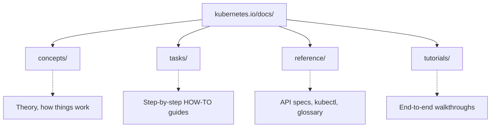
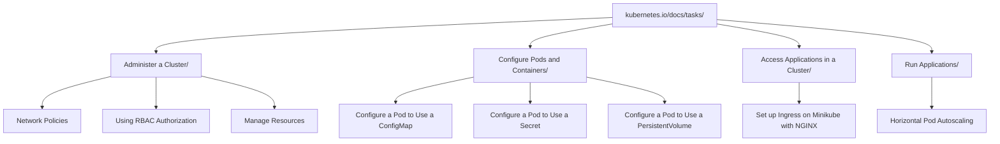
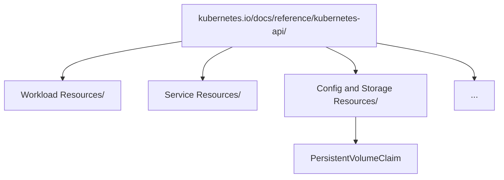

> **Складність**: `[ШВИДКИЙ]` — знай, де що лежить, і знаходь швидко.
>
> **Час на проходження**: 20–30 хвилин.
>
> **Передумови**: немає.

## Що ви зможете зробити

Після завершення цього модуля ви зможете:

- **Діагностувати** дрейф документації, порівнюючи запитані версії API з актуальною документацією Kubernetes 1.35, вікнами підтримуваних релізів та версійними піддоменами документації.
- **Реалізувати** ресурси кластера, навігуючи розділом Tasks на kubernetes.io достатньо швидко, щоб знайти й адаптувати офіційні приклади YAML під тиском іспиту.
- **Оцінити** найшвидший шлях до визначень ресурсів, обираючи між `kubectl explain`, вебдовідником API, сторінками завдань і командними довідниками.
- **Порівняти** розділи Concepts, Tasks, Tutorials і Reference, щоб витрачати час на навчання й на іспиті в тому розділі, який відповідає завданню, яке ви виконуєте.
- **Спроєктувати** ефективну стратегію іспиту з відкритою книгою, яка використовує дозволені домени документації без залежності від звички широкого зовнішнього пошуку.

## Чому цей модуль важливий

Гіпотетичний сценарій: ви працюєте в обмеженому за часом тренувальному середовищі CKA, і завдання просить вас створити NetworkPolicy, змонтувати PersistentVolumeClaim і виправити Ingress, який використовує стару версію API. Ви пам'ятаєте приблизну форму всіх трьох ресурсів, але приблизної пам'яті недостатньо, коли одне зміщене поле змушує `kubectl apply` відхилити файл. Практична навичка — це не запам'ятовування кожного об'єкта Kubernetes. Практична навичка — це точне знання того, де авторитетна документація тримає приклади, деталі схеми, нотатки про версії та командні довідники, а потім переміщення між цими місцями так, щоб не загубитися.

Середовище іспиту — це відкрита книга, але не безмежна. Ви можете користуватися офіційною документацією Kubernetes, блогом Kubernetes, документацією Helm і організацією Kubernetes на GitHub, проте браузер навмисне обмежений, а годинник продовжує йти, поки ви шукаєте. Учень, який вводить широкі фрази в пошук і відкриває перший результат, часто потрапляє на сторінку Concepts, коли йому потрібна сторінка Task, або на допис у блозі, коли йому потрібен актуальний довідник API. Учень, який знає архітектуру сайту, може почати з типу проблеми, обрати правильний розділ і скопіювати найближчий офіційний приклад, перш ніж скористатися `kubectl explain`, щоб заповнити деталі на рівні полів.

Цей модуль навчає такого патерну навігації як технічного робочого процесу, а не як дрібниць про вебсайт. Ви побудуєте карту структури офіційної документації, попрактикуєтеся обирати правильне джерело для конкретного завдання, скористаєтеся версійною документацією, щоб діагностувати дрейф, і відрепетируєте пошуки за часом, які нагадують справжню адміністративну роботу. Віддача миттєва: коли наступний модуль почне обговорювати стратегію іспиту, ви вже матимете м'язову пам'ять для роботи з документацією, потрібну, щоб виконувати цю стратегію, а не боротися з браузером.

## Частина 1: Екосистема документації Kubernetes

Сам проєкт у своїй документації описує Kubernetes як портативну, розширювану платформу з відкритим кодом для керування контейнеризованими навантаженнями та сервісами, де в центрі моделі — декларативна конфігурація та автоматизація. Це визначення важливе під час навігації документацією, тому що вебсайт організований навколо тієї самої ідеї. Одні сторінки пояснюють модель платформи, інші показують, як декларувати об'єкти, треті документують команди автоматизації, а ще інші фіксують новини проєкту. Ставитися до всіх цих сторінок як до рівнозначних результатів пошуку — це як ставитися до підручника, рецептурної картки й словника як до взаємозамінних, бо всі вони містять слова.

Google відкрила вихідний код Kubernetes у 2014 році, і проєкт виріс у велику нейтральну до постачальників екосистему під егідою Cloud Native Computing Foundation. Абревіатура K8s — це нумеронім: 8 представляє кількість літер між K і s у слові «Kubernetes». Ці деталі — корисний контекст, але ваша безпосередня турбота на іспиті конкретніша. Канонічний технічний сайт — це `kubernetes.io`, а сам вихідний код документації публічний у репозиторії `github.com/kubernetes/website`, що означає: відрендерений вебсайт є продуктом відкритого процесу документування, а не випадкової добірки статей.

Верхньорівнева навігація на `kubernetes.io` розділяє Documentation, Kubernetes Blog, Training, Careers, Partners і Community. Цей поділ навмисний. Documentation — це місце, куди ви йдете по актуальні концепції, завдання, посібники, довідники та матеріали API. Блог корисний для оголошень про релізи та контексту функцій, але це не найшвидше джерело для рутинного YAML. Сторінки Training і сертифікації вказують на навчальні програми, а Community вказує на Slack, форуми, зустрічі та точки входу для контриб'юторів. На іспиті або під час вправи, схожої на аварійну ситуацію, варто знати, у які двері ви заходите, перш ніж почати клацати.

Сайт також багатомовний: офіційна документація доступна багатьма мовами, зокрема бенгальською, китайською, французькою, німецькою, гінді, індонезійською, італійською, японською, корейською, польською, португальською, російською, іспанською, українською та в'єтнамською. Така широта — сильна сторона проєкту, але вона вносить невелику операційну осторогу. Якщо ваш браузер пам'ятає перекладену сторінку або якщо результат пошуку відправляє вас на локалізований вміст, переконайтеся, що сторінка все ще відповідає потрібним вам версії Kubernetes та об'єкту. Відрендерені приклади мають залишатися звичними, проте найшвидший шлях під час обмеженого за часом англомовного іспиту — це зазвичай англійська документація, бо формулювання завдань іспиту й більшість виводу команд відповідатимуть саме цій термінології.

Зупиніться й передбачте: якщо завдання просить вас створити Под, який читає ConfigMap як змінні середовища, яка частина вебсайту має містити перший робочий приклад YAML, а яку частину варто використати лише після того, як цей приклад виявиться недостатньо детальним? Відповідь має бути такою: спочатку Tasks, потім Reference або `kubectl explain` для конкретних полів. Зробити це передбачення до того, як клацнути, — це і є та звичка, яку будує цей модуль.

## Частина 2: Архітектура документації

Офіційна документація велика, але не безформна. Її головні навчальні та довідкові зони — це Getting Started, Concepts, Tasks, Tutorials, Reference і Contribute, а типи вмісту сторінок, які ви бачитимете найчастіше, — це Concept, Task, Tutorial і Reference. Назви не декоративні. Сторінка Concept пояснює, як функція вписується в Kubernetes, сторінка Task показує, як виконати операцію, Tutorial проводить через довший сценарій, а сторінка Reference дає точні поля, прапорці, згенеровані форми API чи статті глосарію. Щойно ви засвоюєте цю різницю, результати пошуку перестають здаватися купою і починають здаватися набором інструментів.



Аналогія з бібліотекою досі є правильною ментальною моделлю, якщо ви користуєтеся нею точно. Concepts — це полиці, що пояснюють, як Kubernetes мислить про навантаження, мережу, сховище, конфігурацію, безпеку, планування та точки розширення. Tasks — це рецептурні картки, що показують, що набирати чи застосовувати. Reference — це словник і кодекс законів: він каже вам точно, які поля та прапорці існують, але рідко вказує найкоротший шлях до практичного результату. Tutorials — це довші керовані вправи, корисні для навчання, але зазвичай надто повільні для однієї цілі іспиту.

| Розділ | Використовуйте для | Приклад |
|---------|---------|---------|
| **Tasks** | Як ЗРОБИТИ щось | "Configure a Pod to Use a ConfigMap" |
| **Reference** | Поля YAML, прапорці kubectl | "kubectl Cheat Sheet" |
| **Concepts** | Розуміння (рідко під час іспиту) | "What is a Service?" |

Tasks мають бути вашим основним пунктом призначення, коли формулювання проблеми використовує дієслова дії, як-от create, configure, expose, use, mount, autoscale чи manage. Наприклад, «configure a Pod to use a ConfigMap» — це майже напевно пошук у Tasks, а не в Concepts, бо запитаний вивід — це маніфест або команда. Сторінка Concepts про ConfigMap допоможе вам зрозуміти, коли вони доречні, але зазвичай знайти на ній копійовану форму маніфесту займе більше часу. В умовах обмеженого часу теорія підтримує реалізацію; вона не повинна її блокувати.

Reference стає правильним пунктом призначення, коли питання стосується точної структури. Якщо у вас уже є скелет Пода і вам потрібно знати, чи `resources` сидить під контейнером, чи під специфікацією Пода, довідник API та `kubectl explain` пряміші за ще одну сторінку «як зробити». Якщо вам потрібен точний прапорець `kubectl` для команди, командний довідник або шпаргалка — це правильне джерело. Ключ у тому, щоб запитати: «Мені потрібен приклад робочого процесу, визначення поля чи прапорець команди?» — перш ніж тягнутися до пошуку.

Tutorials цінні під час навчання, бо вони пов'язують кілька функцій у наскрізну активність. Однак під час іспиту Tutorial може стати пасткою, якщо він ховає одну маленьку деталь, яка вам потрібна, всередині значно більшої оповіді. Використовуйте Tutorials, коли завдання нагадує багатокроковий покроковий посібник і у вас є час прогорнути. Інакше віддавайте перевагу Tasks для операційних прикладів і Reference для точних визначень. Ця відмінність — один із найпростіших способів не марнувати хвилини на читання точного, але невідповідного матеріалу.

Сценарій вправи: у вас є частковий маніфест Деплойменту, і ви маєте додати `initContainer` плюс том ConfigMap. Вашим першим кліком не повинен бути широкий пошук «Kubernetes init container volume config map tutorial», бо такий запит запрошує довгий покроковий посібник. Кращий маршрут — знайти сторінку Task для init-контейнерів чи ConfigMap, скопіювати найближчий фрагмент, а потім скористатися `kubectl explain deployment.spec.template.spec.initContainers` чи `kubectl explain pod.spec.volumes.configMap`, щоб підтвердити, де належать поля.

## Частина 3: Версіонування та життєві цикли релізів

Kubernetes рухається достатньо швидко, щоб дрейф документації був реальним операційним ризиком. Станом на цільову версію цього модуля — Kubernetes 1.35 — актуальна документація вказує на поведінку v1.35, а підтримувані патч-релізи дотримуються проєктної політики розбіжності версій та підтримки. Проєкт зазвичай патч-підтримує три найновіші мінорні версії, а це означає, що команда, яка працює на значно старіших кластерах, не повинна припускати, що актуальні приклади чисто відображаються на її площину управління. Проблема не в тому, що офіційна документація ненадійна; проблема в тому, що вона офіційна для тієї версії, яку ви читаєте.

Вебсайт зберігає документацію для кількох останніх версій, а старіша підтримувана документація доступна через версійні піддомени на кшталт `v1-34.docs.kubernetes.io`. Цей патерн важливий під час реальної роботи, бо керовані кластери, лабораторні кластери та продакшн-кластери не завжди рухаються в ногу з найновішою документацією. Якщо кластер каже, що працює на v1.33, а заголовок сторінки каже v1.35, варто зробити паузу, перш ніж копіювати маніфест, що використовує новіші поля чи новішу типову поведінку. На іспиті, націленому на актуальний Kubernetes, читайте актуальну документацію, якщо завдання явно не дає старішу версію кластера.

Версії API — це найпомітніше місце, де дрейф стає болісним. Старіші приклади Ingress використовували `extensions/v1beta1`; актуальний Kubernetes використовує `networking.k8s.io/v1`. Застарілий допис у блозі може досі добре ранжуватися в пошуку, але `kubectl apply` відхилить такий маніфест на сучасному кластері. Той самий патерн з'являється з бета-ресурсами, видаленими полями та брамами функцій (feature gates), які з часом змінилися. Вашою звичкою має стати перевірка `apiVersion` у будь-якому скопійованому прикладі, порівняння його з доступними ресурсами API кластера та надання переваги актуальним офіційним сторінкам завдань над фрагментами без джерела.

Ви можете діагностувати відповідність версій як з вебу, так і з кластера. У вебі використовуйте селектор версії сторінки чи версійний піддомен документації, коли знаєте, що вам потрібен конкретний мінорний реліз. У терміналі використовуйте `kubectl version`, `kubectl api-resources` і `kubectl explain`, щоб побачити, що кластер фактично надає. Ці інструменти доповнюють одне одного: вебсайт пояснює намір і приклади, а схема кластера каже вам, що цей сервер API прийме просто зараз.

Перш ніж запустити це, який вивід ви очікуєте, якщо кластер більше не обслуговує стару версію API? Сухий прогін (dry run) проти застарілого маніфесту Ingress має завершитися помилкою ще до того, як щось створить, а `kubectl api-resources | grep -i ingress` має показати обслуговувані групу та версію. Це передбачення важливе, бо воно перетворює заплутану помилку apply на діагностику дрейфу документації, а не на випадковий сеанс налагодження YAML.

## Частина 4: Стратегії та механіка пошуку

Кінцева точка пошуку на сайті — це `kubernetes.io/search/`, а поле пошуку доступне з інтерфейсу документації. Пошук корисний, але він винагороджує точні ключові слова й карає за розпливчастий намір. «Network policy» може повернути Concepts, Tasks і вміст блогу, а «networkpolicy ingress example» вказує значно ближче до операційного фрагмента. Самі результати пошуку — це не відповідь; це таблиця маршрутизації. Прочитайте мітку розділу, обирайте Tasks, коли вам потрібне «як зробити», обирайте Reference, коли вам потрібне поле чи прапорець, і уникайте клацання на результат блогу, якщо ви навмисне не хочете контексту релізу.

Більшість відповідей для іспиту фізично розташовані в ієрархії Tasks, бо іспит зазвичай просить вас оперувати кластером. Зона Tasks включає встановлення інструментів, адміністрування кластера, конфігурацію подів і контейнерів, моніторинг і налагодження застосунків, керування об'єктами, використання секретів і запуск застосунків. Ця структура віддзеркалює той вид роботи, яку виконує адміністратор. Щойно ви знаєте, що NetworkPolicy лежить біля завдань адміністрування чи мережі, приклади ConfigMap і Secret — біля конфігурації подів, а HPA — біля запуску застосунків, рідний пошук стає резервом, а не вашим єдиним інструментом навігації.



Найшвидший робочий процес — це зазвичай двокроковий пошук. Спочатку знайдіть сторінку Task, що дає вам повний робочий приклад, близький до запитаного результату. По-друге, скористайтеся `kubectl explain`, щоб скоригувати поля, які приклад не охоплює. Це запобігає двом поширеним невдачам: спробі написати весь маніфест з пам'яті та спробі прочитати весь довідник API, перш ніж ви матимете скелет. Скелет із Tasks плюс валідація полів із Reference — це практичний компроміс між швидкістю та коректністю.

```bash
# See available fields for a resource
kubectl explain pod.spec.containers

# Go deeper
kubectl explain pod.spec.containers.resources
kubectl explain pod.spec.containers.volumeMounts

# See all fields at once
kubectl explain pod --recursive | grep -A5 "containers"
```

Коли ви використовуєте `kubectl explain`, пам'ятайте, що він читає схему OpenAPI кластера. Це робить його потужним для розміщення полів, але він не замінює документацію завдань. Він може сказати вам, що `volumeMounts` належить під контейнером, проте не спроєктує для вас чистий приклад ConfigMap. Він може показати, що `namespaceSelector` існує в peer'і NetworkPolicy, проте не пояснить операційний ефект порожнього `podSelector`. Використовуйте його як технічний словник, що сидить поруч із рецептом, а не як посібник.



Ви також можете виконати пошук поля миттєво з командного рядка, коли об'єкт існує в схемі кластера, що часто швидше за відкриття ще однієї сторінки. Це особливо корисно, коли ви вже знаєте сімейство об'єкта і вам потрібно лише підтвердити одне вкладене поле, перш ніж писати маніфест.

```bash
kubectl explain pvc.spec.accessModes
```

Зупиніться й передбачте: ви шукаєте «ingress», і перший результат — це сторінка Concepts, що пояснює контролери, класи та маршрутизацію трафіку. Якщо вам потрібен мінімальний маніфест, яким має бути ваш наступний клік? Найкраща відповідь — перейти від Concepts до сторінки Task чи Reference, що містить актуальний приклад `networking.k8s.io/v1`, бо концептуальне пояснення може бути точним, але водночас повільнішим за джерело, що відповідає вашому виводу.

Є також невелика складова браузерної дисципліни. Браузер іспиту й багато браузерів віддалених лабораторій менш поблажливі за вашу звичну робочу станцію. Відкривання багатьох вкладок, втрата активної сторінки завдання чи покладання на звички зовнішнього пошуку додають накладні витрати, яких ви не помічаєте під час буденного навчання. Практикуйтеся лише з кількома вкладками: одна для Tasks, одна для Reference і одна для Helm, якщо ціль включає Helm. Закривайте вкладки після того, як витягнули приклад, і тримайте термінал тим місцем, де відбувається фінальна валідація.

Корисна навчальна техніка — проговорювати вибір джерела вголос, перш ніж шукати. Скажіть: «Мені потрібен робочий процес, тож я відкриваю Tasks», або: «Мені потрібне поле, тож я використовую `kubectl explain`». Це звучить просто, але це перериває рефлекс панічного клацання, який виробляють у себе багато учнів, коли видно таймер. Це також дає вам швидку самоперевірку постфактум: якщо ви обрали Concepts для пошуку поля чи Reference для повного робочого процесу, ви можете виявити невідповідність і повторити вправу з кращою стартовою точкою.

## Частина 5: Цінні локації та багаторазовий YAML

Найшвидші навігатори документації тримають невеликий ментальний список закладок. Вам не потрібно запам'ятовувати кожну URL-адресу, але варто пам'ятати, що шпаргалка kubectl лежить під Reference, що головна сторінка Tasks — це точка запуску операційного матеріалу «як зробити», а сторінки Concepts про навантаження, мережу, сховище та конфігурацію корисні, коли формулювання завдання передбачає проєктне міркування. Під час навчання відвідуйте кожну сторінку вручну, а не лише за прямими посиланнями. Сама фізична дія переміщення сайтом будує ту саму просторову пам'ять, на яку ви покладатиметеся під тиском часу.

| Тема | URL |
|-------|-----|
| **kubectl Cheat Sheet** | https://kubernetes.io/docs/reference/kubectl/cheatsheet/ |
| **Tasks (main page)** | https://kubernetes.io/docs/tasks/ |
| **Workloads** | https://kubernetes.io/docs/concepts/workloads/ |
| **Networking** | https://kubernetes.io/docs/concepts/services-networking/ |
| **Storage** | https://kubernetes.io/docs/concepts/storage/ |
| **Configuration** | https://kubernetes.io/docs/concepts/configuration/ |

Наступний шар — це запам'ятовування того, яке сімейство завдань зазвичай містить який об'єкт. ConfigMap, Secret і томи зазвичай з'являються під конфігурацією подів і контейнерів, бо вони змінюють те, як навантаження споживають конфігурацію та сховище. NetworkPolicy і RBAC з'являються під адмініструванням кластера, бо вони визначають межі доступу. Ingress з'являється під доступом до застосунків, бо стосується входу трафіку до сервісів. HPA з'являється під запуском застосунків, бо змінює те, як застосунок масштабується після розгортання.

| Потреба | Перейти до |
|------|-------|
| Create ConfigMap | Tasks -> Configure Pods -> Configure ConfigMaps |
| Create Secret | Tasks -> Configure Pods -> Secrets |
| Create PVC | Tasks -> Configure Pods -> Configure PersistentVolumeClaim |
| NetworkPolicy | Tasks -> Administer Cluster -> Network Policies |
| RBAC | Tasks -> Administer Cluster -> Using RBAC Authorization |
| Ingress | Tasks -> Access Applications -> Set Up Ingress |
| HPA | Tasks -> Run Applications -> Horizontal Pod Autoscale |

Gateway API та Helm заслуговують на особливу увагу, бо вони сидять біля межі основного адміністрування Kubernetes. Документація Gateway API живе в концепціях мережі Kubernetes і пов'язаній документації проєкту, бо це більше, ніж патерн одного вбудованого об'єкта в старіших кластерах. Документація Helm живе на `helm.sh/docs` — це дозволений домен постачальника для питань про Helm. Kustomize з'являється в завданнях Kubernetes щодо керування об'єктами та інтегрований у `kubectl`, тож вам варто знати, що це шлях керування конфігурацією, а не ресурс навантаження.

| Тема | URL |
|-------|-----|
| **Gateway API** | https://kubernetes.io/docs/concepts/services-networking/gateway/ |
| **Helm** | https://helm.sh/docs/ |
| **Kustomize** | https://kubernetes.io/docs/tasks/manage-kubernetes-objects/kustomization/ |

Приклади нижче збережені, бо вони репрезентують той вид фрагментів, які ви тренуєтеся швидко знаходити. Не сприймайте їх як список для запам'ятовування. Сприймайте їх як розпізнавання форми. Коли ви бачите NetworkPolicy, помічайте, де живуть `podSelector`, `policyTypes` та `ingress`. Коли ви бачите PVC, помічайте, наскільки мала специфікація. Коли ви бачите RBAC, помічайте, що Role і RoleBinding — це окремі об'єкти. Суть у тому, щоб розпізнати правильний скелет достатньо швидко, щоб документація та схема кластера могли допомогти вам безпечно завершити.

#### NetworkPolicy

Локація: Tasks -> Administer a Cluster -> Declare Network Policy. Використовуйте це як скелет для розміщення селектора та напрямку політики, а потім скоригуйте простори імен, мітки та порти, щоб відповідати запиту, перш ніж валідувати завершений об'єкт.

```yaml
apiVersion: networking.k8s.io/v1
kind: NetworkPolicy
metadata:
  name: test-network-policy
  namespace: default
spec:
  podSelector:
    matchLabels:
      role: db
  policyTypes:
  - Ingress
  - Egress
  ingress:
  - from:
    - podSelector:
        matchLabels:
          role: frontend
    ports:
    - protocol: TCP
      port: 6379
```

#### PersistentVolumeClaim

Локація: Tasks -> Configure Pods -> Configure a Pod to Use a PersistentVolumeClaim. Використовуйте це як форму об'єкта claim, а потім поєднайте її з прикладом тома Пода чи Деплойменту, коли завдання просить вас змонтувати сховище в навантаження.

```yaml
apiVersion: v1
kind: PersistentVolumeClaim
metadata:
  name: my-pvc
spec:
  accessModes:
    - ReadWriteOnce
  resources:
    requests:
      storage: 1Gi
```

#### RBAC (Role + RoleBinding)

Локація: Tasks -> Administer a Cluster -> Using RBAC Authorization. Тримайте зв'язок Role і RoleBinding чітким, бо багато зламаних спроб RBAC визначають права, але забувають прив'язати ці права до суб'єкта.

```yaml
apiVersion: rbac.authorization.k8s.io/v1
kind: Role
metadata:
  namespace: default
  name: pod-reader
rules:
- apiGroups: [""]
  resources: ["pods"]
  verbs: ["get", "watch", "list"]
```

```yaml
apiVersion: rbac.authorization.k8s.io/v1
kind: RoleBinding
metadata:
  name: read-pods
  namespace: default
subjects:
- kind: User
  name: jane
  apiGroup: rbac.authorization.k8s.io
roleRef:
  kind: Role
  name: pod-reader
  apiGroup: rbac.authorization.k8s.io
```

#### Ingress

Локація: Concepts -> Services, Load Balancing -> Ingress. Уважно перевіряйте тут актуальну версію API, бо старі фрагменти Ingress поширені, а сучасні маніфести мають використовувати актуальну форму мережевого API.

```yaml
apiVersion: networking.k8s.io/v1
kind: Ingress
metadata:
  name: minimal-ingress
spec:
  rules:
  - host: example.com
    http:
      paths:
      - path: /
        pathType: Prefix
        backend:
          service:
            name: my-service
            port:
              number: 80
```

#### Gateway API

Локація: Concepts -> Services, Load Balancing -> Gateway API. Сприймайте це як область функцій, де документація та встановлення в кластері можуть розходитися, а потім підтвердьте наявність CRD, перш ніж припускати, що `HTTPRoute` існує локально.

```yaml
apiVersion: gateway.networking.k8s.io/v1
kind: HTTPRoute
metadata:
  name: http-route
spec:
  parentRefs:
  - name: my-gateway
  rules:
  - matches:
    - path:
        type: PathPrefix
        value: /app
    backendRefs:
    - name: my-service
      port: 80
```

Коли ви копіюєте приклад YAML, застосуйте три перевірки, перш ніж довіряти йому. По-перше, перевірте `apiVersion` щодо очікувань актуального Kubernetes 1.35 і щодо `kubectl api-resources`, коли версія кластера невизначена. По-друге, перевірте вид об'єкта (kind) і простір імен, щоб ви випадково не створили об'єкт із простором імен у неправильному місці. По-третє, виконайте сухий прогін на стороні клієнта, коли це можливо, щоб очевидні помилки схеми завершилися невдачею, перш ніж ви витратите ще час. Ці перевірки швидші за налагодження зламаного ресурсу постфактум.

Є ще одна практична перевірка, що економить час: порівняйте іменники запиту з іменниками маніфесту. Якщо запит каже Deployment, а приклад — це Под, вам, імовірно, потрібно перемістити поля рівня Пода під `spec.template.spec`. Якщо запит каже політику на весь простір імен, а приклад використовує лише `podSelector`, вам, імовірно, потрібен селектор простору імен чи порожній селектор у правильній локації. Це порівняння іменника з полем допомагає вам адаптувати офіційні приклади, не вдаючи, що перший скопійований блок YAML автоматично є фінальною відповіддю.

Який підхід ви б обрали тут і чому: скопіювати повний приклад NetworkPolicy із Tasks, а потім скористатися `kubectl explain networkpolicy.spec.ingress.from.namespaceSelector`, чи спробувати побудувати весь об'єкт, читаючи довідник API згори донизу? Перший підхід зазвичай кращий, бо приклад дає узгоджений об'єкт, а пошук поля розв'язує конкретну відсутню деталь. Другий підхід точний, але повільний, а повільна точність усе одно може втратити бали на іспиті з обмеженим часом.

## Частина 6: Поза документацією — блог, спільнота, навчання та швидкісні тренування

Блог Kubernetes живе на `kubernetes.io/blog/` і використовує URL-патерн на основі дати під `/blog/YYYY/MM/DD/post-slug/`. Блог організований хронологічно, а не як каталог завдань, і RSS-стрічка доступна на `kubernetes.io/feed.xml`. Дописи блогу можуть бути чудовими для нотаток про реліз, переходу функцій у вищі стадії зрілості, оголошень про застарівання та проєктного контексту, але це не перше місце, де варто шукати рутинний YAML об'єктів. Якщо функція нова чи завдання запитує про недавню поведінку, блог може дати контекст після того, як ви звірите актуальну документацію.

Ширша екосистема також включає навчання Linux Foundation, сертифікації CNCF, робочий простір спільноти Kubernetes у Slack, офіційний форум обговорень, глобальні зустрічі, портал контриб'юторів на `k8s.dev` і соціальні канали на кшталт `@kubernetes.io` у Bluesky та `@kubernetesio` в X. Ці ресурси важливі для довгострокового навчання та професійної участі. Однак під час CKA вони важливі переважно як контекст того, що не є вашим безпосереднім джерелом. Іспит винагороджує практичну навігацію дозволеною технічною документацією, а не загальний перегляд спільноти.

Швидкісні тренування перетворюють знання документації на рефлекс. Хороше тренування коротке, обмежене за часом і достатньо конкретне, щоб ви могли сказати, чи покращилися. Не практикуйте лише успішні пошуки. Практикуйте відновлення після неправильних сторінок, заміну застарілої версії API та рішення про те, коли облишити пошук у браузері на користь `kubectl explain`. Мета — не стати швидшим вебкористувачем загалом; мета — побудувати повторюваний шлях від формулювання проблеми до офіційного прикладу й до валідованого маніфесту.

Для першого тренування знайдіть приклад NetworkPolicy менш ніж за 30 секунд, починаючи з kubernetes.io, шукаючи конкретну фразу, обираючи результат Tasks і прокручуючи безпосередньо до YAML. Для другого тренування знайдіть режими доступу PVC менш ніж за 20 секунд, використовуючи схему кластера, а не браузер. Для третього тренування знайдіть приклад Role у RBAC менш ніж за 30 секунд, шукаючи «Using RBAC Authorization» і скануючи в пошуках прикладу Role. Для четвертого тренування перейдіть до документації Helm і знайдіть синтаксис `helm install` менш ніж за 30 секунд. Кожне тренування вправляє інше рішення про маршрутизацію.

```bash
kubectl explain pvc.spec.accessModes
```

Ті самі тренування також навчають, коли документації самої по собі недостатньо. Якщо завдання каже «create a Secret from a file», сторінка Task може показати команду та пояснити опції. Якщо завдання каже «add a liveness probe to this existing container», `kubectl explain pod.spec.containers.livenessProbe` може бути швидшим за перегляд браузера. Якщо завдання каже «use Helm to upgrade a release with a values file», командний довідник Helm — це правильне джерело постачальника. Вибір джерела має слідувати за артефактом, який вам потрібно створити.

## Патерни й антипатерни

Основний патерн — це «Task для скелета, Reference для точності, сухий прогін для впевненості». Він працює, бо ресурси Kubernetes декларативні та вкладені. Робочий скелет допомагає уникнути структурних помилок, довідник заповнює точні поля, а сухий прогін ловить помилки схеми до того, як ви відправите. Цей патерн масштабується від завдань для початківців, як-от ConfigMap, до складніших завдань, як-от RBAC, NetworkPolicy та автомасштабування. Він також тримає вашу увагу правильно розподіленою між документацією, валідацією в терміналі та власне питанням.

Інший сильний патерн — це читання, де версія йде першою. Перш ніж копіювати будь-який маніфест із незнайомої сторінки, подивіться на версію Kubernetes, розділ сторінки та `apiVersion` у фрагменті. Це особливо важливо для Ingress, Gateway API, бета-ресурсів і прикладів, знайдених через пошук, а не через пряму навігацію. Читання, де версія йде першою, не повільне, щойно воно стає автоматичним. Це невелика попередня витрата, що запобігає значно більшій витраті на налагодження.

Третій патерн — це «копіюй менше, ніж розумієш, а потім валідуй більше, ніж довіряєш». Копіювати повний приклад прийнятно, коли приклад офіційний і близький до завдання, але ви все одно маєте знати, які рядки суттєві, а які специфічні для зразка. Імена, мітки, хости, порти, класи сховища та простори імен часто потребують редагувань під конкретний запит. Тоді валідація стає значущішою, бо ви не просто питаєте, чи парситься YAML; ви перевіряєте, чи адаптований об'єкт усе ще виражає запитану поведінку.

Четвертий патерн — це контрольоване використання вкладок. Тримайте головну сторінку завдання, довідник API чи шпаргалку та будь-яку специфічну для постачальника документацію в передбачуваних місцях. Уникайте відкривання нової вкладки для кожного результату пошуку, бо це змінює проблему з «знайти поле» на «знайти вкладку, де було поле». У реальному робочому процесі в терміналі еквівалентний патерн — це тримати файл маніфесту, команду валідації та команду пошуку схеми поруч, а не розкидати часткові спроби по багатьох файлах.

Останній патерн — це навмисне відновлення після неправильних поворотів. Під час практики навмисно клацніть один правдоподібний, але неправильний результат, а потім заміряйте, наскільки швидко ви можете розпізнати невідповідність і перейти до правильного розділу. Це тренує важливу поведінку на іспиті: неправильний клік має коштувати секунди, а не хвилини. Підказка зазвичай у типі сторінки, заголовку чи відсутності прикладу, що запускається. Якщо сторінка пояснює тло, а вам потрібен об'єкт, відновлюйтеся в бік Tasks. Якщо сторінка дає команду, а вам потрібна вкладена схема, відновлюйтеся в бік Reference чи `kubectl explain`.

Головний антипатерн — це широкий пошук із подальшим пасивним читанням. Учні потрапляють у нього, бо пошук відчувається продуктивним, а кожна сторінка офіційного сайту виглядає авторитетною. Краща альтернатива — вирішити, який вид відповіді вам потрібен, перш ніж читати: робочий процес, схема, прапорець команди, контекст релізу чи концептуальне тло. Інший антипатерн — це писати YAML з пам'яті після того, як знайдено один схожий приклад. Маніфести Kubernetes достатньо невблаганні, щоб упевненість походила з валідації, а не зі знайомості.

Є також антипатерн навколо аліасів. Багато інженерів використовують короткий інтерактивний аліас для `kubectl`, але приклади, що запускаються, у навчальних матеріалах, скриптах і скопійованих блоках мають використовувати повне ім'я бінарника `kubectl`. Аліаси зазвичай не розкриваються в неінтерактивних оболонках, а учні, що копіюють код у файл, не повинні отримувати запобіжну помилку `command not found`. Цей модуль використовує повні команди в shell-блоках саме з цієї причини, навіть якщо досвідчені користувачі можуть скорочувати їх інтерактивно.

## Коли це використовувати замість альтернатив

Використовуйте Kubernetes Tasks, коли питання просить вас створити чи змінити ресурс і вам потрібен робочий приклад швидко. Tasks — це найкращий типовий вибір для ConfigMap, Secret, використання PVC, прикладів NetworkPolicy, прикладів RBAC, прикладів HPA та багатьох поширених процедур усунення несправностей. Використовуйте довідник API чи `kubectl explain`, коли ви вже знаєте сімейство об'єкта і вам потрібне точне розміщення поля, дозволені вкладені структури чи специфічна для кластера схема. Використовуйте Concepts, коли завдання вимагає проєктного судження, як-от розрізнення поведінки Service, Ingress, Gateway API та NetworkPolicy.

Використовуйте Tutorials, коли ви вивчаєте багатокроковий робочий процес поза іспитом або коли саме завдання нагадує керовану збірку. Використовуйте блог Kubernetes, коли питання стосується недавнього релізу, переходу функції в стадію зрілості, застарівання чи оголошення проєкту, а потім звіряйте будь-яку операційну деталь з актуальною документацією. Використовуйте документацію Helm, коли предметом є синтаксис Helm, поведінка чарта, values, історія релізів чи команди відкату. Використовуйте репозиторії Kubernetes на GitHub для довідок на рівні вихідного коду лише тоді, коли іспит чи реальне завдання справді потребує файлів проєкту, а не відрендереної документації.

Якщо два джерела видаються суперечливими, віддавайте перевагу джерелу, найближчому до того, що ви виконуватимете. Схема кластера найближча для обслуговуваних полів, довідник API Kubernetes найближчий для канонічних визначень об'єктів, актуальна сторінка Task найближча для офіційних прикладів, а командний довідник Helm найближчий для синтаксису CLI Helm. Дописи блогу та обговорення спільноти можуть пояснити, чому щось змінилося, але вони не повинні перевершувати актуальні довідники щодо того, що ви застосовуєте. Ця ієрархія достатньо проста, щоб запам'ятати, і достатньо сильна, щоб скеровувати більшість рішень про документацію.

Це порівняння також запобігає надмірному корегуванню в неправильному напрямку. Сторінка Concepts може описувати, чому тип Service поводиться певним чином, але вона може не показувати кожне поле маніфесту, яке вам потрібне. Сторінка Reference може перелічувати кожну легальну властивість, але вона може не показувати мінімальний операційний приклад. Сторінка Task може показувати зразок, що працює, але вона може використовувати імена чи мітки, що не відповідають вашому запиту. Тож вибір правильного джерела — це лише половина роботи; інша половина — знати, на що це джерело має право відповідати.

Для швидких модулів ця звичка «це проти альтернатив» цінніша за велике дерево рішень. Ви тренуєте рефлекс, що спрацьовує до того, як починається робота в командному рядку: класифікуй проблему, обери джерело, витягни найменший надійний приклад і валідуй локально. Коли цей рефлекс стабільний, складні завдання відчуваються менш хаотичними, бо кожне незнайоме поле має відомий шлях пошуку. Документація стає частиною вашої операційної процедури, а не окремою активністю, яку ви виконуєте лише після того, як застрягли, і ця звичка накопичується в кожному наступному модулі Kubernetes.

## Чи знали ви?

1. **Kubernetes сягає 2014 року:** Google відкрила вихідний код Kubernetes у 2014 році, і це походження пояснює, чому документація поєднує історію проєкту, довідники API та операційні завдання на одному великому публічному сайті.
2. **K8s — це нумеронім:** 8 у K8s представляє вісім літер між K і s, тому скорочення пишеться з цифрою, а не як акронім.
3. **Проєкт підтримує недавні мінорні версії, а не кожен старий кластер:** патч-підтримка Kubernetes зосереджена на трьох найновіших мінорних релізах, тож застарілі кластери потребують планування оновлення, а не просто старих прикладів.
4. **Вихідний код вебсайту публічний:** офіційна документація підтримується в репозиторії `kubernetes/website`, тож відрендерені сторінки походять із видимого процесу контриб'юторів.

## Типові помилки

| Помилка | Чому це стається | Як виправити |
|---------|----------------|---------------|
| Занадто широкий пошук | Розпливчасті фрази повертають Concepts, дописи блогу та старі приклади впереміш | Шукайте об'єкт плюс потрібний вам вивід, як-от «networkpolicy ingress example» |
| Читання Concepts під час обмеженого за часом завдання на реалізацію | Сторінки Concepts відчуваються авторитетними і можуть бути справді корисними | Використовуйте Concepts для проєктного міркування, а потім переходьте до Tasks чи Reference по маніфест |
| Запам'ятовування YAML замість навігації | Повторення робить знайомі об'єкти безпечнішими на відчуття, ніж документація | Запам'ятовуйте, де живуть приклади, а потім валідуйте поля актуальною документацією та `kubectl explain` |
| Ігнорування `kubectl explain` | Учні забувають, що кластер несе власну схему OpenAPI | Використовуйте `kubectl explain` для точного розміщення поля після того, як маєте скелет |
| Відкривання забагато вкладок | Кожен результат пошуку виглядає потенційно корисним під тиском | Тримайте лише кілька передбачуваних вкладок і закривайте сторінки після витягування потрібної деталі |
| Ігнорування версій API | Старі приклади досі виглядають як валідний YAML Kubernetes | Перевіряйте `apiVersion`, використовуйте актуальну документацію та порівнюйте з `kubectl api-resources` |
| Покладання на застарілі блоги | Дописи блогу можуть передувати видаленню API чи змінам поведінки | Використовуйте дописи блогу для контексту, а потім звіряйте синтаксис в актуальній офіційній документації |
| Забування про версійну документацію | Різні кластери можуть працювати на різних підтримуваних мінорних релізах | Використовуйте версійну документацію на кшталт `v1-34.docs.kubernetes.io`, коли версія кластера цього вимагає |

## Тест

<details>
<summary>Сценарій: вам потрібно змонтувати PersistentVolumeClaim у Под, але ви пам'ятаєте лише об'єкт PVC, а не структуру `volumes` і `volumeMounts` Пода. Який шлях документації варто використати першим і як безпечно завершити маніфест?</summary>

Почніть зі сторінки Task, бо запитаний вивід — це реалізація, а не концептуальне пояснення. Знайдіть або перейдіть до завдання про конфігурацію Пода для використання PersistentVolumeClaim, скопіюйте найближчий офіційний скелет YAML і адаптуйте імена до запиту іспиту. Потім скористайтеся `kubectl explain pod.spec.volumes` і `kubectl explain pod.spec.containers.volumeMounts`, якщо вам потрібне точне розміщення поля. Цей підхід швидко реалізує ресурс, водночас валідуючи вкладені поля щодо схеми кластера.

</details>

<details>
<summary>Сценарій: скопійований маніфест Ingress зазнає невдачі, бо використовує `extensions/v1beta1`. Як ви діагностуєте дрейф документації та виправляєте своє джерело?</summary>

Сприймайте помилку як невідповідність версії API, перш ніж припускати, що відступ YAML неправильний. Перевірте актуальну документацію Kubernetes 1.35 щодо Ingress, потім порівняйте обслуговувані API за допомогою `kubectl api-resources | grep -i ingress`. Актуальний об'єкт має використовувати `networking.k8s.io/v1`, а форма полів backend має відповідати цьому API. Це діагностує дрейф документації, порівнюючи приклад, актуальну документацію та надані кластером ресурси.

</details>

<details>
<summary>Сценарій: ви знайшли приклад NetworkPolicy, що використовує `podSelector`, але завдання вимагає дозволити трафік із простору імен. Який найшвидший пошук на рівні поля?</summary>

Тримайте приклад Task як ваш скелет, бо він уже дає вам узгоджений об'єкт NetworkPolicy. Для відсутнього поля скористайтеся `kubectl explain networkpolicy.spec.ingress.from.namespaceSelector` чи довідником API Kubernetes для peer'ів NetworkPolicy. Цей пошук швидший за читання повної сторінки Concepts, бо вам потрібна конкретна форма вкладеного селектора. Фінальний маніфест усе одно слід валідувати сухим прогоном, перш ніж вважати його завершеним.

</details>

<details>
<summary>Сценарій: ви шукаєте Gateway API і здебільшого бачите фонові сторінки та старіші дописи блогу. Як вам оцінити найшвидше авторитетне джерело?</summary>

Gateway API стосується мережі й може потребувати концептуальної навігації, перш ніж ви знайдете приклади, тож починайте з зони мережевих Concepts Kubernetes і сторінки Gateway API, а не з довіри до широкого результату пошуку. Якщо в кластері встановлено CRD Gateway API, скористайтеся `kubectl explain httproute.spec`, щоб підтвердити обслуговувану схему. Дописи блогу можуть пояснити еволюцію проєкту, але актуальна документація та схема кластера мають вирішувати, що ви застосовуєте. Це оцінює джерело, зіставляючи тип функції та потрібний вам артефакт.

</details>

<details>
<summary>Сценарій: вам потрібна команда відкату Helm під час питання іспиту з дозволеною документацією. Чи слід вам залишитися на kubernetes.io, чи змінити джерела?</summary>

Перейдіть до документації Helm, бо потрібний вам артефакт — це синтаксис CLI Helm, а не поле об'єкта Kubernetes. Дозволений набір документації включає `helm.sh/docs` для Helm, і це джерело постачальника найближче до поведінки команди. Залишання в документації Kubernetes може зрештою привести вас до пов'язаного контексту керування пакетами, але це менш прямо. Ефективна стратегія — обрати джерело, яке володіє інструментом.

</details>

<details>
<summary>Сценарій: у вас залишилося 12 хвилин і три невеликі маніфести для створення. Як спроєктувати стратегію навігації з відкритою книгою, що уникає браузерної метушні?</summary>

Відкрийте головну сторінку Tasks, шпаргалку kubectl чи довідник API і документацію Helm лише якщо Helm з'являється в решті завдань. Для кожного маніфесту знайдіть один офіційний скелет, скопіюйте його у ваш робочий файл, потім скористайтеся `kubectl explain` і валідацією сухим прогоном для розміщення полів. Закривайте сторінки після витягування відповідного прикладу, щоб браузер залишався керованим. Цей дизайн тримає вибір джерела, валідацію в терміналі та поступ завдання в повторюваному циклі.

</details>

<details>
<summary>Сценарій: ви не впевнені, чи читати Concepts, Tasks, Tutorials, чи Reference для проблеми з мережею Service. Як ви порівнюєте розділи та обираєте?</summary>

Запитайте, який вивід вам потрібен. Якщо ви маєте створити чи змінити Service, починайте з Tasks чи близького офіційного прикладу. Якщо ви маєте вирішити між Service, Ingress, Gateway API та NetworkPolicy, читайте Concepts, бо питання стосується проєктної поведінки. Якщо вам потрібні точні поля для специфікації Service чи прапорець команди, використовуйте Reference чи `kubectl explain`. Tutorials найкращі для покрокових посібників завдовжки в навчання, а не для швидкого пошуку одного об'єкта під тиском часу.

</details>

## Практична вправа

Ця вправа — це лабораторна робота з навігації документацією, а не тест на запам'ятовування. Скористайтеся секундоміром, тримайте браузер обмеженим офіційними дозволеними джерелами й записуйте, яке джерело ви використали для кожної відповіді. Якщо ви не вкладаєтеся в цільовий час, повторіть той самий пошук після короткої перерви й запишіть другий час. Покращення важливіше за перший результат, бо справжня навичка — це побудова повторюваного маршруту навігації.

### Налаштування

Вам потрібен робочий контекст Kubernetes для завдань `kubectl explain` і валідації сухим прогоном. Локальний kind, minikube, хмарна лабораторія чи середовище Killercoda підійдуть, доки `kubectl version` може дотягнутися до сервера API. Якщо CRD Gateway API не встановлено, пошук `kubectl explain` для Gateway API може зазнати невдачі, і цей результат сам по собі є корисним доказом того, що схема кластера відрізняється від функції документації, яку ви читаєте.

### Прогресивні завдання

1. Знайдіть офіційну сторінку завдання ConfigMap і знайдіть один повний приклад YAML менш ніж за 30 секунд.
2. Знайдіть приклад чи команду Secret-із-файлу менш ніж за 45 секунд і занотуйте, чи прийшло це з Tasks, чи з Reference.
3. Скористайтеся терміналом, щоб знайти інформацію про схему режимів доступу PVC, не відкриваючи нову вкладку браузера.
4. Знайдіть приклад HorizontalPodAutoscaler, потім визначте, які поля ви б змінили для іншого цільового значення CPU.
5. Знайдіть синтаксис команди Helm для install, upgrade з файлом values та rollback.
6. Розгорніть або валідуйте сухим прогоном один скопійований ConfigMap, одну команду Secret і один маніфест NetworkPolicy.

<details>
<summary>Посібник із розв'язання прогресивних завдань</summary>

Приклади ConfigMap і Secret мають прийти з Kubernetes Tasks під конфігурацією подів і контейнерів. Пошук режимів доступу PVC має використовувати `kubectl explain pvc.spec.accessModes`, що тримає відповідь прив'язаною до схеми кластера. Приклад HPA зазвичай з'являється під Tasks для запуску застосунків, а синтаксис Helm належить до `helm.sh/docs`. Для валідації розгортання віддавайте перевагу спочатку `kubectl apply --dry-run=client -f <file>`, а потім застосовуйте по-справжньому лише в одноразовому лабораторному просторі імен.

</details>

### Тренувальні забіги

Відкрийте kubernetes.io і змагайтеся, щоб знайти ось це. Скористайтеся секундоміром, запишіть першу спробу й повторюйте, доки маршрут не відчуватиметься автоматичним, а не випадковим.

| Завдання | Цільовий час |
|------|-------------|
| Знайти приклад YAML NetworkPolicy | < 30 сек |
| Знайти приклад PVC із ReadWriteMany | < 45 сек |
| Знайти приклад RoleBinding у RBAC | < 30 сек |
| Знайти приклад Ingress із TLS | < 45 сек |
| Знайти приклад HorizontalPodAutoscaler | < 45 сек |
| Знайти приклад Job із backoffLimit | < 30 сек |

Не використовуючи веб, знайдіть це, користуючись лише `kubectl explain`. Цей забіг навмисне лише для термінала, щоб ви дізналися, які відповіді вже доступні зі схеми сервера API й не потребують перемикання контексту в браузері.

```bash
# 1. What fields does a Pod spec have?
kubectl explain pod.spec | head -30

# 2. What are valid values for PVC accessModes?
kubectl explain pvc.spec.accessModes

# 3. What fields does a container have for health checks?
kubectl explain pod.spec.containers.livenessProbe

# 4. What's the structure of a NetworkPolicy spec?
kubectl explain networkpolicy.spec

# 5. How do you specify resource limits?
kubectl explain pod.spec.containers.resources
```

Використовуючи лише документацію kubernetes.io, знайдіть приклади й створіть або валідуйте сухим прогоном ці ресурси в одноразовому просторі імен. Суть у тому, щоб попрактикуватися переходити від офіційного прикладу до локальної команди валідації, зберігаючи слід джерела чітким.

```bash
# 1. Find a ConfigMap example and create one
# kubernetes.io -> Tasks -> Configure Pods -> ConfigMaps

# 2. Find a Secret example and create one
# kubernetes.io -> Tasks -> Configure Pods -> Secrets

# 3. Find a NetworkPolicy example and create one
# kubernetes.io -> Tasks -> Administer Cluster -> Network Policies

# Verify all three exist
kubectl get cm,secret,netpol

# Cleanup
kubectl delete cm --all
kubectl delete secret --all  # careful: deletes service account tokens too; run in a disposable namespace only
kubectl delete netpol --all
```

Знайдіть це на helm.sh/docs і запишіть форму команди поруч із кожним. Це відокремлює синтаксис, яким володіє Helm, від синтаксису об'єктів Kubernetes, що тримає ваш вибір джерел чистим, коли ціль іспиту змішує обидва інструменти.

```bash
# 1. How do you install a chart from a repo?
# Answer: helm install [RELEASE] [CHART]

# 2. How do you see values available for a chart?
# Answer: helm show values [CHART]

# 3. How do you rollback to a previous release?
# Answer: helm rollback [RELEASE] [REVISION]

# 4. How do you list all releases?
# Answer: helm list

# 5. How do you upgrade with new values?
# Answer: helm upgrade [RELEASE] [CHART] -f values.yaml
```

Gateway API є частиною сучасної навчальної поверхні CKA. Знайдіть це в документації й порівняйте документацію зі схемою вашого кластера, коли це можливо:

```bash
# 1. Find the HTTPRoute example
# kubernetes.io -> Concepts -> Services -> Gateway API

# 2. Find what parentRefs means in HTTPRoute
kubectl explain httproute.spec.parentRefs  # If Gateway API CRDs installed

# 3. Find the difference between Gateway and HTTPRoute
# Gateway = infrastructure (like LoadBalancer)
# HTTPRoute = routing rules (like Ingress rules)
```

Сценарій вправи: ви знайшли те, що виглядає як правильний YAML, але воно не працює. Маніфест нижче репрезентує застарілу форму Ingress. Ваше завдання — знайти актуальну версію API в офіційній документації, порівняти її з наданими кластером ресурсами й переписати об'єкт з актуальною структурою backend.

```bash
# You found this "Ingress" example but it fails
cat << 'EOF' > wrong-ingress.yaml
apiVersion: extensions/v1beta1
kind: Ingress
metadata:
  name: test-ingress
spec:
  backend:
    serviceName: testsvc
    servicePort: 80
EOF

kubectl apply -f wrong-ingress.yaml
# ERROR: no matches for kind "Ingress" in version "extensions/v1beta1"

# Your task: find the correct API version in current docs.
```

<details>
<summary>Розв'язання для забігу із застарілим Ingress</summary>

Старий API `extensions/v1beta1` був застарілий і видалений із сучасного Kubernetes. Актуальні приклади Ingress використовують `networking.k8s.io/v1`, а ім'я та порт сервісу backend сидять під `defaultBackend.service`. Підтвердьте обслуговуваний API за допомогою `kubectl api-resources | grep -i ingress`, потім валідуйте виправлений маніфест, перш ніж застосовувати його до реального простору імен.

```yaml
apiVersion: networking.k8s.io/v1
kind: Ingress
metadata:
  name: test-ingress
spec:
  defaultBackend:
    service:
      name: testsvc
      port:
        number: 80
```

</details>

Встановіть таймер на 10 хвилин і виконайте якомога більше. Для кожного пункту скористайтеся офіційною документацією, щоб знайти форму ресурсу, потім валідуйте сухим прогоном.

1. [ ] Створіть Под із обмеженнями ресурсів, використовуючи задокументований приклад.
2. [ ] Створіть Деплоймент із 3 репліками, використовуючи задокументований приклад.
3. [ ] Створіть Сервіс типу LoadBalancer, використовуючи задокументований приклад.
4. [ ] Створіть ConfigMap із файлу, використовуючи задокументовану команду чи маніфест.
5. [ ] Створіть PVC зі сховищем 1Gi, використовуючи задокументований приклад.
6. [ ] Створіть Job, що запускається один раз, використовуючи задокументований приклад.
7. [ ] Створіть CronJob, що запускається щохвилини, використовуючи задокументований приклад.
8. [ ] Створіть NetworkPolicy, що дозволяє лише порт 80, використовуючи задокументований приклад.

```bash
# Validate each one works
kubectl apply -f <file> --dry-run=client
```

Оцініть забіг чесно: 8 виконаних пунктів означає, що ви рухаєтеся з екзаменаційною швидкістю, 6–7 означає, що маршрут хороший, але потребує повторення, 4–5 означає, що вам варто повторити огляд структури документації, а менше ніж 4 означає, що карта розділів ще не автоматична. Цей результат — не оцінка ваших знань Kubernetes. Це вимірювання того, чи достатньо швидкий ваш робочий процес із документацією, щоб підтримати знання, які ви вже маєте.

### Критерії успіху

- [ ] Можу знайти сторінку завдання ConfigMap менш ніж за 30 секунд.
- [ ] Можу знайти офіційний приклад YAML менш ніж за одну хвилину.
- [ ] Можу використати `kubectl explain` для перевірок схеми на рівні полів.
- [ ] Можу порівняти Tasks, Concepts, Tutorials і Reference без вгадування.
- [ ] Можу діагностувати дрейф документації, перевіряючи `apiVersion` і ресурси кластера.
- [ ] Можу спроєктувати екзаменаційну стратегію документації з обмеженою кількістю вкладок.
- [ ] Можу валідувати щонайменше один ресурс, узятий з офіційної документації.

## Sources

- https://kubernetes.io/docs/home/
- https://kubernetes.io/docs/concepts/
- https://kubernetes.io/docs/tasks/
- https://kubernetes.io/docs/tutorials/
- https://kubernetes.io/docs/reference/
- https://kubernetes.io/docs/reference/kubectl/cheatsheet/
- https://kubernetes.io/docs/reference/kubernetes-api/
- https://kubernetes.io/docs/concepts/overview/
- https://kubernetes.io/docs/setup/release/version-skew-policy/
- https://kubernetes.io/docs/concepts/services-networking/gateway/
- https://kubernetes.io/docs/tasks/manage-kubernetes-objects/kustomization/
- https://helm.sh/docs/
- https://github.com/kubernetes/website
- https://kubernetes.io/blog/
- https://kubernetes.io/feed.xml

## Наступний модуль

[Модуль 0.5: Стратегія іспиту — метод трьох проходів](../module-0.5-exam-strategy/) — стратегія, що максимізує ваш бал, балансуючи швидкість, точність і тріаж складних питань.


