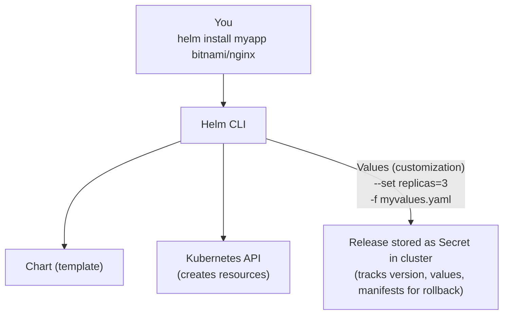

> **Складність**: `[СЕРЕДНЯ]` — необхідна екзаменаційна навичка для Kubernetes 1.35+
>
> **Час на проходження**: 40-50 хвилин
>
> **Передумови**: Модуль 0.1 (працездатний кластер), базові знання YAML

---

## Що ви зможете зробити

Після завершення цього модуля ви зможете:

- **Діагностувати** невдалі розгортання Helm, аналізуючи Secret'и релізу, згенеровані маніфести та журнали історії релізу.
- **Впроваджувати** власні конфігурації інфраструктури за допомогою складних перевизначень значень Helm, файлів значень та документації чарту.
- **Оцінювати** стан кластера, відстежуючи релізи в межах простору імен, осиротілі ресурси та безпечні цілі для відкату.
- **Проєктувати** надійні робочі процеси розгортання за допомогою патерну `helm upgrade --install` для ідемпотентної інтеграції з CI/CD.

## Чому цей модуль важливий

Гіпотетичний сценарій: черговому інженеру доручають опублікувати невеликий вебзастосунок під час технологічного вікна, але цей застосунок — не один об'єкт Kubernetes. Йому потрібні Deployment, Service, необов'язкова конфігурація Ingress, запити на ресурси, мітки для моніторингу та шлях для відкату, якщо нова версія чарту поводиться погано. Застосування цих файлів по одному може спрацювати в лабораторії, проте створює крихку виробничу звичку, бо кожна команда стає окремою нагодою відхилитися від бажаного стану.

Helm існує для того, щоб таке багатооб'єктне розгортання поводилося як єдиний версійний реліз. Замість того щоб розглядати кожен маніфест як ізольований файл, Helm пакує шаблони, значення за замовчуванням, залежності та метадані у чарт, а потім записує кожне встановлення, оновлення, відкат і видалення як історію релізу, що зберігається всередині кластера. Операційна перевага не лише в зручності; це здатність запитати: «Що ми розгорнули, з якими значеннями, у якому просторі імен і як нам повернутися до відомої робочої ревізії?»

Для екзамену CKA та для реальної експлуатації Kubernetes важлива навичка — це не запам'ятовування кожної опції чарту. Важлива навичка — це вміння перевірити чарт, згенерувати те, що Helm надішле на API-сервер, перевизначити значення в передбачуваному порядку, діагностувати, чому реліз не вдається знайти, і обрати дію відкату чи видалення, що відповідає ситуації. Цей модуль вчить Helm передусім як інструмент керування релізами, а вже потім — як скорочення для командного рядка, бо саме така рамка тримає складні застосунки Kubernetes зрозумілими під тиском.

## Частина 1: Helm як керування релізами, а не лише пакування

Helm часто представляють як «пакетний менеджер для Kubernetes», і ця аналогія корисна, доки ви на ній не зупиняєтеся. Менеджер пакетів Linux встановлює файли на машину та відстежує версію пакета; Helm генерує маніфести Kubernetes із шаблонів, надсилає їх на API-сервер і відстежує ревізію релізу у Secret'ах Kubernetes. Цей запис релізу важливий, бо сам Kubernetes не знає, що Deployment, Service, ConfigMap та Ingress мали подорожувати разом як один застосунок.

Базовий словник невеликий, але кожен термін несе операційні наслідки. Чарт — це повторно використовуваний пакет, реліз — це один встановлений екземпляр цього чарту, репозиторій — це індекс упакованих чартів, а значення — це вхідні дані конфігурації, які роблять загальний чарт придатним для конкретного середовища. Коли ви налагоджуєте зламане розгортання, постійно запитуйте, на який рівень ви дивитеся: значення чарту за замовчуванням, надані користувачем значення, згенеровані маніфести, ресурси Kubernetes чи історію релізів Helm.

| Термін | Визначення |
|------|------------|
| **Чарт (Chart)** | Пакет ресурсів Kubernetes (як .deb або .rpm) |
| **Реліз (Release)** | Екземпляр чарту, що працює у вашому кластері |
| **Репозиторій (Repository)** | Колекція чартів (як репозиторій apt) |
| **Значення (Values)** | Опції конфігурації для налаштування чарту |

Наведений нижче потік — це ментальна модель, яку слід нести в кожне завдання Helm. CLI читає чарт і його значення, генерує звичайний YAML Kubernetes, застосовує цей YAML, використовуючи ваші поточні облікові дані Kubernetes, та зберігає метадані релізу для майбутніх операцій статусу, історії, оновлення й відкату. У сучасному Helm нічого магічного у кластері від імені Helm не працює; збережений Secret релізу — це та пам'ять, яка дозволяє Helm міркувати про ревізії.



Helm 3 і пізніші версії прибрали Tiller — серверний компонент у кластері, який використовувала Helm 2. Ця архітектурна зміна — більше, ніж дрібниця: тепер Helm спілкується безпосередньо з API Kubernetes, використовуючи ваш kubeconfig і ваші дозволи RBAC, тож встановлення зазнає невдачі, якщо ваша особа не може створити цільові ресурси. На екзамені це допомагає відокремити проблеми Helm від проблем авторизації; якщо рендеринг працює локально, але API відхиляє встановлення, перевіряйте дозволи й цільовий простір імен замість того, щоб винуватити чарт.

Helm 4 залишається актуальною і зберігає ту саму модель «лише клієнт», з додатковими оновленнями поведінки у шляхах оновлення та рендерингу.

```bash
# Helm 3+ client model (no Tiller)
helm install myapp ./mychart

# Helm 2 (deprecated) - required Tiller
# Don't use this anymore
```

Зупиніться і передбачте: якщо двоє інженерів встановлюють той самий чарт `bitnami/nginx` як релізи з іменами `web` та `admin` в одному просторі імен, чи матимуть вони спільну історію релізу, чи отримають дві незалежні історії? Чарт — це спільний пакет, але кожне ім'я релізу стає власним відстежуваним екземпляром, тож статус, значення, історія та відкат оцінюються для кожного релізу окремо.

## Частина 2: Встановлення CLI та робота з репозиторіями

Helm — це клієнтський бінарний файл, тож встановлення Helm не встановлює контролер, вебхук допуску чи будь-який інший довготривалий компонент у кластер. Саме тому перше питання усунення несправностей зазвичай локальне: чи існує CLI, чи може він дістатися до вашого API-сервера Kubernetes і чи вказує ваш kubeconfig на той кластер і простір імен, на який ви думаєте? Щойно CLI встановлено, кластер бачить лише стандартні виклики API Kubernetes, зроблені з вашими поточними обліковими даними.

Наведені нижче команди встановлення зберігають поширені опції, які ви побачите в середовищах macOS та Linux. Для виробничих робочих станцій надавайте перевагу офіційному посібнику зі встановлення або затвердженому у вашій організації джерелу пакетів, бо деталі репозиторію пакетів можуть з часом змінюватися. Для практики перед екзаменом ключове простіше: перевірте `helm version`, а потім одразу перевірте `kubectl config current-context`, щоб знати, проти якого кластера працюватиме Helm.

```bash
# macOS
brew install helm

# Linux (script, currently aligned with Helm docs)
curl -fsSL -o get_helm.sh https://raw.githubusercontent.com/helm/helm/main/scripts/get-helm-4
chmod 700 get_helm.sh
./get_helm.sh

# Linux (package manager) - Debian/Ubuntu, current Helm apt repo (Buildkite-hosted)
sudo apt-get install curl gpg apt-transport-https --yes
curl -fsSL https://packages.buildkite.com/helm-linux/helm-debian/gpgkey | gpg --dearmor | sudo tee /usr/share/keyrings/helm.gpg > /dev/null
echo "deb [signed-by=/usr/share/keyrings/helm.gpg] https://packages.buildkite.com/helm-linux/helm-debian/any/ any main" | sudo tee /etc/apt/sources.list.d/helm-stable-debian.list
sudo apt-get update
sudo apt-get install helm

# Verify installation
helm version
```

Репозиторій Helm — це HTTP-розташування, яке надає файл `index.yaml`, що вказує на упаковані архіви чартів. Публічні репозиторії спрощують виявлення популярних робочих навантажень, тоді як приватні репозиторії дозволяють командам розповсюджувати внутрішні платформні чарти з контрольованим версіонуванням. ChartMuseum — один із варіантів з відкритим кодом для розміщення приватного репозиторію Helm, але реєстри OCI також поширені, бо Helm може зберігати чарти в інфраструктурі реєстрів, яку багато команд уже експлуатують.

```bash
# Add the Bitnami repository (popular, well-maintained charts)
helm repo add bitnami https://charts.bitnami.com/bitnami

# Add other common repositories
helm repo add ingress-nginx https://kubernetes.github.io/ingress-nginx
helm repo add prometheus-community https://prometheus-community.github.io/helm-charts

# Update repository index
helm repo update

# List configured repositories
helm repo list
```

Bitnami наразі рекомендує посилання на чарти OCI для нової автоматизації, але цей застарілий URL індексу може з часом змінитися. Приклади `bitnami/nginx` усе ще корисні для екзаменаційних лабораторій, але для виробничих процесів використовуйте закріплення версій та перегляньте повідомлення про міграцію: [Bitnami OCI migration](https://github.com/bitnami/charts/issues/35164). Деякі чарти/образи посилаються на рухомі теги, і застереження щодо Bitnami Secure Images стосується поточних значень за замовчуванням.

Конфігурація репозиторію є локальною для вашої машини, що пояснює часту проблему «працює на моєму ноутбуці». Якщо один термінал може знайти `bitnami/nginx`, а інший — ні, відмінність може бути в конфігурації репозиторію або застарілому індексі, а не в проблемі кластера Kubernetes. Перш ніж винуватити кластер, виконайте `helm repo list`, оновіть індекс за допомогою `helm repo update` і підтвердьте, що ім'я чарту містить префікс репозиторію, який ви мали на увазі.

## Частина 3: Безпечне перевіряння та встановлення чартів

Helm дає вам кілька команд для перевірки, бо чарт є водночас програмним артефактом і конфігураційною поверхнею. `helm show chart` відповідає на питання про метадані, як-от ім'я та версія чарту, `helm show readme` пояснює призначене використання, а `helm show values` розкриває налаштовувані ключі, яких очікують шаблони. У середовищі екзамену з обмеженим доступом до інтернету ці команди стають вашою локальною документацією, особливо коли вам потрібне точне вкладене значення для типу Service чи імені хосту Ingress.

```bash
# Search in Artifact Hub (online registry)
helm search hub nginx

# Search in your added repositories
helm search repo nginx

# Show all versions of a chart
helm search repo bitnami/nginx --versions

# Get info about a specific chart
helm show chart bitnami/nginx
helm show readme bitnami/nginx
helm show values bitnami/nginx  # See all configurable values
```

Встановлення потребує двох імен: імені релізу, яке ви обираєте, і посилання на чарт, з якого ви встановлюєте. Ставтеся до імені релізу як до операційної ручки, а не до одноразової мітки, бо воно з'являється у `helm list`, історії, іменах Secret'ів та багатьох іменах згенерованих ресурсів. Зрозуміле ім'я релізу також зменшує помилки під час відкату; `helm rollback web` легше осмислити, ніж згенероване ім'я, якого ніхто не впізнає під час інциденту.

```bash
# Basic install
helm install my-nginx bitnami/nginx
#           ^^^^^^^^  ^^^^^^^^^^^^^
#           release   chart name
#           name

# Install in specific namespace
helm install my-nginx bitnami/nginx -n web --create-namespace

# Install with custom values
helm install my-nginx bitnami/nginx --set replicaCount=3

# Install with values file
helm install my-nginx bitnami/nginx -f myvalues.yaml

# Install specific version
helm install my-nginx bitnami/nginx --version 15.0.0

# Dry-run=client (see what would be created)
helm install my-nginx bitnami/nginx --dry-run=client

# Generate manifests only (don't install)
helm template my-nginx bitnami/nginx > manifests.yaml
```

Найбезпечніший робочий процес — перевіряти перед встановленням і генерувати, перш ніж довіряти. Пробний запуск (dry run) просить Helm обробити чарт і показати запланований результат, тоді як `helm template` видає маніфести, не створюючи ресурсів кластера. Ці результати — не марна робота; вони розкривають імена, мітки, простори імен, запити на ресурси, типи Service та Secret'и ще до того, як API-сервер щось прийме.

Перш ніж запускати це, який результат ви очікуєте від `helm template my-nginx bitnami/nginx` порівняно з `helm install my-nginx bitnami/nginx --dry-run=client`? Перша зосереджена на маніфестах і її легко перенаправити у файл, тоді як друга йде шляхом встановлення та містить орієнтовану на реліз інформацію, корисну для налагодження самої операції встановлення.

Щойно реліз існує, перевірка зміщується з артефакту чарту на встановлений реліз. Helm зберігає стан релізу як Secret'и Kubernetes, названі за патерном `sh.helm.release.v1.<release-name>.v<revision>`, зазвичай у тому просторі імен, де було встановлено реліз. Якщо `helm list` здається порожнім, але ресурси застосунку існують, не припускайте, що ці ресурси некеровані, доки ви не перевірите всі простори імен і не пошукаєте Secret'и, що належать Helm.

```bash
# List all releases
helm list

# List in all namespaces
helm list -A

# List including failed releases
helm list --all

# Get status of a release
helm status my-nginx

# Get values used for a release
helm get values my-nginx

# Get all values (including defaults)
helm get values my-nginx --all

# Get the manifests that were installed
helm get manifest my-nginx
```

Різницю між `helm get values` та `helm get values --all` варто відпрацювати. Перша показує значення, явно надані для релізу, що часто є тим, що вам потрібно при діагностиці несподіваного перевизначення. Друга об'єднує ці надані користувачем значення зі значеннями чарту за замовчуванням, що часто є тим, що вам потрібно при відтворенні повної конфігурації, яка створила поточні маніфести.

## Частина 4: Налаштування за допомогою значень і розуміння пріоритетності

Значення — це основний механізм налаштування Helm, і їхня сила походить із передбачуваності. Автор чарту визначає значення за замовчуванням, оператор надає один чи кілька файлів значень, а командний рядок може надати остаточні перевизначення через `--set`. Цей багатошаровий підхід дозволяє тримати стабільну конфігурацію середовища в системі контролю версій, водночас даючи змогу внести невелике аварійне коригування без редагування зафіксованого файлу.

Зупиніться і передбачте: ви виконуєте `helm install my-app bitnami/nginx --set replicaCount=3 -f values.yaml`, де `values.yaml` містить `replicaCount: 5`. Скільки реплік ви отримаєте? Значення `--set` з командного рядка має вищу пріоритетність, ніж файл, тож Helm генерує три репліки, якщо лише пізніше перевизначення не змінить той самий ключ.

Порядок пріоритетності — від найвищого до найнижчого: прапорці `--set`, файли значень, вказані через `-f`, де пізніші файли перевизначають ранніші, і нарешті стандартний `values.yaml` чарту. Це означає, що виробничий файл перевизначень може будуватися на базовому файлі, а разове значення з командного рядка все одно може перемогти в самому кінці. Компроміс — у можливості аудиту: що більше ви покладаєтеся на спонтанні значення `--set`, то важче відтворити намір із системи контролю версій.

```bash
# Example: Multiple ways to set replicas
helm install my-nginx bitnami/nginx \
  -f base-values.yaml \
  -f production-values.yaml \
  --set replicaCount=5  # This wins
```

Для швидких експериментів `--set` ефективний і цілком прийнятний. Він стає незручним, коли значення глибоко вкладені, містять масиви або потребують лапок для збереження рядків, що нагадують числа чи булеві значення. Коли значення впливає на виробничу поведінку, надавайте перевагу файлу, бо його можна переглянути, порівняти, відкотити та повторно використати під час майбутніх оновлень.

```bash
# Simple value
helm install my-nginx bitnami/nginx --set replicaCount=3

# Nested value
helm install my-nginx bitnami/nginx --set service.type=NodePort

# Multiple values
helm install my-nginx bitnami/nginx \
  --set replicaCount=3 \
  --set service.type=NodePort \
  --set service.nodePorts.http=30080

# Array values
helm install my-app ./mychart --set 'ingress.hosts[0]=example.com'

# String that looks like number (use quotes)
helm install my-app ./mychart --set 'version="1.35"'
```

Файли значень — це краще значення за замовчуванням для відтворюваної інфраструктури, бо вони тримають конфігурацію релізу близько до процесу перегляду команди. Файл також спрощує порівняння середовищ: базові значення можуть описувати спільну політику, тоді як файли staging та production можуть перевизначати лише відмінності. Коли ви діагностуєте виробничий реліз, запитайте, чи був поточний реліз зібраний із файлу, який ви все ще можете знайти, чи з перевизначень командного рядка, що існують лише в історії оболонки.

```yaml
# myvalues.yaml
replicaCount: 3

service:
  type: NodePort
  nodePorts:
    http: 30080

resources:
  requests:
    memory: "128Mi"
    cpu: "100m"
  limits:
    memory: "256Mi"
    cpu: "200m"

ingress:
  enabled: true
  hostname: myapp.example.com
```

```bash
# Use the values file
helm install my-nginx bitnami/nginx -f myvalues.yaml
```

Коли ви успадковуєте чарт, починайте з файлу значень за замовчуванням, замість того щоб вгадувати імена параметрів. Збереження значень за замовчуванням локально дає вам придатний для пошуку довідник і безпечне місце, щоб скопіювати підмножину, яку ви маєте намір перевизначити. Не фіксуйте весь файл за замовчуванням як конфігурацію свого середовища, якщо лише ваша команда свідомо не хоче такого тягаря з обслуговування, бо величезний скопійований файл може приховати ті кілька налаштувань, які насправді важливі.

```bash
# See all configurable options
helm show values bitnami/nginx

# Save to file for reference
helm show values bitnami/nginx > nginx-defaults.yaml
```

Який підхід ви б обрали тут і чому: одну довгу команду `helm upgrade` з десятьма прапорцями `--set`, чи переглянутий файл `production-values.yaml` плюс одне тимчасове перевизначення `--set image.tag=...` під час репетиції відкату? Підхід, зосереджений на файлах, зазвичай перемагає для командних операцій, бо він робить стабільну конфігурацію придатною для перегляду, водночас тримаючи аварійне перевизначення видимим і навмисним.

## Частина 5: Оновлення, відкати та історія релізів

Оновлення — це місце, де Helm починає відчуватися інакше, ніж звичайний `kubectl apply`. Helm не просто надсилає новий набір маніфестів; він записує нову ревізію релізу, що включає метадані чарту, значення та згенеровані маніфести. Саме ця історія ревізій дозволяє вам запитати у Helm часову шкалу та відкотитися до відомого попереднього стану без ручного відтворення кожного об'єкта зі старих файлів YAML.

Зупиніться і подумайте: ви виконуєте `helm upgrade my-app bitnami/nginx` без нових значень `--set`/`-f`. Helm починає з попередніх значень релізу, потім застосовує контекст оновлення чарту та будь-які надані вами опції. Якщо ви додаєте нові значення `--set`/`-f` без `--reuse-values`, пропущені власні значення можуть повернутися до значень чарту за замовчуванням.

```bash
# Upgrade with new values
helm upgrade my-nginx bitnami/nginx --set replicaCount=5

# Upgrade with values file
helm upgrade my-nginx bitnami/nginx -f newvalues.yaml

# Upgrade to new chart version
helm upgrade my-nginx bitnami/nginx --version 16.0.0

# Upgrade or install if not exists
helm upgrade --install my-nginx bitnami/nginx

# Reuse values from previous release + new values
helm upgrade my-nginx bitnami/nginx --reuse-values --set replicaCount=5
```

Патерн `helm upgrade --install` цінний у CI/CD, бо він робить команду ідемпотентною для цільового імені релізу. Якщо реліз не існує, Helm встановлює його; якщо існує — Helm оновлює його. Така конструкція зменшує логіку розгалуження в завданнях розгортання, але вона не усуває потреби щоразу передавати правильний простір імен, версію чарту та значення.

```bash
# View upgrade history
helm history my-nginx

# Output:
# REVISION  STATUS      CHART           DESCRIPTION
# 1         superseded  nginx-15.0.0    Install complete
# 2         superseded  nginx-15.0.0    Upgrade complete
# 3         deployed    nginx-15.0.1    Upgrade complete
```

Читайте історію перед відкатом, особливо у просторі імен із кількома нещодавніми змінами. Helm може відкотитися до попередньої ревізії за замовчуванням або до конкретної ревізії, якщо ви її назвете. У ситуації під тиском найбезпечніша послідовність — статус, історія, відкат, знову статус, а потім перевірка на рівні Kubernetes Pod'ів, Service'ів та подій.

```bash
# Rollback to previous revision
helm rollback my-nginx

# Rollback to specific revision
helm rollback my-nginx 1

# Dry-run rollback
helm rollback my-nginx 1 --dry-run=client
```

Відкат створює ще одну ревізію, а не стирає історію. Це може здивувати учнів, які очікують, що номери ревізій рухатимуться назад, але це корисна властивість аудиту: кластер записує, що ви виконали дію відкату і яка ревізія стала активною після цього. При подальшій діагностиці `helm history` має показати і невдале оновлення, і відкат, що відновив роботу.

## Частина 6: Видалення, осиротілі ресурси та анатомія чарту

Видалення релізу Helm просить Helm видалити ресурси, якими він керує для цього релізу. Звичайний шлях також видаляє історію релізу, тоді як `--keep-history` залишає історичні метадані релізу, щоб ви могли перевірити, що існувало. Операційне питання полягає в тому, чи хочете ви, щоб застосунок зник повністю, був тимчасово видалений зі збереженою історією, чи залишився працювати, поки ви лише перевіряєте та прибираєте стан невдалого релізу.

```bash
# Uninstall a release
helm uninstall my-nginx

# Uninstall but keep history (allows rollback)
helm uninstall my-nginx --keep-history

# Uninstall in specific namespace
helm uninstall my-nginx -n web
```

Осиротілі ресурси з'являються, коли об'єкти Kubernetes залишаються, але Helm більше не має придатних метаданих релізу для них, або коли ресурси були створені поза релізом і випадково мають схожі імена. Саме тому ручне видалення Secret'ів `sh.helm.release` небезпечне: ви видаляєте пам'ять Helm, а не обов'язково живий застосунок. Якщо Deployment усе ще існує, але `helm status` не може знайти реліз, порівняйте простори імен, перевірте `kubectl get secrets -l owner=helm -A` і вирішіть, чи прийняти, відтворити чи видалити осиротілі об'єкти.

Хоча CKA не вимагає від вас стати автором чартів, анатомія чарту допомагає налагоджувати. Каталог чарту має метадані, значення за замовчуванням, необов'язкові залежності та шаблони, що створюють маніфести Kubernetes. Каталог `templates/` — це місце, звідки походить більшість невдач встановлення, бо погані значення можуть згенерувати недійсний YAML, недійсні поля Kubernetes або ресурси, які ваша особа RBAC не може створити.

```text
mychart/
├── Chart.yaml          # Metadata (name, version, description)
├── values.yaml         # Default configuration
├── charts/             # Dependencies (subcharts)
├── templates/          # Kubernetes manifest templates
│   ├── deployment.yaml
│   ├── service.yaml
│   ├── ingress.yaml
│   ├── _helpers.tpl    # Template helpers
│   └── NOTES.txt       # Post-install message
└── README.md           # Documentation
```

Зупиніться і подумайте: ви видаляєте Secret Kubernetes, що зберігає метадані релізу Helm, той, що позначений `owner=helm`. Чи зможете ви все ще виконати `helm upgrade` або `helm rollback` для цього релізу? Helm залежить від цього запису релізу, тож ресурси можуть продовжувати працювати, але Helm більше не може нормально міркувати про цей реліз.

Шаблони використовують синтаксис шаблонів Go для підставляння значень і метаданих релізу в маніфести Kubernetes. Наведений нижче фрагмент навмисно невеликий, але він показує важливий патерн: `.Release.Name` походить із обраного релізу, тоді як `.Values.*` походить із об'єднаної ієрархії значень. Зламане значення може тому створити зламаний Deployment, навіть коли стандартний шаблон чарту дійсний.

```yaml
# templates/deployment.yaml (simplified)
apiVersion: apps/v1
kind: Deployment
metadata:
  name: "{{ .Release.Name }}-nginx"
spec:
  replicas: {{ .Values.replicaCount }}
  template:
    spec:
      containers:
      - name: nginx
        image: "{{ .Values.image.repository }}:{{ .Values.image.tag }}"
```

Генеруйте перед встановленням, коли проблема може бути в шаблонуванні. `helm template` показує YAML, який Helm згенерував би, а `--debug --dry-run=client` додає контекст навколо шляху встановлення. Якщо згенерований YAML неправильний, виправте значення чи шаблони чарту; якщо згенерований YAML правильний, але встановлення зазнає невдачі, досліджуйте валідацію Kubernetes, політики допуску, квоти та RBAC.

```bash
# See what YAML would be generated
helm template my-nginx bitnami/nginx -f myvalues.yaml

# Install with debug info
helm install my-nginx bitnami/nginx --debug --dry-run=client
```

## Частина 7: Готові до екзамену робочі процеси та операційні перевірки

Наведені нижче екзаменаційні сценарії навмисно компактні, але вони відображають повний ритм, який слід відпрацьовувати: додати репозиторій, оновити індекс, перевірити значення за потреби, встановити з явною конфігурацією, перевірити за допомогою Helm і перевірити за допомогою Kubernetes. Helm розповідає вам про реліз; Kubernetes розповідає, чи здорові отримані об'єкти. Вам потрібні обидва погляди, бо реліз може існувати, поки Pod'и все ще в стані Pending або CrashLooping.

```bash
# Task: Install nginx with 3 replicas exposed on NodePort 30080

# Solution:
helm repo add bitnami https://charts.bitnami.com/bitnami
helm repo update

helm install web bitnami/nginx \
  --set replicaCount=3 \
  --set service.type=NodePort \
  --set service.nodePorts.http=30080
```

Після встановлення уникайте пастки сприймати успішну команду Helm як доказ того, що застосунок готовий. Виконайте `helm status web`, потім перевірте Deployment, Pod'и та Service, які було створено. Завдання CKA може зарахувати бали за встановлений об'єкт, але виробничий runbook завжди має містити перевірки готовності, бо Helm може створити ресурси, яким усе ще потрібен час або потужності, щоб стати здоровими.

```bash
# Task: Upgrade the existing nginx release to use 5 replicas

# Solution:
helm upgrade web bitnami/nginx --reuse-values --set replicaCount=5

# Verify:
kubectl get deployment
```

Прапорець `--reuse-values` — це навмисний вибір у тій команді оновлення. Він каже Helm почати зі значень останнього релізу, а потім застосувати нове перевизначення реплік, що корисно, коли попередній реліз ніс важливі налаштування, не повторені в командному рядку. Якщо ви не хочете успадковувати попередні значення, передайте натомість повний файл значень, щоб оновлення було явним.

```bash
# Task: Rollback to the previous working version

# Solution:
helm history web
helm rollback web

# Verify:
helm status web
```

При відкаті перевіряйте стан і Helm, і Kubernetes. Статус Helm каже вам ревізію релізу та примітки, тоді як `kubectl rollout status deployment/<name>` і `kubectl get events` можуть розкрити, чи Pod'и насправді просуваються. Ця дворівнева перевірка запобігає хибному відчуттю безпеки після того, як команда відкату успішно завершується, але робоче навантаження все ще не може запланувати, витягнути образи чи пройти проби готовності.

## Частина 8: Усунення несправностей Helm як багатошарової системи

Усунення несправностей Helm стає набагато легшим, коли ви ставитеся до системи як до шарів, а не як до однієї непрозорої команди. Перший шар — локальна конфігурація: індекс вашого репозиторію Helm, кеш чартів, поточний робочий каталог, kubeconfig і простір імен за замовчуванням. Другий шар — рендеринг: шаблони чарту поєднуються зі значеннями, щоб створити маніфести. Третій шар — API Kubernetes, де валідація, контроль допуску, квоти та RBAC вирішують, чи прийнято згенеровані ресурси.

Ця багатошарова модель запобігає випадковому повторенню команд. Якщо `helm search repo nginx` не може знайти чарт, Kubernetes ще не залучений, тож перевірка Pod'ів марнує час. Якщо `helm template` зазнає невдачі, API-сервер ще не залучений, тож зміна RBAC не допоможе. Якщо рендеринг успішний, але встановлення зазнає невдачі з помилкою заборони, чарт може бути в порядку, а справжня проблема може бути в особі, яку Helm використовує через kubeconfig.

Починайте кожне розслідування з запису чотирьох фактів: ім'я релізу, простір імен, посилання на чарт і джерело значень. Ці факти звучать базово, але вони пояснюють велику частку плутанини з Helm. Реліз на ім'я `web` у `default` — це не той самий реліз, що `web` у `helm-lab`, а посилання на чарт на кшталт `bitnami/nginx` залежить від локальної конфігурації репозиторію, якої може не бути на іншій робочій станції чи екзаменаційному терміналі.

Наступне діагностичне питання — чи може Helm усе ще бачити запис релізу. `helm status` і `helm history` залежать від метаданих релізу, тоді як команди ресурсів Kubernetes лише доводять, що об'єкти існують. Якщо `helm status web -n helm-lab` зазнає невдачі, але `kubectl get deployment -n helm-lab` успішний, ви не довели, що Helm зламаний; ви довели, що метадані Helm і живі об'єкти Kubernetes більше не збігаються так, як ви очікували.

Сценарій вправи: встановлення релізу було перервано після того, як деякі ресурси було створено, і пізніше `helm install` повідомляє, що ресурс уже існує. Правильна реакція — не видаляти ресурс негайно. Спершу перевірте, чи є невдалий реліз у `helm list --all -n <namespace>`, чи існують Secret'и релізу і чи має живий ресурс мітки або анотації, що прив'язують його до релізу Helm. Ці перевірки кажуть вам, чи слід видалити, оновити, прийняти вручну чи прибрати осиротілий об'єкт.

Діагностика рендерингу має передувати живим повторним спробам, бо рендеринг дешевий і оборотний. Коли вивід шаблону містить неправильний тег образу, неправильний простір імен або неправильний тип Service, повторення `helm install` не може виправити основні значення. Зберігайте згенерований вивід при налагодженні складного чарту, порівнюйте його зі значеннями чарту за замовчуванням і підтверджуйте, що кожне перевизначення з'являється у згенерованому маніфесті там, де ви очікували.

Діагностика Kubernetes починається після того, як API приймає ресурси. Успішне встановлення все одно може створити Pod'и, які ніколи не стають Ready, Service'и без endpoint'ів або об'єкти Ingress, що залежать від контролера, відсутнього в кластері. Helm відповідає за життєвий цикл релізу; він не є заміною для планування Pod'ів, витягування образів, проб готовності чи діагностики мережі. Саме тому кожен серйозний робочий процес Helm завершується перевіркою на рівні Kubernetes.

Діагностика значень часто зводиться до визначення джерела несподіваного поля. Якщо згенерований Deployment має п'ять реплік, запитайте, чи це число походить зі значення чарту за замовчуванням, базового файлу значень, файлу значень середовища, прапорця `--set` чи `--reuse-values` під час оновлення. Щойно ви знаєте джерело, ви можете змінити правильний артефакт замість того, щоб редагувати випадковий згенерований маніфест, який Helm може пізніше перезаписати.

Корисна звичка — порівнювати три погляди на реліз: `helm get values`, `helm get values --all` та `helm get manifest`. Перший погляд показує намір, наданий користувачем, другий показує намір після включення значень за замовчуванням, а третій показує, що отримав Kubernetes. Якщо ці погляди не узгоджуються з вашою ментальною моделлю, сповільніться перед наступним оновленням, бо ще одне оновлення може зберегти або перезаписати саме ті значення, які ви неправильно зрозуміли.

Діагностика відкату також виграє від відокремлення стану Helm від стану робочого навантаження. `helm rollback` змінює реліз до попереднього згенерованого стану, але він не може гарантувати, що в кластері достатньо потужностей, що образи доступні чи що проби готовності пройдуть. Після відкату прочитайте новий запис історії, перевірте поточні маніфести за потреби та перевірте отриманий розгортання Deployment чи StatefulSet. Відновлення завершене лише тоді, коли застосунок здоровий, а не коли команда завершується.

Діагностика простору імен заслуговує на особливий акцент, бо поведінка Helm щодо просторів імен — поширене джерело хибнонегативних результатів. Прапорець простору імен впливає на те, де зберігаються метадані релізу і де створюються ресурси, обмежені простором імен, якщо лише шаблони явно не перевизначають простори імен. У спільних кластерах завжди включайте `-n` у команди статусу, історії, оновлення, відкату та видалення. В умовах екзамену ця звичка економить час, бо усуває цілу категорію випадкових пошуків у просторі імен за замовчуванням.

Діагностика репозиторію відрізняється від діагностики релізу. `helm repo update` оновлює локальні знання про доступні версії чартів, але не змінює жодних ресурсів кластера. `helm search repo` може довести, що ваш локальний індекс знає чарт, але не доводить, що встановлений реліз використовує цю версію чарту. Для наявного релізу використовуйте `helm history` і `helm status`, щоб побачити, що було насправді розгорнуто.

Закріплення версії чарту — частина усунення несправностей, бо незакріплені оновлення можуть змінити більше, ніж значення, яке ви мали намір скоригувати. Версія чарту може оновити шаблони, значення за замовчуванням, імена ресурсів, образи контейнерів чи хуки. Коли зміна має бути вузькою, закріпіть версію чарту і змінюйте лише ті значення, які маєте намір. Коли версія чарту має змінитися, згенеруйте і старий, і новий вивід, щоб ви могли побачити операційну відмінність, перш ніж API-сервер застосує її.

Хуки додають ще один шар, який учні часто оминають увагою. Деякі чарти визначають хуки pre-install, post-install, pre-upgrade чи post-upgrade, що створюють Job'и або інші тимчасові ресурси. Якщо команда Helm здається застряглою чи невдалою, навіть коли основний Deployment виглядає прийнятним, перевірте примітки релізу, документацію чарту та Job'и у просторі імен. Невдача хука може вплинути на статус релізу, навіть коли основні об'єкти застосунку виглядають здебільшого правильними.

Secret'и та чутливі значення потребують особливої обережності під час діагностики. Secret'и релізу Helm можуть містити згенеровані маніфести та значення в закодованому вигляді, що означає, що операційне налагодження має уникати копіювання реальних облікових даних у тікети, чати чи навчальні нотатки. Використовуйте значення-заповнювачі у прикладах, обмежуйте доступ до просторів імен, що містять чутливі релізи, і надавайте перевагу патернам зовнішніх секретів, коли застосунку потрібно надати виробничі облікові дані.

Найнадійніші runbook'и Helm зазначають і команду, і спостереження, що доводить її успіх. «Виконати відкат» — це неповний крок відновлення. «Виконати відкат до ревізії 2, підтвердити, що `helm status` повідомляє deployed, підтвердити, що Pod'и Ready, і підтвердити, що Service має endpoint'и» — операційно корисний, бо він поєднує шар релізу Helm зі здоров'ям Kubernetes. Такий стиль runbook'а також є хорошою підготовкою до екзамену, бо він робить перевірку автоматичною.

Якщо вас спокушає відремонтувати реліз шляхом редагування живих об'єктів Kubernetes, запитайте, що зробить Helm при наступному оновленні. Ручні редагування можуть бути перезаписані, бо Helm генерує із шаблонів і значень чарту, а не з ваших аварійних змін. Іноді тимчасове редагування `kubectl` виправдане під час інциденту, але стійке виправлення має бути зафіксоване у значеннях чи шаблонах чарту, щоб Helm і живий кластер знову узгодилися.

Нарешті, пам'ятайте, що Helm — це інструмент для керування бажаними об'єктами Kubernetes, а не рушій політик чи розв'язувач залежностей для кожної платформної проблеми. Він не вирішуватиме, чи дозволяє ваша платформна політика NodePort, чи довірений реєстр образів, чи має простір імен достатньо квоти. Ці рішення живуть у допуску Kubernetes, політиці кластера та проєктуванні платформи. Helm допомагає вам упакувати та відстежити реліз, щоб ці інші системи могли оцінити чіткий маніфест.

Сильна діагностична звичка — назвати докази, які вам потрібні, перш ніж виконати команду. Якщо питання — «які значення створили цей реліз», доказом є `helm get values`. Якщо питання — «який YAML отримав Kubernetes», доказом є `helm get manifest`. Якщо питання — «чому Pod'и не готові», доказом є описи Pod'ів та події Kubernetes. Зіставлення команди з питанням тримає усунення несправностей сфокусованим.

Ще одна корисна відмінність — запланований стан проти спостережуваного стану. Helm зберігає запланований стан у ревізіях і маніфестах релізу, тоді як Kubernetes звітує про спостережуваний стан через статус об'єктів, умови контролерів та події. Коли вони не узгоджуються, не обирайте одне джерело наосліп. Використовуйте Helm, щоб зрозуміти, що мало бути створено, потім використовуйте Kubernetes, щоб зрозуміти, що насправді сталося після того, як контролери, планувальники, плагіни допуску та kubelet'и зреагували на цей план.

Угоди про іменування релізів — частина надійності, бо ім'я стає діагностичним якорем. Реліз на ім'я `web` у просторі імен `helm-lab` каже майбутньому оператору менше, ніж `payments-api` у просторі імен `payments`, але обидва кращі за згенероване ім'я, яке ніхто не може пов'язати із застосунком. У спільних кластерах обирайте імена, достатньо короткі, щоб набрати під тиском, але достатньо конкретні, щоб уникнути випадкового відкату непов'язаного робочого навантаження.

Перегляд значень має включати негативні перевірки, а не лише підтвердження, що бажане поле з'являється. Якщо ви маєте намір виставити лише Service типу ClusterIP, перевірте, що згенерований вивід не створює NodePort, LoadBalancer чи Ingress за замовчуванням. Якщо ви маєте намір уникнути постійного сховища в одноразовій лабораторії, шукайте у згенерованих маніфестах ресурси PersistentVolumeClaim. Чарти Helm часто містять необов'язкові функції, а файли значень — це те, як ви навмисно вмикаєте чи вимикаєте ці функції.

Файли README чарту корисні, але згенеровані маніфести — це остаточна локальна істина перед API-сервером. Документація може застаріти, значення за замовчуванням можуть змінюватися між версіями чарту, а субчарти можуть впроваджувати ресурси, яких ви не очікували. Коли операційний ризик високий, прочитайте README, щоб зрозуміти намір, перевірте значення, щоб зрозуміти конфігурацію, і згенеруйте чарт, щоб зрозуміти конкретні об'єкти Kubernetes.

Субчарти заслуговують на увагу, бо батьківський чарт може розгорнути більше, ніж припускає ім'я застосунку. Чарт моніторингу може встановити експортери, RBAC, ConfigMap'и, Job'и та Service'и із залежностей. Якщо ви перевіряєте лише значення верхнього рівня батьківського чарту, ви можете пропустити конфігурацію, специфічну для залежності. Використовуйте `helm show values` та документацію чарту, щоб з'ясувати, чи потрібно перевизначати вкладені значення залежностей.

Невдачі політик кластера на перший погляд можуть виглядати як невдачі Helm. Чарт може згенерувати привілейований контейнер, заборонений hostPath чи тип Service, заборонений вашою платформою. Helm повідомляє, що встановлення чи оновлення зазнало невдачі, але рішення прийняв рушій політик. Виправлення — не повторювати Helm; виправлення — змінити значення, обрати інше налаштування чарту чи запросити виняток політики через платформний процес.

Невдачі квоти ресурсів слідують схожому патерну. Helm може згенерувати Deployment, що запитує більше CPU чи пам'яті, ніж дозволяє квота простору імен, і API-сервер може відхилити або контролери можуть не просунутися. Чарт не обов'язково поганий, а Helm не обов'язково зламаний. Діагностуйте квоту за допомогою команд простору імен і подій Kubernetes, потім зменшіть запити у значеннях чи оберіть простір імен із відповідними потужностями.

Невдачі витягування образів — ще одне місце, де зустрічаються обов'язки Helm і Kubernetes. Helm може правильно розгорнути маніфест із тегом образу, який ви надали, тоді як Pod'и зазнають невдачі, бо облікові дані реєстру, імена образів чи доступ до мережі неправильні. У такому разі `helm history` пояснює, коли тег змінився, а `kubectl describe pod` пояснює, чому kubelet не може його витягнути. Повна відповідь використовує обидва інструменти.

Нарешті, зробіть прибирання явним у практичних лабораторіях. Чисте `helm uninstall web -n helm-lab` демонструє керування життєвим циклом і запобігає тому, щоб пізніші вправи зіткнулися із залишковими ресурсами. Якщо ви зберігаєте історію, знайте, чому ви її зберегли; якщо ви видаляєте історію, знайте, що відкат більше недоступний. Хороше прибирання не відокремлене від володіння Helm, бо ті самі метадані релізу, що допомагають відкату, також визначають, що може видалити uninstall.

Практичний стандарт простий: ніколи не залишайте дію Helm, не знаючи, які докази переконали б іншого оператора. Ім'я релізу, простір імен, версія чарту, джерело значень, згенерований маніфест і статус робочого навантаження утворюють повну історію. Коли ця історія повна, оновлення та відкати стають контрольованими операціями, а не здогадками.

## Патерни та антипатерни

Патерни та антипатерни допомагають обрати звичку Helm до початку інциденту. Спільна нитка — простежуваність: надійні робочі процеси Helm роблять очевидним, яка версія чарту, значення, простір імен та ім'я релізу створили живі об'єкти. Крихкі робочі процеси приховують цю інформацію у спонтанних командах, видалених Secret'ах чи скопійованих маніфестах, якими Helm більше не може керувати.

| Патерн | Коли використовувати | Чому це працює | Міркування щодо масштабування |
|---------|-------------|--------------|-----------------------|
| Версіоновані файли значень | Спільні середовища, переглянуті виробничі зміни та відтворювані налаштування лабораторій | Бажана конфігурація живе в системі контролю версій і може бути переглянута перед `helm upgrade` | Тримайте файли малими, перевизначаючи лише значущі відмінності від значень чарту за замовчуванням |
| `helm upgrade --install` | Завдання CI/CD, що мають ідемпотентно створити чи оновити той самий реліз | Одна команда обробляє і перше розгортання, і пізніші оновлення без розгалуженої логіки оболонки | Завжди передавайте простір імен, версію чарту та значення явно, щоб різні runner'и поводилися однаково |
| Перевірки «генерування перед зміною» | Складні чарти, ризиковані перевизначення та екзаменаційні завдання з незнайомими значеннями | `helm template` і `--dry-run=client` розкривають згенеровані маніфести, перш ніж торкнутися живих ресурсів | Додайте порівняння маніфестів чи перевірки політик у зрілих конвеєрах, щоб рендеринг ловив більше, ніж синтаксис |
| Перевірка релізів з урахуванням простору імен | Кластери з багатьма командами чи повторюваними іменами релізів | `helm list -A` та явні прапорці `-n` запобігають хибним висновкам «реліз не знайдено» | Стандартизуйте іменування релізів та мітки, щоб власність залишалася видимою між просторами імен |

Протилежна поведінка зазвичай походить із зрозумілого тиску: чарт треба встановити швидко, ім'я значення неочевидне, чи невдалий реліз здається легше видалити вручну, ніж налагодити. Ці скорочення створюють майбутню неоднозначність. У разі сумніву зберігайте історію релізів Helm і використовуйте команди Helm для керування релізами, замість того щоб редагувати в обхід поведінки Helm за його спиною.

| Антипатерн | Що йде не так | Краща альтернатива |
|--------------|-----------------|--------------------|
| Копіювання виводу `helm template` у `kubectl apply` для довгострокового керування | Ресурси Kubernetes існують, але Helm не має історії релізів для оновлення чи відкату | Використовуйте `helm install` або `helm upgrade --install` для керованого релізу |
| Видалення Secret'ів `sh.helm.release` для «прибирання» | Helm втрачає метадані, потрібні для статусу, історії, оновлення та відкату | Використовуйте `helm uninstall`, `helm history` та команди перевірки в межах простору імен |
| Покладання на багато незаписаних прапорців `--set` у виробництві | Живу конфігурацію стає важко переглянути та відтворити | Помістіть стабільну конфігурацію у файли значень і залиште `--set` для вузьких, задокументованих перевизначень |
| Пропуск прапорців простору імен у спільних кластерах | Команди перевіряють чи змінюють неправильний реліз, особливо коли імена повторюються | Використовуйте явний `-n <namespace>` або `helm list -A` перед дією |

## Рамка прийняття рішень

Використовуйте цю рамку, коли вам треба вирішити, яка дія Helm відповідає проблемі перед вами. Найшвидша команда не завжди найбезпечніша; хвилина, витрачена на ідентифікацію релізу, простору імен, джерела значень та бажаного кінцевого стану, може зекономити набагато довше прибирання. Мета — обрати дію, що зберігає простежуваність, водночас рухаючи кластер до наміченого стану.

| Ситуація | Перше питання | Бажана дія Helm | Перевірка |
|-----------|----------------|-----------------------|--------------|
| Встановлення нового застосунку | Чи знаю я чарт, простір імен і потрібні значення? | `helm install` з явним іменем релізу та значеннями | `helm status`, потім перевірки ресурсів Kubernetes |
| Відтворюване розгортання конвеєра | Чи має це створити чи оновити той самий реліз? | `helm upgrade --install` із закріпленою версією чарту та файлом значень | Історія релізів плюс статус розгортання |
| Невелике тимчасове перевизначення | Чи легко пояснити перевизначення і чи безпечно його набрати? | `helm upgrade --reuse-values --set key=value` | `helm get values` та перегляд згенерованого маніфесту |
| Зміна виробничої конфігурації | Чи потребує зміна перегляду та можливості аудиту? | `helm upgrade -f production-values.yaml` | Git diff, `helm template`, історія релізів, здоров'я робочого навантаження |
| Підозрюване погане оновлення | Яка ревізія була останньою відомою робочою? | `helm history`, потім `helm rollback <release> <revision>` за потреби | Статус Helm, Pod'и, події та перевірки застосунку |
| Реліз не знайдено | Чи я в правильному просторі імен і чи існують метадані релізу? | `helm list -A`, потім перевірка Secret'ів, що належать Helm | Підтвердити, чи ресурси керовані, осиротілі чи відсутні |
| Застосунок треба видалити | Чи має історія залишитися доступною? | `helm uninstall` або `helm uninstall --keep-history` | Helm list, ресурси Kubernetes та залишкові Secret'и |

Те саме рішення можна виразити як простий потік. Якщо реліз не існує, а має існувати — встановіть його. Якщо він існує, а має змінитися — оновіть його. Якщо він змінився погано — перевірте історію та відкотіть. Якщо він має зникнути — видаліть його. Якщо Helm не може його знайти, поки ресурси все ще існують, зупиніться перед видаленням будь-чого і визначте, чи проблема в межах простору імен, у відсутніх метаданих релізу чи в некерованих ресурсах.

```text
+-----------------------------+
| Need to change an app?      |
+--------------+--------------+
               |
               v
+-----------------------------+
| Does Helm know the release? |
+------+----------------------+
       | yes
       v
+-----------------------------+      bad result      +-----------------------------+
| Upgrade with values or      |--------------------->| Inspect history and rollback |
| rollback from history       |                      +-----------------------------+
+--------------+--------------+
               |
               v
+-----------------------------+
| Verify Helm and Kubernetes  |
| state before closing task   |
+-----------------------------+

       | no
       v
+-----------------------------+
| Search all namespaces and   |
| Helm-owned release Secrets  |
+--------------+--------------+
               |
               v
+-----------------------------+
| Install, adopt carefully,   |
| or remove orphaned objects  |
+-----------------------------+
```

## Чи знали ви?

- Helm спершу створила компанія Deis у 2015 році, а у 2018 році його було передано до CNCF, де він зрештою отримав статус випускника (graduated) як проєкт верхнього рівня у квітні 2020 року.
- За замовчуванням Helm зберігає до 10 Secret'ів ревізій на реліз, щоб запобігти роздуванню бази даних etcd, хоча ви можете скоригувати цей ліміт прапорцем `--history-max`.
- Шаблони Helm працюють на рушії шаблонів Go, який дозволяє складну логіку, умовні конструкції та цикли, обробляючи понад 150 вбудованих функцій шаблонів, успадкованих із бібліотеки Sprig.
- Перехід від Helm 2 до Helm 3 у листопаді 2019 року повністю усунув компонент Tiller у кластері, перевівши Helm на архітектуру «лише клієнт», що використовує RBAC Kubernetes безпосередньо.

## Типові помилки

| Помилка | Чому | Виправлення |
|---------|----------------|---------------|
| Забування `-n namespace` | Релізи Helm обмежені простором імен, тож простір імен за замовчуванням може не містити потрібного вам релізу | Використовуйте `helm list -A`, щоб знайти реліз, потім повторіть статус, оновлення, відкат чи видалення з явним простором імен |
| Невикористання `--reuse-values` під час вузького оновлення | Оператори очікують, що Helm автоматично запам'ятає попередні власні значення | Використовуйте `--reuse-values` для додаткових змін або надайте повний файл значень для повністю задекларованих оновлень |
| Використання неправильного URL репозиторію чи застарілого індексу | Локальна конфігурація репозиторію відокремлена від кластера і може відрізнятися між терміналами | Перевірте `helm repo list`, виконайте `helm repo update` і використовуйте ім'я чарту з кваліфікацією репозиторію |
| Пропуск виводу dry-run і template | Чарт генерує ресурси, яких ви не очікували, як-от інший тип Service чи ім'я ресурсу | Виконуйте `helm template` або `helm install --debug --dry-run=client` перед складними встановленнями та ризикованими оновленнями |
| Сприйняття успіху Helm як готовності робочого навантаження | Helm може створити об'єкти Kubernetes до того, як Pod'и заплановані, готові чи обслуговують трафік | Після `helm status` виконуйте `kubectl get pods`, статус розгортання, події та перевірки Service |
| Ручне видалення Secret'ів релізу Helm | Здається, що це прибирає метадані, але це видаляє здатність Helm керувати історією та відкатом | Використовуйте `helm uninstall` для видалення і перевіряйте Secret'и `owner=helm` лише для діагностики |
| Жорстке кодування паролів у файлах значень | Файли значень часто фіксуються в Git, а Secret'и релізу можуть розкрити згенеровану конфігурацію | Використовуйте патерни зовнішнього керування секретами та приклади-заповнювачі, ніколи реальні облікові дані |
| Ручне застосування згенерованих шаблонів для керованих застосунків | Helm втрачає відстеження життєвого циклу, тож майбутні оновлення та відкати більше не відповідають живим об'єктам | Використовуйте `helm install` чи `helm upgrade --install`, якщо лише ви навмисно не хочете некерованого YAML |

## Тест

<details>
<summary>1. Під час практичного завдання CKA вам потрібно виставити чарт через NodePort, але ви не знаєте точного ключа значення для типу Service. Репозиторій уже налаштований, а зовнішній вебпошук недоступний. Що ви перевіряєте перед встановленням і чому?</summary>

Виконайте `helm show values <repo>/<chart>` і знайдіть у виводі конфігурацію Service, потім використайте знайдений ключ у встановленні чи файлі значень. Це працює, бо значення чарту — це локальний конфігураційний контракт чарту; вам не потрібен доступ до інтернету, щойно метадані чарту доступні з налаштованого репозиторію. Вгадування `service.type` може спрацювати для багатьох чартів, але безпечна для екзамену звичка — перевірити справжній чарт перед дією. Це безпосередньо перевіряє, чи можете ви впровадити власну конфігурацію інфраструктури з документації чарту, а не з пам'яті.
</details>

<details>
<summary>2. Колега каже, що реліз на ім'я `web` відсутній, бо `helm list` нічого не показує, але `kubectl get deploy -n apps` показує Deployment на ім'я `web-nginx`. Що ви перевіряєте далі і які висновки можливі?</summary>

Спершу виконайте `helm list -A` або `helm list -n apps`, бо релізи Helm обмежені простором імен, а поточний простір імен може бути просто неправильним. Потім перевірте Secret'и релізу, що належать Helm, за допомогою `kubectl get secrets -n apps -l owner=helm`, щоб побачити, чи все ще існують метадані релізу. Якщо метадані релізу існують, використовуйте правильний простір імен у майбутніх командах Helm; якщо ні — Deployment може бути осиротілим чи некерованим з погляду Helm. Виправлення залежить від цієї діагностики, тож видалення ресурсів перед перевіркою метаданих релізу було б передчасним.
</details>

<details>
<summary>3. Ви оновили реліз, і застосунок починає повертати помилки сервера. Реліз має кілька ревізій в історії, і вам потрібен найшвидший безпечний шлях відновлення. Які команди Helm ви виконуєте і що перевіряєте після цього?</summary>

Виконайте `helm history <release> -n <namespace>`, щоб визначити останню відому робочу ревізію, потім виконайте `helm rollback <release> <revision> -n <namespace>` або опустіть ревізію, лише якщо попередня ревізія явно є бажаною ціллю. Після цього виконайте `helm status`, щоб підтвердити активний стан релізу, та команди Kubernetes, як-от `kubectl get pods` чи статус розгортання, щоб перевірити, що робоче навантаження насправді здорове. Відкат Helm записує нову ревізію, тож історія має показати дію відкату, а не стерти невдале оновлення. Ця відповідь оцінює стан релізу та відновлення, а не лише пригадування команд.
</details>

<details>
<summary>4. Конвеєр використовує `helm upgrade --install web bitnami/nginx` без простору імен, версії чарту чи файлу значень. Він працює на одному runner'і та розгортає неправильну конфігурацію на іншому. Як би ви переробили команду розгортання?</summary>

Зробіть команду явною, включивши простір імен, створивши його за потреби, закріпивши версію чарту і передавши переглянутий файл значень, наприклад `helm upgrade --install web bitnami/nginx -n web --create-namespace --version <version> -f production-values.yaml`. Патерн `upgrade --install` усе ще корисний, бо тримає конвеєр ідемпотентним, але ідемпотентність не означає, що середовище може бути неявним. Різні runner'и можуть мати різні простори імен за замовчуванням, індекси репозиторіїв чи робочі каталоги, тож команда розгортання має зазначати свої припущення. Цей вибір дизайну узгоджує конвеєр із відтворюваністю та можливістю аудиту.
</details>

<details>
<summary>5. Встановлення чарту зазнає невдачі до створення ресурсів, і помилка згадує недійсний YAML поблизу шаблонізованого поля. Який ваш перший крок налагодження і що ви намагаєтеся відокремити?</summary>

Згенеруйте чарт локально за допомогою `helm template <release> <chart> -f <values-file>` і, за потреби, повторіть із `helm install --debug --dry-run=client`, щоб побачити згенерований вивід Helm та контекст налагодження. Ви відокремлюєте проблеми шаблонів чи значень від проблем API Kubernetes. Якщо згенерований YAML спотворений, проблема в шаблонах чарту чи наданих значеннях; якщо YAML генерується чисто, але API його відхиляє, то валідація, допуск, квота чи RBAC стають імовірнішими. Саме тому рендеринг — безпечний перший крок перед повторенням живого встановлення.
</details>

<details>
<summary>6. Вам потрібно збільшити кількість реплік з трьох до п'яти, не втративши власних налаштувань Service та Ingress із попереднього релізу. Який стиль оновлення найбезпечніший і що було б небезпечним?</summary>

Використайте `helm upgrade <release> <chart> --reuse-values --set replicaCount=5`, якщо бажана зміна — лише кількість реплік і попереднім значенням можна довіряти. Небезпечним підходом було б виконання `helm upgrade <release> <chart> --set replicaCount=5` із припущенням, що Helm автоматично повторно використає старі власні значення, бо оновлення може повернутися до значень чарту за замовчуванням для пропущених налаштувань. Повний файл значень також безпечний, якщо він декларує кожне намічене налаштування. Міркування залежить від пріоритетності значень і того, як Helm будує конфігурацію для кожного оновлення.
</details>

<details>
<summary>7. Хтось пропонує видалити `sh.helm.release.v1.web.v3`, бо історія релізу виглядає захаращеною. Який ризик ви пояснюєте і що їм слід зробити натомість?</summary>

Поясніть, що ці Secret'и — це записи релізів Helm, тож їхнє видалення може зламати поведінку статусу, історії, оновлення та відкату, навіть поки робочі навантаження Kubernetes продовжують працювати. Правильний шлях прибирання — використовувати власні команди життєвого циклу Helm, як-от `helm uninstall` для видалення чи `--history-max` для політики збереження історії під час майбутніх операцій. Якщо мета — діагностика, перевіряйте Secret'и за міткою, а не видаляйте їх. Це захищає здатність Helm оцінювати стан кластера пізніше.
</details>

## Практична вправа

Сценарій вправи: ви готуєте відтворюваний робочий процес Helm для релізу nginx у практичному кластері Kubernetes 1.35+. Мета — не лише встановити чарт, але й довести, що ви можете перевірити значення чарту, згенерувати маніфести перед застосуванням, оновити з контрольованими значеннями, діагностувати історію релізу та безпечно відкотитися. Закріпіть версію чарту (`--version <x.y.z>`), щоб робочий процес був по-справжньому відтворюваним, а не відстежував те, що упстрім вважає «останнім» у день екзамену. Використовуйте одноразовий простір імен, щоб вправа не заважала іншим модулям.

### Налаштування

Використовуйте кластер, де ви можете створювати простори імен, Deployment'и, Service'и та Secret'и. Підходить майданчик Killercoda для Kubernetes, на який є посилання у фронтматері, як і будь-який локальний практичний кластер. Якщо репозиторій чартів Bitnami у майбутньому змінить розташування, використовуйте URL репозиторію, показаний у поточній документації Helm від Bitnami, але збережіть імена релізу та простору імен із цієї вправи, щоб ваші команди перевірки залишалися узгодженими.

### Завдання

- [ ] Додайте репозиторій Bitnami, оновіть індекс репозиторію і підтвердьте, що чарт nginx можна знайти за допомогою `helm search repo`.
- [ ] Перевірте значення чарту за замовчуванням і визначте ключі, що контролюють кількість реплік, тип Service та конфігурацію NodePort.
- [ ] Згенеруйте реліз із файлом значень перед встановленням, потім встановіть реліз на ім'я `web` у просторі імен на ім'я `helm-lab`.
- [ ] Оновіть реліз із трьох реплік до п'яти, зберігаючи наявну конфігурацію Service.
- [ ] Діагностуйте реліз, перевіривши `helm status`, `helm history`, надані користувачем значення, згенеровані маніфести та Secret'и, що належать Helm.
- [ ] Відкотіть реліз до попередньої ревізії і перевірте і статус Helm, і стан робочого навантаження Kubernetes.

<details>
<summary>Начерк розв'язку</summary>

Почніть із додавання та оновлення репозиторію, потім перевірте чарт перед написанням значень. Створіть невеликий файл значень, що задає кількість реплік та конфігурацію Service, згенеруйте його за допомогою `helm template`, і лише тоді встановіть реліз. Після встановлення використайте `helm upgrade --reuse-values --set replicaCount=5` для вузької зміни реплік, перевірте історію та відкотіться, якщо вправа просить відновлення. Важливий критерій успіху — те, що кожну живу зміну можна пояснити зі стану релізу Helm та стану об'єктів Kubernetes.

```bash
helm repo add bitnami https://charts.bitnami.com/bitnami
helm repo update
helm search repo bitnami/nginx
helm show values bitnami/nginx > nginx-defaults.yaml
```

```yaml
# helm-lab-values.yaml
replicaCount: 3

service:
  type: NodePort
  nodePorts:
    http: 30080
```

```bash
helm template web bitnami/nginx -n helm-lab -f helm-lab-values.yaml > rendered-web.yaml

helm install web bitnami/nginx \
  -n helm-lab \
  --create-namespace \
  -f helm-lab-values.yaml

helm status web -n helm-lab
kubectl get deployment,svc,pods -n helm-lab

helm upgrade web bitnami/nginx \
  -n helm-lab \
  --reuse-values \
  --set replicaCount=5

helm history web -n helm-lab
helm get values web -n helm-lab
helm get manifest web -n helm-lab
kubectl get secrets -n helm-lab -l owner=helm

helm rollback web -n helm-lab
helm status web -n helm-lab
kubectl get deployment,svc,pods -n helm-lab
```
</details>

### Критерії успіху

- [ ] Ви можете пояснити різницю між іменем чарту, іменем релізу, простором імен та іменами згенерованих ресурсів Kubernetes.
- [ ] Ви можете показати ключі значень, що використовуються для кількості реплік, типу Service та NodePort, замість того щоб вгадувати їх.
- [ ] Ви можете довести, що встановлення створив Helm, показавши статус релізу, історію та Secret'и, що належать Helm.
- [ ] Ви можете оцінити, чи оновлення зберегло попередні значення, порівнявши вивід `helm get values` до і після оновлення.
- [ ] Ви можете відкотити реліз і перевірити результат за допомогою команд і Helm, і Kubernetes.

## Джерела

- [Helm documentation](https://helm.sh/docs/)
- [Helm installation guide](https://helm.sh/docs/intro/install/)
- [Using Helm](https://helm.sh/docs/intro/using_helm/)
- [Helm charts topic guide](https://helm.sh/docs/topics/charts/)
- [Helm values files](https://helm.sh/docs/chart_template_guide/values_files/)
- [Helm template guide getting started](https://helm.sh/docs/chart_template_guide/getting_started/)
- [Helm upgrade command reference](https://helm.sh/docs/helm/helm_upgrade/)
- [Helm rollback command reference](https://helm.sh/docs/helm/helm_rollback/)
- [Helm get manifest command reference](https://helm.sh/docs/helm/helm_get_manifest/)
- [Helm registries topic guide](https://helm.sh/docs/topics/registries/)
- [Kubernetes Secrets concept](https://kubernetes.io/docs/concepts/configuration/secret/)
- [Kubernetes kubectl command reference](https://kubernetes.io/docs/reference/kubectl/)

## Наступний модуль

[Модуль 1.4: Kustomize](../module-1.4-kustomize/) — керування конфігурацією без шаблонів за допомогою оверлеїв і те, як воно порівнюється з підходом шаблонування Helm.


