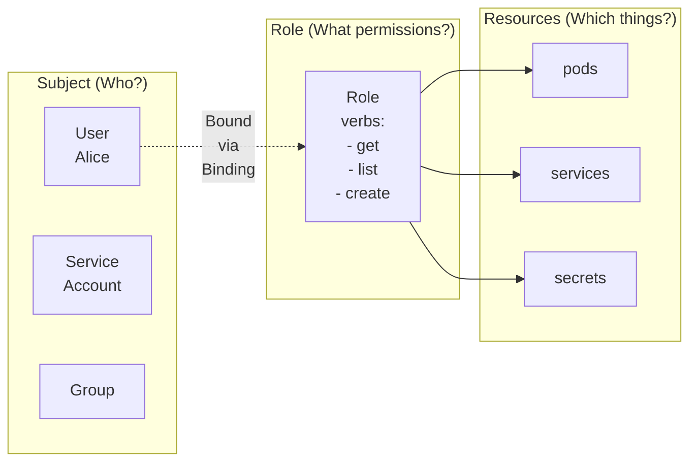

> **Складність**: `[СЕРЕДНЯ]` — поширена тема на іспиті
>
> **Час на проходження**: 40–50 хвилин
>
> **Передумови**: Модуль 1.1 (Площина управління), розуміння просторів імен

---

## Що ви зможете робити

Після завершення цього модуля ви зможете:

- **Спроєктувати** області видимості RBAC на рівні простору імен і кластера для доступу команд за принципом найменших привілеїв.
- **Впровадити** Role, ClusterRole, RoleBinding, ClusterRoleBinding та прив'язки сервісних акаунтів за допомогою `kubectl`.
- **Діагностувати** помилки авторизації Forbidden за допомогою `kubectl auth can-i`, імперсонації та перевірки прив'язок.
- **Оцінити** ризики підвищення привілеїв через символи підстановки, вбудовані ролі, `bind`, `escalate`, `impersonate` та доступ до Secret'ів.
- **Порівняти** RBAC із режимами авторизації Node та Webhook для спеціалізованих вимог безпеки.

---

## Чому цей модуль важливий

Гіпотетичний сценарій: платформа розробки розміщує п'ять продуктових команд в одному кластері Kubernetes, де кожну команду ізольовано простором імен, а кожен конвеєр розгортання працює як власний сервісний акаунт. Одна команда просить дозвіл перезапускати поди, інша просить доступ лише для читання до журналів продакшену, а стек моніторингу просить можливість виявляти поди в кожному просторі імен. Якщо адміністратор надає `cluster-admin`, бо так швидше, кластер працюватиме наступну годину, але кожне скомпрометоване робоче навантаження й кожен викрадений токен конвеєра тепер матимуть шлях до контролю над продакшеном.

RBAC — це механізм, який перетворює ці неформальні прохання на точні дозволи API. Автентифікація лише відповідає на питання, хто зробив запит; авторизація вирішує, чи може ця ідентичність виконати дієслово на кшталт `get`, `create` або `delete` щодо ресурсу на кшталт `pods`, `deployments`, `secrets` чи `rolebindings`. Іспит Certified Kubernetes Administrator очікує, що ви ухвалюватимете це рішення під тиском часу, але та сама навичка важливіша у продакшені, бо помилки RBAC залишаються непомітними доти, доки користувача не заблокують або доки атакувальника не зупинять.

Цей модуль навчає RBAC як інструмент операційного проєктування, а не як купу YAML. Ви побудуєте ті самі чотири види об'єктів RBAC, що використовуються в реальних кластерах, прив'яжете їх до користувачів, груп і сервісних акаунтів, перевірите результат за допомогою імперсонації та поміркуєте про вбудовані ролі, агрегацію й засоби контролю ескалації. Мета не в тому, щоб запам'ятати кожен рядок дозволу; мета — прочитати помилку Forbidden і точно знати, яка область видимості, суб'єкт, посилання на роль чи дієслово могли б її пояснити.

Аналогія з фізичною перепусткою корисна, доки ви тримаєте область видимості чіткою. Role чи ClusterRole — це рівень перепустки, який визначає, до яких кімнат можна заходити, тоді як RoleBinding чи ClusterRoleBinding — це призначення, що видає цей рівень перепустки особі, групі або робочій ідентичності. Kubernetes додає один важливий нюанс: придатне для повторного використання визначення перепустки рівня кластера можна видати лише всередині одного простору імен, коли RoleBinding посилається на ClusterRole.

## Конвеєр авторизації: хто вирішує?

Кожен запит до API Kubernetes надходить до API-сервера з набором атрибутів: автентифікований користувач, необов'язкові групи, запитуване дієслово, група API, ресурс, простір імен, ім'я ресурсу та інколи URL без ресурсу на кшталт `/metrics`. Авторизація починається лише після того, як автентифікація ідентифікувала того, хто робить запит, тож RBAC не є системою входу. Це шар політики, який відповідає на питання, чи може вже ідентифікований суб'єкт виконати одну запитувану дію.

API-сервер може запускати кілька авторизаторів, і їхній порядок має значення. Традиційний прапорець — `--authorization-mode`, зі значеннями на кшталт `Node`, `RBAC`, `Webhook`, `ABAC` (застарілий і відсутній у кластерах для іспиту CKA), `AlwaysAllow` та `AlwaysDeny`; сучасні кластери також можуть використовувати файл конфігурації авторизації. Кожен авторизатор повертає «дозволити», «заборонити» або «не маю думки», і API-сервер зупиняється, щойно якийсь авторизатор дає остаточну відповідь.

Дозволи RBAC є адитивними, тобто немає правила заборони, яке можна було б розмістити в Role, щоб скасувати дозвіл, наданий деінде. Якщо в Аліси є одна прив'язка, що надає `get` для подів, і ще одна, що надає `delete` для подів, Аліса має обидві можливості. Така адитивна модель робить обчислення передбачуваним, але вона також означає, що найменші привілеї треба проєктувати, надаючи менше, а не надаючи широко й намагаючись відняти пізніше.

Авторизація також відокремлена від контролю допуску. RBAC може вирішити, що користувач може створювати поди, але плагіни допуску все одно отримують пізнішу нагоду відхилити под, бо він порушує Pod Security, квоту, політику образів чи інше правило кластера. Ця відмінність має значення, коли ви бачите помилку після того, як RBAC виглядає правильним: Forbidden зазвичай вказує на авторизацію, тоді як повідомлення про валідацію чи допуск часто вказують на пізнішу стадію площини управління.

Небезпечна конфігурація, яку варто запам'ятати, — це `AlwaysAllow,RBAC`. Оскільки перший авторизатор схвалює все, RBAC ніколи не отримує корисної нагоди щось обмежити, і кластер поводиться так, наче авторизацію вимкнено. Ця деталь виглядає простою, але вона добра пастка для іспиту, бо прапорець усе ще містить слово `RBAC`, хоча попередній авторизатор уже ухвалив рішення.

Авторизація Node — це режим спеціального призначення для kubelet'ів, а не загальна заміна RBAC. Облікові дані kubelet мають ідентифікуватися як `system:node:<nodeName>` і належати до групи `system:nodes`; авторизатор Node тоді дозволяє kubelet читати й записувати лише ті об'єкти API, які потрібні для подів, запланованих на цю ноду. У посиленому кластері авторизацію Node поєднують із плагіном допуску `NodeRestriction`, який обмежує kubelet'и власним об'єктом Node та власними прив'язаними подами.

Авторизація Webhook делегує рішення зовнішньому HTTP-сервісу. Це може бути корисно, коли кластер має інтегруватися з центральним рушієм політик чи корпоративним сервісом авторизації, але це також додає синхронну залежність на шлях запиту. Якщо вебхук повільний, недоступний або налаштований з неправильною поведінкою при відмові, звичайні запити до API можуть стати повільними або зазнавати невдачі навіть тоді, коли об'єкти RBAC усередині кластера виглядають правильно.

Не плутайте авторизацію Webhook із вебхуками допуску — валідаційними чи мутаційними. Вебхуки авторизації відповідають на питання, чи дозволено запит узагалі, перед збереженням і перед тим, як допуск змінить об'єкт. Вебхуки допуску оцінюють об'єкт після того, як авторизація вже дозволила операцію, тобто вони добрі для політики щодо форми об'єкта, але не є заміною правильного RBAC щодо того, хто може викликати API.

Зробіть паузу й передбачте: якщо кластер працює з `Node,RBAC,Webhook`, запит kubelet може бути схвалений авторизацією Node ще до того, як консультуватимуть RBAC, тоді як запит людини-користувача до простору імен зазвичай доходить до RBAC. Чого б ви очікували, якби кожен авторизатор повертав «не маю думки»? Усталеною відповіддю є заборона, тож чиста відповідь Forbidden часто означає, що жоден налаштований авторизатор не знайшов відповідного дозволу.

Коли ви усуваєте проблеми з авторизацією, відокремлюйте шлях запиту від об'єкта політики. Помилку Forbidden у `kubectl get pods -n dev` могло спричинити відсутність RoleBinding, неправильний суб'єкт, Role у неправильному просторі імен або невідповідність групи API. Помилка Forbidden від kubelet чи агрегованого API-сервера натомість може стосуватися авторизації Node чи Webhook, тож перше діагностичне питання завжди таке: яка ідентичність і який авторизатор насправді задіяні.

## Об'єкти RBAC: область видимості, правила та групи API

API RBAC має чотири види об'єктів, усі в групі API `rbac.authorization.k8s.io`. Role та ClusterRole визначають дозволи, тоді як RoleBinding і ClusterRoleBinding прикріплюють ці дозволи до суб'єктів. Більшість завдань CKA можна розв'язати, правильно поєднавши ці чотири об'єкти із запитуваним простором імен та запитуваною ідентичністю суб'єкта.

| Ресурс | Область видимості | Призначення |
|----------|-------|---------|
| **Role** | Простір імен | Надає дозволи в межах простору імен |
| **ClusterRole** | Кластер | Надає дозволи на рівні всього кластера |
| **RoleBinding** | Простір імен | Прив'язує Role/ClusterRole до суб'єктів у просторі імен |
| **ClusterRoleBinding** | Кластер | Прив'язує ClusterRole до суб'єктів на рівні всього кластера |

Role завжди належить одному простору імен, і кожне правило всередині цієї Role обчислюється лише для запитів у цьому просторі імен. ClusterRole не прив'язана до простору імен, тож вона може описувати дозволи для ресурсів кластерного рівня, як-от Node та PersistentVolume, або визначати придатні для повторного використання дозволи для ресурсів простору імен, як-от поди та сервіси. Тонкий, але потужний патерн — це використання RoleBinding простору імен, яка посилається на ClusterRole: вона повторно використовує набір правил ClusterRole, обмежуючи надання простором імен RoleBinding.



Уявіть правило як речення з трьома обов'язковими іменниками: група API, ресурс і дієслово. Група API визначає сімейство API, ресурс визначає колекцію об'єктів або субресурс, а дієслово визначає операцію. Якщо будь-яка частина неправильна, правило може виглядати розумним для людини, але не відповідатиме реальному запиту, який обчислює API-сервер.

| Дієслово | Опис |
|------|-------------|
| `get` | Прочитати один ресурс |
| `list` | Отримати список ресурсів (отримати всі) |
| `watch` | Спостерігати за змінами |
| `create` | Створити нові ресурси |
| `update` | Змінити наявні ресурси |
| `patch` | Частково змінити ресурси |
| `delete` | Видалити ресурси |
| `deletecollection` | Видалити кілька ресурсів |

Поширена група лише для читання — це `get`, `list` та `watch`, і ви постійно бачитимете цю комбінацію в ролях для перегляду та ролях моніторингу. Доступ для читання-запису зазвичай додає `create`, `update`, `patch` та `delete`, тоді як повний контроль використовує `*` для всіх дієслів. Символи підстановки зручні в лабораторії, але в спільному кластері вони також надають майбутні дієслова та майбутні ресурси, яких не існувало, коли роль було написано.

Дієслова Kubernetes — це логічні операції API, а не завжди команди оболонки один-до-одного. Команда на кшталт `kubectl logs` зазвичай перевіряє субресурс журналу пода, тоді як `kubectl scale` перевіряє субресурс `scale` для типу робочого навантаження. Коли команда несподівано не спрацьовує, перекладіть команду на ресурс і субресурс, які бачить API-сервер; інакше ви можете й далі надавати доступ до батьківського ресурсу, тоді як фактичний субресурс залишається забороненим.

RBAC містить особливі адміністративні дієслова, які мають змусити вас пригальмувати. Дієслово `bind` контролює, чи може користувач створити прив'язку, що посилається на роль, дозволами якої він ще не володіє. Дієслово `escalate` контролює, чи може користувач створити або оновити Role чи ClusterRole з дозволами понад власні, а `impersonate` дозволяє суб'єкту запиту діяти від імені іншого користувача, групи чи сервісного акаунта для запитів до API.

```yaml
# role-pod-reader.yaml
apiVersion: rbac.authorization.k8s.io/v1
kind: Role
metadata:
  name: pod-reader
  namespace: default
rules:
  - apiGroups: [""]          # "" = core API group (pods, services, etc.)
    resources: ["pods"]
    verbs: ["get", "list", "watch"]
```

```bash
# Apply the Role
kubectl apply -f role-pod-reader.yaml

# Or create imperatively
kubectl create role pod-reader \
  --verb=get,list,watch \
  --resource=pods \
  -n default
```

Ця Role навмисно вузька: вона надає доступ лише для читання до подів у просторі імен `default` і нічого більше. Вона не надає доступ до подів у `production`, не надає доступ до Secret'ів у `default` і не надає доступ до Node, бо Node мають кластерну область видимості. API-сервер не виводить пов'язані ресурси; ви маєте назвати кожен ресурс і субресурс, який насправді потрібен робочому навантаженню чи користувачу.

```yaml
# clusterrole-node-reader.yaml
apiVersion: rbac.authorization.k8s.io/v1
kind: ClusterRole
metadata:
  name: node-reader
rules:
  - apiGroups: [""]
    resources: ["nodes"]
    verbs: ["get", "list", "watch"]
```

```bash
# Apply
kubectl apply -f clusterrole-node-reader.yaml

# Or imperatively
kubectl create clusterrole node-reader \
  --verb=get,list,watch \
  --resource=nodes
```

ClusterRole — це правильне місце для дозволів на Node, бо Node не належать простору імен. Якби ви спробували розмістити `nodes` у Role, об'єкт міг би бути прийнятий, але правило не може авторизувати запит до Node кластерного рівня всередині простору імен. Ця відмінність — поширене джерело помилок на іспиті, бо багато команд виглядають схожими, доки ви не запитаєте, чи має цільовий ресурс стовпець простору імен у `kubectl api-resources`.

Зробіть паузу й передбачте: ви створюєте Role з `verbs: ["get", "list"]` для `resources: ["pods"]` у просторі імен `dev`. Перш ніж щось перевіряти, вирішіть, чи може користувач бачити поди в `production`, отримувати список Node чи спостерігати за змінами подів у `dev`. Правильне міркування полягає в тому, що простір імен, ресурс і дієслово мають усі збігатися, тож дозволено лише `get` та `list` для подів у `dev`.

```yaml
apiVersion: rbac.authorization.k8s.io/v1
kind: Role
metadata:
  name: developer
  namespace: dev
rules:
  # Pods: full access
  - apiGroups: [""]
    resources: ["pods", "pods/log", "pods/exec"]
    verbs: ["*"]

  # Deployments: full access
  - apiGroups: ["apps"]
    resources: ["deployments", "replicasets"]
    verbs: ["*"]

  # Services: create and view
  - apiGroups: [""]
    resources: ["services"]
    verbs: ["get", "list", "create", "delete"]

  # ConfigMaps: read only
  - apiGroups: [""]
    resources: ["configmaps"]
    verbs: ["get", "list"]

  # Secrets: no access (not listed = denied)
```

Кілька правил дозволяють вам виразити різні рівні дозволів для різних груп API, не створюючи окрему Role для кожного ресурсу. Зверніть увагу, що `pods`, `services` та `configmaps` використовують порожню основну групу API, тоді як `deployments` і `replicasets` використовують `apps`. Також зверніть увагу на відсутність Secret'ів: RBAC за замовчуванням забороняє, коли жодне правило не збігається, тож залишення Secret'ів поза переліком — це спосіб найменших привілеїв уникнути їх надання.

Поле `resourceNames` може обмежити правило конкретними наявними іменами об'єктів, як-от дозвіл оновлювати лише ConfigMap з іменем `frontend-config`. Це може бути корисним для оренд вибору лідера, схвалених об'єктів обслуговування або вузького автоматизаційного акаунта. Воно не може обмежити запити `create` верхнього рівня, бо ім'я об'єкта може не існувати на момент авторизації, і воно не може корисним для конкретного об'єкта способом обмежити `deletecollection`.

ClusterRole мають одну додаткову можливість, якої Role не мають: `nonResourceURLs`. Ці дозволи застосовуються до шляхів API-сервера, які не є об'єктами Kubernetes, як-от `/healthz`, `/livez`, `/readyz` чи `/metrics`. Оскільки URL без ресурсів не належать простору імен, Role простору імен не може їх надати, і правильний дизайн — це ClusterRole, прив'язана на рівні кластера або вузько до ідентичності, якій потрібна ця кінцева точка.

Іменовані ресурси — це ще одне місце, де форма запиту має значення. Якщо ви обмежуєте правило за допомогою `resourceNames`, запит, що отримує список колекції, має містити селектор поля для відповідного імені, бо API-сервер не може авторизувати необмежений список щодо одного дозволеного імені об'єкта. Це робить `resourceNames` корисним для дуже специфічної автоматизації, але незручним для людей, які очікують, що звичайні команди list і watch працюватимуть без додаткових селекторів.

| Група API | Ресурси |
|-----------|-----------|
| `""` (основна) | pods, services, configmaps, secrets, namespaces, nodes, persistentvolumes |
| `apps` | deployments, replicasets, statefulsets, daemonsets |
| `batch` | jobs, cronjobs |
| `networking.k8s.io` | networkpolicies, ingresses |
| `rbac.authorization.k8s.io` | roles, clusterroles, rolebindings, clusterrolebindings |
| `storage.k8s.io` | storageclasses, volumeattachments |

```bash
# Find the API group for any resource
kubectl api-resources | grep deployment
# NAME         SHORTNAMES   APIVERSION   NAMESPACED   KIND
# deployments  deploy       apps/v1      true         Deployment
#                           ^^^^
#                           API group is "apps"
```

Перш ніж запускати це в середовищі іспиту, передбачте групу, яку ви очікуєте побачити, а потім перевірте її за допомогою `kubectl api-resources`. Ця звичка запобігає одній із найпоширеніших помилок RBAC: наданню `apiGroups: [""]` для ресурсу, який насправді живе в `apps`, `batch` чи іншій іменованій групі API. Основна група API — це порожній рядок `""`, а не `"core"`, тому приклади YAML явно беруть порожнє значення в лапки.

## Прив'язки, суб'єкти та ідентичність робочих навантажень

Суб'єкти RBAC — це ідентичності, які отримують дозволи. Суб'єктом може бути User, Group або ServiceAccount; сам Kubernetes не зберігає звичайні об'єкти User, тож ці імена надходять із шару автентифікації. ServiceAccount — це об'єкти API Kubernetes, і оскільки вони належать простору імен, суб'єкт ServiceAccount має містити і `name`, і `namespace`.

```yaml
# rolebinding-alice-pod-reader.yaml
apiVersion: rbac.authorization.k8s.io/v1
kind: RoleBinding
metadata:
  name: alice-pod-reader
  namespace: default
subjects:
  - kind: User
    name: alice
    apiGroup: rbac.authorization.k8s.io
roleRef:
  kind: Role
  name: pod-reader
  apiGroup: rbac.authorization.k8s.io
```

```bash
# Imperative command
kubectl create rolebinding alice-pod-reader \
  --role=pod-reader \
  --user=alice \
  -n default
```

Ця RoleBinding надає Алісі Role `pod-reader` лише в просторі імен `default`. RoleBinding належить простору імен навіть тоді, коли її суб'єкт є концепцією рівня кластера, як-от ім'я користувача чи групи. Якщо Алісі пізніше знадобиться той самий доступ у `staging`, ви створюєте ще одну RoleBinding у `staging` або використовуєте ретельно обрану ClusterRoleBinding, якщо доступ справді має охоплювати кожен простір імен.

Поле `roleRef` навмисно стабільне після створення прив'язки. На практиці, якщо прив'язка посилається на неправильну роль, видалення й повторне створення прив'язки зрозуміліше, ніж спроба перетворити одне надання на інше. Така поведінка підтримує можливість аудиту: зміна того, хто отримує роль, відрізняється від зміни того, яку роль надано, і інструменти перевірки можуть розглядати ці операції як окремі події безпеки.

```yaml
# clusterrolebinding-bob-node-reader.yaml
apiVersion: rbac.authorization.k8s.io/v1
kind: ClusterRoleBinding
metadata:
  name: bob-node-reader
subjects:
  - kind: User
    name: bob
    apiGroup: rbac.authorization.k8s.io
roleRef:
  kind: ClusterRole
  name: node-reader
  apiGroup: rbac.authorization.k8s.io
```

```bash
# Imperative command
kubectl create clusterrolebinding bob-node-reader \
  --clusterrole=node-reader \
  --user=bob
```

ClusterRoleBinding навмисно широка. Вона прив'язує ClusterRole по всьому кластеру, що необхідно для ресурсів кластерного рівня, як-от Node, але ризиковано, коли ClusterRole описує ресурси простору імен, як-от поди. Якщо ви прив'яжете `view` за допомогою ClusterRoleBinding, суб'єкт зможе переглядати дозволені ресурси в кожному просторі імен, а не лише в одному просторі імен команди.

```yaml
apiVersion: rbac.authorization.k8s.io/v1
kind: RoleBinding
metadata:
  name: dev-team-access
  namespace: development
subjects:
  # Bind to a user
  - kind: User
    name: alice
    apiGroup: rbac.authorization.k8s.io

  # Bind to a group
  - kind: Group
    name: developers
    apiGroup: rbac.authorization.k8s.io

  # Bind to a ServiceAccount
  - kind: ServiceAccount
    name: cicd-deployer
    namespace: development
roleRef:
  kind: Role
  name: developer
  apiGroup: rbac.authorization.k8s.io
```

Одна прив'язка може містити кілька суб'єктів, але операційний компроміс — це чіткість аудиту. Прив'язка з іменем `dev-team-access`, яка надає доступ групі команди та акаунту конвеєра, може бути зручною, але вона також означає, що майбутні перевіряльники мають уважно дослідити перелік суб'єктів, щоб зрозуміти, хто має надання. У регульованих середовищах окремі прив'язки для людей і робочих навантажень часто роблять перевірку доступу легшою, навіть коли вони посилаються на те саме посилання на роль.

Зупиніться й подумайте: вам потрібно надати розробнику доступ лише для читання до подів у `staging`, але не в `production`. Ви можете створити Role `pod-reader` у `staging` і прив'язати її там, або створити придатну для повторного використання ClusterRole й прив'язати цю ClusterRole за допомогою RoleBinding у `staging`. Другий підхід зручніший для супроводу, коли багатьом просторам імен потрібні ті самі правила, тоді як RoleBinding усе одно тримає фактичне надання в межах простору імен.

```yaml
# Use the built-in "edit" ClusterRole in the "production" namespace only
apiVersion: rbac.authorization.k8s.io/v1
kind: RoleBinding
metadata:
  name: alice-edit-production
  namespace: production
subjects:
  - kind: User
    name: alice
    apiGroup: rbac.authorization.k8s.io
roleRef:
  kind: ClusterRole     # Using ClusterRole
  name: edit            # Built-in ClusterRole
  apiGroup: rbac.authorization.k8s.io

# Alice can edit resources in "production" namespace only
```

Цей приклад — патерн придатної для повторного використання ClusterRole в його найкомпактнішій формі. ClusterRole `edit` має кластерну область видимості як об'єкт, але RoleBinding існує в `production`, тож ефективний дозвіл застосовується лише всередині `production`. Це той патерн, до якого вам варто звертатися, коли багато просторів імен ділять один профіль дозволів, але кожен простір імен має різних користувачів, груп або сервісних акаунтів.

ServiceAccount надають ідентичність подам і контролерам. Под, який не встановлює `.spec.serviceAccountName`, отримує сервісний акаунт `default` у своєму просторі імен від контролера допуску ServiceAccount, і сучасний Kubernetes за замовчуванням монтує короткоживучі проєктовані токени, коли автоматичне монтування токенів увімкнено. Ця усталена ідентичність зазвичай має дуже мало дозволів, але це все одно ідентичність, яку вам слід враховувати в дизайні RBAC.

```bash
# List ServiceAccounts
kubectl get serviceaccounts
kubectl get sa

# Every namespace has a "default" ServiceAccount
kubectl get sa default -o yaml
```

```bash
# Create a ServiceAccount
kubectl create serviceaccount myapp-sa

# Or with YAML
cat > myapp-sa.yaml << 'EOF'
apiVersion: v1
kind: ServiceAccount
metadata:
  name: myapp-sa
  namespace: default
EOF
kubectl apply -f myapp-sa.yaml
```

Створення спеціального сервісного акаунта — це еквівалент для робочого навантаження видачі окремої перепустки замість того, щоб дозволяти кожному процесу ділити загальну гостьову перепустку будівлі. Це дає вам одне місце для прив'язки дозволів, одну ідентичність для аудиту та одне ім'я для використання, коли помилка Forbidden повідомляє `system:serviceaccount:<namespace>:<name>`. Це також тримає дозволи застосунку окремо від дозволів конвеєра розгортання, які зазвичай мають бути різними ідентичностями.

Монтування токена ServiceAccount — це окреме дизайнерське рішення від надань RBAC. Под може мати ім'я ServiceAccount для секретів витягування образів чи угод щодо ідентичності, водночас вимикаючи автоматичне монтування токенів, коли він ніколи не викликає API Kubernetes. Зменшення впливу токенів не замінює RBAC, але воно зменшує цінність скомпрометованого контейнера, бо там може не бути доступних облікових даних API для повторного використання.

```bash
# Create a Role
kubectl create role pod-reader \
  --verb=get,list,watch \
  --resource=pods

# Bind it to the ServiceAccount
kubectl create rolebinding myapp-pod-reader \
  --role=pod-reader \
  --serviceaccount=default:myapp-sa
#                  ^^^^^^^^^^^^^^^^^
#                  namespace:name format
```

```yaml
apiVersion: v1
kind: Pod
metadata:
  name: myapp
spec:
  serviceAccountName: myapp-sa    # Use this ServiceAccount
  containers:
  - name: myapp
    image: nginx
```

Важлива діагностична деталь — це простір імен ServiceAccount. RoleBinding у `production` може прив'язати ServiceAccount із `cicd`, але суб'єкт має явно вказувати `namespace: cicd`; інакше прив'язка може посилатися на неправильну ідентичність або на ServiceAccount, який не використовується подом. Коли конвеєр повідомляє Forbidden, порівняйте ім'я ServiceAccount пода із суб'єктом RoleBinding, перш ніж переписувати саму Role.

## Вбудовані ролі, агрегація та запобіжники ескалації

Kubernetes встановлює усталені ClusterRole та ClusterRoleBinding, щоб основні компоненти й поширені патерни доступу для користувачів працювали одразу. Деякі імена починаються з `system:`, що сигналізує про власність площини управління й має перешкоджати ручному редагуванню. Інші імена, як-от `cluster-admin`, `admin`, `edit` та `view`, призначені для того, щоб адміністратори прив'язували їх до користувачів, груп або сервісних акаунтів із ретельно обраною областю видимості.

| ClusterRole | Дозволи |
|-------------|---------|
| `cluster-admin` | Повний доступ до всього (суперкористувач) |
| `admin` | Повний доступ у межах простору імен |
| `edit` | Читання/запис більшості ресурсів, без RBAC |
| `view` | Доступ лише для читання до більшості ресурсів |

Роль `cluster-admin` — це роль суперкористувача, і ClusterRoleBinding до неї фактично означає повний контроль над кластером. Роль `admin` зазвичай надають через RoleBinding у просторі імен, де вона дає широке адміністрування простором імен, не надаючи контролю над ресурсами кластерного рівня. Роль `edit` дозволяє більшість змін об'єктів простору імен, але уникає об'єктів RBAC, тоді як `view` є лише для читання й навмисно уникає Secret'ів, бо читабельні Secret'и часто означають придатні до використання облікові дані.

Вбудовані імена зручні, але їхнє значення для безпеки залежить від інших ідентичностей у просторі імен. Наприклад, суб'єкт із широкими правами створення подів може бути спроможним створити под, що використовує потужний сервісний акаунт, уже наявний у просторі імен, навіть якщо суб'єкт не може напряму редагувати об'єкти RBAC. Саме тому адміністрування простором імен — це не лише дієслова щодо ресурсів; воно також включає перегляд наявних сервісних акаунтів, Secret'ів і засобів контролю допуску.

```bash
# See all built-in ClusterRoles
kubectl get clusterroles | grep -v "^system:"

# Inspect a ClusterRole
kubectl describe clusterrole edit
```

API-сервер автоматично узгоджує усталені об'єкти RBAC під час запуску, коли RBAC активний. Якщо усталеній ClusterRole бракує потрібного правила або усталеній прив'язці бракує потрібного суб'єкта, Kubernetes відновлює відсутню частину, щоб основні компоненти продовжували працювати під час оновлень. Така поведінка захищає площину управління, але вона також означає, що вам не слід розглядати ручне редагування ролей `system:` як надійний механізм налаштування.

Агрегація ClusterRole — це точка розширення за вбудованими ролями `admin`, `edit` та `view`. ClusterRole може визначити `aggregationRule`, який вибирає інші ClusterRole за міткою, а контролер копіює вибрані правила в агреговану роль. Стандартні мітки відповідають патерну `rbac.authorization.k8s.io/aggregate-to-<clusterrole-name>: "true"`, що дозволяє постачальникам кастомних ресурсів додавати правила читання чи редагування до звичних ролей для користувачів.

```bash
# Give alice admin access to namespace "myapp"
kubectl create rolebinding alice-admin \
  --clusterrole=admin \
  --user=alice \
  -n myapp

# Give bob view access to namespace "production"
kubectl create rolebinding bob-view \
  --clusterrole=view \
  --user=bob \
  -n production
```

Агрегація корисна, але це також місце, де маленька мітка може мати широкий вплив. ClusterRole з міткою для агрегації в `view` може надати кожному суб'єкту з доступом `view` доступ до нового кастомного ресурсу, тоді як мітка для агрегації в `edit` може надати мутацію в багатьох просторах імен, де прив'язано `edit`. Переглядайте мітки агрегації з такою самою серйозністю, яку ви застосовували б до прямих прив'язок.

Kubernetes містить явне запобігання ескалації для адміністрування RBAC. Користувач може створити або оновити Role чи ClusterRole лише тоді, коли він уже має кожен дозвіл, що міститься в новій ролі, якщо тільки він не має особливого дієслова `escalate` для цього типу ресурсу RBAC. Так само користувач може створити або оновити прив'язку лише тоді, коли він уже володіє дозволами вказаної ролі у відповідній області видимості, якщо тільки він не має дієслова `bind` для цієї ролі.

Цей запобіжник не дає розробнику простору імен надати собі `cluster-admin` лише тому, що він може створювати RoleBinding. Він також пояснює, чому адміністрування RBAC інколи дає збій у несподіваний спосіб: суб'єкт запиту може мати дозвіл створювати ресурс `rolebindings`, але не дозвіл прив'язувати потужну ClusterRole, названу в `roleRef`. Діагностуючи цей випадок, дослідіть і дозвіл створювати прив'язки, і повноваження суб'єкта прив'язувати вказану роль.

Запобігання підвищенню привілеїв застосовується на API-сервері, тож воно захищає і декларативні маніфести, і імперативні команди `kubectl create rolebinding`. Контролер GitOps, інсталятор пакетів чи людина-оператор усе одно представляють ідентичність, і ця ідентичність має бути авторизована для ролі чи прив'язки, яку вона намагається створити. Коли посібник зі встановлення просить `bind` чи `escalate`, розглядайте це як рішення безпеки платформи, а не як рутинний дозвіл простору імен.

Дієслово `impersonate` належить до тієї самої ментальної категорії, бо воно дозволяє суб'єкту попросити API-сервер обчислювати запити так, наче їх робить інший користувач, група чи сервісний акаунт. Адміністратори використовують імперсонацію для тестування й підтримки, але широка імперсонація рівноцінна широкому делегованому доступу. Якщо користувач може імперсонувати `system:masters` чи привілейований сервісний акаунт, кластер обчислюватиме його пізніші запити як цю сильнішу ідентичність.

## Тестування та діагностика дозволів

Усунення проблем RBAC має бути систематичним, бо багато збоїв виглядають однаково в командному рядку. Повідомлення Forbidden зазвичай містить користувача, дієслово, ресурс, групу API та простір імен, і ці поля — найшвидший шлях до зламаного об'єкта. Якщо помилка каже, що Аліса не може отримати список `pods` у групі API `""` в просторі імен `default`, не починайте з Деплойментів чи ClusterRole для Node; починайте з дозволів на список подів у цьому просторі імен.

Що сталося б, якби ви створили дві RoleBinding у тому самому просторі імен — одну, що надає `get` для подів, і одну, що надає `delete` для подів? Користувач отримує обидва дозволи, бо RBAC є адитивним. Якщо ви хотіли б запобігти `delete`, ви видалили б прив'язку або уникнули надання ролі, що містить `delete`; ви не додавали б правило заборони, бо в RBAC немає правила заборони.

Команда `kubectl auth can-i` обгортає API перевірки авторизації Kubernetes, зокрема самоперевірки та імперсоновані перевірки. Це не заміна читанню YAML Role й прив'язки, але вона каже вам, яке рішення прийняв би API-сервер для конкретного запиту. Використовуйте її до та після зміни, щоб ви могли розрізнити «політику не застосовано» від «політику застосовано, але вона все одно неправильна».

```bash
# Check your own permissions
kubectl auth can-i create pods
kubectl auth can-i delete deployments
kubectl auth can-i '*' '*'  # Am I admin?

# Check in a specific namespace
kubectl auth can-i create pods -n production

# Check for another user (requires admin)
kubectl auth can-i create pods --as=alice
kubectl auth can-i delete nodes --as=bob

# Check for a ServiceAccount
kubectl auth can-i list secrets --as=system:serviceaccount:default:myapp-sa
```

Перевірки імперсонації вимагають дозволу імперсонувати цільову ідентичність, тож невдача із запуском діагностики сама по собі може бути проблемою RBAC. У кластері для іспиту ви часто працюєте як адміністратор і можете вільно використовувати `--as`; у продакшені роль підтримки може потребувати вузько обмеженої імперсонації, щоб тестувати сервісні акаунти, не отримуючи їхніх справжніх токенів. Завжди робіть імперсонований простір імен явним для сервісних акаунтів, використовуючи повний рядок `system:serviceaccount:<namespace>:<name>`.

```bash
# What can I do in this namespace?
kubectl auth can-i --list

# What can alice do?
kubectl auth can-i --list --as=alice

# What can a ServiceAccount do?
kubectl auth can-i --list --as=system:serviceaccount:default:myapp-sa
```

Форма списку корисна для широких аудитів, але вона може бути зашумленою, бо дозволи з кількох прив'язок об'єднуються. Сфокусована перевірка на кшталт `kubectl auth can-i get secrets -n production --as=...` краща, коли ви маєте одну очікувану дію. Використовуйте форму списку, коли ви підозрюєте, що символ підстановки, вбудована роль чи ClusterRoleBinding надали більше, ніж передбачалося.

Перегляди правил також мають сліпу пляму: вони показують ефективні дозволи, які може підсумувати API-сервер, але не обов'язково організаційну причину, чому ці дозволи існують. Якщо користувач успадковує доступ через кілька груп, вивід може сказати вам, що `delete pods` дозволено, не називаючи квитка, команди чи бізнес-власника за наданням. Поєднуйте вивід команди з перевіркою прив'язок і членством у групах вашого провайдера ідентичності, коли виконуєте реальну перевірку доступу.

```bash
# Error: pods is forbidden
kubectl get pods
# Error: User "alice" cannot list resource "pods" in API group "" in namespace "default"

# Debug steps:
# 1. Check what permissions the user has
kubectl auth can-i --list --as=alice

# 2. Check what roles are bound to the user
kubectl get rolebindings -A -o wide | grep alice
kubectl get clusterrolebindings -o wide | grep alice

# 3. Check the role's rules
kubectl describe role <role-name> -n <namespace>
kubectl describe clusterrole <clusterrole-name>
```

Сценарій вправи: конвеєр CI/CD не може розгорнути в `production`, а `kubectl auth can-i create deployments -n production --as=system:serviceaccount:cicd:pipeline` повертає `no`. Імовірний шлях пошуку — це простір імен суб'єкта, простір імен RoleBinding, група API Role та написання ресурсу deployment. Якщо RoleBinding живе в `production`, але суб'єкт випадково каже `namespace: production`, прив'язка посилається на `system:serviceaccount:production:pipeline`, а не на справжню ідентичність конвеєра в `cicd`.

Kubernetes 1.35 та новіші заслуговують особливої уваги щодо потокових субресурсів, які використовуються `exec`, `attach` та `port-forward`. Ці операції відкривають з'єднання до субресурсу пода, і сучасна авторизація очікує дозвіл `create` для субресурсів на кшталт `pods/exec`, `pods/attach` та `pods/portforward`. Застаріла роль, яка надавала лише `get` для `pods/exec`, може спричинити заплутані збої після оновлення, бо звичайні читання подів усе одно працюють.

Найбезпечніший спосіб оновити ці потокові дозволи — розглядати їх як інтерактивний доступ, а не як звичайний перегляд. Користувач, який може виконати exec у контейнер, може читати змінні середовища, досліджувати змонтовані файли та запускати команди з Linux-дозволами контейнера. Тому надання `pods/exec` має бути ближчим до надання доступу до оболонки, ніж до надання `pods/log`, і воно заслуговує на окрему роль, коли лише підмножині відповідальних потрібен цей доступ.

```yaml
# FRAGILE (worked for kubectl's WebSocket path before v1.35):
- apiGroups: [""]
  resources: ["pods/exec"]
  verbs: ["get"]

# CORRECT (required for SPDY and WebSocket, enforced everywhere in v1.35+):
- apiGroups: [""]
  resources: ["pods/exec", "pods/attach", "pods/portforward"]
  verbs: ["get", "create"]
```

Потокові субресурси завжди *передбачали* `create` як авторизаційне дієслово: застарілий транспорт SPDY завжди його вимагав. Шлях оновлення WebSocket, на який `kubectl` за замовчуванням переходить в останніх версіях, історично перевіряв лише `get` — невідповідність, що дозволяла ролі лише з `get` виконувати exec у поди. Kubernetes v1.35 закриває цю прогалину (перемикач можливостей `AuthorizePodWebsocketUpgradeCreatePermission`, бета й увімкнено за замовчуванням), тож надавайте `create` для цих субресурсів замість того, щоб покладатися на `get`.

Сценарії іспиту зазвичай поєднують помилки області видимості та суб'єкта, а не екзотичну поведінку авторизатора. Спершу пропрацюйте цільову дію: хто викликає, яке дієслово запитується, які група API та ресурс задіяні, і чи ресурс належить простору імен. Щойно ви зможете чітко вимовити це речення, потрібна Role, ClusterRole, RoleBinding чи ClusterRoleBinding часто стає очевидною.

```bash
# Create namespace
kubectl create namespace development

# Create ServiceAccount
kubectl create serviceaccount developer -n development

# Bind edit ClusterRole (read/write most resources)
kubectl create rolebinding developer-edit \
  --clusterrole=edit \
  --serviceaccount=development:developer \
  -n development
```

Цей сценарій доступу розробника використовує вбудовану ClusterRole `edit` через RoleBinding простору імен. Надання широке всередині `development`, тож воно прийнятне для навчального простору імен чи довіреного пісочного середовища розробки, але воно було б надто широким для контролера, що лише оновлює Деплойменти. Дизайнерське питання не в тому, чи працює `edit`; питання в тому, чи відповідають його включені ресурси ризику ідентичності, що його отримує.

```bash
# ServiceAccount for monitoring tools
kubectl create serviceaccount monitoring -n monitoring

# Cluster-wide read access
kubectl create clusterrolebinding monitoring-view \
  --clusterrole=view \
  --serviceaccount=monitoring:monitoring
```

Сценарій моніторингу використовує ClusterRoleBinding, бо сервісному акаунту потрібен доступ для читання в усіх просторах імен. Це все одно менш небезпечно, ніж `cluster-admin`, але воно не автоматично ідеальне, бо `view` включає багато читабельних ресурсів. Суворіший продакшен-дизайн може створити кастомну ClusterRole лише для подів, нод, просторів імен і ресурсів, пов'язаних із метриками, які інструмент моніторингу насправді використовує.

```bash
# Create role for deployments only
kubectl create role deployer \
  --verb=get,list,watch,create,update,patch,delete \
  --resource=deployments,services,configmaps \
  -n production

# Bind to CI/CD ServiceAccount
kubectl create rolebinding cicd-deployer \
  --role=deployer \
  --serviceaccount=cicd:pipeline \
  -n production
```

Приклад CI/CD навмисно прив'язує сервісний акаунт із `cicd` у простір імен `production`. Це валідне міжпросторове надання суб'єкта, бо простір імен RoleBinding контролює, де застосовується дозвіл, тоді як простір імен суб'єкта визначає, який сервісний акаунт його отримує. Якщо конвеєру також потрібно створювати Job у `batch`, Role потребує правильної групи API та ресурсу, а не ширшої прив'язки.

```bash
# Task: Create a Role that can get, list, and watch pods and services in namespace "app"

kubectl create role app-reader \
  --verb=get,list,watch \
  --resource=pods,services \
  -n app

# Task: Bind the role to user "john"
kubectl create rolebinding john-app-reader \
  --role=app-reader \
  --user=john \
  -n app

# Verify
kubectl auth can-i get pods -n app --as=john
# yes
kubectl auth can-i delete pods -n app --as=john
# no
```

Цей швидкий патерн створення зручний для іспиту, бо він доводить і позитивний, і негативний випадки. Одне `yes` може приховати надто широку роль, тоді як парне `no` підтверджує, що роль випадково не включила мутацію. Коли час дозволяє, перевірте також межу простору імен, бо багато помилок RBAC виникають через створення правильної Role в неправильному просторі імен.

```bash
# Task: Create ServiceAccount "dashboard" that can list pods across all namespaces

kubectl create serviceaccount dashboard -n kube-system

kubectl create clusterrole pod-list \
  --verb=list \
  --resource=pods

kubectl create clusterrolebinding dashboard-pod-list \
  --clusterrole=pod-list \
  --serviceaccount=kube-system:dashboard
```

Сценарій дашборда потребує доступу рівня кластера до ресурсу, що належить простору імен, тож ClusterRoleBinding доречна. Сама ClusterRole навмисно мала: вона надає `list` для подів, а не `get` для Secret'ів, не `delete` для робочих навантажень і не широкий `view`, якщо тільки дашборду справді не потрібен кожен ресурс, який включає `view`. Це той тип мінімальної кастомної ролі, що перетворює RBAC із позначки в чек-листі на засіб контролю безпеки.

## Патерни та антипатерни

Використовуйте придатні для повторного використання ClusterRole разом із RoleBinding простору імен, коли багатьом просторам імен потрібен той самий профіль дозволів, але різні суб'єкти. Цей патерн дає вам один набір правил для супроводу й багато обмежених областю видимості надань для аудиту. Він особливо добре працює для ролей розробників команд, ролей підтримки лише для читання та локальної для простору імен автоматизації, що має поводитися послідовно в усіх середовищах.

Використовуйте спеціальні сервісні акаунти для кожного робочого навантаження чи межі автоматизації. Контролер розгортання, збирач моніторингу та інтерактивний под для діагностики мають різні причини викликати API, тож вони не повинні ділити сервісний акаунт `default`. Спеціальні ідентичності роблять помилки Forbidden легшими для читання й дають змогу відкликати дозволи одного робочого навантаження, не ламаючи кожен под у просторі імен.

Використовуйте `kubectl auth can-i` як дизайнерський тест, а не лише як аварійну діагностику. Після створення ролі перевірте принаймні один очікуваний дозвіл, одну очікувану заборону та одну межу простору імен. Ця звичка ловить поширені помилки, де роль надає правильний ресурс, але прив'язка націлюється на неправильний суб'єкт, або де ClusterRoleBinding випадково перетворює вимогу простору імен на надання рівня кластера.

Уникайте прив'язування `cluster-admin` до сервісних акаунтів застосунків. Команди часто роблять це, коли контролер дає збій під час встановлення, а документація чарта пропонує широку роль заради зручності. Краща альтернатива — дослідити фактичні виклики API контролера, почати з виявлення лише для читання за потреби та додати лише ті ресурси й дієслова, які потрібні для узгодження.

Уникайте правил із символами підстановки для довгоживучих продакшен-ідентичностей, якщо тільки ви не маєте навмисної причини на рівні платформи. Символ підстановки для дієслів чи ресурсів надає майбутню поверхню API в міру розвитку кластера, зокрема CRD, встановлені пізніше. Якщо вам потрібен тимчасовий символ підстановки для діагностики, зафіксуйте його як тимчасову роботу, швидко видаліть його та замініть явними дієсловами й ресурсами, перш ніж вважати інцидент закритим.

Уникайте ручного редагування ClusterRole `system:`. Автоматичне узгодження може відновити відсутні усталені дозволи, а неправильна зміна може зламати компоненти площини управління до того, як її буде скасовано. Якщо вам потрібно розширити ролі для користувачів для кастомних ресурсів, використовуйте мітки агрегації ClusterRole; якщо вам потрібна роль компонента для конкретної платформи, створіть окрему іменовану ClusterRole й прив'яжіть її явно.

Уникайте розгляду RBAC як межі мережевої безпеки. RBAC контролює дії API-сервера, а не трафік між подами, привілеї процесу всередині контейнера чи доступ до файлової системи всередині змонтованого тому. Поєднуйте його з NetworkPolicy, Pod Security, засобами контролю допуску, політикою образів і керуванням секретами, бо под без дозволів RBAC усе одно може завдати шкоди через інші шляхи, якщо цих шарів немає.

## Структура прийняття рішень

Починайте кожне рішення RBAC із написання речення запиту: суб'єкт, дієслово, група API, ресурс, простір імен та ім'я ресурсу, якщо доречно. Наприклад, `system:serviceaccount:cicd:pipeline` потребує `create` для `deployments.apps` у `production`. Це речення каже вам, чи має роль належати простору імен, чи має прив'язка перетинати простір імен сервісного акаунта і чи вбудована роль надто широка.

Обирайте Role, коли дозвіл унікальний для одного простору імен і навряд чи буде повторно використаний. Обирайте ClusterRole, коли дозвіл стосується ресурсів кластерного рівня, URL без ресурсів чи придатного для повторного використання профілю дозволів для ресурсів простору імен. Обирайте RoleBinding, коли надання має застосовуватися в одному просторі імен, навіть якщо вказана роль є ClusterRole, та обирайте ClusterRoleBinding лише тоді, коли надання має застосовуватися на рівні всього кластера.

Коли суб'єкт — це людина, віддавайте перевагу прив'язкам груп від провайдера автентифікації над багатьма окремими прив'язками користувачів. Прив'язки груп дають змогу системам керування ідентичностями опрацьовувати процеси приєднання й вибуття, тоді як Kubernetes тримає стабільний об'єкт політики. Окремі прив'язки користувачів усе ще корисні для завдань іспиту, короткочасного аварійного доступу та малих кластерів, але вони погано старіють, коли команди змінюються.

Коли суб'єкт — це робоче навантаження, прив'язуйте точний сервісний акаунт, який використовується подом чи контролером. Не припускайте, що RoleBinding у цільовому просторі імен автоматично посилається на сервісний акаунт у цьому просторі імен чи в просторі імен конвеєра. Простір імен суб'єкта визначає ідентичність; простір імен прив'язки визначає, де застосовується Role чи надання простору імен.

Коли запит стосується `pods/exec`, `pods/attach`, `pods/portforward`, `pods/log`, `deployments/scale` чи будь-якого іншого субресурсу, називайте субресурс явно. Субресурси — це окремі цілі авторизації, бо вони надають інші можливості, ніж звичайні читання об'єктів. У Kubernetes 1.35 та новіших пам'ятайте, що субресурси потокового з'єднання потребують `create` для інтерактивної операції, а не лише дієслова читання для подів.

Коли наявна вбудована роль виглядає близькою, дослідіть її, перш ніж прив'язувати. Роль `view` уникає Secret'ів, `edit` може мутувати багато ресурсів простору імен і може дозволяти подам працювати як потужні сервісні акаунти, а `admin` ще ширша всередині простору імен. Правильне рішення базується на операційному завданні суб'єкта запиту, а не на дружньому імені вбудованої ролі.

## Чи знали ви?

1. RBAC увійшов у бета-стадію в Kubernetes v1.6 й досяг загальної доступності в Kubernetes v1.8, випущеному у вересні 2017 року.
2. API RBAC використовує чотири види об'єктів: Role, ClusterRole, RoleBinding та ClusterRoleBinding.
3. Поведінка токенів ServiceAccount суттєво змінилася після Kubernetes v1.24, де короткоживучі проєктовані токени замінили автоматичні довгоживучі токени-Secret для звичайних подів.
4. Авторизація Node — це спеціалізований авторизатор kubelet, що є стабільним починаючи з Kubernetes v1.8; пізніше уточнення, `AuthorizeNodeWithSelectors`, досягло GA в Kubernetes v1.33 й посилює доступ кожного kubelet лише до тих нод і подів, що стосуються його.

## Типові помилки

| Помилка | Чому це стається | Як це виправити |
|---------|----------------|---------------|
| Неправильна `apiGroup` | Role виглядає правильно, але запит використовує іншу групу API | Перевірте `kubectl api-resources` і використовуйте `apps` для Деплойментів, `batch` для Job та `""` для основних ресурсів |
| Відсутній простір імен у прив'язці | Прив'язку створено в неправильному просторі імен або вона надає доступ десь несподівано | Завжди перевіряйте `-n <namespace>` для RoleBinding і тестуйте передбачений простір імен за допомогою `kubectl auth can-i` |
| Забутий простір імен ServiceAccount | Суб'єкт RoleBinding посилається на неправильну ідентичність робочого навантаження | Використовуйте строгий формат `namespace:name` у командах та поле `namespace:` у YAML-суб'єктах |
| Використання Role для кластерних ресурсів | Role простору імен не можуть авторизувати запити до Node, PersistentVolume чи URL без ресурсів | Використовуйте ClusterRole для ресурсів кластерного рівня й прив'язуйте її найвужчою придатною прив'язкою |
| Порожня apiGroup без лапок | YAML чи інструменти перевірки приховують різницю між основною та іменованою групами API | Використовуйте `apiGroups: [""]` з явними лапками для основних ресурсів |
| Відсутнє дієслово `create` для субресурсів exec/attach | Потокова авторизація Kubernetes 1.35+ вимагає більшого, ніж старі правила лише з `get` | Додавайте `create` до правил `pods/exec`, `pods/attach` та `pods/portforward`, коли передбачено інтерактивний доступ |
| Надто широкий `cluster-admin` | Команди використовують найшвидше надання, щоб контролер чи дашборд запрацював | Замініть його кастомною ClusterRole, потім перевірте очікувані дозволи й заборони |
| Використання `AlwaysAllow,RBAC` | Прапорець згадує RBAC, але попередній авторизатор спершу схвалює все | Видаліть `AlwaysAllow` з продакшен-ланцюжків авторизації й перевірте активну конфігурацію API-сервера |

## Тест

<details>
<summary>1. У вашій компанії п'ять команд розробки, кожна зі своїм простором імен. Усім командам потрібен доступ для читання-запису до Деплойментів, Сервісів і ConfigMap, але не до Secret'ів. Який найзручніший для супроводу дизайн RBAC?</summary>

Створіть одну придатну для повторного використання ClusterRole, що надає спільні дозволи для ресурсів простору імен, потім створіть RoleBinding у кожному просторі імен, яка посилається на цю ClusterRole й націлюється на правильну групу команди. ClusterRole централізує набір правил, тоді як кожна RoleBinding тримає надання в межах простору імен. П'ять окремих Role можуть працювати, але вони створюють розбіжності, коли профіль дозволів змінюється. ClusterRoleBinding була б надто широкою, бо вона надала б дозволи в усіх просторах імен одразу.
</details>

<details>
<summary>2. Сервісному акаунту CI/CD у `cicd` потрібно створювати Деплойменти в `production`, але `kubectl auth can-i` повертає `no`. Role існує в `production`. Що ви досліджуєте першим?</summary>

Дослідіть RoleBinding у `production`, особливо простір імен суб'єкта-ServiceAccount і групу API Role. Суб'єкт має визначати `namespace: cicd` і `name: pipeline`, тоді як правило Role для Деплойментів має використовувати `apiGroups: ["apps"]`. Якщо простір імен суб'єкта пропущено або встановлено в `production`, прив'язка посилається на іншу ідентичність. Якщо група API — `""`, правило не збігається з Деплойментами.
</details>

<details>
<summary>3. Сервісний акаунт моніторингу має ClusterRoleBinding до `cluster-admin`, але йому потрібно лише читати інформацію про поди й ноди. Як ви оцінюєте й заміняєте цей ризик?</summary>

`cluster-admin` дає поду моніторингу повний контроль над RBAC, Secret'ами, робочими навантаженнями та об'єктами кластерного рівня, тож компрометація пода моніторингу стає компрометацією кластера. Замініть його кастомною ClusterRole, що надає лише потрібні дієслова читання й ресурси, потім прив'яжіть цю ClusterRole до сервісного акаунта моніторингу. Перевірте за допомогою `kubectl auth can-i --as=system:serviceaccount:monitoring:monitoring` для потрібних і заборонених дій. Це оцінює ризик підвищення привілеїв від вбудованих ролей і надто широких прив'язок.
</details>

<details>
<summary>4. Після оновлення до Kubernetes 1.35+ розробник може отримувати список подів, але не може запустити `kubectl exec`. Його Role має `get`, `list` та `watch` для подів і `pods/exec`. Що змінилося?</summary>

Інтерактивні потокові субресурси на кшталт `pods/exec`, `pods/attach` та `pods/portforward` вимагають дозволу `create` для операції з'єднання в Kubernetes 1.35 та новіших. Отримання списку подів усе ще працює, бо звичайні читання подів — це окремі перевірки авторизації. Додайте `create` до відповідного правила субресурсу, зберігаючи надання обмеженим передбаченим простором імен. Не виправляйте це наданням широкого `edit` чи `cluster-admin`, якщо тільки користувачу справді не потрібні ці ширші дозволи.
</details>

<details>
<summary>5. Користувач отримує Forbidden під час доступу до `/metrics` через API-сервер, і ви знаходите Role простору імен, що надає `get` для цього шляху. Чому це не спрацьовує?</summary>

`/metrics` — це URL без ресурсу, а не об'єкт Kubernetes, що належить простору імен. Role не можуть надавати `nonResourceURLs`; це поле належить ClusterRole, бо шлях — це поверхня API-сервера кластерного рівня. Створіть ClusterRole з `nonResourceURLs: ["/metrics"]` та `verbs: ["get"]`, потім прив'яжіть її до точного суб'єкта, якому потрібен доступ до метрик. Тримайте прив'язку вузькою, бо кінцеві точки метрик можуть розкривати операційні деталі.
</details>

<details>
<summary>6. Розробник може створювати RoleBinding, але не може прив'язати вбудовану ClusterRole `admin`. Який запобіжник ескалації RBAC блокує запит?</summary>

Kubernetes перевіряє, чи суб'єкт запиту вже володіє дозволами у вказаній ролі у відповідній області видимості, або чи має суб'єкт особливе дієслово `bind` для цієї ролі. Дозволу створювати ресурс `rolebindings` самого по собі недостатньо, щоб прив'язати потужнішу роль. Це не дає користувачу підвищити привілеї, прив'язавши себе до `admin` чи `cluster-admin`. Безпечне виправлення — надати вузький дозвіл `bind` лише для тих ролей, які цьому користувачу дозволено делегувати.
</details>

<details>
<summary>7. Ви маєте порівняти авторизацію RBAC, Node та Webhook для нової вимоги платформи. Який режим опрацьовує звичайний доступ команди, який опрацьовує запити kubelet, а який делегує зовнішньому сервісу?</summary>

RBAC опрацьовує звичайні дозволи команд, робочих навантажень, просторів імен і ресурсів кластера через об'єкти API Kubernetes. Авторизація Node призначена для запитів API kubelet й має бути поєднана з NodeRestriction, щоб kubelet'и залишалися прив'язаними до власної ноди та запланованих подів. Авторизація Webhook делегує рішення зовнішньому HTTP-сервісу, що корисно для спеціалізованої інтеграції політик, але додає синхронну залежність до запитів API. Сильний дизайн використовує кожен режим для того класу запитів, для оцінювання якого його було створено.
</details>

## Практична вправа

У цій вправі ви побудуєте локальну для простору імен ідентичність розробника, доведете, що вона може й не може робити, потім розширите патерн кількома короткими практичними дрилами. Команди припускають, що у вас доступний кластер Kubernetes v1.35 чи новіший і що ваша поточна ідентичність kubeconfig може створювати об'єкти RBAC для лабораторії. Якщо ви використовуєте спільний кластер, використовуйте тимчасові простори імен і запускайте команди очищення.

### Основне завдання: RBAC команди розробників

1. Створіть простір імен, що міститиме ідентичність робочого навантаження.

```bash
kubectl create namespace dev-team
```

2. Створіть спеціальний сервісний акаунт замість використання усталеного для простору імен.

```bash
kubectl create serviceaccount dev-sa -n dev-team
```

3. Створіть Role для повсякденних дій розробника в цьому просторі імен.

```bash
kubectl create role developer \
  --verb=get,list,watch,create,update,delete \
  --resource=pods,deployments,services,configmaps \
  -n dev-team
```

4. Прив'яжіть Role до спеціального сервісного акаунта.

```bash
kubectl create rolebinding dev-sa-developer \
  --role=developer \
  --serviceaccount=dev-team:dev-sa \
  -n dev-team
```

5. Перевірте очікувані дозволи й заборони, перш ніж запускати под.

```bash
# Test as the ServiceAccount
kubectl auth can-i get pods -n dev-team \
  --as=system:serviceaccount:dev-team:dev-sa
# yes

kubectl auth can-i delete pods -n dev-team \
  --as=system:serviceaccount:dev-team:dev-sa
# yes

kubectl auth can-i get secrets -n dev-team \
  --as=system:serviceaccount:dev-team:dev-sa
# no (we didn't grant access to secrets)

kubectl auth can-i get pods -n default \
  --as=system:serviceaccount:dev-team:dev-sa
# no (role only applies in dev-team namespace)
```

6. Створіть под, що використовує сервісний акаунт, і зачекайте, доки він стане готовим.

```bash
cat > dev-pod.yaml << 'EOF'
apiVersion: v1
kind: Pod
metadata:
  name: dev-shell
  namespace: dev-team
spec:
  serviceAccountName: dev-sa
  containers:
  - name: shell
    image: bitnami/kubectl
    command: ["sleep", "infinity"]
EOF

kubectl apply -f dev-pod.yaml

# Wait for the pod to be running
kubectl wait --for=condition=Ready pod/dev-shell -n dev-team --timeout=60s
```

7. Тестуйте зсередини пода, щоб ви побачили дозволи, прикріплені до ідентичності робочого навантаження, що працює.

```bash
kubectl exec dev-shell -n dev-team -- kubectl get pods              # Should work
kubectl exec dev-shell -n dev-team -- kubectl get secrets           # Should fail (forbidden)
kubectl exec dev-shell -n dev-team -- kubectl get pods -n default   # Should fail (forbidden)
```

8. Додайте доступ для читання рівня кластера як навмисне розширення, потім перевірте зміну області видимості.

```bash
kubectl create clusterrolebinding dev-sa-view \
  --clusterrole=view \
  --serviceaccount=dev-team:dev-sa

# Now the ServiceAccount can read resources cluster-wide
kubectl auth can-i get pods -n default \
  --as=system:serviceaccount:dev-team:dev-sa
# yes (but read-only)
```

9. Очистіть ресурси лабораторії.

```bash
kubectl delete namespace dev-team
kubectl delete clusterrolebinding dev-sa-view
rm dev-pod.yaml
```

### Практичні дрили

Запускайте ці дрили після основного завдання, якщо хочете швидкості й практики усунення несправностей у стилі CKA. Кожен дрил навмисно короткий, але міркування має залишатися тим самим: ідентифікуйте суб'єкта, оберіть найвужчу область видимості ролі, прив'яжіть у передбаченій області видимості, потім перевірте і дозвіл, і заборону.

#### Дрил 1: швидкісний тест RBAC

```bash
# Create namespace
kubectl create ns rbac-drill

# Create ServiceAccount
kubectl create sa drill-sa -n rbac-drill

# Create Role (read pods)
kubectl create role pod-reader --verb=get,list,watch --resource=pods -n rbac-drill

# Create RoleBinding
kubectl create rolebinding drill-binding --role=pod-reader --serviceaccount=rbac-drill:drill-sa -n rbac-drill

# Test
kubectl auth can-i get pods -n rbac-drill --as=system:serviceaccount:rbac-drill:drill-sa

# Cleanup
kubectl delete ns rbac-drill
```

#### Дрил 2: тестування дозволів

```bash
kubectl create ns perm-test
kubectl create sa test-sa -n perm-test

# Create limited role
kubectl create role limited --verb=get,list --resource=pods,services -n perm-test
kubectl create rolebinding limited-binding --role=limited --serviceaccount=perm-test:test-sa -n perm-test

# Test various permissions
echo "=== Testing as test-sa ==="
kubectl auth can-i get pods -n perm-test --as=system:serviceaccount:perm-test:test-sa      # yes
kubectl auth can-i create pods -n perm-test --as=system:serviceaccount:perm-test:test-sa   # no
kubectl auth can-i get secrets -n perm-test --as=system:serviceaccount:perm-test:test-sa   # no
kubectl auth can-i get pods -n default --as=system:serviceaccount:perm-test:test-sa        # no
kubectl auth can-i get services -n perm-test --as=system:serviceaccount:perm-test:test-sa  # yes

# Cleanup
kubectl delete ns perm-test
```

#### Дрил 3: ClusterRole проти Role

```bash
# Create namespaces
kubectl create ns ns-a
kubectl create ns ns-b
kubectl create sa cross-ns-sa -n ns-a

# Option 1: Role (namespace-scoped) - only works in ns-a
kubectl create role ns-a-reader --verb=get,list --resource=pods -n ns-a
kubectl create rolebinding ns-a-binding --role=ns-a-reader --serviceaccount=ns-a:cross-ns-sa -n ns-a

# Test
kubectl auth can-i get pods -n ns-a --as=system:serviceaccount:ns-a:cross-ns-sa  # yes
kubectl auth can-i get pods -n ns-b --as=system:serviceaccount:ns-a:cross-ns-sa  # no

# Option 2: ClusterRole + RoleBinding (still namespace-scoped binding)
kubectl create clusterrole pod-reader-cluster --verb=get,list --resource=pods
kubectl create rolebinding ns-b-binding -n ns-b --clusterrole=pod-reader-cluster --serviceaccount=ns-a:cross-ns-sa

# Now can read ns-b too
kubectl auth can-i get pods -n ns-b --as=system:serviceaccount:ns-a:cross-ns-sa  # yes

# Cleanup
kubectl delete ns ns-a ns-b
kubectl delete clusterrole pod-reader-cluster
```

#### Дрил 4: усунення несправностей — відмова в доступі

```bash
# Setup: Create SA with intentionally wrong binding
kubectl create ns debug-rbac
kubectl create sa debug-sa -n debug-rbac
kubectl create role secret-reader --verb=get,list --resource=secrets -n debug-rbac
# WRONG: binding role to different SA name
kubectl create rolebinding wrong-binding --role=secret-reader --serviceaccount=debug-rbac:other-sa -n debug-rbac

# User reports: "I can't read secrets!"
kubectl auth can-i get secrets -n debug-rbac --as=system:serviceaccount:debug-rbac:debug-sa
# no

# YOUR TASK: Diagnose and fix
```

<details>
<summary>Рішення</summary>

```bash
# Check what the rolebinding references
kubectl get rolebinding wrong-binding -n debug-rbac -o yaml | grep -A5 subjects
# Shows: other-sa, not debug-sa

# Fix: Create correct binding
kubectl delete rolebinding wrong-binding -n debug-rbac
kubectl create rolebinding correct-binding --role=secret-reader --serviceaccount=debug-rbac:debug-sa -n debug-rbac

# Verify
kubectl auth can-i get secrets -n debug-rbac --as=system:serviceaccount:debug-rbac:debug-sa
# yes

# Cleanup
kubectl delete ns debug-rbac
```

</details>

#### Дрил 5: агреговані ClusterRole

```bash
# Create aggregated role
cat << 'EOF' | kubectl apply -f -
apiVersion: rbac.authorization.k8s.io/v1
kind: ClusterRole
metadata:
  name: aggregate-reader
  labels:
    rbac.authorization.k8s.io/aggregate-to-view: "true"
rules:
  - apiGroups: [""]
    resources: ["configmaps"]
    verbs: ["get", "list"]
EOF

# The built-in 'view' ClusterRole automatically includes rules from
# any ClusterRole with label aggregate-to-view: "true"
# Note: 'view' already grants get/list/watch on configmaps, so this example
# proves the mechanism rather than adding new access; to see a brand-new rule
# appear, aggregate a resource 'view' lacks by default (e.g. a CRD).

# Check what 'view' includes
kubectl get clusterrole view -o yaml | grep -A20 "rules:"

# Cleanup
kubectl delete clusterrole aggregate-reader
```

#### Дрил 6: RBAC для користувача

```bash
# Create role for hypothetical user "alice"
kubectl create ns alice-ns
kubectl create role alice-admin --verb='*' --resource='*' -n alice-ns
kubectl create rolebinding alice-is-admin --role=alice-admin --user=alice -n alice-ns

# Test as alice
kubectl auth can-i create deployments -n alice-ns --as=alice      # yes
kubectl auth can-i delete pods -n alice-ns --as=alice             # yes
kubectl auth can-i get secrets -n default --as=alice              # no (different ns)
kubectl auth can-i create namespaces --as=alice                   # no (cluster scope)

# List what alice can do
kubectl auth can-i --list -n alice-ns --as=alice

# Cleanup
kubectl delete ns alice-ns
```

#### Дрил 7: виклик — налаштування найменших привілеїв

Створіть RBAC для `deployment-manager`, який може створювати, оновлювати й видаляти Деплойменти в просторі імен `app`, переглядати, але не змінювати Сервіси в просторі імен `app`, та переглядати Поди в будь-якому просторі імен.

```bash
kubectl create ns app
# YOUR TASK: Create the necessary Role, ClusterRole, and bindings
```

<details>
<summary>Рішення</summary>

```bash
# Role for deployment management in 'app' namespace
kubectl create role deployment-manager \
  --verb=create,update,delete,get,list,watch \
  --resource=deployments \
  -n app

# Role for service viewing in 'app' namespace
kubectl create role service-viewer \
  --verb=get,list,watch \
  --resource=services \
  -n app

# ClusterRole for cluster-wide pod viewing
kubectl create clusterrole pod-viewer \
  --verb=get,list,watch \
  --resource=pods

# Create ServiceAccount
kubectl create sa deployment-manager -n app

# Bind all roles
kubectl create rolebinding dm-deployments \
  --role=deployment-manager \
  --serviceaccount=app:deployment-manager \
  -n app

kubectl create rolebinding dm-services \
  --role=service-viewer \
  --serviceaccount=app:deployment-manager \
  -n app

kubectl create clusterrolebinding dm-pods \
  --clusterrole=pod-viewer \
  --serviceaccount=app:deployment-manager

# Test
kubectl auth can-i create deployments -n app --as=system:serviceaccount:app:deployment-manager  # yes
kubectl auth can-i delete services -n app --as=system:serviceaccount:app:deployment-manager     # no
kubectl auth can-i get pods -n default --as=system:serviceaccount:app:deployment-manager        # yes

# Cleanup
kubectl delete ns app
kubectl delete clusterrole pod-viewer
kubectl delete clusterrolebinding dm-pods
```

</details>

### Критерії успіху

- [ ] Спроєктувати області видимості RBAC на рівні простору імен і кластера для доступу команд за принципом найменших привілеїв.
- [ ] Впровадити Role, ClusterRole, RoleBinding, ClusterRoleBinding та прив'язки сервісних акаунтів.
- [ ] Діагностувати помилки авторизації Forbidden за допомогою `kubectl auth can-i` та перевірки прив'язок.
- [ ] Оцінити ризики підвищення привілеїв через символи підстановки, вбудовані ролі, `bind`, `escalate`, `impersonate` та Secret'и.
- [ ] Порівняти режими авторизації RBAC, Node та Webhook, пояснюючи свій вибір дизайну.

## Джерела

- https://kubernetes.io/docs/reference/access-authn-authz/rbac/
- https://kubernetes.io/docs/reference/access-authn-authz/authorization/
- https://kubernetes.io/docs/reference/access-authn-authz/node/
- https://kubernetes.io/docs/reference/access-authn-authz/service-accounts-admin/
- https://kubernetes.io/docs/concepts/security/service-accounts/
- https://kubernetes.io/docs/reference/access-authn-authz/admission-controllers/#noderestriction
- https://kubernetes.io/docs/reference/kubectl/generated/kubectl_auth/kubectl_auth_can-i/
- https://kubernetes.io/docs/reference/kubectl/generated/kubectl_auth/kubectl_auth_reconcile/
- https://kubernetes.io/docs/reference/generated/kubernetes-api/v1.35/#role-v1-rbac-authorization-k8s-io
- https://kubernetes.io/docs/reference/generated/kubernetes-api/v1.35/#clusterrole-v1-rbac-authorization-k8s-io
- https://kubernetes.io/docs/reference/generated/kubernetes-api/v1.35/#rolebinding-v1-rbac-authorization-k8s-io
- https://kubernetes.io/docs/reference/generated/kubernetes-api/v1.35/#clusterrolebinding-v1-rbac-authorization-k8s-io
- https://github.com/kubernetes/kubernetes/pull/134577

## Наступний модуль

[Модуль 1.7: Основи kubeadm](../module-1.7-kubeadm/) — Розкрийте початкове завантаження кластера, процедури приєднання вузлів та керування життєвим циклом площини управління.
