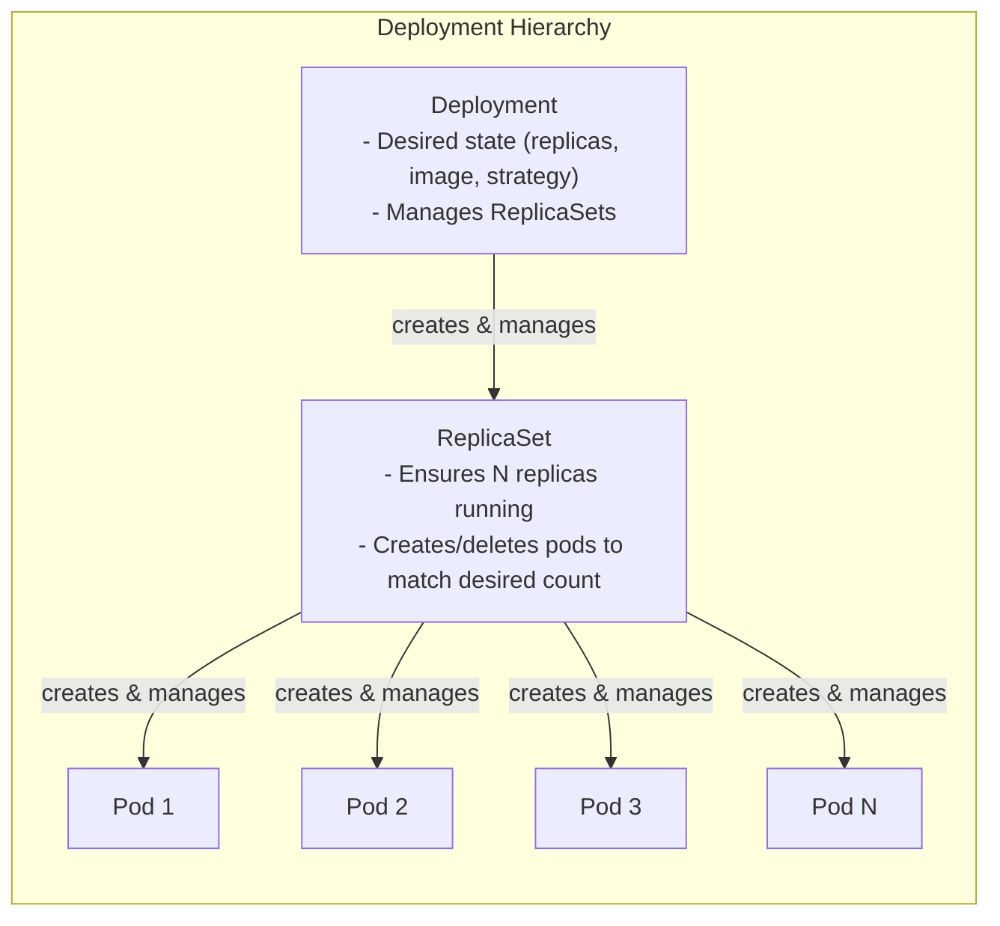
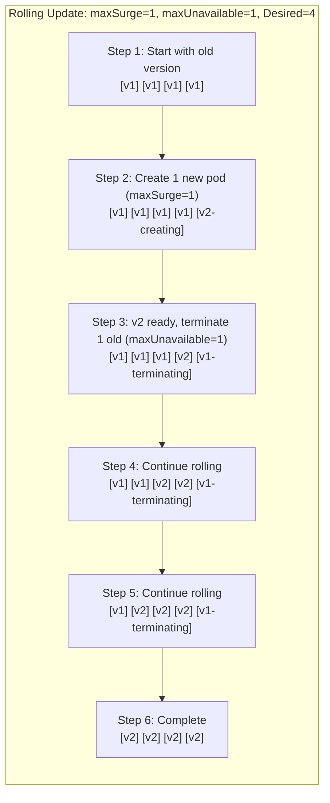
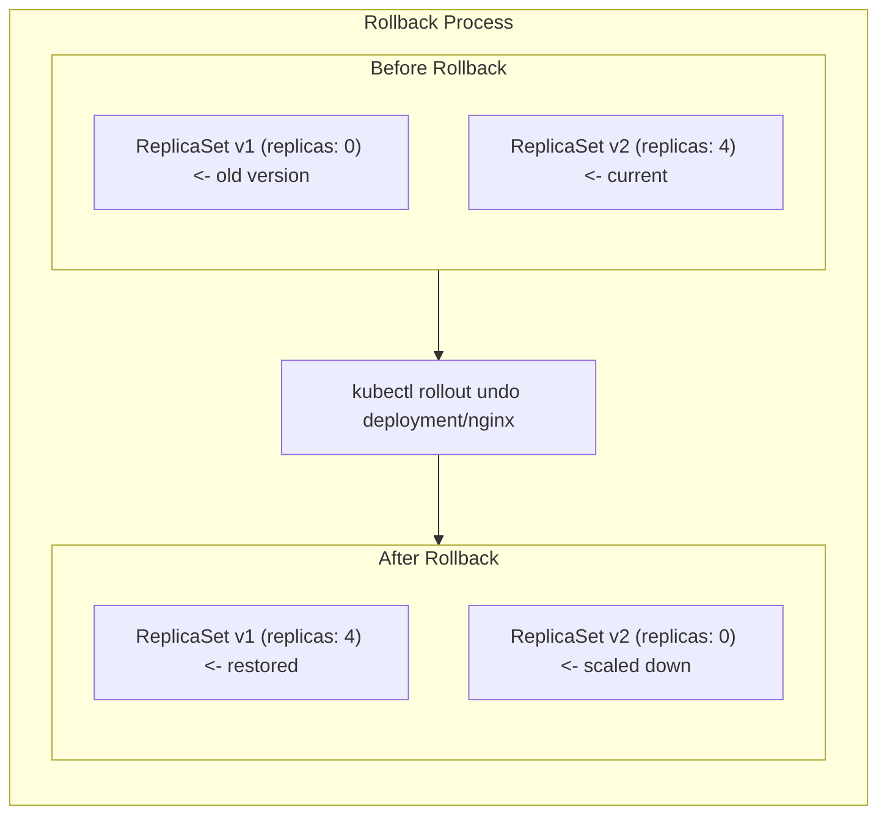

> **Складність**: `[СЕРЕДНЯ]` — основна тема іспиту
>
> **Час на проходження**: 45-55 хвилин
>
> **Передумови**: Модуль 2.1 (Поди)

---

## Що ви зможете зробити

Після цього модуля ви зможете:

- **Впровадити** Деплойменти Kubernetes із відповідними селекторами, шаблонами Подів, кількістю реплік, запитами ресурсів та налаштуваннями стратегії плавного оновлення (rolling update).
- **Діагностувати** застряглі розгортання, відстежуючи стани Деплоймента, статус ReplicaSet, події Подів, збої готовності та помилки завантаження образів.
- **Виконувати** масштабування, оновлення образів, робочі процеси призупинення та відновлення, відкат і перегляд історії розгортань під час обмеженого іспитом часу CKA.
- **Оцінити**, коли обирати RollingUpdate, а коли Recreate, спираючись на вимоги доступності, сумісність версій, спільне сховище та компроміси щодо ресурсів.

## Чому цей модуль важливий

Гіпотетичний сценарій: ваша команда має невеликий вебдодаток-API, що працює як три справні Поди, і новий тег образу має дійти до користувачів, не обірвавши жодного запиту в процесі обробки. Якщо ви замінюєте ці Поди вручну, ви самі стаєте контролером — а отже, маєте помічати збої, вирішувати, коли достатньо нових Подів стали готовими, і пам'ятати точний спосіб повернутися до старого образу, коли реліз провалюється. Деплоймент існує для того, щоб цей операційний цикл став декларативним: ви описуєте бажаний шаблон Пода й кількість реплік, а Kubernetes безперервно узгоджує реальний кластер із цим бажаним станом.

Деплойменти — це повсякденний контролер для застосунків без стану, бо вони стоять над Подами та ReplicaSet. Поди все одно мають значення, адже саме в Подах працюють контейнери і саме там логи, проби та події розкривають причину збою. Створення ReplicaSet безпосередньо зазвичай уникають, бо Деплоймент додає історію розгортань, плавні оновлення, відкат, поведінку призупинення й відновлення, а також керування стратегією через параметри `maxSurge` і `maxUnavailable`. Іспит CKA часто стискає ці ідеї у практичні завдання: швидко створити Деплоймент, масштабувати його, оновити образ, перевірити розгортання, з'ясувати, чому воно застрягло, і відновитися без вгадування.

Цей модуль навчає Деплойментів як операційної моделі, а не лише як переліку команд. Ви рухатиметеся від ланцюжка володіння до алгоритму розгортання, а потім використовуватимете цю модель, щоб швидко налагоджувати збої. Читаючи, постійно ставте собі одне запитання: «Який контролер володіє наступною дією?» Коли ви зможете відповісти на нього для Деплоймента, ReplicaSet і Пода, вивід команд почне здаватися передбачуваним, а не хаотичним. Ця єдина звичка — щоразу прив'язувати дію до її власника — окупається саме під тиском іспиту, бо вона позбавляє вас потреби гадати, де шукати причину збою, і веде вас прямо до того рівня, який цю причину розкриває.

## Володіння Деплойментом: бажаний стан із делегуванням

Деплоймент — це об'єкт бажаного стану, що керує наборами ReplicaSet, а кожен ReplicaSet керує Подами, які відповідають його селектору. Ця ієрархія важлива, бо ви рідко виправляєте проблему Деплоймента, редагуючи спершу найнижчий рівень. Деплоймент володіє стратегією розгортання та шаблоном Пода, ReplicaSet володіє кількістю відповідних Подів для одного точного хешу шаблону, а Под розкриває докази часу виконання через фазу, статус контейнера, події, логи та результати проб. Якщо ви перескакуєте одразу до Пода, не перевіривши ReplicaSet-власника чи стан Деплоймента, ви можете виправити симптом, тоді як контролер негайно відтворить той самий зламаний стан.



Практичний наслідок полягає в тому, що кожен рівень має власний різновид істини, і змішування цих рівнів — найпоширеніше джерело марно витраченого часу під час діагностики. Деплоймент каже вам, чи прогресує розгортання й скільки реплік має існувати. ReplicaSet каже вам, чи масштабується вгору або вниз конкретний хеш шаблону Пода. Под каже вам, чи контейнери дійсно заплановані, завантажені, запущені, перезапущені та позначені як Ready. Зупиніться й передбачте: якщо образ Деплоймента змінюється двічі, що має статися зі старими наборами ReplicaSet і чому Kubernetes триматиме їх із нульовою кількістю реплік замість того, щоб негайно видалити?

| Можливість | ReplicaSet | Деплоймент |
|---------|------------|------------|
| Підтримка кількості реплік | Так | Так |
| Плавні оновлення | Ні | Так |
| Відкат | Ні | Так |
| Історія оновлень | Ні | Так |
| Призупинення/Відновлення | Ні | Так |

Для більшості застосунків віддавайте перевагу Деплойментам перед прямим керуванням ReplicaSet. ReplicaSet усе ще є справжніми об'єктами-контролерами, і іспит очікує, що ви вмієте їх читати, але пряме масштабування ReplicaSet, який належить Деплойменту, бореться з батьківським контролером. Деплоймент продовжуватиме узгоджувати свою задекларовану кількість реплік і стан розгортання, тож ручні правки дочірнього об'єкта є крихкими. Створюйте ReplicaSet безпосередньо лише в нечастих випадках, коли ви свідомо не хочете поведінки розгортання Деплоймента.

```yaml
apiVersion: apps/v1
kind: Deployment
metadata:
  name: nginx-deployment
  labels:
    app: nginx
spec:
  replicas: 3                    # Desired pod count
  selector:                      # How to find pods to manage
    matchLabels:
      app: nginx
  template:                      # Pod template
    metadata:
      labels:
        app: nginx               # Must match selector
    spec:
      containers:
      - name: nginx
        image: nginx:1.25
        ports:
        - containerPort: 80
```

Селектор і мітки шаблону Пода — це контракт між контролером і Подами, якими він володіє. Якщо `spec.selector.matchLabels` не збігається зі `spec.template.metadata.labels`, Деплоймент не може керувати Подами, описаними його власним шаблоном, і Kubernetes відхиляє або провалює робоче навантаження залежно від конкретної невідповідності. Сприймайте мітки селектора як стабільну ідентичність, а не як оздоблення. Щойно Деплоймент існує, зміна його селектора обмежена, адже селектор визначає володіння, а саме володіння не дозволяє двом контролерам претендувати на ті самі Поди.

```bash
# Create deployment
kubectl create deployment nginx --image=nginx

# Create with specific replicas
kubectl create deployment nginx --image=nginx --replicas=3

# Create with port
kubectl create deployment nginx --image=nginx --port=80

# Generate YAML (essential for exam!)
kubectl create deployment nginx --image=nginx --replicas=3 --dry-run=client -o yaml > deploy.yaml
```

Імперативне створення корисне під час іспитного цейтноту, бо воно швидко дає вам коректний об'єкт, особливо в парі з `--dry-run=client -o yaml`. Ця команда не замінює розуміння YAML; це лише швидкий спосіб згенерувати синтаксично правильну відправну точку. У реальній операційній роботі ви зазвичай зберігаєте YAML у системі контролю версій і дозволяєте рев'ю перехопити ризиковані зміни, перш ніж вони торкнуться кластера. На іспиті генерація YAML дозволяє додати стратегію, ресурси, мітки, проби та анотації, не виписуючи кожне поле з пам'яті.

```yaml
# nginx-deployment.yaml
apiVersion: apps/v1
kind: Deployment
metadata:
  name: nginx
spec:
  replicas: 3
  selector:
    matchLabels:
      app: nginx
  template:
    metadata:
      labels:
        app: nginx
    spec:
      containers:
      - name: nginx
        image: nginx:1.25
        ports:
        - containerPort: 80
        resources:
          requests:
            cpu: 100m
            memory: 128Mi
          limits:
            cpu: 200m
            memory: 256Mi
```

```bash
kubectl apply -f nginx-deployment.yaml
```

Запити ресурсів у прикладі не є оздобленням. Планувальник використовує запити, вирішуючи, чи поміститься Под на вузлі, тож Деплоймент без запитів може поводитися інакше, ніж той самий Деплоймент із реалістичними запитами: без оголошених запитів планувальник вважає потребу нульовою й може розмістити Под там, де насправді бракне ресурсів. Ліміти також є частиною контракту часу виконання, бо вони обмежують, скільки CPU чи пам'яті може споживати контейнер, і захищають сусідні робочі навантаження від «галасливого сусіда». Чиста специфікація Деплоймента дає контролеру достатньо інформації, щоб створити Поди, і дає планувальнику достатньо інформації, щоб безпечно їх розмістити.

```bash
# List deployments
kubectl get deployments
kubectl get deploy          # Short form

# Detailed view
kubectl get deploy -o wide

# Describe deployment
kubectl describe deployment nginx

# Get deployment YAML
kubectl get deployment nginx -o yaml

# Check rollout status
kubectl rollout status deployment/nginx
```

Використовуйте `kubectl get`, щоб відповісти на запитання «який поточний підсумок?», і `kubectl describe`, щоб відповісти на «що повідомили контролери, поки узгоджували стан?». Команда `rollout status` особливо цінна, бо вона очікує завершення останнього розгортання й повертає ненульовий код виходу, якщо очікування зазнає невдачі. Перш ніж запускати її, який вивід ви очікуєте, коли образ завантажується успішно, але проба готовності так і не проходить? Деплоймент може показувати, що оновлені репліки створюються, тоді як доступні репліки відстають, бо готовність гейтить трафік.

## ReplicaSet під капотом

Коли ви створюєте Деплоймент, контролер Деплоймента створює ReplicaSet, чий шаблон Пода збігається з поточним шаблоном Деплоймента. Ім'я ReplicaSet містить ім'я Деплоймента та хеш, похідний від шаблону Пода, — саме тому зміна образу, середовища, налаштувань ресурсів, міток, анотацій чи інших полів шаблону створює новий ReplicaSet. Масштабування Деплоймента не створює нового ReplicaSet, бо шаблон Пода не змінився. Ця відмінність — швидкий спосіб відрізнити «зміну ємності» від «зміни релізу» під час усунення несправностей.

```bash
# Create a deployment
kubectl create deployment nginx --image=nginx --replicas=3

# See the ReplicaSet created
kubectl get replicasets
# NAME               DESIRED   CURRENT   READY   AGE
# nginx-5d5dd5d5fb   3         3         3       30s

# See pods with owner reference
kubectl get pods --show-labels
```

```text
nginx-5d5dd5d5fb
^     ^
|     |
|     +-- Hash of pod template
|
+-- Deployment name
```

Хеш — це те, що дозволяє Kubernetes тримати поруч кілька ревізій розгортання, не плутаючи їхні Поди, бо кожен Под несе цей хеш у своїх мітках і таким чином безпомилково належить лише одному ReplicaSet. Під час плавного оновлення старий ReplicaSet ще може мати кілька готових Подів, тоді як новий ReplicaSet поступово масштабується вгору. Під час відкату Kubernetes не відбудовує старий шаблон Пода з вашої пам'яті; він масштабує збережений старий ReplicaSet назад угору й масштабує невдалий униз. Саме тому збережені старі набори ReplicaSet — це не сміття, а готовий до використання запас для відновлення. Якщо історію ревізій обрізати надто агресивно, цей шлях відновлення стає менш корисним.

```bash
# Don't do this - let Deployment manage ReplicaSets
kubectl scale replicaset nginx-5d5dd5d5fb --replicas=5  # BAD

# Do this instead
kubectl scale deployment nginx --replicas=5             # GOOD
```

Пара команд вище відображає ключове правило контролерів: змінюйте той об'єкт, що володіє бажаним станом. Масштабування дочірнього ReplicaSet може на мить здаватися робочим, але Деплоймент усе одно володіє запланованою загальною кількістю реплік і розподілом розгортання. Масштабування Деплоймента оновлює батьківську специфікацію, що дозволяє контролерам сходитися в одному напрямку. З тієї ж причини ви редагуєте шаблон Пода Деплоймента, а не редагуєте один живий Под, коли хочете внести постійну зміну.

## Масштабування та редагування без втрати моделі контролерів

Масштабування змінює, скільки Подів поточного шаблону мають працювати; воно не означає, що випускається нова версія програмного забезпечення. Саме тому масштабування зазвичай впливає на поточний ReplicaSet, а не створює інший. Коли Деплоймент має один стабільний ReplicaSet і ви масштабуєте з трьох реплік до п'яти, контролер ReplicaSet створює ще два Поди з тим самим хешем шаблону. Коли ви масштабуєте вниз, він видаляє Поди, зберігаючи бажану кількість у специфікації Деплоймента.

```bash
# Scale to specific replicas
kubectl scale deployment nginx --replicas=5

# Scale to zero (stop all pods)
kubectl scale deployment nginx --replicas=0

# Scale multiple deployments
kubectl scale deployment nginx webapp --replicas=3
```

Масштабування до нуля — корисний інструмент обслуговування, але це не те саме, що видалення Деплоймента. Об'єкт, селектор, історія розгортань, анотації та стратегія залишаються, тоді як бажана кількість реплік стає нульовою. Це означає, що ви можете масштабувати назад угору, не відтворюючи специфікацію. Це також означає, що Сервіси та інші об'єкти, які добирають ті самі мітки, можуть усе ще існувати, навіть якщо немає доступних ендпоінтів.

```bash
# Edit deployment directly (interactive, commonly used in exam)
# kubectl edit deployment nginx
# Change spec.replicas and save

# Or patch (non-interactive, used for this lab)
kubectl patch deployment nginx -p '{"spec":{"replicas":5}}'
```

Інтерактивне редагування поширене на іспитах, бо воно швидке, але несе ризик: ви можете змінити не те поле або залишити невалідний YAML. Патч кращий для відтворюваних лабораторних інструкцій, бо він виражає одну вузьку зміну. У продакшн-процесах декларативні файли та рев'ю коду зазвичай безпечніші за разові правки. Іспитова навичка — знати всі три шляхи й обирати найшвидший із тих, що залишаються зрозумілими.

```bash
# View pods scale (use -w in exam to watch continuously)
kubectl get pods

# Check deployment status
kubectl get deployment nginx
# NAME    READY   UP-TO-DATE   AVAILABLE   AGE
# nginx   5/5     5            5           10m

# Detailed status
kubectl rollout status deployment/nginx
```

Перевіряючи операцію масштабування, порівнюйте підсумок Деплоймента з Подами, а не покладайтеся на одну команду. `READY` показує, скільки бажаних реплік наразі готові, `UP-TO-DATE` показує, скільки реплік відповідають поточному шаблону, а `AVAILABLE` відображає мінімальну доступність. Якщо `UP-TO-DATE` правильний, але `AVAILABLE` низький, контролер створив правильний шаблон, але Поди не стають доступними. Це спостереження спрямовує вас до проб готовності, завантаження образів, подій, тиску ресурсів або запуску застосунку.

## Плавні оновлення та відкати

Плавне оновлення змінює шаблон Пода й дозволяє Kubernetes поступово замінювати старі Поди. Типова стратегія Деплоймента — RollingUpdate, а два важелі, що формують її поведінку, — це `maxSurge` і `maxUnavailable`. `maxSurge` дозволяє додаткові Поди понад бажану кількість реплік під час розгортання, тоді як `maxUnavailable` дозволяє частині бажаних реплік бути недоступними під час розгортання. Із чотирма репліками, `maxSurge: 1` та `maxUnavailable: 0` Kubernetes може ненадовго запустити п'ять Подів, щоб не зменшувати навмисно доступну ємність.

Зупиніться й передбачте: ви маєте Деплоймент із чотирма репліками, `maxSurge: 1` та `maxUnavailable: 0`. Під час плавного оновлення яка максимальна кількість Подів, що працюють у будь-який момент, і що станеться, якщо нова версія так і не стане готовою (Ready)? Максимум — п'ять Подів, і контролер має зупинити просування, а не видаляти решту готових старих Подів. Саме така поведінка є причиною того, що зламане оновлення часто дає змішаний парк замість повного простою.

```yaml
apiVersion: apps/v1
kind: Deployment
metadata:
  name: nginx
spec:
  replicas: 4
  strategy:
    type: RollingUpdate           # Default strategy
    rollingUpdate:
      maxSurge: 1                 # Max pods over desired during update
      maxUnavailable: 1           # Max pods unavailable during update
  selector:
    matchLabels:
      app: nginx
  template:
    metadata:
      labels:
        app: nginx
    spec:
      containers:
      - name: nginx
        image: nginx:1.25
```

Значення можуть бути абсолютними числами або відсотками, причому відсотки обчислюються відносно бажаної кількості реплік. Для малих кількостей реплік відсоток може округлюватися способами, що дивують початківців, тож явні числа легше осмислювати під час практики: наприклад, 25 відсотків від трьох реплік округлюється не так очевидно, як того очікуєш, тому для невеликих наборів зрозуміліше задавати точні цілі числа. `maxUnavailable: 1` обмінює невелику частку ємності на швидшу заміну, бо Kubernetes може завершити один старий Под, поки створює нові. `maxUnavailable: 0` консервативніший, бо гарантує, що жодна репліка не зникне без готової заміни, але потребує достатньої ємності кластера для надлишкових Подів.



Будь-яка зміна шаблону Пода може запустити розгортання. Оновлення образу — очевидний випадок, але змінні середовища, налаштування ресурсів, мітки, анотації, проби, команди та монтування томів також є частиною шаблону. Зміна лише `spec.replicas` масштабує наявний шаблон і не створює нового ReplicaSet. Ця різниця має значення, коли ви переглядаєте історію розгортань: історія відстежує ревізії шаблону, а не кожну адміністративну зміну об'єкта Деплоймента.

```bash
# Update image (triggers rolling update)
kubectl set image deployment/nginx nginx=nginx:1.26

# Record change cause for rollout history (replaces deprecated --record)
kubectl annotate deployment/nginx kubernetes.io/change-cause="Update nginx image to 1.26" --overwrite

# Update environment variable
kubectl set env deployment/nginx ENV=production

# Update resources
kubectl set resources deployment/nginx -c nginx --limits=cpu=200m,memory=512Mi

# Edit deployment (any change to pod template triggers update)
# kubectl edit deployment nginx
# For automation, we patch an annotation:
kubectl patch deployment nginx -p '{"spec":{"template":{"metadata":{"annotations":{"update":"now"}}}}}'
```

Прапорець `--record` трапляється у старіших прикладах і деяких успадкованих вправах, але він застарів, тож не варто будувати на ньому нові звички. Сучасний робочий процес записує явну анотацію `kubernetes.io/change-cause` або покладається на інструменти розгортання, що фіксують причину релізу автоматично. Важлива операційна звичка — не сам прапорець; це збереження достатнього контексту, щоб майбутня ціль відкату була зрозумілою для будь-кого, хто відкриє історію через місяці. Запис історії без образу, причини чи відповідального за зміну набагато менш корисний під тиском, коли інцидент уже триває й кожна хвилина на вагу золота.

```bash
# Watch rollout progress
kubectl rollout status deployment/nginx

# View pods during update (in exam, use -w to watch continuously)
kubectl get pods

# View ReplicaSets (in exam, use -w to watch continuously)
kubectl get rs
```

Відкати використовують ту саму машинерію контролерів у зворотному напрямку. Контролер Деплоймента масштабує збережений старий ReplicaSet угору й масштабує поточний ReplicaSet униз. Відкат є явним; Kubernetes зазвичай не вирішує самостійно скасувати поганий реліз за вас. Ваше завдання — розпізнати, що розгортання застрягло чи шкодить, дослідити достатньо доказів, щоб не відкотитися до іншої поганої ревізії, а потім виконати команду скасування проти Деплоймента.

```bash
# View history
kubectl rollout history deployment/nginx

# View specific revision
kubectl rollout history deployment/nginx --revision=2
```

```bash
# Rollback to previous version
kubectl rollout undo deployment/nginx

# Rollback to specific revision
kubectl rollout undo deployment/nginx --to-revision=2

# Verify rollback
kubectl rollout status deployment/nginx
kubectl get deployment nginx -o wide
```



Історія розгортань обмежена параметром `revisionHistoryLimit`. Типове значення зберігає десять старих наборів ReplicaSet, чого зазвичай достатньо для звичайних потреб відкату, водночас запобігаючи нескінченному захаращенню контролера. Встановлення значення нуль вимикає історію відкату, що може спокушати в крихітних кластерах, але прибирає один із найкорисніших інструментів відновлення. Якщо ваше середовище має суворі вимоги щодо очищення, оберіть невелике додатне число й поєднайте його з надійним тегуванням образів та нотатками до релізів.

```yaml
apiVersion: apps/v1
kind: Deployment
metadata:
  name: nginx
spec:
  revisionHistoryLimit: 10    # Keep 10 old ReplicaSets (default)
  # Set to 0 to disable rollback capability
```

Сценарій вправи: зламаний тег образу швидко провалює розгортання, а `kubectl rollout undo` дозволяє відновити попередню ревізію швидше, ніж вручну відтворювати останній справний образ. Цей сценарій не є обіцянкою, що відкат розв'язує кожну проблему релізу. Якщо нова версія змінила зовнішній стан, схему бази даних або спільне сховище, відкат Подів може не відновити сумісність. Відкат Деплоймента потужний, але це все одно операція контролера робочих навантажень, а не повний план аварійного відновлення застосунку.

## Призупинення, відновлення та вибір стратегії

Призупинення Деплоймента наказує контролеру Деплоймента не починати нове розгортання для змін шаблону Пода, доки ви його не відновите. Це корисно, коли потрібно змінити образ, ресурси та середовище разом і ви не хочете отримати три окремі набори ReplicaSet. Призупинення не заморожує весь кластер і не означає, що Kubernetes ніколи не зможе створити заміну Подів з інших причин. Воно конкретно контролює просування розгортання для змін шаблону Деплоймента.

```bash
# Pause deployment
kubectl rollout pause deployment/nginx

# Make multiple changes (no rollout triggered)
kubectl set image deployment/nginx nginx=nginx:1.26
kubectl set resources deployment/nginx -c nginx --limits=cpu=200m
kubectl set env deployment/nginx ENV=production

# Resume - triggers single rollout with all changes
kubectl rollout resume deployment/nginx

# Watch the rollout
kubectl rollout status deployment/nginx
```

Призупинення та відновлення також допомагає тримати історію змістовною. Якщо кожне дрібне коригування шаблону стає окремою ревізією, майбутній список відкату може стати важким для читання, і ви ризикуєте відкотитися не туди, бо десяток майже однакових ревізій складно розрізнити. Об'єднання пов'язаних змін дає вам одну ревізію, що представляє один намір релізу, тож історія читається як послідовність свідомих рішень, а не як шум. Компроміс полягає в тому, що призупинений Деплоймент може зависнути в несподіваному стані, якщо хтось забуде його відновити, тож завжди перевіряйте `kubectl rollout status` після відновлення й перевіряйте стани Деплоймента, якщо прогрес не триває.

Recreate — це інша вбудована стратегія, і вона набагато простіша: спершу видалити всі старі Поди, потім створити нові Поди. За цією простотою стоїть простій, бо існує момент, коли жодна стара версія не обслуговує, а нова версія ще не готова. Recreate може бути правильною стратегією для робочих навантажень, які не можуть безпечно запускати старі й нові версії одночасно, наприклад застосунок з одним записувачем і несумісною поведінкою спільного сховища. Якщо ви можете натомість проєктувати зворотно сумісні релізи, RollingUpdate зазвичай дає кращу доступність.

```yaml
apiVersion: apps/v1
kind: Deployment
metadata:
  name: database
spec:
  replicas: 1
  strategy:
    type: Recreate          # All pods deleted, then new pods created
  selector:
    matchLabels:
      app: database
  template:
    metadata:
      labels:
        app: database
    spec:
      containers:
      - name: db
        image: postgres:15
```

Який підхід ви обрали б тут і чому: застосунок без стану з чотирма репліками, зворотно сумісними міграціями бази даних і достатньою ємністю вузлів для одного надлишкового Пода? RollingUpdate чудово підходить, бо він зберігає доступність, поки нова версія доводить готовність. Recreate уникнув би накладання версій, але створив би простій, якого можна було уникнути. Краща інженерна відповідь часто полягає в тому, щоб зробити застосунок і міграцію достатньо сумісними, аби RollingUpdate залишався безпечним.

| Аспект | RollingUpdate | Recreate |
|--------|---------------|----------|
| Простій | Нульовий за правильного налаштування | Так |
| Споживання ресурсів | Вище під час оновлення | Те саме |
| Складність | Вища | Проста |
| Сценарій застосування | Застосунки без стану | Застосунки зі станом, несумісні версії |

## Діагностика застряглих розгортань

Застрягле розгортання — це зазвичай сигнал безпеки, а не просто прикра дрібниця. Контролер Деплоймента може чекати, бо нові Поди не можуть бути заплановані, не можуть завантажити образ, падають після запуску або ніколи не стають готовими. Найшвидший діагностичний шлях рухається від статусу батька до дочірніх об'єктів: описати Деплоймент, порівняти набори ReplicaSet, дослідити Поди, потім прочитати події та логи. Цей порядок допомагає уникнути тунельного зору й каже вам, чи є проблема питанням стратегії розгортання, планування, образу чи готовності застосунку.

```bash
# View conditions
kubectl get deployment nginx -o jsonpath='{.status.conditions[*].type}'

# Detailed conditions
kubectl describe deployment nginx | grep -A10 Conditions
```

| Стан | Значення |
|-----------|---------|
| `Available` | Доступний мінімум реплік |
| `Progressing` | Розгортання триває |
| `ReplicaFailure` | Не вдалося створити Поди |

Стани — це стиснуті підсумки, тож поєднуйте їх із подіями. Стан `Progressing`, що ніколи не досягає доступності, часто означає, що новий ReplicaSet існує, але його Поди не готові. Стан `ReplicaFailure` вказує на збої під час створення Подів, що може охоплювати проблеми з квотою, допуском чи плануванням. Якщо підсумок Деплоймента каже, що бажана кількість правильна, але готовність низька, переходьте вниз до Подів і шукайте `ImagePullBackOff`, `CrashLoopBackOff`, збої проби готовності або повідомлення про очікування планування.

Зупиніться й подумайте: якщо Деплоймент застряг у стані `Progressing`, але ніколи не стає `Available`, де перше місце, на яке слід поглянути, щоб зрозуміти, чому нові Поди не запускаються? Почніть із `kubectl describe deployment`, щоб прочитати стани й події, потім порівняйте набори ReplicaSet, аби визначити, який хеш шаблону провалюється. Після цього дослідіть Поди, що збоять, бо помилка часу виконання живе на рівні Пода. Ця послідовність швидша за випадкове видалення Подів із надією, що контролер створить здоровіші заміни.

```bash
# Update to an image tag that doesn't exist
kubectl set image deployment/nginx nginx=nginx:broken-tag

# The rollout will hang without a timeout
kubectl rollout status deployment/nginx --timeout=10s || true
# Output: error: timed out waiting for the condition
```

Таймаут у цій лабораторній команді навмисний. Без нього `kubectl rollout status` може чекати безкінечно, поки контролер захищає старі здорові Поди й раз за разом не може зробити нову версію доступною. На іспиті короткий таймаут не дає одній команді поглинути решту вашого часу. У продакшн-автоматизації таймаут дає вашому конвеєру чіткий сигнал збою й дозволяє запуститися наступному діагностичному кроку чи кроку відкату.

```bash
kubectl describe deployment nginx
```

Прочитайте нижню частину виводу `describe`, перш ніж прогорнути далі. Секція `Events` часто каже вам, чи масштабуються Поди, чи ReplicaSet не зміг створити Поди, чи прогрес зупинився. Часові мітки станів також допомагають відрізнити розгортання, яке просто повільне, від того, що перестало робити корисний поступ. Якщо очевидних подій немає, наступним корисним об'єктом є список ReplicaSet.

```bash
kubectl get replicasets -l app=nginx
```

Список ReplicaSet показує, який хеш шаблону старий, а який новий. Під час невдалого розгортання образу ви можете побачити, що старий ReplicaSet усе ще несе готові репліки, тоді як новий ReplicaSet має бажані або поточні Поди, але нуль готових Подів. Це контролер захищає доступність відповідно до стратегії. Це також дає вам селектор міток, потрібний для прицільного дослідження Подів.

```bash
kubectl get pods -l app=nginx
# Look for the pod in ImagePullBackOff or CrashLoopBackOff status
```

```bash
# Describe the failing pods using label selector
kubectl describe pod -l app=nginx

# Or check recent events in the namespace
kubectl get events --sort-by='.metadata.creationTimestamp' | tail -n 10
```

У сценарії зі зламаним образом події Пода мають розкрити невдале завантаження образу для `nginx:broken-tag`. Збій готовності виглядав би інакше: образ завантажується й контейнер запускається, але Под ніколи не стає готовим, бо проба готовності провалюється або застосунок не відкриває очікуваний порт. Збій планування показав би Поди в стані `Pending` і повідомлення планувальника про ресурси, taint'и, спорідненість (affinity) чи обмеження. Кожен режим збою вказує на інше виправлення, тож не відкочуйтеся наосліп, доки не знаєте, що саме скасовуєте.

```bash
kubectl rollout undo deployment/nginx
kubectl rollout status deployment/nginx
```

Відкат — це дія відновлення для цієї лабораторної, бо першопричина — поганий тег образу. Якби першопричиною була недостатня ємність кластера для надлишкового Пода, відкат міг би бути непотрібним; зменшення надлишку, додавання ємності чи коригування запитів могло б стати кращим виправленням. Якби першопричиною було хибне налаштування проби готовності, ви могли б пропатчити пробу й продовжити розгортання після тестування. Контролер дає вам безпечну точку паузи, але ваша діагностика вирішує, як ремонтувати.

## Іспитовий посібник з усунення несправностей

Найшвидша звичка усунення несправностей Деплоймента — розділяти намір, прогрес контролера та докази часу виконання. Намір живе у специфікації Деплоймента: репліки, селектор, стратегія та шаблон Пода. Прогрес контролера живе у станах Деплоймента й кількостях ReplicaSet. Докази часу виконання живуть у Подах, подіях і логах. Коли ці рівні суперечать один одному, довіряйте тому рівню, що володіє питанням, яке ви ставите. Лог Пода може пояснити збій застосунку, але він не може сказати вам, чи дозволила стратегія розгортання достатню надлишкову ємність.

Починайте з Деплоймента, бо саме цей об'єкт зазвичай називає іспитове завдання. Якщо завдання каже «полагодьте розгортання для деплоймента web», опирайтеся бажанню негайно видаляти Поди. Перевірте, чи має Деплоймент правильний образ, кількість реплік, селектор, стратегію та стани. Неправильний образ у шаблоні виправляється на Деплойменті. Неправильна кількість реплік виправляється на Деплойменті. Под, який є лише дочірнім об'єктом, буде відтворено з того самого хибного шаблону, якщо ви видалите його, не виправивши батька.

Переходьте до наборів ReplicaSet, коли вам потрібно зрозуміти форму ревізії. Один ReplicaSet із усіма бажаними репліками зазвичай означає, що жодне розгортання наразі не розділене між версіями. Кілька наборів ReplicaSet із ненульовими бажаними кількостями зазвичай означають, що триває розгортання або відкат. Старий ReplicaSet із нульовою бажаною кількістю реплік не є автоматично проблемою; це може бути збережена історія. Новий ReplicaSet із бажаними Подами, але нулем готових Подів каже вам, що шаблон успішно змінився, але нові Поди десь провалилися після цього.

Переходьте до Подів, коли вам потрібні докази щодо планування, завантаження образу, запуску контейнера, проб і поведінки застосунку. `Pending` вказує на планування, квоту, спорідненість, taint'и чи запити ресурсів. `ImagePullBackOff` вказує на доступ до реєстру, ім'я образу, тег чи проблеми з pull-секретом. `CrashLoopBackOff` означає, що контейнер раз за разом запускається й завершується, тож логи та аргументи команди стають корисними. Запущений контейнер без готовності зазвичай вказує на проби, порти, залежності чи час запуску.

Використовуйте події як міст між виводом контролера й виводом часу виконання. Події Деплоймента можуть показувати рішення щодо масштабування, тоді як події Пода можуть показувати проблеми планувальника та kubelet. Події особливо корисні, коли логи порожні, бо контейнер так і не запустився. Сортуйте події за часовою міткою, коли вивід зашумлений, і співвідносьте найновіші повідомлення з іменами Подів, створених новим ReplicaSet. Мета — не прочитати кожну подію; мета — знайти перший компонент контролера чи вузла, який не зміг виконати свою роботу.

Тримайте стратегію розгортання в думках, інтерпретуючи змішаний парк. Бачити старі й нові Поди одночасно — нормально під час RollingUpdate. Бачити, що старі Поди залишаються живими, поки нові Поди провалюються, може бути здоровою захисною поведінкою, а не помилкою контролера. Деплоймент намагається не зменшувати доступність понад налаштовану стратегію. Якщо застосунок уже збоїть для користувачів, відкат усе одно може бути правильним операційним вибором, але зрозумійте, що змішаний стан — це контролер, який зберігає ємність, а не втрачає контроль.

Збої ємності можуть виглядати як збої релізу, якщо ви дивитеся лише на `rollout status`, і ця оманлива схожість регулярно вводить інженерів в оману. Новий образ може бути цілком валідним, але надлишковий Под не може бути запланований, бо кластеру бракує запитаного CPU, пам'яті, ємності Подів чи дозволеної топології. У цьому випадку повторна зміна образу не розв'язує проблему, скільки б разів ви її не повторювали. Вам потрібно дослідити події Подів у стані `Pending` і вирішити, чи зменшити надлишок, зменшити запити, додати ємність або обрати вікно розгортання з більшим запасом. Саме тому запити ресурсів належать до уроку про Деплоймент, а не лише до уроку про планування: те, що ви оголосили в шаблоні, безпосередньо визначає, чи зможе розгортання взагалі просунутися.

Збої готовності заслуговують схожої уваги, бо вони не завжди є падіннями застосунку. Проба готовності може цілитися в неправильний шлях, порт, схему чи початкову затримку. Застосунок може бути здоровим, але повільнішим за бюджет проби, або може потребувати недоступної залежності. RollingUpdate розглядає готовність як сигнал того, що Под може замінити стару ємність, тож погана проба готовності може зупинити розгортання навіть тоді, коли процес технічно працює. Виправляйте пробу чи поведінку застосунку, а не проштовхуйте розгортання повз сигнал.

Відкати мають бути свідомими, бо вони відновлюють шаблон Пода, а не весь світ навколо робочого навантаження. Якщо реліз містив міграцію бази даних, зміну зовнішньої конфігурації чи зміну політики трафіку, скасування Деплоймента може залишити старий код віч-на-віч зі зміненим середовищем. Для CKA питання відкату зазвичай зосереджуються на самому об'єкті Деплоймента. Для реальних операцій поєднуйте відкат із нотатками до релізу та дисципліною міграцій, щоб старий шаблон справді був сумісним із поточним зовнішнім станом.

Коли ви переглядаєте історію розгортань, дивіться далі за номер ревізії. Корисні деталі — це образ, ім'я контейнера, середовище, налаштування ресурсів, проби та анотації причини зміни. Якщо ці деталі відсутні чи неоднозначні, історія все ще допомагає, зберігаючи набори ReplicaSet, але вона не замінює документацію релізу. Ревізія, що була доброю вчора, сьогодні може бути поганою, якщо вона залежить від зовнішньої системи, яка змінилася. Команда каже вам, що Kubernetes може відновити; інженерне судження каже вам, чи безпечно це відновлювати.

Селектор — ще одне часте джерело тихих помилок, і підступність його в тому, що нічого видимо не «ламається». Селектор Сервісу, селектор Деплоймента та мітки шаблону Пода можуть бути валідними окремо, але не добирати ті самі Поди разом. У цьому випадку Деплоймент може бути здоровим, але трафік усе одно не доходить до нього, або Сервіс може вказувати на старі Поди, поки Деплоймент розгортає нові. Під час усунення несправностей порівнюйте мітки з тією самою дисципліною, що й образи, символ за символом. Контролери та Сервіси діють на мітки точно, а не за людським значенням імені, тож одрук в одній букві мітки тихо розриває весь зв'язок.

Уникайте видалення як діагностичного скорочення. Видалення Пода, що збоїть, може бути розумним після того, як ви зрозуміли проблему, але воно часто стирає корисні події й створює заміну з тим самим збоєм. Видалення ReplicaSet, яким володіє Деплоймент, також може запустити заплутане узгодження. На іспиті видалення може випадково зробити вивід чистішим на вигляд, тоді як базовий шаблон залишається неправильним. Спершу дослідіть, виправте власника, а потім дозвольте контролеру створити свіжих дочірніх об'єктів за потреби.

Налагодження Деплоймента стає простішим, коли ви формулюєте кожну дію як твердження про володіння. «Я масштабую Деплоймент, бо Деплоймент володіє бажаною кількістю реплік.» «Я досліджую ReplicaSet, бо ReplicaSet представляє цю ревізію шаблону.» «Я читаю події Пода, бо kubelet і планувальник повідомляють збій часу виконання саме там.» Ця звичка запобігає випадковому стрибанню між командами й робить вашу відповідь легшою для захисту. Вона також прямо відображає те, як побудовані контролери Kubernetes.

Для команд оновлення пам'ятайте, що зручність і незмінність — різні питання. `kubectl set image` швидкий і доречний для багатьох іспитових завдань, тоді як декларативний YAML кращий для перевірюваних середовищ. `kubectl patch` точний для вузьких полів, тоді як `kubectl edit` швидкий, але легший для зловживання. Жодна з цих команд не є за своєю суттю кращою. Правильний вибір залежить від того, чи потрібна вам швидкість, відтворюваність, перевірюваність або точний контроль над одним полем.

Для рішень щодо стратегії починайте з питання, чи можуть дві версії працювати разом. Якщо можуть, RollingUpdate зазвичай є типовим вибором, бо він зберігає доступність і дає готовності шанс захистити користувачів. Якщо не можуть, Recreate може бути чеснішим і безпечнішим, але створює простій. Зріліша альтернатива часто полягає в тому, щоб змінити дизайн релізу застосунку так, аби старі й нові версії безпечно накладалися. Kubernetes дає вам механізми розгортання, але сумісність застосунку визначає, який механізм є відповідальним.

Нарешті, зробіть перевірку частиною кожної зміни, а не окремою думкою заднім числом. Після створення Деплоймента перевірте статус розгортання та Поди. Після масштабування перевірте бажану й готову кількості. Після зміни шаблону перевірте набори ReplicaSet та історію розгортань. Після відкату перевірте поточний образ і доступність. Перевірка — це те, що перетворює послідовність команд на операційний робочий процес, і це різниця між випадковим проходженням іспитового завдання й розумінням того, чому кластер досяг бажаного стану.

Контекст простору імен — ще одна дрібна деталь, що запобігає великим помилкам. Іспит може розмістити ресурси в конкретному просторі імен, а реальні кластери часто використовують простори імен, щоб розділяти команди чи середовища. Якщо ви досліджуєте простір імен `default`, тоді як Деплоймент живе деінде, кожна команда виглядає порожньою, і виникає спокуса відтворити об'єкти, які вже існують. Підтвердьте простір імен перед діагностикою й віддавайте перевагу явним прапорцям `-n` у нотатках, коли завдання називає простір імен. Ця звичка тримає вивід Деплоймента прив'язаним до робочого навантаження, за яке ви насправді відповідаєте.

Очищення заслуговує тієї самої обізнаності про контролери, що й розгортання. Видалення Деплоймента зазвичай прибирає набори ReplicaSet і Поди, якими він володіє, тоді як видалення Сервісу, ConfigMap чи Secret потребує окремої дії, бо ці об'єкти не є дочірніми щодо Деплоймента. Масштабування до нуля — це оборотний контроль ємності, але видалення прибирає контролер і його історію розгортань. Перед очищенням у спільному середовищі визначте, чи мета — тимчасово припинити обслуговування трафіку, прибрати об'єкт невдалого релізу чи демонтувати кожен допоміжний ресурс, створений для лабораторної.

Найнадійніша ментальна модель — це узгодження, а не виконання команд. Команда змінює об'єкт API, потім контролери помічають новий бажаний стан і працюють до нього. Іноді ця робота миттєва, а іноді вона чекає на планування, завантаження образів, проби чи обмеження стратегії. Якщо вивід не змінюється миттєво, не припускайте, що команда провалилася; дослідіть, який крок узгодження чекає. Kubernetes менш загадковий, коли ви розглядаєте кожну дію Деплоймента як запит, який контролери мають бути спроможні задовольнити.

## Патерни та антипатерни

Патерни Деплоймента переважно стосуються того, щоб зробити поведінку контролера передбачуваною. Використовуйте стабільні мітки, незмінні теги образів і проби готовності, щоб контролер міг визначити, коли новий Под справді безпечно зараховувати як доступний. Використовуйте запити ресурсів, щоб збої планування були явними, а не випадковими. Використовуйте історію розгортань і анотації причини зміни, щоб ціль відкату мала контекст. Ці звички полегшують і завдання CKA, і реальні інциденти, бо вивід кластера розповідає зв'язну історію.

| Патерн | Коли застосовувати | Чому працює | Зауваження щодо масштабування |
|---------|----------------|--------------|-----------------------|
| Згенерувати YAML, потім редагувати | Завдання CKA, де важлива швидкість, але стратегію чи ресурси треба налаштувати | Починає з валідної форми API та зменшує помилки відступів | Закомітьте фінальний маніфест у реальних середовищах |
| Читати Деплоймент, ReplicaSet, потім Под | Будь-яке розгортання, що повільне, змішане чи провальне | Слідує за володінням від наміру до доказів часу виконання | Працює навіть зі зростанням кількості реплік, бо селектори звужують огляд |
| Об'єднувати зміни шаблону через pause/resume | Кілька оновлень образу, ресурсів, середовища чи анотацій належать одному релізу | Дає одне розгортання й одну ревізію для пов'язаних змін | Потребує перевірки відновлення, щоб Деплоймент не залишився призупиненим |
| Використовувати явні значення стратегії | Малі кількості реплік чи суворі вимоги доступності | Робить поведінку надлишку й недоступності передбачуваною | Потребує достатньої ємності кластера, коли надлишок більший за нуль |

Найбільший антипатерн — це боротьба з контролером. Ручне видалення чи масштабування дочірніх об'єктів може на мить зробити вивід іншим, але батьківський Деплоймент продовжуватиме узгоджувати задекларований стан. Інший поширений антипатерн — використання змінних тегів образів, як-от `latest`, бо шаблон Пода може не змінитися, навіть якщо вміст реєстру змінився. Третій — сприймати відкат як усю реакцію на інцидент, тоді як відкат лише відновлює шаблон Пода й не скасовує зовнішніх змін, зроблених застосунком.

| Антипатерн | Що йде не так | Краща альтернатива |
|--------------|-----------------|--------------------|
| Масштабування ReplicaSet, яким володіє Деплоймент | Деплоймент узгоджує поверх ручної зміни дочірнього об'єкта | Масштабуйте сам Деплоймент |
| Використання змінних тегів для релізів | Історія розгортань не може надійно ідентифікувати запущений образ | Використовуйте конкретні версії чи посилання на дайджест |
| Повне прибирання історії розгортань | `rollout undo` не має корисного старого ReplicaSet для відновлення | Тримайте невелике додатне `revisionHistoryLimit` |
| Ігнорування готовності | Нові Поди отримують трафік до того, як застосунок справді готовий | Додайте проби готовності, що відповідають реальному здоров'ю сервісу |

## Структура ухвалення рішень

Обирайте дію Деплоймента, визначивши, яка частина бажаного стану змінилася. Якщо змінилася лише кількість ідентичних Подів, масштабуйте Деплоймент. Якщо змінився шаблон Пода, очікуйте новий ReplicaSet і розгортання. Якщо розгортання шкодить доступності чи провалюється, дослідіть історію та стани перед скасуванням. Якщо старі й нові версії не можуть безпечно накладатися, оберіть Recreate або перепроєктуйте реліз так, щоб обидві версії могли тимчасово співіснувати.

| Ситуація | Основна команда чи поле | Перша перевірка | Головний ризик |
|-----------|--------------------------|--------------------|-----------|
| Потрібно більше ємності | `kubectl scale deployment NAME --replicas=N` | `kubectl get deployment NAME` | Планувальник не може розмістити запитані Поди |
| Потрібен новий образ | `kubectl set image deployment/NAME CONTAINER=IMAGE` | `kubectl rollout status deployment/NAME` | Нові Поди провалюють готовність чи падають |
| Потрібно кілька правок шаблону | `kubectl rollout pause`, зміни, `kubectl rollout resume` | `kubectl rollout status deployment/NAME` | Забути відновити |
| Потрібне відновлення | `kubectl rollout history`, потім `kubectl rollout undo` | `kubectl get rs` і статус розгортання | Відновити ревізію, яка теж погана |
| Версії не можуть накладатися | `strategy.type: Recreate` | Готовність Пода після простою | Запланований простій під час заміни |

```text
Start with the symptom
|
+-- Need more or fewer identical Pods? --> Scale the Deployment
|
+-- New template should roll out? ------> Use RollingUpdate unless overlap is unsafe
|                                      |
|                                      +-- Overlap unsafe? --> Recreate or redesign compatibility
|
+-- Rollout stuck or harmful? ---------> Describe Deployment, compare ReplicaSets, inspect Pods
                                       |
                                       +-- Bad new template? --> Rollout undo after checking history
```

Це дерево рішень навмисно невелике, бо іспит CKA винагороджує швидку класифікацію. Якщо команда змінює `spec.replicas`, думайте про масштабування. Якщо команда змінює `spec.template`, думайте про розгортання. Якщо контролер створює новий ReplicaSet, думайте про історію ревізій та відкат. Якщо Под не стає готовим, думайте про образ, планування, контейнер, логи, проби та події, а не припускайте, що зламаний сам об'єкт Деплоймента.

## Чи знали ви?

- Деплойменти Kubernetes використовують `apps/v1`, і їхній селектор має збігатися з мітками шаблону Пода, бо селектор визначає володіння контролера.
- Типова стратегія Деплоймента — RollingUpdate, а задокументовані типові значення як для `maxSurge`, так і для `maxUnavailable` становлять 25 відсотків.
- `kubectl rollout status` стежить за останнім розгортанням, доки воно не завершиться, якщо ви не встановите таймаут, що робить її корисною у скриптах і CI-завданнях.
- Прапорець `--record` застарів; змістовна історія розгортань має походити від явних анотацій причини зміни чи інструментів релізу, що їх записують.

## Типові помилки

| Помилка | Чому стається | Як виправити |
|---------|----------------|---------------|
| Мітки селектора не збігаються з мітками шаблону | Автор сприймає мітки як косметичні метадані замість контракту володіння | Зробіть `spec.selector.matchLabels` і `spec.template.metadata.labels` однаковими перед застосуванням |
| Масштабування ReplicaSet, яким володіє Деплоймент | ReplicaSet виглядає як об'єкт, що створює Поди, тож здається правильною ціллю | Масштабуйте Деплоймент і дозвольте йому узгодити дочірні набори ReplicaSet |
| Використання `latest` чи іншого змінного тегу образу | Тег зручний під час тестування, але історія розгортань стає неоднозначною | Використовуйте незмінні теги версій чи дайджести образів для релізних Деплойментів |
| Відкат без перегляду історії | Тиск змушує попередню ревізію здаватися автоматично безпечною | Запустіть `kubectl rollout history deployment/NAME --revision=N`, перш ніж цілитися в ревізію |
| Забути, що pause лише об'єднує розгортання шаблону | Слово «призупинити» звучить так, наче воно заморожує всю поведінку контролера | Відновіть Деплоймент і перевірте статус розгортання після об'єднаних правок |
| Вибір RollingUpdate, коли версії не можуть накладатися | Команди оптимізують доступність до перевірки сумісності сховища чи схеми | Використовуйте Recreate для справжньої несумісності або перепроєктуйте під зворотно сумісні релізи |
| Налагодження лише Подів та ігнорування ReplicaSet | Помилки Подів видимі, але форма розгортання живе на рівень вище | Порівнюйте стани Деплоймента, набори ReplicaSet і Поди саме в такому порядку |

## Тест

<details>
<summary>Ваша команда відправила образ `api:v2.1` у Деплоймент, що працює на `api:v2.0` з чотирма репліками. Користувачі повідомляють про помилки приблизно в половині запитів, і ви бачите два старі Поди плюс два нові Поди, один із яких у стані CrashLoopBackOff. Що сталося й що слід зробити першим?</summary>

Плавне оновлення частково завершене й тепер застрягло, бо нова версія недостатньо здорова, щоб замінити решту старих Подів. Контролер Деплоймента зберігає частину доступності, тримаючи старі Поди живими замість того, щоб видалити все. Спершу дослідіть Под, що збоїть, за допомогою `kubectl describe pod` і `kubectl logs`, щоб знати, чи це поганий образ, падіння застосунку, збій проби чи проблема конфігурації. Якщо нова версія явно погана, запустіть `kubectl rollout undo deployment/api` і перевірте відкат, перш ніж пробувати інший реліз.

</details>

<details>
<summary>Деплоймент має новий ReplicaSet із `DESIRED` 1, `CURRENT` 1 і `READY` 0, тоді як старіший ReplicaSet усе ще має готові Поди. Які об'єкти слід дослідити далі й чому?</summary>

Новий ReplicaSet доводить, що зміна шаблону запустила розгортання, але нульова кількість готових означає, що нові Поди не стають доступними. Дослідіть Поди, створені цим ReplicaSet, за мітками, потім опишіть Поди, що збоять, і прочитайте останні події. Першопричиною може бути `ImagePullBackOff`, `CrashLoopBackOff`, невдале планування чи проби готовності, що ніколи не проходять. Дослідження лише Деплоймента сказало б вам, що розгортання застрягло, але події Пода пояснюють чому.

</details>

<details>
<summary>Вам потрібно змінити образ, змінну середовища та ліміти ресурсів для одного релізу. Як уникнути створення трьох окремих ревізій розгортання?</summary>

Призупиніть Деплоймент, застосуйте пов'язані зміни шаблону, потім відновіть його. Поки призупинено, Деплоймент записує правки шаблону, але не починає розгортання для кожної правки. Коли ви відновлюєте, Kubernetes створює один новий ReplicaSet для об'єднаного шаблону. Завжди супроводжуйте відновлення командою `kubectl rollout status deployment/NAME`, щоб не залишити Деплоймент призупиненим і не пропустити невдале розгортання.

</details>

<details>
<summary>Колега пропонує використовувати Recreate для кожного робочого навантаження, бо це простіше за RollingUpdate. Оцініть цей вибір для застосунку без стану з пробами готовності та достатньою запасною ємністю вузлів.</summary>

Recreate простіший, але він спричиняє простій, бо старі Поди видаляються до створення нових Подів. Для застосунку без стану з пробами готовності та запасною ємністю RollingUpdate зазвичай кращий, бо він може створити нові Поди, дочекатися готовності, а потім поступово прибрати старі Поди. Додаткова складність виправдана перевагою доступності. Recreate слід приберегти для робочих навантажень, де старі й нові версії справді не можуть накладатися або де простій явно прийнятний.

</details>

<details>
<summary>Розгортання вичерпує час очікування у вашому терміналі через десять секунд, але кілька старих Подів усе ще обслуговують трафік. Чи означає таймаут, що Kubernetes видалив Деплоймент або провалив увесь застосунок?</summary>

Ні. Таймаут означає, що клієнт перестав чекати на стан розгортання, а не те, що Kubernetes видалив Деплоймент. Контролер може все ще узгоджувати, а старі Поди можуть залишатися доступними, бо стратегія плавного оновлення захищає ємність. Вам слід дослідити стани Деплоймента, набори ReplicaSet і Поди, щоб визначити крок, що зупинився. Після діагностики або виправте новий шаблон, або скоригуйте ємність чи стратегію, або зробіть відкат.

</details>

<details>
<summary>Ви масштабували Деплоймент із трьох реплік до п'яти й очікували новий ReplicaSet, але змінився лише розмір наявного ReplicaSet. Чи це правильно?</summary>

Так, це правильно. Масштабування змінює `spec.replicas`, а не шаблон Пода, тож Kubernetes не потребує нового хешу шаблону. Наявний поточний ReplicaSet просто створює чи видаляє Поди, щоб відповідати бажаній кількості. Новий ReplicaSet з'являється, коли змінюється шаблон Пода, як-от образ, змінна середовища, налаштування ресурсу, проба, мітка чи анотація під `spec.template`.

</details>

<details>
<summary>Вам потрібно відкотитися до версії, що була два релізи тому, але список історії важко інтерпретувати. Що слід перевірити перед запуском undo?</summary>

Дослідіть окремі ревізії через `kubectl rollout history deployment/NAME --revision=N` і порівняйте деталі шаблону Пода, що мають значення, особливо теги образів, змінні середовища, ресурси та анотації. Не припускайте, що один лише номер ревізії ідентифікує безпечну версію, бо операції відкату можуть створювати нові номери ревізій, а старі записи можуть бути обрізані. Щойно ви визначите правильну ціль, запустіть `kubectl rollout undo deployment/NAME --to-revision=N`. Потім перевірте статусом розгортання та полем поточного образу.

</details>

## Практична вправа

Сценарій вправи: завершіть повний життєвий цикл Деплоймента в одноразовому просторі імен чи лабораторному кластері. Мета — не лише зробити так, щоб команди виконалися успішно; це спостерігати, як вивід Деплоймента, ReplicaSet і Пода змінюється після кожної дії. Працюйте по порядку, і після кожного кроку записуйте, який контролер володів зміною, яку ви щойно зробили.

### Завдання 1: Створити Деплоймент

Почніть із невеликого Деплоймента NGINX і дочекайтеся розгортання. Це завдання тренує імперативне створення й найважливішу команду перевірки для Деплоймента.

```bash
kubectl create deployment webapp --image=nginx:1.24 --replicas=3
kubectl rollout status deployment/webapp
```

<details>
<summary>Нотатки до розв'язання</summary>

Ви маєте побачити завершення розгортання й те, як три бажані репліки стають доступними. Якщо команда провалюється, бо Деплоймент уже існує, видаліть старий лабораторний об'єкт або оберіть свіже ім'я. Важливе спостереження — Деплоймент негайно створює ReplicaSet, а ReplicaSet створює Поди з мітками, похідними від імені Деплоймента.

</details>

### Завдання 2: Перевірити ланцюжок володіння

Погляньте на Деплоймент, ReplicaSet і Поди. Вивід має зробити батьківсько-дочірній зв'язок видимим ще до того, як ви дослідите посилання на власника в YAML.

```bash
kubectl get deployment webapp
kubectl get replicaset
kubectl get pods -l app=webapp
```

<details>
<summary>Нотатки до розв'язання</summary>

Деплоймент має повідомити про три готові репліки, ReplicaSet має мати ім'я, що починається з `webapp-`, а Поди мають спільну мітку `app=webapp`. Якщо Поди в стані `Pending`, опишіть один Под і перевірте події, перш ніж рухатися далі. Под у стані `Pending` означає, що контролер створив бажаний об'єкт, але планувальник чи kubelet не зміг завершити крок часу виконання.

</details>

### Завдання 3: Масштабувати Деплоймент

Масштабуйте Деплоймент до п'яти реплік і перевірте, що масштабування коригує поточний ReplicaSet, а не створює нову ревізію розгортання.

```bash
kubectl scale deployment webapp --replicas=5
kubectl get pods  # View pods scale up (use -w in exam)
```

<details>
<summary>Нотатки до розв'язання</summary>

Ви маєте побачити п'ять Подів після завершення планування й запуску. Поточний ReplicaSet має змінити бажану й поточну кількості, але не повинно бути нового ReplicaSet суто від масштабування. Якщо нові Поди залишаються в стані `Pending`, ймовірна проблема — ємність планування, а не стратегія Деплоймента.

</details>

### Завдання 4: Оновити, зламати та відновити

Виконайте нормальне оновлення образу, дослідіть історію, потім навмисно використайте поганий тег образу, щоб попрактикуватися в діагностиці та відкаті застряглого розгортання.

```bash
kubectl set image deployment/webapp nginx=nginx:1.25
kubectl annotate deployment/webapp kubernetes.io/change-cause="Update nginx image to 1.25" --overwrite
kubectl rollout status deployment/webapp
```

```bash
kubectl rollout history deployment/webapp
kubectl get replicaset  # Notice two ReplicaSets now
```

```bash
kubectl set image deployment/webapp nginx=nginx:broken
kubectl annotate deployment/webapp kubernetes.io/change-cause="Deliberately broken image for rollback drill" --overwrite
kubectl rollout status deployment/webapp --timeout=10s || true  # Timeout prevents hanging
kubectl get pods  # Some in ImagePullBackOff
```

```bash
kubectl rollout undo deployment/webapp
kubectl rollout status deployment/webapp
kubectl get pods  # Back to healthy state
```

<details>
<summary>Нотатки до розв'язання</summary>

Успішне оновлення має створити другий ReplicaSet і зрештою перевести всі готові репліки на новий шаблон. Погане оновлення має створити ще один ReplicaSet, чиї Поди не можуть завантажити образ, тоді як старіші Поди залишаються доступними відповідно до плавної стратегії. Після відкату перевірте, що зламаний ReplicaSet масштабовано вниз, а здорові Поди працюють із попереднього образу.

</details>

### Завдання 5: Націлитися на конкретну ревізію, потім прибрати

Дослідіть історію знову, відкотіться до першої ревізії та видаліть лабораторний Деплоймент. Це завдання закріплює, що цілями відкату є ревізії Деплоймента, а не імена Подів.

```bash
kubectl rollout history deployment/webapp
kubectl rollout undo deployment/webapp --to-revision=1
kubectl rollout status deployment/webapp
```

```bash
kubectl delete deployment webapp
```

<details>
<summary>Нотатки до розв'язання</summary>

Точний список ревізій може відрізнятися залежно від попередніх дій відкату, тож досліджуйте деталі ревізії перед використанням цілі в реальній роботі. У цій лабораторній повернення до ревізії один має відновити початковий шаблон `nginx:1.24`, якщо історію не було обрізано. Видалення Деплоймента також має видалити набори ReplicaSet і Поди, якими він володіє.

</details>

### Додаткові вправи CKA

Наступні вправи зберігають оригінальний практичний потік. Використовуйте їх після основної лабораторної, коли хочете попрактикуватися у швидкості, але тримайтеся тієї самої діагностичної дисципліни: назвіть, який об'єкт ви змінили, потім перевірте на правильному рівні.

```bash
# Create deployment
kubectl create deployment nginx --image=nginx:1.25 --replicas=3

# Verify
kubectl rollout status deployment/nginx
kubectl get deploy nginx
kubectl get rs
kubectl get pods -l app=nginx

# Cleanup
kubectl delete deployment nginx
```

```bash
# Create deployment
kubectl create deployment web --image=nginx:1.24 --replicas=4

# Wait for ready
kubectl rollout status deployment/web

# Update image
kubectl set image deployment/web nginx=nginx:1.25

# Watch the rollout
kubectl rollout status deployment/web

# Verify new image
kubectl get deployment web -o jsonpath='{.spec.template.spec.containers[0].image}'

# Cleanup
kubectl delete deployment web
```

```bash
# Create deployment
kubectl create deployment app --image=nginx:1.24 --replicas=3
kubectl rollout status deployment/app

# Update 1
kubectl set image deployment/app nginx=nginx:1.25
kubectl annotate deployment/app kubernetes.io/change-cause="Update 1: nginx 1.25" --overwrite
kubectl rollout status deployment/app

# Update 2 (bad version)
kubectl set image deployment/app nginx=nginx:bad
kubectl annotate deployment/app kubernetes.io/change-cause="Update 2: bad image tag" --overwrite
# Don't wait - it will fail

# Check history
kubectl rollout history deployment/app

# Rollback
kubectl rollout undo deployment/app
kubectl rollout status deployment/app

# Verify rolled back
kubectl get deployment app -o jsonpath='{.spec.template.spec.containers[0].image}'
# Should be nginx:1.25

# Cleanup
kubectl delete deployment app
```

```bash
# Create deployment
kubectl create deployment scale-test --image=nginx --replicas=2

# Scale up
kubectl scale deployment scale-test --replicas=5
kubectl get pods -l app=scale-test

# Scale down
kubectl scale deployment scale-test --replicas=1
kubectl get pods -l app=scale-test

# Scale to zero
kubectl scale deployment scale-test --replicas=0
kubectl get pods -l app=scale-test  # No pods

# Scale back up
kubectl scale deployment scale-test --replicas=3

# Cleanup
kubectl delete deployment scale-test
```

```bash
# Create deployment
kubectl create deployment paused --image=nginx:1.24 --replicas=2
kubectl rollout status deployment/paused

# Pause
kubectl rollout pause deployment/paused

# Make multiple changes (no rollout triggered)
kubectl set image deployment/paused nginx=nginx:1.25
kubectl set env deployment/paused ENV=production
kubectl set resources deployment/paused -c nginx --requests=cpu=100m

# Spec already shows the NEW image (pause defers the rollout, not the spec write):
kubectl get deployment paused -o jsonpath='{.spec.template.spec.containers[0].image}'
# Running pods still serve the OLD image (no new ReplicaSet created yet):
kubectl get pods -l app=paused -o jsonpath='{.items[0].spec.containers[0].image}'

# Resume - single rollout
kubectl rollout resume deployment/paused
kubectl rollout status deployment/paused

# Verify all changes applied
kubectl get deployment paused -o yaml | grep -E "image:|ENV|cpu"

# Cleanup
kubectl delete deployment paused
```

```bash
# Create deployment with Recreate strategy
cat << 'EOF' | kubectl apply -f -
apiVersion: apps/v1
kind: Deployment
metadata:
  name: recreate-demo
spec:
  replicas: 3
  strategy:
    type: Recreate
  selector:
    matchLabels:
      app: recreate-demo
  template:
    metadata:
      labels:
        app: recreate-demo
    spec:
      containers:
      - name: nginx
        image: nginx:1.24
EOF

kubectl rollout status deployment/recreate-demo

# Update - watch all pods terminate then new ones create
kubectl set image deployment/recreate-demo nginx=nginx:1.25

# View pods (all old terminate, then all new create). In exam, add -w to watch.
kubectl get pods -l app=recreate-demo

# Cleanup
kubectl delete deployment recreate-demo
```

```bash
# Generate YAML
kubectl create deployment myapp --image=nginx:1.25 --replicas=3 --dry-run=client -o yaml > myapp.yaml

# View generated YAML
cat myapp.yaml

# Modify the YAML file (e.g., change replicas to 4 before applying)
sed 's/replicas: 3/replicas: 4/' myapp.yaml > tmp.yaml && mv tmp.yaml myapp.yaml

# Apply the deployment
kubectl apply -f myapp.yaml

# Update via patch (replacing interactive edit `kubectl edit deployment myapp`)
kubectl patch deployment myapp -p '{"spec":{"replicas":5}}'

# Verify
kubectl get deployment myapp

# Cleanup
kubectl delete -f myapp.yaml
rm myapp.yaml
```

Завершіть цей фінальний робочий процес, не зазираючи в розв'язання, доки не спробуєте самостійно: створіть Деплоймент `lifecycle-test` з `nginx:1.24` і трьома репліками, масштабуйте до п'яти реплік, оновіть до `nginx:1.25`, перевірте історію розгортань, оновіть до `nginx:1.26`, відкотіться до першої ревізії та видаліть Деплоймент.

```bash
# YOUR TASK: Complete the workflow
```

<details>
<summary>Розв'язання</summary>

```bash
# 1. Create
kubectl create deployment lifecycle-test --image=nginx:1.24 --replicas=3
kubectl rollout status deployment/lifecycle-test

# 2. Scale
kubectl scale deployment lifecycle-test --replicas=5

# 3. Update to 1.25
kubectl set image deployment/lifecycle-test nginx=nginx:1.25
kubectl annotate deployment/lifecycle-test kubernetes.io/change-cause="Update nginx image to 1.25" --overwrite
kubectl rollout status deployment/lifecycle-test

# 4. Check history
kubectl rollout history deployment/lifecycle-test

# 5. Update to 1.26
kubectl set image deployment/lifecycle-test nginx=nginx:1.26
kubectl annotate deployment/lifecycle-test kubernetes.io/change-cause="Update nginx image to 1.26" --overwrite
kubectl rollout status deployment/lifecycle-test

# 6. Rollback to revision 1
kubectl rollout undo deployment/lifecycle-test --to-revision=1
kubectl rollout status deployment/lifecycle-test

# Verify it's 1.24
kubectl get deployment lifecycle-test -o jsonpath='{.spec.template.spec.containers[0].image}'

# 7. Delete
kubectl delete deployment lifecycle-test
```

</details>

Критерії успіху:

- [ ] Впровадити Деплоймент із виводу імперативної команди та з YAML.
- [ ] Діагностувати ланцюжок володіння Деплоймент -> ReplicaSet -> Под з виводу команд.
- [ ] Виконати масштабування, плавне оновлення, перегляд історії та відкат без прямого редагування дочірніх наборів ReplicaSet.
- [ ] Оцінити компроміси RollingUpdate і Recreate для сценарію сумісності застосунку.
- [ ] Діагностувати застрягле розгортання за допомогою станів Деплоймента, кількостей ReplicaSet, статусу Подів і подій.
- [ ] Прибрати всі лабораторні Деплойменти після завершення вправи.

## Джерела

- [Deployments](https://kubernetes.io/docs/concepts/workloads/controllers/deployment/)
- [kubectl rollout status](https://kubernetes.io/docs/reference/kubectl/generated/kubectl_rollout/kubectl_rollout_status/)
- [Liveness, Readiness, and Startup Probes](https://kubernetes.io/docs/concepts/configuration/liveness-readiness-startup-probes/)
- [Update a Deployment Without Downtime](https://kubernetes.io/docs/tasks/run-application/update-deployment-rolling/)
- [ReplicaSet](https://kubernetes.io/docs/concepts/workloads/controllers/replicaset/)
- [Kubernetes API Reference: Deployment apps/v1](https://kubernetes.io/docs/reference/kubernetes-api/workload-resources/deployment-v1/)
- [kubectl create deployment](https://kubernetes.io/docs/reference/kubectl/generated/kubectl_create/kubectl_create_deployment/)
- [kubectl set image](https://kubernetes.io/docs/reference/kubectl/generated/kubectl_set/kubectl_set_image/)
- [kubectl rollout undo](https://kubernetes.io/docs/reference/kubectl/generated/kubectl_rollout/kubectl_rollout_undo/)
- [kubectl scale](https://kubernetes.io/docs/reference/kubectl/generated/kubectl_scale/)
- [kubectl describe](https://kubernetes.io/docs/reference/kubectl/generated/kubectl_describe/)
- [Resource Management for Pods and Containers](https://v1-35.docs.kubernetes.io/docs/concepts/configuration/manage-resources-containers/)

## Наступний модуль

[Модуль 2.3: DaemonSets та StatefulSets](../module-2.3-daemonsets-statefulsets/) — спеціалізовані контролери робочих навантажень для агентів рівня вузла та робочих навантажень, чутливих до ідентичності.
