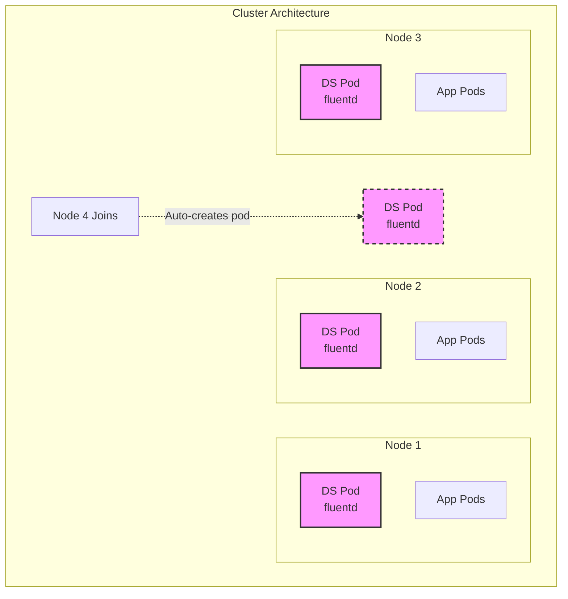
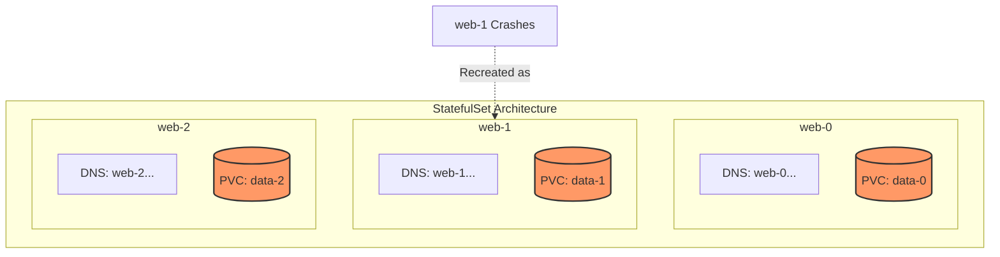
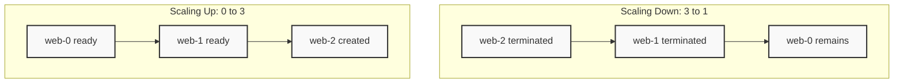
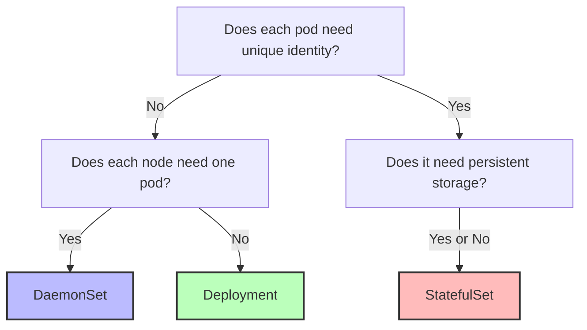

> **Складність**: `[СЕРЕДНЯ]` — спеціалізовані патерни робочих навантажень
>
> **Час на проходження**: 40-50 хвилин
>
> **Передумови**: Модуль 2.1 (Pod'и), Модуль 2.2 (Деплойменти)

---

## Що ви зможете зробити

Після завершення цього модуля ви зможете:

- **Розгортати** DaemonSets для сервісів рівня ноди та StatefulSets для застосунків зі станом у різноманітних архітектурах Kubernetes 1.35+.
- **Порівнювати** поведінку DaemonSet, Deployment та StatefulSet тоді, коли ідентичність, сховище, порядок оновлення чи покриття нод впливають на коректність застосунку.
- **Налаштовувати** толерації, селектори DaemonSet та headless-сервіси StatefulSet так, щоб робочі навантаження потрапляли на потрібні ноди й надавали стабільні DNS-імена.
- **Діагностувати** збої StatefulSet, пов'язані зі збереженням PVC, зависанням упорядкованого розгортання, DNS-записами headless-сервісу та частковими (partitioned) оновленнями.
- **Проєктувати** вибір контролера робочих навантажень, що відповідає виробничим вимогам для агентів логування, агентів моніторингу, баз даних, розподілених систем та сервісів без стану.

## Чому цей модуль важливий

Гіпотетичний сценарій: автоскейлер кластера додає три робочі ноди під час сплеску трафіку, але нові ноди не отримують збирача логів, який пересилає логи контейнерів до вашої системи реагування на інциденти. Вебзастосунок справний, у Деплойменті достатньо реплік, а ємності нод вистачає, проте саме ті ноди, що обробляють найзавантаженіший трафік, невидимі для спостережуваності. Деплоймент може розподіляти репліки, але не може виразити операційне правило «одна копія має працювати на кожній придатній ноді, зокрема на майбутніх нодах». Це правило належить DaemonSet, і різниця стає помітною в найгірший можливий момент.

Сценарій вправи: команда намагається запустити кластер бази даних як звичайний Деплоймент, бо YAML здається знайомим, а Pod'и успішно стартують під час спокійного тесту. Згодом одна репліка переїжджає на іншу ноду, отримує нове ім'я Pod'а і втрачає стабільну DNS-ідентичність, на яку розраховувала конфігурація реплікації. Kubernetes зробив те, що обіцяє Деплоймент: він підтримував бажану кількість взаємозамінних Pod'ів у роботі. Застосунку ж потрібна була сильніша обіцянка: стабільна порядкова ідентичність, передбачувані мережеві імена та сховище, що залишається в парі з кожною реплікою.

Цей модуль навчає двох контролерів робочих навантажень, до яких ви звертаєтеся тоді, коли Деплойменти виявляються надто загальними для конкретної задачі. DaemonSets розв'язують задачі покриття на рівні ноди — такі як логування, моніторинг, мережа, сховище та агенти безпеки. StatefulSets розв'язують задачі ідентичності та сховища для систем, що сприймають окремі репліки як іменованих учасників, а не як анонімні взаємозамінні копії. Навичка полягає не в простому запам'ятовуванні того, що «бази даних використовують StatefulSets» чи що «агенти використовують DaemonSets»; справжня навичка полягає в умінні розпізнати, якої саме гарантії потребує ваше навантаження, та обрати той контролер, чий цикл узгодження природно й надійно підтримує цю гарантію.

Лікарняна аналогія з оригінального уроку корисна, бо вона відокремлює взаємозамінну ємність обслуговування від спеціалізованого розміщення. Деплойменти — як терапевти загальної практики: їх може бути більше чи менше, і більшості пацієнтів байдуже, хто саме відповість. DaemonSets — як охоронці, поставлені біля входів: кожен придатний вхід потребує покриття, а новий вхід автоматично потребує охоронця. StatefulSets — як хірурги з іменованими кабінетами та виділеними інструментами: ідентичність має значення, обладнання має значення, а заміна мусить зберегти зв'язок між людиною, кабінетом та інструментами.

## DaemonSets: покриття на рівні ноди як контракт

DaemonSet гарантує, що всі — або вибрана підмножина — ноди запускають копію Pod'а. Коли відповідна нода приєднується до кластера, контролер DaemonSet створює Pod для цієї ноди. Коли нода вибуває, пов'язаний Pod прибирається разом з нодою. Тому контролер не запитує «Скільки реплік має існувати?» так, як це робить Деплоймент. Він запитує «Які ноди придатні, і чи кожна придатна нода має свою локальну копію?»

Саме ця відмінність пояснює, чому DaemonSets природніше пасують компонентам інфраструктури, ніж звичайним прикладним застосункам. Збирачам логів потрібен доступ до локальних шляхів із логами на самій ноді, мережевим плагінам потрібна постійна присутність на кожній ноді, що бере участь у мережі Pod'ів, а сканерам безпеки часто потрібна видимість саме з межі ноди. Деплоймент з анти-афінністю може намагатися розподілити Pod'и, але не може автоматично відстежувати набір нод у міру того, як кластер зростає й зменшується. DaemonSet перетворює покриття нод на бажаний стан, тож події автомасштабування та події заміни нод стають частиною звичайного узгодження, а не особливими операційними процедурами.



Діаграма показує важливу ментальну модель: четвертий Pod — це не рішення про масштабування, ухвалене людиною після появи нової ноди. Це природний результат того, що контролер DaemonSet помічає: нова нода відповідає правилам розміщення DaemonSet. Якщо нода не відповідає цим правилам через мітки, селектори, афінність або тейнти, які Pod не толерує, відсутність Pod'а теж є очікуваною поведінкою. Тому усунення несправностей DaemonSets починається з питання, чи нода придатна, а не з питання, чи неправильна кількість реплік.

| Сценарій використання | Приклад |
|----------|---------|
| Збирання логів | Fluentd, Filebeat |
| Моніторинг нод | Node Exporter, агент Datadog |
| Мережеві плагіни | Calico, Cilium, Weave |
| Демони сховища | GlusterFS, Ceph |
| Агенти безпеки | Falco, Sysdig |

Ці сценарії використання мають одну спільну властивість: кожен Pod виконує корисну роботу через те, де він працює, а не лише через те, що він десь існує в кластері. Node exporter без Pod'а на ноді не може експортувати метрики цієї ноди. Збирач логів на одній ноді не може читати довільні host-шляхи з іншої ноди. Демон сховища, що очікує локальні диски, мусить опинитися на машинах із цими дисками. Ця прив'язана до розміщення цінність є найчіткішим сигналом, що DaemonSet може бути правильним контролером.

Створення DaemonSet виглядає дуже схоже на створення Деплойменту, бо обидва контролери керують Pod'ами на основі шаблону Pod'а. Визначальні відмінності — це `kind: DaemonSet` та відсутність поля `replicas`. Кількість реплік належить контролерам, що рахують взаємозамінні копії. DaemonSet обчислює свою бажану кількість Pod'ів із набору придатних нод, тож встановлення незалежного числа реплік суперечило б призначенню контролера.

```yaml
# fluentd-daemonset.yaml
apiVersion: apps/v1
kind: DaemonSet
metadata:
  name: fluentd
  labels:
    app: fluentd
spec:
  selector:
    matchLabels:
      app: fluentd
  template:
    metadata:
      labels:
        app: fluentd
    spec:
      containers:
      - name: fluentd
        image: fluent/fluentd:v1.18-debian-1
        resources:
          limits:
            memory: 200Mi
          requests:
            cpu: 100m
            memory: 200Mi
        volumeMounts:
        - name: varlog
          mountPath: /var/log
      volumes:
      - name: varlog
        hostPath:
          path: /var/log
```

Том `hostPath` у цьому прикладі не є декоративним; він пояснює, чому DaemonSet корисний для цього навантаження. Pod'у потрібен каталог `/var/log` з ноди, на якій він працює, і кожна нода має власне локальне уявлення про цей шлях. Деплоймент міг би випадково зосередити репліки на меншому наборі нод і залишити інші ноди без збору логів. DaemonSet робить зв'язок із локальною нодою явним.

```bash
kubectl apply -f fluentd-daemonset.yaml
```

Зупиніться й передбачте: у вас є кластер із п'яти нод, і ви створюєте цей DaemonSet. Потім до кластера приєднується шоста нода з мітками й тейнтами, сумісними з шаблоном Pod'а. Перш ніж читати далі, вирішіть, скільки Pod'ів fluentd має існувати і чи знадобиться вам редагувати поле реплік. Тепер порівняйте це з Деплойментом, налаштованим на п'ять реплік, і запитайте, що станеться, коли приєднається шоста нода.

```bash
# List DaemonSets
kubectl get daemonsets
kubectl get ds
```

```bash
# Describe DaemonSet
kubectl describe ds fluentd
```

```bash
# Check pods created by DaemonSet
kubectl get pods -l app=fluentd -o wide
```

```bash
# Delete DaemonSet
kubectl delete ds fluentd
```

Подання `-o wide` має більше значення для DaemonSets, ніж для багатьох Деплойментів без стану, бо стовпець ноди підказує, чи покриття відповідає очікуванню. Якщо DaemonSet повідомляє, що бажаних Pod'ів менше, ніж кількість нод у кластері, це не автоматично є помилкою. Це може означати, що селектори виключили деякі ноди, тейнти відштовхнули Pod або в кластері є непланувані ноди. Добра діагностика DaemonSet читає статус контролера разом із мітками нод, тейнтами та подіями планування Pod'ів.

| Аспект | DaemonSet | Deployment |
|--------|-----------|------------|
| Кількість Pod'ів | По одному на ноду (автоматично) | Задана кількість реплік |
| Планування | Націлюється на придатні ноди, а потім використовує планувальник для прив'язки Pod'ів | Використовує планувальник |
| Додавання ноди | Автоматично створює Pod | Жодної автоматичної дії |
| Сценарій використання | Сервіси рівня ноди | Прикладні робочі навантаження |

Таблиця фіксує контраст рівня іспиту, але виробничі рішення потребують глибшої версії. Якщо навантаження надає ємність обслуговування користувачам і будь-який справний Pod може обробити будь-який запит, Деплоймент зазвичай простіший і гнучкіший. Якщо навантаження надає функціональність рівня ноди й пропуск однієї придатної ноди є проблемою коректності, DaemonSet є безпечнішим вираженням. Якщо навантаження вимагає стабільної ідентичності чи сховища на репліку, жодного стовпця таблиці недостатньо, і ви рухаєтеся до міркувань StatefulSet.

Є ще одна тонка відмінність, яка має значення під час вікон обслуговування. Деплоймент може перенести ємність із несправної ноди, якщо планувальник знайде краще місце для Pod'а на заміну, — і саме цього ви хочете для сервісів без стану. DaemonSet не намагається перенести відповідальність ноди в інше місце, бо локальну роботу неможливо чисто делегувати. Якщо нода несправна, локальний агент ноди теж може бути несправним, і ця відсутність є сигналом про цю ноду, а не проблемою ємності деінде в кластері.

Коли ви переглядаєте маніфест DaemonSet, читайте його як знизу вгору, так і згори вниз. Томи та монтування зазвичай розкривають, чому Pod мусить працювати локально, запити ресурсів розкривають подушний податок на ноду, який він накладає, а толерації розкривають, які межі нод він перетинає. Потім поверніться до селектора й міток, щоб підтвердити, що контролер може володіти Pod'ами, які він створює. Ця звичка ловить багато помилок ще до того, як ви взагалі запустите `kubectl apply`, особливо невідповідні мітки та надто широкі толерації.

## Планування, тейнти та оновлення DaemonSet

DaemonSets не означають «ігнорувати правила планування». Вони означають «створити один Pod для кожної ноди, на якій шаблон Pod'а може законно працювати». Ця відмінність запобігає поширеній хибній уяві: команди очікують, що DaemonSet з'явиться всюди, а потім виявляють, що ноди площини управління, GPU-ноди чи ізольовані ноди сховища не отримують Pod'ів. Контролер досі обмежений мітками нод, афінністю, тейнтами, запитами ресурсів та готовністю самої ноди. Kubernetes 1.35 зберігає цю модель послідовною: DaemonSet виражає бажане покриття, тоді як правила планування визначають придатність.

Часто ви навмисно обмежуєте DaemonSet. Монітор справності диска для SSD-хостів не повинен споживати CPU на стандартних нодах. Агент GPU-телеметрії не повинен працювати на нодах без GPU. Хостовий агент сховища може мати сенс лише на позначеному пулі. Правильне питання — не «Як мені змусити DaemonSet працювати всюди?», а «Яким є точний набір нод, чий локальний стан цей агент мусить спостерігати чи яким керувати?»

```yaml
apiVersion: apps/v1
kind: DaemonSet
metadata:
  name: ssd-monitor
spec:
  selector:
    matchLabels:
      app: ssd-monitor
  template:
    metadata:
      labels:
        app: ssd-monitor
    spec:
      nodeSelector:
        disk: ssd            # Only nodes with this label
      containers:
      - name: monitor
        image: busybox
        command: ["sleep", "infinity"]
```

Селектор вище навмисно простий, бо `nodeSelector` легко осягнути під час іспиту CKA. У більших кластерах афінність нод може виражати складніше розміщення, але операційна ідея ідентична: позначте інфраструктуру осмислено, а потім дайте контролеру навантаження націлюватися на мітки замість жорсткого зашивання імен нод. Мітки переживають патерни заміни нод краще, ніж ручні переліки нод, і дають змогу платформним командам документувати намір розміщення прямо в API.

```bash
# Label a node
kubectl label node worker-1 disk=ssd
```

```bash
# DaemonSet only runs on labeled nodes
kubectl get pods -l app=ssd-monitor -o wide
```

Тейнти — це друга половина історії про розміщення. Тейнт каже, що нода відштовхує Pod'и, доки ці Pod'и не оголосять відповідну толерацію. Ноди площини управління зазвичай несуть тейнт `NoSchedule`, бо довільні прикладні Pod'и не повинні конкурувати з компонентами, що запускають кластер. Деякі виділені ноди використовують тейнти, щоб зарезервувати обладнання чи ізолювати чутливі навантаження. DaemonSet, що справді мусить покривати ці ноди, потребує толерацій у своєму шаблоні Pod'а.

```yaml
apiVersion: apps/v1
kind: DaemonSet
metadata:
  name: node-monitor
spec:
  selector:
    matchLabels:
      app: node-monitor
  template:
    metadata:
      labels:
        app: node-monitor
    spec:
      tolerations:
      # Tolerate control-plane taint
      - key: node-role.kubernetes.io/control-plane
        operator: Exists
        effect: NoSchedule
      # Tolerate all taints (run everywhere)
      - operator: Exists
      containers:
      - name: monitor
        image: prom/node-exporter
```

Широка толерація `- operator: Exists` потужна, і до неї слід ставитися як до навмисного проєктного рішення, а не типового значення. Вона каже, що Pod може толерувати будь-який тейнт, що може бути доречним для основних агентів нод, але ризикованим для звичайного ПЗ. Якщо ви використовуєте її для агента безпеки, задокументуйте, чому кожен клас нод мусить бути покритий. Якщо ви використовуєте її тому, що Pod був у стані pending, а ви не дослідили тейнт, ви можете випадково зруйнувати ізоляцію, на яку покладається інша команда.

Оновлення DaemonSet теж заслуговують на повагу, бо агенти рівня ноди розташовані близько до справності кластера. Оновлення всіх збирачів логів, мережевих агентів чи агентів моніторингу в один і той самий момент може створити сліпі зони чи локальний збій. Типова стратегія `RollingUpdate` обмежує кількість недоступних Pod'ів DaemonSet, тож кластер поступово замінює їх. `OnDelete` передає контроль оператору: контролер записує новий шаблон, але окремі Pod'и оновлюються лише тоді, коли хтось видаляє старі Pod'и.

```yaml
apiVersion: apps/v1
kind: DaemonSet
metadata:
  name: fluentd
spec:
  updateStrategy:
    type: RollingUpdate        # Default
    rollingUpdate:
      maxUnavailable: 1        # Update one node at a time
  selector:
    matchLabels:
      app: fluentd
  template:
    # ...
```

| Стратегія | Поведінка |
|----------|----------|
| [`RollingUpdate`](https://kubernetes.io/docs/tasks/manage-daemon/update-daemon-set/) | Поступово оновлює Pod'и, по одній ноді за раз |
| `OnDelete` | Оновлює лише тоді, коли Pod видалено вручну |

Перш ніж запускати це в реальному кластері, який вивід переконав би вас, що оновлення відбувається безпечно? Дивіться на лічильники desired, current, ready, updated та available разом. Якщо лічильник updated зростає, тоді як готові Pod'и тримаються близько до бажаної кількості, розгортання поводиться як задумано. Якщо оновлені Pod'и застрягають або готові Pod'и різко падають, перевірте події Pod'ів, завантаження образів, тиск на ресурси та будь-які збої, специфічні для ноди, перш ніж форсувати наступний крок.

Корисний цикл усунення несправностей DaemonSet має три рівні. Спершу перевірте статус DaemonSet, щоб побачити, що, на думку контролера, має існувати. По-друге, перевірте ноди, які не отримали Pod'ів, зокрема мітки, тейнти, готовність та планованість. По-третє, перевірте Pod'и в стані pending чи failed на наявність подій, що згадують тиск на ресурси, завантаження образів, доступ до host-шляхів чи політики допуску. Рух у цьому порядку утримує вас від випадкового редагування YAML, коли справжня проблема — придатність ноди.

Будьте обережні із запитами ресурсів на DaemonSets, бо вартість масштабується кількістю нод, а не кількістю реплік. Запит, що виглядає крихітним на лабораторному кластері з трьох нод, може стати відчутним на багатьох робочих нодах, а агент, важкий за пам'яттю, може зменшити придатну ємність усюди. Це не означає, що агенти нод повинні пропускати запити; це означає, що запити мусять відображати реальний мінімум, потрібний для стабільної роботи. Недозапитані агенти можуть бути витіснені чи задушені саме тоді, коли кластер уже під тиском.

CKA часто формулює питання про DaemonSet як «чому Pod відсутній на цій ноді?». У таких сценаріях стримайте бажання спершу перестворити контролер. Перевірте, чи має нода тейнт, який Pod DaemonSet не толерує, чи виключає її правило nodeSelector або афінності, чи недостатньо придатного CPU чи пам'яті, чи заблокувало Pod завантаження образу чи відмова допуску, і чи специфічні для ноди події пояснюють меншу бажану кількість. Саме лише позначення ноди як непланованої (`cordon`) не зупиняє Pod'и DaemonSet — вони за замовчуванням толерують `node.kubernetes.io/unschedulable:NoSchedule`. Перестворення контролера з тим самим шаблоном рідко змінює відповідь планувальника, бо застосовуються ті самі правила.

## StatefulSets: ідентичність, сховище та впорядкована зміна

StatefulSets керують застосунками, чиї репліки не є взаємозамінними. Контролер дає кожному Pod'у стабільне порядкове ім'я, таке як `web-0`, `web-1` та `web-2`. Він поєднує ці ідентичності зі стабільними мережевими записами через headless-сервіс і — коли налаштовано — стабільними PersistentVolumeClaim через `volumeClaimTemplates`. Ці гарантії мають значення, коли учасники застосунку формують кластер, обирають лідерів, реплікують дані, розподіляють навантаження за шардами чи зберігають локальний стан, що мусить повторно підключитися до того самого логічного учасника після перезапуску.

Деплойменти навмисно ховають ідентичність окремого Pod'а, бо саме це ідеально пасує для сервісів без стану. Репліку фронтенду, що загинула, можна замінити іншим Pod'ом зі згенерованим новим ім'ям, і Сервіс при цьому може балансувати трафік, ніяк не повідомляючи клієнтам про цю різницю. А от системи зі станом часто мають прямо протилежну вимогу. Учаснику може знадобитися звернутися саме до `web-0`, репліці бази даних може знадобитися власний диск, а покрокове оновлення може потребувати просування від найвищого порядкового номера донизу, щоб найстарші чи найцентральніші учасники зачіпалися останніми.



Стрілка збою — ключова деталь. Якщо `web-1` зникає, Kubernetes не створює `web-3` як заміну. Контролер StatefulSet перестворює `web-1`, зберігаючи ідентичність, на яку можуть посилатися інші учасники. Якщо StatefulSet має шаблон тома (volume claim template), Pod на заміну повторно використовує claim, пов'язаний із цією ідентичністю. Саме ця пара пояснює, чому усунення несправностей StatefulSet зазвичай охоплює три ресурси одночасно: StatefulSet, окремий Pod та PVC, названий для цього Pod'а.

| Сценарій використання | Приклад |
|----------|---------|
| Бази даних | PostgreSQL, MySQL, MongoDB |
| Розподілені системи | Kafka, Zookeeper, etcd |
| Пошукові рушії | Elasticsearch |
| Черги повідомлень | RabbitMQ |

Приклади в таблиці не є дозволом поміщати кожну базу даних у Kubernetes без роздумів. Деякі системи зі станом краще споживати як керовані сервіси, а деяким командам бракує операційної зрілості, щоб запускати важкі за сховищем системи всередині кластера. StatefulSet — це інструмент для вираження семантики ідентичності та сховища, а не обіцянка, що резервне копіювання, аварійне перемикання, налаштування продуктивності, міграція схеми та аварійне відновлення розв'язані. На іспиті CKA вам потрібна механіка контролера; у виробництві вам також потрібен runbook, специфічний для застосунку.

StatefulSets потребують імені Сервісу, бо контролер використовує його, щоб сформувати стабільні DNS-записи. Headless-сервіс, визначений з `clusterIP: None`, є звичайним компаньйоном, бо він повертає записи endpoint'ів, а не ховає всі Pod'и за єдиним віртуальним IP. Селектор Сервісу мусить збігатися з мітками Pod'ів StatefulSet, а `serviceName` StatefulSet мусить посилатися на цей Сервіс. Якщо ці поля не вишикувані, Pod'и можуть існувати й виглядати справними, тоді як виявлення учасників на основі DNS зазнає невдачі.

```yaml
# Headless Service (required)
apiVersion: v1
kind: Service
metadata:
  name: nginx
  labels:
    app: nginx
spec:
  ports:
  - port: 80
    name: web
  clusterIP: None          # This makes it headless
  selector:
    app: nginx
```

Сервіс вище не має ClusterIP, тож це не звичайні балансувальні «вхідні двері». Це інструмент DNS та виявлення endpoint'ів. Для вебзастосунку без стану ви часто хочете стабільне ім'я Сервісу, що розподіляє запити між будь-якою готовою реплікою. Для набору учасників зі станом ви часто хочете мати можливість звертатися до конкретного порядкового Pod'а, бо клієнтським бібліотекам, учасникам кластера чи конфігурації реплікації можуть знадобитися стабільні імена учасників.

```yaml
# StatefulSet
apiVersion: apps/v1
kind: StatefulSet
metadata:
  name: web
spec:
  serviceName: nginx       # Must reference the headless service
  replicas: 3
  selector:
    matchLabels:
      app: nginx
  template:
    metadata:
      labels:
        app: nginx
    spec:
      containers:
      - name: nginx
        image: nginx
        ports:
        - containerPort: 80
        volumeMounts:
        - name: data
          mountPath: /usr/share/nginx/html
  volumeClaimTemplates:    # Creates PVC for each pod
  - metadata:
      name: data
    spec:
      accessModes: ["ReadWriteOnce"]
      resources:
        requests:
          storage: 1Gi
```

Шаблон тома (volume claim template) створює один PVC на порядковий номер Pod'а, а не один спільний claim на весь StatefulSet. Саме тому StatefulSet із трьох реплік із шаблоном на ім'я `data` створює claim'и, такі як `data-web-0`, `data-web-1` та `data-web-2`. Кожен claim має власний життєвий цикл та статус прив'язки. Якщо `web-1` у стані pending, бо його claim не може прив'язатися, масштабування чи перезапуск StatefulSet не виправить кореневу причину; вам потрібно перевірити storage class'и, ємність, режими доступу та події на PVC.

```bash
# Pod DNS names follow pattern:
# <pod-name>.<service-name>.<namespace>.svc.cluster.local
```

```bash
# For StatefulSet "web" with headless service "nginx":
web-0.nginx.default.svc.cluster.local
web-1.nginx.default.svc.cluster.local
web-2.nginx.default.svc.cluster.local
```

```bash
# Other pods can reach specific instances:
curl web-0.nginx
curl web-1.nginx
```

Зупиніться й передбачте: якщо ви видалите Pod `web-1` зі StatefulSet, яке ім'я повинен мати Pod на заміну, і який PVC він повинен змонтувати? Ваша відповідь має поєднати ідентичність та сховище разом. Якщо ви відповідаєте лише «Pod повертається», ви мислите як оператор Деплойменту. Якщо ви відповідаєте «`web-1` повертається й повторно використовує сховище для `web-1`», ви мислите як оператор StatefulSet.

```bash
# Each pod gets its own PVC named:
# <volumeClaimTemplates.name>-<pod-name>
data-web-0
data-web-1
data-web-2
```

```bash
# When pod restarts, it reattaches to its specific PVC
# Data persists across pod restarts
```

Збереження PVC навмисно консервативне, бо випадкове видалення даних відновити важче, ніж зробити зайвий крок прибирання. За замовчуванням видалення StatefulSet не видаляє автоматично PVC, створені з його `volumeClaimTemplates`. Новіші версії Kubernetes підтримують налаштовувані політики збереження PersistentVolumeClaim, але принцип безпеки залишається тим самим: знайте, чи видаляєте ви обчислення, ідентичність, claim'и сховища чи самі дані під ними. Багато дорогих несподіванок зі сховищем походять від видалення лише контролера, тоді як claim'и залишаються позаду.

Пара зі сховищем також змінює те, як ви думаєте про збій ноди. Якщо `web-1` переїжджає на іншу ноду, важливе питання не в тому, чи має новий Pod ту саму IP-адресу; зазвичай не матиме. Важливе питання в тому, чи може логічний учасник `web-1` повторно під'єднати правильний claim і знову приєднатися до учасників під тією самою DNS-ідентичністю. Тому ідентичність StatefulSet — це логічна ідентичність, а не фізична ідентичність ноди. Pod може переїхати, але ім'я учасника та зв'язок зі сховищем залишаються стабільними.

Не плутайте StatefulSet зі стратегією резервного копіювання. Збережений PVC захищає від випадкового видалення Pod'а, але не захищає від пошкоджених даних, помилок на рівні застосунку, збою регіону чи проблеми з бекендом сховища. StatefulSets полегшують запуск систем, що очікують іменованих учасників; вони не усувають потреби в знімках, відновленнях, тестуванні реплікації та runbook'ах оновлення. На реальних платформах маніфест StatefulSet має бути лише однією частиною більшого операційного дизайну.

Коли прив'язка сховища застрягає, найшвидша корисна підказка часто на PVC, а не на Pod'і. Подія Pod'а може казати, що том недоступний, але подія PVC може розкрити, чи не збігся жоден StorageClass, чи була недоступна ємність, чи був непідтримуваним режим доступу, чи зазнало невдачі динамічне виділення тома (provisioning). Оскільки StatefulSets створюють передбачувані імена claim'ів, ви можете швидко зіставити `web-2` з `data-web-2` та перевірити саме той ресурс, що блокує цей порядковий номер. Це зіставлення — одна з головних причин, чому варто запам'ятати конвенцію іменування.

## Операції StatefulSet та DNS headless-сервісу

StatefulSets за замовчуванням забезпечують упорядковане створення й видалення. Під час масштабування з нуля до трьох спершу створюється `web-0`, і він мусить стати Running та Ready, перш ніж продовжить `web-1`, а `web-1` мусить бути готовим, перш ніж продовжить `web-2`. Під час масштабування вниз контролер спершу видаляє вищі порядкові номери. Ця поведінка захищає системи, де порядок запуску, виявлення учасників чи припущення про лідерство залежать від того, що раніші учасники доступні до того, як приєднаються пізніші.



Упорядкований режим за замовчуванням також може зробити збої заплутаними. Якщо `web-0` не може стати Ready, `web-1` та `web-2` можуть так і не з'явитися під час початкового створення. Це не тому, що планувальник забув про них; це тому, що контролер дотримується `OrderedReady`. У реальному інциденті це корисна інформація. Ви спершу перевіряєте найраніший відсутній чи неготовий порядковий номер, бо пізніші порядкові номери можуть просто чекати на нього, а не зазнавати невдачі незалежно.

```yaml
apiVersion: apps/v1
kind: StatefulSet
metadata:
  name: web
spec:
  podManagementPolicy: OrderedReady   # Default - sequential
  # podManagementPolicy: Parallel     # All at once (like Deployment)
```

| Політика | Поведінка |
|--------|----------|
| `OrderedReady` | Послідовне створення/видалення (за замовчуванням) |
| `Parallel` | Усі Pod'и створюються/видаляються одночасно |

Управління Pod'ами `Parallel` не є кнопкою продуктивності для кожного StatefulSet. Воно доречне лише тоді, коли застосунок не потребує впорядкованої готовності для коректності. Деяким навантаженням потрібні стабільні ідентичності та незалежне сховище, але вони не вимагають послідовного запуску, тож паралельне створення може скоротити час розгортання. Інші розподілені системи припускають, що учасники з нижчими порядковими номерами існують першими, і паралельне створення може посилити шум від збоїв. Обирайте політику з моделі членства застосунку, а не з нетерплячості під час розгортання.

Покрокові оновлення StatefulSet відбуваються в контрольованому порядковому порядку. Поле `partition` дає змогу зробити канаркове (canary) оновлення зміни, оновлюючи лише ті Pod'и, чий порядковий номер більший або дорівнює partition. З трьома репліками та `partition: 2` новий шаблон отримує лише `web-2`. Це нативний спосіб протестувати новий образ чи конфігурацію на одному учаснику, зберігаючи решту набору на старій версії.

```yaml
apiVersion: apps/v1
kind: StatefulSet
metadata:
  name: web
spec:
  updateStrategy:
    type: RollingUpdate
    rollingUpdate:
      partition: 2          # Only update pods >= 2
```

Який підхід ви б обрали тут і чому: розгортання StatefulSet із partition чи окремий канарковий Деплоймент? Якщо учасник застосунку мусить зберігати стабільний порядковий номер та власне сховище, partition StatefulSet відповідає ризику, який ви намагаєтеся контролювати. Якщо навантаження без стану й може отримувати трафік через звичайне балансування Сервісу, канарковий Деплоймент може бути простішим. Вибір контролера має слідувати за одиницею ризику: анонімна ємність для Деплойментів, іменовані учасники для StatefulSets.

```bash
# List StatefulSets
kubectl get statefulsets
kubectl get sts
```

```bash
# Describe
kubectl describe sts web
```

```bash
# Scale
kubectl scale sts web --replicas=5
```

```bash
# Check pods (notice ordered names)
kubectl get pods -l app=nginx
```

```bash
# Check PVCs (one per pod)
kubectl get pvc
```

```bash
# Delete StatefulSet (PVCs remain!)
kubectl delete sts web
```

```bash
# Delete PVCs manually
kubectl delete pvc data-web-0 data-web-1 data-web-2
```

Headless-сервіси завершують історію StatefulSet, бо вони надають стабільні записи, не змушуючи кожне з'єднання проходити через єдиний віртуальний IP. Звичайний Сервіс отримує ClusterIP, і клієнти розв'язують ім'я Сервісу в цей віртуальний IP. Headless-сервіс пропускає цей віртуальний IP і дозволяє DNS повертати інформацію про endpoint'и напряму. Для StatefulSets важлива перевага не просто «кілька IP»; це здатність розв'язувати імена на рівні Pod'а, що кодують порядкову ідентичність.

```yaml
# Regular Service
apiVersion: v1
kind: Service
metadata:
  name: nginx-regular
spec:
  selector:
    app: nginx
  ports:
  - port: 80
# DNS: nginx-regular -> ClusterIP (load balanced)
```

```yaml
# Headless Service
apiVersion: v1
kind: Service
metadata:
  name: nginx-headless
spec:
  clusterIP: None           # Headless!
  selector:
    app: nginx
  ports:
  - port: 80
# DNS: nginx-headless -> Returns all pod IPs
# DNS: web-0.nginx-headless -> Specific pod IP
```

```bash
# Regular service - returns ClusterIP
nslookup nginx-regular
# Server: 10.96.0.10
# Address: 10.96.0.10#53
# Name: nginx-regular.default.svc.cluster.local
# Address: 10.96.100.50  (ClusterIP)
```

```bash
# Headless service - returns pod IPs
nslookup nginx-headless
# Server: 10.96.0.10
# Address: 10.96.0.10#53
# Name: nginx-headless.default.svc.cluster.local
# Address: 10.244.1.5  (Pod IP)
# Address: 10.244.2.6  (Pod IP)
# Address: 10.244.3.7  (Pod IP)
```

Коли DNS зазнає невдачі для StatefulSet, уникайте стрибка одразу до CoreDNS як винуватця. Спершу перевірте, що Сервіс є headless, що селектор збігається з мітками Pod'ів, що `serviceName` StatefulSet збігається з ім'ям Сервісу, що Pod'и є Ready, коли готовність потрібна для записів, і що запит використовує правильний простір імен. DNS часто є симптомом невідповідності у звичайних об'єктах Kubernetes. Найкращі діагности рухаються від об'єктів API до згенерованих endpoint'ів і лише потім до рівня DNS.

Упорядковані оновлення мають подібний діагностичний ритм. Якщо розгортання StatefulSet призупиняється, визначте найвищий порядковий номер, що мав оновитися, і перевірте цей Pod, перш ніж змінювати partition чи видаляти нижчі порядкові номери. Контролер може чекати, бо оновлений Pod не є Ready, бо його PVC не може змонтуватися або бо застосунок відхиляє нову конфігурацію. Форсування оновлення додаткових Pod'ів до розуміння цього першого збою може перетворити контрольоване канаркове оновлення на збій багатьох учасників.

Розгортання з partition особливо цінні, коли коректність застосунку залежить від кворуму кластера. Оновлення одного високого порядкового номера дає змогу спостерігати логи, готовність, членство учасників та поведінку сховища, тоді як більшість учасників продовжує працювати на старій версії. Щойно канарка поводиться правильно, поступове зниження partition розширює розгортання. Це повільніше, ніж заміна кожного Pod'а одразу, але повільність є перевагою для систем, де кожен учасник несе ідентичність і, можливо, дані.

Headless-сервіс також є навчальним прикладом того, чому Kubernetes відокремлює контролери від виявлення. StatefulSet володіє ідентичностями Pod'ів та порядком оновлення, тоді як Сервіс обирає Pod'и й надає DNS-записи. Якщо будь-яка з половин неправильна, система може зазнати збою у спосіб, що виглядає так, ніби зламана інша половина. Коректний StatefulSet із неправильним селектором Сервісу все одно створить Pod'и, а коректний headless-сервіс не може вигадати стабільні порядкові номери для Pod'ів, якими не керує StatefulSet.

## Порівняння контролерів для реальних навантажень

Найчистіший спосіб порівняти між собою Деплойменти, DaemonSets та StatefulSets — це запитати, що саме Pod'у на заміну дозволено забути. Pod Деплойменту може забути своє ім'я, свою ноду й зазвичай навіть свою локальну файлову систему, бо будь-який інший Pod може виконувати точно ту саму роль. Pod DaemonSet може забути своє індивідуальне ім'я Pod'а, але він не може забути, якій саме ноді він служить, бо локальна робота на ноді — це і є вся його суть. Pod StatefulSet може бути переплановано на іншу ноду, але при цьому він мусить зберегти своє логічне ім'я та будь-яку ідентичність сховища, прив'язану до цього імені.

| Аспект | Deployment | StatefulSet |
|--------|------------|-------------|
| Імена Pod'ів | Випадковий суфікс (nginx-5d5dd5d5fb-xyz) | Порядковий індекс (web-0, web-1) |
| Мережева ідентичність | Немає (використовуйте Сервіс) | Стабільний DNS на кожен Pod |
| Сховище | Спільне або відсутнє | Виділений PVC на кожен Pod |
| Порядок масштабування | Будь-який порядок | Послідовний (упорядкований) |
| Покрокове оновлення | Немає гарантії порядку оновлення за порядковим номером | Зворотний порядковий порядок (спершу N-1) |
| Сценарій використання | Застосунки без стану | Застосунки зі станом |

Це порівняння не включає DaemonSet, бо він відповідає на інше перше питання. Деплойменти та StatefulSets обидва керують наборами реплік застосунку, але вони розходяться щодо ідентичності. DaemonSets керують покриттям нод, тож перше питання — чи кожна придатна нода потребує локального Pod'а. Щойно ви бачите ці осі окремо, вибір контролера стає менш містичним: покриття нод вказує на DaemonSet, стабільна ідентичність вказує на StatefulSet, а анонімна горизонтальна ємність вказує на Деплоймент.



Блок-схема навмисно запитує про ідентичність раніше за сховище, бо деякі протоколи зі станом потребують стабільних імен навіть тоді, коли сховище зовнішнє. Кластеризований застосунок може зберігати дані деінде, але все одно потребувати передбачуваних адрес учасників. І навпаки, застосунок може монтувати персистентне сховище, але залишатися фактично однореплічним і не потребувати StatefulSet з багатьма учасниками. Використовуйте схему як відправну точку, а потім звіряйтеся з власною документацією застосунку, особливо для баз даних та розподілених систем, що мають суворі правила членства.

Сценарій вправи: база даних залежить від ідентичності на репліку для конфігурації учасників, і хтось пропонує Деплоймент, бо так легше масштабувати. Безпечнішим стандартом є StatefulSet, бо Kubernetes збереже порядкові імена, передбачувані DNS-записи та пару PVC. Це не означає, що сам по собі StatefulSet робить базу даних високодоступною. Це означає, що контролер Kubernetes тепер виражає модель ідентичності, яку база даних уже припускає, що дає вашим процедурам резервного копіювання, аварійного перемикання та відновлення стабільну платформу для побудови.

Інший спосіб оцінити вибір контролера — уявити видалення одного Pod'а під час спокійного вікна обслуговування. Якщо видалення будь-якого Pod'а просто спричиняє появу іншого еквівалентного Pod'а, Деплоймент, імовірно, підходить. Якщо видалення Pod'а мусить породити заміну на тому самому класі нод, бо покриття на рівні ноди має значення, то проступає модель DaemonSet. Якщо видалення Pod'а мусить зберегти те саме ім'я учасника та ідентичність сховища, то StatefulSet — це модель, що відповідає наслідку, який вас турбує.

Цей уявний експеримент із видаленням корисний, бо він уникає назв продуктів. «Kafka» та «PostgreSQL» часто наводять людей на завчені відповіді, але реальні середовища містять кастомні сервіси, агенти від постачальників та гібридні патерни. Запитайте, що навантаження мусить запам'ятати після збою. Чи мусить воно запам'ятати ноду, порядковий номер, диск чи нічого взагалі? Відповідь надійніша, ніж категорійна мітка застосунку, особливо коли chart від постачальника ховає кілька контролерів за однією командою встановлення.

Вибір контролера також впливає на те, хто володіє операційною роботою. DaemonSets часто є активами платформної команди, бо вони торкаються кожної ноди й можуть впливати на загальнокластерну спостережуваність чи мережу. StatefulSets часто розташовані ближче до прикладних команд і команд даних, бо їхня коректність залежить від процедур відновлення, специфічних для застосунку. Деплойменти — спільна територія для звичайних сервісів. Коли власність неясна, інциденти стають повільнішими, тож включайте тип контролера та поведінку прибирання в runbook'и й документацію сервісу.

## Патерни та антипатерни

Патерни корисні, бо вони пов'язують поля API з операційним наміром. DaemonSet із широкою толерацією не є за своєю суттю добрим чи поганим; він добрий, коли навантаження є критичним для кластера агентом ноди, що мусить працювати на кожному класі нод, і поганий, коли він дозволяє звичайному застосунку обійти межі розміщення. StatefulSet зі збереженими PVC — це не безлад; це стандарт безпеки даних. Патерн — це причина за YAML, а не сам YAML.

| Патерн | Коли використовувати | Чому це працює | Міркування щодо масштабування |
|---------|----------------|--------------|-----------------------|
| DaemonSet агента ноди | Агентам логування, метрик, безпеки, мережі чи сховища потрібен доступ до локальної ноди | Контролер узгоджує один Pod на кожну придатну ноду в міру приєднання чи вибуття нод | Слідкуйте за запитами ресурсів, бо кожна нова нода отримує ще один Pod |
| DaemonSet з областю за мітками | Лише певні пули нод потребують агента, наприклад SSD-, GPU- чи ноди сховища | Мітки описують здатність інфраструктури й тримають розміщення декларативним | Тримайте мітки автоматизованими через підготовку нод чи задокументовані операції |
| Headless-сервіс плюс StatefulSet | Учасникам потрібні стабільні імена, такі як `web-0.nginx` | Сервіс та StatefulSet поєднують DNS-записи з порядковою ідентичністю Pod'а | Перевірте селектор, простір імен та `serviceName`, перш ніж звинувачувати DNS |
| Шаблон PVC StatefulSet | Кожному учаснику потрібен власний диск чи каталог персистентних даних | Claim'и генеруються на порядковий номер і повторно під'єднуються після заміни Pod'а | Плануйте прибирання та збереження, щоб невикористані claim'и не споживали сховище нескінченно |

Найсильніший патерн у цьому модулі — відокремлення бажаної поведінки від поведінки прибирання. StatefulSets зберігають PVC, бо втрата даних небезпечніша за залишені claim'и. DaemonSets прибирають свої Pod'и, коли ноди зникають, бо локальні агенти нод без нод не мають корисної роботи. Ці вибори життєвого циклу не є довільними типовими значеннями. Вони віддзеркалюють вартість помилки: втрата сховища бази даних серйозна, тоді як залишений Pod агента ноди для видаленої ноди безглуздий.

Для DaemonSets зрілий патерн — проєктувати маніфест як частину управління життєвим циклом нод. Якщо автомасштабування додає ноди, агент з'являється автоматично; якщо підготовка нод додає мітки, DaemonSet слідує за цими мітками; якщо виділені пули нод використовують тейнти, толерації документують, яким агентам дозволено пройти. Це робить поведінку платформи піддатливою аудиту. Хтось, читаючи YAML, може побачити не лише те, що агент існує, але й які класи нод він має покривати.

Для StatefulSets зрілий патерн — документувати прибирання сховища окремо від прибирання застосунку. Команда, що видаляє контролер, не повинна бути тією самою ментальною операцією, що команда, яка видаляє дані. На практиці команди часто вимагають другого огляду, перевірки резервної копії чи явного тикета на зміну, перш ніж видаляти збережені claim'и. Ця церемонія може здаватися повільною, але вона відповідає профілю ризику даних зі станом набагато краще, ніж автоматичне видалення, сховане за видаленням контролера.

Антипатерни часто починаються зі знайомого YAML. Деплоймент знайомий, тож команди використовують його для баз даних. DaemonSet звучить як «запустити всюди», тож команди додають універсальну толерацію, не розуміючи тейнтів. Headless-сервіс виглядає як звичайний Сервіс з одним зміненим полем, тож команди забувають, що селектори та готовність усе ще впливають на записи endpoint'ів. Більшість збоїв спричинені не маловідомими можливостями Kubernetes; вони спричинені застосуванням коректної можливості до неправильного операційного питання.

| Антипатерн | Що йде не так | Краща альтернатива |
|--------------|-----------------|--------------------|
| Деплоймент для бази даних з багатьма учасниками | Імена Pod'ів змінюються, пара з PVC незручна, а учасники не можуть покладатися на порядкову ідентичність | Використовуйте StatefulSet із headless-сервісом та явним плануванням сховища |
| DaemonSet як дешевий розподілювач реплік | Він створює прив'язані до нод Pod'и, навіть коли застосунку потрібна лише ємність | Використовуйте Деплоймент із топологічним розподілом чи правилами афінності |
| Універсальна толерація без огляду | Навантаження можуть несподівано потрапити на ізольовані ноди чи ноди площини управління | Додавайте лише ті толерації, які потрібні для відповідальності рівня ноди |
| Видалення StatefulSet із припущенням, що дані зникли | PVC залишаються прив'язаними, а вартість сховища триває | Проведіть аудит PVC і використовуйте політику збереження навмисно |
| Усунення несправностей DNS перед мітками | Записи headless-сервісу не працюють, бо селектори не збігаються з Pod'ами | Спершу порівняйте селектор Сервісу, мітки Pod'ів, endpoint'и та простір імен |

## Каркас для прийняття рішень

Починайте вибір контролера з гарантії, відсутність підтримки якої зламала б навантаження, якби Kubernetes її не підтримав. Якщо пропуск однієї ноди означає пропуск логів, метрик, мережі чи покриття безпеки, обирайте DaemonSet, а потім уточнюйте придатність за допомогою міток та толерацій. Якщо заміна Pod'а новим анонімним ім'ям нешкідлива, обирайте Деплоймент і тримайте систему простою. Якщо ім'я Pod'а, порядковий номер, claim сховища чи ідентичність учасника мусять пережити заміну, обирайте StatefulSet і навмисно проєктуйте поведінку Сервісу та PVC.

| Вимога | Перевага | Причина | Перша діагностика при збої |
|-------------|--------|--------|--------------------------------|
| Один локальний агент на кожній придатній ноді | DaemonSet | Бажана кількість слідує за відповідними нодами | Порівняйте мітки нод, тейнти та бажану кількість DaemonSet |
| Обробка запитів без стану взаємозамінними Pod'ами | Deployment | Кількість реплік незалежна від кількості нод | Перевірте ReplicaSet, Pod'и, endpoint'и Сервісу та готовність |
| Стабільні імена Pod'ів та DNS-записи | StatefulSet | Порядкові номери дають передбачувану ідентичність | Перевірте `serviceName`, headless-сервіс, селектори, endpoint'и та простір імен |
| Один PVC на іменованого учасника | StatefulSet | `volumeClaimTemplates` створюють claim'и на порядковий номер | Перевірте події PVC, StorageClass, режим доступу та стан прив'язки |
| Контрольована канарка зі станом для одного учасника | partition StatefulSet | Оновлюються лише порядкові номери на рівні partition чи вище | Перевірте стратегію оновлення, значення partition, образ та порядковий номер Pod'а |

Використовуйте цей каркас під час іспитів, перетворюючи сценарій на речення. «Мені потрібен один Pod на кожній ноді» відповідає DaemonSet. «Мені потрібні п'ять анонімних вебреплік» відповідає Деплойменту. «Мені потрібно, щоб `db-0` та `db-1` зберігали імена й диски» відповідає StatefulSet. Потім доведіть вибір, назвавши поля, які ви б перевірили: селектори й толерації DaemonSet, репліки й endpoint'и Сервісу Деплойменту або `serviceName`, порядкові Pod'и та PVC StatefulSet.

Під час усунення несправностей той самий каркас стає картою того, де шукати спершу. Для DaemonSet порівняйте передбачуване покриття нод із фактичним розміщенням Pod'ів і поясніть кожну відсутню ноду через придатність. Для Деплойменту порівняйте бажані репліки з доступними Pod'ами та endpoint'ами Сервісу. Для StatefulSet слідуйте за порядковим номером: Pod, DNS-ім'я, PVC, готовність та стан оновлення. Це утримує розслідування в одній лінії з обіцянкою контролера, замість того щоб трактувати кожне навантаження як загальну проблему Pod'а.

Також прийнятно поєднувати контролери в одному продукті, доки кожен контролер має чисту відповідальність. Стек логування може використовувати DaemonSet для збирачів нод, Деплоймент для API приймання та StatefulSet для бекенду сховища. Це не непослідовність; це добре моделювання. Кожна частина отримує потрібну їй поведінку узгодження, а збої стають легшими для ізоляції, бо покриття нод, ємність сервісу без стану та сховище зі станом представлені окремими об'єктами.

## Чи знали ви?

- DaemonSets автоматично реагують на зміни членства нод, тож додавання відповідної ноди створює ще один Pod DaemonSet без редагування кількості реплік.
- Порядкові номери Pod'ів StatefulSet за замовчуванням починаються з 0 і йдуть послідовно, тож набір із трьох реплік зазвичай створює `web-0`, `web-1` та `web-2`.
- Headless-сервіс використовує `clusterIP: None`, що означає, що DNS може повертати записи endpoint'ів напряму замість єдиного віртуального IP Сервісу.
- PVC StatefulSet за замовчуванням зберігаються при видаленні контролера, а Kubernetes також надає поля політики збереження для команд, яким потрібна явна поведінка прибирання.

## Типові помилки

| Помилка | Чому це трапляється | Як виправити |
|---------|----------------|---------------|
| Створення StatefulSet без відповідного headless-сервісу | Pod'и працюють, тож відсутній стабільний шлях DNS неочевидний, доки виявлення учасників не зазнає невдачі | Створіть Сервіс із `clusterIP: None`, узгодьте селектори з мітками Pod'ів і правильно встановіть `spec.serviceName` |
| Видалення StatefulSet з очікуванням прибирання PVC | Оператори думають, що видалення контролера передбачає видалення даних | Перевірте PVC після видалення й видаляйте claim'и лише тоді, коли дані навмисно виведено з ужитку |
| Використання Деплойменту для кластеризованої бази даних | Маніфест Деплойменту знайомий і швидко стартує Pod'и | Використовуйте StatefulSet, коли стабільна порядкова ідентичність, імена учасників чи сховище на учасника мають значення |
| Дозвіл DaemonSet працювати на більшій кількості нод, ніж задумано | Широка толерація чи відсутній селектор робить кожну ноду придатною | Обмежте ноди мітками, афінністю та точними толераціями, що відповідають відповідальності агента |
| Забування про збіг мітки селектора/шаблону DaemonSet | API вимагає, щоб селектори збігалися з мітками шаблону Pod'а | Тримайте `spec.selector.matchLabels` та `template.metadata.labels` узгодженими перед застосуванням |
| Неправильне прочитання впорядкованих зависань StatefulSet | Пізніші Pod'и відсутні, тож збій здається поширеним | Спершу діагностуйте найнижчий неготовий порядковий номер, бо пізніші порядкові номери можуть чекати |
| Оновлення StatefulSet із несподіваним partition | Деякі Pod'и зберігають старий шаблон за задумом | Перевірте `spec.updateStrategy.rollingUpdate.partition` і знижуйте його навмисно після валідації |
| Усунення несправностей headless-DNS без перевірки endpoint'ів | DNS виглядає зламаним, але Сервіс не має відповідних чи готових endpoint'ів | Перевірте селектор Сервісу, мітки Pod'ів, endpoint slice'и, готовність та простір імен перед редагуванням CoreDNS |

## Тест

1. **Вашій команді моніторингу потрібен рівно один Pod збирача логів на кожній ноді, зокрема на нодах, доданих пізніше. Колега пропонує використати Деплоймент із `replicas`, встановленим на поточну кількість нод, та анти-афінністю Pod'ів. Чому DaemonSet є кращим контролером, і що повинно статися, коли приєднається нова придатна нода?**

   <details>
   <summary>Відповідь</summary>

   DaemonSet кращий, бо його бажаний стан прив'язаний до придатних нод, а не до вручну обраної кількості реплік. Коли нова нода приєднується й відповідає селекторам, тейнтам та вимогам ресурсів Pod'а, контролер DaemonSet автоматично створює Pod збирача логів для цієї ноди. Деплоймент з анти-афінністю може розподілити репліки, але він усе одно рахує Pod'и, а не ноди, тож нова нода не обов'язково отримає покриття. Діагностичний доказ — `kubectl get pods -l app=<label> -o wide`, де ви маєте бачити один Pod на кожній призначеній ноді.

   </details>

2. **Ви розгортаєте кластер із трьох учасників у стилі PostgreSQL, де кожному учаснику потрібне стабільне DNS-ім'я та власний персистентний том. Який контролер та підтримувальний патерн Сервісу слід використати, і що станеться, якщо `web-1` впаде?**

   <details>
   <summary>Відповідь</summary>

   Використайте StatefulSet із headless-сервісом, бо навантаження вимагає стабільної ідентичності на учасника, а не анонімних реплік. Headless-сервіс уможливлює передбачувані імена, такі як `web-1.nginx.default.svc.cluster.local`, тоді як `volumeClaimTemplates` створюють PVC на порядковий номер, такі як `data-web-1`. Якщо `web-1` впаде, контролер StatefulSet перестворює `web-1`, а не створює `web-3`, і повторно під'єднує PVC, пов'язаний із цим порядковим номером. Ця поведінка зберігає конфігурацію учасників та ідентичність сховища через заміну Pod'а.

   </details>

3. **Ви видаляєте StatefulSet за допомогою `kubectl delete sts web`, але використання сховища не падає. Що сталося, і що слід перевірити, перш ніж видаляти будь-що інше?**

   <details>
   <summary>Відповідь</summary>

   PVC, створені `volumeClaimTemplates` StatefulSet, було збережено, що є безпечним стандартом для даних зі станом. Видалення контролера прибирає контролер та Pod'и, але автоматично не означає, що дані одноразові. Перевірте PVC, їхні прив'язані PersistentVolume, резервні копії, вимоги до збереження та будь-який план відновлення застосунку, перш ніж видаляти claim'и. Щойно ви впевнені, що дані більше не потрібні, видаліть конкретні PVC навмисно.

   </details>

4. **StatefulSet, масштабований з однієї репліки до трьох, створює `web-0`, але ніколи не створює `web-1`. У планувальника є ємність, і квоту не перевищено. Яку поведінку слід запідозрити спершу, і де шукати?**

   <details>
   <summary>Відповідь</summary>

   Запідозріть типову політику управління Pod'ами `OrderedReady`. Контролер StatefulSet не перейде до `web-1`, доки `web-0` не стане Running та Ready, тож пізніші Pod'и можуть бути відсутніми, бо перший порядковий номер несправний. Перевірте події `web-0`, проби готовності, логи, завантаження образів, прив'язку PVC та залежності Сервісу, перш ніж ганятися за збоями, яких немає, на пізніших порядкових номерах. Якщо застосунок справді не потребує впорядкованої готовності, то `Parallel` може бути доречним, але це проєктне рішення застосунку.

   </details>

5. **Вам потрібно протестувати ризикований образ StatefulSet лише на одному учаснику набору з п'яти реплік, тримаючи решту на старій версії. Як може допомогти поле `partition`, і який Pod оновлюється першим із `partition: 4`?**

   <details>
   <summary>Відповідь</summary>

   Partition покрокового оновлення StatefulSet оновлює лише Pod'и з порядковими номерами, більшими або рівними partition. У наборі з п'яти реплік із порядковими номерами `web-0` до `web-4` встановлення `partition: 4` оновлює лише `web-4`. Нижчі порядкові номери залишаються на старому шаблоні, доки ви не знизите partition. Це корисно для канарок зі станом, бо канарка залишається реальним іменованим учасником набору, а не анонімним зайвим Pod'ом.

   </details>

6. **DaemonSet сканера безпеки відсутній на нодах площини управління під час аудиту, але працює на робочих нодах. Яка ймовірна причина розміщення, і як її розв'язати, не змушуючи кожне навантаження толерувати тейнт?**

   <details>
   <summary>Відповідь</summary>

   Ноди площини управління, імовірно, позначені тейнтом `NoSchedule`, таким як `node-role.kubernetes.io/control-plane`, тож Pod'и без відповідної толерації відштовхуються. Додайте толерацію до шаблону Pod'а DaemonSet, бо цей конкретний сканер рівня ноди вимагає покриття площини управління. Не знімайте тейнт глобально й не вчіть незв'язані навантаження толерувати його. Перевірте результат, дивлячись на бажану та готову кількість DaemonSet разом із `kubectl get pods -o wide`.

   </details>

7. **Розробник запускає `nslookup nginx-headless` і бачить кілька IP-адрес Pod'ів замість одного балансованого віртуального IP. Чому це очікувано для headless-сервісу, і чому це допомагає StatefulSets?**

   <details>
   <summary>Відповідь</summary>

   Headless-сервіс має `clusterIP: None`, тож Kubernetes не виділяє єдиний віртуальний IP Сервісу для використання клієнтами. DNS може повертати записи для забезпечувальних endpoint'ів напряму, а StatefulSets можуть також надавати передбачувані імена на рівні Pod'а, прив'язані до порядкових номерів. Це допомагає застосункам зі станом, бо клієнти чи учасники можуть обрати конкретного учасника замість випадкового балансування. Якщо записи відсутні, перевірте селектори Сервісу, мітки Pod'ів, готовність, endpoint slice'и та простір імен перед зміною компонентів DNS.

   </details>

## Практична вправа

Ця лабораторна робота зберігає практичний шлях оригінального модуля: створіть DaemonSet, поспостерігайте за поведінкою «один Pod на ноду», створіть StatefulSet із headless-сервісом, а потім доведіть, що імена StatefulSet та DNS-записи стабільні. Запускайте її на одноразовому навчальному кластері Kubernetes 1.35+, бо команди створюють і видаляють ресурси. Якщо у вашому середовищі лише одна нода, частина з DaemonSet усе одно працює, але спостереження «один на ноду» буде менш цікавим, ніж на кластері з багатьма нодами.

### Частина A: Покриття DaemonSet

Створіть невеликий DaemonSet, чий Pod виводить своє ім'я хоста. Образ та команда навмисно прості, тож фокусом є поведінка контролера, а не застосунок. Після застосування маніфесту порівняйте бажану, поточну та готову кількість DaemonSet із кількістю планованих нод. Потім подивіться на розміщення Pod'ів на нодах за допомогою `-o wide`.

```bash
cat > node-monitor-ds.yaml << 'EOF'
apiVersion: apps/v1
kind: DaemonSet
metadata:
  name: node-monitor
spec:
  selector:
    matchLabels:
      app: node-monitor
  template:
    metadata:
      labels:
        app: node-monitor
    spec:
      containers:
      - name: monitor
        image: busybox
        command: ["sh", "-c", "while true; do echo $(hostname); sleep 60; done"]
        resources:
          limits:
            memory: 50Mi
            cpu: 50m
EOF

kubectl apply -f node-monitor-ds.yaml
```

```bash
kubectl get pods -l app=node-monitor -o wide
kubectl get ds node-monitor
# DESIRED = CURRENT = READY = number of eligible nodes
```

```bash
kubectl logs -l app=node-monitor --all-containers
```

```bash
kubectl delete ds node-monitor
rm node-monitor-ds.yaml
```

<details>
<summary>Примітки до розв'язання</summary>

DaemonSet має створити один Pod на кожній придатній ноді. Якщо лічильники нижчі за кількість нод, яку ви очікували, перевірте тейнти нод, селектори, статус непланованості та події Pod'ів. Прибирання видаляє контролер та його Pod'и, бо Pod'и DaemonSet належать контролеру й прив'язані до покриття нод, а не до збереженого сховища.

</details>

### Частина B: Ідентичність StatefulSet

Тепер створіть headless-сервіс та StatefulSet. Селектор Сервісу та мітки StatefulSet мусять збігатися, а `serviceName` StatefulSet мусить посилатися на Сервіс. Поспостерігайте, як Pod'и з'являються в порядковому порядку, потім зробіть запит DNS-імен, специфічних для Pod'а, із тимчасового Pod'а BusyBox. Це доводить, що Kubernetes підтримує ідентичність, а не лише кількість реплік.

```bash
cat > statefulset-demo.yaml << 'EOF'
apiVersion: v1
kind: Service
metadata:
  name: nginx
spec:
  clusterIP: None
  selector:
    app: nginx
  ports:
  - port: 80
---
apiVersion: apps/v1
kind: StatefulSet
metadata:
  name: web
spec:
  serviceName: nginx
  replicas: 3
  selector:
    matchLabels:
      app: nginx
  template:
    metadata:
      labels:
        app: nginx
    spec:
      containers:
      - name: nginx
        image: nginx
        ports:
        - containerPort: 80
EOF

kubectl apply -f statefulset-demo.yaml
```

```bash
kubectl get pods -l app=nginx -w
# web-0 Running, then web-1, then web-2
```

```bash
kubectl run dns-test --image=busybox --rm -it --restart=Never -- nslookup web-0.nginx
kubectl run dns-test --image=busybox --rm -it --restart=Never -- nslookup web-1.nginx
```

```bash
kubectl scale sts web --replicas=1
kubectl get pods -l app=nginx -w
# web-2 terminates, then web-1
```

```bash
kubectl scale sts web --replicas=3
kubectl get pods -l app=nginx -w
# web-1 created, then web-2
```

```bash
kubectl delete -f statefulset-demo.yaml
rm statefulset-demo.yaml
```

<details>
<summary>Примітки до розв'язання</summary>

StatefulSet має створювати Pod'и в порядковому порядку й зберігати імена, коли ви масштабуєте вниз і назад угору. Тест DNS має розв'язувати імена, специфічні для Pod'а, через headless-сервіс. Якщо DNS зазнає невдачі, порівняйте селектор Сервісу, мітки Pod'ів, простір імен, готовність Pod'ів та `serviceName`, перш ніж припускати збій CoreDNS.

</details>

### Додаткові тренувальні вправи

Використовуйте ці вправи, коли хочете швидших повторень тих самих ідей. Вони навмисно тримають маніфести малими, щоб ви могли зосередитися на поведінці контролера під тиском часу. Запускайте по одній вправі за раз, читайте очікуваний результат перед прибиранням і уникайте залишати тимчасові тейнти чи PVC у спільних кластерах.

```bash
# Drill 1: DaemonSet creation
cat << 'EOF' | kubectl apply -f -
apiVersion: apps/v1
kind: DaemonSet
metadata:
  name: log-collector
spec:
  selector:
    matchLabels:
      app: log-collector
  template:
    metadata:
      labels:
        app: log-collector
    spec:
      containers:
      - name: collector
        image: busybox
        command: ["sleep", "infinity"]
EOF
```

```bash
kubectl get ds log-collector
kubectl get pods -l app=log-collector -o wide
kubectl delete ds log-collector
```

```bash
# Drill 2: DaemonSet with nodeSelector
NODE=$(kubectl get nodes -o jsonpath='{.items[0].metadata.name}')
kubectl label node $NODE disk=ssd
```

```bash
cat << 'EOF' | kubectl apply -f -
apiVersion: apps/v1
kind: DaemonSet
metadata:
  name: ssd-only
spec:
  selector:
    matchLabels:
      app: ssd-only
  template:
    metadata:
      labels:
        app: ssd-only
    spec:
      nodeSelector:
        disk: ssd
      containers:
      - name: app
        image: busybox
        command: ["sleep", "infinity"]
EOF
```

```bash
kubectl get pods -l app=ssd-only -o wide
kubectl delete ds ssd-only
kubectl label node $NODE disk-
```

```bash
# Drill 3: StatefulSet basic
cat << 'EOF' | kubectl apply -f -
apiVersion: v1
kind: Service
metadata:
  name: db
spec:
  clusterIP: None
  selector:
    app: db
  ports:
  - port: 5432
---
apiVersion: apps/v1
kind: StatefulSet
metadata:
  name: db
spec:
  serviceName: db
  replicas: 3
  selector:
    matchLabels:
      app: db
  template:
    metadata:
      labels:
        app: db
    spec:
      containers:
      - name: postgres
        image: busybox
        command: ["sleep", "infinity"]
EOF
```

```bash
kubectl get pods -l app=db -w &
sleep 30
kill %1
kubectl get pods -l app=db
kubectl delete sts db
kubectl delete svc db
```

```bash
# Drill 4: StatefulSet DNS test
cat << 'EOF' | kubectl apply -f -
apiVersion: v1
kind: Service
metadata:
  name: nginx
spec:
  clusterIP: None
  selector:
    app: nginx
  ports:
  - port: 80
---
apiVersion: apps/v1
kind: StatefulSet
metadata:
  name: web
spec:
  serviceName: nginx
  replicas: 2
  selector:
    matchLabels:
      app: nginx
  template:
    metadata:
      labels:
        app: nginx
    spec:
      containers:
      - name: nginx
        image: nginx
EOF
```

```bash
kubectl rollout status sts/web --timeout=60s
kubectl run dns-test --image=busybox --rm -it --restart=Never -- nslookup nginx
kubectl run dns-test --image=busybox --rm -it --restart=Never -- nslookup web-0.nginx
kubectl run dns-test --image=busybox --rm -it --restart=Never -- nslookup web-1.nginx
kubectl delete sts web
kubectl delete svc nginx
```

```bash
# Drill 5: StatefulSet scaling order
cat << 'EOF' | kubectl apply -f -
apiVersion: v1
kind: Service
metadata:
  name: order-test
spec:
  clusterIP: None
  selector:
    app: order-test
  ports:
  - port: 80
---
apiVersion: apps/v1
kind: StatefulSet
metadata:
  name: order
spec:
  serviceName: order-test
  replicas: 1
  selector:
    matchLabels:
      app: order-test
  template:
    metadata:
      labels:
        app: order-test
    spec:
      containers:
      - name: nginx
        image: nginx
EOF
```

```bash
kubectl scale sts order --replicas=3
kubectl get pods -l app=order-test -w &
sleep 30
kill %1
kubectl scale sts order --replicas=1
kubectl get pods -l app=order-test -w &
sleep 30
kill %1
kubectl delete sts order
kubectl delete svc order-test
```

```bash
# Drill 6: Troubleshooting a DaemonSet missing a tainted node
NODE=$(kubectl get nodes -o jsonpath='{.items[0].metadata.name}')
kubectl taint node $NODE special=true:NoSchedule
```

```bash
cat << 'EOF' | kubectl apply -f -
apiVersion: apps/v1
kind: DaemonSet
metadata:
  name: no-toleration
spec:
  selector:
    matchLabels:
      app: no-toleration
  template:
    metadata:
      labels:
        app: no-toleration
    spec:
      containers:
      - name: app
        image: busybox
        command: ["sleep", "infinity"]
EOF
```

```bash
kubectl get pods -l app=no-toleration -o wide
kubectl get ds no-toleration
kubectl delete ds no-toleration
```

<details>
<summary>Розв'язання для вправи з тейнтом</summary>

```bash
cat << 'EOF' | kubectl apply -f -
apiVersion: apps/v1
kind: DaemonSet
metadata:
  name: with-toleration
spec:
  selector:
    matchLabels:
      app: with-toleration
  template:
    metadata:
      labels:
        app: with-toleration
    spec:
      tolerations:
      - key: special
        operator: Equal
        value: "true"
        effect: NoSchedule
      containers:
      - name: app
        image: busybox
        command: ["sleep", "infinity"]
EOF
```

```bash
kubectl get pods -l app=with-toleration -o wide
kubectl delete ds with-toleration
kubectl taint node $NODE special-
```

</details>

<details>
<summary>Відповіді до вправи з вибором контролера</summary>

Для вебзастосунку з п'ятьма взаємозамінними репліками обирайте Деплоймент. Для збирача логів на кожній ноді обирайте DaemonSet. Для кластера бази даних PostgreSQL обирайте StatefulSet, коли кластеру потрібна стабільна ідентичність та сховище на учасника. Для REST API-сервісу без стану обирайте Деплоймент. Для Prometheus node exporter обирайте DaemonSet. Для Kafka обирайте StatefulSet, коли запускаєте його всередині Kubernetes. Для зворотного проксі nginx обирайте Деплоймент, якщо проксі навмисно не прив'язаний до поведінки локальної ноди.

</details>

### Критерії успіху

- [ ] Розгорнути DaemonSets у різноманітних топологіях нод і перевірити розміщення Pod'ів за допомогою `kubectl get pods -o wide`.
- [ ] Порівняти поведінку DaemonSet «один Pod на ноду» з поведінкою Деплойменту за кількістю реплік під час змін нод.
- [ ] Налаштувати StatefulSets із правильно зв'язаними headless-сервісами й перевірити стабільні DNS-імена на кожен Pod.
- [ ] Діагностувати впорядковане масштабування StatefulSet, partition'и розгортання, збереження PVC та помилки селектора headless-сервісу.
- [ ] Спроєктувати правильний вибір контролера для агентів логування, агентів моніторингу, баз даних, розподілених систем та сервісів без стану.

## Джерела

- [DaemonSet](https://kubernetes.io/docs/concepts/workloads/controllers/daemonset/)
- [Perform a Rolling Update on a DaemonSet](https://kubernetes.io/docs/tasks/manage-daemon/update-daemon-set/)
- [StatefulSets](https://kubernetes.io/docs/concepts/workloads/controllers/statefulset/)
- [Service](https://kubernetes.io/docs/concepts/services-networking/service/)
- [DNS for Services and Pods](https://kubernetes.io/docs/concepts/services-networking/dns-pod-service/)
- [Assign Pods to Nodes](https://kubernetes.io/docs/concepts/scheduling-eviction/assign-pod-node/)
- [Taints and Tolerations](https://kubernetes.io/docs/concepts/scheduling-eviction/taint-and-toleration/)
- [Persistent Volumes](https://kubernetes.io/docs/concepts/storage/persistent-volumes/)
- [Storage Classes](https://kubernetes.io/docs/concepts/storage/storage-classes/)
- [Kubernetes Workload Management](https://kubernetes.io/docs/concepts/workloads/)
- [Labels and Selectors](https://kubernetes.io/docs/concepts/overview/working-with-objects/labels/)
- [EndpointSlices](https://kubernetes.io/docs/concepts/services-networking/endpoint-slices/)

## Наступний модуль

[Модуль 2.4: Jobs та CronJobs](../module-2.4-jobs-cronjobs/) — далі ви перейдете від тривало працюючих контролерів до пакетних та запланованих робочих навантажень, де завершення, поведінка повторних спроб та виконання за розкладом стають основними проєктними обмеженнями.
