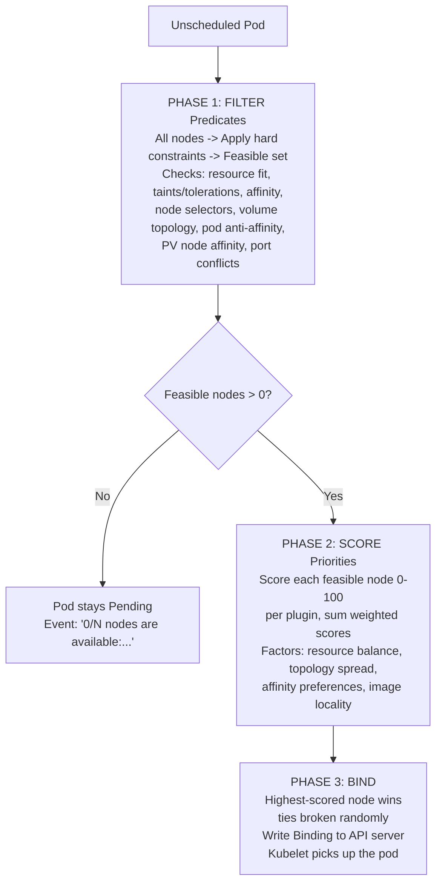
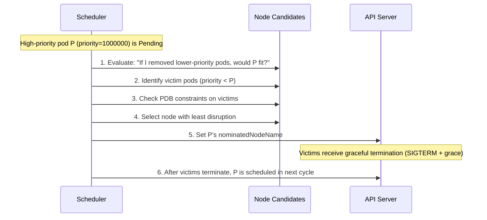
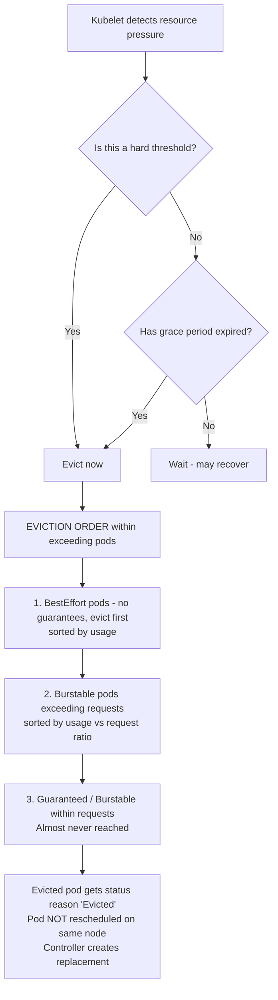
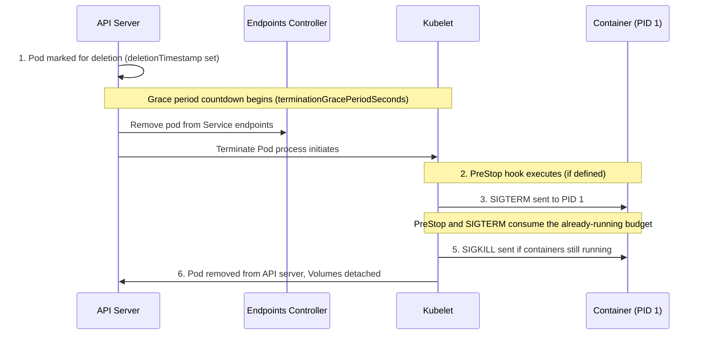

> **Складність**: `[СКЛАДНИЙ]` — просунуті внутрішні механізми планування, висока віддача на іспиті.
>
> **Час на проходження**: 35–45 хвилин.
>
> **Передумови**: Модуль 2.5 (Керування ресурсами), Модуль 2.6 (Планування).

---

## Що ви зможете зробити

- **Діагностувати** збої фільтрації планувальника, через які Под залишається в стані Pending, порівнюючи запити Подів, taint'и, спорідненість (affinity) та події.
- **Спроєктувати** поведінку витіснення (preemption) через PriorityClass, яка захищає критичні робочі навантаження, водночас обмежуючи руйнівність.
- **Оцінити** ризик виселення (eviction) за класом QoS на основі запитів ресурсів, лімітів Подів та тиску на ноду.
- **Налагодити** виселення kubelet'ом за тиском на ноду, використовуючи сигнали, умови, taint'и та поведінку заміщення.
- **Впровадити** правила коректного завершення (graceful termination) та PodDisruptionBudget для зливів (drain), витіснення та зупинки.

## Чому цей модуль важливий

Гіпотетичний сценарій: ваша команда викочує чутливий до затримок API під час маркетингового запуску, і нові Поди залишаються в стані Pending, тоді як менш пріоритетні пакетні робочі процеси продовжують працювати. У кластері загалом достатньо CPU на всіх нодах, але жодна окрема нода не має потрібної комбінації вільного CPU, толерантностей (tolerations), топології томів та запасу в бюджеті руйнівності. Ззовні Kubernetes це виглядає як проста проблема ємності; усередині площини управління це ланцюжок рішень про планування, витіснення, виселення та життєвий цикл.

Цей модуль важливий, тому що планувальник і kubelet — це два компоненти, які перетворюють намір щодо ресурсів на поведінку під час виконання. Планувальник вирішує, чи можна розмістити Под, яка нода підходить найкраще і чи слід витіснити менш пріоритетні Поди, щоб звільнити місце. Пізніше kubelet вирішує, що станеться, коли в ноди закінчиться пам'ять, диск або ідентифікатори процесів, і він також керує послідовністю зупинки, коли Поди видаляються, виселяються або витісняються.

Для CKA ця тема цінна тим, що вона навчає надійному шляху усунення несправностей замість набору завчених команд. Под у стані Pending зазвичай не є загадкою, щойно ви знаєте, де зупиняється фаза Filter, де починається фаза Score і як події підсумовують відхилені ноди. Несподіване завершення також легше пояснити, коли ви можете поєднати клас QoS, сигнали виселення, умови ноди, поведінку PDB та час коректної зупинки в одну операційну історію.

Kubernetes 1.35 зберігає ту саму базову ментальну модель, яку використовує сучасна документація планувальника та kubelet: Поди оголошують вимоги, планувальник знаходить придатні ноди, kubelet забезпечує локальну безпеку ноди, а контролери відновлюють бажаний стан після руйнування. Історичні можливості розвивалися протягом багатьох ранніх випусків, але для цього модуля вам слід міркувати, виходячи з поточної поведінки Kubernetes 1.35, і розглядати деталі старіших випусків лише як тло. Іспит винагороджує саме цю поточну модель, оскільки вона безпосередньо відображається на `kubectl describe`, події Подів, умови нод та специфікації об'єктів.

## Конвеєр планувальника

Коли ви створюєте Под без `spec.nodeName`, він потрапляє до черги планування і чекає, доки kube-scheduler призначить його ноді. Планувальник не просто шукає найпорожнішу машину; він виконує конвеєр плагінів, який спершу відкидає неможливі ноди, а потім ранжує ті, що залишилися. Ця відмінність важлива, бо Под, який не пройшов фазу Filter, не врятувати високим балом фази Score, тоді як Под, який пройшов Filter, усе одно може опинитися на одній ноді замість іншої, бо переваги оцінювання роблять це розміщення кращим.

Найчистіший спосіб усувати несправності в конвеєрі — поставити три запитання по черзі. По-перше, які жорсткі обмеження мають виконуватися, перш ніж Под зможе будь-де запуститися? По-друге, серед нод, що задовольняють ці обмеження, які переваги роблять одну ноду кращою за іншу? По-третє, після того, як планувальник обирає ноду, чи справді операція прив'язки (bind) записала призначення, щоб kubelet міг запустити Под? Ці запитання відповідають фазам Filter, Score та Bind.



<details>
<summary>Застаріле ASCII-подання конвеєра</summary>

```text
┌──────────────────────────────────────────────────────────────────────┐
│                     SCHEDULER PIPELINE                               │
│                                                                      │
│  Unscheduled Pod                                                     │
│       │                                                              │
│       ▼                                                              │
│  ┌─────────────────────────────────────────────────────────┐        │
│  │  PHASE 1: FILTER (Predicates)                           │        │
│  │                                                         │        │
│  │  All nodes ──► Apply hard constraints ──► Feasible set  │        │
│  │                                                         │        │
│  │  Checks: resource fit, taints/tolerations, affinity,    │        │
│  │  node selectors, volume topology, pod anti-affinity,    │        │
│  │  PV node affinity, port conflicts                       │        │
│  └────────────────────────┬────────────────────────────────┘        │
│                           │                                          │
│              ┌────────────┴──────────────┐                          │
│              │ Feasible nodes > 0?       │                          │
│              └────────────┬──────────────┘                          │
│               No ▼                Yes ▼                              │
│         Pod stays Pending    ┌──────────────────────────────────┐   │
│         Event: "0/N nodes    │  PHASE 2: SCORE (Priorities)    │   │
│         are available:..."   │                                  │   │
│                              │  Score each feasible node 0-100  │   │
│                              │  per plugin, sum weighted scores  │   │
│                              │                                  │   │
│                              │  Factors: resource balance,      │   │
│                              │  topology spread, affinity       │   │
│                              │  preferences, image locality     │   │
│                              └──────────────┬───────────────────┘   │
│                                             │                        │
│                                             ▼                        │
│                              ┌──────────────────────────────────┐   │
│                              │  PHASE 3: BIND                  │   │
│                              │                                  │   │
│                              │  Highest-scored node wins        │   │
│                              │  (ties broken randomly)          │   │
│                              │  Write Binding to API server     │   │
│                              │  Kubelet picks up the pod        │   │
│                              └──────────────────────────────────┘   │
│                                                                      │
└──────────────────────────────────────────────────────────────────────┘
```
</details>

Filter — це фаза жорсткого відсіювання. Нода, якій бракує виділюваного CPU, яка має нетолерований taint `NoSchedule`, порушує обов'язкову спорідненість ноди, не може задовольнити правило топології томів або зламала б обов'язкову анти-спорідненість Подів, вилучається з набору кандидатів. Планувальник записує причини як події Пода, тому `kubectl describe pod <name>` зазвичай є найшвидшою першою командою, коли Под перебуває в стані Pending.

| Плагін Filter | Що перевіряє |
|---|---|
| `NodeResourcesFit` | Чи має нода достатньо виділюваного CPU, пам'яті, ефемерного сховища? |
| `NodeAffinity` | Чи відповідає нода `requiredDuringSchedulingIgnoredDuringExecution`? |
| `TaintToleration` | Чи толерує Под усі taint'и NoSchedule на ноді? |
| `NodePorts` | Чи доступні запитані хостові порти? |
| `VolumeBinding` | Чи можна прив'язати потрібні PV до топології цієї ноди? |
| `PodTopologySpread` | Чи порушує розміщення тут `maxSkew` з `whenUnsatisfiable: DoNotSchedule`? |
| `InterPodAffinity` | Чи порушує розміщення обов'язкові правила анти-спорідненості Подів? |

Важлива деталь полягає в тому, що Filter оцінює запитані ресурси, а не живе використання. Якщо нода простоює, але її виділюваний CPU вже зарезервований наявними запитами Подів, новий Под, що навантажує CPU, усе одно не проходить `NodeResourcesFit`. Це може здивувати нових операторів, бо графіки CPU на дашборді можуть показувати запас, але планувальник захищає обіцянки щодо ємності, а не робить ставку на те, що поточне використання залишатиметься низьким.

```text
0/5 nodes are available: 2 insufficient cpu, 2 node(s) had taint
{node-role.kubernetes.io/control-plane: }, 1 node(s) didn't match
Pod topology spread constraints.
```

Зробіть паузу та спрогнозуйте: якщо подія каже, що двом нодам бракує CPU, а одна нода має нетолерований taint, чи допомогло б зниження запиту пам'яті Пода? Воно не усунуло б збоїв за CPU чи taint'ом, тож Под залишився б у стані Pending, якщо інше обмеження також не згадувало пам'ять. Ця звичка зіставляти виправлення з причиною збою фільтра тримає усунення несправностей на іспиті точним.

Score починається лише після того, як принаймні одна нода переживе Filter. Кожен плагін оцінювання дає придатним нодам бал, зазвичай у діапазоні від нуля до ста, і планувальник комбінує ці бали з вагами плагінів. Переваги оцінювання можуть розподіляти навантаження, покращувати баланс топології, віддавати перевагу нодам із кешованими образами або обирати ноди, що краще задовольняють м'яку спорідненість. Ці переваги корисні, але вони ніколи не роблять непридатну ноду легальною.

| Плагін Score | Чому віддає перевагу |
|---|---|
| `NodeResourcesBalancedAllocation` | Нодам, де співвідношення використання CPU та пам'яті схожі (збалансоване використання) |
| `NodeResourcesFit` (стратегія LeastAllocated) | Нодам із найбільшою кількістю доступних ресурсів (розподіл навантажень) |
| `ImageLocality` | Нодам, які вже мають кешований образ контейнера |
| `InterPodAffinity` | Нодам, що відповідають `preferredDuringSchedulingIgnoredDuringExecution` |
| `TaintToleration` | Нодам, чиї taint'и Под толерує, віддаючи перевагу меншій кількості нетолерованих або зайвих taint'ів |
| `PodTopologySpread` | Нодам, що покращують баланс топології |

Стратегія оцінювання ресурсів налаштовується через `KubeSchedulerConfiguration.pluginConfig` для `NodeResourcesFit`, з використанням `scoringStrategy.type: LeastAllocated`, `MostAllocated` або `RequestedToCapacityRatio`.

Нічиї умисно не є контрактом про розміщення. Якщо дві придатні ноди отримують однаковий загальний бал, планувальник може розв'язати нічию випадково, щоб не концентрувати інакше ідентичну роботу на одній ноді. Якщо вам потрібне точне розміщення, скористайтеся жорстким механізмом, як-от спорідненість ноди, селектор ноди, taint'и та толерантності або явний `spec.nodeName` для особливих випадків; не реконструюйте нічию в оцінюванні і не покладайтеся на неї.

Bind — це передавання від рішення планувальника до виконання на ноді. Планувальник записує прив'язку, яка встановлює `spec.nodeName`, і kubelet на тій ноді помічає призначення через API-сервер. Звідти kubelet завантажує образи, готує томи, створює пісочниці (sandboxes) і запускає контейнери. Якщо в Пода взагалі немає корисних подій, включіть стан здоров'я планувальника до свого розслідування, бо звичний слід збоїв Filter міг ніколи не з'явитися.

## Пріоритет, витіснення та компроміси руйнівності

Пріоритет каже Kubernetes, які Поди в стані Pending заслуговують на увагу планувальника першими і які запущені Поди можуть бути зміщені, коли пріоритетніший Под не вміщається. Це потужний інструмент надійності, але водночас гостра грань, бо кластер може видалити справні менш пріоритетні Поди, щоб звільнити місце. Тому добрий дизайн пріоритетів називає бізнес-намір, відокремлює критичні навантаження від пакетної роботи й уникає робити кожну застосунку «критичною» лише тому, що в неї є користувачі.

Зробіть паузу та спрогнозуйте: пріоритетний Под із пріоритетом `1000000` перебуває в стані Pending, бо в жодної ноди немає достатньо вільного CPU, тоді як низькопріоритетні пакетні Поди вже працюють. Kubernetes може витіснити менш пріоритетні Поди, якщо PriorityClass вхідного Пода це дозволяє, але спершу він оцінить, яка нода могла б розмістити Под у стані Pending після видалення жертв. Планувальник намагається мінімізувати руйнівність, але він оптимізує розміщення пріоритетнішого Пода, а не збереження живими кожного менш пріоритетного навантаження.

```yaml
apiVersion: scheduling.k8s.io/v1
kind: PriorityClass
metadata:
  name: critical-service
value: 1000000
globalDefault: false
preemptionPolicy: PreemptLowerPriority
description: "For services that must not be displaced by batch workloads"
```

```yaml
apiVersion: scheduling.k8s.io/v1
kind: PriorityClass
metadata:
  name: batch-processing
value: 100
globalDefault: false
preemptionPolicy: PreemptLowerPriority
description: "For batch jobs that can be preempted"
```

```yaml
apiVersion: scheduling.k8s.io/v1
kind: PriorityClass
metadata:
  name: best-effort-batch
value: 10
globalDefault: false
preemptionPolicy: Never
description: "Batch jobs that should never preempt others"
```

Поле `preemptionPolicy` заслуговує на уважне прочитання. `PreemptLowerPriority` означає, що Под у стані Pending може спричинити виселення менш пріоритетних Подів, якщо це уможливить розміщення. `Never` означає, що Под усе ще може просунутися наперед менш пріоритетних Подів у стані Pending у черзі планування, але він не виселятиме вже запущені Поди. Ця відмінність корисна для важливої, але неруйнівної роботи, як-от звіти, що мають запуститися незабаром, але не повинні переривати живі сервіси.

| Назва | Значення | Використовується |
|---|---|---|
| `system-cluster-critical` | 2000000000 | Критичні для кластера компоненти (CoreDNS, kube-proxy) |
| `system-node-critical` | 2000001000 | Критичні для ноди компоненти (статичні Поди kubelet) |

Вбудовані PriorityClass існують для критичних компонентів кластера й ноди, і вам не слід повторно використовувати їхні значення для звичайних рівнів застосунків. Якщо команди застосунків призначають значення, близькі до системного пріоритету, вони ускладнюють кластеру захист власних залежностей площини управління під час тиску. Практична виробнича схема зазвичай має невелику кількість іменованих рівнів, чіткі правила власності щодо того, хто може користуватися кожним рівнем, і перегляд кожного навантаження, що може витісняти інші.

```yaml
apiVersion: v1
kind: Pod
metadata:
  name: fraud-detector
spec:
  priorityClassName: critical-service
  containers:
  - name: detector
    image: fraud-detector:v3.2
    resources:
      requests:
        cpu: "2"
        memory: 4Gi
      limits:
        cpu: "2"
        memory: 4Gi
```

Витіснення починається лише тоді, коли Под у стані Pending не вдається запланувати звичайним шляхом. Планувальник симулює кожну ноду-кандидата, питаючи, чи видалення менш пріоритетних Подів дало б змогу вмістити пріоритетний Под, після чого обирає набори жертв і перевіряє вплив на руйнівність. Под у стані Pending може отримати `nominatedNodeName`, але номінація — це не гарантія; Под усе одно має пройти пізніший цикл планування після завершення жертв, і ще один Под із ще вищим пріоритетом може змінити ситуацію.



<details>
<summary>Застаріле ASCII-подання послідовності витіснення</summary>

```text
┌──────────────────────────────────────────────────────────────────┐
│                  PREEMPTION SEQUENCE                              │
│                                                                  │
│  High-priority pod P (priority=1000000) is Pending               │
│       │                                                          │
│       ▼                                                          │
│  1. Scheduler re-evaluates each node:                            │
│     "If I removed lower-priority pods, would P fit?"             │
│       │                                                          │
│       ▼                                                          │
│  2. For each candidate node, identify victim pods:               │
│     - Only pods with priority < P's priority                     │
│     - Remove minimum set needed to free resources                │
│       │                                                          │
│       ▼                                                          │
│  3. Check PDB constraints:                                       │
│     - Would evicting victims violate any PDB?                    │
│     - If yes, try a different victim set or skip node            │
│       │                                                          │
│       ▼                                                          │
│  4. Select the node with the least disruption:                   │
│     - Prefer nodes where fewest pods must be evicted             │
│     - Prefer nodes where lowest-priority pods are victims        │
│       │                                                          │
│       ▼                                                          │
│  5. Set P's nominatedNodeName to the chosen node                 │
│     Victims receive graceful termination (SIGTERM + grace)       │
│       │                                                          │
│       ▼                                                          │
│  6. After victims terminate, P is scheduled in the next cycle    │
│                                                                  │
└──────────────────────────────────────────────────────────────────┘
```
</details>

Розгляньмо кластер із трьох нод, де кожна нода має чотири виділювані CPU. Новому Поду `fraud-detector` потрібно два CPU, і він має пріоритет `1000000`. У жодної ноди немає двох вільних CPU, тож звичайне планування зазнає невдачі, але кожна нода має менш пріоритетні Поди, які можна було б видалити. Це момент, коли аналіз витіснення корисний, бо загальна ємність кластера не має значення, доки одна нода не може бути зроблена придатною для вхідного Пода.

| Нода | Запущені Поди | Зайнято CPU | Доступно |
|---|---|---|---|
| node-1 | batch-a (пріоритет 100, 2 CPU), batch-b (пріоритет 100, 1 CPU) | 3 CPU | 1 CPU |
| node-2 | web-api (пріоритет 500, 3 CPU) | 3 CPU | 1 CPU |
| node-3 | monitoring (пріоритет 800, 2 CPU), logger (пріоритет 50, 1.5 CPU) | 3.5 CPU | 0.5 CPU |

Планувальник оцінює кожну ноду як можливу зону приземлення. На `node-1` виселення `batch-a` звільняє достатньо CPU з однією жертвою. На `node-2` виселення `web-api` теж спрацьовує, але ця жертва має вищий пріоритет, ніж пакетний Под. На `node-3` виселення `logger` поєднує вже вільні півCPU зі звільненими півтора CPU, створюючи рівно достатньо місця з менш пріоритетною жертвою.

Отже, найкращий кандидат — `node-3`, за умови, що жодне інше обмеження не змінює рішення. Планувальник може номінувати цю ноду, коректно завершити `logger` і запланувати пріоритетний Под у пізнішому циклі, коли ресурси справді звільняться. Ключовий урок полягає в тому, що витіснення — це не сліпа операція «вбити будь-де найменш пріоритетний Под»; це специфічний для ноди розрахунок придатності.

PDB ускладнюють цей розрахунок, бо вони виражають, скільки відповідних Подів мають залишатися доступними під час добровільного руйнування. Під час витіснення планувальником Kubernetes намагається не порушувати PDB, але PDB не є абсолютним бар'єром, якщо кожен робочий набір жертв порушував би бюджет. Таке м'яке трактування не дає погано обраному PDB заблокувати по-справжньому пріоритетнішу відновлювальну роботу назавжди, але це також означає, що PDB не повинні бути вашим єдиним захистом для критичної доступності.

## QoS, запити, ліміти та ризик виселення

Kubernetes призначає кожному Поду клас QoS на основі запитів та лімітів ресурсів його контейнерів. Ви не встановлюєте клас QoS напряму; він виводиться з того, чи кожен контейнер має запити CPU й пам'яті, рівні лімітам, чи існує принаймні один запит або ліміт, чи взагалі немає жодних гарантій ресурсів. Ця похідна позначка стає важливою під час тиску на ноду, бо kubelet використовує її, щоб вирішити, які Поди найбезпечніше виселяти першими.

| Клас QoS | Умова | Пріоритет виселення |
|---|---|---|
| **Guaranteed** | Кожен контейнер має `requests == limits` і для CPU, і для пам'яті | Виселяється останнім |
| **Burstable** | Принаймні один контейнер має встановлений запит або ліміт, але це не Guaranteed | Посередині |
| **BestEffort** | Жоден контейнер не має жодного запиту чи ліміту | Виселяється першим |

Поди Guaranteed найбільш захищені, бо вони роблять чіткий контракт на резервування. Кожен контейнер має мати запити і CPU, і пам'яті, кожен відповідний ліміт має бути рівним, і кожен контейнер у Поді має задовольняти те саме правило. Якщо один сайдкар пропускає ресурси пам'яті, тоді як головний контейнер ідеальний, увесь Под перестає бути Guaranteed, бо Kubernetes оцінює Под як єдине ціле.

```yaml
apiVersion: v1
kind: Pod
metadata:
  name: qos-guaranteed
spec:
  containers:
  - name: app
    image: nginx:1.35
    resources:
      requests:
        cpu: 500m
        memory: 256Mi
      limits:
        cpu: 500m
        memory: 256Mi
```

```bash
kubectl get pod qos-guaranteed -o jsonpath='{.status.qosClass}'
# Output: Guaranteed
```

Поди Burstable мають певний намір щодо ресурсів, але не строгу взаємно-однозначну відповідність запиту й ліміту в кожному контейнері. Це поширений клас для сервісів, які резервують достатньо CPU та пам'яті, щоб їх розумно планувати, але допускають певний тимчасовий запас. Burstable не є помилкою; це просто компроміс, який приймає більшу вразливість до виселення, ніж Guaranteed, в обмін на гнучку поведінку під час виконання.

```yaml
apiVersion: v1
kind: Pod
metadata:
  name: qos-burstable
spec:
  containers:
  - name: app
    image: nginx:1.35
    resources:
      requests:
        cpu: 250m
        memory: 128Mi
      limits:
        cpu: 500m
        memory: 512Mi
```

```bash
kubectl get pod qos-burstable -o jsonpath='{.status.qosClass}'
# Output: Burstable
```

Поди BestEffort не мають запитів CPU чи пам'яті та жодних лімітів на жодному контейнері. Вони можуть бути корисними для одноразових експериментів або малоцінної пакетної роботи, але вони перші в черзі, коли ноді потрібно відновити ресурси. На завантаженій виробничій ноді BestEffort — це чітке твердження, що навантаженням можна пожертвувати раніше за навантаження з явними резервуваннями.

```yaml
apiVersion: v1
kind: Pod
metadata:
  name: qos-besteffort
spec:
  containers:
  - name: app
    image: nginx:1.35
```

```bash
kubectl get pod qos-besteffort -o jsonpath='{.status.qosClass}'
# Output: BestEffort
```

Перш ніж запустити це, який клас QoS ви очікуєте, якщо Под встановлює запити пам'яті рівними лімітам пам'яті, але залишає ліміти CPU вищими за запити CPU? Відповідь — Burstable, бо Guaranteed вимагає рівності і для CPU, і для пам'яті в кожному контейнері. Це поширена пастка на іспиті, бо один ресурс може виглядати ідеальним, тоді як інший тихо переводить Под у середній рівень виселення.

QoS сам по собі не змінює розрахунок придатності ресурсів у планувальнику. Планувальник переважно використовує запити, щоб вирішити, чи вміщається Под на ноді, тоді як ліміти пізніше забезпечуються kubelet'ом і середовищем виконання. Под Guaranteed, що запитує два CPU, і Под Burstable, що запитує два CPU, споживають однакову ємність планування, навіть якщо вони отримують різне ставлення, коли тиск на ноду змушує робити вибір щодо виселення.

Є крайові випадки, які варто запам'ятати, бо вони пояснюють багато несподіванок типу «чому цей Под Burstable?». Якщо ви встановлюєте ліміт, але пропускаєте відповідний запит, Kubernetes може взяти запит за замовчуванням із ліміту для цього контейнера й ресурсу, але кожен контейнер і CPU, і пам'ять усе одно мають задовольняти правило Guaranteed. Запити та ліміти ефемерного сховища впливають на планування й виселення за тиском на сховище, але вони не визначають клас QoS для CPU та пам'яті у той самий спосіб.

## Виселення kubelet'ом і тиск на ноду

Планувальник ухвалює рішення про розміщення, але kubelet захищає ноду, яка вже виконує навантаження. Він відстежує локальні сигнали, як-от доступну пам'ять, простір кореневої файлової системи, простір файлової системи образів та доступні ідентифікатори процесів. Коли пороги перетинаються, kubelet може виселити Поди, щоб підтримати роботу операційної системи та сервісів ноди, тому виселені Поди часто вказують на тиск на ноду, а не на рішення планувальника.

| Сигнал | Опис | Типовий м'який поріг | Типовий жорсткий поріг |
|---|---|---|---|
| `memory.available` | Вільна пам'ять на ноді | < 500Mi (пільга 90s) | < 100Mi |
| `nodefs.available` | Вільний диск на кореневому розділі | < 15% (пільга 120s) | < 10% |
| `imagefs.available` | Вільний диск на файловій системі образів | < 15% (пільга 120s) | < 10% |
| `pid.available` | Вільні PID | < 1000 (пільга 60s) | < 500 |

М'які пороги мають пільговий період, тож kubelet чекає, чи мине тиск, перш ніж виселяти. Жорсткі пороги спрацьовують негайно, бо нода достатньо близька до відмови, щоб очікування загрожувало хосту. У будь-якому разі мета — не справедливість серед застосунків; мета — збереження стабільності ноди шляхом відновлення ресурсів від Подів згідно з правилами виселення Kubernetes.



<details>
<summary>Застаріле ASCII-подання потоку виселення</summary>

```text
┌──────────────────────────────────────────────────────────────────┐
│                   EVICTION DECISION FLOW                         │
│                                                                  │
│  Kubelet detects resource pressure                               │
│       │                                                          │
│       ▼                                                          │
│  Is this a hard threshold?                                       │
│       │                                                          │
│   Yes ▼              No ▼                                        │
│   Evict now     Has grace period expired?                        │
│       │              │                                           │
│       │          No ▼          Yes ▼                             │
│       │      Wait (may recover)   Proceed to eviction            │
│       │                                │                         │
│       ▼                                ▼                         │
│  ┌──────────────────────────────────────────────────────┐       │
│  │  EVICTION ORDER (within pods exceeding requests):    │       │
│  │                                                      │       │
│  │  1. BestEffort pods -- no guarantees, evict first    │       │
│  │     (sorted by resource usage, highest first)        │       │
│  │                                                      │       │
│  │  2. Burstable pods exceeding their requests          │       │
│  │     (sorted by usage relative to requests)           │       │
│  │                                                      │       │
│  │  3. Guaranteed / Burstable within their requests     │       │
│  │     (only if still under pressure after 1+2)         │
│  │     Almost never reached in practice                 │
│  └──────────────────────────────────────────────────────┘       │
│       │                                                          │
│       ▼                                                          │
│  Evicted pod gets status reason "Evicted"                        │
│  Pod is NOT rescheduled on the same node                         │
│  Controller (Deployment, Job, etc.) creates replacement          │
│  elsewhere. Standalone pods are gone permanently.                │
│                                                                  │
└──────────────────────────────────────────────────────────────────┘
```
</details>

Порядок виселення починається з Подів, що мають найслабшу претензію на ресурси. Поди BestEffort виселяються першими, потім Поди Burstable, що перевищують свої запити, і лише потім Поди, що в межах своїх запитів, або Guaranteed. Саме тому запити важливі двічі: вони впливають на те, чи можна запланувати Под, і пізніше вони визначають межу між очікуваним і надлишковим використанням, коли kubelet перебуває під тиском.

Коли Под виселяється, його статус стає `Failed` з причиною `Evicted`, і він може залишатися видимим, доки збір сміття не видалить його. Контролер, як-от Deployment, ReplicaSet, StatefulSet або Job, може створити Под-заміну, але окремий Под не має контролера, щоб його відновити. Заміна — це новий Под, тож він знову проходить планування і може опинитися на будь-якій придатній ноді з достатньою ємністю та відповідними обмеженнями.

| Умова | Спричинено | Ефект |
|---|---|---|
| `MemoryPressure` | `memory.available` нижче порога | Накладено taint, жодних нових Подів BestEffort |
| `DiskPressure` | `nodefs.available` або `imagefs.available` нижче порога | Накладено taint, жодних нових Подів |
| `PIDPressure` | `pid.available` нижче порога | Накладено taint, жодних нових Подів |

Тиск на ноду також впливає на майбутнє планування, бо нода повідомляє умови і може отримати taint'и, як-от `node.kubernetes.io/memory-pressure`. Це захищає ноду від отримання ще непридатної роботи, поки вона відновлюється. Якщо Поди постійно повертаються до тієї самої проблемної ноди, перевірте умови ноди, taint'и, виділювані ресурси та поведінку контролера замість того, щоб дивитися лише на виселений Под.

Який підхід ви обрали б тут і чому: збільшити ліміти пам'яті на Поді Burstable, який постійно виселяється, чи збільшити його запит пам'яті? Збільшення ліміту може зменшити OOM-вбивства контейнера, але воно не покращує резервування для планування Пода чи його позицію відносно тиску виселення на основі запитів. Якщо сервісу справді потрібно більше пам'яті, щоб бути захищеним, саме запит — це поле, яке змінює контракт планувальника та порівняння при виселенні в kubelet.

## Завершення Подів, коректна зупинка та PDB

Завершення Пода — це скоординована послідовність, а не один сигнал на вбивство. API-сервер позначає Под для видалення, контролери ендпоінтів вилучають його з наборів ендпоінтів Сервісу, kubelet виконує будь-який хук PreStop, а потім kubelet надсилає SIGTERM процесу один у контейнері. Пільговий період починається, коли починається видалення, а не коли застосунок нарешті отримує SIGTERM, тож довгі хуки PreStop можуть спожити час зупинки, який застосунок очікував використати.



<details>
<summary>Застаріле ASCII-подання послідовності завершення</summary>

```text
┌──────────────────────────────────────────────────────────────────┐
│                 POD TERMINATION SEQUENCE                          │
│                                                                  │
│  1. Pod marked for deletion (deletionTimestamp set)              │
│     Endpoints controller removes pod from Service endpoints      │
│     ── Traffic stops being routed to this pod ──                 │
│       │                                                          │
│       ▼                                                          │
│  2. PreStop hook executes (if defined)                           │
│     Runs in parallel with endpoint removal                       │
│     Examples: drain connections, deregister from service mesh    │
│       │                                                          │
│       ▼                                                          │
│  3. SIGTERM sent to PID 1 in each container                     │
│     Application should begin graceful shutdown                   │
│       │                                                          │
│       ▼                                                          │
│  4. Grace period countdown (terminationGracePeriodSeconds)       │
│     Default: 30 seconds                                          │
│     Includes time spent in PreStop hook                          │
│       │                                                          │
│       ▼                                                          │
│  5. SIGKILL sent if containers still running                     │
│     Forced termination -- no cleanup possible                    │
│       │                                                          │
│       ▼                                                          │
│  6. Pod removed from API server                                  │
│     Volumes detached and unmounted                               │
│                                                                  │
└──────────────────────────────────────────────────────────────────┘
```
</details>

Зупиніться та подумайте: ви встановлюєте `terminationGracePeriodSeconds: 30` і хук PreStop, який спить двадцять секунд. Застосунок не отримує повних тридцяти секунд після хука; він отримує приблизно десять секунд, що залишилися, до SIGKILL. Якщо сам хук виконується довше за пільговий період, Kubernetes у деяких випадках може надати коротке продовження, але вам слід проєктувати так, ніби хук і зупинка застосунку поділяють той самий бюджет.

```yaml
apiVersion: v1
kind: Pod
metadata:
  name: graceful-app
spec:
  terminationGracePeriodSeconds: 60
  containers:
  - name: app
    image: myapp:v2
    lifecycle:
      preStop:
        exec:
          command: ["/bin/sh", "-c", "sleep 5 && /app/drain-connections.sh"]
    ports:
    - containerPort: 8080
```

Бюджет коректної зупинки має включати поширення ендпоінтів, поведінку PreStop, час зливу застосунку та невеликий запас на варіативність. Стейтлес вебсервери часто потребують коротшого пільгового періоду, ніж бази даних, споживачі повідомлень або пакетні обробники, що мають зберегти контрольну точку роботи. Правильне значення — не «якомога більше», бо довге завершення може сповільнювати викочування та зливи; правильне значення — достатньо довге, щоб застосунок припинив приймати роботу й завершив роботу, яку вже прийняв.

| Тип навантаження | Рекомендований пільговий період | Чому |
|---|---|---|
| Стейтлес вебсервер | 15–30s | Швидкий злив, мало запитів у польоті |
| API-шлюз / балансувальник навантаження | 30–60s | Довгоживучі з'єднання, потрібен коректний злив |
| База даних | 60–120s | Має скинути WAL, створити контрольну точку, закрити з'єднання |
| Пакетний обробник | 60–300s | Може знадобитися контрольна точка часткової роботи |
| Споживач черги повідомлень | 30–60s | Має завершити обробку поточного повідомлення |

PDB стоять поруч із коректним завершенням, бо вони контролюють, скільки відповідних Подів можуть бути добровільно зруйновані одночасно. Вони не роблять Под безсмертним і не захищають від збою ноди, OOM-вбивства ядром чи жорсткого виселення kubelet'ом. Це обіцянка, дана добровільним операціям, як-от злив, оновлення кластера, зменшення масштабу автомасштабувальником та виклики API виселення, що операція не повинна знижувати доступність нижче оголошеного бюджету.

```yaml
apiVersion: policy/v1
kind: PodDisruptionBudget
metadata:
  name: web-api-pdb
spec:
  minAvailable: 2
  selector:
    matchLabels:
      app: web-api
```

```yaml
apiVersion: policy/v1
kind: PodDisruptionBudget
metadata:
  name: web-api-pdb
spec:
  maxUnavailable: 1
  selector:
    matchLabels:
      app: web-api
```

`minAvailable` та `maxUnavailable` — це взаємовиключні способи виразити той самий захист. `minAvailable: 2` каже, що принаймні два вибрані Поди мають залишатися доступними, тоді як `maxUnavailable: 1` каже, що щонайбільше один вибраний Под може бути недоступним під час добровільного руйнування. Відсотки дозволені, але для невеликих кількостей реплік ціле число легше осягнути на іспиті, бо поведінка округлення може здивувати вас під тиском.

```bash
# Drain with timeout to avoid hanging forever
kubectl drain node-2 --ignore-daemonsets --delete-emptydir-data --timeout=300s
```

Зробіть паузу та спрогнозуйте: Deployment із трьома репліками має PDB з `minAvailable: 3`, і одна з його реплік перебуває на ноді, яку ви хочете злити. Злив блокується, бо виселення того Пода знизило б кількість доступних реплік нижче вимоги PDB. Якщо нода натомість падає, PDB не може зупинити недобровільну втрату; контролер має створити заміну, а кластер має мати ємність, щоб її запустити.

| Тип | Приклади | Поважає PDB? |
|---|---|---|
| **Добровільне** | `kubectl drain`, оновлення кластера, зменшення масштабу автомасштабувальником | Так |
| **Витіснення планувальником** | Пріоритетніший Под зміщує менш пріоритетні жертви | Намагається (м'яко) |
| **Недобровільне** | Збій ноди, OOM-вбивство, жорстке виселення kubelet'ом, відмова обладнання | Ні |

Ця відмінність між добровільним і недобровільним має формувати те, як ви проєктуєте доступність. PDB допомагають робочим процесам обслуговування проходити безпечно, але саме репліки, розподіл за топологією, запити ресурсів, проби та достатня резервна ємність роблять несподівані відмови переживними. У діагностиці життєвого циклу планування завжди питайте, чи руйнування було сплановане через API, чи нав'язане реальністю ноди.

## Покроковий діагностичний розбір

Сценарій вправи: викочування Deployment створює п'ять нових Подів, і два стають Running, а три залишаються Pending. Команда застосунку каже, що в кластері загалом достатньо невикористаного CPU, і дашборд начебто підтверджує це твердження. Ваш перший крок має бути не випадковим зниженням запитів; він має бути прочитанням подій Под у стані Pending і відокремленням загальної ємності кластера від придатності на рівні окремої ноди.

Планувальник може прив'язати Под лише до однієї ноди, тож ємність, фрагментована між багатьма нодами, не допомагає Поду, чий запит має вміститися на одній ноді. Якщо три ноди мають по пів CPU вільного, а Под запитує один повний CPU, у кластері загалом вільно півтора CPU, але немає жодної придатної ноди. Це проблема придатності для планування, а не проблема виселення kubelet'ом і не проблема PDB.

Прочитавши події, припустімо, ви бачите і недостатній CPU, і нетолеровані taint'и. Трактуйте їх як окремі перешкоди, а не обирайте першу, яка виглядає знайомою. Зниження запиту CPU може зробити деякі ноди придатними, але tainted-нода все одно вимагає відповідної толерантності, якщо навантаженню там дозволено. Додавання толерантності може зробити tainted-ноду легальною, але воно нічого не дає для нод, яким справді бракує запитаного CPU.

Наступне запитання — чи взагалі слід дозволяти Поду запускатися на tainted-ноді. Taint зазвичай означає, що нода зарезервована для особливої мети, як-от обов'язки площини управління, GPU, сховище або інший ізольований клас навантаження. Якщо застосунку нема чого там запускатися, правильним виправленням є ємність або налаштування запитів на звичайних робочих нодах. Якщо ж він туди належить, додайте толерантність умисно і подумайте про додавання спорідненості, щоб намір планувальника був явним.

Тепер уявіть, що той самий Под у стані Pending має високий пріоритет, а кластер заповнений менш пріоритетною пакетною роботою. Витіснення може допомогти лише тоді, коли видалення менш пріоритетних Подів з однієї ноди створює придатне розміщення. Якщо кожна нода також не проходить обов'язкове правило спорідненості ноди чи правило топології томів, витіснення не може розв'язати розміщення, бо жертви не змінюють цих жорстких обмежень. Саме тому усунення несправностей витіснення все одно починається з причин Filter.

Якщо витіснення таки відбувається, стежте за розривом між номінацією та прив'язкою. Под у стані Pending може показувати номіновану ноду, поки Поди-жертви коректно завершуються, а вхідний Под усе ще може чекати до наступного циклу планування. Протягом цього вікна події можуть виглядати заплутано, бо планувальник обрав шлях, але kubelet ще не звільнив ресурси. Читайте `nominatedNodeName` як підказку, а не як доказ, що Под уже запланований.

PDB додають ще один шар до цієї історії, бо вони впливають на те, які жертви найменш руйнівні. Бюджет, що захищає пакетні Поди, може зробити одну ноду менш привабливою як ціль витіснення, тоді як іншу ноду з незахищеною одноразовою роботою буде легше використати. Планувальник намагається поважати PDB під час витіснення, але якщо кожен можливий шлях порушує бюджет, вищий пріоритет усе одно може перемогти. Така поведінка умисна, бо політику доступності не можна допускати до того, щоб вона назавжди заблокувала критичне відновлення.

Для відповіді в стилі CKA опишіть точний компонент, який ухвалює рішення. Планувальник фільтрує й оцінює Поди в стані Pending, а потім може номінувати менш пріоритетні жертви. Kubelet виселяє вже запущені Поди за тиском на ноду й керує сигналами завершення. API виселення та контролер PDB регулюють добровільні руйнування, як-от злив. Контролери, як-от Deployment, створюють Поди-заміни після руйнування, але планувальник усе одно вирішує, де ці заміни приземляться.

Тепер перейдіть від Pending до Evicted. Якщо Под має причину `Evicted`, не витрачайте першу хвилину на редагування правил спорідненості, бо Под уже працював, перш ніж kubelet його видалив. Огляньте ноду, що його хостила, подивіться на умови тиску і порівняйте клас QoS Пода й фактичне використання з його запитами. Под BestEffort, виселений за MemoryPressure, поводиться точно так, як обіцяє Kubernetes, навіть якщо власник застосунку очікував, що він буде довговічним.

Навантаження Burstable вимагають більше суджень, бо їхній ризик залежить від запитів і фактичного використання. Под Burstable, що залишається в межах свого запиту пам'яті, захищений краще за той, що регулярно перевищує запит на велику маржу. Якщо застосунку рутинно потрібно більше пам'яті, ніж запитано, виправлення — це не просто підняти ліміт; запит теж має відображати пам'ять, потрібну навантаженню, щоб під час тиску воно трактувалося як очікуване використання.

QoS Guaranteed цінний, але це не ліцензія ігнорувати ємність. Якщо кожен важливий сервіс Guaranteed із завищеними запитами, планувальник може залишити нову роботу в стані Pending, бо виділювані ресурси вже зарезервовані. Guaranteed найкраще підходить для навантажень, чий діапазон ресурсів відомий і чия вартість виселення висока. Для сервісів зі змінним навантаженням ретельно обраний профіль Burstable може бути ефективнішим, водночас усе ще уникаючи ризику BestEffort.

Тиск на диск дотримується тієї самої діагностичної структури, але використовує інші сигнали. Якщо `nodefs.available` або `imagefs.available` перетинає пороги, kubelet може відновити образи й виселити Поди, щоб захистити ноду. Команди застосунків часто зосереджуються на пам'яті, бо вона знайома, але використання ефемерного сховища також може спричинити виселення. Перевірте логи, тимчасові файли, використання emptyDir та оборот образів, коли в умовах ноди з'являється DiskPressure.

PIDPressure менш поширений у лабораторіях для початківців, але важливий у продакшені. Витік процесів усередині контейнера може спожити ідентифікатори процесів на хості, і kubelet може бути змушений виселити Поди, щоб зберегти здоров'я ноди. Якщо ви бачите PIDPressure, спитайте, чи якесь навантаження несподівано форкається, чи проби або сайдкари створюють надмірну кількість процесів і чи має нода достатню ємність PID для суміші навантажень.

Зливи знову інакші, бо це добровільні операції обслуговування. Якщо злив зависає, перевірте статус PDB, перш ніж припускати, що команда зламана. PDB із нульовими дозволеними руйнуваннями робить свою роботу, коли блокує виселення. Правильним виправленням може бути масштабування Deployment, очікування на відновлення недоступних реплік, тимчасове розширення бюджету або вибір порядку обслуговування, що зберігає доступність застосунку.

Мітки на PDB важать не менше за числовий бюджет. PDB, що не вибирає жодного Пода, нічого не захищає, тоді як PDB, що вибирає забагато Подів, може зв'язати непов'язані застосунки в один бюджет руйнування. Під час усунення несправностей порівняйте селектор PDB з мітками Подів і мітками контролера. Поширена першопричина — мітка, змінена під час викочування, тоді як PDB продовжував вибирати стару форму або випадково вибрав кілька релізів.

Проблеми коректного завершення часто проявляються як втрачені запити під час викочування, навіть коли планування та PDB правильні. Вилучення ендпоінтів, хуки PreStop, обробка SIGTERM та готовність застосунку — усе має співпрацювати. Якщо застосунок продовжує приймати трафік після початку видалення, він може отримати роботу, яку не встигне завершити до SIGKILL. Якщо хук PreStop спить надто довго, він може залишити майже немає часу застосунку на обробку SIGTERM.

Кращий дизайн зупинки змушує застосунок припинити повідомляти про готовність, перш ніж він припинить обслуговувати вже прийняту роботу. Вилучення ендпоінтів Kubernetes зменшує новий трафік, тоді як застосунок використовує SIGTERM, щоб злити невиконані запити. Пільговий період має покривати і перехід на боці платформи, і прибирання на боці застосунку. Для стейтфул-систем це може включати скидання логів, закриття з'єднань із базою даних, створення контрольних точок зміщень або передавання лідерства.

Зв'яжіть частини життєвого циклу разом під час викочування. Новий ReplicaSet створює Поди, планувальник їх розміщує, kubelet запускає контейнери, готовність керує ендпоінтами Сервісу, а старі Поди завершуються згідно з пільговими періодами та обмеженнями PDB. Якщо будь-яка ланка погано налаштована, викочування може бути повільним, недоступним або шумним. Налагодження швидше, коли ви простежуєте викочування як послідовність, а не трактуєте кожен симптом окремо.

Та сама послідовність пояснює зменшення масштабу автомасштабувальником кластера. Ноду можна видалити, лише якщо її Поди можна виселити згідно з правилами руйнування й перепланувати деінде згідно з обмеженнями планування. Високі запити, строга спорідненість, локальне сховище чи тісні PDB — усе це може ускладнити злив ноди. Коли автомасштабування здається застряглим, огляньте Поди на нодах-кандидатах і спитайте, яке обмеження заважає безпечному переміщенню.

Для практики до іспиту побудуйте усний чекліст і застосовуйте його послідовно. Pending означає події планувальника, придатність ноди, taint'и, спорідненість, топологію, пріоритет і витіснення. Evicted означає статус Пода, умови ноди, QoS, запити та сигнали тиску kubelet. Проблеми з Terminating або зливом означають PDB, пільгові періоди, хуки PreStop, поведінку ендпоінтів і заміни контролером. Цей чекліст швидший за випадковий пошук кожного об'єкта Kubernetes.

Останній урок щодо дизайну полягає в тому, що надійність життєвого циклу планування здебільшого вирішується ще до інциденту. Запити виражають потреби в ємності, пріоритети виражають важливість, PDB виражають толерантність до руйнування, QoS постає із запитів і лімітів, а налаштування завершення виражають час зупинки. Kubernetes може забезпечувати дотримання цих контрактів, але він не може вивести бізнес-критичність чи поведінку зливу застосунку, яку ви ніколи не оголосили. Добрі оператори роблять ці контракти видимими в маніфестах ще до того, як настане тиск.

Корисний спосіб переглянути будь-який маніфест — спитати, що станеться під час дефіциту. Якщо CPU дефіцитний, запити й пріоритет вирішують, чи можна розмістити Под, чи може він змістити інший Под. Якщо пам'ять дефіцитна після розміщення, QoS і використання відносно запиту впливають на рішення про виселення в kubelet. Якщо ноди дефіцитні під час обслуговування, PDB і топологія визначають, чи можуть Поди переміститися, не порушивши доступність.

Ще одне корисне запитання для перегляду — що станеться під час заміни. Контролер може швидко створити новий Под, але новий Под усе одно має пройти ті самі фільтри планування, що й старий. Якщо кожна нода, що залишилася, порушує спорідненість або не має запитаних ресурсів, заміна гальмує, навіть якщо контролер справний. Саме тому стійкість вимагає і контролера, і придатної зони приземлення для Подів-замін.

Нарешті, пам'ятайте, що налаштування життєвого циклу є частиною дизайну планування, бо руйнування не завершено, доки старий Под не вийшов, а заміна не стала доступною. Довгий пільговий період може зберегти запити, але сповільнити зливи нод, тоді як короткий пільговий період може пришвидшити викочування, але ризикувати втратою роботи. Правильний дизайн балансує потреби рівня обслуговування з кластерними операціями, а потім перевіряє цей баланс через події, готовність і статус PDB.

## Патерни та антипатерни

Надійний дизайн планування зазвичай починається з невеликих іменованих наборів політик, а не з одноразових полів Пода. PriorityClass, PDB, цілі QoS, бюджети коректної зупинки, правила топології та запити мають поєднуватися так, щоб кожне навантаження повідомляло, що йому потрібно і як його можна руйнувати. Коли ці частини проєктуються незалежно, кластер може правильно підкорятися кожному об'єкту, але все одно давати результат у формі збою.

| Патерн | Коли використовувати | Чому працює |
|---|---|---|
| Трирівнева схема PriorityClass | Критичні сервіси, звичайні сервіси та одноразова пакетна робота поділяють кластер | Зберігає осмисленість витіснення, не роблячи кожне навантаження найвищим пріоритетом |
| QoS Guaranteed для малих критичних помічників площини управління | Навантаження мають пережити тиск на ноду й мати передбачуване використання | Рівні запити й ліміти виражають чітке резервування та покращують захист від виселення |
| PDB на кожен виробничий контролер | Поступове обслуговування, зливи нод і зменшення масштабу автомасштабувальником мають зберігати доступність | Добровільне руйнування обмежене ще до того, як обслуговування видалить забагато реплік |
| Явний бюджет завершення | Застосункам потрібен час, щоб злити з'єднання чи зберегти стан у контрольній точці | Час PreStop і SIGTERM проєктується, а не виявляється під час викочування |

Головне міркування масштабування — операційна послідовність. Якщо кожен простір імен винаходить власні пріоритети, бюджети та очікування щодо зупинки, поведінку всього кластера стає неможливо передбачити під тиском. Платформна команда може допомогти, опублікувавши дозволені PriorityClass, рекомендовані патерни PDB за кількістю реплік і вказівки щодо перегляду запитів ресурсів, щоб команди застосунків ухвалювали локальні рішення в межах спільної моделі планування.

| Антипатерн | Що йде не так | Краща альтернатива |
|---|---|---|
| Позначення всіх сервісів критичними | Витіснення втрачає сенс, і менш пріоритетне відновлення не може відбутися | Зарезервуйте високий пріоритет для переглянутого набору навантажень |
| Використання BestEffort для виробничих API | Kubelet виселяє їх першими за тиском на ноду | Встановіть реалістичні запити й умисно оберіть Burstable або Guaranteed |
| Встановлення `maxUnavailable: 0` усюди | Зливи й оновлення блокуються в усьому кластері | Використовуйте достатньо реплік і дозволяйте принаймні одне добровільне руйнування, коли можливо |
| Довгий PreStop із коротким пільговим періодом | Застосунок отримує SIGTERM надто пізно, щоб злити | Закладайте час хука й зупинки застосунку разом |

Тонкий антипатерн — трактувати Pending, Preempted, Evicted і Terminating як той самий вид збою. Pending — це проблема придатності для планування, витіснення — це проблема зміщення на основі пріоритету, виселення — це реакція kubelet на тиск, а завершення — це послідовність життєвого циклу. Змішування цих термінів призводить до випадкових виправлень; розділення їх вказує вам на компонент і поле об'єкта, що насправді керує поведінкою.

## Структура для ухвалення рішень

Використовуйте цю структуру, коли стикаєтеся із симптомом планування чи життєвого циклу на іспиті або в реальному кластері. Почніть від видимого стану Пода, визначте відповідальний компонент, а потім огляньте поля об'єкта, які цей компонент використовує. Це не дасть вам змінювати PDB для жорсткого виселення kubelet'ом, змінювати ліміти для збою Filter, спричиненого запитами, чи додавати толерантності, коли реальна проблема — невідповідність топології томів.

| Симптом | Перше місце для перевірки | Імовірний компонент | Цінне виправлення |
|---|---|---|---|
| Под у стані Pending з подіями фільтра | Події Пода й описи нод | Filter планувальника | Налаштуйте запити, толерантності, спорідненість, топологію чи ємність |
| Пріоритетний Под чекає за запущеною пакетною роботою | PriorityClass і події витіснення | Витіснення планувальником | Підтвердьте значення пріоритету, політику витіснення, вплив PDB і придатність жертв |
| Под завершився з причиною `Evicted` | Статус Пода, умови ноди, події kubelet | Менеджер виселення kubelet | Огляньте сигнал тиску, клас QoS, запити та ємність ноди |
| Злив зависає | Статус PDB і відповідні мітки | API виселення та контролер PDB | Масштабуйте репліки, послабте бюджет або використайте таймаут, зберігаючи доступність |
| Зупинка втрачає запити | Хуки життєвого циклу Пода й пільговий період | Потік завершення kubelet | Збільште пільговий період, скоротіть PreStop і зливайте трафік раніше |

Найшвидший шлях на іспиті — зазвичай `kubectl describe pod`, потім `kubectl describe node`, потім керівний об'єкт. Події Пода кажуть вам, чи планувальник відхилив ноди, чи kubelet виселив запущений Под, чи контролер замінює репліки. Описи нод показують виділювані ресурси, умови тиску й taint'и. Контролер пояснює, чи мають з'явитися заміни і чи селектори PDB відповідають Подам, які, на вашу думку, вони захищають.

Якщо симптом — Pending, спитайте, чи може окрема нода взагалі задовольнити Под. Якщо відповідь «ні», витіснення не допоможе, доки видалення менш пріоритетних Подів на одній ноді не зробить її придатною. Якщо симптом — виселення, спитайте, чи Под перевищив свій запит, чи взагалі не мав запиту. Якщо симптом — блокування зливу, спитайте, чи бюджет PDB уже спожитий недоступними репліками, перш ніж звинувачувати команду зливу.

## Чи знали ви?

1. **Пропускна здатність планування**: у великих кластерах kube-scheduler може ухвалювати тисячі рішень про планування за секунду, оцінюючи частку нод, а не кожну ноду у дуже великих кластерах.
2. **`nominatedNodeName` є попереднім**: Под, що витісняє, може номінувати ноду, але Под усе одно має пройти майбутній цикл планування, перш ніж його справді буде прив'язано.
3. **Виселення та OOM-вбивство — різні речі**: виселення kubelet'ом проактивне й дотримується QoS-порядку Kubernetes, тоді як Linux OOM killer реагує, коли пам'ять вичерпана, і використовує `oom_score_adj`.
4. **PDB з нульовим руйнуванням потужний**: `maxUnavailable: 0` може блокувати добровільні руйнування під час критичних вікон, але він також може блокувати звичайні зливи й оновлення.

## Типові помилки

| Помилка | Чому трапляється | Як виправити |
|---|---|---|
| Невстановлення жодного PriorityClass | Критичні сервіси конкурують нарівні з пакетними завданнями, тож витіснення не може виразити бізнес-важливість | Визначте невеликий переглянутий набір рівнів пріоритету й призначайте їх умисно |
| Трактування лімітів як резервувань для планування | Ліміти відчуваються як ємність, але планувальник вміщає Поди за запитами | Встановіть реалістичні запити CPU й пам'яті, потім оберіть ліміти на основі ризику під час виконання |
| Забування PDB перед оновленнями кластера | Операції зливу можуть виселити забагато реплік або несподівано заблокуватися | Створіть PDB для виробничих контролерів і протестуйте дозволені руйнування перед обслуговуванням |
| Встановлення `terminationGracePeriodSeconds: 0` | Под не отримує корисного вікна коректної зупинки | Використайте бюджет, що включає вилучення ендпоінтів, час PreStop, злив застосунку й запас |
| Припущення, що PDB запобігають кожному збою | Збої нод, жорсткі виселення й OOM-вбивства ядром є недобровільними | Поєднуйте PDB з репліками, розподілом за топологією, запитами ресурсів і резервною ємністю |
| Випадкове надання пакетним завданням QoS Guaranteed | Рівні запити й ліміти ускладнюють виселення одноразової роботи під тиском | Використовуйте нижчий пріоритет і відповідні налаштування Burstable чи BestEffort для витратної роботи |
| Діагностування виселень як багів планувальника | Виселені Поди вже працювали, тож рішення ухвалив kubelet | Огляньте причину Пода, умови тиску ноди, клас QoS і події kubelet |

## Тест

Перевірте своє розуміння на запитаннях, що починаються зі сценарію. Використовуйте блоки відповідей, щоб перевірити шлях міркування, а не лише кінцеве виправлення.

<details>
<summary>1. Под у стані Pending, і події кажуть, що двом нодам бракує CPU, а одна нода має нетолерований GPU-taint. Як діагностувати збій фільтра планувальника?</summary>

Почніть із порівняння запиту CPU Пода з виділюваним CPU ноди, потім огляньте GPU-taint і толерантності Пода. Зниження лімітів пам'яті не усуне повідомлених збоїв за CPU чи taint'ом, бо Filter зупиняється на жорстких обмеженнях. Якщо Под має використовувати GPU-ноду, додайте правильну толерантність і будь-яку потрібну спорідненість ноди; інакше додайте ємність або зменшіть запит CPU до реалістичного значення. Це діагностує збій фільтра планувальника в стані Pending, зіставляючи кожну причину події з полем, що нею керує.
</details>

<details>
<summary>2. Критичний Под має пріоритет 1000000 і `preemptionPolicy: Never`, тоді як менш пріоритетні пакетні Поди заповнюють кожну ноду. Якої поведінки витіснення PriorityClass слід очікувати?</summary>

Под можна впорядкувати наперед менш пріоритетних Подів у стані Pending, але він не витіснятиме запущені пакетні Поди. `preemptionPolicy: Never` вимикає зміщення, навіть коли числовий пріоритет високий. Под залишається в стані Pending, доки ємність не з'явиться через завершення, масштабування назовні, ручне видалення чи зміну політики. Використовуйте цю поведінку для важливої неруйнівної роботи, а не для навантажень, що мають звільняти місце під тиском.
</details>

<details>
<summary>3. Под має запит CPU 500m, ліміт CPU 1000m, запит пам'яті 256Mi і ліміт пам'яті 256Mi. Як оцінити ризик виселення за QoS?</summary>

Под — Burstable, бо Guaranteed вимагає, щоб запити CPU й пам'яті дорівнювали лімітам для кожного контейнера. Його пара пам'яті рівна, але його запит CPU нижчий за ліміт CPU. За тиском на ноду він безпечніший за BestEffort, але менш захищений за Guaranteed, особливо якщо перевищує свій запит. Щоб зробити його Guaranteed, вирівняйте запит і ліміт CPU так само, як запит і ліміт пам'яті в усіх контейнерах.
</details>

<details>
<summary>4. Нода повідомляє MemoryPressure, і Поди завершуються з причиною `Evicted`. Як налагодити виселення kubelet'ом за тиском на ноду?</summary>

Подивіться на умови ноди, taint'и, події kubelet і клас QoS та запити ресурсів кожного виселеного Пода. Планувальник — не той компонент, що виселяє вже запущені Поди; kubelet реагує на локальні сигнали тиску. Поди BestEffort і Поди Burstable понад свої запити очікувано виселяються раніше за Поди Guaranteed. Довговічним виправленням можуть бути кращі запити, менший оверкоміт ноди, додаткова ємність або видалення навантаження, що спричиняє тиск.
</details>

<details>
<summary>5. Під час `kubectl drain` Deployment із трьома репліками і `minAvailable: 3` блокує виселення з однієї ноди. Як впровадити правила PDB для зливу?</summary>

PDB вимагає, щоб усі три репліки залишалися доступними, тож добровільне виселення будь-якого відповідного Пода порушує бюджет. Ви можете масштабувати Deployment угору перед зливом, змінити PDB на `minAvailable: 2` або використати `maxUnavailable: 1`, якщо одна недоступна репліка прийнятна. Таймаут не дає команді зависнути назавжди, але він не розв'язує політику доступності. Виправлення — вирівняти кількість реплік і бюджет PDB із руйнуванням, яке вам потрібно виконати.
</details>

<details>
<summary>6. Хук PreStop спить двадцять п'ять секунд, а `terminationGracePeriodSeconds` дорівнює тридцяти. Якої поведінки зупинки слід очікувати?</summary>

Застосунок отримує лише близько п'яти секунд після завершення хука, бо відлік пільгового періоду починається, коли починається видалення. Виконання PreStop споживає частину того самого бюджету, який використовує обробка SIGTERM. Якщо застосунку потрібно двадцять секунд на злив, ця конфігурація надто коротка. Збільште пільговий період, скоротіть хук або перенесіть частину поведінки зливу трафіку раніше у шлях зупинки.
</details>

<details>
<summary>7. Збій ноди видаляє одну репліку з Deployment, захищеного `maxUnavailable: 1`, і злив починається до того, як заміна готова. Що станеться?</summary>

Збій недобровільний, тож PDB не міг запобігти першій втраті, але недоступна репліка все одно споживає бюджет руйнування. Добровільний злив, що виселив би другу репліку, має блокуватися, доки заміна не стане доступною або бюджет не зміниться. Саме тому резервна ємність і швидке планування заміни важать поряд із PDB. PDB захищають сплановане руйнування; вони не стирають наслідків незапланованих відмов.
</details>

## Практична вправа

Ця вправа проводить через класифікацію QoS, спостереження за витісненням, індикатори виселення kubelet'ом і захищені PDB зливи. Запускайте її на одноразовому кластері kind чи minikube, бо тести зливу й витіснення умисно руйнують Поди. Якщо ваш локальний кластер має дуже мало виділюваного CPU, скоригуйте кількості реплік і запити вниз, зберігаючи ті самі співвідношення між високим і низьким пріоритетом.

<details>
<summary>Крок 1: Створіть Поди з різними класами QoS</summary>

```bash
# Create a namespace for this exercise
kubectl create namespace scheduler-lab

# Guaranteed QoS pod
cat <<'EOF' | kubectl apply -f -
apiVersion: v1
kind: Pod
metadata:
  name: qos-guaranteed
  namespace: scheduler-lab
spec:
  containers:
  - name: app
    image: nginx:1.35
    resources:
      requests:
        cpu: 200m
        memory: 128Mi
      limits:
        cpu: 200m
        memory: 128Mi
EOF

# Burstable QoS pod
cat <<'EOF' | kubectl apply -f -
apiVersion: v1
kind: Pod
metadata:
  name: qos-burstable
  namespace: scheduler-lab
spec:
  containers:
  - name: app
    image: nginx:1.35
    resources:
      requests:
        cpu: 100m
        memory: 64Mi
      limits:
        cpu: 500m
        memory: 256Mi
EOF

# BestEffort QoS pod
cat <<'EOF' | kubectl apply -f -
apiVersion: v1
kind: Pod
metadata:
  name: qos-besteffort
  namespace: scheduler-lab
spec:
  containers:
  - name: app
    image: nginx:1.35
EOF
```

Перевірте класифікацію QoS:

```bash
kubectl get pods -n scheduler-lab -o custom-columns=\
NAME:.metadata.name,\
QOS:.status.qosClass,\
STATUS:.status.phase
```

Очікуваний вивід:

```text
NAME              QOS          STATUS
qos-besteffort    BestEffort   Running
qos-burstable     Burstable    Running
qos-guaranteed    Guaranteed   Running
```
</details>

<details>
<summary>Крок 2: Налаштуйте PriorityClass і поспостерігайте за витісненням</summary>

```bash
# Create PriorityClasses
cat <<'EOF' | kubectl apply -f -
apiVersion: scheduling.k8s.io/v1
kind: PriorityClass
metadata:
  name: high-priority
value: 10000
globalDefault: false
description: "High priority for critical workloads"
---
apiVersion: scheduling.k8s.io/v1
kind: PriorityClass
metadata:
  name: low-priority
value: 100
globalDefault: false
description: "Low priority for batch workloads"
EOF

# Fill the node with low-priority pods.
# Adjust CPU requests based on your cluster's allocatable CPU.
kubectl create deployment low-batch \
  --image=nginx:1.35 \
  --replicas=10 \
  -n scheduler-lab

# Patch to add priority and resource requests.
kubectl patch deployment low-batch -n scheduler-lab --type=json -p='[
  {"op": "add", "path": "/spec/template/spec/priorityClassName", "value": "low-priority"},
  {"op": "add", "path": "/spec/template/spec/containers/0/resources", "value": {"requests": {"cpu": "100m", "memory": "64Mi"}}}
]'

# Wait for pods to be running.
kubectl rollout status deployment/low-batch -n scheduler-lab --timeout=60s

# Now create a high-priority pod that requests significant resources.
cat <<'EOF' | kubectl apply -f -
apiVersion: v1
kind: Pod
metadata:
  name: critical-service
  namespace: scheduler-lab
spec:
  priorityClassName: high-priority
  containers:
  - name: app
    image: nginx:1.35
    resources:
      requests:
        cpu: 500m
        memory: 256Mi
EOF

# Check events and look for preemption messages.
kubectl get events -n scheduler-lab --sort-by='.lastTimestamp' | tail -20

# Verify the critical pod is running.
kubectl get pod critical-service -n scheduler-lab

# Check if any low-priority pods were preempted.
kubectl get pods -n scheduler-lab -o wide
```
</details>

<details>
<summary>Крок 3: Поспостерігайте за індикаторами виселення на концепціях тиску пам'яті</summary>

```bash
# Check current node conditions.
kubectl describe nodes | grep -A 5 "Conditions:"

# View the QoS classes that kubelet uses when calculating eviction priority.
kubectl get pods -n scheduler-lab -o jsonpath='{range .items[*]}{.metadata.name}{"\t"}{.status.qosClass}{"\n"}{end}'

# To see oom_score_adj for a specific pod's container:
kubectl exec qos-besteffort -n scheduler-lab -- cat /proc/1/oom_score_adj
# Expected: 1000 (most likely to be OOM killed)

kubectl exec qos-guaranteed -n scheduler-lab -- cat /proc/1/oom_score_adj
# Expected: -997 (least likely to be OOM killed)

kubectl exec qos-burstable -n scheduler-lab -- cat /proc/1/oom_score_adj
# Expected: value between -997 and 1000 (calculated based on requests ratio)
```
</details>

<details>
<summary>Крок 4: Протестуйте захищений PDB злив</summary>

```bash
# Create a Deployment with multiple replicas.
kubectl create deployment web-app \
  --image=nginx:1.35 \
  --replicas=3 \
  -n scheduler-lab

kubectl rollout status deployment/web-app -n scheduler-lab --timeout=60s

# Create a PDB.
cat <<'EOF' | kubectl apply -f -
apiVersion: policy/v1
kind: PodDisruptionBudget
metadata:
  name: web-app-pdb
  namespace: scheduler-lab
spec:
  minAvailable: 2
  selector:
    matchLabels:
      app: web-app
EOF

# Verify PDB status.
kubectl get pdb -n scheduler-lab
# ALLOWED DISRUPTIONS should be 1 (3 replicas - 2 minAvailable)

# Find which node has web-app pods.
kubectl get pods -n scheduler-lab -l app=web-app -o wide

# Try draining a node that has a web-app pod with a client-side dry run first.
NODE=$(kubectl get pods -n scheduler-lab -l app=web-app -o jsonpath='{.items[0].spec.nodeName}')
kubectl drain "$NODE" --ignore-daemonsets --delete-emptydir-data --dry-run=client

# Perform actual drain with a timeout.
kubectl drain "$NODE" --ignore-daemonsets --delete-emptydir-data --timeout=120s

# Observe that the PDB allows draining one pod at a time.
kubectl get pods -n scheduler-lab -l app=web-app -o wide
kubectl get pdb -n scheduler-lab

# Uncordon the node when done.
kubectl uncordon "$NODE"
```
</details>

<details>
<summary>Прибирання</summary>

```bash
kubectl delete namespace scheduler-lab
kubectl delete priorityclass high-priority low-priority
```
</details>

### Чекліст успіху

- [ ] Діагностувати збої фільтрації планувальника в стані Pending, порівнюючи запити Подів, taint'и, спорідненість та події.
- [ ] Спроєктувати поведінку витіснення через PriorityClass, яка захищає критичні навантаження, водночас обмежуючи руйнівність.
- [ ] Оцінити ризик виселення за QoS на основі запитів ресурсів, лімітів Подів та тиску на ноду.
- [ ] Налагодити виселення kubelet'ом за тиском на ноду, використовуючи сигнали, умови, taint'и та поведінку заміщення.
- [ ] Впровадити правила коректного завершення та PodDisruptionBudget для зливів, витіснення та зупинки.

## Тренувальні вправи

Хронометрована практика корисна, бо запитання про життєвий цикл планування часто виглядають довгими, але швидко згортаються, щойно ви визначаєте відповідальний компонент. Повторюйте ці вправи, доки не зможете сказати, чи рішення ухвалює планувальник, kubelet, контролер PDB чи контролер навантаження. Мета — не запам'ятати кожну команду; це побудувати швидкий діагностичний цикл від симптому до компонента до керівного поля.

| # | Вправа | Цільовий час |
|---|---|---|
| 1 | Створіть три Поди (Guaranteed, Burstable, BestEffort) і перевірте їхній клас QoS через jsonpath | 3 хв |
| 2 | Створіть два PriorityClass (high=10000, low=100) і Под, що використовує кожен. Перевірте через `kubectl get pod -o yaml \| grep priority` | 2 хв |
| 3 | Створіть Deployment із 3 репліками й PDB (`maxUnavailable: 1`). Злийте ноду й перевірте, що виселяється лише один Под за раз | 5 хв |
| 4 | Под у стані Pending. Скористайтеся `kubectl describe pod` і `kubectl describe node`, щоб визначити, чи проблема в недостатніх ресурсах, taint'ах чи спорідненості | 3 хв |
| 5 | Створіть Под із хуком PreStop, що записує у файл логу, видаліть його з `--grace-period=60` і перевірте, що хук виконався, перевіривши лог | 4 хв |
| 6 | Маючи кластер із фрагментацією ресурсів, поясніть, чому Под, що запитує 2 CPU, перебуває в стані Pending, і запропонуйте два виправлення | 2 хв |

## Джерела

- [Kubernetes Scheduler](https://kubernetes.io/docs/concepts/scheduling-eviction/kube-scheduler/)
- [Pod Priority and Preemption](https://kubernetes.io/docs/concepts/scheduling-eviction/pod-priority-preemption/)
- [Node-pressure Eviction](https://kubernetes.io/docs/concepts/scheduling-eviction/node-pressure-eviction/)
- [Pod Lifecycle](https://kubernetes.io/docs/concepts/workloads/pods/pod-lifecycle/)
- [Assigning Pods to Nodes](https://kubernetes.io/docs/concepts/scheduling-eviction/assign-pod-node/)
- [Taints and Tolerations](https://kubernetes.io/docs/concepts/scheduling-eviction/taint-and-toleration/)
- [Resource Management for Pods and Containers](https://kubernetes.io/docs/concepts/configuration/manage-resources-containers/)
- [Pod Quality of Service Classes](https://kubernetes.io/docs/concepts/workloads/pods/pod-qos/)
- [Specifying a Disruption Budget for your Application](https://kubernetes.io/docs/tasks/run-application/configure-pdb/)
- [Disruptions](https://kubernetes.io/docs/concepts/workloads/pods/disruptions/)
- [Container Lifecycle Hooks](https://kubernetes.io/docs/concepts/containers/container-lifecycle-hooks/)
- [API Reference: PriorityClass](https://kubernetes.io/docs/reference/kubernetes-api/workload-resources/priority-class-v1/)

## Наступний модуль

Перейдіть до [Модуля 2.9: Автомасштабування (HPA, VPA, Cluster)](/k8s/cka/part2-workloads-scheduling/module-2.9-autoscaling/), щоб дізнатися, як Kubernetes автоматично коригує ресурси на основі попиту і як рішення автомасштабування взаємодіють із тиском планування.


