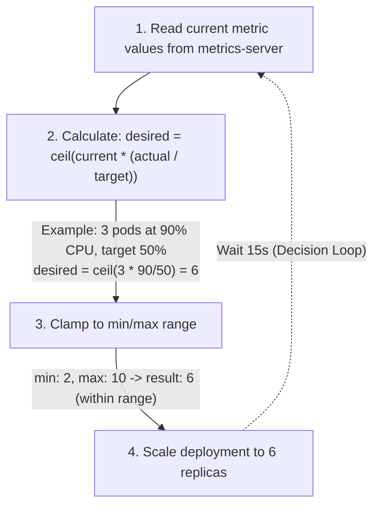

> **Складність**: `[СЕРЕДНЯ]` — тема іспиту CKA
>
> **Час на проходження**: 40-50 хвилин
>
> **Передумови**: Модуль 2.2 (Деплойменти), Модуль 2.5 (Керування ресурсами)

---

## Що ви зможете зробити

Після завершення цього модуля ви зможете:

- **Впровадити** HorizontalPodAutoscaler для Деплойменту, використовуючи цільові значення CPU, пам'яті та власних метрик.
- **Діагностувати** збої HPA, простежуючи готовність metrics-server, запити ресурсів Подів, поточні значення метрик і події автомасштабування.
- **Оцінити** розрахунок кількості реплік HPA, поведінку стабілізації та обмеження швидкості масштабування, перш ніж змінювати робочі (production) налаштування.
- **Порівняти** HPA, VPA та автомасштабування Нод, щоб обрати правильний цикл керування для попиту на робоче навантаження, розміру Подів і ємності кластера.
- **Спроєктувати** обережне впровадження автомасштабування з вимірюваними критеріями успіху, безпечними мінімумами, реалістичними максимумами та кроками відкату.

---

## Чому цей модуль важливий

Гіпотетичний сценарій: команда запускає API оформлення замовлення з фіксованою кількістю реплік, що дорівнює трьом, тому що саме це число пройшло останній навантажувальний тест. Тихим ранком Деплоймент марнує ємність Ноди, бо застосунку потрібні лише одна-дві репліки, але під час акції те саме налаштування перетворюється на вузьке місце. Запити вишиковуються в чергу, навантаження на CPU зростає, користувачі повторюють спроби, а ручна реакція завжди запізнюється, бо люди повільніші за цикл керування, який безперервно перевіряє поточний попит.

Автомасштабування — це відповідь Kubernetes на таку невідповідність між статичною конфігурацією та змінним трафіком. Поле `replicas` Деплойменту корисне, коли попит передбачуваний, але більшість реальних сервісів стикаються з добовими циклами, сплесками під час релізів, накопиченням пакетних задач і "галасливими сусідами". Horizontal Pod Autoscaler спостерігає за метриками, обчислює бажану кількість реплік і оновлює субресурс scale робочого навантаження, щоб система могла додавати або вилучати Поди без того, щоб оператор щоразу редагував YAML при зміні трафіку.

Іспит CKA очікує, що ви швидко створюватимете та усуватимете несправності HorizontalPodAutoscaler, але операційна навичка сягає глибше, ніж запам'ятовування `kubectl autoscale`. Вам потрібно розуміти, чому HPA повідомляє `<unknown>`, чому відсутні запити CPU ламають математику утилізації, чому зменшення масштабу часто очікує навіть після припинення навантаження, і чому додавання Подів може не допомогти навантаженню, яке обмежене пам'яттю, базою даних з єдиним записувачем або вичерпаною групою Нод. Цей модуль навчає циклів керування як інженерних інструментів, а не чарівних перемикачів.

Аналогія з термостатом усе ще допомагає, за умови, що ви не розтягуєте її надто далеко. Термостат зчитує поточну температуру, порівнює її з цільовою і вмикає нагрівання чи охолодження в межах практичних обмежень. HPA зчитує метрику навантаження, порівнює її з цільовою і змінює кількість реплік у межах `minReplicas` та `maxReplicas`, але йому також доводиться враховувати відсутні дані, ще не готові Поди, вікна стабілізації та здатність планувальника розмістити нові репліки.

Ви побудуєте невеликий вебдеплоймент, приєднаєте HPA, згенеруєте навантаження, поспостерігаєте за реакцією автомасштабувальника, а потім використаєте ті самі міркування, щоб порівняти HPA з Vertical Pod Autoscaler та автомасштабуванням Нод. Мета не в тому, щоб запам'ятати кожен прапорець контролера. Мета — подивитися на симптом масштабування, визначити, який цикл керування володіє цим рівнем, і зробити найменшу безпечну зміну, що покращує ємність без створення коливань.

## Частина 1: Цикли керування автомасштабуванням

Про автомасштабування Kubernetes легше міркувати, коли ви розділяєте три питання, які часто плутають між собою. Перше питання — скільки реплік Подів має запускати робоче навантаження. Друге питання — наскільки великим має бути кожен Под з погляду запитів CPU та пам'яті. Третє питання — чи має кластер достатньо Нод, щоб запланувати Поди, які контролери хочуть створити. HPA, VPA та автомасштабування Нод відповідають кожен на своє питання.

Horizontal Pod Autoscaler змінює кількість реплік для масштабовного робочого навантаження, такого як Deployment, ReplicaSet, StatefulSet або інша ціль, що надає субресурс scale. Він найкраще підходить для горизонтально масштабовних сервісів, де ще один Под є корисною одиницею ємності. Якщо вебзастосунок без збереження стану має вісім ідентичних Подів за Сервісом, додавання ще чотирьох Подів зазвичай збільшує ємність обробки запитів, за умови, що вузьким місцем не є спільна база даних чи зовнішня залежність.

Vertical Pod Autoscaler змінює або рекомендує запити CPU та пам'яті для окремих Подів. Він найкраще підходить, коли проблема полягає в розмірі Подів, а не в кількості реплік, особливо для навантажень, які важко шардувати, або де додавання реплік змінює семантику застосунку. VPA може спочатку працювати в режимі лише рекомендацій, що часто є найбезпечнішою відправною точкою, бо він повідомляє вам, що змінив би, перш ніж почне когось виселяти чи змінювати розмір.

Автомасштабування Нод змінює кількість або форму Нод кластера. Само по собі воно не пришвидшує перевантажений застосунок і не вирішує, скільки реплік має мати ваш Деплоймент. Воно реагує, коли Поди неможливо запланувати, бо кластеру бракує доступних ресурсів, а потім запитує в інфраструктурного рівня більшу ємність у межах налаштованих обмежень. HPA може запитати більше Подів, але саме автомасштабування Нод визначає, чи може кластер звільнити для них місце.

Уявіть ці цикли так, ніби вони працюють із вкладеними коробками. HPA регулює, скільки коробок застосункової роботи у вас є. VPA регулює, наскільки великою має бути кожна застосункова коробка. Автомасштабування Нод регулює, скільки місця на полицях має кластер для всіх цих коробок. Цикли доповнюють одне одного, коли кожен володіє окремою проблемою, але стають нестабільними, коли два цикли борються за один і той самий сигнал.

```text
+---------------- Kubernetes Cluster Capacity ----------------+
|                                                              |
|  Node autoscaling: add or remove nodes when pods fit poorly  |
|                                                              |
|    +---------------- Workload Replica Count ---------------+ |
|    |                                                        | |
|    |  HPA: change how many pods serve the workload          | |
|    |                                                        | |
|    |    +-------------- Individual Pod Size --------------+ | |
|    |    |                                                | | |
|    |    |  VPA: recommend or change CPU/memory requests   | | |
|    |    |                                                | | |
|    |    +------------------------------------------------+ | |
|    +--------------------------------------------------------+ |
|                                                              |
+--------------------------------------------------------------+
```

CKA зазвичай зосереджується на HPA, бо він є частиною щоденного адміністрування робочих навантажень і має пряму підтримку `kubectl`. Цей акцент на іспиті не повинен спокушати вас використовувати HPA для кожної проблеми ємності. Якщо Сервіс не може рівномірно маршрутизувати трафік, якщо застосунок зберігає локальний стан, або якщо вузьким місцем є єдина висхідна залежність, додавання реплік може лише розосередити симптом, водночас збільшуючи витрати.

Перш ніж налаштовувати автомасштабування, занотуйте сигнал насичення, якому ви насправді довіряєте. Утилізація CPU поширена, бо вона вбудована в конвеєр ресурсних метрик, але вона не завжди є найранішим чи найточнішим сигналом попиту. Частота запитів, глибина черги, кількість незавершених робочих елементів або пакетів за секунду можуть бути кращими для деяких систем, але ці власні метрики потребують адаптера, що надає API власних метрик або зовнішніх метрик Kubernetes.

Зупиніться та спрогнозуйте: якщо API повільний, бо кожен запит чекає на насичений пул з'єднань бази даних, що, на вашу думку, робитиме HPA, заснований лише на CPU? Чесна відповідь: він може робити дуже мало, якщо CPU залишається низьким, або може додати Поди, які створять ще більший тиск на базу даних. Хороше автомасштабування починається з метрики, що відображає корисну роботу, а не просто з метрики, яку легко зібрати.

## Частина 2: Механіка Horizontal Pod Autoscaler

HPA — це цикл контролера. Через регулярний інтервал синхронізації, який зазвичай описують як кожні п'ятнадцять секунд за замовчуванням для прапорця контролер-менеджера, він зчитує цільове робоче навантаження, отримує метрики, обчислює бажану кількість реплік, застосовує правила політики та стабілізації і записує нове значення scale, якщо потрібна зміна. У загальних рисах цей цикл простий, але кожен крок має режими збоїв, які проявляються безпосередньо в `kubectl get hpa` та `kubectl describe hpa`.

Для цільових значень утилізації CPU вирішальним знаменником є запит CPU Пода. Kubernetes може сказати, що Под перебуває на п'ятдесятивідсотковій утилізації CPU, лише якщо знає запитану кількість CPU. Под, що використовує `100m` CPU проти запиту `200m`, перебуває на п'ятдесятивідсотковій утилізації, тоді як той самий Под, що використовує `100m` проти запиту `50m`, перебуває на двохсотвідсотковій утилізації. Відсутні запити роблять цей відсоток неможливим для обчислення.

Саме тому HPA стоїть поруч із керуванням ресурсами в послідовності CKA. Деплоймент без запитів ресурсів усе одно може запускатися, і планувальник усе одно може розмістити його за правилами best-effort, але HPA на основі CPU не може ухвалити надійне рішення про утилізацію. Автомасштабувальник не вимірює "завантаженість" у людському розумінні. Він порівнює спостережуване використання із задекларованим наміром, тож ваші запити стають частиною контракту масштабування.

Основна формула: `desiredReplicas = ceil(currentReplicas * currentMetricValue / desiredMetricValue)`. Якщо три Поди в середньому мають дев'яносто відсотків CPU, а ціль становить п'ятдесят відсотків, сире бажане значення — `ceil(3 * 90 / 50)`, що дорівнює шести. Потім контролер обмежує це значення між `minReplicas` та `maxReplicas`, застосовує правила поведінки масштабування та уникає крихітних змін у межах вікна допуску.



Формула пояснює форму більшості поведінки HPA, але вона не означає, що кожен стрибок метрики негайно стає подією масштабування. Kubernetes також має обробку готовності, обробку відсутніх метрик, політики збільшення та зменшення масштабу і стабілізацію зменшення масштабу. Ці запобіжники існують, бо автомасштабування — це керування зі зворотним зв'язком, а керування зі зворотним зв'язком може коливатися, якщо реагує надто агресивно на зашумлені вимірювання.

Швидкість масштабування — це частина, яку багато хто помічає лише після навантажувального тесту. HPA може обмежувати, наскільки швидко він додає чи вилучає Поди, наприклад, додаючи обмежену кількість Подів або обмежений відсоток поточної кількості реплік за період політики. В API `autoscaling/v2` поле `behavior` дозволяє налаштовувати політики збільшення та зменшення масштабу, зокрема вікна стабілізації та вибір політики.

Зменшення масштабу навмисно консервативне, бо передчасне вилучення Подів може створити цикл, у якому нові Поди стартують, метрики ненадовго покращуються, повертається старе навантаження, і робоче навантаження знову збільшує масштаб. Поведінка стабілізації зменшення масштабу за замовчуванням тримає в пам'яті останні рекомендації, щоб контролер не кидався негайно за кожним тимчасовим спадом. Для робочих сервісів ця затримка може бути дешевшою за "тріпотіння", особливо коли Подам потрібні прогріті кеші, JIT-компіляція або пули з'єднань, перш ніж вони зможуть добре обробляти трафік.

Власні метрики дотримуються тієї самої ідеї високого рівня, але використовують інший API метрик. Замість того щоб запитувати CPU чи використання пам'яті в metrics-server, HPA запитує адаптер, який обслуговує `custom.metrics.k8s.io` або `external.metrics.k8s.io`. Prometheus Adapter — поширений приклад, бо він може перекладати запити Prometheus у відповіді API метрик Kubernetes, але важливим є поняття межі API, а не марка стека моніторингу.

Зупиніться та спрогнозуйте: ви задаєте `minReplicas: 2`, `maxReplicas: 10` та середню ціль CPU п'ятдесят відсотків. Якщо чотири Поди в середньому мають двадцять п'ять відсотків CPU після спаду трафіку, яку сиру кількість реплік пропонує формула і чому спостережуване зменшення масштабу може статися пізніше, ніж підказує математика? Вам слід очікувати сиру рекомендацію два, а потім поведінку контролера, яка може зачекати, бо стабілізація призначена для уникнення швидкого зменшення масштабу.

## Частина 3: Безпечне створення HPA

Найшвидший шлях для іспиту — імперативний: створити Деплоймент, задати запити ресурсів і запустити `kubectl autoscale`. Найбезпечніший робочий шлях зазвичай декларативний: написати об'єкт HPA, переглянути його, застосувати та тримати конфігурацію під контролем версій. Обидва шляхи створюють однаковий тип об'єкта Kubernetes, тож вам слід вільно читати YAML, навіть якщо ви створюєте його командою під тиском іспиту.

Почніть з перевірки конвеєра метрик. Цільові значення CPU та пам'яті HPA залежать від API ресурсних метрик, який зазвичай надає metrics-server. Якщо `kubectl top nodes` завершується помилкою API метрик, HPA може існувати, але не зможе повідомляти про поточну утилізацію. На локальних кластерах, таких як kind або деякі налаштування minikube, metrics-server також може потребувати коригувань TLS для kubelet, бо локальна організація сертифікатів відрізняється від керованих кластерів.

```bash
# Check whether the resource metrics API is available.
kubectl top nodes

# If metrics are not available, install metrics-server.
kubectl apply -f https://github.com/kubernetes-sigs/metrics-server/releases/latest/download/components.yaml

# For local clusters such as kind or some minikube setups, this may be needed.
kubectl patch deployment metrics-server -n kube-system --type=json \
  -p '[{"op":"add","path":"/spec/template/spec/containers/0/args/-","value":"--kubelet-insecure-tls"}]'

# Wait for metrics-server to become ready and collect its first samples.
kubectl rollout status deployment metrics-server -n kube-system
sleep 15

# Verify that resource metrics are now available.
kubectl top nodes
kubectl top pods
```

Зверніть увагу на порядок у цьому блоці. Ви перевіряєте шлях метрик, перш ніж звинувачувати HPA, бо HPA для ресурсних метрик стоїть нижче за течією від metrics-server. Ви також ненадовго очікуєте після rollout, бо API може бути готовим, перш ніж з'являться корисні зразки. Коли студенти пропускають цю затримку, вони часто бачать `<unknown>` і припускають, що автомасштабувальник зламаний, тоді як він просто ще не отримав придатних метрик.

Далі створіть невелике робоче навантаження і надайте йому запити ресурсів. Запити — це не лише підказки для планувальника; вони є частиною розрахунку утилізації. Низький запит CPU робить так, що невелика кількість CPU виглядає як висока утилізація, тоді як завищений запит може приховати реальний попит. Саме тому налаштування HPA та налаштування запитів ресурсів слід переглядати разом, а не доручати їх повністю окремим людям.

```bash
# Create a dummy deployment first.
kubectl create deployment web --image=nginx --replicas=2

# Add resource requests so CPU utilization has a denominator.
kubectl set resources deployment web \
  --requests=cpu=100m,memory=128Mi \
  --limits=cpu=200m,memory=256Mi

# Create HPA: scale between 2 and 10 replicas, target 80 percent CPU.
kubectl autoscale deployment web --min=2 --max=10 --cpu-percent=80

# Verify the autoscaler object and initial status.
kubectl get hpa
# NAME   REFERENCE        TARGETS         MINPODS   MAXPODS   REPLICAS   AGE
# web    Deployment/web   <unknown>/80%   2         10        2          30s
```

Початковий `<unknown>` у цьому прикладі не обов'язково є збоєм. Одразу після створення конвеєр метрик може не мати свіжого зразка для нових Подів, а nginx може не використовувати вимірюваного CPU. Якщо значення залишається невідомим після того, як Поди готові, а metrics-server працює для інших Подів, тоді ви досліджуєте відсутні запити, помилки metrics-server, цільові посилання та події HPA.

Декларативні маніфести HPA варто практикувати, бо вони відкривають можливості, які проста команда `kubectl autoscale` не може виразити. API `autoscaling/v2` підтримує кілька метрик, зокрема CPU, пам'ять, метрики Подів, метрики об'єктів та зовнішні метрики. Коли налаштовано кілька метрик, HPA обчислює бажану кількість реплік для кожної метрики й обирає найвищу рекомендацію, що захищає ємність, коли один сигнал бачить попит раніше за інший.

```yaml
apiVersion: autoscaling/v2
kind: HorizontalPodAutoscaler
metadata:
  name: web-hpa
spec:
  scaleTargetRef:
    apiVersion: apps/v1
    kind: Deployment
    name: web
  minReplicas: 2
  maxReplicas: 10
  metrics:
  - type: Resource
    resource:
      name: cpu
      target:
        type: Utilization
        averageUtilization: 80
  - type: Resource
    resource:
      name: memory
      target:
        type: Utilization
        averageUtilization: 85
  - type: Pods
    pods:
      metric:
        name: packets-per-second
      target:
        type: AverageValue
        averageValue: 1k
```

Цей маніфест зберігає важливу робочу ідею: CPU та пам'ять є ресурсними метриками, тоді як `packets-per-second` — це метрика Пода, що потребує адаптера власних метрик. Якщо адаптера немає, HPA може працювати для CPU, але повідомляти про помилки для власної метрики. У реальному впровадженні ви перевірили б API власних метрик, перш ніж прив'язувати критично важливе для бізнесу масштабування до нього.

Перш ніж це запускати, який вивід ви очікуєте від `kubectl describe hpa web-hpa`, якщо метрики CPU доступні, а `packets-per-second` — ні? Очікуйте, що об'єкт HPA існуватиме, метрика CPU показуватиме поточне значення, коли доступні зразки, а область Events або Conditions згадуватиме збої отримання власної метрики. Правило найвищої рекомендації допомагає лише тоді, коли метрики справді можна прочитати.

Моніторинг HPA — це поєднання статусу, подій і цільового робочого навантаження. `kubectl get hpa` дає компактний огляд, `kubectl describe hpa` пояснює умови та події, а `kubectl get deployment` показує, чи поширилася зміна реплік до контролера Деплойменту. Коли нова репліка перебуває в стані Pending, ви переходите до перевірок планувальника та ємності Нод, а не дивитеся лише на HPA.

```bash
# Check HPA status.
kubectl get hpa web
kubectl describe hpa web

# Watch scaling recommendations and replica changes.
kubectl get hpa -w

# Check events for scaling decisions.
kubectl get events --field-selector reason=SuccessfulRescale
```

Іспит CKA часто винагороджує дисципліновану послідовність усунення несправностей. Спершу переконайтеся, що автомасштабувальник існує і вказує на потрібний Деплоймент. Потім підтвердьте, що метрики доступні, за допомогою `kubectl top`. Потім перевірте запити ресурсів у шаблоні Пода. Потім огляньте умови та події HPA. Нарешті, якщо HPA рекомендує більше реплік, а Поди залишаються в стані Pending, огляньте події планувальника та ємність Нод, бо ви перейшли від автомасштабування робочого навантаження до ємності кластера.

## Частина 4: Навантажувальне тестування та інтерпретація результату

Навантажувальний тест для HPA слід розглядати як вправу зі спостереження, а не як доказ того, що робоче масштабування вирішено. Тест нижче використовує nginx та цикл BusyBox, бо він достатньо простий для практичного кластера, але nginx може спалювати небагато CPU для крихітних відповідей. Суть у тому, щоб попрактикувати створення об'єктів, перевірку метрик, читання подій та очищення, а не створити ідеальний бенчмарк.

```bash
# Deploy a test app with resource requests.
# Clean up previous dummy resources.
kubectl delete hpa web --ignore-not-found
kubectl delete deployment web --ignore-not-found

kubectl create deployment web --image=nginx --replicas=1
kubectl set resources deployment web --requests=cpu=100m,memory=128Mi --limits=cpu=200m,memory=256Mi

# Expose it so the load generator can reach it.
kubectl expose deployment web --port=80

# Verify deployment is ready.
kubectl rollout status deployment web

# Create HPA.
kubectl autoscale deployment web --min=1 --max=5 --cpu-percent=50

# Generate load.
kubectl run load-generator --image=busybox --restart=Never -- \
  /bin/sh -c "while true; do wget -q -O- http://web; done"
```

```bash
# Watch HPA respond.
# Press Ctrl-C after observing a few scaling events
kubectl get hpa web -w
```

```bash
# Stop load.
kubectl delete pod load-generator
```

```bash
# Watch HPA scale back down after stabilization.
# Press Ctrl-C after observing a few scaling events
kubectl get hpa web -w
```

Коли ви спостерігаєте за HPA, читайте кожен стовпець як підказку. `TARGETS` порівнює поточні та бажані значення метрики. `MINPODS` і `MAXPODS` показують дозволений діапазон. `REPLICAS` показує поточний масштаб цілі. Якщо `TARGETS` зростає, а `REPLICAS` — ні, опишіть HPA та прочитайте умови. Якщо `REPLICAS` зростає, а Поди залишаються в стані Pending, HPA виконав свою роботу, і тепер заблокований планувальник.

Успіх цього тесту залежить від більшого, ніж об'єкт автомасштабувальника. Деплоймент має бути готовим, ім'я Сервісу має розв'язуватися з Пода-генератора навантаження, metrics-server має успішно зчитувати дані з kubelet, а шаблон Пода має містити запити CPU. Збій у будь-якій із цих частин може виглядати як "HPA не спрацював", якщо ви не простежите повний шлях від генерації навантаження до метрик і оновлення реплік.

У зменшенні масштабу також є урок про час. Студенти часто зупиняють навантаження й очікують, що кількість реплік негайно впаде. У Kubernetes це було б небезпечно, бо короткі спади поширені, а зменшення масштабу може вилучити прогріту ємність, яка знадобиться знову за кілька секунд. Вікно стабілізації існує, щоб система не перетворювала кожне дрібне коливання метрики на "тріпотіння" Подів.

Сценарій для вправи: припустімо, ваш watch показує `web   120%/50%   1   5   5`, а користувачі досі скаржаться на тайм-аути. HPA уже досягнув `maxReplicas`, тож підвищення цілі CPU — це неправильна негайна реакція, бо вона зробила б масштабування менш агресивним. Ви перевірили б ємність Нод, висхідні вузькі місця, логи застосунку та чи не було `maxReplicas` встановлено надто низько для цієї події.

Ще одна поширена помилка інтерпретації — припущення, що більше реплік завжди означає нижчу затримку. Якщо ваші Поди більшість часу очікують на спільну базу даних, більше Подів може збільшити тиск на з'єднання й погіршити інцидент. Якщо ваші Поди обмежені CPU та не зберігають стану, більше реплік може швидко допомогти. Автомасштабування потужне лише тоді, коли одиниця масштабування відповідає вузькому місцю.

## Частина 5: Vertical Pod Autoscaler та зміна розміру на місці

Vertical Pod Autoscaler розв'язує іншу операційну проблему: вибір запитів CPU та пам'яті для Подів. Надто малі запити спричиняють ризик тротлінгу, OOM-вбивства або низькі цілі утилізації, що змушують HPA надмірно реагувати. Надто великі запити марнують доступну ємність і можуть завадити плануванню навіть тоді, коли Ноди мають вільне реальне використання. VPA спостерігає за історичним використанням і рекомендує або застосовує кращі значення запитів.

VPA особливо корисний, коли робоче навантаження не можна осмислено масштабувати горизонтально. База даних з єдиним записувачем, кеш, не налаштований як кластер, або пакетна задача з фіксованим паралелізмом можуть потребувати більшого Пода, а не більшої кількості Подів. Для таких навантажень HPA може створити додаткові репліки, які застосунок не може безпечно використати, тоді як VPA може покращити ресурсну оболонку наявних Подів.

Безпечний спосіб впровадити VPA — почати з рекомендацій. У режимі лише рекомендацій VPA повідомляє вам цільові значення, нижню межу та верхню межу, не змінюючи запущених Подів. Цей режим цінний, бо він відокремлює навчання від дії. Ви можете порівняти рекомендації з поточними запитами, зрозуміти пікові вікна та вирішити, чи будуть автоматичні оновлення руйнівними.

Kubernetes 1.35 тут має значення, бо зміна розміру Пода на місці є частиною поточної історії керування ресурсами. VPA може використовувати режими оновлення, які намагаються змінити розмір ресурсів без обов'язкового перезапуску Пода, коли платформа та робоче навантаження це підтримують, повертаючись до повторного створення за потреби. Вам усе одно потрібно обережно ставитися до автоматичної зміни розміру, бо не кожен застосунок добре реагує на зміну обмежень CPU чи пам'яті під час виконання.

```yaml
apiVersion: autoscaling.k8s.io/v1
kind: VerticalPodAutoscaler
metadata:
  name: web-vpa
spec:
  targetRef:
    apiVersion: apps/v1
    kind: Deployment
    name: web
  updatePolicy:
    updateMode: "Off"  # Options: Off, Initial, Recreate, InPlaceOrRecreate
```

Наведений вище приклад навмисно невеликий, бо деталі VPA різняться залежно від інсталяції та політики. Ключовими полями є `targetRef`, яке повідомляє VPA, яке робоче навантаження аналізувати, і `updatePolicy`, яке керує тим, чи рекомендації лише повідомляються, чи застосовуються. В обережних середовищах `Off` є сильним першим вибором, бо він створює докази, перш ніж змінити поведінку робочого навантаження.

| Сценарій | Використовуйте |
|----------|-----|
| Стан-незалежні вебзастосунки | HPA (додати більше Подів) |
| Бази даних, кеші | VPA (більші Поди — складно легко додати репліки) |
| Невідомі потреби в ресурсах | Спочатку VPA в режимі рекомендацій |
| Пакетні задачі | VPA (правильний розмір Подів задачі) |
| Ноди вичерпали ємність | Автомасштабування Нод (додає більше Нод) |
| Поєднати обидва | HPA на власних метриках + VPA на ресурсах |

Таблиця проста, але важать саме міркування. Стан-незалежні вебзастосунки зазвичай виграють від додаткових ідентичних Подів, бо Сервіси та балансувальники навантаження можуть розподіляти трафік. Бази даних і кеші потребують реплікації з урахуванням застосунку, тож сліпе додавання Подів може зламати узгодженість або не дати нічого корисного. Пакетні задачі часто можуть виграти від Подів правильного розміру, бо кожному Поду задачі потрібно достатньо ресурсів, щоб ефективно завершитися без марнування ємності Ноди.

| Режим | Поведінка |
|------|----------|
| `Off` | VPA лише рекомендує і не змінює Поди, що найбезпечніше для аудиту. |
| `Initial` | VPA задає ресурси лише під час створення Подів, залишаючи вже запущені Поди без змін. |
| `Recreate` | VPA виселяє та повторно створює Поди з новими ресурсами, коли застосовує оновлення. |
| `InPlaceOrRecreate` | VPA намагається оновити ресурси на місці, коли це можливо, і повертається до повторного створення за потреби. |

HPA та VPA можна поєднувати, але лише якщо ви уникаєте ситуації, коли обидва контролери борються за одну й ту саму ресурсну метрику. Якщо HPA масштабує за утилізацією CPU, а VPA змінює запити CPU, то VPA змінює знаменник розрахунку HPA. Результатом може бути нестабільний цикл, у якому VPA збільшує запити, HPA бачить нижчу утилізацію та зменшує масштаб, а потім менша кількість Подів знову штовхає утилізацію вгору.

Безпечніший патерн — дозволити HPA масштабувати за метрикою трафіку чи роботи, тоді як VPA займається правильним розміром CPU та пам'яті. Наприклад, API може масштабувати репліки на основі запитів за секунду чи глибини черги, тоді як VPA рекомендує запити CPU та пам'яті за спостережуваним використанням ресурсів. Це розділення дає кожному контролеру чистий сигнал і запобігає тому, щоб дія одного контролера знецінювала вимірювання іншого.

Який підхід ви б тут обрали і чому: однорепліковий кеш Redis, який цього тижня не можна кластеризувати, потребує більше пам'яті в години пік, а фронтенд без збереження стану потребує більше ємності лише під час сплесків трафіку? Навантаження Redis вказує на рекомендації VPA та обережний розмір Подів, тоді як фронтенд вказує на HPA, бо додавання реплік є осмисленим способом обслуговувати більше запитів.

## Частина 6: Налагодження збоїв автомасштабування

Збої автомасштабування зазвичай є ланцюговими, тож налагодження працює найкраще, коли ви рухаєтеся за ланцюгом. Почніть з об'єкта HPA, потім API метрик, потім шаблон Пода цільового робочого навантаження, потім події контролера, потім планувальник. Перехід одразу до прапорців контролера рідко потрібен для задач CKA і часто марнує час, коли проблема — це відсутній запит CPU чи невстановлений metrics-server.

Першим симптомом часто є `TARGETS: <unknown>/80%`. Це не означає, що об'єкт HPA недійсний. Це означає, що контролер наразі не може обчислити значення метрики для цілі. Причиною може бути відсутній metrics-server, нездатність metrics-server зчитувати дані з kubelet, відсутні запити ресурсів Подів, Поди, що не були готові достатньо довго, щоб їх врахувати, або адаптер власних метрик, що не надає названу метрику.

Другий симптом — HPA рекомендує більше реплік, але Деплоймент не стає справним. У цьому випадку перевірте, чи змінилася бажана кількість реплік Деплойменту. Якщо так, HPA завершив свою частину. Поди в стані Pending, збої завантаження образів, обмеження квот, PodDisruptionBudget, правила affinity чи проблеми з ємністю Нод — це окремі проблеми, що виникають після того, як HPA записав значення scale.

Третій симптом — коливання. Якщо репліки гойдаються вгору-вниз під час звичайного трафіку, перевірте, чи метрика зашумлена, чи ціль надто низька, чи стабілізація зменшення масштабу надто коротка, чи готовність під час запуску оманлива, чи HPA та VPA обидва торкаються CPU. Можливо, вам доведеться згладити метрику на рівні моніторингу, використати власну метрику, ближчу до фактичної роботи, або скоригувати `behavior`, щоб контролер змінював ємність плавніше.

Четвертий симптом — несподіванка з витратами. Якщо HPA масштабується до свого максимуму й залишається там, автомасштабувальник робить саме те, що йому кажуть його вхідні дані. Виправленням може бути краща ціль, вищий запит ресурсів, оптимізація застосунку або обмеження частоти на висхідному рівні. Ставтеся до автомасштабування як до однієї керівної поверхні серед кількох, а не як до заміни планування ємності.

Описуючи HPA, дивіться на Conditions перед Events. Conditions узагальнюють, чи може HPA масштабувати, чи може він читати метрики і чи обмежене масштабування конфігурацією. Events потім дають упорядковану в часі історію операцій повторного масштабування чи збоїв отримання метрик. Разом вони підказують, чи слід ремонтувати метрики, коригувати межі чи налагоджувати саме робоче навантаження.

Для власних метрик включіть адаптер до шляху налагодження. Графік Prometheus, що доводить існування метрики, — це не те саме, що API власних метрик Kubernetes, що обслуговує цю метрику для HPA. Вам потрібно, щоб ресурс API адаптера був виявним, а ім'я метрики, селектор цілі та дозволи збігалися зі специфікацією HPA.

Щодо ємності кластера, пам'ятайте, що HPA та автомасштабування Нод — це асинхронні цикли. HPA може створити Поди, які неможливо запланувати, потім автомасштабуванню Нод може знадобитися час, щоб надати Ноди, а потім планувальнику потрібно прив'язати Поди. Протягом цього вікна ємність застосунку може відставати від попиту. Для відомих подій попереднє масштабування `minReplicas` може бути надійнішим, ніж очікування повністю реактивного ланцюга.

## Патерни та антипатерни

Хороші патерни автомасштабування роблять цикл керування нудним. Вони використовують метрики, що відображають корисну роботу, задають межі, що відповідають перевіреній ємності, та надають достатньо спостережуваності, щоб оператор міг пояснити кожне рішення про масштабування. Погані патерни зазвичай походять від ставлення до HPA як до чарівного перемикача витрат, увімкнення його без запитів або поєднання контролерів без вирішення, яким сигналом володіє кожен контролер.

| Патерн | Коли використовувати | Чому це працює | Міркування щодо масштабування |
|---------|-------------|--------------|------------------------|
| CPU HPA з явними запитами | Стан-незалежні сервіси, де CPU відстежує попит | Конвеєр ресурсних метрик вбудований, і утилізація має чіткий знаменник | Регулярно переглядайте запити, бо зміна запитів змінює математику утилізації. |
| HPA на власних метриках | Черги, шлюзи, обробники пакетів або API, де CPU відстає від попиту | Метрика відображає роботу, що чекає чи надходить, тож масштабування може відбутися до насичення CPU | Потребує надійного адаптера та дисципліни іменування метрик. |
| VPA "спочатку рекомендації" | Невідомі потреби в ресурсах або навантаження, чутливі до перезапусків | Оператори можуть порівняти рекомендації з поточними запитами, перш ніж автоматизація змінить Поди | Збирайте дані впродовж пікових і тихих періодів, перш ніж довіряти автоматичним оновленням. |
| Попереднє масштабування для відомих подій | Передбачувані акції, запуски, міграції чи пакетні вікна | Підвищення `minReplicas` до попиту уникає реактивного відставання та болю холодного старту | Відновіть звичайні мінімуми після події та задокументуйте причину тимчасової зміни. |

Найсильніший патерн — задокументувати, що кожному автомасштабувальнику дозволено оптимізувати. Для API без збереження стану HPA може володіти конкурентністю запитів, VPA може лише рекомендувати CPU та пам'ять, а автомасштабування Нод може володіти Подами, які неможливо запланувати. Цей розподіл дає тим, хто реагує на інциденти, спільну модель, що важить більше за хитру метрику, коли часу обмаль.

| Антипатерн | Чому це не спрацьовує | Краща альтернатива |
|--------------|--------------|--------------------|
| HPA без запитів CPU | Утилізацію не можна обчислити, бо знаменник відсутній | Задайте реалістичний `resources.requests.cpu` на кожному контейнері, який обирає HPA. |
| HPA та VPA обидва керують CPU | VPA змінює знаменник запитів, поки HPA реагує на утилізацію | Використовуйте HPA на власних метриках навантаження, а VPA — для рекомендацій CPU чи пам'яті. |
| Крихітний `maxReplicas` для критичних сервісів | HPA досягає стелі під час реального попиту й не може додати ємності | Задавайте максимальні значення за навантажувальними тестами та обмеженнями автомасштабування Нод. |
| Дуже низька ціль CPU | Навантаження масштабується агресивно і може марнувати ємність чи "тріпотіти" | Почніть з помірної цілі та налаштуйте за спостережуваною затримкою й утилізацією. |
| Ігнорування Подів у стані Pending | Здається, що HPA масштабує, але планувальник не може розмістити нові репліки | Перевірте події, квоти, ємність Нод, affinity та налаштування автомасштабування Нод. |
| Сприйняття затримки зменшення масштабу як помилки | Стабілізацію помилково вважають збоєм контролера | Поясніть і налаштуйте поведінку зменшення масштабу, а не примушуйте до негайного "тріпотіння". |

Найдорожчий антипатерн — використання автомасштабування, щоб приховати незроблену роботу з продуктивності. Якщо кожне збільшення трафіку потребує подвоєння реплік, сервіс може мати неефективний код, запити до бази даних, промахи кешу або вузьке місце зовнішньої залежності. HPA може тримати сервіс живим, поки ви досліджуєте, але він не повинен ставати постійною відповіддю на проблему, яка належить дизайну застосунку.

## Структура ухвалення рішень

Використовуйте цю структуру, коли вирішуєте, який механізм автомасштабування застосувати. Почніть з визначення вузького місця, потім оберіть контролер, що змінює правильний рівень. Якщо ви не можете назвати вузьке місце, не починайте з додавання автоматизації. Почніть зі збору метрик і встановлення запитів ресурсів, щоб система могла ухвалювати осмислені рішення.

```text
Start with the symptom
        |
        v
Is more identical application capacity useful?
        |
    +---+---+
    |       |
   Yes      No
    |       |
    v       v
Use HPA   Is each pod too small or badly requested?
    |       |
    |   +---+---+
    |   |       |
    |  Yes      No
    |   |       |
    |   v       v
    |  Use VPA  Debug app, dependency, or architecture
    |
    v
Can new pods schedule?
        |
    +---+---+
    |       |
   Yes      No
    |       |
    v       v
Tune HPA  Check node autoscaling, quota, and scheduling constraints
```

Структура ухвалення рішень не замінює вимірювання. Вона вберігає вас від категорійних помилок. HPA змінює кількість реплік, VPA змінює розмір Пода, а автомасштабування Нод змінює ємність кластера. Якщо симптом — затримка, але причина — блокування бази даних, жоден із цих контролерів не є основним виправленням, хоча вони можуть зменшити вплив, поки ви усуваєте першопричину.

| Питання | Якщо так | Якщо ні |
|----------|--------|-------|
| Чи може робоче навантаження безпечно запускати більше ідентичних Подів? | Розгляньте HPA. | Розгляньте VPA, зміни застосунку чи зміни архітектури. |
| Чи відображає утилізація CPU або пам'яті реальний попит? | Ресурсних метрик може бути достатньо. | Використовуйте власні чи зовнішні метрики, ближчі до роботи. |
| Чи реалістичні запити ресурсів? | Відсотки HPA є осмисленими. | Виправте запити або почніть з рекомендацій VPA. |
| Чи може кластер запланувати нові репліки? | Зміни HPA можуть стати запущеною ємністю. | Перегляньте автомасштабування Нод, квоти та правила планування. |
| Чи передбачуваний попит заздалегідь? | Попередньо масштабуйте `minReplicas` для події. | Використовуйте реактивне масштабування з консервативними межами та оповіщеннями. |

Під тиском іспиту структура стає контрольним списком. Створіть робоче навантаження, задайте запити, створіть HPA, перевірте метрики, згенеруйте чи поспостерігайте навантаження та огляньте статус. У робочому середовищі додайте керування впровадженням: оповіщення для HPA, що досягли максимуму, дашборди, що показують поточні значення метрик проти цільових, і runbook'и, що пояснюють, коли підвищувати межі чи вимикати автоматизацію.

Спроєктуйте впровадження, перш ніж застосовувати YAML. Обережне впровадження автомасштабування має гіпотезу, обмеження радіуса ураження та шлях відкату. Гіпотеза говорить, який сигнал має зростати, коли зростає попит, який контролер має реагувати і як виглядає успіх після реакції. Обмеження радіуса ураження говорить, наскільки далеко контролер може зайти в перший робочий день. Шлях відкату говорить, як ви заморозите чи вилучите автоматизацію, якщо сигнал хибний.

Для нового HPA на основі CPU перша робоча версія зазвичай повинна мати консервативний `maxReplicas`, що відповідає перевіреній ємності Нод і висхідним обмеженням. Цей максимум — не лише запобіжник витрат. Він захищає бази даних, черги, кеші та сторонні API від раптового віяла клієнтів. Якщо ви пізніше підвищите максимум, робіть це тому, що навантажувальні тести, метрики насичення та власники залежностей погоджуються, що більша кількість реплік є корисною ємністю.

Мінімум реплік заслуговує на ту саму дисципліну. Надто низький мінімум економить гроші в тихі періоди, але може спричинити біль холодного старту, коли трафік повертається, особливо для застосунків, що прогрівають кеші чи встановлюють дорогі з'єднання. Надто високий мінімум приховує реальні патерни попиту і може зробити рекомендації VPA менш репрезентативними. Ставтеся до `minReplicas` як до налаштування доступності та прогрітої ємності, а не як до декоративного значення за замовчуванням.

Критерії успіху мають бути спостережуваними ззовні автомасштабувальника. "HPA існує" — це не успіх, а "кількість реплік змінилася" — лише частковий успіх. Кращі критерії включають метрики цілі, що стають читабельними, затримку, що залишається в межах цілі сервісу під час запланованого кроку навантаження, кількість Подів у стані Pending, що залишається близькою до нуля, частоту помилок на висхідному рівні, що залишається стабільною, і зменшення масштабу, що відбувається без повторюваних коливань після завершення тесту.

Відкати мають бути достатньо простими, щоб виконати їх під тиском. Ви можете видалити HPA та задати фіксовану кількість реплік, скоригувати `minReplicas` і `maxReplicas`, щоб утримати безпечний діапазон, або тимчасово змінити політику behavior, якщо проблема — "тріпотіння" зменшення масштабу. Правильний відкат залежить від того, що зламалося, тож пишіть його поруч із планом впровадження, а не вигадуйте під час інциденту, що розгортається.

Для власних метрик додайте крок перевірки адаптера до впровадження. Недостатньо, щоб Prometheus показував графік, бо HPA читає через API метрик Kubernetes. Ви хочете довести, що ім'я метрики, селектори міток, простір імен і дозволи працюють з погляду автомасштабувальника. Якщо цей шлях не перевірено, перший сплеск трафіку стане вашим інтеграційним тестом.

Для VPA спроєктуйте перше впровадження як спостереження, якщо тільки робоче навантаження не є одноразовим. Режим рекомендацій дозволяє порівняти запропоновані запити з поточними запитами, піковим використанням і обмеженнями планування. Він також дає власникам застосунків час вирішити, чи прийнятні автоматична зміна розміру або виселення. Контролер, що змінює ресурси Подів, є потужним, але рекомендація, що запобігає фіксації поганого запиту, уже цінна.

Для автомасштабування Нод включіть інфраструктурні обмеження в той самий документ, що й обмеження HPA. Якщо HPA може запросити двадцять Подів, а група Нод вміщує лише дванадцять, то ваша явна політика навантаження і ваша реальна політика ємності не узгоджуються. Ця неузгодженість спричиняє заплутані інциденти, бо один контролер каже "збільшити масштаб", тоді як інший рівень не має бюджету, квоти чи ємності типу інстансу, щоб виконати запит.

Оповіщення мають описувати насичення, а не лише існування об'єкта. Корисні оповіщення включають HPA на максимумі впродовж кількох періодів оцінки, поточну метрику набагато вище цілі, повторювані збої отримання метрик і зростання кількості Подів, які неможливо запланувати, для автомасштабованого навантаження. Менш корисні оповіщення викликають когось щоразу, коли змінюється кількість реплік, що може привчити операторів ігнорувати нормальну поведінку контролера.

Найкраще питання для огляду впровадження: "Що переконає нас, що цей автомасштабувальник допомагає?" Якщо відповідь — лише нижчі витрати, ви, можливо, упускаєте цілі стійкості та затримки. Якщо відповідь — лише більше реплік, ви, можливо, ігноруєте тиск залежностей. Хороша відповідь називає разом поведінку, орієнтовану на користувача, поведінку контролера та поведінку ресурсів, бо автомасштабування успішне лише тоді, коли всі три покращуються чи залишаються в погоджених межах.

Під час іспиту ви не писатимете повний план робочого впровадження, але те саме мислення робить вас швидшими. Ви знаєте, що треба задати запити перед HPA, перевірити метрики перед налаштуванням цілей, прочитати події перед здогадками й очистити об'єкти після лабораторної. Послідовність команд легше запам'ятати, бо вона дотримується причинного шляху, якому слідує сам контролер.

Під час робочої роботи цей причинний шлях стає звичкою керування змінами. Ви починаєте з невеликого безпечного діапазону, спостерігаєте за контролером і розширюєте діапазон лише після того, як докази це підтримують. Ви також записуєте, чому було обрано цільову метрику, бо людині на чергуванні наступного місяця потрібно знати, чи був CPU проксі для роботи, чи реальним обмежувальним ресурсом.

Є ще один практичний огляд, що ловить багато слабких дизайнів автомасштабування: порівняйте діапазон автомасштабувальника з реальним бюджетом залежностей Сервісу. Якщо вісім реплік кожна відкриває десять з'єднань з базою даних, то максимум вісім означає до вісімдесяти з'єднань, перш ніж ви врахуєте міграції, адміністративні задачі чи інші сервіси. Максимум реплік, що виглядає нешкідливим у Kubernetes, може бути надто агресивним для систем за робочим навантаженням.

Також порівняйте ціль HPA з поведінкою готовності застосунку. Якщо Под стає Ready, перш ніж завантажив конфігурацію, прогрів кеші чи встановив висхідні з'єднання, Сервіс може надсилати трафік до Пода, який технічно готовий, але ще не корисний. Це створює зашумлені метрики і може зробити так, що збільшення масштабу виглядає менш ефективним. Проби готовності, проби запуску та налаштування автомасштабування мають розповідати одну й ту саму історію про те, коли Под справді здатний обслуговувати.

Нарешті, перегляньте очищення та власність як частину дизайну. HPA, залишений після тимчасової події, може й далі скидати Деплоймент, який інший оператор намагається стабілізувати вручну. VPA, залишений в автоматичному режимі, може змінити запити після релізу і заплутати порівняння ємності. Іменування, мітки, посилання на runbook'и та явні нотатки про закінчення терміну — це дрібні деталі, але вони не дають об'єктам автомасштабування стати несподіваними фоновими дійовими особами.

## Чи знали ви?

- Період синхронізації контролера HPA за замовчуванням зазвичай документують як 15 секунд, і він керується прапорцем контролер-менеджера `--horizontal-pod-autoscaler-sync-period`.
- Утилізація CPU для HPA вимірюється відносно запитів CPU контейнера, тож зміна запиту може змінити відсоток утилізації, навіть якщо реальне використання CPU залишається тим самим.
- API `autoscaling/v2` може оцінювати кілька метрик для одного HPA і використовує найбільшу бажану рекомендацію реплік, коли метрики доступні.
- Kubernetes 1.35 включає стабільну підтримку зміни розміру Пода на місці, що змінює те, як інструменти на кшталт VPA можуть обробляти зміну розміру ресурсів.

## Типові помилки

| Помилка | Чому це трапляється | Як це виправити |
|---------|----------------|---------------|
| Немає metrics-server | Об'єкт HPA існує, але API ресурсних метрик не може надати зразки CPU чи пам'яті. | Встановіть і перевірте metrics-server, потім підтвердьте, що `kubectl top nodes` та `kubectl top pods` повертають дані. |
| Немає запитів ресурсів на Подах | Утилізації CPU потрібне значення запиту як знаменник, тож HPA не може обчислити відсоток. | Задайте реалістичні запити CPU в шаблоні Пода Деплойменту, перш ніж використовувати цілі утилізації CPU. |
| Мінімум і максимум реплік однакові | HPA дійсний, але дозволений діапазон не залишає простору для рішень про масштабування. | Задайте мінімум для базової доступності та перевірений максимум для пікової ємності. |
| Ціль CPU нереалістично низька | Контролер сприймає звичайний трафік як перевантаження і може масштабуватися надто агресивно. | Почніть з помірної цілі, потім налаштуйте за даними затримки, насичення й витрат. |
| HPA та VPA обидва діють на CPU | VPA змінює запити CPU, поки HPA використовує ці запити в математиці утилізації. | Використовуйте VPA для рекомендацій або застосовуйте HPA на власних метриках навантаження замість CPU. |
| Забування про стабілізацію зменшення масштабу | Оператори очікують, що репліки впадуть негайно після припинення навантаження, і хибно сприймають затримку як збій. | Перевірте behavior та події HPA, потім налаштовуйте стабілізацію лише за наявності доказів. |
| Ігнорування ємності Нод | HPA збільшує бажану кількість реплік, але нові Поди залишаються в стані Pending, бо в кластері немає місця. | Огляньте події Подів, квоти, доступні ресурси Нод та обмеження автомасштабування Нод. |

## Тест

<details>
<summary>Питання 1: Ваш HPA показує `TARGETS: &lt;unknown&gt;/80%` для Деплойменту, що перебуває під навантаженням. Якій послідовності ви слідуєте, перш ніж змінювати цільовий відсоток?</summary>

Спершу перевірте конвеєр ресурсних метрик за допомогою `kubectl top nodes` та `kubectl top pods`, бо недоступний API метрик — найпоширеніша причина невідомих цілей. Потім огляньте шаблон Пода Деплойменту на наявність запитів CPU, бо утилізацію CPU не можна обчислити без запитів. Далі опишіть HPA, щоб прочитати умови та події, які можуть виявити відсутні метрики, проблеми з цільовим посиланням або Поди, що не були готові достатньо довго для врахування. Зміна цільового відсотка не виправляє відсутні дані; вона лише змінює бажаний поріг після того, як контролер зможе читати метрики.
</details>

<details>
<summary>Питання 2: Деплоймент має чотири репліки із середнім CPU 90 відсотків та ціллю 50 відсотків, `minReplicas: 2` і `maxReplicas: 10`. Яку бажану кількість реплік слід очікувати і що ще може затримати видимий результат?</summary>

Сирий розрахунок — `ceil(4 * 90 / 50)`, тож бажана кількість — вісім, що потрапляє в межі налаштованих обмежень. Видимий результат усе одно може бути затриманий інтервалом синхронізації контролера, свіжістю метрик, політиками масштабування та створенням Подів контролером Деплойменту. Якщо нові Поди не можуть заплануватися, HPA може оновити ціль scale, тоді як фактична запущена ємність залишається нижчою. Саме тому ви перевіряєте і статус HPA, і події Подів.
</details>

<details>
<summary>Питання 3: Ваша команда хоче автомасштабування для однокопійного кешу, який не може безпечно запускати незалежні репліки. Чому HPA — неправильний перший інструмент і що ви спробували б спочатку?</summary>

HPA — неправильний перший інструмент, бо він додає репліки, а додаткові незалежні Поди кешу не створюють автоматично узгоджений кластер кешу. Якщо застосунок під'єднано до однієї кінцевої точки кешу або він залежить від локального стану, більше Подів можуть бути марними чи шкідливими. VPA в режимі рекомендацій — безпечніший перший крок, бо він спостерігає за використанням ресурсів і пропонує запити CPU чи пам'яті, не змінюючи поведінки під час виконання. Переглянувши рекомендації, ви можете вирішити, чи прийнятний автоматичний режим оновлення.
</details>

<details>
<summary>Питання 4: HPA для API масштабується до свого максимуму під час запуску, але користувачі досі бачать тайм-аути, а кілька нових Подів перебувають у стані Pending. Що ви перевіряєте далі?</summary>

Щойно HPA досягає `maxReplicas`, він не може запросити більше Подів, доки ви не підвищите межу, тож спершу перевірте, чи максимум було визначено за реалістичним навантажувальним тестом. Поди в стані Pending зміщують дослідження до планування та ємності кластера: опишіть Поди, огляньте події, перевірте квоти, перегляньте доступні ресурси Нод і підтвердьте обмеження автомасштабування Нод. Вам також слід перевірити насичення застосунку та залежностей, бо більше реплік може не розв'язати висхідного вузького місця. Негайна реакція може поєднувати підвищення `maxReplicas`, збільшення ємності Нод і захист залежностей обмеженнями частоти.
</details>

<details>
<summary>Питання 5: Колега вмикає автоматичні оновлення VPA для CPU, тоді як наявний HPA також націлений на утилізацію CPU. Під час тестування кількість реплік стає нестабільною. Поясніть цикл зворотного зв'язку.</summary>

Нестабільність виникає, бо VPA змінює запити CPU, а HPA використовує запити CPU як знаменник для утилізації. Якщо VPA підвищує запити, те саме реальне використання CPU виглядає як нижча утилізація, тож HPA може зменшити масштаб. З меншою кількістю Подів навантаження на один Под знову зростає, і HPA може знову збільшити масштаб, поки VPA продовжує коригувати запити. Кращий дизайн — тримати VPA в режимі рекомендацій або змусити HPA масштабуватися за незалежною власною метрикою, такою як частота запитів чи глибина черги.
</details>

<details>
<summary>Питання 6: Ваш навантажувальний тест не показує збільшення масштабу, але `kubectl top pods` працює, а ціль HPA видима. Поди nginx використовують дуже мало CPU, поки цикл BusyBox запущений. Про що це говорить?</summary>

Це говорить про те, що тест, можливо, не генерує очікуваного вами тиску на метрику. Проста відповідь nginx може бути надто дешевою, щоб підняти CPU вище налаштованої цілі, особливо за низької кількості запитів чи швидкої локальної мережі. Ви все одно можете використати тест для практики перевірки HPA, але не варто робити висновок, що HPA зламаний, лише тому, що репліки не збільшилися. Для сильнішого тесту використовуйте кінцеву точку застосунку, що спалює CPU, або масштабуйтеся за метрикою, ближчою до роботи, яка вас цікавить.
</details>

<details>
<summary>Питання 7: Деплоймент обробника черги має низький CPU, але зростаюче накопичення задач. Чи слід масштабуватися за CPU, пам'яттю чи власною метрикою, і чому?</summary>

Власна метрика, така як глибина черги чи кількість повідомлень на обробника, є кращим сигналом, бо вона відображає роботу, що чекає на обробку. CPU може залишатися низьким, коли обробники заблоковані на введенні-виведенні, обмеженнях частоти чи зовнішніх системах, тож HPA на основі CPU може реагувати пізно або взагалі не реагувати. Пам'ять зазвичай ще менш пряма для масштабування за накопиченням, якщо тільки використання пам'яті не відстежує роботу в черзі всередині кожного Пода. Власна метрика потребує адаптера, але вона дає автомасштабувальнику сигнал, що відповідає операційній меті.
</details>

## Практична вправа

**Виклик: автомасштабування вебзастосунку**

У цій вправі ви створите Деплоймент, приєднаєте HPA, згенеруєте навантаження та перевірите шлях автомасштабування від метрик до змін реплік. Працюйте достатньо повільно, щоб спостерігати за кожним етапом. Суть не лише в тому, щоб змінити число реплік, а в тому, щоб довести, що ви можете пояснити, чому воно змінилося чи чому не змінилося у вашому кластері.

### Завдання

- [ ] Створіть простір імен або використайте чистий практичний простір імен, щоб об'єкти автомасштабування було легко оглядати.
- [ ] Розгорніть `challenge-web` із запитами CPU та пам'яті перед створенням HPA.
- [ ] Спроєктуйте обережне впровадження автомасштабування з вимірюваними критеріями успіху та безпечними мінімумами перед зміною робочих значень за замовчуванням.
- [ ] Експонуйте Деплоймент і перевірте, що тимчасовий Под може досягти імені Сервісу.
- [ ] Створіть HPA з мінімумом дві репліки, максимумом вісім реплік і ціллю CPU п'ятдесят відсотків.
- [ ] Згенеруйте навантаження, спостерігайте за статусом HPA і зафіксуйте принаймні одну умову чи подію, що пояснює рішення автомасштабувальника.
- [ ] Зупиніть навантаження, поспостерігайте за затримкою зменшення масштабу й очистіть кожен створений об'єкт.

```bash
# 1. Create deployment with resource requests.
kubectl create deployment challenge-web --image=nginx --replicas=1
kubectl set resources deployment challenge-web \
  --requests=cpu=50m,memory=64Mi --limits=cpu=100m,memory=128Mi

# 2. Expose it.
kubectl expose deployment challenge-web --port=80

# Verify deployment is ready.
kubectl rollout status deployment challenge-web

# 3. Create HPA: 2 to 8 replicas, 50 percent CPU target.
kubectl autoscale deployment challenge-web --min=2 --max=8 --cpu-percent=50

# 4. Verify HPA is working.
kubectl get hpa challenge-web

# 5. Generate load.
kubectl run load --image=busybox --restart=Never -- \
  /bin/sh -c "while true; do wget -q -O- http://challenge-web; done"
```

```bash
# 6. Watch scaling happen.
# Press Ctrl-C after observing a few scaling events
kubectl get hpa challenge-web -w
```

```bash
# 7. Stop load.
kubectl delete pod load
```

```bash
# Watch scale-down after stabilization.
# Press Ctrl-C after observing a few scaling events
kubectl get hpa challenge-web -w
```

```bash
# 8. Cleanup.
kubectl delete deployment challenge-web
kubectl delete svc challenge-web
kubectl delete hpa challenge-web
```

<details>
<summary>Підказка до розв'язання</summary>

Якщо `kubectl get hpa challenge-web` повідомляє `<unknown>`, спершу підтвердьте metrics-server за допомогою `kubectl top pods`, потім підтвердьте, що Поди `challenge-web` мають запити CPU. Якщо метрики видимі, а репліки не збільшуються, навантаження може бути недостатньо CPU-важким для nginx у вашому кластері, тож зосередьтеся на описі HPA та інтерпретації умов. Якщо репліки збільшуються, а нові Поди залишаються в стані Pending, опишіть ці Поди й шукайте повідомлення про планування, квоти чи ємність Нод. Очищення важливе, бо залишені HPA можуть і далі змінювати Деплойменти під час пізніших вправ.
</details>

**Критерії успіху:**

- [ ] HPA створено з правильними налаштуваннями мінімуму, максимуму та цілі.
- [ ] Цільові значення HPA стають читабельними замість того, щоб залишатися назавжди невідомими.
- [ ] Репліки збільшуються під час тривалого навантаження, або ви можете пояснити з умов, чому вони не збільшилися.
- [ ] Репліки зменшуються лише після припинення навантаження і коли стабілізація це дозволяє.
- [ ] Очищення видаляє Деплоймент, Сервіс, HPA та Под-генератор навантаження.

## Джерела

- [Certified Kubernetes Administrator (CKA)](https://training.linuxfoundation.org/certification/certified-kubernetes-administrator-cka/)
- [Horizontal Pod Autoscaling](https://v1-35.docs.kubernetes.io/docs/tasks/run-application/horizontal-pod-autoscale/)
- [Vertical Pod Autoscaling](https://kubernetes.io/docs/concepts/workloads/autoscaling/vertical-pod-autoscale/)
- [Resize CPU and Memory Resources assigned to Containers](https://v1-35.docs.kubernetes.io/docs/tasks/configure-pod-container/resize-container-resources/)
- [Kubernetes Metrics Server](https://github.com/kubernetes-sigs/metrics-server)
- [Tools for Monitoring Resources](https://v1-35.docs.kubernetes.io/docs/tasks/debug-application-cluster/resource-usage-monitoring/)
- [Prometheus Adapter for Kubernetes Metrics APIs](https://github.com/kubernetes-sigs/prometheus-adapter)
- [Resource Management for Pods and Containers](https://v1-35.docs.kubernetes.io/docs/concepts/configuration/manage-resources-containers/)
- [Node Autoscaling](https://v1-35.docs.kubernetes.io/docs/concepts/cluster-administration/node-autoscaling/)
- [HorizontalPodAutoscaler API reference](https://v1-35.docs.kubernetes.io/docs/reference/kubernetes-api/workload-resources/horizontal-pod-autoscaler-v2/)
- [kubectl autoscale reference](https://v1-35.docs.kubernetes.io/docs/reference/generated/kubectl/kubectl-commands#autoscale/)

## Наступний модуль

Поверніться до [огляду Частини 2](/k8s/cka/part2-workloads-scheduling/). Далі ви використаєте ті самі міркування про робочі навантаження, щоб обрати правильні інструменти планування та ємності під час усунення несправностей у стилі іспиту.


