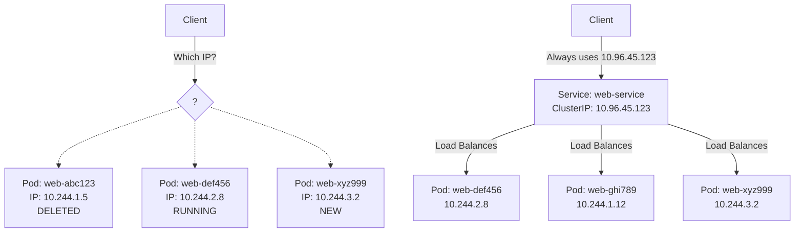
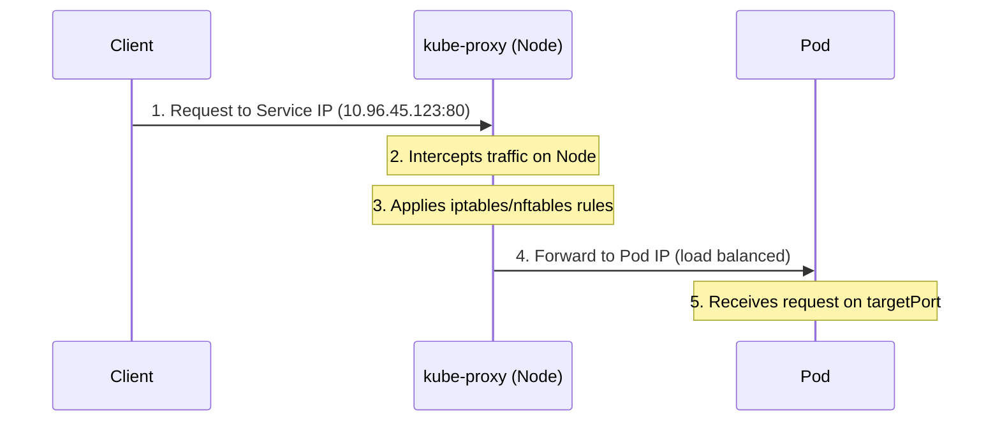
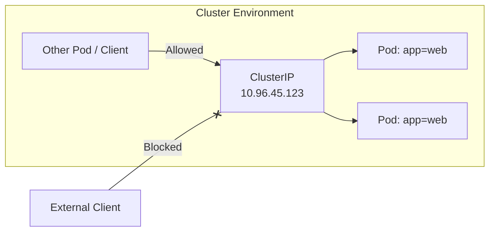
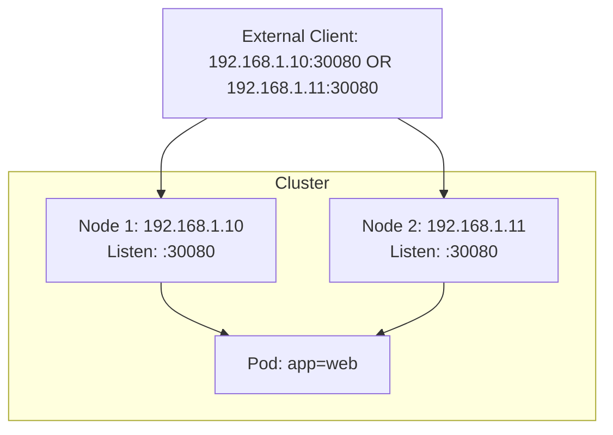
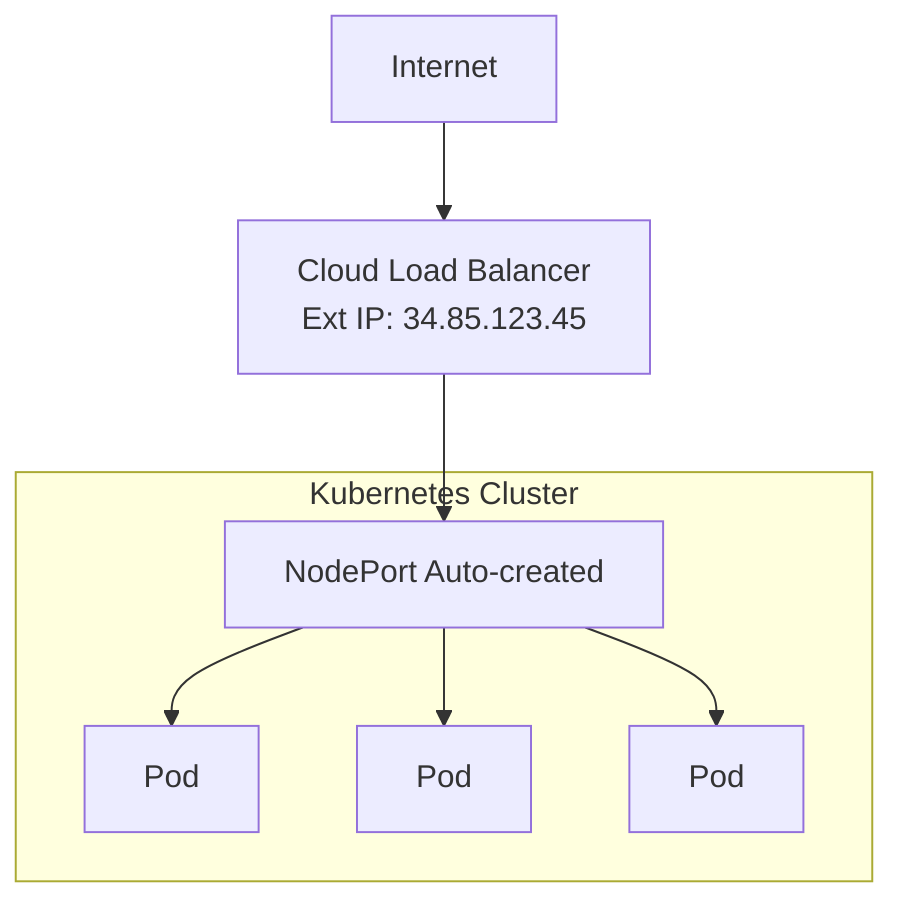
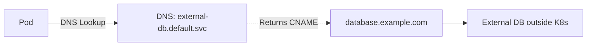
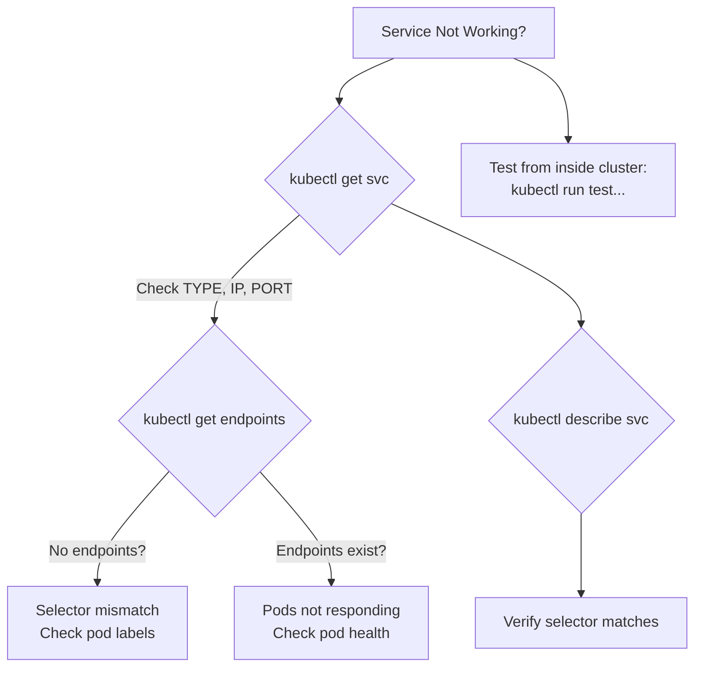

> **Складність**: `[СЕРЕДНЯ]` — основна концепція мережі.
>
> **Час на проходження**: 45-55 хвилин.
>
> **Передумови**: Модуль 2.1 (Поди), Модуль 2.2 (Деплойменти).

---

## Що ви зможете зробити

Після завершення цього модуля ви зможете:

- **Спроєктувати** високодоступне надання доступу до Сервісу, обравши ClusterIP, NodePort, LoadBalancer, ExternalName або безголовий (headless) Сервіс під заявлену вимогу доступу.
- **Впровадити** декларативні та імперативні визначення Сервісів, які коректно зіставляють `port`, `targetPort`, іменовані порти, протоколи, селектори та багатопортовий трафік.
- **Діагностувати** збої маршрутизації Сервісу, простежуючи шлях від DNS-імені до Сервісу, EndpointSlice, обраного Пода, цільового порту та правила переадресації kube-proxy.
- **Оцінити** поведінку трафіку для прив'язки сесій (session affinity), `externalTrafficPolicy`, `internalTrafficPolicy` та налаштувань розподілу трафіку у Kubernetes v1.35.
- **Зневаджувати** симптоми площини даних kube-proxy, порівнюючи свідчення iptables, nftables та застарілого IPVS, не плутаючи правила проксі зі збоями застосунку.

## Чому цей модуль важливий

Гіпотетичний сценарій: ваша команда розгортає платіжний фронтенд із трьома репліками, успішно його тестує, а потім спостерігає, як він виходить з ладу після планового оновлення, бо інший застосунок було налаштовано звертатися напряму до IP-адреси одного Пода. Несправна конфігурація працювала лише доти, доки існував саме цей Под. Коли Деплоймент замінив його, клієнт продовжував звертатися до мертвої адреси, навіть попри те, що справні Поди-замінники були готові й обслуговували трафік. Сервіси Kubernetes існують саме для того, щоб усунути цей крихкий зв'язок між конфігурацією клієнта та життєвими циклами бекенд-Подів.

Поди навмисно є одноразовими. Планувальник може розмістити Под-замінник на іншій ноді, оновлення Деплойменту може створити новий набір реплік, а невдала проба готовності (readiness probe) може вилучити Под з трафіку ще до того, як контейнер буде повністю завершено. Об'єкти Сервісу дають клієнтам стабільне ім'я та зазвичай стабільну віртуальну IP-адресу, доки Kubernetes безперервно оновлює набір бекендів. Ця стабільна ідентичність — не зручна додаткова можливість; це різниця між кластером, який витримує звичайні зміни, і кластером, де кожне оновлення перетворюється на мережевий збій.

Для іспиту CKA Сервіси перебувають на перетині швидкості роботи з командами та діагностичного мислення. Вам потрібно вміти швидко створити Сервіс, але також потрібно вміти пояснити, чому Сервіс не має ендпоінтів, чому `port` і `targetPort` не взаємозамінні, чому ClusterIP недосяжний ззовні кластера і чому NodePort усе одно може не працювати, коли фаєрволи хоста блокують виділений діапазон. Цей модуль зберігає оригінальні приклади, діаграми, таблиці та посилання на джерела, але перебудовує урок навколо ланцюжка міркувань, який ви використовуватимете під тиском іспиту й у реальних операціях.

> **Аналогія з рестораном**
>
> Уявіть ресторан, де кухарі — це Поди. Кухарі змінюють зміни, хворіють і переходять між станціями, але клієнтам не потрібен особистий номер телефону кожного кухаря. Вони телефонують на публічний номер ресторану, а адміністратор спрямовує запит до доступного кухаря. Сервіс Kubernetes — це той стабільний номер телефону та стійка маршрутизації: клієнти користуються однією ідентичністю, доки Kubernetes відстежує, які бекенди наразі готові.

## Ідентичність Сервісу та проблема плинності Подів

Перша концепція Сервісу, яку слід засвоїти, полягає в тому, що Сервіс — це не Под і не процес. Це об'єкт API, який описує довговічну точку доступу та правило вибору для пошуку бекендів. Правило вибору зазвичай каже «надсилай трафік до Подів із цими мітками», тоді як точка доступу надає ім'я, віртуальну IP-адресу та один чи більше портів. Це розділення дозволяє Деплойменту замінювати Поди, не змушуючи кожного клієнта заново вивчати адреси бекендів.

Коли клієнт намагається звернутися напряму до IP-адреси Пода, він бере на себе відповідальність за річ, яку Kubernetes навмисно розглядає як тимчасову. Це може бути прийнятним під час хвилинного сеансу зневадження, але це крихкий продакшн-контракт. Сервіс переносить контракт на рівень вище: клієнт залежить від `web-service.default.svc.cluster.local` або від ClusterIP Сервісу, а Kubernetes підтримує членство бекендів актуальним, коли Поди з'являються, зникають, стають готовими або не проходять перевірок готовності.



<details>
<summary>Переглянути застарілу ASCII-діаграму</summary>

```text
┌────────────────────────────────────────────────────────────────┐
│                     The Problem                                │
│                                                                │
│   Client wants to reach "web app"                              │
│                                                                │
│   ┌─────────────────────────────────────────────────────┐      │
│   │  Pod: web-abc123   IP: 10.244.1.5   ← Created       │      │
│   │  Pod: web-def456   IP: 10.244.2.8   ← Running       │      │
│   │  Pod: web-ghi789   IP: 10.244.1.12  ← Created       │      │
│   │  Pod: web-abc123   IP: 10.244.1.5   ← Deleted!      │      │
│   │  Pod: web-xyz999   IP: 10.244.3.2   ← New pod       │      │
│   └─────────────────────────────────────────────────────┘      │
│                                                                │
│   Which IP should the client use? They keep changing!          │
│                                                                │
└────────────────────────────────────────────────────────────────┘

┌────────────────────────────────────────────────────────────────┐
│                     The Solution: Services                     │
│                                                                │
│   ┌───────────────────────────────────────────────────────┐    │
│   │            Service: web-service                       │    │
│   │            ClusterIP: 10.96.45.123                    │    │
│   │            (Never changes!)                           │    │
│   │                                                       │    │
│   │     Selector: app=web                                 │    │
│   │         │                                             │    │
│   │         ├──► Pod: web-def456 (10.244.2.8)             │    │
│   │         ├──► Pod: web-ghi789 (10.244.1.12)            │    │
│   │         └──► Pod: web-xyz999 (10.244.3.2)             │    │
│   └───────────────────────────────────────────────────────┘    │
│                                                                │
│   Client always uses 10.96.45.123 - Kubernetes handles rest    │
│                                                                │
└────────────────────────────────────────────────────────────────┘
```

</details>

Читайте діаграму зліва направо як операційну хронологію. Верхня половина показує, чому пряма адресація Пода зазнає невдачі: адреса, що була правильною вчора, після оновлення може вказувати в нікуди. Нижня половина показує контракт Сервісу: IP-адреса та DNS-ім'я Сервісу залишаються стабільними, доки EndpointSlice оновлюють поточні IP-адреси Подів. Важлива звичка для CKA — запитувати себе, чи проблема в стабільних «вхідних дверях», у списку членства бекендів чи в застосунку, що слухає за цим членством.

Зробіть паузу й передбачте: якщо селектор Сервісу збігається з трьома запущеними Подами, і один Под стає неготовим через невдалу пробу готовності, чи слід усе ще надсилати новий клієнтський запит до цього неготового Пода? Перш ніж читати далі, вирішіть, чи має відповідь залежати від Сервісу, від Деплойменту чи від умови готовності. Причина має значення, бо зневадження Сервісу часто починається зі здорового на вигляд переліку Подів, але список ендпоінтів розповідає точнішу правду.

Основні частини звичайного Сервісу компактні, але кожна з них відповідає на інше питання. `ClusterIP` — це стабільна внутрішня віртуальна IP-адреса. `selector` каже Kubernetes, які Поди є придатними бекендами. `port` — це те, до чого клієнти під'єднуються на Сервісі. `targetPort` — це те, куди трафік потрапляє на обраних Подах. Ендпоінти та EndpointSlice — це розв'язані адреси бекендів, які Kubernetes виводить із селектора та готовності Подів.

| Компонент | Опис |
|-----------|------|
| **ClusterIP** | Стабільна внутрішня IP-адреса для сервісу |
| **Selector** | Мітки, що визначають, до яких подів маршрутизувати |
| **Port** | Порт, який слухає сервіс |
| **TargetPort** | Порт на подах, на який переадресовується трафік |
| **Endpoints** | Фактичні IP-адреси подів, що стоять за сервісом |

Розрізнення `port` і `targetPort` — найпоширеніша рання помилка, бо назви звучать схоже. Корисною є аналогія з лобі будівлі: `port` Сервісу — це стійка адміністратора в лобі, до якої підходять клієнти, тоді як `targetPort` — це номер кімнати, куди запит доставляється після того, як лобі його скерувало. Якщо `targetPort` пропущено, Kubernetes за замовчуванням прирівнює його до того самого значення, що й `port`, що зручно для простих прикладів з nginx, але небезпечно, коли застосунок слухає на іншому порту контейнера.

За об'єктом Сервісу kube-proxy або альтернативна площина даних програмує правила мережі ноди, що роблять віртуальну IP-адресу корисною. У звичайному випадку kube-proxy на Linux трафік до IP-адреси Сервісу перехоплюється й транслюється до однієї з IP-адрес бекенд-Подів. IP-адреса Сервісу зазвичай не існує як звичайна адреса на інтерфейсі ноди; це віртуальний пункт призначення, який розпізнають правила мережі кластера. Саме тому ping ClusterIP не є надійним тестом Сервісу, тоді як HTTP-запит до налаштованого порту Сервісу — змістовний.



<details>
<summary>Переглянути застарілу ASCII-діаграму</summary>

```text
┌────────────────────────────────────────────────────────────────┐
│                   Service Request Flow                         │
│                                                                │
│   1. Client sends request to Service IP (10.96.45.123:80)      │
│                         │                                      │
│                         ▼                                      │
│   2. kube-proxy (on each node) intercepts                      │
│                         │                                      │
│                         ▼                                      │
│   3. kube-proxy uses iptables/nftables rules                   │
│                         │                                      │
│                         ▼                                      │
│   4. Request forwarded to one of the pod IPs                   │
│      (load balanced - round robin by default)                  │
│                         │                                      │
│                         ▼                                      │
│   5. Pod receives request on targetPort                        │
│                                                                │
└────────────────────────────────────────────────────────────────┘
```

</details>

Kubernetes v1.35 усе ще підтримує декілька режимів kube-proxy, але до їхніх операційних сигналів слід ставитися по-різному. Типовим режимом на Linux залишається iptables, коли режим проксі не задано явно, тоді як nftables — це сучасний напрям для Linux, а IPVS у v1.35 є застарілим. Для CKA вам зазвичай не потрібно безпосередньо редагувати правила kube-proxy, але потрібно знати, що збій Сервісу може бути спричинений станом селектора, готовністю Пода, портами, які слухає застосунок, фаєрволами ноди або площиною даних ноди.

## Вибір правильного типу Сервісу

Тип Сервісу — це рішення про надання доступу, а не позначка продуктивності. Почніть із питання, кому потрібно дістатися до застосунку. Якщо він потрібен лише іншим Подам усередині кластера, ClusterIP є типовою і зазвичай правильною відповіддю. Якщо трафік має заходити в кластер ззовні, кандидатами стають NodePort, LoadBalancer, Ingress або Gateway, і правильний вибір залежить від того, чи потрібна вам швидка відповідь на іспиті, керована хмарою зовнішня адреса чи продакшн-рівень HTTP-маршрутизації.

| Тип | Область видимості | Сценарій використання | Частота на іспиті |
|------|-------|----------|----------------|
| **ClusterIP** | Лише внутрішня | Зв'язок под-до-пода | [Висока] |
| **NodePort** | Зовнішня через IP ноди | Розробка, тестування | [Середня-Висока] |
| **LoadBalancer** | Зовнішня через хмарний LB | Продакшн у хмарі | [Середня] |
| **ExternalName** | DNS-псевдонім | Зовнішні сервіси | [Низька] |

ClusterIP є типовим, бо внутрішній зв'язок є найбезпечнішою базовою лінією. Пропуск `spec.type` дає вам стабільну внутрішню адресу Сервісу, яка досяжна з Подів усередині кластера, але не безпосередньо з ноутбука в зовнішній мережі. Це типове значення має значення на іспиті, бо завдання може просити внутрішній бекенд-Сервіс і ніколи не згадувати `type`; додавання NodePort чи LoadBalancer надмірно відкрило б робоче навантаження та змінило б відповідь.

```yaml
# Internal-only access - most common type
apiVersion: v1
kind: Service
metadata:
  name: web-service
spec:
  type: ClusterIP           # Default, can be omitted
  selector:
    app: web                # Match pods with label app=web
  ports:
  - port: 80                # Service listens on port 80
    targetPort: 8080        # Forward to pod port 8080
```



<details>
<summary>Переглянути застарілу ASCII-діаграму</summary>

```text
┌────────────────────────────────────────────────────────────────┐
│                     ClusterIP Service                          │
│                                                                │
│   Only accessible from within the cluster                      │
│                                                                │
│   ┌────────────────┐        ┌────────────────┐                 │
│   │  Other Pod     │───────►│  ClusterIP     │                 │
│   │  (client)      │        │  10.96.45.123  │                 │
│   └────────────────┘        │                │                 │
│                             │  ┌──────────┐  │                 │
│                             │  │ Pod      │  │                 │
│                             │  │ app=web  │  │                 │
│   ┌────────────────┐        │  └──────────┘  │                 │
│   │  External      │───X───►│                │                 │
│   │  (blocked)     │        │  ┌──────────┐  │                 │
│   └────────────────┘        │  │ Pod      │  │                 │
│                             │  │ app=web  │  │                 │
│                             │  └──────────┘  │                 │
│                             └────────────────┘                 │
│                                                                │
└────────────────────────────────────────────────────────────────┘
```

</details>

Безголові (headless) Сервіси все ще є Сервісами, але вони навмисно прибирають віртуальну IP-адресу. Встановлення `.spec.clusterIP: None` каже Kubernetes не виділяти ClusterIP і не балансувати навантаження через kube-proxy за цією віртуальною адресою. Натомість DNS повертає адреси бекенд-Подів напряму, що корисно, коли клієнт має сам зробити вибір бекенда, як це буває з деякими кластеризованими базами даних, системами, обізнаними про однорангові вузли (peer-aware), або патернами StatefulSet. Компроміс полягає в тому, що тепер ваш застосунок бере на себе більшу частину поведінки розподілу навантаження.

NodePort відкриває Сервіс на порту з налаштованого діапазону портів ноди, який за замовчуванням становить `30000-32767`. У звичайному налаштуванні кожна нода слухає на тому самому NodePort і переадресовує до Сервісу, навіть якщо обраний бекенд-Под перебуває на іншій ноді. Це робить NodePort простим для лабораторій, експериментів на «голому залізі» (bare-metal) та іспитових завдань, але також відкриває високий порт на кожній ноді й вимагає, щоб фаєрволи, маршрутизація та групи безпеки дозволяли цей порт. Розглядайте його як примітивний будівельний блок, а не як завершену продакшн-стратегію для краю мережі.

```yaml
# Exposes service on each node's IP at a static port
apiVersion: v1
kind: Service
metadata:
  name: web-nodeport
spec:
  type: NodePort
  selector:
    app: web
  ports:
  - port: 80              # ClusterIP port (internal)
    targetPort: 8080      # Pod port
    nodePort: 30080       # External port (30000-32767)
```



<details>
<summary>Переглянути застарілу ASCII-діаграму</summary>

```text
┌────────────────────────────────────────────────────────────────┐
│                     NodePort Service                           │
│                                                                │
│   External access via <NodeIP>:<NodePort>                      │
│                                                                │
│   ┌─────────────────────────────────────────────────────────┐  │
│   │                    Cluster                              │  │
│   │                                                         │  │
│   │  Node 1 (192.168.1.10)     Node 2 (192.168.1.11)        │  │
│   │  ┌──────────────────┐      ┌──────────────────┐         │  │
│   │  │ :30080 ──────────┼──────┼─► Pod (app=web)  │         │  │
│   │  └──────────────────┘      └──────────────────┘         │  │
│   │                                                         │  │
│   └─────────────────────────────────────────────────────────┘  │
│                 ▲                          ▲                   │
│                 │                          │                   │
│   External: 192.168.1.10:30080  OR  192.168.1.11:30080         │
│             (Both work!)                                       │
│                                                                │
└────────────────────────────────────────────────────────────────┘
```

</details>

Діапазон виділення NodePort спроєктовано так, щоб зменшити колізії між явними та автоматичними призначеннями. Kubernetes використовує нижчу смугу для портів, запитаних вручну, і спочатку верхню смугу для динамічного призначення. Вам усе одно слід уникати самостійного вибору NodePort, якщо завдання цього не вимагає, бо фіксовані порти стають спільними ресурсами кластера, що можуть конфліктувати з іншими командами, політикою фаєрвола та майбутньою автоматизацією. Коли на іспиті в завданні вказано NodePort, запишіть його в YAML, бо імперативна команда expose не завжди чисто виражає кожне поле Сервісу.

LoadBalancer просить середовище кластера надати зовнішній балансувальник навантаження для Сервісу. У керованих хмарах це зазвичай створює ресурс хмарного балансувальника навантаження й призначає зовнішню IP-адресу або хостнейм; на локальних кластерах він може лишатися в стані pending, доки не встановлено реалізацію на кшталт MetalLB. За замовчуванням багато реалізацій виділяють NodePort під капотом LoadBalancer, хоча провайдери, що маршрутизують напряму до Подів, можуть підтримувати вимкнення цього через `allocateLoadBalancerNodePorts: false`. Важлива відмінність полягає в тому, що Сервіс Kubernetes фіксує бажане надання доступу, тоді як середовище виконує фактичне надання.

```yaml
# Creates external load balancer (cloud provider)
apiVersion: v1
kind: Service
metadata:
  name: web-lb
spec:
  type: LoadBalancer
  selector:
    app: web
  ports:
  - port: 80
    targetPort: 8080
```



<details>
<summary>Переглянути застарілу ASCII-діаграму</summary>

```text
┌────────────────────────────────────────────────────────────────┐
│                   LoadBalancer Service                         │
│                                                                │
│   Cloud provider creates an external load balancer             │
│                                                                │
│   ┌──────────────────┐                                         │
│   │   Internet       │                                         │
│   └────────┬─────────┘                                         │
│            │                                                   │
│            ▼                                                   │
│   ┌──────────────────┐     External IP: 34.85.123.45           │
│   │   Cloud LB       │                                         │
│   │   (AWS/GCP/Azure)│                                         │
│   └────────┬─────────┘                                         │
│            │                                                   │
│            ▼                                                   │
│   ┌──────────────────────────────────────────────────┐         │
│   │             NodePort (auto-created)              │         │
│   │                      │                           │         │
│   │        ┌─────────────┼─────────────┐             │         │
│   │        ▼             ▼             ▼             │         │
│   │    ┌──────┐     ┌──────┐     ┌──────┐            │         │
│   │    │ Pod  │     │ Pod  │     │ Pod  │            │         │
│   │    └──────┘     └──────┘     └──────┘            │         │
│   └──────────────────────────────────────────────────┘         │
│                                                                │
└────────────────────────────────────────────────────────────────┘
```

</details>

ExternalName відрізняється тим, що він узагалі не проксіює трафік. Він створює DNS-псевдонім у стилі CNAME від імені Сервісу Kubernetes до зовнішнього DNS-імені, що може бути корисним, коли застосунки очікують звертатися до локального для кластера імені, але справжня залежність живе поза кластером. Оскільки немає ні ClusterIP, ні селектора, ні маршрутизації kube-proxy, ExternalName не може виправити мережеву досяжність, невідповідність хостнейму TLS чи проблеми автентифікації. Він лише змінює те, як ім'я розв'язується.

```yaml
# DNS alias to external service (no proxying)
apiVersion: v1
kind: Service
metadata:
  name: external-db
spec:
  type: ExternalName
  externalName: database.example.com   # Returns CNAME record
  # No selector - points to external DNS name
```



<details>
<summary>Переглянути застарілу ASCII-діаграму</summary>

```text
┌────────────────────────────────────────────────────────────────┐
│                   ExternalName Service                         │
│                                                                │
│   DNS alias - no ClusterIP, no proxying                        │
│                                                                │
│   ┌────────────────┐                                           │
│   │  Pod           │                                           │
│   │                │──► DNS: external-db.default.svc           │
│   │                │          │                                │
│   └────────────────┘          │ Returns CNAME                  │
│                               ▼                                │
│                     database.example.com                       │
│                               │                                │
│                               ▼                                │
│                     ┌──────────────────┐                       │
│                     │  External DB     │                       │
│                     │  (outside K8s)   │
│                     └──────────────────┘                       │
│                                                                │
└────────────────────────────────────────────────────────────────┘
```

</details>

Будьте обережні зі значеннями `ExternalName`, які виглядають як неформатовані IP-адреси. DNS трактує значення як ім'я, а не як маршрутизовану IP-ціль, тому зовнішнє ім'я `192.168.1.50` не є переносним способом спрямувати Сервіс на цю адресу. Якщо вам потрібне стабільне ім'я Сервісу Kubernetes для бекенд-IP-адрес, керованих вручну, безселекторний Сервіс із вручну визначеними Endpoints або EndpointSlice зазвичай є точнішим патерном. Який підхід ви обрали б для застарілої бази даних із фіксованими приватними IP-адресами і чому?

## Створення Сервісів та зіставлення портів

На іспиті CKA імперативні команди цінні тим, що швидко створюють коректний шаблонний код. Найбезпечнішим робочим процесом часто є генерація YAML з `--dry-run=client -o yaml`, перегляд селектора та портів, а потім застосування маніфесту. Цей підхід достатньо швидкий для іспиту й водночас залишає придатний для аудиту маніфест, якщо вам потрібно вказати такі поля, як `nodePort`, іменовані порти, `sessionAffinity` чи політику трафіку. Команди мають використовувати повний бінарник `kubectl`, щоб скопійовані блоки працювали в неінтерактивних оболонках і навчальних середовищах.

```bash
# Expose a deployment (most common exam task)
kubectl expose deployment nginx --port=80 --target-port=8080 --name=nginx-svc

# Expose with NodePort
kubectl expose deployment nginx --port=80 --type=NodePort --name=nginx-np

# Expose a pod
kubectl expose pod nginx --port=80 --name=nginx-pod-svc

# Generate YAML without creating
kubectl expose deployment nginx --port=80 --dry-run=client -o yaml > svc.yaml

# Create service for existing pods by selector
kubectl create service clusterip my-svc --tcp=80:8080
```

```bash
# Full syntax
kubectl expose deployment <name> \
  --port=<service-port> \
  --target-port=<pod-port> \
  --type=<ClusterIP|NodePort|LoadBalancer> \
  --name=<service-name> \
  --protocol=<TCP|UDP>

# Examples
kubectl expose deployment web --port=80 --target-port=8080
kubectl expose deployment web --port=80 --type=NodePort
kubectl expose deployment web --port=80 --type=LoadBalancer
```

Декларативна форма — це там, де Сервіси стають легшими для перегляду. Селектор має збігатися лише з потрібними Подами, а кожен багатопортовий Сервіс має іменувати свої порти, щоб подальші посилання лишалися однозначними. Іменовані значення `targetPort` особливо корисні, коли порти контейнера різняться між версіями, бо Сервіс може маршрутизувати до іменованого порту контейнера, а не до жорстко закодованого номера. Сервісу все одно потрібен дійсний порт бекенда під час виконання, але маніфест чіткіше передає намір.

```yaml
# Complete service example
apiVersion: v1
kind: Service
metadata:
  name: web-service
  labels:
    app: web
spec:
  type: ClusterIP
  selector:
    app: web              # MUST match pod labels
    tier: frontend
  ports:
  - name: http            # Named port (good practice)
    port: 80              # Service port
    targetPort: 8080      # Pod port (can be name or number)
    protocol: TCP         # TCP (default) or UDP
```

```yaml
# Service with multiple ports
apiVersion: v1
kind: Service
metadata:
  name: multi-port-svc
spec:
  selector:
    app: web
  ports:
  - name: http            # Required when multiple ports
    port: 80
    targetPort: 8080
  - name: https
    port: 443
    targetPort: 8443
  - name: metrics
    port: 9090
    targetPort: 9090
```

Перш ніж це запускати, який результат ви очікуєте, якщо селектор використовує `app: web`, але шаблон Деплойменту маркує свої Поди як `app: frontend`? Сервіс усе одно буде створено, бо API-сервер приймає селектор, який наразі не збігається з жодним Подом. Збій з'являється на рівні ендпоінтів: `kubectl get endpoints` або `kubectl get endpointslices` не показує жодних бекендів, і клієнтському трафіку нікуди корисно йти.

Зіставлення селектора є точним для тих міток, які ви вказуєте, але Поди можуть мати додаткові мітки. Це означає, що Сервіс, який вибирає `app: web` і `tier: frontend`, збігатиметься з Подом, що має ці дві мітки плюс `version: v2`; він не збігатиметься з Подом, у якого відсутня `tier: frontend`. Це потужна модель, бо ви можете маршрутизувати до зрізу робочого навантаження, але вона невблаганна, коли мітки розходяться між шаблонами Деплойменту та маніфестами Сервісу.

```yaml
# Service selector MUST match pod labels exactly
# Service:
spec:
  selector:
    app: web
    tier: frontend

# Pod (will be selected):
metadata:
  labels:
    app: web
    tier: frontend
    version: v2          # Extra labels OK

# Pod (will NOT be selected - missing tier):
metadata:
  labels:
    app: web
    version: v2
```

Виявлення Сервісів зазвичай починається з DNS, а не з IP-адрес. DNS-імена Kubernetes мають шаблон `<service>.<namespace>.svc.<cluster-domain>`, а шляхи пошуку резолвера Пода роблять короткі імена зручними всередині того самого простору імен. З іншого простору імен використовуйте принаймні `<service>.<namespace>`, а у файлах конфігурації, які мають бути однозначними, віддавайте перевагу повному кваліфікованому імені. Різниця між `api` та `api.backend` часто є різницею між випадковим зверненням до власного простору імен і зверненням до потрібного бекенд-простору імен.

```bash
# From a pod in the same namespace
curl web-service

# From a pod in different namespace
curl web-service.production

# Fully qualified (always works)
curl web-service.production.svc.cluster.local
```

Kubernetes також впроваджує змінні середовища Сервісу в Поди, але лише для Сервісів, які вже існували, коли Под було створено. Це правило часу робить змінні середовища поганим механізмом виявлення для динамічних систем, бо створення Сервісу пізніше не оновлює заднім числом середовища наявних Подів. DNS є звичайною відповіддю, бо він розв'язується під час виконання й слідує за змінами Сервісу без перестворення клієнтів. Вам слід розпізнавати ці змінні середовища, але проєктувати навколо DNS для звичайного зв'язку сервіс-до-сервісу.

```bash
# Environment variables for service "web-service"
WEB_SERVICE_SERVICE_HOST=10.96.45.123
WEB_SERVICE_SERVICE_PORT=80

# Note: Only works for services created BEFORE the pod
```

Сценарій вправи: ви успадковуєте простір імен, де Деплоймент API відкриває порт контейнера `3000`, Сервіс відкриває `port: 80`, а клієнти час від часу повідомляють про відмову з'єднання (connection refused). Почніть із перевірки, чи `targetPort` дорівнює `3000`, чи обрані Поди готові, і чи застосунок слухає на очікуваному сокеті всередині контейнера. Якщо хоч одна з цих ланок неправильна, Сервіс може існувати, DNS може розв'язуватися, а запит усе одно може зазнати невдачі під час доставки. Суть у тому, щоб діагностувати ланцюжок, а не лише об'єкт.

## EndpointSlice, політика трафіку та поведінка kube-proxy

Endpoints та EndpointSlice — це живий інвентар бекендів для Сервісу. Застарілі Endpoints легко читати, але EndpointSlice — це сучасний масштабований API і місце, де виражається новіша поведінка трафіку. Якщо Сервіс не має ендпоінтів, клієнти не можуть дістатися до обраних бекендів через цей Сервіс, незалежно від того, чи виглядає YAML Сервісу коректним. Якщо ендпоінти існують, але трафік зазнає невдачі, рухайтеся вниз ланцюжком до здоров'я Пода, цільових портів, NetworkPolicy, маршрутизації ноди або поведінки застосунку.

```bash
# List services
kubectl get services
kubectl get svc                    # Short form

# Get service details
kubectl describe svc web-service

# Get service endpoints
kubectl get endpoints web-service

# Get service YAML
kubectl get svc web-service -o yaml

# Find service ClusterIP
kubectl get svc web-service -o jsonpath='{.spec.clusterIP}'
```

```bash
# View endpoints (pod IPs backing the service)
kubectl get endpoints web-service
# NAME          ENDPOINTS                         AGE
# web-service   10.244.1.5:8080,10.244.2.8:8080   5m

# Detailed endpoint info
kubectl describe endpoints web-service
```

```bash
# View EndpointSlices (modern scalable API)
kubectl get endpointslices -l kubernetes.io/service-name=web-service
# NAME                ADDRESSTYPE   PORTS   ENDPOINTS                     AGE
# web-service-x8z9w   IPv4          8080    10.244.1.5,10.244.2.8         5m

# Detailed EndpointSlice info
kubectl describe endpointslices -l kubernetes.io/service-name=web-service
```

Безселекторні Сервіси є дійсними, коли Kubernetes не повинен виявляти Поди автоматично. Цей патерн корисний для маршрутизації через ім'я Kubernetes до бекенда, керованого вручну, як-от застаріле обладнання, база даних поза кластером чи ціль міграції. Сервіс визначає стабільний фронтенд, тоді як ви самі створюєте відповідні Endpoints або EndpointSlice. Компроміс полягає у власності: Kubernetes не оновлюватиме ці адреси бекендів за вас, тож дрейф і застарілі IP-адреси стають вашою операційною відповідальністю.

```text
# Service without selector
apiVersion: v1
kind: Service
metadata:
  name: external-service
spec:
  ports:
  - port: 80
    targetPort: 80
---
# Manual endpoints
apiVersion: v1
kind: Endpoints
metadata:
  name: external-service    # Must match service name
subsets:
- addresses:
  - ip: 192.168.1.100      # External IP
  - ip: 192.168.1.101
  ports:
  - port: 80
```

Безселекторний Сервіс має одне помітне обмеження безпеки: API-сервер відмовляє в `kubectl port-forward` до нього, бо Сервіс не пов'язаний з Подами через селектор. Це захищає користувачів від ставлення до довільного ендпоінта так, ніби це Под, обраний API Kubernetes. Подібно до цього, `.spec.externalIPs` керується користувачем; Kubernetes не виділяє і не надає ці адреси. Він лише програмує поведінку маршрутизації для трафіку, призначеного для адрес, якими ви вже домовилися володіти й маршрутизувати.

Поля політики трафіку формують те, як обираються бекенди після того, як Сервіс має набір бекендів. `externalTrafficPolicy: Local` зберігає вихідну IP-адресу клієнта для зовнішнього трафіку, але надсилає трафік лише до локальних для ноди ендпоінтів; якщо нода отримує трафік і не має локального ендпоінта, цей запит може бути відкинуто. `internalTrafficPolicy: Local` застосовує подібне правило локальності для внутрішньокластерного трафіку. Ці налаштування потужні, коли важлива вихідна IP-адреса чи локальність ноди, але небезпечні, коли ви очікуєте, що будь-яка нода зможе переадресувати до будь-якого справного Пода.

```yaml
# Sticky sessions - route same client to same pod
apiVersion: v1
kind: Service
metadata:
  name: sticky-service
spec:
  selector:
    app: web
  sessionAffinity: ClientIP      # None (default) or ClientIP
  sessionAffinityConfig:
    clientIP:
      timeoutSeconds: 10800      # 3 hours (default)
  ports:
  - port: 80
```

Прив'язка сесій — це підказка щодо розподілу запитів, а не заміна довговічного сховища сесій. `ClientIP` може утримувати клієнта маршрутизованим до того самого бекенда протягом налаштованого тайм-ауту, аж до задокументованої межі, але не може зберегти пам'ять видаленого Пода. Якщо обраний Под зникає, клієнтів перерозподіляють на решту ендпоінтів. Використовуйте прив'язку для робочих навантажень, яким користь від «липкості», як-от трафік у стилі WebSocket, але все одно переносьте справжній стан сесії в спільне сховище, коли важлива коректність.

| Сценарій | Використовувати прив'язку? |
|----------|---------------|
| Stateless API | Ні (за замовчуванням) |
| Кошик покупок у пам'яті пода | Так (але краще: використати Redis) |
| З'єднання WebSocket | Так |
| Сесії автентифікації у пам'яті | Так (але краще: зовнішнє сховище) |

Kubernetes v1.35 додає чіткішу термінологію для розподілу трафіку. `PreferSameNode` просить реалізацію надавати перевагу ендпоінтам на тій самій ноді й вдаватися до резервного варіанту за потреби, тоді як `PreferSameZone` віддає перевагу топологічно близьким ендпоінтам, як-от тим, що в тій самій зоні. `PreferClose` лишається застарілим псевдонімом для `PreferSameZone`, тож нові маніфести мають використовувати чіткіші імена. Ці налаштування можуть зменшити затримку чи міжзональні витрати, але вони не замінюють готовність, планування ємності чи проєктування доменів відмов.

```yaml
apiVersion: v1
kind: Service
metadata:
  name: latency-sensitive
spec:
  selector:
    app: cache
  ports:
  - port: 6379
  trafficDistribution: PreferSameNode  # Route to local node first
```

| Значення | Поведінка |
|-------|----------|
| `PreferSameNode` | [Надавати перевагу ендпоінтам на тій самій ноді, з резервним варіантом на віддалені (GA у 1.35)](https://kubernetes.io/docs/concepts/services-networking/service/) |
| `PreferSameZone` | Надавати перевагу топологічно близьким ендпоінтам — тій самій зоні при використанні топологічно-обізнаної маршрутизації |

Зробіть паузу й передбачте: якщо ви встановите `externalTrafficPolicy: Local` для Сервісу NodePort і надішлете трафік на ноду без локального бекенд-Пода, що слід перевірити, перш ніж звинувачувати DNS? DNS-ім'я може розв'язуватися коректно, і NodePort може бути відкритим, але політика навмисно відмовляється переадресовувати до віддалених ендпоінтів. Правильні свідчення — це розміщення нод, підказки EndpointSlice, поля політики Сервісу і те, чи має нода-отримувач локальний готовий ендпоінт.

Коли стан ендпоінтів виглядає коректним, а клієнти все одно зазнають невдачі, перевірка kube-proxy стає корисною. У режимі iptables правила в ланцюжках `KUBE-SERVICES`, `KUBE-SVC-*` та `KUBE-SEP-*` показують, як віртуальна IP-адреса Сервісу транслюється до IP-адрес бекенд-Подів. У режимі nftables та сама ідея з'являється в наборі правил nft. У застарілому режимі IPVS `ipvsadm` показує віртуальні сервери та реальні сервери. Це просунуті свідчення, але вони можуть відокремити зламану площину даних від зламаного застосунку.



<details>
<summary>Переглянути застарілу ASCII-діаграму</summary>

```text
Service Not Working?
    │
    ├── kubectl get svc (check service exists)
    │       │
    │       └── Check TYPE, CLUSTER-IP, EXTERNAL-IP, PORT
    │
    ├── kubectl get endpoints <svc> (check endpoints)
    │       │
    │       ├── No endpoints? → Selector doesn't match pods
    │       │                   Check pod labels
    │       │
    │       └── Endpoints exist? → Pods aren't responding
    │                              Check pod health
    │
    ├── kubectl describe svc <svc> (check selector)
    │       │
    │       └── Verify selector matches pod labels
    │
    └── Test from inside cluster:
        kubectl run test --rm -it --image=busybox -- wget -qO- <svc>
```

</details>

| Симптом | Причина | Розв'язання |
|---------|-------|----------|
| Немає ендпоінтів | Селектор не збігається з подами | Виправити селектор або мітки пода |
| Connection refused | Под не слухає на targetPort | Перевірити конфігурацію порту пода |
| Тайм-аут | Под не запущено або він у crashloop | Спершу зневадити проблеми пода |
| NodePort недоступний | Фаєрвол блокує порт | Перевірити правила фаєрвола ноди |
| Неправильний тип сервісу | Використання ClusterIP для зовнішнього доступу | Змінити на NodePort/LoadBalancer |

```bash
# Check service and endpoints
kubectl get svc,endpoints

# Inspect modern EndpointSlices to diagnose backend routing
kubectl get endpointslices -l kubernetes.io/service-name=web-service

# Verify selector matches pods
kubectl get pods --selector=app=web

# Test connectivity from within cluster
kubectl run test --rm -it --image=busybox:1.36 --restart=Never -- \
  wget -qO- http://web-service

# Test with curl
kubectl run test --rm -it --image=curlimages/curl --restart=Never -- \
  curl -s http://web-service

# Check DNS resolution
kubectl run test --rm -it --image=busybox:1.36 --restart=Never -- \
  nslookup web-service

# Check port on pod directly
kubectl exec <pod> -- netstat -tlnp
```

```bash
# 1. Get the Service ClusterIP
kubectl get svc web-service
# Example IP: 10.96.45.123

# 2. SSH into a Kubernetes Node
ssh user@node-01

# 3. Search iptables rules for the Service IP
sudo iptables-save | grep 10.96.45.123
# You will see a rule redirecting traffic to a KUBE-SVC-* chain:
# -A KUBE-SERVICES -d 10.96.45.123/32 -p tcp -m tcp --dport 80 -j KUBE-SVC-XXXXXXXXXXXXXXXX

# 4. Inspect the KUBE-SVC chain to find the load balancing logic
sudo iptables-save | grep KUBE-SVC-XXXXXXXXXXXXXXXX
# You will see rules distributing traffic to KUBE-SEP-* chains (one for each Pod endpoint) using probabilities.

# 5. Inspect a KUBE-SEP (Service Endpoint) chain to find the actual Pod IP
sudo iptables-save | grep KUBE-SEP-YYYYYYYYYYYYYYYY
# You will see the DNAT rule translating the destination to the Pod IP:
# -A KUBE-SEP-YYYYYYYYYYYYYYYY -p tcp -m tcp -j DNAT --to-destination 10.244.1.5:8080
```

На кластерах, де kube-proxy працює в режимі `nftables`, еквівалентним першим поглядом є `nft list ruleset | grep 10.96.45.123` з подальшою перевіркою відповідних правил NAT. На застарілих кластерах, які все ще використовують застарілий режим IPVS, `ipvsadm -ln -t 10.96.45.123:80` показує таблицю віртуального та реального сервера. Ці команди мають іти після звичайних перевірок Сервісу, EndpointSlice, Пода та застосунку; інакше ви ризикуєте витратити час у площині даних, тоді як селектор просто написано з помилкою.

## Розбір прикладу: простежте збій Сервісу від початку до кінця

Найшвидша звичка зневадження Сервісу — пройти шлях запиту по порядку й відмовитися пропускати рівні. Запит починається як ім'я, стає віртуальним пунктом призначення Сервісу, розв'язується у набір бекендів, заходить у переадресацію на рівні ноди й нарешті досягає сокета застосунку. Кожен рівень може зазнати збою незалежно, а симптом, який бачить викликач, часто надто розпливчастий, щоб самотужки визначити рівень, що дав збій. Тайм-аут, помилка connection refused чи порожнє тіло відповіді мають перетворитися на структуроване розслідування, а не на здогад про те, яке поле YAML виглядає підозріло.

Почніть із доведення того, що об'єкт Сервісу існує й відкриває порт, який клієнт фактично використовує. Це не просто крок із пам'яті про команди; він установлює контракт, який клієнти мають викликати. Якщо тип Сервісу, ClusterIP, порт чи простір імен неправильні, глибші перевірки лише видаватимуть заплутані свідчення. На CKA ця перша команда також запобігає марним правкам, коли справжня проблема в тому, що Сервіс було створено в `default`, тоді як робоче навантаження та клієнт перебувають в іншому просторі імен.

```bash
kubectl get svc web-service -o wide
```

Після того як контракт Сервісу видно, перевірте селектор і порівняйте його з обраними Подами. Не покладайтеся на імена, що виглядають схоже, бо Kubernetes не робить висновку, що `web`, `web-app` і `frontend-web` пов'язані. Селектор має точно збігатися з мітками для тих ключів, які він вказує, і він обирає лише Поди в тому самому просторі імен. Саме тому Сервіс може виглядати коректним у виводі `kubectl get svc`, але все одно маршрутизувати до жодного бекенда.

```bash
kubectl get svc web-service -o yaml
kubectl get pods --show-labels
kubectl get pods --selector=app=web,tier=frontend
```

Далі запитайте Kubernetes, який набір бекендів він фактично побудував. EndpointSlice — кращі свідчення, ніж ваші очікування, бо вони відображають зіставлення селектора, область видимості простору імен, готовність і розв'язання портів після того, як контролери виконали свою роботу. Якщо список EndpointSlice порожній, kube-proxy не має корисної інформації про бекенд, щоб запрограмувати її для цього Сервісу. Якщо EndpointSlice існують, занотуйте адреси ендпоінтів, готовність і порти, перш ніж переходити до перевірок застосунку чи рівня ноди.

```bash
kubectl get endpointslices -l kubernetes.io/service-name=web-service -o wide
kubectl describe endpointslices -l kubernetes.io/service-name=web-service
```

Наступний рівень — внутрішньокластерний тест клієнта, бо він прибирає зовнішні фаєрволи, хмарні балансувальники навантаження та маршрутизацію нод із першої діагностики. Тимчасовий Под дає вам ті самі шляхи пошуку DNS і мережевий контекст кластера, які використовують реальні робочі навантаження. Якщо коротке ім'я не працює, а повне кваліфіковане ім'я працює, збій, імовірно, пов'язаний із простором імен. Якщо DNS розв'язується, але HTTP зазнає невдачі, розслідування рухається від розв'язання імен до доставки на ендпоінт і поведінки застосунку.

```bash
kubectl run svc-debug --rm -it --image=busybox:1.36 --restart=Never -- \
  sh -c 'nslookup web-service && wget -S -O- http://web-service'
```

Коли ендпоінт існує й DNS працює, перевірте сокет на боці Пода. Сервіс не може змусити контейнер слухати на порту, який він ніколи не відкривав. Найчистіша перевірка часто полягає в тому, щоб перевірити специфікацію Пода на порти контейнера, а потім виконати просту перевірку сокета чи HTTP усередині обраного Пода, якщо образ містить придатні інструменти. Оголошення портів контейнера — це документація для людей та інтеграцій, але справжній процес застосунку все одно має прив'язатися до цільового порту.

```bash
kubectl get pod -l app=web -o jsonpath='{range .items[*]}{.metadata.name}{" "}{.status.podIP}{"\n"}{end}'
kubectl exec deploy/web -- sh -c 'netstat -tlnp || ss -tlnp || true'
```

Лише після того, як Сервіс, селектор, ендпоінти, DNS і сокет застосунку є правдоподібними, слід перевіряти площину даних ноди. У режимі iptables шукайте IP-адресу й порт Сервісу в правилах NAT, потім простежте ланцюжок `KUBE-SVC-*` до правил, специфічних для ендпоінтів. У режимі nftables перевірте набір правил nft на ту саму IP-адресу Сервісу. Цей рівень має значення, коли кожен об'єкт Kubernetes виглядає справним, але трафік усе одно зникає, особливо після змін конфігурації kube-proxy чи змін пакетного фільтра на рівні ноди.

```bash
kubectl get svc web-service -o jsonpath='{.spec.clusterIP}{"\n"}'
sudo iptables-save | grep 10.96.45.123
sudo nft list ruleset | grep 10.96.45.123
```

Для кластера в застарілому режимі IPVS діагностичні свідчення виглядають інакше, але міркування ті самі. Ви все одно шукаєте віртуальний пункт призначення Сервісу та реальні бекенд-сервери. Якщо IPVS не показує реальних серверів, поверніться до EndpointSlice та синхронізації kube-proxy. Якщо IPVS показує бекенди, але трафік зазнає невдачі, порівняйте IP-адреси й порти бекенд-Подів із сокетом застосунку та будь-якою політикою, що могла б заблокувати шлях. Інструмент змінюється, але ланцюжок відповідальності — ні.

```bash
sudo ipvsadm -ln
sudo ipvsadm -ln -t 10.96.45.123:80
```

Зовнішнє надання доступу додає ще один рівень над Сервісом. Для NodePort підтвердьте виділений порт ноди, а потім підтвердьте, що клієнт може дістатися до адреси ноди на цьому порту. Для LoadBalancer перевірте, чи було надано зовнішню адресу і чи повідомив провайдер про події або збої перевірок здоров'я. Для обох типів пам'ятайте, що `externalTrafficPolicy: Local` змінює те, які ноди є дійсними точками входу, бо ноди без локальних готових ендпоінтів можуть навмисно відкидати трафік.

```bash
kubectl get svc frontend-svc -o jsonpath='{.spec.type}{" "}{.spec.ports[0].nodePort}{"\n"}'
kubectl describe svc frontend-svc
```

Цей розбір прикладу навмисно повторюваний, бо повторення — це те, як ви уникаєте хибних висновків під час збою чи на іспитовому таймері. Правильна послідовність — контракт Сервісу, селектор, EndpointSlice, внутрішньокластерний DNS і HTTP, сокет Пода, площина даних ноди та рівень зовнішнього входу. Якщо ви можете назвати, який рівень доводить кожна команда, ви можете діагностувати більшість збоїв Сервісу, не запам'ятовуючи унікального рецепту для кожного симптому. Найкращі адміністратори швидші не тому, що вгадують; вони швидші, бо їхні перевірки усувають цілі класи збоїв у стабільному порядку.

Є ще одна причина дотримуватися цього порядку: кожен рівень у багатьох кластерах має іншого власника. Команди застосунків часто володіють портами контейнерів, мітками, пробами готовності та часом оновлення Деплойменту. Платформні команди часто володіють режимом kube-proxy, фаєрволами нод, поведінкою CNI та інтеграцією з хмарним балансувальником навантаження. Коли ви приносите свідчення з неправильного рівня, розмова стає розпливчастою й політичною; коли ви приносите свідчення з правильного рівня, наступна дія зазвичай очевидна. Діагностика Сервісу має давати речення на кшталт «селектор Сервісу збігається з нулем готових Подів» чи «нода отримала трафік NodePort, але локальна політика не має локального ендпоінта», а не просто «мережа зламана».

Область видимості простору імен заслуговує на особливу увагу, бо вона створює збої, які виглядають як проблеми розв'язання імен, але насправді є проблемами розташування об'єктів. Сервіс обирає лише Поди у власному просторі імен, а коротке DNS-ім'я розв'язується спершу відносно простору імен викликача. Це означає, що бекенд на ім'я `api` у просторі імен `backend` і непов'язаний Сервіс на ім'я `api` у просторі імен `frontend` можуть співіснувати без конфлікту, тоді як клієнт, що використовує коротке ім'я, може тихо викликати не той. В умовах іспиту завжди включайте перевірки простору імен, коли свідчення ендпоінтів не збігаються з вашими очікуваннями.

Готовність також змінює бачення реальності Сервісом. Под може бути запущеним, мати IP-адресу й усе одно бути вилученим з ендпоінтів, якщо він не готовий. Саме така поведінка вам потрібна під час оновлення, бо клієнти не повинні отримувати трафік до того, як застосунок готовий обслуговувати. Практичний наслідок у тому, що `kubectl get pods` саме по собі не є достатнім свідченням. Поєднуйте його з EndpointSlice, умовами Пода та подіями, коли Сервіс має менше бекендів, ніж дає підстави очікувати кількість реплік.

Зв'язок `port` і `targetPort` — ще одне місце, де чистий об'єкт може приховувати зламаний шлях доставки. Сервіс може чудово приймати з'єднання на `port: 80`, kube-proxy може чудово транслювати їх до обраного Пода, а застосунок усе одно може відмовляти у з'єднанні, бо трафік прибуває на неправильний порт контейнера. Саме тому хороший огляд Сервісу порівнює маніфест Сервісу з шаблоном Деплойменту і, за потреби, з процесом, що фактично слухає всередині контейнера. Недостатньо, щоб YAML був дійсним; YAML має описувати запущений застосунок.

EndpointSlice також допомагають вам міркувати про масштаб. Застарілі Endpoints пакують адреси бекендів в один об'єкт, що стає незручним для дуже великих Сервісів і не може так чисто представити новіші підказки розподілу. EndpointSlice ділять набір бекендів на менші зрізи й несуть інформацію, яку контролери та площини даних можуть використовувати для топологічно-обізнаної поведінки. Для більшості невеликих лабораторій обидва API показують достатньо, щоб зневадити просту невідповідність селектора, але вивчення EndpointSlice зараз готує вас до кластерів, де Сервіс може мати сотні чи тисячі бекендів.

Політики трафіку найлегше зрозуміти, якщо ви відокремите перевагу від вимоги. `trafficDistribution: PreferSameNode` і `PreferSameZone` виражають переваги, які можуть вдатися до резервного варіанту, коли бажаний ендпоінт недоступний. `internalTrafficPolicy: Local` та `externalTrafficPolicy: Local` набагато суворіші, бо вони можуть відкидати трафік, коли нода-отримувач не має локального готового ендпоінта. Перевага оптимізує шлях; політика «лише локальне» може прибрати шлях. Плутання цих двох ідей призводить до хибних припущень про доступність.

Прив'язка сесій має схожу межу. Вона впливає на те, який бекенд отримує запити клієнта, але не обіцяє, що цей бекенд лишиться живим чи що його пам'ять довговічна. Якщо «липкий» Под видаляється під час оновлення, Kubernetes має обрати один із решти ендпоінтів, і будь-який стан, збережений лише у видаленому Поді, втрачено. Саме тому прив'язка сесій — це функція маршрутизації, а не архітектура даних. Використовуйте її, щоб згладити поведінку з'єднань, коли це доречно, але не використовуйте її, щоб виправдати зберігання критичного стану всередині Подів.

Зовнішнє надання доступу слід тестувати з обох боків межі. Сервіс NodePort може бути справним усередині кластера, тоді як зовнішній клієнт зазнає невдачі, бо фаєрвол хоста блокує порт. Сервіс LoadBalancer може мати коректні селектори та ендпоінти, тоді як хмарний провайдер не призначив зовнішньої адреси або позначив ноди як несправні. І навпаки, зовнішня адреса може існувати, тоді як набір бекендів порожній. Завжди відокремлюйте «край існує» від «край досягає готового застосунку».

Рівень kube-proxy — потужні свідчення саме тому, що він нижче за об'єкти API Kubernetes. Якщо правила посилаються на IP-адресу Сервісу та IP-адреси бекенд-Подів, які ви очікуєте, площина даних принаймні отримала бажаний стан. Якщо правила відсутні на одній ноді, але присутні на іншій, ви можете мати справу з локальним для ноди kube-proxy чи проблемою синхронізації. Якщо правила існують усюди, але клієнти зазнають невдачі лише для одного застосунку, проблема може бути над площиною даних, як-от цільовий порт чи готовність застосунку. Хитрість у тому, щоб використовувати свідчення проксі для звуження області, а не для заміни звичайних перевірок Сервісу.

Нарешті, запишіть найменше відтворюване спостереження, перш ніж щось змінювати. «З тимчасового Пода у просторі імен `default` DNS для `web-service` розв'язується, EndpointSlice містять дві готові адреси на порту 8080, а HTTP повертає connection refused» — це високоякісне спостереження. Воно вказує прямо на сокет бекенд-застосунку чи цільовий порт. «Сервіс зламаний» — це низькоякісне спостереження, бо воно приховує рівень, що дав збій. Чіткі спостереження роблять ремонт швидшим, і вони роблять перевірку після виправлення набагато переконливішою.

Використовуйте ту саму дисципліну після виправлення. Якщо ви змінили селектор, доведіть, що EndpointSlice тепер містять очікувані Поди, перш ніж оголосити Сервіс відремонтованим. Якщо ви змінили `targetPort`, доведіть, що тимчасовий клієнт досягає застосунку і що Под слухає на потрібному порту. Якщо ви змінили фаєрвол NodePort, доведіть зовнішній шлях і внутрішньокластерний шлях окремо, щоб ви знали, яка межа покращилася. Перевірка має віддзеркалювати діагностику, бо ті самі багаторівневі свідчення, що знайшли несправність, є свідченнями, що доводять ремонт.

Ця звичка також підтримує чесність документації. Запишіть об'єкт, який ви змінили, команду, що довела зміну, і залишковий ризик, якщо виправлення залежить від планування, хмарних перевірок здоров'я чи поведінки повторних спроб клієнта. Майбутні оператори тоді зможуть визначити, чи повторення є тим самим збоєм, чи схожим симптомом з іншого рівня.

## Патерни та антипатерни

Хороше проєктування Сервісу починається з вузького контракту доступу. Бекенд, який використовують лише внутрішньокластерні клієнти, зазвичай має бути ClusterIP, навіть якщо розробник хоче протестувати його ззовні протягом кількох хвилин. Публічний HTTP-застосунок зазвичай слід надавати через контролер Ingress або Gateway, підкріплений Сервісом, а не через дедалі більшу купу спонтанних NodePort. База даних чи робоче навантаження, обізнане про однорангові вузли, може потребувати безголового виявлення Сервісу, але лише тоді, коли клієнт розуміє кілька адрес бекендів і може безпечно вибирати.

| Патерн | Коли використовувати | Чому це працює | Міркування щодо масштабування |
|---------|-------------|--------------|-----------------------|
| ClusterIP для внутрішніх API | Бекенд-сервіси, які викликають лише Поди | Тримає надання доступу приватним і стабільним | Використовуйте DNS-імена та проби готовності, щоб ендпоінти відстежували справні Поди |
| NodePort для обмежених лабораторій чи вказаних іспитових завдань | Вам потрібен швидкий зовнішній доступ без хмарного надання | Відкриває той самий високий порт на нодах | Підтвердьте правила фаєрвола й уникайте непотрібних фіксованих портів |
| LoadBalancer для входу через хмарний край | Одному Сервісу потрібна керована хмарою зовнішня адреса | Делегує надання зовнішнього IP та балансувальника навантаження | Розумійте вартість провайдера, перевірки здоров'я та поведінку виділення NodePort |
| Безголовий Сервіс для виявлення на боці клієнта | Клієнти мають бачити окремі адреси Подів | DNS повертає записи бекендів замість одного VIP | Застосунок має обробляти балансування, повторні спроби та зміни членства |
| Зневадження «спершу EndpointSlice» | Кількість ендпоінтів чи топологія мають значення | Показує сучасний стан бекендів і підказки | Застарілі Endpoints можуть бути обрізані чи менш виразні при масштабі |

Антипатерни майже завжди є скороченнями, що приховують справжній контракт. Прямі IP-адреси Подів виглядають простими, доки оновлення їх не змінить. NodePort виглядає універсальним, доки кожна нода не стане зовні досяжною на високому порту, який не дозволяє жоден фаєрвол. Прив'язка сесій виглядає як керування станом, доки Под не помре і стан у пам'яті не зникне. Безселекторні Сервіси виглядають як магія, доки ніхто не володіє списком бекендів, що підтримується вручну.

| Антипатерн | Що йде не так | Краща альтернатива |
|--------------|-----------------|--------------------|
| Жорстке кодування IP Подів у конфігурації клієнта | Оновлення та переплановування ламають зв'язність | Використовуйте DNS-імена Сервісів та селектори |
| Надання доступу до кожного робочого навантаження як NodePort | Збільшує поверхню атаки й ускладнює політику фаєрвола | Тримайте бекенди як ClusterIP і надавайте контрольований край |
| Ставлення до `port` і `targetPort` як до того самого поля | Трафік досягає Сервісу, але промахується повз сокет застосунку | Зіставте порт Сервісу з фактичним портом, який слухає контейнер |
| Використання `ExternalName` для цілей із неформатованими IP | DNS трактує значення як ім'я, а не керовану маршрутизацію | Використовуйте безселекторні Сервіси з явними ендпоінтами, коли доречно |
| Покладання на прив'язку `ClientIP` заради коректності | Видалені Поди все одно втрачають стан у пам'яті | Зберігайте стан сесії поза Подом |
| Зневадження kube-proxy перед селекторами | Час витрачено нижче рівня, що дав збій | Спершу перевірте Сервіс, селектор, EndpointSlice та готовність Пода |

## Структура прийняття рішень

Обирайте проєкт Сервісу, працюючи від викликача назад. Якщо викликач — інший Под, починайте з ClusterIP. Якщо викликач поза кластером і завдання конкретно просить порт ноди, використовуйте NodePort і перевірте виділений чи запитаний порт. Якщо викликач поза кластером у хмарному середовищі й потребує виділеної зовнішньої адреси, використовуйте LoadBalancer. Якщо викликачу потрібна HTTP-маршрутизація за хостом чи шляхом для багатьох застосунків, поставте Ingress або Gateway перед Сервісами, а не призначайте публічний балансувальник навантаження кожному робочому навантаженню.

```text
Need to expose a workload?
    │
    ├── Only Pods inside the cluster call it?
    │       └── Use ClusterIP, usually with Service DNS.
    │
    ├── Client must discover individual Pod addresses?
    │       └── Use a headless Service and verify client behavior.
    │
    ├── Need a DNS alias to an external hostname?
    │       └── Use ExternalName, not raw IP strings.
    │
    ├── Need quick external access or exam-specified node port?
    │       └── Use NodePort and check node firewalls.
    │
    └── Need cloud-managed external load balancing?
            └── Use LoadBalancer, or Ingress/Gateway for HTTP routing.
```

| Питання для рішення | Віддавайте перевагу цьому | Уникайте цього | Обґрунтування |
|-------------------|-------------|------------|-----------|
| Чи клієнти живуть у тому самому кластері? | ClusterIP | NodePort за звичкою | Лише внутрішнє надання доступу зменшує ризик і шум |
| Чи клієнтам потрібен один стабільний VIP? | Звичайний ClusterIP | Безголовий Сервіс | kube-proxy може балансувати між готовими ендпоінтами |
| Чи клієнтам потрібна ідентичність бекенда? | Безголовий Сервіс | Клієнт, що вручну зчитує Endpoints | DNS може надавати записи Подів через підтримуваний шлях API |
| Чи потрібне збереження вихідної IP-адреси? | `externalTrafficPolicy: Local` із запланованим розміщенням Подів | Припущення, що кожна нода може переадресувати | Локальна політика відкидає трафік на нодах без локальних ендпоінтів |
| Ви зневаджуєте відсутність ендпоінтів? | Спершу порівняйте селектор і мітки Пода | Перезапуск kube-proxy спершу | Набір бекендів порожній, перш ніж площина даних стає релевантною |

Ця структура також допомагає вам відповідати на іспитові питання без надмірного ускладнення. Якщо завдання просить Сервіс, досяжний лише зсередини кластера, не додавайте LoadBalancer, бо так здається повніше. Якщо завдання просить конкретний NodePort, не покладайтеся на автоматичне виділення. Якщо завдання запитує, чому Сервіс не має ендпоінтів, не змінюйте тип Сервісу; спершу перевірте селектори, простори імен, мітки та готовність. Найпростіший коректний Сервіс зазвичай є найнадійнішою відповіддю.

## Чи знали ви?

1. **EndpointSlice стали стабільними у Kubernetes v1.21, а застарілі Endpoints є застарілими починаючи з v1.33**: сучасне зневадження Сервісів має включати EndpointSlice, бо вони краще масштабуються й несуть новішу інформацію про маршрутизацію.
2. **Типовий діапазон NodePort — `30000-32767`**: Kubernetes резервує простір для ручного й динамічного виділення, тож явні та автоматичні порти менш імовірно зіткнуться, коли команди дотримуються діапазону.
3. **Kubernetes v1.35 робить застарілим режим IPVS у kube-proxy**: iptables лишається типовим режимом проксі на Linux, коли його не вказано, тоді як nftables — сучасний напрям заміни для пакетної фільтрації Linux.
4. **ClusterIP Сервісів — це віртуальні пункти призначення**: зазвичай вони не призначені звичайному мережевому інтерфейсу, тож корисним тестом є трафік до порту Сервісу, а не те, чи поводиться віртуальна IP-адреса як адреса хоста.

## Типові помилки

| Помилка | Чому вона трапляється | Як її виправити |
|---------|----------------|---------------|
| Невідповідність селектора лишає Сервіс без ендпоінтів | Мітки Деплойменту й селектори Сервісу набирали окремо, і вони розійшлися | Порівняйте `kubectl get svc -o yaml`, `kubectl get pods --show-labels` та EndpointSlice у тому самому просторі імен |
| `targetPort` вказує на неправильний сокет застосунку | Автори пам'ятають порт Сервісу, звернений до клієнта, але забувають, що контейнер слухає деінде | Встановіть `targetPort` на фактичний порт контейнера або іменований порт контейнера |
| ClusterIP використано для зовні досяжного фронтенду | ClusterIP є типовим, тож Сервіс створюється без очевидної помилки | Змініть на запитаний патерн зовнішнього доступу, зазвичай NodePort, LoadBalancer, Ingress чи Gateway |
| NodePort створено, але недосяжний ззовні | Сервіс існує, але мережеві фаєрволи чи групи безпеки блокують високий порт | Підтвердьте досяжність ноди, значення NodePort та зовнішню політику фаєрвола |
| Міжпросторові виклики використовують лише коротке ім'я Сервісу | Шляхи пошуку DNS спершу пробують простір імен викликача | Використовуйте `<service>.<namespace>` чи повний FQDN для міжпросторової конфігурації |
| Прив'язку сесій трактують як довговічний стан | «Липкість» `ClientIP` приховує потребу в спільному сховищі сесій | Зберігайте критичний для коректності стан поза Подами й використовуйте прив'язку лише як перевагу маршрутизації |
| Свідчення EndpointSlice ігнорують | Оператори далі перевіряють лише YAML Сервісу після того, як об'єкт існує | Перевіряйте EndpointSlice, щоб бачити поточні адреси бекендів, готовність, порти та топологічні підказки |

## Тест

<details>
<summary>1. Розробник має Сервіс із `port: 80` і `targetPort: 8080`, але контейнер його застосунку слухає на порту 80. Користувачі повідомляють про connection refused при зверненні до Сервісу. Що пішло не так і як би ви це виправили?</summary>

Сервіс приймає трафік на порту 80, а потім переадресовує його на порт 8080 на кожному обраному Поді. Якщо контейнер слухає на порту 80, ніщо не приймає трафік на 8080, тож з'єднання може бути відхилене, навіть попри те, що DNS і вибір ендпоінтів працюють. Виправте Сервіс, змінивши `targetPort` на 80, або змініть застосунок і визначення порту контейнера так, щоб застосунок справді слухав на 8080. Ключова відмінність полягає в тому, що `port` — це звернений до клієнта порт Сервісу, тоді як `targetPort` — це бекенд-сокет Пода.

</details>

<details>
<summary>2. Ви розгортаєте новий мікросервіс і створюєте для нього Сервіс, але `kubectl get endpoints` показує `<none>`. Поди запущені й показують `1/1 READY`. Пройдіться своїм процесом зневадження.</summary>

Запущені Поди без ендпоінтів зазвичай означають, що селектор Сервісу не збігається з готовими Подами в тому самому просторі імен. Спершу перевірте селектор Сервісу за допомогою `kubectl get svc <name> -o yaml`, потім порівняйте його з `kubectl get pods --show-labels` чи націленим `kubectl get pods --selector=...`. Підтвердьте, що Сервіс і Поди в тому самому просторі імен, бо Сервіси не обирають Поди через простори імен. Якщо мітки збігаються, а ендпоінти все ще порожні, перевірте умови готовності (readiness gates) та EndpointSlice для точнішого стану бекендів.

</details>

<details>
<summary>3. Фронтенд було створено як Сервіс ClusterIP, але зовнішні користувачі не можуть до нього дістатися. Що не так, які є варіанти та які компроміси слід враховувати?</summary>

ClusterIP навмисно є лише внутрішнім, тож зовнішні клієнти не можуть дістатися до нього напряму. Для швидкої лабораторії чи іспитового завдання NodePort може бути достатнім, але він відкриває високий порт на кожній ноді й залежить від досяжності фаєрвола ноди. LoadBalancer дає керовану хмарою зовнішню адресу, коли середовище це підтримує, тоді як Ingress чи Gateway зазвичай кращі для HTTP-маршрутизації між кількома Сервісами. Правильне виправлення залежить від запитаного патерну доступу, а не від зміни контейнера застосунку.

</details>

<details>
<summary>4. Під час завдання CKA вам потрібно надати доступ до `payment-api` як до Сервісу NodePort на порту Сервісу 80, цільовому порту контейнера 3000 і NodePort 30100. Що б ви створили і що станеться, якщо ви пропустите `targetPort`?</summary>

Використайте маніфест Сервісу NodePort, щоб мати змогу явно встановити `nodePort: 30100` під портом Сервісу. Сервіс має обирати Поди `payment-api`, відкривати `port: 80` і переадресовувати на `targetPort: 3000`. Якщо ви пропустите `targetPort`, Kubernetes за замовчуванням прирівнює його до того самого значення, що й `port`, тож трафік іде на порт 80 на Поді замість порту 3000. Це зазнало б невдачі, якби застосунок слухав лише на 3000.

</details>

<details>
<summary>5. Под у просторі імен `frontend` може дістатися до `api.backend`, але `api` зазнає невдачі. Поясніть чому і коли ви використовували б повний FQDN.</summary>

Коротке ім'я `api` розв'язується спершу відносно простору імен викликача, тож DNS Kubernetes шукає `api.frontend.svc.cluster.local`. Ім'я `api.backend` включає цільовий простір імен, тож воно розв'язується в Сервіс у `backend`. У продакшн-конфігурації повне ім'я `api.backend.svc.cluster.local` може бути чіткішим, бо воно прибирає неоднозначність простору імен і не залежить від припущень про шляхи пошуку. Короткі імена зручні всередині одного простору імен, але вони є поганим міжпросторовим контрактом.

</details>

<details>
<summary>6. Ваша команда вмикає `externalTrafficPolicy: Local` на Сервісі NodePort, після чого деякі IP-адреси нод час від часу відкидають трафік. Що слід перевірити, перш ніж змінювати DNS?</summary>

З `externalTrafficPolicy: Local` нода переадресовує зовнішній трафік лише до локальних готових ендпоінтів. Якщо балансувальник навантаження чи клієнт надсилає трафік на ноду, яка не має локального бекенд-Пода, трафік може бути відкинуто, навіть попри те, що DNS вказує на дійсну адресу ноди. Перевірте розміщення Подів, EndpointSlice, поля політики Сервісу та будь-які перевірки здоров'я хмарного балансувальника навантаження, які вирішують, які ноди отримують трафік. Виправленням може бути коригування розподілу Подів, зміна політики чи налаштування перевірок здоров'я так, щоб вони націлювалися лише на ноди з локальними ендпоінтами.

</details>

<details>
<summary>7. Чутливий до затримки Сервіс кешу використовує `trafficDistribution: PreferSameNode` у Kubernetes v1.35, але клієнти все одно іноді досягають віддалених Подів. Чи зламаний Сервіс?</summary>

Ні, слово `Prefer` (надавати перевагу) важливе. `PreferSameNode` просить Kubernetes надавати перевагу ендпоінтам на тій самій ноді, коли вони доступні, але він може вдатися до резервного варіанту з віддаленими ендпоінтами, коли локальних варіантів немає чи вони непридатні. Перевірте EndpointSlice та розміщення Подів, перш ніж припускати помилку. Якщо потрібна сувора локальність, поєднайте поведінку Сервісу з плануванням, топологічним розподілом і вибором політики, що забезпечують наявність локальних ендпоінтів там, де працюють клієнти.

</details>

<details>
<summary>8. Кожен Сервіс, селектор, EndpointSlice, DNS-запит і сокет Пода виглядають коректними, але трафік до ClusterIP усе одно завершується тайм-аутом на одній ноді. Як би ви зневаджували свідчення kube-proxy в режимах iptables, nftables та застарілому IPVS?</summary>

Спершу підтвердьте, який режим проксі використовує кластер, бо свідчення живуть у різних інструментах. У режимі iptables шукайте в правилах NAT ClusterIP Сервісу й простежте ланцюжки `KUBE-SVC-*` та `KUBE-SEP-*`, щоб побачити, чи зіставляється віртуальний пункт призначення з IP-адресами бекенд-Подів. У режимі nftables перевірте `nft list ruleset` на ту саму IP-адресу Сервісу та правила трансляції бекендів. У застарілому режимі IPVS використайте `ipvsadm -ln`, щоб порівняти таблицю віртуального та реального сервера, а потім поверніться до EndpointSlice, якщо площині даних бракує очікуваних бекендів.

</details>

## Практична вправа

Сценарій вправи: створіть і діагностуйте Сервіси для простого багаторівневого застосунку. Мета не лише в тому, щоб `kubectl` друкував зелений вивід, а в тому, щоб практикувати ланцюжок свідчень: об'єкт Сервісу, селектор, ендпоінти, DNS-запит, міжпросторове ім'я та прибирання. Виконуйте ці завдання в одноразовому просторі імен чи лабораторному кластері й робіть паузу після кожної команди перевірки, щоб пояснити, який рівень ви щойно довели.

### Завдання 1: Створіть бекенд- і фронтенд-Сервіси

```bash
# Create a backend deployment
kubectl create deployment backend --image=nginx --replicas=2
kubectl set env deployment/backend APP=backend

# Label the pods properly
kubectl label deployment backend tier=backend

# Expose backend as ClusterIP
kubectl expose deployment backend --port=80 --name=backend-svc

# Verify the service
kubectl get svc backend-svc
kubectl get endpoints backend-svc

# Create a frontend deployment
kubectl create deployment frontend --image=nginx --replicas=2

# Expose frontend as NodePort
kubectl expose deployment frontend --port=80 --type=NodePort --name=frontend-svc
```

<details>
<summary>Нотатки до розв'язання Завдання 1</summary>

Бекенд має бути ClusterIP, бо він є внутрішньою залежністю, тоді як NodePort фронтенду демонструє зовнішнє надання доступу для лабораторії. `kubectl get endpoints backend-svc` має показати IP-адреси бекенд-Подів, щойно Поди будуть готові й обрані. Якщо ендпоінти порожні, порівняйте селектор Сервісу з мітками на бекенд-Подах, перш ніж змінювати тип Сервісу.

</details>

### Завдання 2: Протестуйте внутрішнє та міжпросторове виявлення

```bash
# From a test pod, reach the backend service
kubectl run test --rm -it --image=busybox:1.36 --restart=Never -- \
  wget -qO- http://backend-svc

# Create another namespace and test
kubectl create namespace other
kubectl run test -n other --rm -it --image=busybox:1.36 --restart=Never -- \
  wget -qO- http://backend-svc.default
```

<details>
<summary>Нотатки до розв'язання Завдання 2</summary>

Коротке ім'я працює з того самого простору імен, бо шляхи пошуку DNS включають простір імен викликача. З простору імен `other` використовуйте `backend-svc.default`, бо бекенд-Сервіс живе в `default`. Якщо міжпросторовий виклик зазнає невдачі, перевірте простір імен, ім'я Сервісу і чи може тимчасовий Под розв'язати DNS, перш ніж припускати, що маршрутизація Сервісу зламана.

</details>

### Завдання 3: Діагностуйте зламаний селектор

```bash
# Create a service with wrong selector
kubectl create service clusterip broken-svc --tcp=80:80

# Check endpoints (should be empty)
kubectl get endpoints broken-svc

# Fix by creating proper service
kubectl delete svc broken-svc
kubectl expose deployment backend --port=80 --name=broken-svc --selector=app=backend
kubectl get endpoints broken-svc
```

<details>
<summary>Нотатки до розв'язання Завдання 3</summary>

Навмисно зламаний Сервіс не має селектора, що збігається з бекенд-Деплойментом, тож він не має ендпоінтів. Перестворення його з Деплойменту дає Kubernetes селектор, узгоджений із мітками шаблону Подів Деплойменту. Правильне виправлення доводиться наявністю ендпоінтів, а не просто успішним створенням Сервісу.

</details>

### Завдання 4: Практикуйте швидкі вправи з Сервісами

```bash
# Setup
kubectl create deployment drill-app --image=nginx --replicas=2

# Create ClusterIP service
kubectl expose deployment drill-app --port=80 --name=drill-clusterip

# Create NodePort service
kubectl expose deployment drill-app --port=80 --type=NodePort --name=drill-nodeport

# Verify both
kubectl get svc drill-clusterip drill-nodeport

# Generate YAML
kubectl expose deployment drill-app --port=80 --dry-run=client -o yaml > svc.yaml

# Cleanup
kubectl delete deployment drill-app
kubectl delete svc drill-clusterip drill-nodeport
rm svc.yaml
```

<details>
<summary>Нотатки до розв'язання Завдання 4</summary>

Ця вправа нарощує швидкість з імперативними командами, водночас закріплюючи різницю між типовим ClusterIP та явним NodePort. Згенерований YAML корисний, бо багато іспитових завдань швидші, коли ви генеруєте стартовий маніфест, а потім редагуєте поля, які імперативні команди не виражають чисто. Перевірте обидва Сервіси перед прибиранням, щоб ви побачили формат порту у виводі `kubectl get svc`.

</details>

### Завдання 5: Вправи з багатопортовістю та ремонтом селектора

```bash
# Create deployment
kubectl create deployment multi-port --image=nginx

# Create multi-port service from YAML
cat << 'EOF' | kubectl apply -f -
apiVersion: v1
kind: Service
metadata:
  name: multi-port-svc
spec:
  selector:
    app: multi-port
  ports:
  - name: http
    port: 80
    targetPort: 80
  - name: https
    port: 443
    targetPort: 443
EOF

# Verify
kubectl describe svc multi-port-svc

# Cleanup
kubectl delete deployment multi-port
kubectl delete svc multi-port-svc
```

```bash
# Create deployment with specific labels
kubectl create deployment endpoint-test --image=nginx
kubectl label deployment endpoint-test tier=web --overwrite

# Create service with WRONG selector (intentionally broken)
cat << 'EOF' | kubectl apply -f -
apiVersion: v1
kind: Service
metadata:
  name: broken-endpoints
spec:
  selector:
    app: wrong-label    # This won't match!
  ports:
  - port: 80
EOF

# Observe: no endpoints
kubectl get endpoints broken-endpoints
# ENDPOINTS: <none>

# Debug: check what selector should be
kubectl get pods --show-labels

# Fix: delete and recreate with correct selector
kubectl delete svc broken-endpoints
kubectl expose deployment endpoint-test --port=80 --name=fixed-endpoints

# Verify: endpoints exist now
kubectl get endpoints fixed-endpoints

# Cleanup
kubectl delete deployment endpoint-test
kubectl delete svc fixed-endpoints
```

<details>
<summary>Нотатки до розв'язання Завдання 5</summary>

Багатопортовий Сервіс має іменувати кожен порт, щоб клієнти та залежні ресурси могли посилатися на конкретний порт без неоднозначності. Вправа зі зламаним ендпоінтом доводить, що створення Сервісу й створення ендпоінта — це окремі спостереження. Сервіс із неправильним селектором синтаксично дійсний, але операційно порожній, доки селектор не збігається з готовими Подами в просторі імен.

</details>

### Завдання 6: DNS, NodePort, ExternalName та підсумковий робочий процес-виклик

```bash
# Create service
kubectl create deployment web --image=nginx
kubectl expose deployment web --port=80

# Test DNS resolution
kubectl run dns-test --rm -it --image=busybox:1.36 --restart=Never -- \
  nslookup web

# Test full FQDN
kubectl run dns-test --rm -it --image=busybox:1.36 --restart=Never -- \
  nslookup web.default.svc.cluster.local

# Test connectivity
kubectl run curl-test --rm -it --image=curlimages/curl --restart=Never -- \
  curl -s http://web

# Cleanup
kubectl delete deployment web
kubectl delete svc web
```

```bash
# Create service in default namespace
kubectl create deployment app --image=nginx
kubectl expose deployment app --port=80

# Create other namespace
kubectl create namespace testing

# Access from other namespace - short form
kubectl run test -n testing --rm -it --image=busybox:1.36 --restart=Never -- \
  wget -qO- http://app.default

# Access with FQDN
kubectl run test -n testing --rm -it --image=busybox:1.36 --restart=Never -- \
  wget -qO- http://app.default.svc.cluster.local

# Cleanup
kubectl delete deployment app
kubectl delete svc app
kubectl delete namespace testing
```

```bash
# Create deployment
kubectl create deployment nodeport-test --image=nginx

# Create NodePort with specific port
cat << 'EOF' | kubectl apply -f -
apiVersion: v1
kind: Service
metadata:
  name: specific-nodeport
spec:
  type: NodePort
  selector:
    app: nodeport-test
  ports:
  - port: 80
    targetPort: 80
    nodePort: 30080    # Specific port
EOF

# Verify port
kubectl get svc specific-nodeport
# Should show 80:30080/TCP

# Cleanup
kubectl delete deployment nodeport-test
kubectl delete svc specific-nodeport
```

```bash
# Create ExternalName service
cat << 'EOF' | kubectl apply -f -
apiVersion: v1
kind: Service
metadata:
  name: external-api
spec:
  type: ExternalName
  externalName: api.example.com
EOF

# Check the service (no ClusterIP!)
kubectl get svc external-api
# Note: CLUSTER-IP shows as <none>

# Test DNS resolution
kubectl run test --rm -it --image=busybox:1.36 --restart=Never -- \
  nslookup external-api
# Shows CNAME to api.example.com

# Cleanup
kubectl delete svc external-api
```

```bash
# YOUR TASK (complete in under 5 minutes):
# 1. Create a deployment 'challenge-app' (nginx, 3 replicas)
# 2. Expose it as a ClusterIP Service on port 80
# 3. Verify it has 3 endpoints
# 4. Scale to 5 replicas and re-check endpoints
# 5. Switch the Service to NodePort and read the assigned nodePort
# 6. Clean up the deployment and Service
```

<details>
<summary>Розв'язання робочого процесу-виклику</summary>

```bash
# 1. Create deployment
kubectl create deployment challenge-app --image=nginx --replicas=3

# 2. Expose as ClusterIP
kubectl expose deployment challenge-app --port=80

# 3. Verify 3 endpoints
kubectl get endpoints challenge-app

# 4. Scale to 5
kubectl scale deployment challenge-app --replicas=5

# 5. Verify 5 endpoints
kubectl get endpoints challenge-app

# 6. Change to NodePort (delete and recreate)
kubectl delete svc challenge-app
kubectl expose deployment challenge-app --port=80 --type=NodePort

# 7. Get NodePort
kubectl get svc challenge-app -o jsonpath='{.spec.ports[0].nodePort}'

# 8. Cleanup
kubectl delete deployment challenge-app
kubectl delete svc challenge-app
```

</details>

### Критерії успіху

- [ ] Ви можете створити Сервіси ClusterIP і NodePort та пояснити, чому кожен тип підходить своєму викликачу.
- [ ] Ви можете зіставити `port` Сервісу з `targetPort` Пода, не вгадуючи, який сокет отримує трафік.
- [ ] Ви можете зневадити Сервіс із нульовою кількістю ендпоінтів, порівнюючи селектори, мітки, простори імен та готовність.
- [ ] Ви можете протестувати DNS-імена того самого простору імен і міжпросторові з тимчасового Пода.
- [ ] Ви можете перевірити EndpointSlice й вирішити, чи збій у виявленні, маршрутизації чи застосунку.

## Джерела

- [Огляд Сервісів, балансування навантаження та мережі Kubernetes](https://kubernetes.io/docs/concepts/services-networking/)
- [Документація концепції Сервісу Kubernetes](https://kubernetes.io/docs/concepts/services-networking/service/)
- [Віртуальні IP та проксі Сервісів](https://kubernetes.io/docs/reference/networking/virtual-ips)
- [DNS для Сервісів і Подів](https://kubernetes.io/docs/concepts/services-networking/dns-pod-service/)
- [Довідник команд kube-proxy](https://kubernetes.io/docs/reference/command-line-tools-reference/kube-proxy/)
- [Довідник API Service v1](https://kubernetes.io/docs/reference/kubernetes-api/service-resources/service-v1/)
- [Мітки та селектори](https://kubernetes.io/docs/concepts/overview/working-with-objects/labels/)
- [Документація концепції EndpointSlice](https://kubernetes.io/docs/concepts/services-networking/endpoint-slices/)
- [Документація концепції Ingress](https://kubernetes.io/docs/concepts/services-networking/ingress/)
- [Огляд Gateway API](https://gateway-api.sigs.k8s.io/)

## Наступний модуль

[Модуль 3.2: Endpoints та EndpointSlice](../module-3.2-endpoints/) — зануртеся глибше в архітектурний перехід від застарілих Endpoints до високомасштабованих EndpointSlice, дослідивши, як саме Kubernetes відстежує велику кількість Подів у масштабі підприємства.


