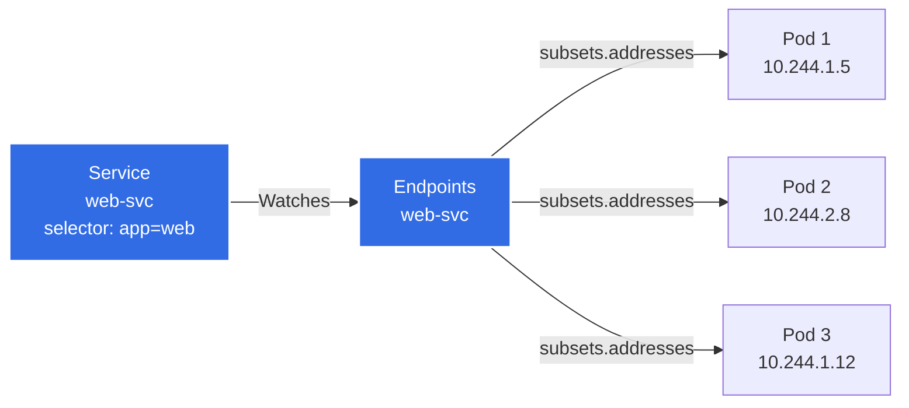
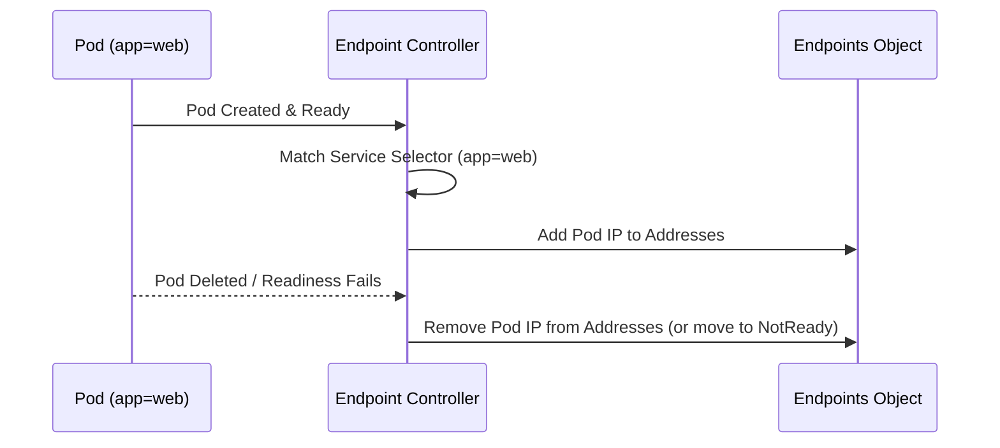
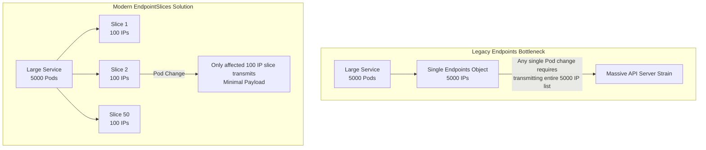
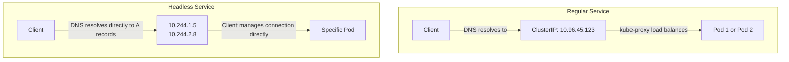

> **Складність**: `[СЕРЕДНЯ]` — розуміння внутрішньої механіки сервісів
>
> **Час на проходження**: 30–40 хвилин
>
> **Передумови**: Модуль 3.1 (Сервіси)

---

## Що ви зможете зробити

Після цього модуля ви зможете:

- **Діагностувати** збої маршрутизації трафіку, аналізуючи умови (conditions) EndpointSlice та готовність Под'ів.
- **Спроєктувати** ручні конфігурації endpoint'ів для інтеграції зовнішніх баз даних у вашу мережу сервісів Kubernetes.
- **Порівняти** характеристики продуктивності та обмеження застарілих Endpoints із сучасними EndpointSlices.
- **Реалізувати** headless-сервіси для робочих навантажень зі станом, яким потрібна пряма адресація Под'ів.
- **Оцінити** топологію кластера для налаштування маршрутизації з урахуванням зон за допомогою підказок (hints) EndpointSlice.

---

## Чому цей модуль важливий

Гіпотетичний сценарій: ваша команда обслуговує API онлайн-оформлення замовлень, який зазвичай працює на кількох десятках реплік, а потім сезонний сплеск трафіку штовхає автомасштабування до чотиризначної кількості реплік. Об'єкт Service усе ще існує, DNS усе ще розв'язує імена, і багато Под'ів перебувають у стані Ready, але розподіл трафіку стає нерівномірним, тому що частина моделі даних маршрутизації не може чітко представити набір бекендів. Спочатку такий збій не виглядає драматично: він проявляється як затримки, перевантажені Под'и та заплутані розбіжності між різними командами діагностики.

Саме тому кандидат на CKA повинен зазирати глибше за абстракцію Service. Service — це стала адреса, але endpoint'и — це поточна відповідь на більш операційне питання: які мережеві призначення мають отримувати трафік прямо зараз? Коли селектори, проби готовності, умови EndpointSlice чи топологічні підказки суперечать одне одному, ім'я Service може виглядати справним, тоді як фактичний набір маршрутизації є порожнім, застарілим, усіченим або навмисно звуженим.

Kubernetes 1.35 використовує EndpointSlices як масштабований API виявлення за лаштунками Service, тоді як старіший API Endpoints залишається видимим переважно для сумісності та усунення несправностей. Цей модуль навчає вас, як ці об'єкти створюються, як читати їхні сигнали під час інциденту і як проєктувати безселекторні або headless-сервіси, випадково не створивши «мертве ім'я». Ви будете багаторазово відпрацьовувати ту саму ментальну модель: почати зі сталого Service, дослідити endpoint'и, що його обслуговують, пояснити, чому кожен бекенд включено або виключено, а потім обрати виправлення з найменшим ризиком.

---

## Частина 1: Основи Endpoints

### 1.1 Що таке Endpoints?

Endpoints — це «клей» між Service та Под'ами. Service дає клієнтам стійке ім'я і зазвичай сталу віртуальну IP-адресу, але IP-адреса Пода тимчасова за задумом; вона змінюється, коли репліку переплановують, замінюють або перестворюють. Рівень endpoint'ів долає цей розрив, записуючи поточні придатні адреси бекендів для Service разом з інформацією про порти, потрібною для підключення до них.

Уявіть Service як стійку реєстратора, а набір endpoint'ів — як поточний аркуш розподілу кімнат. Тим, хто телефонує, не потрібно знати, яку кімнату сьогодні займає кожен інженер, але реєстраторові потрібен свіжий аркуш, інакше дзвінок нікуди не дійде. У Kubernetes менеджер контролерів безперервно узгоджує Service та Под'и, щоб аркуш відображав мітки, готовність, видалення та заміну. Коли аркуш порожній, жодна впевненість у стійці реєстратора не допоможе абоненту дістатися до людини.

> **Довідка із застарілої візуалізації:**
<details>
<summary>Переглянути оригінальну ASCII-діаграму архітектури</summary>

```text
┌────────────────────────────────────────────────────────────────┐
│                   Service → Endpoints → Pods                    │
│                                                                 │
│   ┌──────────────────┐    ┌──────────────────┐                │
│   │    Service       │    │    Endpoints     │                │
│   │    web-svc       │    │    web-svc       │                │
│   │                  │    │                  │                │
│   │  selector:       │───►│  subsets:        │                │
│   │    app: web      │    │  - addresses:    │                │
│   │                  │    │    - 10.244.1.5  │───► Pod 1      │
│   │  ports:          │    │    - 10.244.2.8  │───► Pod 2      │
│   │  - port: 80      │    │    - 10.244.1.12 │───► Pod 3      │
│   │                  │    │    ports:        │                │
│   │                  │    │    - port: 8080  │                │
│   └──────────────────┘    └──────────────────┘                │
│                                                                 │
│   Endpoints auto-created and updated by endpoint controller    │
│                                                                 │
└────────────────────────────────────────────────────────────────┘
```
</details>

Ось сучасний потік маршрутизації у вигляді візуалізації:



Застарілий об'єкт Endpoints зберігає адреси у `subsets`, які групують набір IP-адрес із набором портів. Ця форма має значення, коли ви налагоджуєте старіші інструменти, тому що об'єкт не просто каже «три Под'и»; він каже «ці адреси готові для цих портів, а ці інші адреси не готові». Service на основі селектора зазвичай отримує цей об'єкт автоматично, тому ручне редагування його зазвичай є ознакою того, що ви боретеся з контролером, а не виправляєте робоче навантаження.

Зупиніться і спрогнозуйте: якщо Деплоймент має три Под'и, але лише два проходять перевірку готовності, скільки IP-адрес Под'ів мають бути придатними через Service і де ви очікуєте знайти виключену адресу? Правильна відповідь — не «всі Под'и зі станом Running». Kubernetes розділяє життєздатність (liveness), стан планування та готовність так, щоб живий контейнер можна було захистити від користувацького трафіку, поки він стартує, прогріває кеші або чекає на залежність.

### 1.2 Життєвий цикл Endpoint

Endpoint Controller працює в площині управління Kubernetes, постійно узгоджуючи стан кластера, щоб Endpoints залишалися точними. Він спостерігає за Service, бо селектори визначають намір, і спостерігає за Под'ами, бо мітки, IP-адреси, готовність, розміщення на вузлі та видалення визначають фактичний набір бекендів. Контролер сам по собі не змушує трафік текти; він записує об'єкти виявлення, які можуть споживати інші компоненти, такі як `kube-proxy`, CoreDNS та контролери Інгресу.

Життєвий цикл навмисно нудний, коли все справне. З'являється Под із мітками, що відповідають селектору Service, Под переходить у стан Ready, контролер записує його IP-адресу як бекенд, і клієнтів можна на нього маршрутизувати. Коли Под не проходить перевірку готовності або починає завершуватися, контролер змінює об'єкт виявлення, щоб проксі сервісів припинили вважати цей endpoint звичайним призначенням. Практичний діагностичний урок простий: завжди питайте, чи селектор Service зіставився з Под'ом, а потім питайте, чи готовність дозволила цьому зіставленню стати маршрутизованим.

<details>
<summary>Переглянути оригінальну ASCII-діаграму життєвого циклу</summary>

```text
┌────────────────────────────────────────────────────────────────┐
│                   Endpoint Controller                           │
│                                                                 │
│   Watches: Pods and Services                                   │
│   Updates: Endpoints objects                                   │
│                                                                 │
│   Pod Created (label: app=web)                                 │
│       │                                                         │
│       ▼                                                         │
│   Controller finds Service with selector app=web               │
│       │                                                         │
│       ▼                                                         │
│   Adds Pod IP to Service's Endpoints                           │
│                                                                 │
│   Pod Deleted or Fails Readiness                               │
│       │                                                         │
│       ▼                                                         │
│   Removes Pod IP from Endpoints                                │
│                                                                 │
└────────────────────────────────────────────────────────────────┘
```
</details>



Одна корисна звичка — ставитися до генерації endpoint'ів як до ланцюжка узгодження, а не як до виводу однієї команди. Service має існувати у просторі імен, який ви запитуєте, його селектор має відповідати міткам, які фактично є на Под'ах, Под'и повинні мати призначені IP-адреси, а готовність має дозволяти маршрутизацію. Якщо будь-яка ланка обривається, `kubectl get svc` усе ще може виглядати нормально, тоді як `kubectl get endpoints` чи `kubectl get endpointslices` виявить справжній збій.

### 1.3 Перегляд Endpoints

Ви можете дослідити застарілий API Endpoints за допомогою стандартних команд `kubectl`. Застарілий API Endpoints є застарілим (deprecated) починаючи з Kubernetes v1.33 (усе ще обслуговується); EndpointSlices є його заміною. Хоча EndpointSlices є сучасним джерелом для проксі сервісів у поточних версіях Kubernetes, вивід застарілих Endpoints залишається корисним, бо багато людей, скриптів та старіших контролерів усе ще надають його під час усунення несправностей. Використовуйте його як швидкий вид для сумісності, а потім підтверджуйте будь-що чутливе до масштабу або до умов через EndpointSlices.

```bash
# List all endpoints
kubectl get endpoints
kubectl get ep                    # Short form

# Get specific endpoint
kubectl get endpoints web-svc

# Detailed view
kubectl describe endpoints web-svc

# Get endpoints as YAML
kubectl get endpoints web-svc -o yaml

# Wide output with pod IPs
kubectl get endpoints -o wide
```

Скорочена форма `ep` цілком прийнятна, тому що це справжнє скорочення ресурсу Kubernetes, а не псевдонім оболонки. Уникайте локального скорочення для `kubectl` у спільних runbook'ах, скопійованих вправах чи CI-скриптах, тому що псевдоніми часто не розгортаються в неінтерактивних оболонках. Модуль, який навчає надійних операцій, має робити кожну команду придатною до копіювання-вставлення, не покладаючись на профіль термінала учня.

### 1.4 Структура Endpoint

Форма YAML пояснює кілька поширених несподіванок під час налагодження. Готові адреси та неготові адреси можуть жити в одному об'єкті, а це означає, що об'єкт endpoint може існувати без того, щоб кожен зазначений Под був придатним для звичайного трафіку. Поле `targetRef` пов'язує адресу назад із Под'ом, який її породив, `nodeName` показує, де розташований цей бекенд, а `ports` описує порт бекенда, а не лише фронтальний порт Service.

```yaml
# What an Endpoints object looks like
apiVersion: v1
kind: Endpoints
metadata:
  name: web-svc           # Must match Service name
  namespace: default
subsets:
- addresses:              # Ready pod IPs
  - ip: 10.244.1.5
    nodeName: worker-1
    targetRef:
      kind: Pod
      name: web-abc123
      namespace: default
  - ip: 10.244.2.8
    nodeName: worker-2
    targetRef:
      kind: Pod
      name: web-def456
      namespace: default
  notReadyAddresses:      # Pods not passing readiness probe
  - ip: 10.244.1.12
    nodeName: worker-1
    targetRef:
      kind: Pod
      name: web-ghi789
      namespace: default
  ports:
  - port: 8080
    protocol: TCP
```

Коли ви читаєте цей об'єкт, не зупиняйтеся на списку адрес. Запитайте, чи відповідає порт бекенда порту контейнера, який застосунок насправді слухає, чи готовий endpoint чи ні, і чи досі існує посилання на Под. Посилання, що виглядає застарілим, зазвичай вказує на затримку узгодження або стан гонитви, який варто перевірити повторно, тоді як стабільний неготовий запис вказує на справність застосунку, конфігурацію проби чи готовність залежностей.

> **Зупиніться і спрогнозуйте**: у вас є Service із 3 endpoint'ами. Ви додаєте до деплойменту пробу готовності, яка перевіряє `/healthz`, але endpoint вашого застосунку повертає 500 для цього шляху. Що станеться з endpoint'ами Service, і чи зможуть клієнти все одно дістатися до застосунку?

Суть у тому, що готовність — це сигнал контролю допуску для трафіку Service, а не твердження про те, чи існує процес. Якщо всі репліки не проходять пробу, клієнти можуть розв'язати ім'я Service, але не отримають через Service жодного звичайного бекенда. Така поведінка є захисною, бо відправляти користувачів до Пода, який каже, що він не готовий, зазвичай гірше, ніж видати чисту помилку, яка штовхає оператора до проблеми з пробою чи залежністю.

---

## Частина 2: Перехід до EndpointSlices

У міру зростання кластерів застарілий API `Endpoints` ставав вузьким місцем, бо він представляв увесь набір бекендів в одному об'єкті. Будь-яке додавання Пода, видалення, перехід готовності чи зміна IP могли вимагати великого оновлення об'єкта, і кожен спостерігач мав опрацювати нову версію. Такий дизайн прийнятний для невеликих Service, але стає марнотратним, коли один Service має сотні чи тисячі бекендів на багатьох вузлах та в багатьох зонах.

EndpointSlices розв'язують ту саму задачу виявлення меншими об'єктами на кшталт шардів під `discovery.k8s.io/v1`. Kubernetes вважає EndpointSlices стабільними з версії v1.21, і в Kubernetes 1.35 це той API, який ви маєте розглядати першим для масштабованого виявлення сервісів, адресації dual-stack, умов endpoint'ів та маршрутизації з урахуванням топології. Старіший API Endpoints залишається актуальним переважно тому, що ви все ще натрапляєте на нього в командах, застарілих інтеграціях та поведінці для сумісності.

### 2.1 Чому EndpointSlices?

<details>
<summary>Переглянути оригінальну ASCII-діаграму EndpointSlices</summary>

```text
┌────────────────────────────────────────────────────────────────┐
│                   Endpoints Problem                             │
│                                                                 │
│   Large Service with 5000 pods                                 │
│                                                                 │
│   Single Endpoints object:                                     │
│   - Contains all 5000 IPs                                      │
│   - Any pod change = entire object update                      │
│   - Large payload sent to all watchers                         │
│   - API server and etcd strain                                 │
│                                                                 │
└────────────────────────────────────────────────────────────────┘

┌────────────────────────────────────────────────────────────────┐
│                   EndpointSlices Solution                       │
│                                                                 │
│   Same 5000 pods split across 50 slices                        │
│                                                                 │
│   ┌─────────┐ ┌─────────┐ ┌─────────┐      ┌─────────┐        │
│   │ Slice 1 │ │ Slice 2 │ │ Slice 3 │ ...  │Slice 50 │        │
│   │ 100 IPs │ │ 100 IPs │ │ 100 IPs │      │ 100 IPs │        │
│   └─────────┘ └─────────┘ └─────────┘      └─────────┘        │
│                                                                 │
│   Pod change = update only affected slice                      │
│   Small payload, minimal API server load                       │
│                                                                 │
└────────────────────────────────────────────────────────────────┘
```
</details>



Типовий контролер EndpointSlice створює ще один зріз, коли наявні зрізи для Service сягають близько 100 endpoint'ів і потрібен ще один endpoint. Контролер можна налаштувати за допомогою `--max-endpoints-per-slice`, але більші зрізи обмінюють меншу кількість об'єктів на більші оновлення, тому типове значення є розумним операційним компромісом. Суть не в тому, що 100 — магічне число; суть у тому, що зміна одного бекенда не повинна змушувати весь кластер переобробляти кожен бекенд.

EndpointSlices також несуть деталі, які застарілий об'єкт або не може виразити, або виражає погано. Поле `addressType` може розрізняти адреси у форматі IPv4, IPv6 та FQDN, хоча проксі сервісів Kubernetes обробляють IPv4 та IPv6 для звичайної маршрутизації. Умови endpoint'ів додають багатший зміст життєвого циклу, тоді як топологічні підказки можуть допомогти проксі віддавати перевагу endpoint'ам у тій самій зоні, коли конфігурація Service та кластера це дозволяє. Ці поля перетворюють EndpointSlices зі способу виправлення масштабу на центральний API виявлення сервісів.

> **Зупиніться і подумайте**: уявіть Service, що його обслуговують 5000 Под'ів. Щоразу, коли додають або видаляють один Под, увесь об'єкт Endpoints, що містить усі 5000 IP-адрес, треба надіслати кожному вузлу, який за ним спостерігає. Яку проблему це створює і як би ви спроєктували краще рішення?

Тиск дизайну — це пропускна здатність, ЦП, затримка спостереження та зайва метушня в компонентах, яким потрібні дані маршрутизації. Кращий дизайн розбиває набір бекендів на обмежені шматки, дозволяє кожному шматку нести достатньо метаданих, щоб бути корисним сам по собі, і оновлює лише уражений шматок, коли змінюється один Под. Це саме та форма, яку дають EndpointSlices, тому сучасне налагодження має їх враховувати навіть тоді, коли застарілий вивід виглядає звичним.

### 2.2 Структура EndpointSlice

EndpointSlice — це окремий ресурс API Kubernetes під `discovery.k8s.io/v1`. Один Service може бути пов'язаний із кількома об'єктами EndpointSlice, динамічно прив'язаними через мітку `kubernetes.io/service-name`. Ця мітка — не прикраса; це те, як ви надійно перелічуєте зрізи для одного Service, не покладаючись на згенеровані імена об'єктів.

```yaml
# What an EndpointSlice looks like
apiVersion: discovery.k8s.io/v1
kind: EndpointSlice
metadata:
  name: web-svc-abc12      # Auto-generated name
  labels:
    kubernetes.io/service-name: web-svc
addressType: IPv4
ports:
- name: ""
  port: 8080
  protocol: TCP
endpoints:
- addresses:
  - 10.244.1.5
  conditions:
    ready: true
    serving: true
    terminating: false
  nodeName: worker-1
  targetRef:
    kind: Pod
    name: web-abc123
    namespace: default
- addresses:
  - 10.244.2.8
  conditions:
    ready: true
  nodeName: worker-2
```

Поля, які ви досліджуєте найчастіше, — це `ports`, `addressType`, `endpoints[].addresses`, `endpoints[].conditions`, `endpoints[].nodeName` і за бажанням `endpoints[].zone` чи `hints`. Тимчасове дублювання може виникати, бо контролери та спостерігачі не помічають кожне оновлення в одну й ту саму мить, тому не будуйте крихку автоматизацію, яка припускає, що бекенд з'являється рівно в одному зрізі в кожну мілісекунду. Для операційного налагодження порівнюйте стабільну форму впродовж повторних зчитувань і зосередьтеся на мітках та умовах.

### 2.3 Перегляд EndpointSlices

EndpointSlices мають власні імена ресурсів та згенеровані імена об'єктів, тому найбезпечніший запит починається з мітки Service. Коли ви просто запускаєте `kubectl get endpointslices`, насичений простір імен може видати галасливий список, який ховає зріз, що вас цікавить. Фільтрація за `kubernetes.io/service-name` тримає вивід прив'язаним до Service, що розслідується, і відповідає тому, як контролери пов'язують зрізи із Service.

```bash
# List all EndpointSlices
kubectl get endpointslices
# EndpointSlices have no short alias — type the resource name in full.

# Get EndpointSlices for a service
kubectl get endpointslices -l kubernetes.io/service-name=web-svc

# Detailed view
kubectl describe endpointslice web-svc-abc12

# Get as YAML
kubectl get endpointslice web-svc-abc12 -o yaml
```

Перш ніж запускати команду describe, спершу перелічіть зрізи й скопіюйте згенероване ім'я, яке наразі існує. Згенерований суфікс може змінитися, коли контролер переформовує набір зрізів, а жорстке вписування його в runbook'и створює крихкі інструкції. У нотатках з усунення несправностей віддавайте перевагу запиту із селектором за міткою, бо він переживає згенеровані контролером зміни імен.

### 2.4 Порівняння Endpoints та EndpointSlices

| Аспект | Endpoints | EndpointSlices |
|--------|-----------|----------------|
| Макс. записів | Необмежено (але проблемно) | 100 на зріз |
| Обсяг оновлення | Весь об'єкт | Один зріз |
| Версія API | v1 | discovery.k8s.io/v1 |
| Типово з версії | Завжди | Kubernetes 1.21 |
| Підтримка dual-stack | Обмежена | Повна IPv4/IPv6 |
| Топологічні підказки | Ні | Так |

Це порівняння корисне, але потребує однієї поправки у вашій ментальній моделі: «необмежено» в рядку застарілих Endpoints не означає безпечно за будь-якого розміру. Станом на поточні версії Kubernetes застарілий API Endpoints усікає набори бекендів понад місткість на позначці 1000 endpoint'ів і позначає об'єкт анотацією `endpoints.kubernetes.io/over-capacity: truncated`. Якщо інструмент читає лише застарілий об'єкт, він може пропустити бекенди, які EndpointSlices усе ще представляють.

Для іспиту та продакшну ставтеся до EndpointSlices як до авторитетного сучасного виду, водночас знаючи, як інтерпретувати Endpoints. Ви часто досліджуватимете обидва, бо старі команди швидкі та звичні, але ваш висновок має враховувати, який API має точність, потрібну для ситуації. Великі Service, кластери dual-stack, поведінка endpoint'ів, що завершуються, та маршрутизація з урахуванням топології — усе це штовхає вас до EndpointSlices.

---

## Частина 3: Налагодження маршрутизації та умов

### 3.1 Немає Endpoints — немає трафіку

Коли трафік падає, ваша перша зупинка — це зазвичай перевірка генерації endpoint'ів. Service без endpoint'ів схожий на балансувальник навантаження зі слухачем і без справних цільових бекендів; вхідні двері існують, але їм нікуди корисно надіслати запит. Це один із найшвидших збоїв для діагностики, якщо ви опираєтеся спокусі починати з логів застосунку, перш ніж перевірити рівень виявлення.

```bash
# Service exists but has no endpoints
kubectl get svc web-svc
# NAME      TYPE        CLUSTER-IP     PORT(S)
# web-svc   ClusterIP   10.96.45.123   80/TCP

kubectl get endpoints web-svc
# NAME      ENDPOINTS   AGE
# web-svc   <none>      5m     ← Problem!
```

Порожній результат endpoint'а сам по собі не доводить, що Service зламаний. Він каже вам, що селектор Service, мітки Пода, простір імен, фаза Пода чи готовність заважають бекенду потрапити до маршрутизованого набору. Правильний крок — зберегти ланцюжок доказів: записати селектор Service, перелічити відповідні Под'и, перевірити готовність, а потім дослідити умови EndpointSlice, якщо застарілий вивід неоднозначний.

### 3.2 Поширені причини відсутніх Endpoints

| Симптом | Причина | Команда налагодження | Розв'язання |
|---------|---------|----------------------|-------------|
| Endpoints `<none>` | Жоден Под не відповідає селектору | `kubectl get pods --show-labels` | Виправити селектор або мітки Пода |
| Endpoints `<none>` | Под'и не запущені | `kubectl get pods` | Виправити проблеми Пода |
| Endpoints `<none>` | Под'и в неправильному просторі імен | `kubectl get pods -A` | Перевірити простір імен |
| Часткові endpoints | Деякі Под'и не готові | `kubectl describe endpoints` | Перевірити проби готовності |

Проблеми із селектором особливо поширені після переписування шаблонів, бо Деплоймент може й далі створювати справні Под'и з мітками, яких Service більше не вибирає. Помилки з простором імен виглядають схоже, бо Service вибирають Под'и лише у власному просторі імен, навіть коли та сама мітка є деінде. Проблеми з готовністю тонші, бо Под може бути в стані Running і все одно виключений зі звичайного трафіку Service; це функція, а не суперечність.

Перш ніж це запускати, який вивід ви очікуєте, якщо селектор Service — це `app: web`, але Под'и позначені `app: api`? Ви маєте очікувати, що запит за селектором не поверне жодного Пода, а отже, об'єкти endpoint не повинні мати готових адрес бекендів. Якщо запит за селектором таки повертає Под'и, перенесіть увагу на готовність, порти та умови, а не повторно перестворюйте Service.

### 3.3 Робочий процес налагодження

Наведений нижче робочий процес починається з найменшого питання і поглиблюється лише тоді, коли попередня відповідь не пояснює збій. Це важливо під час інцидентів, бо випадкове перестрибування між командами породжує суперечливі нотатки й ускладнює передачу. Кожна команда або підтверджує, що Service існує, або підтверджує селектор, або підтверджує відповідні Под'и, або перевіряє, чи готовність тримає ці Под'и поза набором endpoint'ів.

```bash
# Step 1: Check if endpoints exist
kubectl get endpoints web-svc
# If <none>, proceed to step 2

# Step 2: Check service selector
kubectl get svc web-svc -o yaml | grep -A5 selector
# selector:
#   app: web

# Step 3: Find pods with matching labels
kubectl get pods --selector=app=web
# Should list pods backing the service

# Step 4: If no pods found, check what labels pods have
kubectl get pods --show-labels
# Compare with service selector

# Step 5: If pods exist but not in endpoints, check pod status
kubectl get pods
# Look for pods that aren't Running

# Step 6: Check for readiness probe failures
kubectl describe pod <pod-name> | grep -A10 Readiness
```

Робочий процес навмисно використовує селектор Service як межу. Якщо `kubectl get pods --selector=app=web` не повертає нічого, у вас проблема з вибором; опис EndpointSlices здебільшого лише підтвердить те, що ви вже знаєте. Якщо відповідні Под'и існують і перебувають у стані Ready, тоді дослідження EndpointSlice стає ціннішим, бо воно може виявити невідповідності портів, значення умов, endpoint'и, що завершуються, чи топологічну інформацію, яку старий вид Endpoints стискає й приховує.

### 3.4 Endpoints із Под'ами NotReady та умови EndpointSlice

Готовність — це місце, де багато учнів уперше усвідомлюють, що endpoint'и — це не просто список IP-адрес Под'ів. Kubernetes може знати про Под, включити посилання на нього в дані виявлення і все одно захищати клієнтів від нього. Застарілий об'єкт показує це як `NotReadyAddresses`; EndpointSlices виражають ту саму ідею через умови, точніші для сучасних проксі сервісів.

```bash
# Describe shows both ready and not-ready addresses
kubectl describe endpoints web-svc

# Output:
# Name:         web-svc
# Subsets:
#   Addresses:          10.244.1.5,10.244.2.8
#   NotReadyAddresses:  10.244.1.12
#   Ports:
#     Name     Port  Protocol
#     ----     ----  --------
#     <unset>  8080  TCP
```

Под'и, перелічені в `NotReadyAddresses`, активно захищені від отримання звичайного трафіку. У сучасному API `EndpointSlice` маршрутизація керується умовами endpoint'а: `ready`, `serving` та `terminating`. Умова `serving` безпосередньо відповідає готовності Пода для endpoint'ів на основі Под'ів, тоді як `terminating` вказує, що endpoint наразі завершує роботу.

Лише для endpoint'ів на основі Под'ів значення nil у `ready` чи `serving` інтерпретуються як `true`, а nil у `terminating` — як `false`; це усталене значення застосовується до endpoint'ів, які контролер виводить із Под'ів, а не до вручну написаних записів EndpointSlice без `targetRef`. Проксі сервісів зазвичай ігнорують endpoint'и, що завершуються, але вони можуть маршрутизувати до endpoint'ів, позначених одночасно як `serving` і `terminating`, якщо всі доступні endpoint'и завершуються. Цей запасний варіант допомагає уникнути миттєвого повного простою під час агресивних розгортань, але вам усе одно слід виправити форму розгортання так, щоб справні заміни існували, перш ніж старі Под'и зникнуть.

Діагностуючи простій, пов'язаний із готовністю, тримайте людське пояснення прив'язаним до умови. Кажіть «Под'и в стані Running, але виключені, бо готовність дорівнює false», а не «Kubernetes загубив Под'и». Таке формулювання заважає команді видаляти випадкові ресурси й вказує їй на шляхи проб, перевірки залежностей, час запуску застосунку чи тиск на ресурси. Воно також чисто лягає на стиль усунення несправностей CKA, де потрібно визначити зламану ланку й виправити її напряму.

---

## Частина 4: Ручні Endpoints та зовнішні сервіси

### 4.1 Коли використовувати ручні Endpoints

Для Service без селектора міток об'єкти EndpointSlice не створюються автоматично; їхні EndpointSlices чи застарілі Endpoints доводиться створювати вручну. Цей патерн корисний, коли Kubernetes має надати стале ім'я Service, поверхню політик чи DNS-ім'я, але бекенд не походить від Под'ів, вибраних у тому самому просторі імен. Поширені приклади включають базу даних на віртуальних машинах, сервіс в іншому кластері чи статичний пристрій, до якого застосунок має дістатися через ім'я Kubernetes.

Ручні endpoint'и потужні, бо дозволяють робочим навантаженням використовувати звичайний DNS Service для ресурсів, якими Kubernetes не володіє. Вони ризиковані з тієї самої причини: площина управління не може вивести, коли змінюється зовнішня IP-адреса, чи справний віддалений процес і чи зазначена адреса все ще безпечна. Якщо ви обираєте цей дизайн, операційний власник зовнішнього ресурсу також володіє автоматизацією або runbook'ом, що тримає дані endpoint'а актуальними.

EndpointSlices, керовані поза площиною управління, мають явно використовувати мітку `endpointslice.kubernetes.io/managed-by`, і кожен зріз endpoint'ів простору імен повинен мати унікальне ім'я. Ця мітка допомагає людям і контролерам відрізняти дані виявлення, що підтримуються вручну, від зрізів, створених вбудованим контролером. Без чіткого сигналу managed-by майбутні оператори можуть хибно прочитати об'єкт як автоматичний і змарнувати час, дивуючись, чому контролер його не виправляє.

### 4.2 Створення ручних Endpoints

Застарілий патерн ручних Endpoints вимагає, щоб об'єкти Service та Endpoints мали те саме ім'я в тому самому просторі імен. Service не має селектора, тому контролер endpoint'ів його не чіпає, а створений вручну об'єкт постачає адреси бекендів. Це гарний спосіб вивчити модель, хоча нові інтеграції мають розглядати ручні EndpointSlices, коли їм потрібні сучасні поля.

```kubernetes
# Step 1: Create service WITHOUT selector
apiVersion: v1
kind: Service
metadata:
  name: external-db
spec:
  ports:
  - port: 5432
    targetPort: 5432
  # No selector! This is intentional.
---
# Step 2: Create Endpoints with same name
apiVersion: v1
kind: Endpoints
metadata:
  name: external-db     # Must match service name exactly
subsets:
- addresses:
  - ip: 192.168.1.100   # External database IP
  - ip: 192.168.1.101   # Backup database IP
  ports:
  - port: 5432
```

```bash
# Apply both
kubectl apply -f external-db.yaml

# Verify
kubectl get svc,endpoints external-db

# Now pods can reach external DB via:
# external-db.default.svc.cluster.local:5432
```

Цей патерн працює, бо клієнтам потрібні лише ім'я Service та порт. Їм байдуже, чи IP-адреса бекенда надійшла від селектора Пода, чи від об'єкта endpoint, що підтримується людиною. Небезпека з'являється пізніше, коли зовнішня база даних переходить на нову адресу і жоден контролер Kubernetes не оновлює об'єкт. У цей момент ім'я Service усе ще розв'язується, але трафік іде за застарілими даними endpoint'а, доки хтось не виправить або повторно не застосує список бекендів.

### 4.3 Сценарії використання ручних Endpoints

Ту саму техніку можна застосувати, щоб надати стале ім'я зовнішньому HTTPS API. У продакшні віддавайте перевагу дизайну на основі DNS, коли провайдер дає вам сталий хост, бо «сирі» публічні IP-адреси можуть змінюватися й можуть представляти балансований край, а не довговічний сервер. Використовуйте статичні IP-адреси endpoint'ів лише тоді, коли ваша мережева команда може гарантувати, що ці адреси призначені бути цілями.

```kubernetes
# Example: External API endpoint
apiVersion: v1
kind: Service
metadata:
  name: external-api
spec:
  ports:
  - port: 443
---
apiVersion: v1
kind: Endpoints
metadata:
  name: external-api
subsets:
- addresses:
  - ip: 52.84.123.45     # External API server
  ports:
  - port: 443
```

Сценарій вправи: ваша команда застосунку хоче, щоб `payments-db.default.svc.cluster.local` вказував на керовану базу даних поза кластером. Який підхід ви б тут обрали і чому: безселекторний Service з ручними IP-адресами endpoint'ів, Service типу ExternalName, що вказує на хост провайдера, чи перенесення бази даних за внутрішній балансувальник навантаження? Найкраща відповідь залежить від того, хто володіє змінами адрес, чи потрібна клієнтам абстракція Service лише за портом і чи ваша мережева політика або вимоги DNS віддають перевагу одному рівню над іншим.

Коли ви проєктуєте ручні конфігурації endpoint'ів, документуйте право власності так само ретельно, як YAML. Service на основі селектора має очевидне право власності, бо шаблон Деплойменту керує вибраними Под'ами, але безселекторний Service може стати «сиротинським» іменем, якщо ніхто не володіє зовнішнім життєвим циклом. Гарний runbook вказує, звідки береться адреса бекенда, як її перевірити, як її оновити і як підтвердити, що клієнти досягають потрібного сервісу.

---

## Частина 5: Headless-сервіси

### 5.1 Що таке headless-сервіс?

Headless-сервіс явно не має `ClusterIP`. Замість повернення єдиної віртуальної IP-адреси DNS Kubernetes може повертати окремі записи бекендів, щоб клієнти могли підключатися безпосередньо до вибраних Под'ів. Це найкорисніше, коли клієнт має знати ідентичність бекенда, а не сприймати всі репліки як взаємозамінні.

```yaml
apiVersion: v1
kind: Service
metadata:
  name: headless-svc
spec:
  clusterIP: None          # This makes it headless
  selector:
    app: web
  ports:
  - port: 80
```

Відмінність полягає не в тому, що «headless означає відсутність Service». Service усе ще визначає ім'я, селектор та порти; він просто відмовляється від звичайної абстракції балансування навантаження ClusterIP. Для StatefulSet це саме те, що вам потрібно, бо `pod-0`, `pod-1` та `pod-2` можуть мати різні ідентичності, сховище, ролі реплікації чи обов'язки щодо кворуму. Для застосунку-фронтенду без стану це часто непотрібно, бо більшості клієнтів має бути байдуже, яка саме репліка відповіла.

> **Що б сталося, якби**: ви встановлюєте `clusterIP: None` на Service. Под виконує `nslookup` для імені цього сервісу. Замість однієї IP-адреси він отримує три. Чому це корисно, і коли ви б НЕ хотіли такої поведінки?

Корисна частина — це пряме виявлення: клієнтська бібліотека може бачити всі доступні бекенди й обирати згідно з власними правилами протоколу. Ризикована частина в тому, що ви перенесли частину відповідальності за балансування навантаження від проксіювання сервісів Kubernetes до клієнта. Якщо клієнт кешує DNS назавжди, обирає погано чи не може повторити спробу через повернуті адреси, headless-сервіс може відкрити більше режимів збою, ніж звичайний Service ClusterIP.

### 5.2 Поведінка headless-сервісу

Для headless-сервісів сервіси на основі селектора створюють EndpointSlices нативно в площині управління, тоді як безселекторні headless-сервіси не генерують їх автоматично. Цю різницю легко проґавити, бо обидва об'єкти мають `clusterIP: None`, але один має селектор, який Kubernetes може узгодити, а інший — ні. Якщо селектора немає, ви повинні самі надати дані виявлення.

<details>
<summary>Переглянути оригінальний ASCII-потік headless</summary>

```text
┌────────────────────────────────────────────────────────────────┐
│                   Regular vs Headless Service                   │
│                                                                 │
│   Regular Service (ClusterIP: 10.96.45.123)                    │
│   ┌─────────────────────────────────────────────────────────┐  │
│   │  DNS: web-svc.default.svc → 10.96.45.123 (Service IP)   │  │
│   │  Client → Service IP → kube-proxy → random Pod          │  │
│   └─────────────────────────────────────────────────────────┘  │
│                                                                 │
│   Headless Service (clusterIP: None)                           │
│   ┌─────────────────────────────────────────────────────────┐  │
│   │  DNS: web-svc.default.svc →                             │  │
│   │       10.244.1.5 (Pod 1)                                │  │
│   │       10.244.2.8 (Pod 2)                                │  │
│   │       10.244.1.12 (Pod 3)                               │  │
│   │  Client gets ALL pod IPs, chooses one itself            │  │
│   └─────────────────────────────────────────────────────────┘  │
│                                                                 │
└────────────────────────────────────────────────────────────────┘
```
</details>



Ця поведінка пояснює, чому headless-сервіси природно поєднуються зі StatefulSet. Ідентичність StatefulSet стала, тому DNS-записи на кшталт `kafka-0.kafka-headless.default.svc.cluster.local` можуть розв'язуватися в конкретну ідентичність Пода, а не в довільний бекенд. Така прямота цінна для баз даних, брокерів повідомлень та кластерних систем, що мають ідентичності лідера, послідовника, шарда чи репліки.

### 5.3 Сценарії використання headless-сервісів

| Сценарій | Чому headless? |
|----------|----------------|
| StatefulSet | Потреба адресувати конкретні Под'и (pod-0, pod-1) |
| Балансування на боці клієнта | Клієнту потрібні всі IP, щоб реалізувати власне балансування |
| Виявлення сервісів | Виявити всі екземпляри бекендів |
| Кластери баз даних | Потреба прямого з'єднання з конкретним вузлом |

Обирайте headless-сервіс, коли ідентичність бекенда є частиною протоколу, а не лише деталлю реалізації. Якщо кожна репліка еквівалентна, звичайний Service ClusterIP тримає поведінку клієнта простішою й дозволяє Kubernetes обробляти вибір проксі. Якщо клієнт має обрати лідера, підключитися до власника шарда чи перелічити всіх однорангових учасників, прямі DNS-записи можуть бути правильним інтерфейсом.

### 5.4 Endpoints headless-сервісу

Endpoints усе ще мають значення для headless-сервісів, бо DNS потрібно знати, які записи бекендів повертати. Headless-сервіс на основі селектора використовує той самий ланцюжок узгодження, що й інші Service із селектором, але відповідь DNS відрізняється. Ви можете дослідити endpoint'и, а потім протестувати DNS зсередини кластера, щоб підтвердити, чи бачитимуть клієнти окремі адреси Под'ів.

```bash
# Endpoints still track pods
kubectl get endpoints headless-svc
# NAME           ENDPOINTS
# headless-svc   10.244.1.5,10.244.2.8,10.244.1.12

# DNS returns multiple A records
kubectl run test --rm -i --image=busybox:1.36 --restart=Never -- \
  nslookup headless-svc

# Output:
# Name:    headless-svc.default.svc.cluster.local
# Address: 10.244.1.5
# Address: 10.244.2.8
# Address: 10.244.1.12
```

Код виходу `nslookup` у BusyBox ненадійний — оцінюйте успіх за надрукованими рядками `Address:` для потрібного запису, а не за кодом виходу Пода; використовуйте Под netshoot для `host`/`dig`, якщо потрібен чистий код виходу.

DNS-тести найзмістовніші, коли їх запускають зсередини кластера, бо імена DNS кластера та шляхи пошуку призначені для Под'ів. Якщо ви тестуєте зі свого ноутбука, ви можете запитувати геть інший резолвер, який нічого не знає про `svc.cluster.local`. Відповідь з усунення несправностей CKA має бути точною щодо точки спостереження: досліджуйте об'єкти Kubernetes за допомогою `kubectl`, а потім тестуйте розв'язання імен усередині кластера за допомогою тимчасового Пода.

---

## Частина 6: Топологія сервісів та топологічні підказки

### 6.1 Маршрутизація з урахуванням топології

EndpointSlices нативно підтримують топологічні підказки. Це дозволяє маршрутизацію з урахуванням зон, де проксі сервісів можуть віддавати перевагу endpoint'ам у тій самій зоні, щоб зменшити затримку та міжзональну передачу даних. Ця функція не гарантує, що весь трафік завжди залишається локальним, бо Kubernetes має балансувати локальність із доступністю, розподілом endpoint'ів та конфігурацією Service.

```yaml
# EndpointSlice with hints
apiVersion: discovery.k8s.io/v1
kind: EndpointSlice
metadata:
  name: web-svc-abc12
endpoints:
- addresses:
  - 10.244.1.5
  zone: us-east-1a          # Pod is in this zone
  hints:
    forZones:
    - name: us-east-1a      # Prefer traffic from same zone
```

Важливе слово — «віддавати перевагу». Топологічна підказка каже проксі, які endpoint'и придатні для вибору з урахуванням зони, але це не жорстка межа безпеки й не заміна мережевій політиці. Якщо в зоні немає справного endpoint'а або якщо розподіл зробив би маршрутизацію небезпечною, Kubernetes усе одно може надіслати трафік деінде залежно від конфігурації та реалізації. Сприймайте підказки як сигнал оптимізації, а не як вимогу коректності.

### 6.2 Увімкнення топологічних підказок

Kubernetes еволюціонував іменування навколо маршрутизації з урахуванням топології, тому будьте обережні, читаючи старіші приклади. Ви можете побачити старішу анотацію `service.kubernetes.io/topology-mode: Auto`, тоді як новіша документація також обговорює поведінку `trafficDistribution` на Service. У контексті вивчення Kubernetes 1.35 навичка рівня CKA — це розпізнати, що EndpointSlices несуть дані про зону та підказки і що маршрутизація сервісів може використовувати ці дані, коли кластер і Service налаштовані на поведінку з урахуванням топології.

```yaml
# Service with topology hints
apiVersion: v1
kind: Service
metadata:
  name: web-svc
  annotations:
    service.kubernetes.io/topology-mode: Auto   # Enable hints
spec:
  selector:
    app: web
  ports:
  - port: 80
```

Який підхід ви б тут обрали і чому: перевага тій самій зоні для чутливого до затримки внутрішнього API чи звичайне балансування в межах усього кластера для крихітного сервісу з однією реплікою на регіон? Перевага тій самій зоні має сенс, коли у вас достатньо справних endpoint'ів на зону, а міжзональний трафік має вимірну вартість чи затримку. Звичайне балансування простіше, коли репліки рідкісні, трафік низький або надійність постраждала б, якби правила локальності надто звузили набір придатних бекендів.

---

## Патерни та антипатерни

### Патерни

Використовуйте Service на основі селектора для звичайних робочих навантажень на основі Под'ів, бо вони дозволяють Kubernetes володіти узгодженням endpoint'ів. Цей патерн працює найкраще, коли мітки Деплойменту стабільні, проби готовності представляють реальну здатність обслуговувати, а селектор Service навмисно вузький, але не специфічний до версії. Він масштабується операційно, бо контролер оновлює EndpointSlices у міру появи й зникнення Под'ів, тоді як ваш runbook лишається зосередженим на мітках та готовності.

Використовуйте EndpointSlices як основний діагностичний вид для великих або сучасних Service. Команда застарілих Endpoints усе ще може бути швидкою першою перевіркою, але вона ховає важливі деталі умов та масштабу. EndpointSlices дозволяють дослідити дані про `ready`, `serving`, `terminating`, вузол, зону та сімейство адрес в одному місці — а це саме та інформація, яка вам потрібна, коли трафік поводиться по-різному між розгортаннями, зонами чи сімействами IP.

Використовуйте headless-сервіси, коли ідентичність бекенда є частиною протоколу. StatefulSet, системи виявлення однорангових учасників та балансувальники на боці клієнта часто потребують прямих записів бекендів замість єдиної віртуальної IP-адреси. Патерн працює, коли клієнти розуміють кілька відповідей DNS і можуть розумно повторювати спроби, але він погано підходить простим клієнтам без стану, які очікують, що Kubernetes сховає вибір бекенда.

Використовуйте безселекторні Service лише тоді, коли бекендом володіє зовнішній життєвий цикл. Ручний endpoint може бути чистим і корисним, коли база даних, пристрій чи інший кластер не можна вибрати як Под'и у просторі імен. Патерн потребує явного права власності, бо Kubernetes не виявлятиме, не перевірятиме справність і не оновлюватиме ці адреси автоматично.

### Антипатерни

Не вважайте Под у стані Running доказом того, що маршрутизація Service справна. Running означає лише, що контейнер існує й не порушив свій контракт життєздатності; готовність визначає, чи має він отримувати звичайний трафік Service. Краща альтернатива — порівняти статус Пода, готовність, умови EndpointSlice та збіги селектора Service, перш ніж змінювати будь-які об'єкти робочого навантаження.

Не будуйте нову автоматизацію, яка залежить лише від застарілих Endpoints для великих Service. Щойно набір бекендів перетинає задокументовану поведінку усічення застарілого API, старіші читачі можуть спостерігати неповний світ і ухвалювати погані рішення щодо маршрутизації чи оповіщень. Краща альтернатива — читати EndpointSlices через API виявлення й використовувати мітку Service, щоб зібрати всі зрізи для цільового Service.

Не використовуйте headless-сервіс як випадкове підлаштування продуктивності. Прямі відповіді DNS можуть зробити клієнтів відповідальними за балансування, кешування, повторні спроби й обробку метушні бекендів, а багато простих клієнтів роблять це погано. Краща альтернатива — використовувати звичайні Service ClusterIP, якщо тільки ідентичність бекенда не є справжньою вимогою протоколу застосунку.

Не залишайте ручні endpoint'и без документації. Безселекторний Service може виглядати як звичайна абстракція Kubernetes, потай залежачи від таблиці, тікета чи людини, яка пам'ятає оновити IP-адресу. Краща альтернатива — додати чіткі мітки, runbook'и й бажано автоматизацію, яка володіє оновленнями ручних EndpointSlices чи Endpoints.

---

## Структура ухвалення рішень

Почніть із джерела робочого навантаження. Якщо бекенд — це звичайний набір Под'ів у тому самому просторі імен, використовуйте Service на основі селектора й дайте Kubernetes створити EndpointSlices автоматично. Якщо бекенд поза Kubernetes або поза моделлю селектора простору імен, використовуйте безселекторний Service й створіть дані виявлення навмисно. Якщо ідентичність бекенда має значення для клієнтів, розгляньте headless-сервіс; якщо ідентичність не має значення, віддавайте перевагу ClusterIP, бо це тримає поведінку клієнта простішою.

Далі оцініть потреби в масштабі та метаданих. Для невеликого Service виводу застарілих Endpoints може бути достатньо для швидкого погляду, але EndpointSlices усе одно мають бути вашим глибшим діагностичним інструментом. Для великого Service, Service із dual-stack, дизайну з урахуванням топології чи розгортання за участю endpoint'ів, що завершуються, переходьте напряму до EndpointSlices, бо старий об'єкт може пропустити чи сплющити саме ті деталі, які вам потрібні. Ця відмінність особливо важлива на іспиті, бо найшвидша команда не завжди є найповнішим поясненням.

Нарешті оцініть, хто володіє коректністю після розгортання. Service на основі селектора мають право власності контролера, допуск на основі готовності та автоматичне узгодження. Ручні endpoint'и потребують зовнішнього права власності й перевіреного процесу оновлення. Headless-сервіси потребують клієнтів, які можуть обробляти кілька записів і метушню бекендів. Топологічні підказки потребують достатньо endpoint'ів на зону, щоб зберегти доступність, поліпшуючи локальність. Гарна відповідь щодо дизайну називає власника кожної рухомої частини, а не лише поле YAML, яке її вмикає.

Використовуйте цю структуру і під час усунення несправностей, і під час проєктування. Якщо Service має селектор, ваша перша гіпотеза має стосуватися узгодження: мітки, простори імен, IP-адреси Под'ів, готовність та умови EndpointSlice. Якщо Service не має селектора, ваша перша гіпотеза має стосуватися права власності: хто створив endpoint'и, чи пов'язують їх імена та мітки із Service і чи зовнішня адреса все ще дійсна. Якщо Service є headless, ваша перша гіпотеза має включати поведінку клієнта, бо DNS може відкривати кілька бекендів замість того, щоб ховати вибір за віртуальною IP-адресою.

---

## Чи знали ви?

- **EndpointSlices стали стабільними в Kubernetes 1.21:** API виявлення не є експериментальним у сучасних кластерах; це масштабована заміна спостереженню за одним гігантським застарілим об'єктом Endpoints.
- **Застарілі Endpoints усікають бекенди понад місткість на позначці 1000 адрес (станом на поточні версії Kubernetes):** Kubernetes позначає об'єкт анотацією `endpoints.kubernetes.io/over-capacity: truncated`, яка є попередженням, що застарілі читачі можуть бачити лише частину набору бекендів.
- **EndpointSlices зазвичай розбиваються приблизно по 100 endpoint'ів кожен:** Контролер створює додаткові зрізи у міру зростання Service, зменшуючи корисне навантаження оновлення, коли змінюється один Под.
- **Умови EndpointSlice відрізняють готовність від завершення:** `ready`, `serving` та `terminating` дозволяють проксі сервісів міркувати про граничні випадки розгортання, які застарілий об'єкт не може описати так само чітко.

---

## Типові помилки

| Помилка | Чому вона трапляється | Як її виправити |
|---------|------------------------|------------------|
| **Неправильне ім'я endpoint** | Ручні Endpoints чи EndpointSlices створено з іменем, яке не пов'язується із цільовим Service. | Зробіть ім'я ручного об'єкта чи мітку `kubernetes.io/service-name` точно такими, як ім'я Service, потім перевірте запитом із фільтром за міткою. |
| **Друкарська помилка в селекторі** | Мітка шаблону Деплойменту змінюється, але селектор Service усе ще вказує на старий набір міток. | Порівняйте `kubectl get svc <name> -o yaml` із `kubectl get pods --show-labels`, потім навмисно виправте селектор чи мітки. |
| **Відсутній `targetRef`** | Автори ручних endpoint'ів зосереджуються лише на IP і втрачають простежуваність до об'єкта-джерела. | Включайте `targetRef`, коли endpoint представляє об'єкт усередині кластера, і позначайте EndpointSlices, керовані ззовні, міткою `endpointslice.kubernetes.io/managed-by`. |
| **Ігнорування `NotReadyAddresses`** | Інженери припускають, що Под'и в стані Running маршрутизовні, і не помічають збоїв проб готовності. | Дослідіть `NotReadyAddresses` та умови EndpointSlice, потім налагодьте шлях проби готовності, залежність чи час запуску. |
| **Плутанина між Endpoints та EndpointSlices** | Старіші runbook'и запитують лише застарілий об'єкт і пропускають деталі масштабу чи умов. | Використовуйте Endpoints для швидкого погляду на сумісність, але ставтеся до EndpointSlices як до сучасного джерела істини для великих чи тонких Service. |
| **Відсутня мітка `managed-by`** | Зрізи, що підтримуються вручну, виглядають як зрізи, керовані контролером, заплутуючи майбутніх операторів. | Додайте чітку мітку `endpointslice.kubernetes.io/managed-by` й задокументуйте автоматизацію чи команду, що володіє оновленнями. |
| **Використання застарілих Endpoints для планування IPv6** | Старому API бракує сучасних полів dual-stack та топології, тому він стає неповною поверхнею дизайну. | Використовуйте EndpointSlices, проєктуючи поведінку Service з урахуванням IPv4/IPv6 чи топології. |
| **Забуття правил безселекторного headless** | Очікується, що headless-сервіс без селектора автоматично виявить бекенди, але жоден контролер не може їх вивести. | Створіть об'єкт EndpointSlice чи Endpoints вручну, потім протестуйте DNS із Пода всередині кластера. |

---

## Тест

1. **Ви розгортаєте нову версію застосунку, і `kubectl get endpoints my-svc` раптом показує `<none>`, хоча `kubectl get pods` показує 3 Под'и у стані Running. Попередня версія працювала добре. Який ваш процес налагодження?**
   <details>
   <summary>Відповідь</summary>
   Спочатку перевірте, чи Под'и насправді перебувають у стані Ready, а не просто Running, бо готовність керує маршрутизацією Service. Потім порівняйте селектор Service з мітками на нових Под'ах; змінена мітка шаблону — поширена причина того, що контролер endpoint'ів не має відповідних бекендів. Якщо мітки збігаються, дослідіть події проби готовності за допомогою `kubectl describe pod <pod-name>` і підтвердьте, що цільовий порт усе ще відповідає тому, що очікує Service. Цей процес діагностує збої маршрутизації, простежуючи ланцюжок від Service до endpoint, а не вгадуючи за симптомами застосунку.
   </details>

2. **У вашій компанії є база даних PostgreSQL, що працює на ВМ за адресою 192.168.1.50, поза кластером Kubernetes. Ви хочете, щоб Под'и досягали її як `external-db.default.svc.cluster.local:5432`. Як це налаштувати і що станеться, якщо IP-адреса бази даних зміниться?**
   <details>
   <summary>Відповідь</summary>
   Створіть Service без селектора й надайте відповідні ручні дані виявлення — або як застарілий об'єкт Endpoints для базового патерну, або як EndpointSlice, коли вам потрібні поля сучасного API. Service визначає стале ім'я та порт, тоді як об'єкт endpoint перелічує `192.168.1.50` як адресу бекенда. Якщо IP-адреса бази даних зміниться, Kubernetes не оновить її автоматично, бо жоден селектор не вказує на набір Под'ів. Вам потрібна автоматизація чи runbook, що оновлює дані endpoint'а й перевіряє, що клієнти все ще можуть підключитися через ім'я Service.
   </details>

3. **Ви запускаєте `kubectl describe endpoints my-svc` і бачите 2 IP під `Addresses` та 1 IP під `NotReadyAddresses`. Колега каже: «просто видали неготовий Под, щоб це виправити». Чи це правильний підхід? Що варто дослідити спочатку?**
   <details>
   <summary>Відповідь</summary>
   Видалення Пода може тимчасово створити заміну, але воно не пояснює, чому Kubernetes виключив бекенд із трафіку Service. Под достатньо живий, щоб з'явитися в даних виявлення, проте готовність каже, що він не повинен отримувати звичайні запити. Спочатку дослідіть події проби готовності, логи застосунку, налаштований шлях та порт проби й будь-яку залежність, яку перевіряє проба. Kubernetes тут робить захисну річ, тому виправлення має бути спрямоване на збій готовності, а не на обхід сигналу.
   </details>

4. **У вашому кластері є Service, що його обслуговують 3000 Под'ів. SRE повідомляє, що щоразу під час кочення оновлення пам'ять API-сервера стрибає, а kube-proxy витрачає 10+ секунд на оновлення правил. Що це спричиняє і яка функція Kubernetes це розв'язує?**
   <details>
   <summary>Відповідь</summary>
   Єдиний застарілий об'єкт Endpoints погано підходить для тисяч адрес бекендів, бо будь-яка незначна зміна може вимагати від спостерігачів повторно опрацювати весь об'єкт. EndpointSlices розв'язують це, розбиваючи набір бекендів на менші об'єкти виявлення, які можна оновлювати незалежно. Зі зрізами приблизно по 100 endpoint'ів за замовчуванням, зміна одного Пода впливає на значно менше корисне навантаження. Практичне виправлення — використовувати інструменти й контролери, що враховують EndpointSlice, а не будувати нову поведінку навколо застарілого об'єкта Endpoints.
   </details>

5. **Ви розгортаєте StatefulSet для кластера Kafka, де кожен брокер має бути окремо адресовним. Звичайний Service ClusterIP дає вам єдину віртуальну IP-адресу. Як налаштувати DNS так, щоб виробники могли підключатися до `kafka-0`, `kafka-1` та `kafka-2` окремо?**
   <details>
   <summary>Відповідь</summary>
   Створіть headless-сервіс, встановивши `clusterIP: None`, і задайте цей Service як `serviceName` для StatefulSet. Тоді DNS Kubernetes може публікувати записи, прив'язані до окремих ідентичностей Под'ів StatefulSet, наприклад `kafka-0.kafka-headless.default.svc.cluster.local`. Це реалізує пряму адресацію Под'ів для протоколу, якому потрібні стабільні ідентичності брокерів. Звичайний Service ClusterIP сховав би вибір бекенда, що корисно для застосунків без стану, але неправильно, коли кожен бекенд має окрему роль.
   </details>

6. **Ви переглядаєте YAML об'єкта EndpointSlice для застарілого застосунку. Під одним із endpoint'ів умови `ready` та `serving` повністю відсутні (`nil`). Молодший інженер хвилюється, що kube-proxy відкине трафік до цього endpoint, бо він явно не позначений як ready. Чи правий він і чому?**
   <details>
   <summary>Відповідь</summary>
   Він неправий для endpoint'ів на основі Под'ів. Лише для endpoint'ів на основі Под'ів Kubernetes інтерпретує nil `ready` чи `serving` як true, а nil `terminating` — як false; ручні endpoint'и без `targetRef` Пода не отримують цих усталених значень. Це не означає, що відсутні умови ідеальні для ясності, але це означає, що endpoint не відкидається автоматично лише через те, що ці поля відсутні на зрізі, керованому контролером. Вам усе одно слід оцінити ширший EndpointSlice, готовність Пода та стан розгортання, перш ніж робити висновок, що поведінка проксі неправильна.
   </details>

7. **Під час сплеску трафіку ваш застосунок автоматично масштабується до 1200 Под'ів. Метрики показують, що 200 найновіших Под'ів отримують нуль трафіку, тоді як старіші 1000 Под'ів перевантажені. Ви досліджуєте об'єкт `Endpoints` і помічаєте анотацію `endpoints.kubernetes.io/over-capacity: truncated`. Яка архітектурна першопричина і як маршрутизувати трафік до «застряглих» Под'ів?**
   <details>
   <summary>Відповідь</summary>
   Першопричина — покладання на застарілий API Endpoints після того, як набір бекендів перевищив його задокументовану межу усічення (1000 адрес станом на поточні версії Kubernetes). Анотація каже вам, що старий об'єкт не представляє кожен бекенд, тому будь-який компонент, що читає лише цей об'єкт, може ухвалювати неповні рішення щодо маршрутизації. EndpointSlices спроєктовані представляти повний набір бекендів у менших об'єктах, тому використовуйте маршрутизацію та діагностику сервісів, що враховують EndpointSlice. «Застряглі» Под'и не обов'язково несправні; вони невидимі для застарілих читачів, які не можуть представити весь набір.
   </details>

8. **Під час агресивного кочення оновлення критичного мікросервісу ви спостерігаєте короткий проміжок, коли всі доступні Под'и завершуються. На ваш подив, `kube-proxy` усе ще маршрутизує активний трафік до цих Под'ів замість того, щоб негайно його відкинути. Endpoints показують одночасно `serving: true` та `terminating: true`. Це баг проксі чи задумана поведінка?**
   <details>
   <summary>Відповідь</summary>
   Це може бути задумана запасна поведінка. Проксі сервісів зазвичай уникають endpoint'ів, що завершуються, але якщо всі доступні endpoint'и завершуються, проксі може й далі маршрутизувати до endpoint'ів, які все ще обслуговують, щоб уникнути миттєвого повного зриву. Справжнє виправлення — не залежати від цього граничного випадку; поліпшіть налаштування розгортання, щоб Под'и-заміни ставали Ready, перш ніж кожен старий endpoint почне завершуватися. Умови EndpointSlice допомагають вам відрізнити контрольований запасний варіант від загадкового бага проксі.
   </details>

---

## Практична вправа

**Завдання**: налагодьте сервіс із проблемами endpoint'ів, створивши невідповідність селектора, довівши, чому набір endpoint'ів порожній, відремонтувавши Service, а потім порівнявши звичайну маршрутизацію на основі EndpointSlice із поведінкою headless DNS.

**Кроки**: пройдіть послідовність по порядку й робіть паузу після кожної команди спостереження, щоб пояснити, що доводить вивід. Мета — не просто змусити фінальний Service працювати; мета — побудувати відтворюваний діагностичний шлях від селектора Service до міток Под'ів і до об'єктів endpoint.

1. **Створіть деплоймент**:
```bash
kubectl create deployment web --image=nginx --replicas=3
kubectl rollout status deployment web --timeout=60s
```

2. **Створіть сервіс із неправильним селектором**:
```bash
cat << 'EOF' | kubectl apply -f -
apiVersion: v1
kind: Service
metadata:
  name: broken-service
spec:
  selector:
    app: webapp          # Wrong! Should be "web"
  ports:
  - port: 80
EOF
```

3. **Поспостерігайте проблему**:
```bash
kubectl get endpoints broken-service
# Shows: <none>
```

4. **Налагодьте проблему**:
```bash
# Check what selector the service has
kubectl get svc broken-service -o yaml | grep -A2 selector

# Check what labels the pods have
kubectl get pods --show-labels

# Find the mismatch!
```

5. **Виправте сервіс**:
```bash
kubectl delete svc broken-service
kubectl expose deployment web --port=80 --name=broken-service
```

6. **Перевірте, що endpoints існують**:
```bash
kubectl get endpoints broken-service
# Should show 3 pod IPs
```

7. **Перевірте також EndpointSlices**:
```bash
kubectl get endpointslices -l kubernetes.io/service-name=broken-service
```

8. **Протестуйте з headless-сервісом**:
```bash
cat << 'EOF' | kubectl apply -f -
apiVersion: v1
kind: Service
metadata:
  name: headless-web
spec:
  clusterIP: None
  selector:
    app: web
  ports:
  - port: 80
EOF

# Check DNS returns multiple IPs
kubectl run test --rm -i --image=busybox:1.36 --restart=Never -- \
  nslookup headless-web
```

9. **Очищення**:
```bash
kubectl delete deployment web
kubectl delete svc broken-service headless-web
```

**Критерії успіху**: позначайте кожен пункт лише тоді, коли можете пояснити доказ, що стоїть за ним. Наприклад, «endpoints існують» має означати, що ви можете назвати команду, яка їх показала, селектор, який їх породив, і мітки Под'ів, які зробили збіг дійсним.
- [ ] Можу виявити відсутні endpoints.
- [ ] Можу впевнено налагоджувати невідповідності селекторів.
- [ ] Розумію виводи endpoints проти endpointslices.
- [ ] Можу вручну створювати headless-сервіси.
- [ ] Розумію відмінності поведінки DNS для `clusterIP: None`.

Вправа починається з невідповідності селектора, бо це найчистіший спосіб побачити, як ланцюжок виявлення дає збій, не вносячи специфічного для застосунку шуму. Щойно ви відремонтуєте селектор, перестворивши Service з Деплойменту, об'єкти endpoint мають заповнитися, а EndpointSlices мають з'явитися під міткою Service. Крок headless потім доводить, що той самий набір бекендів можна відкрити через іншу поведінку DNS, не змінюючи Под'ів.

### Вправа 1: Дослідження Endpoint (Ціль: 2 хвилини)

```bash
# Setup
kubectl create deployment drill --image=nginx --replicas=2
kubectl rollout status deployment drill --timeout=60s
kubectl expose deployment drill --port=80

# Check endpoints
kubectl get endpoints drill

# Get detailed endpoint info
kubectl describe endpoints drill

# Get as YAML (see pod IPs)
kubectl get endpoints drill -o yaml

# Check EndpointSlices
kubectl get endpointslices -l kubernetes.io/service-name=drill

# Cleanup
kubectl delete deployment drill
kubectl delete svc drill
```

### Вправа 2: Налагодження відсутніх Endpoints (Ціль: 3 хвилини)

```bash
# Create deployment
kubectl create deployment debug-app --image=nginx
kubectl rollout status deployment debug-app --timeout=60s

# Create service with typo in selector
cat << 'EOF' | kubectl apply -f -
apiVersion: v1
kind: Service
metadata:
  name: debug-svc
spec:
  selector:
    app: debug-apps    # Typo: extra 's'
  ports:
  - port: 80
EOF

# Observe problem
kubectl get endpoints debug-svc
# <none>

# Debug
kubectl get pods --show-labels
kubectl get svc debug-svc -o jsonpath='{.spec.selector}'

# Fix
kubectl delete svc debug-svc
kubectl expose deployment debug-app --port=80 --name=debug-svc

# Verify
kubectl get endpoints debug-svc

# Cleanup
kubectl delete deployment debug-app
kubectl delete svc debug-svc
```

### Вправа 3: Ручні Endpoints (Ціль: 4 хвилини)

```bash
# Create service without selector
cat << 'EOF' | kubectl apply -f -
apiVersion: v1
kind: Service
metadata:
  name: external-svc
spec:
  ports:
  - port: 80
EOF

# Check - no endpoints yet (none exist until the manual Endpoints object is created)
kubectl get endpoints external-svc --ignore-not-found

# Create manual endpoints
cat << 'EOF' | kubectl apply -f -
apiVersion: v1
kind: Endpoints
metadata:
  name: external-svc
subsets:
- addresses:
  - ip: 1.2.3.4
  - ip: 5.6.7.8
  ports:
  - port: 80
EOF

# Verify endpoints
kubectl get endpoints external-svc
kubectl describe endpoints external-svc

# Cleanup
kubectl delete endpoints external-svc --ignore-not-found=true
kubectl delete svc external-svc
```

### Вправа 4: Headless-сервіс (Ціль: 3 хвилини)

```bash
# Create deployment
kubectl create deployment headless-test --image=nginx --replicas=3
kubectl rollout status deployment headless-test --timeout=60s

# Create headless service
cat << 'EOF' | kubectl apply -f -
apiVersion: v1
kind: Service
metadata:
  name: headless
spec:
  clusterIP: None
  selector:
    app: headless-test
  ports:
  - port: 80
EOF

# Verify no ClusterIP
kubectl get svc headless
# CLUSTER-IP should be "None"

# Check endpoints (still exist!)
kubectl get endpoints headless

# Test DNS - should return multiple IPs
kubectl run test --rm -i --image=busybox:1.36 --restart=Never -- \
  nslookup headless

# Cleanup
kubectl delete deployment headless-test
kubectl delete svc headless
```

### Вправа 5: Аналіз EndpointSlice (Ціль: 3 хвилини)

```bash
# Create deployment
kubectl create deployment slice-test --image=nginx --replicas=3
kubectl rollout status deployment slice-test --timeout=60s
kubectl expose deployment slice-test --port=80

# Get EndpointSlice name
kubectl get endpointslices -l kubernetes.io/service-name=slice-test

# Describe it
SLICE_NAME=$(kubectl get endpointslices -l kubernetes.io/service-name=slice-test -o jsonpath='{.items[0].metadata.name}')
kubectl describe endpointslice $SLICE_NAME

# Get YAML
kubectl get endpointslice $SLICE_NAME -o yaml

# Note the endpoints array with conditions

# Cleanup
kubectl delete deployment slice-test
kubectl delete svc slice-test
```

### Вправа 6: Готовність та Endpoints (Ціль: 4 хвилини)

```bash
# Create pod with failing readiness probe
cat << 'EOF' | kubectl apply -f -
apiVersion: v1
kind: Pod
metadata:
  name: unready-pod
  labels:
    app: unready
spec:
  containers:
  - name: nginx
    image: nginx
    readinessProbe:
      httpGet:
        path: /nonexistent
        port: 80
      initialDelaySeconds: 1
      periodSeconds: 2
EOF

# Create service
kubectl expose pod unready-pod --port=80 --name=unready-svc

# Wait for the pod to be scheduled and probe to fail
kubectl wait --for=condition=ready pod/unready-pod --timeout=10s || true
kubectl get endpoints unready-svc
# Should be <none> or empty!

# Check why
kubectl describe endpoints unready-svc
# Look for notReadyAddresses

# Check pod status
kubectl get pod unready-pod
# Not ready due to probe

# Cleanup
kubectl delete pod unready-pod
kubectl delete svc unready-svc
```

### Вправа 7: Масштабування та спостереження за Endpoints (Ціль: 3 хвилини)

```bash
# Create deployment
kubectl create deployment watch-test --image=nginx --replicas=1
kubectl rollout status deployment watch-test --timeout=60s
kubectl expose deployment watch-test --port=80

# Watch endpoints in terminal 1 (or background)
kubectl get endpoints watch-test -w &

# Scale up and observe endpoints change
kubectl scale deployment watch-test --replicas=5
kubectl rollout status deployment watch-test --timeout=60s

# Scale down
kubectl scale deployment watch-test --replicas=2
kubectl rollout status deployment watch-test --timeout=60s

# Stop the background watch process
kill $!

# Cleanup
kubectl delete deployment watch-test
kubectl delete svc watch-test
```

### Вправа 8: Виклик — повний робочий процес з Endpoint

Не підглядаючи в розв'язки:

1. Створіть деплоймент `ep-challenge` з 3 репліками nginx
2. Створіть сервіс, який навмисно має неправильний селектор
3. З'ясуйте, чому endpoint'и порожні
4. Виправте сервіс
5. Створіть headless-сервіс для того самого деплойменту
6. Перевірте, що DNS повертає 3 IP для headless-сервісу
7. Створіть ручні endpoint'и для IP 10.0.0.1
8. Усе очистіть

```bash
# YOUR TASK: Complete in under 6 minutes
```

<details>
<summary>Розв'язок</summary>

```bash
# 1. Create deployment
kubectl create deployment ep-challenge --image=nginx --replicas=3
kubectl rollout status deployment ep-challenge --timeout=60s

# 2. Create service with wrong selector
cat << 'EOF' | kubectl apply -f -
apiVersion: v1
kind: Service
metadata:
  name: wrong-svc
spec:
  selector:
    app: wrong
  ports:
  - port: 80
EOF

# 3. Diagnose
kubectl get endpoints wrong-svc
# <none>
kubectl get pods --show-labels
# Labels show app=ep-challenge, not app=wrong

# 4. Fix
kubectl delete svc wrong-svc
kubectl expose deployment ep-challenge --port=80 --name=fixed-svc
kubectl get endpoints fixed-svc
# Shows 3 IPs

# 5. Create headless service
cat << 'EOF' | kubectl apply -f -
apiVersion: v1
kind: Service
metadata:
  name: headless-challenge
spec:
  clusterIP: None
  selector:
    app: ep-challenge
  ports:
  - port: 80
EOF

# 6. Verify DNS
kubectl run test --rm -i --image=busybox:1.36 --restart=Never -- \
  nslookup headless-challenge
# Should show 3 IPs

# 7. Manual endpoints
cat << 'EOF' | kubectl apply -f -
apiVersion: v1
kind: Service
metadata:
  name: manual-svc
spec:
  ports:
  - port: 80
---
apiVersion: v1
kind: Endpoints
metadata:
  name: manual-svc
subsets:
- addresses:
  - ip: 10.0.0.1
  ports:
  - port: 80
EOF
kubectl get endpoints manual-svc

# 8. Cleanup
kubectl delete deployment ep-challenge
kubectl delete svc fixed-svc headless-challenge manual-svc
kubectl delete endpoints manual-svc --ignore-not-found=true
```

</details>

Ці вправи навмисно повторювані, бо усунення несправностей endpoint'ів — це навичка побудови ланцюжка доказів. Наприкінці ви маєте вміти пояснити, який об'єкт володіє сталим іменем, який об'єкт володіє списком бекендів, яке поле виключає несправний бекенд і яка команда доводить ваше твердження. Це і є різниця між заучуванням визначення Service і діагностикою маршрутизації Service під тиском іспиту.

Якщо одна з вправ поводиться інакше у вашому кластері, сприймайте це як корисний сигнал, а не як шум. Імена ресурсів можуть зіткнутися із залишками від попередньої спроби, Под'и DNS можуть відповідати з кількасекундною затримкою, а пробам готовності може знадобитися один-два періоди проби, перш ніж вид endpoint зміниться. Дисциплінована реакція — повторно запустити відповідну команду дослідження, з'ясувати, чи стан об'єкта, чи затримка пояснює різницю, і прибрати лише ресурси, створені вправою.

---

## Джерела

- [EndpointSlices](https://kubernetes.io/docs/concepts/services-networking/endpoint-slices/) — Основна довідка щодо розміру зрізів, умов, поведінки дублювання та EndpointSlices, керованих контролером.
- [Service](https://kubernetes.io/docs/concepts/services-networking/service/) — Охоплює безселекторні Service, headless-сервіси, поведінку застарілих Endpoints та усічення понад місткість.
- [DNS for Services and Pods](https://kubernetes.io/docs/concepts/services-networking/dns-pod-service/) — Пояснює, як звичайні та headless-сервіси розв'язуються в DNS кластера, включно з кількома відповідями A/AAAA.
- [Topology Aware Routing](https://kubernetes.io/docs/concepts/services-networking/topology-aware-routing/) — Пояснює поведінку маршрутизації з урахуванням зон та підказки EndpointSlice.
- [Service Internal Traffic Policy](https://kubernetes.io/docs/concepts/services-networking/service-traffic-policy/) — Охоплює те, як політика маршрутизації Service може звужувати придатні endpoint'и.
- [EndpointSlice API reference](https://kubernetes.io/docs/reference/kubernetes-api/service-resources/endpoint-slice-v1/) — Визначає поля EndpointSlice, умови, типи адрес, порти та поля топології.
- [Endpoints API reference](https://kubernetes.io/docs/reference/kubernetes-api/service-resources/endpoints-v1/) (застарілий із v1.33) — Визначає форму застарілого об'єкта Endpoints, використовувану в прикладах сумісності.
- [Debug Services](https://kubernetes.io/docs/tasks/debug/debug-application/debug-service/) — Посібник із завдань Kubernetes для відстеження збоїв селектора Service та endpoint.
- [StatefulSet Basics](https://kubernetes.io/docs/tutorials/stateful-application/basic-stateful-set/) — Демонструє стабільну мережеву ідентичність та використання headless-сервісу для StatefulSet.
- [Virtual IPs and Service Proxies](https://kubernetes.io/docs/reference/networking/virtual-ips/) — Пояснює, як проксіювання сервісів Kubernetes використовує дані Service та endpoint.

## Перевірка для учня

> Kubernetes 1.35 використовує EndpointSlices як масштабований API виявлення за лаштунками Service, тоді як старіший API Endpoints залишається видимим переважно для сумісності та усунення несправностей.

## Наступний модуль

[Модуль 3.3: DNS та CoreDNS](../module-3.3-dns/) — Поглиблене занурення в DNS Kubernetes, виявлення сервісів та розв'язання складних обмежень іменування.


