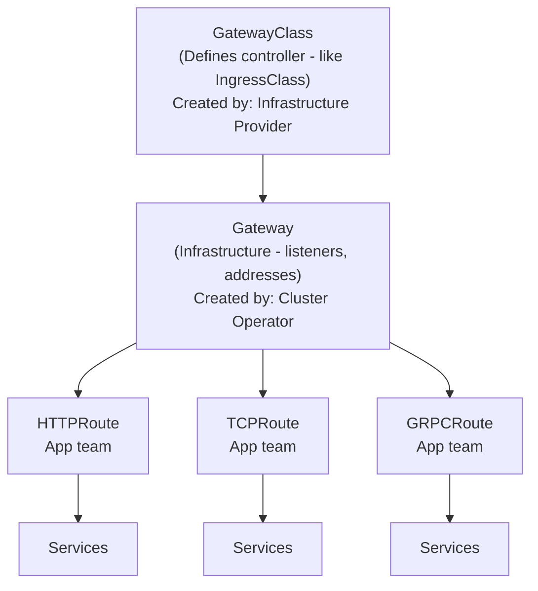
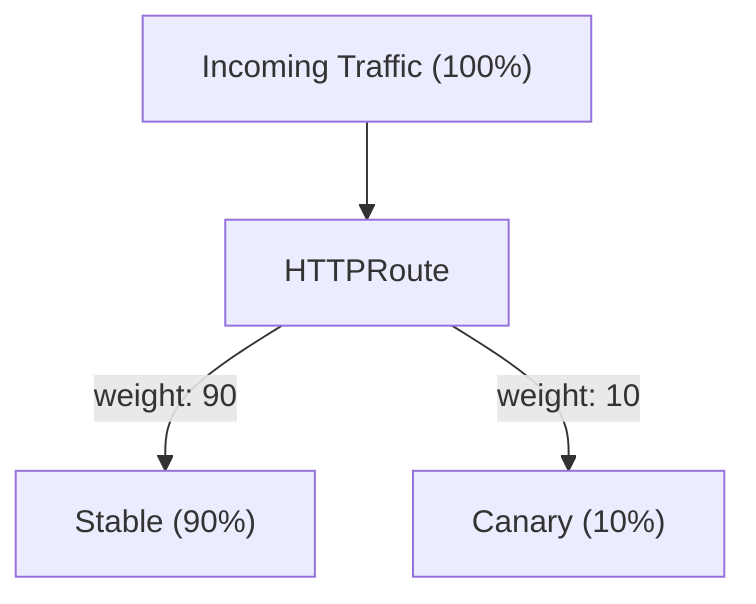
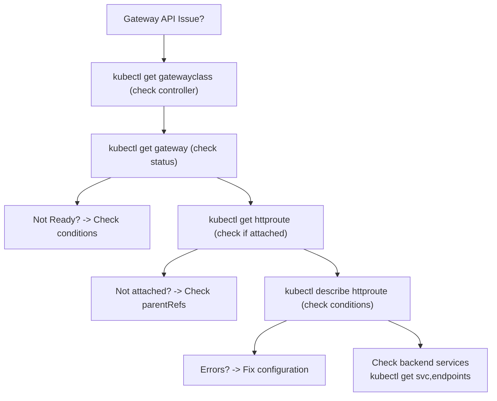

> **Складність**: `[СЕРЕДНЯ]` — тема іспиту CKA
>
> **Час на проходження**: 45–55 хвилин
>
> **Передумови**: Модуль 3.4 (Ingress)

---

## Що ви зможете зробити

Після завершення цього модуля ви зможете:

- **Спроєктувати** стратегію керування трафіком для багатьох орендарів, використовуючи рольову модель Gateway API.
- **Впровадити** розширений розподіл трафіку, маніпуляції із заголовками та віддзеркалення запитів за допомогою HTTPRoute.
- **Діагностувати** збої маршрутизації та проблеми меж простору імен за допомогою умов стану (status conditions) Gateway та HTTPRoute.
- **Оцінити** архітектурні компроміси між застарілим Ingress API та Gateway API.
- **Порівняти** можливості стандартних HTTPRoute з експериментальними маршрутами TCP/UDP.

## Чому цей модуль важливий

Гіпотетичний сценарій: ваша платформова команда володіє публічною точкою входу для спільного кластера, тоді як окремі команди застосунків відповідають за оформлення замовлень, звітність та API, орієнтовані на клієнтів. За класичного робочого процесу Ingress одній команді можуть знадобитися анотації, специфічні для контролера, заради перезаписів, іншій — маршрутизація за заголовками, а третій — канарковий трафік. Ці вимоги часто накопичуються всередині однієї форми ресурсу, що розмиває межі відповідальності й перетворює рутинні зміни застосунку на правки, ризиковані для інфраструктури.

Gateway API існує тому, що мережам Kubernetes потрібен був надійніший контракт, ніж «запхай кожну розширену поведінку в анотацію і сподівайся, що контролер витлумачить її однаково». Він відокремлює питання інфраструктури від питань маршрутизації, тож оператор кластера може опублікувати Gateway, а команди застосунків — прикріплювати маршрути, що відповідають явним правилам простору імен та слухача (listener). Цей поділ не усуває потреби в ретельному рев'ю, але дає вам чіткіші межі збоїв та якісніші умови стану, коли щось відхиляється.

У цьому модулі ви перейдете від ментальної моделі Ingress до моделі Gateway API, яку використовують сучасні мережеві контролери Kubernetes. Ви читатимете й писатимете маніфести GatewayClass, Gateway, HTTPRoute, GRPCRoute, TLSRoute та ReferenceGrant, а потім потренуєтеся діагностувати збої прикріплення та посилань за станом. Мета не в тому, щоб просто запам'ятати нові імена ресурсів; мета — вирішити, де має бути зміна маршрутизації, та довести, що контролер прийняв намір.

Аналогія з аеропортом досі корисна, якщо тримати відповідальності точними. Ingress подібний до невеликого терміналу, де одна стійка обробляє запити на злітно-посадкову смугу, правила квиткової каси та винятки безпеки. Gateway API ближчий до сучасного аеропорту: оператори інфраструктури керують смугами та виходами на посадку, команди застосунків керують призначеннями маршрутів для своїх сервісів, а політика безпеки вирішує, які команди можуть перетинати спільні межі. API цінний тим, що ці ролі стають видимими в об'єктах Kubernetes, замість того щоб ховатися в коментарях та анотаціях.

## Частина 1: Gateway API проти Ingress

Ingress стабільний і широко розгорнутий, але його спроєктовано для вужчої задачі: надавати доступ до сервісів HTTP та HTTPS через правила хостів і шляхів. Щойно командам знадобилася переносна маршрутизація за заголовками, розподіл трафіку, перезаписи запитів, віддзеркалення, переадресація TCP або маршрутизація з урахуванням gRPC, контролери заповнили цю прогалину анотаціями. Анотації гнучкі, але вони ще й слабко типізовані та специфічні для контролера, тож маніфест, який працює з однією реалізацією, інша може мовчки проігнорувати або витлумачити інакше.

Gateway API застосовує інший підхід, роблячи поширені можливості маршрутизації частиною поверхні API. Замість того щоб ховати канаркову політику в анотації ingress-nginx або в специфічному для постачальника користувацькому полі, ви виражаєте зважені бекенди всередині HTTPRoute. Замість того щоб покладатися на посібник контролера щодо синтаксису зіставлення заголовків, ви використовуєте стандартні поля зіставлення. Результатом є не ідеальна переносність усіх можливостей, бо реалізації досі рекламують профілі відповідності (conformance profiles) та необов'язкові можливості, але базовий контракт значно міцніший.

| Аспект | Ingress | Gateway API |
|--------|---------|-------------|
| Ресурси | 1 (Ingress) | Кілька (Gateway, HTTPRoute тощо) |
| Протоколи | HTTP/HTTPS | HTTP, HTTPS, TCP, UDP, TLS, gRPC |
| Рольова модель | Єдиний ресурс | Розділена за ролями |
| Розширюваність | Анотації (непереносні) | Типізовані розширення (переносні) |
| Маршрутизація за заголовками | Специфічна для контролера | Нативна підтримка |
| Розподіл трафіку | Специфічний для контролера | Нативна підтримка |
| Статус | Стабільний | GA з v1.0 (жовтень 2023) |

Це порівняння пояснює, чому Gateway API — не просто «новий Ingress». Це родина ресурсів, яка моделює людей і системи, залучені до керування трафіком. GatewayClass ідентифікує контролер та родину реалізації, Gateway описує слухачів та адреси, ресурси Route описують маршрутизацію застосунків, а ReferenceGrant дозволяє міжпросторове посилання лише з того простору імен, який володіє цільовим об'єктом.

API охоплює як стабільні, так і експериментальні типи маршрутів. `HTTPRoute` — це тип маршруту рівня L7 з такими можливостями, як зіставлення шляхів, зіставлення заголовків та розподіл трафіку. `TCPRoute` та `UDPRoute` — це експериментальні типи маршрутів рівня L4 для переадресації трафіку TCP або UDP без інспекції на рівні HTTP, тоді як `TLSRoute` обробляє маршрутизацію на основі SNI і є стандартним починаючи з Gateway API v1.5.0. У Kubernetes 1.35 вам усе ще варто перевіряти, який канал встановив ваш кластер, перш ніж припускати, що кожен вид маршруту доступний.

Важлива проєктна звичка — відокремлювати «що має робити трафік» від «хто має право це вирішувати». За Ingress зазвичай автор маршрутизації та автор інфраструктури були однією людиною або принаймні одним рецензентом маніфеста. Gateway API дозволяє платформовій команді опублікувати обмеженого слухача, а команді застосунку — виражати маршрутизацію в межах цих обмежень. Цей поділ особливо корисний, коли кластер має багато просторів імен, бо сам граф об'єктів показує, де починаються та закінчуються повноваження.



Зупиніться та спрогнозуйте: якщо велика організація дозволяє платформовим командам керувати інфраструктурою, а командам застосунків — маршрутами, що ламається, коли обидві групи правлять один спільний об'єкт Ingress? Подумайте про відповідальність за рев'ю, відповідальність за відкат та радіус ураження (blast radius) поганої анотації, перш ніж читати таблицю ролей нижче.

| Роль | Ресурси | Обов'язки |
|------|-----------|-----------------|
| **Постачальник інфраструктури** | GatewayClass | Визначає, як реалізуються gateway |
| **Оператор кластера** | Gateway, ReferenceGrant | Налаштовує інфраструктуру, мережеві політики |
| **Розробник застосунку** | HTTPRoute, TCPRoute | Визначає правила маршрутизації для застосунків |

Цей рольово-орієнтований дизайн — один із найважливіших екзаменаційних пунктів, бо він змінює те, як ви налагоджуєте. Якщо Gateway не запрограмовано, ви передусім досліджуєте контролер, GatewayClass, слухача, адресу та бік інфраструктури. Якщо HTTPRoute не прийнято, ви оглядаєте його `parentRefs`, сумісність слухача, дозволи простору імен та посилання на бекенди. Це різні домени збоїв, і Gateway API розкриває їх через умови стану, тож вам не потрібно виводити все з логів контролера.

У цієї моделі є й культурна перевага. Рев'ю маршруту може зосередитися на поведінці застосунку — наприклад, чи має `/api` вказувати на `api-service` та чи має канарка отримувати десять відсотків запитів. Рев'ю Gateway може зосередитися на спільній інфраструктурі — наприклад, на посиланнях на сертифікати, іменах хостів слухачів, селекторах простору імен та класі контролера. Ці розмови досі перетинаються, але їм більше не потрібно відбуватися всередині одного перевантаженого документа YAML.

## Частина 2: Встановлення Gateway API

Gateway API — це проєкт API, а не типова площина даних. Встановлення CustomResourceDefinitions лише навчає API-сервер Kubernetes зберігати об'єкти Gateway API; воно не створює балансувальників навантаження, процесів Envoy, хмарних правил переадресації чи сокетів слухачів. Працездатне налаштування потребує і CRD, і реалізації контролера, яка стежить за цими ресурсами та програмує реальну обробку трафіку.

Процес випуску Gateway API базується на каналах. Випуски стандартного каналу (Standard) містять API з міцнішими очікуваннями сумісності, тоді як випуски експериментального каналу (Experimental) несуть alpha-поля та види ресурсів, які можуть змінюватися вільніше. Для кластера Kubernetes 1.35 поточна підтримувана лінія випуску Gateway API — v1.5.x, але операційна звичка важливіша за точний тег: завжди фіксуйте випуск, який встановлюєте, занотовуйте, чи обрали ви Standard або Experimental, і перевіряйте матрицю сумісності контролера.

```bash
# Install Gateway API Standard channel CRDs for the v1.5 release line.
kubectl apply -f https://github.com/kubernetes-sigs/gateway-api/releases/download/v1.5.1/standard-install.yaml

# Verify CRDs are installed.
kubectl get crd | grep gateway
# gatewayclasses.gateway.networking.k8s.io
# gateways.gateway.networking.k8s.io
# httproutes.gateway.networking.k8s.io
```

Історичний URL встановлення GA `https://github.com/kubernetes-sigs/gateway-api/releases/download/v1.0.0/standard-install.yaml` корисний, коли ви читаєте старіші приклади, але це не найкращий типовий вибір для навчального кластера Kubernetes 1.35. Використовуйте поточний випуск, якщо тільки ваш контролер або керована платформа не вказують зафіксувати старішу версію. Це та сама дисципліна, яку ви застосовуєте для маніфестів Kubernetes у продакшені: приклади навчають форми, а нотатки про випуск вирішують точну підтримувану версію.

Якщо ви встановите лише експериментальний канал тільки тому, що один туторіал ним скористався, ви можете випадково відкрити свій кластер для API, які ваша платформова команда ніколи не мала наміру підтримувати. Якщо ви встановите лише стандартний канал, копіюючи приклад TCPRoute, API-сервер може відхилити ресурс, бо цей вид відсутній. Жоден із результатів не є загадковим, щойно ви згадаєте, що вибір каналу змінює те, які CRD існують. Розглядайте канал як частину платформового контракту, а не як випадковий URL завантаження.

| Контролер | Тип | Найкраще підходить для |
|------------|------|----------|
| **Istio** | Service mesh | Повнофункціональний, користувачі service mesh |
| **Contour** | Окремий | Простий, швидкий |
| **nginx** | Окремий | Знайомий користувачам nginx |
| **Cilium** | Інтегрований з CNI | Продуктивність eBPF |
| **Traefik** | Окремий | Динамічна конфігурація |

Вибір контролера — це рішення щодо реалізації, а не рішення щодо синтаксису Gateway API. Istio може бути привабливим, коли ви вже використовуєте керування трафіком service mesh. Contour або Envoy Gateway можуть бути простішими для окремої крайової маршрутизації. Cilium переконливий, коли мережева команда вже запускає інструментарій площини даних на основі eBPF. Іспит CKA зазвичай наголошує на зв'язках між об'єктами та усуненні несправностей, а не на встановленні, специфічному для постачальника, але реальні кластери дають збій, коли версії API та контролера розглядають як взаємозамінні.

Вибір контролера також впливає на те, наскільки швидко стан стає корисним. Контролер, який не володіє вашим GatewayClass, повністю проігнорує Gateway, тоді як контролер, який володіє класом, але не може виділити інфраструктуру, може прийняти об'єкт і повідомити про збій програмування. Обидві ситуації починаються з маніфеста, що застосувався успішно, тож самої лише відповіді API-сервера недостатньо. Ваш звичайний робочий процес має охоплювати перевірку GatewayClass, потім умов Gateway, а потім прикріплених маршрутів.

```bash
# Install Istio with Gateway API support.
istioctl install --set profile=minimal

# Or for quick testing with kind/minikube, use Contour.
# unversioned — pin to a Contour release tag for reproducible labs; GatewayClass name may differ
kubectl apply -f https://projectcontour.io/quickstart/contour-gateway.yaml
```

Перш ніж запускати це у спільному середовищі, який вивід ви очікуєте від `kubectl get gatewayclass` після встановлення лише CRD? Ви маєте очікувати, що команда спрацює, але не поверне корисної реалізації, доки контролер не створить або не почне стежити за GatewayClass. Якщо ви бачите CRD, але жодного прийнятого GatewayClass, ваші маніфести можуть застосовуватися чисто, тоді як жоден трафік ніколи не зможе бути запрограмований.

## Частина 3: GatewayClass та Gateway

`GatewayClass` — це ресурс рівня кластера, який називає родину реалізації. Він подібний до `IngressClass`, але бере участь у ширшій моделі, де оператори інфраструктури та розробники застосунків використовують різні ресурси. У багатьох реальних середовищах команди застосунків ніколи не створюють GatewayClass; вони обирають із класів, які платформова команда вже схвалила, задокументувала та підключила до контролера.

```yaml
# GatewayClass - created by infrastructure provider
apiVersion: gateway.networking.k8s.io/v1
kind: GatewayClass
metadata:
  name: example-gateway-class
spec:
  controllerName: example.io/gateway-controller
  description: "Example Gateway controller"
```

```bash
# List GatewayClasses.
kubectl get gatewayclass
kubectl get gc
```

Поле `controllerName` — це не дружня мітка; це рядок, який контролер використовує, щоб вирішити, чи володіє він цим класом. Якщо воно не збігається з працюючою реалізацією, Gateway, який посилається на клас, залишиться незапрограмованим, хоч би яким коректним виглядав YAML слухача. Коли ви діагностуєте Gateway, який ніколи не стає готовим, почніть із перевірки класу та його стану, перш ніж витрачати час на правки правил маршруту.

Оскільки GatewayClass має область видимості кластера, він зазвичай є частиною ініціалізації платформи, а не розгортання застосунку. Це не означає, що розробники застосунків можуть його ігнорувати. Маршрут, що прикріплюється до Gateway, зрештою залежить від ланцюга, який починається з класу та закінчується кінцевими точками бекенда. Коли ланцюг рветься ближче до верху, зміни YAML маршруту не допоможуть, тож першим діагностичним питанням має бути те, чи існує клас інфраструктури та чи прийнятий він.

```yaml
# Gateway - created by cluster operator
apiVersion: gateway.networking.k8s.io/v1
kind: Gateway
metadata:
  name: example-gateway
  namespace: default
spec:
  gatewayClassName: example-gateway-class
  listeners:
  - name: http
    protocol: HTTP
    port: 80
    allowedRoutes:
      namespaces:
        from: All        # Allow routes from all namespaces
```

Gateway — це ресурс, де сходяться слухачі, порти, імена хостів, налаштування TLS та правила прикріплення маршрутів. Слухач каже, який трафік Gateway приймає, тоді як `allowedRoutes` каже, які об'єкти маршрутів можуть прикріплюватися до цього слухача. Це потужна межа, бо платформові команди можуть надати спільну точку входу, не надаючи кожному простору імен рівних прав на кожен хост і протокол.

```yaml
apiVersion: gateway.networking.k8s.io/v1
kind: Gateway
metadata:
  name: multi-listener-gateway
spec:
  gatewayClassName: example-gateway-class
  listeners:
  - name: http
    protocol: HTTP
    port: 80
    hostname: "*.example.com"
    allowedRoutes:
      namespaces:
        from: All
  - name: https
    protocol: HTTPS
    port: 443
    hostname: "*.example.com"
    tls:
      mode: Terminate
      certificateRefs:
      - name: example-tls
        kind: Secret
    allowedRoutes:
      namespaces:
        from: Same       # Only routes from same namespace
```

Приклад із кількома слухачами показує, як оператор може опублікувати різні політики прикріплення на одному Gateway. Трафік HTTP може приймати маршрути з будь-якого простору імен на час широкої міграції, тоді як маршрути HTTPS можуть бути обмежені простором імен Gateway, доки володіння сертифікатами не дозріє. Цей дизайн набагато чіткіший, ніж покладання на угоду про іменування чи правило допуску контролера, яке розробники застосунків не бачать зі свого маніфеста маршруту.

Дизайн слухача — це місце, де багато виробничих розбіжностей варто вирішити, перш ніж вони стануть збоями. Якщо слухач приймає кожен простір імен та кожен шаблон імені хоста, маршруту легко прикріпитися несподіваним чином. Якщо слухач занадто вузький, команди застосунків створюватимуть дублюючі Gateway або проситимуть винятків. Добрий платформовий дизайн документує, які імена слухачів стабільні, які імена хостів вони покривають та які простори імен очікувано прикріплюватимуть маршрути.

```bash
# Get Gateway resources.
kubectl get gateway
kubectl get gtw

# Describe the Gateway and inspect conditions.
kubectl describe gateway example-gateway

# Check whether the Gateway is ready.
kubectl get gateway example-gateway -o jsonpath='{.status.conditions[?(@.type=="Ready")].status}'
```

Коли стан Gateway не такий, як ви очікуєте, читайте типи й причини умов, а не лише фазу верхнього рівня. Контролери зазвичай повідомляють, чи був прийнятий слухач, чи були призначені адреси та чи була запрограмована площина даних. Ці деталі — це різниця між «YAML неправильний» та «хмарний балансувальник навантаження ще ініціалізується», які потребують дуже різних виправлень.

Ця відмінність має значення під час усунення несправностей, чутливого до часу. Правка HTTPRoute через те, що хмарна адреса ще очікується, лише додає шуму, а перезапуск контролера через те, що маршрут посилається на неправильного батька, марнує сигнал, який API вже надав. Модель стану Gateway API винагороджує терплячий перегляд умов. Шукайте, хто відхилив об'єкт, які зв'язки дали збій та чи стосується збій прикріплення, розв'язання посилань, сумісності слухача або програмування площини даних.

## Частина 4: HTTPRoute

`HTTPRoute` — це основний ресурс маршруту для трафіку застосунків HTTP. Він прикріплюється до одного чи кількох батьківських Gateway, за бажанням обмежує імена хостів, а потім обчислює правила, що містять зіставлення, фільтри та посилання на бекенди. Ключовий операційний зсув полягає в тому, що команда застосунку може змінити зіставлення шляхів, канаркові ваги чи маршрутизацію за заголовками, не правлячи об'єкт Gateway, який володіє слухачем та публічною адресою.

```yaml
apiVersion: gateway.networking.k8s.io/v1
kind: HTTPRoute
metadata:
  name: simple-route
spec:
  parentRefs:
  - name: example-gateway       # Attach to this Gateway
  rules:
  - backendRefs:
    - name: web-service         # Target service
      port: 80
```

Найпростіший HTTPRoute не має явного зіставлення, тож він діє як типове правило для трафіку, що досягає прикріпленого батька та імені хоста. Ця простота корисна для початкових тестів зв'язності, але виробничі маршрути зазвичай потребують явних меж хостів чи шляхів. Без цих меж дві команди можуть вважати, що володіють однаковою поведінкою слухача, а потім виявити, що результат вирішує пріоритет правил.

Батьківські посилання навмисно явні, бо один маршрут може націлюватися на більш ніж одного батька в розширених дизайнах. Для рівня CKA зосередьтеся на звичайному випадку: HTTPRoute називає Gateway, до якого хоче прикріпитися, а слухач Gateway вирішує, чи дозволено це прикріплення. Якщо Gateway живе в іншому просторі імен, включіть батьківський простір імен у маршрут. Якщо слухач має ім'я і вам потрібен саме цей слухач, використовуйте посилання на секцію, яке підтримує ваш контролер та версія API.

```yaml
apiVersion: gateway.networking.k8s.io/v1
kind: HTTPRoute
metadata:
  name: path-route
spec:
  parentRefs:
  - name: example-gateway
  rules:
  - matches:
    - path:
        type: PathPrefix
        value: /api
    backendRefs:
    - name: api-service
      port: 80
  - matches:
    - path:
        type: PathPrefix
        value: /
    backendRefs:
    - name: web-service
      port: 80
```

Маршрутизація за шляхами — це перше місце, де мають значення порядок та конкретність правил. Зіставлення префікса для `/api` не слід плутати з типовим зіставленням префікса для `/`, і контролер мусить вирішити, яке правило зіставлення перемагає, коли могли б застосуватися кілька. Коли ви проєктуєте ці маршрути, пишіть їх так, щоб рецензент-людина міг визначити передбачуваний типовий варіант і передбачувані особливі випадки, не читаючи нотаток про реалізацію контролера.

Надійне питання для рев'ю — чи має кожен шлях запиту навмисний пункт призначення або навмисне відхилення. Типовий префікс `/` може бути корисним, але він може й маскувати відсутні маршрути, спрямовуючи несподіваний трафік на фронтенд. Для API команди часто віддають перевагу явним префіксам та чіткій поведінці запасного варіанту (fallback). Хоч би яку угоду ви обрали, пишіть тести або curl-перевірки, що покривають кореневий шлях, особливий префікс та шлях, який не повинен збігатися з особливим правилом.

```yaml
apiVersion: gateway.networking.k8s.io/v1
kind: HTTPRoute
metadata:
  name: host-route
spec:
  parentRefs:
  - name: example-gateway
  hostnames:
  - "api.example.com"
  - "api.example.org"
  rules:
  - backendRefs:
    - name: api-service
      port: 80
```

Імена хостів дають командам застосунків чистий спосіб описати володіння API, орієнтованим на DNS. Маршрут із `api.example.com` не повинен випадково отримувати трафік для `www.example.com`, навіть коли обидва маршрути прикріплюються до одного Gateway. У кластерах із багатьма орендарями імена хостів також створюють поверхню рев'ю: оператор може вирішити, які простори імен можуть прикріплюватися до слухача та які імена дійсні для цього слухача.

```yaml
apiVersion: gateway.networking.k8s.io/v1
kind: HTTPRoute
metadata:
  name: header-route
spec:
  parentRefs:
  - name: example-gateway
  rules:
  - matches:
    - headers:
      - name: X-Version
        value: v2
    backendRefs:
    - name: api-v2
      port: 80
  - matches:
    - headers:
      - name: X-Version
        value: v1
    backendRefs:
    - name: api-v1
      port: 80
```

Маршрутизація на основі заголовків цінна, коли клієнт може навмисно обрати версію, орендаря чи когорту експерименту. Нею також легко зловжити, якщо заголовок не заслуговує на довіру, бо будь-який клієнт може надіслати це значення, доки інший шар його не контролює. Розглядайте зіставлення заголовків як сигнали маршрутизації, а не сигнали автентифікації, якщо тільки у вас немає окремого механізму безпеки, який доводить, хто додав заголовок.

Для канаркового та експериментального трафіку маршрутизація за заголовками та зважена маршрутизація розв'язують різні задачі. Маршрутизація за заголовками детермінована для клієнтів, які несуть заголовок, що робить її доброю для внутрішніх тестувальників, партнерських інтеграцій чи явних опт-ін потоків. Зважена маршрутизація імовірнісна на ширшому потоці запитів, що робить її доброю для прогресивного розгортання. Багато команд використовують обидві: зіставлення заголовка для примусового тестування та зважене типове правило для поступового відкривання доступу.

Зупиніться та спрогнозуйте: ви хочете розгорнути нову версію API для невеликої частки користувачів. Лише за допомогою Deployment ви могли б скоригувати кількість реплік, але це пов'язує ємність та маршрутизацію. Що змінюється, коли HTTPRoute володіє відсотком трафіку, а кожен Deployment масштабується незалежно?

```yaml
apiVersion: gateway.networking.k8s.io/v1
kind: HTTPRoute
metadata:
  name: canary-route
spec:
  parentRefs:
  - name: example-gateway
  rules:
  - backendRefs:
    - name: api-stable
      port: 80
      weight: 90           # 90% to stable
    - name: api-canary
      port: 80
      weight: 10           # 10% to canary
```



Зважені бекенди — добрий приклад практичної переваги Gateway API над канарками на основі кількості реплік. Ви можете хотіти дві канаркові поди з міркувань вартості, але все одно надсилати достатньо трафіку, щоб швидко валідувати поведінку. Ви також можете хотіти десять стабільних подів для обробки наявного навантаження, доки канарка отримує виміряну частку. Маршрутизація та масштабування пов'язані, але вони не повинні бути одним і тим самим важелем керування.

Не розглядайте ваги маршруту як заміну безпеки релізу. Десятивідсоткова канарка все одно може зачепити кожного цінного клієнта, якщо склад трафіку невдалий, а віддзеркалений запит все одно може перевантажити залежність нижче за течією. Маршрут дає вам контроль над розподілом, але вам потрібні метрики, логи, перевірки справності та повноваження на відкат, щоб зробити розгортання безпечним. На практиці зміну маршруту слід поєднувати з коротким планом спостереження та чіткою командою відкату.

## Частина 5: Фільтри HTTPRoute

Фільтри дозволяють HTTPRoute трансформувати або дублювати запити як частину стандартної поведінки маршрутизації. У старіших розгортаннях Ingress ці можливості часто з'являлися як специфічні для контролера анотації, чий зміст змінювався між nginx, хмарними балансувальниками навантаження та шлюзами service mesh. Gateway API переносить поширені поведінки в типізовані поля, що полегшує рев'ю та дає контролерам чіткішу ціль відповідності.

```yaml
apiVersion: gateway.networking.k8s.io/v1
kind: HTTPRoute
metadata:
  name: header-filter-route
spec:
  parentRefs:
  - name: example-gateway
  rules:
  - filters:
    - type: RequestHeaderModifier
      requestHeaderModifier:
        add:
        - name: X-Custom-Header
          value: "added-by-gateway"
        remove:
        - X-Unwanted-Header
    backendRefs:
    - name: web-service
      port: 80
```

Модифікація заголовків запиту корисна, коли вам потрібно додати маркер, керований шлюзом, або видалити заголовок, що не повинен досягати бекенда. Небезпечний варіант — використання модифікації заголовків, щоб замаскувати нечітке володіння між клієнтами, шлюзами та застосунками. Якщо застосунок залежить від заголовка для авторизації чи ідентичності орендаря, задокументуйте точно, який компонент його встановлює та як обробляються підроблені значення, надані клієнтом.

```yaml
apiVersion: gateway.networking.k8s.io/v1
kind: HTTPRoute
metadata:
  name: rewrite-route
spec:
  parentRefs:
  - name: example-gateway
  rules:
  - matches:
    - path:
        type: PathPrefix
        value: /old-api
    filters:
    - type: URLRewrite
      urlRewrite:
        path:
          type: ReplacePrefixMatch
          replacePrefixMatch: /new-api
    backendRefs:
    - name: api-service
      port: 80
```

Перезаписи URL допомагають під час міграцій, бо клієнти можуть продовжувати використовувати старий зовнішній шлях, тоді як бекенд отримує новіший внутрішній шлях. Компроміс — це спостережуваність: логи, метрики та трейси можуть показувати різні шляхи на різних шарах. Чистий план міграції фіксує і зовнішній контракт, і контракт бекенда, тож усунення несправностей не перетворюється на вправу з вгадування.

```yaml
apiVersion: gateway.networking.k8s.io/v1
kind: HTTPRoute
metadata:
  name: redirect-route
spec:
  parentRefs:
  - name: example-gateway
  rules:
  - matches:
    - path:
        type: PathPrefix
        value: /old-path
    filters:
    - type: RequestRedirect
      requestRedirect:
        scheme: https
        hostname: new.example.com
        statusCode: 301
```

Переадресації — це зміни, видимі клієнту, тож їх слід розглядати інакше, ніж перезаписи. Перезапис тримає URL браузера чи клієнта стабільним і змінює лише те, що отримує бекенд. Переадресація каже клієнту зробити новий запит деінде, а постійний код стану може агресивно кешуватися. Для міграцій починайте з тимчасової поведінки, доки ви не впевнені, що старі клієнти, кравлери та інтеграції справляються з новим URL.

```yaml
apiVersion: gateway.networking.k8s.io/v1
kind: HTTPRoute
metadata:
  name: mirror-route
spec:
  parentRefs:
  - name: example-gateway
  rules:
  - filters:
    - type: RequestMirror
      requestMirror:
        backendRef:
          name: api-canary
          port: 80
    backendRefs:
    - name: api-stable
      port: 80
```

Віддзеркалення запитів дублює трафік до іншого бекенда, не використовуючи віддзеркалену відповідь для клієнта. Це чудово для валідації парсингу, затримки та частоти помилок проти трафіку, сформованого наживо, але воно не нешкідливе за замовчуванням. Віддзеркалений сервіс має терпіти дубльовані читання, уникати побічних ефектів та захищати системи нижче за течією від несподіваного навантаження. Якщо дзеркало пише в базу даних чи надсилає зовнішні сповіщення, ви вбудували виробничий інцидент у свій план тестування.

Фільтрами найлегше керувати, коли кожен маршрут має одну чітку мету трансформації. Маршрут, що перезаписує шляхи, модифікує заголовки, переадресовує деяких клієнтів та дзеркалить запити одночасно, може бути дійсним, але про нього стає важко міркувати під час збою. Якщо для міграції потрібно кілька трансформацій, впроваджуйте їх обдумано та фіксуйте, який шар володіє кожною поведінкою. Рецензент має бути здатним передбачити вхідний запит, запит, трансформований шлюзом, запит до бекенда та відповідь, видиму клієнту.

## Частина 6: GRPCRoute та маршрутизація, специфічна для протоколу

Gateway API забезпечує нативну підтримку трафіку gRPC через ресурс `GRPCRoute`, дозволяючи вам маршрутизувати запити на основі сервісів та методів gRPC, а не звичайних шляхів HTTP. Ця відмінність має значення, бо gRPC технічно використовує HTTP/2, але оператори зазвичай міркують про імена protobuf-сервісів, імена методів та порти бекендів. Маршрут, що говорить тією самою мовою, що й протокол застосунку, менш схильний до помилок, ніж кодування деталей протоколу в загальні правила шляхів.

```yaml
apiVersion: gateway.networking.k8s.io/v1
kind: GRPCRoute
metadata:
  name: grpc-route
spec:
  parentRefs:
  - name: example-gateway
  rules:
  - matches:
    - method:
        service: myapp.v1.MyService
        method: MyMethod
    backendRefs:
    - name: grpc-backend
      port: 50051
```

Використовуйте виділений GRPCRoute, коли рішення маршрутизації природно стосується сервісу чи методу gRPC. Він дає рецензентам змогу бачити намір на рівні застосунку безпосередньо та дає реалізації простір для валідації поведінки, специфічної для протоколу. Іноді ви могли б наблизити це поведінкою HTTPRoute, але результат важче читати та легше зламати, коли імена сервісів чи згенеровані шляхи змінюються.

Статус Standard проти Experimental також впливає на планування протоколу. HTTPRoute, GRPCRoute та TLSRoute мають підтримку стандартного каналу в поточних випусках Gateway API, тоді як TCPRoute та UDPRoute залишаються в експериментальному каналі. Якщо платформова команда хоче переадресацію рівня L4 для критичного робочого навантаження, правильна розмова — не лише «чи може контролер це зробити?», але й «чи комфортно нам експлуатувати тут експериментальний API?».

Ресурси, специфічні для протоколу, також допомагають уникнути хибних припущень про те, що Gateway може інспектувати. HTTPRoute може інспектувати атрибути HTTP-запиту після того, як шлюз зрозуміє потік HTTP. Дизайн із прозорим проходженням TLS (passthrough) може інспектувати лише SNI перед переадресацією зашифрованих байтів. TCPRoute не може приймати рішення на основі заголовків HTTP, бо він не працює на цьому шарі. Узгодження виду маршруту з реальним протоколом тримає ваші маніфести чесними, а ваш шлях усунення несправностей коротшим.

## Частина 7: Міжпросторова маршрутизація

Міжпросторові посилання — це місце, де модель безпеки Gateway API стає конкретною. Маршрут в одному просторі імен може прикріпитися до Gateway в іншому просторі імен, якщо слухач Gateway дозволяє цей вид маршруту та простір імен. Маршрут також може хотіти надіслати трафік до Сервісу в іншому просторі імен, але це посилання на бекенд потребує згоди від простору імен, який володіє Сервісом. Gateway API робить цю згоду явною через ReferenceGrant.

Зупиніться та спрогнозуйте: HTTPRoute у просторі імен `team-a` посилається на Сервіс у просторі імен `team-b`, але жодного ReferenceGrant у `team-b` не існує. Чи має маршрут мовчки працювати, маршрутизувати кудись інше чи повідомити про нерозв'язане посилання у стані? Безпечна відповідь — цільовий простір імен має надати дозвіл, а маршрут має повідомити про проблему розв'язання посилання, а не вгадувати.

```yaml
# In the target namespace (where the service lives)
apiVersion: gateway.networking.k8s.io/v1beta1
kind: ReferenceGrant
metadata:
  name: allow-routes-from-default
  namespace: backend-ns
spec:
  from:
  - group: gateway.networking.k8s.io
    kind: HTTPRoute
    namespace: default        # Allow routes from default namespace
  to:
  - group: ""
    kind: Service             # Allow referencing services
```

ReferenceGrant належить простору імен, на який посилаються, а не простору імен, що робить посилання. Це розміщення і є функцією безпеки. Власник `backend-ns` вирішує, який вихідний простір імен та вид маршруту можуть вказувати на його Сервіс, тож команда не може відкрити доступ до чужого бекенда, просто правлячи власний маніфест маршруту.

```yaml
# HTTPRoute in default namespace can now reference backend-ns service
apiVersion: gateway.networking.k8s.io/v1
kind: HTTPRoute
metadata:
  name: cross-ns-route
  namespace: default
spec:
  parentRefs:
  - name: example-gateway
  rules:
  - backendRefs:
    - name: backend-service
      namespace: backend-ns    # Cross-namespace reference
      port: 80
```

Коли міжпросторова маршрутизація дає збій, не починайте з захоплення пакетів. Спершу огляньте стан HTTPRoute та шукайте прийняті батьківські посилання й розв'язані посилання на бекенди. Потім огляньте цільовий простір імен на наявність ReferenceGrant, що збігається з групою, видом, простором імен маршруту та цільовим видом. Більшість збоїв — це прості невідповідності у просторі імен, виді чи пропущений grant, і API спроєктовано так, щоб розкривати їх як проблеми конфігурації.

ReferenceGrant навмисно вузький. Він не надає широкої довіри між просторами імен і не дозволяє вихідному простору імен вирішувати, що він може споживати. Цей дизайн може здаватися багатослівним у малих лабораторіях, але він добре масштабується, коли команди володіють різними сервісами. Цільовий простір імен може дозволити саме ті види маршрутів та вихідні простори імен, які очікує, а майбутні рецензенти зможуть зрозуміти дозвіл, прочитавши один об'єкт поряд із Сервісом, до якого надається доступ.

## Частина 8: Налаштування TLS

Слухачі Gateway можуть термінувати TLS або пропускати зашифрований трафік наскрізь залежно від протоколу та виду маршруту. У режимі термінації Gateway пред'являє сертифікат, розшифровує з'єднання та переадресовує трафік HTTP до бекенда. У дизайнах із прозорим проходженням (passthrough) Gateway використовує деталі TLS, як-от SNI, щоб обрати бекенд, тоді як бекенд термінує зашифроване з'єднання. Ці вибори впливають на володіння сертифікатами, спостережуваність та на те, де політика може інспектувати трафік.

У Gateway API v1.5.0 кілька можливостей досягли статусу Standard, зокрема валідація клієнтського сертифіката Gateway, вибір сертифіката для відправлення TLS (TLS origination), підтримка `ListenerSet` та `TLSRoute` `v1`, тоді як старіші alpha-форми `TLSRoute` залишилися суворо експериментальними. Зокрема, CEL-валідація TLSRoute залежить від підтримки CEL-валідації CRD у кластері (Kubernetes 1.25+), тож кластер Kubernetes 1.35 є відповідною базою для вивчення поточної поведінки.

```yaml
apiVersion: gateway.networking.k8s.io/v1
kind: Gateway
metadata:
  name: tls-gateway
spec:
  gatewayClassName: example-gateway-class
  listeners:
  - name: https
    protocol: HTTPS
    port: 443
    hostname: secure.example.com
    tls:
      mode: Terminate
      certificateRefs:
      - name: secure-tls        # TLS secret
        kind: Secret
    allowedRoutes:
      namespaces:
        from: All
```

| Режим | Поведінка |
|------|----------|
| `Terminate` | Gateway термінує TLS, надсилає HTTP до бекендів |
| `Passthrough` | Gateway пропускає TLS наскрізь, бекенд обробляє термінацію |

Термінацію легше спостерігати, бо Gateway може застосувати маршрутизацію та фільтри з урахуванням HTTP після розшифрування. Прозоре проходження корисне, коли команди бекенда мають володіти сертифікатами або коли Gateway не повинен інспектувати трафік застосунку. Жоден режим не є універсально кращим. Правильний дизайн залежить від того, хто володіє сертифікатами, який шар забезпечує дотримання політики та чи підтримує реалізація шлюзу саме той вид маршруту й поведінку TLS, яку ви маєте намір використати.

Посилання на сертифікати заслуговують на таке саме рев'ю володіння, як і посилання на бекенди. Якщо Gateway термінує TLS, простір імен Gateway зазвичай містить або посилається на матеріал сертифіката, а платформова команда має визначити, як сертифікати ротуються. Якщо команди застосунків володіють сертифікатами, краще може підійти модель прозорого проходження чи делегування, але вона змінює те, які поля маршруту доступні для поведінки з урахуванням HTTP. Тому рішення щодо TLS — це одночасно рішення безпеки та рішення щодо можливостей маршрутизації.

## Частина 9: Налагодження Gateway API

Налагодження Gateway API — це обхід залежностей, а не випадкова послідовність команд `describe`. Почніть із класу, бо жоден Gateway не може бути запрограмований контролером, який не володіє вказаним GatewayClass. Перейдіть до Gateway, бо слухачі, імена хостів, налаштування TLS та allowedRoutes визначають, чи можуть маршрути прикріплятися. Потім огляньте Route, бо прийняття батьком, дійсність правил та розв'язання посилань на бекенди вирішують, чи досягне трафік Сервісу.



Використовуйте умови стану як основний доказ. Gateway, який прийнято, але не запрограмовано, спрямовує вас до готовності інфраструктури чи контролера. HTTPRoute, який не прикріплено, спрямовує вас до батьківських посилань, сумісності слухача чи allowedRoutes. Маршрут із нерозв'язаними посиланнями спрямовує вас до відсутніх Сервісів, неправильних портів чи відсутніх дозволів ReferenceGrant. Цей метод не дає вам змінювати три непов'язані об'єкти одночасно та втрачати початковий сигнал.

```bash
# List all Gateway API resources.
kubectl get gatewayclass,gateway,httproute

# Check Gateway status.
kubectl describe gateway example-gateway

# Check HTTPRoute status.
kubectl describe httproute my-route

# Get HTTPRoute conditions.
kubectl get httproute my-route -o jsonpath='{.status.parents[0].conditions}'
```

| Симптом | Причина | Розв'язання |
|---------|-------|----------|
| Gateway не Ready | Немає контролера | Встановіть контролер Gateway |
| HTTPRoute не прикріплено | Неправильний parentRefs | Перевірте ім'я/простір імен Gateway |
| Помилки 404 | Немає правила, що збігається | Перевірте конфігурацію шляху/хоста |
| Міжпросторовий збій | Відсутній ReferenceGrant | Створіть ReferenceGrant |

Коли запит повертає 404, відокремте збій маршрутизації від збою бекенда. Маршрут, що ніколи не прикріпився чи ніколи не збігся, може видати 404 на рівні шлюзу, перш ніж бекенд побачить трафік. Сервіс-бекенд без кінцевих точок може видавати різні помилки залежно від контролера. Перевірте стан маршруту, потім перевірте об'єкти Service та EndpointSlice, потім протестуйте бекенд напряму зсередини кластера, якщо маршрут виглядає справним.

Для іспитової практики побудуйте короткий діагностичний скрипт у голові, а не запам'ятовуйте окремі команди. Спершу підтвердьте, що CRD та клас існують, потім підтвердьте, що Gateway прийнято й запрограмовано, потім підтвердьте, що маршрут прикріплено до передбачуваного батька, потім підтвердьте розв'язані посилання, і лише тоді протестуйте Сервіс-бекенд. Цей порядок відповідає графу залежностей. Він також запобігає поширеній помилці, коли учні передусім оглядають поди, хоча маршрут так і не прикріпився.

## Патерни та антипатерни

Найсильніший патерн Gateway API — тримати володіння інфраструктурою та володіння застосунком окремими. Платформові команди мають публікувати невелику кількість задокументованих Gateway із чіткими іменами слухачів, правилами імен хостів, поставою TLS та політиками прикріплення простору імен. Команди застосунків мають володіти HTTPRoute чи GRPCRoute, що прикріплюються до цих Gateway та описують лише свою маршрутизацію застосунку. Це зменшує несподіванки, бо кожен маніфест відповідає на одне питання володіння.

| Патерн | Коли застосовувати | Чому працює | Аспект масштабування |
|---------|----------------|--------------|-----------------------|
| Спільний Gateway, маршрути з областю простору імен | Багато команд ділять одну публічну точку входу | Оператори володіють слухачами, команди застосунків — маршрутами | Потребує чіткого allowedRoutes та врядування іменами хостів |
| Зважені канарки HTTPRoute | Вам потрібне контрольоване розгортання без зміни реплік | Відсоток маршрутизації незалежний від кількості подів | Потребує метрик на кожен бекенд та дисципліни відкату |
| ReferenceGrant для спільних бекендів | Маршрут має вказувати на Сервіс в іншому просторі імен | Цільовий простір імен надає явну згоду | Grant'и слід рев'юити як зміни контролю доступу |
| Матриця сумісності контролерів | Платформова команда підтримує кілька середовищ | Підтримку API перевіряють до постачання маніфестів | Тримайте рішення щодо каналів Standard та Experimental задокументованими |

Інший надійний патерн — робити імена слухачів змістовними та стабільними. Маршрути можуть посилатися на Gateway як на батька, а в більш обмежених дизайнах можуть націлюватися на конкретне ім'я секції. Якщо імена слухачів змінюються недбало, володіння маршрутами застосунку стає крихким. Розглядайте імена слухачів як контракт API, особливо коли кілька команд прикріплюють маршрути до одного Gateway.

| Антипатерн | Що йде не так | Краща альтернатива |
|--------------|-----------------|--------------------|
| Один гігантський маршрут володіє кожним шляхом | Рецензенти не можуть визначити володіння чи безпечно відкотити | Розділіть маршрути за межею застосунку та іменем хоста |
| Експериментальні маршрути в продакшені випадково | Поведінка TCPRoute чи UDPRoute змінюється між випусками | Встановлюйте експериментальні CRD лише через явне платформове рішення |
| Міжпросторові посилання без grant'ів | Маршрути дають збій із нерозв'язаними посиланнями та нечітким володінням | Створіть ReferenceGrant у цільовому просторі імен із вузькою областю |
| Специфічні для контролера припущення, приховані в маршрутах | Маніфести виглядають переносними, але залежать від однієї реалізації | Перевіряйте відповідність та документуйте можливості, специфічні для реалізації |

Спільна нитка в тому, що Gateway API дає вам кращі примітиви, але він не усуває потреби у врядуванні. Спільний Gateway із `allowedRoutes.namespaces.from: All` може бути доречним у лабораторії та ризикованим у виробничому просторі імен із багатьма орендарями. Канарковий маршрут може бути безпечнішим за маршрутизацію на основі кількості реплік, але лише якщо ви моніторите правильний бекенд та можете швидко відкотити ваги. API покращує форму рішення; він не приймає рішення за вас.

## Рамка прийняття рішень

Почніть із запитання, який шар запиту вам потрібно інспектувати. Якщо рішення залежить від шляху HTTP, хоста, заголовка, запиту чи фільтрів запиту, HTTPRoute — природний інструмент. Якщо рішення залежить від імен сервісу та методу gRPC, GRPCRoute краще передає намір. Якщо рішення залежить від SNI TLS без розшифрування трафіку застосунку, оцініть TLSRoute та режим TLS слухача. Якщо рішення — це сира переадресація TCP чи UDP, підтвердьте підтримку експериментального каналу, перш ніж проєктувати навколо неї.

| Точка рішення | Оберіть це | Уникайте, коли |
|----------------|-------------|-----------------|
| Проста маршрутизація HTTP за хостом/шляхом | HTTPRoute | Вам потрібна сира переадресація TCP/UDP |
| Маршрутизація gRPC з урахуванням методу | GRPCRoute | Контролер не підтримує потрібний профіль |
| Термінація TLS на краю | Слухач HTTPS із `Terminate` | Команди бекенда мають володіти наскрізною термінацією TLS |
| Повторне використання бекенда між просторами імен | HTTPRoute плюс ReferenceGrant | Цільовий простір імен не надав явного дозволу |
| Міграція застарілого контролера | ingress2gateway плюс ручне рев'ю | Специфічні для постачальника анотації кодують критичну поведінку |
| Канарка з низьким ризиком | Зважені backendRefs | Вам бракує метрик на конкретний бекенд чи повноважень на відкат |

Практичний потік такий: оберіть вид маршруту, оберіть батьківський Gateway, переконайтеся, що слухач дозволяє ваш простір імен та вид маршруту, переконайтеся, що посилання на бекенди локальні чи явно надані grant'ом, а потім переконайтеся в підтримці контролером кожного фільтра, який ви використали. Ця послідовність ловить більшість проєктних помилок до того, як буде залучено трафік. Вона також прямо відображається на усунення несправностей, тому та сама рамка допомагає і під час впровадження, і під час реагування на інциденти.

Який підхід ви обрали б тут і чому: команда хоче `/api` та `/admin` на одному імені хоста, але лише платформова команда може змінювати налаштування TLS. Правильний дизайн зазвичай — Gateway, що належить платформі, зі слухачем HTTPS та HTTPRoute, що належать застосунку, для маршрутизації за шляхами. Якщо `/admin` належить іншому простору імен, ніж `/api`, зробіть володіння явним за допомогою окремих маршрутів та уникайте приховування обох застосунків усередині одного завеликого маніфеста.

Порівнюючи Gateway API з альтернативами, не формулюйте вибір як сучасне проти застарілого. Ingress досі може бути доречним для простого, стабільного надання доступу HTTP, коли поведінка вашого контролера добре зрозуміла, а переносність не є пріоритетом. Gateway API стає кращим типовим вибором, коли кілька команд ділять точки входу, коли потреби в розширеній маршрутизації мають бути типізованими та придатними для рев'ю або коли ви хочете умови стану, що прямо описують збої прикріплення та посилань.

Для іспиту CKA потренуйтеся пояснювати компроміс операційною мовою. Сильна відповідь каже, що Gateway API зменшує залежність від анотацій, відокремлює володіння платформою та застосунком, підтримує багатші види маршрутів та дає чіткіший стан. Слабка відповідь лише каже, що Gateway API новіший. Kubernetes винагороджує точне міркування: обирайте API тому, що воно точніше моделює задачу маршрутизації, а не тому, що новіше ім'я ресурсу звучить вражаюче.

## Чи знали ви?

- Gateway API — це суто проєкт API: як і Ingress, він потребує окремої реалізації контролера для обробки трафіку, і Kubernetes не постачає типового контролера Gateway.
- Версія 1.5.1 — це остання підтримувана лінія випуску v1 API станом на 9 травня 2026 року, а випуск v1.5 перевів кілька раніше експериментальних можливостей до стандартного каналу.
- Ingress стабільний, але заморожений для нових функцій; офіційна документація Kubernetes рекомендує Gateway API, коли командам потрібен активний розвиток переносних можливостей керування трафіком.
- Відповідні реалізації Gateway мають проходити основні тести та розширені можливості, які вони заявляють, що дає платформовим командам міцнішу базу, ніж переносність лише на анотаціях.

## Типові помилки

| Помилка | Чому виникає | Як виправити |
|---------|----------------|---------------|
| Відсутні CRD | Учень застосовує ресурси Gateway до того, як API-сервер дізнається про їхні види | Спершу встановіть CRD Gateway API для передбачуваного каналу випуску |
| Неправильний `gatewayClassName` | Gateway посилається на клас, яким не володіє жоден працюючий контролер | Узгодьте ім'я GatewayClass та огляньте його прийнятий стан |
| Відсутні `parentRefs` | Маршрут існує, але ніколи не прикріплюється до слухача Gateway | Додайте правильне ім'я батьківського Gateway, простір імен та ім'я секції за потреби |
| Невідповідність простору імен | Міжпросторова маршрутизація дає збій, бо володіння припустили | Створіть вузький ReferenceGrant у цільовому просторі імен |
| Неправильний тип шляху | Запити не збігаються, бо семантика `Exact`, `PathPrefix` та regex відрізняється | Обирайте тип зіставлення обдумано та тестуйте репрезентативні шляхи |
| Змішування експериментальних та стандартних CRD | Кластер відхиляє чи не має видів маршрутів, як-от TCPRoute чи UDPRoute | Використовуйте узгоджені CRD каналу та документуйте рівень платформової підтримки |
| Тестування маршрутизації без контролера | CRD застосовуються успішно, але жодна площина даних не програмує трафік | Встановіть Contour, Envoy Gateway, Istio, Cilium, Traefik чи інший контролер |
| Ставлення до заголовків як до ідентичності | Маршрут довіряє наданому клієнтом заголовку, який будь-хто може надіслати | Використовуйте маршрутизацію за заголовками лише як сигнал маршрутизації, доки інший шар не автентифікує |

## Тест

<details>
<summary>Питання 1: Ваша команда мігрує спільну точку входу HTTP з Ingress на Gateway API. Колега запитує, чому не можна просто залишити ті самі об'єкти Ingress і поміняти контролери. Яке обмеження ви пояснили б передусім?</summary>

Ingress може залишатися корисним для простої маршрутизації за хостом та шляхом, але розширена поведінка зазвичай залежить від специфічних для контролера анотацій. Gateway API робить поширені можливості, як-от зважені бекенди, зіставлення заголовків, модифікацію запитів та контроль міжпросторових посилань, частиною типізованих ресурсів. Міграція виправдана, коли переносність, поділ ролей та налагодження на основі стану важливіші за збереження знайомої форми єдиного об'єкта. Ви також пояснили б, що контролер усе ще має значення, тож міграція охоплює і дизайн API, і перевірки сумісності реалізації.
</details>

<details>
<summary>Питання 2: Платформова команда хоче, щоб лише простір імен `payments` прикріплював HTTPRoute до виробничого Gateway, тоді як усі простори імен можуть прикріплятися до staging Gateway. Де має жити ця політика?</summary>

Політика належить слухачам Gateway через `allowedRoutes`, бо власник Gateway контролює, хто може прикріплювати маршрути до кожного слухача. Виробничий слухач має використовувати селектор простору імен, що збігається лише зі схваленою міткою простору імен, тоді як staging може дозволяти ширше прикріплення. Це краще, ніж покладання на угоди про іменування, бо відхилені маршрути розкривають умови стану, а дозвіл видимий в інфраструктурному ресурсі. Команди застосунків усе ще володіють своїми маршрутами, але не можуть обійти правила прикріплення слухача.
</details>

<details>
<summary>Питання 3: Ви зсуваєте канарку з 90/10 на 50/50, але не хочете змінювати кількість стабільних та канаркових подів. Як Gateway API підтримує цей дизайн?</summary>

Gateway API підтримує це за допомогою зважених `backendRefs` усередині HTTPRoute. Ви змінюєте ваги, щоб представити розподіл трафіку, тоді як кожен Deployment масштабується відповідно до власних потреб у ресурсах. Цей поділ корисний, бо відсоток трафіку та кількість реплік — не той самий операційний клопіт. Вам усе одно слід окремо перевіряти метрики бекенда, бо невеликий канарковий пул, що отримує половину трафіку, може потребувати автомасштабування чи тимчасового збільшення ємності.
</details>

<details>
<summary>Питання 4: HTTPRoute у `team-a` посилається на Сервіс у `team-b`, і стан маршруту повідомляє про нерозв'язані посилання. Який об'єкт, імовірно, відсутній і де його слід створити?</summary>

ReferenceGrant, імовірно, відсутній у `team-b` — просторі імен, який володіє Сервісом, на який посилаються. Gateway API вимагає, щоб цільовий простір імен надав дозвіл на міжпросторові посилання, тож створення grant'а у `team-a` не довело б згоди власника цілі. Grant має називати вихідний вид маршруту та простір імен та дозволяти посилання на Сервіси в цільовому просторі імен. Після створення повторно перевірте стан батька HTTPRoute та умову розв'язаного посилання, а не припускайте, що трафік змінився негайно.
</details>

<details>
<summary>Питання 5: Розробник хоче маршрутизувати трафік API v2 лише за наявності `X-Version: v2`, з v1 як типовим. Що робить HTTPRoute кращим вибором, ніж перевантажений анотаціями Ingress?</summary>

HTTPRoute має стандартні поля зіставлення заголовків, тож намір маршрутизації видимий у схемі ресурсу, а не закодований у специфічній для контролера анотації. Маршрут може поставити правило, специфічне для заголовка, перед типовим правилом бекенда чи поряд із ним, залежно від бажаної поведінки зіставлення. Це полегшує рев'ю та міграцію, бо відповідна реалізація розуміє ту саму форму поля. Вам усе одно потрібно тестувати поведінку контролера, але конфігурація більше не прив'язана до одного словника анотацій.
</details>

<details>
<summary>Питання 6: Ви застосовуєте маніфест TCPRoute після встановлення лише CRD стандартного каналу, і API-сервер відхиляє цей вид. Що слід перевірити, перш ніж змінювати YAML?</summary>

Перевірте, чи доступний TCPRoute у встановленому каналі Gateway API та чи підтримує його ваш контролер. TCPRoute та UDPRoute є експериментальними, тож вони відсутні у встановленні CRD лише зі стандартного каналу. Встановлення експериментальних CRD — це платформове рішення, бо очікування сумісності відрізняються від стандартних ресурсів. Виправленням може бути встановлення відповідного каналу, вибір дизайну HTTP/TLS натомість чи відкладення робочого навантаження, доки платформа не підтримає цей вид маршруту.
</details>

<details>
<summary>Питання 7: Маніфест TLSRoute, що використовує поточні поля валідації, відхиляється на старішому кластері, але той самий маніфест працює на Kubernetes 1.35. Як ви пояснили б цю різницю?</summary>

Поточна валідація TLSRoute Gateway API покладається на можливості API-сервера Kubernetes, яких старіші кластери можуть не мати, зокрема CEL-валідацію CRD. Kubernetes 1.35 достатньо новий для поточних CRD ери v1.5, тоді як старіші версії можуть відхилити поля, перш ніж контролер взагалі побачить об'єкт. Правильна реакція — узгодити випуск Gateway API, версію Kubernetes та матрицю сумісності контролера. Правка випадкових полів маршруту без перевірки цих версій, імовірно, приховає справжню причину.
</details>

## Практична вправа

Ця вправа має дві фази. Перша фаза валідує форму об'єктів за допомогою фіктивного GatewayClass, що корисно для вивчення ієрархії ресурсів, але не створює живого трафіку. Друга фаза встановлює Contour, тож ви можете побачити, як контролер приймає клас, програмує Gateway та маршрутизує реальний запит. Тримайте ці фази окремо у своїй свідомості: прийняття API доводить, що маніфест дійсний, тоді як запрограмований стан та вивід curl доводять, що площина даних працює.

```bash
# Confirm the client is available before starting the lab.
kubectl version --client
```

### Фаза 1: Валідація синтаксису та структури

У цій фазі створіть повне налаштування Gateway API з маршрутизацією. Фіктивне ім'я контролера навмисне, бо воно дозволяє вам практикувати граф об'єктів навіть на кластері, який ще не має встановленої реальної реалізації Gateway. Ви маєте очікувати, що ресурси існуватимуть, але не маєте очікувати, що фіктивний GatewayClass запрограмує живий трафік.

1. Встановіть CRD Gateway API, якщо вони ще не встановлені:

```bash
kubectl apply -f https://github.com/kubernetes-sigs/gateway-api/releases/download/v1.5.1/standard-install.yaml
```

2. Створіть сервіси-бекенди:

```bash
kubectl create deployment api --image=nginx
kubectl create deployment web --image=nginx
kubectl expose deployment api --port=80
kubectl expose deployment web --port=80
```

3. Створіть симульований GatewayClass:

```bash
cat << 'EOF' | kubectl apply -f -
apiVersion: gateway.networking.k8s.io/v1
kind: GatewayClass
metadata:
  name: example-class
spec:
  controllerName: example.io/gateway-controller
EOF
```

4. Створіть Gateway:

```bash
cat << 'EOF' | kubectl apply -f -
apiVersion: gateway.networking.k8s.io/v1
kind: Gateway
metadata:
  name: example-gateway
spec:
  gatewayClassName: example-class
  listeners:
  - name: http
    protocol: HTTP
    port: 80
    allowedRoutes:
      namespaces:
        from: All
EOF

kubectl get gateway
kubectl describe gateway example-gateway
```

5. Створіть HTTPRoute з маршрутизацією за шляхами:

```bash
cat << 'EOF' | kubectl apply -f -
apiVersion: gateway.networking.k8s.io/v1
kind: HTTPRoute
metadata:
  name: app-routes
spec:
  parentRefs:
  - name: example-gateway
  rules:
  - matches:
    - path:
        type: PathPrefix
        value: /api
    backendRefs:
    - name: api
      port: 80
  - matches:
    - path:
        type: PathPrefix
        value: /
    backendRefs:
    - name: web
      port: 80
EOF

kubectl get httproute
kubectl describe httproute app-routes
```

6. Створіть HTTPRoute з розподілом трафіку:

```bash
# Create canary deployment.
kubectl create deployment api-canary --image=nginx

kubectl expose deployment api-canary --port=80

cat << 'EOF' | kubectl apply -f -
apiVersion: gateway.networking.k8s.io/v1
kind: HTTPRoute
metadata:
  name: canary-route
spec:
  parentRefs:
  - name: example-gateway
  hostnames:
  - "canary.example.com"
  rules:
  - backendRefs:
    - name: api
      port: 80
      weight: 90
    - name: api-canary
      port: 80
      weight: 10
EOF
```

7. Перегляньте всі ресурси:

```bash
kubectl get gatewayclass,gateway,httproute
```

8. Очищення:

```bash
kubectl delete httproute app-routes canary-route
kubectl delete gateway example-gateway
kubectl delete gatewayclass example-class
kubectl delete deployment api web api-canary
kubectl delete svc api web api-canary
```

### Фаза 2: Валідація живого трафіку з Contour та Curl

Оскільки `example.io/gateway-controller` та `drill.io/controller` — це нефункціональні фіктивні контролери, згенеровані вище Gateway сидітимуть у стані очікування чи незапрограмованому стані. Щоб протестувати справжню логіку маршрутизації, встановіть Contour та створіть Gateway, яким володіє контролер Contour. Це доводить різницю між тим, як Kubernetes приймає об'єкти Gateway API, і тим, як контролер програмує реальну площину даних.

```bash
# 1. Install Contour Gateway Controller.
# unversioned — pin to a Contour release tag for reproducible labs; GatewayClass name may differ
kubectl apply -f https://projectcontour.io/quickstart/contour-gateway.yaml

# 2. Wait for the Contour GatewayClass to be accepted.
kubectl wait --for=condition=Accepted gatewayclass/contour --timeout=60s

# 3. Create a real Gateway using Contour.
cat << 'EOF' | kubectl apply -f -
apiVersion: gateway.networking.k8s.io/v1
kind: Gateway
metadata:
  name: real-gateway
  namespace: projectcontour
spec:
  gatewayClassName: contour
  listeners:
  - name: http
    protocol: HTTP
    port: 80
    allowedRoutes:
      namespaces:
        from: All
EOF

# 4. Wait for Gateway to be programmed and extract the active IP address.
kubectl wait --for=condition=Programmed gateway/real-gateway -n projectcontour --timeout=120s
export GW_IP=$(kubectl get gateway real-gateway -n projectcontour -o jsonpath='{.status.addresses[0].value}')
echo "Gateway IP: $GW_IP"

# 4b. Recreate backend service if it was cleaned up in Phase 1.
kubectl create deployment api --image=nginx
kubectl expose deployment api --port=80

# 5. Route traffic to the real-gateway.
cat << 'EOF' | kubectl apply -f -
apiVersion: gateway.networking.k8s.io/v1
kind: HTTPRoute
metadata:
  name: live-route
spec:
  parentRefs:
  - name: real-gateway
    namespace: projectcontour
  rules:
  - matches:
    - path:
        type: PathPrefix
        value: /
    backendRefs:
    - name: api
      port: 80
EOF

# 6. Send a live request.
curl -i http://$GW_IP/
```

### Критерії успіху

- [ ] Пояснити ієрархію ресурсів Gateway API від GatewayClass до Route та Service.
- [ ] Створити ресурси Gateway та HTTPRoute з дійсними маніфестами, сумісними з Kubernetes 1.35.
- [ ] Налаштувати маршрутизацію за шляхами для окремих бекендів API та web.
- [ ] Налаштувати зважений розподіл трафіку без зміни кількості реплік Deployment.
- [ ] Діагностувати різницю між прийнятим ресурсом та запрограмованою площиною даних.
- [ ] Валідувати активні правила трафіку за допомогою функціонального контролера, як-от Contour.

### Практичні вправи

Наступні вправи перевіряють швидкість синтаксису з фіктивними контролерами. Для повної симуляції повторіть ті самі форми з Contour та протестуйте за допомогою `curl`. Розглядайте фіктивні вправи як практику маніфестів, а не доказ того, що трафік тече, бо фіктивний `controllerName` не може запрограмувати адресу чи слухача.

#### Вправа 1: Перевірте встановлення Gateway API

```bash
# Check CRDs.
kubectl get crd | grep gateway

# List GatewayClasses.
kubectl get gatewayclass

# List Gateways.
kubectl get gateway -A

# List HTTPRoutes.
kubectl get httproute -A
```

#### Вправа 2: Створіть базовий Gateway

```bash
# Create GatewayClass.
cat << 'EOF' | kubectl apply -f -
apiVersion: gateway.networking.k8s.io/v1
kind: GatewayClass
metadata:
  name: drill-class
spec:
  controllerName: drill.io/controller
EOF

# Create Gateway.
cat << 'EOF' | kubectl apply -f -
apiVersion: gateway.networking.k8s.io/v1
kind: Gateway
metadata:
  name: drill-gateway
spec:
  gatewayClassName: drill-class
  listeners:
  - name: http
    protocol: HTTP
    port: 80
    allowedRoutes:
      namespaces:
        from: All
EOF

# Verify.
kubectl get gateway drill-gateway
kubectl describe gateway drill-gateway

# Cleanup.
kubectl delete gateway drill-gateway
kubectl delete gatewayclass drill-class
```

#### Вправа 3: HTTPRoute за шляхами

```bash
# Create services.
kubectl create deployment svc1 --image=nginx
kubectl create deployment svc2 --image=nginx
kubectl expose deployment svc1 --port=80
kubectl expose deployment svc2 --port=80

# Create Gateway and GatewayClass.
cat << 'EOF' | kubectl apply -f -
apiVersion: gateway.networking.k8s.io/v1
kind: GatewayClass
metadata:
  name: path-class
spec:
  controllerName: path.io/controller
---
apiVersion: gateway.networking.k8s.io/v1
kind: Gateway
metadata:
  name: path-gateway
spec:
  gatewayClassName: path-class
  listeners:
  - name: http
    protocol: HTTP
    port: 80
    allowedRoutes:
      namespaces:
        from: All
EOF

# Create path-based HTTPRoute.
cat << 'EOF' | kubectl apply -f -
apiVersion: gateway.networking.k8s.io/v1
kind: HTTPRoute
metadata:
  name: path-route
spec:
  parentRefs:
  - name: path-gateway
  rules:
  - matches:
    - path:
        type: PathPrefix
        value: /service1
    backendRefs:
    - name: svc1
      port: 80
  - matches:
    - path:
        type: PathPrefix
        value: /service2
    backendRefs:
    - name: svc2
      port: 80
EOF

# Verify.
kubectl describe httproute path-route

# Cleanup.
kubectl delete httproute path-route
kubectl delete gateway path-gateway
kubectl delete gatewayclass path-class
kubectl delete deployment svc1 svc2
kubectl delete svc svc1 svc2
```

#### Вправа 4: Розподіл трафіку

```bash
# Create stable and canary.
kubectl create deployment stable --image=nginx
kubectl create deployment canary --image=nginx
kubectl expose deployment stable --port=80
kubectl expose deployment canary --port=80

# Create Gateway resources.
cat << 'EOF' | kubectl apply -f -
apiVersion: gateway.networking.k8s.io/v1
kind: GatewayClass
metadata:
  name: split-class
spec:
  controllerName: split.io/controller
---
apiVersion: gateway.networking.k8s.io/v1
kind: Gateway
metadata:
  name: split-gateway
spec:
  gatewayClassName: split-class
  listeners:
  - name: http
    protocol: HTTP
    port: 80
    allowedRoutes:
      namespaces:
        from: All
---
apiVersion: gateway.networking.k8s.io/v1
kind: HTTPRoute
metadata:
  name: split-route
spec:
  parentRefs:
  - name: split-gateway
  rules:
  - backendRefs:
    - name: stable
      port: 80
      weight: 80
    - name: canary
      port: 80
      weight: 20
EOF

# Verify.
kubectl describe httproute split-route

# Cleanup.
kubectl delete httproute split-route
kubectl delete gateway split-gateway
kubectl delete gatewayclass split-class
kubectl delete deployment stable canary
kubectl delete svc stable canary
```

#### Вправа 5: Маршрутизація за заголовками

```bash
# Create versioned services.
kubectl create deployment v1 --image=nginx
kubectl create deployment v2 --image=nginx
kubectl expose deployment v1 --port=80
kubectl expose deployment v2 --port=80

# Create Gateway resources with header routing.
cat << 'EOF' | kubectl apply -f -
apiVersion: gateway.networking.k8s.io/v1
kind: GatewayClass
metadata:
  name: header-class
spec:
  controllerName: header.io/controller
---
apiVersion: gateway.networking.k8s.io/v1
kind: Gateway
metadata:
  name: header-gateway
spec:
  gatewayClassName: header-class
  listeners:
  - name: http
    protocol: HTTP
    port: 80
    allowedRoutes:
      namespaces:
        from: All
---
apiVersion: gateway.networking.k8s.io/v1
kind: HTTPRoute
metadata:
  name: header-route
spec:
  parentRefs:
  - name: header-gateway
  rules:
  - matches:
    - headers:
      - name: X-Version
        value: v2
    backendRefs:
    - name: v2
      port: 80
  - matches:
    - headers:
      - name: X-Version
        value: v1
    backendRefs:
    - name: v1
      port: 80
EOF

# Verify.
kubectl describe httproute header-route

# Cleanup.
kubectl delete httproute header-route
kubectl delete gateway header-gateway
kubectl delete gatewayclass header-class
kubectl delete deployment v1 v2
kubectl delete svc v1 v2
```

#### Вправа 6: Маршрутизація за хостом

```bash
# Create services.
kubectl create deployment api --image=nginx
kubectl create deployment web --image=nginx
kubectl expose deployment api --port=80
kubectl expose deployment web --port=80

# Create Gateway with host routing.
cat << 'EOF' | kubectl apply -f -
apiVersion: gateway.networking.k8s.io/v1
kind: GatewayClass
metadata:
  name: host-class
spec:
  controllerName: host.io/controller
---
apiVersion: gateway.networking.k8s.io/v1
kind: Gateway
metadata:
  name: host-gateway
spec:
  gatewayClassName: host-class
  listeners:
  - name: http
    protocol: HTTP
    port: 80
    allowedRoutes:
      namespaces:
        from: All
---
apiVersion: gateway.networking.k8s.io/v1
kind: HTTPRoute
metadata:
  name: api-route
spec:
  parentRefs:
  - name: host-gateway
  hostnames:
  - "api.example.com"
  rules:
  - backendRefs:
    - name: api
      port: 80
---
apiVersion: gateway.networking.k8s.io/v1
kind: HTTPRoute
metadata:
  name: web-route
spec:
  parentRefs:
  - name: host-gateway
  hostnames:
  - "www.example.com"
  rules:
  - backendRefs:
    - name: web
      port: 80
EOF

# Verify.
kubectl get httproute

# Cleanup.
kubectl delete httproute api-route web-route
kubectl delete gateway host-gateway
kubectl delete gatewayclass host-class
kubectl delete deployment api web
kubectl delete svc api web
```

#### Вправа 7: Виклик — повне налаштування Gateway API

Виконайте це, спершу не дивлячись на розв'язання. Встановіть CRD Gateway API за потреби, створіть GatewayClass на ім'я `challenge-class`, створіть Gateway на ім'я `challenge-gateway` на порту 80, створіть деплойменти на ім'я `frontend`, `backend` та `admin`, створіть HTTPRoute для `/admin`, `/api` та `/`, перевірте всі ресурси, а потім усе очистіть. Мета — практикувати порядок ресурсів, доки він не стане відчуватися природним.

```bash
# YOUR TASK: Complete the challenge in one focused practice session.
```

<details>
<summary>Розв'язання</summary>

```bash
# 1. CRDs if needed.
kubectl apply -f https://github.com/kubernetes-sigs/gateway-api/releases/download/v1.5.1/standard-install.yaml

# 2-3. GatewayClass and Gateway.
cat << 'EOF' | kubectl apply -f -
apiVersion: gateway.networking.k8s.io/v1
kind: GatewayClass
metadata:
  name: challenge-class
spec:
  controllerName: challenge.io/controller
---
apiVersion: gateway.networking.k8s.io/v1
kind: Gateway
metadata:
  name: challenge-gateway
spec:
  gatewayClassName: challenge-class
  listeners:
  - name: http
    protocol: HTTP
    port: 80
    allowedRoutes:
      namespaces:
        from: All
EOF

# 4. Create deployments and services.
kubectl create deployment frontend --image=nginx
kubectl create deployment backend --image=nginx
kubectl create deployment admin --image=nginx
kubectl expose deployment frontend --port=80
kubectl expose deployment backend --port=80
kubectl expose deployment admin --port=80

# 5. Create HTTPRoutes.
cat << 'EOF' | kubectl apply -f -
apiVersion: gateway.networking.k8s.io/v1
kind: HTTPRoute
metadata:
  name: challenge-routes
spec:
  parentRefs:
  - name: challenge-gateway
  rules:
  - matches:
    - path:
        type: PathPrefix
        value: /admin
    backendRefs:
    - name: admin
      port: 80
  - matches:
    - path:
        type: PathPrefix
        value: /api
    backendRefs:
    - name: backend
      port: 80
  - matches:
    - path:
        type: PathPrefix
        value: /
    backendRefs:
    - name: frontend
      port: 80
EOF

# 6. Verify.
kubectl get gatewayclass,gateway,httproute

# 7. Cleanup.
kubectl delete httproute challenge-routes
kubectl delete gateway challenge-gateway
kubectl delete gatewayclass challenge-class
kubectl delete deployment frontend backend admin
kubectl delete svc frontend backend admin
```

</details>

## Джерела

- [Gateway API FAQ](https://gateway-api.sigs.k8s.io/faq/)
- [Ingress | Kubernetes](https://kubernetes.io/docs/concepts/services-networking/ingress/)
- [Gateway API Overview](https://gateway-api.sigs.k8s.io/concepts/api-overview/)
- [Migrating from Ingress - Kubernetes Gateway API](https://gateway-api.sigs.k8s.io/guides/getting-started/migrating-from-ingress/)
- [Gateway API Versioning](https://gateway-api.sigs.k8s.io/concepts/versioning/)
- [Gateway API Conformance](https://gateway-api.sigs.k8s.io/concepts/conformance/)
- [GatewayClass API type](https://gateway-api.sigs.k8s.io/api-types/gatewayclass/)
- [Gateway API type](https://gateway-api.sigs.k8s.io/api-types/gateway/)
- [HTTPRoute API type](https://gateway-api.sigs.k8s.io/api-types/httproute/)
- [GRPCRoute API type](https://gateway-api.sigs.k8s.io/api-types/grpcroute/)
- [TLSRoute API type](https://gateway-api.sigs.k8s.io/api-types/tlsroute/)
- [ReferenceGrant API type](https://gateway-api.sigs.k8s.io/api-types/referencegrant/)
- [Gateway API v1.5.0 release notes](https://github.com/kubernetes-sigs/gateway-api/releases/tag/v1.5.0)
- [Gateway API v1.5.1 release](https://github.com/kubernetes-sigs/gateway-api/releases/tag/v1.5.1)
- [Gateway API v1.5 announcement on Kubernetes Blog](https://kubernetes.io/blog/2026/04/21/gateway-api-v1-5/)
- [Gateway API v1.0.0 standard install manifest](https://github.com/kubernetes-sigs/gateway-api/releases/download/v1.0.0/standard-install.yaml)

## Перевірка для учня

> Gateway API існує тому, що мережам Kubernetes потрібен був надійніший контракт, ніж «запхай кожну розширену поведінку в анотацію і сподівайся, що контролер витлумачить її однаково».

## Наступний модуль

[Модуль 3.6: Мережеві політики](../module-3.6-network-policies/) — Контроль комунікації між подами.


