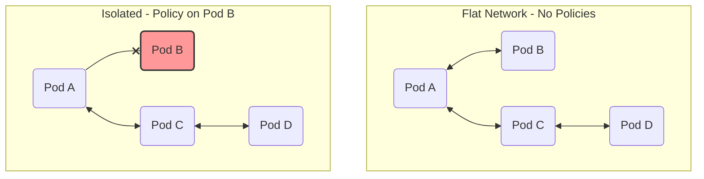
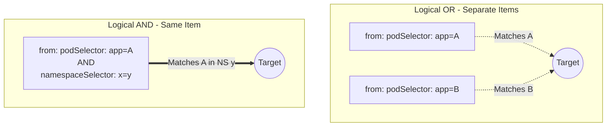
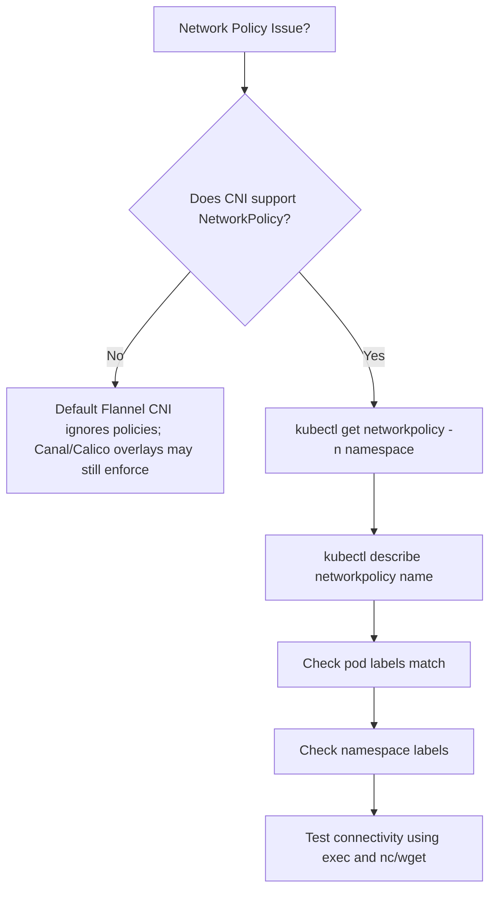
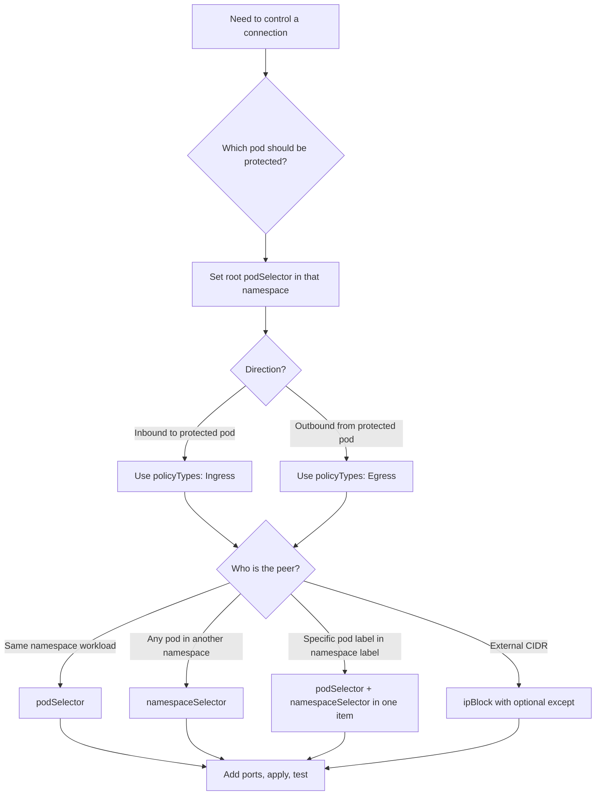

> **Складність**: `[СЕРЕДНЯ]` — фаєрвол на рівні Подів.
>
> **Час на проходження**: 45-55 хвилин.
>
> **Передумови**: Модуль 3.1 (Сервіси), Модуль 2.1 (Поди).

---

## Що ви зможете зробити

Після завершення цього модуля ви зможете:
- **Спроєктувати** стратегію мережевої сегментації на рівні простору імен для багаторівневого застосунку Kubernetes, використовуючи базові політики «заборонити все за замовчуванням» та точкові політики дозволу.
- **Впровадити** вхідні (ingress) та вихідні (egress) NetworkPolicies, які авторизують лише необхідні комбінації Подів, просторів імен, IP-блоків та портів.
- **Оцінити** логіку селекторів у правилах `podSelector`, `namespaceSelector` та `ipBlock`, щоб ви могли відрізнити поведінку АБО від поведінки І ще до застосування маніфесту.
- **Діагностувати** заблоковану або несподівано відкриту взаємодію, перевіряючи підтримку CNI, вибір політики, мітки, вихідний DNS-трафік та зворотні правила ingress чи egress.
- **Порівняти** примусове застосування NetworkPolicy у Kubernetes із традиційними очікуваннями від фаєрвола, включно з адитивними правилами, асинхронним застосуванням, відмінностями CNI та обмеженнями рівнів 3 і 4.

## Чому цей модуль важливий

Гіпотетичний сценарій: ваша команда запускає трирівневий застосунок в одному просторі імен. Веб-Под отримує публічний трафік через інгрес-контролер, Под застосунку спілкується з базою даних, а пакетний обробник час від часу звертається до зовнішнього API. Під час реагування на вразливість у залежностях команда безпеки запитує, чи міг би скомпрометований веб-Под підключитися напряму до бази даних, опитати кластерний DNS або звернутися до приватних інфраструктурних кінцевих точок. Без NetworkPolicies чесна відповідь буде незручною: у типовій мережевій моделі Kubernetes Поди зазвичай можуть вільно спілкуватися, доки CNI-плагін із примусовим застосуванням політик та відповідні об'єкти політик не скажуть інакше.

NetworkPolicies — це вбудований у Kubernetes спосіб виразити наміри щодо трафіку на рівні Подів на рівнях 3 та 4. Вони не замінюють автентифікацію, TLS, контроль допуску чи виявлення під час виконання, але вони зменшують радіус ураження, коли одне робоче навантаження поводиться неправильно. Уявіть простір імен як багатоквартирний будинок, де кожна квартира спочатку має незамкнені двері та незамкнений вихід із вестибюля. NetworkPolicy не переміщує квартири й не змінює, хто в них живе; вона додає правила про те, які двері приймають відвідувачів і якими виходами може користуватися кожен мешканець.

На іспиті CKA це важливо, тому що екзамен очікує, що ви будете міркувати з перших принципів, а не запам'ятовувати один маніфест. Ви повинні знати, коли політика ізолює Под, коли порожній об'єкт означає «усе», коли порожній список означає «нічого» та чому блокування egress ламає виявлення сервісів, якщо DNS не дозволено явно. Операційна звичка не менш важлива, ніж YAML: спроєктуйте бажаний потік, застосуйте найменшу корисну базову політику, додавайте по одному правилу дозволу за раз і перевіряйте результат за допомогою міток та тестів зв'язності замість того, щоб припускати, що маніфест робить саме те, що ви мали на увазі.

## Ментальна модель NetworkPolicy

NetworkPolicy — це фаєрвольна модель, орієнтована на застосунок. Традиційні правила фаєрвола часто починаються з діапазонів IP, тому що сервери раніше були довговічними та призначалися вручну. Поди Kubernetes — протилежність: вони постійно створюються, видаляються, переплановуються та замінюються, тож корисна політика має слідувати міткам і просторам імен, а не окремим IP-адресам Подів. Політика вибирає Поди-призначення за допомогою `spec.podSelector`, а потім визначає, які джерела ingress або призначення egress дозволені для цих вибраних Подів.

Найважливіше значення за замовчуванням легко сформулювати, але легко забути під тиском: Под не ізольований, доки NetworkPolicy не вибере його для певного напрямку. Якщо жодна політика ingress не вибирає Под, вхідний трафік дозволено. Якщо жодна політика egress не вибирає Под, вихідний трафік дозволено. Щойно принаймні одна політика вибирає Под для ingress, приймаються лише дозволені вхідні потоки; щойно принаймні одна політика вибирає його для egress, приймаються лише дозволені вихідні потоки.



Діаграма показує перший ментальний поділ. Політики не є глобальними фаєрвольними об'єктами, що ширяють над усім кластером; вони застосовуються до вибраних Подів у тому просторі імен, де існує об'єкт політики. Вибраний Под — це захищений об'єкт, а напрямок політики визначає, чи контролюєте ви трафік, що надходить до нього, чи трафік, що виходить із нього. Якщо інший Под не вибраний жодною політикою, цей інший Под залишається неізольованим для відповідного напрямку, навіть якщо інше робоче навантаження в тому самому просторі імен може бути жорстко заблоковане.

| Концепція | Опис |
|---------|-------------|
| **Ingress** | Трафік, що НАДХОДИТЬ до Пода з іншої кінцевої точки |
| **Egress** | Трафік, що ВИХОДИТЬ із Пода до іншої кінцевої точки |
| **podSelector** | Критерій, що визначає, до яких Подів застосовується політика |
| **Ізольовані Поди** | Поди, активно вибрані будь-якою NetworkPolicy |
| **Адитивні правила** | Кілька політик = об'єднання всіх правил; явної заборони немає |

Читайте «адитивні» буквально. NetworkPolicy у Kubernetes не має явного правила заборони, яке мало б пріоритет над правилом дозволу, і тут немає впорядкування правил, яке ви могли бачити в периметральних фаєрволах. Якщо дві політики вибирають той самий Под для ingress, Под отримує об'єднання дозволеного вхідного трафіку обох політик. Якщо одна політика дозволяє фронтенд-Поди, а інша дозволяє Поди моніторингу, дозволені обидва джерела; видалення чи звуження однієї політики не стирає трафік, дозволений іншою.

```yaml
# This policy makes pods with app=web isolated for INGRESS
# (they can still make outbound connections)
apiVersion: networking.k8s.io/v1
kind: NetworkPolicy
metadata:
  name: isolate-ingress
spec:
  podSelector:
    matchLabels:
      app: web         # Selects these pods
  policyTypes:
  - Ingress            # Only ingress is affected
```

Зупиніться та спрогнозуйте: ви створюєте NetworkPolicy, яка вибирає Поди з міткою `app: web`, містить `policyTypes: [Ingress]` і не має правил ingress. Чи може щось дістатися до цих Подів? Тепер змініть лише один рядок так, щоб політика містила `ingress: [{}]`. Перш ніж читати далі, вирішіть, чи створює ця єдина пара фігурних дужок вужче правило, ідентичну заборону чи дозвіл-усе.

Відповідь залежить від різниці між порожнім списком і порожнім об'єктом правила. Вибраний Под із `policyTypes: [Ingress]` і без правил ingress є ізольованим за ingress без дозволених джерел, тож вхідний трафік заборонено за замовчуванням. Запис правила `{}` — це інше: це правило дозволу без обмежень джерела чи порту, тож воно дозволяє весь вхідний трафік для вибраних Подів. Іншими словами, `ingress: []` означає «дозволити нічого», а `ingress: [{}]` означає «дозволити все для цього напрямку».

## Заборона за замовчуванням та правила дозволу

Заборона за замовчуванням — це основа практичного проєктування NetworkPolicy, тому що вона змінює простір імен зі стану «усі спілкуються, доки їх не зупинять» на «ніхто не спілкується, доки це не передбачено навмисно». У Kubernetes звичайна базова політика для ingress — це NetworkPolicy з `podSelector: {}`, `policyTypes: [Ingress]` і без правил `ingress`. Порожній кореневий `podSelector` вибирає всі Поди в просторі імен цієї політики, а відсутність правил ingress означає, що ці вибрані Поди не мають дозволених вхідних джерел, доки пізніші політики дозволу їх не додадуть.

```yaml
# Deny all incoming traffic to pods in namespace
apiVersion: networking.k8s.io/v1
kind: NetworkPolicy
metadata:
  name: deny-all-ingress
  namespace: production
spec:
  podSelector: {}        # Empty = select ALL pods
  policyTypes:
  - Ingress              # No ingress rules = deny all ingress
```

Заборона egress за замовчуванням працює так само, але операційні наслідки часто більш несподівані. Коли ви ізолюєте egress, ви не лише зупиняєте виклики до зовнішніх систем; ви також зупиняєте виклики до внутрішніх платформних сервісів, доки явно їх не дозволите. DNS — класичний приклад. Под може й далі мати змогу дістатися до Пода бази даних за прямою IP-адресою, якщо ви дозволите цю IP-адресу чи шлях до Пода, але розв'язання `db-service` зазнає невдачі, доки Под не зможе надсилати DNS-запити до CoreDNS.

```yaml
# Deny all outgoing traffic from pods in namespace
apiVersion: networking.k8s.io/v1
kind: NetworkPolicy
metadata:
  name: deny-all-egress
  namespace: production
spec:
  podSelector: {}        # All pods
  policyTypes:
  - Egress               # No egress rules = deny all egress
```

Для просторів імен із високим ризиком команди іноді починають із повного блокування, а потім додають явні потоки. Це потужний підхід, але його легко розгорнути зарано. Якщо ви застосуєте обидві політики заборони (ingress і egress) до того, як ви картували DNS, скрапінг метрик, проби готовності, виклики вебхуків і шляхи до бази даних, ви можете водночас створити чисту безпекову поставу та збій. Використовуйте заборону за замовчуванням обдумано й перевіряйте кожен необхідний шлях у міру його відновлення.

```yaml
# Complete lockdown
apiVersion: networking.k8s.io/v1
kind: NetworkPolicy
metadata:
  name: deny-all
spec:
  podSelector: {}
  policyTypes:
  - Ingress
  - Egress
```

Іноді вам потрібна явна політика «дозволити все», зазвичай під час контрольованого відкату чи короткого діагностичного вікна. Важливо те, що символ підстановки (wildcard) живе всередині списку `ingress` чи `egress`, а не в кореневому селекторі. Кореневий `podSelector: {}` обирає всі Поди в просторі імен; елемент `- {}` усередині списку правил дозволяє всіх вузлів-учасників і всі порти для цього напрямку. Ці два порожні об'єкти виглядають схоже, але вони відповідають на різні запитання.

```yaml
# Explicitly allow all ingress (opens traffic additively even if deny-all remains present)
apiVersion: networking.k8s.io/v1
kind: NetworkPolicy
metadata:
  name: allow-all-ingress
spec:
  podSelector: {}
  policyTypes:
  - Ingress
  ingress:
  - {}                   # Empty rule = allow all
```

```yaml
# Explicitly allow all egress
apiVersion: networking.k8s.io/v1
kind: NetworkPolicy
metadata:
  name: allow-all-egress
spec:
  podSelector: {}
  policyTypes:
  - Egress
  egress:
  - {}                   # Empty rule = allow all
```

Якщо `policyTypes` опущено, API-сервер виводить `Ingress`, а `Egress` він виводить лише тоді, коли існує блок `egress`. Таке виведення є валідною поведінкою Kubernetes, але це не дуже хороша звичка для іспитової роботи чи рев'ю в продакшені. Явні `policyTypes` роблять ваш намір видимим для наступного читача й запобігають тому, щоб маленьке редагування YAML непомітно змінило, який напрямок ізольовано.

## Селектори, логіка та порти

Селектори — це місце, де ховається більшість помилок NetworkPolicy. `podSelector` у корені політики обирає Поди-призначення, до яких застосовується політика. `podSelector` під `from` обирає Поди-джерела для ingress, тоді як `podSelector` під `to` обирає Поди-призначення для egress. `namespaceSelector` обирає простори імен за мітками, а не за іменами просторів імен, записаними як рядки, а `ipBlock` обирає діапазони CIDR замість об'єктів Kubernetes.

```yaml
# Allow traffic from pods with label app=frontend
apiVersion: networking.k8s.io/v1
kind: NetworkPolicy
metadata:
  name: allow-frontend
spec:
  podSelector:
    matchLabels:
      app: backend         # This policy applies to backend pods
  policyTypes:
  - Ingress
  ingress:
  - from:
    - podSelector:
        matchLabels:
          app: frontend    # Allow traffic from frontend pods
```

```mermaid
graph LR
    subgraph Allowed
        P1(Pod app: frontend) --✓--> P2(Pod app: backend)
    end
    subgraph Blocked
        P3(Pod app: other) --x--> P4(Pod app: backend)
    end
```

У тому самому просторі імен ця політика проста: бекенд-Поди вибрані, фронтенд-Поди дозволені як джерела, а інші Поди цією політикою не дозволені. Фраза «цією політикою» має значення, бо політики є адитивними. Якщо інша політика теж вибирає бекенд-Поди й дозволяє `app: other`, з'єднання від Пода «other» стає дозволеним, навіть якщо ця конкретна політика його не згадує.

```yaml
# Allow traffic from all pods in namespace "monitoring"
apiVersion: networking.k8s.io/v1
kind: NetworkPolicy
metadata:
  name: allow-monitoring
spec:
  podSelector:
    matchLabels:
      app: backend
  policyTypes:
  - Ingress
  ingress:
  - from:
    - namespaceSelector:
        matchLabels:
          name: monitoring    # Namespace must have this label
```

Простори імен потребують міток, і це не просто питання стилю. `namespaceSelector` у NetworkPolicy не зіставляє простір імен за його відображуваним іменем, доки це ім'я не представлене як мітка. Сучасні простори імен Kubernetes отримують стабільну мітку `kubernetes.io/metadata.name`, що корисно для точного націлювання за іменем, але власні мітки на кшталт `name: monitoring` чи `env: production` все одно мають існувати, перш ніж селектор зможе їх зіставити.

```bash
kubectl label namespace monitoring name=monitoring
```

Селектор `ipBlock` призначений для трафіку на основі CIDR, особливо трафіку, що надходить від адрес поза об'єктною моделлю кластера чи прямує до них. Його поле `except` — це механізм віднімання, але CIDR-винятки мають бути вкладені всередині батьківського CIDR. Політика, яка дозволяє `192.168.1.0/24`, крім `192.168.1.100/32`, є валідною; політика, яка дозволяє `192.168.0.0/16`, крім `10.0.0.0/24`, є невалідною, тому що виняток не міститься всередині дозволеного діапазону.

```yaml
# Allow traffic from specific IP ranges
apiVersion: networking.k8s.io/v1
kind: NetworkPolicy
metadata:
  name: allow-external
spec:
  podSelector:
    matchLabels:
      app: web
  policyTypes:
  - Ingress
  ingress:
  - from:
    - ipBlock:
        cidr: 192.168.1.0/24      # Allow this range
        except:
        - 192.168.1.100/32        # Except this IP
```

Порти звужують набір вибраних вузлів-учасників до протоколу та порту рівня 4. Якщо ви вказуєте вузлів-учасників, але опускаєте порти, дозволені всі порти від цих вузлів. Якщо ви вказуєте порти, але опускаєте вузлів-учасників, ці порти дозволені від будь-якого джерела для ingress або до будь-якого призначення для egress. Така поведінка корисна, коли вона навмисна, але вона може випадково створити надто широку політику, коли учень зосереджується на списку портів і забуває, що поле вузлів-учасників порожнє.

```yaml
# Allow HTTP and HTTPS only
apiVersion: networking.k8s.io/v1
kind: NetworkPolicy
metadata:
  name: allow-web-ports
spec:
  podSelector:
    matchLabels:
      app: web
  policyTypes:
  - Ingress
  ingress:
  - from:
    - podSelector: {}            # From any pod
    ports:
    - protocol: TCP
      port: 80
    - protocol: TCP
      port: 443
```

Зупиніться та спрогнозуйте: якби політика вище змінила `from` на порожнє `from: []`, чи дозволила б вона HTTP від кожного Пода, від жодного Пода чи лише з того самого простору імен? Потім порівняйте цю відповідь із `from: - podSelector: {}`. Це той тип крихітної різниці в YAML, що з'являється на реальних рев'ю, тому що обидві версії виглядають короткими й обидві здаються правдоподібними з першого погляду.

Розкриття: `from: []` (порожній список) означає дозволити з **будь-якого** джерела — будь-якого простору імен та зовнішніх IP-адрес (`kubectl describe` показує `From: <any>`). На противагу цьому, `from: - podSelector: {}` дозволяє лише Поди у **власному просторі імен політики**. Пастка CKA — це міжпросторовий розрив: порожній список є символом підстановки, тоді як порожній селектор Подів стосується лише того самого простору імен.

## І, АБО та оцінювання кількох правил

Найцінніший синтаксичний урок у цьому модулі — це різниця між окремими елементами списку та об'єднаними полями селектора. Окремі записи під `from` чи `to` поводяться як АБО. Один запис, що містить водночас `podSelector` і `namespaceSelector`, поводиться як І. Візуальна підказка — це відступ та дефіси: якщо селектори стоять під різними елементами списку `-`, вони є альтернативами; якщо вони стоять в одному елементі списку, мають збігтися обидва.

```yaml
# OR logic: from frontend pods OR from monitoring namespace
ingress:
- from:
  - podSelector:
      matchLabels:
        app: frontend
- from:
  - namespaceSelector:
      matchLabels:
        name: monitoring
```

```yaml
# AND logic: from frontend pods IN monitoring namespace
ingress:
- from:
  - podSelector:
      matchLabels:
        app: frontend
    namespaceSelector:
      matchLabels:
        name: monitoring
```



Ця відмінність не є суто академічною. Припустімо, ваша політика має дозволяти лише Подам Prometheus у просторі імен monitoring скрапити API. Якщо ви випадково напишете два записи — один для `podSelector: app=prometheus`, а інший для `namespaceSelector: name=monitoring` — ви дозволили всі Поди з міткою Prometheus у просторі імен політики та всі Поди в monitoring. Виправлена версія розміщує обидва селектори в одному елементі вузла-учасника, що означає, що Под-джерело має мати мітку й має жити у відповідному просторі імен.

Та сама логіка поєднується з портами та кількома правилами. У межах одного правила вузол-учасник має відповідати обмеженням учасника, а з'єднання має відповідати обмеженням порту. Серед кількох правил будь-яке відповідне правило може дозволити з'єднання. Серед кількох політик, що вибирають той самий Под і напрямок, будь-яка політика може долучити дозволений шлях. Під час налагодження ви завжди запитуєте, чи дозволяє принаймні одна вибрана політика точне джерело, призначення, протокол і порт.

```yaml
apiVersion: networking.k8s.io/v1
kind: NetworkPolicy
metadata:
  name: complex-policy
spec:
  podSelector:
    matchLabels:
      app: api
  policyTypes:
  - Ingress
  - Egress
  ingress:
  # Rule 1: Allow from frontend in same namespace
  - from:
    - podSelector:
        matchLabels:
          app: frontend
    ports:
    - port: 8080
  # Rule 2: Allow from any pod in monitoring namespace
  - from:
    - namespaceSelector:
        matchLabels:
          name: monitoring
    ports:
    - port: 9090
  egress:
  # Rule 1: Allow to database pods
  - to:
    - podSelector:
        matchLabels:
          app: database
    ports:
    - port: 5432
  # Rule 2: Allow DNS
  - to:
    - namespaceSelector: {}
    ports:
    - port: 53
      protocol: UDP
    - port: 53
      protocol: TCP
```

Для трафіку між двома ізольованими Подами думайте про обидві сторони розмови. Політика egress Пода-джерела має дозволяти призначення, а політика ingress Пода-призначення має дозволяти джерело. Бекенд-Под може бути ідеально авторизований надсилати дані до бази даних, але база даних усе одно може відхилити з'єднання, якщо її політика ingress не приймає трафік від бекенду. Ця двостороння перевірка — одна з причин, чому усунення несправностей NetworkPolicy часто потребує інспекції обох робочих навантажень, а не вдивляння в один маніфест.

Перш ніж запускати це в кластері, який результат ви очікуєте, якщо Под API може робити egress до `app=database` на 5432, але Под бази даних має політику ingress із забороною всього й без правила дозволу? Спрогнозуйте, чи зазнає TCP-з'єднання невдачі на етапі розв'язання імен, на етапі встановлення з'єднання чи на рівні застосунку. Потім перевірте, дослідивши DNS окремо від цільового порту, тому що різні збої вказують на різні відсутні правила.

## Egress, DNS та зовнішні призначення

Політика egress — це місце, де NetworkPolicy стає чимось більшим, ніж проста сегментація «хто може викликати мій сервіс». Вона контролює, з чим вибраним Подам дозволено зв'язуватися, а отже, вона може блокувати шляхи витоку даних, випадкові виклики до приватної інфраструктури та неочікуваний дрейф залежностей. Вона також означає, що ви відповідаєте за кожну платформну залежність, яку використовує робоче навантаження. Якщо Поду потрібен DNS, метрики, кінцева точка метаданих хмари, внутрішній API чи база даних, ці потоки потрібно представити навмисно.

```yaml
# Backend can only talk to database
apiVersion: networking.k8s.io/v1
kind: NetworkPolicy
metadata:
  name: backend-egress
spec:
  podSelector:
    matchLabels:
      app: backend
  policyTypes:
  - Egress
  egress:
  - to:
    - podSelector:
        matchLabels:
          app: database
    ports:
    - port: 5432
```

Ця політика навмисно неповна для більшості реальних застосунків, тому що вона опускає DNS. Сервіси Kubernetes зазвичай виявляються через DNS-імена, а ці імена розв'язуються через Поди кластерного DNS, зазвичай CoreDNS у `kube-system`. Якщо egress ізольовано й правила DNS немає, `curl db-service` може зазнати невдачі, навіть коли прямий трафік до відомої IP-адреси Пода чи дозволеної кінцевої точки успішний. Це не суперечність; це доказ того, що шлях пошуку імені заблоковано, тоді як шлях даних може бути дозволений.

```yaml
# Allow DNS to kube-system
apiVersion: networking.k8s.io/v1
kind: NetworkPolicy
metadata:
  name: allow-dns
spec:
  podSelector: {}
  policyTypes:
  - Egress
  egress:
  - to:
    - namespaceSelector:
        matchLabels:
          kubernetes.io/metadata.name: kube-system
    ports:
    - port: 53
      protocol: UDP
    - port: 53
      protocol: TCP
```

Що сталося б, якби ви застосували політику заборони всього egress до бекенд-Подів, але забули про цей виняток для DNS? Поди можуть і далі діставатися до бази даних за прямою IP-адресою, якщо інше правило дозволяє це призначення, але доступ за іменем сервісу зазнає невдачі, тому що Под не може опитати DNS на TCP- чи UDP-порту 53. Це найкорисніший поділ для налагодження NetworkPolicy: тестуйте розв'язання імен та сиру зв'язність окремо, щоб ви знали, чи бракує вам egress для DNS, egress для застосунку, ingress на призначенні чи всіх трьох.

Зовнішній egress зазвичай виражається через `ipBlock`, але вам потрібно бути обережними щодо того, яку IP-адресу бачить CNI. Маршрутизація сервісів, NAT, переадресація на рівні вузла та хмарна мережа можуть змінити, чи спостерігає оцінювання політики оригінальне призначення, чи транслювану адресу. Для іспитової роботи зрозумійте форму маніфесту; для продакшен-роботи підтвердьте поведінку за документацією свого CNI та тестом на рівні пакетів, коли шлях призначення перетинає межі кластера.

```yaml
# Allow egress to external IPs
apiVersion: networking.k8s.io/v1
kind: NetworkPolicy
metadata:
  name: allow-external
spec:
  podSelector:
    matchLabels:
      app: web
  policyTypes:
  - Egress
  egress:
  - to:
    - ipBlock:
        cidr: 0.0.0.0/0        # All IPs
        except:
        - 10.0.0.0/8           # Except private ranges
        - 172.16.0.0/12
        - 192.168.0.0/16
```

Приклад дозволяє призначення в публічному інтернеті, водночас вирізаючи поширені приватні діапазони адрес. Цей патерн може бути корисним запобіжником для робочих навантажень, яким потрібні API постачальників, але які не мають діставатися до внутрішніх мереж. Це не повна стратегія запобігання витоку даних, і вона не розуміє HTTP-хости чи TLS SNI, тому що стандартний API NetworkPolicy працює на рівнях 3 та 4. Якщо вам потрібна політика рівня 7, ви дивитеся на специфічні для CNI розширення, політику сервісної мережі (service mesh), політику шлюзу чи авторизацію застосунку.

## Примусове застосування CNI та налагодження

NetworkPolicy — це контракт API, а не гарантія того, що кожен кластер його застосовує. API-сервер Kubernetes прийме валідний об'єкт NetworkPolicy, навіть коли встановлений CNI-плагін не реалізує примусове застосування політик. Саме тому політика може виглядати правильно в `kubectl describe`, тоді як трафік усе одно вільно тече. Перше запитання для налагодження — не «який селектор я пропустив?», а «чи справді мережевий плагін цього кластера примусово застосовує NetworkPolicy?».

Обробка мережевої політики також є асинхронною. Створення, видалення чи зміна політик можуть зайняти трохи часу, щоб поширитися у площину даних (dataplane), а встановлені з'єднання можуть поводитися по-різному в різних реалізаціях CNI, коли політика змінюється посеред потоку. Традиційні фаєрволи часто навіюють ментальну модель негайного впорядкованого оцінювання правил; NetworkPolicy у Kubernetes — це декларативний бажаний стан, узгоджуваний мережевою реалізацією. Для завдань CKA зачекайте трохи й повторіть тест; для продакшен-розгортань поетапно вводьте зміни політик і стежте як за зв'язністю, так і за станом застосунку.



Коли ви налагоджуєте, працюйте зовні всередину. Підтвердьте CNI, перелічіть політики в правильному просторі імен, опишіть політику, щоб побачити, як Kubernetes її інтерпретував, перевірте мітки на вибраних Подах та просторах імен, а потім протестуйте одне з'єднання з чітким джерелом і призначенням. Уникайте тестування через ім'я Сервісу першим, коли задіяні політики egress, тому що невдалий пошук імені Сервісу може означати, що DNS заблоковано ще до того, як запит досягне передбачуваного призначення.

```bash
# List network policies
kubectl get networkpolicy
kubectl get netpol                 # Short form

# Describe policy
kubectl describe networkpolicy <name>

# Check pod labels
kubectl get pods --show-labels

# Check namespace labels
kubectl get namespaces --show-labels

# Test connectivity
kubectl exec <pod> -- nc -zv target-service 80
kubectl exec <pod> -- wget --spider --timeout=1 http://target-service
kubectl exec <pod> -- curl -s --max-time 1 http://target-service
```

| Симптом | Причина | Розв'язання |
|---------|-------|----------|
| Політика не застосовується | CNI не підтримує | Використайте Calico, Cilium чи Weave |
| Не вдається розв'язати DNS | Egress для DNS заблоковано | Додайте правило egress для порту 53 |
| Міжпросторовий трафік заблоковано | Неправильний namespaceSelector | Промаркуйте простори імен, перевірте селектор |
| Весь трафік заблоковано | Порожній podSelector у забороні | Створіть правила дозволу для потрібного трафіку |
| Поди й далі спілкуються | Мітки не збігаються | Перевірте, що podSelector відповідає міткам Подів |

Кілька граничних випадків варто запам'ятати, бо вони пояснюють заплутані результати тестів. Трафік із власного вузла Пода завжди дозволено, навіть коли Под ізольовано за ingress, тож невдала проба готовності — це зазвичай відсутнє правило дозволу для шляху джерела проби, а не обхід kubelet. Поведінка NetworkPolicy для Подів, що використовують `hostNetwork: true`, визначається реалізацією, і багато CNI трактують ці робочі навантаження як трафік мережі вузла, а не звичайний трафік Подів. Стандартний API не виражає явних дій заборони, цілей у вигляді імені Сервісу, обмежень за ідентичністю вузла, вимог TLS чи правил для HTTP-шляхів. Поле `endPort` є стабільним для діапазонів портів, але підтримка все одно може залежати від реалізації політики за API.

Kubernetes 1.35 продовжує використовувати `networking.k8s.io/v1` для NetworkPolicy. Старіші маніфести, що використовують `extensions/v1beta1`, слід оновити, а не переносити далі, і базова схема для звичайних політик зазвичай упізнавана після цієї зміни групи API. Практичний урок полягає в тому, що знання про NetworkPolicy залишаються корисними в усіх підтримуваних випусках, але ви все одно маєте перевіряти можливості CNI та сумісність версії API, перш ніж припускати, що маніфест і застосується, і буде примусово виконаний.

## Зразкові еталонні політики

Корисний спосіб засвоїти NetworkPolicy — це перекласти архітектуру застосунку в невеликий набір захищених призначень. Не починайте із запитання «Які Поди можуть надсилати трафік?». Починайте із запитання «Який Под слід захистити від отримання трафіку?». Таке формулювання тримає кореневий `podSelector` чесним. Щойно ви знаєте захищене призначення, ви можете додати мінімальний селектор джерела та список портів, що представляють бажаний потік. Приклади в цьому розділі зберігають поширені форми політик, які ви будете повторно використовувати під тиском часу.

Патерн захисту бази даних — найпростіший серйозний приклад. База даних зазвичай має отримувати трафік лише від рівня застосунку, а не від веброрівня, не від моніторингу (хіба що це явно потрібно) і не від довільних діагностичних Подів. Політика нижче вибирає Поди бази даних як захищене призначення й дозволяє лише бекенд-Поди на порту бази даних. Якщо ви пізніше виявите, що міграції запускаються з окремою міткою завдання, додайте другу вузьку політику дозволу замість того, щоб розширювати цю на весь простір імен.

```yaml
# Only allow backend pods to access database
apiVersion: networking.k8s.io/v1
kind: NetworkPolicy
metadata:
  name: db-protection
  namespace: production
spec:
  podSelector:
    matchLabels:
      app: database
  policyTypes:
  - Ingress
  ingress:
  - from:
    - podSelector:
        matchLabels:
          app: backend
    ports:
    - port: 5432
```

Зверніть увагу на те, чого ця політика не каже. Вона не надає бекенд-Подам дозволу робити egress будь-куди й не захищає Под бази даних, якщо мітка бази даних відсутня чи відрізняється. Вона також не згадує Сервіс, тому що стандартний API вибирає Поди та вузли-учасники, а не імена Сервісів. У кластері з блокуванням egress рівень бекенду все одно потребує правила egress до бази даних і, ймовірно, правила DNS, якщо він підключається за іменем Сервісу. Трактуйте ingress та egress як дві половини того самого шляху запиту.

Для трирівневого застосунку пишіть політики в тому ж порядку, у якому ви малювали б архітектуру: трафік входить у веброрівень, веброрівень викликає рівень застосунку, а рівень застосунку викликає рівень бази даних. Теоретичні приклади нижче використовують `tier: web/app/db`; практична лабораторна робота використовує `tier: frontend/backend/database` — логіка селекторів ідентична, відрізняються лише значення міток. Це легше рев'юити, ніж одну гігантську політику, бо кожен об'єкт має єдине захищене призначення. Менші об'єкти політики також роблять адитивну поведінку менш несподіваною. Коли майбутній рев'юер запитає, чому база даних приймає трафік, він може дослідити політику бази даних замість того, щоб переглядати універсальний маніфест із багатьма непов'язаними правилами.

```yaml
# Web tier - only from ingress controller
apiVersion: networking.k8s.io/v1
kind: NetworkPolicy
metadata:
  name: web-policy
spec:
  podSelector:
    matchLabels:
      tier: web
  ingress:
  - from:
    - namespaceSelector:
        matchLabels:
          kubernetes.io/metadata.name: ingress-nginx
  policyTypes:
  - Ingress
```

Веб-політика навмисно базується на просторі імен інгрес-контролера, а не на діапазоні IP клієнта. У багатьох кластерах трафік, що досягає Пода через інгрес-контролер, надходить від Подів контролера, локальних для вузла шляхів чи специфічних для реалізації адрес, а не від оригінального інтернет-клієнта. NetworkPolicy зазвичай є неправильним місцем для вираження ідентичності браузера чи правил HTTP-маршрутів. Дозвольте рівню інгресу обробляти HTTP-маршрутизацію й автентифікацію, а потім дозвольте NetworkPolicy виражати, які компоненти кластера взагалі можуть діставатися до веб-Подів.

```yaml
# App tier - only from web tier
apiVersion: networking.k8s.io/v1
kind: NetworkPolicy
metadata:
  name: app-policy
spec:
  podSelector:
    matchLabels:
      tier: app
  ingress:
  - from:
    - podSelector:
        matchLabels:
          tier: web
  policyTypes:
  - Ingress
```

Політика застосунку використовує селектор Подів того самого простору імен, тому що робочі навантаження веб і застосунку часто розгортаються разом. Якщо ваша платформа розділяє робочі навантаження веб і застосунку на різні простори імен, поєднайте `namespaceSelector` із міткою веб-Пода в тому самому елементі вузла-учасника. Не пишіть два окремі записи вузлів-учасників, якщо ви справді не маєте на увазі «будь-який веб-Под у поточному просторі імен або будь-який Под у вибраному просторі імен». Різниця в YAML невелика, але вона змінює межу безпеки.

```yaml
# DB tier - only from app tier
apiVersion: networking.k8s.io/v1
kind: NetworkPolicy
metadata:
  name: db-policy
spec:
  podSelector:
    matchLabels:
      tier: db
  ingress:
  - from:
    - podSelector:
        matchLabels:
          tier: app
    ports:
    - port: 5432
  policyTypes:
  - Ingress
```

Політика бази даних звужує і джерело, і порт, що є правильним значенням за замовчуванням для чутливих стейтфул-навантажень. Якщо база даних відкриває порт метрик, додайте окреме правило дозволу для моніторингу, яке називає простір імен моніторингу та порт метрик. Тримання операційного доступу окремо від доступу застосунку допомагає рев'ю, бо кожне правило відповідає на різне запитання. Це також дає змогу прибрати один шлях доступу, не зламавши випадково інший, що має значення під час реагування на інцидент.

Комплексна ізоляція простору імен — це інший патерн. Він каже, що вибрані Поди можуть спілкуватися лише всередині простору імен, із винятком для DNS, щоб виявлення Сервісів і далі працювало. Цей патерн може бути корисним для навчальних лабораторій, тенант-подібних просторів імен чи середовищ, де робочі навантаження всередині простору імен довіряють одне одному, але не мають ініціювати довільні міжпросторові з'єднання. Він не є заміною рівневих політик, коли різні Поди в тому самому просторі імен мають різну чутливість.

```yaml
# Default deny all, then allow within namespace only
apiVersion: networking.k8s.io/v1
kind: NetworkPolicy
metadata:
  name: namespace-isolation
spec:
  podSelector: {}
  policyTypes:
  - Ingress
  - Egress
  ingress:
  - from:
    - podSelector: {}      # Same namespace only
  egress:
  - to:
    - podSelector: {}      # Same namespace only
  - to:                    # Plus DNS
    - namespaceSelector: {}
    ports:
    - port: 53
      protocol: UDP
    - port: 53
      protocol: TCP
```

Ця політика компактна, але вона заслуговує на уважне рев'ю. Правила ingress та першого egress використовують `podSelector: {}`, що означає будь-який Под у тому самому просторі імен. Правило DNS використовує `namespaceSelector: {}`, що означає будь-який простір імен, але воно звужує порт до 53. У продакшен-кластері ви можете надати перевагу точнішому націлюванню на простір імен DNS через `kubernetes.io/metadata.name: kube-system` і включити TCP 53, а також UDP 53. Ширший приклад залишається корисним, бо він оголює механіку селекторів.

Коли ви будуєте власні політики, напишіть однореченнєвий контракт над кожним маніфестом, перш ніж писати YAML. Наприклад: «Поди бази даних приймають TCP 5432 лише від Подів застосунку в цьому просторі імен». Потім звірте кожне поле з цим реченням. Кореневий селектор має ідентифікувати Поди бази даних, джерело ingress має ідентифікувати Поди застосунку, а порт має бути 5432. Якщо якесь поле неможливо простежити назад до речення, ви, ймовірно, кодуєте припущення, а не вимогу.

Тут є також урок щодо розгортання. Застосування політики заборони за замовчуванням перед політиками дозволу дає негайний захист, але ризикує коротким перериванням. Застосування політик дозволу першими, а заборони за замовчуванням другою, зменшує ризик збою, але залишає стару широку досяжність на місці до фінального кроку. У лабораторії будь-який порядок прийнятний, якщо ви розумієте перехідну поведінку. У продакшені вибирайте порядок обдумано, анонсуйте очікувані симптоми й тримайте напоготові маніфест відкату, що вужчий за постійний символ підстановки.

Нарешті, зробіть негативні тести частиною свого визначення готовності. Успішний запит від фронтенду до застосунку лише доводить, що один дозволений шлях працює; він не доводить, що база даних захищена від фронтенду. Для кожного чутливого призначення тестуйте принаймні одне передбачуване джерело й одне непередбачуване джерело. Якщо непередбачуване джерело успішне, дослідіть спершу адитивні політики, потім мітки селекторів, а потім примусове застосування CNI. Цей порядок діагностики не дає вам переписувати правильний YAML, тоді як справжньою причиною є ширша політика чи непідтримувана площина даних.

## Патерни та антипатерни

Патерни корисні, тому що вони не дають авторингу політик перетворитися на купу разового YAML. Найкращі патерни починаються з постави за замовчуванням, додають явні бізнес-потоки й залишають достатньо спостережуваності, щоб налагоджувати, не вимикаючи все. Вони також трактують мітки як частину контракту: якщо `tier=app` керує мережевим доступом, то ця мітка потребує такої самої уваги, як селектор Сервісу чи мітка шаблону Деплойменту.

| Патерн | Коли його використовувати | Чому він працює | Міркування щодо масштабування |
|---------|----------------|--------------|------------------------|
| Заборона ingress за замовчуванням у просторі імен | Будь-який спільний простір імен із робочими навантаженнями різного рівня довіри | Він запобігає випадковій вхідній досяжності та змушує до явних правил дозволу | Застосовуйте під час технічного обслуговування чи з поетапними політиками дозволу, щоб не здивувати наявний трафік |
| Рівневі політики дозволу | Робочі навантаження веб, застосунку та бази даних із передбачуваним напрямком запитів | Він прямо мапує архітектуру застосунку на мітки та порти | Тримайте мітки рівнів стабільними й рев'юйте адитивні політики, що можуть розширити доступ |
| Пакет egress для DNS та сервісів | Робочі навантаження під ізоляцією egress, що все одно використовують Сервіси Kubernetes | Він відокремлює розв'язання імен від шляхів даних застосунку | Націлюйтеся на `kube-system` за стабільною міткою простору імен і включайте порт 53 для UDP та TCP |
| Платформний доступ за міткою простору імен | Просторам імен моніторингу, інгресу чи логування потрібен контрольований доступ | Він уникає копіювання окремих міток Подів між платформними компонентами | Використовуйте `kubernetes.io/metadata.name` чи керовані мітки простору імен послідовно |

Антипатерни зазвичай походять із трактування NetworkPolicy як останньохвилинної латки YAML замість артефакту проєктування. Команда застосовує політику заборони всього, виявляє збій застосунку, додає `ingress: [{}]` чи `egress: [{}]`, щоб отримати зелені перевірки стану, і випадково повертається до пласкої мережі. Інша команда копіює селектор простору імен із блогу, але ніколи не маркує простір імен, тож політика виглядає точною й не зіставляє нічого. Це не стільки синтаксичні проблеми, скільки проблеми робочого процесу.

| Антипатерн | Що йде не так | Краща альтернатива |
|--------------|-----------------|--------------------|
| Покладання на досяжність кластера за замовчуванням | Скомпрометований малоцінний Под може зондувати чи зв'язуватися з чутливими Подами | Починайте чутливі простори імен із заборони за замовчуванням і додавайте перевірені дозволи |
| Використання правил-символів підстановки як постійного виправлення | `ingress: [{}]` чи `egress: [{}]` скасовує ізоляцію, яку ви хотіли створити | Додавайте вузько обмежених вузлів-учасників і порти, потім тестуйте точний потік |
| Написання селекторів до того, як мітки є контрольованими | Політики мовчки пропускають простори імен чи Поди, коли мітки дрейфують | Трактуйте мережеві мітки як стабільний API та валідуйте їх під час рев'ю |
| Припущення, що односторонньої політики достатньо | Egress джерела може дозволяти потік, тоді як ingress призначення блокує його, чи навпаки | Перевіряйте і egress вибраного джерела, і ingress вибраного призначення |
| Очікування фільтрації рівня 7 | HTTP-шляхи, методи та SNI не є частиною стандартної NetworkPolicy | Використовуйте розширення CNI, політику мережі, контроль інгресу чи авторизацію застосунку для рівня 7 |

## Фреймворк прийняття рішень

Використовуйте фреймворк прийняття рішень, коли ви вдивляєтеся в порожній файл чи зламане з'єднання. Почніть із визначення захищеного Пода, бо кореневий `podSelector` відповідає на запитання «які Поди ізолює ця політика?». Далі визначте напрямок, бо ingress та egress незалежні. Потім виберіть найменший тип вузла-учасника, що представляє потік: мітки Подів для робочих навантажень того самого простору імен, мітки простору імен для міжпросторових груп, об'єднані селектори для маркованого Пода всередині маркованого простору імен та `ipBlock` для зовнішніх шляхів на основі CIDR.



| Рішення | Виберіть це | Уникайте цього |
|----------|-------------|------------|
| Вам потрібно блокувати весь вхідний трафік за замовчуванням | `podSelector: {}` із `policyTypes: [Ingress]` і без правил ingress | Символ підстановки `ingress: [{}]`, що дозволяє весь вхідний трафік |
| Вам потрібен доступ застосунку до бази даних у тому самому просторі імен | Політика призначення на Подах БД, джерело `podSelector` для Подів застосунку, порт бази даних | Дозвіл на весь простір імен, що дає кожному Поду досягати бази даних |
| Вам потрібен моніторинг із платформного простору імен | `namespaceSelector` із реальною міткою простору імен, за бажанням у поєднанні з мітками Подів моніторингу | Припущення, що імена просторів імен є селекторами без міток |
| Вам потрібен egress до зовнішнього API | `ipBlock` для діапазонів постачальника плюс egress для DNS, коли використовуються імена | Відкриття `0.0.0.0/0` без винятків чи рев'ю |
| Вам потрібна фільтрація HTTP-шляхів | Контроль вищого рівня поза стандартною NetworkPolicy | Спроба виразити шляхи, хости чи політику TLS у `networking.k8s.io/v1` |

Порядок застосування політик не змінює фінальний адитивний результат, але порядок розгортання все одно має операційне значення. Якщо ви застосуєте заборону всього перед відповідними правилами дозволу, може бути короткий збій. Якщо ви застосуєте правила дозволу перед забороною всього, може бути короткий період, коли доступні і старий плаский доступ, і передбачуваний новий доступ. У продакшені використовуйте простір імен для стейджингу чи контрольоване вікно; на іспиті будьте готові застосувати, протестувати й швидко скоригувати.

Один практичний метод рев'ю — написати матрицю трафіку перед написанням маніфестів. Розмістіть захищені призначення вздовж одного боку, ідентичності джерел угорі, а порти в клітинках. Матриці не потрібно бути вишуканою; їй лише потрібно змусити до чіткого «так» чи «ні» для кожного відношення. Коли клітинка порожня, політика не має випадково дозволяти її через селектор-символ підстановки. Коли клітинка дозволена, ви маєте бути здатними вказати на точну політику, що це надає.

Наприклад, система веб–застосунок–база даних має принаймні три важливі негативні клітинки: веб-до-бази-даних, база-даних-до-застосунку та випадковий-діагностичний-Под-до-бази-даних. Багато команд тестують лише позитивний шлях, тому що це здається доказом того, що система працює. Валідація NetworkPolicy потребує також протилежної звички. Успішний негативний тест дає впевненість, що широкий селектор, скопійований символ підстановки чи адитивна застаріла політика не скасували непомітно проєкт.

Матриця також допомагає з egress, де поширені приховані залежності. Под, що викликає зовнішній API, може потребувати DNS, проксі, кінцевої точки відкликання сертифікатів та фактичного API постачальника. Якщо ви забудете ці допоміжні потоки, політика може бути безпечною, але непридатною до використання. Якщо ви дозволите весь egress, щоб застосунок працював, політика може бути придатною, але слабкою. Інженерне завдання — ідентифікувати кожну залежність і вирішити, чи належить вона до NetworkPolicy Kubernetes, правила проксі чи конфігурації застосунку.

Інша корисна звичка — відокремлювати платформний доступ від доступу застосунку. Інгрес-контролери, системи моніторингу, збирачі логів та сканери часто потребують міжпросторової досяжності, якої Поди застосунку мати не повинні. Якщо ці потоки змішані в політики застосунку без чітких міток, пізніші рев'юери не можуть сказати, чи широке правило простору імен підтримує продакшен-трафік, чи платформний інструмент. Виділені політики, названі за платформною функцією, роблять адитивну модель легшою для аудиту й безпечнішою для зміни.

Володіння мітками заслуговує на явну увагу, тому що NetworkPolicy залежить від міток як від безпекових вхідних даних. Мітка Деплойменту, що використовується лише для групування, іноді може бути недбалою; мітка, що використовується NetworkPolicy, вирішує, хто може дістатися до чутливого робочого навантаження. Ця мітка має бути стабільною, перевіреною та складною для підробки через неконтрольоване створення робочих навантажень. У суворіших середовищах політика допуску може примусово застосовувати дозволені ключі міток чи запобігати призначенню недовіреними командами міток, що надають привілейований мережевий доступ.

Не припускайте, що селектор Сервісу та селектор NetworkPolicy завжди мають бути ідентичними. Селектор Сервісу вирішує, які Поди отримують трафік через цей Сервіс, тоді як селектор NetworkPolicy вирішує, які Поди ізольовано чи дозволено. Вони часто перекриваються, але відповідають на різні запитання. Якщо розгортання тимчасово містить старі й нові Поди за одним Сервісом, ви все одно можете захотіти, щоб політика захищала обидві версії. І навпаки, адмін-Под чи Под міграції може мати спільну мітку Сервісу, але не повинен отримувати такий самий вхідний доступ.

Під час усунення несправностей тримайте в голові коротку послідовність: вибране призначення, ізольований напрямок, дозволений вузол-учасник, дозволений порт, зворотна сторона, інфраструктурна залежність. Ця послідовність запобігає випадковим правкам. Якщо Под-призначення не вибрано, політика не може його захистити. Якщо напрямок не ізольовано, правило може бути нерелевантним. Якщо вузол-учасник чи порт не збігається, потік заблоковано. Якщо egress джерела чи ingress призначення відсутній, авторизовано лише одну сторону розмови.

Встановлені з'єднання можуть зробити тести політик непослідовними, якщо ви повторно використовуєте той самий довгоживучий клієнтський процес. Деякі CNI можуть дозволити наявному з'єднанню продовжуватися, доки воно не закриється, тоді як нові з'єднання слідують оновленій політиці. Для чистих тестів запускайте свіжу команду після кожної зміни політики й використовуйте короткі таймаути. Саме тому приклади в лабораторії використовують одноразові виклики `wget`, а не постійне з'єднання оболонки як єдиний доказ. Свіжі тести зменшують неоднозначність, коли площина даних узгоджується.

Нарешті, пам'ятайте, що NetworkPolicy — це межа, а не доказ ідентичності застосунку. Якщо два Поди мають спільну мітку та простір імен, політика трактує їх однаково, навіть якщо один запускає інший образ чи шлях коду. Автентифікація між сервісами, облікові дані з найменшими привілеями та авторизація застосунку все одно мають значення. NetworkPolicy зменшує, які мережеві шляхи існують; вона не доводить, що кожен дозволений викликач безпечний, пропатчений чи авторизований виконувати кожну бізнес-дію, яку відкриває призначення.

Для підготовки до CKA практикуйте проговорювання рішення про дозвіл вголос в обох напрямках. «Бекенд може отримувати від фронтенду на порту 80» — це твердження про ingress щодо бекенд-Подів, тоді як «фронтенд може надсилати до бекенду на порту 80» — це твердження про egress щодо фронтенд-Подів. Багато неправильних відповідей походить зі змішування цих точок зору. Якщо задача дає вам лише одну сторону, запитайте, чи ізольовано іншу сторону. Якщо вона не ізольована, однієї політики може бути достатньо; якщо вона ізольована, зворотний дозвіл теж має існувати. Ця звичка також захищає вас від надмірного пристосування до прикладів, що показують лише політику ingress, бо реальні заблоковані простори імен часто поєднують обидва напрямки й потребують повного аналізу шляху. Вона також дає вам швидку перевірку на здоровий глузд, коли варіант відповіді звучить безпечно, але авторизує неправильну кінцеву точку швидко й надійно.

## Чи знали ви?

- NetworkPolicy у Kubernetes є стабільною в `networking.k8s.io/v1` із Kubernetes 1.8, тоді як старий API NetworkPolicy `extensions/v1beta1` було видалено з обслуговуваних API задовго до Kubernetes 1.35.
- Поле `endPort` для суцільних діапазонів портів досягло стабільного статусу в Kubernetes 1.25, що має значення, коли вам потрібен діапазон без написання багатьох окремих записів портів.
- Стандартна NetworkPolicy націлюється на поведінку TCP, UDP та SCTP; обробка ICMP та інших протоколів не повністю специфікована API NetworkPolicy Kubernetes і залежить від плагіна.
- Kubernetes 1.35 є однією з гілок випуску, що наразі відстежуються в апстрім-процесі випуску, тож орієнтовані на CKA маніфести мають використовувати стабільні API й уникати видалених бета-форм.

## Типові помилки

| Помилка | Чому вона трапляється | Як її виправити |
|---------|----------------|---------------|
| Використання непідтримуваного CNI | API приймає політики, навіть коли площина даних їх не застосовує | Переконайтеся, що CNI підтримує NetworkPolicy, і використовуйте здатні реалізації, як-от Calico, Cilium чи Weave Net |
| Забування egress для DNS | Заборона egress за замовчуванням блокує запити CoreDNS ще до того, як застосунок зможе розв'язати імена Сервісів | Додайте egress для UDP та TCP порту 53 до простору імен DNS, зазвичай `kube-system` |
| Залишення просторів імен немаркованими | `namespaceSelector` зіставляє мітки, а не видиме ім'я простору імен саме по собі | Додайте стабільні мітки простору імен чи використовуйте `kubernetes.io/metadata.name`, де доречно |
| Плутання логіки селекторів АБО з І | Окремі елементи списку YAML візуально схожі на об'єднані поля селектора | Розмістіть `podSelector` і `namespaceSelector` в одному елементі вузла-учасника, коли мають збігтися обидва |
| Написання `ingress: [{}]` із наміром заборонити все | Порожній об'єкт правила — це символ підстановки для дозволу, а не порожній список дозволу | Використовуйте відсутність правил `ingress` чи `ingress: []` для заборони всього на вибраних Подах |
| Опускання `policyTypes` у рев'ю-маніфестах | Виведення API приховує, які напрямки мали бути ізольовані | Оголошуйте `Ingress`, `Egress` чи обидва явно в кожному навчальному чи продакшен-маніфесті |
| Очікування, що Поди з мережею вузла поводитимуться як звичайні Поди | `hostNetwork: true` може перемістити трафік поза шляхи примусового застосування, орієнтовані на Поди | Уникайте покладання на стандартну NetworkPolicy для робочих навантажень із мережею вузла без специфічного для CNI доказу |

## Тест

<details>
<summary>1. Ваша команда застосовує політику заборони всього ingress на весь простір імен, але Prometheus все одно може скрапити кожен Под. Що ви перевіряєте першим і чому?</summary>

Спершу перевірте, чи справді CNI кластера примусово застосовує NetworkPolicy. API-сервер може зберігати валідні об'єкти NetworkPolicy, навіть коли мережевий плагін їх ігнорує, тож правильна на вигляд політика не доводить примусового застосування. Це діагностика заблокованої або несподівано відкритої зв'язності через перевірку підтримки CNI перед деталями селекторів. Якщо CNI здатний, тоді перевірте, чи використовує Prometheus `hostNetwork: true`, чи дозволяє трафік інша адитивна політика та чи існує політика заборони всього в тому самому просторі імен, що й захищені Поди.

</details>

<details>
<summary>2. Бекенд-Поди можуть підключатися до Пода бази даних за IP-адресою, але `curl db-service` зазнає невдачі після блокування egress. Якого правила бракує?</summary>

Бракує правила egress для DNS, зазвичай UDP та TCP порту 53 до простору імен, що запускає CoreDNS. Прямий доступ за IP обходить розв'язання імен, тож він може бути успішним, тоді як доступ за іменем Сервісу зазнає невдачі ще до початку з'єднання застосунку. Додайте правило дозволу DNS, що націлюється на `kube-system` за реальною міткою простору імен, як-от `kubernetes.io/metadata.name: kube-system`, потім тримайте правило egress до бази даних вузьким. Це виправляє виявлення, не відкриваючи весь вихідний трафік.

</details>

<details>
<summary>3. Політику задумали так, щоб дозволити лише фронтенд-Поди всередині простору імен monitoring, але кожен Под у monitoring може підключитися. У чому ймовірна помилка YAML?</summary>

Імовірна помилка в тому, що `podSelector` і `namespaceSelector` написали як окремі елементи списку під `from`, що створює поведінку АБО. Окремі записи вузлів-учасників означають «фронтенд-Поди» або «будь-що в monitoring», тож кожен Под monitoring стає дозволеним. Розмістіть обидва селектори в одному елементі вузла-учасника, щоб вимагати поведінки І: джерело має мати мітку frontend і жити в просторі імен, що збігається з міткою monitoring. Це проблема відступу й розміщення дефісів, а не проблема планування Kubernetes.

</details>

<details>
<summary>4. Вам потрібно, щоб веб-Поди викликали публічний платіжний API, Поди застосунку викликали базу даних, а іншого egress не було. Як ви спроєктуєте політики?</summary>

Почніть із заборони egress за замовчуванням для простору імен чи для вибраних рівнів, що потребують контролю. Додайте правило egress для DNS для Подів, що використовують імена, бо і платіжний API, і внутрішні Сервіси можуть потребувати розв'язання. Для веб-Подів додайте правило egress `ipBlock` для діапазонів платіжного API та потрібного порту, зазвичай TCP 443. Для Подів застосунку додайте правило egress до Подів бази даних на порту бази даних і підтвердьте, що політика ingress бази даних також дозволяє Поди застосунку.

</details>

<details>
<summary>5. Продакшен-політика використовує `namespaceSelector: {matchLabels: {env: production}}`, але вона нічого не зіставляє. Що ви перевіряєте?</summary>

Перевірте мітки на самому просторі імен за допомогою `kubectl get namespace production --show-labels`. Селектори простору імен зіставляють мітки простору імен, і Kubernetes не вигадує довільні мітки на кшталт `env: production` лише тому, що простір імен названо production. Додайте передбачувану мітку чи змініть політику так, щоб вона використовувала мітку, яка вже існує і є стабільною. Після цього опишіть політику й повторіть тест із Пода у вибраному просторі імен.

</details>

<details>
<summary>6. Застарілий маніфест використовує `apiVersion: extensions/v1beta1` для NetworkPolicy й відхиляється API-сервером Kubernetes 1.35. Яке виправлення?</summary>

Оновіть маніфест до `apiVersion: networking.k8s.io/v1`. NetworkPolicy є стабільною в цій групі API протягом багатьох випусків, а видалені бета-API не слід використовувати в матеріалах, орієнтованих на Kubernetes 1.35. Для звичайних політик навколишня схема зазвичай достатньо схожа, тож версія API є основною зміною, але вам усе одно слід застосувати з валідацією на стороні сервера. Корінна проблема — видалення в життєвому циклі API, а не невдача концепції політики.

</details>

<details>
<summary>7. Ви дозволяєте `192.168.0.0/16` зі значенням `except` `10.0.0.0/24`, і API-сервер це відхиляє. Чому?</summary>

CIDR у `except` має міститися всередині батьківського блоку `cidr`. `10.0.0.0/24` не є частиною `192.168.0.0/16`, тож Kubernetes відхиляє політику як невалідну. Використайте виняток на кшталт `192.168.1.0/24`, якщо це той діапазон, який вам потрібно відняти, або створіть окремі правила для непов'язаних діапазонів. Ця валідація запобігає потраплянню математично безглуздих винятків до політики.

</details>

## Практична вправа

Сценарій вправи: ви побудуєте невеликий трирівневий простір імен і переведете його зі стану досяжності Kubernetes за замовчуванням до явного рівневого доступу. Мета — не лише застосувати маніфести, а й спостерігати за переходом: спочатку всі можуть спілкуватися, потім заборона всього блокує бекенд, далі дозвіл «фронтенд-до-бекенду» відновлює лише передбачуваний шлях, і нарешті дозвіл «бекенд-до-бази-даних» завершує ланцюг застосунку. Використовуйте кластер із CNI, що примусово застосовує NetworkPolicy, інакше об'єкти політик застосуються, але тести зв'язності не покажуть ізоляції.

### Завдання 1: Створіть тестові Поди

```bash
# Create pods with different roles
kubectl run frontend --image=nginx:alpine --labels="tier=frontend"
kubectl run backend --image=nginx --labels="tier=backend"
kubectl run database --image=nginx:alpine --labels="tier=database"

# Wait for pods to be ready
kubectl wait --for=condition=ready pod/frontend pod/backend pod/database --timeout=60s
```

<details>
<summary>Що це доводить</summary>

Поди дають вам три стабільні мітки для вибору в політиках. Вони навмисно прості, тому що навчальна ціль — це мережева ізоляція, а не розгортання застосунку. Якщо ваш кластер повільно завантажує образи, зачекайте, доки всі Поди не будуть готові, перед тестуванням, бо невдалий стан готовності може виглядати як мережевий збій. Тримайте мітки видимими у своїх нотатках, тому що кожна пізніша політика залежить від точного збігу з ними.

</details>

### Завдання 2: Перевірте зв'язність за замовчуванням

```bash
BACKEND_IP=$(kubectl get pod backend -o jsonpath='{.status.podIP}')
kubectl exec frontend -- wget --spider --timeout=1 http://$BACKEND_IP
# Should succeed
```

<details>
<summary>Що це доводить</summary>

Це підтверджує відправну точку: без політики ingress, що вибирає Под бекенду, бекенд неізольований за ingress. Якщо цей тест зазнає невдачі до застосування будь-якої політики, спершу виправте проблему готовності Подів чи мережі кластера. Не переходьте до налагодження NetworkPolicy, доки базовий стан пласкої мережі не працює, бо інакше ви хибно припишете непов'язаний збій логіці політики.

</details>

### Завдання 3: Створіть негайну політику заборони всього ingress

```bash
cat << 'EOF' | kubectl apply -f -
apiVersion: networking.k8s.io/v1
kind: NetworkPolicy
metadata:
  name: deny-all
spec:
  podSelector: {}
  policyTypes:
  - Ingress
EOF
```

<details>
<summary>Що це доводить</summary>

Порожній кореневий `podSelector` вибирає всі Поди в поточному просторі імен, а `policyTypes: [Ingress]` ізолює вхідний трафік. Оскільки політика не має правил ingress, для вибраних Подів не дозволено жодного вхідного джерела. Це чиста базова політика заборони за замовчуванням, яку ви послабите точковими політиками дозволу. Вона не має блокувати egress Подів, тож команди, запущені з Пода, все одно можуть виходити назовні, доки не існує окремої політики egress.

</details>

### Завдання 4: Підтвердьте, що бекенд заблоковано

```bash
kubectl exec frontend -- wget --spider --timeout=1 http://$BACKEND_IP
# Should timeout if the CNI supports NetworkPolicy
```

<details>
<summary>Що це доводить</summary>

Якщо з'єднання все одно успішне, перевірте примусове застосування CNI перед переписуванням політики. Кластер без примусового застосування NetworkPolicy збереже цей об'єкт і все одно дозволить трафік. Якщо з'єднання вичерпує таймаут, Под бекенду тепер ізольовано за ingress, і жодне правило дозволу наразі не пропускає трафік фронтенду. Це очікуваний стан перед наступним завданням.

</details>

### Завдання 5: Дозвольте фронтенду доступ до бекенду через HTTP

```bash
cat << 'EOF' | kubectl apply -f -
apiVersion: networking.k8s.io/v1
kind: NetworkPolicy
metadata:
  name: allow-frontend-to-backend
spec:
  podSelector:
    matchLabels:
      tier: backend
  policyTypes:
  - Ingress
  ingress:
  - from:
    - podSelector:
        matchLabels:
          tier: frontend
    ports:
    - port: 80
EOF
```

<details>
<summary>Що це доводить</summary>

Ця політика вибирає лише бекенд-Поди як захищені призначення й дозволяє джерела з `tier=frontend` на порту 80. Вона не дозволяє Поди бази даних, випадкові Поди чи інші порти. Оскільки політики адитивні, ця політика не прибирає базову політику заборони всього; вона додає один дозволений шлях ingress для бекенд-Подів. Опишіть обидві політики, якщо поведінка вас дивує, бо Kubernetes покаже вибрані Поди й форму правила.

</details>

### Завдання 6: Протестуйте дозволені й заблоковані шляхи

```bash
kubectl exec frontend -- wget --spider --timeout=1 http://$BACKEND_IP
# Should succeed now

# But database to backend should still fail
DATABASE_IP=$(kubectl get pod database -o jsonpath='{.status.podIP}')
kubectl exec database -- wget --spider --timeout=1 http://$BACKEND_IP
# Should fail
```

<details>
<summary>Що це доводить</summary>

Перший тест підтверджує передбачуваний шлях дозволу, тоді як другий тест підтверджує, що політика не відкрила ingress бекенду знову для кожного Пода. Ця звичка парного тестування важлива: політика не валідована лише тому, що дозволений клієнт працює. Вам також потрібен принаймні один негативний тест, що показує, що непередбачуване джерело залишається заблокованим. Якщо обидва тести успішні, дослідіть, чи інша політика вибирає бекенд-Поди й чи ваш CNI не застосовує політику.

</details>

### Завдання 7: Дозвольте бекенду доступ до бази даних

```bash
cat << 'EOF' | kubectl apply -f -
apiVersion: networking.k8s.io/v1
kind: NetworkPolicy
metadata:
  name: allow-backend-to-database
spec:
  podSelector:
    matchLabels:
      tier: database
  policyTypes:
  - Ingress
  ingress:
  - from:
    - podSelector:
        matchLabels:
          tier: backend
    ports:
    - port: 80
EOF
```

<details>
<summary>Що це доводить</summary>

Це віддзеркалює попереднє правило дозволу, але захищає Поди бази даних і дозволяє лише бекенд-джерела. Приклад використовує порт 80, тому що тестовий Под — це nginx; реальна база даних використовувала б свій фактичний порт, як-от 5432 для PostgreSQL. Важливий момент проєктування в тому, що політика бази даних не має взагалі згадувати фронтенд-Поди. Фронтенд досягає бекенду, бекенд досягає бази даних, а база даних залишається недосяжною з фронтенду, доки ви явно не додасте цей шлях.

</details>

### Завдання 8: Перегляньте активні політики примусового застосування

```bash
kubectl get networkpolicy
kubectl describe networkpolicy
```

<details>
<summary>Що це доводить</summary>

Вивід describe — це ваш погляд для аудиту. Він допомагає вам перевірити, який селектор Подів використовує кожна політика, які правила ingress існують і чи згенерована інтерпретація відповідає вашому YAML. Для іспитової практики призвичайтеся швидко читати цей вивід. Для продакшен-практики порівнюйте вивід із передбачуваною архітектурою, а не трактуйте саму наявність об'єктів політики як доказ безпеки.

</details>

### Завдання 9: Прибирання та санація кластера

```bash
kubectl delete networkpolicy deny-all allow-frontend-to-backend allow-backend-to-database
kubectl delete pod frontend backend database --force
```

<details>
<summary>Чому прибирання важливе</summary>

NetworkPolicies обмежені простором імен і адитивні, тож залишені політики можуть заплутати пізніші лабораторії. Видалення Подів і політик повертає простір імен до попереднього стану. Якщо ви створили додаткові простори імен чи мітки під час експериментів, приберіть їх теж. Чисте прибирання — це частина надійного усунення несправностей, бо воно не дає вчорашній політиці стати сьогоднішньою загадкою.

</details>

### Критерії успіху

- [ ] Ви перевірили поведінку дозволу за замовчуванням перед застосуванням будь-якої політики.
- [ ] Ви впровадили базову політику заборони всього ingress на весь простір імен із `podSelector: {}`.
- [ ] Ви відновили доступ «фронтенд-до-бекенду», не дозволивши доступ «база-даних-до-бекенду».
- [ ] Ви додали політику «бекенд-до-бази-даних» і пояснили, чому база даних не має приймати трафік фронтенду напряму.
- [ ] Ви використали `kubectl describe networkpolicy` та принаймні один негативний тест зв'язності для валідації логіки політики.

### Практичні вправи на відпрацювання

Ці вправи зберігають ту саму іспитову м'язову пам'ять, що й основна лабораторія, водночас даючи вам менші повторення. Запускайте їх лише в одноразовому просторі імен чи локальному практичному кластері та продовжуйте використовувати повні команди `kubectl`, щоб фрагменти працювали при вставленні в неінтерактивну оболонку. Цільові часи є пропозиціями для побіжності, а не вимогами оцінювання.

#### Вправа 1: Заборонити весь ingress

```bash
# Create pod
kubectl run test-pod --image=nginx --labels="app=test"

# Create deny-all ingress
cat << 'EOF' | kubectl apply -f -
apiVersion: networking.k8s.io/v1
kind: NetworkPolicy
metadata:
  name: deny-ingress
spec:
  podSelector:
    matchLabels:
      app: test
  policyTypes:
  - Ingress
EOF

# Verify
kubectl describe networkpolicy deny-ingress

# Cleanup
kubectl delete networkpolicy deny-ingress
kubectl delete pod test-pod --force
```

#### Вправа 2: Дозволити з конкретного Пода

```bash
# Create pods
kubectl run server --image=nginx --labels="role=server"
kubectl run client --image=nginx --labels="role=client"
kubectl run other --image=nginx --labels="role=other"

# Create policy allowing only client
cat << 'EOF' | kubectl apply -f -
apiVersion: networking.k8s.io/v1
kind: NetworkPolicy
metadata:
  name: allow-client
spec:
  podSelector:
    matchLabels:
      role: server
  policyTypes:
  - Ingress
  ingress:
  - from:
    - podSelector:
        matchLabels:
          role: client
    ports:
    - port: 80
EOF

# Verify policy
kubectl describe networkpolicy allow-client

# Cleanup
kubectl delete networkpolicy allow-client
kubectl delete pod server client other --force
```

#### Вправа 3: Дозволити з простору імен

```bash
# Create namespace with label
kubectl create namespace allowed
kubectl label namespace allowed name=allowed

# Create pods
kubectl run target --image=nginx --labels="app=target"
kubectl run source --image=nginx -n allowed

# Create policy
cat << 'EOF' | kubectl apply -f -
apiVersion: networking.k8s.io/v1
kind: NetworkPolicy
metadata:
  name: allow-namespace
spec:
  podSelector:
    matchLabels:
      app: target
  policyTypes:
  - Ingress
  ingress:
  - from:
    - namespaceSelector:
        matchLabels:
          name: allowed
EOF

# Verify
kubectl describe networkpolicy allow-namespace

# Cleanup
kubectl delete networkpolicy allow-namespace
kubectl delete pod target --force
kubectl delete namespace allowed
```

#### Вправа 4: Egress із DNS

```bash
# Create pod
kubectl run egress-test --image=nginx --labels="app=egress"

# Create egress policy with DNS
cat << 'EOF' | kubectl apply -f -
apiVersion: networking.k8s.io/v1
kind: NetworkPolicy
metadata:
  name: egress-dns
spec:
  podSelector:
    matchLabels:
      app: egress
  policyTypes:
  - Egress
  egress:
  # Allow DNS
  - to:
    - namespaceSelector: {}
    ports:
    - port: 53
      protocol: UDP
    - port: 53
      protocol: TCP
  # Allow HTTPS
  - to: []
    ports:
    - port: 443
EOF

# Verify
kubectl describe networkpolicy egress-dns

# Cleanup
kubectl delete networkpolicy egress-dns
kubectl delete pod egress-test --force
```

#### Вправа 5: Ingress, специфічний за портом

```bash
# Create pod
kubectl run web --image=nginx --labels="app=web"

# Allow only ports 80 and 443
cat << 'EOF' | kubectl apply -f -
apiVersion: networking.k8s.io/v1
kind: NetworkPolicy
metadata:
  name: web-ports
spec:
  podSelector:
    matchLabels:
      app: web
  policyTypes:
  - Ingress
  ingress:
  - ports:
    - port: 80
      protocol: TCP
    - port: 443
      protocol: TCP
EOF

# Verify
kubectl describe networkpolicy web-ports

# Cleanup
kubectl delete networkpolicy web-ports
kubectl delete pod web --force
```

#### Вправа 6: Політика з IP-блоком

```bash
# Create pod
kubectl run ip-test --image=nginx --labels="app=ip-test"

# Create policy with IP block
cat << 'EOF' | kubectl apply -f -
apiVersion: networking.k8s.io/v1
kind: NetworkPolicy
metadata:
  name: ip-block
spec:
  podSelector:
    matchLabels:
      app: ip-test
  policyTypes:
  - Ingress
  ingress:
  - from:
    - ipBlock:
        cidr: 10.0.0.0/8
        except:
        - 10.0.1.0/24
EOF

# Verify
kubectl describe networkpolicy ip-block

# Cleanup
kubectl delete networkpolicy ip-block
kubectl delete pod ip-test --force
```

#### Вправа 7: Об'єднаний селектор І

```bash
# Create namespace
kubectl create namespace restricted
kubectl label namespace restricted name=restricted

# Create pod
kubectl run secure --image=nginx --labels="app=secure"

# Create policy with AND logic
cat << 'EOF' | kubectl apply -f -
apiVersion: networking.k8s.io/v1
kind: NetworkPolicy
metadata:
  name: and-policy
spec:
  podSelector:
    matchLabels:
      app: secure
  policyTypes:
  - Ingress
  ingress:
  - from:
    # AND: must be frontend pod IN restricted namespace
    - podSelector:
        matchLabels:
          role: frontend
      namespaceSelector:
        matchLabels:
          name: restricted
EOF

# Verify
kubectl describe networkpolicy and-policy

# Cleanup
kubectl delete networkpolicy and-policy
kubectl delete pod secure --force
kubectl delete namespace restricted
```

#### Вправа 8: Виклик — повна мережева ізоляція

Не дивлячись на розв'язання, створіть простір імен на ім'я `secure`, запустіть два Поди на імена `app` та `db`, заборонивши весь ingress, дозвольте Поду app отримувати кластерний трафік, дозвольте базі даних отримувати лише трафік app на 5432, перевірте за допомогою `kubectl describe` й приберіть усе. Виклик — не лише у швидкості; мета — тримати логіку селекторів пояснюваною, поки ви друкуєте. Якщо ви не можете сказати, який Под вибирає кореневий `podSelector`, зупиніться перед застосуванням.

```bash
# YOUR TASK: Complete in under 7 minutes
```

<details>
<summary>Розв'язання</summary>

```bash
# 1. Create namespace
kubectl create namespace secure

# 2. Create pods
kubectl run app -n secure --image=nginx --labels="tier=app"
kubectl run db -n secure --image=nginx --labels="tier=db"

# 3. Deny all ingress
cat << 'EOF' | kubectl apply -f -
apiVersion: networking.k8s.io/v1
kind: NetworkPolicy
metadata:
  name: deny-all
  namespace: secure
spec:
  podSelector: {}
  policyTypes:
  - Ingress
EOF

# 4. Allow app from anywhere
cat << 'EOF' | kubectl apply -f -
apiVersion: networking.k8s.io/v1
kind: NetworkPolicy
metadata:
  name: allow-app
  namespace: secure
spec:
  podSelector:
    matchLabels:
      tier: app
  policyTypes:
  - Ingress
  ingress:
  - from:
    - namespaceSelector: {}
EOF

# 5. Allow db from app only
cat << 'EOF' | kubectl apply -f -
apiVersion: networking.k8s.io/v1
kind: NetworkPolicy
metadata:
  name: allow-db
  namespace: secure
spec:
  podSelector:
    matchLabels:
      tier: db
  policyTypes:
  - Ingress
  ingress:
  - from:
    - podSelector:
        matchLabels:
          tier: app
    ports:
    - port: 5432
EOF

# 6. Verify
kubectl get networkpolicy -n secure
kubectl describe networkpolicy -n secure

# 7. Cleanup
kubectl delete namespace secure
```

</details>

## Перевірка для учня

> Читайте «адитивні» буквально. NetworkPolicy у Kubernetes не має явного правила заборони, яке мало б пріоритет над правилом дозволу, і тут немає впорядкування правил, яке ви могли бачити в периметральних фаєрволах.

## Джерела

- [Kubernetes Releases](https://kubernetes.io/releases/)
- [Deprecated API Migration Guide](https://kubernetes.io/docs/reference/using-api/deprecation-guide/)
- [Network Policies](https://kubernetes.io/docs/concepts/services-networking/network-policies/)
- [Flannel](https://github.com/flannel-io/flannel)
- [Declare Network Policy](https://kubernetes.io/docs/tasks/administer-cluster/declare-network-policy/)
- [DNS for Services and Pods](https://kubernetes.io/docs/concepts/services-networking/dns-pod-service/)
- [Kubernetes Labels and Selectors](https://kubernetes.io/docs/concepts/overview/working-with-objects/labels/)
- [Kubernetes Namespaces](https://kubernetes.io/docs/concepts/overview/working-with-objects/namespaces/)
- [Cilium Network Policy](https://docs.cilium.io/en/stable/network/kubernetes/policy/)
- [Calico NetworkPolicy](https://docs.tigera.io/calico/latest/network-policy/get-started/kubernetes-policy/kubernetes-policy)
- [Weave Net Network Policy](https://rajch.github.io/weave/kubernetes/kube-addon.html#npc)

## Наступний модуль

[Модуль 3.7: CNI та мережа кластера](../module-3.7-cni/) — Виведіть свої знання про мережеві політики на наступний рівень, розібравши шар абстракції й відкривши, як різні інтерфейси мережі контейнерів (CNI) фізично маніпулюють IP-таблицями та eBPF-фільтрами, щоб реалізувати ці логічні конфігурації під капотом.


