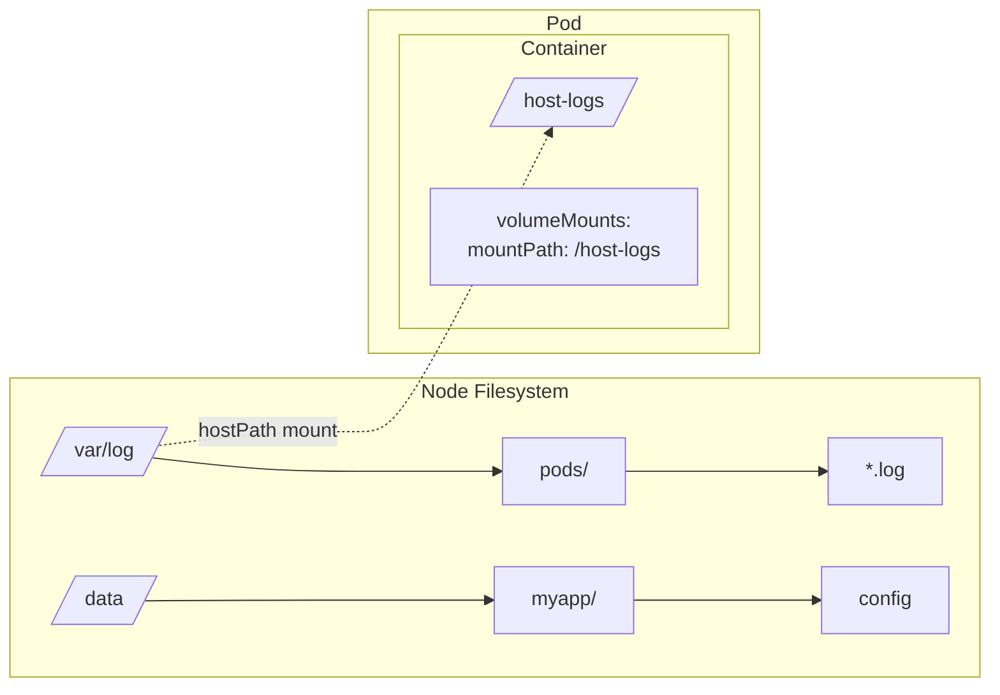
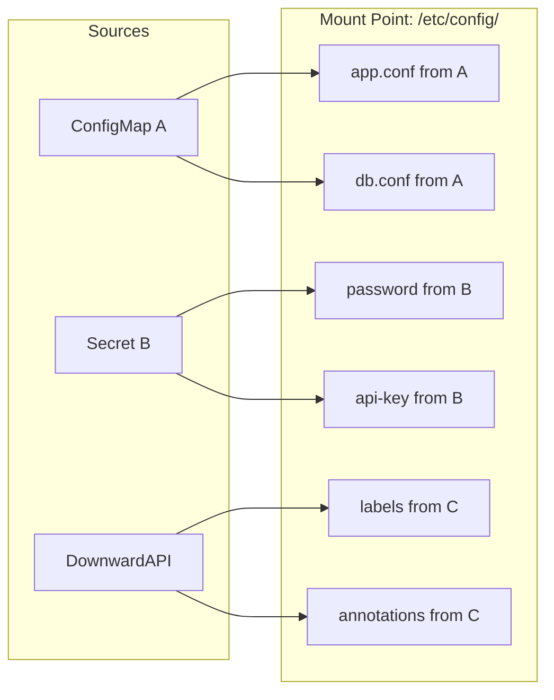
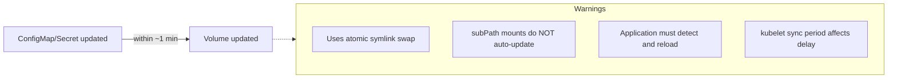
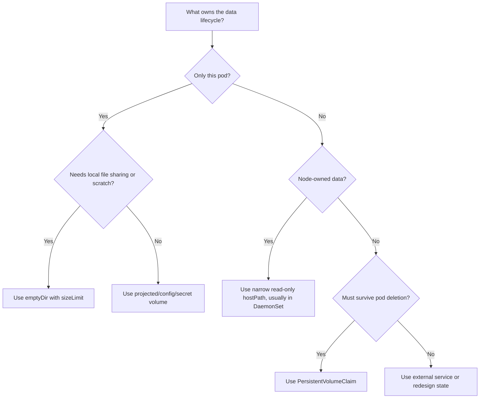

> **Складність**: `[СЕРЕДНЯ]` — основа для всіх концепцій зберігання даних.
>
> **Час на проходження**: 35-45 хвилин.
>
> **Передумови**: [Модуль 2.1 (Поди)](../part2-workloads-scheduling/module-2.1-pods/), [Модуль 2.7 (ConfigMaps і Secrets)](../part2-workloads-scheduling/module-2.7-configmaps-secrets/)

## Що ви зможете зробити

Після завершення цього модуля ви зможете:

- **Спроєктувати** ефемерні розкладки томів у межах Пода за допомогою `emptyDir`, проєктованих томів та монтувань лише для читання, які підтримують патерни багатоконтейнерних застосунків.
- **Впровадити** безпечні монтування `hostPath`, ConfigMap, Secret та `subPath` з явними шляхами, дозволами й очікуваннями щодо життєвого циклу.
- **Оцінити** межі життєвого циклу томів, щоб передбачати, які дані переживуть перезапуск контейнера, видалення Пода, виведення Ноди з обслуговування (drain) чи перепланування.
- **Діагностувати** симптоми `FailedMount`, `ContainerCreating` та застарілої конфігурації, читаючи події Пода, визначення монтувань та поведінку kubelet.
- **Порівняти** вибір ефемерних томів із персистентністю на основі PersistentVolumeClaim перед вибором сховища для робочих навантажень зі станом (stateful).

## Чому цей модуль важливий

Гіпотетичний сценарій: ваша команда випускає невеликий API, який кешує зведення сесій користувачів у файловій системі контейнера, бо кеш "лише тимчасовий". Застосунок працює під час демонстрації, проходить перший швидкий тест (smoke test) і навіть переживає аварійне завершення процесу, тому що контролер деплойменту швидко запускає новий контейнер. Потім виведення Ноди з обслуговування переплановує Под, заміщений Под стартує на іншій Ноді, і весь кеш зникає, бо дані ніколи не зберігалися за межами локального життєвого циклу Пода.

Цей сценарій не є екзотичною відмовою сховища; це типовий наслідок ставлення до файлової системи контейнера як до надійного диска. Контейнери спроєктовані як замінні процеси. Їхні записувані шари є деталями реалізації середовища виконання, а не контрактом зберігання застосунку. Томи Kubernetes дають вам такий контракт, але кожен тип тому проводить межу в іншому місці: одні переживають перезапуск контейнера, інші — перезапуск Пода на тій самій Ноді, ще одні відкривають файли Ноди безпосередньо, а деякі просто проєктують API-об'єкти у дерево каталогів.

Ця відмінність важлива на іспиті CKA, тому що питання про сховище часто ховаються всередині звичайної діагностики Подів. Под, що застряг у стані `ContainerCreating`, може мати відсутній Secret, хибний тип `hostPath`, незв'язаний PVC або ключ ConfigMap, змонтований за неправильним шляхом. Запущений застосунок усе ще може працювати неправильно, бо монтування `subPath` зафіксувало файл конфігурації, який оператор очікував оновлювати динамічно. Вам не потрібно запам'ятовувати кожну можливість сховища, але вам потрібно чітко міркувати про життєвий цикл, поведінку монтування, межі безпеки та операційний радіус ураження (blast radius) кожного вибору.

Уявіть контейнер як письмовий стіл із шухлядами, які прибирають щоразу, коли стіл замінюють. Том у межах Пода — це картотечна шафа, призначена для цієї групи столів: вона залишається, поки залишається Под, і кілька контейнерів у Поді можуть відкривати ту саму шухляду. Монтування `hostPath` радше схоже на те, щоб вручити працівникові за столом ключ від службового приміщення будівлі, що іноді потрібно обслуговчому персоналу, але небезпечно для звичайної офісної роботи. PersistentVolumeClaim — це орендована одиниця сховища повністю за межами цього приміщення, і наступний модуль детально розглядає цей довговічніший контракт.

## Файлові системи контейнерів і сховище в межах Пода

Коли процес виконує запис у звичайний шлях контейнера, він пише у записуваний шар середовища виконання контейнера, зазвичай — оверлей поверх шарів образу. Цей шар зручний, бо змушує незмінні образи здаватися записуваними під час виконання, але він не призначений для значущого стану застосунку. Він прив'язаний до конкретного екземпляра контейнера, може бути неефективним для інтенсивного вводу-виводу та зникає, коли контейнер замінюють. Перш ніж проєктувати будь-який том, зупиніться на цьому першому принципі: образ — це рецепт, файлова система контейнера — робоча поверхня, а том — місце, де ви свідомо вирішуєте, що дані мають жити.

```mermaid
flowchart LR
    subgraph ContainerA[Container A]
        A[/app] --> B[config.yml]
        A --> C[data/]
        C --> D[cache]
    end
    subgraph ContainerB[Container B after restart]
        E[/app] --> F[config.yml<br/>from image]
        E --> G[data/]
        G --> H[empty!]
    end
    ContainerA -- Restart = Data Loss --> ContainerB
```

Томи Kubernetes вирішують це, відокремлюючи обрані каталоги від життєвого циклу окремого контейнера. Под оголошує том під `spec.volumes`, і кожен контейнер, якому він потрібен, оголошує `volumeMount` зі шляхом монтування. Kubelet готує том на Ноді перед запуском контейнера, а потім просить середовище виконання контейнера змонтувати цей підготовлений каталог або файл у простір імен контейнера. Важлива межа полягає в тому, що більшість базових томів прив'язані до Пода, а не до одного контейнера, тож перезапущений контейнер бачить той самий змонтований каталог, поки існує Под.

```mermaid
flowchart TD
    subgraph Pod
        subgraph ContainerA[Container A]
            A[/app] --> B[config.yml]
            A --> C[data/]
        end
        subgraph ContainerB[Container B after restart]
            E[/app] --> F[config.yml]
            E --> G[data/]
        end
        V[(Volume shared)]
        C --> V
        G --> V
        V --> cache[cache still here!]
    end
```

Ця межа Пода потужна, але її легко переоцінити. Якщо один контейнер у Поді аварійно завершується й перезапускається, том `emptyDir` залишається. Якщо Под видаляють, витісняють (evict) або переплановують на іншу Ноду, `emptyDir` зникає, бо старого екземпляра Пода більше немає. Якщо ваш дизайн має переживати заміну Пода, використовуйте PersistentVolumeClaim або зовнішній сервіс замість сподівання, що том у межах Пода поводитиметься як надійний диск. Зупиніться і передбачте: якщо контейнер-записувач зберігає 200Mi кешу в спільному `emptyDir`, а потім перезапускається лише цей контейнер, що має побачити контейнер-читач і чому?

Kubernetes пропонує багато типів томів, бо "сховище" охоплює кілька різних завдань. Одні томи надають робочий простір, інші впроваджують конфігурацію, ще одні відкривають файли Ноди для системних агентів, а деякі підключають Поди до надійного сховища. Таблиця нижче — це практична карта першого наближення, а не заміна читання точних правил життєвого циклу перед розгортанням робочого навантаження.

| Тип тому | Час життя | Сценарій використання | Персистентність даних |
|-------------|----------|----------|------------------|
| emptyDir | Час життя Пода | Тимчасове сховище, обмін між контейнерами | Втрачається при видаленні Пода |
| hostPath | Час життя Ноди | Дані рівня Ноди, DaemonSets | Зберігається на Ноді |
| configMap | Час життя ConfigMap | Файли конфігурації | Керується ConfigMap |
| secret | Час життя Secret | Облікові дані | Керується Secret |
| projected | Час життя джерела | Кілька джерел в одному монтуванні | Залежить від джерел |
| persistentVolumeClaim | Час життя PV | Персистентні дані | Переживає видалення Пода |
| image | Час життя образу | Вміст OCI-образу як том лише для читання | Лише для читання, тягнеться з реєстру |

Таблиця також нагадує, що два томи можуть виглядати ідентично всередині контейнера, маючи цілком різну належність назовні. Файл за шляхом `/etc/app/config.yaml` може походити з ConfigMap, проєктованого тому, bind-монтування `subPath` або звичайного шару образу. Сам лише шлях застосунку не каже вам, що зробить Kubernetes під час оновлення, перезапуску чи видалення. Під час діагностики завжди простежуйте від шляху монтування назад до `volumeMounts`, потім назад до `volumes`, а далі — назад до об'єкта Kubernetes або шляху Ноди, який постачає вміст.

Ця звичка простежування корисна, бо помилки томів часто маскуються під помилки застосунку. Процес, що каже "файл не знайдено", може не мати ключа ConfigMap, але він також може читати шлях, прихований монтуванням каталогу. Процес, що каже "доступ заборонено", може виконуватися від імені користувача без прав root проти файлу Secret із режимом, який може прочитати лише root. Процес, що стартує коректно й пізніше стає застарілим, може мати проблему з перезавантаженням, а не проблему монтування Kubernetes. Іспит CKA очікує, що ви швидко розділятимете ці рівні, а не змінюватимете YAML наосліп.

Тип тому `image` варто згадати окремо, бо він змінює те, як деякі команди розповсюджують ресурси лише для читання. Замість запікання файлу моделі, набору правил або дерева статичних ресурсів в основний образ застосунку, Под може змонтувати OCI-образ чи артефакт як том лише для читання. Це зменшує образи застосунків і дозволяє незалежно версіонувати великий вміст лише для читання. Станом на цільову версію Kubernetes 1.35 цього курсу, ставтеся до цього як до сучасної опції тому, корисної для незмінного вмісту, а не як до заміни записуваного сховища застосунку. GA у 1.36; бета у 1.35 — підтвердіть feature gate / версію кластера, перш ніж покладатися на це у продакшені.

```yaml
volumes:
- name: model-data
  image:
    reference: registry.example.com/ml-models/bert:v2
    pullPolicy: IfNotPresent
```

Ширша екосистема сховищ також відійшла від вбудованих (in-tree) плагінів томів хмарних провайдерів. Історично Kubernetes містив драйвери, такі як хмарні диски, безпосередньо в ядрі, що робило кожну зміну постачальника сховища питанням релізу Kubernetes. Container Storage Interface розділяє цю відповідальність: Kubernetes визначає інтерфейс, а постачальники сховищ постачають CSI-драйвери. У Kubernetes 1.35 сучасні кластери мають покладатися на CSI для розширеної поведінки сховища, а старі вбудовані специфікації або мігровано, або визнано застарілими, або підтримуються лише для сумісності зі старішими маніфестами.

## EmptyDir та інші варіанти ефемерних томів

Том `emptyDir` — найпростіший корисний том, бо він починається порожнім, коли Под призначають Ноді, і залишається доступним, поки цей Под не залишить Ноду. Він чудово підходить для спільних робочих даних, передавання даних між sidecar-контейнерами, тимчасових завантажень, локального простору для сортування та кешів, де втрата даних є прийнятною. Він не годиться для баз даних, черг повідомлень, завантажень користувачів чи будь-чого, втрата чого перетворюється на інцидент. Запитати слід не "чи буде це швидко", а "яка саме подія, після якої ці дані можуть зникнути?".

```yaml
apiVersion: v1
kind: Pod
metadata:
  name: shared-data
spec:
  containers:
  - name: writer
    image: busybox:1.36
    command: ['sh', '-c', 'echo "Hello from writer" > /data/message; sleep 3600']
    volumeMounts:
    - name: shared-storage
      mountPath: /data
  - name: reader
    image: busybox:1.36
    command: ['sh', '-c', 'sleep 5; cat /data/message; sleep 3600']
    volumeMounts:
    - name: shared-storage
      mountPath: /data
  volumes:
  - name: shared-storage
    emptyDir: {}
```

Цей приклад показує класичний патерн sidecar. Записувач і читач — окремі контейнери, але обидва монтують той самий ім'я тому, тож `/data` вказує на той самий каталог у межах Пода для обох. Читачеві не потрібен мережевий виклик чи спільний зовнішній сервіс, щоб спожити файл від записувача. Ця простота корисна для відправників логів, препроцесорів вмісту, локальних адаптерів та малих координаційних файлів, за умови, що команда приймає, що видалення Пода видаляє спільний каталог.

Патерн sidecar працює найкраще, коли спільні файли є деталлю реалізації одного Пода, а не механізмом координації для всього сервісу. Якщо кілька реплік мають ділити той самий файл, `emptyDir` — неправильна абстракція, бо кожен Под отримує власний незалежний каталог. Якщо контролер замінює одну репліку, новий Под отримує новий каталог, навіть коли Под має ті самі мітки й обслуговує той самий трафік. Це розділення зазвичай добре, бо репліки мають бути замінними, але воно дивує команди, які використовують локальні файли як прихований стан рівня кластера.

Ви можете попросити kubelet забезпечити `emptyDir` пам'яттю, встановивши `medium: Memory`. Це створює том на основі tmpfs, який є швидким і тримає чутливий тимчасовий матеріал поза фізичним диском. Компроміс полягає в тому, що використання tmpfs — це використання пам'яті. Якщо контейнер використовує 350Mi heap і пише 200Mi у `emptyDir` на основі пам'яті, ефективний тиск на пам'ять робочого навантаження є сумою цих двох чисел, і Под може бути вбито, навіть якщо лише heap застосунку виглядав розумним.

```yaml
apiVersion: v1
kind: Pod
metadata:
  name: memory-backed
spec:
  containers:
  - name: app
    image: busybox:1.36
    command: ['sh', '-c', 'sleep 3600']
    volumeMounts:
    - name: tmpfs-volume
      mountPath: /cache
  volumes:
  - name: tmpfs-volume
    emptyDir:
      medium: Memory        # Uses RAM instead of disk
      sizeLimit: 100Mi      # Important! Limit memory usage
```

`emptyDir` на основі диска також потребує меж. Без обмеження розміру шумний Под може спожити локальне сховище Ноди й вштовхнути несуміжні робочі навантаження у тиск витіснення. `sizeLimit` дає kubelet конкретну межу для примусового виконання й дає платформній команді спосіб міркувати про найгірший випадок використання Ноди. Це не робить дані надійними; це лише робить тимчасове сховище безпечнішим для спільного використання на багатоорендній Ноді.

```yaml
volumes:
- name: cache
  emptyDir:
    sizeLimit: 500Mi    # Limit disk usage
```

Узагальнені ефемерні томи (generic ephemeral volumes) та вбудовані ефемерні томи CSI (CSI inline ephemeral volumes) розширюють цю ідею для драйверів, які можуть динамічно виділяти сховище для Пода. Узагальнений ефемерний том створює PVC для кожного Пода за лаштунками й видаляє його, коли Под видаляють, що дає тимчасовим навантаженням доступ до поведінки storage class без перетворення claim на довговічний об'єкт застосунку. Вбудовані ефемерні томи CSI залежать від підтримки драйвера й можуть бути корисними для спеціалізованого локального чи мережевого тимчасового сховища. Інженерне судження залишається тим самим: ефемерний означає, що дані належать тимчасовому життєвому циклу Пода, навіть коли реалізація виглядає складнішою за `emptyDir`.

Один практичний спосіб оцінити ефемерне сховище — записати правило очищення звичайною мовою перед написанням YAML. Наприклад, "цей кеш може зникнути щоразу, коли зникає Под" указує на `emptyDir`, тоді як "цей згенерований звіт має бути доступним для заміщеного Пода" вказує геть від нього. Правило має також назвати вартість відновлення. Кеш, який повторно заповнюється за дві секунди, відрізняється від пошукового індексу, який будується кілька годин, навіть якщо обидва технічно виводяться з іншої системи.

Облік ресурсів має бути частиною тієї самої оцінки. `emptyDir` на основі диска споживає ефемерне сховище Ноди, яке конкурує з логами, шарами образів та іншими Подами. `emptyDir` на основі пам'яті споживає пам'ять, яка конкурує з heap процесу та кешем сторінок. Узагальнені ефемерні томи можуть споживати бекенд-сховище, виділене CSI-драйвером. Слово "тимчасовий" не означає "безкоштовний"; воно означає, що платформі дозволено видалити дані, коли життєвий цикл власника завершується.

Перш ніж запускати наступний приклад у реальному кластері, передбачте результат кожної події життєвого циклу. Перезапуск контейнера має зберегти спільний каталог, видалення Пода має його прибрати, а перепланування Ноди не має переносити його на нову Ноду. Якщо ваша очікувана поведінка відрізняється від цих трьох тверджень, робоче навантаження просить персистентності й має перейти на дизайн на основі PVC у наступному модулі.

## HostPath для файлових систем Ноди

Том `hostPath` монтує шлях із файлової системи Ноди безпосередньо в Под. Це зовсім інша модель довіри, ніж `emptyDir`. Замість надання Поду робочого каталогу, підготовленого для цього Пода, ви відкриваєте частину самої Ноди. Для агентів логування, агентів моніторингу, інструментів CNI, компонентів CSI та жорстко контрольованих діагностичних Подів це може бути правильним інструментом. Для звичайних Подів застосунків це зазвичай ознака проблеми з безпекою та пастка планування.



Перший операційний ризик — це розміщення. Под, якому потрібен `/data/myapp`, може коректно працювати лише на Нодах, де цей шлях існує з очікуваним типом та дозволами. Планувальник не перевіряє довільні каталоги Ноди перед призначенням Пода. Якщо шлях відсутній або хибний, Под може застрягнути, поки kubelet повідомляє про помилки монтування. Ви можете зменшити неоднозначність, встановивши поле `type`, але вам усе одно потрібна підготовка Ноди, мітки Ноди, affinity або патерн DaemonSet, коли робоче навантаження справді залежить від локальних файлів Ноди.

```yaml
apiVersion: v1
kind: Pod
metadata:
  name: hostpath-example
spec:
  containers:
  - name: app
    image: busybox:1.36
    command: ['sh', '-c', 'ls -la /host-data; sleep 3600']
    volumeMounts:
    - name: host-volume
      mountPath: /host-data
      readOnly: true           # Good practice for security
  volumes:
  - name: host-volume
    hostPath:
      path: /var/log           # Path on the node
      type: Directory          # Must be a directory
```

Поле `type` каже kubelet, що він має вимагати перед монтуванням. Порожній тип не виконує жодної перевірки, що ускладнює діагностику відмов і може приховувати небезпечні припущення. `DirectoryOrCreate` та `FileOrCreate` зручні, але вони також можуть створити шляхи, що належать root, із дозволами, які здивують застосунок. У дизайні, чутливому до безпеки, надавайте перевагу точним наявним шляхам, монтуванням лише для читання та вузькому дереву каталогів над широким доступом до файлової системи.

| Тип | Поведінка |
|------|----------|
| `""` (порожній) | Жодних перевірок перед монтуванням |
| `DirectoryOrCreate` | Створити каталог, якщо відсутній |
| `Directory` | Має існувати, має бути каталогом |
| `FileOrCreate` | Створити файл, якщо відсутній |
| `File` | Має існувати, має бути файлом |
| `Socket` | Має існувати, має бути UNIX-сокетом |
| `CharDevice` | Має існувати, має бути символьним пристроєм |
| `BlockDevice` | Має існувати, має бути блоковим пристроєм |

Другий операційний ризик — це привілеї. Записуваний `hostPath` до чутливого каталогу може перетворити компрометацію контейнера на компрометацію Ноди, бо зловмисник більше не обмежений файлами всередині контейнера. Монтування `/`, каталогів kubelet, сокетів середовища виконання контейнера або шляхів облікових даних хоста дає Поду доступ до ресурсів, які платформні команди зазвичай дбайливо захищають. Профілі Pod Security Admission зазвичай обмежують `hostPath` саме з цієї причини, а керовані кластери можуть додавати додаткові засоби контролю політик.

```yaml
# DANGEROUS - Never do this in production!
volumes:
- name: root-access
  hostPath:
    path: /                    # Access to entire node filesystem!
    type: Directory
```

Легітимний дизайн `hostPath` звужує шлях до мінімально корисного каталогу, позначає монтування лише для читання, коли це можливо, і виконується у просторі імен, керованому явною політикою платформи. Збирач логів — хороший приклад, бо дані існують на Ноді, а завдання агента — їх читати. Навіть там монтування має бути націленим. DaemonSet, що монтує `/var/log` лише для читання, легше захистити, ніж той, що монтує `/` і обіцяє поводитися добре.

DaemonSets — природний вибір для багатьох випадків `hostPath`, бо вони роблять зв'язок із Нодою явним. Деплоймент просить у планувальника якусь придатну Ноду, але DaemonSet каже, що робоче навантаження належить кожній відповідній Ноді. Ця модель краще пасує для збору логів, метрик Ноди, локального сканування безпеки та помічників Нод сховища, ніж випадковий набір реплік. Якщо лише підмножина Нод має потрібний шлях чи апаратне забезпечення, поєднайте DaemonSet із мітками, толерантностями (tolerations) та селекторами Нод, щоб контракт планування відповідав контракту файлової системи.

Під час огляду запитайте, чи шлях `hostPath` є входом, виходом чи обома. Шлях входу лише для читання для логів набагато безпечніший, ніж записуваний шлях виходу, де застосунок зберігає бізнес-дані на будь-якій Ноді, що випадково запустила Под. Локальний для Ноди вихід також створює питання резервного копіювання та міграції, на які Kubernetes не може відповісти за вас. Якщо бізнес дбає про дані, шлях Ноди зазвичай є неправильним місцем, щоб їх залишати, бо заміна Ноди, автомасштабування та робочі процеси ремонту можуть видалити цей стан поза обізнаністю Пода.

```yaml
apiVersion: apps/v1
kind: DaemonSet
metadata:
  name: log-collector
spec:
  selector:
    matchLabels:
      name: log-collector
  template:
    metadata:
      labels:
        name: log-collector
    spec:
      containers:
      - name: collector
        image: fluent/fluentd:v1.16-debian-1  # Image choice is environment-specific
        volumeMounts:
        - name: varlog
          mountPath: /var/log
          readOnly: true          # Read-only for safety
        - name: containerlogs
          mountPath: /var/log/containers
          readOnly: true
      volumes:
      - name: varlog
        hostPath:
          path: /var/log
          type: Directory
      - name: containerlogs
        hostPath:
          path: /var/log/containers
          type: Directory
```

Шляхи логів контейнерів залежать від CRI: `/var/log/containers` на containerd (типове середовище від Kubernetes 1.24 і те, що використовують kind/minikube) проти застарілих шляхів Docker, таких як `/var/lib/docker/containers`. Підтвердіть розкладку на ваших Нодах перед копіюванням маніфесту збирача.

Зупиніться й подумайте, перш ніж схвалювати pull request із `hostPath`: чи справді цей Под потребує файлів Ноди, чи він використовує Ноду як обхідний шлях навколо належного сховища та дозволів? Якщо розробник пропонує змонтувати сокет середовища виконання контейнера в CI-Под, ризик не лише в тому, що "збірка може прочитати деякі файли". Под може отримати змогу контролювати середовище виконання, запускати привілейовані контейнери чи опосередковано отримувати доступ до ресурсів хоста. Безпечніші альтернативи включають rootless-будівельники, спеціалізовані сервіси збірки, віддалені будівельники або жорстко обмежені, керовані платформою Ноди збірки.

## Проєктовані томи, ConfigMap та Secret

Томи конфігурації вирішують інакшу проблему, ніж робоче сховище. Застосункам потрібні файли, такі як `nginx.conf`, TLS-матеріал, прапорці функцій, токени сервісних акаунтів та метадані Пода, але запікання кожного значення в образ робить релізи повільними й крихкими. Kubernetes дозволяє зберігати неконфіденційну конфігурацію в ConfigMaps, чутливі значення в Secrets, обрані метадані Пода через Downward API та короткочасні токени сервісних акаунтів через проєкцію токенів. Проєктований том поєднує кілька цих джерел в одне дерево каталогів, тож застосунок бачить чисту розкладку файлової системи.



Використовуйте проєктований том, коли застосунок хоче один узгоджений каталог, але дані джерела належать кільком об'єктам Kubernetes. Специфікація Пода перелічує кожне джерело під `projected.sources`, і кожне джерело може зіставляти ключі зі шляхами. Це чистіше, ніж розкидати чотири монтування по чотирьох каталогах, а потім навчати застосунок шукати в усіх них. Це також полегшує огляд безпеки, бо одна точка монтування лише для читання може містити точно ті файли, які потрібні процесу.

```yaml
apiVersion: v1
kind: Pod
metadata:
  name: projected-volume-demo
  labels:
    app: demo
    version: current
spec:
  containers:
  - name: app
    image: busybox:1.36
    command: ['sh', '-c', 'ls -la /etc/config; sleep 3600']
    resources:
      limits:
        cpu: "500m"
    volumeMounts:
    - name: all-config
      mountPath: /etc/config
      readOnly: true
  volumes:
  - name: all-config
    projected:
      sources:
      # Source 1: ConfigMap
      - configMap:
          name: app-config
          items:
          - key: app.properties
            path: app.conf
      # Source 2: Secret
      - secret:
          name: app-secrets
          items:
          - key: password
            path: credentials/password
      # Source 3: Downward API
      - downwardAPI:
          items:
          - path: labels
            fieldRef:
              fieldPath: metadata.labels
          - path: cpu-limit
            resourceFieldRef:
              containerName: app
              resource: limits.cpu
```

Проєктовані токени сервісних акаунтів особливо важливі для сучасних кластерів. Застарілі довговічні токени є поганим типовим вибором для Подів, бо вони можуть пережити робоче навантаження й бути корисними зловмисникові після компрометації. Проєктований `serviceAccountToken` може бути прив'язаний до аудиторії (audience-bound) та обмежений у часі, з типовим терміном дії 3600 секунд та автоматичною ротацією від kubelet. Шлях до файлу все ще виглядає простим для застосунку, але життєвий цикл облікових даних набагато краще узгоджений із Подом.

```yaml
apiVersion: v1
kind: Pod
metadata:
  name: service-account-projection
spec:
  serviceAccountName: my-service-account
  containers:
  - name: app
    image: myapp:1.0
    volumeMounts:
    - name: token
      mountPath: /var/run/secrets/tokens
      readOnly: true
  volumes:
  - name: token
    projected:
      sources:
      - serviceAccountToken:
          path: token
          expirationSeconds: 3600     # Short-lived token
          audience: api               # Intended audience
```

Томи ConfigMap — звичайний вибір для неконфіденційних файлів. Монтування ConfigMap як каталогу добре працює для застосунків, які читають структуровану конфігурацію з диска, таких як фрагменти веб-сервера чи файли властивостей застосунку. Це часто краще за змінні середовища, коли значення багаторядкове, коли застосунок уже очікує файл або коли операторам потрібно оновлювати дані без перебудови образу. Застосунку все одно потрібна стратегія перезавантаження, бо Kubernetes може оновити файл на диску, не змушуючи процес перечитати його.

```yaml
apiVersion: v1
kind: ConfigMap
metadata:
  name: nginx-config
data:
  nginx.conf: |
    server {
      listen 80;
      location / {
        root /usr/share/nginx/html;
      }
    }
```

Відповідний Под може змонтувати ConfigMap у каталог, де застосунок очікує конфігурацію. Список `items` дозволяє обирати конкретні ключі та перейменовувати їх на диску, що корисно, коли ім'я ключа ConfigMap відрізняється від імені файлу застосунку. Будьте обережні, монтуючи цілий каталог поверх наявного шляху, бо монтування приховує файли з образу за цим шляхом. Якщо образ уже містить потрібні типові значення в тому самому каталозі, розгляньте окрему точку монтування або ретельно обраний `subPath`.

Затінення каталогу (directory shadowing) — одна з найлегших для пропуску помилок конфігурації під час огляду. Припустімо, образ містить `/etc/myapp/defaults.yaml` та `/etc/myapp/plugins.yaml`, і ви монтуєте ConfigMap у `/etc/myapp`, що містить лише `app.yaml`. Усередині контейнера змонтований каталог приховує оригінальні файли образу за цим шляхом, тож застосунок може зазнати збою, бо його типові значення зникли. Kubernetes зробив точно те, що ви запросили; дизайн зазнав збою, бо точка монтування була ширшою за заплановану зміну.

```yaml
apiVersion: v1
kind: Pod
metadata:
  name: nginx
spec:
  containers:
  - name: nginx
    image: nginx:1.27
    volumeMounts:
    - name: config
      mountPath: /etc/nginx/conf.d
      readOnly: true
  volumes:
  - name: config
    configMap:
      name: nginx-config
      # Optional: select specific keys
      items:
      - key: nginx.conf
        path: default.conf     # Rename the file
```

Томи Secret поводяться подібно з погляду Пода, але вони несуть інше очікування щодо безпеки. Kubernetes Secrets самі по собі не є повноцінною системою керування секретами; вони все одно потребують RBAC, шифрування у стані спокою (at rest) там, де це доречно, та ретельного контролю доступу. Однак монтування Secret як тому часто краще за розміщення секретних значень у змінних середовища, бо дозволи файлів можна обмежити, вміст можна ротувати на диску, а kubelet зберігає матеріал у файловій системі на основі пам'яті для Пода.

```yaml
apiVersion: v1
kind: Secret
metadata:
  name: tls-certs
type: kubernetes.io/tls
data:
  tls.crt: <base64-encoded-cert>
  tls.key: <base64-encoded-key>
```

Використовуйте обмежувальні режими файлів для матеріалу Secret і тримайте монтування лише для читання. Поле `defaultMode` записується в YAML як ціле число, а приклади зазвичай використовують значення, схожі на вісімкові, такі як `0400`. Точний користувач застосунку все одно має могти прочитати файл, тож перевіряйте ефективні дозволи з користувачем виконання образу, а не припускаючи поведінку, схожу на root. Безпечне монтування, яке процес не може прочитати, зазнає збою так само певно, як небезпечне монтування, яке аудитори відхиляють.

Дизайн тому Secret має також включати поведінку ротації. Якщо kubelet оновлює змонтований файл Secret, але застосунок відкриває облікові дані лише під час запуску, старі облікові дані можуть залишатися у використанні, поки Под не перезапуститься. Якщо застосунок стежить за файлом і чисто перепідключається, той самий том Secret може підтримувати плавнішу ротацію. Жодна з цих поведінок не є автоматичною від самого об'єкта Secret. Рівень сховища може доставити байти на диск, але процес усе одно контролює, коли він їх читає й що робить після зміни значення.

```yaml
apiVersion: v1
kind: Pod
metadata:
  name: tls-app
spec:
  containers:
  - name: app
    image: nginx:1.27
    volumeMounts:
    - name: certs
      mountPath: /etc/tls
      readOnly: true
  volumes:
  - name: certs
    secret:
      secretName: tls-certs
      defaultMode: 0400       # Restrictive permissions
```

Kubelet оновлює змонтовані томи ConfigMap та Secret за допомогою атомарної заміни символьного посилання (symlink). Це означає, що застосунок ніколи не має бачити напівзаписаний файл під час оновлення. Це також означає, що процес має або стежити за файлом, або опитувати файл, або бути перезапущеним, щоб завантажити нове значення в пам'ять. Оновлення тому й перезавантаження застосунку — це окремі кроки, і багато продакшен-помилок виникають через доведення, що файл змінився, забуваючи, що процес усе ще тримає стару конфігурацію в пам'яті.



Можливість `subPath` — це точний інструмент для монтування одного файлу з тому в наявний каталог без приховування решти цього каталогу. Вона корисна, коли образ уже містить каталог, повний типових значень, а ви хочете замінити лише один файл. Її головна пастка — поведінка оновлення: bind-монтування `subPath` не слідує за атомарною заміною символьного посилання kubelet, тож оновлення ConfigMap чи Secret не з'явиться у змонтованому файлі. Зупиніться й передбачте: якщо `/etc/config/app.conf` є повним монтуванням каталогу ConfigMap, а потім ви оновлюєте ConfigMap і чекаєте на період синхронізації kubelet, що має показати `cat`; а тепер що зміниться, якщо цей файл було змонтовано через `subPath`?

Цей компроміс робить `subPath` сам по собі ні хорошим, ні поганим. Він хороший, коли файл має бути фіксованим на час життя Пода, коли заміна цілого каталогу приховала б вміст образу або коли перезапуск під час викочування (rollout restart) є запланованим механізмом перезавантаження. Він поганий, коли оператори очікують живий конвеєр конфігурації й ніколи не документують, що потрібне перестворення Пода. Зрілий шаблон модуля чи Helm-чарт має робити цей контракт перезавантаження видимим, щоб майбутні супровідники не виводили неправильну поведінку з імені файлу.

```yaml
volumeMounts:
- name: config
  mountPath: /etc/nginx/nginx.conf    # Single file
  subPath: nginx.conf                  # Key from ConfigMap
  readOnly: true
```

Джерела проєктованих томів продовжують розвиватися. Документація Kubernetes для поточних релізів включає розширені джерела проєкції, такі як набори довірених сертифікатів кластера (cluster trust bundles) та сертифікати Пода за відповідними станами функцій. Для CKA важливіші щоденні навички: правильно поєднувати джерела ConfigMap, Secret, Downward API та токена сервісного акаунта; монтувати їх лише для читання; розуміти обмеження автоматичного оновлення; та розпізнавати застарілу поведінку `subPath` під час діагностики.

| Сценарій | Поєднані джерела |
|----------|------------------|
| Пакет конфігурації застосунку | configMap + secret |
| Ідентичність Пода | serviceAccountToken + downwardAPI |
| Повне впровадження конфігурації | configMap + secret + downwardAPI |
| Конфігурація sidecar | Кілька configMaps |

## Від ефемерних томів до персистентного сховища

Ефемерні томи не є гіршими; вони мають обмежену сферу дії. Кеш, робочий каталог, проєкція токена чи передавання даних sidecar часто мають бути ефемерними, бо довговічність додала б вартості та складності очищення, не покращуючи застосунок. Персистентне сховище стає необхідним, коли дані мають цінність після заміни Пода: файли бази даних, стан черги, завантажений вміст, індекси, які дорого перебудовувати, і будь-який стан, що визначає сервіс, а не прискорює його. Помилка не в тому, щоб використати `emptyDir`; помилка — використовувати його після того, як вимога відновлення каже, що дані мають пережити Под.

PersistentVolumes та PersistentVolumeClaims вводять об'єкт сховища, який може пережити видалення Пода і, залежно від бекенду, відмову Ноди. PersistentVolume представляє сховище в кластері, тоді як PersistentVolumeClaim — це запит сховища робочим навантаженням у межах простору імен. Режими доступу, такі як ReadWriteOnce, ReadOnlyMany, ReadWriteMany та ReadWriteOncePod, описують, як том можна монтувати, але вони не роблять магічним чином кожен бекенд таким, що підтримує кожен патерн доступу. ReadWriteOncePod — найсуворіший варіант для одного Пода й корисний, коли випадкове підключення кількох Подів зіпсувало б стан.

StorageClasses керують динамічним виділенням. З `volumeBindingMode: WaitForFirstConsumer` Kubernetes відкладає виділення та зв'язування, поки Под, що використовує claim, не буде заплановано, що допомагає уникнути створення тому в зоні, де Под не може виконуватися. Встановлення `storageClassName: ""` на PVC відмовляється від типового динамічного виділення й просить Kubernetes зіставити наявний PV. Ці деталі належать переважно наступному модулю, але вони пояснюють, чому рішення між `emptyDir` та PVC є архітектурним рішенням, а не просто редагуванням YAML.

Розширені можливості персистентного сховища, такі як розширення (expansion), знімки (snapshots), клонування, популятори томів (volume populators) та VolumeAttributesClass, сильно залежать від CSI-драйверів та контролерів кластера. Вони потужні, коли ви експлуатуєте бази даних та сервіси зі станом, але вони не змінюють основу з цього модуля. Спочатку вирішіть межу життєвого циклу. Потім вирішіть, чи Нода, Под, API-об'єкт чи зовнішній бекенд сховища володіє даними. Лише після цього варто обирати можливість на кшталт створення знімків, клонування чи динамічної зміни IOPS.

Апаратні та хмарні обмеження все ще важливі. Хмарні блокові томи часто мають обмеження на кількість підключень на Ноду, і планувальнику потрібна точна інформація про драйвер, щоб уникнути розміщення надто багатьох Подів, що використовують томи, на одній Ноді. Відстеження ємності сховища, динамічні обмеження томів та новіша поведінка лічильника виділюваних ресурсів Ноди CSI існують, бо сховище є фізичним ресурсом, навіть коли Kubernetes представляє його через чисті API-об'єкти. Саме тому інцидент зі сховищем може виглядати одночасно як відмова планування, безпеки й застосунку.

Для цього вступного модуля про томи вам поки не потрібно впроваджувати кожну можливість персистентного сховища. Вам потрібно розпізнавати, коли постановка проблеми перетинає межу від даних у межах Пода до довговічного стану. Фрази, такі як "після перепланування", "після заміни Ноди", "під час послідовного оновлення" та "після видалення Пода", є сигналами, що екзаменатор або звіт про інцидент перевіряє мислення про життєвий цикл сховища. Якщо дані мають залишатися дійсними впродовж цих подій, ефемерний том усе одно може бути корисним для робочих потреб, але він не може бути джерелом істини.

Зворотна помилка також поширена: команди іноді розміщують одноразові дані кешу на дорогих довговічних томах, бо персистентність здається безпечнішою. Це може уповільнити планування, спожити слоти підключення, ускладнити очищення й зробити процедури відновлення складнішими, ніж потрібно. Довговічний кеш також може зберігати пошкоджені або застарілі похідні дані довше, ніж планувалося. Хороший дизайн — це не максимальна персистентність усюди; це зіставлення персистентності з цінністю відновлення, вартістю перебудови та операційною належністю.

## Діагностика відмов монтування томів

Відмови томів зазвичай проявляються як Поди, що застрягли в `ContainerCreating`, контейнери застосунків, що стартують без очікуваних файлів, або робочі навантаження, які продовжують використовувати застарілу конфігурацію. Найшвидший шлях діагностики починається з `kubectl describe pod`, бо розділ Events зазвичай називає том, що дає збій, і повідомляє, чи kubelet не зміг знайти ConfigMap, змонтувати Secret, перевірити `hostPath`, підключити том CSI чи зв'язати PVC. Читайте ці події повільно; корисною підказкою часто є точне ім'я тому, а не верхньорівнева фаза Пода.

Коли задіяно `hostPath`, завжди пов'язуйте подію з конкретною Нодою, на яку потрапив Под. Шлях, що існує на вашому ноутбуці, на одному воркері чи в попередньому образі кластера, не доводить, що він існує на запланованій Ноді. Якщо тип `Directory`, kubelet вимагає наявного каталогу. Якщо тип `DirectoryOrCreate`, kubelet може створити шлях, який потім має деталі належності чи дозволів, яких застосунок не очікував. Проблеми, специфічні для Ноди, потребують специфічних для Ноди доказів.

Для монтувань ConfigMap та Secret відокремте відмову монтування від відмови перезавантаження застосунку. Відсутній об'єкт чи відсутній ключ можуть блокувати запуск. Успішне монтування з подальшим оновленням ConfigMap може оновити файли на диску, не змінюючи поведінку процесу. Монтування `subPath` може ніколи не оновлюватися, поки Под не перезапустять. Який підхід ви б обрали для застосунку, який має перезавантажувати TLS-сертифікати без перезапуску, і яку поведінку застосунку ви б перевірили, перш ніж довіряти цьому дизайну у продакшені?

Якщо події Пода розпливчасті, перевірте логи kubelet на Ноді та відповідні компоненти CSI-драйвера на наявність помилок нижчого рівня. Повідомлення про відмову в доступі, помилки тайм-ауту, відмови через обмеження підключень та специфічні для драйвера відповіді монтування можуть ніколи не з'явитися чисто в логах застосунку, бо застосунок не стартував. Хороша звичка діагностики — простежити шлях сховища від API-об'єкта до підготовки kubelet, до монтування контейнера, до читання процесом. Пропуск рівня часто веде до впевнених, але хибних виправлень.

Корисна послідовність налагодження — назвати том, що дає збій, потім назвати об'єкт-джерело чи шлях, потім назвати шлях споживача. Для ConfigMap це означає перевірку об'єкта, обраного ключа та шляху монтування. Для Secret додайте до чек-листа RBAC та режим файлу. Для `hostPath` додайте заплановану Ноду й тип шляху. Для PVC додайте фазу claim, storage class, події та стан CSI-драйвера. Ця послідовність утримує вас від стрибання прямо до логів застосунку, коли контейнер ніколи не мав дійсного представлення файлової системи.

Ви також маєте відрізняти одноразові помилки монтування від пізнішого дрейфу. Відсутній ключ ConfigMap не дає Поду стартувати. Змінений ConfigMap, який процес не перезавантажує, створює застарілу поведінку після здорового старту. Каталог `hostPath`, видалений з однієї Ноди, може ламати лише Поди, заплановані на цю Ноду. Нода, що досягає тиску на диск, може витісняти Поди, які інтенсивно використовують локальне ефемерне сховище. Усі ці випадки стосуються томів, але вони потребують різних виправлень, тож хронологія симптому важить так само, як YAML.

## Патерни та антипатерни

Хороший дизайн сховища починається з називання власника життєвого циклу. Якщо даними володіє Под, використовуйте ефемерні томи в межах Пода. Якщо даними володіє Нода, обмежте `hostPath` платформними навантаженнями й забезпечте дотримання політики. Якщо даними володіє API Kubernetes, використовуйте ConfigMap, Secret, Downward API чи проєктовані томи. Якщо даними володіє бізнес-процес, використовуйте PVC чи зовнішній керований сервіс. Цей фрейм запобігає поширеній звичці обирати тип тому, бо він знайомий, а не тому, що він відповідає моделі відмов.

| Патерн | Коли використовувати | Чому це працює | Міркування щодо масштабування |
|---------|-------------|--------------|-----------------------|
| Спільний sidecar-обмін через `emptyDir` | Двом контейнерам в одному Поді потрібен швидкий локальний обмін файлами | Под володіє спільним каталогом, і обидва контейнери бачать ті самі файли | Тримайте обмеження розміру достатньо малими, щоб захистити сховище Ноди |
| Пакет конфігурації projected лише для читання | Застосунку потрібні конфігурація, ідентичність та метадані в одному каталозі | Кілька джерел на основі API з'являються як єдине дерево монтування | Визначте поведінку перезавантаження й уникайте `subPath` для живих оновлень |
| Вузький `hostPath` DaemonSet лише для читання | Платформному агенту треба читати логи чи сокети Ноди | DaemonSet вирівнює один Под з кожною Нодою, і шлях належить Ноді | Використовуйте політику, мітки Нод та точні типи шляхів |
| PVC для довговічного стану | Дані мають пережити видалення чи перепланування Пода | Життєвий цикл сховища відокремлено від життєвого циклу навантаження | Свідомо обирайте режим доступу, політику відновлення та режим зв'язування |

Антипатерни зазвичай з'являються, коли команда хапається за сховище, щоб обійти іншу проблему дизайну. Записуваний `hostPath` може обходити RBAC та ізоляцію Ноди. `emptyDir` може приховувати відсутність плану резервного копіювання чи персистентності. Змінна середовища Secret може бути легкою для встановлення, але важкою для безпечної ротації. Монтування `subPath` може зберегти типові значення образу, але непомітно перемогти живі оновлення конфігурації. Кожен антипатерн починається зі зручності й закінчується несподіванкою з життєвим циклом чи безпекою.

| Антипатерн | Що йде не так | Краща альтернатива |
|--------------|-----------------|--------------------|
| Файли бази даних на `emptyDir` | Заміна Пода видаляє стан бази даних | Використовуйте StatefulSet із шаблонами PVC |
| Широкий записуваний `hostPath` | Компрометація контейнера може стати компрометацією Ноди | Використовуйте вузькі шляхи лише для читання чи агента, керованого платформою |
| Відсутній `emptyDir.sizeLimit` | Один Под може вичерпати ефемерне сховище Ноди | Встановіть явні обмеження й моніторте сигнали витіснення |
| `subPath` для живої конфігурації | Оновлення джерела не досягають змонтованого файлу | Монтуйте каталог чи навмисно перезапускайте Под |
| Значення Secret у недбалих env-змінних | Ротацію та розкриття важче контролювати | Монтуйте файли Secret з обмежувальними дозволами |
| PVC, використаний для одноразового кешу | Вартість довговічного сховища та очищення зростають без потреби | Використовуйте обмежений `emptyDir` чи семантику зовнішнього кешу |

## Рамка прийняття рішень

Обирайте тип тому, рухаючись від наслідку до реалізації. Спочатку запитайте, що станеться, якщо контейнер перезапуститься, потім — що станеться, якщо Под видалять, потім — що станеться, якщо Ноду виведуть з обслуговування, і нарешті — кому дозволено читати чи записувати дані. Цей порядок важливий, бо команда, що змушує Под стартувати, — це не те саме, що дизайн, який відповідає цілі відновлення. В умовах іспиту ця рамка також допомагає швидко відкидати привабливі, але хибні відповіді.



Рамку слід поєднувати з оглядом безпеки. Якщо монтування відкриває облікові дані, встановіть монтування лише для читання, обмежувальні режими та план перезавантаження застосунку. Якщо монтування відкриває файли Ноди, вимагайте простір імен, керований платформою, та чітку причину, чому звичайні API Kubernetes не можуть вирішити проблему. Якщо дані великі чи дорогі для перебудови, запитайте, чи достатньо PVC, чи застосунку також потрібні резервні копії, знімки та тести відновлення. Коректність сховища стосується не лише монтування правильного шляху; вона стосується знання того, яку відмову ви можете витримати.

| Вимога | Надавайте перевагу | Уникайте | Причина |
|-------------|--------|-------|--------|
| Ділити робочі файли між sidecar-контейнерами | `emptyDir` | Записуваний шар контейнера | Файлами володіє Под, а не один контейнер |
| Впровадити конфігурацію та мітки застосунку разом | `projected` | Багато несуміжних точок монтування | Один каталог дає чіткіший контракт |
| Читати логи Ноди з кожного воркера | `hostPath` у DaemonSet | Деплоймент застосунку з широкими шляхами | Файлами володіє Нода, і один агент має виконуватися на Ноду |
| Зберігати стан бази даних | PVC | `emptyDir` чи `hostPath` | Дані мають пережити розміщення Пода та Ноди |
| Жива зміна каталогу ConfigMap | Повне монтування ConfigMap | `subPath` | Повні монтування слідують механіці оновлення kubelet |
| Змонтувати один файл поверх типових значень образу | `subPath` з планом перезапуску | Монтування цілого каталогу | Дизайн жертвує живим оновленням заради хірургічного розміщення |

## Чи знали ви?

- Kubernetes 1.35 зберігає модель CSI як сучасний шлях розширення сховища, тож поточне вивчення сховища має зосереджуватися на поведінці CSI, а не на старих вбудованих плагінах хмарних томів.
- Проєктований `serviceAccountToken` за замовчуванням має термін дії 3600 секунд, і kubelet може ротувати змонтований файл токена, поки Под продовжує виконуватися.
- Узагальнені ефемерні томи стабільні з Kubernetes 1.23, і вони створюють PVC для кожного Пода, який збирається сміттярем (garbage collected) разом із Подом.
- Вбудовані ефемерні томи CSI стабільні з Kubernetes 1.25, але їхній облік ресурсів залежить від поведінки драйвера, тож оператори мають свідомо їх моніторити.

## Типові помилки

| Помилка | Чому це стається | Як це виправити |
|---------|----------------|---------------|
| Використання `emptyDir` для персистентних даних | Він переживає перезапуски контейнера, тож команди надмірно узагальнюють цю поведінку на заміну Пода | Використовуйте PersistentVolumeClaim для даних, які мають пережити видалення чи перепланування Пода |
| Монтування широких записуваних шляхів `hostPath` | Це швидкий спосіб дістатися файлів Ноди під час налагодження | Обмежте шлях, встановіть `readOnly: true`, використовуйте явний `type` і тримайте це для платформних навантажень |
| Пропуск `emptyDir.sizeLimit` | Тимчасове сховище здається нешкідливим, поки навантаження чи помилка не створять необмежені файли | Встановіть обмеження розміру й моніторте тиск на ефемерне сховище Ноди |
| Очікування, що монтування `subPath` авто-оновляться | Файл виглядає так, ніби походить із ConfigMap чи Secret | Використовуйте повне монтування каталогу для живих оновлень чи навмисно перезапускайте Поди |
| Використання `emptyDir` на основі пам'яті без планування пам'яті | Команди враховують лише використання heap застосунку | Враховуйте використання tmpfs в обмеженнях пам'яті й встановіть консервативний `sizeLimit` |
| Залишення `hostPath.type` порожнім | Приклади часто опускають перевірку для стислості | Використовуйте `Directory`, `File` чи інший явний тип, щоб збої kubelet були зрозумілими |
| Плутання `ReadWriteOnce` з `ReadWriteOncePod` | Імена звучать як та сама гарантія єдиного записувача | Використовуйте `ReadWriteOncePod`, коли вимога — суворий доступ для одного Пода |
| Ставлення до оновлення файлу як до перезавантаження застосунку | Оператори бачать зміну змонтованого файлу й припускають, що процес змінив поведінку | Перевірте, чи застосунок стежить за файлами, перезавантажується за сигналом чи чисто перезапускається |

## Тест

<details>
<summary>Питання 1: Розробник має sidecar-Под логування з двома контейнерами, що ділять `emptyDir`; записувач аварійно завершується, але Под залишається запущеним. Чи зникли логи, і що зміниться, якщо Под переплановано?</summary>

Логи не зникли після того, як аварійно завершився лише контейнер-записувач, бо життєвий цикл `emptyDir` прив'язаний до Пода, а не до одного контейнера. Перезапущений записувач і досі запущений читач бачать той самий каталог у межах Пода. Якщо Под видаляють, витісняють чи переплановують на іншу Ноду, `emptyDir` видаляється разом зі старим екземпляром Пода. Логи, які мають пережити цю межу, слід відправляти назовні чи зберігати через персистентне сховище, а не тримати лише в `emptyDir`.

</details>

<details>
<summary>Питання 2: Под використовує `emptyDir.medium: Memory` з обмеженням розміру 256Mi та обмеженням пам'яті контейнера 512Mi. Heap застосунку — 350Mi, дані tmpfs — 200Mi, і Под вбито через OOM. Що сталося?</summary>

`emptyDir` на основі tmpfs зараховувався до тиску на пам'ять, тож ефективне використання було приблизно heap застосунку плюс файли на основі пам'яті. Обмеження розміру обмежувало розмір тому, але воно не робило ці байти безкоштовними з бюджету пам'яті контейнера. Виправлення — підняти обмеження пам'яті, щоб включити очікуване використання tmpfs, зменшити розмір тому чи перейти на `emptyDir` на основі диска, якщо даним не потрібна підтримка пам'яті. Це питання на оцінку життєвого циклу, бо носій сховища змінює модель відмови.

</details>

<details>
<summary>Питання 3: DaemonSet збирача логів монтує `hostPath: /` з порожнім типом і без `readOnly`. Команда каже, що він лише читає `/var/log`. Чому цей дизайн слід відхилити?</summary>

Оголошене монтування дає Поду доступ до всієї файлової системи Ноди, а не лише до каталогу, який застосунок обіцяє читати. Порожній `type` пропускає корисну перевірку kubelet, а відсутній прапорець `readOnly` залишає шлях хоста записуваним із контейнера. Безпечніший дизайн монтує лише потрібні шляхи, такі як `/var/log`, використовує `type: Directory` і позначає кожне монтування лише для читання. Оскільки це дані, що належать Ноді, навантаження також має бути DaemonSet, керованим платформою, з політикою щодо того, хто може його розгортати.

</details>

<details>
<summary>Питання 4: Застосунку потрібні `app.conf`, пароль бази даних, мітки Пода та короткочасний токен сервісного акаунта під `/etc/app`. Який дизайн тому ви б упровадили?</summary>

Використайте проєктований том, змонтований лише для читання в `/etc/app`. Джерелами були б ConfigMap для `app.conf`, Secret для пароля, джерело Downward API для міток та джерело `serviceAccountToken` для короткочасного токена. Цей дизайн кращий за чотири несуміжні точки монтування, бо він дає процесу один контракт каталогу й тримає кожне джерело керованим відповідним API Kubernetes. Він також підтримує сучасну семантику ротації токенів замість покладання на довговічні облікові дані.

</details>

<details>
<summary>Питання 5: Монтування каталогу ConfigMap показує новий вміст файлу після оновлення, але застосунок усе одно обслуговує стару поведінку; окреме монтування `subPath` ніколи не показує новий вміст. Поясніть обидва симптоми.</summary>

Повне монтування каталогу ConfigMap може оновитися на диску через атомарну заміну символьного посилання kubelet, але застосунок міг завантажити старе значення в пам'ять і ніколи його не перезавантажити. Це виправлення — перезавантаження застосунку, сигнал чи перезапуск під час викочування залежно від процесу. Випадок `subPath` інший, бо bind-змонтований файл не слідує за оновленою ціллю символьного посилання, тож змонтований файл залишається застарілим, поки Под не перестворять. Правильний дизайн залежить від того, чи команді потрібні живі оновлення файлів, чи хірургічне розміщення одного файлу.

</details>

<details>
<summary>Питання 6: StatefulSet постійно втрачає файли бази даних, бо шаблон використовує `emptyDir` для каталогу даних. Що слід порівняти й змінити перед схваленням виправлення?</summary>

Порівняйте вимогу життєвого циклу з життєвим циклом тому. Файли бази даних мають пережити видалення та перепланування Пода, тоді як `emptyDir` належить одному екземпляру Пода на одній Ноді. Виправлення — використати сховище на основі PVC, зазвичай через `volumeClaimTemplates` у StatefulSet, щоб кожна репліка отримувала власний claim. Ви також маєте оцінити режим доступу, політику відновлення, режим зв'язування storage class, очікування щодо резервного копіювання та чи може застосунок витримати семантику обраного бекенду.

</details>

<details>
<summary>Питання 7: Под застряг у `ContainerCreating` після додавання тому Secret. Secret існує, але ім'я одного обраного ключа хибне. Де ви це діагностуєте і яке виправлення робите?</summary>

Почніть із `kubectl describe pod` і прочитайте розділ Events, бо kubelet зазвичай повідомляє ім'я тому й відсутній ключ чи об'єкт. Потім порівняйте записи `secret.items` Пода з фактичними ключами Secret, а не вгадуйте з логів застосунку, оскільки контейнер міг не стартувати. Виправлення — виправити ім'я ключа, оновити Secret чи змінити специфікацію Пода, щоб змонтувати ключ, який існує. Це відмова монтування, а не відмова виконання застосунку.

</details>

## Практична вправа: спільне використання тому кількома контейнерами

Сценарій вправи: створіть робочий Под Kubernetes із двома контейнерами, які ділять дані через `emptyDir`. Один контейнер записує рядки логів застосунку, а другий читає їх з монтування лише для читання. Мета — не просто змусити Под працювати; це спостерегти контракт життєвого циклу, перевіривши, що обидва контейнери бачать ті самі файли, і поміркувавши, що сталося б після видалення Пода.

### Налаштування

```bash
# Create namespace
kubectl create namespace volume-lab

# Create the multi-container pod
cat <<EOF | kubectl apply -f -
apiVersion: v1
kind: Pod
metadata:
  name: log-processor
  namespace: volume-lab
spec:
  containers:
  # Writer container - generates logs
  - name: writer
    image: busybox:1.36
    command:
    - sh
    - -c
    - |
      i=0
      while true; do
        echo "\$(date): Log entry \$i" >> /logs/app.log
        i=\$((i+1))
        sleep 5
      done
    volumeMounts:
    - name: log-volume
      mountPath: /logs
  # Reader container - processes logs
  - name: reader
    image: busybox:1.36
    command:
    - sh
    - -c
    - |
      echo "Waiting for logs..."
      sleep 10
      tail -f /logs/app.log
    volumeMounts:
    - name: log-volume
      mountPath: /logs
      readOnly: true
  volumes:
  - name: log-volume
    emptyDir:
      sizeLimit: 50Mi
EOF
```

### Завдання 1: Перевірте, що Под запущено

```bash
kubectl get pod log-processor -n volume-lab
```

<details>
<summary>Розв'язання</summary>

Под зрештою має показати `Running` з обома готовими контейнерами. Якщо він залишається в `ContainerCreating`, виконайте describe для Пода й перевірте Events на наявність помилок завантаження образу, тому чи планування, перш ніж продовжувати.

</details>

### Завдання 2: Перевірте, що записувач створює логи

```bash
kubectl exec -n volume-lab log-processor -c writer -- cat /logs/app.log
```

<details>
<summary>Розв'язання</summary>

Ви маєте побачити записи логів з мітками часу, додані контейнером-записувачем. Якщо файл відсутній, зачекайте кілька секунд і повторіть команду, бо цикл записувача створює записи з часом.

</details>

### Завдання 3: Перевірте, що читач бачить ті самі логи

```bash
kubectl logs -n volume-lab log-processor -c reader
```

<details>
<summary>Розв'язання</summary>

Читач має вивести той самий потік логів, бо його шлях `/logs` — той самий том `emptyDir`, змонтований лише для читання. Це підтверджує спільне використання між контейнерами всередині одного Пода.

</details>

### Завдання 4: Перевірте спільні записи та читання

```bash
# Write from writer
kubectl exec -n volume-lab log-processor -c writer -- sh -c 'echo "TEST MESSAGE" >> /logs/app.log'

# Read from reader
kubectl exec -n volume-lab log-processor -c reader -- tail -1 /logs/app.log
```

<details>
<summary>Розв'язання</summary>

Останній рядок має бути `TEST MESSAGE`. Читач може прочитати файл, навіть попри те, що його монтування лише для читання, бо дозволи тому впливають на записи з цього контейнера, а не на видимість даних, записаних іншим контейнером.

</details>

### Завдання 5: Знайдіть Ноду й поміркуйте, де живе `emptyDir`

```bash
kubectl get pod log-processor -n volume-lab -o jsonpath='{.status.hostIP}'
# emptyDir is at /var/lib/kubelet/pods/<pod-uid>/volumes/kubernetes.io~empty-dir/log-volume
```

<details>
<summary>Розв'язання</summary>

Host IP каже вам, яка Нода наразі володіє томом у межах Пода. Шлях, показаний у коментарі, корисний для розуміння розкладки kubelet, але не будуйте поведінку застосунку, яка залежить від прямого читання цього шляху.

</details>

### Критерії успіху

- [ ] Под наразі запущено з обома активними та здоровими контейнерами.
- [ ] Записувач успішно створює записи логів кожні 5 секунд.
- [ ] Читач може чітко бачити логи, записані контейнером-записувачем.
- [ ] Дані переживають перезапуск контейнера-записувача, наприклад `kubectl exec -n volume-lab log-processor -c writer -- kill 1`, поки Под залишається тим самим. Контейнер перезапускається автоматично за типовою політикою перезапуску Пода (`Always`), тож том `emptyDir` залишається підключеним до того самого екземпляра Пода.

### Бонусний виклик

Спроєктуйте третій контейнер у Поді, який безперервно моніторить використання диска спільним томом і записує попередження, коли використання перевищує 80 відсотків. Тримайте монітор лише для читання, якщо він лише читає розміри файлів, і поясніть, чи має його файл попереджень жити в тому самому томі, чи в окремому шляху.

### Очищення

```bash
kubectl delete namespace volume-lab
```

## Тренувальні вправи

Використовуйте ці вправи, щоб набути швидкості після того, як зрозумієте правила життєвого циклу. Вони навмисно короткі, бо іспит винагороджує чисті редагування YAML під тиском часу, але не сприймайте їх як заміну міркувань вище.

### Вправа 1: Створити Под з emptyDir

```bash
# Task: Create a pod with emptyDir volume mounted at /cache
# Hint: kubectl run cache-pod --image=busybox --dry-run=client -o yaml > pod.yaml
# Then add volumes section
```

### Вправа 2: emptyDir на основі пам'яті

```bash
# Task: Create emptyDir backed by RAM with 64Mi limit
# Key fields: emptyDir.medium: Memory, emptyDir.sizeLimit: 64Mi
```

### Вправа 3: hostPath лише для читання

```bash
# Task: Mount /var/log from host as read-only volume
# Important: Always use readOnly: true for hostPath when possible
```

### Вправа 4: Проєктований том

```bash
# Task: Create projected volume combining:
# - ConfigMap "app-config"
# - Secret "app-secrets"
# Mount at /etc/app
```

### Вправа 5: Том ConfigMap з items

```bash
# Task: Mount only "app.conf" key from ConfigMap as "config.yaml"
# Use configMap.items to select and rename
```

### Вправа 6: Монтування subPath

```bash
# Task: Mount single file from ConfigMap into /etc/myapp/config.yaml
# Without overwriting other files in /etc/myapp
```

### Вправа 7: Спільний том між контейнерами

```bash
# Task: Create pod with 2 containers sharing emptyDir
# Container 1 writes to /shared/data.txt
# Container 2 reads from /shared/data.txt
```

### Вправа 8: Налагодження проблем монтування тому

```bash
# Given: Pod stuck in ContainerCreating
# Task: Identify if it is a volume mount issue
# Commands: kubectl describe pod, check Events section
```

## Перевірка засвоєння

> Шляхи логів контейнерів залежать від CRI: `/var/log/containers` на containerd (типове середовище від Kubernetes 1.24 і те, що використовують kind/minikube) проти застарілих шляхів Docker, таких як `/var/lib/docker/containers`.

На кластері kind, що використовує containerd, який каталог hostPath має змонтувати збирач логів, щоб читати символьні посилання логів контейнерів без помилки перевірки типу `FailedMount`?

## Джерела

- https://kubernetes.io/docs/concepts/storage/volumes/
- https://kubernetes.io/docs/concepts/storage/ephemeral-volumes/
- https://kubernetes.io/docs/concepts/storage/persistent-volumes/
- https://kubernetes.io/docs/concepts/storage/storage-classes/
- https://kubernetes.io/docs/concepts/configuration/configmap/
- https://kubernetes.io/docs/concepts/configuration/secret/
- https://kubernetes.io/docs/tasks/configure-pod-container/configure-projected-volume-storage/
- https://kubernetes.io/docs/tasks/configure-pod-container/configure-service-account/
- https://kubernetes.io/docs/concepts/security/pod-security-standards/
- https://kubernetes.io/docs/concepts/storage/volume-snapshots/
- https://kubernetes.io/docs/concepts/storage/volume-attributes-classes/

## Наступний модуль

Перейдіть до [Модуля 4.2: PersistentVolumes та PersistentVolumeClaims](../module-4.2-pv-pvc/), щоб глибоко зануритися у storage classes, claims, режими доступу та керування життєвим циклом, який переживає видалення Пода та Ноди.


