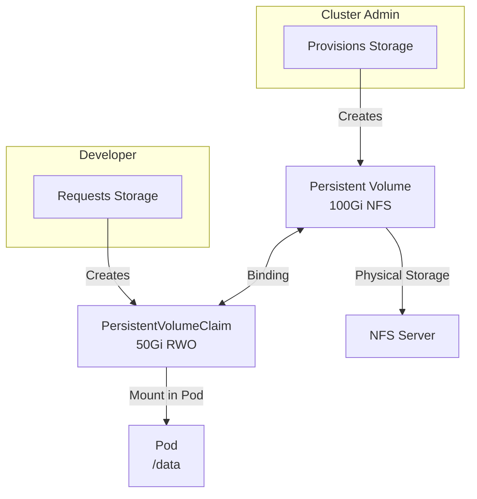
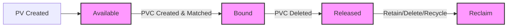
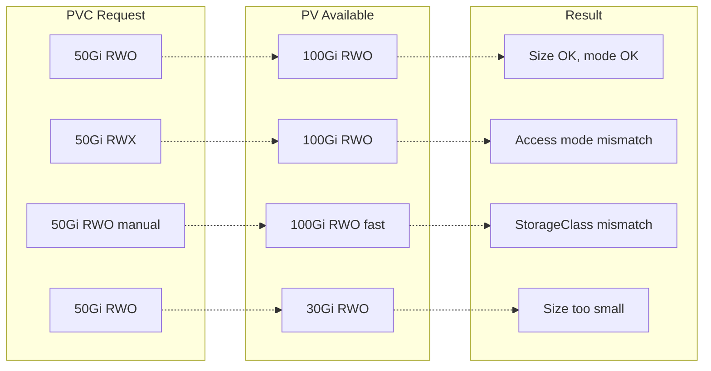
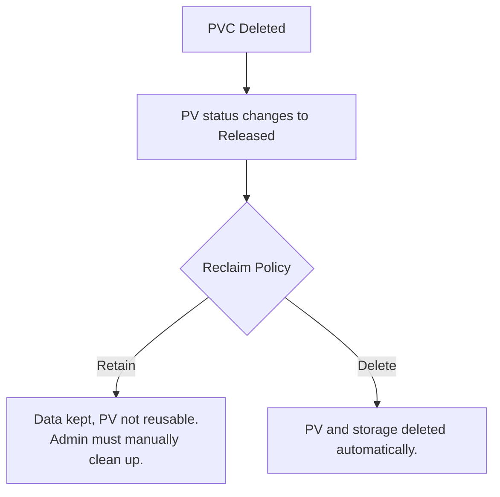

> **Складність**: `[СЕРЕДНЯ]` — основна абстракція зберігання
>
> **Час на проходження**: 40-50 хвилин
>
> **Передумови**: Модуль 4.1 (Томи), Модуль 1.2 (CSI)

---

## Що ви зможете зробити

Після цього модуля ви зможете:

- **Спроєктувати** архітектури зберігання, які відокремлюють виділення сховища від його споживання застосунком.
- **Діагностувати** збої прив'язування томів через аналіз режимів доступу, місткості, селекторів, меж простору імен та конфігурації StorageClass.
- **Впровадити** статичне виділення за допомогою PersistentVolume та PersistentVolumeClaim, а потім спожити цей запит із Pod'а.
- **Оцінити** політики повторного використання (reclaim policies) та фіналізатори, щоб обрати безпечнішу поведінку збереження даних для виробничих робочих навантажень.
- **Порівняти** компроміси між файловим та блоковим режимами томів, одновузловим та багатовузловим режимами доступу, а також статичним і динамічним виділенням.

## Чому цей модуль важливий

Гіпотетичний сценарій: команда переносить застосунок звітності зі станом (stateful) з однієї віртуальної машини до Kubernetes. Контейнер запускається без помилок, записує звіти до `/data` й проходить перший димовий тест, але команда використала том `emptyDir`, бо його було швидко описати. Наступне витіснення з вузла (node drain) перестворює Pod в іншому місці, звіти зникають разом зі старою пісочницею Pod'а, і команда дізнається незручну різницю між «застосунок працює» та «стан застосунку пережив звичайну операцію кластера».

PersistentVolume та PersistentVolumeClaim існують тому, що сховище має інший життєвий цикл, ніж обчислення. Pod навмисно є замінним; файл бази даних, завантажений документ, контрольна точка черги чи архів аудиту — часто ні. Тому Kubernetes розділяє розмову про сховище на два об'єкти API: адміністратор або провізор робить місткість доступною як PersistentVolume, а власник робочого навантаження просить місткість через PersistentVolumeClaim. Цей поділ дозволяє YAML застосунку лишатися переносним, тоді як політика зберігання залишається під контролем кластера.

Іспит CKA очікує, що ви зможете міркувати про цей поділ під тиском часу. Вас можуть попросити створити ручний `hostPath` PV, прив'язати PVC за класом і міткою, діагностувати, чому запит лишається у стані `Pending`, або відновити збережений том після видалення PVC. Самі команди — не найважча частина; найважче — правильно читати взаємозв'язок між PV, PVC, StorageClass, Pod, режимом доступу, режимом тому й політикою повторного використання, не припускаючи при цьому, що Kubernetes якимось чином угадає той намір, який ви забули закодувати в маніфесті.

Уявіть сховище як оренду квартири. PersistentVolume — це сама квартира: вона має розмір, розташування, правила будинку та власника навіть тоді, коли в ній ніхто не живе. PersistentVolumeClaim — це заявка застосунку: «Мені потрібно щонайменше стільки місця, з такими правилами доступу, із цього класу квартир». Pod — це орендар, який заселяється після схвалення заявки. Орендарю не потрібно знати кожну дрібну деталь будинку, щоб у ньому жити, але заявка все одно має відповідати квартирі, яка справді існує, а не лише тій, яку хотілося б мати.

## Контракт PV/PVC

PersistentVolume — це ресурс API на рівні кластера, який представляє сховище, доступне кластеру. Він може вказувати на NFS, локальний диск, Fibre Channel, iSCSI, хмарний диск на основі CSI або інший підтримуваний бекенд. Ключова ідея — це область видимості: PV не живе у просторі імен і не належить одному Pod'у. Це довговічний об'єкт сховища з власним статусом, місткістю, режимами доступу, політикою повторного використання та специфічною для бекенду конфігурацією.

PersistentVolumeClaim — це запит на сховище в межах простору імен. Розробники створюють PVC, бо їм не варто кодувати ідентифікатори хмарних дисків чи шляхи експорту NFS у кожному шаблоні Pod'а. PVC описує потрібний розмір, режим доступу, режим тому, StorageClass та необов'язкові селектори. Далі Kubernetes прив'язує запит до сумісного PV — або такого, що вже існує, або створеного динамічно провізором.

Прив'язування є навмисно ексклюзивним. Щойно PVC прив'язано до PV, цей PV резервується для цього запиту й не може бути розділений між іншими запитами, навіть коли запит просив менше місця, ніж надає PV. Ця ексклюзивність часто дивує тих, хто щойно навчається й очікує, що Kubernetes відріже 20Gi-шматок від 50Gi PV й залишить решту для інших, але Kubernetes трактує весь PV як неподільну одиницю виділення. Якщо кластеру справді потрібне дрібнозернисте визначення розміру для багатьох запитів, динамічне виділення зазвичай є кращою операційною моделлю, ніж ручне керування пулом наперед створених томів.



Діаграма показує головну межу відповідальності. Адміністраторів цікавить, яке сховище існує і яка політика до нього застосовується. Розробників цікавить, скільки сховища потрібно застосунку й де воно з'являється всередині контейнера. Площина управління Kubernetes стоїть між цими ролями й виконує зіставлення, але зіставляє лише за оголошеними властивостями. Якщо PVC просить `ReadWriteMany`, а всі доступні PV пропонують лише `ReadWriteOnce`, прихованих перемовин не буде.

| Питання | Хто його розв'язує | Ресурс |
|---------|---------------|----------|
| Яке сховище доступне? | Адміністратор | PersistentVolume |
| Скільки сховища потрібно? | Розробник | PersistentVolumeClaim |
| Куди його змонтувати? | Розробник | Специфікація Pod'а |
| Деталі бекенду сховища | Адміністратор | PV + StorageClass |

Ланцюжок ресурсів найлегше налагоджувати, коли ви тримаєте об'єкти в порядку. StorageClass описує, як має створюватися динамічне сховище. PV представляє фактичну місткість. PVC просить місткість. Pod посилається на PVC за іменем. Якщо Pod не може змонтувати сховище, не починайте з редагування образу контейнера; спершу перевірте, чи прив'язано PVC, який PV він обрав і чи можна приєднати обраний бекенд до вузла, де опинився Pod.

```text
+-------------------+      +-------------------+      +-------------------+
| StorageClass      | ---> | PersistentVolume  | ---> | Backend storage   |
| policy + driver   |      | capacity + mode   |      | disk, NFS, local  |
+-------------------+      +-------------------+      +-------------------+
          ^                         ^
          |                         |
+-------------------+      +-------------------+
| PersistentVolume  | ---> | Pod volume mount  |
| Claim request     |      | container path    |
+-------------------+      +-------------------+
```

Зробіть паузу й передбачте: якщо PVC створено у просторі імен `frontend`, а Pod у просторі імен `backend` використовує те саме ім'я запиту, який пошук об'єкта спробує виконати kubelet? PV має область видимості кластера, але Pod ніколи не монтує PV напряму. Він посилається на PVC у власному просторі імен, тож межа простору імен лишається частиною контракту сховища навіть після того, як PV рівня кластера прив'язано.

## Визначення томів, запитів і правил прив'язування

Специфікація PV починається з місткості, режимів доступу, режиму тому, політики повторного використання, класу, необов'язкових параметрів монтування та деталей бекенду. Секція бекенду — це частина, яка змінюється між NFS, локальним диском, CSI та призначеним лише для тестів `hostPath`, але поля контракту лишаються впізнаваними. Розглядайте ці поля контракту як ту частину, про яку Kubernetes може міркувати; специфічні для бекенду поля кажуть плагіну або kubelet, як дістатися сховища після того, як зіставлення відбулося.

```yaml
apiVersion: v1
kind: PersistentVolume
metadata:
  name: pv-nfs-data
  labels:
    type: nfs
    environment: production
spec:
  capacity:
    storage: 100Gi                    # Size of the volume
  volumeMode: Filesystem              # Filesystem or Block
  accessModes:
    - ReadWriteMany                   # Can be mounted by multiple nodes
  persistentVolumeReclaimPolicy: Retain   # What happens when released
  storageClassName: manual            # Must match PVC (or empty)
  mountOptions:
    - hard
    - nfsvers=4.1
  nfs:                                # Backend-specific configuration
    path: /exports/data
    server: nfs-server.example.com
```

`volumeMode` відповідає на інше питання, ніж режим доступу. `Filesystem` означає, що Kubernetes монтує файлову систему до каталогу всередині контейнера; це значення за замовчуванням і правильний вибір для більшості шляхів даних застосунку. `Block` надає контейнеру сирий блоковий пристрій, що корисно для програмного забезпечення, яке саме керує розкладкою диска. База даних, що працює в сирому блоковому режимі, не є «персистентнішою» чи надійнішою, ніж та сама база у файловому режимі; вона просто отримує інший інтерфейс до того самого сховища.

```yaml
spec:
  volumeMode: Filesystem    # Default - mounted as directory
  # OR
  volumeMode: Block         # Raw block device (for databases)
```

Режими доступу описують, як том може бути змонтований вузлами або, для `ReadWriteOncePod`, одним Pod'ом. Вони використовуються під час зіставлення PV/PVC, а в деяких випадках обмежують приєднання, але не є повноцінною системою дозволів. Наприклад, `ReadOnlyMany` в API не робить помилково налаштований бекенд незмінним після монтування за помахом чарівної палички; реалізація сховища все одно має значення. Для роботи на іспиті використовуйте режим доступу, щоб пояснити поведінку планування та прив'язування, а потім перевірте, що бекенд підтримує обраний вами режим.

| Режим | Скорочення | Опис |
|------|--------------|-------------|
| ReadWriteOnce | RWO | Читання-запис на одному вузлі |
| ReadOnlyMany | ROX | Лише читання на кількох вузлах |
| ReadWriteMany | RWX | Читання-запис на кількох вузлах |
| ReadWriteOncePod | RWOP | Читання-запис одним Pod'ом, підтримується через CSI |

Підтримка бекендів різниться. NFS зазвичай підтримує RWO, ROX і RWX, що робить його корисним для спільного контенту. Хмарні блокові диски, як-от AWS EBS та Azure Disk, зазвичай RWO, бо приєднання одного диска координується до одного вузла за раз. GCE Persistent Disk підтримує RWO та ROX у поширених таблицях Kubernetes. Локальні PV є RWO, бо шлях існує на одному вузлі, а `ReadWriteOncePod` — це орієнтований на CSI режим для забезпечення єдиного Pod'а-записувача в межах кластера.

`hostPath` PV прийнятний для локальної навчальної лабораторії, але це не виробничий патерн для багатовузлового кластера. Він зберігає дані на шляху файлової системи вузла, тож дані прив'язані до цього вузла й не захищені зовнішньою системою сховища. Документація зі сховища Kubernetes виокремлює `hostPath` як матеріал для одновузлового тестування; коли вам потрібне локальне для вузла виробниче сховище, використовуйте локальні PV із явною спорідненістю до вузла (node affinity) та чіткою історією про домен збоїв.

```yaml
apiVersion: v1
kind: PersistentVolume
metadata:
  name: pv-hostpath
spec:
  capacity:
    storage: 10Gi
  accessModes:
    - ReadWriteOnce
  persistentVolumeReclaimPolicy: Delete
  storageClassName: manual
  hostPath:
    path: /mnt/data
    type: DirectoryOrCreate
```

NFS PV демонструє спільну мережеву файлову систему. Кілька вузлів можуть дістатися того самого експорту, тож RWX стає можливим, коли NFS-сервер та дозволи експорту налаштовано правильно. Компроміс полягає в тому, що NFS-сервер стає частиною ланцюжка залежностей застосунку. Маніфест Kubernetes може запросити RWX на папері, але він не може змусити повільний, недоступний чи неправильно експортований NFS-сервер поводитися так, ніби це справді стійке й надійне сховище.

```yaml
apiVersion: v1
kind: PersistentVolume
metadata:
  name: pv-nfs
spec:
  capacity:
    storage: 50Gi
  accessModes:
    - ReadWriteMany
  persistentVolumeReclaimPolicy: Retain
  storageClassName: nfs
  nfs:
    server: 192.168.1.100
    path: /exports/share
```

Локальний PV відрізняється від `hostPath` тим, що це явний об'єкт PersistentVolume з інформацією про планування. Обов'язковий `nodeAffinity` каже Kubernetes, де існує сховище, дозволяючи планувальнику розміщувати Pod'и-споживачі на правильному вузлі. Без цієї спорідненості Pod міг би бути запланований на вузол, що не має `/mnt/disks/ssd1`, і збій монтування виглядав би як проблема сховища, хоча справжня причина — відсутні метадані топології.

```yaml
apiVersion: v1
kind: PersistentVolume
metadata:
  name: pv-local
spec:
  capacity:
    storage: 200Gi
  accessModes:
    - ReadWriteOnce
  persistentVolumeReclaimPolicy: Retain
  storageClassName: local-storage
  local:
    path: /mnt/disks/ssd1
  nodeAffinity:                        # Required for local volumes!
    required:
      nodeSelectorTerms:
      - matchExpressions:
        - key: kubernetes.io/hostname
          operator: In
          values:
          - worker-node-1
```

Життєвий цикл PV короткий за назвами, але важливий для тлумачення. `Available` означає, що PV ще може прив'язатися. `Bound` означає, що він пов'язаний з одним PVC. `Released` означає, що PVC видалено, але PV досі пам'ятає той старий запит і може досі містити дані. `Failed` означає, що автоматизоване повторне використання не завершилося. Фаза `Released` — саме та, що ловить адміністраторів, бо збережений том не є автоматично безпечним для нового запиту.



PVC менший і ближчий до застосунку. Він називає простір імен, режим доступу, режим тому, запитувану місткість, StorageClass та необов'язкові селектори. Значення `resources.requests.storage` є мінімумом, а не запитом точного розділу, тож запит на 50Gi може прив'язатися до 100Gi PV. Поле `storageClassName` точне, включно з важливою різницею між пропущеним полем та явним порожнім рядком.

```yaml
apiVersion: v1
kind: PersistentVolumeClaim
metadata:
  name: data-claim
  namespace: production              # PVCs are namespaced!
spec:
  accessModes:
    - ReadWriteOnce                  # Must match or be subset of PV
  volumeMode: Filesystem
  resources:
    requests:
      storage: 50Gi                  # Minimum size needed
  storageClassName: manual           # Match PV's storageClassName
  selector:                          # Optional: target specific PVs
    matchLabels:
      type: nfs
      environment: production
```

Kubernetes прив'язує PVC до PV, коли клас, запитуваний режим доступу, режим тому, місткість та обмеження селектора сумісні. Селектор може звузити набір придатних PV за міткою, а `volumeName` може запросити один PV за іменем. Якщо запитуваний PV уже прив'язано до іншого запиту, новий запит лишається в очікуванні, бо прив'язування PV/PVC є взаємно-однозначним. Kubernetes не забере й не «вкраде» вже прив'язаний PV в одного запиту лише тому, що інший, новіший запит сформульовано конкретніше.



Перед запуском цього, який вивід ви очікуєте від `kubectl get pvc`, якщо сумісного PV не існує й жоден динамічний провізор не може задовольнити запит? Запит має лишитися у стані `Pending`, а `kubectl describe pvc` має показати події, які пояснюють відсутнє зіставлення. Ці події часто набагато корисніші за сам YAML, бо вони прямо кажуть вам, яке саме рішення контролера не вдалося виконати й чому.

```bash
# Quick way to create a PVC with explicit YAML.
cat <<EOF | kubectl apply -f -
apiVersion: v1
kind: PersistentVolumeClaim
metadata:
  name: my-claim
spec:
  accessModes:
    - ReadWriteOnce
  resources:
    requests:
      storage: 10Gi
  storageClassName: standard
EOF
```

Після створення запиту перевірте його з обох боків. Статус PVC каже вам, чи прив'язано запит, а стовпець `CLAIM` PV каже вам, який простір імен та запит спожили том. Якщо ви перевіряєте лише Pod, ви можете не помітити, що Pod чекає на запит, який ніколи не прив'язався. Якщо ви перевіряєте лише PV, ви можете не помітити, що Pod у неправильному просторі імен для PVC, на який він посилається.

На kind та багатьох кластерах Kubernetes 1.35 типовий StorageClass `standard` встановлює `volumeBindingMode: WaitForFirstConsumer`, тож новий PVC часто лишається у стані `Pending`, доки на запит не пошлеться Pod. Це нормальна поведінка контролера, а не невдала спроба виділення.

```bash
# List PVCs right after creating the claim
kubectl get pvc
# NAME       STATUS    VOLUME   CAPACITY   ACCESS MODES   STORAGECLASS   AGE
# my-claim   Pending                                      standard       5s

# Consumer Pod triggers binding/provisioning for WaitForFirstConsumer classes
cat <<EOF | kubectl apply -f -
apiVersion: v1
kind: Pod
metadata:
  name: my-claim-consumer
spec:
  containers:
  - name: app
    image: busybox:1.36
    command: ['sleep', '3600']
    volumeMounts:
    - name: data
      mountPath: /data
  volumes:
  - name: data
    persistentVolumeClaim:
      claimName: my-claim
EOF

# After the Pod is scheduled, the claim should bind
kubectl get pvc
# NAME       STATUS   VOLUME   CAPACITY   ACCESS MODES   STORAGECLASS
# my-claim   Bound    pv-xxx   10Gi       RWO            standard

# Detailed view
kubectl describe pvc my-claim

# Check which PV it bound to
kubectl get pvc my-claim -o jsonpath='{.spec.volumeName}'
```

## StorageClass'и, динамічне виділення та джерела даних

Статичне виділення є явним: хтось створює PV до того, як надходить запит. Динамічне виділення є керованим попитом: PVC посилається на StorageClass, а провізор створює PV, який задовольняє цей запит. Динамічне виділення — це звичайний виробничий шлях для багатьох хмарних кластерів та кластерів на основі CSI, бо воно уникає підтримки куп заздалегідь визначених за розміром об'єктів PV і зменшує марнування місткості від завеликих статичних томів.

StorageClass містить `provisioner`, необов'язкові `parameters` бекенду, `reclaimPolicy`, `allowVolumeExpansion` та `volumeBindingMode`. Політика повторного використання для динамічно створених PV походить зі StorageClass, тож StorageClass також є поверхнею політики збереження даних. Якщо клас каже `Delete`, то видалення PVC зазвичай призводить до видалення динамічно виділеного бекенд-сховища після того, як виконано правила захисту та фіналізаторів.

Поведінка за замовчуванням — часта пастка на іспиті. Якщо PVC пропускає `storageClassName` і існує типовий StorageClass, контролер допуску може призначити типовий клас і запустити динамічне виділення. Якщо PVC встановлює `storageClassName: ""`, він просить PV без класу й не має отримувати типовий клас за замовчуванням. Порожній рядок — не прикраса; це спосіб увімкнути ручне прив'язування без класу.

`volumeBindingMode` керує тим, коли відбувається прив'язування чи виділення. Типовий режим `Immediate` прив'язує або виділяє щойно створено запит, до того, як заплановано Pod-споживач. `WaitForFirstConsumer` відкладає прив'язування, доки не з'явиться Pod, дозволяючи селекторам вузлів, спорідненості, обмеженням (taints), зонам топології та обмеженням локальних томів впливати на рішення. Для локальних PV та обізнаних з топологією CSI-драйверів ця затримка може бути різницею між планованим робочим навантаженням та цілком коректним томом, створеним у неправильному місці.

Знімки (snapshots) та клонування розширюють ту саму модель запиту, а не замінюють її. VolumeSnapshot та VolumeSnapshotContent — це CustomResourceDefinition, які обслуговує екосистема знімків CSI, а не основні об'єкти PV. PVC можна створити зі знімка через `dataSource`, коли CSI-драйвер та контролер знімків це підтримують. Клон може використовувати інший PVC як джерело даних, з обмеженнями щодо простору імен та провізора. У Kubernetes 1.35 джерела даних між просторами імен лишаються можливістю, яка потребує явного увімкнення та допоміжних об'єктів, як-от ReferenceGrant, тож не проєктуйте навколо неї як навколо припущення за замовчуванням.

Розширення безпечніше за зменшення, бо API дозволяє зростання, але не зменшення нижче поточного розміру. Стабільне розширення PVC доступне з Kubernetes v1.24 для підтримуваних драйверів, а розширення файлової системи застосовується до файлових систем, як-от XFS, Ext3 та Ext4, коли бекенд сховища це дозволяє. Зменшення вимагало б доведення, що кожен байт вище нової межі не використовується і що файлова система може безпечно стиснутися, тож Kubernetes не пропонує його як звичайне редагування PVC.

Який підхід ви б обрали тут і чому: вручну створений `Retain` PV для вікна міграції бази даних чи динамічно виділений `Delete` PV з типового StorageClass? Відповідь залежить від того, що важливіше для цього навантаження — безпека видалення чи автоматизація. Для виробничої міграції даних навмисне збереження зазвичай перемагає зручність. Для одноразових тестових даних, навпаки, динамічне виділення з автоматичним очищенням після видалення запиту цілком може бути правильним операційним вибором.

## Споживання запитів з Pod'ів та робочих навантажень

Pod споживає сховище, називаючи PVC у `spec.volumes`, а потім монтуючи цей том до одного чи кількох контейнерів. Pod не називає PV, бекенд-диск чи StorageClass. Ця непрямість і є тим, що дозволяє YAML застосунку лишатися стабільним, поки кластер змінює реалізацію сховища. Якщо ім'я запиту неправильне або простір імен відрізняється, Pod не може розв'язати запит, навіть якщо відповідний PV рівня кластера існує.

```yaml
apiVersion: v1
kind: Pod
metadata:
  name: app-with-storage
spec:
  containers:
  - name: app
    image: nginx:1.25
    volumeMounts:
    - name: data
      mountPath: /usr/share/nginx/html
  volumes:
  - name: data
    persistentVolumeClaim:
      claimName: my-claim              # Reference the PVC name
```

Деплойменти додають питання масштабування. Кілька реплік можуть посилатися на той самий PVC, але бекенд та режим доступу вирішують, чи це справді придатне для використання. Деплоймент із трьома репліками, що монтує один RWO блоковий диск, може працювати, поки всі Pod'и опиняються на одному вузлі, а потім впасти з помилкою множинного приєднання (multi-attach), коли інша репліка опиниться деінде. Якщо всі репліки мають читати й записувати ті самі файли, використовуйте сховище з підтримкою RWX. Якщо кожній репліці потрібен власний стабільний диск, використовуйте StatefulSet із `volumeClaimTemplates`.

```yaml
apiVersion: apps/v1
kind: Deployment
metadata:
  name: web-app
spec:
  replicas: 3
  selector:
    matchLabels:
      app: web
  template:
    metadata:
      labels:
        app: web
    spec:
      containers:
      - name: web
        image: nginx:1.25
        volumeMounts:
        - name: shared-data
          mountPath: /data
      volumes:
      - name: shared-data
        persistentVolumeClaim:
          claimName: shared-pvc        # Must be RWX for multi-replica
```

Монтування лише для читання — це вибір споживання на рівні Pod'а. PVC та PV досі оголошують режими доступу для зіставлення та приєднання, але Pod може запросити монтування лише для читання, коли йому не слід записувати до спільного набору даних. Це корисно для спільного контенту, файлів моделей чи знімків конфігурації, де адміністратор сховища керує оновленнями окремо від поведінки застосунку під час виконання.

```yaml
volumes:
- name: data
  persistentVolumeClaim:
    claimName: my-claim
    readOnly: true                     # Mount as read-only
```

Зробіть паузу й передбачте: ви створюєте Деплоймент із трьома репліками, кожна з яких монтує той самий PVC з режимом доступу `ReadWriteOnce`. Перша репліка запускається на `node-1`. Що станеться, коли другу репліку заплановано на `node-2`, і чи зробив би `ReadWriteOncePod` проблему спільного доступу кращою чи гіршою? RWO дозволяє один вузол, тоді як RWOP навмисно звужує записувача до одного Pod'а, тож RWOP є суворішим і не змушує працювати дизайн зі спільним багатореплічним записувачем.

Селектори роблять статичне прив'язування навмиснішим. Селектор PVC не є селектором планування й не обирає вузол; він обирає придатні об'єкти PV за міткою. Це корисно, коли адміністратор публікує кілька ручних PV з різними мітками продуктивності чи середовища. Тоді запит може просити `type: ssd` та `speed: fast` без жорсткого кодування імені PV, зберігаючи певну гнучкість і уникаючи випадкового прив'язування до дешевшого сховища.

```yaml
# PV with labels
apiVersion: v1
kind: PersistentVolume
metadata:
  name: pv-fast-ssd
  labels:
    type: ssd
    speed: fast
    region: us-east
spec:
  capacity:
    storage: 100Gi
  accessModes:
    - ReadWriteOnce
  storageClassName: ""                # Empty for manual binding
  hostPath:
    path: /mnt/ssd
```

Коли ви поєднуєте `matchLabels` та `matchExpressions`, мають бути задоволені всі обмеження. Це робить селектори потужними, але їх легко переобмежити. Помилка в `region`, невідповідність класу чи невідповідність режиму доступу — усі вони спершу дають той самий видимий симптом: PVC лишається у стані `Pending`. Виправлення — не видаляти й перестворювати об'єкти навмання; зробіть `describe pvc`, перевірте події, а потім порівняйте кожне оголошене обмеження з кандидатами PV.

```yaml
# PVC selecting specific PV
apiVersion: v1
kind: PersistentVolumeClaim
metadata:
  name: fast-storage-claim
spec:
  accessModes:
    - ReadWriteOnce
  resources:
    requests:
      storage: 50Gi
  storageClassName: ""                # Must match PV
  selector:
    matchLabels:
      type: ssd
      speed: fast
    matchExpressions:
    - key: region
      operator: In
      values:
        - us-east
        - us-west
```

Пряме прив'язування через `volumeName` є точнішим. Воно каже Kubernetes, який PV хоче запит, і є цінним під час відновлення чи ретельно контрольованих міграцій. Воно також менш гнучке, бо помилка друку, несумісне поле чи вже прив'язаний PV лишають запит в очікуванні. Використовуйте його, коли вам потрібне детерміноване прив'язування до відомого збереженого тому, а не як заміну за замовчуванням для міток та StorageClass.

```yaml
apiVersion: v1
kind: PersistentVolumeClaim
metadata:
  name: specific-pv-claim
spec:
  accessModes:
    - ReadWriteOnce
  resources:
    requests:
      storage: 10Gi
  storageClassName: ""
  volumeName: pv-fast-ssd             # Bind to this specific PV
```

## Діагностика запитів у стані Pending та збоїв монтування

Усунення проблем зі сховищем стає набагато легшим, коли ви відокремлюєте проблеми прив'язування від проблем монтування. Проблема прив'язування виникає до того, як Pod може використати том: PVC не у стані `Bound`, тож немає обраного PV для монтування. Проблема монтування виникає після прив'язування: PVC прив'язано, але kubelet чи плагін сховища не може приєднати, підготувати (stage), опублікувати (publish) чи змонтувати бекенд на обраному вузлі. Видимий симптом може досі бути застряглим Pod'ом, але об'єкт, який слід перевірити першим, інший.

Почніть зі статусу та подій PVC. Якщо запит у стані `Pending`, Kubernetes не знайшов чи не створив сумісного сховища. Порівняйте `storageClassName`, запитувану місткість, режим доступу, режим тому, мітки селектора та `volumeName`, якщо він присутній. Не припускайте, що більший PV завжди підходить; клас та режим доступу все одно мають збігатися. Також перевірте, чи не призначив кластер StorageClass за замовчуванням, бо пропущений клас може непомітно перетворити вправу з ручного прив'язування на запит динамічного виділення.

Далі перевірте кандидатів PV. PV у стані `Available` може прив'язатися, якщо його поля задовольняють запит. PV у стані `Bound` уже зарезервовано, навіть якщо навантаження, що його спершу використовувало, зникло. PV у стані `Released` особливо оманливий, бо виглядає близьким до придатного, проте старий `claimRef` зазвичай заважає звичайному прив'язуванню. Якщо той, хто навчається, бачить `Released` і одразу видаляє посилання патчем, він може правильно відновити дані, а може й оголити старі файли іншого навантаження. Саме тому рішення щодо даних передує очищенню API.

Потім перевіряйте Pod лише після того, як ви знаєте, що запит прив'язано. Якщо Pod застряг у стані `Pending`, обмеження планування можуть бути незадовільними з обраним томом. Локальні PV та зональні диски роблять це поширеним, бо планувальник має розмістити Pod там, де можна дістатися сховища. Якщо Pod застряг у стані `ContainerCreating`, шукайте події приєднання та монтування. Помилка множинного приєднання вказує на режим доступу чи обмеження приєднання бекенду, тоді як помилка дозволів чи шляху вказує на бекенд сховища чи параметри монтування.

Помилки простору імен заслуговують на власну розумову перевірку, бо їх легко пропустити у швидкому середовищі іспиту. `kubectl get pvc` без `-n` показує запити в поточному просторі імен, а не в кожному. Pod у `backend`, що посилається на `claimName: data`, не просить PVC під назвою `data` будь-де в кластері; він просить `backend/data`. PV може показувати `frontend/data` у своєму стовпці запиту й бути цілком справним. Pod падає саме тому, що шукає запит у неправильному просторі імен, а не тому, що зі самим сховищем щось не так.

Невідповідність місткості також тонша, ніж «замала чи достатньо велика». Запит PVC є нижньою межею, тож більший PV може прив'язатися. Однак щойно він прив'язується, увесь PV споживається цим запитом. Це має значення, коли команди статично заздалегідь створюють кілька великих PV, а потім дивуються, чому багато малих запитів не можуть ними поділитися. Якщо кластеру потрібно багато точно визначених за розміром томів, динамічне виділення не просто зручне; це інструмент керування місткістю, який зменшує застрягле місце.

Невідповідність режиму доступу часто з'являється під час масштабування, а не під час першого розгортання. Один RWO-запит може прив'язатися й успішно змонтуватися для одного Pod'а, що робить YAML на вигляд правильним під час димового тесту. Збій з'являється, коли контролер створює іншу репліку на іншому вузлі, і бекенд сховища відмовляє другому приєднанню записувача. Виправлення — не продовжувати видаляти Pod'и, доки вони не опиняться разом. Виправлення — обрати семантику сховища, що відповідає патерну контролера: RWX для спільних файлів або окремі запити на репліку для незалежного стану.

Невідповідність режиму тому рідша в лабораторіях для початківців, але важлива в реальних системах. Запит, що просить `Block`, не прив'яжеться до PV, що пропонує режим `Filesystem`, а Pod, що очікує змонтований каталог, — це не те саме, що Pod, який очікує сирий пристрій. Діагностуючи спеціалізовані бази даних, шукайте режим тому, перш ніж припускати, що режим доступу — єдине цікаве поле. Правильний запит у блоковому режимі може бути суттєвим для програмного забезпечення, що форматує й керує пристроєм усередині, тоді як звичайний вебзастосунок зазвичай хоче файловий режим.

Проблеми StorageClass поділяються на три групи. Перша — точна невідповідність імені між PV та PVC, що блокує статичне прив'язування. Друга — призначення класу за замовчуванням, коли PVC пропустив `storageClassName`, що може створити інший динамічний PV, ніж очікувалося. Третя — збій провізора, коли запит називає клас правильно, але зовнішній провізор не може створити сховище через квоту, облікові дані, топологію, відсутні компоненти драйвера чи недійсні параметри. Події PVC зазвичай розрізняють ці випадки, якщо ви читаєте їх уважно.

Селектори слід трактувати як фільтри, а не як уподобання. Якщо селектор PVC просить `type: ssd` та `region In [us-east, us-west]`, PV без будь-якої з міток невидимий для цього запиту, навіть якщо кожне інше поле збігається. Це корисно для запобіжників, але може давати дратівливі запити в очікуванні, коли мітки дрейфують чи коли адміністратори перейменовують ключі міток. У статичних пулах сховища стандартизуйте ключі міток і документуйте їх так само, як документуєте імена StorageClass.

Діагностика політики повторного використання починається після видалення. Якщо динамічно виділений PV зникає після видалення запиту, перевірте StorageClass, який його створив, і подивіться, чи очікувався `Delete`. Якщо збережений PV лишається, перевірте, чи ще існує бекенд-актив і чи призначений PV для відновлення або утилізації. Якщо фіналізатори утримують об'єкт у стані завершення (terminating), не видаляйте їх безтурботно. Фіналізатори зазвичай кажуть вам, що контролер досі має завершити очищення, а їхній обхід може лишити реальне сховище в невизначеному стані.

Для роботи в стилі CKA практикуйте формулювання ймовірного збою одним реченням, перш ніж щось редагувати. «Цей запит в очікуванні, бо просить RWX, але класу відповідають лише RWO PV». «Цей Pod застряг, бо RWO-диск уже приєднано до іншого вузла». «Цей збережений PV не може повторно прив'язатися, бо лишилося застаріле посилання на запит». Ця звичка тримає усунення проблем заземленим на стані об'єкта Kubernetes замість здогадок. Вона також робить вашу відповідь на іспиті швидшою, бо кожне речення прямо відображається на команду, яку ви можете запустити, та поле, яке ви можете перевірити.

Є ще одна практична звичка, що відрізняє надійне налагодження сховища від випадкових редагувань: завжди зберігайте поточні докази об'єкта, перш ніж замінювати маніфести. Повідомлення про подію PVC може зникнути після успішного прив'язування, а помилка монтування Pod'а може змінитися після того, як контролер повторить спробу. Читання поточних подій, імені обраного PV, посилання на запит, імені StorageClass та призначення вузла дає вам хронологію. Ця хронологія має значення, коли кілька контролерів діють одночасно, особливо за динамічного виділення, де PVC, PV, зовнішній провізор, планувальник, компонент приєднання (attacher) та kubelet усі беруть участь.

Ця хронологія також допомагає вирішити, чи проблема належить логіці зіставлення Kubernetes, чи системі сховища поза Kubernetes. Якщо PVC ніколи не прив'язується, лишайтеся в межах полів API та подій контролера. Якщо PVC прив'язується, а Pod не може змонтувати, рухайтеся назовні до розміщення вузла, справності CSI-драйвера, досяжності бекенду, дозволів та параметрів монтування. Хороший адміністратор змінює лише один рівень за раз і спостерігає за результатом, бо збої сховища часто мають кілька спокусливих симптомів, які тягнуть вас у різні боки, і лише одну справжню кореневу причину.

## Політика повторного використання, захист та відновлення

Політика повторного використання — це місце, де життєвий цикл сховища стає бізнес-рішенням. `Retain` зберігає дані бекенду після видалення PVC і вимагає, щоб адміністратор вирішив, що буде далі. `Delete` дозволяє автоматично видалити PV та сховище, що його забезпечує, що зручно для динамічно виділених ефемерних середовищ. `Recycle` виконує базове очищення для обмежених типів плагінів і фактично є застарілим варіантом, якого сучасним кластерам слід уникати.

| Політика | Поведінка | Сценарій використання |
|--------|----------|----------|
| Retain | PV збережено після видалення PVC | Виробничі дані, ручне очищення |
| Delete | PV та сховище, що його забезпечує, видалено | Динамічне виділення, dev/test |
| Recycle | Базове очищення (`rm -rf /data/*`) | Застарілий патерн, уникайте в нових дизайнах |

У Kubernetes 1.35 лише типи томів `nfs` та `hostPath` підтримують політику повторного використання Recycle, та й там це не той дизайн, до якого варто тягнутися. Сучасний вибір зазвичай між `Retain` та `Delete`. Обирайте `Retain`, коли випадкове видалення було б гіршим за ручне очищення. Обирайте `Delete`, коли сховище одноразове або коли провізор володіє повним життєвим циклом і очищення є частиною очікуваного робочого процесу.

Захист об'єктів сховища та фіналізатори зменшують часові ризики, але не замінюють хорошої політики. Kubernetes відкладає видалення активно використовуваних PVC та прив'язаних PV, доки вони не перестануть використовуватися. Фіналізатори захисту від видалення PersistentVolume стали стабільними у v1.33 й допомагають гарантувати, що PV з політикою повторного використання `Delete` видаляються лише після завершення очищення сховища, що їх забезпечує. Це захищає від осиротілого чи передчасно видаленого сховища на підтримуваних шляхах, але не означає, що видалений PVC з політикою `Delete` за замовчуванням можна відновити.



Стан `Released` навмисно обережний. Збережений PV досі містить дані попереднього заявника й досі має `claimRef`, що вказує на стару ідентичність PVC. Та стара ідентичність включає більше, ніж зрозуміле людині ім'я запиту, тож створення нового PVC з тим самим іменем недостатньо. Адміністратор має або видалити й перестворити PV навколо того самого бекенд-сховища після очищення, або навмисно очистити старе посилання на запит, коли повторне використання безпечне.

```bash
# Check PV status
kubectl get pv pv-data
# NAME      CAPACITY   ACCESS MODES   RECLAIM POLICY   STATUS     CLAIM
# pv-data   100Gi      RWO            Retain           Released   default/old-claim

# Remove the claim reference to make PV available again
kubectl patch pv pv-data -p '{"spec":{"claimRef": null}}'

# Verify it's Available
kubectl get pv pv-data
# STATUS: Available
```

Якщо ви прибираєте `claimRef` патчем без очищення бекенду, наступний запит, що прив'яжеться, може побачити старі дані. Іноді це і є метою, як-от відновлення видаленого запиту бази даних. Іноді це інцидент розкриття даних, що чекає на свою мить, як-от прив'язування нового навантаження розробки до старого виробничого експорту. Тому трактуйте повторне використання як суворо контрольовану процедуру, а не як механічне натискання кнопки: спочатку визначте, який саме бекенд стоїть за томом, потім свідомо вирішіть, зберігати ці дані чи стирати, і лише після того, як рішення щодо даних остаточно ухвалено, робіть сам об'єкт API придатним для повторного використання.

## Патерни та антипатерни

Хороший дизайн PV/PVC починається з відокремлення наміру навантаження від реалізації сховища. Навантаження має просити довговічність, місткість та семантику доступу; кластер має вирішувати, як ці вимоги відображаються на провізорів та системи бекенду. Коли ці питання змішані, команди застосунків починають залежати від ідентифікаторів хмарних дисків, адміністратори втрачають контроль над політикою, а процедури відновлення стають полюванням крізь не пов'язані маніфести.

| Патерн | Коли його використовувати | Чому він працює |
|---------|----------------|--------------|
| Динамічне виділення з іменованим StorageClass | Більшість хмарного чи на основі CSI сховища застосунку | Запити створюють PV правильного розміру та послідовно успадковують політику провізора |
| Статичний `Retain` PV для контрольованої міграції чи відновлення | Імпорт наявних даних чи захист виробничих наборів даних | Бекенд переживає видалення PVC і може бути навмисно відновлений |
| `WaitForFirstConsumer` для обізнаного з топологією сховища | Локальні PV та зональні CSI-драйвери | Обмеження планування Pod'а беруть участь до прив'язування чи виділення |
| RWX-бекенд для навантажень зі спільним записувачем | Кільком реплікам потрібна та сама змонтована файлова система | Бекенд сховища, а не лише маніфест, підтримує багатовузловий доступ |

Відповідний антипатерн — трактувати PVC як магічні спільні теки. PVC не робить RWO-диск безпечним для трьох записувачів на трьох вузлах. StorageClass не гарантує, що збережені дані будуть у безпеці після того, як хтось видалить запит. Селектор не виправляє невідповідність класу. API точне, і більшість збоїв сховища спричинені проханням властивості, якої бекенд насправді не надає.

| Антипатерн | Що йде не так | Краща альтернатива |
|--------------|-----------------|--------------------|
| Один RWO PVC, змонтований масштабованим Деплойментом | Помилки множинного приєднання чи випадкове зв'язування на одному вузлі | Використовуйте RWX-сховище або StatefulSet `volumeClaimTemplates` |
| Пропущений `storageClassName` для ручного прив'язування | Клас за замовчуванням може запустити динамічне виділення | Установіть `storageClassName: ""` і на PV без класу, і на PVC |
| Політика повторного використання `Delete` для цінних даних | Видалення запиту може прибрати бекенд-сховище | Використовуйте `Retain` та документуйте процес відновлення |
| Локальний PV без спорідненості до вузла | Pod може запланувати там, де диска не існує | Оголосіть обов'язкову спорідненість до вузла й віддавайте перевагу `WaitForFirstConsumer` |

Міркування щодо масштабування випливають прямо з цих патернів. Спільні файлові системи спрощують навантаження з кількома читачами чи кількома записувачами, але вони централізують продуктивність та доступність навколо мережевої служби. Блокові томи дають сильну продуктивність для одного записувача, але рідко розв'язують семантику спільного запису. Локальні диски можуть бути швидкими, але вони прив'язують доступність даних до справності вузла. Сильний дизайн відверто називає цей компроміс і робить його видимим, замість ховати його за загальним, нічого не значущим запитом на сховище.

## Рамка прийняття рішень

Коли дизайн сховища здається незрозумілим, почніть із форми даних навантаження. Запитайте, чи дані одноразові, відтворювані чи авторитетні. Потім запитайте, чи їх записує один Pod, читають багато Pod'ів чи записують багато Pod'ів. Нарешті, запитайте, чи можна створити сховище на вимогу, чи воно має вказувати на наявні дані. Ці питання зазвичай обирають патерн PV/PVC ще до того, як ви напишете будь-який YAML.

| Точка рішення | Оберіть це | Коли відповідь така |
|----------------|-------------|--------------------|
| Модель виділення | Динамічний StorageClass | Кластер може створювати нове бекенд-сховище на запит |
| Модель виділення | Статичний PV | Сховище вже існує або має куруватися вручну |
| Політика повторного використання | Retain | Дані мають пережити випадкове видалення запиту |
| Політика повторного використання | Delete | Дані одноразові або належать автоматизованому життєвому циклу |
| Режим доступу | RWO або RWOP | Записувати має один вузол чи один Pod |
| Режим доступу | RWX | Кілька вузлів мають читати й записувати ту саму файлову систему |
| Режим прив'язування | WaitForFirstConsumer | Топологія впливає на те, де можна приєднати сховище |
| Режим тому | Block | Застосунок очікує сирий пристрій і керує розкладкою |

Використовуйте цей розумовий потік як під час усунення проблем, так і під час дизайну. Якщо запит у стані `Pending`, порівняйте клас, місткість, режим доступу, режим тому, селектор та режим прив'язування. Якщо Pod застряг у стані `ContainerCreating`, перевірте події приєднання та монтування, особливо для RWO-дисків, що використовуються кількома репліками. Якщо PV у стані `Released`, зупиніться й вирішіть, чи ви відновлюєте дані, чи стираєте дані, перш ніж знову робити PV доступним.

## Чи знали ви?

- **Факт 1:** Вбудовані (in-tree) плагіни AWS Elastic Block Store та Azure Disk було оголошено застарілими в Kubernetes v1.19, а їхній шлях міграції перевів виробниче використання до CSI-драйверів замість нових вбудованих плагінів.
- **Факт 2:** Розширення PVC є стабільним з Kubernetes v1.24 для підтримуваних драйверів та файлових систем, як-от XFS, Ext3 та Ext4, але Kubernetes не підтримує зменшення наявного PVC.
- **Факт 3:** Джерела даних томів між просторами імен були представлені як alpha-можливість у Kubernetes v1.26 й вимагають явних feature-перемикачів плюс засобів контролю дозволів у стилі ReferenceGrant.
- **Факт 4:** Фіналізатори захисту від видалення PersistentVolume досягли стабільного статусу в Kubernetes v1.33, допомагаючи координувати очищення політики повторного використання `Delete` з видаленням бекенд-сховища.

## Типові помилки

| Помилка | Чому це стається | Як це виправити |
|---------|----------------|---------------|
| PVC лишається у стані `Pending`, хоча PV існує | Клас, режим доступу, режим тому, місткість чи селектор насправді не збігаються | Запустіть `kubectl describe pvc`, перевірте Events, потім порівняйте кожне поле зіставлення з кандидатами PV |
| Ручний PV ігнорується PVC | Запит пропустив `storageClassName`, тож застосовано типовий StorageClass | Установіть `storageClassName: ""` на PVC та на PV без класу |
| Багатореплічний Деплоймент падає з одним RWO-запитом | RWO дозволяє один вузол, а не дизайн зі спільним багатовузловим записувачем | Використовуйте сховище з підтримкою RWX або дайте кожній репліці власний запит через StatefulSet |
| Цінні дані зникають після видалення запиту | Динамічно виділений PV успадкував політику повторного використання `Delete` зі StorageClass | Використовуйте `Retain` для даних, що потребують ручного відновлення, та документуйте кроки очищення |
| Released PV не може прив'язатися до нового запиту | Старий `claimRef` досі вказує на ідентичність видаленого PVC | Перевірте обробку даних, потім приберіть `claimRef` або перестворіть PV навколо бекенду |
| Локальний PV спричиняє збої монтування на іншому вузлі | PV не оголосив обов'язкову спорідненість до вузла для розташування фізичного диска | Додайте `nodeAffinity` і використовуйте StorageClass із `WaitForFirstConsumer`, коли доречно |
| Pod не може знайти запит, що вже існує деінде | PVC прив'язані до простору імен, а PV мають область видимості кластера | Створіть Pod і PVC у тому самому просторі імен або створіть окремий запит для цього простору імен |

## Тест

<details>
<summary>Питання 1: Розробник створює PVC у `frontend`, а потім монтує те саме ім'я запиту з Pod'а у `backend`. PV має область видимості кластера й уже прив'язано. Чому Pod падає й що слід змінити?</summary>

Pod падає, бо розв'язує ім'я PVC у власному просторі імен. Те, що PV має область видимості кластера, не дозволяє Pod'у обійти пошук PVC у межах простору імен. Створіть Pod-споживач у тому самому просторі імен, що й запит, або створіть окремий PVC у `backend`, який може прив'язатися до власного сумісного PV. Це перевіряє межу дизайну між місткістю сховища рівня кластера та споживанням сховища в межах простору імен.

</details>

<details>
<summary>Питання 2: Запит просить 20Gi з трьох статичних PV розміром 10Gi, 50Gi та 100Gi, усі з тим самим класом та режимом RWO. Він прив'язується до 50Gi PV. Чи може інший запит використати решту 30Gi?</summary>

Ні. Kubernetes прив'язує весь PV до одного PVC, навіть коли запит просив менше за місткість PV. 10Gi PV замалий, а 50Gi PV — найменша сумісна відповідність, але невикористана місткість не ділиться для іншого запиту. Динамічне виділення уникає значної частини цього марнування, створюючи PV розміром під запит.

</details>

<details>
<summary>Питання 3: Деплоймент із трьох реплік монтує один RWO PVC. Один Pod працює на `node-a`, а інший Pod на `node-b` повідомляє про помилку множинного приєднання. Яка коренева причина й які два дійсні виправлення?</summary>

Коренева причина в тому, що обраний бекенд та режим доступу RWO не підтримують одночасне приєднання для читання-запису з кількох вузлів. Одне виправлення — використати сховище, що підтримує RWX, як-от відповідну спільну файлову систему, та запросити `ReadWriteMany`. Інше виправлення — перепроєктувати навантаження як StatefulSet із `volumeClaimTemplates`, щоб кожна репліка отримувала власний PVC та PV. `ReadWriteOncePod` був би суворішим, а не розв'язком для спільних записувачів.

</details>

<details>
<summary>Питання 4: Виробничий PVC видалено, а його PV показує `Released` з `persistentVolumeReclaimPolicy: Retain`. Новий запит із тим самим іменем лишається у стані `Pending`. Що блокує відновлення?</summary>

Збережений PV досі має `claimRef` до старої ідентичності PVC, тож він не вважається вільно доступним для нового запиту. Спершу перевірте, чи слід зберегти, чи стерти дані, бо бекенд досі містить старі дані. Для відновлення приберіть застарілий `claimRef` або перестворіть PV навколо того самого бекенд-сховища, а потім створіть сумісний PVC, часто з `volumeName`, щоб примусити потрібне прив'язування. Політика Retain зберегла дані, але не схвалила автоматично повторне використання.

</details>

<details>
<summary>Питання 5: Кластер має типовий StorageClass. Адміністратор створює ручний PV з `storageClassName: ""`, але PVC розробника пропускає `storageClassName` і запускає динамічне виділення. Чому?</summary>

Пропуск `storageClassName` дозволяє призначенню за замовчуванням надати типовий StorageClass кластера, коли таку поведінку допуску ввімкнено. Явний порожній рядок інший: він просить PV без класу й запобігає призначенню класу за замовчуванням. Щоб прив'язатися до ручного PV, установіть `storageClassName: ""` і на PVC. Це одне з найцінніших розрізнень сховища CKA, бо обидва маніфести можуть виглядати поверхово розумними.

</details>

<details>
<summary>Питання 6: Локальний PV вказує на `/mnt/disks/ssd1` на `worker-node-1`, але Pod планується на `worker-node-2` і не може змонтуватися. Якого поля бракує й чому воно не потрібне для NFS?</summary>

Локальному PV бракує обов'язкової спорідненості до вузла, яка каже планувальнику, де існує фізичний диск. NFS є мережево доступним, коли налаштовано правильно, тож шлях сховища не прив'язаний до одного вузла Kubernetes так само. Додайте спорідненість до вузла для `kubernetes.io/hostname=worker-node-1` і віддавайте перевагу `WaitForFirstConsumer` для класів локального сховища, щоб планування й прив'язування відбувалися з урахуванням топології.

```yaml
nodeAffinity:
  required:
    nodeSelectorTerms:
    - matchExpressions:
      - key: kubernetes.io/hostname
        operator: In
        values:
        - worker-node-1
```

</details>

<details>
<summary>Питання 7: Команда створює PVC зі знімка VolumeSnapshot, але запит лишається у стані `Pending`. StorageClass використовує старий вбудований стиль плагіна тому. Що слід дослідити першим?</summary>

Дослідіть, чи навантаження насправді використовує CSI-драйвер із підтримкою знімків та встановленими необхідними CRD і контролерами знімків. Підтримка VolumeSnapshot є частиною екосистеми знімків CSI, а не універсальною можливістю кожного застарілого плагіна. PVC може бути дійсним YAML, тоді як провізор не може задовольнити `dataSource`. Виправлення — використати підтримуваний CSI-драйвер та налаштування знімків, а не продовжувати перестворювати той самий запит.

</details>

<details>
<summary>Питання 8: Адміністратор намагається зменшити 500Gi PVC до 100Gi, щоб заощадити кошти. Редагування прийнято в його локальному файлі, але кластер не зменшує бекенд-том. Яке правило це пояснює?</summary>

Kubernetes підтримує розширення PVC для підтримуваних драйверів, але не підтримує зменшення наявного PVC нижче його поточного розміру. Зменшення може пошкодити файлові системи та дані застосунку, бо платформа не може безпечно знати, які дані живуть за меншою межею. Щоб зменшити розмір, створіть новий менший PVC, навмисно перенесіть дані, перевірте застосунок, а потім очистіть старий том згідно з його політикою повторного використання.

</details>

## Практична вправа: статичне виділення PV

Сценарій вправи: ви створите ручний PV та PVC, змонтуєте запит до Pod'а, доведете, що дані переживають видалення Pod'а, а потім поспостерігаєте стан `Released` після видалення запиту. Бекенд використовує `hostPath`, бо він працює у простих лабораторних кластерах, але операційні уроки ті самі й для безпечніших бекендів: зіставлення класів має значення, простір імен запиту має значення, а збережені дані лишаються на бекенді, доки хтось навмисно ними не займеться.

### Підготовка

Створіть простір імен для лабораторії, щоб запит та Pod були ізольовані від решти кластера. PV лишається з областю видимості кластера, що дозволяє вам чітко побачити межу простору імен, коли стовпець `CLAIM` PV пізніше покаже `pv-lab/lab-pvc`.

```bash
# Create namespace
kubectl create ns pv-lab
```

### Завдання 1: Створіть PersistentVolume

Створіть ручний PV на 1Gi з політикою повторного використання `Retain` та міткою, яку може обрати PVC. Бекенд `hostPath` навмисно простий для лабораторії, але не сприймайте його як багатовузловий виробничий дизайн сховища. Ваша мета — поспостерігати поведінку зіставлення та життєвого циклу, а не побудувати стійке сховище на `/tmp`.

```bash
cat <<EOF | kubectl apply -f -
apiVersion: v1
kind: PersistentVolume
metadata:
  name: lab-pv
  labels:
    lab: storage
spec:
  capacity:
    storage: 1Gi
  accessModes:
    - ReadWriteOnce
  persistentVolumeReclaimPolicy: Retain
  storageClassName: manual
  hostPath:
    path: /tmp/lab-pv-data
    type: DirectoryOrCreate
EOF
```

Переконайтеся, що PV існує, перш ніж створювати запит. Якщо він не у стані `Available`, перевірте маніфест та події, перш ніж продовжувати, бо запит не може прив'язатися до PV, який уже зарезервовано чи є недійсним.

```bash
kubectl get pv lab-pv
# STATUS should be "Available"
```

### Завдання 2: Створіть PersistentVolumeClaim

Створіть PVC у межах простору імен, що просить 500Mi, відповідає `storageClassName: manual` та обирає мітку `lab: storage`. Запит просить менше за місткість PV, що демонструє: Kubernetes може прив'язати менший запит до більшого PV, водночас резервуючи весь PV.

```bash
cat <<EOF | kubectl apply -f -
apiVersion: v1
kind: PersistentVolumeClaim
metadata:
  name: lab-pvc
  namespace: pv-lab
spec:
  accessModes:
    - ReadWriteOnce
  resources:
    requests:
      storage: 500Mi
  storageClassName: manual
  selector:
    matchLabels:
      lab: storage
EOF
```

Переконайтеся у прив'язуванні з боку запиту в межах простору імен та тому рівня кластера. PVC має показати `Bound`, а PV — показати посилання на запит `pv-lab/lab-pvc`.

```bash
kubectl get pvc -n pv-lab
# STATUS should be "Bound"

kubectl get pv lab-pv
# CLAIM should show "pv-lab/lab-pvc"
```

### Завдання 3: Використайте PVC у Pod'і

Створіть невеликий Pod на BusyBox, що записує мітку часу до `/data/timestamp.txt`. Pod посилається на PVC за іменем запиту, а не за іменем PV, бо Pod'и споживають запити. Якщо Pod лишається в очікуванні чи не може змонтуватися, зробіть `describe` Pod'а та PVC замість того, щоб спершу змінювати команду контейнера.

```bash
cat <<EOF | kubectl apply -f -
apiVersion: v1
kind: Pod
metadata:
  name: storage-pod
  namespace: pv-lab
spec:
  containers:
  - name: writer
    image: busybox:1.36
    command: ['sh', '-c', 'echo "Data written at \$(date)" > /data/timestamp.txt; sleep 3600']
    volumeMounts:
    - name: storage
      mountPath: /data
  volumes:
  - name: storage
    persistentVolumeClaim:
      claimName: lab-pvc
EOF
```

Зачекайте на готовність, перш ніж перевіряти файл. Збій монтування зазвичай з'являється до того, як контейнер досягне стану Ready, тож ця команда дає вам чистий сигнал, що PVC був придатний для використання Pod'ом.

```bash
kubectl wait --for=condition=Ready pod/storage-pod -n pv-lab --timeout=60s
```

### Завдання 4: Перевірте збереження даних

Прочитайте мітку часу, видаліть Pod, потім перестворіть другий Pod, що монтує той самий запит. Початкова мітка часу має досі бути присутньою, бо дані живуть на бекенді PV, а не у файловій системі старого контейнера. Це практична різниця між персистентним томом та ефемерним сховищем контейнера.

```bash
# Check the written data
kubectl exec -n pv-lab storage-pod -- cat /data/timestamp.txt

# Delete the pod
kubectl delete pod -n pv-lab storage-pod

# Recreate pod
cat <<EOF | kubectl apply -f -
apiVersion: v1
kind: Pod
metadata:
  name: storage-pod-v2
  namespace: pv-lab
spec:
  containers:
  - name: reader
    image: busybox:1.36
    command: ['sh', '-c', 'cat /data/timestamp.txt; sleep 3600']
    volumeMounts:
    - name: storage
      mountPath: /data
  volumes:
  - name: storage
    persistentVolumeClaim:
      claimName: lab-pvc
EOF

# Wait for pod to be ready
kubectl wait --for=condition=Ready pod/storage-pod-v2 -n pv-lab --timeout=60s

# Verify data persisted
kubectl logs -n pv-lab storage-pod-v2
# Should show the original timestamp
```

### Завдання 5: Перевірте стан Released

Видаліть Pod перед видаленням PVC, потім поспостерігайте, як PV переходить до стану `Released`, бо його політика повторного використання — `Retain`. Очищення `claimRef` знову робить PV доступним, але пам'ятайте, що лабораторія щойно довела: дані бекенду лишаються, доки ви не приберете їх самі.

```bash
# Delete the PVC (pod must be deleted first)
kubectl delete pod -n pv-lab storage-pod-v2
kubectl delete pvc -n pv-lab lab-pvc

# Check PV status
kubectl get pv lab-pv
# STATUS should be "Released" (because of Retain policy)

# Make PV available again
kubectl patch pv lab-pv -p '{"spec":{"claimRef": null}}'

kubectl get pv lab-pv
# STATUS should be "Available"
```

### Критерії успіху

- [ ] PV створено й показує `Available`.
- [ ] PVC створено в `pv-lab` і прив'язано до `lab-pv`.
- [ ] Pod може записати дані до змонтованого запиту.
- [ ] Дані зберігаються після видалення й перестворення Pod'а.
- [ ] PV показує `Released` після видалення PVC, бо політика повторного використання — `Retain`.
- [ ] PV можна знову зробити `Available` після навмисного очищення `claimRef`.

### Очищення

Очистіть простір імен та PV після лабораторії. У реальному робочому процесі зі збереженим сховищем ви б також перевірили та очистили шлях даних бекенду перед повторним використанням чи остаточним видаленням.

```bash
kubectl delete ns pv-lab
kubectl delete pv lab-pv
```

### Тренувальні вправи

Використовуйте ці короткі вправи, щоб набути швидкості після завершення повної лабораторії. Вони навмисно сформульовані як завдання, а не повні розв'язки, щоб ви практикували переклад вимог до сховища в маніфести та команди перевірки.

```bash
# Task: Create a 5Gi PV with RWO access, Retain policy, storageClassName "slow".
# Backend: hostPath /mnt/data
```

```bash
# Task: Create a PVC requesting 2Gi with RWO and storageClassName "slow".
```

```bash
# Task: Verify the PVC bound to the correct PV.
# Commands to consider: kubectl get pvc, kubectl get pv, and the CLAIM column.
```

```bash
# Task: Create a PVC that only binds to PVs with label "tier: gold".
# Use selector.matchLabels.
```

```bash
# Task: Create a Pod mounting PVC "data-pvc" at /app/data.
# Image: nginx:1.25
```

```bash
# Given: a PVC is stuck in Pending.
# Task: identify why it will not bind.
# Check: kubectl describe pvc, then read the Events section.
```

```bash
# Task: Make a Released PV available again after you have handled the data.
# Command shape: kubectl patch pv <name> -p '{"spec":{"claimRef": null}}'
```

```bash
# Task: Create a local PV that only works on node "worker-1".
# Include the required nodeAffinity section.
```

## Перевірка знань

> На kind та багатьох кластерах Kubernetes 1.35 типовий StorageClass `standard` встановлює `volumeBindingMode: WaitForFirstConsumer`, тож новий PVC часто лишається у стані `Pending`, доки на запит не пошлеться Pod.

Перед тим, як видалити PVC у стані `Pending` на лабораторному кластері, наявність яких двох об'єктів вам слід перевірити (чи створити), щоб `WaitForFirstConsumer` зміг завершити прив'язування?

## Джерела

- https://kubernetes.io/docs/concepts/storage/persistent-volumes/
- https://v1-35.docs.kubernetes.io/docs/concepts/storage/persistent-volumes/
- https://kubernetes.io/docs/concepts/storage/storage-classes/
- https://kubernetes.io/docs/concepts/storage/volumes/
- https://kubernetes.io/docs/concepts/storage/dynamic-provisioning/
- https://kubernetes.io/docs/concepts/storage/volume-snapshots/
- https://kubernetes.io/docs/concepts/storage/volume-pvc-datasource/
- https://kubernetes.io/docs/tasks/administer-cluster/change-pv-reclaim-policy/
- https://kubernetes.io/docs/tasks/administer-cluster/change-pv-access-mode-readwriteoncepod/
- https://kubernetes.io/docs/tasks/configure-pod-container/configure-volume-storage/
- https://kubernetes-csi.github.io/docs/
- https://github.com/container-storage-interface/spec/blob/master/spec.md

## Наступний модуль

Перейдіть до [Модуля 4.3: StorageClass'и та динамічне виділення](../module-4.3-storageclasses/), щоб дізнатися, як вийти за межі ручного зіставлення томів і ввімкнути автоматизоване виділення сховища на вимогу для ваших робочих навантажень.


