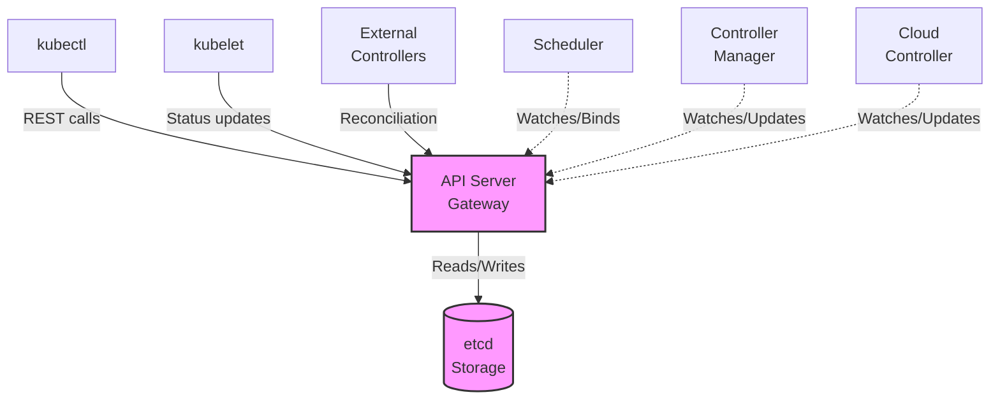
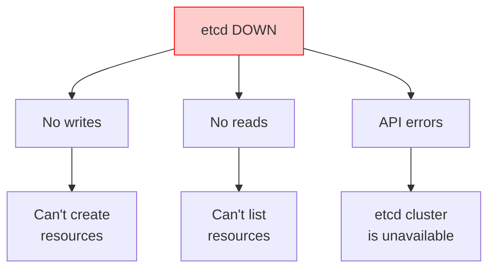
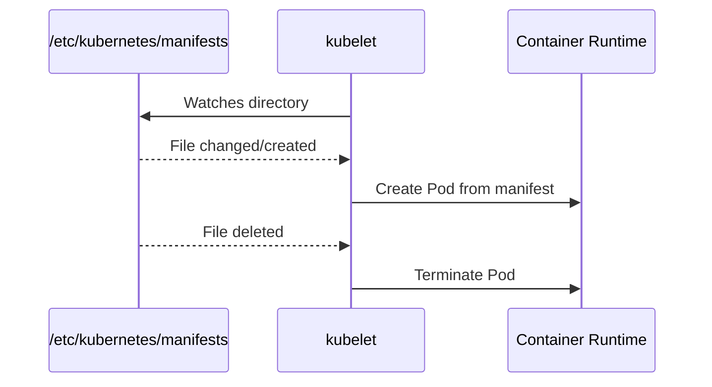

> **Складність**: `[СКЛАДНИЙ]` — усунення несправностей критичної інфраструктури
>
> **Час на проходження**: 50-60 хвилин
>
> **Передумови**: [Модуль 5.1 (Методологія)](../module-5.1-methodology/), [Модуль 1.1 (Поглиблений розбір площини управління)](../../part1-cluster-architecture/module-1.1-control-plane/)

---

## Що ви зможете робити

Після проходження цього модуля ви зможете перейти від звичайного налагодження робочих навантажень до рятувальних робіт на рівні кластера, коли API може бути повільним, недоступним або вводити в оману. Мета — не запам'ятати купу команд; мета — діагностувати шар, що дає збій, обрати найменш руйнівну наступну дію та зберегти докази, поки ви повертаєте площину управління Kubernetes 1.35 до стану, якому можна довіряти.

- **Діагностувати збої API-сервера та статичних Pod'ів** через перехресне зіставлення маніфестів, стану середовища виконання контейнерів і доказів із журналу kubelet.
- **Виконувати відновлення сертифікатів і маніфестів** для компонентів площини управління, керованих kubeadm, не покладаючись на крихкі псевдоніми оболонки.
- **Оцінювати кворум etcd і стан сховища** перед перезапуском компонентів без стану, які лише повідомляють про вторинний збій.
- **Проєктувати робочі процеси відновлення**, що зберігають криміналістичні докази, ізолюють радіус ураження (blast radius) та безпечно відновлюють планування й узгодження.

## Чому цей модуль важливий

Гіпотетичний сценарій: ваша чергова зміна отримує загальнокластерне сповіщення, тому що `kubectl get nodes` зависає, нові розгортання не викочуються, а команда розробників запитує, чи не варто їм перезапустити кожне робоче навантаження. Поспішний оператор може й далі видаляти Pod'и, перезавантажувати робочі вузли або перезапускати випадкові системні служби, бо під тиском такі дії здаються активними. Дисциплінований відповідач за площину управління спершу запитує, який саме компонент дає збій, які залежності ще працюють і які докази зникнуть, якщо перезапустити не те, що потрібно.

Площина управління Kubernetes — це управлінська нервова система кластера. API-сервер — це стійка реєстрації, де кожен законний запит автентифікується, авторизується, валідується та записується. Планувальник призначає новостворені Pod'и на вузли, менеджер контролерів керує циклами узгодження, а etcd зберігає тривку істину, навколо якої координуються всі ці компоненти. Коли одна частина дає збій, симптоми здалеку можуть виглядати схожими, тож ваш перший обов'язок — відокремити «кластер не може приймати запити» від «кластер приймає запити, але не може планувати» і від «кластер приймає запити, але не може узгодити бажаний стан».

Цей модуль навчає такого розрізнення через ті самі ресурси, якими ви користуватиметеся під час справжнього інциденту: маніфести статичних Pod'ів у `/etc/kubernetes/manifests`, журнал kubelet, інспекцію на рівні CRI за допомогою `crictl`, інструментарій сертифікатів kubeadm, ендпоінти стану API та рідні команди etcd. Ви побачите, чому наявні робочі навантаження часто продовжують працювати навіть тоді, коли записи площини управління заморожені, чому видалення статичного Pod'а зазвичай не виправляє зламаний маніфест і чому логи API-сервера, що кажуть `etcd cluster is unavailable`, спрямовують вас радше до сховища, ніж до ще одного перезапуску API-сервера.

> **Аналогія з управлінням повітряним рухом**
>
> Площина управління — це точнісінько як служба управління повітряним рухом для вашого кластера. API-сервер — центральна радіовежа; якщо вона виходить з ладу, зв'язок між пілотами та наземним персоналом припиняється. Планувальник — це укладач маршрутів польотів; без нього новим рейсам неможливо призначити злітно-посадкову смугу, і вони залишаються на місці стоянки. Менеджер контролерів — це автоматизована система моніторингу; він стежить за тим, щоб літаки трималися призначених маршрутів, і помічає, коли очікуваний рух припинився. Нарешті, etcd — це авторитетна база даних польотних записів; якщо вона пошкоджується або втрачає кворум, в аеропорту все ще можуть стояти літаки на смугах, але вежа більше не має надійного оперативного запису.

## Карта залежностей площини управління

Усунення несправностей площини управління починається з порядку залежностей, а не з найгучнішого повідомлення про помилку. Kubernetes навмисно робить API-сервер єдиним підтримуваним шлюзом до etcd для звичайних клієнтів і контролерів, а це означає, що `kubectl`, kubelet'и, планувальники, менеджери контролерів, хмарні контролери та контролери-розширення — усі сходяться на тій самій поверхні API. Така конструкція дає Kubernetes послідовний шлях авторизації та допуску, але вона ж означає, що збій сховища чи сертифіката може виглядати з боку користувача як відмова API.

У кластерах стилю kubeadm основні компоненти площини управління — це статичні Pod'и, якими керує локальний kubelet на кожному вузлі площини управління. Ця деталь важлива під час збоїв, тому що API-серверу не обов'язково бути справним, щоб kubelet зчитав файли з диска та запустив контейнери. Це також означає, що джерелом істини для багатьох екстрених виправлень є файлова система хоста, а не об'єкт, який повертає `kubectl edit`, тож ваш робочий процес відновлення має включати локальний доступ до вузла.



Діаграма показує, чому простого твердження «площина управління не працює» замало, щоб бути корисним. Якщо etcd нездоровий, API-сервер не може надійно читати чи записувати стан, і кожен контролер вищого рівня зрештою відчуває біль. Якщо API-сервер не працює, а etcd здоровий, контролери й користувачі не можуть дістатися шлюзу, але локальна інспекція середовища виконання все одно може сказати вам, чи запущені статичні Pod'и. Якщо планувальник не працює, наявні Pod'и продовжують працювати, бо kubelet'и вже мають свої призначення, тоді як нові Pod'и залишаються в стані Pending, доки планування не відновиться.

Це розрізнення також пояснює, чому користувачі можуть повідомляти про суперечливі симптоми під час того самого інциденту. Одна команда може казати, що їхній застосунок усе ще обслуговує трафік, інша — що їхнє викочування заморожене, а платформний інженер може бачити, як `kubectl` дає тайм-аут із ноутбука. Ці повідомлення не є взаємовиключними. Наявні контейнери продовжують працювати, бо kubelet'и й середовища виконання контейнерів не потребують постійного з'єднання з API на кожен цикл процесора, тоді як нові зміни бажаного стану потребують, щоб площина управління прийняла, зберегла, спланувала та узгодила їх.

Коли ви опитуєте кластер під час збою, ставте запитання в порядку залежностей. Чи може API-сервер відповісти на дешевий запит про стан? Чи може він читати й записувати через etcd? Чи може планувальник побачити незаплановані Pod'и та прив'язати їх? Чи може менеджер контролерів створити вторинні об'єкти, яких потребує бажаний стан? Кожна відповідь звужує простір пошуку, і кожне «ні» підказує вам, які команди ще мають цінність. Невдалий запит до API не робить події планувальника корисними, тоді як справний API з Pod'ами в стані Pending робить події планувальника надзвичайно корисними.

```text
┌──────────────────────────────────────────────────────────────┐
│                 CONTROL PLANE DEPENDENCIES                   │
│                                                              │
│                      ┌─────────────┐                         │
│                      │    etcd     │                         │
│                      │  (storage)  │                         │
│                      └──────┬──────┘                         │
│                             │                                │
│                             ▼                                │
│                      ┌─────────────┐                         │
│                      │ API Server  │◄──── kubectl            │
│                      │  (gateway)  │◄──── kubelet            │
│                      └──────┬──────┘◄──── controllers        │
│                             │                                │
│              ┌──────────────┼──────────────┐                 │
│              │              │              │                 │
│              ▼              ▼              ▼                 │
│       ┌───────────┐  ┌───────────┐  ┌───────────┐           │
│       │ Scheduler │  │ Controller│  │   Cloud   │           │
│       │           │  │  Manager  │  │ Controller│           │
│       └───────────┘  └───────────┘  └───────────┘           │
│                                                              │
│   If etcd fails     -> Everything that needs state fails     │
│   If API server     -> Nothing can communicate through API   │
│   If scheduler      -> New pods will not be scheduled        │
│   If controller-mgr -> Resources will not reconcile          │
│                                                              │
└──────────────────────────────────────────────────────────────┘
```

Нагляд за статичними Pod'ами — це практичний місток між архітектурою та відновленням. Kubelet спостерігає за налаштованим каталогом, зчитує маніфести Pod'ів з диска і просить локальне середовище виконання контейнерів створити контейнери площини управління. Якщо маніфест прибрати, kubelet зупиняє статичний Pod; якщо виправлений маніфест повертається, kubelet знову його запускає. Така поведінка корисна, але вона невблаганна: помилка відступу в YAML, неправильний шлях до сертифіката чи неправильно написаний прапорець можуть тримати компонент у циклі аварійних перезапусків, доки файл не виправлять.

Статичні Pod'и також створюють корисну мисленнєву межу між «об'єктом Kubernetes» і «локальною інструкцією вузла». Дзеркальний об'єкт Pod'а, який показує API, — це звіт від kubelet, а не первинна конфігурація. Якщо ви видалите цей дзеркальний Pod, kubelet помітить, що його локальний маніфест усе ще існує, і знову попросить середовище виконання створити Pod. Якщо ж ви відредагуєте дисковий маніфест, kubelet змінить справжню інструкцію. Саме тому ремонт площини управління зазвичай передбачає SSH, привілеї root і дисципліноване поводження з файлами, а не лише операції з API.

```bash
# Static pod manifest location
/etc/kubernetes/manifests/
├── etcd.yaml
├── kube-apiserver.yaml
├── kube-controller-manager.yaml
└── kube-scheduler.yaml

# kubelet watches this directory
# Changes to these files = automatic restart of component
```

Перш ніж копатися в логах, встановіть базовий рівень за допомогою найменш інвазивних доступних перевірок. На справному шляху API `kubectl` може показати, чи з'являються дзеркальні статичні Pod'и в `kube-system`; на зламаному шляху API не варто марнувати хвилини, чекаючи на тайм-аути `kubectl`. Застаріле API `componentstatuses` усе ще трапляється в старіших навчальних матеріалах, але сучасне усунення несправностей у Kubernetes 1.35 має віддавати перевагу стану Pod'ів, логам компонентів, ендпоінтам `/readyz` і `/livez` та прямій інспекції на рівні вузла, коли API недоступний.

Базові перевірки найцінніші, коли ви записуєте і команду, і її тлумачення. «Тайм-аут API з мого ноутбука» може означати проблему з локальним kubeconfig, проблему з фаєрволом, проблему з балансувальником навантаження або мертвий API-сервер. «Тайм-аут API з вузла площини управління, контейнера API-сервера немає в `crictl ps`, лог kubelet показує неправильний шлях до сертифіката» — це діагноз. Друге твердження повільніше на хвилину, але воно набагато безпечніше, бо визначає межу компонента та першу зламану залежність.

```bash
# Quick legacy health check; deprecated, may be unavailable on newer clusters, and is not sufficient by itself.
kubectl get componentstatuses

# Check control plane pods through the API when the API is reachable
kubectl -n kube-system get pods | grep -E 'etcd|api|controller|scheduler'

# Verify all mirrored static pods are reporting from expected nodes
kubectl -n kube-system get pods -o wide | grep -E 'kube-'
```

Зупиніться та спрогнозуйте: якщо `kubectl -n kube-system get pods` зависає, але `crictl ps` на вузлі площини управління показує, що контейнер API-сервера раз за разом перезапускається, який шар ви насправді спостерігаєте? Ви більше не перевіряєте планування робочих навантажень чи узгодження контролерами; ви перевіряєте, чи може локальний kubelet утримувати статичний Pod живим з його маніфесту та залежностей.

## Діагностика збоїв API-сервера та сертифікатів

API-сервер — це публічний шлюз до стану Kubernetes. Він автентифікує клієнтів, застосовує авторизацію, запускає плагіни допуску, валідує об'єкти й зберігає прийняті зміни в etcd. Коли він недоступний, `kubectl` стає радше генератором симптомів, ніж повноцінним діагностичним інструментом, бо клієнт може лише сказати вам, що шлюз не відповів. Наступний корисний доказ зазвичай надходить із самого вузла площини управління.

Корисно уявляти API-сервер як суворого клерка, а не як склад. Клерк перевіряє особу, валідує форми, застосовує політику й записує схвалені транзакції на склад, але клерк особисто не тримає тривкого інвентарю. Якщо клерк не може дістатися складу, клієнти переживають збій на стійці реєстрації, навіть якщо коренева проблема — за стійкою. Ця аналогія утримує вас від надмірної прив'язки до першої команди, що дала збій, і спонукає перевірити, чи справні кожен із них: процес API, його сертифікати та його клієнт сховища.

```text
┌──────────────────────────────────────────────────────────────┐
│                API SERVER FAILURE SYMPTOMS                   │
│                                                              │
│   Symptom                        Indicates                   │
│   ─────────────────────────────────────────────────────────  │
│   kubectl hangs/times out        API server unreachable      │
│   "connection refused"           API server not listening    │
│   "unable to connect to server"  Network/firewall issue      │
│   "Unauthorized"                 Auth/cert issue             │
│   "etcd cluster is unavailable"  API can't reach etcd        │
│   Very slow responses            Overloaded or etcd slow     │
│                                                              │
└──────────────────────────────────────────────────────────────┘
```

Сприймайте сортування відмов API як пошарове зведення. Спершу доведіть, чи існує процес, потім — чи він раз за разом падає, потім — чи kubelet відхиляє маніфест, потім — чи процес падає через сертифікати, прапорці, порти або etcd. Такий порядок береже час під час іспиту й береже докази під час інциденту, бо ви інспектуєте, перш ніж перезапускати.

Найпоширеніша помилка на цьому етапі — ставитися до всіх відмов з'єднання як до рівнозначних. `connection refused` означає, що щось активно відхилило TCP-з'єднання або ніщо не слухає там, де ви очікували. Помилка TLS означає, що процес може слухати, але довіра не спрацювала. Тайм-аут може означати маршрутизацію, фаєрвол, перевантаження або завислий ендпоінт. Ці відмінності змінюють наступний діагностичний крок. Хороші відповідачі читають точний рядок помилки вголос, а потім обирають команду, що перевіряє наступне найменше припущення.

```bash
# From a control plane node, check whether the static pod container is running.
sudo crictl ps | grep kube-apiserver

# Confirm the manifest exists at the expected kubeadm path.
sudo ls -la /etc/kubernetes/manifests/kube-apiserver.yaml
```

Якщо API-сервера немає в переліку запущених контейнерів, розширте огляд до зупинених контейнерів і логів kubelet. API-сервер у циклі аварійних перезапусків може залишити по собі кілька нещодавніх спроб контейнерів, і ті попередні логи часто корисніші за поточну порожню спробу. Журнал kubelet пояснює помилки розбору маніфесту, відсутні шляхи хоста, невдалі завантаження образів і збої життєвого циклу, яких `kubectl logs` не може показати, коли API офлайн.

```bash
sudo crictl ps -a | grep kube-apiserver
sudo journalctl -u kubelet --since "20 minutes ago" | grep -i apiserver
```

Коли Pod існує, інспектуйте логи через найнадійніший шлях для поточного режиму збою. Якщо API достатньо справний, `kubectl logs` зручний. Якщо API нездоровий, використовуйте `crictl logs` проти ID контейнера, щоб говорити безпосередньо із середовищем виконання. Це різниця між запитом до стійки реєстрації, чому стійка реєстрації зачинена, і прогулянкою до серверної кімнати, щоб прочитати вивід процесу.

```bash
# If the API is reachable enough for Kubernetes logs.
kubectl -n kube-system logs kube-apiserver-<node>

# If the API is down, use the container runtime directly.
# In this lab output, the last matching ID is the newest stopped attempt.
latest_apiserver_id="$(sudo crictl ps -a --name kube-apiserver -q | tail -1)"
sudo crictl logs "$latest_apiserver_id"

# Check kubelet's view of why the static pod is not starting.
sudo journalctl -u kubelet --since "20 minutes ago" | grep -i apiserver
```

Кілька зупинених контейнерів зазвичай означають, що kubelet робить свою роботу, повторюючи спроби, тоді як компонент відхиляє своє оточення. У такій ситуації не пересувайте маніфест туди-сюди в каталозі в надії, що наступний перезапуск буде іншим. Зафіксуйте останній ID контейнера, прочитайте логи і пов'яжіть помилку з конкретною залежністю — як-от файл сертифіката, адреса прив'язки, ендпоінт etcd чи прапорець командного рядка.

Саме тут важливі позначки часу. Вузол площини управління може мати кілька невдалих контейнерів API-сервера від попередніх експериментів, автоматичних перезапусків чи дій іншого відповідача. Завжди шукайте найновішу релевантну спробу контейнера й корелюйте її з вікном журналу kubelet приблизно того самого часу. Якщо лог контейнера каже, що файл сертифіката не можна прочитати, а журнал kubelet каже, що том hostPath було успішно змонтовано, ваша наступна перевірка — існування файлу та права доступу всередині шляху хоста. Якщо обидва логи мовчать, середовище виконання чи kubelet можуть давати збій ще до запуску процесу компонента.

```bash
sudo crictl ps -a | grep kube-apiserver | head
```

Сертифікати заслуговують на особливу увагу, бо некореневі сертифікати площини управління, керовані kubeadm, мають достатньо короткий термін дії, щоб створювати передбачувані інциденти обслуговування. Взаємний TLS у Kubernetes не декоративний; саме так API-сервер довіряє kubelet'ам, клієнтам і компонентам-вузлам. Прострочений серверний сертифікат API-сервера, клієнтський сертифікат чи клієнтський сертифікат etcd може спричинити збій раніше стабільної площини управління без жодного розгортання навантаження чи зміни маніфесту.

Збої сертифікатів часто здаються загадковими, бо можуть з'явитися раптово після місяців нормальної роботи. Ніщо не змінилося в Git, ніхто не редагував маніфест, а та сама автоматизація, що працювала вчора, тепер дає збій з помилками `x509`. Саме тому перевірки терміну дії належать до рутинного обслуговування, а не лише до реагування на інциденти. Під час збою дати сертифікатів допомагають вам вирішити, чи спричинений збій спливом часу, чи помилка TLS викликана неправильними шляхами до файлів, неправильними центрами сертифікації або компонентом, що представляє неправильну ідентичність.

```bash
# Inspect the API server certificate validity window.
sudo openssl x509 -in /etc/kubernetes/pki/apiserver.crt -text -noout | grep -A 2 "Validity"

# Let kubeadm summarize certificate expiration for the cluster.
sudo kubeadm certs check-expiration
```

Усунення проблем із сертифікатами має бути виваженим. `kubeadm certs renew all` може оновити сертифікати, керовані kubeadm, але оновлені файли корисні лише після того, як уражені статичні Pod'и перезапустяться й перечитають їх. Під час інциденту спершу запишіть вивід про спливання терміну, оновлюйте лише тоді, коли збій сертифіката відповідає симптомам, а потім спостерігайте, як kubelet перезапускає відповідні статичні Pod'и, замість видаляти дзеркальні Pod'и через API.

```bash
# Check certificate status before changing anything.
sudo kubeadm certs check-expiration

# Renew kubeadm-managed certificates when expiration is the verified fault.
sudo kubeadm certs renew all

# Restart static pods so renewed certificate files are loaded by running containers.
for manifest in kube-apiserver.yaml kube-controller-manager.yaml kube-scheduler.yaml etcd.yaml; do
  if [ -f "/etc/kubernetes/manifests/${manifest}" ]; then
    sudo mv "/etc/kubernetes/manifests/${manifest}" "/tmp/${manifest}.cert-renew-hold"
  fi
done

# Give kubelet time to stop the old containers before returning the manifests.
sleep 20

# Bring local stacked etcd back first if this control plane node runs it.
if [ -f /tmp/etcd.yaml.cert-renew-hold ]; then
  sudo mv /tmp/etcd.yaml.cert-renew-hold /etc/kubernetes/manifests/etcd.yaml
  sleep 20
fi

# Return API server and peer component manifests so kubelet recreates them.
for manifest in kube-apiserver.yaml kube-controller-manager.yaml kube-scheduler.yaml; do
  if [ -f "/tmp/${manifest}.cert-renew-hold" ]; then
    sudo mv "/tmp/${manifest}.cert-renew-hold" "/etc/kubernetes/manifests/${manifest}"
  fi
done

# Confirm the renewed static pods report through the API after restart.
kubectl -n kube-system get pods | grep -E 'etcd|api|controller|scheduler'
```

Пошкодження маніфесту — інший поширений клас збоїв API-сервера. Людина може відредагувати неправильний прапорець, зламати монтування тому, спрямувати `--etcd-servers` на мертвий ендпоінт або залишити командний рядок у стані, який двійковий файл відхиляє. Маніфести статичних Pod'ів — це звичайні YAML-файли, тож ваш шлях виправлення локальний і швидкий, але вам усе одно слід зробити копію з позначкою часу перед редагуванням, бо зламана версія — це доказ.

Резервна копія — це не бюрократія. Вона дозволяє вам порівняти точну зміну «до й після», відкотити, якщо ваша гіпотеза хибна, і пояснити інцидент пізніше, не покладаючись на пам'ять. Якщо двоє інженерів реагують разом, один має відповідати за спостереження й нотатки, тоді як інший редагує, бо одночасні редагування маніфестів статичних Pod'ів створюють заплутані шторми перезапусків. Спокійний робочий процес повільніший за гарячкове набирання в першу хвилину й швидший за кожну наступну.

```bash
# Edit static pod manifest after taking a backup copy.
sudo cp /etc/kubernetes/manifests/kube-apiserver.yaml /tmp/kube-apiserver.yaml.before-fix
sudo vim /etc/kubernetes/manifests/kube-apiserver.yaml

# Common fixes:
# - Fix typos in flags.
# - Correct certificate paths.
# - Fix etcd endpoints.

# kubelet automatically detects changes and restarts the pod.
```

```yaml
apiVersion: v1
kind: Pod
metadata:
  name: kube-apiserver
  namespace: kube-system
spec:
  containers:
  - command:
    - kube-apiserver
    - --advertise-address=10.0.0.10
    - --etcd-servers=https://127.0.0.1:2379
    image: registry.k8s.io/kube-apiserver:v1.35.0
```

| Проблема | Симптом | Виправлення |
|-------|---------|-----|
| Сертифікат прострочений | `x509: certificate has expired` | Запустіть `kubeadm certs check-expiration`, оновіть підтверджено прострочені сертифікати, перезапустіть уражені статичні Pod'и |
| etcd недоступний | `etcd cluster is unavailable` | Перевірте стан etcd безпосередньо, перш ніж змінювати прапорці API-сервера |
| Неправильні ендпоінти etcd | Збій під час запуску або повторювані помилки бекенду | Перевірте `--etcd-servers` у маніфесті API-сервера |
| Конфлікт портів | `bind: address already in use` | Визначте процес, що тримає TCP 6443, перш ніж перезапускати служби |
| Брак пам'яті | OOMKilled або дуже повільні відповіді | Збережіть логи, перевірте тиск на вузлі, потім збільште ресурси або зменште навантаження |
| Неправильні прапорці | Компонент негайно завершується | Порівняйте прапорці маніфесту з довідником компонентів Kubernetes 1.35 |

Перш ніж виконувати команди оновлення чи редагування маніфесту, запитайте себе, який доказ спростував би вашу гіпотезу. Якщо дати сертифікатів усе ще дійсні, а лог API-сервера каже, що він не може дістатися `127.0.0.1:2379`, оновлення кожного сертифіката — не обережне виправлення; кращий хід — опитати etcd безпосередньо.

## Відновлення планування та узгодження

Планувальник і менеджер контролерів сплутати простіше, ніж мало б бути, бо обидва збої часто проявляються як заяви команд застосунків: «Kubernetes нічого не робить». Різниця точна. Планувальник призначає вузол новоствореним Pod'ам, тоді як менеджер контролерів створює й оновлює об'єкти, щоб фактичний стан збігся з бажаним. Якщо Pod'и створено, але вони ніколи не отримують призначення, думайте про планувальник; якщо очікувані Pod'и чи ендпоінти взагалі не створюються, думайте про менеджер контролерів.

```text
┌──────────────────────────────────────────────────────────────┐
│               SCHEDULER FAILURE SYMPTOMS                     │
│                                                              │
│   Symptom                           Check                    │
│   ─────────────────────────────────────────────────────────  │
│   All new pods stuck Pending        Scheduler not running    │
│   "no nodes available to schedule"  All nodes unschedulable  │
│   Pods not being distributed        Scheduler misconfigured  │
│   Very slow scheduling              Scheduler overloaded     │
│                                                              │
│   Remember: Existing pods keep running when scheduler fails! │
│   Only NEW pods are affected.                                │
│                                                              │
└──────────────────────────────────────────────────────────────┘
```

Дослідження планувальника варто починати з Pod'ів у стані Pending та подій, бо планувальник зазвичай прямо каже, чому він відхилив вузли. Taint'и, селектори вузлів, обмеження топологічного розподілу, недостатній CPU та вузли, на які не можна планувати, — це звичайні відмови розміщення, а не збої планувальника. Справжній збій планувальника імовірніший тоді, коли всі нові Pod'и залишаються в стані Pending попри наявність ресурсів, а логи планувальника чи стан статичного Pod'а показують аварійний перезапуск, відмову автентифікації чи проблему виборів лідера.

Тому слово Pending — це не діагноз. Pod може бути в стані Pending, бо планувальник його ніколи не бачив, бо планувальник його побачив і відхилив кожен вузол, бо Pod посилається на недоступний том або бо допуск дозволив специфікацію, яку поточні вузли не можуть задовольнити. Ваше завдання — розрізнити «рішення про планування не відбулося» від «рішення про планування дало збій з відомих причин». Події — найдешевший спосіб зробити це розрізнення, коли API доступний, а логи планувальника — наступний шар, коли події перестають оновлюватися чи виглядають суперечливо.

```bash
# Check scheduler pod status.
kubectl -n kube-system get pod -l component=kube-scheduler

# Check scheduler logs.
kubectl -n kube-system logs kube-scheduler-<node>

# Check for scheduling events.
kubectl get events -A --field-selector reason=FailedScheduling

# Describe a pending pod for the specific scheduling reason.
kubectl describe pod <pending-pod> | grep -A 10 Events
```

| Проблема | Симптом | Виправлення |
|-------|---------|-----|
| Планувальник не запущено | Усі нові Pod'и в стані Pending | Перевірте `/etc/kubernetes/manifests/kube-scheduler.yaml` та логи kubelet |
| Не вдається з'єднатися з API | Логи планувальника показують connection refused або помилки TLS | Перевірте `scheduler.conf`, клієнтські сертифікати та стан API |
| Збій виборів лідера | Планувальник запущено, але неактивний | Перевірте доступ до Lease, годинники та налаштування `--leader-elect` |
| Немає доступних вузлів | Події FailedScheduling перелічують обмеження | Виправте taint'и, селектори, ресурси чи готовність вузлів, а не планувальник |

Статичний Pod планувальника має менше рухомих частин, ніж API-сервер, але неправильного шляху до kubeconfig чи зламаного YAML-файлу достатньо, щоб його зупинити. Використовуйте маніфест і kubeconfig як джерело істини, потім перевіряйте через логи й невелике тестове навантаження. Уникайте сприйняття кожного Pod'а в стані Pending як аварії планувальника; потік подій каже вам, чи Kubernetes ухвалив рішення про розміщення й відхилив усі вузли зі зрозумілих причин.

Вибори лідера додають ще одну заковику у високодоступних площинах управління. Кілька екземплярів планувальника можуть працювати, але прив'язувати Pod'и має лише активний лідер. Якщо вибори лідера дають збій, ви можете бачити справний на вигляд контейнер, який насправді не виконує корисної роботи з планування. Перевірте, чи може планувальник читати й оновлювати свій об'єкт Lease, чи притомні годинники й чи стабільне з'єднання з API настільки, щоб поновлювати оренду (lease). Процес може бути живим і все одно не виконувати свого обов'язку.

```bash
# Check manifest exists.
sudo cat /etc/kubernetes/manifests/kube-scheduler.yaml

# Check for obvious YAML and command issues without relying on API availability.
sudo grep -n -- "--kubeconfig\\|--leader-elect" /etc/kubernetes/manifests/kube-scheduler.yaml

# Common flags to verify:
# --kubeconfig=/etc/kubernetes/scheduler.conf
# --leader-elect=true

# Verify kubeconfig exists.
sudo ls -la /etc/kubernetes/scheduler.conf
```

Гіпотетичний сценарій: Pod планувальника перебуває в циклі аварійних перезапусків під час лабораторної роботи, і один критичний Pod уже існує в API, але не має `nodeName`. Ручне планування через патчинг `spec.nodeName` можна застосувати як екстрену вправу, щоб продемонструвати, що зазвичай записує планувальник, але це не рутинне виробниче виправлення. Роблячи так, ви обходите фільтрування та оцінювання, тож маєте бути впевнені, що цільовий вузол може запустити Pod і що ви не приховуєте справжній збій планувальника.

```bash
# If the scheduler is down in a controlled lab, you can manually bind a pod.
kubectl patch pod <pod> -p '{"spec":{"nodeName":"worker-1"}}'
```

Збої менеджера контролерів мають інший почерк. API може прийняти об'єкт Deployment, але ReplicaSet чи Pod'и можуть не з'явитися. Вузол може лишатися в стані NotReady без нормальної поведінки витіснення. Сервіс може не мати ендпоінтів, навіть якщо відповідні Pod'и існують. Ці симптоми означають, що спостерігачі та цикли узгодження, які безперервно лагодять кластер, перестали просуватися вперед.

Менеджер контролерів легко недооцінити, бо це одне ім'я Pod'а, що приховує багато окремих контролерів. ReplicaSet'и, Job'и, вузли, ендпоінти, сервісні акаунти, сертифікати, збирання сміття та інша поведінка кластера залежать від циклів усередині цього двійкового файлу. Збій може бути широким, коли весь компонент не може автентифікуватися в API, або вузьким, коли одному контролеру бракує ключового файлу чи дозволу, якого він потребує. Широкі збої зазвичай породжують багато застарілих ресурсів одразу; вузькі збої вимагають зіставлення симптому з конкретним контролером, відповідальним за цю родину ресурсів.

```text
┌──────────────────────────────────────────────────────────────┐
│            CONTROLLER MANAGER FAILURE SYMPTOMS               │
│                                                              │
│   Symptom                           Affected Controller      │
│   ─────────────────────────────────────────────────────────  │
│   Pods not created from Deployment  ReplicaSet controller    │
│   Deleted pods not replaced         ReplicaSet controller    │
│   PVCs stay Pending                 PV controller            │
│   Services have no endpoints        Endpoints controller     │
│   Nodes stay NotReady forever       Node controller          │
│   Jobs don't complete               Job controller           │
│   No automatic cleanup              GC controller            │
│                                                              │
│   The cluster freezes in current state: no reconciliation.   │
│                                                              │
└──────────────────────────────────────────────────────────────┘
```

Діагностика менеджера контролерів починається з підтвердження статичного Pod'а, а потім з доказу, що принаймні один цикл узгодження працює. Крихітне тестове розгортання корисне лише тоді, коли API-сервер і планувальник уже достатньо справні, щоб його підтримати; інакше тест змішає кілька доменів збоїв. Під час справжнього збою спершу читайте логи менеджера контролерів, потім запускайте найменший функціональний зонд, що відповідає на ваше конкретне запитання.

Наприклад, якщо Deployment'и створюють ReplicaSet'и, але Сервіси не отримують ендпоінтів, вам не потрібно тестувати кожен контролер. Вам потрібно інспектувати шлях, пов'язаний з ендпоінтами, відповідність міток, готовність Pod'ів і логи контролера для цієї родини. Якщо жоден вторинний ресурс не з'являється з жодного бажаного об'єкта, імовірнішим стає доступ менеджера контролерів до API чи стан процесу. Ця звичка обирати зонд, що відповідає одному контролеру, утримує інцидент від перетворення на випадкове блукання можливостями кластера.

```bash
# Check controller manager pod.
kubectl -n kube-system get pod -l component=kube-controller-manager

# Check logs.
kubectl -n kube-system logs kube-controller-manager-<node>

# Check for specific controller issues.
kubectl -n kube-system logs kube-controller-manager-<node> | grep -i error

# Verify a reconciliation loop after API and scheduler health are known.
kubectl create deployment test --image=nginx
kubectl get rs | grep test
kubectl delete deployment test --ignore-not-found
```

| Проблема | Симптом | Виправлення |
|-------|---------|-----|
| Не запущено | Жодне узгодження не просувається | Перевірте маніфест статичного Pod'а та логи kubelet |
| Бракує ключа сервісного акаунта | Контролери не можуть створювати чи автентифікувати роботу | Перевірте `--service-account-private-key-file` та змонтовані файли |
| Не вдається з'єднатися з API | Більшість контролерів дають збій разом | Перевірте `controller-manager.conf`, стан API та помилки TLS |
| Бракує сертифіката підписання кластера | CSR'и не схвалюються й не підписуються | Перевірте `--cluster-signing-cert-file` та пов'язані шляхи CA |

Менеджер контролерів несе кілька шляхів до сертифікатів і ключів, бо різним контролерам потрібно підписувати, ідентифікувати й довіряти різним частинам стану кластера. Помилка в монтуванні тому може зламати широку автоматизацію, лишивши API-сервер чутливим, і саме тому «kubectl працює» не є доказом того, що узгодження працює. Порівняйте прапорці маніфесту з файлами на диску й пам'ятайте, що зміни маніфесту статичного Pod'а перезапускають компонент автоматично через kubelet.

```bash
# Check manifest.
sudo cat /etc/kubernetes/manifests/kube-controller-manager.yaml

# Key flags to verify:
# --kubeconfig=/etc/kubernetes/controller-manager.conf
# --service-account-private-key-file=/etc/kubernetes/pki/sa.key
# --cluster-signing-cert-file=/etc/kubernetes/pki/ca.crt
# --root-ca-file=/etc/kubernetes/pki/ca.crt

# Verify files exist.
sudo ls -la /etc/kubernetes/pki/
```

Який підхід ви обрали б тут і чому: тестувати узгодження, створивши Deployment, чи спершу прочитати логи менеджера контролерів? Якщо ви ще не знаєте, чи справні API та планувальник, логи — чистіший перший крок, бо невдале тестове розгортання може бути спричинене кількома шарами одразу.

## Оцінка etcd та відновлення статичних Pod'ів

etcd — це тривке сховище для Kubernetes, тож воно заслуговує на повільніший і шанобливіший робочий процес, ніж компоненти без стану. Перезапуск API-сервера може очистити застаріле з'єднання, але не може полагодити втрачений кворум etcd, вичерпання диска, пошкодження каталогу даних, неправильну конфігурацію пірингу учасників чи збій TLS між API-сервером і etcd. Коли API-сервер повідомляє про помилки сховища, сприймайте це як свідка, що вказує на базу даних, а не як головного підозрюваного.



```text
┌──────────────────────────────────────────────────────────────┐
│                   ETCD FAILURE IMPACT                        │
│                                                              │
│   ┌─────────────────────────────────────────────────────┐    │
│   │                    etcd DOWN                        │    │
│   └────────────────────────┬────────────────────────────┘    │
│                            │                                  │
│              ┌─────────────┼─────────────┐                   │
│              ▼             ▼             ▼                   │
│         No writes      No reads     API errors               │
│              │             │             │                   │
│              ▼             ▼             ▼                   │
│         Can't create   Can't list  "etcd cluster             │
│         resources      resources    is unavailable"          │
│                                                              │
│   Note: Existing pods keep running because kubelet is local.  │
│   New cluster changes cannot be made until storage recovers. │
│                                                              │
└──────────────────────────────────────────────────────────────┘
```

Перевірки стану etcd вимагають тієї самої серйозності щодо TLS, що й решта площини управління. У кластерах kubeadm локальний статичний Pod etcd зазвичай надає захищений ендпоінт на `127.0.0.1:2379`, і `etcdctl` потребує CA etcd, серверного сертифіката й ключа для автентифікації. Якщо ви опустите ці прапорці, збій може лише довести, що ваша діагностична команда неповна, а не що etcd не працює.

Кворум — це основна концепція, що стоїть за рішеннями про відновлення etcd. У багатоучасниковому кластері etcd має мати достатньо справних учасників, щоб погодитися щодо змін стану, перш ніж він зможе безпечно приймати записи. Втрата одного учасника в кластері належного розміру може бути переживною, тоді як втрата надто багатьох учасників перетворює базу даних на систему, яка не може просуватися вперед. Саме тому видалення учасника, відновлення зі знімка та заміну каталогу даних треба планувати ретельно; неправильна дія може перетворити деградований кластер на кластер без узгодженої історії.

```bash
# Check etcd pod status through the API if the API is reachable.
kubectl -n kube-system get pod -l component=etcd

# Check etcd logs through the API if available.
kubectl -n kube-system logs etcd-<node>

# Check etcd health with etcdctl from the control plane node.
sudo ETCDCTL_API=3 etcdctl \
  --endpoints=https://127.0.0.1:2379 \
  --cacert=/etc/kubernetes/pki/etcd/ca.crt \
  --cert=/etc/kubernetes/pki/etcd/server.crt \
  --key=/etc/kubernetes/pki/etcd/server.key \
  endpoint health

# Check etcd member list.
sudo ETCDCTL_API=3 etcdctl \
  --endpoints=https://127.0.0.1:2379 \
  --cacert=/etc/kubernetes/pki/etcd/ca.crt \
  --cert=/etc/kubernetes/pki/etcd/server.crt \
  --key=/etc/kubernetes/pki/etcd/server.key \
  member list
```

Команду перевірки стану ендпоінта варто відпрацювати, бо вона оминає API та просить шар сховища довести, що він може обслужити серіалізований запис. У багатоучасникових кластерах поєднуйте її зі станом ендпоінта й переліком учасників, щоб ви могли відрізнити проблему локального ендпоінта від проблеми кворуму. etcd також має підтримку ендпоінта стану в сучасних випусках, але автентифікована команда лишається практичним інструментом рівня CKA, бо вона задіює ті самі сертифікати, які використовує Kubernetes.

Справна відповідь від одного локального ендпоінта обнадіює, але це не вся історія в розподіленій топології etcd. Вам усе одно потрібно знати, чи збігається перелік учасників із наміченим кластером, чи досяжні пірингові URL і чи вказують якісь сигнали тривоги на ризик квоти бекенду чи пошкодження. Під час практики запускайте перевірку стану, статусу й переліку учасників разом, щоб виробити звичку бачити як живість, так і членство. Під час реагування у виробництві записуйте точний набір ендпоінтів, який ви опитали, щоб інші відповідачі не плутали локальну перевірку з повною оцінкою кворуму.

```bash
sudo ETCDCTL_API=3 etcdctl endpoint health \
  --endpoints=https://127.0.0.1:2379 \
  --cacert=/etc/kubernetes/pki/etcd/ca.crt \
  --cert=/etc/kubernetes/pki/etcd/server.crt \
  --key=/etc/kubernetes/pki/etcd/server.key
```

Змінні середовища можуть зробити повторювані команди etcd менш галасливими під час контрольованої практичної сесії, але уникайте приховування контексту TLS від самого себе під час навчання. У нотатках до інцидентів та runbook'ах повністю розгорнута команда легше піддається аудиту для іншого інженера. Якщо ви використовуєте обгортку зі змінною оболонки інтерактивно, запишіть, які саме ендпоінт і сертифікати вона включає, перш ніж виконувати дії з відновлення.

```bash
export ETCDCTL_API=3
export ETCDCTL_ENDPOINTS=https://127.0.0.1:2379
export ETCDCTL_CACERT=/etc/kubernetes/pki/etcd/ca.crt
export ETCDCTL_CERT=/etc/kubernetes/pki/etcd/server.crt
export ETCDCTL_KEY=/etc/kubernetes/pki/etcd/server.key

sudo --preserve-env=ETCDCTL_API,ETCDCTL_ENDPOINTS,ETCDCTL_CACERT,ETCDCTL_CERT,ETCDCTL_KEY etcdctl endpoint health
```

| Проблема | Симптом | Виправлення |
|-------|---------|-----|
| Каталог даних пошкоджено | etcd не запускається або панікує на даних бекенду | Зупиніть тих, хто пише, і відновіть з перевіреного знімка |
| Сертифікат прострочено | Помилки TLS від API-сервера чи etcdctl | Перевірте сертифікати etcd і оновіть перевірений прострочений ланцюг |
| Диск заповнено | Записи зазнають невдачі або з'являються тривоги квоти бекенду | Звільніть диск, виконайте ущільнення чи дефрагментацію за потреби й обережно очистіть тривоги |
| Учасник недосяжний | Кластер нездоровий або немає кворуму | Перевірте піринг-мережу, перелік учасників і стан вузлів, перш ніж видаляти учасників |
| Розбіжність годинників | Нестабільність Raft і метушня виборів | Виправте синхронізацію часу, перш ніж звинувачувати компоненти Kubernetes |

Знімки — це межа між незручністю та катастрофою. Узгоджений знімок etcd дає вам копію стану кластера на момент часу, включно із Secret'ами, ConfigMap'ами, специфікаціями навантажень, RBAC і метаданими топології. Знімок не зберігає логи контейнерів чи локальний стан середовища виконання вузла, тож це не повний архів інциденту, але це той артефакт, що дозволяє вам відбудувати сховище стану Kubernetes, коли каталогу даних більше не можна довіряти.

Дисципліна щодо знімків включає перевірку, зберігання й репетицію. Резервний файл, який ніхто не відновлював, — лише втішний на вигляд артефакт. Вам слід знати, де зберігаються знімки, як вони захищені, які шифрування й контроль доступу застосовуються та які версії Kubernetes і etcd їх створили. Оскільки Secret'и живуть в etcd, поводження зі знімками — це також поводження з обліковими даними. Сприймайте файл як чутливі дані й уникайте передавання його випадковими каналами лише тому, що розширення виглядає як звичайний дамп бази даних.

```bash
sudo ETCDCTL_API=3 etcdctl snapshot save /tmp/etcd-backup.db \
  --endpoints=https://127.0.0.1:2379 \
  --cacert=/etc/kubernetes/pki/etcd/ca.crt \
  --cert=/etc/kubernetes/pki/etcd/server.crt \
  --key=/etc/kubernetes/pki/etcd/server.key

# Verify backup metadata before trusting it.
sudo ETCDCTL_API=3 etcdctl snapshot status /tmp/etcd-backup.db
```

Робочі процеси відновлення чутливі до версій, тож перевірте, чи очікує ваше середовище `etcdutl` для офлайн-відновлення зі знімка. Ключова операційна ідея стабільна між версіями: зупиніть записи API, перш ніж замінювати каталог даних, відновіть у чистий каталог, оновіть маніфест etcd, щоб він указував на відновлені дані, і лише тоді поверніть API-сервер. Не відновлюйте поверх живої бази даних, поки API-сервер усе ще записує новий стан.

Найважча частина відновлення часто — це рішення, що відновлення справді потрібне. Тиск на диск, спливання терміну сертифіката та збій піринг-мережі — усе це може зробити etcd нездоровим на вигляд, не вимагаючи заміни даних. Відновлення зі знімка доречне, коли каталог даних втрачено, пошкоджено або навмисно відкочується за контрольованим планом відновлення. Якщо збій — це поганий сертифікат чи зламане монтування диска, відновлення може додати ризику, не усунувши кореневої причини. Оцініть зворотні виправлення, перш ніж переходити до заміни стану.

```bash
# Step 1: stop API server first so no new Kubernetes writes reach etcd.
sudo mv /etc/kubernetes/manifests/kube-apiserver.yaml /tmp/kube-apiserver.yaml.restore-hold
while sudo crictl ps --name kube-apiserver -q | grep -q .; do
  sleep 2
done

# Step 2: stop the local etcd static pod before replacing its host data directory.
sudo mv /etc/kubernetes/manifests/etcd.yaml /tmp/etcd.yaml.restore-hold
while sudo crictl ps --name etcd -q | grep -q .; do
  sleep 2
done

# Step 3: restore the snapshot into a fresh host data directory.
sudo rm -rf /var/lib/etcd-restored
sudo etcdutl snapshot restore /tmp/etcd-backup.db \
  --data-dir=/var/lib/etcd-restored

# Step 4: point etcd at the restored host data directory before restarting it.
# kubeadm mounts hostPath.path into the container at /var/lib/etcd; update the hostPath, not the container path.
sudo sed -i.bak 's#path: /var/lib/etcd#path: /var/lib/etcd-restored#' /tmp/etcd.yaml.restore-hold

# Step 5: return etcd first, wait for kubelet, and verify storage health before API writes resume.
sudo mv /tmp/etcd.yaml.restore-hold /etc/kubernetes/manifests/etcd.yaml
sleep 30
sudo ETCDCTL_API=3 etcdctl endpoint health \
  --endpoints=https://127.0.0.1:2379 \
  --cacert=/etc/kubernetes/pki/etcd/ca.crt \
  --cert=/etc/kubernetes/pki/etcd/server.crt \
  --key=/etc/kubernetes/pki/etcd/server.key

# Step 6: bring the API server back only after restored etcd answers.
sudo mv /tmp/kube-apiserver.yaml.restore-hold /etc/kubernetes/manifests/kube-apiserver.yaml
```

Механіка статичних Pod'ів пояснює, чому послідовність відновлення працює. Kubelet безперервно спостерігає за локальним каталогом, тож переміщення маніфесту — це контрольований спосіб зупинити компонент без потреби в API. Коли ви повертаєте чи змінюєте маніфест, kubelet просить середовище виконання знову створити Pod, а дзеркальний об'єкт Pod'а в API з'являється лише після того, як шлях API стає достатньо справним, щоб про нього повідомити.



```text
┌──────────────────────────────────────────────────────────────┐
│                    STATIC POD LIFECYCLE                      │
│                                                              │
│   /etc/kubernetes/manifests/           kubelet               │
│   ┌───────────────────────┐           ┌──────────────────┐  │
│   │ kube-apiserver.yaml   │◄─ watch ──│                  │  │
│   │ kube-scheduler.yaml   │           │  Creates pods    │  │
│   │ controller-manager... │──────────▶│  from manifests  │  │
│   │ etcd.yaml             │           │                  │  │
│   └───────────────────────┘           └──────────────────┘  │
│                                              │               │
│   File changed/created ─────────────────────▶│               │
│   File deleted ─────────────────────────────▶│               │
│                                              ▼               │
│                                     Pod created/deleted      │
│                                                              │
│   Naming: <name>-<node-name>, such as kube-apiserver-master  │
│                                                              │
└──────────────────────────────────────────────────────────────┘
```

Зупиніться та спрогнозуйте: якщо ви відредагуєте дзеркальний статичний Pod через `kubectl edit pod kube-apiserver-master -n kube-system`, що станеться після перезавантаження вузла? Kubelet відтворює Pod з файлу на диску, тож редагування на стороні API зникає, бо маніфест, а не дзеркальний об'єкт, є тривким джерелом істини.

Якщо маніфест лежить у каталозі спостереження й нічого не змінюється, інспектуйте сам kubelet. Kubelet може спостерігати за іншим `staticPodPath`, відхиляти YAML ще до того, як він дістанеться середовища виконання, не мати дозволу читати змонтований шлях хоста або давати збій, бо середовище виконання контейнерів нездорове. Саме тому відновлення площини управління перетинає Kubernetes, керування службами Linux та інспекцію середовища виконання контейнерів, а не лишається всередині `kubectl`.

Логи kubelet особливо корисні, бо вони з'єднують світ файлів зі світом середовища виконання. Вони можуть сказати вам, що kubelet помітив оновлення маніфесту, відхилив специфікацію Pod'а, не зміг змонтувати шлях хоста або попросив середовище виконання запустити контейнер, який потім завершився. Ця послідовність важлива. Якщо kubelet ніколи не помічає файлу, перевірте конфігурацію та найменування файлів. Якщо kubelet помічає файл, але середовище виконання не може запустити контейнер, читайте логи контейнера та стан середовища виконання. Якщо контейнер запускається, а процес завершується, інспектуйте аргументи компонента та залежності.

```bash
# Check kubelet is configured to watch the expected manifests directory.
sudo grep staticPodPath /var/lib/kubelet/config.yaml

# Inspect the first lines of the API server manifest for obvious damage.
sudo head -20 /etc/kubernetes/manifests/kube-apiserver.yaml

# Common issues:
# - YAML syntax errors, especially tabs instead of spaces.
# - Wrong file extension, because manifests must be .yaml or .yml.
# - Wrong file permissions, because kubelet must read the file.
# - Missing required pod fields or broken hostPath mounts.
```

Низькорівневе налагодження замикає цикл, коли і API, і логи компонентів недоступні. `journalctl` показує поведінку kubelet, `crictl ps -a` показує контейнери, про які знає середовище виконання, а `crictl logs` показує stdout і stderr для конкретної спроби контейнера. Разом вони дозволяють вам діагностувати мертву площину управління з вузла, де вона має працювати.

```bash
# If a static pod will not start, follow kubelet logs.
sudo journalctl -u kubelet -f

# Look for errors about specific manifests.
sudo journalctl -u kubelet --since "20 minutes ago" | grep -i "kube-apiserver\\|error\\|failed"

# Check if containers exist but are unhealthy.
sudo crictl ps -a | grep kube-

# Get container logs directly.
sudo crictl logs <container-id>
```

## Патерни та антипатерни

Хороше усунення несправностей площини управління відчувається консервативним, бо радіус ураження високий. Виграшний патерн — звузити шар, що дає збій, перш ніж його змінювати, віддавати перевагу доказам лише для читання спочатку та навмисно використовувати механіку статичних Pod'ів, замість боротися з нею. Сильний відповідач може пояснити не лише те, яку команду він запустить, а й те, який результат змусив би його зупинитися та змінити гіпотезу.

Ця дисципліна корисна за межами іспиту CKA, бо справжні інциденти включають витрати на координацію. Кожен перезапуск, переміщення файлу, оновлення сертифіката чи відновлення зі знімка впливає на докази наступного відповідача. Якщо ваша команда використовує канал інцидентів, публікуйте стислі спостереження на кшталт «контейнер API-сервера в циклі аварійних перезапусків на cp-1; останній лог crictl показує відсутній `/etc/kubernetes/pki/apiserver-etcd-client.crt`; маніфест ще не редагувався». Такий стиль дає іншим достатньо контексту, щоб оскаржити чи підтвердити вашу наступну дію, не сповільнюючи відновлення.

| Патерн | Коли застосовувати | Чому він працює | Міркування щодо масштабування |
|---------|-------------|--------------|-----------------------|
| Перше реагування на рівні вузла | Виклики API зависають, дають тайм-аут або повертають connection refused | `crictl` і `journalctl` оминають API-сервер і інспектують справжній життєвий цикл статичного Pod'а | У HA-кластерах повторюйте на кожному вузлі площини управління, перш ніж припускати, що один вузол представляє всю площину |
| Сортування в порядку залежностей | Кілька компонентів повідомляють про збої одночасно | Перевірка etcd, API, планувальника й менеджера контролерів у порядку залежностей уникає виправлення вторинних симптомів | Задокументуйте порядок у runbook'ах, щоб кілька відповідачів не перезапускали різні шари одночасно |
| Докази перед перезапуском | Компонент у циклі аварійних перезапусків або недосяжний | Логи, маніфести, дати сертифікатів і стан середовища виконання можуть зникнути чи ротуватися після перезапусків | Фіксуйте позначки часу й команди в каналі інцидентів, щоб відновлення лишалося придатним для аудиту |
| Невеликі функціональні зонди | API відповідає, але поведінка підозріла | Крихітний Deployment чи Pod у стані Pending може довести, чи працює узгодження або планування | Прибирайте зонди й уникайте галасливих тестів під час виробничого тиску |

Антипатерни зазвичай походять від ставлення до площини управління як до звичайного застосункового Deployment. Статичні Pod'и не поводяться як ReplicaSet'и, etcd не є компонентом без стану, а API-сервер часто є посланцем збоїв залежностей. Безпечніша альтернатива — визначити, чи ви змінюєте процес, маніфест, сертифікат чи тривкий стан, а потім обрати дію відновлення, що відповідає цьому шару.

Інший антипатерн — пропуск прибирання після успішного відновлення. Тимчасові переміщення маніфестів, скопійовані файли сертифікатів, тестові Pod'и та експортовані змінні середовища etcd можуть заплутати подальшу роботу, якщо вони лишаються незадокументованими. Після того як кластер справний, замкніть цикл: відновіть імена файлів, видаліть тестові навантаження, збережіть артефакти інциденту у визначеному місці й запишіть кореневу причину в термінах залежності, що дала збій, а не першого симптому. Відновлення не завершене, доки наступний інженер не зможе зрозуміти, що змінилося.

| Антипатерн | Що йде не так | Краща альтернатива |
|--------------|-----------------|--------------------|
| Багаторазове видалення дзеркальних статичних Pod'ів | Kubelet відтворює той самий зламаний Pod з диска, а старіші логи може стати важче знайти | Виправте маніфест чи залежність, яку використовує kubelet |
| Перезапуск API-сервера на кожну помилку сховища | Перезапуск без стану не лагодить втрачений кворум, вичерпання диска чи пошкоджені дані etcd | Запустіть автентифіковану `etcdctl endpoint health` і інспектуйте логи etcd |
| Редагування живих об'єктів Pod'ів для виправлення статичних Pod'ів | Зміни втрачаються, коли kubelet узгоджується з локальним файлом | Редагуйте `/etc/kubernetes/manifests/*.yaml` після створення резервної копії |
| Приховування критичного контексту команд за псевдонімами | Runbook'и стає важко аудитувати, а поведінка copy-paste відрізняється між оболонками | Використовуйте явні `kubectl`, `etcdctl`, сертифікати, ендпоінти та шляхи до файлів |

## Фреймворк ухвалення рішень

Використовуйте цей фреймворк, коли симптоми широкі, а тиск високий. Перше корисне рішення — чи достатньо API заслуговує на довіру для запитів рівня кластера. Якщо ні, переходьте до вузла площини управління. Якщо так, використовуйте об'єкти й події Kubernetes, щоб відокремити симптоми планування, узгодження та сховища, перш ніж щось змінювати.

| Спостереження | Перший діагностичний шлях | Імовірний шар | Чого уникати |
|-------------|----------------------|--------------|-------|
| `kubectl` connection refused або тайм-аут | SSH до площини управління, запустіть `crictl ps -a`, прочитайте логи kubelet | Статичний Pod API-сервера, kubelet, середовище виконання, сертифікати або залежність etcd | Очікування на повторювані команди `kubectl` |
| API працює, усі нові Pod'и лишаються в стані Pending | Інспектуйте події FailedScheduling та логи планувальника | Планувальник, обмеження вузлів, taint'и, ресурси чи вибори лідера | Перезапуску менеджера контролерів першим |
| API працює, бажані об'єкти не з'являються | Інспектуйте логи менеджера контролерів і запустіть крихітний зонд узгодження | Менеджер контролерів, облікові дані чи збій конкретного контролера | Припущення, що планувальник відповідає за створення об'єктів |
| API повідомляє `etcd cluster is unavailable` | Запустіть автентифіковані перевірки стану й учасників etcd | Кворум etcd, TLS, диск, мережа учасників чи стан бекенду | Перезапуску API-сервера до перевірки сховища |
| Маніфести статичних Pod'ів нещодавно змінилися | Порівняйте резервні копії, логи kubelet і прапорці компонентів | Людська помилка в маніфесті чи неправильний шлях до файлу | Редагування дзеркальних Pod'ів через API |

```text
START
  |
  v
Can kubectl reach the API?
  |-- no --> SSH to control plane node
  |          |
  |          v
  |       crictl + journalctl + manifests
  |
  |-- yes --> Are new pods Pending?
             |-- yes --> events + scheduler logs
             |
             |-- no --> Are desired objects reconciling?
                        |-- no --> controller manager logs
                        |
                        |-- yes --> Check etcd warnings, latency, and certificates
```

Фреймворк навмисно нудний, бо нудне піддається відновленню. Він допомагає вам уникнути упередження дії, коли потреба зробити щось стає сильнішою за докази на користь правильної дії. На іспиті це заощаджує час; у виробництві це не дає частковому збою перетворитися на подію втрати даних.

Використовуйте фреймворк як цикл, а не одноразовий контрольний список. Після кожної дії повторно перевіряйте найменшу спостережувану поведінку, яка мала змінитися. Якщо ви оновлюєте сертифікати, перевірте дати сертифікатів і логи компонентів, перш ніж проголошувати перемогу. Якщо ви відновлюєте маніфест планувальника, створіть або поспостерігайте за одним Pod'ом у стані Pending, доки він не прив'яжеться. Якщо ви лагодите стан etcd, перевірте читання й записи API, перш ніж дозволити відновити ширшу роботу з розгортанням. Цей цикл зворотного зв'язку прив'язує відновлення до доказів, а не до оптимізму.

## Чи знали ви?

- **Стратегія версій Kubernetes:** Kubernetes 1.35 — цільова версія для цього курсу, тож приклади усунення несправностей мають використовувати поточні API та не покладатися на застарілі перевірки стану як на первинний сигнал.
- **Типові терміни дії сертифікатів:** клієнтські сертифікати площини управління, згенеровані `kubeadm`, за винятком сертифікатів CA, спливають через рік за замовчуванням, тоді як згенеровані kubeadm сертифікати CA за замовчуванням діють десять років.
- **Розподіл портів:** `kube-apiserver` за замовчуванням слухає TCP-порт 6443, тоді як etcd зазвичай використовує TCP-порт 2379 для клієнтського трафіку та TCP-порт 2380 для трафіку пірингу.
- **Застарівання API:** API `v1 ComponentStatus` було оголошено застарілим у Kubernetes v1.19, тож `kubectl get componentstatuses` слід сприймати як застарілу підказку, а не як сучасну стратегію перевірки стану.

## Типові помилки

| Помилка | Чому вона трапляється | Як її виправити |
|---------|----------------|---------------|
| Редагування дзеркальних Pod'ів замість маніфестів | Pod з'являється в API, тож виглядає як звичайний об'єкт | Редагуйте файли `/etc/kubernetes/manifests/` і дайте kubelet відтворити статичний Pod |
| Використання `kubectl`, коли API не працює | Звичка робить знайомий інструмент єдиною на вигляд діагностичною поверхнею | SSH до вузла площини управління та використовуйте `crictl`, `journalctl` і локальні файли |
| Перезапуск перед діагностикою | Тиск винагороджує видиму дію, навіть коли докази ще доступні | Зафіксуйте стан середовища виконання, логи, дати сертифікатів і резервні копії маніфестів перед зміною |
| Сприйняття кожного Pod'а в стані Pending як аварії планувальника | Збої розміщення та збої планувальника обидва проявляються як Pod'и в стані Pending | Прочитайте події FailedScheduling, перш ніж змінювати маніфести планувальника |
| Ігнорування etcd до самого кінця | Помилки API-сервера можуть відвернути відповідачів від залежності сховища | Перевіряйте автентифікований стан etcd, коли логи API згадують сховище чи записи широко зазнають невдачі |
| Забування про залежності сертифікатів | Збої TLS виглядають як загальні збої зв'язку чи авторизації | Запустіть `kubeadm certs check-expiration` і інспектуйте шляхи до сертифікатів конкретних компонентів |
| Припущення, що API-сервер зберігає стан | API-сервер помітний, тож відчувається як база даних | Робіть резервні копії й відновлюйте etcd для стану кластера; сприймайте API-сервер як логіку шлюзу без стану |

## Тест

Оцініть кожен сценарій, назвавши шар, що дає збій, наступну діагностичну команду чи файл і причину, чому ця дія безпечніша за широкий перезапуск.

<details>
<summary>Запитання 1: Діагностуйте збій API-сервера, коли `kubectl get nodes` повертає connection refused. Що ви перевірите першим із вузла площини управління?</summary>

Почніть із перевірки, чи існує контейнер статичного Pod'а API-сервера через локальне середовище виконання: `sudo crictl ps -a | grep kube-apiserver`. Це безпосередньо перевіряє, чи kubelet і середовище виконання створюють компонент, тоді як `kubectl` не може допомогти, якщо сам шлюз недоступний. Якщо контейнер у циклі аварійних перезапусків, прочитайте `sudo crictl logs <container-id>` та `sudo journalctl -u kubelet`, перш ніж будь-що перезапускати, бо ці логи вказують на погані маніфести, відсутні сертифікати, конфлікти портів чи помилки залежності etcd.
</details>

<details>
<summary>Запитання 2: Виконайте відновлення сертифікатів і маніфестів після того, як kubeadm повідомляє про прострочені сертифікати API-сервера. Яка послідовність уникає приховування початкових доказів?</summary>

Спершу запишіть вивід `sudo kubeadm certs check-expiration`, потім оновлюйте лише тоді, коли спливання терміну відповідає спостережуваному збою TLS, командою `sudo kubeadm certs renew all`. Після оновлення дайте ураженим статичним Pod'ам перезапуститися через kubelet або викличте контрольований перезапуск статичного Pod'а, торкнувшись чи обережно перемістивши відповідний маніфест. Ця послідовність зберігає початковий діагноз, використовує підтримуваний kubeadm шлях відновлення й уникає видалення дзеркальних Pod'ів так, ніби вони звичайні репліки Deployment.
</details>

<details>
<summary>Запитання 3: Оцініть кворум etcd, коли логи API-сервера кажуть `etcd cluster is unavailable`. Чому перезапуск API-сервера не є першим виправленням?</summary>

API-сервер повідомляє, що його залежність сховища нездорова, тож перезапуск без стану може лише прибрати корисні логи, лишивши збій бази даних незмінним. Використовуйте автентифіковану діагностику etcd на кшталт `sudo ETCDCTL_API=3 etcdctl endpoint health --endpoints=https://127.0.0.1:2379 --cacert=/etc/kubernetes/pki/etcd/ca.crt --cert=/etc/kubernetes/pki/etcd/server.crt --key=/etc/kubernetes/pki/etcd/server.key`. Якщо перевірки стану чи учасників зазнають невдачі, дослідіть кворум, диск, TLS, піринг-мережу та нещодавні зміни каталогу даних, перш ніж змінювати API-сервер.
</details>

<details>
<summary>Запитання 4: Спроєктуйте робочі процеси відновлення для збою планувальника, коли наявні Pod'и працюють, але нові лишаються в стані Pending. Який доказ відрізняє збій планувальника від нормального відхилення розміщення?</summary>

Прочитайте події FailedScheduling та логи планувальника, перш ніж торкатися маніфесту статичного Pod'а. Якщо події перелічують taint'и, недостатні ресурси чи селектори вузлів, планувальник працює й відхиляє вузли з причин політики. Якщо всі нові Pod'и лишаються в стані Pending, тоді як логи планувальника показують цикли аварійних перезапусків, збої з'єднання з API чи помилки виборів лідера, то інспектуйте `/etc/kubernetes/manifests/kube-scheduler.yaml`, `scheduler.conf` та журнал kubelet на вузлі площини управління.
</details>

<details>
<summary>Запитання 5: Deployment показує бажані репліки, але видалені Pod'и не замінюються, тоді як API-сервер відповідає нормально. Який компонент ви діагностуєте і чому?</summary>

Діагностуйте менеджер контролерів, бо API приймає й повідомляє про бажаний стан, але узгодження не перетворює цей бажаний стан на фактичні Pod'и. Контролер ReplicaSet, який замінює видалені Pod'и, працює всередині `kube-controller-manager`, а не всередині планувальника. Перевірте статичний Pod менеджера контролерів, його логи, kubeconfig, шлях до ключа сервісного акаунта та монтування сертифікатів, перш ніж тестувати невеликим Deployment.
</details>

<details>
<summary>Запитання 6: Хтось запускає `kubectl delete pod -n kube-system kube-scheduler-master`, щоб виправити помилки виборів лідера. Чому це неефективно для статичних Pod'ів?</summary>

Видалення дзеркального об'єкта Pod'а не змінює локального файлу, за яким kubelet спостерігає в `/etc/kubernetes/manifests`. Kubelet відтворить той самий Pod планувальника з того самого маніфесту, включно з тими самими зламаними прапорцями чи шляхом до kubeconfig. Ефективне виправлення — інспектувати помилки виборів лідера, валідувати маніфест і kubeconfig планувальника та виправити вихідний файл чи залежність, яку використовує kubelet.
</details>

<details>
<summary>Запитання 7: Вам потрібно спроєктувати робочі процеси відновлення після підозри на пошкодження даних etcd. Що має статися перед відновленням зі знімка?</summary>

Зупиніть записи API, перш ніж замінювати каталог даних etcd, зазвичай перемістивши маніфест статичного Pod'а API-сервера контрольованим чином. Відновіть знімок у чистий каталог даних відповідним до версії інструментом, оновіть маніфест etcd, перевірте стан і лише тоді поверніть маніфест API-сервера. Цей порядок не дає API-серверу записувати суперечливий стан під час відновлення й тримає відновлення придатним для аудиту.
</details>

## Практична вправа: усунення несправностей площини управління

Ця вправа розрахована на пісочницю на основі kubeadm, де ви маєте доступ root до вузла площини управління. Не запускайте руйнівні частини на спільному виробничому кластері. Мета — пов'язати симптоми із шарами: файли статичних Pod'ів, сертифікати, поведінка планувальника, стан etcd і дисципліна прибирання.

### Налаштування

Увійдіть до первинного вузла площини управління та підтвердьте, що це середовище стилю kubeadm. Якщо каталог маніфестів не існує, зупиніться й адаптуйте вправу до моделі управління площиною управління вашого дистрибутива, а не вигадуйте шляхи.

<details>
<summary>Переглянути інструкції з налаштування</summary>

```bash
# Verify you have control plane access.
ssh <control-plane-node>
sudo ls /etc/kubernetes/manifests/
```
</details>

### Завдання 1: Діагностуйте API-сервер і файли статичних Pod'ів

Дослідіть фізичні файли на диску, що визначають існування та конфігурацію площини управління, потім порівняйте ці файли з дзеркальними Pod'ами, про які повідомляється через API.

<details>
<summary>Переглянути розв'язок</summary>

```bash
# List all static pod manifests.
sudo ls -la /etc/kubernetes/manifests/

# Check current control plane pod status.
kubectl -n kube-system get pods | grep -E 'etcd|api|scheduler|controller'

# View API server configuration.
sudo grep -A 5 "command:" /etc/kubernetes/manifests/kube-apiserver.yaml
```
</details>

### Завдання 2: Виконайте інспекцію сертифікатів

Перевірте внутрішні дати спливання основних сертифікатів, щоб ви могли розпізнати спричинений сертифікатами збій площини управління, перш ніж він станеться.

<details>
<summary>Переглянути розв'язок</summary>

```bash
# Use kubeadm to check all certificates.
sudo kubeadm certs check-expiration

# Manually check a specific certificate.
sudo openssl x509 -in /etc/kubernetes/pki/apiserver.crt -text -noout | grep -A 2 Validity
```
</details>

### Завдання 3: Оцініть стан etcd

Запустіть перевірки стану etcd з явними прапорцями TLS. Суть — відпрацювати повну команду, щоб ви могли відтворити її з нотаток до інциденту, не покладаючись на специфічні для оболонки скорочення.

<details>
<summary>Переглянути розв'язок</summary>

```bash
# Use etcdctl to check health with explicit authentication.
sudo ETCDCTL_API=3 etcdctl \
  --endpoints=https://127.0.0.1:2379 \
  --cacert=/etc/kubernetes/pki/etcd/ca.crt \
  --cert=/etc/kubernetes/pki/etcd/server.crt \
  --key=/etc/kubernetes/pki/etcd/server.key \
  endpoint health

# Check member list.
sudo ETCDCTL_API=3 etcdctl \
  --endpoints=https://127.0.0.1:2379 \
  --cacert=/etc/kubernetes/pki/etcd/ca.crt \
  --cert=/etc/kubernetes/pki/etcd/server.crt \
  --key=/etc/kubernetes/pki/etcd/server.key \
  member list

# Check cluster status.
sudo ETCDCTL_API=3 etcdctl \
  --endpoints=https://127.0.0.1:2379 \
  --cacert=/etc/kubernetes/pki/etcd/ca.crt \
  --cert=/etc/kubernetes/pki/etcd/server.crt \
  --key=/etc/kubernetes/pki/etcd/server.key \
  endpoint status --write-out=table
```
</details>

### Завдання 4: Спроєктуйте робочі процеси відновлення, симулюючи збій планувальника

Навмисно зупиніть планувальник у пісочниці, створіть тестовий Pod і поспостерігайте, чим збій планування відрізняється від збою API. Швидко відновіть маніфест, щоб кластер повернувся до справного стану.

<details>
<summary>Переглянути розв'язок</summary>

```bash
# First, note a normal pod's behavior.
kubectl run test-scheduler --image=nginx
kubectl get pods test-scheduler

# Temporarily rename scheduler manifest; this stops the static pod.
sudo mv /etc/kubernetes/manifests/kube-scheduler.yaml /tmp/kube-scheduler.yaml.hold

# Wait 30 seconds, then create another pod.
sleep 30
kubectl run test-scheduler-2 --image=nginx

# Check status; it should remain Pending while the scheduler is absent.
kubectl get pods test-scheduler-2
kubectl describe pod test-scheduler-2 | grep -A 5 Events

# Restore scheduler.
sudo mv /tmp/kube-scheduler.yaml.hold /etc/kubernetes/manifests/kube-scheduler.yaml

# Wait for scheduler to restart and bind the pod.
sleep 30
kubectl get pods test-scheduler-2
```
</details>

### Прибирання

Видаліть тестові артефакти й підтвердьте, що планувальник відновив нормальну роботу, перш ніж залишити лабораторію.

<details>
<summary>Переглянути розв'язок</summary>

```bash
kubectl delete pod test-scheduler test-scheduler-2
```
</details>

### Тренувальні вправи: швидке реагування на інциденти

Використовуйте ці вправи, щоб напрацювати швидкість роботи з командами після завершення основної вправи. Вони навмисно короткі, бо реагування на інциденти залежить від надійної м'язової пам'яті, але кожна вправа все одно має бути прив'язана до гіпотези, а не виконуватися наосліп.

<details>
<summary>Вправа 1: Стан Pod'ів площини управління, 30 с</summary>

```bash
# Task: Show all control plane pods status.
kubectl -n kube-system get pods | grep -E 'etcd|api|scheduler|controller'
```
</details>

<details>
<summary>Вправа 2: Перевірка логів компонентів, 1 хв</summary>

```bash
# Task: View last 50 lines of API server logs.
kubectl -n kube-system logs kube-apiserver-<node> --tail=50
```
</details>

<details>
<summary>Вправа 3: Перевірка маніфесту статичного Pod'а, 30 с</summary>

```bash
# Task: View scheduler configuration.
sudo cat /etc/kubernetes/manifests/kube-scheduler.yaml
```
</details>

<details>
<summary>Вправа 4: Глибока перевірка стану etcd, 1 хв</summary>

```bash
# Task: Check etcd endpoint health.
sudo ETCDCTL_API=3 etcdctl endpoint health \
  --endpoints=https://127.0.0.1:2379 \
  --cacert=/etc/kubernetes/pki/etcd/ca.crt \
  --cert=/etc/kubernetes/pki/etcd/server.crt \
  --key=/etc/kubernetes/pki/etcd/server.key
```
</details>

<details>
<summary>Вправа 5: Превентивне обслуговування сертифікатів, 30 с</summary>

```bash
# Task: Check all certificate expiration dates.
sudo kubeadm certs check-expiration
```
</details>

<details>
<summary>Вправа 6: Логи рушія kubelet, 1 хв</summary>

```bash
# Task: Check kubelet logs for control plane errors.
sudo journalctl -u kubelet --since "10 minutes ago" | grep -i "error\\|failed"
```
</details>

<details>
<summary>Вправа 7: Криміналістика середовища виконання контейнерів, 30 с</summary>

```bash
# Task: List all control plane containers.
sudo crictl ps | grep kube
```
</details>

<details>
<summary>Вправа 8: Мережевий тест API-сервера, 30 с</summary>

```bash
# Task: Test API server live endpoint.
curl -k https://localhost:6443/livez
```
</details>

### Критерії успіху

- [ ] Діагностувати стан API-сервера та статичних Pod'ів, переліком маніфестів і порівнянням дзеркальних Pod'ів площини управління.
- [ ] Виконати інспекцію сертифікатів за допомогою `kubeadm certs check-expiration` та прямої валідації через `openssl`.
- [ ] Оцінити кворум etcd та стан учасників за допомогою явних автентифікованих команд `etcdctl`.
- [ ] Спроєктувати робочі процеси відновлення, симулюючи збій планувальника та безпечно відновлюючи маніфест.

## Перевірка для учня

> `sudo sed -i.bak 's#path: /var/lib/etcd#path: /var/lib/etcd-restored#' /tmp/etcd.yaml.restore-hold`

Перш ніж відновити роботу площини управління, поясніть, чому ця команда змінює каталог даних хоста, який kubeadm монтує в etcd, а не змінює внутрішній шлях контейнера `/var/lib/etcd`.

## Джерела

- [Certificate Management with kubeadm](https://kubernetes.io/docs/tasks/administer-cluster/kubeadm/kubeadm-certs/)
- [Kubernetes ports and protocols](https://kubernetes.io/docs/reference/networking/ports-and-protocols/)
- [ComponentStatus v1 API reference](https://kubernetes.io/docs/reference/kubernetes-api/cluster-resources/component-status-v1/)
- [Kubernetes API deprecation policy](https://kubernetes.io/docs/reference/using-api/deprecation-policy/)
- [Cloud controller manager architecture](https://kubernetes.io/docs/concepts/architecture/cloud-controller/)
- [kubeadm implementation details](https://kubernetes.io/docs/reference/setup-tools/kubeadm/implementation-details/)
- [Debugging Kubernetes nodes with crictl](https://kubernetes.io/docs/tasks/debug/debug-cluster/crictl/)
- [kube-scheduler command reference](https://kubernetes.io/docs/reference/command-line-tools-reference/kube-scheduler)
- [Operating etcd clusters for Kubernetes](https://kubernetes.io/docs/tasks/administer-cluster/configure-upgrade-etcd/)
- [Static Pods](https://kubernetes.io/docs/tasks/configure-pod-container/static-pod/)
- [Debug clusters](https://kubernetes.io/docs/tasks/debug/debug-cluster/)
- [etcd disaster recovery](https://etcd.io/docs/v3.6/op-guide/recovery/)

## Наступний модуль

Тепер, коли ви можете воскресити пошкоджену площину управління, переходьте до [Модуля 5.4: Збої робочих вузлів](../module-5.4-worker-nodes/), щоб діагностувати витіснення вузлів, аварії середовища виконання контейнерів і збої зв'язку kubelet з іншого боку архітектури кластера.
