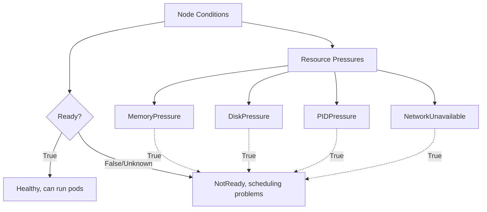
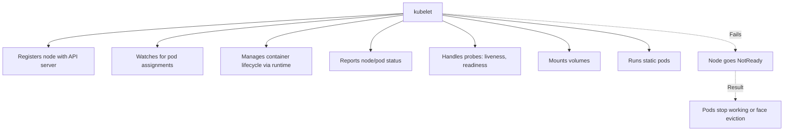
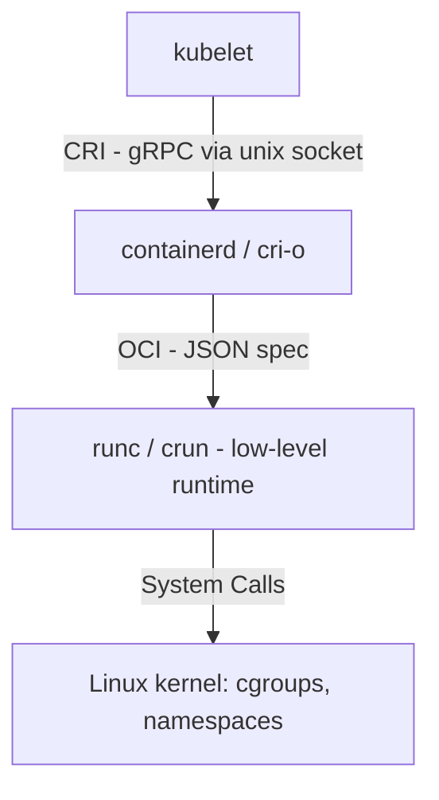
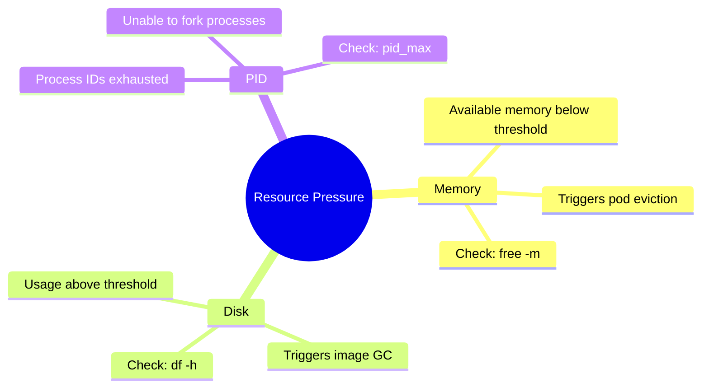
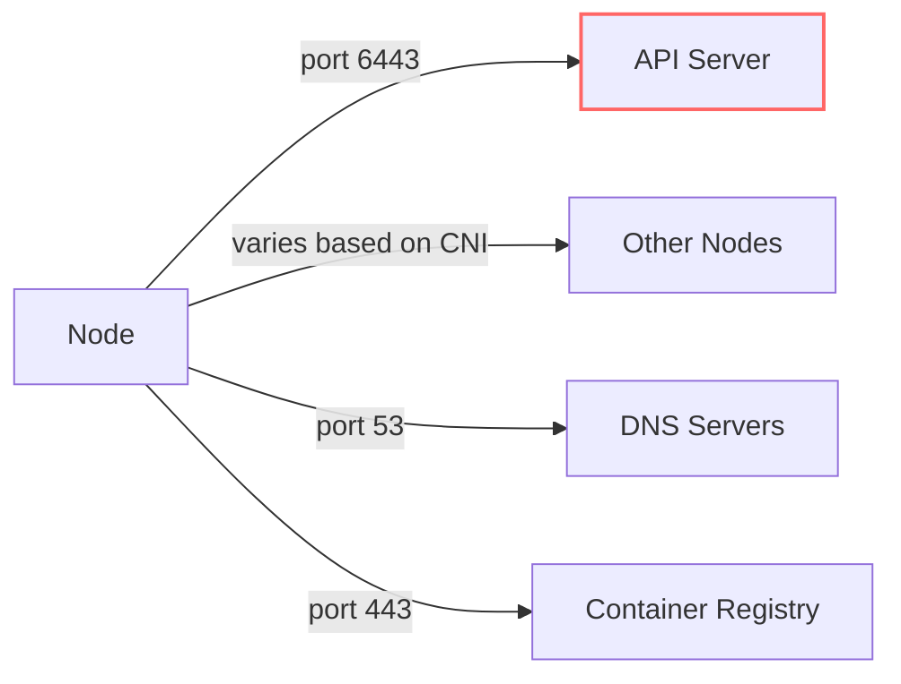
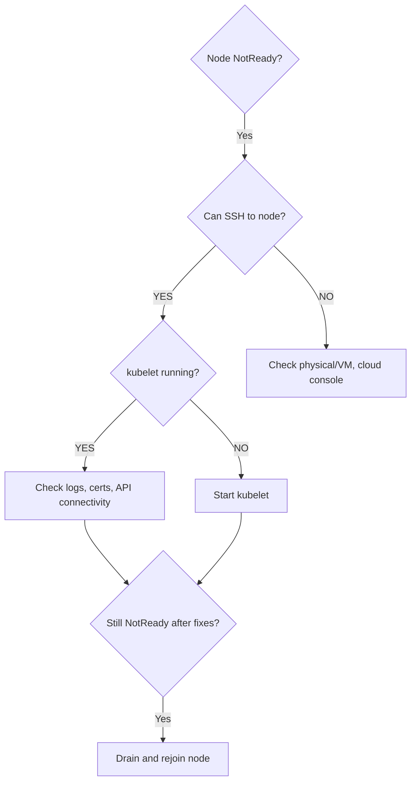
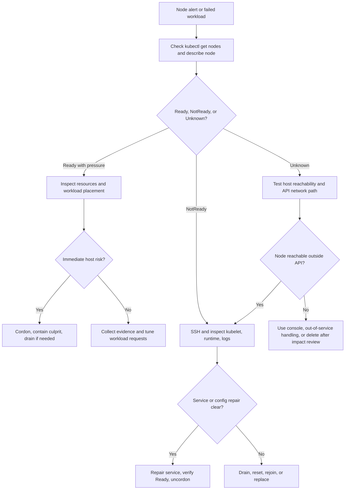

> **Складність**: `[СЕРЕДНЯ]` — критично важливо для роботи кластера
>
> **Час на проходження**: 45-55 хвилин
>
> **Передумови**: Модуль 5.1 (Методологія), Модуль 1.1 (Архітектура кластера)

---

## Що ви зможете зробити

- **Діагностувати** стани `NotReady` та `Unknown` робочих вузлів, зіставляючи умови вузла Kubernetes, серцебиття kubelet, стан служб systemd та локальні логи вузла.
- **Оцінити** умови `MemoryPressure`, `DiskPressure` та `PIDPressure` і обрати негайні кроки стримування, які зменшують каскадні збої робочих навантажень.
- **Налагодити** збої інтеграції між kubelet та середовищем виконання контейнерів за допомогою `journalctl`, `systemctl`, перевірки CRI-сокета та інспекції `crictl`.
- **Впровадити** безпечні процедури відновлення вузла з робочими процесами cordon, drain, перезапуску, reset, повторного приєднання та видалення, дотримуючись обмежень на порушення роботи.
- **Спроєктувати** реакцію на виселення та обслуговування робочого вузла, яка враховує виселення на основі taint'ів, порогові значення тиску на вузол, плавне завершення роботи та поведінку Kubernetes 1.35.

## Чому цей модуль важливий

Гіпотетичний сценарій (Hypothetical scenario): загальносистемний агент моніторингу починає витікати пам'ять після рутинного оновлення. Спершу лише один робочий вузол повідомляє про підвищене використання пам'яті, але оскільки DaemonSet працює всюди, той самий патерн збою починає з'являтися по всьому пулу вузлів. Kubelet починає стверджувати `MemoryPressure`, нові Pod'и перестають потрапляти на уражені вузли, а виселені робочі навантаження переходять на решту справних вузлів, підвищуючи тиск і на них. Збій спричинений не однією зламаною програмою; він спричинений тим, що рівень вузлів втрачає ємність та контурні цикли управління, від яких залежить кожна програма.

Робочі вузли — це виробничий цех кластера Kubernetes. Площина управління може планувати, спостерігати й узгоджувати, але самі контейнери працюють на машинах зі скінченною пам'яттю, дисками, мережевими шляхами, ідентифікаторами процесів, сертифікатами та локальними службами. Kubelet діє як майстер цеху, середовище виконання контейнерів — це важка техніка, а ресурси вузла — це сировина. Якщо майстер не здатний звітувати про стан, техніка не здатна запускати контейнери, або сировина закінчується, найкращі наміри планувальника не мають значення, доки вузол не буде відновлено чи ізольовано.

Цей модуль навчає практичної послідовності діагностики збоїв робочих вузлів без здогадок. Ви почнете з погляду API-сервера, перейдете до локальних доказів операційної системи вузла, перевірите інтеграцію kubelet та середовища виконання контейнерів, оціните тиск на ресурси, відрізните мережеві розділення від локальних аварій, а потім оберете шлях відновлення. Цінність для іспиту очевидна, оскільки завдання з усунення несправностей CKA часто подають вузол, нездоровий з однієї конкретної причини. Цінність для продакшену більша: спокійна діагностика вузла не дає локальному збою перетворитися на інцидент масштабу всього флоту.

Звичка, яку ви виробляєте, — це впорядкування доказів. Kubernetes відкриває багато симптомів, і кілька з них можуть бути істинними одночасно під час інциденту з вузлом. Pod може перебувати у стані `Pending`, бо вузол під тиском, бо планувальник дотримується cordon'у, бо середовище виконання недоступне, або бо площина управління перестала довіряти серцебиттю вузла. Якщо ви збираєте ці сигнали у стабільному порядку, збій зазвичай швидко звужується; якщо ж ви відразу переходите до команд ремонту, ви можете змінити систему ще до того, як зрозумієте несправність.

## Читання статусу вузла як оператор

Kubernetes не входить безперервно у робочі вузли, щоб перевірити, чи вони живі. Натомість kubelet на кожному вузлі публікує оновлення статусу та серцебиття Lease назад до API-сервера, а контролер вузлів інтерпретує пропущені чи нездорові оновлення. Ця відмінність важлива, оскільки погляд площини управління завжди є звітом, а не самим вузлом. Вузол може запускати контейнери, тоді як API-сервер бачить його як `Unknown`, і вузол може бути досяжним через SSH, тоді як kubelet не може автентифікуватися чи опублікувати статус.

Тому перше діагностичне питання — не «що зламано?», а «який спостерігач каже, що воно зламано?». `kubectl get nodes` повідомляє, у що наразі вірить API-сервер. `kubectl describe node` показує умови, нещодавні події, адреси, ємність, виділювані ресурси та taint'и. SSH, `systemctl`, `journalctl`, `df`, `free` та `crictl` повідомляють, що відбувається локально. Хороший спеціаліст з усунення несправностей свідомо перемикається між цими точками зору замість того, щоб довіряти одній команді як цілій правді.

Уявіть об'єкт вузла як панель приладів, яку живлять польові звіти. Вона є авторитетною для рішень планування, але це все одно зведення повідомлень, яким довелося пройти шлях від вузла до API-сервера. Коли шлях звітування пошкоджено, панель може бути застарілою, неповною чи консервативною. Саме тому `Unknown` — це не те саме, що «усе на хості загинуло», і саме тому досяжний хост не є автоматично справним вузлом Kubernetes.



Умова `Ready` підсумовує, чи може вузол приймати та запускати звичайні робочі навантаження, але її ніколи не слід читати окремо. `MemoryPressure=True` повідомляє, що kubelet захищає хост від нестачі пам'яті. `DiskPressure=True` вказує, що локальне сховище чи вичерпання inode може блокувати завантаження образів, логи чи створення контейнерів. `PIDPressure=True` означає, що на вузлі закінчуються ідентифікатори процесів Linux. `NetworkUnavailable=True` зазвичай вказує радше на готовність CNI чи маршрутизації, ніж лише на живучість kubelet.

Події додають часу й деталей до цих умов. Умова повідомляє про поточний чи нещодавно спостережений стан, тоді як події часто розкривають шлях переходу: збій збирання сміття образів, досягнення порогів виселення, припинення публікації статусу kubelet або уникнення планувальником вузла через taint'и. На іспиті з обмеженням часу проскануйте події на предмет найновішого повторюваного попередження. У продакшені зберігайте ці події в нотатках про інцидент, бо вони пояснюють, чому пізніший ремонт спрацював і чи ймовірно повторення того самого збою.

| Статус | Значення | Поширені причини |
|--------|----------|------------------|
| Ready | Справний і приймає Pod'и | Нормальна робота |
| NotReady | Несправний | kubelet не працює, проблеми з мережею |
| Unknown | Серцебиття не отримано | Вузол недосяжний, kubelet аварійно завершився |
| SchedulingDisabled | Cordoned | Ручний cordon або обслуговування |

Скористайтеся поглядом площини управління, щоб класифікувати збій, перш ніж торкатися вузла. Вузол `NotReady` з нещодавніми подіями kubelet відрізняється від вузла `Unknown`, який припинив публікувати серцебиття. Вузол `Ready,SchedulingDisabled` може бути справним, але навмисно cordoned. Вузол, що `Ready`, але має повторювані події завантаження образів чи середовища виконання, може мати локальну проблему із середовищем виконання контейнерів, реєстром, DNS чи диском, яка ще не перетнула поріг переходу у збій рівня вузла.

```bash
# Quick status
kubectl get nodes

# Detailed conditions
kubectl describe node <node-name> | grep -A 10 Conditions

# All nodes with Ready condition reason
kubectl get nodes -o custom-columns='NAME:.metadata.name,READY:.status.conditions[?(@.type=="Ready")].status,REASON:.status.conditions[?(@.type=="Ready")].reason'

# Check for resource pressure
kubectl describe node <node-name> | grep -E "MemoryPressure|DiskPressure|PIDPressure"
```

За поведінкою controller-manager за замовчуванням, стан вузла відстежується часто, а пропущені серцебиття зрештою перетворюються на `Ready=Unknown`. Kubernetes також використовує taint'и, такі як `node.kubernetes.io/not-ready` та `node.kubernetes.io/unreachable`, щоб впливати на планування та виселення. Важливий експлуатаційний урок полягає в тому, що Kubernetes навмисно затримує деякі реакції, бо короткі мережеві збої трапляються часто. Негайне виселення за кожне пропущене серцебиття створювало б більше порушень роботи, ніж вирішувало б.

Зупиніться та спрогнозуйте: якщо вузол стає `Unknown`, чи зупиняться негайно контейнери, що вже працювали на тій машині? Подумайте, який компонент запускає контейнери, який компонент звітує про статус і який компонент може досі бути живим, коли API-сервер втрачає контакт із вузлом.

Відповідь зазвичай «ні». Наявні контейнери можуть продовжувати працювати, якщо вузол і середовище виконання живі, навіть коли площині управління бракує підтвердженого статусу. Планувальник уникатиме розміщення нової роботи на несправному вузлі, а логіка виселення може зрештою замінити Pod'и в іншому місці, але це рішення площини управління. Саме тому усунення несправностей вузла завжди відокремлює живучість програми, стан середовища виконання контейнерів, звітування kubelet та видимість через API.

Ця відмінність також пояснює, чому власники програм можуть повідомляти про змішані симптоми. Запит користувача, спрямований до Pod'а, що досі працює, може бути успішним, тоді як `kubectl get pods` показує застарілу інформацію. Заміщувальний Pod може запуститися в іншому місці лише після того, як логіка контролера вирішить, що старий Pod більше не має враховуватися. Команда отримання логів може зазнати збою через API, тоді як локальний файл stdout контейнера досі існує на вузлі. Усунення несправностей робочого вузла — це практика узгодження цих перспектив без припущення, що всі вони мають змінитися в одну й ту саму мить.

## Taint'и, виселення та час реакції на збій вузла

Коли вузол не готовий чи недосяжний, Kubernetes не просто перемикає мітку статусу й сподівається, що люди це помітять. Площина управління додає taint'и, які формують дві поведінки: нові Pod'и не мають плануватися туди, а наявні Pod'и можуть зрештою бути виселені, якщо їхні толерування (tolerations) спливуть. Толерування за замовчуванням для звичайних Pod'ів на taint'ах not-ready та unreachable становить `tolerationSeconds: 300`, ось чому Pod'и можуть здаватися такими, що затримуються на несправному вузлі протягом перших хвилин збою.

Ця затримка — це функція, а не недбалість. Розподілені системи зазнають тимчасової втрати пакетів, збіжності маршрутизації, вікон обслуговування, пауз хмарних хостів та перевантажених API-шляхів. Якби Kubernetes негайно перепланував кожне робоче навантаження після короткого переривання серцебиття вузла, він підсилював би шум до бурхливості. Поведінка за замовчуванням дає вузлу шанс відновитися, а потім переміщує роботу лише після того, як збій видається достатньо стійким, щоб виправдати порушення роботи.

Починаючи з Kubernetes v1.29, виселення на основі taint'ів обробляється контролером `taint-eviction-controller`, і кластери Kubernetes 1.35 продовжують покладатися на цю поведінку площини управління, доки оператори явно не змінять набір контролерів. Для повсякденного усунення несправностей ви зазвичай не налаштовуєте цей контролер під час інциденту. Ви визначаєте, чи є спостережувана затримка Pod'а очікуваною поведінкою толерування, обмеженням PodDisruptionBudget, регулюванням виселення в межах зони, чи ознакою того, що контролер не працює.

Система виселення також має регулятори, щоб не перевантажувати решту кластера під час широких збоїв. Значення за замовчуванням, такі як `node-eviction-rate`, `secondary-node-eviction-rate`, порогові значення для нездорової зони та порогові значення для великого кластера, існують тому, що масовий збій вузлів відрізняється від збою одного вузла. Якщо ціла зона згасає, виселення всього на повній швидкості може спричинити лавину на вцілілі вузли, запустити завантаження образів, перевантажити сховище й перетворити відновлення на другий збій.

Практичний наслідок полягає в тому, що «чому Pod'и досі тут?» — це не одне питання. Вони можуть досі бути тут, бо толерування вузла не сплило, бо власне толерування дозволяє довше перебування, бо регулятор виселення сповільнив заміну, бо controller manager нездоровий, або бо Pod керується контролером, який має створити заміну, перш ніж трафік відновиться. Перш ніж змінювати прапорці чи видаляти Pod'и, перевірте taint'и, толерування, належність контролеру та ємність кластера. Ці дрібні перевірки не дають вам прийняти навмисну захисну поведінку за застряглу площину управління.

| Сигнал збою | Реакція Kubernetes | Чому це важливо під час діагностики |
|----------------|---------------------|---------------------------------|
| `Ready=False` | Вузол відомо нездоровий | Kubelet досі повідомляє про проблему, тож перевірте нещодавні умови та події. |
| `Ready=Unknown` | Серцебиття вузла відсутнє | Площині управління бракує надійного статусу Pod'ів, тож перевірте досяжність мережі та локальні служби вузла. |
| taint `not-ready` | Нове планування заблоковано, а наявні Pod'и можуть короткочасно толерувати | Затримана заміна може бути нормою, а не вадою планувальника. |
| taint `unreachable` | Наявні Pod'и можуть бути виселені після спливання толерування | Робочі навантаження з власними толеруваннями можуть залишатися довше, ніж очікувалося. |
| Умова тиску на вузол | Kubelet може виселяти локально | Ці виселення — це аварійний захист хоста, а не добровільне порушення роботи. |

Перш ніж запустити це, який вивід ви очікуєте від вузла, який досяжний, але під тиском пам'яті? Слід очікувати, що `Ready` може досі бути `True` або може бути погіршеним залежно від серйозності, тоді як `MemoryPressure` — це вирішальна умова для перевірки. Якщо ви дивитеся лише на перший стовпець `kubectl get nodes`, ви можете пропустити сигнал тиску, який пояснює очікувані Pod'и та локальні виселення.

Іспит CKA зазвичай винагороджує таку обізнаність із часом реакції. Кандидат, який видаляє Pod'и одразу після того, як побачив `Unknown`, може створити зайвий шум, тоді як кандидат, який перевіряє умови вузла, taint'и, стан kubelet та толерування Pod'ів, може пояснити, чому робочі навантаження перемістилися чи ні. У продакшені та сама дисципліна не дає робити хибні висновки на кшталт «Kubernetes не зміг перепланувати», коли Kubernetes навмисно чекає на вікно толерування чи регулює виселення в межах нездорової зони.

Час реакції на виселення також впливає на комунікацію. Якщо служба погіршена через те, що один вузол недосяжний, повідомлення команді «Pod'и мають переміститися за п'ять хвилин» може бути точним для звичайних Pod'ів, але воно неповне для StatefulSet'ів, локального сховища, суворих PodDisruptionBudget'ів, власних толерувань та кластерів з обмеженою ємністю. Краще оновлення про інцидент називає механізм: вузол позначено taint'ом unreachable, звичайні Pod'и мають толерування за замовчуванням, очікується, що контролер створить заміни після вікна, і ми перевіряємо запасну ємність, перш ніж щось примусово робити.

## Налагодження інтеграції kubelet та середовища виконання

Kubelet — це найважливіший процес Kubernetes на робочому вузлі, бо він перетворює бажаний стан Pod'ів на локальні дії з контейнерами й звітує реальність назад до API-сервера. Він реєструє вузол, стежить за призначеними Pod'ами, просить середовище виконання створювати чи видаляти контейнери, монтує томи, запускає проби, звітує про статус Pod'ів та керує статичними Pod'ами. Якщо kubelet не працює, неправильно налаштований чи не може автентифікуватися, вузол стає експлуатаційно від'єднаним, навіть коли базова операційна система досі працює.



Kubelet не запускає контейнери безпосередньо. Він спілкується з реалізацією Container Runtime Interface, такою як containerd чи CRI-O, через локальний сокет, а це середовище виконання використовує OCI-середовище виконання, таке як `runc` чи `crun`, щоб створювати простори імен Linux, cgroup'и та процеси. Цей багатошаровий дизайн корисний, бо кожен шар має вузьку задачу, але це також означає, що збій робочого вузла може виглядати як проблема kubelet, тоді як справжня несправність — це відсутній сокет, зупинене середовище виконання, пошкоджене сховище середовища виконання чи вичерпання ресурсів на рівні ядра.

Скористайтеся моделлю шарів, щоб читати повідомлення про помилки. Якщо kubelet повідомляє про збій автентифікації, підозрюваним є шлях між kubelet та API-сервером. Якщо kubelet повідомляє про збій з'єднання CRI, підозрюваним є шар середовища виконання. Якщо середовище виконання повідомляє про помилки cgroup чи монтування, підозрюваними є операційна система та конфігурація ядра. Якщо контейнер запускається, але readiness-проби зазнають збою, кращим фокусом може бути робоче навантаження чи мережа Pod'а. Це запобігає поширеній звичці перезапускати той компонент, який вивів найсвіжішу помилку.



Починайте налагодження kubelet з вузла, а не з іншого Pod'а. Підключіться через SSH до ураженого хоста, перевірте юніт systemd, а потім прочитайте нещодавні логи, перш ніж щось перезапускати. Перезапуск може тимчасово прибрати симптоми й стерти корисний час реакції, особливо коли справжня проблема — це конфігурація, спливання сертифіката, досяжність API чи збій сокета середовища виконання. Ваша мета — визначити першу помилку в ланцюжку, а не лише найгучнішу помилку, повторювану під час циклу аварій.

```bash
# SSH to the node first
ssh <node-name>

# Check kubelet service status
sudo systemctl status kubelet

# Check if kubelet is running
ps aux | grep kubelet

# Check kubelet logs
sudo journalctl -u kubelet -f

# Check recent kubelet errors
sudo journalctl -u kubelet --since "10 minutes ago" | grep -i error
```

| Проблема | Симптом | Діагностика | Виправлення |
|-------|---------|-----------|-----|
| kubelet зупинено | Вузол NotReady | `systemctl status kubelet` | `systemctl start kubelet` |
| цикл аварій kubelet | Вузол блимає | `journalctl -u kubelet` | Виправити конфіг, перевірити логи |
| Неправильний конфіг | Не запускається | Помилка в логах | Виправити `/var/lib/kubelet/config.yaml` |
| API недосяжний | NotReady | Тайм-аут мережі в логах | Перевірити мережу, фаєрвол |
| Проблеми із сертифікатами | Помилки TLS | Помилки сертифікатів у логах | Оновити сертифікати |
| Середовище виконання контейнерів не працює | Не вдається створити Pod'и | Помилки середовища виконання | Виправити налаштоване середовище виконання CRI (containerd, CRI-O або Docker Engine на основі cri-dockerd) |

Якщо kubelet просто зупинено, його запуск є розумним, але переконайтеся, що службу ввімкнено для наступного завантаження й що вузол повертається у справний стан. Якщо він одразу знову падає, перестаньте вважати перезапуск виправленням і поверніться до логів та конфігурації. Багато збоїв kubelet є детермінованими: поганий прапорець, відсутній файл, неправильна кінцева точка CRI, недійсний сертифікат чи недосяжний API-сервер відтворюватимуться щоразу.

```bash
# Start kubelet
sudo systemctl start kubelet

# Enable on boot
sudo systemctl enable kubelet

# Check status
sudo systemctl status kubelet
```

Конфігурація kubelet часто розділена між `/var/lib/kubelet/config.yaml` та drop-in'ами systemd, створеними kubeadm чи образом вузла. Пошкоджений YAML-файл може завадити запуску. Змінений drop-in systemd не використовуватиметься, доки не виконається `systemctl daemon-reload`. Застаріла `--container-runtime-endpoint` може спрямувати kubelet на неправильний сокет після міграції середовища виконання. Це нудні деталі, але саме там успішно завершується багато ремонтів вузлів.

```bash
# Check kubelet config file
cat /var/lib/kubelet/config.yaml

# Check kubelet flags
cat /etc/systemd/system/kubelet.service.d/10-kubeadm.conf

# After fixing config, reload and restart
sudo systemctl daemon-reload
sudo systemctl restart kubelet
sudo systemctl status kubelet  # Verify service started
```

Проблеми із сертифікатами заслуговують на особливу увагу в кластерах стилю kubeadm. Kubelet автентифікується до API-сервера за допомогою клієнтських сертифікатів, і прострочений чи пошкоджений матеріал може виглядати як періодичний збій вузла, помилки TLS чи повторювані збої автентифікації. Якщо кластер було створено приблизно рік тому, або якщо ротацію сертифікатів було вимкнено чи перервано, перевірте каталог PKI kubelet та логи, перш ніж вирішувати, що сам вузол зламано.

Не плутайте спливання сертифіката із загальною втратою мережі. Збій мережі зазвичай дає тайм-аути з'єднання, відхилені з'єднання чи симптоми маршрутизації з багатьох інструментів. Збій сертифіката часто показує повідомлення про TLS-рукостискання, авторизацію чи клієнтський сертифікат, тоді як базова зв'язність із кінцевою точкою API може досі працювати. Ця відмінність важлива, бо відкриття портів фаєрволу не виправить прострочений сертифікат, а повторне приєднання вузла є надмірним, якщо єдина несправність — це тимчасова зміна маршруту.

```bash
# Check certificate paths
cat /var/lib/kubelet/config.yaml | grep -i cert

# Verify certificates exist
ls -la /var/lib/kubelet/pki/

# For expired certs, may need to rejoin node
# On control plane: kubeadm token create --print-join-command
# On worker: kubeadm reset && kubeadm join ...
```

Сторона дослідження, що стосується середовища виконання, починається зі стану служби containerd чи CRI-O, потім переходить до сокета й нарешті до прямої інспекції CRI. `crictl` є цінним, бо він спілкується з локальним середовищем виконання, а не з API Kubernetes. Коли API-сервер недосяжний, `kubectl logs` може зазнавати збою глобально, але `sudo crictl logs <container-id>` досі може показати, що відбувається на тому хості.

```bash
# Check containerd (most common)
sudo systemctl status containerd
sudo crictl info

# Check container runtime socket
ls -la /run/containerd/containerd.sock

# List containers with crictl
sudo crictl ps

# List images
sudo crictl images
```

| Проблема | Симптом | Діагностика | Виправлення |
|-------|---------|-----------|-----|
| containerd зупинено | Pod'и ContainerCreating | `systemctl status containerd` | `systemctl start containerd` |
| Сокет відсутній | помилки kubelet | Перевірити шлях до сокета | Перезапустити containerd |
| Диск заповнено | Створення контейнера зазнає збою | `df -h` | Очистити диск |
| Завантаження образу зазнає збою | ImagePullBackOff | Перевірити доступ до реєстру | Виправити автентифікацію реєстру |
| Ресурс вичерпано | Випадкові збої контейнерів | Перевірити cgroup'и | Збільшити ресурси |

Якщо containerd аварійно завершився, перезапустіть його, потім перевірте логи і середовища виконання, і kubelet. Перезапуск середовища виконання не виправляє автоматично вичерпання диска, пошкоджені образи, збої DNS реєстру чи проблеми cgroup. Вважайте перезапуск тестом, який повідомляє вам, чи може середовище виконання повернутися чисто. Якщо воно залишається нездоровим, повідомлення про помилки після перезапуску часто корисніші за застарілі помилки до нього.

```bash
# Start containerd
sudo systemctl start containerd

# Check status
sudo systemctl status containerd

# Check logs for issues
sudo journalctl -u containerd --since "10 minutes ago"
```

Налаштуйте `crictl` явно, якщо хост ще не спрямовує його на правильний сокет CRI. Це уникає заплутаних збоїв, коли `crictl` справний, але дивиться на неправильну кінцеву точку. Після налаштування перевіряйте контейнери, логи та метадані безпосередньо. Під час збою вузла це може підтвердити, чи контейнер програми досі працює, чи він завершився локально, чи kubelet лише втратив здатність звітувати про свій стан.

```bash
# Configure crictl for containerd
cat <<EOF | sudo tee /etc/crictl.yaml
runtime-endpoint: unix:///run/containerd/containerd.sock
image-endpoint: unix:///run/containerd/containerd.sock
timeout: 10
debug: false
EOF

# List all containers (including stopped)
sudo crictl ps -a

# Get container logs
sudo crictl logs <container-id>

# Inspect container
sudo crictl inspect <container-id>
```

Опрацьований приклад: припустимо, `kubectl describe node worker-a` показує `Ready=False`, і SSH досі працює. `systemctl status kubelet` повідомляє active, але `journalctl -u kubelet` неодноразово показує connection refused для `unix:///run/containerd/containerd.sock`. У цей момент перезапуск kubelet першим — це слабкий хід, бо kubelet лише повідомляє, що його залежність відсутня. Перевірте `systemctl status containerd`, переконайтеся у шляху до сокета, перевірте логи containerd, а потім перезапустіть чи відремонтуйте середовище виконання, перш ніж повертатися до kubelet.

## Тиск на ресурси, локальні виселення та виживання хоста

Робочі вузли — це скінченні машини Linux. У них може закінчитися пам'ять, дисковий простір, вільні inode, ідентифікатори процесів чи практична пропускна здатність вводу-виводу задовго до того, як кластер у цілому виглядатиме повним. Kubelet стежить за кількома сигналами ресурсів і стверджує умови тиску на вузол, коли пороги перетинаються. Така поведінка захищає хост від повного зависання, але вона також означає, що Pod'и можуть бути вбиті локально навіть тоді, коли жодна людина не видавала drain і жоден PodDisruptionBudget не дозволяв добровільного порушення роботи.

Тиск на ресурси часто є точкою, де теорія планування стає апаратною реальністю. Деплоймент може запитувати скромні ресурси, але вузол також запускає kubelet, середовище виконання, агенти логування, компоненти CNI, плагіни сховища, роботу ядра та кожен DaemonSet, розміщений на тому хості. Надмірне виділення може бути розумним, коли робочі навантаження є сплесковими, але воно стає небезпечним, коли багато контейнерів сягають піку разом або агент рівня хоста споживає ресурси поза нормальними очікуваннями для Pod'ів. Під час інциденту порівняйте бажане виділення з фактичним споживанням, щоб ви знали, чи належить виправлення до розміру робочого навантаження, ємності вузла, поведінки демона чи аварійного очищення.



Виселення через тиск на вузол відрізняється від виселення площиною управління після збою вузла. Виселення на основі taint'ів обробляє Pod'и на вузлах, які площина управління вважає нездоровими чи недосяжними. Виселення через тиск на вузол виконує kubelet на вузлі, щоб повернути ресурси, перш ніж операційна система обвалиться. Оскільки це аварійний захист хоста, воно може обходити PodDisruptionBudget'и й може скорочувати плавне завершення роботи під сильним тиском. Це дивує лише тоді, коли ви вважаєте все переміщення Pod'ів виселенням одного й того самого роду.

Ця відмінність змінює те, як ви пояснюєте вплив команді. Запланований drain — це добровільне порушення роботи, і він дає контролерам, бюджетам порушень та плавному завершенню роботи шанс сформувати переміщення. Виселення через тиск — це локальне рішення про виживання, прийняте під стресом, і його пріоритет — тримати хост достатньо живим, щоб продовжувати керувати критичними процесами. Якщо Pod бази даних було виселено через тиск пам'яті, правильне питання — не лише «чому Kubernetes його перемістив?», а й «чому цьому вузлу дозволили досягти аварійного порогу з таким набором робочих навантажень?».

```bash
# Check node conditions
kubectl describe node <node> | grep -A 10 Conditions

# On the node - check memory
free -m
cat /proc/meminfo | grep -E "MemTotal|MemFree|MemAvailable"

# Check disk
df -h
sudo du -sh /var/lib/containerd/*  # Container storage
sudo du -sh /var/log/*             # Log storage

# Check PIDs
cat /proc/sys/kernel/pid_max
ps aux | wc -l
```

Жорсткі пороги виселення за замовчуванням охоплюють низьку доступну пам'ять, низьку ємність файлової системи вузла, низьку ємність файлової системи образів та вичерпання inode. Точні значення — це конфігурація kubelet, а не магічні константи, вбудовані у ваші програми. Вам слід перевіряти локальний конфіг kubelet, коли поведінка не відповідає вашим очікуванням. Кастомізація порогів може бути доречною для спеціалізованих вузлів, але налаштовувати їх під час збою ризиковано, якщо ви не розумієте, чи хост справді близький до відмови.

Коли ви перевизначаєте `evictionHard`, вказання будь-якого жорсткого порогу обнуляє невказані значення за замовчуванням, якщо ви не надасте **всі** порогові значення за замовчуванням або не ввімкнете `MergeDefaultEvictionSettings` (Kubernetes 1.35+). Часткове перевизначення може мовчки прибрати захисти, які ви вважали досі чинними.

```yaml
evictionHard:
  memory.available: "100Mi"
  nodefs.available: "10%"
  nodefs.inodesFree: "5%"
  imagefs.available: "15%"
  imagefs.inodesFree: "5%"
```

Коли поріг перетинається, kubelet встановлює відповідну умову вузла, планувальник уникає призначення нових Pod'ів на вузол, а kubelet обирає Pod'и для виселення на основі quality of service, пріоритету та використання ресурсів відносно запитів. Pod'и `BestEffort` зазвичай найбільш вразливі, бо в них немає запитів. Pod'и `Burstable` з надмірним виділенням також можуть бути виселені раніше за Pod'и `Guaranteed`. Ось чому запити ресурсів — це не просто підказки для планування; вони стають доказами під час рішень про виживання вузла.

Зупиніться та спрогнозуйте: якщо Pod, що використовує том `emptyDir`, виселено через тиск пам'яті чи диска на вузлі, що станеться з даними, збереженими в тому томі? Важлива підказка в назві. `emptyDir` — це локальне ефемерне сховище, прив'язане до життя Pod'а на тому вузлі, тож виселення може знищити локальний вміст, навіть якщо заміщувальний Pod чисто запускається в іншому місці.

Усунення несправностей тиску пам'яті починається з доведення того, чи тиск спричинений контейнером, хостом, чи це проблема обліку. Порівняйте `kubectl top` зі списками процесів рівня ОС, потім перевірте робоче навантаження, яке нещодавно змінилося. Якщо один Pod споживає значно більше за свій запит, виселення чи видалення може бути кроком стримування. Якщо тиск спричинений демонами хоста, агентами логування, пам'яттю ядра чи DaemonSet'ом, перепланування Pod'ів програми не виправить пул вузлів, бо винуватець слідує за кожним вузлом.

Клас QoS — це міст між проєктуванням маніфеста та поведінкою вузла. Pod'и `Guaranteed` мають рівні запити й ліміти пам'яті для кожного контейнера, тож вони являють собою сильнішу обіцянку планування. Pod'и `Burstable` мають принаймні якийсь запит, але вони можуть використовувати більше за запитане, коли надходить тиск. Pod'и `BestEffort` не мають запитів чи лімітів, тож kubelet легко жертвує ними першими. Це не робить `BestEffort` хибним для кожного робочого навантаження, але робить його поганим вибором для будь-чого, що ви очікуєте пережити стрес вузла.

```bash
# Find memory-hungry processes
ps aux --sort=-%mem | head -20

# Find pods using most memory
kubectl top pods -A --sort-by=memory

# Options:
# 1. Kill unnecessary processes
# 2. Evict low-priority pods
# 3. Add more memory to node
```

Тиск на диск часто потребує швидшої дії, бо повна коренева файлова система може зламати логи, завантаження образів, створення контейнерів, записи стану kubelet та навіть інтерактивні команди ремонту. Почніть з утилізації файлової системи, потім визначте, чи відповідальне сховище образів, шари запису контейнерів, journald, логи програми чи незв'язані файли хоста. Уникайте сліпого видалення каталогів під `/var/lib/containerd`; коли можливо, спершу використовуйте очищення з урахуванням середовища виконання й зберігайте докази, коли першопричина незрозуміла.

Діагностика диска має включати і байти, і inode. Файлова система може мати вільні гігабайти, але жодного доступного inode, що означає, що нові малі файли все одно не створюються. Шари образів контейнерів, розпаковані файли, фрагменти логів та скретч-дані програм усі роблять різний внесок залежно від образу вузла та конфігурації середовища виконання. Якщо ваш кластер розділяє `nodefs` та `imagefs`, тиск на одну файлову систему може запустити іншу поведінку повернення ресурсів, ніж тиск на іншу. Документація Kubernetes 1.35 також описує обробку сигналу `containerfs` у підтримуваних розкладках, тож прочитайте фактичну розкладку середовища виконання вузла, перш ніж припускати, що кожне попередження про диск указує на той самий каталог.

```bash
# Find large files
sudo find / -type f -size +100M -exec ls -lh {} \;

# Clean up container images
sudo crictl rmi --prune

# Clean up old logs
sudo journalctl --vacuum-time=3d

# Clean up unused containers
sudo crictl ps -a -q --state exited | xargs -r sudo crictl rm
```

Тиск PID менш помітний, ніж тиск пам'яті чи диска, але він може бути так само серйозним. Linux потребує вільного ідентифікатора процесу, щоб запустити оболонку, виконати пробу, відгалузити помічника чи створити новий процес програми. Баг із надмірним відгалуженням може зробити вузол ніби населеним привидами, бо навіть прості команди періодично зазнають збою. Перевірте фактичний `pid_max`, порахуйте процеси й визначте користувача чи родину контейнерів, що генерують більшість із них, перш ніж піднімати ліміти. Підняття ліміту виграє час; воно не виправляє неконтрольоване створення процесів.

Розглядайте аварійне полегшення й постійне запобігання як окремі робочі елементи. Вбивство неконтрольованого процесу, видалення низькопріоритетного Pod'а, обрізання образів чи тимчасове підняття ліміту PID може відновити достатньо простору, щоб вузол відреагував. Постійним виправленням може бути ліміт робочого навантаження, політика ротації логів, відкат DaemonSet'а, більша форма вузла чи менше Pod'ів на вузол. Якщо ви зупиняєтеся на полегшенні, та сама умова тиску повернеться, коли патерн робочого навантаження повториться.

```bash
# Check current PID limit
cat /proc/sys/kernel/pid_max

# Increase limit temporarily
echo 65536 | sudo tee /proc/sys/kernel/pid_max

# Find processes by count
ps aux | awk '{print $1}' | sort | uniq -c | sort -rn | head
```

Який підхід ви б тут обрали й чому: видалити найбільший Pod, виконати drain вузла чи cordon вузла та спершу зібрати докази? Найкраща відповідь залежить від радіуса ураження. Якщо вузол за хвилини до зависання, стримування йде першим. Якщо кластер має достатню запасну ємність, а причина неочевидна, cordon плюс збір доказів може запобігти розміщенню нового робочого навантаження, зберігаючи дані для діагностики. Якщо винуватцем є відоме низькопріоритетне робоче навантаження, цільове виселення може відновити вузол без переміщення незв'язаних Pod'ів.

## Мережа, завершення роботи та шляхи відновлення

Робочий вузол може мати справні служби та вдосталь ресурсів, але все одно не виконувати обов'язки кластера, бо мережевий шлях зламано. Вузол має досягати API-сервера для серцебиття й оновлень Pod'ів, DNS для розв'язання імен, реєстрів для завантаження образів, інших вузлів для мережі Pod'ів, а іноді хмарних чи сховищних кінцевих точок для томів. Збої мережі вузла особливо заплутані, бо трафік програми, SSH та досяжність API можуть зазнавати збою незалежно.

Розділіть мережеві шляхи за призначенням. Досяжність API-сервера тримає потік статусу kubelet та призначення Pod'ів. Досяжність реєстру визначає, чи можна завантажувати нові образи. DNS кластера впливає на робочі навантаження, яким потрібне виявлення служб. Оверлейні чи маршрутні шляхи Pod'ів визначають, чи можуть Pod'и спілкуватися між вузлами. SSH лише доводить, що шлях управління існує. Вузол може пройти один із цих тестів і провалити інший, тож один успішний ping ніколи не має завершувати дослідження мережі вузла.



Починайте діагностику мережі з ураженого вузла, потім порівняйте зі справним вузлом. Якщо лише один вузол не може досягти API-сервера, підозрюйте правила фаєрволу хоста, маршрути, адресацію інтерфейсу, групи безпеки вузла чи локальну конфігурацію DNS. Якщо багато вузлів зазнають збою одразу, шукайте спільну досяжність площини управління, помилки мережевих політик, збій CNI чи маршрутизацію інфраструктури. Одна команда рідко доводить причину; вам потрібен патерн між вузлами та призначеннями.

```bash
# Check basic connectivity
ping <api-server-ip>

# Check API server reachability
curl -k https://<api-server>:6443/healthz

# Check DNS
nslookup kubernetes.default.svc.cluster.local
cat /etc/resolv.conf

# Check firewall
sudo iptables -L -n
sudo firewall-cmd --list-all  # If using firewalld

# Check network interfaces
ip addr
ip route
```

| Проблема | Симптом | Діагностика | Виправлення |
|-------|---------|-----------|-----|
| Фаєрвол блокує | API недосяжний | `nc -vz <api-server> 6443` або `curl -vk https://<api-server>:6443/readyz` | Відкрити порти фаєрволу |
| Збій DNS | Розв'язання імен зазнає збою | `nslookup` | Виправити /etc/resolv.conf |
| Зміна IP-адреси | Вузол NotReady | Перевірити IP у специфікації вузла | Переналаштувати чи повторно приєднати |
| Проблеми плагіна CNI | Мережа Pod'ів зазнає збою | Перевірити Pod'и CNI | Перезапустити CNI, виправити конфіг |
| Невідповідність MTU | Періодичні збої | Перевірити налаштування MTU | Узгодити значення MTU |

**Порти робочого вузла** (служби, що слухають на вузлі чи відкриваються ним):

| Порт | Протокол | Компонент | Призначення |
|------|----------|-----------|---------|
| 10250 | TCP | kubelet | API kubelet |
| 10256 | TCP | kube-proxy | Метрики перевірки стану |
| 30000-32767 | TCP | NodePort | NodePort'и сервісів |

Робочі вузли підключаються **до** площини управління на порту 6443 (API-сервер). Ця кінцева точка не є слухачем на самому робочому вузлі.

**Довідник по площині управління** (для перевірок досяжності з робочих вузлів):

| Порт | Протокол | Компонент | Призначення |
|------|----------|-----------|---------|
| 6443 | TCP | API Server | API Kubernetes |
| 10259 | TCP | kube-scheduler | Метрики планувальника |
| 10257 | TCP | kube-controller-manager | Метрики контролера |
| 2379-2380 | TCP | etcd | Клієнт і peer |

Відновлення починається, щойно ви дізнаєтеся, чи вузол досяжний, чи може kubelet працювати, і чи слід переміщувати робоче навантаження. Якщо вузол достатньо справний, щоб брати участь, спершу виконайте cordon, щоб зупинити нові призначення, виконайте drain, коли потрібно очистити наявні робочі навантаження, проведіть обслуговування, а потім виконайте uncordon після перевірки. Якщо вузол недосяжний, вам може знадобитися консольний доступ до інфраструктури, примусове відновлення живлення, taint'и out-of-service для поведінки від'єднання сховища чи зрештою видалення вузла.

Найбезпечніша дія відновлення — та, що відповідає поточній здатності вузла співпрацювати. Чутливий вузол із kubelet, що працює, може виконати drain звичайних Pod'ів і звітувати про прогрес. Частково чутливий вузол може потребувати cordon плюс цільового ремонту служби, перш ніж drain завершиться. Вимкнений вузол не здатний нічого виселити локально, тож площина управління та система сховища мають обробляти заміну й від'єднання за своїми правилами. Узгодження дії зі здатністю вузла співпрацювати запобігає зависанню команд і запобігає випадковим рішенням про втрату даних.



Плавне завершення роботи вузла — це шлях функції Kubernetes, який дозволяє kubelet реагувати, коли операційна система завершує роботу, відповідно позначати вузол та впорядковано завершувати Pod'и, коли налаштовано. Підтримка Linux існувала протягом кількох випусків, підтримка Windows задокументована для новіших випусків, а оператори Kubernetes 1.35 все одно мають перевіряти фактичну конфігурацію kubelet, бо значення періоду пільги завершення роботи за замовчуванням можуть бути нульовими. Не припускайте, що перезавантаження є плавним лише тому, що Kubernetes підтримує цю функцію.

Неплавне завершення роботи — це інша історія. Якщо ВМ зникає, kubelet не має шансу оновити статус Pod'ів чи чисто від'єднати томи. Kubernetes має задокументовані механізми, такі як taint'и out-of-service, щоб допомогти операторам обробляти застряглі робочі навантаження та від'єднання сховища, але ці механізми — не буденні інструменти очищення. Використовуйте їх, коли ви підтвердили, що вузол справді зник чи небезпечно чекати, і запишіть, чому нормальний плавний шлях був недоступний.

Drain та cordon вирішують різні проблеми. `cordon` запобігає потраплянню нових Pod'ів на вузол, але він не переміщує наявні Pod'и. `drain` виконує cordon вузла й виселяє придатні Pod'и, дотримуючись PodDisruptionBudget'ів для добровільних порушень роботи й вимагаючи явної обробки для DaemonSet'ів та даних `emptyDir`. На іспиті використання неправильного марнує час. У продакшені використання неправильного може або не очистити вузол, або порушити роботу більшої кількості робочих навантажень, ніж задумано.

```bash
# Drain node (evicts pods safely)
kubectl drain <node-name> --ignore-daemonsets --delete-emptydir-data

# Cordon only (prevent new pods)
kubectl cordon <node-name>

# Uncordon (allow scheduling again)
kubectl uncordon <node-name>
```

Якщо стан Kubernetes вузла пошкоджено понад швидкий ремонт, повторне приєднання може бути швидшим і безпечнішим за ручне редагування кожного пошкодженого файлу. Це поширене після проблем із сертифікатами, поганого завантаження kubelet чи зламаної локальної конфігурації. Розглядайте `kubeadm reset` як руйнівний для членства вузла в Kubernetes, а не для всього кластера. Згенеруйте свіжу команду приєднання з площини управління, виконайте reset робочого вузла, повторно приєднайте, потім перевірте готовність вузла, мітки, taint'и та розміщення робочих навантажень.

```bash
# On the worker node
sudo kubeadm reset -f

# On control plane - generate new join token
kubeadm token create --print-join-command

# On worker - rejoin
sudo kubeadm join <api-server>:6443 --token <token> --discovery-token-ca-cert-hash <hash>
```

Якщо обладнання чи ВМ ніколи не повернеться, видаліть об'єкт вузла, щоб кластер припинив нести застарілий стан. Спершу виконайте drain, коли можливо, бо саме лише видалення не переміщує магічно контейнери, що працюють, з мертвої машини; воно лише видаляє об'єкт API. Якщо вузол уже зник і drain неможливий, задокументуйте наслідки для сховища та програми, перш ніж видаляти його. Стейтфул робочі навантаження та локальні персистентні томи потребують додаткової обережності, бо кластер може бути не здатний безпечно від'єднати чи замінити дані без дії оператора.

Після відновлення перевіряйте більше, ніж `Ready=True`. Перевірте, що очікувані мітки, taint'и, версії середовища виконання, файли CNI, конфігурація kubelet та виділювані ресурси вузла відповідають решті пулу. Підтвердьте, що DaemonSet'и повернулися, плагіни сховища справні, а малий тестовий Pod може запланувати й досягти DNS кластера. Багато ремонтів вузлів зазнають збою на цьому останньому кроці, бо машина повторно приєднується, але їй бракує мітки чи демона, потрібного для продакшен робочих навантажень.

```bash
# Drain first
kubectl drain <node> --ignore-daemonsets --delete-emptydir-data

# Delete node from cluster
kubectl delete node <node-name>
kubectl get nodes  # Verify node is removed

# On the node itself
sudo kubeadm reset -f
```

## Патерни та антипатерни

Ремонт робочого вузла працює найкраще, коли команда має повторювані звички, а не героїчну імпровізацію. Наведені нижче патерни корисні, бо вони зберігають докази, зменшують радіус ураження й узгоджуються з тим, як Kubernetes насправді переходить від спостереження до планування й виселення. Вони також масштабуються від одного вузла CKA-лабораторії до продакшен-пулу з автомасштабуванням, вікнами обслуговування та кількома пріоритетами робочих навантажень.

| Патерн | Коли використовувати | Чому це працює | Міркування щодо масштабування |
|---------|-------------|--------------|------------------------|
| Спершу погляд площини управління | Будь-яке сповіщення про вузол чи завдання усунення несправностей CKA | Він класифікує `Ready`, `Unknown`, тиск, taint'и, події та стан планування до локальних змін | Автоматизуйте знімки `kubectl get nodes`, умов та подій під час інцидентів. |
| Локальні докази вузла другими | API повідомляє про нездоровий статус, але хост може бути досі досяжним | `systemctl`, `journalctl`, `crictl` та метрики ОС розкривають причини, приховані від API | Стандартизуйте SSH-доступ, збереження логів та діагностику хоста між образами вузлів. |
| Cordon перед непевним ремонтом | Вам потрібен час, щоб перевірити вузол без отримання нових Pod'ів | Він зменшує розміщення нового робочого навантаження, зберігаючи наявні докази | Поєднайте зі сповіщеннями про довго cordoned вузли, щоб стан обслуговування не затримувався. |
| Drain перед запланованим обслуговуванням | Вам потрібно перезавантажити, пропатчити, виконати reset чи видалити вузол | Він використовує логіку виселення Kubernetes, а не сліпе вбивство робочих навантажень | Перевіряйте PodDisruptionBudget'и та запасну ємність кластера перед drain'ом багатьох вузлів. |
| Очищення з урахуванням середовища виконання | Тиск на диск пов'язаний з образами, зупиненими контейнерами чи логами | `crictl` та очищення journald уникають випадкового видалення під каталогами середовища виконання | Використовуйте налаштування збирання сміття образів та ротацію логів, щоб запобігти повторюваному тиску. |

Антипатерни спокусливі, бо вони видаються швидкими. Перезапуск кожної служби може тимчасово приховати симптом. Видалення об'єкта вузла може змусити червоний статус зникнути. Підняття порогів PID чи диска може відстрочити сповіщення. Ці дії не є за своєю суттю забороненими, але вони стають небезпечними, коли відбуваються до класифікації, стримування та збору доказів.

Патерни також потребують меж. Drain чудовий для запланованого обслуговування, але він може зависнути чи спричинити надмірне порушення роботи, якщо кластеру бракує запасної ємності чи він має суворі бюджети порушень. Очищення середовища виконання корисне для тиску на диск, але воно не є заміною виправлення зростання логів чи плинності образів. Cordon корисний під час дослідження, але забутий cordon мовчки зменшує ємність кластера. Найкращі оператори поєднують кожен патерн із кроком перевірки, який доводить, що вузол і кластер повернулися до бажаного стану.

| Антипатерн | Що йде не так | Краща альтернатива |
|--------------|-----------------|--------------------|
| Перезапуск kubelet до читання логів | Ви втрачаєте підказки часу й можете гнатися за збоєм залежності як за збоєм kubelet | Спершу захопіть `systemctl status` та нещодавній вивід `journalctl`. |
| Сприйняття `cordon` як евакуації робочих навантажень | Наявні Pod'и продовжують працювати, а обслуговування залишається заблокованим | Використовуйте `drain`, коли мета — очистити робочі навантаження з вузла. |
| Негайне видалення вузла `NotReady` | Ви видаляєте стан API, не розуміючи впливу на сховище, робоче навантаження чи відновлення | Виконуйте drain, коли можливо, дослідіть досяжність, потім видаляйте лише коли заплановано заміну. |
| Ігнорування умов тиску на ресурси | Очікувані Pod'и та виселення виглядають загадковими, хоча kubelet захищає хост | Перевіряйте `MemoryPressure`, `DiskPressure`, `PIDPressure` та метрики ОС разом. |
| Очищення сховища середовища виконання за допомогою `rm -rf` | Ви можете пошкодити стан середовища виконання чи видалити докази, потрібні для першопричини | Надавайте перевагу `crictl rmi --prune`, очищенню journald та цільовому очищенню логів. |
| Припущення, що все переміщення Pod'ів дотримується PodDisruptionBudget'ів | Виселення через тиск на вузол — це локальні аварійні дії й можуть обходити захисти добровільного порушення роботи | Відрізняйте виселення через тиск на вузол від `kubectl drain` та заміни контролером. |

## Фреймворк прийняття рішень

Найшвидша безпечна реакція походить від того, що ви ставите чотири питання по порядку. По-перше, чи може API-сервер досі бачити нещодавній статус вузла? По-друге, чи можете ви досягти хоста через SSH чи консоль інфраструктури? По-третє, чи справні kubelet та середовище виконання контейнерів локально? По-четверте, чи безпечно тримати вузол у роботі, чи його слід ізолювати й відремонтувати? Ця послідовність уникає стрибка від симптома до руйнівної дії.

Використовуйте фреймворк як дерево рішень, а не як список для механічного завершення. Якщо `kubectl describe node` вже показує `DiskPressure=True` та збої збирання сміття образів, вам не потрібно витрачати десять хвилин на доведення того, що kubelet існує, перш ніж перевіряти диск. Якщо SSH мертвий, а хмарна консоль показує вимкнений екземпляр, локальні команди `journalctl` неможливі, доки хост не повернеться. Цінність фреймворку в тому, що він тримає вашу наступну команду прив'язаною до найсильнішого поточного сигналу.



| Ситуація | Перший крок | Наступна перевірка | Уникати |
|-----------|------------|------------|-------|
| `Ready=Unknown` і SSH не працює | Перевірити консоль інфраструктури чи стан ВМ | Мережевий шлях до API-сервера та стан живлення вузла | Перезапуску робочих навантажень з API, не знаючи, де вони працюють. |
| `NotReady`, але SSH працює | Перевірити kubelet та середовище виконання контейнерів через systemd і логи | Сертифікат, сокет CRI, досяжність API, конфіг kubelet | Сліпого видалення вузла. |
| `MemoryPressure=True` | Визначити найбільших споживачів пам'яті та QoS робочих навантажень | Запити, ліміти, DaemonSet'и, демони хоста | Збільшення порогів виселення під час активного тиску. |
| `DiskPressure=True` | Перевірити файлову систему, inode, сховище образів, логи | Очищення середовища виконання, ротація логів, шари запису контейнерів | Випадкового видалення під `/var/lib/containerd`. |
| Заплановане перезавантаження | Cordon, drain, перезавантаження, перевірка, uncordon | PodDisruptionBudget'и та поведінка DaemonSet'ів | Використання самого cordon у припущенні, що Pod'и перемістилися. |
| Невідновлюваний хост | Drain, якщо можливо, видалити вузол, замінити ємність | Стейтфул сховище та вплив на локальні томи | Залишання застарілих вузлів на невизначений час. |

Для практики CKA тримайте фреймворк компактним у голові: погляд API, доступ до вузла, kubelet, середовище виконання, ресурси, мережа, безпечна ізоляція, відновлення. У реальних операціях додайте навколо тієї самої послідовності комунікацію та контроль радіуса ураження. Повідомляйте власникам програм, коли drain може бути відстрочено через PodDisruptionBudget'и. Стежте за ємністю кластера, перш ніж переміщувати Pod'и. Підтверджуйте, що DaemonSet'и та мітки вузла повертаються після заміни, бо відновлений вузол, якому бракує правильних міток чи taint'ів, може бути так само руйнівним, як і вузол, що зазнав збою.

Нарешті, вирішіть, які докази доводять завершення. Для ремонту kubelet завершення — це не просто `systemctl restart kubelet`; це повернення вузла до `Ready=True`, умови тиску залишаються false, а нещодавні логи kubelet показують стабільні оновлення статусу. Для drain'у завершення — це не повернення команди; це заміна робочого навантаження, відсутність ненавмисно залишених Pod'ів та чітко позначений для обслуговування вузол. Для заміни завершення включає нову ємність вузла, правильні мітки, справні DaemonSet'и та відсутність застарілих об'єктів вузла, що заплутують майбутніх респондентів.

## Чи знали ви?

- **Вікно толерування Pod'а за замовчуванням**: звичайні Pod'и отримують толерування за замовчуванням `tolerationSeconds: 300` для taint'ів `NoExecute` `node.kubernetes.io/not-ready` та `node.kubernetes.io/unreachable`, тож відмовостійкий перехід після розділення вузла навмисно затримується.
- **Серцебиття Lease зменшує навантаження на API**: сучасна живучість вузла Kubernetes використовує легкі об'єкти Lease як частину звітування про серцебиття, тож контролер вузлів може відстежувати живучість без переписування повного об'єкта Node для кожного сигналу.
- **Виселення через тиск на вузол не є добровільним порушенням роботи**: виселення kubelet під тиском пам'яті, диска чи PID може обходити PodDisruptionBudget'и, бо вузол захищає себе від збою рівня хоста.
- **Плавне завершення роботи потребує реальної конфігурації**: Kubernetes документує поведінку плавного завершення роботи вузла, але періоди пільги завершення роботи kubelet можуть бути нульовими за замовчуванням, тож оператори мають перевіряти фактичну конфігурацію вузла, перш ніж покладатися на впорядковане завершення.

## Типові помилки

| Помилка | Чому це трапляється | Як це виправити |
|---------|----------------|---------------|
| Неперевірка kubelet першим | Погляд через API легше досягти, тож інженери продовжують запускати `kubectl`, тоді як агент вузла не працює. | Підключіться через SSH до вузла й запустіть `sudo systemctl status kubelet` плюс нещодавній `journalctl`, перш ніж перезапускати. |
| Ігнорування умов вузла | `kubectl get nodes` стискає багато стану в один стовпець статусу, приховуючи деталі тиску. | Перевіряйте `MemoryPressure`, `DiskPressure`, `PIDPressure`, `NetworkUnavailable`, taint'и та нещодавні події. |
| Видалення вузла до drain'у | Видалення об'єкта API видається очищенням, але воно безпечно не виселяє досяжні робочі навантаження. | Використовуйте `kubectl drain`, коли вузол може брати участь, потім видаляйте лише коли заплановано заміну. |
| Забування про Pod'и DaemonSet'ів під час drain'у | Pod'и DaemonSet'ів керуються інакше й не виселяються, як звичайні реплікаційні Pod'и. | Використовуйте `--ignore-daemonsets` і перевірте, що агенти рівня вузла толерують робочий процес обслуговування. |
| Звинувачення kubelet у збоях середовища виконання | Логи kubelet повідомляють про помилки CRI, тож збій залежності виглядає як збій kubelet. | Перевірте `systemctl status containerd`, сокет CRI та `sudo crictl info`, перш ніж неодноразово перезапускати kubelet. |
| Ігнорування використання диска та inode | Сповіщення про пам'ять очевидні, тоді як повні файлові системи та inode проявляються як незв'язані збої образів чи логів. | Запускайте `df -h`, перевірки inode, очищення образів та очищення journald як частину діагностики тиску на вузол. |
| Перезапуск без `daemon-reload` | Відредаговані drop-in'и systemd не завантажуються автоматично, тож старі прапорці kubelet залишаються активними. | Запускайте `sudo systemctl daemon-reload` перед перезапуском kubelet після зміни юніт-файлів чи drop-in'ів. |
| Пропускання перевірок CNI та маршрутів | Вузол, який відповідає на SSH, все одно може провалити мережу Pod'ів чи досяжність API. | Порівняйте маршрути, правила фаєрволу, DNS, Pod'и CNI, MTU та зв'язність API-сервера зі справним вузлом. |

## Тест

<details>
<summary>Питання 1: Робочий вузол раптово показує `Ready=Unknown`, але команда програми каже, що користувачі досі досягають деяких Pod'ів, що вже були на тому вузлі. Який висновок слід зробити першим?</summary>

1. Усі контейнери на вузлі точно зупинилися.
2. Площина управління втратила надійну видимість серцебиття, але локальні контейнери можуть досі працювати.
3. Планувальник зламано, бо він не замінив миттєво кожен Pod.
4. Вузол слід видалити перед будь-якою іншою перевіркою.

**Відповідь:** Варіант 2 — правильний перший висновок. `Unknown` означає, що контролер вузлів більше не отримує надійних оновлень статусу, а не те, що кожен процес на хості зупинився. Варіант 1 плутає видимість через API зі станом середовища виконання. Варіант 3 ігнорує толерування за замовчуванням та час реакції на виселення. Варіант 4 небезпечний, бо видалення прибирає стан API до того, як ви дізнаєтеся, чи хост досяжний, відновлюваний чи тримає чутливий стан робочого навантаження та сховища.
</details>

<details>
<summary>Питання 2: Під час завдання CKA `kubectl describe node worker-2` показує `MemoryPressure=True`, а новостворений Pod залишається pending. Що слід дослідити й чому?</summary>

1. Дослідити використання пам'яті, запити Pod'ів, QoS робочих навантажень та події виселення kubelet.
2. Видалити простір імен kube-system, бо планувальник застряг.
3. Припустити, що образ Pod'а недійсний, бо pending Pod'и завжди означають збій завантаження образу.
4. Перезапустити API-сервер, бо тиск на вузол зберігається в etcd.

**Відповідь:** Варіант 1 — правильний, бо `MemoryPressure=True` каже планувальнику уникати вузла й каже вам, що kubelet може виселяти Pod'и локально, щоб захистити хост. Запити Pod'ів та QoS впливають на ризик виселення, тож вони важливі під час аналізу першопричини. Варіант 2 руйнівний і не пов'язаний. Варіант 3 плутає збій планування `Pending` зі станами завантаження образу. Варіант 4 розглядає площину управління як причину, хоча умову повідомляє вузол.
</details>

<details>
<summary>Питання 3: Логи kubelet неодноразово показують connection refused для `unix:///run/containerd/containerd.sock`. Яка дія дає найсильніший наступний сигнал?</summary>

1. Негайно перезапустити kubelet та ігнорувати логи середовища виконання.
2. Перевірити `systemctl status containerd`, переконатися у шляху до сокета та перевірити логи containerd.
3. Видалити всі Pod'и, заплановані на вузол, з API-сервера.
4. Збільшити `pid_max`, бо помилки сокета завжди означають тиск PID.

**Відповідь:** Варіант 2 — правильний, бо kubelet повідомляє, що його залежність CRI недосяжна. Перевірка стану служби containerd та існування сокета тестує залежність безпосередньо. Варіант 1 може відтворити ту саму помилку, нічого не виправивши. Варіант 3 порушує роботу робочих навантажень, не пояснюючи, чому вузол не здатний створювати чи перевіряти контейнери. Варіант 4 — це спекуляція, якщо вичерпання процесів також не видно в метриках ОС.
</details>

<details>
<summary>Питання 4: Вам потрібно пропатчити справний робочий вузол, і ви хочете, щоб наявні робочі навантаження перемістилися геть перед перезавантаженням. Яка послідовність команд є доречною?</summary>

1. `kubectl cordon`, негайно перезавантажити, потім сподіватися, що контролери замінять Pod'и.
2. `kubectl drain <node> --ignore-daemonsets --delete-emptydir-data`, пропатчити, перезавантажити, перевірити, потім `kubectl uncordon`.
3. `kubectl delete node`, пропатчити й очікувати, що той самий об'єкт вузла повернеться автоматично.
4. Перезапустити containerd, бо обслуговування — це проблема середовища виконання.

**Відповідь:** Варіант 2 — правильний, бо drain безпечно виселяє придатні Pod'и й виконує cordon вузла як частину потоку обслуговування. `--ignore-daemonsets` визнає, що Pod'и DaemonSet'ів не виселяються, як звичайні Pod'и, а `--delete-emptydir-data` явно приймає втрату ефемерних локальних даних. Варіант 1 лише запобігає новому плануванню й залишає старі Pod'и позаду. Варіант 3 видаляє стан кластера замість підготовки до запланованого обслуговування. Варіант 4 не вирішує евакуацію робочих навантажень.
</details>

<details>
<summary>Питання 5: API-сервер досяжний з вашого ноутбука, але `kubectl logs` спливає за тайм-аутом для Pod'а на пошкодженому робочому вузлі. SSH до робочого вузла працює. Як ви можете перевірити локальні логи контейнерів?</summary>

1. Використати `sudo crictl ps`, щоб знайти контейнер, та `sudo crictl logs <container-id>` на вузлі.
2. Запускати `kubectl logs` неодноразово, доки тайм-аут не зникне.
3. Видалити Pod і перевірити заміну натомість.
4. Запитати etcd безпосередньо щодо файлу stdout контейнера.

**Відповідь:** Варіант 1 — правильний, бо `crictl` спілкується безпосередньо з локальною кінцевою точкою CRI вузла й може працювати, коли отримання логів через API Kubernetes зазнає збою. Варіант 2 марнує час, якщо шлях збою — це kubelet, середовище виконання чи мережа вузла. Варіант 3 знищує корисні локальні докази й може не відтворити той самий збій. Варіант 4 неправильно розуміє, де живуть логи контейнерів; etcd зберігає стан кластера, а не звичайні файли stdout контейнерів.
</details>

<details>
<summary>Питання 6: Вузол має `DiskPressure=True`, завантаження образів зазнають збою, а `/var/log` дуже великий. Яке усунення несправності найбезпечніше як початковий крок?</summary>

1. Видалити випадкові каталоги під `/var/lib/containerd` за допомогою `rm -rf`.
2. Очистити старі логи journald, обрізати невикористовувані образи за допомогою `crictl` та перевірити вільний простір і inode.
3. Підняти кожен поріг виселення, щоб Kubernetes перестав скаржитися.
4. Видалити об'єкт вузла перед перевіркою файлової системи.

**Відповідь:** Варіант 2 — правильний, бо він використовує очищення з урахуванням середовища виконання та логів, перш ніж торкатися крихких внутрішніх компонентів середовища виконання. Він також підтверджує, чи ємність і тиск на inode справді покращуються. Варіант 1 ризикує пошкодити метадані середовища виконання чи видалити докази. Варіант 3 приховує симптом, тоді як хост залишається близьким до відмови. Варіант 4 — це дія очищення API, а не ремонт диска.
</details>

<details>
<summary>Питання 7: Робочий вузол не здатний досягти `https://<api-server>:6443/healthz`, але kubelet та containerd активні локально. Що слід порівняти далі?</summary>

1. Маршрути, правила фаєрволу, DNS, адреси інтерфейсу та досяжність API зі справним вузлом.
2. Лише логи Pod'ів програми, бо служби вузла справні.
3. Спершу логи планувальника, бо планування завжди контролює серцебиття вузла.
4. Діапазон NodePort, бо стан API-сервера використовує NodePort.

**Відповідь:** Варіант 1 — правильний, бо справному локальному kubelet усе одно потрібен мережевий шлях до API-сервера, щоб звітувати про статус та отримувати оновлення Pod'ів. Порівняння зі справним вузлом виявляє специфічні для хоста відмінності маршрутизації, фаєрволу, DNS чи адресації. Варіант 2 ігнорує шлях управління рівня вузла. Варіант 3 починає надто високо в стеку. Варіант 4 плутає NodePort'и сервісів Kubernetes із захищеним портом API-сервера.
</details>

## Практична вправа: Симуляція усунення несправностей вузла

### Сценарій

Сценарій вправи: ви — черговий інженер для кластера Kubernetes 1.35. Моніторинг повідомляє, що один робочий вузол періодично нестабільний, деякі Pod'и pending, а команда не впевнена, чи це збій kubelet, збій середовища виконання, подія тиску на ресурси чи проблема обслуговування. Ваше завдання — зібрати докази, класифікувати збій та потренуватися з безпечними командами ізоляції, не вносячи незворотних змін.

### Передумови

- Доступ до кластера Kubernetes
- SSH-доступ принаймні до одного робочого вузла
- Дозвіл запускати `kubectl`, `systemctl`, `journalctl` та `crictl` у лабораторному середовищі

### Завдання 1: Оцінка стану вузла

Почніть з погляду площини управління. Визначте вузол, який ви хочете дослідити, запишіть його статус та перевірте всі умови вузла, щоб ви знали, чи це стан готовності, тиску, мережі чи планування.

<details>
<summary>Розв'язання</summary>

```bash
# Check all nodes
kubectl get nodes -o wide

# Get detailed node information
kubectl describe node <node-name>

# Check node conditions specifically
kubectl get node <node-name> -o jsonpath='{.status.conditions[*].type}' | tr ' ' '\n'
```
</details>

### Завдання 2: Дослідження kubelet

Припустимо, вузол показує ознаки нездужання. Підключіться через SSH безпосередньо до вузла й опитайте основний агент перед його перезапуском, бо перші повідомлення в логах часто кажуть вам, чи проблема — це конфігурація, сертифікати, зв'язність середовища виконання чи досяжність API.

<details>
<summary>Розв'язання</summary>

```bash
# SSH to a worker node
ssh <node>

# Check kubelet status
sudo systemctl status kubelet

# View recent kubelet logs
sudo journalctl -u kubelet --since "5 minutes ago" | tail -50

# Check kubelet configuration
cat /var/lib/kubelet/config.yaml | head -30
```
</details>

### Завдання 3: Перевірка середовища виконання контейнерів

Kubelet покладається на середовище виконання контейнерів, тож перевірте, що containerd справний і що інспекція CRI працює локально. Це дає вам докази, навіть якщо команди через API повільні чи недоступні.

<details>
<summary>Розв'язання</summary>

```bash
# Check containerd status
sudo systemctl status containerd

# List running containers
sudo crictl ps

# Check container runtime info
sudo crictl info

# List images on node
sudo crictl images
```
</details>

### Завдання 4: Оцінка ресурсів

Вузол може бути справним на рівні служб, але голодувати за ресурсами. Порівняйте метрики Kubernetes та метрики ОС, щоб ви могли сказати, чи тиск спричинений Pod'ами, демонами хоста, сховищем образів, логами чи вичерпанням процесів.

<details>
<summary>Розв'язання</summary>

```bash
# Check memory
free -m

# Check disk
df -h

# Check what's using resources
kubectl top node <node-name>

# See allocated resources
kubectl describe node <node-name> | grep -A 10 "Allocated resources"
```
</details>

### Завдання 5: Cordon та Uncordon безпечно

Ви вирішили, що вузол потребує перезавантаження для очищення підозрюваного витоку пам'яті. Виконайте cordon вузла, перевірте, що планувальник уникає його, потім виконайте uncordon, щоб лабораторія не залишила кластер у режимі обслуговування.

<details>
<summary>Розв'язання</summary>

```bash
# Cordon a node (prevents new scheduling)
kubectl cordon <node-name>

# Verify it's unschedulable
kubectl get node <node-name>

# Try to schedule a pod
kubectl run test-pod --image=nginx
kubectl get pods test-pod -o wide  # Should NOT be on cordoned node

# Uncordon
kubectl uncordon <node-name>

# Verify node is schedulable again
kubectl get node <node-name>

# Cleanup
kubectl delete pod test-pod
```
</details>

### Критерії успіху

- [ ] Перевірено умови вузла для всіх вузлів за допомогою jsonpath.
- [ ] Перевірено, що kubelet працює, та досліджено логи systemd.
- [ ] Перевірено, що containerd працює, та використано crictl для переліку образів.
- [ ] Оцінено використання ресурсів вузла як на рівні ОС, так і на рівні кластера.
- [ ] Успішно виконано cordon вузла, протестовано уникнення планувальником та виконано uncordon.

### Тренувальні вправи

Ці короткі вправи будують пам'ять про команди після того, як ви зрозумієте логіку. Запускайте їх лише в лабораторії чи затвердженому середовищі й кажіть, який сигнал кожна команда має довести, перш ніж її виконувати.

#### Вправа 1: Перевірка статусу вузла

```bash
# Task: List all nodes with their status
kubectl get nodes
```

#### Вправа 2: Умови вузла

```bash
# Task: Check all conditions for a specific node
kubectl describe node <node> | grep -A 10 Conditions
```

#### Вправа 3: Статус kubelet

```bash
# Task: Check if kubelet is running (on node)
sudo systemctl status kubelet
```

#### Вправа 4: Логи kubelet

```bash
# Task: View last 20 lines of kubelet logs
sudo journalctl -u kubelet -n 20
```

#### Вправа 5: Статус середовища виконання контейнерів

```bash
# Task: Check containerd and list containers
sudo systemctl status containerd
sudo crictl ps
```

#### Вправа 6: Використання ресурсів

```bash
# Task: Check node resource usage
kubectl top nodes
kubectl describe node <node> | grep -A 5 "Allocated resources"
```

#### Вправа 7: Drain вузла

```bash
# Task: Safely drain a node
kubectl drain <node> --ignore-daemonsets --delete-emptydir-data
```

#### Вправа 8: Використання диска

```bash
# Task: Check disk usage on node
df -h
sudo du -sh /var/lib/containerd/
```

### Очищення

Переконайтеся, що вузол uncordoned, тестовий Pod видалено, а будь-які тимчасові нотатки чітко відрізняють спостереження від дії. У спільній лабораторії перевірте, що жоден вузол не залишається у стані `SchedulingDisabled`, якщо вправне середовище явно цього не очікує.

## Перевірка для учня

> Робочі вузли підключаються **до** площини управління на порту 6443 (API-сервер). Ця кінцева точка не є слухачем на самому робочому вузлі.

Ви підключені через SSH до робочого вузла й маєте підтвердити вихідну досяжність API, перш ніж звинувачувати kubelet. Яка пара «порт і команда» тестує шлях, який використовує kubelet, і чому перевірка 10259 на робочому вузлі є оманливою?

## Джерела

- [kubernetes.io: taint and toleration](https://kubernetes.io/docs/concepts/scheduling-eviction/taint-and-toleration/)
- [kubernetes.io: nodes](https://kubernetes.io/docs/concepts/architecture/nodes/)
- [kubernetes.io: kubernetes 1 29 taint eviction controller](https://kubernetes.io/blog/2023/12/19/kubernetes-1-29-taint-eviction-controller/)
- [Certificate Management with kubeadm](https://kubernetes.io/docs/tasks/administer-cluster/kubeadm/kubeadm-certs/)
- [Node-pressure Eviction](https://kubernetes.io/docs/concepts/scheduling-eviction/node-pressure-eviction/)
- [kubernetes.io: node shutdown](https://kubernetes.io/docs/concepts/cluster-administration/node-shutdown/)
- [kubernetes.io: kubectl drain](https://kubernetes.io/docs/reference/kubectl/generated/kubectl_drain/)
- [Node Status Reference](https://kubernetes.io/docs/reference/node/node-status/)
- [Debugging Kubernetes nodes with crictl](https://kubernetes.io/docs/tasks/debug/debug-cluster/crictl/)
- [Ports and Protocols](https://kubernetes.io/docs/reference/networking/ports-and-protocols/)

## Наступний модуль

Перейдіть до [Модуля 5.5: Усунення несправностей мережі](../module-5.5-networking/), щоб дізнатися, як діагностувати й виправляти проблеми зв'язності Pod-Pod, Pod-сервіс та зовнішньої зв'язності, що переслідують розподілені системи.


