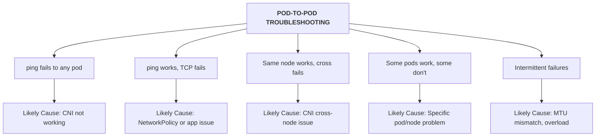
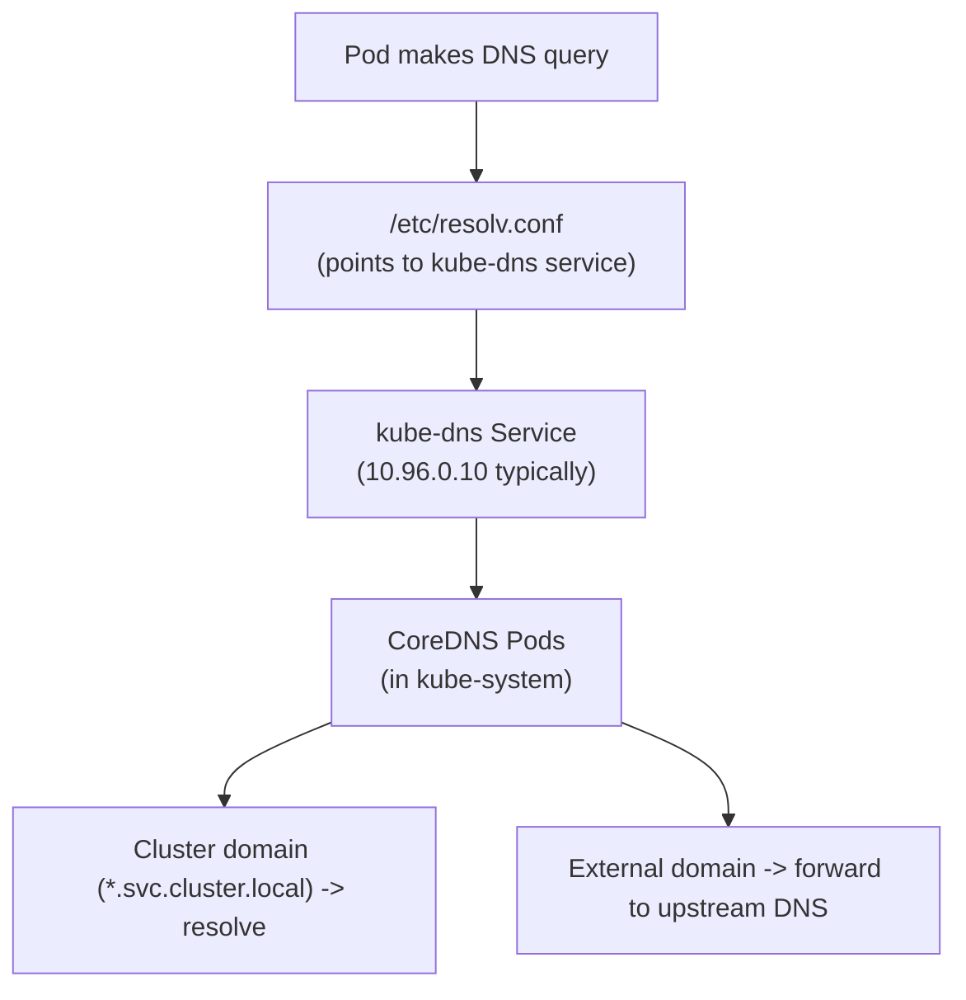
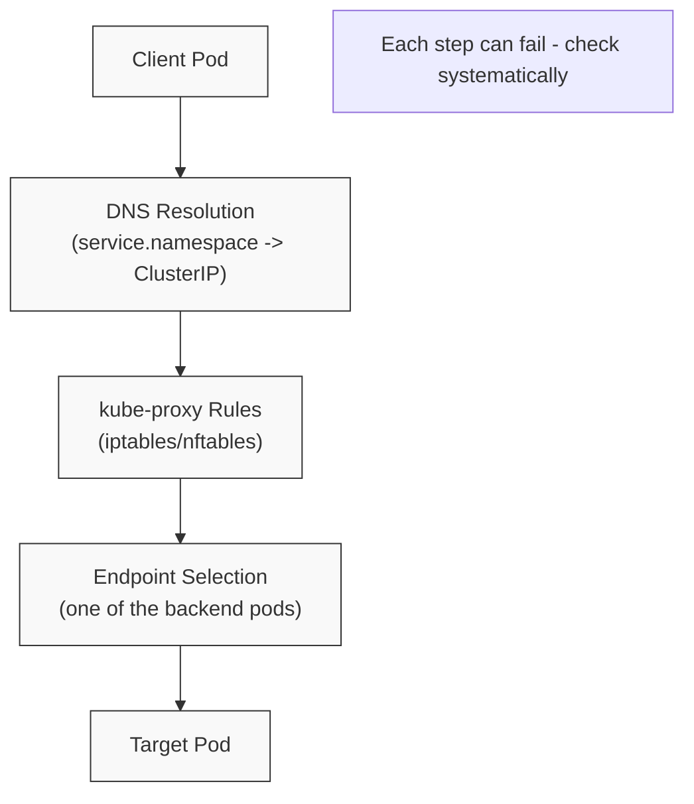
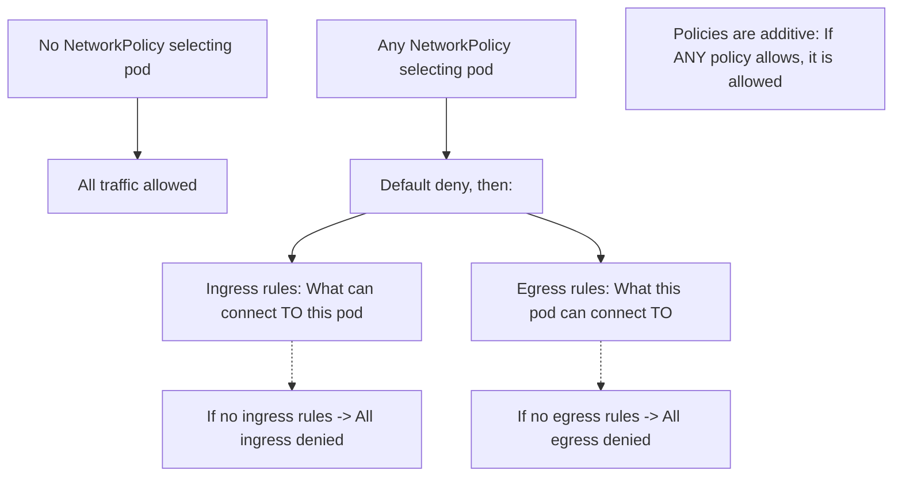
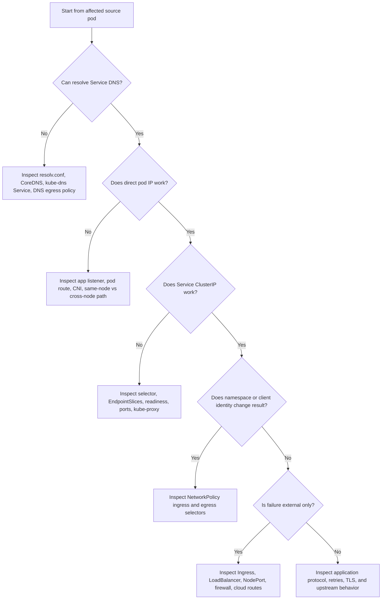

> **Складність**: `[COMPLEX]` — кілька рівнів для налагодження.
>
> **Час на проходження**: 50-60 хвилин.
>
> **Передумови**: Модуль 5.1 (Методологія), Модулі 3.1-3.7 (Сервіси та мережа).

---

## Що ви зможете зробити

Після цього модуля ви зможете:
- **Діагностувати** збої з'єднання типу под-до-пода, под-до-сервісу та зовнішнє-до-сервісу за допомогою порівневих доказів замість здогадок.
- **Простежити** проходження запиту через маршрутизацію IP-адрес подів, DNS, віртуальні IP-адреси сервісів, EndpointSlices, правила kube-proxy та площину даних CNI.
- **Виправити** несправності NetworkPolicy, DNS, селекторів, готовності та зіставлення портів, які порушують роботу справних у решті аспектів навантажень.
- **Оцінити**, чи належить збій до застосунку, інфраструктури сервісів Kubernetes, кластерного DNS, маршрутизації CNI чи зовнішньої інфраструктури.
- **Реалізувати** повторювані сценарії налагодження мережі за допомогою `kubectl`, `curl`, `wget`, `nslookup`, `ss`, `tcpdump` та ефемерних контейнерів для налагодження.

---

## Чому цей модуль важливий

Гіпотетичний сценарій: команда застосунку повідомляє, що поди оформлення замовлення справні, поди бази даних справні, і об'єкт Service існує, проте запити від оформлення замовлення до бази даних завершуються тайм-аутом після розгортання. Один інженер починає редагувати Service, інший перезапускає CoreDNS, а третій видаляє NetworkPolicy, бо кожен симптом сам по собі виглядає правдоподібно. Збій продовжує переміщуватися, бо ніхто не довів, який саме рівень мережі насправді відмовляє.

Мережа Kubernetes здається складною, бо шлях запиту невидимий, поки ви не розкриєте його навмисно. Запит може відмовити ще до того, як залишить вихідний под, під час розв'язання DNS, під час трансляції через віртуальну IP-адресу сервісу, під час вибору ендпоінта, під час перетину вузлів через плагін CNI, під час проходження правила NetworkPolicy або під час виходу з кластера через маршрутизацію вузла та засоби контролю брандмауера. Правильна звичка усунення несправностей полягає не в тому, щоб запам'ятати ще більшу купу команд; вона полягає в тому, щоб побудувати невеликий ланцюжок спостережень, де кожна команда або підтверджує рівень, або звужує наступний рівень для перевірки.

Цей модуль тренує таку звичку для домену усунення несправностей CKA та для реальної роботи з кластером. Ви зберігатимете ту саму ментальну модель упродовж усього уроку: почніть із вихідного пода, доведіть розв'язання імен, доведіть базове з'єднання, доведіть зв'язок сервіс-ендпоінт, доведіть наміри політики, а потім рухайтеся назовні до меж вузла, CNI чи інфраструктури. Kubernetes 1.35 і новіші все ще покладаються на ці основи, навіть якщо бекенди kube-proxy, поведінка EndpointSlice та реалізації CNI відрізняються між кластерами.

Уявіть кластерну мережу як систему автомагістралей. Поди — це автомобілі з унікальними адресами, сервіси — це добре відомі з'їзди, що розподіляють трафік до кількох призначень, DNS — це навігаційна система, що перетворює імена на адреси, NetworkPolicy — це шлагбауми, які вирішують, який трафік може пройти, а плагін CNI — це дорожня служба, яка з'єднує вулиці між вузлами. Коли рух зупиняється, ви не ремонтуєте всі дороги одночасно; ви перевіряєте по одному контрольному пункту за раз, поки несправний пункт не стане очевидним.

## Модель мережі та перше сортування

Kubernetes надає кожному поду власну IP-адресу, і платформа очікує, що поди досягатимуть інших подів без зіставлення портів на рівні застосунку. Цей дизайн потужний, бо навантаження може переміщуватися між вузлами, продовжуючи поводитися як невелика машина в пласкій мережі, але це також означає, що сигнали збоїв можуть виглядати оманливо схожими. Тайм-аут від `curl` може означати, що процес не слухає, що Service не має ендпоінтів, що NetworkPolicy забороняє вихідний трафік, що маршрут CNI зламано або що брандмауер поза межами кластера блокує трафік вузла.

Перша дисципліна — розділити ім'я, маршрут, трансляцію та відповідь застосунку. Якщо DNS не може розв'язати ім'я, налагодження сервісу є передчасним. Якщо IP-адреса пода відповідає, але ім'я сервісу не працює, мережа подів імовірно жива, і шлях сервіс-ендпоінт заслуговує на увагу. Якщо ClusterIP сервісу працює з одного простору імен, але не з іншого, політика чи вибір простору імен стають імовірнішими. Зупиніться та спрогнозуйте: якщо `nslookup web.network-lab.svc.cluster.local` успішний, але `wget http://web.network-lab.svc.cluster.local` повертає connection refused, який рівень доведено справним, а який рівень слід перевіряти далі?

```mermaid
flowchart TD
    L4["<b>Layer 4: External Access</b><br>Ingress / LoadBalancer / NodePort"]
    L3["<b>Layer 3: Service Network</b><br>ClusterIP Services (virtual IPs via kube-proxy)"]
    L2["<b>Layer 2: DNS</b><br>CoreDNS (service.namespace.svc.cluster.local)"]
    L1["<b>Layer 1: Pod Network</b><br>CNI Plugin (pod-to-pod, cross-node)"]
    
    L4 --> L3
    L3 --> L2
    L2 --> L1
    
    style L4 fill:#f9f9f9,stroke:#333,stroke-width:1px
    style L3 fill:#f9f9f9,stroke:#333,stroke-width:1px
    style L2 fill:#f9f9f9,stroke:#333,stroke-width:1px
    style L1 fill:#f9f9f9,stroke:#333,stroke-width:1px
    
    Note["Troubleshoot bottom-up: Pod -> DNS -> Service -> External"]
```



Діаграма навмисно побудована знизу вгору, бо нижчі рівні є передумовами для вищих. Маршрутизація под-до-пода має працювати, перш ніж ClusterIP зможе надійно пересилати трафік до бекенд-подів. DNS має повертати очікуване ім'я сервісу, перш ніж клієнт зможе використовувати стабільне виявлення сервісів. kube-proxy або його заміна має транслювати віртуальну IP-адресу до реального бекенд-ендпоінта, перш ніж запит досягне контейнера застосунку. Зовнішній доступ додає ще більше систем, зокрема хмарні балансувальники навантаження, контролери інгресу, брандмауери вузлів та політики маршрутизації поза межами Kubernetes.

Використовуйте спеціально створений образ для налагодження, коли контейнер застосунку занадто малий для мережевих інструментів. Багато виробничих контейнерів є distroless або навмисно мінімальними, що добре для безпеки та розміру образу, але дратує під час діагностики. Под для налагодження дає вам `curl`, `wget`, `dig`, `nslookup`, `ss`, `tcpdump` та супутні утиліти без повторного збирання образу застосунку. Ефемерний контейнер для налагодження особливо корисний, коли вам потрібно спостерігати за пакетами з мережевого простору імен цільового пода.

```bash
# Create a debug pod for testing.
kubectl run netshoot --image=nicolaka/netshoot --rm -it --restart=Never -- bash

# Or use a smaller BusyBox pod when you only need simple tools.
kubectl run debug --image=busybox:1.36 --rm -it --restart=Never -- sh
```

Починайте кожне дослідження із запису джерела, призначення, простору імен, порту та поміченої помилки. "Сервіс не працює" — занадто широке формулювання для налагодження; "клієнтський под `frontend-abc` у просторі імен `shop` завершується тайм-аутом під час з'єднання з `http://orders.shop.svc.cluster.local:8080`, але може розв'язати ім'я" — придатне для дії. Це одне речення повідомляє вам ідентичність клієнта, контекст політики, ім'я, яке розв'язується, транспортний порт і те, чи DNS уже перевірено.

| Спостереження | Рівень переважно доведено | Наступна корисна перевірка |
|-------------|---------------------|-------------------|
| Под не може розв'язати жодне ім'я кластерного сервісу | Жодного вище DNS | Перевірте `/etc/resolv.conf`, поди CoreDNS та ендпоінти `kube-dns` |
| Под розв'язує ім'я сервісу, але сервіс має порожні ендпоінти | DNS | Перевірте селектор сервісу, мітки подів, готовність та EndpointSlices |
| IP-адреса пода працює, але ClusterIP сервісу не працює | Мережа подів | Перевірте порти сервісу, targetPort, ендпоінти та справність kube-proxy |
| Трафік подів у межах одного вузла працює, але між вузлами не працює | Локальна мережа подів | Перевірте поди CNI на кожному вузлі, маршрути, інкапсуляцію, MTU та брандмауери |
| Один простір імен відмовляє, а інший успішний | Цільове навантаження може бути справним | Перевірте селектори NetworkPolicy, селектори простору імен та правила вихідного трафіку |
| Зовнішній клієнт відмовляє, а внутрішньокластерний клієнт успішний | Внутрішній шлях сервісу | Перевірте Ingress, LoadBalancer, NodePort, хмарний брандмауер та досяжність вузла |

Не пропускайте точний текст помилки. DNS `NXDOMAIN`, тайм-аут DNS, тайм-аут TCP, TCP connection refused та HTTP 503 — кожен із них вказує на іншу частину шляху. Тайм-аут часто означає, що трафік скидається або не може повернутися, тоді як connection refused зазвичай означає, що пакет досяг адреси, де ніщо не прийняло запитаний порт. Помилки HTTP означають, що мережа, ймовірно, доставила запит достатньо далеко, щоб застосунок, проксі чи компонент інгресу відповів.

## Збої подів, CNI та DNS

Перевірки под-до-пода — найчистіший спосіб відокремити процес застосунку від кластерної маршрутизації. Спочатку визначте IP-адреси вихідного та цільового подів за допомогою `kubectl get pods -o wide`, а потім перевірте мінімальний шлях, перш ніж використовувати ім'я сервісу. ICMP може бути корисним, коли він дозволений, але багато кластерів чи образів обмежують ping, тому TCP-перевірки на фактичний порт застосунку є надійнішими. Перш ніж це запускати, який результат ви очікуєте, якщо цільовий под досяжний на рівні IP, але застосунок не слухає на перевіреному порту?

```bash
# Get pod IPs.
kubectl get pods -o wide

# Test from one pod to another.
kubectl exec <source-pod> -- ping -c 3 <target-pod-ip>
kubectl exec <source-pod> -- wget -qO- --timeout=2 http://<target-pod-ip>:<port>
kubectl exec <source-pod> -- nc -zv <target-pod-ip> <port>

# Capture packets using an ephemeral debug container.
# This is useful when target pods run distroless or minimal images.
# --target and --share-processes attach to the workload container's network namespace.
kubectl debug <target-pod> -n <ns> -it --image=nicolaka/netshoot --target=<container> --share-processes -- tcpdump -nni eth0 -c 10 port <port>
```

Коли трафік под-до-пода відмовляє, прочитайте форму збою, перш ніж щось змінювати. Якщо жоден под не може досягти жодного іншого пода, підозрілими є плагін CNI або мережа вузла. Якщо трафік у межах одного вузла працює, а між вузлами відмовляє, локальні мости Linux можуть бути справними, тоді як інкапсуляція оверлею, маршрутизація чи правила брандмауера між вузлами зламані. Якщо ICMP працює, але TCP відмовляє на одному порту, мережа подів може бути справною, а проблема може полягати в NetworkPolicy, процесі, що слухає, чи в неправильному порту.



Усунення несправностей CNI має два боки: об'єкти Kubernetes та файли на вузлі. З API ви можете підтвердити, чи присутні поди DaemonSet CNI та чи справні вони на кожному вузлі. З вузла ви можете підтвердити, чи має kubelet конфігурацію CNI в `/etc/cni/net.d/` та бінарні файли в `/opt/cni/bin/`. У керованому кластері ви можете не мати змоги редагувати ці файли напряму, але знання про їхнє існування допомагає інтерпретувати події вузла, такі як `FailedCreatePodSandBox`, чи поди, що застрягли в `ContainerCreating`.

```bash
# Check CNI pods are running.
kubectl -n kube-system get pods | grep -E "calico|flannel|weave|cilium"

# Check CNI pod logs.
kubectl -n kube-system logs <cni-pod>

# Check CNI configuration on a node.
ls -la /etc/cni/net.d/
cat /etc/cni/net.d/*.conf

# Check if CNI binaries exist.
ls -la /opt/cni/bin/
```

| Несправність | Симптом | Виправлення |
|-------|---------|-----|
| Поди CNI не запущено | Усі поди застрягли в ContainerCreating | Розгорніть або відремонтуйте плагін CNI |
| Конфігурацію CNI відсутньо | Поди не можуть отримати IP-адреси | Перевірте `/etc/cni/net.d/` та події kubelet |
| Бінарний файл CNI відсутній | Помилки пісочниці середовища виконання | Установіть або відремонтуйте бінарні файли CNI |
| Перетин CIDR | Конфлікти IP-адрес чи непередбачувана маршрутизація | Переналаштуйте CIDR подів або конфліктні мережеві діапазони |
| Невідповідність MTU | Періодичні втрати, особливо на більших відповідях | Узгодьте налаштування MTU між оверлейною та базовою мережею |

DNS розташований над маршрутизацією подів, але нижче за більшість симптомів сервісів, тому він заслуговує на власний навмисний прохід. Под зазвичай отримує `/etc/resolv.conf`, який указує на кластерний сервіс DNS, що зазвичай має ім'я `kube-dns` і часто резервується подами CoreDNS у `kube-system`. Імена сервісів можуть бути короткими, кваліфікованими простором імен або повністю кваліфікованими як `service.namespace.svc.cluster.local`, залежно від шляхів пошуку та `ndots`. Повільний DNS може бути так само шкідливим, як і відмова DNS, бо повторні спроби можуть зробити справний застосунок перевантаженим на вигляд.



Перевіряйте DNS із того самого вихідного пода, який зазнає збою. Перевірка з вашого ноутбука, з вузла чи з іншого простору імен змінює конфігурацію резолвера та контекст NetworkPolicy. Надавайте перевагу повністю кваліфікованим іменам під час перевірки кластерного DNS з мінімальних образів; збій на короткому імені, але успіх на FQDN може виявити припущення щодо шляху пошуку, а не зламану зону CoreDNS. Якщо кластерні імена розв'язуються, але зовнішні імена відмовляють, CoreDNS може бути справним для зон Kubernetes, тоді як висхідне пересилання, DNS вузла чи політика вихідного трафіку залишаються зламаними.

Busybox `nslookup` не розгортає шлях `search` у `/etc/resolv.conf` так, як це роблять glibc чи netshoot, тому пошуки коротких імен часто повертають `NXDOMAIN` у Kubernetes 1.35, навіть коли кластерний DNS справний. Надавайте перевагу FQDN, таким як `kubernetes.default.svc.cluster.local`, або запускайте перевірки з пода для налагодження netshoot, коли вам потрібна поведінка коротких імен.

```bash
# Check the pod's DNS config.
kubectl exec <pod> -- cat /etc/resolv.conf

# Test cluster DNS (FQDN first — reliable from busybox and glibc clients).
kubectl exec <pod> -- nslookup kubernetes.default.svc.cluster.local
# Short names work with glibc/netshoot; busybox may need the FQDN above.
kubectl exec <pod> -- nslookup kubernetes.default
kubectl exec <pod> -- nslookup kubernetes

# Test service DNS (FQDN form is the reliable check from busybox).
kubectl exec <pod> -- nslookup <service-name>.<namespace>.svc.cluster.local
kubectl exec <pod> -- nslookup <service-name>.<namespace>
kubectl exec <pod> -- nslookup <service-name>

# Test external DNS.
kubectl exec <pod> -- nslookup google.com
```

Сам CoreDNS досягається через сервіс Kubernetes, тому усунення несправностей DNS часто перетворюється на усунення несправностей сервісу для сервісу `kube-dns`. Перевірте поди CoreDNS, логи, сервіс, ConfigMap та ендпоінти, перш ніж редагувати навантаження застосунку. Відсутній ендпоінт за `kube-dns` означає, що запитам нікуди йти, тоді як цикл у ConfigMap чи поганий висхідний резолвер можуть змусити CoreDNS постійно перезапускатися. Обмежувальна політика вихідного трафіку NetworkPolicy також може блокувати UDP або TCP порт 53, що виглядає як збій DNS, навіть коли CoreDNS цілком справний.

```bash
# Check CoreDNS pods.
kubectl -n kube-system get pods -l k8s-app=kube-dns
kubectl -n kube-system logs -l k8s-app=kube-dns

# Check the kube-dns service.
kubectl -n kube-system get svc kube-dns

# Check the CoreDNS configmap.
kubectl -n kube-system get configmap coredns -o yaml

# Verify endpoints (deprecated view; prefer EndpointSlices on 1.33+).
kubectl -n kube-system get endpoints kube-dns
```

| Несправність | Симптом | Діагностика | Виправлення |
|-------|---------|-----------|-----|
| CoreDNS не запущено | Увесь DNS відмовляє | Перевірте поди CoreDNS | Полагодьте або перезапустіть CoreDNS |
| Неправильний nameserver | Тайм-аут DNS | Перевірте `/etc/resolv.conf` | Полагодьте конфігурацію DNS у kubelet |
| Crashloop CoreDNS | Періодичний DNS | Перевірте логи CoreDNS | Виправте виявлення циклу чи висхідну конфігурацію |
| Мережева політика блокує | DNS заблоковано | Перевірте політики | Дозвольте DNS на порту 53 |
| Проблема з `ndots` | Повільний зовнішній DNS | Перевірте `ndots` у `resolv.conf` | Коригуйте `dnsConfig` лише за наявності підстав |

Застосовуйте виправлення, які відповідають доказам. Масштабування CoreDNS допомагає лише тоді, коли справних реплік замало; воно не лагодить заблоковану політику вихідного трафіку чи поганий селектор сервісу. Редагування ConfigMap CoreDNS може бути необхідним для проблем циклу чи висхідного пересилання, але це зміна на рівні кластера, і до неї слід ставитися саме так. У екзаменаційній лабораторії ви можете внести пряме виправлення, тоді як у виробництві ви зазвичай зберегли б поточний ConfigMap, внесли найменшу зміну та стежили б за логами і поведінкою DNS-запитів.

```bash
# Check the CoreDNS deployment.
kubectl -n kube-system get deployment coredns

# Scale up if replicas were accidentally reduced.
kubectl -n kube-system scale deployment coredns --replicas=2

# Check for pod issues.
kubectl -n kube-system describe pod -l k8s-app=kube-dns
```

```bash
# Check logs for a "Loop" message.
kubectl -n kube-system logs -l k8s-app=kube-dns | grep -i loop

# Fix in an exam lab by editing the CoreDNS ConfigMap.
kubectl -n kube-system edit configmap coredns
# Remove or correct the problematic loop or forwarding configuration.
```

```bash
# Check kubelet config for cluster DNS.
cat /var/lib/kubelet/config.yaml | grep -A 5 "clusterDNS"

# The value should point to the kube-dns Service IP, for example:
# - 10.96.0.10
```

## Шляхи сервісів, політик та зовнішнього доступу

Усунення несправностей сервісу починається після того, як ви знаєте, що вихідний под може надсилати трафік і розв'язувати імена. ClusterIP — це не справжня адреса пода; це віртуальна IP-адреса, яку kube-proxy чи еквівалентна площина даних транслює до одного з вибраних бекенд-ендпоінтів. Ця трансляція залежить від ланцюжка об'єктів: селектор сервісу має збігатися з мітками подів, вибрані поди мають бути Ready, EndpointSlices чи Endpoints мають містити бекенд-адреси, а порт сервісу має зіставлятися з фактичним портом контейнера. Збій у будь-якому з цих об'єктів може зробити справний под недосяжним на вигляд.



Перевіряйте сервіс і за ClusterIP, і за DNS-іменем, коли це можливо. Якщо ClusterIP працює, але DNS-ім'я не працює, об'єкт Service та ендпоінти, ймовірно, функціональні, тоді як DNS — ні. Якщо DNS розв'язується, але ClusterIP не працює, зосередьтеся на портах сервісу, ендпоінтах, готовності, kube-proxy та політиці. Якщо IP-адреса пода працює, але сервіс не працює, порівняйте `port` і `targetPort`, перш ніж припускати, що застосунок змінився.

```bash
# Test by ClusterIP.
kubectl exec <pod> -- wget -qO- --timeout=2 http://<service-cluster-ip>:<port>

# Test by DNS name.
kubectl exec <pod> -- wget -qO- --timeout=2 http://<service-name>:<port>

# Test with curl if available.
kubectl exec <pod> -- curl -s --connect-timeout 2 http://<service-name>:<port>
```

Ендпоінти — найважливіший ключ до сервісу, бо порожній список ендпоінтів повідомляє вам, що сервіс не має вибраних, готових призначень. У Kubernetes 1.35 і новіших EndpointSlices є масштабованим API за цією концепцією, тоді як старіший вигляд Endpoints усе ще звичний у багатьох потоках налагодження. Питання усунення несправностей те саме в обох випадках: чи вибрав сервіс ті поди, які ви думали, що він вибрав, і чи зараз ці поди мають право отримувати трафік?

```bash
# Check service exists and has correct type and ports.
kubectl get svc <service-name>
kubectl describe svc <service-name>

# Critical: check endpoints (deprecated view; prefer EndpointSlices on 1.33+).
kubectl get endpoints <service-name>
# Empty endpoints means the Service cannot find Ready pods.

# Check selector matches pods.
kubectl get svc <service-name> -o jsonpath='{.spec.selector}'
kubectl get pods -l <selector>

# Check pods are Ready.
kubectl get pods -l <selector> -o wide
```

| Несправність | Симптом | Діагностика | Виправлення |
|-------|---------|-----------|-----|
| Немає ендпоінтів | Connection refused чи тайм-аут | `kubectl get endpoints` порожній (застарілий вигляд; надавайте перевагу EndpointSlices на 1.33+) | Виправте селектор, мітки подів чи доступність навантаження |
| Неправильний селектор | Ендпоінти порожні | Порівняйте селектор сервісу та мітки подів | Пропатчте селектор сервісу або перепризначте мітки подам |
| Неправильний порт | Connection refused | Перевірте `port` сервісу проти `targetPort` | Узгодьте зіставлення сервісу зі слухачем контейнера |
| Поди не Ready | Відсутні чи часткові ендпоінти | Перевірте проби готовності та стан подів | Виправте пробу готовності чи справність застосунку |
| kube-proxy не працює | Багато сервісів відмовляють на вузлі чи в усьому кластері | Перевірте поди kube-proxy та правила вузла | Перезапустіть чи відремонтуйте конфігурацію kube-proxy |

```bash
# Check EndpointSlices for the Service when the cluster uses the scalable endpoint API.
kubectl get endpointslice -l kubernetes.io/service-name=<service-name>
```

```bash
# Check kube-proxy pods when many Services fail from a node or across the cluster.
kubectl -n kube-system get pods -l k8s-app=kube-proxy -o wide
```

```bash
# Inspect recent kube-proxy logs for rule-programming or backend errors.
kubectl -n kube-system logs -l k8s-app=kube-proxy --tail=50
```

Помилки селекторів і портів поширені, бо вони візуально малі, але семантично великі. Деплоймент може помічати поди `app.kubernetes.io/name: web`, тоді як старіший сервіс вибирає `app: web`, не створюючи жодних ендпоінтів, навіть якщо обидва об'єкти виглядають розумно на перший погляд. Сервіс може надавати порт 80 і цільовий порт 8080, тоді як контейнер слухає на 80, що призводить до відхиленого з'єднання після того, як трафік досягає пода. Який підхід ви обрали б тут і чому: пропатчити селектор сервісу, щоб він збігався з наявними подами, чи змінити мітки подів, щоб вони збігалися із сервісом?

```bash
# Get service selector.
kubectl get svc my-service -o jsonpath='{.spec.selector}'
# Example output: {"app":"myapp"}

# Get pod labels.
kubectl get pods --show-labels

# If they do not match, fix the Service selector.
kubectl patch svc my-service -p '{"spec":{"selector":{"app":"correct-label"}}}'
# Or fix pod labels when the Service selector is the intended contract.
```

```bash
# Check service ports.
kubectl get svc my-service -o yaml | grep -A 10 "ports:"

# Verify pod is listening on targetPort.
kubectl exec <pod> -- netstat -tlnp
# Or use ss when netstat is unavailable.
kubectl exec <pod> -- ss -tlnp

# Fix the service mapping.
kubectl patch svc my-service -p '{"spec":{"ports":[{"port":80,"targetPort":8080}]}}'
```

NetworkPolicy додає ще один рівень рішень, бо вона змінює те, який трафік дозволено після того, як поди вибрано політикою. Політики є адитивними в межах одного напрямку для одного пода: трафік дозволено для цього напрямку, якщо будь-яка застосовна політика його дозволяє, але под стає ізольованим для напрямку лише тоді, коли політика, що вибирає цей под, застосовується до вхідного чи вихідного трафіку для цього напрямку. З'єднання дозволено лише тоді, коли застосовні правила вихідного трафіку на вихідному поді ТА правила вхідного трафіку на цільовому поді ОБИДВА його дозволяють; адитивне об'єднання застосовується окремо в межах кожного напрямку. Це джерело багатьох несподіванок: додавання політики лише для вхідного трафіку не обмежує автоматично вихідний, тоді як додавання `Egress` без жодних правил вихідного трафіку може заблокувати DNS, репозиторії пакетів, API та інші залежності.



*Підпис до діаграми: адитивне об'єднання вище застосовується до кількох політик для ОДНОГО пода та ОДНОГО напрямку (вхідного чи вихідного), а не до повної двосторонньої перевірки між двома подами.*

Налагодження політики має використовувати реальні вихідний та цільовий поди, бо мітки, простори імен і напрямки — усе має значення. Перевірка з привілейованого простору імен для налагодження може обійти саме те правило, яке блокує застосунок. Завжди переглядайте політики у відповідному просторі імен, перевіряйте селектори подів і читайте як `policyTypes`, так і тіла правил. Пам'ятайте, що Kubernetes визначає семантику API, тоді як плагін CNI має реалізувати примусове виконання; кластер без примусового виконання NetworkPolicy прийматиме об'єкти без фактичної фільтрації трафіку.

```bash
# List all NetworkPolicies.
kubectl get networkpolicy -A

# Check policies in a specific namespace.
kubectl get networkpolicy -n <namespace>

# Examine policy details.
kubectl describe networkpolicy <name> -n <namespace>

# Check which pods are selected.
kubectl get networkpolicy <name> -o jsonpath='{.spec.podSelector}'
```

| Несправність | Симптом | Виправлення |
|-------|---------|-----|
| Вихідний трафік блокує DNS | DNS відмовляє | Дозвольте вихідний трафік до kube-dns на порту 53 |
| Вхідний трафік занадто обмежувальний | Тайм-аут чи відмова з'єднання від очікуваних клієнтів | Перевірте правила вхідного трафіку та додайте правильне джерело |
| Забули простір імен | Міжпросторовий трафік заблоковано | Додайте `namespaceSelector` або навмисно використовуйте правила того самого простору імен |
| Неправильний селектор пода | Політику не застосовано чи застосовано до неправильних подів | Виправте мітки `podSelector` та перевірте вибрані поди |

Канонічне правило вихідного трафіку DNS дозволяє UDP і TCP порт 53 до простору імен кластерного DNS. Використовуйте мітки простору імен, які існують у вашому кластері; нещодавні кластери Kubernetes автоматично позначають простори імен міткою `kubernetes.io/metadata.name`, що робить вибір простору імен зрозумілішим, ніж покладання на власні мітки. Таку політику слід поєднувати з дозволами вихідного трафіку, специфічними для застосунку, а не сприймати як універсальне виправлення. Це одна частина набору політик, а не заміна перегляду залежностей призначення.

```yaml
apiVersion: networking.k8s.io/v1
kind: NetworkPolicy
metadata:
  name: allow-dns
spec:
  podSelector: {}  # All pods
  policyTypes:
  - Egress
  egress:
  - to:
    - namespaceSelector:
        matchLabels:
          kubernetes.io/metadata.name: kube-system
    ports:
    - protocol: UDP
      port: 53
    - protocol: TCP
      port: 53
```

У лабораторії тимчасове видалення політики може бути швидким способом довести, що політика є блокувальником. У виробництві такий маневр може розширити доступ більше, ніж задумано, тому надавайте перевагу вузькому тестовому простору імен, скопійованому навантаженню чи тимчасовому дозвільному правилу, яке легко переглянути та видалити. Якщо ви все ж видаляєте політику під час екзамену чи ізольованої вправи, спочатку збережіть її та негайно відновіть після спостереження. Мета — докази, а не постійний обхід безпеки.

```bash
# Save the policy.
kubectl get networkpolicy <name> -o yaml > policy-backup.yaml

# Delete to test in an isolated lab.
kubectl delete networkpolicy <name>

# Test connectivity.
kubectl exec <pod> -- wget -qO- http://<service>

# Restore.
kubectl apply -f policy-backup.yaml
```

Зовнішнє з'єднання додає найменше гарантій Kubernetes і найбільше специфічної для середовища поведінки. Для вихідного трафіку спочатку доведіть DNS, потім доведіть базову досяжність IP, потім порівняйте поведінку пода з поведінкою вузла. Для вхідного трафіку розрізняйте NodePort, LoadBalancer та Ingress, бо кожен додає різну інфраструктуру. LoadBalancer, що застряг у стані `pending`, зазвичай є проблемою хмарного контролера чи інтеграції з провайдером, тоді як Ingress, що повертає неправильну відповідь, може бути проблемою контролера інгресу, правила хосту, TLS чи бекенд-сервісу.

```bash
# Test outbound.
kubectl exec <pod> -- wget -qO- --timeout=5 http://example.com

# If failing, check DNS resolution.
kubectl exec <pod> -- nslookup example.com

# Check network path by IP.
kubectl exec <pod> -- ping -c 2 8.8.8.8

# Compare node-level connectivity from the node.
curl -I http://example.com
```

```bash
# For a NodePort service.
curl http://<node-ip>:<node-port>

# For a LoadBalancer, if available.
kubectl get svc <service> -o jsonpath='{.status.loadBalancer.ingress[0].ip}'
curl http://<lb-ip>

# For Ingress.
curl -H "Host: <hostname>" http://<ingress-ip>
```

| Несправність | Перевірка | Виправлення |
|-------|-------|-----|
| NAT не працює | Правила пакетів вузла та поведінка вихідного трафіку CNI | Перевірте CNI та kube-proxy чи площину даних на заміну |
| Файрвол блокує | Правила хмарного брандмауера чи групи безпеки | Відкрийте лише потрібні порти та джерела |
| Немає маршруту до інтернету | Маршрутизація вузла та шлюз за замовчуванням | Виправте мережеву конфігурацію вузла |
| LoadBalancer у стані pending | Хмарний контролер та події провайдера | Полагодьте хмарну інтеграцію чи використайте підтримуваний тип Service |

### Розгорнутий приклад: простежуємо один невдалий запит

Сценарій вправи: фронтенд-под у просторі імен `shop` не може викликати `http://orders.shop.svc.cluster.local:8080`, і єдиний симптом із логу застосунку — тайм-аут. Почніть із того, що опираєтеся бажанню першим перевірити найскладніший компонент. Тайм-аут — це форма, а не діагноз, і кілька рівнів можуть його спричинити. Корисний крок — написати коротке формулювання несправності, яке називає вихідний под, ім'я призначення, простір імен, порт і помилку. Це формулювання дає вам стабільну нитку для слідування, тоді як кластер пропонує багато спокусливих відволікань.

Перша перевірка — чи має вихідний под конфігурацію резолвера, яку Kubernetes мав надати. Якщо `/etc/resolv.conf` указує на неочікуваний nameserver, тоді кожна перевірка імені сервісу стає підозрілою. Якщо nameserver — це кластерний сервіс DNS, і `nslookup orders.shop.svc.cluster.local` повертає адресу, ви не довели шлях сервісу, але довели, що вихідний под може досягти DNS достатньо далеко, щоб отримати корисну відповідь. Ця маленька різниця запобігає поширеній помилці оголошення всієї мережі справною після одного успішного пошуку імені.

Далі порівняйте коротке ім'я сервісу з повністю кваліфікованим іменем. Якщо повністю кваліфіковане ім'я працює, а коротке ім'я відмовляє, сервіс може існувати, тоді як шлях пошуку простору імен чи припущення викликача неправильні. Якщо обидві форми відмовляють із тим самим тайм-аутом, перевірте CoreDNS та політику вихідного трафіку DNS. Якщо обидві форми розв'язуються в той самий ClusterIP, рухайтеся далі замість продовження налаштування DNS. Усунення несправностей залишається швидким, коли ви залишаєте рівень після того, як він дав вам потрібний конкретний доказ.

Після того як DNS розв'язується, перевірте об'єкт Service та ендпоінти, перш ніж тестувати глибші шляхи пакетів. Сервіс може розв'язуватися, навіть коли він не має бекендів, бо DNS-запис належить об'єкту Service, а не вибраним подам. Порожні ендпоінти зміщують дослідження до селекторів, міток, готовності чи доступності навантаження. Заповнені ендпоінти зміщують дослідження до портів, політик, kube-proxy чи поведінки бекенд-застосунку. Тому список ендпоінтів є шарніром між виявленням імені та фактичною доставкою трафіку.

Припустімо, що список ендпоінтів порожній. Селектор сервісу може бути `app: orders`, тоді як шаблон Деплойменту позначає поди міткою `app.kubernetes.io/name: orders`. Обидві мітки розумні в ізоляції, але Kubernetes не виводить, що вони означають те саме навантаження. Виправлення має зберегти задуману модель власності: якщо стандарт платформи каже, що сервіси використовують рекомендовану мітку `app.kubernetes.io/name`, пропатчте сервіс; якщо старіший контракт сервісу навмисний, оновіть шаблон пода та розгорніть Деплоймент. Екзаменаційна версія зазвичай простіша, але міркування ті самі.

Припустімо, що ендпоінти існують, проте запит усе одно завершується тайм-аутом. Тепер перевірте IP-адресу вибраного пода напряму з того самого фронтенд-пода, використовуючи порт, на якому застосунок має слухати. Якщо IP-адреса пода працює, а сервіс відмовляє, слухач навантаження та маршрут пода, ймовірно, справні, тому зіставлення порту сервісу чи поведінка kube-proxy заслуговують на увагу. Якщо IP-адреса пода відмовляє так само, сервіс не є першим підозрюваним. Тепер ви дивитеся на політику, цільовий процес, маршрутизацію CNI чи обробку пакетів на рівні вузла.

Коли пряма IP-адреса пода відмовляє, розрізняйте тайм-аут і відмову з'єднання. Відмова з'єднання зазвичай означає, що стек призначення відповів, але жоден процес не прийняв порт, що вказує на слухач застосунку, порт контейнера чи `targetPort`. Тайм-аут наводить на думку про скидання, відсутній маршрут, заблокований шлях повернення чи відмову політики. Саме тому сирий результат `curl` недостатній; вам потрібно зберегти точну помилку, перевірене призначення та те, чи може те саме джерело досягти будь-чого іншого в просторі імен.

Тепер додайте до міркувань NetworkPolicy. Якщо лише поди з одного простору імен відмовляють, тоді як поди в цільовому просторі імен успішні, політика стає імовірнішою за CNI. Перевірте обидва боки правила: вхідний трафік до подів `orders` та вихідний трафік від подів `frontend`. Політика, що вибирає `orders` для вхідного трафіку, може блокувати викликачів, навіть коли вихідний трафік відкритий, тоді як політика, що вибирає `frontend` для вихідного трафіку, може блокувати вихідний трафік до того, як він досягне сервісу. Напрямок має значення, бо Kubernetes трактує ізоляцію вхідного та вихідного трафіку незалежно.

Збої DNS після змін політики заслуговують на додаткову обережність, бо вони можуть маскуватися під збої застосунку. Політика заборони вихідного трафіку без винятку для DNS може завадити поду розв'язати `orders`, зовнішні репозиторії пакетів чи ендпоінти хмарних метаданих. Якщо под може досягти відомої IP-адреси, але не може розв'язати імена, не перезапускайте спочатку кожен под CoreDNS. Підтвердьте, що політика вибирає клієнта, потім додайте явний дозвіл вихідного трафіку DNS до призначення кластерного DNS. Це виправлення відповідає симптому та зберігає намір безпеки.

Якщо шлях сервісу працює з одного вузла, але не з іншого, поверніться до CNI та розміщення вузлів. Використайте `kubectl get pods -o wide`, щоб визначити, де запущено вихідний та цільовий поди, потім порівняйте поведінку в межах одного вузла та між вузлами. Успіх у межах одного вузла з відмовою між вузлами часто вказує на проблеми інкапсуляції оверлею, маршрутизації, MTU чи брандмауера між вузлами. Це відрізняється від проблеми селектора сервісу, яка зазвичай впливала б на всіх клієнтів однаково, бо сервіс має той самий набір ендпоінтів із погляду API.

Проблеми MTU особливо заплутані, бо малі перевірки можуть пройти, тоді як більші відповіді відмовляють. Крихітне TCP-рукостискання чи коротка HTTP-відповідь можуть бути успішними, а потім більше корисне навантаження зупиняється, коли накладні витрати інкапсуляції штовхають пакети за реальний шлях MTU. Симптом часто виглядає періодичним, бо він залежить від розміру відповіді, шляху та поведінки повторної передачі. У такому разі шукайте документацію CNI, MTU інтерфейсу вузла, режим оверлею та те, чи нещодавні зміни інфраструктури змінили базову мережу (андерлей).

kube-proxy — пізніший підозрюваний, а не ранній. Якщо багато сервісів відмовляють з одного вузла або якщо трафік ClusterIP поводиться по-різному залежно від вихідного вузла, можуть бути задіяні правила kube-proxy чи площина даних вузла. Перевірте поди kube-proxy, логи вузла та те, чи використовує кластер iptables, nftables чи іншу реалізацію. Для одного сервісу з порожніми ендпоінтами чи неправильним цільовим портом kube-proxy, ймовірно, робить саме те, що йому каже API, тому зміна kube-proxy лише додала б ризику.

Зовнішній доступ слід налагоджувати лише після того, як доведено внутрішній шлях сервісу. Якщо под усередині кластера може досягти сервісу за DNS та ClusterIP, тоді навантаження, ендпоінти та базова інфраструктура сервісу справні. Зовнішній збій через Ingress чи LoadBalancer належить до зовнішнього шляху: правила контролера інгресу, заголовки хосту, TLS, перевірки справності хмарного балансувальника навантаження, досяжність NodePort чи політика брандмауера. Це розділення утримує вас від переприсвоєння міток подам, коли реальна проблема — відсутнє правило хосту.

Усунення несправностей інгресу також залежить від збереження HTTP-заголовка хосту. Запит до IP-адреси інгресу без очікуваного значення `Host` може потрапити до бекенду за замовчуванням, тоді як та сама IP-адреса з правильним хостом маршрутизується до призначеного сервісу. Саме тому `curl -H "Host: <hostname>" http://<ingress-ip>` — гостріша перевірка, ніж голий curl до IP-адреси. Якщо запит, специфічний для хосту, працює, але публічний DNS відмовляє, шлях Kubernetes може бути справним, а проблема, що залишилася, може бути в зовнішньому DNS чи конфігурації балансувальника навантаження.

Усунення несправностей LoadBalancer відрізняється залежно від провайдера, але точка рішення все одно проста. Якщо сервіс залишається в стані pending, Kubernetes не отримав зовнішню адресу від хмари чи інтеграції балансувальника навантаження. Якщо він має зовнішню адресу, але перевірки справності відмовляють, перевірте порти вузлів, правила брандмауера, анотації сервісу та готовність бекенду. Якщо балансувальник навантаження досягає контролера інгресу, але контролер не може досягти бекенд-сервісу, поверніться до внутрішніх перевірок сервісу, які ви вже відпрацювали. Кожен провайдер додає деталі, але порівневий метод залишається стабільним.

Захоплення пакетів найкорисніше після того, як у вас є точне запитання. Захоплення на кожному вузлі до формування гіпотези створює шум і може вимагати привілеїв, які вам не потрібні. Краще запитання — "чи прибувають пакети для порту 8080 до цільового пода, коли фронтенд з'єднується?" Ефемерний контейнер для налагодження з `tcpdump` може відповісти на це без зміни образу застосунку. Якщо пакети прибувають, але відповідь не виходить, перевірте слухач застосунку чи локальну політику. Якщо пакети ніколи не прибувають, рухайтеся назад до сервісу, політики, CNI чи маршрутизації джерела.

Будьте обережні й з успішними перевірками. Успішний `nslookup` доводить, що DNS-запит завершився; він не доводить, що протокол застосунку працює. Успішний `ping` доводить лише деяку досяжність IP, якщо ICMP дозволено; він не доводить TCP на порту застосунку. Успішний `curl` з іншого простору імен доводить, що призначення може комусь відповісти; він не доводить, що задіяне джерело має дозвіл. Хороше усунення несправностей трактує кожен успіх як обмежений доказ із чіткою межею.

В умовах екзамену пишіть найменше виправлення, яке відновлює задуманий шлях. Якщо ендпоінти порожні через невідповідність селектора, пропатчте селектор чи мітки, а не перезапускайте Деплоймент. Якщо DNS заблоковано політикою, додайте правило вихідного трафіку DNS, а не видаляйте кожну політику. Якщо `targetPort` неправильний, виправте зіставлення сервісу, а не змінюйте образ застосунку. Найшвидше виправлення зазвичай те, що найближче до невдалого доказу, а не те, що торкається найвідомішого компонента.

В умовах виробництва той самий метод отримує ще одну вимогу: зберігайте докази до та після зміни. Зафіксуйте невдалу команду, відповідний вивід об'єкта, запропоноване виправлення та успішну повторну перевірку. Ці докази дають рецензентам змогу побачити, чому патч мітки, правило політики чи зміна порту сервісу були обґрунтованими. Вони також захищають майбутніх відповідальних від повторення того самого дослідження, коли подібний симптом з'явиться пізніше в іншому просторі імен.

Нарешті, перетворіть дослідження на повторюваний сценарій. Виберіть один справний сервіс і потренуйтеся розв'язувати його ім'я, переглядати ендпоінти, перевіряти ClusterIP, перевіряти IP-адресу вибраного пода, перевіряти політику та визначати розміщення вузла. Потім навмисно зламайте одну змінну в лабораторному просторі імен і спрогнозуйте симптом, перш ніж запускати команду. Така репетиція будує ментальний індекс, потрібний вам, коли реальний збій шумний, обмежений у часі та оточений непов'язаними подіями кластера.

Інша корисна звичка — називати межу, яку ви щойно перетнули. Коли ви переходите від імені сервісу до ClusterIP, ви перетнули межу DNS. Коли ви переходите від ClusterIP до IP-адреси вибраного пода, ви перетнули межу трансляції сервісу. Коли ви переходите від трафіку в межах одного вузла до трафіку між вузлами, ви перетнули межу вузла CNI. Називання цих меж робить ваші нотатки чіткішими та допомагає рецензенту зрозуміти, чому наступна команда випливає з попередньої.

Та сама звичка з межами тримає вас чесними щодо відкату. Якщо ви змінили NetworkPolicy, щоб перевірити межу політики, повторна перевірка має задіяти те саме джерело, призначення та порт, що відмовляли раніше. Якщо ви змінили селектор сервісу, щоб перевірити межу ендпоінтів, повторна перевірка має показати, що ендпоінти заповнюються знову, перш ніж ви оголосите застосунок виправленим. Зміна, що покращує інший шлях, усе одно може бути корисною інформацією, але вона не доводить, що початковий інцидент розв'язано.

Вам також слід відокремлювати істину площини управління від істини площини даних. API може показувати правильний селектор сервісу, ендпоінти та політики, тоді як вузол усе ще має застарілі правила пакетів або процес CNI несправний. І навпаки, площина даних вузла може бути готовою, тоді як об'єкти API кажуть їй маршрутизувати в нікуди, бо готовність видалила всі ендпоінти. Хороше усунення несправностей перевіряє обидва погляди в момент, коли вони стають релевантними, замість припущення, що один погляд автоматично гарантує інший.

Готовність заслуговує на особливу увагу, бо вона навмисно консервативна. Kubernetes видаляє неготовий под з ендпоінтів сервісу, щоб захистити клієнтів від бекенду, який не може безпечно отримувати трафік. Така поведінка правильна, навіть коли вона дивує того, хто дивився лише на статус `Running`. Якщо розгортання не проходить готовність через те, що залежність бази даних недоступна, симптомом сервісу можуть бути порожні ендпоінти, але реальне виправлення належить до залежності застосунку чи дизайну проби готовності.

Іменовані порти можуть зробити маніфести сервісів легшими в обслуговуванні, але вони додають ще одну річ для перевірки. `targetPort` сервісу може посилатися на іменований порт контейнера, і це ім'я має існувати на вибраних подах. Якщо Деплоймент змінює ім'я порту, залишаючи номер знайомим, YAML може виглядати розумно, тоді як трафік іде в нікуди корисне. Під час усунення несправностей перевіряйте відображену специфікацію пода та сервіс разом, а не лише зведення сервісу.

Кластери з подвійним стеком додають ще одне джерело оманливого часткового успіху. Клієнт може розв'язати і IPv4-, і IPv6-адреси, а потім надати перевагу родині адрес, яку шлях насправді не може нести. Симптом може виглядати як повільні спроби з'єднання чи непослідовна поведінка між образами та клієнтськими бібліотеками. Якщо кластер використовує мережу з подвійним стеком, включіть родину адрес до своїх нотаток і порівняйте те, що повернув DNS, із тим, до чого вихідний под насправді намагався з'єднатися.

Headless-сервіси — навмисний виняток зі звичайної ментальної моделі ClusterIP. Вони повертають окремі бекенд-адреси подів через DNS замість надсилання трафіку через віртуальну IP-адресу. Це робить їх корисними для систем зі станом, але змінює шлях налагодження: відповіді DNS тепер безпосередньо розкривають членство подів, і трансляція kube-proxy не є центральним питанням. Якщо задіяно headless-сервіс, перевірте набір відповідей DNS, готовність подів та ідентичність StatefulSet, перш ніж використовувати звичайний контрольний список ClusterIP.

ExternalName-сервіси — ще один виняток, бо вони взагалі не вибирають поди. Вони створюють DNS-псевдонім до зовнішнього імені, тому порожні ендпоінти очікувані й не є автоматично збоєм. Якщо учень застосовує правило "спочатку ендпоінти", не розпізнавши тип сервісу, він може ганятися за селектором, якого не існує. Завжди читайте тип сервісу рано; ClusterIP, Headless, NodePort, LoadBalancer, бекенд Ingress та ExternalName — кожен змінює, які перевірки мають сенс.

Нарешті, пам'ятайте, що команди усунення несправностей можуть змінювати часові параметри. Запуск пода для налагодження, виконання повторних DNS-запитів чи видалення політики в лабораторії змінюють середовище достатньо, щоб замаскувати стани гонки чи поведінку кешу. Це не означає, що вам слід уникати інструментів; це означає, що вам слід записувати порядок спостережень і надавати перевагу найменш інвазивній команді, яка може відповісти на поточне питання. Чіткі нотатки перетворюють живий сеанс налагодження на докази, а не на фольклор.

## Патерни та антипатерни

Хороше усунення несправностей мережі повторюване, бо воно перетворює розпливчасті скарги на з'єднання на фіксовану послідовність доказів. Послідовність має починатися від навантаження, яке скаржиться, а не від об'єкта, який ви підозрюєте. Звідти використовуйте поступово ширші перевірки: локальна конфігурація резолвера, відповідь DNS, пряма IP-адреса пода, ClusterIP сервісу, ендпоінти, політика, шлях вузла та зовнішня інфраструктура. Цей патерн уникає поширеної пастки, де інженер редагує три непов'язані об'єкти, а потім не може сказати, яка зміна змінила результат.

| Патерн | Коли використовувати | Чому він працює | Міркування щодо масштабування |
|---------|-------------|--------------|-----------------------|
| Перевірка від джерела | Будь-який мережевий збій, що стосується користувача | Він зберігає простір імен, мітки, сервісний акаунт, конфігурацію DNS та контекст політики | Використовуйте повторно використовувані поди для налагодження чи ефемерні контейнери на простір імен |
| Налагодження сервісу від ендпоінтів | Сервіс розв'язується, але трафік відмовляє | Порожні чи неправильні ендпоінти швидко пояснюють багато збоїв сервісу | Надавайте перевагу EndpointSlices для великих сервісів, знаючи, що Endpoints усе ще звичні на екзаменах |
| Ізоляція політики за напрямком | Може бути задіяно NetworkPolicy | Ізоляція вхідного та вихідного трафіку окремі, тому напрямок запобігає хибним висновкам | Підтримуйте діаграми політик чи згенеровані звіти для завантажених просторів імен |
| Порівняйте IP-адресу пода та шлях сервісу | Невпевнені, чи зламана інфраструктура сервісу | Пряма IP-адреса пода доводить слухач навантаження та маршрут пода до перевірки трансляції віртуальної IP | Автоматизуйте димові тести, які б'ють і прямий шлях, і шлях сервісу в стейджингу |

Антипатерни зазвичай походять від руху швидше за докази. Перезапуск CoreDNS, бо будь-який мережевий симптом згадує ім'я, марнує час, коли сервіс не має ендпоінтів. Видалення всіх NetworkPolicy мало що доводить, якщо ви ніколи спочатку не тестували з ураженого вихідного пода. Редагування налаштувань kube-proxy чи CNI до доведення простої невідповідності селектора перетворює локальну помилку на ризик для кластера. Краща звичка — зробити одне спостереження, сформувати одну гіпотезу, запустити одну команду, яка може її спростувати, а потім перейти до наступного рівня.

| Антипатерн | Що йде не так | Краща альтернатива |
|--------------|-----------------|--------------------|
| Спочатку перезапускати компоненти кластера | Ви порушуєте справні системи та приховуєте початковий сигнал | Спочатку доведіть стан DNS, ендпоінтів, політики та слухача пода |
| Перевірка з непов'язаного пода для налагодження | Под для налагодження може мати інший простір імен, мітки, DNS та політику | Перевіряйте з фактичного вихідного пода чи дзеркальте його мітки та простір імен |
| Трактування `Connection refused` як проблеми маршрутизації | Пакет часто досягав хосту, де ніщо не слухало на цьому порту | Перевірте `targetPort`, слухач контейнера та готовність до CNI |
| Ігнорування готовності | Под може бути Running, але навмисно відсутнім в ендпоінтах | Перевірте проби готовності та EndpointSlices до звинувачення kube-proxy |
| Припущення, що NetworkPolicy завжди працює | Об'єкт API може існувати без примусового виконання CNI | Підтвердьте, що CNI кластера підтримує та забезпечує NetworkPolicy |
| Виправлення DNS жорстким кодуванням IP | Ви обходите виявлення сервісів і створюєте крихку конфігурацію | Полагодьте CoreDNS, ендпоінти `kube-dns` чи політику вихідного трафіку DNS |

## Структура прийняття рішень

Використовуйте перший надійний симптом, щоб обрати наступну гілку, потім продовжуйте звужувати, поки не залишиться лише один рівень. Ця структура не є заміною судження, але вона запобігає дорогим відхиленням. Важлива деталь полягає в тому, що кожна гілка просить докази, які можна швидко зібрати за допомогою `kubectl` та звичайних мережевих інструментів. Якщо гілка доводить справність, не продовжуйте працювати там лише тому, що це була ваша перша підозра.



| Симптом | Перша команда | Імовірна гілка | Поки що не робіть |
|---------|---------------|---------------|---------------|
| Ім'я DNS завершується тайм-аутом | `kubectl exec <pod> -- nslookup <service>.<namespace>.svc.cluster.local` | DNS чи вихідний трафік DNS | Не патчте порти сервісу |
| DNS розв'язується, але ендпоінти порожні | `kubectl get endpoints <service>` (застарілий вигляд; надавайте перевагу EndpointSlices на 1.33+) | Селектор, мітки, готовність | Не перезапускайте CoreDNS |
| IP-адреса пода працює, але сервіс відмовляє | `kubectl describe svc <service>` | Порти сервісу, ендпоінти, kube-proxy | Не перезбирайте образ застосунку |
| Той самий простір імен працює, інший відмовляє | `kubectl get networkpolicy -A` | Селектори NetworkPolicy | Не видаляйте політики в усьому кластері |
| Внутрішнє працює, зовнішнє відмовляє | `kubectl get ingress,svc` | Ingress, LoadBalancer, NodePort, брандмауер | Не змінюйте спочатку мітки подів |

Застосовуйте структуру зі суворим ухилом до оборотних спостережень. Читання дешеві, захоплення пакетів цілеспрямовані, і одне тимчасове видалення політики лише для лабораторії легше осмислити, ніж перезапуск в усьому кластері. На екзамені найшвидший шлях зазвичай — невелике виправлення міток, портів, готовності, конфігурації DNS чи правила політики. У виробництві найбезпечніший шлях включає збереження доказів до та після, щоб рецензенти могли побачити, чому зміна відповідала збою.

## Чи знали ви?

- Сервіси Kubernetes — це віртуальні абстракції; kube-proxy зазвичай програмує правила iptables чи nftables, тоді як режим IPVS застарілий для цільового Kubernetes 1.35, що використовується в цьому курсі.
- DNS для сервісів зазвичай надається через сервіс з ім'ям `kube-dns`, навіть коли резервна реалізація — це поди CoreDNS, що працюють у просторі імен `kube-system`.
- NetworkPolicy є адитивними в межах кожного напрямку для одного пода, але міжподове з'єднання вимагає ОБОХ — збігу вихідного трафіку на джерелі та вхідного трафіку на призначенні.
- EndpointSlices було впроваджено для масштабування відстеження ендпоінтів за межі старішого об'єкта Endpoints, але багато команд усунення несправностей та екзаменаційних звичок усе ще починаються з `kubectl get endpoints`.

## Типові помилки

| Помилка | Чому вона трапляється | Як її виправити |
|---------|----------------|---------------|
| Не перевіряти ендпоінти | Об'єкт Service існує, тому здається, що маршрутизація має бути налаштована | Завжди перевіряйте `kubectl get endpoints` (застарілий вигляд; надавайте перевагу EndpointSlices на 1.33+) чи EndpointSlices до зміни DNS чи CNI |
| Забути про DNS у NetworkPolicy | Правила заборони вихідного трафіку блокують UDP і TCP порт 53 разом із трафіком застосунку | Додайте вузький дозвіл вихідного трафіку до кластерного сервісу DNS чи його подів |
| Перевірка з неправильного пода | Поди для налагодження в іншому просторі імен мають інші мітки та контекст політики | Перевіряйте з фактичного вихідного пода чи навмисно дзеркальте його простір імен та мітки |
| Ігнорування готовності пода | Поди Running можуть бути виключені з ендпоінтів сервісу, поки проби не пройдуть | Перевіряйте проби готовності, умови подів та членство в ендпоінтах разом |
| Плутання `port` і `targetPort` | Сервіс приймає один порт, але пересилає на інший порт контейнера | Узгодьте `targetPort` із процесом, що слухає всередині вибраних подів |
| Трактування всіх тайм-аутів як збоїв CNI | Скидання політики, скидання брандмауера та мертві бекенди — усе може виглядати як тайм-аути | Порівняйте DNS, IP-адресу пода, IP-адресу сервісу та поведінку, специфічну для простору імен |
| Жорстке кодування ClusterIP під час проблеми DNS | Обхідний шлях оминає виявлення сервісів і створює майбутній дрейф | Полагодьте CoreDNS, конфігурацію резолвера чи вихідний трафік DNS замість вбудовування IP |

## Тест

<details>
<summary>Питання 1: Фронтенд-под може розв'язати `api.shop.svc.cluster.local`, але `wget` до сервісу повертає connection refused. Що ви перевіряєте далі та чому?</summary>

DNS уже доведено достатньо справним, щоб повернути ім'я сервісу, тому наступні перевірки мають зосередитися на трансляції сервісу та слухачі бекенду. Перевірте порти сервісу, `targetPort`, ендпоінти та вибрані поди за допомогою `kubectl describe svc`, `kubectl get endpoints` та перевірок міток подів. Connection refused зазвичай означає, що трафік досяг адреси, де жоден процес не прийняв порт, тому неправильний `targetPort` чи слухач контейнера імовірніший за CoreDNS. Якщо ендпоінти порожні, виправте мітки селектора чи готовність до зміни налаштувань kube-proxy чи CNI.

</details>

<details>
<summary>Питання 2: Ваша команда додає вихідну NetworkPolicy, і раптом поди не можуть розв'язати внутрішні чи зовнішні імена, хоча прямий IP-трафік усе ще працює. Як ви виправляєте збій?</summary>

Політика, ймовірно, ізолювала вихідний трафік і забула про DNS, тому DNS-пакети до кластерного сервісу DNS скидаються. Підтвердьте, що політика вибирає уражені поди, потім дозвольте UDP і TCP порт 53 до призначення DNS, зазвичай сервісу `kube-dns`, резервованого CoreDNS у `kube-system`. Працюючий прямий IP-зв'язок — важливий ключ, бо він відокремлює маршрутизацію від розв'язання імен. Виправленням має бути вузький дозвіл вихідного трафіку DNS плюс будь-які потрібні призначення застосунку, а не видалення всіх засобів контролю політики.

</details>

<details>
<summary>Питання 3: Сервіс не має ендпоінтів після розгортання Деплойменту, але поди в стані Running. Який доказ пояснює збій?</summary>

Поди в стані Running недостатні для членства в сервісі. Селектор сервісу має збігатися з мітками подів, і вибрані поди мають бути Ready, перш ніж вони з'являться як ендпоінти. Порівняйте `kubectl get svc <name> -o jsonpath='{.spec.selector}'` із `kubectl get pods --show-labels`, потім перевірте умови готовності та збої проб. Якщо мітки змінилися під час розгортання, пропатчте селектор сервісу чи відновіть задумані мітки відповідно до контракту навантаження.

</details>

<details>
<summary>Питання 4: Трафік подів у межах одного вузла працює, але трафік подів між вузлами завершується тайм-аутом. Який рівень найпідозріліший і які перевірки підтверджують цей діагноз?</summary>

Шлях CNI між вузлами найпідозріліший, бо локальну мережу подів уже доведено трафіком у межах одного вузла. Перевірте поди DaemonSet CNI на кожному вузлі, логи CNI, маршрути вузла, налаштування інкапсуляції, MTU та правила брандмауера між вузлами. Успіх у межах одного вузла не доводить оверлейний чи маршрутизований трафік між вузлами, тому перезапуск застосунку не вирішив би найімовірніший збій. Якщо відмовляє лише одна пара вузлів, спочатку порівняйте мережу на рівні вузлів та справність подів CNI на цих вузлах.

</details>

<details>
<summary>Питання 5: Сервіс надає `port: 80` і `targetPort: 8080`, але контейнер слухає на порту 80. Чи досягнуть клієнти застосунку через сервіс?</summary>

Ні, не через це зіставлення сервісу. Клієнти з'єднуються із сервісом на порту 80, але kube-proxy пересилає на порт 8080 на вибраному поді, де застосунок не слухає. Симптом — зазвичай connection refused, якщо пакет досягає пода, чи тайм-аут, якщо політика чи поведінка брандмауера також втручаються. Виправте `targetPort` сервісу на 80 чи змініть застосунок, щоб він слухав на 8080, потім перевірте ендпоінти та повторіть спробу з вихідного пода.

</details>

<details>
<summary>Питання 6: Поди CoreDNS перезапускаються, а логи згадують цикл пересилання. Що спричинило цей стан і яке постійне виправлення вам слід зробити?</summary>

CoreDNS виявив, що запити пересилаються назад у шлях резолвера, який повертається до CoreDNS, часто тому, що конфігурація висхідного резолвера вказує на локальний stub чи непридатний резолвер вузла. Перевірте ConfigMap CoreDNS та конфігурацію резолвера вузла, яку використовує kubelet чи пересилання CoreDNS. Постійне виправлення — скоригувати ціль висхідного пересилання чи конфігурацію резолвера, щоб CoreDNS надсилав зовнішні запити до реального висхідного резолвера. Усунення симптомів без виправлення циклу дасть змогу поведінці аварійного завершення повернутися.

</details>

<details>
<summary>Питання 7: Внутрішньокластерні клієнти можуть досягти сервісу, але користувачі поза кластером не можуть досягти його через ім'я хосту Ingress. На чому слід зосередитися спочатку?</summary>

Внутрішній шлях сервісу вже доведено, тому зосередьтеся на зовнішньому шляху: правила Ingress, справність контролера інгресу, збіг хосту, налаштування TLS, надання через LoadBalancer чи NodePort та правила хмарного брандмауера. Повторна перевірка міток подів має нижчу цінність, бо внутрішньокластерні клієнти вже досягли бекенду через сервіс. Використайте `curl -H "Host: <hostname>" http://<ingress-ip>`, щоб відокремити проблеми DNS чи балансувальника навантаження від проблем правила хосту. Потім перевірте логи та події контролера інгресу на помилки маршрутизації чи сертифікатів.

</details>

## Практична вправа: Усунення несправностей мережі

Ця вправа будує невеликий простір імен, доводить нормальне з'єднання, ламає селектор сервісу та спостерігає за обмежувальною NetworkPolicy. Суть не в навантаженні nginx; суть у послідовності дослідження. Запускайте перевірки з клієнтського пода, записуйте, який рівень доводить кожна команда, та уникайте виправлення навмисної поломки, поки не зможете пояснити симптом.

### Налаштування

```bash
# Create test namespace.
kubectl create ns network-lab

# Create a test deployment.
kubectl -n network-lab create deployment web --image=nginx:1.25 --replicas=2

# Expose as service.
kubectl -n network-lab expose deployment web --port=80

# Create a client pod.
kubectl -n network-lab run client --image=busybox:1.36 --command -- sleep 3600
```

### Завдання 1: Перевірте базове з'єднання

Спочатку встановіть справну базову лінію. Ви маєте побачити, що поди web стають Ready, сервіс отримує ClusterIP, а клієнтський под отримує відповідь nginx і через з'єднання сервісу, і через розв'язання DNS. Якщо ця базова лінія відмовляє, не переходьте до симульованих збоїв; налагодьте базову лінію тим самим методом з основного уроку.

```bash
# Wait for pods to be ready.
kubectl -n network-lab wait --for=condition=ready pod --all --timeout=60s

# Get service and pod IPs.
kubectl -n network-lab get svc,pods -o wide

# Test from client to service.
kubectl -n network-lab exec client -- wget -qO- --timeout=2 http://web

# Test DNS resolution (busybox client — use FQDN; short names may NXDOMAIN).
kubectl -n network-lab exec client -- nslookup web.network-lab.svc.cluster.local
kubectl -n network-lab exec client -- nslookup web
```

<details>
<summary>Нотатки до розв'язання Завдання 1</summary>

Ім'я сервісу має розв'язуватися всередині простору імен, а `wget` має повертати HTML nginx. Це доводить, що клієнтський под може розв'язувати DNS, може досягти віртуальної IP сервісу та може бути перенаправлений принаймні до одного готового бекенд-ендпоінта. Якщо DNS відмовляє, але прямий ClusterIP працює, перевірте CoreDNS та конфігурацію резолвера. Якщо DNS працює, але `wget` відмовляє, перевірте ендпоінти та зіставлення порту сервісу.

</details>

### Завдання 2: Перевірте ендпоінти

Ендпоінти з'єднують абстракцію сервісу з реальними бекенд-адресами подів. У цьому завданні порівняйте селектор сервісу з мітками подів і підтвердьте, що вибрані поди готові (Ready). Це звичка, яка запобігає марнуванню часу на DNS чи CNI, коли фактична несправність — це проста невідповідність міток.

```bash
# Verify endpoints exist (deprecated view; prefer EndpointSlices on 1.33+).
kubectl -n network-lab get endpoints web

# Should show IPs of web pods.
# If empty, check:
kubectl -n network-lab get svc web -o jsonpath='{.spec.selector}'
kubectl -n network-lab get pods --show-labels
```

<details>
<summary>Нотатки до розв'язання Завдання 2</summary>

Селектор має збігатися з мітками, створеними `kubectl create deployment web`, а список ендпоінтів має містити адреси готових подів web. Якщо ендпоінти порожні, тоді як поди в стані Running, спочатку подивіться на мітки та готовність. Якщо ендпоінти існують, але трафік відмовляє, перевірте `port` та `targetPort` сервісу, потім перевірте IP-адресу пода напряму з клієнта.

</details>

### Завдання 3: Симулюйте невідповідність селектора

Тепер навмисно зламайте сервіс, змінивши його селектор на мітку, якої немає в жодного пода. Зверніть увагу, що DNS усе ще розв'язує ім'я сервісу, бо об'єкт Service усе ще існує. Важливий симптом — порожній список ендпоінтів, що означає, що сервіс не має готових бекенд-призначень.

```bash
# Break the service by changing selector.
kubectl -n network-lab patch svc web -p '{"spec":{"selector":{"app":"wrong"}}}'

# Try to connect. This should fail (connection refused is common for a few seconds
# while kube-proxy/endpoints update; timeout can appear if you retry immediately).
kubectl -n network-lab exec client -- wget -qO- --timeout=2 http://web

# Check endpoints. This should be empty.
kubectl -n network-lab get endpoints web

# Fix it.
kubectl -n network-lab patch svc web -p '{"spec":{"selector":{"app":"web"}}}'

# Verify fixed.
kubectl -n network-lab get endpoints web
kubectl -n network-lab exec client -- wget -qO- --timeout=2 http://web
```

<details>
<summary>Нотатки до розв'язання Завдання 3</summary>

Невдале з'єднання має корелювати з порожніми ендпоінтами, а не з відсутнім сервісом чи DNS-записом. Відновлення селектора до `app=web` заповнює ендпоінти знову та робить сервіс знову досяжним. Це найрелевантніший для екзамену цикл усунення несправностей сервісу: порівняйте селектор, мітки, готовність, ендпоінти, а потім повторіть спробу з початкового джерела.

</details>

### Завдання 4: Перевірте NetworkPolicy

Це завдання застосовує обмежувальну політику, яка вибирає всі поди в просторі імен та ізолює і вхідний, і вихідний трафік без дозвільних правил. Клієнт більше не має досягати сервісу, а DNS також може відмовити залежно від шляху запиту та примусового виконання політики. Урок — спостерігати, як напрямок політики змінює симптоми, а потім видалити лабораторну політику, щоб відновити відому справну базову лінію.

```bash
# Apply a restrictive policy.
cat <<EOF | kubectl apply -f -
apiVersion: networking.k8s.io/v1
kind: NetworkPolicy
metadata:
  name: deny-all
  namespace: network-lab
spec:
  podSelector: {}
  policyTypes:
  - Ingress
  - Egress
EOF

# Test connectivity. This should fail now on clusters that enforce NetworkPolicy.
kubectl -n network-lab exec client -- wget -qO- --timeout=2 http://web

# Check what policies exist.
kubectl -n network-lab get networkpolicy

# Remove policy to restore connectivity.
kubectl -n network-lab delete networkpolicy deny-all

# Verify restored.
kubectl -n network-lab exec client -- wget -qO- --timeout=2 http://web
```

<details>
<summary>Нотатки до розв'язання Завдання 4</summary>

Якщо ваш кластер забезпечує NetworkPolicy, політика deny-all має блокувати трафік, бо вона вибирає і клієнтський, і серверний поди та не надає дозвільних правил. Якщо трафік усе ще працює, кластер може використовувати плагін CNI, який не забезпечує NetworkPolicy, що саме по собі є важливим операційним висновком. Після видалення політики повторіть ту саму команду, щоб ви могли пов'язати помічену поведінку зі зміною політики.

</details>

### Завдання 5: Практичні сценарії

Використовуйте ці короткі сценарії, поки послідовність команд не стане автоматичною. Вони навмисно повторюють захищені засоби усунення несправностей з уроку в компактній формі, але вам усе одно слід інтерпретувати кожен результат, а не трактувати команди як контрольний список. Екзамен CKA винагороджує швидку діагностику, а швидкість походить від знання того, що доводить кожне спостереження.

```bash
# Drill 1: Test cluster DNS from a pod (FQDN — reliable from busybox).
kubectl exec <pod> -- nslookup kubernetes.default.svc.cluster.local
```

```bash
# Drill 2: View service endpoints (deprecated view; prefer EndpointSlices on 1.33+).
kubectl get endpoints <service>
```

```bash
# Drill 3: Test HTTP to service from a pod.
kubectl exec <pod> -- wget -qO- --timeout=2 http://<service>
```

```bash
# Drill 4: Verify CoreDNS is healthy.
kubectl -n kube-system get pods -l k8s-app=kube-dns
kubectl -n kube-system logs -l k8s-app=kube-dns --tail=20
```

```bash
# Drill 5: View pod DNS configuration.
kubectl exec <pod> -- cat /etc/resolv.conf
```

```bash
# Drill 6: Find all NetworkPolicies in a namespace.
kubectl get networkpolicy -n <namespace>
```

```bash
# Drill 7: Verify CNI pods are running.
kubectl -n kube-system get pods | grep -E "calico|flannel|weave|cilium"
```

```bash
# Drill 8: Full connectivity debug.
kubectl exec <pod> -- nslookup <service>.<namespace>.svc.cluster.local  # DNS (FQDN)
kubectl exec <pod> -- nc -zv <service> 80    # TCP
kubectl get endpoints <service>              # Endpoints (deprecated view; prefer EndpointSlices on 1.33+)
```

### Критерії успіху

- [ ] Перевірено з'єднання под-до-сервісу з вихідного пода
- [ ] Підтверджено, що розв'язання DNS працює для коротких та повністю кваліфікованих імен сервісів
- [ ] Пояснено зв'язок між селектором сервісу, мітками подів, готовністю та ендпоінтами
- [ ] Симульовано та виправлено невідповідність селектора без зміни непов'язаних об'єктів
- [ ] Спостережено, як NetworkPolicy може блокувати трафік і як примусове виконання залежить від плагіна CNI
- [ ] Відпрацьовано перевірки DNS, ендпоінтів, CoreDNS, CNI та TCP як повторюваний сценарій

### Прибирання

```bash
kubectl delete ns network-lab
```

## Перевірка засвоєного

Перш ніж рухатися далі, переконайтеся, що можете пояснити ці пункти виправлення своїми словами:

> Busybox `nslookup` не розгортає шлях `search` у `/etc/resolv.conf` так, як це роблять glibc чи netshoot, тому пошуки коротких імен часто повертають `NXDOMAIN` у Kubernetes 1.35, навіть коли кластерний DNS справний.

> З'єднання дозволено лише тоді, коли застосовні правила вихідного трафіку на вихідному поді ТА правила вхідного трафіку на цільовому поді ОБИДВА його дозволяють; адитивне об'єднання застосовується окремо в межах кожного напрямку.

## Sources

- [cncf.io: cka](https://www.cncf.io/training/certification/cka/)
- [Services, Load Balancing, and Networking](https://kubernetes.io/docs/concepts/services-networking/)
- [Network Policies](https://kubernetes.io/docs/concepts/services-networking/network-policies/)
- [Virtual IPs and Service Proxies](https://kubernetes.io/docs/reference/networking/virtual-ips/)
- [Debug Services](https://kubernetes.io/docs/tasks/debug/debug-application/debug-service/)
- [DNS for Services and Pods](https://kubernetes.io/docs/concepts/services-networking/dns-pod-service/)
- [Debugging DNS Resolution](https://kubernetes.io/docs/tasks/administer-cluster/dns-debugging-resolution/)
- [Customizing DNS Service](https://kubernetes.io/docs/tasks/administer-cluster/dns-custom-nameservers/)
- [EndpointSlices](https://kubernetes.io/docs/concepts/services-networking/endpoint-slices/)
- [Service](https://kubernetes.io/docs/concepts/services-networking/service/)
- [Ingress](https://kubernetes.io/docs/concepts/services-networking/ingress/)
- [Container Network Interface Specification](https://www.cni.dev/docs/spec/)

## Наступний модуль

Перейдіть до [Модуля 5.6: Усунення несправностей сервісів](../module-5.6-services/) для глибшого занурення в усунення несправностей Service, Ingress та LoadBalancer.


