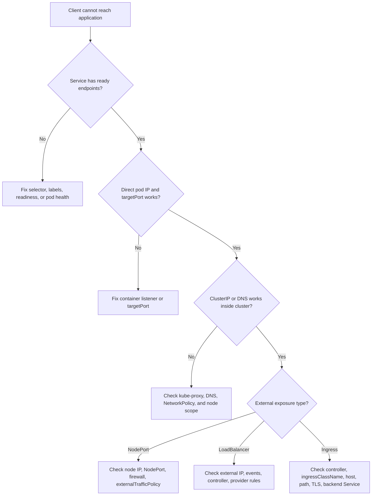

> **Складність**: `[СЕРЕДНЯ]` — критично важлива для доступу до застосунків.
>
> **Час на проходження**: 45 хвилин.
>
> **Передумови**: [Модуль 5.5 (Усунення несправностей мережі)](../module-5.5-networking/), [Модуль 3.1 (Сервіси)](../../part3-services-networking/module-3.1-services/), [Модуль 3.2 (Endpoints)](../../part3-services-networking/module-3.2-endpoints/), [Модуль 3.3 (DNS)](../../part3-services-networking/module-3.3-dns/), [Модуль 3.4 (Ingress)](../../part3-services-networking/module-3.4-ingress/)

---

## Що ви зможете зробити

Після цього модуля ви зможете:

- **Діагностувати** збої підключення до Сервісу за допомогою ланцюжка endpoint → селектор → готовність Под'а.
- **Виправляти** Сервіси без endpoint'ів, коригуючи селектори міток, перевіряючи готовність Под'ів і звіряючи відображення портів.
- **Налагоджувати** доступ через NodePort, LoadBalancer та Ingress, відокремлюючи збої маршрутизації Kubernetes від збоїв інфраструктурного відкриття назовні.
- **Простежувати** запит до Сервісу крізь DNS, правила kube-proxy, EndpointSlices та внутрішні Под'и.

## Чому цей модуль важливий

Гіпотетичний сценарій: фронтенд-деплоймент справний, у його логах раз за разом з'являються збої підключення до `http://backend-api`, а бекенд-Под'и виглядають запущеними. Команда застосунку хоче перезапустити все підряд, платформена команда підозрює NetworkPolicy, а канал інциденту наповнюється здогадами. Дисциплінований шлях усунення несправностей Сервісу запобігає такому дрейфу, бо ставить по одному конкретному питанню за раз: чи розв'язується ім'я, чи добирає Сервіс хоч якісь готові endpoint'и, чи збігаються порти, і чи може трафік дістатися до бекенду напряму?

Сервіси Kubernetes навмисне зроблені нудними з точки зору застосунку. Клієнт звертається до стабільного DNS-імені або до віртуального IP, тоді як самі Под'и за цим іменем безперервно створюються, видаляються, переплановуються та замінюються. Ця стабільність — і є власне сенс Сервісу, але вона ж приховує цілу низку рухомих частин: API-об'єкти, мітки, EndpointSlices, гейти готовності, програмування kube-proxy, фаєрволи нод, хмарні балансувальники навантаження та подеколи ще й Ingress-контролер. Коли Сервіс відмовляє, симптом зазвичай виглядає простим, але справжня причина може жити на будь-якому рівні між DNS-розв'язанням і процесом усередині контейнера.

Цей модуль навчає повторюваного циклу усунення несправностей для кластерів Kubernetes 1.35. Ви збережете початкову ментальну модель ClusterIP, NodePort, LoadBalancer, ExternalName, headless-Сервісів та Ingress, а потім використаєте саме цю модель, щоб щоразу вирішувати, яка перевірка має йти першою. Мета тут — не запам'ятати кожну окрему команду напам'ять. Мета — побудувати невелику діагностичну рутину, яка надійно працює під екзаменаційним тиском і так само добре тримається у продакшені, коли ціна помилки набагато вища.

Аналогія з ресепшном досі корисна доти, доки ви не розтягуєте її надміру. ClusterIP-Сервіс — це внутрішній ресепшн, до якого можуть дістатися лише ті люди, що вже всередині будівлі. NodePort відчиняє окреме вікно на кожній ноді. LoadBalancer просить інфраструктурного провайдера збудувати окремий вхід ззовні будівлі. Ingress — це довідник у вестибюлі, який читає запитані хост і шлях, а потім скеровує відвідувача до правильного ресепшну. Кожен окремий рівень може бути цілком справним саме тоді, коли наступний за ним рівень уже зламаний, тому ваше усунення несправностей має йти точно тим шляхом, яким насправді рухається пакет.

## Частина 1: Побудуйте ментальну модель Сервісу

Найперша помилка в усуненні несправностей Сервісу — поводитися з кожним типом Сервісу так, ніби геть усі вони відкривають трафік однаково. Насправді ClusterIP, NodePort і LoadBalancer чітко нашаровані один на одного. NodePort усе одно має під собою ClusterIP, LoadBalancer зазвичай усе одно має під собою NodePort, і обидва ці типи досі залежать від endpoint'ів, які вказують на готові бекенд-Под'и. ExternalName цілком інакший, бо він узагалі не проксіює трафік; він лише повертає DNS-псевдонім, а отже kube-proxy та EndpointSlices не є важливими перевірками саме для цього конкретного типу.

```
┌──────────────────────────────────────────────────────────────┐
│                    SERVICE TYPES                              │
│                                                               │
│   ClusterIP (default)                                         │
│   ┌─────────────────────────────────────────────────────┐    │
│   │ Internal only, virtual IP, no external access       │    │
│   └─────────────────────────────────────────────────────┘    │
│                            ▲                                  │
│                            │ Builds on                        │
│   NodePort                 │                                  │
│   ┌─────────────────────────────────────────────────────┐    │
│   │ ClusterIP + port on every node (30000-32767)        │    │
│   └─────────────────────────────────────────────────────┘    │
│                            ▲                                  │
│                            │ Builds on                        │
│   LoadBalancer             │                                  │
│   ┌─────────────────────────────────────────────────────┐    │
│   │ ClusterIP + NodePort + cloud load balancer          │    │
│   └─────────────────────────────────────────────────────┘    │
│                                                               │
│   ExternalName                                                │
│   ┌─────────────────────────────────────────────────────┐    │
│   │ DNS CNAME record, no proxy, just name resolution    │    │
│   └─────────────────────────────────────────────────────┘    │
│                                                               │
└──────────────────────────────────────────────────────────────┘
```

Об'єкт Сервісу описує лише намір, але сам по собі ще не доводить, що трафік справді може текти. Селектор має збігатися з Под'ами, ці Под'и мають бути Ready, контролер endpoint'ів має опублікувати їх через EndpointSlices, kube-proxy має помітити зміни Сервісу та endpoint'ів, а контейнер призначення має реально слухати на цільовому порту. Якщо хоч одна ланка цього ланцюжка відсутня, Сервіс цілком може виглядати нормальним у виводі `kubectl get svc`, тоді як клієнти все ще раз за разом зазнають збоїв.

```
┌──────────────────────────────────────────────────────────────┐
│                    KUBE-PROXY FUNCTION                        │
│                                                               │
│   Service Created                                             │
│        │                                                      │
│        ▼                                                      │
│   kube-proxy watches API server                              │
│        │                                                      │
│        ▼                                                      │
│   Programs rules on each node:                               │
│   ┌─────────────────────────────────────────────────────┐    │
│   │ iptables mode: iptables -t nat rules                │    │
│   │ IPVS mode:    virtual servers in kernel             │    │
│   └─────────────────────────────────────────────────────┘    │
│        │                                                      │
│        ▼                                                      │
│   Traffic to ClusterIP → redirected to pod IPs              │
│                                                               │
│   If kube-proxy fails → Services stop working                │
│                                                               │
└──────────────────────────────────────────────────────────────┘
```

Зупиніться й передбачте: якщо `kube-proxy` падає на одній ноді, чого ви очікуєте від Под'ів на цій ноді, коли вони звертаються до ClusterIP-Сервісу, і чому Под'и на інших нодах можуть продовжувати працювати? Це питання важливе, бо kube-proxy програмує правила локальної ноди, тож збій у межах ноди може виглядати як збій застосунку лише тоді, коли клієнтський Под опиняється на ураженій ноді. Під час екзамену ця відмінність підказує вам порівняти однаковий curl-тест із двох різних клієнтських Под'ів на двох різних нодах, перш ніж змінювати маніфест Сервісу.

Усувати несправності Сервісу найлегше, коли ви відокремлюєте опис площини управління від реальності площини даних. У площині управління є об'єкт Сервісу, селектор, EndpointSlices, об'єкт Ingress та події. У площині даних є DNS-розв'язання, правила kube-proxy, порти нод, слухачі балансувальника навантаження, застосування мережевої політики та процес, що слухає всередині контейнера. Добрий діагностичний шлях рухається від найдешевших перевірок площини управління до інвазивніших перевірок площини даних лише тоді, коли попередні докази підтримують цей напрямок.

## Частина 2: Діагностуйте ClusterIP, рухаючись назад від Endpoints

ClusterIP — це фундамент для більшості налагоджень Сервісів, бо інші типи Сервісів будуються на ньому. Якщо ClusterIP-Сервіс зламаний, відкриття його через NodePort чи LoadBalancer лише додає більше місць для пошуку, не виправляючи базового шляху. Починайте з endpoint'ів, бо список endpoint'ів відповідає на найважливіше питання маршрутизації: чи вважає Kubernetes наразі, що для цього Сервісу взагалі існує якийсь готовий бекенд?

```
┌──────────────────────────────────────────────────────────────┐
│               CLUSTERIP TROUBLESHOOTING                       │
│                                                               │
│   □ Service exists and has correct ports                     │
│   □ Endpoints exist (selector matches pods)                  │
│   □ Pods are in Ready state                                  │
│   □ Target port matches container port                       │
│   □ Pod is actually listening on the port                    │
│   □ kube-proxy is running on nodes                          │
│   □ No NetworkPolicy blocking traffic                       │
│                                                               │
└──────────────────────────────────────────────────────────────┘
```

Порожній список endpoint'ів — це не якийсь загадковий мережевий збій. Зазвичай це означає одне з трьох: селектор Сервісу не збігається з мітками Под'а, відповідні Под'и не перебувають у стані Ready, або ці Под'и завершуються й уже вилучені з обслуговувального набору. У Kubernetes 1.35 EndpointSlices є масштабованим API, що стоїть за відстеженням endpoint'ів Сервісу, тоді як старіший об'єкт Endpoints у багатьох кластерах ще може придатися для швидкого огляду. Якщо ж Сервіс не має жодних endpoint'ів, не марнуйте поки що часу на огляд правил iptables; спершу доведіть, чому саме в Kubernetes немає бекенд-призначень для цього Сервісу.

```bash
# 1. Check service exists
kubectl get svc my-service
kubectl describe svc my-service

# 2. Check EndpointSlices (CRITICAL — preferred on 1.35)
kubectl get endpointslices -l kubernetes.io/service-name=my-service
kubectl get endpointslices -l kubernetes.io/service-name=my-service -o yaml
# Legacy shorthand (still works on 1.35 but may show deprecation warnings):
kubectl get endpoints my-service
# No endpoints = problem with selector or pod readiness

# 3. Verify selector matches pods
kubectl get svc my-service -o jsonpath='{.spec.selector}'
# Compare to:
kubectl get pods --show-labels

# 4. Check pods are Ready
kubectl get pods -l <selector>
# All should show Ready (e.g., 1/1)

# 5. Verify pod is listening on port
# Many minimal images (including nginx:1.25) lack netstat and ss — prefer a client-side probe:
kubectl exec <client-pod> -- wget -qO- --timeout=2 http://<pod-ip>:<container-port>
# On fuller images only: kubectl exec <pod> -- netstat -tlnp  or  ss -tlnp

# 6. Test directly to pod IP (same client probe — works on any image)
kubectl exec <client-pod> -- wget -qO- --timeout=2 http://<pod-ip>:<container-port>
```

Перевірка селектора заслуговує значно більшої уваги, ніж їй зазвичай приділяє багато учнів. Селектор Сервісу — це мапа точних пар «ключ-значення» міток, а не якийсь нечіткий пошук за частковим збігом. Наприклад, `app: backend` не збігається ні з `app.kubernetes.io/name: backend`, ні з `app: backend-api`, ні з `tier: backend`. Коли ви порівнюєте селектори з мітками Под'ів, порівнюйте і фактичні ключі, і самі значення, бо сучасні маніфести часто використовують рекомендовані мітки `app.kubernetes.io/*`, тоді як старіші приклади вживають короткі мітки на кшталт простого `app`.

| Проблема | Симптом | Перевірка | Виправлення |
|-------|---------|-------|-----|
| Немає endpoint'ів | Connection refused | `kubectl get endpointslices -l kubernetes.io/service-name=<svc>` | Виправити селектор або мітки Под'а |
| Неправильний targetPort | Timeout/refused | Порівняти порт із контейнером | Виправити targetPort |
| Под не Ready | Бракує endpoint'ів | `kubectl get pods` | Виправити readiness-пробу |
| Застосунок не слухає | Прямий доступ до Под'а не вдається | Клієнтська проба до podIP:port | Виправити застосунок |
| kube-proxy лежить | Усі сервіси відмовляють | Под'и kube-proxy | Перезапустити kube-proxy |

Відображення портів — наступний поширений збій, бо порти Сервісу використовують два різні поняття. `port` — це те, що використовують клієнти, коли звертаються до Сервісу. `targetPort` — це те, куди kube-proxy надсилає з'єднання на дібраному Под'і. Іменований цільовий порт додає ще один крок пошуку: Kubernetes розв'язує ім'я проти портів контейнера на кожному бекенд-Под'і, що може стати в пригоді під час міграцій, але збиває з пантелику, коли ім'я написане з помилкою.

```yaml
apiVersion: v1
kind: Service
metadata:
  name: my-service
spec:
  selector:
    app: myapp
  ports:
  - port: 80          # Port clients use to access service
    targetPort: 8080  # Port on the pod/container
    protocol: TCP     # TCP (default) or UDP
    name: http        # Optional name
```

```bash
# Verify the mapping
kubectl get svc my-service -o yaml | grep -A 5 ports:

# Check container is listening on targetPort (client probe — works when netstat/ss are absent)
kubectl exec <client-pod> -- wget -qO- --timeout=2 http://<pod-ip>:<targetPort>
# Fuller images only: kubectl exec <pod> -- sh -c 'netstat -tlnp 2>/dev/null || ss -tlnp'
```

Перш ніж запускати прямий тест Под'а, який вивід ви очікуєте, якщо селектор Сервісу правильний, але `targetPort` указує на закритий порт? Список endpoint'ів не повинен бути порожнім, бо публікація endpoint'ів залежить від добору й готовності Под'а, а не від того, чи слухає ваш застосунок на обраному цільовому порту. Прямий тест до podIP і цільового порту має провалитися, тоді як прямий тест до фактичного слухального порту має спрацювати — це і є докази, потрібні вам, перш ніж змінювати відображення портів Сервісу.

Готовність — найтонша частина всього цього ланцюжка. Под цілком може бути в стані Running, але при цьому не Ready, і Сервіс не повинен спрямовувати звичайний трафік до такого неготового Под'а. З іншого боку, Под може бути Ready просто тому, що його readiness-проба надто слабка, навіть якщо процес застосунку насправді не слухає на цільовому порту Сервісу. Саме тому надійний шлях — це спочатку список endpoint'ів, потім стан готовності, а вже третім — пряма перевірка порту Под'а; кожен наступний крок звужує збій замість того, щоб припускати, що одне-єдине зелене поле статусу доводить справність усього шляху.

Корисний пророблений приклад — це Сервіс, який має endpoint'и, але все одно не може обслуговувати трафік. Уявіть, що список endpoint'ів містить два IP-адреси Под'ів, обидва Под'и звітують Ready, а `kubectl exec client -- wget http://service-name` усе ще завершується таймаутом. На цьому етапі селектор зробив свою справу, а готовність впустила Под'и до обслуговувального набору, тож наступне питання — чи переадресовує Сервіс на порт, де слухає застосунок. Тестування podIP на оголошеному `targetPort`, а потім тестування podIP на порту, названому в маніфесті контейнера, перетворює невиразний таймаут на діагноз відображення портів.

Зворотний приклад так само важливий, бо він запобігає хибній упевненості. Якщо список endpoint'ів порожній, успішний прямий тест podIP не доводить, що Сервіс справний. Він доводить лише, що принаймні один Под може обслуговувати трафік, коли до нього звертаються напряму. У Сервісу все одно немає бекенд-адрес, з яких можна вибирати, а отже звичайні клієнти, що використовують ім'я Сервісу, зазнаватимуть невдачі, доки не буде полагоджено ланцюжок селектора й готовності. Інакше кажучи, прямий доступ до Под'а — це цільовий діагностичний інструмент, а не заміна публікації endpoint'ів.

EndpointSlices додають ще одну практичну деталь для реальних кластерів. Старий об'єкт Endpoints легко читати, але великі Сервіси можуть перевищити стару об'єктну модель, а EndpointSlices — це сучасне представлення, яке Kubernetes використовує для масштабування відстеження endpoint'ів. Коли швидкий результат `kubectl get endpoints` виглядає несподівано, оглядайте EndpointSlices за міткою з іменем Сервісу й порівнюйте адреси, порти та умови готовності. Ця додаткова перевірка особливо корисна, коли ви налагоджуєте Сервіс із багатьма репліками або коли контролер створює endpoint'и без селектора.

```bash
kubectl get endpointslices -l kubernetes.io/service-name=my-service
kubectl get endpointslices -l kubernetes.io/service-name=my-service -o yaml
```

## Частина 3: Налагодьте NodePort та External Traffic Policy

NodePort додає до шляху ClusterIP ще й слухача на рівні ноди, тож ви маєте чітко тримати два питання окремо одне від одного. Перше питання: чи працює Сервіс зсередини кластера через його ClusterIP або DNS-ім'я? Друге питання: чи може клієнт за межами кластера дістатися до IP-адреси ноди та виділеного порту? Якщо внутрішній шлях ClusterIP уже зламаний, то тест NodePort лише видасть вам гучнішу версію точнісінько того самого збою, не додавши жодної нової інформації.

```
┌──────────────────────────────────────────────────────────────┐
│               NODEPORT TROUBLESHOOTING                        │
│                                                               │
│   All ClusterIP checks, plus:                                │
│                                                               │
│   □ NodePort is in valid range (30000-32767)                │
│   □ Node firewall allows the port                           │
│   □ Cloud security group allows the port                    │
│   □ Node is reachable on the port                          │
│   □ Testing with correct node IP                           │
│                                                               │
└──────────────────────────────────────────────────────────────┘
```

NodePort-Сервіс часто розуміють хибно, бо він відкриває обраний порт на кожній ноді, а не лише на тих нодах, які наразі запускають бекенд-Под. У типовому режимі `externalTrafficPolicy: Cluster` пакет може прибути на одну ноду й бути переадресованим до Под'а на іншій ноді. Така поведінка зручна, бо можна використати будь-який IP ноди, але вона ж може приховувати додаткові переходи й змінювати обробку джерельного IP. У режимі `externalTrafficPolicy: Local` Kubernetes зберігає клієнтський джерельний IP прямолінійніше, але ноди без локального бекенду не варто вважати справними цілями для цього Сервісу.

```bash
# Get NodePort value
kubectl get svc my-service -o jsonpath='{.spec.ports[0].nodePort}'

# Get node IPs
kubectl get nodes -o wide

# Test from outside cluster
curl http://<node-ip>:<nodeport>

# Test from inside cluster (should also work)
kubectl exec <pod> -- wget -qO- http://<node-ip>:<nodeport>

# Test all nodes (NodePort works on any node)
for node_ip in $(kubectl get nodes -o jsonpath='{.items[*].status.addresses[?(@.type=="InternalIP")].address}'); do
  curl -s --connect-timeout 2 http://${node_ip}:<nodeport> && echo "OK: $node_ip" || echo "FAIL: $node_ip"
done
```

Слова «зовні» недостатньо для точності під час налагодження NodePort. Клієнт в іншому Под'і, клієнт на робочій ноді, клієнт у тій самій приватній підмережі та клієнт на ноутбуку розробника проходять через різні фаєрволи й маршрути. Якщо Под може дістатися до NodePort, а ноутбук завершується таймаутом, маршрутизація Kubernetes може бути справною, тоді як хмарна група безпеки, мережевий ACL, VPN-маршрут або хостовий фаєрвол відкидає пакет, перш ніж його побачить kube-proxy.

| Проблема | Симптом | Перевірка | Виправлення |
|-------|---------|-------|-----|
| Фаєрвол блокує | Timeout ззовні | `iptables -L -n` | Відкрити порт у фаєрволі |
| Хмарна SG блокує | Timeout ззовні | Хмарна консоль | Додати правило групи безпеки |
| Неправильний IP ноди | Connection refused | `kubectl get nodes -o wide` | Використати правильний IP (внутрішній чи зовнішній) |
| Конфлікт портів | Створення Сервісу не вдається | `ss -tlnp` або `netstat -tlnp` на ноді (хостова оболонка, не Под) | Використати інший nodePort |
| externalTrafficPolicy | Працюють лише деякі ноди | Перевірити політику | Поставити Cluster або виправити endpoint'и |

Параметр `externalTrafficPolicy` — це навмисний компроміс, а не магічна опція продуктивності. `Cluster` максимізує досяжність, бо всі ноди можуть прийняти трафік і переадресувати його до бекенду десь у кластері. `Local` корисний, коли вам потрібно зберегти джерельний IP або уникнути другого переходу, але він вимагає, щоб зовнішній балансувальник навантаження чи клієнт уникали нод, у яких немає локального endpoint'а. Це робить його поширеним джерелом переривчастих збоїв, коли Под'и переплановуються нерівномірно.

```yaml
spec:
  type: NodePort
  externalTrafficPolicy: Local  # Only nodes with pods respond
  # vs
  externalTrafficPolicy: Cluster  # All nodes respond (default)
```

```bash
# Check current policy
kubectl get svc my-service -o jsonpath='{.spec.externalTrafficPolicy}'

# With Local policy, check which nodes have pods
kubectl get pods -l <selector> -o wide
# Only those node IPs will respond to NodePort
```

Зупиніться й передбачте: якщо ви ставите `externalTrafficPolicy: Local` на NodePort-Сервіс, але конкретна нода не має Под'ів для цього Сервісу, що станеться, коли зовнішній клієнт звернеться до IP цієї ноди на NodePort? Очікувана відповідь — трафік до цієї ноди має провалитися або бути відкинутим для цього Сервісу, тоді як трафік до ноди з локальним готовим endpoint'ом може досягти успіху. Саме це передбачення й пояснює, чому корисний тест NodePort перебирає всі IP нод, а не тестує лише перший IP, який ви скопіювали з `kubectl get nodes -o wide`.

NodePort — це також місце, де припущення про джерельну адресу можуть ввести вас в оману. У політиці `Cluster` пакет може бути переадресований від ноди-приймача до іншої ноди, і поведінка джерельної адреси залежить від шляху проксіювання та деталей реалізації. У політиці `Local` збереження джерела легше осягнути розумом, але досяжність залежить від локальних endpoint'ів. Коли команди обирають між цими режимами, вони обирають між широкою досяжністю нод і чіткішою поведінкою джерельної адреси. Усувати несправності стає легше, коли цей компроміс записано поряд із Сервісом, а не перевідкрито під час збою.

Не забувайте, що NodePort може бути справним, тоді як обрана тестова адреса неправильна. Хмарні ноди часто мають внутрішню адресу, зовнішню адресу, ім'я хоста, а подеколи й специфічні для провайдера адреси. Тест зсередини кластера може потребувати внутрішнього IP ноди, тоді як тест із ноутбука розробника може потребувати зовнішньої або маршрутизованої через VPN адреси. Якщо ви використовуєте адресу, не маршрутизовану з вашого клієнта, симптом може виглядати точнісінько як відкидання фаєрволом, тож завжди вказуйте джерельну мережу й обрану адресу ноди разом у своїх нотатках.

## Частина 4: Діагностуйте LoadBalancer, не звинувачуючи застосунок

LoadBalancer-Сервіси додають інфраструктурну автоматизацію до того самого ланцюжка Сервісів Kubernetes. Kubernetes створює об'єкт Сервісу, а потім cloud controller manager або локальний контролер балансувальника навантаження помічає цей об'єкт і створює чи налаштовує зовнішній балансувальник навантаження. Якщо контролера немає, пулу адрес не існує, облікові дані неправильні або квота не дозволяє виділення, Сервіс може залишатися в стані `<pending>`, навіть якщо кожен Под і endpoint за ним справні.

```
┌──────────────────────────────────────────────────────────────┐
│             LOADBALANCER REQUIREMENTS                         │
│                                                               │
│   Cloud environment:                                          │
│   • Cloud controller manager running                         │
│   • Proper cloud credentials configured                      │
│   • Cloud provider supports LoadBalancer                     │
│                                                               │
│   On-premises:                                                │
│   • MetalLB or similar solution installed                   │
│   • IP address pool configured                               │
│                                                               │
│   Without these → LoadBalancer stays Pending forever        │
│                                                               │
└──────────────────────────────────────────────────────────────┘
```

Перше питання щодо LoadBalancer завжди одне: чи призначено взагалі зовнішню адресу. Якщо стовпець `EXTERNAL-IP` усе ще показує pending, зосередьтеся на контролері, подіях, анотаціях, пулах адрес та помилках провайдера. Якщо ж зовнішня адреса вже існує, але трафік усе одно відмовляє, поверніться до нашарованої моделі: спершу перевірте ClusterIP, потім перевірте NodePort, якщо його виділено, а потім уже зовнішнього слухача й шлях фаєрвола. Ця послідовність утримує вас від передчасного налагодження налаштувань хмарного балансувальника навантаження тоді, коли в Сервісу насправді немає жодних endpoint'ів, і так само утримує від зміни Под'ів застосунку тоді, коли провайдер так і не створив слухача.

```bash
# Check if external IP is assigned
kubectl get svc my-service
# EXTERNAL-IP column should show an IP, not <pending>

# Get detailed status
kubectl describe svc my-service

# Check events for errors
kubectl get events --field-selector involvedObject.name=my-service

# Test the LoadBalancer IP
curl http://<external-ip>:<port>
```

Події цінні, бо об'єкт Сервісу — це точка зустрічі між Kubernetes та інтеграцією провайдера. Збій квоти, непідтримувана анотація, відсутній тег підмережі, вичерпання пулу адрес чи проблема з дозволами часто з'являються як подія Сервісу раніше, ніж будь-де інде, де оператор Kubernetes міг би їх побачити. На керованих платформах вам також слід знати, де специфічні для провайдера контролери логують свої помилки узгодження, але хід рівня CKA — оглянути Сервіс та відповідні Под'и контролера, перш ніж сліпо змінювати маніфести.

| Проблема | Симптом | Перевірка | Виправлення |
|-------|---------|-------|-----|
| Немає хмарного контролера | Лишається Pending | Перевірити cloud-controller-manager | Встановити/налаштувати CCM |
| Перевищено квоту | Лишається Pending | Хмарна консоль | Запросити збільшення квоти |
| Неправильні анотації | LB неправильно налаштований | Анотації Сервісу | Виправити специфічні для хмари анотації |
| Група безпеки | Не дістатися до LB | Хмарні правила безпеки | Відкрити порти LB |
| MetalLB не встановлено | Лишається Pending (bare metal) | Перевірити Под'и MetalLB | Встановити MetalLB |

Специфічні для хмари команди непереносні, але діагностичний принцип переносний. Використовуйте Kubernetes, щоб підтвердити, що було запитано, використовуйте інструментарій провайдера, щоб підтвердити, що було фактично створено, а потім порівняйте слухача, ціль, перевірку справності та шлях фаєрвола. У bare-metal-кластері замініть перевірку хмарного контролера на встановлену реалізацію балансувальника навантаження, як-от MetalLB, і переконайтеся, що для простору імен та форми Сервісу, яку ви використовуєте, існує пул адрес.

```bash
# For AWS
kubectl describe svc my-service | grep "LoadBalancer Ingress"
aws elb describe-load-balancers

# For GCP
kubectl describe svc my-service
gcloud compute forwarding-rules list

# Check cloud controller manager logs (cloud clusters only — kind/minikube have no CCM)
kubectl -n kube-system logs -l component=cloud-controller-manager
# Portable alternative on any cluster: kubectl -n kube-system get pods | grep cloud-controller
```

Який підхід ви оберете тут і чому: повернути тип Сервісу назад на ClusterIP, відкрити хмарне правило безпеки чи спершу оглянути події Сервісу? У випадку очікуваної адреси події Сервісу — це хід із найнижчим ризиком, бо вони підказують вам, чи попросив Kubernetes балансувальник навантаження й чи відхилив контролер цей запит. У випадку призначеної адреси зі справними endpoint'ами правило безпеки може бути правильною наступною гіпотезою, але вам усе одно слід довести, який рівень відмовляє, перш ніж редагувати інфраструктуру.

Перевірки справності балансувальника навантаження — ще одне джерело плутанини, бо вони не завжди ідентичні трафіку застосунку. Провайдер може перевіряти порт ноди, порт ноди для перевірки справності чи endpoint під керуванням контролера залежно від платформи й конфігурації Сервісу. Якщо зовнішня адреса існує, але провайдер позначає цілі несправними, порівняйте налаштування перевірки справності провайдера з портами Сервісу Kubernetes та станом готовності бекенду. Сервіс може бути внутрішньо досяжним, тоді як зовнішній балансувальник навантаження відмовляється надсилати трафік, бо його власні критерії справності провалюються.

Анотації заслуговують на обережне поводження, бо вони є контрактами провайдера, схованими всередині об'єкта Kubernetes. Анотація, осмислена на одній платформі, може бути проігнорована чи відхилена на іншій, а скопійований маніфест може запитувати форму балансувальника навантаження, яку поточний кластер не може створити. Під час усунення несправностей читайте анотації як вхідні дані для контролера, а не як загальну поведінку Kubernetes. Якщо події згадують непідтримувану анотацію чи недійсне налаштування, виправлення зазвичай полягає в узгодженні маніфесту з документацією провайдера, а не в зміні бекенд-деплойменту.

У bare-metal-кластерах стан pending часто є питанням місткості чи власності, а не питанням хмарного API. Контролеру на кшталт MetalLB потрібен пул адрес, дозвіл виділяти з цього пулу та мережеві умови, які дозволяють анонсувати чи маршрутизувати обрану адресу. Якщо пул вичерпано чи відмежовано від простору імен, запиту Сервісу нема куди йти. Цей діагноз усе одно йде тим самим методом: спершу Сервіс Kubernetes, другим — події контролера, третім — специфічні для реалізації логи, а Под'и застосунку лише після того, як з'явиться зовнішнє виділення.

## Частина 5: Усувайте несправності Ingress як маршруту за підтримки контролера

Ingress — це не тип Сервісу, і це принципово важлива відмінність. Об'єкт Ingress — це лише набір правил HTTP-маршрутизації, а Ingress-контролер — це той запущений компонент, який власне читає ці правила й налаштовує проксі на кшталт NGINX, Traefik, HAProxy чи контролер хмарного провайдера. Якщо контролера немає або якщо він стежить за іншим класом, ресурс Ingress може існувати скільки завгодно довго, узагалі не впливаючи на трафік. Саме тому налагодження Ingress завжди починається з контролера, класу та бекенд-Сервісу, а не лише з Под'а застосунку.

```
┌──────────────────────────────────────────────────────────────┐
│                  INGRESS FLOW                                 │
│                                                               │
│   External Request                                            │
│        │                                                      │
│        ▼                                                      │
│   Ingress Controller (nginx, traefik, etc.)                  │
│        │                                                      │
│        │ Reads Ingress resources                             │
│        ▼                                                      │
│   Matches host/path rules                                     │
│        │                                                      │
│        ▼                                                      │
│   Routes to backend Service                                   │
│        │                                                      │
│        ▼                                                      │
│   Pod                                                         │
│                                                               │
│   Ingress Controller missing → Ingress rules do nothing      │
│                                                               │
└──────────────────────────────────────────────────────────────┘
```

Збої Ingress часто виглядають інакше, ніж збої Сервісу. Таймаут може означати, що до зовнішнього балансувальника навантаження чи Сервісу контролера неможливо дістатися. `404` може означати, що запит дістався до контролера, але жодне правило хоста й шляху не збіглося. `503` може означати, що контролер збіг правило, але бекенд-Сервіс не має придатних endpoint'ів. Помилка TLS може означати, що Secret відсутній, неправильно сформований, у неправильному просторі імен або не згаданий правилом, що збіглося для хоста.

```bash
# 1. Check Ingress Controller is running
kubectl -n ingress-nginx get pods  # For nginx-ingress
# Or check your specific ingress controller namespace

# 2. Check Ingress resource exists
kubectl get ingress my-ingress
kubectl describe ingress my-ingress

# 3. Verify backend service exists
kubectl get svc <backend-service>

# 4. Check Ingress events
kubectl describe ingress my-ingress | grep -A 10 Events

# 5. Check Ingress Controller logs
kubectl -n ingress-nginx logs -l app.kubernetes.io/name=ingress-nginx

# 6. Test with correct Host header
curl -H "Host: myapp.example.com" http://<ingress-ip>
```

Перевірка заголовка Host не є опціональною, коли ви тестуєте Ingress за IP-адресою. Більшість правил Ingress написано для імені хоста, тож голий `curl http://<ingress-ip>` надсилає запит, який не збігається з налаштованим хостом. Передача `-H "Host: myapp.example.com"` дозволяє вам протестувати маршрутизацію до оновлення публічного DNS, і вона ж відокремлює проблеми DNS від проблем маршрутизації контролера. Якщо тест із заголовком Host працює, а браузер відмовляє, DNS або клієнтська довіра до TLS можуть бути рештою рівня.

| Проблема | Симптом | Перевірка | Виправлення |
|-------|---------|-------|-----|
| Немає Ingress-контролера | 404 або нічого | Под'и контролера | Встановити Ingress-контролер |
| Неправильний ingressClassName | Правила ігноруються | `spec.ingressClassName` | Узгодити з класом контролера |
| Бекенд-Сервіс відсутній | Помилка 503 | `kubectl get svc` | Створити бекенд-Сервіс |
| TLS-secret відсутній | Помилки TLS | `kubectl get secret` | Створити TLS-secret |
| Неправильний заголовок host | 404 | Тестувати з прапорцем -H | Використати правильне ім'я хоста |
| Невідповідність pathType | 404 на підшляхах | Перевірити pathType | Використати Prefix або Exact |

Зіставлення шляхів — ще одне місце, де маршрут, який виглядає розумно, може поводитися інакше, ніж очікувалося. `Exact` означає, що збігається лише цей точний шлях. `Prefix` означає, що шлях запиту починається з налаштованого шляху за семантикою елементів шляху Kubernetes. Коли користувач звітує, що `/api` працює, а `/api/v1` відмовляє, або що `/exact/anything` відмовляє, тоді як `/exact` працює, тип шляху є частиною доказів, а не другорядною деталлю.

```yaml
spec:
  rules:
  - host: example.com
    http:
      paths:
      - path: /api
        pathType: Prefix   # /api, /api/, /api/v1 all match
      - path: /exact
        pathType: Exact    # Only /exact matches
      - path: /
        pathType: Prefix   # Catch-all
```

```bash
# Get Ingress IP/hostname
kubectl get ingress my-ingress

# Test with specific host header
curl -v -H "Host: myapp.example.com" http://<ingress-ip>/path

# Test TLS
curl -v -H "Host: myapp.example.com" https://<ingress-ip>/path -k

# Check Ingress Controller configuration (nginx)
kubectl -n ingress-nginx exec <controller-pod> -- cat /etc/nginx/nginx.conf | grep -A 20 "server_name myapp"
```

Зупиніться й подумайте: чим Ingress-контролер, що маршрутизує HTTP-трафік на Рівні 7, відрізняється від Сервісу `type: LoadBalancer`, що маршрутизує транспортний трафік на Рівні 4, коли щось ламається? З Ingress запит може дістатися до контролера й усе одно провалитися, бо правило хоста, шляху, TLS чи бекенду не збігається. Зі звичайним LoadBalancer-Сервісом слухач провайдера зазвичай переадресовує порт на шлях Сервісу, тож збої частіше стосуються виділення адреси, досяжності фаєрвола, перевірок справності, endpoint'ів чи цільових портів.

Продуктивне розслідування Ingress називає джерело відповіді. Браузерний `404` може походити від типового бекенду Ingress-контролера, від застосунку за успішно зіставленим маршрутом чи від проксі вище за течією перед кластером. Тест `curl -v` з очікуваним заголовком Host, відомим шляхом та IP контролера допомагає визначити, який компонент згенерував відповідь. Щойно ви знаєте джерело відповіді, наступна перевірка очевидна: зіставлення правил маршруту для відповідей контролера, логи бекенд-застосунку для відповідей застосунку чи конфігурація зовнішнього проксі для відповідей, що так і не дісталися до контролера.

TLS додає ще один рівень зіставлення, бо сертифікати добираються за інформацією про хост і зберігаються в Secret'ах Kubernetes. Дійсне правило Ingress усе одно може провалити TLS, якщо ім'я Secret'а неправильне, Secret у неправильному просторі імен, сертифікат не покриває запитаний хост або контролер не може прочитати Secret. Відокремте узгодження TLS від маршрутизації бекенду, тестуючи HTTP, коли це дозволено, а потім тестуючи HTTPS з докладним виводом. Цей поділ запобігає тому, щоб проблеми сертифіката сприймали за відсутні endpoint'и, і запобігає тому, щоб помилки бекенд-застосунку сприймали за збої сертифіката.

Бекенд-Сервіс лишається частиною шляху Ingress, навіть якщо користувач бачить лише ім'я хоста. Якщо контролер збігає хост і шлях, але бекенд-Сервіс не має endpoint'ів, більшість контролерів повертають помилку вище за течією, а не помилку, що виглядає як помилка Kubernetes. Саме тому інцидент Ingress часто повертається назад до чекліста ClusterIP. Ви підтверджуєте контролер і маршрут, а потім налагоджуєте бекенд-Сервіс точно так, як робили б, якби до нього звернувся Под усередині кластера напряму.

## Частина 6: Перевіряйте kube-proxy, коли патерн прив'язаний до ноди чи поширений на весь кластер

kube-proxy — це не те місце, з якого ви починаєте кожен інцидент Сервісу, але він стає по-справжньому важливим тоді, коли докази вказують саме на маршрутизацію Сервісу. Якщо багато не пов'язаних між собою Сервісів відмовляють з однієї і тієї самої ноди, якщо трафік ClusterIP поводиться по-різному залежно від того, на якій ноді запущений клієнтський Под, або якщо нещодавні зміни Сервісу нібито взагалі не впливають на трафік, тоді варто оглядати kube-proxy та його правила. Якщо ж відмовляє лише один Сервіс і він при цьому не має endpoint'ів, то kube-proxy, найімовірніше, не є першим підозрюваним.

```
┌──────────────────────────────────────────────────────────────┐
│                 KUBE-PROXY MODES                              │
│                                                               │
│   iptables mode (default)                                     │
│   • Uses iptables rules for routing                          │
│   • Good for < 1000 services                                 │
│   • Check: iptables -t nat -L                                │
│                                                               │
│   IPVS mode                                                   │
│   • Uses kernel IPVS for load balancing                     │
│   • Better for many services                                 │
│   • Check: ipvsadm -Ln                                       │
│                                                               │
│   If kube-proxy fails → Service routing breaks               │
│                                                               │
└──────────────────────────────────────────────────────────────┘
```

Режими iptables та IPVS реалізують ту саму абстракцію Сервісу через різні механізми мережі Linux. У режимі iptables kube-proxy пише NAT-правила, які добирають бекенд-endpoint'и. У режимі IPVS він програмує віртуальні сервери ядра та реальні сервери. Екзамен не вимагає від вас редагувати ці правила вручну, і в продакшені вам теж не слід редагувати їх вручну, але огляд їхньої наявності може підтвердити, чи отримала й застосувала нода конфігурацію Сервісу.

```bash
# Check kube-proxy pods
kubectl -n kube-system get pods -l k8s-app=kube-proxy

# Check kube-proxy logs
kubectl -n kube-system logs -l k8s-app=kube-proxy

# Check kube-proxy config
kubectl -n kube-system get configmap kube-proxy -o yaml

# Check iptables rules (on node)
sudo iptables -t nat -L KUBE-SERVICES | head -20

# Check IPVS (if using IPVS mode)
sudo ipvsadm -Ln
```

Коли kube-proxy несправний, симптоми можуть бути оманливими, бо Под'и застосунку не зобов'язані падати. DNS може й далі розв'язуватися, об'єкт Сервісу може й далі існувати, а endpoint'и можуть і далі бути заповненими. Пакет просто не транслюється до бекенд-Под'а так, як обіцяє модель Сервісу. Саме тому вимір ноди важливий: запустіть однаковий клієнтський тест із Под'ів, запланованих на різні ноди, а потім порівняйте статус і логи Под'а kube-proxy на нодах, де тест провалюється.

| Проблема | Симптом | Перевірка | Виправлення |
|-------|---------|-------|-----|
| Не запущений | Усі сервіси відмовляють | Перевірити Под'и | Перезапустити DaemonSet |
| Неправильний режим | Несподівана поведінка | ConfigMap | Переналаштувати режим |
| Застарілі правила | Зміни Сервісу не відображаються | iptables на ноді | Перезапустити kube-proxy |
| conntrack заповнений | Випадкові розриви з'єднань | dmesg на предмет conntrack | Збільшити ліміт conntrack |

Перезапуск kube-proxy — легітимний крок відновлення лише після того, як ви маєте достатньо доказів, що правила ноди застаріли або демон відмовляє. У багатьох кластерах це DaemonSet, тож видалення Под'ів чи перекочування DaemonSet змушує Kubernetes перестворити агентів на кожній ноді. Це може ненадовго вплинути на маршрутизацію Сервісів на цих нодах, тож робіть це обдумано й після перезапуску переконайтеся, що очікувані правила чи записи IPVS існують.

Тиск conntrack може спричинити інший клас симптому Сервісу: з'єднання відмовляють переривчасто, навіть якщо endpoint'и, порти та правила kube-proxy виглядають правильними. Відстеження з'єднань Linux зберігає стан для потоків, що проходять через NAT, і коли таблиця вичерпана, нові з'єднання можуть бути відкинуті чи поводитися непередбачувано. Виправлення — не редагувати Сервіс; воно полягає в огляді логів ноди та лічильників ядра, а потім тюнінгу місткості ноди чи зменшенні плинності. Для усунення несправностей рівня CKA важливе вміння — розпізнати, що випадкові розриви на багатьох Сервісах на одній ноді не те саме, що помилка в селекторі.

kube-proxy також залежить від вчасного спостереження за API. Якщо демон не може стежити за Сервісами чи EndpointSlices через проблеми зі зв'язком до API, автентифікацію чи тиск на ресурси, його локальні правила можуть застаріти. Збій застарілих правил часто з'являється після деплою, події масштабування чи редагування Сервісу: старі бекенди й далі отримують трафік, нові бекенди ніколи не отримують трафік, або видалений Сервіс усе одно лишає заплутані сліди. Порівняння бажаного стану в API зі станом локальних правил ноди підказує вам, чи наздогнала нода.

Коли ви документуєте діагноз kube-proxy, включайте ноду клієнтського Под'а, цільовий Сервіс, стан endpoint'ів та ім'я Под'а kube-proxy на ураженій ноді. Цей запис створює різницю між відтворюваною проблемою в межах ноди й набором не пов'язаних між собою невдач curl. Він також запобігає поширеній проблемі передавання, коли наступний оператор перезапускає застосунок, бо початкові нотатки так і не довели вимір ноди. Добрі нотатки — частина інструментарію усунення несправностей.

```bash
# Restart kube-proxy pods
kubectl -n kube-system rollout restart daemonset kube-proxy

# Check for errors in logs
kubectl -n kube-system logs -l k8s-app=kube-proxy --since=5m | grep -i error

# Verify iptables rules exist for a service
sudo iptables -t nat -L KUBE-SERVICES | grep <service-cluster-ip>

# Force sync (delete and let kube-proxy recreate)
# This is disruptive - use carefully
kubectl -n kube-system delete pod -l k8s-app=kube-proxy
```

## Патерни та антипатерни

Найкращий патерн усунення несправностей Сервісу — послідовно йти шляхом пакета, постійно перевіряючи, чи досі ваші поточні докази підтримують той рівень, який ви наразі досліджуєте. Сервіс — це ланцюжок, а не один-єдиний перемикач. Якщо ви перевіряєте endpoint'и, пряму досяжність Под'а, DNS Сервісу, ClusterIP, NodePort і зовнішнє відкриття саме в такому порядку, то кожен окремий результат підказує вам, куди йти далі. Якщо ж ви стрибаєте відразу до хмарної консолі чи перезапускаєте деплойменти без цієї послідовності, то ви фактично міняєте докази на просту діяльність.

| Патерн | Коли його використовувати | Чому він працює | Міркування щодо масштабування |
|---------|----------------|--------------|-----------------------|
| Діагностика з endpoint'ів насамперед | Ім'я Сервісу чи ClusterIP відмовляє | Порожні endpoint'и одразу вказують на проблему селектора чи готовності | EndpointSlices масштабуються краще за старий об'єкт Endpoints, тож оглядайте обидва на великих кластерах |
| Тестування відкриття зсередини назовні | Відмовляє NodePort, LoadBalancer чи Ingress | Доводить внутрішній шлях Сервісу, перш ніж додавати інфраструктурні рівні | Тримайте напоготові патерн невеликого debug-Под'а в кожному просторі імен, де політика дозволяє |
| Порівняння з урахуванням ноди | Збої різняться за клієнтським Под'ом чи IP ноди | Відокремлює локальні для ноди проблеми kube-proxy та фаєрвола від збоїв застосунку | Використовуйте розміщення Под'ів і `kubectl get pods -o wide`, щоб порівняти уражені ноди |
| Налагодження провайдера за подіями | LoadBalancer лишається pending чи неправильно налаштований | Події Сервісу рано викривають збої узгодження контролера | Специфічні для провайдера логи та квоти все одно мають значення після того, як події Kubernetes визначать клас збою |

Антипатерни зазвичай походять зі стискання кількох рівнів в одну розпливчасту фразу на кшталт «мережа зламана». Ця фраза не каже вам, чи відмовив DNS, чи були endpoint'и порожніми, чи пропустив kube-proxy правило, чи відкинув фаєрвол NodePort, чи проігнорував клас Ingress маршрут. Добрі оператори замінюють цю фразу конкретним відмовним переходом і конкретною командою, що його доводить.

| Антипатерн | Що йде не так | Краща альтернатива |
|--------------|-----------------|--------------------|
| Перезапуск Под'ів до перевірки endpoint'ів | Проблема селектора чи готовності лишається після перезапуску | Спершу огляньте селектори Сервісу, мітки Под'а, готовність та EndpointSlices |
| Тестування Ingress лише за IP | Правила на основі хоста ніколи не збігаються, видаючи оманливі `404` | Надсилайте очікуваний заголовок Host або використовуйте DNS, що розв'язується до контролера |
| Сприйняття pending LoadBalancer як помилки застосунку | Под'и змінюють, хоча зовнішнього балансувальника навантаження не існує | Огляньте події Сервісу, справність контролера, пули адрес та квоту провайдера |
| Припущення, що NodePort означає досяжність з інтернету | Внутрішні тести проходять, тоді як зовнішні фаєрволи й далі блокують трафік | Тестуйте з фактичної джерельної мережі й перевіряйте правила хостового чи хмарного фаєрвола |

## Фреймворк прийняття рішень

Використовуйте тип Сервісу та перше відмовне спостереження, щоб вирішити, звідки починати. Найшвидший шлях майже завжди — підтвердити, чи має Сервіс готові бекенди, перш ніж оглядати зовнішню інфраструктуру. Щойно бекенди визнано справними, рухайтеся назовні по одному рівню за раз: DNS Сервісу, ClusterIP, NodePort, балансувальник навантаження провайдера, а потім маршрутизація хоста й шляху Ingress, коли це доречно.



| Початковий симптом | Перша перевірка | Якщо проходить | Якщо відмовляє |
|------------------|-------------|--------------|-------------|
| DNS-ім'я Сервісу відмовляє всередині кластера | Розв'язати ім'я й оглянути Сервіс | Тестувати ClusterIP та endpoint'и | Перевірити CoreDNS, простір імен та існування Сервісу |
| ClusterIP-з'єднання connection refused чи таймаут | `kubectl get endpointslices -l kubernetes.io/service-name=<svc>` (старе: `kubectl get endpoints`) | Тестувати targetPort напряму | Виправити селектор, мітки, готовність чи публікацію endpoint'ів |
| NodePort працює з Под'а, але не з ноутбука | Зовнішній маршрут і шлях фаєрвола | Перевірити джерельний IP та деталі політики | Відкрити правильну групу безпеки, ACL, маршрут чи хостовий фаєрвол |
| LoadBalancer у стані pending | Події Сервісу та контролер | Перевірити призначену адресу й слухача | Виправити контролер, облікові дані, квоту, анотацію чи пул адрес |
| Ingress повертає `404` | Хост, шлях та клас | Оглянути бекенд-Сервіс і логи контролера | Виправити правило хоста/шляху чи `ingressClassName` |
| Багато Сервісів відмовляють лише з однієї ноди | Под kube-proxy та правила ноди | Порівняти поведінку NetworkPolicy чи CNI | Перезапустити чи полагодити kube-proxy на ураженій ноді |

Цей фреймворк навмисне зроблено консервативним. Він не припускає наперед, що кожен таймаут — це обов'язково фаєрвол, що кожен `404` — це обов'язково помилка Ingress, а що кожен зовнішній IP у стані pending — це обов'язково хмарний збій. Натомість він щоразу просить найдешевшого доказу на кожному окремому рівні, а потім рухається назовні лише тоді, коли внутрішній рівень уже надійно визнано справним. Саме ця звичка й становить різницю між простим скриптом усунення несправностей і повноцінним методом усунення несправностей.

На практиці ви можете перетворити фреймворк на короткий аркуш інциденту. Запишіть розташування клієнта, ім'я чи адресу, до якої звертаються, точну помилку, тип Сервісу, чи існують endpoint'и, чи працює прямий доступ до Под'а, чи працює ClusterIP та який зовнішній рівень наступний. Це змушує команду ділитися спостереженнями, а не висновками. «NodePort зламаний» перетворюється на «клієнтський Под дістається до ClusterIP, клієнтський Под дістається до внутрішнього IP ноди та порту ноди, ноутбук завершується таймаутом до зовнішнього IP ноди», що прямо вказує на межі маршрутизації чи фаєрвола.

Той самий аркуш допомагає під час екзаменів, бо запобігає блуканню між командами. Якщо в завданні сказано, що Сервіс не має endpoint'ів, вам не варто палити час на перевірку хмарного балансувальника навантаження. Якщо в завданні сказано, що LoadBalancer має зовнішній IP, а внутрішній ClusterIP працює, вам не варто починати зі зміни міток. Завдання CKA часто розв'язні, бо симптом містить достатньо доказів, щоб обрати правильний рівень. Ваша робота — прочитати ці докази, запустити підтверджувальну команду й зробити найменше виправлення, що відповідає відмовному рівню.

Є ще одна звичка, яка робить цей фреймворк надійним: завжди тримайте перспективу клієнта прив'язаною до результату. «Сервіс працює» неповне, доки ви не скажете, звідки він працює. Под у тому самому просторі імен, Под в іншому просторі імен, оболонка ноди, ноутбук через VPN та клієнт з інтернету можуть кожен спостерігати іншу частину шляху. Запис джерельного розташування робить набагато легшим розрізнення NetworkPolicy, DNS-шляхів пошуку, фаєрволів нод та хмарних правил.

Вам також слід розрізняти відмову (refusal), таймаут та збої HTTP-статусу. Connection refused часто означає, що пакет дістався до хоста, де жоден процес не слухав на порту призначення, хоча проксі можуть ускладнити цю картину. Таймаут часто означає, що пакет було відкинуто, неправильно маршрутизовано чи заблоковано, перш ніж повернулася відповідь. `404` чи `503` зазвичай означають, що відповів HTTP-компонент, що зсуває розслідування до зіставлення правил Ingress, справності вище за течією чи бекенд-застосунку, а не до сирої досяжності пакетів.

Нарешті, тримайте тимчасові debug-ресурси нудними. Под BusyBox чи curl із довгою командою sleep достатній для більшості перевірок Сервісу, а одноразовий простір імен спрощує прибирання. Уникайте встановлення додаткових інструментів чи зміни деплойментів застосунку, доки докази цього не вимагатимуть. Що менше ви турбуєте кластер під час діагностики, то надійнішими лишаються ваші спостереження й то легше пояснити підсумкове виправлення іншому операторові чи екзаменаторові.

Це пояснення має значення, бо інциденти Сервісу часто перетинають межі команд. Власники застосунків розуміють порти контейнерів і готовність, власники платформи розуміють контролери й правила нод, а власники мережі розуміють зовнішню досяжність. Чиста діагностика рівень за рівнем дає кожній групі докази, які їй потрібні, не змушуючи всіх оглядати кожну частину стека.

## Чи знали ви?

- **IP Сервісів віртуальні**: адреси ClusterIP реалізуються проксіюванням Сервісу на нодах, а не прив'язкою адреси як звичайного мережевого інтерфейсу на одному Под'і чи одній ноді.
- **Діапазон NodePort**: типовий діапазон портів нод Сервісу — 30000-32767, і Kubernetes дозволяє адміністраторам кластера змінити його прапорцем API-сервера, хоча більшість кластерів тримають типовий діапазон.
- **LoadBalancer зазвичай включає NodePort**: за замовчуванням LoadBalancer-Сервіс також виділяє ClusterIP та порт ноди, якщо виділення порту ноди явно не вимкнено для реалізацій, що підтримують такий режим.
- **Headless-Сервіси не мають ClusterIP**: встановлення `clusterIP: None` змушує DNS повертати адреси бекенд-Под'ів напряму, що корисно для клієнтів, яким потрібно виявляти окремі Под'и, а не єдиний віртуальний IP.

## Типові помилки

| Помилка | Чому вона стається | Як її виправити |
|---------|----------------|---------------|
| Не перевіряти endpoint'и першими | Об'єкт Сервісу існує, тож оператор припускає, що в Kubernetes є бекенди для маршрутизації | Почніть з `kubectl get endpointslices -l kubernetes.io/service-name=<svc>` (старе: `kubectl get endpoints`), потім порівняйте селектори, мітки Под'а та готовність |
| Плутати `port` і `targetPort` | У маніфесті два поля портів зі схожими іменами, і обидва можуть містити правдоподібні числа | Вважайте `port` оберненим до клієнта портом Сервісу, а `targetPort` — оберненим до контейнера призначенням |
| Тестувати NodePort з неправильного IP | Об'єкти Node можуть показувати внутрішні, зовнішні та специфічні для провайдера адреси | Використайте `kubectl get nodes -o wide`, оберіть адресу, досяжну з вашої джерельної мережі, та перевірте правила фаєрвола |
| Пропустити Ingress-контролер | Ресурс Ingress створено, але жоден контролер за ним не стежить | Підтвердьте Под'и контролера та `IngressClass`, перш ніж налагоджувати правила хоста й шляху |
| Використовувати неправильний `ingressClassName` | Існує кілька контролерів, або маніфест скопійовано з іншого кластера | Перелічіть об'єкти `IngressClass` та поставте клас, за яким стежить ваш цільовий контролер |
| Ігнорувати `externalTrafficPolicy: Local` | Деякі IP нод відмовляють, тоді як інші працюють, що виглядає переривчасто | Перевірте, де заплановано готові Под'и, і або цільте на ноди з локальними endpoint'ами, або використайте `Cluster` |
| Звинувачувати kube-proxy надто рано | Збій одного Сервісу сприймають за збій маршрутизації ноди | Доведіть endpoint'и, цільові порти та пряму досяжність Под'а, перш ніж оглядати правила ноди |
| Сприймати pending LoadBalancer як проблему Под'а | Зовнішнього IP бракує, але справні бекенд-Под'и відволікають від інфраструктурного запиту | Прочитайте події Сервісу та логи контролера, потім перевірте передумови хмарного чи локального балансувальника навантаження |

## Тест

<details>
<summary>Питання 1: Порожній список endpoints</summary>

Ваша команда розгортає бекенд-API й створює для нього ClusterIP-Сервіс. Сервіс має ClusterIP, але `kubectl get endpointslices -l kubernetes.io/service-name=backend-api` не повертає готових адрес, а фронтенд-Под'и не можуть підключитися. Найімовірніші причини — це селектор, що не точно збігається з мітками Под'а, Под'и, що збігаються, але не Ready, або помилка в маніфесті, що націлює Сервіс на неправильне робоче навантаження. Вам слід порівняти `kubectl get svc backend-api -o jsonpath='{.spec.selector}'` із `kubectl get pods --show-labels`, потім оглянути готовність та події Под'а. Зміна kube-proxy чи налаштувань хмарного фаєрвола була б передчасною, бо Kubernetes не опублікував для Сервісу жодного бекенд-призначення.

```bash
kubectl get svc backend-api -o jsonpath='{.spec.selector}'
kubectl get pods --show-labels
kubectl get endpointslices -l kubernetes.io/service-name=backend-api
# Legacy: kubectl get endpoints backend-api
```

</details>

<details>
<summary>Питання 2: NodePort лише для внутрішнього доступу</summary>

Тимчасовий дашборд відкрито через NodePort `30080`. Под усередині кластера може дістатися до `http://<node-ip>:30080`, але ноутбук розробника завершується таймаутом, використовуючи той самий URL. Цей патерн зазвичай означає, що шлях Сервісу Kubernetes працює, а зовнішній маршрут, хостовий фаєрвол, хмарна група безпеки, мережевий ACL чи VPN-шлях блокує трафік, перш ніж він дістанеться до ноди. Виправлення — протестувати з фактичної джерельної мережі, перевірити, що адреса ноди досяжна з цієї мережі, та відкрити конкретний NodePort лише там, де це доречно. Перезапуск Под'ів дашборда не вирішив би відкидання межовим фаєрволом.

</details>

<details>
<summary>Питання 3: LoadBalancer застряг у стані pending</summary>

Ви переносите маніфест із керованого хмарного кластера в bare-metal-кластер, і Сервіс `type: LoadBalancer` лишається в стані `<pending>`. Kubernetes не створює зовнішній балансувальник навантаження самостійно; він просить інфраструктурний контролер виконати цю роботу. У керованому хмарному кластері cloud controller manager та інтеграція провайдера зазвичай виконують запит, тоді як bare-metal-кластеру потрібна реалізація на кшталт MetalLB та налаштований пул адрес. Правильні докази — у подіях Сервісу та статусі контролера балансувальника навантаження, а не в логах контейнера застосунку.

```bash
kubectl -n kube-system get pods | grep cloud-controller
kubectl get events --field-selector involvedObject.name=<service>
kubectl -n metallb-system get pods
```

</details>

<details>
<summary>Питання 4: Заплутаний Ingress 404</summary>

Ingress указує `myapp.example.com` на бекенд-Сервіс, бекенд-Под'и Ready, а Сервіс має endpoint'и, але `curl http://<ingress-ip>` повертає `404`. `404` часто означає, що запит дістався до контролера, але жодне правило хоста й шляху не збіглося, особливо коли тест опустив очікуваний заголовок Host. Вам слід повторити з `curl -H "Host: myapp.example.com" http://<ingress-ip>` та оглянути `ingressClassName`, доступні об'єкти `IngressClass` та логи контролера. Відсутній бекенд-Сервіс частіше видає специфічну для контролера помилку вище за течією на кшталт `503`, тоді як відсутній контролер може видати таймаут чи типову відповідь залежно від середовища.

```bash
kubectl get pods -A | grep -i ingress
kubectl get ingress <name> -o yaml | grep ingressClassName
kubectl get ingressclass
```

</details>

<details>
<summary>Питання 5: Неузгоджені порти</summary>

Под запускає NGINX на порту контейнера `80`, але Сервіс має `port: 80` та `targetPort: 8080`. Клієнти дістаються до порту Сервісу, але kube-proxy переадресовує трафік на порт `8080` на podIP, де нічого не слухає. Список endpoint'ів усе одно може бути заповненим, бо публікація endpoint'ів залежить від селектора й готовності, а не від цієї точної перевірки слухача. Виправте Сервіс, щоб використовував `targetPort: 80`, або змініть застосунок, щоб слухав на цільовому порту, потім перевірте прямим тестом podIP та тестом DNS Сервісу.

</details>

<details>
<summary>Питання 6: Збій ClusterIP у межах ноди</summary>

Два клієнтські Под'и запускають однакову команду curl проти ClusterIP-Сервісу. Под на `node-a` досягає успіху, тоді як Под на `node-b` завершується таймаутом, і кілька не пов'язаних між собою Сервісів показують той самий патерн з `node-b`. Це вказує геть від проблеми селектора одного Сервісу й у бік локальної для ноди маршрутизації, kube-proxy, CNI, фаєрвола чи поведінки conntrack на `node-b`. Перевірте Под kube-proxy для цієї ноди, огляньте нещодавні логи kube-proxy та порівняйте NAT-правила iptables на ураженій ноді. Використовуйте `sudo ipvsadm -Ln` лише тоді, коли kube-proxy працює в режимі IPVS — iptables усе ще поширений типовий вибір на багатьох кластерах 1.35. Не редагуйте всі уражені Сервіси, коли спільний відмовний вимір — це клієнтська нода.

```bash
kubectl -n kube-system get configmap kube-proxy -o yaml | grep mode
kubectl -n kube-system logs -l k8s-app=kube-proxy | grep "Using"
# IPVS mode only (iptables is still the common default on many 1.35 clusters):
sudo ipvsadm -Ln
```

</details>

<details>
<summary>Питання 7: Несподіванка політики Local</summary>

NodePort-Сервіс використовує `externalTrafficPolicy: Local`, щоб команда могла зберегти клієнтські джерельні IP. Після розкочування деякі IP нод відповідають, а інші завершуються таймаутом, навіть якщо endpoint'и Сервісу справні. Це очікувано, коли деякі ноди не мають локального готового бекенд-Под'а для цього Сервісу, бо політика Local уникає переадресації пакета через кластер. Перевірте `kubectl get pods -l <selector> -o wide`, порівняйте IP нод, що відповідають, із розміщенням Под'ів, та або цільте лише на ноди з локальними endpoint'ами, або змініть політику на `Cluster`, якщо збереження джерельного IP менш важливе за широку досяжність.

</details>

## Практична вправа: сценарії усунення несправностей Сервісів

Сценарій вправи: ви створите невеликий простір імен, відкриєте NGINX-деплоймент, зламаєте Сервіс двома різними способами та потренуєтеся читати докази, перш ніж застосовувати виправлення. Суть не в образі NGINX; суть у послідовності спостережень. Ви маєте вміти пояснити, чому відсутній список endpoint'ів указує на селектори чи готовність, чому заповнений список endpoint'ів усе одно може відмовити, коли цільовий порт неправильний, і чому тест NodePort має включати адресу ноди та зовнішній шлях.

### Налаштування

Запускайте ці команди в одноразовому кластері чи у пов'язаному лабораторному середовищі. Простір імен тримає вправу ізольованою, а деплоймент дає вам два готові бекенд-Под'и, тож поведінку endpoint'ів та NodePort легко спостерігати. Якщо ваш кластер за замовчуванням застосовує обмежувальні NetworkPolicies, створіть або оберіть простір імен, де клієнтський Под BusyBox може дістатися до NGINX-Под'ів для цілей лабораторної.

```bash
# Create test namespace
kubectl create ns service-lab

# Create a deployment
cat <<EOF | kubectl apply -f -
apiVersion: apps/v1
kind: Deployment
metadata:
  name: web
  namespace: service-lab
spec:
  replicas: 2
  selector:
    matchLabels:
      app: web
  template:
    metadata:
      labels:
        app: web
    spec:
      containers:
      - name: nginx
        image: nginx:1.25
        ports:
        - containerPort: 80
EOF

# Wait for deployment to be ready
kubectl -n service-lab wait --for=condition=Available deployment/web --timeout=60s
```

### Завдання 1: Створіть і протестуйте ClusterIP-Сервіс

Створіть базовий Сервіс і клієнтський Под, потім протестуйте за іменем Сервісу та endpoint'ами. Перш ніж запускати команду endpoint'ів, передбачте, скільки бекенд-адрес ви очікуєте й чому. Якщо деплоймент має дві готові репліки, ви зазвичай маєте побачити дві endpoint-адреси для порту Сервісу, що доводить, що шлях селектора й готовності працює, перш ніж ви тестуєте складніші типи відкриття.

```bash
# Create service
kubectl -n service-lab expose deployment web --port=80

# Create test pod
kubectl -n service-lab run client --image=busybox:1.36 --command -- sleep 3600

# Wait for client pod to be ready
kubectl -n service-lab wait --for=condition=Ready pod/client --timeout=60s

# Test connectivity
kubectl -n service-lab exec client -- wget -qO- http://web

# Check EndpointSlices (primary on 1.35)
kubectl -n service-lab get endpointslices -l kubernetes.io/service-name=web
# Legacy shorthand (still works on 1.35 but may show deprecation warnings):
kubectl -n service-lab get endpoints web
```

<details>
<summary>Нотатки до розв'язання Завдання 1</summary>

Сервіс має розв'язуватися за іменем усередині простору імен, бо DNS Kubernetes створює записи для Сервісів. Список endpoint'ів має включати адреси готових NGINX-Под'ів за Сервісом. Якщо команда wget відмовляє, тоді як endpoint'и заповнені, перевірте NetworkPolicy, DNS та шлях цільового порту, а не припускайте, що селектор неправильний. Якщо endpoint'и порожні, негайно порівняйте селектор Сервісу з мітками Под'а.

</details>

### Завдання 2: Зімітуйте й виправте невідповідність селектора

Тепер зламайте селектор Сервісу навмисне. Це найчистіший спосіб побачити, чому Сервіс може існувати, розв'язуватися й усе одно не мати куди надсилати трафік. Зверніть увагу, що Под'и все ще справні, тому перезапуск деплойменту був би неправильним виправленням.

```bash
# Break the service
kubectl -n service-lab patch svc web -p '{"spec":{"selector":{"app":"broken"}}}'

# Test (should fail)
kubectl -n service-lab exec client -- wget -qO- --timeout=2 http://web

# Check EndpointSlices (should be empty)
kubectl -n service-lab get endpointslices -l kubernetes.io/service-name=web
# Legacy: kubectl -n service-lab get endpoints web

# Diagnose
kubectl -n service-lab get svc web -o jsonpath='{.spec.selector}'
kubectl -n service-lab get pods --show-labels

# Fix
kubectl -n service-lab patch svc web -p '{"spec":{"selector":{"app":"web"}}}'

# Verify
kubectl -n service-lab get endpointslices -l kubernetes.io/service-name=web
# Legacy: kubectl -n service-lab get endpoints web
kubectl -n service-lab exec client -- wget -qO- --timeout=2 http://web
```

<details>
<summary>Нотатки до розв'язання Завдання 2</summary>

Порожній список endpoint'ів — ключовий доказ. Селектор Сервісу просить `app=broken`, тоді як Под'и марковані `app=web`, тож Kubernetes коректно не публікує жодних endpoint'ів. Виправлення — відновити селектор до мітки, що існує на Под'ах, потім перевірити і публікацію endpoint'ів, і підключення клієнта. Це той самий метод, який ви використовували б для друкарської помилки у продакшен-маніфесті, але з навмисне простою міткою.

</details>

### Завдання 3: Створіть і протестуйте NodePort-Сервіс

Створіть NodePort-Сервіс і визначте виділений порт. Тест зсередини кластера доводить, що шлях NodePort дістається до kube-proxy та бекенду в межах кластерної мережі, але він не доводить, що ноутбук чи зовнішня мережа можуть дістатися до того самого порту. На kind/minikube запит Под → node-IP:NodePort може провалитися, навіть коли Сервіс справний. Якщо ClusterIP працює, а цей тест відмовляє, вважайте це обмеженням мережі локального кластера й покладайтеся на докази endpoint/ClusterIP. Якщо ваше лабораторне середовище не відкриває IP нод вашій мережі браузера, вважайте зовнішній тест вправою на міркування й задокументуйте, який фаєрвол чи маршрут ви б перевірили.

```bash
# Create NodePort service
kubectl -n service-lab expose deployment web --type=NodePort --name=web-nodeport --port=80

# Get NodePort
kubectl -n service-lab get svc web-nodeport

# Get node IP
kubectl get nodes -o wide

# Test from within cluster
kubectl -n service-lab exec client -- wget -qO- --timeout=2 http://<node-ip>:<nodeport>
```

<details>
<summary>Нотатки до розв'язання Завдання 3</summary>

Вивід Сервісу показує виділений порт ноди, а список нод показує кандидатні адреси нод. Оберіть адресу, досяжну з клієнта, який ви використовуєте. На kind/minikube запит Под → node-IP:NodePort може провалитися, навіть коли ClusterIP та EndpointSlices виглядають справними — вважайте це обмеженням локального кластера й покладайтеся на докази ClusterIP. Якщо внутрішній тест Под'а досягає успіху, але зовнішній тест завершується таймаутом, імовірним рештою рівня є щось за межами Kubernetes: хмарні правила безпеки, правила хостового фаєрвола, маршрути чи межа лабораторного середовища. Якщо і ClusterIP, і перевірки EndpointSlice відмовляють, поверніться до селекторів та готовності, перш ніж змінювати зовнішні налаштування.

</details>

### Завдання 4: Діагностуйте неправильний цільовий порт

Це завдання створює Сервіс, який добирає правильні Под'и, але переадресовує трафік на неправильний порт. Ця відмінність важлива, бо список endpoint'ів не буде порожнім. Учень, що перевіряє лише endpoint'и, може подумати, що Сервіс справний, тоді як учень, що тестує цільовий порт напряму, побачить фактичну невідповідність.

```bash
# Create service with wrong targetPort
cat <<EOF | kubectl apply -f -
apiVersion: v1
kind: Service
metadata:
  name: wrong-port
  namespace: service-lab
spec:
  selector:
    app: web
  ports:
  - port: 80
    targetPort: 8080  # Wrong! nginx listens on 80
EOF

# Test (should fail)
kubectl -n service-lab exec client -- wget -qO- --timeout=2 http://wrong-port

# Diagnose
kubectl -n service-lab get endpointslices -l kubernetes.io/service-name=wrong-port  # Has endpoints
# Legacy: kubectl -n service-lab get endpoints wrong-port
kubectl -n service-lab exec client -- wget -qO- --timeout=2 http://<pod-ip>:80  # Works
kubectl -n service-lab exec client -- wget -qO- --timeout=2 http://<pod-ip>:8080  # Fails

# Fix
kubectl -n service-lab patch svc wrong-port -p '{"spec":{"ports":[{"port":80,"targetPort":80}]}}'

# Verify
kubectl -n service-lab exec client -- wget -qO- --timeout=2 http://wrong-port
```

<details>
<summary>Нотатки до розв'язання Завдання 4</summary>

Список endpoint'ів підтверджує, що ланцюжок селектора й готовності працює. Прямі тести Под'а показують, що NGINX відповідає на порту `80`, а не на порту `8080`, тож Сервіс переадресовує на неправильне призначення. Виправлення `targetPort` на `80` узгоджує Сервіс зі слухачем контейнера. У реальному кластері ви б віддали перевагу оновленню джерельного маніфесту й застосуванню його через звичайний шлях доставки після доведення діагнозу.

</details>

### Тренувальні вправи

Ці вправи тримають важливі рухи швидкими. Використовуйте їх як короткі повторення після основної лабораторної, а не як заміну шляху міркування. Команда корисна лише тоді, коли ви знаєте, на яке питання вона відповідає.

```bash
# Task: View service configuration
kubectl get svc <service> -o yaml
```

```bash
# Task: List EndpointSlices for a service (primary on 1.35)
kubectl get endpointslices -l kubernetes.io/service-name=<service>
# Legacy shorthand: kubectl get endpoints <service>
kubectl describe endpoints <service>
```

```bash
# Task: Find the NodePort of a service
kubectl get svc <service> -o jsonpath='{.spec.ports[0].nodePort}'
```

```bash
# Task: Test HTTP to service
kubectl exec <pod> -- wget -qO- --timeout=2 http://<service>
```

```bash
# Task: Update service selector
kubectl patch svc <service> -p '{"spec":{"selector":{"app":"correct-label"}}}'
```

```bash
# Task: Verify Ingress Controller is running
kubectl get pods -A | grep -i ingress
kubectl get ingressclass
```

```bash
# Task: Verify kube-proxy status
kubectl -n kube-system get pods -l k8s-app=kube-proxy
kubectl -n kube-system logs -l k8s-app=kube-proxy --tail=20
```

```bash
# Task: Test Ingress rule
curl -H "Host: <hostname>" http://<ingress-ip>
```

### Критерії успіху

- [ ] Створено й протестовано ClusterIP-Сервіс за іменем та списком EndpointSlice.
- [ ] Визначено й виправлено невідповідність селектора, порівнявши селектори Сервісу з мітками Под'а.
- [ ] Створено й проаналізовано NodePort-Сервіс із використанням доказів IP ноди та порту ноди.
- [ ] Діагностовано й виправлено неправильний `targetPort`, поки endpoint'и були ще заповнені.
- [ ] Пояснено, коли оглядати kube-proxy, події хмарного балансувальника навантаження чи логи Ingress-контролера.

### Прибирання

```bash
kubectl delete ns service-lab
```

## Перевірка для учня

> `kubectl get endpointslices -l kubernetes.io/service-name=my-service`

ClusterIP-Сервіс розв'язується за DNS, але з'єднання завершуються таймаутом. EndpointSlices для цього Сервісу показують два готові бекенди на порту 80, а проба з клієнтського Под'а до кожного podIP на порту 80 успішна. Який рівень вам слід оглянути далі, перш ніж змінювати мітки Под'а чи перезапускати деплоймент?

---

## Джерела

- [Kubernetes Services](https://kubernetes.io/docs/concepts/services-networking/service/)
- [DNS for Services and Pods](https://kubernetes.io/docs/concepts/services-networking/dns-pod-service/)
- [Debug Services](https://kubernetes.io/docs/tasks/debug/debug-application/debug-service/)
- [Virtual IPs and Service Proxies](https://kubernetes.io/docs/reference/networking/virtual-ips/)
- [EndpointSlices](https://kubernetes.io/docs/concepts/services-networking/endpoint-slices/)
- [Kubernetes Ingress](https://kubernetes.io/docs/concepts/services-networking/ingress/)
- [Ingress API Reference](https://kubernetes.io/docs/reference/kubernetes-api/service-resources/ingress-v1/)
- [Service API Reference](https://kubernetes.io/docs/reference/kubernetes-api/service-resources/service-v1/)
- [AWS EKS Load Balancing Best Practices](https://docs.aws.amazon.com/eks/latest/best-practices/load-balancing.html)
- [Cloud Controller Manager](https://kubernetes.io/docs/concepts/architecture/cloud-controller/)
- [Network Policies](https://kubernetes.io/docs/concepts/services-networking/network-policies/)
- [kubectl Cheat Sheet](https://kubernetes.io/docs/reference/kubectl/cheatsheet/)

## Наступний модуль

Перейдіть до [Модуля 5.7: Логування та моніторинг](../module-5.7-logging-monitoring/), щоб дізнатися, як логи й метрики загострюють усунення несправностей, щойно зрозумілий шлях трафіку.


