> **Складність**: `[СЕРЕДНЯ]` — основна навичка CKAD, що вимагає розпізнавання патернів
>
> **Час на проходження**: 50–60 хвилин
>
> **Передумови**: Модуль 1.1 (Образи контейнерів), Модуль 1.2 (Job'и та CronJob'и)

---

## Результати навчання

Після завершення цього модуля ви зможете:

- **Спроєктувати** архітектури багатоконтейнерних Подів, що застосовують патерни init, sidecar, ambassador та adapter, не змішуючи незв'язані обов'язки в один образ.
- **Діагностувати** збої життєвого циклу багатоконтейнерних Подів, зокрема цикли повторних спроб init-контейнерів, проблеми готовності sidecar-контейнерів та розриви в обміні даними через спільний том.
- **Реалізувати** патерн логування sidecar, який використовує спільний том для пересилання виводу з основного контейнера застосунку, зберігаючи при цьому простоту образу застосунку.
- **Оцінити**, коли контейнери в одному Поді мають обмінюватися даними через мережу localhost, спільні томи чи спільний простір імен процесів.

---

## Чому цей модуль важливий

Гіпотетичний сценарій: ваша команда відповідає за невеликий вебсервіс, який чисто стартує під час розробки, а потім зависає в кластері, бо йому потрібен згенерований файл конфігурації, доступна точка підключення до бази даних та відправник логів, перш ніж він зможе безпечно приймати трафік. Першим інстинктом часто є додати в образ застосунку інструменти оболонки, цикли повторних спроб і пересилання логів. Спершу це здається зручним для першого релізу, але це також означає, що кожна операційна турбота тепер постачається в тому самому темпі, що й застосунок, поділяє той самий домен відмови всередині процесу та вимагає, щоб команда застосунку володіла кодом, який насправді не є логікою застосунку.

Kubernetes дає вам точнішу межу: Под. Под — це не просто обгортка навколо одного контейнера; це найменша придатна для планування одиниця, яка може містити кілька контейнерів, що співпрацюють, зі спільними ресурсами сховища та мережі. Багатоконтейнерні Поди дають змогу сказати: «цей процес — застосунок, цей процес готує файлову систему, цей процес читає логи, а цей процес перетворює локальний запит на зовнішнє підключення». Контейнери залишаються запакованими окремо, але kubelet запускає, зупиняє, спостерігає за ними та звітує про них як про одну одиницю.

Для роботи з CKAD ця тема важлива тому, що багато екзаменаційних завдань не про винайдення нового типу робочого навантаження. Вони про розпізнавання того, який обов'язок належить до `initContainers`, який — поряд із застосунком на весь час життя Пода, а який шлях обміну даними має з'єднати контейнери разом. У продакшені та сама навичка захищає швидкість розгортання та операційну ясність. Чистий багатоконтейнерний дизайн може полегшити ізоляцію відмов, спрощує збір логів і робить залежності запуску легшими для осмислення, не перетворюючи основний образ на набір інструментів.

---

## Межа Пода, яку ви проєктуєте

Найважливіша ідея в цьому модулі полягає в тому, що багатоконтейнерний Под — це свідомий вибір зв'язування. Контейнери всередині одного Пода плануються на той самий вузол, поділяють ту саму IP-адресу Пода та можуть поділяти томи, оголошені в специфікації Пода. Це робить Под чудовим місцем для тісно зв'язаних допоміжних процесів, але поганим місцем для незалежних сервісів, які мають масштабуватися, розгортатися чи відмовляти окремо. Якщо двом процесам не потрібні та сама доля, той самий вузол чи ті самі локальні ресурси, вони зазвичай належать до окремих Подів за Сервісом.

Уявіть Под радше як невеличкий фудтрак, а не як цілий ресторан. Основний контейнер — це кухар, що готує меню, але крамниці може також знадобитися хтось, хто наповнить прилавок перед відкриттям, хтось, хто стежитиме за принтером замовлень, хтось, хто оброблятиме карткові платежі, і хтось, хто підтримуватиме робочу зону прозорою для спостереження. Вони поділяють ту саму крамницю, комунікації та віконце обслуговування, тож мають ретельно координуватися. Це все ще різні роботи, і саме це розділення не дає кухареві стати відповідальним за кожну операційну дрібницю.

Ця аналогія має практичне обмеження. Kubernetes не дає кожному помічникові незалежної ідентичності Сервісу, незалежного рішення про планування чи незалежного графіка розгортання, коли той живе в тому самому Поді. Весь Под стає Готовим лише тоді, коли необхідні контейнери готові, а перезапуск Пода перезапускає весь локальний устрій. Використовуйте це обмеження як проєктний сигнал: багатоконтейнерні Поди призначені для локальної співпраці, а не для побудови мініатюрної розподіленої системи всередині одного об'єкта YAML.

Чотири патерни в цьому модулі описують поширені причини поділяти межу Пода. Init-контейнери виконують блокувальне налаштування, яке має завершитися до старту застосунку. Sidecar'и працюють поряд із застосунком, забезпечуючи безперервну підтримку, як-от логування чи синхронізацію. Ambassador'и проксіюють локальний трафік застосунку до чогось поза Подом, зазвичай приховуючи деталі підключення. Adapter'и перетворюють один локальний формат на інший формат, якого очікують зовнішні системи. Ці назви не є типами об'єктів Kubernetes; це проєктні патерни, виражені звичайними полями Пода.

> **Зупиніться й передбачте**: якщо Под має дочекатися розв'язання імені бази даних, обслуговувати вебтрафік і безперервно пересилати логи доступу до іншої системи, які обов'язки мають виконуватися перед запуском, а які — протягом усього життя застосунку? Запишіть назви контейнерів, які ви б обрали, перш ніж читати приклади YAML, бо екзамен CKAD часто перевіряє цей крок розпізнавання більше, ніж завчені визначення.

---

## Чотири патерни, які ви маєте знати

Патерни найлегше вивчати, коли ви відокремлюєте час від обміну даними. Init-контейнери визначаються часом: вони запускаються перед контейнерами застосунку та мають успішно завершитися. Контейнери sidecar, ambassador і adapter визначаються безперервним обміном даними з основним контейнером або зовнішнім світом. Вони можуть поділяти файли, спілкуватися через localhost або надавати перетворений інтерфейс, але очікується, що вони продовжуватимуть працювати, поки застосунок корисний.

```mermaid
flowchart TD
    subgraph MultiContainerPatterns [Multi-Container Patterns]
        direction TB
        
        subgraph Init [Init Container Pattern]
            direction LR
            I1[Init Container] -->|Completes & Exits| M1[Main Container]
        end
        
        subgraph Sidecar [Sidecar Pattern]
            direction LR
            M2[Main Container] <-->|Enhances/Logs| S1[Sidecar Container]
        end
        
        subgraph Ambassador [Ambassador Pattern]
            direction LR
            M3[Main Container] -->|Local request| A1[Ambassador Proxy] -->|External connection| EXT[External Service]
        end

        subgraph Adapter [Adapter Pattern]
            direction LR
            M4[Main Container] -->|Raw/Legacy Data| AD1[Adapter Container] -->|Standard Format| MON[External Monitor]
        end
    end
```



Діаграма показує, чому «багатоконтейнерність» не є єдиною технікою. Init-контейнер — це не слабший sidecar; це інший контракт життєвого циклу. Ambassador — це не просто «ще один помічник»; у нього є мережева робота, яка змінює те, як застосунок дістається до залежностей. Adapter може взагалі ніколи не викликатися застосунком, бо його роботою може бути читання локального виводу та подання його у стандартній формі для системи моніторингу.

Ця відмінність тримає ваш YAML чесним. Якщо контейнер має завершитися й вийти, не робіть з нього звичайного контейнера зі `sleep` лише для того, щоб тримати Под живим. Якщо контейнер має надавати локальний проксі, поки запити в дорозі, не приховуйте цю залежність усередині init-скрипта, який зупиняється до прибуття трафіку. Якщо контейнер лише перетворює файли чи метрики, не змушуйте основний застосунок вивчати цей зовнішній формат, коли локальний adapter може взяти на себе перетворення.

CKAD-версія цієї навички часто є швидким проєктним рішенням під тиском часу. Вам можуть дати Под, якому потрібен згенерований файл, другий контейнер, що читає логи, та команду, яка має націлюватися на один конкретний контейнер. Правильною відповіддю зазвичай є не новий контролер чи власний ресурс. Це специфікація Пода, яка використовує правильне поле, спільний том або шлях через localhost, а також явні прапорці `kubectl`, що усувають неоднозначність.

---

## Init-контейнери: блокувальна робота, яка має завершитися

Init-контейнери запускаються перед контейнерами застосунку, і Kubernetes виконує звичайні init-контейнери послідовно. Kubelet запускає перший init-контейнер, чекає на його успішне завершення, запускає наступний і лише потім запускає контейнери застосунку — після того, як усі init-контейнери завершилися. Це дає вам чисте місце для роботи з налаштування, яка не повинна залишатися запущеною, як-от очікування на DNS, підготовка каталогу, рендеринг файлу конфігурації чи зміна прав доступу на змонтованому томі.

Ключова проєктна перевага — це відокремлення образу. Образ вашого застосунку може залишатися малим та сфокусованим, тоді як init-контейнер використовує інший образ, що містить такі інструменти, як `nslookup`, `git` чи клієнт бази даних. Це не робить налаштування неважливим; це робить його явним. Кожен, хто читає специфікацію Пода, бачить, які кроки мають завершитися до того, як застосунок з'явиться, а кожен, хто діагностує Под, може перевірити стан init-контейнера окремо від готовності контейнера застосунку.

Поведінка під час відмови сувора за задумом. Якщо звичайний init-контейнер завершується з ненульовим кодом, і політика перезапуску Пода дозволяє повторні спроби, kubelet повторює цей init-контейнер, доки той не досягне успіху. Основні контейнери не запускаються, бо Kubernetes трактує незавершену ініціалізацію як причину того, що Под не готовий виконувати робоче навантаження. Це саме те, чого ви хочете для обов'язкового налаштування, але це погано пасує до необов'язкової фонової роботи чи довготривалих спостерігачів.

> **Примітка:** `nslookup` із busybox не розгортає шлях `search` із `/etc/resolv.conf` так, як це роблять glibc чи netshoot, тож пошук за короткими іменами часто повертає `NXDOMAIN` на Kubernetes 1.35 навіть тоді, коли DNS кластера справний — і команда може завершитися з ненульовим кодом, навіть якщо вона вивела корисний рядок `Address:`. Надавайте перевагу FQDN на кшталт `myservice.default.svc.cluster.local` у циклах очікування init або перевіряйте вивід за допомогою `nslookup ... 2>&1 | grep -q 'Address:'`.

Створіть необхідний Сервіс перед застосуванням наведеного нижче Пода; без нього `init-wait` не має чого розв'язувати, і Под залишається у стані ініціалізації.

```bash
kubectl create svc clusterip myservice --tcp=80:80
```

```yaml
apiVersion: v1
kind: Pod
metadata:
  name: init-demo
spec:
  initContainers:
  - name: init-wait
    image: busybox
    command: ['sh', '-c', 'until nslookup myservice.default.svc.cluster.local; do echo waiting; sleep 2; done']
  - name: init-setup
    image: busybox
    command: ['sh', '-c', 'echo "Setup complete" > /data/ready']
    volumeMounts:
    - name: shared
      mountPath: /data
  containers:
  - name: main
    image: nginx
    volumeMounts:
    - name: shared
      mountPath: /usr/share/nginx/html
  volumes:
  - name: shared
    emptyDir: {}
```

У цьому прикладі `init-wait` блокує запуск, доки не розв'яжеться `myservice`, а `init-setup` записує файл у том `emptyDir`, який пізніше монтує контейнер nginx. Два init-контейнери не потребують образу nginx, а nginx не потребує інструментів для усунення проблем із DNS чи скриптів налаштування. Спільний том є точкою передачі, тоді як послідовний життєвий цикл init є гарантією впорядкування.

Звичайні init-контейнери також мають інші правила API, ніж контейнери застосунку. Очікується, що вони завершаться, тож Kubernetes не дозволяє звичайні поля проб справності на звичайних init-контейнерах. Нативні sidecar-контейнери є винятком, але вони визначаються іншим контрактом, який ви побачите в розділі про sidecar. Для звичайної init-роботи сигнал успіху простий: команда завершується зі статусом нуль, після чого Kubernetes переходить до наступного кроку.

| Властивість | Поведінка |
|----------|----------|
| Порядок запуску | Послідовний (init1, потім init2, потім main) |
| Відмова | Под перезапускається, якщо будь-який init-контейнер відмовляє |
| Політика перезапуску | Завжди повторний запуск із першого init під час перезапуску Пода |
| Ресурси | Можуть мати інші ліміти ресурсів, ніж контейнери застосунку |
| Проби | Немає проб на *звичайних* init-контейнерах (нативні sidecar'и з `restartPolicy: Always` підтримують проби) |

Цю таблицю варто читати як операційний контрольний список. «Послідовний» означає, що пізніший init-контейнер ніколи не змагається з ранішим. «Відмова» означає, що погана команда налаштування може втримати весь Под у стані ініціалізації. «Ресурси» означає, що init-контейнер може запросити достатньо CPU чи пам'яті для важкого завдання запуску, не змушуючи контейнер застосунку зберігати ті самі запити протягом усього свого життя. Екзамен CKAD може перевірити будь-яку з цих властивостей через вивід стану чи зламаний фрагмент YAML.

```bash
# Перевірити стан init-контейнера
kubectl get pod init-demo

# Детальний стан
kubectl describe pod init-demo | grep -A10 "Init Containers"

# Логи init-контейнера
kubectl logs init-demo -c init-wait
```

Коли Под застряг у стані `Init:0/1` чи `Init:1/2`, почніть з `kubectl describe pod` та логів активного init-контейнера. Вивід describe показує збої завантаження образу, збої команд, кількість перезапусків та повідомлення про події. Логи показують, що команда налаштування вивела перед тим, як завершитися чи повторити спробу. Не діагностуйте основний контейнер першим, бо основного контейнера може ще не існувати.

Що сталося б, якби init-контейнер випадково виконав `sleep 3600` замість завершення? Под залишився б заблокованим у стані ініціалізації, і правильна діагностика зосередилася б на логах init-контейнера, аргументах команди та подіях, а не на готовності nginx. Це питання просте, але воно охоплює головне правило проєктування: init-контейнери призначені для роботи, яка закінчується.

---

## Sidecar-контейнери: безперервна допомога поряд із застосунком

Патерн sidecar описує допоміжний контейнер, який працює поряд з основним контейнером протягом корисного життя Пода. Sidecar розширює робоче навантаження, не змінюючи образ застосунку, — саме тому цей патерн поширений для пересилання логів, локальної синхронізації, збору телеметрії та помічників безпеки. Застосунок записує файли, надає локальні точки доступу чи генерує сигнали у звичний для нього спосіб, тоді як sidecar обробляє наскрізну турботу, яка інакше роздула б образ застосунку.

Історично багато sidecar'ів у Kubernetes були просто додатковими записами під `spec.containers`. Ця класична форма все ще поширена в прикладах і добре працює, коли обидва контейнери можуть запускатися й зупинятися без особливих вимог до впорядкування. Kubernetes також підтримує нативні sidecar-контейнери у версії v1.35 через init-контейнери з `restartPolicy: Always`. Нативні sidecar'и запускаються перед звичайними контейнерами застосунку, залишаються запущеними, підтримують проби та завершуються після контейнерів застосунку, що розв'язує важливі проблеми впорядкування запуску й завершення.

Ця відмінність має значення, бо sidecar — це не просто «другий контейнер». Якщо помічник має бути доступний до того, як застосунок почне приймати трафік, семантика життєвого циклу нативного sidecar може бути правильним інструментом. Якщо помічник лише читає файл і може терпіти звичайну поведінку життєвого циклу контейнера застосунку, класичного патерну часто достатньо для вправи CKAD. В обох випадках помічник має виконувати процес переднього плану. Команда, яка одразу завершується, перетворює sidecar на проблему перезапуску.

```yaml
apiVersion: v1
kind: Pod
metadata:
  name: sidecar-demo
spec:
  containers:
  - name: main
    image: nginx
    volumeMounts:
    - name: logs
      mountPath: /var/log/nginx
  - name: log-shipper
    image: busybox
    command: ['sh', '-c', 'tail -F /var/log/nginx/access.log']
    volumeMounts:
    - name: logs
      mountPath: /var/log/nginx
  volumes:
  - name: logs
    emptyDir: {}
```

Цей класичний приклад sidecar використовує спільний том `emptyDir` як контракт між nginx та відправником логів. Nginx записує логи доступу під `/var/log/nginx`, а помічник busybox читає той самий шлях. Основний образ не потребує двійкового файлу для пересилання логів, облікових даних чи другого супервізора процесів. Sidecar володіє потоком логів, а застосунок володіє обслуговуванням HTTP-контенту.

`tail -F access.log` мовчить, доки nginx не запише рядок — згенеруйте трафік за допомогою `kubectl exec sidecar-demo -c main -- curl -s localhost`, якщо логи sidecar виглядають порожніми одразу після того, як Под став Готовим.

Коли помічник має запуститися перед застосунком і підтримувати проби, використовуйте нативний sidecar у v1.35: init-контейнер з `restartPolicy: Always`. Він запускається перед звичайними контейнерами застосунку, продовжує працювати й завершується після них.

```yaml
apiVersion: v1
kind: Pod
metadata:
  name: native-sidecar-demo
spec:
  initContainers:
  - name: log-shipper
    image: busybox
    restartPolicy: Always
    command: ['sh', '-c', 'tail -F /var/log/nginx/access.log']
    volumeMounts:
    - name: logs
      mountPath: /var/log/nginx
  containers:
  - name: main
    image: nginx
    volumeMounts:
    - name: logs
      mountPath: /var/log/nginx
  volumes:
  - name: logs
    emptyDir: {}
```

Це розділення має свою ціну. Огляд готовності Пода включає кілька контейнерів, тож зламаний sidecar може не дати всьому Поду стати Готовим, навіть якщо основний процес справний. Це часто бажано, коли sidecar необхідний для безпечного обслуговування, як-от проксі чи агент безпеки, але це може здивувати команди, що вважають пересилання логів необов'язковим. Вам потрібно вирішити, чи помічник є частиною контракту обслуговування, чи лише частиною спостережуваності, а потім налаштувати поведінку готовності відповідно.

Sidecar'и також конкурують за ресурси вузла всередині того самого Пода. Якщо відправник логів не має ліміту CPU чи пам'яті, він може заважати основному контейнеру під час сплесків. Якщо ж він має занадто жорсткі ліміти, він може аварійно завершитися чи відставати від файлу, який читає. Чиста архітектура не є завершеною, доки помічник не отримає реалістичні запити ресурсів, команду переднього плану та режим відмови, що відповідає тому, наскільки помічник важливий для робочого навантаження.

> **Зупиніться й подумайте**: два контейнери в одному Поді мають обмінюватися даними, і ви можете обрати між спільним томом та мережею localhost. Який підхід ви б обрали для логів, що лише дописуються, а який — для запиту, який потребує відповіді, перш ніж застосунок зможе продовжити? Відповідь має залежати від форми даних, а не від того, який приклад ви запам'ятали найнедавніше.

---

## Обмін даними між контейнерами: файли, localhost і процеси

Контейнери в одному Поді поділяють той самий мережевий простір імен, зокрема ту саму IP-адресу Пода та той самий інтерфейс localhost. Якщо один контейнер слухає на порту `8080`, інший контейнер у тому самому Поді може дістатися до нього через `localhost:8080`, за умови, що порт ще не зайнятий іншим контейнером. Це корисно для проксіювання, точок доступу метрик, локальних викликів API та інших потоків «запит — відповідь», де мережевий протокол вже є природним інтерфейсом.

Спільні томи розв'язують іншу проблему. Вони забезпечують передачу через файлову систему між контейнерами, що добре працює для згенерованої конфігурації, статичних ресурсів, логів, файлів кешу та інших даних, які не вимагають негайної мережевої відповіді. Том також дає змогу контейнерам монтувати те саме сховище за різними шляхами, тож виробник може записувати у зручне розташування, тоді як споживач читає зі шляху, який очікує його образ. Ця гнучкість — одна з причин, чому `emptyDir` такий поширений у багатоконтейнерних завданнях CKAD.

Рішення не про те, який механізм є більш притаманним Kubernetes. Воно про контракт між процесами. Файли добре пасують, коли дані можна записати, спостерігати, повторити чи читати з часом. Localhost добре пасує, коли застосунку потрібен живий сервіс із упорядкуванням запитів, обробкою підключень чи поведінкою протоколу. Спільний простір імен процесів вужчий і має використовуватися лише тоді, коли одному контейнеру потрібно перевіряти процеси в іншому контейнері чи надсилати їм сигнали для налагодження чи спеціалізованого нагляду.

```yaml
volumes:
- name: shared
  emptyDir: {}
```

Том `emptyDir` створюється, коли Под призначається на вузол, та існує доти, доки цей екземпляр Пода існує на вузлі. Він чисто пасує для даних, які можна відтворити, як-от згенерований HTML, скопійовані ресурси чи потік логів. Він не є заміною довговічного сховища. Якщо Под видалити й створити заново, новий Под отримує новий порожній каталог.

```yaml
# Основний контейнер надає :8080
# Sidecar може дістатися до localhost:8080
```

Обмін даними через localhost має інший режим відмови, ніж поділ файлів. Якщо цільовий процес ще не слухає, клієнт отримує помилки підключення. Якщо два контейнери намагаються прив'язатися до того самого порту, один із них зазнає невдачі. Саме тому ambassador-проксі та основний застосунок потребують явного плану портів. Контейнери поділяють мережевий простір імен, тож конфлікти портів реальні, навіть якщо контейнери мають окремі файлові системи.

```yaml
spec:
  shareProcessNamespace: true
```

Встановлення `shareProcessNamespace: true` дозволяє контейнерам у Поді бачити процеси з інших контейнерів. Це може бути цінним, коли налагоджувальному чи допоміжному контейнеру потрібно перевіряти ідентифікатори процесів, надсилати сигнали чи використовувати інструменти, що залежать від спільної таблиці процесів. Воно також послаблює ізоляцію, бо видимість процесів перетинає межі контейнерів усередині Пода. Розглядайте це як цільовий діагностичний чи наглядовий інструмент, а не як стандартне налаштування для звичайних дизайнів sidecar.

> **Перед запуском** Пода зі спільним томом передбачте перший спостережуваний доказ того, що том працює. Ви можете шукати, чи контейнер-читач виводить контент, записаний контейнером-записувачем, чи nginx обслуговує файл, створений init-контейнером. Зробивши цей сигнал успіху явним, ви уникаєте поширеної налагоджувальної пастки: вдивлятися у фазу Пода, тоді як справжнім контрактом між контейнерами є відсутній файл, порожній каталог чи неправильний шлях монтування.

---

## Ambassador, adapter та ефемерне налагодження

Патерн ambassador використовує допоміжний контейнер як локального представника для чогось поза Подом. Основний застосунок підключається до `localhost` чи іншої локальної адреси, а ambassador обробляє реальну зовнішню точку доступу, поведінку TLS, пулінг підключень, маршрутизацію чи політику повторних спроб. Це тримає логіку зовнішньої мережі поза образом застосунку, але також робить ambassador частиною шляху запиту. Якщо ambassador непрацездатний, повільний чи неправильно налаштований, застосунок може бути справним, але нездатним дістатися до своєї залежності.

Ambassador'и корисні, коли застосунок не повинен знати реального призначення. Проксі бази даних може дозволити застосунку підключатися до `localhost:5432`, тоді як проксі володіє фактичним хостом бази даних, налаштуваннями пулу та вихідним TLS. Sidecar сервісної сітки (service mesh) — це автоматизованіша версія тієї самої ідеї локального проксі, але екзамен CKAD зазвичай подає цей патерн як явний другий контейнер. Важливий момент розпізнавання полягає в тому, що основний контейнер спілкується локально, тоді як помічник обробляє зовнішню мережу.

```yaml
apiVersion: v1
kind: Pod
metadata:
  name: ambassador-demo
spec:
  containers:
  - name: main
    image: myapp
    env:
    - name: DB_HOST
      value: "localhost"    # Ambassador handles actual connection
    - name: DB_PORT
      value: "5432"
  - name: db-proxy
    image: ambassador-proxy
    env:
    - name: REAL_DB_HOST
      value: "db.production.svc"
    - name: REAL_DB_PORT
      value: "5432"
    ports:
    - containerPort: 5432   # Listens on localhost:5432 for main
```

Патерн adapter спрямований в інший бік. Замість приховування зовнішньої залежності від застосунку, adapter перетворює локальний вивід застосунку для іншої системи. Застарілий процес може записувати власні метрики, звичайнотекстові логи чи файл стану в специфічному для постачальника форматі. Adapter читає цей локальний формат і надає стандартний інтерфейс, як-от метрики Prometheus чи структурований JSON, не змушуючи змінювати сирцевий код в основному застосунку.

Adapter'и особливо корисні, коли основний образ належить іншій команді, заморожений з міркувань відповідності вимогам чи просто не вартий зміни заради інтеграції з моніторингом. Adapter дає змогу Поду говорити двома мовами локально: рідною мовою застосунку з одного боку та очікуваною мовою платформи з іншого. Компроміс полягає в тому, що логіку перетворення тепер доводиться розгортати, моніторити та версіонувати як частину контракту Пода.

Ефемерні контейнери не є одним із чотирьох архітектурних патернів, але вони важливі під час налагодження багатоконтейнерних Подів. Вони додаються до наявного Пода через субресурс `ephemeralcontainers` і призначені для інтерактивного усунення проблем, особливо коли продакшен-образи не містять таких інструментів, як оболонка чи мережевий клієнт. У Kubernetes v1.35 ефемерні контейнери залишаються функцією для налагодження, а не звичайним способом запуску помічників застосунку.

Обмеження навмисні. Ефемерні контейнери не підтримують такі поля, як `ports`, звичайні проби чи оголошення ресурсів так само, як контейнери застосунку, а щойно ефемерний контейнер додано, його неможливо змінити чи видалити з того Пода. Якщо ви зробите друкарську помилку в ефемерній команді для налагодження, ви додаєте ще один ефемерний контейнер із новою назвою. Ця незмінність робить їх корисними для дослідження, а не для запланованої поведінки застосунку.

Практична межа проста: якщо контейнер є частиною дизайну робочого навантаження, помістіть його у специфікацію Пода як init-контейнер, звичайний контейнер застосунку чи нативний sidecar. Якщо контейнер є тимчасовим інструментом для перевірки живого Пода, використовуйте ефемерний контейнер. Змішування цих призначень створює заплутаний YAML, нечітку власність і ненадійні екзаменаційні відповіді.

---

## Життєвий цикл та екзаменаційно швидка побудова

Под з кількома контейнерами все одно має стандартні фази Пода: `Pending`, `Running`, `Succeeded`, `Failed` та `Unknown`. Ці фази описують увесь Под, а не кожен окремий контейнер. Щоб діагностувати багатоконтейнерний Под, вам потрібен стан на рівні контейнерів, а також фаза на рівні Пода. Под може бути у стані `Running`, тоді як один контейнер не Готовий, і він може застрягти у стані ініціалізації до того, як будь-який контейнер застосунку запуститься.

Політика перезапуску — це також налаштування на рівні Пода з ефектами на рівні контейнерів. Значення такі: `Always`, `OnFailure` та `Never`. Звичайні init-контейнери мають успішно завершитися до запуску контейнерів застосунку, а init-контейнери, що відмовили, повторюються відповідно до правил політики перезапуску Пода. Звичайні контейнери застосунку можуть перезапускатися незалежно всередині Пода, але результат готовності Пода все одно залежить від готовності контейнерів, що беруть участь у контракті обслуговування.

Облік ресурсів — це ще одна турбота життєвого циклу, яка проявляється в реальних кластерах. Запити контейнерів застосунку підсумовуються, бо ці контейнери працюють разом. Звичайні init-контейнери працюють по одному за раз, тож Kubernetes використовує найбільший запит init-контейнера, порівнюючи вимоги init із загальним обсягом контейнерів застосунку для планування Пода. Планувальник має зарезервувати достатньо потужностей як для пікового навантаження запуску, так і для усталеного робочого навантаження застосунку, що є однією з причин, чому init-контейнери можна налаштовувати інакше, ніж основний застосунок.

Ви не можете створити повний багатоконтейнерний Под суто однією імперативною командою. Під час екзамену CKAD швидкий шлях — це зазвичай згенерувати, відредагувати, застосувати й перевірити. Згенеруйте стартовий маніфест Пода за допомогою `--dry-run=client -o yaml`, відредагуйте контейнери й томи, а потім застосуйте файл. Це дає вам валідний каркас, залишаючи місце для додавання додаткових контейнерів, які імперативний `kubectl run` погано виражає.

```bash
kubectl run multi --image=nginx --dry-run=client -o yaml > multi.yaml
```

Згенерувавши базовий маніфест, редагуйте YAML замість того, щоб намагатися втиснути все в прапорці. Додайте другий контейнер під `spec.containers`, коли він має працювати протягом усього життя Пода. Додайте секцію `initContainers`, коли робота має відбутися до запуску застосунку. Додавайте томи лише тоді, коли є фактичний файловий контракт між контейнерами, і монтуйте кожен том за шляхом, який очікує кожен образ.

```yaml
apiVersion: v1
kind: Pod
metadata:
  name: multi
spec:
  containers:
  - name: nginx
    image: nginx
  - name: sidecar           # ADD THIS
    image: busybox          # ADD THIS
    command: ["sleep", "3600"]  # ADD THIS
```

Цей згенерований і відредагований маніфест навмисно простий. Він доводить форму багатоконтейнерного Пода, перш ніж ви додасте складнішу поведінку. Команда `sleep` може бути корисною для швидкого екзаменаційного каркаса, коли вам потрібно, щоб контейнер залишався запущеним, але це не продакшен-дизайн sidecar. У реальних робочих навантаженнях sidecar має виконувати фактичний помічний процес переднього плану, як-от проксі, збирач, спостерігач за файлами чи відправник логів.

```yaml
apiVersion: v1
kind: Pod
metadata:
  name: multi
spec:
  initContainers:           # ADD THIS SECTION
  - name: init
    image: busybox
    command: ["sh", "-c", "echo init done"]
  containers:
  - name: nginx
    image: nginx
  - name: sidecar
    image: busybox
    command: ["sleep", "3600"]
```

Коли ви поєднуєте init-контейнери та sidecar'и, читайте маніфест згори вниз як часову шкалу. Init-контейнери завершуються до контейнерів застосунку, звичайні контейнери застосунку працюють разом, а спільні томи — це місця, де дані рухаються між цими кроками. Ця ментальна модель часової шкали впіймає більшість помилок YAML ще до того, як ви застосуєте файл, зокрема довготривалу команду, розміщену в секції init, чи команду налаштування, розміщену поряд із застосунком, де вона може змагатися із запуском.

---

## Налагодження багатоконтейнерних Подів

Налагодження стає конкретнішим, коли Под має кілька контейнерів. Команди, що були однозначними для одноконтейнерного Пода, тепер потребують назви контейнера. `kubectl logs` потребує `-c`, коли Kubernetes не може визначити ціль, а `kubectl exec` має називати контейнер, щоб ви відкрили оболонку в тому середовищі процесу, яке справді маєте намір перевірити. Це не просто екзаменаційна церемонія; це не дає вам читати неправильні логи й виправляти неправильний контейнер.

```bash
# Логи з конкретного контейнера
kubectl logs multi -c sidecar

# Зайти в конкретний контейнер
kubectl exec -it multi -c sidecar -- sh

# Describe показує всі контейнери
kubectl describe pod multi
```

`kubectl describe pod` залишається найширшим першим поглядом, бо показує init-контейнери, контейнери застосунку, кількість перезапусків, переходи станів, готовність, монтування та події в одному місці. Використовуйте його, щоб визначити, який контейнер відмовляє, а потім звузьте дослідження за допомогою логів чи exec. Якщо Под застряг до запуску застосунку, використовуйте логи init-контейнера. Якщо Под у стані `1/2 Ready`, перевірте неготовий контейнер застосунку чи sidecar.

```bash
# Статуси всіх контейнерів
kubectl get pod multi -o jsonpath='{.status.containerStatuses[*].name}'

# Перевірити готовність
kubectl get pod multi -o jsonpath='{range .status.containerStatuses[*]}{.name}{"\t"}{.ready}{"\n"}{end}'
```

JSONPath — корисний інструмент CKAD, бо дає швидкі відповіді без прокручування довгого виводу describe. Перша команда виводить назви контейнерів застосунку зі стану, а друга виводить кожен контейнер та значення його готовності. Якщо вам потрібен стан init-контейнера, перевіряйте натомість `.status.initContainerStatuses`. Звичка та сама: запитуйте в Kubernetes конкретну межу контейнера, яку ви налагоджуєте.

| Симптом | Причина | Розв'язання |
|---------|-------|----------|
| Под застряг у `Init:0/1` | Init-контейнер не завершується | Перевірте логи init-контейнера |
| Один контейнер у `CrashLoopBackOff` | Команда контейнера завершується | Виправте команду, що падає; використовуйте цикл переднього плану/підтримання активності лише для каркаса sidecar, ніколи в init-контейнерах (вони мають завершуватися з кодом 0) |
| Контейнери не можуть поділяти дані | Немає спільного тому | Додайте том `emptyDir` |
| Основний не може дістатися до sidecar | Неправильна конфігурація мережі | Використовуйте `localhost:port` |

Таблиця охоплює першу гілку дерева налагодження. Стани init вказують на логи init, цикли падінь вказують на поведінку команди чи образу, відсутні спільні дані вказують на томи й монтування, а збої підключення вказують на порти localhost чи готовність процесу. Помилка — трактувати кожну багатоконтейнерну відмову як загальну відмову Пода. Вам потрібно запитати, яка межа зламана: життєвий цикл, файлова система, мережа чи націлювання команди.

Перш ніж тягнутися до ефемерного контейнера, вирішіть, які докази ви не можете отримати зі звичайного стану, логів та виводу describe. Ефемерні контейнери цінні, коли цільовому образу бракує інструментів, але вони не мають заміняти базову діагностику. Якщо проблема в поганому шляху монтування, `kubectl describe pod` часто покаже це. Якщо проблема в команді sidecar, що одразу завершується, логів sidecar зазвичай достатньо.

---

## Патерни та антипатерни

**Патерн: тримайте налаштування окремо від обслуговування.** Використовуйте звичайні init-контейнери для роботи, яка має відбутися один раз і завершитися до старту застосунку. Це працює, коли результатом налаштування є файл, каталог, зміна прав доступу, перевірка схеми чи проба залежності, що має чітку умову успіху. Воно масштабується операційно, бо образ застосунку залишається малим, тоді як логіка запуску залишається видимою в специфікації Пода.

**Патерн: поділяйте файли лише тоді, коли файли є контрактом.** Sidecar, що читає файл логів, чи init-контейнер, що записує згенерований контент, легко осмислити, бо спільний том є точкою передачі. Це найкраще працює для даних, що лише дописуються чи можуть бути замінені й відтворені, коли Под створюється заново. Воно стає крихким, коли формат файлу не задокументований чи коли два контейнери записують за тим самим шляхом без правил власності.

**Патерн: використовуйте localhost для живих шляхів запитів.** Ambassador-проксі, локальна точка доступу метрик чи виклик API всередині Пода зазвичай мають використовувати спільний мережевий простір імен, а не спільний файл. Форма «запит — відповідь» дає викликачу негайний успіх чи невдачу, а проксі може володіти поведінкою протоколу, яку застосунок не повинен реалізовувати. Обмеження масштабування полягає в тому, що проксі тепер є частиною кожного запиту, тож йому потрібні ресурси, готовність та логи.

**Антипатерн: перетворення init-контейнерів на фонові сервіси.** Звичайний init-контейнер, який працює вічно, блокує контейнери застосунку назавжди. Команди потрапляють у цю пастку, коли копіюють довготривалий цикл оболонки в неправильне поле, бо воно виглядає найлегшим місцем для додавання помічної роботи. Виправлення — перенести безперервну поведінку в sidecar чи використати семантику нативного sidecar, коли впорядкування запуску й завершення є частиною вимоги.

**Антипатерн: використання одного Пода як невеликого кластера.** Якщо два контейнери мають масштабуватися незалежно, розгортатися незалежно чи переживати відмови одне одного незалежно, розміщення їх в одному Поді приховує реальну архітектуру за локальною зручністю. Команди часто роблять це, щоб уникнути Сервісів чи Деплойментів на ранньому етапі проєкту. Кращий дизайн — окремі Поди з межею Сервісу, залишаючи багатоконтейнерні Поди для помічників, що справді поділяють життєвий цикл.

**Антипатерн: пропуск назви контейнера під час діагностики.** У багатоконтейнерному Поді команди без `-c` можуть зазнати невдачі чи спрямувати вас до неправильних доказів. Це трапляється, бо одноконтейнерна звичка сильна й бо `kubectl describe pod` показує багато інформації одразу. Виправлення — перелічити назви контейнерів рано, а потім використовувати явне націлювання на контейнер для логів, exec та ментальної власності над кожним процесом.

**Антипатерн: ставлення до помічників спостережуваності як до безкоштовних.** Відправник логів, adapter чи sidecar метрик споживає CPU, пам'ять, мережу та бюджет відмов усередині Пода. Команди потрапляють у цю пастку, бо помічники виглядають меншими за основний застосунок і часто копіюються з прикладів. Виправлення — визначити запити ресурсів, підтвердити, що помічник виконує процес переднього плану, та вирішити, чи відмова помічника має вилучати Под із точок доступу Сервісу.

---

## Рамка прийняття рішень

Обирайте патерн, ставлячи три питання по порядку. Перше: чи має робота завершитися до старту застосунку? Якщо так, це init-робота, якщо тільки вона не має залишатися запущеною як нативний sidecar. Друге: чи має робота працювати безперервно поряд із застосунком? Якщо так, вирішіть, чи вона розширює застосунок, проксіює зовнішній трафік, чи перетворює вивід. Третє: який контракт обміну даними — файл, локальний мережевий виклик чи видимість процесів?

Цей порядок запобігає поширеному проєктному скороченню. Багато вимог до помічників звучать схоже спочатку, бо всі вони стосуються «ще одного контейнера». Питання про життєвий цикл відокремлює налаштування від часу виконання. Питання про обов'язок відокремлює sidecar, ambassador та adapter. Питання про обмін даними вирішує, чи потрібен вам том, план портів, чи `shareProcessNamespace`. Ви можете застосувати цю рамку швидко під час екзамену та більш виважено під час продакшен-огляду.

| Сценарій | Патерн | Чому |
|----------|---------|-----|
| Дочекатися бази даних перед стартом | Init | Одноразова перевірка залежності |
| Пересилати логи до Elasticsearch | Sidecar | Безперервна операція |
| Завантажити конфіг перед стартом застосунку | Init | Завдання налаштування |
| Стежити за змінами у файлі конфігурації | Sidecar | Безперервна операція |
| Проксіювати підключення до бази даних | Ambassador | Шар абстракції |
| Виконати міграції бази даних | Init | Одноразова операція |
| Додати TLS до застосунку без TLS | Ambassador | Обробка протоколу |
| Збирати метрики Prometheus | Sidecar | Безперервна операція |
| Перетворити застарілі логи на JSON | Adapter | Перетворення формату даних |
| Подати JMX як метрики Prometheus | Adapter | Перетворення протоколу API |

Використовуйте таблицю як вправу на розпізнавання патернів, але не зупиняйтеся на середньому стовпці. Стовпець «Чому» — це те, що робить відповідь переносною. Очікування бази даних та міграції — це init-робота, бо вони мають завершитися до старту. Пересилання логів та стеження за конфігом — це робота sidecar, бо вони продовжуються, поки застосунок працює. Проксіювання TLS — це робота ambassador, бо застосунок спілкується локально, тоді як помічник обробляє турботи протоколу поза Подом.

Є крайні випадки. Міграція бази даних може бути кращою як Job, коли вона має виконуватися один раз на реліз, а не один раз на репліку Пода. Спостерігач за конфігом може бути непотрібним, коли достатньо механізму перезавантаження ConfigMap чи розгортання. Сервісна сітка може замінити написаний вручну контейнер ambassador у продакшен-платформі. Ці альтернативи не послаблюють багатоконтейнерні патерни; вони нагадують вам обирати найменший примітив Kubernetes, що відповідає життєвому циклу, власності та поведінці під час відмови.

Для цілей CKAD тримайте в голові одну практичну послідовність. Згенеруйте стартовий маніфест, відредагуйте правильну секцію контейнерів, додавайте томи лише тоді, коли є файлова передача, та перевіряйте за допомогою команд, специфічних для контейнера. Якщо завдання просить Под, відповідайте Подом. Якщо воно просить одноразову операцію кластера, поміркуйте, чи Job доречніший, але не перебудовуйте розв'язок, коли вимога явно локальна для одного Пода.

---

## Чи знали ви?

- **Init-контейнери можуть використовувати інші образи, ніж контейнери застосунку.** Це дає змогу запускати інструменти налаштування, як-от утиліти DNS, клієнти Git чи клієнти бази даних, не додаючи ці інструменти назавжди до образу застосунку.
- **Функція SidecarContainers досягла стабільного статусу в Kubernetes v1.33 23 квітня 2025 року.** У Kubernetes v1.35 нативні sidecar'и виражаються як init-контейнери з `restartPolicy: Always`.
- **Ефемерні контейнери стали стабільними в Kubernetes v1.25.** Вони призначені для налагодження запущених Подів і додаються через спеціальний субресурс API, а не через звичайне редагування специфікації Пода.
- **Под має рівно п'ять задокументованих назв фаз.** Це `Pending`, `Running`, `Succeeded`, `Failed` та `Unknown`, тоді як детальний стан контейнера живе в полях стану контейнера.

---

## Типові помилки

| Помилка | Чому вона трапляється | Як її виправити |
|---------|----------------|---------------|
| Забути `-c container` | Звички з одноконтейнерних Подів переносяться, тож команди logs чи exec не націлюються на чіткий контейнер | Завжди вказуйте `-c container-name` під час перевірки багатоконтейнерних Подів |
| Init-контейнер зі `sleep` | Довготривалий помічник випадково розміщується в блокувальному життєвому циклі init | Переконайтеся, що init-команди завершуються з кодом нуль, і перенесіть безперервну роботу в sidecar |
| Немає спільного тому | Виробник записує файл у власну файлову систему, тоді як споживач читає іншу файлову систему | Додайте том `emptyDir` та змонтуйте його в обидва контейнери за потрібними шляхами |
| Sidecar одразу завершується | Команда помічника виконує одну дію та завершується замість запуску сервісу переднього плану | Запустіть справжній помічний процес переднього плану чи використовуйте навмисну довготривалу команду лише для екзаменаційного каркаса |
| Неправильний порт у localhost | Контейнери поділяють один мережевий простір імен, тож припущення та конфлікти портів легко пропустити | Перевірте порт прослуховування та зробіть так, щоб викликач послідовно використовував `localhost:port` |
| Зміна ефемерного контейнера | Ефемерні контейнери відчуваються як звичайні записи специфікації, але API трактує їх як записи для налагодження, що лише дописуються | Додайте новий ефемерний контейнер із новою назвою, якщо перша спроба налагодження була неправильною |
| Відсутній `shareProcessNamespace` | Налагоджувальний чи допоміжний контейнер очікує бачити ідентифікатори процесів іншого контейнера за замовчуванням | Встановлюйте `shareProcessNamespace: true` лише тоді, коли потрібна видимість процесів між контейнерами |
| Використання livenessProbe на звичайному init-контейнері | Поля проб скопійовані з контейнерів застосунку в життєвий цикл, якому потрібен лише статус завершення | Видаліть проби в стилі застосунку зі звичайних init-контейнерів і зробіть так, щоб команда повертала правильний статус |

---

## Тест

<details>
<summary>Питання 1: Ваш Под має два init-контейнери, `init-db` та `init-config`, і стан показує `Init:1/2`. Який контейнер завершився, який блокує запуск, і які докази вам слід зібрати першими?</summary>

`Init:1/2` означає, що перший init-контейнер успішно завершився, а другий init-контейнер усе ще працює, відмовляє чи повторює спробу. Оскільки init-контейнери працюють послідовно, контейнери застосунку ще не запустилися, тож налагодження nginx чи основного застосунку було б марнуванням часу. Почніть з `kubectl describe pod`, щоб перевірити події та стан init, потім прочитайте `kubectl logs <pod> -c init-config`, щоб побачити вивід активного init-контейнера. Якщо логи показують недоступний URL, погану команду чи нескінченний цикл очікування, виправте цей крок налаштування так, щоб він завершувався з кодом нуль.

</details>

<details>
<summary>Питання 2: ВебAPI працює із sidecar-відправником логів. Основний контейнер справний, але Под показує `1/2 Ready`, бо sidecar постійно падає. Які ймовірні причини, і чому це може вплинути на трафік Сервісу?</summary>

Sidecar може одразу завершуватися, не вдаватися прочитати спільний шлях логів чи відмовляти, коли намагається підключитися до зовнішнього призначення логів. Основний процес усе ще може бути справним, бо контейнери мають окремі процеси, але готовність Пода відображає контейнери, які Kubernetes вважає частиною готового робочого навантаження. Якщо sidecar має вимогу готовності й залишається неготовим, Под може бути вилучений із точок доступу Сервісу, навіть якщо основний контейнер може відповідати локально. Діагностуйте sidecar за допомогою логів, специфічних для контейнера, та підтвердьте монтування спільного тому, перш ніж змінювати застосунок.

</details>

<details>
<summary>Питання 3: Вам потрібно клонувати контент перед стартом nginx, обслуговувати цей контент і оновлювати його кожні 60 секунд. Які патерни слід поєднати, і як контейнери мають поділяти дані?</summary>

Використовуйте init-контейнер для початкового клонування, бо перша копія має існувати до старту nginx. Використовуйте nginx як основний контейнер, а sidecar — для безперервного циклу оновлення, бо періодичні оновлення є поведінкою часу виконання. Усі три контейнери мають поділяти том `emptyDir`, де init-контейнер записує початковий контент, nginx обслуговує змонтований каталог, а sidecar оновлює той самий каталог. Це поєднує впорядкування життєвого циклу з контрактом обміну даними на основі файлів.

</details>

<details>
<summary>Питання 4: Під час екзаменаційного завдання `kubectl logs mypod` повертає помилку, що просить назву контейнера. Що це вам каже, і який найшвидший безпечний наступний крок?</summary>

Помилка каже вам, що Под має кілька контейнерів, і Kubernetes не може визначити, який потік логів ви хочете. Безпечний наступний крок — перелічити чи перевірити назви контейнерів, наприклад за допомогою JSONPath чи `kubectl describe pod`, а потім повторно запустити logs із `-c container-name`. Вгадування назви марнує час і може приховати справжній контейнер, що відмовляє. Ширший урок полягає в тому, що багатоконтейнерне налагодження завжди має явно називати межу контейнера.

</details>

<details>
<summary>Питання 5: Застарілий застосунок записує власну телеметрію локально, а ви не можете змінити його сирцевий код. Який патерн слід використати, щоб подати метрики у стилі Prometheus, і який компроміс це вносить?</summary>

Використовуйте патерн adapter, бо допоміжний контейнер може читати застарілий вивід і подавати стандартну точку доступу метрик. Це залишає основний застосунок незмінним, дозволяючи стеку моніторингу платформи зчитувати знайомий формат. Компроміс полягає в тому, що логіка перетворення стає частиною операційного контракту Пода, тож adapter потребує ресурсів, логів та власності над версіями. Якщо adapter відмовляє, моніторинг може зламатися навіть тоді, коли застосунок усе ще обслуговує користувацький трафік.

</details>

<details>
<summary>Питання 6: Ваш застосунок спілкується з базою даних через `localhost:5432`, а другий контейнер володіє реальною точкою доступу до бази даних та деталями TLS. Який це патерн, і за яким режимом відмови слід стежити під час розгортання?</summary>

Це патерн ambassador, бо застосунок спілкується локально, тоді як помічник представляє зовнішній сервіс. Найважливіший режим відмови полягає в тому, що основний застосунок може бути справним, тоді як локальний проксі недоступний чи неправильно налаштований. Під час розгортання перевірте, що ambassador слухає на очікуваному локальному порту, має правильну зовнішню ціль і стає готовим до того, як застосунок отримає трафік. Якщо потрібне впорядкування нативного sidecar, використовуйте семантику sidecar Kubernetes v1.35, а не покладайтеся на випадковий час запуску.

</details>

<details>
<summary>Питання 7: Ви додаєте ефемерний контейнер для налагодження, але команда має друкарську помилку й одразу завершується. Чому ви не можете просто відредагувати його, і як продовжити дослідження?</summary>

Ефемерні контейнери додаються до запущеного Пода через субресурс ефемерних контейнерів і не можуть бути змінені чи видалені після додавання. Це обмеження тримає історію налагодження прикріпленою до Пода, але означає, що помилки залишаються видимими у завершеному стані. Продовжуйте, додавши новий ефемерний контейнер з іншою назвою та виправленою командою. Якщо вам потрібна запланована поведінка помічника, а не тимчасове налагодження, змініть шаблон Пода замість використання ефемерних контейнерів.

</details>

---

## Практична вправа

У цій вправі ви побудуєте патерн локальної співпраці, який раз за разом з'являється в завданнях CKAD: init-контейнер записує контент у спільний том, nginx обслуговує контент, а sidecar спостерігає за тим самим файлом із часом. Важлива частина — не зразкове повідомлення. Важлива частина — довести, що кожен контейнер має окремий обов'язок і що том є єдиною точкою передачі між ними.

Створіть файл із назвою `full-pattern.yaml` із наведеним нижче маніфестом. Init-контейнер симулює завантаження конфігурації, записуючи файл HTML. Основний контейнер обслуговує файл через nginx, а sidecar-монітор читає той самий файл кожні десять секунд. Це навмисно достатньо мале, щоб запускатися в практичному кластері, але воно опрацьовує впорядкування init, спільні томи, логи, специфічні для контейнера, та очищення.

```yaml
apiVersion: v1
kind: Pod
metadata:
  name: full-pattern
spec:
  initContainers:
  - name: config-init
    image: busybox
    command: ['sh', '-c', 'echo "Welcome to CKAD!" > /data/index.html']
    volumeMounts:
    - name: html
      mountPath: /data
  containers:
  - name: nginx
    image: nginx
    volumeMounts:
    - name: html
      mountPath: /usr/share/nginx/html
    ports:
    - containerPort: 80
  - name: monitor
    image: busybox
    command: ['sh', '-c', 'while true; do echo "Checking..."; cat /data/index.html; sleep 10; done']
    volumeMounts:
    - name: html
      mountPath: /data
  volumes:
  - name: html
    emptyDir: {}
```

Виконуйте команди перевірки по порядку та робіть паузу після кожної, щоб сформулювати, який доказ вона має дати. Ви шукаєте чотири докази: Под стає Готовим, init-контейнер завершився, sidecar-монітор може прочитати спільний файл напряму, і логи монітора показують той самий контент із часом. Якщо одного доказу бракує, діагностуйте цю межу, перш ніж змінювати незв'язаний YAML.

```bash
# Застосувати
kubectl apply -f full-pattern.yaml

# Переглянути поточний стан
kubectl get pod full-pattern

# Дочекатися готовності
kubectl wait --for=condition=Ready pod/full-pattern --timeout=60s

# Перевірити, що init-контейнер записав конфігурацію
kubectl logs full-pattern -c config-init

# Перевірити, що init завершився
kubectl describe pod full-pattern | grep -A5 "Init Containers"

# Перевірити, що монітор читає спільний контент
kubectl exec full-pattern -c monitor -- cat /data/index.html

# Перевірити логи монітора
kubectl logs full-pattern -c monitor

# Очищення
kubectl delete pod full-pattern
```

Критерії успіху мають ґрунтуватися на доказах, а не на сподіваннях. Самої фази Пода недостатньо, бо метою навчання є зв'язок між контейнерами. Використовуйте наведений нижче контрольний список як мінімальний набір доказів, а потім повторюйте вправи, доки команди не стануть автоматичними.

- [ ] Под успішно досягає стану `Running`.
- [ ] Логи init-контейнера показують, що конфігурацію було записано.
- [ ] Sidecar-монітор може прочитати спільний файл з `/data/index.html`.
- [ ] Sidecar-монітор безперервно логує контент конфігурації.
- [ ] Переходи ініціалізації Пода були чітко спостережені за допомогою `kubectl get pod -w`.

### Вправа 1: базовий Init-контейнер (Ціль: 3 хвилини)

Ця вправа ізолює впорядкування запуску. Init-контейнер виводить повідомлення, ненадовго засинає та завершується до старту nginx. Після того, як Под стає Готовим, перевірте логи init, щоб підтвердити, що завершений крок налаштування залишається спостережуваним, навіть коли init-контейнер більше не працює.

```bash
# Create pod with init container
cat << 'EOF' | kubectl apply -f -
apiVersion: v1
kind: Pod
metadata:
  name: init-pod
spec:
  initContainers:
  - name: init
    image: busybox
    command: ["sh", "-c", "echo 'Init complete' && sleep 3"]
  containers:
  - name: main
    image: nginx
EOF

# View current state
kubectl get pod init-pod

# Watch pod start
kubectl wait --for=condition=Ready pod/init-pod --timeout=60s

# Check init logs
kubectl logs init-pod -c init

# Cleanup
kubectl delete pod init-pod
```

### Вправа 2: базовий Sidecar (Ціль: 3 хвилини)

Ця вправа ізолює патерн помічника часу виконання. Sidecar не має корисного продакшен-призначення, але доводить, що два контейнери застосунку можуть працювати разом і що вам потрібні логи, специфічні для контейнера. Якщо sidecar завершується, приклад перестає навчати потрібному життєвому циклу, тож тримайте цикл запущеним до очищення.

```bash
# Create pod with sidecar
cat << 'EOF' | kubectl apply -f -
apiVersion: v1
kind: Pod
metadata:
  name: sidecar-pod
spec:
  containers:
  - name: main
    image: nginx
  - name: sidecar
    image: busybox
    command: ["sh", "-c", "while true; do echo 'Sidecar running'; sleep 5; done"]
EOF

# Verify both containers
kubectl get pod sidecar-pod -o jsonpath='{.spec.containers[*].name}'

# Wait for pod to be ready
kubectl wait --for=condition=Ready pod/sidecar-pod --timeout=60s

# Check sidecar logs
kubectl logs sidecar-pod -c sidecar

# Cleanup
kubectl delete pod sidecar-pod
```

### Вправа 3: спільний том (Ціль: 4 хвилини)

Ця вправа доводить обмін даними на основі файлів. Записувач дописує часові позначки у файл, а читач читає цей файл із того самого тому `emptyDir`. Якщо логи читача залишаються порожніми, ймовірними причинами є відсутній том, невідповідність шляху монтування чи команда записувача, яка ніколи не створювала очікуваного файлу.

```bash
# Create pod with shared volume
cat << 'EOF' | kubectl apply -f -
apiVersion: v1
kind: Pod
metadata:
  name: shared-vol
spec:
  containers:
  - name: writer
    image: busybox
    command: ["sh", "-c", "while true; do date >> /shared/log.txt; sleep 5; done"]
    volumeMounts:
    - name: shared
      mountPath: /shared
  - name: reader
    image: busybox
    command: ["sh", "-c", "tail -F /shared/log.txt"]
    volumeMounts:
    - name: shared
      mountPath: /shared
  volumes:
  - name: shared
    emptyDir: {}
EOF

# Wait for pod to be ready
kubectl wait --for=condition=Ready pod/shared-vol --timeout=60s

# Check reader sees writer's data
kubectl logs shared-vol -c reader

# Cleanup
kubectl delete pod shared-vol
```

### Вправа 4: Init чекає на Сервіс (Ціль: 5 хвилин)

Ця вправа практикує шлюз залежності. Сервіс створюється першим, щоб init-контейнер мав DNS-ім'я для розв'язання, а основний контейнер запускається лише після успішного пошуку. Якщо ви видалите Сервіс чи зміните ім'я, Под має залишитися у стані ініціалізації, що є саме тією поведінкою, яку мають давати обов'язкові перевірки залежностей.

```bash
# Create a service first
kubectl create svc clusterip wait-svc --tcp=80:80

# Create pod that waits for service
cat << 'EOF' | kubectl apply -f -
apiVersion: v1
kind: Pod
metadata:
  name: wait-pod
spec:
  initContainers:
  - name: wait
    image: busybox
    command: ['sh', '-c', 'until nslookup wait-svc.default.svc.cluster.local; do echo waiting; sleep 2; done']
  containers:
  - name: main
    image: nginx
EOF

# Check init status
kubectl describe pod wait-pod | grep -A3 "Init Containers"

# Cleanup
kubectl delete pod wait-pod
kubectl delete svc wait-svc
```

### Вправа 5: патерн Ambassador (Ціль: 5 хвилин)

Ця вправа показує форму локального проксі. Основний контейнер раз за разом викликає `localhost:80`, а контейнер-проксі володіє слухачем. У реальному дизайні ambassador проксі пересилав би до зовнішньої залежності, але локального проксі nginx достатньо, щоб довести спільний мережевий простір імен та потребу в чіткому плані портів.

```bash
# Create pod with ambassador proxy
cat << 'EOF' | kubectl apply -f -
apiVersion: v1
kind: Pod
metadata:
  name: ambassador-pod
spec:
  containers:
  - name: main
    image: busybox
    command: ["sh", "-c", "while true; do wget -qO- localhost:80; sleep 10; done"]
  - name: proxy
    image: nginx
    ports:
    - containerPort: 80
EOF

# Wait for pod to be ready
kubectl wait --for=condition=Ready pod/ambassador-pod --timeout=60s

# Main accesses proxy via localhost
kubectl logs ambassador-pod -c main

# Cleanup
kubectl delete pod ambassador-pod
```

### Вправа 6: повний багатоконтейнерний виклик (Ціль: 8 хвилин)

Сценарій вправи: створіть Под із назвою `app-complete` з init-контейнером, що записує `/data/config.txt`, контейнером nginx, що обслуговує змонтований каталог даних, та sidecar, що читає файл конфігурації кожні п'ять секунд. Спочатку побудуйте його з пам'яті, а потім порівняйте свою роботу з розв'язком. Сигнал успіху — не лише те, що Под працює; це те, що кожен контейнер доводить свою роль через спостережуваний вивід.

<details>
<summary>Розв'язок</summary>

```yaml
apiVersion: v1
kind: Pod
metadata:
  name: app-complete
spec:
  initContainers:
  - name: init
    image: busybox
    command: ["sh", "-c", "echo 'Config loaded' > /data/config.txt"]
    volumeMounts:
    - name: data
      mountPath: /data
  containers:
  - name: nginx
    image: nginx
    volumeMounts:
    - name: data
      mountPath: /usr/share/nginx/html
  - name: monitor
    image: busybox
    command: ["sh", "-c", "while true; do cat /data/config.txt; sleep 5; done"]
    volumeMounts:
    - name: data
      mountPath: /data
  volumes:
  - name: data
    emptyDir: {}
```

```bash
kubectl apply -f app-complete.yaml
kubectl get pod app-complete
kubectl wait --for=condition=Ready pod/app-complete --timeout=60s
kubectl logs app-complete -c init
kubectl logs app-complete -c monitor
kubectl delete pod app-complete
```

</details>

---

## Перевірка засвоєння

Перш ніж рухатися далі, переконайтеся, що можете пояснити ці пункти виправлень своїми словами:

> `nslookup` із busybox не розгортає шлях `search` із `/etc/resolv.conf` так, як це роблять glibc чи netshoot, тож пошук за короткими іменами часто повертає `NXDOMAIN` на Kubernetes 1.35 навіть тоді, коли DNS кластера справний — і команда може завершитися з ненульовим кодом, навіть якщо вона вивела корисний рядок `Address:`.

> Немає проб на *звичайних* init-контейнерах (нативні sidecar'и з `restartPolicy: Always` підтримують проби).

## Джерела

- https://kubernetes.io/docs/concepts/workloads/pods/
- https://kubernetes.io/docs/concepts/workloads/pods/init-containers/
- https://kubernetes.io/docs/concepts/workloads/pods/sidecar-containers/
- https://kubernetes.io/docs/concepts/workloads/pods/pod-lifecycle/
- https://kubernetes.io/docs/concepts/workloads/pods/ephemeral-containers/
- https://kubernetes.io/docs/concepts/storage/volumes/#emptydir
- https://kubernetes.io/docs/tasks/debug/debug-application/debug-running-pod/
- https://kubernetes.io/docs/tasks/debug/debug-application/debug-running-pod/#ephemeral-container
- https://kubernetes.io/docs/reference/kubectl/generated/kubectl_logs/
- https://kubernetes.io/docs/reference/kubectl/generated/kubectl_exec/
- https://kubernetes.io/docs/reference/kubectl/generated/kubectl_wait/
- https://kubernetes.io/docs/reference/generated/kubernetes-api/v1.35/#pod-v1-core

## Наступний модуль

[Модуль 1.4: Томи для розробників](../module-1.4-volumes/) — патерни персистентного та ефемерного сховища.
