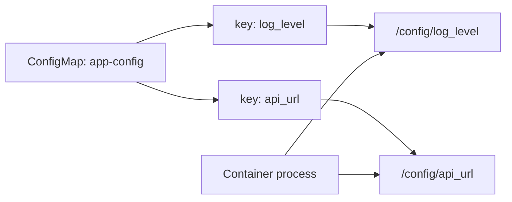

> **Складність**: `[СЕРЕДНЯ]` — невіддільна частина проєктування застосунків зі станом і багатоконтейнерних застосунків
>
> **Час на проходження**: 50-60 хвилин
>
> **Передумови**: Модуль 1.3 (Багатоконтейнерні Поди), базові маніфести Подів, ConfigMap'и та Secret'и

---

## Результати навчання

Після завершення цього модуля ви зможете:

- **Спроєктувати** розкладки сховища для Пода, які коректно розділяють ефемерні робочі дані, змонтовану конфігурацію, чутливі файли та персистентні дані застосунку.
- **Налаштувати** томи `emptyDir`, ConfigMap, Secret, projected, `hostPath` та PersistentVolumeClaim у придатних до запуску маніфестах Kubernetes v1.35+.
- **Діагностувати** збої Подів, пов'язані з томами, читаючи події, статус PVC, шляхи монтування, права доступу до файлів та симптоми на рівні контейнерів.
- **Порівняти** `subPath`, монтування цілих каталогів та projected-томи, а потім обґрунтувати, який патерн пасує до конкретного обмеження застосунку.
- **Оцінити**, чи має робоче навантаження зберігати дані у файловій системі контейнера, в `emptyDir` чи в PersistentVolumeClaim, виходячи з життєвого циклу та поведінки під час збоїв.

---

## Чому цей модуль важливий

Розробник постачає образ, який ідеально працює під час локального тестування, а потім той самий застосунок втрачає завантажені файли після кожного перезапуску в Kubernetes. Логи контейнера виглядають нормально, Деплоймент справний, і команда годинами досліджує код застосунку, який ніколи не був справжньою проблемою. Бракувало проєктного рішення щодо життєвого циклу сховища: команда записувала важливі дані туди, де Kubernetes мав право їх викинути.

Томи — це місце, де проєктування Пода стає операційно реальним. Контейнери навмисно зроблені одноразовими, але застосункам усе одно потрібні файли для конфігурації, облікових даних, тимчасової обробки, спільної передачі та тривкого стану. Кандидату на CKAD не потрібно адмініструвати сховище-бекенд, проте він повинен знати, як запросити сховище, безпечно його змонтувати та діагностувати, чому Под не бачить файли, які очікує.

Іспит також винагороджує точність під тиском часу. Один помилковий `mountPath`, відсутній запис у `volumeMounts` чи випадкове накладання каталогу ConfigMap можуть перетворити маніфест, що виглядає дійсним, на зламане робоче навантаження. Цей модуль навчає спершу проєктним міркуванням, потім YAML-патернам, а потім робочому процесу діагностики, який ви зможете застосувати, коли планувальник, kubelet чи процес контейнера повідомляють, що сховище поводиться не так, як задумано.

> **Аналогія робочого простору**
>
> Файлова система контейнера схожа на записи на позиченій дошці; вони корисні, поки триває сеанс, але ніхто не обіцяє, що написане збережеться після того, як кімнату приберуть. `emptyDir` схожий на спільний стіл, призначений для однієї наради; усі учасники цієї наради можуть ним користуватися, але його прибирають, коли нарада завершується. PersistentVolumeClaim схожий на зарезервовану шафку для зберігання; застосунок може повернутися пізніше і знайти збережені файли навіть після того, як початкового Пода вже немає.

---

## Основний матеріал

### 1. Побудуйте ментальну модель сховища перед написанням YAML

Kubernetes відокремлює джерело тому від місця, де контейнер бачить це джерело. [Список `spec.volumes` каже, яке сховище існує для Пода, тоді як список `volumeMounts` кожного контейнера каже, де це сховище з'являється всередині цього конкретного контейнера](https://kubernetes.io/docs/concepts/storage/volumes/). Ця дводільна модель — корінь більшості помилок з томами: означення тому нічого не дає контейнеру, доки той контейнер його не змонтує.

Под може мати кілька томів, і кожен контейнер може монтувати різні підмножини цих томів за різними шляхами. Це потужно, бо sidecar може ділити робочий каталог з основним контейнером, тоді як Secret можна змонтувати лише в той контейнер, якому потрібні облікові дані. Це також означає, що під час діагностики видимості файлів ви маєте міркувати на рівні контейнера, а не лише на рівні Пода.

```text
+--------------------------------------------------------------------------------+
| Pod: report-runner                                                             |
|                                                                                |
|  +------------------------------+        +----------------------------------+  |
|  | Container: generator          |        | Container: web                   |  |
|  |                              |        |                                  |  |
|  | /work  -> volume: scratch    |        | /usr/share/nginx/html -> scratch |  |
|  | /conf  -> volume: app-config |        |                                  |  |
|  +------------------------------+        +----------------------------------+  |
|                                                                                |
|  Pod volume sources:                                                           |
|  - scratch: emptyDir, exists only for this Pod's lifetime                      |
|  - app-config: ConfigMap, files generated from ConfigMap keys                  |
+--------------------------------------------------------------------------------+
```

Перше проєктне питання — це не "Яке поле YAML мені потрібне?", а "Який життєвий цикл мають мати ці дані?". Дані, які можна переобчислити заново після заміни Пода, зазвичай належать до `emptyDir` або до файлової системи контейнера, бо їхня втрата нічого не коштує. Дані, які мають пережити заміну Пода, належать за PersistentVolumeClaim, бо саме він гарантує довговічність. Конфігурація та облікові дані не є станом застосунку, тож зазвичай вони надходять із томів ConfigMap, Secret чи projected, які керуються окремо від коду.

| Проєктне питання | Якщо відповідь "Так" | Імовірний патерн тому | Чому цей вибір пасує |
|---|---|---|---|
| Чи мають дані зникати, коли Под видаляється? | Так | `emptyDir` | Життєвий цикл збігається з одним Подом, що тримає прибирання простим і передбачуваним. |
| Чи мають два контейнери в одному Поді обмінюватися файлами? | Так | `emptyDir` | Спільний том дає обом контейнерам спільне розташування у файловій системі. |
| Чи має вміст файлу надходити з об'єктів API Kubernetes? | Так | ConfigMap, Secret чи projected-том | Вміст керується окремо від образу і може монтуватися як файли. |
| Чи мають дані пережити видалення або переплановування Пода? | Так | PersistentVolumeClaim | Запит відв'язує дані застосунку від життєвого циклу Пода. |
| Чи має Под перевіряти файли на самому вузлі? | Рідко | `hostPath` | Це прив'язує Под до вузла і корисне переважно для інструментів рівня вузла чи лабораторій. |

> **Підказка для активного навчання:** Перш ніж читати далі, класифікуйте три шляхи застосунку з реального сервісу, який ви знаєте: логи, завантажені файли та кеш виконання. Вирішіть, чи має кожен шлях бути локальним для контейнера, на `emptyDir`, забезпеченим ConfigMap або Secret, чи забезпеченим PVC, а потім поясніть, який збій довів би, що ваш вибір хибний. Це робить проєктне рішення конкретним ще до того, як ви торкнетеся маніфестів, бо найкращий патерн сховища завжди визначається контрактом збою.

Друге проєктне питання — "Кому потрібно бачити ці дані?". Том, змонтований в один контейнер, невидимий для інших контейнерів, доки вони також його не змонтують, тож ви маєте міркувати на рівні контейнера. Така поведінка навмисна і вмикає тонкозернистий контроль доступу всередині одного Пода. Ви можете надати sidecar доступ до спільного каталогу, не відкриваючи йому облікові дані бази даних, або змонтувати ConfigMap лише для читання в застосунок, залишивши придатний для запису робочий том за іншим шляхом.

Третє проєктне питання — "Які наявні файли вже лежать за шляхом монтування?". Монтування тому за шляхом каталогу ховає оригінальні файли образу за цим шляхом на весь час життя контейнера. Це не операція злиття, а повне перекриття, і багато команд виявляють цю різницю лише після переходу з локальних робочих процесів Docker на Kubernetes. Якщо образ має корисні усталені значення під `/etc/app`, і ви монтуєте ConfigMap на той самий `/etc/app`, то вигляд ConfigMap замінює увесь вміст каталогу, видимий процесу, а попередні файли образу стають недосяжними.

### 2. Використовуйте `emptyDir` для робочих даних і спільного доступу на час життя Пода

[Том `emptyDir` створюється, коли Под призначається на вузол, і існує доти, доки об'єкт Пода існує на цьому вузлі. Якщо контейнер падає і перезапускається всередині того самого Пода, вміст `emptyDir` зберігається. Якщо Под видаляється, замінюється викочуванням Деплойменту, виселяється чи планується деінде, вміст втрачається](https://kubernetes.io/docs/concepts/storage/volumes/).

Такий життєвий цикл робить `emptyDir` ідеальним для тимчасових файлів, проміжної обробки та передачі між контейнерами. Це не рішення для тривкого сховища, але часто саме воно є правильною відповіддю для багатоконтейнерних Подів, бо обидва контейнери можуть монтувати той самий том. У завданнях CKAD `emptyDir` зазвичай з'являється разом з init-контейнерами, sidecar'ами та адаптерами, що готують чи перетворюють файли, перш ніж основний контейнер їх прочитає.

```yaml
apiVersion: v1
kind: Pod
metadata:
  name: emptydir-demo
spec:
  containers:
  - name: writer
    image: busybox:1.36
    command: ["sh", "-c", "date > /data/message && sleep 3600"]
    volumeMounts:
    - name: shared
      mountPath: /data
  - name: reader
    image: busybox:1.36
    command: ["sh", "-c", "while true; do cat /data/message; sleep 30; done"]
    volumeMounts:
    - name: shared
      mountPath: /data
  volumes:
  - name: shared
    emptyDir: {}
```

Запустіть маніфест за допомогою `kubectl apply -f emptydir-demo.yaml`. У решті прикладів `k` використовується як звичний псевдонім оболонки для `kubectl`; створіть його командою `alias k=kubectl`, якщо ваше середовище ще не надає його. Це дозволяє зосередитися на патернах виводу під час усунення несправностей, а не на правописі команд.

```bash
k apply -f emptydir-demo.yaml
k get pod emptydir-demo
k logs emptydir-demo -c reader
```

Важливе спостереження полягає в тому, що контейнер `reader` може бачити файл, створений контейнером `writer`, бо обидва монтують той самий том за назвою. Якби ви прибрали запис `volumeMounts` із `reader`, том усе одно існував би на рівні Пода, але процес reader не бачив би `/data/message`. Саме тому помилки з томами часто виглядають як звичайні помилки застосунку "файл не знайдено", бо Под може бути коректно змонтований на високому рівні, але промахнутися повз точний шлях, який читає процес.

Ви також можете запросити `emptyDir` на основі пам'яті для високошвидкісних робочих даних. Це корисно для невеликих тимчасових файлів, які виграють від продуктивності RAM, але це не безкоштовно: використання тому на основі пам'яті враховується у тиск на пам'ять вузла і може спричинити виселення чи поведінку OOM. Якщо ваші робочі дані раптом зростуть, `sizeLimit` запобігає тому, щоб один цикл діагностики перетворився на інцидент з ресурсами вузла.

```yaml
apiVersion: v1
kind: Pod
metadata:
  name: memory-cache-demo
spec:
  containers:
  - name: worker
    image: busybox:1.36
    command: ["sh", "-c", "dd if=/dev/zero of=/cache/blob bs=1M count=10 && sleep 3600"]
    volumeMounts:
    - name: cache
      mountPath: /cache
  volumes:
  - name: cache
    emptyDir:
      medium: Memory
      sizeLimit: 128Mi
```

`emptyDir` також чисто пасує до підготовки в init-контейнері. Init-контейнер може наповнити каталог, успішно завершитися і залишити файли для основного контейнера. Це уникає вбудовування згенерованих під час виконання файлів у образ, водночас зберігаючи простоту фінального контейнера, і полегшує міркування про послідовність запуску, коли шлях запису має відбутися перед обслуговуванням трафіку.

```yaml
apiVersion: v1
kind: Pod
metadata:
  name: init-volume-demo
spec:
  initContainers:
  - name: prepare-site
    image: busybox:1.36
    command: ["sh", "-c", "echo '<h1>ready</h1>' > /site/index.html"]
    volumeMounts:
    - name: site
      mountPath: /site
  containers:
  - name: nginx
    image: nginx:1.27-alpine
    ports:
    - containerPort: 80
    volumeMounts:
    - name: site
      mountPath: /usr/share/nginx/html
  volumes:
  - name: site
    emptyDir: {}
```

> **Підказка для активного навчання:** Спрогнозуйте, що станеться, якщо контейнер `nginx` упаде і перезапуститься в тому самому Поді після того, як init-контейнер записав `index.html`. Потім спрогнозуйте, що станеться, якщо ви видалите Под і створите новий з того самого маніфесту.

Тонка, але важлива деталь для іспиту: перезапуск контейнера — це не те саме, що заміна Пода. `emptyDir` переживає перезапуски контейнерів у межах того самого Пода, тож він може приховати помилки під час тестування, якщо ви стежите лише за перезапусками контейнерів. Викочування, виселення чи ручне видалення Пода створює новий `emptyDir`, і будь-які файли зі старого Пода втрачаються — саме тоді й виринають невідповідності життєвого циклу.

### 3. Монтуйте ConfigMap'и та Secret'и як файли, не ховаючи потрібні каталоги

[Томи ConfigMap і Secret перетворюють дані об'єктів API Kubernetes на файли всередині контейнера. Кожен ключ за замовчуванням стає файлом, а вмістом файлу є значення, збережене під цим ключем](https://kubernetes.io/docs/tasks/configure-pod-container/configure-pod-configmap/). Це дозволяє тримати специфічну для середовища конфігурацію та чутливий матеріал поза образом, водночас подаючи звичайні файли застосункам, що очікують ввід на основі файлів.

```bash
k create configmap app-config \
  --from-literal=log_level=debug \
  --from-literal=api_url=http://api.default.svc.cluster.local
```

```yaml
apiVersion: v1
kind: Pod
metadata:
  name: config-demo
spec:
  containers:
  - name: app
    image: busybox:1.36
    command: ["sh", "-c", "cat /config/log_level; cat /config/api_url; sleep 3600"]
    volumeMounts:
    - name: config
      mountPath: /config
      readOnly: true
  volumes:
  - name: config
    configMap:
      name: app-config
```



Діаграма показує, чому монтування томів ConfigMap зручне: застосунок читає файли, тоді як Kubernetes постачає вміст файлів. Застосунку не потрібно викликати API Kubernetes, і це зменшує зв'язаність між образом та значеннями середовища. Компроміс полягає в тому, що монтування цілого каталогу змінює те, що процес бачить за цим шляхом монтування.

Якщо образ уже містить файли під `/etc/app`, монтування ConfigMap на `/etc/app` ховає ці файли образу. Це дивує розробників, які очікують, що Kubernetes додасть один файл у каталог. Kubernetes монтує файлову систему за цільовим шляхом, тож вигляд змонтованого тому замінює вигляд каталогу образу для цього контейнера, і застосунок більше не може дістатися усталених значень, які раніше були на основі файлів.

```yaml
apiVersion: v1
kind: Pod
metadata:
  name: config-directory-overlay
spec:
  containers:
  - name: app
    image: busybox:1.36
    command: ["sh", "-c", "ls -la /etc/app && sleep 3600"]
    volumeMounts:
    - name: config
      mountPath: /etc/app
      readOnly: true
  volumes:
  - name: config
    configMap:
      name: app-config
```

[Коли вам потрібен лише один файл, скористайтеся `items`, щоб вибрати ключ, та `subPath`, щоб змонтувати цей єдиний файл у точне розташування. Це уникає заміни цілого каталогу, але вводить інший компроміс: монтування `subPath` не отримують живих оновлень ConfigMap чи Secret так само, як звичайні монтування projected-каталогів](https://kubernetes.io/docs/tasks/configure-pod-container/configure-pod-configmap/).

```bash
k create configmap single-file-config \
  --from-literal=config.yaml='mode: safe'
```

```yaml
apiVersion: v1
kind: Pod
metadata:
  name: config-subpath-demo
spec:
  containers:
  - name: app
    image: busybox:1.36
    command: ["sh", "-c", "cat /etc/app/config.yaml && sleep 3600"]
    volumeMounts:
    - name: config
      mountPath: /etc/app/config.yaml
      subPath: config.yaml
      readOnly: true
  volumes:
  - name: config
    configMap:
      name: single-file-config
      items:
      - key: config.yaml
        path: config.yaml
```

[Secret'и використовують той самий патерн тому, але вони призначені для чутливих значень, таких як паролі, токени та приватні ключі. Монтуйте томи Secret лише для читання, якщо тільки застосунок не має дуже конкретної причини записувати у шлях монтування. Файли надаються зі сховища на основі пам'яті на вузлі](https://kubernetes.io/docs/concepts/storage/volumes/), але Secret'и Kubernetes самі по собі все ще не є повноцінною системою керування секретами. Розглядайте ці томи як один шар у вашій стратегії секретів і уникайте змішування прав доступу до файлів із ширшими вимогами щодо розповсюдження, ротації та аудиту секретів.

```bash
k create secret generic db-creds \
  --from-literal=username=admin \
  --from-literal=password=secret123
```

```yaml
apiVersion: v1
kind: Pod
metadata:
  name: secret-demo
spec:
  containers:
  - name: app
    image: busybox:1.36
    command: ["sh", "-c", "ls -l /secrets && cat /secrets/username && sleep 3600"]
    volumeMounts:
    - name: db-secrets
      mountPath: /secrets
      readOnly: true
  volumes:
  - name: db-secrets
    secret:
      secretName: db-creds
      defaultMode: 0400
```

Режими файлів мають значення, коли застосунки працюють під непривілейованими (не-root) користувачами. Якщо процес не може прочитати файл Secret, перевірте власника файлу, його режим доступу, значення `runAsUser` та `fsGroup`, перш ніж припускати, що даних Secret бракує або що Kubernetes не змонтував том. Проблема з правами доступу часто проявляється як збій запуску самого застосунку, а не як збій планування на боці Kubernetes, тому її легко переплутати з помилкою в коді.

### 4. Поєднуйте кілька джерел за допомогою projected-томів

[Projected-том поєднує кілька джерел в один каталог. Це корисно, коли застосунок очікує всі вхідні дані виконання під одним шляхом, але дані надходять з різних об'єктів Kubernetes. Ви можете спроєктувати ConfigMap'и, Secret'и, поля Downward API та токени сервісних акаунтів в один том з явними шляхами](https://kubernetes.io/docs/concepts/storage/projected-volumes/).

```bash
k create configmap projected-config \
  --from-literal=app.properties='feature=true'
k create secret generic projected-secret \
  --from-literal=token=abc123
```

```yaml
apiVersion: v1
kind: Pod
metadata:
  name: projected-demo
  labels:
    app: projected-demo
    tier: lesson
spec:
  containers:
  - name: app
    image: busybox:1.36
    command: ["sh", "-c", "find /projected -type f -maxdepth 2 -print -exec cat {} \\; && sleep 3600"]
    volumeMounts:
    - name: all-runtime-inputs
      mountPath: /projected
      readOnly: true
  volumes:
  - name: all-runtime-inputs
    projected:
      sources:
      - configMap:
          name: projected-config
          items:
          - key: app.properties
            path: config/app.properties
      - secret:
          name: projected-secret
          items:
          - key: token
            path: secret/token
      - downwardAPI:
          items:
          - path: pod/labels
            fieldRef:
              fieldPath: metadata.labels
```

Projected-томи зменшують захаращення монтувань усередині контейнера, але вони можуть зробити власність кожного файлу менш очевидною для майбутнього супровідника. Використовуйте явні `items` та осмислені шляхи, щоб вміст тому пояснював сам себе. В умовах іспиту projected-томи зазвичай варті того, коли завдання явно просить поєднати кілька вхідних даних в одному каталозі, і стають ризикованими, коли потрібно швидко перевірити походження спільних файлів.

```text
+------------------------------------------------------------+
| /projected                                                 |
|                                                            |
|  config/app.properties   <- ConfigMap key                  |
|  secret/token            <- Secret key                     |
|  pod/labels              <- Downward API field             |
|                                                            |
| One container mount, several Kubernetes-backed file sources |
+------------------------------------------------------------+
```

Не використовуйте projected-томи лише тому, що вони виглядають охайно. Окремі монтування зрозуміліші, коли застосунок має різні каталоги, такі як `/etc/app`, `/var/run/secrets` та `/tmp/work`. Використовуйте патерн, який робить контракт виконання найлегшим для перевірки та діагностики, а потім перевірте кожен шлях монтування за допомогою `k exec`, щойно Под запрацює.

### 5. Запитуйте тривке сховище за допомогою PersistentVolumeClaim

PersistentVolumeClaim — це орієнтований на розробника запит тривкого сховища. Адміністратор кластера чи провізор сховища опікується бекендовим PersistentVolume, тоді як робоче навантаження посилається на запит за назвою. У роботі CKAD ви зазвичай створюєте чи використовуєте PVC і монтуєте його в Под; від вас не очікують проєктування бекенду сховища.

```yaml
apiVersion: v1
kind: PersistentVolumeClaim
metadata:
  name: data-pvc
spec:
  accessModes:
  - ReadWriteOnce
  resources:
    requests:
      storage: 1Gi
```

[Життєвий цикл PVC відокремлений від життєвого циклу Пода. Якщо Под видаляється, запит залишається, доки ви його не видалите](https://v1-35.docs.kubernetes.io/docs/concepts/storage/persistent-volumes/). Поведінка базового сховища після видалення PVC залежить від політики повторного використання (reclaim policy) PersistentVolume та класу сховища, що більше є турботою адміністрування, але розробник усе одно має розуміти, що PVC — це тривкий контракт, який споживає Под. Саме це розуміння не дає логіці міграції та відкоту змішувати перезапуски Пода з втратою даних.

```yaml
apiVersion: v1
kind: Pod
metadata:
  name: pvc-demo
spec:
  containers:
  - name: app
    image: nginx:1.27-alpine
    volumeMounts:
    - name: data
      mountPath: /usr/share/nginx/html
  volumes:
  - name: data
    persistentVolumeClaim:
      claimName: data-pvc
```

[Режими доступу PVC описують, як том може монтуватися вузлами, а не скільки процесів можуть відкривати файли всередині одного контейнера. `ReadWriteOnce` означає, що том може монтуватися на читання-запис одним вузлом за раз](https://v1-35.docs.kubernetes.io/docs/concepts/storage/persistent-volumes/). Для багатьох розробницьких робочих навантажень, особливо для Пода з однією репликою, цього достатньо. Багатореплікові робочі навантаження, які записують спільні файли, потребують класу сховища та режиму доступу, що дійсно підтримують задуманий патерн спільного доступу.

| Режим доступу | Коротка назва | Що дозволяє | Поширене розуміння розробником |
|---|---|---|---|
| `ReadWriteOnce` | RWO | Один вузол може монтувати том на читання-запис. | Добре для однієї придатної до запису репліки Пода чи навантажень, закріплених поведінкою контролера. |
| `ReadOnlyMany` | ROX | Багато вузлів можуть монтувати том лише для читання. | Корисно для спільних довідкових даних, які багато Подів читають, але не змінюють. |
| `ReadWriteMany` | RWX | Багато вузлів можуть монтувати том на читання-запис. | Потрібно для справжніх багатовузлових спільних записів, якщо сховище кластера це підтримує. |
| `ReadWriteOncePod` | RWOP | Один Под може монтувати том на читання-запис. | Корисно, коли контракт сховища має бути ексклюзивним для єдиного Пода. |

[PVC може залишатися у стані `Pending`, коли немає відповідного PersistentVolume або динамічне виділення сховища (dynamic provisioning) не може задовольнити запит. Под, що посилається на нього, також залишатиметься заблокованим, бо kubelet не може змонтувати сховище, яке не було прив'язане](https://kubernetes.io/docs/concepts/storage/persistent-volumes/). Це один із найпоширеніших шляхів усунення несправностей з томами в лабораторіях та на іспитах.

```bash
k get pvc
k describe pvc data-pvc
k describe pod pvc-demo
```

Коли ви бачите Под, що застряг у стані `Pending`, перевірте PVC, перш ніж змінювати команду контейнера. Відсутній чи непов'язаний запит — це не помилка застосунку. Події Kubernetes зазвичай кажуть вам, чи планувальник чекає на прив'язку запиту, чи назва запиту неправильна, чи клас сховища не може виділити запитаний том.

### 6. Використовуйте `hostPath` ощадливо і розумійте зв'язаність

Том `hostPath` монтує шлях із файлової системи вузла в Под. Він може бути корисним для локальної розробки, агентів рівня вузла чи іспитових завдань, які явно цього вимагають, але він прив'язує Под до тих файлів, що існують на обраному вузлі. Якщо Под переплановується на інший вузол, того самого шляху може не існувати або він може містити інші дані.

```yaml
apiVersion: v1
kind: Pod
metadata:
  name: hostpath-demo
spec:
  containers:
  - name: inspector
    image: busybox:1.36
    command: ["sh", "-c", "ls -la /host-tmp && sleep 3600"]
    volumeMounts:
    - name: host-tmp
      mountPath: /host-tmp
      readOnly: true
  volumes:
  - name: host-tmp
    hostPath:
      path: /tmp
      type: Directory
```

[Поле `type` дає Kubernetes просте очікування щодо того, що має існувати за шляхом вузла. Наприклад, `Directory` вимагає наявного каталогу, тоді як `DirectoryOrCreate` створює його, якщо він відсутній. Така зручність може приховати проблеми з переносимістю, тож використовуйте її свідомо й уникайте трактування `hostPath` як заміни тривкого сховища](https://kubernetes.io/docs/concepts/storage/volumes/).

Для розробницької роботи в стилі CKAD `hostPath` рідко є найкращим усталеним вибором. Якщо застосунку потрібні тривкі дані, віддавайте перевагу PVC, бо він не прив'язаний до конкретного вузла. Якщо йому потрібен лише тимчасовий робочий простір, віддавайте перевагу `emptyDir`, бо його життєвий цикл збігається з життям Пода. Якщо ж йому справді потрібна діагностика вузла чи доступ до конкретного файлового шляху на вузлі, тоді `hostPath` може бути доречним, бо тут зв'язаність із вузлом і є свідомим сенсом цього дизайну, а не його недоліком.

### 7. Шляхи монтування, `subPath` та видимість файлів

Монтування томів працюють за шляхами файлової системи, і вибір шляху визначає, що може бачити застосунок. Монтування каталогу на `/data` робить так, що том з'являється як каталог `/data`. Монтування одного файлу через `subPath` на `/etc/app/config.yaml` робить так, що один файл з'являється за цим точним шляхом. Обидва патерни дійсні, але вони розв'язують різні задачі.

| Патерн | Приклад монтування | Сильна сторона | Ризик |
|---|---|---|---|
| Монтування цілого каталогу | `/config` | Просто, оновлення легше осмислити для томів ConfigMap і Secret. | Ховає будь-які файли образу, уже наявні за цим шляхом каталогу. |
| Конкретні ключі з `items` | `/config` з вибраними файлами | Зберігає лише ті файли, які застосунок має читати. | Усе одно замінює вигляд змонтованого каталогу. |
| Один файл з `subPath` | `/etc/app/config.yaml` | Зберігає інші файли в каталозі образу. | Не отримує живих оновлень ConfigMap чи Secret, як звичайне проєктування каталогу. |
| Окремі монтування | `/config`, `/secrets`, `/work` | Чітка власність та межі безпеки. | Багатослівніший маніфест, особливо для багатьох дрібних вхідних даних. |

> **Підказка для активного навчання:** Образ має усталені файли під `/etc/nginx/conf.d`, і завдання просить вас додати один користувацький server-блок, не ховаючи інші. Який патерн монтування ви б обрали і який компроміс щодо поведінки оновлення прийняли б?

Найбезпечніша звичка діагностики — перевіряти зсередини контейнера після запуску Пода. Kubernetes може успішно змонтувати том, тоді як ваш застосунок усе ще падає, бо читає інший шлях, ніж той, який ви змонтували. Запуск `ls`, `cat` та `id` усередині контейнера часто знаходить невідповідність швидше, ніж повторне читання YAML.

```bash
k exec config-subpath-demo -- ls -la /etc/app
k exec config-subpath-demo -- cat /etc/app/config.yaml
k exec secret-demo -- id
k exec secret-demo -- ls -l /secrets
```

`subPath` не поганий, але ним часто зловживають. Обирайте його, коли вам потрібно покласти один файл у каталог, який має зберегти надані образом файли. Уникайте його, коли ваша головна мета — живі оновлення конфігурації з ConfigMap'ів чи Secret'ів. У такому разі монтуйте ConfigMap чи Secret як каталог і проєктуйте застосунок так, щоб він читав із цього змонтованого каталогу.

### 8. Діагностуйте проблеми з томами у передбачуваному порядку

Усунення несправностей з томами стає набагато легшим, коли ви послідовно відокремлюєте стан об'єктів Kubernetes від симптомів виконання всередині контейнера. По-перше, переконайтеся, що всі згадані об'єкти справді існують у потрібному просторі імен. По-друге, переконайтеся, що події Пода показують успішне планування та монтування, а не помилку. По-третє, огляньте власне файлову систему контейнера зсередини. По-четверте, оцініть права доступу до файлів та ідентифікатори користувачів, під якими працює процес. Кожен крок звужує коло можливих причин, тож ви не перестрибуєте навмання між рівнями.

```bash
k get pod
k describe pod myapp
k get pvc
k describe pvc data-pvc
k get configmap app-config
k get secret db-creds
```

Потік подій Пода зазвичай є найшвидшим джерелом правди про збої монтування. Помилка в назві ConfigMap, відсутній Secret чи непов'язаний PVC проявляються ще до того, як процес застосунку взагалі отримає шанс запуститися. Якщо події чисті, але застосунок падає, перейдіть усередину контейнера й огляньте фактичний шлях, бо Kubernetes може успішно виконати логіку планування й монтування, водночас усе ще видаючи невідповідність шляху під час виконання.

| Симптом | Найімовірніша причина | Що перевірити першим | Практичне виправлення |
|---|---|---|---|
| Под лишається `Pending`, а в подіях посилається на сховище. | PVC відсутній, непов'язаний або чекає на виділення. | `k get pvc` та `k describe pvc <name>`. | Створіть правильний запит, виправте назву запиту чи відкоригуйте запитане сховище. |
| Под падає з повідомленням, що ConfigMap чи Secret не знайдено. | Назва джерела тому не збігається з наявним об'єктом у просторі імен. | `k get configmap` чи `k get secret` у тому самому просторі імен. | Створіть об'єкт або виправте поле `name` чи `secretName`. |
| Застосунок повідомляє, що файл не знайдено. | Контейнер не змонтував том за шляхом, який читає застосунок. | `k exec <pod> -- ls -la <path>`. | Узгодьте `mountPath`, конфігурацію застосунку та назви файлів. |
| Застосунок повідомляє «відмовлено в доступі». | Неправильний режим файлу, власник, `runAsUser` чи груповий доступ. | `k exec <pod> -- id` та `ls -l` на змонтованих файлах. | Налаштуйте `defaultMode`, `runAsUser` чи `fsGroup` під процес. |
| Оновлення ConfigMap не з'являється в контейнері. | Файл змонтовано через `subPath`, або застосунок закешував старе значення. | Перевірте патерн монтування тому та поведінку перезавантаження застосунку. | Перезапустіть Под або уникайте `subPath` для конфігурації з живим оновленням. |
| Файли зникають після викочування чи ручного видалення Пода. | Дані зберігалися у файловій системі контейнера чи в `emptyDir`. | Перевірте, чи шлях забезпечено PVC. | Перенесіть тривкі дані до PersistentVolumeClaim. |

Поширене виправлення прав доступу — запускати процес під відомим користувачем і надати груповому власнику доступ до файлів змонтованого тому через security context Пода. Це особливо корисно для придатних до запису персистентних томів, де процес застосунку не повинен працювати від root. Завжди перевіряйте очікувану модель користувача образу, перш ніж змінювати поля security context, бо невідповідність користувача може замаскувати непов'язану помилку під збій прав доступу.

```yaml
apiVersion: v1
kind: Pod
metadata:
  name: pvc-permission-demo
spec:
  securityContext:
    fsGroup: 1000
  containers:
  - name: app
    image: busybox:1.36
    command: ["sh", "-c", "id && echo ok > /data/result.txt && sleep 3600"]
    securityContext:
      runAsUser: 1000
      runAsGroup: 1000
    volumeMounts:
    - name: data
      mountPath: /data
  volumes:
  - name: data
    persistentVolumeClaim:
      claimName: data-pvc
```

Не додавайте `fsGroup` до кожного Пода наосліп. [Це може змінити поведінку власності для підтримуваних типів томів і може додати накладні витрати на запуск для великих томів](https://v1-35.docs.kubernetes.io/docs/tasks/configure-pod-container/security-context/). Використовуйте його, коли симптом вказує на груповий доступ або коли образ застосунку навмисно не-root і потребує доступу на запис до змонтованої файлової системи, а потім повторно перевірте і час запуску, і права доступу до файлів разом.

### 9. Розбір прикладу: спільне використання згенерованого вмісту між контейнерами

**Задача:** Команда хоче, щоб один контейнер генерував статичний звіт, а інший контейнер обслуговував його через NGINX. Їхня перша спроба записує звіт у локальну файлову систему контейнера-генератора, тож вебконтейнер повертає усталену сторінку NGINX замість згенерованого звіту. Проблема дизайну — не в самому вебсервері; це видимість спільного сховища між контейнерами в одному Поді.

**Крок 1: Визначте вимогу до життєвого циклу та спільного доступу.** Звіт має існувати лише на час життя Пода, і обидва контейнери в одному Поді. Це вказує на `emptyDir`, а не на PVC. Дані спільні, але не тривкі, тож постійне сховище додало б зайвої складності й хибне очікування довговічності.

**Крок 2: Змонтуйте той самий том в обидва контейнери.** Генератор записує в `/work`, тоді як NGINX обслуговує з `/usr/share/nginx/html`. Шляхи різні, але назва тому однакова, тож обидва шляхи вказують на те саме сховище рівня Пода. Це той основний патерн, що дозволяє різним контейнерам співпрацювати без дублювання даних.

```yaml
apiVersion: v1
kind: Pod
metadata:
  name: report-pod
  labels:
    app: report-pod
spec:
  containers:
  - name: generator
    image: busybox:1.36
    command:
    - sh
    - -c
    - |
      while true; do
        date > /work/index.html
        echo "report generated by sidecar" >> /work/index.html
        sleep 60
      done
    volumeMounts:
    - name: report
      mountPath: /work
  - name: web
    image: nginx:1.27-alpine
    ports:
    - containerPort: 80
    volumeMounts:
    - name: report
      mountPath: /usr/share/nginx/html
  volumes:
  - name: report
    emptyDir: {}
```

**Крок 3: Застосуйте та перевірте з обох контейнерів.** Генератор має створити `index.html`, а вебконтейнер має бачити той самий файл за своїм шляхом монтування. Це доводить, що джерело тому спільне, навіть попри те, що кожен контейнер використовує інший внутрішній каталог. Якщо один бік дає збій, маніфест найімовірніше коректний, і вам слід перевірити обидві перевірки `cat`, перш ніж переглядати тип сховища.

```bash
k apply -f report-pod.yaml
k wait --for=condition=Ready pod/report-pod --timeout=90s
k exec report-pod -c generator -- cat /work/index.html
k exec report-pod -c web -- cat /usr/share/nginx/html/index.html
```

**Крок 4: Інтерпретуйте результат.** Якщо генератор може прочитати `/work/index.html`, але вебконтейнер не може прочитати `/usr/share/nginx/html/index.html`, проблема не в самому `emptyDir`. Імовірна помилка — відсутній запис `volumeMounts`, неузгоджена назва тому чи інший шлях монтування, ніж той, який перевіряють. Простежте `volumeMounts` кожного контейнера за виводами команд і виправте те єдине поле, що блокує видимість.

**Крок 5: Пов'яжіть патерн з іспитом.** Коли завдання каже, що два контейнери в одному Поді мають обмінюватися файлами, тягніться спершу до `emptyDir`, якщо тільки завдання явно не вимагає, щоб дані пережили видалення Пода. Ключова деталь реалізації — монтувати ту саму назву тому в кожен контейнер, якому потрібен доступ. На практиці ви можете вирішити за секунди, поставивши два питання: чи тривкі дані, і скільком контейнерам вони потрібні?

### 10. Розбір прикладу: діагностуйте Под, заблокований PVC

**Задача:** Под на ім'я `uploads-api` лишається у стані `Pending` після розгортання. Образ застосунку дійсний, а команда проста, але Под так і не стартує. Маніфест посилається на том на ім'я `uploads` через `persistentVolumeClaim.claimName: uploads-pvc`. Це зазвичай означає, що збій — це залежність від сховища ще до початку поведінки виконання.

**Крок 1: Перевірте події Пода, перш ніж змінювати образ.** Залежність від сховища може заблокувати запуск Пода ще до того, як процес контейнера взагалі запуститься. Перша команда має оглянути події планування та монтування, а потім підтвердити, чи посилається подія на створення запиту, виділення сховища чи обмеження режиму доступу.

```bash
k describe pod uploads-api
```

**Крок 2: Огляньте стан PVC.** Якщо подія згадує запит, перевірте, чи запит існує і чи він прив'язаний. Відсутній запит і запит у стані pending вимагають різних виправлень, і це ключова точка розгалуження, перш ніж вгадувати зміни на рівні образу.

```bash
k get pvc
k describe pvc uploads-pvc
```

**Крок 3: Виправте правильний збій.** Якщо PVC відсутній, створіть його або виправте `claimName` Пода. Якщо PVC існує, але має стан `Pending`, перевірте запитане сховище, режим доступу та поведінку класу сховища. У середовищі CKAD з динамічним виділенням сховища простий запит може прив'язатися автоматично після створення, тож відрізняйте помилки конфігурації від обмежень місткості й квот середовища.

```yaml
apiVersion: v1
kind: PersistentVolumeClaim
metadata:
  name: uploads-pvc
spec:
  accessModes:
  - ReadWriteOnce
  resources:
    requests:
      storage: 1Gi
```

**Крок 4: Перевірте Под повторно після прив'язки запиту.** Kubernetes може запустити Под автоматично, щойно запит стане придатним до використання. Якщо Под усе ще падає після прив'язки, перейдіть до логів контейнера та огляду файлової системи, бо збій перемістився із залежності планування до поведінки виконання.

```bash
k apply -f uploads-pvc.yaml
k get pvc uploads-pvc
k describe pod uploads-api
```

**Крок 5: Поясніть урок.** Под у стані `Pending` з непов'язаним PVC не виправляється зміною `command`, `args` чи портів контейнера. Под чекає, поки контракт сховища стане дійсним. Усунення несправностей CKAD швидше, коли ви простежуєте ланцюжок залежностей, а не вгадуєте з назви застосунку, і той самий ланцюжок застосовується до завдань, що включають секрети, конфігурацію та PVC.

### 11. Розбір прикладу: збережіть усталені файли образу, додаючи один файл конфігурації

**Задача:** Образ контейнера постачає усталені файли під `/etc/app`, але команді потрібно надати `/etc/app/config.yaml` із ConfigMap. Їхній перший маніфест монтує ConfigMap на `/etc/app`, і застосунок падає, бо інші усталені файли приховані. Виправлення — зберегти наявні файли, водночас усе ще вводячи один новий файл, не змінюючи вмісту образу.

**Крок 1: Розпізнайте поведінку накладання.** Монтування тому-каталогу замінює видимий вміст цільового каталогу з погляду контейнера. Kubernetes не видалив файли образу, але змонтований том ховає їх за цим шляхом. Читайте це як перевизначення на рівні файлової системи, а не злиття файлів.

**Крок 2: Створіть ConfigMap з тим одним файлом, який потрібен застосунку.** Ключ має збігатися з назвою файлу, який ви плануєте змонтувати через `subPath`, бо `subPath` вибирає один запис із тому. Це також полегшує перевірку викочування, бо ви можете передбачити точний підсумковий шлях у контейнері.

```bash
k create configmap app-file-config \
  --from-literal=config.yaml='mode: production'
```

**Крок 3: Змонтуйте ключ як один файл.** `mountPath` — це фінальний шлях файлу всередині контейнера, а `subPath` називає файл із тому. Це зберігає решту `/etc/app` видимою з образу й уникає заміни всіх усталених значень одним джерелом конфігурації.

```yaml
apiVersion: v1
kind: Pod
metadata:
  name: single-config-file
spec:
  containers:
  - name: app
    image: busybox:1.36
    command: ["sh", "-c", "cat /etc/app/config.yaml && sleep 3600"]
    volumeMounts:
    - name: app-file-config
      mountPath: /etc/app/config.yaml
      subPath: config.yaml
      readOnly: true
  volumes:
  - name: app-file-config
    configMap:
      name: app-file-config
```

**Крок 4: Зафіксуйте компроміс.** Цей патерн розв'язує проблему накладання каталогу, але змонтований файл поводиться як знімок для цілей оновлення. Якщо команді потрібне живе оновлення конфігурації, їй слід змонтувати ConfigMap як каталог і налаштувати застосунок читати з цього каталогу.

**Крок 5: Перевірте файл зсередини контейнера.** Найшвидша перевірка впевненості — прочитати точний шлях, який використовує застосунок. Якщо цей шлях працює, але застосунок усе одно падає, проблема, що лишилася, найімовірніше на рівні розбору застосунком, а не у дротовій схемі тому Kubernetes. Такий поділ тримає вашу діагностику ефективною, бо ви більше не марнуєте цикли на перевірку монтувань, які вже задовольняють контракт файлової системи.

```bash
k apply -f single-config-file.yaml
k wait --for=condition=Ready pod/single-config-file --timeout=90s
k exec single-config-file -- cat /etc/app/config.yaml
```

### 12. Контрольний список рішень для завдань CKAD із томами

Коли завдання CKAD згадує файли, зробіть паузу достатньо довгу, щоб класифікувати файл перед написанням YAML. Вибір сховища зазвичай очевидний, щойно ви визначите життєвий цикл, видимість, мінливість і безпеку. Цей короткий проєктний прохід запобігає більшості фальшивих стартів.

| Потреба у файлі | Сильне усталене значення | Скорочення для міркування | Червоний прапорець |
|---|---|---|---|
| Тимчасові робочі дані для одного Пода | `emptyDir` | Дані можуть зникнути разом з Подом. | Вимога каже, що дані мають пережити заміну. |
| Передача між init- та основним контейнером | `emptyDir` | Обидва контейнери ділять каталог рівня Пода. | Передача має лишитися після видалення Пода. |
| Файл конфігурації застосунку | Том ConfigMap | Kubernetes володіє нечутливою конфігурацією окремо від образу. | Монтування поверх каталогу з потрібними файлами образу. |
| Файл пароля чи токена | Том Secret | Чутливі дані не слід запікати в образ чи звичайний ConfigMap. | Змонтовано на запис або відкрито контейнерам, яким це не потрібно. |
| Тривкі завантажені дані | PVC | Життєвий цикл даних має пережити Под. | Кілька реплік записують одночасно без підтримки RWX. |
| Огляд файлової системи вузла | `hostPath` | Цільовим є сам шлях вузла. | Використано як скорочення для звичайної персистентності застосунку. |

Цей контрольний список також тримає оцінювання узгодженим із реальною роботою. Старший розробник не запам'ятовує типи томів окремо; він зіставляє режими збоїв з контрактами життєвого циклу, питаючи, що відбувається першим, коли щось зникає. Якщо наслідок втрати файлу нешкідливий, не надмірно ускладнюйте. Якщо наслідок — втрата даних, не ховайтеся за абстракцією Пода, який можна перезапустити.

---

## Чи знали ви?

- **Оновлення томів ConfigMap і Secret зрештою відображаються для звичайних монтувань каталогів, але монтування `subPath` поводяться як знімки.** Якщо ваш застосунок має отримувати живі зміни конфігурації, уникайте однофайлового `subPath`, якщо тільки ви також не плануєте перезапуск Пода чи окремий механізм перезавантаження.

- **`emptyDir` переживає перезапуски контейнерів, але не заміну Пода.** Ця відмінність має значення, бо цикл падінь усередині одного Пода може зберегти тимчасові файли, тоді як викочування Деплойменту створює новий Под зі свіжим порожнім каталогом.

- **Режими файлів тому Secret можуть зламати не-root застосунки, навіть коли Secret існує.** Коли процес працює з `runAsUser`, перевірте режим файлу, груповий доступ та `fsGroup`, перш ніж припускати, що Kubernetes не зміг змонтувати Secret.

- **Режими доступу PVC описують спроможність монтування на рівні вузла, а не блокування на рівні застосунку.** Том, що підтримує `ReadWriteMany`, усе одно потребує безпечної для застосунку конкурентності, якщо кілька Подів записують у ті самі файли.

---

## Типові помилки

| Помилка | Чому це шкодить | Як це виправити |
|---|---|---|
| Означення `spec.volumes`, але забування про запис `volumeMounts` у контейнері. | Под має джерело тому, але файлова система контейнера ніколи не отримує монтування за очікуваним шляхом. | Додайте відповідний запис `volumeMounts` до кожного контейнера, якому потрібен том. |
| Монтування ConfigMap поверх каталогу, що містить потрібні файли образу. | Змонтований том ховає оригінальний вміст каталогу, тож застосунок втрачає усталені значення, які очікував прочитати. | Монтуйте у виділений каталог або використовуйте `subPath` для одного файлу, приймаючи компроміс щодо оновлення. |
| Використання `emptyDir` для завантажень користувачів чи файлів бази даних, які мають пережити видалення Пода. | Дані зникають під час викочування, виселення чи ручної заміни, спричиняючи реальну втрату даних застосунку. | Використовуйте PersistentVolumeClaim для тривкого стану і переконайтеся, що запит прив'язується, перш ніж покладатися на нього. |
| Припущення, що проблема з PVC — це проблема образу чи команди. | Под може лишатися `Pending`, бо сховище недоступне ще до того, як контейнер запуститься. | Огляньте `k describe pod`, `k get pvc` та `k describe pvc`, перш ніж змінювати поля виконання. |
| Монтування Secret'ів без перевірки прав доступу до файлів для не-root процесу. | Secret існує, але застосунок отримує «відмовлено в доступі» і може впасти під час запуску. | Налаштуйте відповідні `defaultMode`, `runAsUser`, `runAsGroup` чи `fsGroup` рівня Пода. |
| Очікування, що оновлення ConfigMap через `subPath` з'являться автоматично в запущеному контейнері. | Файл лишається зі старим вмістом, через що зміни конфігурації виглядають проігнорованими. | Перезапустіть Под після оновлень або уникайте `subPath`, коли потрібні живі оновлення. |
| Вибір `hostPath` як скорочення для персистентності. | Под стає прив'язаним до локальних файлів вузла й поводиться інакше після перепланування. | Використовуйте PVC для даних застосунку, якщо тільки завдання явно не вимагає доступу до файлової системи вузла. |
| Повторне використання того самого шляху монтування для непов'язаних томів в одному контейнері. | Пізніші монтування можуть приховати ранній вміст, і маніфест стає важко осмислити. | Використовуйте окремі, цілеспрямовані каталоги, такі як `/config`, `/secrets`, `/work` та `/data`. |

---

## Тест

1. **Ваша команда запускає Под із двома контейнерами: один завантажує згенерований звіт, а інший обслуговує файли через NGINX. Звіт не потребує переживати видалення Пода, але обидва контейнери мають бачити його, поки Под працює. Який патерн тому вам слід реалізувати, і що б ви перевірили після застосування маніфесту?**

   <details>
   <summary>Відповідь</summary>

   Використайте том `emptyDir`, змонтований в обидва контейнери. Завантажувач може змонтувати його за робочим шляхом, таким як `/work`, тоді як NGINX може змонтувати ту саму назву тому на `/usr/share/nginx/html`. Після застосування маніфесту перевірте, що файл існує з обох контейнерів, за допомогою `k exec <pod> -c <container> -- cat <path>`. Це перевіряє важливий проєктний момент: джерело тому спільне на рівні Пода, але кожен контейнер бачить його лише там, де цей контейнер його монтує.

   </details>

2. **Под лишається `Pending` після того, як ви додали `persistentVolumeClaim.claimName: uploads-pvc` до його маніфесту. Відомо, що образ працює, і логів застосунку немає. Що вам слід перевірити першим, і чому зміна команди навряд чи допоможе?**

   <details>
   <summary>Відповідь</summary>

   Перевірте `k describe pod <pod>`, `k get pvc` та `k describe pvc uploads-pvc`. Под, що посилається на відсутній чи непов'язаний PVC, може бути заблокований ще до того, як будь-який контейнер запуститься, а це означає, що команда застосунку ще не виконувалася. Зміна `command` чи `args` не розв'язує незадоволену залежність від сховища. Правильне виправлення — створити запит, виправити назву запиту чи відкоригувати запит PVC так, щоб він міг прив'язатися.

   </details>

3. **Образ застосунку містить усталені значення під `/etc/app`, але команда монтує ConfigMap на `/etc/app`, і застосунок починає падати, бо усталені файли зникли. Як би ви зберегли усталені значення, водночас усе ще надаючи `/etc/app/config.yaml` із Kubernetes?**

   <details>
   <summary>Відповідь</summary>

   Змонтуйте ключ ConfigMap як один файл за допомогою `subPath`, з `mountPath: /etc/app/config.yaml` та `subPath: config.yaml`. Монтування цілого каталогу на `/etc/app` ховає наданий образом вміст каталогу, тоді як однофайлове монтування `subPath` розміщує один файл за бажаним шляхом. Компроміс у тому, що `subPath` не поводиться як монтування каталогу ConfigMap із живим оновленням, тож Под слід перезапустити чи інакше перезавантажити після змін конфігурації.

   </details>

4. **Не-root контейнер монтує Secret на `/secrets`, але застосунок повідомляє «відмовлено в доступі» під час читання `/secrets/password`. Secret існує, і Под працює. Які команди діагностики та поля маніфесту ви б використали, щоб розв'язати проблему?**

   <details>
   <summary>Відповідь</summary>

   Огляньте користувача виконання та права доступу до файлів за допомогою команд на кшталт `k exec <pod> -- id` та `k exec <pod> -- ls -l /secrets`. Потім порівняйте вивід із `defaultMode` тому Secret та `securityContext` контейнера чи Пода. Залежно від невідповідності, налаштуйте придатний для читання `defaultMode`, узгодьте `runAsUser` і `runAsGroup` або використайте `fsGroup` рівня Пода, щоб процес міг читати змонтовані файли, не працюючи від root.

   </details>

5. **Деплоймент записує файли кешу мініатюр в `emptyDir`. Після кожного викочування сервіс витрачає кілька хвилин на перегенерацію мініатюр, але дані користувачів не втрачаються. Чи слід вам змінити том на PVC? Обґрунтуйте рішення, а не лише назвіть тип тому.**

   <details>
   <summary>Відповідь</summary>

   Правильний вибір залежить від того, чи прийнятна вартість прогріву. `emptyDir` коректний, якщо кеш одноразовий, а час перегенерації допустимий, бо це тримає сховище простим і автоматично очищає застарілі файли з кожним Подом. PVC виправданий, якщо вартість прогріву шкодить доступності чи створює дорогу повторювану роботу. Ключове міркування — життєвий цикл та вплив на бізнес: кеші можуть бути ефемерними, але кеш із неприйнятною вартістю перебудови може заслуговувати на тривке сховище.

   </details>

6. **Команда хоче, щоб три репліки сервісу завантажень записували в той самий спільний каталог. Вони створюють один PVC з `ReadWriteOnce`, монтують його в усіх репліках і бачать непослідовну поведінку планування. На яку проблему дизайну вам слід вказати?**

   <details>
   <summary>Відповідь</summary>

   `ReadWriteOnce` дозволяє монтування на читання-запис одним вузлом, тож це не загальне рішення для багатовузлових спільних записів між репліками. Команді слід оцінити, чи дійсно застосунку потрібні спільні записи у файлову систему, чи підтримує клас сховища `ReadWriteMany` і чи безпечний застосунок, коли кілька Подів записують одночасно. Якщо спільні записи не потрібні, кожна репліка має використовувати власний патерн сховища або записувати завантаження у зовнішній сервіс, спроєктований для конкурентності.

   </details>

7. **ConfigMap змонтовано як каталог на `/config`, і застосунок читає `/config/log_level`. Після оновлення ConfigMap файл зрештою змінюється в контейнері, але застосунок усе одно поводиться так, ніби активне старе значення. Яку поведінку Kubernetes і яку поведінку застосунку вам потрібно розділити?**

   <details>
   <summary>Відповідь</summary>

   Розділіть проєктування файлу від поведінки перезавантаження застосунку. Kubernetes може оновити змонтований файл для звичайного монтування каталогу ConfigMap, але застосунок може читати файл лише під час запуску чи кешувати значення внутрішньо. Перевірте вміст файлу за допомогою `k exec <pod> -- cat /config/log_level`. Якщо файл змінився, а поведінка ні, перезапустіть чи подайте сигнал застосунку відповідно до його механізму перезавантаження. Якщо файл не змінився і використовується `subPath`, перезапустіть Под чи приберіть патерн `subPath`.

   </details>

---

## Практична вправа

**Завдання:** Збудуйте та продіагностуйте розкладку сховища Пода, що використовує `emptyDir` для спільного згенерованого вмісту, ConfigMap для налаштувань застосунку, Secret для чутливого вводу та PVC для тривкого виводу. Мета — не лише змусити маніфести застосуватися, а й довести, що кожен змонтований шлях має той життєвий цикл і видимість, які очікує застосунок. Ви перевірите, що ваші міркування збігаються зі спостережуваною поведінкою, бо сам синтаксис маніфесту не доводить коректності.

**Сценарій:** Невелике робоче навантаження звітності генерує HTML-звіт, обслуговує його через NGINX, читає режим відображення з ConfigMap, читає токен із Secret і записує маркер аудиту в тривке сховище. Згенерований HTML може зникнути разом з Подом, але маркер аудиту має лишитися на PVC після заміни Пода. Це дає вам один домен збою на кожен шар, тож ваша вправа виявляє, чи кожне джерело дотримується свого передбаченого контракту персистентності.

**Крок 1: Підготуйте ізольований простір імен та псевдонім команди.** Почніть у виділеному просторі імен, щоб прибирання було легким і ви випадково не діагностували ресурси з іншої лабораторії. Створення `alias k=kubectl` наперед робить повторювані перевірки життєвого циклу швидшими та зменшує випадковий дрейф команд під час усунення несправностей.

```bash
alias k=kubectl
k create namespace volumes-lab
k config set-context --current --namespace=volumes-lab
```

**Крок 2: Створіть вхідні дані конфігурації та секрету.** Встановіть два не-сховищні вхідні дані з явними, передбачуваними ключами, бо підсумкові файли керують тим, що Под може відрендерити і чим він може автентифікуватися. Це тримає вправу зосередженою на поведінці монтування, а не на вбудованих тестових даних.

```bash
k create configmap report-config \
  --from-literal=mode=training \
  --from-literal=refresh_seconds=60

k create secret generic report-token \
  --from-literal=token=lab-token-123
```

**Крок 3: Створіть PVC для тривкого виводу аудиту.** Тривкий вивід — це шар, який має пережити заміну Пода, тож означте його перед запуском Пода, щоб віддзеркалити реальну послідовність CKAD, де залежні ресурси мають існувати чи бути виділеними, перш ніж робоче навантаження стартує.

```yaml
apiVersion: v1
kind: PersistentVolumeClaim
metadata:
  name: report-audit-pvc
spec:
  accessModes:
  - ReadWriteOnce
  resources:
    requests:
      storage: 1Gi
```

```bash
k apply -f report-audit-pvc.yaml
k get pvc report-audit-pvc
```

**Крок 4: Створіть Под звітності з чотирма окремими відповідальностями за сховище.** Використайте `emptyDir`, ConfigMap, Secret та PVC у різних ролях, щоб ви могли довести, що відмінності навмисні, а не випадкові. Кожне монтування має відображатися на чітко окреслений контракт: спільний робочий простір, конфігурація, облікові дані та довговічність аудиту.

```yaml
apiVersion: v1
kind: Pod
metadata:
  name: report-stack
  labels:
    app: report-stack
spec:
  securityContext:
    fsGroup: 1000
  initContainers:
  - name: write-report
    image: busybox:1.36
    command:
    - sh
    - -c
    - |
      echo "<h1>KubeDojo Volume Lab</h1>" > /site/index.html
      echo "<p>Mode: $(cat /config/mode)</p>" >> /site/index.html
      echo "<p>Token length: $(wc -c < /secret/token)</p>" >> /site/index.html
      date > /audit/created-at.txt
    volumeMounts:
    - name: generated-site
      mountPath: /site
    - name: report-config
      mountPath: /config
      readOnly: true
    - name: report-token
      mountPath: /secret
      readOnly: true
    - name: audit
      mountPath: /audit
  containers:
  - name: web
    image: nginx:1.27-alpine
    ports:
    - containerPort: 80
    volumeMounts:
    - name: generated-site
      mountPath: /usr/share/nginx/html
    - name: audit
      mountPath: /audit
  volumes:
  - name: generated-site
    emptyDir: {}
  - name: report-config
    configMap:
      name: report-config
  - name: report-token
    secret:
      secretName: report-token
      defaultMode: 0400
  - name: audit
    persistentVolumeClaim:
      claimName: report-audit-pvc
```

```bash
k apply -f report-stack.yaml
k wait --for=condition=Ready pod/report-stack --timeout=120s
```

**Крок 5: Перевірте видимі файли із запущеного контейнера.** Щойно Под готовий, прочитайте файли зі змонтованих розташувань так, як їх бачить вебконтейнер. Якщо будь-який шлях порожній чи відсутній, це каже вам точно, який контракт монтування дав збій у вигляді виконання.

```bash
k exec report-stack -c web -- cat /usr/share/nginx/html/index.html
k exec report-stack -c web -- cat /audit/created-at.txt
k describe pod report-stack
```

**Крок 6: Доведіть відмінність між життєвим циклом `emptyDir` та PVC.** Видаліть і повторно створіть Под, не змінюючи маніфестів, щоб відмінність у персистентності була зовні видимою. Якщо спільний вміст звіту змінюється, а маркер аудиту — ні, ваші рішення щодо розміщення даних правильні; якщо змінюється і те, і те, контракт перевернутий.

```bash
k delete pod report-stack
k apply -f report-stack.yaml
k wait --for=condition=Ready pod/report-stack --timeout=120s
k exec report-stack -c web -- cat /usr/share/nginx/html/index.html
k exec report-stack -c web -- cat /audit/created-at.txt
```

**Крок 7: Введіть і виправте один збій діагностики.** Відредагуйте маніфест Пода так, щоб том ConfigMap посилався на `report-config-missing`, застосуйте його після видалення Пода й огляньте збій за допомогою `k describe pod report-stack`. Потім відновіть правильну назву й перевірте, що Под знову стає готовим, що підтверджує: ви діагностували збій посилання на об'єкт, а не звинуватили поведінку застосунку.

```bash
k delete pod report-stack
k apply -f report-stack-broken.yaml
k describe pod report-stack
k delete pod report-stack
k apply -f report-stack.yaml
k wait --for=condition=Ready pod/report-stack --timeout=120s
```

**Критерії успіху:**

- [ ] Ви можете пояснити, який змонтований шлях забезпечено `emptyDir`, ConfigMap, Secret і PVC, та чому кожен життєвий цикл відповідає сценарію.
- [ ] `k get pvc report-audit-pvc` показує, що запит прив'язаний чи інакше дійсний у вашому лабораторному середовищі, перш ніж Под починає від нього залежати.
- [ ] `k exec report-stack -c web -- cat /usr/share/nginx/html/index.html` показує вміст, згенерований init-контейнером через спільний `emptyDir`.
- [ ] `k exec report-stack -c web -- cat /audit/created-at.txt` показує файл аудиту, записаний через монтування на основі PVC.
- [ ] Після видалення й повторного створення Пода ви можете відрізнити перегенерований вміст `emptyDir` від вмісту аудиту на основі PVC.
- [ ] Коли назву ConfigMap навмисно зламано, `k describe pod report-stack` веде вас до відсутнього об'єкта, а не до зміни образу чи команди.
- [ ] Ви можете сказати, коли `subPath` був би корисним для цього робочого навантаження і який компроміс щодо поведінки оновлення він би вніс.

**Прибирання:**

```bash
k delete pod report-stack --ignore-not-found
k delete pvc report-audit-pvc --ignore-not-found
k delete configmap report-config --ignore-not-found
k delete secret report-token --ignore-not-found
k config set-context --current --namespace=default
k delete namespace volumes-lab --ignore-not-found
```

---

## Наступний модуль

Перейдіть до [Підсумкового тесту Частини 1](./part1-cumulative-quiz/), щоб попрактикуватися у проєктуванні та діагностиці Подів, Job'ів, багатоконтейнерних патернів і навантажень на основі томів разом.

## Джерела

- [kubernetes.io: volumes](https://kubernetes.io/docs/concepts/storage/volumes/) — Концептуальна сторінка томів Kubernetes явно каже, що томи надаються у `.spec.volumes` і монтуються в контейнери через `.spec.containers[*].volumeMounts`.
- [kubernetes.io: configure pod configmap](https://kubernetes.io/docs/tasks/configure-pod-container/configure-pod-configmap/) — Сторінка завдання ConfigMap прямо стверджує, що кожен ключ стає файлом під `mountPath` і що наявні файли за цим шляхом каталогу стають недоступними після монтування.
- [kubernetes.io: projected volumes](https://kubernetes.io/docs/concepts/storage/projected-volumes/) — Концептуальна сторінка projected-томів прямо означує projected-том як відображення кількох наявних джерел томів у той самий каталог і перелічує ці типи джерел.
- [v1-35.docs.kubernetes.io: persistent volumes](https://v1-35.docs.kubernetes.io/docs/concepts/storage/persistent-volumes/) — Концептуальна сторінка Persistent Volumes прямо означує PVC як запити сховища й документує PVC та Поди як окремі ресурси з окремими життєвими циклами.
- [kubernetes.io: persistent volumes](https://kubernetes.io/docs/concepts/storage/persistent-volumes/) — Концептуальна сторінка Persistent Volumes прямо каже, що неузгоджені запити лишаються непов'язаними, і документує динамічне виділення сховища (dynamic provisioning) як альтернативу, коли відповідного статичного тому не існує.
- [v1-35.docs.kubernetes.io: security context](https://v1-35.docs.kubernetes.io/docs/tasks/configure-pod-container/security-context/) — Сторінка завдання security-context Kubernetes прямо стверджує, що `fsGroup` змінює власність та права доступу на підтримуваних томах і що це може сповільнити запуск для великих томів.


