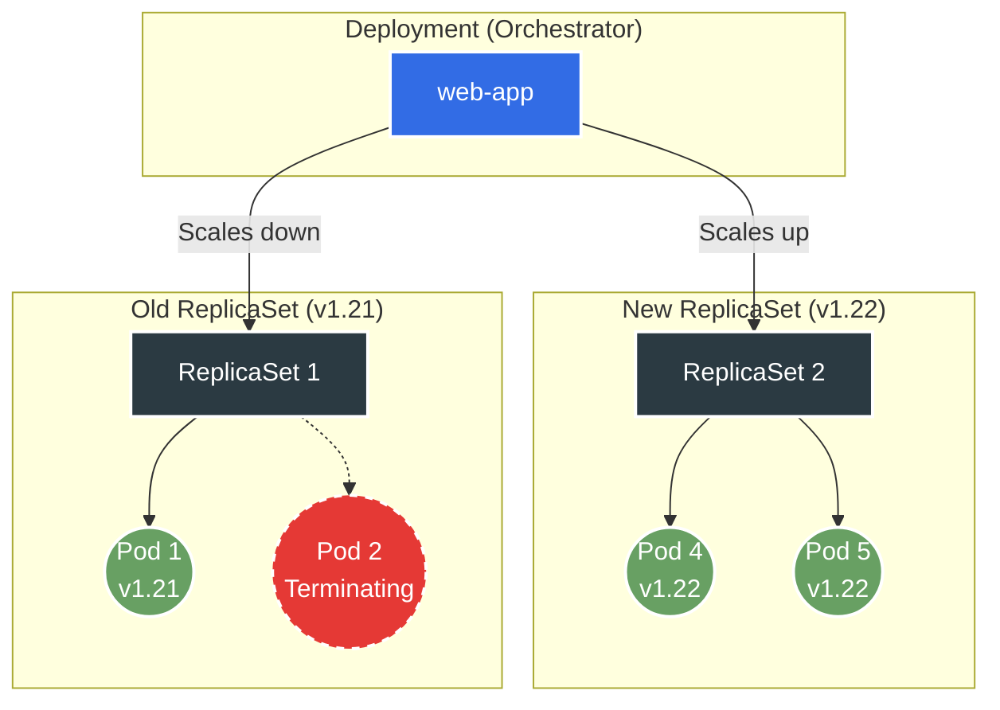

> **Складність**: `[MEDIUM]` — основна навичка CKAD з кількома операціями
>
> **Час на проходження**: 45–55 хвилин
>
> **Передумови**: завершена Частина 1, розуміння Подів та ReplicaSet

---

## Результати навчання

Після завершення цього модуля ви зможете:
- **Впровадити** маніфести Деплойментів та імперативні команди, які створюють, масштабують і відкривають доступ до застосунків без збереження стану.
- **Налаштувати** стратегії поетапного оновлення за допомогою `maxSurge`, `maxUnavailable`, `progressDeadlineSeconds` та `revisionHistoryLimit`.
- **Діагностувати** зупинені розгортання, читаючи умови Деплойменту, ReplicaSet, події Подів та збої завантаження образів.
- **Оцінити**, коли під час релізу варто призупинити, відновити, відкотити, перезапустити або перестворити Деплоймент.

---

## Чому цей модуль важливий

Гіпотетичний сценарій: ви на чергуванні для невеликого API, який зазвичай працює у три репліки Подів за Сервісом. Розробник відвантажує новий образ контейнера, перший новий Под не може завантажити свій образ, і клієнти починають бачити суміш старої поведінки та затриманих відповідей, тому що розгортання застрягло на половині шляху. Найкориснішим інженером у цей момент є не той, хто запам'ятав команду; це той, хто може пояснити, який контролер чекає, який ReplicaSet володіє кожним Подом і яка відновлювальна дія змінює найменше, водночас повертаючи сервіс до роботи.

Деплойменти — це стандартний контролер Kubernetes для релізів застосунків без збереження стану. Вони не запускають контейнери напряму, як це могло б здаватися на перший погляд. Натомість Деплоймент записує бажаний шаблон Пода до ReplicaSet, ReplicaSet своєю чергою підтримує задану кількість реплік, а планувальник розміщує отримані Поди на доступних Нодах. Цей додатковий проміжний шар спершу може здаватися зайвим ускладненням, але саме він є причиною того, що Kubernetes може поступово накочувати оновлення, тримати старі шаблони доступними для швидкого відкату та узгоджувати стан назад до бажаного після відмови окремого Пода чи цілої Ноди.

Іспит CKAD використовує Деплойменти саме тому, що вони поєднують одразу кілька практичних навичок в одному об'єкті. Ви маєте вміти швидко створити Деплоймент, оглянути Поди, якими він володіє, масштабувати його без втрати зв'язку через селектор, оновити образ контейнера, діагностувати розгортання, яке не завершується вчасно, а також скасувати невдалий реліз і повернутися до попереднього стану. Кожна з цих дій сама по собі невелика й виглядає простою, проте справжня надійність у продакшені походить саме зі знання того, як усі вони взаємодіють між собою під тиском реального інциденту.

У цьому модулі ви пройдете повний життєвий цикл Деплойменту з командами у стилі Kubernetes 1.35. Приклади зберігають операційні прийоми, потрібні вам для іспиту: імперативне створення, декларативний YAML, параметри поетапного оновлення, статус і історія розгортання, призупинення та відновлення, відкати, безпека міток і вправи на час. Мета — не запам'ятати кожне поле в API. Мета — побудувати ментальну модель, достатньо міцну, щоб невдале розгортання здавалося придатним до огляду, а не загадковим.

## Цикл узгодження Деплойменту

Деплоймент — це контролер, а це означає, що він безперервно порівнює бажаний стан, збережений в API Kubernetes, зі спостережуваним станом у кластері. Коли ці два стани відрізняються, контролер намагається закрити розрив, створюючи, масштабуючи або видаляючи дочірні об'єкти. Для Деплойментів дочірнім об'єктом є ReplicaSet, а ReplicaSet створює Поди з шаблону Пода, вбудованого всередину Деплойменту.

Цей зв'язок має велике значення, бо кожен видимий Под перебуває за два кроки від того об'єкта, який ви зазвичай редагуєте власноруч. Якщо ви змінюєте `spec.replicas`, Деплоймент коригує кількість реплік на активному ReplicaSet, не зачіпаючи самого шаблону. Якщо ви змінюєте шаблон Пода, Деплоймент створює зовсім новий ReplicaSet, оскільки хеш шаблону при цьому змінюється. А якщо ви вручну видаляєте один окремий Под, ReplicaSet негайно замінює його новим, бо бажана кількість реплік при цьому не змінилася.

Уявіть Деплоймент як менеджера релізів, ReplicaSet як виробничу лінію, а Поди як окремі одиниці, що сходять із цієї лінії. Менеджер релізів вирішує, яка виробнича лінія має працювати і скільки одиниць має виробляти кожна лінія. Працівники не узгоджують план релізу; вони лише дотримуються шаблону, призначеного їхній лінії. Саме тому відкат означає масштабування старішого ReplicaSet назад угору, а не редагування старих Подів на місці.

```text
+---------------- Deployment: web-app ----------------+
| desired replicas: 3                                  |
| rollout strategy: RollingUpdate                      |
| pod template hash: 6d8f9b6b4f                        |
+--------------------------+---------------------------+
                           |
                           v
+---------------- ReplicaSet: web-app-6d8f9b6b4f ------+
| selector: app=web,pod-template-hash=6d8f9b6b4f       |
| creates and replaces Pods until desired count is met |
+---------------+----------------+---------------------+
                |                |
                v                v
        +-------------+  +-------------+  +-------------+
        | Pod web-1   |  | Pod web-2   |  | Pod web-3   |
        | image v1    |  | image v1    |  | image v1    |
        +-------------+  +-------------+  +-------------+
```

Селектор — це той контракт, який пов'язує Деплоймент із ReplicaSet та з усіма Подами, якими він володіє. Поле `spec.selector.matchLabels` має збігатися з мітками у `spec.template.metadata.labels`, і Kubernetes трактує селектор як фактично незмінний одразу після створення об'єкта, бо його зміна могла б осиротити вже наявні Поди або, навпаки, захопити чужі Поди, якими насправді володіє інший контролер. Початківець часто бачить мітки лише як декоративну прикрасу, але для контролерів вони є справжньою внутрішньою проводкою всієї системи.

Контролер також відстежує покоління (generations), які корисні, коли вам потрібно знати, чи наздогнав статус специфікацію. `metadata.generation` зростає, коли ви змінюєте специфікацію Деплойменту, а `status.observedGeneration` повідомляє найновіше покоління, яке контролер обробив. Якщо generation випереджає observedGeneration, ви можете дивитися на застарілий статус. Це трапляється нечасто в маленькій лабораторії, але це має значення, коли API-сервер прийняв зміну, а контролер ще не узгодив її.

Імена ReplicaSet включають хеш шаблону Пода, бо Kubernetes потрібен стабільний спосіб розрізняти шаблони. Хеш не є номером версії для користувача, і ви не повинні будувати автоматизацію, що залежить від його точного значення. Він усе ж корисний під час діагностики, тому що Поди та ReplicaSet з однаковим хешем походять з одного шаблону. Коли розгортання створює другий хеш, ви можете зіставити старі й нові Поди, не вгадуючи лише за віком.

Мінімальний маніфест нижче показує важливу форму. Деплоймент має метадані про сам контролер, потім `spec.replicas`, `spec.selector` та `spec.template`. Шаблон — це повна специфікація Пода, вкладена всередину Деплойменту, тож образ контейнера, порти, запити ресурсів, проби, змінні середовища та мітки шаблону — усе живе там. Будь-яка значуща зміна всередині `spec.template` створює розгортання, бо Kubernetes бачить новий бажаний шаблон Пода.

```yaml
apiVersion: apps/v1
kind: Deployment
metadata:
  name: web-app
  labels:
    app: web
spec:
  replicas: 3
  selector:
    matchLabels:
      app: web
  template:
    metadata:
      labels:
        app: web
    spec:
      containers:
      - name: nginx
        image: nginx:1.21
        ports:
        - containerPort: 80
        resources:
          requests:
            memory: "64Mi"
            cpu: "250m"
          limits:
            memory: "128Mi"
            cpu: "500m"
```

Запити та ліміти ресурсів не є обов'язковими для створення Деплойменту, але вони є частиною відповідального шаблону Пода. Запити повідомляють планувальнику, скільки потужності потрібно Поду, перш ніж його можна розмістити. Ліміти задають стелю контейнера після його запуску. Стратегія розгортання, яка виглядає безпечно на папері, усе ж може зупинитися, коли кожен новий Под просить більше CPU чи пам'яті, ніж кластер може запланувати.

| Компонент | Призначення |
|-----------|---------|
| `replicas` | Бажана кількість копій Пода, які потрібно тримати запущеними |
| `selector.matchLabels` | Запит за мітками, який Деплоймент використовує, щоб знаходити свої Поди |
| `template` | Специфікація Пода, що копіюється в кожен новий ReplicaSet |
| `strategy` | Правила заміни старих Подів новими під час оновлень |

Зупиніться та спрогнозуйте: якщо селектор Деплойменту — `app: web`, але мітка шаблону Пода — `app: api`, що має зробити контролер? Правильна відповідь — не «виправити мітку за вас». Kubernetes відхиляє цей недійсний Деплоймент, бо контролер, який не може вибрати власний шаблон, не зміг би безпечно узгоджувати стан.

## Створення, огляд та масштабування Деплойментів

Є два корисні способи створювати Деплойменти під час роботи CKAD: імперативні команди та декларативні маніфести. Імперативні команди швидкі, коли запитуваний об'єкт простий, а годинник іспиту йде. Декларативний YAML кращий, коли об'єкту потрібно кілька полів, коли ви хочете відтворюваності або коли вам потрібно переглянути точний diff перед застосуванням. Сильний оператор може переходити між обома стилями, не змінюючи базової ментальної моделі.

Імперативні команди створення нижче навмисно повні. Вони не покладаються на shell-псевдонім і створюють справжні об'єкти Деплойменту. `kubectl create deployment` задає типовий селектор на основі імені Деплойменту й записує образ у шаблон Пода. Форма `--dry-run=client -o yaml` особливо корисна, бо дає змогу згенерувати дійсний стартовий маніфест, відредагувати його, а потім застосувати файл після додавання полів стратегії чи ресурсів.

```bash
# Imperative creation
kubectl create deployment nginx --image=nginx:1.21 --replicas=3

# With port
kubectl create deployment web --image=nginx --port=80

# Generate YAML
kubectl create deployment api --image=httpd --replicas=2 --dry-run=client -o yaml > deploy.yaml
```

Після створення огляд має відповісти на три окремі питання. По-перше, чи прийняв об'єкт Деплойменту бажану кількість реплік? По-друге, чи створив ReplicaSet очікувані Поди? По-третє, чи справді ці Поди готові (Ready), чи вони лише присутні? Деплоймент може існувати, тоді як кожен Под застряг у `ImagePullBackOff`, і просте перерахування об'єктів не пояснить достатньо, доки ви не оглянете дочірні ресурси.

Масштабування — це лише зміна значення `spec.replicas`, а не реліз цілком нового шаблону. Ця відмінність надзвичайно важлива, бо масштабування вгору чи вниз саме по собі не повинно створювати нову ревізію ReplicaSet. Воно лише змінює те, скільки саме Подів має підтримувати наявний активний ReplicaSet. Тож якщо ви несподівано бачите новий ReplicaSet одразу після операції масштабування, це означає, що щось інше в шаблоні змінилося водночас із кількістю реплік.

```bash
# Scale to 5 replicas
kubectl scale deployment web-app --replicas=5

# Scale to zero (stop all pods)
kubectl scale deployment web-app --replicas=0

# Scale multiple deployments
kubectl scale deployment web-app api-server --replicas=3
```

Ручне масштабування корисне для негайних операцій, але воно може конфліктувати з контролерами, які також записують кількість реплік. Якщо HorizontalPodAutoscaler керує тим самим Деплойментом, `kubectl scale` змінює поточну бажану кількість лише доти, доки автомасштабувальник не узгодить стан знову. Під час іспиту в об'єкта зазвичай немає автомасштабувальника, якщо завдання цього не вказує. У продакшені завжди перевіряйте, чи володіє цим полем інший контролер, перш ніж припускати, що ваше ручне значення збережеться.

```bash
# Watch pods scale; press Ctrl-C after the desired Pods are ready.
kubectl get pods -l app=web -w

# Check deployment status
kubectl get deployment web-app

# Detailed status
kubectl describe deployment web-app | grep -A5 Replicas
```

Селектор міток у команді спостереження виконує реальну роботу. Він звужує вивід до Подів із `app=web`, які мають збігатися з мітками шаблону. Якщо ви оберете неправильну мітку, ви можете подумати, що масштабування провалилося, бо спостереження лишається порожнім. Коли Деплоймент здається застряглим, перевірте мітки, за якими ви робите запит, перш ніж припускати, що в контролера глибша проблема.

Декларативне масштабування у YAML так само просте: змініть `spec.replicas` і застосуйте маніфест. Перевага — аудитованість. Ризик у тому, що застарілий локальний файл може перезаписати поля, які хтось інший змінив, якщо ви необережні з повнооб'єктним apply. Для CKAD згенерований маніфест, відредагований на місці, зазвичай прийнятний, але звичка, яку варто виробити, — це читати цільовий об'єкт перед застосуванням змін, що впливають на поведінку релізу.

Відкриття доступу пов'язане з роботою Деплойменту, але ним володіє Сервіс. `kubectl expose deployment production --port=80` створює Сервіс, селектор якого виводиться з міток Деплойменту, і цей Сервіс надсилає трафік до відповідних Подів. Якщо ви оновлюєте образ Деплойменту, Сервіс зазвичай лишається незмінним, бо трафік має й далі йти за стабільною міткою застосунку. Якщо ви необережно зміните мітки шаблону, Сервіс може не мати кінцевих точок, навіть коли Деплоймент готовий (Ready).

Простори імен — ще одна практична межа. У роботі на іспиті чи в лабораторії одноразовий простір імен полегшує очищення й зменшує ймовірність того, що широкий селектор захопить непов'язані Поди. У продакшені простори імен також пов'язані з квотами, мережевою політикою та RBAC, тож розгортання, яке працює в одному просторі імен, може провалитися в іншому, бо квота ресурсів блокує новий ReplicaSet. Коли Деплоймент не може створити Поди, перевірте обмеження на рівні простору імен, перш ніж звинувачувати маніфест Деплойменту.

Перш ніж це запускати, який вивід ви очікуєте, якщо Деплоймент має три бажані репліки, два готові Поди й один Под, що чекає на завантаження образу? `kubectl get deployment` підсумує доступність, але `kubectl describe deployment` та `kubectl get pods` розкриють причину. Використовуйте короткий перегляд, щоб помітити проблему, а потім переходьте до описів та подій, щоб її пояснити.

## Поетапні оновлення та математика стратегії

Поетапні оновлення (rolling updates) існують, щоб уникнути заміни кожного Пода тієї самої миті. Деплоймент створює новий ReplicaSet для нового шаблону, масштабує його вгору в межах дозволеного бюджету надлишку (surge) і масштабує старий ReplicaSet униз у межах дозволеного бюджету недоступності. Результат — контрольована передача між двома ReplicaSet, а не мутація запущених Подів на місці.



Два головні числа, що формують поведінку розгортання, — це `maxSurge` та `maxUnavailable`. Параметр `maxSurge` контролює те, скільки додаткових Подів може існувати понад бажану кількість реплік, доки оновлення ще триває. Параметр `maxUnavailable` контролює те, скільки з бажаних Подів може бути недоступними одночасно під час самого оновлення. Узяті разом, ці два числа описують фундаментальний компроміс між доступною потужністю, швидкістю розгортання та прийнятним рівнем ризику.

```yaml
spec:
  strategy:
    type: RollingUpdate
    rollingUpdate:
      maxSurge: 1
      maxUnavailable: 0
```

| Налаштування | Опис | Приклад |
|---------|-------------|---------|
| `maxSurge` | Додаткові Поди, дозволені під час оновлення | `1` або `25%` |
| `maxUnavailable` | Бажані Поди, яким дозволено бути недоступними під час оновлення | `0` або `25%` |

Для Деплойменту з чотирьох реплік із `maxSurge: 1` та `maxUnavailable: 0` максимальна кількість Подів під час оновлення — п'ять, а мінімальна кількість доступних Подів має лишатися чотири. Це звучить безпечно, але потребує запасної потужності кластера. Якщо планувальник не може розмістити надлишковий Под, Деплоймент не може видалити старий Под, бо це порушило б `maxUnavailable: 0`.

Відсотки округлюються способами, які можуть вас здивувати. Kubernetes округлює надлишок угору, а недоступність униз, щоб контролер міг рухатися вперед, не перевищуючи задекларованої межі безпеки. На дуже малих кількостях реплік відсоток може поводитися інакше, ніж підказує інтуїція. Для однієї чи двох реплік явні цілочислові значення часто простіші для розуміння, ніж відсотки.

Готовність (readiness) — це те, що перетворює математику розгортання на безпеку для користувачів. Под, який існує, не є автоматично доступною реплікою; він має стати готовим (Ready) і, коли налаштовано, лишатися готовим достатньо довго, щоб задовольнити час доступності. Без проби готовності Kubernetes може трактувати контейнер як готовий щойно той запускається, навіть якщо застосунок усередині ще має завантажити кеші чи відкрити вихідні з'єднання. Стратегія розгортання може захистити користувачів лише тоді, коли готовність відображає реальну здатність обслуговувати.

`minReadySeconds` додає ще один шар, вимагаючи, щоб новий Под лишався готовим протягом певного періоду, перш ніж він зарахується як доступний. Це сповільнює розгортання, але виловлює застосунки, які мерехтять одразу після запуску. Для завдання CKAD вам може не знадобитися його налаштовувати, якщо про це не просять. Для реальних систем це корисний запобіжник, коли контейнер може ненадовго пройти готовність, а потім впасти після прийняття трафіку.

Оновлення образу — найпоширеніша зміна шаблону. `kubectl set image` націлюється на іменований контейнер усередині шаблону Пода, тож ім'я контейнера має збігатися з маніфестом. Форма з патчем багатослівніша, але вона корисна, коли вам потрібно змінити поля, для яких немає виділеної імперативної підкоманди. У прикладах Kubernetes 1.35 використовуйте анотації для відстеження причини зміни замість того, щоб покладатися на історичні звички з `--record`.

```bash
# Update container image
kubectl set image deployment/web-app nginx=nginx:1.22

# Track a change cause with an annotation
kubectl annotate deployment web-app kubernetes.io/change-cause="Update nginx to 1.22" --overwrite

# Update using patch
kubectl patch deployment web-app -p '{"spec":{"template":{"spec":{"containers":[{"name":"nginx","image":"nginx:1.22"}]}}}}'
```

Ви також можете об'єднати кілька змін шаблону в одне розгортання. Призупинення Деплойменту наказує контролеру й далі приймати зміни специфікації без запуску нового ReplicaSet для кожної з них. Це корисно, коли образ, змінна середовища та ліміт ресурсів мають змінитися разом. Це не спосіб зупинити весь трафік; наявні Поди й далі працюють, доки Деплоймент призупинено.

Призупинення має один операційний нюанс: призупинений Деплоймент не накочуватиме новіші зміни шаблону, доки його не відновлено, але зміни масштабу все ще можуть впливати на активний ReplicaSet. Це означає, що призупинений Деплоймент не заморожений у кожному можливому сенсі. Якщо ви призупиняєте задля пакета змін, внесіть заплановані зміни, перевірте остаточний шаблон і відновіть свідомо. Залишений призупиненим Деплоймент створює плутанину для наступного оператора, який очікує, що оновлення образу почнеться негайно.

```bash
# Pause rollout for batched changes
kubectl rollout pause deployment/web-app

# Make multiple changes while paused
kubectl set image deployment/web-app nginx=nginx:1.23
kubectl set resources deployment/web-app -c nginx --limits=memory=256Mi

# Resume rollout
kubectl rollout resume deployment/web-app
```

Тип стратегії — інший важливий вибір. `RollingUpdate` є типовим і має бути вашим звичайним варіантом для застосунків без збереження стану, які можуть терпіти короткочасну роботу більш ніж однієї версії. `Recreate` спершу завершує старі Поди, а потім створює нові. Це робить простій імовірним, але запобігає одночасній роботі двох версій.

```yaml
# RollingUpdate (default) - gradual replacement
strategy:
  type: RollingUpdate

# Recreate - kill all old Pods, then create new Pods
strategy:
  type: Recreate
```

Використовуйте `Recreate` лише тоді, коли одночасність небезпечніша за простій. Застарілий процес, що пише на локальний диск без координації, може бути безпечнішим із коротким простоєм, ніж із двома версіями, що пишуть несумісні дані. Для більшості вебнавантажень краща відповідь — зробити застосунок зворотно сумісним, використовувати проби готовності та тримати `RollingUpdate` із консервативними налаштуваннями доступності.

Зворотна сумісність — це прихована вимога більшості розгортань без простою. Якщо версія два пише дані, які версія один не може прочитати, поетапне оновлення може зашкодити користувачам, навіть коли кожен Под лишається готовим (Ready). Деплойменти можуть контролювати порядок заміни Подів, але вони не можуть зробити протоколи застосунків сумісними. Для застосунків на основі баз даних плануйте міграції так, щоб старі й нові версії могли накладатися, а потім видаляйте старий код сумісності в наступному релізі, після того як розгортання усталилося.

StatefulSet вирішують іншу задачу, і їх не слід плутати з Деплойментами. Вони надають Подам стабільні ідентичності та впорядковану поведінку розгортання, що має значення для кластерних баз даних та подібних систем. Поточні релізи Kubernetes також виставляють `maxUnavailable` у поетапних оновленнях StatefulSet, але це не робить StatefulSet прямою заміною Деплойменту. Обирайте його, бо вимагаються семантика ідентичності та сховища, а не тому, що розгортання Деплойменту тимчасово ускладнилося.

```yaml
updateStrategy:
  type: RollingUpdate
  rollingUpdate:
    maxUnavailable: 2
```

Зупиніться та спрогнозуйте: за `maxSurge: 2` та `maxUnavailable: 0` на Деплойменті з п'яти реплік, що станеться, якщо в кластері є місце рівно для п'яти Подів і немає запасної потужності? Контролер спершу намагається створити надлишкові Поди, планувальник не може їх розмістити, і розгортання зупиняється, доки ви не додасте потужності або не дозволите певну недоступність.

## Моніторинг, умови та зупинені розгортання

Розгортання не є успішним лише тому, що ваша команда повернула результат і не показала помилки. Деплоймент має поля статусу, набір умов, потік подій та дочірні ReplicaSet, які всі разом пояснюють, що насправді сталося. Команда `kubectl rollout status` — це гарна перша перевірка, бо вона чекає завершення розгортання й чітко повідомляє про тайм-аут, але це лише вхідні двері до повноцінної діагностики. Коли вона завершується по тайм-ауту, не зупиняйтеся на цьому, а переходьте далі до детальних описів, до ReplicaSet та до окремих Подів.

Поля статусу дають вам підказки ще до того, як ви прочитаєте кожну подію. `updatedReplicas` каже, скільки Подів відповідають найновішому шаблону, `readyReplicas` каже, скільки Подів готові (Ready), а `availableReplicas` каже, скільки задовольняють правила доступності. Якщо updated високе, але available низьке, нові Поди створюються, але не стають безпечно доступними. Якщо updated лишається низьким, контролер може бути заблокований до того, як зможе створити чи запланувати заміни.

```bash
# Watch rollout progress
kubectl rollout status deployment/web-app

# Check if rollout completed within a bound
kubectl rollout status deployment/web-app --timeout=60s
```

Історія — ще одна важлива діагностична поверхня. Кожна ревізія розгортання відповідає окремому шаблону Пода, збереженому через ReplicaSet, із урахуванням `revisionHistoryLimit`. Команда історії може показати номери ревізій і, коли присутні анотації, причини змін. Корисна звичка — анотувати значущі зміни перед оновленням або одразу після нього, щоб майбутні рішення про відкат не залежали від пам'яті.

```bash
# List revision history
kubectl rollout history deployment/web-app

# See specific revision details
kubectl rollout history deployment/web-app --revision=2

# Check current revision
kubectl describe deployment web-app | grep -i revision
```

Умови Деплойменту підсумовують прогрес контролера. `Available` каже, чи задоволена мінімальна вимога доступності. `Progressing` каже, чи спостерігає контролер прогрес у напрямку нового шаблону. `ReplicaFailure` з'являється, коли Деплоймент не може створити Поди, часто через помилки квоти, допуску чи планування. Умови не є заміною подіям Подів, але вони вказують вам на правильний шар.

```bash
# Get condition types
kubectl get deployment web-app -o jsonpath='{.status.conditions[*].type}'

# Detailed conditions
kubectl describe deployment web-app | grep -A10 Conditions
```

| Умова | Значення |
|-----------|---------|
| `Available` | Мінімум реплік доступний відповідно до розрахунку доступності Деплойменту |
| `Progressing` | Контролер створює, масштабує або всиновлює ReplicaSet для поточного розгортання |
| `ReplicaFailure` | Контролер не зміг успішно створити або керувати репліками |

`progressDeadlineSeconds` — це межа терпіння контролера щодо прогресу розгортання. Якщо Деплоймент не робить прогресу до дедлайну, Kubernetes позначає Деплоймент як невдалий з умовою дедлайну прогресу. Він не відкочує його за вас автоматично. Цей дизайн навмисний: Kubernetes не може знати, чи є попередня версія безпечною, чи є збій тимчасовим тиском на потужність, чи людина хоче виправити стан уперед.

```yaml
spec:
  progressDeadlineSeconds: 600
```

Збій завантаження образу — класичне застрягле розгортання. Новий ReplicaSet існує, нові Поди створюються, і ці Поди лишаються в очікуванні, бо тег образу неправильний або реєстр недоступний. Старий ReplicaSet може лишатися частково масштабованим залежно від налаштувань стратегії. Ваші варіанти відновлення — задати дійсний образ, скасувати розгортання або призупинити, доки ви розслідуєте. Безпечний варіант залежить від того, чи наявні Поди ще обслуговують правильно.

Що сталося б, якби ви запустили `kubectl set image deployment/web-app nginx=nginx:nonexistent-tag`? Kubernetes починає розгортання, а потім чекає, бо нові Поди не можуть стати готовими (Ready). Він не обирає відкат автоматично. Ваша найбезпечніша негайна дія — зазвичай `kubectl rollout undo deployment/web-app`, якщо попередня версія була перевірено справною, з подальшими перевірками статусу та оглядом подій.

Огляд ReplicaSet пояснює, який шаблон активний і скільки Подів володіє кожна ревізія. Найновіший ReplicaSet зазвичай має ненульову кількість бажаних реплік під час розгортання, тоді як старіші ReplicaSet стискаються до нуля. Якщо і старий, і новий ReplicaSet мають бажані Поди тривалий час, шукайте збої готовності, нестачу потужності або бюджет недоступності, що заважає масштабуванню вниз.

```bash
# Each template change creates a new ReplicaSet
kubectl get rs -l app=web

# Example output:
# NAME                  DESIRED   CURRENT   READY   AGE
# web-app-6d8f9b6b4f   3         3         3       5m   (current)
# web-app-7b8c9d4e3a   0         0         0       10m  (previous)
```

Події Подів завершують історію, бо вони показують причини планувальника та kubelet. `Pending` може означати недостатньо CPU, відсутній PersistentVolumeClaim або незадоволений селектор вузла. `ImagePullBackOff` указує на доступ до реєстру чи іменування образу. `CrashLoopBackOff` означає, що образ запустився й упав після старту, тож виправлення відрізняється від проблеми планування чи завантаження.

Події також мають упорядкування, що допомагає відокремити першопричину від наслідків. Под може показувати повторювані збої завантаження, потім повідомлення про backoff, потім збої готовності після пізнішого успішного старту. Читайте від найранішого доречного попередження вперед, замість того щоб зупинятися на останньому рядку. У швидкому середовищі іспиту ця звичка не дає вам виправляти симптом, пропускаючи перше відхилення, яке спричинило зупинку розгортання.

Корисний порядок діагностики навмисний: Деплоймент, ReplicaSet, Под, події. Почніть із контролера, щоб побачити бажаний стан та умови. Спустіться до ReplicaSet, щоб зіставити ревізії. Спустіться ще раз до Подів, щоб побачити готовність та причини очікування. Потім прочитайте події, щоб визначити точну підсистему, яка відхилила чи затримала роботу.

Перевірки кінцевих точок пов'язують справність контролера з трафіком користувачів. Деплоймент може повідомляти про прогрес (progressing), тоді як Сервіс усе ще має лише старі кінцеві точки або жодна кінцева точка не збігається, бо мітка змінилася. Коли інцидент стосується досяжності, включіть `kubectl get endpoints` або `kubectl get endpointslices` у розслідування після перевірки Подів. Цей останній крок підтверджує, що готові (Ready) Поди не просто справні в ізоляції, а й виявні через шлях Сервісу, на який покладаються користувачі, включно з об'єктами балансування навантаження, що приховують зміну Подів від клієнтів під час рутинної заміни та звичайного трафіку релізу.

## Відкати, перезапуски та історія ревізій

Відкат у Kubernetes не перемотує годинник кластера назад у часі, як це може здаватися інтуїтивно. Натомість він створює зовсім нове розгортання, яке використовує шаблон Пода зі старішої, ранішої ревізії. Це означає, що номер ревізії й далі продовжує рухатися лише вперед, а відновлений старий шаблон стає новим активним станом. Чітке розуміння саме цієї деталі запобігає поширеній плутанині, коли учень відкочується з ревізії чотири до ревізії два, а потім із подивом бачить, як натомість з'являється цілком новий номер ревізії.

```bash
# Roll back to previous revision
kubectl rollout undo deployment/web-app

# Roll back to specific revision
kubectl rollout undo deployment/web-app --to-revision=2

# Check rollback status
kubectl rollout status deployment/web-app
```

Старі ReplicaSet зберігаються, бо вони містять старі шаблони Подів. Контролер зазвичай масштабує їх до нуля після успішного розгортання, але не видаляє їх негайно. `revisionHistoryLimit` контролює, скільки старих ReplicaSet утримується. Дуже низьке значення економить захаращення об'єктами, але звужує ваше вікно відкату, тоді як дуже високе значення зберігає більше історії, ніж більшість команд може відповідально осмислити.

```yaml
spec:
  revisionHistoryLimit: 5
```

Перезапуск розгортання відрізняється від відкату. Перезапуск зберігає той самий образ і поля шаблону, але змінює анотацію шаблону Пода, тож Деплоймент створює свіжі Поди. Він корисний, коли Подам потрібно підхопити зміни змонтованого ConfigMap або коли ви хочете чистого перезапуску процесу без зміни версії застосунку. Його все ж слід трактувати як розгортання, бо він може провалитися з причин потужності чи готовності.

Тригер шаблону — це те, що має значення. Будь-яка зміна під `spec.template` запускає новий ReplicaSet: образ, ресурси, мітки, анотації, змінні середовища, проби чи поля команди. Зміна метаданих Деплойменту поза шаблоном не перезапускає Поди. Ця різниця пояснює, чому маркування самого Деплойменту — не те саме, що маркування Подів, які він створює.

```bash
# Create a rolling restart without changing the image.
kubectl rollout restart deployment/web-app

# Alternative template annotation trigger for restricted environments.
kubectl patch deployment web-app -p '{"spec":{"template":{"metadata":{"annotations":{"restart.kubedojo.io/requested-at":"'$(date +%s)'"}}}}}'
```

Будьте обережні з екрануванням у shell, коли використовуєте патчі. Команда вище покладається на JSON в одинарних лапках із вставленим посередині розширенням shell, що працює в оболонках POSIX-стилю, але його легко набрати з помилкою. Під час CKAD згенерований файл YAML часто безпечніший, коли патч стає важко читати. Швидко — добре лише тоді, коли ви все ще можете точно бачити, що змінюєте.

Відкат має закінчуватися перевіркою, а не полегшенням. Запустіть `kubectl rollout status`, огляньте образ і перевірте, що бажані Поди готові (Ready). Якщо Деплоймент було відкрито через Сервіс, перевірте, що мітки все ще збігаються з селектором Сервісу. Успішний відкат, який лишає Сервіс націленим на неправильну мітку, усе одно є невдалим відновленням з погляду користувача.

Не кожне невдале розгортання слід відкочувати. Якщо збій — це квота, що заважає надлишковим Подам заплануватися, відкат може зіткнутися з тим самим тиском квоти, додавши ще одну зміну для осмислення. Якщо новий образ неправильний, а старі Поди ще обслуговують, відкат зазвичай очевидний. Якщо нова версія вже змінила зовнішній стан, вам потрібен контекст застосунку, перш ніж повертатися до старого шаблону. Kubernetes дає вам механізм, але шлях відновлення обираєте ви.

Історія відкату також залежить від утримання. Якщо `revisionHistoryLimit` надто низький, конкретна ревізія, яку ви хочете, може більше не існувати як утримуваний ReplicaSet. У такому разі `rollout undo --to-revision` не може відновити те, що контролер уже відкинув. Зберігайте достатньо історії для реалістичного відновлення та зберігайте метадані релізу поза кластером, коли вимоги аудиту чи відповідності потребують довшого запису, ніж мають надавати ReplicaSet.

## Мітки, селектори та володіння шаблоном

Мітки — це та мова, якою контролери Kubernetes групують між собою всі об'єкти. Селектор Деплойменту обирає потрібні Поди за міткою, селектор Сервісу надсилає трафік до Подів теж за міткою, а ваші власні діагностичні команди дуже часто фільтрують вивід саме за міткою. Коли всі ці мітки взаємно узгоджені, ви можете рухатися дуже швидко й упевнено. Але коли вони починають дрейфувати й розходитися, кластер може лишатися цілком справним, тоді як ваша ментальна картина того, що відбувається, виявляється хибною.

Селектор Деплойменту має збігатися з мітками шаблону Пода. Додаткові мітки шаблону дозволені, і вони корисні для вимірів на кшталт `tier`, `version` чи `environment`. Відсутні мітки селектора не дозволені, бо контролер створив би Поди, які не зміг би вибрати. Ця валідація захищає вас від класу випадкових помилок осиротіння.

```yaml
spec:
  selector:
    matchLabels:
      app: web
      tier: frontend
  template:
    metadata:
      labels:
        app: web
        tier: frontend
        version: v1
```

Зміна міток має два дуже різні значення залежно від того, де живе мітка. Мітка в метаданих Деплойменту змінює, як об'єкт Деплойменту з'являється в пошуках, але вона не впливає на наявні чи майбутні Поди. Мітка під `spec.template.metadata.labels` змінює шаблон Пода, створює розгортання й може вплинути на маршрутизацію Сервісу, якщо селектор Сервісу використовує цю мітку.

```bash
# Add label to deployment metadata only
kubectl label deployment web-app environment=production

# Add label to pods via the template, which triggers a rollout
kubectl patch deployment web-app -p '{"spec":{"template":{"metadata":{"labels":{"version":"v2"}}}}}'
```

Саме тому селектори Сервісу зазвичай мають націлюватися на стабільні мітки ідентичності, а не на мітки релізу. Якщо Сервіс обирає `app=web`, зміна мітки `version` Пода не порушує трафік. Якщо Сервіс обирає `version=v1`, розгортання до `version=v2` може видалити кожну кінцеву точку, доки Сервіс не оновлено. Іноді це навмисно для маршрутизації canary, але це ніколи не має ставатися випадково.

Патерни canary та blue-green використовують мітки навмисно, але вони потребують плану трафіку поза самим Деплойментом. Деплоймент може створювати Поди з новою міткою, проте Сервіс вирішує, чи піде трафік за цією міткою. Якщо ви не проєктуєте свідомо розподіл маршрутизації, тримайте селектори Деплойменту й Сервісу нудними. Надійні розгортання зазвичай походять зі стабільних селекторів плюс готовності, а не з кмітливих змін міток під час інциденту.

Селектори також пояснюють, чому ручні правки Подів — слабкі операції. Редагування запущеного Пода не змінює шаблон Деплойменту, тож наступний Под на заміну буде створено зі старого шаблону. Якщо вам потрібно, щоб зміна пережила заміну, відредагуйте Деплоймент або застосуйте маніфест, що змінює `spec.template`. Трактуйте прямі правки Подів як експерименти для налагодження, а не як стійку конфігурацію.

Наведений нижче короткий довідник зберігає поширені операції, але важлива навичка — обирати команду, що відповідає полю, яке ви маєте намір змінити. Створення, масштабування, оновлення образу, огляд розгортання, історія, відкат, призупинення, відновлення та перезапуск — це окремі операції, бо вони записують різні частини об'єкта або запитують статус у різних контролерів.

```bash
# Create
kubectl create deployment NAME --image=IMAGE --replicas=N

# Scale
kubectl scale deployment NAME --replicas=N

# Update image
kubectl set image deployment/NAME CONTAINER=IMAGE

# Update resources
kubectl set resources deployment/NAME -c CONTAINER --limits=cpu=200m,memory=512Mi

# Rollout status
kubectl rollout status deployment/NAME

# Rollout history
kubectl rollout history deployment/NAME

# Rollback
kubectl rollout undo deployment/NAME

# Pause/Resume
kubectl rollout pause deployment/NAME
kubectl rollout resume deployment/NAME

# Restart all pods with a rolling restart
kubectl rollout restart deployment/NAME
```

## Патерни та антипатерни

Гарна практика роботи з Деплойментами — це здебільшого про те, щоб зробити поведінку контролера передбачуваною й нудною. Ви хочете, щоб кожне окреме розгортання мало чіткий тригер, достатню потужність для прогресу, узгоджені мітки, які надійно тримають трафік прикріпленим до правильних Подів, та обов'язкову перевірку, що виловлює збій ще до того, як це встигнуть зробити самі користувачі. Патерни, наведені нижче, практичні саме тому, що вони зменшують неоднозначність рівно в ті критичні моменти, коли ця неоднозначність обходиться найдорожче.

| Патерн | Коли застосовувати | Чому працює |
|---------|-------------|--------------|
| Згенерувати YAML, потім застосувати | Деплойменту потрібні стратегія, ресурси, мітки чи переглядна конфігурація | Команда дає вам дійсну структуру, а файл фіксує відтворюваний намір |
| Використовувати консервативну математику надлишку | Застосунок звернений до користувача й є запасна потужність | `maxUnavailable: 0` тримає бажану доступність, а `maxSurge` дає контролеру простір почати заміни |
| Анотувати значущі зміни | Кілька людей оперують одним Деплойментом | Історію розгортання стає легше тлумачити під час рішень про відкат |
| Перевіряти від Деплойменту до Подів | Розгортання повільне, застрягле чи несподіване | Кожен шар звужує причину без вгадування з єдиного рядка статусу |

Антипатерни зазвичай походять із трактування Деплойменту так, ніби він є скриптом. Скрипт запускається один раз і завершується, але контролер продовжує узгоджувати. Якщо ви вручну видаляєте Поди, змінюєте дочірні ReplicaSet командою `kubectl patch` чи редагуєте мітки, не розуміючи володіння через селектор, Kubernetes може скасувати вашу роботу або зберегти неправильний стан із бездоганною узгодженістю.

| Антипатерн | Що йде не так | Краща альтернатива |
|--------------|-----------------|--------------------|
| Редагування Подів для постійних виправлень | Поди на заміну втрачають ручну зміну | Змініть шаблон Деплойменту й дайте розгортанню перестворити Поди |
| Використання `Recreate` для звичайних вебрелізів | Користувачі зазнають простою, хоча поетапні оновлення спрацювали б | Тримайте `RollingUpdate` і проєктуйте застосунок під накладання версій |
| Безтурботне задання `maxUnavailable: 100%` | Розгортання може видалити всі обслуговувальні Поди одразу | Використовуйте явні малі цілі числа або протестовані відсотки |
| Ігнорування старих ReplicaSet | Історія відкату стає заплутаною чи недоступною | Задайте свідомий `revisionHistoryLimit` і анотуйте причини релізу |

Патерн масштабування має окрему пастку: ручні кількості реплік не є межами володіння. Якщо інший контролер керує репліками, ваше значення може не протриматися. У кластерах з автомасштабуванням перевірте наявність HorizontalPodAutoscaler, перш ніж заявляти, що команда масштабування «не спрацювала». Деплоймент прийняв ваш запис, але інший контролер міг записати інший бажаний стан опісля.

Патерн селектора суворіший, ніж очікує більшість учнів. Стабільні мітки на кшталт `app`, `component` та `tier` є хорошими кандидатами в селектори, бо вони описують ідентичність. Мітки на кшталт `version`, `track` чи `release` змінюються частіше, тож вони належать до метаданих шаблону лише тоді, коли стратегію розгортання й Сервісу спроєктовано під цю зміну.

## Рамка прийняття рішень

Обирайте дію над Деплойментом, спершу визначивши поле чи поведінку, яку вам потрібно змінити. Якщо змінилася бажана кількість Подів — масштабуйте. Якщо змінився шаблон Пода — накочуйте розгортання. Якщо розгортання погане, а попередній шаблон перевірено справний — скасуйте. Якщо тому самому шаблону потрібні свіжі Поди — перезапустіть. Якщо кілька полів шаблону мають змінитися разом — призупиніть, внесіть зміни й відновіть.

| Ситуація | Основна дія | Подальша перевірка | Головний ризик |
|-----------|----------------|-----------------|-----------|
| Потрібно більше чи менше однакових Подів | `kubectl scale deployment NAME --replicas=N` | `kubectl get deployment NAME` і готовність Подів | Автомасштабувальник може пізніше змінити кількість |
| Потрібен новий образ | `kubectl set image deployment/NAME CONTAINER=IMAGE` | `kubectl rollout status deployment/NAME` | Неправильне ім'я контейнера чи поганий тег образу |
| Потрібно кілька змін шаблону разом | Призупинити, внести зміни, відновити | Історія показує одне розгортання після відновлення | Забути відновити — і майбутні зміни лишаться в очікуванні |
| Нове розгортання провалюється | Оглянути умови, ReplicaSet, Поди та події | Вирішити: виправляти вперед чи скасувати | Вгадування зі статусу без читання подій |
| Попередня версія безпечніша | `kubectl rollout undo deployment/NAME` | Статус, образ, Поди та кінцеві точки Сервісу | Відкат до шаблону, який більше не сумісний |
| Тому самому шаблону потрібні свіжі Поди | `kubectl rollout restart deployment/NAME` | Статус і вік Подів | Перезапуск усе ще потребує потужності й готовності |
| Версії не можуть накладатися | `strategy.type: Recreate` | Очікуване вікно простою | Користувачі бачать збій, якщо це не сплановано |

Найшвидший шлях прийняття рішення під час інциденту — невеликий потік. Спитайте, чи трафік зараз справний. Якщо так, ви можете призупинити чи обережно виправити стан. Якщо ні, спитайте, чи попередній шаблон перевірено справний. Якщо він перевірено справний — скасуйте й перевірте. Якщо він не є перевірено справним — діагностуйте події перед зміною інших полів, бо непоінформована зміна може ускладнити шлях відновлення.

```text
Release problem observed
        |
        v
Is current traffic healthy enough to investigate?
        |
   +----+----+
   |         |
  yes        no
   |         |
   v         v
Pause or inspect     Is previous template known good?
conditions/events            |
   |                     +----+----+
   v                     |         |
Patch forward          yes         no
and resume              |          |
                         v          v
                 Rollout undo     Inspect Pods/events
                 and verify       before more changes
```

Використовуйте декларативні маніфести, коли рішення включає більш ніж одне поле або коли рецензенту потрібно зрозуміти задуманий об'єкт. Використовуйте імперативні команди, коли операція вузька й оборотна, як-от масштабування для завдання іспиту чи оновлення єдиного образу. Межа — не ідеологія. Це питання того, чи команда передає достатньо наміру, щоб бути безпечною.

Для малих кількостей реплік віддавайте перевагу явним цілим числам у стратегії розгортання. `maxUnavailable: 1` легше осмислити, ніж відсоток, коли є лише два чи три Поди. Для більших флотів відсотки можуть масштабуватися природно, коли кількість реплік змінюється. Рішення залежить від того, чи ваше головне обмеження — ясність для людини чи пропорційна швидкість розгортання.

Для відкату вирішіть, перш ніж набирати, чи відновлюєте ви сервіс, чи збираєте докази. Якщо користувачі недоступні, а стара версія перевірено справна, спершу відновіть, а оглядайте потім. Якщо розгортання повільне, але користувачів усе ще обслуговують, спершу огляньте, бо проблемою може бути потужність, готовність чи тег образу, який можна виправити вперед без повернення до старої поведінки.

Для іспиту перекладайте кожен припис на об'єкт і поле перед вибором синтаксису. «Масштабувати застосунок» означає `spec.replicas` Деплойменту. «Оновити образ контейнера» означає `spec.template.spec.containers[].image` Деплойменту. «Скасувати попереднє розгортання» означає історію розгортання Деплойменту. «Зробити так, щоб Поди отримали нову мітку» означає метадані шаблону, а не метадані верхнього рівня. Це читання «спочатку поле» запобігає багатьом помилкам у командах.

Для продакшену додайте до тієї самої рамки вимір часу. Безпечне розгортання — це не лише те, що зрештою успішне; це те, що виставляє збій достатньо рано, щоб повернути чи виправити стан уперед, доки стара потужність ще існує. Щільна готовність, розумні дедлайни прогресу та видимий статус розгортання роблять цей вимір часу вимірюваним. Без них контролер Деплойменту все ще працює, але люди помічають проблеми пізніше.

## Чи знали ви?

- `kubectl rollout restart` працює, змінюючи анотації шаблону Пода, тож він створює звичайне поетапне оновлення навіть тоді, коли тег образу лишається тим самим.
- Деплойменти тримають старі ReplicaSet масштабованими до нуля для відкату. Типовий `revisionHistoryLimit` — **10** утримуваних старих ReplicaSet — задавайте його явно в продакшені, щоб глибина відкату відповідала вашій політиці релізів.
- Типова стратегія Деплойменту — `RollingUpdate` з `maxSurge: 25%` та `maxUnavailable: 25%`; `Recreate` — це свідомий компроміс із простоєм, а не безпечніший типовий варіант.
- Kubernetes 1.35 усе ще використовує ланцюг контролерів Deployment, ReplicaSet та Pod для розгортань без збереження стану; якщо розгортання не робить прогресу протягом **600** секунд (типовий `progressDeadlineSeconds`), контролер позначає його невдалим, але не відкочує автоматично.

## Типові помилки

| Помилка | Чому виникає | Як виправити |
|---------|----------------|---------------|
| Селектор не збігається з мітками шаблону | Автор трактує мітки як описовий текст замість проводки контролера | Зробіть так, щоб кожна мітка селектора з'являлася у `spec.template.metadata.labels` перед застосуванням |
| Використання `Recreate` для звичайного вебсервісу | Це виглядає простіше, ніж осмислювати бюджети надлишку та недоступності | Використовуйте `RollingUpdate`, якщо накладання версій справді не є небезпечним |
| Задання `maxUnavailable: 0` без запасної потужності | Розгортанню потрібні надлишкові Поди, перш ніж воно зможе видалити старі | Додайте потужності, зменшіть `maxSurge` або дозвольте один недоступний Под після оцінки ризику |
| Забути про статус розгортання після оновлення образу | Команда повертає результат після запису нового шаблону, а не після доведення успіху | Запустіть `kubectl rollout status` і огляньте події, коли вона завершується по тайм-ауту |
| Маркування лише метаданих Деплойменту | Мітка з'являється на контролері, але не на створених Подах | Змініть `spec.template.metadata.labels` командою `kubectl patch`, коли мають змінитися мітки Подів |
| Відкат без перевірки кінцевих точок Сервісу | Деплоймент може бути готовим (Ready), тоді як вибір трафіку зламано | Перевірте мітки Подів і селектори Сервісу після відновлення |
| Трактування перезапуску як безризикового | Перезапуск усе ще створює нові Поди, які мають заплануватися й стати готовими | Спостерігайте за статусом розгортання й переконайтеся в потужності перед перезапуском критичних навантажень |

## Тест

<details>
<summary>Ваша команда оновлює `deployment/api-server` з `api:v1` до `api:v2`, і `kubectl rollout status` завершується по тайм-ауту. Нові Поди показують `ImagePullBackOff`, тоді як старий ReplicaSet усе ще має готові (Ready) Поди. Що ви перевіряєте першим, і яке найбезпечніше відновлення, якщо `api:v1` був перевірено справним?</summary>

Почніть із підтвердження умов Деплойменту, потім огляньте події нових Подів, щоб перевірити збій завантаження образу. Найбезпечніше відновлення — `kubectl rollout undo deployment/api-server`, коли попередня версія перевірено справна, з подальшим `kubectl rollout status deployment/api-server`. Kubernetes не відкочуватиме автоматично, бо не може знати, чи стара версія безпечна для ваших поточних даних чи залежностей. Після відновлення сервісу виправте посилання на образ чи доступ до реєстру, перш ніж пробувати нове розгортання.
</details>

<details>
<summary>Вам потрібно змінити і образ, і ліміт пам'яті `deployment/web-app`, але ви хочете одну ревізію розгортання, а не дві. Яку операцію Деплойменту слід використати?</summary>

Призупиніть Деплоймент за допомогою `kubectl rollout pause deployment/web-app`, внесіть обидві зміни шаблону, а потім запустіть `kubectl rollout resume deployment/web-app`. Призупинення не зупиняє наявні Поди, але воно заважає кожній правці шаблону запускати власний ReplicaSet. Після відновлення перевірте за допомогою `kubectl rollout status` і огляньте історію, щоб підтвердити, що пакетна зміна з'являється як одне розгортання. Це краще, ніж видавати окремі непризупинені команди, коли дві зміни мають тестуватися разом.
</details>

<details>
<summary>Деплоймент із чотирьох реплік використовує `maxSurge: 1` та `maxUnavailable: 0`. Під час оновлення яка максимальна кількість Подів і мінімальна кількість доступних Подів, і чому розгортання все ж може зупинитися?</summary>

Контролер може запустити до п'яти Подів, бо один надлишковий Под дозволено понад бажану кількість. Він має тримати щонайменше чотири доступні Поди, бо дозволено нуль недоступних бажаних реплік. Розгортання все ж може зупинитися, якщо кластер не може запланувати надлишковий Под, бо контролеру не дозволено спершу видалити старий доступний Под. Виправлення — надати потужності або обрати стратегію, що дозволяє ретельно обмежену недоступність.
</details>

<details>
<summary>Ви масштабували `deployment/worker` до шести реплік, але за кілька хвилин він знову на трьох. Деплоймент прийняв вашу команду. Що ймовірно повернуло значення назад?</summary>

Інший контролер імовірно володіє кількістю реплік або переписує її, найчастіше HorizontalPodAutoscaler. `kubectl scale` записує `spec.replicas`, але не заважає іншим контролерам узгоджувати те саме поле пізніше. Перевірте наявність HPA, що націлений на Деплоймент, і прочитайте його метрики та межі. Якщо автомасштабування передбачене, змініть межі чи метрики HPA, а не боріться з кількістю реплік Деплойменту вручну.
</details>

<details>
<summary>Ви додали `metadata.labels.environment=production` на Деплоймент командою `kubectl patch`, а потім Сервіс, що обирає `environment=production`, усе ще не має кінцевих точок. Що пішло не так?</summary>

Ви промаркували об'єкт Деплойменту, а не Поди, створені його шаблоном. Сервіси маршрутизують до Подів, тож мітка має існувати у `spec.template.metadata.labels` для нових Подів і на наявних Подах після розгортання. Змініть мітку шаблону або застосуйте маніфест, що її змінює, потім спостерігайте за розгортанням і перевірте кінцеві точки. Пам'ятайте, що зміни мітки шаблону створюють нові Поди, бо вони змінюють бажаний шаблон Пода.
</details>

<details>
<summary>Відкат до ревізії два успішний, але історія розгортання тепер показує новіший номер ревізії. Чи не вдалося Kubernetes відновити стару версію?</summary>

Ні. Відкат створює нове розгортання з використанням шаблону Пода з обраної старої ревізії, тож лічильник ревізій продовжує рухатися вперед. Kubernetes не переписує історію; він робить обраний шаблон новим бажаним станом. Перевірте відновлений образ і готовність Подів, а не очікуйте, що поточний номер ревізії знову стане два. Ця поведінка також означає, що сам відкат слід моніторити, як і будь-яке інше розгортання.
</details>

<details>
<summary>Застарілий застосунок з одним записувачем псує дані, якщо дві версії працюють одночасно. Яка стратегія Деплойменту підходить, і що ви маєте повідомити перед її використанням?</summary>

Використовуйте `strategy.type: Recreate`, якщо накладання версій небезпечніше за простій. Контролер завершує старі Поди перед запуском нових, що уникає одночасних версій, але створює вікно збою. Ви маєте повідомити, що простій очікується, і перевірити, що залежні системи можуть його витримати. Для довгострокової надійності краща інженерна стежка — зазвичай прибрати обмеження локального стану з одним записувачем, щоб поетапні оновлення стали можливими.
</details>

## Практична вправа

Сценарій вправи: ви оперуватимете невеликим Деплойментом `webapp` через створення, масштабування, оновлення образу, відкат, пакетні зміни та очищення. Використовуйте одноразовий простір імен, якщо політика вашого кластера це дозволяє. Кроки написані так, щоб кожне завдання мало видиму умову успіху, а вправи на час повторюють ті самі навички в менших циклах для швидкості CKAD.

Почніть із читання команд перед їх запуском. Спрогнозуйте, яка операція змінює `spec.replicas`, яка операція змінює `spec.template`, а яка лише читає статус. Цей прогноз змушує вас пов'язати кожну команду з поведінкою контролера з уроку, що є різницею між копіюванням синтаксису та діагностикою реального розгортання.

### Налаштування

```bash
kubectl create namespace ckad-deployments
kubectl config set-context --current --namespace=ckad-deployments
```

### Завдання 1: Створення та масштабування

```bash
# Create deployment
kubectl create deployment webapp --image=nginx:1.20 --replicas=2

# Verify
kubectl get deployment webapp
kubectl get pods -l app=webapp

# Scale up
kubectl scale deployment webapp --replicas=5

# Verify scaling; press Ctrl-C after five Pods appear.
kubectl get pods -l app=webapp -w
```

<details>
<summary>Нотатки до розв'язання Завдання 1</summary>

Команда create записує Деплоймент із двома бажаними репліками, а команда scale змінює `spec.replicas` на п'ять. Шаблон Пода не змінюється під час масштабування, тож це завдання не має створювати нову ревізію розгортання. Якщо спостереження не показує Подів, перевірте селектор міток за допомогою `kubectl get deployment webapp -o yaml` і підтвердьте, що мітка шаблону — `app: webapp`.
</details>

### Завдання 2: Поетапне оновлення

```bash
# Update image
kubectl set image deployment/webapp nginx=nginx:1.21

# Watch rollout
kubectl rollout status deployment/webapp

# Check history
kubectl rollout history deployment/webapp

# Update again
kubectl set image deployment/webapp nginx=nginx:1.22
```

<details>
<summary>Нотатки до розв'язання Завдання 2</summary>

Кожна зміна образу оновлює шаблон Пода й створює розгортання. Команда історії має показати кілька ревізій після другого оновлення. Якщо ім'я контейнера неправильне, `kubectl set image` не оновить призначене поле, тож підтвердьте, що контейнер називається `nginx`, перш ніж припускати, що контролер розгортання зламано.
</details>

### Завдання 3: Відкат

```bash
# Roll back to previous
kubectl rollout undo deployment/webapp

# Verify image reverted
kubectl describe deployment webapp | grep Image

# Roll back to specific revision
kubectl rollout history deployment/webapp
kubectl rollout undo deployment/webapp --to-revision=1
```

<details>
<summary>Нотатки до розв'язання Завдання 3</summary>

Перший undo відновлює попередній шаблон Пода. Форма з конкретною ревізією обирає старіший шаблон за номером, але активна ревізія після відкату все одно рухатиметься вперед. Завжди запускайте status після undo в реальній роботі, бо відкат створює розгортання, що може провалитися з тих самих причин потужності чи готовності, що й будь-яке інше оновлення.
</details>

### Завдання 4: Призупинення та пакетні зміни

```bash
# Pause
kubectl rollout pause deployment/webapp

# Make multiple changes
kubectl set image deployment/webapp nginx=nginx:1.23
kubectl set resources deployment/webapp -c nginx --limits=memory=128Mi

# Resume
kubectl rollout resume deployment/webapp

# Verify single rollout
kubectl rollout status deployment/webapp
```

<details>
<summary>Нотатки до розв'язання Завдання 4</summary>

Призупинення дає вам зібрати зміни шаблону, перш ніж Деплоймент запустить новий ReplicaSet. Після resume Kubernetes узгоджує остаточний стан шаблону. Якщо ви забудете відновити, пізніші зміни можуть здаватися заплутаними, бо Деплоймент лишається призупиненим. Перевірте `.spec.paused`, коли поведінка розгортання не відповідає вашим очікуванням.
</details>

### Завдання 5: Поетапний перезапуск

```bash
# Restart pods without changing the image
kubectl rollout restart deployment/webapp

# Verify the rolling restart completes
kubectl rollout status deployment/webapp

# Confirm new pods were created (AGE should reset)
kubectl get pods -l app=webapp
```

<details>
<summary>Нотатки до розв'язання Завдання 5</summary>

`kubectl rollout restart` запускає поетапне оновлення, змінюючи анотацію шаблону Пода, а не образ контейнера. Деплоймент зберігає той самий тег образу, але замінює кожен Под, щоб процеси підхопили зміни змонтованого ConfigMap чи інший стан виконання. Спостерігайте за статусом розгортання, бо перезапуск усе ще потребує потужності планування та готовності, як і оновлення образу.
</details>

### Завдання 6: Очищення

```bash
kubectl delete deployment webapp
kubectl delete namespace ckad-deployments
```

<details>
<summary>Нотатки до розв'язання Завдання 6</summary>

Видалення Деплойменту прибирає контролер та керовані ним ReplicaSet і Поди. Видалення простору імен — це зручний крок очищення для одноразової лабораторії, але не видаляйте спільний простір імен, якщо ви не створили його для вправи. Якщо видалення простору імен заблоковано, огляньте решту ресурсів у цьому просторі імен перед повторною спробою.
</details>

### Вправи на час

Вправи нижче зберігають оригінальний потік практики, водночас використовуючи повні команди `kubectl`. Запускайте їх після основної вправи й трактуйте цільові часи як приблизний тиск, а не як привід пропускати перевірку. Швидкість корисна лише тоді, коли вона все ж дає правильний стан об'єкта.

### Вправа 1: Базовий Деплоймент (Ціль: 2 хвилини)

```bash
# Create deployment with 3 replicas
kubectl create deployment drill1 --image=nginx --replicas=3

# Verify all pods running
kubectl get pods -l app=drill1

# Scale to 5
kubectl scale deployment drill1 --replicas=5

# Verify
kubectl get deployment drill1

# Cleanup
kubectl delete deployment drill1
```

### Вправа 2: Оновлення образу (Ціль: 3 хвилини)

```bash
# Create deployment
kubectl create deployment drill2 --image=nginx:1.20

# Update image
kubectl set image deployment/drill2 nginx=nginx:1.21

# Check rollout status
kubectl rollout status deployment/drill2

# Verify new image
kubectl describe deployment drill2 | grep Image

# Cleanup
kubectl delete deployment drill2
```

### Вправа 3: Відкат (Ціль: 3 хвилини)

```bash
# Create and update multiple times
kubectl create deployment drill3 --image=nginx:1.19
kubectl set image deployment/drill3 nginx=nginx:1.20
kubectl set image deployment/drill3 nginx=nginx:1.21

# Check history
kubectl rollout history deployment/drill3

# Roll back to revision 1
kubectl rollout undo deployment/drill3 --to-revision=1

# Verify image is 1.19
kubectl describe deployment drill3 | grep Image

# Cleanup
kubectl delete deployment drill3
```

### Вправа 4: Налаштування поетапного оновлення (Ціль: 4 хвилини)

```bash
# Create deployment with custom strategy
cat << 'EOF' | kubectl apply -f -
apiVersion: apps/v1
kind: Deployment
metadata:
  name: drill4
spec:
  replicas: 4
  strategy:
    type: RollingUpdate
    rollingUpdate:
      maxSurge: 1
      maxUnavailable: 0
  selector:
    matchLabels:
      app: drill4
  template:
    metadata:
      labels:
        app: drill4
    spec:
      containers:
      - name: nginx
        image: nginx:1.20
EOF

# Update and watch; this should show 5 Pods max and 4 always ready.
kubectl set image deployment/drill4 nginx=nginx:1.21
kubectl get pods -l app=drill4 -w

# Cleanup
kubectl delete deployment drill4
```

### Вправа 5: Призупинення та відновлення (Ціль: 3 хвилини)

```bash
# Create deployment
kubectl create deployment drill5 --image=nginx:1.20

# Pause
kubectl rollout pause deployment/drill5

# Make changes, with no rollout yet
kubectl set image deployment/drill5 nginx=nginx:1.21
kubectl set resources deployment/drill5 -c nginx --requests=cpu=100m

# Verify paused
kubectl get deployment drill5 -o jsonpath='{.spec.paused}{"\n"}'

# Resume
kubectl rollout resume deployment/drill5

# Check single rollout applied both changes
kubectl rollout status deployment/drill5

# Cleanup
kubectl delete deployment drill5
```

### Вправа 6: Повний сценарій Деплойменту (Ціль: 6 хвилин)

Сценарій вправи: розгорніть застосунок, оновіть його, зіткніться з проблемою образу та відкотіться, щоб відновити сервіс.

```bash
# 1. Create initial deployment
kubectl create deployment production --image=nginx:1.20 --replicas=3

# 2. Expose as service
kubectl expose deployment production --port=80

# 3. Verify working
kubectl rollout status deployment/production
kubectl get pods -l app=production

# 4. Update to a broken image to simulate a bad release
kubectl set image deployment/production nginx=nginx:broken-tag

# 5. Check rollout stalled
kubectl rollout status deployment/production --timeout=30s

# 6. See problem pods
kubectl get pods -l app=production

# 7. Roll back quickly
kubectl rollout undo deployment/production

# 8. Verify recovered
kubectl rollout status deployment/production
kubectl get pods -l app=production

# 9. Cleanup
kubectl delete deployment production
kubectl delete service production
```

### Критерії успіху

- [ ] Впровадити маніфест або команду Деплойменту, що створює застосунок без збереження стану із задуманою кількістю реплік.
- [ ] Масштабувати Деплоймент угору й перевірити, що Деплоймент та Поди показують бажану кількість.
- [ ] Налаштувати поетапне оновлення зі змінами образу та пояснити вплив `maxSurge` і `maxUnavailable`.
- [ ] Діагностувати зупинене розгортання, читаючи умови Деплойменту, ReplicaSet, статус Подів та події.
- [ ] Оцінити, чи призупинення, відновлення, відкат, перезапуск або перестворення є правильною дією релізу для конкретної ситуації.
- [ ] Очистити ресурси Деплойменту, Сервісу та простору імен, створені під час вправи.

## Перевірка для учня

> Перезапуск розгортання відрізняється від відкату. Перезапуск зберігає той самий образ і поля шаблону, але змінює анотацію шаблону Пода, тож Деплоймент створює свіжі Поди.

Після Завдання 5 поясніть, чому `kubectl rollout restart deployment/webapp` створює новий ReplicaSet, навіть коли тег образу nginx не змінився, і що б ви перевірили, якби перезапуск зупинився на половині.

## Джерела

- [Kubernetes Deployments](https://kubernetes.io/docs/concepts/workloads/controllers/deployment/)
- [Kubernetes ReplicaSet](https://kubernetes.io/docs/concepts/workloads/controllers/replicaset/)
- [Run a Stateless Application Using a Deployment](https://kubernetes.io/docs/tasks/run-application/run-stateless-application-deployment/)
- [Declarative Management of Kubernetes Objects](https://kubernetes.io/docs/tasks/manage-kubernetes-objects/declarative-config/)
- [kubectl create deployment reference](https://kubernetes.io/docs/reference/kubectl/generated/kubectl_create/kubectl_create_deployment/)
- [kubectl scale reference](https://kubernetes.io/docs/reference/kubectl/generated/kubectl_scale/)
- [kubectl rollout reference](https://kubernetes.io/docs/reference/kubectl/generated/kubectl_rollout/)
- [kubectl set image reference](https://kubernetes.io/docs/reference/kubectl/generated/kubectl_set/kubectl_set_image/)
- [Labels and Selectors](https://kubernetes.io/docs/concepts/overview/working-with-objects/labels/)
- [Resource Management for Pods and Containers](https://kubernetes.io/docs/concepts/configuration/manage-resources-containers/)
- [Kubernetes StatefulSets](https://kubernetes.io/docs/concepts/workloads/controllers/statefulset/)

## Наступний модуль

[Модуль 2.2: Менеджер пакетів Helm](../module-2.2-helm/) — розгортайте та керуйте застосунками за допомогою чартів Helm.


