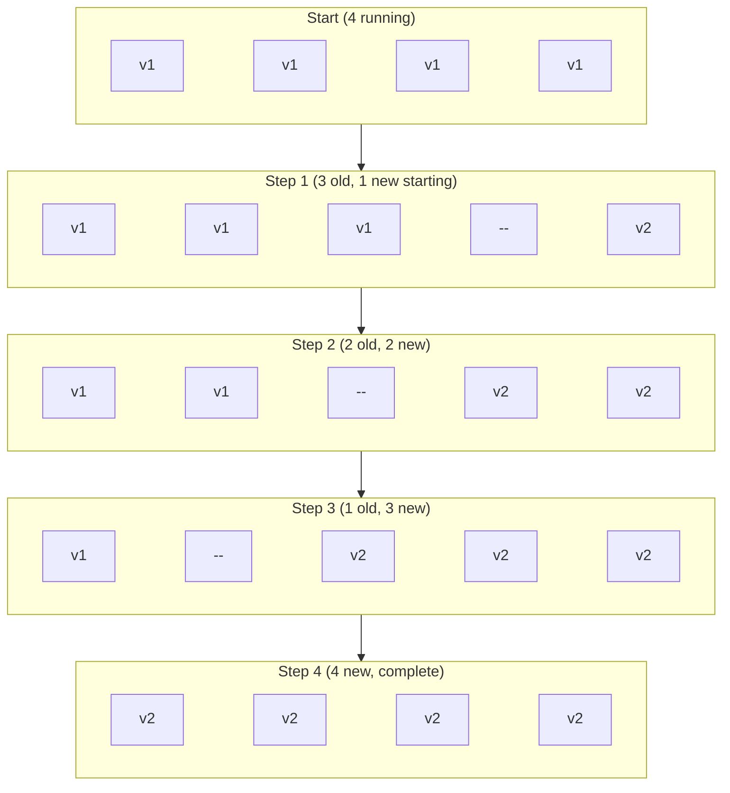
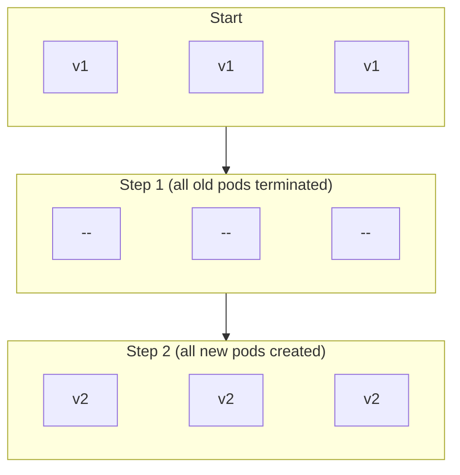
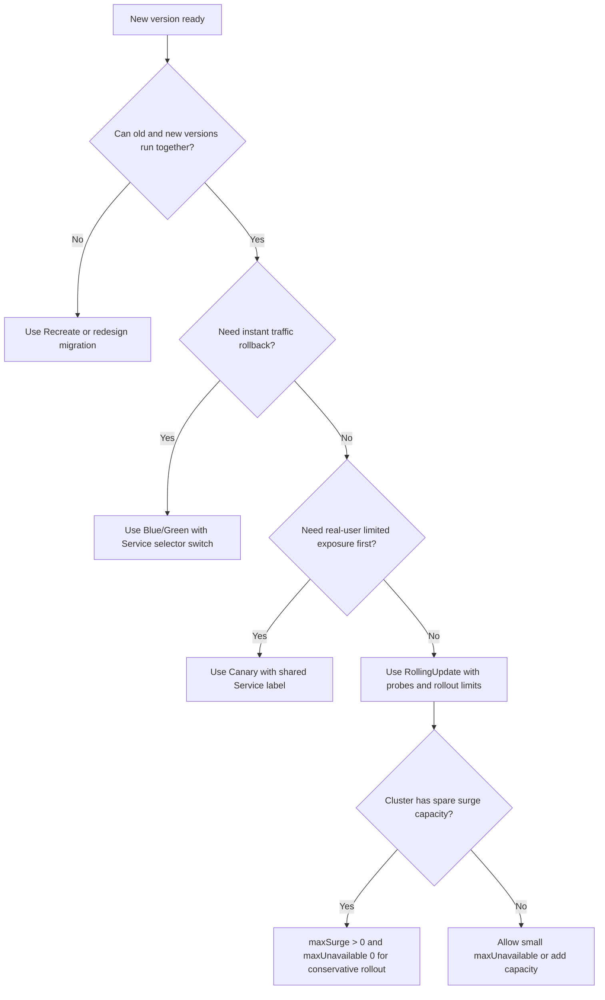

> **Складність**: `[СЕРЕДНЯ]` — концептуальне розуміння з практичним упровадженням
>
> **Час на проходження**: 40-50 хвилин
>
> **Передумови**: [Модуль 2.1 (Деплойменти)](../module-2.1-deployments/), розуміння Сервісів

---

## Результати навчання

Після завершення цього модуля ви зможете:

- **Упровадити** стратегії плавного оновлення (rolling update), blue/green та канаркового (canary) розгортання за допомогою Деплойментів і Сервісів Kubernetes.
- **Порівняти** стратегії плавного оновлення, повторного створення (recreate), blue/green та канаркову за обмеженнями доступності, відкату, ресурсів і ризику.
- **Спроєктувати** стратегію розгортання, яка відповідає чітким вимогам до часу безперебійної роботи, швидкості розгортання та відкату для робочого навантаження.
- **Оцінити** стан розгортання за допомогою проб готовності (readiness probes), статусу розгортання, ендпоінтів та селекторів Сервісу перед тим, як продовжити чи виконати відкат.

---

## Чому цей модуль важливий

Гіпотетичний сценарій: ви супроводжуєте невеликий HTTP API з чотирма репліками за Сервісом Kubernetes. Новий образ контейнера проходить модульні тести, але його ініціалізація триває на 30 секунд довше, бо тепер він завантажує більший файл правил під час запуску. Якщо ви замінюєте кожен Под занадто агресивно, користувачі можуть отримувати скидання з'єднань, навіть якщо Деплоймент зрештою стане справним; якщо ви спрямуєте весь трафік до нового середовища до його тестування, кожен користувач стане частиною вашого димового тесту. Стратегія розгортання — це дисципліна прийняття рішень про те, скільки змін кластер має одночасно показувати, скільки резервної ємності вам потрібно та як швидко ви можете відступити, коли нова версія поводиться неправильно.

Іспит CKAD не очікує, що ви керуватимете повноцінною платформою релізів, але він очікує, що ви чітко міркуватимете, використовуючи рідні будівельні блоки Kubernetes. Вам слід упевнено налаштовувати вбудовану стратегію плавного оновлення, перемикати Сервіс між blue- та green-Деплойментами, приблизно розподіляти трафік між стабільними та канарковими Подами, а також діагностувати, чому розгортання застрягло. Ці завдання здаються простими, коли кожну команду показано окремо; вони стають релевантними для іспиту, коли мітки, селектори, готовність та обмеження розгортання взаємодіють під тиском часу.

Аналогія з ресторанним меню корисна, бо вона робить форму трафіку видимою. Плавне оновлення схоже на поступову заміну сторінок меню, поки відвідувачі продовжують приходити, тож під час переходу одні відвідувачі бачать старе меню, а інші — нове. Blue/green схоже на дві повністю обладнані кухні з перенесенням обідньої зали до нової кухні лише після того, як її підготували. Канаркове розгортання схоже на те, щоб спершу подати нову страву невеликій групі, поспостерігати, чи впораються з нею кухня та відвідувачі, а потім збільшувати частку лише за умови, що ранній сигнал є справним.

---

## Огляд стратегій: форма трафіку, вартість і радіус ураження від збою

Стратегії розгортання існують, бо «новий образ» — це не одна операційна подія. Контролер Деплойменту створює ReplicaSet'и, ReplicaSet'и створюють Поди, Сервіси вибирають Поди за міткою, kube-proxy або площина даних спрямовує трафік до готових ендпоінтів, а користувачі відчувають сукупний ефект. Обрана вами стратегія визначає, скільки старих і нових Подів співіснують, чи змінюється селектор Сервісу, скільки резервної ємності має знайти планувальник і чи означає відкат зміну образу, масштабування Деплойменту або повернення селектора до завідомо справного середовища.

Чотири стратегії в цьому модулі — не конкуренти в єдиному рейтингу; кожна оптимізує інше обмеження. Плавне оновлення є типовим, бо зазвичай дає прийнятну доступність із низькою додатковою вартістю ресурсів. Повторне створення є навмисно руйнівним, але корисним, коли дві версії не повинні працювати разом. Blue/green витрачає більше ємності, щоб тримати відкат простим і швидким. Канаркове розгортання приймає триваліший процес релізу, щоб менша група запитів спершу побачила нову поведінку.

Уявіть кожну стратегію як контракт між швидкістю релізу та радіусом ураження. Плавне оновлення каже: «Я змінюватиму флот поступово, і мені потрібно, щоб застосунок витримував змішані версії». Повторне створення каже: «Я уникатиму змішаних версій, прийнявши простій». Blue/green каже: «Я підготую все нове середовище до перенесення користувачів». Канаркове каже: «Я використаю реальний трафік як виміряний сигнал перед повним просуванням». Назвавши цей контракт першим, ви не трактуватимете кожне розгортання як команду оновлення образу.

Ця відмінність також допомагає, коли завдання дає неповну інформацію. Якщо в умові згадано сувору несумісність схеми, небезпекою є змішані версії, і повторне створення стає правдоподібним, навіть попри простій, який воно спричиняє. Якщо в умові наголошено на миттєвому відкаті, селектор Сервісу стає корисною точкою контролю, і blue/green підіймається у пріоритеті. Якщо в умові йдеться про показ нової поведінки невеликій частці користувачів спершу, рідне канаркове розгортання є очікуваною відповіддю лише засобами Kubernetes, із застереженням, що співвідношення Подів є приблизними.

| Стратегія | Простій | Відкат | Вартість ресурсів | Ризик |
|----------|----------|----------|---------------|------|
| **Плавне оновлення** | Відсутній, коли проби та ємність налаштовані правильно | Поступовий, через скасування розгортання або інше оновлення образу | Від низької до середньої залежно від `maxSurge` | Середній |
| **Повторне створення** | Так, бо старі Поди завершуються до запуску нових | Швидкий до повторного розгортання старого образу, але користувачі бачать перерву | Низька | Високий |
| **Blue/Green** | Відсутній під час чистого перемикання селектора | Миттєве перемикання селектора Сервісу назад на blue | Близько 2x під час перекриття | Низький |
| **Канаркове** | Відсутній під час звичайної роботи | Швидкий через масштабування канарки до нуля або видалення її з вибору Сервісу | Від низької до середньої | Дуже низький для радіуса ураження користувачів |

| Стратегія | Найкраще підходить для |
|----------|----------|
| Плавне оновлення | Більшості застосунків без стану, де старі та нові версії можуть співіснувати |
| Повторне створення | Застосунків, які не можуть запускати кілька версій проти одного й того ж сховища стану |
| Blue/Green | Критичних застосунків, де швидке перемикання трафіку та швидкий відкат важливіші за тимчасову ємність |
| Канаркове | Розгортань, що уникають ризику, де зворотний зв'язок від реального трафіку має починатися з малого |

Зробіть паузу і спрогнозуйте: ваш застосунок має чотири репліки, і вам потрібно оновити його до нової версії. Перш ніж дивитися на приклади нижче, упорядкуйте плавне оновлення, повторне створення, blue/green та канаркове за додатковою вартістю Подів під час переходу. Відповідь залежить від точних параметрів, але корисна ментальна модель така: blue/green дублює весь набір обслуговування, канаркове додає контрольований другий набір, плавне оновлення може тимчасово перевищити бажану кількість реплік, а повторне створення не додає перекриття, бо приймає простій.

Тут важлива деталь упровадження: Сервіс Kubernetes не знає, що один Под є «стабільним», а інший — «канарковим», доки мітки не зроблять цю відмінність придатною для вибору. Якщо селектор Сервісу збігається з обома наборами, обидва набори стають ендпоінтами, і розподіл трафіку приблизно залежить від кількості готових ендпоінтів. Це наближення достатньо добре для канарок у стилі CKAD лише засобами Kubernetes, але воно не те саме, що точна зважена маршрутизація від service mesh або контролера інгресу.

```
+-----------------+       selector: app=myapp       +--------------------------+
| Service: myapp  | --------------------------------> | Ready endpoints only     |
+-----------------+                                  +--------------------------+
          |                                                      |
          | matches labels                                      |
          v                                                      v
+------------------+      +------------------+       +--------------------------+
| stable pods v1   |      | canary pods v2   |       | readiness gates traffic  |
| app=myapp        |      | app=myapp        |       | before users see pods    |
+------------------+      +------------------+       +--------------------------+
```

Діаграма навмисно проста, бо більшість іспитових помилок трапляється саме на цій межі. Учні часто налаштовують коректний Деплоймент, а потім забувають, що селектор Сервісу все ще вказує лише на стару мітку, або будують канарковий Деплоймент, чиї Поди не мають мітки, яку вибирає Сервіс. Коли розгортання начебто «працює», але трафік не змінюється, перевірте мітки, селектори та ендпоінти перш ніж знову змінювати образ.

Найбезпечніша послідовність налагодження йде шляхом запиту. Почніть із селектора Сервісу, бо він визначає набір кандидатів-Подів. Потім перевірте мітки Подів, бо вони вирішують, чи може Под взагалі стати ендпоінтом для цього Сервісу. Потім перевірте готовність, бо відповідний Под, який не є Ready, все одно слід утримувати від трафіку. Ця послідовність швидша за повторне застосування YAML, бо вона запитує, де саме заблоковано рішення про трафік.

Об'єкти ендпоінтів також допомагають відрізнити «Сервіс існує» від «Сервіс справді може спрямовувати трафік». Сервіс із правильним ім'ям і портом усе ще може мати порожній список ендпоінтів, якщо селектори не збігаються або Поди не є Ready. У новіших кластерах за Сервісом ви можете побачити EndpointSlice'и, але міркування те саме: площині трафіку потрібні конкретні готові бекенд-адреси. Під час діагностики стратегій розгортання перевірка ендпоінтів є містком між конфігурацією об'єктів і поведінкою, видимою користувачеві.

---

## Плавні оновлення та повторне створення: заміна під керуванням контролера

Плавне оновлення — це вбудована стратегія Деплойменту, яка поступово замінює Поди зі старого ReplicaSet на Поди з нового ReplicaSet. Контролер Деплойменту спостерігає за бажаним станом, створює нові Поди в межах дозволу `maxSurge`, чекає, поки вони стануть доступними, і видаляє старі Поди в межах дозволу `maxUnavailable`. Це означає, що розгортання — не просто «запусти нові Поди»; це розмірений обмін, керований готовністю, доступністю та ємністю.

Використовуйте плавне оновлення, коли старі та нові версії можуть безпечно співіснувати. Зазвичай це означає, що контракт API є зворотно сумісним, міграції бази даних виконані за принципом «розширення та звуження», а не руйнівно, і клієнти можуть витримати короткий проміжок, коли різні Поди обслуговують різні версії. Якщо ці припущення хибні, плавне оновлення може бути небезпечнішим за простій, бо система може пошкодити спільний стан, виглядаючи справною для Kubernetes.

Розгортання Деплойменту також має історію. Кожна зміна образу чи шаблону створює новий ReplicaSet, і Kubernetes масштабує старий та новий ReplicaSet'и відповідно до стратегії. Саме ця історія є причиною того, чому команди відкату працюють для звичайних плавних оновлень: контролер може повернутися до попереднього шаблону Пода, поки старий ReplicaSet усе ще існує. Це також причина, чому мітки в шаблоні Пода важать так багато, бо ReplicaSet створює Поди з цього шаблону, а не лише з метаданих Деплойменту.

```yaml
apiVersion: apps/v1
kind: Deployment
metadata:
  name: web-app
spec:
  replicas: 4
  strategy:
    type: RollingUpdate
    rollingUpdate:
      maxSurge: 1        # Can exceed replicas by 1
      maxUnavailable: 1  # At most 1 unavailable
  selector:
    matchLabels:
      app: web
  template:
    metadata:
      labels:
        app: web
    spec:
      containers:
      - name: nginx
        image: nginx:1.25
```

Конфігурація вище дозволяє Kubernetes запускати до п'яти Подів під час розгортання та допускати один недоступний Под. За чотирьох бажаних реплік це дає контролеру достатньо місця, щоб створити один новий Под перед видаленням одного старого. Якщо новий Под не проходить перевірку готовності, контролер не продовжує бездумно видаляти старі Поди, бо розрахунок доступності не покращився.

Розрахунок доступності — це частина, яку слід засвоїти. Kubernetes не намагається тримати точну загальну кількість Подів щосекунди розгортання; він намагається дотримуватися заданих вами меж, просуваючи бажаний шаблон уперед. Под, який існує, але недоступний, не задовольняє ту саму умову, що й готовий старий Под. Саме тому проби готовності, Поди у стані Pending та обмеження розгортання належать до однієї ментальної моделі.



Найзручніший для іспиту спосіб спостерігати механізм — оновити образ і стежити одночасно за статусом розгортання та за Подами. Використовуйте повну команду `kubectl` у скриптах і навчальних нотатках, бо аліаси оболонки не розгортаються надійно поза інтерактивною оболонкою. Команди нижче зберігають вихідний робочий процес, водночас роблячи його безпечним для копіювання у термінал, скрипт чи запускач лабораторій.

Спостерігаючи за розгортанням, звертайте увагу не лише на кількості, а й на імена. Нові Поди зазвичай належать до новішого хешу ReplicaSet, тоді як старі Поди зберігають попередній хеш, доки їх не завершено. Якщо розгортання призупиняється, список Подів часто підказує, чи контролер чекає на готовність, планування, завантаження образу чи відновлення після збою. Вивід команди — це не просто підтвердження; це доказ для наступного рішення.

```bash
# Update image
kubectl set image deploy/web-app nginx=nginx:1.26

# Watch rollout
kubectl rollout status deploy/web-app

# Check pods transitioning
kubectl get pods -l app=web
```

Повторне створення — протилежний вибір: воно спершу видаляє всі старі Поди й створює нові після того, як старий набір зник. Це звучить примітивно, але може бути правильною відповіддю, коли застосунок не може витримати дві версії, що працюють одночасно. Робоче навантаження з одним записувачем, застосунок із блокуваннями файлової системи або сервіс, що виконує зворотно несумісну міграцію схеми, можуть бути безпечнішими із запланованою перервою, ніж зі змішаною паралельністю версій.

```yaml
apiVersion: apps/v1
kind: Deployment
metadata:
  name: database-app
spec:
  replicas: 1
  strategy:
    type: Recreate
  selector:
    matchLabels:
      app: database
  template:
    metadata:
      labels:
        app: database
    spec:
      containers:
      - name: postgres
        image: postgres:16
```



Перш ніж це запускати: який вивід ви очікуєте, якщо Деплоймент із `Recreate` має три репліки і ви спостерігаєте за Подами під час оновлення образу? Вам слід очікувати, що старі Поди увійдуть у завершення до того, як замінні Поди стануть доступними, що створює видиму перерву в обслуговуванні, якщо Поди обслуговують живий трафік. Ця перерва — не помилка Kubernetes; це явний компроміс, на який іде ця стратегія, щоб запобігти перекриттю.

Параметри плавного оновлення — справжній важіль для більшості завдань CKAD. `maxSurge` керує тим, скільки додаткових Подів контролер може створити понад бажану кількість реплік, а `maxUnavailable` керує тим, скільки бажаних Подів може бути недоступними під час розгортання. Обидва можуть бути абсолютними числами або відсотками, і типові значення зазвичай прийнятні для стійких сервісів без стану, але іспитові сценарії часто вимагають нульового простою або швидшого розгортання.

```yaml
rollingUpdate:
  maxSurge: 25%      # 25% extra pods (default)
  # or
  maxSurge: 2        # 2 extra pods
```

```yaml
rollingUpdate:
  maxUnavailable: 25%  # 25% can be down (default)
  # or
  maxUnavailable: 0    # Zero downtime
```

```yaml
# Zero downtime (conservative)
rollingUpdate:
  maxSurge: 1
  maxUnavailable: 0

# Fast update (aggressive)
rollingUpdate:
  maxSurge: 100%
  maxUnavailable: 50%

# Balanced (default)
rollingUpdate:
  maxSurge: 25%
  maxUnavailable: 25%
```

Консервативний патерн нульового простою привабливий, але він може застрягти на повному кластері. Уявіть шість реплік із `maxSurge: 50%` та `maxUnavailable: 0`; Kubernetes може створити три додаткові Поди, але якщо ці Поди залишаються у стані Pending, бо в кластері немає вільної ємності, контролер не може видалити старі Поди, бо це порушило б `maxUnavailable: 0`. Правильний діагноз — не «команда розгортання зазнала збою»; це взаємоблокування обмежень ресурсів і доступності, яке ви розв'язуєте, додаючи ємність, зменшуючи приріст або дозволяючи невеликий бюджет недоступності.

Протилежна конфігурація може зазнати збою інакше. Якщо `maxUnavailable` високий, а `maxSurge` низький, розгортання може просуватися швидко, виводячи старі Поди з обслуговування до того, як замінну ємність буде підтверджено. Це може бути прийнятним для пакетних воркерів або внутрішніх інструментів із клієнтами, що повторюють спроби, але ризиковано для інтерактивних сервісів. Відповідь рівня сеньйора пояснює обидві сторони: консервативні налаштування захищають користувачів, але вимагають ємності, тоді як агресивні налаштування економлять ємність, але підвищують ймовірність видимої перерви.

Прогрес Деплойменту також обмежено часом, а не лише кількістю Подів. Kubernetes відстежує, чи Деплоймент просувається, і розгортання, яке не може створити доступні Поди, зрештою повідомляє про невдалу умову прогресу, а не чекає мовчки вічно. Для цілей CKAD вам не потрібно налаштовувати кожне поле граничного терміну, але слід розпізнавати симптом: розгортання, що застрягло на недоступних нових Подах, потребує подій Подів, перевірки готовності та доказів планувальника, а не чергового оновлення образу.

---

## Blue/Green-розгортання: перемикання селектора Сервісу

Blue/green-розгортання відокремлює підготовку релізу від переміщення трафіку. Blue-Деплоймент продовжує обслуговувати продакшн-трафік, поки green-Деплоймент стартує з новим образом, тією самою кількістю реплік і достатньою кількістю міток, щоб ідентифікувати його як повноцінне альтернативне середовище. Після того, як green справний і протестований, ви патчите селектор Сервісу так, щоб трафік перемістився на green однією зміною площини управління.

Модель відкату — головна причина витрачати додаткову ємність. Якщо селектор Сервісу вказує на `version: green`, а користувачі повідомляють про помилки, ви можете запатчити його назад на `version: blue` без відбудови старого ReplicaSet. Це не означає, що blue/green усуває весь ризик; погана міграція бази даних, мутація спільного кешу чи незворотний зовнішній побічний ефект усе ще можуть ускладнити відкат. Стратегія дає вам швидке перемикання трафіку, а не машину часу.

Керування селекторами — місце, де ховається більшість помилок blue/green. Вам потрібна одна стабільна мітка, що ідентифікує застосунок, та одна мітка релізу, що ідентифікує середовище, яке наразі отримує трафік. Селектор Сервісу може включати обидві мітки, але мітка релізу — це та частина, яку ви змінюєте під час перемикання. Якщо ви покладаєтеся лише на імена, ви зрештою забудете, що Сервіси не вибирають Деплойменти за іменем; вони вибирають Поди за мітками.

Вам також слід вирішити, як довго тримати старе середовище після успішного перемикання. Залишення blue живим дає вам швидкий шлях відкату, поки метрики стабілізуються, але споживає ємність і може й далі утримувати з'єднання, кеші чи фонову роботу. Негайне видалення blue економить ресурси, але перетворює відкат на повторне розгортання. У реальній системі це вікно утримання — рішення політики релізів; у CKAD достатньо показати, що ви знаєте, коли і як прибирати.

### Крок 1: Розгорнути Blue (поточний)

```yaml
# blue-deployment.yaml
apiVersion: apps/v1
kind: Deployment
metadata:
  name: app-blue
spec:
  replicas: 3
  selector:
    matchLabels:
      app: myapp
      version: blue
  template:
    metadata:
      labels:
        app: myapp
        version: blue
    spec:
      containers:
      - name: app
        image: nginx:1.25
```

### Крок 2: Створити Сервіс (вказує на Blue)

```yaml
# service.yaml
apiVersion: v1
kind: Service
metadata:
  name: myapp
spec:
  selector:
    app: myapp
    version: blue  # Points to blue
  ports:
  - port: 80
```

### Крок 3: Розгорнути Green (нова версія)

```yaml
# green-deployment.yaml
apiVersion: apps/v1
kind: Deployment
metadata:
  name: app-green
spec:
  replicas: 3
  selector:
    matchLabels:
      app: myapp
      version: green
  template:
    metadata:
      labels:
        app: myapp
        version: green
    spec:
      containers:
      - name: app
        image: nginx:1.26
```

### Крок 4: Перемкнути трафік

```bash
# Switch service to green
kubectl patch svc myapp -p '{"spec":{"selector":{"version":"green"}}}'

# Instant rollback if needed
kubectl patch svc myapp -p '{"spec":{"selector":{"version":"blue"}}}'
```

Зверніть увагу, що патч вище змінює лише `version`, а не `app`. У реальному кластері ви часто зберігаєте стабільну мітку застосунку, як-от `app: myapp`, і використовуєте додаткову мітку релізу, як-от `version: blue` чи `version: green`, для перемикання трафіку. Якщо ви випадково запатчите селектор на мітку, якої не має жоден Под, Сервіс не матиме ендпоінтів, і найшвидший діагноз — це `kubectl get endpoints` або `kubectl describe svc`.

Перевірка ендпоінтів — практичний запобіжник. Патч селектора може успішно виконатися, навіть коли він вибирає нуль Подів, бо API Kubernetes лише перевіряє, що об'єкт Сервісу синтаксично правильний. Він не знає, чи ваша мітка релізу осмислена. Запуск `kubectl get endpoints myapp` або еквівалента EndpointSlice після патчу підтверджує, що трафіку є куди йти, перш ніж ви оголосите перемикання завершеним.

Blue/green також має поведінку з'єднань, що дивує нових операторів. Зміна селектора Сервісу змінює набір ендпоінтів, доступних для нових рішень балансування навантаження, але не обов'язково стирає кожне наявне клієнтське з'єднання тієї самої миті. Довготривалі з'єднання, повторні спроби клієнтів та сесії на рівні застосунку можуть зробити спостережуваний перехід менш чітким, ніж патч площини управління. Для іспитових завдань ключовою дією є відкат селектора; для реальних систем дренування з'єднань та поведінка сесій заслуговують на окрему перевірку.

```bash
# Deploy blue
kubectl apply -f blue-deployment.yaml

# Create service pointing to blue
kubectl apply -f service.yaml

# Test blue
kubectl run test --image=busybox --rm -i --restart=Never -- wget -qO- http://myapp

# Deploy green (without traffic)
kubectl apply -f green-deployment.yaml

# Test green directly (port-forward or separate service)
kubectl port-forward deploy/app-green 8080:80 &
sleep 2
curl 127.0.0.1:8080
kill %1

# Switch traffic to green
kubectl patch svc myapp -p '{"spec":{"selector":{"version":"green"}}}'

# If problems, instant rollback
kubectl patch svc myapp -p '{"spec":{"selector":{"version":"blue"}}}'

# Once confirmed, remove blue
kubectl delete deploy app-blue
```

Сценарій вправи: у вас є blue, що обслуговує `nginx:1.25`, та green, що обслуговує `nginx:1.26`, обидва з трьома репліками. Перед перемиканням виконайте прямий тест проти green за допомогою port-forward або створивши тимчасовий Сервіс, що вибирає `version: green`. Якщо прямий тест зазнає невдачі, не патчте продакшн-трафік; виправте green-Деплоймент, поки blue продовжує обслуговування.

```bash
# Create blue deployment
kubectl create deploy app-blue --image=nginx:1.25 --replicas=3

# NOTE: labeling the Deployment object does NOT change pod labels or Service endpoints.
# Add the version label to the pod template instead.
kubectl patch deploy app-blue -p '{"spec":{"template":{"metadata":{"labels":{"version":"blue"}}}}}'

# Create service
kubectl expose deploy app-blue --name=myapp --port=80 --selector=version=blue

# Deploy green
kubectl create deploy app-green --image=nginx:1.26 --replicas=3
kubectl patch deploy app-green -p '{"spec":{"template":{"metadata":{"labels":{"version":"green"}}}}}'

# Switch to green
kubectl patch svc myapp -p '{"spec":{"selector":{"version":"green"}}}'
```

Послідовність команд навмисно компактна, бо завдання CKAD часто винагороджують вільне володіння мітками. Поширена пастка — позначити об'єкт Деплойменту, але не шаблон Пода; Сервіс вибирає Поди, а не сам об'єкт Деплойменту. У прикладі патчиться `spec.template.metadata.labels`, щоб новостворені Поди отримали мітку, потрібну Сервісу.

Є ще одна тонкість в імперативних тренуваннях blue/green: зміна мітки шаблону Пода запускає новий ReplicaSet, бо шаблон Пода змінився. Це зазвичай нормально в лабораторії, але в продакшні ви воліли б правильно визначити мітки в YAML до створення Деплойменту. Коли часу обмаль, пам'ятайте: іспитова мета — спостережувана коректність: селектор Сервісу та мітки Подів мають збігатися, а відповідні Поди мають бути Ready.

---

## Канаркове розгортання: приблизний розподіл трафіку рідними засобами

Канаркове розгортання рідними засобами Kubernetes зазвичай використовує два Деплойменти та один Сервіс. Стабільний Деплоймент і канарковий Деплоймент мають одну спільну мітку, яку вибирає Сервіс, тоді як кожен Деплоймент також зберігає власну мітку доріжки для керування. Оскільки Сервіс спрямовує трафік до готових ендпоінтів, співвідношення приблизно пов'язане з кількістю готових Подів: дев'ять стабільних Подів та один канарковий Под — це приблизно розподіл 90/10, припускаючи подібну готовність і відсутність додаткового рівня маршрутизації.

Це наближення корисне, але ви маєте навчити себе його обмежень. Сервіси Kubernetes самі по собі не забезпечують зваженої маршрутизації з урахуванням запиту, а повторне використання клієнтських з'єднань може зробити короткі тести нерівномірними. Рідне канаркове розгортання все одно цінне для іспиту та для простих робочих навантажень, бо використовує лише Деплойменти, Сервіси, мітки, масштабування та спостереження. Коли командам потрібні точні відсотки, маршрутизація за заголовками чи автоматизований аналіз просування, вони зазвичай додають контролер інгресу, service mesh чи контролер прогресивної доставки поза межами CKAD.

Канаркове розгортання також потребує правила просування. «Запустіть його на деякий час» — це не правило; це сподівання. Навіть у простій лабораторії вирішіть, який сигнал змусив би вас продовжити, призупинити чи виконати відкат. Цим сигналом може бути готовність Подів, відсутність перезапусків, стабільна затримка з димового тесту чи метрики застосунку в реальному середовищі. Kubernetes дає вам механічний розподіл, але рішення про те, чи нова версія достатньо справна, щоб отримати більше трафіку, усе ще належить вам.

Розподіл між стабільним і канарковим Деплойментами дає вам окремі засоби контролю. Ви можете масштабувати канарку вгору без зміни стабільного образу, масштабувати канарку вниз без втручання у стабільний, а також перевіряти логи канарки незалежно через її мітку доріжки. Цей розподіл часто чіткіший, ніж спроба використати один Деплоймент для часткового показу, бо один Деплоймент зазвичай збігається до одного шаблону Пода. Два Деплойменти роблять обидві доріжки видимими.

### Стабільний Деплоймент (90% трафіку)

```yaml
apiVersion: apps/v1
kind: Deployment
metadata:
  name: app-stable
spec:
  replicas: 9  # 90% of traffic
  selector:
    matchLabels:
      app: myapp
      track: stable
  template:
    metadata:
      labels:
        app: myapp
        track: stable
    spec:
      containers:
      - name: app
        image: nginx:1.25
```

### Канарковий Деплоймент (10% трафіку)

```yaml
apiVersion: apps/v1
kind: Deployment
metadata:
  name: app-canary
spec:
  replicas: 1  # 10% of traffic
  selector:
    matchLabels:
      app: myapp
      track: canary
  template:
    metadata:
      labels:
        app: myapp
        track: canary
    spec:
      containers:
      - name: app
        image: nginx:1.26
```

Зупиніться й поміркуйте: у канарковому налаштуванні нижче селектор Сервісу використовує `app: myapp`, що збігається і зі стабільними, і з канарковими Подами. Як Kubernetes розподіляє трафік між ними, і що сталося б, якби канарковий Под не був Ready? Корисна відповідь така: трафік отримують лише готові ендпоінти, тож канарка з одного Пода, яка не проходить перевірку готовності, фактично не отримує трафіку Сервісу, навіть попри те, що її Деплоймент існує.

### Сервіс (маршрутизує до обох)

```yaml
apiVersion: v1
kind: Service
metadata:
  name: myapp
spec:
  selector:
    app: myapp  # Matches both stable and canary
  ports:
  - port: 80
```

За дев'яти стабільних Подів та одного канаркового Пода вам слід мислити приблизними пропорціями, а не точним обліком запитів. Якщо канарка справна і всі Поди готові, набір ендпоінтів містить десять адрес, одна з яких належить канарці. Якщо канарка має повільний запуск і не має проби готовності, Сервіс може спрямувати трафік занадто рано; якщо вона має коректну пробу готовності, Сервіс чекає, доки Kubernetes позначить ендпоінт готовим.

```bash
# Start: 9 stable, 1 canary (10%)
kubectl scale deploy app-canary --replicas=1
kubectl scale deploy app-stable --replicas=9

# Increase canary to 25%
kubectl scale deploy app-canary --replicas=3
kubectl scale deploy app-stable --replicas=9

# Increase canary to 50%
kubectl scale deploy app-canary --replicas=5
kubectl scale deploy app-stable --replicas=5

# Full rollout (update stable to new version)
kubectl set image deploy/app-stable app=nginx:1.26
kubectl rollout status deploy/app-stable

# Cleanup: remove canary
kubectl delete deploy app-canary
```

У прогресії вище є тонкий арифметичний нюанс: три канаркові репліки та дев'ять стабільних реплік — це 25% канарки, бо загальна сума становить 12 ендпоінтів, а не тому, що сама кількість канарки дорівнює 25% від початкової кількості стабільних. На іспиті записуйте загальну кількість ендпоінтів, коли вас просять міркувати про відсоток. Ця звичка запобігає поширеній помилці масштабування канарки вгору, забуваючи, що стабільний набір лишився незмінним.

Відкат у цьому рідному патерні простий, бо канарка ізольована як власний Деплоймент. Ви можете масштабувати канарку до нуля, видалити її або змінити селектор Сервісу так, щоб він більше не включав канаркові Поди. Це не скасовує побічних ефектів, створених запитами, які вже досягли канарки, але припиняє надходження нового трафіку Сервісу до нової версії. Як і з blue/green, контроль трафіку швидкий, тоді як відкат даних залишається окремою інженерною проблемою.

Канаркові співвідношення можуть дрейфувати, коли інші контролери змінюють кількість реплік. HorizontalPodAutoscaler на стабільному, ручне масштабування канарки чи недоступні Поди в будь-якій доріжці змінюють пул готових ендпоінтів, який бачить Сервіс. Саме тому канаркове розгортання має включати спостереження після кожного кроку масштабування, а не лише заплановану арифметику. У базовій лабораторії `kubectl get endpoints` та готовність Подів є достатніми; у продакшні метрики підтверджують, чи канарка справді отримала очікувану форму трафіку.

---

## Готовність, доступність і стан розкочування

Готовність — це те, що не дає стратегії розгортання перетворитися на ввічливий спосіб надсилати трафік до зламаних Подів. Под може бути у стані Running, поки застосунок усередині нього все ще завантажує конфігурацію, прогріває кеші, з'єднується з базою даних чи очікує на міграцію. Контролер ендпоінтів Сервісу використовує готовність, щоб вирішити, чи має Под отримувати трафік, а контролер Деплойменту використовує доступність, щоб вирішити, чи може розгортання безпечно просуватися.

Без проб готовності Kubernetes може вважати контейнер готовим, щойно він запуститься. Це типове правило може бути прийнятним для дуже простих контейнерів, але воно небезпечне для застосунків зі значущою роботою під час запуску. Плавне оновлення з `maxUnavailable: 0` все одно може спричинити помилки, видимі користувачеві, якщо новий Под потрапляє до набору ендпоінтів Сервісу до того, як застосунок зможе обслуговувати реальні запити.

Хороші проби готовності достатньо специфічні, щоб захищати користувачів, але достатньо дешеві, щоб виконуватися часто. Проба, яка лише перевіряє, чи процес існує, може пройти, поки застосунок не може відповідати на реальні запити. Проба, яка виконує повільну, крихку перевірку залежності, може блимати й видаляти справні Поди з трафіку. Для прикладів CKAD HTTP-перевірка проти легкого ендпоінта готовності зазвичай є найзрозумілішим патерном.

Наступний фрагмент призначено лише для показу, бо він зосереджений на полях готовності, а не на повноцінному робочому Деплойменті. Замініть `myapp` та шлях `/ready` своїм реальним образом контейнера й ендпоінтом готовності, перш ніж застосовувати цей патерн у кластері.

```yaml
spec:
  template:
    spec:
      containers:
      - name: app
        image: myapp
        readinessProbe:
          httpGet:
            path: /ready
            port: 8080
          initialDelaySeconds: 5
          periodSeconds: 5
```

`minReadySeconds` додає ще один буфер безпеки після першого успішного спрацювання готовності. Воно повідомляє контролеру Деплойменту, що Под має залишатися готовим протягом мінімальної тривалості, перш ніж його буде зараховано як доступний. Це допомагає виявляти застосунки, які ненадовго проходять перевірку готовності, а потім падають, бо пізня залежність дає збій або фонове завдання запуску завершується.

Не плутайте готовність із живучістю. Готовність відповідає на питання «чи має цей Под отримувати трафік прямо зараз?», тоді як живучість відповідає на «чи має Kubernetes перезапустити цей контейнер?». Невдала проба готовності видаляє Под з ендпоінтів Сервісу, не обов'язково перезапускаючи його, що саме й потрібно під час прогріву або тимчасової втрати залежності. Невдала проба живучості перезапускає контейнер, тож якщо зробити її надто агресивною, повільний запуск перетвориться на цикл збоїв.

```yaml
spec:
  minReadySeconds: 10  # Pod must be ready 10s before considered available
```

Зробіть паузу і спрогнозуйте: ви розгортаєте нову версію за допомогою плавного оновлення, але забули додати пробу готовності. Нова версія починає приймати запити за 30 секунд, тоді як Kubernetes вважає Под готовим одразу. Протягом цих 30 секунд трафік Сервісу може потрапляти на Под, який живий з погляду Kubernetes, але не готовий з погляду користувача, тож розгортання може виглядати зеленим, поки запити зазнають невдачі.

Ось конфігурація плавного оновлення без простою, що поєднує консервативні обмеження розгортання з простою пробою готовності. Вона зберігає вихідний іспитовий сценарій і додає операційну причину ключового рядка: `maxUnavailable: 0` тримає бажану ємність доступною, тоді як готовність запобігає передчасному включенню до ендпоінтів. У кластері з обмеженими ресурсами вам усе одно потрібно достатньо вільного місця для Пода приросту.

```yaml
apiVersion: apps/v1
kind: Deployment
metadata:
  name: webapp
spec:
  replicas: 4
  strategy:
    type: RollingUpdate
    rollingUpdate:
      maxSurge: 1
      maxUnavailable: 0  # Key: never reduce below desired
  selector:
    matchLabels:
      app: webapp
  template:
    metadata:
      labels:
        app: webapp
    spec:
      containers:
      - name: nginx
        image: nginx:1.25
        readinessProbe:  # Important for zero-downtime
          httpGet:
            path: /
            port: 80
          initialDelaySeconds: 2
          periodSeconds: 3
```

Оцінюючи стан розкочування, використовуйте кілька поглядів замість того, щоб довіряти одній команді. `kubectl rollout status` повідомляє, чи контролер Деплойменту вважає розкочування завершеним. `kubectl get pods` показує, чи Поди у стані Pending, Running, Ready чи перезапускаються. `kubectl get endpoints` або `kubectl get endpointslice` підтверджує, куди Сервіс справді може спрямовувати трафік. Ці три спостереження відображають стан контролера, стан робочого навантаження і стан трафіку.

Ця тривимірна модель також корисна під тиском іспиту. Якщо статус розкочування очікує, але ендпоінти все ще вказують на старі Поди, застосунок може бути справним для користувачів, поки реліз застряг. Якщо статус розкочування успішний, але ендпоінти включають Поди, що дають збій на реальних запитах, проба надто слабка. Якщо Поди готові (Ready), але Сервіс не має ендпоінтів, селектор неправильний. Кожна комбінація звужує наступну команду, яку вам слід виконати.

Проби запуску (startup probes) — ще одна корисна відмінність, коли застосунок має тривалий шлях ініціалізації. Проба запуску може дати контейнеру більше часу, щоб стати живим, перш ніж проби живучості почнуть примусово перезапускати, тоді як готовність усе ще контролює допуск трафіку. Для простих прикладів з `nginx` тут вам може не знадобитися проба запуску, але знання цього розмежування не дасть вам розв'язувати повільний запуск послабленням готовності. Готовність має захищати трафік; запуск має захищати повільне завантаження від передчасних перезапусків.

---

## Патерни та антипатерни

Наведені нижче патерни навмисно практичні, а не філософські. Кожен прив'язує стратегію розгортання до конкретного механізму, який ви можете перевірити в Kubernetes. Якщо ви можете пояснити механізм, ви зазвичай зможете розв'язати іспитовий варіант навіть тоді, коли імена об'єктів і мітки відрізняються від прикладів.

Використовуйте таблицю патернів як набір правил «якщо-то», а не як контрольний список. Робоче навантаження зі зворотно сумісними змінами та надійними пробами природно пасує до рядка плавного оновлення. Робоче навантаження з ризикованою новою рекомендаційною моделлю, але сумісним станом природно пасує до рядка канарки. Робоче навантаження з жорсткою вимогою до часу відкату природно пасує до рядка blue/green. Цінність — у зіставленні умови з механізмом, а не в запам'ятовуванні міток.

| Патерн | Коли використовувати | Чому це працює | Міркування щодо масштабування |
|---------|-------------|--------------|-----------------------|
| Консервативне плавне оновлення з готовністю | Сервіси без стану, що можуть запускати старі та нові версії разом | `maxUnavailable: 0` захищає ємність, тоді як готовність контролює ендпоінти Сервісу | Потребує вільної ємності для Подів приросту, інакше розгортання може застрягти |
| Перемикання селектора blue/green | Критичний сервіс, де швидкість відкату важливіша за тимчасову вартість ресурсів | Два повноцінні Деплойменти існують до переміщення трафіку, тож відкат — це патч селектора | Вимагає подвійної ємності та обережного поводження зі спільними базами даних |
| Рідна канарка за співвідношенням реплік | Простий показ реального трафіку без зважування mesh чи інгресу | Один Сервіс вибирає і стабільні, і канаркові Поди, а кількість готових ендпоінтів наближає частку трафіку | Відсотки приблизні, особливо з повторним використанням з'єднань та нерівномірною готовністю Подів |
| Повторне створення для несумісних версій | Робочі навантаження, що не можуть безпечно запускати змішані версії | Старі Поди завершуються до запуску нових, запобігаючи одночасному доступу двох версій | Користувачі бачать простій, тож плануйте та повідомляйте про вікно обслуговування |

| Антипатерн | Що йде не так | Краща альтернатива |
|--------------|-----------------|--------------------|
| Патчити лише мітки Деплойменту під час blue/green | Сервіс вибирає Поди, тож трафік не переміщується, якщо мітки шаблону Пода відсутні | Запатчте або визначте `spec.template.metadata.labels`, потім перевірте ендпоінти |
| Трактувати співвідношення канаркових Подів як точну вагу трафіку | Короткі тести та довготривалі з'єднання можуть не відображати запланований відсоток | Використовуйте рідну канарку для приблизного показу; використовуйте рівень маршрутизації для точних ваг |
| Встановлювати `maxUnavailable: 0` без вільної ємності | Поди приросту можуть лишатися у стані Pending, не даючи видалити старі Поди | Підтвердьте ємність вузлів або дозвольте невеликий бюджет недоступності |
| Пропускати проби готовності | Розгортання можуть завершитися, поки користувачі потрапляють на Поди, що все ще ініціалізуються | Додайте проби, що відображають реальну готовність до обслуговування, а не лише існування процесу |

Таблиця антипатернів також є картою для усунення несправностей. Якщо трафік не перемикається, перевірте селектори та ендпоінти. Якщо розгортання застрягає, перевірте Поди у стані Pending та обмеження розгортання. Якщо користувачі бачать помилки, тоді як Kubernetes каже, що розгортання вдалося, перевірте готовність та справність застосунку. Це різні режими збою, тож вони потребують різних перших команд.

Корисна звичка сеньйора — назвати домен збою, перш ніж обирати відкат. Для поганого образу контейнера відкату образу чи переміщення селектора може бути достатньо. Для поганого селектора Сервісу зміна образу не допоможе, бо шлях запиту зламаний ще до того, як він досягне контейнера. Для поганої міграції схеми ні скасування розгортання, ні патч селектора можуть не відновити стару форму даних. Стратегії Kubernetes керують трафіком і Подами; вони не скасовують автоматично кожен зовнішній побічний ефект.

---
## Рамка прийняття рішень

Обирайте стратегію, спершу назвавши обмеження. Не починайте з інструмента, який вам подобається; починайте з того, що не повинно статися. Якщо змішані версії не повинні співіснувати, використовуйте Recreate або ретельно поетапний зовнішній план міграції. Якщо простою слід уникати, а версії сумісні, використовуйте плавне оновлення. Якщо відкат має бути майже миттєвим і вільна ємність наявна, використовуйте blue/green. Якщо нова поведінка ризикована під реальним трафіком і ви можете прийняти поступове просування, використовуйте канарку.

Друге рішення — чи можна реалізувати стратегію за допомогою примітивів, доступних у завданні. Завдання у стилі CKAD зазвичай обмежують вас Деплойментами, Сервісами, пробами, мітками й командами `kubectl`. Це означає, що рідна канарка ґрунтується на співвідношенні Подів, blue/green — на селекторі, а плавне оновлення — на контролері Деплойменту. Якщо ви виявляєте, що вам потрібні точні ваги, заголовки трафіку чи автоматичний аналіз метрик, ви вийшли за межі рідних примітивів, які іспит, найімовірніше, запитує.



| Вимога | Перевага | Перевірити перед розкочуванням | Найшвидший відкат |
|-------------|--------|----------------------|------------------|
| Найнижча операційна складність | Плавне оновлення | Проба готовності, сумісна схема, достатня ємність приросту | `kubectl rollout undo` або встановити старий образ |
| Жодних змішаних версій | Recreate | Вікно обслуговування, резервна копія, порядок міграції | Повторно застосувати старий образ після перерви |
| Миттєве реверсування трафіку | Blue/green | Готовність green, прямий димовий тест, мітки селектора | Запатчити селектор Сервісу назад на blue |
| Обмежити показ користувачам | Канарка | Спільна мітка Сервісу, математика реплік, метрики для спостереження | Масштабувати канарку до нуля або вилучити з вибору Сервісу |

Який підхід ви б обрали тут і чому: фронтенд без стану має шість реплік, хороший ендпоінт готовності та новий образ лише зі змінами CSS; команда хоче нуль простою, але має обмежений запас на вузлах. Плавного оновлення зазвичай достатньо, але вам слід обрати параметри розкочування, що відповідають ємності, можливо, `maxSurge: 1` і `maxUnavailable: 1`, якщо кластер не може запланувати додатковий повний пакет. Якщо завдання каже «жодного простою абсолютно», бракує вимоги до вільної ємності; Kubernetes не може створити ємність лише конфігурацією.

---

## Чи знали ви?

- **Деплойменти Kubernetes використовують `apps/v1` як стабільний API з версії Kubernetes 1.9, випущеної в грудні 2017 року.** Завдання CKAD тепер припускають форму стабільного API, включно з обов'язковими селекторами, які мають збігатися з мітками шаблону Пода.

- **Типові значення плавного оновлення — `maxSurge: 25%` і `maxUnavailable: 25%`.** Для малих кількостей реплік округлення відсотків має значення, тож завжди міркуйте від бажаної кількості реплік, перш ніж прогнозувати загальну кількість Подів.

- **Зміна селектора Сервісу не перезапускає Поди.** У blue/green розгортаннях відкат може бути швидким, бо Kubernetes лише змінює, які готові ендпоінти вибирає Сервіс.

- **Рідний канарковий трафік приблизний, бо Сервіс балансує між ендпоінтами, а не за бізнес-відсотками.** Співвідношення Подів 9 до 1 — корисна відправна точка, але точна зважена маршрутизація потребує додаткового рівня керування трафіком.

---

## Типові помилки

| Помилка | Чому це трапляється | Як це виправити |
|---------|----------------|---------------|
| Немає проби готовності | Процес контейнера запускається до того, як застосунок зможе обслуговувати реальні запити, тож Kubernetes може додати Под до ендпоінтів зарано | Додайте пробу готовності, що перевіряє реальний шлях обслуговування або шлюз залежності |
| `maxUnavailable: 100%` на Деплойменті, зверненому до користувачів | Це виглядає як налаштування для швидкого розкочування, але дозволяє всім бажаним Подам бути недоступними під час заміни | Тримайте `maxUnavailable` малим і використовуйте `maxSurge` для швидкості, коли ємність наявна |
| Неправильний селектор Сервісу для blue/green | Селектор запатчено на мітку, що існує на об'єкті Деплойменту, але не на Подах | Помістіть мітки релізу в `spec.template.metadata.labels` і перевірте за допомогою `kubectl get endpoints` |
| Не тестувати green перед перемиканням селектора | Blue тримає продакшн справним, тож непротестоване середовище green може ховатися, поки всіх користувачів не буде туди спрямовано | Протестуйте green напряму за допомогою тимчасового Сервісу, port-forward або внутрішньокластерного димового тесту |
| Забути масштабувати чи видалити старе середовище | Blue/green тримає обидві версії живими, тож старий Деплоймент продовжує споживати ресурси після успіху | Тримайте blue, поки ризик відкату не стане прийнятним, потім видаліть або масштабуйте його навмисно |
| Припускати, що канарка — це точна відсоткова маршрутизація | Рідні Сервіси вибирають ендпоінти і не застосовують зважені правила запитів | Використовуйте співвідношення Подів для приблизних канарок або додайте інгрес, mesh чи контролер розкочування для точних ваг |
| Ігнорувати Поди приросту у стані Pending | Розкочування з `maxUnavailable: 0` може чекати вічно, коли кластер не може запланувати нові Поди | Перевірте події Подів, додайте ємність, зменшіть приріст або дозвольте невеликий бюджет недоступності |

---
## Тест

<details>
<summary>Ваше робоче навантаження обробки платежів не може безпечно запускати дві версії застосунку проти однієї схеми. Вам потрібно розгорнути новий образ під час вікна обслуговування. Яку стратегію вам слід обрати і що перевірити першим?</summary>

Обирайте `Recreate`, якщо план міграції схеми не було переспроєктовано для сумісності змішаних версій. Recreate навмисно завершує старі Поди до запуску нових, що запобігає одночасному дотику старого й нового коду застосунку до того самого несумісного стану. Перед початком перевірте план резервного копіювання чи відкату, порядок міграції та очікуване вікно простою. Плавне оновлення, канарка та blue/green усі допускають перекриття, якщо ви не додасте додаткові засоби контролю поза базовою стратегією.

</details>

<details>
<summary>Ви перемикаєте Сервіс з `version: blue` на `version: green`, і користувачі одразу повідомляють про помилки. Яка найшвидша рідна для Kubernetes дія відновлення, і що має дослідити ваш постмортем?</summary>

Запатчте селектор Сервісу назад на `version: blue`, якщо blue все ще представляє останнє відоме справне середовище. Це і є операційна цінність blue/green: відкат може бути зміною селектора замість перебудованого Деплойменту. Постмортем має дослідити, чи були green-Поди готовими (Ready), чи виконувався прямий димовий тест перед перемиканням, і чи змінилися база даних або зовнішні залежності в спосіб, який відкат селектора не може скасувати. Якщо патч селектора вказує на відсутні ендпоінти, дослідіть мітки шаблону Пода, перш ніж знову змінювати образи.

</details>

<details>
<summary>Ваша команда хоче, щоб приблизно 10% реального трафіку досягало `myapp:2.0`, тоді як 90% лишається на `myapp:1.0`, використовуючи лише Деплойменти та Сервіс. Як би ви це реалізували і яке обмеження пояснили б?</summary>

Створіть стабільний Деплоймент із дев'ятьма репліками, що запускають `myapp:1.0`, та канарковий Деплоймент з однією реплікою, що запускає `myapp:2.0`. Дайте обом шаблонам Подів спільну мітку, наприклад `app: myapp`, і налаштуйте селектор Сервісу на збіг із цією спільною міткою. Тримайте окремі мітки, як-от `track: stable` та `track: canary`, щоб можна було масштабувати й перевіряти кожен Деплоймент незалежно. Обмеження полягає в тому, що Сервіси Kubernetes забезпечують приблизне балансування ендпоінтів, а не точну зважену маршрутизацію за відсотком.

</details>

<details>
<summary>Деплоймент має `replicas: 6`, `maxSurge: 50%` та `maxUnavailable: 0`. Три нові Поди у стані Pending, бо кластеру бракує ресурсів, тоді як шість старих Подів усе ще працюють. Чому розкочування застрягло?</summary>

Розкочування застрягло, бо контролер досяг межі приросту й не може видалити старі Поди без порушення `maxUnavailable: 0`. За шести бажаних реплік `maxSurge: 50%` дозволяє три додаткові Поди, даючи дев'ять Подів загалом під час спроби розкочування. Оскільки три нові Поди у стані Pending, жоден з них не стає доступним, тож контролер не має дозволу зменшити старий набір. Виправлення — додати ємність, зменшити вимогу приросту або дозволити невеликий бюджет недоступності, якщо сервіс може це витримати.

</details>

<details>
<summary>Ви оновлюєте плавний Деплоймент, і `kubectl rollout status` зрештою завершується успішно, але користувачі бачили збої протягом перших 30 секунд кожного нового Пода. Який відсутній механізм найкраще пояснює збій?</summary>

Відсутня чи неефективна проба готовності найкраще пояснює симптом. Kubernetes може позначити запущений контейнер як готовий до того, як застосунок справді зможе обслуговувати запити, особливо коли процес запускається швидко, але виконує ініціалізацію згодом. Правильна проба готовності тримає Под поза ендпоінтами Сервісу, поки застосунок не повідомить про реальну готовність до обслуговування. `minReadySeconds` може додати ще один буфер після першого успішного стану готовності, що допомагає виявляти ранні збої.

</details>

<details>
<summary>У налаштуванні blue/green `kubectl patch svc myapp -p '{"spec":{"selector":{"version":"green"}}}'` виконується успішно, але `kubectl get endpoints myapp` не показує жодних адрес. Що вам слід дослідити першим?</summary>

Дослідіть мітки на green-Подах, а не лише мітки на об'єкті Деплойменту. Сервіси вибирають Поди через мітки Подів, а мітка, розміщена лише в метаданих Деплойменту, не стає автоматично міткою шаблону Пода. Перевірте `spec.template.metadata.labels` на green-Деплойменті й порівняйте їх із селектором Сервісу. Щойно мітки збігатимуться, а Поди будуть готовими (Ready), список ендпоінтів має заповнитися без перестворення Сервісу.

</details>

<details>
<summary>Вам потрібно обрати між плавним оновленням та blue/green для API без стану зі строгими вимогами до відкату й достатньою вільною ємністю кластера. Яка стратегія пасує краще і який компроміс ви приймаєте?</summary>

Blue/green пасує краще, коли строга швидкість відкату є домінантною вимогою, а вільна ємність наявна. Плавне оновлення може бути безпечним, але відкат зазвичай відбувається через інше розкочування чи операцію скасування, що повільніше за патчинг селектора Сервісу назад на старе середовище. Компроміс — тимчасова вартість ресурсів, бо обидва середовища, blue і green, працюють одночасно. Вам усе одно слід протестувати green перед перемиканням, бо blue/green переміщує весь продакшн-трафік, щойно змінюється селектор.

</details>

---
## Практична вправа

Сценарій вправи: ви впровадите плавне оновлення, blue/green, канарку, повне перестворення та перевірки розкочування з урахуванням готовності, використовуючи кластер Kubernetes 1.35+. У командах застосовуються образи `nginx`, тож фокус лишається на механіці Деплойментів і Сервісів, а не на коді застосунку. Працюйте в одноразовому просторі імен, якщо ваше лабораторне середовище це підтримує, і прибирайте за собою після кожної частини, перш ніж переходити до наступної, якщо ресурсів обмаль.

Перед початком вирішіть, як ви спостерігатимете за кожним завданням. Для плавного оновлення спостерігайте за кількістю Подів і статусом розкочування. Для blue/green спостерігайте за ендпоінтами Сервісу до й після патчів селектора. Для канарки спостерігайте за членством в ендпоінтах у міру зміни кількості реплік. Для готовності спостерігайте, чи Поди стають ендпоінтами лише після того, як можуть обслуговувати. Це перетворює вправу з повторення команд на контрольоване дослідження поведінки Kubernetes.

### Завдання 1: Плавне оновлення з консервативними параметрами

Створіть Деплоймент, що дозволяє один Под приросту й нуль недоступних Подів, потім оновіть образ і поспостерігайте за розкочуванням. Важливе спостереження — мова бюджету контролера: за чотирьох бажаних реплік та `maxSurge: 1` бюджет Деплойменту дозволяє щонайбільше п'ять запланованих Подів для активного розкочування, але Поди старого ReplicaSet, які завершуються, можуть ненадовго збільшити лічильник `kubectl get pods`. Якщо п'ятий активний Под не може бути запланований, старі чотири Поди мають лишитися, бо контролеру не дозволено робити недоступним жоден бажаний Под.

```bash
# Create deployment with custom rolling update
cat << 'EOF' | kubectl apply -f -
apiVersion: apps/v1
kind: Deployment
metadata:
  name: rolling-demo
spec:
  replicas: 4
  strategy:
    type: RollingUpdate
    rollingUpdate:
      maxSurge: 1
      maxUnavailable: 0
  selector:
    matchLabels:
      app: rolling
  template:
    metadata:
      labels:
        app: rolling
    spec:
      containers:
      - name: nginx
        image: nginx:1.25
EOF

# Update and watch (should see 5 pods max)
kubectl set image deploy/rolling-demo nginx=nginx:1.26
kubectl rollout status deploy/rolling-demo

# Cleanup
kubectl delete deploy rolling-demo
```

<details>
<summary>Нотатки до розв'язку Завдання 1</summary>

Деплоймент має завершитися, якщо кластер може запланувати Под приросту. Якщо він застрягає, виконайте `kubectl get pods -l app=rolling` і дослідіть, чи нові Поди у стані Pending, чи дають збій на готовності. Под приросту у стані Pending з `maxUnavailable: 0` означає, що контролер не може видалити старий Под, щоб звільнити місце.

</details>

Якщо ви віддаєте перевагу імперативному тренуванню на швидкість після версії з YAML, створіть Деплоймент і запатчте стратегію напряму. Це зберігає ту саму ідею розкочування, водночас практикуючи той вид патч-команди, що часто з'являється в завданнях на час. Перевірте запатчену стратегію перед оновленням образу, бо синтаксично коректний патч усе одно може виражати неправильний бюджет розкочування.

```bash
# Create with specific rolling update settings
kubectl create deploy drill1 --image=nginx:1.25 --replicas=4

# Patch strategy
kubectl patch deploy drill1 -p '{"spec":{"strategy":{"type":"RollingUpdate","rollingUpdate":{"maxSurge":1,"maxUnavailable":0}}}}'

# Update and observe
kubectl set image deploy/drill1 nginx=nginx:1.26
kubectl rollout status deploy/drill1

# Cleanup
kubectl delete deploy drill1
```

### Завдання 2: Blue/Green розгортання та відкат

Побудуйте blue- та green-Деплойменти з різними мітками `version`, спрямуйте Сервіс на blue, перемкніть на green, а потім перемкніть назад. Це завдання про контроль селектора, тож перевіряйте ендпоінти після кожного патча замість того, щоб припускати, що Сервіс перемістився. Імена Деплойментів зручні для людини, але Сервісу до цих імен байдуже; лише мітки на готових Подах вирішують, куди може текти трафік.

```bash
# Blue deployment
cat << 'EOF' | kubectl apply -f -
apiVersion: apps/v1
kind: Deployment
metadata:
  name: blue
spec:
  replicas: 3
  selector:
    matchLabels:
      app: demo
      version: blue
  template:
    metadata:
      labels:
        app: demo
        version: blue
    spec:
      containers:
      - name: nginx
        image: nginx:1.25
EOF

# Service pointing to blue
cat << 'EOF' | kubectl apply -f -
apiVersion: v1
kind: Service
metadata:
  name: demo-svc
spec:
  selector:
    app: demo
    version: blue
  ports:
  - port: 80
EOF

# Green deployment
cat << 'EOF' | kubectl apply -f -
apiVersion: apps/v1
kind: Deployment
metadata:
  name: green
spec:
  replicas: 3
  selector:
    matchLabels:
      app: demo
      version: green
  template:
    metadata:
      labels:
        app: demo
        version: green
    spec:
      containers:
      - name: nginx
        image: nginx:1.26
EOF

# Switch to green
kubectl patch svc demo-svc -p '{"spec":{"selector":{"version":"green"}}}'
kubectl get endpoints demo-svc

# Rollback to blue
kubectl patch svc demo-svc -p '{"spec":{"selector":{"version":"blue"}}}'
kubectl get endpoints demo-svc

# Cleanup
kubectl delete deploy blue green
kubectl delete svc demo-svc
```

<details>
<summary>Нотатки до розв'язку Завдання 2</summary>

Після першого патча адреси ендпоінтів мають відповідати green-Подам, щойно вони стануть готовими (Ready). Після патча відкату вони мають знову відповідати blue-Подам. Якщо список ендпоінтів порожній, порівняйте селектор Сервісу з мітками Подів і пам'ятайте, що міток метаданих Деплойменту недостатньо.

</details>

### Завдання 3: Рідна канарка за співвідношенням реплік

Створіть стабільний і канарковий Деплойменти, що спільно використовують мітку Сервісу, потім масштабуйте канарку вгору. Мета навчання — не точне балансування навантаження; це розуміння того, що пул ендпоінтів Сервісу змінюється в міру зміни кількості готових Подів. Тримайте мітки `track`, бо вони дозволяють керувати кожним Деплойментом незалежно, навіть якщо Сервіс бачить їх як один пул застосунку.

```bash
# Stable deployment (9 replicas)
cat << 'EOF' | kubectl apply -f -
apiVersion: apps/v1
kind: Deployment
metadata:
  name: stable
spec:
  replicas: 9
  selector:
    matchLabels:
      app: canary-demo
      track: stable
  template:
    metadata:
      labels:
        app: canary-demo
        track: stable
    spec:
      containers:
      - name: nginx
        image: nginx:1.25
EOF

# Canary deployment (1 replica = ~10%)
cat << 'EOF' | kubectl apply -f -
apiVersion: apps/v1
kind: Deployment
metadata:
  name: canary
spec:
  replicas: 1
  selector:
    matchLabels:
      app: canary-demo
      track: canary
  template:
    metadata:
      labels:
        app: canary-demo
        track: canary
    spec:
      containers:
      - name: nginx
        image: nginx:1.26
EOF

# Service routes to both
cat << 'EOF' | kubectl apply -f -
apiVersion: v1
kind: Service
metadata:
  name: canary-svc
spec:
  selector:
    app: canary-demo
  ports:
  - port: 80
EOF

# Gradually increase canary
kubectl scale deploy canary --replicas=3
kubectl scale deploy stable --replicas=7
# approximately 30% after stable is scaled down
kubectl get endpoints canary-svc

# Full rollout
kubectl scale deploy canary --replicas=10
kubectl scale deploy stable --replicas=0

# Cleanup
kubectl delete deploy stable canary
kubectl delete svc canary-svc
```

<details>
<summary>Нотатки до розв'язку Завдання 3</summary>

Сервіс має перелічувати ендпоінти з обох Деплойментів, поки обидва мають готові Поди. Коли ви масштабуєте stable до нуля, а canary до десяти, усі готові ендпоінти мають належати канарковому Деплойменту. Якщо вам потрібні точні відсотки запитів, цього рідного патерну самого по собі недостатньо.

</details>

### Завдання 4: Тренування зі стратегією Recreate

Застосуйте Деплоймент зі `strategy.type: Recreate`, оновіть образ і поспостерігайте, як старі Поди завершуються до того, як заміни стають доступними. Це найбезпечніша проста стратегія, коли змішані версії заборонені, але вона видимо жертвує доступністю під час розкочування. У живому середовищі ви б поєднали це з повідомленням про обслуговування, резервними копіями та протестованим образом для відкату, бо Kubernetes зробить саме те, що ви попросили: спершу видалить старий набір, що обслуговує.

```bash
# Create with recreate strategy
cat << 'EOF' | kubectl apply -f -
apiVersion: apps/v1
kind: Deployment
metadata:
  name: drill2
spec:
  replicas: 3
  strategy:
    type: Recreate
  selector:
    matchLabels:
      app: drill2
  template:
    metadata:
      labels:
        app: drill2
    spec:
      containers:
      - name: nginx
        image: nginx:1.25
EOF

# Update (watch all pods terminate first)
kubectl set image deploy/drill2 nginx=nginx:1.26
kubectl rollout status deploy/drill2

# Cleanup
kubectl delete deploy drill2
```

<details>
<summary>Нотатки до розв'язку Завдання 4</summary>

Під час оновлення старий ReplicaSet має бути масштабований донизу, перш ніж нові Поди стануть готовими. Якби це був живий Сервіс без інших бекендів, користувачі побачили б простій. Це прийнятно лише тоді, коли вимога робочого навантаження каже, що перекриття небезпечніше за перерву.

</details>

### Завдання 5: Перевірка нульового простою з урахуванням готовності

Створіть Деплоймент із пробою готовності, надайте йому доступ та виконайте оновлення образу. Проба проста, бо `nginx` може відповісти на `/`, але принцип проєктування переноситься на реальні застосунки: готовність має відображати здатність обслуговувати трафік користувачів. Реалістичніший застосунок міг би відкривати `/ready` лише після завершення конфігурації, підключення до бази даних і прогріву, тоді як живучість лишається зосередженою на тому, чи потребує процес перезапуску.

```bash
# Create deployment with readiness probe
cat << 'EOF' | kubectl apply -f -
apiVersion: apps/v1
kind: Deployment
metadata:
  name: drill5
spec:
  replicas: 3
  strategy:
    rollingUpdate:
      maxUnavailable: 0
  selector:
    matchLabels:
      app: drill5
  template:
    metadata:
      labels:
        app: drill5
    spec:
      containers:
      - name: nginx
        image: nginx:1.25
        readinessProbe:
          httpGet:
            path: /
            port: 80
EOF

# Service
kubectl expose deploy drill5 --port=80

# Update (zero downtime)
kubectl set image deploy/drill5 nginx=nginx:1.26
kubectl rollout status deploy/drill5

# Cleanup
kubectl delete deploy drill5
kubectl delete svc drill5
```

<details>
<summary>Нотатки до розв'язку Завдання 5</summary>

Розкочування має зберегти доступну ємність, поки нові Поди стають готовими. У багатшому лабораторному середовищі ви б запустили цикл запитів проти Сервісу під час розкочування й перевірили, що запити продовжують успішно виконуватися. Для міркувань CKAD пов'яжіть поведінку з готовністю та `maxUnavailable: 0`.

</details>

### Завдання 6: Повний сценарій стратегії розгортання

Завершіть компактним канарковим сценарієм у стилі продакшну. Ви розгортаєте stable, надаєте йому доступ, додаєте канарку, патчите обидва шаблони Подів спільною міткою релізу й переміщуєте селектор Сервісу на цю мітку. Ця вправа поєднує механіку міток із blue/green та механіку співвідношення реплік із канарки. Застереження: патчинг міток шаблону Пода після того, як Поди вже існують, може потребувати нових Подів, перш ніж членство в ендпоінтах відобразить нову мітку, тож перевірка є частиною завдання, а не необов'язковим прибиранням.

```bash
# 1. Deploy stable version
kubectl create deploy prod --image=nginx:1.25 --replicas=5

# 2. Expose service
kubectl expose deploy prod --name=production --port=80

# 3. Create canary (10%)
kubectl create deploy canary --image=nginx:1.26 --replicas=1

# 4. Point service to both
kubectl patch deploy prod -p '{"spec":{"template":{"metadata":{"labels":{"release":"production"}}}}}'
kubectl patch deploy canary -p '{"spec":{"template":{"metadata":{"labels":{"release":"production"}}}}}'
kubectl set selector svc production release=production

# 5. Test canary
kubectl logs -l app=canary

# 6. Gradual rollout
kubectl scale deploy canary --replicas=3
kubectl scale deploy prod --replicas=3

# 7. Full rollout
kubectl scale deploy canary --replicas=5
kubectl scale deploy prod --replicas=0

# 8. Cleanup
kubectl delete deploy prod canary
kubectl delete svc production
```

<details>
<summary>Нотатки до розв'язку Завдання 6</summary>

Після `kubectl set selector svc production release=production` Сервіс має вибирати будь-який готовий Под, шаблон якого отримав мітку `release: production`. Оскільки наявні Поди може знадобитися перестворити, щоб вони отримали нову мітку шаблону, перевірте за допомогою `kubectl get pods --show-labels` та `kubectl get endpoints production`. Якщо ендпоінти не відповідають очікуванням, перезапустіть Деплойменти або визначте спільну мітку до створення Подів у реальному робочому процесі.

</details>

### Критерії успіху

- [ ] Ви впровадили плавне оновлення з `maxSurge: 1` та `maxUnavailable: 0`, потім пояснили, чому вільна ємність має значення.
- [ ] Ви перемкнули Сервіс з blue на green і назад, патчачи селектори, потім перевірили ендпоінти.
- [ ] Ви побудували рідну канарку, де один Сервіс вибирав стабільні та канаркові Поди через спільну мітку.
- [ ] Ви поспостерігали або проміркували, як `Recreate` уникає змішаних версій, приймаючи простій.
- [ ] Ви додали міркування про розкочування з урахуванням готовності й пов'язали поведінку проби з вибором ендпоінтів Сервісу.
- [ ] Ви прибрали всі Деплойменти та Сервіси, створені під час вправи.

---

## Перевірка засвоєного

> За чотирьох бажаних реплік та `maxSurge: 1` бюджет Деплойменту дозволяє щонайбільше п'ять запланованих Подів для активного розкочування, але Поди старого ReplicaSet, які завершуються, можуть ненадовго збільшити лічильник `kubectl get pods`.

Перш ніж рухатися далі, поясніть, чому цитата використовує мову бюджету контролера, а не сирий стельовий ліміт кількості Подів. Ґрунтовна відповідь згадує `maxSurge`, Поди, що завершуються, і різницю між бюджетом активного розкочування контролера й тим, що може показати миттєвий перелік `kubectl get pods`.

---

## Джерела

- [Документація Kubernetes: Deployments](https://kubernetes.io/docs/concepts/workloads/controllers/deployment/)
- [Документація Kubernetes: Performing a Rolling Update](https://kubernetes.io/docs/tutorials/kubernetes-basics/update/update-intro/)
- [Документація Kubernetes: Services, Load Balancing, and Networking](https://kubernetes.io/docs/concepts/services-networking/service/)
- [Документація Kubernetes: Labels and Selectors](https://kubernetes.io/docs/concepts/overview/working-with-objects/labels/)
- [Документація Kubernetes: Configure Liveness, Readiness and Startup Probes](https://kubernetes.io/docs/tasks/configure-pod-container/configure-liveness-readiness-startup-probes/)
- [Документація Kubernetes: Pod Lifecycle](https://kubernetes.io/docs/concepts/workloads/pods/pod-lifecycle/)
- [Документація Kubernetes: ReplicaSet](https://kubernetes.io/docs/concepts/workloads/controllers/replicaset/)
- [Документація Kubernetes: kubectl set image](https://kubernetes.io/docs/reference/kubectl/generated/kubectl_set/kubectl_set_image/)
- [Документація Kubernetes: kubectl rollout status](https://kubernetes.io/docs/reference/kubectl/generated/kubectl_rollout/kubectl_rollout_status/)
- [Документація Kubernetes: kubectl patch](https://kubernetes.io/docs/reference/kubectl/generated/kubectl_patch/)
- [Документація Kubernetes: kubectl scale](https://kubernetes.io/docs/reference/kubectl/generated/kubectl_scale/)

## Наступний модуль

[Підсумковий тест Частини 2](../part2-cumulative-quiz/) — перевірте свої знання з розгортання застосунків, діагностуючи повні сценарії розгортання застосунків через Деплойменти, Сервіси, ConfigMap'и, проби та стратегії релізів.
