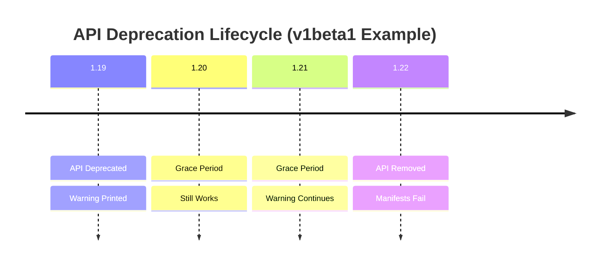

> **Складність**: `[ШВИДКИЙ]` — концептуальне розуміння з практичними командами.
>
> **Час на проходження**: 40 хвилин.
>
> **Передумови**: розуміння версіювання API Kubernetes.

---

## Результати навчання

Після проходження цього модуля ви зможете використовувати живий API Kubernetes як свою довідку замість того, щоб покладатися на пам'ять, скопійовані маніфести чи застарілі приклади. Кожен результат нижче — це те, що ви можете відпрацювати безпосередньо на кластері Kubernetes 1.35+ та перевірити за допомогою тесту чи практичної вправи.

- **Діагностувати** невдалий `kubectl apply`, спричинений вилученим API, та обрати поточну версію API за допомогою `kubectl explain` і `kubectl api-resources`.
- **Оновлювати** застарілі маніфести Kubernetes, зокрема приклади Ingress та CronJob, де зміна `apiVersion` може також вимагати змін у специфікації.
- **Оцінювати** попередження про застарівання та помилки вилучених API, щоб ви могли вирішити, чи потребує маніфест швидкого підвищення версії, чи глибшої міграції.
- **Реалізувати** перевірки серверного dry-run та аудиту маніфестів, які виявляють застарілі API ще до того, як вони порушать роботу з розгортанням.

## Чому цей модуль важливий

Гіпотетичний сценарій: ви приєднуєтеся до команди застосунку після вікна оновлення кластера. Робочі навантаження все ще існують, але наступне розгортання зазнає невдачі, бо кілька YAML-файлів використовують версії API, які новий сервер API більше не обслуговує. Код застосунку не змінювався, образ не змінювався, і Сервіс не змінювався; розгортання зламалося, тому що контракт між маніфестом і API Kubernetes змінився, поки репозиторій залишався замороженим.

Цей сценарій трапляється достатньо часто, щоб заслужити власну звичку діагностування. Kubernetes оголошує API застарілими, перш ніж їх вилучити, і протягом пільгового періоду сервер API може попереджати клієнтів, що версія сьогодні ще працює, але не працюватиме пізніше. Ці попередження схожі на дорожні знаки про ремонт: спершу вони повідомляють, що маршрут закриється, потім дають час обрати інший шлях, а зрештою дорога зникає. Якщо ви ігноруєте знаки, відмова відчувається раптовою, хоча платформа попереджала вас заздалегідь.

Ключова навичка CKAD — це не запам'ятовування кожної версії API. Екзаменаційний кластер, ваш тренувальний кластер і робочий кластер можуть бути на різних мінорних релізах, і Kubernetes постійно розвивається. Надійна навичка — це знати, як запитати кластер, що він обслуговує просто зараз, як порівняти цю відповідь із YAML перед вами, і як розпізнати, коли нова версія API змінила форму специфікації, а не лише рядок версії.

Цей модуль розглядає застарівання API як проблему спостережуваності та обслуговування. Ви оглянете обслуговувану поверхню API, прочитаєте повідомлення про попередження та помилки, оновите застарілий маніфест Ingress і побудуєте невеликий цикл аудиту, що перевіряє ресурси, які часто використовуються. Зробіть паузу перед запуском першої команди: якщо маніфест працював на Kubernetes 1.21, але зазнає невдачі на Kubernetes 1.35+, які докази довели б, чи проблема полягає у версії API, у виді ресурсу, чи у полях під `spec`?

## Як старіють версії API Kubernetes

Кожен маніфест Kubernetes починається з називання двох речей: версії API та виду. Вид каже, що ви хочете, наприклад `Deployment`, `Ingress` чи `CronJob`; версія API каже, яка схема та контракт поведінки мають інтерпретувати цей об'єкт. Корисна ментальна модель — каталожна картка бібліотеки. Назва книги — це вид, але полиця та видання — це група та версія API, і використання старого ярлика полиці не допоможе, якщо бібліотека переїхала або вилучила те видання.

Kubernetes відокремлює основні ресурси від іменованих груп API. Основні ресурси, такі як Pod'и та Сервіси, використовують `apiVersion: v1` без префікса групи. Багато інших ресурсів живуть в іменованих групах, таких як `apps`, `batch` чи `networking.k8s.io`, і група є частиною ключа пошуку. Саме тому `apps/v1` Deployment та `networking.k8s.io/v1` Ingress не є взаємозамінними ярликами; вони вказують серверу API на різні родини ресурсів.

| Етап | Значення | Стабільність |
|------|----------|--------------|
| `alpha` (v1alpha1) | Експериментальний, може змінитися або зникнути | Нестабільний |
| `beta` (v1beta1) | Функціонально повний, може змінитися | Здебільшого стабільний |
| `stable` (v1, v2) | Готовий до промислової експлуатації, зворотно сумісний | Стабільний |

Назви етапів не є прикрасою. Alpha-API можуть швидко змінюватися і за замовчуванням можуть бути вимкнені. Beta-API ближчі до реального використання, але Kubernetes все ще залишає простір, щоб скоригувати поля чи поведінку, перш ніж API випуститься. Stable-API мають сильніші очікування щодо сумісності, тому більшість вбудованих ресурсів Kubernetes, які ви використовуєте для завдань CKAD, у сучасному кластері мають бути на стабільних версіях.

```text
v1alpha1 -> v1alpha2 -> v1beta1 -> v1beta2 -> v1
```

Не читайте цю послідовність як обіцянку, що кожен API чисто проходить через кожен крок. Деякі API випускаються зі зміненими полями, деякі замінюються іншим механізмом, а деякі вилучаються без стабільної заміни, бо функцію було знято з підтримки. PodSecurityPolicy — це класичне нагадування: немає PodSecurityPolicy у `policy/v1`, на яку можна було б перейти, тож правильна міграція — це перехід до Pod Security Admission або іншого механізму політик, а не сліпе редагування версії.

```yaml
# Core group (no prefix)
apiVersion: v1
kind: Pod

# Named groups
apiVersion: apps/v1
kind: Deployment

apiVersion: networking.k8s.io/v1
kind: Ingress

apiVersion: batch/v1
kind: Job
```

Сервер API використовує групу, версію та вид разом, щоб знайти зіставлення ресурсу. Коли таке зіставлення існує, сервер може перевірити поля, застосувати значення за замовчуванням, зберегти об'єкт і повернути попередження, якщо версія застаріла. Коли зіставлення не існує, запит зазнає невдачі ще до перевірки полів, бо Kubernetes не може навіть знайти схему для тієї пари виду та версії. Ця відмінність важлива під час діагностування, бо вилучений API зазнає невдачі інакше, ніж старий, але все ще обслуговуваний API.

Kubernetes також розрізняє застарівання API та вилучення API. Застарівання означає, що версія все ще працює, але клієнти мають відходити від неї, бо вилучення заплановане або вже призначене. Вилучення означає, що сервер API більше не обслуговує цю версію, тож маніфест, який її використовує, не може бути прийнятий. На іспиті ця відмінність каже вам, чи читаєте ви попередження, яке заслуговує на швидке прибирання, чи помилку, яка негайно блокує завдання.
## Огляньте кластер перед редагуванням YAML

Найшвидший спосіб уникнути застарілих версій API — запитати кластер, перш ніж писати чи лагодити маніфест. `kubectl api-resources` показує ресурси, які зараз обслуговує сервер API, разом із їхніми короткими іменами, групами API, статусом приналежності до простору імен та назвами видів. `kubectl explain` показує версію та шлях схеми для ресурсу, що особливо корисно, коли вам потрібно знати, чи містить поточна форма об'єкта таке поле, як `pathType`, чи вкладене `backend.service.port.number`.

Звичка проста: використовуйте `api-resources`, коли вам треба виявити імена та групи ресурсів, а потім використовуйте `explain`, коли вам потрібна схема конкретного виду чи поля. Це швидше та безпечніше, ніж пошук у старих нотатках, бо обидві команди звертаються до сервера API, який ви насправді використовуєте. Перш ніж запускати наступний блок, передбачте, які ресурси покажуть іменовану групу API, а які покажуть основну групу `v1`.

```bash
# All resources with API versions
kubectl api-resources

# Specific resource
kubectl api-resources | grep -i deployment
# Output: deployments   deploy   apps/v1   true   Deployment

# With short names
kubectl api-resources --sort-by=name
```

Виведення `api-resources` спершу може здатися широким, але воно відповідає на практичне питання: «Чи може цей кластер обслуговувати те, що я збираюся застосувати?» Якщо виду ресурсу немає у списку, маніфест не запрацює без встановлення відсутнього API чи зміни об'єкта. Якщо ресурс перелічений під іншою групою, ніж використовує маніфест, маніфест може бути старим, скопійованим з іншої епохи Kubernetes або призначеним для CRD, який не встановлено в цьому кластері.

```bash
# Get API group and version for a resource
kubectl explain deployment
# GROUP:      apps
# KIND:       Deployment
# VERSION:    v1

kubectl explain ingress
# GROUP:      networking.k8s.io
# KIND:       Ingress
# VERSION:    v1

kubectl explain cronjob
# GROUP:      batch
# KIND:       CronJob
# VERSION:    v1
```

`kubectl explain` — це команда, до якої варто звертатися, коли вам потрібна впевненість на рівні полів. Вершина її виведення показує поточну групу та версію окремо, а глибші шляхи показують поля, яких очікує Kubernetes. Для іменованої групи API поєднайте `GROUP` та `VERSION`, щоб сформувати `apiVersion` маніфесту: `apps/v1`, `networking.k8s.io/v1` чи `batch/v1`. Основні ресурси, такі як Pod'и та Сервіси, не мають префікса групи, тож значення в їхньому маніфесті залишається просто `v1`.

```bash
# See what version existing objects use.
# If this Deployment is absent, create it first or skip this optional check.
# kubectl create deployment nginx --image=nginx
kubectl get deployment nginx -o yaml | head -5
# apiVersion: apps/v1
# kind: Deployment
# If you created the disposable Deployment, clean it up afterward:
# kubectl delete deployment nginx
```

Огляд наявного об'єкта може допомогти, коли в кластері вже є подібний ресурс. Kubernetes зберігає та обслуговує об'єкти через переважні версії, тож перші рядки `kubectl get ... -o yaml` зазвичай показують версію, яку сервер API повертає зараз. Це виведення не слід сприймати як посібник із конвертації саме по собі, але воно дає вам конкретну довідку щодо групи та версії в тому самому кластері.

Використовуйте цю перевірку щоразу, коли маніфест надійшов з репозиторію, посібника, згенерованого чарту чи фрагмента від колеги. Маніфест, який був правильним у 2020 році, може бути неправильним на кластері Kubernetes 1.35+, а маніфест, який працює в одному вендорському середовищі, може зазнати невдачі в іншому, якщо відсутній CRD. Який підхід ви б обрали тут і чому: редагування `apiVersion` з пам'яті, перевірку через `kubectl explain` чи спершу спробу `kubectl apply` і читання помилки?

## Розпізнавайте застарілі та вилучені API

Застарівання Kubernetes видимі у двох місцях: документація, що оголошує життєві цикли версій, та відповіді сервера API, що попереджають, коли ви використовуєте застарілу версію, яка ще працює. Шлях через попередження цінний, бо він з'являється у робочому процесі, який ви вже виконуєте. Якщо журнали CI містять попередження про застарівання, розгортання сьогодні ще може бути успішним, але журнал каже вам, що майбутнє оновлення може перетворити той самий YAML на жорстку відмову.

Таблиця нижче зберігає історичні приклади, які найбільше важать для роботи з обслуговування у стилі CKAD. Вам не слід запам'ятовувати її як єдине джерело істини, але вона дає вам розпізнавання шаблонів для поширених застарілих маніфестів. Повторювана тема в тому, що вилучений beta-API — це не відмова застосунку під час виконання; це відмова узгодження схеми між клієнтом і сервером API.

| Старий API | Поточний API | Вилучено в |
|------------|--------------|------------|
| `extensions/v1beta1 Ingress` | `networking.k8s.io/v1` | 1.22 |
| `apps/v1beta1 Deployment` | `apps/v1` | 1.16 |
| `rbac.authorization.k8s.io/v1beta1` | `rbac.authorization.k8s.io/v1` | 1.22 |
| `networking.k8s.io/v1beta1 IngressClass` | `networking.k8s.io/v1` | 1.22 |
| `batch/v1beta1 CronJob` | `batch/v1` | 1.25 |
| `policy/v1beta1 PodSecurityPolicy` | Вилучено (use Pod Security Admission) | 1.25 |

Іспит CKAD використовує нещодавні версії Kubernetes, і цей модуль припускає Kubernetes 1.35+ для прикладів. Це означає, що більшість вбудованих beta-API з ранньої епохи Kubernetes зникли, а не просто не рекомендуються. Практичний наслідок у тому, що ви маєте очікувати швидкої відмови старого YAML зі старих блогів, коли він називає Ingress `extensions/v1beta1` чи CronJob `batch/v1beta1`, тоді як усе ще обслуговуваний застарілий API зазвичай виводив би попередження, перш ніж пізніший реліз його вилучить.
```bash
# Convert old manifest to new API
# requires the kubectl-convert plugin (not in default kubectl)
kubectl convert -f old-deployment.yaml --output-version apps/v1
```

`kubectl convert` корисний, коли він доступний, але він не є заміною розумінню форми ресурсу. Плагін може допомогти з конвертацією версії, проте вам усе одно треба оглянути обов'язкові поля та переглянути результат. В екзаменаційних середовищах ви можете не мати плагіна, тож сприймайте його як зручність, а не як основу для вашої стратегії діагностування.

```bash
# Check what the manifest uses
head -5 my-manifest.yaml

# Compare with current API
kubectl api-resources | grep -i <resource-type>
```

Ручної перевірки часто достатньо. Перші кілька рядків файлу кажуть вам оголошену версію та вид маніфесту, тоді як `api-resources` чи `explain` каже вам, що обслуговує кластер. Це порівняння також є доброю звичкою для рецензування коду: якщо pull request вводить `v1beta1` для вбудованого ресурсу в сучасному кластері, рецензент має попросити доказ, що цей API все ще обслуговується.

```bash
$ kubectl apply -f old-ingress.yaml
Warning: networking.k8s.io/v1beta1 Ingress is deprecated in v1.19+,
unavailable in v1.22+; use networking.k8s.io/v1 Ingress
```

Приклад із попередженням — найкращий випадок, бо він дає вам час. Сервер усе одно прийняв об'єкт, але також повідомив вам, що стара версія застаріла, і назвав заміну. Якщо ви бачите це попередження в CI, правильною відповіддю є не «зелена збірка, ігнорувати». Правильна відповідь — створити невелику зміну міграції, поки система здорова, бо те саме попередження може перетворитися на `no matches for kind` після того, як оновлення перетне реліз вилучення.

```text
1.19: v1beta1 deprecated (warning)
1.20: v1beta1 still works (warning continues)
1.21: v1beta1 still works (warning continues)
1.22: v1beta1 REMOVED (error if used)
```

Часова шкала вище — це спрощений приклад у стилі Ingress, і точні релізи відрізняються залежно від API. Що важить — це форма життєвого циклу: застарівання передує вилученню, а попередження існують, щоб користувачі могли мігрувати до того, як відмова стане неминучою. Коли ви діагностуєте невдалий маніфест, запитайте, чи перебуваєте ви до точки вилучення, чи після неї. До вилучення ви можете спокійно застосувати та мігрувати; після вилучення маніфест має змінитися, перш ніж його можна буде прийняти.



Політика застарівання дає користувачам Kubernetes передбачуваний коридор, але вона не усуває потреби читати примітки до релізу та виведення попереджень. Політика найсильніша для стабільних API і менш заспокійлива для beta- чи alpha-версій. У повсякденних термінах стабільний API схожий на громадську дорогу, яку місто має ретельно обслуговувати, тоді як alpha-API ближчий до тимчасової будівельної доріжки. Ви можете нею користуватися, але не варто дивуватися, коли її форма зміниться.

## Читайте помилки API як докази

Помилки API Kubernetes — це не випадковий текст скарг. Зазвичай вони кажуть вам, який рівень відхилив об'єкт, а цей рівень каже вам, який вид виправлення можливий. Вилучений API зазнає невдачі під час зіставлення ресурсів, бо сервер не може зіставити групу, версію та вид з обслуговуваним ендпоінтом. Поточний API зі старими полями зазнає невдачі під час декодування чи перевірки, бо сервер знайшов ендпоінт, але відхилив форму об'єкта. Відхилення допуску трапляється пізніше, після того, як об'єкт є синтаксично коректним, бо політика чи контролер вирішили, що запит не дозволено.

Цей порядок корисний, бо тримає ваше діагностування вузьким. Якщо повідомлення каже `no matches for kind`, не починайте редагувати проби, мітки чи порти Сервісу. Kubernetes ще не дійшов до тих полів. Ваше негайне завдання — виявити правильний API чи підтвердити, що ресурс більше не існує. Щойно група-версія-вид успішно зіставляться, помилки полів стануть значущими, і лише після проходження перевірки полів вам слід думати про політики допуску, квоту чи поведінку під час виконання.

Фраза `resource mapping not found` зазвичай вказує на виявлення. Клієнт спробував побудувати REST-зіставлення для об'єкта і не зміг знайти відповідний обслуговуваний ресурс. У вбудованому ресурсі це часто означає, що маніфест використовує вилучену версію API, таку як старий beta-варіант Ingress чи CronJob. У кастомному ресурсі те саме формулювання може означати, що відсутній CRD, що CRD використовує іншу групу або що ви під'єднані до неправильного кластера. Виправлення залежить від того, чи має ресурс бути вбудованим, чи встановленим розширенням.

Фраза `no matches for kind` особливо пряма. Вона називає вид та версію, які зазнали невдачі, тож ви можете порівняти ці два значення з `kubectl api-resources`. Якщо вид з'являється під іншою групою API, оновіть маніфест до обслуговуваної групи, а потім огляньте специфікацію. Якщо вид не з'являється взагалі, зміна випадкових рядків версій — це здогадки. Вам або потрібно встановити постачальника API, обрати інший ресурс, або вилучити цей маніфест із цільового середовища.

Помилки полів мають інший відтінок. Вони часто кажуть, що поле невідоме, обов'язкове, недійсне чи не дозволене в певному місці. Це означає, що Kubernetes розпізнав версію ресурсу та перейшов до перевірки тіла об'єкта. Для роботи із застаріванням це момент, коли міграція лише за версією виявляє свою слабкість. Маніфест більше не застарілий у першому рядку, але частини тіла все ще належать до старої схеми.

Ingress робить це конкретним. Якщо ви зміните лише `networking.k8s.io/v1beta1` на `networking.k8s.io/v1`, старі поля `serviceName` та `servicePort` усе ще будуть у неправильному місці. Помилка поля — це не доказ того, що стабільний Ingress зламаний; це доказ того, що маніфест усе ще описує beta-форму. Правильний наступний крок — оглянути точний шлях схеми та переписати блок backend, а не пробувати іншу версію API.

Попередження сидять між успіхом і відмовою, тому ними легко неправильно скористатися. Попередження може з'явитися, поки `kubectl apply` завершується успішно, бо сервер API прийняв об'єкт, але хоче, щоб клієнт змінив поведінку перед майбутнім релізом. У людському терміналі попередження видиме. В автоматизації воно може бути поховане між звичайними рядками apply. Команди, які сприймають попередження як фоновий шум, втрачають найдешевший можливий сигнал готовності до оновлення.

Помилки допуску відрізняються від помилок застарівання, навіть коли вони з'являються під час тієї самої команди apply. Політика може відхилити дійсний `apps/v1` Deployment, бо йому бракує обмежень ресурсів, він використовує заборонений реєстр образів чи порушує Pod Security Admission. Зміна `apiVersion` цього не виправить, бо виявлення та перевірка схеми вже пройшли успішно. Виправлення належить до вимоги політики, названої у повідомленні, а не до життєвого циклу API.

Тому практична послідовність діагностування — це виявлення, схема, допуск і виконання. Виявлення запитує, чи обслуговує сервер API цю групу-версію-вид. Схема запитує, чи відповідає тіло об'єкта тій версії. Допуск запитує, чи дозволяє політика кластера цей запит. Виконання запитує, чи можуть контролери, планувальник, kubelet та процес застосунку змусити прийнятий об'єкт працювати. Застарівання API зазвичай живе у перших двох рівнях, тож тримайте розслідування там, доки докази не посунуть вас уперед.

Зробіть паузу і передбачте: якщо `kubectl apply --dry-run=server` повертає помилку невідомого поля для Ingress, чи виправило б маніфест встановлення іншого контролера Ingress? Зазвичай ні, бо сервер API перевіряє вбудовану схему Ingress, перш ніж будь-який контролер узгодить об'єкт. Контролер може впливати на поведінку після прийняття об'єкта, але він не робить старі beta-поля дійсними всередині стабільного API.

Це засноване на доказах читання також допомагає, коли ви рецензуєте pull request'и. Змінений `apiVersion` має запрошувати до невеликого контрольного списку: чи все ще зіставляється вид, чи змінилася форма специфікації, чи пройшов сформований маніфест серверний dry-run, і чи відхилила якась політика прийнятий об'єкт? Цей контрольний список достатньо короткий для практики CKAD і достатньо конкретний для командного рецензування. Він перетворює непрозоре виведення apply на дерево рішень, яке ви можете виконати без паніки.
## Оновлюйте маніфести без здогадок

Багато виправлень вилучених API виглядають як прості редагування `apiVersion` — доки це не так. Деякі ресурси зберегли майже ту саму специфікацію, коли випустилися, тоді як інші змінили імена полів, вкладеність, значення за замовчуванням чи обов'язкові поля. Ingress — найкращий навчальний приклад, бо міграція з `networking.k8s.io/v1beta1` до `networking.k8s.io/v1` вимагає більшого, ніж зміна першого рядка. Якщо ви оновите лише версію, сервер API перейде від «невідомий API» до «відомий API з недійсними полями».

Почніть із читання старого маніфесту як форми, а не лише як тексту. Він оголошує Ingress, має правило для `example.com`, і під кожним шляхом вказує на Сервіс за допомогою старіших плоских полів `serviceName` та `servicePort`. Ці поля були дійсними у старій beta-формі, але стабільний API Ingress використовує вкладений об'єкт backend і вимагає явної стратегії зіставлення шляхів.

```yaml
apiVersion: networking.k8s.io/v1beta1
kind: Ingress
metadata:
  name: my-ingress
spec:
  rules:
  - host: example.com
    http:
      paths:
      - path: /
        backend:
          serviceName: my-service
          servicePort: 80
```

Перш ніж дивитися на оновлений маніфест, зробіть паузу і передбачте: які поля є частиною ідентичності об'єкта, які поля описують HTTP-маршрутизацію, а які поля кажуть Kubernetes, як дістатися до backend Сервісу? Якщо ви можете розділити ці обов'язки, нову форму легше запам'ятати, бо вкладений блок `service` групує ім'я та порт Сервісу разом.

```yaml
apiVersion: networking.k8s.io/v1
kind: Ingress
metadata:
  name: my-ingress
spec:
  rules:
  - host: example.com
    http:
      paths:
      - path: /
        pathType: Prefix
        backend:
          service:
            name: my-service
            port:
              number: 80
```

Три важливі зміни — це версія, обов'язковий `pathType` та структура backend. `pathType: Prefix` каже контролеру, як зіставляти шлях, тоді як `backend.service.name` та `backend.service.port.number` замінюють старіші плоскі поля backend. Саме тому `kubectl explain ingress.spec.rules.http.paths.backend` вартий тих кількох секунд, які він займає; він показує поточну форму замість того, щоб залишати вас пригадувати кожну деталь міграції.

Деякі міграції менш драматичні. Застарілий Deployment, що використовує `apps/v1beta1`, зазвичай стає `apps/v1` зі знайомою формою шаблону Pod'а, але вам усе одно треба перевірити селектор і мітки шаблону, бо стабільні Deployment'и вимагають селектора. Міграція CronJob з `batch/v1beta1` до `batch/v1` зазвичай проста для поширених полів, але вам усе одно слід запитати в кластера поточну схему та запустити серверний dry-run перед злиттям зміни.

```bash
# Always check current API version first
kubectl explain <resource>

# Example
kubectl explain ingress
kubectl explain cronjob
kubectl explain networkpolicy
```

Команда вище навмисно нудна. Вона також є командою, що заощаджує час під тиском, бо перетворює невизначеність на докази. У роботі CKAD правильний пошук переважає впевнену здогадку, а ціна — лише кілька секунд. Та сама звичка масштабується на реальні репозиторії, бо ви можете спершу провести аудит маніфестів на оголошені версії, а потім використати серверну перевірку, щоб виловити проблеми на рівні полів.

```bash
# This is the ONLY command you need to remember
kubectl explain <resource> | head -5

# Practice: what happens if you guess wrong?
# Try applying a manifest with the wrong version and read the error.
```

Якби ви застосували Deployment з `apiVersion: extensions/v1beta1` на кластері Kubernetes 1.35+, він би негайно зазнав невдачі з повідомленням на кшталт `no matches for kind "Deployment" in version "extensions/v1beta1"`. Ця помилка означає, що сервер API не може знайти зіставлення групи-версії-виду. Вона відрізняється від попередження про застарівання, яке з'являється лише тоді, коли старий API все ще обслуговується і сервер може обробити запит, попереджаючи вас перейти.

## Побудуйте робочий процес перевірки для CKAD та CI

Найкращий робочий процес із маніфестами має два цикли: швидкий людський цикл для інтерактивної роботи та автоматизований цикл для репозиторіїв. У людському циклі ви перевіряєте версію ресурсу за допомогою `explain`, оновлюєте маніфест і запускаєте `kubectl apply --dry-run=server`, перш ніж застосувати по-справжньому. В автоматизованому циклі CI запускає серверний dry-run чи еквівалентну перевірку політик проти репрезентативної версії кластера, тож застарілі чи вилучені API не чекають ночі оновлення, щоб зазнати невдачі.

Серверний dry-run важить, бо просить сервер API перевірити запит без збереження об'єкта. Клієнтська генерація може виловити синтаксис YAML і створити форми за замовчуванням, але вона не може довести, що живий сервер API приймає версію ресурсу чи всі поля. Для застарівань ця контактність із сервером і є суттю. Ви хочете, щоб той самий компонент, який відхилив би справжнє розгортання, спершу відхилив тестове розгортання.

Корисне правило рецензування — відокремлювати «версію прийнято» від «поле прийнято». Маніфест може зазнати невдачі, бо версія API вилучена, або може пройти пошук версії та зазнати невдачі, бо специфікація все ще використовує старі поля. Перша відмова зазвичай каже no matches for kind and version; друга відмова зазвичай називає невідоме чи відсутнє поле. Коли ви читаєте помилки так, ви уникаєте поширеної пастки виправлення першого рядка та припущення, що міграцію завершено.

Використовуйте згенерований YAML як навчальний засіб, коли іспит це дозволяє. Імперативні команди `kubectl create` добре створюють поточні версії API для поширених об'єктів робочого навантаження, і виведення може слугувати скелетом. Згенерований файл не завжди є остаточною відповіддю, бо вам можуть знадобитися мітки, проби, монтування томів чи поля політик, але він зменшує ймовірність того, що ваші перші два рядки застарілі.

У репозиторіях промислового стилю додайте крок аудиту маніфестів поруч із кодом, що вже формує Helm, Kustomize чи звичайний YAML. Спершу сформуйте, потім перевіряйте сформований результат, бо застарівання ховаються в шаблонах, доки значення їх не розгорнуть. Це тримає перевірку чесною: ви тестуєте об'єкт, який дійшов би до сервера API, а не частковий шаблон, який люди читають під час рецензування.
## Патерни та антипатерни

Головний патерн — це міграція, керована доказами. Використовуйте живий API, щоб дізнатися, що обслуговує кластер, оновіть форму маніфесту зі схемою перед очима, а потім перевірте серверним dry-run. Це працює для завдань CKAD, бо швидко, і це працює для більших команд, бо залишає повторюваний слід аудиту в CI. Міркування щодо масштабування — це покриття кластерів: якщо ви розгортаєте на кілька мінорних версій Kubernetes, перевіряйте проти найстарішої та найновішої підтримуваних версій замість того, щоб припускати, що один кластер доводить кожну ціль.

Другий корисний патерн — інвентаризація перед оновленням. Перед оновленням кластера шукайте у сформованих маніфестах та живих журналах аудиту застарілі версії, потім ранжуйте знахідки за релізом вилучення та радіусом ураження. Це відрізняється від очікування помилок розгортання після оновлення. Інвентаризація каже вам, які маніфести мають змінитися до того, як рухатиметься площина управління, які команди ними володіють і які зміни вимагають міграції поведінки, а не лише підвищення версії.

Третій патерн — рецензування коду, кероване схемою. Коли pull request змінює `apiVersion`, рецензенти мають також шукати поруч зміни форми полів, особливо на ресурсах із відомими відмінностями міграції, такими як Ingress. Це тримає рецензування зосередженим на контракті, що змінюється. Рецензенту не потрібно декламувати весь API Kubernetes; йому потрібно запитати, чи все ще містить схема нової версії поля, що є в маніфесті.

Найшкідливіший антипатерн — міграція «лише рядка версії». Команди потрапляють у нього, бо повідомлення про відмову називає стару версію API, тож зміна першого рядка відчувається як усе виправлення. Краща альтернатива — використати `kubectl explain` на відповідному шляху специфікації та запустити серверний dry-run. Це поєднання виловлює наступний рівень помилок, перш ніж маніфест досягне справжнього розгортання.

Інший антипатерн — довіра до прикладів за віком чи позицією в пошуку. Посібник може бути правильним для релізу Kubernetes, на який він орієнтувався, і все одно бути неправильним для вашого кластера. Сприймайте зовнішній YAML як відправну точку, а не як авторитет. Авторитет — це кластер, а документація Kubernetes чи примітки до релізу від вендора мають бути довідкою для міграцій, що змінюють поведінку.

Останній антипатерн — ігнорування попереджень через те, що команда завершилася успішно. Попередження легко загубити в журналах CI, особливо коли розгортання виводить багато звичайних рядків. Зробіть попередження про застарівання видимими, провалюючи спеціальне завдання аудиту або відкриваючи відстежувану роботу з прибирання, коли з'являються попередження. Виправлення зазвичай дешевше під час звичайного обслуговування, ніж під час заблокованого оновлення чи екзаменаційного таймера.

## Рамка прийняття рішень

Використовуйте цю рамку, коли маніфест зазнає невдачі чи попереджає під час apply. Спершу вирішіть, чи розпізнає сервер API групу-версію-вид. Якщо ні, використайте `api-resources` та `explain`, щоб знайти поточну версію чи підтвердити, що ресурс було вилучено без прямої заміни. Якщо він розпізнає версію, але попереджає, сприймайте попередження як завдання міграції з дедлайном. Якщо він розпізнає версію, але відхиляє поля, у вас проблема форми специфікації, а не проблема виявлення версії.

| Ситуація | Доказ | Найкращий наступний крок | Компроміс |
|----------|-------|--------------------------|-----------|
| Вилучений вбудований API | `no matches for kind` називає стару групу чи версію | Знайдіть поточний API через `kubectl explain` та оновіть форму маніфесту | Швидке виправлення, коли ресурс випустився, але деякі API вимагають заміни |
| Застарілий, але все ще обслуговуваний API | `Warning:` з'являється, поки об'єкт застосовується | Мігруйте під час звичайної роботи та перевіряйте серверним dry-run | Розгортання сьогодні не заблоковане, але ризик оновлення залишається |
| Поточний API з недійсними полями | Помилка називає невідомі, відсутні чи недійсні поля | Огляньте точний шлях специфікації через `kubectl explain` та відредагуйте поля | Вимагає більше уваги, ніж підвищення версії |
| Відсутній CRD чи API розширення | Вид ресурсу відсутній в `api-resources` | Встановіть власника CRD/оператора чи вилучіть залежний об'єкт | Не виправлення вбудованого ресурсу CKAD, але поширене в платформних репозиторіях |
| Вилучений API без стабільного еквівалента | Документація показує механізм заміни, а не нову версію | Сплануйте міграцію поведінки, наприклад Pod Security Admission | Більше роботи, але уникає винайдення неіснуючих API |

Ця таблиця рішень також не дає вам перестаратися. Якщо кластер каже, що API відсутній, бо CRD не встановлено, випадкова зміна `apiVersion` не допоможе. Якщо ресурс вбудований і вилучений, встановлення CRD не допоможе. Правильне виправлення слідує за категорією доказів, тому перше питання завжди — чи може сервер API взагалі зіставити вид і версію.

Для таймінгу CKAD найшвидший безпечний шлях зазвичай — пошук, редагування, dry-run, потім apply. Не витрачайте екзаменаційні хвилини на пробування багатьох версій методом проб і помилок. Сервер API вже виставляє обслуговувану версію, а пояснення на рівні полів доступне для шляху ресурсу, який ви редагуєте. Спокійна перевірка двома командами зазвичай швидша за діагностування ланцюга помилок перевірки, яких можна уникнути.

## Чи знали ви?

- **Ingress `networking.k8s.io/v1beta1` було вилучено в Kubernetes 1.22.** Стабільна форма `networking.k8s.io/v1` вимагає `pathType` та вкладеного посилання на backend-сервіс.
- **CronJob `batch/v1beta1` було вилучено в Kubernetes 1.25.** Сучасні кластери обслуговують CronJob через `batch/v1`, тож старі beta-приклади зазнають невдачі на Kubernetes 1.35+.
- **PodSecurityPolicy було повністю вилучено в Kubernetes 1.25.** Вона не випустилася до `policy/v1`; міграція означає використання Pod Security Admission чи іншої підтримуваної системи політик.
- **Сервер API може повертати попередження про застарівання перед вилученням.** Успішний `kubectl apply` усе одно може казати вам, що маніфест потребує міграції перед майбутнім оновленням.

## Типові помилки

| Помилка | Чому це трапляється | Як це виправити |
|---------|---------------------|-----------------|
| Копіювання YAML зі старих блогів чи Stack Overflow | Приклади зі старіших релізів можуть використовувати вилучені API, такі як `extensions/v1beta1` | Перевірте ресурс через `kubectl explain` на вашому кластері перед використанням маніфесту |
| Ігнорування попереджень про застарівання в журналах CI | Розгортання все одно успішне, тож попередження відчувається нешкідливим | Сприймайте попередження як роботу з оновлення та мігруйте до релізу вилучення |
| Запам'ятовування версій API замість вивчення команд пошуку | Тренувальні, екзаменаційні та робочі кластери можуть використовувати різні мінорні версії | Виробіть м'язову пам'ять для `kubectl explain <resource>` та `kubectl api-resources` |
| Оновлення лише `apiVersion` без перевірки змін специфікації | Повідомлення про помилку називає версію, тож перший рядок отримує всю увагу | Огляньте відповідний шлях `spec` та запустіть `kubectl apply --dry-run=server` |
| Припущення, що кожен beta-API має стабільну заміну | Деякі функції вилучаються чи замінюються іншим механізмом | Прочитайте посібник із застарівання та підтвердьте заміну перед редагуванням маніфестів |
| Тестування лише клієнтським dry-run | Клієнтська генерація не може довести, що живий сервер API приймає ресурс | Використовуйте серверний dry-run, перевіряючи доступність API та валідацію схеми |
| Аудит вихідних шаблонів замість сформованих маніфестів | Helm та Kustomize можуть приховувати застарілі API, доки не розгорнуться значення чи оверлеї | Перевіряйте сформований YAML, який було б надіслано серверу API |
## Тест

Використовуйте ці сценарії, щоб перевірити, чи можете ви розрізняти виявлення API, міграцію форми полів, прибирання попереджень та робочий процес валідації. Питання навмисно практичні, бо реальна робота із застаріванням рідко просить визначення; вона просить вас вирішити, який доказ змінює вашу наступну команду.

<details>
<summary>1. Ваша команда оновила кластер з 1.24 до 1.25. Deployment'и працюють, але всі CronJob'и не застосовуються з повідомленням `batch/v1beta1`. Що, ймовірно, не так і як би ви це виправили?</summary>

CronJob `batch/v1beta1` було вилучено в Kubernetes 1.25, тож маніфести все ще оголошують версію API, яку сервер більше не обслуговує. Перше виправлення — підтвердити поточну версію через `kubectl explain cronjob | head -5`, потім оновити маніфести до `batch/v1`. Після зміни версії запустіть серверний dry-run, щоб сервер API перевірив повний об'єкт. Це не проблема Deployment'а чи планувальника, бо відмова трапляється до того, як Kubernetes прийме об'єкт CronJob.
</details>

<details>
<summary>2. Ви запускаєте `kubectl apply -f ingress.yaml` і отримуєте `no matches for kind "Ingress" in version "extensions/v1beta1"`. Колега каже, що той самий файл працював минулого місяця. Що змінилося і що вам слід оглянути перед повторним застосуванням?</summary>

Кластер, імовірно, перетнув межу версії Kubernetes, де той старий API Ingress більше не обслуговується. Виправлення — це не лише зміна першого рядка на `networking.k8s.io/v1`; ви також маєте оглянути стабільну схему Ingress, бо поля backend та вимога `pathType` змінилися. Використайте `kubectl explain ingress.spec.rules.http.paths`, щоб підтвердити поточну структуру. Потім запустіть `kubectl apply --dry-run=server`, щоб виловити помилки полів перед створенням чи оновленням об'єкта.
</details>

<details>
<summary>3. Під час практики CKAD ви не впевнені, чи використовує NetworkPolicy `v1`, чи `v1beta1`. Що вам слід зробити і чому здогадка — слабший варіант?</summary>

Запустіть `kubectl explain networkpolicy | head -5` чи перевірте `kubectl api-resources | grep -i networkpolicy` на кластері. Здогадка слабша, бо іспит оцінює проти сервера API перед вами, а не проти того, що ви пам'ятаєте з посібника чи іншого кластера. Пошук займає секунди й також закріплює ім'я групи. Якщо команда показує `networking.k8s.io/v1`, це версія, яку ваш маніфест має використовувати в тому середовищі.
</details>

<details>
<summary>4. Ваш CI-конвеєр виводить `Warning: batch/v1beta1 CronJob is deprecated`, але розгортання завершується успішно. Чи має команда виправити це зараз, чи чекати наступного вікна оновлення кластера?</summary>

Команда має виправити це під час звичайної роботи, а не під час вікна оновлення. Попередження про застарівання означає, що API сьогодні ще працює, але Kubernetes каже вам, що версія на шляху до вилучення. Міграція, поки розгортання ще успішне, дає вам час перевірити поведінку та оновити кожну копію маніфесту. Очікування перетворює низькоризикове завдання обслуговування на заблоковане розгортання, коли API вилучать.
</details>

<details>
<summary>5. Pull request змінює PodSecurityPolicy `policy/v1beta1` на `policy/v1`, бо автор очікує, що beta-API випускаються. Чи це дійсна міграція?</summary>

Ні. PodSecurityPolicy було вилучено, і вона не має об'єкта-заміни `policy/v1`. Правильна відповідь — підтвердити ресурс через документацію та `kubectl api-resources`, потім мігрувати засоби контролю безпеки до Pod Security Admission чи іншого підтримуваного механізму політик. Сліпе підвищення версії створило б маніфест, який сервер API все одно не може зіставити. Це питання перевіряє, чи розрізняєте ви випуск і вилучення.
</details>

<details>
<summary>6. Маніфест використовує Ingress `networking.k8s.io/v1`, але серверний dry-run відхиляє `serviceName` та `servicePort`. Яка це категорія проблеми і яка наступна команда?</summary>

Це проблема поточної версії зі старою формою полів. Сервер API розпізнає Ingress `networking.k8s.io/v1`, але маніфест усе ще містить поля з beta-схеми. Наступна команда — `kubectl explain ingress.spec.rules.http.paths.backend` чи близький шлях схеми, щоб ви побачили вкладені поля `service.name` та `service.port.number`. Після редагування знову запустіть `kubectl apply --dry-run=server`, щоб перевірити повний об'єкт.
</details>

## Практична вправа: полагодьте зламані маніфести

Сценарій вправи: ви успадкували репозиторій маніфестів Kubernetes від команди, яка востаннє перевіряла їх на Kubernetes 1.21. Ваш поточний кластер працює на Kubernetes 1.35+, і принаймні один маніфест використовує вилучений API. Мета — діагностувати відмову, оновити версію та поля і довести серверним dry-run, що сервер API приймає виправлений об'єкт.

Працюйте у тимчасовому просторі імен чи локальному тренувальному кластері, якщо він у вас є. Вам не потрібно створювати справжні Сервіси для валідації dry-run Ingress, але вам слід уважно прочитати виведення помилки, бо воно каже вам, чи сервер зазнав невдачі на зіставленні ресурсів, чи на валідації полів. Послідовність важлива: спершу діагностуйте старий API, другим оглядайте поточну схему, третім редагуйте маніфест, а валідуйте останнім.

### Частина 1: діагностуйте проблему

Збережіть цей зламаний маніфест як `broken-ingress.yaml`. Він навмисно написаний зі старим API Ingress та старими полями backend, щоб ви бачили обидва рівні міграції. Не виправляйте його, перш ніж запустите команду dry-run; сенс першого проходу — прочитати докази сервера API.

```yaml
apiVersion: networking.k8s.io/v1beta1
kind: Ingress
metadata:
  name: legacy-app
spec:
  rules:
  - host: app.example.com
    http:
      paths:
      - path: /api
        backend:
          serviceName: api-service
          servicePort: 8080
      - path: /
        backend:
          serviceName: frontend
          servicePort: 80
```

Спробуйте застосувати його серверним dry-run, потім прочитайте першу помилку зіставлення ресурсів. Ця помилка каже вам, що версію API вилучено, перш ніж Kubernetes навіть дійде до старих полів backend.

```text
error: resource mapping not found for name: "legacy-app" namespace: "" from "broken-ingress.yaml":
no matches for kind "Ingress" in version "networking.k8s.io/v1beta1"
```

### Частина 2: полагодьте маніфест

Використайте `kubectl explain ingress | head -5`, щоб підтвердити поточну версію, потім огляньте `kubectl explain ingress.spec.rules.http.paths`, щоб побачити обов'язкову структуру шляху. Оновлюйте маніфест лише після того, як подивилися на схему. Це змушує вас відпрацьовувати звичку, що не дає виправленню лише за версією залишити старі поля позаду.

```bash
kubectl apply -f broken-ingress.yaml --dry-run=server
```

<details>
<summary>Виправлений маніфест</summary>

```yaml
apiVersion: networking.k8s.io/v1
kind: Ingress
metadata:
  name: legacy-app
spec:
  rules:
  - host: app.example.com
    http:
      paths:
      - path: /api
        pathType: Prefix
        backend:
          service:
            name: api-service
            port:
              number: 8080
      - path: /
        pathType: Prefix
        backend:
          service:
            name: frontend
            port:
              number: 80
```

Ключові зміни — це оновлений `apiVersion`, обов'язковий `pathType: Prefix` та вкладена структура backend під `service.name` і `service.port.number`.
</details>

Після редагування файлу запустіть той самий серверний dry-run знову. Чистий dry-run означає, що сервер API розпізнає версію ресурсу та приймає форму об'єкта. Якщо ви все ще отримуєте помилку, класифікуйте її: Kubernetes усе ще не може зіставити групу-версію-вид, чи він тепер відхиляє поля під відомою версією?

### Частина 3: проведіть аудит усіх ресурсів

Наступне завдання будує невелику таблицю пошуку для ресурсів, які ви часто використовуєте. Це не призначено замінити документацію; це призначено тренувати ваш рефлекс запитувати в кластера поточні обслуговувані версії. Якщо один ресурс відсутній, прочитайте помилку та вирішіть, чи ви використали неправильне ім'я ресурсу, чи API не встановлено.

```bash
# Find the current version for every resource you commonly use
for res in pod service deployment statefulset daemonset job cronjob ingress networkpolicy; do
  header=$(kubectl explain "$res" 2>/dev/null)
  group=$(printf '%s\n' "$header" | awk '/^GROUP:/ {print $2}')
  version=$(printf '%s\n' "$header" | awk '/^VERSION:/ {print $2}')
  if [ -n "$version" ]; then
    echo "$res: ${group:+$group/}$version"
  else
    echo "$res: unavailable"
  fi
done
```

Виведення має показати суміш основних та іменованих груп API. Pod'и та Сервіси мають бути `v1`, Deployment'и мають бути `apps/v1`, Job'и та CronJob'и мають бути у `batch/v1`, а Ingress та NetworkPolicy мають бути у `networking.k8s.io/v1`. Якщо ваш кластер відрізняється через специфічні для дистрибутиву API чи відсутні ресурси, сприймайте відмінність як доказ для розслідування, а не як привід для здогадок.

### Частина 4: згенеруйте правильний YAML з нуля

Імперативна генерація — корисна тактика CKAD, бо просить `kubectl` створити поточний скелет для поширених об'єктів. Згенерований YAML усе одно потребує перегляду, але дає вам правильний стартовий `apiVersion` та вид. Використовуйте цю тактику, коли вам потрібна швидкість, потім відредагуйте згенерований файл для міток, проб, змінних середовища чи інших обов'язкових полів.

```bash
kubectl create deploy audit-app --image=nginx --dry-run=client -o yaml > deployment.yaml
kubectl create job audit-job --image=busybox -- echo done --dry-run=client -o yaml > job.yaml
kubectl create cronjob audit-cron --image=busybox --schedule="0 * * * *" -- echo check --dry-run=client -o yaml > cronjob.yaml
```

Перевірте кожен згенерований маніфест через `grep apiVersion *.yaml`, потім запустіть серверний dry-run для будь-якого файлу, який ви плануєте застосувати. Порівняння між згенерованим YAML та виправленим застарілим YAML корисне: згенеровані файли починаються з поточних API, тоді як виправлені файли вчать вас, як мігрують старі форми.

### Практичні вправи

Вправа 1 тренує швидкий пошук ресурсів. Запускайте команди одну за одною та називайте очікувану версію, перш ніж з'явиться виведення. Цінність не в конкретній відповіді для одного кластера; цінність у виробленні низькотертьової звички перевіряти поточну поверхню API.

```bash
# Find API version for various resources
kubectl explain pod | head -5
kubectl explain service | head -5
kubectl explain deployment | head -5
kubectl explain ingress | head -5
kubectl explain networkpolicy | head -5
```

Вправа 2 використовує список ресурсів замість пояснення полів. Це команда, яку слід використовувати, коли ви не впевнені щодо імен, коротких імен, статусу простору імен чи груп API. Вона також допомагає помітити, чи взагалі існує ресурс розширення.

```bash
# List resources and their groups
kubectl api-resources --sort-by=name | grep -E "^NAME|deployment|ingress|job|cronjob"
```

Вправа 3 відпрацьовує генерацію та перевірку разом. Ви використовуєте клієнтський dry-run для генерації YAML, потім негайно перевіряєте версію API, яку він створив. У реальному робочому процесі наступним кроком був би серверний dry-run перед apply.

```bash
# Generate manifests and verify API versions

# Deployment
kubectl create deploy drill3-deploy --image=nginx --dry-run=client -o yaml | grep apiVersion

# Job
kubectl create job drill3-job --image=busybox -- echo done --dry-run=client -o yaml | grep apiVersion

# CronJob
kubectl create cronjob drill3-cron --image=busybox --schedule="* * * * *" -- echo hi --dry-run=client -o yaml | grep apiVersion
```

Вправа 4 пов'язує види з групами. Важливий навчальний момент у тому, що Сервіси — це основний `v1`, тоді як Deployment'и, Ingress'и та NetworkPolicy живуть в іменованих групах. Якщо ви можете назвати групу, перш ніж прочитати її, ви менш схильні вставити застарілий `apiVersion` під час іспиту.

```bash
# Which group does each belong to?
kubectl api-resources | grep -E "^NAME|^deployments|^services|^ingresses|^networkpolicies"

# Expected:
# deployments - apps
# services - core (no group)
# ingresses - networking.k8s.io
# networkpolicies - networking.k8s.io
```

Вправа 5 поєднує кілька поширених ресурсів в один цикл пошуку. Це той самий патерн, який ви можете адаптувати для аудиту репозиторію, подаючи види ресурсів із сформованого YAML, потім порівнюючи результат із версіями, оголошеними в маніфестах.

```bash
# Resources needed: Deployment, Service, Ingress, ConfigMap, Secret, NetworkPolicy

# Quick lookup
for res in deployment service ingress configmap secret networkpolicy; do
  header=$(kubectl explain "$res" 2>/dev/null)
  group=$(printf '%s\n' "$header" | awk '/^GROUP:/ {print $2}')
  version=$(printf '%s\n' "$header" | awk '/^VERSION:/ {print $2}')
  if [ -n "$version" ]; then
    echo "$res: ${group:+$group/}$version"
  else
    echo "$res: unavailable"
  fi
done
```

### Критерії успіху

- [ ] Діагностувати невдалий `kubectl apply`, спричинений вилученим API Ingress `networking.k8s.io/v1beta1`.
- [ ] Оновити застарілий маніфест Ingress до `networking.k8s.io/v1`, зокрема `pathType` та вкладені поля backend.
- [ ] Оцінити різницю між попередженням про застарівання, помилкою вилученого API та помилкою валідації полів поточної версії.
- [ ] Реалізувати перевірку серверного dry-run, що валідує виправлений маніфест перед справжнім apply.
- [ ] Використати `kubectl explain` чи `kubectl api-resources`, щоб знайти версію API будь-якого поширеного ресурсу менш ніж за 10 секунд.

### Підсумок Частини 3

Частина 3 охопила навички обслуговування, що тримають застосунки спостережуваними та придатними до ремонту після їх розгортання. Проби кажуть Kubernetes, коли контейнер живий і готовий, журнали виставляють виведення застосунку, команди діагностування дають вам перейти від симптомів до доказів, метрики показують поточний тиск на ресурси, а перевірки застарівання API тримають маніфести сумісними з кластером. Об'єднавча звичка однакова в усій секції: читати те, що Kubernetes уже знає, перш ніж робити зміну.

Застарівання API природно вписуються в кінець, бо вони пов'язують обслуговування «другого дня» з життєвим циклом кластера. Маніфест — це не позачасовий артефакт; це запит, написаний проти рухомої поверхні API. Коли ви сприймаєте версії API як контракти, що можуть старіти, попередження стають корисними ранніми сигналами замість шумних рядків журналу, а вилучені API стають прямими завданнями ремонту замість загадкових відмов розгортання.

## Перевірка для того, хто навчається

> Для іменованої групи API поєднайте `GROUP` та `VERSION`, щоб сформувати `apiVersion` маніфесту: `apps/v1`, `networking.k8s.io/v1` чи `batch/v1`.

Перш ніж рухатися далі, поясніть, чому ця цитата важлива для `kubectl explain deployment`. Ґрунтовна відповідь каже, що сучасний `kubectl explain` виводить `GROUP: apps` та `VERSION: v1` окремо, тоді як YAML-маніфест потребує поєднаного значення `apiVersion: apps/v1`.

## Джерела

- [Kubernetes API deprecation policy](https://kubernetes.io/docs/reference/using-api/deprecation-policy/)
- [Kubernetes API concepts](https://kubernetes.io/docs/reference/using-api/api-concepts/)
- [Kubernetes deprecated API migration guide](https://kubernetes.io/docs/reference/using-api/deprecation-guide/)
- [kubectl api-resources reference](https://kubernetes.io/docs/reference/kubectl/generated/kubectl_api-resources/)
- [kubectl explain reference](https://kubernetes.io/docs/reference/kubectl/generated/kubectl_explain/)
- [kubectl apply reference](https://kubernetes.io/docs/reference/kubectl/generated/kubectl_apply/)
- [kubectl create deployment reference](https://kubernetes.io/docs/reference/kubectl/generated/kubectl_create/kubectl_create_deployment/)
- [kubectl create job reference](https://kubernetes.io/docs/reference/kubectl/generated/kubectl_create/kubectl_create_job/)
- [kubectl create cronjob reference](https://kubernetes.io/docs/reference/kubectl/generated/kubectl_create/kubectl_create_cronjob/)
- [Kubernetes Ingress concept](https://kubernetes.io/docs/concepts/services-networking/ingress/)
- [Kubernetes CronJob concept](https://kubernetes.io/docs/concepts/workloads/controllers/cron-jobs/)
- [Pod Security Admission](https://kubernetes.io/docs/concepts/security/pod-security-admission/)

## Наступний модуль

Пройдіть [Підсумковий тест Частини 3](../part3-cumulative-quiz/), щоб перевірити ваш робочий процес спостережуваності та обслуговування, а потім продовжте до [Частини 4: Середовище застосунку, конфігурація та безпека](/k8s/ckad/part4-environment/module-4.1-configmaps/).


