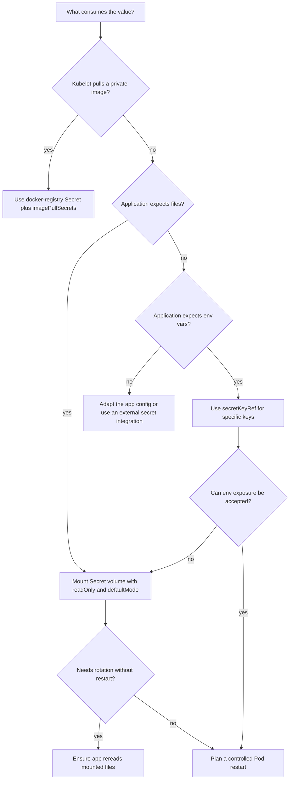

> **Складність**: `[СЕРЕДНЯ]` — схоже на ConfigMaps, але з міркуваннями безпеки
>
> **Час на проходження**: 45 хвилин
>
> **Передумови**: [Модуль 4.1: ConfigMaps](../module-4.1-configmaps/), розуміння кодування base64

---

## Результати навчання

Після завершення цього модуля ви зможете створювати, налаштовувати, діагностувати та оцінювати Kubernetes Secrets у спосіб, що відповідає очікуванням CKAD, водночас формуючи звички, які переносяться на робочі кластери під керуванням Kubernetes 1.35 і новіших версій.

- **Створювати** загальні (generic), файлові, TLS- та docker-registry-секрети за допомогою `kubectl` і декларативного YAML, уникаючи витоку облікових даних локально.
- **Налаштовувати** Pod'и на споживання Secret'ів через змінні середовища, `envFrom`, монтування томів, проєкцію ключів, режими доступу до файлів та `imagePullSecrets`.
- **Діагностувати** збої автентифікації, `CreateContainerConfigError` та `ImagePullBackOff`, спричинені помилками кодування, іменування, ключів або типів.
- **Оцінювати** межі безпеки Kubernetes Secret у Kubernetes 1.35+, включно з кодуванням base64, RBAC, шифруванням etcd у стані спокою та витоком через логи чи середовища процесів.

---

## Чому цей модуль важливий

Гіпотетичний сценарій: ви розгортаєте веб-Pod, який чисто стартує у staging, але production негайно повідомляє про збої автентифікації бази даних. Secret існує, ім'я ключа виглядає правильно, а логи застосунку показують коректне ім'я користувача, тож перший інстинкт — звинуватити базу даних. Насправді ж збій спричинено кінцевим символом нового рядка, який потрапив у пароль під час кодування, коли хтось скористався `echo` без `-n`. Це означає, що застосунок надсилає іншу послідовність байтів, ніж очікує база даних.

Ця маленька помилка добре пояснює, чому саме Secret'и заслуговують на більшу обережність, ніж ConfigMaps. Помилка в ConfigMap зазвичай ламає лише прапорці функцій (feature flags) або імена точок доступу; натомість помилка в Secret може заблокувати завантаження образів, розкрити облікові дані через логи або дати команді хибну впевненість лише тому, що YAML виглядає цілком валідним. Іспит CKAD перевіряє це як практичну навичку, а не як есе про політику безпеки: вам потрібно швидко створювати Secret'и, правильно їх монтувати та налагоджувати режим збою за подіями Pod'а й декодованими значеннями, не розкриваючи конфіденційні вхідні дані під час роботи.

Аналогія з банківським сейфом досі корисна, доки ви не розтягуєте її надто далеко. ConfigMap нагадує публічну дошку оголошень усередині кластера, тоді як Secret ближчий до банківського сейфа, який можуть відкрити лише певні робочі навантаження й користувачі. Напис на сейфі видно, вміст передається авторизованим Pod'ам у відкритій формі, а сховище банку все одно потребує охорони; Kubernetes дає вам кращий об'єкт для конфіденційного матеріалу, але сам собою не робить недбале поводження безпечним.

У цьому модулі ви побудуєте той самий Secret кількома способами, порівняєте вбудовані типи Secret'ів, споживатимете значення через змінні середовища та змонтовані файли й попрактикуєтеся в налагодженні поширених помилок, які проявляються як збої автентифікації або затримки запуску Pod'а. Тримайте одне питання в полі зору, поки читаєте: яку межу ви захищаєте на кожному кроці — представлення в YAML, об'єкт API, передачу kubelet, процес застосунку чи людей та інструменти, які можуть прочитати об'єкт?

---

## Створення Secret'ів без витоку вхідних даних

Kubernetes Secret — це об'єкт API з невеликою кількістю даних у форматі "ключ-значення" та типом, який повідомляє Kubernetes, як саме інтерпретувати ці дані. Тип за замовчуванням, `Opaque`, зберігає довільні ключі для вашого застосунку, і це робить його найближчим Secret-еквівалентом до ConfigMap. Важлива відмінність полягає не в тому, що Kubernetes якимось чином шифрує значення замість вас; вона в тому, що сервер API, CLI та специфікація Pod'а надають Secret'ам окремий шлях обробки, який ви можете поєднати з RBAC, шифруванням etcd і ретельним проєктуванням Pod'ів.

Найшвидший шлях для CKAD — це зазвичай імперативне створення, тому що команда `kubectl create secret generic` виконує кодування base64 за вас. Це усуває одне з поширених джерел помилок, водночас усе одно створюючи звичайний об'єкт Secret в API. Приклад нижче зберігає простий патерн з одним значенням з оригінального модуля, але використовує безпечне демонстраційне значення та повний шлях до бінарника `kubectl`, щоб команда працювала у скопійованих скриптах та неінтерактивних оболонках.

```bash
# Single key-value
kubectl create secret generic db-secret --from-literal=password='example-password'
```

Та сама команда може приймати кілька літералів, і імена ключів стають ключами під полем `data` Secret'а. Цей стиль зручний під час іспиту, бо він короткий і не вимагає створювати тимчасовий маніфест, але він не ідеальний для спільної історії терміналу. У реальному середовищі надавайте перевагу менеджеру секретів або процесу, який уникає внесення конфіденційних значень безпосередньо в історію оболонки.

```bash
# Multiple key-values
kubectl create secret generic db-secret \
  --from-literal=username=admin \
  --from-literal=password='example-password' \
  --from-literal=host=db.example.com
```

Файлове створення корисне, коли застосунок уже очікує окремі файли, як-от файл імені користувача та файл пароля. Воно також уникає розміщення конфіденційного значення безпосередньо в командному рядку, хоча тимчасові файли все одно потребують ретельного прибирання й не повинні створюватися в каталозі репозиторію. В оболонці іспиту використовуйте `echo -n` для детермінованих байтів, а потім видаліть файли після того, як Secret з'явиться.

```bash
# Create files with sensitive data
echo -n 'admin' > username.txt
echo -n 'example-password' > password.txt

# Create Secret from files
kubectl create secret generic db-secret \
  --from-file=username=username.txt \
  --from-file=password=password.txt

# Cleanup files
rm username.txt password.txt
```

Коли ви пишете YAML самостійно, поле `data` має містити значення, закодовані в base64. Base64 — це лише транспортне кодування, тож закодовані рядки нижче не захищені від будь-кого, хто може прочитати об'єкт. Цей стиль корисний, коли завдання дає вам закодовані вхідні дані або коли вам потрібен повністю декларативний об'єкт, але саме тут найлегше припуститися помилок із символами нового рядка та пошкодити дані під час копіювання-вставлення.

```yaml
apiVersion: v1
kind: Secret
metadata:
  name: db-secret
type: Opaque
data:
  username: YWRtaW4=      # base64 of 'admin'
  password: bXlzZWNyZXQ=  # base64 of 'mysecret'
```

Зробіть паузу й передбачте: якщо ви виконаєте `echo 'mypassword' | base64` замість `echo -n 'mypassword' | base64`, які байти отримає застосунок після того, як Kubernetes декодує Secret, і чому база даних їх відхилить? Команда без `-n` кодує символ нового рядка після пароля, тож декодоване значення стає `mypassword\n`, а не `mypassword`. Ця відмінність невидима в багатьох рядках логів, і саме тому збої автентифікації через закодований символ нового рядка можуть здаватися заплутаними, доки ви не дослідите точні байти.

Поле `stringData` дає вам безпечніший досвід авторингу, бо ви пишете звичайний текст у маніфесті, а сервер API кодує його в `data`. З погляду користувача воно доступне лише для запису: коли ви пізніше отримуєте Secret, Kubernetes повертає закодоване поле `data`, а не зберігає `stringData`. Це робить `stringData` чудовим для швидких маніфестів, але вам усе одно не варто комітити справжні облікові дані в Git лише тому, що це поле легше читати.

```yaml
apiVersion: v1
kind: Secret
metadata:
  name: db-secret
type: Opaque
stringData:
  username: admin
  password: mysecret
```

Декларативна практика також має включати валідацію на стороні сервера перед створенням об'єкта. Команда dry-run нижче просить сервер API перевірити й відрендерити об'єкт без його збереження, що корисно, коли під час іспиту вам потрібен каркас маніфесту. Вона також навчає корисної виробничої звички: генерувати або перевіряти структуру окремо від кроку, який розміщує конфіденційний матеріал у кластері.

```bash
kubectl create secret generic db-secret \
  --from-literal=username=admin \
  --from-literal=password='example-password' \
  --dry-run=server \
  -o yaml
```

Після створення спершу огляньте метадані й декодуйте лише той конкретний ключ, який вам потрібен. `kubectl get secret` навмисно приховує декодовані значення у звичайному табличному виводі, але `-o yaml` розкриває закодовані дані будь-кому, хто має доступ на читання. Ставтеся до можливості прочитати Secret як до конфіденційного доступу, бо декодування — це операція з однієї команди, і сервер API не питатиме, навіщо вам потрібне значення.

```bash
kubectl get secret db-secret
kubectl get secret db-secret -o yaml
kubectl get secret db-secret -o jsonpath='{.data.password}' | base64 -d
echo
```

---

## Типи Secret'ів та форма API

Типи Secret'ів — це значно більше, ніж просто мітки. Для загальних облікових даних застосунку тип `Opaque` є найгнучкішим, бо Kubernetes не валідує сенс ваших ключів. Для вбудованих типів Kubernetes натомість очікує конкретні ключі, а іноді й конкретну форму JSON, що дозволяє kubelet або іншому компоненту Kubernetes використовувати Secret без ручного парсингу вашим застосунком. Тому вибір правильного типу — це рішення про сумісність, а не просто перевага в документації.

| Тип | Призначення |
|------|---------|
| `Opaque` | За замовчуванням, довільні дані користувача |
| `kubernetes.io/service-account-token` | Токени ServiceAccount |
| `kubernetes.io/dockerconfigjson` | Облікові дані реєстру Docker |
| `kubernetes.io/tls` | TLS-сертифікат і ключ |
| `kubernetes.io/basic-auth` | Базова автентифікація |
| `kubernetes.io/ssh-auth` | Облікові дані SSH |

Тип docker-registry — це той, з яким учні CKAD найчастіше стикаються через `ImagePullBackOff`. Завантаження приватного образу не читає довільні ключі на кшталт `username` і `password`; kubelet очікує Secret типу `kubernetes.io/dockerconfigjson` з ключем `.dockerconfigjson`. Імперативна команда нижче створює цю форму за вас, і саме тому вона зазвичай безпечніша, ніж написання JSON вручну під тиском іспиту.

```bash
kubectl create secret docker-registry my-registry \
  --docker-server=registry.example.com \
  --docker-username=user \
  --docker-password='your-registry-password' \
  --docker-email=user@example.com
```

Створення реєстрового Secret'а — це лише половина шляху завантаження. Pod має посилатися на нього через `imagePullSecrets`, і Secret повинен існувати в тому самому просторі імен, що й Pod, який його використовує. Якщо Secret існує в іншому просторі імен, kubelet усе одно завершить завантаження невдачею, бо посилання Pod'а на Secret'и обмежені простором імен, а не є загальнокластерними скороченнями.

```yaml
apiVersion: v1
kind: Pod
metadata:
  name: private-image-demo
spec:
  imagePullSecrets:
  - name: my-registry
  containers:
  - name: app
    image: registry.example.com/team/app:1.0
```

TLS-секрети дотримуються подібного правила форми, але потрібні ключі — це `tls.crt` і `tls.key`. Команда CLI перевіряє наявність файлів сертифіката й ключа та зберігає їх під очікуваними ключами. Ваш застосунок або контролер Ingress потім можуть змонтувати чи послатися на Secret, не вигадуючи власної конвенції іменування ключів.

```bash
kubectl create secret tls my-tls \
  --cert=path/to/cert.pem \
  --key=path/to/key.pem
```

Декларативна форма робить той самий контракт видимим. Якщо ви створюєте Secret `kubernetes.io/tls` вручну, закодовані значення мають з'являтися під `tls.crt` і `tls.key`; перейменування їх на `cert` і `key` перетворює впізнаваний TLS-Secret на об'єкт, який споживачі можуть не зрозуміти. Це одна з практичних причин, чому типоспецифічні Secret'и існують, попри те що кожен Secret зрештою зберігає дані "ключ-значення".

```yaml
apiVersion: v1
kind: Secret
metadata:
  name: my-tls
type: kubernetes.io/tls
data:
  tls.crt: LS0tLS1CRUdJTiBDRVJUSUZJQ0FURS0tLS0tCg==
  tls.key: LS0tLS1CRUdJTiBQUklWQVRFIEtFWS0tLS0tCg==
```

Типи базової автентифікації та SSH-автентифікації корисні, коли інструмент очікує конвенційні імена ключів, але самі собою вони не додають криптографічного захисту. Secret `kubernetes.io/basic-auth` усе одно потребує RBAC і захисту сховища, а Secret `ssh-auth` усе одно передає приватний ключ Pod'у, який може прочитати змонтований файл. Тип допомагає споживачам узгодити форму; він не замінює принцип найменших привілеїв чи ротацію ключів.

Сценарій вправи: ваш Pod може прочитати `Opaque`-Secret з іменем `my-registry`, але завантаження приватних образів усе одно зазнає невдачі. Корисне питання не в тому, чи містить Secret ім'я користувача та пароль; воно в тому, чи бачить kubelet коректно типізований Secret docker config через `imagePullSecrets` у просторі імен Pod'а. Ця звичка налагодження утримує вас від вдивляння в облікові дані застосунку, коли збій насправді стається ще до запуску контейнера.

---

## Споживання Secret'ів у Pod'ах

Pod може споживати дані Secret'а двома способами — як змінні середовища або як файли з проєктованого тому. Обидва методи доставляють декодовані значення безпосередньо в контейнер, тож відмінність між ними полягає в ергономіці, поведінці оновлення та поверхні витоку, а не в шифруванні. Змінні середовища прості для застосунків, побудованих за принципом дванадцяти факторів, але вони стають частиною середовища процесу; змонтовані файли натомість підходять для багатьох бібліотек і уникають деяких випадкових шляхів логування, проте застосунок має читати їх із файлової системи.

Для однієї змінної середовища використовуйте `valueFrom.secretKeyRef` і вказуйте точний ключ Secret'а. Ця форма явна й легка для налагодження, бо специфікація Pod'а повідомляє вам, яка змінна залежить від якого ключа Secret'а. Вона також гучно зазнає невдачі, якщо Secret або ключ відсутні, зазвичай через подію Pod'а, яка згадує `CreateContainerConfigError` чи відсутній ключ.

```yaml
apiVersion: v1
kind: Pod
metadata:
  name: app
spec:
  containers:
  - name: app
    image: nginx
    env:
    - name: DB_PASSWORD
      valueFrom:
        secretKeyRef:
          name: db-secret
          key: password
```

Форма `envFrom` імпортує всі ключі з Secret'а як змінні, що коротше, але менш явно. Вона добре працює, коли ви контролюєте кожен ключ і застосунок очікує ті самі імена, проте вона може приховати несподіванки, коли ім'я ключа не є валідною змінною середовища або коли новододаний ключ змінює поведінку застосунку. Використовуйте її свідомо, а не як рефлекторне скорочення.

```yaml
apiVersion: v1
kind: Pod
metadata:
  name: app
spec:
  containers:
  - name: app
    image: nginx
    envFrom:
    - secretRef:
        name: db-secret
```

Змонтовані файли дають вам інший контракт. Kubernetes створює файли всередині контейнера, по одному файлу на ключ Secret'а за замовчуванням, а вміст файлів — це декодовані значення. Це часто краще пасує для сертифікатів, ключів і застосунків, які вже читають облікові дані з диска, особливо коли ви робите монтування доступним лише для читання й надаєте файлам обмежувальні права доступу.

```yaml
apiVersion: v1
kind: Pod
metadata:
  name: app
spec:
  containers:
  - name: app
    image: nginx
    volumeMounts:
    - name: secret-volume
      mountPath: /etc/secrets
      readOnly: true
  volumes:
  - name: secret-volume
    secret:
      secretName: db-secret
```

Перш ніж запустити це, який вивід ви очікуєте від `ls -l /etc/secrets` усередині контейнера, і чому імена файлів матимуть значення для застосунку? Kubernetes використовує ключі Secret'а як імена файлів, доки ви не проєктуєте конкретні ключі на конкретні шляхи. Це означає, що ключ Secret'а з іменем `password` стає файлом з іменем `password`, і застосунок, налаштований читати `/etc/secrets/db-password`, зазнає невдачі, доки ви не зіставите ключ із цим шляхом.

Права доступу до файлів — частина контракту тому. Режим за замовчуванням доступний для читання користувачем контейнера, але файл облікових даних часто має бути доступним для читання лише власнику, особливо коли образ містить кількох користувачів чи допоміжні процеси. `defaultMode: 0400` каже Kubernetes зробити проєктовані файли доступними лише для читання власником, що відповідає рекомендації оригінального модуля, водночас роблячи намір явним.

```yaml
volumes:
- name: secret-volume
  secret:
    secretName: db-secret
    defaultMode: 0400  # Read-only for owner
```

Ви також можете проєктувати лише вибрані ключі й перейменовувати їх як файли. Це корисно, коли Secret містить кілька пов'язаних значень, але контейнеру слід бачити лише одне, або коли застосунок очікує конкретне ім'я файлу. Це не заміна окремих Secret'ів та меж RBAC, але воно зменшує випадковий витік усередині спільної файлової системи контейнера.

```yaml
volumes:
- name: secret-volume
  secret:
    secretName: db-secret
    items:
    - key: password
      path: db-password
```

Цей потік легше запам'ятати, коли ви відокремлюєте представлення для зберігання від представлення для доставки. Kubernetes зберігає значення Secret'а під закодованими ключами `data` в об'єкті API, а потім kubelet доставляє декодовані значення в Pod як записи середовища чи файли. Діаграма зберігає потік оригінального модуля, замінюючи скорочені команди на придатні до запуску приклади `kubectl`.

```text
┌─────────────────────────────────────────────────────────────┐
│                    Secrets Flow                             │
├─────────────────────────────────────────────────────────────┤
│                                                             │
│  Create Secret                                              │
│  ┌─────────────────────────────────────┐                    │
│  │ kubectl create secret generic       │                    │
│  │   db-secret --from-literal=pass=... │                    │
│  └─────────────────────────────────────┘                    │
│                    │                                        │
│                    ▼                                        │
│  Stored in etcd as API data                                │
│  ┌─────────────────────────────────────┐                    │
│  │ data:                               │                    │
│  │   pass: bXlzZWNyZXQ=                │                    │
│  └─────────────────────────────────────┘                    │
│                    │                                        │
│         ┌──────────┴──────────┐                             │
│         ▼                     ▼                             │
│  ┌──────────────┐      ┌──────────────┐                     │
│  │ Environment  │      │   Volume     │                     │
│  │  Variable    │      │   Mount      │                     │
│  │              │      │              │                     │
│  │ $PASS=       │      │ /secrets/    │                     │
│  │ "mysecret"   │      │  pass file   │                     │
│  │ (decoded)    │      │ (decoded)    │                     │
│  └──────────────┘      └──────────────┘                     │
│                                                             │
└─────────────────────────────────────────────────────────────┘
```

Одна деталь, яка дивує нових користувачів, — поведінка оновлення. Змінні середовища фіксовані на час життя контейнера, тож зміна Secret'а не перезаписує середовище працюючого процесу. Вміст тому Secret'а може оновитися після того, як kubelet помітить зміну, але застосунок усе одно має перечитати файл або бути перезапущеним, якщо він читає облікові дані лише під час запуску. Дизайн ротації залежить від цієї відмінності.

---

## Кодування, ротація та налагодження без здогадок

Кодування base64 існує саме тому, що значення Secret'а можуть містити байти, які незручно розміщувати безпосередньо в YAML. Це не шифрування, не хешування, не маскування й аж ніяк не контроль доступу. Будь-хто, хто може прочитати об'єкт Secret, може декодувати його значення, а будь-хто, хто може виконати exec у Pod, що отримав Secret, може прочитати доставлене значення прямо з файлу чи середовища процесу.

Найбезпечніша іспитова звичка — кодувати за допомогою `echo -n` або уникати ручного кодування, використовуючи `stringData` й імперативне створення. Коли вам потрібно оглянути значення, декодуйте лише потрібний ключ і одразу окремо виведіть символ нового рядка, щоб запрошення терміналу не зливалося з декодованим виводом. Це тримає діагностичну команду точною й уникає копіювання зайвих байтів у подальше усунення несправностей.

```bash
# Encode
echo -n 'mysecret' | base64
# bXlzZWNyZXQ=

# Decode
echo 'bXlzZWNyZXQ=' | base64 -d
# mysecret

# View secret decoded
kubectl get secret db-secret -o jsonpath='{.data.password}' | base64 -d
echo
```

Перше розгалуження налагодження — чи Pod зазнав невдачі до запуску контейнера, чи застосунок зазнав невдачі після запуску. Відсутні імена Secret'ів, відсутні ключі та невалідні Secret'и для завантаження образів зазвичай з'являються в подіях Pod'а до того, як робоче навантаження почне працювати. Неправильні декодовані значення зазвичай дозволяють контейнеру стартувати, а потім проявляються як помилки автентифікації застосунку, цикли збоїв або збої готовності.

```bash
kubectl describe pod app
kubectl get events --sort-by=.lastTimestamp
kubectl get secret db-secret -o yaml
kubectl get secret db-secret -o jsonpath='{.data.password}' | base64 -d
echo
```

`CreateContainerConfigError` часто означає, що kubelet не може побудувати конфігурацію контейнера, бо вказаний Secret чи ключ відсутні. Почніть зі специфікації Pod'а, підтвердьте простір імен, потім підтвердьте ім'я Secret'а й написання ключа. Не декодуйте значення, доки ці структурні перевірки не пройдуть, бо відсутній ключ не можна виправити зміною байтів пароля.

```bash
kubectl get pod app -o yaml
kubectl get secret db-secret
kubectl describe pod app
```

`ImagePullBackOff`, пов'язаний з обліковими даними приватного реєстру, має інший шлях. Підтвердьте тип Secret'а, підтвердьте, що Pod посилається на нього через `imagePullSecrets`, і підтвердьте, що обидва об'єкти перебувають у тому самому просторі імен. Загальний Secret із правильним на вигляд іменем користувача й паролем — це все одно неправильна форма для процесу автентифікації реєстру в kubelet.

```bash
kubectl get secret my-registry -o jsonpath='{.type}'
echo
kubectl get pod private-image-demo -o jsonpath='{.spec.imagePullSecrets[*].name}'
echo
kubectl describe pod private-image-demo
```

Ротація додає ще один операційний рівень. Оновлення об'єкта Secret не обов'язково оновлює кожен працюючий застосунок негайно, бо застосунки читають облікові дані в різний час і через різні шляхи доставки. Для завдань CKAD ви часто можете видалити й перестворити Pod після зміни Secret'а; для виробничих навантажень ви зазвичай хочете контрольоване розгортання, яке перезапускає Pod'и в передбачуваному порядку.

```bash
kubectl create secret generic db-secret \
  -n secret-lab \
  --from-literal=username=admin \
  --from-literal=password='rotated-example-password' \
  --dry-run=client \
  -o yaml | kubectl apply -n secret-lab -f -

kubectl rollout restart deployment/app -n secret-lab
```

Швидка довідка нижче зберігає охоплення команд оригінального модуля, але прибирає скорочення, яке працює лише в інтерактивній оболонці. Читайте її як набір діагностичних дієслів: створіть об'єкт, перегляньте закодоване представлення, декодуйте конкретний ключ, редагуйте лише тоді, коли це доречно, і видаляйте лабораторні ресурси після завершення. У реальних командах надавайте перевагу декларативній або керованій менеджером секретів ротації над ручним редагуванням для довготривалих облікових даних.

```bash
# Create
kubectl create secret generic NAME --from-literal=KEY=VALUE
kubectl create secret generic NAME --from-file=FILE
kubectl create secret tls NAME --cert=CERT --key=KEY
kubectl create secret docker-registry NAME --docker-server=... --docker-username=...

# View (base64 encoded)
kubectl get secret NAME -o yaml

# Decode specific key
kubectl get secret NAME -o jsonpath='{.data.KEY}' | base64 -d

# Edit
kubectl edit secret NAME

# Delete
kubectl delete secret NAME
```

Коли усуваєте проблеми автентифікації, стримуйте бажання вивести в термінал кожні облікові дані. Спершу порівняйте структуру: ім'я Secret'а, ім'я ключа, простір імен, тип, шлях монтування, режим файлу та посилання Pod'а. Декодуйте лише після того, як ці перевірки узгоджені, а потім декодуйте найменше можливе значення, щоб діагностичний слід містив менше конфіденційного матеріалу.

---

## Межі безпеки в Kubernetes 1.35+

Kubernetes Secret'и надають кращий об'єкт API для конфіденційної конфігурації, але їхнє представлення за замовчуванням — це все одно лише дані base64 в об'єкті API. Захист насправді надходить від кластерних засобів контролю навколо цього об'єкта: RBAC визначає, хто може його прочитати, політики допуску й аудиту можуть формувати те, як він використовується, а шифрування у стані спокою може захистити значення всередині etcd. Якщо ці засоби контролю слабкі, то Secret — це лише трохи формальніше місце для розміщення тих самих облікових даних.

Порівняння з ConfigMaps корисне, тому що механіка споживання схожа, тоді як намір відрізняється. Обидва можна змонтувати як файли чи розкрити як змінні середовища, обидва обмежені простором імен, обидва мають обмеження на розмір об'єкта. Secret'и додають спеціалізовані типи, інші значення за замовчуванням у деяких інструментах і очікування безпеки, яке має змінити те, як ви надаєте доступ і скільки даних розміщуєте в кожному об'єкті.

| Можливість | ConfigMap | Secret |
|---------|-----------|--------|
| Кодування даних | Звичайний текст | Base64 |
| Призначення | Неконфіденційна конфігурація | Конфіденційні дані |
| Обмеження розміру | 1 MiB | 1 MiB |
| Шифрування у стані спокою | Ні | Опціонально |
| Спеціальні типи | Ні | Так (TLS, docker-registry) |
| Права монтування | За замовчуванням | Можна обмежити (0400) |

RBAC — це перша межа, про яку кандидати CKAD можуть міркувати безпосередньо. Користувач, який може виконати `get`, `list` чи `watch` Secret'ів у просторі імен, може прочитати конфіденційні значення, навіть якщо ці значення виглядають закодованими в YAML. Користувач, який може створювати Pod'и, також може мати змогу змонтувати Secret'и в Pod і прочитати їх опосередковано, тож виробничий дизайн RBAC має враховувати як прямий доступ до Secret'а, так і права на створення робочих навантажень.

```yaml
apiVersion: rbac.authorization.k8s.io/v1
kind: Role
metadata:
  name: secret-reader
rules:
- apiGroups: [""]
  resources: ["secrets"]
  verbs: ["get"]
```

Шифрування у стані спокою захищає дані Secret'а, що зберігаються в etcd, але це конфігурація адміністратора кластера, а не функція авторингу Pod'а. Воно не зупиняє авторизованого читача API від отримання Secret'а й не змінює того, що kubelet доставляє у працюючий Pod. Думайте про нього як про контроль на рівні сховища, що доповнює RBAC, а не як про причину послабити правила доступу.

Поведінка застосунку — це та межа, яку безпосередньо контролює більшість розробників. Якщо застосунок виводить усе своє середовище під час запуску, то кожен Secret, розкритий через змінні середовища, може непомітно потрапити в логи. Якщо ж репортер збоїв захоплює середовища процесів, той самий витік цілком може статися й поза межами Kubernetes. Файлові монтування зменшують частину цього ризику, але застосунок усе одно може записати вміст файлу в логи, якщо його рівень конфігурації необережний.

Найбезпечніший патерн — розкривати найменші корисні облікові дані найменшому корисному робочому навантаженню. Відокремлюйте незв'язані облікові дані в окремі Secret'и, монтуйте лише потрібні ключі, робіть монтування доступними лише для читання та уникайте надання широких прав на читання Secret'ів людям чи автоматизації. Жоден із цих кроків не є ефектним, але разом вони перетворюють Secret'и зі зручного об'єкта зберігання на частину захищуваної моделі доступу.

Гіпотетичний сценарій: розробник каже: "Kubernetes Secret'и зашифровані, тож наші паролі в безпеці." Точна відповідь полягає в тому, що значення Secret'а закодовані в base64 в об'єкті, можуть бути зашифровані у стані спокою, якщо кластер для цього налаштований, і доставляються авторизованим Pod'ам як відкриті байти. Ця відмінність має значення, бо правильним виправленням може бути RBAC, шифрування etcd, гігієна логів застосунку чи інший шлях доставки — залежно від того, де перебуває витік.

Аудиторські сліди — це ще одна межа, і вони заслуговують на ретельну ментальну модель. Аудиторське логування Kubernetes може записати, хто прочитав чи змінив об'єкт Secret, але погано налаштована політика аудиту чи зовнішній записувач терміналу також може захопити вивід команди, що містить закодовані чи декодовані значення. Безпечна звичка — уникати широких читань Secret'ів під час рутинного налагодження й надавати перевагу командам, які оглядають імена, типи, ключі, події та посилання перед виведенням даних.

Зовнішні менеджери секретів не усувають потреби розуміти Kubernetes Secret'и. Багато контролерів отримують значення із систем на кшталт хмарних сховищ секретів чи Vault-подібних сервісів, а потім узгоджують звичайний Kubernetes Secret для споживання Pod'ами. Це може покращити керування джерелом істини та процеси ротації, але щойно значення стає Kubernetes Secret'ом, ті самі правила доставки Pod'у, RBAC, простору імен, логування й перезапуску все одно застосовуються.

Володіння має бути видимим у мітках, іменах і наданнях доступу. Secret, який використовує один Деплоймент, не повинен ставати спільним відром для незв'язаних команд лише тому, що додати ще один ключ легко. Окремі Secret'и роблять перегляд RBAC простішим, зменшують обсяг даних, змонтованих у кожен Pod, і дозволяють ротації відбутися для однієї залежності, не змушуючи кожного споживача змінюватися одночасно.

Тимчасові файли та історія оболонки — частина тієї самої історії безпеки. Створення `password.txt` для лабораторії прийнятне, коли файл негайно видаляється, але цей патерн стає ризикованим, якщо ці файли живуть під репозиторієм, каталогом резервних копій чи спільним домашнім шляхом. Так само літеральні значення в командах оболонки можуть бути захоплені історією чи логуванням терміналу, і це одна з причин, чому виробничі процеси зазвичай вводять облікові дані через захищену автоматизацію замість ручного введення в CLI.

Нарешті, завжди пам'ятайте, що доступ до Secret'а може бути й опосередкованим. Користувач без права `get secrets` усе одно може прочитати Secret, якщо він може створити Pod, що його монтує, виконати exec у вже працюючий Pod, який його має, або змінити робоче навантаження так, щоб воно вивело його. Зріла кластерна політика трактує створення робочих навантажень, доступ до exec і доступ на читання Secret'ів як тісно пов'язані привілеї, а не як окремі поля, які можна переглядати цілком ізольовано одне від одного.

---

## Простори імен, незмінність та обсяг ротації

Посилання на Secret'и завжди обмежені простором імен, і саме це правило формує більшість реального усунення несправностей. Pod у просторі імен `team-a` не може змонтувати Secret із `team-b`, просто безпосередньо назвавши його, навіть якщо імена обох Secret'ів збігаються й навіть якщо людина-користувач має дозвіл читати обидва простори імен. Kubernetes розв'язує посилання всередині простору імен Pod'а, бо kubelet потребує чіткого локального об'єкта для отримання для цього робочого навантаження.

Це правило простору імен легко пропустити, коли кластери містять повторювані імена застосунків. Ви можете створити `db-secret` у просторі імен default під час лабораторії, потім розгорнути Pod у `secret-lab` і дивуватися, чому посилання не працює. Імена об'єктів у ваших нотатках виглядають однаково, але об'єкти API живуть в різних обсягах просторів імен, тож завжди додавайте `-n`, перевіряючи і Pod, і Secret.

```bash
kubectl get pod app -n secret-lab
kubectl get secret db-secret -n secret-lab
kubectl get secret db-secret -n default
```

Межа простору імен також впливає на облікові дані для завантаження образів. Реєстровий Secret у `default` не допоможе Pod'у в `secret-lab`, а реєстровий Secret у `secret-lab` не допоможе Pod'у в іншому просторі імен. Якщо кільком просторам імен потрібен той самий доступ до приватного реєстру, створіть або синхронізуйте відповідний docker-registry-Secret у кожному просторі імен замість того, щоб очікувати міжпросторового пошуку.

Опціональні посилання — це ще один життєвий вибір. Kubernetes дозволяє вам позначити деякі посилання на Secret як опціональні, що може допомогти під час поетапних розгортань, де облікові дані з'являються пізніше або де одне середовище навмисно опускає інтеграцію. Опціональне не означає безпечне за замовчуванням; воно означає, що контейнер може стартувати без значення, тож застосунок має навмисно обробити цей відсутній вхід.

```yaml
env:
- name: OPTIONAL_TOKEN
  valueFrom:
    secretKeyRef:
      name: optional-api-token
      key: token
      optional: true
```

Використовуйте опціональні посилання помірно для облікових даних, які справді є опціональними. Якщо пароль бази даних необхідний для того, щоб застосунок обслуговував трафік, робити посилання опціональним зазвичай переносить збій із запуску Pod'а в час виконання застосунку, де помилка може бути менш очевидною. Для необхідних облікових даних гучний `CreateContainerConfigError` часто кращий за контейнер, який стартує й пізніше зазнає невдачі з невиразними логами застосунку.

Томи Secret'ів також підтримують опціональні посилання, і застосовується та сама обережність. Опціональний том може дозволити Pod'у стартувати без Secret'а, але файли будуть відсутні в шляху монтування. Це корисно для плагінів чи специфічних для середовища сертифікатів, але небезпечно для основних залежностей, доки застосунок не має чіткого запасного шляху й перевірок готовності, які зазнають невдачі, коли облікові дані відсутні.

```yaml
volumes:
- name: optional-secrets
  secret:
    secretName: optional-api-token
    optional: true
```

Незмінність (immutability) дає вам зовсім інший вид контролю над життєвим циклом. Встановлення `immutable: true` на Secret каже Kubernetes, що дані цього об'єкта не можна змінити після його створення. Це запобігає випадковому редагуванню об'єкта облікових даних і може зменшити накладні витрати на watch у kubelet для великих кластерів, але це також означає, що будь-яка ротація має або створити нове ім'я Secret'а, або видалити й перестворити наявний об'єкт.

```yaml
apiVersion: v1
kind: Secret
metadata:
  name: db-secret-v1
type: Opaque
immutable: true
stringData:
  username: admin
  password: example-password
```

Незмінні Secret'и добре пасують, коли ім'я включає версію й розгортання робочого навантаження керує переходом. Наприклад, Деплоймент може перейти з `db-secret-v1` на `db-secret-v2`, і зміна шаблону Pod'а природно створить нові Pod'и. Цей патерн робить відкат явним, бо старий Secret може залишатися доступним, доки нове розгортання не доведе свою справність.

Вони погано пасують, коли багато команд очікують патчити те саме ім'я Secret'а на місці. Якщо Secret незмінний, звичайний `kubectl apply` зі зміненими даними зазнає невдачі, а видалення об'єкта може зламати запуск наявних Pod'ів, поки ви його перестворюєте. Суть не в тому, добра незмінність чи погана; вона в тому, чи очікує ваш процес ротації заміну за іменем чи мутацію під стабільним іменем.

Шлях ротації CKAD за замовчуванням нативний для kubelet: змініть посилання на Secret у шаблоні Pod'а так, щоб хеш шаблону Деплойменту змінився й розгорнулися нові Pod'и. Патчіть `secretKeyRef.name`, `secretName` тому чи запис `imagePullSecrets` — а не загальний `kubectl set env`, доки застосунок сам не читає цю змінну й не отримує Secret.

```yaml
# Default mechanism: update the Pod template reference, then apply
env:
- name: DB_PASSWORD
  valueFrom:
    secretKeyRef:
      name: db-secret-v2   # was db-secret-v1
      key: password
```

```bash
kubectl create secret generic db-secret-v2 \
  -n secret-lab \
  --from-literal=username=admin \
  --from-literal=password='rotated-example-password'

# application-side only: this works ONLY if the app reads $DB_SECRET_NAME and fetches the secret itself
kubectl set env deployment/app -n secret-lab DB_SECRET_NAME=db-secret-v2
kubectl rollout status deployment/app -n secret-lab
```

Команда `kubectl set env` вище ілюструє опосередкування на рівні застосунку — патерн, який використовують деякі власні контролери, але не вбудований у kubelet шлях доставки Secret'а. Більшість навантажень CKAD посилаються на ім'я Secret'а безпосередньо в шаблоні Pod'а, тож ротація означає зміну `secretKeyRef.name`, `secretName` тому чи запису `imagePullSecrets`. Будь-яка з цих змін шаблону Pod'а запускає нові Pod'и в Деплойменті, бо хеш шаблону змінюється.

Для змонтованих томів ротація має два часові графіки: оновлення Kubernetes'ом проєктованих файлів і помічання застосунком вмісту файлу. Kubelet може оновити дані тому Secret'а після зміни об'єкта API, але застосунок, який читає файл один раз під час запуску, усе одно використовуватиме старе значення в пам'яті. Якщо застосунок не перезавантажує облікові дані, правильною операційною дією все одно є перезапуск Pod'а.

Для змінних середовища немає оновлення проєктованого файлу, на яке потрібно чекати. Декодоване значення копіюється в середовище контейнера під час запуску, і зміна об'єкта Secret не може змутувати вже працююче середовище процесу. Це найчистіша причина перезапускати Pod'и після ротації облікових даних на основі середовища, навіть якщо саме оновлення Secret'а вдалося.

Зробіть паузу й передбачте: якщо ви позначите Secret незмінним, а потім спробуєте застосувати маніфест зі зміненим `stringData.password`, де має з'явитися збій? Сервер API відхиляє оновлення, бо дані об'єкта незмінні, тож Pod ніколи не отримує нового значення від цієї операції. Цей збій легше інтерпретувати, коли ви пам'ятаєте, що незмінність захищає об'єкт API, а не процес застосунку.

Вибори життєвого циклу мають бути видимими в іменуванні та документації. Secret з іменем `db-secret` натякає на змінний стабільний об'єкт, тоді як `db-secret-v2` натякає на заміну й розгортання. Специфікація Pod'а з `optional: true` має змусити читачів запитати, яка поведінка прийнятна, коли файл чи змінна відсутні. Ці маленькі підказки допомагають рецензентам зрозуміти задуману модель ротації, перш ніж збій змусить їх вивести її з подій.

Іспитова версія цих знань проста: перевірте простір імен, дослідіть, чи є посилання опціональним, і знайте, що значення середовища потребують перезапуску для зміни. Виробнича версія додає конвенції іменування, порядок розгортання та володіння процесом ротації. Обидві версії винагороджують ту саму звичку — міркувати від посилання на Secret у специфікації Pod'а до точного об'єкта й шляху доставки, які використовуватиме Kubernetes.

---

## Патерни та антипатерни

Патерни для Secret'ів мають відповідати на два питання одночасно: як саме робоче навантаження отримує значення, і хто чи що може прочитати це значення, перш ніж воно досягне навантаження? Патерн, зручний у лабораторії, може виявитися надто діряним для production, тоді як виробничий процес із зовнішніми секретами, навпаки, може бути надлишковим для короткої вправи CKAD. Таблиця нижче зосереджена на виборах, які ви можете швидко розпізнати й чітко пояснити.

| Патерн | Коли використовувати | Чому це працює | Міркування масштабування |
|---------|----------------|--------------|-----------------------|
| Імперативне створення Secret'а для іспитових завдань | Вам потрібен швидкий, валідний об'єкт Secret під час вправи з обмеженням часу | `kubectl` обробляє кодування base64 і типоспецифічну форму | Уникайте літеральних значень у спільній історії оболонки поза лабораторіями |
| `stringData` для читабельних маніфестів | Вам потрібен YAML, який люди можуть переглянути перед застосуванням | Сервер API перетворює звичайний текст на закодоване поле `data` | Не комітьте справжні облікові дані лише тому, що маніфест читабельний |
| Змонтовані томом Secret'и для файлів | Застосунок читає сертифікати, ключі чи файли паролів | Шляхи до файлів і режими явні у специфікації Pod'а | Застосунок має перечитати файли чи перезапуститися під час ротації |
| Типоспецифічні Secret'и для платформних інтеграцій | Kubelet чи контролер очікує відому форму | Kubernetes валідує чи стандартизує потрібні ключі | Неправильний тип може зазнати невдачі до запуску контейнера застосунку |

Антипатерни зазвичай походять від ставлення до Secret'ів так, ніби саме ім'я об'єкта робить дані безпечними. Краща альтернатива рідко складна; це зазвичай точніший шлях доставки, вужчий дозвіл або процес, який уникає виведення конфіденційних байтів під час рутинної роботи. Використовуйте ці антипатерни як швидкі перевірки під час рецензій та налагодження на іспиті.

| Антипатерн | Що йде не так | Краща альтернатива |
|--------------|-----------------|--------------------|
| Кодування звичайним `echo` | Кінцевий символ нового рядка стає частиною облікових даних | Використовуйте `echo -n`, `stringData` чи `kubectl create secret` |
| Імпорт кожного ключа через `envFrom` за замовчуванням | У середовищі процесу з'являються несподівані змінні | Зіставляйте лише потрібні ключі через `secretKeyRef` чи проєктовані файли |
| Використання `Opaque` для облікових даних завантаження образів | Kubelet не може розпарсити дані автентифікації реєстру | Використовуйте `kubectl create secret docker-registry` та `imagePullSecrets` |
| Надання широкого доступу на читання Secret'ів | Будь-який читач може декодувати конфіденційні значення | Надавайте найвужчий набір простору імен і дієслів, який працює |
| Коміт справжніх маніфестів Secret'а | Історія репозиторію стає шляхом витоку облікових даних | Зберігайте лише шаблони, а справжні значення вводьте через захищені інструменти |
| Припущення, що оновлення перезапускає застосунки | Працюючі Pod'и можуть зберігати старі значення середовища | Перекочуйте Pod'и чи проєктуйте застосунок на безпечне перечитування змонтованих файлів |

Найсильніший патерн для відповіді CKAD — це явність. Якщо Pod'у потрібне одне значення, посилайтеся на один ключ. Якщо йому потрібен один файл, проєктуйте один ключ на один шлях. Якщо збій стосується завантаження образів, дослідіть тип Secret'а й `imagePullSecrets` Pod'а перед тим, як будь-що декодувати. Цей стиль повільніший за вгадування, але він дає менше глухих кутів під тиском часу.

---

## Фреймворк прийняття рішень

Починайте своє рішення про Secret саме від споживача, а не від тієї команди, яку ви пам'ятаєте першою. Клієнт бази даних, який читає `DB_PASSWORD`, цілком може виправдати використання змінної середовища в лабораторії, тоді як TLS-бібліотека зазвичай очікує файли сертифікатів зі стабільними, передбачуваними шляхами. Завантаження приватного образу — це взагалі не проблема конфігурації застосунку; це проблема автентифікації kubelet, яка потребує посилання `imagePullSecrets`, перш ніж контейнер зможе стартувати.



Використовуйте матрицю, коли перша відповідь неочевидна. Вона відокремлює шлях доставки, поведінку оновлення та ризик витоку, щоб ви могли вибирати свідомо замість того, щоб за замовчуванням переходити до змінних середовища. "Найкращий" вибір — це той, який відповідає споживачу, водночас тримаючи декодовані значення подалі від непотрібних логів, оболонок і користувачів.

| Потреба | Надавайте перевагу | Уникайте | Обґрунтування |
|------|--------|-------|-----------|
| Швидке створення для CKAD | `kubectl create secret generic` | YAML, закодований вручну під стресом | CLI запобігає більшості помилок base64 |
| Читабельний для людини маніфест | `stringData` | Справжні облікові дані, закомічені в Git | Читабельність допомагає рецензії, але не захищає історію |
| Файл сертифіката чи ключа | Том Secret'а з `defaultMode` | Великі значення в змінних середовища | Шляхи до файлів і права відповідають поширеним TLS-бібліотекам |
| Завантаження приватного образу | docker-registry-Secret | Загальний Secret з іменем користувача/паролем | Kubelet очікує форму `.dockerconfigjson` |
| Вузький доступ застосунку | Проєкція `items` | Монтування кожного ключа Secret'а | Контейнер бачить лише потрібні йому файли |
| Конфіденційне операційне налагодження | Спершу структурні перевірки | Виведення всіх декодованих значень | Імена, типи, ключі та події часто безпечно розкривають збій |

Цей фреймворк також каже вам, що оглядати, коли щось зазнає невдачі. Помилки змінних середовища спрямовують вас до `env`, `envFrom` та імен ключів; помилки томів спрямовують вас до `volumeMounts`, `volumes`, `items`, шляхів і режимів; помилки завантаження образів спрямовують вас до типу Secret'а та `imagePullSecrets`. Це зіставлення — це різниця між випадковим виконанням команд і відтворюваним методом налагодження.

Використовуйте те саме зіставлення, коли пояснюєте виправлення комусь іншому. Чітка відповідь називає межу, що зазнала збою, поле Kubernetes, яке виразило цю межу, та найменшу зміну, яка її виправляє. Цей стиль має значення в завданнях CKAD, бо він тримає вашу роботу спостережуваною, і він має значення в командах, бо рецензенти можуть перевірити міркування, не бачачи конфіденційного значення.

---

## Чи знали ви?

- **Об'єкт Secret обмежений розміром 1 MiB.** Це обмеження не дає використовувати сервер API та kubelet як систему розповсюдження великих бінарних файлів, тож зберігайте там сертифікати й невеликі облікові дані, а не громіздкі архіви чи набори даних застосунку.

- **`stringData` доступне лише для запису.** Ви можете надіслати звичайний текст через `stringData`, але пізніший `kubectl get secret -o yaml` повертає закодоване поле `data`, а документація Kubernetes попереджає, що `stringData` погано працює зі server-side apply.

- **Типи Secret'ів можуть забезпечувати форму.** TLS-Secret очікує `tls.crt` і `tls.key`, тоді як docker-registry-Secret зберігає облікові дані реєстру під `.dockerconfigjson`; тип дає споживачам передбачуваний контракт.

- **Обробка токенів ServiceAccount змінилася до Kubernetes 1.35.** Починаючи з Kubernetes v1.24, кластери більше не створюють автоматично довготривалі Secret'и токенів ServiceAccount для кожного ServiceAccount, і перевага надається короткотривалим обліковим даним на основі TokenRequest.

---

## Типові помилки

| Помилка | Чому це трапляється | Як виправити |
|---------|----------------|---------------|
| Забуття `-n` під час кодування | Звичайний `echo` додає символ нового рядка, і цей символ стає частиною декодованого пароля | Використовуйте `echo -n`, `stringData` чи `kubectl create secret`, щоб точні байти були навмисними |
| Посилання на відсутній Secret | Специфікація Pod'а називає Secret, якого не існує в просторі імен Pod'а | Виконайте `kubectl describe pod`, прочитайте подію, потім створіть чи перейменуйте Secret у тому самому просторі імен |
| Посилання на відсутній ключ | Secret існує, але Pod просить ключ, якого немає під `data` | Порівняйте `secretKeyRef.key` чи проєктований `items.key` з `kubectl get secret NAME -o yaml` |
| Думка, що base64 — це безпечно | Закодовані значення виглядають нечитабельними, тож люди плутають представлення з шифруванням | Обмежте RBAC, увімкніть шифрування etcd у стані спокою там, де це доречно, й уникайте виведення декодованих значень |
| Використання змінних середовища для всього | Багато фреймворків логують середовища під час запуску, збоїв чи діагностики | Монтуйте конфіденційні значення як файли лише для читання, коли застосунок може безпечно читати файли |
| Створення загального Secret'а для завантаження образів | Автентифікація реєстру потребує docker config JSON, а не довільних ключів | Використовуйте `kubectl create secret docker-registry` й посилайтеся на нього через `imagePullSecrets` |
| Опускання `readOnly` чи режимів файлів | Контейнер отримує змонтований файл, але намір не є явним | Встановіть `readOnly: true` на монтуванні та використовуйте `defaultMode: 0400` для конфіденційних файлів |
| Коміт YAML Secret'а зі справжніми значеннями | Історія Git зберігає облікові дані навіть після зміни останньої версії файлу | Комітьте лише шаблони, а справжні значення вводьте із захищених інструментів керування секретами |

---

## Тест

<details>
<summary>Розробник створює Secret за допомогою `echo 'dbpass123' | base64` і розміщує результат під `data.password`. Застосунок стартує, але автентифікація бази даних щоразу зазнає невдачі. Що слід перевірити й чому?</summary>

Перевірте, чи закодоване значення включає кінцевий символ нового рядка. Звичайний `echo` додає `\n`, тож Kubernetes декодує інший пароль, ніж задумав розробник. Декодуйте конкретний ключ за допомогою `kubectl get secret ... -o jsonpath` і ретельно порівняйте байти, потім перестворіть Secret за допомогою `echo -n`, `stringData` чи `kubectl create secret generic --from-literal`. Це збій автентифікації застосунку, а не збій відсутнього Secret'а, бо контейнер може стартувати й отримати значення.
</details>

<details>
<summary>Ваш Pod застряг у `CreateContainerConfigError` після того, як ви додали `valueFrom.secretKeyRef` для `DB_PASSWORD`. Secret існує. Який наступний діагностичний крок?</summary>

Опишіть Pod і прочитайте події, потім порівняйте ім'я ключа, на який посилаєтеся, з ключами в Secret'і. `CreateContainerConfigError` означає, що kubelet не може побудувати конфігурацію контейнера, тож відсутній ключ імовірніший за неправильне значення пароля. Підтвердьте також, що Pod і Secret перебувають у тому самому просторі імен. Декодуйте значення лише після того, як ім'я, простір імен і структура ключа коректні.
</details>

<details>
<summary>Pod застосунку імпортує Secret через `envFrom`, і звіт про збій пізніше включає пароль бази даних. Яка зміна дизайну зменшила б цей витік?</summary>

Перенесіть найконфіденційніше значення в том Secret'а лише для читання й налаштуйте застосунок читати шлях до файлу. Змінні середовища стають частиною середовища процесу, і багато репортерів збоїв чи точок налагодження захоплюють це середовище. Змонтований файл усе одно може бути використаний неправильно, але він уникає поширеного автоматичного шляху логування й дозволяє вам встановити права файлів через `defaultMode`. Сильніше виправлення також включає перегляд логів і жорсткіший доступ до exec.
</details>

<details>
<summary>Pod із приватним образом зазнає невдачі з `ImagePullBackOff`. Простір імен містить загальний Secret із ключами імені користувача й пароля реєстру. Що не так із цим підходом?</summary>

Kubelet не використовує довільні ключі імені користувача й пароля для автентифікації завантаження образів. Він очікує Secret типу `kubernetes.io/dockerconfigjson`, зазвичай створений за допомогою `kubectl create secret docker-registry`, і Pod має посилатися на цей Secret під `imagePullSecrets`. Перевірте тип Secret'а, посилання Pod'а та простір імен перед зміною конфігурації застосунку. Збій стається до запуску контейнера, тож змінні середовища застосунку не мають значення.
</details>

<details>
<summary>Ви оновлюєте Secret, який використовує Деплоймент через змінні середовища, але наявні Pod'и продовжують автентифікуватися старим паролем. Чому це трапляється, і що слід зробити?</summary>

Змінні середовища встановлюються під час запуску контейнера й не перезаписуються всередині вже працюючого процесу. Оновлення Secret'а змінює об'єкт API, але воно не змутовує середовища процесів наявних контейнерів. Перезапустіть Pod'и через контрольоване розгортання Деплойменту, як-от `kubectl rollout restart deployment/app`, після перевірки нового значення Secret'а. Для майбутніх ротацій вирішіть, чи краще пасуватимуть змонтовані файли плюс поведінка перезавантаження застосунку.
</details>

<details>
<summary>Колега каже, що закодоване поле `data` доводить, що Secret зашифрований. Як ви виправите пояснення, не перебільшуючи захист Kubernetes?</summary>

Поясніть, що значення `data` закодовані в base64, а не зашифровані. Будь-хто з дозволом читати Secret може декодувати значення стандартними інструментами. Kubernetes може шифрувати дані Secret'а у стані спокою в etcd, коли кластер для цього налаштований, але авторизовані читання API та доставка Pod'у все одно розкривають відкриті байти. Практичні засоби контролю — це RBAC, шифрування сховища, ретельне проєктування Pod'а та уникання декодованих значень у логах чи історії оболонки.
</details>

<details>
<summary>Pod монтує `/etc/secrets`, але застосунок очікує `/etc/secrets/db-password` і зазнає невдачі, бо існує лише `/etc/secrets/password`. Яка функція тому Secret'а це виправляє?</summary>

Використовуйте поле `items` під томом Secret'а, щоб проєктувати ключ `password` на шлях `db-password`. За замовчуванням Kubernetes використовує кожен ключ Secret'а як ім'я файлу, і саме тому застосунок бачить `password`. Проєкція дозволяє вам перейменувати вибрані ключі й розкрити лише потрібні контейнеру файли. Тримайте монтування лише для читання й встановіть обмежувальний `defaultMode`, коли значення конфіденційне.
</details>

---

## Практична вправа

Ця вправа використовує безпечні демонстраційні значення й зосереджена на механіці, яка потрібна вам для іспиту CKAD. Запускайте її в одноразовому просторі імен, якщо ви використовуєте спільний кластер, і видаліть ресурси після завершення. Мета не в тому, щоб побудувати безпечний виробничий конвеєр секретів; мета — попрактикувати створення, споживання, декодування й діагностику збоїв, не покладаючись на аліаси оболонки чи прихований стан кластера.

### Підготовка

Створіть простір імен для вправи, щоб імена були ізольованими. Команди нижче використовують повні виклики `kubectl` і значення, які навмисно є безпечними заповнювачами. Якщо простір імен з тим самим іменем уже існує, повторно використайте його або виберіть інший простір імен і тримайте прапорець `-n` узгодженим протягом усієї вправи.

```bash
kubectl create namespace secret-lab
```

### Завдання 1: Створіть загальний Secret із літералів

Створіть загальний Secret із ключем API та паролем бази даних, огляньте закодоване представлення й декодуйте лише ключ API. Це завдання доводить, що імперативне створення обробляє кодування, тоді як отримання все одно розкриває дані base64 будь-кому з доступом на читання.

- [ ] `app-secret` існує в просторі імен `secret-lab`.
- [ ] `kubectl get secret app-secret -o yaml` показує закодовані ключі `data`.
- [ ] Ви можете декодувати лише ключ `api-key` і вивести символ нового рядка після декодованого значення.

<details>
<summary>Рішення</summary>

```bash
kubectl create secret generic app-secret \
  -n secret-lab \
  --from-literal=api-key='your-api-token-here' \
  --from-literal=db-password='example-db-password'

kubectl get secret app-secret -n secret-lab -o yaml
kubectl get secret app-secret -n secret-lab -o jsonpath='{.data.api-key}' | base64 -d
echo
```

</details>

### Завдання 2: Споживайте вибрані ключі як змінні середовища

Створіть Pod, який зіставляє окремі ключі Secret'а зі змінними середовища, потім огляньте логи. Це завдання зберігає оригінальний приклад зі змінними середовища, водночас роблячи зіставлення ключів явним. У реальному застосунку ви уникали б виведення облікових даних, але ця лабораторія використовує безпечні значення-заповнювачі, щоб ви могли перевірити шлях доставки.

- [ ] Pod `secret-env` стає Ready.
- [ ] Специфікація Pod'а використовує `secretKeyRef` для обох змінних.
- [ ] Логи показують значення-заповнювачі, доставлені через середовище.

<details>
<summary>Рішення</summary>

```bash
cat <<'EOF' | kubectl apply -n secret-lab -f -
apiVersion: v1
kind: Pod
metadata:
  name: secret-env
spec:
  containers:
  - name: app
    image: busybox:1.36
    command: ['sh', '-c', 'echo "API Key: $API_KEY" && echo "DB Pass: $DB_PASSWORD" && sleep 3600']
    env:
    - name: API_KEY
      valueFrom:
        secretKeyRef:
          name: app-secret
          key: api-key
    - name: DB_PASSWORD
      valueFrom:
        secretKeyRef:
          name: app-secret
          key: db-password
EOF

kubectl wait --for=condition=Ready pod/secret-env -n secret-lab --timeout=60s
kubectl logs secret-env -n secret-lab
```

</details>

### Завдання 3: Змонтуйте Secret як файли лише для читання

Створіть другий Pod, який монтує той самий Secret як файли під `/secrets`, з обмежувальними правами доступу до файлів. Це завдання показує шлях тому, поведінку "ключ-до-файлу" за замовчуванням і різницю між файловою доставкою та доставкою через середовище.

- [ ] Pod `secret-vol` стає Ready.
- [ ] `/secrets` містить файли, названі за ключами Secret'а.
- [ ] Монтування тому доступне лише для читання, а том Secret'а використовує `defaultMode: 0400`. (`ls -la /secrets` показує символьні посилання з `lrwxrwxrwx`; натомість перевіряйте режими файлів під `/secrets/..data/`.)

<details>
<summary>Рішення</summary>

```bash
cat <<'EOF' | kubectl apply -n secret-lab -f -
apiVersion: v1
kind: Pod
metadata:
  name: secret-vol
spec:
  containers:
  - name: app
    image: busybox:1.36
    command: ['sh', '-c', 'ls -la /secrets && cat /secrets/api-key && echo && sleep 3600']
    volumeMounts:
    - name: secrets
      mountPath: /secrets
      readOnly: true
  volumes:
  - name: secrets
    secret:
      secretName: app-secret
      defaultMode: 0400
EOF

kubectl wait --for=condition=Ready pod/secret-vol -n secret-lab --timeout=60s
kubectl logs secret-vol -n secret-lab
# Symlinks under /secrets show lrwxrwxrwx; verify defaultMode on real files: ls -la /secrets/..data/
```

</details>

### Завдання 4: Проєктуйте один ключ на конкретний шлях

Створіть Pod, який розкриває лише `db-password` як `/config/db-password`. Це завдання — файлова версія принципу найменших привілеїв: контейнер отримує єдиний потрібний йому файл, під іменем, яке очікує застосунок.

- [ ] Pod `secret-projected` стає Ready.
- [ ] Змонтований каталог містить `db-password`.
- [ ] Pod не отримує файл `api-key` через цей том.

<details>
<summary>Рішення</summary>

```bash
cat <<'EOF' | kubectl apply -n secret-lab -f -
apiVersion: v1
kind: Pod
metadata:
  name: secret-projected
spec:
  containers:
  - name: app
    image: busybox:1.36
    command: ['sh', '-c', 'ls -la /config && cat /config/db-password && echo && sleep 3600']
    volumeMounts:
    - name: db-secret
      mountPath: /config
      readOnly: true
  volumes:
  - name: db-secret
    secret:
      secretName: app-secret
      defaultMode: 0400
      items:
      - key: db-password
        path: db-password
EOF

kubectl wait --for=condition=Ready pod/secret-projected -n secret-lab --timeout=60s
kubectl logs secret-projected -n secret-lab
```

</details>

### Завдання 5: Налагодьте зламане посилання на Secret

Створіть Pod, який посилається на відсутній ключ Secret'а, поспостерігайте за збоєм і визначте подію, що його пояснює. Це завдання навмисно зламане, щоб ви могли попрактикувати шлях структурного налагодження перед декодуванням будь-якого значення.

- [ ] Pod `secret-broken` не стає Ready.
- [ ] `kubectl describe pod` показує відсутній ключ чи пов'язану із Secret'ом помилку конфігурації.
- [ ] Ви можете назвати точне поле у специфікації Pod'а, яке потребує виправлення.

<details>
<summary>Рішення</summary>

```bash
cat <<'EOF' | kubectl apply -n secret-lab -f -
apiVersion: v1
kind: Pod
metadata:
  name: secret-broken
spec:
  containers:
  - name: app
    image: busybox:1.36
    command: ['sh', '-c', 'echo "$MISSING_VALUE" && sleep 3600']
    env:
    - name: MISSING_VALUE
      valueFrom:
        secretKeyRef:
          name: app-secret
          key: missing-key
EOF

kubectl get pod secret-broken -n secret-lab
kubectl describe pod secret-broken -n secret-lab
```

Виправлення — змінити `secretKeyRef.key` на наявний ключ, як-от `api-key` чи `db-password`, потім повторно застосувати чи перестворити Pod. Подія корисніша за декодування значень, бо збій структурний: kubelet не може знайти запитаний ключ.

</details>

### Прибирання

Видаліть простір імен, щоб прибрати кожен об'єкт, створений у лабораторії. У спільному кластері підтвердьте, що простір імен належить лише цій вправі, перед його видаленням. Якщо ви повторно використали інший простір імен, скоригуйте команду відповідно.

```bash
kubectl delete namespace secret-lab
```

---

## Перевірка засвоєння

> Шлях ротації CKAD за замовчуванням нативний для kubelet: змініть посилання на Secret у шаблоні Pod'а так, щоб хеш шаблону Деплойменту змінився й розгорнулися нові Pod'и.

Перш ніж рухатися далі, поясніть, чому `kubectl set env deployment/app DB_SECRET_NAME=db-secret-v2` не є загальним виправленням ротації Secret'а, і які поля шаблону Pod'а ви патчили б натомість для навантаження, що використовує `secretKeyRef` чи том Secret'а.

---

## Джерела

- [Концепція Kubernetes Secrets](https://kubernetes.io/docs/concepts/configuration/secret/)
- [Керування Secret'ами за допомогою kubectl](https://kubernetes.io/docs/tasks/configmap-secret/managing-secret-using-kubectl/)
- [Керування Secret'ами за допомогою файлів конфігурації](https://kubernetes.io/docs/tasks/configmap-secret/managing-secret-using-config-file/)
- [Безпечне розповсюдження облікових даних за допомогою Secret'ів](https://kubernetes.io/docs/tasks/inject-data-application/distribute-credentials-secure/)
- [Шифрування даних Secret'а у стані спокою](https://kubernetes.io/docs/tasks/administer-cluster/encrypt-data/)
- [Авторизація RBAC у Kubernetes](https://kubernetes.io/docs/reference/access-authn-authz/rbac/)
- [Образи та imagePullSecrets](https://kubernetes.io/docs/concepts/containers/images/#specifying-imagepullsecrets-on-a-pod)
- [Довідник kubectl create secret generic](https://kubernetes.io/docs/reference/kubectl/generated/kubectl_create/kubectl_create_secret_generic/)
- [Довідник kubectl create secret tls](https://kubernetes.io/docs/reference/kubectl/generated/kubectl_create/kubectl_create_secret_tls/)
- [Довідник kubectl create secret docker-registry](https://kubernetes.io/docs/reference/kubectl/generated/kubectl_create/kubectl_create_secret_docker-registry/)
- [Довідник API Kubernetes для Secret v1 core](https://kubernetes.io/docs/reference/generated/kubernetes-api/v1.35/#secret-v1-core)

## Наступний модуль

[Модуль 4.3: Вимоги до ресурсів](../module-4.3-resources/) — налаштуйте запити та обмеження CPU й пам'яті, щоб Pod'и просили потрібні їм обчислювальні ресурси, не виснажуючи своїх сусідів.


