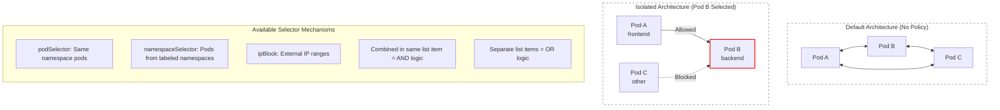

> **Складність**: `[СЕРЕДНЯ]` — критично важлива для безпеки кластера; вимагає точних міркувань про селектори міток та уважного відступу в YAML.
>
> **Час на проходження**: 60–75 хвилин
>
> **Передумови**: Модуль 5.1 (Сервіси), базові мітки Kubernetes, простори імен та взаємодія між Pod'ами по мережі.

---

## Результати навчання

Після завершення цього модуля ви зможете:

- **Спроєктувати** стан "за замовчуванням заборонено" (default-deny) у NetworkPolicy, який обмежує трафік Pod'ів лише потрібними шляхами застосунку.
- **Впровадити** правила дозволу вхідного (ingress) та вихідного (egress) трафіку з селекторами Pod'ів, селекторами просторів імен, блоками IP та портами.
- **Діагностувати** заблокований трафік до Сервісу та DNS, перевіряючи мітки, `policyTypes`, забезпечення політик з боку CNI та напрямок правил.
- **Оцінити** логіку AND/OR у селекторах та підтримку з боку CNI, перш ніж випускати NetworkPolicy у кластері Kubernetes v1.35+.

## Чому цей модуль важливий

Гіпотетичний сценарій: ваша команда розгортає трирівневий застосунок у спільному кластері. Фронтенд доступний через контролер Ingress, бекенд надає внутрішній API, а база даних слухає лише всередині простору імен. Вразливість у фронтенді не повинна автоматично давати зловмиснику прямий мережевий шлях до бекенду, бази даних, CoreDNS та кожного іншого робочого навантаження в кластері, проте стандартна мережева модель Kubernetes стартує ближче до цієї ризикованої форми, ніж очікують багато початківців.

Kubernetes припускає, що кожен Pod може досягти будь-якого іншого Pod'а, доки щось у площині даних не забезпечить межу. Ця пласка модель зручна, поки ви тільки вивчаєте Сервіси, бо імена розв'язуються, трафік тече, а приклади працюють без додаткових об'єктів та без жодного клопоту з налаштуванням. Та сама зручність стає серйозною вадою у продакшені, бо скомпрометований Pod може сканувати сусідні простори імен, викликати внутрішні API або непомітно надсилати дані до довільних зовнішніх місць призначення, доки в кластері немає механізму забезпечення політик, який це зупиняє.

NetworkPolicy — це стандартний Kubernetes API для оголошення таких меж усередині кластера. Вони не замінюють собою автентифікацію, авторизацію, TLS, Pod Security Admission чи авторизацію на рівні самого застосунку, але додають практичний мережевий контроль, який суттєво звужує радіус ураження, коли одне робоче навантаження поводиться неправильно або виявляється скомпрометованим. У цьому модулі ви побудуєте стан default-deny, прокладете явні дозволені шляхи, перевірите результати за допомогою `kubectl` та вивчите деталі селекторів, які найчастіше спричиняють помилки на CKAD та реальні операційні збої.

## Як працює ізоляція NetworkPolicy

Перша ментальна модель, яку варто побудувати, полягає в тому, що NetworkPolicy — це не файрвол-пристрій, що стоїть на межі кластера. Це об'єкт Kubernetes у межах простору імен, який вибирає Pod'и та описує, який трафік ці вибрані Pod'и можуть приймати чи ініціювати. API-сервер Kubernetes зберігає об'єкт, але фактичне рішення щодо пакета виконує реалізація мережі кластера, зазвичай плагін CNI на кшталт Calico, Cilium, Antrea або іншого постачальника з підтримкою NetworkPolicy.

Без політики Pod'и є неізольованими для відповідного напрямку трафіку. Це означає, що Pod з API може приймати з'єднання від веб-Pod'а в тому самому просторі імен, від завдання в іншому просторі імен або від налагоджувального Pod'а, створеного оператором, доки маршрутизація та Сервіси ведуть пакет туди. NetworkPolicy змінює цю поведінку лише для Pod'ів, вибраних її верхньорівневим `spec.podSelector`, і лише для напрямків, перелічених у `spec.policyTypes`.

Щойно Pod вибрано політикою ingress, вхідний трафік до цього Pod'а стає ізольованим. Pod більше не приймає кожне джерело; він приймає лише трафік, дозволений об'єднанням усіх правил ingress з усіх політик, які його вибирають. Щойно Pod вибрано політикою egress, вихідний трафік від цього Pod'а стає ізольованим у такий самий додавальний спосіб. Політики ніколи не кажуть "заборонити це конкретне джерело"; вони створюють базовий рівень ізоляції, а потім описують дозволені винятки.

Для нового з'єднання між двома Pod'ами думайте про два незалежні запитання. Чи має Pod-джерело ізоляцію egress, і якщо так, чи якесь правило egress дозволяє місце призначення та порт? Чи має Pod-призначення ізоляцію ingress, і якщо так, чи якесь правило ingress дозволяє джерело та порт? З'єднання потребує відповідного дозволеного шляху на обох ізольованих сторонах, тоді як пакети-відповіді для дозволеного з'єднання зазвичай обробляються реалізацією мережі як частина стану цього з'єднання.

Ця спрямована модель пояснює, чому Сервіс може розв'язуватися цілком правильно, а трафік усе одно зазнає невдачі. DNS та виявлення Сервісів лише повідомляють клієнту, куди саме надіслати пакет; вони жодним чином не доводять, що джерелу дозволено надсилати, а призначенню дозволено отримувати цей трафік. Справний EndpointSlice, коректний селектор Сервісу та повністю готовий Pod можуть мирно співіснувати з відкиданням пакета за політикою, тож налагодження політик завжди має включати і стан об'єктів Kubernetes, і фактичні тести зв'язності між Pod'ами.

Уявіть захищений поверх офісу з зчитувачами карток на окремих кімнатах. Незамкнена кімната лишається відкритою, доки на її дверях не встановлять зчитувач. Після встановлення зчитувача люди можуть зайти лише тоді, коли якесь правило надає доступ їхній картці, і додавання другого правила може лише дозволити більше людей, а не відняти тих, кого вже дозволило інше правило. NetworkPolicy дотримуються того самого додавального патерну, тож налагодження часто означає пошук того, які Pod'и ізольовані та яке правило дозволу, якщо таке є, відповідає пакету.

Діаграма нижче зберігає головний зсув з оригінального уроку. Ліворуч — стандартна мережа Pod'ів, де кожен Pod може спілкуватися з будь-яким іншим Pod'ом. Праворуч показано Pod бекенду, вибраний політикою, тож шлях від фронтенду дозволено, тоді як непов'язане джерело відкидається CNI, який забезпечує політику.



NetworkPolicy — це звичайний YAML, але кілька полів несуть майже все значення. Поле `metadata.namespace` вирішує, де живе об'єкт політики, а верхньорівневий `spec.podSelector` вирішує, які Pod'и всередині того самого простору імен стають керованими цією політикою. Поле `policyTypes` оголошує, чи впливає політика на ingress, egress або обидва напрямки, тоді як масиви `ingress` та `egress` містять дозволені вузли (peers) та порти для кожного напрямку.

```yaml
apiVersion: networking.k8s.io/v1
kind: NetworkPolicy
metadata:
  name: my-policy
  namespace: default
spec:
  podSelector:           # Which pods this policy applies to
    matchLabels:
      app: my-app
  policyTypes:           # What traffic types to control
  - Ingress              # Incoming traffic
  - Egress               # Outgoing traffic
  ingress:               # Rules for incoming traffic
  - from:
    - podSelector:
        matchLabels:
          role: frontend
  egress:                # Rules for outgoing traffic
  - to:
    - podSelector:
        matchLabels:
          role: database
```

Верхньорівневий `podSelector` легко недооцінити, бо він виглядає як маленький блок угорі файлу. Якщо він не збігається з жодним Pod'ом, політика нешкідлива, бо нічого не ізольовано. Якщо він порожній, як `podSelector: {}`, він вибирає кожен Pod у просторі імен політики, що потужно для базових станів default-deny і небезпечно, коли вставлено в неправильний простір імен. Якщо він збігається з широкою міткою на кшталт `app: web`, кожна репліка з цією міткою керується разом.

Селектор також слідує за Pod'ами в міру їх заміни. Викочування Deployment'а створює нові Pod'и з мітками шаблону, і політика застосовується до цих нових Pod'ів автоматично, коли мітки збігаються. Це одна з причин, чому політики мають використовувати стабільні мітки ролей на кшталт `tier: backend` або `app.kubernetes.io/component: api`, а не мітки, що змінюються з версіями, хешами чи одноразовими сесіями налагодження.

Список `policyTypes` варто писати явно, навіть коли Kubernetes міг би вивести напрямок самостійно. Якщо з'являються правила `ingress`, а `policyTypes` пропущено, Kubernetes трактує це як політику ingress. Якщо з'являються правила `egress`, egress теж включається. Це виведення є легальним, але воно приховує намір від рецензентів та від вас самих у майбутньому під час збою, тож продакшен-маніфести мають оголошувати напрямки прямо.

Порти оцінюються в контексті трафіку, який досягає Pod'а, а не в контексті вашої уявної діаграми. Порт у політиці може бути числовим або може посилатися на іменований порт контейнера, що корисно, коли багато маніфестів мають спільну стабільну назву на кшталт `http`. Іменовані порти зменшують дублювання, але вони також залежать від узгодженості специфікацій контейнерів, тож їх слід використовувати як свідому домовленість, а не як спосіб уникнути перевірки реального слухача.

Правила ingress описують, хто може ініціювати з'єднання з вибраними Pod'ами. У збереженому прикладі нижче Pod'и з міткою `app: backend` стають ізольованими для вхідного трафіку, і лише Pod'и з міткою `app: frontend` в тому самому просторі імен можуть досягти TCP-порту 8080. Пакет від Pod'а з іншою міткою завершується тайм-аутом, бо жодне правило дозволу ingress йому не відповідає.

```yaml
spec:
  podSelector:
    matchLabels:
      app: backend
  policyTypes:
  - Ingress
  ingress:
  - from:
    - podSelector:
        matchLabels:
          app: frontend
    ports:
    - protocol: TCP
      port: 8080
```

Правила egress описують, куди вибрані Pod'и можуть ініціювати з'єднання. У збереженому прикладі нижче Pod'и фронтенду стають ізольованими для вихідного трафіку, і їхнім єдиним дозволеним місцем призначення є Pod бекенду на TCP-порту 8080. Це означає, що виклики до бази даних, зовнішнього API, репозиторіїв пакетів і навіть DNS усі зазнають невдачі, доки інше правило egress не дозволить ці шляхи.

```yaml
spec:
  podSelector:
    matchLabels:
      app: frontend
  policyTypes:
  - Egress
  egress:
  - to:
    - podSelector:
        matchLabels:
          app: backend
    ports:
    - protocol: TCP
      port: 8080
```

Зупиніться та спрогнозуйте: якщо Pod бекенду вибрано двома політиками ingress, одна з яких дозволяє Pod'и фронтенду на порту 8080, а інша дозволяє Pod'и моніторингу на порту 9090, що станеться з трафіком від кожного джерела? Правильний прогноз — що обидва шляхи дозволені, бо NetworkPolicy є додавальними. Немає порядку пріоритетів, де пізніша політика перекриває попередню, і немає неявного правила заборони всередині однієї політики, яке скасовує іншу політику.

Додавальна поведінка також означає, що видалення треба переглядати уважно. Видалення однієї політики може не закрити шлях, якщо інша політика все ще дозволяє те саме джерело, призначення та порт. Під час реагування на інцидент оператори іноді видаляють найновішу політику й очікують, що блокування зникне або з'явиться негайно, але важить саме об'єднання всіх відповідних політик. Надійний робочий процес — перелічити кожну політику, яка вибирає вражений Pod, перш ніж вирішувати, яке правило відповідальне.

Найважливіший операційний наслідок полягає в тому, що ви налагоджуєте поведінку політики, рухаючись від вибраного Pod'а назовні, а не навпаки. Послідовно запитайте себе: чи ізольоване призначення для ingress, чи ізольоване джерело для egress, чи відповідає порт у політиці реальному порту контейнера, та чи плагін CNI справді забезпечує NetworkPolicy у цьому кластері. Якщо в будь-якому напрямку немає відповідного дозволеного шляху, пакет може бути відкинуто, навіть якщо Сервіс, Endpoints та ім'я DNS усі виглядають правильно.

## Проєктування базових станів default-deny

Політика default-deny — це не особливий об'єкт Kubernetes. Це звичайна NetworkPolicy, чий верхньорівневий `podSelector` вибирає багато Pod'ів і чий список правил не дозволяє жодних вузлів для напрямку. Цей патерн важливий, бо NetworkPolicy не можуть виражати явні правила заборони; спосіб заблокувати небажаний трафік — спершу ізолювати вибрані Pod'и, а потім додати вузькі правила дозволу для шляхів зв'язку, які застосунку справді потрібні.

Найменший корисний базовий стан — це default-deny для ingress. Він захищає вибрані Pod'и від отримання неочікуваних з'єднань, водночас дозволяючи цим Pod'ам викликати назовні. У спільному просторі імен це негайно зупиняє випадковий налагоджувальний Pod від звертання `curl` до внутрішнього бекенду, доки окрема політика не відкриє цей шлях. Це поширений перший крок, бо він зменшує бічне переміщення, не ламаючи DNS чи зовнішній egress.

Default-deny для ingress також найлегше пояснити власникам застосунків. Можна сказати: "ваше робоче навантаження отримуватиме лише тих, хто викликає, перелічених у політиці, але його наявні вихідні залежності лишаються незмінними". Така область дії робить перше викочування менш руйнівним, і вона дає командам конкретну карту залежностей для вхідних шляхів, перш ніж вони візьмуться за вихідні обмеження. У зрілих середовищах базові стани ingress часто стають частиною створення простору імен.

```yaml
apiVersion: networking.k8s.io/v1
kind: NetworkPolicy
metadata:
  name: default-deny-ingress
spec:
  podSelector: {}          # Empty = select all pods
  policyTypes:
  - Ingress
  # No ingress rules = deny all
```

Default-deny для egress суворіший, бо він контролює кожен вихідний пакет від вибраних Pod'ів. Це корисно для запобігання витоку даних та несподіваного доступу до інтернету, але це також місце, де команди найчастіше ламають власні застосунки. Pod, який не може надсилати запити DNS, не може розв'язувати імена Сервісів, а Pod, який не може досягти API, точки метрик, бази даних чи провайдера ідентичності, може зазнати збою у спосіб, який спочатку виглядає не пов'язаним з мережею.

Default-deny для egress найуспішніший, коли поєднаний з виявленням залежностей. Логи, сервісні сітки (service mesh), записи запитів DNS та наявні правила файрвола можуть виявити місця призначення, від яких залежить застосунок, але жоден з цих сигналів не є ідеальним. Ставтеся до першої політики як до гіпотези, запустіть її в просторі імен для тестування та перевірте запуск, готовність, звичайні запити, фонові завдання та хуки завершення, перш ніж застосовувати ту саму ізоляцію до продакшену.

```yaml
apiVersion: networking.k8s.io/v1
kind: NetworkPolicy
metadata:
  name: default-deny-egress
spec:
  podSelector: {}
  policyTypes:
  - Egress
  # No egress rules = deny all
```

Повний базовий стан default-deny ізолює обидва напрямки. Це правильна відправна точка для чутливих просторів імен, коли у вас є час змоделювати потрібні потоки, але це погана несподівана зміна для завантаженого продакшен-простору імен. Перш ніж застосовувати її, проведіть інвентаризацію тих, хто викликає, викликуваних Сервісів, потреб DNS, моніторингу, перевірок справності та будь-якого зв'язку контролера чи sidecar, від якого залежить робоче навантаження.

Повна ізоляція найсильніша, коли простір імен має чіткого власника. Якщо багато незв'язаних застосунків ділять один простір імен, базовий стан з порожнім селектором може перетворити кожну дрібну зміну на проблему координації. Поділ робочих навантажень на простори імен за командою, застосунком або чутливістю часто робить NetworkPolicy легшою, бо об'єкт default-deny тоді описує межу, яку люди вже розуміють операційно.

```yaml
apiVersion: networking.k8s.io/v1
kind: NetworkPolicy
metadata:
  name: default-deny-all
spec:
  podSelector: {}
  policyTypes:
  - Ingress
  - Egress
```

Об'єкт порожнього правила має протилежне значення від порожнього списку правил, тому рецензенти мають уповільнюватися, коли бачать `{}` у політиці. Політика з `ingress: []` не дозволяє жодного ingress для вибраних Pod'ів. Політика з `ingress: - {}` дозволяє весь ingress, бо єдине правило не має жодного обмеження джерела чи порту. Ці дві крихітні форми виглядають схоже, але вони є цілковито різними станами безпеки.

```yaml
apiVersion: networking.k8s.io/v1
kind: NetworkPolicy
metadata:
  name: allow-all-ingress
spec:
  podSelector: {}
  policyTypes:
  - Ingress
  ingress:
  - {}                     # Empty rule = allow all
```

DNS заслуговує на власний виняток, бо майже кожне робоче навантаження Kubernetes покладається на нього, навіть коли власник застосунку жодного разу не згадує DNS на діаграмі залежностей. Імена Сервісів на кшталт `backend`, `backend.netpol-demo` та повністю кваліфіковані імена під `svc.cluster.local` усі потребують запиту до CoreDNS. Якщо ви застосуєте default-deny для egress і забудете про DNS, симптом часто проявляється як тайм-аути застосунку, а не як очевидна помилка політики.

Сама політика DNS має перевірятися щодо міток у вашому кластері. Багато кластерів позначають Pod'и CoreDNS міткою `k8s-app: kube-dns`, але дистрибутиви можуть додавати власні мітки або запускати DNS через інакше оформлений додаток. Звичка, яку треба виробити, — не запам'ятовувати одну мітку назавжди; звичка — оглядати Pod'и DNS і писати політику, яка вибирає фактичну реалізацію DNS перед вами.

Приклад нижче зберігає форму найменших привілеїв: він вибирає Pod'и DNS у просторі імен `kube-system` через стабільну мітку імені простору імен, зберігає мітку Pod'а `k8s-app: kube-dns` та дозволяє і UDP, і TCP на порту 53. UDP обслуговує поширений шлях запиту, тоді як TCP є частиною поведінки DNS для більших відповідей, повторних спроб та реалізацій, які обирають потоковий транспорт.

```yaml
apiVersion: networking.k8s.io/v1
kind: NetworkPolicy
metadata:
  name: allow-dns
spec:
  podSelector: {}
  policyTypes:
  - Egress
  egress:
  - to:
    - namespaceSelector:
        matchLabels:
          kubernetes.io/metadata.name: kube-system
      podSelector:
        matchLabels:
          k8s-app: kube-dns
    ports:
    - protocol: UDP
      port: 53
    - protocol: TCP
      port: 53
```

Перш ніж запускати це, який вивід ви очікуєте від Pod'а, який може досягти Сервісу за ClusterIP, але не за іменем DNS? Імовірна відповідь — що трафік за прямим IP успішний, тоді як трафік за іменем зазнає невдачі або завершується тайм-аутом під час розв'язання. Ця відмінність звужує дослідження до правил egress для DNS, справності CoreDNS та того, чи підтримує CNI міжпросторовий вибір Pod'ів DNS у `kube-system`.

Default-deny найкраще запроваджувати поетапно. Почніть з тестового простору імен, який дзеркалить продакшен-мітки, застосуйте default-deny для ingress, додайте мінімум дозволених шляхів та запустіть перевірки зв'язності і з дозволених, і з заборонених Pod'ів. Потім вирішіть, чи виправдана ізоляція egress для робочого навантаження та чи можете ви підтримувати інвентаризацію залежностей у міру зміни застосунку.

Остання деталь викочування — це володіння. Команда платформи може надати базові політики, але команди застосунків зазвичай найкраще знають потрібні шляхи. Найчистіша операційна модель — спільний шаблон для default-deny плюс правила дозволу, що належать застосунку, переглянуті з тією самою дисципліною, що й зміни RBAC. NetworkPolicy — це чутлива до безпеки конфігурація, і ставлення до неї як до коду застосунку полегшує виявлення дрейфу.

## Написання селекторів без зміни логіки

Більшість помилок NetworkPolicy спричинені не складністю API. Вони спричинені областю дії селектора та формою списку YAML. `podSelector` усередині правила сам по собі не шукає по всьому кластеру; він вибирає Pod'и в просторі імен NetworkPolicy, доки його не поєднано з `namespaceSelector`. `namespaceSelector` вибирає простори імен за мітками, прикріпленими до об'єктів Namespace, а не за іменами, набраними в YAML.

У політиці є два різні розташування `podSelector`, і вони відповідають на різні запитання. Верхньорівневий `spec.podSelector` відповідає на запитання "які локальні Pod'и захищає чи обмежує ця політика?" Вузловий `podSelector` усередині `from` чи `to` відповідає на запитання "які Pod'и-вузли дозволені для цього правила?" Змішування цих двох ролей призводить до політик, які вибирають неправильне робоче навантаження або дозволяють неправильних викликачів.

Коли правило містить лише `podSelector`, воно вибирає Pod'и-вузли в тому самому просторі імен, що й політика. Це ідеально для трафіку між рівнями всередині одного простору імен застосунку, і саме тому трирівневі приклади далі лишаються компактними. Це не допомагає, коли викликач живе в іншому просторі імен, навіть якщо викликач має відповідну мітку Pod'а.

```yaml
ingress:
- from:
  - podSelector:
      matchLabels:
        role: frontend
```

Коли правило містить лише `namespaceSelector`, воно дозволяє трафік від усіх Pod'ів у просторах імен, чий об'єкт Namespace несе вибрані мітки. Це корисно для широких меж довіри на кшталт "дозволити з просторів імен з міткою `team: platform`" або "дозволити з просторів імен з міткою `env: production`". Це також достатньо широко, щоб здивувати вас, якщо хтось позначить простір імен, не розуміючи мережевого ефекту.

```yaml
ingress:
- from:
  - namespaceSelector:
      matchLabels:
        env: production
```

Об'єкт Namespace має мати мітку, щоб цей селектор працював. Простір імен з іменем `production` не збігається автоматично з `env: production`; це різні факти. Кластери Kubernetes v1.35 та новіші автоматично додають стабільну мітку `kubernetes.io/metadata.name` до просторів імен, що може бути корисним, коли вам треба вибирати за іменем простору імен, але мітки, що належать команді, часто чіткіші для наміру політики.

Мітки просторів імен заслуговують на врядування, бо вони можуть надавати мережевий доступ. Якщо будь-який розробник може додати `env: production` чи `network-access: trusted` до простору імен, то селектор на основі цієї мітки настільки ж сильний, як модель дозволів на мітки. У регульованих кластерах мітки просторів імен, що використовуються NetworkPolicy, мають належати автоматизації платформи або переглянутим змінам, а не довільним ручним правкам.

Зупиніться та спрогнозуйте: подивіться на два блоки YAML нижче, перш ніж читати їхні описи. Селектори однакові, але розташування дефіса змінює логіку. Якщо ви можете пояснити різницю, не запускаючи політику, ви опанували навичку NetworkPolicy, яка запобігає великій частці реальних помилок.

Коли `namespaceSelector` та `podSelector` з'являються в тому самому елементі списку, вони поєднуються логічним AND. Pod-джерело має мати вибрану мітку Pod'а, і він має жити в просторі імен, вибраному міткою простору імен. Це вузьке міжпросторове правило, якого ви зазвичай хочете, дозволяючи конкретну роль з конкретної довіреної групи просторів імен.

```yaml
ingress:
- from:
  - namespaceSelector:
      matchLabels:
        env: production
    podSelector:           # Same list item = AND
      matchLabels:
        role: frontend
```

Коли два селектори з'являються як окремі елементи списку, вони поєднуються логічним OR. Перший елемент дозволяє будь-який Pod з просторів імен з міткою production, тоді як другий елемент дозволяє будь-який Pod локального простору імен з міткою `role: frontend`. Це може бути правильним, але це набагато ширше за поєднане правило, і його часто створює помилка відступу, а не задум.

```yaml
ingress:
- from:
  - namespaceSelector:     # First item
      matchLabels:
        env: production
  - podSelector:           # Second item = OR
      matchLabels:
        role: frontend
```

Використовуйте `ipBlock`, коли вузол перебуває поза всесвітом міток Pod'ів та просторів імен. Це поширено для правил egress, які дозволяють робочому навантаженню досягти діапазону зовнішнього сервісу, і це також може з'явитися на ingress, коли джерело відоме за CIDR. Список `except` віднімає менші діапазони від більшого блоку, що дає вам форму "дозволити більшість" без явного правила заборони.

Поле `except` часто є найближчою рідною формою до "дозволити цей діапазон, окрім того діапазону". Воно все ще працює через семантику дозволу: пакети до виключеного діапазону просто не збігаються з правилом дозволу, тож вони лишаються заблокованими навколишнім станом default-deny. Якщо ж інша політика дозволяє виключений діапазон, трафік усе ще може пройти, бо об'єднання політик лишається додавальним.

```yaml
ingress:
- from:
  - ipBlock:
      cidr: 10.0.0.0/8
      except:
      - 10.0.1.0/24
```

Будьте обережні з `ipBlock` навколо трафіку кластера. Документація Kubernetes зазначає, що поведінка NetworkPolicy щодо перепису IP джерела чи призначення може залежати від мережевого плагіна, хмарного провайдера та реалізації Сервісу. На практиці використовуйте селектори Pod'ів та просторів імен для ідентичності робочого навантаження всередині кластера, коли це можливо, а потім резервуйте CIDR для зовнішніх вузлів або для випадків, коли документація вашого CNI підтверджує точні адреси пакетів, які оцінюються.

Правило проєктування селектора просте, але суворе: оберіть найменшу ідентичність, яка лишається придатною для підтримки. Використовуйте мітки Pod'ів для рівнів застосунку в тому самому просторі імен, поєднуйте селектори простору імен та Pod'а для міжпросторових шляхів застосунку, використовуйте лише селектори просторів імен тоді, коли кожен Pod у цьому наборі просторів імен довірений для шляху, та використовуйте блоки IP, коли вузол не можна вибрати мітками Kubernetes. Політика має пояснювати межу довіри своєю формою.

Коли ви переглядаєте селектор, перекладіть його на просте речення й шукайте слова на кшталт "будь-який" та "усі". "Будь-який Pod у будь-якому довіреному просторі імен" може бути прийнятним для контролера Ingress, але це зазвичай надто широко для бази даних. "Pod'и фронтенду в продакшен-просторах імен" вужче й легше тестується. Якщо речення звучить ширше за вимогу, YAML, імовірно, теж ширший.

## Захист трирівневого застосунку

Трирівневий застосунок — це показовий робочий приклад, бо він наочно робить обидва напрямки трафіку видимими. Фронтенд приймає трафік користувачів і викликає бекенд. Бекенд приймає виклики лише від фронтенду й, своєю чергою, викликає базу даних. База даних приймає виклики виключно від бекенду й ні від кого більше. Це достатньо мало, щоб уміститися у вправу CKAD, але це дзеркалить міркування про залежності, які ви використовуєте у продакшені.

Запишіть залежність як матрицю, перш ніж писати YAML. Рядки можуть представляти джерела, стовпці можуть представляти призначення, а кожна клітинка може перелічувати порт призначення, який має бути досяжним. Цей швидкий ескіз виявляє відсутні шляхи на кшталт DNS, моніторингу та перевірок готовності, перш ніж ви закодуєте політики. Він також дає рецензентам нейтральний артефакт для порівняння з маніфестами.

Політика фронтенду нижче вибирає Pod'и з міткою `tier: frontend`. Вона дозволяє весь ingress, бо фронтенд є публічною точкою входу в цій спрощеній моделі, а потім обмежує egress до Pod'ів бекенду на порту 8080. У продакшен-кластері ви могли б звузити ingress до простору імен контролера Ingress замість `- {}`, але збережений приклад зберігає форму оригінального модуля для вивчення механіки.

Фронтенд — це також місце, де архітектура та політика можуть розходитися. Багато реальних фронтендів не контактують напряму з користувачами; з ними контактують Pod'и контролерів, перевірки справності балансувальника навантаження або sidecar-и сервісної сітки. Якщо це ваше середовище, замініть форму "дозволити весь ingress" явними вузлами, які представляють фактичне джерело пакетів у кластері, а потім зберігайте широку версію лише як тимчасове лабораторне спрощення.

```yaml
# Frontend: can receive from anywhere, can reach backend
apiVersion: networking.k8s.io/v1
kind: NetworkPolicy
metadata:
  name: frontend-policy
spec:
  podSelector:
    matchLabels:
      tier: frontend
  policyTypes:
  - Ingress
  - Egress
  ingress:
  - {}                     # Allow all ingress
  egress:
  - to:
    - podSelector:
        matchLabels:
          tier: backend
    ports:
    - port: 8080
```

Політика бекенду вибирає Pod'и з міткою `tier: backend`, приймає лише трафік фронтенду на порту 8080 та дозволяє вихідний трафік лише до Pod'ів бази даних на порту 5432. Саме тут NetworkPolicy стає чимось більшим, ніж інструмент периметра. Навіть якщо випадковий Pod у просторі імен може розв'язати Сервіс бекенду, бекенд не прийме його пакет, доки мітка джерела не збігається з правилом дозволу.

Egress бекенду може бути складнішим за спрощений приклад, бо API часто викликають кеші, брокери повідомлень, колектори спостережуваності та сервіси ідентичності. Не приховуйте ці шляхи за одним широким правилом egress, якщо мета — стримування. Додавайте потрібні місця призначення свідомо й тримайте список залежностей поруч із політикою, щоб майбутні рецензенти знали, чому існує кожен шлях.

```yaml
# Backend: only from frontend, can reach database
apiVersion: networking.k8s.io/v1
kind: NetworkPolicy
metadata:
  name: backend-policy
spec:
  podSelector:
    matchLabels:
      tier: backend
  policyTypes:
  - Ingress
  - Egress
  ingress:
  - from:
    - podSelector:
        matchLabels:
          tier: frontend
    ports:
    - port: 8080
  egress:
  - to:
    - podSelector:
        matchLabels:
          tier: database
    ports:
    - port: 5432
```

Політика бази даних вибирає Pod'и з міткою `tier: database` й дозволяє лише Pod'ам бекенду підключатися на порту 5432. Зверніть увагу, що ця політика перелічує лише `Ingress`. Це означає, що вона ізолює вхідний трафік до бази даних, але вона не ізолює egress бази даних, доки інша політика не вибере Pod'и бази даних для egress. Це навмисне в збереженому прикладі, і це корисне нагадування, що кожен напрямок контролюється незалежно.

```yaml
# Database: only from backend
apiVersion: networking.k8s.io/v1
kind: NetworkPolicy
metadata:
  name: database-policy
spec:
  podSelector:
    matchLabels:
      tier: database
  policyTypes:
  - Ingress
  ingress:
  - from:
    - podSelector:
        matchLabels:
          tier: backend
    ports:
    - port: 5432
```

Три політики працюють лише тоді, коли мітки збігаються з Pod'ами, до яких Сервіси зрештою маршрутизують. Селектор Сервісу може вказувати на Pod'и з міткою `app: backend`, тоді як NetworkPolicy очікує `tier: backend`; ця невідповідність дає заплутані симптоми, бо Сервіс усе ще має endpoints, але політика вибрала інший набір Pod'ів чи вузлів, ніж задумано. Завжди перевіряйте мітки на живих Pod'ах, а не лише мітки у вашому шаблоні розгортання.

Другий ризик з мітками з'являється під час міграцій. Якщо ви змінюєте мітки Pod'ів з `tier: backend` на `component: api`, але забуваєте оновити політики, нові Pod'и можуть стартувати поза задуманими дозволеними шляхами або поза задуманою межею ізоляції. Безпечні міграції або тимчасово зберігають обидві мітки, або оновлюють політику й шаблони робочого навантаження узгодженою зміною з тестами зв'язності і на старих, і на нових мітках.

Який підхід ви б обрали тут і чому: одна велика політика, яка вибирає всі рівні, чи окремі політики на кожен рівень? Окремі політики зазвичай легше переглядати, бо кожен файл описує вхідний та вихідний контракт одного робочого навантаження. Більша зведена політика може бути компактною для іспиту, але в реальному репозиторії вона часто приховує випадкове розширення, коли виняток одного рівня редагують заради потреби іншого рівня.

Цей приклад також показує, чому порти мають значення. Порти NetworkPolicy оцінюються на мережевому рівні, тож політика має збігатися з фактичним портом призначення, якого досягає пакет. `targetPort` Сервісу може транслювати порт Сервісу в порт контейнера, і поведінка політики залежить від пакета, який бачить площина даних, а не від зручної абстракції Сервісу у вашій діаграмі застосунку.

Для робочих навантажень з кількома портами уникайте копіювання одного правила порту на кожен рівень без перевірки кожного слухача. Pod може надавати HTTP для трафіку застосунку, порт метрик для збирання та порт керування, який ніколи не має бути досяжним зі звичайних клієнтів. NetworkPolicy дозволяє вам моделювати ці шляхи окремо, але лише якщо інвентаризація залежностей називає їх окремо замість того, щоб трактувати Pod як одну недиференційовану точку.

## Тестування та усунення проблем у поведінці політик

NetworkPolicy зазнають невдачі "із закритого стану" (fail closed) лише для Pod'ів, які справді ізольовані, тож добре усунення проблем починається з підтвердження вибору. Використовуйте `kubectl get pods --show-labels`, щоб оглянути вибрані Pod'и, а потім опишіть NetworkPolicy, щоб побачити відрендерені вузли та порти. Якщо політика не вибирає жодних Pod'ів, об'єкт може виглядати правильно в API, нічого корисного не роблячи у площині даних.

Після вибору огляньте напрямок. Поширена помилка налагодження — читати лише політики в просторі імен призначення, бо симптом проявляється як вхідний тайм-аут. Якщо простір імен джерела має default-deny для egress, джерело може відкинути пакет ще до того, як він досягне призначення. У кластерах з ізоляцією і ingress, і egress вам треба читати політики на обох сторонах з'єднання.

Збережений довідник CLI нижче використовує повні команди `kubectl`, тож його можна скопіювати в неінтерактивну оболонку або навчальний скрипт. Команди охоплюють робочий процес, який ви використовуєте на іспиті CKAD: створити політику з YAML, перелічити ресурс, описати його, перевірити зв'язність та перевірити, чи з'являється в системному просторі імен відомий CNI з підтримкою політик.

```bash
# Create NetworkPolicy (must use YAML)
kubectl apply -f policy.yaml

# View NetworkPolicies
kubectl get networkpolicy
kubectl get netpol

# Describe policy to see translated rules
kubectl describe netpol NAME

# Test connectivity using netshoot or wget with a short bounded timeout
kubectl exec pod1 -- wget -qO- --timeout=5 pod2-svc:80

# Check if CNI supports NetworkPolicies (look for calico, cilium)
kubectl get pods -n kube-system | grep -E 'calico|cilium|weave'
```

Коли з'єднання завершується тайм-аутом, перевірте обидві сторони розмови. Pod призначення може бути ізольований для ingress і не мати відповідного правила `from`. Pod джерела може бути ізольований для egress і не мати відповідного правила `to`. У багатьох захищених просторах імен обидва твердження істинні, тож виправлення лише однієї політики все одно лишає з'єднання заблокованим.

Використовуйте навмисно обрані тестові Pod'и. Тестування з наявного Pod'а застосунку може бути корисним, але керований налагоджувальний Pod із відомими мітками робить міркування про селектори чіткішими. Створіть один Pod, який має збігатися з правилом дозволу, та один Pod, який не має, а потім тестуйте з обох. Цей патерн ловить випадкові широкі правила, які один успішний тест пропустив би.

Симптоми DNS заслуговують на окремий тест, бо вони маскуються під збої застосунку. Запустіть одну перевірку проти імені Сервісу та іншу проти відомого ClusterIP чи IP Pod'а, коли це безпечно в лабораторному середовищі. Якщо шлях за IP працює, але шлях за іменем зазнає невдачі, огляньте правила egress до CoreDNS, мітки Pod'ів CoreDNS та чи може селектор простору імен політики справді вибрати простір імен DNS.

Логи та спостережуваність CNI можуть скоротити дослідження, коли тести з командного рядка неоднозначні. Деякі провайдери надають логи потоків, вердикти політик чи відкидання пакетів, які ідентифікують рішення правила. Ці інструменти специфічні для провайдера, тож вони не є частиною основного робочого процесу CKAD, але знання про їхнє існування допомагає вам перейти від "воно завершилося тайм-аутом" до "це правило egress не збіглося" у продакшені.

Забезпечення з боку CNI — це інша головна гілка в дереві усунення проблем. Kubernetes приймає об'єкти NetworkPolicy, навіть коли встановлений мережевий плагін їх не забезпечує. Якщо політика з'являється в `kubectl get netpol`, але заборонений трафік усе одно успішний, перевірте можливості CNI кластера, перш ніж переписувати YAML, бо проблема може полягати у відсутності забезпечення, а не в помилці селектора.

Поведінка провайдера також має значення навколо трафіку, локального для вузла, Pod'ів з host-мережею та адрес джерела балансувальника навантаження. API Kubernetes визначає переносну модель політик, але адреси пакетів, які бачать до або після трансляції мережевих адрес (NAT), можуть відрізнятися залежно від реалізації. Коли політика залежить від зовнішніх CIDR, IP вузлів чи Pod'ів контролера, підтвердьте відповідну поведінку в документації провайдера й малим тестом.

Нарешті, пам'ятайте, що тайм-аут — це корисний сигнал. NetworkPolicy зазвичай відкидають пакети, а не повертають дружню помилку застосунку, тож `wget` чи `curl` можуть зависати, доки не спрацює їхній тайм-аут. Використовуйте короткі тайм-аути в практичних командах, запускайте і позитивні, і негативні тести й записуйте очікуваний результат для кожного шляху, щоб ви знали, чи доводите ви правило дозволу, чи доводите базовий стан заборони.

Найкращі нотатки з усунення проблем пишуться до інциденту. Для кожного простору імен тримайте короткий список очікуваних шляхів зв'язку та файл політики, якому належить кожен шлях. Під час збою цей список підкаже вам, чи відсутнє з'єднання має бути неможливим, чи випадково зламане, чи взагалі поза областю дії політики. Він також робить пізніше прибирання безпечнішим, бо ви можете видаляти застарілі правила дозволу з доказами.

## Патерни та антипатерни

Патерни корисні лише тоді, коли вони кодують рішення, яке змінює те, як ви будуєте політику. Таблиця нижче зосереджена на повторюваних формах, які тримають файли політик придатними для підтримки в міру того, як команди додають простори імен, Сервіси та рівні застосунку. Кожен патерн зберігає найменші привілеї, уникаючи пастки одного гігантського правила, яке ніхто не хоче переглядати.

| Патерн | Коли використовувати | Чому це працює |
|---------|----------------|--------------|
| Default-deny простору імен плюс правила дозволу за рівнями | Команда володіє простором імен застосунку й може скласти карту потрібних шляхів викликач-до-викликаного. | Політика default-deny створює ізоляцію, тоді як невеликі політики рівнів документують контракт кожного застосунку. |
| Селектор простору імен плюс селектор Pod'а в одному елементі | Робоче навантаження має приймати трафік від однієї ролі у вибраних віддалених просторах імен. | Логіка AND тримає правило вузьким, вимагаючи і мітки довіри простору імен, і мітки ролі Pod'а. |
| Дозвіл egress для DNS у парі з default-deny для egress | Простір імен потребує вихідної ізоляції, але робочі навантаження все ще використовують імена Сервісів. | Виняток для DNS зберігає виявлення сервісів Kubernetes, тоді як решта egress лишається контрольованою. |
| Позитивні та негативні тести зв'язності | Зміна політики має вплив на безпеку й має бути перевірена перед злиттям. | Дозволений тест доводить, що потрібний шлях працює, а заборонений тест доводить, що межа справді існує. |

Антипатерни зазвичай виникають зі спроби змусити політику швидко пройти без моделювання залежності. Кращою альтернативою рідко є більше YAML заради самого себе. Це гостріша область дії, чіткіші мітки та тести, які доводять, що політика дозволяє лише те, що потребує робоче навантаження.

| Антипатерн | Що йде не так | Краща альтернатива |
|--------------|-----------------|--------------------|
| Вибір кожного простору імен через `namespaceSelector: {}` для трафіку застосунку | Будь-який простір імен може стати джерелом, якщо селектор Pod'а теж збігається або якщо селектора Pod'а немає. | Свідомо позначайте довірені простори імен і поєднуйте селектор простору імен із селектором Pod'а, коли це можливо. |
| Використання `ingress: - {}` як тимчасового виправлення | Вибрані Pod'и відкриваються для кожного джерела в цьому напрямку, і виняток часто лишається. | Додайте вузьке правило джерела та порту, а потім протестуйте один шлях, який має працювати. |
| Застосування default-deny для egress без інвентаризації залежностей | DNS, зовнішні API, метрики чи виклики ідентичності зазнають невдачі у спосіб, що виглядає як дефекти застосунку. | Спершу перелічіть потрібні вихідні шляхи, застосуйте базовий стан у лабораторії та додайте явні правила DNS і сервісів. |
| Припущення, що `kubectl get netpol` доводить забезпечення | Об'єкт API існує, навіть якщо CNI ігнорує NetworkPolicy. | Підтвердьте підтримку провайдера й запустіть негативний тест зв'язності з Pod'а, який має бути заблокованим. |

Ці патерни також формують код-рев'ю. Рецензент має змогти відповісти на чотири запитання лише з маніфесту: які Pod'и стають ізольованими, які джерела чи призначення дозволені, які порти дозволені та які мітки мають лишатися стабільними, щоб правило працювало. Якщо рецензенту потрібні приховані знання, щоб відповісти на ці запитання, політиці, ймовірно, потрібні чіткіші мітки або менші файли.

Зрілий репозиторій політик зазвичай додає метадані володіння поза самим об'єктом NetworkPolicy, як-от CODEOWNERS, правила перегляду чи перевірки конвеєра розгортання. Kubernetes не скаже вам, чи `team: platform` є правильною міткою для простору імен, чи виняток для бази даних усе ще потрібен. Цю прогалину заповнює людський процес, а малі файли політик роблять людський перегляд точнішим.

## Каркас прийняття рішень

Використовуйте цей каркас, коли вас просять захистити новий простір імен чи налагодити збій політики. Починайте із залежності робочого навантаження, а не з YAML. Об'єкт політики має бути останнім кроком у ланцюжку міркувань, який починається з того, хто кого викликає, у якому напрямку ініціюється з'єднання, який порт отримує пакет та які мітки надійно представляють цю ідентичність.

| Запитання | Оберіть це | Компроміс |
|----------|-------------|----------|
| Чи потрібно лише обмежити викликачів до вибраних Pod'ів? | Почніть з default-deny для ingress і додайте правила `from`. | Безпечніше викочування, бо egress Pod'а лишається відкритим, але шляхи витоку даних не контролюються. |
| Чи вибрані Pod'и також потребують вихідних обмежень? | Додайте default-deny для egress та явні правила `to`. | Сильніше стримування, але DNS та зовнішні залежності треба ретельно змоделювати. |
| Чи викликач і викликаний в одному просторі імен? | Використовуйте вузли `podSelector` для ролей застосунку. | Просто й читабельно, але не охоплює міжпросторових викликачів. |
| Чи викликачі в іншому просторі імен? | Поєднайте `namespaceSelector` та `podSelector` в одному елементі вузла. | Вузька ідентичність, але потрібні надійні мітки простору імен та Pod'а. |
| Чи вузол поза мітками Kubernetes? | Використовуйте `ipBlock` з CIDR та `except`, коли потрібно. | Корисно для зовнішніх діапазонів, але перепис IP Сервісу може зробити внутрішньокластерні випадки специфічними для провайдера. |
| Чи кластер забезпечує об'єкт? | Перевірте CNI й запустіть негативний тест. | Запобігає хибній упевненості, але вимагає доступу до деталей реалізації кластера. |

Для швидкості CKAD зведіть рішення до послідовності, яку можна виконати під тиском. По-перше, вирішіть, чи є вибраний Pod призначенням, чи джерелом. По-друге, напишіть верхньорівневий `podSelector` для цього вибраного Pod'а. По-третє, оберіть `Ingress`, `Egress` або обидва. По-четверте, додайте лише вузол і порт, потрібні для сценарію. По-п'яте, протестуйте з одного Pod'а, який має працювати, та одного Pod'а, який має зазнати невдачі.

Для продакшен-якості додайте два запитання для перегляду, яких іспит не ставить. Що станеться, коли мітки зміняться під час розгортання, і хто володіє мітками на просторах імен, що використовуються `namespaceSelector`? NetworkPolicy керується мітками, тож конвеєр розгортання, який мутує мітки без перегляду політик, може випадково від'єднати застосунки або відкрити трафік, який дизайн безпеки ніколи не схвалював.

Каркас навмисно консервативний. Він віддає перевагу малим політикам, про які можна міркувати локально, навіть коли більша політика могла б бути коротшою. Kubernetes об'єднає правила дозволу за вас, тож ви небагато виграєте, ховаючи кожен рівень в одному маніфесті, доки ваша команда не має сильної домовленості й тестів навколо цієї форми.

Коли каркас дає політику, яка здається повторюваною, опирайтеся спокусі узагальнювати надто рано. Повторення у файлах політик іноді корисне, бо кожне повторюване правило прив'язане до іншої межі довіри. Абстрагуйте лише тоді, коли ваші інструменти можуть зберегти чіткість перегляду, як-от генерація маніфестів з матриці залежностей, яку легше аудитувати, ніж сирий YAML.

## Чи знали ви?

1. Маніфести NetworkPolicy Kubernetes використовують `apiVersion: networking.k8s.io/v1`; старіший API NetworkPolicy `extensions/v1beta1` перестали обслуговувати в Kubernetes v1.16.
2. Офіційне ввідне завдання для NetworkPolicy вимагає сервера Kubernetes версії v1.8 чи пізнішої, що набагато старіше за ціль v1.35+, яку використовує цей курс.
3. Верхньорівневий `podSelector: {}` вибирає кожен Pod у просторі імен NetworkPolicy, тоді як вузловий `podSelector` без селектора простору імен шукає лише в просторі імен цієї політики.
4. NetworkPolicy контролює зв'язність на рівнях 3 та 4; вона не шифрує дозволений трафік і не приймає рішень про авторизацію всередині протоколу вашого застосунку.

## Типові помилки

| Помилка | Чому вона трапляється | Як її виправити |
|---------|----------------|---------------|
| CNI не підтримує NetworkPolicy | API приймає об'єкт, тож команда припускає, що забезпечення існує, навіть коли площина даних його ігнорує. | Перевірте, що встановлений CNI підтримує NetworkPolicy, і запустіть негативний тест зв'язності, який має зазнати невдачі. |
| DNS пропущено в default-deny для egress | Імена Сервісів залежать від CoreDNS, а ізоляція egress відкидає пакети DNS, доки не існує правило дозволу. | Додайте політику egress для DNS до Pod'ів CoreDNS і протестуйте ім'я Сервісу після застосування базового стану. |
| Плутанина логіки селекторів AND та OR | Переміщення дефіса змінює те, чи мають збігатися обидва селектори простору імен та Pod'а, чи будь-який з них. | Тримайте поєднані селектори в тому самому елементі вузла для логіки AND і перегляньте відступ перед застосуванням. |
| Порожній `podSelector` скопійовано наосліп | `podSelector: {}` вибирає кожен Pod у просторі імен, а не нуль Pod'ів чи заповнювач. | Використовуйте явні мітки для політик робочих навантажень і резервуйте `{}` для свідомих базових станів на весь простір імен. |
| Пропущено `policyTypes` | Виведення Kubernetes може бути легальним, але рецензенти не можуть швидко побачити, який напрямок задумано. | Оголошуйте `Ingress`, `Egress` або обидва щоразу, навіть коли API міг би вивести. |
| Порт Сервісу сплутано з фактичним портом пакета | Маніфест написано від абстракції Сервісу, а не від трафіку, що досягає Pod'а. | Підтвердьте порт призначення, який бачить робоче навантаження, і узгодьте порт NetworkPolicy з цим шляхом. |
| NetworkPolicy сприймають як шифрування | Дозволений трафік усе одно рухається як звичайний мережевий трафік, доки інший рівень його не шифрує. | Використовуйте NetworkPolicy для контролю досяжності та використовуйте TLS, mTLS або сервісну сітку, коли потрібне шифрування. |
| Забуто простір імен контролера Ingress | Зовнішній трафік прибуває від Pod'ів контролера, а не магічно з інтернету в Pod застосунку. | Дозвольте простір імен контролера та мітки Pod'ів або змоделюйте точний шлях ingress, який використовує ваш контролер. |

## Перевірка для учня

> Базова зв'язність має чекати на готові Pod'и та заповнені endpoints, перш ніж трактувати тайм-аут як сигнал NetworkPolicy.

Перш ніж продовжувати, поясніть, чому це речення змінює те, як ви читаєте невдалий результат `wget` у лабораторії. Корисна відповідь відокремлює готовність інфраструктури від забезпечення політики: спершу доведіть, що Pod'и та endpoints існують, а потім вирішіть, чи пізніший тайм-аут демонструє ізоляцію.

## Тест

<details>
<summary>1. Ваша команда застосовує default-deny для ingress до `production`, і Pod'и фронтенду більше не можуть досягти Pod'ів бекенду в тому самому просторі імен. Обидва набори Pod'ів мають правильні мітки. Яка зміна політики відновлює лише цей шлях?</summary>

**Відповідь:** Створіть другу NetworkPolicy, яка вибирає Pod'и бекенду й дозволяє ingress від Pod'ів з міткою фронтенду на порту бекенду. Політика default-deny має лишатися на місці, бо вона створює базову ізоляцію. NetworkPolicy є додавальними, тож нова політика дозволу відкриває шлях фронтенд-до-бекенду, не відкриваючи трафік від кожного іншого Pod'а. Якщо Pod'и фронтенду також мають ізоляцію egress, ви маєте додати відповідне правило дозволу egress і з боку фронтенду.
</details>

<details>
<summary>2. Політика має один елемент вузла, що містить і `namespaceSelector: matchLabels: env: staging`, і `podSelector: matchLabels: role: api`. Які Pod'и дозволені й чому?</summary>

**Відповідь:** Дозволені лише Pod'и з міткою `role: api` у просторах імен з міткою `env: staging`, бо обидва селектори в одному елементі вузла. Ця форма YAML — логіка AND. Якби два селектори було розділено на окремі елементи вузлів, правило стало б ширшою логікою OR і дозволяло б будь-який Pod з просторів імен staging або локальні Pod'и з міткою ролі API. Відмінність важлива, бо один зміщений дефіс може відкрити цілу групу просторів імен.
</details>

<details>
<summary>3. Після default-deny для egress застосунки можуть підключатися до бази даних за IP-адресою, але зазнають невдачі при використанні імені Сервісу бази даних. Що ви перевіряєте першим?</summary>

**Відповідь:** Перевірте, чи дозволено egress до CoreDNS. Тест за IP оминає DNS, тоді як тест за іменем Сервісу вимагає запиту DNS, перш ніж з'єднання може початися. Політика default-deny для egress відкидає пакети DNS, доки правило не дозволить трафік до Pod'ів DNS на порту 53. Вам слід перевірити мітки CoreDNS, вибір простору імен DNS та чи вибрано Pod-джерело політикою egress.
</details>

<details>
<summary>4. Ви створюєте синтаксично коректну NetworkPolicy в кластері з базовим CNI, але заблокований трафік усе одно успішний. Яка найімовірніша відсутня частина?</summary>

**Відповідь:** CNI може не забезпечувати NetworkPolicy Kubernetes. API-сервер може зберігати об'єкт, і `kubectl get netpol` може його показувати, навіть коли площина даних не застосовує правила. Підтвердьте встановлений CNI та його підтримку NetworkPolicy, перш ніж переписувати селектори. Негативний тест зв'язності з Pod'а, який має бути заблокованим, є практичним доказом того, що забезпечення існує.
</details>

<details>
<summary>5. Рецензент бачить `ingress: - {}` у політиці, яка вибирає Pod'и бази даних. Автор каже, що це правило default-deny. Як ви відповідаєте?</summary>

**Відповідь:** `ingress: - {}` — це не default-deny; це правило дозволу всього ingress для вибраних Pod'ів. Політика default-deny для ingress має `policyTypes: - Ingress` і жодних правил дозволу ingress. Об'єкт порожнього правила не має обмеження джерела чи порту, тож кожне джерело дозволено для цього напрямку. Виправлення — видалити правило "дозволити все" й додати вузьке правило `from` для Pod'ів бекенду та порту бази даних.
</details>

<details>
<summary>6. Бекенд у просторі імен `payments` має приймати трафік лише від Pod'ів фронтенду в просторах імен з міткою `env: prod`. Яка форма селектора найбезпечніша?</summary>

**Відповідь:** Використовуйте елемент вузла, який поєднує `namespaceSelector` для `env: prod` із `podSelector` для мітки фронтенду. Збереження обох селекторів в одному елементі вимагає, щоб збігалися і довіра простору імен, і роль Pod'а. Лише селектор простору імен дозволив би кожен Pod у просторах імен з міткою prod, а лише селектор Pod'а збігався б тільки з локальними Pod'ами в просторі імен політики. Поєднаний селектор найточніше виражає задуману міжпросторову ідентичність.
</details>

<details>
<summary>7. Політика дозволяє egress від Pod'ів фронтенду до Pod'ів бекенду на порту 8080, але застосунок усе одно завершується тайм-аутом через Сервіс. Які дві ділянки слід оглянути?</summary>

**Відповідь:** По-перше, огляньте фактичний шлях порту, бо порт Сервісу та порт контейнера призначення можуть відрізнятися, а політика має збігатися з пакетом, який забезпечує CNI. По-друге, огляньте політику ingress на Pod'ах бекенду, бо egress від фронтенду — це лише половина з'єднання. Якщо бекенд ізольований для ingress і не дозволяє джерело фронтенду на порту отримання, пакет усе одно відкидається. Перевірка міток Pod'ів з обох сторін зазвичай виявляє, чи вибрало правило задумані вузли.
</details>

## Практична вправа

Ця вправа зберігає оригінальну поетапну лабораторну роботу, водночас роблячи очікування щодо перевірки явними. Ви розгорнете три Pod'и, поспостерігаєте за стандартною пласкою мережею, застосуєте ізоляцію простору імен, прокладете єдиний дозволений шлях, а потім запустите короткі вправи, які закріплюють форми YAML. Використовуйте кластер з CNI, що забезпечує NetworkPolicy; інакше об'єкти політики буде прийнято, але тести заборони не зазнають невдачі.

Запустіть лабораторну роботу повільно першого разу й називайте причину кожного очікуваного результату. Перш ніж команда успішна, скажіть, яка політика її дозволяє. Перш ніж команда зазнає невдачі, скажіть, який відсутній дозволений шлях її блокує. Ця звичка перетворює вправу із запам'ятовування YAML на практику моделі оцінювання, яка потрібна вам під час іспиту та під час налагодження у продакшені.

### Завдання 1: Налаштування середовища

Створіть чистий простір імен і розгорніть три Pod'и з мітками та Сервісами. Ці команди використовують `nginx:alpine` для кожного рівня, бо варіант alpine постачається з busybox wget, який використовують кроки перевірки нижче для тестування досяжності. Зачекайте на готовність перед тестуванням, щоб невдале з'єднання означало поведінку політики, а не гонку запуску Pod'а.

Мітки в цьому налаштуванні навмисно прості, бо вони стають ідентичностями, які використовують політики. Якщо ви зміните мітки, оновіть пізніші маніфести політик одночасно. Дивовижна кількість збоїв політик спричинена тим, що лабораторна робота чи розгортання використовують мітки, які відрізняються від міток, скопійованих у приклади NetworkPolicy.

```bash
# Create namespace
kubectl create ns netpol-demo

# Create pods
kubectl run frontend --image=nginx:alpine -n netpol-demo -l tier=frontend
kubectl run backend --image=nginx:alpine -n netpol-demo -l tier=backend
kubectl run database --image=nginx:alpine -n netpol-demo -l tier=database

# Wait for pods
kubectl wait --for=condition=Ready pod --all -n netpol-demo --timeout=60s

# Create services
kubectl expose pod frontend --port=80 -n netpol-demo
kubectl expose pod backend --port=80 -n netpol-demo
kubectl expose pod database --port=80 -n netpol-demo
```

<details>
<summary>Нотатки до розв'язання Завдання 1</summary>

Простір імен має містити три готові Pod'и та три Сервіси. Якщо Pod не стає готовим, огляньте Pod перед продовженням, бо пізніші тести зв'язності припускають, що робочі навантаження справні. Якщо ваш кластер не може завантажити образ, використайте інший простий HTTP-образ, уже доступний у вашому середовищі.
</details>

### Завдання 2: Перевірте стандартну пласку мережу

Перш ніж додавати політику, доведіть початковий стан. Те, що база даних досягає фронтенду, навмисно небажане, але це демонструє стандартну поведінку, яку NetworkPolicy змінить. Запишіть, які виклики успішні, щоб ви могли порівняти їх із ізольованим станом після застосування базового стану.

Цей базовий крок не є необов'язковим. Базова зв'язність має чекати на готові Pod'и та заповнені endpoints, перш ніж трактувати тайм-аут як сигнал NetworkPolicy. Якщо стандартне з'єднання зазнає невдачі, у вас ще немає проблеми NetworkPolicy; у вас проблема з Pod'ом, Сервісом, endpoint'ом, DNS чи образом. Виправлення цього спершу не дає вам звинувачувати політику, яку не було застосовано, і тримає пізніші сигнали тайм-ауту значущими.

```bash
wait_for_service_endpoint() {
  service="$1"
  kubectl wait --for=condition=Ready pod -l "tier=$service" -n netpol-demo --timeout=60s
  until kubectl get endpoints "$service" -n netpol-demo -o jsonpath='{.subsets[0].addresses[0].ip}' 2>/dev/null | grep -q .; do
    sleep 2
  done
}

expect_success() {
  pod="$1"
  target="$2"
  for attempt in 1 2 3 4 5; do
    if kubectl exec -n netpol-demo "$pod" -- wget -qO- --timeout=5 "$target"; then
      return 0
    fi
    sleep 2
  done
  echo "ERROR: $pod could not reach $target after endpoints were ready" >&2
  return 1
}

for service in frontend backend database; do
  wait_for_service_endpoint "$service"
done

expect_success frontend backend:80
expect_success backend database:80
expect_success database frontend:80
# All should succeed
```

<details>
<summary>Нотатки до розв'язання Завдання 2</summary>

Усі три запити мають повертати HTML від nginx або інакше успішно завершуватися. Якщо вони зазнають невдачі до того, як з'явиться будь-яка політика, спершу налагодьте Сервіси, endpoints, готовність Pod'ів та DNS. Лабораторна робота з NetworkPolicy має сенс лише після того, як базовий мережевий шлях працює.
</details>

### Завдання 3: Впровадьте межу нульової довіри

Застосуйте політику default-deny для ingress до кожного Pod'а в просторі імен. Це ізолює вхідний трафік, але не обмежує egress, що тримає першу зміну політики сфокусованою. Після застосування маніфесту повторно перевірте шлях, який раніше був успішним, та очікуйте тайм-аут, коли CNI забезпечує політику.

Якщо тайм-аут не стається, зробіть паузу замість продовження. Перевірте, що простір імен політики — `netpol-demo`, `podSelector` порожній, як задумано, та CNI підтримує забезпечення. Продовження прокладання дозволених шляхів до того, як спрацює базовий стан заборони, приховує найважливіший збій у лабораторній роботі.

```bash
cat << 'EOF' | kubectl apply -f -
apiVersion: networking.k8s.io/v1
kind: NetworkPolicy
metadata:
  name: default-deny
  namespace: netpol-demo
spec:
  podSelector: {}
  policyTypes:
  - Ingress
EOF

# Now test - all should fail (if CNI supports NetworkPolicies)
wait_for_service_endpoint() {
  service="$1"
  kubectl wait --for=condition=Ready pod -l "tier=$service" -n netpol-demo --timeout=60s
  until kubectl get endpoints "$service" -n netpol-demo -o jsonpath='{.subsets[0].addresses[0].ip}' 2>/dev/null | grep -q .; do
    sleep 2
  done
}

expect_blocked() {
  pod="$1"
  target="$2"
  for attempt in 1 2 3 4 5; do
    if kubectl exec -n netpol-demo "$pod" -- wget -qO- --timeout=5 "$target"; then
      echo "attempt $attempt: still reachable; waiting for policy propagation"
      sleep 2
    else
      echo "blocked as expected"
      return 0
    fi
  done
  echo "ERROR: $pod still reached $target after policy propagation window" >&2
  return 1
}

wait_for_service_endpoint backend
expect_blocked frontend backend:80
# Should timeout
```

<details>
<summary>Нотатки до розв'язання Завдання 3</summary>

Запит фронтенд-до-бекенду має завершитися тайм-аутом після застосування політики. Якщо він усе ще успішний, спершу підтвердьте, що політика існує в `netpol-demo`, а потім підтвердьте, що CNI підтримує забезпечення NetworkPolicy. Не припускайте, що YAML неправильний, доки ви не перевірите можливість площини даних.
</details>

### Завдання 4: Прокладіть дозволений шлях

Відновіть лише шлях фронтенд-до-бекенду, вибравши Pod'и бекенду та дозволивши ingress від Pod'ів фронтенду на порту 80. Потім запустіть один позитивний тест та один негативний тест. Хороший доказ політики включає обидва результати, бо самого лише успіху недостатньо, щоб довести, що небажані джерела заблоковані.

Негативний тест із Pod'а бази даних — це тест безпеки. Позитивний тест фронтенду доводить, що ви не зламали шлях застосунку, тоді як тест бази даних доводить, що бекенд не став широко досяжним. У реальних рев'ю вимагайте обидва типи доказів щоразу, коли політика заявляє про зменшення доступу.

```bash
cat << 'EOF' | kubectl apply -f -
apiVersion: networking.k8s.io/v1
kind: NetworkPolicy
metadata:
  name: backend-allow-frontend
  namespace: netpol-demo
spec:
  podSelector:
    matchLabels:
      tier: backend
  policyTypes:
  - Ingress
  ingress:
  - from:
    - podSelector:
        matchLabels:
          tier: frontend
    ports:
    - port: 80
EOF

# Test
wait_for_service_endpoint() {
  service="$1"
  kubectl wait --for=condition=Ready pod -l "tier=$service" -n netpol-demo --timeout=60s
  until kubectl get endpoints "$service" -n netpol-demo -o jsonpath='{.subsets[0].addresses[0].ip}' 2>/dev/null | grep -q .; do
    sleep 2
  done
}

expect_success() {
  pod="$1"
  target="$2"
  for attempt in 1 2 3 4 5; do
    if kubectl exec -n netpol-demo "$pod" -- wget -qO- --timeout=5 "$target"; then
      return 0
    fi
    sleep 2
  done
  echo "ERROR: $pod could not reach $target after policy propagation window" >&2
  return 1
}

expect_blocked() {
  pod="$1"
  target="$2"
  for attempt in 1 2 3 4 5; do
    if kubectl exec -n netpol-demo "$pod" -- wget -qO- --timeout=5 "$target"; then
      echo "attempt $attempt: still reachable; waiting for policy propagation"
      sleep 2
    else
      echo "blocked as expected"
      return 0
    fi
  done
  echo "ERROR: $pod still reached $target after policy propagation window" >&2
  return 1
}

wait_for_service_endpoint backend
expect_success frontend backend:80
# Should succeed

expect_blocked database backend:80
# Should fail
```

<details>
<summary>Нотатки до розв'язання Завдання 4</summary>

Запит фронтенду має бути успішним, бо він збігається з дозволеною міткою джерела та портом. Запит бази даних має зазнати невдачі, бо Pod бази даних не має мітки фронтенду. Якщо обидва успішні, огляньте мітки та забезпечення CNI; якщо обидва зазнають невдачі, огляньте мітки Pod'а бекенду та простір імен політики.
</details>

### Завдання 5: Прибирання

Видаліть простір імен, коли завершите лабораторну роботу. Прибирання важливе, бо залишкові політики можуть заплутати пізніші навчальні сесії, особливо коли імена просторів імен повторно використовуються в кількох вправах.

```bash
kubectl delete ns netpol-demo
```

<details>
<summary>Нотатки до розв'язання Завдання 5</summary>

Видалення простору імен прибирає Pod'и, Сервіси та NetworkPolicy, створені у вправі. Якщо видалення зависає, огляньте фіналізатори (finalizers) або зачекайте, поки кластер завершить видалення простору імен, перш ніж повторно використовувати те саме ім'я.
</details>

### Критерії успіху

- [ ] Спроєктувати стан default-deny у NetworkPolicy, який ізолює лабораторний простір імен.
- [ ] Впровадити форми правил дозволу ingress та egress із селекторами Pod'ів, селекторами просторів імен та блоками IP під час вправ.
- [ ] Діагностувати заблокований трафік до Сервісу та DNS, порівнюючи очікувані позитивні й негативні результати зв'язності.
- [ ] Оцінити логіку AND/OR у селекторах перед застосуванням поєднаних прикладів селекторів простору імен та Pod'а.
- [ ] Підтвердити забезпечення CNI, спостерігаючи щонайменше одне з'єднання, яке має зазнати невдачі після застосування політики.

### Практичні вправи на час

Іспит CKAD винагороджує швидкий, точний YAML, але швидкість має приходити після того, як форми політик стануть чіткими. Запускайте ці вправи після основної лабораторної роботи, а потім використовуйте `kubectl describe netpol`, щоб підтвердити, що правило відрендерилося так, як ви задумали. Цільові часи — це навчальні підказки, а не вікна змін у продакшені.

#### Вправа 1: Default Deny для ingress (Ціль: 2 хвилини)

```bash
kubectl create ns drill1
kubectl run web --image=nginx -n drill1

cat << 'EOF' | kubectl apply -f -
apiVersion: networking.k8s.io/v1
kind: NetworkPolicy
metadata:
  name: deny-ingress
  namespace: drill1
spec:
  podSelector: {}
  policyTypes:
  - Ingress
EOF

kubectl get netpol -n drill1
kubectl delete ns drill1
```

#### Вправа 2: Дозвіл конкретного Pod'а (Ціль: 3 хвилини)

```bash
kubectl create ns drill2
kubectl run server --image=nginx -n drill2 -l role=server
kubectl run client --image=nginx -n drill2 -l role=client
kubectl expose pod server --port=80 -n drill2

cat << 'EOF' | kubectl apply -f -
apiVersion: networking.k8s.io/v1
kind: NetworkPolicy
metadata:
  name: allow-client
  namespace: drill2
spec:
  podSelector:
    matchLabels:
      role: server
  policyTypes:
  - Ingress
  ingress:
  - from:
    - podSelector:
        matchLabels:
          role: client
    ports:
    - port: 80
EOF

kubectl describe netpol allow-client -n drill2
kubectl delete ns drill2
```

#### Вправа 3: Політика egress (Ціль: 3 хвилини)

```bash
kubectl create ns drill3
kubectl run app --image=nginx -n drill3 -l app=web
kubectl run db --image=nginx -n drill3 -l app=db
kubectl expose pod db --port=80 -n drill3

cat << 'EOF' | kubectl apply -f -
apiVersion: networking.k8s.io/v1
kind: NetworkPolicy
metadata:
  name: app-egress
  namespace: drill3
spec:
  podSelector:
    matchLabels:
      app: web
  policyTypes:
  - Egress
  egress:
  - to:
    - podSelector:
        matchLabels:
          app: db
    ports:
    - port: 80
EOF

kubectl get netpol -n drill3
kubectl delete ns drill3
```

#### Вправа 4: Селектор простору імен (Ціль: 3 хвилини)

```bash
kubectl create ns drill4-source
kubectl create ns drill4-target
kubectl label ns drill4-source env=trusted

kubectl run target --image=nginx -n drill4-target -l app=target
kubectl expose pod target --port=80 -n drill4-target

cat << 'EOF' | kubectl apply -f -
apiVersion: networking.k8s.io/v1
kind: NetworkPolicy
metadata:
  name: from-trusted
  namespace: drill4-target
spec:
  podSelector:
    matchLabels:
      app: target
  policyTypes:
  - Ingress
  ingress:
  - from:
    - namespaceSelector:
        matchLabels:
          env: trusted
EOF

kubectl describe netpol from-trusted -n drill4-target
kubectl delete ns drill4-source drill4-target
```

#### Вправа 5: Поєднані селектори (AND) (Ціль: 3 хвилини)

```bash
kubectl create ns drill5
kubectl label ns drill5 env=prod

kubectl run backend --image=nginx -n drill5 -l tier=backend
kubectl run frontend --image=nginx -n drill5 -l tier=frontend

cat << 'EOF' | kubectl apply -f -
apiVersion: networking.k8s.io/v1
kind: NetworkPolicy
metadata:
  name: combined-and
  namespace: drill5
spec:
  podSelector:
    matchLabels:
      tier: backend
  policyTypes:
  - Ingress
  ingress:
  - from:
    - namespaceSelector:
        matchLabels:
          env: prod
      podSelector:
        matchLabels:
          tier: frontend
EOF

kubectl describe netpol combined-and -n drill5
kubectl delete ns drill5
```

#### Вправа 6: Блок IP (Ціль: 3 хвилини)

```bash
kubectl create ns drill6
kubectl run web --image=nginx -n drill6

cat << 'EOF' | kubectl apply -f -
apiVersion: networking.k8s.io/v1
kind: NetworkPolicy
metadata:
  name: ip-block
  namespace: drill6
spec:
  podSelector: {}
  policyTypes:
  - Ingress
  ingress:
  - from:
    - ipBlock:
        cidr: 10.0.0.0/8
        except:
        - 10.0.1.0/24
EOF

kubectl describe netpol ip-block -n drill6
kubectl delete ns drill6
```

## Джерела

- [Kubernetes v1.35 Network Policies](https://v1-35.docs.kubernetes.io/docs/concepts/services-networking/network-policies/)
- [Kubernetes v1.35 NetworkPolicy API reference](https://v1-35.docs.kubernetes.io/docs/reference/kubernetes-api/policy-resources/network-policy-v1/)
- [Kubernetes Declare Network Policy task](https://v1-35.docs.kubernetes.io/docs/tasks/administer-cluster/declare-network-policy/)
- [Kubernetes Debugging DNS Resolution](https://v1-35.docs.kubernetes.io/docs/tasks/administer-cluster/dns-debugging-resolution/)
- [Kubernetes DNS for Services and Pods](https://v1-35.docs.kubernetes.io/docs/concepts/services-networking/dns-pod-service/)
- [Kubernetes Labels and Selectors](https://v1-35.docs.kubernetes.io/docs/concepts/overview/working-with-objects/labels/)
- [Kubernetes Namespaces](https://v1-35.docs.kubernetes.io/docs/concepts/overview/working-with-objects/namespaces/)
- [Calico Kubernetes NetworkPolicy documentation](https://docs.tigera.io/calico/latest/network-policy/get-started/kubernetes-policy/kubernetes-policy)
- [Cilium Kubernetes Network Policy documentation](https://docs.cilium.io/en/stable/network/kubernetes/policy/)
- [Amazon EKS CNI Network Policy](https://docs.aws.amazon.com/eks/latest/userguide/cni-network-policy.html)

## Наступний модуль

Готові випробувати всі ці мережеві концепції? Переходьте до [Підсумкового тесту Частини 5](../part5-cumulative-quiz/), щоб кинути виклик своєму володінню Сервісами, об'єктами Ingress та декларативними NetworkPolicy.
