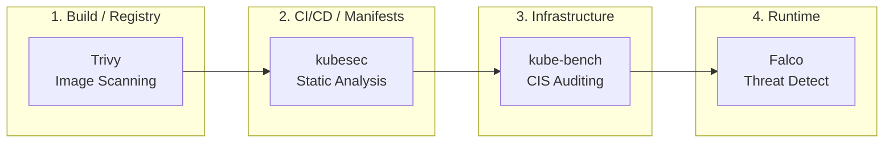
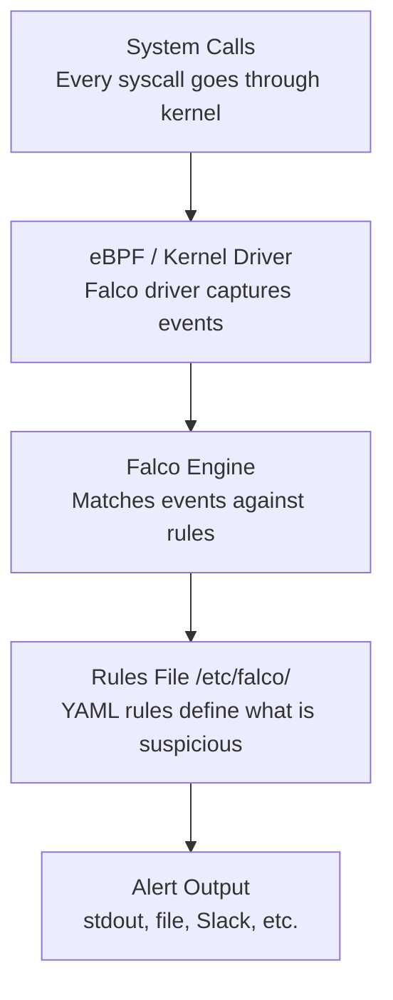

> **Складність**: `[СЕРЕДНЯ]` — основні екзаменаційні інструменти.
>
> **Час на проходження**: 40–45 хвилин.
>
> **Передумови**: Модуль 0.2 (Налаштування лабораторії безпеки).

---

## Що ви зможете зробити

Після завершення цього модуля ви зможете поєднати сканування образів, виявлення під час виконання, аудит за бенчмарками та перевірку маніфестів в один робочий процес безпеки замість того, щоб розглядати їх як окремі команди.

1. **Оцінювати** сканування образів за допомогою Trivy та обирати пороги усунення проблем для робочих навантажень Kubernetes 1.35.
2. **Впроваджувати** правила виконання Falco та перевіряти оповіщення про підозрілу активність контейнерів.
3. **Проводити аудит** конфігурації кластера Kubernetes 1.35 за допомогою kube-bench та визначати пріоритетність усунення проблем за CIS.
4. **Порівнювати** знахідки маніфестів kubesec із результатами роботи інструментів виконання та інфраструктури, щоб спроєктувати робочий процес сортування проблем безпеки.

---

## Чому цей модуль важливий

Сценарій вправи: реліз-кандидат готовий для кластера Kubernetes 1.35, але три різні перевірки розходяться в оцінці ризику. Trivy повідомляє про критичні вразливості в образі, kubesec не схвалює маніфест, kube-bench позначає налаштування площини управління, а Falco мовчить, тому що під час виконання не сталося нічого підозрілого. Новачок може запитати, який інструмент "правий"; натомість оператор, готовий до CKS, запитує, що саме спостерігає кожен інструмент, чого він спостерігати не може, і яке усунення проблеми першим зменшує найвищий ризик.

Ця відмінність має значення, тому що інструменти в цьому модулі розташовані в різних точках життєвого циклу безпеки. Trivy досліджує пакети та відомі дані про вразливості до того, як образ запуститься. kubesec читає Kubernetes YAML перед допуском. kube-bench порівнює конфігурацію вузла та площини управління з CIS Kubernetes Benchmark. Falco стежить за системними викликами після того, як робоче навантаження вже виконується, тож він може виявити поведінку, яку статичний сканер ніколи не зміг би довести лише з маніфесту.

Іспит не винагороджує запам'ятовування назв інструментів. Він винагороджує здатність читати результати під тиском часу, змінювати правильну конфігурацію та перевіряти, що зміна справді вплинула на той рівень, де існує ризик. На практиці та сама звичка запобігає появі "шумних" програм безпеки: ви уникаєте погоні за кожною знахідкою низької серйозності, уникаєте вдавання, що статична перевірка замінює моніторинг під час виконання, та уникаєте сприйняття пройденого бенчмарку як доказу того, що кожне робоче навантаження є безпечним.

Цей модуль навчає компактного робочого процесу, який ви можете використовувати під час практичних лабораторій та під час перевірок реальних кластерів. Ви проскануєте образ, інтерпретуєте поля серйозності та виправленої версії, розгорнете та протестуєте правило Falco, запустите kube-bench проти компонентів кластера та використаєте kubesec, щоб виявити ризиковані рішення в маніфесті до того, як вони потраплять до API-сервера. До кінця модуля інструменти мають сприйматися як прилади на одній панелі, кожен з яких вимірює свій сигнал.

---

## Життєвий цикл безпеки

Про безпеку Kubernetes найлегше міркувати тоді, коли ви розміщуєте кожен інструмент на часовій шкалі. Образ починається як вихідний код і пакети, стає артефактом контейнера, потрапляє до реєстру, на нього посилається маніфест, він допускається до кластера й нарешті породжує поведінку під час виконання на вузлі. Один сканер не може охопити всю цю шкалу, тому що кожен етап розкриває різні докази та різні точки контролю.



Наведений потік не є строгим ланцюгом залежностей, але це корисна ментальна модель. Trivy найсильніший перед розгортанням, тому що він може зупинити просування вразливого образу. kubesec найсильніший, поки маніфест ще дешево редагувати, тому що він може позначити небезпечні налаштування, такі як привілейований контейнер чи відсутній контекст безпеки. kube-bench найсильніший тоді, коли вам потрібні докази того, що основа кластера відповідає бенчмарку. Falco найсильніший після розгортання, тому що він може спостерігати фактичну поведінку процесів, файлів і мережі, яку породжують запущені контейнери.

Перша пастка — сплутати "раніше" з "краще". Бар'єр Trivy цінний, бо запобігає постачанню відомих вразливих пакетів, але він не може сказати, чи запустить контейнер інтерактивну оболонку після розгортання. Falco може зловити цю оболонку, але він не може заднім числом зробити вразливий базовий образ безпечним. kube-bench може виявити слабку автентифікацію kubelet, але він не вирішує, чи має конкретний маніфест Pod'а запускатися не від root.

Друга пастка — сплутати "пройдено" з "завершено". Чистий бал kubesec не доводить, що робоче навантаження вільне від CVE. Прохід kube-bench не доводить, що кожен простір імен має добру мережеву ізоляцію. Тиха панель Falco не доводить, що все гаразд; це може означати, що жоден підозрілий системний виклик не збігся з наразі ввімкненими правилами. Хороші оператори тримають область дії кожного сигналу прив'язаною до того рішення, яке він підтримує.

- **Trivy (збірка/реєстр):** сканує образи контейнерів на відомі CVE до того, як вони взагалі досягнуть кластера.
- **kubesec (CI/CD-маніфести):** статично аналізує маніфести Kubernetes YAML, щоб запобігти розгортанню ризикованих конфігурацій (як-от `privileged: true`).
- **kube-bench (інфраструктура кластера):** проводить аудит базових компонентів Kubernetes (API-сервер, kubelet, etcd) за CIS Benchmarks, щоб переконатися, що сам кластер захищений.
- **Falco (виконання):** моніторить активні контейнери через системні виклики, щоб виявляти аномалії в реальному часі (наприклад, хтось відкриває оболонку або читає `/etc/shadow`).

В умовах іспиту цей погляд на життєвий цикл дає вам швидке правило сортування. Якщо в завданні згадуються пакети, CVE, виправлені версії або образи з реєстру — починайте з Trivy. Якщо згадується підозріла поведінка, оболонки, читання файлів або виконання процесів — перевірте Falco. Якщо згадуються номери CIS-бенчмарку, прапорці статичних Pod'ів, конфігурація kubelet або посилення площини управління — використовуйте kube-bench. Якщо вам дають маніфест YAML і запитують, чи безпечно його розгортати — використовуйте kubesec або подібний статичний аналізатор.

Зробіть паузу та спрогнозуйте: якщо маніфест Pod'а встановлює `privileged: true`, а образ також містить критичну CVE OpenSSL, який інструмент має першим заблокувати розгортання, і яку знахідку ви усунули б першою, якщо протягом наступних п'яти хвилин можна зробити лише одну зміну?

Практична відповідь залежить від радіуса ураження (blast radius), можливості експлуатації та того, чи робоче навантаження вже запущено. Привілейований контейнер змінює те, що зловмисник може зробити зсередини Pod'а, тож kubesec може виявити небезпечну можливість ще до виконання. Критична CVE може бути так само терміновою, коли вразливий код є досяжним, тож Trivy надає докази на рівні пакета, потрібні для оновлення чи заміни образу. Зрілий хід полягає не в тому, щоб доводити, що один інструмент назавжди важливіший за інший; він полягає в тому, щоб зіставити кожну знахідку з найранішою безпечною точкою контролю.

---

## Trivy: сканування образів на вразливості

Trivy — найшвидший інструмент у цьому модулі для практики, тому що йому потрібне лише посилання на образ. Він витягує метадані образу, досліджує пакети операційної системи та застосунків, порівнює їх із базами даних вразливостей і повідомляє про CVE із серйозністю, ураженим пакетом, встановленою версією та виправленою версією, коли така існує. Цей результат корисний лише тоді, коли ви здатні відокремити виправні блокери релізу від фонового шуму.

### Базове сканування

```bash
# Scan an image
trivy image nginx:latest

# Scan with severity filter
trivy image --severity HIGH,CRITICAL nginx:latest

# Output as JSON (for automation)
trivy image -f json nginx:latest > scan-results.json

# Scan and fail if vulnerabilities found
trivy image --exit-code 1 --severity CRITICAL nginx:latest
```

Прапорець `--severity` фільтрує те, що Trivy друкує, а `--exit-code` вирішує, чи має сканування провалити автоматизований крок. Це різні рішення. Під час локального дослідження ви часто хочете повний звіт, щоб побачити, чи багато знахідок середньої серйозності пов'язані з одним оновленням пакета. У CI ви зазвичай починаєте з вужчого бар'єра, наприклад критичні вразливості з доступними виправленнями, тому що конвеєр, який провалюється на кожній проблемі низької серйозності, привчає розробників обходити сканер.

### Розуміння виводу Trivy

```text
┌─────────────────────────────────────────────────────────────┐
│              TRIVY SCAN OUTPUT EXPLAINED                    │
├─────────────────────────────────────────────────────────────┤
│                                                             │
│  nginx:latest (debian 12.4)                                │
│  ═══════════════════════════════════════════════════════   │
│                                                             │
│  Total: 142 (UNKNOWN: 0, LOW: 89, MEDIUM: 42,              │
│              HIGH: 10, CRITICAL: 1)                        │
│                                                             │
│  ┌────────────┬──────────┬──────────┬─────────────────┐    │
│  │ Library    │ Vuln ID  │ Severity │ Fixed Version   │    │
│  ├────────────┼──────────┼──────────┼─────────────────┤    │
│  │ openssl    │ CVE-2024-│ CRITICAL │ 3.0.13-1        │    │
│  │            │ ABCD     │          │                 │    │
│  │ libcurl    │ CVE-2024-│ HIGH     │ 7.88.1-10+d12u6│    │
│  │            │ EFGH     │          │                 │    │
│  └────────────┴──────────┴──────────┴─────────────────┘    │
│                                                             │
│  Key columns:                                              │
│  - Library: Affected package                               │
│  - Vuln ID: CVE identifier (searchable)                   │
│  - Severity: CRITICAL > HIGH > MEDIUM > LOW               │
│  - Fixed Version: Update to this version to fix           │
│                                                             │
└─────────────────────────────────────────────────────────────┘
```

Найважливіший стовпець під час усунення проблем — часто не серйозність, а `Fixed Version`. Якщо критична вразливість має виправлену версію пакета, у вас є конкретний шлях оновлення. Якщо виправленої версії не існує, наступне рішення — чи змінити базовий образ, видалити вразливий пакет, додати компенсувальний засіб контролю або тимчасово прийняти ризик із задокументованим винятком. Іспит може й не вимагати реєстру ризиків, але те саме міркування допомагає вам не марнувати час на знахідку, яку неможливо виправити редагуванням Kubernetes YAML.

Серйозності теж потрібен контекст. Критична CVE в пакеті, який застосунок ніколи не викликає, може мати нижчий операційний ризик, ніж вразливість високої серйозності в коді, відкритому на шляху запиту, але сканер не завжди може знати цей контекст використання. Для лабораторій CKS вам усе одно слід розглядати `HIGH` та `CRITICAL` як перший діапазон сортування, тому що їх легко відфільтрувати та вони ймовірно потребують дій. Для робочого середовища поєднуйте серйозність із можливістю експлуатації, досяжністю пакета та наявністю виправленої версії.

### Типи сканування

```bash
# Image scan (most common for CKS)
trivy image nginx:1.25

# Filesystem scan (scan local directory)
trivy fs /path/to/project

# Config scan (find misconfigurations in K8s YAML)
trivy config ./manifests/

# Kubernetes scan (scan running cluster)
trivy k8s --report summary cluster
```

Сканування образу — основний інструмент CKS, але інші типи сканування пояснюють, чому Trivy часто з'являється в ширших платформних конвеєрах. Сканування файлової системи може дослідити вивантажений проєкт до того, як буде зібрано образ. Сканування конфігурації може позначити проблеми маніфестів, подібно до kubesec, хоча модель оцінювання та покриття правил відрізняються. Сканування Kubernetes може узагальнити знахідки з активного кластера, що корисно для інвентаризації, але менш сфокусоване, ніж цільове сканування образу під час екзаменаційного завдання.

> **Зробіть паузу та спрогнозуйте**: Trivy повідомляє про 142 вразливості в `nginx:latest` — 89 LOW, 42 MEDIUM, 10 HIGH, 1 CRITICAL. Яку б ви виправили першою, і чи виправляли б усі 142? Який практичний поріг для бар'єра CI/CD?

Ваше перше виправлення має бути спрямоване на критичну знахідку, якщо вона має виправлену версію або якщо зміна базового образу її усуває. Зазвичай ви не блокуватимете кожне розгортання, доки не зникнуть усі знахідки низької та середньої серйозності, тому що деякі з них можуть бути успадковані від базового образу, а деякі ще можуть не мати виправлень. Практичний бар'єр починається з `HIGH,CRITICAL`, а потім поступово стає суворішим, у міру того як команда дізнається, які образи підтримуються, а які знахідки є повторюваними винятками.

### Практичні екзаменаційні сценарії

```bash
# Scenario 1: Find images with CRITICAL vulnerabilities
trivy image --severity CRITICAL myregistry/myapp:v1.0

# Scenario 2: Scan all images in a namespace
for img in $(kubectl get pods -n production -o jsonpath='{.items[*].spec.containers[*].image}' | tr ' ' '\n' | sort -u); do
  echo "Scanning: $img"
  trivy image --severity HIGH,CRITICAL "$img"
done

# Scenario 3: CI/CD gate - fail build if vulnerabilities
trivy image --exit-code 1 --severity HIGH,CRITICAL myapp:latest

# Scenario 4: Generate report for compliance
trivy image -f json -o report.json nginx:latest
```

Цикл по простору імен навмисно простий, але він навчає важливої операційної звички: скануйте те, що насправді запущено, а не лише те, що шаблон розгортання нібито має запускати. Pod'и могли бути створені різними контролерами, мутація допуску могла змінити посилання на образи, а екстрені зміни можуть залишити робочі навантаження поза очікуваним шляхом релізу. Крок `sort -u` не дає повторюваним посиланням на образи створювати дублікати звітів, що має значення, коли простір імен містить багато реплік.

Коли ви проєктуєте бар'єр Trivy, вирішіть, чи цей бар'єр є рекомендаційним, чи блокувальним. Рекомендаційні сканування корисні на ранньому етапі, тому що вони розкривають накопичені проблеми, не зупиняючи постачання. Блокувальні сканування корисні тоді, коли базові образи підтримуються, а команди знають, як швидко усувати знахідки. Блокувальний бар'єр без процедури винятків є крихким, але бар'єр, який ніколи нічого не блокує, стає фоновим шумом. Екзаменаційна версія цього компромісу менша: використовуйте прапорці, що відповідають завданню, а потім поясніть шлях усунення проблеми за результатами виводу.

Перш ніж запускати це у власній лабораторії, спрогнозуйте форму результату: якщо `nginx:1.25` дає менше критичних знахідок, ніж `nginx:latest`, чи це тому, що старіші теги завжди безпечніші, тому що змінилася база даних, чи тому, що вибір тегу сам по собі не є стратегією безпеки?

Найбезпечніша відповідь — змінні та широкі теги є поганими межами безпеки. Конкретний тег дає вам відтворюваність, але не гарантує свіжості. Тег latest може переміститися на залатану збірку, але він також ускладнює відтворюваність. Для екзаменаційної практики надавайте перевагу явним посиланням на образи в командах, щоб ви могли навмисно порівнювати результати сканування. Для робочого середовища поєднуйте явні теги чи дайджести з процесом повторної збірки, який регулярно підхоплює залатані пакети.

---

## Falco: виявлення загроз під час виконання

Falco спостерігає за поведінкою, а не за заявленим наміром. Він стежить за системними викликами через eBPF-зонд або драйвер ядра, збагачує ці події контекстом контейнера та Kubernetes і оцінює їх за правилами. Це робить Falco цінним після того, як робоче навантаження запускається, особливо коли підозріла дія не видима в маніфесті чи метаданих образу. Оболонка, породжена всередині контейнера, — класичний приклад, тому що цей процес існує лише під час виконання.

### Як працює Falco



Рушій правил — та частина, якою ви керуєте найчастіше під час підготовки до CKS. Правило поєднує назву, опис, умову, повідомлення виводу, пріоритет і теги. Умова написана мовою фільтрів Falco, тож вона може зіставляти назви процесів, файлові дескриптори, типи системних викликів, стан контейнера, ідентичність користувача та багато інших полів. Рядок виводу має містити достатньо контексту для розслідування події, не змушуючи вас негайно її відтворювати.

### Перегляд сповіщень Falco

```bash
# Check Falco logs
kubectl logs -n falco -l app.kubernetes.io/name=falco --tail=50

# Example alert:
# 14:23:45.123456789: Warning Shell spawned in container
#   (user=root container_id=abc123 container_name=nginx
#   shell=bash parent=entrypoint.sh cmdline=bash)
```

Читання виводу Falco — це навичка розслідування, а не просто команда перегляду логів. Заголовок сповіщення повідомляє вам, яке правило збіглося, а поля, такі як `user`, `container_name`, `proc.name`, `parent` та `cmdline`, повідомляють, що сталося. Якщо в завданні сказано, що сповіщення не спрацювало, перевірте, чи Falco запущено, чи правило ввімкнено, чи подія справді відповідає умові, і чи призначення виводу — саме там, куди ви дивитеся.

### Розуміння правил Falco

```yaml
# Falco rule structure
- rule: Terminal shell in container
  desc: A shell was spawned in a container
  condition: >
    spawned_process and
    container and
    shell_procs
  output: >
    Shell spawned in container
    (user=%user.name container=%container.name shell=%proc.name)
  priority: WARNING
  tags: [container, shell, mitre_execution]

# Key components:
# - rule: Name of the rule
# - desc: Human-readable description
# - condition: When to trigger (Falco filter syntax)
# - output: What to log when triggered
# - priority: EMERGENCY, ALERT, CRITICAL, ERROR, WARNING, NOTICE, INFORMATIONAL (often aliased as INFO), DEBUG
# - tags: Categories for filtering
```

Макрос `spawned_process` звужує потік подій до створення процесів. Умова `container` тримає правило сфокусованим на активності контейнерів, а не на кожному процесі на вузлі. Макрос `shell_procs` охоплює поширені оболонки, тому правило може зіставляти `bash` чи подібні назви процесів, не перелічуючи в самому правилі кожну можливу команду. Макроси роблять правила читабельними, але вони також приховують деталі, тож досліджуйте визначення макросів, коли правило поводиться не так, як ви очікували.

> **Зупиніться та подумайте**: Falco моніторить системні виклики в реальному часі. Якщо зловмисник відкриває зворотну оболонку (reverse shell) всередині контейнера, які елементи умови Falco її виявлять? Подумайте про те, які системні виклики спричиняє породження оболонки, а які — мережеве з'єднання.

Зворотна оболонка має дві спостережувані частини: процес оболонки та мережеве з'єднання. Правило породження оболонки може зловити створення процесу, а мережеве правило може зловити вихідне з'єднання. Якщо зловмисник запускає нестандартний двійковий файл або використовує наявний процес для вихідного з'єднання, одне правило може пропустити те, що ловить інше. Саме тому виявлення під час виконання будується з кількох поведінкових сигналів, а не з однієї магічної умови.

### Поширені умови Falco

```yaml
# Detect shell in container
condition: spawned_process and container and shell_procs

# Detect sensitive file access
condition: >
  open_read and
  container and
  (fd.name startswith /etc/shadow or fd.name startswith /etc/passwd)

# Detect network connection
condition: >
  (evt.type in (connect, accept)) and
  container and
  fd.net != ""

# Detect privilege escalation
condition: >
  spawned_process and
  container and
  proc.name = sudo
```

Ці приклади показують три різні класи поведінки: виконання процесів, доступ до файлів та мережеву активність. Коли ви пишете чи налагоджуєте правило Falco, почніть із називання поведінки звичайною мовою, а потім перекладіть цю поведінку в поля подій. "Хтось прочитав `/etc/shadow`" стає `open_read` плюс умова шляху до файлу. "Оболонка запустилася в контейнері" стає створенням процесу плюс назва процесу оболонки плюс фільтр контейнера.

### Зміна правил Falco

```bash
# Falco rules are in /etc/falco/
# - falco_rules.yaml: Default rules (don't edit)
# - falco_rules.local.yaml: Your custom rules

# Method 1: Helm values (RECOMMENDED — keeps all Falco configuration managed in a single Helm release)
# Create a values file with custom rules
cat <<EOF > falco-custom-rules.yaml
customRules:
  custom-rules.yaml: |-
    - rule: Detect cat of sensitive files
      desc: Someone is reading sensitive files
      condition: >
        spawned_process and
        container and
        proc.name = cat and
        (proc.args contains "/etc/shadow" or proc.args contains "/etc/passwd")
      output: "Sensitive file read (user=%user.name file=%proc.args container=%container.name)"
      priority: WARNING
EOF

# Upgrade Falco with custom rules (using --reuse-values to preserve existing configuration)
helm upgrade falco falcosecurity/falco \
  --namespace falco \
  --reuse-values \
  -f falco-custom-rules.yaml \
  --wait

# Method 2: ConfigMap mounted via Helm (alternative — also persists)
kubectl create configmap falco-custom-rules \
  --namespace falco \
  --from-literal=custom-rules.yaml='
- rule: Detect cat of sensitive files
  desc: Someone is reading sensitive files
  condition: >
    spawned_process and
    container and
    proc.name = cat and
    (proc.args contains "/etc/shadow" or proc.args contains "/etc/passwd")
  output: "Sensitive file read (user=%user.name file=%proc.args container=%container.name)"
  priority: WARNING
'

# Mount the ConfigMap and list it in rules_files — a restart alone does not load the rule
cat <<EOF > falco-configmap-mount.yaml
extraVolumes:
  - name: falco-custom-rules
    configMap:
      name: falco-custom-rules
extraVolumeMounts:
  - name: falco-custom-rules
    mountPath: /etc/falco/rules.d/custom-rules.yaml
    subPath: custom-rules.yaml
    readOnly: true
falco:
  rules_files:
    - /etc/falco/falco_rules.yaml
    - /etc/falco/falco_rules.local.yaml
    - /etc/falco/rules.d/custom-rules.yaml
EOF

helm upgrade falco falcosecurity/falco \
  --namespace falco \
  --reuse-values \
  -f falco-configmap-mount.yaml \
  --wait

kubectl rollout status daemonset/falco -n falco --timeout=120s
```

> **Важливо**: ніколи не змінюйте правила через exec у Pod'и Falco — ці зміни втрачаються при перезапуску Pod'ів. Завжди використовуйте значення Helm або ConfigMap'и, щоб власні правила переживали оновлення та перезапуски.

Сенс цього прикладу — модель збереження. Редагування файлу всередині запущеного Pod'а DaemonSet може видаватися робочим, доки Pod не перезапуститься, вузол не спорожніє або Helm не узгодить реліз. Керування власними правилами через значення Helm або змонтований ConfigMap тримає правило в декларованій конфігурації, а отже зміна може пережити коливання планування та бути перевіреною, як будь-яка інша зміна кластера.

Умова в цьому власному правилі навмисно вузька. Вона зіставляє `cat`, що читає `/etc/shadow` чи `/etc/passwd` всередині контейнера, що є корисним екзаменаційним тригером, але не повним детектором витоку даних. Зловмисник міг би використати інший двійковий файл, прочитати файл через скрипт або скопіювати змонтований секрет замість цього. На практиці ви налаштовуєте правила, починаючи зі спостережуваної поведінки, тестуючи очікуване сповіщення, а потім розширюючи чи звужуючи умову на основі хибних спрацювань та пропущених подій.

### Тестування виявлення Falco

```bash
# Trigger shell detection
kubectl run test --image=nginx --restart=Never
kubectl wait --for=condition=Ready pod/test --timeout=60s
kubectl exec test -- /bin/sh -c "exit"

# Check Falco logs for alert
kubectl logs -n falco -l app.kubernetes.io/name=falco | grep "shell"

# Cleanup
kubectl delete pod test --force
```

Тест, який навмисно запускає сповіщення, дає вам більше впевненості, ніж файл правил, який лише парситься. Він доводить, що подія досягає Falco, умова збігається, призначення виводу видиме, а сповіщення містить корисні поля для розслідування. Якщо тест провалюється, не переписуйте правило одразу. Спочатку перевірте, що Pod'и Falco запущено, простір імен та селектор міток коректні, а контейнер справді виконав ту команду, яку ви очікували.

Falco може бути "шумним", якщо кожна нешкідлива адміністративна дія розглядається як інцидент. Мета — не усунути всі сповіщення; мета — зробити сповіщення достатньо корисними, щоб оператори розслідували саме потрібні. Розмічання правил тегами, встановлення відповідних пріоритетів та включення контексту робочого навантаження у вивід — усе це зменшує вартість сортування. Під час іспиту це перекладається в дисципліновану послідовність: підтвердьте правило, запустіть поведінку, прочитайте лог, а потім поясніть, чому сповіщення доводить, що виявлення працює.

---

## kube-bench: аудит за CIS Benchmark

kube-bench відповідає на інше питання, ніж Trivy та Falco: чи відповідає конфігурація кластера CIS Kubernetes Benchmark? Він досліджує налаштування площини управління, вузла та etcd і повідомляє про результати pass, fail, warning та informational. Це аудит інфраструктури, а не сканування застосунків. Інструмент особливо доречний для кластерів у стилі kubeadm, де статичні маніфести Pod'ів та конфігураційні файли kubelet доступні на вузлах.

### Запуск kube-bench

```bash
# Run as Kubernetes Job
kubectl apply -f https://raw.githubusercontent.com/aquasecurity/kube-bench/main/job.yaml
kubectl wait --for=condition=complete job/kube-bench --timeout=120s
kubectl logs job/kube-bench

# Run specific checks
./kube-bench run --targets=master  # Control plane only
./kube-bench run --targets=node    # Worker nodes only
./kube-bench run --targets=etcd    # etcd only

# Run specific benchmark (e.g., CIS 1.12 benchmark for newer K8s versions)
./kube-bench run --benchmark cis-1.12
```

Запуск kube-bench як Job зручний у лабораторних кластерах, тому що він пакує інструмент та права в робоче навантаження Kubernetes. Запуск його безпосередньо на вузлі може бути зрозумілішим, коли вам потрібно дослідити шляхи на хості, статичні маніфести Pod'ів чи файли kubelet. Прапорці цілей дозволяють звузити звіт, коли в завданні названо компонент. Якщо в задачі сказано, що ввімкнено анонімну автентифікацію kubelet, запуск, націлений на вузол, дає вам швидший шлях, ніж читання повного звіту площини управління.

### Розуміння виводу kube-bench

```text
┌─────────────────────────────────────────────────────────────┐
│              KUBE-BENCH OUTPUT EXPLAINED                    │
├─────────────────────────────────────────────────────────────┤
│                                                             │
│  [INFO] 1 Control Plane Security Configuration             │
│  [INFO] 1.1 Control Plane Node Configuration Files         │
│                                                             │
│  [PASS] 1.1.1 Ensure API server pod file permissions       │
│  [PASS] 1.1.2 Ensure API server pod file ownership         │
│  [FAIL] 1.1.3 Ensure controller manager file permissions   │
│  [WARN] 1.1.4 Ensure scheduler pod file permissions        │
│                                                             │
│  Status meanings:                                           │
│  [PASS] - Check passed                                     │
│  [FAIL] - Security issue found, must fix                   │
│  [WARN] - Manual review needed                             │
│  [INFO] - Informational only                               │
│                                                             │
│  Remediation for 1.1.3:                                    │
│  Run: chmod 600 /etc/kubernetes/manifests/controller.yaml  │
│                                                             │
└─────────────────────────────────────────────────────────────┘
```

Позначки статусу не рівні за терміновістю. `[FAIL]` — це автоматизована перевірка, яка не відповідала очікуванню бенчмарку, тож зазвичай вона потребує конкретної зміни конфігурації або задокументованого винятку. `[WARN]` часто означає, що потрібна ручна перевірка, тому що інструмент не може безпечно визначити намір. Рядки `[INFO]` структурують звіт та надають контекст. На іспиті витрачайте більшу частину часу на провалені перевірки, які містять команду усунення проблеми або конкретний шлях до файлу.

Текст усунення проблеми корисний, але він не заміна розуміння життєвого циклу компонента. Редагування `/etc/kubernetes/manifests/kube-apiserver.yaml` змушує kubelet перезапустити статичний Pod. Редагування конфігурації kubelet зазвичай вимагає перезапуску kubelet. Зміна прав доступу до файлів може набути чинності негайно, але неправильний прапорець статичного Pod'а може зробити API-сервер недоступним, доки його не виправлять на вузлі. Відпрацюйте шлях відновлення, перш ніж він знадобиться вам під тиском часу.

### Поширені помилки CIS та виправлення

Ідентифікатори перевірок нижче відповідають профілю kube-bench **cis-1.12** (профіль, який використовується для практичних кластерів Kubernetes 1.35 у цьому модулі). Ідентифікатори не є взаємозамінними між версіями бенчмарку — завжди читайте заголовок перевірки у виводі kube-bench, перш ніж редагувати статичний Pod чи файл kubelet.

| Перевірка | Проблема | Усунення |
|-------|-------|-------------|
| 1.2.1 | Увімкнена анонімна автентифікація API-сервера | `--anonymous-auth=false` на статичному Pod'і API-сервера |
| 1.2.6 | `--authorization-mode` API-сервера містить AlwaysAllow | Встановіть `--authorization-mode` на режими, що включають Node та RBAC (а не лише AlwaysAllow) |
| 1.2.16 | Журналювання аудиту API-сервера не налаштоване | Встановіть `--audit-log-path` та змонтуйте файл політики аудиту на API-сервері |
| 4.2.1 | Увімкнена анонімна автентифікація kubelet | `--anonymous-auth=false` на kubelet |
| 4.2.9 | Сертифікат/ключ TLS kubelet не налаштовано | Встановіть `tlsCertFile` та `tlsPrivateKeyFile` у конфігурації kubelet (або відповідні прапорці CLI) |

```bash
# Fix API server anonymous auth
# Edit /etc/kubernetes/manifests/kube-apiserver.yaml
# Add: --anonymous-auth=false

# Fix kubelet anonymous auth
# Edit /var/lib/kubelet/config.yaml
# Set: authentication.anonymous.enabled: false

# Restart kubelet after config changes
sudo systemctl restart kubelet
```

Таблиця дає вам швидку карту для запам'ятовування, але безпечніший робочий процес — спочатку файл. Коли kube-bench називає прапорець API-сервера, дослідіть статичний маніфест Pod'а перед редагуванням. Коли він називає автентифікацію kubelet, дослідіть конфігураційний файл kubelet та аргументи служби, тому що дистрибутиви можуть поєднувати обидва. Коли він називає журналювання аудиту, переконайтеся, що файл політики аудиту існує, змонтований у статичний Pod API-сервера та згаданий правильним прапорцем.

Зупиніться та подумайте: ви запускаєте kube-bench і отримуєте 15 результатів `[FAIL]`. Ви виправляєте всі 15 і запускаєте повторно, але тепер отримуєте 3 нові результати `[FAIL]`, яких раніше не було видно. Як це можливо?

Одне пояснення — попередня неправильна конфігурація заважала перевіркам повністю оцінитися, і її виправлення розкрило глибші перевірки. Інше — компонент перезапустився з іншим шляхом конфігурації чи значенням за замовчуванням після вашої зміни. Третє — на другому проході ви запустили ширшу ціль бенчмарку. Практична звичка — зберігати вивід "до" та "після", за можливості змінювати один клас налаштувань за раз і перевіряти, що цільовий компонент перезапустився чисто.

Для підготовки до Kubernetes 1.35 пам'ятайте, що версії бенчмарку та версії кластера пов'язані, але не ідентичні. Реліз CIS-бенчмарку може відставати або узагальнюватися на кілька мінорних версій Kubernetes, тоді як kube-bench зіставляє перевірки з підтримуваними профілями бенчмарку. Якщо завдання явно називає бенчмарк, використовуйте цей бенчмарк. Якщо ні, оберіть профіль, що відповідає кластеру, та поясніть будь-який елемент ручної перевірки замість того, щоб силувано підганяти невідповідну автоматизовану перевірку.

---

## kubesec: статичний аналіз маніфестів

kubesec аналізує Kubernetes YAML до того, як робоче навантаження існує. Він оцінює маніфести на основі полів, важливих для безпеки, таких як привілейований режим, налаштування користувача root, файлові системи з кореневим каталогом лише для читання, обмеження ресурсів та вибір контексту безпеки. Це робить його корисним, коли наданий вам артефакт — це маніфест, а не запущений Pod чи конфігурація вузла. Це також хороший навчальний інструмент, тому що зворотний зв'язок указує безпосередньо на поля YAML, які той, хто навчається, може змінити.

### Сканування маніфестів

```bash
# Scan a YAML file
kubesec scan deployment.yaml

# Scan from stdin
cat pod.yaml | kubesec scan /dev/stdin

# Example output:
# [
#   {
#     "score": -30,
#     "scoring": {
#       "passed": [...],
#       "critical": ["containers[] .securityContext .privileged == true"],
#       "advise": [...]
#     }
#   }
# ]
```

Бал — це сигнал, а не політика сама по собі. Від'ємний бал повідомляє вам, що маніфест заслуговує на увагу перед розгортанням, особливо коли результат визначає критична проблема, така як `privileged: true`. Додатний бал не доводить, що робоче навантаження безпечне, тому що kubesec не може знати поведінку застосунку, CVE образу, мережеву політику чи активність процесів під час виконання. Сприймайте його як систему раннього попередження про стан маніфесту.

### Розуміння балів kubesec

```text
┌─────────────────────────────────────────────────────────────┐
│              KUBESEC SCORING                                │
├─────────────────────────────────────────────────────────────┤
│                                                             │
│  Score ranges (Informal Community Convention):             │
│  ─────────────────────────────────────────────────────────  │
│  10+   : Good security posture                             │
│  0-10  : Acceptable, room for improvement                   │
│  < 0   : Security concerns, review required                 │
│  -30   : Critical issues (e.g., privileged container)       │
│                                                             │
│  Score modifiers:                                          │
│  +1 : runAsNonRoot: true                                   │
│  +1 : readOnlyRootFilesystem: true                         │
│  +1 : resources.limits defined                             │
│  -30: privileged: true (critical)                          │
│  -1 : no securityContext                                   │
│                                                             │
└─────────────────────────────────────────────────────────────┘
```

Діаграма оцінювання корисна, бо вона показує, чому одне небезпечне налаштування може переважити кілька хороших. Pod, який встановлює обмеження ресурсів та файлову систему з кореневим каталогом лише для читання, усе одно заслуговує на пильність, якщо він привілейований. Це не суперечність; це різниця між додатковими гігієнічними засобами контролю та можливістю, яка може розширити досяжність зловмисника. Під час перегляду спершу виправляйте критичні від'ємні засоби контролю, а потім додавайте додатні поля посилення там, де застосунок може це витримати.

kubesec також доповнює Kubernetes Pod Security Standards. Ці стандарти визначають профілі політик restricted, baseline та privileged, тоді як kubesec дає швидкий зворотний зв'язок щодо окремих рішень у маніфесті. Якщо маніфест порушує позицію restricted, kubesec часто вказує на ту саму сім'ю проблем: привілейований режим, простори імен хоста, відсутні налаштування non-root або файлові системи з кореневим каталогом, доступним для запису. Цей зв'язок допомагає вам перейти від знахідки сканера до усунення проблеми з урахуванням політики.

Корисне порівняння — не "kubesec проти Trivy". Корисне порівняння — "намір маніфесту проти вмісту образу проти поведінки під час виконання проти основи кластера". Маніфест може виглядати посиленим, посилаючись на вразливий образ. Образ може бути залатаний, тоді як Pod працює з непотрібними привілеями. Pod може бути добре налаштований, тоді як kubelet дозволяє анонімний доступ. Детектор виконання може спрацьовувати на підозрілу поведінку, але він не замінює запобіжні засоби контролю.

Який підхід ви обрали б тут і чому: відхиляти кожен маніфест із балом kubesec нижче 10 чи відхиляти лише маніфести з критичними знахідками, відкриваючи тікети для рекомендаційних покращень?

Суворіша політика може бути доречною для вузької платформи зі зрілими шаблонами робочих навантажень, але вона може блокувати корисну роботу, коли команди ще мігрують застарілі маніфести. Блокувальний бар'єр лише для критичних проблем легше впровадити, і він зосереджує увагу спершу на небезпечних налаштуваннях. Згодом організація може підняти планку, зробивши поширені додатні засоби контролю частиною базових шаблонів. Навичка CKS — пояснити цей компроміс, а потім застосувати той засіб контролю, якого вимагає завдання.

---

## Приклад сортування на практиці: одне робоче навантаження, чотири сигнали

Сценарій вправи: вам передано простір імен `production`, маніфест із назвою `deployment.yaml` та звіт, який каже, що образ застосунку може бути вразливим. Ви не знаєте, чи проблема у вмісті образу, стані маніфесту, конфігурації кластера чи поведінці під час виконання. Найшвидший безпечний підхід — дослідити кожен рівень один раз, а потім вирішити, яка знахідка блокує розгортання, а яка стає подальшою роботою.

Почніть з артефакту, який можна виправити найраніше. Запустіть Trivy проти посилання на образ із маніфесту чи із запущених Pod'ів. Якщо сканування показує вразливості високої чи критичної серйозності з виправленими версіями, усунення проблеми зазвичай належить до збірки образу чи вибору базового образу. Не редагуйте контекст безпеки Deployment'а, щоб "виправити" CVE; це різні рівні. Ви можете зменшити можливість експлуатації обмеженнями під час виконання, але вразливий пакет залишається в артефакті.

Далі проскануйте маніфест за допомогою kubesec та дослідіть поля контексту безпеки Kubernetes. Якщо маніфест є привілейованим або запускається від root без причини, це проблема стану розгортання. Може бути швидше залатати маніфест, ніж перезібрати образ, але ці два виправлення не замінюють одне одного. Посилений маніфест зменшує те, що процес може зробити після компрометації; він не видаляє вразливі бібліотеки з образу.

Потім запустіть kube-bench, якщо завдання вказує на посилення кластера або якщо робоче навантаження розташоване в кластері, за аудит якого ви відповідаєте. Провалена перевірка автентифікації kubelet змінює профіль ризику для кожного робочого навантаження на цьому вузлі, а не лише для цього одного розгортання. Визначайте пріоритетність провалів, які відкривають доступ до площини управління, kubelet чи etcd, тому що вони збільшують радіус ураження помилок на рівні робочого навантаження. Записуйте попередження окремо, щоб вони не відволікали від автоматизованих провалів, які мають конкретні усунення.

Нарешті, використайте Falco, щоб перевірити, чи видима підозріла поведінка. Запустіть відому подію в безпечному тестовому Pod'і, підтвердьте, що сповіщення з'являється, і дослідіть, чи містить вивід поля, потрібні вам для реагування. Якщо застосунок пізніше несподівано породить оболонку чи прочитає чутливі файли, Falco дає вам докази під час виконання. Ці докази цінні саме тому, що інші інструменти працюють до виконання чи поруч із ним, а не всередині потоку системних викликів.

Результатом цього сортування є рішення, а не купа звітів. Критична CVE образу з виправленим базовим образом блокує реліз до повторної збірки. Привілейоване налаштування Pod'а блокує маніфест до виправлення чи обґрунтування. Провал kube-bench щодо анонімної автентифікації kubelet стає інфраструктурним усуненням, тому що він впливає на межу вузла. Відсутнє сповіщення Falco стає завданням з інженерії виявлення, тому що сигнал виконання відсутній або неправильно спрямований.

---

## Патерни та антипатерни

Перший надійний патерн — приналежність до конкретного рівня. Знахідки образів належать процесу збірки образу чи базового образу, знахідки маніфестів належать шаблонам розгортання та засобам контролю допуску, знахідки бенчмарку належать операціям кластера, а знахідки виконання належать інженерії виявлення та реагуванню на інциденти. Цей патерн масштабується, тому що кожна команда може володіти рівнем, який вона справді може змінити, тоді як спільний процес сортування не дає знахідкам сприйматися як незв'язані тікети.

Другий надійний патерн — усунення проблем зі збереженням доказів. Зберігайте команду, важливий вивід, змінений файл та результат повторного запуску. На іспиті це здебільшого для вашої власної впевненості, але в робочому середовищі це запобігає повторному виявленню тієї самої знахідки без контексту. Провал kube-bench, який зникає після редагування статичного Pod'а, має мати результат "до", diff маніфесту та результат "після". Правило Falco має мати команду-тригер та сповіщення, яке вона породила.

Третій надійний патерн — поступове встановлення бар'єрів. Почніть із блокувальних правил найвищої достовірності, таких як критичні вразливості образів із доступними виправленнями чи привілейовані маніфести без затвердженого винятку. Використовуйте рекомендаційну звітність для більш "шумних" знахідок, доки команди не зрозуміють шлях усунення. Це дозволяє уникнути двох поширених крайнощів: сканера, який блокує все й тому його обходять, або сканера, який не блокує нічого й тому його ігнорують. Зрілі програми посилюють пороги, у міру того як покращуються базові образи, шаблони та runbook'и.

Один антипатерн — заміна сканера. Команди іноді вказують на чисте сканування Trivy як на доказ того, що моніторинг виконання непотрібний, або вказують на сповіщення Falco як на доказ того, що вразливі образи можна постачати. Це міркування зводить різні типи доказів в одну невиразну ідею "безпеки". Краща альтернатива — сформулювати питання, на яке відповідає кожен інструмент, і вимагати правильні докази для цього питання. Вибір інструмента має слідувати за рівнем, а не навпаки.

Другий антипатерн — редагування живого стану без надійного шляху до конфігурації. Пряма зміна файлів усередині Pod'а Falco, ручне патчення запущеного Pod'а, який буде замінено контролером, чи виправлення прапорця статичного Pod'а без запису вихідного файлу — усе це створює тимчасовий успіх. Краща альтернатива — змінити декларовану конфігурацію, а потім перевірити живий стан. Це особливо важливо в Kubernetes, тому що контролери та kubelet'и постійно узгоджують ресурси.

Третій антипатерн — сприйняття виводу бенчмарку як списку справ без упорядкування за ризиком. Звіти CIS можуть бути довгими, і не кожне попередження заслуговує на однакову терміновість. Визначайте пріоритетність автоматизованих провалів, які впливають на автентифікацію, авторизацію, можливість аудиту, TLS чи привілейований доступ, перш ніж займатися косметичними чи перевіреними вручну елементами. Це не означає, що попередження неважливі; це означає, що ви тримаєте усунення проблем узгодженим з радіусом ураження та можливістю експлуатації, а не з порядком рядків у звіті.

---

## Каркас прийняття рішень

Використовуйте той інструмент, який може спостерігати докази, названі в задачі. Якщо докази — це образ контейнера, починайте з Trivy, тому що інвентар пакетів та бази даних вразливостей є доречними вхідними даними. Якщо докази — це маніфест Kubernetes, починайте з kubesec, тому що поля YAML розкривають стан безпеки до того, як об'єкт існує. Якщо докази — це конфігурація вузла чи площини управління, починайте з kube-bench, тому що перевірки бенчмарку зіставляються з цими файлами та прапорцями. Якщо докази — це поведінка процесів, файлів чи мережі після розгортання, починайте з Falco.

Використовуйте найранішу безпечну точку контролю для усунення проблеми. Перезбирайте образ, коли Trivy вказує на виправлену версію пакета. Патчте маніфест, коли kubesec вказує на привілей, якого можна уникнути. Редагуйте конфігурацію компонента, коли kube-bench називає провалений прапорець чи права доступу до файлу. Змінюйте правило чи шлях виводу Falco, коли подія виконання не виявляється чи не маршрутизується. Раніші засоби контролю зменшують ризик до запуску робочого навантаження, тоді як засоби контролю виконання ловлять поведінку, яку запобігання не зупинило.

Використовуйте серйозність та радіус ураження разом. Критична CVE в образі, відкритому назовні, може бути блокером релізу. Провал автентифікації kubelet може вплинути на багато робочих навантажень, тож він може важити більше за ізольоване попередження маніфесту. Сповіщення Falco про виконання оболонки в робочому просторі імен заслуговує на негайне розслідування, тому що воно описує поведінку, яка вже сталася. Рекомендація kubesec про відсутні обмеження ресурсів усе ще може мати значення, але вона рідко важить більше за провал автентифікації площини управління.

Використовуйте докази повторного запуску, щоб замкнути цикл. Після зміни базового образу проскануйте новий образ. Після патчення маніфесту проскануйте маніфест ще раз і застосовуйте його лише тоді, коли зміна коректна. Після редагування конфігурації kubelet чи статичного Pod'а повторно запустіть відповідну ціль kube-bench і підтвердьте, що компонент відновився. Після додавання правила Falco запустіть безпечну тестову подію та прочитайте сповіщення. Виправлення без перевірки — це лише здогад.

Використовуйте винятки помірно та робіть їх конкретними. Якщо вразливість не має виправленої версії, запишіть образ, CVE, уражений пакет, компенсувальні засоби контролю та дату перегляду. Якщо робоче навантаження потребує незвичайної можливості, запишіть цю можливість та причину, а не загальний дозвіл запускатися привілейованим. Якщо попередження бенчмарку прийнято через конфігурацію, керовану провайдером, запишіть цю область дії. Винятки мають звужувати майбутні рішення, а не ставати постійним аварійним виходом.

---

## Чи знали ви?

- **Trivy створено компанією Aqua Security**, і зараз він є одним із найширше використовуваних сканерів вразливостей з відкритим кодом, тому що він поєднує цілі образу, файлової системи, конфігурації та Kubernetes за одним CLI.

- **Falco використовує eBPF або драйвер ядра**, щоб захоплювати системні виклики з високою продуктивністю. Хоча його часто згадують через низькі накладні витрати, фактична пропускна здатність та накладні витрати значною мірою залежать від вашого конкретного робочого навантаження та конфігурації. Спочатку його створила Sysdig, і він став випускником (graduated) проєкту CNCF.

- **CIS Benchmarks** розробляє Center for Internet Security за участі експертів з безпеки з усього світу. Вони є де-факто стандартом для аудиту безпеки Kubernetes, але багато перевірок усе ще потребують судження оператора.

- **kubesec створено компанією Control Plane (controlplaneio)** — компанією, відомою навчанням з безпеки Kubernetes, хоча саму сертифікацію CKS офіційно адмініструють CNCF та Linux Foundation.

---

## Типові помилки

| Помилка | Чому це стається | Як це виправити |
|---------|----------------|---------------|
| Запам'ятовування лише команд | Вивід виглядає знайомим під час практики, але іспит просить вас інтерпретувати серйозність, область дії та усунення, а не декламувати синтаксис. | Для кожної команди занотуйте, які докази вона спостерігає, як виглядає поганий результат, і який файл чи артефакт ви б змінили. |
| Ігнорування серйозності "MEDIUM" | Команди зосереджуються лише на критичних знахідках і забувають, що вразливості середньої серйозності можуть стати важливими, коли вони досяжні чи об'єднані в ланцюг. | Спершу відфільтруйте high та critical, потім перегляньте знахідки medium на предмет відкритих пакетів, повторюваних проблем базового образу та доступних виправлених версій. |
| Неналаштування правил Falco | Стандартні правила достатньо широкі, щоб бути корисними, але вони можуть пропустити підозрілу поведінку, специфічну для робочого навантаження, чи породжувати сповіщення без полів, потрібних вашій команді. | Додавайте власні правила через значення Helm чи ConfigMap'и, запускайте безпечні тестові події та включайте у вивід контекст користувача, контейнера, команди та файлу. |
| Пропуск практики усунення проблем | Запуск сканера здається завершеним, тож ті, хто навчається, не практикують цикл редагування, перезапуску та повторного запуску, який доводить, що знахідку виправлено. | Поєднуйте кожне сканування з однією невеликою вправою з усунення: перезберіть образ, залатайте маніфест, відредагуйте прапорець бенчмарку чи перевірте сповіщення Falco. |
| Запуск інструментів один раз | Один запуск захоплює один момент і може пропустити нові образи, змінені маніфести, перезапущені компоненти чи оновлені дані про вразливості. | Інтегруйте сканування в робочі процеси збірки, перегляду, аудиту та виконання, щоб кожен рівень перевірявся, коли змінюються його докази. |
| Сприйняття `[WARN]` та `[FAIL]` як однакових | kube-bench використовує різні статуси, а попередження ручної перевірки можуть відволікати від автоматизованих провалів із прямими виправленнями. | Спершу виправляйте автоматизовані провали, документуйте попередження ручної перевірки окремо та повторно запускайте конкретну ціль після кожної інфраструктурної зміни. |
| Редагування живих Pod'ів замість декларованої конфігурації | Прямі редагування здаються швидкими, але контролери Kubernetes, Helm та перезапуски Pod'ів можуть стерти їх без попередження. | Змінюйте джерело істини: збірки образів, маніфести, значення Helm, ConfigMap'и, файли статичних Pod'ів чи конфігурацію kubelet. |

---

## Тест

<details>
<summary>Сценарій вправи: ваш CI-конвеєр запускає Trivy і провалює збірку, тому що базовий образ містить критичні вразливості з виправленими версіями. Розробник каже, що застосунок запускається нормально. Що вам слід перевірити, і яке усунення проблеми вимагати?</summary>

Перевірте вивід Trivy на предмет ураженого пакета, встановленої версії, серйозності та виправленої версії, тому що це підказує вам, чи належить виправлення до збірки образу. Робочий застосунок усе одно може постачати вразливі бібліотеки, тож "він запускається" не відповідає на питання безпеки. Вимагайте оновленого базового образу чи версії пакета, коли виправлена версія існує, потім повторно запустіть `trivy image --severity HIGH,CRITICAL` проти перезібраного образу. Якщо виправленої версії не існує, задокументуйте вузький виняток та компенсувальні засоби контролю, а не вимикайте сканер.

</details>

<details>
<summary>Сценарій вправи: правило Falco для читання `/etc/shadow` існує, але жодне сповіщення не з'являється після того, як тестовий Pod виконав `cat /etc/shadow`. Яку послідовність вам слід використати для діагностики збою?</summary>

Спершу підтвердьте, що Pod'и Falco запущено і що ви читаєте правильний простір імен та селектор міток для логів. Далі підтвердьте, що власне правило було завантажено з постійної конфігурації, такої як значення Helm чи ConfigMap, а не відредаговано всередині запущеного Pod'а. Потім дослідіть умову, щоб переконатися, що фактична подія відповідає полям `open_read`, `container`, назві процесу та шляху до файлу. Нарешті, запустіть контрольований тест ще раз і перевірте, що вивід сповіщення містить достатньо контексту, щоб довести збіг правила.

</details>

<details>
<summary>Сценарій вправи: kube-bench повідомляє про провалену перевірку анонімної автентифікації kubelet на робочих вузлах. Чому це відрізняється від вразливого образу застосунку, і як вам слід перевірити виправлення?</summary>

Знахідка kubelet — це конфігурація інфраструктури, тож усунення проблеми належить до конфігурації kubelet чи аргументів служби, а не до образу чи маніфесту Deployment. Оскільки налаштування kubelet впливають на межу вузла, радіус ураження може включати багато робочих навантажень на цьому вузлі. Застосуйте задокументоване налаштування автентифікації kubelet, перезапустіть kubelet, коли потрібно, та повторно запустіть ціль вузла з kube-bench. Також підтвердьте, що робочі навантаження відновилися після перезапуску, тому що виправлення безпеки, яке ламає вузол, не є завершеним.

</details>

<details>
<summary>Сценарій вправи: kubesec оцінює маніфест на `-30`, тому що контейнер привілейований, тоді як Trivy не повідомляє про high чи critical CVE для образу. Чи слід дозволяти розгортання цього робочого навантаження?</summary>

Не дозволяйте його лише тому, що сканування образу чисте. Знахідка kubesec описує привілей на рівні маніфесту, який може розширити вплив будь-якої майбутньої компрометації чи помилки застосунку. Видаліть `privileged: true`, якщо немає конкретної, затвердженої потреби, та замініть його найвужчою потрібною можливістю чи контекстом безпеки. Після патчення YAML проскануйте маніфест ще раз і збережіть чистий результат Trivy як окремий доказ про вміст образу.

</details>

<details>
<summary>Сценарій вправи: робочий простір імен показує сповіщення Falco про виконання оболонки всередині контейнера, і той самий образ має вразливості середньої серйозності в Trivy. Який сигнал вам слід розслідувати першим?</summary>

Розслідуйте сповіщення Falco першим, тому що воно описує поведінку, яка вже сталася в запущеному контейнері. Вразливості середньої серйозності все ще можуть мати значення, особливо якщо вони досяжні чи мають виправлення, але вони самі по собі не доводять активного зловживання. Використайте поля сповіщення, щоб ідентифікувати Pod, користувача, команду та батьківський процес, потім збережіть логи та дослідіть нещодавні зміни розгортання. Після стримування використайте Trivy, щоб вирішити, чи потребує образ повторної збірки як частина усунення проблеми.

</details>

<details>
<summary>Сценарій вправи: kube-bench повертає кілька результатів `[WARN]` та один `[FAIL]` для анонімної автентифікації API-сервера. Як вам слід визначити пріоритетність звіту?</summary>

Визначте пріоритетність `[FAIL]`, тому що це автоматизована перевірка, яка не відповідала очікуванню бенчмарку та має конкретний вплив на безпеку. Попередження все ще потребують перегляду, але їм часто потрібен людський контекст, перш ніж зміна стане безпечною. Відредагуйте маніфест статичного Pod'а API-сервера чи відповідну конфігурацію згідно з усуненням, зачекайте, доки компонент відновиться, та повторно запустіть конкретну ціль бенчмарку. Запишіть перегляд попереджень окремо, щоб він не блокував термінове виправлення автентифікації.

</details>

<details>
<summary>Сценарій вправи: вам потрібен один короткий робочий процес, щоб порівняти знахідки Trivy, Falco, kube-bench та kubesec для реліз-кандидата. Який порядок ви б використали і чому?</summary>

Почніть із Trivy для згаданого образу, тому що вразливості образів найлегше зловити до розгортання. Далі проскануйте маніфест за допомогою kubesec, тому що проблеми привілеїв та контексту безпеки слід виправляти до того, як об'єкт досягне API-сервера. Запустіть kube-bench, коли завдання чи середовище вимагає доказів посилення кластера, особливо для налаштувань автентифікації, авторизації, аудиту та kubelet. Використайте Falco, щоб перевірити виявлення під час виконання після того, як робоче навантаження чи безпечний тестовий Pod запущено, тому що поведінку під час виконання неможливо довести лише зі статичних артефактів.

</details>

---

## Практична вправа

Сценарій вправи: ви переглядаєте одне робоче навантаження, перш ніж воно стане базовим для практичного кластера Kubernetes 1.35. Мета — не створити ідеальну програму безпеки за один присіст. Мета — запустити кожен інструмент один раз, пояснити сигнал, який він породжує, та ухвалити одне рішення на основі цього сигналу. Ведіть нотатки під час роботи, тому що критерії успіху зосереджені на інтерпретації, а не лише на завершенні команд.

Використовуйте одноразовий лабораторний простір імен або надане середовище Killercoda, якщо воно доступне. Якщо інструмент не встановлено, прочитайте команду та очікувану форму виводу, потім встановіть його лише тоді, коли ваша лабораторія дозволяє таку зміну. Не запускайте привілейовані тестові робочі навантаження у спільному кластері. Тригер Falco нижче використовує короткоживучий Pod nginx та нешкідливе читання файлу, щоб ви могли підтвердити виявлення без імітації руйнівного інциденту.

Тримайте нотатки в чотирьох стовпцях: інструмент, докази, рішення та перевірка. Для Trivy докази — це пакет та виправлена версія; рішення — чи перезбирати, блокувати чи задокументувати виняток; перевірка — повторне сканування образу. Для kubesec докази — це поле маніфесту; рішення — зміна YAML; перевірка — чисте чи покращене статичне сканування. Цей простий формат запобігає поширеній лабораторній помилці, коли ті, хто навчається, вставляють вивід команди, не пояснюючи, що цей вивід вимагає від них зробити.

Для kube-bench та Falco запишіть компонент чи поведінку перед результатом команди. Знахідка kube-bench має називати уражений компонент, такий як API-сервер, kubelet, scheduler, controller manager чи etcd, тому що файл усунення проблеми залежить від цього компонента. Знахідка Falco має називати спостережувану поведінку, таку як виконання оболонки чи доступ до чутливого файлу, тому що умова правила має описувати поведінку, а не невиразну позначку інциденту. Ця звичка робить ваші нотатки корисними під час перегляду та тримає усунення проблеми прив'язаним до сигналу.

Після запуску команд оберіть один блокер та один елемент подальшої роботи. Блокером має бути знахідка, яка робить розгортання чи роботу кластера небезпечними прямо зараз, така як привілейований маніфест, критична виправна вразливість образу чи провалений бенчмарк автентифікації. Елементом подальшої роботи може бути вразливість середньої серйозності, попередження бенчмарку для ручної перевірки чи покращення налаштування правила, яке потребує більше контексту. Ця фінальна класифікація перетворює вправу з декламації команд на рішення з безпеки.

### Завдання

Використайте всі чотири інструменти безпеки.

```bash
# 1. Scan an image with Trivy
echo "=== Trivy Scan ==="
trivy image --severity HIGH,CRITICAL nginx:1.25

# 2. Check Falco is detecting events
echo "=== Falco Test ==="
kubectl run falco-test --image=nginx --restart=Never
kubectl wait --for=condition=Ready pod/falco-test --timeout=60s
kubectl exec falco-test -- cat /etc/passwd
kubectl logs -n falco -l app.kubernetes.io/name=falco --tail=5
kubectl delete pod falco-test --force

# 3. Run kube-bench
echo "=== kube-bench ==="
kubectl apply -f https://raw.githubusercontent.com/aquasecurity/kube-bench/main/job.yaml
kubectl wait --for=condition=complete job/kube-bench --timeout=120s
kubectl logs job/kube-bench | grep -E "^\[FAIL\]" | head -10
kubectl delete job kube-bench

# 4. Scan a manifest with kubesec
echo "=== kubesec Scan ==="
cat <<EOF | kubesec scan /dev/stdin
apiVersion: v1
kind: Pod
metadata:
  name: insecure
spec:
  containers:
  - name: app
    image: nginx
    securityContext:
      privileged: true
EOF
```

<details>
<summary>Підказка до розв'язання завдання 1</summary>

Сканування Trivy має породити вивід вразливостей образу, відфільтрований до знахідок high та critical. Запишіть, чи має якась знахідка виправлену версію, тому що це вирішує, чи буде негайним усуненням оновлення пакета, оновлення базового образу чи виняток. Якщо образ чистий на цьому порозі, скажіть саме це, а не стверджуйте, що образ вільний від ризиків.

</details>

<details>
<summary>Підказка до розв'язання завдання 2</summary>

Тест Falco має створити Pod, виконати читання файлу, а потім показати нещодавні логи Falco. Якщо жодне сповіщення не з'являється, перевірте, чи встановлено Falco, чи коректний селектор логів, і чи включають ваші ввімкнені правила поведінку, яку ви запустили. Успішний результат — це сповіщення з достатнім контекстом, щоб ідентифікувати залучений Pod чи контейнер.

</details>

<details>
<summary>Підказка до розв'язання завдання 3</summary>

Запуск kube-bench має створити Job, дочекатися завершення та вивести провалені перевірки. Оберіть один провал та визначте, чи належить він до конфігурації API-сервера, scheduler, controller manager, etcd чи kubelet. Повна відповідь включає компонент, файл чи прапорець для дослідження та команду, яку ви б повторно запустили після усунення проблеми.

</details>

<details>
<summary>Підказка до розв'язання завдання 4</summary>

Сканування kubesec має позначити привілейований контейнер як критичну проблему маніфесту та породити від'ємний бал. Усунення проблеми — видалити привілейований режим, якщо тільки робоче навантаження не має вузької, обґрунтованої потреби, яку неможливо задовольнити меншим набором можливостей. Проскануйте виправлений маніфест повторно, щоб перевірити, що статична знахідка зникає.

</details>

### Критерії успіху

- [ ] Оцінити вивід сканування образу Trivy та назвати поріг усунення проблеми для пакета чи базового образу, який ви б використали.
- [ ] Впровадити чи перевірити правило виконання Falco, запустивши безпечну подію та знайшовши сповіщення в логах.
- [ ] Провести аудит конфігурації кластера Kubernetes 1.35 за допомогою kube-bench та визначити пріоритетність принаймні одного усунення за CIS.
- [ ] Порівняти знахідки маніфесту kubesec із виводом Trivy, Falco та kube-bench в одній нотатці сортування.
- [ ] Пояснити, яка знахідка заблокувала б розгортання, а які знахідки стали б подальшою роботою.

---

## Перевірка засвоєння

> У kube-bench **cis-1.12** перевірка **1.2.6** валідує режим авторизації API-сервера (а не журналювання аудиту), а **1.2.16** валідує `--audit-log-path`. Під тиском іспиту переплутування цих ідентифікаторів відправляє вас до неправильних прапорців статичного Pod'а.

## Джерела

- [Trivy documentation](https://trivy.dev/latest/)
- [Trivy container image scanning](https://trivy.dev/latest/docs/target/container_image/)
- [Trivy Kubernetes scanning](https://trivy.dev/latest/docs/target/kubernetes/)
- [Falco rules concepts](https://falco.org/docs/concepts/rules/)
- [Falco Kubernetes setup](https://falco.org/docs/setup/kubernetes/)
- [kube-bench repository](https://github.com/aquasecurity/kube-bench)
- [kube-bench Kubernetes Job manifest](https://raw.githubusercontent.com/aquasecurity/kube-bench/main/job.yaml)
- [CIS Kubernetes Benchmark](https://www.cisecurity.org/benchmark/kubernetes)
- [Kubernetes Pod Security Standards](https://kubernetes.io/docs/concepts/security/pod-security-standards/)
- [Kubernetes auditing](https://kubernetes.io/docs/tasks/debug/debug-cluster/audit/)
- [Kubernetes kubelet authentication and authorization](https://kubernetes.io/docs/reference/access-authn-authz/kubelet-authn-authz/)
- [kubesec documentation](https://kubesec.io/)
- [kubesec repository](https://github.com/controlplaneio/kubesec)

## Наступний модуль

[Модуль 0.4: Стратегія іспиту CKS](../module-0.4-exam-strategy/) — підхід до іспиту з фокусом на безпеці, який перетворює ці навички роботи з інструментами на хронометрований план читання завдань, вибору команд, внесення виправлень та збереження достатніх доказів перевірки перед тим, як рухатися далі.


