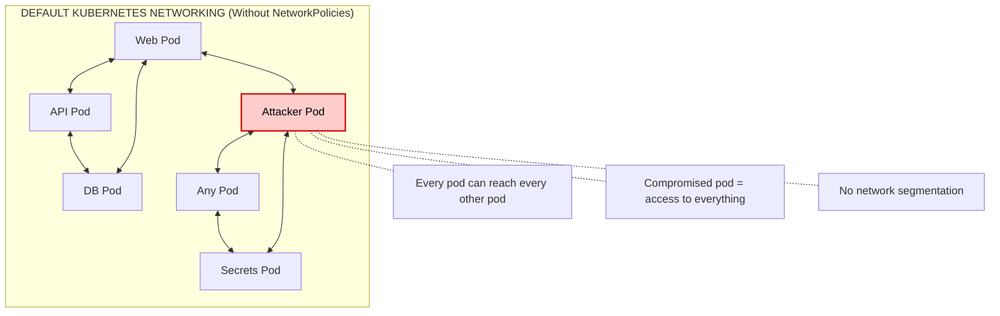
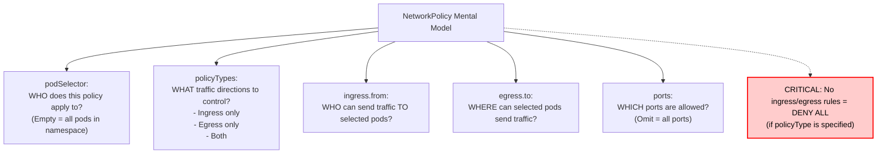
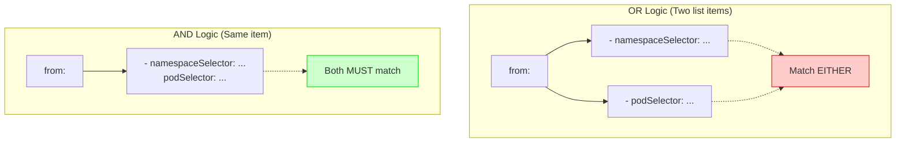

> **Складність**: `[СЕРЕДНЯ]` — основна навичка CKS
>
> **Час на проходження**: 45-50 хвилин
>
> **Передумови**: знання мережі на рівні CKA, базовий досвід роботи з NetworkPolicy

---

## Що ви зможете зробити

Після завершення цього модуля ви зможете:

1. **Спроєктувати** та **впровадити** мережеві політики для вхідного (ingress) та вихідного (egress) трафіку, які забезпечують комунікацію Pod'ів за принципом найменших привілеїв для складних мікросервісів у кластері Kubernetes v1.35+.
2. **Діагностувати** та **усувати** збої з'єднання, спричинені відсутніми, перекривними або надмірно обмежувальними політиками.
3. **Оцінити** архітектури за принципом default-deny та вибірково дозволяти потрібні потоки трафіку, зберігаючи при цьому суворі засади безпеки на основі моделі нульової довіри (zero-trust).
4. **Провести аудит** наявних мережевих політик, щоб виявити прогалини в безпеці, які дозволяють бічне переміщення (lateral movement), та ефективно їх усунути.

---

## Чому цей модуль важливий

Гіпотетичний сценарій: публічний вебсервіс у вашому кластері має ваду підробки запиту на боці сервера (server-side request forgery), і вразливий контейнер може відкривати довільні вихідні з'єднання. Якщо в просторі імен немає мережевих політик, зловмиснику не потрібно ламати мережу Kubernetes — він просто використовує її так, як вона задумана. Скомпрометований Pod може сканувати імена сервісів, перебирати поширені порти баз даних, дотягуватися до внутрішніх API та намагатися отримати доступ до сервісу метаданих хмари, доки інший засіб контролю не перекриє цей шлях.

Така форма атаки не є вигаданою, навіть якщо сам сценарій гіпотетичний. [Витік даних Capital One у 2019 році](/k8s/cks/part1-cluster-setup/module-1.4-node-metadata/) <!-- incident-xref: capital-one-2019 --> є добре відомим нагадуванням про те, що ендпоінти метаданих та надмірно широкий мережевий доступ можуть перетворити одне вразливе крайове робоче навантаження на шлях для викриття облікових даних. Мережеві політики не замінюють автентифікацію, ідентичність робочого навантаження, контроль допуску чи гігієну секретів, але вони дають вам практичний спосіб зробити мережу менш корисною для зловмисника після первинного проникнення.

У кластері Kubernetes v1.35+ нативний API NetworkPolicy дає вам модель брандмауера для трафіку Pod'ів, обмежену простором імен. Важливе тут слово — модель, оскільки API описує намір, тоді як плагін CNI виконує примусове застосування. Ваше завдання як кандидата на CKS і платформного інженера — перекласти потоки застосунку на селектори, напрямки та порти, а потім довести, що небажані потоки заблоковано, не зламавши при цьому випадково DNS, збирання метрик чи залежності сервісів.

Цей модуль формує цю навичку шарами. Спершу ви поміркуєте про типову пласку мережу Pod'ів, потім впровадите політики default-deny, додасте вузько окреслені дозволи для вхідного й вихідного трафіку, порівняєте логіку селекторів і навчитеся усувати збої за допомогою відтворюваних перевірок. Практична лабораторна робота використовує ту саму трирівневу схему, яка з'являється на іспитах і у виробничих оглядах: web може дотягнутися до API, API може дотягнутися до бази даних, а для всього іншого потрібна явна причина, перш ніж трафік буде дозволено.

---

## Типова проблема

Мережа Kubernetes починається з дружньої до розробника обіцянки: кожен Pod може дотягнутися до будь-якого іншого Pod'а без того, щоб NAT ставав на заваді. Це спрощує виявлення сервісів, поступові розгортання та планування між вузлами, бо команди застосунків можуть розглядати Pod'и як маршрутизовані вузли. Компроміс щодо безпеки полягає в тому, що свіжий простір імен поводиться радше як відкритий офісний простір, ніж як сегментований центр обробки даних, тож компрометація одного робочого навантаження часто дає негайну пряму видимість до навантажень, яким воно ніколи не мало довіряти.

Наведена нижче діаграма показує типовий стан мережі до того, як будь-яка NetworkPolicy вибере Pod. Читайте її як карту досяжності, а не як рекомендацію щодо архітектури застосунку, бо суть у тому, що Kubernetes ще не отримав жодної причини відрізняти довірені шляхи застосунку від випадкових чи ворожих.



Діаграма навмисно різка, бо типовий стан легко недооцінити. Межа простору імен — це адміністративна межа для імен об'єктів і обмеження RBAC; вона не є автоматично фільтром пакетів. Ім'я сервісу на кшталт `db.production.svc.cluster.local` може здаватися внутрішнім, але будь-який Pod, який може його розв'язати та маршрутизувати до базових ендпоінтів, може спробувати з'єднатися, доки якась політика, сервісна сітка (service mesh), брандмауер хоста чи засіб контролю застосунку не скаже інакше.

NetworkPolicy змінює цю засаду, створюючи ізоляцію для вибраних Pod'ів. Pod, для якого немає відповідної NetworkPolicy, залишається неізольованим у відповідному напрямку, тож він і далі дозволяє трафік за замовчуванням. Тієї миті, коли політика вибирає цей Pod для вхідного трафіку, приймається лише той вхідний трафік, який дозволено об'єднанням відповідних правил ingress. Той самий принцип застосовується незалежно до вихідного трафіку, а це означає, що безпеку вхідного й вихідного трафіку треба проєктувати як окремі питання.

Ця відмінність має значення під час аудитів, бо команди часто кажуть «у нас є default deny», коли насправді мають лише default deny для вхідного трафіку. Така політика захищає вибрані Pod'и від непрошених вхідних з'єднань, але вона не заважає тим самим Pod'ам викликати довільні внутрішні чи зовнішні призначення. Для запобігання бічному переміщенню, контролю витоку даних і захисту ендпоінтів метаданих політика вихідного трафіку заслуговує на таку саму увагу, як і вхідна.

Зупиніться й передбачте: якщо простір імен містить Pod'и `web`, `api` та `db`, і ви застосуєте лише політику default-deny для вхідного трафіку, які напрямки трафіку буде заблоковано, а які напрямки все ще залишаться можливими від скомпрометованого Pod'а `web`? Запишіть своє передбачення у дві колонки, перш ніж читати наступний розділ, бо ця звичка ловить чимало помилок у NetworkPolicy.

Практичний урок полягає в тому, що NetworkPolicy — це не перемикач «увімк/вимк» для простору імен. Це набір селекторів, які ізолюють відповідні Pod'и у вибраних напрямках, і набір правил-дозволів, які повертають назад схвалену комунікацію. Якщо Pod не вибрано або якщо напрямок не контролюється, Kubernetes не виводить ту засаду безпеки, яку ви мали на увазі, з імені політики.

---

## Основи NetworkPolicy

`NetworkPolicy` — це ресурс у групі API `networking.k8s.io/v1`. Він описує, які Pod'и вибрано, які напрямки трафіку контролюються, які вузли (peers) дозволено та які порти відкрито. Об'єкт обмежено простором імен, тож політика, створена в `production`, не може напряму вибрати Pod'и в `staging`, хоча її правила для вузлів можуть відповідати трафіку з інших просторів імен через `namespaceSelector`.

```yaml
apiVersion: networking.k8s.io/v1
kind: NetworkPolicy
metadata:
  name: example
  namespace: default
spec:
  # Which pods this policy applies to
  podSelector:
    matchLabels:
      app: web

  # Which directions to control
  policyTypes:
  - Ingress  # Incoming traffic
  - Egress   # Outgoing traffic

  # What's allowed IN
  ingress:
  - from:
    - podSelector:
        matchLabels:
          app: frontend
    ports:
    - port: 80

  # What's allowed OUT
  egress:
  - to:
    - podSelector:
        matchLabels:
          app: database
    ports:
    - port: 5432
```

Читайте маніфест зсередини назовні. Поле верхнього рівня `spec.podSelector` відповідає на питання «які локальні Pod'и підпадають під цю політику?». Поле `policyTypes` відповідає «які напрямки стають ізольованими?». Правила `ingress.from`, `egress.to` та `ports` відповідають «які пакети дозволено пропускати назад крізь стіну?». Якщо ви переставите цільовий селектор і селектор вузла, політика може бути валідним YAML, але захищатиме не те робоче навантаження.

Мережеві політики працюють на мережевих рівнях 3 і 4, тож нативний API може зіставляти вузли та порти, але не шляхи HTTP, твердження JWT, методи gRPC чи команди SQL. Правило може дозволити TCP-порт 8080 від `app: frontend` до `app: api`; воно не може дозволити лише `GET /healthz`, блокуючи `POST /admin`. Якщо вам потрібні рішення на рівні 7, ви маєте додати інший засіб контролю, як-от шлюз вхідного трафіку, політику сервісної сітки, авторизацію застосунку або розширення, специфічне для CNI.

Шлях примусового застосування також важливий. API-сервер Kubernetes зберігає політику, але kube-proxy її не застосовує, а API-сервер не відхиляє трафік. Примусове застосування реалізує плагін CNI, як-от Calico, Cilium чи інший провайдер, що підтримує NetworkPolicy. У кластерах, що використовують реалізацію мережі без примусового застосування політик, YAML може застосуватися без помилок, тоді як пакети й далі рухатимуться точно так само, як раніше.

Використовуйте цю ментальну модель, читаючи будь-яку NetworkPolicy під тиском іспиту. Вона тримає рішення про ціль, напрямок, вузол і порт окремо, що важливо, бо політика може бути синтаксично валідною й водночас неправильно відповідати на одне з цих питань.



Фраза «політики є адитивними» означає, що Kubernetes ніколи не віднімає правило-дозвіл за допомогою пізнішого правила-заборони в нативному API. Якщо дві політики вибирають той самий Pod для вхідного трафіку, дозволений вхідний трафік є об'єднанням обох політик. Це відрізняється від багатьох систем брандмауерів, де порядок правил має значення, і саме тому нативна NetworkPolicy не має явного оператора заборони; ви забороняєте, спершу ізолюючи, а потім дозволяючи лише те, що має проходити.

Перш ніж запускати це в реальному кластері, який результат ви очікуєте, якщо одна політика вибирає `app: api` для вхідного трафіку, а інша політика теж вибирає `app: api` й дозволяє трафік від `namespaceSelector: {}`? Правильне передбачення таке, що ширша політика перемагає як частина об'єднання — не тому, що вона має пріоритет, а тому, що всі відповідні дозволи комбінуються.

Ця адитивна модель створює корисну тактику аудиту. Коли трафік несподівано дозволено, не дивіться лише на політику, яку щойно написали. Перелічіть кожну політику в просторі імен, визначте, які з них вибирають цільовий Pod для вхідного трафіку або вихідний Pod для вихідного трафіку, а потім подумки об'єднайте відповідні правила. Вада часто полягає у другій політиці з ширшим селектором, мітці простору імен, яка відповідає надто широко, або у відсутньому базовому default-deny.

---

## Основні патерни

Найнадійніший спосіб проєктувати мережеві політики — починати із засади default-deny й додавати по одному цілеспрямованому шляху за раз. Спершу цей підхід здається повільнішим, але він дає вам чисту історію для аудиту: усе, що працює, має маніфест, який пояснює чому, а все, що не працює, можна простежити до відсутнього чи неправильного правила-дозволу. Він також не дає новим Pod'ам успадковувати широкий мережевий доступ лише тому, що їх ще ніхто не переглянув.

### Патерн 1: Заборонити все за замовчуванням (Default Deny All)

Наріжний патерн — це політика default-deny, яка вибирає всі Pod'и в просторі імен. Використовуйте порожній `podSelector: {}`, коли маєте на увазі кожен Pod у власному просторі імен політики. Порожній селектор — це не символ підстановки для всього кластера; його обмежено простором імен, названим у `metadata.namespace`, і саме тому команди часто застосовують цей патерн як частину початкового налаштування простору імен.

Використовуйте цей перший маніфест, коли хочете заблокувати вхідні з'єднання до кожного Pod'а в просторі імен, залишивши вихідний трафік незмінним. Це поширена відправна точка для робочих навантажень, спрямованих до вебу, де вам потрібно контролювати, хто може дотягнутися до сервісу, перш ніж ви почнете обмежувати власний вихідний трафік сервісу.

```yaml
# Deny all ingress traffic to namespace
apiVersion: networking.k8s.io/v1
kind: NetworkPolicy
metadata:
  name: default-deny-ingress
  namespace: secure
spec:
  podSelector: {}  # All pods
  policyTypes:
  - Ingress
  # No ingress rules = deny all ingress
```

Використовуйте другий маніфест, коли вихідний доступ — це ризик, який ви намагаєтеся зменшити, наприклад, щоб завадити скомпрометованим навантаженням сканувати внутрішні сервіси чи зв'язуватися із зовнішніми ендпоінтами. Він не захищає Pod'и від вхідних абонентів, тож поєднуйте його з ізоляцією вхідного трафіку, коли мають значення обидва напрямки.

```yaml
# Deny all egress traffic from namespace
apiVersion: networking.k8s.io/v1
kind: NetworkPolicy
metadata:
  name: default-deny-egress
  namespace: secure
spec:
  podSelector: {}
  policyTypes:
  - Egress
  # No egress rules = deny all egress
```

Використовуйте третій маніфест, коли простір імен має починати з повністю ізольованої засади й кожен схвалений шлях треба додавати навмисно. Це найсуворіший базовий стан і найлегший для аудиту, але він вимагає, щоб ви врахували DNS, телеметрію, синхронізацію часу й кожну реальну залежність застосунку.

```yaml
# Deny BOTH ingress and egress
apiVersion: networking.k8s.io/v1
kind: NetworkPolicy
metadata:
  name: default-deny-all
  namespace: secure
spec:
  podSelector: {}
  policyTypes:
  - Ingress
  - Egress
```

Зверніть увагу, що ці політики не містять масивів правил `ingress` чи `egress`. Ця відсутність і є суттю: щойно вибрані Pod'и ізольовано для напрямку, жоден трафік у цьому напрямку не дозволено, доки інша відповідна політика його не дозволить. Пояснюючи це товаришу по команді, я описую default deny як зачинення кожних внутрішніх дверей перед тим, як роздати позначені ключі для тих кількох шляхів, якими люди справді користуються.

### Патерн 2: Дозволити конкретний зв'язок Pod-до-Pod

Після ізоляції ви додаєте конкретний шлях сервісу. У цьому прикладі призначенням є набір Pod'ів API, а джерелом — набір Pod'ів frontend. Цільовий селектор живе в `spec.podSelector`; селектор джерела живе під `ingress.from`. Переставлення цих полів — поширена знахідка під час оглядів, бо політика все одно застосується, але контролюватиме іншу групу Pod'ів, ніж задумано.

```yaml
# Allow frontend pods to access api pods on port 8080
apiVersion: networking.k8s.io/v1
kind: NetworkPolicy
metadata:
  name: allow-frontend-to-api
  namespace: production
spec:
  podSelector:
    matchLabels:
      app: api
  policyTypes:
  - Ingress
  ingress:
  - from:
    - podSelector:
        matchLabels:
          app: frontend
    ports:
    - protocol: TCP
      port: 8080
```

Правило дозволяє лише TCP-порт 8080, тож той самий Pod frontend не отримує автоматично дозволу дотягуватися до кожного порту на Pod'і API. Якщо API надає метрики на другому порту, додайте окреме правило або другий запис порту, вирішивши, чи має те саме джерело такий доступ. Розглядайте порти як частину контракту, а не як деталь реалізації, яку залишають відкритою за замовчуванням.

### Патерн 3: Дозволити з простору імен

Селектори простору імен корисні, коли джерелом є адміністративна група, а не одна мітка застосунку. Моніторинг, контролери вхідного трафіку, агенти резервного копіювання та сканери безпеки часто живуть у власних просторах імен, тож дозвіл із простору імен може бути зрозумілішим, ніж копіювання міток Pod'ів у кожну політику. Компроміс полягає в тому, що мітки простору імен стають чутливими до безпеки даними, а надто широкий селектор простору імен може надати доступ до кожного Pod'а в цьому просторі імен.

```yaml
# Allow any pod from 'monitoring' namespace
apiVersion: networking.k8s.io/v1
kind: NetworkPolicy
metadata:
  name: allow-from-monitoring
  namespace: production
spec:
  podSelector:
    matchLabels:
      app: web
  policyTypes:
  - Ingress
  ingress:
  - from:
    - namespaceSelector:
        matchLabels:
          name: monitoring
```

У Kubernetes v1.35+ простори імен мають стабільну мітку `kubernetes.io/metadata.name`, але багато організацій все ще додають власні мітки, як-от `team`, `environment` чи `network-access`. Коли ви використовуєте власний селектор, перевірте мітки простору імен, перш ніж припускати, що політика відповідає. Політика, яка посилається на мітку, що її ніхто не встановив, не є суворою в корисний спосіб; вона просто несправна й може спонукати когось пізніше додати ширше аварійне правило.

### Патерн 4: Дозволити до зовнішнього CIDR

Політика вихідного трафіку стає практичною, коли Pod'у потрібен невеликий набір зовнішніх призначень. Нативний API підтримує правила `ipBlock`, зокрема список `except`, що дає змогу описувати призначення на основі CIDR. Це доречно для стабільних зовнішніх діапазонів, приватних ендпоінтів сервісів чи широких патернів «дозволити з винятками», але погано підходить для SaaS-призначень, IP-адреси яких часто змінюються, якщо тільки ваша організація не підтримує схвалений шлюз вихідного трафіку.

```yaml
# Allow egress to specific IP range
apiVersion: networking.k8s.io/v1
kind: NetworkPolicy
metadata:
  name: allow-external-api
  namespace: production
spec:
  podSelector:
    matchLabels:
      app: backend
  policyTypes:
  - Egress
  egress:
  - to:
    - ipBlock:
        cidr: 10.0.0.0/8
        except:
        - 10.0.1.0/24  # Except this subnet
    ports:
    - port: 443
```

Правила `ipBlock` оцінюють адресу джерела чи призначення, яку CNI бачить під час примусового застосування. Якщо трафік уже пройшов через проксі, NAT-шлюз, контролер вхідного трафіку чи точку перенаправлення на рівні вузла, початкова адреса клієнта може не збігатися з адресою, яку бачить політика. Саме тому політику CIDR слід тестувати на реальному шляху трафіку, а не лише переглядати як статичний об'єкт YAML.

Що сталося б, якби ви створили політику default-deny-egress, але забули додати правило-дозвіл для DNS, а потім розгорнули застосунок, який з'єднується з `postgres.database.svc.cluster.local`? Застосунок може повідомити про збій з'єднання з базою даних, навіть якщо справжній збій відбувається раніше — під час розв'язання імені, і саме тому DNS слід явно тестувати щоразу, коли ви обмежуєте вихідний трафік.

### Патерн 5: Дозволити DNS (критично важливо)

DNS — це виняток для вихідного трафіку, потрібний майже кожному суворому простору імен. Більшість застосунків Kubernetes не з'єднуються з сирими IP-адресами; вони з'єднуються із сервісами, зовнішніми іменами хостів чи іменами для виявлення, які спершу потребують CoreDNS. Якщо ви ізолюєте вихідний трафік, не дозволивши UDP- й TCP-порт 53 до Pod'ів DNS, помилки застосунку часто виглядають як збої бази даних, HTTP чи TLS, бо код ніколи не доходить до цільового сервісу.

```yaml
# Allow DNS - ALWAYS needed for egress policies
apiVersion: networking.k8s.io/v1
kind: NetworkPolicy
metadata:
  name: allow-dns
  namespace: production
spec:
  podSelector: {}
  policyTypes:
  - Egress
  egress:
  - to:
    - namespaceSelector: {}
      podSelector:
        matchLabels:
          k8s-app: kube-dns
    ports:
    - port: 53
      protocol: UDP
    - port: 53
      protocol: TCP
```

У прикладі використано широкий селектор простору імен плюс мітку Pod'а DNS, що читабельно, але залежить від міток, які ваш кластер застосовує до CoreDNS. Деякі кластери позначають простір імен і Pod'и інакше, а керовані сервіси можуть відрізнятися. Виробничу політику слід писати на основі спостережених міток за допомогою `kubectl get namespace kube-system --show-labels` та `kubectl get pods -n kube-system --show-labels`, а не копіювати механічно зі зразка.

---

## Комбінування селекторів

Найнебезпечніша помилка YAML у NetworkPolicy — це не сам відступ; це межа елемента списку під `from` чи `to`. Окремі елементи списку оцінюються як альтернативи, тоді як кілька селекторів усередині одного елемента списку оцінюються разом. Цей єдиний дефіс може змінити правило з «Pod'и з цією міткою всередині того простору імен» на «Pod'и з цією міткою будь-де, або будь-що з того простору імен».

```yaml
# OR: Allow from EITHER namespace OR pods with label
ingress:
- from:
  - namespaceSelector:
      matchLabels:
        env: prod
  - podSelector:
      matchLabels:
        role: frontend

# AND: Allow from pods with label IN namespace with label
ingress:
- from:
  - namespaceSelector:
      matchLabels:
        env: prod
    podSelector:
      matchLabels:
        role: frontend
```

Перше правило має два записи вузлів, тож джерело може відповідати будь-якому з них. Pod із `role: frontend` у тому самому просторі імен, що й політика, може відповідати селектору Pod'а, а будь-який Pod у просторі імен, позначеному `env: prod`, може відповідати селектору простору імен. Друге правило має один запис вузла з обома селекторами, тож джерело має бути Pod'ом frontend і також має бути в просторі імен, позначеному `env: prod`.



Це те місце, де іспит CKS часто стискає кілька концепцій в один короткий маніфест. Ви можете побачити цільовий селектор Pod'а, який виглядає правильним, порт, який виглядає правильним, і селектор простору імен, який виглядає правильним, але структура списку робить політику надто дозвільною. Сповільніться й читайте кожен дефіс як новий варіант вузла. Якщо дві умови мають бути істинними одночасно, вони належать до одного запису вузла.

Зупиніться й подумайте: ви застосовуєте політику default-deny-ingress до простору імен, а потім створюєте правило-дозвіл для `app: frontend`, щоб дотягнутися до `app: api`. Новий Pod, позначений `app: debug`, усе ще може дотягнутися до `app: api`. Яка інша політика могла б пояснити цей результат, і як змінилася б відповідь, якби Pod debug працював у просторі імен із широкою міткою моніторингу?

Логіка селекторів також має типове правило для простору імен, яке дивує людей. Голий `podSelector` під `ingress.from` вибирає Pod'и в тому самому просторі імен, що й політика, а не Pod'и будь-де в кластері. Щоб зіставити Pod'и в іншому просторі імен, поєднайте його з `namespaceSelector`. Це означає, що міжпросторові правила мають бути явними щодо як межі простору імен, так і ідентичності Pod'а, якщо тільки бажане джерело справді не є кожним Pod'ом у вибраному просторі імен.

Для аудитів побудуйте невелику матрицю, перш ніж редагувати YAML. Розмістіть призначення в рядках, схвалені джерела в колонках і запишіть точні мітки, які доводять ідентичність кожного джерела. Якщо клітинка матриці каже «простір імен monitoring та Pod'и Prometheus», YAML має містити обидва селектори в одному записі вузла. Якщо клітинка каже «будь-який Pod у просторі імен monitoring», тоді селектор простору імен сам по собі може бути правильним, але це ширше рішення щодо довіри.

---

## Реальні екзаменаційні сценарії та робочий процес налагодження

Іспит рідко просить вас написати політику у відриві від історії. Зазвичай вам дають форму робочого навантаження, симптом збою чи наявний маніфест, який майже правильний. Наведені нижче сценарії зберігають оригінальні приклади модуля, але подають їх як послідовність налагодження: визначте актив, вирішіть, який напрямок має значення, напишіть вузький дозвіл, а потім доведіть як дозволені, так і заборонені шляхи.

### Сценарій 1: Ізолювати базу даних

Бази даних є цінними цілями, бо вони зберігають стан застосунку й часто мають мережеві шляхи до резервних копій, реплік чи адміністративного інструментарію. Ця політика змушує базу даних приймати трафік лише від рівня API на порту 5432, а також не дає Pod'ам бази даних ініціювати вихідний трафік. Порожній список egress має значення, бо скомпрометований процес бази даних не повинен мати змоги завантажити інструментарій чи витягти дані лише тому, що вхідний трафік заблоковано.

```yaml
# Only API pods can reach database on port 5432
apiVersion: networking.k8s.io/v1
kind: NetworkPolicy
metadata:
  name: db-isolation
  namespace: production
spec:
  podSelector:
    matchLabels:
      app: database
  policyTypes:
  - Ingress
  - Egress
  ingress:
  - from:
    - podSelector:
        matchLabels:
          app: api
    ports:
    - port: 5432
  egress: []  # No egress allowed
```

Цікава деталь полягає в тому, що ізоляція вхідного й вихідного трафіку є незалежними. Правило ingress каже, хто може дотягнутися до бази даних. Порожній масив egress каже, що база даних не може ініціювати вихідний трафік, зокрема DNS, доки інша політика egress також не вибере базу даних і не дозволить це. Можливо, саме цього ви й хочете для бази даних, але це було б поганим типовим значенням для Pod'а застосунку, який має викликати зовнішні API.

### Сценарій 2: Багаторівневий застосунок

Класичний трирівневий застосунок потребує ланцюжкових політик, бо кожен рівень має різні відносини довіри. Вебрівень має бути досяжним від контролера вхідного трафіку, рівень API має бути досяжним від вебрівня, а рівень бази даних має бути досяжним від рівня API. Якщо вебрівень скомпрометовано, зловмисник не повинен мати змоги пропустити API й з'єднатися напряму з базою даних лише тому, що обидва Pod'и спільно використовують один простір імен.

### Політика 1: Вебрівень

```yaml
# Web tier: only from ingress controller
apiVersion: networking.k8s.io/v1
kind: NetworkPolicy
metadata:
  name: web-policy
  namespace: app
spec:
  podSelector:
    matchLabels:
      tier: web
  policyTypes:
  - Ingress
  ingress:
  - from:
    - namespaceSelector:
        matchLabels:
          name: ingress-nginx
    ports:
    - port: 80
```

Ця політика вебрівня зрозуміла, але навмисно широка всередині простору імен вхідного трафіку. Вона дозволяє будь-який Pod у просторі імен, позначеному `name: ingress-nginx`, а не лише розгортання контролера вхідного трафіку. У продакшені ви могли б додати ще й селектор Pod'а для мітки контролера, бо членство в просторі імен саме по собі не завжди є достатньою межею ідентичності для спільних платформних просторів імен.

### Політика 2: Рівень API

```yaml
# API tier: only from web tier
apiVersion: networking.k8s.io/v1
kind: NetworkPolicy
metadata:
  name: api-policy
  namespace: app
spec:
  podSelector:
    matchLabels:
      tier: api
  policyTypes:
  - Ingress
  ingress:
  - from:
    - podSelector:
        matchLabels:
          tier: web
    ports:
    - port: 8080
```

Правило API використовує селектор Pod'а в межах того самого простору імен, що відповідає поширеній схемі, де Pod'и web і API живуть разом у просторі імен `app`. Якби вебрівень перемістився до іншого простору імен, це правило перестало б відповідати, доки ви не додали б селектор простору імен. Цей збій виглядав би як тайм-аут мережі, а не помилка валідації Kubernetes, бо маніфест залишався б синтаксично валідним.

### Політика 3: Рівень БД

```yaml
# DB tier: only from API tier
apiVersion: networking.k8s.io/v1
kind: NetworkPolicy
metadata:
  name: db-policy
  namespace: app
spec:
  podSelector:
    matchLabels:
      tier: db
  policyTypes:
  - Ingress
  ingress:
  - from:
    - podSelector:
        matchLabels:
          tier: api
    ports:
    - port: 5432
```

Зупиніться й передбачте: у багаторівневій політиці вище вебрівень дозволяє вхідний трафік із простору імен `ingress-nginx`. Якщо зловмисник скомпрометує Pod у цьому просторі імен, який не є контролером вхідного трафіку, чи отримає він доступ до вебрівня? Ваша відповідь має згадати мітки простору імен, мітки Pod'а та те, чи використовує політика один селектор, чи обидва.

### Сценарій 3: Заблокувати сервіс метаданих

Ендпоінти метаданих хмари заслуговують на окрему увагу, бо вони часто розташовані за link-local-адресою, до якої звичайний код застосунку не повинен потребувати доступу. Блокування `169.254.169.254/32` через виняток egress допомагає зменшити радіус ураження (blast radius) від ваду SSRF та виконання команд. Ця політика не доводить, що робоче навантаження не має шляху до облікових даних, але вона прибирає поширений мережевий маршрут до сервісів метаданих.

```yaml
# Block access to cloud metadata (169.254.169.254)
apiVersion: networking.k8s.io/v1
kind: NetworkPolicy
metadata:
  name: block-metadata
  namespace: default
spec:
  podSelector: {}
  policyTypes:
  - Egress
  egress:
  - to:
    - ipBlock:
        cidr: 0.0.0.0/0
        except:
        - 169.254.169.254/32
```

Будьте обережні з широкими правилами egress `0.0.0.0/0`. Вони можуть бути корисними як перехідний крок, коли безпосередня мета — лише заблокувати метадані, але вони все одно дозволяють майже кожне інше призначення. Зрілий дизайн зазвичай спрямовує вихідний доступ до інтернету через контрольований шлях вихідного трафіку, використовує ідентичність робочого навантаження замість метаданих вузла там, де це можливо, і звужує зовнішні призначення, коли контракт застосунку достатньо стабільний.

Коли трафік дає збій, дотримуйтеся діагностичного порядку замість того, щоб гадати. Спершу переконайтеся, що мітки цільового Pod'а відповідають `spec.podSelector`. Потім перелічіть кожну політику в просторі імен і визначте, які політики вибирають ціль для вхідного трафіку чи джерело для вихідного. Після цього протестуйте DNS окремо від досяжності TCP, бо збій розв'язання імен може змусити валідне правило-дозвіл виглядати несправним.

```bash
# List policies in namespace
kubectl get networkpolicies -n production

# Describe policy details
kubectl describe networkpolicy db-isolation -n production

# Check if CNI supports NetworkPolicies
# (Calico, Cilium, Weave support them; Flannel doesn't!)
kubectl get pods -n kube-system | grep -E "calico|cilium|weave"

# Test connectivity
kubectl exec -it frontend-pod -- nc -zv api-pod 8080
kubectl exec -it frontend-pod -- curl -s api-pod:8080

# Check pod labels (policies match on labels!)
kubectl get pod -n production --show-labels
```

Ці команди не є повним виробничим посібником, але вони є мінімальним екзаменаційним циклом. `kubectl describe` показує, які селектори й порти API зберіг. `kubectl get pod --show-labels` виявляє, чи відповідає ваша ментальна модель фактичним об'єктам. Тест досяжності із потрібного Pod'а-джерела потім відокремлює логіку політики від готовності застосунку, іменування сервісів і невідповідності портів.

---

## Аудит наявних політик

Аудит мережевих політик відрізняється від написання нової політики, бо ви успадковуєте чужі мітки, звички іменування та винятки. Почніть з інвентаризації Pod'ів, сервісів, просторів імен і політик разом, а потім класифікуйте кожну політику за набором цільових Pod'ів і контрольованим напрямком. Ця класифікація має значення, бо політика з іменем `deny-all` може вибирати лише один застосунок, тоді як політика з іменем `allow-monitoring` може випадково дозволити цілий платформний простір імен.

Перше питання аудиту — чи ізольовано кожен чутливий Pod для вхідного трафіку, вихідного чи обох. Pod бази даних без відповідної політики ingress усе ще відкритий для простору імен і кластера згідно з типовою моделлю. Виконавець завдань (job runner) без відповідної політики egress усе ще може дотягнутися до внутрішніх сервісів і зовнішніх ендпоінтів. Не виводьте ізоляцію з імен просторів імен, імен команд чи наміру політики; виводьте її лише із селекторів, які справді відповідають Pod'ам.

Друге питання — чи відображає кожне правило-дозвіл реальну залежність застосунку. Якщо API-серверу потрібен PostgreSQL на порту 5432, політика має назвати джерело API, призначення-базу даних і цей порт. Якщо правило пропускає порти, дозволяє цілий простір імен чи використовує `0.0.0.0/0`, запитайте, чи ця широта є навмисним контрактом, чи скороченням, створеним під час збою. Відповідь змінює те, чи зберігаєте ви, звужуєте чи замінюєте правило.

Третє питання — хто контролює мітки, що надають доступ. `namespaceSelector` настільки ж сильний, наскільки сильний процес, який призначає мітки простору імен, а `podSelector` настільки ж сильний, наскільки сильні право власності на розгортання й контроль допуску. Якщо будь-яка команда може позначити простір імен `network-access=trusted`, ця мітка не є межею безпеки. Тому аудити політик мають включати керування мітками, а не лише синтаксис маніфесту.

Огляд вихідного трафіку заслуговує на власний прохід, бо він викриває приховані залежності. DNS, метрики, трейсинг, дзеркала пакетів, об'єктне сховище й хмарні API можуть з'явитися лише тоді, коли трафік заблоковано. Замість того, щоб відкривати широкий вихідний трафік після першого збою, запишіть призначення, яке дає збій, вирішіть, чи є воно законною залежністю, а потім додайте найвужче правило, яке його задовольняє. Ця послідовність перетворює налагодження на документацію.

Тестування має включати як позитивні, так і негативні проби. Успішне з'єднання `web` із `api` доводить, що потрібний шлях працює, але воно не доводить, що `web` не може дотягнутися до `db`. Заборонену пробу слід вибирати навмисно з моделі загроз, наприклад Pod frontend, що пробує порт бази даних, чи робоче навантаження, що намагається дістатися ендпоінта метаданих. Зберігайте ці проби разом зі зміною політики, щоб майбутні рецензенти могли повторити докази.

Нативний Kubernetes не стандартизує логи вердиктів політик, тож глибина аудиту залежить від CNI. Cilium, Calico й керовані хмарні CNI надають різні команди для усунення збоїв, логи потоків та звіти про політики. Розглядайте ці інструменти як допоміжні докази, а не як заміну розумінню об'єкта API. Якщо маніфест надто широкий, гарний лог потоку лише підтверджує, що широке правило використовується.

Нарешті, проводьте аудит малими змінами. Заміна всього набору політик простору імен в одному коміті ускладнює визначення того, яке правило зламало DNS, метрики чи зворотний виклик застосунку. Безпечніша послідовність — додати default deny в тестовій копії, ввести один шлях-дозвіл, перевірити очікуваний успіх і збій, а потім повторити. Цей робочий процес повільніший за вставлення великого маніфесту, але він дає вам точки відкату й чітку історію оглядів.

Результатом аудиту має бути коротке твердження про досяжність, а не просто купа YAML. Наприклад: «`tier=web` може дотягнутися до `tier=api` на TCP 8080; `tier=api` може дотягнутися до `tier=db` на TCP 5432; усі рівні можуть дотягнутися до CoreDNS на TCP та UDP 53; пряме з'єднання `web` із `db` заборонено». Якщо твердження й політики суперечать одне одному, виправте політики чи скоригуйте твердження, перш ніж огляд буде завершено.

---

## Патерни та антипатерни

Корисні патерни — це не просто фрагменти YAML; це робочі звички, які тримають огляд політик керованим у міру зростання просторів імен. Default deny при ініціалізації простору імен дає кожному новому робочому навантаженню безпечну відправну засаду. Невеликі політики-дозволи, названі за шляхом трафіку, роблять право власності помітним. Перевірки селекторів до й після застосування запобігають тихим невідповідностям. Разом ці звички дають змогу командам міркувати про засаду мережі, не читаючи один гігантський маніфест, який намагається закодувати весь застосунок.

| Патерн | Коли використовувати | Чому це працює | Міркування щодо масштабування |
|---------|----------------|--------------|-----------------------|
| Default deny простору імен | Новий простір імен застосунку, регульоване навантаження, спільний кластер | Нові Pod'и стартують ізольованими, доки не додано перевірені шляхи | Автоматизуйте це в шаблонах простору імен, щоб команди не забували |
| Політика-дозвіл для конкретного шляху | Один сервіс має дотягнутися до одного призначення на відомому порту | Рецензенти можуть зіставити ім'я політики із залежністю застосунку | Тримайте мітки стабільними й керованими маніфестами розгортання |
| Виняток egress для DNS | Будь-який простір імен з ізоляцією egress та залежностями на основі імен | Виявлення сервісів і далі працює, тоді як інший egress залишається обмеженим | Перевіряйте мітки CoreDNS на кожному різновиді кластера, перш ніж створювати шаблон |
| Селектор простору імен плюс Pod'а | Міжпросторовий трафік від відомого контролера чи сервісу | І адміністративна межа, і ідентичність навантаження мають збігатися | Вимагайте мітки простору імен через платформну автоматизацію |

Відповідний антипатерн — це ставлення до NetworkPolicy як до декоративного доказу відповідності. Політика, яка існує, але не вибирає жодного Pod'а, нічого не змінює. Політика, яка вибирає правильні Pod'и, але дозволяє цілий простір імен, може бути надто широкою для багатоорендного платформного простору імен. Політика, яка блокує вхідний трафік, залишаючи вихідний відкритим, може задовольнити вузький контрольний список, усе ще дозволяючи витік даних зі скомпрометованого робочого навантаження.

| Антипатерн | Що йде не так | Краща альтернатива |
|--------------|-----------------|--------------------|
| Імена політик заявляють deny-all, але селектори відповідають лише одному застосунку | Нові чи непозначені Pod'и залишаються неізольованими | Використовуйте `podSelector: {}` для базових засад простору імен, потім додавайте дозволи для конкретних застосунків |
| Окремі записи `namespaceSelector` та `podSelector`, коли потрібні обидва | Правило стає логікою OR і дозволяє надто багато джерел | Розмістіть обидва селектори в одному записі вузла для логіки AND |
| Копіювання політики DNS без перевірки міток | DNS залишається заблокованим, бо мітки CoreDNS відрізняються | Перевіряйте мітки простору імен і Pod'а, перш ніж писати правило-дозвіл |
| Покладання лише на правила CIDR за проксі чи NAT | CNI може бачити адресу проксі замість початкового вузла | Тестуйте з реального шляху або застосовуйте на рівні шлюзу вихідного трафіку |

Використовуйте ці таблиці як контрольні списки для огляду, а не як заміну дизайну. Хороша політика відповідає на чотири конкретні питання: які Pod'и ізольовано, який напрямок контролюється, яку ідентичність вузла дозволено та який порт є частиною контракту застосунку. Якщо рецензент не може відповісти на ці питання з маніфесту й міток, політика не готова, навіть якщо вона застосовується без помилки API.

---

## Рамка ухвалення рішень

Коли ви проєктуєте політику під тиском часу, обирайте найвужчий селектор, який усе ще відповідає реальній операційній межі. Мітки Pod'а зазвичай найкращі для потоків застосунок-до-застосунку всередині одного простору імен. Мітки простору імен корисні для платформних просторів імен, як-от вхідний трафік чи моніторинг. Правила CIDR корисні для зовнішніх мереж, але вони потребують додаткового скептицизму щодо NAT, проксі, метаданих хмари та змінних діапазонів адрес SaaS.

| Точка рішення | Надавайте перевагу цьому | Коли підходить | На що зважати |
|----------------|-------------|--------------|-----------|
| Виклик сервісу в межах одного простору імен | `podSelector` | Web до API, API до БД, worker до черги | Мітки джерела й призначення мають бути стабільними |
| Міжпросторовий виклик сервісу | `namespaceSelector` плюс `podSelector` | Контролер вхідного трафіку, збирач моніторингу, спільний шлюз | Окремі елементи списку створюють логіку OR |
| Зовнішнє призначення | `ipBlock` | Приватний ендпоінт, фіксований CIDR, блокування метаданих | NAT і змінні діапазони IP можуть скасувати припущення |
| Блокування вихідного трафіку | Default-deny egress плюс дозвіл DNS | Чутливі навантаження, регульовані простори імен | Застосункам можуть знадобитися явні шляхи для часу, телеметрії та API |

Цей процес достатньо простий, щоб запам'ятати. Почніть із питання, чи захищаєте ви вхідний трафік до Pod'а, чи вихідний трафік від Pod'а. Для вхідного трафіку цільовий селектор Pod'а — це актив, який ви захищаєте; для вихідного селектор Pod'а-джерела — це робоче навантаження, чий вихідний доступ ви обмежуєте. Потім вирішіть, чи є вузлом ідентичність Pod'а, межа простору імен чи діапазон IP.

Якщо ви не впевнені, який селектор використати, накидайте дозволений шлях як речення: «Pod'и з міткою `tier=web` у просторі імен `app` можуть дотягнутися до Pod'ів з міткою `tier=api` у просторі імен `app` на TCP 8080». Кожне іменникове словосполучення в цьому реченні має з'явитися як селектор чи простір імен у маніфесті, а кожне дієслівне словосполучення має відображатися на вхідний чи вихідний трафік. Це запобігає поширеній помилці написання політики, яка описує джерело там, де має бути ціль.

Для виробничого розгортання впроваджуйте зміни політик зі спостережуваністю. Спершу застосуйте default deny в тестовому просторі імен, перевірте очікувані збої, потім додайте політики-дозволи й перевірте очікувані успіхи. Якщо ваш CNI пропонує логи потоків чи вердикти політик, використовуйте їх під час розгортання. Нативний Kubernetes не надає універсальної команди «чому цей пакет було заборонено?», тож ваш досвід налагодження сильно залежить від інструментарію CNI та дисциплінованих міток.

---

## Чи знали ви?

- **Мережеві політики є адитивними в Kubernetes v1.35+.** Нативна NetworkPolicy все ще не має явного правила-заборони; ізоляція плюс об'єднання відповідних правил-дозволів — це вся модель, тож порядок правил не врятує вас від надто широкої другої політики.
- **Pod без відповідної політики залишається allow-all для цього напрямку.** Ізоляція вхідного й вихідного трафіку є незалежними, а це означає, що default deny для вхідного трафіку автоматично не обмежує вихідні виклики з того самого Pod'а.
- **DNS зазвичай потребує і UDP-, і TCP-порту 53.** UDP поширений для звичайних запитів, але TCP використовується для більших відповідей і резервної поведінки, тож суворі політики egress мають дозволяти обидва протоколи до CoreDNS, коли потрібне розв'язання імен.
- **Cilium виходить за межі нативної NetworkPolicy.** Cilium підтримує стандартну NetworkPolicy Kubernetes і власні ресурси `CiliumNetworkPolicy`; прозоре шифрування Pod-до-Pod можна увімкнути через налаштування на рівні кластера, як-от WireGuard чи IPsec:

```yaml
# Enable Cilium transparent encryption (cluster-level)
# In Cilium Helm values or ConfigMap:
encryption:
  enabled: true
  type: wireguard  # or ipsec
```

---

## Типові помилки

| Помилка | Чому вона трапляється | Як її виправити |
|---------|----------------|---------------|
| Забування про egress для DNS | Автор політики зосереджується на кінцевому призначенні — базі даних чи API — і забуває, що розв'язання імен відбувається першим | Дозвольте UDP- й TCP-порт 53 до фактичних Pod'ів CoreDNS, використовуючи спостережені мітки |
| Переставлення цільового селектора й селектора джерела | `podSelector` та `ingress.from.podSelector` обидва виглядають як поля ідентичності Pod'а | Читайте `spec.podSelector` як набір захищених Pod'ів, а `from` чи `to` — як набір вузлів |
| Розбиття селекторів на окремі елементи списку | Дефіси YAML легко сприймати як візуальний відступ, а не межу логіки | Розмістіть `namespaceSelector` та `podSelector` в одному записі вузла, коли обидва мають збігатися |
| Припущення, що імена просторів імен є мітками | Селектор відповідає міткам, а не іменам об'єктів, і власні мітки можуть бути відсутні | Перевіряйте `kubectl get namespace --show-labels` і позначайте простори імен навмисно |
| Використання CNI без примусового застосування політик | API приймає об'єкти NetworkPolicy, навіть коли площина даних їх не застосовує | Переконайтеся, що мережевий плагін кластера підтримує й вмикає NetworkPolicy |
| Відкриття всіх портів через пропуск `ports` | Автор тестує один порт сервісу й забуває, що правило дозволяє кожен порт для вузла | Додайте явні порти й протоколи, які відповідають контракту застосунку |
| Довіра до правил CIDR через NAT | Політика може бачити адресу проксі чи вузла замість початкового джерела | Перевіряйте трафік із реального шляху й застосовуйте початкову ідентичність на правильному рівні |
| Аудит лише найновішої політики | Нативні політики є адитивними, тож старіші широкі дозволи й далі діють | Перелічіть усі політики, що вибирають ті самі Pod'и, й об'єднайте дозволені вузли під час огляду |

---

## Тест

Оцініть своє розуміння, перш ніж переходити до практичної лабораторної роботи. Кожне питання базується на сценарії, бо реальна робота з NetworkPolicy зазвичай є завданням діагностики, а не завданням на знання термінів.

<details>
<summary>Питання 1: Аудит безпеки виявляє, що ваш простір імен production має політику default-deny-ingress, але Pod API все ще отримує трафік від Pod'ів у `kube-system`. Що ви перевірите першим?</summary>

Почніть із переліку кожної NetworkPolicy у просторі імен production і перевірте, які з них вибирають Pod API для вхідного трафіку. Нативні політики є адитивними, тож друга політика, яка дозволяє трафік `kube-system`, може знову відкрити шлях, навіть коли політика default-deny також відповідає. Вам також варто перевірити примусове застосування CNI, але найшвидша логічна перевірка — це об'єднання політик, що вибирають Pod призначення. Якщо жодна політика не пояснює дозвіл, тоді переходьте до поведінки, специфічної для площини даних, і точної адреси джерела, яку бачить Pod.
</details>

<details>
<summary>Питання 2: Ви дозволяєте простору імен `monitoring` збирати метрики за допомогою `namespaceSelector: {matchLabels: {name: monitoring}}`, але Prometheus усе одно отримує тайм-аут. Що ймовірно змінилося між вашим припущенням і станом кластера?</summary>

Простір імен може не мати мітки `name: monitoring`, навіть якщо ім'я його об'єкта — `monitoring`. Селектори відповідають міткам, тож політика може бути валідною, не відповідаючи жодному простору імен-джерелу. Перевірте за допомогою `kubectl get namespace monitoring --show-labels`, а потім або додайте потрібну мітку, або використайте стабільну мітку, яка вже присутня у вашому кластері. Також підтвердіть селектор Pod'а призначення й порт метрик, бо правильний селектор простору імен не компенсує неправильної цілі.
</details>

<details>
<summary>Питання 3: Тестувальник створює непозначений Pod у просторі імен production і все одно може зробити curl до бази даних, хоча ви мали намір дозволити лише `app: api`. Яку помилку структури YAML ви запідозрите?</summary>

Запідозріть окремі записи вузлів, що перетворили задуману логіку AND на логіку OR. Якщо правило має один елемент для `podSelector: app: api` та інший елемент для широкого `namespaceSelector`, тестувальник може відповідати шляху простору імен навіть без мітки API. Виправлення — розмістити селектор простору імен і селектор Pod'а під одним елементом `from`, коли обидві умови мають бути істинними. Вам також слід підтвердити, що політика вибирає Pod бази даних, бо захист неправильної цілі створює подібний симптом.
</details>

<details>
<summary>Питання 4: Вам треба діагностувати збій з'єднання, спричинений відсутнім egress для DNS після застосування default-deny egress. Застосунок може з'єднатися із зовнішньою IP-адресою, але дає збій при використанні `api.example.com`; у чому корінна причина?</summary>

Політика egress, імовірно, дозволяє кінцеве зовнішнє призначення, але не DNS-трафік до CoreDNS. З'єднанням на основі імен хостів потрібен DNS-пошук, перш ніж може початися будь-яке TCP-з'єднання з API. Додайте правило egress для UDP- й TCP-порту 53 до Pod'ів DNS, використовуючи мітки вашого кластера, потім повторно протестуйте розв'язання імен і з'єднання застосунку окремо. Це проблема дизайну політики, а не проблема повторних спроб застосунку.
</details>

<details>
<summary>Питання 5: Ви встановлюєте `policyTypes: [Egress]` та `egress: []` для Pod'ів бази даних. Чи заблокує це комунікацію між контейнерами в одному Pod'і через `localhost`, і чому?</summary>

Ні. NetworkPolicy керує трафіком, що перетинає межу мережі Pod'а, як її застосовує CNI, а не трафіком loopback у межах простору імен мережі того самого Pod'а. Контейнери в одному Pod'і все ще можуть спілкуватися через `127.0.0.1`, бо цей трафік ніколи не стає трафіком Pod-до-Pod. Політика egress усе одно корисна, бо вона блокує Pod бази даних від ініціювання мережевих з'єднань з іншими Pod'ами чи зовнішніми адресами.
</details>

<details>
<summary>Питання 6: Політика дозволяє `10.0.0.0/8`, окрім `10.0.1.0/24`, але запити з адреси всередині виключеної підмережі все одно, схоже, доходять до застосунку. Яка деталь шляху могла б це пояснити?</summary>

Проксі, контролер вхідного трафіку, балансувальник навантаження чи пристрій NAT може змінювати адресу джерела, перш ніж пакет досягне точки примусового застосування. Зіставлення `ipBlock` використовує IP, який спостерігає CNI, а не заголовок застосунку, як-от `X-Forwarded-For`. Перевірте реальну адресу джерела на Pod'і або скористайтеся інструментарієм потоків CNI, якщо він доступний. Якщо початкова підмережа клієнта має значення, застосовуйте це рішення на рівні, який усе ще бачить початкову адресу.
</details>

---

## Практична вправа

У цій вправі ви захистите трирівневий застосунок з іменами `web`, `api` та `db`, написавши й налагодивши мережеві політики. Лабораторна робота навмисно використовує прості Pod'и, щоб мережеву поведінку було легше спостерігати, ніж поведінку застосунку. Ваша мета — змусити задуманий шлях працювати, змусити прямий шлях web-до-бази-даних дати збій і виправити зламану політику, міркуючи про цільові селектори й селектори джерела.

### Налаштування

Виконайте наведені нижче команди, щоб створити середовище:

```bash
kubectl create namespace exercise
kubectl label namespace exercise name=exercise

kubectl run web --image=curlimages/curl -n exercise --labels="tier=web" --command -- sleep 3600
kubectl run api --image=nginx -n exercise --labels="tier=api" --expose --port=80
kubectl run api-client --image=curlimages/curl -n exercise --labels="tier=api" --command -- sleep 3600
kubectl run db --image=nginx -n exercise --labels="tier=db" --expose --port=80

kubectl wait --for=condition=Ready pod --all -n exercise
```

Pod'и `api` та `db` працюють на nginx і створюються з `--expose`, тож їхні імена розв'язуються через DNS кластера, а порт 80 приймає HTTP-з'єднання. Pod'и `web`, `api-client` та `metrics` залишаються клієнтами curl, які лише ініціюють з'єднання. Використовуйте `api-client`, коли вам треба протестувати вихідний трафік із набору міток `tier=api`, бо nginx-Pod `api` слухає, а не виконує curl.

Перш ніж застосовувати будь-яку політику, протестуйте кілька шляхів, щоб мати базовий стан. У більшості кластерів `web` може дотягнутися до `api`, `api-client` може дотягнутися до `db`, а `web` може дотягнутися до `db`, бо простір імен стартує відкритим. Якщо ваш кластер уже має автоматизацію допуску, що впроваджує політики default-deny, зверніть увагу на цю відмінність і продовжуйте, оглянувши наявні політики перед створенням лабораторних маніфестів.

### Завдання 1: Встановити базовий стан

Напишіть і застосуйте NetworkPolicy з іменем `default-deny` у просторі імен `exercise`, яка забороняє весь вхідний трафік до всіх Pod'ів у просторі імен. Важлива деталь реалізації — порожній `podSelector`, бо він вибирає кожен Pod у просторі імен політики. Не додавайте поки правило `ingress`; саме відсутність правил створює засаду заборони.

<details>
<summary>Переглянути рішення</summary>

```yaml
apiVersion: networking.k8s.io/v1
kind: NetworkPolicy
metadata:
  name: default-deny
  namespace: exercise
spec:
  podSelector: {}
  policyTypes:
  - Ingress
```
</details>

Перевірте, що Pod, позначений `tier=api`, більше не може дотягнутися до Pod'а `db`:

```bash
kubectl exec -n exercise api-client -- curl -s --connect-timeout 2 db || echo "Blocked (expected)"
```

Цей збій є бажаним базовим станом. Якщо з'єднання все ще працює, не продовжуйте поки додавати правила-дозволи. Перевірте, чи CNI застосовує NetworkPolicies, чи політика існує в просторі імен `exercise` і чи Pod'и справді в цьому просторі імен. Налагоджувати збійну заборону набагато легше, перш ніж ви додасте більше політик, які можуть затьмарити результат.

### Завдання 2: Дозволити Web до API

Напишіть NetworkPolicy з іменем `allow-web-to-api`, яка дозволяє Pod'ам, позначеним `tier=web`, з'єднуватися з Pod'ами, позначеними `tier=api`, на порту 80. У цьому завданні набір Pod'ів API є призначенням і тому належить до `spec.podSelector`. Набір Pod'ів web є джерелом і тому належить до `ingress.from`.

<details>
<summary>Переглянути рішення</summary>

```yaml
apiVersion: networking.k8s.io/v1
kind: NetworkPolicy
metadata:
  name: allow-web-to-api
  namespace: exercise
spec:
  podSelector:
    matchLabels:
      tier: api
  policyTypes:
  - Ingress
  ingress:
  - from:
    - podSelector:
        matchLabels:
          tier: web
    ports:
    - port: 80
```
</details>

Після застосування політики протестуйте лише шлях web-до-API, перш ніж рухатися далі. Якщо він дає збій, перевірте `kubectl get pod -n exercise --show-labels` і підтвердіть, що мітки `api` та `web` точно відповідають маніфесту. Помилка в селекторі імовірніша, ніж вада мережі Kubernetes, а екзаменаційне середовище винагороджує швидку перевірку міток.

### Завдання 3: Дозволити API до БД

Напишіть NetworkPolicy з іменем `allow-api-to-db`, яка дозволяє Pod'ам, позначеним `tier=api`, з'єднуватися з Pod'ами, позначеними `tier=db`, на порту 80. Це той самий патерн, що й у попередньому завданні, з іншими мітками, але стримайте спокусу скопіювати, не читаючи. Цільовий селектор має змінитися на рівень бази даних, а дозволене джерело має змінитися на рівень API.

<details>
<summary>Переглянути рішення</summary>

```yaml
apiVersion: networking.k8s.io/v1
kind: NetworkPolicy
metadata:
  name: allow-api-to-db
  namespace: exercise
spec:
  podSelector:
    matchLabels:
      tier: db
  policyTypes:
  - Ingress
  ingress:
  - from:
    - podSelector:
        matchLabels:
          tier: api
    ports:
    - port: 80
```
</details>

Перевірте свої політики:

```bash
kubectl exec -n exercise web -- curl -s --connect-timeout 2 api  # Should work
kubectl exec -n exercise api-client -- curl -s --connect-timeout 2 db   # Should work
kubectl exec -n exercise web -- curl -s --connect-timeout 2 db   # Should fail
```

Остання команда — найважливіша в завданні. Робочий дозволений шлях доводить лише те, що ви щось відкрили; збійний заборонений шлях доводить, що ви не відкрили забагато. В оглядах безпеки завжди тестуйте принаймні один очікуваний успіх і один очікуваний збій для кожної зміни політики, бо обидва боки твердження мають значення.

### Завдання 4: Аудит і налагодження зламаної політики

Сценарій вправи: молодший інженер спробував дозволити новому Pod'у `metrics` збирати дані з Pod'а `db` на порту 80, але Pod metrics отримує збої з'єднання. Наведений нижче зламаний маніфест є валідним YAML Kubernetes, тож API-сервер вас не врятує. Ваше завдання — діагностувати логічну помилку, визначивши, який набір Pod'ів вибирає політика і який набір Pod'ів з'являється під `ingress.from`.

Застосуйте їхню зламану політику та Pod metrics:

```bash
kubectl run metrics --image=curlimages/curl -n exercise --labels="tier=metrics" --command -- sleep 3600

cat <<EOF | kubectl apply -f -
apiVersion: networking.k8s.io/v1
kind: NetworkPolicy
metadata:
  name: allow-metrics-to-db
  namespace: exercise
spec:
  podSelector:
    matchLabels:
      tier: metrics
  policyTypes:
  - Ingress
  ingress:
  - from:
    - podSelector:
        matchLabels:
          tier: db
    ports:
    - port: 80
EOF
```

Ваше завдання — визначити логічну помилку в політиці вище, видалити її та написати правильну політику так, щоб Pod `metrics` міг зробити curl до Pod'а `db`. Підказка — та сама відмінність ціль-джерело, яку ви використовували раніше: захищене призначення належить до `spec.podSelector`, а дозволений абонент належить до `ingress.from.podSelector`.

<details>
<summary>Переглянути рішення</summary>

Зламану політику було застосовано до Pod'а `metrics` (ціль) і дозволено вхідний трафік від Pod'а `db`. Її слід застосувати до Pod'а `db` (ціль) і дозволити вхідний трафік від Pod'а `metrics`.

```bash
kubectl delete networkpolicy allow-metrics-to-db -n exercise
```

Правильна політика:

```yaml
apiVersion: networking.k8s.io/v1
kind: NetworkPolicy
metadata:
  name: allow-metrics-to-db
  namespace: exercise
spec:
  podSelector:
    matchLabels:
      tier: db
  policyTypes:
  - Ingress
  ingress:
  - from:
    - podSelector:
        matchLabels:
          tier: metrics
    ports:
    - port: 80
```

Застосуйте правильну політику, потім перевірте:

```bash
kubectl exec -n exercise metrics -- curl -s --connect-timeout 2 db  # Should work
```
</details>

### Критерії успіху

- [ ] Простір імен `exercise` існує й містить Pod'и `web`, `api`, `api-client`, `db` та `metrics` із потрібними мітками рівнів.
- [ ] Політика default-deny для вхідного трафіку вибирає всі Pod'и в просторі імен `exercise`.
- [ ] `web` може дотягнутися до `api` на порту 80 після застосування політики-дозволу.
- [ ] Pod, позначений `tier=api`, може дотягнутися до `db` на порту 80 після застосування політики-дозволу.
- [ ] `web` не може дотягнутися до `db` напряму, що доводить, що ланцюжковий дизайн блокує пропуск рівнів.
- [ ] Виправлена політика metrics вибирає `tier=db` як ціль і дозволяє `tier=metrics` як джерело.

### Очищення

Відновіть середовище до початкового стану після завершення лабораторної роботи. Видалення простору імен прибирає Pod'и й політики разом, що чистіше за видалення кожного об'єкта по одному. Якщо ви використовуєте спільний навчальний кластер, підтвердіть ім'я простору імен, перш ніж виконувати команду очищення.

```bash
kubectl delete namespace exercise
```

---

## Перевірка засвоєного

> Pod'и `api` та `db` працюють на nginx і створюються з `--expose`, тож їхні імена розв'язуються через DNS кластера, а порт 80 приймає HTTP-з'єднання.

Перш ніж продовжити, поясніть, чому Pod-клієнт curl не може замінити цільовий Pod nginx у цій лабораторній роботі. Корисна відповідь називає обидві відсутні складові: без слухача на порту 80 у з'єднанні відмовлено, а без `--expose` короткі імена DNS `api` та `db` не розв'язуються для інших Pod'ів у просторі імен.

---

## Джерела

- https://kubernetes.io/docs/concepts/services-networking/network-policies/
- https://kubernetes.io/docs/reference/kubernetes-api/policy-resources/network-policy-v1/
- https://kubernetes.io/docs/concepts/overview/working-with-objects/labels/
- https://kubernetes.io/docs/concepts/overview/working-with-objects/namespaces/
- https://kubernetes.io/docs/concepts/services-networking/dns-pod-service/
- https://kubernetes.io/docs/tasks/debug/debug-application/debug-service/
- https://kubernetes.io/docs/concepts/extend-kubernetes/compute-storage-net/network-plugins/
- https://docs.tigera.io/calico/latest/network-policy/get-started/kubernetes-policy
- https://docs.cilium.io/en/stable/network/kubernetes/policy/
- https://docs.cilium.io/en/stable/security/network/encryption/
- https://docs.aws.amazon.com/AWSEC2/latest/UserGuide/ec2-instance-metadata.html
- https://cloud.google.com/kubernetes-engine/docs/how-to/network-policy

## Наступний модуль

Тепер, коли ви заблокували комунікацію Pod-до-Pod і попрактикувалися в налагодженні на основі селекторів, наступний крок — оцінити ширшу засаду посилення безпеки навколо площини управління, робочих вузлів та конфігурації компонентів Kubernetes.

[Модуль 1.2: CIS Benchmarks](../module-1.2-cis-benchmarks/) — далі ви використаєте kube-bench і настанови CIS, щоб виявити небезпечні налаштування кластера, перш ніж зловмисники зможуть поєднати слабкі типові значення з надмірно широким мережевим доступом.


