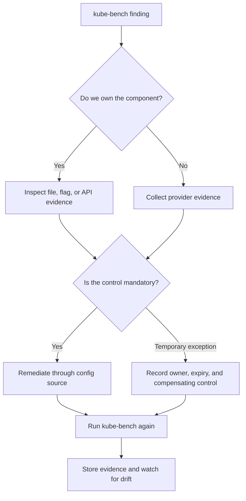

> **Складність**: `[СЕРЕДНЯ]` — базова навичка аудиту безпеки.
>
> **Час на проходження**: 40–45 хвилин.
>
> **Передумови**: Модуль 0.3 (Інструменти безпеки), базове адміністрування Kubernetes v1.35.

---

## Чого ви навчитеся

Після ретельного вивчення та практичного відпрацювання концепцій цього модуля ви зможете:

1. **Перевіряти** сучасний кластер Kubernetes v1.35 на відповідність галузевим бенчмаркам CIS за допомогою утиліти `kube-bench`.
2. **Діагностувати** провалені перевірки бенчмарка, простежуючи вивід у консолі безпосередньо до конкретних хибних налаштувань у компонентах площини управління.
3. **Впроваджувати** точні стратегії посилення безпеки для API-сервера, сховища даних etcd та параметрів kubelet згідно зі строгими настановами щодо безпеки.
4. **Оцінювати**, які рекомендації CIS є безумовними вимогами для вашого середовища, а які можуть конфліктувати з обґрунтованими операційними потребами.
5. **Проєктувати** автоматизований конвеєр сканування безпеки, який безперервно стежить за станом кластера на предмет дрейфу конфігурації.

## Чому цей модуль важливий

У 2018 році компанія Tesla виявила, що зловмисники використали відкритий інтерфейс управління Kubernetes для запуску робочих навантажень із майнінгу криптовалюти всередині своєї хмарної інфраструктури. У публічних повідомленнях акцент робився на майнінгу, але корисніший урок для платформних інженерів звучить тихіше: зловмиснику не знадобився екзотичний вихід за межі ядра, коли адміністративний інтерфейс був досяжний без належних засобів контролю. [Інцидент із криптоджекінгом Tesla 2018 року](/k8s/cks/part1-cluster-setup/module-1.5-gui-security/) <!-- incident-xref: tesla-2018-cryptojacking --> залишається стійким попередженням, тому що схема цього прориву прямо відображає базові збої конфігурації, які дисциплінований аудит кластера має ловити на ранньому етапі.

Усталені налаштування Kubernetes націлені на успішний запуск у багатьох середовищах, а не на найсуворіший із можливих стан безпеки саме у вашому середовищі. Нова площина управління має обслуговувати клієнтів початкового завантаження, запускати плагіни допуску, надавати перевірки працездатності, керувати сертифікатами та спілкуватися з kubelet'ами ще до того, як ваша організація висловить свою готовність до ризику. Така гнучкість корисна, але вона також означає, що кожна продакшн-команда успадковує довгий перелік рішень щодо автентифікації, авторизації, прав доступу до файлів, прапорців компонентів, поведінки kubelet, журналювання аудиту та захисту сховища даних. Бенчмарк CIS для Kubernetes перетворює цей розлогий набір рішень на придатну для перегляду базову лінію, яку інженери з безпеки, аудитори та платформні команди можуть обговорювати спільною мовою.

Цей модуль навчає вас використовувати `kube-bench` як інструмент аудиту, а не як табло з рахунком. Провалена перевірка не є автоматично кризою, а звіт без помилок не є доказом того, що кластер захищений. Справжня навичка полягає в тому, щоб простежити кожен результат назад до компонента Kubernetes, який відповідає за цю поведінку, вирішити, чи застосовна рекомендація до вашого типу кластера, впровадити точне виправлення без порушення доступності, а потім автоматизувати перевірку, щоб дрейф конфігурації був помітним ще до того, як перетвориться на інцидент.

## Філософія CIS: базові лінії перед думками

Центр інтернет-безпеки (Center for Internet Security) існує тому, що кожна програма безпеки потребує захищеної відправної точки. Без базової лінії двоє досвідчених інженерів можуть нескінченно сперечатися, чи прийнятний дозвільний прапорець kubelet, доступний для запису файл маніфесту або неавтентифікований ендпоінт працездатності. Бенчмарк CIS надає цій суперечці структуру: кожна рекомендація називає засіб контролю, пояснює намір, описує процедуру аудиту та пропонує настанови з виправлення. Вам усе ще потрібне інженерне судження, але ви більше не починаєте з пам'яті чи вподобань.

Бенчмарк навмисно консервативний. Він припускає, що оператор радше розслідує можливий виняток, ніж залишить тиху вразливість на місці. Така позиція особливо корисна для роботи з CKS, тому що іспит винагороджує вміння інспектувати реальну конфігурацію компонентів, пов'язувати симптоми з поведінкою площини управління та робити точкове виправлення під тиском часу. У продакшні та сама позиція допомагає уникнути поширеної пастки, коли команди посилюють лише прикладні робочі навантаження, тоді як механізми кластера лишаються слабко налаштованими.

Ось традиційний вивід у консолі, що відображає структуру організації CIS:

```text
┌─────────────────────────────────────────────────────────────┐
│              CENTER FOR INTERNET SECURITY                   │
├─────────────────────────────────────────────────────────────┤
│  Consensus benchmarks                                       │
│  Component-specific recommendations                         │
│  Audit procedures and remediation guidance                   │
│  Repeatable evidence for operators and reviewers             │
└─────────────────────────────────────────────────────────────┘
```

Ця діаграма важлива, тому що показує, чому вивід `kube-bench` слід читати як докази, а не як магію. Інструмент не вигадує модель безпеки для вашого кластера. Він пакує бенчмарк, виконує локальні перевірки, порівнює спостережувану конфігурацію з очікуваними засобами контролю та друкує результати, які людина може звірити. Цей останній крок важливий, тому що керовані кластери, усталені налаштування дистрибутивів та обґрунтовані операційні винятки можуть змінювати те, що означає «правильно» для конкретної рекомендації.

CIS також відокремлює ідею бенчмарка від ідеї продукту. Бенчмарк — це опублікований стандарт, який багато організацій можуть переглянути та застосувати. `kube-bench` — це одна реалізація, яка перевіряє розгортання Kubernetes на відповідність цьому стандарту. Коли ви ставитеся до бенчмарка як до джерела істини, а до інструмента — як до повторюваного помічника, вашу роботу з виправлення стає легше захистити під час внутрішнього аудиту, перевірки безпеки клієнтом або розслідування після інциденту.

Зробіть паузу та спрогнозуйте: якщо звіт kube-bench повідомляє, що API-сервер не встановлює очікуваний прапорець авторизації, який файл ви б інспектували першим на площині управління, зібраній через kubeadm, і чому перевірки лише об'єктів Kubernetes через API було б недостатньо?

Відповідь полягає в тому, що kubeadm зазвичай запускає компоненти площини управління як статичні Поди, тож їхні прапорці містяться в маніфестах у каталозі `/etc/kubernetes/manifests` на ноді площини управління. API Kubernetes може показати вам Поди, журнали та деякі об'єкти конфігурації, але він не є канонічним джерелом для кожного права доступу до файлу на рівні хоста, прапорця процесу чи елемента конфігурації kubelet. Аудит CIS навмисно перетинає цю межу, і саме тому серйозний аудит кластера вимагає як доступу на рівні API, так і інспектування на рівні ноди.

## Як kube-bench читає кластер

`kube-bench` найкорисніший тоді, коли ви розумієте його модель світу. Він перевіряє кластер Kubernetes, виконуючи тести бенчмарка проти тих місць, де насправді міститься конфігурація безпеки: маніфестів статичних Подів, файлів конфігурації kubelet, аргументів юнітів systemd, розташувань сертифікатів, а інколи й відповідей API Kubernetes. Потім інструмент зіставляє кожне спостережуване значення з рекомендацією CIS — наприклад, прапорець API-сервера, який має бути встановлений, порт kubelet лише для читання, який має бути вимкнений, або каталог даних etcd, який не повинен бути доступним для читання звичайними користувачами.

Це означає, що одна й та сама команда може давати різні результати залежно від того, де вона виконується. Завдання, що запускається всередині кластера, може інспектувати об'єкти Kubernetes та змонтовані шляхи хоста, якщо ви надасте йому належний доступ, але воно не може бачити довільні файли, доки ці шляхи не змонтовані. Двійковий файл, що працює безпосередньо на ноді площини управління, може інспектувати локальні маніфести та режими доступу до файлів, але він може не відображати кожну робочу ноду. Керований сервіс може повністю приховувати хости площини управління, тож деякі перевірки стають доказами на боці провайдера, а не виправленнями на боці оператора.

Практичний робочий процес полягає в тому, щоб запустити інструмент, згрупувати провали за компонентами, а потім розслідувати спершу відхилення з найвищим ризиком. Проблеми автентифікації та авторизації API-сервера зазвичай переважують косметичні попередження про власника файлу, тому що вони впливають на те, хто може дістатися площини управління. Засоби контролю транспорту etcd та даних у стані спокою так само чутливі, тому що etcd містить стан кластера, об'єкти Secret, дані сервісних акаунтів та багато інших значень, які зловмисники можуть обернути на зброю. Перевірки kubelet важливі, тому що kubelet'и наводять міст між виконанням робочих навантажень та контролем над нодою, і слабкий kubelet може стати шляхом від компрометації Пода до компрометації ноди.

```text
+----------------------+       +----------------------+       +----------------------+
| kube-bench runner    |       | Kubernetes host      |       | CIS result          |
| inside pod or node   | ----> | files and API state  | ----> | PASS, FAIL, WARN    |
+----------------------+       +----------------------+       +----------------------+
          |                              |                              |
          |                              |                              |
          v                              v                              v
   benchmark profile              component evidence             remediation queue
```

Перш ніж запускати команди, встановіть домовленість щодо командного рядка, яка використовується протягом усього модуля. Адміністратори Kubernetes часто створюють короткий псевдонім, тому що повторюване інспектування кластера простіше, коли команда компактна. Повна команда залишається `kubectl`, але кожен скорочений виклик нижче передбачає, що ви створили цей псевдонім у поточній сесії оболонки.

```bash
alias k=kubectl
k version
k get nodes -o wide
k get pods -n kube-system
```

Запуск `kube-bench` як Job у Kubernetes зручний у лабораторних кластерах, тому що результат фіксується в журналах Пода і його можна повторювати без встановлення двійкового файлу на хост. Компроміс полягає в тому, що Под має змонтувати шляхи хоста, які містять чутливу конфігурацію, тож сам Job треба розглядати як привілейований інструмент аудиту. Не залишайте його працювати назавжди, не надавайте ширшого доступу, ніж потребує аудит, і не копіюйте цей шаблон у простори імен орендарів, де ненадійні користувачі можуть його змінити.

Маніфест нижче навмисно націлений на ноду площини управління. Без селектора та толерування taint планувальник може розмістити Job на робочій ноді, де відсутні `/etc/kubernetes` чи `/var/lib/etcd`, що породжує гучні висновки про площину управління, які описують неправильний хост, а не стан кластера.

```yaml
apiVersion: batch/v1
kind: Job
metadata:
  name: kube-bench
  namespace: kube-system
spec:
  template:
    spec:
      hostPID: true
      restartPolicy: Never
      nodeSelector:
        node-role.kubernetes.io/control-plane: ""
      tolerations:
      - key: node-role.kubernetes.io/control-plane
        effect: NoSchedule
      containers:
      - name: kube-bench
        image: aquasec/kube-bench:latest
        command:
        - kube-bench
        - --benchmark
        - cis-1.10
        volumeMounts:
        - name: var-lib-etcd
          mountPath: /var/lib/etcd
          readOnly: true
        - name: etc-kubernetes
          mountPath: /etc/kubernetes
          readOnly: true
        - name: var-lib-kubelet
          mountPath: /var/lib/kubelet
          readOnly: true
      volumes:
      - name: var-lib-etcd
        hostPath:
          path: /var/lib/etcd
      - name: etc-kubernetes
        hostPath:
          path: /etc/kubernetes
      - name: var-lib-kubelet
        hostPath:
          path: /var/lib/kubelet
```

Після завершення Job зберіть журнали й одразу мисліть у термінах відповідальності. Висновок про `/etc/kubernetes/manifests/kube-apiserver.yaml` належить власнику конфігурації площини управління. Висновок про `/var/lib/kubelet/config.yaml` належить процесу початкового завантаження ноди та керуванню конфігурацією ноди. Висновок про RBAC або поведінку допуску може потребувати зміни політики кластера, а не редагування на хості. Цей вивід корисний лише тоді, коли кожен рядок потрапляє до правильної операційної черги.

```bash
k apply -f kube-bench-job.yaml
k wait --for=condition=complete job/kube-bench -n kube-system --timeout=180s
k logs job/kube-bench -n kube-system
k delete job kube-bench -n kube-system
```

Перш ніж запускати це у спільному кластері, який вивід ви очікуєте від команди `k wait`, якщо Job не може змонтувати шлях хоста, бо політика ноди це блокує? Тайм-аут більш імовірний, ніж чистий звіт бенчмарка, і ця різниця підказує вам, що збій стався ще до того, як бенчмарк зміг інспектувати конфігурацію. Це корисний діагностичний натяк, тому що він відокремлює права раннера аудиту від висновків бенчмарка.

Вивід у консолі зазвичай містить перевірки, згруповані за категоріями: майстер-нода, etcd, площина управління, робоча нода та політики. Розглядайте це групування як перший рівень сортування. Не переходьте від проваленого рядка одразу до команди, скопійованої з блогу. Прочитайте опис перевірки, визначте компонент, інспектуйте фактичний файл або прапорець і лише потім вирішуйте, чи підходить рекомендоване виправлення вашому кластеру.

## Читання виводу kube-bench як доказів

Звіт kube-bench найлегше читати, коли ви відокремлюєте вердикт, докази та рішення. Вердикт — це видима позначка, така як PASS, FAIL, WARN або INFO. Доказ — це команда, шлях до файлу, прапорець чи значення API, що спричинили вердикт. Рішення — це те, що ваша команда робитиме далі: виправляти, тимчасово прийняти, задокументувати як власність провайдера або розслідувати, бо інструмент не зміг побачити достатньо контексту. Багато слабких програм аудиту зупиняються на вердикті, і саме тому вони видають інформаційні панелі без стійкого покращення безпеки.

Перший прохід по звіту має бути механічним. Позначте кожен провал компонентом, до якого він належить, а потім позначте, чи конфігурація є власністю клієнта чи провайдера. Це запобігає тонкій, але дорогій помилці: ставитися до кожного висновку так, ніби той самий інженер може виправити його з тієї самої оболонки. Прапорці API-сервера, конфігурація kubelet, сертифікати etcd, політика RBAC та налаштування площини управління керованого провайдера — усе це міститься в різних операційних системах, тож вони потребують різних шляхів виправлення.

```text
[FAIL] 1.2.1 Ensure that the --anonymous-auth argument is set to false
[PASS] 1.2.6 Ensure that the --authorization-mode argument is not set to AlwaysAllow
[WARN] 1.2.20 Ensure that the audit log path is set
```

Цей невеликий зразок уже містить три різні види роботи. Провал anonymous-auth — це пряме завдання з посилення безпеки, якщо ви володієте маніфестом API-сервера. Те, що перевірка авторизації пройшла, є доказом, який варто зберегти, бо він підтверджує, що критичний засіб контролю був присутній на момент аудиту. Попередження про журнал аудиту може бути обов'язковим виправленням у самокерованому кластері, налаштуванням на боці провайдера в керованому кластері або предметом обговорення дизайну, якщо журнали експортуються через інший механізм.

Другий прохід має шукати кластери пов'язаних висновків. Якщо кілька перевірок API-сервера провалюються разом, шаблон збірки площини управління може бути застарілим або непослідовно відрендереним. Якщо перевірки прав доступу до файлів провалюються по кількох шляхах сертифікатів, надання хостів може застосовувати дозвільну umask або копіювати файли з неправильним власником. Якщо перевірки робочих нод відрізняються між нодами, у вас можуть бути змішані образи нод або невдале розгортання, а не одне ізольоване хибне налаштування.

Групування пов'язаних висновків також зменшує операційний ризик під час виправлення. Замість десяти не пов'язаних між собою редагувань ви можете підготувати одну зміну до шаблону маніфесту API-сервера, одну зміну до конфігурації початкового завантаження kubelet та одну зміну до встановлення файлу сертифіката. Кожна зміна має чіткого власника, план тестування та шлях відкату. Ця дисципліна важлива, тому що виправлення безпеки, які перезапускають компоненти площини управління або ротують ноди, треба розглядати як продакшн-зміни, а не як косметичне причісування.

Третій прохід має шукати хибну впевненість. Перевірка, що пройшла, доводить лише те, що kube-bench спостеріг очікуване значення через свій поточний режим виконання. Вона не доводить, що значення керується стійко, що кожна нода поділяє той самий стан або що зовнішній мережевий шлях не може дістатися ендпоінта, який нібито є локальним. Саме тому важливі сирі докази та повторні запуски. Вони дозволяють порівнювати стан у часі, а не довіряти одному успішному скануванню.

Як предметний приклад, уявіть, що kube-bench повідомляє про вимкнений анонімний доступ до API, увімкнений RBAC та відсутнє журналювання аудиту. Початківець назвав би це «здебільшого захищеним», бо дві з трьох перевірок пройшли. Сильніший оператор запитує, чи журнали аудиту вимагаються політикою, де вони мають зберігатися, хто їх переглядає та хто володіє цим налаштуванням — провайдер чи самокерована площина управління. Відсутній шлях до журналу — це не просто пункт бенчмарка; він впливає на реконструкцію інциденту, коли з'являються підозрілі виклики API.

Тепер уявіть той самий звіт у керованому кластері, де провайдер експортує події аудиту API через хмарний сервіс журналювання. У цьому контексті локальний прапорець статичного Пода може бути невидимим, але мету контролю все одно можна задовольнити. Правильним доказом може бути налаштування провайдера, конфігурація приймача журналів та зразок запиту, що показує надходження подій аудиту Kubernetes до облікового запису безпеки. Процес, керований бенчмарком, може чисто впоратися з цим випадком, якщо він просить докази, а не вимагає одного точного шляху до файлу.

Найцінніша звичка — цитувати ідентифікатор перевірки в кожній нотатці про виправлення. Ідентифікатори перевірок зберігаються краще, ніж прозові підсумки, бо вони дозволяють майбутнім рецензентам простежити рішення назад до версії бенчмарка. Коли профіль бенчмарка змінюється, ви можете шукати уражені ідентифікатори, повторно оцінювати старі винятки та оновлювати політику конвеєра. Без ідентифікаторів ви зрештою порівнюєте розпливчасті твердження на кшталт «посилити kubelet» із новим звітом, який може використовувати іншу мову.

Kube-bench також друкує попередження для пунктів, які можуть потребувати ручного перегляду. Не вважайте їх необов'язковими лише тому, що вони не позначені як FAIL. Попередження часто означає, що інструмент не може довести стан із доступних йому доказів. Така невизначеність може бути прийнятною для контрольованого провайдером засобу з документацією, але вона неприйнятна, коли файл локальний, а команда просто не інспектувала його. Ручний перегляд — це все одно перегляд, і він має залишати придатну для аудиту нотатку.

Нарешті, відрізняйте перевірку виправлення від операційного моніторингу. Повторний запуск kube-bench після виправлення підтверджує, що бенчмарк тепер може спостерігати очікувану конфігурацію. Моніторинг підтверджує, що конфігурація лишається істинною, поки ноди ротуються, кластери оновлюються, а люди змінюють шаблони. Зріла платформа використовує обидва. Негайний повторний запуск закриває зміну, тоді як заплановане виявлення дрейфу ловить той день, коли скрипт початкового завантаження, оновлення доповнення чи аварійний патч тихо повертає старе значення.

## Діагностика висновків про площину управління

Висновки про площину управління мають високу цінність, тому що API-сервер — це вхідні двері до повноважень кластера. Слабке налаштування автентифікації, дозвільний режим авторизації або відсутній контроль допуску можуть змінити те, що може робити кожен користувач і робоче навантаження. Kube-bench може повідомити вам, що прапорець виглядає відсутнім або хибно налаштованим, але він не може знати, чи перезапише ваш генератор кластера ручні редагування, чи володіє компонентом керований провайдер, або чи потребує зміна вікна обслуговування. Ваше завдання — перетворити висновок на безпечну операційну зміну.

У кластерах стилю kubeadm API-сервер, контролер-менеджер та планувальник зазвичай працюють як статичні Поди. Kubelet стежить за файлами маніфестів у каталозі `/etc/kubernetes/manifests` і перезапускає Поди, коли ці файли змінюються. Цей механізм робить виправлення прямим, але він також означає, що погане редагування може зламати площину управління. Завжди інспектуйте та робіть резервну копію маніфесту перед його зміною й надавайте перевагу керуванню конфігурацією або підтримуваним kubeadm робочим процесам, коли вони доступні.

```bash
sudo ls -l /etc/kubernetes/manifests
sudo grep -nE -- '--authorization-mode|--anonymous-auth|--enable-admission-plugins|--audit-log-path' \
  /etc/kubernetes/manifests/kube-apiserver.yaml
sudo stat -c '%a %U:%G %n' /etc/kubernetes/manifests/kube-apiserver.yaml
```

Поширений провалений пункт стосується анонімного доступу. API-сервер історично підтримував анонімні запити для певних неавтентифікованих шляхів, і кластери інколи зберігають цю поведінку ширшою, ніж задумано. У посиленому середовищі ви хочете, щоб анонімний доступ був вимкнений, доки конкретний дизайн його не вимагає та компенсаційні засоби контролю не задокументовано. Це не просто галочка; анонімний доступ змінює те, як невдалі облікові дані, відсутні облікові дані та зондувальний трафік виглядають для рівня авторизації та журналів аудиту.

```yaml
apiVersion: v1
kind: Pod
metadata:
  name: kube-apiserver
  namespace: kube-system
spec:
  containers:
  - command:
    - kube-apiserver
    - --anonymous-auth=false
    - --authorization-mode=Node,RBAC
    - --enable-admission-plugins=NodeRestriction
    - --audit-log-path=/var/log/kubernetes/audit/audit.log
    name: kube-apiserver
```

Перевірка режиму авторизації — це ще одне місце, де бенчмарк навчає принципу безпеки. `RBAC` дає вам об'єкти політики, які можна переглядати, версіонувати та обмежувати. Авторизація `Node` обмежує доступ kubelet до об'єктів, пов'язаних із нодою, яку він обслуговує. Дозвільний режим може здаватися простішим під час початкового завантаження, але він стає небезпечним, щойно робочі навантаження, сервісні акаунти й автоматизація починають залежати від API кластера.

Перевірки контролер-менеджера та планувальника часто виглядають менш драматично, але вони захищають важливі межі. Незахищені адреси прив'язки можуть відкривати метрики чи ендпоінти працездатності за межі локального хоста. Слабкі налаштування профілювання можуть розкривати деталі виконання клієнтам, яким вони не потрібні. Висновки про права доступу до файлів можуть вказувати на те, що чутливі kubeconfig чи матеріал сертифікатів доступні для читання користувачам, які не повинні брати участь в адмініструванні площини управління.

```bash
sudo grep -nE -- '--bind-address|--profiling|--use-service-account-credentials' \
  /etc/kubernetes/manifests/kube-controller-manager.yaml
sudo grep -nE -- '--bind-address|--profiling' \
  /etc/kubernetes/manifests/kube-scheduler.yaml
sudo stat -c '%a %U:%G %n' /etc/kubernetes/controller-manager.conf
sudo stat -c '%a %U:%G %n' /etc/kubernetes/scheduler.conf
```

Найбезпечніша діагностична звичка — написати коротку нотатку з доказами для кожного проваленого пункту площини управління перед редагуванням. Включіть ідентифікатор перевірки kube-bench, спостережуваний файл чи прапорець, рекомендоване значення, специфічний для кластера виняток, якщо такий існує, та шлях відкату. Ця нотатка може здаватися повільною під час практики, але вона запобігає поширеному продакшн-збою, коли кілька редагувань із посилення безпеки робляться одночасно і ніхто не може сказати, яке з них спричинило поганий перезапуск площини управління.

Одна платформна команда колись тижнями ганялася за повторюваним провалом kube-bench, тому що інженер виправив маніфест статичного Пода вручну, перевірив результат без помилок і пішов далі. Процес початкового завантаження образу ноди пізніше замінив файл старим шаблоном, тож той самий висновок повертався після кожної заміни площини управління. Стійким виправленням була не інша команда sed; це була зміна вихідного шаблону та додавання перевірки в конвеєр, яка порівнювала відрендерені маніфести перед розгортанням нод.

## Посилення безпеки висновків про etcd та kubelet

Висновки про etcd заслуговують на особливу увагу, тому що etcd — це пам'ять кластера. Якщо зловмисник може читати дані etcd, він може отримати об'єкти Secret Kubernetes, токени сервісних акаунтів, визначення робочих навантажень та операційні метадані. Якщо зловмисник може писати в etcd, він може змінювати стан кластера під API-сервером. Тому засоби контролю CIS навколо etcd зосереджені на автентифікації за клієнтським сертифікатом, peer TLS, власності файлів, правах доступу до каталогу даних та мінімізації неавтентифікованого чи незашифрованого доступу.

У площині управління kubeadm маніфест статичного Пода etcd зазвичай розташований поруч із маніфестом API-сервера. Вам слід інспектувати маніфест на предмет прапорців сертифікатів, а потім звірити файли, на які він посилається. Перевірка, що повідомляє про відсутній peer TLS, має привести вас до точних прапорців, які налаштовують `--peer-cert-file`, `--peer-key-file` та `--peer-client-cert-auth`. Перевірка щодо клієнтської автентифікації має привести вас до `--client-cert-auth`, конфігурації довіреного CA та того, чи спілкується API-сервер з etcd через очікуваний захищений ендпоінт.

```bash
sudo grep -nE -- '--cert-file|--key-file|--client-cert-auth|--trusted-ca-file|--peer-' \
  /etc/kubernetes/manifests/etcd.yaml
sudo stat -c '%a %U:%G %n' /var/lib/etcd
sudo find /etc/kubernetes/pki/etcd -maxdepth 1 -type f -exec stat -c '%a %U:%G %n' {} \;
```

Режими доступу до файлів легко відкинути, бо вони виглядають старомодними порівняно з контролем допуску та безпекою під час виконання. Таке відкидання є помилкою. Сертифікати Kubernetes та kubeconfig часто є практичною межею між локальним системним користувачем та адміністративними повноваженнями над кластером. Доступний для читання всіма приватний ключ може перетворити незначне розкриття облікового запису хоста на повну компрометацію площини управління, тож перевірки CIS щодо власності та прав доступу — це частина тієї самої моделі загроз, що й авторизація API.

Висновки kubelet містяться на межі між плануванням робочих навантажень та виконанням на ноді. Kubelet запускає контейнери, монтує томи, повідомляє про стан ноди та надає API для журналів та операцій exec. Слабка конфігурація kubelet може дозволити зловмиснику запитувати дані ноди, обходити очікувану авторизацію або покладатися на усталені значення, які конфліктують із вашим стандартом посилення безпеки. У кластерах Kubernetes v1.35+ ви маєте очікувати, що конфігурація kubelet буде явною та керованою, а не розкиданою по випадкових прапорцях.

```bash
sudo grep -nE 'authentication|authorization|readOnlyPort|protectKernelDefaults|rotateCertificates' \
  /var/lib/kubelet/config.yaml
sudo systemctl cat kubelet
sudo stat -c '%a %U:%G %n' /var/lib/kubelet/config.yaml
```

Посилена конфігурація kubelet має робити автентифікацію та авторизацію явними. Автентифікація через webhook дозволяє kubelet попросити API-сервер перевірити токени-носії (bearer tokens). Авторизація через webhook дозволяє API-серверу вирішити, чи може викликач виконати дію kubelet. Вимкнення порту лише для читання видаляє старіший неавтентифікований ендпоінт, який може витікати деталі ноди та Подів. Увімкнення ротації сертифікатів зменшує розкриття довготривалих облікових даних, коли це підтримує ваш процес початкового завантаження.

```yaml
apiVersion: kubelet.config.k8s.io/v1beta1
kind: KubeletConfiguration
authentication:
  anonymous:
    enabled: false
  webhook:
    enabled: true
authorization:
  mode: Webhook
readOnlyPort: 0
protectKernelDefaults: true
rotateCertificates: true
```

Компроміс полягає в тому, що зміни kubelet можуть впливати на кожне робоче навантаження на ноді. Наприклад, увімкнення суворішого захисту усталених значень ядра може оголити ноди, чиї налаштування sysctl ніколи не узгоджувалися з очікуваннями Kubernetes. Це не означає, що вам слід ігнорувати висновок. Це означає, що вам слід протестувати виправлення на невеликому пулі нод, задокументувати потрібну базову лінію хоста та розгорнути зміну тим самим шляхом, яким ви оновлюєте образи нод.

Який підхід ви б обрали тут і чому: відредагувати одну ноду вручну, щоб швидко усунути провал kubelet, чи змінити конфігурацію початкового завантаження ноди й чекати на контрольовану ротацію? Ручне редагування може бути корисним у лабораторії для іспиту або при аварійному стримуванні, але зміна початкового завантаження — це стійка продакшн-відповідь, тому що кожна нова нода успадкує той самий стан. Kube-bench має підтверджувати реальність після розгортання, а не ставати замінником керування конфігурацією.

## Оцінювання винятків без послаблення базової лінії

Не кожен провал kube-bench означає, що оператор помиляється. Деякі керовані сервіси Kubernetes навмисно приховують файли площини управління, замінюють вихідні прапорці керованими провайдером еквівалентами або документують інші докази для тієї самої мети безпеки. Деякі рекомендації також стикаються з конкретними операційними потребами, такими як тимчасове профілювання під час інциденту або вимога сумісності під час міграції старіших пулів нод. Навичка полягає в тому, щоб суворо оцінювати винятки, не перетворюючи кожну незручність на постійну поступку.

Хороший виняток починається з наміру бенчмарка. Запитайте, чому намагається запобігти рекомендація, яку можливість зловмисника вона обмежує та які докази підтверджують, що ризик опрацьовано іншим способом. Якщо висновок стосується авторизації API-сервера, прийнятний виняток трапляється рідко, бо авторизація є центральною для безпеки кластера. Якщо висновок стосується адреси прив'язки метрик у приватній мережі площини управління, відповідь може залежати від мережевої досяжності, автентифікації перед ендпоінтом та документації провайдера.

Використовуйте просту структуру доказів для кожного винятку. Зафіксуйте ідентифікатор перевірки, рекомендацію, спостережуваний стан, причину, чому рекомендацію не можна застосувати точно, компенсаційний засіб контролю, власника, дату закінчення та тригер перегляду. Дата закінчення важлива, тому що багато винятків безпеки народжуються під час міграції, а потім виживають, бо нікому не доручено їх прибрати. Бенчмарк без дисципліни винятків стає або показовим, або проігнорованим.

| Елемент доказу | Сильний приклад | Слабкий приклад |
| --- | --- | --- |
| Спостережуваний стан | Керована площина управління не показує клієнтам маніфести статичних Подів | Ми не можемо це перевірити |
| Рішення щодо ризику | Провайдер документує авторизацію API-сервера та засоби контролю аудиту для сервісу | Імовірно, все гаразд |
| Компенсаційний засіб контролю | Приватний ендпоінт, перегляд RBAC, експорт аудиту, звіт про відповідність провайдера | Мережа внутрішня |
| Тригер перегляду | Повторна перевірка після оновлення версії провайдера або перестворення кластера | Перегляну колись |

Небезпека винятків полягає в тому, що вони можуть унормувати дрейф. Якщо п'ять команд кожна приймає один висновок без спільного реєстру, платформа може тихо перейти від посиленого стану до крихкого. Саме тому вивід `kube-bench` має живити беклог чи реєстр ризиків, а не зникати в прокрутці термінала. Перевірки, що пройшли, стають доказами, провалені перевірки стають роботою, а прийняті винятки стають явними рішеннями щодо ризику з прив'язаними іменами.

Вам також слід відокремлювати відповідність бенчмарку від повної безпеки. Перевірки CIS не замінюють моделювання загроз, ізоляцію робочих навантажень, сканування образів, виявлення під час виконання, керування секретами чи реагування на інциденти. Вони є базовою лінією для конфігурації кластера, що необхідно, але недостатньо. Дисципліна, яку ви будуєте тут, переноситься на ці інші домени, бо робочий процес однаковий: визначити очікуваний стан, зібрати докази, виявити дрейф, обдумано виправити та автоматизувати виявлення регресій.

## Автоматизація kube-bench без створення шуму

Автоматизація перетворює kube-bench з періодичної події аудиту на систему раннього попередження. Найпростіший патерн — запускати інструмент у контрольованому Job після створення кластера, після оновлень версій та з регулярною періодичністю для довгоживучих кластерів. Складніший патерн — зберігати результати як артефакти, порівнювати їх із попереднім запуском та оповіщати лише тоді, коли з'являються нові провали або закінчуються прийняті винятки. Ця різниця важлива, тому що гучні перевірки безпеки ігноруються.

У конвеєрі уникайте ставлення до кожного попередження як до негайного провалу збірки. Спершу встановіть відому базову лінію для типу кластера. Потім класифікуйте перевірки як обов'язкові, прийнятий виняток, власність провайдера або інформаційні. Обов'язкові перевірки мають провалювати конвеєр, коли вони регресують. Прийняті винятки мають провалюватися, коли минає їхня дата закінчення. Перевірки на боці провайдера мають посилатися на зовнішні докази. Інформаційні перевірки мають бути видимими, не блокуючи кожне розгортання.

```yaml
name: kube-bench-audit
on:
  workflow_dispatch:
  schedule:
  - cron: '15 3 * * 1'
jobs:
  audit:
    runs-on: ubuntu-latest
    steps:
    - uses: actions/checkout@v4
      with:
        persist-credentials: false
    - name: Configure cluster access
      run: ./scripts/ci/configure-kubeconfig.sh
    - name: Run kube-bench job
      run: |
        alias k=kubectl
        k apply -f security/kube-bench-job.yaml
        k wait --for=condition=complete job/kube-bench -n kube-system --timeout=180s
        k logs job/kube-bench -n kube-system > kube-bench.txt
        k delete job kube-bench -n kube-system
    - name: Store audit result
      uses: actions/upload-artifact@v4
      with:
        name: kube-bench-result
        path: kube-bench.txt
```

Крок checkout вимикає збережені облікові дані, бо пізнішим крокам аудиту не потрібен повторно використовуваний `GITHUB_TOKEN` у `.git/config`. Продакшн-робочі процеси також мають закріплювати кожен `uses:` до повного SHA коміту з коментарем версії; форма з тегом тут зберігає навчальний фрагмент читабельним, тоді як правило безпеки лишається суворішим для реальних файлів робочих процесів.

Конвеєр має зберігати сирий вивід, бо сирі докази легше переглядати, ніж узагальнений значок. Водночас людям потрібен стислий diff. Практична реалізація парсить ідентифікатори перевірок, порівнює їх із попереднім успішним запуском та друкує нові провали окремо від відомих винятків. Мета — зробити так, щоб новий небезпечний прапорець API-сервера відчувався так само терміново, як провалений модульний тест, водночас не даючи історичним попередженням на боці провайдера блокувати непов'язану роботу.

```bash
awk '/\\[FAIL\\]/ { print }' kube-bench.txt > kube-bench-failures.txt
awk '/\\[WARN\\]/ { print }' kube-bench.txt > kube-bench-warnings.txt
test ! -s kube-bench-failures.txt
```

Будьте обережні з фінальною командою `test` у реальних середовищах. Вона навмисно сувора, що корисно, щойно базова лінія чиста, а винятки змодельовано деінде. Під час впровадження вам може знадобитися парсер, який віднімає схвалені винятки перед провалом завдання. Не розв'язуйте це приховуванням виводу чи ігноруванням усіх попереджень; розв'яжіть це, зробивши політику явною та переглядаючи перелік винятків так само ретельно, як ви переглядаєте зміни брандмауера.

Автоматизація також потребує меж доступу. Job kube-bench монтує чутливі шляхи хоста, тож лише довірена автоматизація кластера має мати змогу його створювати чи змінювати. Зберігайте маніфест у захищеному шляху репозиторію, обмежте, хто може запускати робочий процес проти продакшн-кластерів, та прибирайте Job після кожного запуску. Сканери безпеки — це теж робочі навантаження, а погано контрольовані робочі навантаження безпеки можуть стати привілейованим шляхом для зловмисників.

Час розгортання — це частина дизайну автоматизації. Запуск бенчмарка перед оновленням кластера повідомляє вам, які провали вже існували, тоді як запуск після оновлення повідомляє, що змінилося. Без запуску «до» команди часто звинувачують оновлення в старих висновках і втрачають час на неправильне розслідування. Без запуску «після» вони можуть пропустити нові усталені значення, змінені прапорці компонентів чи дрейф початкового завантаження ноди, спричинений процесом оновлення.

Створення кластера — ще одна корисна контрольна точка. Якщо ваша організація будує кластери з шаблонів, перший запуск kube-bench має відбутися до того, як прикладні команди розгорнуть продакшн-навантаження. Цей час дає платформним інженерам простір для виправлення основоположної конфігурації, поки кластер ще порожній. Він також запобігає незручній ситуації, коли базова зміна посилення безпеки потребує перезапуску площини управління чи ротації нод після того, як критичні навантаження вже залежать від середовища.

Для довгоживучих кластерів плануйте сканування достатньо часто, щоб ловити дрейф, але не настільки часто, щоб вивід ставав фоновим шумом. Щотижневі запуски поширені для стабільних середовищ, тоді як вікна оновлень та релізи образів нод мають запускати додаткові сканування. Точна періодичність менш важлива, ніж поведінка перегляду. Сканування, яке ніхто не переглядає, — це лише обсяг журналів, тоді як сканування, пов'язане з відповідальністю та ескалацією, може запобігти перетворенню дрібних змін конфігурації на постійну вразливість.

Командам безпеки також потрібно вирішити, які докази слід зберігати. Збереження сирого виводу kube-bench, розпарсеного підсумку провалів та файлу винятків дає рецензентам корисний слід для аудиту. Зберігання лише значка «pass» чи «fail» ускладнює пізніше розслідування, бо воно приховує, які перевірки були оцінені, який профіль бенчмарка використовувався та які попередження були прийняті. Збереження доказів має бути нудним, придатним для пошуку та прив'язаним до тієї самої ідентичності кластера, яку ви використовуєте для реагування на інциденти.

Коли з'являється новий провал, першою відповіддю автоматизації мають бути сповіщення та контекст, а не сліпий скрипт виправлення. Деякі виправлення безпечно автоматизувати, як-от відкриття тікета для власника компонента або блокування просування кластера. Інші виправлення, особливо зміни маніфестів площини управління та зміни початкового завантаження нод, потребують планування розгортання. Конвеєр має робити дрейф неможливим для ігнорування, але він не повинен мутувати продакшн-інфраструктуру без тих самих засобів контролю змін, яких ви очікуєте для будь-якої іншої високовпливової конфігурації.

Нарешті, пам'ятайте, що сам профіль бенчмарка може змінюватися в міру розвитку Kubernetes та настанов CIS. Закріплюйте профіль, який використовує ваш Job, фіксуйте його у виводі та обдумано переглядайте оновлення профілю. Новий профіль може додати перевірки, що виявляють реальний ризик, але він також може потребувати нового зіставлення винятків для керованих сервісів чи дистрибутивів. Ставтеся до оновлень бенчмарка як до оновлень залежностей: корисні, необхідні та варті тестування, перш ніж вони стануть несподіванкою в продакшні.

## Патерни та антипатерни

Патерни та антипатерни допомагають вам вирішити, як операціоналізувати перевірки бенчмарка після першого успішного лабораторного запуску. Ключова відмінність полягає в тому, чи стають результати kube-bench частиною стійкого процесу безпеки, чи лишаються одноразовим артефактом. Сильний патерн створює повторювані докази, призначає відповідальність та зменшує несподіванки під час оновлень. Слабкий патерн робить так, що звіт виглядає добре один раз, лишаючи незмінним базове джерело конфігурації.

Використовуйте ці патерни, будуючи продакшн-робочий процес навколо перевірок CIS.

| Патерн | Коли застосовувати | Чому працює | Міркування щодо масштабування |
| --- | --- | --- | --- |
| Черга виправлень із розподілом за компонентами | Будь-який кластер з окремими власниками платформи, безпеки та інфраструктури | Висновки про API-сервер, etcd та kubelet потрапляють до команди, яка справді може їх виправити | Потребує ідентифікаторів перевірок та міток компонентів у тікетах |
| Базова лінія плюс реєстр винятків | Керовані кластери або змішані дистрибутиви | Власні провайдеру та бізнес-обґрунтовані відхилення лишаються видимими, не послаблюючи всі перевірки | Винятки потребують власників, дат закінчення та тригерів перегляду |
| Запуск бенчмарка після оновлення | Кожне оновлення площини управління чи ноди Kubernetes v1.35+ | Зміни версій можуть змінювати прапорці, усталені значення та профілі бенчмарка | Запускайте до й після оновлення, щоб відрізнити старий борг від нового дрейфу |
| Виправлення на незмінних нодах | Кластери з автомасштабованими чи часто замінюваними нодами | Виправлення конфігурації початкового завантаження не дає полагодженим нодам відкочуватися під час заміни | Потребує власності над образом, kubeadm чи керуванням конфігурацією |

Уникайте цих антипатернів, бо вони перетворюють роботу з бенчмарком на театр.

| Антипатерн | Що йде не так | Кращий варіант |
| --- | --- | --- |
| Виправлення лише маніфестів статичних Подів вручну | Наступна перезбірка ноди чи рендер kubeadm відновлює небезпечне значення | Виправте вихідний шаблон та звірте відрендерений маніфест |
| Ставлення до всіх провалів як до рівних | Низькоризикові попередження відволікають від вразливостей API, etcd та kubelet | Сортуйте за компонентом, впливом зловмисника та шляхом експлуатації |
| Запуск привілейованих Job аудиту у просторах імен орендарів | Користувачі, що можуть змінити Job, можуть монтувати чутливі файли хоста | Тримайте Job аудиту в контрольованих просторах імен з обмеженим доступом на запис |
| Прийняття постійних винятків | Тимчасовий ризик міграції стає нормальним станом кластера | Вимагайте дат закінчення та задокументованих компенсаційних засобів контролю |

Глибший патерн — зробити аудит CIS частиною керування життєвим циклом кластера. Ви проводите аудит перед продакшн-використанням, після оновлень, після змін образів нод та після змін конфігурації площини управління. Ви виправляєте через систему, яка володіє конфігурацією, а не через ізольовані редагування в терміналі. Ви зберігаєте докази, бо майбутнім рецензентам потрібно знати, чи був ризик виправлений, прийнятий або переданий засобу контролю провайдера.

## Рамка прийняття рішень

Коли kube-bench повідомляє про висновок, почніть із рішення, чи володієте ви конфігурацією. Якщо ви керуєте площиною управління, інспектуйте локальний файл чи прапорець та виправляйте через ваш процес збірки кластера. Якщо площиною управління володіє керований провайдер, зберіть докази провайдера та зосередьте пряме виправлення на робочих нодах, RBAC, політиці допуску, мережевому розкритті та засобах контролю робочих навантажень. Це перше рішення запобігає марним зусиллям та уникає небезпечних спроб змінити компоненти, які ваша платформа не показує.

Далі вирішіть, чи є рекомендація обов'язковою для вашого середовища. Автентифікація, авторизація, зашифрований зв'язок etcd, права доступу до чутливих файлів та засоби контролю webhook kubelet майже завжди слід вважати обов'язковими. Діагностичний ендпоінт чи прапорець профілювання може допускати обмежений у часі виняток під час інциденту, але він усе одно потребує доказів та дати закінчення. Якщо рекомендація конфліктує з потребою застосунку, поставте під сумнів дизайн застосунку, перш ніж прийняти слабшу безпеку кластера.



Використовуйте наступну матрицю, перетворюючи висновки на дію.

| Тип висновку | Усталений пріоритет | Перший доказ для інспектування | Типова дія |
| --- | --- | --- | --- |
| Автентифікація чи авторизація API-сервера | Критичний | Маніфест статичного Пода, журнали аудиту, стан RBAC | Виправити прапорець через джерело конфігурації площини управління |
| TLS etcd чи права доступу до каталогу даних | Критичний | Маніфест etcd, шляхи сертифікатів, режими доступу до файлів | Забезпечити TLS та обмежити доступ до файлів |
| Анонімний доступ чи порт лише для читання kubelet | Високий | Файл конфігурації kubelet та юніт systemd | Оновити конфігурацію початкового завантаження ноди |
| Розкриття метрик планувальника чи контролер-менеджера | Середній | Адреса прив'язки, мережева досяжність, рівень автентифікації | Обмежити адресу прив'язки чи захистити ендпоінт |
| Прихована провайдером перевірка площини управління | Залежить від контексту | Документація безпеки провайдера та налаштування кластера | Зафіксувати докази на боці провайдера |

Рамка навмисно проста, бо складні дерева рішень провалюються під час інцидентів. Ви визначаєте відповідальність, оцінюєте ризик, виправляєте через стійке джерело, перевіряєте інструментом та зберігаєте докази. Якщо ви не можете завершити один із цих кроків, ви знайшли прогалину в процесі, яка так само важлива, як початковий провал бенчмарка.

## Чи знали ви?

- CIS опублікувала свій перший бенчмарк для Kubernetes у 2017 році, невдовзі після того, як Kubernetes став усталеним вибором оркестрації для багатьох хмарно-нативних команд, і саме тому бенчмарк досі наголошує на низькорівневих прапорцях компонентів та файлах хоста.
- Порт kubelet лише для читання історично використовував TCP-порт 10255, і його вимкнення видаляє неавтентифіковане джерело інформації про ноду та Поди, яке зловмисники часто цінують під час розвідки.
- etcd зазвичай слухає клієнтський порт 2379 та peer-порт 2380, тож помилки із сертифікатами та брандмауером навколо цих портів можуть оголити або зв'язок API-сервера, або реплікацію між учасниками.
- kube-bench може працювати як двійковий файл хоста, контейнер, Job Kubernetes або керований компонент сканування, але кожен режим бачить різні докази залежно від доступу до шляхів хоста та видимості провайдера.

## Типові помилки

| Помилка | Чому вона виникає | Як її виправити |
| --- | --- | --- |
| Ставлення до kube-bench як до доказу повної безпеки | Звіт здається авторитетним, тож команди забувають, що CIS охоплює базову конфігурацію, а не кожне робоче навантаження та модель загроз | Використовуйте kube-bench як один засіб контролю в ширшій програмі, що включає перегляд RBAC, політику допуску, мережеву ізоляцію, гарантії образів та виявлення під час виконання |
| Редагування маніфестів статичних Подів без зміни вихідного шаблону | Локальний файл легко пропатчити під час лабораторії, але інструменти початкового завантаження чи оновлення пізніше регенерують його | Знайдіть джерело kubeadm, образу чи керування конфігурацією та внесіть зміну з посилення безпеки там |
| Ігнорування відмінностей керованого провайдера | Оператори очікують, що кожен засіб контролю CIS буде безпосередньо інспектованим, навіть коли провайдер володіє площиною управління | Відокремте докази на боці провайдера від виправлень на боці клієнта та чітко задокументуйте межу |
| Залишення Job аудиту в кластері | Job корисний, але його монтування хоста та привілеї роблять його чутливим | Запускайте його лише з контрольованої автоматизації, збирайте журнали та видаляйте після завершення |
| Прийняття розпливчастих винятків | Командам потрібно швидко випускати, тож вони позначають провалену перевірку як незастосовну без доказів | Вимагайте власника, обґрунтування, компенсаційного засобу контролю, дати закінчення та тригера перегляду для кожного винятку |
| Виправлення робочих нод по одній | Ручні редагування нод усувають негайний результат, але зникають при заміні нод | Оновіть конфігурацію початкового завантаження ноди та розгорніть через контрольований план заміни нод |
| Провал конвеєра на історичних попередженнях без контексту | Рання автоматизація створює надто багато шуму, тож інженери перестають звертати увагу | Класифікуйте відомі винятки та провалюйте лише на нових обов'язкових провалах чи прострочених винятках |

## Перевірка для учня

> Job kube-bench, який читає шляхи хоста площини управління, має бути запланований на ноду площини управління, толерувати taint площини управління та розглядатися як привілейований інструмент аудиту.

Перш ніж продовжити, поясніть, який хибний сигнал ви могли б отримати, якщо той самий маніфест потрапить на робочу ноду. Сильна відповідь називає відсутні шляхи хоста, відокремлює розміщення раннера аудиту від реального дрейфу кластера та пояснює, чому гучні висновки не повинні потрапляти до беклогу виправлень, доки раннер не інспектував передбачуване джерело доказів.

## Тест

<details><summary>Ваш звіт kube-bench позначає `--anonymous-auth` на API-сервері, але `k get pods -n kube-system` показує Под API-сервера як справний. Що вам слід інспектувати далі?</summary>

Інспектуйте маніфест статичного Пода чи інше джерело конфігурації площини управління, що визначає команду API-сервера. Справність Пода доводить лише те, що процес запущений; вона не доводить, що стан автентифікації правильний. У кластерах стилю kubeadm `/etc/kubernetes/manifests/kube-apiserver.yaml` є першим джерелом доказів, бо kubelet створює статичний Под із цього файлу. Після виправлення повторно запустіть kube-bench та перегляньте журнали аудиту на предмет неочікуваних анонімних запитів.

</details>

<details><summary>Керований провайдер Kubernetes приховує файли хоста площини управління, і kube-bench повідомляє про кілька перевірок як про неінспектовані. Як вам слід оцінювати ці результати?</summary>

Спершу відокремте контрольовані провайдером засоби від контрольованих клієнтом. Вам не слід вигадувати локальні виправлення для файлів, якими ви не можете й не повинні керувати, але вам усе одно потрібні докази того, що провайдер впроваджує еквівалентні засоби контролю автентифікації, авторизації, аудиту та шифрування. Зафіксуйте документацію провайдера чи докази відповідності, а потім зосередьте пряме виправлення на робочих нодах, RBAC, політиці допуску та ізоляції робочих навантажень. Розглядайте результат як вправу зі зіставлення спільної відповідальності, а не як причину ігнорувати бенчмарк.

</details>

<details><summary>Ваша команда вручну виправляє висновок про `readOnlyPort` kubelet на одній ноді, але провал повертається після того, як автомасштабування замінює ноду. Що пішло не так?</summary>

Виправлення націлилося на симптом на одному хості, а не на джерело конфігурації ноди. Автомасштабування створило нову ноду зі старого шаблону початкового завантаження, тож небезпечне налаштування kubelet повернулося. Стійке виправлення — оновити образ ноди, конфігурацію kubeadm або джерело керування конфігурацією, що пише `/var/lib/kubelet/config.yaml`. Kube-bench тоді має підтвердити, що новостворені ноди успадковують виправлене налаштування.

</details>

<details><summary>kube-bench повідомляє про слабкі налаштування сертифікатів etcd, і інженер пропонує відкласти виправлення, бо робочі навантаження ще працюють. Як вам міркувати про пріоритет?</summary>

etcd зберігає стан кластера, від якого залежить API-сервер, включно з чутливими об'єктами та визначеннями робочих навантажень. Слабкий стан транспорту чи автентифікації etcd може перетворити мережевий доступ на компрометацію всього кластера, тож висновок слід вважати високопріоритетним, навіть якщо застосунки виглядають справними. Правильна відповідь — заплановане виправлення з резервним копіюванням, перевіркою сертифікатів та кроками відкату, а не безстрокове відкладання. Доступність важлива, але вона не стирає впливу від оголених даних площини управління.

</details>

<details><summary>Конвеєр провалюється на кожному попередженні kube-bench, включно з висновками на боці провайдера, які вже переглянуто. Яка зміна дизайну зменшила б шум без приховування ризику?</summary>

Створіть політику базової лінії, що класифікує перевірки як обов'язкові, прийнятий виняток, власність провайдера або інформаційні. Обов'язкові провали мають ламати конвеєр, тоді як прийняті винятки мають нести метадані власника та закінчення, щоб усе ще провалюватися, коли застаріють. Висновки на боці провайдера мають посилатися на зовнішні докази, а не зникати зі звіту. Це тримає новий дрейф видимим, водночас не даючи переглянутим історичним висновкам привчати інженерів ігнорувати завдання.

</details>

<details><summary>Вам потрібно посилити авторизацію API-сервера для Kubernetes v1.35+, але застарілий скрипт автоматизації залежить від широкого доступу. Що має відбутися, перш ніж послаблювати рекомендацію CIS?</summary>

Вам слід оцінити, чи може автоматизація використовувати вужчу роль RBAC, виділений сервісний акаунт або перепроєктований робочий процес, перш ніж приймати слабшу авторизацію кластера. Рекомендації CIS щодо авторизації захищають усю площину управління, тож широкі винятки потребують сильних доказів та старшого власника. Якщо тимчасовий виняток неминучий, задокументуйте ризик, компенсаційні засоби контролю, дату закінчення та план міграції. Бенчмарк має тиснути на застарілий дизайн, а не тихо пристосовуватися до нього.

</details>

<details><summary>Інженер з безпеки хоче запустити kube-bench як привілейований Job у просторі імен, де прикладні команди можуть редагувати робочі навантаження. Чому це небезпечно?</summary>

Job монтує чутливі шляхи хоста, такі як маніфести Kubernetes, конфігурація kubelet, а інколи й каталоги даних etcd. Якщо ненадійні користувачі можуть змінити Job, вони можуть перетворити права аудиту на шлях для читання файлів хоста. Запускайте Job із контрольованого простору імен та захищеного робочого процесу репозиторію, а потім видаляйте його після збору журналів. Інструменти безпеки мають мати засоби контролю доступу, що відповідають чутливості доказів, які вони читають.

</details>

## Практична вправа

У цій вправі ви запустите реалістичний робочий процес аудиту CIS проти лабораторного кластера Kubernetes v1.35+, продіагностуєте репрезентативні висновки та спроєктуєте план виправлення, що відрізняє прямі виправлення від задокументованих винятків. Використовуйте одноразовий кластер чи навчальне середовище, бо деякі команди інспектують шляхи хоста площини управління та нод, які продакшн-команди зазвичай захищають строгими засобами контролю доступу.

Почніть зі створення робочого простору для доказів аудиту. Наведені нижче команди передбачають, що ви маєте доступ cluster-admin у лабораторії та доступ до оболонки принаймні однієї ноди площини управління, коли потрібне інспектування хоста. Якщо ваше середовище кероване й не показує хости площини управління, виконайте завдання з доказами провайдера замість того, щоб форсувати непідтримуваний доступ.

```bash
mkdir -p cis-audit/module-1.2
cd cis-audit/module-1.2
alias k=kubectl
k get nodes -o wide > nodes.txt
k get pods -n kube-system > kube-system-pods.txt
```

- [ ] Провести аудит кластера Kubernetes v1.35 за допомогою kube-bench та зберегти сирий вивід бенчмарка як доказ.
- [ ] Продіагностувати провалені перевірки бенчмарка, зіставивши кожен провал із доказами API-сервера, etcd, kubelet, планувальника, контролер-менеджера чи провайдера.
- [ ] Впровадити один безпечний план виправлення для висновку про API-сервер, etcd чи kubelet у лабораторії або в письмовому плані змін.
- [ ] Оцінити, які рекомендації CIS потребують прямого виправлення, а які — задокументованого, обмеженого в часі винятку.
- [ ] Спроєктувати автоматизований конвеєр сканування безпеки, який повторно запускає kube-bench та виявляє новий дрейф.

### Завдання 1: Запустити kube-bench та зібрати докази

Створіть маніфест Job аудиту з попереднього прикладу, застосуйте його в `kube-system`, дочекайтеся завершення та збережіть журнали. Зберігайте сирий вивід, бо пізніші завдання залежать від ідентифікаторів перевірок та групування за компонентами.

```bash
k apply -f kube-bench-job.yaml
k wait --for=condition=complete job/kube-bench -n kube-system --timeout=180s
k logs job/kube-bench -n kube-system | tee kube-bench.txt
k delete job kube-bench -n kube-system
```

<details><summary>Настанова до розв'язку</summary>

Умова успіху — не ідеальний звіт; це повний звіт, про який ви можете міркувати. Якщо Job провалюється до того, як видасть вивід, інспектуйте події Пода через `k describe pod -n kube-system -l job-name=kube-bench` та шукайте проблеми зі шляхами хоста, завантаженням образу чи правами доступу. Якщо Job успішний, збережіть сирий вивід та зафіксуйте профіль бенчмарка, надрукований біля початку журналів.

</details>

### Завдання 2: Згрупувати висновки за власником

Розпарсіть звіт на провали та попередження, а потім класифікуйте кожен пункт за компонентом, який володіє доказами. Використовуйте простий текстовий файл, якщо у вас немає формального реєстру ризиків у лабораторії.

```bash
awk '/\\[FAIL\\]/ { print }' kube-bench.txt | tee failures.txt
awk '/\\[WARN\\]/ { print }' kube-bench.txt | tee warnings.txt
cat > finding-register.md <<'EOF'
| Check | Component | Evidence | Decision | Owner |
| --- | --- | --- | --- | --- |
EOF
```

<details><summary>Настанова до розв'язку</summary>

Хороші класифікації називають операційного власника, а не лише компонент Kubernetes. Прапорець статичного Пода API-сервера належить процесу збірки площини управління. Значення конфігурації kubelet належить початковому завантаженню ноди. Прихований провайдером засіб контролю належить доказам спільної відповідальності. Це групування не дає вам намагатися виправити все однією командою.

</details>

### Завдання 3: Інспектувати один висновок про площину управління чи ноду

Виберіть одну провалену перевірку та інспектуйте базові докази. Якщо у вас є площина управління kubeadm, інспектуйте відповідний маніфест чи файл конфігурації kubelet. Якщо ви використовуєте керований сервіс, зберіть докази провайдера для еквівалентного засобу контролю замість цього.

```bash
sudo grep -nE -- '--anonymous-auth|--authorization-mode|--enable-admission-plugins' \
  /etc/kubernetes/manifests/kube-apiserver.yaml || true
sudo grep -nE 'anonymous|authorization|readOnlyPort|rotateCertificates' \
  /var/lib/kubelet/config.yaml || true
```

<details><summary>Настанова до розв'язку</summary>

Очікуваний вивід залежить від обраного вами висновку. Для висновку про авторизацію API-сервера ви маєте побачити прапорці команди в маніфесті статичного Пода. Для висновку про порт лише для читання kubelet ви маєте побачити значення у файлі конфігурації kubelet або виявити, що налаштування відсутнє й успадковане з усталеного значення. Керовані кластери можуть потребувати документації провайдера замість виводу локального файлу.

</details>

### Завдання 4: Написати запис про виправлення чи виняток

Для інспектованого вами висновку напишіть запис, що пояснює ризик, цільовий стан та шлях впровадження. Не редагуйте продакшн-файли площини управління під час цієї вправи, якщо ви не в одноразовій лабораторії.

```bash
cat >> finding-register.md <<'EOF'
| example-check | kubelet | /var/lib/kubelet/config.yaml | Remediate through node bootstrap; set readOnlyPort: 0 and webhook authorization | platform |
EOF
```

<details><summary>Настанова до розв'язку</summary>

Сильний запис про виправлення називає стійке джерело конфігурації. Якщо ви натомість пишете виняток, він має включати компенсаційний засіб контролю та дату закінчення у вашому реальному реєстрі. Запис для вправи може бути коротким, але він усе одно має показувати, що ви розумієте, чому існує рекомендація та хто може змінити відповідну конфігурацію.

</details>

### Завдання 5: Спроєктувати перевірку дрейфу

Накресліть крок конвеєра, що повторно запускає kube-bench після збірки чи оновлення кластера, зберігає сирий вивід та провалюється лише на несхвалених обов'язкових провалах. Використовуйте попередній приклад GitHub Actions або адаптуйте його до вашої CI-системи.

```bash
awk '/\\[FAIL\\]/ { print }' kube-bench.txt > current-failures.txt
comm -23 <(sort current-failures.txt) <(sort approved-exceptions.txt 2>/dev/null) > new-failures.txt
test ! -s new-failures.txt
```

<details><summary>Настанова до розв'язку</summary>

Підставляння процесів (process substitution) порівнює поточні провали зі схваленими винятками й лишає лише нові провали. У реальному конвеєрі файл винятків має бути переглянутим, захищеним та включати метадані закінчення, а не бути вільним текстовим файлом. Критерій успіху — робочий процес, що робить новий дрейф видимим, не ховаючи інженерів під відомими висновками на боці провайдера.

</details>

### Критерії успіху

- [ ] Ви зберегли сирий вивід kube-bench та відокремили провали від попереджень.
- [ ] Ви зіставили кожен обраний висновок із компонентом та операційним власником, який може його виправити.
- [ ] Ви інспектували принаймні одне реальне джерело доказів, таке як маніфест статичного Пода, файл конфігурації kubelet чи документ засобу контролю провайдера.
- [ ] Ви написали запис про виправлення чи виняток, що пояснює ризик, цільовий стан, власника та тригер перегляду.
- [ ] Ви спроєктували повторювану перевірку дрейфу, яку можна запускати після створення чи оновлення кластера.

## Джерела

- [CIS Kubernetes Benchmark](https://www.cisecurity.org/benchmark/kubernetes)
- [kube-bench project](https://github.com/aquasecurity/kube-bench)
- [Kubernetes kube-apiserver reference](https://kubernetes.io/docs/reference/command-line-tools-reference/kube-apiserver/)
- [Kubernetes kube-controller-manager reference](https://kubernetes.io/docs/reference/command-line-tools-reference/kube-controller-manager/)
- [Kubernetes kube-scheduler reference](https://kubernetes.io/docs/reference/command-line-tools-reference/kube-scheduler/)
- [Kubernetes kubelet reference](https://kubernetes.io/docs/reference/command-line-tools-reference/kubelet/)
- [Kubernetes certificate management with kubeadm](https://kubernetes.io/docs/tasks/administer-cluster/kubeadm/kubeadm-certs/)
- [Kubernetes RBAC documentation](https://kubernetes.io/docs/reference/access-authn-authz/rbac/)
- [Kubernetes admission controllers](https://kubernetes.io/docs/reference/access-authn-authz/admission-controllers/)
- [Kubernetes Pod Security Standards](https://kubernetes.io/docs/concepts/security/pod-security-standards/)
- [etcd transport security model](https://etcd.io/docs/v3.6/op-guide/security/)
- [Kubernetes auditing documentation](https://kubernetes.io/docs/tasks/debug/debug-cluster/audit/)

## Наступний модуль

[Модуль 1.3: Безпека Ingress](../module-1.3-ingress-security/) — далі ви посилите відкритий край кластера, захищаючи трафік Ingress, поведінку TLS, налаштування контролера та ізоляцію бекендів.


