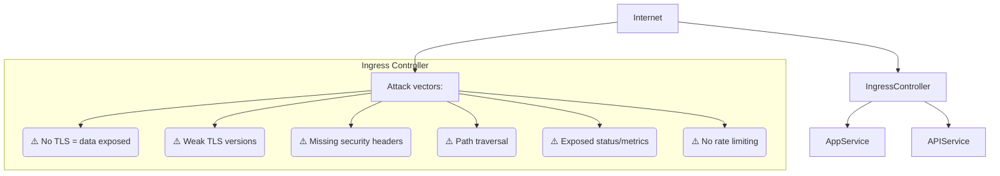
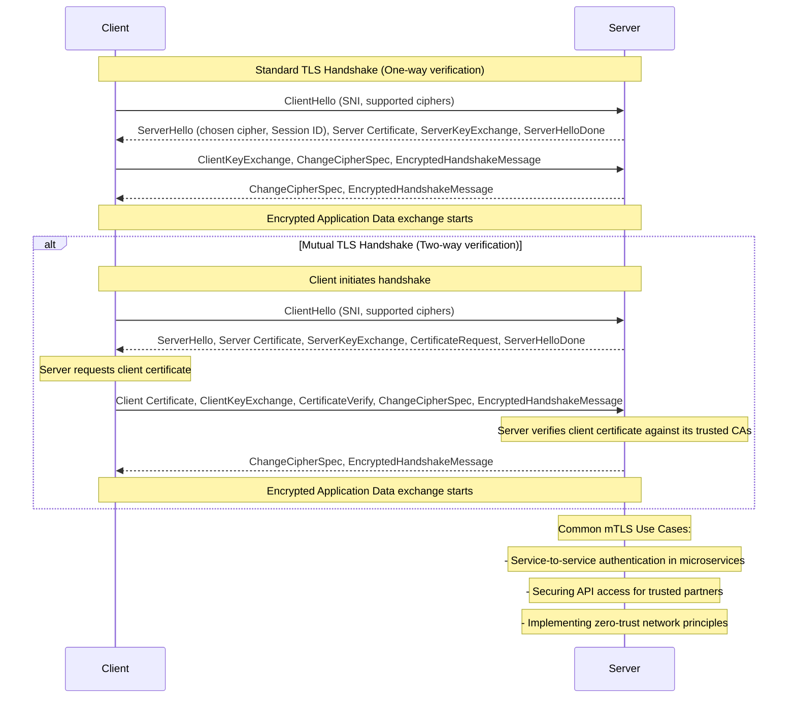
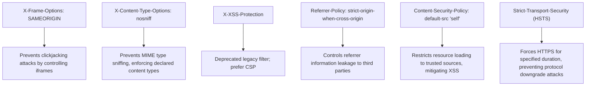

> **Складність**: Просунута
>
> **Час на проходження**: 35 хв
>
> **Передумови**: Сервіси та Ingress у Kubernetes, основи TLS, NetworkPolicy, securityContext для Pod'ів та концепції NGINX Ingress Controller

---

## Що ви зможете зробити

- Діагностувати збої Ingress, пов'язані з TLS, заголовками, обмеженням швидкості та обходом бекенду, за допомогою маніфестів, логів і зовнішніх перевірок.
- Впроваджувати налаштування TLS, HSTS, mTLS та довіри до сертифікатів для HTTPS-трафіку на межі мережі в Kubernetes 1.35+.
- Проєктувати заголовки безпеки, контроль над чутливими шляхами та обмеження швидкості, які знижують ризики з боку браузера, перебору паролів і розкриття інформації.
- Оцінювати securityContext контролера Ingress, ізоляцію через NetworkPolicy та доступність бекенд-сервісів як межу нульової довіри (zero-trust).
- Налагоджувати збої безпеки Ingress, порівнюючи очікувані шляхи запитів із логами контролера, сертифікатами та досяжністю Сервісів.

## Чому цей модуль важливий

Гіпотетичний сценарій: команда публікує клієнтський API через контролер Ingress і святкує, бо маршрут працює через HTTPS із публічного інтернету. За тиждень тестувальник дістається того самого бекенду через внутрішній Сервіс зі скомпрометованого налагоджувального Pod'а, обходячи кожне правило заголовків, перенаправлень, обмеження швидкості та mTLS, прикріплене до Ingress. Ingress був налаштований, але межу не було спроєктовано; команда захистила одні двері, залишивши внутрішній коридор відкритим для будь-якого робочого навантаження, яке вже всередині кластера.

Безпека Ingress важлива, бо контролер є водночас і маршрутизатором, і точкою застосування політик. Він термінує TLS, розбирає HTTP, обчислює правила host і path, додає заголовки до відповідей, може автентифікувати клієнтів, а потім пересилає трафік до Сервісів, які часто беззастережно йому довіряють. Саме це поєднання ролей робить його тим місцем, де сходиться багато різних засобів контролю, але воно ж робить контролер і високоцінною мішенню, чия неправильна конфігурація може відкрити приватні дашборди, ендпоінти на кшталт сервісу метаданих або міжсервісні API, які ніколи не мали бути досяжними з публічного інтернету.

Цей модуль розглядає Ingress як крайову систему безпеки, а не як зручний об'єкт для маршрутизації HTTP. Ви працюватимете ззовні всередину: спершу зіставите шлях запиту, потім посилите TLS і ідентичність клієнта, потім контролюватимете поведінку браузера й частоту запитів, а потім ізолюєте бекенди так, щоб ці засоби контролю не можна було пропустити. У прикладах використано NGINX Ingress Controller, бо він поширений у середовищах рівня CKS, але процес ухвалення рішень застосовний до будь-якого контролера Kubernetes 1.35+, який перетворює об'єкти Ingress на конфігурацію крайового проксі.

## Поверхня атаки Ingress: відкрита межа вашого кластера

Контролер Ingress зазвичай розташований на першій межі рівня 7 (Layer 7), яку бачить запит перед входженням до мережі вашого застосунку. Хмарний балансувальник навантаження може приймати TCP-з'єднання, але саме контролер є компонентом, який розуміє HTTP-хости, шляхи, заголовки, кукі та імена TLS. Ця додаткова обізнаність на рівні застосунку корисна, бо дозволяє маршрутизувати багато сервісів через одну точку входу, але вона також означає, що контролер мусить безпечно розбирати ворожий ввід ще до того, як ваш застосунок отримає запит.

Модель загроз тут значно ширша за «хтось може забути про TLS». Слабкий Ingress може допускати шляхи зниження рівня (downgrade) транспорту, маршрутизувати неоднозначні URL до неправильного бекенду, витікати контекст браузера через відсутні заголовки безпеки, відкривати локації статусу або дозволити одному клієнтові спожити стільки ресурсу контролера, що всіх інших буде позбавлено обслуговування. Зловмисники також активно шукають способи повністю оминути контролер, бо бекенд-Сервіс, який приймає трафік від будь-якого Pod'а, зовсім не зважає на те, чи задовольнив початковий інтернет-запит вашу крайову політику безпеки.



Читайте цю діаграму як набір запитань щодо застосування політик, а не як перелік анотацій для галочки. Чи відхиляє контролер слабкий транспорт ще до того, як запит дістанеться застосунку? Чи нормалізує він і зіставляє шляхи так, що їх неможливо обійти дивним кодуванням? Чи додає він захист, орієнтований на браузер, послідовно? Чи відкриває він якийсь ендпоінт статусу контролера чи застосунку для публічного інтернету? Відповіді формують дизайн більше, ніж конкретне поле YAML, яке ви редагуєте.

Зупиніться та спрогнозуйте: якщо запит дістається бекенд-Pod'а, не пройшовши через контролер Ingress, які засоби контролю з діаграми все ще діють? TLS між браузером і межею вже не має значення, заголовки безпеки HTTP можуть так і не бути додані, обмеження швидкості можуть не спрацювати, а блокування шляхів можуть бути відсутніми. Саме тому цей модуль постійно повертається до того самого операційного правила: крайову політику слід поєднувати з ізоляцією бекенду, інакше політика стає необов'язковою.

Сам об'єкт Ingress також є лише частиною історії безпеки. Deployment контролера, ConfigMap, Сервіс, Secret'и, політика допуску та NetworkPolicy — усе це впливає на реальну межу. Тому безпечний огляд відстежує запит від клієнта до контролера, від контролера до Сервісу та від Сервісу до обраних Pod'ів, а потім перевіряє, чи може якийсь обхідний маршрут уникнути передбаченої точки ухвалення рішення.

Зіставлення host і path заслуговує на особливу увагу, бо це логіка, яка вирішує, який бекенд отримає запит після того, як контролер його прийняв. Шаблонний (wildcard) host може бути зручним під час міграції, але він також розширює набір імен, що дістаються контролера, і може маршрутизувати до застосунку, який припускає вужче походження. Шлях `Prefix` простіше осмислити, ніж складний регулярний вираз, але його все одно треба тестувати на варіанти зі скісною рискою в кінці та закодованими символами. Найбезпечніший дизайн тримає публічні хости конкретними, тримає чутливі операційні маршрути поза публічними хостами і перевіряє точні форми запитів, які зловмисники найімовірніше спробують.

IngressClass — це ще одна межа, яку часто ігнорують під час оглядів безпеки. У Kubernetes 1.35+ кілька контролерів можуть спостерігати за різними значеннями IngressClass, що дозволяє платформним командам розділяти публічний інтернет-трафік, суто внутрішній трафік та експериментальну поведінку контролера. Якщо розробники можуть опустити клас або використати спільний усталений без огляду, приватний сервіс може випадково опинитися на публічній межі. Корисне правило допуску просте: кожен Ingress мусить оголошувати схвалений клас, а чутливі простори імен можуть використовувати лише ті класи, що призначені для їхньої моделі відкритості.

## TLS, HSTS та довіра до сертифікатів на межі

TLS — це перший засіб контролю, який більшість тих, хто навчається, асоціюють з Ingress, але «має сертифікат» зовсім не дорівнює «має захищений транспортний дизайн». Контролер мусить пред'являти правильний сертифікат саме для запитаного хоста, відхиляти застарілі протоколи, надавати перевагу сильним шифрам і перенаправляти відкритий текстовий (cleartext) трафік так, щоб не привчати клієнтів і далі пробувати HTTP. Застосунок не повинен сам здогадуватися, чи прибув запит безпечно; натомість межа має робити небезпечні шляхи або взагалі неможливими, або помітно невдалими.

Для продакшну видача сертифікатів має бути автоматизована через довірений центр сертифікації, зазвичай за допомогою контролера на кшталт cert-manager. Для лабораторного або ізольованого середовища розробки самопідписаний сертифікат корисний, бо дозволяє перевірити механіку TLS Secret'ів та посилань Ingress у Kubernetes, не чекаючи на публічний DNS та валідацію сертифіката. Важлива звичка — ставитися до приватного ключа як до Secret'а, обмежувати його простором імен, якому належить Ingress, і уникати копіювання його між непов'язаними сервісами.

```bash
# Generate self-signed certificate (for testing purposes only)
# This creates a private key (tls.key) and a self-signed certificate (tls.crt)
openssl req -x509 -nodes -days 365 -newkey rsa:2048 \
  -keyout tls.key -out tls.crt \
  -subj "/CN=myapp.example.com"

# Create the namespace used by the lab objects, then create the TLS Secret there.
# This secret will hold the certificate and key, allowing Ingress to use them.
kubectl create namespace production

kubectl create secret tls myapp-tls \
  --cert=tls.crt \
  --key=tls.key \
  -n production

# Verify the contents and type of the created secret
# The 'kubernetes.io/tls' type indicates it's a TLS secret.
kubectl get secret myapp-tls -n production -o yaml
```

Щойно Secret існує, правило Ingress мусить прив'язати ім'я хоста до цього Secret'а і скеровувати HTTP-клієнтів до HTTPS. Перенаправлення не є косметичним; воно запобігає випадковому надсиланню відкритого тексту і робить спроби зниження рівня помітними. HSTS потім переносить частину застосування правил у браузери, які його підтримують, наказуючи їм використовувати HTTPS для майбутніх запитів до домену протягом налаштованого часу.

```yaml
apiVersion: networking.k8s.io/v1
kind: Ingress
metadata:
  name: secure-ingress
  namespace: production
  annotations:
    # Force all HTTP traffic to redirect to HTTPS. This prevents clients from
    # accidentally or maliciously using unencrypted connections.
    nginx.ingress.kubernetes.io/ssl-redirect: "true"
    # Enable HTTP Strict Transport Security (HSTS). This tells browsers to ONLY
    # communicate with this domain over HTTPS for a specified duration.
    nginx.ingress.kubernetes.io/hsts: "true"
    # The max-age for HSTS, in seconds (1 year = 31536000).
    nginx.ingress.kubernetes.io/hsts-max-age: "31536000"
    # Include subdomains in the HSTS policy.
    nginx.ingress.kubernetes.io/hsts-include-subdomains: "true"
spec:
  ingressClassName: nginx # Specify the Ingress Controller to use (e.g., nginx, traefik)
  tls:
  - hosts:
    - myapp.example.com # The domain name for which this TLS certificate is valid
    secretName: myapp-tls # Reference to the Kubernetes TLS Secret created above
  rules:
  - host: myapp.example.com
    http:
      paths:
      - path: /
        pathType: Prefix
        backend:
          service:
            name: myapp
            port:
              number: 80 # Backend service is typically HTTP, Ingress handles TLS termination
```

Налаштування перенаправлення та HSTS слід переглядати з огляду на поведінку клієнтів. HSTS «прилипає» за задумом, тож увімкнення його на батьківському домені з включеними піддоменами може зламати забутий HTTP-only піддомен, доки його не виправлять. Саме цей ризик є причиною того, що це налаштування належить плану змін, а не недбалій анотації, доданій під час збою.

> **Зупиніться і подумайте**: ви налаштували TLS на своєму Ingress із `ssl-redirect: "true"` та HSTS. Але пентестер показує, що все ще може дістатися вашого застосунку через HTTP, надсилаючи запити безпосередньо до ClusterIP бекенд-Сервісу, повністю оминаючи Ingress. Який додатковий захист потрібен, щоб бекенд-сервіс отримував трафік _лише_ від контролера Ingress?

Сильні налаштування TLS зазвичай варто централізувати в ConfigMap контролера, щоб кожен Ingress отримував той самий мінімальний стандарт. Якщо кожна команда застосунку обирає власний перелік протоколів, кластер дрейфує до найслабшого винятку, бо старі клієнти мають властивість ставати постійними. Глобальний базовий рівень також спрощує аудиторські докази: ви можете показати конфігурацію контролера один раз, а потім переглядати лише навмисні перевизначення для окремих Ingress.

```yaml
# ConfigMap for nginx-ingress-controller
# This configuration applies globally to all Ingress resources managed by this controller.
apiVersion: v1
kind: ConfigMap
metadata:
  name: nginx-ingress-controller
  namespace: ingress-nginx # The namespace where your ingress-nginx controller is deployed
data:
  # Minimum TLS version: Restrict to TLSv1.2 and TLSv1.3.
  # TLSv1.0 and TLSv1.1 are known to be vulnerable and should be disabled.
  ssl-protocols: "TLSv1.2 TLSv1.3"

  # Strong cipher suites only: Prioritize modern, secure ciphers.
  # This list excludes weak or compromised ciphers.
  ssl-ciphers: "ECDHE-ECDSA-AES128-GCM-SHA256:ECDHE-RSA-AES128-GCM-SHA256:ECDHE-ECDSA-AES256-GCM-SHA384:ECDHE-RSA-AES256-GCM-SHA384"

  # Enable HSTS globally: For all domains managed by this controller.
  hsts: "true"
  hsts-max-age: "31536000" # One year max-age for robustness
  hsts-include-subdomains: "true" # Apply HSTS to all subdomains
  hsts-preload: "true" # Request inclusion in browser HSTS preload lists
```

Назви шифрів виглядають щільно, але вони кодують реальні властивості безпеки. `ECDHE` забезпечує ефемерний обмін ключами, що дає пряму секретність (forward secrecy), тож майбутній витік серверного ключа не розшифрує автоматично записаний трафік. `GCM` забезпечує автентифіковане шифрування, яке захищає конфіденційність і виявляє підробку в одному режимі. Огляд рівня CKS не вимагає запам'ятовувати кожен шифр, але він вимагає розпізнавати, коли контролер усе ще дозволяє застарілі протоколи чи слабкі набори, бо ніхто не встановив нижню межу.

Перевизначення для окремих Ingress корисні, коли особливо чутливому API потрібна перевірка клієнтського сертифіката або суворіша перевага шифрів, ніж спільний базовий рівень. Вони також ризиковані, бо анотації можуть стати розпорошеною політикою. Перш ніж обирати перевизначення, запитайте, чи є виняток тимчасовим, чи може команда-власник протестувати своїх клієнтів і чи належить цей засіб контролю радше до рівня контролера.

```yaml
apiVersion: networking.k8s.io/v1
kind: Ingress
metadata:
  name: strict-tls-ingress
  annotations:
    # Require client certificate (mTLS) for this specific Ingress.
    # This is a powerful mechanism for service-to-service authentication.
    nginx.ingress.kubernetes.io/auth-tls-verify-client: "on"
    # Specify the Kubernetes Secret containing the CA certificate to verify client certificates.
    nginx.ingress.kubernetes.io/auth-tls-secret: "production/ca-secret"

    # Prefer the server's cipher order over the client's.
    # This ensures that stronger server-side ciphers are always used if supported by the client.
    nginx.ingress.kubernetes.io/ssl-prefer-server-ciphers: "true"
spec:
  tls:
  - hosts:
    - api.example.com
    secretName: api-tls
```

Перш ніж це запускати, який результат ви очікуєте від зовнішнього TLS-сканера, якщо ConfigMap дозволяє лише TLS 1.2 та TLS 1.3? Вам слід очікувати, що проби старих протоколів зазнають невдачі, проби сучасних протоколів пройдуть успішно, а пред'явлений ланцюжок сертифікатів відповідатиме хосту, який тестується. Якщо сканер бачить усталений сертифікат, проблема зазвичай у зіставленні хоста, посиланні на secret, перезавантаженні контролера або в тому, що DNS вказує на іншу межу.

Ротацію сертифікатів слід протестувати до першого термінового продовження. Хороша вправа з ротації доводить, що контролер помічає оновлення Secret'а, перезавантажується без втрати справного трафіку і подає новий ланцюжок сертифікатів для очікуваного хоста. Якщо видачею володіє cert-manager, огляд має включати Certificate, Issuer або ClusterIssuer, вікно продовження, шлях DNS- або HTTP-челенджу та сповіщення про невдалі продовження. Іспит CKS часто стискає це до маніфесту Secret і Ingress, але збої в продакшні зазвичай трапляються в механіці продовження навколо цих об'єктів.

Цикли перенаправлень — це окремий режим збою TLS, який може виглядати як проблема застосунку навіть тоді, коли сертифікати дійсні. Вони зазвичай з'являються, коли хмарний балансувальник навантаження термінує TLS, пересилає відкритий HTTP до контролера, а контролер не правильно дізнається, що початковий клієнт використовував HTTPS. Контролер може й далі перенаправляти, бо бачить HTTP від балансувальника, а клієнт продовжує слідувати перенаправленням назад до тієї самої межі. Виправлення цього вимагає налаштування довіреного проксі та правильної обробки пересланого протоколу, а не просто вимкнення перенаправлень.

Існує також політична різниця між термінацією на межі та наскрізним (end-to-end) шифруванням. Багато кластерів термінують TLS на контролері Ingress і пересилають HTTP до Pod'ів, бо внутрішня мережа контрольована й спостережувана. Чутливіші системи можуть повторно шифрувати від контролера до бекенду або вимагати TLS на бекенді теж, особливо коли трафік перетинає простори імен, якими володіють різні команди. Рішення має бути явним: термінація на межі спрощує сертифікати та інспекцію, тоді як TLS на бекенді зменшує довіру до мережі кластера і збільшує роботу з життєвим циклом сертифікатів.

## Взаємний TLS та ідентичність клієнта біля дверей

Стандартний TLS доводить ідентичність сервера клієнтові, але він не доводить, що цьому клієнтові взагалі дозволено викликати API. Взаємний TLS (mTLS) додає цей другий доказ, вимагаючи, щоб і клієнт пред'явив сертифікат, підписаний центром сертифікації, якому довіряє контролер. Це дуже добре пасує для партнерських API, внутрішніх адміністративних ендпоінтів та міжсервісних інтерфейсів, де саме володіння приватним ключем є частиною моделі доступу.

Операційна ціна — це керування життєвим циклом сертифікатів. Хтось мусить видавати клієнтські сертифікати, безпечно розподіляти приватні ключі, ротувати сертифікати до закінчення строку, відкликати або припиняти довіру до втрачених облікових даних і вирішувати, чи потрібні бекенд-застосункам перевірені деталі сертифіката. Якщо ці процеси розпливчасті, mTLS може створювати крихкі збої навіть тоді, коли сама криптографія сильна.



Якорем довіри для mTLS є сертифікат CA, а не кожен окремий клієнтський сертифікат. Контролер отримує клієнтський сертифікат під час рукостискання, перевіряє цей сертифікат за довіреним набором CA, перевіряє глибину ланцюжка і лише тоді пересилає запит. Це означає, що один Secret, який містить публічний сертифікат CA, може авторизувати багато клієнтів, але це також означає, що компрометація центру, який видає сертифікати, є набагато масштабнішою подією, ніж компрометація одного клієнтського ключа.

```bash
# The TLS setup above creates the production namespace. If you run only this
# mTLS block in a fresh lab, create that namespace before creating the Secret.
# Assume 'ca.crt' is the public CA certificate that signed your client certificates.
# This secret tells the Ingress controller which CA to trust for client authentication.
kubectl create secret generic ca-secret \
  --from-file=ca.crt=ca.crt \
  -n production
```

Анотації Ingress потім наказують контролеру запитувати та перевіряти клієнтський сертифікат. Передавання сертифіката вгору за потоком (upstream) може бути корисним, коли застосунку треба авторизувати на основі полів суб'єкта чи організації сертифіката, але цього не слід робити недбало. Ставтеся до пересланих даних сертифіката як до чутливих до безпеки метаданих і переконайтеся, що застосунки вгору за потоком довіряють їм лише тоді, коли вони надійшли шляхом через контролер.

```yaml
apiVersion: networking.k8s.io/v1
kind: Ingress
metadata:
  name: mtls-ingress
  namespace: production
  annotations:
    # Enable client certificate verification. This is the core mTLS setting.
    nginx.ingress.kubernetes.io/auth-tls-verify-client: "on"
    # Specify the Secret (namespace/name) containing the CA certificate for client verification.
    nginx.ingress.kubernetes.io/auth-tls-secret: "production/ca-secret"
    # Set the maximum verification depth in the client certificate chain.
    nginx.ingress.kubernetes.io/auth-tls-verify-depth: "1" # Typically 1 for direct CA-signed certs
    # Pass the client certificate to the upstream (backend) service.
    # This allows the backend application to perform further authorization based on client cert details.
    nginx.ingress.kubernetes.io/auth-tls-pass-certificate-to-upstream: "true"
spec:
  tls:
  - hosts:
    - secure-api.example.com
    secretName: api-tls # The server's TLS certificate for secure-api.example.com
  rules:
  - host: secure-api.example.com
    http:
      paths:
      - path: /
        pathType: Prefix
        backend:
          service:
            name: secure-api
            port:
              number: 443 # Backend service expects TLS if mTLS is being terminated there
```

> **Що сталося б, якби**: ви налаштовуєте mTLS на своєму Ingress, вимагаючи клієнтських сертифікатів. Клієнтський сертифікат легітимного користувача протермінувався на вихідних. Що станеться з його запитами і як вам слід спроєктувати керування життєвим циклом сертифікатів, щоб запобігти перериванню обслуговування через прострочені облікові дані?

На іспиті чи під час інциденту відрізняйте збій автентифікації від збою маршрутизації. Прострочений, недовірений або відсутній клієнтський сертифікат має давати збій під час TLS-рукостискання або на ранньому етапі обробки запиту, часто ще до того, як бекенд-застосунок щось залогує. Неправильне ім'я Сервісу, відсутній ендпоінт або невідповідність шляху — це інше: запит був прийнятий межею, а потім його не вдалося правильно переслати. Ця різниця в часі підказує, чи перевіряти спершу матеріал сертифіката, логи контролера чи виявлення Сервісів Kubernetes.

Ідентичність за клієнтським сертифікатом — це автентифікація, а не повна авторизація. Дійсний партнерський сертифікат доводить, що абонент володіє приватним ключем, виданим під довіреним CA, але він не відповідає автоматично на питання, який орендар, обсяг API чи операцію абонент може використати. Деякі системи зіставляють поля суб'єкта сертифіката з ідентичністю застосунку; інші використовують mTLS лише для допуску трафіку до другого рівня автентифікації. Будьте чіткими щодо цього розділення, бо бекенд, який трактує «дійсний сертифікат» як «усі дії дозволено», може перетворити один витоклий партнерський ключ на широкий доступ.

Ротація CA — найскладніша подія життєвого циклу, бо старі та нові клієнтські сертифікати можуть мусити співіснувати під час міграції. Практичний дизайн підтримує набір довірених сертифікатів CA протягом періоду перекриття, видає нові клієнтські сертифікати до видалення старого якоря довіри і перевіряє, що застарілі клієнти дають збій лише після запланованого моменту переходу. Якщо анотація контролера вказує на Secret, який містить один файл CA, задокументуйте, чи є цей файл об'єднаним набором і як його безпечно оновлюватимуть. Огляд не завершено, доки ви не знаєте, як довіра прибирається, а не лише як вона додається.

## Заголовки безпеки, обмеження швидкості та чутливі шляхи

TLS захищає транспорт, але браузерам усе одно потрібні явні інструкції щодо того, як саме поводитися з повернутим їм вмістом. Заголовки безпеки зменшують радіус ураження (blast radius) від помилок застосунку, обмежуючи фреймінг сторінки, виявлення типу вмісту (sniffing), поведінку заголовка referer та завантаження скриптів. Вони не замінюють собою безпеку застосунку, проте вони все одно цінні, бо межа може застосовувати їх послідовно навіть тоді, коли кільком різним бекенд-командам належать різні сервіси за тим самим спільним контролером.

NGINX Ingress може додавати заголовки за допомогою фрагментів конфігурації (snippets), але ці сніпети достатньо потужні, щоб бути небезпечними. У багатьох кластерах адміністратори обмежують анотації-сніпети, бо вони дозволяють командам застосунків вставляти сирі директиви NGINX до згенерованої конфігурації. Якщо сніпети дозволено, стандарт огляду має бути високим: директива має бути зрозумілою, обмеженою за областю, протестованою і виправданою поведінкою застосунку, яку вона захищає.

```yaml
apiVersion: networking.k8s.io/v1
kind: Ingress
metadata:
  name: hardened-ingress
  annotations:
    # The configuration-snippet allows injecting arbitrary NGINX configuration.
    # Here, we add security headers that still matter in modern browsers.
    nginx.ingress.kubernetes.io/configuration-snippet: |
      add_header X-Frame-Options "SAMEORIGIN" always; # Prevents clickjacking by controlling iframe usage
      add_header X-Content-Type-Options "nosniff" always; # Prevents MIME-type sniffing, enforcing declared content types
      add_header Referrer-Policy "strict-origin-when-cross-origin" always; # Controls how much referrer information is sent
      add_header Content-Security-Policy "default-src 'self'" always; # Restricts resource loading to trusted sources (e.g., same origin)
spec:
  # ... rest of Ingress specification ...
```

Кожен заголовок відповідає на інше питання браузера. `X-Frame-Options` повідомляє браузеру, чи може інший сайт вбудовувати сторінку у фрейм, що впливає на клікджекінг. `X-Content-Type-Options` наказує браузеру не переінтерпретувати вміст як інший тип, що має значення, коли йдеться про завантаження або статичні ресурси. Content Security Policy є ширшою й делікатнішою, бо може заблокувати легітимні скрипти, якщо політика не відповідає застосунку. Не сприймайте `X-XSS-Protection` як сучасний базовий рівень: він застарілий і нестандартний, тож CSP та обробка виводу на боці застосунку — це засоби контролю, навколо яких слід будувати дизайн.



> **Зупиніться і спрогнозуйте**: ваш Ingress використовує TLS мінімум 1.2 для всього трафіку. Аудит відповідності тепер диктує, що ви мусите примусово застосувати *лише* TLS 1.3 для конкретного, дуже чутливого ендпоінта API. Який відсоток ваших легітимних клієнтів це може зламати і яким був би ваш поетапний план міграції для впровадження такої суворої вимоги без масштабного збою? Зважте на підтримку браузерів та наявні клієнтські інтеграції.

Обмеження швидкості захищає доступність і робить спроби перебору дорожчими. Хитрість у тому, щоб обмежувати швидкість на правильній межі ідентичності. Якщо контролер бачить кожного клієнта як ту саму IP-адресу балансувальника, бо переслані заголовки налаштовані неправильно, ліміт на одну IP може придушити всіх користувачів разом. Якщо ж він довіряє пересланим заголовкам із публічного інтернету, не очищаючи й не перевіряючи їх, клієнт може підробити їх і обійти ліміт.

```yaml
apiVersion: networking.k8s.io/v1
kind: Ingress
metadata:
  name: rate-limited-ingress
  annotations:
    # Limit the number of requests per second from a single IP address.
    nginx.ingress.kubernetes.io/limit-rps: "10" # 10 requests per second

    # Limit the number of concurrent connections from a single IP address.
    nginx.ingress.kubernetes.io/limit-connections: "5" # 5 concurrent connections

    # Allows for short bursts of requests above the 'limit-rps' before throttling.
    # A multiplier of 5 means a burst of up to 50 requests can be handled briefly.
    nginx.ingress.kubernetes.io/limit-burst-multiplier: "5"

    # Customize the HTTP status code returned when a client is rate-limited.
    nginx.ingress.kubernetes.io/server-snippet: |
      limit_req_status 429; # Return HTTP 429 Too Many Requests
spec:
  rules:
  - host: api.example.com
    http:
      paths:
      - path: /
        pathType: Prefix
        backend:
          service:
            name: api
            port:
              number: 80
```

Чутливі шляхи потребують окремого огляду, бо контроль шляхів часто дає збій через неоднозначність. Адмін-дашборди, ендпоінти справності, маршрути профілювання та шляхи метрик можуть розкривати дані про версію, імена середовищ, внутрішню топологію чи операційні секрети. Блокування `^/admin` недостатньо, якщо проксі та застосунок розходяться щодо нормалізації, закодованих символів, скісних рисок у кінці чи повторюваних розділювачів.

```yaml
apiVersion: networking.k8s.io/v1
kind: Ingress
metadata:
  name: protected-paths
  annotations:
    # Inject an NGINX location block to deny access to specific paths.
    # This regex matches '/admin', '/metrics', '/health', or '/debug'.
    nginx.ingress.kubernetes.io/server-snippet: |
      location ~ ^/(admin|metrics|health|debug) {
        return 403; # Block matching paths with Forbidden status
      }

    # Alternatively, require external authentication for a path or service.
    # This redirects requests to an external authentication service.
    nginx.ingress.kubernetes.io/auth-url: "https://auth.example.com/verify"
spec:
  rules:
  - host: app.example.com
    http:
      paths:
      - path: /
        pathType: Prefix
        backend:
          service:
            name: app
            port:
              number: 80
```

Який підхід ви обрали б тут і чому: забороняти чутливі шляхи на межі, вимагати зовнішньої автентифікації чи взагалі прибрати маршрут із публічного Ingress? Правила заборони прості, але їх можна обійти, якщо інтерпретація шляху відрізняється. Зовнішня автентифікація гнучка, але додає залежність. Прибрання маршруту є найсильнішим, коли ендпоінт є операційним, а не орієнтованим на користувача, бо тоді немає публічного крайового рішення, яке можна було б зробити неправильно.

Володіння заголовками слід записувати, бо і застосунок, і межа можуть встановлювати заголовки відповіді. Якщо застосунок встановлює одну CSP, а контролер додає іншу, поведінка браузера може стати суворішою, ніж очікувала будь-яка з команд, або кінцева відповідь може залежати від поведінки злиття на проксі. Хороший огляд визначає власника для кожного заголовка, причину обраного значення і тест, який доводить, що заголовок з'являється на звичайних відповідях, перенаправленнях та відповідях про помилку, де контролер може на них впливати. Це запобігає тому, щоб зміна, продиктована сканером, тихо зламала реальний шлях користувача.

Обмеження швидкості також потребують семантики збою. Ендпоінт входу має повертати чіткий 429, коли спрацьовують ліміти, тоді як дорогому ендпоінту експорту може знадобитися інший ліміт, черга або квоти на рівні застосунку. Якщо всі шляхи поділяють один грубий ліміт, клієнт, який завантажує великі звіти, може заважати клієнтові, що робить невеликі виклики API. Контролер добре справляється з грубим крайовим захистом, але квоти з урахуванням бізнесу часто належать застосунку або шлюзу API, бо вони розуміють користувачів, орендарів і вартість операцій.

Анотації зовнішньої автентифікації вводять ланцюжок залежностей, який має бути частиною моделі загроз. Якщо сервіс автентифікації недоступний, контролер мусить вирішити, давати збій із закритими дверима (fail closed) чи з відкритими (fail open), і чутливі до безпеки шляхи мають давати збій із закритими дверима. Якщо сервіс автентифікації досяжний через публічний інтернет, цей шлях потребує власного огляду TLS і доступності. Якщо відповідь автентифікації кешується, тривалість кешу стає частиною поведінки відкликання. Це не причини уникати зовнішньої автентифікації, але це причини тестувати її як продакшн-залежність.

## Ізоляція бекенду та посилення контролера

Правила Ingress захищають лише той трафік, який насправді дістається контролера. Сервіси Kubernetes залишаються досяжними всередині кластера доти, доки інший засіб контролю не скаже інакше, тож скомпрометований Pod у тій самій мережевій площині цілком може спробувати прямий доступ до ClusterIP бекенду. NetworkPolicy перетворює передбачений маршрут на примусово застосований, дозволяючи обраним бекенд-Pod'ам отримувати трафік лише від Pod'ів контролера Ingress і лише на очікуваному порту.

Саме тут мітки стають критичними для безпеки. namespaceSelector та podSelector мусять відповідати простору імен контролера і Pod'ам, які ви насправді запускаєте, а не мітці, яку ви хотіли б, щоб існувала. Якщо мітки неправильні, політика може заблокувати весь вхідний трафік і виглядати як збій застосунку, або вона може не обрати нічого корисного і залишити обхід відкритим. Завжди перевіряйте мітки за допомогою `kubectl get namespace --show-labels` та `kubectl get pods --show-labels`, перш ніж довіряти політиці.

```yaml
# This NetworkPolicy ensures that only the ingress-nginx controller
# can send traffic to pods labeled 'app: myapp' in the 'production' namespace.
apiVersion: networking.k8s.io/v1
kind: NetworkPolicy
metadata:
  name: allow-from-ingress-only
  namespace: production # The namespace where your backend application is
spec:
  podSelector:
    matchLabels:
      app: myapp # Selects the pods of your application
  policyTypes:
  - Ingress # This policy applies to incoming traffic
  ingress:
  - from:
    - namespaceSelector:
        matchLabels:
          kubernetes.io/metadata.name: ingress-nginx # Selects the ingress controller namespace by its standard label
      podSelector:
        matchLabels:
          app.kubernetes.io/name: ingress-nginx # Selects the ingress controller pods
    ports:
    - port: 80 # Allow traffic on port 80 (where the backend service listens)
```

Сам контролер також заслуговує на посилення, бо він відкритий за задумом. Якщо зловмисник експлуатує вразливість контролера, securityContext контейнера визначає, чи зможе ця експлуатація писати у файлову систему, отримати додаткові привілеї чи використати можливості (capabilities) Linux понад те, що потрібно проксі. Посилений контролер має працювати як non-root, скидати можливості за замовчуванням, уникати ескалації привілеїв і запитувати достатньо ресурсів, щоб звичайний трафік не створював шумного голодування.

```yaml
apiVersion: apps/v1
kind: Deployment
metadata:
  name: ingress-nginx-controller
  namespace: ingress-nginx
spec:
  selector:
    matchLabels:
      app.kubernetes.io/name: ingress-nginx
      app.kubernetes.io/component: controller
  template:
    metadata:
      labels:
        app.kubernetes.io/name: ingress-nginx
        app.kubernetes.io/component: controller
    spec:
      containers:
      - name: controller
        image: registry.k8s.io/ingress-nginx/controller:v1.9.0 # Use a specific, well-vetted image version
        securityContext:
          runAsNonRoot: true # Ensure the container does not run as root
          runAsUser: 101 # Run as an arbitrary non-root user (e.g., 101, common for nginx)
          readOnlyRootFilesystem: true # Prevent writing to the container's root filesystem
          allowPrivilegeEscalation: false # Prevent processes from gaining more privileges
          capabilities:
            drop:
            - ALL # Drop all Linux capabilities by default
            add:
            - NET_BIND_SERVICE # Only add necessary capabilities, like binding to low ports
        resources:
          limits:
            cpu: "1" # Limit CPU usage to prevent DoS attacks on the controller itself
            memory: 512Mi # Limit memory usage
          requests:
            cpu: 100m # Request minimum resources for scheduling
            memory: 256Mi
```

У `NET_BIND_SERVICE` є важливий компроміс. Деяким образам контролера він потрібен, щоб прив'язуватися до низьких портів усередині контейнера; інші розгортання можуть уникнути його, прив'язуючись до високих портів контейнера і відображаючи їх через Сервіс. Старший інженер не прибирає кожну можливість наосліп, а доводить, яка можливість потрібна для обраної форми розгортання, і потім лишає тільки її.

Посилення також включає область контролера. Якщо єдиний контролер спостерігає за кожним простором імен, погана анотація в просторі імен одного орендаря може вплинути на крайовий компонент, спільний для багатьох команд. Окремі контролери, окремі значення IngressClass та правила допуску для ризикованих анотацій можуть зменшити радіус ураження. Іспит CKS може подавати меншу проблему рівня маніфесту, але продакшн-дизайн запитує, кому взагалі дозволено програмувати межу.

Застосування NetworkPolicy залежить від мережевого плагіна кластера. Kubernetes визначає API NetworkPolicy, але політика не діє, доки встановлений CNI її не реалізує. Це означає, що успішного огляду YAML недостатньо; вам також потрібен один негативний тест зв'язності з Pod'а, який має бути заблокований, і один позитивний тест через шлях контролера Ingress. У середовищах іспиту припускайте підтримку політик, коли завдання стосується NetworkPolicy, але в продакшні записуйте можливості CNI як частину доказів контролю.

Запити та ліміти ресурсів є засобами контролю безпеки, коли контролер відкритий для недовіреного трафіку. Без запиту CPU планувальник може розмістити контролер там, де він погано конкурує з робочими навантаженнями; без ліміту пам'яті сплеск розбору чи буферизації може створити тиск на вузол. Занадто малі ліміти також можуть створити самоспричинену відмову в обслуговуванні, тож налаштовуйте їх за спостережуваним трафіком і метриками контролера, а не копіюючи число назавжди. Мета — передбачуваний збій під навантаженням, а не довільно малий слід.

## Налагодження проблем безпеки Ingress

Налагодження захищеного Ingress починається з визначення того, на якому саме етапі запит було відхилено. Попередження браузера про сертифікат вказує на проблеми TLS Secret'а, хоста, ланцюжка сертифікатів або SNI. Цикл перенаправлень 308 або 301 вказує на логіку перенаправлення, заголовки пересланого протоколу або балансувальник навантаження, який термінує TLS ще до контролера. Помилка 403 на чутливому шляху вказує на навмисну заборону чи правило автентифікації, тоді як помилка 429 вказує на обмеження швидкості або на злиття ідентичності багатьох клієнтів в одну за проксі.

Інспекція маніфестів — це перший прохід, бо багато збоїв видно без захоплення пакетів. Скористайтеся `kubectl describe ingress <name>`, щоб підтвердити IngressClass, хости, шляхи, імена бекенд-Сервісів, посилання на TLS Secret і події контролера. Скористайтеся `kubectl get secret <name> -o yaml`, щоб підтвердити тип і ключі Secret'а, потім перегляньте логи контролера на предмет збоїв перезавантаження чи помилок перевірки сертифіката. Якщо контролер ніколи не приймав конфігурацію, зовнішні тести покажуть лише попередній стан.

Логи контролера особливо корисні для mTLS та обмеження швидкості. Клієнтський сертифікат, відхилений контролером, часто не залишає логу застосунку, бо бекенд так і не отримав запиту. Запит, обмежений за швидкістю, може показувати налаштований код статусу та зону обмеження. Обхід бекенду, однак, може створювати логи застосунку без відповідних логів доступу контролера, що є сильним сигналом того, що трафік входить через шлях Сервісу, який межа не контролює.

Зовнішня валідація замикає цикл, бо тестує те, що клієнти насправді бачать. Інструменти на кшталт `nmap`, `sslyze`, інструментів розробника браузера та простих перевірок `curl -I` можуть верифікувати версії протоколу, ланцюжок сертифікатів, заголовки відповіді, перенаправлення та поведінку публічних шляхів. Внутрішня валідація потім має спробувати дістатися бекенд-Сервісу з не-ingress Pod'а, щоб довести, чи блокує NetworkPolicy обходи. Чистий дизайн проходить обидва тести: ззовні видно очікувану крайову політику, а зсередини її не уникнути.

Під час налагодження стримуйте бажання змінювати кілька анотацій одразу. Рухайтеся по одному рівню за раз: ідентичність TLS, перенаправлення та HSTS, автентифікація клієнта, заголовки, обмеження швидкості, контроль шляхів, ізоляція бекенду та securityContext контролера. Цей порядок віддзеркалює шлях запиту, що робить ваші спостереження надійнішими і допомагає уникнути маскування реальної проблеми другою випадковою зміною.

Корисний шаблон доказів — порівняти три логи чи спостереження для того самого запиту: статус, видимий клієнтові, лог доступу чи помилок контролера і лог бекенд-застосунку. Якщо клієнт бачить 403, а бекенд не бачить нічого, запит, імовірно, зупинило крайове правило. Якщо бекенд бачить запит, а контролер — ні, запит оминув межу або влучив у інший контролер. Якщо контролер бачить помилку перезавантаження до тесту, ви тестуєте не той маніфест, який, на вашу думку, застосували.

Для збоїв TLS зберіть суб'єкт, видавця, строк дії, перелік SAN сертифіката та протокол, обраний клієнтом. Для збоїв mTLS додайте ланцюжок клієнтського сертифіката та вміст довіреного CA Secret'а. Для обмеження швидкості зберіть спостережувану IP клієнта чи переслану ідентичність так, як її бачить контролер. Для тестів обходу NetworkPolicy запишіть мітки Pod'а-джерела, мітки простору імен, мітки Pod'а призначення та порт призначення. Ці деталі тримають налагодження конкретним і запобігають розпливчастим висновкам на кшталт «Ingress зламаний», коли дав збій лише один рівень.

## Робочий приклад: посилення публічного Ingress для API

Сценарій вправи: платформну команду просять відкрити `api.example.com` для продакшн-API, що має публічний користувацький трафік, приватний ендпоінт `/metrics` та маршрут `/partner` лише для партнерів. Перший чорновий варіант має один Ingress, один TLS Secret, без обмеження швидкості й без NetworkPolicy. Він працює з браузера, але огляд має вирішити, чи достатньо він безпечний для публікації.

Перше рішення — розділити користувацький трафік та операційний трафік. Ендпоінт `/metrics` не є користувацькою функцією, тож найсильнішою відповіддю буде взагалі прибрати його з публічного хоста, а не писати хитромудре правило заборони. Якщо системі моніторингу справді потрібні метрики, відкрийте їх через внутрішній Сервіс або через приватний клас контролера. Цей один-єдиний вибір дизайну прибирає цілу проблему розбору шляхів із публічної межі.

Друге рішення — визначити базовий рівень публічного транспорту. Контролер має пред'являти сертифікат, чий SAN включає `api.example.com`, перенаправляти HTTP на HTTPS, встановлювати HSTS лише після того, як команда підтвердить, що кожен потрібний піддомен підтримує HTTPS, і відхиляти версії TLS нижче за базовий рівень контролера. Доказ є зовнішнім: сканер має показувати лише дозволені протоколи, а звичайний HTTP-запит має перенаправляти, а не подавати вміст застосунку.

Третє рішення — як захистити `/partner`. Якщо ідентичність партнера треба довести, перш ніж API витратить ресурс бекенду, mTLS на межі є доречним. Команда зберігає сертифікат CA партнера в Secret'і з обмеженням за простором імен, вмикає перевірку клієнта на партнерському маршруті й вирішує, чи потрібні бекенду переслані деталі сертифіката для авторизації. План життєвого циклу називає, хто видає клієнтські сертифікати, як відстежують строк дії і як прибирають довіру, коли партнер іде.

Четверте рішення — захист браузера й від зловживань для публічного маршруту. Заголовками відповіді має володіти або застосунок, або контролер, а не імпровізувати обом. Обмеження швидкості має використовувати справжню ідентичність клієнта після того, як зрозуміло шлях балансувальника, а ліміт має відповідати вартості ендпоінта. Маршрут входу, маршрут каталогу з інтенсивним читанням і дорогий маршрут експорту не обов'язково заслуговують на той самий поріг.

П'яте рішення — ізоляція бекенду. Pod'и API отримують NetworkPolicy, яка дозволяє вхідний трафік лише від Pod'ів контролера Ingress на порту застосунку. Налагоджувальний Pod в іншому просторі імен має не зуміти підключитися до бекенд-Сервісу, тоді як запит через публічний Ingress має й далі працювати. Якщо ці два тести не розходяться саме в такий спосіб, політика або не застосовується, або не обирає правильні Pod'и, або не тестує той шлях, який, на вашу думку, тестує.

Шосте рішення — радіус ураження контролера. Deployment контролера має працювати з non-root користувачем, без ескалації привілеїв, зі скинутими можливостями, крім тих, що потрібні формі розгортання, з кореневою файловою системою лише для читання там, де образ це підтримує, і з явними ресурсами. Якщо контролер спостерігає за багатьма просторами імен, платформна команда має також переглянути, хто може створювати об'єкти Ingress для публічного IngressClass і хто може використовувати анотації високого ризику, як-от сніпети.

Завершений огляд видає конкретний план тестування: зовнішнє сканування HTTPS, перевірка заголовків, перевірка перенаправлення HTTP, негативний і позитивний клієнтські тести mTLS, тест обмеження швидкості повторюваними запитами, тест чутливого шляху, тест внутрішнього обходу, огляд логів контролера й кореляція логів бекенду. Цей план цінніший за довгий перелік анотацій, бо кожен пункт доводить властивість, яку дизайн стверджує, що забезпечує. Коли один тест дає збій, шлях запиту підказує, який рівень перевіряти першим.

План відкату має бути таким самим конкретним, як план посилення. Якщо CSP блокує продакшн-ресурси, команда має знати, прибрати лише цей заголовок, перейти на політику в режимі звіту (report-only) чи відкотити всю зміну Ingress. Якщо mTLS блокує партнера, команді потрібен тимчасовий процес клієнтського сертифіката, який не послаблює кожного абонента. Якщо NetworkPolicy блокує застосунок, найбезпечніший відкат — це зазвичай вузьке виправлення селектора, а не видалення всієї ізоляції в паніці.

## Патерни та антипатерни

Патерни в безпеці Ingress полягають у тому, щоб зробити передбачений шлях запиту явним і повторюваним. Хороші команди вирішують, який контролер володіє яким класом трафіку, централізують базові налаштування TLS, обмежують доступ до бекенду й тестують межу як ззовні, так і зсередини кластера. Вони також документують винятки, бо анотація, виправдана для тимчасової міграції, може стати постійною прихованою слабкістю, якщо ніхто не записав її власника та умову закінчення строку.

| Патерн | Коли використовувати | Чому це працює | Міркування щодо масштабування |
|---|---|---|---|
| Базовий рівень TLS на рівні контролера | Більшість застосунків, орієнтованих на інтернет, поділяють той самий стандарт безпеки | Один ConfigMap запобігає слабшому дрейфу для окремих застосунків | Використовуйте окремі контролери лише тоді, коли вимоги клієнтів справді відрізняються |
| Ingress плюс NetworkPolicy | Бекенди мусять отримувати трафік лише через межу | Прямий доступ до ClusterIP не може обійти TLS, заголовки, mTLS чи обмеження швидкості | Потребує надійних міток простору імен і Pod'ів для контролера |
| mTLS для партнерських чи адміністративних API | Ідентичність клієнта має бути доведена, перш ніж застосунок обробить запит | Неавторизовані клієнти дають збій на межі до використання ресурсу бекенду | Потребує процедур видачі, ротації та відкликання сертифікатів |
| Зовнішня валідація після змін маніфесту | Засоби контролю безпеки мусять відповідати тому, що бачать клієнти | Сканери виявляють застарілі перезавантаження, неправильні сертифікати й відсутні заголовки | Автоматизуйте перевірки для критичних хостів у конвеєрах релізу |

Антипатерни зазвичай з'являються тоді, коли успіх маршрутизації плутають з успіхом безпеки. Маршрут, що повертає HTTP 200, усе ще може дозволяти слабкий TLS, витікати заголовки, відкривати метрики або приймати прямий трафік до бекенду. Інша поширена пастка — надавати кожному простору імен необмежений доступ до анотацій високого ризику, що перетворює спільну межу на програмовану поверхню із занадто багатьма авторами й занадто малим оглядом.

| Антипатерн | Що йде не так | Краща альтернатива |
|---|---|---|
| Лише додавання `tls:` до Ingress | HTTP-шляхи, слабкі протоколи чи усталені сертифікати все ще можуть існувати | Поєднайте TLS хоста з перенаправленнями, HSTS, перевірками сканером і логами контролера |
| Довіра до публічних пересланих заголовків | Клієнти можуть підробити IP-джерело й обійти обмеження швидкості | Довіряйте пересланим заголовкам лише від відомих хопів балансувальника |
| Публікація `/metrics` на публічному хості | Операційні дані можуть розкрити версії, шляхи та внутрішню будову | Тримайте метрики на приватному Сервісі або вимагайте сильної автентифікації |
| Покладання на Ingress без NetworkPolicy | Скомпрометовані Pod'и можуть викликати бекенд-Сервіс напряму | Обмежте вхід до бекенду мітками й портами Pod'ів контролера |
| Дозвіл довільних сніпетів усюди | Сира конфігурація проксі може послабити чи зламати спільну поведінку межі | Обмежте використання сніпетів політикою, оглядом і окремими класами контролерів |

## Фреймворк для ухвалення рішень

Обирайте засоби контролю, запитуючи, що має бути істинним, перш ніж запит дістанеться застосунку. Якщо вимога — конфіденційність у транзиті, відправною точкою є TLS та політика перенаправлень. Якщо вимога — ідентичність клієнта, mTLS чи зовнішня автентифікація мусять відпрацювати до бекенду. Якщо вимога — зменшити вплив експлойтів на боці браузера, заголовки належать шляху відповіді. Якщо вимога — запобігти обходу, NetworkPolicy є вирішальним засобом контролю, бо вона змінює, хто може спілкуватися з Pod'ами.

| Питання рішення | Надайте перевагу цьому контролю | Компроміс для перевірки | Доказ, що це працює |
|---|---|---|---|
| Чи мусить кожен публічний клієнт використовувати шифрований транспорт? | TLS Secret, перенаправлення на HTTPS, HSTS, сучасний базовий рівень протоколів | HSTS може зламати забуті HTTP-only піддомени | Зовнішнє сканування відхиляє зниження до HTTP і старі версії TLS |
| Чи мусять лише відомі клієнти викликати API? | mTLS з керованим набором CA | Життєвий цикл сертифікатів може створювати збої | Відсутній чи прострочений клієнтський сертифікат дає збій до появи логів бекенду |
| Чи мусять браузери отримувати безпечніші усталені значення? | Заголовки безпеки на контролері чи застосунку | CSP може заблокувати легітимні ресурси, якщо занадто сувора | `curl -I` та інструменти браузера показують очікувані заголовки |
| Чи мусять зловживання сповільнюватися до споживання ресурсу застосунку? | Обмеження швидкості на контролері з обробкою довіреної IP клієнта | Неправильна обробка IP-джерела може карати всіх користувачів або нікого | Повторювані запити повертають 429, тоді як звичайний потік успішний |
| Чи мусять внутрішні Pod'и бути не здатними обійти межу? | NetworkPolicy, що дозволяє лише Pod'и контролера Ingress | Помилки міток можуть заблокувати дійсний трафік | Тестовий Pod поза простором імен ingress не може підключитися до бекенд-Сервісу |
| Чи мусить компрометація межі мати обмежений радіус ураження? | Non-root контролер, скинуті можливості, коренева ФС лише для читання | Образу контролера може знадобитися одна конкретна можливість | Deployment запускається успішно зі зменшеними привілеями |

Цей фреймворк не дає вам трактувати анотації як список покупок. Починайте зі збою, якому намагаєтеся запобігти, обирайте засіб контролю, що забезпечує цю умову найраніше, а потім перевіряйте з тієї перспективи, яку використав би зловмисник. Наприклад, якщо збій — це «бекенд приймає трафік, який ніколи не проходив mTLS», то додавання ще одного заголовка нічого не дає; релевантний доказ — це спроба внутрішнього підключення, заблокована NetworkPolicy.

## Чи знали ви?

- Kubernetes Ingress досяг стабільного статусу `networking.k8s.io/v1` у Kubernetes 1.19, тоді як новіша робота з керування трафіком триває в Gateway API.
- Настанови щодо міграції PCI DSS вимагали вимкнути SSL і ранні версії TLS для багатьох випадків використання до 30 червня 2018 року, через що TLS 1.0 і 1.1 досі є знахідками аудитів.
- Подання до HSTS preload вимагає довгого `max-age`, `includeSubDomains`, дійсного ланцюжка сертифікатів і директиви `preload`, перш ніж браузери розглянуть домен.
- Обмеження запитів у стилі NGINX зазвичай пояснюють моделлю «дірявого відра» (leaky bucket), яка згладжує сплески замість того, щоб просто миттєво прийняти весь сплеск.

## Типові помилки

| Помилка | Чому вона трапляється | Як її виправити |
|---|---|---|
| Трактування `tls:` як повної безпеки Ingress | Маршрут працює в браузері, тож команда зупиняється на успіху сертифіката | Додайте перенаправлення на HTTPS, HSTS, базові рівні протоколів, зовнішні сканування та ізоляцію бекенду |
| Забування про прямий доступ до Сервісу | Ingress видимий, тоді як досяжність ClusterIP прихована всередині кластера | Застосуйте NetworkPolicy, щоб лише Pod'и контролера могли дістатися обраних бекенд-Pod'ів |
| Увімкнення mTLS без планування ротації | Видачу сертифікатів вирішують один раз, але строк дії ігнорують, доки клієнти не дадуть збій | Відстежуйте власників сертифікатів, вікна строку дії, процес заміни та поведінку відкату |
| Додавання заголовків безпеки через неперевірені сніпети | Сніпети швидкі й локальні, але вони додають сиру конфігурацію проксі | Надайте перевагу політиці контролера, де можливо, і обмежте використання сніпетів через огляд |
| Обмеження швидкості неправильної ідентичності клієнта | Контролер бачить адресу балансувальника або довіряє підробленим заголовкам | Налаштуйте обробку довіреного проксі й валідуйте ліміти з реалістичних клієнтських шляхів |
| Блокування чутливих шляхів вузькими регулярними виразами | Нормалізація шляхів на проксі та застосунку відрізняється в крайових випадках | Приберіть публічний маршрут або тестуйте варіанти з кодуванням, повторюваними та кінцевими скісними рисками |
| Посилення контролера до того, що він не може запуститися | Можливості й записи у ФС прибирають без перевірки потреб образу | Скидайте привілеї поступово і підтверджуйте логи, перевірки справності й поведінку прив'язки |

## Тест

<details><summary>Ваша команда увімкнула TLS на Ingress, але внутрішній тестовий Pod усе ще може викликати бекенд-Сервіс через звичайний HTTP. Що слід перевірити першим?</summary>

Найважливіша перевірка — чи обмежує NetworkPolicy вхід до бекенд-Pod'ів лише Pod'ами контролера Ingress. TLS на публічному Ingress захищає шлях від браузера до межі, але він не контролює автоматично трафік ClusterIP усередині кластера. Якщо бекенд приймає трафік від будь-якого Pod'а, крайові засоби контролю на кшталт HSTS, mTLS, заголовків та обмеження швидкості можна обійти. Перевірте мітки бекенд-Pod'ів, мітки простору імен контролера й обраний порт, перш ніж припускати, що політика працює.
</details>

<details><summary>Партнерський API, захищений mTLS, раптом дає збій для одного партнера після зміни сертифіката на вихідних. Куди дивитися перед зміною бекенд-застосунку?</summary>

Почніть із ланцюжка клієнтського сертифіката, часу закінчення строку, центру сертифікації, що видає, та Secret'а `auth-tls-secret`, на який посилається Ingress. Збій mTLS зазвичай трапляється на контролері до того, як бекенд отримає запит, тож логи застосунку можуть бути порожніми навіть тоді, коли клієнт бачить збій. Логи контролера можуть показати, чи сертифікат був відсутнім, простроченим, підписаним недовіреним CA чи глибшим за дозволену глибину перевірки. Змінюйте бекенд лише після того, як докази TLS-рукостискання покажуть, що запит до нього дійшов.
</details>

<details><summary>Аудит каже, що ваш публічний API досі приймає TLS 1.0, хоча кожен Ingress має секцію `tls:`. Яка ймовірна помилка дизайну?</summary>

Ймовірна помилка — плутання прив'язки сертифіката з політикою протоколу. Секція `tls:` каже контролеру, який сертифікат пред'являти для хоста, але дозволені версії TLS та шифри зазвичай налаштовуються в ConfigMap контролера або еквівалентних налаштуваннях контролера. Встановіть базовий рівень на рівні контролера, як-от TLS 1.2 та TLS 1.3, потім перетестуйте ззовні. Якщо одному застосунку потрібні суворіші налаштування, задокументуйте й протестуйте цей виняток для окремого Ingress окремо.
</details>

<details><summary>Ендпоінт входу повертає 429 для багатьох непов'язаних користувачів під час сплеску трафіку. Яке припущення щодо обмеження швидкості може бути неправильним?</summary>

Контролер може ідентифікувати всіх користувачів як того самого клієнта, бо бачить лише IP балансувальника, що вище за потоком. Ліміти на одну IP корисні лише тоді, коли контролер має надійну адресу клієнта, що може вимагати правильної обробки пересланих заголовків від відомих проксі-хопів. Якщо пересланим заголовкам довіряють з відкритого інтернету, клієнти можуть підробляти адреси й уникати лімітів. Валідуйте спостережувану ідентичність джерела в логах контролера, перш ніж змінювати числовий ліміт.
</details>

<details><summary>Вашому застосунку потрібна Content Security Policy, але перша сувора політика ламає легітимні скрипти. Що має робити дизайн безпеки Ingress?</summary>

Ставтеся до CSP як до поетапної політики, а не до сліпої одно­рядкової зміни посилення. Почніть із моделі ресурсів застосунку, тестуйте в нижчому середовищі й використовуйте інструменти розробника браузера чи режим звіту (report-only), де доречно, перш ніж примусово застосовувати сувору політику. Межа може застосовувати заголовок послідовно, але вона не може знати, які скрипти, шрифти чи API застосунок насправді потребує. Мета дизайну — зменшити вплив XSS, не зламавши тихо ключові потоки користувачів.
</details>

<details><summary>Публічний хост відкриває `/metrics` через той самий Ingress, що й користувацький застосунок. Яке виправлення є найсильнішим, коли метрики призначені лише для операторів?</summary>

Найсильніше виправлення — прибрати шлях метрик із публічного Ingress і відкрити його лише через приватний шлях моніторингу чи внутрішній Сервіс. Регулярний вираз заборони допомагає, а зовнішня автентифікація може бути прийнятною для деяких адміністративних маршрутів, але обидва залишають публічну точку рішення, яку треба правильно розібрати. Метрики часто розкривають версії, мітки, шляхи й операційну будову, тож вони не мають поділяти орієнтований на інтернет користувацький маршрут, якщо немає чіткої бізнес-вимоги. Після зміни маршруту тестуйте поширені варіанти шляхів і закодовані форми.
</details>

<details><summary>Ви посилили securityContext контролера ingress, і тепер він зациклюється в аварійному перезапуску (crash loop). Як налагодити, не відмовляючись від посилення?</summary>

Порівняйте нові обмеження з тим, що обраному образу контролера потрібно при запуску. Коренева ФС лише для читання може вимагати томів для тимчасового запису, а прив'язка до низьких портів може вимагати `NET_BIND_SERVICE`, якщо контейнер не використовує високі порти. Перевірте логи контролера, події й збої готовності, потім поверніть лише мінімальну потрібну можливість чи монтування. Мета — не максимальна суворість YAML; це контролер, який надійно запускається з малим, виправданим набором привілеїв.
</details>

## Практична вправа

У цій вправі використовуйте маніфести та приклади команд із модуля як вихідний матеріал для огляду безпеки. Вам не потрібно створювати продакшн-рівневе публічне DNS-ім'я; мета — довести, що кожен рівень має спостережувану поведінку. Працюйте в одноразовому просторі імен, якщо запускаєте приклади, і тримайте припущення, специфічні для контролера, прив'язаними до NGINX Ingress, щоб не змішувати анотації з різних контролерів.

- [ ] Діагностуйте поведінку TLS, заголовків та обмеження швидкості Ingress із збережених маніфестів і поясніть кожен очікуваний статус.
- [ ] Впровадьте налаштування TLS, HSTS, mTLS та довіри до сертифікатів у просторі імен без використання скорочень kubectl.
- [ ] Спроєктуйте заголовки безпеки, контроль шляхів та обмеження швидкості для публічного API й задокументуйте компроміс.
- [ ] Оцініть securityContext контролера ingress та ізоляцію через NetworkPolicy, щоб запобігти обходу бекенду.
- [ ] Налагодьте збої безпеки Ingress, переглянувши маніфести, логи контролера, сертифікати й досяжність Сервісів.

<details><summary>Підказка до розв'язання завдання 1</summary>

Почніть зі шляху запиту: клієнт, балансувальник навантаження, контролер ingress, Сервіс і Pod. Для TLS очікуйте, що HTTP перенаправляє, HTTPS пред'являє іменований сертифікат, а проби застарілого TLS дають збій після застосування ConfigMap контролера. Для заголовків очікуйте налаштовані заголовки відповіді на успішних крайових відповідях, не обов'язково на збоях рукостискання. Для обмеження швидкості повторювані запити від тієї самої довіреної ідентичності клієнта мають зрештою повернути налаштований статус 429.
</details>

<details><summary>Підказка до розв'язання завдання 2</summary>

Створіть TLS Secret повною командою `kubectl create secret tls`, показаною раніше, потім прив'яжіть його до хоста Ingress через `spec.tls`. Створіть CA Secret для mTLS окремо й посилайтеся на нього анотацією `auth-tls-secret`. Підтвердьте, що простір імен Secret'а відповідає формату анотації Ingress. Якщо клієнт без дійсного сертифіката дістається бекенду, політику mTLS не застосовано на шляху, який ви тестували.
</details>

<details><summary>Підказка до розв'язання завдання 3</summary>

Обирайте заголовки на основі поведінки браузера, яку треба обмежити, а не тому, що сканер їх перелічує. Використовуйте `X-Content-Type-Options` для стійкості до MIME-sniffing, контроль фреймінгу для впливу клікджекінгу та CSP лише після тестування ресурсів застосунку. Обмеження швидкості мають бути прив'язані до надійної ідентичності клієнта, а чутливі шляхи слід прибирати з публічної маршрутизації, коли вони операційні, а не орієнтовані на користувача. Документуйте кожен сніпет, бо він змінює згенеровану конфігурацію проксі.
</details>

<details><summary>Підказка до розв'язання завдання 4</summary>

Зіставте селектори NetworkPolicy з реальними мітками на бекенд-Pod'ах, просторі імен ingress і Pod'ах контролера. Потім тестуйте з не-ingress Pod'а і очікуйте, що підключення до бекенду дасть збій, тоді як трафік через контролер усе ще працюватиме. Перегляньте Deployment контролера на предмет non-root виконання, запобігання ескалації привілеїв, скинутих можливостей і файлової системи лише для читання. Якщо контролер не запускається, додайте лише те конкретне монтування для запису чи можливість, потребу в яких доводять логи.
</details>

<details><summary>Підказка до розв'язання завдання 5</summary>

Розділяйте збої за рівнями. Попередження про сертифікати вказують на проблеми хоста, ланцюжка, Secret'а чи SNI; відповіді 403 вказують на правила шляху чи автентифікації; відповіді 429 вказують на ліміти; відсутні логи застосунку під час збою mTLS вказують на відхилення з боку контролера. Порівняйте логи доступу контролера з логами застосунку, щоб виявити обходи. Запит, видимий у застосунку, але відсутній у логах контролера, імовірно, не йшов передбаченим крайовим шляхом.
</details>

## Перевірка засвоєного

> Захищений Ingress є захищеним лише на тому шляху, який насправді дістається контролера: простір імен мусить існувати до створення Secret'ів у ньому, селектори мусять відповідати реальним міткам простору імен і Pod'ів, а Deployment контролера мусить включати контракт міток selector/template, який Kubernetes валідує.

Перш ніж рухатися далі, поясніть, чому TLS Secret, анотація mTLS та суворі заголовки браузера не захищають бекенд-Сервіс, який приймає трафік від довільних Pod'ів усередині кластера. Ґрунтовна відповідь називає шлях обходу, NetworkPolicy, що змушує трафік проходити через контролер, та мітки Deployment, які роблять маніфест контролера дійсним на Kubernetes 1.35.

## Джерела

- https://kubernetes.io/docs/concepts/services-networking/ingress/
- https://kubernetes.io/docs/concepts/services-networking/network-policies/
- https://kubernetes.io/docs/tasks/configure-pod-container/security-context/
- https://kubernetes.github.io/ingress-nginx/user-guide/nginx-configuration/annotations/
- https://kubernetes.github.io/ingress-nginx/user-guide/nginx-configuration/configmap/
- https://kubernetes.github.io/ingress-nginx/examples/auth/client-certs/
- https://kubernetes.github.io/ingress-nginx/user-guide/nginx-configuration/annotations/#rate-limiting
- https://cert-manager.io/docs/usage/ingress/
- https://developer.mozilla.org/en-US/docs/Web/HTTP/Headers/Strict-Transport-Security
- https://developer.mozilla.org/en-US/docs/Web/HTTP/CSP
- https://developer.mozilla.org/en-US/docs/Web/HTTP/Reference/Headers/X-XSS-Protection
- https://cheatsheetseries.owasp.org/cheatsheets/HTTP_Headers_Cheat_Sheet.html
- https://hstspreload.org/
- https://www.pcisecuritystandards.org/document_library?category=pcidss&document=pci_dss

## Наступний модуль

Далі переходьте до [Модуля 1.4: Захист метаданих вузла](/k8s/cks/part1-cluster-setup/module-1.4-node-metadata/), щоб захистити хмарну ідентичність та шляхи метаданих інстанса, якими крайові компоненти ніколи не повинні мати змоги зловживати.


