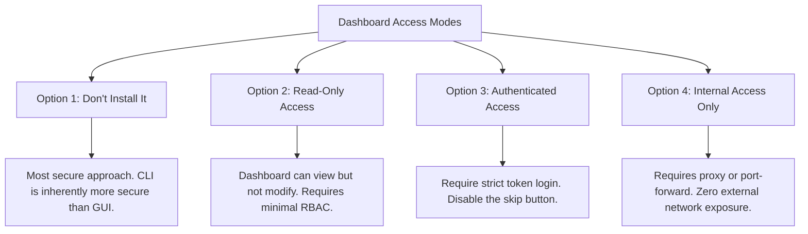
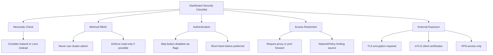
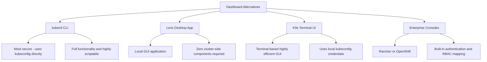

> **Складність**: `[СЕРЕДНЯ]` — поширена поверхня атаки.
>
> **Час на проходження**: 30-35 хвилин.
>
> **Передумови**: знання RBAC із напрямку Certified Kubernetes Administrator та модуль про мережеві політики.

---

## Що ви зможете зробити

Після завершення цього модуля ви зможете оцінювати розгортання Kubernetes Dashboard так само, як рецензент безпеки оцінює будь-яку привілейовану адміністративну поверхню. Мета — не запам'ятати одну команду встановлення. Мета — міркувати від межі довіри до шляху доступу, а потім обирати засоби контролю, які все ще дозволяють операторам інспектувати кластер, не перетворюючи зручний інтерфейс на шлях для ескалації привілеїв.

1. **Діагностувати** шляхи атаки на Dashboard та ризики ескалації привілеїв у кластерах Kubernetes 1.35+.
2. **Впровадити** RBAC лише для читання, короткочасні токени ServiceAccount та засоби контролю NetworkPolicy для доступу до Dashboard.
3. **Порівняти** варіанти доступу через `kubectl proxy`, переадресацію портів, NodePort, LoadBalancer та Ingress для Dashboard.
4. **Спроєктувати** план реагування на інциденти, який відкликає небезпечні прив'язки та ізолює неправильно налаштований Dashboard.
5. **Оцінити**, коли варто видалити Dashboard, розміщений у кластері, і використовувати клієнтські альтернативи, такі як `kubectl`, Lens або K9s.

---

## Чому цей модуль важливий

Гіпотетичний сценарій: платформна команда встановлює графічну консоль Kubernetes, щоб допомогти прикладним командам інспектувати робочі навантаження під час інциденту. Сервіс починається як внутрішній помічник, але тимчасове правило відкритого доступу стає постійним, старий токен ServiceAccount копіюється у спільну нотатку, а консоль зберігає широкі права на кластер, бо ніхто не хоче зламати дашборд під час напруженого збою. Жоден із цих виборів окремо не виглядає драматичним. Разом вони створюють адміністративну кінцеву точку, яка може розкрити метадані об'єктів, логи Под'ів, змінні середовища, а іноді й облікові дані будь-якій людині чи процесу, які можуть дістатися до URL.

Цей ризик не є теоретичним. У лютому 2018 року [CNBC повідомило про висновки RedLock](https://www.cnbc.com/2018/02/21/hackers-hijack-teslas-cloud-system-to-mine-cryptocurrency-redlock.html) про те, що зловмисники дісталися до адміністративної консолі Kubernetes, не захищеної паролем, а потім використали середовище для майнінгу криптовалюти після того, як хмарні облікові дані було розкрито. Той інцидент корисний для цього модуля, бо він показує ланцюжок, що має значення для іспиту CKS та для реальної експлуатації: зовнішня досяжність уможливила виявлення, слабка автентифікація спростила вхід, надмірні привілеї збільшили радіус ураження, а розкриті облікові дані дозволили перейти за межі кластера. Вам не потрібно пам'ятати назву компанії, щоб засвоїти інженерний урок.

Графічні інструменти не є автоматично поганими. Вони можуть допомогти молодшому інженеру простежити розгортання, допомогти команді підтримки швидко порівняти простори імен або допомогти черговому інженеру побачити зв'язки, які важко відтворити з багатьох команд. Питання безпеки полягає в тому, чи є дашборд пасивним переглядачем за надійною автентифікацією користувача, чи вебзастосунком, розміщеним у кластері, з постійними повноваженнями та широким мережевим охопленням. У цьому модулі ви захищатимете нативний Kubernetes Dashboard, але правила прийняття рішень застосовні до будь-якого вебінтерфейсу, що розташований поряд із API-сервером Kubernetes.

Кут CKS є практичним. Вас можуть попросити розпізнати ServiceAccount із надмірними привілеями, прибрати анонімний доступ, обмежити мережевий вхід або обрати безпечніший шлях доступу під тиском часу. Іспит не винагороджує розпливчасту відповідь на кшталт «захистіть дашборд». Ви маєте знати, який об'єкт надає ризиковані права, який режим відкриття створює досяжну кінцеву точку, який токен має бути короткочасним і яка мережева політика запобігає горизонтальному переміщенню зі звичайних Под'ів робочих навантажень.

Якісний огляд також відокремлює аварійне стримування від сталого проєктування. Під час інциденту ви можете зменшити масштаб деплойменту, прибрати Сервіс або видалити прив'язку, перш ніж повністю зрозумієте, як було встановлено дашборд. Під час звичайної інженерної роботи ви маєте перенести ці рішення у маніфести, документацію та огляд доступу. Цей модуль навчає обох режимів, бо інженерів з безпеки оцінюють за тим, чи можуть вони зупинити безпосередню шкоду і не дати тій самій конфігурації повернутися під час наступного застосування.

---
## Межа довіри та шлях атаки на Dashboard

Kubernetes Dashboard — це вебзастосунок, який перетворює дії в браузері на виклики API Kubernetes. Це речення містить усю модель безпеки. Користувач натискає кнопку, щоб переглянути Под'и, дашборд надсилає запит до API-сервера, а API-сервер авторизує запит на основі облікових даних, наданих для цієї операції. Якщо дашборд працює з надмірними постійними правами або якщо користувач входить із надмірним токеном, браузер стає дружнім фронтендом для небезпечного доступу до API.

Тому дашборд розташований одразу на двох межах довіри. Перша межа — мережева: хто взагалі може дістатися до сервісу дашборда. Друга межа — авторизаційна: яку ідентичність Kubernetes використовує дашборд, коли запитує дані в API-сервера. Безпечне розгортання робить обидві межі вузькими. Небезпечне розгортання залишає кінцеву точку HTTP досяжною, а потім надає опорній ідентичності більше повноважень, ніж насправді потрібно користувачам.

Найнебезпечніший варіант цього патерну — дашборд, відкритий для широкої мережі та прив'язаний до `cluster-admin`. Це поєднання перетворює виявлення на компрометацію. Сканеру, цікавому інсайдеру чи скомпрометованому робочому навантаженню потрібен лише шлях до інтерфейсу; після цього дашборд може діяти з адміністративними повноваженнями. Саме тому безпеку дашборда треба розглядати як ланцюжок атаки, а не як одне налаштування.

Уявіть дашборд як перекладача, а не як окремий орган безпеки. Браузер не спілкується напряму з etcd і не обходить API-сервер. Він просить дашборд запитати в API-сервера Kubernetes об'єкти, логи та статус. Це означає, що кожна видима кнопка відображається на якесь дієслово API, як-от get, list, watch, create, patch, delete або connect. Коли ви переглядаєте дашборд, перекладайте інтерфейс назад на ці дієслова і запитуйте, чи кожне дієслово є необхідним.

Субресурси заслуговують на особливу увагу, бо вони часто ховаються за дружніми мітками інтерфейсу. Перегляд логів Пода може потребувати доступу до субресурсу `pods/log`. Відкриття оболонки в Под'і може потребувати доступу до `pods/exec`, що значно небезпечніше за перелік Под'ів. Проброс портів через інтерфейс може потребувати ще одного дозволу типу connect. Роль, яка на перший погляд видається призначеною лише для читання, все одно може розкривати чутливі операційні дані, якщо вона включає доступ до логів у всіх просторах імен.

```mermaid
flowchart TD
    subgraph "Dashboard Attack Scenario"
        Direction TB
        A[Internet] -->|Unauthenticated Access| B(Exposed Dashboard)
        B -->|Inherits cluster-admin| C[Full Cluster Compromise]

        subgraph "What Goes Wrong"
            D[1. Exposed without authentication]
            E[2. Bound to cluster-admin]
            F[3. Skip button left enabled]
            G[4. Missing NetworkPolicy]
        end

        subgraph "The Catastrophic Result"
            H[Attacker views all secrets]
            I[Attacker deploys cryptominers]
            J[Attacker deletes core resources]
        end

        subgraph "Real Incident: Tesla 2018"
            K[Attackers utilized exposed dashboard to mine cryptocurrency]
        end
    end
```

Діаграма показує простий шлях, але кожен блок відображається на конкретний засіб контролю Kubernetes. Мережеве відкриття походить від типу Сервісу, Ingress, прив'язки переадресації портів або вибору проксі. Поведінка автентифікації походить від конфігурації дашборда та обробки токенів. Авторизація походить від ролей Role, ClusterRole та прив'язок. NetworkPolicy вирішує, чи зможе інший Под у кластері дістатися до сервісу дашборда після того, як стороннє робоче навантаження буде скомпрометоване.

Це відображення дає вам практичний порядок аудиту. Почніть із досяжності, бо дашборд, до якого ніхто не може дістатися, не є безпосередньою точкою входу. Потім перевірте автентифікацію, бо досяжний анонімний інтерфейс є нагальним навіть зі скромними правами. Потім перевірте RBAC, бо дійсний вхід із широкими правами може бути гіршим за анонімну сторінку лише для читання. Нарешті перевірте мережеву політику та логи, бо вони підкажуть вам, чи можливе горизонтальне переміщення, і чи зможете ви відтворити те, що сталося.

```text
┌─────────────────────────────────────────────────────────────┐
│              DASHBOARD ATTACK SCENARIO                      │
├─────────────────────────────────────────────────────────────┤
│                                                             │
│  Common Misconfiguration:                                  │
│                                                             │
│  Internet ────► Dashboard (exposed) ────► Full cluster     │
│                                            access!         │
│                                                             │
│  What goes wrong:                                          │
│  ─────────────────────────────────────────────────────────  │
│  1. Dashboard exposed without authentication               │
│  2. Dashboard uses cluster-admin ServiceAccount           │
│  3. Skip button allows anonymous access                    │
│  4. No NetworkPolicy restricting access                    │
│                                                             │
│  Result:                                                   │
│  !! Anyone can view secrets                                │
│  !! Anyone can deploy pods (cryptominers!)                 │
│  !! Anyone can delete resources                            │
│  !! Full cluster compromise                                │
│                                                             │
│  Real incident: Tesla (2018)                               │
│  └── Attackers mined crypto using exposed dashboard        │
│                                                             │
└─────────────────────────────────────────────────────────────┘
```

Зробіть паузу й спрогнозуйте: якщо дашборд може переліковувати Под'и, але не може переліковувати Secret'и, яка чутлива інформація все одно може просочитися через специфікації Под'ів, логи, ConfigMap'и, назви образів, мітки, анотації та змінні середовища? Запишіть два приклади, перш ніж продовжити. Ця вправа важлива, бо «лише для читання» — це не те саме, що «нешкідливий»; ідентичність лише для читання все одно може розкрити топологію та операційні підказки, які допоможуть зловмиснику обрати наступний крок.

Безпечне проєктування починається з припущення, що графічний інтерфейс може бути виявлено. Далі ви робите виявлення нудним. Неавтентифікований браузер не повинен завантажувати нічого корисного. Токен має швидко спливати. Ідентичність лише для читання не повинна мати змоги змінювати ресурси чи читати Secret'и. Простір імен робочих навантажень за замовчуванням не повинен мати змоги спілкуватися із сервісом дашборда. Ці засоби контролю навмисно перекриваються, бо будь-який окремий рівень може бути неправильно налаштований протягом життя кластера.

Журнали аудиту замикають цикл навколо цієї архітектури. Якщо дашборд використовує спільний ServiceAccount для багатьох людей, події аудиту втрачають прив'язку до конкретної людини, і відповідальним доводиться припускати, хто що натиснув, на основі зовнішніх логів. Якщо кожен користувач надає особисті облікові дані або короткочасний токен, прив'язаний до відомої ідентичності, лог API-сервера стає значно кориснішим. Саме тому підзвітність належить до обговорення проєкту, а не лише до контрольного списку реагування на інциденти.

## Режими доступу: зменшіть мережеве охоплення перед RBAC

Перше рішення — чи має дашборд взагалі існувати як сервіс, розміщений у кластері. Якщо реальна вимога — «розробникам потрібно бачити Под'и та деплойменти», найбезпечнішою відповіддю може бути локальний інструмент, який використовує kubeconfig кожного користувача й не залишає жодного зайвого вебзастосунку всередині кластера. Якщо нативний дашборд потрібен для лабораторної роботи, процесу підтримки або обмеженого операційного середовища, наступне рішення — як користувачі дістаються до нього.

Метод доступу має значення, бо RBAC спрацьовує лише після того, як запит досягає шляху застосунку, що може надати облікові дані API-серверу. LoadBalancer або NodePort створює мережевий сервіс, який можна виявити. Ingress створює вебкінцеву точку, яку потрібно захищати, як будь-який інший привілейований вебзастосунок. Локальний проксі або переадресація портів створює вужчий шлях, бо користувач уже має володіти локальним доступом kubeconfig, щоб установити тунель.

Мережеве охоплення не є бінарним. Сервіс може бути недосяжним із публічного інтернету, але досяжним з кожного робочого ноутбука працівника, CI-раннера, бастіонного хоста та скомпрометованого робочого навантаження, що поділяє маршрут. Це все одно широке відкриття. Коли ви порівнюєте режими доступу, запитайте, хто може надіслати перший HTTP-запит, перш ніж авторизація Kubernetes матиме хоч якийсь шанс оцінити токен. Чим меншою є ця доавтентифікаційна аудиторія, тим легше захищати дашборд.



Порядок на діаграмі є навмисним. «Не встановлюйте його» усуває поверхню атаки замість того, щоб намагатися нею керувати. «Лише для читання» зменшує радіус ураження, якщо сесію скомпрометовано. «Автентифікований доступ» гарантує, що анонімний відвідувач не зможе переглядати інтерфейс. «Лише внутрішній доступ» не дає сторінці входу стати ціллю з боку інтернету. Зазвичай вам потрібно більше ніж одну з цих властивостей, а не лише одну.

Не дозволяйте фразі «лише внутрішній доступ» завершити обговорення. Внутрішнє відкриття все одно може порушувати принцип найменших привілеїв, якщо маршрут охоплює людей чи машини, які ніколи не адмініструють Kubernetes. Дашборд, досяжний із системи збирання, викликає особливе занепокоєння, бо системи збирання часто працюють із сирцевим кодом, реєстрами образів та обліковими даними розгортання. Якщо агент збирання може дістатися до дашборда, зловмисник, який скомпрометує шлях збирання, може отримати корисний інструмент для розвідки ще до викрадення токена Kubernetes.

```text
┌─────────────────────────────────────────────────────────────┐
│              DASHBOARD ACCESS MODES                         │
├─────────────────────────────────────────────────────────────┤
│                                                             │
│  Option 1: Don't Install It                                │
│  ─────────────────────────────────────────────────────────  │
│  Most secure. Use kubectl instead.                         │
│  CLI is more secure than GUI.                              │
│                                                             │
│  Option 2: Read-Only Access                                │
│  ─────────────────────────────────────────────────────────  │
│  Dashboard can view but not modify.                        │
│  Use minimal RBAC permissions.                             │
│                                                             │
│  Option 3: Authenticated Access Only                       │
│  ─────────────────────────────────────────────────────────  │
│  Require token or kubeconfig login.                        │
│  No skip button.                                           │
│                                                             │
│  Option 4: Internal Access Only                            │
│  ─────────────────────────────────────────────────────────  │
│  kubectl proxy or port-forward required.                   │
│  No external exposure.                                     │
│                                                             │
└─────────────────────────────────────────────────────────────┘
```

Найбезпечніший повсякденний робочий процес — `kubectl proxy`. Він прив'язується локально, автентифікується до API-сервера через активний контекст kubeconfig користувача й дістається до дашборда через шлях проксі API-сервера. Це означає, що URL дашборда не публікується напряму як кінцева точка сервісу. Оператору все одно потрібен локальний доступ до робочої станції та дійсні облікові дані Kubernetes, перш ніж браузер зможе дістатися до сторінки.

```bash
# Start proxy (only accessible from localhost)
kubectl proxy

# Access dashboard at:
# http://localhost:8001/api/v1/namespaces/kubernetes-dashboard/services/https:kubernetes-dashboard:/proxy/
```

Переадресація портів також є вузькою, але вона спрямована на один порт сервісу замість використання шляху проксі API-сервера. Вона корисна, коли лабораторний або діагностичний процес очікує HTTPS напряму на локальному порту. Компроміс у тому, що операторам частіше доводиться керувати сертифікатами та попередженнями браузера, а необережна адреса прив'язки може відкрити локальну переадресацію за межі робочої станції. Тримайте прив'язку локальною, якщо у вас немає свідомої причини та компенсаційного засобу контролю.

`kubectl port-forward` тунелює через kubelet на ноді, тому він може дістатися до Под'ів дашборда навіть тоді, коли NetworkPolicy, забезпечена CNI, встановлює `ingress: []` — на відміну від `kubectl proxy`, який спрямовує трафік від API-сервера як клієнта в мережі Под'ів і блокується тією самою політикою «заборонити все». Ця відмінність має значення в лабораторіях та аудитах, де ви посилюєте Под'и дашборда повною забороною вхідного трафіку, а потім дивуєтеся, чому URL проксі не відповідає за тайм-аутом.

Для іспитового мислення класифікуйте проксі та проброс портів як тимчасові шляхи доступу, а не як архітектури розгортання. Їх ініціює автентифікований користувач, вони завершуються, коли процес виходить, і вони не створюють постійної зовнішньої кінцевої точки. Це робить їх чудовими типовими варіантами для аварійної інспекції. Їхня слабкість — операційне тертя: нетехнічним користувачам може бути складно їх запустити, і команди іноді обходять це тертя, публікуючи дашборд назавжди.

```bash
# Forward dashboard port
kubectl port-forward -n kubernetes-dashboard svc/kubernetes-dashboard 8443:443

# Access at https://localhost:8443
# Use token to authenticate
```

NodePort є поганим типовим вибором, бо він відкриває порт на кожній ноді, що підтримує сервіс. Якщо будь-яка нода досяжна з корпоративної підмережі, сегмента VPN або публічного маршруту, дашборд стає досяжним через інфраструктуру, яку не було спроєктовано як межу вхідного трафіку для застосунків. Навіть із автентифікацією за токеном дашборд на NodePort запрошує сканування, спроби перебору проти слабких операційних звичок та повторне використання облікових даних із непов'язаних витоків.

```yaml
# Expose dashboard as NodePort
apiVersion: v1
kind: Service
metadata:
  name: kubernetes-dashboard-nodeport
  namespace: kubernetes-dashboard
spec:
  type: NodePort
  selector:
    k8s-app: kubernetes-dashboard
  ports:
  - port: 443
    targetPort: 8443
    nodePort: 30443
```

Перш ніж це запускати, який вивід ви очікуєте від `kubectl get svc -n kubernetes-dashboard` після застосування сервісу NodePort, і який стовпець підказав би вам, що дашборд досяжний через кожну ноду? Сенс у тому, щоб виробити звичку читати рівень відкриття із самого об'єкта Сервісу, а не зі сторінки вікі чи з пам'яті команди про те, як сервіс мав бути розгорнутий.

LoadBalancer та Ingress потребують ще більшої прискіпливості, бо вони навмисно спроєктовані для публікації застосунків. LoadBalancer відкриває сервіс через хмарну мережу, тоді як Ingress відкриває ім'я хоста через спільний контролер. Обидва можна захистити, але обидва переводять дашборд у ту саму модель загроз, що й адміністративний вебпортал. Це означає, що TLS, доступ із врахуванням ідентичності, журналювання аудиту, засоби контролю частоти та обмеження клієнтів на основі сертифікатів стають частиною проєкту, а не необов'язковим доповненням.

Є ще одна деталь відкриття, яка підводить команди під час оглядів: DNS може пережити початковий намір. Тимчасове ім'я хоста, створене для вікна підтримки, може залишатися в документації, історії браузера, менеджерах паролів та системах моніторингу ще довго після того, як команда вважає, що вивела дашборд з експлуатації. Коли ви схвалюєте Ingress або LoadBalancer, також визначте, як видаляється запис, як відкликаються сертифікати, і як користувачі дізнаються, що URL більше не є схваленим шляхом.

## Безпечне встановлення: RBAC та межі токенів

Крок встановлення легкий; робота з безпеки починається одразу після того, як з'являються маніфести. Збережена нижче команда застосовує апстрім-маніфест дашборда, який використовується в цій лабораторній роботі. Під час виробничого огляду ви б закріпили та перевірили поточно схвалений реліз з апстріму, переглянули походження образу й розглядали б маніфест як код застосунку. Ключовий урок у тому, що встановлення дашборда — це не те саме, що безпечна його авторизація.

```bash
# Official dashboard installation
kubectl apply -f https://raw.githubusercontent.com/kubernetes/dashboard/v2.7.0/aio/deploy/recommended.yaml

# Verify deployment
kubectl get pods -n kubernetes-dashboard
kubectl get svc -n kubernetes-dashboard
```

Після встановлення перевірте ServiceAccount та прив'язки, перш ніж хтось увійде. ServiceAccount — це просто ідентичність для робочих навантажень. Role або ClusterRole визначає дозволені дієслова для ресурсів, а прив'язка приєднує цю роль до суб'єкта. Коли суб'єктом є ServiceAccount дашборда, а роль широка, дашборд має широкі повноваження щоразу, коли діє як ця ідентичність. Якщо роль включає Secret'и, інтерфейс може стати переглядачем облікових даних.

Огляд RBAC найкраще працює, коли ви читаєте правила справа наліво. Почніть із суб'єкта, бо він підказує, хто отримує дозвіл. Потім прочитайте посилання на роль, бо воно підказує, який набір правил приєднано. Потім перевірте правила, бо вони визначають групи API, ресурси та дієслова. Дивовижна кількість інцидентів із дашбордами походить від прив'язок, що за назвою виглядали нешкідливими, тоді як зазначений ClusterRole ніс широкі права.

Найбезпечніший навчальний патерн — створити ідентичність лише для читання, яка може переглядати поширені об'єкти робочих навантажень, але не може їх змінювати й не може читати Secret'и. Наведений нижче приклад включає Под'и, сервіси, ConfigMap'и, простори імен та поширені контролери робочих навантажень. Він навмисно опускає узагальнювальні (wildcard) дієслова, узагальнювальні ресурси та ресурс `secrets`. Це опущення є проєктним рішенням, а не випадковістю, бо багато витоків облікових даних трапляються після того, як роль «переглядача» тихцем включає чутливі ресурси.

Область простору імен — це ще один важіль. ClusterRoleBinding надає роль на весь кластер, що часто є більшою видимістю, ніж потрібно команді. RoleBinding в одному просторі імен може посилатися на ClusterRole, але обмежувати прив'язку цим простором імен, залежно від задіяних ресурсів. Для дашборда спільної прикладної команди прив'язки з областю простору імен можуть підходити краще за роль переглядача з областю всього кластера. Нативний дашборд може відображати багато ресурсів, але ваш RBAC має відображати межу підтримки, а не максимальну спроможність інтерфейсу.

```kubernetes
# Read-only dashboard service account
apiVersion: v1
kind: ServiceAccount
metadata:
  name: dashboard-readonly
  namespace: kubernetes-dashboard
---
apiVersion: rbac.authorization.k8s.io/v1
kind: ClusterRole
metadata:
  name: dashboard-readonly
rules:
- apiGroups: [""]
  resources: ["pods", "services", "configmaps", "namespaces"]
  verbs: ["get", "list", "watch"]
- apiGroups: ["apps"]
  resources: ["deployments", "daemonsets", "replicasets", "statefulsets"]
  verbs: ["get", "list", "watch"]
---
apiVersion: rbac.authorization.k8s.io/v1
kind: ClusterRoleBinding
metadata:
  name: dashboard-readonly
roleRef:
  apiGroup: rbac.authorization.k8s.io
  kind: ClusterRole
  name: dashboard-readonly
subjects:
- kind: ServiceAccount
  name: dashboard-readonly
  namespace: kubernetes-dashboard
```

Існує тонка відмінність між власним ServiceAccount дашборда та ідентичністю, яку користувач надає під час входу. Якщо користувач входить із потужним токеном, дашборд може діяти з повноваженнями цього користувача для тих викликів API. Обмеження ServiceAccount дашборда не робить безпечним вставляння в браузер особистого токена адміністратора з правами cluster-admin. Правило найменших привілеїв застосовується до кожних облікових даних, які можуть потрапити в інтерфейс.

Саме через цю відмінність фраза «ми посилили ServiceAccount дашборда» може бути оманливим звітом про стан. Вона відповідає лише на одну частину питання авторизації. Вам також потрібно знати, чи автентифікуються користувачі особистими обліковими даними, спільними токенами підтримки, статичними токенами ServiceAccount чи файлами kubeconfig із клієнтськими сертифікатами. Кожен варіант змінює можливість аудиту, спливання, відкликання та радіус ураження. Безпечна програма дашборда документує дозволені типи облікових даних замість того, щоб залишати користувачів імпровізувати.

Сучасні кластери Kubernetes підтримують короткочасні токени ServiceAccount через `kubectl create token`. Ця команда просить API-сервер видати обмежений токен для названого ServiceAccount, що краще за зберігання Secret'ів із токенами, що не спливають. Збережений блок також показує старіший патерн із довгоживучим Secret'ом, бо ви все ще можете натрапити на нього під час аудитів. Розглядайте старіший метод як свідчення, яке варто дослідити щодо ротації, зберігання та історичного витоку.

```bash
# Create token for the service account
kubectl create token dashboard-readonly -n kubernetes-dashboard

# Or create a long-lived secret (older method)
cat <<EOF | kubectl apply -f -
apiVersion: v1
kind: Secret
metadata:
  name: dashboard-readonly-token
  namespace: kubernetes-dashboard
  annotations:
    kubernetes.io/service-account.name: dashboard-readonly
type: kubernetes.io/service-account-token
EOF

# Get the token
kubectl get secret dashboard-readonly-token -n kubernetes-dashboard -o jsonpath='{.data.token}' | base64 -d
```

Обробка токенів — це місце, де багато команд випадково зводять нанівець свою роботу з RBAC. Короткочасний токен, скопійований до надійного менеджера паролів на час контрольованого вікна підтримки, — це інший ризик, ніж статичний токен, вставлений у тікет, повідомлення чату чи ConfigMap. Дашборд не повинен ставати приводом для нормалізації спільного використання облікових даних. Якщо користувачам потрібен повторюваний доступ, інтегруйте шлях доступу з системою ідентифікації організації або вимагайте, щоб кожен користувач видавав токен під роллю, що відповідає його роботі.

Спливання токена корисне лише тоді, коли також зрозумілі відкликання та ротація. Якщо довгоживучий токен було розкрито, може знадобитися видалити Secret або прибрати прив'язку, і вам слід перевірити, чи монтували Под'и ці облікові дані автоматично. У сучасних кластерах прив'язані токени спроєктовані так, щоб зменшити цей клас застарілих облікових даних, але застарілі маніфести та ручні Secret'и все ще трапляються в реальних середовищах. Під час аудиту розглядайте кожен статичний токен як питання, що потребує власника та історії спливання.

## Мережева ізоляція, пропуск входу та контрольований Ingress

NetworkPolicy — це засіб контролю, що відповідає на питання «а що, якщо інший Pod зможе дістатися до нього?». RBAC вирішує, що відбувається після того, як дашборд робить запит до API, а NetworkPolicy вирішує, чи може трафік із простору імен робочого навантаження взагалі надійти до Pod'ів дашборда. Це має значення після компрометації окремого застосунку. Якщо зловмисник отримує виконання коду у звичайному Pod'і, сервіс дашборда не повинен бути легкою внутрішньою ціллю.

Правила вхідного трафіку (ingress) — це лише половина розмови. Залежно від розгортання та поведінки плагіна, дашборду також може знадобитися вихідний трафік (egress) до API-сервера Kubernetes та допоміжних сервісів. Необачна політика заборони всього вихідного трафіку за замовчуванням може зламати дашборд, тоді як надміру дозвільна політика вихідного трафіку може зберегти непотрібну досяжність. Суть не в тому, щоб запам'ятати одну форму політики. Суть у тому, щоб записати, які потоки потрібні, а потім дозволити лише ці потоки.

```yaml
# Only allow access from specific namespace/pods
apiVersion: networking.k8s.io/v1
kind: NetworkPolicy
metadata:
  name: dashboard-access
  namespace: kubernetes-dashboard
spec:
  podSelector:
    matchLabels:
      k8s-app: kubernetes-dashboard
  policyTypes:
  - Ingress
  ingress:
  # Only from admin namespace
  - from:
    - namespaceSelector:
        matchLabels:
          name: admin-access
    ports:
    - port: 8443
```

Політика вище навмисно вузька, але ви маєте перевірити її щодо свого CNI-плагіна та міток просторів імен. NetworkPolicy у Kubernetes є декларативною, а її застосування залежить від плагіна, що її реалізує. Політика, яка вибирає Pod'и дашборда і дозволяє лише позначений адміністративний простір імен, корисна лише тоді, коли ця мітка контрольована, задокументована і не додається недбало до прикладних просторів імен під час усунення несправностей.

Мітки в цьому дизайні є суміжними з авторизацією, тому захищайте їх відповідно. Якщо багато команд можуть позначати власні простори імен як `admin-access`, NetworkPolicy стає паперовим засобом контролю. Сильніший патерн — поєднати селектори просторів імен із селекторами Pod'ів, використати контролери допуску для обмеження чутливих міток і тримати Pod'и адміністративного доступу в просторі імен, що належить платформеній команді. Мережева ізоляція настільки сильна, наскільки сильні селектори, що визначають довірене джерело.

Старіші розгортання дашборда мали кнопку «Skip» («Пропустити»), яка дозволяла користувачам входити, не пред'являючи токен. Така поведінка неприйнятна для будь-якого захищеного середовища, навіть якщо базова ідентичність працює лише для читання. Анонімний доступ усе одно розкриває назви робочих навантажень, структуру просторів імен, мітки, образи, а іноді й експлуатаційний хронометраж. Ці деталі допомагають зловмисникам планувати фішинг, атаки на образи, бічне переміщення та спроби ескалації привілеїв.

Анонімна видимість також послаблює виявлення. Якщо кожен відвідувач прибуває без ідентичності, ви не можете відрізнити допитливого інженера від сканера чи скомпрометованого внутрішнього хоста лише за ідентичністю аудиту Kubernetes. У вас усе ще можуть бути логи вхідного трафіку, але ці логи живуть поза системою авторизації API і можуть не зіставлятися чітко з людиною. Вимога автентифікації дає відповідальним додатковий сигнал і підвищує вартість безтурботного дослідження.

```yaml
# In dashboard deployment, add argument
spec:
  containers:
  - name: kubernetes-dashboard
    args:
    - --auto-generate-certificates
    - --namespace=kubernetes-dashboard
    - --enable-skip-login=false  # Disable skip button
```

Коли вам у спадок дістається запущений дашборд, у вас може не бути часу перебудувати маніфест Деплойменту, перш ніж зменшити відкритість. JSON-патч може додати безпечний аргумент і запустити перерозгортання. Це дія реагування на інцидент, а не заміна зберіганню бажаної конфігурації в системі контролю версій. Після екстреної зміни узгодьте декларативний маніфест, щоб наступне розгортання не прибрало посилення безпеки.

```bash
kubectl patch deployment kubernetes-dashboard -n kubernetes-dashboard \
  --type='json' \
  -p='[{"op": "add", "path": "/spec/template/spec/containers/0/args/-", "value": "--enable-skip-login=false"}]'
```

Dashboard v2.0.0+ вимикає пропуск входу за замовчуванням; патч вище — це глибокий захист проти застарілих маніфестів, що явно встановлюють `--enable-skip-login=true`.

Ingress — це єдиний метод відкриття, який може бути прийнятним у щільно контрольованих середовищах, але лише тоді, коли його розглядають як привілейовану адміністративну кінцеву точку. TLS захищає дані під час передавання, але TLS сам по собі не доводить, що клієнт має бачити сторінку входу. Взаємний TLS, обмеження VPN, проксі з усвідомленням ідентичності та списки дозволів на рівні контролера зменшують, хто може дістатися до дашборда ще до того, як буде оцінено автентифікацію за токеном.

```yaml
apiVersion: networking.k8s.io/v1
kind: Ingress
metadata:
  name: kubernetes-dashboard
  namespace: kubernetes-dashboard
  annotations:
    nginx.ingress.kubernetes.io/backend-protocol: "HTTPS"
    nginx.ingress.kubernetes.io/ssl-redirect: "true"
    # Client certificate authentication
    nginx.ingress.kubernetes.io/auth-tls-verify-client: "on"
    nginx.ingress.kubernetes.io/auth-tls-secret: "kubernetes-dashboard/ca-secret"
spec:
  ingressClassName: nginx
  tls:
  - hosts:
    - dashboard.example.com
    secretName: dashboard-tls
  rules:
  - host: dashboard.example.com
    http:
      paths:
      - path: /
        pathType: Prefix
        backend:
          service:
            name: kubernetes-dashboard
            port:
              number: 443
```

Який підхід ви б тут обрали і чому: локальний проксі для п'яти платформених інженерів, Ingress із взаємним TLS для центру підтримки чи взагалі відсутність дашборда для прикладних розробників, яким потрібен лише статус розгортання? Правильна відповідь залежить від того, кому потрібен доступ, як часто він їм потрібен, як видаються облікові дані і чи може організація надійно експлуатувати додаткові засоби контролю.

Контрольований Ingress також змінює те, що ви маєте моніторити. Вам потрібні логи доступу від контролера Ingress, записи про видачу та відкликання сертифікатів, помилки автентифікації дашборда та події аудиту API-сервера для ідентичностей, що використовуються через дашборд. Без цих сигналів відкритий дашборд може виглядати безпечним на папері, водночас даючи відповідальним мало доказів, коли токен зловживають.

Моніторинг має включати негативні тести, а не лише дашборди. Періодично перевіряйте, що неавтентифікований браузер не може ввійти, токен без потрібної ролі не може переглядати ресурси, прикладний Pod не може дістатися до сервісу, а старий шлях NodePort чи LoadBalancer не повернувся. Ці перевірки прості, але вони ловлять дрейф конфігурації, який пропускає огляд коду. Дашборд — це жива адміністративна поверхня, тож його засоби контролю потребують живої перевірки.

## Аудит і реагування: посилення живого Dashboard та вибір альтернатив

Аудит дашборда має відбуватися у фіксованому порядку, бо тиск часу спонукає людей ганятися за симптомами. Спершу визначте, чи дашборд узагалі потрібен. Потім визначте кожен мережевий шлях до нього. Потім перевірте облікові дані, які можна використати через нього. Потім обмежте досяжність між Pod'ами. Лише після того, як ці пункти опрацьовано, варто налаштовувати зручні параметри, такі як закладки, дашборди та інструкції для команди.

Збір доказів має відбуватися рано, але він не повинен затримувати стримування. Зафіксуйте поточні Сервіс, Ingress, аргументи Деплойменту, ServiceAccount, ClusterRoleBinding та відповідні логи аудиту перед широкими змінами, коли дозволяє час. Якщо кінцеву точку активно відкрито, спершу виконайте безпечнішу дію зі стримування і задокументуйте, що ви змінили. У реальній експлуатації досконала криміналістика та негайне зниження ризику конкурують між собою; зріле судження означає вибір порядку, що обмежує шкоду.



Контрольний список корисний, бо він відокремлює необхідність від конфігурації. Команда, яка не може пояснити, навіщо існує дашборд, навряд чи з часом підтримуватиме його RBAC, NetworkPolicy та практики роботи з токенами. Натомість команда з реальним робочим процесом підтримки може обґрунтувати інструмент, визначити його користувачів і перевірити, чи кожен засіб контролю все ще працює після оновлень кластера. Безпека покращується, коли інструмент має власника та ритм огляду.

Власність також визначає, хто може схвалювати винятки. Платформений інженер може розуміти об'єкти Kubernetes, але керівник підтримки може розуміти робочий процес, що вимагає браузера. Рецензент із безпеки може розуміти вимоги до ідентифікації та логування. Зведіть ці погляди разом, перш ніж публікувати дашборд. Інакше кожна група оптимізує власну частину, і ніхто не володіє повним ризиком досяжного адміністративного інтерфейсу.

```text
┌─────────────────────────────────────────────────────────────┐
│              DASHBOARD SECURITY CHECKLIST                   │
├─────────────────────────────────────────────────────────────┤
│                                                             │
│  □ Do you really need the dashboard?                       │
│    └── Consider kubectl or Lens instead                    │
│                                                             │
│  □ Minimal RBAC permissions                                │
│    └── Never use cluster-admin                             │
│    └── Read-only if possible                               │
│                                                             │
│  □ Skip button disabled                                    │
│    └── --enable-skip-login=false                           │
│                                                             │
│  □ Access restricted                                       │
│    └── kubectl proxy or port-forward                       │
│    └── NetworkPolicy limiting source                       │
│                                                             │
│  □ If exposed externally                                   │
│    └── TLS required                                        │
│    └── mTLS client certificates                            │
│    └── VPN access only                                     │
│                                                             │
│  □ Token-based authentication only                         │
│    └── Short-lived tokens preferred                        │
│    └── No basic auth                                       │
│                                                             │
└─────────────────────────────────────────────────────────────┘
```

Коли дашборд уже неправильно налаштований, ваше перше реагування має зменшити радіус ураження, перш ніж ви проведете тривале розслідування. Якщо прив'язка надає `cluster-admin`, приберіть або замініть її. Якщо Сервіс широко відкриває дашборд, зменшіть масштаб Деплойменту або змініть Сервіс, поки розслідуєте. Якщо статичні токени могли бути переглянуті, виконайте їхню ротацію та перегляньте події аудиту API-сервера на предмет несподіваного використання.

Не забувайте про залежні облікові дані. Компрометація дашборда може розкрити хмарні ключі, облікові дані реєстру, рядки підключення до бази даних і URL вебхуків, що зберігаються в об'єктах Kubernetes або видимі в логах. Ротація лише токена дашборда може залишити зловмиснику все, що він уже зібрав. План реагування має перелічувати, які простори імен були видимі, які ресурси були читабельні і які подальші облікові дані слід вважати розкритими.

```bash
# Check current dashboard permissions
kubectl get clusterrolebinding | grep dashboard
kubectl describe clusterrolebinding kubernetes-dashboard

# If using cluster-admin, create restricted role instead
cat <<EOF | kubectl apply -f -
apiVersion: rbac.authorization.k8s.io/v1
kind: ClusterRole
metadata:
  name: dashboard-viewer
rules:
- apiGroups: [""]
  resources: ["pods", "services", "nodes"]
  verbs: ["get", "list"]
EOF

# Update binding
kubectl delete clusterrolebinding kubernetes-dashboard
kubectl create clusterrolebinding kubernetes-dashboard \
  --clusterrole=dashboard-viewer \
  --serviceaccount=kubernetes-dashboard:kubernetes-dashboard
```

Наступний екстрений крок — прибрати анонімний вхід, якщо він існує. Це не вирішує проблему надмірно привілейованих токенів, але закриває найлегший шлях. Потім вам слід перевірити перерозгортання та подивитися на відрендерений Деплоймент, бо аргумент, доданий до неправильного контейнера або перезаписаний пізнішим застосуванням, може залишити інтерфейс у попередньому стані, тоді як зміна виглядатиме успішною.

```bash
# Patch dashboard to disable skip
kubectl patch deployment kubernetes-dashboard -n kubernetes-dashboard \
  --type='json' \
  -p='[{"op": "add", "path": "/spec/template/spec/containers/0/args/-", "value": "--enable-skip-login=false"}]'

# Verify
kubectl get deployment kubernetes-dashboard -n kubernetes-dashboard -o yaml | grep skip
```

Мережева ізоляція завершує шлях екстреного стримування. Політика нижче дозволяє лише Pod'ам із певною міткою дістатися до Pod'ів дашборда. У виробничому дизайні ви можете віддати перевагу селектору простору імен, поєднаному селектору простору імен і Pod'а або взагалі відсутності прямого доступу між Pod'ами. Важлива звичка — явно виражати передбачувані джерела, а не припускати, що внутрішній Сервіс природно є приватним.

```bash
# Create NetworkPolicy to restrict access
cat <<EOF | kubectl apply -f -
apiVersion: networking.k8s.io/v1
kind: NetworkPolicy
metadata:
  name: dashboard-restrict
  namespace: kubernetes-dashboard
spec:
  podSelector:
    matchLabels:
      k8s-app: kubernetes-dashboard
  policyTypes:
  - Ingress
  ingress:
  - from:
    - podSelector:
        matchLabels:
          dashboard-access: "true"
EOF
```

Видалення рідного дашборда часто є найчистішим довгостроковим виправленням. Клієнтські інструменти все одно потребують безпечних kubeconfig'ів та розумного RBAC користувачів, але вони не додають Pod'и дашборда, Сервіси, об'єкти Ingress чи довгоживучі ідентичності всередині кластера. Це змінює залишковий ризик. Якщо інструмент закрито, не залишається жодної вебкінцевої точки на боці кластера, яку зловмисник міг би виявити.

Клієнтські інструменти також роблять найменші привілеї природнішими, бо кожен користувач може мати роль, що відповідає його відповідальності. Прикладний розробник може отримати доступ лише для читання, обмежений простором імен. Платформений інженер може отримати ширші дозволи з сильнішою автентифікацією. Тимчасовий відповідальний за інцидент може отримати доступ із обмеженням за часом. Інструмент не є моделлю дозволів; моделлю дозволів залишається RBAC Kubernetes, і його легше аудитувати, ніж спільну ідентичність дашборда.



Альтернатива не є автоматично безпечнішою, якщо kubeconfig користувача надмірно привілейований або зберігається недбало. Локальний графічний інтерфейс, що використовує kubeconfig із `cluster-admin`, усе одно може виконувати дії рівня cluster-admin. Перевага є архітектурною: ви прибираєте постійний вебсервіс усередині кластера і покладаєтеся на звичайні шляхи автентифікації користувача. Це зазвичай краще відповідає найменшим привілеям, ніж спільний акаунт дашборда чи постійний токен ServiceAccount.

```text
┌─────────────────────────────────────────────────────────────┐
│              DASHBOARD ALTERNATIVES                         │
├─────────────────────────────────────────────────────────────┤
│                                                             │
│  kubectl (CLI)                                             │
│  ─────────────────────────────────────────────────────────  │
│  • Most secure - uses kubeconfig                          │
│  • Full functionality                                      │
│  • Scriptable                                              │
│                                                             │
│  Lens (Desktop App)                                        │
│  ─────────────────────────────────────────────────────────  │
│  • Local GUI application                                   │
│  • Uses your kubeconfig                                    │
│  • No cluster-side components                              │
│                                                             │
│  K9s (Terminal UI)                                         │
│  ─────────────────────────────────────────────────────────  │
│  • Terminal-based GUI                                      │
│  • Uses your kubeconfig                                    │
│  • Very efficient for operations                           │
│                                                             │
│  Rancher/OpenShift Console                                 │
│  ─────────────────────────────────────────────────────────  │
│  • Enterprise-grade                                        │
│  • Built-in authentication                                 │
│  • More secure by design                                   │
│                                                             │
└─────────────────────────────────────────────────────────────┘
```

Для іспиту CKS практикуйтеся називати конкретний об'єкт, який ви б змінили. «Зробіть це безпечним» — це не відповідь. «Видаліть ClusterRoleBinding із `cluster-admin`, створіть ClusterRole лише для читання, прив'яжіть її до ServiceAccount дашборда, вимкніть пропуск входу, використовуйте `kubectl proxy` і додайте NetworkPolicy» — це відповідь. Різниця в експлуатаційній точності.

Також практикуйтеся пояснювати компроміси простою мовою. Проксі безпечніший, бо уникає постійної кінцевої точки, а не тому, що він магічно зашифрований якось інакше. Роль лише для читання безпечніша, бо вона прибирає зміну та доступ до чутливих ресурсів, а не тому, що дашборд стає нешкідливим. Клієнтський інструмент безпечніший, бо він прибирає компоненти на боці кластера, а не тому, що локальне програмне забезпечення може ігнорувати RBAC. Ці пояснення допомагають вам обирати під тиском, а не повторювати гасла.

## Патерни та антипатерни

Патерн перший — патерн без постійної кінцевої точки. Використовуйте дашборд лише через `kubectl proxy` чи локальну переадресацію портів і вимагайте, щоб кожен оператор автентифікувався власним kubeconfig перед тим, як з'явиться тунель. Цей патерн працює найкраще для невеликих платформених команд, екзаменаційних лабораторій і тимчасових діагностичних сесій. Він погано масштабується, коли багатьом непрофільним користувачам потрібен доступ через браузер щодня, але він тримає мережеву відкритість низькою і не перетворює дашборд на публічний застосунок.

Патерн другий — патерн підтримки лише для читання. Створіть виділений ServiceAccount і ClusterRole, що можуть переглядати звичайні ресурси робочих навантажень, але не можуть змінювати об'єкти і не можуть читати Secret'и. Поєднайте цю роль із короткоживучими токенами та задокументованим робочим процесом підтримки. Цей патерн дає командам підтримки контрольований огляд під час інцидентів, але він усе одно потребує перегляду, бо логи Pod'ів, ConfigMap'и та метадані об'єктів можуть містити інформацію, яка не повинна бути широко видимою.

Патерн третій — патерн посиленого адміністративного порталу. Використовуйте Ingress лише тоді, коли дашборд має реального бізнес-власника, взаємний TLS чи рівень доступу з усвідомленням ідентичності, суворі практики роботи з токенами, NetworkPolicy, логування та періодичний огляд доступу. Цей патерн дорожчий в експлуатації, бо дашборд стає привілейованим вебзастосунком. Він виправданий лише тоді, коли організація може підтримувати ці засоби контролю з тією ж ретельністю, що й для інших адміністративних порталів.

Патерн четвертий — патерн видимості з обмеженням за простором імен. Замість надання одній ідентичності дашборда доступу для читання в усьому кластері, прив'яжіть переглядачів до просторів імен, які вони підтримують, і тримайте об'єкти рівня кластера поза спільним робочим процесом. Цей патерн підходить прикладним командам, яким потрібно інспектувати власні розгортання, але не слід бачити кожен простір імен. Він вимагає більше керування ролями, але краще відповідає організаційним межам і зменшує цінність будь-якого окремого скомпрометованого токена.

Антипатерн перший — спільний токен адміністратора. Команди потрапляють у нього, бо один скопійований токен робить онбординг швидким, демонстрації простими, а дашборди легкими для додавання в закладки. Краща альтернатива — доступ для кожного користувача з обмеженими ролями та короткоживучими обліковими даними. Спільні токени стирають підзвітність, переживають кадрові зміни і ускладнюють реагування на інциденти, бо кожна дія виглядає як така, що походить від однієї і тієї ж ідентичності Kubernetes.

Антипатерн другий — припущення «внутрішнє означає безпечне». Дашборд, відкритий лише для корпоративної мережі, VPN чи підмережі вузлів, усе одно може бути досяжним зі скомпрометованих ноутбуків, агентів збірки, тестових робочих навантажень і непов'язаних внутрішніх систем. Кращою альтернативою є розглядати внутрішню досяжність як один слабкий сигнал, а потім додати автентифікацію, NetworkPolicy та доступ з усвідомленням ідентичності. Приватна маршрутизація зменшує шум; вона не замінює авторизацію.

Антипатерн третій — усунення несправностей із пріоритетом дашборда. Команда, яка вчить усіх інспектувати кластери через спільний графічний інтерфейс, часто відкладає вивчення об'єктів і команд API, що пояснюють, що відображає інтерфейс. Кращою альтернативою є використання дашборда як переглядача, водночас навчаючи `kubectl auth can-i`, `kubectl describe`, логів аудиту та інспекції RBAC. Оператори, які розуміють об'єкти, можуть захищати інтерфейс, а не сліпо йому довіряти.

Антипатерн четвертий — дрейф винятків. Команда публікує дашборд для однієї події підтримки, додає тимчасове правило вхідного трафіку, продовжує токен ще на тиждень, а потім забуває, який виняток усе ще активний. Кращою альтернативою є прикріплення дат спливання, власників і завдань на перевірку до кожного винятку. Тимчасовий доступ має закриватися сам, коли ніхто навмисно його не поновлює.

## Рамка прийняття рішень

Почніть із необхідності. Якщо запитане завдання — це видимість розгортання, статус розгортання чи базова інспекція об'єктів, використовуйте `kubectl`, K9s, Lens чи наявну корпоративну консоль, перш ніж розгортати рідний дашборд. Якщо дашборд уже існує, запитайте, чи має він названого власника, схвалену групу користувачів і шлях до видалення. Інструмент без власника схильний накопичувати старі токени, застарілі Сервіси та незадокументовані винятки.

Далі оцініть відкритість. Якщо група користувачів мала і технічна, оберіть `kubectl proxy` чи локальну переадресацію портів. Якщо група користувачів велика й нетехнічна, не стрибайте одразу до публічного Ingress; порівняйте корпоративну консоль, внутрішній портал з усвідомленням ідентичності чи клієнтський інструмент із керованими kubeconfig'ами. Якщо зовнішня кінцева точка неминуча, вимагайте взаємний TLS чи еквівалентний рівень автентифікації клієнта перед сторінкою входу дашборда.

Потім оцініть повноваження. Дашборд, що може змінювати Деплойменти, створювати Pod'и чи читати Secret'и, потребує значно сильнішого обґрунтування, ніж дашборд-переглядач. У більшості середовищ роль лише для читання, що виключає Secret'и, є верхньою межею для спільного робочого процесу підтримки. Для адміністраторів віддавайте перевагу персональним обліковим даним з індивідуальними слідами аудиту. Ніколи не використовуйте ServiceAccount дашборда як заміну ідентичності користувача.

Нарешті оцініть відновлення. Перш ніж схвалити дашборд, напишіть процедуру вимкнення. Визначте Деплоймент, який треба зменшити, Сервіс чи Ingress, який треба прибрати, ClusterRoleBinding, який треба видалити, і токени, які треба ротувати. Дизайн, який не можна швидко вимкнути під час підозри на компрометацію, не є операційно готовим, навіть якщо його YAML у сталому стані виглядає розумно під час огляду.

Застосовуйте рамку як послідовність, а не як контрольний список, який ви заповнюєте після вибору відповіді. Необхідність вирішує, чи дашборд має існувати. Відкритість вирішує, хто може дістатися до нього перед входом. Повноваження вирішують, що може зробити успішна сесія. Відновлення вирішує, чи можете ви скасувати рішення під стресом. Якщо будь-який етап має слабку відповідь, оберіть безпечніший варіант і задокументуйте, що мало б змінитися, перш ніж схвалити більше зручності.

## Чи знали ви?

- Kubernetes 1.24 змінив поведінку токенів ServiceAccount так, що Secret'и з токенами без спливання більше не створюються автоматично для кожного ServiceAccount, що робить `kubectl create token` нормальним безпечнішим шляхом для короткоживучого доступу.
- Kubernetes Dashboard 2.0.0, випущений у квітні 2020 року, вимкнув стару поведінку пропуску входу за замовчуванням, але старіші маніфести та скопійовані приклади все ще можуть зберігати ризиковані припущення в довгоживучих кластерах.
- Сервіс Kubernetes типу NodePort відкриває обраний порт на кожному вузлі, що може розміщувати сервіс, тож відкритість дашборда залежить від досяжності вузла так само, як і від простору імен, де працюють Pod'и.
- `kubectl proxy` не публікує дашборд як звичайну кінцеву точку застосунку; він використовує шлях проксі API-сервера та поточний kubeconfig користувача, через що це зазвичай найбезпечніший метод доступу для короткоживучого усунення несправностей.

## Типові помилки

| Помилка | Чому вона трапляється | Як її виправити |
|---------|----------------|---------------|
| Прив'язка дашборда до `cluster-admin` | Команди хочуть, щоб кожна кнопка в інтерфейсі працювала, і забувають, що інтерфейс стає адміністративним клієнтом API. | Створіть мінімальну ClusterRole лише для читання і прив'яжіть лише ту ідентичність дашборда, якій вона потрібна. |
| Відкриття сервісу через LoadBalancer чи NodePort | URL, який можна додати в закладки, здається зручним під час роботи з підтримкою, особливо коли користувачі не знають `kubectl proxy`. | Віддавайте перевагу локальному проксі чи переадресації портів і вимагайте формального винятку для будь-якого маршрутизованого сервісу. |
| Залишення доступним пропуску входу чи анонімного входу | Старі маніфести та демонстрації оптимізовані під швидкий доступ, а не під безпечну експлуатацію. | Установіть `--enable-skip-login=false`, перерозгорніть Деплоймент і перевірте відрендерені аргументи контейнера. |
| Зберігання токенів ServiceAccount у ConfigMap'ах чи тікетах | Токени розглядають як інструкції з налаштування, а не як облікові дані. | Використовуйте вивід короткоживучого `kubectl create token` і зберігайте будь-які необхідні облікові дані у схваленому сховищі секретів. |
| Припущення, що лише для читання означає безпечно | Логи, ConfigMap'и, назви об'єктів, мітки та посилання на образи все одно можуть розкривати корисну для атаки інформацію. | Виключіть Secret'и, перегляньте видимі ресурси та обмежте групу користувачів, що отримує доступ до дашборда. |
| Забування про NetworkPolicy | Команди зосереджуються на вході через браузер і пропускають досяжність між Pod'ами зі скомпрометованих робочих навантажень. | Додайте обмеження вхідного трафіку для Pod'ів дашборда і перевірте застосування за допомогою CNI кластера. |
| Використання спільного акаунту підтримки | Один токен робить доступ простим, але руйнує підзвітність. | Видавайте облікові дані для кожного користувача чи короткоживучі токени для кожної сесії з придатними для аудиту ідентичностями. |
| Розгляд TLS як єдиного засобу контролю | TLS шифрує з'єднання, але не вирішує, хто має бачити сторінку входу. | Додайте автентифікацію клієнта, таку як mTLS, обмеження VPN чи проксі з усвідомленням ідентичності, коли використовуєте Ingress. |

## Тест

<details>
<summary>1. Ваша команда виявляє шлях атаки на Dashboard, де сервіс досяжний через LoadBalancer, а токен, з яким увійшли, може створювати Pod'и в кожному просторі імен. Що слід змінити першим і чому?</summary>
Спершу приберіть або заблокуйте широку мережеву відкритість, щоб нові сесії не могли дістатися до дашборда, поки ви розслідуєте. Потім відкличте небезпечну прив'язку чи токен, замініть її роллю лише для читання і виконайте ротацію будь-яких облікових даних, які могли бути розкриті. Мережева зміна зупиняє легкий вхід, тоді як зміна RBAC зменшує те, що може зробити успішна сесія. Вам потрібні обидві, бо кожен засіб контролю може відмовити незалежно.
</details>

<details>
<summary>2. Ви впроваджуєте RBAC лише для читання, короткоживучі токени ServiceAccount та засоби контролю NetworkPolicy, але розробник просить зберегти згенерований токен у спільному ConfigMap для зручності. Як ви відповідаєте?</summary>
Відхиліть підхід із ConfigMap, бо він перетворює робочий процес короткоживучих облікових даних на видимий об'єкт кластера, який можуть прочитати багато користувачів. Генеруйте токени лише на час вікна підтримки і зберігайте будь-який необхідний обліковий матеріал у схваленому сховищі секретів. Роль лише для читання зменшує радіус ураження, але вона не робить розкриття токена прийнятним. NetworkPolicy також не захищає від того, хто вже має дійсний токен і схвалений шлях доступу.
</details>

<details>
<summary>3. Порівняйте `kubectl proxy`, переадресацію портів, NodePort, LoadBalancer та Ingress для Dashboard, потрібного п'ятьом платформеним інженерам. Який метод доступу є найбезпечнішим за замовчуванням?</summary>
`kubectl proxy` — найбезпечніший за замовчуванням, бо він вимагає, щоб інженер мав доступ до kubeconfig, і тримає дашборд поза мережею як опублікований застосунок. Переадресація портів також вузька, але вона відкриває прямий локальний порт до сервісу і потребує обережного прив'язування. NodePort і LoadBalancer створюють широку досяжність сервісу, тоді як Ingress створює вебпортал, що потребує додаткових засобів контролю, таких як mTLS. Для п'яти технічних користувачів операційна вартість доступу через проксі низька, а перевага в безпеці висока.
</details>

<details>
<summary>4. Вам потрібно спроєктувати план реагування на інциденти для Dashboard із небезпечною прив'язкою `cluster-admin` та невідомим розкриттям токенів. Які конкретні кроки належать до плану?</summary>
Спершу зменшіть масштаб чи заблокуйте дашборд, якщо можлива активна компрометація. Видаліть небезпечну прив'язку, створіть мінімальну роль лише для читання і прив'яжіть лише призначений ServiceAccount дашборда. Виконайте ротацію статичних токенів, віддавайте перевагу видачі короткоживучих токенів і перегляньте логи аудиту API на предмет підозрілих дій постраждалих ідентичностей. Додайте чи посильте NetworkPolicy перед відновленням доступу, щоб скомпрометоване робоче навантаження не могло негайно знову зондувати дашборд.
</details>

<details>
<summary>5. Керівник підтримки запитує, чи варто видалити Dashboard, розміщений у кластері, і використати клієнтські альтернативи, такі як `kubectl`, Lens чи K9s. Які критерії мають визначати рішення?</summary>
Видаліть дашборд, розміщений у кластері, коли команда може забезпечити робочий процес локальними інструментами та доступом до kubeconfig для кожного користувача. Клієнтські альтернативи зменшують поверхню атаки кластера, бо вони не залишають Pod'и дашборда, Сервіси чи об'єкти Ingress. Вони все одно потребують RBAC користувачів за принципом найменших привілеїв і безпечної обробки kubeconfig, тож вони не є магічним звільненням від контролю доступу. Рішення має порівнювати потребу користувача, придатність до аудиту, операційну вартість і здатність організації підтримувати посилення дашборда.
</details>

<details>
<summary>6. Тестувальник проникнення дістається до дашборда через NodePort із підмережі агента збірки, але вхід усе одно вимагає токен. Чому це все ще серйозна знахідка?</summary>
NodePort доводить, що дашборд досяжний із широкої внутрішньої мережі, яка може включати скомпрометовані системи. Автентифікація за токеном допомагає, але сторінка входу тепер доступна для фішингу, повторного використання облікових даних, тиску перебором і випадкового розкриття токена. Знахідка також показує, що NetworkPolicy чи зовнішні фаєрвольні засоби контролю не відповідають передбаченій моделі доступу. Безпечніше виправлення — прибрати відкриття через NodePort і використати локальний доступ через проксі чи щільно контрольований адміністративний шлях вхідного трафіку.
</details>

<details>
<summary>7. Команда вимикає пропуск входу, але залишає статичний токен ServiceAccount у системі тікетів. Який ризик залишається і що слід змінити?</summary>
Вимкнення пропуску входу прибирає анонімний вхід, але статичний токен стає багаторазовим паролем для будь-кого, хто може прочитати тікет. Якщо цей токен відображається на широкий RBAC, дашборд усе ще є потужним клієнтом API. Команда має відкликати токен, перейти на видачу короткоживучих токенів і переглянути історію доступу до тікетів. Вони також мають перевірити, що прив'язана роль виключає дієслова зміни та чутливі ресурси, такі як Secret'и.
</details>

<details>
<summary>8. Ваш Ingress-дашборд використовує TLS, але не має автентифікації за клієнтським сертифікатом, а логи аудиту API показують невдалі спроби з токенами з незнайомих адрес. Як ви оцінюєте стан безпеки?</summary>
TLS захищає конфіденційність передавання, але він не обмежує, хто може дістатися до сторінки входу. Невдалі спроби з токенами з незнайомих адрес свідчать, що кінцева точка виявна і її вже тестують. Додайте рівень автентифікації клієнта, такий як mTLS чи проксі з усвідомленням ідентичності, обмежте мережі-джерела, де доречно, і тримайте автентифікацію за токеном як другий рівень. Також перегляньте, чи Ingress справді необхідний, чи доступ на основі проксі задовольнив би робочий процес.
</details>

## Практична вправа

У цій вправі ви посилите розгортання Kubernetes Dashboard, використовуючи ту саму послідовність, яку ви б застосували під час огляду: встановіть застосунок, створіть обмежену ідентичність, вимкніть анонімний вхід, обмежте мережеву досяжність, згенеруйте короткоживучий токен і отримайте доступ до інтерфейсу через локальну переадресацію портів. Команди навмисно компактні, щоб ви могли зосередитися на рішеннях із безпеки за кожним об'єктом, а не на введенні довгого маніфесту з пам'яті.

- [ ] Діагностуйте поточний шлях атаки на Dashboard, визначивши Сервіс, ServiceAccount та будь-яку прив'язку, що могла б надати ескалацію привілеїв.
- [ ] Впровадьте RBAC лише для читання, доступ за короткоживучим токеном ServiceAccount та засоби контролю NetworkPolicy для простору імен Dashboard.
- [ ] Порівняйте отриманий доступ через локальну переадресацію портів із відкриттям через NodePort і поясніть, чому переадресація портів має меншу мережеву поверхню атаки.
- [ ] Спроєктуйте нотатку з відкату та реагування на інциденти, що перелічує, яку прив'язку, токен, Сервіс і налаштування Деплойменту ви б змінили під час компрометації.
- [ ] Оцініть, чи має рідний Dashboard залишатися встановленим після лабораторної, чи бути заміненим клієнтськими альтернативами для рутинної інспекції.

```text
# Step 1: Install dashboard
kubectl apply -f https://raw.githubusercontent.com/kubernetes/dashboard/v2.7.0/aio/deploy/recommended.yaml

# Step 2: Wait for deployment
kubectl wait --for=condition=available deployment/kubernetes-dashboard -n kubernetes-dashboard --timeout=120s

# Step 3: Create restricted ServiceAccount
cat <<EOF | kubectl apply -f -
apiVersion: v1
kind: ServiceAccount
metadata:
  name: dashboard-readonly
  namespace: kubernetes-dashboard
---
apiVersion: rbac.authorization.k8s.io/v1
kind: ClusterRole
metadata:
  name: dashboard-readonly
rules:
- apiGroups: [""]
  resources: ["pods", "services"]
  verbs: ["get", "list"]
---
apiVersion: rbac.authorization.k8s.io/v1
kind: ClusterRoleBinding
metadata:
  name: dashboard-readonly
roleRef:
  apiGroup: rbac.authorization.k8s.io
  kind: ClusterRole
  name: dashboard-readonly
subjects:
- kind: ServiceAccount
  name: dashboard-readonly
  namespace: kubernetes-dashboard
EOF

# Step 4: Disable skip button (defense-in-depth — Dashboard v2.0.0+ disables it by default,
# but legacy manifests may set --enable-skip-login=true explicitly)
kubectl patch deployment kubernetes-dashboard -n kubernetes-dashboard \
  --type='json' \
  -p='[{"op": "add", "path": "/spec/template/spec/containers/0/args/-", "value": "--enable-skip-login=false"}]'

# Step 5: Create NetworkPolicy
cat <<EOF | kubectl apply -f -
apiVersion: networking.k8s.io/v1
kind: NetworkPolicy
metadata:
  name: dashboard-ingress
  namespace: kubernetes-dashboard
spec:
  podSelector:
    matchLabels:
      k8s-app: kubernetes-dashboard
  policyTypes:
  - Ingress
  ingress: []  # Deny all pod ingress — blocks apiserver proxy; port-forward via kubelet still works
EOF

# Step 6: Get token for readonly user
kubectl create token dashboard-readonly -n kubernetes-dashboard

# Step 7: Access via port-forward (kubelet tunnel bypasses pod ingress NetworkPolicy)
kubectl port-forward -n kubernetes-dashboard svc/kubernetes-dashboard 8443:443 &
echo "Access dashboard at https://localhost:8443 (paste the token from Step 6)"

# Cleanup
kubectl delete namespace kubernetes-dashboard
```

<details>
<summary>Підказка до розв'язання завдання діагностики</summary>
Почніть із Сервісу, бо він підкаже вам, чи досяжний дашборд через ClusterIP, NodePort, LoadBalancer чи Ingress. Потім перевірте ServiceAccount'и та ClusterRoleBinding'и з назвами, що включають `dashboard`, бо ці об'єкти розкривають, чи може інтерфейс діяти з широкими повноваженнями. Безпечна відповідь має визначити і мережевий шлях, і шлях авторизації; знаходження лише одного пропускає половину ланцюжка атаки.
</details>

<details>
<summary>Підказка до розв'язання завдання посилення безпеки</summary>
Обмежена ClusterRole має дозволяти лише ті типи ресурсів, які потрібні для перегляду, і має уникати дієслів зміни. Токен має походити від `kubectl create token`, а не від довгоживучого Secret, якщо лабораторна спеціально не просить вас аудитувати стару поведінку. NetworkPolicy має вибирати Pod'и дашборда і забороняти чи вузько дозволяти вхідний трафік; коли вхідний трафік повністю заборонено, перевіряйте доступ за допомогою `kubectl port-forward`, а не `kubectl proxy`.
</details>

<details>
<summary>Підказка до розв'язання завдання порівняння відкритості</summary>
Локальна переадресація портів вимагає, щоб користувач мав доступ до kubeconfig для ініціювання шляху, тоді як NodePort відкриває порт сервісу на кожному вузлі. Ця різниця змінює те, хто взагалі може спробувати дістатися до сторінки входу. Ваше пояснення має згадати, що RBAC усе ще має значення після входу, але переадресація портів значно зменшує неавтентифіковане мережеве зондування порівняно з маршрутизованим NodePort, і що NetworkPolicy із забороною всього вхідного трафіку блокує `kubectl proxy`, але не переадресацію портів на основі kubelet.
</details>

<details>
<summary>Критерії успіху</summary>
Розгортання дашборда стає доступним, анонімний вхід не приймається, для доступу використовується короткоживучий токен лише для читання, прямий вхідний трафік до Pod'ів дашборда заборонено чи щільно обмежено, а ваші нотатки визначають точні об'єкти, які треба змінити під час інциденту. Ви також маєте бути спроможні пояснити, чому повне видалення дашборда може бути найкращим кінцевим станом для виробничого кластера.
</details>

## Перевірка засвоєння

> `kubectl port-forward` тунелює через kubelet на вузлі, тож він може дістатися до Pod'ів дашборда навіть тоді, коли NetworkPolicy, застосована CNI, встановлює `ingress: []` — на відміну від `kubectl proxy`, який маршрутизує трафік від API-сервера як клієнт у мережі Pod'ів і блокується тією ж політикою заборони всього.

Перш ніж рухатися далі, поясніть, чому Крок 7 використовує переадресацію портів після того, як Крок 5 застосовує заборону всього вхідного трафіку. Надійна відповідь називає шлях тунелю kubelet, протиставляє його шляху проксі API-сервера і стверджує, що обидва все одно вимагають доступу до kubeconfig та входу за токеном, перш ніж дашборд зможе діяти від вашого імені.

## Джерела

- [Завдання вебінтерфейсу Kubernetes Dashboard](https://kubernetes.io/docs/tasks/access-application-cluster/web-ui-dashboard/)
- [Репозиторій Kubernetes Dashboard upstream](https://github.com/kubernetes/dashboard)
- [Документація контролю доступу Kubernetes Dashboard](https://github.com/kubernetes/dashboard/blob/master/docs/user/access-control/README.md)
- [Довідник RBAC Kubernetes](https://kubernetes.io/docs/reference/access-authn-authz/rbac/)
- [Концепції ServiceAccount Kubernetes](https://kubernetes.io/docs/concepts/security/service-accounts/)
- [Довідник kubectl create token](https://kubernetes.io/docs/reference/kubectl/generated/kubectl_create/kubectl_create_token/)
- [Концепції NetworkPolicy Kubernetes](https://kubernetes.io/docs/concepts/services-networking/network-policies/)
- [Завдання port-forward Kubernetes](https://kubernetes.io/docs/tasks/access-application-cluster/port-forward-access-application-cluster/)
- [Завдання проксі API-сервера Kubernetes](https://kubernetes.io/docs/tasks/extend-kubernetes/http-proxy-access-api/)
- [Документація Сервісу типу NodePort Kubernetes](https://kubernetes.io/docs/concepts/services-networking/service/#type-nodeport)
- [Концепції Ingress Kubernetes](https://kubernetes.io/docs/concepts/services-networking/ingress/)
- [Приклад автентифікації за клієнтським сертифікатом ingress-nginx](https://kubernetes.github.io/ingress-nginx/examples/auth/client-certs/)

## Наступний модуль

[Частина 2: Посилення безпеки кластера](/k8s/cks/part2-cluster-hardening/module-2.1-rbac-deep-dive/) продовжує тему від безпеки графічного інтерфейсу до глибшої авторизації API, показуючи, як прив'язки RBAC, монтування токенів ServiceAccount та контролери допуску формують типовий стан безпеки кожного робочого навантаження.
