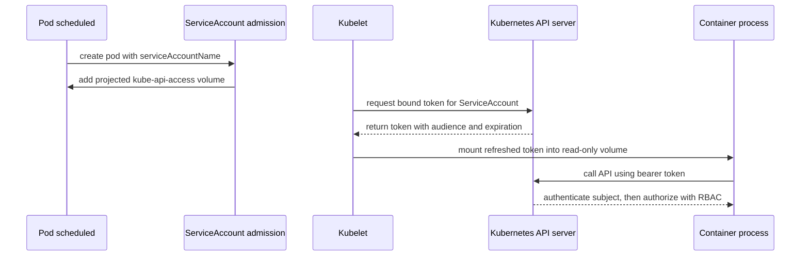

> **Складність**: `[СЕРЕДНЯ]` — критично важлива для безпеки робочих навантажень
>
> **Час на проходження**: 80-95 хвилин
>
> **Передумови**: Модуль 2.1 (Поглиблене вивчення RBAC), знання сервісних акаунтів із курсу CKA

---

## Що ви зможете зробити

Після завершення цього модуля ви зможете:

- **Спроєктувати** сервісні акаунти для конкретного простору імен із `automountServiceAccountToken: false`, явним `serviceAccountName` та RBAC за принципом найменших привілеїв.
- **Провести аудит** Pod'ів та прив'язок RBAC, щоб виявити використання сервісного акаунта `default`, надто широких суб'єктів та застарілих токенів у Secret'ах.
- **Впровадити** проєктовані прив'язані токени (projected bound tokens) з явним `audience`, `expirationSeconds` та монтуванням томів лише для читання.
- **Діагностувати** збої автентифікації 401 та відмови авторизації 403, перевіряючи змонтовані токени, аудиторії (audiences) та результати `kubectl auth can-i`.
- **Оцінити**, коли застосовувати політику допуску за принципом «заборонено за замовчуванням», ручне створення токенів або винятки на рівні простору імен без послаблення ізоляції робочих навантажень.

## Чому цей модуль важливий

Гіпотетичний сценарій: невеликий внутрішній API для звітності приймає спеціально сформований запит, що дозволяє зловмиснику читати файли всередині свого контейнера. Сам застосунок не зберігає жодного пароля до клієнтської бази даних, тому інцидент спочатку видається обмеженим. Потім зловмисник перевіряє передбачуваний шлях до токена сервісного акаунта, знаходить bearer-токен, звертається до Kubernetes API і виявляє, що сервісний акаунт `default` цього простору імен може переглядати список Secret'ів, бо хтось надав йому широкі права під час давнішого аварійного розгортання.

Саме цей шлях від одного Pod'а до сервера API і є причиною, чому безпека сервісних акаунтів має значення. Компрометація контейнера не перетворюється автоматично на компрометацію кластера; вона стає такою, коли змонтована ідентичність виявляється корисною за межами справжньої роботи робочого навантаження. [Інцидент із криптоджекінгом Tesla у 2018 році](/k8s/cks/part1-cluster-setup/module-1.5-gui-security/) <!-- incident-xref: tesla-2018-cryptojacking --> вже розглянуто в іншій частині цього курсу, і цей модуль зберігає те перехресне посилання, бо воно підкріплює той самий операційний урок: відкриті cloud-native облікові дані часто цінніші за перший вразливий процес.

Kubernetes намагається збалансувати дві законні потреби. Розробники хочуть, щоб Pod'и спілкувалися з сервером API без власноруч створених сертифікатів, а платформенні команди хочуть, щоб робочі навантаження отримували лише ту ідентичність, яка їм справді потрібна. Сервісні акаунти надають цю ідентичність робочого навантаження, RBAC визначає, що ця ідентичність може робити, а проєктовані облікові дані TokenRequest роблять токен обмеженим у часі замість того, щоб він залишався корисним назавжди. Завдання безпеки полягає не в тому, щоб усюди прибрати сервісні акаунти; воно полягає в тому, щоб кожна змонтована ідентичність була навмисною, вузькою, спостережуваною та замінюваною.

До кінця цього модуля ви побудуєте цю ментальну модель — від шляху допуску (admission path) аж до практики аудиту. Ви побачите, як працює монтування токена за замовчуванням, як `automountServiceAccountToken: false` змінює файлову систему Pod'а, як суб'єкти RBAC зіставляються з іменами користувачів сервісних акаунтів, чим прив'язані токени відрізняються від застарілих токенів у Secret'ах і як відрізнити збої автентифікації від збоїв авторизації. Цільова версія для прикладів — Kubernetes 1.35 або новіша, із використанням стабільної поведінки сервісних акаунтів та TokenRequest, яку сучасні кластери вже мають надавати.

## Як ідентичність сервісного акаунта потрапляє до Pod'а

Сервісний акаунт не є менеджером паролів і не є людиною-користувачем. Це об'єкт Kubernetes API, що представляє ідентичність робочого навантаження всередині простору імен. Коли Pod називає сервісний акаунт, сервер API та kubelet співпрацюють, щоб надати контейнерам облікові дані, які автентифікуються як `system:serviceaccount:<namespace>:<name>`. Далі RBAC оцінює це ім'я користувача, разом із групами сервісних акаунтів на кшталт `system:serviceaccounts:<namespace>`, відповідно до правил RoleBinding та ClusterRoleBinding.

Ризикованою є саме поведінка за замовчуванням. Кожен простір імен має сервісний акаунт `default`, і Pod, який не вказує `spec.serviceAccountName`, використовує цей акаунт. Якщо автоматичне монтування облікових даних API увімкнено, контейнери отримують том із токеном незалежно від того, чи потрібен застосунку доступ до Kubernetes API. Ця зручність допомагає контролерам, операторам та клієнтам усередині кластера, але вона також розміщує облікові дані API в багатьох контейнерах, бізнес-логіка яких ніколи не звертається до Kubernetes.

В оригінальному модулі була усічена захищена візуалізація під назвою `DEFAULT SERVICEACCOUNT EXPOSURE`. Наведена нижче діаграма зберігає цей захищений навчальний матеріал і завершує його, щоб читач міг розглянути повний шлях запиту. Читайте її зліва направо: допуск обирає ідентичність, kubelet матеріалізує токен, контейнер читає токен, а сервер API розглядає запит як такий, що належить суб'єкту-сервісному акаунту.

```text
┌─────────────────────────────────────────────────────────────┐
│              DEFAULT SERVICEACCOUNT EXPOSURE                │
├─────────────────────────────────────────────────────────────┤
│                                                             │
│  Namespace: reports                                         │
│                                                             │
│  Pod without serviceAccountName                             │
│          │                                                  │
│          ▼                                                  │
│  ServiceAccount admission controller                        │
│          │ injects kube-api-access projected volume          │
│          ▼                                                  │
│  Container filesystem                                       │
│  /var/run/secrets/kubernetes.io/serviceaccount/token        │
│          │                                                  │
│          ▼                                                  │
│  API request authenticated as                               │
│  system:serviceaccount:reports:default                      │
│          │                                                  │
│          ▼                                                  │
│  RBAC allows or denies the requested verb and resource       │
│                                                             │
└─────────────────────────────────────────────────────────────┘
```

Тож перше захисне запитання просте: чи має цей Pod взагалі мати будь-які облікові дані Kubernetes API? Вебфронтенд, який лише віддає HTTP-відповіді, часто їх не потребує. Контролер, який спостерігає за кастомними ресурсами, їх потребує, але лише для тих ресурсів та дій (verbs), які він узгоджує. Ставтеся до токенів сервісних акаунтів як до ключів від приміщень, а не як до прикрас на стіні; ключ належить на зв'язку лише тоді, коли хтось може назвати двері, які він відмикає.

Kubernetes дає вам два рівні, на яких можна відмовитися від автоматичного монтування токена. Встановлення `automountServiceAccountToken: false` на сервісному акаунті змінює поведінку за замовчуванням для Pod'ів, які використовують цей акаунт. Встановлення того самого поля у специфікації Pod'а перекриває вибір сервісного акаунта для цього Pod'а. Перемагає налаштування на рівні Pod'а, що корисно, коли одне робоче навантаження в просторі імен потребує доступу до API, тоді як більшість робочих навантажень не повинні отримувати жодного токена.

Контролер допуску важливий, бо він пояснює, чому маніфест може бути коротшим за Pod, який насправді запускається. Ви подаєте Pod з іменем сервісного акаунта або взагалі без імені, а допуск заповнює деталі ідентичності та проєктованого тому перед збереженням. Ця мутація корисна, але вона означає, що рев'ю має включати підсумкові, сформовані допуском Pod'и. Безпечного шаблону недостатньо, якщо overlay, значення чарта або перевизначення на рівні Pod'а пізніше змінять доставку токена.

```yaml
apiVersion: v1
kind: ServiceAccount
metadata:
  name: reports-viewer
  namespace: reports
automountServiceAccountToken: false
---
apiVersion: apps/v1
kind: Deployment
metadata:
  name: reports-ui
  namespace: reports
spec:
  replicas: 2
  selector:
    matchLabels:
      app: reports-ui
  template:
    metadata:
      labels:
        app: reports-ui
    spec:
      serviceAccountName: reports-viewer
      automountServiceAccountToken: false
      containers:
        - name: ui
          image: registry.k8s.io/e2e-test-images/agnhost:2.54
          args: ["pause"]
```

Зупиніться та спрогнозуйте: якщо ви застосуєте цей Деплоймент, а потім відкриєте оболонку в запущеному Pod'і, що має статися, коли ви виведете вміст `/var/run/secrets/kubernetes.io/serviceaccount`? Каталог не повинен містити звичних матеріалів токена, бо Pod явно відмовився від нього. Якщо каталог усе ще з'являється, перевірте підсумкову специфікацію Pod'а за допомогою `kubectl get pod -o yaml`; багато помилок налагодження виникають через те, що дивляться на шаблон Деплойменту, тоді як інший ReplicaSet усе ще запускає старіші Pod'и.

```bash
kubectl create namespace reports
kubectl apply -f reports-ui.yaml
kubectl -n reports get pods -l app=reports-ui
kubectl -n reports exec deploy/reports-ui -- ls -la /var/run/secrets/kubernetes.io/serviceaccount
```

Образ agnhost містить стандартні утиліти оболонки, тож перевірка `ls` має спрацювати, коли автомонтування токена вимкнено. Якщо каталог усе ще з'являється, перевірте підсумкові томи та монтування Pod'а замість того, щоб припускати, що шаблон Деплойменту збігається із запущеним Pod'ом. Суть безпеки та сама: відсутній том із токеном — це навмисний захисний контроль, а наявний том із токеном потребує явного обґрунтування, що з'являється в придатному до рев'ю YAML.

```bash
kubectl -n reports get pod -l app=reports-ui -o jsonpath='{range .items[*]}{.metadata.name}{"\n"}{.spec.volumes}{"\n"}{end}'
kubectl -n reports get pod -l app=reports-ui -o jsonpath='{range .items[*]}{.metadata.name}{"\n"}{.spec.containers[*].volumeMounts}{"\n"}{end}'
```

У цих командах є один тонкий урок. Засоби контролю безпеки слід перевіряти щодо об'єкта, який насправді запускається, а не лише щодо маніфесту, який ви мали намір застосувати. Контролери допуску, значення за замовчуванням, шаблони Helm, overlay'ї Kustomize та історія розгортань — усе це може змінити те, що потрапляє до kubelet. Для іспиту CKS та реальних операцій виробіть звичку перевіряти живий Pod, а потім простежувати назад до шаблону контролера, коли живий стан вас здивує.

Це також впливає на хронометраж реагування на інциденти. Якщо ви патчите шаблон Деплойменту, щоб вимкнути монтування токена, наявні Pod'и зберігають свої поточні томи, доки їх не замінять. Тому розгортання контролера є частиною зміни безпеки, а не необов'язковим етапом прибирання. Для простору імен з високим ризиком переконайтеся, що новий ReplicaSet обслуговує трафік і старі Pod'и зникли, перш ніж оголошувати, що ризик витоку облікових даних закрито.

## Проєктування сервісних акаунтів та RBAC за принципом найменших привілеїв

Вимкнення автомонтування токена — це найчистіша відповідь для Pod'ів, які не звертаються до Kubernetes API. Для Pod'ів, яким доступ до API таки потрібен, правильна відповідь — це виділений сервісний акаунт із вузьким RBAC. Виділений означає одну робочу мету на ідентичність, а не одну ідентичність на цілий простір імен. Вузький означає, що Роль називає конкретні ресурси, дії (verbs) та, за можливості, імена ресурсів, замість того щоб видавати контролеру ClusterRole, який може змінювати все, бо одну інсталяційну інструкцію було простіше скопіювати.

Починайте з поведінки застосунку, а не з YAML. Експортеру статусу можуть знадобитися `get`, `list` та `watch` на Pod'ах у його власному просторі імен. Контролеру розгортання для кастомного ресурсу може знадобитися оновлювати статус одного кастомного ресурсу та створювати дочірні об'єкти з конкретними мітками. Виконавцю завдань (job runner) може знадобитися створювати Pod'и, але не читати Secret'и. Ви не можете спроєктувати найменші привілеї, вгадуючи з назви застосунку; ви проєктуєте їх, зіставляючи виклики API з діями та ресурсами.

Це зіставлення має включати негативний простір: дії, які робоче навантаження не повинно виконувати. Якщо спостерігач лише стежить за ConfigMap'ами, запишіть, що він не повинен читати Secret'и, оновлювати Деплойменти чи перетинати межі простору імен. Ці негативні твердження не є бюрократією; вони перетворюються на конкретні тести з `kubectl auth can-i`. Вони також допомагають рев'юерам помітити, коли Роль містить ресурс або дію, яку реалізація ніколи не використовує.

Наведена нижче таблиця є практичним рівнем перекладу. Вона зосереджується на ідентичності сервісного акаунта, водночас роблячи рішення RBAC достатньо явними для рев'ю. Приклади навмисно обмежені простором імен, бо ClusterRoleBinding — це місце, де помилки сервісних акаунтів часто стають інцидентами масштабу всього кластера.

| Потреба робочого навантаження | Дизайн сервісного акаунта | Форма RBAC | Запитання для рев'ю |
|---|---|---|---|
| Жодних викликів Kubernetes API | Виділений сервісний акаунт із `automountServiceAccountToken: false` | Без RoleBinding | Навіщо Pod'у взагалі сервісний акаунт, якщо не для політичних міток чи майбутньої ясності? |
| Читання стану робочого навантаження в просторі імен | Виділений сервісний акаунт на компонент застосунку | Роль з `get`, `list`, `watch` на точних ресурсах | Чи може він читати Secret'и, ConfigMap'и або ресурси поза простором імен? |
| Узгодження одного кастомного ресурсу | Сервісний акаунт контролера | Роль або ClusterRole, обмежена кастомним ресурсом і власними дочірніми об'єктами | Чи потрібна йому область кластера, чи достатньо області простору імен? |
| Звернення до зовнішнього брокера ідентичності | Сервісний акаунт із проєктованим токеном для зовнішньої аудиторії | Жодного Kubernetes RBAC поза шляхом створення токена | Чи відхилить сервер API цей токен за аудиторією, якщо він витече до неправильного сервісу? |
| Адміністративна автоматизація | Окремий простір імен та сервісний акаунт для автоматизації | Невелика ClusterRoleBinding, що рев'юється як production-доступ адміністратора | Чи це справді ідентичність робочого навантаження, чи це має бути ідентичність конвеєра під керуванням людини? |

Ось мінімальний приклад, обмежений простором імен. У сервісного акаунта автоматичне монтування токена вимкнено за замовчуванням, а Pod-контролер вмикає його лише тому, що йому потрібно спостерігати за ConfigMap'ами. Роль дозволяє читання ConfigMap'ів у просторі імен `reports` і нічого більше. Зверніть увагу, що суб'єктом RoleBinding є названий сервісний акаунт, а не вся група простору імен.

```yaml
apiVersion: v1
kind: ServiceAccount
metadata:
  name: reports-config-watcher
  namespace: reports
automountServiceAccountToken: false
---
apiVersion: rbac.authorization.k8s.io/v1
kind: Role
metadata:
  name: reports-config-read
  namespace: reports
rules:
  - apiGroups: [""]
    resources: ["configmaps"]
    verbs: ["get", "list", "watch"]
---
apiVersion: rbac.authorization.k8s.io/v1
kind: RoleBinding
metadata:
  name: reports-config-watcher-read
  namespace: reports
subjects:
  - kind: ServiceAccount
    name: reports-config-watcher
    namespace: reports
roleRef:
  apiGroup: rbac.authorization.k8s.io
  kind: Role
  name: reports-config-read
```

Шаблон Pod'а має завершити дизайн. Він називає сервісний акаунт і навмисно встановлює `automountServiceAccountToken: true`, бо саме це робоче навантаження таки потребує змонтованих облікових даних. Це явне `true` не є суперечністю; це документація. Рев'юер тепер бачить виняток на межі Pod'а і може порівняти його з вузькою RoleBinding, яка обґрунтовує токен.

```yaml
apiVersion: apps/v1
kind: Deployment
metadata:
  name: reports-config-watcher
  namespace: reports
spec:
  replicas: 1
  selector:
    matchLabels:
      app: reports-config-watcher
  template:
    metadata:
      labels:
        app: reports-config-watcher
    spec:
      serviceAccountName: reports-config-watcher
      automountServiceAccountToken: true
      containers:
        - name: watcher
          image: registry.k8s.io/e2e-test-images/agnhost:2.54
          args: ["pause"]
```

Перш ніж це запускати, який вивід ви очікуєте від `kubectl auth can-i`, коли імітуєте (impersonate) сервісний акаунт? Ця ідентичність повинна вміти переглядати список ConfigMap'ів у `reports`, але не повинна вміти переглядати список Secret'ів чи список ConfigMap'ів в іншому просторі імен. Це найшвидша детермінована перевірка для багатьох рев'ю RBAC сервісних акаунтів, бо вона перевіряє авторизацію на практиці, не вимагаючи запуску застосунку.

```bash
kubectl auth can-i list configmaps \
  --as system:serviceaccount:reports:reports-config-watcher \
  --namespace reports

kubectl auth can-i list secrets \
  --as system:serviceaccount:reports:reports-config-watcher \
  --namespace reports

kubectl auth can-i list configmaps \
  --as system:serviceaccount:reports:reports-config-watcher \
  --namespace default
```

Небезпечний короткий шлях — це прив'язування Ролі чи ClusterRole до широкої групи сервісних акаунтів. Kubernetes підтримує суб'єкти на кшталт `system:serviceaccounts:reports` для кожного сервісного акаунта в одному просторі імен та `system:serviceaccounts` для кожного сервісного акаунта в кластері. Ці групи є дієвими інструментами для рідкісних платформенних засобів контролю, але вони мають високий ризик у просторах імен застосунків, бо майбутній Pod може отримати привілеї просто через факт свого існування в цьому просторі імен.

ClusterRoleBinding заслуговує на окрему паузу. Прив'язування сервісного акаунта простору імен до ClusterRole не є автоматично помилковим; деяким контролерам потрібні ресурси з областю кластера, такі як Ноди, простори імен чи кастомні ресурси. Проблема в тому, що радіус ураження (blast radius) змінюється з одного простору імен на весь кластер. Токен сервісного акаунта з одного скомпрометованого Pod'а тепер може автентифікуватися для дій рівня кластера, тож рев'ю має запитати, чи потрібна саме цьому робочому навантаженню область кластера і чи монтується токен лише там, де це робоче навантаження запускається.

Вам також слід уникати надання прав сервісному акаунту `default` простору імен як зручного шляху. Акаунт default спільно використовується Pod'ами, які забули назвати ідентичність. Щойно ви прив'яжете до нього корисні права, кожен майбутній неназваний Pod успадкує ці права непомітно. Простір імен може мати культуру «заборонено за замовчуванням» для сервісних акаунтів лише тоді, коли акаунт `default` залишається нудним, не прив'язаним і, бажано, налаштованим не автомонтувати облікові дані.

```yaml
apiVersion: v1
kind: ServiceAccount
metadata:
  name: default
  namespace: reports
automountServiceAccountToken: false
```

Цей патч не заважає Pod'у явно встановити `automountServiceAccountToken: true`, і він не прибирає RBAC, який хтось уже прив'язав до `default`. Він змінює базовий рівень простору імен так, щоб випадкові Pod'и не отримували облікові дані за замовчуванням. Поєднайте його з політикою допуску для жорсткішого примусу та поєднайте його з аудиторськими запитами, щоб знаходити винятки, які все ще монтують токени.

Для зрілих платформ ім'я сервісного акаунта стає частиною контракту робочого навантаження так само, як порти контейнера та запити ресурсів. Pull request, який змінює `serviceAccountName`, має ініціювати рев'ю безпеки, бо він змінює те, ким стає Pod, коли він спілкується із сервером API. Pull request, який змінює суб'єктів RoleBinding, слід рев'ювати з такою самою ретельністю, бо він змінює те, які ідентичності успадковують наявні повноваження.

## Прив'язані токени, аудиторії та застарілі токени у Secret'ах

Сучасні облікові дані сервісних акаунтів Kubernetes доставляються через API TokenRequest та проєктовані томи. Kubelet запитує обмежений у часі токен для Pod'а, записує його в проєктований том і оновлює його перед закінченням терміну дії. Проєктовані облікові дані за замовчуванням прив'язані до Pod'а й призначені для аудиторії сервера Kubernetes API. Коли Pod видаляється, прив'язані токени закінчуються як частина життєвого циклу Pod'а або коли вони досягають налаштованого `expirationSeconds`, замість того щоб залишатися корисними назавжди.

Ця поведінка замінила старіше автоматичне створення токенів сервісних акаунтів на основі Secret'ів. У кластерах до сучасних значень за замовчуванням площина управління створювала довгоживучі Secret'и `kubernetes.io/service-account-token` для сервісних акаунтів. Ці Secret'и не мали терміну дії, і їх було легко скопіювати в CI-системи, скрипти та забуті нотатники. Kubernetes досі підтримує створені вручну токени-Secret'и для сумісності, але безпечнішим стандартом є короткоживучі облікові дані TokenRequest.

Ця відмінність має значення під час реагування на інциденти. Прив'язаний токен, викрадений із запущеного Pod'а, має природний термін дії і прив'язаний до життєвого циклу Pod'а, тож видалення Pod'а є значущим кроком стримування. Застарілий токен-Secret може залишатися корисним, доки Secret не буде видалено чи анульовано. Вам слід ставитися до застарілих токенів як до сталих облікових даних, а не як до тимчасових артефактів Pod'а.

Корисний спосіб запам'ятати різницю — це власність. Проєктований токен Pod'а належить запущеному екземпляру робочого навантаження і керується поведінкою оновлення kubelet. Створений вручну токен-Secret належить сховищу об'єктів кластера і може бути скопійований будь-куди за наявності доступу на читання Secret'ів. Обидва автентифікуються як сервісний акаунт, але їхні операційні терміни життя та шляхи прибирання достатньо різні, щоб ваш аудит відстежував їх окремо.



Джерело проєктованого `serviceAccountToken` дозволяє вам запитати токен для конкретної аудиторії та терміну життя. Використовуйте це, коли робочому навантаженню потрібно пред'явити видану Kubernetes ідентичність стороні, яка покладається на неї (relying party), іншій ніж сервер Kubernetes API, наприклад внутрішньому брокеру ідентичності, який перевіряє відповіді TokenReview. Поле аудиторії є критично важливим, бо отримувач повинен відхиляти токени, не призначені для нього, що зменшує цінність токена, відтвореного до неправильного сервісу.

Створіть сервісний акаунт перед застосуванням Pod'а чи запуском `kubectl create token`. Kubernetes не створює названий сервісний акаунт автоматично лише зі специфікації Pod'а.

```yaml
apiVersion: v1
kind: ServiceAccount
metadata:
  name: reports-broker-client
  namespace: reports
automountServiceAccountToken: false
---
apiVersion: v1
kind: Pod
metadata:
  name: reports-broker-client
  namespace: reports
spec:
  serviceAccountName: reports-broker-client
  automountServiceAccountToken: false
  containers:
    - name: client
      image: registry.k8s.io/e2e-test-images/agnhost:2.54
      args: ["pause"]
      volumeMounts:
        - name: broker-token
          mountPath: /var/run/secrets/tokens
          readOnly: true
  volumes:
    - name: broker-token
      projected:
        sources:
          - serviceAccountToken:
              audience: reports-broker
              expirationSeconds: 3600
              path: token
```

Цей дизайн навмисно відрізняється від монтування за замовчуванням. Автоматичне монтування вимкнено, тож Pod не отримує звичайного шляху до токена Kubernetes API. Явний проєктований том створює токен для аудиторії `reports-broker` і розміщує його за шляхом, обраним робочим навантаженням. Якщо цей токен випадково надіслати серверу Kubernetes API, аудиторія не повинна збігтися з аудиторією сервера API, і запит має зазнати невдачі автентифікації.

Термін дії — це не магічний щит. Токеном, дійсним одну годину, усе одно можна зловживати протягом цієї години, а застосунок, який його логує, може розкрити кожне оновлене значення. Короткі терміни життя зменшують вікно реагування, але основними засобами контролю все одно залишаються найменші привілеї, обмеження аудиторії, монтування лише для читання та уникнення доставки токена контейнерам, яким ідентичність не потрібна. Думайте про термін дії як про ремінь безпеки, а не як про дозвіл їхати безрозсудно.

Kubernetes вимагає, щоб терміни життя проєктованих токенів сервісних акаунтів відповідали обмеженням сервера API. Запит включає `expirationSeconds`, але видавець може повернути іншу тривалість дійсності, тож серйозні клієнти повинні читати метадані відповіді токена, коли вони безпосередньо викликають API TokenRequest. Для звичайних Pod'ів оновленням займається kubelet. Для кастомних клієнтів, які викликають `kubectl create token` або субресурс TokenRequest, вам слід задокументувати очікувану аудиторію та термін життя в системі-споживачі.

Дизайн аудиторії — це місце, де багато інших ретельних реалізацій стають розпливчастими. Токен із широкою чи стандартною аудиторією може бути прийнятий більшою кількістю отримувачів, ніж передбачав власник робочого навантаження. Токен із конкретною аудиторією змушує сервіс, що покладається на нього, заявити про себе, і він дає тим, хто реагує на інциденти, чітке запитання: які сервіси повинні приймати ці викрадені облікові дані? Якщо відповідь незрозуміла, межа аудиторії не виконує достатньо роботи.

```bash
kubectl create namespace reports --dry-run=client -o yaml | kubectl apply -f -
kubectl -n reports create sa reports-broker-client
kubectl apply -f reports-broker-client.yaml

kubectl -n reports create token reports-broker-client \
  --audience reports-broker \
  --duration 1h
```

Не вставляйте отриманий токен у модуль, тікет чи повідомлення в чаті. Команда демонструє механіку, а не патерн поводження з обліковими даними. У реальних робочих процесах вивід токена має йти безпосередньо до процесу, який його потребує, а довготривала автоматизація зазвичай повинна використовувати інтеграцію ідентичності робочого навантаження або короткоживучий обмін, а не скопійований bearer-токен.

Аудит застарілих токенів є частиною безпеки сервісних акаунтів, бо старі облікові дані часто переживають робочі навантаження, які їх потребували. Шукайте Secret'и типу `kubernetes.io/service-account-token`, а потім перевіряйте, чи створені вони вручну, чи є залишками автоматичної генерації, чи активними вимогами сумісності. У сучасних кластерах автоматичне прибирання застарілих токенів позначає невикористані автоматично згенеровані токени недійсними після налаштованого періоду, але створені вручну довгоживучі токени-Secret'и все ще потребують людського керування.

```bash
kubectl get secrets --all-namespaces \
  --field-selector type=kubernetes.io/service-account-token \
  -o custom-columns='NAMESPACE:.metadata.namespace,NAME:.metadata.name,SA:.metadata.annotations.kubernetes\.io/service-account\.name,TYPE:.type'
```

Якщо ви знайдете застарілий токен, не видаляйте його наосліп під час напруженого production-вікна. Спершу визначте споживачів, підтвердьте, чи сервісний акаунт усе ще існує, перевірте мітки на кшталт `kubernetes.io/legacy-token-last-used` та сплануйте заміну на TokenRequest або нативну для провайдера ідентичність робочого навантаження. Мета прибирання — усунути сталі bearer-токени, але операційний метод — це контрольована міграція, а не раптовий збій.

Хороший тікет на прибирання називає шлях заміни до того, як назве команду видалення. Для робочого навантаження всередині кластера такою заміною може бути проєктований токен із коротким терміном життя. Для зовнішнього завдання автоматизації це може бути інтеграція ідентичності робочого навантаження провайдера або вузько обмежений процес, який викликає TokenRequest саме вчасно. Без шляху заміни команди схильні відтворювати той самий довгоживучий Secret під іншим іменем.

## Аудит та діагностика ризику сервісних акаунтів

Аудит починається з інвентаризації. Ви хочете відповісти на три запитання для кожного простору імен: які Pod'и використовують сервісний акаунт `default`, які Pod'и монтують будь-який токен сервісного акаунта і які сервісні акаунти мають прив'язки RBAC. Ці запитання розділяють призначення ідентичності, доставку облікових даних та авторизацію. Тримання цих рівнів окремо запобігає поширеній діагностичній помилці: побачити токен і припустити, що він має небезпечні права, або побачити RoleBinding і забути, що Pod не монтує токен.

```bash
kubectl get pods --all-namespaces \
  -o custom-columns='NAMESPACE:.metadata.namespace,POD:.metadata.name,SERVICEACCOUNT:.spec.serviceAccountName,AUTOMOUNT:.spec.automountServiceAccountToken'

kubectl get rolebindings,clusterrolebindings --all-namespaces \
  -o custom-columns='KIND:.kind,NAMESPACE:.metadata.namespace,NAME:.metadata.name,SUBJECT_KIND:.subjects[*].kind,SUBJECTS:.subjects[*].name,ROLE:.roleRef.name'
```

Перша команда може показувати порожні поля сервісного акаунта, бо стандартне значення API може бути невидимим так, як ви очікуєте, у кастомних стовпцях для кожної форми об'єкта. Коли важлива точність, перевіряйте повний YAML або JSON і пам'ятайте, що пропущений `serviceAccountName` означає, що Pod використовує `default`. Практичний аудиторський звіт має нормалізувати порожні значення до `default`, а потім позначати будь-який Pod, де і фактична ідентичність, і рішення про автомонтування не задокументовані.

Для глибшої інвентаризації монтування токенів перевіряйте томи та монтування томів. Проєктований том за замовчуванням часто має згенероване ім'я на кшталт `kube-api-access-random`, тоді як кастомні проєктовані томи можуть використовувати імена, специфічні для застосунку. Ви не намагаєтеся запам'ятати суфікси; ви перевіряєте, чи існує джерело токена сервісного акаунта і де воно змонтоване. Це особливо корисно, коли політика допуску чи чарт Helm встановлюють поля опосередковано.

```bash
kubectl get pods --all-namespaces -o jsonpath='{range .items[*]}{.metadata.namespace}{"/"}{.metadata.name}{" sa="}{.spec.serviceAccountName}{" volumes="}{range .spec.volumes[*]}{.name}{":"}{.projected.sources[*].serviceAccountToken.path}{" "}{end}{"\n"}{end}'
```

Вивід JSONPath може стати щільним, тож перетворіть його на артефакт для рев'ю, а не вдивляйтеся в нього один раз. Зафіксуйте простори імен, що містять змонтовані токени, порівняйте їх із робочими навантаженнями, які насправді звертаються до Kubernetes API, і подайте подальші зміни на власника кожного застосунку. У контексті іспиту вам може знадобитися лише швидка команда. У production-платформі та сама ідея перетворюється на регулярний засіб контролю з винятками, що рев'юються як правила фаєрвола.

Розстановка пріоритетів важлива, коли аудит знаходить багато проблем. Починайте з Pod'ів, які монтують токени та запускають код, доступний з інтернету, Pod'ів, які використовують сервісний акаунт `default`, та сервісних акаунтів, які з'являються в ClusterRoleBinding. Потім переходьте до прибирання з нижчим ризиком, такого як невикористані названі акаунти без RoleBinding. Цей порядок відповідає цінності для зловмисника: змонтований токен із широкими правами є терміновішим за охайний, але невикористаний об'єкт сервісного акаунта.

Діагностика починається з межі помилки. Відповідь 401 означає, що запит не був автентифікований. Токен може бути відсутнім, простроченим, недійсним для аудиторії, неправильно сформованим або пред'явленим кінцевій точці, яка не довіряє цьому видавцю. Відповідь 403 означає, що автентифікація вдалася, але авторизація відмовила в дії, ресурсі, просторі імен чи URL без ресурсу. Плутання їх марнує час, бо RBAC не може виправити невідповідність аудиторії токена, а новий токен не може виправити відсутню RoleBinding.

```text
┌─────────────────────────────────────────────────────────────┐
│                 SERVICEACCOUNT FAILURE PATH                 │
├─────────────────────────────────────────────────────────────┤
│ API call from pod                                           │
│        │                                                    │
│        ▼                                                    │
│ Is a bearer token present and readable?                     │
│        │ no -> inspect automount, volume, mount path        │
│        │ yes                                                │
│        ▼                                                    │
│ Does authentication accept issuer, audience, and expiry?    │
│        │ no -> 401 Unauthorized                             │
│        │ yes                                                │
│        ▼                                                    │
│ Does RBAC allow verb, resource, namespace, and name?         │
│        │ no -> 403 Forbidden                                │
│        │ yes -> request proceeds                            │
└─────────────────────────────────────────────────────────────┘
```

Який підхід ви б обрали тут і чому: перевірити змонтований токен першим чи запустити `kubectl auth can-i` першим? Якщо застосунок повідомляє 401, спершу перевірте наявність токена, аудиторію та термін дії, бо запит зазнає невдачі ще до RBAC. Якщо застосунок повідомляє 403, перевірки авторизації з імітацією зазвичай швидші, бо вони кажуть вам, чи має автентифікований суб'єкт-сервісний акаунт запитану дозвіл.

```bash
kubectl -n reports auth can-i get configmaps \
  --as system:serviceaccount:reports:reports-config-watcher \
  --namespace reports

kubectl -n reports auth can-i update configmaps \
  --as system:serviceaccount:reports:reports-config-watcher \
  --namespace reports
```

Для огляду на рівні Pod'а перевіряйте події (events) та підсумкову специфікацію Pod'а. Невдалі монтування, відсутні сервісні акаунти та недійсні посилання часто з'являються ще до того, як застосунок взагалі запуститься. Kubernetes не дозволяє вам змінити `serviceAccountName` на наявному Pod'і; ви оновлюєте шаблон контролера й перестворюєте Pod'и через розгортання. Ця незмінність корисна, бо зміни ідентичності мають бути видимими як зміна розгортання, а не як мовчазна мутація запущеного процесу.

Застосуйте маніфести `reports-config-watcher` із розділу про найменші привілеї вище, а потім перевірте Pod, який створює Деплоймент. Оскільки `serviceAccountName` є незмінним на запущеному Pod'і, перезапустіть Деплоймент, коли ви змінюєте поля ідентичності в шаблоні.

```bash
kubectl apply -f reports-config-watcher.yaml
kubectl -n reports describe pod -l app=reports-config-watcher
kubectl -n reports get pod -l app=reports-config-watcher -o yaml
kubectl -n reports rollout restart deployment/reports-config-watcher
```

Під час налагодження вмісту токена уникайте скидання повних токенів у логи чи термінали, які записуються. Безпечніший патерн — перевіряти наявність файлу, права та вибрані розшифровані твердження (claims) у разовому середовищі без збереження токена. Якщо ви маєте перевірити твердження JWT, відредагуйте (redact) підпис і bearer-значення перед тим, як ділитися. Мета — підтвердити видавця, аудиторію, суб'єкта та термін дії, а не поширити облікові дані через свій слід налагодження.

Аудит сервісних акаунтів також включає контроль допуску. Ви можете використовувати ValidatingAdmissionPolicy, рушій політик чи специфічні для платформи засоби контролю, щоб відхиляти Pod'и, які пропускають `serviceAccountName`, використовують `default` чи вмикають автомонтування поза затвердженими просторами імен. Допуск не повинен бути вашим єдиним засобом контролю, бо наявні Pod'и та прив'язки RBAC усе ще мають значення, але він запобігає новому дрейфу після того, як ви приберете поточний стан.

Робочий процес аудиту найсильніший, коли він закінчується невеликим реєстром винятків. Кожен виняток має називати простір імен, сервісний акаунт, робоче навантаження, роль RBAC, причину монтування токена та власника. Цей запис цінніший за загальне твердження «найменші привілеї», бо він дає рев'юерам щось, що можна спростувати. Якщо жоден власник не може пояснити, чому токен змонтовано, дією за замовчуванням має бути видалення чи вузька заміна ідентичності.

Політика допуску перетворює цей реєстр на примус. Щойно легітимні винятки відомі, ви можете відхиляти нові Pod'и, які пропускають `serviceAccountName`, використовують `default` чи встановлюють автомонтування в `true` поза затвердженими мітками. Політика не повинна бути розумною з першого дня. Навіть невелике правило, що блокує нове використання сервісного акаунта `default`, запобігає поверненню того самого класу дрейфу після першої хвилі прибирання.

## Розгорнутий приклад: Захистити простір імен reports

Сценарій вправи: простір імен `reports` містить два робочі навантаження. UI обслуговує статичні сторінки і ніколи не звертається до Kubernetes API. Спостерігач (watcher) читає ConfigMap'и, щоб перезавантажувати визначення звітів. Обидва робочі навантаження наразі запускаються із сервісним акаунтом `default` простору імен, а стара RoleBinding дозволяє цьому акаунту default читати ConfigMap'и та Secret'и. Ваше завдання — розділити ідентичності, прибрати непотрібне монтування токена і залишити лише ту дозвіл, яка потрібна спостерігачу.

Спершу створіть простір імен і навмисно небезпечну відправну точку. Наведена нижче Роль є надто широкою, бо вона включає Secret'и, а RoleBinding є надто широкою, бо вона націлена на `default`. Це той тип конфігурації, що виростає зі швидкого тесту в production, якщо хтось не задокументує дизайн сервісного акаунта. Ви заміните її явними ідентичностями в наступних кроках.

```yaml
apiVersion: v1
kind: Namespace
metadata:
  name: reports
---
apiVersion: rbac.authorization.k8s.io/v1
kind: Role
metadata:
  name: reports-read-too-much
  namespace: reports
rules:
  - apiGroups: [""]
    resources: ["configmaps", "secrets"]
    verbs: ["get", "list", "watch"]
---
apiVersion: rbac.authorization.k8s.io/v1
kind: RoleBinding
metadata:
  name: default-read-too-much
  namespace: reports
subjects:
  - kind: ServiceAccount
    name: default
    namespace: reports
roleRef:
  apiGroup: rbac.authorization.k8s.io
  kind: Role
  name: reports-read-too-much
```

Застосовуйте відправну точку лише в одноразовому навчальному кластері. У спільному кластері прочитайте приклад і адаптуйте його до пісочниці-простору імен, якою ви володієте. Важлива діагностика — це перевірка імітацією: `default` може переглядати список Secret'ів, хоча жодна вимога робочого навантаження не згадує Secret'и. Однієї цієї невідповідності достатньо, щоб обґрунтувати виправлення.

Зверніть увагу, що небезпечний стан має два окремі дефекти. Роль включає чутливий ресурс, а RoleBinding прикріплює цю Роль до ідентичності, яку використовують випадкові Pod'и. Усунення будь-якого з дефектів знижує ризик, але усунення обох дає задуманий дизайн. Саме тому рев'ю найменших привілеїв має розглядати правила та суб'єктів разом, а не схвалювати Роль лише тому, що її дії виглядають як такі, що лише читають.

```bash
kubectl apply -f reports-start.yaml

kubectl auth can-i list secrets \
  --as system:serviceaccount:reports:default \
  --namespace reports
```

Далі визначте два сервісні акаунти. Акаунт UI вимикає автомонтування токена і не отримує жодної RoleBinding. Акаунт спостерігача також вимикає автомонтування за замовчуванням, але шаблон Pod'а спостерігача явно його ввімкне. Цей патерн дає вам безпечний базовий рівень, водночас усе ще дозволяючи одному робочому навантаженню, якому потрібен доступ до API, отримати токен.

```yaml
apiVersion: v1
kind: ServiceAccount
metadata:
  name: reports-ui
  namespace: reports
automountServiceAccountToken: false
---
apiVersion: v1
kind: ServiceAccount
metadata:
  name: reports-watcher
  namespace: reports
automountServiceAccountToken: false
```

Тепер замініть широку Роль на таку, що читає лише ConfigMap'и, і прив'яжіть її лише до `reports-watcher`. Ця зміна звужує і дії, і суб'єкта. Вона також полегшує майбутнє рев'ю, бо ім'я суб'єкта каже вам, яке робоче навантаження має використовувати цю дозвіл. Якщо пізніше з'явиться UI-Pod із `reports-watcher`, ця невідповідність стане видимою в інвентаризації.

```yaml
apiVersion: rbac.authorization.k8s.io/v1
kind: Role
metadata:
  name: reports-config-read
  namespace: reports
rules:
  - apiGroups: [""]
    resources: ["configmaps"]
    verbs: ["get", "list", "watch"]
---
apiVersion: rbac.authorization.k8s.io/v1
kind: RoleBinding
metadata:
  name: reports-watcher-config-read
  namespace: reports
subjects:
  - kind: ServiceAccount
    name: reports-watcher
    namespace: reports
roleRef:
  apiGroup: rbac.authorization.k8s.io
  kind: Role
  name: reports-config-read
```

Два Деплойменти завершують розгорнутий приклад. UI називає `reports-ui` і тримає автомонтування вимкненим. Спостерігач називає `reports-watcher` і вмикає монтування токена, бо йому потрібно читати ConfigMap'и. Образи — це прості pause-контейнери для практики; властивості безпеки живуть у специфікаціях Pod'ів, а не в поведінці застосунку.

```yaml
apiVersion: apps/v1
kind: Deployment
metadata:
  name: reports-ui
  namespace: reports
spec:
  replicas: 1
  selector:
    matchLabels:
      app: reports-ui
  template:
    metadata:
      labels:
        app: reports-ui
    spec:
      serviceAccountName: reports-ui
      automountServiceAccountToken: false
      containers:
        - name: ui
          image: registry.k8s.io/e2e-test-images/agnhost:2.54
          args: ["pause"]
---
apiVersion: apps/v1
kind: Deployment
metadata:
  name: reports-watcher
  namespace: reports
spec:
  replicas: 1
  selector:
    matchLabels:
      app: reports-watcher
  template:
    metadata:
      labels:
        app: reports-watcher
    spec:
      serviceAccountName: reports-watcher
      automountServiceAccountToken: true
      containers:
        - name: watcher
          image: registry.k8s.io/e2e-test-images/agnhost:2.54
          args: ["pause"]
```

Після застосування маніфестів-замін видаліть небезпечні RoleBinding та Роль, якщо вони ще існують. Це має значення, бо додавання хорошої RoleBinding не скасовує погану. Авторизація Kubernetes є адитивною; будь-яке відповідне правило дозволу може дозволити запит. Найменші привілеї вимагають видалення застарілих надань, а не лише додавання кращих надань поруч із ними.

```bash
kubectl apply -f reports-serviceaccounts.yaml
kubectl apply -f reports-rbac.yaml
kubectl apply -f reports-deployments.yaml

kubectl -n reports delete rolebinding default-read-too-much --ignore-not-found
kubectl -n reports delete role reports-read-too-much --ignore-not-found
```

Перевірте фінальний стан із трьох сторін. UI не повинен монтувати токен. Спостерігач повинен мати змогу переглядати список ConfigMap'ів. Спостерігач не повинен мати змоги переглядати список Secret'ів, а сервісний акаунт default більше не повинен бути корисним для початкового широкого читання. Ці перевірки відповідають моделі загроз, а не просто підтверджують, що YAML застосувався успішно.

```bash
kubectl -n reports get pod -l app=reports-ui -o jsonpath='{range .items[*]}{.metadata.name}{" volumes="}{.spec.volumes}{"\n"}{end}'

kubectl auth can-i list configmaps \
  --as system:serviceaccount:reports:reports-watcher \
  --namespace reports

kubectl auth can-i list secrets \
  --as system:serviceaccount:reports:reports-watcher \
  --namespace reports

kubectl auth can-i list secrets \
  --as system:serviceaccount:reports:default \
  --namespace reports
```

Очікуваний результат — це нудна ідентичність UI, вузька ідентичність спостерігача і відсутність залишкової влади в `default`. Якщо одна з цих перевірок не вдається, не редагуйте одразу найближчий маніфест. Простежте, чи є збій у призначенні ідентичності, монтуванні токена чи RBAC. Ця дисципліна тримає усунення несправностей невеликим, бо кожен рівень має іншого власника та інший об'єкт Kubernetes.

Розгорнутий приклад також показує, чому порядок прибирання має значення. Якщо ви видалите стару RoleBinding перед застосуванням заміни, спостерігач може тимчасово втратити доступ. Якщо ви застосуєте заміну, але забудете про видалення, небезпечний шлях прав залишається. У production плануйте послідовність як: мігрувати, перевірити, видалити застарілі надання й перевірити ще раз. Ця послідовність уникає і неприпустимого простою, і хибної впевненості.

## Патерни та антипатерни

Патерни та антипатерни корисні лише тоді, коли вони допомагають вам обирати під тиском. Безпека сервісних акаунтів часто зазнає невдачі, бо команди розглядають її як одноразове налаштування YAML замість життєвого циклу ідентичності. Наведена нижче таблиця зосереджується на рішеннях, що масштабуються через простори імен, системи рев'ю та реагування на інциденти. Вона не повторює кожну команду з попередніх розділів; вона дає вам критерії рев'ю для наступного модуля, наступного кластера та наступного запиту на виняток.

| Патерн | Коли його використовувати | Чому це працює | Аспект масштабування |
|---|---|---|---|
| Виділений сервісний акаунт на робочу мету | Будь-який застосунок з окремою потребою доступу до API | Компрометація одного Pod'а зіставляється з однією придатною до рев'ю ідентичністю | Називайте акаунти за ролями робочих навантажень, а не за командами, щоб власність могла переходити |
| Автомонтування за замовчуванням вимкнено | Pod'и, які не звертаються до Kubernetes, плюс базові рівні простору імен | Прибирає облікові дані з контейнерів, де доступ до API є випадковим | Поєднуйте з перевірками допуску, щоб нові Pod'и не дрейфували назад до монтування токенів |
| Спершу RoleBinding на рівні простору імен | Робочі навантаження, які торкаються лише ресурсів простору імен | Тримає радіус ураження всередині простору імен | Підвищуйте до ClusterRoleBinding лише після переліку точних ресурсів з областю кластера |
| Проєктований токен із кастомною аудиторією | Робочі навантаження, які автентифікуються до внутрішнього брокера чи зовнішнього верифікатора | Запобігає прийняттю токена для однієї аудиторії іншою аудиторією | Тримайте терміни життя короткими і документуйте, який верифікатор має приймати цю аудиторію |

Відповідні антипатерни знайомі, бо вони зручні. Прив'язування `default` до широкої Ролі швидко вирішує проблему розгортання, але створює прихований шлях прав для кожного неназваного Pod'а. Копіювання застарілого токена в CI-змінну змушує скрипт працювати, але залишає сталі bearer-облікові дані поза засобами контролю життєвого циклу Pod'а. Надання `cluster-admin` контролеру під час інсталяції полегшує усунення несправностей, але приховує справжній API-контракт контролера.

| Антипатерн | Що йде не так | Чому команди до цього вдаються | Краща альтернатива |
|---|---|---|---|
| Надання прав сервісному акаунту `default` простору імен | Неназвані Pod'и непомітно успадковують права | Це перший сервісний акаунт, який існує | Створіть названий сервісний акаунт і прив'яжіть лише цього суб'єкта |
| Широке прив'язування `system:serviceaccounts` | Кожен сервісний акаунт у кластері отримує владу | Групові суб'єкти виглядають ефективними для початкового налаштування платформи | Прив'язуйте явні сервісні акаунти чи строго контрольовану групу простору імен |
| Залишення застарілих токенів-Secret'ів без відстеження | Сталі bearer-токени переживають видалення робочого навантаження | Старі інтеграції очікують файл чи скопійований токен | Замініть на TokenRequest чи потік ідентичності робочого навантаження провайдера |
| Сприйняття 401 і 403 як однієї проблеми | Команди змінюють RBAC для збоїв автентифікації | Застосунок просто каже «помилка API» | Класифікуйте межу збою перед редагуванням RoleBinding'ів |

Є один патерн, який заслуговує на окремий наголос: робіть так, щоб винятки спливали соціально, навіть якщо Kubernetes не може спричинити закінчення терміну дії об'єкта YAML за вас. Ручний токен-Secret, широка ClusterRoleBinding чи групова прив'язка на рівні простору імен повинні нести власника, обґрунтування та дату рев'ю у ваших платформенних записах. Kubernetes примусить виконувати об'єкт, який ви створюєте; він не нагадає вам, що бізнес-причина зникла минулого кварталу.

Ще один масштабований патерн — зробити безпечний шлях легшим за ризикований. Надайте невеликий шаблон маніфесту для робочих навантажень без токена, інший — для читачів у просторі імен, і контрольний список рев'ю для контролерів з областю кластера. Команди копіюють приклади під тиском часу, тож ваші приклади на практиці стають політикою. Якщо найлегший внутрішній приклад прив'язує `default`, платформа продовжуватиме виробляти прив'язки `default` незалежно від того, що каже письмовий стандарт.

Використовуйте антипатерни як пошукові запити під час аудитів. Шукайте RoleBinding'и, ім'я суб'єкта яких — `default`, ClusterRoleBinding'и, суб'єкти яких містять `system:serviceaccounts`, та Secret'и, тип яких — `kubernetes.io/service-account-token`. Ці запити не доводять експлуатації, але вони визначають місця, де скомпрометований Pod міг би отримати більший засяг, ніж припускає його контракт робочого навантаження. Перетворюйте кожну знахідку на запитання дизайну, перш ніж перетворювати її на команду видалення.

## Фреймворк прийняття рішень

Використовуйте цей фреймворк, коли рев'юєте робоче навантаження чи відповідаєте на CKS-подібний запит на усунення проблеми. Перше відгалуження — не «яку Роль мені прив'язати?». Перше відгалуження — «чи потрібні цьому Pod'у взагалі облікові дані Kubernetes API?». Цей порядок запобігає надмірному проєктуванню RBAC для робочих навантажень, які не повинні мати токена, і робить решту винятків більш обґрунтованими.

```text
Start
  |
  v
Does the workload call the Kubernetes API?
  |-- no --> dedicated ServiceAccount, automount false, no RoleBinding
  |
  |-- yes
        |
        v
Is the API need namespaced?
        |-- yes --> Role + RoleBinding to named ServiceAccount
        |
        |-- no
              |
              v
        Is cluster scope limited to specific resources and verbs?
              |-- yes --> narrow ClusterRole + ClusterRoleBinding
              |
              |-- no --> redesign workload or require explicit platform exception

Additional branch for external identity:
  if token is for a non-Kubernetes relying party,
  use projected serviceAccountToken with explicit audience and short lifetime.
```

Наступне рішення — доставка токена. Робоче навантаження, якому потрібен доступ до Kubernetes API, зазвичай може використовувати проєктований шлях токена за замовчуванням із вузьким RBAC. Робоче навантаження, якому потрібно довести ідентичність іншому сервісу, повинно використовувати кастомний проєктований токен з аудиторією, яка називає цей сервіс. Робоче навантаження, якому не потрібно ні те, ні інше, повинно вимкнути автомонтування, навіть якщо сервісний акаунт існує для міток допуску, посилань на завантаження образів чи майбутньої ясності.

| Рішення | Обирайте це, коли | Уникайте цього, коли | Докази для збору |
|---|---|---|---|
| `automountServiceAccountToken: false` на Pod'і | Робоче навантаження не робить викликів API чи використовує лише зовнішні облікові дані | Бібліотека контролера очікує конфігурацію всередині кластера | Живий Pod не має джерела токена сервісного акаунта |
| Названий сервісний акаунт із RoleBinding | Робоче навантаження читає чи записує ресурси простору імен | Йому потрібні Ноди, простори імен чи CRD з областю кластера | `kubectl auth can-i` дозволяє лише необхідні дії |
| ClusterRoleBinding до названого сервісного акаунта | Робоче навантаження справді узгоджує ресурси з областю кластера | Застосунок торкається лише одного простору імен | Дизайн-документ називає кожен ресурс з областю кластера |
| Проєктований токен із кастомною аудиторією | Сторона, що покладається, перевіряє видану Kubernetes ідентичність робочого навантаження | Сервер Kubernetes API — єдиний отримувач | Аудиторія токена збігається зі стороною, що покладається, а не з кожним сервісом |
| Ручний токен-Secret | Застаріла інтеграція ще не може використовувати TokenRequest | Зручність — єдина причина | Існує план міграції, і власник приймає ризик сталих облікових даних |

Хороше рев'ю сервісного акаунта виробляє речення, яке може пережити нараду щодо інциденту. Наприклад: «Pod `reports-watcher` монтує токен, бо він спостерігає за ConfigMap'ами в `reports`; його сервісний акаунт прив'язаний лише до `get`, `list` та `watch` ConfigMap'ів у цьому просторі імен; він не може переглядати список Secret'ів». Це речення достатньо конкретне, щоб його перевірити. Якщо ваше речення рев'ю каже «він дотримується найменших привілеїв», ви не завершили рев'ю.

Коли ви стикаєтеся зі збоєм після посилення безпеки, класифікуйте його тим самим фреймворком. Відсутній шлях токена означає конфігурацію автомонтування чи тому. 401 означає автентифікацію, зазвичай наявність токена, видавця, аудиторію, термін дії чи довіру. 403 означає авторизацію, зазвичай RoleBinding, дію, ресурс, ім'я ресурсу, простір імен чи URL без ресурсу. Розділення цих результатів тримає виправлення узгодженим зі збійним рівнем.

Для практики до іспиту стисніть фреймворк до трьох перевірок, які ви можете швидко запустити. По-перше, перевірте специфікацію Pod'а на `serviceAccountName`, автомонтування та проєктовані томи токенів. По-друге, імітуйте сервісний акаунт із `kubectl auth can-i` для точної дії та ресурсу. По-третє, перевіряйте RoleBinding'и та ClusterRoleBinding'и лише після того, як ви знаєте запитання авторизації. Цей порядок дає вам докази перед редагуванням і уникає випадкових змін YAML.

Для дизайну платформи розширте той самий фреймворк до меж власності. Команди застосунків повинні обґрунтувати, чому робочому навантаженню потрібен токен і які виклики API воно робить. Платформенні команди повинні надавати значення допуску за замовчуванням, шаблони та аудиторську звітність. Рев'юери безпеки повинні оскаржувати широких суб'єктів, довгоживучі токени та область кластера. Розподіл відповідальності таким чином запобігає тому, щоб посилення безпеки сервісних акаунтів стало невидимим податком на одну групу.

## Чи знали ви?

- Kubernetes TokenRequest для сервісних акаунтів досяг стабільного статусу в v1.22, і саме тому сучасні облікові дані Pod'ів можуть бути короткоживучими проєктованими токенами замість автоматично згенерованих довгоживучих токенів-Secret'ів.
- Kubernetes v1.24 припинив автоматичне створення застарілих токенів на основі Secret'ів для кожного сервісного акаунта, зменшивши кількість сталих bearer-токенів, що створюються за замовчуванням у нових кластерах.
- Проєктований том `serviceAccountToken` підтримує `audience`, `expirationSeconds` та `path`, а задокументований мінімальний запитуваний термін життя становить 600 секунд.
- Починаючи з v1.29, Kubernetes може позначати невикористані автоматично згенеровані застарілі токени сервісних акаунтів недійсними після налаштованого періоду прибирання, з періодом за замовчуванням, задокументованим як один рік.

## Типові помилки

Помилки сервісних акаунтів рідко є синтаксичними помилками. Зазвичай це помилки меж: неправильна ідентичність, неправильне рішення про монтування, неправильна область чи неправильна діагностика збою. Використовуйте цю таблицю як допомогу для рев'ю перед злиттям, особливо коли маніфест запроваджує нову RoleBinding чи змінює поля сервісного акаунта в шаблоні Pod'а.

| Помилка | Чому це трапляється | Як це виправити |
|---|---|---|
| Прив'язування прав до сервісного акаунта `default` | Розгортання спрацювало локально без називання ідентичності, тож швидке виправлення націлилося на вже наявний акаунт | Створіть названий сервісний акаунт на робочу мету, перенесіть RoleBinding на цього суб'єкта і тримайте `default` не прив'язаним |
| Встановлення `automountServiceAccountToken: false` лише на сервісному акаунті з припущенням, що кожен Pod його дотримується | Специфікації Pod'а можуть перекрити налаштування сервісного акаунта, а старі ReplicaSet'и можуть усе ще запускати старіші шаблони | Перевіряйте живі Pod'и, оновлюйте шаблони контролерів і перезапускайте розгортання там, де підсумковий Pod усе ще монтує токен |
| Використання ClusterRoleBinding для ресурсів простору імен | Інсталяційні приклади часто використовують область кластера, щоб уникнути інструкцій, специфічних для простору імен | Замініть на Role та RoleBinding, якщо тільки робочому навантаженню не потрібні ресурси з областю кластера чи доступ між просторами імен |
| Сприйняття 401 як проблеми RBAC | Застосунок повідомляє «доступ заборонено», не розкриваючи межу автентифікації | Перевірте наявність токена, аудиторію, видавця та термін дії перед зміною RoleBinding'ів |
| Сприйняття 403 як проблеми токена | Токен існує, тож команда продовжує його регенерувати | Використовуйте `kubectl auth can-i --as system:serviceaccount:<namespace>:<name>`, щоб перевірити точну дію та ресурс |
| Постійне копіювання виводу `kubectl create token` у CI-змінні | Одноразовий крок налагодження стає недокументованими сталими обліковими даними | Використовуйте короткоживучий обмін, ідентичність робочого навантаження чи задокументований план міграції з власником та терміном дії |
| Забування видалити застарілі широкі RoleBinding'и після додавання вузьких | Авторизація Kubernetes є адитивною, тож старий дозвіл усе одно перемагає | Видаліть чи звузьте стару прив'язку, потім повторно запустіть перевірки авторизації з імітацією для чутливих ресурсів |

## Тест

Використовуйте тест як діагностичну вправу, а не як вправу на згадування. Кожна відповідь пояснює рівень, який зазнав збою, щоб ви могли практикувати вибір правильного об'єкта для перевірки перед зміною YAML.

<details>
<summary>Запитання 1: Простір імен має десять Pod'ів, які пропускають `serviceAccountName`, а сервісний акаунт `default` може переглядати список Secret'ів. Яка найбезпечніша перша зміна дизайну?</summary>

Створіть названі сервісні акаунти для робочих навантажень, яким потрібен доступ до API, перенесіть необхідні права геть від `default` і встановіть сервісному акаунту `default` простору імен `automountServiceAccountToken: false`. Ризикована умова не лише в тому, що Pod'и пропускають `serviceAccountName`; вона в тому, що пропуск зіставляє їх із корисною ідентичністю. Видалення широкої RoleBinding із `default` зменшує негайний радіус ураження, тоді як названі ідентичності дозволяють вам зберегти необхідний доступ для справжніх клієнтів API. Політика допуску може йти наступною, щоб запобігти новим неназваним Pod'ам, але вона не замінює прибирання наявних прав.
</details>

<details>
<summary>Запитання 2: Ваш контролер отримує 403 Forbidden, коли намагається спостерігати за ConfigMap'ами у своєму власному просторі імен. Pod має змонтований токен. Що ви перевіряєте першим?</summary>

Перевірте авторизацію за допомогою `kubectl auth can-i watch configmaps --as system:serviceaccount:<namespace>:<serviceaccount> --namespace <namespace>`. 403 означає, що автентифікація вже вдалася, тож зміна аудиторії токена чи налаштувань автомонтування навряд чи допоможе. Імовірна проблема — відсутня RoleBinding, Роль без дії `watch` чи невідповідність простору імен. Після виправлення RBAC повторно запустіть перевірку з імітацією перед перезапуском робочого навантаження.
</details>

<details>
<summary>Запитання 3: Pod, який використовує проєктований токен для `audience: reports-broker`, отримує 401 Unauthorized від сервера Kubernetes API. Чому це очікувано?</summary>

Токен було викарбувано для аудиторії `reports-broker`, не обов'язково для аудиторії сервера Kubernetes API. Обмеження аудиторії означає, що отримувач повинен відхилити токен, який не був призначений для нього. Це функція безпеки, бо вона обмежує відтворення (replay) між сервісами. Якщо Pod повинен звертатися і до брокера, і до Kubernetes API, спроєктуйте окремі шляхи доставки токенів та RBAC, замість того щоб повторно використовувати один широкий токен.
</details>

<details>
<summary>Запитання 4: Аудит знаходить кілька Secret'ів `kubernetes.io/service-account-token` у кластері Kubernetes 1.35. Що має включати ваш план усунення?</summary>

Ставтеся до цих Secret'ів як до застарілих чи створених вручну сталих облікових даних, доки не доведено інше. Визначте анотацію сервісного акаунта, перевірте мітки останнього використання чи анулювання за наявності, знайдіть споживачів і замініть використання на TokenRequest чи ідентичність робочого навантаження провайдера, де це можливо. Не видаляйте кожен Secret одразу, бо застаріла інтеграція може все ще залежати від одного з них. Безпечний результат — це видалення чи задокументований виняток, але операційний шлях має уникати незапланованого простою.
</details>

<details>
<summary>Запитання 5: Деплоймент UI не звертається до Kubernetes API, але платформа вимагає, щоб кожен Pod називав сервісний акаунт. Як ви спроєктуєте ідентичність?</summary>

Створіть виділений сервісний акаунт UI із `automountServiceAccountToken: false`, встановіть `serviceAccountName` Pod'а на цей акаунт і уникайте будь-якої RoleBinding. Називання сервісного акаунта задовольняє платформенну ясність, не доставляючи облікові дані, яких UI не потребує. Відсутність RBAC означає, що навіть випадковий токен не був би дуже корисним, але налаштування автомонтування прибирає токен зі шляху контейнера. Перевірте томи живого Pod'а після розгортання, бо шаблони та запущені Pod'и можуть відрізнятися.
</details>

<details>
<summary>Запитання 6: Платформенний інженер пропонує прив'язати ClusterRole до `system:serviceaccounts:reports`, щоб усі робочі навантаження reports могли читати ConfigMap'и. У чому занепокоєння?</summary>

Цей суб'єкт надає дозвіл кожному сервісному акаунту в просторі імен `reports`, включно з майбутніми акаунтами, які можуть належати не пов'язаним Pod'ам. Груповий суб'єкт є дійсним синтаксисом Kubernetes, але він послаблює ізоляцію робочих навантажень, бо членство в просторі імен стає межею прав. Безпечніший дизайн прив'язує Роль до точного сервісного акаунта, якому потрібні читання ConfigMap'ів. Якщо кільком робочим навантаженням потрібен той самий дозвіл лише на читання, назвіть це навмисним спільним патерном і рев'юйте кожного суб'єкта явно.
</details>

<details>
<summary>Запитання 7: Після встановлення `automountServiceAccountToken: false` на сервісному акаунті один Pod усе одно монтує токен. Що пояснює цей результат?</summary>

Специфікація Pod'а може перекрити налаштування сервісного акаунта власним значенням `automountServiceAccountToken`, а наявні Pod'и могли бути створені зі старішого шаблону. Спершу перевірте YAML живого Pod'а, потім перевірте шаблон контролера, який його створив. Якщо поле на рівні Pod'а має значення `true`, приберіть перекриття чи задокументуйте, чому це робоче навантаження є винятком. Якщо монтування показують лише старі Pod'и, перезапустіть розгортання після оновлення шаблону.
</details>

## Практична вправа

Ця вправа дає вам компактний цикл посилення безпеки сервісних акаунтів, який ви можете запустити в одноразовому кластері Kubernetes 1.35 чи новішому. Ви створите простір імен, розділите ідентичності робочих навантажень, приберете монтування токена з UI-Pod'а, збережете вузький доступ на читання ConfigMap'ів для Pod'а-спостерігача й перевірите, що збої автентифікації та авторизації вказують на різні рівні. Не запускайте її в production-просторі імен, якщо ви не адаптуєте імена й не рев'юєте об'єкти з командою-власником.

Лабораторна навмисно використовує невеликі об'єкти, щоб ви могли бачити кожен рівень без шуму інструментів. У реальному кластері та сама процедура може включати значення Helm, згенеровані імена, узгодження GitOps та винятки політик. Не дозволяйте цій складності змінити послідовність. Визначте, чи потрібна Pod'у ідентичність, призначте названий сервісний акаунт, доставте лише потрібний токен, прив'яжіть лише необхідні дії, потім перевірте живий Pod та права з імітацією.

### Налаштування

Створіть робочий каталог для маніфестів і використовуйте приклади з розгорнутого розділу як відправну точку. Ви можете розмістити кожен блок YAML у власному файлі чи об'єднати їх з роздільниками документів. Наведені нижче команди припускають окремі файли, щоб кожен крок мав чітку точку відкату. Якщо ваш кластер використовує рушій політик, що блокує pause-образи чи некеровані простори імен, скоригуйте образ та мітки простору імен відповідно до ваших локальних правил.

```bash
mkdir -p serviceaccount-security-lab
cd serviceaccount-security-lab
```

### Завдання

- [ ] Створіть простір імен `reports` та відтворіть небезпечну відправну RoleBinding, що дозволяє `system:serviceaccount:reports:default` переглядати список Secret'ів.
- [ ] Спроєктуйте два сервісні акаунти для конкретного простору імен, `reports-ui` та `reports-watcher`, з вимкненим автомонтуванням токена за замовчуванням.
- [ ] Впровадьте вузьку Роль та RoleBinding, щоб `reports-watcher` міг виконувати `get`, `list` та `watch` на ConfigMap'ах, але не міг читати Secret'и.
- [ ] Розгорніть UI-Pod, який називає `reports-ui` і не монтує токен сервісного акаунта.
- [ ] Розгорніть Pod-спостерігач, який називає `reports-watcher`, навмисно монтує токен і проходить перевірки `kubectl auth can-i` лише для ConfigMap'ів.
- [ ] Оцініть, чи запобігла б політика допуску чи реєстр винятків дрейфу цього простору імен назад до використання сервісного акаунта `default`.

<details>
<summary>Вказівки до рішення</summary>

Почніть із застосування небезпечного `reports-start.yaml` із розгорнутого прикладу, потім перевірте поганий стан за допомогою `kubectl auth can-i list secrets --as system:serviceaccount:reports:default --namespace reports`. Застосуйте два сервісні акаунти, вузьку Роль для ConfigMap'ів, RoleBinding до `reports-watcher` та два деплойменти. Видаліть небезпечні RoleBinding та Роль із `--ignore-not-found`, щоб старе правило дозволу більше не маскувало ваше виправлення. Завершіть перевіркою томів UI-Pod'а та імітацією `reports-watcher` для ConfigMap'ів і Secret'ів.

```bash
kubectl auth can-i list configmaps \
  --as system:serviceaccount:reports:reports-watcher \
  --namespace reports

kubectl auth can-i list secrets \
  --as system:serviceaccount:reports:reports-watcher \
  --namespace reports

kubectl auth can-i list secrets \
  --as system:serviceaccount:reports:default \
  --namespace reports

kubectl -n reports get pod -l app=reports-ui -o yaml
```

Якщо UI-Pod усе ще має проєктований том `kube-api-access`, перевірте шаблон Pod'а на перекриття й підтвердьте, що ви дивитеся на Pod'и з найновішого ReplicaSet'а. Якщо спостерігач не може переглядати список ConfigMap'ів, підтвердьте, що простір імен суб'єкта RoleBinding та ім'я сервісного акаунта збігаються з `serviceAccountName` Pod'а. Якщо спостерігач може переглядати список Secret'ів, шукайте іншу RoleBinding чи ClusterRoleBinding, бо авторизація Kubernetes є адитивною.
</details>

### Критерії успіху

- [ ] Жодне робоче навантаження в `reports` не покладається на сервісний акаунт `default` простору імен для прав застосунку.
- [ ] Робоче навантаження UI використовує `reports-ui`, має `automountServiceAccountToken: false` і не має тому з токеном сервісного акаунта в живому Pod'і.
- [ ] Робоче навантаження-спостерігач використовує `reports-watcher`, навмисно монтує токен і може читати ConfigMap'и в `reports`.
- [ ] `reports-watcher` не може переглядати список Secret'ів у `reports`, а `reports:default` не може переглядати список Secret'ів після того, як застарілі прив'язки видалено.
- [ ] Ви можете пояснити, чи має 401 чи 403 привести вас до перевірки токена, перевірки аудиторії чи перевірки RBAC.
- [ ] Будь-який залишковий виняток має власника, причину та заплановану дату рев'ю у ваших власних нотатках.

Коли закінчите, збережіть команди перевірки як свій особистий ранбук. Точні імена простору імен та акаунта змінюватимуться, але запитання залишаються стабільними: хто є цим Pod'ом, чи має він токен, що може робити ця ідентичність і які старі надання все ще існують? Цей ранбук — практичний міст між завданнями іспиту CKS та роботою з посилення безпеки в production.

---

## Перевірка для учня

> Pod із `serviceAccountName: reports-broker-client` та `kubectl create token reports-broker-client` обидва вимагають, щоб об'єкт сервісного акаунта спершу існував у просторі імен `reports` — створіть чи застосуйте сервісний акаунт перед Pod'ом чи командою токена, інакше допуск зазнає невдачі з `serviceaccount ... not found`.

Перш ніж продовжити, поясніть, чому діагностика 403 за допомогою `kubectl auth can-i` є неправильним першим кроком, коли застосунок повідомляє 401 Unauthorized від проєктованого токена з аудиторією `reports-broker`. Ґрунтовна відповідь називає межу автентифікації, констатує, що невідповідність аудиторії зазнає невдачі ще до RBAC, і описує, що б ви перевіряли на шляху до змонтованого токена замість редагування RoleBinding'ів.

---

## Джерела

- https://kubernetes.io/docs/concepts/security/service-accounts/
- https://kubernetes.io/docs/reference/access-authn-authz/service-accounts-admin/
- https://kubernetes.io/docs/tasks/configure-pod-container/configure-service-account/
- https://kubernetes.io/docs/concepts/storage/projected-volumes/
- https://kubernetes.io/docs/reference/access-authn-authz/rbac/
- https://kubernetes.io/docs/reference/access-authn-authz/authorization/
- https://kubernetes.io/docs/reference/access-authn-authz/admission-controllers/
- https://kubernetes.io/docs/reference/kubernetes-api/authentication-resources/token-request-v1/
- https://kubernetes.io/docs/reference/kubernetes-api/authentication-resources/service-account-v1/
- https://kubernetes.io/docs/reference/kubectl/generated/kubectl_auth/kubectl_auth_can-i/
- https://kubernetes.io/docs/reference/kubectl/generated/kubectl_create/kubectl_create_token/
- https://kubernetes.io/docs/reference/kubernetes-api/authorization-resources/self-subject-access-review-v1/

## Наступний модуль

Далі: [Модуль 2.3: Безпека сервера API](/k8s/cks/part2-cluster-hardening/module-2.3-api-server-security/) розвиває ізоляцію сервісних акаунтів, посилюючи безпеку самого сервера Kubernetes API.


