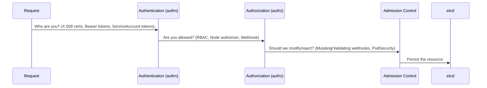
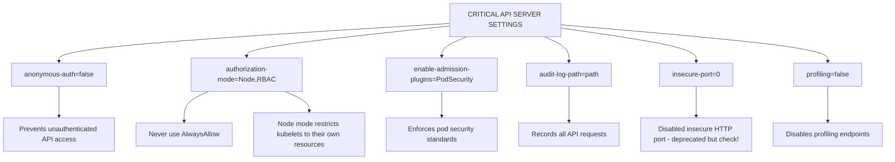
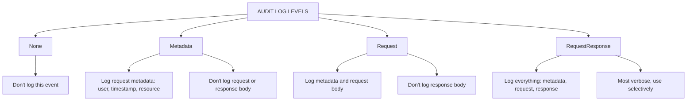

> **Складність**: `[СКЛАДНИЙ]` — критичний компонент інфраструктури.
>
> **Час на проходження**: 45–50 хвилин.
>
> **Передумови**: знання API-сервера на рівні CKA, Модуль 1.2 (CIS Benchmarks), діагностика статичних Pod'ів та впевнене володіння RBAC.

---

## Що ви зможете зробити

Після завершення цього модуля ви зможете:

1. **Спроєктувати** межі автентифікації та авторизації API-сервера, які відхиляють анонімний доступ, але зберігають робочі сценарії для kubelet та користувачів.
2. **Провести аудит** прапорців статичного Pod'а kube-apiserver щодо анонімної автентифікації, авторизації Node/RBAC, плагінів допуску, профілювання та застарілих налаштувань.
3. **Впровадити** журналювання аудиту та налаштування шифрування сховища, які фіксують події безпеки, не вичерпуючи дисковий простір площини управління.
4. **Діагностувати** збої перезапуску API-сервера, помилки TLS та збої взаємодії з kubelet за допомогою логів середовища виконання контейнерів і перевірок стану Kubernetes.
5. **Оцінити** готовність до оновлення на Kubernetes v1.35, виявляючи вилучені небезпечні прапорці та обираючи безпечний порядок усунення проблем.

## Чому цей модуль важливий

Гіпотетичний сценарій: команда відкриває доступ до кінцевої точки площини управління Kubernetes для широкої корпоративної мережі, бо вона "лише для адміністраторів", а згодом виявляє, що старий ClusterRoleBinding надає доступ на читання групі `system:unauthenticated`. API-серверу не знадобилася вразливість нульового дня, щоб стати небезпечним; йому достатньо було, щоб одночасно збіглися мережева досяжність, анонімна автентифікація та надмірно дозвільне правило авторизації. У контексті CKS ваше завдання — розпізнати, що це багаторівневий збій, а не один поганий прапорець.

API-сервер — це парадні двері площини управління. Кожен запит `kubectl`, кожен цикл узгодження контролера, кожен виклик вебхука допуску та кожне оновлення статусу від kubelet зрештою проходять через цей процес. Якщо зловмисник здатний надсилати йому прийнятні запити, він уже не просто торкається мережевого порту сервера; він просить Kubernetes створювати робочі навантаження, читати Secret'и, змінювати RBAC та переформовувати кластер тим самим механізмом оркестрації, яким користуються адміністратори.

Урок цього модуля не в тому, що один прапорець магічно посилює кластер. Безпечний API-сервер поєднує перевірки ідентичності, режими авторизації, контроль допуску, записи аудиту, зашифроване сховище та обмежені мережеві шляхи так, щоб одна помилка не обвалила всю модель безпеки. Ви потренуєтеся читати маніфест статичного Pod'а як файл доказів: кожен прапорець пояснює, чому довірятиме API-сервер, що він відхилятиме, що записуватиме та як поводитиметься, коли вузол або користувач пред'являє облікові дані.

[Компрометація кластера Tesla у 2018 році](/k8s/cks/part1-cluster-setup/module-1.5-gui-security/) <!-- incident-xref: tesla-2018-cryptojacking --> — корисне нагадування про те, що відкриті адміністративні інтерфейси швидко перетворюють помилки конфігурації на операційні інциденти. Цей модуль зосереджується на API-сервері, а не на дашборді, але патерн той самий: досяжна керівна поверхня зі слабкою автентифікацією стає шляхом до доступу до даних, маніпуляцій із робочими навантаженнями та несанкціонованих обчислень. Сприймайте API-сервер як зовнішню межу безпеки, навіть коли він розташований за приватними адресами.

## Межі автентифікації та авторизації API-сервера

API-сервер обробляє запити у фіксованій послідовності безпеки, і порядок має значення, бо кожен етап відповідає на власне питання. Автентифікація запитує, хто надсилає запит; авторизація запитує, чи може ця ідентичність виконати запитану дію; допуск запитує, чи слід змінити або відхилити запит перед збереженням; а etcd зберігає кінцевий об'єкт. Запит, який не проходить автентифікацію, зазвичай повертає `401 Unauthorized`; запит, який автентифікувався, але не має прав, зазвичай повертає `403 Forbidden`.

Уявіть цю послідовність як захищений вхід до будівлі, а не один замкнений двір. Адміністратор на рецепції перевіряє особу, список доступу вирішує, до яких кімнат особа може зайти, сканер безпеки блокує небезпечні предмети, а архів зберігає погоджені документи. Якщо адміністратор на рецепції приймає "невідому особу" як справжню ідентичність, наступною лінією оборони стає список доступу, але тепер він обробляє трафік, який узагалі не мав потрапити до вестибюля.

```text
┌─────────────────────────────────────────────────────────────┐
│              API SERVER REQUEST FLOW                        │
├─────────────────────────────────────────────────────────────┤
│                                                             │
│  Request ──────────────────────────────────────────────►   │
│           │                                                 │
│           ▼                                                 │
│  ┌─────────────────┐                                       │
│  │ Authentication  │  Who are you?                         │
│  │ (authn)         │  - X.509 certs                        │
│  │                 │  - Bearer tokens                       │
│  │                 │  - ServiceAccount tokens              │
│  └────────┬────────┘                                       │
│           │                                                 │
│           ▼                                                 │
│  ┌─────────────────┐                                       │
│  │ Authorization   │  Are you allowed?                     │
│  │ (authz)         │  - RBAC                               │
│  │                 │  - Node authorizer                    │
│  │                 │  - Webhook                            │
│  └────────┬────────┘                                       │
│           │                                                 │
│           ▼                                                 │
│  ┌─────────────────┐                                       │
│  │ Admission       │  Should we modify/reject?             │
│  │ Control         │  - Mutating webhooks                  │
│  │                 │  - Validating webhooks                │
│  │                 │  - PodSecurity                        │
│  └────────┬────────┘                                       │
│           │                                                 │
│           ▼                                                 │
│  ┌─────────────────┐                                       │
│  │    etcd         │  Persist the resource                 │
│  └─────────────────┘                                       │
│                                                             │
└─────────────────────────────────────────────────────────────┘
```



Основна група API розташована за адресою `api/v1`, тоді як інші ресурси живуть у групах на кшталт `apps/v1` та `rbac.authorization.k8s.io/v1`. Таке групування змінює шлях ресурсу та форму правила RBAC, але не змінює потік безпеки. Запит на перелік Pod'ів і запит на патч ClusterRole обидва проходять автентифікацію, авторизацію, допуск та збереження саме в цьому порядку.

Анонімна автентифікація особливо важлива, бо коли вона ввімкнена, Kubernetes може призначати неавтентифікованим запитам користувача `system:anonymous` та групу `system:unauthenticated`. Така ідентичність звучить нешкідливо, але RBAC може прив'язувати права до груп, а старі скорочення для діагностики іноді залишають широкий доступ на читання, прив'язаний до неавтентифікованих суб'єктів. Проєктувати межі автентифікації та авторизації API-сервера означає відхиляти анонімний трафік ще до того, як RBAC доведеться вирішувати, що цей трафік може побачити.

Зупиніться та спрогнозуйте: як ви гадаєте, що станеться, якщо анонімна автентифікація залишається ввімкненою, але жодне правило RBAC не надає прав групам `system:anonymous` чи `system:unauthenticated`? Запит усе одно дістається авторизації з ідентичністю, але авторизація має відхилити його з `403 Forbidden`; ця відмінність важлива, бо API-сервер прийняв запит як анонімного учасника, а не відхилив його як неавтентифікований на першому ж бар'єрі.

Авторизатор Node розв'язує іншу проблему меж. Kubelet'ам потрібен доступ до API, щоб звітувати про стан вузла, читати Pod'и, заплановані на їхній вузол, та керувати пов'язаними ресурсами, але kubelet не повинен мати змоги керувати кожним Pod'ом у кластері лише тому, що він є компонентом вузла. `Node,RBAC` робить права kubelet'а топологічно-обізнаними ще до того, як RBAC обробляє звичайні рішення для користувачів і контролерів, — саме тому відповідь CKS, яка каже "використайте RBAC", часто є неповною.

Токени ServiceAccount заслуговують на таке ж уважне прочитання, бо це найпоширеніші внутрішньокластерні облікові дані для API. Сучасні прив'язані токени ServiceAccount містять модель емітента (issuer) та аудиторії (audience), тож API-серверу потрібна конфігурація емітента, яка відповідає токенам, що він має перевіряти. Якщо емітент неправильний, Pod'и можуть не проходити автентифікацію, навіть коли RBAC та допуск налаштовані бездоганно, — це робить перевірку токенів проблемою довіри площини управління, а не помилкою застосунку.

Контролери допуску працюють після авторизації, тож вони не є заміною ні автентифікації, ні RBAC. Усе ж вони можуть бути вирішальними, бо інспектують об'єкт, який ось-ось буде збережено, а не лише ідентичність та дієслово. `NodeRestriction` обмежує те, що kubelet'и можуть змінювати, `PodSecurity` забезпечує дотримання стандартів безпеки Pod'ів, а валідаційні вебхуки можуть відхиляти небезпечні форми об'єктів, які інакше були б авторизовані.

Коди відповідей — корисний доказ, коли ви діагностуєте цей потік. `401` зазвичай каже вам, що запит не пред'явив прийнятної ідентичності, тоді як `403` зазвичай каже, що ідентичність розпізнано, але авторизація її відхилила. Успішна відповідь, за якою слідує відхилений об'єкт, може вказувати на допуск, особливо коли повідомлення про помилку називає політику, вебхук або профіль Pod Security, а не правило RBAC.

Не плутайте силу автентифікації з формою авторизації. Клієнтський сертифікат, підписаний CA кластера, може дуже надійно підтверджувати ідентичність, але водночас відображатися на суб'єкт, який повинен мати майже жодних привілеїв. Модель безпеки API-сервера залежить від того, щоб обидві частини були істинними одночасно: ідентичності мають бути важкими для підробки, а права, прив'язані до цих ідентичностей, — достатньо вузькими, щоб викрадені облікові дані не перетворилися на контроль над усім кластером.
## Аудит прапорців статичного Pod'а та застарілих налаштувань

У кластерах на основі kubeadm API-сервер працює як статичний Pod, за яким стежить kubelet, а маніфест зазвичай розташований у `/etc/kubernetes/manifests/kube-apiserver.yaml`. Цей файл є одночасно конфігурацією площини управління та поверхнею відновлення. Якщо ви додасте прапорець із помилкою в написанні, kubelet перезапустить статичний Pod, API-сервер може впасти ще до обслуговування трафіку, і `kubectl` перестане бути корисним, доки ви не оглянете середовище виконання контейнерів напряму.

Перший прохід аудиту має виявити прапорці, які вирішують, хто може запитувати доступ. Наведений нижче збережений фрагмент маніфесту показує налаштування автентифікації, які зазвичай мають значення в першу чергу: анонімна автентифікація, корені клієнтських сертифікатів, обробка bootstrap-токенів та перевірка токенів ServiceAccount. Ключова звичка — читати їх як твердження про довіру, а не як завчену екзаменаційну дрібницю; кожен шлях до файлу вказує на ключ або CA, який API-сервер прийматиме як доказ.

```yaml
# /etc/kubernetes/manifests/kube-apiserver.yaml
spec:
  containers:
  - command:
    - kube-apiserver
    # Disable anonymous authentication
    - --anonymous-auth=false

    # Client certificate authentication
    - --client-ca-file=/etc/kubernetes/pki/ca.crt

    # Bootstrap token authentication (for node join)
    - --enable-bootstrap-token-auth=true

    # ServiceAccount token authentication
    - --service-account-key-file=/etc/kubernetes/pki/sa.pub
    - --service-account-issuer=https://kubernetes.default.svc
```

Налаштування автентифікації корисні лише тоді, коли авторизація достатньо сувора, щоб зробити ідентичності значущими. `AlwaysAllow` фактично каже API-серверу, що автентифікована ідентичність може робити будь-що, що руйнує межу, яку ви щойно встановили. Для посилених кластерів та вправ CKS очікуваним базовим рівнем є `Node,RBAC`, де авторизатор Node розміщено там, де рішення, обмежені рамками kubelet, можна ухвалити перед тим, як буде розглянуто загальні гранти RBAC.

```yaml
    # Authorization modes (order matters!)
    - --authorization-mode=Node,RBAC
    # Node: kubelet authorization
    # RBAC: role-based access control
    # Don't use: AlwaysAllow (dangerous!)
```

Плагіни допуску завершують аудит прапорців статичного Pod'а, бо вони надають контроль на рівні об'єкта, який автентифікація та авторизація не виражають. `NodeRestriction` зазвичай поєднують із авторизатором Node, тоді як `PodSecurity` надає просторам імен примусовий профіль безпеки Pod'ів. `EventRateLimit` може зменшити шум площини управління, але він потребує конфігурації та операційної обачності, бо обмеження частоти також можуть приховати корисні потоки подій під час інциденту.

```yaml
    # Enable essential admission controllers
    - --enable-admission-plugins=NodeRestriction,PodSecurity,EventRateLimit

    # Disable risky admission controllers
    - --disable-admission-plugins=AlwaysAdmit
```

Перш ніж редагувати цей файл, запитайте себе, що продовжить працювати, якщо API-сервер не відновиться. `kubectl get pods -n kube-system` залежить від API-сервера, тож це не ваш перший інструмент відновлення, коли процес лежить. Безпечніший робочий процес — тримати один root-shell на вузлі площини управління, використовувати `crictl` для огляду контейнерів статичних Pod'ів та бути готовим відкотити один рядок у маніфесті.

Критично важливі для безпеки налаштування складаються в контрольний список, але цей список не є заміною розуміння режимів відмови. `--anonymous-auth=false` блокує неавтентифікованих учасників, `--authorization-mode=Node,RBAC` запобігає широким повноваженням kubelet та надмірним діям користувачів, `--enable-admission-plugins=NodeRestriction,PodSecurity` контролює форму об'єкта та заявки вузлів, `--audit-log-path` створює докази, а `--profiling=false` прибирає налагоджувальні кінцеві точки, які в продакшені рідко потрібні.

```text
┌─────────────────────────────────────────────────────────────┐
│              CRITICAL API SERVER SETTINGS                   │
├─────────────────────────────────────────────────────────────┤
│                                                             │
│  anonymous-auth=false                                      │
│  └── Prevents unauthenticated API access                   │
│                                                             │
│  authorization-mode=Node,RBAC                              │
│  └── Never use AlwaysAllow                                 │
│  └── Node mode restricts kubelets to their own resources   │
│                                                             │
│  enable-admission-plugins=PodSecurity                      │
│  └── Enforces pod security standards                       │
│                                                             │
│  audit-log-path=<path>                                     │
│  └── Records all API requests                              │
│                                                             │
│  insecure-port=0 (deprecated but check!)                   │
│  └── Disabled insecure HTTP port                           │
│                                                             │
│  profiling=false                                           │
│  └── Disables profiling endpoints                          │
│                                                             │
└─────────────────────────────────────────────────────────────┘
```



Кластери Kubernetes v1.35 не повинні нести вилучені небезпечні прапорці обслуговування зі старіших релізів. Історичний шлях `--insecure-port` зник, тож залишений у маніфесті застарілий рядок `--insecure-port=8080` не є нешкідливим неробочим залишком; сучасний API-сервер відхиляє невідомі прапорці під час запуску. Тому готовність до оновлення включає гігієну прапорців, а не лише перевірку того, що робочі навантаження використовують підтримувані версії API.

Площини управління з високою доступністю додають ще одну деталь аудиту: кожен екземпляр API-сервера повинен забезпечувати однаковий стан безпеки. Балансувальник навантаження може приховати розбіжність, бо запити виглядають здоровими, доки працює хоча б один екземпляр, тоді як інший екземпляр може досі не мати прапорців аудиту або нести застаріле налаштування. Коли ви проводите аудит HA-кластера, оглядайте кожен вузол площини управління та порівнюйте маніфести статичних Pod'ів, а не припускайте, що одна здорова кінцева точка доводить однорідність конфігурації.

Редагування статичних Pod'ів також має модель таймінгу, яка може здивувати нових адміністраторів. Kubelet стежить за каталогом маніфестів, помічає оновлення файлу та перестворює контейнер, коли специфікація Pod'а змінюється. Це означає, що недописаний файл, неправильний рівень відступу або дубльований прапорець можуть негайно вплинути на API-сервер; обережно зберігайте зміни в редакторі, тримайте старий маніфест поруч та уникайте сторонніх прибирань, поки ви змінюєте засоби контролю безпеки під екзаменаційним тиском.

Перш ніж запускати цей аудит на реальній площині управління, вирішіть, як ви доводитимете кожну знахідку. Видимий прапорець у маніфесті доводить намір конфігурації, командний рядок запущеного статичного Pod'а доводить активну конфігурацію, а зовнішній запит доводить спостережувану поведінку. Завдання CKS часто винагороджують адміністратора, який може поєднати всі три, не втрачаючи доступу до кластера під час редагування.
## Журналювання аудиту та докази без вичерпання сховища

Журналювання аудиту дає вам хронологічний запис запитів до API-сервера, але це не безкоштовна функція безпеки. API-сервер має оцінити політику аудиту, записати події, ротувати файли, а іноді й включати тіла запитів чи відповідей. Корисна політика записує діяльність, релевантну для безпеки, з достатньою деталізацією для розслідування, водночас уникаючи неконтрольованого зростання диска на ресурсах із великим обсягом трафіку.

Прапорці ввімкнення визначають розташування файлу політики, шлях до логу та обмеження ротації. Ці прапорці є частиною маніфесту статичного Pod'а, тож хостові шляхи також мають бути видимими всередині контейнера. Поширений збій — додати `--audit-log-path`, не створивши хостового каталогу та не змонтувавши його, через що API-сервер падає під час запуску, навіть якщо сам прапорець написано правильно.

```yaml
# API server flags
- --audit-policy-file=/etc/kubernetes/audit-policy.yaml
- --audit-log-path=/var/log/kubernetes/audit.log
- --audit-log-maxage=30
- --audit-log-maxbackup=10
- --audit-log-maxsize=100
```

Політика контролює, що саме записується та на якому рівні. `Metadata` фіксує, хто що зробив з яким ресурсом, без тіл об'єктів, `Request` включає надісланий об'єкт, а `RequestResponse` включає і запит, і відповідь. Останній рівень є потужним для Secret'ів та змін RBAC, але зазвичай він надто дорогий для шумних ресурсів, як-от watch'і, події, endpoint'и чи lease'и.

```yaml
# /etc/kubernetes/audit-policy.yaml
apiVersion: audit.k8s.io/v1
kind: Policy
rules:
  # Log authentication failures
  - level: Metadata
    omitStages:
    - RequestReceived

  # Log secret access
  - level: RequestResponse
    resources:
    - group: ""
      resources: ["secrets"]

  # Log all pod operations
  - level: Request
    resources:
    - group: ""
      resources: ["pods"]
    verbs: ["create", "update", "patch", "delete"]

  # Log RBAC changes
  - level: RequestResponse
    resources:
    - group: "rbac.authorization.k8s.io"

  # Skip noisy events
  - level: None
    users: ["system:kube-proxy"]
    verbs: ["watch"]
    resources:
    - group: ""
      resources: ["endpoints", "services"]
```

```text
┌─────────────────────────────────────────────────────────────┐
│              AUDIT LOG LEVELS                               │
├─────────────────────────────────────────────────────────────┤
│                                                             │
│  None                                                      │
│  └── Don't log this event                                  │
│                                                             │
│  Metadata                                                  │
│  └── Log request metadata (user, timestamp, resource)      │
│  └── Don't log request or response body                    │
│                                                             │
│  Request                                                   │
│  └── Log metadata and request body                         │
│  └── Don't log response body                               │
│                                                             │
│  RequestResponse                                           │
│  └── Log everything: metadata, request, response           │
│  └── Most verbose, use selectively                         │
│                                                             │
└─────────────────────────────────────────────────────────────┘
```



Практична політика аудиту зазвичай починається з широкого покриття на рівні `Metadata`, піднімає окремі чутливі ресурси до `Request` чи `RequestResponse` та явно відкидає малоцінний watch-трафік. Така структура дозволяє слідчим відповісти на питання "хто торкнувся цього Secret'а або ClusterRole?", не заповнюючи диск площини управління повторюваними потоками статусу. Прапорці ротації потім діють як остання запобіжна межа, а не як основа дизайну.

Який підхід ви б обрали тут і чому: `RequestResponse` для кожного ресурсу чи `Metadata` для більшості ресурсів із підвищеним журналюванням для Secret'ів та RBAC? Другий підхід зазвичай сильніший у продакшені, бо він зберігає докази для високоризикових операцій, водночас тримаючи API-сервер достатньо здоровим, щоб продовжувати продукувати докази під час інциденту.

Події аудиту також допомагають діагностувати межі автентифікації та авторизації, бо вони фіксують користувача, групи, дієслово, ресурс, простір імен та статус відповіді. Якщо сканер повідомляє про анонімний доступ, логи аудиту можуть показати, чи запит було відхилено на автентифікації, відмовлено авторизацією, чи пропущено через прив'язку. Це набагато корисніше, ніж просто знати, що команда curl повернула JSON.

Поле `omitStages` — ще одна практична точка тонкого налаштування. `RequestReceived` може бути шумним, бо фіксує запити перед тим, як авторизація та допуск досягнуть кінцевого результату, тоді як пізніші етапи часто корисніші для розслідувань, які з'ясовують, чи запит був успішним. Продумана політика записує достатньо інформації про етапи, щоб реконструювати рішення безпеки, не подвоюючи обсяг логів для запитів, де кінцева відповідь — єдиний потрібний вам факт.

Вебхуки аудиту можуть транслювати події до зовнішніх систем, але локальний файловий бекенд залишається важливим під час інциденту площини управління. Якщо мережевий шлях до SIEM зламано, локальний ротований лог може бути єдиним доказом, що залишився на вузлі. Для роботи CKS файловий бекенд також легше швидко перевірити, бо ви можете згенерувати запит та оглянути локальний лог, не налагоджуючи зовнішній збирач.

Не розміщуйте логи аудиту на крихітній кореневій файловій системі, не подумавши про тиск на диск. Вузли площини управління часто розміщують etcd, стан kubelet, логи контейнерів та томи статичних Pod'ів на тому самому базовому сховищі. Якщо журналювання аудиту заповнить це сховище, кластер може втратити і доступність, і докази, тож політика та налаштування ротації є засобами контролю доступності так само, як і засобами контролю безпеки.

Політики аудиту також мають відображати, як поводяться контролери Kubernetes. Контролер може виконувати часті читання та watch'і, які є нормальними під час узгодження, тоді як людина, що змінює ClusterRoleBinding, є порівняно рідкісним та чутливим для безпеки явищем. Хороший дизайн політики розділяє ці патерни, щоб звичайна автоматизація не заглушувала події, які пояснили б ескалацію привілеїв, доступ до Secret'а чи неочікуване створення робочого навантаження.
## Мережеві межі, NodeRestriction та захищена взаємодія з kubelet

Посилення безпеки API-сервера починається з обробки запитів, але мережева досяжність усе одно вирішує, хто отримує можливість випробувати ці засоби контролю. Захищений порт зазвичай слухає на TCP 6443, і API-сервер може прив'язуватися широко, тоді як міжмережеві екрани, групи безпеки, балансувальники навантаження чи приватна маршрутизація вирішують, хто може його досягти. Приватна адреса не є повним захистом, якщо приватна мережа включає недовірені робочі навантаження, скомпрометовані хости-перемички або широкий піринг.

Наведений нижче збережений фрагмент із прапорцями показує різницю між анонсуванням адреси та прив'язуванням слухача. `--advertise-address` повідомляє іншим компонентам, яку адресу використовувати для API-сервера, тоді як `--bind-address` вирішує, де слухає процес. У багатьох продакшен-дизайнах адреса прив'язки залишається широкою, бо цього вимагає мережа вузла, тож фактичне обмеження має надходити від правил хостового міжмережевого екрана та мережевих засобів контролю вищого рівня.

```yaml
# API server flags to bind to specific address
- --advertise-address=10.0.0.10
- --bind-address=0.0.0.0  # Or specific IP

# In production, use firewall rules to restrict access
# iptables -A INPUT -p tcp --dport 6443 -s 10.0.0.0/8 -j ACCEPT
# iptables -A INPUT -p tcp --dport 6443 -j DROP
```

Мережеві обмеження зменшують відкритість, але не замінюють авторизацію API, бо kubelet'и, контролери та адміністратори все одно потребують доступу. Саме тому `NodeRestriction` має значення. Він звужує радіус ураження скомпрометованого kubelet, не дозволяючи йому змінювати чужі об'єкти Node чи використовувати мітки вузла у способи, які могли б вплинути на планування та рішення про довіру поза його власною смугою.

```yaml
# Enable NodeRestriction (limits what kubelets can modify)
- --enable-admission-plugins=NodeRestriction

# What it prevents:
# - Kubelets can only modify pods scheduled to them
# - Kubelets can only modify their own Node object
# - Kubelets cannot modify other nodes' labels
```

Тонка пастка — вважати `NodeRestriction` необов'язковим, бо RBAC уже ввімкнено. RBAC може казати, що ідентичність вузла має доступ до пов'язаних із Pod ресурсів, але сам по собі він не розуміє, на який вузол заплановано Pod. Авторизатор Node та плагін допуску NodeRestriction додають цей контекст, створюючи межу, яка слідує за плануванням, а не за широким членством у ролях.

Коли API-сервер під'єднується до kubelet'ів для потоків `kubectl logs`, `kubectl exec` та port-forward, йому також потрібен захищений клієнтський та CA-матеріал. Ці запити відчуваються як прямі дії користувача, але саме API-сервер є компонентом, який проксіює з'єднання до kubelet. Якщо обслуговувальний сертифікат kubelet не можна перевірити, ви можете побачити помилки x509, навіть коли ваш локальний kubeconfig та сертифікат користувача в порядку.

```yaml
spec:
  containers:
  - command:
    - kube-apiserver
    # API server flags for secure kubelet communication
    - --kubelet-certificate-authority=/etc/kubernetes/pki/ca.crt
    - --kubelet-client-certificate=/etc/kubernetes/pki/apiserver-kubelet-client.crt
    - --kubelet-client-key=/etc/kubernetes/pki/apiserver-kubelet-client.key
---
# Enable HTTPS for kubelet (on kubelet side)
# /var/lib/kubelet/config.yaml
serverTLSBootstrap: true
```

Під час екзаменаційної діагностики розділіть у голові три напрямки трафіку. Користувач, що під'єднується до API-сервера, залежить від обслуговувального сертифіката API-сервера та автентифікації користувача. Kubelet, що під'єднується до API-сервера, залежить від облікових даних вузла та авторизації Node/RBAC. API-сервер, що під'єднується до kubelet, залежить від довіри до обслуговувального сертифіката kubelet та клієнтських облікових даних API-сервера для kubelet.

Сценарій вправи: ви встановлюєте `--authorization-mode=RBAC` без включення `Node`, і запити користувачів усе одно виглядають нормально. Прихована шкода — в авторизації на рівні вузла, а не у звичайному доступі користувачів. Скомпрометований чи неправильно налаштований kubelet може оцінюватися через широкі гранти RBAC без того, щоб топологічно-обізнаний авторизатор Node звужував запит до ресурсів, пов'язаних із цим вузлом.

Налаштування front-proxy та агрегації — ще одна поверхня довіри API-сервера, хоча вони не є головним фокусом цього модуля. Агреговані API-сервери покладаються на заголовки запитів та клієнтські сертифікати проксі, щоб зберегти ідентичність користувача через шар агрегації. Якщо ви натрапите на власні групи API, які автентифікуються інакше, ніж основні ресурси, включіть до свого розслідування ланцюг довіри агрегації, замість припускати, що прапорці основного API-сервера пояснюють кожну відповідь.

Балансувальники навантаження потребують такого ж скептицизму, як і міжмережеві екрани. Перевірка стану, яка лише підтверджує, що TCP-порт відкритий, може позначити API-сервер як здоровий, навіть коли налаштування автентифікації, журналювання аудиту чи шифрування неправильні. Надійніша операційна перевірка валідує захищену кінцеву точку, обслуговувальний сертифікат та автентифікований легкий запит до API, а потім залишає детальні тести авторизації й допуску для проб, обізнаних із Kubernetes.

## Шифрування сховища та перевірка etcd

API-сервер є stateless у тому сенсі, що він не зберігає базу даних об'єктів кластера всередині власного процесу. Він валідує, авторизує, допускає та транслює запити до API, а потім зберігає стан кластера в etcd. Ця відмінність важлива для безпеки, бо добре посилений API-сервер усе одно може залишити чутливі дані відкритими, якщо знімки чи диски etcd містять значення Secret'ів у відкритому тексті.

Шифрування сховища налаштовується через файл `EncryptionConfiguration`, який споживає API-сервер. Порядок провайдерів є значущим: перший провайдер записує нові дані, тоді як пізніші провайдери можуть читати старіші. Залишення `identity` як запасного варіанта під час міграції дозволяє API-серверу читати наявні незашифровані об'єкти, але це також означає, що старі об'єкти залишаються незашифрованими, доки їх не перезапишуть.

```yaml
# Create encryption configuration
# /etc/kubernetes/enc/encryption-config.yaml
apiVersion: apiserver.config.k8s.io/v1
kind: EncryptionConfiguration
resources:
  - resources:
    - secrets
    providers:
    - aescbc:
        keys:
        - name: key1
          secret: <base64-encoded-32-byte-key>
    - identity: {}  # Fallback for reading old unencrypted data
```

Статичний Pod має отримати і прапорець, і шлях до змонтованого файлу. Це створює залежність, яку легко проґавити під час швидкого редагування на CKS: файл може існувати на хості, але контейнер не може його прочитати, якщо немає тому hostPath та volumeMount. Відсутнє монтування може зробити збій API-сервера таким же беззаперечним, як і неправильно сформований YAML-документ.

```yaml
spec:
  containers:
  - command:
    - kube-apiserver
    # API server flag
    - --encryption-provider-config=/etc/kubernetes/enc/encryption-config.yaml

    # Mount the config
    volumeMounts:
    - name: enc
      mountPath: /etc/kubernetes/enc
      readOnly: true
  volumes:
  - name: enc
    hostPath:
      path: /etc/kubernetes/enc
```

Перевірка має читати з etcd, а не просто пересвідчуватися, що прапорець API-сервера існує. Налаштований прапорець доводить намір, але читання з etcd доводить результат у сховищі. Наведена нижче команда створює Secret та читає сирий ключ etcd, щоб ви могли оглянути, чи значення зберігається з префіксом зашифрованого провайдера, а не як читабельні дані Secret'а.

```bash
# Create a secret
kubectl create secret generic test-secret --from-literal=key=value

# Check etcd directly (should be encrypted)
sudo ETCDCTL_API=3 etcdctl \
  --endpoints=https://127.0.0.1:2379 \
  --cacert=/etc/kubernetes/pki/etcd/ca.crt \
  --cert=/etc/kubernetes/pki/etcd/server.crt \
  --key=/etc/kubernetes/pki/etcd/server.key \
  get /registry/secrets/default/test-secret | hexdump -C | head

# Should see encrypted data, not plain text
```

Зупиніться та спрогнозуйте: ви вмикаєте шифрування `aescbc` сьогодні, але кластер уже містить Secret'и, створені минулого тижня. Ці наявні об'єкти не перезаписують себе магічно, коли конфігурація провайдера змінюється. Вам потрібна свідома операція перезапису, як-от заміна Secret'ів через API, щоб API-сервер зберіг їх знову, використовуючи новий перший провайдер.

Ротація ключів додає ще одну операційну вимогу. Ви додаєте новий ключ як перший провайдер запису, тримаєте старіші ключі доступними для читань, перезаписуєте захищені ресурси та видаляєте застарілі ключі лише після підтвердження, що жоден об'єкт від них більше не залежить. Видалення ключа надто рано може перетворити зашифровані дані на нечитабельні, що значно гірше, ніж провалити перевірку відповідності.

Обсяг шифрування залежить від ресурсів, тож перевіряйте точний перелік ресурсів, наведений під конфігурацією, а не припускайте, що зашифровано всю базу даних. Secret'и є поширеним базовим рівнем, бо вони містять облікові дані, але деякі організації також шифрують ConfigMap'и чи власні ресурси, що несуть чутливу конфігурацію. Розширення переліку ресурсів збільшує захист, але також підвищує важливість дисципліни ротації ключів та тестування відновлення.

Резервні копії є частиною історії шифрування. Якщо знімок etcd було зроблено до ввімкнення шифрування або до перезапису старих Secret'ів, цей знімок може досі містити дані у відкритому тексті навіть після виправлення живого кластера. Повний план усунення проблеми визначає, які резервні копії передують зміні шифрування, вирішує, як довго їх слід зберігати, та застосовує компенсаційні засоби контролю, як-от обмежений доступ чи прискорене закінчення терміну дії.

Тестування відновлення замикає цикл. Кластер, який може шифрувати нові дані, але не може бути відновлений із поточною конфігурацією провайдера, обміняв один ризик безпеки на ризик доступності. Тримайте конфігурацію шифрування, ключовий матеріал та процедуру відновлення під такою ж операційною дисципліною, як і резервні копії etcd, бо всі три потрібні, коли вузол площини управління виходить з ладу, а зашифровані дані мають знову стати придатними для використання.
## Діагностика перезапусків та реальні екзаменаційні сценарії

Посилення безпеки API-сервера є ризикованим, бо компонент, який ви редагуєте, водночас є компонентом, що уможливлює звичайну інспекцію кластера. Коли зміна статичного Pod'а ламає запуск, `kubectl` падає, бо немає здорового API-сервера, який відповів би. Саме тому екзаменаційна навичка — це не просто "знати прапорець"; це "змінити прапорець, спостерігати перезапуск та відновитися через середовище виконання вузла, якщо API-сервер зник".

Перший збережений сценарій вимикає анонімну автентифікацію. Зверніть увагу на порядок: оглянути маніфест, відредагувати статичний Pod, потім стежити за Pod'ом kube-system, поки API-сервер перезапускається. Під час реального збою команда watch може не працювати, доки API-сервер не повернеться, тож поєднуйте цей робочий процес із перевірками на рівні середовища виконання, коли ви не впевнені, що маніфест дійсний.

```bash
# Check current setting
cat /etc/kubernetes/manifests/kube-apiserver.yaml | grep anonymous

# Edit API server manifest
sudo vi /etc/kubernetes/manifests/kube-apiserver.yaml

# Add to command section:
# - --anonymous-auth=false

# Wait for API server to restart
kubectl get pods -n kube-system -w
```

Другий сценарій вмикає журналювання аудиту, яке більш схильне до збоїв, бо додає прапорці, файл політики, каталог та монтування томів. Якщо API-сервер падає після цього редагування, перевірте прапорці з помилками в написанні, недійсний YAML політики, відсутні хостові каталоги та відсутні монтування томів, перш ніж припускати глибшу проблему площини управління. Логи статичного Pod'а зазвичай кажуть вам, яка з цих умов сталася.

```bash
# Create audit policy
sudo tee /etc/kubernetes/audit-policy.yaml <<EOF
apiVersion: audit.k8s.io/v1
kind: Policy
rules:
- level: Metadata
  resources:
  - group: ""
    resources: ["secrets", "configmaps"]
- level: RequestResponse
  resources:
  - group: "rbac.authorization.k8s.io"
EOF

# Create log directory
sudo mkdir -p /var/log/kubernetes

# Edit API server manifest
sudo vi /etc/kubernetes/manifests/kube-apiserver.yaml

# Add flags:
# - --audit-policy-file=/etc/kubernetes/audit-policy.yaml
# - --audit-log-path=/var/log/kubernetes/audit.log
# - --audit-log-maxage=30
# - --audit-log-maxbackup=3
# - --audit-log-maxsize=100

# Add volume mounts for policy and logs
```

Третій сценарій перевіряє режим авторизації безпосередньо з запущеного статичного Pod'а. Це корисно після редагування маніфесту, бо маніфест та активний Pod можуть на короткий час розходитися, поки kubelet перезапускає контейнер. Для екзаменаційної відповіді бажане спостереження є явним: `Node,RBAC` присутній, а `AlwaysAllow` відсутній.

```bash
# Verify authorization mode
kubectl get pods -n kube-system -l component=kube-apiserver -o yaml | grep authorization-mode

# Should see: --authorization-mode=Node,RBAC
# Should NOT see: AlwaysAllow
```

Допоміжний скрипт аудиту збирає ті самі докази за один прохід. Він не є заміною судження, бо відсутній прапорець може означати безпечне типове значення, небезпечне типове значення або налаштування, надане через інший механізм, залежно від прапорця. Усе ж він є корисним інструментом сортування, бо робить пропуски видимими та дає вам короткий перелік тверджень для перевірки перед редагуванням.

```bash
#!/bin/bash
# api-server-audit.sh

echo "=== API Server Security Audit ==="

# Get API server pod
POD=$(kubectl get pods -n kube-system -l component=kube-apiserver -o name | head -1)

# Check anonymous auth
echo "Anonymous auth:"
kubectl get $POD -n kube-system -o yaml | grep -E "anonymous-auth" || echo "  Not explicitly set (check default)"

# Check authorization mode
echo "Authorization mode:"
kubectl get $POD -n kube-system -o yaml | grep -E "authorization-mode"

# Check admission plugins
echo "Admission plugins:"
kubectl get $POD -n kube-system -o yaml | grep -E "enable-admission-plugins"

# Check audit logging
echo "Audit logging:"
kubectl get $POD -n kube-system -o yaml | grep -E "audit-log-path" || echo "  Not configured"

# Check encryption
echo "Encryption at rest:"
kubectl get $POD -n kube-system -o yaml | grep -E "encryption-provider-config" || echo "  Not configured"

# Check profiling
echo "Profiling:"
kubectl get $POD -n kube-system -o yaml | grep -E "profiling=false" || echo "  May be enabled"
```

Розібраний приклад: ви додаєте прапорці журналювання аудиту, і потім кожна команда `kubectl` повертає `The connection to the server <ip>:6443 was refused`. Оскільки API-сервер є статичним Pod'ом, ваш наступний хід — не ще одна команда `kubectl`; це `crictl ps -a` на вузлі площини управління, за яким слідує `crictl logs <container-id>` для збійного контейнера kube-apiserver. Якщо лог каже `unknown flag: --audit-log-pathh`, виправлення — скоригувати помилку друку в маніфесті та дозволити kubelet перестворити статичний Pod.

Діагностика збоїв взаємодії з kubelet вимагає іншого ментального шляху. Якщо `kubectl get pods` працює, але `kubectl logs` чи `kubectl exec` падає з помилкою сертифіката kubelet, шлях від користувача до API-сервера, ймовірно, в порядку. Зосередьтеся на шляху від API-сервера до kubelet: довіра до обслуговувального сертифіката kubelet, клієнтський сертифікат API-сервера для kubelet, а також чи `serverTLSBootstrap` та відповідний ланцюг CA налаштовані узгоджено.

Коли ви діагностуєте збійний статичний Pod, зафіксуйте точну помилку середовища виконання перед повторним редагуванням. Повторні сліпі редагування ускладнюють розуміння того, яка зміна виправила проблему, та можуть внести нові помилки, поки ви під тиском. Дисциплінована послідовність на практиці швидша: прочитати лог збійного контейнера, зробити одне цілеспрямоване виправлення маніфесту, дочекатися узгодження kubelet, а потім довести відновлення і станом середовища виконання, і автентифікованим запитом до Kubernetes.

Існує також різниця між збоєм запуску та збоєм готовності. Контейнер kube-apiserver може запуститися, прив'язати свій захищений порт і все одно не пройти перевірку готовності, якщо він не може дістатися etcd, завантажити конфігурацію допуску чи ініціалізувати потрібні контролери. Якщо процес запущено, але кінцева точка нездорова, оглядайте повідомлення готовності та логи компонентів, замість припускати, що успішний розбір прапорців командного рядка означає повну придатність API-сервера до використання.
## Патерни та антипатерни

Патерни й антипатерни корисні лише тоді, коли вони допомагають вам обрати операційну форму, тож цей розділ зосереджується на рішеннях, які змінюють поведінку живого кластера. Наведені нижче патерни масштабуються, бо вони продукують докази, тримають шляхи відновлення відкритими та уникають покладання на один засіб контролю для компенсації іншого. Антипатерни поширені, бо під час налаштування вони відчуваються швидшими, але залишають площину управління зі слабкими чи недовідними межами.

| Патерн | Коли використовувати | Чому це працює | Аспект масштабування |
|---|---|---|---|
| Аудит API-сервера з пріоритетом маніфесту | Перед усуненням проблем CKS, оновленнями чи перевіркою відповідності | Прапорці статичного Pod'а розкривають активну модель довіри та поведінку при перезапуску | Поєднуйте читання маніфесту з перевірками командного рядка запущеного Pod'а в HA-кластерах |
| `Node,RBAC` плюс `NodeRestriction` | Будь-який кластер із kubelet'ами, що використовують облікові дані вузла | Авторизація та допуск, обмежені рамками вузла, звужують дії скомпрометованого kubelet | Підтвердьте, що потоки bootstrap та ротації сертифікатів усе ще працюють для нових вузлів |
| Багаторівнева політика аудиту | Кластери, яким потрібні докази для розслідування без тиску на диск | `Metadata` залишається широким, тоді як чутливі ресурси отримують глибше журналювання | Перегляньте шумні ресурси зі зростанням кількості контролерів та плинності навантажень |
| Перевірка шифрування через etcd | Кластери, що зберігають Secret'и чи зовнішні облікові дані | Інспекція сирого сховища доводить шифрування, а не лише конфігурацію | Включіть кроки перезапису та ротації ключів до вікон обслуговування |

Ефективний патерн має цикл зворотного зв'язку. Наприклад, вимкнення анонімної автентифікації не є завершеним, доки неавтентифікований запит не поверне `401 Unauthorized`, автентифікований трафік адміністратора все ще працює, а записи аудиту показують очікувану поведінку відхилення. Цей цикл зворотного зв'язку утримує вас від плутання "я додав прапорець" із "кластер посилено".

| Антипатерн | Що йде не так | Краща альтернатива |
|---|---|---|
| Довіра до приватних мереж як до межі API-сервера | Будь-який хост на приватному шляху може зондувати слабкості автентифікації та авторизації | Обмежте досяжність і все одно забезпечуйте автентифікацію, RBAC та контроль допуску |
| Використання `AlwaysAllow` під час усунення проблем | Тимчасовий доступ часто стає постійним повним доступом | Створіть вузький аварійний ClusterRoleBinding та видаліть його після відновлення |
| Журналювання `RequestResponse` для всього | Диски площини управління заповнюються малоцінними записами з великим обсягом | Використовуйте `Metadata` широко та резервуйте журналювання тіл для чутливих ресурсів |
| Ввімкнення шифрування без перезапису старих Secret'ів | Нові об'єкти захищені, тоді як старі залишаються читабельними в etcd | Перезапишіть захищені ресурси та перевірте сирий вивід etcd після зміни |

Звичка сеньйора — запитувати, чого засіб контролю не може зробити. Мережеві засоби контролю не можуть вирішувати дієслова Kubernetes, RBAC сам по собі не може достатньо глибоко інспектувати контекст безпеки Pod'а, логи аудиту не можуть запобігти поганому запиту, а шифрування сховища не може зупинити дійсного клієнта API від читання Secret'а. Багаторівневість працює, коли кожен засіб контролю володіє конкретним режимом відмови, а ви можете протестувати це володіння.

Ще один корисний патерн — тримати зміни посилення безпеки оборотними, доки їх не доведено. Скопіюйте оригінальний маніфест статичного Pod'а, змінюйте одну межу безпеки за раз та записуйте команду, яка доводить нову поведінку. Це не означає рухатися повільно заради повільності; це означає зберігати чистий шлях відновлення, щоб площина управління залишалася доступною, поки ви затягуєте найважливіші засоби контролю.

## Фреймворк прийняття рішень

Використовуйте цей фреймворк, коли ви успадковуєте кластер та маєте вирішити, що змінювати першим. Найбезпечніший порядок — захистити шляхи доступу перед внесенням високоризикових змін до сховища чи журналювання, бо зламаний API-сервер робить кожне пізніше виправлення складнішим. У площині управління з високою доступністю застосовуйте те саме міркування вузол за вузлом, але все одно уникайте редагування кожного маніфесту API-сервера одночасно.

| Спостереження | Основний ризик | Перша перевірка | Бажане виправлення |
|---|---|---|---|
| Анонімні запити повертають об'єкти Kubernetes | Неавтентифіковане виявлення чи доступ до даних | Протестувати неавтентифікований запит та оглянути прив'язки RBAC | Встановити `--anonymous-auth=false` та видалити неавтентифіковані гранти |
| Маніфест містить `AlwaysAllow` | Автентифіковані ідентичності можуть виконувати необмежені дії | Оглянути командний рядок запущеного kube-apiserver | Використати `--authorization-mode=Node,RBAC` та валідувати робочі сценарії користувачів |
| Kubelet'и можуть впливати на чужі вузли | Радіус ураження облікових даних вузла надто широкий | Перевірити авторизатор Node та NodeRestriction | Увімкнути авторизацію `Node` та допуск `NodeRestriction` |
| Не налаштовано шлях логу аудиту | Інциденти неможливо реконструювати | Оглянути прапорці API-сервера та хостові монтування | Додати політику, шлях логу, ротацію, каталог та монтування томів |
| Secret'и виглядають читабельними в сирому виводі etcd | Відкритість диска чи резервної копії etcd розкриває облікові дані | Прочитати тестовий Secret напряму з etcd | Додати конфігурацію провайдера шифрування, змонтувати її, перезаписати Secret'и, перевірити знову |
| План оновлення включає вилучені прапорці | API-сервер може впасти при перезапуску | Порівняти маніфест із прапорцями kube-apiserver v1.35 | Видалити застарілі прапорці перед оновленням площини управління |

Почніть зі зміни, яка дає вам найбільший виграш у безпеці з найчіткішим відкатом. Вимкнення анонімної автентифікації зазвичай є невеликим, тестованим редагуванням; ввімкнення журналювання аудиту трохи ширше, бо потребує шляхів до файлів та монтувань; шифрування сховища ще ширше, бо впливає на збережені дані та керування ключами. Правильна послідовність не завжди найефектніша, але вона має зберігати доступ до кластера, водночас зменшуючи найбезпосереднішу відкритість.

Якщо вам доводиться обирати під екзаменаційним тиском часу, класифікуйте завдання за симптомом. Запит, що проходить без облікових даних, — це проблема межі автентифікації та RBAC. Kubelet, що дотягується до чужих вузлів, — це проблема авторизатора Node та NodeRestriction. Відсутній слід для розслідування — це проблема політики аудиту, тоді як читабельні Secret'и в etcd — це проблема шифрування та перезапису.

Для готовності до Kubernetes v1.35 шукайте старі припущення про небезпечне обслуговування перед запуском оновлення. Вилучені прапорці, застарілі назви допуску та застарілі шляхи до конфігураційних файлів можуть зламати запуск статичного Pod'а. Чистий план оновлення доводить, що поточний API-сервер достатньо безпечний, щоб працювати сьогодні, та достатньо сучасний, щоб перезапуститися завтра.

Той самий фреймворк допомагає вам повідомляти ризик іншому інженеру. Замість того, щоб казати "API-сервер небезпечний", назвіть провалену межу, докази та наступне оборотне виправлення. Наприклад: "анонімні запити приймаються, у запущеному командному рядку бракує `--anonymous-auth=false`, а наступна зміна — додати прапорець та перевірити відповідь `401`." Таке формулювання перетворює перевірку безпеки на виконуваний план.

## Чи знали ви?

- **Прапорець небезпечного порту було вилучено в Kubernetes 1.24.** Старіші кластери могли відкривати неавтентифікований локальний HTTP-шлях до API, але сучасні двійкові файли kube-apiserver відхиляють вилучений прапорець `--insecure-port`, а не мовчки його ігнорують.
- **Журналювання аудиту в Kubernetes досягло стабільного статусу в серії релізів v1.12 у 2018 році.** Це має значення, бо сучасні кластери можуть розглядати політику аудиту як звичайну функцію площини управління, а не як експериментальне доповнення.
- **Авторизацію Node було впроваджено для обмеження доступу kubelet за зв'язками із запланованими навантаженнями.** Вона відрізняється від звичайного RBAC, бо може оцінювати, чи kubelet запитує про ресурси, прив'язані до його власного вузла.
- **API-сервер залишається stateless, тоді як etcd зберігає стан кластера.** API-сервери з високою доступністю можуть стояти за балансувальником навантаження, але кожен екземпляр повинен мати сумісну конфігурацію автентифікації, авторизації, аудиту та шифрування.

## Типові помилки

| Помилка | Чому це трапляється | Як це виправити |
|---|---|---|
| Анонімну автентифікацію залишено ввімкненою | Типову поведінку легко забути, коли прапорця немає в маніфесті | Додати `--anonymous-auth=false`, протестувати неавтентифіковані запити та переглянути неавтентифіковані прив'язки RBAC |
| Авторизацію `AlwaysAllow` використано під час налаштування | Вона робить раннє усунення проблем зручним, а потім залишається в маніфесті | Замінити її на `--authorization-mode=Node,RBAC` та валідувати потрібних користувачів і контролери |
| Журналювання аудиту не налаштовано | Команди фокусуються на запобіганні та відкладають докази для розслідування до після інциденту | Додати політику аудиту, шлях логу, прапорці ротації, хостовий каталог та монтування томів статичного Pod'а |
| etcd зберігає читабельні Secret'и | Конфігурацію шифрування плутають із типовою поведінкою | Додати `EncryptionConfiguration`, змонтувати його в API-сервер, перезаписати Secret'и та перевірити сирий вивід etcd |
| Відсутній `NodeRestriction` | Припускають, що RBAC сам по собі покриває рамки kubelet | Увімкнути авторизатор `Node` та плагін допуску `NodeRestriction` разом |
| Відсутні монтування томів аудиту | Прапорці додано, не зробивши хостові файли видимими всередині статичного Pod'а | Створити хостові шляхи та додати відповідні записи `volumes` і `volumeMounts` |
| Неправильні прапорці CA для kubelet | TLS від користувача до API-сервера плутають із TLS від API-сервера до kubelet | Налаштувати `--kubelet-certificate-authority` та шляхи до клієнтського сертифіката/ключа kubelet |
| Профілювання залишено ввімкненим | Налагоджувальні кінцеві точки вважають нешкідливими, бо вони не є звичайними API користувачів | Встановити `--profiling=false`, якщо немає задокументованої діагностичної потреби |
## Тест

<details><summary>1. Сценарій: сканер дістається вашого API-сервера без облікових даних та отримує перелік просторів імен. У маніфесті немає рядка `--anonymous-auth`. Що ви перевіряєте та змінюєте в першу чергу?</summary>

Спершу перевірте, чи якась прив'язка RBAC надає права групам `system:anonymous` чи `system:unauthenticated`, бо анонімна автентифікація може перетворити неавтентифікований запит на справжню ідентичність Kubernetes. Потім додайте `--anonymous-auth=false` до маніфесту статичного Pod'а kube-apiserver, щоб неавтентифікований трафік відхилявся на автентифікації, а не просто отримував відмову пізніше. Після перезапуску протестуйте запит на кшталт `curl -k https://<api-server>:6443/api/v1/namespaces`; очікуваний результат — `401 Unauthorized`, тоді як автентифікований трафік `kubectl` має й далі працювати.

</details>

<details><summary>2. Сценарій: ви додаєте прапорці журналювання аудиту, і API-сервер входить у CrashLoopBackOff. `crictl logs` каже, що шлях логу аудиту неможливо відкрити. Яка ймовірна відсутня складова?</summary>

Ймовірна відсутня складова — хостовий каталог або монтування тому статичного Pod'а, яке відкриває його всередині контейнера API-сервера. Журналюванню аудиту потрібен дійсний файл політики, придатний для запису каталог логу та відповідні `volumes` і `volumeMounts` на додачу до прапорців. Виправте спершу хостовий шлях та монтування, потім дозвольте kubelet перестворити статичний Pod та підтвердьте, що API-сервер залишається запущеним, перш ніж тестувати записи аудиту.

</details>

<details><summary>3. Сценарій: аудитор просить вас довести, що Secret'и зашифровано у сховищі, а не просто що файл конфігурації шифрування існує. Як ви це продемонструєте?</summary>

Створіть або перезапишіть тестовий Secret через API Kubernetes, потім прочитайте відповідний ключ напряму з etcd за допомогою автентифікованого `etcdctl` та огляньте байти. Якщо шифрування активне для цього об'єкта, вивід має показувати маркер зашифрованого провайдера, а не значення у відкритому тексті. Це доводить поведінку сховища, тоді як прапорець у маніфесті доводить лише намір конфігурації; пам'ятайте, що старіші Secret'и, можливо, доведеться перезаписати, перш ніж вони будуть зашифровані.

</details>

<details><summary>4. Сценарій: скомпрометований kubelet на одному воркері, схоже, здатний змінювати ресурси, прив'язані до чужих вузлів. API-сервер використовує `--authorization-mode=RBAC`. Чого бракує?</summary>

Бракує режиму авторизації `Node`, а пов'язаний захист допуску — `NodeRestriction`. Сам по собі RBAC надає права на основі ролей та суб'єктів, але він внутрішньо не обмежує kubelet ресурсами, пов'язаними з його власним вузлом. Використайте `--authorization-mode=Node,RBAC` та ввімкніть `NodeRestriction`, щоб облікові дані вузла оцінювалися з урахуванням топології вузла та обмежень на зміни.

</details>

<details><summary>5. Сценарій: за два дні після встановлення рівня аудиту `RequestResponse` майже для кожного ресурсу площина управління стикається з тиском на диск. Як зберегти корисні докази без повторення збою?</summary>

Знизьте ресурси з великим обсягом до `Metadata` чи `None` та резервуйте `RequestResponse` для чутливих ресурсів, як-от Secret'и та об'єкти RBAC, де тіла справді корисні. Підтвердьте, що `--audit-log-maxsize`, `--audit-log-maxbackup` та `--audit-log-maxage` присутні, щоб шлях логу не міг рости без меж. Це утримує цінність розслідування сфокусованою на рішеннях безпеки, а не на заповненні диска watch- та статус-трафіком.

</details>

<details><summary>6. Сценарій: `kubectl get pods` працює, але `kubectl exec` падає з помилкою x509, що згадує kubelet. Який шлях API-сервера ви досліджуєте?</summary>

Досліджуйте з'єднання від API-сервера до kubelet, а не від користувача до API-сервера. API-серверу потрібні центр сертифікації kubelet та клієнтський сертифікат/ключ kubelet, щоб він міг перевіряти та автентифікуватися до кінцевих точок kubelet, коли проксіює логи чи сесії exec. Якщо ці прапорці вказують на неправильний CA чи відсутні файли, звичайні читання API можуть працювати, тоді як операції, проксійовані через kubelet, падають.

</details>

<details><summary>7. Сценарій: ви готуєте оновлення на Kubernetes v1.35 та знаходите `--insecure-port=8080` у старому маніфесті API-сервера. Що має статися перед оновленням?</summary>

Видаліть застарілий прапорець перед перезапуском чи оновленням API-сервера, бо сучасні двійкові файли kube-apiserver не приймають вилучений прапорець небезпечного порту. Залишення його на місці може спричинити збій статичного Pod'а під час запуску з помилкою про невідомий прапорець. Сприймайте застарілі та вилучені прапорці як блокери готовності до оновлення, потім перевірте, що захищений порт та автентифіковані шляхи доступу все ще працюють після прибирання маніфесту.

</details>

<details><summary>8. Сценарій: ваш маніфест API-сервера включає шифрування сховища, але старі Secret'и все ще виглядають читабельними у знімку etcd. Що пояснює невідповідність?</summary>

Провайдери шифрування впливають на записи після того, як конфігурація стає активною; вони не перезаписують наявні об'єкти автоматично. Старі Secret'и можуть залишатися збереженими під попереднім провайдером identity, доки їх не оновлять чи не замінять через API-сервер. Перезапишіть захищені ресурси, перевірте сирий вивід etcd знову та тримайте старі ключі доступними, доки не доведете, що жоден зашифрований об'єкт від них не залежить.

</details>
## Практична вправа

Сценарій вправи: ви успадкували навчальний кластер з одиничною площиною управління, що має небезпечно дозвільний API-сервер. Ваша мета — посилити автентифікацію, авторизацію, допуск, докази аудиту та перевірку, не втративши здатності відновитися після поганого редагування статичного Pod'а. Тримайте один термінал на вузлі площини управління для роботи з маніфестом та середовищем виконання, а другий термінал використовуйте для перевірок `kubectl` після того, як API-сервер стане здоровим.

Припущення налаштування — кластер на основі kubeadm, де маніфест API-сервера розташований у `/etc/kubernetes/manifests/kube-apiserver.yaml`, середовище виконання контейнерів доступне через `crictl`, а ваша оболонка має адміністративні права на вузлі площини управління. Якщо ви використовуєте розміщену лабораторну роботу, відкрийте лабораторію за URL із frontmatter та виконайте кроки там. Якщо ви використовуєте власний одноразовий кластер, зробіть знімок вузла площини управління або тримайте копію оригінального маніфесту перед редагуванням.

### Завдання 1: Перевірити анонімну поведінку API

Виконайте неавтентифікований запит із вузла площини управління чи іншого хоста, який може дістатися API-сервера. Вразлива конфігурація повертає дані Kubernetes замість помилки автентифікації. Запишіть точну поведінку HTTP перед будь-якими змінами, щоб ви могли довести, що ваше виправлення змінило межу, а не просто змінило маніфест.

```bash
curl -k https://localhost:6443/api/v1/namespaces
```

<details><summary>Вказівка до рішення</summary>

Якщо запит повертає JSON-перелік просторів імен, анонімний доступ надто дозвільний і має бути заблокований. Якщо він повертає `401 Unauthorized`, анонімну автентифікацію вже відхилено, але все одно огляньте прив'язки RBAC щодо неавтентифікованих суб'єктів, бо старіші кластери можуть нести ризиковані гранти. Не покладайтеся лише на `curl`; кінцеве рішення потребує доказів і маніфесту, і поведінки.

</details>

### Завдання 2: Посилити автентифікацію, авторизацію та допуск

Відредагуйте `/etc/kubernetes/manifests/kube-apiserver.yaml` та переконайтеся, що секція command включає `--anonymous-auth=false`, `--authorization-mode=Node,RBAC` та `--enable-admission-plugins=NodeRestriction,PodSecurity` або еквівалентний перелік, що зберігає наявні потрібні плагіни допуску. Уникайте видалення сторонніх прапорців. Ваше редагування має бути найменшою зміною, яка закриває межу та зберігає наявну поведінку площини управління недоторканою.

<details><summary>Вказівка до рішення</summary>

Використайте root-редактор на вузлі площини управління та розмістіть кожен прапорець як окремий елемент списку під масивом `command`. Якщо перелік плагінів допуску вже існує, додайте `NodeRestriction` та `PodSecurity` до цього переліку, а не створюйте дубльований прапорець. Якщо режим авторизації вже існує, замініть небезпечні значення на кшталт `AlwaysAllow` на `Node,RBAC` та перевірте, що маніфест залишається дійсним YAML.

</details>

### Завдання 3: Спостерігати перезапуск статичного Pod'а через середовище виконання

Не припускайте, що API-сервер здоровий одразу після збереження файлу. Стежте за середовищем виконання, доки контейнер kube-apiserver не перезапуститься та не залишиться запущеним достатньо довго, щоб припустити, що прапорці розібралися правильно. Якщо контейнер повторно виходить, огляньте його логи за допомогою `crictl logs` та виправте маніфест перед продовженням.

```bash
watch crictl ps
```

<details><summary>Вказівка до рішення</summary>

Здоровий статичний Pod має перестворитися та залишитися запущеним після того, як kubelet помітить зміну маніфесту. Якщо він виходить, шукайте невідомі прапорці, відсутні шляхи до файлів, неправильно сформований YAML чи недійсні назви плагінів допуску. Використовуйте логи середовища виконання, бо `kubectl` залежить від API-сервера, який ви намагаєтеся відновити.

</details>

### Завдання 4: Повторно протестувати неавтентифікований та автентифікований трафік

Повторно виконайте неавтентифікований запит curl, а потім перевірте звичайний автентифікований доступ до кластера. Бажаний результат — чітка відмова для анонімного трафіку та успішний автентифікований запит для вашого адміністративного kubeconfig. Це доводить, що посилення безпеки відхилило неправильного абонента, не зламавши легітимні робочі сценарії.

```bash
kubectl get nodes
```

<details><summary>Вказівка до рішення</summary>

Неавтентифікований запит має повернути `401 Unauthorized`, тоді як `kubectl get nodes` має перелічити вузли кластера. Якщо анонімний трафік усе ще приймається, перевірте ще раз командний рядок запущеного kube-apiserver та прив'язки RBAC. Якщо автентифікований трафік падає, огляньте шляхи до сертифікатів, синтаксис режиму авторизації та логи API-сервера перед внесенням додаткових змін.

</details>

### Завдання 5: Додати докази аудиту без спричинення тиску на диск

Створіть невелику політику аудиту, яка фіксує зміни Secret'ів та RBAC на вищому рівні, водночас уникаючи шумного watch-трафіку, потім додайте файл політики аудиту, шлях логу, прапорці ротації, хостовий каталог та монтування томів статичного Pod'а. Тримайте політику достатньо консервативною, щоб навантажений кластер не заповнив диск площини управління під час звичайної активності контролерів. Після перезапуску згенеруйте простий дозволений запит та підтвердьте, що лог аудиту отримує записи.

<details><summary>Вказівка до рішення</summary>

Використайте `Metadata` як широке типове значення, підніміть ресурси Secret'ів та RBAC там, де деталізація тіл є цінною, та налаштуйте ротацію логу. Якщо API-сервер не запускається, перевірте, що `/var/log/kubernetes` існує на хості та змонтовано в контейнер. Правильна відповідь включає і файл політики, і інфраструктуру монтування статичного Pod'а.

</details>

### Завдання 6: Оцінити готовність до оновлення на v1.35

Перешукайте маніфест API-сервера на вилучені чи небезпечні застарілі прапорці, особливо `--insecure-port`, та видаліть застарілі прапорці перед плануванням оновлення. Підтвердьте, що захищений порт залишається єдиним шляхом обслуговування та що ваші налаштування посилення безпеки є явними. Завершіть, задокументувавши, які прапорці ви змінили та яка команда перевірки довела кожен результат.

<details><summary>Вказівка до рішення</summary>

Сучасні двійкові файли kube-apiserver відхиляють вилучені прапорці, тож готовність до оновлення включає прибирання прапорців статичного Pod'а. Не залишайте застарілі прапорці небезпечного обслуговування на місці, бо вони можуть перетворити рутинний перезапуск на збій API-сервера. Чистий кінцевий стан має включати явну анонімну автентифікацію, авторизацію Node/RBAC, допуск NodeRestriction, конфігурацію аудиту за потреби та жодного вилученого прапорця небезпечного порту.

</details>

Критерії успіху:

- [ ] Анонімні запити до API явно відхиляються з помилкою автентифікації.
- [ ] Автентифікований `kubectl get nodes` усе ще успішний після перезапуску статичного Pod'а.
- [ ] Командний рядок запущеного API-сервера показує `--authorization-mode=Node,RBAC`.
- [ ] `NodeRestriction` залишається ввімкненим разом із потрібними плагінами допуску.
- [ ] Журналювання аудиту має дійсну політику, придатний для запису шлях логу, прапорці ротації та потрібні монтування.
- [ ] Маніфест не містить вилучених прапорців небезпечного обслуговування перед оновленням на Kubernetes v1.35.

## Перевірка знань

> Перш ніж редагувати цей файл, запитайте себе, що продовжить працювати, якщо API-сервер не відновиться. `kubectl get pods -n kube-system` залежить від API-сервера, тож це не ваш перший інструмент відновлення, коли процес лежить. Безпечніший робочий процес — тримати один root-shell на вузлі площини управління, використовувати `crictl` для огляду контейнерів статичних Pod'ів та бути готовим відкотити один рядок у маніфесті.

Перш ніж рухатися далі, поясніть, чому перевірка шифрування сховища вимагає читання сирого виводу etcd, а не лише перевірки того, що `--encryption-provider-config` присутній у маніфесті kube-apiserver. Надійна відповідь називає різницю між налаштованим наміром та збереженими байтами, згадує перезапис наявних Secret'ів та описує, як виглядає вивід зашифрованого провайдера при читанні з etcd.

## Джерела

- https://kubernetes.io/docs/reference/access-authn-authz/authentication/
- https://kubernetes.io/docs/reference/access-authn-authz/authorization/
- https://kubernetes.io/docs/reference/access-authn-authz/rbac/
- https://kubernetes.io/docs/reference/access-authn-authz/node/
- https://kubernetes.io/docs/reference/access-authn-authz/admission-controllers/
- https://kubernetes.io/docs/concepts/security/pod-security-standards/
- https://kubernetes.io/docs/tasks/debug/debug-cluster/audit/
- https://kubernetes.io/docs/tasks/administer-cluster/encrypt-data/
- https://kubernetes.io/docs/reference/command-line-tools-reference/kube-apiserver/
- https://kubernetes.io/docs/reference/access-authn-authz/certificate-signing-requests/
- https://kubernetes.io/docs/tasks/administer-cluster/kubelet-tls-bootstrapping/
- https://etcd.io/docs/v3.6/op-guide/security/

## Наступний модуль

[Модуль 2.4: Оновлення Kubernetes](../module-2.4-kubernetes-upgrades/) — опануйте міркування безпеки та операційні процедури, потрібні для безпечних оновлень кластера.


